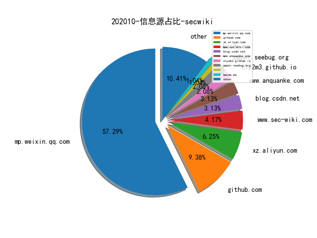
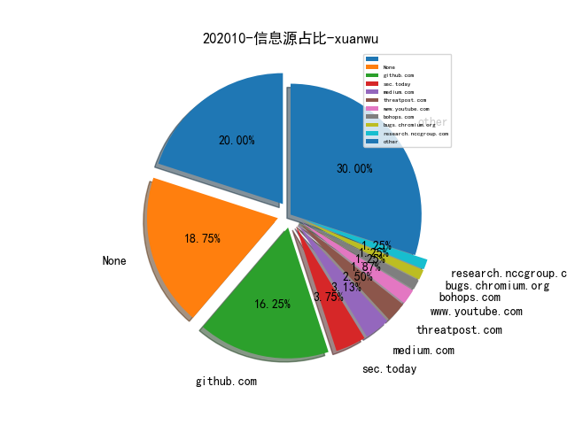
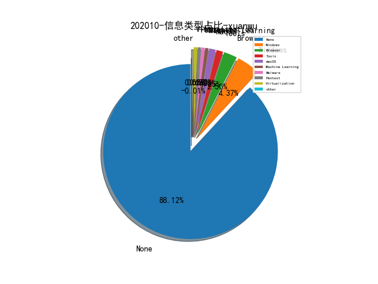
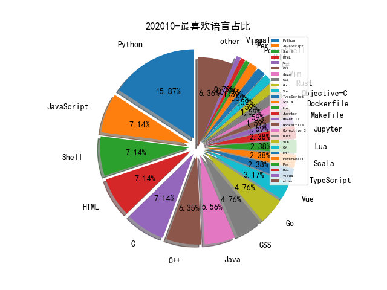

# [数据--所有](README_20.md)
# [数据--年度](README_2020.md)
# 202010 信息源与信息类型占比

# 微信公众号 推荐
| nickname_english | weixin_no | title | url| 
| --- | --- | --- | ---| 
| Fintech 安全之路 | gh_763c23cd3870 | 银行业安全运营平台的建设与思考 | https://mp.weixin.qq.com/s/UncU7f92p5Mlxt353Galrg | 1| 
| 360威胁情报中心 | CoreSec360 | 北非狐（APT-C-44）攻击活动揭露 | https://mp.weixin.qq.com/s/gWOIRNPLVqX761LW8x-S5g | 1| 
| vivo千镜安全实验室 | gh_54ff3f871510 | 软件源码安全攻防之道（下） | https://mp.weixin.qq.com/s/7HAVA0DgtxlCnD21aiq_mQ | 1| 
| 网络安全观 | SecurityInsights | 美国网络安全 , 将风险评估结果映射到ATT&CK框架 | https://mp.weixin.qq.com/s/DZF4HwX4xuedpqoAFyhw5w | 1| 
| Datawhale | Datawhale | 图解Transformer（完整版）！ | https://mp.weixin.qq.com/s/cJqhESxTMy5cfj0EXh9s4w | 2| 
| nmask | nmask-article | bypass安全狗 sql注入与xss | https://mp.weixin.qq.com/s/LAzIrJXV3pUkSabkoQl1Ag | 1| 
| 中国保密协会科学技术分会 | gh_be4f21d557c0 | 移动目标防御技术 | https://mp.weixin.qq.com/s/M9buBsx9rs3aB9Ckzzudpw | 2| 
| 国际电子战 | EW21cn | 欧洲反无人机系统的发展 | https://mp.weixin.qq.com/s/Hau6h-_HoMjFIzdi0YbLKA | 1| 
| 安世加 | asjeiss | 技术干货 , “红蓝对抗”在金融业网络安全建设中的实践与思考 | https://mp.weixin.qq.com/s/AVOLACnMJIt0Sgx-hsWXYA | 1| 
| 技术琐话 | TheoryPractice | 谷歌开源内部代码评审规范 | https://mp.weixin.qq.com/s/8vPXLxzD1iZ8E_emhruSHQ | 1| 
| 百度安全 | BaiduSD00 | 用友GRP-U8任意SQL语句执行漏洞分析 | https://mp.weixin.qq.com/s/FliS-RfLAL0mtnODGyBh1Q | 1| 
| 网安寻路人 | DataProtection101 | 中国个人信息保护立法 , 《个人信息保护法(草案)》与GDPR的比较 | https://mp.weixin.qq.com/s/4n3lYjzPRSbjIsPqzyDDmQ | 1| 
| 潇湘信安 | xxxasec | Metasploit内网使用三种方法 | https://mp.weixin.qq.com/s/Pvq5D9I1FchnfR2uPUcPAw | 12| 
| 电驭叛客 | gh_141164bf887e | 微服务架构下的越权风险 | https://mp.weixin.qq.com/s/0vK2q1EEaDR-zsQbFKi4PQ | 1| 
| 360天枢智库 | gh_b3c796a6a82c | 揭秘全球网络安全防护最高水准：美国国防部信息网DODIN | https://mp.weixin.qq.com/s/m4wvjk2w5J2ZrWcJhHdQNw | 1| 
| 专注安管平台 | gh_48603b9bb05a | Gartner2020年十大安全项目详解 | https://mp.weixin.qq.com/s/yuNalHkhcJJIPNE4QjG_aw | 1| 
| 嘶吼专业版 | Pro4hou | 护网行动中的安全产品优化 | https://mp.weixin.qq.com/s/87N-Bvveqr9mQ4i1ibPCgg | 2| 
| 锦行信息安全 | jeeseensec | 安全技术 , 域渗透之SPN | https://mp.weixin.qq.com/s/aQqvo4l7XZCfirsrJxJg4w | 1| 
| 看雪学院 | ikanxue | 最右sign-v2签名算法追踪及逆向还原 | https://mp.weixin.qq.com/s/5hmsU_CNGp7habqwSVVckg | 1| 
| GobySec | gobysec | 技术分享 , 自定义漏洞之EXP | https://mp.weixin.qq.com/s/J1JW66Uh_6Nc0x2YY_5V6Q | 2| 
| 腾讯代码安全检查Xcheck | gh_177b81103e8d | Xcheck之Golang安全检查引擎 | https://mp.weixin.qq.com/s/VzjcXp3O8zc97aIppy4LUA | 1| 
| 酒仙桥六号部队 | anfu-360 | 追击黑手画像 | https://mp.weixin.qq.com/s/rPu9HL5lvjcxfkUUUfEMFw | 1| 
| 携程技术 | ctriptech | 干货 , IAST安全测试如何防止数据污染 | https://mp.weixin.qq.com/s/VeUscKDI0o1jL9uDYywgow | 1| 
| FreeBuf | freebuf | Nautilus：一款基于语法的反馈式模糊测试工具 | https://mp.weixin.qq.com/s/LrSFAX_WQEPQQvhhOrXWgA | 2| 
| 丁爸 情报分析师的工具箱 | dingba2016 | 【开源工具】电报（telegram）开源情报工具及技巧 | https://mp.weixin.qq.com/s/9HLP4Gcgo0yx3WVB-odK9A | 1| 
| 安全牛 | aqniu-wx | 从RSA创新沙盒决赛产品ShiftLeft浅谈DevSecOps | https://mp.weixin.qq.com/s/WyxhX4tuMOSBCF1R9obLKg | 1| 
| 腾讯安全应急响应中心 | tsrc_team | 浅谈大规模红蓝对抗攻与防 | https://mp.weixin.qq.com/s/s0osF1NCb8M6O-uq-8idPA | 1| 
| Netlab 三六零 | Netlab_360 | HEH Botnet, 一个处于开发阶段的 IoT P2P Botnet | https://mp.weixin.qq.com/s/W_13W6rMQnBtZvPQwzDk2g | 1| 
| PaperWeekly | paperweekly | 基于异质图神经网络的未知恶意程序检测 | https://mp.weixin.qq.com/s/OgEoKWiAsV_2obPlsYNUMg | 1| 
| 极光无限 | AuroraInfinity | 使用fuzzilli对Javascript引擎QuickJS进行Fuzzing和漏洞分析 | https://mp.weixin.qq.com/s/KCbgZAaEWT236hN44MMEiw | 1| 
| 湛卢工作室 | xuehao_studio | ZeroLogon(CVE-2020-1472) 分析与狩猎 | https://mp.weixin.qq.com/s/Z0aXYBJiJnIkcr12A_jeuQ | 1| 
| ACTBIGDATA | ACTBIGDATA | ML CLUB , 面向图数据的异常检测综述概述 | https://mp.weixin.qq.com/s/WBxmr_hCOVUbSk15ZPWsjw | 1| 
| 漏洞战争 | vulwar | 2020年IDA插件大赛：DynDataResolver夺冠 | https://mp.weixin.qq.com/s/NAE7OR-7Qq5977XHQ9DZTg | 1| 
| 信息安全与通信保密杂志社 | cismag2013 | 从美国顶尖信息技术咨询公司博思艾伦报告看俄罗斯网络作战 | https://mp.weixin.qq.com/s/aq7mFjsz_sT8JqWFHRSwHQ | 1| 
| 枫林晚安全 | galesec | [更新]渗透环境标准化 | https://mp.weixin.qq.com/s/A5E2VRYg7R1LrLrCpiGYAw | 1| 

# 组织github账号 推荐
| github_id | title | url | org_url | org_profile | org_geo | org_repositories | org_people | org_projects | repo_lang | repo_star | repo_forks| 
| --- | --- | --- | --- | --- | --- | --- | --- | --- | --- | --- | ---| 

# 私人github账号 推荐
| github_id | title | url | p_url | p_profile | p_loc | p_company | p_repositories | p_projects | p_stars | p_followers | p_following | repo_lang | repo_star | repo_forks | 
| --- | --- | --- | --- | --- | --- | --- | --- | --- | --- | --- | --- | --- | --- | ---| 
| 0neb1n | PoC of CVE-2020-16947 (Microsoft Outlook RCE vulnerablility) | https://github.com/0neb1n/CVE-2020-16947 | None | I wanner be the pwner. | None | None | 11 | 0 | 0 | 0 | 0 | Lua,CSS | 23 | 14 | 1| 
| D00MFist | 与 JXA 有关的用于实现 macOS 系统攻击常驻的方法收集 | https://github.com/D00MFist/PersistentJXA | https://medium.com/@D00MFist |  | None | None | 30 | 0 | 0 | 0 | 0 | Shell,Jupyter,JavaScript,Visual,Go,CSS | 109 | 10 | 1| 
| DependencyTrack | DependencyTrack: 开源软件成分分析平台 | https://github.com/DependencyTrack/dependency-track | None | None | None | None | 0 | 0 | 0 | 0 | 0 | Vue,Java,JavaScript,CSS | 595 | 192 | 1| 
| HerrSpace | CCNA学习总结目录表。 | https://github.com/HerrSpace/CCNA-Cheat-Sheet | https://noot.geheim.org |  | Hamburg, Germany, Earth | None | 34 | 0 | 0 | 0 | 0 | Python,Ruby,HTML,JavaScript,Shell | 59 | 25 | 1| 
| NeatMonster | SlabDbg - 用于辅助调试 Linux 内核 SLUB 内存管理的脚本 | https://github.com/NeatMonster/slabdbg | https://neat.sh/ | well now I am not doing it https://twitter.com/NeatMonster_ | Toulouse, France | None | 17 | 0 | 0 | 0 | 0 | Python,Java | 558 | 81 | 1| 
| WebKit | WebKit 引入 JIT-Caging 特性实现细粒度的 PAC 保护机制 | https://github.com/WebKit/webkit/commit/2ffeeff4dfb86a74ae695dea8671fccc423559ad | None | None | None | None | 0 | 0 | 0 | 0 | 0 | Makefile | 0 | 0 | 1| 
| checkra1n | 基于 checkra1n 越狱实现的 Pre-Boot 执行环境 | https://github.com/checkra1n/pongoOS | None | None | None | None | 0 | 0 | 0 | 0 | 0 | Objective-C | 0 | 0 | 1| 
| coreruleset | OWASP ModSecurity核心规则集（CRS）资源合集。 | https://github.com/coreruleset/coreruleset | None | None | None | None | 0 | 0 | 0 | 0 | 0 | Python,Shell,Dockerfile,Perl | 0 | 0 | 1| 
| crowdsecurity | Crowdsec - 一款开源的终端安全检测产品 | https://github.com/crowdsecurity/crowdsec | None | None | None | None | 0 | 0 | 0 | 0 | 0 | Go,Lua,Shell,PHP | 294 | 18 | 1| 
| e-m-b-a | emba - 用于分析基于 Linux 的嵌入设备的固件的工具 | https://github.com/e-m-b-a/emba | None | None | None | None | 0 | 0 | 0 | 0 | 0 | Shell,OCaml,Roff | 27 | 5 | 1| 
| ioncodes | 绕过 NTFS 的文件权限限制，实现任意文件读漏洞（CVE-2020-16938） | https://github.com/ioncodes/CVE-2020-16938 | https://twitter.com/layle_ctf | Hacker in the streets, reverse engineer in the sheets. Thats how it works, right? | Here | None | 272 | 0 | 0 | 0 | 0 | Python,C#,C,CSS,C++ | 624 | 74 | 1| 
| knownsec | ksubdomain: 无状态子域名爆破工具 | https://github.com/knownsec/ksubdomain | None | None | None | None | 0 | 0 | 0 | 0 | 0 | Go,Python,JavaScript | 0 | 0 | 1| 
| kov4l3nko | MEDUZA - 基于 Frida，针对越狱 iOS 系统编写的 SSL unpinning 工具 | https://github.com/kov4l3nko/MEDUZA | https://kov4l3nko.github.io/about/ | iOS/Android reverse engineer and security researcher | The country where cyberpunk won | None | 7 | 0 | 0 | 0 | 0 | Python,JavaScript,Java,HTML | 99 | 14 | 1| 
| lgandx | LLMNR/NBT-NS/mDNS 协议攻击工具 Responder 更新 3.0.2.0 版本 | https://github.com/lgandx/Responder/releases/tag/v3.0.2.0 | https://g-laurent.blogspot.com |  | None | None | 5 | 0 | 0 | 0 | 0 | Python | 2300 | 382 | 1| 
| light8lee | 2019 BDCI互联网金融新实体发现 | https://github.com/light8lee/2019-BDCI-FinancialEntityDiscovery | None |  | HITSZ | None | 16 | 0 | 0 | 0 | 0 | Python,QML,Vim | 15 | 1 | 1| 
| lpereira | HardInfos是Linux操作系统检测到大多数软件与硬件的开源项目。 | https://github.com/lpereira/hardinfo | https://github.com/microsoft |  | Seattle, WA | @microsoft | 74 | 0 | 0 | 0 | 0 | Go,C | 5300 | 2300 | 1| 
| microsoft | 微软 MSRC 对 CHERI ISA 内存保护机制的介绍 | https://github.com/microsoft/MSRC-Security-Research/blob/master/papers/2020/Security%20analysis%20of%20CHERI%20ISA.pdf | None | None | None | None | 0 | 0 | 0 | 0 | 0 | TypeScript,Jupyter,Scala,C#,JavaScript,C++,Python,HTML,Go,Rust | 0 | 0 | 1| 
| momosecurity | momo-code-sec-inspector-java: IDEA静态代码安全审计插件 | https://github.com/momosecurity/momo-code-sec-inspector-java | None | None | None | None | 0 | 0 | 0 | 0 | 0 | Python,TypeScript,Vue,Java,PHP | 0 | 0 | 1| 
| netzob | Netzob：用于协议逆向工程，建模与模糊测试项目脚本工具。 | https://github.com/netzob/netzob | None | None | None | None | 0 | 0 | 0 | 0 | 0 | Python | 0 | 0 | 1| 
| pacman128 | PC汇编语言书籍资源包。 | https://github.com/pacman128/pcasm | None |  | None | None | 4 | 0 | 0 | 0 | 0 | TeX,Python,C++,CSS | 90 | 20 | 1| 
| patois | 在 IDA Hexrays AST 级别搜索代码特征的工具 | https://github.com/patois/HexraysToolbox | https://twitter.com/pat0is | Yo, was github? | 127.0.0.1 | None | 43 | 0 | 0 | 0 | 0 | Python | 357 | 65 | 1| 
| r00tSe7en | Mail-Probe: 邮箱探针后台管理系统 | https://github.com/r00tSe7en/Mail-Probe | https://www.se7ensec.cn/ | One China | China | NULL | 27 | 0 | 0 | 0 | 0 | Shell,HTML,PowerShell | 5 | 3 | 1| 
| ray-cp | JSC JS 引擎 CVE-2020-9802 漏洞的 Exploit 代码 | https://github.com/ray-cp/browser_pwn/tree/master/jsc_pwn/cve-2020-9802 | https://ray-cp.github.io | DONT STOP UNTIL YOURE PROUD | None | None | 18 | 0 | 0 | 0 | 0 | Python,C,C++ | 263 | 73 | 1| 
| saeidshirazi | Awesome Android Security GitHub Repo | https://github.com/saeidshirazi/awesome-android-security | None | Cyber Security Researcher | canada | None | 22 | 0 | 0 | 0 | 0 | Python,CSS | 194 | 19 | 1| 
| tenable | 用于从 IDL 接口文件中提取 RPC 接口定义的 IDA 插件 | https://github.com/tenable/mIDA | None | None | None | None | 0 | 0 | 0 | 0 | 0 | Java,Scala,Python,C++,Vim,HTML | 311 | 116 | 1| 
| theLSA | burpsuite插件：未授权访问漏洞检测 | https://github.com/theLSA/burp-unauth-checker | https://www.lsablog.com | Cyber Security , BugHunter , Penestration , Emergency Response , Programmer , CTF | China | None | 45 | 0 | 0 | 0 | 0 | Python,Java | 341 | 98 | 1| 
| wireapp | 桌面版本 Wire 应用因使用 Electron 不当导致 RCE 漏洞 | https://github.com/wireapp/wire-desktop/security/advisories/GHSA-5gpx-9976-ggpm | None | None | None | None | 0 | 0 | 0 | 0 | 0 | Groovy,C,TypeScript,Java,HTML,Scala,JavaScript,Shell,Objective-C,Haskell,Swift,HCL | 2900 | 516 | 1| 
| x1tan | 用Rust编写的具有串行日志记录和调试支持的UEFI运行时驱动程序项目。 | https://github.com/x1tan/rust-uefi-runtime-driver | https://xitan.me | hypervisors, reverse engineering | None | None | 22 | 0 | 0 | 0 | 0 | Python,Rust | 29 | 6 | 1| 
| xiaoweiChen | 《Professional CMake - A Practical Guide》的中文翻译版资源。 | https://github.com/xiaoweiChen/Professional-CMake | None | Coder | China, Zhejiang, Hangzhou | None | 32 | 0 | 0 | 0 | 0 | JavaScript,C++ | 1300 | 447 | 1| 
| yifengyou | QEMU KVM学习笔记. | https://github.com/yifengyou/learn-kvm | https://github.com/yifengyou | 一天不科研，浑身都难受~ | ShenZhen | Tencent | 262 | 0 | 0 | 0 | 0 | C | 328 | 97 | 1| 

# medium_xuanwu 推荐
| title | url| 
| --- | ---| 
| How I got hacked, lost crypto and what it says about Apple’s security. Part 1 | http://ksaitor.medium.com/how-i-got-hacked-lost-crypto-and-what-it-says-about-apples-security-part-1-83c107beae9| 
| IBM QRadar Java 反序列化漏洞分析（CVE-2020–4280） | http://medium.com/@testbnull/cve-2020-4280-ibm-qradar-java-deserialization-anlysis-and-bypass-c3fe57207057| 
| AssaultCube 射击游戏 RCE 漏洞分析 | http://medium.com/@elongl/assaultcube-rce-technical-analysis-e12dedf680e5| 
| Hacking HTTP CORS from inside out | http://medium.com/bugbountywriteup/hacking-http-cors-from-inside-out-512cb125c528| 
| Running JXA Payloads from macOS Office Macros | http://medium.com/red-teaming-with-a-blue-team-mentaility/a-look-at-python-less-office-macros-for-macos-b1bf5c1488f1| 
| Windows rundll32.exe 进程的深入分析 | http://medium.com/@nasbench/a-deep-dive-into-rundll32-exe-642344b41e90| 

# medium_secwiki 推荐
| title | url| 
| --- | ---| 

# zhihu_xuanwu 推荐
| title | url| 
| --- | ---| 

# zhihu_secwiki 推荐
| title | url| 
| --- | ---| 
| 万字长文——信息安全职业生涯规划 | https://zhuanlan.zhihu.com/p/250905301| 

# xz_xuanwu 推荐
| title | url| 
| --- | ---| 

# xz_secwiki 推荐
| title | url| 
| --- | ---| 
| 一次简单的内网渗透靶场实验 | https://xz.aliyun.com/t/8394| 
| 利用不安全的JSONP绕过SSO实现账户接管（分析+实践） | https://xz.aliyun.com/t/8350| 
| Pickle反序列化源码分析与漏洞利用 | https://xz.aliyun.com/t/8342| 
| 《透视APT》读书笔记 | https://xz.aliyun.com/t/8335| 

# 日更新程序
`python update_daily.py`