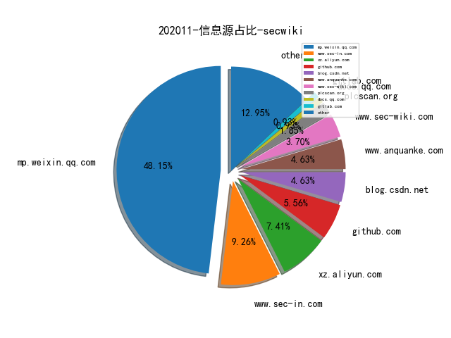
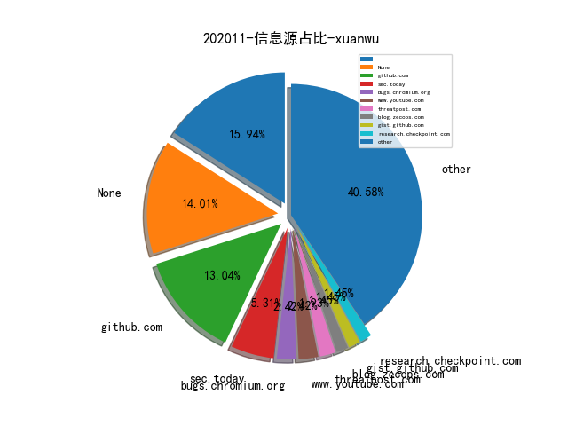
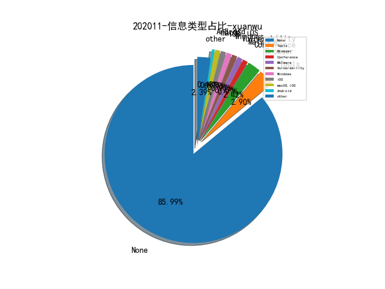

# [数据--所有](README_20.md)
# [数据--年度](README_2020.md)
# 202011 信息源与信息类型占比

# 微信公众号 推荐
| nickname_english | weixin_no | title | url| 
| --- | --- | --- | ---| 
| 法制天平 | g_780216 | 帮助信息网络犯罪活动罪案例汇总 | https://mp.weixin.qq.com/s/RlFD6H-_4j5g2R49IE9ghw | 1| 
| 安全先师 | gh_d61f62dd440d | 蜜罐调研与内网安全 | https://mp.weixin.qq.com/s/-lJT3PNsj-VvMxalHb06AA | 1| 
| 爱奇艺技术产品团队 | iQIYI-TP | 开源 , HMGNN：异构小图神经网络及其在拉新裂变风控场景的应用 | https://mp.weixin.qq.com/s/VRDOQsEdA-QfNRtKQCSjUA | 1| 
| 锦行信息安全 | jeeseensec | 技术文章 , windows横向渗透中的令牌完整性限制 | https://mp.weixin.qq.com/s/idzRDjcQDPdiAd4dnJQs0w | 1| 
| 安全学术圈 | secquan | 安全学术研究趋势分析 | https://mp.weixin.qq.com/s/UKBhg_tnYIPI6uzuPYn59A | 1| 
| 腾讯科恩实验室 | KeenSecurityLab | 科恩实验室最新NeurIPS-2020论文解读：基于跨模态检索的二进制代码-源代码匹配 | https://mp.weixin.qq.com/s/fvnvh25VaHgproPvVT6LDg | 1| 
| nmask | nmask-article | 黑客诱捕器—蜜罐的部署与使用 | https://mp.weixin.qq.com/s/TPb3E1fRszdEwp6Yyn8mQw | 1| 
| 潇湘信安 | xxxasec | 谷歌浏览器插件推荐 - 日常使用篇 | https://mp.weixin.qq.com/s/uj3tWDlS9WaYKSc1xDQkAQ | 6| 
| 嘶吼专业版 | Pro4hou | 安全运营之攻击溯源 | https://mp.weixin.qq.com/s/9Yx4gK5-7CbP9Aqy-twpVw | 1| 
| 梦之光芒的电子梦 | monyer_mp | 人生是一个回环 —— 我的十年安全工作总结 | https://mp.weixin.qq.com/s/OiBtKzKaWuzVvBGO_rwC5A | 1| 
| 绿盟科技研究通讯 | nsfocus_research | Serverless安全研究 — Serverless安全风险 | https://mp.weixin.qq.com/s/rbS0_42RBiFu8UFFQW4kew | 1| 
| 赛博星人 | cyberspace_666 | 红蓝对抗之内网中psexec的行为捕获 | https://mp.weixin.qq.com/s/G7Gdb_gXNn5FAR78Edps-w | 1| 
| Coggle数据科学 | gh_8df601c10cb4 | 蚂蚁金服-支付风险识别亚军方案 | https://mp.weixin.qq.com/s/5NNTeLvqWl0_SQaPl-Cvug | 1| 
| 网络安全观 | SecurityInsights | CrowdStrike , 无文件攻击白皮书 | https://mp.weixin.qq.com/s/0jMTOKsvV9q7_0Gz04veHg | 1| 
| 腾讯代码安全检查Xcheck | gh_177b81103e8d | Xcheck之Java安全检查引擎 | https://mp.weixin.qq.com/s/rb1BfcZeCTr2PIiypXqVjw | 1| 

# 组织github账号 推荐
| github_id | title | url | org_url | org_profile | org_geo | org_repositories | org_people | org_projects | repo_lang | repo_star | repo_forks| 
| --- | --- | --- | --- | --- | --- | --- | --- | --- | --- | --- | ---| 

# 私人github账号 推荐
| github_id | title | url | p_url | p_profile | p_loc | p_company | p_repositories | p_projects | p_stars | p_followers | p_following | repo_lang | repo_star | repo_forks | 
| --- | --- | --- | --- | --- | --- | --- | --- | --- | --- | --- | --- | --- | --- | ---| 
| 3v4Si0N | HTTP-revshell: 用于Red team练习和渗透测试者的Powershell脚本工具，通过HTTP/S协议反向链接。 | https://github.com/3v4Si0N/HTTP-revshell | None | Security Analyst at @Deloitte | Spain | https://twitter.com/3v4Si0N | 10 | 0 | 0 | 0 | 0 | Python,C,PowerShell | 205 | 29 | 1| 
| Ch1ngg | JCE - JSP/JPSX CodeEncode - 用于 Webshell 逃避静态查杀的辅... | https://github.com/Ch1ngg/JCE | https://www.ch1ng.com/ |  | no | no | 24 | 0 | 0 | 0 | 0 | Python,C#,ASP,Java | 97 | 20 | 1| 
| MalPhobic | Abbadon 远控工具使用 Discord 作为 C&C | https://github.com/MalPhobic/MalwareReports/blob/main/AbbadonRAT/Abbadon_RAT.pdf | None | None | None | None | 0 | 0 | 0 | 0 | 0 |  | 0 | 0 | 1| 
| RedTeamPentesting | Apache Tomcat WebSocket 漏洞 (CVE-2020-13935) Exploit | https://github.com/RedTeamPentesting/CVE-2020-13935 | None | None | None | None | 0 | 0 | 0 | 0 | 0 | Go | 0 | 0 | 1| 
| Sentinel-One | 基于 Qiling 框架实现的 UEFI NVRAM 变量 Fuzzer | https://github.com/Sentinel-One/efi_fuzz | None | None | None | None | 0 | 0 | 0 | 0 | 0 | C,TypeScript,Java,Python,JavaScript,C++,C#,Objective-C,HTML,Shell | 0 | 0 | 1| 
| didi | Sharingan是一个基于go语言编写的流量录制回放工具，合项目重构、回归测试等。 | https://github.com/didi/sharingan | None | None | None | None | 0 | 0 | 0 | 0 | 0 | C,Vue,Java,Python,Kotlin,JavaScript,C++,TypeScript,Objective-C,HTML,Go,CSS | 15800 | 2200 | 1| 
| google | C++语言接口基础（CLIF）知识介绍。 | https://github.com/google/clif | None | None | None | None | 0 | 0 | 0 | 0 | 0 | TypeScript,Java,Python,JavaScript,C++,Objective-C,Haskell,Starlark,Go,Jupyter | 0 | 0 | 1| 
| grimm-co | 为 Ghidra 二进制分析工具编写脚本，辅助还原 stripped 二进制内的结构体 | https://github.com/grimm-co/GEARSHIFT | None | None | None | None | 0 | 0 | 0 | 0 | 0 | C,Shell,Java,Python,C++,Go | 0 | 0 | 1| 
| kwart | jd-cli:是对Java Decompiler反编译器项目命令软件包，可在win与Linux运行使用。 | https://github.com/kwart/jd-cli | http://javlog.cacek.cz/ |  | Czech Republic | Contractor | 73 | 0 | 0 | 0 | 0 | Shell,Java | 318 | 80 | 1| 
| marcinguy | Chrome 浏览器 Freetype 字体处理溢出漏洞 PoC（CVE-2020-15999） | https://github.com/marcinguy/CVE-2020-15999// | https://twitter.com/marcinguy | IT | Berlin, Germany | None | 58 | 0 | 0 | 0 | 0 | Python,C | 310 | 97 | 1| 
| mq1n | 一个可以借助有物理内存读写权限的驱动实现调用任意内核函数的库。 | https://github.com/mq1n/VDM// | None |  | Turkey | None | 1200 | 0 | 0 | 0 | 0 | C++ | 178 | 100 | 1| 
| nghiadt1098 | Windows 内核 CVE-2020-16889 漏洞的 PoC | https://github.com/nghiadt1098/MyResearch/tree/main/CVE-2020-16889 | https://www.facebook.com/nghiadt1098 | Viettel Cyber Security | Ha Noi, Viet Nam | None | 31 | 0 | 0 | 0 | 0 | Java,Python,JavaScript,C++,Pascal,HTML | 0 | 2 | 1| 
| shellphish | Shellphish 最近更新了 how2heap Repo，包含最新的各类堆利用技巧 | https://github.com/shellphish/how2heap | None | None | None | None | 0 | 0 | 0 | 0 | 0 | Python,C,CSS | 4100 | 855 | 1| 
| target | halogen: Automatically create YARA rules from malicious do... | https://github.com/target/halogen | None | None | None | None | 0 | 0 | 0 | 0 | 0 | Shell,FreeMarker,Scala,Python,JavaScript,C++,Haskell,CSS,Go,Ruby,Rust | 1100 | 101 | 1| 

# medium_xuanwu 推荐
| title | url| 
| --- | ---| 
| TP-Link Takeover with a Flash Drive | http://medium.com/tenable-techblog/tp-link-takeover-with-a-flash-drive-d493666f6b39| 
| A Deep Dive Into Windows Scheduled Tasks and The Processes Running Them | http://nasbench.medium.com/a-deep-dive-into-windows-scheduled-tasks-and-the-processes-running-them-218d1eed4cce| 

# medium_secwiki 推荐
| title | url| 
| --- | ---| 

# zhihu_xuanwu 推荐
| title | url| 
| --- | ---| 

# zhihu_secwiki 推荐
| title | url| 
| --- | ---| 

# xz_xuanwu 推荐
| title | url| 
| --- | ---| 

# xz_secwiki 推荐
| title | url| 
| --- | ---| 
| 云上渗透-RDS数据库攻防 | https://xz.aliyun.com/t/8451| 
| XSS 实战攻击思路总结 | https://xz.aliyun.com/t/8459| 

# 日更新程序
`python update_daily.py`