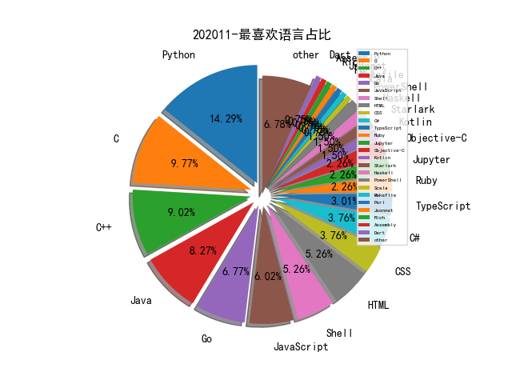

# [数据--所有](README_20.md)
# [数据--年度](README_2020.md)
# 202011 信息源与信息类型占比

# 微信公众号 推荐
| nickname_english | weixin_no | title | url| 
| --- | --- | --- | ---| 
| Coggle数据科学 | gh_8df601c10cb4 | 蚂蚁金服-支付风险识别亚军方案 | https://mp.weixin.qq.com/s/5NNTeLvqWl0_SQaPl-Cvug | 1| 
| 潇湘信安 | xxxasec | 站库分离常规渗透思路总结 | https://mp.weixin.qq.com/s/nLSCP6xOyYnsdULO7h9cgA | 1| 
| 网络安全观 | SecurityInsights | CrowdStrike , 无文件攻击白皮书 | https://mp.weixin.qq.com/s/0jMTOKsvV9q7_0Gz04veHg | 1| 
| 腾讯代码安全检查Xcheck | gh_177b81103e8d | Xcheck之Java安全检查引擎 | https://mp.weixin.qq.com/s/rb1BfcZeCTr2PIiypXqVjw | 1| 

# 组织github账号 推荐
| github_id | title | url | org_url | org_profile | org_geo | org_repositories | org_people | org_projects | repo_lang | repo_star | repo_forks| 
| --- | --- | --- | --- | --- | --- | --- | --- | --- | --- | --- | ---| 

# 私人github账号 推荐
| github_id | title | url | p_url | p_profile | p_loc | p_company | p_repositories | p_projects | p_stars | p_followers | p_following | repo_lang | repo_star | repo_forks | 
| --- | --- | --- | --- | --- | --- | --- | --- | --- | --- | --- | --- | --- | --- | ---| 
| MalPhobic | Abbadon 远控工具使用 Discord 作为 C&C | https://github.com/MalPhobic/MalwareReports/blob/main/AbbadonRAT/Abbadon_RAT.pdf | None | None | None | None | 0 | 0 | 0 | 0 | 0 |  | 0 | 0 | 1| 
| Sentinel-One | 基于 Qiling 框架实现的 UEFI NVRAM 变量 Fuzzer | https://github.com/Sentinel-One/efi_fuzz | None | None | None | None | 0 | 0 | 0 | 0 | 0 | C,TypeScript,Java,Python,JavaScript,C++,C#,Objective-C,HTML,Shell | 0 | 0 | 1| 
| nghiadt1098 | Windows 内核 CVE-2020-16889 漏洞的 PoC | https://github.com/nghiadt1098/MyResearch/tree/main/CVE-2020-16889 | https://www.facebook.com/nghiadt1098 | Viettel Cyber Security | Ha Noi, Viet Nam | None | 31 | 0 | 0 | 0 | 0 | Java,Python,JavaScript,C++,Pascal,HTML | 0 | 2 | 1| 
| target | halogen: Automatically create YARA rules from malicious do... | https://github.com/target/halogen | None | None | None | None | 0 | 0 | 0 | 0 | 0 | Shell,FreeMarker,Scala,Python,JavaScript,C++,Haskell,CSS,Go,Ruby,Rust | 1100 | 101 | 1| 

# medium_xuanwu 推荐
| title | url| 
| --- | ---| 

# medium_secwiki 推荐
| title | url| 
| --- | ---| 

# zhihu_xuanwu 推荐
| title | url| 
| --- | ---| 

# zhihu_secwiki 推荐
| title | url| 
| --- | ---| 

# xz_xuanwu 推荐
| title | url| 
| --- | ---| 

# xz_secwiki 推荐
| title | url| 
| --- | ---| 

# 日更新程序
`python update_daily.py`