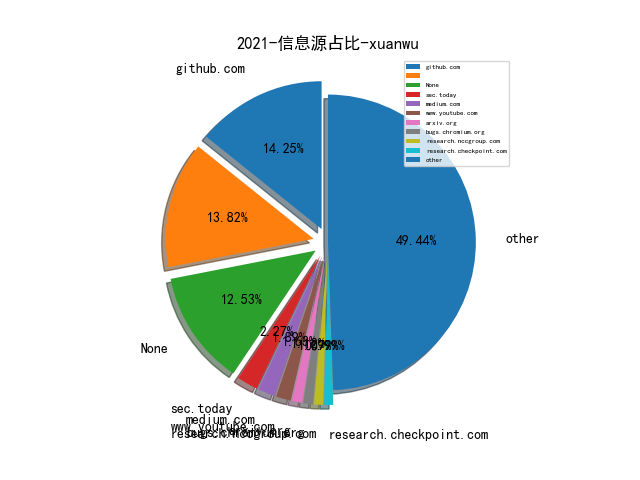
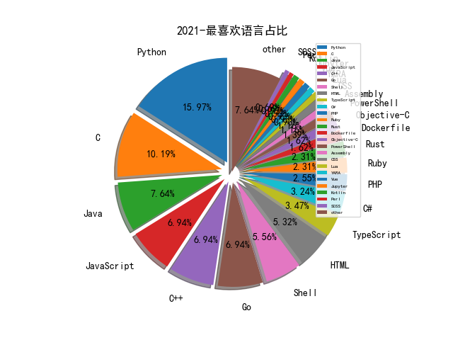

# [数据--所有](README_20.md)
# [数据--年度](README_2021.md)
# 2021 信息源与信息类型占比

# 微信公众号 推荐
| nickname_english | weixin_no | title | url| 
| --- | --- | --- | ---| 
| ChaMd5安全团队 | chamd5sec | 浅谈Mysql蜜罐识别 | https://mp.weixin.qq.com/s/f30RvhYlB97dXnjzv4_H_Q | 2| 
| 时间之外沉浮事 | tasnrh | 网空靶场：从炒作到现实-2020 | https://mp.weixin.qq.com/s/zu2Je_A_x06k78tzrXyjbg | 1| 

# 组织github账号 推荐
| github_id | title | url | org_url | org_profile | org_geo | org_repositories | org_people | org_projects | repo_lang | repo_star | repo_forks| 
| --- | --- | --- | --- | --- | --- | --- | --- | --- | --- | --- | ---| 

# 私人github账号 推荐
| github_id | title | url | p_url | p_profile | p_loc | p_company | p_repositories | p_projects | p_stars | p_followers | p_following | repo_lang | repo_star | repo_forks | 
| --- | --- | --- | --- | --- | --- | --- | --- | --- | --- | --- | --- | --- | --- | ---| 
| coodyer | fire_vulnerability_scanner: 一款http协议的漏洞扫描框架 | https://github.com/coodyer/fire_vulnerability_scanner | None |  | https://avatars3.githubusercontent.com/u/21119116?v=3&u=29f095a5e89411d5ca4cc7509c406280f095e658&s=400 | None | 19 | 0 | 0 | 0 | 0 | C#,Java | 27 | 10 | 1| 

# medium_xuanwu 推荐
| title | url| 
| --- | ---| 

# medium_secwiki 推荐
| title | url| 
| --- | ---| 

# zhihu_xuanwu 推荐
| title | url| 
| --- | ---| 

# zhihu_secwiki 推荐
| title | url| 
| --- | ---| 

# xz_xuanwu 推荐
| title | url| 
| --- | ---| 

# xz_secwiki 推荐
| title | url| 
| --- | ---| 

# 日更新程序
`python update_daily.py`