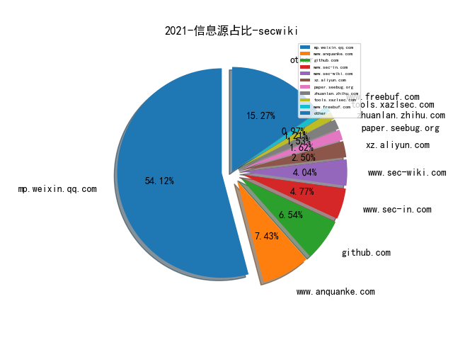
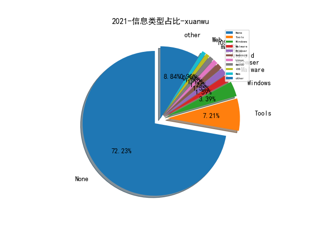

# [数据--所有](README_20.md)
# [数据--年度](README_2021.md)
# 2021 信息源与信息类型占比

# 微信公众号 推荐
| nickname_english | weixin_no | title | url| 
| --- | --- | --- | ---| 
| 阿里云应急响应 | gh_12f3517e40de | 【漏洞分析】Oracle MySQL JDBC XXE漏洞（CVE-2021-2471） | https://mp.weixin.qq.com/s/erIFMiPNB2XSBJSqXyxuKg | 1| 
| 星阑科技 | StarCrossCN | 【技术干货】Black Hat USA2021上CVE-2020-6537的分析 | https://mp.weixin.qq.com/s/mdMlS1Dk8k0-A1DqpitG_A | 1| 
| Docker中文社区 | dockerchina | 一文详解 Kubernetes 的自动化部署实践 | https://mp.weixin.qq.com/s?__biz=MzI1NzI5NDM4Mw==&mid=2247488003&idx=1&sn=996fbb2c562d6a875a48c00ce1cfaf33 | 1| 
| 雷神众测 | bounty_team | 恶意样本分析精要及实践9-IDA使用（二） | https://mp.weixin.qq.com/s?__biz=MzI0NzEwOTM0MA==&mid=2652494687&idx=1&sn=1c632712e407f88e8dac2fbc2a934720 | 2| 
| 疯猫网络 | iloscat | 【#小白的学习进阶之路-权限维持】影子用户的创建与利用 | https://mp.weixin.qq.com/s?__biz=MzIyMzE5NTQ3Ng==&mid=2650621155&idx=1&sn=af30565e67efdd987df5dadba130ab31 | 4| 
| 宸极实验室 | ChenJiLab | 『代码审计』我在CNVD捡1Day的日子 | https://mp.weixin.qq.com/s?__biz=Mzg4NTA0MzgxNQ==&mid=2247485114&idx=1&sn=528728998d305c31c2f3290b7e9aa663 | 2| 
| 学安全在路上 | gh_c40eb977b2c4 | 域内信息收集合集 | https://mp.weixin.qq.com/s?__biz=MzI3MjI0NDEzMg==&mid=2247484113&idx=1&sn=bdedcc53338c4f0ecf9f0fe9cccbce02 | 1| 
| 天禧信安 | txxa-385 | 审计｜通读审计之信呼OA | https://mp.weixin.qq.com/s?__biz=MzUyMTE0MDQ0OA==&mid=2247486211&idx=1&sn=64e305afb1fc6e88331dd62eb3af3ad3 | 2| 
| 云剑侠心 | yunjianxx | 审计｜通读审计之信呼OA（附原创漏洞） | https://mp.weixin.qq.com/s?__biz=MzkzMzEwNzIzNQ==&mid=2247494274&idx=1&sn=f53fb79415f91350102692eadf86ff70 | 1| 
| Ots安全 | AnQuan7 | 【漏洞利用】CVE-2021-40438 构建 POC | https://mp.weixin.qq.com/s?__biz=MzAxMjYyMzkwOA==&mid=2247493251&idx=1&sn=da8bb6b7999cbf73f4233c94bda3f50e | 3| 
| Linux学习 | LoveLinux1024 | 一文搞懂 , Linux 中的各种栈（进程栈 线程栈 内核栈 中断栈） | https://mp.weixin.qq.com/s?__biz=MzI4MDEwNzAzNg==&mid=2649455033&idx=2&sn=96f10aa1b2bbe74c9fac4cce91148628 | 1| 
| 鸿鹄实验室 | gh_a2210090ba3f | 利用S4u2self进行本地提权 | https://mp.weixin.qq.com/s?__biz=MzU0MjUxNjgyOQ==&mid=2247488920&idx=1&sn=694f938ffa3655e7e7d7e0562d2eed3f | 1| 
| 面具与甲虫 | gh_f524e5a0a1fb | 供应链安全—组件漏洞和合规治理 | https://mp.weixin.qq.com/s/VkwU_wOUKAhT0Ec7OZ5RBw | 1| 
| 腾讯安全威胁情报中心 | gh_05a6c5ec3f78 | Oracle WebLogic多个高危漏洞补丁公告，腾讯安全专家建议尽快升级修复 | https://mp.weixin.qq.com/s?__biz=MzI5ODk3OTM1Ng==&mid=2247499441&idx=1&sn=ca347841149c79790c173de24cb6ada4 | 1| 
| 特大牛 | ITtedaniu | 2021年中国信创产业研究报告（90页全本） | https://mp.weixin.qq.com/s/7-6d_IzuKr-1oFqvBEUBpQ | 1| 
| 山石网科安全技术研究院 | HSN_LAB | 2021广东强网杯｜MISC方向WP | https://mp.weixin.qq.com/s?__biz=MzUzMDUxNTE1Mw==&mid=2247490102&idx=1&sn=dd99ae07db66c6c6252d07fecb55f92f | 4| 
| 安恒信息应急响应中心 | gh_1c2b41c1abc7 | WebLogic Server 高危安全漏洞风险提示（10月） | https://mp.weixin.qq.com/s?__biz=MzUzOTE2OTM5Mg==&mid=2247486522&idx=1&sn=c90554ffcfb42a27c5bad417466cdc67 | 2| 
| 安全宇宙 | knownsec818 | 【创宇小课堂】Log4j反序列化漏洞分析 | https://mp.weixin.qq.com/s?__biz=MzAxMDc5NzYwNQ==&mid=2652409034&idx=1&sn=f3915bf16d9681a0a3b59fa6736e947c | 2| 
| 哈拉少安全小队 | gh_b273ce95df95 | 【实例学习反序列化漏洞】Typecho 反序列化漏洞详细分析 | https://mp.weixin.qq.com/s?__biz=MzAxNzkyOTgxMw==&mid=2247487664&idx=1&sn=3f21d2b8dc7e96e5216d21ee704cba08 | 2| 
| SecIN技术平台 | sec-in | 原创 , 内网渗透之隐藏隧道搭建（上） | https://mp.weixin.qq.com/s?__biz=MzI4Mzc0MTI0Mw==&mid=2247491420&idx=1&sn=f5869cab001209d84f14c586e79dd7d3 | 2| 
| Coggle数据科学 | gh_8df601c10cb4 | 竞赛总结：KDD Cup 2021 时序异常检测（附 Top1 至 Top7思路视频 ） | https://mp.weixin.qq.com/s/Jf7ckFpP7pqubOBN7OkgTQ | 1| 
| 鹏组安全 | Kris_Alex2 | 常见的Nginx配置错误原理分析及其危害 | https://mp.weixin.qq.com/s?__biz=Mzg5NDU3NDA3OQ==&mid=2247484453&idx=1&sn=38464a620459c412a0d1612938ae1fff | 1| 
| 运维帮 | yunweibang | 运维案例 , 一个DNS解析引发的“血案” | https://mp.weixin.qq.com/s?__biz=MzA3MzYwNjQ3NA==&mid=2651300847&idx=1&sn=a02baf081344cda753e3d3d7eac7c3d9 | 1| 
| 知道创宇 | knownsec | 知道创宇云监测—ScanV MAX更新：Apache httpd、Jenkins、Kibana等13个漏洞可监测 | https://mp.weixin.qq.com/s?__biz=MjM5NzA3Nzg2MA==&mid=2649855764&idx=2&sn=a232f625dacf428b9a92b2dcf4bd7c56 | 1| 
| 我不是Hacker | gh_aaed037e2267 | gunicorn 20.0.4 请求走私漏洞简析（含复现环境&Poc） | https://mp.weixin.qq.com/s?__biz=MzkwNDI1NDUwMQ==&mid=2247484615&idx=1&sn=eaa7715853c1466b5a7526d592ab614b&chksm=c088818df7ff089b0a2b899efdc4a7fe740e084a052a95bd81c1d93147f087378b4c67d2e481&token=87928276&lang=zh_CN#rd | 2| 
| 开源聚合网络空间安全研究院 | OSPtech_Cyberspace | 【思路解析】Druid未授权漏洞实战利用 | https://mp.weixin.qq.com/s?__biz=MzI4NTE4NDAyNA==&mid=2650389862&idx=1&sn=7ca65ca0e2710efe9daa5c4433b03b03 | 2| 
| 安全初心 | securityheart | 利用 RDP 协议搭建 Socks5 代理隧道 | https://mp.weixin.qq.com/s?__biz=MzU4NzU4MDg0Mw==&mid=2247486580&idx=1&sn=81f86f205a8127e6ec33a56dc86c173f | 1| 
| 代码卫士 | codesafe | Node.js 易受两个HTTP请求走私漏洞影响 | https://mp.weixin.qq.com/s?__biz=MzI2NTg4OTc5Nw==&mid=2247508413&idx=1&sn=0a9ef2abb46ffa5197f25a0be4c0f144 | 1| 
| 谢公子学安全 | xie_sec | shad0w原理分析 part 1 | https://mp.weixin.qq.com/s?__biz=MzI2NDQyNzg1OA==&mid=2247489473&idx=1&sn=6c9e71831e0e928d6cd817cc590e66d3 | 2| 
| 白帽子社区 | baimaoshequ | CS-Shellcode分析（一） | https://mp.weixin.qq.com/s?__biz=MzUyMTAyODYwNg==&mid=2247493778&idx=1&sn=d7b6b9a027413d8271ec1a069764147f | 1| 
| 猪猪谈安全 | zzt-anquan | 一次运气很好的文件上传 | https://mp.weixin.qq.com/s?__biz=MzIyMDAwMjkzNg==&mid=2247496333&idx=1&sn=28330342bb7c219c468ea26fb8d1cfd3 | 3| 
| i春秋 | icqedu | HTB靶场记录之Europa | https://mp.weixin.qq.com/s?__biz=MzUzNTkyODI0OA==&mid=2247506370&idx=1&sn=b88f7f5c46961d50df5c0dc798f5462c | 1| 
| V安全资讯 | v-safe-cn | 渗透测试中的提权思路 | https://mp.weixin.qq.com/s?__biz=MzI4MDQ1MzQ0NA==&mid=2247488162&idx=1&sn=881648d848aebdde394dcc0e8f0985a7 | 1| 
| SecTr安全团队 | gh_41aaad68661b | MirrorBlast：TA505组织针对金融行业的恶意活动 | https://mp.weixin.qq.com/s?__biz=Mzg3NDQzMDg0MQ==&mid=2247504754&idx=1&sn=d37e27303897368c40105ddd75f346d8 | 1| 
| IT牧场 | itmuch_com | 面试 Java 被问 Linux 命令 su 和 sudo 的区别？ | https://mp.weixin.qq.com/s?__biz=MzI4ODQ3NjE2OA==&mid=2247495601&idx=1&sn=8d7ddb2dec906123cef027e0422c709e | 1| 
| 渗透攻击红队 | RedTeamHacker | Windows 2008 GPP 组策略首选项漏洞利用 | https://mp.weixin.qq.com/s?__biz=MzkxNDEwMDA4Mw==&mid=2247488749&idx=1&sn=2d05bea2ff1a6da6710cba9000c3e456 | 1| 
| 无级安全 | wujisec | Apache又暴露新洞！CVE-2021-40438,POC | https://mp.weixin.qq.com/s?__biz=MzI0Nzc0NTcwOQ==&mid=2247485127&idx=1&sn=6a1b4bbf1f695989ff27a6bebd4a568d | 1| 
| SecOps急行军 | SecOpsWithU | 2021中国网络安全产业分析报告解读 | https://mp.weixin.qq.com/s/YgjVkukxQUTLBG1uRL-kEQ | 1| 
| 祺印说信安 | qiyinshuoxinan | 使用以太网电缆创建无线信号从系统窃取数据 | https://mp.weixin.qq.com/s?__biz=MzA5MzU5MzQzMA==&mid=2652090349&idx=2&sn=a6d1dc86a0b276ea8d6aeb8c037baafa | 1| 
| 天融信阿尔法实验室 | gh_0b0b1747bf15 | 天融信关于微软10月补丁日多个产品高危漏洞风险提示 | https://mp.weixin.qq.com/s?__biz=Mzg3MDAzMDQxNw==&mid=2247490528&idx=1&sn=a12ae28165348d5e47e7c32c049f408c | 1| 
| 高效运维 | greatops | Filebeat、Logstash、Rsyslog 各种姿势采集Nginx日志 | https://mp.weixin.qq.com/s?__biz=MzA4Nzg5Nzc5OA==&mid=2651704583&idx=1&sn=ed2a71e8bbb4a0314d8329e135782d63 | 1| 
| 邑安全 | EansecD | GhostEmperor：通过利用内核以及ProxyLogon系列漏洞发起攻击（上） | https://mp.weixin.qq.com/s?__biz=MzUyMzczNzUyNQ==&mid=2247508122&idx=3&sn=3ffc90acd82d4cee5fb086c3dd8cb205 | 9| 
| 网络侦查研究院 | PCpolicesir | dll注入&代码注入 学习总结 | https://mp.weixin.qq.com/s?__biz=MzIxOTM2MDYwNg==&mid=2247507947&idx=2&sn=8f1018f75cce54688342ce51c1a9efb4 | 5| 
| 灼剑安全团队 | Tsojan | 漏洞复现｜Struts2多版本漏洞复现 | https://mp.weixin.qq.com/s?__biz=Mzg5OTY1ODMxMg==&mid=2247488388&idx=1&sn=89d1fc3f79fddcb05f54ed5f4351c5c0 | 7| 
| 慢雾科技 | SlowMist | 天价手续费分析：我不是真土豪 | https://mp.weixin.qq.com/s?__biz=MzU4ODQ3NTM2OA==&mid=2247492157&idx=1&sn=791e7d52dbb9704ceb22e809be388454&chksm=fdde9cbacaa915ac5ef8f3041c9fdcffb926aa7e3c0025a141fa8d20f1c5adde55f07e8d44ec&token=1743499466&lang=zh_CN#rd | 1| 
| 小道安全 | kdsafety | APP加固攻防梳理 | https://mp.weixin.qq.com/s?__biz=MzUxODkyODE0Mg==&mid=2247488481&idx=1&sn=86a5a35dff7438503bc5ea2ecc644364 | 1| 
| 黑伞安全 | hack_umbrella | C2服务器隧道代理分析 | https://mp.weixin.qq.com/s?__biz=MzU0MzkzOTYzOQ==&mid=2247486266&idx=1&sn=cf661e6fcde911643ed7a6e232d3c2f2 | 1| 
| 骨哥说事 | guge_guge | 寻找更多IDOR漏洞的几种方法 | https://mp.weixin.qq.com/s?__biz=MjM5Mzc4MzUzMQ==&mid=2650254839&idx=1&sn=341703cc61bad431f1b6570678147710 | 1| 
| 盾山实验室 | DunShanRR | Karta：IDA源代码辅助插件 | https://mp.weixin.qq.com/s?__biz=MzkzMjIwMDY4Nw==&mid=2247485581&idx=1&sn=78099296cef7643bea4a2da4584dba0e | 5| 
| 安全龙 | safe443 | 安卓模拟器APP\\微信小程序\\HTTPS抓包教程 2021.10 | https://mp.weixin.qq.com/s?__biz=MzIwMTI4NDk2NA==&mid=2247487531&idx=1&sn=b1b291fad8dd8fefb949014a46db953e | 1| 
| 三六零CERT | CERT-360 | CVE-2021-42013: Apache HTTP Server 路径穿越漏洞通告 | https://mp.weixin.qq.com/s?__biz=MzU5MjEzOTM3NA==&mid=2247490270&idx=1&sn=c7f3deb6f70a845cf8344b8d934c0738 | 3| 
| web安全工具库 | websec-tools | Metasploit6.0系列教程 -- 爆破WordPress网站 | https://mp.weixin.qq.com/s?__biz=MzI4MDQ5MjY1Mg==&mid=2247490690&idx=1&sn=bc809c8a6470d48d0246fefcda9b12e1 | 4| 
| GoCN | golangchina | 「GoCN酷Go推荐」用户态和内核态通信的利器-netlink库 | https://mp.weixin.qq.com/s?__biz=MzA4ODg0NDkzOA==&mid=2247493303&idx=1&sn=7c4522a676758c3160828a53c5d959fc | 1| 
| 98KSec | AKA-98KSec | 浅析Ofbiz反序列化漏洞（CVE-2020-9496） | https://mp.weixin.qq.com/s?__biz=Mzk0MTIxNzAyNw==&mid=2247483960&idx=1&sn=152320b737ddea7c1a29a5d3ba4dba83 | 1| 
| 默安玄甲实验室 | gh_fb6fe2418513 | 小侃威胁情报（一） | https://mp.weixin.qq.com/s/zY1cCM7ysYzLpn0_5B7K1w | 1| 
| 黑云信息安全 | heiyunxinxi | 小白如何编写自己的POC和EXP，并实现批量刷洞 | https://mp.weixin.qq.com/s?__biz=Mzg5OTYxMjk0Mw==&mid=2247484938&idx=2&sn=3036b836eb4779dcc2b7ed320cae35d4 | 2| 
| 觉学社 | WakerGroup | Rust生态安全漏洞总结系列 , Part 3 | https://mp.weixin.qq.com/s/RsfEKl7FAGs2L9vXKC0rWQ | 3| 
| 凌晨一点零三分 | gh_f2274e37fc2b | FreeRDP安全性思考 | https://mp.weixin.qq.com/s/VQ5JwOPHSJKyGRWcA4v2Dg | 1| 
| 且听安全 | qtcyber | 【最新漏洞预警】CVE-2021-41773-Apache HTTP Server 路径穿越漏洞快速分析与复现 | https://mp.weixin.qq.com/s/XEnjVwb9I0GPG9RG-v7lHQ | 1| 
| HACK学习呀 | Hacker1961X | 渗透技巧 , 关于csv文件在渗透中的妙用 | https://mp.weixin.qq.com/s?__biz=MzI5MDU1NDk2MA==&mid=2247500548&idx=1&sn=0d7da61cc6f4bdf10d152cde5edb295a | 4| 
| 进德修业行道 | gh_ad128618f5e9 | 内网穿透之reGeorge | https://mp.weixin.qq.com/s?__biz=Mzg5NTU2NjA1Mw==&mid=2247485850&idx=1&sn=cbd98536bc1a0da8faa643b1eb2e3b87 | 3| 
| 河南等级保护测评 | hndjbh | 设备安全指南：平台指南-Windows OS | https://mp.weixin.qq.com/s?__biz=Mzg2NjY2MTI3Mg==&mid=2247484067&idx=1&sn=25a7cd3e2e6846727b3d3b1d1fd63fa2 | 3| 
| 数缘信安社区 | gh_91e7eb722058 | 用故障注入和二进制分析对BootLoader实施攻击 | https://mp.weixin.qq.com/s/okV-i5un6ewvbW70K7n8eQ | 1| 
| 掌控安全EDU | ZKAQEDU | 文库｜CTF密码学-加解密总结 | https://mp.weixin.qq.com/s?__biz=MzUyODkwNDIyMg==&mid=2247517916&idx=1&sn=e7ce8d938044bcd968760d5b0bf3a55e | 2| 
| 天億网络安全 | tywlaq | 实战｜内网穿透之多层代理 | https://mp.weixin.qq.com/s?__biz=MzU4ODU1MzAyNg==&mid=2247497089&idx=1&sn=aac08b7ca24183c0adbaf3d41802958e | 1| 
| 大余安全 | dayuST123 | HackTheBox-Linux-Book | https://mp.weixin.qq.com/s?__biz=Mzg3MDMxMTg3OQ==&mid=2247496896&idx=1&sn=d8770ce626cee915f9fb47dc78c75b59 | 4| 
| Top security | Top_security | Cobalt Strike4.0学习 | https://mp.weixin.qq.com/s?__biz=Mzg3MDU0NjQyMg==&mid=2247486923&idx=1&sn=25799dce98c0d186eb90e03f9b76ee09 | 1| 
| LemonSec | lemon-sec | PHP项目安全：使用PHP的访问限制 | https://mp.weixin.qq.com/s?__biz=MzUyMTA0MjQ4NA==&mid=2247516711&idx=1&sn=091bf05174d6fae1f6be7a4d56e77f9d | 7| 
| RCE TEAM | gh_3688f58729a9 | 文件上云 - 对象存储的攻击方式 | https://mp.weixin.qq.com/s/eZ8OAO5ELgUNvVricIStGA | 1| 
| 我是安服 | scaf_0123 | 攻防演练之反序列化漏洞与内存马 | https://mp.weixin.qq.com/s/q3h8Lqby_LKZo-8wMYl7nw | 1| 
| 微言晓意 | WeYanXY | 安全运营中心（SOC）技术框架 | https://mp.weixin.qq.com/s/4LmvqBYJeTOPa237-vaZeQ | 1| 
| 安全攻防团队 | gh_983c1037a3f6 | 议题回顾 - “基于腾讯云的分布式蜜罐开发实战” | https://mp.weixin.qq.com/s/C443I605MfAwBSxf0PP8sg | 2| 
| Hacking就是好玩 | gh_aed6cfc863ed | crawlergo 动态爬虫源码学习 | https://mp.weixin.qq.com/s/votEOvJafPjCka7gIB8DEA | 1| 
| thelostworld | gh_3f2e5b9f028c | 一、小程序｜App抓包(一)环境篇 | https://mp.weixin.qq.com/s?__biz=MzIyNjk0ODYxMA==&mid=2247486232&idx=1&sn=927a38a8584a529494d8079810b2fe29 | 2| 
| HACK之道 | hacklearn | Fiddler对安卓模拟器里的APP抓包（步骤详细，各种抓包工具总结） | https://mp.weixin.qq.com/s?__biz=MzIwMzIyMjYzNA==&mid=2247495402&idx=1&sn=d24822042735ec7f66be115d3408dd2d | 3| 
| 赛博英杰 | GeniusCyberTech | 谭晓生：网络空间安全产业如何助力数字化转型 | https://mp.weixin.qq.com/s/pFeEBd_kng7KSGMxSeMRcQ | 1| 
| 黑白之道 | i77169 | 反弹shell的N种姿势 | https://mp.weixin.qq.com/s?__biz=MzAxMjE3ODU3MQ==&mid=2650523397&idx=2&sn=513d86e5349504d198d3536a4109073d | 8| 
| 系统安全运维 | Taurus-1314147 | Linux应急响应实战 | https://mp.weixin.qq.com/s?__biz=Mzk0NjE0NDc5OQ==&mid=2247492082&idx=1&sn=4bdc99a1c1e0d14ff1dfa37ec283be47 | 18| 
| 安全行者老霍 | gh_c2b78e839fd7 | 欧盟网络安全局供应链攻击威胁全景图（下） | https://mp.weixin.qq.com/s/LI_aErTZNl8zcOuextiSuw | 4| 
| 维他命安全 | VitaminSecurity | Apple修复iOS和macOS中已被利用的RCE；SonicWall修复SMA 100系列中的任意文件删除漏洞 | https://mp.weixin.qq.com/s?__biz=MzUxMDQzNTMyNg==&mid=2247496703&idx=1&sn=2b7dac49097267736ff7279b6f7cad18 | 15| 
| 渗透Xiao白帽 | SuPejkj | 【漏洞速递+检测脚本 , CVE-2021-22005】VMware vCenter Server未授权任意文件上传漏洞 | https://mp.weixin.qq.com/s?__biz=MzI1NTM4ODIxMw==&mid=2247489920&idx=1&sn=59d92601db758e9d538d5fa444ab8a6b | 6| 
| XG小刚 | XG_WEB | 权限维持-映像劫持 | https://mp.weixin.qq.com/s?__biz=MzIwOTMzMzY0Ng==&mid=2247486320&idx=1&sn=92fd9c054f554acd16fecc27ee935896 | 3| 
| Linux中国 | linux-cn | 如何在树莓派 4 上安装 Ubuntu 桌面系统 , Linux 中国 | https://mp.weixin.qq.com/s?__biz=MjM5NjQ4MjYwMQ==&mid=2664641347&idx=3&sn=41191f5638b17467801f4c13f389cc63 | 2| 
| LSCteam | gh_d97c073d1479 | CVE-2020-0796检测与修复 | https://mp.weixin.qq.com/s?__biz=MzUyMjAyODU1NA==&mid=2247488492&idx=1&sn=092db036cd48115528a0f5efce139c04 | 5| 
| Khan安全攻防实验室 | KhanCJSH | CVE-2021-22005 vCenter Server 文件上传 屁噢C | https://mp.weixin.qq.com/s?__biz=MzAwMjQ2NTQ4Mg==&mid=2247487660&idx=1&sn=feb2c7508b6b92bfbe603a33966b846b | 5| 
| Gamma实验室 | HackerLearning | 利用基于资源的委派提权-Rotten-Tomato | https://mp.weixin.qq.com/s?__biz=Mzg2NjQ2NzU3Ng==&mid=2247488805&idx=1&sn=0bb2a76d5a6f976173d9c020d9f19434 | 1| 
| Red0 | gh_74f47275d982 | RASP关键技术与相关产品调研 | https://mp.weixin.qq.com/s/juEPju1Qx7Wdt0akDz9BsA | 1| 
| 赛博堡垒 | gh_099f3e462773 | VaultFuzzer: 针对Linux内核的状态导向模糊测试方案 | https://mp.weixin.qq.com/s/ZevJBJjANmBLPCG0RyC3eg | 1| 
| 腾讯代码安全检查Xcheck | gh_177b81103e8d | Xcheck之PHP代码安全检查 | https://mp.weixin.qq.com/s?__biz=Mzg2ODQ3ODE1NA==&mid=2247483818&idx=1&sn=f55330a128035ba29cc8f1eca2c56230&chksm=ceaafc0ff9dd7519397f4dc0f710c3901ad7b76436dbc7accbfc1a543c702f49dabefa0d7ea5&token=654851123&lang=zh_CN#rd | 5| 
| 亿人安全 | Yr-Sec | 内网渗透测试：DCSync 攻击技术的利用 | https://mp.weixin.qq.com/s?__biz=Mzk0MTIzNTgzMQ==&mid=2247485912&idx=1&sn=2cbaf2d8eca710edb5e39a4031c1d9c6 | 6| 
| 互联网后端架构 | fullstack888 | 如何高效迅速的进行CodeReview | https://mp.weixin.qq.com/s/nlDSYvR2SyKhtl4fOPt2Hg | 1| 
| NGINX开源社区 | gh_0d2551f1bdb6 | NGINX速率限制原理及源码分析 | https://mp.weixin.qq.com/s/hj7DPoFevmRPdgMY9orilg | 1| 
| 黑哥说安全 | gh_67cfd5e45750 | 谈谈网络空间“行为测绘” | https://mp.weixin.qq.com/s/fQatA5iyewqRBMWtpVjsRA | 1| 
| 安全营销喵喵站 | Z1-Businessweek | Gartner：2021年SIEM（安全信息与事件管理）市场分析 | https://mp.weixin.qq.com/s/2hiU8ko3N3duW0sI9JdNfA | 1| 
| 机器学习研究组订阅 | gh_7ce29bea153b | 自动检索、修复Python代码bug，微软推出DeepDebug | https://mp.weixin.qq.com/s/jfgrIRQSb_gPwvYGs8b_Pw | 1| 
| 安全界 | feei_cn | GitHub Pull Request业务逻辑风险 | https://mp.weixin.qq.com/s/Fo0OhNb-MP-GqKM-ASCXsg | 1| 
| 奇安信威胁情报中心 | gh_166784eae33e | Operation（Thủy Tinh）OceanStorm：隐匿在深海巨渊下的邪恶莲花 | https://mp.weixin.qq.com/s/dGW0FrbZZ5UA6KuuZB8J_g | 3| 
| 知识工场 | fudankw | 主题报告丨从知识图谱到认知智能 | https://mp.weixin.qq.com/s/Qa9nSkN3Yj2AEPkfdUJwMw | 1| 
| 信息通信技术与政策 | caict_dsc | 专题丨网络空间测绘技术的实践与思考 | https://mp.weixin.qq.com/s/sjHKGw6tZ7q-2HMnxLYpoQ | 1| 
| 云头条 | YunTouTiao | 中央集采安全软件：17 家中标安全管理中心、9 家基线扫描、13 家漏洞扫描、16 家日志审计、5 家终端安全 | https://mp.weixin.qq.com/s/Yni5Yw6SOLOJEvRbiSSRVg | 1| 
| 青衣十三楼飞花堂 | gh_9feb5a276a2a | 漫谈PHP反汇编器/反编译器 | https://mp.weixin.qq.com/s/bmdSyZem46aukj_hvLhu0w | 1| 
| 漏洞战争 | vulwar | BlackHat USA 2021 洞察（三）：议题技术解读 | https://mp.weixin.qq.com/s/BCdN9KOFpCYUKQ_SNSgPPQ | 1| 
| 开放知识图谱 | OpenKG-CN | 论文浅尝 , 面向开放域的无监督实体对齐 | https://mp.weixin.qq.com/s/gH1VNCUVT5Hd5lGaGvEO2w | 1| 
| 默安逐日实验室 | gh_995a1a9f25b5 | VMware_vCenter 近期漏洞分析 | https://mp.weixin.qq.com/s/W_vJA8tr_qFS1ff-lVy9Kw | 1| 
| 元起资本 | YuanPartners | 从侠客到统帅——安全创业者Go to Market策略 | https://mp.weixin.qq.com/s/h3rzwBP1mCHDQubUBiTicw | 1| 
| 网安国际 | inforsec | 加州大学钱志云：那些计算机应用领域的脑洞是怎么产生的 | https://mp.weixin.qq.com/s/295bsChkW6EC5xemDUUExA | 1| 
| SilverNeedleLab | SilverNeedle_Lab | Java内存攻击技术漫谈 | https://mp.weixin.qq.com/s/JIjBjULjFnKDjEhzVAtxhw | 1| 
| 绿盟科技威胁情报 | NSFOCUS_NTI | Lorec53组织分析报告- 攻击组件部分 | https://mp.weixin.qq.com/s/t_d8I4l0SnzGDXLRmmQzYg | 1| 
| PaperWeekly | paperweekly | ACL 2021 , 基于词依存信息类型映射记忆神经网络的关系抽取 | https://mp.weixin.qq.com/s/BV1u8zq0YoP2yOKpKD_xNw | 1| 
| 关键基础设施安全应急响应中心 | CII-SRC | 原创 , 《党委（党组）网络安全工作责任制实施办法》解读 | https://mp.weixin.qq.com/s/ZzFx2Leu7DYhm39Kacofcg | 1| 
| Seebug漏洞平台 | seebug_org | 使用 GDB 获取软路由的文件系统 | https://mp.weixin.qq.com/s/FWprX-R1EfWrPMNa0WPedA | 1| 
| 腾讯技术工程 | Tencent_TEG | 攻防启示：Chromium组件风险剖析与收敛 | https://mp.weixin.qq.com/s/AZhzOGjh_DtFRnkt1zunxQ | 1| 
| 中国教育网络 | cernet | 一场关于网络安全伦理审查的对话 | https://mp.weixin.qq.com/s/8NlY3I49UxDirA7Pe8h7Cw | 1| 
| leveryd | gh_8d7f6ed4daff | 安全建设-攻防思路与实践（一） | https://mp.weixin.qq.com/s/mnHGLZ_e3tWkxCL-DPAAvQ | 3| 
| FuzzWiki | gh_fcf21e658324 | 浅谈并行化模糊测试技术 | https://mp.weixin.qq.com/s/I-2IllKVbUvOm1x9mMiihw | 6| 
| CodeWisdom | gh_2395906a410f | 智能化软件开发微访谈·第十七期：面向人工智能的软件工程研究与实践 | https://mp.weixin.qq.com/s/8xx2Q_cGjBD8l_dNMFkhgg | 1| 
| 知帆科技 | chaindigg | 浅析利用虚拟货币洗钱 | https://mp.weixin.qq.com/s/hoXNYkaOF4SWNzK4W8l-8w | 1| 
| 汉堡爱好者 | burgerk1 | 越权漏洞治理实践（自动检测部分IDOR） | https://mp.weixin.qq.com/s/GG8cdvpYoGVs4l-G_YvSag | 2| 
| 安天 | Antiylab | 安天对“超高能力网空威胁行为体”系列分析回顾 | https://mp.weixin.qq.com/s/RGIfplSiDK8_AQekn-nImA | 3| 
| 乌雲安全 | hackctf | 干货,利用pocsuite3框架编写poc实战案例 | https://mp.weixin.qq.com/s/LN5gJnKpunfWGJ6yQQtHuw | 6| 
| 数说安全 | csreviews | 2021年中国网络安全市场分类与全景图 | https://mp.weixin.qq.com/s/5hjlfqNa3VPqH-xs7X7NWw | 2| 
| 莫哥谈安全 | gh_247dfbdf3d43 | D3FEND学习笔记 | https://mp.weixin.qq.com/s/WsCgI6ilaGL8XJPUJUTCdQ | 3| 
| 社媒派SMP | CIPS-SMP | THUIR司法类案检索技术研究进展 | https://mp.weixin.qq.com/s/VgOKXX0mJSWol0CKOUMJOA | 1| 
| 甲方安全建设 | blueteams | Active Directory 证书服务快速防御指南 | https://mp.weixin.qq.com/s/XTl9WkdZwCKke_0tLOUr2w | 1| 
| 灾难控制 局 | SecDamageControl | Elkeid-RASP 发布，易部署的RASP方案。 | https://mp.weixin.qq.com/s/o0rSOLQ34-Ph0aY-_5tfSA | 1| 
| 字节跳动技术团队 | BytedanceTechBlog | 手把手教你搭建一个无框架埋点体系 | https://mp.weixin.qq.com/s/QanYnjRN5TM_NlJtQzCALg | 1| 
| 卫星黑客 | Satellite_Hacker | 太空态势感知能力介绍 | https://mp.weixin.qq.com/s/PTYMBowzZre7U02CNrbnFg | 1| 
| 云鼎实验室 | YunDingLab | 浅谈云上攻防——Web应用托管服务中的元数据安全隐患 | https://mp.weixin.qq.com/s/NesaxzuULBkkLBPkg7i8wQ | 5| 
| ZLabs | gh_339ee98cec1b | 区块链链上追踪基础篇【上】：地址标签入门 | https://mp.weixin.qq.com/s/eDVVFhmXveayT-u44UZL2A | 4| 
| AISeer | AISeer520 | AAAI 2021 , 基于图神经网络的多变量时间序列异常检测 | https://mp.weixin.qq.com/s/zizQnPTi_B6BqajrcJwKUg | 1| 
| 蓝鸟安全 | gh_d365aca1d051 | 邮件攻防技术,附件木马伪装的N种方法 | https://mp.weixin.qq.com/s/18BB0eyKkiegmUFF1kPMaA | 2| 
| 烽台科技 | fengtaisec | 工业企业工控安全人才矩阵 | https://mp.weixin.qq.com/s/pqGa10MzKYob0MQgxHOkhA | 1| 
| 表图 | CyberSecurityCircle | 离职期员工的信息安全管控实践 | https://mp.weixin.qq.com/s/hIIyFbx562WREErC9Ygw0Q | 1| 
| 桥的断想 | TasteMiss | 从0到1建设物联网安全实验室之设备篇 | https://mp.weixin.qq.com/s/iyoK3bQQLq6Rhxgebt4VBA | 1| 
| 这里是河马 | gh_f779ec60843d | SHELLPUB 升级维护公告 | https://mp.weixin.qq.com/s/bb0p5-jIzYfs0KQRvw2VUg | 1| 
| 360政企安全 | gh_6db130c5163e | 预见Win11“前顾之忧”：360全球首家发现Win11高危漏洞，推出热补丁解决方案！ | https://mp.weixin.qq.com/s/_PjO4_wpe2LQc4BMfg-FGg | 1| 
| 编程语言Lab | HW-PLLab | 编程语言测试综述 | https://mp.weixin.qq.com/s/HsSTwWdWzfHuXHdbgXXIeQ | 2| 
| 雁行安全团队 | YX_Security | 通过ScriptEngine实现冰蝎shell免杀 | https://mp.weixin.qq.com/s/SU5B7ULgmOC7HsRscMrkKw | 6| 
| 代码审计SDL | gh_50d8f0e890be | 第三方组件安全评估指南 | https://mp.weixin.qq.com/s/45dF9lqnL2ByKgQNmKetyw | 1| 
| 神光的编程秘籍 | gh_831b7475367e | JavaScript 常见 AST 梳理 | https://mp.weixin.qq.com/s/biQt6cw05-4G-gkJS9fGTQ | 1| 
| 伏羲智库 | FUXIINSTITUTION | DNS-网络安全绕不过去的话题 | https://mp.weixin.qq.com/s/g5_RVxAFgXBIwSLiazsUpw | 1| 
| 面壁者与执剑人 | gh_eb146885b458 | 怎样系统地管理时间 | https://mp.weixin.qq.com/s/O7xGdZw669xJy3o17ghCbg | 1| 
| 春秋伽玛 | AWDGAME | Writeup , 蓝帽杯半决赛Misc-溯源取证 | https://mp.weixin.qq.com/s/rL-Issg-ouhpMfmcYL76Ow | 2| 
| 专注安管平台 | gh_48603b9bb05a | 深入研究网络弹性 | https://mp.weixin.qq.com/s/1rwwgErZDO0ygWNY7HPkSA | 1| 
| ZoomEye | ZoomEye_Team | 谈谈网络空间测绘在国家级断电断网事件上的应用 | https://mp.weixin.qq.com/s/vFygIcSNnAgPaEqVBp7LsQ | 1| 
| M01N Team | m01nteam | 钓鱼页面之无视浏览器URL栏 | https://mp.weixin.qq.com/s/F4GkG1MSOaz3iIGBmDzCTA | 9| 
| APISIX 云原生微服务网关 | gh_04aaf04b2fae | 开源 API 网关架构分析 | https://mp.weixin.qq.com/s/L3X3xfGggjf52a8GofFHEQ | 1| 
| 苹果资本 | Applefunds | 苹果观点：通过RSAC沙盒大赛看未来网络安全新格局 | https://mp.weixin.qq.com/s/2WwlcdYD9NxcIIZ8xfsJmw | 1| 
| 极光无限 | AuroraInfinity | 红蓝对抗 , 基于办公处理软件的控守方案研究 | https://mp.weixin.qq.com/s/cmgw08gtoY2XkLTcMniNVQ | 1| 
| 网安寻路人 | DataProtection101 | 发送商业性信息的合规要点 , 国外篇 | https://mp.weixin.qq.com/s/n41AIYll9uo1HyV0ZoIBgg | 2| 
| 天问实验室 | tianwenlab | 智能设备常规测试思路总结 | https://mp.weixin.qq.com/s/jpKP2-lvHVyQhLcMWfrY5Q | 2| 
| Panabit订阅号 | gh_245ade47c8ad | 基于网络流量的网络安全分析与威胁狩猎漫谈（视频版） | https://mp.weixin.qq.com/s/IIrXnFBHde7JPg1samJX5g | 1| 
| 高级页面仔 | seeleland | Code Signing - iOS 代码段的校验机制分析 | https://mp.weixin.qq.com/s/msUwo3YUcfHXkuAp5wRfyQ | 1| 
| Qunar技术沙龙 | QunarTL | Jar 组件自动化风险监测和升级实践 | https://mp.weixin.qq.com/s/3tmwACw-weWCBzipHK79AQ | 1| 
| 章老师说 | gh_dd8867689c3d | 软件工程能力漫谈 | https://mp.weixin.qq.com/s/hJS5LJRZkMZmHm6g2R_jpw | 1| 
| 安全档案 | secfile | 精确判断网站访问者是否是黑客的方法 | https://mp.weixin.qq.com/s/V0WdN9CMrTqo6qInuwyR6g | 1| 
| MISAS国家工程实验室 | MISAS_189 | 大咖讲堂 , 靶场建设与攻防人才培养实践 | https://mp.weixin.qq.com/s/bWFv7xa1OCYqoKrvzzJkGg | 1| 
| aFa攻防实验室 | fagewkt | CS域前置 | https://mp.weixin.qq.com/s/MghFgegdp3l3tFE3hOvcYw | 2| 
| APT攻击 | cncg_team | RSAC2021会议启示录 | https://mp.weixin.qq.com/s/aSNyvMygN2z0QxR7Ci9Sng | 1| 
| 404 Not F0und | gh_8cea5d3d902b | AI for Security实践：攻击者画像 | https://mp.weixin.qq.com/s/xHuhh4_DNXPIO2A0xZUm1w | 1| 
| 安全客 | anquanbobao | 【技术分享】漏洞自动化利用（AEG）研究进展 | https://mp.weixin.qq.com/s/4BDN2NBNb9CLFci4RhJcdg | 10| 
| Datawhale | Datawhale | 图神经网络的解释性综述！ | https://mp.weixin.qq.com/s/pI9xvY2MjcEiLFdO2WDGtA | 1| 
| 蚂蚁安全实验室 | Alipay_SecurityLab | 【Black Hat Asia 2021系列分享】兼容的代价：通过文件扩展属性攻陷macOS内核 | https://mp.weixin.qq.com/s/bfdwAhRRso34OOZrG2r65Q | 3| 
| 锐眼安全实验室 | gh_ac88e02e949f | 导致美国供油系统中断的勒索软件同源分析与防范 | https://mp.weixin.qq.com/s/ArrPR0XCj-Aq6aTP3n7lEg | 1| 
| 安全狗 | safedog2013 | 云原生安全攻防技术浅析 | https://mp.weixin.qq.com/s/loYIGK59RdFbpqhTkmu03w | 1| 
| Nebula Graph Community | NebulaGraph | 百亿级图数据在快手安全情报的应用与挑战 | https://mp.weixin.qq.com/s/lz2XPXGpIlP3YZIO6Xv4Ew | 1| 
| AX科技圈 | axkjq2006 | 安信证券容器云平台落地实践 | https://mp.weixin.qq.com/s/cbCd_hXpHlJ_8DnoiHWi0g | 1| 
| 嘶吼专业版 | Pro4hou | 2021第一季度APT攻击趋势分析（上） | https://mp.weixin.qq.com/s/383OkdZ4z4rFUfjLf3Ymhw | 12| 
| Tide安全团队 | TideSec | 内网软件密码离线解密 | https://mp.weixin.qq.com/s/l6rSLBrluAkRrB0rYPcdLg | 2| 
| 大超的记事本 | Dachao_Dachao | 数据安全怎么做——数据跨境的思考 | https://mp.weixin.qq.com/s/tPKbHyMU54iARe4ojD7czg | 1| 
| 上交所技术服务 | SSE-TechService | 【交易技术前沿】魔高一尺，道高一丈，上交所VPN攻防札记 | https://mp.weixin.qq.com/s/uygNjOZmBwGcMdvILN-psw | 1| 
| 非攻安全 | gh_95fa33ba0a19 | 通过DNS协议探测Cobalt Strike服务器 | https://mp.weixin.qq.com/s/peIpPJLt4NuJI1a31S_qbQ | 1| 
| 火线Zone | huoxian_zone | 高版本JDK下的Jolokia Realm JNDI RCE小记 | https://mp.weixin.qq.com/s/Z3qP6xW504tuIQ5CJdDSPQ | 5| 
| 我需要的是坚持 | MyPersistence2020 | 做为攻击者那些年的一些想法 | https://mp.weixin.qq.com/s/TtV01MA2C6ZJQG5wtFOSBg | 4| 
| 开放隐私计算 | openmpc | 西湖论剑网络安全：冯登国院士讲隐私保护技术 | https://mp.weixin.qq.com/s/GjsLd4lkxVw0vKUFM6FvjQ | 2| 
| code秘密花园 | code_mmhy | 浅谈前端代码加密 | https://mp.weixin.qq.com/s/UqGA97TLEn5BkzjVDX_EhA | 3| 
| Purpleroc的札记 | purpleroc_0xFA | 一些隧道搭建 | https://mp.weixin.qq.com/s/Lis8i6kwvDhd_TGYrioc1Q | 1| 
| Hacking黑白红 | gh_2cec234c3593 | 2021护网公布漏洞清单 | https://mp.weixin.qq.com/s/leqSyw_W3WArKZL6MIlZJA | 13| 
| 汽车电子与软件 | aestech | 基于数据分析特斯拉事故原因 | https://mp.weixin.qq.com/s/_72ibt7GzNRDhV_SEKU_9g | 1| 
| 我的安全视界观 | CANI_Security | 浅谈安全产品的hvv安全之道 | https://mp.weixin.qq.com/s/DvpTpy5C5QTxrqm3zPV2qw | 2| 
| 合规科技研究 | ComplianceTech | 数据安全技术专题——数据分类分级的技术实践指南 | https://mp.weixin.qq.com/s/WknW2_lR4ryBLIgCma30Vw | 1| 
| 反诈骗先锋 | fanzhapianxf | 关于反诈工作的几个问题及思考 | https://mp.weixin.qq.com/s/ps7GG2rKc5-J8J2Iybhi8Q | 1| 
| 白帽子飙车路 | hack-by-txf | Cobalt Strike 利用 Chrome 0day 上线 | https://mp.weixin.qq.com/s/LOpAu8vs8ob85W3sCmXMew | 2| 
| 一个人的安全笔记 | xjiek2015 | [HTB]Worker Writeup | https://mp.weixin.qq.com/s/J5jKKfbwBbOTjpnwcFotrg | 23| 
| GuyoungStudio | guyoungnet | 可扩展跨平台网络安全工具套件 CaptfEncoder v2.0.0 发布 | https://mp.weixin.qq.com/s?__biz=MzI0ODU5Mzg0NA==&mid=2247483998&idx=1&sn=baaa69c5576a1e52b7d8aeb9482e1cf3&chksm=e99f2e85dee8a79304a5535dbf6c77e9f9def6b2a7438c73e28792ac5ea3c628a02204d116e6&token=1448493475&lang=zh_CN#rd | 1| 
| 郑海山dump | zhsdump | 网络空间测绘：IP洞察 | https://mp.weixin.qq.com/s/gVTyhwgxC-UUxhB4YdXKeg | 1| 
| 信息安全与通信保密杂志社 | cismag2013 | 英国网络作战力量浅析 | https://mp.weixin.qq.com/s/z7Uq5vYotZBNk1yqJqAHxw | 4| 
| 百度安全应急响应中心 | baidu_sec | 干货分享｜从BCTF人机对抗视角浅谈自动化攻防技术发展 | https://mp.weixin.qq.com/s/5wR37FLoTPn3fftxZw_Brw | 1| 
| 信安之路 | xazlsec | 红队攻击前隐匿流量的基本方法 | https://mp.weixin.qq.com/s/eoui4xAuUF5X2H3jWq43tQ | 1| 
| RedTeam | RedTeams | 浅析 AWS S3 子域名接管漏洞 | https://mp.weixin.qq.com/s/q3bsrCKacuepKoFljYxJcg | 4| 
| 架构师技术联盟 | ICT_Architect | 深度分析：4种国产CPU架构和6大品牌 | https://mp.weixin.qq.com/s/FoAPSNW0LFKuerEPJfFmgw | 1| 
| 宽字节安全 | gh_2de2b9f7d076 | 基于javaAgent内存马检测查杀指南 | https://mp.weixin.qq.com/s/Whta6akjaZamc3nOY1Tvxg | 2| 
| 58安全应急响应中心 | wubasrc | 系列 , 58集团白盒代码审计系统建设实践2：深入理解SAST | https://mp.weixin.qq.com/s/jQfsUg4vhEs3XwTcXkqhyQ | 2| 
| 非尝咸鱼贩 | awkwardfish1 | IDA Pro 分析 dyld_shared_cache | https://mp.weixin.qq.com/s/PGC7LKu-oC5ZaRxLFrhTsg | 3| 
| 红数位 | safetop | Pwn2Own 2021全程（附结果和录像视频） | https://mp.weixin.qq.com/s/blwGELCaPKC1HTczBcWkfQ | 1| 
| 娜璋AI安全之家 | gh_91f1fe28fc6e | [AI安全论文] 03.什么是生成对抗网络？GAN的前世今生（Goodfellow） | https://mp.weixin.qq.com/s/CGngRxjVtOKHNsTrXBiD7w | 5| 
| NEO攻防队 | NEO_TEAM | 某VPN客户端远程下载文件执行挖掘（已修复） | https://mp.weixin.qq.com/s/XbsxziIFKx8VhGd-pv0Ghg | 1| 
| 哔哩哔哩安全应急响应中心 | gh_951c3555f599 | DGA域名检测的工程实践 | https://mp.weixin.qq.com/s/GlWqTWQzBfoXt8J8uJAPRQ | 2| 
| NISL实验室 | NISL_THU2020 | 【研究成果】国内伪基站垃圾短信生态系统研究 | https://mp.weixin.qq.com/s/te4igYM_PHbf2xedXdmQxw | 1| 
| 火线安全平台 | huoxian_cn | 洞态IAST Agent正式开源 | https://mp.weixin.qq.com/s/iSHmK4Fbl0whDvIH-u8tag | 1| 
| 君哥的体历 | jungedetili | 邬晓磊：基于关键词的大型红蓝对抗经验分享 | https://mp.weixin.qq.com/s/8boR_ZucLk5nMJwfi2UdGA | 2| 
| 数世咨询 | dwconcn | 国际视野看工控靶场的融合与创新——赛宁网安总经理谢峥产品发布会主题报告分享 | https://mp.weixin.qq.com/s/PToOOhcCKe6bjQvrdYBXYg | 4| 
| 泰阿安全实验室 | gh_d80f12be026a | 剑指钓鱼基建自动化的想法 | https://mp.weixin.qq.com/s/5ofJ6J1KVQIvVB3dZdIVng | 1| 
| 补天平台 | Patchingthesky | 硬核黑客笔记 - 怒吼吧电磁波 (上) | https://mp.weixin.qq.com/s/SUjjKY_TIj10rpQW9tkH9A | 1| 
| 人民检察 | renminjiancha1956 | 郑新俭 赵 玮 纪敬玲：《人民检察院办理网络犯罪案件规定》的理解与适用 | https://mp.weixin.qq.com/s/VshK6oANVI_skfjuGEUHSw | 1| 
| 美团安全应急响应中心 | gh_83d9bb3b8ed0 | 实践之后，我们来谈谈如何做好威胁建模 | https://mp.weixin.qq.com/s/kNfTBoeFu90QPvYbPcR_OQ | 1| 
| 国家互联网应急中心CNCERT | CNCERTCC | 2020年联网智能设备安全态势报告 | https://mp.weixin.qq.com/s/GdSgHNTLjysqow4ka8tY7w | 1| 
| caoz的梦呓 | caozsay | 浅谈风控的架构 | https://mp.weixin.qq.com/s/GAeau8TJEWZtrv5CHlSHNQ | 1| 
| DataFunTalk | datafuntalk | 模型可解释性在保险理赔反欺诈中的实践 | https://mp.weixin.qq.com/s/7Qa4PZCXARqEK-iphVPTjA | 1| 
| 360威胁情报中心 | CoreSec360 | RemRAT潜伏在中东多年的Android间谍软件 | https://mp.weixin.qq.com/s/RhM2qUxDWTyykCbSW6e8SQ | 6| 
| 学蚁致用 | sudo_i | 负载均衡下的 WebShell 连接 | https://mp.weixin.qq.com/s/4Bmz_fuu0yrLMK1oBKKtRA | 3| 
| 腾讯技术 | gh_6866e1848f15 | 如何在技术领域产生自己的影响力 | https://mp.weixin.qq.com/s/Himw3mpv7fDy96bdJQA5xg | 1| 
| 合天网安实验室 | hee_tian | 记一个ctf赛题技巧 | https://mp.weixin.qq.com/s/BcngYvxfIC8abPpAe_XtJg | 6| 
| 云网漫步 | gh_5d1c9da4b05e | 谈谈国外互联网公司的骨干网 | https://mp.weixin.qq.com/s/jET_vZUtYS8kQD8H-5j5KA | 1| 
| 丁爸 情报分析师的工具箱 | dingba2016 | 【工具】一个网络安全从业者的专业搜索引擎 | https://mp.weixin.qq.com/s/D8JhdhzY6cpShKX2J-t_rQ | 2| 
| Akamai | hotline4006091609 | 揭秘 , 新型僵尸网络隐匿方式 | https://mp.weixin.qq.com/s/OxLkZyvI2AASVrYUR4GPJg | 1| 
| debugeeker | gh_ed0f7fa0bfe0 | 最后防线：osquery功能与实现 | https://mp.weixin.qq.com/s/PvnLnn1gDcl_X4fyocyPrA | 2| 
| 奇安信 CERT | gh_64040028303e | 小姐姐带你看Shiro反序列化漏洞利用 | https://mp.weixin.qq.com/s/WDmj4-2lB-hlf_Fm_wDiOg | 3| 
| 前端热点分析 | Web-2017 | JavaScript反调试技巧 | https://mp.weixin.qq.com/s/NMJd91AmuGEANz00sZELfw | 1| 
| SECISLAND安全官 | SECSOSO | 资产管理的难点 | https://mp.weixin.qq.com/s/DqtIzNdDvB7pYjXmoP1quQ | 1| 
| 电子物证 | ewuzheng | 【Signal】数据分析 | https://mp.weixin.qq.com/s/AiHRwc0LBUyxkg0vcu12eg | 1| 
| RapidDNS | gh_6327c9075859 | RapidDNS.IO 网站应用实例 | https://mp.weixin.qq.com/s/ttbJY33W7Bmog_MgNZXc6Q | 4| 
| 湛卢工作室 | xuehao_studio | 关于近期Microsoft Exchange多个高危漏洞——ProxyLogon | https://mp.weixin.qq.com/s/cmgY6W_cGtGacfYgiac5qQ | 4| 
| 美团技术团队 | meituantech | 美团外卖特征平台的建设与实践 | https://mp.weixin.qq.com/s/YyRLJa9NomPvzTWJKaCesQ | 1| 
| 绿盟科技 | NSFOCUS-weixin | 以蓝军视角跟踪和分析CANVAS攻击框架泄露事件 | https://mp.weixin.qq.com/s/eQ-KDMoirOwx-pFxUcNjtQ | 2| 
| 赛博回忆录 | cybermemory | 大白话解释拟态安全，再不学就落伍了！ | https://mp.weixin.qq.com/s/UR0XbF02JJmo7RbNF1CYVw | 4| 
| 涛涛不帅 | gh_39db459d9552 | VMware vCenter RCE (CVE-2021-21972) 漏洞复现与 Exp 编写 | https://mp.weixin.qq.com/s/2pvaQborwMM8UHnWS_CeXA | 1| 
| 小面包的储物柜 | afubread | 浅谈如何有效落地DevSecOps（很浅很浅） | https://mp.weixin.qq.com/s/5eX3-SCfvFfRitb9_onjvw | 1| 
| 安全分析与研究 | MalwareAnalysis | 恶意软件分析工具集成环境 | https://mp.weixin.qq.com/s/WMWQUWu8dt45iQsrcLfSxg | 2| 
| 网络安全观 | SecurityInsights | 美国国家安全局发布零信任安全模型指南 | https://mp.weixin.qq.com/s/UsClBKw4Fglcn8ludJtRKQ | 1| 
| 白日放歌须纵9 | Day_Dreamer_BR | 从“产品模式”到“运营模式” | https://mp.weixin.qq.com/s/mIbwVj3oVEnippj5YGkNTA | 1| 
| 网安思考 | gh_e53abd003964 | 美军网络空间作战理论体系初探 | https://mp.weixin.qq.com/s/Im-bacvc_1GGvLPtRspicw | 5| 
| 逐日实验室 | gh_093e54310392 | 红蓝对抗之邮件伪造 | https://mp.weixin.qq.com/s/tOOBZ1aC6SsjslCM70WKBQ | 1| 
| 张三丰的疯言疯语 | zsfnotes | 漏洞管理的“新药” | https://mp.weixin.qq.com/s/5Y-3r1KuJgCbNrWUGoKq0w | 1| 
| 安全研究GoSSIP | GoSSIPSJTU | NDSS 2021 参会小记—2月22日论文报告 | https://mp.weixin.qq.com/s/LI49ioKYMksguQMqKH1Rcw | 3| 
| 虎符智库 | TT_Thinktank | “十四五”时期网络安全的五大转变 | https://mp.weixin.qq.com/s/ONUYz1z4Z-6ueFwTZk8TZA | 4| 
| 我的安全学习笔记 | gh_3b8ed48b5c15 | 安利一款还不错的开源工具—Nuclei | https://mp.weixin.qq.com/s/C_-FRZMqF4ifzlx-ij4iIQ | 1| 
| 思想花火 | ttfirework | 做信息安全BP的一些感悟 | https://mp.weixin.qq.com/s/qygwMIGX3PhbnKuPwQqfUQ | 2| 
| 小迪随笔 | i-little-monster | 苹果隐私十年史：变与不变（1）突变与营销 | https://mp.weixin.qq.com/s/qqQ1BgFshie288wZEWGaEw | 5| 
| 小强说 | xiaoqiangcall | 浅析Course of Action应对措施 | https://mp.weixin.qq.com/s/ikHga0fGa0euwGYohv534g | 2| 
| 全栈网络空间安全 | cyber_securlty | 甲方安全体系建设历程的思考 | https://mp.weixin.qq.com/s/YTNWqXkcqTbjhdcIGpxE6w | 1| 
| 网络安全应急技术国家工程实验室 | NELCERT | FreakOut分析报告 | https://mp.weixin.qq.com/s/jQ6npq2C8PprnDQMXTtP0g | 3| 
| 安全牛 | aqniu-wx | 百位董事长/CEO/总裁：预见2021网络安全细分领域发展 | https://mp.weixin.qq.com/s/XBGy2xG3-GYL7023lAjCyg | 2| 
| 国家网络威胁情报共享开放平台 | CNTIC2017 | 2020年勒索软件分析 | https://mp.weixin.qq.com/s/yrtU2_VxEt94DWF4eQWujA | 2| 
| 锦行信息安全 | jeeseensec | 技术分享 , 锦行杯比赛 Writeup | https://mp.weixin.qq.com/s/mYCDsbERsgph5zu-4-lyKQ | 8| 
| 网络空间安全军民融合创新中心 | jmrh1226 | 2020年全球国防网络空间情况综述（武器技术篇-下） | https://mp.weixin.qq.com/s/kd6YahJcqB2NWq3IP2XztQ | 4| 
| 百度安全实验室 | BaiduX_lab | 基于DTLS协议的反射攻击深度分析 | https://mp.weixin.qq.com/s/Ye_AuMDLQotv3M5rv9OmOA | 1| 
| 赵武的自留地 | gh_86033a4f818d | 让网络空间测绘技术不再那么飘忽不定 | https://mp.weixin.qq.com/s/lr39F9kNOfHlMimgymzVwg | 4| 
| 微步在线研究响应中心 | gh_c108d4d389bf | Metasploit 的 payload 特征 | https://mp.weixin.qq.com/s/C8jHikFag_CulJIcq0filg | 11| 
| 字节跳动安全中心 | TouTiaoSec | 安卓Native层共享库fuzzing技术思路及实践 | https://mp.weixin.qq.com/s/eqYj385SGCUo5errVx2CZg | 3| 
| 鸟哥谈云安全 | cnbirdsecintel | 云安全架构连载之一-Azure整体架构及安全亮点详解 | https://mp.weixin.qq.com/s/QNBlsBJaWNXsZLEuNRQcvQ | 3| 
| FCC30+ | Fcc_198905 | 2020网络金融黑产研究报告 | https://mp.weixin.qq.com/s/B_pREKw4SJQjpbVbQLl33w | 2| 
| 互联网安全内参 | anquanneican | 安全基线建设指南 | https://mp.weixin.qq.com/s/ayhKILhCMUgFOKLcX0Y_3Q | 4| 
| 共创网安 | jsgcwa | “专家讲坛”第二期：互联网产品数据与隐私合规审查要点 | https://mp.weixin.qq.com/s/m_8Y3x-DzoWNwU8tBT-ENw | 1| 
| 信创咨询 | XConsultancy | 信创产业：操作系统深度研究（PPT原文） | https://mp.weixin.qq.com/s/fA1xDbQ9qbV1L2AgitFXdw | 1| 
| DevSecOps联盟 | idevsecops | 美国国防部DevSecOps实践 | https://mp.weixin.qq.com/s/EPpgQlgc_8eY21xJRZkBqQ | 2| 
| OPPO安全应急响应中心 | opposrc | CVE-2020-16040: Chromium V8引擎整数溢出漏洞分析 | https://mp.weixin.qq.com/s/j-WbrCQVb4E2JfY-bDqzJw | 1| 
| Flanker论安全 | ShowMeShell | Fuzzing战争系列之二：不畏浮云遮望眼 | https://mp.weixin.qq.com/s/G26MJOH4VPene1Sd_zjEQw | 1| 
| 开源情报研究所 | OSINTR | 【技巧】针对电话号码信息收集和OSINT框架 | https://mp.weixin.qq.com/s/6JzvO58Q05O2NoS9mX_mPQ | 3| 
| 绿盟科技研究通讯 | nsfocus_research | 关于恶意软件加密流量检测的思考 | https://mp.weixin.qq.com/s/hVq3eBMDsX6tj1PsoUpy8Q | 12| 
| vivo千镜安全实验室 | gh_54ff3f871510 | 常见的匿名化隐私保护技术 | https://mp.weixin.qq.com/s/46yaHiXqDpq4cY4W1uqKsQ | 2| 
| BlockSec Team | gh_57d94ebc8526 | 以太坊钓鱼合约：因为了解，所以上当 | https://mp.weixin.qq.com/s/4zztI9f-pzvLxVFxlVdgMw | 2| 
| 看雪学院 | ikanxue | Cobalt Strike4.0远控木马分析 | https://mp.weixin.qq.com/s/Sv0lR4G2eQf4_L8W4CqRYw | 16| 
| SecWiki | SecWiki | SecWiki安全周刊-年卷-2020 | https://mp.weixin.qq.com/s/pI495N48AYbA3gYkf4zlqQ | 4| 
| 腾讯安全应急响应中心 | tsrc_team | 基于机器学习的Web管理后台识别方法探索 | https://mp.weixin.qq.com/s/vccQcK2GNqWkGuxEGe22Zg | 14| 
| 青藤实验室 | gh_151a64925040 | SharePoint Rce 系列分析（三） | https://mp.weixin.qq.com/s/Z2hDtlsu0zgKY8YWhDBS7g | 2| 
| 人民公安报 | rmgabs | 公安部网安局公布一批网络黑产案例 | https://mp.weixin.qq.com/s/uXupT3yeeOA9NWVjQORgDQ | 1| 
| 启明星辰专家视野 | VenusExpertsVision | 自动化渗透测试系统技术路径分析 | https://mp.weixin.qq.com/s/gtXfPvT8Yatp3IMVdCID7Q | 1| 
| FreeBuf | freebuf | 关于PDD员工发帖溯源联想到的相关技术与实现 | https://mp.weixin.qq.com/s/coRsNLMT_FAr6xSHwPgOUg | 15| 
| 安全学术圈 | secquan | 使用自己的代码查找漏洞：检测功能相似但不一致的代码 | https://mp.weixin.qq.com/s/ELbtEhd1wedkEqhboPpLuQ | 58| 
| 阿里云安全 | aliyunsec | 对 SolarWinds 事件更深的思考：如何防御供应链攻击 | https://mp.weixin.qq.com/s/GdER32Z7K86boHVc-Kic3g | 1| 
| 360Quake空间测绘 | gh_0284fd4851e7 | 浅析开源蜜罐识别与全网测绘 | https://mp.weixin.qq.com/s/hq-z2HBGz3nehnCVg_H-RQ | 2| 
| 深信服千里目安全实验室 | Further_eye | 【高级持续性威胁跟踪】红队视角看Sunburst后门中的TTPs | https://mp.weixin.qq.com/s/wtEbawfOd1g_T2ovp1SaGg | 7| 
| 安全小飞侠 | AvFisher | 一个普通网安从业人员的2020 | https://mp.weixin.qq.com/s/PYCIMOk8_wUg7eLFEVOoUQ | 1| 
| ENYA物語 | gh_9f583a318c52 | 技術型管理人的自我成長 | https://mp.weixin.qq.com/s/moARUZG3BNOJL7EAiXDMJA | 1| 
| 潇湘信安 | xxxasec | 记一次匈牙利服务器提权案例 | https://mp.weixin.qq.com/s/kfC4ajyJqH0GNskqgSsQVw | 8| 
| 酒仙桥六号部队 | anfu-360 | 从访客网络到潜入机房 | https://mp.weixin.qq.com/s/T7A7ydK1EaEwNNKnBwN9Aw | 4| 
| 穿过丛林 | gh_f90eac70537b | 基于语义token分析的克隆代码检测系统 | https://mp.weixin.qq.com/s/e_NvzMbOqDspns3VLXBjYw | 9| 
| 安全喷子 | gh_2a9c00f1d053 | ATT&CK 2020更新指南 | https://mp.weixin.qq.com/s/cPiVersg8VyK4fBTK8W1Ag | 2| 
| 学术plus | caeit-e | 最新！人工智能网络安全威胁图谱 | https://mp.weixin.qq.com/s/4qbCusJde_z0AM1eDC4YiA | 1| 
| 威胁棱镜 | THREAT_PRISM | 通过 ATT&CK 归因攻击 | https://mp.weixin.qq.com/s/NSAURU3qpYhhKs8Q8AdBag | 26| 
| 中国信息安全 | chinainfosec | 回顾 , 2020年下半年全球网络恐怖主义态势分析 | https://mp.weixin.qq.com/s/Us54DtL99pdCRErJWvsM8w | 3| 
| 时间之外沉浮事 | tasnrh | 网空靶场：从炒作到现实-2020 | https://mp.weixin.qq.com/s/zu2Je_A_x06k78tzrXyjbg | 2| 
| ChaMd5安全团队 | chamd5sec | 鲲鹏计算专场-WriteUp | https://mp.weixin.qq.com/s/S7d-oS_b3Xx688a_jeQC2w | 37| 

# 组织github账号 推荐
| github_id | title | url | org_url | org_profile | org_geo | org_repositories | org_people | org_projects | repo_lang | repo_star | repo_forks| 
| --- | --- | --- | --- | --- | --- | --- | --- | --- | --- | --- | ---| 

# 私人github账号 推荐
| github_id | title | url | p_url | p_profile | p_loc | p_company | p_repositories | p_projects | p_stars | p_followers | p_following | repo_lang | repo_star | repo_forks | 
| --- | --- | --- | --- | --- | --- | --- | --- | --- | --- | --- | --- | --- | --- | ---| 
| yhy0 | 监控github上新增的cve编号项目漏洞 | https://github.com/yhy0/github-cve-monitor | None | None | None | None | 0 | 0 | 0 | 0 | 0 | None | 0 | 0 | 1| 
| yaklang | yak gRPC Client GUI - 集成化单兵工具平台 | https://github.com/yaklang/yakit | None | None | None | None | 0 | 0 | 0 | 0 | 0 | Go,TypeScript,JavaScript | 0 | 0 | 1| 
| xing-xiao | 基于Flink实现实时冰蝎(Behinder)流量检测 | https://github.com/xing-xiao/Maneo-Detect-Behinder | None | None | None | None | 0 | 0 | 0 | 0 | 0 | None | 0 | 0 | 1| 
| xiecat | goblin: 一款适用于红蓝对抗中的仿真钓鱼系统 | https://github.com/xiecat/goblin | None | None | None | None | 0 | 0 | 0 | 0 | 0 | Go,Dockerfile | 0 | 0 | 1| 
| xie19900123 | springboot系列教程资源。 | https://github.com/xie19900123/spring-boot-learning | https://blog.lqdev.cn/ | 一只没有故事的程序猿 | 福州, 中国 | None | 5 | 0 | 0 | 0 | 0 | Java | 182 | 154 | 1| 
| xforcered | InlineExecute-Assembly - 以 Beacon Object File (BOF) 方式实现进程内 .NET Assembly Execution 的 PoC 代码 | https://github.com/xforcered/InlineExecute-Assembly | None | None | None | None | 0 | 0 | 0 | 0 | 0 | None | 0 | 0 | 2| 
| wgpsec | TIG 威胁情报收集 | https://github.com/wgpsec/tig | None | None | None | None | 0 | 0 | 0 | 0 | 0 | None | 0 | 0 | 1| 
| waydroid | Waydroid - 用容器的方案在 Linux 系统中启动完整 Android 系统 | https://github.com/waydroid/waydroid | None | None | None | None | 0 | 0 | 0 | 0 | 0 | None | 0 | 0 | 1| 
| vessial | 深度揭密高通4/5G移动基带消息系统和状态机 | https://github.com/vessial/baseband/blob/master/Qualcomm_BaseBand_Messaging_and_State_Machine.md | None | None | None | None | 0 | 0 | 0 | 0 | 0 | None | 0 | 0 | 1| 
| uxmal | Reko - 一款开源的反汇编工具，自动 GUI | https://github.com/uxmal/reko | https://github.com/uxmal?tab=followers | I like picking software apart and putting it back together. | Sweden | None | 64 | 0 | 0 | 0 | 0 | C# | 0 | 0 | 1| 
| tylabs | QuickSand - 一款用于分析和检测恶意文档的开源 Python 工具 | https://github.com/tylabs/quicksand | https://github.com/tylabs?tab=followers | Tools to detect malware in common document formats. | Canada | tylabs | 13 | 0 | 0 | 0 | 0 | Python,YARA,C,Zeek | 0 | 0 | 1| 
| ttttmr | 检测浏览器是否存在代理 | https://github.com/ttttmr/checkproxy | https://github.com/ttttmr?tab=followers | Security & Development | None | Chaitin | 45 | 0 | 0 | 0 | 0 | Python,HTML,JavaScript | 0 | 0 | 1| 
| trailofbits | Trail of Bits 对 Opyn Gamma 协议智能合约的安全性评估 | https://github.com/trailofbits/publications/blob/master/reviews/Opyn-Gamma-Protocol.pdf | None | None | None | None | 0 | 0 | 0 | 0 | 0 | C,Shell,CMake,Python,C++,TypeScript,CSS,Go,Ruby,Rust | 0 | 0 | 1| 
| theowni | 检测 Android 平台滥用 AccessibilityService 控制其他应用的恶意 App | https://github.com/theowni/Android-MaliciousAccessibilityServiceAppsDetector | https://github.com/theowni?tab=followers | Software engineer and security researcher | None | None | 12 | 0 | 0 | 0 | 0 | Python,JavaScript,Java | 0 | 0 | 1| 
| soxoj | maigret: Collect a dossier on a person by username from th... | https://github.com/soxoj/maigret | None | None | None | None | 0 | 0 | 0 | 0 | 0 | None | 0 | 0 | 1| 
| seed-labs | seed-emulator: A Python framework for creating emulation of the Internet. | https://github.com/seed-labs/seed-emulator | None | None | None | None | 0 | 0 | 0 | 0 | 0 | Python,TeX | 0 | 0 | 1| 
| seccome | Ehoney: 欺骗防御系统 | https://github.com/seccome/Ehoney | None | None | None | None | 0 | 0 | 0 | 0 | 0 | None | 0 | 0 | 1| 
| scannells | 研究员 Simon Scannell 公开的几个 Exploits | https://github.com/scannells/exploits | None | Security Enthusiast interested in Fuzzing | Stuttgart, Germany | None | 5 | 0 | 0 | 0 | 0 | Python,Go,PHP,Rust | 29 | 7 | 1| 
| sbousseaden | JSON DataSet for macOS mapped to MITRE ATT&CK Tactics | https://github.com/sbousseaden/macOS-ATTACK-DATASET | http://@SBousseaden | Threat Hunting & DFIR | None | None | 66 | 0 | 0 | 0 | 0 | YARA,PowerShell | 1200 | 221 | 2| 
| ruanyf | ES6 标准入门教程资源。 | https://github.com/ruanyf/es6tutorial | https://twitter.com/ruanyf |  | Shanghai, China | None | 67 | 0 | 0 | 0 | 0 | JavaScript | 18900 | 8300 | 1| 
| riskscanner | RiskScanner: 是开源的公有云安全合规扫描平台 | https://github.com/riskscanner/riskscanner | None | None | None | None | 0 | 0 | 0 | 0 | 0 | Python,Java,Shell,JavaScript | 0 | 0 | 1| 
| reviewdog | reviewdog: Automated code review tool integrated with any ... | https://github.com/reviewdog/reviewdog | None | None | None | None | 0 | 0 | 0 | 0 | 0 | TypeScript,Ruby,JavaScript,Shell,Go,Dockerfile | 0 | 0 | 1| 
| returntocorp | semgrep:Find bug variants with patterns that look like sou... | https://github.com/returntocorp/semgrep | None | None | None | None | 0 | 0 | 0 | 0 | 0 | C,TypeScript,Java,Python,JavaScript,OCaml,Go,Ruby | 0 | 0 | 1| 
| rabbitmask | Libra: 网站篡改、暗链、死链监测平台 | https://github.com/rabbitmask/Libra | https://github.com/rabbitmask?tab=followers | ＞﹏＜，俺超凶！ | In the wind | 米斯特安全/TideSec | 50 | 0 | 0 | 0 | 0 | Java,Python,JavaScript,C#,Go,Rust | 0 | 0 | 1| 
| r4j0x00 | 上周推送的 sudo 溢出漏洞的 Exploit | https://github.com/r4j0x00/exploits/tree/master/CVE-2021-3156 | https://github.com/r4j0x00 | I make exploits | None | None | 14 | 0 | 0 | 0 | 0 | Python,JavaScript,C++ | 228 | 68 | 1| 
| ph4ntonn | Stowaway2.0来了～ | https://github.com/ph4ntonn/Stowaway/blob/master/README.md | None | None | None | None | 0 | 0 | 0 | 0 | 0 | None | 0 | 0 | 1| 
| peter-cui1221 | sqlinjection-detect: C语言编写的基于语义分析的SQL注入检测... | https://github.com/peter-cui1221/sqlinjection-detect | None |  | None | None | 1 | 0 | 0 | 0 | 0 | C | 0 | 0 | 1| 
| patois | 在 IDA Hexrays AST 级别搜索代码特征的工具 | https://github.com/patois/HexraysToolbox | https://twitter.com/pat0is | Yo, was github? | 127.0.0.1 | None | 43 | 0 | 0 | 0 | 0 | Python | 357 | 65 | 1| 
| ossf | Security Scorecards - 开源组件安全健康度衡量工具 | https://github.com/ossf/scorecard | None | None | None | None | 0 | 0 | 0 | 0 | 0 | Go,Python | 153 | 21 | 1| 
| nyxgeek | 渗透测试时枚举 OneDrive 合法用户的工具 | https://github.com/nyxgeek/onedrive_user_enum | None | rebel scum, nerfherder, starbuck | hacking gibsons | None | 29 | 0 | 0 | 0 | 0 | Python,Shell,PowerShell | 254 | 59 | 1| 
| nikic | PHP-Parser:用PHP编写的PHP解析器来分析代码工作。 | https://github.com/nikic/PHP-Parser | https://nikic.github.io/ |  | Berlin, Germany | JetBrains | 75 | 0 | 0 | 0 | 0 | C,PHP | 29200 | 6500 | 1| 
| nccgroup | PyBeacon - NCCGroup 开源的用于处理 Cobalt Strike beacons 的脚本 | https://github.com/nccgroup/pybeacon | None | None | None | None | 0 | 0 | 0 | 0 | 0 | C,TypeScript,Java,Python,JavaScript,C++,C#,Shell,Elixir,Rust | 2600 | 393 | 1| 
| mvt-project | MVT - 通过取证信息分析 iOS/Android 手机是否已被入侵的工具 | https://github.com/mvt-project/mvt | None | None | None | None | 0 | 0 | 0 | 0 | 0 | Python | 0 | 0 | 1| 
| mcdulltii | 自动检测代码混淆情况的 IDA Pro 插件 | https://github.com/mcdulltii/obfDetect | https://github.com/mcdulltii?tab=followers | A programming enthusiast that does image synthesis on the side. | Singapore | None | 25 | 1 | 0 | 0 | 0 | Python,C,Shell,JavaScript | 0 | 0 | 1| 
| marijuanARM | iOS 降级工具 futurerestore 更新 v194 版本 | https://github.com/marijuanARM/futurerestore/releases/tag/194 | https://discord.gg/fAngssA | python developer , discord link below , avatar by @syns | None | None | 25 | 0 | 0 | 0 | 0 | Python | 0 | 0 | 1| 
| maddiestone | Project Zero Maddie Stone 对 2020 年野外漏洞利用情况的综述 | https://github.com/maddiestone/ConPresentations/blob/master/Enigma2021.StateOf0day.pdf | http://twitter.com/maddiestone |  | None | None | 4 | 0 | 0 | 0 | 0 | Python | 949 | 122 | 1| 
| lcvvvv | Kscan：轻量级的资产发现工具 | https://github.com/lcvvvv/kscan | None |  | None | None | 3 | 1 | 0 | 0 | 0 | Go | 0 | 0 | 1| 
| klezVirus | CheeseTools: Self-developed tools for Lateral Movement/Cod... | https://github.com/klezVirus/CheeseTools | https://github.com/klezVirus?tab=followers | Lucky husband, proud father, and security researcher working for BSI | IT | BSI CSIR | 32 | 0 | 0 | 0 | 0 | C#,Python,JavaScript,C++ | 0 | 0 | 1| 
| kean | 有开发者开源的一款 macOS、iOS 日志可视化和日志共享工具 | https://github.com/kean/Pulse | http://kean.blog | Software Engineer. Prev @mailru. Moscovite. Likes porridge with 🍓 | New York | None | 28 | 0 | 0 | 0 | 0 | Objective-C,Swift | 0 | 0 | 1| 
| jweny | pocassist: 开源漏洞测试框架 | https://github.com/jweny/pocassist | https://github.com/jweny?tab=followers | Qihoo360 CloudSec Team. Security Engineer or Developer | 北京 | Qihoo360 & 0-sec Team | 17 | 0 | 0 | 0 | 0 | Go,Python,Java,PLpgSQL,XSLT | 0 | 0 | 1| 
| justinsteven | GitHub 提供的拼写检查 workflow 被发现存在漏洞，可以泄露 GITHUB_TOKEN API Key | https://github.com/justinsteven/advisories/blob/master/2021_github_actions_checkspelling_token_leak_via_advice_symlink.md | https://github.com/justinsteven?tab=followers |  | Brisbane, Australia | None | 23 | 0 | 0 | 0 | 0 | C | 0 | 0 | 1| 
| jsherman212 | XNU 内核 Hook 框架，基于 checkra1n pongoOS | https://github.com/jsherman212/xnuspy | https://twitter.com/jsherma100 | CS student, interested in security research & exploit dev | None | None | 14 | 0 | 0 | 0 | 0 | C | 206 | 21 | 1| 
| jonathandata1 | 有研究员公开了一个 iOS 15.0.1 RCE PoC 代码，不过该漏洞需要设备信任连接的 Host 才能触发 | https://github.com/jonathandata1/ios_15_rce | https://github.com/jonathandata1?tab=followers | Just a guy | Boerne, TX | Zroblack, LLC | 19 | 0 | 0 | 0 | 0 | Shell,JavaScript,Smali | 0 | 0 | 1| 
| jonasstrehle | supercookie: Browser fingerprinting via favicon! | https://github.com/jonasstrehle/supercookie | https://jonas.strehles.info | 20yo , Friedrichshafen | Germany | Working from home | 1 | 0 | 0 | 0 | 0 | HTML | 1300 | 64 | 1| 
| jimtangshfx | MilenageTest - 验证 3G/4G/5G 鉴权验证过程是否正确的工具 | https://github.com/jimtangshfx/MilenageTest | None | Jim Tang | TX,US | None | 5 | 0 | 0 | 0 | 0 | Python,Shell,HTML,C++ | 28 | 11 | 1| 
| jazwiecki | neo4j-cve: Graph database version of the CVE database | https://github.com/jazwiecki/neo4j-cve | None | None | None | None | 0 | 0 | 0 | 0 | 0 | None | 0 | 0 | 1| 
| irsl | Google ISC DHCP 软件随机数存在问题，导致攻击者可以通过网络攻击 Google Cloud Platform 虚拟机 | https://github.com/irsl/gcp-dhcp-takeover-code-exec | https://github.com/irsl?tab=followers |  | None | None | 56 | 0 | 0 | 0 | 0 | Go,Java,C++,Perl | 0 | 0 | 1| 
| intel | 基于 Xen 和 AFL 实现的内核 Fuzzer，利用 Xen VM forks 实现 AFL 多实例并行支持，利用 Intel PT 实现 Coverage 收集 | https://github.com/intel/kernel-fuzzer-for-xen-project | None | None | None | None | 0 | 0 | 0 | 0 | 0 | C,Shell,Java,Roff,Python,JavaScript,BitBake,C++,HTML,Go | 0 | 0 | 1| 
| inbug-team | InScan: 边界打点后的自动化渗透工具 | https://github.com/inbug-team/InScan/ | None |  | None | None | 1 | 0 | 0 | 0 | 0 | Go | 0 | 0 | 1| 
| ihebski | 各类 IoT 设备/Web 组件的默认密码收集 | https://github.com/ihebski/DefaultCreds-cheat-sheet | None | Security Operations Engineer (⌐■_■) , Pentester , Bughunter | Error: Unable to resolve | None | 57 | 0 | 0 | 0 | 0 | Python,HTML,Jupyter | 343 | 91 | 1| 
| ice-doom | EyeJo: 一款自动化资产风险评估平台 | https://github.com/ice-doom/EyeJo | https://github.com/ice-doom?tab=followers |  | None | None | 2 | 0 | 0 | 0 | 0 | Python,C++ | 0 | 0 | 1| 
| huoji120 | DuckMemoryScan: 内存免杀马检测 | https://github.com/huoji120/DuckMemoryScan | https://key08.com | 网络安全工程师、游戏安全工程师、反病毒工程师、全栈开发程序员、黑客 | 北京 朝阳 | CTO | 84 | 0 | 0 | 0 | 0 | Python,C,C++ | 0 | 0 | 1| 
| horizon3ai | 微软 Azure 云 OMI Agent RCE 漏洞的 PoC | https://github.com/horizon3ai/CVE-2021-38647 | None | None | None | None | 0 | 0 | 0 | 0 | 0 | Python | 0 | 0 | 1| 
| hasherezade | libPeConv - 用于加载、修改、Dump PE 文件的工具库 | https://github.com/hasherezade/libpeconv | https://github.com/hasherezade?tab=followers |  | Poland | None | 70 | 0 | 0 | 0 | 0 | C,JavaScript,Assembly,C++ | 0 | 0 | 1| 
| hackingintoyourheart | 本田雅阁、思域等多款车存在密钥重放攻击安全漏洞 | https://github.com/hackingintoyourheart/unoriginal-rice-patty | https://github.com/HackingIntoYourHeart?tab=followers | Computer Scientist... ㅤㅤㅤㅤㅤㅤㅤㅤ BTC: 3NqgZV8MaYDp6B6AJxSs7La9XuMZx8Nuxk ㅤㅤㅤㅤㅤㅤㅤㅤㅤㅤㅤㅤㅤ ETH: 0x65a3CC7D99139000B43EeAe33EdcdCACbaE98524 | Earth | Blake Berry | 17 | 0 | 0 | 0 | 0 | Python,C++ | 0 | 0 | 1| 
| h4ckdepy | SeveTools:多功能的网络安全实战工具项目库。 | https://github.com/h4ckdepy/SeveTools | https://blog.happysec.cn | 网络安全爱好者。 | None | None | 21 | 0 | 0 | 0 | 0 | Stylus,PHP,JavaScript,CSS | 118 | 66 | 1| 
| guardicore | monkey: Infection Monkey - An automated pentest tool | https://github.com/guardicore/monkey | None | None | None | None | 0 | 0 | 0 | 0 | 0 | Python,Go,C,Java,C# | 0 | 0 | 1| 
| grapl-security | 用图的理论从日志中挖掘入侵的行为 | https://github.com/grapl-security/grapl | None | None | None | None | 0 | 0 | 0 | 0 | 0 | Python,Rust | 0 | 0 | 1| 
| google | Google 开源一个 Binary Ninja 的插件，用于对高通骁龙 CPU 处理器的支持 | https://github.com/google/binja-hexagon | None | None | None | None | 0 | 0 | 0 | 0 | 0 | C,Java,Python,Kotlin,JavaScript,C++,Dart,HTML,Starlark,Go,Rust | 0 | 0 | 3| 
| golang | Go 语言社区计划在 1.17 版本增加对 Go Fuzz 测试的支持 | https://github.com/golang/go/issues/44551 | None | None | None | None | 0 | 0 | 0 | 0 | 0 | Go,Python,TypeScript,HTML | 0 | 0 | 1| 
| ghaffarian | progex: extracting graphical program representations from ... | https://github.com/ghaffarian/progex/ | None | None | None | None | 0 | 0 | 0 | 0 | 0 | None | 0 | 0 | 1| 
| fofapro | fapro: 协议模拟服务器 | https://github.com/fofapro/fapro | None | None | None | None | 0 | 0 | 0 | 0 | 0 | SCSS,C,Vue,Java,Python,Go | 0 | 0 | 1| 
| fkie-cad | 固件提取、固件分析、固件文件比较自动化工具 | https://github.com/fkie-cad/FACT_core | None | None | None | None | 0 | 0 | 0 | 0 | 0 | C,Shell,Python,C++,Lua,Go,Dockerfile,Rust | 0 | 0 | 1| 
| firmianay | firmeye - IoT固件漏洞挖掘工具 | https://github.com/firmianay/firmeye | https://github.com/XDSEC | Security researcher & CTF Player & member of @XDSEC, @xdlinux, @LCTF | China | Xidian University | 24 | 0 | 0 | 0 | 0 | Python,C | 0 | 0 | 1| 
| ffuf | Fast web fuzzer written in Go | https://github.com/ffuf/ffuf | None | None | None | None | 0 | 0 | 0 | 0 | 0 | Go,Shell | 0 | 0 | 1| 
| ffffffff0x | f8x: 红/蓝队环境自动化部署工具 | https://github.com/ffffffff0x/f8x | None | None | None | None | 0 | 0 | 0 | 0 | 0 | Shell,Java,HTML | 0 | 0 | 1| 
| facebook | Mariana Trench - Facebook 开源的一款 Android 静态漏洞扫描工具 | https://github.com/facebook/mariana-trench/ | None | None | None | None | 0 | 0 | 0 | 0 | 0 | C,TypeScript,Java,Python,JavaScript,OCaml,C++,Objective-C,Jupyter,Ruby | 0 | 0 | 1| 
| esrrhs | pingtunnel: ICMP流量伪装转发工具 | https://github.com/esrrhs/pingtunnel | None | None | None | None | 0 | 0 | 0 | 0 | 0 | None | 0 | 0 | 1| 
| dsopas | MindAPI: Bringing order to API hacking chaos | https://github.com/dsopas/MindAPI | https://www.davidsopas.com | /me hacks! the webz | Portugal | Char49 | 14 | 0 | 0 | 0 | 0 | Go | 0 | 0 | 1| 
| diversenok | 基于 Windows Native API 与电源管理组件交互 | https://github.com/diversenok/Powercfg | http://diversenok.github.io | Windows security researcher & system programmer. Student. | Russia / The Netherlands | None | 19 | 0 | 0 | 0 | 0 | Pascal,C | 4300 | 746 | 1| 
| dipjyotimetia | HybridTestFramewrok: End to End testing of Web, API and Se... | https://github.com/dipjyotimetia/HybridTestFramewrok#setup--tools | https://github.com/dipjyotimetia?tab=followers | Software Engineer | Melbourne, Australia | anz | 435 | 0 | 0 | 0 | 0 | Go,TypeScript,Java | 0 | 0 | 1| 
| didi | 一站式Apache Kafka集群指标监控与运维管控平台 | https://github.com/didi/Logi-KafkaManager | None | None | None | None | 0 | 0 | 0 | 0 | 0 | None | 0 | 0 | 1| 
| darvincisec | AntiDebugandMemoryDump - Anti-Debug and Anti-Memory Dump for Android | https://github.com/darvincisec/AntiDebugandMemoryDump | https://darvincitech.wordpress.com | Security Researcher | Singapore | None | 13 | 0 | 0 | 0 | 0 | C,Java,Smali | 135 | 36 | 1| 
| daniel-thompson | 基于MicroPython的智能手表开发环境手册指南（包括Pine64 PineTime）项目介绍。 | https://github.com/daniel-thompson/wasp-os | http://redfelineninja.org.uk/daniel/ |  | Bristol, UK | None | 70 | 0 | 0 | 0 | 0 | Python,C,Shell | 179 | 64 | 1| 
| coodyer | fire_vulnerability_scanner: 一款http协议的漏洞扫描框架 | https://github.com/coodyer/fire_vulnerability_scanner | None |  | https://avatars3.githubusercontent.com/u/21119116?v=3&u=29f095a5e89411d5ca4cc7509c406280f095e658&s=400 | None | 19 | 0 | 0 | 0 | 0 | C#,Java | 27 | 10 | 1| 
| cdk-team | 容器环境定制的渗透测试工具 | https://github.com/cdk-team/CDK/wiki/CDK-Home-CN | None | None | None | None | 0 | 0 | 0 | 0 | 0 | Go | 0 | 0 | 1| 
| boku7 | Cobalt Strike BOF - Inject AMSI Bypass | https://github.com/boku7/injectAmsiBypass | https://github.com/boku7?tab=followers | SpiderLabs , OSWE , eWPTX , OSCE , eCXD , OSCP , SLAE32,64 | United States | Trustwave SpiderLabs | 42 | 0 | 0 | 0 | 0 | C,Assembly | 0 | 0 | 1| 
| blackorbird | SilverFish APT团队分析报告。 | https://github.com/blackorbird/APT_REPORT/blob/master/SunBurst/SilverFish_Solarwinds.pdf | None | None | None | None | 0 | 0 | 0 | 0 | 0 | None | 0 | 0 | 1| 
| bitterzzZZ | Java内存马学习成果分享和资料整理 | https://github.com/bitterzzZZ/MemoryShellLearn | https://github.com/bitterzzZZ?tab=followers | 一学习就不困了，真的zzZZ | None | None | 17 | 0 | 0 | 0 | 0 | Python,Jupyter,PHP,Java | 0 | 0 | 1| 
| bg6cq | 一次挖矿入侵处理记录 | https://github.com/bg6cq/ITTS/blob/master/security/mine/README.md | http://bg6cq.github.io |  | None | USTC | 116 | 0 | 0 | 0 | 0 | Lua,C,PHP | 110 | 45 | 1| 
| awake1t | HackReport: 渗透测试报告/资料文档/渗透经验文档/安全书籍 | https://github.com/awake1t/HackReport | https://github.com/awake1t?tab=followers | 我想戒烟 | None | None | 10 | 0 | 0 | 0 | 0 | Go,Python,Logos | 0 | 0 | 1| 
| astarasikov | 有研究员公开了一个 Fuzz macOS GPU 相关模块的 Fuzzer | https://github.com/astarasikov/macos-gpu-fuzzing-public | https://allsoftwaresucks.blogspot.com |  | Moscow, Russia | None | 63 | 0 | 0 | 0 | 0 | Objective-C,Java,C | 41 | 14 | 1| 
| anantshri | 研究员 Anant Shrivastava 关于 Android Security 培训的资料 | https://github.com/anantshri/Android_Security | http://blog.anantshri.info | Project Leader for @AndroidTamer and @CodeVigilant | Bhopal India | InfoSec Professional | 194 | 0 | 0 | 0 | 0 | Python,Shell,PHP | 245 | 96 | 1| 
| aliyunav | Finger - IDA 插件，用于在指定的二进制文件中识别未命名的库函数 | https://github.com/aliyunav/Finger | None | None | None | None | 0 | 0 | 0 | 0 | 0 | None | 0 | 0 | 1| 
| ahmedkhlief | APT-Hunter: 紫色团队用于Windows事件日志的威胁搜寻工具项目。 | https://github.com/ahmedkhlief/APT-Hunter | https://shells.systems | @ahmed_khlief : Security Analyst , Purple Teamer , APT Hunter | None | None | 11 | 0 | 0 | 0 | 0 | Python,PowerShell,C++ | 250 | 70 | 1| 
| aemmitt-ns | radius - 基于 radare2 写的符号执行引擎 | https://github.com/aemmitt-ns/radius | https://github.com/aemmitt-ns?tab=followers | Mobile Security Researcher at NowSecure | None | @nowsecure | 16 | 0 | 0 | 0 | 0 | Python,C,JavaScript,Vala | 0 | 0 | 1| 
| advanced-threat-research | McAfee ATR Capture the Flag Writeup | https://github.com/advanced-threat-research/ATR_HAX_CTF | None | None | None | None | 0 | 0 | 0 | 0 | 0 | Python,YARA,HTML,Lua | 0 | 0 | 1| 
| aaaddress1 | wowGrail - HITB 会议演讲，逆向分析 WOW64 兼容层以及如何利用它实现杀软检测逃逸 | https://github.com/aaaddress1/wowGrail | https://github.com/aaaddress1?tab=followers | 30cm.tw/me | Taiwan | None | 156 | 0 | 0 | 0 | 0 | C#,Python,C,C++ | 0 | 0 | 1| 
| a232319779 | mmpi: 邮件快速检测库 | https://github.com/a232319779/mmpi | None | big pig. | None | None | 11 | 0 | 0 | 0 | 0 | Python,C | 28 | 12 | 1| 
| TideSec | TideFinger: 开源指纹工具 | https://github.com/TideSec/TideFinger | https://github.com/TideSec?tab=followers | 一心不动，大巧不工。 | China | Tide | 19 | 0 | 0 | 0 | 0 | Python,PHP,Ruby,XSLT | 0 | 0 | 1| 
| Tencent | 面向开发人员梳理的代码安全指南 | https://github.com/Tencent/secguide | None | None | None | None | 0 | 0 | 0 | 0 | 0 | C,TypeScript,Java,Less,Python,Kotlin,JavaScript,C++,Objective-C,Go,PHP | 0 | 0 | 1| 
| Tabll | gemnasium-db: GitLab 漏洞依赖项扫描的数据库 | https://github.com/Tabll/gemnasium-db | https://github.com/Tabll?tab=followers | a student 大部分项目都在自己的 https://gitlab.tabll.cn/Tabll 上，这里现在主要是用来放日志 | 杭州 | None | 45 | 1 | 0 | 0 | 0 | PHP | 0 | 0 | 1| 
| SySS-Research | WireBug - 用于 VoIP 协议渗透测试的工具 | https://github.com/SySS-Research/WireBug | None | None | None | None | 0 | 0 | 0 | 0 | 0 | C,Shell,Java,Python,C++,Lua,Verilog,C# | 0 | 0 | 1| 
| SunLab-GMU | PatchDB: A Large-Scale Security Patch Dataset | https://github.com/SunLab-GMU/PatchDataset | None | None | None | None | 0 | 0 | 0 | 0 | 0 | HTML,Rust | 0 | 0 | 1| 
| SummerSec | learning-codeql: CodeQL Java 全网最全的中文学习资料 | https://github.com/SummerSec/learning-codeql | https://github.com/SummerSec?tab=followers |  | None | None | 47 | 0 | 0 | 0 | 0 | Shell,Java,Python,BitBake,HTML,CSS | 0 | 0 | 1| 
| Siguza | libkrw - 为不同越狱工具提供一个 iOS kernel 读写 API 接口 | https://github.com/Siguza/libkrw | https://siguza.net |  | Switzerland | None | 50 | 0 | 0 | 0 | 0 | C,Assembly,Objective-C | 0 | 0 | 1| 
| S1ckB0y1337 | Cobalt-Strike 相关的一些工具以及使用 Tips | https://github.com/S1ckB0y1337/Cobalt-Strike-CheatSheet | https://app.hackthebox.eu/profile/1109 | Penetration Tester , OSCP , Comp.Sci Student , CTF Player | Greece | None | 99 | 0 | 0 | 0 | 0 | Java,C++ | 1200 | 322 | 1| 
| Ramos-dev | graph4code: 基于图数据库的软件漏洞解析方法 | https://github.com/Ramos-dev/graph4code | https://github.com/Ramos-dev?tab=followers | Build a successful infrastructure. | Mount Carmel | None | 39 | 0 | 0 | 0 | 0 | TypeScript,Java | 0 | 0 | 1| 
| RPwnage | iOS 14.5 WebKit/Safari based Jailbreak | https://github.com/RPwnage/pwn-my | https://github.com/RPwnage?tab=followers | German Security researcher and Developer. When i dont create stuff, i fix stuff. | Germany | Manticore | 35 | 1 | 0 | 0 | 0 | HTML,Shell,Objective-C,JavaScript,C | 0 | 0 | 1| 
| Porchetta-Industries | pyMalleableC2：用于解析 Cobalt Strike Malleable C2 配置文件的 Python 库。 | https://github.com/Porchetta-Industries/pyMalleableC2 | None | None | None | None | 0 | 0 | 0 | 0 | 0 | Python,SCSS | 0 | 0 | 1| 
| PeiQi0 | PeiQi-WIKI-POC文库 | https://github.com/PeiQi0/PeiQi-WIKI-POC | None | None | None | None | 0 | 0 | 0 | 0 | 0 | None | 0 | 0 | 1| 
| OWASP | OWASP 开源的一款 IoT 固件，故意集成了多个漏洞，方便开发者学习 IoT 固件漏洞 | https://github.com/OWASP/IoTGoat | None | None | None | None | 0 | 0 | 0 | 0 | 0 | Shell,Java,Python,JavaScript,HTML,Ruby,CSS | 0 | 0 | 1| 
| NiuTrans | 中文综述文章列表（自然语言处理&机器学习） | https://github.com/NiuTrans/CNSurvey | None | None | None | None | 0 | 0 | 0 | 0 | 0 | TeX,C++ | 1800 | 623 | 1| 
| MichaelKoczwara | Awesome CobaltStrike Defence 资料整理 | https://github.com/MichaelKoczwara/Awesome-CobaltStrike-Defence | https://twitter.com/MichalKoczwara | Cyber Security | London | None | 32 | 0 | 0 | 0 | 0 | Go,C#,Ruby | 198 | 25 | 1| 
| MiSecurity | 消费级物联网安全基线 | https://github.com/MiSecurity/Cyber-Security-Baseline-for-Consumer-Internet-of-Things/blob/main/resources/pdf/%E6%B6%88%E8%B4%B9%E7%BA%A7%E7%89%A9%E8%81%94%E7%BD%91%E5%AE%89%E5%85%A8%E5%9F%BA%E7%BA%BF.pdf | None | None | None | None | 0 | 0 | 0 | 0 | 0 | Go | 0 | 0 | 1| 
| Metarget | Metarget：构建云原生基础设施靶场 | https://github.com/Metarget/metarget | None | None | None | None | 0 | 0 | 0 | 0 | 0 | Python,Shell | 0 | 0 | 1| 
| Loveforkeeps | 解密APT”小黄鸭“挖矿组织分析报告。 | https://github.com/Loveforkeeps/Lemon-Duck | http://loveforkeeps.top | Cyberspace Security Engineer/Threat Intelligence Scholar/Security Developer | Mars | None | 23 | 0 | 0 | 0 | 0 | Python | 1 | 1 | 1| 
| LoRexxar | Kunlun-Mirror - 源代码安全审计工具，支持检测多种开发语言的漏洞 | https://github.com/LoRexxar/Kunlun-M | https://lorexxar.cn | Vidar-Team/Knownsec 404-Team hacker or developer? | None | None | 52 | 0 | 0 | 0 | 0 | Python,Vue | 412 | 92 | 1| 
| LloydLabs | Windows 进程删除自身可执行文件的 PoC | https://github.com/LloydLabs/delete-self-poc | https://blog.syscall.party | 20, BEng Student @ ENU, RE, fuzzing & malware research. | Edinburgh, Scotland. | None | 6 | 0 | 0 | 0 | 0 | Go,C | 235 | 32 | 1| 
| LasCC | The all-in-one Red Team browser extension for Web Pentesters | https://github.com/LasCC/Hack-Tools | https://ludovic-cyber-sec.netlify.app/ | Cyber Security Student at ESGI Paris 🇫🇷 | Paris | None | 45 | 0 | 0 | 0 | 0 | TypeScript,Python,JavaScript | 1900 | 197 | 1| 
| Kart1keya | Hachi: This tool maps a files behavior on MITRE ATT&CK ma... | https://github.com/Kart1keya/Hachi | https://github.com/Kart1keya?tab=followers |  | None | None | 4 | 0 | 0 | 0 | 0 | Python,YARA | 0 | 0 | 1| 
| Impalabs | Reversing and Exploiting Samsungs Neural Processing Unit | https://github.com/Impalabs/conferences/blob/master/2021-barbhack21/21-Barbhack21-Reversing_and_Exploiting_Samsungs_Neural_Processing_Unit.pdf | None | None | None | None | 0 | 0 | 0 | 0 | 0 |  | 0 | 0 | 1| 
| Hzllaga | 宝塔面板Windows版提权方法 | https://github.com/Hzllaga/BT_Panel_Privilege_Escalation | None |  | None | None | 31 | 0 | 0 | 0 | 0 | C#,Python | 187 | 39 | 1| 
| Hackndo | lsassy - 远程从 lsass dump 提取敏感凭据信息的工具 | https://github.com/Hackndo/lsassy | https://github.com/Hackndo?tab=followers | Security blog author https://hackndo.com | Paris | Hackndo Labs | 67 | 0 | 0 | 0 | 0 | Python | 0 | 0 | 1| 
| HXSecurity | DongTai: 开源的 IAST | https://github.com/HXSecurity/DongTai | None | None | None | None | 0 | 0 | 0 | 0 | 0 | Shell,Java,Python,HTML,PLpgSQL,CSS | 0 | 0 | 1| 
| GuoKerS | 利用字符集编码绕过waf的burp插件 | https://github.com/GuoKerS/Charset_encoding-Burp | None | None | None | None | 0 | 0 | 0 | 0 | 0 | None | 0 | 0 | 1| 
| GuidoBartoli | sherloq - 一款开源的图片取证分析工具 | https://github.com/GuidoBartoli/sherloq | https://github.com/GuidoBartoli?tab=followers | My education is in software development as well as my current job, but my passion is photography. I love to code apps fusing the best of both worlds. | Tuscany, ITALY | www.zcscompany.com | 2 | 0 | 0 | 0 | 0 | Perl | 0 | 0 | 1| 
| GhostPack | Certify - Active Directory Certificate Services 错误配置检测工具 | https://github.com/GhostPack/Certify | None | None | None | None | 0 | 0 | 0 | 0 | 0 | None | 0 | 0 | 1| 
| G-Security-Team | GSLibrary: 轻量级知识库&POC管理平台 | https://github.com/G-Security-Team/GSLibrary | None | None | None | None | 0 | 0 | 0 | 0 | 0 | None | 0 | 0 | 1| 
| FunnyWolf | Viper: 图形化内网渗透工具 | https://github.com/FunnyWolf/Viper | None | hack for fun | None | None | 21 | 0 | 0 | 0 | 0 | Python,Go | 504 | 73 | 1| 
| EdgeSecurityTeam | Edge Security Team 整理的各类服务、组件的安全漏洞库。 注：可能存在风险，建议在隔离的环境中运行、测试其中的相关工具、代码、脚本。 | https://github.com/EdgeSecurityTeam/Vulnerability | None | None | None | None | 0 | 0 | 0 | 0 | 0 | None | 0 | 0 | 1| 
| EXHades | 一些网络空间搜索引擎相关的资料 | https://github.com/EXHades/CyberSpaceSearchEngine-Research | https://github.com/OmenSec | Never stop Thinking! | World wide,Gensokyo | @OmenSec @Ouroboros-SEC | 35 | 0 | 0 | 0 | 0 |  | 0 | 0 | 1| 
| Dump-GUY | 在调试器中 Trace fopen 函数的调用 | https://github.com/Dump-GUY/Malware-analysis-and-Reverse-engineering/blob/main/Tracing%20C%20function%20fopen/Tracing%20C%20function%20fopen.md | https://github.com/Dump-GUY?tab=followers | Forensic and Malware Analyst, RE - CERT | CZE | None | 21 | 0 | 0 | 0 | 0 | Python,YARA | 0 | 0 | 1| 
| Cr4sh | Kernel Forge library - 方便开启 Windows Virtualization-based Security (VBS) 的系统开发 Kernel Payload 的工具库 | https://github.com/Cr4sh/KernelForge | https://github.com/Cr4sh?tab=followers |  | None | None | 33 | 0 | 0 | 0 | 0 | Python,C,C++ | 0 | 0 | 1| 
| ControlThings-io | 适用于Control Things Platform用户的样本文件与顶级研究项目。 | https://github.com/ControlThings-io/ct-samples | None | None | None | None | 0 | 0 | 0 | 0 | 0 | Python,C,PHP,Rich | 0 | 0 | 1| 
| Ch0pin | medusa - 基于 FRIDA 实现的 Java 动态二进制插桩框架，目标场景是恶意软件 Trace | https://github.com/Ch0pin/medusa | None | None | None | None | 0 | 0 | 0 | 0 | 0 | None | 0 | 0 | 1| 
| CTF-MissFeng | GoScan: 分布式综合资产管理系统 | https://github.com/CTF-MissFeng/GoScan | None | None | None | None | 0 | 0 | 0 | 0 | 0 | None | 0 | 0 | 1| 
| CHYbeta | Nginx 场景绕过之一: URL white spaces + Gunicorn | https://github.com/CHYbeta/OddProxyDemo/blob/master/nginx/demo1/README.md | https://github.com/CHYbeta?tab=followers |  | China | XMU | 31 | 0 | 0 | 0 | 0 | Python,HTML | 0 | 0 | 6| 
| BloodHoundAD | BloodHound：Six Degrees of Domain Admin | https://github.com/BloodHoundAD/BloodHound | None | None | None | None | 0 | 0 | 0 | 0 | 0 | None | 0 | 0 | 1| 
| BishopFox | GadgetProbe - Java 反序列化漏洞 Gadget Probe 工具 | https://github.com/BishopFox/GadgetProbe | None | None | None | None | 0 | 0 | 0 | 0 | 0 | C,Shell,Java,Objective-C++,Python,JavaScript,Perl,Go | 1300 | 190 | 1| 
| BC-SECURITY | Starkiller：1.7.0 版本发布。基于 Electron 实现的 Powershell Empire 可视化工具。 | https://github.com/BC-SECURITY/Starkiller/releases | None | None | None | None | 0 | 0 | 0 | 0 | 0 | Python,C#,C,Vue,PowerShell | 0 | 0 | 2| 
| AltraMayor | gatekeeper: First open-source DDoS protection system | https://github.com/AltraMayor/gatekeeper | https://lnkd.in/dvGQusq |  | Boston, MA | Digirati | 8 | 0 | 0 | 0 | 0 | C | 1400 | 105 | 1| 
| 0xdea | INFILTRATE20 会议研究员 0xdea 关于 Solaris 操作系统多个漏洞研究的分享 | https://github.com/0xdea/raptor_infiltrate20 | https://0xdeadbeef.info/ | You cant argue with a root shell. | Italy | None | 14 | 0 | 0 | 0 | 0 | Python,C,JavaScript,Assembly | 648 | 155 | 1| 
| 0x727 | 水泽-信息收集自动化工具 | https://github.com/0x727/ShuiZe_0x727 | None | None | None | None | 0 | 0 | 0 | 0 | 0 | Python | 0 | 0 | 1| 
| 0vercl0k | 研究员 Axel Souchet Fuzz IDA 发现大量内存类问题 | https://github.com/0vercl0k/fuzzing-ida75 | None | None | None | None | 0 | 0 | 0 | 0 | 0 | None | 0 | 0 | 1| 
| 0linlin0 | CyberBox: Java Exp FrameWork | https://github.com/0linlin0/CyberBox | https://github.com/0linlin0?tab=followers | I fell in love with my computer : ) | None | None | 7 | 0 | 0 | 0 | 0 | HTML,Java | 0 | 0 | 1| 

# medium_xuanwu 推荐
| title | url| 
| --- | ---| 
| iCloud Drive 文件夹共享 XSS 漏洞分析 | http://bountyget.medium.com/how-i-got-9000-usd-by-hacking-into-icloud-80ed8816d3b5| 
| Bypassing required reviews using GitHub Actions | http://medium.com/cider-sec/bypassing-required-reviews-using-github-actions-6e1b29135cc7| 
| Azure Privilege Escalation via Service Principal Abuse | http://medium.com/m/global-identity?redirectUrl=https%3A%2F%2Fposts.specterops.io%2Fazure-privilege-escalation-via-service-principal-abuse-210ae2be2a5| 
| Attacking Azure, Azure AD, and Introducing PowerZure | http://medium.com/m/global-identity?redirectUrl=https%3A%2F%2Fposts.specterops.io%2Fattacking-azure-azure-ad-and-introducing-powerzure-ca70b330511a| 
| 用手机 Hacking LG 搭载基于 Linux 的 WebOS 智能电视 | http://medium.com/geekculture/hacking-lg-webos-smart-tvs-using-a-phone-3fedba5d6f50| 
| Monitoring Threat Actors Cobalt Strike C2 Infrastructure with Shodan | http://michaelkoczwara.medium.com/monitoring-threat-actors-c2-infrastructure-with-shodan-9be6f7aa1d41| 
| 汽车渗透测试 101：利用仪表板模拟器的CAN 总线的实用指南 - 第一部分：设置介绍 | http://medium.com/@yogeshojha/car-hacking-101-practical-guide-to-exploiting-can-bus-using-instrument-cluster-simulator-part-i-cd88d3eb4a53| 
| 利用静态扫描工具 Semgrep 检测 Flask 项目中的 XSS 漏洞 | http://michaelhidalgo.medium.com/on-flask-semgrep-and-secure-coding-26290fcdd960| 
| Oracle BI XML XXE 漏洞分析 | http://testbnull.medium.com/linh-tinh-v%E1%BB%81-oracle-business-intelligence-part-1-5a050b48a193| 
| Facebook 邮件泄露及账号接管漏洞分析 | http://rikeshbaniyaaa.medium.com/facebook-email-disclosure-and-account-takeover-ecdb44ee12e9| 
| 用深度学习的方案检测命令混淆的问题 | http://link.medium.com/bmZ51ncnZib| 
| Teradek 网络视频设备被发现 Root Shell 后门漏洞 | http://medium.com/m/global-identity?redirectUrl=https%3A%2F%2Finfosecwriteups.com%2Ffull-disclosure-0-day-rce-backdoor-in-teradek-ip-video-device-firmwares-85a16f346e15| 
| 利用 Trust Policy 访问模型的古老特性实现 AWS 的特权 | http://rzepsky.medium.com/aws-privilege-escalation-exploring-odd-features-of-the-trust-policy-7a970a32861| 
| 利用存储式 XSS 漏洞利用实现 ManageEngine ServiceDesk Plus RCE | http://medium.com/tenable-techblog/stored-xss-to-rce-chain-as-system-in-manageengine-servicedesk-plus-493c10f3e444| 
| 运维管理工具 ManageEngine 整数溢出漏洞到 RCE（CVE-2021–20082） | http://medium.com/tenable-techblog/integer-overflow-to-rce-manageengine-asset-explorer-agent-cve-2021-20082-7e54cb2caad5| 
| 1Password App 管理密码的实现细节 | http://medium.com/m/global-identity?redirectUrl=https%3A%2F%2Fposts.specterops.io%2F1password-secret-retrieval-methodology-and-implementation-6a9db3f3c709| 
| How to Hack Apple ID | http://zemnmez.medium.com/how-to-hack-apple-id-f3cc9b483a41| 
| Common GraphQL Misconceptions | http://securitygoat.medium.com/common-graphql-misconceptions-a-rant-489647167ca3| 
| Using ProxyCannon-NG to Create Unlimited Rotating Proxies | http://medium.com/@devinjaystokes/using-proxycannon-ng-to-create-unlimited-rotating-proxies-fccffa70a728| 
| 利用 Apple AWDL 协议从物理隔离的环境中向外渗透数据 | http://medium.com/sensorfu/escaping-from-a-truly-air-gapped-network-via-apple-awdl-6cf6f9ea3499| 
| 利用 CVE-2021-20090 漏洞绕过 Arcadyan 路由器的认证 | http://medium.com/tenable-techblog/bypassing-authentication-on-arcadyan-routers-with-cve-2021-20090-and-rooting-some-buffalo-ea1dd30980c2| 
| 利用浏览器 WebAssembly 端口扫描的结果实现用户指纹识别 | http://avi-lumelsky.medium.com/identify-website-users-by-client-port-scanning-using-webassembly-and-go-e9798b4aa05c| 
| Cobalt Strike Hunting — simple PCAP and Beacon Analysis | http://michaelkoczwara.medium.com/cobalt-strike-hunting-simple-pcap-and-beacon-analysis-f51c36ce6811| 
| 针对Turla APT团队恶意软件“SilentMoon“”分析溯源。 | http://0xthreatintel.medium.com/analyzing-silentmoon-turla-trojan-fc34b49fe726| 
| macOS TCC 隐私保护机制不限制对 Home 目录进行访问，SSH 密钥等其他一些敏感信息可被直接访问 | http://cedowens.medium.com/initial-access-checks-on-macos-531dd2d0cee6| 
| Part 2: Dive into Zoom Applications | http://rakesh-thodupunoori.medium.com/part-2-dive-into-zoom-applications-1b01091345c1| 
| 利用 Zoom 会议软件的 0Day 实施红队渗透测试 | http://medium.com/manomano-tech/a-red-team-operation-leveraging-a-zero-day-vulnerability-in-zoom-80f57fb0822e| 
| How to unpack UPX packed malware with a SINGLE breakpoint | http://medium.com/m/global-identity?redirectUrl=https%3A%2F%2Finfosecwriteups.com%2Fhow-to-unpack-upx-packed-malware-with-a-single-breakpoint-4d3a23e21332| 
| Hacking the dlink DIR-615 for fun and no profit | http://noob3xploiter.medium.com/hacking-the-dlink-dir-615-for-fun-and-no-profit-a2f1689f9920| 
| Chrome 浏览器 NAT Slipstreaming 漏洞分析（CVE-2021–21210） | http://vovohelo.medium.com/how-i-found-my-first-chrome-bug-cve-2021-21210-248a21272248| 
| Certified Pre-Owned: Abusing Active Directory Certificate Services | http://medium.com/m/global-identity?redirectUrl=https%3A%2F%2Fposts.specterops.io%2Fcertified-pre-owned-d95910965cd2| 
| 深入理解与检测 C2 框架 — BabyShark。 | http://nasbench.medium.com/understanding-detecting-c2-frameworks-babyshark-641be4595845| 
| Proxy Windows Tooling via SOCKS | http://medium.com/m/global-identity?redirectUrl=https%3A%2F%2Fposts.specterops.io%2Fproxy-windows-tooling-via-socks-c1af66daeef3| 
| 针对进程注入技术深入研究。 | http://medium.com/csg-govtech/process-injection-techniques-used-by-malware-1a34c078612c| 
| An Introduction to Manual Active Directory Querying with Dsquery and Ldapsearch | http://medium.com/m/global-identity?redirectUrl=https%3A%2F%2Fposts.specterops.io%2Fan-introduction-to-manual-active-directory-querying-with-dsquery-and-ldapsearch-84943c13d7eb| 
| 初学者内存分析技术：对Coreflood木马分析第 3 部分。 | http://medium.com/purple-team/memory-analysis-for-beginners-with-volatility-64298c8b186| 
| 在Google I / O 2021会议发布Flutter 2.2新版本工具。 | http://medium.com/flutter/announcing-flutter-2-2-at-google-i-o-2021-92f0fcbd7ef9| 
| 利用无监督的机器学习与 KQL 检测 C&C Beacon | http://mergene.medium.com/enterprise-scale-threat-hunting-network-beacon-detection-with-unsupervised-ml-and-kql-part-2-bff46cfc1e7e| 
| ESXi OpenSLP heap-overflow (CVE-2021–21974) 漏洞 PoC 的构造 | http://straightblast.medium.com/my-poc-walkthrough-for-cve-2021-21974-a266bcad14b9| 
| 探究Web缓存中毒漏洞方法。 | http://link.medium.com/Lp6n3qK9lgb| 
| Just Gopher It: Escalating a Blind SSRF to RCE for $15k | http://sirleeroyjenkins.medium.com/just-gopher-it-escalating-a-blind-ssrf-to-rce-for-15k-f5329a974530| 
| 渗透测试 ISP 101 ,如何渗透测试与修复ISP的建议。 | http://justm0rph3u5.medium.com/pentesting-isp-101-how-i-hacked-fixed-my-isp-643e9201f7e9| 
| The implications of neglecting IPv6 on your internet facing services | http://grimminck.medium.com/the-implications-of-neglecting-ipv6-on-your-internet-facing-services-538ebe3506fa| 
| 作者分享自己学习并参与 U.S. DoD Bounty 计划的经历 | http://medium.com/m/global-identity?redirectUrl=https%3A%2F%2Finfosecwriteups.com%2Fmy-bug-bounty-journey-ranking-1st-in-u-s-dod-achieving-top-100-hackers-in-1-year-f208c10144fc| 
| 追踪分析恶意 tor 中继出口。 | http://nusenu.medium.com/tracking-one-year-of-malicious-tor-exit-relay-activities-part-ii-85c80875c5df| 
| 收集和统计公网上的 Cobalt Strike 服务和配置信息。 | http://svch0st.medium.com/stats-from-hunting-cobalt-strike-beacons-c17e56255f9b| 
| JavaScript prototype 污染攻击的寻找和利用。 | http://medium.com/m/global-identity?redirectUrl=https%3A%2F%2Finfosecwriteups.com%2Fjavascript-prototype-pollution-practice-of-finding-and-exploitation-f97284333b2| 
| Justin Warner：Using Kaitai to Parse Cobalt Strike Beacon Configs | http://sixdub.medium.com/using-kaitai-to-parse-cobalt-strike-beacon-configs-f5f0552d5a6e| 
| AFINE：总结当前的 Java 反序列化的测试和利用方法。 | http://afinepl.medium.com/testing-and-exploiting-java-deserialization-in-2021-e762f3e43ca2| 
| Mikko Kenttälä：macOS Mail 的一个无交互的漏洞。由于符号连接未正确删除，通过自动解压附件，可以实现在 Mail.app 的沙箱环境中添加或修改任意文件。 | http://mikko-kenttala.medium.com/zero-click-vulnerability-in-apples-macos-mail-59e0c14b106c| 
| 挑战破解RSA加密算法。 | http://medium.com/asecuritysite-when-bob-met-alice/cracking-rsa-a-challenge-generator-2b64c4edb3e7| 
| 利用 Zoom App 的 SQL 注入漏洞修改用户的摄像头隐私设置 | http://medium.com/@keegan.ryan/patched-zoom-exploit-altering-camera-settings-via-remote-sql-injection-4fdf3de8a0d| 
| How I hacked Facebook: Part Two | http://alaa0x2.medium.com/how-i-hacked-facebook-part-two-ffab96d57b19| 
| 研究人员发现Android新型银行恶意软件“FluBot”并对样本进行分析。 | http://medium.com/csis-techblog/the-brief-glory-of-cabassous-flubot-a-private-android-banking-botnet-bc2ed7917027| 
| TikTok for Android 1-Click RCE | http://medium.com/@dPhoeniixx/tiktok-for-android-1-click-rce-240266e78105| 
| 利用 Differential Fuzzing 的方法挖掘正则表达式的漏洞 | http://defparam.medium.com/finding-issues-in-regular-expression-logic-using-differential-fuzzing-30d78d4cb1d5| 
| “ BootHole”-GNU GRUB安全漏洞概述。 | http://medium.com/ssd-secure-disclosure/boothole-a-look-at-gnu-grub-vulnerabilities-d15c66effe60?source=friends_link&sk=849dfc1dab516826c152cb6711192d0c| 
| RCE via war upload in Tomcat using path traversal. | http://medium.com/m/global-identity?redirectUrl=https%3A%2F%2Fblog.defmax.io%2Frce-via-war-upload-in-tomcat-using-path-traversal-e0f11898016e| 
| Hail Frida!! The Universal SSL pinning bypass for Android applications | http://medium.com/m/global-identity?redirectUrl=https%3A%2F%2Finfosecwriteups.com%2Fhail-frida-the-universal-ssl-pinning-bypass-for-android-e9e1d733d29%3Fsource%3Drss----7b722bfd1b8d---4| 
| 训练 Robust Trees 检测 Twitter spam | http://surrealyz.medium.com/robust-trees-for-security-577061177320| 
| 威胁情报自学指南 Part 1 | http://medium.com/katies-five-cents/a-cyber-threat-intelligence-self-study-plan-part-1-968b5a8daf9a| 
| Windows API IsDebuggerPresent 的实现分析 | http://medium.com/ax1al/isdebuggerpresent-internals-7be4ea642d33| 
| Facebook Messenger Desktop App Arbitrary File Read | http://medium.com/@renwa/facebook-messenger-desktop-app-arbitrary-file-read-db2374550f6d| 
| How I was able to Turn a XSS into a Account Takeover | http://pullerjsecu.medium.com/how-i-was-able-to-turn-a-xss-into-a-account-takeover-ae0c478640e7| 
| Detecting the Leverage of INF-SCT Fetch & Execute Techniques | http://0xbandar.medium.com/detecting-the-leverage-of-inf-sct-fetch-execute-techniques-beca55e24d50?source=social.tw| 
| Mitigating Abuse of Android Application Permissions and Special App Accesses | http://medium.com/mitre-attack/mobile-attack-mitigating-android-abuse-50516fb7de85| 
| 这两天黑客攻击安全研究员事件相关 C&C 通信机制的分析 | http://medium.com/s2wlab/analysis-of-threatneedle-c-c-communication-feat-google-tag-warning-to-researchers-782aa51cf74| 
| SSRF exploitation in Spreedsheet to PDF converter | http://medium.com/@r4id3n/ssrf-exploitation-in-spreedsheet-to-pdf-converter-2c7eacdac781| 
| Exploiting OAuth: Redirect_URI | http://gupta-bless.medium.com/exploiting-oauth-redirect-uri-3e27de6d7a70| 
| Windows Defender Application Control (WDAC) in 20H2 | http://mattifestation.medium.com/windows-defender-application-control-wdac-updates-in-20h2-and-building-a-simple-secure-4fd4ee86de4| 
| CVE-2020–35717 — RCE through XSS in zonote Electron App | http://medium.com/bugbountywriteup/remote-code-execution-through-cross-site-scripting-in-electron-f3b891ad637| 

# medium_secwiki 推荐
| title | url| 
| --- | ---| 
| A Cyber Threat Intelligence Self-Study Plan: Part 1 | https://medium.com/katies-five-cents/a-cyber-threat-intelligence-self-study-plan-part-1-968b5a8daf9a| 
| How to Look for Ideas in Computer Science Research | https://zhiyunq.medium.com/how-to-look-for-ideas-in-computer-science-research-7a3fa6f4696f| 

# zhihu_xuanwu 推荐
| title | url| 
| --- | ---| 
| 有用户反馈在百度搜索中搜索 iterm2 排名第一的推广链接下载的 iterm2 是钓鱼版本 | https://zhuanlan.zhihu.com/p/408746101| 
| 白泽带你读论文 ,Favocado: Fuzzing the Binding Code of JavaScript Engines Using Semantically Correct Test Cases--该论文选取自NDSS 2021会议的研究对JS引擎进行模糊测试的文章。 | https://zhuanlan.zhihu.com/p/378952042| 
| 在Android11使用Scudo分配器介绍 | https://zhuanlan.zhihu.com/p/353784014| 

# zhihu_secwiki 推荐
| title | url| 
| --- | ---| 
| HFL：基于混合模糊测试的Linux内核漏洞挖掘 | https://zhuanlan.zhihu.com/p/123373175| 
| 图在异常流量识别中的应用和演进 | https://zhuanlan.zhihu.com/p/419340068| 
| 沉浸式《程序分析》教材 | https://zhuanlan.zhihu.com/p/417187798| 
| Survey: 基于机器学习和数据挖掘技术的软件漏洞检测 | https://zhuanlan.zhihu.com/p/405003793| 
| Microsoft对于信息安全建设与业务发展之间平衡的思考（上） | https://zhuanlan.zhihu.com/p/376562987| 
| 一个人怎么建立独立的思维框架和逻辑体系？ | https://www.zhihu.com/question/442047678/answer/1846239907| 
| 当可解释人工智能遇上知识图谱 | https://zhuanlan.zhihu.com/p/386458680| 
| 从邮件窃密活动探索新的文件加密传输方式 | https://zhuanlan.zhihu.com/p/389024302| 
| 从BAB到SLSA——谈Google的软件供应链风险治理 | https://zhuanlan.zhihu.com/p/382721804| 
| ChinaSys十周年感想 | https://zhuanlan.zhihu.com/p/374658103| 
| 不确定性知识图谱的表示和推理 | https://zhuanlan.zhihu.com/p/369068016| 
| 你关注了哪些关于网络安全技术分享的个人或团队 | https://www.zhihu.com/answer/1814752324| 
| Google内部开源组件的风险治理框架与工作流程窥探 | https://zhuanlan.zhihu.com/p/356415256| 
| 恶意代码检测的本质性思考 | https://zhuanlan.zhihu.com/p/352004681| 
| 用PyOD工具库进行「异常检测」 | https://zhuanlan.zhihu.com/p/58313521| 
| 实时态势数据驱动的平行仿真推演方法 | https://zhuanlan.zhihu.com/p/163628289| 

# xz_xuanwu 推荐
| title | url| 
| --- | ---| 
| 基于 CodeQL 的 C/C++ 源码静态分析实践 | https://xz.aliyun.com/t/9275| 

# xz_secwiki 推荐
| title | url| 
| --- | ---| 
| XCTF2021-Final-Dubbo WriteUp: SSRF -> Dubbo Consumer RCE | https://xz.aliyun.com/t/9627| 
| JRE8u20 反序列化利用链及序列化流构造技术分析 | https://xz.aliyun.com/t/9566| 
| Fastcgi 协议分析与 PHP-FPM 攻击方法 | https://xz.aliyun.com/t/9544| 
| 基于算法的漏洞检测 | https://xz.aliyun.com/t/9539| 
| Java反序列化 — URLDNS利用链分析 | https://xz.aliyun.com/t/9417| 
| Yii2反序列化RCE 新POP链 | https://xz.aliyun.com/t/9420| 
| 主流WebShell工具流量层分析 | https://xz.aliyun.com/t/9404| 
| 记一次完整的内网渗透经历 | https://xz.aliyun.com/t/9374| 
| ELK在渗透测试中的利用与安全配置解析 | https://xz.aliyun.com/t/9370| 
| 内网渗透--对不出网目标的打法 | https://xz.aliyun.com/t/9372| 
| CVE-2016-0165 Win32k漏洞分析笔记 | https://xz.aliyun.com/t/9348| 
| 一些webshell免杀的技巧 | https://xz.aliyun.com/t/9290| 
| 蓝队溯源与反制 | https://xz.aliyun.com/t/9316| 
| 记一次跌宕起伏的白盒审计到RCE | https://xz.aliyun.com/t/9319| 
| C/C++源码扫描系列- Fortify 篇 | https://xz.aliyun.com/t/9276| 
| 自主搭建的三层网络域渗透靶场打靶记录 | https://xz.aliyun.com/t/9281| 
| C/C++源码扫描系列- Joern 篇 | https://xz.aliyun.com/t/9277| 
| CVE-2019-2215复现过程记录 | https://xz.aliyun.com/t/9273| 
| C/C++源码扫描系列- codeql 篇 | https://xz.aliyun.com/t/9275| 
| 某oa java代码审计2 | https://xz.aliyun.com/t/9226| 
| 某oa java代码审计1 | https://xz.aliyun.com/t/9225| 
| 两道CSP题目绕过分析 | https://xz.aliyun.com/t/9219| 
| 免杀/一句话木马(PHP) | https://xz.aliyun.com/t/9246| 
| PHP反序列化 — 字符逃逸 | https://xz.aliyun.com/t/9213| 
| JAVA安全基础（二）-- 反射机制 | https://xz.aliyun.com/t/9117| 
| DA14531芯片固件逆向系列（2）- 操作系统底层机制分析 | https://xz.aliyun.com/t/9186| 
| 菜菜鸡的初体验之内网渗透 | https://xz.aliyun.com/t/9190| 
| 一次内网挖矿病毒的应急响应 | https://xz.aliyun.com/t/9180| 
| BlackHat2020 议题 「When TLS Hacks You」 复现 | https://xz.aliyun.com/t/9177| 
| 两个有趣的DNS 安全问题研究 | https://xz.aliyun.com/t/9047| 
| Java安全02-从ClassLoader到冰蝎Java篇 | https://xz.aliyun.com/t/9050| 

# 日更新程序
`python update_daily.py`