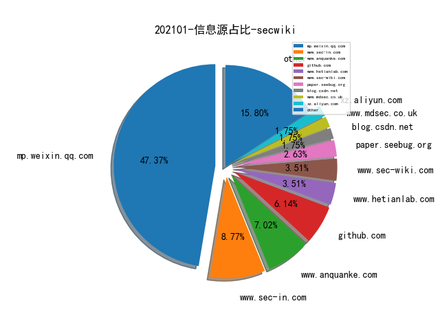
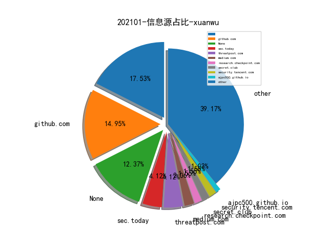
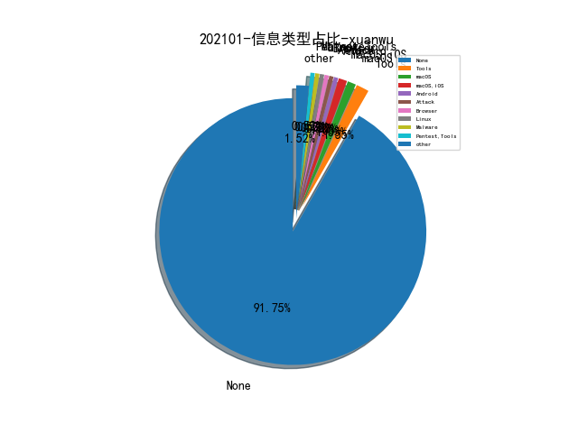
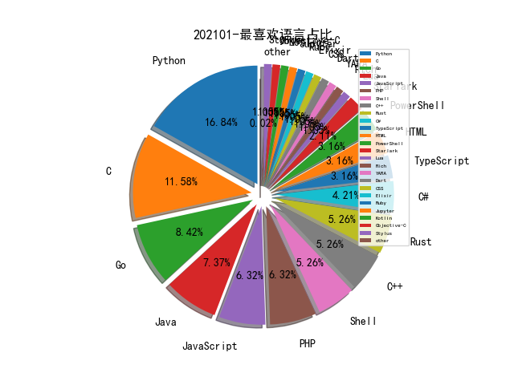

# [数据--所有](README_20.md)
# [数据--年度](README_2021.md)
# 202101 信息源与信息类型占比

# 微信公众号 推荐
| nickname_english | weixin_no | title | url| 
| --- | --- | --- | ---| 
| 穿过丛林 | gh_f90eac70537b | 基于语义token分析的克隆代码检测系统 | https://mp.weixin.qq.com/s/e_NvzMbOqDspns3VLXBjYw | 1| 
| ChaMd5安全团队 | chamd5sec | 浅谈Mysql蜜罐识别 | https://mp.weixin.qq.com/s/f30RvhYlB97dXnjzv4_H_Q | 2| 
| 时间之外沉浮事 | tasnrh | 网空靶场：从炒作到现实-2020 | https://mp.weixin.qq.com/s/zu2Je_A_x06k78tzrXyjbg | 1| 

# 组织github账号 推荐
| github_id | title | url | org_url | org_profile | org_geo | org_repositories | org_people | org_projects | repo_lang | repo_star | repo_forks| 
| --- | --- | --- | --- | --- | --- | --- | --- | --- | --- | --- | ---| 

# 私人github账号 推荐
| github_id | title | url | p_url | p_profile | p_loc | p_company | p_repositories | p_projects | p_stars | p_followers | p_following | repo_lang | repo_star | repo_forks | 
| --- | --- | --- | --- | --- | --- | --- | --- | --- | --- | --- | --- | --- | --- | ---| 
| ControlThings-io | 适用于Control Things Platform用户的样本文件与顶级研究项目。 | https://github.com/ControlThings-io/ct-samples | None | None | None | None | 0 | 0 | 0 | 0 | 0 | Python,C,PHP,Rich | 0 | 0 | 1| 
| coodyer | fire_vulnerability_scanner: 一款http协议的漏洞扫描框架 | https://github.com/coodyer/fire_vulnerability_scanner | None |  | https://avatars3.githubusercontent.com/u/21119116?v=3&u=29f095a5e89411d5ca4cc7509c406280f095e658&s=400 | None | 19 | 0 | 0 | 0 | 0 | C#,Java | 27 | 10 | 1| 
| daniel-thompson | 基于MicroPython的智能手表开发环境手册指南（包括Pine64 PineTime）项目介绍。 | https://github.com/daniel-thompson/wasp-os | http://redfelineninja.org.uk/daniel/ |  | Bristol, UK | None | 70 | 0 | 0 | 0 | 0 | Python,C,Shell | 179 | 64 | 1| 
| nikic | PHP-Parser:用PHP编写的PHP解析器来分析代码工作。 | https://github.com/nikic/PHP-Parser | https://nikic.github.io/ |  | Berlin, Germany | JetBrains | 75 | 0 | 0 | 0 | 0 | C,PHP | 29200 | 6500 | 1| 

# medium_xuanwu 推荐
| title | url| 
| --- | ---| 

# medium_secwiki 推荐
| title | url| 
| --- | ---| 
| How to Look for Ideas in Computer Science Research | https://zhiyunq.medium.com/how-to-look-for-ideas-in-computer-science-research-7a3fa6f4696f| 

# zhihu_xuanwu 推荐
| title | url| 
| --- | ---| 

# zhihu_secwiki 推荐
| title | url| 
| --- | ---| 

# xz_xuanwu 推荐
| title | url| 
| --- | ---| 

# xz_secwiki 推荐
| title | url| 
| --- | ---| 

# 日更新程序
`python update_daily.py`