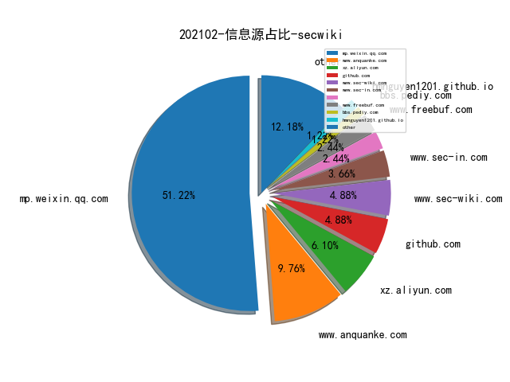
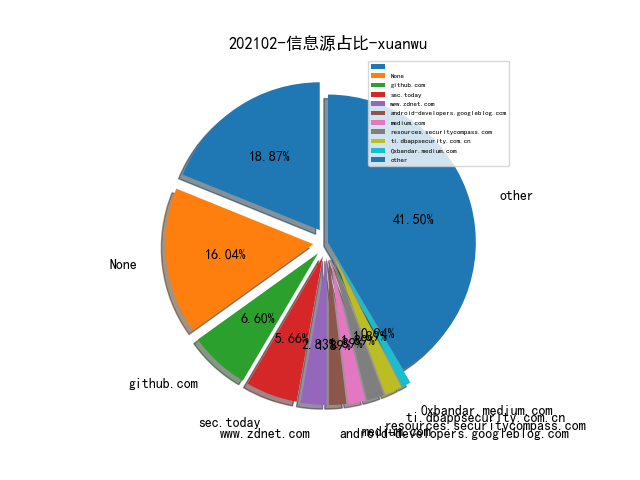
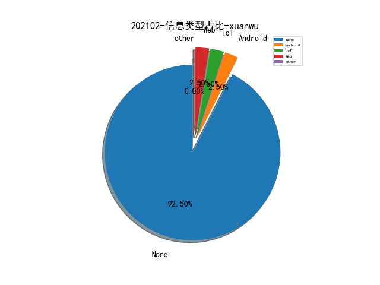
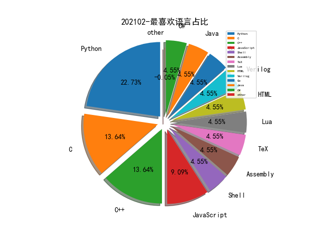

# [数据--所有](README_20.md)
# [数据--年度](README_2021.md)
# 202102 信息源与信息类型占比

# 微信公众号 推荐
| nickname_english | weixin_no | title | url| 
| --- | --- | --- | ---| 
| 全栈网络空间安全 | cyber_securlty | 甲方安全体系建设历程的思考 | https://mp.weixin.qq.com/s/YTNWqXkcqTbjhdcIGpxE6w | 1| 
| 小强说 | xiaoqiangcall | 浅析Course of Action应对措施 | https://mp.weixin.qq.com/s/ikHga0fGa0euwGYohv534g | 1| 
| 小迪随笔 | i-little-monster | 苹果隐私十年史：变与不变（1）突变与营销 | https://mp.weixin.qq.com/s/qqQ1BgFshie288wZEWGaEw | 5| 
| 思想花火 | ttfirework | 做信息安全BP的一些感悟 | https://mp.weixin.qq.com/s/qygwMIGX3PhbnKuPwQqfUQ | 1| 
| 安全牛 | aqniu-wx | 百位董事长/CEO/总裁：预见2021网络安全细分领域发展 | https://mp.weixin.qq.com/s/XBGy2xG3-GYL7023lAjCyg | 1| 
| 微步在线研究响应中心 | gh_c108d4d389bf | 浅析 CVE-2021-1647 的漏洞利用技巧 | https://mp.weixin.qq.com/s/CjsntvNM6_zMZF1IGirMPg | 2| 
| 网络安全应急技术国家工程实验室 | NELCERT | FreakOut分析报告 | https://mp.weixin.qq.com/s/jQ6npq2C8PprnDQMXTtP0g | 1| 
| FreeBuf | freebuf | 邮件钓鱼入门到入土 | https://mp.weixin.qq.com/s/hhBs3wryDCum1DrD6CxeRw | 1| 
| 国家网络威胁情报共享开放平台 | CNTIC2017 | 2020年勒索软件分析 | https://mp.weixin.qq.com/s/yrtU2_VxEt94DWF4eQWujA | 1| 
| 腾讯安全应急响应中心 | tsrc_team | 基于威胁情报周期模型的APT木马剖析 | https://mp.weixin.qq.com/s/CYxGbdRGDfXGY8wupnGbrw | 1| 
| 鸟哥谈云安全 | cnbirdsecintel | 云安全架构连载之二-Azure云平台威胁检测详解 | https://mp.weixin.qq.com/s/Dffk-_TSCaR2SWVAIMCQUA | 2| 
| 威胁棱镜 | THREAT_PRISM | 针对攻击目标量身定制 CS 的 Beacon 执行 | https://mp.weixin.qq.com/s/ofg9dVgL38CENCFXFAslOw | 2| 
| 锦行信息安全 | jeeseensec | 技术分享 , 锦行杯比赛 Writeup | https://mp.weixin.qq.com/s/mYCDsbERsgph5zu-4-lyKQ | 1| 
| 安全学术圈 | secquan | SerialDetector：Web对象注入漏洞的原理和实践探索 | https://mp.weixin.qq.com/s/doFTqJcA30AwgUUtK5XqMQ | 2| 
| 百度安全实验室 | BaiduX_lab | 基于DTLS协议的反射攻击深度分析 | https://mp.weixin.qq.com/s/Ye_AuMDLQotv3M5rv9OmOA | 1| 
| 网络空间安全军民融合创新中心 | jmrh1226 | 2020年全球国防网络空间情况综述（武器技术篇-上） | https://mp.weixin.qq.com/s/piWwrlXZTcgN0Tsr2MiLew | 2| 
| 赵武的自留地 | gh_86033a4f818d | 让网络空间测绘技术不再那么飘忽不定 | https://mp.weixin.qq.com/s/lr39F9kNOfHlMimgymzVwg | 1| 
| ChaMd5安全团队 | chamd5sec | 2021HWS冬令营线上赛固件安全-WriteUp | https://mp.weixin.qq.com/s/fwbFMHuVdX-FNa7dB5mw0Q | 1| 
| 字节跳动安全中心 | TouTiaoSec | 安卓Native层共享库fuzzing技术思路及实践 | https://mp.weixin.qq.com/s/eqYj385SGCUo5errVx2CZg | 1| 
| 潇湘信安 | xxxasec | 记一次理财杀猪盘渗透测试案例 | https://mp.weixin.qq.com/s/utqGvCTEFS3hQ_GttWHVNw | 1| 
| FCC30+ | Fcc_198905 | 2020网络金融黑产研究报告 | https://mp.weixin.qq.com/s/B_pREKw4SJQjpbVbQLl33w | 1| 
| vivo千镜安全实验室 | gh_54ff3f871510 | 智能终端隐私防跟踪技术实践 | https://mp.weixin.qq.com/s/II5q4tYyZ3JUD4vHy1Fx6A | 1| 
| 看雪学院 | ikanxue | python编译后的pyd爆破 | https://mp.weixin.qq.com/s/JvQ38Isf1xXcGOe5wDgXWw | 1| 

# 组织github账号 推荐
| github_id | title | url | org_url | org_profile | org_geo | org_repositories | org_people | org_projects | repo_lang | repo_star | repo_forks| 
| --- | --- | --- | --- | --- | --- | --- | --- | --- | --- | --- | ---| 

# 私人github账号 推荐
| github_id | title | url | p_url | p_profile | p_loc | p_company | p_repositories | p_projects | p_stars | p_followers | p_following | repo_lang | repo_star | repo_forks | 
| --- | --- | --- | --- | --- | --- | --- | --- | --- | --- | --- | --- | --- | --- | ---| 
| 0xdea | INFILTRATE20 会议研究员 0xdea 关于 Solaris 操作系统多个漏洞研究的分享 | https://github.com/0xdea/raptor_infiltrate20 | https://0xdeadbeef.info/ | You cant argue with a root shell. | Italy | None | 14 | 0 | 0 | 0 | 0 | Python,C,JavaScript,Assembly | 648 | 155 | 1| 
| AltraMayor | gatekeeper: First open-source DDoS protection system | https://github.com/AltraMayor/gatekeeper | https://lnkd.in/dvGQusq |  | Boston, MA | Digirati | 8 | 0 | 0 | 0 | 0 | C | 1400 | 105 | 1| 
| NiuTrans | 中文综述文章列表（自然语言处理&机器学习） | https://github.com/NiuTrans/CNSurvey | None | None | None | None | 0 | 0 | 0 | 0 | 0 | TeX,C++ | 1800 | 623 | 1| 
| SySS-Research | WireBug - 用于 VoIP 协议渗透测试的工具 | https://github.com/SySS-Research/WireBug | None | None | None | None | 0 | 0 | 0 | 0 | 0 | C,Shell,Java,Python,C++,Lua,Verilog,C# | 0 | 0 | 1| 
| diversenok | 基于 Windows Native API 与电源管理组件交互 | https://github.com/diversenok/Powercfg | http://diversenok.github.io | Windows security researcher & system programmer. Student. | Russia / The Netherlands | None | 19 | 0 | 0 | 0 | 0 | Pascal,C | 4300 | 746 | 1| 
| jonasstrehle | supercookie: Browser fingerprinting via favicon! | https://github.com/jonasstrehle/supercookie | https://jonas.strehles.info | 20yo , Friedrichshafen | Germany | Working from home | 1 | 0 | 0 | 0 | 0 | HTML | 1300 | 64 | 1| 
| maddiestone | Project Zero Maddie Stone 对 2020 年野外漏洞利用情况的综述 | https://github.com/maddiestone/ConPresentations/blob/master/Enigma2021.StateOf0day.pdf | http://twitter.com/maddiestone |  | None | None | 4 | 0 | 0 | 0 | 0 | Python | 949 | 122 | 1| 
| ossf | Security Scorecards - 开源组件安全健康度衡量工具 | https://github.com/ossf/scorecard | None | None | None | None | 0 | 0 | 0 | 0 | 0 | Go,Python | 153 | 21 | 1| 
| r4j0x00 | 上周推送的 sudo 溢出漏洞的 Exploit | https://github.com/r4j0x00/exploits/tree/master/CVE-2021-3156 | https://github.com/r4j0x00 | I make exploits | None | None | 14 | 0 | 0 | 0 | 0 | Python,JavaScript,C++ | 228 | 68 | 1| 

# medium_xuanwu 推荐
| title | url| 
| --- | ---| 
| Windows API IsDebuggerPresent 的实现分析 | http://medium.com/ax1al/isdebuggerpresent-internals-7be4ea642d33| 
| Facebook Messenger Desktop App Arbitrary File Read | http://medium.com/@renwa/facebook-messenger-desktop-app-arbitrary-file-read-db2374550f6d| 
| How I was able to Turn a XSS into a Account Takeover | http://pullerjsecu.medium.com/how-i-was-able-to-turn-a-xss-into-a-account-takeover-ae0c478640e7| 
| Detecting the Leverage of INF-SCT Fetch & Execute Techniques | http://0xbandar.medium.com/detecting-the-leverage-of-inf-sct-fetch-execute-techniques-beca55e24d50?source=social.tw| 

# medium_secwiki 推荐
| title | url| 
| --- | ---| 

# zhihu_xuanwu 推荐
| title | url| 
| --- | ---| 

# zhihu_secwiki 推荐
| title | url| 
| --- | ---| 

# xz_xuanwu 推荐
| title | url| 
| --- | ---| 

# xz_secwiki 推荐
| title | url| 
| --- | ---| 

# 日更新程序
`python update_daily.py`