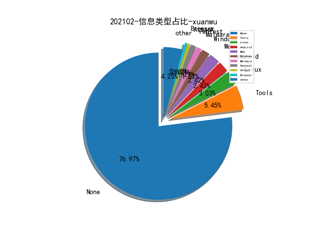

# [数据--所有](README_20.md)
# [数据--年度](README_2021.md)
# 202102 信息源与信息类型占比

# 微信公众号 推荐
| nickname_english | weixin_no | title | url| 
| --- | --- | --- | ---| 

# 组织github账号 推荐
| github_id | title | url | org_url | org_profile | org_geo | org_repositories | org_people | org_projects | repo_lang | repo_star | repo_forks| 
| --- | --- | --- | --- | --- | --- | --- | --- | --- | --- | --- | ---| 

# 私人github账号 推荐
| github_id | title | url | p_url | p_profile | p_loc | p_company | p_repositories | p_projects | p_stars | p_followers | p_following | repo_lang | repo_star | repo_forks | 
| --- | --- | --- | --- | --- | --- | --- | --- | --- | --- | --- | --- | --- | --- | ---| 
| r4j0x00 | 上周推送的 sudo 溢出漏洞的 Exploit | https://github.com/r4j0x00/exploits/tree/master/CVE-2021-3156 | https://github.com/r4j0x00 | I make exploits | None | None | 14 | 0 | 0 | 0 | 0 | Python,JavaScript,C++ | 228 | 68 | 1| 

# medium_xuanwu 推荐
| title | url| 
| --- | ---| 
| Detecting the Leverage of INF-SCT Fetch & Execute Techniques | http://0xbandar.medium.com/detecting-the-leverage-of-inf-sct-fetch-execute-techniques-beca55e24d50?source=social.tw| 

# medium_secwiki 推荐
| title | url| 
| --- | ---| 

# zhihu_xuanwu 推荐
| title | url| 
| --- | ---| 

# zhihu_secwiki 推荐
| title | url| 
| --- | ---| 

# xz_xuanwu 推荐
| title | url| 
| --- | ---| 

# xz_secwiki 推荐
| title | url| 
| --- | ---| 

# 日更新程序
`python update_daily.py`