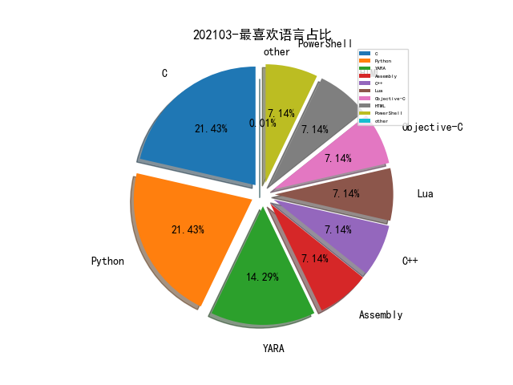

# [数据--所有](README_20.md)
# [数据--年度](README_2021.md)
# 202103 信息源与信息类型占比

# 微信公众号 推荐
| nickname_english | weixin_no | title | url| 
| --- | --- | --- | ---| 
| 涛涛不帅 | gh_39db459d9552 | VMware vCenter RCE (CVE-2021-21972) 漏洞复现与 Exp 编写 | https://mp.weixin.qq.com/s/2pvaQborwMM8UHnWS_CeXA | 1| 
| 腾讯安全应急响应中心 | tsrc_team | 红蓝对抗中的云原生漏洞挖掘及利用实录 | https://mp.weixin.qq.com/s/Aq8RrH34PTkmF8lKzdY38g | 1| 
| 安全分析与研究 | MalwareAnalysis | 恶意软件分析工具集成环境 | https://mp.weixin.qq.com/s/WMWQUWu8dt45iQsrcLfSxg | 1| 
| 小面包的储物柜 | afubread | 浅谈如何有效落地DevSecOps（很浅很浅） | https://mp.weixin.qq.com/s/5eX3-SCfvFfRitb9_onjvw | 1| 
| 赛博回忆录 | cybermemory | 大白话解释拟态安全，再不学就落伍了！ | https://mp.weixin.qq.com/s/UR0XbF02JJmo7RbNF1CYVw | 1| 

# 组织github账号 推荐
| github_id | title | url | org_url | org_profile | org_geo | org_repositories | org_people | org_projects | repo_lang | repo_star | repo_forks| 
| --- | --- | --- | --- | --- | --- | --- | --- | --- | --- | --- | ---| 

# 私人github账号 推荐
| github_id | title | url | p_url | p_profile | p_loc | p_company | p_repositories | p_projects | p_stars | p_followers | p_following | repo_lang | repo_star | repo_forks | 
| --- | --- | --- | --- | --- | --- | --- | --- | --- | --- | --- | --- | --- | --- | ---| 
| Siguza | libkrw - 为不同越狱工具提供一个 iOS kernel 读写 API 接口 | https://github.com/Siguza/libkrw | https://siguza.net |  | Switzerland | None | 50 | 0 | 0 | 0 | 0 | C,Assembly,Objective-C | 0 | 0 | 1| 
| marijuanARM | iOS 降级工具 futurerestore 更新 v194 版本 | https://github.com/marijuanARM/futurerestore/releases/tag/194 | https://discord.gg/fAngssA | python developer , discord link below , avatar by @syns | None | None | 25 | 0 | 0 | 0 | 0 | Python | 0 | 0 | 1| 
| sbousseaden | PCAP-ATTACK: PCAP Samples for Different Post Exploitation ... | https://github.com/sbousseaden/PCAP-ATTACK | http://@SBousseaden | Threat Hunting & DFIR | None | None | 66 | 0 | 0 | 0 | 0 | YARA,PowerShell | 0 | 0 | 1| 

# medium_xuanwu 推荐
| title | url| 
| --- | ---| 
| 训练 Robust Trees 检测 Twitter spam | http://surrealyz.medium.com/robust-trees-for-security-577061177320| 

# medium_secwiki 推荐
| title | url| 
| --- | ---| 

# zhihu_xuanwu 推荐
| title | url| 
| --- | ---| 

# zhihu_secwiki 推荐
| title | url| 
| --- | ---| 

# xz_xuanwu 推荐
| title | url| 
| --- | ---| 

# xz_secwiki 推荐
| title | url| 
| --- | ---| 

# 日更新程序
`python update_daily.py`