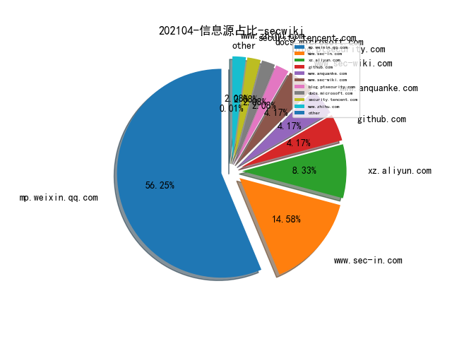
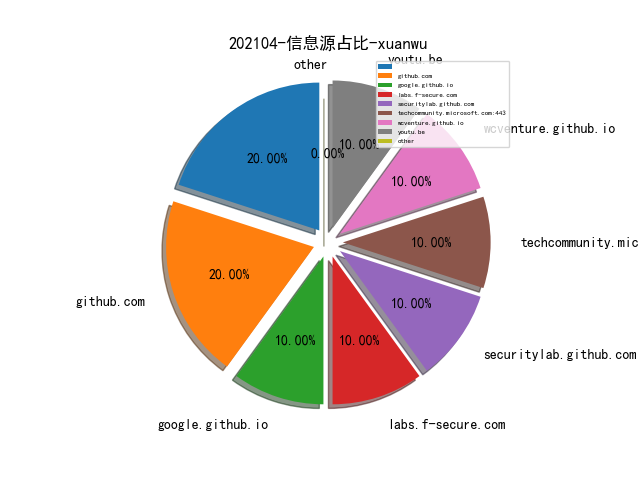
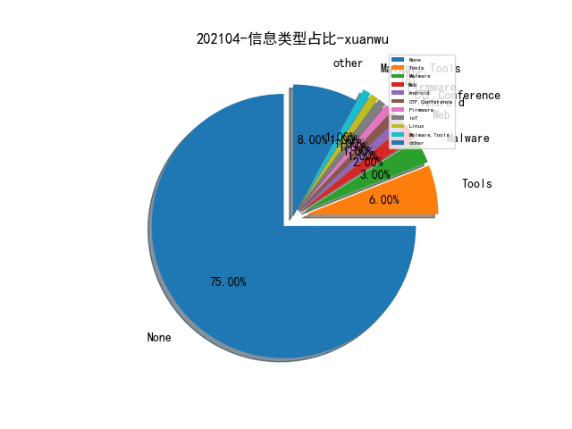

# [数据--所有](README_20.md)
# [数据--年度](README_2021.md)
# 202104 信息源与信息类型占比

# 微信公众号 推荐
| nickname_english | weixin_no | title | url| 
| --- | --- | --- | ---| 
| 非攻安全 | gh_95fa33ba0a19 | 通过DNS协议探测Cobalt Strike服务器 | https://mp.weixin.qq.com/s/peIpPJLt4NuJI1a31S_qbQ | 1| 
| 开放隐私计算 | openmpc | 西湖论剑网络安全：冯登国院士讲隐私保护技术 | https://mp.weixin.qq.com/s/GjsLd4lkxVw0vKUFM6FvjQ | 1| 
| Purpleroc的札记 | purpleroc_0xFA | 一些隧道搭建 | https://mp.weixin.qq.com/s/Lis8i6kwvDhd_TGYrioc1Q | 1| 
| Hacking黑白红 | gh_2cec234c3593 | 2021护网公布漏洞清单 | https://mp.weixin.qq.com/s/leqSyw_W3WArKZL6MIlZJA | 1| 
| 汽车电子与软件 | aestech | 基于数据分析特斯拉事故原因 | https://mp.weixin.qq.com/s/_72ibt7GzNRDhV_SEKU_9g | 1| 
| 我的安全视界观 | CANI_Security | 浅谈安全产品的hvv安全之道 | https://mp.weixin.qq.com/s/DvpTpy5C5QTxrqm3zPV2qw | 1| 
| 安全分析与研究 | MalwareAnalysis | 攻防演练后的一点随记 | https://mp.weixin.qq.com/s/1VuQb0Q0ZYlBmlLCcOPc3Q | 1| 
| 合规科技研究 | ComplianceTech | 数据安全技术专题——数据分类分级的技术实践指南 | https://mp.weixin.qq.com/s/WknW2_lR4ryBLIgCma30Vw | 1| 
| 反诈骗先锋 | fanzhapianxf | 关于反诈工作的几个问题及思考 | https://mp.weixin.qq.com/s/ps7GG2rKc5-J8J2Iybhi8Q | 1| 
| 白帽子飙车路 | hack-by-txf | Cobalt Strike 利用 Chrome 0day 上线 | https://mp.weixin.qq.com/s/LOpAu8vs8ob85W3sCmXMew | 1| 
| 一个人的安全笔记 | xjiek2015 | [HTB]Worker Writeup | https://mp.weixin.qq.com/s/J5jKKfbwBbOTjpnwcFotrg | 12| 
| GuyoungStudio | guyoungnet | 可扩展跨平台网络安全工具套件 CaptfEncoder v2.0.0 发布 | https://mp.weixin.qq.com/s?__biz=MzI0ODU5Mzg0NA==&mid=2247483998&idx=1&sn=baaa69c5576a1e52b7d8aeb9482e1cf3&chksm=e99f2e85dee8a79304a5535dbf6c77e9f9def6b2a7438c73e28792ac5ea3c628a02204d116e6&token=1448493475&lang=zh_CN#rd | 1| 
| debugeeker | gh_ed0f7fa0bfe0 | 最后防线：三款开源HIDS功能对比评估 | https://mp.weixin.qq.com/s/6zLrq-jfkaQWBdeNO2RaYQ | 1| 
| 郑海山dump | zhsdump | 网络空间测绘：IP洞察 | https://mp.weixin.qq.com/s/gVTyhwgxC-UUxhB4YdXKeg | 1| 
| 信息安全与通信保密杂志社 | cismag2013 | 英国网络作战力量浅析 | https://mp.weixin.qq.com/s/z7Uq5vYotZBNk1yqJqAHxw | 1| 
| 百度安全应急响应中心 | baidu_sec | 干货分享｜从BCTF人机对抗视角浅谈自动化攻防技术发展 | https://mp.weixin.qq.com/s/5wR37FLoTPn3fftxZw_Brw | 1| 
| 国家网络威胁情报共享开放平台 | CNTIC2017 | 基于TTPs的自动化威胁主体追踪技术 | https://mp.weixin.qq.com/s/VMOEL7jIQZPZwdCtXo0e3Q | 1| 
| ChaMd5安全团队 | chamd5sec | “域前置Cobalt Strike”之踩坑 | https://mp.weixin.qq.com/s/Wh-A3qiyrjPv0KzYeAS-Xw | 4| 
| 虎符智库 | TT_Thinktank | 深度分析：主流网络侦察技术与应对策略 | https://mp.weixin.qq.com/s/Aaxu4C_Lf3I-bdPIXi8tIw | 1| 
| 信安之路 | xazlsec | 红队攻击前隐匿流量的基本方法 | https://mp.weixin.qq.com/s/eoui4xAuUF5X2H3jWq43tQ | 1| 
| RedTeam | RedTeams | 浅析 AWS S3 子域名接管漏洞 | https://mp.weixin.qq.com/s/q3bsrCKacuepKoFljYxJcg | 1| 
| 看雪学院 | ikanxue | 一次嵌入式固件逆向实践 | https://mp.weixin.qq.com/s/-eUweGQi633D2W1Vs_bIFg | 1| 
| 架构师技术联盟 | ICT_Architect | 深度分析：4种国产CPU架构和6大品牌 | https://mp.weixin.qq.com/s/FoAPSNW0LFKuerEPJfFmgw | 1| 
| 宽字节安全 | gh_2de2b9f7d076 | 基于javaAgent内存马检测查杀指南 | https://mp.weixin.qq.com/s/Whta6akjaZamc3nOY1Tvxg | 2| 
| 58安全应急响应中心 | wubasrc | 系列 , 58集团白盒代码审计系统建设实践2：深入理解SAST | https://mp.weixin.qq.com/s/jQfsUg4vhEs3XwTcXkqhyQ | 1| 
| 非尝咸鱼贩 | awkwardfish1 | IDA Pro 分析 dyld_shared_cache | https://mp.weixin.qq.com/s/PGC7LKu-oC5ZaRxLFrhTsg | 1| 
| 红数位 | safetop | Pwn2Own 2021全程（附结果和录像视频） | https://mp.weixin.qq.com/s/blwGELCaPKC1HTczBcWkfQ | 1| 
| 穿过丛林 | gh_f90eac70537b | 硬件安全技术研究 | https://mp.weixin.qq.com/s/YuYmMryfgFi0XqD96WelHg | 2| 
| 安全学术圈 | secquan | S&P 2021 论文录用列表 | https://mp.weixin.qq.com/s/8GUnjS_T1H7gqSVPInFObg | 2| 
| 学蚁致用 | sudo_i | 【As-Exploits】你不能错过的antSword插件 | https://mp.weixin.qq.com/s/8G0il9gIkubI1w15gOBX6A | 1| 
| 娜璋AI安全之家 | gh_91f1fe28fc6e | [AI安全论文] 03.什么是生成对抗网络？GAN的前世今生（Goodfellow） | https://mp.weixin.qq.com/s/CGngRxjVtOKHNsTrXBiD7w | 3| 
| 威胁棱镜 | THREAT_PRISM | Dragos：2020 年全球工控网络安全状况不容乐观 | https://mp.weixin.qq.com/s/ceASNJrgKkqgzlCnxNps7Q | 3| 
| 互联网安全内参 | anquanneican | 深度剖析：俄罗斯网络空间攻击特点与模式 | https://mp.weixin.qq.com/s/oMy1EDOYPT82ec5QEdiIVA | 2| 
| NEO攻防队 | NEO_TEAM | 某VPN客户端远程下载文件执行挖掘（已修复） | https://mp.weixin.qq.com/s/XbsxziIFKx8VhGd-pv0Ghg | 1| 
| 锦行信息安全 | jeeseensec | 技术分享 , Git-RCE：CVE-2021-21300 | https://mp.weixin.qq.com/s/VO2dHNVbPcpZQtnBRMNNag | 2| 
| 网安思考 | gh_e53abd003964 | 对美军新近发展作战理念的梳理与思考 | https://mp.weixin.qq.com/s/D8T6ImssRi8sjDqD4_bGpg | 1| 
| 绿盟科技研究通讯 | nsfocus_research | 安全是一门语言的艺术：威胁调查分析语言概述 | https://mp.weixin.qq.com/s/U8E4JxMDeL5IeVGAh9fuiQ | 1| 
| 数世咨询 | dwconcn | 数世咨询：网络空间资产测绘(CAM)能力指南 | https://mp.weixin.qq.com/s/p3LwmZq7nrGOy5qy7p9SDQ | 1| 
| 哔哩哔哩安全应急响应中心 | gh_951c3555f599 | DGA域名检测的工程实践 | https://mp.weixin.qq.com/s/GlWqTWQzBfoXt8J8uJAPRQ | 1| 
| NISL实验室 | NISL_THU2020 | 【研究成果】国内伪基站垃圾短信生态系统研究 | https://mp.weixin.qq.com/s/te4igYM_PHbf2xedXdmQxw | 1| 
| 火线安全平台 | huoxian_cn | 洞态IAST Agent正式开源 | https://mp.weixin.qq.com/s/iSHmK4Fbl0whDvIH-u8tag | 1| 
| 君哥的体历 | jungedetili | 邬晓磊：基于关键词的大型红蓝对抗经验分享 | https://mp.weixin.qq.com/s/8boR_ZucLk5nMJwfi2UdGA | 1| 
| BlockSec Team | gh_57d94ebc8526 | 鸠占鹊巢: Furucombo 攻击事件分析 | https://mp.weixin.qq.com/s/jDQhFNEeIMT_cdjHkggYjw | 1| 

# 组织github账号 推荐
| github_id | title | url | org_url | org_profile | org_geo | org_repositories | org_people | org_projects | repo_lang | repo_star | repo_forks| 
| --- | --- | --- | --- | --- | --- | --- | --- | --- | --- | --- | ---| 

# 私人github账号 推荐
| github_id | title | url | p_url | p_profile | p_loc | p_company | p_repositories | p_projects | p_stars | p_followers | p_following | repo_lang | repo_star | repo_forks | 
| --- | --- | --- | --- | --- | --- | --- | --- | --- | --- | --- | --- | --- | --- | ---| 
| vessial | 深度揭密高通4/5G移动基带消息系统和状态机 | https://github.com/vessial/baseband/blob/master/Qualcomm_BaseBand_Messaging_and_State_Machine.md | None | None | None | None | 0 | 0 | 0 | 0 | 0 | None | 0 | 0 | 1| 
| inbug-team | InScan: 边界打点后的自动化渗透工具 | https://github.com/inbug-team/InScan/ | None |  | None | None | 1 | 0 | 0 | 0 | 0 | Go | 0 | 0 | 1| 
| dsopas | MindAPI: Bringing order to API hacking chaos | https://github.com/dsopas/MindAPI | https://www.davidsopas.com | /me hacks! the webz | Portugal | Char49 | 14 | 0 | 0 | 0 | 0 | Go | 0 | 0 | 1| 
| Porchetta-Industries | pyMalleableC2：用于解析 Cobalt Strike Malleable C2 配置文件的 Python 库。 | https://github.com/Porchetta-Industries/pyMalleableC2 | None | None | None | None | 0 | 0 | 0 | 0 | 0 | Python,SCSS | 0 | 0 | 1| 
| BC-SECURITY | Starkiller：1.7.0 版本发布。基于 Electron 实现的 Powershell Empire 可视化工具。 | https://github.com/BC-SECURITY/Starkiller/releases | None | None | None | None | 0 | 0 | 0 | 0 | 0 | Python,C#,C,Vue,PowerShell | 0 | 0 | 1| 

# medium_xuanwu 推荐
| title | url| 
| --- | ---| 
| JavaScript prototype 污染攻击的寻找和利用。 | http://medium.com/m/global-identity?redirectUrl=https%3A%2F%2Finfosecwriteups.com%2Fjavascript-prototype-pollution-practice-of-finding-and-exploitation-f97284333b2| 
| Justin Warner：Using Kaitai to Parse Cobalt Strike Beacon Configs | http://sixdub.medium.com/using-kaitai-to-parse-cobalt-strike-beacon-configs-f5f0552d5a6e| 
| AFINE：总结当前的 Java 反序列化的测试和利用方法。 | http://afinepl.medium.com/testing-and-exploiting-java-deserialization-in-2021-e762f3e43ca2| 
| Mikko Kenttälä：macOS Mail 的一个无交互的漏洞。由于符号连接未正确删除，通过自动解压附件，可以实现在 Mail.app 的沙箱环境中添加或修改任意文件。 | http://mikko-kenttala.medium.com/zero-click-vulnerability-in-apples-macos-mail-59e0c14b106c| 

# medium_secwiki 推荐
| title | url| 
| --- | ---| 

# zhihu_xuanwu 推荐
| title | url| 
| --- | ---| 

# zhihu_secwiki 推荐
| title | url| 
| --- | ---| 
| 你关注了哪些关于网络安全技术分享的个人或团队 | https://www.zhihu.com/answer/1814752324| 

# xz_xuanwu 推荐
| title | url| 
| --- | ---| 

# xz_secwiki 推荐
| title | url| 
| --- | ---| 
| Java反序列化 — URLDNS利用链分析 | https://xz.aliyun.com/t/9417| 
| Yii2反序列化RCE 新POP链 | https://xz.aliyun.com/t/9420| 
| 主流WebShell工具流量层分析 | https://xz.aliyun.com/t/9404| 
| 记一次完整的内网渗透经历 | https://xz.aliyun.com/t/9374| 
| ELK在渗透测试中的利用与安全配置解析 | https://xz.aliyun.com/t/9370| 
| 内网渗透--对不出网目标的打法 | https://xz.aliyun.com/t/9372| 
| CVE-2016-0165 Win32k漏洞分析笔记 | https://xz.aliyun.com/t/9348| 

# 日更新程序
`python update_daily.py`