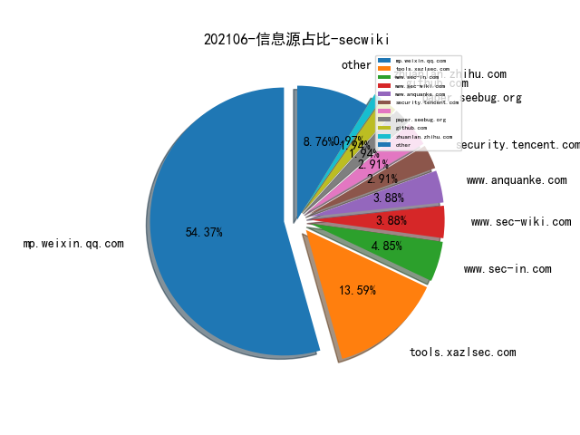

# [数据--所有](README_20.md)
# [数据--年度](README_2021.md)
# 202106 信息源与信息类型占比

# 微信公众号 推荐
| nickname_english | weixin_no | title | url| 
| --- | --- | --- | ---| 
| Qunar技术沙龙 | QunarTL | Jar 组件自动化风险监测和升级实践 | https://mp.weixin.qq.com/s/3tmwACw-weWCBzipHK79AQ | 1| 
| 章老师说 | gh_dd8867689c3d | 软件工程能力漫谈 | https://mp.weixin.qq.com/s/hJS5LJRZkMZmHm6g2R_jpw | 1| 
| 安全学术圈 | secquan | SCRUTINIZER：通过反编译和机器学习检测恶意软件中的代码复用 | https://mp.weixin.qq.com/s/hdqCwSoXdxAYB8OfL5oJEQ | 1| 
| 威胁棱镜 | THREAT_PRISM | McAfee 如何使用图思考 ATT&CK | https://mp.weixin.qq.com/s/rlFmQdZZTHUnX2D1JSVtFQ | 1| 
| 嘶吼专业版 | Pro4hou | 2021年嘶吼·网络安全产业链图谱发布 | https://mp.weixin.qq.com/s/IDlXpFBtX19CE9PLoSgVYA | 1| 
| 蚂蚁安全实验室 | Alipay_SecurityLab | 智能合约安全系列 -- 举一反三总结篇 | https://mp.weixin.qq.com/s/ZxrBHgZ5a_IuU0nNySIlwA | 1| 

# 组织github账号 推荐
| github_id | title | url | org_url | org_profile | org_geo | org_repositories | org_people | org_projects | repo_lang | repo_star | repo_forks| 
| --- | --- | --- | --- | --- | --- | --- | --- | --- | --- | --- | ---| 

# 私人github账号 推荐
| github_id | title | url | p_url | p_profile | p_loc | p_company | p_repositories | p_projects | p_stars | p_followers | p_following | repo_lang | repo_star | repo_forks | 
| --- | --- | --- | --- | --- | --- | --- | --- | --- | --- | --- | --- | --- | --- | ---| 
| SunLab-GMU | PatchDB: A Large-Scale Security Patch Dataset | https://github.com/SunLab-GMU/PatchDataset | None | None | None | None | 0 | 0 | 0 | 0 | 0 | None | 0 | 0 | 1| 

# medium_xuanwu 推荐
| title | url| 
| --- | ---| 
| An Introduction to Manual Active Directory Querying with Dsquery and Ldapsearch | http://medium.com/m/global-identity?redirectUrl=https%3A%2F%2Fposts.specterops.io%2Fan-introduction-to-manual-active-directory-querying-with-dsquery-and-ldapsearch-84943c13d7eb| 

# medium_secwiki 推荐
| title | url| 
| --- | ---| 

# zhihu_xuanwu 推荐
| title | url| 
| --- | ---| 

# zhihu_secwiki 推荐
| title | url| 
| --- | ---| 

# xz_xuanwu 推荐
| title | url| 
| --- | ---| 

# xz_secwiki 推荐
| title | url| 
| --- | ---| 

# 日更新程序
`python update_daily.py`