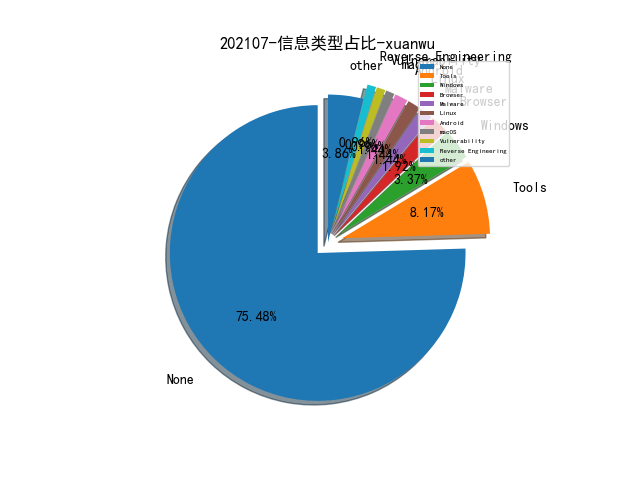

# [数据--所有](README_20.md)
# [数据--年度](README_2021.md)
# 202107 信息源与信息类型占比

# 微信公众号 推荐
| nickname_english | weixin_no | title | url| 
| --- | --- | --- | ---| 
| 我需要的是坚持 | MyPersistence2020 | 做红队你需要学习“如何挖掘战壕”（一） | https://mp.weixin.qq.com/s/6tL5AH60DaGXza4MOoJbIw | 1| 
| 网安思考 | gh_e53abd003964 | 【专题研究第013期】Palantir 大数据能力分析研究（上篇） | https://mp.weixin.qq.com/s/jMVcbQAgcN3ECYK1bTZN5w | 1| 
| 数说安全 | csreviews | 2021年中国网络安全市场分类与全景图 | https://mp.weixin.qq.com/s/5hjlfqNa3VPqH-xs7X7NWw | 1| 
| 赵武的自留地 | gh_86033a4f818d | 自由与使命汇报ppt | https://mp.weixin.qq.com/s/I_HmTHao2uaoB35C1aJmGQ | 1| 
| 莫哥谈安全 | gh_247dfbdf3d43 | D3FEND学习笔记 | https://mp.weixin.qq.com/s/WsCgI6ilaGL8XJPUJUTCdQ | 1| 
| 穿过丛林 | gh_f90eac70537b | 30万篇外媒疫情新闻数据集介绍 | https://mp.weixin.qq.com/s/VQdHQnHnWhHrE-Ze_W9meA | 1| 
| 社媒派SMP | CIPS-SMP | THUIR司法类案检索技术研究进展 | https://mp.weixin.qq.com/s/VgOKXX0mJSWol0CKOUMJOA | 1| 
| 看雪学院 | ikanxue | office病毒分析资料整理 | https://mp.weixin.qq.com/s/4YQ-wbzM0mCLOiUad5wpNg | 1| 
| 甲方安全建设 | blueteams | Active Directory 证书服务快速防御指南 | https://mp.weixin.qq.com/s/XTl9WkdZwCKke_0tLOUr2w | 1| 
| 灾难控制 局 | SecDamageControl | Elkeid-RASP 发布，易部署的RASP方案。 | https://mp.weixin.qq.com/s/o0rSOLQ34-Ph0aY-_5tfSA | 1| 
| 字节跳动技术团队 | BytedanceTechBlog | 手把手教你搭建一个无框架埋点体系 | https://mp.weixin.qq.com/s/QanYnjRN5TM_NlJtQzCALg | 1| 
| 威胁棱镜 | THREAT_PRISM | IoT 恶意软件生命周期大规模研究 | https://mp.weixin.qq.com/s/abn1bDPEgwLKzjo5fABArg | 2| 
| 一个人的安全笔记 | xjiek2015 | [HTB] Frolic Writeup | https://mp.weixin.qq.com/s?__biz=MzIwOTA4NTg4MA==&mid=2652489358&idx=1&sn=6834393e2e8b3cc8be6deb4f1648310c&chksm=8c945259bbe3db4fe0eaa4f0419033b80dc819e5ee0d7d8e1f4c5ccd3a0921eeebac5fedfcda&scene=0&xtrack=1#rd | 1| 
| 腾讯安全应急响应中心 | tsrc_team | 腾讯 SOAR 的安全运营探索 | https://mp.weixin.qq.com/s/2YUYAcV5qpKBdnApdsrpiA | 1| 
| 卫星黑客 | Satellite_Hacker | 太空态势感知能力介绍 | https://mp.weixin.qq.com/s/PTYMBowzZre7U02CNrbnFg | 1| 
| 云鼎实验室 | YunDingLab | 浅谈云上攻防——Web应用托管服务中的元数据安全隐患 | https://mp.weixin.qq.com/s/NesaxzuULBkkLBPkg7i8wQ | 1| 
| ZLabs | gh_339ee98cec1b | 区块链链上追踪基础篇【上】：地址标签入门 | https://mp.weixin.qq.com/s/eDVVFhmXveayT-u44UZL2A | 3| 
| RedTeam | RedTeams | 利用 CloudFront 中继 Cobalt Strike 流量 | https://mp.weixin.qq.com/s/NdR6XBFvhSOBsLVVQmTXJg | 1| 
| AISeer | AISeer520 | AAAI 2021 , 基于图神经网络的多变量时间序列异常检测 | https://mp.weixin.qq.com/s/zizQnPTi_B6BqajrcJwKUg | 1| 
| 蓝鸟安全 | gh_d365aca1d051 | 邮件攻防技术,附件木马伪装的N种方法 | https://mp.weixin.qq.com/s/18BB0eyKkiegmUFF1kPMaA | 1| 
| 烽台科技 | fengtaisec | 工业企业工控安全人才矩阵 | https://mp.weixin.qq.com/s/pqGa10MzKYob0MQgxHOkhA | 1| 
| M01N Team | m01nteam | 关于 Kerberos 每个人都应该知道这些 | https://mp.weixin.qq.com/s/gLg0pdVRWl3hJMB5au61rw | 1| 
| 表图 | CyberSecurityCircle | 离职期员工的信息安全管控实践 | https://mp.weixin.qq.com/s/hIIyFbx562WREErC9Ygw0Q | 1| 
| 桥的断想 | TasteMiss | 从0到1建设物联网安全实验室之设备篇 | https://mp.weixin.qq.com/s/iyoK3bQQLq6Rhxgebt4VBA | 1| 
| 这里是河马 | gh_f779ec60843d | SHELLPUB 升级维护公告 | https://mp.weixin.qq.com/s/bb0p5-jIzYfs0KQRvw2VUg | 1| 
| 360政企安全 | gh_6db130c5163e | 预见Win11“前顾之忧”：360全球首家发现Win11高危漏洞，推出热补丁解决方案！ | https://mp.weixin.qq.com/s/_PjO4_wpe2LQc4BMfg-FGg | 1| 
| 编程语言Lab | HW-PLLab | 编程语言测试综述 | https://mp.weixin.qq.com/s/HsSTwWdWzfHuXHdbgXXIeQ | 1| 
| 绿盟科技研究通讯 | nsfocus_research | 网络空间测绘专题——资产地址动态变化研究 | https://mp.weixin.qq.com/s/Fh93JLtMQa9Qxp_xqEj3zg | 1| 
| 安全学术圈 | secquan | 以史为鉴：基于复制-生成网络的时态知识图谱建模 | https://mp.weixin.qq.com/s/YM6lYAA1FyGh1myhbiAXVQ | 5| 
| 天问实验室 | tianwenlab | 常规智能设备动态调试思路 | https://mp.weixin.qq.com/s/E6R-39_UHxXPw4qxuIqNmA | 1| 
| ChaMd5安全团队 | chamd5sec | VPNFilter 分析报告 | https://mp.weixin.qq.com/s/0BZ4YB1EXR4ESHWo_DRDPQ | 2| 
| 安全喷子 | gh_2a9c00f1d053 | 安全服务的发展 | https://mp.weixin.qq.com/s/NUEW-zwdB-15pIg7b6IC9w | 1| 

# 组织github账号 推荐
| github_id | title | url | org_url | org_profile | org_geo | org_repositories | org_people | org_projects | repo_lang | repo_star | repo_forks| 
| --- | --- | --- | --- | --- | --- | --- | --- | --- | --- | --- | ---| 

# 私人github账号 推荐
| github_id | title | url | p_url | p_profile | p_loc | p_company | p_repositories | p_projects | p_stars | p_followers | p_following | repo_lang | repo_star | repo_forks | 
| --- | --- | --- | --- | --- | --- | --- | --- | --- | --- | --- | --- | --- | --- | ---| 
| xforcered | InlineExecute-Assembly - 以 Beacon Object File (BOF) 方式实现进程内 .NET Assembly Execution 的 PoC 代码 | https://github.com/xforcered/InlineExecute-Assembly | None | None | None | None | 0 | 0 | 0 | 0 | 0 | None | 0 | 0 | 1| 
| tylabs | QuickSand - 一款用于分析和检测恶意文档的开源 Python 工具 | https://github.com/tylabs/quicksand | https://github.com/tylabs?tab=followers | Tools to detect malware in common document formats. | Canada | tylabs | 13 | 0 | 0 | 0 | 0 | Python,YARA,C,Zeek | 0 | 0 | 1| 
| trailofbits | Trail of Bits 对 Opyn Gamma 协议智能合约的安全性评估 | https://github.com/trailofbits/publications/blob/master/reviews/Opyn-Gamma-Protocol.pdf | None | None | None | None | 0 | 0 | 0 | 0 | 0 | C,Shell,CMake,Python,C++,TypeScript,CSS,Go,Ruby,Rust | 0 | 0 | 1| 
| riskscanner | RiskScanner: 是开源的公有云安全合规扫描平台 | https://github.com/riskscanner/riskscanner | None | None | None | None | 0 | 0 | 0 | 0 | 0 | Python,Java,Shell,JavaScript | 0 | 0 | 1| 
| rabbitmask | Libra: 网站篡改、暗链、死链监测平台 | https://github.com/rabbitmask/Libra | https://github.com/rabbitmask?tab=followers | ＞﹏＜，俺超凶！ | In the wind | 米斯特安全/TideSec | 50 | 0 | 0 | 0 | 0 | Java,Python,JavaScript,C#,Go,Rust | 0 | 0 | 1| 
| mvt-project | MVT - 通过取证信息分析 iOS/Android 手机是否已被入侵的工具 | https://github.com/mvt-project/mvt | None | None | None | None | 0 | 0 | 0 | 0 | 0 | Python | 0 | 0 | 1| 
| klezVirus | CheeseTools: Self-developed tools for Lateral Movement/Cod... | https://github.com/klezVirus/CheeseTools | https://github.com/klezVirus?tab=followers | Lucky husband, proud father, and security researcher working for BSI | IT | BSI CSIR | 32 | 0 | 0 | 0 | 0 | C#,Python,JavaScript,C++ | 0 | 0 | 1| 
| fkie-cad | 固件提取、固件分析、固件文件比较自动化工具 | https://github.com/fkie-cad/FACT_core | None | None | None | None | 0 | 0 | 0 | 0 | 0 | C,Shell,Python,C++,Lua,Go,Dockerfile,Rust | 0 | 0 | 1| 

# medium_xuanwu 推荐
| title | url| 
| --- | ---| 
| macOS TCC 隐私保护机制不限制对 Home 目录进行访问，SSH 密钥等其他一些敏感信息可被直接访问 | http://cedowens.medium.com/initial-access-checks-on-macos-531dd2d0cee6| 
| Part 2: Dive into Zoom Applications | http://rakesh-thodupunoori.medium.com/part-2-dive-into-zoom-applications-1b01091345c1| 
| 利用 Zoom 会议软件的 0Day 实施红队渗透测试 | http://medium.com/manomano-tech/a-red-team-operation-leveraging-a-zero-day-vulnerability-in-zoom-80f57fb0822e| 
| How to unpack UPX packed malware with a SINGLE breakpoint | http://medium.com/m/global-identity?redirectUrl=https%3A%2F%2Finfosecwriteups.com%2Fhow-to-unpack-upx-packed-malware-with-a-single-breakpoint-4d3a23e21332| 
| Hacking the dlink DIR-615 for fun and no profit | http://noob3xploiter.medium.com/hacking-the-dlink-dir-615-for-fun-and-no-profit-a2f1689f9920| 
| Chrome 浏览器 NAT Slipstreaming 漏洞分析（CVE-2021–21210） | http://vovohelo.medium.com/how-i-found-my-first-chrome-bug-cve-2021-21210-248a21272248| 

# medium_secwiki 推荐
| title | url| 
| --- | ---| 

# zhihu_xuanwu 推荐
| title | url| 
| --- | ---| 

# zhihu_secwiki 推荐
| title | url| 
| --- | ---| 
| 当可解释人工智能遇上知识图谱 | https://zhuanlan.zhihu.com/p/386458680| 
| 从邮件窃密活动探索新的文件加密传输方式 | https://zhuanlan.zhihu.com/p/389024302| 

# xz_xuanwu 推荐
| title | url| 
| --- | ---| 

# xz_secwiki 推荐
| title | url| 
| --- | ---| 

# 日更新程序
`python update_daily.py`