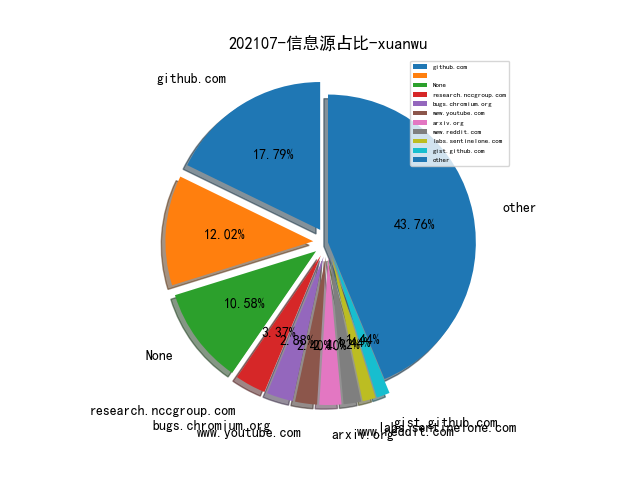
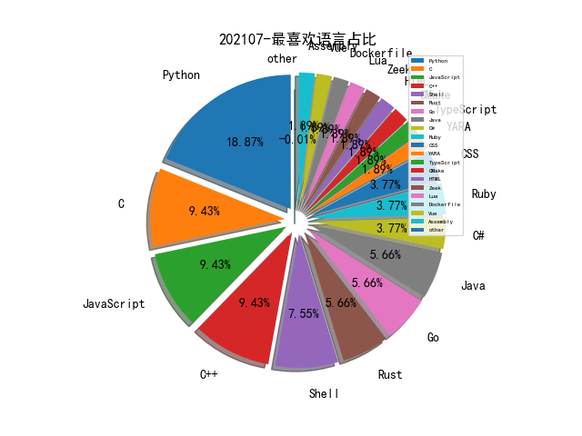

# [数据--所有](README_20.md)
# [数据--年度](README_2021.md)
# 202107 信息源与信息类型占比

# 微信公众号 推荐
| nickname_english | weixin_no | title | url| 
| --- | --- | --- | ---| 
| ChaMd5安全团队 | chamd5sec | 2021年⼯业信息安全技能⼤赛-线上第⼀场WriteUp | https://mp.weixin.qq.com/s/DFJaILmNxTl1EAyksqQZ9w | 2| 
| 360政企安全 | gh_6db130c5163e | 预见Win11“前顾之忧”：360全球首家发现Win11高危漏洞，推出热补丁解决方案！ | https://mp.weixin.qq.com/s/_PjO4_wpe2LQc4BMfg-FGg | 1| 
| 编程语言Lab | HW-PLLab | 编程语言测试综述 | https://mp.weixin.qq.com/s/HsSTwWdWzfHuXHdbgXXIeQ | 1| 
| 绿盟科技研究通讯 | nsfocus_research | 网络空间测绘专题——资产地址动态变化研究 | https://mp.weixin.qq.com/s/Fh93JLtMQa9Qxp_xqEj3zg | 1| 
| 安全学术圈 | secquan | 以史为鉴：基于复制-生成网络的时态知识图谱建模 | https://mp.weixin.qq.com/s/YM6lYAA1FyGh1myhbiAXVQ | 1| 
| 天问实验室 | tianwenlab | 常规智能设备动态调试思路 | https://mp.weixin.qq.com/s/E6R-39_UHxXPw4qxuIqNmA | 1| 
| 安全喷子 | gh_2a9c00f1d053 | 安全服务的发展 | https://mp.weixin.qq.com/s/NUEW-zwdB-15pIg7b6IC9w | 1| 

# 组织github账号 推荐
| github_id | title | url | org_url | org_profile | org_geo | org_repositories | org_people | org_projects | repo_lang | repo_star | repo_forks| 
| --- | --- | --- | --- | --- | --- | --- | --- | --- | --- | --- | ---| 

# 私人github账号 推荐
| github_id | title | url | p_url | p_profile | p_loc | p_company | p_repositories | p_projects | p_stars | p_followers | p_following | repo_lang | repo_star | repo_forks | 
| --- | --- | --- | --- | --- | --- | --- | --- | --- | --- | --- | --- | --- | --- | ---| 
| trailofbits | Trail of Bits 对 Opyn Gamma 协议智能合约的安全性评估 | https://github.com/trailofbits/publications/blob/master/reviews/Opyn-Gamma-Protocol.pdf | None | None | None | None | 0 | 0 | 0 | 0 | 0 | C,Shell,CMake,Python,C++,TypeScript,CSS,Go,Ruby,Rust | 0 | 0 | 1| 
| riskscanner | RiskScanner: 是开源的公有云安全合规扫描平台 | https://github.com/riskscanner/riskscanner | None | None | None | None | 0 | 0 | 0 | 0 | 0 | Python,Java,Shell,JavaScript | 0 | 0 | 1| 
| esrrhs | pingtunnel: ICMP流量伪装转发工具 | https://github.com/esrrhs/pingtunnel | None | None | None | None | 0 | 0 | 0 | 0 | 0 | None | 0 | 0 | 1| 

# medium_xuanwu 推荐
| title | url| 
| --- | ---| 
| How to unpack UPX packed malware with a SINGLE breakpoint | http://medium.com/m/global-identity?redirectUrl=https%3A%2F%2Finfosecwriteups.com%2Fhow-to-unpack-upx-packed-malware-with-a-single-breakpoint-4d3a23e21332| 
| Hacking the dlink DIR-615 for fun and no profit | http://noob3xploiter.medium.com/hacking-the-dlink-dir-615-for-fun-and-no-profit-a2f1689f9920| 
| Chrome 浏览器 NAT Slipstreaming 漏洞分析（CVE-2021–21210） | http://vovohelo.medium.com/how-i-found-my-first-chrome-bug-cve-2021-21210-248a21272248| 

# medium_secwiki 推荐
| title | url| 
| --- | ---| 

# zhihu_xuanwu 推荐
| title | url| 
| --- | ---| 

# zhihu_secwiki 推荐
| title | url| 
| --- | ---| 

# xz_xuanwu 推荐
| title | url| 
| --- | ---| 

# xz_secwiki 推荐
| title | url| 
| --- | ---| 

# 日更新程序
`python update_daily.py`