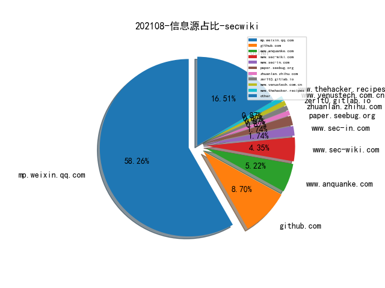

# [数据--所有](README_20.md)
# [数据--年度](README_2021.md)
# 202108 信息源与信息类型占比

# 微信公众号 推荐
| nickname_english | weixin_no | title | url| 
| --- | --- | --- | ---| 
| 蓝鸟安全 | gh_d365aca1d051 | 应急响应,Windows上机取证检查 | https://mp.weixin.qq.com/s/2iyXBrobI2WjGmpsCrjUxw | 1| 
| 绿盟科技威胁情报 | NSFOCUS_NTI | Lorec53组织分析报告- 攻击组件部分 | https://mp.weixin.qq.com/s/t_d8I4l0SnzGDXLRmmQzYg | 1| 
| leveryd | gh_8d7f6ed4daff | 全流量入侵检测系统的性能分析 | https://mp.weixin.qq.com/s/7_ZrnKVaWuBjXCgmqdaUAQ | 1| 
| PaperWeekly | paperweekly | ACL 2021 , 基于词依存信息类型映射记忆神经网络的关系抽取 | https://mp.weixin.qq.com/s/BV1u8zq0YoP2yOKpKD_xNw | 1| 
| 微步在线研究响应中心 | gh_c108d4d389bf | APT29—觊觎全球情报的国家级黑客组织（中） | https://mp.weixin.qq.com/s/Ln7iBm-Go17CQhIaRNHD0Q | 2| 
| 360威胁情报中心 | CoreSec360 | 南亚地区APT组织2020年度攻击活动回顾（下） | https://mp.weixin.qq.com/s/XcBuxlDh2DIjIMdFH6KCKQ | 2| 
| 莫哥谈安全 | gh_247dfbdf3d43 | 如何做好一个威胁情报聚合查询平台及如何利用该平台来进行安全运营工作 | https://mp.weixin.qq.com/s/dq-jL2t0nd9-F0_i7sU9_g | 1| 
| 穿过丛林 | gh_f90eac70537b | 二进制漏洞利用可视化技术研究 | https://mp.weixin.qq.com/s/2AW9FzVr3xaRsUbsiZ9cRQ | 1| 
| 一个人的安全笔记 | xjiek2015 | [HTB] Spectra Writeup | https://mp.weixin.qq.com/s/nDTJk9m4-gpd-S9j0i1w1A | 1| 
| 关键基础设施安全应急响应中心 | CII-SRC | 原创 , 《党委（党组）网络安全工作责任制实施办法》解读 | https://mp.weixin.qq.com/s/ZzFx2Leu7DYhm39Kacofcg | 1| 
| Seebug漏洞平台 | seebug_org | 使用 GDB 获取软路由的文件系统 | https://mp.weixin.qq.com/s/FWprX-R1EfWrPMNa0WPedA | 1| 
| FuzzWiki | gh_fcf21e658324 | fuzzing check分支概述 | https://mp.weixin.qq.com/s/7JdHPEo6DyxOjFuw1VMlqg | 2| 
| 编程语言Lab | HW-PLLab | 浅谈程序分析 | https://mp.weixin.qq.com/s/l5NAWWQ584uXCO_HRMvQ0A | 1| 
| 我需要的是坚持 | MyPersistence2020 | 做红队你需要学习“如何挖掘战壕”（三） | https://mp.weixin.qq.com/s/OO_VZ8QB_J5UY88qkpLXDg | 1| 
| 安全学术圈 | secquan | Android生态系统中分析库的隐私风险分析和缓解 | https://mp.weixin.qq.com/s/ItQUSf2PsA7KsSHryAGfmw | 5| 
| 威胁棱镜 | THREAT_PRISM | 如何利用多杀软结果归并恶意软件家族名称 | https://mp.weixin.qq.com/s/hOvqm0U7rc-NNdVjR0dAaA | 4| 
| SecWiki | SecWiki | Linux计划任务那点事儿 | https://mp.weixin.qq.com/s/KfeKpoPj-X7BRNR7O6QAcw | 1| 
| M01N Team | m01nteam | 攻击技术研判｜Lazarus结合NDay投递VBA恶意远控的攻击分析 | https://mp.weixin.qq.com/s/x7L3R9iQdnrnEKpfop92Gg | 2| 
| 腾讯技术工程 | Tencent_TEG | 攻防启示：Chromium组件风险剖析与收敛 | https://mp.weixin.qq.com/s/AZhzOGjh_DtFRnkt1zunxQ | 1| 

# 组织github账号 推荐
| github_id | title | url | org_url | org_profile | org_geo | org_repositories | org_people | org_projects | repo_lang | repo_star | repo_forks| 
| --- | --- | --- | --- | --- | --- | --- | --- | --- | --- | --- | ---| 

# 私人github账号 推荐
| github_id | title | url | p_url | p_profile | p_loc | p_company | p_repositories | p_projects | p_stars | p_followers | p_following | repo_lang | repo_star | repo_forks | 
| --- | --- | --- | --- | --- | --- | --- | --- | --- | --- | --- | --- | --- | --- | ---| 
| ice-doom | EyeJo: 一款自动化资产风险评估平台 | https://github.com/ice-doom/EyeJo | https://github.com/ice-doom?tab=followers |  | None | None | 2 | 0 | 0 | 0 | 0 | Python,C++ | 0 | 0 | 1| 
| boku7 | Cobalt Strike BOF - Inject AMSI Bypass | https://github.com/boku7/injectAmsiBypass | https://github.com/boku7?tab=followers | SpiderLabs , OSWE , eWPTX , OSCE , eCXD , OSCP , SLAE32,64 | United States | Trustwave SpiderLabs | 42 | 0 | 0 | 0 | 0 | C,Assembly | 0 | 0 | 1| 
| GhostPack | Certify - Active Directory Certificate Services 错误配置检测工具 | https://github.com/GhostPack/Certify | None | None | None | None | 0 | 0 | 0 | 0 | 0 | None | 0 | 0 | 1| 

# medium_xuanwu 推荐
| title | url| 
| --- | ---| 
| Common GraphQL Misconceptions | http://securitygoat.medium.com/common-graphql-misconceptions-a-rant-489647167ca3| 
| Using ProxyCannon-NG to Create Unlimited Rotating Proxies | http://medium.com/@devinjaystokes/using-proxycannon-ng-to-create-unlimited-rotating-proxies-fccffa70a728| 
| 利用 Apple AWDL 协议从物理隔离的环境中向外渗透数据 | http://medium.com/sensorfu/escaping-from-a-truly-air-gapped-network-via-apple-awdl-6cf6f9ea3499| 
| 利用 CVE-2021-20090 漏洞绕过 Arcadyan 路由器的认证 | http://medium.com/tenable-techblog/bypassing-authentication-on-arcadyan-routers-with-cve-2021-20090-and-rooting-some-buffalo-ea1dd30980c2| 

# medium_secwiki 推荐
| title | url| 
| --- | ---| 

# zhihu_xuanwu 推荐
| title | url| 
| --- | ---| 

# zhihu_secwiki 推荐
| title | url| 
| --- | ---| 
| Microsoft对于信息安全建设与业务发展之间平衡的思考（上） | https://zhuanlan.zhihu.com/p/376562987| 

# xz_xuanwu 推荐
| title | url| 
| --- | ---| 

# xz_secwiki 推荐
| title | url| 
| --- | ---| 

# 日更新程序
`python update_daily.py`