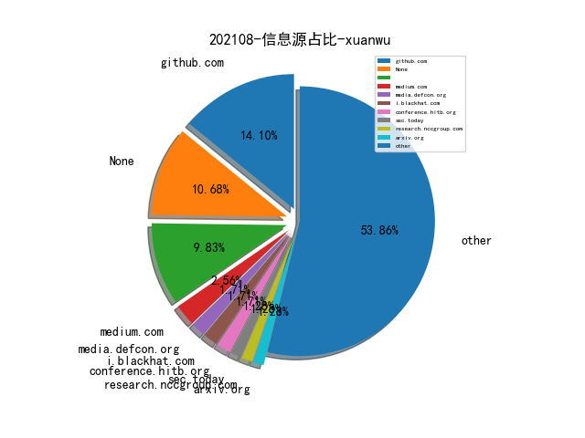

# [数据--所有](README_20.md)
# [数据--年度](README_2021.md)
# 202108 信息源与信息类型占比

# 微信公众号 推荐
| nickname_english | weixin_no | title | url| 
| --- | --- | --- | ---| 
| 威胁棱镜 | THREAT_PRISM | 评估自动生成 Yara 规则工具的有效性及提高 | https://mp.weixin.qq.com/s/xvfa9pfFRZs64VgyV7KSsQ | 3| 
| 关键基础设施安全应急响应中心 | CII-SRC | 原创 , 《党委（党组）网络安全工作责任制实施办法》解读 | https://mp.weixin.qq.com/s/ZzFx2Leu7DYhm39Kacofcg | 1| 
| Seebug漏洞平台 | seebug_org | 使用 GDB 获取软路由的文件系统 | https://mp.weixin.qq.com/s/FWprX-R1EfWrPMNa0WPedA | 1| 
| FuzzWiki | gh_fcf21e658324 | fuzzing check分支概述 | https://mp.weixin.qq.com/s/7JdHPEo6DyxOjFuw1VMlqg | 1| 
| 编程语言Lab | HW-PLLab | 浅谈程序分析 | https://mp.weixin.qq.com/s/l5NAWWQ584uXCO_HRMvQ0A | 1| 
| 安全学术圈 | secquan | Android预装应用的分析 | https://mp.weixin.qq.com/s/ldkhHPH3MB4Te9JHa23xpg | 2| 
| SecWiki | SecWiki | Linux计划任务那点事儿 | https://mp.weixin.qq.com/s/KfeKpoPj-X7BRNR7O6QAcw | 1| 
| M01N Team | m01nteam | 攻击技术研判｜Lazarus结合NDay投递VBA恶意远控的攻击分析 | https://mp.weixin.qq.com/s/x7L3R9iQdnrnEKpfop92Gg | 1| 
| 我需要的是坚持 | MyPersistence2020 | 做红队你需要学习“如何挖掘战壕”（三） | https://mp.weixin.qq.com/s/OO_VZ8QB_J5UY88qkpLXDg | 1| 
| 腾讯技术工程 | Tencent_TEG | 攻防启示：Chromium组件风险剖析与收敛 | https://mp.weixin.qq.com/s/AZhzOGjh_DtFRnkt1zunxQ | 1| 

# 组织github账号 推荐
| github_id | title | url | org_url | org_profile | org_geo | org_repositories | org_people | org_projects | repo_lang | repo_star | repo_forks| 
| --- | --- | --- | --- | --- | --- | --- | --- | --- | --- | --- | ---| 

# 私人github账号 推荐
| github_id | title | url | p_url | p_profile | p_loc | p_company | p_repositories | p_projects | p_stars | p_followers | p_following | repo_lang | repo_star | repo_forks | 
| --- | --- | --- | --- | --- | --- | --- | --- | --- | --- | --- | --- | --- | --- | ---| 
| boku7 | Cobalt Strike BOF - Inject AMSI Bypass | https://github.com/boku7/injectAmsiBypass | https://github.com/boku7?tab=followers | SpiderLabs , OSWE , eWPTX , OSCE , eCXD , OSCP , SLAE32,64 | United States | Trustwave SpiderLabs | 42 | 0 | 0 | 0 | 0 | C,Assembly | 0 | 0 | 1| 

# medium_xuanwu 推荐
| title | url| 
| --- | ---| 
| Using ProxyCannon-NG to Create Unlimited Rotating Proxies | http://medium.com/@devinjaystokes/using-proxycannon-ng-to-create-unlimited-rotating-proxies-fccffa70a728| 
| 利用 Apple AWDL 协议从物理隔离的环境中向外渗透数据 | http://medium.com/sensorfu/escaping-from-a-truly-air-gapped-network-via-apple-awdl-6cf6f9ea3499| 
| 利用 CVE-2021-20090 漏洞绕过 Arcadyan 路由器的认证 | http://medium.com/tenable-techblog/bypassing-authentication-on-arcadyan-routers-with-cve-2021-20090-and-rooting-some-buffalo-ea1dd30980c2| 

# medium_secwiki 推荐
| title | url| 
| --- | ---| 

# zhihu_xuanwu 推荐
| title | url| 
| --- | ---| 

# zhihu_secwiki 推荐
| title | url| 
| --- | ---| 

# xz_xuanwu 推荐
| title | url| 
| --- | ---| 

# xz_secwiki 推荐
| title | url| 
| --- | ---| 

# 日更新程序
`python update_daily.py`