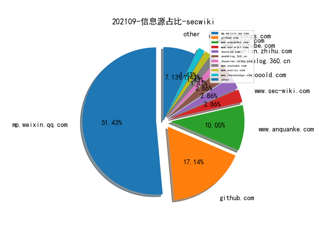
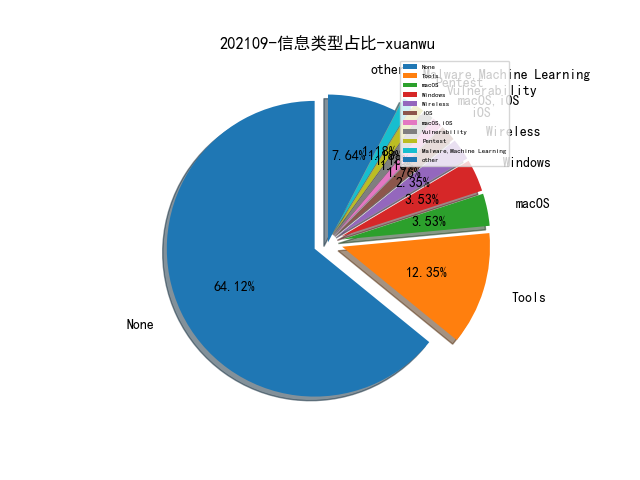
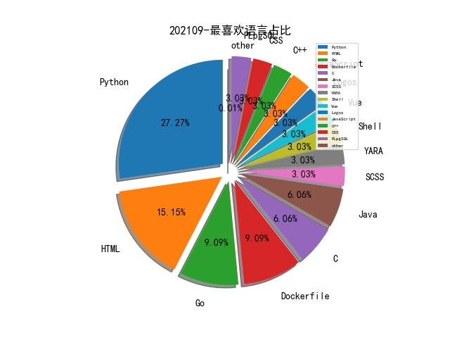

# [数据--所有](README_20.md)
# [数据--年度](README_2021.md)
# 202109 信息源与信息类型占比

# 微信公众号 推荐
| nickname_english | weixin_no | title | url| 
| --- | --- | --- | ---| 
| 锦行信息安全 | jeeseensec | None | https://mp.weixin.qq.com/s/2CZA9aRr9nsawMkxHQrupg | 1| 
| 黑哥说安全 | gh_67cfd5e45750 | None | https://mp.weixin.qq.com/s/fQatA5iyewqRBMWtpVjsRA | 1| 
| 一个人的安全笔记 | xjiek2015 | None | https://mp.weixin.qq.com/s/HFh8pMRtZ-fm_-0lMoUqvw | 1| 
| 安全学术圈 | secquan | None | https://mp.weixin.qq.com/s/ErjUg177-jGR9UQjyZaEoA | 1| 
| 网安思考 | gh_e53abd003964 | None | https://mp.weixin.qq.com/s/CwXqkHDSFK6XMFtvOpnsjw | 1| 
| 机器学习研究组订阅 | gh_7ce29bea153b | None | https://mp.weixin.qq.com/s/jfgrIRQSb_gPwvYGs8b_Pw | 1| 
| 安全界 | feei_cn | None | https://mp.weixin.qq.com/s/Fo0OhNb-MP-GqKM-ASCXsg | 1| 
| 奇安信威胁情报中心 | gh_166784eae33e | None | https://mp.weixin.qq.com/s/dGW0FrbZZ5UA6KuuZB8J_g | 1| 

# 组织github账号 推荐
| github_id | title | url | org_url | org_profile | org_geo | org_repositories | org_people | org_projects | repo_lang | repo_star | repo_forks| 
| --- | --- | --- | --- | --- | --- | --- | --- | --- | --- | --- | ---| 

# 私人github账号 推荐
| github_id | title | url | p_url | p_profile | p_loc | p_company | p_repositories | p_projects | p_stars | p_followers | p_following | repo_lang | repo_star | repo_forks | 
| --- | --- | --- | --- | --- | --- | --- | --- | --- | --- | --- | --- | --- | --- | ---| 
| hackingintoyourheart | 本田雅阁、思域等多款车存在密钥重放攻击安全漏洞 | https://github.com/hackingintoyourheart/unoriginal-rice-patty | https://github.com/HackingIntoYourHeart?tab=followers | Computer Scientist... ㅤㅤㅤㅤㅤㅤㅤㅤ BTC: 3NqgZV8MaYDp6B6AJxSs7La9XuMZx8Nuxk ㅤㅤㅤㅤㅤㅤㅤㅤㅤㅤㅤㅤㅤ ETH: 0x65a3CC7D99139000B43EeAe33EdcdCACbaE98524 | Earth | Blake Berry | 17 | 0 | 0 | 0 | 0 | Python,C++ | 0 | 0 | 1| 
| Impalabs | Reversing and Exploiting Samsungs Neural Processing Unit | https://github.com/Impalabs/conferences/blob/master/2021-barbhack21/21-Barbhack21-Reversing_and_Exploiting_Samsungs_Neural_Processing_Unit.pdf | None | None | None | None | 0 | 0 | 0 | 0 | 0 |  | 0 | 0 | 1| 
| HXSecurity | DongTai: 开源的 IAST | https://github.com/HXSecurity/DongTai | None | None | None | None | 0 | 0 | 0 | 0 | 0 | Shell,Java,Python,HTML,PLpgSQL,CSS | 0 | 0 | 1| 
| CHYbeta | URL FIlter 绕过 - Python 之 Flask | https://github.com/CHYbeta/URLFilterBypassDemo/blob/master/python/flask_demo/README.md | https://github.com/CHYbeta?tab=followers |  | China | XMU | 32 | 0 | 0 | 0 | 0 | Python,HTML,Dockerfile | 0 | 0 | 2| 

# medium_xuanwu 推荐
| title | url| 
| --- | ---| 
| 用深度学习的方案检测命令混淆的问题 | http://link.medium.com/bmZ51ncnZib| 
| Teradek 网络视频设备被发现 Root Shell 后门漏洞 | http://medium.com/m/global-identity?redirectUrl=https%3A%2F%2Finfosecwriteups.com%2Ffull-disclosure-0-day-rce-backdoor-in-teradek-ip-video-device-firmwares-85a16f346e15| 

# medium_secwiki 推荐
| title | url| 
| --- | ---| 

# zhihu_xuanwu 推荐
| title | url| 
| --- | ---| 

# zhihu_secwiki 推荐
| title | url| 
| --- | ---| 
| Survey: 基于机器学习和数据挖掘技术的软件漏洞检测 | https://zhuanlan.zhihu.com/p/405003793| 

# xz_xuanwu 推荐
| title | url| 
| --- | ---| 

# xz_secwiki 推荐
| title | url| 
| --- | ---| 

# 日更新程序
`python update_daily.py`