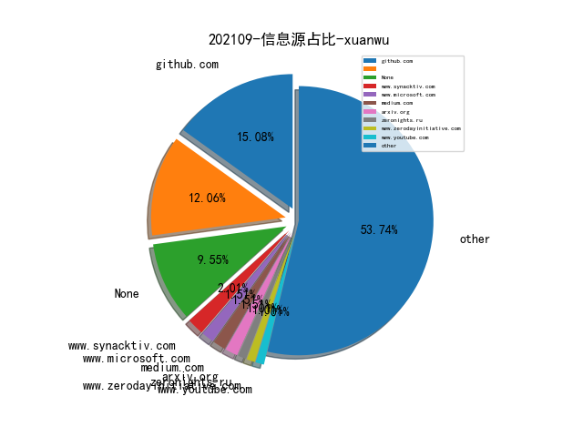
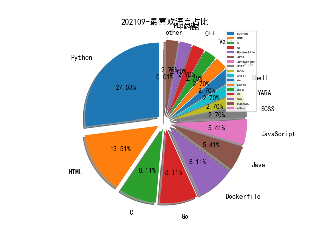

# [数据--所有](README_20.md)
# [数据--年度](README_2021.md)
# 202109 信息源与信息类型占比

# 微信公众号 推荐
| nickname_english | weixin_no | title | url| 
| --- | --- | --- | ---| 
| 我是安服 | scaf_0123 | 攻防演练之反序列化漏洞与内存马 | https://mp.weixin.qq.com/s/q3h8Lqby_LKZo-8wMYl7nw | 1| 
| 微言晓意 | WeYanXY | 安全运营中心（SOC）技术框架 | https://mp.weixin.qq.com/s/4LmvqBYJeTOPa237-vaZeQ | 1| 
| 安全攻防团队 | gh_983c1037a3f6 | 议题回顾 - “基于腾讯云的分布式蜜罐开发实战” | https://mp.weixin.qq.com/s/C443I605MfAwBSxf0PP8sg | 1| 
| Hacking就是好玩 | gh_aed6cfc863ed | crawlergo 动态爬虫源码学习 | https://mp.weixin.qq.com/s/votEOvJafPjCka7gIB8DEA | 1| 
| thelostworld | gh_3f2e5b9f028c | 一、小程序｜App抓包(一)环境篇 | https://mp.weixin.qq.com/s?__biz=MzIyNjk0ODYxMA==&mid=2247486232&idx=1&sn=927a38a8584a529494d8079810b2fe29 | 2| 
| HACK之道 | hacklearn | Fiddler对安卓模拟器里的APP抓包（步骤详细，各种抓包工具总结） | https://mp.weixin.qq.com/s?__biz=MzIwMzIyMjYzNA==&mid=2247495402&idx=1&sn=d24822042735ec7f66be115d3408dd2d | 1| 
| 赛博英杰 | GeniusCyberTech | 谭晓生：网络空间安全产业如何助力数字化转型 | https://mp.weixin.qq.com/s/pFeEBd_kng7KSGMxSeMRcQ | 1| 
| 娜璋AI安全之家 | gh_91f1fe28fc6e | [当人工智能遇上安全] 5.基于机器学习算法的主机恶意代码识别研究 | https://mp.weixin.qq.com/s/R3-5kzS2RfjyBsTxY8O0tA | 1| 
| 360威胁情报中心 | CoreSec360 | 疑似APT-C-56透明部落攻击预警 | https://mp.weixin.qq.com/s/hHBsy_B3jECr2FLk5g9gbA | 1| 
| 黑白之道 | i77169 | 反弹shell的N种姿势 | https://mp.weixin.qq.com/s?__biz=MzAxMjE3ODU3MQ==&mid=2650523397&idx=2&sn=513d86e5349504d198d3536a4109073d | 2| 
| 系统安全运维 | Taurus-1314147 | Linux应急响应实战 | https://mp.weixin.qq.com/s?__biz=Mzk0NjE0NDc5OQ==&mid=2247492082&idx=1&sn=4bdc99a1c1e0d14ff1dfa37ec283be47 | 3| 
| 安全行者老霍 | gh_c2b78e839fd7 | 欧盟网络安全局供应链攻击威胁全景图（下） | https://mp.weixin.qq.com/s/LI_aErTZNl8zcOuextiSuw | 3| 
| 乌雲安全 | hackctf | php代码审计总结 | https://mp.weixin.qq.com/s?__biz=MzAwMjA5OTY5Ng==&mid=2247498962&idx=3&sn=ba448121e4aa8469dea5420c0ec66b08 | 1| 
| 维他命安全 | VitaminSecurity | Apple修复iOS和macOS中已被利用的RCE；SonicWall修复SMA 100系列中的任意文件删除漏洞 | https://mp.weixin.qq.com/s?__biz=MzUxMDQzNTMyNg==&mid=2247496703&idx=1&sn=2b7dac49097267736ff7279b6f7cad18 | 2| 
| 渗透Xiao白帽 | SuPejkj | 【漏洞速递+检测脚本 , CVE-2021-22005】VMware vCenter Server未授权任意文件上传漏洞 | https://mp.weixin.qq.com/s?__biz=MzI1NTM4ODIxMw==&mid=2247489920&idx=1&sn=59d92601db758e9d538d5fa444ab8a6b | 1| 
| 嘶吼专业版 | Pro4hou | 微软Exchange漏洞暴露10万Windows域凭证 | https://mp.weixin.qq.com/s?__biz=MzI0MDY1MDU4MQ==&mid=2247529441&idx=1&sn=5f7903f638ba6f2dda607ecc7b6de059 | 2| 
| XG小刚 | XG_WEB | 权限维持-映像劫持 | https://mp.weixin.qq.com/s?__biz=MzIwOTMzMzY0Ng==&mid=2247486320&idx=1&sn=92fd9c054f554acd16fecc27ee935896 | 1| 
| Linux中国 | linux-cn | 如何在树莓派 4 上安装 Ubuntu 桌面系统 , Linux 中国 | https://mp.weixin.qq.com/s?__biz=MjM5NjQ4MjYwMQ==&mid=2664641347&idx=3&sn=41191f5638b17467801f4c13f389cc63 | 1| 
| LSCteam | gh_d97c073d1479 | CVE-2020-0796检测与修复 | https://mp.weixin.qq.com/s?__biz=MzUyMjAyODU1NA==&mid=2247488492&idx=1&sn=092db036cd48115528a0f5efce139c04 | 1| 
| Khan安全攻防实验室 | KhanCJSH | CVE-2021-22005 vCenter Server 文件上传 屁噢C | https://mp.weixin.qq.com/s?__biz=MzAwMjQ2NTQ4Mg==&mid=2247487660&idx=1&sn=feb2c7508b6b92bfbe603a33966b846b | 1| 
| Hacking黑白红 | Hacking012 | ATT&CK实战系列-红队评估 （一）Vulnstack靶场内网域渗透 | https://mp.weixin.qq.com/s?__biz=Mzg2NDYwMDA1NA==&mid=2247495964&idx=1&sn=a48f7ff148cb8d36d75e1426b04182c5 | 7| 
| Gamma实验室 | HackerLearning | 利用基于资源的委派提权-Rotten-Tomato | https://mp.weixin.qq.com/s?__biz=Mzg2NjQ2NzU3Ng==&mid=2247488805&idx=1&sn=0bb2a76d5a6f976173d9c020d9f19434 | 1| 
| 穿过丛林 | gh_f90eac70537b | 漏洞知识图谱构建技术研究 | https://mp.weixin.qq.com/s/Zfwxcs1oaCqwno6lcIOMLQ | 1| 
| FuzzWiki | gh_fcf21e658324 | 浅谈固件Fuzz | https://mp.weixin.qq.com/s/IL-wIM8wePZL07l9YJnX_Q | 2| 
| 雁行安全团队 | YX_Security | Dubbo 源码分析 | https://mp.weixin.qq.com/s/o1QSOkTTFHft0EWpUh0pDg | 2| 
| 腾讯安全应急响应中心 | tsrc_team | Web应用组件自动化发现的探索 | https://mp.weixin.qq.com/s/6xFYQ3D45VpTT3n_qgRing | 2| 
| Red0 | gh_74f47275d982 | RASP关键技术与相关产品调研 | https://mp.weixin.qq.com/s/juEPju1Qx7Wdt0akDz9BsA | 1| 
| 赛博堡垒 | gh_099f3e462773 | VaultFuzzer: 针对Linux内核的状态导向模糊测试方案 | https://mp.weixin.qq.com/s/ZevJBJjANmBLPCG0RyC3eg | 1| 
| 腾讯代码安全检查Xcheck | gh_177b81103e8d | Xcheck之PHP代码安全检查 | https://mp.weixin.qq.com/s?__biz=Mzg2ODQ3ODE1NA==&mid=2247483818&idx=1&sn=f55330a128035ba29cc8f1eca2c56230&chksm=ceaafc0ff9dd7519397f4dc0f710c3901ad7b76436dbc7accbfc1a543c702f49dabefa0d7ea5&token=654851123&lang=zh_CN#rd | 5| 
| 网络安全应急技术国家工程实验室 | NELCERT | 谈谈网络空间“行为测绘” | https://mp.weixin.qq.com/s/THEdOpSu_bSPWo66sRDyPA | 1| 
| 绿盟科技研究通讯 | nsfocus_research | 攻击推理-安全知识图谱应用的困境思考 | https://mp.weixin.qq.com/s/DOfrD7SGpoXP--zZPzf5bg | 3| 
| 数世咨询 | dwconcn | 网络空间资产安全管理实践与创新 | https://mp.weixin.qq.com/s/3NWI-_qJZfTuqvFl3d2SAQ | 1| 
| 亿人安全 | Yr-Sec | 内网渗透测试：DCSync 攻击技术的利用 | https://mp.weixin.qq.com/s?__biz=Mzk0MTIzNTgzMQ==&mid=2247485912&idx=1&sn=2cbaf2d8eca710edb5e39a4031c1d9c6 | 3| 
| 互联网后端架构 | fullstack888 | 如何高效迅速的进行CodeReview | https://mp.weixin.qq.com/s/nlDSYvR2SyKhtl4fOPt2Hg | 1| 
| NGINX开源社区 | gh_0d2551f1bdb6 | NGINX速率限制原理及源码分析 | https://mp.weixin.qq.com/s/hj7DPoFevmRPdgMY9orilg | 1| 
| 威胁棱镜 | THREAT_PRISM | IoT 恶意软件进化谱系研究 | https://mp.weixin.qq.com/s/xXYFcVOXA6lZfhign0BJlg | 1| 
| ChaMd5安全团队 | chamd5sec | Miara的延续--gafgyt病毒分析 | https://mp.weixin.qq.com/s/JYBdhxbt0mqU3wIqFFWdhQ | 2| 
| 黑哥说安全 | gh_67cfd5e45750 | 谈谈网络空间“行为测绘” | https://mp.weixin.qq.com/s/fQatA5iyewqRBMWtpVjsRA | 1| 
| 锦行信息安全 | jeeseensec | 技术分享 , DLL注入之全局钩子注入 | https://mp.weixin.qq.com/s/2CZA9aRr9nsawMkxHQrupg | 1| 
| 莫哥谈安全 | gh_247dfbdf3d43 | 漫谈企业安全运营能力建设 | https://mp.weixin.qq.com/s/dBAV_4iGw8rTU5Y3SI4ocA | 1| 
| 安全营销喵喵站 | Z1-Businessweek | Gartner：2021年SIEM（安全信息与事件管理）市场分析 | https://mp.weixin.qq.com/s/2hiU8ko3N3duW0sI9JdNfA | 1| 
| 安全客 | anquanbobao | 【技术分享】如何高效地捡漏反序列化利用链？ | https://mp.weixin.qq.com/s/th9hDuMK8LgrkesgPvEDHQ | 1| 
| 一个人的安全笔记 | xjiek2015 | [HTB] Haystack Writeup | https://mp.weixin.qq.com/s/HFh8pMRtZ-fm_-0lMoUqvw | 2| 
| 安全学术圈 | secquan | 小心你信任的人：跨域通信中的安全陷阱 | https://mp.weixin.qq.com/s/ErjUg177-jGR9UQjyZaEoA | 10| 
| 网安思考 | gh_e53abd003964 | 【专题研究第018期】DARPA近年网络空间安全领域主要项目梳理 | https://mp.weixin.qq.com/s/CwXqkHDSFK6XMFtvOpnsjw | 1| 
| 机器学习研究组订阅 | gh_7ce29bea153b | 自动检索、修复Python代码bug，微软推出DeepDebug | https://mp.weixin.qq.com/s/jfgrIRQSb_gPwvYGs8b_Pw | 1| 
| 安全界 | feei_cn | GitHub Pull Request业务逻辑风险 | https://mp.weixin.qq.com/s/Fo0OhNb-MP-GqKM-ASCXsg | 1| 
| 奇安信威胁情报中心 | gh_166784eae33e | Operation（Thủy Tinh）OceanStorm：隐匿在深海巨渊下的邪恶莲花 | https://mp.weixin.qq.com/s/dGW0FrbZZ5UA6KuuZB8J_g | 1| 

# 私人github账号 推荐
| github_id | title | url | p_url | p_profile | p_loc | p_company | p_repositories | p_projects | p_stars | p_followers | p_following | repo_lang | repo_star | repo_forks | 
| --- | --- | --- | --- | --- | --- | --- | --- | --- | --- | --- | --- | --- | --- | ---| 
| waydroid | Waydroid - 用容器的方案在 Linux 系统中启动完整 Android 系统 | https://github.com/waydroid/waydroid | None | None | None | None | 0 | 0 | 0 | 0 | 0 | None | 0 | 0 | 1| 
| ttttmr | 检测浏览器是否存在代理 | https://github.com/ttttmr/checkproxy | https://github.com/ttttmr?tab=followers | Security & Development | None | Chaitin | 45 | 0 | 0 | 0 | 0 | Python,HTML,JavaScript | 0 | 0 | 1| 
| returntocorp | semgrep:Find bug variants with patterns that look like sou... | https://github.com/returntocorp/semgrep | None | None | None | None | 0 | 0 | 0 | 0 | 0 | C,TypeScript,Java,Python,JavaScript,OCaml,Go,Ruby | 0 | 0 | 1| 
| justinsteven | GitHub 提供的拼写检查 workflow 被发现存在漏洞，可以泄露 GITHUB_TOKEN API Key | https://github.com/justinsteven/advisories/blob/master/2021_github_actions_checkspelling_token_leak_via_advice_symlink.md | https://github.com/justinsteven?tab=followers |  | Brisbane, Australia | None | 23 | 0 | 0 | 0 | 0 | C | 0 | 0 | 1| 
| horizon3ai | 微软 Azure 云 OMI Agent RCE 漏洞的 PoC | https://github.com/horizon3ai/CVE-2021-38647 | None | None | None | None | 0 | 0 | 0 | 0 | 0 | Python | 0 | 0 | 1| 
| hackingintoyourheart | 本田雅阁、思域等多款车存在密钥重放攻击安全漏洞 | https://github.com/hackingintoyourheart/unoriginal-rice-patty | https://github.com/HackingIntoYourHeart?tab=followers | Computer Scientist... ㅤㅤㅤㅤㅤㅤㅤㅤ BTC: 3NqgZV8MaYDp6B6AJxSs7La9XuMZx8Nuxk ㅤㅤㅤㅤㅤㅤㅤㅤㅤㅤㅤㅤㅤ ETH: 0x65a3CC7D99139000B43EeAe33EdcdCACbaE98524 | Earth | Blake Berry | 17 | 0 | 0 | 0 | 0 | Python,C++ | 0 | 0 | 1| 
| fofapro | fapro: 协议模拟服务器 | https://github.com/fofapro/fapro | None | None | None | None | 0 | 0 | 0 | 0 | 0 | SCSS,C,Vue,Java,Python,Go | 0 | 0 | 1| 
| awake1t | HackReport: 渗透测试报告/资料文档/渗透经验文档/安全书籍 | https://github.com/awake1t/HackReport | https://github.com/awake1t?tab=followers | 我想戒烟 | None | None | 10 | 0 | 0 | 0 | 0 | Go,Python,Logos | 0 | 0 | 1| 
| Kart1keya | Hachi: This tool maps a files behavior on MITRE ATT&CK ma... | https://github.com/Kart1keya/Hachi | https://github.com/Kart1keya?tab=followers |  | None | None | 4 | 0 | 0 | 0 | 0 | Python,YARA | 0 | 0 | 1| 
| Impalabs | Reversing and Exploiting Samsungs Neural Processing Unit | https://github.com/Impalabs/conferences/blob/master/2021-barbhack21/21-Barbhack21-Reversing_and_Exploiting_Samsungs_Neural_Processing_Unit.pdf | None | None | None | None | 0 | 0 | 0 | 0 | 0 |  | 0 | 0 | 1| 
| Hackndo | lsassy - 远程从 lsass dump 提取敏感凭据信息的工具 | https://github.com/Hackndo/lsassy | https://github.com/Hackndo?tab=followers | Security blog author https://hackndo.com | Paris | Hackndo Labs | 67 | 0 | 0 | 0 | 0 | Python | 0 | 0 | 1| 
| HXSecurity | DongTai: 开源的 IAST | https://github.com/HXSecurity/DongTai | None | None | None | None | 0 | 0 | 0 | 0 | 0 | Shell,Java,Python,HTML,PLpgSQL,CSS | 0 | 0 | 1| 
| CHYbeta | Nginx 场景绕过之二：斜杠(trailing slash) 与 编码 | https://github.com/CHYbeta/OddProxyDemo/blob/master/nginx/demo2/README.md | https://github.com/CHYbeta?tab=followers |  | China | XMU | 31 | 0 | 0 | 0 | 0 | HTML,Dockerfile | 0 | 0 | 5| 

# medium 推荐
| title | url| 
| --- | ---| 
| Attacking Azure, Azure AD, and Introducing PowerZure | http://medium.com/m/global-identity?redirectUrl=https%3A%2F%2Fposts.specterops.io%2Fattacking-azure-azure-ad-and-introducing-powerzure-ca70b330511a| 
| 用手机 Hacking LG 搭载基于 Linux 的 WebOS 智能电视 | http://medium.com/geekculture/hacking-lg-webos-smart-tvs-using-a-phone-3fedba5d6f50| 
| Monitoring Threat Actors Cobalt Strike C2 Infrastructure with Shodan | http://michaelkoczwara.medium.com/monitoring-threat-actors-c2-infrastructure-with-shodan-9be6f7aa1d41| 
| 汽车渗透测试 101：利用仪表板模拟器的CAN 总线的实用指南 - 第一部分：设置介绍 | http://medium.com/@yogeshojha/car-hacking-101-practical-guide-to-exploiting-can-bus-using-instrument-cluster-simulator-part-i-cd88d3eb4a53| 
| 利用静态扫描工具 Semgrep 检测 Flask 项目中的 XSS 漏洞 | http://michaelhidalgo.medium.com/on-flask-semgrep-and-secure-coding-26290fcdd960| 
| Oracle BI XML XXE 漏洞分析 | http://testbnull.medium.com/linh-tinh-v%E1%BB%81-oracle-business-intelligence-part-1-5a050b48a193| 
| Facebook 邮件泄露及账号接管漏洞分析 | http://rikeshbaniyaaa.medium.com/facebook-email-disclosure-and-account-takeover-ecdb44ee12e9| 
| 用深度学习的方案检测命令混淆的问题 | http://link.medium.com/bmZ51ncnZib| 
| Teradek 网络视频设备被发现 Root Shell 后门漏洞 | http://medium.com/m/global-identity?redirectUrl=https%3A%2F%2Finfosecwriteups.com%2Ffull-disclosure-0-day-rce-backdoor-in-teradek-ip-video-device-firmwares-85a16f346e15| 

# 知乎 推荐
| title | url| 
| --- | ---| 
| 有用户反馈在百度搜索中搜索 iterm2 排名第一的推广链接下载的 iterm2 是钓鱼版本 | https://zhuanlan.zhihu.com/p/408746101| 

# 知乎 推荐
| title | url| 
| --- | ---| 
| Survey: 基于机器学习和数据挖掘技术的软件漏洞检测 | https://zhuanlan.zhihu.com/p/405003793| 

# 日更新程序
`python update_daily.py`