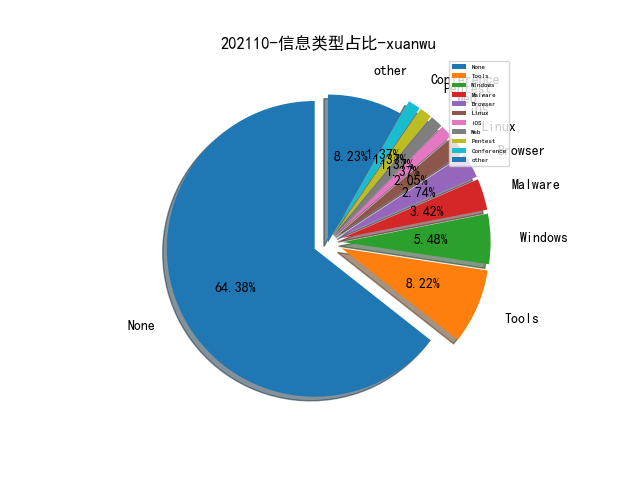

# [数据--所有](README_20.md)
# [数据--年度](README_2021.md)
# 202110 信息源与信息类型占比

# 微信公众号 推荐
| nickname_english | weixin_no | title | url| 
| --- | --- | --- | ---| 
| 大余安全 | dayuST123 | HackTheBox-Linux-PlayerTwo | https://mp.weixin.qq.com/s?__biz=Mzg3MDMxMTg3OQ==&mid=2247496802&idx=1&sn=935a9fc7833c4821ec02e90a1d9d36f9 | 4| 
| 看雪学院 | ikanxue | CVE-2012-0003 winmm.dll MIDI文件堆溢出漏洞分析及利用 | https://mp.weixin.qq.com/s?__biz=MjM5NTc2MDYxMw==&mid=2458395633&idx=2&sn=ccc919adad0ed6c58d8d0bff3e1331c2 | 1| 
| 盾山实验室 | DunShanRR | 使用OpenCVE在本地进行CVE漏洞探究 | https://mp.weixin.qq.com/s?__biz=MzkzMjIwMDY4Nw==&mid=2247485560&idx=1&sn=e596f5115249b49bc67974292d730ac6 | 2| 
| 渗透测试教程 | bzhack | 弱口令扫描工具 - 一款跨平台小巧的端口爆破工具 | https://mp.weixin.qq.com/s?__biz=MzI3OTIwNDkzNQ==&mid=2651836236&idx=1&sn=0e77acf89df93e60999cf8890f7acc8d | 1| 
| 渗透Xiao白帽 | SuPejkj | 【干货】逻辑漏洞出现场景、利用方式总结 | https://mp.weixin.qq.com/s?__biz=MzI1NTM4ODIxMw==&mid=2247489983&idx=1&sn=967e9d7968e240f9c99129fb4abe3b78 | 1| 
| 嘶吼专业版 | Pro4hou | 电子邮件环境下STARTTLS的安全性分析 | https://mp.weixin.qq.com/s?__biz=MzI0MDY1MDU4MQ==&mid=2247529822&idx=2&sn=22435b83fe8c12d88b51ed99a3e35e3b | 3| 
| PeiQi文库 | PeiQi_wiki | 某CMS common.func.php 远程命令执行 | https://mp.weixin.qq.com/s?__biz=Mzg3NDU2MTg0Ng==&mid=2247485903&idx=1&sn=1bb01b38ad8618520e51decdf1f8a79f | 1| 
| HACK学习呀 | Hacker1961X | 内网渗透｜浅谈内网渗透中的代理和转发 | https://mp.weixin.qq.com/s?__biz=MzI5MDU1NDk2MA==&mid=2247500279&idx=1&sn=47f4d59180ff25b1d3a00d9b083b7a8d | 2| 
| FreeBuf | freebuf | 挖矿木马z0Miner正利用Confluence漏洞发起攻击 | https://mp.weixin.qq.com/s?__biz=MjM5NjA0NjgyMA==&mid=2651139709&idx=2&sn=8283115691e60d9f3de458caee832c3f | 6| 
| 利刃信安 | LRXAEGZ | 【学习笔记】CTF 之 流量分析（02） | https://mp.weixin.qq.com/s?__biz=MzU1Mjk3MDY1OA==&mid=2247493266&idx=2&sn=653404f09f2d9b46affa8b4965db02e9 | 5| 
| RCE TEAM | gh_3688f58729a9 | 文件上云 - 对象存储的攻击方式 | https://mp.weixin.qq.com/s/eZ8OAO5ELgUNvVricIStGA | 1| 
| LSCteam | gh_d97c073d1479 | 跨站脚本攻击(XSS) | https://mp.weixin.qq.com/s?__biz=MzUyMjAyODU1NA==&mid=2247488572&idx=1&sn=dd096ba399b22811f5c1d8a2b772740c | 1| 
| HACK之道 | hacklearn | 记一次内网流量转发学习 | https://mp.weixin.qq.com/s?__biz=MzIwMzIyMjYzNA==&mid=2247495860&idx=1&sn=8486e6d314c794ffc99ee1dad60d6b47 | 1| 
| ChaMd5安全团队 | chamd5sec | Cisco RV110W UPnP 0day 分析 | https://mp.weixin.qq.com/s?__biz=MzIzMTc1MjExOQ==&mid=2247497081&idx=1&sn=8ac3dca8a10d4adf7fc37ea26ee14e75 | 1| 
| 慢雾科技 | SlowMist | 天价手续费分析：我不是真土豪 | https://mp.weixin.qq.com/s?__biz=MzU4ODQ3NTM2OA==&mid=2247492157&idx=1&sn=791e7d52dbb9704ceb22e809be388454&chksm=fdde9cbacaa915ac5ef8f3041c9fdcffb926aa7e3c0025a141fa8d20f1c5adde55f07e8d44ec&token=1743499466&lang=zh_CN#rd | 1| 
| 奇安信威胁情报中心 | gh_166784eae33e | 每周高级威胁情报解读(2021.09.23~09.30) | https://mp.weixin.qq.com/s?__biz=MzI2MDc2MDA4OA==&mid=2247496977&idx=1&sn=2d135ec5995de8ae5fcaa91420e5ddc6 | 1| 
| LemonSec | lemon-sec | Linux 操作系统加固 | https://mp.weixin.qq.com/s?__biz=MzUyMTA0MjQ4NA==&mid=2247516611&idx=1&sn=b037319ba4cfdf10e06a0cd609b1619a | 1| 
| Gamma实验室 | HackerLearning | 红队技巧-内网下的凭据解密 | https://mp.weixin.qq.com/s?__biz=Mzg2NjQ2NzU3Ng==&mid=2247488867&idx=1&sn=4376a5c36cb7da633fbf54009fd69aee | 1| 

# 组织github账号 推荐
| github_id | title | url | org_url | org_profile | org_geo | org_repositories | org_people | org_projects | repo_lang | repo_star | repo_forks| 
| --- | --- | --- | --- | --- | --- | --- | --- | --- | --- | --- | ---| 

# 私人github账号 推荐
| github_id | title | url | p_url | p_profile | p_loc | p_company | p_repositories | p_projects | p_stars | p_followers | p_following | repo_lang | repo_star | repo_forks | 
| --- | --- | --- | --- | --- | --- | --- | --- | --- | --- | --- | --- | --- | --- | ---| 
| xforcered | 远程判断目标系统是否运行 Web Client service (WebDAV) 的工具 | https://github.com/xforcered/GetWebDAVStatus | None | None | None | None | 0 | 0 | 0 | 0 | 0 | C#,Python,C,JavaScript | 0 | 0 | 1| 
| facebook | Mariana Trench - Facebook 开源的一款 Android 静态漏洞扫描工具 | https://github.com/facebook/mariana-trench/ | None | None | None | None | 0 | 0 | 0 | 0 | 0 | C,TypeScript,Java,Python,JavaScript,OCaml,C++,Objective-C,Jupyter,Ruby | 0 | 0 | 1| 

# medium_xuanwu 推荐
| title | url| 
| --- | ---| 

# medium_secwiki 推荐
| title | url| 
| --- | ---| 

# zhihu_xuanwu 推荐
| title | url| 
| --- | ---| 

# zhihu_secwiki 推荐
| title | url| 
| --- | ---| 

# xz_xuanwu 推荐
| title | url| 
| --- | ---| 

# xz_secwiki 推荐
| title | url| 
| --- | ---| 

# 日更新程序
`python update_daily.py`