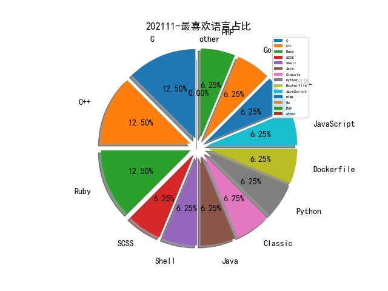

# [数据--所有](README_20.md)
# [数据--年度](README_2021.md)
# 202111 信息源与信息类型占比

# 微信公众号 推荐
| nickname_english | weixin_no | title | url| 
| --- | --- | --- | ---| 
| 系统安全运维 | Taurus-1314147 | xxe漏洞的学习与利用总结 | https://mp.weixin.qq.com/s?__biz=Mzk0NjE0NDc5OQ==&mid=2247493772&idx=1&sn=f4b3606377c803b2b9b3e331158e9cc8 | 3| 
| 潇湘信安 | xxxasec | 记一次SSRF+HFS命令执行回显相关研究 | https://mp.weixin.qq.com/s?__biz=Mzg4NTUwMzM1Ng==&mid=2247492576&idx=1&sn=976bd65bfa66824ccfa2eddd4f70ec2a | 3| 
| 可信系统安全实验室 | gh_296c8139d7e6 | 【11月3讲座回顾】 Building a Secure Open-Source Operating-System Kernel | https://mp.weixin.qq.com/s/UpB07tQxK5vvYl1alSQY3A | 1| 
| 利刃信安 | LRXAEGZ | Mac Nessus 10.0.0 | https://mp.weixin.qq.com/s?__biz=MzU1Mjk3MDY1OA==&mid=2247493357&idx=1&sn=0b874172955fd93014a647199b12d71b | 1| 
| 亿人安全 | Yr-Sec | GitLab 远程命令执行漏洞复现(CVE-2021-22205) | https://mp.weixin.qq.com/s?__biz=Mzk0MTIzNTgzMQ==&mid=2247487397&idx=1&sn=4628468f59eb325894370e6466ff3031 | 2| 
| 黑战士 | heizhanshi1 | 信息收集一如何对专属SRC进行信息收集 | https://mp.weixin.qq.com/s?__biz=MzUxMzQ2NTM2Nw==&mid=2247487484&idx=1&sn=5d77fe32b581a2161f54f08c79f834bb | 1| 
| 蛇矛实验室 | gh_2c0238928f82 | 记一次靶场多域场景搭建过程(上) | https://mp.weixin.qq.com/s?__biz=MzkwMjI1NzY4Ng==&mid=2247496372&idx=1&sn=86f2a7a405e1362b35472b875063cabc | 1| 
| 腾讯安全应急响应中心 | tsrc_team | 云原生安全攻防｜使用eBPF逃逸容器技术分析与实践 | https://mp.weixin.qq.com/s?__biz=MjM5NzE1NjA0MQ==&mid=2651205381&idx=1&sn=b7771a54e8b01cb6e7201a0ce4784e62 | 1| 
| 网络安全等保测评 | rxDJCP | 安全计算环境-（一）路由器-4 | https://mp.weixin.qq.com/s?__biz=MzI3MDY0Nzg1Nw==&mid=2247485736&idx=1&sn=ebddc0c9279d45849678ee020c9729dd | 3| 
| 红队防线 | klionsec | 一文读懂Kerberos认证流程 | https://mp.weixin.qq.com/s?__biz=MzI0OTkzOTc2Nw==&mid=2247484879&idx=1&sn=bb0e0a65fb3f92141563d9d496ba82c3 | 1| 
| 疯猫网络 | iloscat | 内网隐藏通信隧道技术——DNS隧道 | https://mp.weixin.qq.com/s?__biz=MzIyMzE5NTQ3Ng==&mid=2650622349&idx=1&sn=ec1a2a93c0082ee02df65fe85efcab6e | 3| 
| 猪猪谈安全 | zzt-anquan | 干货 , 内网渗透代理之MSF篇 | https://mp.weixin.qq.com/s?__biz=MzIyMDAwMjkzNg==&mid=2247496496&idx=1&sn=2adc81fcdace8c3f726f9ef94729226d | 2| 
| 灼剑安全团队 | Tsojan | GO工具开发｜基于网站API的子域名与IP反查工具（一） | https://mp.weixin.qq.com/s?__biz=Mzg5OTY1ODMxMg==&mid=2247488829&idx=1&sn=00a324e842d13e813ddd8326dc3d9308 | 3| 
| 安全初心 | securityheart | 搜索引擎劫持黑帽技术原理及防护 | https://mp.weixin.qq.com/s?__biz=MzU4NzU4MDg0Mw==&mid=2247486704&idx=1&sn=cfd952ed60e224f214329265b0daffd5 | 1| 
| 安世加 | asjeiss | 技术干货 , linux常见backdoor及排查技术 | https://mp.weixin.qq.com/s?__biz=MzU2MTQwMzMxNA==&mid=2247512162&idx=2&sn=941cd451c83885f7dc171595720bcd42 | 1| 
| 威胁棱镜 | THREAT_PRISM | 从开放目录到 GitHub 投毒 | https://mp.weixin.qq.com/s/HNdcwa5x3mTuxEPg2wmdMQ | 3| 
| 嘶吼专业版 | Pro4hou | 2021年第三季度APT趋势报告（下） | https://mp.weixin.qq.com/s?__biz=MzI0MDY1MDU4MQ==&mid=2247531051&idx=2&sn=984f796960938eeac809eb61144c1ea1 | 4| 
| 合天网安实验室 | hee_tian | 从一道CTF题到HTTP请求走私攻击 | https://mp.weixin.qq.com/s?__biz=MjM5MTYxNjQxOA==&mid=2652882427&idx=1&sn=86d178c9fbf3076adc0466943c8752dc | 1| 
| 军机故阁 | gh_e57baf46bdf5 | 入侵案例分析 | https://mp.weixin.qq.com/s?__biz=MzU5Mjk3MDA5Ng==&mid=2247483917&idx=1&sn=754ca2901e5ed22e93ee95db1c5e762c | 1| 
| 关键基础设施安全应急响应中心 | CII-SRC | 工控网络攻击后果堪比武器 | https://mp.weixin.qq.com/s?__biz=MzkyMzAwMDEyNg==&mid=2247521828&idx=5&sn=dd59df3da74c52010acb732bb3f0e66a | 1| 
| 代码卫士 | codesafe | 安卓修复已遭在野利用的内核 0day 漏洞 | https://mp.weixin.qq.com/s?__biz=MzI2NTg4OTc5Nw==&mid=2247508900&idx=2&sn=90c214127e289dadf16cdbe4db200cbe | 2| 
| 乌雲安全 | hackctf | 实战 , 绕过360安全套装+云锁提权案例 | https://mp.weixin.qq.com/s?__biz=MzAwMjA5OTY5Ng==&mid=2247499690&idx=1&sn=7532ef29437957c7ebebe6ceb7c7ea54 | 2| 
| TeamsSix | teamssix-com | 代码审计 , Maven 基础知识 | https://mp.weixin.qq.com/s?__biz=MzI5Mzk5NTIwMg==&mid=2247486500&idx=1&sn=a9e87893056ee6b6513dd4f9db076a0a | 1| 
| RedCode Team | RedCodetm | 审计｜Akcms注入漏洞的insert与select组合拳 | https://mp.weixin.qq.com/s?__biz=Mzg5MjY3MTk2Mw==&mid=2247484475&idx=1&sn=647968ef2c6f3d727cbd18f4c8a9fe6c | 3| 
| HACK学习呀 | Hacker1961X | 实战 , SRC信息收集思路总结 | https://mp.weixin.qq.com/s?__biz=MzI5MDU1NDk2MA==&mid=2247501144&idx=1&sn=62687584927c415941d674fd6642e706 | 1| 
| Docker中文社区 | dockerchina | 3 种姿势轻松采集 Nginx 日志 | https://mp.weixin.qq.com/s?__biz=MzI1NzI5NDM4Mw==&mid=2247488172&idx=1&sn=963578a287d536b072f77d20eaeb2e0c | 1| 
| Bypass | Bypass-- | Splunk系列：Splunk安装部署篇（一） | https://mp.weixin.qq.com/s?__biz=MzA3NzE2MjgwMg==&mid=2448907552&idx=1&sn=69de936e93e072e6f4b21c67ce5db34f | 1| 
| 骨哥说事 | guge_guge | 一键自动部署渗透工具 | https://mp.weixin.qq.com/s?__biz=MjM5Mzc4MzUzMQ==&mid=2650254865&idx=1&sn=2e0ebaa04cf3b24b957167394e27c69f | 1| 
| 邑安全 | EansecD | Hive恶意团队正开发Linux版勒索软件 目前缺乏相关功能 | https://mp.weixin.qq.com/s?__biz=MzUyMzczNzUyNQ==&mid=2247508821&idx=1&sn=be93d800c1adb7872d793107032a57f5 | 1| 
| 补天平台 | Patchingthesky | 个人总结：使用测绘平台搜目标资产的万能招式 | https://mp.weixin.qq.com/s?__biz=MzI2NzY5MDI3NQ==&mid=2247492220&idx=1&sn=9f7c7dfb6c107b21986f9aea5b5e049d | 1| 
| 知道创宇 | knownsec | 知道创宇云监测—ScanV MAX更新：SonarQube、GitLab、Apache Druid等14个漏洞可监测 | https://mp.weixin.qq.com/s?__biz=MjM5NzA3Nzg2MA==&mid=2649856141&idx=2&sn=7fd3ce5928990dbbd3e368773ae2757a | 1| 
| 渗透Xiao白帽 | SuPejkj | 干货 , 隐藏源IP，提高溯源难度的几种方法 | https://mp.weixin.qq.com/s?__biz=MzI1NTM4ODIxMw==&mid=2247490421&idx=1&sn=6273219f52c3da0249eba7cb45571d20 | 2| 
| 橘猫学安全 | gh_af700ee13397 | 干货,横向移动与域控权限维持方法总汇 | https://mp.weixin.qq.com/s?__biz=Mzg5OTY2NjUxMw==&mid=2247485216&idx=1&sn=522ee3b72a1faf34dd3de27f7038dc99 | 1| 
| 安恒威胁情报中心 | gh_e0f7c5e21306 | 疑似Donot APT组织使用最新域名资产进行攻击活动分析 | https://mp.weixin.qq.com/s?__biz=MzI1MDU5NjYwNg==&mid=2247492617&idx=1&sn=157af96590ef02e8f80859efb69f933d | 2| 
| 安全客 | anquanbobao | 【技术分享】浅谈无需修改注册表抓取明文密码 | https://mp.weixin.qq.com/s?__biz=MzA5ODA0NDE2MA==&mid=2649755983&idx=2&sn=5a4276b15b8ea837b601bab83bf87650 | 2| 
| 安全学术圈 | secquan | 解释与改进安全应用场景下的深度异常检测方法 | https://mp.weixin.qq.com/s/U5HYIFLjO3ikkMgHyjsUpQ | 3| 
| 奇安信威胁情报中心 | gh_166784eae33e | Trojan Source：新型供应链攻击？隐藏在源代码中的“幽灵” | https://mp.weixin.qq.com/s?__biz=MzI2MDc2MDA4OA==&mid=2247497305&idx=1&sn=2f120da4366e617b12a4f900e3583ec6 | 1| 
| 墨雪飘影 | SG-CXZ | 免扫码登录腾讯企业邮箱 | https://mp.weixin.qq.com/s?__biz=MzI3NzI4OTkyNw==&mid=2247487677&idx=1&sn=541d15351c374601f79edbe0d3ce9e59 | 1| 
| LemonSec | lemon-sec | Git常见命令总结，请查收！ | https://mp.weixin.qq.com/s?__biz=MzUyMTA0MjQ4NA==&mid=2247517855&idx=3&sn=31c29258364eeccac5cc7a435357500b | 1| 
| HACK之道 | hacklearn | 干货,常见6种WAF绕过和防护原理 | https://mp.weixin.qq.com/s?__biz=MzIwMzIyMjYzNA==&mid=2247496452&idx=1&sn=e528b06e502782e9a23895fc56a85f34 | 1| 
| GobySec | gobysec | 技术分享 , IP库？信息？资产？拿来吧你！ | https://mp.weixin.qq.com/s?__biz=MzI4MzcwNTAzOQ==&mid=2247509617&idx=1&sn=3e3e7df89231add9c55eb051b5a8c8ea | 1| 
| 360威胁情报中心 | CoreSec360 | APT-C-59（芜琼洞）组织2021年攻击行动揭秘 | https://mp.weixin.qq.com/s?__biz=MzUyMjk4NzExMA==&mid=2247488689&idx=1&sn=5f8a3590e94dd3c6e3bffcdc3fcf2328 | 1| 
| 黑鸟 | blackorbird | 航空产业已成境外情报机构重点网络攻击目标 | https://mp.weixin.qq.com/s/ANDLQBHTzB2uiS54xxyuZw | 1| 
| 释然IT杂谈 | ShiRan_IT | 【干货】思科ASA防火墙上配置透明模式的Failover Active/Acitve | https://mp.weixin.qq.com/s?__biz=MzIxMTEyOTM2Ng==&mid=2247496118&idx=1&sn=f7f9578890d3769c8188719cf6f4ade2 | 1| 
| 边界骇客 | no__root | DNS劫持→WINRAR 远程命令执行 | https://mp.weixin.qq.com/s?__biz=MzU1NTkzMTYxOQ==&mid=2247485036&idx=1&sn=cae3daa12034ce7a121e67872a1993af | 1| 
| 虎符智库 | TT_Thinktank | 起底国家级APT组织：蔓灵花（APT-Q-37） | https://mp.weixin.qq.com/s?__biz=MzIwNjYwMTMyNQ==&mid=2247486683&idx=1&sn=440e2c04f077a2465cbac4c00b09ce60 | 1| 
| 网安国际 | inforsec | 2021年网络安全领域四大顶会中国学者发表论文88篇（附目录） | https://mp.weixin.qq.com/s/igXuvxBdVZpM9fkAxnkJ5g | 1| 
| 科技锐新 | qimingyu_java | 一文彻底搞懂Spark | https://mp.weixin.qq.com/s/Uc-EaqL4Q9HchOH3JNQ53A | 1| 
| 祺印说信安 | qiyinshuoxinan | 打印机可能是“间谍”？ 7 种方法防住它“被策反” | https://mp.weixin.qq.com/s?__biz=MzA5MzU5MzQzMA==&mid=2652090643&idx=3&sn=c142700c7ba8828592ed71c2dbb9327b | 1| 
| 石头安全 | gh_bdb076c55582 | WriteUP-6days_lab 靶机 | https://mp.weixin.qq.com/s?__biz=MzkxNTIxOTkzMQ==&mid=2247484327&idx=1&sn=bf8abff5cee1083527869e5ebcc747bc | 1| 
| 盾山实验室 | DunShanRR | ImHex：十六进制编辑器 | https://mp.weixin.qq.com/s?__biz=MzkzMjIwMDY4Nw==&mid=2247485688&idx=1&sn=486c37df65b6479bc9f5e8735039d002 | 1| 
| 开源聚合网络空间安全研究院 | OSPtech_Cyberspace | 【挖金宝典】SRC信息收集思路分享 | https://mp.weixin.qq.com/s?__biz=MzI4NTE4NDAyNA==&mid=2650390038&idx=1&sn=91b2fae4b2bf29ec89a865fdd6766916 | 1| 
| 平安集团安全应急响应中心 | PSRC_Team | Nexus Repository Manager历史表达式注入漏洞分析 | https://mp.weixin.qq.com/s?__biz=MzIzODAwMTYxNQ==&mid=2652140927&idx=1&sn=9a6fe102df545083af8516b69931685c | 1| 
| 宸极实验室 | ChenJiLab | 『靶场』hackthebox 之 love 靶场实战 | https://mp.weixin.qq.com/s?__biz=Mzg4NTA0MzgxNQ==&mid=2247485171&idx=1&sn=9e60e0c5bfbe144b6119d288621e6248 | 1| 
| 安天 | Antiylab | 针对我国和南亚次大陆等国家的钓鱼攻击活动分析 | https://mp.weixin.qq.com/s?__biz=MjM5MTA3Nzk4MQ==&mid=2650184733&idx=1&sn=53e32b1c8dd9cb9db98be9725ee55339 | 1| 
| 安全宇宙 | knownsec818 | 【创宇小课堂】渗透测试-移动端各种方式抓包 | https://mp.weixin.qq.com/s?__biz=MzAxMDc5NzYwNQ==&mid=2652409428&idx=1&sn=8dd83d91f389d463897ebc6ebd27ce9c | 1| 
| web安全工具库 | websec-tools | 信息收集 -- JBoss架构 | https://mp.weixin.qq.com/s?__biz=MzI4MDQ5MjY1Mg==&mid=2247491048&idx=1&sn=e7082350dd3803f8f7fbe44ec9fb7b9c | 1| 
| bgbing安全 | bgbingsec | GitLab 未授权rce（反弹shell）CVE-2021-22205 | https://mp.weixin.qq.com/s?__biz=MzkwNzEzMTg3MQ==&mid=2247484883&idx=1&sn=261e8eedf5ab6663f8f8f332008cfa77 | 1| 
| Linux中国 | linux-cn | 如何在 Linux 上杀死一个僵尸进程 , Linux 中国 | https://mp.weixin.qq.com/s?__biz=MjM5NjQ4MjYwMQ==&mid=2664643220&idx=1&sn=2eb3afc1070c19eb1a591a7427250ce8 | 1| 
| Khan安全攻防实验室 | KhanCJSH | 利用PingTunnel上线cobalt strike | https://mp.weixin.qq.com/s?__biz=MzAwMjQ2NTQ4Mg==&mid=2247487911&idx=1&sn=f1d417ca3422da17a8ced173eca3af13 | 1| 
| GoCN | golangchina | 『每周译Go』定位并修复 Go 中的内存泄漏 | https://mp.weixin.qq.com/s?__biz=MzA4ODg0NDkzOA==&mid=2247493669&idx=1&sn=2208d2af6a4b93cfc333fb2d2adcbedf | 1| 
| Gamma实验室 | HackerLearning | 红队攻击-绕过waf以及IDS等流量设备 | https://mp.weixin.qq.com/s?__biz=Mzg2NjQ2NzU3Ng==&mid=2247489039&idx=1&sn=4953b3f8dc6a316f95f07c5e997052a8 | 1| 
| FreeBuf | freebuf | 如何使用EDD枚举域数据 | https://mp.weixin.qq.com/s?__biz=MjM5NjA0NjgyMA==&mid=2651146454&idx=4&sn=28a1affe7d6eba5f8c808a205be23973 | 1| 

# 组织github账号 推荐
| github_id | title | url | org_url | org_profile | org_geo | org_repositories | org_people | org_projects | repo_lang | repo_star | repo_forks| 
| --- | --- | --- | --- | --- | --- | --- | --- | --- | --- | --- | ---| 

# 私人github账号 推荐
| github_id | title | url | p_url | p_profile | p_loc | p_company | p_repositories | p_projects | p_stars | p_followers | p_following | repo_lang | repo_star | repo_forks | 
| --- | --- | --- | --- | --- | --- | --- | --- | --- | --- | --- | --- | --- | --- | ---| 

# medium_xuanwu 推荐
| title | url| 
| --- | ---| 

# medium_secwiki 推荐
| title | url| 
| --- | ---| 

# zhihu_xuanwu 推荐
| title | url| 
| --- | ---| 

# zhihu_secwiki 推荐
| title | url| 
| --- | ---| 

# xz_xuanwu 推荐
| title | url| 
| --- | ---| 

# xz_secwiki 推荐
| title | url| 
| --- | ---| 

# 日更新程序
`python update_daily.py`