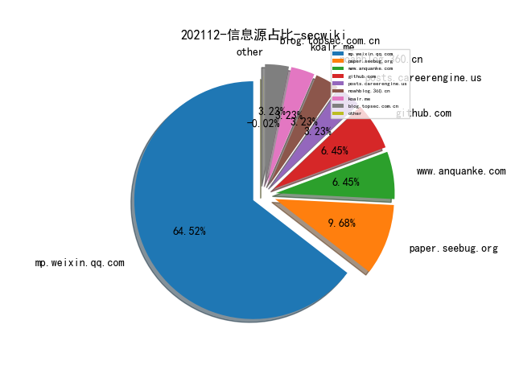
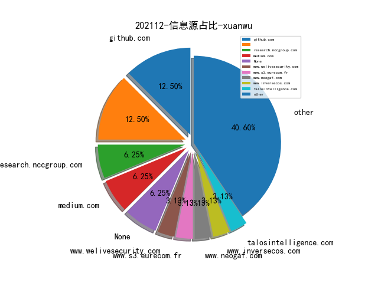
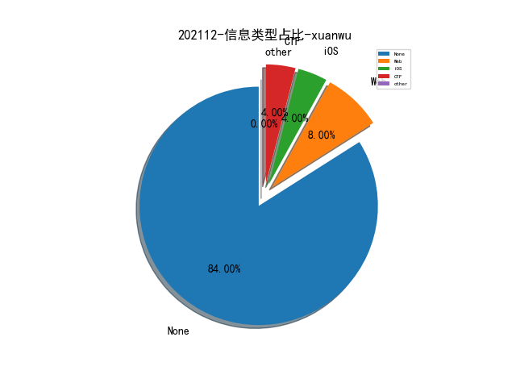
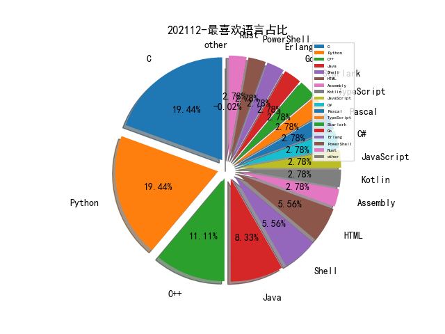

# [数据--所有](README_20.md)
# [数据--年度](README_2021.md)
# 202112 信息源与信息类型占比

# 微信公众号 推荐
| nickname_english | weixin_no | title | url| 
| --- | --- | --- | ---| 
| 雁行安全团队 | YX_Security | 信息搜集和密码利用的思路 | https://mp.weixin.qq.com/s/HbnXhaN0QdlqTW7f__NFHA | 1| 
| 路云天网络安全研究院 | gh_5237039d3db1 | 云天百家第5期：5G专网安全风险与技术方案 | https://mp.weixin.qq.com/s/6K3RQtjzAvtyYNkavuHuaw | 1| 
| 清华五道口MBA | pbcsf-fmba | 政策研究｜关于金融科技安全的认识与思考 | https://mp.weixin.qq.com/s/n63l4LOiViv5p9I2ELI2gg | 1| 
| 涛动宏观 | jinrongjianghu123123 | 官方首次解读地下钱庄 | https://mp.weixin.qq.com/s/-JrUb49rnegnGzPMElSUFg | 1| 
| 数据派THU | DatapiTHU | ​causal-learn：基于Python的因果发现算法平台 | https://mp.weixin.qq.com/s/a-UBil7WYmxb6FQx0TAJbw | 1| 
| 工业技术软件化产业联盟 | gh_96ac3d272f58 | 【图解】《“十四五”软件和信息技术服务业发展规划》 | https://mp.weixin.qq.com/s/6nJ7tpo5qu8zVI8nYDQAnA | 1| 
| 威胁棱镜 | THREAT_PRISM | 通过反编译和机器学习检测恶意样本代码重用 | https://mp.weixin.qq.com/s/9ptODSm-CiyZcXASaPybug | 1| 
| 嘶吼专业版 | Pro4hou | 攻击者利用微软MSHTML漏洞窃取谷歌和instagram凭证信息 | https://mp.weixin.qq.com/s/9rDDLeYcohGdTEewpfy6Iw | 1| 
| 一个人的安全笔记 | xjiek2015 | [HTB] Teacher Writeup | http://mp.weixin.qq.com/s?__biz=MzIwOTA4NTg4MA==&mid=2652489869&idx=1&sn=ebc8047316d1fed75e2057894f43d5d7&chksm=8c945c5abbe3d54cfacd247cf49b7254da02a43f54091dee10581b852a5d08c4eb4f3758eebc#rd | 1| 
| M01N Team | m01nteam | 从BeaconEye说起，围绕CS内存特征的检测与规避 | https://mp.weixin.qq.com/s/m1qOrRBrLAuRYu-eJQ_oOg | 1| 

# 组织github账号 推荐
| github_id | title | url | org_url | org_profile | org_geo | org_repositories | org_people | org_projects | repo_lang | repo_star | repo_forks| 
| --- | --- | --- | --- | --- | --- | --- | --- | --- | --- | --- | ---| 

# 私人github账号 推荐
| github_id | title | url | p_url | p_profile | p_loc | p_company | p_repositories | p_projects | p_stars | p_followers | p_following | repo_lang | repo_star | repo_forks | 
| --- | --- | --- | --- | --- | --- | --- | --- | --- | --- | --- | --- | --- | --- | ---| 

# medium_xuanwu 推荐
| title | url| 
| --- | ---| 
| Azure Privilege Escalation via Azure API Permissions Abuse | http://medium.com/m/global-identity?redirectUrl=https%3A%2F%2Fposts.specterops.io%2Fazure-privilege-escalation-via-azure-api-permissions-abuse-74aee1006f48| 
| Abusing Location Services on macOS | http://medium.com/@slyd0g/where-in-the-world-is-carmen-sandiego-abusing-location-services-on-macos-10e9f4eefb71| 

# medium_secwiki 推荐
| title | url| 
| --- | ---| 

# zhihu_xuanwu 推荐
| title | url| 
| --- | ---| 

# zhihu_secwiki 推荐
| title | url| 
| --- | ---| 

# xz_xuanwu 推荐
| title | url| 
| --- | ---| 

# xz_secwiki 推荐
| title | url| 
| --- | ---| 

# 日更新程序
`python update_daily.py`