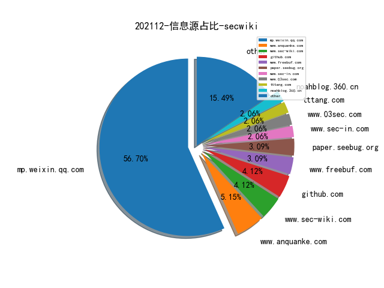
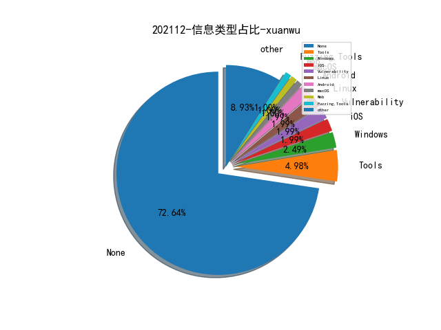

# [数据--所有](README_20.md)
# [数据--年度](README_2021.md)
# 202112 信息源与信息类型占比

# 微信公众号 推荐
| nickname_english | weixin_no | title | url| 
| --- | --- | --- | ---| 
| 长亭安全课堂 | chaitintech_release | 反向探测互联网扫描器 | https://mp.weixin.qq.com/s/Cha_hTGOh-GGVkaZRdFujw | 1| 
| 看雪学苑 | ikanxue | 基于模糊加权随机森林算法的恶意软件检测 | https://mp.weixin.qq.com/s/ytvN73RMv4b9NtSs0vqqPg | 1| 
| 数世咨询 | dwconcn | 利用DoH技术加密传输的DNS隧道流量检测分析 | https://mp.weixin.qq.com/s/TY17e0hpW0b9n4eQtcvaeg | 1| 
| 安全研究GoSSIP | GoSSIPSJTU | G.O.S.S.I.P 学术论文特别推荐 2021-11-29——邮件安全的27年漫漫路 | https://mp.weixin.qq.com/s/U5r7fzsGgjD5IZIh3LIcWA | 1| 
| 乐枕迭代日志 | cdxy_011 | API经济下的安全变局 | https://mp.weixin.qq.com/s/oXHcoLE5WkEer24mz7BqUg | 1| 
| Yak Project | YakLanguage | 如何使用Yakit进行流量劫持 | https://mp.weixin.qq.com/s/9vVRTehwAhkSLM65JaKiQA | 1| 
| 绿盟科技威胁情报 | NSFOCUS_NTI | 安全知识图谱｜知识图谱视角下的威胁评估 | https://mp.weixin.qq.com/s/VDU0z5XNM3CmEIU6sC6jrA | 1| 
| 海淀检察院 | hdpp1955 | 全文｜海淀区检察院发布《网络科技犯罪典型案例》 | https://mp.weixin.qq.com/s/GSod_Mbebfc5tIyNN7uusg | 1| 
| 安全乐观主义 | gh_d6239d0bb816 | 安全运营项目的工作方法 | https://mp.weixin.qq.com/s/UkOHsg5I6v8JJrsKucEewA | 1| 
| Netlab 三六零 | Netlab_360 | 解析服务提供商对非授权域名解析情况的评估 | https://mp.weixin.qq.com/s/v5kcg9XZGb8DwtpNgHXRCQ | 1| 
| 安全学术圈 | secquan | 利用轻量级权限系统遏制恶意NPM软件包更新 | https://mp.weixin.qq.com/s/XTbY3plfEpuPhYc7KQdnaA | 2| 
| 金融电子化 | fcmag1993 | 孙磊：数据中心智能安全运营体系建设探索与实践 | https://mp.weixin.qq.com/s/omM1xphG_ie9GDjsu34s3w | 1| 
| 绿盟科技研究通讯 | nsfocus_research | 原创 , 从研究工控设备到发现供应链威胁 | https://mp.weixin.qq.com/s/-ihOJFNP5OaTy6BNr2uxrA | 1| 
| 数据法盟 | Datalaws | 重磅全文 ,《上海市数据条例》公布 | https://mp.weixin.qq.com/s/_sCL1FBQe3hJNhIZrnVdwQ | 1| 
| 安全攻防团队 | gh_983c1037a3f6 | DotNet内存马-HttpListener | https://mp.weixin.qq.com/s/zsPPkhCZ8mhiFZ8sAohw6w | 1| 
| 工业技术软件化产业联盟 | gh_96ac3d272f58 | 【图解】《“十四五”软件和信息技术服务业发展规划》 | https://mp.weixin.qq.com/s/6nJ7tpo5qu8zVI8nYDQAnA | 1| 

# 组织github账号 推荐
| github_id | title | url | org_url | org_profile | org_geo | org_repositories | org_people | org_projects | repo_lang | repo_star | repo_forks| 
| --- | --- | --- | --- | --- | --- | --- | --- | --- | --- | --- | ---| 

# 私人github账号 推荐
| github_id | title | url | p_url | p_profile | p_loc | p_company | p_repositories | p_projects | p_stars | p_followers | p_following | repo_lang | repo_star | repo_forks | 
| --- | --- | --- | --- | --- | --- | --- | --- | --- | --- | --- | --- | --- | --- | ---| 
| l0ggg | VMware vCenter 7.0.2.00100 版本任意文件读、SSRF、XSS 漏洞 | https://github.com/l0ggg/VMware_vCenter | https://github.com/l0ggg?tab=followers |  | None | None | 2 | 0 | 0 | 0 | 0 | Java | 0 | 0 | 1| 
| EmYiQing | JSPKiller: 基于污点分析的JSP Webshell检测工具 | https://github.com/EmYiQing/JSPKiller | None | None | None | None | 0 | 0 | 0 | 0 | 0 | None | 0 | 0 | 1| 

# medium_xuanwu 推荐
| title | url| 
| --- | ---| 
| Azure Privilege Escalation via Azure API Permissions Abuse | http://medium.com/m/global-identity?redirectUrl=https%3A%2F%2Fposts.specterops.io%2Fazure-privilege-escalation-via-azure-api-permissions-abuse-74aee1006f48| 
| Abusing Location Services on macOS | http://medium.com/@slyd0g/where-in-the-world-is-carmen-sandiego-abusing-location-services-on-macos-10e9f4eefb71| 

# medium_secwiki 推荐
| title | url| 
| --- | ---| 

# zhihu_xuanwu 推荐
| title | url| 
| --- | ---| 

# zhihu_secwiki 推荐
| title | url| 
| --- | ---| 

# xz_xuanwu 推荐
| title | url| 
| --- | ---| 

# xz_secwiki 推荐
| title | url| 
| --- | ---| 

# 日更新程序
`python update_daily.py`