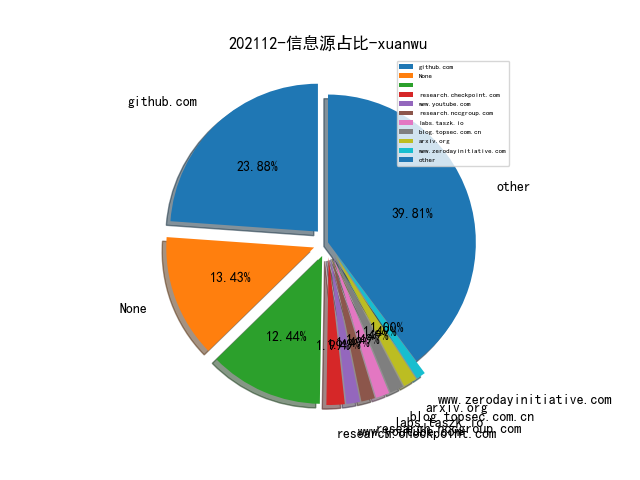

# [数据--所有](README_20.md)
# [数据--年度](README_2021.md)
# 202112 信息源与信息类型占比

# 微信公众号 推荐
| nickname_english | weixin_no | title | url| 
| --- | --- | --- | ---| 
| 小米安全中心 | misrc_team | 《消费级物联网安全基线》2.0正式发布 | https://mp.weixin.qq.com/s/_RI8OEFAEmlBG5RIhZtCtQ | 1| 
| 网空闲话 | cyberspacechat | 透明度PK国家安全？美国的VEP政策改革呼声再起 | https://mp.weixin.qq.com/s/l0feyYA1xfpN1V3bnT3MNQ | 2| 
| 穿过丛林 | gh_f90eac70537b | THINE：针对时序异质信息网络的表示学习 | https://mp.weixin.qq.com/s/gqfBW-0NgccF_5Wb8TTfKA | 1| 
| 白日放歌须纵9 | Day_Dreamer_BR | 连载：演化的高级威胁治理（四） | https://mp.weixin.qq.com/s/WTnj_DX7livQogyeahY7zw | 4| 
| 邑安全 | EansecD | 通过滥用 GitHub 和 Netlify 等平台的漏洞进行门罗币挖掘 | https://mp.weixin.qq.com/s?__biz=MzUyMzczNzUyNQ==&mid=2247511001&idx=3&sn=4d0c9f768b9b20eccb252dd0c137914a | 3| 
| 网络侦查研究院 | PCpolicesir | 深入诈骗团队 | https://mp.weixin.qq.com/s?__biz=MzIxOTM2MDYwNg==&mid=2247510083&idx=1&sn=be64515646ea14182317720b261a8a0c | 5| 
| 编码安全研究 | Lemon_0531_ | SQL 注入防御方法总结 | https://mp.weixin.qq.com/s?__biz=Mzg2NDY1MDc2Mg==&mid=2247485823&idx=1&sn=00f110016fe10e89af1046a6dbdcb71b | 2| 
| 系统安全运维 | Taurus-1314147 | 关于X-Forwarded-For被伪造情况下获取真实ip的处理 | https://mp.weixin.qq.com/s?__biz=Mzk0NjE0NDc5OQ==&mid=2247496174&idx=2&sn=35108397e9be4db52a950438a6929059 | 5| 
| 渗透测试教程 | bzhack | windows系统应急与安全分析 | https://mp.weixin.qq.com/s?__biz=MzI3OTIwNDkzNQ==&mid=2651836542&idx=1&sn=9d6288775b9bbbe9deb8ba96acbce35b | 1| 
| 橘猫学安全 | gh_af700ee13397 | 实战 , 一次完整的渗透实例 | https://mp.weixin.qq.com/s?__biz=Mzg5OTY2NjUxMw==&mid=2247486854&idx=1&sn=b5ce84e7e782416cbe42e8e62a553837 | 4| 
| 安全微焦点 | hedysxcom | 使用js 脚本爆破自定义加密 | https://mp.weixin.qq.com/s?__biz=MzI5MDE5NDcxMA==&mid=2650936245&idx=1&sn=6786fda26ba3e0d462551e2255f26ca2 | 1| 
| 天驿安全 | tianyisec | 记录渗透靶场实战【网络安全】 | https://mp.weixin.qq.com/s?__biz=MzkxNjIxNDQyMQ==&mid=2247487080&idx=1&sn=c545f6228b1bfc8a33a2eb4eec34676c | 5| 
| 合天网安实验室 | hee_tian | log4j2 JNDI注入分析笔记 | https://mp.weixin.qq.com/s?__biz=MjM5MTYxNjQxOA==&mid=2652884077&idx=1&sn=c28b0de92fbe7595753a95e5d34b6837 | 3| 
| Th0r安全 | gh_3ad192d9c87f | Vulnhub-DC-4靶场通关笔记 | https://mp.weixin.qq.com/s?__biz=Mzg3ODY3MzcwMQ==&mid=2247484704&idx=1&sn=04320852108346105055f760ab48dae8 | 8| 
| LemonSec | lemon-sec | APT---典型APT攻击的案例 | https://mp.weixin.qq.com/s?__biz=MzUyMTA0MjQ4NA==&mid=2247520176&idx=1&sn=7002634eb0ba947f0917edb2e6bea85d | 2| 
| K8实验室 | K8-lab | Cobalt Strike 4.5泄露? | https://mp.weixin.qq.com/s?__biz=Mzg3MTY4NjUyOQ==&mid=2247483995&idx=1&sn=00c9c1ea34f985200d9e5c36d3722f25 | 3| 
| HACK之道 | hacklearn | 实战,记一次从源码泄露到getshell | https://mp.weixin.qq.com/s?__biz=MzIwMzIyMjYzNA==&mid=2247497230&idx=2&sn=be243c9c620bc9d07472e0318d8ba607 | 4| 
| Gamma实验室 | HackerLearning | 红队免杀必会：R3下常用HOOK技术 | https://mp.weixin.qq.com/s?__biz=Mzg2NjQ2NzU3Ng==&mid=2247489536&idx=1&sn=ea8eb2d7602e7b3383368761921b7522 | 1| 
| Docker中文社区 | dockerchina | 9 个容器环境安全红队常用手法总结 | https://mp.weixin.qq.com/s?__biz=MzI1NzI5NDM4Mw==&mid=2247489114&idx=1&sn=9e89cdba5ad60392fcb3ee44119ae7d5 | 1| 
| 黑客与画家的笔记本 | gh_5325174bfa42 | gosint开源 | https://mp.weixin.qq.com/s/ljdIsj38GU_tVxKwM3AWpA | 1| 
| 衡阳信安 | zghyxa | 某依后台RCE分析 | https://mp.weixin.qq.com/s?__biz=MzU2NDY2OTU4Nw==&mid=2247493794&idx=1&sn=77db32c0ac558bf2186b1f8c5a91cf2d | 5| 
| 河南等级保护测评 | hndjbh | 五眼联盟发布缓解Log4Shell 和其他与 Log4j 相关的漏洞通告 | https://mp.weixin.qq.com/s?__biz=Mzg2NjY2MTI3Mg==&mid=2247484613&idx=1&sn=d4a6c4cebed9187ec8240e8d339e4c0a | 1| 
| 每天一个入狱小技巧 | gh_ba62997aff09 | Cobalt Strike 4.5泄漏！！！附下载链接！！后门自测！！！ | https://mp.weixin.qq.com/s?__biz=Mzg2MzYzNjEyMg==&mid=2247484535&idx=1&sn=d06472f056e3999e09b91fc06dfc5b53 | 3| 
| 承影安全团队ChengYingTeam | huahuaSec | 【HTB系列】Driver | https://mp.weixin.qq.com/s?__biz=MzU3MTU3NDk4Mw==&mid=2247485004&idx=1&sn=80b78e66cb869d6f4a170c3ee66502f2 | 2| 
| 嘶吼专业版 | Pro4hou | 针对 HTTP/2 协议的HTTP Desync攻击 | https://mp.weixin.qq.com/s?__biz=MzI0MDY1MDU4MQ==&mid=2247533748&idx=2&sn=d705d37718c8819bbf3b95bee621a4a1 | 11| 
| 云计算和网络安全技术实践 | gh_34d6b0cb5633 | vulnhub之Os-hackNos-3的实践 | https://mp.weixin.qq.com/s?__biz=MzA3MjM5MDc2Nw==&mid=2650746676&idx=1&sn=93e26945ae52f3ba679c3d078b537312 | 1| 
| Hacking黑白红 | Hacking012 | 【渗透基础系列】,-文件上传绕过思路总结（文末附上传绕过靶场） | https://mp.weixin.qq.com/s?__biz=Mzg2NDYwMDA1NA==&mid=2247505978&idx=1&sn=6f23eeadaa3fefd13026e39ee5b2c5fb | 3| 
| HACK学习呀 | Hacker1961X | 实战 , 利用SSRF渗透内网主机-中 | https://mp.weixin.qq.com/s?__biz=MzI5MDU1NDk2MA==&mid=2247502590&idx=1&sn=279ea1728a1b0a14ecae5df9eb21012e | 4| 
| Cyber Raider Sec | jspiweb | Log4j2被动扫描Burp插件的编写心得 | https://mp.weixin.qq.com/s?__biz=MzkzMzIwMTE5OA==&mid=2247484635&idx=1&sn=91b3510fd1ec6b4aba554106de093ac7 | 4| 
| 盾山实验室 | DunShanRR | TEA：基于TAS框架的SSH客户端蠕虫 | https://mp.weixin.qq.com/s?__biz=MzkzMjIwMDY4Nw==&mid=2247485977&idx=1&sn=c1889470ec4004d224a698e923fd5f12 | 3| 
| 白虎实验室 | hacker_root001 | Socks代理 | https://mp.weixin.qq.com/s?__biz=Mzk0NTI2ODE1Nw==&mid=2247484069&idx=1&sn=51b9acf080cc9cf846ff704de8bec1a4 | 3| 
| 利刃信安 | None | 009 IIS短文件名漏洞 | https://mp.weixin.qq.com/s?__biz=MzU1Mjk3MDY1OA==&mid=2247493763&idx=1&sn=4dfdeb8d13f3c9276116a49f5b987607 | 7| 
| 亿人安全 | Yr-Sec | 记一次某大学渗透过程 | https://mp.weixin.qq.com/s?__biz=Mzk0MTIzNTgzMQ==&mid=2247488498&idx=1&sn=3428b6d94b562c2598eb05c1a0ceb265 | 3| 
| TeamsSix | teamssix-com | 代码审计 , 跨站脚本 XSS | https://mp.weixin.qq.com/s?__biz=MzI5Mzk5NTIwMg==&mid=2247486690&idx=1&sn=92726ab495ae2ef0ec32b79aa9cd8acd | 1| 
| Reset安全 | gh_a006697f54a9 | Grafana未授权任意文件读取复现 | https://mp.weixin.qq.com/s?__biz=MzU3Mzg1NzMyNw==&mid=2247483796&idx=1&sn=30a3fdf12feacf3d0e15fafe1db65c19 | 7| 
| FreeBuf | freebuf | 如何使用ADLab搭建活动目录实验环境来练习渗透测试技术 | https://mp.weixin.qq.com/s?__biz=MjM5NjA0NjgyMA==&mid=2651155072&idx=4&sn=8517d81aabd89372be0f0ae926895fb1 | 7| 
| 鹏组安全 | Kris_Alex2 | Thinkphp5 RCE 检测工具 | https://mp.weixin.qq.com/s?__biz=Mzg5NDU3NDA3OQ==&mid=2247485531&idx=1&sn=58f944159be16c1bd06a9696d82dd300 | 2| 
| 骨哥说事 | guge_guge | 【白帽故事】如何利用FFUF和Sqlmap发现多处SQL注入漏洞 | https://mp.weixin.qq.com/s?__biz=MjM5Mzc4MzUzMQ==&mid=2650255055&idx=1&sn=8a1891168922d189d383516bbdc80c96 | 1| 
| 雁行安全团队 | YX_Security | 利用CodeQL分析并挖掘Log4j漏洞 | https://mp.weixin.qq.com/s/JYco8DysQNszMohH6zJEGw | 1| 
| 网络安全应急技术国家工程实验室 | NELCERT | 基于大数据技术的攻击溯源研究 | https://mp.weixin.qq.com/s?__biz=MzUzNDYxOTA1NA==&mid=2247524053&idx=1&sn=db913274a9769af387d975bfdaff66fc | 1| 
| 珂技知识分享 | kezibei001 | SSTI(模板注入) | https://mp.weixin.qq.com/s?__biz=MzUzNDMyNjI3Mg==&mid=2247485209&idx=1&sn=c4aa384b432242e28078914741c908a5 | 1| 
| 猪猪谈安全 | zzt-anquan | 渗透测试之敏感文件目录探测总结 | https://mp.weixin.qq.com/s?__biz=MzIyMDAwMjkzNg==&mid=2247497707&idx=1&sn=caaddd72ae632046d562f514ccb0454f | 2| 
| 流沙安全实验室 | coba1tstrike_ | 高版本JDK下的JNDI注入分析 | https://mp.weixin.qq.com/s?__biz=Mzg2NDY2MjY5Mw==&mid=2247484661&idx=1&sn=d0c20a14739ef24987f7a4f14076f2f4 | 1| 
| 横戈安全团队 | HengGeSec | 记一次应急处理记录 | https://mp.weixin.qq.com/s?__biz=Mzk0NDIwMTgzMQ==&mid=2247484821&idx=1&sn=87b66c5b5354174c294d6456be0d36df | 1| 
| 星期五实验室 | Friday_LAB | vulntarget漏洞靶场系列（二）— vulntarget-b | https://mp.weixin.qq.com/s/S3aiKN_IIhxWRyizAb8zLg | 1| 
| 掌控安全EDU | ZKAQEDU | 文库 , HTTP 请求走私详解 | https://mp.weixin.qq.com/s?__biz=MzUyODkwNDIyMg==&mid=2247520717&idx=1&sn=9365575fdaf0a9e76966302d5a4f396a | 1| 
| 代码卫士 | codesafe | 苹果修复 Gatekeeper 绕过漏洞 | https://mp.weixin.qq.com/s?__biz=MzI2NTg4OTc5Nw==&mid=2247509859&idx=1&sn=ef8905cf68ee859621c4aa600b37922a | 3| 
| 乌雲安全 | None | 实战绕过某WAF+拿shell组合拳 | https://mp.weixin.qq.com/s?__biz=MzAwMjA5OTY5Ng==&mid=2247500927&idx=1&sn=cfd1a854c2c769d2df373cebd559d40e | 2| 
| 且听安全 | qtcyber | 【最新漏洞预警】认证绕过新姿势之Zoho ManageEngine Desktop Central CVE-2021-44515 | https://mp.weixin.qq.com/s?__biz=Mzg3MTU0MjkwNw==&mid=2247486746&idx=1&sn=d6337b2a0f177e616536dba016dd0de5 | 3| 
| 锦行信息安全 | jeeseensec | 技术分享 , Java代审：Maven基础知识 | https://mp.weixin.qq.com/s/q4qRJDURgd84OznJ83yhiw | 1| 
| 红数位 | safetop | Microsoft警告Azure漏洞暴露客户源代码 | https://mp.weixin.qq.com/s?__biz=Mzg3MjI1MDU4OA==&mid=2247498667&idx=1&sn=ae57ec87868b508a8432ed921dca23f5 | 1| 
| 火线Zone | huoxian_zone | 学习Sping-messaging远程代码执行(CVE-2018-1270) | https://mp.weixin.qq.com/s?__biz=MzI2NDQ5NTQzOQ==&mid=2247490651&idx=1&sn=e18754a175f619c23300d699f330878d | 1| 
| 潇湘信安 | xxxasec | 从某站点的弱口令泄露到通用GetShell | https://mp.weixin.qq.com/s?__biz=Mzg4NTUwMzM1Ng==&mid=2247493804&idx=1&sn=b27b64da5672755125ea2b72e0231c0b | 2| 
| 开源聚合网络空间安全研究院 | OSPtech_Cyberspace | 【安全思路】浅谈史诗级 Log4j2 漏洞 | https://mp.weixin.qq.com/s?__biz=MzI4NTE4NDAyNA==&mid=2650391184&idx=1&sn=0ec8cfe691bba9c2d50d1451b7230d04 | 2| 
| 广软NSDA安全团队 | None | 记录小白一次失败的渗透过程 | https://mp.weixin.qq.com/s?__biz=MzUzMDg5NDQ0Nw==&mid=2247490782&idx=1&sn=0e887e35543456edbf06e1de2a45abb0 | 3| 
| 山石网科安全技术研究院 | HSN_LAB | 通过一道简单的例题了解Linux内核PWN | https://mp.weixin.qq.com/s?__biz=MzUzMDUxNTE1Mw==&mid=2247490945&idx=1&sn=28345d960ed59aa3465c38adab47ac58 | 1| 
| 宸极实验室 | ChenJiLab | 『CTF』深入浅出明文攻击 | https://mp.weixin.qq.com/s?__biz=Mzg4NTA0MzgxNQ==&mid=2247485380&idx=1&sn=a45f6e296783ac57a95510b2dd1ee90c | 1| 
| 安全族 | anquanzu666 | 校园内网平台的一次授权渗透测试 | https://mp.weixin.qq.com/s?__biz=Mzg2NjU0MjA0Ng==&mid=2247485508&idx=1&sn=9acf296659e3a15d978bcda0c0d5fb6a | 1| 
| 安全客 | anquanbobao | 【技术分享】House of Corrosion 原理及利用 | https://mp.weixin.qq.com/s?__biz=MzA5ODA0NDE2MA==&mid=2649761373&idx=3&sn=dda5bdeb676fabecca545583ec93d5b0 | 2| 
| 安全初心 | securityheart | 红蓝对抗 , 容器环境红队手法总结 | https://mp.weixin.qq.com/s?__biz=MzU4NzU4MDg0Mw==&mid=2247487632&idx=1&sn=fd2ee0c2ffb53ca9382b8963db6d641e | 1| 
| 奇安信威胁情报中心 | gh_166784eae33e | 疑似“肚脑虫”APT组织近期针对孟加拉国的攻击活动分析 | https://mp.weixin.qq.com/s?__biz=MzI2MDc2MDA4OA==&mid=2247498196&idx=1&sn=695fd60ebb2b35ee722367e8d1b552d4 | 3| 
| 信息安全与通信保密杂志社 | cismag2013 | 基于大数据技术的攻击溯源研究 | https://mp.weixin.qq.com/s/l_f5oGBU4YL9rQJsoDaxyw | 1| 
| 信安之路 | xazlsec | 应急响应之Linux 守护进程 , 内附应急手册 | https://mp.weixin.qq.com/s?__biz=MzI5MDQ2NjExOQ==&mid=2247496304&idx=1&sn=5521d3078d71739e0052a02639119481 | 2| 
| 伟盾网络安全 | gh_75e869919a5f | ysoserial分析之JSON1利用链 | https://mp.weixin.qq.com/s?__biz=MzkwOTIxNzQ5OA==&mid=2247483989&idx=1&sn=1932ffa9ae1ecbdcb68fc7d950f19373 | 1| 
| 三六零CERT | CERT-360 | Apache HTTP Server多个漏洞风险通告 | https://mp.weixin.qq.com/s?__biz=MzU5MjEzOTM3NA==&mid=2247490575&idx=1&sn=44d2ee08552bda92d01d33705c6b4d71 | 3| 
| web安全工具库 | websec-tools | 后记：菠菜站点的攻克之旅 | https://mp.weixin.qq.com/s?__biz=MzI4MDQ5MjY1Mg==&mid=2247492833&idx=1&sn=f23b4c4091c3654e868430c5c230ca6e | 2| 
| E安全 | EAQapp | 盘点：Log4j 漏洞带来的深远影响 | https://mp.weixin.qq.com/s?__biz=MzI4MjA1MzkyNA==&mid=2655320029&idx=1&sn=46e42f3d37db6302b145ed3b8fb34fb5 | 1| 
| 默安逐日实验室 | gh_995a1a9f25b5 | 红队视角下的公有云基础组件安全 | https://mp.weixin.qq.com/s?__biz=MzkxMjI3MDgwOA==&mid=2247483999&idx=1&sn=913457bfc0ca72b03169bfe8d92ad90c | 1| 
| 黑客技术与网络安全 | HackerCoder | 这几招技术，病毒木马经常用！ | https://mp.weixin.qq.com/s?__biz=MzIyMDEzMTA2MQ==&mid=2651160061&idx=2&sn=8470cc547896b2dfcf1c24e4c1a232ed | 2| 
| 高效运维 | greatops | 少年，关于 DNS，你想聊的可能更多~ | https://mp.weixin.qq.com/s?__biz=MzA4Nzg5Nzc5OA==&mid=2651707762&idx=1&sn=82cd6f7b38e6c945a70688d7e650cd72 | 2| 
| 维他命安全 | VitaminSecurity | Conti团伙已武器化Log4Shell并建立完整的攻击链；Dell最新BIOS更新导致多款计算机型号出现启动问题 | https://mp.weixin.qq.com/s?__biz=MzUxMDQzNTMyNg==&mid=2247498291&idx=1&sn=b75624db01931a67b46b6c1554e6e853 | 1| 
| 电子物证 | ewuzheng | 【基于web日志的溯源】 | https://mp.weixin.qq.com/s?__biz=MzAwNDcwMDgzMA==&mid=2651040856&idx=4&sn=db6a1d54b47d4dcd1042eba275ecbf9f | 2| 
| 灼剑安全团队 | Tsojan | WEB安全 , CSRF的原理及防御 | https://mp.weixin.qq.com/s?__biz=Mzg5OTY1ODMxMg==&mid=2247489344&idx=1&sn=8509e0771a465b3079ee666fc0e352c8 | 2| 
| 深信服千里目安全实验室 | Further_eye | 【安全公告】Apache HTTP Server 多个漏洞 | https://mp.weixin.qq.com/s?__biz=MzI4NjE2NjgxMQ==&mid=2650258596&idx=1&sn=06228a3a2f1b03e944f92d46715dc089 | 2| 
| 安恒信息应急响应中心 | gh_1c2b41c1abc7 | Apache HTTP Server多个漏洞风险提示 | https://mp.weixin.qq.com/s?__biz=MzUzOTE2OTM5Mg==&mid=2247486837&idx=1&sn=020efbaffdd04fe6b3fe2a0e152ac5ad | 1| 
| 奇安信技术研究院 | jishuyanjiuyuan001 | 【年度报告连载二十一】恶意文件样本集简介及样本分析过程 | https://mp.weixin.qq.com/s?__biz=Mzg4OTU4MjQ4Mg==&mid=2247485530&idx=1&sn=4296cb531a2b2e65e6df2f41e9062650 | 1| 
| 天禧信安 | txxa-385 | 记一次某CMS代码审计（三处phar rce) | https://mp.weixin.qq.com/s?__biz=MzUyMTE0MDQ0OA==&mid=2247486727&idx=1&sn=60d3b00c9790e628b7c6c2067ba28224 | 1| 
| XG小刚 | XG_WEB | Log4j和它的小伙伴们 | https://mp.weixin.qq.com/s?__biz=MzIwOTMzMzY0Ng==&mid=2247486790&idx=1&sn=c8b7e11adc399b509bb6e35f9823bf7c | 1| 
| WhITECat安全团队 | WhITECat_007 | 开普勒星云免杀平台开源 | https://mp.weixin.qq.com/s?__biz=MzAwMzc2MDQ3NQ==&mid=2247486521&idx=1&sn=6e30fc69ed0f734780e284efad0b9ae0 | 1| 
| SecIN技术平台 | sec-in | 原创 , 纸上得来终觉浅—XXE大杂烩 | https://mp.weixin.qq.com/s?__biz=MzI4Mzc0MTI0Mw==&mid=2247492171&idx=1&sn=a1f4343cab9ee7aa08f04b1e0ac9af4d | 1| 
| NOP Team | yidalidemao | 远程下载的通用替代方案 ｜ 红队攻防 | https://mp.weixin.qq.com/s?__biz=MzU1NDkwMzAyMg==&mid=2247491204&idx=1&sn=0cea0564212d83b92eed3d6a059d0ebf | 1| 
| 8ypass | sec_in_guangdong | codeql学习笔记2 | https://mp.weixin.qq.com/s?__biz=MzI0NDM5OTYxNg==&mid=2247484506&idx=1&sn=c88e1ec97a949e2a31aacc4d6f8e2729 | 1| 
| 锋刃科技 | ahfengren | 【漏洞情报】Apache HTTP Server多个漏洞通告 | https://mp.weixin.qq.com/s?__biz=MzUxMjc0MTE3Mw==&mid=2247486869&idx=1&sn=bad99fcac34ac9a218c1c5b1a4d57812 | 1| 
| 藏剑安全 | cangjiansafe | DC-1靶机实战和分析 | https://mp.weixin.qq.com/s?__biz=Mzg5MDA5NzUzNA==&mid=2247483921&idx=2&sn=0c6f408a273924ad0cebcf3b2eb9f34b | 1| 
| 疯猫网络 | iloscat | 跨域攻击的两种方法：域信任密钥和krbtgt散列值 | https://mp.weixin.qq.com/s?__biz=MzIyMzE5NTQ3Ng==&mid=2650625170&idx=1&sn=63d748c589aca7babd003156e13ae9ac | 4| 
| 渗透攻击红队 | RedTeamHacker | 从外网 log4j2 RCE 再到内网核弹组合拳漏洞 CVE-2021-42287、CVE-2021-42278 拿到 DC | https://mp.weixin.qq.com/s?__biz=MzkxNDEwMDA4Mw==&mid=2247489806&idx=1&sn=5ec7065ab1190732c4ddfe5e7545d6ef | 1| 
| 我是安服 | scaf_0123 | 提权-Windows篇 | https://mp.weixin.qq.com/s?__biz=MzkzMzI3OTczNA==&mid=2247484421&idx=1&sn=8b3c2b51a430e21d1df8ea7417e115cf | 1| 
| 安全喷子 | gh_2a9c00f1d053 | 国外网络演习思考 | https://mp.weixin.qq.com/s/cXJM6SXVR-k0pLCqDZqcWQ | 1| 
| Khan安全攻防实验室 | KhanCJSH | 对Log4Shell CVE-2021-44228 应急响应 | https://mp.weixin.qq.com/s?__biz=MzAwMjQ2NTQ4Mg==&mid=2247488217&idx=1&sn=57f667ed82d8677e07ff15dddade984b | 1| 
| 黑云信息安全 | heiyunxinxi | 【漏洞预警】Apache Log4j2存在任意代码执行漏洞（二次通报） | https://mp.weixin.qq.com/s?__biz=Mzg5OTYxMjk0Mw==&mid=2247485221&idx=2&sn=131073041f705f5e412e8b0370fe7747 | 1| 
| 菜鸟学信安 | securitylearn | 干货,一些HW面试题记录 | https://mp.weixin.qq.com/s?__biz=MzU2NzY5MzI5Ng==&mid=2247487643&idx=1&sn=a69f1c4fd72004e6ca80ffdea63dfc4f | 1| 
| 程序员阿甘 | gh_a2e36d69d566 | 从原理解析如何防御DLL劫持 | https://mp.weixin.qq.com/s?__biz=MzI4MTkzNDIyMg==&mid=2247494787&idx=1&sn=8a042322eafe537a9785ab58e489d1fa | 1| 
| 盘古石取证 | Panguite_CN | Wireshark取证过程中的基础应用 | https://mp.weixin.qq.com/s?__biz=Mzg3MjE1NjQ0NA==&mid=2247492497&idx=1&sn=35e324dcfb4a11c9b9f07669dedae492 | 1| 
| 渊龙Sec安全团队 | Aabyss-Team | 一场由逻辑漏洞引发的“血案” | https://mp.weixin.qq.com/s?__biz=Mzg4NTY0MDg1Mg==&mid=2247484235&idx=1&sn=7bf9ed1a6e0ff808832b94691958f46f | 1| 
| 微步在线研究响应中心 | gh_c108d4d389bf | 警惕！Log4j 2.16 已失守！漏洞详情曝光 | https://mp.weixin.qq.com/s?__biz=MzA5MDc1NDc1MQ==&mid=2247491289&idx=1&sn=686eed0f0a4cd8c62b0586f869210607 | 2| 
| 安全行者老霍 | gh_c2b78e839fd7 | CIS 介绍（下)-CIS Benchmark&CIS 社区防御模型2.0 | https://mp.weixin.qq.com/s/MLfShFRVGJmSALr0zUDohw | 1| 
| 奇安信 CERT | gh_64040028303e | 【通告更新】Apache Log4j拒绝服务漏洞安全风险通告第二次更新 | https://mp.weixin.qq.com/s?__biz=MzU5NDgxODU1MQ==&mid=2247495281&idx=1&sn=03f3f21990bbee1708d2e011249feaf3 | 1| 
| Tide安全团队 | TideSec | 几款小众而实用的远控软件 | https://mp.weixin.qq.com/s/uYpNH2cwjsOoDl6ZTyVtUw | 2| 
| Moonlight Bug Hunter | gh_1ec00ecad45d | Codeql 挖洞？ | https://mp.weixin.qq.com/s/-4E08dNeCdsc51VLE9qMAQ | 1| 
| GeekPwn | GeekPwn | 谷歌安全研究员直呼复杂 ｜ iMessage 零点击漏洞利用细节公开 | https://mp.weixin.qq.com/s/u0O6qBbvGB-l8aqCabGaUQ | 3| 
| Beacon Tower Lab | WebRAY_BTL | Log4j2远程代码执行漏洞检测和防护策略研究 | https://mp.weixin.qq.com/s/GY-hKl9013pyVd8no0SDHw | 1| 
| 安全档案 | secfile | log4j 漏洞一些特殊的利用方式 | https://mp.weixin.qq.com/s/vAE89A5wKrc-YnvTr0qaNg | 1| 
| 一个人的安全笔记 | xjiek2015 | [HTB] Armageddon Writeup | https://mp.weixin.qq.com/s/vizmtNhYW4r-kETt4qJuww | 1| 
| 阿里云应急响应 | gh_12f3517e40de | 【漏洞预警】Apache Log4j2 远程代码执行漏洞二次更新通告 | https://mp.weixin.qq.com/s/AuBchaUvFw2pisVw6rNX5A | 1| 
| 威胁棱镜 | THREAT_PRISM | 僵尸网络是如何应对执法行动的？ | https://mp.weixin.qq.com/s/okOIk2Ery3FdvtHIGtjr_Q | 2| 
| 长亭安全课堂 | chaitintech_release | 反向探测互联网扫描器 | https://mp.weixin.qq.com/s/Cha_hTGOh-GGVkaZRdFujw | 1| 
| 绿盟科技威胁情报 | NSFOCUS_NTI | 安全知识图谱｜知识图谱视角下的威胁评估 | https://mp.weixin.qq.com/s/VDU0z5XNM3CmEIU6sC6jrA | 1| 
| 看雪学苑 | ikanxue | 基于模糊加权随机森林算法的恶意软件检测 | https://mp.weixin.qq.com/s/ytvN73RMv4b9NtSs0vqqPg | 2| 
| 海淀检察院 | hdpp1955 | 全文｜海淀区检察院发布《网络科技犯罪典型案例》 | https://mp.weixin.qq.com/s/GSod_Mbebfc5tIyNN7uusg | 1| 
| 数世咨询 | dwconcn | 利用DoH技术加密传输的DNS隧道流量检测分析 | https://mp.weixin.qq.com/s/TY17e0hpW0b9n4eQtcvaeg | 1| 
| 安全研究GoSSIP | GoSSIPSJTU | G.O.S.S.I.P 学术论文特别推荐 2021-11-29——邮件安全的27年漫漫路 | https://mp.weixin.qq.com/s/U5r7fzsGgjD5IZIh3LIcWA | 1| 
| 安全乐观主义 | gh_d6239d0bb816 | 安全运营项目的工作方法 | https://mp.weixin.qq.com/s/UkOHsg5I6v8JJrsKucEewA | 1| 
| 乐枕迭代日志 | cdxy_011 | API经济下的安全变局 | https://mp.weixin.qq.com/s/oXHcoLE5WkEer24mz7BqUg | 1| 
| Yak Project | YakLanguage | 如何使用Yakit进行流量劫持 | https://mp.weixin.qq.com/s/9vVRTehwAhkSLM65JaKiQA | 1| 
| Netlab 三六零 | Netlab_360 | 解析服务提供商对非授权域名解析情况的评估 | https://mp.weixin.qq.com/s/v5kcg9XZGb8DwtpNgHXRCQ | 2| 
| 安全学术圈 | secquan | 利用轻量级权限系统遏制恶意NPM软件包更新 | https://mp.weixin.qq.com/s/XTbY3plfEpuPhYc7KQdnaA | 4| 
| 金融电子化 | fcmag1993 | 孙磊：数据中心智能安全运营体系建设探索与实践 | https://mp.weixin.qq.com/s/omM1xphG_ie9GDjsu34s3w | 1| 
| 绿盟科技研究通讯 | nsfocus_research | 原创 , 从研究工控设备到发现供应链威胁 | https://mp.weixin.qq.com/s/-ihOJFNP5OaTy6BNr2uxrA | 1| 
| 数据法盟 | Datalaws | 重磅全文 ,《上海市数据条例》公布 | https://mp.weixin.qq.com/s/_sCL1FBQe3hJNhIZrnVdwQ | 1| 
| 安全攻防团队 | gh_983c1037a3f6 | DotNet内存马-HttpListener | https://mp.weixin.qq.com/s/zsPPkhCZ8mhiFZ8sAohw6w | 1| 
| 工业技术软件化产业联盟 | gh_96ac3d272f58 | 【图解】《“十四五”软件和信息技术服务业发展规划》 | https://mp.weixin.qq.com/s/6nJ7tpo5qu8zVI8nYDQAnA | 1| 

# 组织github账号 推荐
| github_id | title | url | org_url | org_profile | org_geo | org_repositories | org_people | org_projects | repo_lang | repo_star | repo_forks| 
| --- | --- | --- | --- | --- | --- | --- | --- | --- | --- | --- | ---| 

# 私人github账号 推荐
| github_id | title | url | p_url | p_profile | p_loc | p_company | p_repositories | p_projects | p_stars | p_followers | p_following | repo_lang | repo_star | repo_forks | 
| --- | --- | --- | --- | --- | --- | --- | --- | --- | --- | --- | --- | --- | --- | ---| 
| virtualabs | BtleJack: a new Bluetooth Low Energy swiss-army knife | https://github.com/virtualabs/btlejack | https://github.com/virtualabs?tab=followers | Proud dad, happy geek, random hacker. | None | None | 51 | 0 | 0 | 0 | 0 | Python,C,Java,C++ | 0 | 0 | 1| 
| revng | 用于将二进制文件翻译成 LLVM IR 的 revng 工具将启用新的函数边界分析、控制流分析方案 | https://github.com/revng/revng/commit/74a35bca105572d4aa4f5d0fdfde7854c076cc51 | None | None | None | None | 0 | 0 | 0 | 0 | 0 | Python,C,Shell,Assembly,C++ | 0 | 0 | 1| 
| l0ggg | VMware vCenter 7.0.2.00100 版本任意文件读、SSRF、XSS 漏洞 | https://github.com/l0ggg/VMware_vCenter | https://github.com/l0ggg?tab=followers |  | None | None | 2 | 0 | 0 | 0 | 0 | Java | 0 | 0 | 1| 
| hmgle | 将指定进程 TCP 连接重定向到 SOCKS5 或 HTTP 代理 | https://github.com/hmgle/graftcp | https://github.com/hmgle?tab=followers |  | China | None | 78 | 0 | 0 | 0 | 0 | Python,C,Erlang | 0 | 0 | 1| 
| guyoung | CaptfEncoder: 一款跨平台网络安全工具套件 | https://github.com/guyoung/CaptfEncoder | https://github.com/guyoung?tab=followers |  | None | None | 15 | 0 | 0 | 0 | 0 | C#,JavaScript | 0 | 0 | 1| 
| facebook | SAPP - Facebook 开发的用于处理静态代码分析工具 Pysa 分析结果的工具 | https://github.com/facebook/sapp | None | None | None | None | 0 | 0 | 0 | 0 | 0 | None | 0 | 0 | 1| 
| diversenok | RunAsS4U - 无需密码以其他用户身份执行代码的工具（Windows） | https://github.com/diversenok/NtTools/releases/tag/v1.0-RunAsS4U | https://github.com/diversenok?tab=followers | Aspiring Windows security researcher & system programmer; student. | Russia / The Netherlands | None | 22 | 0 | 0 | 0 | 0 | Pascal,C | 0 | 0 | 1| 
| Yamato-Security | WELA - Windows 日志分析工具，用于取证分析和安全事件响应 | https://github.com/Yamato-Security/WELA/blob/main/README-English.md | None | None | None | None | 0 | 0 | 0 | 0 | 0 | PowerShell,Rust | 0 | 0 | 1| 
| SpiralBL0CK | Chrome Pwning & V8 Pwning 入手 | https://github.com/SpiralBL0CK/Browser-Pwning-/blob/main/README.md | https://github.com/SpiralBL0CK?tab=followers | A simple beginner programmer. | None | None | 70 | 0 | 0 | 0 | 0 | Python,C,HTML,C++ | 0 | 0 | 1| 
| SmoothHacker | 基于 KVM 实现的 Linux 内核快照 Fuzzer | https://github.com/SmoothHacker/LateRegistration | https://github.com/SmoothHacker?tab=followers |  | Chicago, USA | None | 8 | 0 | 0 | 0 | 0 | Python,C | 0 | 0 | 1| 
| RedDrip7 | 使用 Apache Log4j RCE 漏洞发起攻击的源 IP 收集（IOC） | https://github.com/RedDrip7/Log4Shell_CVE-2021-44228_related_attacks_IOCs | https://github.com/RedDrip7?tab=followers | Technical Twitter of QiAnXin Technology, leading Chinese security vendor. It is operated by RedDrip Team which focuses on malware, APT and threat intelligence. | China | Qianxin | 7 | 0 | 0 | 0 | 0 | Python | 0 | 0 | 1| 
| EmYiQing | JSPKiller: 基于污点分析的JSP Webshell检测工具 | https://github.com/EmYiQing/JSPKiller | None | None | None | None | 0 | 0 | 0 | 0 | 0 | None | 0 | 0 | 1| 
| CodeIntelligenceTesting | Jazzer - 基于 libFuzzer 实现的 Fuzz JVM 的工具 | https://github.com/CodeIntelligenceTesting/jazzer | None | None | None | None | 0 | 0 | 0 | 0 | 0 | C,Shell,Java,Python,Kotlin,C++,TypeScript,HTML,Starlark,Go | 0 | 0 | 1| 

# medium_xuanwu 推荐
| title | url| 
| --- | ---| 
| Azure Privilege Escalation via Azure API Permissions Abuse | http://medium.com/m/global-identity?redirectUrl=https%3A%2F%2Fposts.specterops.io%2Fazure-privilege-escalation-via-azure-api-permissions-abuse-74aee1006f48| 
| Abusing Location Services on macOS | http://medium.com/@slyd0g/where-in-the-world-is-carmen-sandiego-abusing-location-services-on-macos-10e9f4eefb71| 

# medium_secwiki 推荐
| title | url| 
| --- | ---| 

# zhihu_xuanwu 推荐
| title | url| 
| --- | ---| 

# zhihu_secwiki 推荐
| title | url| 
| --- | ---| 
| 从Log4shell事件看资产风险运营工程化的困局与盲点 | https://zhuanlan.zhihu.com/p/445372045| 

# xz_xuanwu 推荐
| title | url| 
| --- | ---| 

# xz_secwiki 推荐
| title | url| 
| --- | ---| 

# 日更新程序
`python update_daily.py`