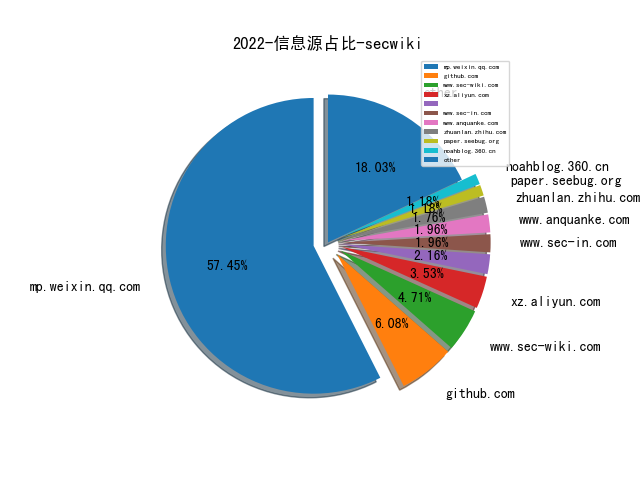
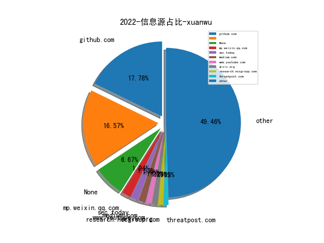

# [数据--所有](README_20.md)
# [数据--年度](README_2022.md)
# 2022 信息源与信息类型占比

# 微信公众号 推荐
| nickname_english | weixin_no | title | url| 
| --- | --- | --- | ---| 
| 小侦探的书桌 | gh_249f9111a64c | 写在博士生涯的最后 | https://mp.weixin.qq.com/s/MAdWdQPBj_--gMZVjR0qOg | 1| 
| 网络安全卓越验证示范中心 | CCCoE_CAICT | 一文看懂 , 美新版《国家安全战略》中的网络安全 | https://mp.weixin.qq.com/s/VZ0ofovRfJIUbxQuHvaLyQ | 1| 
| 碳基体 | tanjiti_security | 那些年我研发的无用模块——攻击样本回放模块 | https://mp.weixin.qq.com/s/zNTAGbM_Tjv9dWcjlsWkqg | 1| 
| 阿里开发者 | ali_tech | 安全同学讲Maven重打包的故事 | https://mp.weixin.qq.com/s/xsJkB0onUkakrVH0wejcIg | 1| 
| 桥的断想 | TasteMiss | 车联网安全基础知识之USB SPH2.0线束制作 | https://mp.weixin.qq.com/s/01tV6GfK8L4hNEyn0suwdw | 1| 
| 零部安全 | sec-services | 漏洞管理过程中的定量计算方法 | https://mp.weixin.qq.com/s/5C6NeiNb6pifrZZh1vR_cg | 1| 
| 电网智囊团 | gridthink | 一文搞懂电力系统调度数据网4+1+1区 | https://mp.weixin.qq.com/s/wcs0mWzBXh96Ds-qJ9H6xQ | 1| 
| 湛卢工作室 | xuehao_studio | 云原生安全系列（一） , Kubernetes云原生靶场搭建 | https://mp.weixin.qq.com/s/XmEhvrzwmcjW9lBIZMl2ag | 1| 
| 中国保密协会科学技术分会 | gh_be4f21d557c0 | 软件安全实体关系预测简介 | https://mp.weixin.qq.com/s/mrQQhaBXA39YBDov-cwGnw | 1| 
| 默安逐日实验室 | gh_995a1a9f25b5 | 红队视角下的AWS横向移动 | https://mp.weixin.qq.com/s/Q0iiRJ53BwuU4LHynR4qWQ | 1| 
| 云图全景Snapano | yuntuzhuanlan | 云安全趋势分享（2022年底） | https://mp.weixin.qq.com/s/U3tQfZoLsJv_PoDAJmzcMg | 1| 
| 赛博攻防悟道 | lookvul | 加密流量安全背后的那些小秘闻 | https://mp.weixin.qq.com/s/1J1HNdA2wZF93-K-e7Pg8Q | 2| 
| 迪哥讲事 | growing0101 | 挖洞方法与心态系列-揭露大佬挖主应用的一般性流程(版本1) | https://mp.weixin.qq.com/s?__biz=MzIzMTIzNTM0MA==&mid=2247486332&idx=1&sn=238328c005b23ec39e375bb0f4f57652&chksm=e8a6011fdfd1880929ce3b1c3207ae1caf8827f845881fa110daab3a10f6177df3483ca77eea&token=798508684&lang=zh_CN#rd | 13| 
| 数据治理体系 | DGsystem | 0到1搭建企业级数据治理体系 | https://mp.weixin.qq.com/s/nUU0waB3Z9r-f27fHQpqdQ | 1| 
| BinSec | binsec010 | GoTestWAF: 自动化评估Web应用程序安全 | https://mp.weixin.qq.com/s/RZplLKYua6J-JQztxGXS6A | 1| 
| 中国政法大学数据合规研究中心 | CUPLDataCompliance | 一文区分个人信息、敏感个人信息和隐私信息 | https://mp.weixin.qq.com/s/7RKpZTC6421CUE6lj1scAQ | 1| 
| SecUN安全村 | sec-un | 一个科技平台型企业的网络安全建设心得｜科技创新型企业专刊·安全村 | https://mp.weixin.qq.com/s/y_4A2gehmSPCoy8f2xNOPQ | 3| 
| 民生运维人 | CMBCOPER | 民生银行-网络智能流量编排探索 | https://mp.weixin.qq.com/s/dd6KCmUfosEKpPkTF-rXRw | 1| 
| 哔哩哔哩技术 | bilibili-TC | B站流式传输架构的前世今生 | https://mp.weixin.qq.com/s/NawxeiP-_DFpyoekRrzlLQ | 2| 
| 渗透测试研究中心 | AdSecurity | Windows域内横向渗透实例 | https://mp.weixin.qq.com/s/BJgFvET4VhCEw_ZNr5G6tg | 2| 
| 深潜之眼 | sqzy_20000129 | 匿名：《红队攻击安全配置》 | https://mp.weixin.qq.com/s/bK1Ku5y74kB4nKsL9kQjvQ | 1| 
| 安全小黄鸭 | sec-duck | 我与入侵检测的二三事儿 | https://mp.weixin.qq.com/s/ZBHY-R2E7bzV17-jhfj4hA | 1| 
| 受益所有人 | bownercn | 2022半年度反洗钱处罚信息汇总及分析 | https://mp.weixin.qq.com/s/tx50eeAsJIIk6yfDf1qgjw | 1| 
| VLab Team | gh_79bd49e6c134 | Ruby安全漫谈 | https://mp.weixin.qq.com/s/ECLwMbbrf9lWXkhbUergXg | 2| 
| Day1安全团队 | gh_123cbbc95fc3 | 固件渗透的攻防之路 | https://mp.weixin.qq.com/s/YuS1tvbYRyM0iLWmniCdJg | 1| 
| 北京大学前沿计算研究中心 | pku-cfcs | IJTCS-FAW 2022 , 机器学习与形式化方法分论坛精彩回顾 | https://mp.weixin.qq.com/s/KkpY8zURFj-WM7zD25lYrQ | 1| 
| twt企业IT社区 | talkwithtrend | 某农信企业自主创新自动化安全基线检测平台建设实践 | https://mp.weixin.qq.com/s/-3ec660soSUFmngRjEvF8g | 1| 
| 夏虫知冰 | sectistic | 论如何优雅的注入Java Agent内存马 | https://mp.weixin.qq.com/s/xxaOsJdRE5OoRkMLkIj3Lg | 1| 
| 网络安全游魂 | gh_190663b0fe76 | 安全运营中心能力成熟度模型专题【三】-金融行业能力安全运营能力成熟度模型（FCSO-CMM） | https://mp.weixin.qq.com/s/Hf3haBk1kxCk3uZnJ7FCCQ | 1| 
| 关键信息基础设施安全保护联盟筹 | gh_1c74abeb39a6 | 院士观点, 冯登国：关键信息基础设施安全保护三大关键能力 | https://mp.weixin.qq.com/s/smY0WuXqmG4sFzjsEIv8tg | 2| 
| 绿盟科技威胁情报 | NSFOCUS_NTI | 鼹鼠行动--针对QNAP网络存储设备的大规模攻击活动，或成勒索温床 | https://mp.weixin.qq.com/s/ua7KrEP5yWbvNHfCULgn8g | 1| 
| 穿过丛林 | gh_f90eac70537b | 2022年实验室暑期年会前瞻报告（二）戴小海：浅谈NFT, Web3 和元宇宙（PPT） | https://mp.weixin.qq.com/s/l11SP7Nni-CZ__y3DEVX1Q | 1| 
| 安全内参 | anquanneican | Black Hat 2022上最值得关注的十大议题 | https://mp.weixin.qq.com/s/urcX3HeERhAPmNYp_9K6BA | 1| 
| 中国计算机学会 | ccfvoice | 联手数据库专业委员会：“无数据知识蒸馏”术语发布 , CCF术语快线 | https://mp.weixin.qq.com/s/I9TlQ9zrIA0NoHl6_1_Fgw | 2| 
| ATEC | Alipay_SecurityLab | 【武汉大学王骞分享】从数据视角看，如何安全地实现更好的AI | https://mp.weixin.qq.com/s/u3lnWpACDETKBJfjxUq6RQ | 1| 
| RapidDNS | gh_6327c9075859 | 如何导入数十亿DNS数据到Elasticsearch中 | https://mp.weixin.qq.com/s?__biz=Mzg4NDU0ODMxOQ==&mid=2247485732&idx=1&sn=2f463548ba8daa2e590dea411e2bc3bb&chksm=cfb73e94f8c0b7823030120c8c75854533298382eaf988b2cbc24ba442ce27abcd6540f1c494&mpshare=1&srcid=0808oUtL1W6cOXwoI4PGumHP&sharer_sharetime=16 | 4| 
| CodeWisdom | gh_2395906a410f | 技术科普 , 浅谈开源软件供应链风险 | https://mp.weixin.qq.com/s/OZevgo1K3rdP-R0oo0uTng | 1| 
| 小晨说数据 | flink-spark | 数据治理宝典！从0-1搭建企业级数据治理体系 | https://mp.weixin.qq.com/s/YvH7V1vivriHRYYMlaj-xQ | 1| 
| 拨开云雾 | Under_Sakura | 实时缺陷预测工具调研 | https://mp.weixin.qq.com/s/OkHvy5PV5bq6hVzqxoJx5g | 3| 
| 安全防御 | anquanfangyu | NeuVector----功能丰富且强大的容器安全开源软件 | https://mp.weixin.qq.com/s/vJsH8GATbiC7-nnu58SDWw | 2| 
| PaperWeekly | paperweekly | 代码表征预训练语言模型学习指南：原理、分析和代码 | https://mp.weixin.qq.com/s/kQ3ARDM06mKnYdzEwuzVLg | 1| 
| 风炫安全 | fengxuansec | 一次曲折的代码审计+渗透+绕过WAF+提权实战 | https://mp.weixin.qq.com/s/hRwYtDZ-dqqznhS3LdSxUA | 1| 
| 可信区块链推进计划 | gh_0416fd0ec88a | Web3发展前瞻研究｜研究报告先导预告 | https://mp.weixin.qq.com/s/NdrE-lmTsIZC8XRKEAZjNw | 1| 
| 360Quake空间测绘 | Quake360 | 对全网上一些JSONP蜜罐探索与识别 | https://mp.weixin.qq.com/s/C0F1ywUcQ6MhgNZZIXlFbA | 1| 
| 银弹实验室 | gh_47f9ea34adbb | 物联网终端安全入门与实践之了解物联网终端 （上篇） | https://mp.weixin.qq.com/s/wOVTF99uKimmzzbnjy4tuw | 4| 
| 火烈鸟的笔记本 | gh_518726335860 | websocket新型内存马的应急响应 | https://mp.weixin.qq.com/s/T3UfA1plrlG-e9lgfB4whg | 1| 
| C位数据谈 | C-DATALAW | 深度解读,从知网被查看网络安全审查 | https://mp.weixin.qq.com/s/T63Clvf90JNbTqW_E96B-A | 1| 
| 布鲁队 | sz_blueteam | 攻防演练之域控检测篇 | https://mp.weixin.qq.com/s/676IFhrygqVK6RRvgNEhbQ | 2| 
| 内构安全 | gh_def0974405fe | 学术报告Slides：开源安全：挑战、解决方案和机遇-南洋理工大学刘杨教授 | https://mp.weixin.qq.com/s/YryG2EXFFod0D3fdIwILtA | 1| 
| Web安全与前端 | sec_fe | 全国攻防演习的防守体系建设 | https://mp.weixin.qq.com/s/LjRArIoMVo0d1AKVBp4Irg | 1| 
| CSDN | CSDNnews | 在软件工程领域，搞科研的这十年！ | https://mp.weixin.qq.com/s/mCJ2EJ_hzQOsrIVAhXiqpw | 1| 
| 放之 | ECyberSecurity | 设计你的安全架构OKR | https://mp.weixin.qq.com/s/MUV-TAw0AkCI3sAhaHxK1g | 1| 
| 华为安全 | HuaweiSecurity | RSAC2022解读丨人工智能安全洞察—在对抗中前进 | https://mp.weixin.qq.com/s/EoLBu75UYlF9DJ2Ff_oyBw | 2| 
| 中国指挥与控制学会 | c2_china | 陆军院士：陆海空天一体化信息网络发展研究 | https://mp.weixin.qq.com/s/rr-t9NScVRzqVV7bzCp9Hg | 1| 
| 网信中国 | cacweixin | 互联网用户账号信息管理规定 | https://mp.weixin.qq.com/s/QTuVfRBRgq2M2Kqbzhecbg | 2| 
| 优主张 | yzhuzhang | 浅谈企业安全建设“道”与“术”--道篇 | https://mp.weixin.qq.com/s/6JMofN8KlLj03nFfFIKsxg | 1| 
| 360漏洞研究院 | gh_9dfd76b8e0c2 | 技术前瞻｜下一代Windows漏洞利用：攻击通用日志文件系统 | https://mp.weixin.qq.com/s/RkgSyKtLmwCFFQHY429Lkg | 2| 
| 智能汽车设计 | qcznsj | 毕马威：2022车联网数据安全监管研究报告 | https://mp.weixin.qq.com/s/CaWLiMWO_fhbLWt3DVMXbA | 1| 
| 无线通信安全 | SateSec | 复盘卫星大战 Hack-A-Sat 1 天基攻防竞赛 | https://mp.weixin.qq.com/s/HWLVfByhpnmIaRYugWfQ6Q | 7| 
| 开放知识图谱 | OpenKG-CN | 论文浅尝 , Continual Learning for Named Entity Recognition | https://mp.weixin.qq.com/s/uF1X7auEpYqXpsrSbhhG6A | 1| 
| 妄为写代码 | wwcoding6 | 当 Xiaomi 12 遇到 eBPF | https://mp.weixin.qq.com/s/h_ixxr1WZ8VqYt-zMrwSDA | 1| 
| 天书奇坛TFT | gh_52ca0a568cdc | 电信网络诈骗黑灰产生态概览：基础设施 | https://mp.weixin.qq.com/s/N7ChFTCsDzfgQkL6J0ALow | 1| 
| 俗事吧 | gh_2cbae9d23f6a | ysuserial 0.1 尝鲜 | https://mp.weixin.qq.com/s/05LOjys8XJhUxg8qKYuWtg | 1| 
| 薮猫科技 | CyberServal | CobaltStrike 流量分析与入侵检测 | https://mp.weixin.qq.com/s/CjsqWrm70HVEnolZrRD8oA | 1| 
| 思想花火 | ttfirework | 信息安全BP的能力模型 | https://mp.weixin.qq.com/s/qZ_uu58R418BltFaeVcWww | 1| 
| 信息通信软件供应链安全社区 | gh_1b92fdc1f223 | 政策法规组,【SBOM政策文件研究】之 《现有SBOM格式和标准调查》译文 | https://mp.weixin.qq.com/s/DXWXTMsz_Sf1zlDIJd4RBw | 2| 
| 中国科学院网络数据重点实验室 | NDST_CAS | 一文读懂事件知识图谱 | https://mp.weixin.qq.com/s/W3oewKOH2IXzDFXRCY4W6Q | 1| 
| 落水轩 | gh_c10ee4802699 | 微软数据安全防护之Know Your Data | https://mp.weixin.qq.com/s/Hkro91XoY4SdjFZNGcFAvg | 4| 
| 白帽兔 | xzu77058 | 溯源反制案例分享（二） | https://mp.weixin.qq.com/s/JXfNCIzZznn1UVXhYDzRIA | 1| 
| 全栈开发运维 | yellowleecn | SQL脚本自动化审核工具（MYSQL） | https://mp.weixin.qq.com/s/In-MdryQSdqFSA2fqdFHvg | 1| 
| 电驭叛客 | Cyber-Hack | OT环境下IoT安全的破局探索 | https://mp.weixin.qq.com/s/Hkw95Y146xVAHLwZnPAH4w | 3| 
| GoGoHack | gogohack-n-secure | ​C-V2X安全研究 | https://mp.weixin.qq.com/s/ExecszAuGDXPa1ySysZ5xg | 1| 
| 战略前沿技术 | Tech999 | 张驰：星链的军事化应用 | https://mp.weixin.qq.com/s/NQA3UvzDB0wnKY-0mJCB0g | 1| 
| YY的黑板报 | gh_a91bd497db44 | 我所理解的安全运营 | https://mp.weixin.qq.com/s?__biz=Mzg5NzY5NjM5Mg==&mid=2247484056&idx=1&sn=751c997279e7693e201d2cab6429244e&chksm=c06c957ff71b1c692b03fa78ff90cf504229cd5f3d1e36d23decc1799f35237c2f007ca51800&token=71555406&lang=zh_CN#rd | 2| 
| MicroPest | gh_696c36c5382b | CVE-2022-30190漏洞的学习一 | https://mp.weixin.qq.com/s/wzdXRnYM0-5iN3tcZZnUWA | 1| 
| 靖安科技 | jing-an-tech | 兰德深度报告-美国商业太空能力与市场概述 | https://mp.weixin.qq.com/s/7aC8RHMil--jTRms9jMU1A | 2| 
| 专注安管平台 | gh_48603b9bb05a | 重新定义SOAR | https://mp.weixin.qq.com/s/aiaCgFRjGifPhPfZ4_lrkQ | 2| 
| LoRexxar自留地 | lorexxars | SCA的困境和出路 | https://mp.weixin.qq.com/s/pV-3IXKBKDJbDiBxmOpEOA | 1| 
| DJ的札记 | DJ_notes | RSAC 2022 – 创新沙盒观感 (1) | https://mp.weixin.qq.com/s/WRG25tuSEuGMHAZ6vfFjVg | 1| 
| 杨小时的杂货铺 | yxszahuopu | HTB-467-Noter | https://mp.weixin.qq.com/s?__biz=MzIzNDc4NzMxOQ==&mid=2247483660&idx=1&sn=2c882883f2e757207d57c1e36b1ed8c1&chksm=e8f05994df87d082d7ce2f944de5b91d6f3bb0f8613f325b824e9a3eaa71c9b2bdfb2f43c8dc#rd | 1| 
| Rancher | RancherLabs | 快速上手云原生安全平台 NeuVector | https://mp.weixin.qq.com/s/aXSA_opN-rV68rnrPO73PA | 1| 
| 这里是河马 | gh_f779ec60843d | SHELLPUB在线查杀更新公告（文末抽奖） | https://mp.weixin.qq.com/s/b44XcSoyTgYNprL6wKHh-Q | 2| 
| 神龙叫 | shen_long_jiao | 从网空测绘看俄乌战争态势--及对我们的启示 | https://mp.weixin.qq.com/s/HLvydDDhTfxK-xWsGEuCpA | 2| 
| ISC2北京分会 | ISC2BJ | 网络安全创业从0到1-演讲实录 | https://mp.weixin.qq.com/s/0uTkCQHtCySO9ydEjUMU8g | 1| 
| JDArmy | gh_e9df6be6f498 | 域控被突破的几种途径 | https://mp.weixin.qq.com/s/nKvAD4ixmbZcxzkxCTxAfQ | 2| 
| RASP安全技术 | gh_fdc868b0562f | RASP 如何检测Java Agent 内存马 | https://mp.weixin.qq.com/s/IScmevyRf8oxPPjGwYMRHQ | 1| 
| 大海里的废话集合 | sea2fly | 企业安全之浅谈红蓝对抗--下 | https://mp.weixin.qq.com/s/FkesyPjxVloPaKxabddpEw | 2| 
| 火线云安全研究团队 | gh_07bfe2dc3604 | WMI后门技术的攻击与检测 | https://mp.weixin.qq.com/s/l8OBAvYORhqxM5SlKBDIyw | 1| 
| 徐州市网络违法犯罪研究中心 | gh_9cdaf760c7b4 | 喻海松：网络犯罪形态的碎片化与刑事治理的体系化 | https://mp.weixin.qq.com/s/v6WJxNxU5aQCaZhkmif4zw | 1| 
| 公安三所网络安全法律研究中心 | gh_2544eebbd88a | 《数据安全法》实施以来，首例涉案数据被鉴定为情报的案件 | https://mp.weixin.qq.com/s/lj-ZDcORuW-8Svjm1hrhGA | 1| 
| 广东网络空间安全专委会 | gh_f5ab4f133df7 | 等保、分保、关保、密评四道防线守护网络信息安全 | https://mp.weixin.qq.com/s/zLBjiW9iLx83GjCNV07Utw | 1| 
| 安全喷子 | gh_2a9c00f1d053 | ATT&CK 变成安全“元宇宙”？ | https://mp.weixin.qq.com/s/1pJo_b979rqqKP9ldC13Vg | 1| 
| 天玄安全实验室 | TianXuan_SecurityLab | Chrome Mojo组件的沙箱逃逸漏洞分析 | https://mp.weixin.qq.com/s/tGwCwOQ8eAwm26fHXTCy5A | 1| 
| 北邮 GAMMA Lab | BUPT_GAMMA | 数据科学研究型人才培养的思考与实践 | https://mp.weixin.qq.com/s/cw8gAinn4iWgKGh86xxxGA | 1| 
| 绝对防御局 | Absolute-Defense | 通过覆盖Powershell cmdlet方式进行权限维持 | https://mp.weixin.qq.com/s?__biz=MzkxMTE5MjQ3NA==&mid=2247483781&idx=1&sn=721f1202f22953e2d80c0aaca0224a81&chksm=c11eb970f669306635bf759a8a846271bd864ed2522a23ebfcb078fecf925d440a84e82b7fb9#rd | 2| 
| 大山子雪人 | gh_b9ecf4eee3a9 | 从DARPA项目学习如何做安全研究 | https://mp.weixin.qq.com/s/BkOIosI50NRqzz8Vsbm1Hg | 1| 
| 网安国际 | inforsec | XNU虚拟内存安全往事 | https://mp.weixin.qq.com/s/Lj8c5PLzLGIfdBoDzairsQ | 2| 
| 天懋信息 | trustmoinfo | 安全快报 , 美国提出新法案，加强医疗保健和公共卫生部门网络安全 | https://mp.weixin.qq.com/s/2rTm5bRByYjreyxWcO4b7Q | 7| 
| 鸟哥谈云安全 | cnbirdsecintel | 混合办公（Hybrid Work）安全的“三年”技术落地趋势推演 | https://mp.weixin.qq.com/s/sRYlS9BfdiM4NzdTpbenOw | 1| 
| 跳跳糖社区 | tttangsec | CodeQL 踩坑指南 - Java | https://mp.weixin.qq.com/s/JkqtO_kfy4LZH9Kjkx6jdw | 10| 
| 赤旗情报站 | RedFlagIA | OpenCTI入门笔记（二）:存储设置&清理&修改图标和title | https://mp.weixin.qq.com/s/oh2AZ7XMuzDgTEVUV6aSsg | 2| 
| 昆仑策研究院 | kunlunceyanjiuyuan | 牟承晋：俄乌网络战争的启示 | https://mp.weixin.qq.com/s/f2jFoaq8Yagmy2JwpHNCgQ | 1| 
| 我的安全视界观 | CANI_Security | 如何学习这么多的安全文章（理论篇） | https://mp.weixin.qq.com/s/qA3U3qI0h7tuzggI7lvjAA | 8| 
| 学术世界 | Academicworld | 周亚金：数字货币在暗网中的使用初探（内附PPT） | https://mp.weixin.qq.com/s/-tk1cCaYgcfBnjuS0Pahjw | 2| 
| RainSec | RainSec111 | 《Linux Kernel 保护机制绕过》 | https://mp.weixin.qq.com/s/gSTbXW6M72QYtVPoZswhyw | 2| 
| SecOps急行军 | SecOpsWithU | 编写信息安全规划的几点经验 | https://mp.weixin.qq.com/s/EjFZ2wr5ynzhiqttVAm8ng | 1| 
| 网络安全研究宅基地 | gh_684e6ad8d12c | 2021西湖论剑IOT RW-WriteUp | https://mp.weixin.qq.com/s/aOirT1aIfbbN890X39zWBw | 1| 
| 信安客 | xinanke_com | ATT&CK红队评估三套靶场渗透记录 | https://mp.weixin.qq.com/s/8s7l4TgcYb-CibfnQ6XhLA | 1| 
| 阿肯的不惑之年 | kenzhou-2020 | 企业安全运营实践：四个阶段实现风险处置的快和准 | https://mp.weixin.qq.com/s/z-KDuUw9V5trLFZ849nswQ | 1| 
| 金融电子化 | fcmag1993 | 观点 , 开源组件治理的实践与思考 | https://mp.weixin.qq.com/s/o099UY2eQnBpsBGbf7NOTg | 3| 
| 表图 | CyberSecurityCircle | 安全和美-我对网络安全的观察和思考 | https://mp.weixin.qq.com/s/TA_KAZrEN_0I37zby1KIzQ | 1| 
| 网络安全观 | SecurityInsights | 安全的未来是上下文 | https://mp.weixin.qq.com/s/P0nOKaP31k10bgRuuJGLWg | 5| 
| 章老师说 | gh_dd8867689c3d | 软件工程能力漫谈(视频 & PPT) | https://mp.weixin.qq.com/s/NNfWyGUl6jHrzsqVw8-Eww | 1| 
| betasec | BetaSecLab | 推荐关注团队一个师傅的公众号 | https://mp.weixin.qq.com/s?__biz=Mzg4MzA4Nzg4Ng==&mid=2247495162&idx=1&sn=271bf036e049e1dd210079f17e3237f5 | 1| 
| NearSec | nearsec | 通过Windows RPC批量探测出网机器 | https://mp.weixin.qq.com/s?__biz=MzU5NjQ0NTE4NA==&mid=2247484587&idx=1&sn=0700c66ff7d56c5f36aa005429e42738 | 1| 
| F12sec | F12sec | F12sec团队招人 | https://mp.weixin.qq.com/s?__biz=Mzg5NjU3NzE3OQ==&mid=2247487882&idx=1&sn=86d3f0e9e0ee4f9bbf2b0b80d73e43a3 | 1| 
| 雁行安全团队 | YX_Security | 【漏洞预警】Spring Cloud Gateway 远程代码执行漏洞（CVE-2022-22947） | https://mp.weixin.qq.com/s?__biz=MzIxNTIzMzM1Ng==&mid=2651104380&idx=1&sn=059d8f52d6be9064000bcd281f1dfb48 | 2| 
| 聚鼎安全 | gh_85ace59e0733 | 聚鼎22年Hw招聘 | https://mp.weixin.qq.com/s?__biz=Mzg4MTU1MjE5Mg==&mid=2247489207&idx=1&sn=0be117ccbea5900bd0a614ed6a5e4382 | 1| 
| 凌驭空间 | OVERSPACE_TEAM | 将Shikata ga nai带到前端 | https://mp.weixin.qq.com/s?__biz=MzkxNjI3MjI2OA==&mid=2247483717&idx=1&sn=b3741da2d0482bf5ff563ad9741eb5fe | 1| 
| safe6安全的成长日记 | safe6Sec | 分享个小技巧，两条命令解析提取cs凭证 | https://mp.weixin.qq.com/s?__biz=MzUxNjA5MDA3MA==&mid=2247484654&idx=1&sn=3a05ad1af610d66a359ef74025009b7d | 1| 
| only security | gh_8f063d2a5255 | 向日葵漏洞思考 | https://mp.weixin.qq.com/s?__biz=MzkzNzE4MTk4Nw==&mid=2247483932&idx=1&sn=2afb2462cb53aa93009791e83964e6b3 | 1| 
| lymmmx | gh_73cc1ccd9221 | 真相还在穿鞋的时候，谎言已经跑遍了全城。 | https://mp.weixin.qq.com/s?__biz=MzI3NTExMDc0OQ==&mid=2247484302&idx=1&sn=dcaed552fb3ff8941af98b1c6639c594 | 1| 
| NGC660安全实验室 | gh_5fc2f516b008 | 利用kali走一个基本渗透流程 | https://mp.weixin.qq.com/s?__biz=MzkyODMxODUwNQ==&mid=2247485087&idx=1&sn=3ca6ea7e08ae2d5ed267e5b1029f346e | 1| 
| 401SecNote | gh_430c078990a7 | SpringCloud Gateway spel RCE(CVE-2022-22947) , 附检测脚本 | https://mp.weixin.qq.com/s?__biz=MzU4NzAyMDM4Mw==&mid=2247483907&idx=1&sn=975c711a9e304ee51752f97a427400fa | 1| 
| 零维安全 | lx0sec | 高级红队与WEB安全外加代码审计“手册” | https://mp.weixin.qq.com/s?__biz=MzUzMjk0MTE1Mg==&mid=2247483781&idx=1&sn=dbdbc78b0f06018c251f6c25a9889893 | 1| 
| 补天漏洞响应平台 | butianqianxin | 补天9周年, “九”逢知己特别活动上线啦~ | https://mp.weixin.qq.com/s?__biz=MzU4MzgwODc3Ng==&mid=2247489326&idx=1&sn=5d03a62be0eb3f8c6fc6529f4cfd89a1 | 1| 
| 皮相 | OnTheSurface | 国际政治到底是什么？ | https://mp.weixin.qq.com/s?__biz=MzI0NDA5MDYyNA==&mid=2648256908&idx=1&sn=214e23f2fb3b95347712f6968ab95068 | 2| 
| 信安小屋 | CTF_Writeup | 赋能图片的免杀技巧 | https://mp.weixin.qq.com/s?__biz=MzI3ODkyOTYxOA==&mid=2247485160&idx=1&sn=81135b947892c56858e083c3881988e9 | 2| 
| OnionSec | gh_8ab0e346e1df | 简单写一点情报挖掘猎捕的内容与思考 | https://mp.weixin.qq.com/s?__biz=MzUyMTUwMzI3Ng==&mid=2247484464&idx=1&sn=8b9212ac6a403cabc68dd7fe92cd27d9 | 1| 
| 维度之眼 | ku_guo_1 | 郑州云智信安-招聘英雄帖【多岗位】 | https://mp.weixin.qq.com/s?__biz=MjM5MDA2NDcxNw==&mid=2247484157&idx=1&sn=0edf47631a8f4dd4995b88f3d828eb3d | 1| 
| 千寻安服 | scaf_0123 | 千寻笔记：应急响应实践小Tips | https://mp.weixin.qq.com/s?__biz=MzkzMzI3OTczNA==&mid=2247484780&idx=1&sn=b49a411924abc4dd71a7362f0ba836ac | 2| 
| EDI安全 | EDISEC | SUSCTF SU Writeup | https://mp.weixin.qq.com/s?__biz=MzIzMTQ4NzE2Ng==&mid=2247492116&idx=1&sn=86e5ae1091a20e4ef0e802f5b33b9917 | 2| 
| 福韵 开源情报研究 | FuyunOsint | 转载 , 【研究池】域外势力操控社交媒体的手段路径及应对策略 | https://mp.weixin.qq.com/s?__biz=MzU4NTg4Mzc0MA==&mid=2247534512&idx=1&sn=057cf2595c50b7224fa8971f919cd7d9 | 4| 
| 小道安全 | kdsafety | 游戏黑灰产识别和溯源取证 | https://mp.weixin.qq.com/s?__biz=MzUxODkyODE0Mg==&mid=2247488885&idx=1&sn=1ae75a367b65add3e49448b4db87fead | 4| 
| 安全攻防团队 | gh_983c1037a3f6 | 一些隧道搭建 | https://mp.weixin.qq.com/s?__biz=MzkzNTI4NjU1Mw==&mid=2247483953&idx=1&sn=19ccc448f42ee3bf58d2d85872276308 | 1| 
| 学安全在路上 | gh_c40eb977b2c4 | 内推 ,  来绿盟奋斗吧！ | https://mp.weixin.qq.com/s?__biz=MzI3MjI0NDEzMg==&mid=2247484356&idx=1&sn=e71fd06d6d4570da222731a5e5082bcd | 2| 
| 代码审计 | white-hat-note | 分享下我 Github 被封的经历 | https://mp.weixin.qq.com/s?__biz=MzA4MDU0NzY4Ng==&mid=2459420055&idx=1&sn=0cdd8f383370934dd76004b25153f668 | 3| 
| FuzzWiki | gh_fcf21e658324 | 浅谈模糊测试基础技术——变异策略及变异方法 | https://mp.weixin.qq.com/s?__biz=MzU1NTEzODc3MQ==&mid=2247484045&idx=1&sn=e28204fc4747efe7fb3ecf4bdf5f3a68 | 2| 
| 蝰蛇安全实验室 | InfoSecLab | 信息收集——进阶版 | https://mp.weixin.qq.com/s?__biz=MzA3NzgyNjUwNA==&mid=2247488281&idx=1&sn=72d7419d3e960912188db1602576714e | 1| 
| 红蓝游戏 | gh_653c97e6d0de | 2022年最热安全技术BAS详解 | https://mp.weixin.qq.com/s/Qxak0i3r3SWAA8-p3vu9Ow | 1| 
| 猎户攻防实验室 | TassLiehu | 记一次简单计算验证码的识别过程 | https://mp.weixin.qq.com/s?__biz=MzI1NDg4MTIxMw==&mid=2247486047&idx=1&sn=fbbdcea5957b3d7dd531f7c94a90d522 | 1| 
| 榫卯江湖 | cnxct_coder | 聊一聊《Bvp47 美国NSA方程式的顶级后门》中的BPF隐藏信道 | https://mp.weixin.qq.com/s/k3PTDA8rDSylqknwp_jYIA | 2| 
| 我真不是红队啊 | yeanxinmingi | Clash RCE 分析 | https://mp.weixin.qq.com/s?__biz=MzUzNjg5ODkxMA==&mid=2247483942&idx=1&sn=2a747c676247dc3f47f740efcc04ec9f | 1| 
| 小黑的安全笔记 | x1a0heI | JSONP劫持 | https://mp.weixin.qq.com/s?__biz=MzI4Njk5NjY4OQ==&mid=2247485987&idx=1&sn=0bebdcffad9075594c6691c86537d0ae | 1| 
| 奇安网情局 | QACIA2020 | 旗帜分明：黑客组织开始在俄乌冲突中“选边站队” | https://mp.weixin.qq.com/s?__biz=MzI4ODQzMzk3MA==&mid=2247486291&idx=1&sn=7ca251771c111883cab0653ae01a07a5 | 3| 
| 3072 | gh_02e64d74f88d | fuzzing 101 GIMP 漏洞挖掘 | https://mp.weixin.qq.com/s?__biz=MzU4OTk0NDMzOA==&mid=2247484012&idx=1&sn=e36a66b177b9db5002a7889ca30046d9 | 2| 
| 农夫安全团队 | gh_6d3f01673a87 | 与子携手 | https://mp.weixin.qq.com/s?__biz=MzI0MzQ4NTI1OA==&mid=2247484523&idx=1&sn=cdfef0ca29dcd8f32b5c9d479263d7ea | 1| 
| 运维帮 | yunweibang | 100Gbps！NPMD的流量处理新纪录！ | https://mp.weixin.qq.com/s?__biz=MzA3MzYwNjQ3NA==&mid=2651300971&idx=1&sn=cb4cc89da71872c812ce5a4d8a8b5432 | 1| 
| 胖哈勃 | pwnhub | 2月公开赛writeup｜Web-ssrfme | https://mp.weixin.qq.com/s?__biz=MzI2OTUzMzg3Ng==&mid=2247487408&idx=1&sn=f1c87a283c111aa42310448042f6033b | 4| 
| 美团技术团队 | meituantech | 数据治理一体化实践之体系化建模 | https://mp.weixin.qq.com/s?__biz=MjM5NjQ5MTI5OA==&mid=2651766711&idx=1&sn=f45ba9ee2de591f9eec6b989dc9fbb2b | 7| 
| 洞安之道 | dongansec | 【福利】抽取网安共享社区邀请码 | https://mp.weixin.qq.com/s?__biz=MzkzODI0MzMwNA==&mid=2247491656&idx=1&sn=7ec99ac3bd982db75d91c5ccaf5697c0 | 1| 
| 小白学IT | xiaobaixueIT | CVE-2022-23131(漏洞预警) | https://mp.weixin.qq.com/s?__biz=MzUxNDg3ODY2MQ==&mid=2247485060&idx=1&sn=92a48edd83165a0ee91dc710b19cfc5a | 2| 
| 安天移动安全 | AVLTeam | 移动互联网应用供应链（SDK）行为安全性现状研究报告 | https://mp.weixin.qq.com/s/gdDC9w6bh3jS-tkWJL8qnw | 1| 
| 奇安盘古实验室 | gh_69eec19c5cd6 | Bvp47——来自美国国安局方程式组织的顶级后门 | https://mp.weixin.qq.com/s/WTlRPzUv3npV8xd9KRJoQw | 1| 
| 凭阑安全 | ghrtest | 君墨篇绕过 SAML SSO 身份验证复现 | https://mp.weixin.qq.com/s?__biz=Mzg4NDA4MzE3Nw==&mid=2247483963&idx=1&sn=3b955380fdd8a53a8c41bdc2c6f27880 | 1| 
| 中安网星 | netstarsec | 身份威胁安全方案提供商「中安网星」完成战略融资，航行资本担任财务顾问 | https://mp.weixin.qq.com/s?__biz=MzkxNTEzMTA0Mw==&mid=2247490071&idx=1&sn=8e9d03a3afe9d253997c85300149b4ed | 1| 
| inn0team | inn0team | 猪场缺人，速来 | https://mp.weixin.qq.com/s?__biz=MzIyNTA1NzAxOA==&mid=2650474094&idx=1&sn=db59b910e5d9e87d3c59482ba010fe7d | 1| 
| M01N Team | m01nteam | 针对AD CS中ESC7的滥用 | https://mp.weixin.qq.com/s/TqW3ONBdcUFijg4keSiO1g | 7| 
| 白帽技术与网络安全 | zero_daynews | 工具推荐 , 信息收集利器SharpXDecrypt | https://mp.weixin.qq.com/s?__biz=MzU0MDI5ODgxMw==&mid=2247485051&idx=1&sn=a0e3ff1ea2d72e2933be5c1142a99a7c | 2| 
| 漕河泾小黑屋 | gh_7e80ffdff03e | 关于不小心上了天堂这件事 | https://mp.weixin.qq.com/s?__biz=MzA4NzQwNzY3OQ==&mid=2247483854&idx=1&sn=7bddc8c5a948b08289ca46f418ca4e04 | 2| 
| 湘雪尘奕 | gkaq_gkk | 基于工业互联网控制设备“网络武器化”研究 | https://mp.weixin.qq.com/s?__biz=MzI2MzE3NzczNQ==&mid=2650622421&idx=1&sn=530ec9fd3880d583a7d5f50132f970f4 | 2| 
| web安全and一只狗 | SecAndDog | 有度安全-福建有度网络安全技术有限公司｜招聘～～多个岗位热招中！ | https://mp.weixin.qq.com/s?__biz=MzkwMzMxMTcyNw==&mid=2247484380&idx=1&sn=374c3c74a2307abf63055b1fe7f32df6 | 1| 
| goddemon的小屋 | gh_0383232a884d | 钓鱼实战2--组合邮件,网页钓鱼 | https://mp.weixin.qq.com/s?__biz=MzI2NTc1ODY0Mw==&mid=2247483932&idx=1&sn=dc07b8879599a4c134321301f39f9466 | 3| 
| 360威胁情报中心 | CoreSec360 | APT-C-58（Gorgon Group）攻击预警 | https://mp.weixin.qq.com/s?__biz=MzUyMjk4NzExMA==&mid=2247489306&idx=1&sn=7ceff63d34fab5bea84895ddd809fa8a | 6| 
| 轩公子谈技术 | linux_hack | javaFx 教你五分钟写个工具 | https://mp.weixin.qq.com/s?__biz=MzU3MDg2NDI4OA==&mid=2247485985&idx=1&sn=8bee195c012ab2a66ee9c04463713258 | 5| 
| 秃头的逆向痴想 | gh_c08b6fb82c4b | Navicat Premium 投毒样本分析 | https://mp.weixin.qq.com/s?__biz=MzIzNDE3NjI0MQ==&mid=2247483912&idx=1&sn=da3c9218d8d0ec2a1f2716888f1d47cf | 1| 
| 阿里云安全 | aliyunsec | APT化、高赎金与定向攻击 ｜ 2021年度阿里云勒索攻击态势报告 | https://mp.weixin.qq.com/s?__biz=MzA4MTQ2MjI5OA==&mid=2664086338&idx=1&sn=0c9655f94674e5bd30819f67e2aaa62b | 5| 
| 美团安全应急响应中心 | gh_83d9bb3b8ed0 | 美团招聘 , 春天的第一场约会，我们在等你！ | https://mp.weixin.qq.com/s?__biz=MzI5MDc4MTM3Mg==&mid=2247489024&idx=1&sn=1c06641e04172810f758636a845533eb | 5| 
| 安全初心 | securityheart | 招聘 , 亚信安全诚聘红队专家 | https://mp.weixin.qq.com/s?__biz=MzU4NzU4MDg0Mw==&mid=2247487729&idx=1&sn=3ba72e2158edd2ba4cf289688c8cbeaa | 1| 
| Netlab 三六零 | Netlab_360 | 公有云网络安全威胁情报（202201） | https://mp.weixin.qq.com/s?__biz=MzUxMDY0ODgxMw==&mid=2247485025&idx=1&sn=091b9c7adc3421f2f747c33c546933d9 | 4| 
| ArkTeam | gh_16875f8ce964 | 星星与NFT | https://mp.weixin.qq.com/s?__biz=MzA3Mjk4MDMzMQ==&mid=2648249429&idx=1&sn=411fcde0ddfddb72d5b1759a1c101ee7 | 1| 
| 赵武的自留地 | gh_86033a4f818d | 回归 | https://mp.weixin.qq.com/s?__biz=MjM5NDQ5NjM5NQ==&mid=2651626302&idx=1&sn=3d20bebc590489ed17409a6b446a9712 | 2| 
| 懒人在思考 | lazy-thought | 关于内部作恶 | https://mp.weixin.qq.com/s?__biz=MzA3NTEzMTUwNA==&mid=2651081611&idx=1&sn=8babab7ec21f764588ebf5083d834c04 | 2| 
| 安全孺子牛 | Sec_line | Snort配置入侵检测规则 | https://mp.weixin.qq.com/s?__biz=MzI2MDI0NTM2Nw==&mid=2247487005&idx=1&sn=23eb24678ee256c1145e41ef6c01d6dd | 5| 
| 陈冠男的游戏人生 | CGN-115 | BLECTF：低功耗蓝牙CTF挑战（上） | https://mp.weixin.qq.com/s?__biz=MzU5OTU3NDEzOQ==&mid=2247489909&idx=1&sn=862cb4365275c25288905f504af426fd | 2| 
| 郑州发布 | zzfabu | 小布播报 , 河南人口密度出炉；博物院新院选址初定 | https://mp.weixin.qq.com/s?__biz=MzA4NTgwMDIxMg==&mid=2651509325&idx=1&sn=7ab0ed6f967ff72472b5072831e09483 | 5| 
| 赛博新经济 | gh_5c4abe1ee3a6 | 利用IP分片污染攻击TCP流量 | https://mp.weixin.qq.com/s/7gA74jWC1RES76p1XBO_Kw | 1| 
| 谢公子学安全 | xie_sec | 春招准备冲刺深信服~ | https://mp.weixin.qq.com/s?__biz=MzI2NDQyNzg1OA==&mid=2247490179&idx=1&sn=fbaa9d6952e8a4a02eaeb9a67de48431 | 4| 
| 蛇矛实验室 | gh_2c0238928f82 | 每周安全资讯 | https://mp.weixin.qq.com/s?__biz=MzkwMjI1NzY4Ng==&mid=2247501131&idx=1&sn=8bfe0c1cde565a170834dcc5dc6e6a48 | 1| 
| 虎符智库 | TT_Thinktank | 深度：一文读懂我国数据安全政策动向与趋势 | https://mp.weixin.qq.com/s?__biz=MzIwNjYwMTMyNQ==&mid=2247487103&idx=1&sn=5a238ceee999767566c16984c3813188 | 7| 
| 灰产圈 | huichanquan | 从“血奴”身上抽出来的血，去了哪里？ | https://mp.weixin.qq.com/s?__biz=MzIyMDYwMTk0Mw==&mid=2247529890&idx=1&sn=d14992d5536c7d32c114d35a1f879477 | 3| 
| 清河六点下班 | gh_fd416b016aa6 | 中间商之 Ntlm Relay 攻击分析 | https://mp.weixin.qq.com/s/EhJVdRG71JTr9yZFajGKqg | 4| 
| 汽车信息安全 | IcvSec | 青骥编译 l Upstream 2022全球汽车网络安全报告 第一章 标准、法规和网联汽车生态系统 | https://mp.weixin.qq.com/s?__biz=Mzg3MTI0NDQwNg==&mid=2247487265&idx=1&sn=ef14d20cd20a988a6dc65f7766c6f7e1 | 1| 
| 梦之光芒的电子梦 | monyer_mp | “红蓝对抗演练评分系统”开源框架 (preview) | https://mp.weixin.qq.com/s?__biz=MzUyODQ0MTE2MQ==&mid=2247483692&idx=1&sn=5f79ea530a544877a7a4686193eda3bc | 4| 
| 极客公园 | geekpark | 大众拟出资数十亿欧元，收购华为自动驾驶部门；小红书启动最严医美治理；浙江：大学生创业失败，10 万以下贷款政府代偿｜极客早知道 | https://mp.weixin.qq.com/s?__biz=MTMwNDMwODQ0MQ==&mid=2652944338&idx=1&sn=c7b4e898af7aa75347fb590f1a168b98 | 1| 
| 斗象智能安全 | Riskivy | 流量安全「遥测Telemetry」技术应用初探 | https://mp.weixin.qq.com/s?__biz=MzIwMjcyNzA5Mw==&mid=2247488516&idx=1&sn=436492920d3d1a3a4ae5656ef0a6d994 | 2| 
| 微言晓意 | WeYanXY | 信息安全管理系列文章分类汇总（建议收藏） | https://mp.weixin.qq.com/s?__biz=MzI5MTEyMDUzMw==&mid=2650046322&idx=1&sn=90027907178e6d6e9a02861186738974 | 6| 
| 军哥系统集成号 | gx_junge | 重点,网络安全工作你必须懂的3保1评 | https://mp.weixin.qq.com/s/qGcii5iElYq9mwfSFPhfHg | 1| 
| 马哥Linux运维 | magedu-Linux | 7 个不容错过的 VS Code 扩展！ | https://mp.weixin.qq.com/s?__biz=MzAxMTkwODIyNA==&mid=2247550382&idx=1&sn=48038bdd96a8587dae1ed41feefc14c5 | 2| 
| 谛听ditecting | gh_ce3e0df31e50 | 发布 , 2021年工业控制网络安全态势白皮书（附全文下载） | https://mp.weixin.qq.com/s?__biz=MzU3MzQyOTU0Nw==&mid=2247485962&idx=1&sn=810c2a85841233e4223e4d7187361f1b | 1| 
| 萝卜大杂烩 | luobodazahui | 玩爬虫不会登陆？这个工具拿走不谢！ | https://mp.weixin.qq.com/s?__biz=MzU5NDcyOTg4MA==&mid=2247492168&idx=1&sn=559a00e6e76ad687140bb2d177657e8e | 1| 
| 稻草人安全团队 | scarecrowsec | web刷题笔记（一） | https://mp.weixin.qq.com/s?__biz=Mzg2MzU2NDMzMA==&mid=2247486948&idx=1&sn=e493aee0bf74e76fa9c7055d44668fc0 | 3| 
| 瓜神学习网络安全 | god_mellon | 等保2.0>Windows下实现MySQL数据库自动备份 | https://mp.weixin.qq.com/s?__biz=MzkwODE4ODUzMg==&mid=2247484482&idx=1&sn=41cceeb3a0bfe02f0a3d24be3aad8f96 | 6| 
| 渗透师老A | hackAno | 安全驻场工程师的自我救赎之路 | https://mp.weixin.qq.com/s?__biz=Mzg5NzU1MzM5Mw==&mid=2247500893&idx=1&sn=026c10387583d06212dd1e0df2d1491d | 16| 
| 明不可欺 | gh_1405d616adc7 | 106号码最新查询方法VS 00号段挖掘 | https://mp.weixin.qq.com/s?__biz=MzI1NTI4OTE5OA==&mid=2247485485&idx=1&sn=90bfe9ae2b1e68a3f7a978712e82efa6 | 2| 
| 无级安全 | wujisec | 年薪30万+，缺口高达95%，2022年网络安全火了？ | https://mp.weixin.qq.com/s?__biz=MzI0Nzc0NTcwOQ==&mid=2247485360&idx=1&sn=32e093e3c7cf9dd3ee6869c9db0feb84 | 1| 
| 开源聚合网络空间安全研究院 | OSPtech_Cyberspace | 【绕过技巧】记一次艰难的SQL注入 | https://mp.weixin.qq.com/s?__biz=MzI4NTE4NDAyNA==&mid=2650391436&idx=1&sn=184a09c0d6221c644b622ab43a54bf79 | 1| 
| 哆啦安全 | gh_060e91811143 | 使用Fluxion对WiFi进行钓鱼破解 | https://mp.weixin.qq.com/s?__biz=Mzg2NzUzNzk1Mw==&mid=2247490390&idx=1&sn=bf82cb2e3963334f54774c35e7e14193 | 30| 
| 云技术 | aiyunjishu | 移动 1.06 亿元、电信 5480 万元、联通 2340 万元中标江苏省大数据“两地三中心”过渡期建设项目（标段一） | https://mp.weixin.qq.com/s?__biz=MzU0NDEyODkzMQ==&mid=2247523576&idx=1&sn=b8f0efbccbf832288d7784ae99e23ebc | 3| 
| 中国政府网 | zhengfu | 2月17日疫情防控最新消息！ | https://mp.weixin.qq.com/s?__biz=MzA4MDA0MzcwMA==&mid=2652601896&idx=1&sn=cb4a54aec1ebb0c2a15696e7268be415 | 2| 
| Sec盾 | Sec_Shield | 最新实战挖洞教程（附工具下载） | https://mp.weixin.qq.com/s?__biz=MzI2NzE4MTI0MQ==&mid=2247486317&idx=1&sn=f0a160e27ade9080a1d7abb1a767823e | 2| 
| OSC开源社区 | oschina2013 | 「气」语言：系统。打印行（\"你好，世界\"） | https://mp.weixin.qq.com/s?__biz=MjM5NzM0MjcyMQ==&mid=2650139905&idx=1&sn=fb4e9d2282bd326310d5d69177d02210 | 1| 
| OPPO安全应急响应中心 | opposrc | PendingIntent重定向：一种针对安卓系统和流行App的通用提权方法——BlackHat EU 2021议题详解 （下） | https://mp.weixin.qq.com/s?__biz=MzUyNzc4Mzk3MQ==&mid=2247489233&idx=1&sn=cf3188bd2ce5a8f5b7b8640dd4a1668e | 2| 
| GitHubDaily | GitHubDaily | 被无数白嫖党称为「女神」，她的网站终于更新了！ | https://mp.weixin.qq.com/s?__biz=MzAxOTcxNTIwNQ==&mid=2457970421&idx=1&sn=458ece0466579f4e031143b7b002756d | 1| 
| 红队蓝军 | Xx_Security | 进程强杀初探 | https://mp.weixin.qq.com/s?__biz=Mzg2NDY2MTQ1OQ==&mid=2247488113&idx=1&sn=c6a61a87edee53dc6b41684a6a4fa5f6 | 9| 
| 米斯特安全团队 | None | 404Paper精粹新一册发布，请转发给你的黑客朋友 | https://mp.weixin.qq.com/s?__biz=MzU2NDc2NDYwMA==&mid=2247485437&idx=1&sn=3c439fb8508a9604321f8a68152a5961 | 3| 
| 灼剑安全团队 | Tsojan | 2022大余百个项目全栈渗透教学通知 | https://mp.weixin.qq.com/s?__biz=Mzg5OTY1ODMxMg==&mid=2247489699&idx=1&sn=40e0f2cc6f8e106e352bbf724d6d6ffc | 1| 
| 渗透云笔记 | shentouyun | 工具功能加强-对ARL的改造 | https://mp.weixin.qq.com/s?__biz=MzU2NzkxMDUyNg==&mid=2247491394&idx=1&sn=1242fd0cfb8f6610461479c93a19672c | 7| 
| 君立渗透测试研究中心 | gh_13db991d0609 | 起底一个仍在高速发展中的勒索组织  —— ALPHV | https://mp.weixin.qq.com/s?__biz=Mzg5OTEzMjc4OA==&mid=2247487889&idx=1&sn=2ac0e1e61b0257321e5949aafc03c35b | 2| 
| backdoor | None | 钉钉RCE | https://mp.weixin.qq.com/s?__biz=MzI5MzkwMzU1Nw==&mid=2247484800&idx=1&sn=9901c4a6741a4c29558e49d4e4a9687a | 3| 
| Gamma实验室 | HackerLearning | 红队漏洞研究-fastjsonBasicDataSource链分析 | https://mp.weixin.qq.com/s?__biz=Mzg2NjQ2NzU3Ng==&mid=2247489695&idx=1&sn=c8e8f2aea6624adcf44e98cad827993a | 2| 
| 58安全应急响应中心 | wubasrc | 榜单 , 1月英雄榜及额外奖励名单公布 | https://mp.weixin.qq.com/s?__biz=MzU4NTMzNjU4Mw==&mid=2247488512&idx=1&sn=257ad6ccd585dc3c45a0f79078beefe0 | 1| 
| 轻金融 | Qjinrong | 工行发布《2021网络金融黑产研究报告》（附全文） | https://mp.weixin.qq.com/s/nsj0UowJWxm8niS3ITT8OA | 1| 
| 赛博研究院 | SICSI-cybersecurity | 赛博观点 , 《网络安全审查办法》今日起生效，解读2022年版本修订要点 | https://mp.weixin.qq.com/s/r_OBH12gNsHNWRFCYYXb8w | 1| 
| 玄魂工作室 | xuanhun521 | 瞒天过海？一封钓鱼邮件的玩法 | https://mp.weixin.qq.com/s?__biz=MzA4NDk5NTYwNw==&mid=2651429070&idx=1&sn=0abb4087cd1cc2b607975712b3bf6115 | 6| 
| 暗影安全 | gh_4f0dabd0df69 | ISRC-2022虎年伊始，开年活动！ | https://mp.weixin.qq.com/s?__biz=MzI2MzA3OTgxOA==&mid=2657161932&idx=1&sn=6c1304b8d4f5857b0a939b7210940eef | 5| 
| 三叶草小组Syclover | gh_962842f4917b | SYC博客推送（第四期） | https://mp.weixin.qq.com/s?__biz=MzIzOTg0NjYzNg==&mid=2247486134&idx=1&sn=b599020f95e75f026101014642b66559 | 1| 
| thelostworld | gh_3f2e5b9f028c | 四、小程序｜App抓包(四)-Tcpdump抓取手机数据包分析 | https://mp.weixin.qq.com/s?__biz=MzIyNjk0ODYxMA==&mid=2247486299&idx=4&sn=3bad40f5af29618529c93b821d9969a8 | 5| 
| Tide安全团队 | TideSec | 【红蓝对抗】记一次渗透过程中regeorg的利用 | https://mp.weixin.qq.com/s?__biz=Mzg2NTA4OTI5NA==&mid=2247493675&idx=1&sn=e8102e63582c8e4217335722eff753b3 | 12| 
| Admin Team | Amin_Bug | 【看直播领福利】未知攻焉知防——基于攻击视角攻防演练分析！ | https://mp.weixin.qq.com/s?__biz=MzI5NTQ1MTI3MQ==&mid=2247485859&idx=1&sn=b5781094463cb44e68025cfc401c9dfa | 1| 
| 赛博回忆录 | cybermemory | 404Paper精粹新一册发布，请转发给你的黑客朋友 | https://mp.weixin.qq.com/s?__biz=MzIxNDAyNjQwNg==&mid=2456098710&idx=1&sn=37fca860ba26728637002650983e56bd | 3| 
| 薄说安全 | gh_956e8befd9f9 | 如何理解预期功能安全（一） | https://mp.weixin.qq.com/s?__biz=Mzg2NzU3MzkyMg==&mid=2247484139&idx=1&sn=7b13bb105facbbdeb498ee7dfe7a3acd | 3| 
| Hacking就是好玩 | gh_aed6cfc863ed | ksubdomain新版发布,比massdns更快！.md | https://mp.weixin.qq.com/s?__biz=MzU2NzcwNTY3Mg==&mid=2247484471&idx=1&sn=322d5db2d11363cd2392d7bd29c679f1 | 2| 
| 网安杂谈 | sdpcwa | GA/T 1069—2021《法庭科学电子物证手机检验技术规范》新旧版本对照 | https://mp.weixin.qq.com/s?__biz=MzAwMTMzMDUwNg==&mid=2650885522&idx=1&sn=be120a13b6ae6da063d89d4ced1cd24a | 13| 
| 鸿鹄实验室 | gh_a2210090ba3f | 浅析syscall | https://mp.weixin.qq.com/s?__biz=MzU0MjUxNjgyOQ==&mid=2247489566&idx=1&sn=e77d3a0ea2141e11d4bcfd158bbd0fec | 17| 
| 长亭科技 | Chaitin_Tech | 引战 , 谁是长亭科技年度之星？ | https://mp.weixin.qq.com/s?__biz=MzIwNDA2NDk5OQ==&mid=2651380444&idx=1&sn=2d26cfe2bf5104b591f48aba33e65888 | 2| 
| 网络空间安全军民融合创新中心 | jmrh1226 | 2021年全球国防网络空间情况综述（武器技术篇 - 上） | https://mp.weixin.qq.com/s?__biz=MzU0ODg5Mjc2NA==&mid=2247488305&idx=1&sn=7578db546607a9f966d019249fe36b0e | 2| 
| 百度安全应急响应中心 | baidu_sec | 百度杯白帽众测团战赛 , 勇于拼搏，团结协作，超越自我 | https://mp.weixin.qq.com/s?__biz=MzA4ODc0MTIwMw==&mid=2652537088&idx=1&sn=b79dff89ef695824719de3c8b5ea10a4 | 1| 
| 漏洞推送 | gh_d45bcadf18d7 | CVE-2021-4034 pkexec 本地提权漏洞分析 | https://mp.weixin.qq.com/s?__biz=MzU5MTExMjYwMA==&mid=2247485374&idx=1&sn=d779083088b9d44a548044dd8920f3ab | 2| 
| 无害实验室sec | WUHAISEC | 盘点,2021年度十大网络安全事件 | https://mp.weixin.qq.com/s?__biz=MzkwMTE4NDM5NA==&mid=2247485244&idx=1&sn=9beafa58d32c0ab78566a08d06376ad5 | 2| 
| 数据安全与取证 | Cflab_net | Checkm8，Checkra1n和USB集线器 ——正确使用数据线解决利用Checkm8漏洞提取iPhone数据失败的问题 | https://mp.weixin.qq.com/s?__biz=MzIyNzU0NjIyMg==&mid=2247486483&idx=1&sn=c3904e43da8ee552d3bf0efae372545f | 6| 
| 安恒威胁情报中心 | gh_e0f7c5e21306 | 安恒高级安全威胁情报周报（2022.2.7~2.11） | https://mp.weixin.qq.com/s?__biz=MzI1MDU5NjYwNg==&mid=2247494196&idx=1&sn=545f68f190b442611d354ff334dc51be | 5| 
| OPPO数智技术 | OPPO_tech | PendingIntent重定向：一种针对安卓系统和流行App的通用提权方法——BlackHat EU 2021议题详解（上） | https://mp.weixin.qq.com/s/lB3yV1-VE3X-CmqN2T5KCw | 1| 
| HaoDF技术团队 | haodf_tech | 解构开源IAST 打造好大夫安全灰盒利器 | https://mp.weixin.qq.com/s/qyii_dLzUnZlfCIGZPOthA | 3| 
| 毕方安全实验室 | be4c0n | CobaltStrike 区块链网络上线方式及检测 | https://mp.weixin.qq.com/s/Vrd8hWgPnK1bh1Ggj33NtQ | 1| 
| 网络安全和信息化 | ITyunwei_365master | 网络关键设备和网络安全专用产品安全认证和安全检测工作专家解读 | https://mp.weixin.qq.com/s?__biz=MjM5MzMwMDU5NQ==&mid=2649147673&idx=1&sn=4c4d0b79b5d7ca1cf57a11deb6b1569f | 46| 
| 白帽子飙车路 | hack-by-txf | 零基础学渗透测试挑战年薪30W+！ | https://mp.weixin.qq.com/s?__biz=MzI1ODI0MTczNQ==&mid=2247488291&idx=1&sn=9ea48c224db09935c86a7e55a247c4a1 | 3| 
| 甲方安全建设 | blueteams | 译文｜探索 Windows UAC 绕过：技术和检测策略 | https://mp.weixin.qq.com/s?__biz=MzU0MDcyMTMxOQ==&mid=2247484615&idx=1&sn=19b2ccced77d5f019911d2fb1e277df7 | 33| 
| 浅黑科技 | qianheikeji | NFT精神史：罐头、青蛙和平凡人的15分钟英雄梦想 | https://mp.weixin.qq.com/s?__biz=MzU0NDEwMTc1MA==&mid=2247515866&idx=1&sn=7514c12bb218c8d0ca057d97c8733cc7 | 2| 
| 开普勒安全团队 | kaipuleanquan | 某钉RCE漏洞复现 | https://mp.weixin.qq.com/s?__biz=Mzk0NjEyNjY5OQ==&mid=2247486976&idx=1&sn=4528abd822a4c174a9e10fe22953d303 | 6| 
| 危险解除 | KingSeep | 我是凌云，不是田浩，人肉我干啥呢？ | https://mp.weixin.qq.com/s?__biz=MzU1NTMwNDEyNw==&mid=2247485642&idx=1&sn=636971275cdb21c8d380437c3b65f5b8 | 1| 
| 军机故阁 | gh_e57baf46bdf5 | Gibbon学校管理系统，比XSS到RCE | https://mp.weixin.qq.com/s?__biz=MzU5Mjk3MDA5Ng==&mid=2247484042&idx=1&sn=ae8c9f45e26199893cb30e71834425e6 | 2| 
| K8实验室 | K8-lab | 冰墩墩官方预售购买渠道 | https://mp.weixin.qq.com/s?__biz=Mzg3MTY4NjUyOQ==&mid=2247484027&idx=1&sn=3281209b1dcd43e912b72ddc0e676305 | 5| 
| 骨哥说事 | guge_guge | 通过Sony漏洞披露计划我发现了什么 | https://mp.weixin.qq.com/s?__biz=MjM5Mzc4MzUzMQ==&mid=2650255127&idx=1&sn=4b6301232873bb5b046a8eb7fdbe740b | 6| 
| 陌陌安全 | MomoSecurity | 开工大吉+双节，探探等众多APP一大波活动来袭 | https://mp.weixin.qq.com/s?__biz=MzI2OTYzOTQzNw==&mid=2247486753&idx=1&sn=0f3d2f5f36aac4add4b0c2c527e4203e | 5| 
| 阿里安全响应中心 | alisrc | 【岗位更新】阿里云安全招人啦 | https://mp.weixin.qq.com/s?__biz=MzIxMjEwNTc4NA==&mid=2652992555&idx=1&sn=7e27d221aa44e42e9f5340ee4411aa81 | 3| 
| 边界骇客 | no__root | 甲方安全招聘 | https://mp.weixin.qq.com/s?__biz=MzU1NTkzMTYxOQ==&mid=2247485130&idx=1&sn=996be1121dbd03dd8811cdf9ef03d31e | 3| 
| 虚拟框架 | twoyii | 强推！没有找不到的资源，请低调使用 | https://mp.weixin.qq.com/s?__biz=MjM5Njg5ODU2NA==&mid=2257499570&idx=1&sn=0594ec79f3b2c1c71e1e2e1296b37176 | 1| 
| 自由的ZOR | gh_897545564b0a | 实力招聘，有意你就来 | https://mp.weixin.qq.com/s?__biz=MzA5Njk3OTY5Mg==&mid=2247484016&idx=1&sn=8333dd3b7cb4e67e6bb67dc334b6146f | 4| 
| 掌控安全EDU | ZKAQEDU | 搞渗透！我走过的弯路你们就不要走了！ | https://mp.weixin.qq.com/s?__biz=MzUyODkwNDIyMg==&mid=2247521204&idx=1&sn=a2bfee9edeca46cd6cccbb40059c6709 | 2| 
| 我的安全梦 | None |  | https://mp.weixin.qq.com/s?__biz=MzU3NDY1NTYyOQ==&mid=2247485215&idx=1&sn=efaa6a68c4b453b055a2356eaae47093 | 6| 
| 平安集团安全应急响应中心 | PSRC_Team | 开工大吉！平安科技翻倍狂欢正式开启！ | https://mp.weixin.qq.com/s?__biz=MzIzODAwMTYxNQ==&mid=2652141566&idx=1&sn=5746ddee8bf137aeaf153a2a51eb1adc | 6| 
| 小生观察室 | huolangxiaosheng | MacBook Pro下Windows驱动问题解决 | https://mp.weixin.qq.com/s?__biz=MzIxODQ1OTg5NQ==&mid=2247484930&idx=1&sn=1fbeaf2955612221b4c28ab7c5a82cbe | 11| 
| 奇安信集团安全应急响应中心 | gh_5c0c4dc97eb6 | 来拿呀~ 环球影城门票&硬盘&鼠标不限量啦！ | https://mp.weixin.qq.com/s?__biz=Mzg5OTYwMTY5MA==&mid=2247484538&idx=1&sn=9a6d5abba8e54cd94e33e6ff5690f8dc | 2| 
| 君信安网络安全服务 | yiydao | 冬奥冠军谷爱凌在君信安的百日岁月 | https://mp.weixin.qq.com/s?__biz=MzU0MDcyNDI3MQ==&mid=2247483976&idx=1&sn=461bc8eaceda5b002b9e339976ee8bf7 | 1| 
| NGC 3842 | NGC3842-safe | Bypass 30x | https://mp.weixin.qq.com/s?__biz=MzkzMzE0NDAwNA==&mid=2247484715&idx=1&sn=3e710145b71aefbb5b2925602aa0a4b5 | 1| 
| IRT工业安全红队 | ICSRedTeam | 基于Yakit平台开发IRTeam插件exploit 西门子PLC | https://mp.weixin.qq.com/s?__biz=MzAwNDI0MDYwMw==&mid=2247484914&idx=1&sn=14ae250b81d8d9463e62bc91d0d56fca | 1| 
| Cyber Raider Sec | jspiweb | 利用lsass免杀窃取凭证 | https://mp.weixin.qq.com/s?__biz=MzkzMzIwMTE5OA==&mid=2247484727&idx=1&sn=c58f8961af66031d2451134ac6b9cb31 | 1| 
| 黑客技术与网络安全 | HackerCoder | 发布了一个软件，被抓了！ | https://mp.weixin.qq.com/s?__biz=MzIyMDEzMTA2MQ==&mid=2651160691&idx=1&sn=05dd500efa66e3cd65d14508bb43a27f | 22| 
| 猪八戒网安全应急响应中心 | qiji_2014 | 猪八戒网安全应急响应中心漏洞处理流程和评分标准V8 | https://mp.weixin.qq.com/s?__biz=MzA4MDMzODAxMQ==&mid=2247486349&idx=2&sn=3a02060b074c0f6a6dda7963e7546e50 | 2| 
| 小强说 | xiaoqiangcall | OCA框架系列文章之OpenDXL基本情况和应用介绍（三） | https://mp.weixin.qq.com/s?__biz=MzIwOTE5MDc4Mg==&mid=2247484034&idx=1&sn=15aa1c2cc305c8e1b10ffdbb04d5a2f8 | 1| 
| 安全帮Live | gh_499ac9d326f5 | Java安全log4j漏洞前置知识RMI | https://mp.weixin.qq.com/s?__biz=MzI3NTcwNTQ2Mg==&mid=2247484761&idx=1&sn=13cc25ed63bf3c39cc84b72547c78fc8 | 2| 
| 安全宇宙 | knownsec818 | 【创宇小课堂】移动安全-IOS逆向第三天——实战HOOK RSA/DES加密 | https://mp.weixin.qq.com/s?__biz=MzAxMDc5NzYwNQ==&mid=2652412023&idx=1&sn=bf033d718989479568695501f9324df3 | 22| 
| 天御攻防实验室 | TianyuLab | 情报“照亮”威胁 , 虚假信息（disinformation）是现代网络战的一部分 | https://mp.weixin.qq.com/s?__biz=MzU0MzgyMzM2Nw==&mid=2247484724&idx=1&sn=fd14d1a8156b507df7f26594ae3463e0 | 5| 
| 京东安全应急响应中心 | jsrc_team | 【通知】JSRC恢复*.jd.com域名下的log4j漏洞收取 | https://mp.weixin.qq.com/s?__biz=MjM5OTk2MTMxOQ==&mid=2727834510&idx=1&sn=9acd375969a62b069d35982ecab6ccce | 3| 
| r3kapig | r3kapig-team | RealWorld CTF 4th Writeup by r3kapig | https://mp.weixin.qq.com/s?__biz=MzI2MDE4MzkzMQ==&mid=2247483688&idx=1&sn=06d1bbdeb3d86ec548358dacfa0cce7f | 1| 
| TeamsSix | teamssix-com | 连载｜浅谈红队中的打点（二） | https://mp.weixin.qq.com/s?__biz=MzI5Mzk5NTIwMg==&mid=2247486698&idx=1&sn=e71446bd40d5681988ef2535d77852fb | 6| 
| CNVD漏洞平台 | CNVDTS | CNVD漏洞周报2022年第4、5期 | https://mp.weixin.qq.com/s?__biz=MzU3ODM2NTg2Mg==&mid=2247491219&idx=1&sn=99c22e20dee62f7a9c5ac264cf705eb9 | 10| 
| 云计算和网络安全技术实践 | gh_34d6b0cb5633 | vulnhub之sunset:sunrise的实践 | https://mp.weixin.qq.com/s?__biz=MzA3MjM5MDc2Nw==&mid=2650746723&idx=1&sn=6dbee03162a960b418819b4a4fa8a9da | 5| 
| Qingy之安全 | gh_6ddb4536cf39 | 域内委派-原理以及应用 | https://mp.weixin.qq.com/s?__biz=Mzg2OTU4OTM0Ng==&mid=2247487588&idx=1&sn=ffdfc275017facb538c565faccfd9fbd | 3| 
| 白日放歌须纵9 | Day_Dreamer_BR | 连载：演化的高级威胁治理（五） | https://mp.weixin.qq.com/s/T9-mgl1G7dXDnQZIqG0nZQ | 3| 
| 8ypass | sec_in_guangdong | 初五学习记 | https://mp.weixin.qq.com/s?__biz=MzI0NDM5OTYxNg==&mid=2247484522&idx=1&sn=9c46bbf9fa7334a2e4a1059980a8c844 | 1| 
| bgbing安全 | bgbingsec | 中奖名单，限时最后一波红包 | https://mp.weixin.qq.com/s?__biz=MzkwNzEzMTg3MQ==&mid=2247484968&idx=1&sn=fa2875c5844b6a214e21c254d8d0c0c1 | 8| 
| 橘子杀手 | gh_8c63a14284df | SecMap - 反序列化（Python） | https://mp.weixin.qq.com/s?__biz=MzI3OTE4MTU5Mw==&mid=2247485287&idx=1&sn=466e957d8dc49206d2536b8dd36f900d | 1| 
| Ots安全 | AnQuan7 | http.sys 驱动程序中 CVE-2022-21907 Double Free 的概念证明，在 IIS 服务器上触发内核崩溃 | https://mp.weixin.qq.com/s?__biz=MzAxMjYyMzkwOA==&mid=2247493877&idx=1&sn=7e6ae78364af6c512f154ac172a82182 | 4| 
| 安全族 | anquanzu666 | 都2022年还不会JavaWeb代码审计？这事我有办法 | https://mp.weixin.qq.com/s?__biz=Mzg2NjU0MjA0Ng==&mid=2247485598&idx=1&sn=8ecdc83cbe1366a7d8b3b82aebd36eef | 6| 
| 京盾安全响应中心 | gh_29303715e2b4 | 北京移动护航京东春晚安全保障 | https://mp.weixin.qq.com/s?__biz=Mzg2OTA4NTk2Nw==&mid=2247484092&idx=1&sn=9c8cb7a463a145668993f3b32291c08c | 1| 
| null安全团队 | NoneSec | 全局钩子注入-注入QQ获取账号密码实现 | https://mp.weixin.qq.com/s?__biz=MzIxOTk2Mjg1NA==&mid=2247484973&idx=1&sn=fffd87b396e517b0a1a7f9d556933685 | 1| 
| 藏剑安全 | cangjiansafe | 藏剑安全祝各位师傅新春快乐虎年大吉！ | https://mp.weixin.qq.com/s?__biz=Mzg5MDA5NzUzNA==&mid=2247484009&idx=1&sn=98d647dcb703084475db4f282dbcc3ac | 23| 
| 石头安全 | gh_bdb076c55582 | 恭祝大家虎年快乐 | https://mp.weixin.qq.com/s?__biz=MzkxNTIxOTkzMQ==&mid=2247484358&idx=1&sn=0639b7ba9f91f5a7dd60178dd14a12cc | 4| 
| 渊龙Sec安全团队 | Aabyss-Team | 渊龙Sec安全团队祝您新年快乐！ | https://mp.weixin.qq.com/s?__biz=Mzg4NTY0MDg1Mg==&mid=2247484428&idx=1&sn=3066d9ec010e821a281f456b5e2c722d | 3| 
| 安全小飞侠 | AvFisher | 虎年大吉 | https://mp.weixin.qq.com/s?__biz=MzAwMzAwOTQ5Nw==&mid=2650941603&idx=1&sn=16362f4ee7efff7d8278a8b8a5f8820b | 3| 
| 墨雪飘影 | SG-CXZ | 新春快乐 | https://mp.weixin.qq.com/s?__biz=MzI3NzI4OTkyNw==&mid=2247488065&idx=1&sn=5a330b7c4238c1cf4068b1aa5eb5bc77 | 3| 
| 关注安全技术 | None |  | https://mp.weixin.qq.com/s?__biz=MzA4MDMwMjQ3Mg==&mid=2651867500&idx=1&sn=bb62653e92f3f1bd8efa3b00da49137b | 1| 
| 信息安全国家工程研究中心 | gh_1e0d1778d4b2 | 工程中心祝大家春节快乐！ | https://mp.weixin.qq.com/s?__biz=MzU5OTQ0NzY3Ng==&mid=2247489613&idx=1&sn=0f43f97667542b396cb618083b6131db | 3| 
| 众安天下Allsec | All_sec | 众安天下祝您春节快乐，虎年大吉！ | https://mp.weixin.qq.com/s?__biz=MzIyOTUzODY5Ng==&mid=2247499222&idx=1&sn=efd2ff294a5372dbcf0ac776eaffbc38 | 2| 
| e安在线 | ean-online | 春节快乐 | https://mp.weixin.qq.com/s?__biz=MzI1OTA1MzQzNA==&mid=2651240558&idx=1&sn=8a4a868c88accaa4a6aa610296929363 | 18| 
| PTEHub | gh_5aff651a75ac | 春节不打烊，玩靶场领红包！ | https://mp.weixin.qq.com/s?__biz=Mzg4NzY5NjgyNw==&mid=2247484079&idx=1&sn=45992ca4d672bcf81c559c4a02da1dc8 | 5| 
| OWASP | OWASP_CHINA | 愿新年 胜旧年 , 新的一年好运加满 | https://mp.weixin.qq.com/s?__biz=MjM5OTk5NDMyMw==&mid=2652097617&idx=1&sn=527249a3c2af0f26f13616cc1208974b | 3| 
| Fighter安全团队 | xuezha_sec | 安卓手机刷入Kali Nethunter流程 | https://mp.weixin.qq.com/s?__biz=Mzg3NzU0NjU5OQ==&mid=2247484570&idx=1&sn=af152d0c42dcc073c8b7a0ae6a62a0f2 | 2| 
| 银河护卫队super | gh_47c3ed046111 | 祝各位师傅们新年快乐 | https://mp.weixin.qq.com/s?__biz=MzkwNzI0MTQzOA==&mid=2247485207&idx=1&sn=5d24354fbc74c848a47b67c0c399784b | 7| 
| 重生信息安全 | csxxaq | 除夕已至，重生信安祝您新年快乐，虎年大吉~ | https://mp.weixin.qq.com/s?__biz=MzU2MjM4NDYxOQ==&mid=2247488455&idx=1&sn=c2a4d62f92e0ae4b650c149994d9b332 | 2| 
| 轩辕实验室 | xuanyuanlab | 轩辕实验室恭祝业内同仁虎年吉祥顺意！ | https://mp.weixin.qq.com/s?__biz=MzI1MTkwODMxMQ==&mid=2247486603&idx=1&sn=031b47e8dfa6a9e839bd7a773e12623f | 2| 
| 蚂蚁安全响应中心 | gh_71dbe1a6a420 | 【喜报】年度最大额外奖励得主诞生！ | https://mp.weixin.qq.com/s?__biz=MzI3NDEzNzIxMg==&mid=2650484048&idx=1&sn=f18475241ab6335b9b2c449016633ec4 | 1| 
| 破军安全实验室 | gh_0a430ebdb179 | 【2022虎年吉祥】blaster 弱密码隐患检测工具发布啦~ | https://mp.weixin.qq.com/s?__biz=MzkzMDMwNzk2Ng==&mid=2247494518&idx=1&sn=6e2c9eb7639bb213360b67bf27b32a54 | 10| 
| 白安全组 | bai-1152770445 | 新年抽奖活动中奖通知 | https://mp.weixin.qq.com/s?__biz=MzU4MjYxNTYwNA==&mid=2247485490&idx=1&sn=952a1fbd886252ef08d7c20537613a6b | 2| 
| 火绒安全实验室 | HuorongLab | 贺新春,火绒安全祝您虎年大吉 | https://mp.weixin.qq.com/s?__biz=MzI3NjYzMDM1Mg==&mid=2247500550&idx=1&sn=78f37403017bd244285be329a9b4296b | 12| 
| 火线安全平台 | None |  | https://mp.weixin.qq.com/s?__biz=MzU4MjEwNzMzMg==&mid=2247486227&idx=1&sn=bb4d3bf62e24690fb6cfd78f835dd0c4 | 5| 
| 泰阿安全实验室 | gh_d80f12be026a | 虎年大吉！我在这等你们 | https://mp.weixin.qq.com/s?__biz=Mzg5MDQyMzg3NQ==&mid=2247483866&idx=1&sn=d34e490db5fd799d73b45bd2a9f2f71b | 2| 
| 承影安全团队ChengYingTeam | huahuaSec | ChengYingTeam祝各位朋友们新年快乐！ | https://mp.weixin.qq.com/s?__biz=MzU3MTU3NDk4Mw==&mid=2247485016&idx=1&sn=8f72806eba061cf833ee1015c344c622 | 5| 
| 宽字节安全 | gh_2de2b9f7d076 | 假期计划-masscan改造计划（一） | https://mp.weixin.qq.com/s?__biz=MzUzNTEyMTE0Mw==&mid=2247485625&idx=1&sn=64bc8ff10aeb7c462480b139cec747f7 | 2| 
| 大余安全 | dayuST123 | 展望2022年，渗透永不休息！ | https://mp.weixin.qq.com/s?__biz=Mzg3MDMxMTg3OQ==&mid=2247498434&idx=1&sn=5edf007c34fbc053923338ef67e1634a | 12| 
| 北京路劲科技有限公司 | gh_d97c073d1479 | 北京路劲科技有限公司：祝您在新的一年里，万事顺遂 平安喜乐！ | https://mp.weixin.qq.com/s?__biz=MzUyMjAyODU1NA==&mid=2247490599&idx=1&sn=16af88eac2a2dc84e0086abacc98b511 | 7| 
| 不懂安全的校长 | sectip | Bug Bounty Tip , “我参考参考你挖的漏洞” | https://mp.weixin.qq.com/s?__biz=MzkyMzI3OTY4Mg==&mid=2247485031&idx=1&sn=8a649cd892fdb2a79a09b16b55fff13d | 7| 
| Top security | Top_security | 新年祝福-2022 | https://mp.weixin.qq.com/s?__biz=Mzg3MDU0NjQyMg==&mid=2247487286&idx=1&sn=38939a71e619b8337beb20e9fa3394d6 | 3| 
| Timeline Sec | TimelineSec | Timeline Sec团队2021年度奖项盘点！ | https://mp.weixin.qq.com/s?__biz=MzA4NzUwMzc3NQ==&mid=2247489769&idx=1&sn=4890f4d02bbb2e26be582fb5b16ba99c | 6| 
| SecWiki | SecWiki | SecWiki周刊（第413期） | https://mp.weixin.qq.com/s?__biz=MjM5NDM1OTM0Mg==&mid=2651052417&idx=1&sn=36d693f26bcebf6ca6fc05eeed88160c | 4| 
| RedCode Team | None |  | https://mp.weixin.qq.com/s?__biz=Mzg5MjY3MTk2Mw==&mid=2247485286&idx=1&sn=e1eabcf976bf42e165b72d0eabf76e2f | 5| 
| Nu1L Team | Nu1L-Team | u200bNu1L Team祝大家虎年快乐！ | https://mp.weixin.qq.com/s?__biz=MzU4MTg1NzAzMA==&mid=2247486753&idx=1&sn=694e1b39805c05f445f5be24a137643a | 1| 
| Gcow安全团队 | Gcow666 | Gcow安全团队祝福大家除夕快乐（内含红包） | https://mp.weixin.qq.com/s?__biz=MzUyNzk2NDcwMw==&mid=2247487865&idx=1&sn=5e699e521e8305cc484e07f0d778ee30 | 2| 
| 360安全应急响应中心 | qihusrc | 恭贺新禧，爆竹声中一岁除！ | https://mp.weixin.qq.com/s?__biz=MzkzOTIyMzYyMg==&mid=2247488905&idx=1&sn=00a00860e4e98c2b7c0e477d2023d2fd | 1| 
| 补天平台 | None | 攻防社区过年啦 , 新春投稿双倍稿费 | https://mp.weixin.qq.com/s?__biz=MzI2NzY5MDI3NQ==&mid=2247492837&idx=1&sn=65207ec494b37a4008b5e2a1fdfbcd8f | 8| 
| 网安寻路人 | DataProtection101 | 数据要素治理 , 政策制定者应密切关注数据治理（下） | https://mp.weixin.qq.com/s?__biz=MzIxODM0NDU4MQ==&mid=2247493644&idx=1&sn=904351f0dd2d66f17c29cdd334a39cf1 | 12| 
| 我不是Hacker | gh_aaed037e2267 | 【提供漏洞环境】｜在线汽车租赁系统存在存储型XSS漏洞 -- CVE-2021-46005 | https://mp.weixin.qq.com/s?__biz=MzkwNDI1NDUwMQ==&mid=2247485543&idx=1&sn=ffc20df3eaa07c2d2b26d31b21033e63 | 16| 
| 安恒信息 | DBAPP2013 | 范渊受邀新华网数字经济领军者新春寄语 | https://mp.weixin.qq.com/s?__biz=MjM5NTE0MjQyMg==&mid=2650504772&idx=1&sn=9d3a760df23b8c527b5ffa0bc5831f7b | 31| 
| 哈拉少安全小队 | gh_b273ce95df95 | 【超高优惠】诚殷网络第41期Web安全培训班招生 | https://mp.weixin.qq.com/s?__biz=MzAxNzkyOTgxMw==&mid=2247488187&idx=1&sn=b66365acbb76cd343a2b714b51273574 | 6| 
| 全栈网络空间安全 | cyber_securlty | 安天安全方法框架 | https://mp.weixin.qq.com/s/s_2GvSNggV7pz0WDDrFvTQ | 7| 
| 云众可信 | yunzhongkexin | 迎春活动 , 晒“年”味，赢好礼！你的“年味”我知道~ | https://mp.weixin.qq.com/s?__biz=Mzg2NDU3Mzc5OA==&mid=2247487462&idx=1&sn=e0cc18fe3aec6df3a98776082f4a8375 | 4| 
| 中睿天下 | zorelworld | 7*24H , 中睿天下春节假期保障服务通知 | https://mp.weixin.qq.com/s?__biz=MzAwNjc0MDA1NA==&mid=2650132852&idx=1&sn=559ac870f3427583ba9284df3df2bb14 | 8| 
| 靶机狂魔 | hacktherange | 100个红包封面 | https://mp.weixin.qq.com/s?__biz=MzI0NDI2MzgzNQ==&mid=2651185420&idx=1&sn=a95a42a313a2c0ce105e888b81b3192c | 4| 
| 进击的Coder | FightingCoder | 用 Markdown 做的 PPT，真的太强了！ | https://mp.weixin.qq.com/s?__biz=Mzg3MjU3NzU1OA==&mid=2247507410&idx=1&sn=587553d254383a9db0e11c2a85add17c | 7| 
| 网络侦查研究院 | PCpolicesir | 国家互联网信息办公室关于《互联网信息服务深度合成管理规定（征求意见稿）》 公开征求意见的通知 | https://mp.weixin.qq.com/s?__biz=MzIxOTM2MDYwNg==&mid=2247510882&idx=1&sn=c92a384dece1bd75ed76cd6d1cf60332 | 32| 
| 深夜笔记本 | shenyebijiben | 送你一个微信封面。大家新年快乐 | https://mp.weixin.qq.com/s?__biz=MjM5Nzk3MjMzMA==&mid=2650569181&idx=1&sn=532aa4df03b97247250284f246417589 | 4| 
| 永安在线情报平台 | YongAnOnline | 永安在线祝您新年快乐，虎年大吉！ | https://mp.weixin.qq.com/s?__biz=MzI3NDY3NDUxNg==&mid=2247492848&idx=1&sn=5b4dbb509b181a04dfe3cb1b8e0643ef | 7| 
| 无界信安 | Boundless_Sec | 内网渗透：Kerberoasting | https://mp.weixin.qq.com/s?__biz=Mzk0MzI3OTAwMg==&mid=2247484700&idx=1&sn=49d8d1602b50c2a341802d73dac09dfd | 5| 
| 山丘安全攻防实验室 | hillsec | Clipboard Hijack遐想&联动Cobalt Strike上线 | https://mp.weixin.qq.com/s?__biz=Mzg3MjIyNjY3MA==&mid=2247484479&idx=1&sn=bcc87c776f95ae21589e5c368f9a4845 | 1| 
| 安协小天使 | gh_e4ac6bc8fbfb | Vidar-Team 微信红包封面大放送！ | https://mp.weixin.qq.com/s?__biz=MzIxNDU2ODg3Mw==&mid=2247484613&idx=1&sn=6fa4517720bfddc52d6d6fe1f4d5ae06 | 2| 
| 奇安信技术研究院 | jishuyanjiuyuan001 | 奇安信技术研究院专属红包封面限量领取，先到先得哦！！ | https://mp.weixin.qq.com/s?__biz=Mzg4OTU4MjQ4Mg==&mid=2247485824&idx=1&sn=782005747c61b00a5c450c00ac50fefc | 5| 
| 利刃信安 | LRXAEGZ | 网盘已更新CS4.5 | https://mp.weixin.qq.com/s?__biz=MzU1Mjk3MDY1OA==&mid=2247494071&idx=1&sn=30f776e2b90b86384c4a278ebe765bf7 | 24| 
| moonsec | moon_sec | 暗月2022年1月NASA考核文章5 | https://mp.weixin.qq.com/s?__biz=MzAwMjc0NTEzMw==&mid=2653578063&idx=1&sn=50e2c999e1fcfe2a0db02ad3dd476243 | 8| 
| bytecode11 | Not_Hacker | 自动发送-2022.1.26 | https://mp.weixin.qq.com/s?__biz=MzI4NjU2MjM5Mw==&mid=2247487557&idx=1&sn=d07c22ab777f93ffcc41507548a1e2a4 | 7| 
| GeekPwn | GeekPwn | 福虎生威｜极棒专属红包封面来了！ | https://mp.weixin.qq.com/s?__biz=MzA3Nzc2MjIxOA==&mid=2650342844&idx=1&sn=85cd05e9cd6c6da0f3968583b45211a9 | 7| 
| 黑白天实验室 | HBT-SEC | “虎虎生威”信创主题 2022新年活动，更有大量职位虚左以待 | https://mp.weixin.qq.com/s?__biz=MzU4NTY4MDEzMw==&mid=2247491767&idx=1&sn=131ef7292830c9dd95aaff0f8ae06543 | 8| 
| 黑云信息安全 | heiyunxinxi | 内推：天融信人才招聘 | https://mp.weixin.qq.com/s?__biz=Mzg5OTYxMjk0Mw==&mid=2247485587&idx=1&sn=39206ce3b1cab1d8d9d468ad755be453 | 4| 
| 飓风网络安全 | gh_183f818a07dc | 隐藏12年之久的提权漏洞-PwnKit(CVE-2021 | https://mp.weixin.qq.com/s?__biz=MzI3NzMzNzE5Ng==&mid=2247485366&idx=1&sn=3f64804673d79a11645b08366e2b4298 | 3| 
| 零组攻防实验室 | Ling_GF | “虎虎生威”信创主题 2022新年活动，更有大量职位虚左以待 | https://mp.weixin.qq.com/s?__biz=MzU5OTAzNTgzNQ==&mid=2247484907&idx=1&sn=8655c6b066e154a1ece4afcc656745db | 1| 
| 边界无限 | BoundaryX | 春节值守 安全无忧 | https://mp.weixin.qq.com/s?__biz=MzAwNzk0NTkxNw==&mid=2247485052&idx=1&sn=581f6a53761a0bee4f0e80ae4d0ff285 | 4| 
| 行长叠报 | BUG_BANK | 漏洞银行荣膺3项网络安全领域国际大奖 | https://mp.weixin.qq.com/s?__biz=MzAxODg1MDMwOQ==&mid=2247495116&idx=1&sn=4a4ca2e2bcbc180e8097cace46877b3a | 4| 
| 蓝桥云课精选 | shiyanlou-com | 他在B 站有 178 万粉丝，今天来免费带你学 Python 了！ | https://mp.weixin.qq.com/s?__biz=MjM5OTMxMzA4NQ==&mid=2655949790&idx=1&sn=6fd1a8e3fc05f3382197768c71535bbd | 31| 
| 腾讯安全威胁情报中心 | gh_05a6c5ec3f78 | 虎年快乐｜腾讯安全威胁情报中心\n恭贺新春，限量红包封面免费领取 | https://mp.weixin.qq.com/s?__biz=MzI5ODk3OTM1Ng==&mid=2247500161&idx=1&sn=63539bdd23692a90eb954c87fd7e8ea5 | 3| 
| 网络尖刀 | mcbang_com | 拿去，网络尖刀微信封面。 | https://mp.weixin.qq.com/s?__biz=MjM5MDA3MzI0MA==&mid=2650090973&idx=1&sn=954655ff6b9bfbd00977e7536b95e41c | 3| 
| 白鼠安全团队 | WhiteRatSec | “虎虎生威”信创主题 2022新年活动，更有大量职位虚左以待 | https://mp.weixin.qq.com/s?__biz=MzIwMjkxMTY5Mg==&mid=2247484358&idx=1&sn=b8ce7af79cd232db0d2330102c331cee | 1| 
| 爱奇艺技术产品团队 | iQIYI-TP | 爱奇艺内容中台之Serverless应用与实践 | https://mp.weixin.qq.com/s?__biz=MzI0MjczMjM2NA==&mid=2247496298&idx=1&sn=6aa0e065b742782c3aab5f46862e78ff | 4| 
| 河南等级保护测评 | hndjbh | 为什么要强制实行网络安全等级保护制度？ | https://mp.weixin.qq.com/s?__biz=Mzg2NjY2MTI3Mg==&mid=2247484955&idx=2&sn=5e1f58526fb4fab6405c895dd301a06e | 56| 
| 星阑科技 | StarCrossCN | @星阑科技，“请回答2021”｜星阑年终映像 | https://mp.weixin.qq.com/s?__biz=Mzg5NjEyMjA5OQ==&mid=2247491574&idx=1&sn=1ae1aeddc0615d1a36019e9d9dc68c47 | 17| 
| 小艾搞安全 | lxfcl_0827 | xss绕waf几种姿势剖析 | https://mp.weixin.qq.com/s?__biz=Mzg3MTY3NzUwMQ==&mid=2247484513&idx=1&sn=8d405a5879996b5f8572af680edfbb4a | 20| 
| 小米安全中心 | misrc_team | 小米汽车-智能座舱安全岗位热招！ | https://mp.weixin.qq.com/s?__biz=MzI2NzI2OTExNA==&mid=2247509790&idx=1&sn=04cd0afa746e7cd528bcef97b1ebae79 | 1| 
| 安全分析与研究 | MalwareAnalysis | 送大家一个红包封面 | https://mp.weixin.qq.com/s?__biz=MzA4ODEyODA3MQ==&mid=2247487293&idx=1&sn=0eed207613bf800b339a62338850a256 | 4| 
| 字节脉搏实验室 | zijiemaiboshiyanshi | 被怼后的思考：做安全为了什么？ | https://mp.weixin.qq.com/s?__biz=MzI2ODU2MjM0OA==&mid=2247490895&idx=1&sn=bc252456cf89f6fe3c393470a4905170 | 1| 
| 公安部网络安全等级保护中心 | gh_f5f6bf3d09af | 网络安全资讯动态 2022年第4期（总第154期） | https://mp.weixin.qq.com/s?__biz=MzU3NTQwNDYyNA==&mid=2247485222&idx=1&sn=0c40adec29c45d4991a26dd1b718b35f | 2| 
| XG小刚 | XG_WEB | 分离免杀-剪贴板加载器 | https://mp.weixin.qq.com/s?__biz=MzIwOTMzMzY0Ng==&mid=2247486818&idx=1&sn=1a09d7014bf3195ab4b1a0fcdcd0d00a | 5| 
| WgpSec狼组安全团队 | wgpsec | php代码审计一条龙思路 | https://mp.weixin.qq.com/s?__biz=MzIyMjkzMzY4Ng==&mid=2247496171&idx=1&sn=3d837b9375db1fcf6a9fa8e72d39ad7b | 3| 
| V安全资讯 | v-safe-cn | Thinkphp5 SQL注入漏洞引发的思考 | https://mp.weixin.qq.com/s?__biz=MzI4MDQ1MzQ0NA==&mid=2247488590&idx=1&sn=ae27d201f0c3c2b95100a1bd5134c10d | 11| 
| SecPulse安全脉搏 | SecPulse | 委派攻击知识点全收录！利用委派的姿势能有多花哨？ , 技术精选 0121 | https://mp.weixin.qq.com/s?__biz=MzAxNDM3NTM0NQ==&mid=2657044135&idx=1&sn=adc73a3026cbe0bb9c23a1e376a39c4b | 9| 
| Python编程 | LovePython | 火爆全球的《鱿鱼游戏》，尝试用Python做一波分析 | https://mp.weixin.qq.com/s?__biz=MzA5ODUzOTA0OQ==&mid=2651699776&idx=1&sn=2dacd4745d6e4dc1eacda8f641d9c63c | 10| 
| NOP Team | yidalidemao | BROP 攻击技术 ｜ PWN | https://mp.weixin.qq.com/s?__biz=MzU1NDkwMzAyMg==&mid=2247491408&idx=1&sn=59abc8227d3df3ca1f0be6445217e3ef | 3| 
| HACK之道 | hacklearn | 防火墙出网探测工具 | https://mp.weixin.qq.com/s?__biz=MzIwMzIyMjYzNA==&mid=2247497561&idx=1&sn=bb5cb35b780bea2d261af551caeea5e7 | 25| 
| Docker中文社区 | dockerchina | 悠悠二十载，Nginx创始人Igor宣布离职 | https://mp.weixin.qq.com/s?__biz=MzI1NzI5NDM4Mw==&mid=2247489665&idx=1&sn=82a327a6d51cddb51543743dce9b179f | 14| 
| 360漏洞响应平台 | gh_af66f3cef3ce | 360漏洞众包响应平台升级公告 | https://mp.weixin.qq.com/s?__biz=MzkzNjIyNjM1OA==&mid=2247484086&idx=1&sn=d93da9f96f05dfdb6d094c593a395a0b | 1| 
| 默安科技 | moresec | 默安科技2022年春节值守安排 | https://mp.weixin.qq.com/s?__biz=MzIzODQxMjM2NQ==&mid=2247489169&idx=1&sn=de151326fc41b56897a8cee4060a5ab1 | 7| 
| 高效运维 | greatops | 超清晰的 DNS 原理入门指南，看这一篇就够了~ | https://mp.weixin.qq.com/s?__biz=MzA4Nzg5Nzc5OA==&mid=2651709260&idx=1&sn=16d3206dee96e00b5e161234d18744c4 | 12| 
| 雾晓安全 | gh_79582f17fd5a | 最新BurpSuite2022.1破解 | https://mp.weixin.qq.com/s?__biz=Mzg2NDM2MTE5Mw==&mid=2247487010&idx=1&sn=0316f9b2d96bfb22d32701851cb027c3 | 33| 
| 金色钱江 | Golden-Qianjiang | [复现]CVE-2021-4034 ubuntu提权 | https://mp.weixin.qq.com/s?__biz=Mzg5NTY3NTMxMQ==&mid=2247484103&idx=1&sn=cca067081e0a19c2b55282ca2e23ff4c | 1| 
| 释然IT杂谈 | ShiRan_IT | 【紧急漏洞】Linux polkit本地权限提升漏洞（CVE-2021-4034）POC复现过程与修复方法 | https://mp.weixin.qq.com/s?__biz=MzIxMTEyOTM2Ng==&mid=2247497019&idx=1&sn=f9ff173ac7209956e5b70fc4c8ef95e9 | 21| 
| 花指令安全实验室 | junk-code | 项目招聘：网络安全课程培训讲师项目招聘、对接 | https://mp.weixin.qq.com/s?__biz=Mzg3MDUwMjE3Nw==&mid=2247484469&idx=1&sn=aba7bf56c7bcfff4e37d64b8d8af2c92 | 2| 
| 腾讯玄武实验室 | XuanwuLab | 每日安全动态推送(01-27) | https://mp.weixin.qq.com/s?__biz=MzA5NDYyNDI0MA==&mid=2651958178&idx=1&sn=cc8e3cfd32359ef1814a85804f6dcdd2 | 17| 
| 腾讯安全联合实验室 | txaqlhsys | 浅谈云上攻防——CVE-2020-8562漏洞为k8s带来的安全挑战 | https://mp.weixin.qq.com/s?__biz=MzI1NzM0MTMzMg==&mid=2247490684&idx=1&sn=18f128739b78a9101d71de5e104d7a65 | 9| 
| 腾讯安全应急响应中心 | tsrc_team | 速领～TSRC虎年限定红包封面 | https://mp.weixin.qq.com/s?__biz=MjM5NzE1NjA0MQ==&mid=2651205679&idx=1&sn=0b1ddf0d9cea022eaac8ad00dfd95837 | 2| 
| 祺印说信安 | qiyinshuoxinan | 据报道称加拿大外交部被黑 | https://mp.weixin.qq.com/s?__biz=MzA5MzU5MzQzMA==&mid=2652091906&idx=1&sn=a986b9fdb7da1743a3d5c0081499dda4 | 68| 
| 盘古石取证 | Panguite_CN | 盘古石取证 - 2022春节假期服务值班表 | https://mp.weixin.qq.com/s?__biz=Mzg3MjE1NjQ0NA==&mid=2247493483&idx=1&sn=19cfe8342072f6fec2ecc24879f61ce4 | 7| 
| 白帽子社区 | baimaoshequ | Linux Polkit Root本地提权 , CVE-2021-4034复现 | https://mp.weixin.qq.com/s?__biz=MzUyMTAyODYwNg==&mid=2247496479&idx=1&sn=ced6344bb8ee4232c0fa1feac33d857f | 24| 
| 炼石网络CipherGateway | CipherGateway | 全年合辑 , 网安产业40万字报告,400页幻灯片,200项政策打包带走 | https://mp.weixin.qq.com/s?__biz=MzkyNzE5MDUzMw==&mid=2247496532&idx=1&sn=3d2580e6e261acc536e3b65e614385bd | 5| 
| 潇湘信安 | xxxasec | 记一次前端安全测试 | https://mp.weixin.qq.com/s?__biz=Mzg4NTUwMzM1Ng==&mid=2247494320&idx=1&sn=61e7f52e188b1ee7eeda140efa9dfbcd | 13| 
| 洞见网安 | doonsec | 洞见简报【2022/1/26】 | https://mp.weixin.qq.com/s?__biz=MzAxNzg3NzMyNQ==&mid=2247485519&idx=1&sn=8aa773424b1f4c48b55dd500872c4eb3 | 35| 
| 汇能云安全 | metech2005 | 乌克兰俄罗斯局势紧张 加拿大外交部意外被黑 | https://mp.weixin.qq.com/s?__biz=MzIwNzAwOTQxMg==&mid=2652245221&idx=1&sn=cd1cb9a54951be633a5e542d40c33b44 | 16| 
| 李白你好 | libai_hello | CVE-2021-4034 pkexec 本地提权”神洞” | https://mp.weixin.qq.com/s?__biz=MzkwMzMwODg2Mw==&mid=2247488660&idx=1&sn=408a1b6158a52b7820d20e37da151fdd | 33| 
| 携程技术 | None | 2021携程代码报告 | https://mp.weixin.qq.com/s?__biz=MjM5MDI3MjA5MQ==&mid=2697272405&idx=1&sn=99c4212648d7252764744976d44f4721 | 4| 
| 技术奇妙物语 | gh_cfee2fb349bc | 聊聊API安全的重要性及治理思路 | https://mp.weixin.qq.com/s/Q9fZrq51fLNf0itPj1p9Vw | 1| 
| 快手安全应急响应中心 | kwaisec | 快手小六红包封面限量发送 | https://mp.weixin.qq.com/s?__biz=MzU5MDg0MDc2MQ==&mid=2247484941&idx=1&sn=8c41f1fab06c1ce67396c55579fc2c78 | 1| 
| 字节跳动技术团队 | BytedanceTechBlog | 抖音 Android 性能优化系列：启动优化之理论和工具篇 | https://mp.weixin.qq.com/s?__biz=MzI1MzYzMjE0MQ==&mid=2247491335&idx=1&sn=e3eabd9253ab2f83925af974db3f3072 | 20| 
| 威努特工控安全 | winicssec_bj | 铁路关基设施被攻击，勒索病毒应如何防范？ | https://mp.weixin.qq.com/s?__biz=MzAwNTgyODU3NQ==&mid=2651081538&idx=1&sn=ec3f886f60a8f9b8127f3ad658b035d4 | 13| 
| 奇安信病毒响应中心 | gh_416eb7efb780 | 每周勒索威胁摘要 | https://mp.weixin.qq.com/s?__biz=MzI5Mzg5MDM3NQ==&mid=2247489215&idx=1&sn=ca816d8c8ccb63f178d0e97035bfbc40 | 5| 
| 天驿安全 | tianyisec | 雪影，一款集合诸多功能的安全工具 | https://mp.weixin.qq.com/s?__biz=MzkxNjIxNDQyMQ==&mid=2247487622&idx=1&sn=4f3fa08fd191ebe748c8e1a6954c23af | 36| 
| 唯品会安全应急响应中心 | VIP_SRC | 虎虎生唯！你的虎年挖洞buff来喽！ | https://mp.weixin.qq.com/s?__biz=MzI5ODE0ODA5MQ==&mid=2652280906&idx=1&sn=955179e13fa046aa6e010bb76462ef36 | 3| 
| 君哥的体历 | jungedetili | 聊聊API安全的重要性及治理思路 | https://mp.weixin.qq.com/s?__biz=MzI2MjQ1NTA4MA==&mid=2247487896&idx=1&sn=15322e3d60ac036a10345032eb6e5e59 | 11| 
| 分布式实验室 | dockerone | 怎么理解和落地DevSecOps？（深度长文） | https://mp.weixin.qq.com/s?__biz=MzA5OTAyNzQ2OA==&mid=2649751417&idx=1&sn=260a3b4bf7649a22d4566b5d57b2d2ba | 34| 
| i春秋 | icqedu | 专栏丨《网络犯罪案例分析》第三十四期：12306抢票产业链 | https://mp.weixin.qq.com/s?__biz=MzUzNTkyODI0OA==&mid=2247511190&idx=1&sn=0847a16989dc74912f9f65c32db357a8 | 14| 
| XCTF联赛 | gh_3d7c7f90f79f | SUSCTF 2022 , 风云际会 战火高燃 | https://mp.weixin.qq.com/s?__biz=MjM5NDU3MjExNw==&mid=2247502305&idx=1&sn=ef6def1d4866352294e24486046443d4 | 8| 
| WhITECat安全团队 | WhITECat_007 | 迷糊的提权方式以及利用ssrf到最终提权靶机 | https://mp.weixin.qq.com/s?__biz=MzAwMzc2MDQ3NQ==&mid=2247486559&idx=1&sn=d3fcd82c9b6aea8d8bcf3e9686371551 | 7| 
| Linux学习 | LoveLinux1024 | 2022 年是 Linux 桌面年吗？ | https://mp.weixin.qq.com/s?__biz=MzI4MDEwNzAzNg==&mid=2649455967&idx=1&sn=b2e87ef21c821de8e224505b0ba318c0 | 33| 
| Bypass | Bypass-- | 推荐 , 安全技术类公众号 | https://mp.weixin.qq.com/s?__biz=MzA3NzE2MjgwMg==&mid=2448907841&idx=1&sn=487dd8edd7cd130d3155564a84fcb98c | 5| 
| 顺丰安全应急响应中心 | SFSRC- | SFSRC安全情报奖励计划正式运行 | https://mp.weixin.qq.com/s?__biz=MzU3OTAyODk4MQ==&mid=2247484190&idx=1&sn=9d2bda66d60dfa6bc6f3819471469d34 | 2| 
| 青藤云安全 | qingtengyun | 青藤深度支持《2021网信自主创新调研报告》，获编委会致谢 | https://mp.weixin.qq.com/s?__biz=MzAwNDE4Mzc1NA==&mid=2650833518&idx=1&sn=d89f325630c503a6ba331c26b6c3d9cd | 3| 
| 雷神众测 | bounty_team | 推荐 , 安全技术类公众号 | https://mp.weixin.qq.com/s?__biz=MzI0NzEwOTM0MA==&mid=2652495828&idx=1&sn=9dba829a9119d596377f39cfeb274990 | 17| 
| 锋刃科技 | ahfengren | 【漏洞情报】Linux Polkit本地提权漏洞（CVE-2022-4034） | https://mp.weixin.qq.com/s?__biz=MzUxMjc0MTE3Mw==&mid=2247486885&idx=1&sn=cad08d9539f3bf1f4706a24a853835cb | 3| 
| 酒仙桥六号部队 | anfu-360 | 委派攻击知识点全收录！利用委派的姿势能有多花哨？ , 技术精选 0121 | https://mp.weixin.qq.com/s?__biz=MzAwMzYxNzc1OA==&mid=2247498139&idx=1&sn=0f5ee2f1ac38d567b87a895d6d1a55f0 | 17| 
| 网络安全编程与黑客程序员 | gh_70d3f225d0bb | 利用分块传输吊打所有WAF | https://mp.weixin.qq.com/s?__biz=Mzg5NDMzNjYxOA==&mid=2247495122&idx=1&sn=839f1565f9a8fc29b7b2e2c26c6b5057 | 16| 
| 网络安全应急技术国家工程实验室 | NELCERT | 2021全球工控安全事件大盘点 | https://mp.weixin.qq.com/s?__biz=MzUzNDYxOTA1NA==&mid=2247524874&idx=1&sn=440bb7d2dc55a3447e8dc968ac41a188 | 72| 
| 绿盟科技 | NSFOCUS-weixin | 绿盟科技联合CNCERT网络安全应急技术国家工程研究中心发布《2021年度高级威胁研究报告》 | https://mp.weixin.qq.com/s?__biz=MjM5ODYyMTM4MA==&mid=2650422053&idx=1&sn=a7478f370ca9d826689e9459f94d1d31 | 40| 
| 程序员阿甘 | gh_a2e36d69d566 | linux中的交互式进程查看命令htop | https://mp.weixin.qq.com/s?__biz=MzI4MTkzNDIyMg==&mid=2247495268&idx=1&sn=fb64bfb20dc818431ea816a71f80ffdb | 33| 
| 福韵 网络情报研究 | FuyunOsint | 【情报工具】分享24个国内外政府开放数据平台 | https://mp.weixin.qq.com/s?__biz=MzU4NTg4Mzc0MA==&mid=2247532941&idx=1&sn=eee821b9f38ab7212174722c7d675100 | 11| 
| 知道创宇 | knownsec | 网空测绘领域唯一，知道创宇网络空间测绘产品获2021年度赛可达优秀产品奖！ | https://mp.weixin.qq.com/s?__biz=MjM5NzA3Nzg2MA==&mid=2649858156&idx=1&sn=8c09384ee184182c1d36779ff1be6a32 | 33| 
| 火线Zone | huoxian_zone | 连载｜浅谈红队中的打点（二） | https://mp.weixin.qq.com/s?__biz=MzI2NDQ5NTQzOQ==&mid=2247491460&idx=1&sn=5b9c094c13fbafd3af810e72be8d5ee9 | 27| 
| 渗透测试教程 | bzhack | 来领红包封面啦~ | https://mp.weixin.qq.com/s?__biz=MzI3OTIwNDkzNQ==&mid=2651836660&idx=1&sn=7977f9749852607342e85e42517baed8 | 7| 
| 渗透攻击红队 | RedTeamHacker | 比起年终奖，我更担心被裁 | https://mp.weixin.qq.com/s?__biz=MzkxNDEwMDA4Mw==&mid=2247490033&idx=1&sn=88b4a301c6745b35b238909339509d3f | 5| 
| 洛米唯熊 | lmwx5320 | 是结束亦是开始-洛米唯熊平台(文末福利) | https://mp.weixin.qq.com/s?__biz=MzIzODE0NDc3OQ==&mid=2247491538&idx=1&sn=20e12dd8256bf40f635f8a9b23ddc76d | 8| 
| 汉客儿 | gh_418dfd27e592 | 微软电脑管家初体验：有模有样，学得很像 | https://mp.weixin.qq.com/s?__biz=MzI1NTUzMjUzMQ==&mid=2247484510&idx=1&sn=57e70e7a626049a9c73f439bc6b37660 | 4| 
| 永信至诚 | INT-GROUP | 获评网络安全工程项目典范实践案例！春秋云阵新一代蜜罐系统再获认可 | https://mp.weixin.qq.com/s?__biz=MzAwNDUyMjk4MQ==&mid=2454819513&idx=1&sn=3f5f4e2a8503bbd889f25fdba89f0965 | 5| 
| 数据库开发 | DataBase1024 | 使用MySQL，请用好 JSON 这张牌！ | https://mp.weixin.qq.com/s?__biz=MzI3NDA4OTk1OQ==&mid=2649916873&idx=1&sn=3b383fe075034ef973e6553d747da595 | 19| 
| 数世咨询 | dwconcn | [调研]Bugcrowd：2021年高危漏洞数量大幅增长 | https://mp.weixin.qq.com/s?__biz=MzkxNzA3MTgyNg==&mid=2247491917&idx=1&sn=05b51fa452f87d23b071d2145e13f7ae | 19| 
| 我是安服 | scaf_0123 | 安服笔记：初探Java反序列化漏洞 | https://mp.weixin.qq.com/s?__biz=MzkzMzI3OTczNA==&mid=2247484563&idx=1&sn=80582cfb1a8ceddf910e2cd58d66cb43 | 2| 
| 慢雾科技 | SlowMist | 慢雾科技四周年，做区块链黑暗森林的那束光 | https://mp.weixin.qq.com/s?__biz=MzU4ODQ3NTM2OA==&mid=2247494639&idx=1&sn=b7fb802d0e25c97462b8d8560ac1b74a | 9| 
| 情报分析师 | qingbaofenxishi | 【案例分析】缅甸叛乱分子利用简易无人机来提高其机动力 | https://mp.weixin.qq.com/s?__biz=MzA3Mjc1MTkwOA==&mid=2650486871&idx=1&sn=3f12f3d17f313a337fea28b98c8f82c8 | 79| 
| 微步在线 | Threatbook | 企业常见四种内部威胁，第一种最容易中招 , 微步一周荐读 | https://mp.weixin.qq.com/s?__biz=MzI5NjA0NjI5MQ==&mid=2650171190&idx=1&sn=90358fb4013e10f5499d24d0accb8f6e | 9| 
| 弥天安全实验室 | gh_41292c8e5379 | CVE-2021-4034 Linux Polkit 权限提升漏洞复现 | https://mp.weixin.qq.com/s?__biz=MzU2NDgzOTQzNw==&mid=2247488175&idx=1&sn=204aed4c76ecf40e26c04f42f2f64c5e | 15| 
| 安恒信息资讯 | DBAPP688023 | 通知,安恒信息春节应急保障 7*24小时为您在线 | https://mp.weixin.qq.com/s?__biz=MzkwODE2OTU0NA==&mid=2247485131&idx=1&sn=3ed9779e09cd188b2a396d61868a0f6f | 1| 
| 安天集团 | Antiylab | 冬训营丨2021年网络安全威胁回顾 | https://mp.weixin.qq.com/s?__biz=MjM5MTA3Nzk4MQ==&mid=2650186693&idx=1&sn=f2f236c72d7a194c190474ed2d8b86d1 | 9| 
| 安在 | AnZer_SH | 诸子笔会 , 刘顺：企业网络安全规划建设实践 | https://mp.weixin.qq.com/s?__biz=MzU5ODgzNTExOQ==&mid=2247534758&idx=2&sn=62917dab4f399bba8b5aa58997c3595d | 50| 
| 安全牛 | aqniu-wx | 以人为本，如何在“辞职潮”中寻找和留住网络安全人才？ | https://mp.weixin.qq.com/s?__biz=MjM5Njc3NjM4MA==&mid=2651110141&idx=1&sn=2c91fa8980e32678755fa798f8c397d1 | 58| 
| 安全圈 | ChinaAnQuan | 【安全圈】北美IT公司调查表明：勒索软件团伙正在加大力度招募内部人员来协助攻击 | https://mp.weixin.qq.com/s?__biz=MzIzMzE4NDU1OQ==&mid=2651991947&idx=4&sn=a775a6c5673df5d367e2be5a2bc594a9 | 86| 
| 安世加 | asjeiss | 黄鹏华  某互联网公司安全负责人《漫谈数据安全能力建设》 , 安世加沙龙第31期 | https://mp.weixin.qq.com/s?__biz=MzU2MTQwMzMxNA==&mid=2247515790&idx=2&sn=d5bebb07794898c4a1833d4510928f10 | 36| 
| 字节跳动安全中心 | TouTiaoSec | Jeddak数据安全沙箱：保障信贷客户广告投放隐私安全 | https://mp.weixin.qq.com/s?__biz=MzUzMzcyMDYzMw==&mid=2247488383&idx=1&sn=ead4071d613bddffc4423a3adf633252 | 9| 
| 奇安信集团 | qianxin-keji | 大拜年,来自冬奥网络安全卫士的神秘惊喜 | https://mp.weixin.qq.com/s?__biz=MzU0NDk0NTAwMw==&mid=2247552017&idx=2&sn=5d738de4bde301e42bab977490ecfd00 | 61| 
| 奇安信 CERT | gh_64040028303e | 【安全风险通告】Linux Polkit权限提升漏洞安全风险通告 | https://mp.weixin.qq.com/s?__biz=MzU5NDgxODU1MQ==&mid=2247495436&idx=1&sn=5f83146f4636c56ad4d920db05568f16 | 4| 
| 天億网络安全 | tywlaq | Wireshark的抓包和分析，看这篇就够了！ | https://mp.weixin.qq.com/s?__biz=MzU4ODU1MzAyNg==&mid=2247498094&idx=1&sn=6a1012d146b87adc5e11c97f5eb08dcc | 17| 
| 国家网络威胁情报共享开放平台 | None | 2022年威胁预测-上 | https://mp.weixin.qq.com/s?__biz=MzU5MjEwNjQzNg==&mid=2247498969&idx=1&sn=3238c481bddc2cb742688c0a135210a0 | 5| 
| 四叶草安全 | siyecaoanquan1 | 再起征程,2022四叶草安全线上年会圆满举办 | https://mp.weixin.qq.com/s?__biz=MjM5MTI2NDQzNg==&mid=2654538693&idx=1&sn=5c88f7e2807b302f4f7a1cf7ca0f4427 | 9| 
| 吾爱破解论坛 | pojie_52 | 活动】感动吾爱2021优秀会员评选活动（总方案） | https://mp.weixin.qq.com/s?__biz=MjM5Mjc3MDM2Mw==&mid=2651137131&idx=1&sn=1d12e3986207cc1f801cc9e7f1892f35 | 14| 
| 关键基础设施安全应急响应中心 | CII-SRC | “十四五”数字经济高质量发展需要法治护航 | https://mp.weixin.qq.com/s?__biz=MzkyMzAwMDEyNg==&mid=2247524421&idx=1&sn=4c4c7933b5793f1544005a9d9ef67a5a | 71| 
| 全球技术地图 | drc_iite | NSF向白宫递交最新报告：5大指标表明美国在科技发展的态势上输给了中国 | https://mp.weixin.qq.com/s?__biz=MzI1OTExNDY1NQ==&mid=2651589322&idx=1&sn=d9126d14423701c23e33fe0134d43dfc | 52| 
| 一个人的安全笔记 | xjiek2015 | [HTB] Safe Writeup | https://mp.weixin.qq.com/s/NuP7kjfGgEMLrg60_fSzWg | 12| 
| yudays实验室 | None | CVE-2021-4034权限提升漏洞 | https://mp.weixin.qq.com/s?__biz=MzU0NjU5NDE4Mg==&mid=2247484773&idx=1&sn=0709ca817b3ac9f4f2c36782a355d2f4 | 2| 
| aFa攻防实验室 | gzh_afagfsys | Linux提权-CVE-2021-4034 | https://mp.weixin.qq.com/s?__biz=MzAxMjcxMjkyOA==&mid=2247485627&idx=1&sn=a5cf1afffe837bc94abd138b57fca607 | 7| 
| PeiQi文库 | PeiQi_wiki | 漏洞预警：Linux Polkit权限提升漏洞 CVE-2021-4034 | https://mp.weixin.qq.com/s?__biz=Mzg3NDU2MTg0Ng==&mid=2247490120&idx=1&sn=ac5c8f68369df6e7c257322e3dbcbb0c | 4| 
| NOVASEC | NOVA_SEC | 分享关于ssrf的检测技巧 | https://mp.weixin.qq.com/s?__biz=MzUzODU3ODA0MA==&mid=2247487581&idx=1&sn=5c4a7ef241ae77ca9b7a98a90ecf744c | 1| 
| Ms08067安全实验室 | Ms08067_com | 安全学习方法 之 上手测试以《Bypass Shellcode-Encryptor》为例 | https://mp.weixin.qq.com/s?__biz=MzU1NjgzOTAyMg==&mid=2247497793&idx=1&sn=03e2f8a686183ec3bf3a97632fa42e87 | 17| 
| Khan安全攻防实验室 | KhanCJSH | CVE-2021-44515 重置未经身份验证的管理员密码并登录 | https://mp.weixin.qq.com/s?__biz=MzAwMjQ2NTQ4Mg==&mid=2247488543&idx=1&sn=ba7283360a999829af6d82049ba09651 | 31| 
| HACK学习君 | XHacker1961 | 干货 ｜GitHUB安全搬运工 十五 | https://mp.weixin.qq.com/s?__biz=MzIzNzMxMDkxNw==&mid=2247486467&idx=1&sn=337a2645b304a04addfcbca159d91dbb | 4| 
| GoCN | golangchina | 「GoCN酷Go推荐」运行时替换 Golang 函数 — gohook | https://mp.weixin.qq.com/s?__biz=MzA4ODg0NDkzOA==&mid=2247495341&idx=1&sn=f36406882566e089c2ff5d8ac5088d79 | 47| 
| 360漏洞云 | loudongyun360 | 漏洞复现！PolicyKit 本地权限提升漏洞 | https://mp.weixin.qq.com/s?__biz=MzI4NTUzNTc0MQ==&mid=2247495764&idx=1&sn=d41d3d9ca4f026417118fc3a7dd638c2 | 2| 
| 黑白之道 | i77169 | HTTP协议栈远程代码执行漏洞(CVE-2022-21907)复现 | https://mp.weixin.qq.com/s?__biz=MzAxMjE3ODU3MQ==&mid=2650532583&idx=2&sn=9b2b4d12294edbd120353835bd599343 | 100| 
| 衡阳信安 | zghyxa | ThinkPHP v6.0.7 eval反序列化利用链 | https://mp.weixin.qq.com/s?__biz=MzU2NDY2OTU4Nw==&mid=2247494525&idx=1&sn=727ef25e7cc7ddcc6b31cb4d4505e877 | 53| 
| 盾山实验室 | DunShanRR | Wi-Fi Framework：一款功能强大的WiFi安全测试工具 | https://mp.weixin.qq.com/s?__biz=MzkzMjIwMDY4Nw==&mid=2247486063&idx=1&sn=8e57272d7ffe636ab8282bc2da9c3736 | 10| 
| 渗透Xiao白帽 | SuPejkj | 分享 , 艰难的mimikatz源码编译免杀 Windows Defender | https://mp.weixin.qq.com/s?__biz=MzI1NTM4ODIxMw==&mid=2247491568&idx=1&sn=89475c7c0d9aca1a5df9c485c8dcd5c1 | 36| 
| 每天一个入狱小技巧 | gh_ba62997aff09 | wifi攻击之WiFi的暴力破解。附详细过程、讲解以及原理 | https://mp.weixin.qq.com/s?__biz=Mzg2MzYzNjEyMg==&mid=2247484846&idx=1&sn=39e203a43a08da7f7ce11f4b893bd159 | 13| 
| 数字治理全球洞察 | cyberlaw2015 | 互联网司法｜全国首例算法推荐案宣判（附判决书） | https://mp.weixin.qq.com/s/DcqVJDxtteHBzJVAyoNg5A | 1| 
| 山石网科安全技术研究院 | HSN_LAB | 密码学系列｜2.4 The Elgamal Public Key Cryptosystem | https://mp.weixin.qq.com/s?__biz=MzUzMDUxNTE1Mw==&mid=2247491480&idx=1&sn=464a2224aa5a1b425847de8c7050f9d7 | 31| 
| 安恒信息应急响应中心 | gh_1c2b41c1abc7 | 2021年活跃高危安全漏洞盘点 | https://mp.weixin.qq.com/s?__biz=MzUzOTE2OTM5Mg==&mid=2247487003&idx=1&sn=b783eecf9072207057c80bfe5b16359a | 3| 
| 嘶吼专业版 | Pro4hou | 使用Cobalt Strike以及IAT Hooking，绕过BeaconEye的检测 | https://mp.weixin.qq.com/s?__biz=MzI0MDY1MDU4MQ==&mid=2247535421&idx=3&sn=cb7c3135e9dd7ad9d6905ef2dac7ed6b | 92| 
| 合天网安实验室 | hee_tian | 浅谈LSB隐写解题与出题 | https://mp.weixin.qq.com/s?__biz=MjM5MTYxNjQxOA==&mid=2652885268&idx=1&sn=299b4cd6cdc892108f1f1471e19239d3 | 29| 
| 亿人安全 | Yr-Sec | 迷糊的提权方式以及利用ssrf到最终提权靶机 | https://mp.weixin.qq.com/s?__biz=Mzk0MTIzNTgzMQ==&mid=2247489813&idx=1&sn=1d476a13eedc95e481174a0944e81406 | 13| 
| HACK学习呀 | Hacker1961X | 干货｜最全的Jboss漏洞复现笔记 | https://mp.weixin.qq.com/s?__biz=MzI5MDU1NDk2MA==&mid=2247503104&idx=1&sn=e81bff46df2a6a212707369a1248f88d | 28| 
| Gaobai文库 | HikC98799 | BurpSuite超详细使用教程！（附专业版下载使用） | https://mp.weixin.qq.com/s?__biz=MzkxNzIzNDExMA==&mid=2247484370&idx=1&sn=6748ca11b2d7a9daead4df52eaa1c3ce | 15| 
| 邑安全 | EansecD | 攻击者开始使用 XLL 文件进行攻击 | https://mp.weixin.qq.com/s?__biz=MzUyMzczNzUyNQ==&mid=2247511941&idx=1&sn=d2abe2aa8ccdaf98de28b48ca4d16c18 | 45| 
| 维他命安全 | VitaminSecurity | Kaspersky发现APT41利用MoonBounce的攻击活动；字幕网站OpenSubtitles近700万用户的信息泄露 | https://mp.weixin.qq.com/s?__biz=MzUxMDQzNTMyNg==&mid=2247498670&idx=1&sn=64b6ca7bd4f818bf8f349ce2fb366544 | 36| 
| 橘猫学安全 | gh_af700ee13397 | Powershell免杀（无文件落地免杀） | https://mp.weixin.qq.com/s?__biz=Mzg5OTY2NjUxMw==&mid=2247487474&idx=1&sn=43ab18a5f948bf22a99fc988a8e15f03 | 38| 
| 山警网络空间安全实验室 | gh_544c8c38eeaf | User Account Control 杂谈 | https://mp.weixin.qq.com/s?__biz=MjM5Njc1OTYyNA==&mid=2450780415&idx=1&sn=79aa86e37b8a8672829a949a05caf7eb | 15| 
| 且听安全 | qtcyber | 【最新漏洞预警】CVE-2022-22733 ShardingSphere ElasticJob-UI从权限提升到H2 RCE | https://mp.weixin.qq.com/s?__biz=Mzg3MTU0MjkwNw==&mid=2247487481&idx=1&sn=5c6412fb2977785093a684ffe7f42849 | 17| 
| Th0r安全 | gh_3ad192d9c87f | pyinstaller有key参数的第二种逆向方法 | https://mp.weixin.qq.com/s?__biz=Mzg3ODY3MzcwMQ==&mid=2247485030&idx=1&sn=3a0446c5ac13dbafef311e32f4383974 | 18| 
| Linux中国 | linux-cn | 用 CrowdSec 保护你的 PHP 网站不受机器人攻击 , Linux 中国 | https://mp.weixin.qq.com/s?__biz=MjM5NjQ4MjYwMQ==&mid=2664647429&idx=2&sn=7552d7ab892724ce3362a4c822fc888a | 84| 
| Beacon Tower Lab | WebRAY_BTL | 内网代理工具与检测方法研究 | https://mp.weixin.qq.com/s/N2HL89HAHv0OmLrB3AGHSQ | 2| 
| 青衣十三楼飞花堂 | gh_9feb5a276a2a | Win10主控台登录认证流程 | https://mp.weixin.qq.com/s?__biz=MzUzMjQyMDE3Ng==&mid=2247485254&idx=1&sn=4dae88d1a06d482de14fad9f1006b6a7 | 39| 
| 暗魂攻防实验室 | anhunsec-red | 【社区精选】渗透攻击红队内网域渗透靶场2.0-writeup | https://mp.weixin.qq.com/s?__biz=MzkyMjE1NzQ2MA==&mid=2247485537&idx=1&sn=e3799090a8b5503da5b8ee0f8c5662fa | 4| 
| leveryd | gh_8d7f6ed4daff | SnakeYaml 之不出网利用 | https://mp.weixin.qq.com/s?__biz=MzkyMDIxMjE5MA==&mid=2247484854&idx=1&sn=b6e1c8c3930249519dea8bc2a8448c61 | 3| 
| 鹏组安全 | Kris_Alex2 | cobaltstrike 常用功能使用 | https://mp.weixin.qq.com/s?__biz=Mzg5NDU3NDA3OQ==&mid=2247486009&idx=1&sn=c752913c686668b6586e902f5a2ec3df | 15| 
| 渗透安全团队 | GuYingLanQi | Hash传递(PtH)的多种姿势 | https://mp.weixin.qq.com/s?__biz=MzkxNDAyNTY2NA==&mid=2247487948&idx=1&sn=c096783f8469e40a570fa05a9be23ce1 | 32| 
| 娜璋AI安全之家 | gh_91f1fe28fc6e | [系统安全] 三十六.APT系列(1)APT攻击溯源防御与常见APT组织的攻击案例 | https://mp.weixin.qq.com/s?__biz=Mzg5MTM5ODU2Mg==&mid=2247495156&idx=1&sn=467cb5b7db7a68d18173de6bda9f6aa1 | 8| 
| 乌鸦安全 | crowsec | vulntarget漏洞靶场系列（三）— vulntarget-c | https://mp.weixin.qq.com/s?__biz=MzI3NjA4MjMyMw==&mid=2647781111&idx=1&sn=77d1ab3799e7ba256f34ecc11f75010d | 13| 
| Reset安全 | gh_a006697f54a9 | 简单的JAVA Filter内存马编写 | https://mp.weixin.qq.com/s?__biz=MzU3Mzg1NzMyNw==&mid=2247484219&idx=1&sn=9306441dda0c23db2caea9cfd728a004 | 15| 
| 雷石安全实验室 | leishianquan1 | ModSecurity 搭建web安全防火墙和流量检测 | https://mp.weixin.qq.com/s?__biz=MzI5MDE0MjQ1NQ==&mid=2247513682&idx=1&sn=4eccf0163664baf673a0725f2208acc2 | 9| 
| 红数位 | safetop | McAfee客户端代理漏洞存提权执行漏洞 | https://mp.weixin.qq.com/s?__biz=Mzg3MjI1MDU4OA==&mid=2247498968&idx=1&sn=fbd714698edbbcf8da669a7cbf31689e | 27| 
| 宸极实验室 | ChenJiLab | 『杂项』移动安全测试环境搭建（1）-- 基础环境 | https://mp.weixin.qq.com/s?__biz=Mzg4NTA0MzgxNQ==&mid=2247485480&idx=1&sn=e9e7b528a60d6770d6e8e9ffc207c710 | 6| 
| 天禧信安 | txxa-385 | 记一次对带毒微信样本的分析 | https://mp.weixin.qq.com/s?__biz=MzUyMTE0MDQ0OA==&mid=2247486797&idx=1&sn=809cf456a1bf77da51dc755e54c63fd9 | 10| 
| 互联网安全内参 | anquanneican | 国家漏洞库CNNVD：关于Apache Log4j 多个安全漏洞的预警 | https://mp.weixin.qq.com/s?__biz=MzI4NDY2MDMwMw==&mid=2247501043&idx=4&sn=95ddba9f55bddfb458b0a576c7e02337 | 85| 
| 乌雲安全 | hackctf | 内网工具,读取正反向连接RDP记录 | https://mp.weixin.qq.com/s?__biz=MzAwMjA5OTY5Ng==&mid=2247502346&idx=1&sn=5da87e9ec540161bc6a764b6d417c394 | 37| 
| web安全工具库 | websec-tools | 对Cobalt Strike进行一点二次开发 | https://mp.weixin.qq.com/s?__biz=MzI4MDQ5MjY1Mg==&mid=2247494066&idx=1&sn=9c738ed5f5366717d3e0be72515442ed | 48| 
| 阿乐你好 | gh_cdf3717dded0 | H2 数据库控制台中未经身份验证的 RCE | https://mp.weixin.qq.com/s?__biz=MzIxNTIzNTExMQ==&mid=2247486678&idx=1&sn=b94c067c861df525e089497f5925eee8 | 36| 
| 锦行信息安全 | jeeseensec | Java代审5：SQL 注入-Mybatis复现 | https://mp.weixin.qq.com/s?__biz=MzIxNTQxMjQyNg==&mid=2247489079&idx=1&sn=c8fc0ef3a703a823caa6ca1c31ddb4fe | 11| 
| 菜鸟学信安 | securitylearn | 干货,反序列化漏洞汇总 | https://mp.weixin.qq.com/s?__biz=MzU2NzY5MzI5Ng==&mid=2247488026&idx=1&sn=767334e0fe3978fd6ad487e0940d8577 | 22| 
| 编码安全研究 | Lemon_0531_ | 常见的Web漏洞—SQL注入 | https://mp.weixin.qq.com/s?__biz=Mzg2NDY1MDc2Mg==&mid=2247486013&idx=1&sn=32f5a2a27a52d444945ce2c33a6c2ab2 | 28| 
| 白虎实验室 | hacker_root001 | 渗透测试报告编写 | https://mp.weixin.qq.com/s?__biz=Mzk0NTI2ODE1Nw==&mid=2247484189&idx=1&sn=8a2f2d1e3075f3c6eb8c9984a381562f | 4| 
| 电子物证 | ewuzheng | 【侧信道攻击与电子数据取证】 | https://mp.weixin.qq.com/s?__biz=MzAwNDcwMDgzMA==&mid=2651041060&idx=3&sn=c68b753a1fe4ed7ff12060ae779ce2f4 | 30| 
| 奇安信威胁情报中心 | gh_166784eae33e | 假旗 or 升级？疑似海莲花利用Glitch平台的攻击样本再现 | https://mp.weixin.qq.com/s?__biz=MzI2MDc2MDA4OA==&mid=2247498419&idx=1&sn=c55fccc12ca2ea4d73731ad2305d169f | 13| 
| 天融信阿尔法实验室 | gh_0b0b1747bf15 | CVE-2021-33742：Internet Explorer MSHTML堆越界写漏洞分析 | https://mp.weixin.qq.com/s?__biz=Mzg3MDAzMDQxNw==&mid=2247492214&idx=1&sn=9d0e3871fbb22f252f7257d0d8f65adc | 6| 
| 代码卫士 | codesafe | 热门开源CMS平台 Umbraco 中存在多个安全漏洞，可使账户遭接管 | https://mp.weixin.qq.com/s?__biz=MzI2NTg4OTc5Nw==&mid=2247510233&idx=3&sn=a3b6ac9c3a90291e1ce56a9111954282 | 54| 
| 三六零CERT | CERT-360 | Apache Log4j多个安全漏洞通告 | https://mp.weixin.qq.com/s?__biz=MzU5MjEzOTM3NA==&mid=2247490662&idx=1&sn=5525029fe34025b5c7aef2045ba53f8a | 21| 
| LemonSec | lemon-sec | JSON Web令牌(JWT)及访问控制绕过【文末抽奖】 | https://mp.weixin.qq.com/s?__biz=MzUyMTA0MjQ4NA==&mid=2247521090&idx=1&sn=f4cabbf1278ea886dc8d0c7607cc366e | 49| 
| IOTsec Zone | exploit-iot | 车联网安全入门 Part5 | https://mp.weixin.qq.com/s?__biz=Mzg4MTY5NjQzMA==&mid=2247484565&idx=2&sn=734497a9607e43321981f9cf4888b555 | 12| 
| 黑战士 | heizhanshi1 | 老树开新花之shellcode_launcher免杀Windows Defender | https://mp.weixin.qq.com/s?__biz=MzUxMzQ2NTM2Nw==&mid=2247487709&idx=1&sn=38c8dab930ac9ae7425bfd190a266e7d | 7| 
| 黑客在思考 | hackthink | 自定义跳转函数的通用unhook方法 | https://mp.weixin.qq.com/s?__biz=MzI5NzU0MTc5Mg==&mid=2247484508&idx=1&sn=5b8cc4a9472bad142dce871af2afa70e | 3| 
| 黑伞安全 | hack_umbrella | 什么是服务器端请求伪造 (SSRF)？ | https://mp.weixin.qq.com/s?__biz=MzU0MzkzOTYzOQ==&mid=2247486684&idx=1&sn=ec130ec712817b4a253204dc59fbf149 | 6| 
| 长亭安全课堂 | chaitintech_release | 漏洞风险提示 , WebLogic多个高危漏洞 | https://mp.weixin.qq.com/s?__biz=MzIwMDk1MjMyMg==&mid=2247488265&idx=1&sn=7b26532019fcfe2859f7173b5cecb5b4 | 6| 
| 绿盟科技CERT | gh_ab56f0f84265 | 【漏洞通告】Apache log4j反序列化与SQL注入漏洞 | https://mp.weixin.qq.com/s?__biz=Mzk0MjE3ODkxNg==&mid=2247486771&idx=1&sn=a3ce2b3dd7896de44f8925a60ad6f9e3 | 3| 
| 系统安全运维 | Taurus-1314147 | 常见的几种网络故障案例分析与解决 | https://mp.weixin.qq.com/s?__biz=Mzk0NjE0NDc5OQ==&mid=2247496962&idx=2&sn=16355a378818fa6e194b70afdd32ee89 | 59| 
| 盛邦安全WebRAY | WebRay_weixin | 烽火狼烟丨Oracle WebLogic多个组件漏洞风险提示 | https://mp.weixin.qq.com/s?__biz=MzAwNTAxMjUwNw==&mid=2650268795&idx=1&sn=86239abcc080ebefc710d8f6715c2e9f | 19| 
| 微步在线研究响应中心 | gh_c108d4d389bf | 来势汹汹，涉俄组织Indrik Spider借助Log4j2漏洞展开攻击，多国中招，企业需警惕！ | https://mp.weixin.qq.com/s?__biz=MzA5MDc1NDc1MQ==&mid=2247491670&idx=1&sn=dc0f29a3bef2f6c1cacf34cd52d8bf08 | 10| 
| 信安成长计划 | SecSource | Beacon 结果回传流程分析 | https://mp.weixin.qq.com/s?__biz=MzkxMTMxMjI2OQ==&mid=2247484046&idx=1&sn=c74c5864978310e60ed73288eebd1061 | 6| 
| 信安之路 | xazlsec | Cobalt Strike 初体验 , 人人都可上手的红队工具 | https://mp.weixin.qq.com/s?__biz=MzI5MDQ2NjExOQ==&mid=2247496636&idx=1&sn=8ea1f51e80f428bbf07495a2f5ecea9d | 15| 
| 伟盾网络安全 | gh_75e869919a5f | ysoserial分析之MozillaRhino2利用链 | https://mp.weixin.qq.com/s?__biz=MzkwOTIxNzQ5OA==&mid=2247484200&idx=1&sn=dfd28aae274356467137184088ce7e2b | 1| 
| 云鼎实验室 | YunDingLab | 【安全通告】2022年1月Oracle重要补丁更新 - Weblogic多个高危漏洞风险通告 | https://mp.weixin.qq.com/s?__biz=MzU3ODAyMjg4OQ==&mid=2247493747&idx=1&sn=ae9fbebf5cb192b5e6801be47c23f38e | 11| 
| xsser的博客 | xsser_w | 几张图结构看懂CodeQL数据流 | https://mp.weixin.qq.com/s?__biz=MzA4NzA5OTYzNw==&mid=2247484201&idx=1&sn=465cd0594a9a6a25162780ef6b9e2f27 | 1| 
| SecIN技术平台 | sec-in | 原创 , 从靶场学渗透之——ATT&CK实战系列-红队评估（七） | https://mp.weixin.qq.com/s?__biz=MzI4Mzc0MTI0Mw==&mid=2247492618&idx=1&sn=8523b929fe5c5c2b515f200978ea5f1c | 8| 
| Hx0战队 | HxOOZD | vulfocus内网场景题-st2入口内网【上】 | https://mp.weixin.qq.com/s?__biz=MzI3NzA3NDEwOQ==&mid=2247483825&idx=1&sn=bd131b82062b4df09a66dd1b6febb24c | 6| 
| Hacking黑白红 | Hacking012 | 针对单个网站的渗透思路（文末web渗透、CTF电子书，实战案例） | https://mp.weixin.qq.com/s?__biz=Mzg2NDYwMDA1NA==&mid=2247507524&idx=2&sn=87937a808dab2526352f710ca2046a9a | 30| 
| E安全 | EAQapp | 警惕！WordPress插件的严重漏洞已影响 84,000个网站 | https://mp.weixin.qq.com/s?__biz=MzI4MjA1MzkyNA==&mid=2655320384&idx=1&sn=f490b21dd6be5b73da9397b74d87b544 | 26| 
| ADLab | v_adlab | Apache HTTP Server mod_lua模块缓冲区溢出漏洞分析（CVE-2021-44790） | https://mp.weixin.qq.com/s/VjSpJW-1sYM1BwDPQZDqFA | 5| 
| 绿盟科技研究通讯 | nsfocus_research | 容器运行时信息收集技术介绍 | https://mp.weixin.qq.com/s?__biz=MzIyODYzNTU2OA==&mid=2247491000&idx=1&sn=b818b9d197e808c7eff961604f1b9d60 | 24| 
| 猪猪谈安全 | zzt-anquan | WAF-Bypass之SQL注入绕过思路总结 | https://mp.weixin.qq.com/s?__biz=MzIyMDAwMjkzNg==&mid=2247498168&idx=1&sn=c463b92e80cc6452c66f0a9306a185ee | 22| 
| 广软NSDA安全团队 | gh_72de97d4e162 | 内存取证初探 | https://mp.weixin.qq.com/s?__biz=MzUzMDg5NDQ0Nw==&mid=2247491466&idx=1&sn=e4af2bfbc7691abf33ba814e87f61faf | 5| 
| 安全档案 | secfile | 探索高版本 JDK 下 JNDI 漏洞的利用方法 | https://mp.weixin.qq.com/s?__biz=Mzg4OTExMjE2Mw==&mid=2247483980&idx=1&sn=4866c01168aebdb6cce4e469ebd256a9 | 1| 
| 天地和兴 | bjtdhxkj | Linux环境中的三大恶意软件 | https://mp.weixin.qq.com/s?__biz=MjM5Mzk0MDE2Ng==&mid=2649603722&idx=2&sn=55158a1e8aa3c797e9b2889c7258f9ef | 7| 
| Seebug漏洞平台 | seebug_org | Apache Dubbo Hessian2 异常处理时反序列化（CVE-2021-43297） | https://mp.weixin.qq.com/s?__biz=MzAxNDY2MTQ2OQ==&mid=2650957589&idx=1&sn=b31a9d12f27fd04d69470de6608b6cba | 10| 
| IT牧场 | itmuch_com | 大文件上传：秒传、断点续传、分片上传 | https://mp.weixin.qq.com/s?__biz=MzI4ODQ3NjE2OA==&mid=2247497404&idx=1&sn=0519f44d3a3b9ac73dcc87252cc5b66d | 24| 
| 安全研究GoSSIP | GoSSIPSJTU | G.O.S.S.I.P 安全学术会议排行榜（2021版） | https://mp.weixin.qq.com/s/6Bd5eg9TJw5PL_Qtpq8eLg | 12| 
| QZ的安全悟道 | lookvul | 现代网络犯罪模式解读 | https://mp.weixin.qq.com/s/7xwIaxfyObDnzx0x-j6P2w | 11| 
| Coggle数据科学 | gh_8df601c10cb4 | Graph Embedding实战系列：Node2vec原理与代码实战 | https://mp.weixin.qq.com/s/V6DzgC1WXST7yZczKQiCXg | 2| 
| 贝壳产品技术 | beikeTC | 端到端模型在贝壳经纪人流失预警场景的实践 | https://mp.weixin.qq.com/s/DY-gzglv73iLrANjDY4PrQ | 3| 
| 腾讯云防火墙 | gh_8b5f4467933a | 云防火墙产品的演进思路 | https://mp.weixin.qq.com/s/nKbUajOKuNjoCef-ZpgYfA | 1| 
| 中通安全应急响应中心 | ZTO_SRC | 中通信息安全培训体系建设 | https://mp.weixin.qq.com/s/LklmkgRXydx35D1JcOFewA | 4| 
| 安全学术圈 | secquan | QRS 2021 论文录用列表 | https://mp.weixin.qq.com/s/BMEXcjaFPuA00VrBDnhnlg | 56| 
| 安全行者老霍 | gh_c2b78e839fd7 | Gartner 2021 漏洞评估产品市场指南 | https://mp.weixin.qq.com/s/Oi7id-3jJOFjS1x-PlmD6w | 10| 
| 等级保护测评 | zgdjbh | 公安部公布去年侵犯个人信息十大典型案例：窃取数十亿条信息暗网牟利 | https://mp.weixin.qq.com/s/mL3UWks3T2s1sliH28GaqA | 6| 
| 深信服千里目安全实验室 | Further_eye | 【Rootkit 系列研究】Windows平台的高隐匿、高持久化威胁 | https://mp.weixin.qq.com/s/YE7bt6Bhz2mYYp1n-2vJtQ | 10| 
| 安全客 | anquanbobao | 【技术分享】网络空间测绘溯源技术剖析 | https://mp.weixin.qq.com/s/i-VzWFUB4bncDlKvrJk9xw | 51| 
| 字节跳动终端技术 | ClientInfra | 基于跨站跳转和文本数据异构图的GCN模型实现恶意网站识别 | https://mp.weixin.qq.com/s/sQxa7YrNybZnP1w5iZeceA | 1| 
| 威胁棱镜 | THREAT_PRISM | 在互联网交换中心检测反射放大 DDoS 攻击 | https://mp.weixin.qq.com/s/bH7SSb9-RW1H5VlUWog8cQ | 42| 
| ChaMd5安全团队 | chamd5sec | 长安战疫-WriteUp | https://mp.weixin.qq.com/s/VMk7RPkvDioqMqEQdM5jFw | 12| 
| 金融犯罪辩护与实务研究 | gh_5826b3a9c36f | 网络爬虫公司可能触犯哪些罪名 | https://mp.weixin.qq.com/s/AI5Pa37dS4q1XRCbbZXBsA | 1| 
| 莫哥谈安全 | gh_247dfbdf3d43 | 浅谈数据安全运营能力建设 | https://mp.weixin.qq.com/s/SvMd8aCalyg5pL6Jri-4AA | 2| 
| 看雪学苑 | ikanxue | 某系统漏洞挖掘之固件分析 | https://mp.weixin.qq.com/s/-xlzHLT6WoX2nKphpO04fQ | 109| 
| 卫星黑客 | Satellite_Hacker | 《2021太空安全报告》 | https://mp.weixin.qq.com/s/LBrXIivudLZlH_a-ecEzDg | 2| 
| 信息安全与通信保密杂志社 | cismag2013 | 2021 年全球主要网络安全威胁发展态势 | https://mp.weixin.qq.com/s/hWB07M_0obNuJCZa7kGSoA | 6| 
| 中国信息安全 | chinainfosec | 专题·回顾2021 , 2021年网络安全产业态势总结 | https://mp.weixin.qq.com/s/xMXRlTjzeS6a4hYRyH1wZg | 80| 
| 丁爸 情报分析师的工具箱 | dingba2016 | 【论文】开源情报及其在下一代网络安全中的应用---文献综述 | https://mp.weixin.qq.com/s/ZjgTm8V6ucZ88zgSUy2sag | 37| 
| FreeBuf | freebuf | APT新趋势：战略性休眠域名利用率提升，检测困难 | https://mp.weixin.qq.com/s/yoqfkKbvh8S0gQWX8xskZA | 118| 
| DataFunTalk | datafuntalk | 赵学敏：京东商品图谱构建与实体对齐 | https://mp.weixin.qq.com/s/ct7FyMHPAyrVe_8mx8kPnw | 2| 
| DataCon大数据安全分析竞赛 | gh_a0316d342599 | DataCon2021域名体系安全赛道黑产方向赛题深度解析 | https://mp.weixin.qq.com/s/xIuXEt6DXoBoXqgzBIWcxQ | 1| 
| 404 Not F0und | AI4Security | 好的工作想法从哪里来 | https://mp.weixin.qq.com/s/jajNXjNxfAvV-7SmLnVUAQ | 3| 

# 组织github账号 推荐
| github_id | title | url | org_url | org_profile | org_geo | org_repositories | org_people | org_projects | repo_lang | repo_star | repo_forks| 
| --- | --- | --- | --- | --- | --- | --- | --- | --- | --- | --- | ---| 

# 私人github账号 推荐
| github_id | title | url | p_url | p_profile | p_loc | p_company | p_repositories | p_projects | p_stars | p_followers | p_following | repo_lang | repo_star | repo_forks | 
| --- | --- | --- | --- | --- | --- | --- | --- | --- | --- | --- | --- | --- | --- | ---| 
| zan8in | afrog 是一款性能卓越、快速稳定、PoC 可定制化的漏洞扫描工具 | https://github.com/zan8in/afrog | https://github.com/zan8in?tab=followers | 美丽人生，享受生活！- life is fantastic. enjoy life. | None | None | 19 | 0 | 117 | 0 | 0 | Go | 0 | 0 | 2| 
| yogeshojha | rengine: 自动化信息收集的平台 | https://github.com/yogeshojha/rengine | https://github.com/yogeshojha?tab=followers | Research Engineer @ TRG building solutions for Crime and Terror Builds and maintains reNgine | None | TRG Research and Development | 47 | 0 | 309 | 0 | 0 | Python,JavaScript,PHP | 0 | 0 | 1| 
| yidao620c | Python Cookbook 第三版 中文版 | https://github.com/yidao620c/python3-cookbook | https://github.com/yidao620c?tab=followers | keep running | Xian China | Huawei Technologies Co., Ltd. | 12 | 0 | 69 | 0 | 0 | Python,Java,Jupyter,CSS | 0 | 0 | 1| 
| xiecat | Goblin - 一款适用于红蓝对抗中的仿真钓鱼系统 | https://github.com/xiecat/goblin | None | None | None | None | 0 | 0 | 0 | 0 | 0 | Go,Dockerfile | 0 | 0 | 1| 
| xiaoy-sec | Pentest_Note: 渗透测试常规操作记录 | https://github.com/xiaoy-sec/Pentest_Note | https://github.com/xiaoy-sec?tab=followers |  | None | None | 1 | 0 | 31 | 0 | 0 |  | 0 | 0 | 1| 
| xiaojiaqi | 扛住100亿次红包请求的后端架构设计 | https://github.com/xiaojiaqi/10billionhongbaos | None | None | None | None | 0 | 0 | 0 | 0 | 0 | None | 0 | 0 | 1| 
| xepor | Xepor - Web Routing 框架，利用 Flask API 劫持和篡改 HTTP 请求的工具 | https://github.com/xepor/xepor | None | None | None | None | 0 | 0 | 0 | 0 | 0 | Python | 0 | 0 | 1| 
| wuba | Antenna: 漏洞辅助验证存在与可利用性平台 | https://github.com/wuba/Antenna | None | None | None | None | 0 | 0 | 0 | 0 | 0 | TypeScript,Java,Python,JavaScript,Dart,Objective-C | 0 | 0 | 1| 
| wtdcode | 为 Unicorn 模拟器引擎提供 libfuzzer 的支持 | https://github.com/wtdcode/fuzzercorn | https://github.com/wtdcode?tab=followers | ETH Zurich Student. | Winterthur | None | 58 | 0 | 299 | 0 | 0 | Python,C#,C,C++,Rust | 0 | 0 | 1| 
| woodpecker-framework | woodpecker-framwork-release: 高危漏洞精准检测与深度利用框... | https://github.com/woodpecker-framework/woodpecker-framwork-release | None | None | None | None | 0 | 0 | 0 | 0 | 0 | HTML,Java | 0 | 0 | 1| 
| wkz | kmemd - 利用 GDB 调试器查看 Linux 内核的运行时内存 | https://github.com/wkz/kmemd | https://github.com/wkz?tab=followers |  | Sweden | None | 37 | 0 | 54 | 0 | 0 | C,Shell | 0 | 0 | 1| 
| winsiderss | System Informer - 一款开源的 Windows 资源监控和软件调试工具 | https://github.com/winsiderss/systeminformer | None | None | None | None | 0 | 0 | 0 | 0 | 0 | C | 0 | 0 | 1| 
| wavestone-cdt | EDR 检测机制以及用 EDRSandblast 工具逃逸 EDR 的检测 | https://github.com/wavestone-cdt/EDRSandblast/tree/DefCon30Release | https://github.com/wavestone-cdt?tab=followers | Projects from the auditors and consultants from Wavestones Cybersecurity & Digital Trust practice | None | Wavestone | 14 | 0 | 0 | 0 | 0 | Python,C | 0 | 0 | 1| 
| twosmi1e | 静态分析及代码审计自动化相关资料收集 | https://github.com/twosmi1e/Static-Analysis-and-Automated-Code-Audit | https://github.com/twosmi1e?tab=followers |  | None | None | 38 | 0 | 309 | 0 | 0 | JavaScript,Java,HTML | 0 | 0 | 1| 
| trailofbits | Manticore - trailofbits 开源的符号执行工具，用于分析智能合约和二进制文件 | https://github.com/trailofbits/manticore | None | None | None | None | 0 | 0 | 0 | 0 | 0 | C,Java,Jinja,Python,C++,Go,Ruby,Rust | 0 | 0 | 3| 
| tr3ee | Linux eBPF CVE-2022-23222 提权漏洞 Exploit | https://github.com/tr3ee/CVE-2022-23222 | http://tr3e.ee | tr3eee , Member of ROIS/SCSL , Security Researcher | None | None | 28 | 0 | 0 | 0 | 0 |  | 0 | 0 | 1| 
| tihmstar | iOS 15.1 kernel exploit POC for CVE-2021-30955 | https://github.com/tihmstar/desc_race-fun_public | https://github.com/tihmstar?tab=followers | My PGP Key fingerprint can be found in my Twitter bio: https://twitter.com/tihmstar | None | None | 81 | 0 | 15 | 0 | 0 | C,Objective-C,C++ | 0 | 0 | 1| 
| therealsaumil | EMUX Firmware Emulation Framework | https://github.com/therealsaumil/emux | https://github.com/therealsaumil?tab=followers |  | None | None | 10 | 0 | 0 | 0 | 0 | Python,C,JavaScript,Assembly,Arduino | 0 | 0 | 1| 
| therealdreg | 用于实现基于 Bochs 的 Linux 内核调试的工具 | https://github.com/therealdreg/bochs_linux_kernel_debugging | https://github.com/therealdreg?tab=followers | Senior Malware Researcher, OS Internals, C/C++, x86 x64 ASM, reversing, forensics, hardware hacking, AVR, ARM Cortex | Spain | rootkit.es | 60 | 0 | 68 | 0 | 0 | Python,C,C++ | 0 | 0 | 1| 
| theori-io | Safari WebGL XFB UAF 漏洞（CVE-2022-26717）PoC | https://github.com/theori-io/CVE-2022-26717-Safari-WebGL-Exploit | None | None | None | None | 0 | 0 | 0 | 0 | 0 | Python,C,JavaScript,Objective-C,HTML | 0 | 0 | 1| 
| teamssix | 国内云安全资源汇总. | https://github.com/teamssix/awesome-cloud-security | https://github.com/teamssix?tab=followers | Personal WeChat Public Account: TeamsSix ,, Red Team ,, WgpSec Member ,, Cloud Security | The Peoples Republic of China | 狼组安全团队 | 50 | 0 | 307 | 0 | 0 | TypeScript,Go,Shell,HTML,Vue | 0 | 0 | 2| 
| synacktiv | Rooting 三星 Q60T 智能电视 | https://github.com/synacktiv/samsung-q60t-exploit/blob/main/slides/presentation.pdf | None | None | None | None | 0 | 0 | 0 | 0 | 0 | C,Java,Python,JavaScript,Haskell,PHP,Rust | 0 | 0 | 1| 
| star-sg | ZeroCon 会议议题 “A Journey Of Hunting macOS kernel” | https://github.com/star-sg/Presentations/blob/main/Zer0Con%202022/A%20Journey%20Of%20Hunting%20macOS%20kernel.pptx | None | None | None | None | 0 | 0 | 0 | 0 | 0 | Python,C,JavaScript,Rust | 0 | 0 | 1| 
| ssh-mitm | 用于测试 SSH 中间人劫持的工具 | https://github.com/ssh-mitm/ssh-mitm/blob/master/README.md | None | None | None | None | 0 | 0 | 0 | 0 | 0 | Python,C,HTML | 0 | 0 | 1| 
| srg-imperial | SaBRe - Modular Selective Binary Rewriter | https://github.com/srg-imperial/SaBRe | None | None | None | None | 0 | 0 | 0 | 0 | 0 | Python,C,Shell,C++ | 0 | 0 | 1| 
| spring-projects | Spring Core 被发现反序列化相关的 RCE 漏洞 | https://github.com/spring-projects/spring-framework/commit/7f7fb58dd0dae86d22268a4b59ac7c72a6c22529 | None | None | None | None | 0 | 0 | 0 | 0 | 0 | Groovy,Shell,JavaScript,Java,TypeScript | 0 | 0 | 1| 
| sourque | 基于 eBPF 技术实现的 Linux EDR | https://github.com/sourque/louis | https://github.com/sourque?tab=followers |  | None | None | 4 | 0 | 11 | 0 | 0 | Go,Python,Shell | 0 | 0 | 1| 
| smallkirby | 借助 tty_struct 结构体的 Linux 内核漏洞的利用 | https://github.com/smallkirby/kernelpwn/blob/master/technique/tty_struct.md | https://github.com/smallkirby?tab=followers | a | Tokyo | None | 49 | 0 | 154 | 0 | 0 | C,Shell,Rust,Vue | 0 | 0 | 1| 
| slowmist | 区块链黑暗森林自救手册 | https://github.com/slowmist/Blockchain-dark-forest-selfguard-handbook | None | None | None | None | 0 | 0 | 0 | 0 | 0 | Go,HTML,Ruby | 0 | 0 | 1| 
| skylot | 反编译工具 jadx 更新 1.3.5 版本 | https://github.com/skylot/jadx/releases/tag/v1.3.5 | https://github.com/skylot?tab=followers |  | None | None | 3 | 0 | 43 | 0 | 0 | Java | 0 | 0 | 1| 
| shuai06 | Zyxel 防火墙远程命令注入漏洞（CVE-2022-30525）批量检测脚本. | https://github.com/shuai06/CVE-2022-30525 | https://github.com/shuai06?tab=followers | 侠之大者，为国为民。 | None | None | 26 | 0 | 956 | 0 | 0 | Python | 0 | 0 | 1| 
| shmilylty | netspy-快速探测内网可达网段工具 | https://github.com/shmilylty/netspy | https://github.com/shmilylty?tab=followers | Developer, pentester and bug hunter. | localhost | None | 84 | 0 | 2500 | 0 | 0 | Python,Go,Vue | 0 | 0 | 2| 
| seemoo-lab | 提取并修改 AirTag 的固件，定制自己的 AirTag | https://github.com/seemoo-lab/airtag/blob/main/woot22-paper.pdf | None | None | None | None | 0 | 0 | 0 | 0 | 0 | C,Jupyter,Python,Kotlin,JavaScript,Lua,HTML,Swift | 0 | 0 | 1| 
| seclab-ucr | Paper Progressive Scrutiny: Incremental Detection of UBI bugs in the Linux Kernel，利用符号执行技术，在 Linux 代码仓库中扫描增量代码检测变量未初始化漏洞 | https://github.com/seclab-ucr/IncreLux | None | None | None | None | 0 | 0 | 0 | 0 | 0 | C,Python,JavaScript,C++,HTML,Go | 0 | 0 | 1| 
| satan1a | TheRoadOfSO: 学习安全运营的记录 | https://github.com/satan1a/TheRoadOfSO/ | https://github.com/satan1a?tab=followers | Hello from the end of the world :-) | None | None | 157 | 0 | 977 | 0 | 0 | Python,HTML | 0 | 0 | 1| 
| sarsko | CreuSAT - Rust 写的 SAT solver | https://github.com/sarsko/CreuSAT | https://github.com/sarsko | @sarsko | Oslo | None | 10 | 0 | 19 | 0 | 0 | C,JavaScript,Rust | 0 | 0 | 1| 
| sairson | Yasso: 强大的内网渗透辅助工具集 | https://github.com/sairson/Yasso | https://github.com/sairson?tab=followers | #PenTest , #RedTeam , #Student | None | None | 243 | 0 | 276 | 0 | 0 | Vue,Java,Python,JavaScript,C++,C#,Smarty,Go,PowerShell,CSS | 0 | 0 | 1| 
| safe6Sec | 哥斯拉&冰蝎源码分析 | https://github.com/safe6Sec/ShellManageTool | https://github.com/safe6Sec?tab=followers | script kiddie | kunming,China | threatbook | 112 | 0 | 1200 | 0 | 0 | Go,Java,CodeQL | 0 | 0 | 1| 
| saeidshirazi | 智能合约安全相关的资料整理 | https://github.com/saeidshirazi/Awesome-Smart-Contract-Security | https://github.com/saeidshirazi?tab=followers | Cyber Security Researcher | canada | None | 37 | 0 | 17 | 0 | 0 | Python,Jupyter,CSS | 0 | 0 | 1| 
| saaramar | 刚刚举办的 Bluehat 会议关于 Intel MTE 的议题《Security Analysis of MTE Through Examples》 | https://github.com/saaramar/security_analysis_mte/blob/main/Security%20Analysis%20of%20MTE%20Through%20Examples.pdf | https://github.com/pastenctf | Reversing, exploits, Windows internals, virtualization, mitigations. @pastenctf team member. | None | None | 15 | 0 | 37 | 0 | 0 | Python,C,C++ | 0 | 0 | 1| 
| rust-fuzz | honggfuzz-rs - 利用 Honggfuzz Fuzz Rust 代码 | https://github.com/rust-fuzz/honggfuzz-rs | None | None | None | None | 0 | 0 | 0 | 0 | 0 | HTML,Shell,C++,Rust | 0 | 0 | 1| 
| rosehgal | Linux 二进制开发学习资料. | https://github.com/rosehgal/BinExp | https://github.com/rosehgal?tab=followers | Working !! | India | Gojek | 55 | 0 | 163 | 0 | 0 | Python,Dockerfile,C,Shell,Java | 0 | 0 | 1| 
| rootsecdev | Azure 云环境安全测试相关的资料 | https://github.com/rootsecdev/Azure-Red-Team | https://github.com/rootsecdev?tab=followers |  | None | None | 40 | 0 | 2 | 0 | 0 | PowerShell | 0 | 0 | 1| 
| revng | revng - 将 ELF 二进制文件翻译成 LLVM IR 的工具 | https://github.com/revng/revng | None | None | None | None | 0 | 0 | 0 | 0 | 0 | C,TypeScript,CMake,Python,C++,Shell | 0 | 0 | 1| 
| retrage | Ghidra analyzer for UEFI firmware | https://github.com/retrage/efiSeek/tree/efi-xplorer | https://github.com/retrage?tab=followers | UEFI firmware enthusiast | Tokyo, Japan | None | 40 | 0 | 2 | 0 | 0 | Java,C,HTML,Dockerfile | 0 | 0 | 1| 
| redcanaryco | 渗透测试中的 Account 修改方法（Windows/域账户/AWS/Auzre） | https://github.com/redcanaryco/atomic-red-team/blob/master/atomics/T1098/T1098.md | None | None | None | None | 0 | 0 | 0 | 0 | 0 | C,TypeScript,Jupyter,Python,JavaScript,Ruby,PowerShell,Rust | 0 | 0 | 1| 
| quarkslab | When eBPF meets TLS，来自 CanSecWest 会议 | https://github.com/quarkslab/conf-presentations/blob/master/CanSecWest-2022/When%20eBPF%20meets%20TLS.pdf | None | None | None | None | 0 | 0 | 0 | 0 | 0 | C,TypeScript,Python,JavaScript,C++,Shell,Go | 0 | 0 | 2| 
| punk-security | dnsReaper - 基于多个不同的云 DNS 服务收集子域名信息 | https://github.com/punk-security/dnsReaper | None | None | None | None | 0 | 0 | 0 | 0 | 0 | Python,C#,HTML,JavaScript | 0 | 0 | 1| 
| ptresearch | Positive Research 团队开源了他们为开源 IDS/IPS 引擎 Suricata 写的大量漏洞检测规则 | https://github.com/ptresearch/AttackDetection | https://github.com/ptresearch?tab=followers |  | None | Positive Research Team | 13 | 0 | 1 | 0 | 0 | Python | 0 | 0 | 1| 
| prowler-cloud | Prowler: AWS security best practices 基线检查 | https://github.com/prowler-cloud/prowler | None | None | None | None | 0 | 0 | 0 | 0 | 0 | Shell,HCL | 0 | 0 | 1| 
| projectdiscovery | Nuclei - 基于YAML语法模板的定制化快速漏洞扫描器 | https://github.com/projectdiscovery/nuclei | None | None | None | None | 0 | 0 | 0 | 0 | 0 | Go,Python,JavaScript,Java,PHP | 0 | 0 | 1| 
| potmdehex | 有研究员公开了一个利用 CVE-2021-30937 漏洞实现 iOS 15.0 - 15.1.1 内核读写的 Exploit | https://github.com/potmdehex/multicast_bytecopy | https://github.com/potmdehex?tab=followers | Reverse Engineer | None | None | 11 | 0 | 8 | 0 | 0 | C,Ruby | 0 | 0 | 2| 
| plummm | SyzScope - 自动化评估 Bug 安全影响的工具（Paper） | https://github.com/plummm/SyzScope | https://github.com/plummm?tab=followers | 37 | California | University of California, Riverside | 33 | 0 | 115 | 0 | 0 | C#,Python,C,HTML | 0 | 0 | 1| 
| pinauten | Fugu15 - 研究员 Linus Henze 放出了他的 iOS 15.4.1 越狱工具 | https://github.com/pinauten/Fugu15 | None | None | None | None | 0 | 0 | 0 | 0 | 0 | C,Swift | 0 | 0 | 1| 
| pedrib | Cisco RV340 SSL VPN Unauth root RCE 漏洞分析 | https://github.com/pedrib/PoC/blob/master/advisories/Pwn2Own/Austin_2021/flashback_connects/flashback_connects.md | https://github.com/pedrib?tab=followers | 1337 | London, United Kingdom | Agile Information Security | 14 | 0 | 93 | 0 | 0 | Java,HTML,Ruby,CSS,C++ | 0 | 0 | 1| 
| parsdefense | 高通骁龙平台 CVE-2021-1965 WiFi Zero Click RCE Trigger PoC | https://github.com/parsdefense/CVE-2021-1965 | None | None | None | None | 0 | 0 | 0 | 0 | 0 | C | 0 | 0 | 1| 
| p0larisdev | iOS 9.x 越狱工具 p0laris 开源 | https://github.com/p0larisdev/app | None | None | None | None | 0 | 0 | 0 | 0 | 0 | C | 0 | 0 | 1| 
| p0dalirius | 常见 CMS/LMS Web 框架的 RCE 技术整理 | https://github.com/p0dalirius/Awesome-RCE-techniques | https://github.com/p0dalirius?tab=followers | Security Researcher 🕵️‍♂️ , Speaker 📣 | [object Object] | Podalirius | 65 | 0 | 7 | 0 | 0 | Python,PHP,Dockerfile | 0 | 0 | 2| 
| optiv | Freeze - 利用进程挂起、直接 Syscall 调用等方法实现 Shellcode 隐蔽执行，逃逸 EDR 检测 | https://github.com/optiv/Freeze | None | None | None | None | 0 | 0 | 0 | 0 | 0 | Go,Python,Kotlin | 0 | 0 | 1| 
| omair2084 | Windows NFS CVE-2022-26937 PoC | https://github.com/omair2084/CVE-2022-26937 | https://github.com/omair2084?tab=followers |  | None | None | 13 | 0 | 0 | 0 | 0 | Python,Shell | 0 | 0 | 1| 
| olafhartong | Windows Defender for Endpoint 版本的数据采集范围、防护机制研究 | https://github.com/olafhartong/Presentations/blob/master/Lifting-the-veil-a-look-at-MDE-under-the-hood.pdf | https://github.com/olafhartong?tab=followers |  | The Netherlands | @FalconForceTeam | 56 | 0 | 69 | 0 | 0 | Batchfile,PowerShell | 0 | 0 | 1| 
| occia | 自动生成 Fuzz Driver，Fuzz macOS 闭源 SDK | https://github.com/occia/apicraft | https://github.com/occia?tab=followers | poor in every aspect but desire : ( | The Earth | Nanyang Technological University | 18 | 0 | 242 | 0 | 0 | Go,Dockerfile,C++,Objective-C++ | 0 | 0 | 1| 
| nonamecoder | 有研究员发现本田思域汽车无钥匙系统存在漏洞，攻击者发射 RF 信号控制车门和启动发动机 | https://github.com/nonamecoder/CVE-2022-27254 | https://github.com/nonamecoder?tab=followers |  | None | None | 4 | 0 | 4 | 0 | 0 | Python | 0 | 0 | 1| 
| neargle | 从零开始的 Kubernetes 攻防 | https://github.com/neargle/my-re0-k8s-security | https://github.com/Tencent | 💭 高级安全从业焦虑研究员 @Tencent . Security of CloudNative、Kubernetes And Container... ACGer~ | Xiamen(Amoy) | Tencent | 64 | 0 | 1200 | 0 | 0 | Go,Python,Shell,TypeScript | 0 | 0 | 1| 
| nccgroup | Ghostrings is a collection of Ghidra scripts for recoverin... | https://github.com/nccgroup/ghostrings | None | None | None | None | 0 | 0 | 0 | 0 | 0 | C,Shell,Java,Python,JavaScript,C#,Elixir | 0 | 0 | 1| 
| n0n5m1l3 | RF Hacking with a Flipper Zero | https://github.com/n0n5m1l3/Presentations | https://github.com/n0n5m1l3?tab=followers |  | None | None | 44 | 0 | 160 | 0 | 0 | Python,C#,C,C++ | 0 | 0 | 1| 
| mzlogin | Awesome ADB（Android Debug Bridge） | https://github.com/mzlogin/awesome-adb | https://github.com/mzlogin?tab=followers | 微信公众号：闷骚的程序员 | Wuhan, China | None | 68 | 0 | 861 | 0 | 0 | CoffeeScript,HTML,Java,Vim | 0 | 0 | 1| 
| mttaggart | OffensiveNotion: Notion as a platform for offensive operat... | https://github.com/mttaggart/OffensiveNotion | https://github.com/mttaggart?tab=followers |  | None | None | 47 | 0 | 365 | 0 | 0 | Vue,JavaScript,Rust | 0 | 0 | 1| 
| modzero | 趋势科技 Deep Security Agent Linux 版本 root 提权漏洞 PoC | https://github.com/modzero/MZ-21-02-Trendmicro | None | None | None | None | 0 | 0 | 0 | 0 | 0 | Shell,Java,Python,JavaScript,C++,Perl,C# | 0 | 0 | 1| 
| modernizing | 代码分析与自动化重构 | https://github.com/modernizing/modernization | None | None | None | None | 0 | 0 | 0 | 0 | 0 | Go,Kotlin,TypeScript,Rust,C# | 0 | 0 | 1| 
| midisec | BypassAnti-Virus: 免杀技术学习资料. | https://github.com/midisec/BypassAnti-Virus | https://github.com/midisec?tab=followers | love life,love Internet | China | None | 11 | 0 | 14 | 0 | 0 | Python,Go,C,C++,CSS | 0 | 0 | 1| 
| microsoft | Playwright - 微软开源的控制浏览器实现自动化的框架 | https://github.com/microsoft/playwright | None | None | None | None | 0 | 0 | 0 | 0 | 0 | TypeScript,Jupyter,C#,JavaScript,C++,Python,Q#,F# | 0 | 0 | 2| 
| mich01 | 短消息服务 SMS 安全加密的分析 | https://github.com/mich01/SpiderSMS/blob/master/BSidesNairobi%202022%20-Michael%20Kangethe.pdf | https://github.com/mich01?tab=followers |  | Kenya | None | 11 | 0 | 1 | 0 | 0 | Java | 0 | 0 | 1| 
| memN0ps | 面向 Red Team 的 Rust 版 Windows 内核驱动 | https://github.com/memN0ps/eagle-rs/ | https://github.com/memN0ps?tab=followers | Pentester / Red Teamer interested in Rust, Windows Internals, and Reverse Engineering. | New Zealand | None | 5 | 0 | 77 | 0 | 0 | Rust | 0 | 0 | 1| 
| mdecrevoisier | 将 Windows EventID 映射到 MITRE [email protected] 攻击矩阵的工具 | https://github.com/mdecrevoisier/EVTX-to-MITRE-Attack | https://github.com/mdecrevoisier?tab=followers | IT Security Analyst / SOC | None | None | 7 | 0 | 1 | 0 | 0 | Roff,PowerShell | 0 | 0 | 1| 
| mborgerson | Decompilation as a Service，多款反编译器处理同一个文件，方便对比结果 | https://github.com/mborgerson/mdec | https://github.com/mborgerson?tab=followers |  | None | None | 97 | 0 | 779 | 0 | 0 | Python,C,Shell,Objective-C,C++ | 0 | 0 | 1| 
| mattifestation | AntimalwareBlight - 滥用 Windows Early Launch Antimalware (ELAM) 的防护功能 | https://github.com/mattifestation/AntimalwareBlight | https://github.com/mattifestation?tab=followers |  | None | None | 29 | 0 | 10 | 0 | 0 | PowerShell | 0 | 0 | 1| 
| matanolabs | Matano - 基于 Apache Iceberg 等项目搭建的 PB 级 Security Lake 数据平台 | https://github.com/matanolabs/matano | None | None | None | None | 0 | 0 | 0 | 0 | 0 | Rust | 0 | 0 | 1| 
| markakd | DirtyCred - 利用 Kernel Credentials Swap 实现提权的利用方法 | https://github.com/markakd/dirtycred | https://github.com/Markakd?tab=followers | PhD at Northwestern University | None | None | 12 | 0 | 350 | 0 | 0 | Python,C,LLVM | 0 | 0 | 1| 
| mandiant | floss - mandiant 开源的用于从恶意软件中提取反混淆字符串的工具 | https://github.com/mandiant/flare-floss | None | None | None | None | 0 | 0 | 0 | 0 | 0 | C,Vue,Python,C++,C#,PowerShell | 0 | 0 | 2| 
| malware-unicorn | Rust 语言编写的将内存中的 DLL 注入远程进程的工具 | https://github.com/malware-unicorn/rusty-memory-loadlibrary | https://github.com/malwareunicorn | MALWARE + FASHION = UNICORN Reverse Engineering Malware twitter: @malwareunicorn | San Francisco | None | 25 | 0 | 3 | 0 | 0 | Go,HTML,C++,Rust | 0 | 0 | 1| 
| m417z | winapiexec - 命令行方式直接调用 win32 API 的工具 | https://github.com/m417z/winapiexec | https://github.com/m417z?tab=followers |  | None | None | 53 | 0 | 68 | 0 | 0 | C,HTML,C++ | 0 | 0 | 1| 
| ly4k | Certipy - Python implementation for Active Directory certificate abuse | https://github.com/ly4k/Certipy | https://github.com/ly4k?tab=followers | Security Researcher | Copenhagen, Denmark | IFCR | 9 | 0 | 8 | 0 | 0 | Python,Ruby,C++ | 0 | 0 | 1| 
| lxflxfcl | 漏洞监控平台——Monitor | https://github.com/lxflxfcl/monitor | https://github.com/lxflxfcl?tab=followers |  | None | None | 17 | 0 | 10 | 0 | 0 | Java,XSLT,Python,C#,Go,PowerShell | 0 | 0 | 1| 
| loov | Go 语言汇编和源码查看工具 | https://github.com/loov/lensm | None | None | None | None | 0 | 0 | 0 | 0 | 0 | Go,HTML | 0 | 0 | 1| 
| loiclec | Fuzzcheck is a modular, structure-aware, and feedback-driven fuzzing engine for Rust functions. | https://github.com/loiclec/fuzzcheck-rs | https://github.com/loiclec?tab=followers |  | Utrecht, Netherlands | None | 14 | 0 | 20 | 0 | 0 | Rust | 0 | 0 | 1| 
| lkarlslund | 滥用 LDAP Ping requests 实现匿名爆破 Active Directory 用户名 | https://github.com/lkarlslund/ldapnomnom | https://github.com/lkarlslund?tab=followers | Curious Security Minded Octopus. Works as a freelance security consultant in Danmark. Loves Active Directory, finding the holes in the cheese and coding Golang. | Denmark | NetSection Security | 27 | 0 | 134 | 0 | 0 | Go,Shell | 0 | 0 | 1| 
| lindsey98 | Phishpedia - 利用深度学习的方案识别钓鱼 Web 页面 | https://github.com/lindsey98/Phishpedia | https://github.com/lindsey98?tab=followers |  | None | National University of Singapore | 98 | 0 | 181 | 0 | 0 | Python,Java,Jupyter | 0 | 0 | 1| 
| lijiejie | EasyPen: 图形化安全巡检与应急工具 | https://github.com/lijiejie/EasyPen | https://github.com/lijiejie?tab=followers | Just For Fun | None | None | 19 | 0 | 5 | 0 | 0 | Python,JavaScript | 0 | 0 | 1| 
| liamg | Linux 自动化提权工具 | https://github.com/liamg/traitor | https://github.com/aquasecurity | Open Source at @aquasecurity | New Forest, UK | @aquasecurity | 114 | 0 | 246 | 0 | 0 | Go | 0 | 0 | 1| 
| lcvvvv | Kscan: 一款纯go开发的全方位扫描器 | https://github.com/lcvvvv/kscan/ | https://github.com/lcvvvv?tab=followers | Talk is cheap. Show me the code | Changsha | None | 7 | 1 | 91 | 0 | 0 | Go | 0 | 0 | 1| 
| kubesphere | KubeEye - 为 Kubernetes 设计的巡检工具，用于发现 Kubernetes 资源（使用 OPA ）、集群组件、集群节点（使用Node-Problem-Detector）等配置是否符合最佳实践 | https://github.com/kubesphere/kubeeye | None | None | None | None | 0 | 0 | 0 | 0 | 0 | SCSS,Shell,Java,Jinja,JavaScript,HTML,Go,Dockerfile,Mustache | 0 | 0 | 1| 
| krol3 | Container Security Checklist: From the image to the workload | https://github.com/krol3/container-security-checklist | https://github.com/aquasecurity | Software Developer @aquasecurity / CKA / CKAD | Brazil | @aquasecurity | 100 | 0 | 71 | 0 | 0 | HTML,Dockerfile | 0 | 0 | 1| 
| knownsec | KCon 2022 Slide | https://github.com/knownsec/KCon/tree/master/2022 | None | None | None | None | 0 | 0 | 0 | 0 | 0 | Python,Go,JavaScript,Rust,C++ | 0 | 0 | 1| 
| khalednassar | 前两天推送的 “Psychic Signatures” TLS 漏洞的 PoC | https://github.com/khalednassar/CVE-2022-21449-TLS-PoC | https://github.com/khalednassar?tab=followers |  | Netherlands | None | 30 | 0 | 16 | 0 | 0 | Python,Go,C | 0 | 0 | 1| 
| kasif-dekel | 有研究员向 OSR DeviceTree 提交了一个本地提权漏洞，OSR 直接从网站上移除了该工具 | https://github.com/kasif-dekel/OSR_DeviceTree_Vuln/blob/main/README.md | https://github.com/kasif-dekel?tab=followers |  | None | None | 23 | 0 | 8 | 0 | 0 | C | 0 | 0 | 1| 
| josevcm | 基于 SDR 分析 NFC 协议的工具 | https://github.com/josevcm/nfc-laboratory | https://github.com/josevcm?tab=followers |  | Madrid, Spain | None | 1 | 0 | 7 | 0 | 0 | C++ | 0 | 0 | 1| 
| jkctech | 滥用 Telegram 的 People Near Me 特性实现位置跟踪 | https://github.com/jkctech/Telegram-Trilateration | https://github.com/jkctech?tab=followers | Student at Codam - 42 Network. Electrical Engineer | Netherlands | None | 15 | 0 | 76 | 0 | 0 | Python,C#,CSS | 0 | 0 | 1| 
| jiangsir404 | 用于红蓝对抗中快速验证 Web 应用漏洞的工具 | https://github.com/jiangsir404/POC-S | https://github.com/jiangsir404?tab=followers | Talk is cheap, show me the code. | shenzhen | None | 22 | 0 | 302 | 0 | 0 | Python | 0 | 0 | 1| 
| janestreet | magic-trace - 基于 Intel PT 的进程 Trace 工具 | https://github.com/janestreet/magic-trace | None | None | None | None | 0 | 0 | 0 | 0 | 0 | C,Shell,Makefile,OCaml,C++ | 0 | 0 | 1| 
| jaiswalakshansh | Meta(Facebook) BugBounty-Writeups | https://github.com/jaiswalakshansh/Facebook-BugBounty-Writeups | https://github.com/jaiswalakshansh?tab=followers | Break the Code :) | Pune, Maharashta | None | 28 | 0 | 95 | 0 | 0 | Python,Java,CodeQL | 0 | 0 | 1| 
| infobyte | 利用 Realtek eCOS SDK 的漏洞攻破多款路由器 | https://github.com/infobyte/cve-2022-27255/blob/main/DEFCON/slides.pdf | None | None | None | None | 0 | 0 | 0 | 0 | 0 | Python,C,HTML,Java,Perl | 0 | 0 | 1| 
| ihebski | 渗透测试实战笔记 | https://github.com/ihebski/A-Red-Teamer-diaries | https://github.com/ihebski?tab=followers | Security Operations Engineer (⌐■_■) , Pentester , Bughunter | Error: Unable to resolve | None | 62 | 0 | 644 | 0 | 0 | Python,HTML,Jupyter | 0 | 0 | 1| 
| idaholab | Malcolm - 网络流量分析工具 | https://github.com/idaholab/Malcolm | None | None | None | None | 0 | 0 | 0 | 0 | 0 | C,TypeScript,Assembly,Python,SWIG,JavaScript,C++,HTML | 0 | 0 | 1| 
| iSafeBlue | BCS 2022 会议探索JNDI攻击议题 PPT | https://github.com/iSafeBlue/presentation-slides/blob/main/BCS2022-%E6%8E%A2%E7%B4%A2JNDI%E6%94%BB%E5%87%BB.pdf | https://github.com/iSafeBlue?tab=followers | 浅蓝 b1u3r , Security Researcher , Java Development Engineer | None | None | 16 | 0 | 605 | 0 | 0 | Python,JavaScript,Java | 0 | 0 | 1| 
| httpvoid | 在 Rails 找 Gadget 实现 Ruby Deserialization 漏洞的利用 | https://github.com/httpvoid/writeups/blob/main/Ruby-deserialization-gadget-on-rails.md | None | None | None | None | 0 | 0 | 0 | 0 | 0 | Python | 0 | 0 | 1| 
| hgarrereyn | GraphFuzz: Library API Fuzzing with Lifetime-aware Dataflow Graphs | https://github.com/hgarrereyn/GraphFuzz | https://github.com/dicegang | Incoming PhD student at CMU / CTF player @dicegang / Fuzzing @ForAllSecure / VR at Margin Research | Chicago | None | 51 | 0 | 50 | 0 | 0 | Python,C,JavaScript,Verilog | 0 | 0 | 1| 
| hfiref0x | KDU - 利用从正常合法软件中提取的有漏洞的驱动实现内核级别的内存任意读写，继而实现禁用内核保护、进程劫持等目标 | https://github.com/hfiref0x/KDU | https://github.com/hfiref0x?tab=followers |  | None | None | 29 | 0 | 30 | 0 | 0 | C | 0 | 0 | 1| 
| hashishrajan | 公有云漏洞相关的资料整理 | https://github.com/hashishrajan/cloud-security-vulnerabilities | https://github.com/hashishrajan | follow me @hashishrajan | Australia | @CloudSecurityPodcast @PageUpPeopleOrg | 41 | 0 | 126 | 0 | 0 |  | 0 | 0 | 1| 
| hasherezade | Process Overwriting - 在进程中注入 PE 文件 | https://github.com/hasherezade/process_overwriting | https://github.com/hasherezade?tab=followers |  | Poland | None | 80 | 0 | 64 | 0 | 0 | C,Assembly,C++ | 0 | 0 | 3| 
| hardenedvault | VED - Linux 内核威胁检测和防御系统 | https://github.com/hardenedvault/ved | None | None | None | None | 0 | 0 | 0 | 0 | 0 | Python,C,Shell | 0 | 0 | 1| 
| hakivvi | WSO2 RCE (CVE-2022-29464) exploit and writeup. | https://github.com/hakivvi/CVE-2022-29464 | https://github.com/hakivvi?tab=followers | web pentesting and low level stuff. | Morocco | None | 7 | 0 | 236 | 0 | 0 | Python,C,C++ | 0 | 0 | 1| 
| gusmanb | 一款开源的 24 通道软硬件逻辑分析仪 | https://github.com/gusmanb/logicanalyzer | https://github.com/gusmanb?tab=followers |  | Spain | None | 54 | 0 | 26 | 0 | 0 | C#,Makefile | 0 | 0 | 1| 
| guidovranken | Cryptofuzz - 用于 Fuzz 加密库的工具 | https://github.com/guidovranken/cryptofuzz | https://github.com/guidovranken?tab=followers |  | Netherlands | None | 82 | 0 | 8 | 0 | 0 | C++ | 0 | 0 | 1| 
| google-research | Google 发起从训练模型中逆向还原出训练数据集的安全挑战 | https://github.com/google-research/lm-extraction-benchmark | None | None | None | None | 0 | 0 | 0 | 0 | 0 | Python,Haskell,Jupyter,C++ | 0 | 0 | 1| 
| google | 替换 go 的 text/template 文本模板，防护注入漏洞 | https://github.com/google/safetext | None | None | None | None | 0 | 0 | 0 | 0 | 0 | TypeScript,Java,Python,Kotlin,JavaScript,C++,HTML,Go | 0 | 0 | 4| 
| gmh5225 | LLVM 安全相关的资料收集 | https://github.com/gmh5225/awesome-llvm-security | https://github.com/gmh5225?tab=followers | windows/llvm/game security/blockchain | El Salvador | None | 83 | 0 | 715 | 0 | 0 | C,Java,C#,C++,Batchfile,Rust,Inno,CMake,CSS | 0 | 0 | 2| 
| git | Git 修复了一个本地仓库 clone 过程中的符号链接 Following 问题，可以泄露用户敏感信息 | https://github.com/git/git/security/advisories/GHSA-3wp6-j8xr-qw85 | None | None | None | None | 0 | 0 | 0 | 0 | 0 | None | 0 | 0 | 1| 
| getActivity | 中国 Android 个人技术开源排行榜. | https://github.com/getActivity/AndroidGithubBoss | https://github.com/getActivity?tab=followers | 专业造轮子 | Guangzhou,China | None | 25 | 0 | 0 | 0 | 0 | Kotlin,Java | 0 | 0 | 1| 
| gamozolabs | 一款从 /proc/mem 提取进程内存快照导入 IDA 分析的插件 | https://github.com/gamozolabs/proc_mem_ida_loader | https://github.com/gamozolabs?tab=followers |  | None | None | 71 | 0 | 3 | 0 | 0 | Python,C++,Rust | 0 | 0 | 2| 
| gaasedelen | Lucid - An Interactive Hex-Rays Microcode Explorer | https://github.com/gaasedelen/lucid | https://github.com/gaasedelen?tab=followers | turning over rocks and finding nothing is still progress. | None | None | 11 | 0 | 1 | 0 | 0 | Python,C | 0 | 0 | 2| 
| fuzzware-fuzzer | Fuzzware: Using Precise MMIO Modeling for Effective Firmware Fuzzing | https://github.com/fuzzware-fuzzer/fuzzware | None | None | None | None | 0 | 0 | 0 | 0 | 0 | Python,C,Shell | 0 | 0 | 1| 
| fullstorydev | grpcurl - 与 gRPC 服务交互的类 curl 命令行工具 | https://github.com/fullstorydev/grpcurl | None | None | None | None | 0 | 0 | 0 | 0 | 0 | TypeScript,Java,Python,JavaScript,Go,Swift | 0 | 0 | 1| 
| freingruber | JavaScript Raider - JavaScript Fuzzing framework for v8 | https://github.com/freingruber/JavaScript-Raider | https://github.com/freingruber?tab=followers |  | None | None | 1 | 0 | 2 | 0 | 0 | Python | 0 | 0 | 1| 
| fox-it | A Python based ingestor for BloodHound | https://github.com/fox-it/BloodHound.py | None | None | None | None | 0 | 0 | 0 | 0 | 0 | Python,Java,PowerShell | 0 | 0 | 1| 
| fkie-cad | 在 Fuzz 网络应用的时候，将网络的接收和发送重定向到标准输入和输出，方便使用 AFL Fuzz 测试 | https://github.com/fkie-cad/libdesock | None | None | None | None | 0 | 0 | 0 | 0 | 0 | C,Shell,Python,C++,TypeScript,Dockerfile,Rust | 0 | 0 | 1| 
| fingerprintjs | 不依赖 JavaScript 和 Cookie 构建用户指纹 | https://github.com/fingerprintjs/blog-nojs-fingerprint-demo | None | None | None | None | 0 | 0 | 0 | 0 | 0 | TypeScript,Java,Handlebars,Kotlin,Pug,HTML,JavaScript,PHP,Swift | 0 | 0 | 2| 
| find-sec-bugs | 在 Java Web 以及 Android 项目中自动检测漏洞的插件 | https://github.com/find-sec-bugs/find-sec-bugs | None | None | None | None | 0 | 0 | 0 | 0 | 0 | Kotlin,HTML,Java,JavaScript | 0 | 0 | 1| 
| facebookexperimental | Facebook 开发的一套 Rust 中间 IR 的 Interpreter | https://github.com/facebookexperimental/MIRAI | None | None | None | None | 0 | 0 | 0 | 0 | 0 | Java,Python,JavaScript,Makefile,C++,R,Rust | 0 | 0 | 1| 
| ex0dus-0x | Fuzzable - 通过静态分析定位可 Fuzz 目标的工具 | https://github.com/ex0dus-0x/fuzzable | https://github.com/ex0dus-0x?tab=followers | Security Engineer | None | None | 19 | 0 | 3200 | 0 | 0 | Python,C,Rust | 0 | 0 | 1| 
| evilsocket | jscythe - 滥用 node.js inspector 机制实现任意 JS 代码执行 | https://github.com/evilsocket/jscythe | https://github.com/evilsocket?tab=followers |  | Italy | None | 147 | 0 | 20 | 0 | 0 | Go,Python,JavaScript,Rust | 0 | 0 | 1| 
| eset | ESET 对基于多层虚拟机实现的恶意软件 Loader - Wslink 的分析 | https://github.com/eset/wslink-vm-analyzer/blob/master/slides/WslinkVMREcon.pdf | None | None | None | None | 0 | 0 | 0 | 0 | 0 | Python,YARA,C,CSS,Go | 0 | 0 | 1| 
| ergrelet | cpplumber - 用于从可执行文件中检测泄露的源码信息的工具 | https://github.com/ergrelet/cpplumber | https://github.com/ergrelet?tab=followers | Fond of reverse engineering and software development. | Oui | None | 10 | 0 | 31 | 0 | 0 | Python,C++,Rust | 0 | 0 | 1| 
| epi052 | FeroxFuzz - 基于 LibAFL 实现的 HTTP Fuzz 库 | https://github.com/epi052/feroxfuzz | https://github.com/epi052?tab=followers |  | None | None | 31 | 0 | 189 | 0 | 0 | Python,C,Rust | 0 | 0 | 1| 
| enkomio | 一款支持在内存中执行 JS 脚本的 C2 Post-Exploitation 框架 | https://github.com/enkomio/AlanFramework | https://github.com/enkomio?tab=followers | Code Monk | Italy | enkomio-sponsor | 21 | 0 | 45 | 0 | 0 | C#,JavaScript,Assembly,F# | 0 | 0 | 1| 
| engn33r | 近些年蓝牙相关的安全研究资料整理 | https://github.com/engn33r/awesome-bluetooth-security | https://github.com/engn33r?tab=followers | https://twitter.com/bl4ckb1rd71 | None | None | 20 | 0 | 142 | 0 | 0 | Python | 0 | 0 | 1| 
| ehids | eCapture - 基于 eBPF 技术实现 TLS 加密的明文捕获 | https://github.com/ehids/ecapture | None | None | None | None | 0 | 0 | 0 | 0 | 0 | Go,C | 0 | 0 | 1| 
| edwardz246003 | COMRACE Detecting Data Race Vulnerabilities in COM Objects | https://github.com/edwardz246003/presentations/blob/main/Usenix%20Security%202022/%E3%80%90Usenix%202022%20slides%E3%80%91COMRACE%20Detecting%20Data%20Race%20Vulnerabilities%20in%20COM%20Objects.pdf | https://github.com/edwardz246003?tab=followers | @edwardzpeng | None | None | 3 | 0 | 6 | 0 | 0 | Python | 0 | 0 | 1| 
| edgelesssys | Constellation - 为云环境 Kubernetes 提供机密计算能力的工具 | https://github.com/edgelesssys/constellation | None | None | None | None | 0 | 0 | 0 | 0 | 0 | SCSS,Shell,Python,C++,HTML,Go | 0 | 0 | 1| 
| e-m-b-a | EMBA - The firmware security analyzer | https://github.com/e-m-b-a/emba | None | None | None | None | 0 | 0 | 0 | 0 | 0 | Python,Shell,HTML | 0 | 0 | 1| 
| dolevf | GraphQL Sever Fingerprinting | https://github.com/dolevf/graphw00f | https://github.com/dolevf?tab=followers | Curious by Design , Security Ninja , Black Hat GraphQL Author , Security Engineer | Canada | Inigo Labs | 25 | 0 | 9 | 0 | 0 | Python,JavaScript,CSS | 0 | 0 | 1| 
| decoymini | DecoyMini: 智能仿真与攻击诱捕工具 | https://github.com/decoymini/DecoyMini | https://github.com/decoymini?tab=followers |  | None | None | 2 | 0 | 10 | 0 | 0 | C++ | 0 | 0 | 1| 
| decoder-it | Bluehat 2022 会议的议题，滥用 RPC/DCOM 协议实现本地提权 | https://github.com/decoder-it/bluehatil22/ | https://github.com/decoder-it?tab=followers |  | None | None | 17 | 0 | 1 | 0 | 0 | C#,C,PowerShell | 0 | 0 | 1| 
| d4rckh | gorilla - 用于生成密码字段的工具 | https://github.com/d4rckh/gorilla | https://github.com/d4rckh?tab=followers | young man from romania with security as a hobby | Romania | None | 87 | 0 | 342 | 0 | 0 | Rust,Nim | 0 | 0 | 1| 
| d3ckx1 | Fvuln: 一款自动化工具 | https://github.com/d3ckx1/Fvuln | https://github.com/d3ckx1?tab=followers | a penetration test | None | None | 24 | 0 | 4 | 0 | 0 | Python,HTML | 0 | 0 | 2| 
| cyware-labs | 威胁情报分析工具集的docker 镜像 | https://github.com/cyware-labs/Threat-Response-Docker | None | None | None | None | 0 | 0 | 0 | 0 | 0 | Python,YARA,Shell,Jupyter | 0 | 0 | 1| 
| cxnder | 用于 BinaryNinja 分析 Dyld Shared Cache 的插件 | https://github.com/cxnder/bn-dyldsharedcache | https://github.com/cxnder?tab=followers | macOS/iOS development @ reverse engineering chick. // maintainer of the iPhone Dev Wiki (https://iphonedev.wiki) | west lafayette | @}-,-`- | 116 | 0 | 103 | 0 | 0 | Python | 0 | 0 | 2| 
| cve-search | git-vuln-finder: Finding potential software vulnerabilitie... | https://github.com/cve-search/git-vuln-finder | None | None | None | None | 0 | 0 | 0 | 0 | 0 | Python,Shell,HTML | 0 | 0 | 1| 
| ctripcorp | flybirds: 基于自然语言的，跨端跨框架 BDD UI 自动化测试方案 | https://github.com/ctripcorp/flybirds | None | None | None | None | 0 | 0 | 0 | 0 | 0 | Python,Kotlin,C,JavaScript,Java | 0 | 0 | 1| 
| cri-o | CRI-O 发布漏洞公告，修复近期的爆出的 root 代码执行漏洞 | https://github.com/cri-o/cri-o/security/advisories/GHSA-6x2m-w449-qwx7 | None | None | None | None | 0 | 0 | 0 | 0 | 0 | Go,SCSS,Python | 0 | 0 | 1| 
| connormcgarr | Windows 虚拟化安全（VBS）研究 | https://github.com/connormcgarr/Presentations/blob/master/McGarr_BSidesKC2022.pdf | https://github.com/connormcgarr?tab=followers | OSCP, OSCE , Exploit Development, Vulnerability Research, and Red Teaming. | United States of America | @CrowdStrike | 14 | 0 | 0 | 0 | 0 | Python,C#,C | 0 | 0 | 1| 
| commial | Bindings for Microsoft WinDBG TTD，支持 diff WinDBG TTD Trace 的结果 | https://github.com/commial/ttd-bindings | https://github.com/commial?tab=followers |  | None | None | 30 | 0 | 30 | 0 | 0 | Python,PowerShell,Rust,C++ | 0 | 0 | 1| 
| citronneur | pamspy - 利用 eBPF 技术 dump Linux 认证凭据 | https://github.com/citronneur/pamspy | https://github.com/citronneur?tab=followers |  | Toulouse, France | @airbus-cert | 32 | 0 | 723 | 0 | 0 | Python,C#,C,Rust | 0 | 0 | 1| 
| cider-security-research | Top 10 CI/CD Security Risks | https://github.com/cider-security-research/top-10-cicd-security-risks | None | None | None | None | 0 | 0 | 0 | 0 | 0 |  | 0 | 0 | 2| 
| chaitin | veinmind-tools - 长亭科技开源的容器安全工具集 | https://github.com/chaitin/veinmind-tools | None | None | None | None | 0 | 0 | 0 | 0 | 0 | Go,Python,Vue,Java,HTML | 0 | 0 | 1| 
| center-for-threat-informed-defense | Attack Flow - 为攻击者攻击流程进行辅助建模的工具 | https://github.com/center-for-threat-informed-defense/attack-flow | None | None | None | None | 0 | 0 | 0 | 0 | 0 | C,TypeScript,Python,JavaScript,Vue,HTML,Ruby | 0 | 0 | 1| 
| cellebrite-labs | ida_kcpp - 用于辅助分析 iOS kernelcache 的 IDA Pro 插件 | https://github.com/cellebrite-labs/ida_kcpp | None | None | None | None | 0 | 0 | 0 | 0 | 0 | Python,C | 0 | 0 | 1| 
| cea-sec | usbsas - 从不受信任的 USB 存储设备读取数据的工具 | https://github.com/cea-sec/usbsas | None | None | None | None | 0 | 0 | 0 | 0 | 0 | Python,C,Rust | 0 | 0 | 1| 
| bytedance | GoDLP: 敏感信息保护系统 | https://github.com/bytedance/godlp | None | None | None | None | 0 | 0 | 0 | 0 | 0 | C,TypeScript,Assembly,Python,JavaScript,Cuda,Go,Java,Ruby,Jupyter,Rust | 0 | 0 | 3| 
| bw3ll | SHAREM - Windows Shellcode 辅助分析和构造的工具 | https://github.com/bw3ll/sharem | https://github.com/Bw3ll?tab=followers |  | None | None | 3 | 0 | 0 | 0 | 0 | Python | 0 | 0 | 1| 
| brant-ruan | 2022云原生安全技术峰会议题Slide | https://github.com/brant-ruan/slides-and-papers/ | https://github.com/brant-ruan?tab=followers | IT Security Researcher | China | NSFOCUS Inc. | 58 | 0 | 515 | 0 | 0 | Python,Go,Shell | 0 | 0 | 1| 
| borzacchiello | 基于 Ghidra PCode 的符号执行引擎 | https://github.com/borzacchiello/naaz | https://github.com/borzacchiello?tab=followers | PhD. Writing symbolic execution engines and program analysis related stuff | Rome | None | 31 | 0 | 190 | 0 | 0 | Python,C++ | 0 | 0 | 1| 
| bluesadi | Pluto-Obfuscator - 基于 LLVM 实现的代码混淆工具 | https://github.com/bluesadi/Pluto-Obfuscator | https://github.com/bluesadi?tab=followers | Keep moving, be enthusiastic, be patient. | Chengdu, Sichuan | Sichuan University | 12 | 0 | 88 | 0 | 0 | Python,LLVM,C++ | 0 | 0 | 1| 
| blackorbird | 俄罗斯 Wizard Spider APT 组织分析 | https://github.com/blackorbird/APT_REPORT/blob/master/Wizard%20Spider/WizardSpider_TLPWHITE_v.1.4.pdf | https://github.com/blackorbird?tab=followers | APT hunter threat analyst | https://twitter.com/blackorbird | https://twitter.com/blackorbird | 46 | 0 | 126 | 0 | 0 | Python,C | 0 | 0 | 1| 
| binarly-io | BINARLY Labs 在 OffensiveCon 2022 会议的演讲 PPT “UEFI Firmware Vulnerabilities: Past, Present and Future” | https://github.com/binarly-io/Research_Publications/tree/main/OffensiveCon_2022 | None | None | None | None | 0 | 0 | 0 | 0 | 0 | Python,Go,JavaScript,Shell,C++ | 0 | 0 | 3| 
| b0bac | ApolloScanner: 自动化巡航扫描框架 | https://github.com/b0bac/ApolloScanner | https://github.com/b0bac?tab=followers | Information Security Researcher Information Security Research Department Leader | None | None | 51 | 0 | 3 | 0 | 0 | Python,JavaScript | 0 | 0 | 1| 
| aquasecurity | Trivy - 在容器镜像、文件系统、Git Repo 中扫描漏洞的工具 | https://github.com/aquasecurity/trivy | None | None | None | None | 0 | 0 | 0 | 0 | 0 | Go,Python,Shell,Dockerfile,TypeScript | 0 | 0 | 1| 
| apache | Apache Teaclave - Apache 开源的通用安全计算平台 | https://github.com/apache/incubator-teaclave | None | None | None | None | 0 | 0 | 0 | 0 | 0 | TypeScript,Java,Scala,Python,JavaScript,C++,Shell,HTML | 0 | 0 | 1| 
| aolofsson | 硬件研究相关的工具整理 | https://github.com/aolofsson/awesome-hardware-tools | https://github.com/aolofsson?tab=followers | Reducing the barrier to custom silicon at Zero ASIC. Formerly @ DARPA, Adapteva, Analog Devices, Texas Instruments. | Cambridge, MA, USA | Zero ASIC Corporation | 12 | 0 | 969 | 0 | 0 | Shell,Verilog | 0 | 0 | 1| 
| antx-code | Oracle Access Manager Unauthenticated Attacker Vulnerability CVE-2021-35587 | https://github.com/antx-code/CVE-2021-35587 | https://github.com/antx-code?tab=followers | RCT(Reading, Coding and Trading) | Zhengzhou, China | None | 21 | 0 | 4800 | 0 | 0 | Python,C,Shell,Emacs | 0 | 0 | 1| 
| alibaba | Fastjson 1.2.80 及以下版本存在绕过默认 autoType 关闭的限制，实现远程代码执行 | https://github.com/alibaba/fastjson/wiki/security_update_20220523 | None | None | None | None | 0 | 0 | 0 | 0 | 0 | C,TypeScript,Java,Python,JavaScript,C++,Go | 0 | 0 | 1| 
| airbus-seclab | AutoResolv - 用于解析导入函数详细信息的 IDA Pro 插件 | https://github.com/airbus-seclab/AutoResolv | None | None | None | None | 0 | 0 | 0 | 0 | 0 | Python,C,Ruby,OCaml,C++ | 0 | 0 | 1| 
| agrawalsmart7 | SCodeScanner - 在源码中扫描漏洞的工具，目前支持 PHP 语言 | https://github.com/agrawalsmart7/scodescanner | https://github.com/agrawalsmart7?tab=followers |  | None | None | 25 | 0 | 57 | 0 | 0 | Python,PHP | 0 | 0 | 1| 
| achuna33 | MYExploit: OAExploit一款基于产品的一键扫描工具。 | https://github.com/achuna33/MYExploit | https://github.com/achuna33?tab=followers |  | None | None | 13 | 1 | 35 | 0 | 0 | Python,Java | 0 | 0 | 1| 
| aaaddress1 | 不依赖 DLL 注入的 UAC Bypass，支持 Windows 11 | https://github.com/aaaddress1/PR0CESS/tree/main/UACBypassJF_RpcALPC | https://github.com/aaaddress1?tab=followers | 30cm.tw/me | Taiwan | TXOne Networks, inc. | 197 | 0 | 541 | 0 | 0 | C#,C,C++ | 0 | 0 | 1| 
| Yavuzlar | VulnLab: Web Application Vulnerabilities Lab | https://github.com/Yavuzlar/VulnLab | None | None | None | None | 0 | 0 | 0 | 0 | 0 | Go,CSS | 0 | 0 | 1| 
| Yamato-Security | Hayabusa - 基于 Windows Event Log 的快速取证 Timeline 分析工具 | https://github.com/Yamato-Security/hayabusa | None | None | None | None | 0 | 0 | 0 | 0 | 0 | Python,Makefile,PowerShell,Rust | 0 | 0 | 1| 
| Wilfred | Difftastic - 支持语法格式的 Diff 工具 | https://github.com/Wilfred/difftastic | https://github.com/Wilfred?tab=followers | PL enthusiast, Emacs addict, and Hacklang contributor. | Bay Area, USA | None | 393 | 0 | 1700 | 0 | 0 | C,JavaScript,Emacs,Rust | 0 | 0 | 1| 
| Weik1 | Artillery: JAVA 插件化漏洞扫描器 | https://github.com/Weik1/Artillery | https://github.com/Weik1?tab=followers | 这个人很懒，什么都没有留下 | None | None | 30 | 0 | 28 | 0 | 0 | Python,JavaScript,PHP,Java,HTML | 0 | 0 | 1| 
| Tritlo | PropR: Property-based Program repair using GHC | https://github.com/Tritlo/PropR | https://github.com/Tritlo?tab=followers | A generalist functional programmer, currently doing research as a PhD student at Chalmers University of Technology. | Gothenburg, Sweden | Chalmers University of Technology | 120 | 0 | 296 | 0 | 0 | Haskell | 0 | 0 | 1| 
| Threekiii | Awesome-Redteam: 一个红队知识仓库 | https://github.com/Threekiii/Awesome-Redteam | https://github.com/Threekiii?tab=followers |  | None | None | 9 | 0 | 3 | 0 | 0 | Python,C,HTML | 0 | 0 | 1| 
| ThestaRY7 | supplier: 主流供应商的一些攻击性漏洞汇总 | https://github.com/ThestaRY7/supplier | https://github.com/ThestaRY7?tab=followers |  | None | None | 29 | 0 | 130 | 0 | 0 | Python,Vue,JavaScript | 0 | 0 | 1| 
| TheOfficialFloW | 在 Hardwear.io 安全会议上，研究员 theflow0 分享了他利用 Blu-ray 蓝光光碟攻击面攻击 PS5 的细节 | https://github.com/TheOfficialFloW/Presentations/blob/master/2022-hardwear-io-bd-jb.pdf | https://github.com/TheOfficialFloW?tab=followers | Information Security Engineer | Zurich | None | 34 | 0 | 48 | 0 | 0 | C | 0 | 0 | 2| 
| Tencent | CodeAnalysis: 腾讯 Static Code Analysis | https://github.com/Tencent/CodeAnalysis | None | None | None | None | 0 | 0 | 0 | 0 | 0 | None | 0 | 0 | 1| 
| Tas9er | 冰蝎Java WebShell免杀生成工具. | https://github.com/Tas9er/ByPassBehinder4J | https://github.com/Tas9er?tab=followers | Code And Web Security | None | A.E.0.S | 27 | 0 | 6 | 0 | 0 |  | 0 | 0 | 1| 
| TROUBLE-1 | 云安全渗透测试方向的资料 | https://github.com/TROUBLE-1/Cloud-Pentesting | https://github.com/TROUBLE-1?tab=followers |  | None | None | 9 | 0 | 5 | 0 | 0 | Python,PHP,CSS | 0 | 0 | 2| 
| SunWeb3Sec | DeFiHackLabs: Reproduce DeFi hack incidents using Foundry | https://github.com/SunWeb3Sec/DeFiHackLabs | https://github.com/SunWeb3Sec?tab=followers | Lets make Web3 more secure! | None | None | 6 | 0 | 5 | 0 | 0 | Solidity | 0 | 0 | 1| 
| StarCrossPortal | QingTing: 安全工具编排平台 | https://github.com/StarCrossPortal/QingTing | None | None | None | None | 0 | 0 | 0 | 0 | 0 | PHP,Java,Rust,C++ | 0 | 0 | 1| 
| SinaKarvandi | 从头构建一个 Hypervisor | https://github.com/SinaKarvandi/Hypervisor-From-Scratch | https://github.com/HyperDbg | Windows⁦ Internals Enthusiast. Interested in low-level programming. I work on @HyperDbg debugger. | None | None | 14 | 0 | 20 | 0 | 0 | C#,C,JavaScript,C++ | 0 | 0 | 1| 
| SigmaHQ | Sigma - 用于 SIEM 系统通用地描述事件日志的开放格式 | https://github.com/SigmaHQ/sigma | None | None | None | None | 0 | 0 | 0 | 0 | 0 | Python | 0 | 0 | 1| 
| SecIdiot | 利用 NtUserHardErrorControl 实现 Windows 内核任意地址读写 | https://github.com/SecIdiot/ANGRYORCHARD | https://github.com/SecIdiot?tab=followers | Programmer. Focusing primarily in C, Assembly. I am @realoriginal / Mumbai | Florida | None | 7 | 0 | 148 | 0 | 0 | Python,C | 0 | 0 | 1| 
| SEVulDet | SEVulDet：基于语义增强的系统漏洞挖掘器 | https://github.com/SEVulDet/SEVulDet | None |  | None | None | 1 | 0 | 0 | 0 | 0 | CSS | 0 | 0 | 1| 
| Ryze-T | 基于向日葵 RCE 的 LPE 漏洞 PoC | https://github.com/Ryze-T/CNVD-2022-10270-LPE | https://github.com/Ryze-T?tab=followers | wx: Just_sudo_it | None | None | 19 | 0 | 48 | 0 | 0 | C#,Go,C | 0 | 0 | 1| 
| RoseSecurity | 西门子 APOGEE PXC 自动化控制器认证绕过漏洞（CVE-2017-9947）扫描器 | https://github.com/RoseSecurity/APOLOGEE | https://github.com/RoseSecurity?tab=followers | Hobbyist Hacker , Lifetime Learner | None | None | 11 | 0 | 71 | 0 | 0 | Lua | 0 | 0 | 1| 
| Rog3rSm1th | Frelatage - a Coverage-based Python Fuzzing Library，Fuzz Python Applications | https://github.com/Rog3rSm1th/Frelatage | https://github.com/Rog3rSm1th?tab=followers | Fuzzing / OSINT / Low level stuffs | France | Rog3rSm1th | 11 | 0 | 109 | 0 | 0 | Python,Shell,JavaScript,HTML | 0 | 0 | 1| 
| Rivaill | 区块链安全攻击、漏洞事件的分析和重现 | https://github.com/Rivaill/CryptoVulhub | https://github.com/Rivaill?tab=followers |  | None | None | 13 | 0 | 49 | 0 | 0 | Python,Go,Solidity | 0 | 0 | 1| 
| RiccardoAncarani | 基于 RPC 和 DCOM 的渗透测试横向渗透 | https://github.com/RiccardoAncarani/talks/blob/master/F-Secure/unorthodox-lateral-movement.pdf | https://github.com/RiccardoAncarani?tab=followers | Security Consultant @ F-Secure Corporation | London, United Kingdom | F-Secure Corporation | 56 | 0 | 465 | 0 | 0 | Python,C#,C | 0 | 0 | 1| 
| RhinoSecurityLabs | GCP IAM 提权相关的资料整理 | https://github.com/RhinoSecurityLabs/GCP-IAM-Privilege-Escalation | None | None | None | None | 0 | 0 | 0 | 0 | 0 | Python,Go | 0 | 0 | 1| 
| RedTeamOperations | Advanced Process Injection Workshop，Windows 进程注入实验环境 | https://github.com/RedTeamOperations/Advanced-Process-Injection-Workshop | https://github.com/RedTeamOperations?tab=followers | CyberWarFare Labs | India | CyberWarFare Labs | 30 | 0 | 5 | 0 | 0 | C++ | 0 | 0 | 2| 
| RangerNJU | 静态程序分析入门教程 | https://github.com/RangerNJU/Static-Program-Analysis-Book | http://rangernju.github.io | A CS student in NJU. | China | NJU | 5 | 0 | 0 | 0 | 0 | SCSS,HTML | 117 | 11 | 1| 
| QData | 自动生成对抗性文本序列攻击 NLP 预测模型 | https://github.com/QData/deepWordBug | None | None | None | None | 0 | 0 | 0 | 0 | 0 | Python,Ruby,HTML,Jupyter | 0 | 0 | 1| 
| Ptkatz | OrcaC2: 一款基于Websocket加密通信的多功能C&C框架 | https://github.com/Ptkatz/OrcaC2 | https://github.com/Ptkatz?tab=followers | ☔️ | None | None | 2 | 0 | 55 | 0 | 0 | Go | 0 | 0 | 1| 
| PowerLZY | Bold-Falcon: 开源的自动化恶意软件分析系统 | https://github.com/PowerLZY/Bold-Falcon | https://github.com/PowerLZY?tab=followers |  | None | None | 32 | 0 | 138 | 0 | 0 | Python | 0 | 0 | 1| 
| Pear1y | GitHub 有研究员公开了 Atlassian Bitbucket Data Center 反序列化漏洞(CVE-2022-26133) 的批量验证工具 | https://github.com/Pear1y/CVE-2022-26133 | https://github.com/Pear1y?tab=followers | There is a crack in everything，thats how the light gets in. | Bermuda | Cyber Security | 36 | 0 | 234 | 0 | 0 | Python,C,Java | 0 | 0 | 1| 
| P1sec | QCSuper - 与基于高通芯片手机通信的工具，支持抓取 2G/3G/4G无线帧数据 | https://github.com/P1sec/QCSuper | None | None | None | None | 0 | 0 | 0 | 0 | 0 | Python,Java,Rust | 0 | 0 | 1| 
| Orange-Cyberdefense | GOAD - Active Directory 渗透测试实验环境 | https://github.com/Orange-Cyberdefense/GOAD | None | None | None | None | 0 | 0 | 0 | 0 | 0 | Python,C,PHP,Ruby,PowerShell | 0 | 0 | 1| 
| NationalSecurityAgency | NSA 发布 Ghidra 10.2 版本，Debugger、Decompiler 等组件均有更新 | https://github.com/NationalSecurityAgency/ghidra/releases/tag/Ghidra_10.2_build | None | None | None | None | 0 | 0 | 0 | 0 | 0 | Groovy,C,HTML,Java,JavaScript | 0 | 0 | 1| 
| NVIDIA | NVIDIA 开源了 Linux 系统 GPU 的内核驱动 | https://github.com/NVIDIA/open-gpu-kernel-modules | None | None | None | None | 0 | 0 | 0 | 0 | 0 | C,Jupyter,Scala,Python,Makefile,C++,Cuda,Go | 0 | 0 | 1| 
| MythicAgents | 基于 .NET 6 写的跨平台 Mythic Agent | https://github.com/MythicAgents/Athena | None | None | None | None | 0 | 0 | 0 | 0 | 0 | C#,Go,Python,JavaScript,Swift | 0 | 0 | 1| 
| Muirey03 | iOS 15.6 昨天修复的 APFS CVE-2022-32832 漏洞的 PoC | https://github.com/Muirey03/CVE-2022-32832 | https://github.com/Muirey03?tab=followers |  | None | @Elementalsthegame | 56 | 0 | 16 | 0 | 0 | Objective-C,C | 0 | 0 | 1| 
| Microsoft | pyright - 微软开源的 Python 代码静态 type checker | https://github.com/Microsoft/pyright | None | None | None | None | 0 | 0 | 0 | 0 | 0 | TypeScript,CMake,C#,JavaScript,C++,Python,Jupyter,PowerShell | 0 | 0 | 1| 
| MiSecurity | 小米发布 《消费级物联网安全基线》2.0 版本 | https://github.com/MiSecurity/Cyber-Security-Baseline-for-Consumer-Internet-of-Things | None | None | None | None | 0 | 0 | 0 | 0 | 0 | Go | 0 | 0 | 1| 
| ManasHarsh | Web3 安全相关的资料收集 | https://github.com/ManasHarsh/Awesome-Web3-security | https://github.com/ManasHarsh?tab=followers | Cracking the web, a bit different than others | Bangalore | Netskope | 16 | 0 | 10 | 0 | 0 | Python,Shell | 0 | 0 | 1| 
| MWR-CyberSec | PXEThief - 利用 Windows 的终端部署功能 SCCM 导出密码 | https://github.com/MWR-CyberSec/PXEThief | None | None | None | None | 0 | 0 | 0 | 0 | 0 | Python,C,PowerShell | 0 | 0 | 1| 
| MISP | MISP - 开源威胁情报和共享平台 | https://github.com/MISP/MISP | None | None | None | None | 0 | 0 | 0 | 0 | 0 | Python,TeX,PHP,Lua | 0 | 0 | 1| 
| Lucifer1993 | SatanSword - 红队综合渗透框架 | https://github.com/Lucifer1993/SatanSword | https://github.com/Lucifer1993?tab=followers | 安全圈职业炮灰 | Chengdu,China | = = | 44 | 1 | 818 | 0 | 0 | Python,PowerShell | 0 | 0 | 1| 
| LubyRuffy | cheatsheet: 信安技术羊皮卷 | https://github.com/LubyRuffy/cheatsheet | https://github.com/LubyRuffy?tab=followers | Co-founder of BAIMAOHUI. | Beijing | baimaohui.net | 898 | 0 | 2 | 0 | 0 | Go,JavaScript,Ruby | 0 | 0 | 1| 
| Le0nsec | SecCrawler: 每日安全日报的爬虫和推送程序 | https://github.com/Le0nsec/SecCrawler | https://github.com/Le0nsec?tab=followers | Web security researcher and CTFer, member of X1cT34m & SU. | Nanjing, China | @X1cT34m | 51 | 0 | 332 | 0 | 0 | Go,CSS,FreeMarker | 0 | 0 | 1| 
| LandGrey | Spring Boot 相关漏洞学习资料，利用方法和技巧合集 | https://github.com/LandGrey/SpringBootVulExploit | https://github.com/LandGrey?tab=followers | I learn cyber sec | Shanghai | None | 19 | 0 | 1500 | 0 | 0 | Python,Java | 0 | 0 | 1| 
| LSPosed | LSPosed - 基于 OG Xposed 提供 ART 的框架 | https://github.com/LSPosed/LSPosed | None | None | None | None | 0 | 0 | 0 | 0 | 0 | Kotlin,C,Shell,Java,C++ | 0 | 0 | 1| 
| Kudaes | Elevator - UAC Bypass by abusing RPC and debug objects | https://github.com/Kudaes/Elevator | https://github.com/Kudaes?tab=followers | nt authority\kurosh | Madrid | None | 9 | 0 | 276 | 0 | 0 | C#,C++,Rust | 0 | 0 | 1| 
| KasperskyLab | Apihashes - 卡巴斯基开源的用于识别 API 函数名已知 Hash 的插件 | https://github.com/KasperskyLab/Apihashes | None | None | None | None | 0 | 0 | 0 | 0 | 0 | C,Shell,Python,Kotlin,JavaScript,C++,C#,Go,PHP | 0 | 0 | 1| 
| JonathanSalwan | 动态还原被 VMProtect 3.x 壳混淆的函数 | https://github.com/JonathanSalwan/VMProtect-devirtualization | https://github.com/JonathanSalwan?tab=followers | Program analysis, reverse engineering, binary exploitation and other low level stuffz | France - Bretagne | None | 11 | 0 | 0 | 0 | 0 | Python,C,LLVM,Roff,C++ | 0 | 0 | 1| 
| JDArmy | 获取域控权限的几种思路总结 | https://github.com/JDArmy/GetDomainAdmin | None | None | None | None | 0 | 0 | 0 | 0 | 0 | C#,Python,C,JavaScript | 0 | 0 | 1| 
| Idov31 | FunctionStomping - 类似 Module Stomping 的 Shellcode 注入技术，用于逃逸反病毒软件的检测 | https://github.com/Idov31/FunctionStomping | https://github.com/Idov31?tab=followers | Im an offensive security researcher and using this platform to share my projects and research :) | mov eax, [ebp+location] | None | 10 | 0 | 139 | 0 | 0 | C++,Rust,PowerShell | 0 | 0 | 2| 
| HavocFramework | Havoc: 可延展的后渗透远控框架 | https://github.com/HavocFramework/Havoc | None | None | None | None | 0 | 0 | 0 | 0 | 0 | Go,Python,C | 0 | 0 | 1| 
| HackJava | Java 代码审计资源以及 Java 安全开发方向的资料 | https://github.com/HackJava/HackJava | None | None | None | None | 0 | 0 | 0 | 0 | 0 |  | 0 | 0 | 1| 
| Gui774ume | KRIe - 基于 eBPF 实现的内核运行时保护组件 | https://github.com/Gui774ume/krie | https://github.com/Gui774ume?tab=followers | Security researcher @ Datadog | Paris | Datadog | 18 | 0 | 0 | 0 | 0 | Go,C | 0 | 0 | 1| 
| Group3r | Group3r - AD 环境组策略配置探测工具 | https://github.com/Group3r/Group3r | None | None | None | None | 0 | 0 | 0 | 0 | 0 | C# | 0 | 0 | 1| 
| Goqi | Banli板栗-高危资产识别和高危漏洞扫描 | https://github.com/Goqi/Banli | None | None | None | None | 0 | 0 | 0 | 0 | 0 | Go | 0 | 0 | 1| 
| GhostPack | Koh - 通过 “Internal Monologue Attack” 窃取 Windows 认证凭据的工具 | https://github.com/GhostPack/Koh | None | None | None | None | 0 | 0 | 0 | 0 | 0 | C#,Jupyter,PowerShell | 0 | 0 | 1| 
| Ge0rg3 | 利用 AWS API Gateway 的大 IP 池构建代理解决 IP 限制的问题 | https://github.com/Ge0rg3/requests-ip-rotator | https://github.com/Ge0rg3?tab=followers |  | United Kingdom | @Accenture | 15 | 0 | 100 | 0 | 0 | TypeScript,Python,PHP | 0 | 0 | 1| 
| G4rb3n | Malbox: 恶意软件容器靶机 | https://github.com/G4rb3n/Malbox | https://github.com/G4rb3n?tab=followers |  | None | None | 15 | 0 | 120 | 0 | 0 | C,Shell | 0 | 0 | 1| 
| FrenchYeti | interruptor - 对 Frida Stalker 封装，提供更加易用的 Hook 库 | https://github.com/FrenchYeti/interruptor | https://github.com/FrenchYeti?tab=followers | Software Security Researcher | France | None | 99 | 0 | 72 | 0 | 0 | TypeScript,Python,JavaScript | 0 | 0 | 1| 
| FirmWire | FirmWire - 基带固件分析平台，支持 Samsung 和 MediaTek | https://github.com/FirmWire/FirmWire | None | None | None | None | 0 | 0 | 0 | 0 | 0 | Python,C,Java | 0 | 0 | 1| 
| FelixBer | FindFunc - 根据汇编指令、Bytes 特征在 IDA Pro 中搜索函数的插件 | https://github.com/FelixBer/FindFunc | https://github.com/FelixBer?tab=followers |  | Germany | None | 10 | 0 | 126 | 0 | 0 | Python,C++ | 0 | 0 | 1| 
| FeeiCN | 近些年国内各个安全相关会议的 PPT 整理 | https://github.com/FeeiCN/Security-PPT | https://github.com/FeeiCN?tab=followers | 止介，Security Researcher | Hangzhou, China | Ant/MYBank | 13 | 0 | 1200 | 0 | 0 | Python | 0 | 0 | 1| 
| FGSect | FitM - 作为中间人，利用 snapshot-fuzzing Fuzz client 和 server 的工具 | https://github.com/FGSect/FitM | None | None | None | None | 0 | 0 | 0 | 0 | 0 | C,Jupyter,Python,JavaScript,C++,Dockerfile,Rust | 0 | 0 | 1| 
| Esonhugh | 云安全入门材料 | https://github.com/Esonhugh/Attack_Code | https://github.com/Esonhugh?tab=followers | Esonhugh is computer noob. Su-Team member/Red Team?/`cloud` security?/(in)dependent security researcher/pentester?/evasion lover?/focus on TTP/INTP | in Cloud | Eson Network | 66 | 0 | 742 | 0 | 0 | Python,Go,Ruby | 0 | 0 | 1| 
| Dec0ne | KrbRelayUp - 不开启 LDAP signing 的条件下实现域环境提权 | https://github.com/Dec0ne/KrbRelayUp | https://github.com/Dec0ne?tab=followers |  | None | None | 4 | 0 | 0 | 0 | 0 | C#,Python,HTML,PowerShell | 0 | 0 | 1| 
| CoolerVoid | CodeCat - 支持对用户输入 SINK 分析的静态代码分析工具 | https://github.com/CoolerVoid/codecat | https://github.com/CoolerVoid?tab=followers | Cybersecurity professional (appsec, pentest, reverse engineering) Computer programmer, Linux/windows drivers developer. | brazil - sao paulo | None | 84 | 0 | 351 | 0 | 0 | Python,C | 0 | 0 | 1| 
| CodeIntelligenceTesting | 基于 libFuzzer 实现的 JVM Fuzzer - Jazzer 一直在不断优化 | https://github.com/CodeIntelligenceTesting/jazzer | None | None | None | None | 0 | 0 | 0 | 0 | 0 | Shell,Java,Python,C++,TypeScript,HTML,Starlark,Go | 0 | 0 | 1| 
| Cloud-Architekt | Overview of Microsoft Identity Security Monitoring | https://github.com/Cloud-Architekt/AzureAD-Attack-Defense/blob/main/IdentitySecurityMonitoring.md | https://github.com/Cloud-Architekt?tab=followers | Cloud Security Architect, Microsoft MVP | Koblenz | None | 7 | 0 | 2 | 0 | 0 | JavaScript,PowerShell | 0 | 0 | 2| 
| ChendoChap | 利用 ROP gadgets 实现 PlayStation 5 用户态的代码执行 | https://github.com/ChendoChap/PS5-Webkit-Execution | https://github.com/ChendoChap?tab=followers | Sending me stuff is by no means an obligation but appreciated nonetheless. bc1qswmgpt7akstzrsudefjj88e7caxgmqfaxt59rf | None | None | 9 | 0 | 2 | 0 | 0 | C#,C,JavaScript | 0 | 0 | 1| 
| Bypass007 | 一份开源安全项目清单，以帮助甲方安全从业人员构建企业安全能力 | https://github.com/Bypass007/Safety-Project-Collection | https://github.com/Bypass007?tab=followers | 专注于网络安全 | Xiamen, China | None | 14 | 0 | 6 | 0 | 0 | Java | 0 | 0 | 1| 
| Bonfee | 有研究员公开了 Linux 内核 watch_queue 越界写漏洞（CVE-2022-0995）Exploit | https://github.com/Bonfee/CVE-2022-0995 | https://github.com/Bonfee?tab=followers | Italian I.T. student at Ca Foscari University of Venice. | Venice, Italy | None | 7 | 0 | 20 | 0 | 0 | C | 0 | 0 | 1| 
| BlackINT3 | OpenArk - Windows 平台开源 anti-rootkit 工具 | https://github.com/BlackINT3/OpenArk | https://github.com/BlackINT3?tab=followers | Focus in crafting 2022 | None | None | 8 | 0 | 39 | 0 | 0 | C++ | 0 | 0 | 1| 
| BishopFox | Sliver - 攻击行为模拟框架 | https://github.com/BishopFox/sliver/releases/tag/v1.4.9 | None | None | None | None | 0 | 0 | 0 | 0 | 0 | Go,Python,Shell,Java,HCL | 0 | 0 | 1| 
| Bareflank | Bareflank Hypervisor - 一款轻量级的 Hypervisor SDK，用于快速在 64 位机器上快速构建 hypervisor | https://github.com/Bareflank/hypervisor | None | None | None | None | 0 | 0 | 0 | 0 | 0 | Python,C,C++ | 0 | 0 | 1| 
| Azure | Stormspotter - 用图方式直观展示 Azure Active Directory 对象的工具 | https://github.com/Azure/Stormspotter | None | None | None | None | 0 | 0 | 0 | 0 | 0 | C,TypeScript,Jupyter,C#,Python,Go,PowerShell | 0 | 0 | 1| 
| Anugrahsr | Awesome-web3-Security: A curated list of web3Security mate... | https://github.com/Anugrahsr/Awesome-web3-Security | https://github.com/Anugrahsr?tab=followers | Hey! i am Anugrah SR A Biologist moving to the field of cybersecurity. #Biology #Bioinformatics #ML #hacking #bash #python | Kerala | None | 64 | 0 | 105 | 0 | 0 |  | 0 | 0 | 1| 
| Adrninistrator | Generate all call graph for Java Code | https://github.com/Adrninistrator/java-all-call-graph | https://github.com/Adrninistrator?tab=followers |  | None | None | 13 | 0 | 8 | 0 | 0 | Shell,Java | 0 | 0 | 1| 
| Accenture | VulFi - 一款用于辅助在 IDA Pro 中挖掘漏洞的插件 | https://github.com/Accenture/VulFi | None | None | None | None | 0 | 0 | 0 | 0 | 0 | Python,Jupyter,TypeScript,Java,Elixir | 0 | 0 | 1| 
| ASTTeam | 代码分析工具 CodeQL 相关的资料整理 | https://github.com/ASTTeam/CodeQL | None | None | None | None | 0 | 0 | 0 | 0 | 0 |  | 0 | 0 | 1| 
| AFLplusplus | cargo-libafl - Fuzz Rust code with LibAFL | https://github.com/AFLplusplus/cargo-libafl | None | None | None | None | 0 | 0 | 0 | 0 | 0 | Python,C,HTML,C++,Rust | 0 | 0 | 1| 
| 78ResearchLab | Windows IKE RCE 漏洞的 PoC（CVE-2022-34721） | https://github.com/78ResearchLab/PoC/tree/main/CVE-2022-34721 | None | None | None | None | 0 | 0 | 0 | 0 | 0 | Python | 0 | 0 | 1| 
| 78778443 | QingScan: 漏洞扫描器粘合剂 | https://github.com/78778443/QingScan | None | None | None | None | 0 | 0 | 0 | 0 | 0 | None | 0 | 0 | 1| 
| 4ra1n | Java安全研究与安全开发面试题总结 | https://github.com/4ra1n/JavaSecInterview | https://github.com/4ra1n?tab=followers | Eloim Essaim | China | @chaitin | 12 | 0 | 2 | 0 | 0 | Python,Go,Java | 0 | 0 | 1| 
| 404notf0und | 企业级安全智能化实践指南 | https://github.com/404notf0und/AI-for-Security-Landing | https://github.com/404notf0und?tab=followers | 公众号：404 Not F0und，专注于安全智能化 | Hangzhou,China | Ant Group | 24 | 1 | 155 | 0 | 0 | Python,TSQL | 0 | 0 | 1| 
| 10000Tigers | BlueHound-一款自研主机威胁狩猎工具 | https://github.com/10000Tigers/BlueHound | https://github.com/10000Tigers?tab=followers |  | None | None | 2 | 0 | 0 | 0 | 0 | Go | 0 | 0 | 1| 
| 0xrawsec | 为 Windows 开发的开源版本 EDR | https://github.com/0xrawsec/whids | None | None | None | None | 0 | 0 | 0 | 0 | 0 | Go,Python,HTML,PowerShell,Rust | 0 | 0 | 1| 
| 0xADE1A1DE | 以其他已连接 USB 设备的身份注入击键指令，来自 USENIX 会议的 Paper：The Impostor Among US(B): Off-Path Injection Attacks on USB Communications | https://github.com/0xADE1A1DE/USB-Injection | None | None | None | None | 0 | 0 | 0 | 0 | 0 | C,TypeScript,Assembly,VHDL,C++ | 0 | 0 | 1| 
| 0vercl0k | Zenith - Pwn2Own TP-Link AC1750 Smart Wi-Fi Router Exploit | https://github.com/0vercl0k/zenith | https://github.com/0vercl0k?tab=followers |  | US/FR | None | 31 | 0 | 4 | 0 | 0 | Python,C,JavaScript,C++ | 0 | 0 | 3| 
| 0ang3el | Smuggling HTTP requests over fake WebSocket connection | https://github.com/0ang3el/websocket-smuggle | https://github.com/0ang3el?tab=followers |  | None | None | 10 | 0 | 0 | 0 | 0 | Python,Java,Perl | 0 | 0 | 1| 

# medium_xuanwu 推荐
| title | url| 
| --- | ---| 
| 利用卡巴斯基终端安全软件的 KES Installer 组件提供的 “Features”可以执行任意命令 | http://nasbench.medium.com/lolbined-using-kaspersky-endpoint-security-kes-installer-to-execute-arbitrary-commands-1c999f1b7fea| 
| 硬件级木马技术研究 | http://ryancor.medium.com/hardware-trojans-under-a-microscope-bf542acbcc29| 
| Worldwide Server-side Cache Poisoning on All Akamai Edge Nodes | https://medium.com/@jacopotediosi/worldwide-server-side-cache-poisoning-on-all-akamai-edge-nodes-50k-bounty-earned-f97d80f3922b| 
| GateKeeper 实现机制以及在企业环境中的应用 | https://antman1p-30185.medium.com/jumping-over-the-gate-da555c075208| 
| From Leaking TheHole to Chrome Renderer RCE | https://medium.com/numen-cyber-labs/from-leaking-thehole-to-chrome-renderer-rce-183dcb6f3078| 
| 利用 Microsoft Teams 的 GIF 图片处理流程实现隐蔽的 C&C | https://medium.com/@bobbyrsec/gifshell-covert-attack-chain-and-c2-utilizing-microsoft-teams-gifs-1618c4e64ed7| 
| Inside JavaScript Engines 系列文章之代码生成与优化 | https://medium.com/@yanguly/inside-javascript-engines-part-2-code-generation-and-basic-optimizations-952bed02db62| 
| WMI Internals Part 1 | https://jsecurity101.medium.com/wmi-internals-part-1-41bb97e7f5eb| 
| Inside JavaScript Engines, Part 1: Parsing | https://medium.com/@yanguly/inside-javascript-engines-part-1-parsing-c519d75833d7| 
| 微软 Synapse Analytics 平台被发现提权漏洞 | https://medium.com/tenable-techblog/microsoft-azure-synapse-pwnalytics-87c99c036291| 
| Instagram 任意用户缩略图修改漏洞 | https://medium.com/@root.n33r4j/how-i-found-a-critical-bug-in-instagram-and-got-49500-bounty-from-facebook-626ff2c6a853| 
| Defeating Windows ASLR via 32-bit Share Library | https://medium.com/@mxmssh/defeating-windows-aslr-via-32-bit-shared-libraries-in-2-hours-1e225e182155?source=social.tw| 
| 组合多个漏洞实现俄罗斯社交网站 VK 的 RCE | https://medium.com/@byq/from-open-redirect-to-rce-in-one-week-66a7f73fd082| 
| Honeysploit - 在公开漏洞利用代码中嵌入恶意代码攻击 Exploiter | https://curtbraz.medium.com/exploiting-the-exploiters-46fd0d620fd8| 
| macOS ESF Framework 在攻击检测方面的实践 | https://cedowens.medium.com/taking-esf-for-a-nother-spin-6e1e6acd1b74| 
| SpiritSwap 发布公告，有攻击者社工 GoDaddy 员工修改域名配置导致 SpiritSwap DNS 被劫持 | https://spiritswap.medium.com/post-mortem-on-this-weekends-dns-event-cb61c11f5c2f| 
| 钓鱼时 MS Office VSTO 文件可以被用于植入宏代码 | http://medium.com/@airlockdigital/make-phishing-great-again-vsto-office-files-are-the-new-macro-nightmare-e09fcadef010| 
| Understanding and Defending Against Reflective Code Loading on macOS | https://slyd0g.medium.com/understanding-and-defending-against-reflective-code-loading-on-macos-e2e83211e48f| 
| Microsoft Defender for Endpoint 的调试方法以及身份伪造漏洞分析 | https://medium.com/falconforce/debugging-the-undebuggable-and-finding-a-cve-in-microsoft-defender-for-endpoint-ce36f50bb31| 
| Hacking 3CX电话系统 | https://medium.com/@frycos/pwning-3cx-phone-management-backends-from-the-internet-d0096339dd88| 
| Firewall bypass with CARP in Packet Filter | https://medium.com/sensorfu/firewall-bypass-with-carp-in-packet-filter-c4ed70fb7dd7| 
| NETGEAR 路由器命令注入漏洞(PSV-2022–0044)的发现过程 | https://flattsecurity.medium.com/finding-bugs-to-trigger-unauthenticated-command-injection-in-a-netgear-router-psv-2022-0044-2b394fb9edc| 
| Oracle Access Manager Pre-Auth RCE (CVE-2021–35587 Analysis) | https://testbnull.medium.com/oracle-access-manager-pre-auth-rce-cve-2021-35587-analysis-1302a4542316| 
| mysqljs/mysql 的 escape 实现导致的 SQL 注入 | https://flattsecurity.medium.com/finding-an-unseen-sql-injection-by-bypassing-escape-functions-in-mysqljs-mysql-90b27f6542b4| 
| Jenkins 默认的 Build Authorization 配置存在缺陷 | https://medium.com/cider-sec/exploiting-jenkins-build-authorization-22bf72926072| 
| How I made $31500 by submitting a bug to Facebook | https://medium.com/@win3zz/how-i-made-31500-by-submitting-a-bug-to-facebook-d31bb046e204| 
| 区块链 Hacking 终极指南 | https://medium.com/immunefi/hacking-the-blockchain-an-ultimate-guide-4f34b33c6e8b| 
| A story of leaking uninitialized memory from Fastly | http://medium.com/@emil.lerner/leaking-uninitialized-memory-from-fastly-83327bcbee1f| 
| 定向攻击乌克兰的 WhisperGate 恶意样本分析 | http://medium.com/s2wblog/analysis-of-destructive-malware-whispergate-targeting-ukraine-9d5d158f19f3| 
| Searching for Deserialization Protection Bypasses in Microsoft Exchange (CVE-2022–21969) | http://medium.com/@frycos/searching-for-deserialization-protection-bypasses-in-microsoft-exchange-cve-2022-21969-bfa38f63a62d| 
| HTTP 协议栈 RCE 漏洞 CVE-2022–21907 的补丁分析 | http://piffd0s.medium.com/patch-diffing-cve-2022-21907-b739f4108eee| 

# medium_secwiki 推荐
| title | url| 
| --- | ---| 
| Attack Flow — Beyond Atomic Behaviors | https://medium.com/mitre-engenuity/attack-flow-beyond-atomic-behaviors-c646675cc793| 

# zhihu_xuanwu 推荐
| title | url| 
| --- | ---| 

# zhihu_secwiki 推荐
| title | url| 
| --- | ---| 
| 推荐系统排序环节的特征Embedding建模 | https://zhuanlan.zhihu.com/p/573576653| 
| 基于语音数据的实体和关系抽取 | https://zhuanlan.zhihu.com/p/573667782| 
| Google数据安全自动化建设之路（白皮书） | https://zhuanlan.zhihu.com/p/564689012| 
| 图结构的相似度度量与分类 | https://zhuanlan.zhihu.com/p/63411717| 
| Google对于云安全未来的发展方向（CISO 云安全转型指南白皮书... | https://zhuanlan.zhihu.com/p/529772138| 
| Google对于未来SOC的建设思考（自动化安全运营白皮书） | https://zhuanlan.zhihu.com/p/528817905| 
| 在计算机领域的科研中，最初的创新点从何而来？ | https://www.zhihu.com/question/534444001| 
| Fuzzm: 针对WebAssembly内存错误的模糊测试 | https://zhuanlan.zhihu.com/p/523207785| 
| 基础架构安全弹性技术指南草案（固件安全篇） | https://zhuanlan.zhihu.com/p/515998950| 
| 情报的三大核心、四大要素、一个关键问题 | https://zhuanlan.zhihu.com/p/515570133| 
| （译）SLSA如何落地 | https://zhuanlan.zhihu.com/p/515363693| 
| 如何通过开源组件实现一套山寨版的 BAB 方案 | https://zhuanlan.zhihu.com/p/489791169| 
| CodeBERT: A Pre-Trained Model for Programming and Natural ... | https://zhuanlan.zhihu.com/p/476950957| 
| 2021 年终总结：记我在清华 Apache IoTDB 组的成长 | https://zhuanlan.zhihu.com/p/463317675| 

# xz_xuanwu 推荐
| title | url| 
| --- | ---| 
| CVE-2022-22954 VMware Workspace ONE Access SSTI RCE | https://xz.aliyun.com/t/11196| 

# xz_secwiki 推荐
| title | url| 
| --- | ---| 
| 浅析NodeJS | https://xz.aliyun.com/t/11791| 
| goby指纹提取与yara逆向.md | https://xz.aliyun.com/t/11701| 
| 某开源堡垒机历史漏洞分析 | https://xz.aliyun.com/t/11721| 
| Gitlab常见漏洞复现及后利用 | https://xz.aliyun.com/t/11690| 
| 关于那WebSocket劫持的二三事 | https://xz.aliyun.com/t/11684| 
| 利用Nginx、Tyk Gateway API和CloudFlare防火墙隐藏C2设施 | https://xz.aliyun.com/t/11662| 
| 对云函数隐藏C2技术的防御反制思路 | https://xz.aliyun.com/t/11625| 
| SnakeYaml反序列化 | https://xz.aliyun.com/t/11599| 
| Executor内存马的实现 | https://xz.aliyun.com/t/11593| 
| MSF多层内网渗透全过程 | https://xz.aliyun.com/t/11588| 
| 记一次授权非域环境下的大型内网横向渗透 | https://xz.aliyun.com/t/11579| 
| 基于开源工具实现软件成分分析SCA | https://xz.aliyun.com/t/11492| 
| 记一次Jira的搭建和相关利用 | https://xz.aliyun.com/t/11491| 
| ATT&CK矩阵的攻与防 | https://xz.aliyun.com/t/11347| 
| bandit工具分析 | https://xz.aliyun.com/t/11341| 
| 基于框架漏洞的代码审计实战 | https://xz.aliyun.com/t/11360| 
| 浅析SSRF的各种利用方式 | https://xz.aliyun.com/t/11215| 
| 半天打穿某高校 | https://xz.aliyun.com/t/11186| 
| 基于图查询的攻击溯源方法 | https://xz.aliyun.com/t/11147| 
| 对于挖矿的检测以及防御方案 | https://xz.aliyun.com/t/11102| 
| CDN及特征隐匿Cobalt Strike | https://xz.aliyun.com/t/11099| 
| 使用 CodeQL 分析 AOSP | https://xz.aliyun.com/t/11080| 
| Java内存马分析集合 | https://xz.aliyun.com/t/11084| 
| CVE-2021-29454—Smarty模板注入分析复现 | https://xz.aliyun.com/t/11085| 
| 利用抽象语法树挖掘Fastjson可用的Gadget | https://xz.aliyun.com/t/11001| 
| 高效挖掘反序列化漏洞——GadgetInspector改造 | https://xz.aliyun.com/t/10908| 
| 跟着三梦学Java安全：半自动挖洞 | https://xz.aliyun.com/t/10925| 
| 终极Java反序列化Payload缩小技术 | https://xz.aliyun.com/t/10824| 
| wJa (D&S&I)AST 工具 | https://xz.aliyun.com/t/10792| 
| 初探node.js相关之原型链污染 | https://xz.aliyun.com/t/10809| 

# 日更新程序
`python update_daily.py`