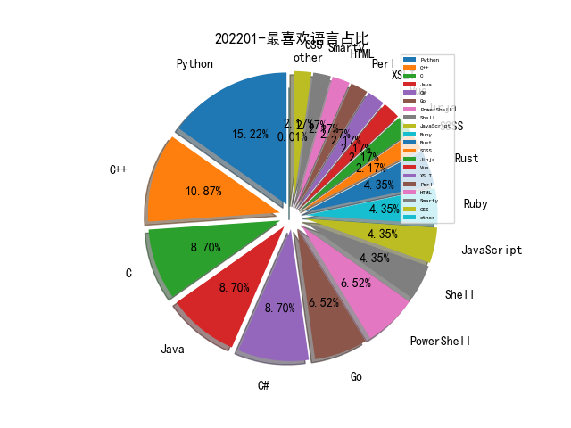

# [数据--所有](README_20.md)
# [数据--年度](README_2022.md)
# 202201 信息源与信息类型占比

# 微信公众号 推荐
| nickname_english | weixin_no | title | url| 
| --- | --- | --- | ---| 
| 补天平台 | None | 攻防社区过年啦 , 新春投稿双倍稿费 | https://mp.weixin.qq.com/s?__biz=MzI2NzY5MDI3NQ==&mid=2247492837&idx=1&sn=65207ec494b37a4008b5e2a1fdfbcd8f | 2| 
| 网安寻路人 | DataProtection101 | 数据要素治理 , 政策制定者应密切关注数据治理（下） | https://mp.weixin.qq.com/s?__biz=MzIxODM0NDU4MQ==&mid=2247493644&idx=1&sn=904351f0dd2d66f17c29cdd334a39cf1 | 1| 
| 我不是Hacker | gh_aaed037e2267 | 【提供漏洞环境】｜在线汽车租赁系统存在存储型XSS漏洞 -- CVE-2021-46005 | https://mp.weixin.qq.com/s?__biz=MzkwNDI1NDUwMQ==&mid=2247485543&idx=1&sn=ffc20df3eaa07c2d2b26d31b21033e63 | 2| 
| 安恒信息 | DBAPP2013 | 范渊受邀新华网数字经济领军者新春寄语 | https://mp.weixin.qq.com/s?__biz=MjM5NTE0MjQyMg==&mid=2650504772&idx=1&sn=9d3a760df23b8c527b5ffa0bc5831f7b | 3| 
| 哈拉少安全小队 | gh_b273ce95df95 | 【超高优惠】诚殷网络第41期Web安全培训班招生 | https://mp.weixin.qq.com/s?__biz=MzAxNzkyOTgxMw==&mid=2247488187&idx=1&sn=b66365acbb76cd343a2b714b51273574 | 1| 
| 云众可信 | yunzhongkexin | 迎春活动 , 晒“年”味，赢好礼！你的“年味”我知道~ | https://mp.weixin.qq.com/s?__biz=Mzg2NDU3Mzc5OA==&mid=2247487462&idx=1&sn=e0cc18fe3aec6df3a98776082f4a8375 | 2| 
| 中睿天下 | zorelworld | 7*24H , 中睿天下春节假期保障服务通知 | https://mp.weixin.qq.com/s?__biz=MzAwNjc0MDA1NA==&mid=2650132852&idx=1&sn=559ac870f3427583ba9284df3df2bb14 | 1| 
| 靶机狂魔 | hacktherange | 100个红包封面 | https://mp.weixin.qq.com/s?__biz=MzI0NDI2MzgzNQ==&mid=2651185420&idx=1&sn=a95a42a313a2c0ce105e888b81b3192c | 1| 
| 进击的Coder | FightingCoder | 用 Markdown 做的 PPT，真的太强了！ | https://mp.weixin.qq.com/s?__biz=Mzg3MjU3NzU1OA==&mid=2247507410&idx=1&sn=587553d254383a9db0e11c2a85add17c | 1| 
| 网络侦查研究院 | PCpolicesir | 国家互联网信息办公室关于《互联网信息服务深度合成管理规定（征求意见稿）》 公开征求意见的通知 | https://mp.weixin.qq.com/s?__biz=MzIxOTM2MDYwNg==&mid=2247510882&idx=1&sn=c92a384dece1bd75ed76cd6d1cf60332 | 1| 
| 深夜笔记本 | shenyebijiben | 送你一个微信封面。大家新年快乐 | https://mp.weixin.qq.com/s?__biz=MjM5Nzk3MjMzMA==&mid=2650569181&idx=1&sn=532aa4df03b97247250284f246417589 | 4| 
| 永安在线情报平台 | YongAnOnline | 永安在线祝您新年快乐，虎年大吉！ | https://mp.weixin.qq.com/s?__biz=MzI3NDY3NDUxNg==&mid=2247492848&idx=1&sn=5b4dbb509b181a04dfe3cb1b8e0643ef | 1| 
| 无界信安 | Boundless_Sec | 内网渗透：Kerberoasting | https://mp.weixin.qq.com/s?__biz=Mzk0MzI3OTAwMg==&mid=2247484700&idx=1&sn=49d8d1602b50c2a341802d73dac09dfd | 1| 
| 山丘安全攻防实验室 | hillsec | Clipboard Hijack遐想&联动Cobalt Strike上线 | https://mp.weixin.qq.com/s?__biz=Mzg3MjIyNjY3MA==&mid=2247484479&idx=1&sn=bcc87c776f95ae21589e5c368f9a4845 | 1| 
| 安协小天使 | gh_e4ac6bc8fbfb | Vidar-Team 微信红包封面大放送！ | https://mp.weixin.qq.com/s?__biz=MzIxNDU2ODg3Mw==&mid=2247484613&idx=1&sn=6fa4517720bfddc52d6d6fe1f4d5ae06 | 1| 
| 奇安信技术研究院 | jishuyanjiuyuan001 | 奇安信技术研究院专属红包封面限量领取，先到先得哦！！ | https://mp.weixin.qq.com/s?__biz=Mzg4OTU4MjQ4Mg==&mid=2247485824&idx=1&sn=782005747c61b00a5c450c00ac50fefc | 1| 
| 利刃信安 | LRXAEGZ | 网盘已更新CS4.5 | https://mp.weixin.qq.com/s?__biz=MzU1Mjk3MDY1OA==&mid=2247494071&idx=1&sn=30f776e2b90b86384c4a278ebe765bf7 | 1| 
| moonsec | moon_sec | 暗月2022年1月NASA考核文章5 | https://mp.weixin.qq.com/s?__biz=MzAwMjc0NTEzMw==&mid=2653578063&idx=1&sn=50e2c999e1fcfe2a0db02ad3dd476243 | 1| 
| bytecode11 | Not_Hacker | 自动发送-2022.1.26 | https://mp.weixin.qq.com/s?__biz=MzI4NjU2MjM5Mw==&mid=2247487557&idx=1&sn=d07c22ab777f93ffcc41507548a1e2a4 | 1| 
| GeekPwn | GeekPwn | 福虎生威｜极棒专属红包封面来了！ | https://mp.weixin.qq.com/s?__biz=MzA3Nzc2MjIxOA==&mid=2650342844&idx=1&sn=85cd05e9cd6c6da0f3968583b45211a9 | 1| 
| 黑白天实验室 | HBT-SEC | “虎虎生威”信创主题 2022新年活动，更有大量职位虚左以待 | https://mp.weixin.qq.com/s?__biz=MzU4NTY4MDEzMw==&mid=2247491767&idx=1&sn=131ef7292830c9dd95aaff0f8ae06543 | 2| 
| 黑云信息安全 | heiyunxinxi | 内推：天融信人才招聘 | https://mp.weixin.qq.com/s?__biz=Mzg5OTYxMjk0Mw==&mid=2247485587&idx=1&sn=39206ce3b1cab1d8d9d468ad755be453 | 1| 
| 飓风网络安全 | gh_183f818a07dc | 隐藏12年之久的提权漏洞-PwnKit(CVE-2021 | https://mp.weixin.qq.com/s?__biz=MzI3NzMzNzE5Ng==&mid=2247485366&idx=1&sn=3f64804673d79a11645b08366e2b4298 | 1| 
| 零组攻防实验室 | Ling_GF | “虎虎生威”信创主题 2022新年活动，更有大量职位虚左以待 | https://mp.weixin.qq.com/s?__biz=MzU5OTAzNTgzNQ==&mid=2247484907&idx=1&sn=8655c6b066e154a1ece4afcc656745db | 1| 
| 边界无限 | BoundaryX | 春节值守 安全无忧 | https://mp.weixin.qq.com/s?__biz=MzAwNzk0NTkxNw==&mid=2247485052&idx=1&sn=581f6a53761a0bee4f0e80ae4d0ff285 | 1| 
| 行长叠报 | BUG_BANK | 漏洞银行荣膺3项网络安全领域国际大奖 | https://mp.weixin.qq.com/s?__biz=MzAxODg1MDMwOQ==&mid=2247495116&idx=1&sn=4a4ca2e2bcbc180e8097cace46877b3a | 2| 
| 蓝桥云课精选 | shiyanlou-com | 他在B 站有 178 万粉丝，今天来免费带你学 Python 了！ | https://mp.weixin.qq.com/s?__biz=MjM5OTMxMzA4NQ==&mid=2655949790&idx=1&sn=6fd1a8e3fc05f3382197768c71535bbd | 2| 
| 腾讯安全威胁情报中心 | gh_05a6c5ec3f78 | 虎年快乐｜腾讯安全威胁情报中心\n恭贺新春，限量红包封面免费领取 | https://mp.weixin.qq.com/s?__biz=MzI5ODk3OTM1Ng==&mid=2247500161&idx=1&sn=63539bdd23692a90eb954c87fd7e8ea5 | 1| 
| 网络尖刀 | mcbang_com | 拿去，网络尖刀微信封面。 | https://mp.weixin.qq.com/s?__biz=MjM5MDA3MzI0MA==&mid=2650090973&idx=1&sn=954655ff6b9bfbd00977e7536b95e41c | 1| 
| 白鼠安全团队 | WhiteRatSec | “虎虎生威”信创主题 2022新年活动，更有大量职位虚左以待 | https://mp.weixin.qq.com/s?__biz=MzIwMjkxMTY5Mg==&mid=2247484358&idx=1&sn=b8ce7af79cd232db0d2330102c331cee | 1| 
| 爱奇艺技术产品团队 | iQIYI-TP | 爱奇艺内容中台之Serverless应用与实践 | https://mp.weixin.qq.com/s?__biz=MzI0MjczMjM2NA==&mid=2247496298&idx=1&sn=6aa0e065b742782c3aab5f46862e78ff | 2| 
| 河南等级保护测评 | hndjbh | 为什么要强制实行网络安全等级保护制度？ | https://mp.weixin.qq.com/s?__biz=Mzg2NjY2MTI3Mg==&mid=2247484955&idx=2&sn=5e1f58526fb4fab6405c895dd301a06e | 8| 
| 星阑科技 | StarCrossCN | @星阑科技，“请回答2021”｜星阑年终映像 | https://mp.weixin.qq.com/s?__biz=Mzg5NjEyMjA5OQ==&mid=2247491574&idx=1&sn=1ae1aeddc0615d1a36019e9d9dc68c47 | 1| 
| 小艾搞安全 | lxfcl_0827 | xss绕waf几种姿势剖析 | https://mp.weixin.qq.com/s?__biz=Mzg3MTY3NzUwMQ==&mid=2247484513&idx=1&sn=8d405a5879996b5f8572af680edfbb4a | 2| 
| 小米安全中心 | misrc_team | 小米汽车-智能座舱安全岗位热招！ | https://mp.weixin.qq.com/s?__biz=MzI2NzI2OTExNA==&mid=2247509790&idx=1&sn=04cd0afa746e7cd528bcef97b1ebae79 | 1| 
| 安全分析与研究 | MalwareAnalysis | 送大家一个红包封面 | https://mp.weixin.qq.com/s?__biz=MzA4ODEyODA3MQ==&mid=2247487293&idx=1&sn=0eed207613bf800b339a62338850a256 | 1| 
| 字节脉搏实验室 | zijiemaiboshiyanshi | 被怼后的思考：做安全为了什么？ | https://mp.weixin.qq.com/s?__biz=MzI2ODU2MjM0OA==&mid=2247490895&idx=1&sn=bc252456cf89f6fe3c393470a4905170 | 1| 
| 公安部网络安全等级保护中心 | gh_f5f6bf3d09af | 网络安全资讯动态 2022年第4期（总第154期） | https://mp.weixin.qq.com/s?__biz=MzU3NTQwNDYyNA==&mid=2247485222&idx=1&sn=0c40adec29c45d4991a26dd1b718b35f | 1| 
| XG小刚 | XG_WEB | 分离免杀-剪贴板加载器 | https://mp.weixin.qq.com/s?__biz=MzIwOTMzMzY0Ng==&mid=2247486818&idx=1&sn=1a09d7014bf3195ab4b1a0fcdcd0d00a | 2| 
| WgpSec狼组安全团队 | wgpsec | php代码审计一条龙思路 | https://mp.weixin.qq.com/s?__biz=MzIyMjkzMzY4Ng==&mid=2247496171&idx=1&sn=3d837b9375db1fcf6a9fa8e72d39ad7b | 2| 
| V安全资讯 | v-safe-cn | Thinkphp5 SQL注入漏洞引发的思考 | https://mp.weixin.qq.com/s?__biz=MzI4MDQ1MzQ0NA==&mid=2247488590&idx=1&sn=ae27d201f0c3c2b95100a1bd5134c10d | 3| 
| SecPulse安全脉搏 | SecPulse | 委派攻击知识点全收录！利用委派的姿势能有多花哨？ , 技术精选 0121 | https://mp.weixin.qq.com/s?__biz=MzAxNDM3NTM0NQ==&mid=2657044135&idx=1&sn=adc73a3026cbe0bb9c23a1e376a39c4b | 1| 
| Python编程 | LovePython | 火爆全球的《鱿鱼游戏》，尝试用Python做一波分析 | https://mp.weixin.qq.com/s?__biz=MzA5ODUzOTA0OQ==&mid=2651699776&idx=1&sn=2dacd4745d6e4dc1eacda8f641d9c63c | 2| 
| NOP Team | yidalidemao | BROP 攻击技术 ｜ PWN | https://mp.weixin.qq.com/s?__biz=MzU1NDkwMzAyMg==&mid=2247491408&idx=1&sn=59abc8227d3df3ca1f0be6445217e3ef | 1| 
| HACK之道 | hacklearn | 防火墙出网探测工具 | https://mp.weixin.qq.com/s?__biz=MzIwMzIyMjYzNA==&mid=2247497561&idx=1&sn=bb5cb35b780bea2d261af551caeea5e7 | 2| 
| Docker中文社区 | dockerchina | 悠悠二十载，Nginx创始人Igor宣布离职 | https://mp.weixin.qq.com/s?__biz=MzI1NzI5NDM4Mw==&mid=2247489665&idx=1&sn=82a327a6d51cddb51543743dce9b179f | 1| 
| 360漏洞响应平台 | gh_af66f3cef3ce | 360漏洞众包响应平台升级公告 | https://mp.weixin.qq.com/s?__biz=MzkzNjIyNjM1OA==&mid=2247484086&idx=1&sn=d93da9f96f05dfdb6d094c593a395a0b | 1| 
| 默安科技 | moresec | 默安科技2022年春节值守安排 | https://mp.weixin.qq.com/s?__biz=MzIzODQxMjM2NQ==&mid=2247489169&idx=1&sn=de151326fc41b56897a8cee4060a5ab1 | 2| 
| 高效运维 | greatops | 超清晰的 DNS 原理入门指南，看这一篇就够了~ | https://mp.weixin.qq.com/s?__biz=MzA4Nzg5Nzc5OA==&mid=2651709260&idx=1&sn=16d3206dee96e00b5e161234d18744c4 | 4| 
| 雾晓安全 | gh_79582f17fd5a | 最新BurpSuite2022.1破解 | https://mp.weixin.qq.com/s?__biz=Mzg2NDM2MTE5Mw==&mid=2247487010&idx=1&sn=0316f9b2d96bfb22d32701851cb027c3 | 3| 
| 金色钱江 | Golden-Qianjiang | [复现]CVE-2021-4034 ubuntu提权 | https://mp.weixin.qq.com/s?__biz=Mzg5NTY3NTMxMQ==&mid=2247484103&idx=1&sn=cca067081e0a19c2b55282ca2e23ff4c | 1| 
| 释然IT杂谈 | ShiRan_IT | 【紧急漏洞】Linux polkit本地权限提升漏洞（CVE-2021-4034）POC复现过程与修复方法 | https://mp.weixin.qq.com/s?__biz=MzIxMTEyOTM2Ng==&mid=2247497019&idx=1&sn=f9ff173ac7209956e5b70fc4c8ef95e9 | 2| 
| 花指令安全实验室 | junk-code | 项目招聘：网络安全课程培训讲师项目招聘、对接 | https://mp.weixin.qq.com/s?__biz=Mzg3MDUwMjE3Nw==&mid=2247484469&idx=1&sn=aba7bf56c7bcfff4e37d64b8d8af2c92 | 1| 
| 腾讯玄武实验室 | XuanwuLab | 每日安全动态推送(01-27) | https://mp.weixin.qq.com/s?__biz=MzA5NDYyNDI0MA==&mid=2651958178&idx=1&sn=cc8e3cfd32359ef1814a85804f6dcdd2 | 1| 
| 腾讯安全联合实验室 | txaqlhsys | 浅谈云上攻防——CVE-2020-8562漏洞为k8s带来的安全挑战 | https://mp.weixin.qq.com/s?__biz=MzI1NzM0MTMzMg==&mid=2247490684&idx=1&sn=18f128739b78a9101d71de5e104d7a65 | 2| 
| 腾讯安全应急响应中心 | tsrc_team | 速领～TSRC虎年限定红包封面 | https://mp.weixin.qq.com/s?__biz=MjM5NzE1NjA0MQ==&mid=2651205679&idx=1&sn=0b1ddf0d9cea022eaac8ad00dfd95837 | 1| 
| 祺印说信安 | qiyinshuoxinan | 据报道称加拿大外交部被黑 | https://mp.weixin.qq.com/s?__biz=MzA5MzU5MzQzMA==&mid=2652091906&idx=1&sn=a986b9fdb7da1743a3d5c0081499dda4 | 10| 
| 盘古石取证 | Panguite_CN | 盘古石取证 - 2022春节假期服务值班表 | https://mp.weixin.qq.com/s?__biz=Mzg3MjE1NjQ0NA==&mid=2247493483&idx=1&sn=19cfe8342072f6fec2ecc24879f61ce4 | 2| 
| 白帽子社区 | baimaoshequ | Linux Polkit Root本地提权 , CVE-2021-4034复现 | https://mp.weixin.qq.com/s?__biz=MzUyMTAyODYwNg==&mid=2247496479&idx=1&sn=ced6344bb8ee4232c0fa1feac33d857f | 3| 
| 炼石网络CipherGateway | CipherGateway | 全年合辑 , 网安产业40万字报告,400页幻灯片,200项政策打包带走 | https://mp.weixin.qq.com/s?__biz=MzkyNzE5MDUzMw==&mid=2247496532&idx=1&sn=3d2580e6e261acc536e3b65e614385bd | 1| 
| 潇湘信安 | xxxasec | 记一次前端安全测试 | https://mp.weixin.qq.com/s?__biz=Mzg4NTUwMzM1Ng==&mid=2247494320&idx=1&sn=61e7f52e188b1ee7eeda140efa9dfbcd | 1| 
| 洞见网安 | doonsec | 洞见简报【2022/1/26】 | https://mp.weixin.qq.com/s?__biz=MzAxNzg3NzMyNQ==&mid=2247485519&idx=1&sn=8aa773424b1f4c48b55dd500872c4eb3 | 5| 
| 汇能云安全 | metech2005 | 乌克兰俄罗斯局势紧张 加拿大外交部意外被黑 | https://mp.weixin.qq.com/s?__biz=MzIwNzAwOTQxMg==&mid=2652245221&idx=1&sn=cd1cb9a54951be633a5e542d40c33b44 | 4| 
| 李白你好 | libai_hello | CVE-2021-4034 pkexec 本地提权”神洞” | https://mp.weixin.qq.com/s?__biz=MzkwMzMwODg2Mw==&mid=2247488660&idx=1&sn=408a1b6158a52b7820d20e37da151fdd | 2| 
| 携程技术 | None | 2021携程代码报告 | https://mp.weixin.qq.com/s?__biz=MjM5MDI3MjA5MQ==&mid=2697272405&idx=1&sn=99c4212648d7252764744976d44f4721 | 1| 
| 技术奇妙物语 | gh_cfee2fb349bc | 聊聊API安全的重要性及治理思路 | https://mp.weixin.qq.com/s/Q9fZrq51fLNf0itPj1p9Vw | 1| 
| 快手安全应急响应中心 | kwaisec | 快手小六红包封面限量发送 | https://mp.weixin.qq.com/s?__biz=MzU5MDg0MDc2MQ==&mid=2247484941&idx=1&sn=8c41f1fab06c1ce67396c55579fc2c78 | 1| 
| 字节跳动技术团队 | BytedanceTechBlog | 抖音 Android 性能优化系列：启动优化之理论和工具篇 | https://mp.weixin.qq.com/s?__biz=MzI1MzYzMjE0MQ==&mid=2247491335&idx=1&sn=e3eabd9253ab2f83925af974db3f3072 | 3| 
| 威努特工控安全 | winicssec_bj | 铁路关基设施被攻击，勒索病毒应如何防范？ | https://mp.weixin.qq.com/s?__biz=MzAwNTgyODU3NQ==&mid=2651081538&idx=1&sn=ec3f886f60a8f9b8127f3ad658b035d4 | 3| 
| 奇安信病毒响应中心 | gh_416eb7efb780 | 每周勒索威胁摘要 | https://mp.weixin.qq.com/s?__biz=MzI5Mzg5MDM3NQ==&mid=2247489215&idx=1&sn=ca816d8c8ccb63f178d0e97035bfbc40 | 2| 
| 天驿安全 | tianyisec | 雪影，一款集合诸多功能的安全工具 | https://mp.weixin.qq.com/s?__biz=MzkxNjIxNDQyMQ==&mid=2247487622&idx=1&sn=4f3fa08fd191ebe748c8e1a6954c23af | 4| 
| 唯品会安全应急响应中心 | VIP_SRC | 虎虎生唯！你的虎年挖洞buff来喽！ | https://mp.weixin.qq.com/s?__biz=MzI5ODE0ODA5MQ==&mid=2652280906&idx=1&sn=955179e13fa046aa6e010bb76462ef36 | 2| 
| 君哥的体历 | jungedetili | 聊聊API安全的重要性及治理思路 | https://mp.weixin.qq.com/s?__biz=MzI2MjQ1NTA4MA==&mid=2247487896&idx=1&sn=15322e3d60ac036a10345032eb6e5e59 | 1| 
| 分布式实验室 | dockerone | 怎么理解和落地DevSecOps？（深度长文） | https://mp.weixin.qq.com/s?__biz=MzA5OTAyNzQ2OA==&mid=2649751417&idx=1&sn=260a3b4bf7649a22d4566b5d57b2d2ba | 4| 
| i春秋 | icqedu | 专栏丨《网络犯罪案例分析》第三十四期：12306抢票产业链 | https://mp.weixin.qq.com/s?__biz=MzUzNTkyODI0OA==&mid=2247511190&idx=1&sn=0847a16989dc74912f9f65c32db357a8 | 1| 
| XCTF联赛 | gh_3d7c7f90f79f | SUSCTF 2022 , 风云际会 战火高燃 | https://mp.weixin.qq.com/s?__biz=MjM5NDU3MjExNw==&mid=2247502305&idx=1&sn=ef6def1d4866352294e24486046443d4 | 2| 
| WhITECat安全团队 | WhITECat_007 | 迷糊的提权方式以及利用ssrf到最终提权靶机 | https://mp.weixin.qq.com/s?__biz=MzAwMzc2MDQ3NQ==&mid=2247486559&idx=1&sn=d3fcd82c9b6aea8d8bcf3e9686371551 | 2| 
| Linux学习 | LoveLinux1024 | 2022 年是 Linux 桌面年吗？ | https://mp.weixin.qq.com/s?__biz=MzI4MDEwNzAzNg==&mid=2649455967&idx=1&sn=b2e87ef21c821de8e224505b0ba318c0 | 2| 
| Bypass | Bypass-- | 推荐 , 安全技术类公众号 | https://mp.weixin.qq.com/s?__biz=MzA3NzE2MjgwMg==&mid=2448907841&idx=1&sn=487dd8edd7cd130d3155564a84fcb98c | 1| 
| 顺丰安全应急响应中心 | SFSRC- | SFSRC安全情报奖励计划正式运行 | https://mp.weixin.qq.com/s?__biz=MzU3OTAyODk4MQ==&mid=2247484190&idx=1&sn=9d2bda66d60dfa6bc6f3819471469d34 | 1| 
| 青藤云安全 | qingtengyun | 青藤深度支持《2021网信自主创新调研报告》，获编委会致谢 | https://mp.weixin.qq.com/s?__biz=MzAwNDE4Mzc1NA==&mid=2650833518&idx=1&sn=d89f325630c503a6ba331c26b6c3d9cd | 2| 
| 雷神众测 | bounty_team | 推荐 , 安全技术类公众号 | https://mp.weixin.qq.com/s?__biz=MzI0NzEwOTM0MA==&mid=2652495828&idx=1&sn=9dba829a9119d596377f39cfeb274990 | 1| 
| 锋刃科技 | ahfengren | 【漏洞情报】Linux Polkit本地提权漏洞（CVE-2022-4034） | https://mp.weixin.qq.com/s?__biz=MzUxMjc0MTE3Mw==&mid=2247486885&idx=1&sn=cad08d9539f3bf1f4706a24a853835cb | 1| 
| 酒仙桥六号部队 | anfu-360 | 委派攻击知识点全收录！利用委派的姿势能有多花哨？ , 技术精选 0121 | https://mp.weixin.qq.com/s?__biz=MzAwMzYxNzc1OA==&mid=2247498139&idx=1&sn=0f5ee2f1ac38d567b87a895d6d1a55f0 | 3| 
| 网络安全编程与黑客程序员 | gh_70d3f225d0bb | 利用分块传输吊打所有WAF | https://mp.weixin.qq.com/s?__biz=Mzg5NDMzNjYxOA==&mid=2247495122&idx=1&sn=839f1565f9a8fc29b7b2e2c26c6b5057 | 4| 
| 网络安全应急技术国家工程实验室 | NELCERT | 2021全球工控安全事件大盘点 | https://mp.weixin.qq.com/s?__biz=MzUzNDYxOTA1NA==&mid=2247524874&idx=1&sn=440bb7d2dc55a3447e8dc968ac41a188 | 14| 
| 绿盟科技 | NSFOCUS-weixin | 绿盟科技联合CNCERT网络安全应急技术国家工程研究中心发布《2021年度高级威胁研究报告》 | https://mp.weixin.qq.com/s?__biz=MjM5ODYyMTM4MA==&mid=2650422053&idx=1&sn=a7478f370ca9d826689e9459f94d1d31 | 10| 
| 程序员阿甘 | gh_a2e36d69d566 | linux中的交互式进程查看命令htop | https://mp.weixin.qq.com/s?__biz=MzI4MTkzNDIyMg==&mid=2247495268&idx=1&sn=fb64bfb20dc818431ea816a71f80ffdb | 3| 
| 福韵 网络情报研究 | FuyunOsint | 【情报工具】分享24个国内外政府开放数据平台 | https://mp.weixin.qq.com/s?__biz=MzU4NTg4Mzc0MA==&mid=2247532941&idx=1&sn=eee821b9f38ab7212174722c7d675100 | 2| 
| 知道创宇 | knownsec | 网空测绘领域唯一，知道创宇网络空间测绘产品获2021年度赛可达优秀产品奖！ | https://mp.weixin.qq.com/s?__biz=MjM5NzA3Nzg2MA==&mid=2649858156&idx=1&sn=8c09384ee184182c1d36779ff1be6a32 | 5| 
| 火线Zone | huoxian_zone | 连载｜浅谈红队中的打点（二） | https://mp.weixin.qq.com/s?__biz=MzI2NDQ5NTQzOQ==&mid=2247491460&idx=1&sn=5b9c094c13fbafd3af810e72be8d5ee9 | 1| 
| 渗透测试教程 | bzhack | 来领红包封面啦~ | https://mp.weixin.qq.com/s?__biz=MzI3OTIwNDkzNQ==&mid=2651836660&idx=1&sn=7977f9749852607342e85e42517baed8 | 1| 
| 渗透攻击红队 | RedTeamHacker | 比起年终奖，我更担心被裁 | https://mp.weixin.qq.com/s?__biz=MzkxNDEwMDA4Mw==&mid=2247490033&idx=1&sn=88b4a301c6745b35b238909339509d3f | 1| 
| 洛米唯熊 | lmwx5320 | 是结束亦是开始-洛米唯熊平台(文末福利) | https://mp.weixin.qq.com/s?__biz=MzIzODE0NDc3OQ==&mid=2247491538&idx=1&sn=20e12dd8256bf40f635f8a9b23ddc76d | 1| 
| 汉客儿 | gh_418dfd27e592 | 微软电脑管家初体验：有模有样，学得很像 | https://mp.weixin.qq.com/s?__biz=MzI1NTUzMjUzMQ==&mid=2247484510&idx=1&sn=57e70e7a626049a9c73f439bc6b37660 | 2| 
| 永信至诚 | INT-GROUP | 获评网络安全工程项目典范实践案例！春秋云阵新一代蜜罐系统再获认可 | https://mp.weixin.qq.com/s?__biz=MzAwNDUyMjk4MQ==&mid=2454819513&idx=1&sn=3f5f4e2a8503bbd889f25fdba89f0965 | 1| 
| 数据库开发 | DataBase1024 | 使用MySQL，请用好 JSON 这张牌！ | https://mp.weixin.qq.com/s?__biz=MzI3NDA4OTk1OQ==&mid=2649916873&idx=1&sn=3b383fe075034ef973e6553d747da595 | 2| 
| 数世咨询 | dwconcn | [调研]Bugcrowd：2021年高危漏洞数量大幅增长 | https://mp.weixin.qq.com/s?__biz=MzkxNzA3MTgyNg==&mid=2247491917&idx=1&sn=05b51fa452f87d23b071d2145e13f7ae | 7| 
| 我是安服 | scaf_0123 | 安服笔记：初探Java反序列化漏洞 | https://mp.weixin.qq.com/s?__biz=MzkzMzI3OTczNA==&mid=2247484563&idx=1&sn=80582cfb1a8ceddf910e2cd58d66cb43 | 1| 
| 慢雾科技 | SlowMist | 慢雾科技四周年，做区块链黑暗森林的那束光 | https://mp.weixin.qq.com/s?__biz=MzU4ODQ3NTM2OA==&mid=2247494639&idx=1&sn=b7fb802d0e25c97462b8d8560ac1b74a | 2| 
| 情报分析师 | qingbaofenxishi | 【案例分析】缅甸叛乱分子利用简易无人机来提高其机动力 | https://mp.weixin.qq.com/s?__biz=MzA3Mjc1MTkwOA==&mid=2650486871&idx=1&sn=3f12f3d17f313a337fea28b98c8f82c8 | 6| 
| 微步在线 | Threatbook | 企业常见四种内部威胁，第一种最容易中招 , 微步一周荐读 | https://mp.weixin.qq.com/s?__biz=MzI5NjA0NjI5MQ==&mid=2650171190&idx=1&sn=90358fb4013e10f5499d24d0accb8f6e | 3| 
| 弥天安全实验室 | gh_41292c8e5379 | CVE-2021-4034 Linux Polkit 权限提升漏洞复现 | https://mp.weixin.qq.com/s?__biz=MzU2NDgzOTQzNw==&mid=2247488175&idx=1&sn=204aed4c76ecf40e26c04f42f2f64c5e | 4| 
| 安恒信息资讯 | DBAPP688023 | 通知,安恒信息春节应急保障 7*24小时为您在线 | https://mp.weixin.qq.com/s?__biz=MzkwODE2OTU0NA==&mid=2247485131&idx=1&sn=3ed9779e09cd188b2a396d61868a0f6f | 1| 
| 安天集团 | Antiylab | 冬训营丨2021年网络安全威胁回顾 | https://mp.weixin.qq.com/s?__biz=MjM5MTA3Nzk4MQ==&mid=2650186693&idx=1&sn=f2f236c72d7a194c190474ed2d8b86d1 | 6| 
| 安在 | AnZer_SH | 诸子笔会 , 刘顺：企业网络安全规划建设实践 | https://mp.weixin.qq.com/s?__biz=MzU5ODgzNTExOQ==&mid=2247534758&idx=2&sn=62917dab4f399bba8b5aa58997c3595d | 9| 
| 安全牛 | aqniu-wx | 以人为本，如何在“辞职潮”中寻找和留住网络安全人才？ | https://mp.weixin.qq.com/s?__biz=MjM5Njc3NjM4MA==&mid=2651110141&idx=1&sn=2c91fa8980e32678755fa798f8c397d1 | 8| 
| 安全圈 | ChinaAnQuan | 【安全圈】北美IT公司调查表明：勒索软件团伙正在加大力度招募内部人员来协助攻击 | https://mp.weixin.qq.com/s?__biz=MzIzMzE4NDU1OQ==&mid=2651991947&idx=4&sn=a775a6c5673df5d367e2be5a2bc594a9 | 12| 
| 安世加 | asjeiss | 黄鹏华  某互联网公司安全负责人《漫谈数据安全能力建设》 , 安世加沙龙第31期 | https://mp.weixin.qq.com/s?__biz=MzU2MTQwMzMxNA==&mid=2247515790&idx=2&sn=d5bebb07794898c4a1833d4510928f10 | 4| 
| 字节跳动安全中心 | TouTiaoSec | Jeddak数据安全沙箱：保障信贷客户广告投放隐私安全 | https://mp.weixin.qq.com/s?__biz=MzUzMzcyMDYzMw==&mid=2247488383&idx=1&sn=ead4071d613bddffc4423a3adf633252 | 3| 
| 奇安信集团 | qianxin-keji | 大拜年,来自冬奥网络安全卫士的神秘惊喜 | https://mp.weixin.qq.com/s?__biz=MzU0NDk0NTAwMw==&mid=2247552017&idx=2&sn=5d738de4bde301e42bab977490ecfd00 | 6| 
| 奇安信 CERT | gh_64040028303e | 【安全风险通告】Linux Polkit权限提升漏洞安全风险通告 | https://mp.weixin.qq.com/s?__biz=MzU5NDgxODU1MQ==&mid=2247495436&idx=1&sn=5f83146f4636c56ad4d920db05568f16 | 4| 
| 天億网络安全 | tywlaq | Wireshark的抓包和分析，看这篇就够了！ | https://mp.weixin.qq.com/s?__biz=MzU4ODU1MzAyNg==&mid=2247498094&idx=1&sn=6a1012d146b87adc5e11c97f5eb08dcc | 4| 
| 国家网络威胁情报共享开放平台 | None | 2022年威胁预测-上 | https://mp.weixin.qq.com/s?__biz=MzU5MjEwNjQzNg==&mid=2247498969&idx=1&sn=3238c481bddc2cb742688c0a135210a0 | 3| 
| 四叶草安全 | siyecaoanquan1 | 再起征程,2022四叶草安全线上年会圆满举办 | https://mp.weixin.qq.com/s?__biz=MjM5MTI2NDQzNg==&mid=2654538693&idx=1&sn=5c88f7e2807b302f4f7a1cf7ca0f4427 | 1| 
| 吾爱破解论坛 | pojie_52 | 活动】感动吾爱2021优秀会员评选活动（总方案） | https://mp.weixin.qq.com/s?__biz=MjM5Mjc3MDM2Mw==&mid=2651137131&idx=1&sn=1d12e3986207cc1f801cc9e7f1892f35 | 2| 
| 关键基础设施安全应急响应中心 | CII-SRC | “十四五”数字经济高质量发展需要法治护航 | https://mp.weixin.qq.com/s?__biz=MzkyMzAwMDEyNg==&mid=2247524421&idx=1&sn=4c4c7933b5793f1544005a9d9ef67a5a | 14| 
| 全球技术地图 | drc_iite | NSF向白宫递交最新报告：5大指标表明美国在科技发展的态势上输给了中国 | https://mp.weixin.qq.com/s?__biz=MzI1OTExNDY1NQ==&mid=2651589322&idx=1&sn=d9126d14423701c23e33fe0134d43dfc | 6| 
| 一个人的安全笔记 | xjiek2015 | [HTB] Safe Writeup | https://mp.weixin.qq.com/s/NuP7kjfGgEMLrg60_fSzWg | 1| 
| yudays实验室 | None | CVE-2021-4034权限提升漏洞 | https://mp.weixin.qq.com/s?__biz=MzU0NjU5NDE4Mg==&mid=2247484773&idx=1&sn=0709ca817b3ac9f4f2c36782a355d2f4 | 2| 
| aFa攻防实验室 | gzh_afagfsys | Linux提权-CVE-2021-4034 | https://mp.weixin.qq.com/s?__biz=MzAxMjcxMjkyOA==&mid=2247485627&idx=1&sn=a5cf1afffe837bc94abd138b57fca607 | 2| 
| PeiQi文库 | PeiQi_wiki | 漏洞预警：Linux Polkit权限提升漏洞 CVE-2021-4034 | https://mp.weixin.qq.com/s?__biz=Mzg3NDU2MTg0Ng==&mid=2247490120&idx=1&sn=ac5c8f68369df6e7c257322e3dbcbb0c | 2| 
| NOVASEC | NOVA_SEC | 分享关于ssrf的检测技巧 | https://mp.weixin.qq.com/s?__biz=MzUzODU3ODA0MA==&mid=2247487581&idx=1&sn=5c4a7ef241ae77ca9b7a98a90ecf744c | 1| 
| Ms08067安全实验室 | Ms08067_com | 安全学习方法 之 上手测试以《Bypass Shellcode-Encryptor》为例 | https://mp.weixin.qq.com/s?__biz=MzU1NjgzOTAyMg==&mid=2247497793&idx=1&sn=03e2f8a686183ec3bf3a97632fa42e87 | 7| 
| Khan安全攻防实验室 | KhanCJSH | CVE-2021-44515 重置未经身份验证的管理员密码并登录 | https://mp.weixin.qq.com/s?__biz=MzAwMjQ2NTQ4Mg==&mid=2247488543&idx=1&sn=ba7283360a999829af6d82049ba09651 | 4| 
| HACK学习君 | XHacker1961 | 干货 ｜GitHUB安全搬运工 十五 | https://mp.weixin.qq.com/s?__biz=MzIzNzMxMDkxNw==&mid=2247486467&idx=1&sn=337a2645b304a04addfcbca159d91dbb | 1| 
| GoCN | golangchina | 「GoCN酷Go推荐」运行时替换 Golang 函数 — gohook | https://mp.weixin.qq.com/s?__biz=MzA4ODg0NDkzOA==&mid=2247495341&idx=1&sn=f36406882566e089c2ff5d8ac5088d79 | 6| 
| 360漏洞云 | loudongyun360 | 漏洞复现！PolicyKit 本地权限提升漏洞 | https://mp.weixin.qq.com/s?__biz=MzI4NTUzNTc0MQ==&mid=2247495764&idx=1&sn=d41d3d9ca4f026417118fc3a7dd638c2 | 2| 
| 黑白之道 | i77169 | HTTP协议栈远程代码执行漏洞(CVE-2022-21907)复现 | https://mp.weixin.qq.com/s?__biz=MzAxMjE3ODU3MQ==&mid=2650532583&idx=2&sn=9b2b4d12294edbd120353835bd599343 | 14| 
| 衡阳信安 | zghyxa | ThinkPHP v6.0.7 eval反序列化利用链 | https://mp.weixin.qq.com/s?__biz=MzU2NDY2OTU4Nw==&mid=2247494525&idx=1&sn=727ef25e7cc7ddcc6b31cb4d4505e877 | 10| 
| 盾山实验室 | DunShanRR | Wi-Fi Framework：一款功能强大的WiFi安全测试工具 | https://mp.weixin.qq.com/s?__biz=MzkzMjIwMDY4Nw==&mid=2247486063&idx=1&sn=8e57272d7ffe636ab8282bc2da9c3736 | 6| 
| 渗透Xiao白帽 | SuPejkj | 分享 , 艰难的mimikatz源码编译免杀 Windows Defender | https://mp.weixin.qq.com/s?__biz=MzI1NTM4ODIxMw==&mid=2247491568&idx=1&sn=89475c7c0d9aca1a5df9c485c8dcd5c1 | 5| 
| 每天一个入狱小技巧 | gh_ba62997aff09 | wifi攻击之WiFi的暴力破解。附详细过程、讲解以及原理 | https://mp.weixin.qq.com/s?__biz=Mzg2MzYzNjEyMg==&mid=2247484846&idx=1&sn=39e203a43a08da7f7ce11f4b893bd159 | 4| 
| 数字治理全球洞察 | cyberlaw2015 | 互联网司法｜全国首例算法推荐案宣判（附判决书） | https://mp.weixin.qq.com/s/DcqVJDxtteHBzJVAyoNg5A | 1| 
| 山石网科安全技术研究院 | HSN_LAB | 密码学系列｜2.4 The Elgamal Public Key Cryptosystem | https://mp.weixin.qq.com/s?__biz=MzUzMDUxNTE1Mw==&mid=2247491480&idx=1&sn=464a2224aa5a1b425847de8c7050f9d7 | 8| 
| 安恒信息应急响应中心 | gh_1c2b41c1abc7 | 2021年活跃高危安全漏洞盘点 | https://mp.weixin.qq.com/s?__biz=MzUzOTE2OTM5Mg==&mid=2247487003&idx=1&sn=b783eecf9072207057c80bfe5b16359a | 3| 
| 嘶吼专业版 | Pro4hou | 使用Cobalt Strike以及IAT Hooking，绕过BeaconEye的检测 | https://mp.weixin.qq.com/s?__biz=MzI0MDY1MDU4MQ==&mid=2247535421&idx=3&sn=cb7c3135e9dd7ad9d6905ef2dac7ed6b | 21| 
| 合天网安实验室 | hee_tian | 浅谈LSB隐写解题与出题 | https://mp.weixin.qq.com/s?__biz=MjM5MTYxNjQxOA==&mid=2652885268&idx=1&sn=299b4cd6cdc892108f1f1471e19239d3 | 5| 
| 亿人安全 | Yr-Sec | 迷糊的提权方式以及利用ssrf到最终提权靶机 | https://mp.weixin.qq.com/s?__biz=Mzk0MTIzNTgzMQ==&mid=2247489813&idx=1&sn=1d476a13eedc95e481174a0944e81406 | 1| 
| r3kapig | r3kapig-team | RealWorld CTF 4th Writeup by r3kapig | https://mp.weixin.qq.com/s?__biz=MzI2MDE4MzkzMQ==&mid=2247483688&idx=1&sn=06d1bbdeb3d86ec548358dacfa0cce7f | 1| 
| HACK学习呀 | Hacker1961X | 干货｜最全的Jboss漏洞复现笔记 | https://mp.weixin.qq.com/s?__biz=MzI5MDU1NDk2MA==&mid=2247503104&idx=1&sn=e81bff46df2a6a212707369a1248f88d | 7| 
| Gaobai文库 | HikC98799 | BurpSuite超详细使用教程！（附专业版下载使用） | https://mp.weixin.qq.com/s?__biz=MzkxNzIzNDExMA==&mid=2247484370&idx=1&sn=6748ca11b2d7a9daead4df52eaa1c3ce | 5| 
| 邑安全 | EansecD | 攻击者开始使用 XLL 文件进行攻击 | https://mp.weixin.qq.com/s?__biz=MzUyMzczNzUyNQ==&mid=2247511941&idx=1&sn=d2abe2aa8ccdaf98de28b48ca4d16c18 | 7| 
| 维他命安全 | VitaminSecurity | Kaspersky发现APT41利用MoonBounce的攻击活动；字幕网站OpenSubtitles近700万用户的信息泄露 | https://mp.weixin.qq.com/s?__biz=MzUxMDQzNTMyNg==&mid=2247498670&idx=1&sn=64b6ca7bd4f818bf8f349ce2fb366544 | 10| 
| 橘猫学安全 | gh_af700ee13397 | Powershell免杀（无文件落地免杀） | https://mp.weixin.qq.com/s?__biz=Mzg5OTY2NjUxMw==&mid=2247487474&idx=1&sn=43ab18a5f948bf22a99fc988a8e15f03 | 5| 
| 山警网络空间安全实验室 | gh_544c8c38eeaf | User Account Control 杂谈 | https://mp.weixin.qq.com/s?__biz=MjM5Njc1OTYyNA==&mid=2450780415&idx=1&sn=79aa86e37b8a8672829a949a05caf7eb | 6| 
| 且听安全 | qtcyber | 【最新漏洞预警】CVE-2022-22733 ShardingSphere ElasticJob-UI从权限提升到H2 RCE | https://mp.weixin.qq.com/s?__biz=Mzg3MTU0MjkwNw==&mid=2247487481&idx=1&sn=5c6412fb2977785093a684ffe7f42849 | 5| 
| Th0r安全 | gh_3ad192d9c87f | pyinstaller有key参数的第二种逆向方法 | https://mp.weixin.qq.com/s?__biz=Mzg3ODY3MzcwMQ==&mid=2247485030&idx=1&sn=3a0446c5ac13dbafef311e32f4383974 | 4| 
| Linux中国 | linux-cn | 用 CrowdSec 保护你的 PHP 网站不受机器人攻击 , Linux 中国 | https://mp.weixin.qq.com/s?__biz=MjM5NjQ4MjYwMQ==&mid=2664647429&idx=2&sn=7552d7ab892724ce3362a4c822fc888a | 13| 
| Beacon Tower Lab | WebRAY_BTL | 内网代理工具与检测方法研究 | https://mp.weixin.qq.com/s/N2HL89HAHv0OmLrB3AGHSQ | 1| 
| 青衣十三楼飞花堂 | gh_9feb5a276a2a | Win10主控台登录认证流程 | https://mp.weixin.qq.com/s?__biz=MzUzMjQyMDE3Ng==&mid=2247485254&idx=1&sn=4dae88d1a06d482de14fad9f1006b6a7 | 6| 
| 暗魂攻防实验室 | anhunsec-red | 【社区精选】渗透攻击红队内网域渗透靶场2.0-writeup | https://mp.weixin.qq.com/s?__biz=MzkyMjE1NzQ2MA==&mid=2247485537&idx=1&sn=e3799090a8b5503da5b8ee0f8c5662fa | 2| 
| leveryd | gh_8d7f6ed4daff | SnakeYaml 之不出网利用 | https://mp.weixin.qq.com/s?__biz=MzkyMDIxMjE5MA==&mid=2247484854&idx=1&sn=b6e1c8c3930249519dea8bc2a8448c61 | 1| 
| 鹏组安全 | Kris_Alex2 | cobaltstrike 常用功能使用 | https://mp.weixin.qq.com/s?__biz=Mzg5NDU3NDA3OQ==&mid=2247486009&idx=1&sn=c752913c686668b6586e902f5a2ec3df | 2| 
| 渗透安全团队 | GuYingLanQi | Hash传递(PtH)的多种姿势 | https://mp.weixin.qq.com/s?__biz=MzkxNDAyNTY2NA==&mid=2247487948&idx=1&sn=c096783f8469e40a570fa05a9be23ce1 | 8| 
| 娜璋AI安全之家 | gh_91f1fe28fc6e | [系统安全] 三十六.APT系列(1)APT攻击溯源防御与常见APT组织的攻击案例 | https://mp.weixin.qq.com/s?__biz=Mzg5MTM5ODU2Mg==&mid=2247495156&idx=1&sn=467cb5b7db7a68d18173de6bda9f6aa1 | 1| 
| 乌鸦安全 | crowsec | vulntarget漏洞靶场系列（三）— vulntarget-c | https://mp.weixin.qq.com/s?__biz=MzI3NjA4MjMyMw==&mid=2647781111&idx=1&sn=77d1ab3799e7ba256f34ecc11f75010d | 4| 
| Reset安全 | gh_a006697f54a9 | 简单的JAVA Filter内存马编写 | https://mp.weixin.qq.com/s?__biz=MzU3Mzg1NzMyNw==&mid=2247484219&idx=1&sn=9306441dda0c23db2caea9cfd728a004 | 5| 
| 雷石安全实验室 | leishianquan1 | ModSecurity 搭建web安全防火墙和流量检测 | https://mp.weixin.qq.com/s?__biz=MzI5MDE0MjQ1NQ==&mid=2247513682&idx=1&sn=4eccf0163664baf673a0725f2208acc2 | 2| 
| 红数位 | safetop | McAfee客户端代理漏洞存提权执行漏洞 | https://mp.weixin.qq.com/s?__biz=Mzg3MjI1MDU4OA==&mid=2247498968&idx=1&sn=fbd714698edbbcf8da669a7cbf31689e | 3| 
| 宸极实验室 | ChenJiLab | 『杂项』移动安全测试环境搭建（1）-- 基础环境 | https://mp.weixin.qq.com/s?__biz=Mzg4NTA0MzgxNQ==&mid=2247485480&idx=1&sn=e9e7b528a60d6770d6e8e9ffc207c710 | 2| 
| 天禧信安 | txxa-385 | 记一次对带毒微信样本的分析 | https://mp.weixin.qq.com/s?__biz=MzUyMTE0MDQ0OA==&mid=2247486797&idx=1&sn=809cf456a1bf77da51dc755e54c63fd9 | 1| 
| 互联网安全内参 | anquanneican | 国家漏洞库CNNVD：关于Apache Log4j 多个安全漏洞的预警 | https://mp.weixin.qq.com/s?__biz=MzI4NDY2MDMwMw==&mid=2247501043&idx=4&sn=95ddba9f55bddfb458b0a576c7e02337 | 17| 
| 乌雲安全 | hackctf | 内网工具,读取正反向连接RDP记录 | https://mp.weixin.qq.com/s?__biz=MzAwMjA5OTY5Ng==&mid=2247502346&idx=1&sn=5da87e9ec540161bc6a764b6d417c394 | 6| 
| web安全工具库 | websec-tools | 对Cobalt Strike进行一点二次开发 | https://mp.weixin.qq.com/s?__biz=MzI4MDQ5MjY1Mg==&mid=2247494066&idx=1&sn=9c738ed5f5366717d3e0be72515442ed | 4| 
| 阿乐你好 | gh_cdf3717dded0 | H2 数据库控制台中未经身份验证的 RCE | https://mp.weixin.qq.com/s?__biz=MzIxNTIzNTExMQ==&mid=2247486678&idx=1&sn=b94c067c861df525e089497f5925eee8 | 2| 
| 锦行信息安全 | jeeseensec | Java代审5：SQL 注入-Mybatis复现 | https://mp.weixin.qq.com/s?__biz=MzIxNTQxMjQyNg==&mid=2247489079&idx=1&sn=c8fc0ef3a703a823caa6ca1c31ddb4fe | 1| 
| 菜鸟学信安 | securitylearn | 干货,反序列化漏洞汇总 | https://mp.weixin.qq.com/s?__biz=MzU2NzY5MzI5Ng==&mid=2247488026&idx=1&sn=767334e0fe3978fd6ad487e0940d8577 | 3| 
| 编码安全研究 | Lemon_0531_ | 常见的Web漏洞—SQL注入 | https://mp.weixin.qq.com/s?__biz=Mzg2NDY1MDc2Mg==&mid=2247486013&idx=1&sn=32f5a2a27a52d444945ce2c33a6c2ab2 | 5| 
| 白虎实验室 | hacker_root001 | 渗透测试报告编写 | https://mp.weixin.qq.com/s?__biz=Mzk0NTI2ODE1Nw==&mid=2247484189&idx=1&sn=8a2f2d1e3075f3c6eb8c9984a381562f | 1| 
| 电子物证 | ewuzheng | 【侧信道攻击与电子数据取证】 | https://mp.weixin.qq.com/s?__biz=MzAwNDcwMDgzMA==&mid=2651041060&idx=3&sn=c68b753a1fe4ed7ff12060ae779ce2f4 | 6| 
| 奇安信威胁情报中心 | gh_166784eae33e | 假旗 or 升级？疑似海莲花利用Glitch平台的攻击样本再现 | https://mp.weixin.qq.com/s?__biz=MzI2MDc2MDA4OA==&mid=2247498419&idx=1&sn=c55fccc12ca2ea4d73731ad2305d169f | 2| 
| 天融信阿尔法实验室 | gh_0b0b1747bf15 | CVE-2021-33742：Internet Explorer MSHTML堆越界写漏洞分析 | https://mp.weixin.qq.com/s?__biz=Mzg3MDAzMDQxNw==&mid=2247492214&idx=1&sn=9d0e3871fbb22f252f7257d0d8f65adc | 6| 
| 代码卫士 | codesafe | 热门开源CMS平台 Umbraco 中存在多个安全漏洞，可使账户遭接管 | https://mp.weixin.qq.com/s?__biz=MzI2NTg4OTc5Nw==&mid=2247510233&idx=3&sn=a3b6ac9c3a90291e1ce56a9111954282 | 12| 
| 三六零CERT | CERT-360 | Apache Log4j多个安全漏洞通告 | https://mp.weixin.qq.com/s?__biz=MzU5MjEzOTM3NA==&mid=2247490662&idx=1&sn=5525029fe34025b5c7aef2045ba53f8a | 6| 
| LemonSec | lemon-sec | JSON Web令牌(JWT)及访问控制绕过【文末抽奖】 | https://mp.weixin.qq.com/s?__biz=MzUyMTA0MjQ4NA==&mid=2247521090&idx=1&sn=f4cabbf1278ea886dc8d0c7607cc366e | 5| 
| IOTsec Zone | exploit-iot | 车联网安全入门 Part5 | https://mp.weixin.qq.com/s?__biz=Mzg4MTY5NjQzMA==&mid=2247484565&idx=2&sn=734497a9607e43321981f9cf4888b555 | 5| 
| 黑战士 | heizhanshi1 | 老树开新花之shellcode_launcher免杀Windows Defender | https://mp.weixin.qq.com/s?__biz=MzUxMzQ2NTM2Nw==&mid=2247487709&idx=1&sn=38c8dab930ac9ae7425bfd190a266e7d | 1| 
| 黑客在思考 | hackthink | 自定义跳转函数的通用unhook方法 | https://mp.weixin.qq.com/s?__biz=MzI5NzU0MTc5Mg==&mid=2247484508&idx=1&sn=5b8cc4a9472bad142dce871af2afa70e | 2| 
| 黑伞安全 | hack_umbrella | 什么是服务器端请求伪造 (SSRF)？ | https://mp.weixin.qq.com/s?__biz=MzU0MzkzOTYzOQ==&mid=2247486684&idx=1&sn=ec130ec712817b4a253204dc59fbf149 | 1| 
| 长亭安全课堂 | chaitintech_release | 漏洞风险提示 , WebLogic多个高危漏洞 | https://mp.weixin.qq.com/s?__biz=MzIwMDk1MjMyMg==&mid=2247488265&idx=1&sn=7b26532019fcfe2859f7173b5cecb5b4 | 3| 
| 绿盟科技CERT | gh_ab56f0f84265 | 【漏洞通告】Apache log4j反序列化与SQL注入漏洞 | https://mp.weixin.qq.com/s?__biz=Mzk0MjE3ODkxNg==&mid=2247486771&idx=1&sn=a3ce2b3dd7896de44f8925a60ad6f9e3 | 3| 
| 系统安全运维 | Taurus-1314147 | 常见的几种网络故障案例分析与解决 | https://mp.weixin.qq.com/s?__biz=Mzk0NjE0NDc5OQ==&mid=2247496962&idx=2&sn=16355a378818fa6e194b70afdd32ee89 | 7| 
| 盛邦安全WebRAY | WebRay_weixin | 烽火狼烟丨Oracle WebLogic多个组件漏洞风险提示 | https://mp.weixin.qq.com/s?__biz=MzAwNTAxMjUwNw==&mid=2650268795&idx=1&sn=86239abcc080ebefc710d8f6715c2e9f | 5| 
| 微步在线研究响应中心 | gh_c108d4d389bf | 来势汹汹，涉俄组织Indrik Spider借助Log4j2漏洞展开攻击，多国中招，企业需警惕！ | https://mp.weixin.qq.com/s?__biz=MzA5MDc1NDc1MQ==&mid=2247491670&idx=1&sn=dc0f29a3bef2f6c1cacf34cd52d8bf08 | 4| 
| 信安成长计划 | SecSource | Beacon 结果回传流程分析 | https://mp.weixin.qq.com/s?__biz=MzkxMTMxMjI2OQ==&mid=2247484046&idx=1&sn=c74c5864978310e60ed73288eebd1061 | 2| 
| 信安之路 | xazlsec | Cobalt Strike 初体验 , 人人都可上手的红队工具 | https://mp.weixin.qq.com/s?__biz=MzI5MDQ2NjExOQ==&mid=2247496636&idx=1&sn=8ea1f51e80f428bbf07495a2f5ecea9d | 2| 
| 伟盾网络安全 | gh_75e869919a5f | ysoserial分析之MozillaRhino2利用链 | https://mp.weixin.qq.com/s?__biz=MzkwOTIxNzQ5OA==&mid=2247484200&idx=1&sn=dfd28aae274356467137184088ce7e2b | 1| 
| 云鼎实验室 | YunDingLab | 【安全通告】2022年1月Oracle重要补丁更新 - Weblogic多个高危漏洞风险通告 | https://mp.weixin.qq.com/s?__biz=MzU3ODAyMjg4OQ==&mid=2247493747&idx=1&sn=ae9fbebf5cb192b5e6801be47c23f38e | 4| 
| xsser的博客 | xsser_w | 几张图结构看懂CodeQL数据流 | https://mp.weixin.qq.com/s?__biz=MzA4NzA5OTYzNw==&mid=2247484201&idx=1&sn=465cd0594a9a6a25162780ef6b9e2f27 | 1| 
| SecIN技术平台 | sec-in | 原创 , 从靶场学渗透之——ATT&CK实战系列-红队评估（七） | https://mp.weixin.qq.com/s?__biz=MzI4Mzc0MTI0Mw==&mid=2247492618&idx=1&sn=8523b929fe5c5c2b515f200978ea5f1c | 3| 
| Hx0战队 | HxOOZD | vulfocus内网场景题-st2入口内网【上】 | https://mp.weixin.qq.com/s?__biz=MzI3NzA3NDEwOQ==&mid=2247483825&idx=1&sn=bd131b82062b4df09a66dd1b6febb24c | 2| 
| Hacking黑白红 | Hacking012 | 针对单个网站的渗透思路（文末web渗透、CTF电子书，实战案例） | https://mp.weixin.qq.com/s?__biz=Mzg2NDYwMDA1NA==&mid=2247507524&idx=2&sn=87937a808dab2526352f710ca2046a9a | 3| 
| E安全 | EAQapp | 警惕！WordPress插件的严重漏洞已影响 84,000个网站 | https://mp.weixin.qq.com/s?__biz=MzI4MjA1MzkyNA==&mid=2655320384&idx=1&sn=f490b21dd6be5b73da9397b74d87b544 | 2| 
| ADLab | v_adlab | Apache HTTP Server mod_lua模块缓冲区溢出漏洞分析（CVE-2021-44790） | https://mp.weixin.qq.com/s/VjSpJW-1sYM1BwDPQZDqFA | 1| 
| 绿盟科技研究通讯 | nsfocus_research | 容器运行时信息收集技术介绍 | https://mp.weixin.qq.com/s?__biz=MzIyODYzNTU2OA==&mid=2247491000&idx=1&sn=b818b9d197e808c7eff961604f1b9d60 | 4| 
| 猪猪谈安全 | zzt-anquan | WAF-Bypass之SQL注入绕过思路总结 | https://mp.weixin.qq.com/s?__biz=MzIyMDAwMjkzNg==&mid=2247498168&idx=1&sn=c463b92e80cc6452c66f0a9306a185ee | 4| 
| 广软NSDA安全团队 | gh_72de97d4e162 | 内存取证初探 | https://mp.weixin.qq.com/s?__biz=MzUzMDg5NDQ0Nw==&mid=2247491466&idx=1&sn=e4af2bfbc7691abf33ba814e87f61faf | 1| 
| 安全档案 | secfile | 探索高版本 JDK 下 JNDI 漏洞的利用方法 | https://mp.weixin.qq.com/s?__biz=Mzg4OTExMjE2Mw==&mid=2247483980&idx=1&sn=4866c01168aebdb6cce4e469ebd256a9 | 1| 
| 天地和兴 | bjtdhxkj | Linux环境中的三大恶意软件 | https://mp.weixin.qq.com/s?__biz=MjM5Mzk0MDE2Ng==&mid=2649603722&idx=2&sn=55158a1e8aa3c797e9b2889c7258f9ef | 3| 
| Seebug漏洞平台 | seebug_org | Apache Dubbo Hessian2 异常处理时反序列化（CVE-2021-43297） | https://mp.weixin.qq.com/s?__biz=MzAxNDY2MTQ2OQ==&mid=2650957589&idx=1&sn=b31a9d12f27fd04d69470de6608b6cba | 1| 
| IT牧场 | itmuch_com | 大文件上传：秒传、断点续传、分片上传 | https://mp.weixin.qq.com/s?__biz=MzI4ODQ3NjE2OA==&mid=2247497404&idx=1&sn=0519f44d3a3b9ac73dcc87252cc5b66d | 3| 
| 安全研究GoSSIP | GoSSIPSJTU | G.O.S.S.I.P 安全学术会议排行榜（2021版） | https://mp.weixin.qq.com/s/6Bd5eg9TJw5PL_Qtpq8eLg | 1| 
| QZ的安全悟道 | lookvul | 现代网络犯罪模式解读 | https://mp.weixin.qq.com/s/7xwIaxfyObDnzx0x-j6P2w | 2| 
| Coggle数据科学 | gh_8df601c10cb4 | Graph Embedding实战系列：Node2vec原理与代码实战 | https://mp.weixin.qq.com/s/V6DzgC1WXST7yZczKQiCXg | 1| 
| 贝壳产品技术 | beikeTC | 端到端模型在贝壳经纪人流失预警场景的实践 | https://mp.weixin.qq.com/s/DY-gzglv73iLrANjDY4PrQ | 3| 
| 腾讯云防火墙 | gh_8b5f4467933a | 云防火墙产品的演进思路 | https://mp.weixin.qq.com/s/nKbUajOKuNjoCef-ZpgYfA | 1| 
| 中通安全应急响应中心 | ZTO_SRC | 中通信息安全培训体系建设 | https://mp.weixin.qq.com/s/LklmkgRXydx35D1JcOFewA | 3| 
| 安全学术圈 | secquan | QRS 2021 论文录用列表 | https://mp.weixin.qq.com/s/BMEXcjaFPuA00VrBDnhnlg | 2| 
| 安全行者老霍 | gh_c2b78e839fd7 | Gartner 2021 漏洞评估产品市场指南 | https://mp.weixin.qq.com/s/Oi7id-3jJOFjS1x-PlmD6w | 2| 
| 等级保护测评 | zgdjbh | 公安部公布去年侵犯个人信息十大典型案例：窃取数十亿条信息暗网牟利 | https://mp.weixin.qq.com/s/mL3UWks3T2s1sliH28GaqA | 2| 
| 深信服千里目安全实验室 | Further_eye | 【Rootkit 系列研究】Windows平台的高隐匿、高持久化威胁 | https://mp.weixin.qq.com/s/YE7bt6Bhz2mYYp1n-2vJtQ | 6| 
| 安全客 | anquanbobao | 【技术分享】网络空间测绘溯源技术剖析 | https://mp.weixin.qq.com/s/i-VzWFUB4bncDlKvrJk9xw | 11| 
| 字节跳动终端技术 | ClientInfra | 基于跨站跳转和文本数据异构图的GCN模型实现恶意网站识别 | https://mp.weixin.qq.com/s/sQxa7YrNybZnP1w5iZeceA | 1| 
| 威胁棱镜 | THREAT_PRISM | 在互联网交换中心检测反射放大 DDoS 攻击 | https://mp.weixin.qq.com/s/bH7SSb9-RW1H5VlUWog8cQ | 3| 
| ChaMd5安全团队 | chamd5sec | 长安战疫-WriteUp | https://mp.weixin.qq.com/s/VMk7RPkvDioqMqEQdM5jFw | 4| 
| 金融犯罪辩护与实务研究 | gh_5826b3a9c36f | 网络爬虫公司可能触犯哪些罪名 | https://mp.weixin.qq.com/s/AI5Pa37dS4q1XRCbbZXBsA | 1| 
| 莫哥谈安全 | gh_247dfbdf3d43 | 浅谈数据安全运营能力建设 | https://mp.weixin.qq.com/s/SvMd8aCalyg5pL6Jri-4AA | 1| 
| 看雪学苑 | ikanxue | 某系统漏洞挖掘之固件分析 | https://mp.weixin.qq.com/s/-xlzHLT6WoX2nKphpO04fQ | 21| 
| 卫星黑客 | Satellite_Hacker | 《2021太空安全报告》 | https://mp.weixin.qq.com/s/LBrXIivudLZlH_a-ecEzDg | 1| 
| 信息安全与通信保密杂志社 | cismag2013 | 2021 年全球主要网络安全威胁发展态势 | https://mp.weixin.qq.com/s/hWB07M_0obNuJCZa7kGSoA | 3| 
| 中国信息安全 | chinainfosec | 专题·回顾2021 , 2021年网络安全产业态势总结 | https://mp.weixin.qq.com/s/xMXRlTjzeS6a4hYRyH1wZg | 14| 
| 丁爸 情报分析师的工具箱 | dingba2016 | 【论文】开源情报及其在下一代网络安全中的应用---文献综述 | https://mp.weixin.qq.com/s/ZjgTm8V6ucZ88zgSUy2sag | 4| 
| FreeBuf | freebuf | APT新趋势：战略性休眠域名利用率提升，检测困难 | https://mp.weixin.qq.com/s/yoqfkKbvh8S0gQWX8xskZA | 21| 
| DataFunTalk | datafuntalk | 赵学敏：京东商品图谱构建与实体对齐 | https://mp.weixin.qq.com/s/ct7FyMHPAyrVe_8mx8kPnw | 1| 
| DataCon大数据安全分析竞赛 | gh_a0316d342599 | DataCon2021域名体系安全赛道黑产方向赛题深度解析 | https://mp.weixin.qq.com/s/xIuXEt6DXoBoXqgzBIWcxQ | 1| 
| 404 Not F0und | AI4Security | 好的工作想法从哪里来 | https://mp.weixin.qq.com/s/jajNXjNxfAvV-7SmLnVUAQ | 1| 

# 组织github账号 推荐
| github_id | title | url | org_url | org_profile | org_geo | org_repositories | org_people | org_projects | repo_lang | repo_star | repo_forks| 
| --- | --- | --- | --- | --- | --- | --- | --- | --- | --- | --- | ---| 

# 私人github账号 推荐
| github_id | title | url | p_url | p_profile | p_loc | p_company | p_repositories | p_projects | p_stars | p_followers | p_following | repo_lang | repo_star | repo_forks | 
| --- | --- | --- | --- | --- | --- | --- | --- | --- | --- | --- | --- | --- | --- | ---| 
| xiaojiaqi | 扛住100亿次红包请求的后端架构设计 | https://github.com/xiaojiaqi/10billionhongbaos | None | None | None | None | 0 | 0 | 0 | 0 | 0 | None | 0 | 0 | 1| 
| wtdcode | 为 Unicorn 模拟器引擎提供 libfuzzer 的支持 | https://github.com/wtdcode/fuzzercorn | https://github.com/wtdcode?tab=followers | ETH Zurich Student. | Winterthur | None | 58 | 0 | 299 | 0 | 0 | Python,C#,C,C++,Rust | 0 | 0 | 1| 
| trailofbits | Manticore - trailofbits 开源的符号执行工具，用于分析智能合约和二进制文件 | https://github.com/trailofbits/manticore | None | None | None | None | 0 | 0 | 0 | 0 | 0 | C,Java,Jinja,Python,C++,Go,Ruby,Rust | 0 | 0 | 1| 
| sairson | Yasso: 强大的内网渗透辅助工具集 | https://github.com/sairson/Yasso | https://github.com/sairson?tab=followers | #PenTest , #RedTeam , #Student | None | None | 243 | 0 | 276 | 0 | 0 | Vue,Java,Python,JavaScript,C++,C#,Smarty,Go,PowerShell,CSS | 0 | 0 | 1| 
| rootsecdev | Azure 云环境安全测试相关的资料 | https://github.com/rootsecdev/Azure-Red-Team | https://github.com/rootsecdev?tab=followers |  | None | None | 40 | 0 | 2 | 0 | 0 | PowerShell | 0 | 0 | 1| 
| modzero | 趋势科技 Deep Security Agent Linux 版本 root 提权漏洞 PoC | https://github.com/modzero/MZ-21-02-Trendmicro | None | None | None | None | 0 | 0 | 0 | 0 | 0 | Shell,Java,Python,JavaScript,C++,Perl,C# | 0 | 0 | 1| 
| ly4k | Certipy - Python implementation for Active Directory certificate abuse | https://github.com/ly4k/Certipy | https://github.com/ly4k?tab=followers | Security Researcher | Copenhagen, Denmark | IFCR | 9 | 0 | 8 | 0 | 0 | Python,Ruby,C++ | 0 | 0 | 1| 
| lxflxfcl | 漏洞监控平台——Monitor | https://github.com/lxflxfcl/monitor | https://github.com/lxflxfcl?tab=followers |  | None | None | 17 | 0 | 10 | 0 | 0 | Java,XSLT,Python,C#,Go,PowerShell | 0 | 0 | 1| 
| kasif-dekel | 有研究员向 OSR DeviceTree 提交了一个本地提权漏洞，OSR 直接从网站上移除了该工具 | https://github.com/kasif-dekel/OSR_DeviceTree_Vuln/blob/main/README.md | https://github.com/kasif-dekel?tab=followers |  | None | None | 23 | 0 | 8 | 0 | 0 | C | 0 | 0 | 1| 
| fuzzware-fuzzer | Fuzzware: Using Precise MMIO Modeling for Effective Firmware Fuzzing | https://github.com/fuzzware-fuzzer/fuzzware | None | None | None | None | 0 | 0 | 0 | 0 | 0 | Python,C,Shell | 0 | 0 | 1| 
| Tencent | CodeAnalysis: 腾讯 Static Code Analysis | https://github.com/Tencent/CodeAnalysis | None | None | None | None | 0 | 0 | 0 | 0 | 0 | None | 0 | 0 | 1| 
| RangerNJU | 静态程序分析入门教程 | https://github.com/RangerNJU/Static-Program-Analysis-Book | http://rangernju.github.io | A CS student in NJU. | China | NJU | 5 | 0 | 0 | 0 | 0 | SCSS,HTML | 117 | 11 | 1| 
| 78778443 | QingScan: 漏洞扫描器粘合剂 | https://github.com/78778443/QingScan | None | None | None | None | 0 | 0 | 0 | 0 | 0 | None | 0 | 0 | 1| 

# medium_xuanwu 推荐
| title | url| 
| --- | ---| 
| 定向攻击乌克兰的 WhisperGate 恶意样本分析 | http://medium.com/s2wblog/analysis-of-destructive-malware-whispergate-targeting-ukraine-9d5d158f19f3| 
| Searching for Deserialization Protection Bypasses in Microsoft Exchange (CVE-2022–21969) | http://medium.com/@frycos/searching-for-deserialization-protection-bypasses-in-microsoft-exchange-cve-2022-21969-bfa38f63a62d| 
| HTTP 协议栈 RCE 漏洞 CVE-2022–21907 的补丁分析 | http://piffd0s.medium.com/patch-diffing-cve-2022-21907-b739f4108eee| 

# medium_secwiki 推荐
| title | url| 
| --- | ---| 

# zhihu_xuanwu 推荐
| title | url| 
| --- | ---| 

# zhihu_secwiki 推荐
| title | url| 
| --- | ---| 

# xz_xuanwu 推荐
| title | url| 
| --- | ---| 

# xz_secwiki 推荐
| title | url| 
| --- | ---| 
| wJa (D&S&I)AST 工具 | https://xz.aliyun.com/t/10792| 
| 初探node.js相关之原型链污染 | https://xz.aliyun.com/t/10809| 

# 日更新程序
`python update_daily.py`