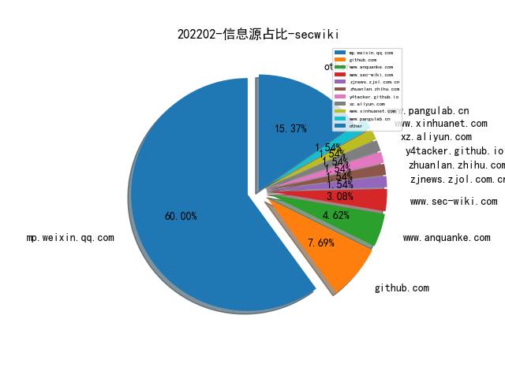
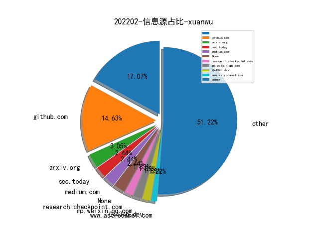
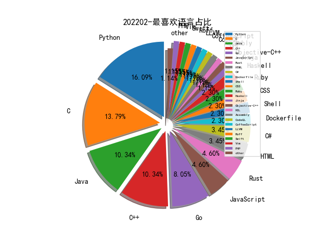

# [数据--所有](README_20.md)
# [数据--年度](README_2022.md)
# 202202 信息源与信息类型占比

# 微信公众号 推荐
| nickname_english | weixin_no | title | url| 
| --- | --- | --- | ---| 
| 蝰蛇安全实验室 | InfoSecLab | 信息收集——进阶版 | https://mp.weixin.qq.com/s?__biz=MzA3NzgyNjUwNA==&mid=2247488281&idx=1&sn=72d7419d3e960912188db1602576714e | 1| 
| 红蓝游戏 | gh_653c97e6d0de | 2022年最热安全技术BAS详解 | https://mp.weixin.qq.com/s/Qxak0i3r3SWAA8-p3vu9Ow | 1| 
| 猎户攻防实验室 | TassLiehu | 记一次简单计算验证码的识别过程 | https://mp.weixin.qq.com/s?__biz=MzI1NDg4MTIxMw==&mid=2247486047&idx=1&sn=fbbdcea5957b3d7dd531f7c94a90d522 | 1| 
| 榫卯江湖 | cnxct_coder | 聊一聊《Bvp47 美国NSA方程式的顶级后门》中的BPF隐藏信道 | https://mp.weixin.qq.com/s/k3PTDA8rDSylqknwp_jYIA | 1| 
| 我真不是红队啊 | yeanxinmingi | Clash RCE 分析 | https://mp.weixin.qq.com/s?__biz=MzUzNjg5ODkxMA==&mid=2247483942&idx=1&sn=2a747c676247dc3f47f740efcc04ec9f | 1| 
| 小黑的安全笔记 | x1a0heI | JSONP劫持 | https://mp.weixin.qq.com/s?__biz=MzI4Njk5NjY4OQ==&mid=2247485987&idx=1&sn=0bebdcffad9075594c6691c86537d0ae | 1| 
| 奇安网情局 | QACIA2020 | 旗帜分明：黑客组织开始在俄乌冲突中“选边站队” | https://mp.weixin.qq.com/s?__biz=MzI4ODQzMzk3MA==&mid=2247486291&idx=1&sn=7ca251771c111883cab0653ae01a07a5 | 1| 
| 安全分析与研究 | MalwareAnalysis | 一款VMP内存DUMP及IAT修复工具 | https://mp.weixin.qq.com/s?__biz=MzA4ODEyODA3MQ==&mid=2247487316&idx=1&sn=54064294f6dcf84e70db46a2bd649b48 | 1| 
| Top security | Top_security | 域渗透历史漏洞汇总 | https://mp.weixin.qq.com/s?__biz=Mzg3MDU0NjQyMg==&mid=2247487350&idx=1&sn=168eec5d3b7dacf32b0b30b6f61fc94b | 2| 
| 3072 | gh_02e64d74f88d | fuzzing 101 GIMP 漏洞挖掘 | https://mp.weixin.qq.com/s?__biz=MzU4OTk0NDMzOA==&mid=2247484012&idx=1&sn=e36a66b177b9db5002a7889ca30046d9 | 1| 
| 农夫安全团队 | gh_6d3f01673a87 | 与子携手 | https://mp.weixin.qq.com/s?__biz=MzI0MzQ4NTI1OA==&mid=2247484523&idx=1&sn=cdfef0ca29dcd8f32b5c9d479263d7ea | 1| 
| 雁行安全团队 | YX_Security | k8s安全入门 | https://mp.weixin.qq.com/s/T2QGLlKwjaUByDtGFL94PQ | 1| 
| aFa攻防实验室 | gzh_afagfsys | 域相关概念 | https://mp.weixin.qq.com/s?__biz=MzAxMjcxMjkyOA==&mid=2247485652&idx=1&sn=fdf1f164182cf98a3dbd67d5c11f8628 | 2| 
| 运维帮 | yunweibang | 100Gbps！NPMD的流量处理新纪录！ | https://mp.weixin.qq.com/s?__biz=MzA3MzYwNjQ3NA==&mid=2651300971&idx=1&sn=cb4cc89da71872c812ce5a4d8a8b5432 | 1| 
| 胖哈勃 | pwnhub | 2月公开赛writeup｜Web-ssrfme | https://mp.weixin.qq.com/s?__biz=MzI2OTUzMzg3Ng==&mid=2247487408&idx=1&sn=f1c87a283c111aa42310448042f6033b | 4| 
| 美团技术团队 | meituantech | 数据治理一体化实践之体系化建模 | https://mp.weixin.qq.com/s?__biz=MjM5NjQ5MTI5OA==&mid=2651766711&idx=1&sn=f45ba9ee2de591f9eec6b989dc9fbb2b | 3| 
| 洞安之道 | dongansec | 【福利】抽取网安共享社区邀请码 | https://mp.weixin.qq.com/s?__biz=MzkzODI0MzMwNA==&mid=2247491656&idx=1&sn=7ec99ac3bd982db75d91c5ccaf5697c0 | 1| 
| 小白学IT | xiaobaixueIT | CVE-2022-23131(漏洞预警) | https://mp.weixin.qq.com/s?__biz=MzUxNDg3ODY2MQ==&mid=2247485060&idx=1&sn=92a48edd83165a0ee91dc710b19cfc5a | 1| 
| 安天移动安全 | AVLTeam | 移动互联网应用供应链（SDK）行为安全性现状研究报告 | https://mp.weixin.qq.com/s/gdDC9w6bh3jS-tkWJL8qnw | 1| 
| 奇安盘古实验室 | gh_69eec19c5cd6 | Bvp47——来自美国国安局方程式组织的顶级后门 | https://mp.weixin.qq.com/s/WTlRPzUv3npV8xd9KRJoQw | 1| 
| 凭阑安全 | ghrtest | 君墨篇绕过 SAML SSO 身份验证复现 | https://mp.weixin.qq.com/s?__biz=Mzg4NDA4MzE3Nw==&mid=2247483963&idx=1&sn=3b955380fdd8a53a8c41bdc2c6f27880 | 1| 
| 云众可信 | yunzhongkexin | 安豆&斗斗安全小Tips：线上活动要注意，仔细甄别防受骗！ | https://mp.weixin.qq.com/s?__biz=Mzg2NDU3Mzc5OA==&mid=2247487867&idx=1&sn=505518026f0ccbc11586f137869c33f2 | 1| 
| 中安网星 | netstarsec | 身份威胁安全方案提供商「中安网星」完成战略融资，航行资本担任财务顾问 | https://mp.weixin.qq.com/s?__biz=MzkxNTEzMTA0Mw==&mid=2247490071&idx=1&sn=8e9d03a3afe9d253997c85300149b4ed | 1| 
| inn0team | inn0team | 猪场缺人，速来 | https://mp.weixin.qq.com/s?__biz=MzIyNTA1NzAxOA==&mid=2650474094&idx=1&sn=db59b910e5d9e87d3c59482ba010fe7d | 1| 
| M01N Team | m01nteam | 针对AD CS中ESC7的滥用 | https://mp.weixin.qq.com/s/TqW3ONBdcUFijg4keSiO1g | 1| 
| 白帽技术与网络安全 | zero_daynews | 工具推荐 , 信息收集利器SharpXDecrypt | https://mp.weixin.qq.com/s?__biz=MzU0MDI5ODgxMw==&mid=2247485051&idx=1&sn=a0e3ff1ea2d72e2933be5c1142a99a7c | 1| 
| 漕河泾小黑屋 | gh_7e80ffdff03e | 关于不小心上了天堂这件事 | https://mp.weixin.qq.com/s?__biz=MzA4NzQwNzY3OQ==&mid=2247483854&idx=1&sn=7bddc8c5a948b08289ca46f418ca4e04 | 2| 
| 湘雪尘奕 | gkaq_gkk | 基于工业互联网控制设备“网络武器化”研究 | https://mp.weixin.qq.com/s?__biz=MzI2MzE3NzczNQ==&mid=2650622421&idx=1&sn=530ec9fd3880d583a7d5f50132f970f4 | 2| 
| 安协小天使 | gh_e4ac6bc8fbfb | 【D^3CTF】江湖征集令：英雄速来，酣战到底！ | https://mp.weixin.qq.com/s?__biz=MzIxNDU2ODg3Mw==&mid=2247484623&idx=1&sn=9cd809ebd59fc17d32ce23aac74f5388 | 1| 
| web安全and一只狗 | SecAndDog | 有度安全-福建有度网络安全技术有限公司｜招聘～～多个岗位热招中！ | https://mp.weixin.qq.com/s?__biz=MzkwMzMxMTcyNw==&mid=2247484380&idx=1&sn=374c3c74a2307abf63055b1fe7f32df6 | 1| 
| goddemon的小屋 | gh_0383232a884d | 钓鱼实战2--组合邮件,网页钓鱼 | https://mp.weixin.qq.com/s?__biz=MzI2NTc1ODY0Mw==&mid=2247483932&idx=1&sn=dc07b8879599a4c134321301f39f9466 | 2| 
| 360威胁情报中心 | CoreSec360 | APT-C-58（Gorgon Group）攻击预警 | https://mp.weixin.qq.com/s?__biz=MzUyMjk4NzExMA==&mid=2247489306&idx=1&sn=7ceff63d34fab5bea84895ddd809fa8a | 1| 
| 轩公子谈技术 | linux_hack | javaFx 教你五分钟写个工具 | https://mp.weixin.qq.com/s?__biz=MzU3MDg2NDI4OA==&mid=2247485985&idx=1&sn=8bee195c012ab2a66ee9c04463713258 | 2| 
| 秃头的逆向痴想 | gh_c08b6fb82c4b | Navicat Premium 投毒样本分析 | https://mp.weixin.qq.com/s?__biz=MzIzNDE3NjI0MQ==&mid=2247483912&idx=1&sn=da3c9218d8d0ec2a1f2716888f1d47cf | 1| 
| 我是安服 | scaf_0123 | 安服笔记:花式玩转ctf的几个靶场 | https://mp.weixin.qq.com/s?__biz=MzkzMzI3OTczNA==&mid=2247484744&idx=1&sn=6c8e00a5db310b012388729fa0a1a464 | 1| 
| ChaMd5安全团队 | chamd5sec | TQLCTF-WriteUp | https://mp.weixin.qq.com/s?__biz=MzIzMTc1MjExOQ==&mid=2247504110&idx=1&sn=3f93b645e86e5ca456adda8462eab923 | 2| 
| 阿里云安全 | aliyunsec | APT化、高赎金与定向攻击 ｜ 2021年度阿里云勒索攻击态势报告 | https://mp.weixin.qq.com/s?__biz=MzA4MTQ2MjI5OA==&mid=2664086338&idx=1&sn=0c9655f94674e5bd30819f67e2aaa62b | 3| 
| 美团安全应急响应中心 | gh_83d9bb3b8ed0 | 美团招聘 , 春天的第一场约会，我们在等你！ | https://mp.weixin.qq.com/s?__biz=MzI5MDc4MTM3Mg==&mid=2247489024&idx=1&sn=1c06641e04172810f758636a845533eb | 2| 
| 安全初心 | securityheart | 招聘 , 亚信安全诚聘红队专家 | https://mp.weixin.qq.com/s?__biz=MzU4NzU4MDg0Mw==&mid=2247487729&idx=1&sn=3ba72e2158edd2ba4cf289688c8cbeaa | 1| 
| 且听安全 | qtcyber | 【最新漏洞预警】CVE-2022-23131 Zabbix SAML SSO认证绕过漏洞分析与复现 | https://mp.weixin.qq.com/s?__biz=Mzg3MTU0MjkwNw==&mid=2247488117&idx=1&sn=681965b319cdaa07f5dfa56048505e8a | 6| 
| Netlab 三六零 | Netlab_360 | 公有云网络安全威胁情报（202201） | https://mp.weixin.qq.com/s?__biz=MzUxMDY0ODgxMw==&mid=2247485025&idx=1&sn=091b9c7adc3421f2f747c33c546933d9 | 3| 
| ArkTeam | gh_16875f8ce964 | 星星与NFT | https://mp.weixin.qq.com/s?__biz=MzA3Mjk4MDMzMQ==&mid=2648249429&idx=1&sn=411fcde0ddfddb72d5b1759a1c101ee7 | 1| 
| 赵武的自留地 | gh_86033a4f818d | 回归 | https://mp.weixin.qq.com/s?__biz=MjM5NDQ5NjM5NQ==&mid=2651626302&idx=1&sn=3d20bebc590489ed17409a6b446a9712 | 1| 
| 懒人在思考 | lazy-thought | 关于内部作恶 | https://mp.weixin.qq.com/s?__biz=MzA3NTEzMTUwNA==&mid=2651081611&idx=1&sn=8babab7ec21f764588ebf5083d834c04 | 2| 
| 安全孺子牛 | Sec_line | Snort配置入侵检测规则 | https://mp.weixin.qq.com/s?__biz=MzI2MDI0NTM2Nw==&mid=2247487005&idx=1&sn=23eb24678ee256c1145e41ef6c01d6dd | 2| 
| 娜璋AI安全之家 | gh_91f1fe28fc6e | [AI安全论文] 13.英文SCI论文审稿意见及应对策略学习笔记总结 | https://mp.weixin.qq.com/s?__biz=Mzg5MTM5ODU2Mg==&mid=2247495333&idx=1&sn=5a6940158af6f1f3b0813252f88f25df | 5| 
| 陈冠男的游戏人生 | CGN-115 | BLECTF：低功耗蓝牙CTF挑战（上） | https://mp.weixin.qq.com/s?__biz=MzU5OTU3NDEzOQ==&mid=2247489909&idx=1&sn=862cb4365275c25288905f504af426fd | 2| 
| 重生信息安全 | csxxaq | 小程序抓包&反编译测试从0到1 | https://mp.weixin.qq.com/s?__biz=MzU2MjM4NDYxOQ==&mid=2247488460&idx=1&sn=b06bd5447f60428489aa80fe31361f05 | 1| 
| 郑州发布 | zzfabu | 小布播报 , 河南人口密度出炉；博物院新院选址初定 | https://mp.weixin.qq.com/s?__biz=MzA4NTgwMDIxMg==&mid=2651509325&idx=1&sn=7ab0ed6f967ff72472b5072831e09483 | 5| 
| 赛博新经济 | gh_5c4abe1ee3a6 | 利用IP分片污染攻击TCP流量 | https://mp.weixin.qq.com/s/7gA74jWC1RES76p1XBO_Kw | 1| 
| 谢公子学安全 | xie_sec | 春招准备冲刺深信服~ | https://mp.weixin.qq.com/s?__biz=MzI2NDQyNzg1OA==&mid=2247490179&idx=1&sn=fbaa9d6952e8a4a02eaeb9a67de48431 | 3| 
| 行长叠报 | BUG_BANK | 心向未来 满载而归丨漏洞银行2021年终回顾 | https://mp.weixin.qq.com/s?__biz=MzAxODg1MDMwOQ==&mid=2247495162&idx=1&sn=76f365bab65d3be9d5a7c357c5c9ee65 | 2| 
| 蛇矛实验室 | gh_2c0238928f82 | 每周安全资讯 | https://mp.weixin.qq.com/s?__biz=MzkwMjI1NzY4Ng==&mid=2247501131&idx=1&sn=8bfe0c1cde565a170834dcc5dc6e6a48 | 1| 
| 虎符智库 | TT_Thinktank | 深度：一文读懂我国数据安全政策动向与趋势 | https://mp.weixin.qq.com/s?__biz=MzIwNjYwMTMyNQ==&mid=2247487103&idx=1&sn=5a238ceee999767566c16984c3813188 | 1| 
| 灰产圈 | huichanquan | 从“血奴”身上抽出来的血，去了哪里？ | https://mp.weixin.qq.com/s?__biz=MzIyMDYwMTk0Mw==&mid=2247529890&idx=1&sn=d14992d5536c7d32c114d35a1f879477 | 3| 
| 清河六点下班 | gh_fd416b016aa6 | 中间商之 Ntlm Relay 攻击分析 | https://mp.weixin.qq.com/s/EhJVdRG71JTr9yZFajGKqg | 1| 
| 深信服千里目安全实验室 | Further_eye | 深信服最新报告出炉！多国严打勒索攻击，“野火”依旧烧不尽？ | https://mp.weixin.qq.com/s?__biz=MzI4NjE2NjgxMQ==&mid=2650259666&idx=1&sn=b89cdda4c80a563d1be38fa72c97abc8 | 2| 
| 汽车信息安全 | IcvSec | 青骥编译 l Upstream 2022全球汽车网络安全报告 第一章 标准、法规和网联汽车生态系统 | https://mp.weixin.qq.com/s?__biz=Mzg3MTI0NDQwNg==&mid=2247487265&idx=1&sn=ef14d20cd20a988a6dc65f7766c6f7e1 | 1| 
| 梦之光芒的电子梦 | monyer_mp | “红蓝对抗演练评分系统”开源框架 (preview) | https://mp.weixin.qq.com/s?__biz=MzUyODQ0MTE2MQ==&mid=2247483692&idx=1&sn=5f79ea530a544877a7a4686193eda3bc | 2| 
| 极客公园 | geekpark | 大众拟出资数十亿欧元，收购华为自动驾驶部门；小红书启动最严医美治理；浙江：大学生创业失败，10 万以下贷款政府代偿｜极客早知道 | https://mp.weixin.qq.com/s?__biz=MTMwNDMwODQ0MQ==&mid=2652944338&idx=1&sn=c7b4e898af7aa75347fb590f1a168b98 | 1| 
| 斗象智能安全 | Riskivy | 流量安全「遥测Telemetry」技术应用初探 | https://mp.weixin.qq.com/s?__biz=MzIwMjcyNzA5Mw==&mid=2247488516&idx=1&sn=436492920d3d1a3a4ae5656ef0a6d994 | 1| 
| 微言晓意 | WeYanXY | 信息安全管理系列文章分类汇总（建议收藏） | https://mp.weixin.qq.com/s?__biz=MzI5MTEyMDUzMw==&mid=2650046322&idx=1&sn=90027907178e6d6e9a02861186738974 | 4| 
| 安全研究GoSSIP | GoSSIPSJTU | G.O.S.S.I.P 学术论文推荐 2022-02-17 Web框架CSRF防御的有效性 | https://mp.weixin.qq.com/s/ydwWuMa_ZzvvSNZ9CAAxjA | 3| 
| 唯品会安全应急响应中心 | VIP_SRC | VSRC活动 , 澳门豪华酒店，一户一墩，挖洞人值得拥有！ | https://mp.weixin.qq.com/s?__biz=MzI5ODE0ODA5MQ==&mid=2652280926&idx=1&sn=dc01f28b9aec64acde4af07e161654f9 | 1| 
| 军哥系统集成号 | gx_junge | 重点,网络安全工作你必须懂的3保1评 | https://mp.weixin.qq.com/s/qGcii5iElYq9mwfSFPhfHg | 1| 
| XCTF联赛 | gh_3d7c7f90f79f | SUS战队专访 , 关于赛题，能说的都在这里了！ | https://mp.weixin.qq.com/s?__biz=MjM5NDU3MjExNw==&mid=2247502500&idx=1&sn=092de816167b0a7586e166f6503f9555 | 4| 
| 马哥Linux运维 | magedu-Linux | 7 个不容错过的 VS Code 扩展！ | https://mp.weixin.qq.com/s?__biz=MzAxMTkwODIyNA==&mid=2247550382&idx=1&sn=48038bdd96a8587dae1ed41feefc14c5 | 2| 
| 银河护卫队super | gh_47c3ed046111 | 端口转发、映射与代理的了解与常用工具的推荐 | https://mp.weixin.qq.com/s?__biz=MzkwNzI0MTQzOA==&mid=2247485229&idx=1&sn=617dcf7d17c154b370baa871bf29b850 | 2| 
| 谛听ditecting | gh_ce3e0df31e50 | 发布 , 2021年工业控制网络安全态势白皮书（附全文下载） | https://mp.weixin.qq.com/s?__biz=MzU3MzQyOTU0Nw==&mid=2247485962&idx=1&sn=810c2a85841233e4223e4d7187361f1b | 1| 
| 萝卜大杂烩 | luobodazahui | 玩爬虫不会登陆？这个工具拿走不谢！ | https://mp.weixin.qq.com/s?__biz=MzU5NDcyOTg4MA==&mid=2247492168&idx=1&sn=559a00e6e76ad687140bb2d177657e8e | 1| 
| 稻草人安全团队 | scarecrowsec | web刷题笔记（一） | https://mp.weixin.qq.com/s?__biz=Mzg2MzU2NDMzMA==&mid=2247486948&idx=1&sn=e493aee0bf74e76fa9c7055d44668fc0 | 2| 
| 瓜神学习网络安全 | god_mellon | 等保2.0>Windows下实现MySQL数据库自动备份 | https://mp.weixin.qq.com/s?__biz=MzkwODE4ODUzMg==&mid=2247484482&idx=1&sn=41cceeb3a0bfe02f0a3d24be3aad8f96 | 3| 
| 渗透师老A | hackAno | 安全驻场工程师的自我救赎之路 | https://mp.weixin.qq.com/s?__biz=Mzg5NzU1MzM5Mw==&mid=2247500893&idx=1&sn=026c10387583d06212dd1e0df2d1491d | 10| 
| 明不可欺 | gh_1405d616adc7 | 106号码最新查询方法VS 00号段挖掘 | https://mp.weixin.qq.com/s?__biz=MzI1NTI4OTE5OA==&mid=2247485485&idx=1&sn=90bfe9ae2b1e68a3f7a978712e82efa6 | 1| 
| 无级安全 | wujisec | 年薪30万+，缺口高达95%，2022年网络安全火了？ | https://mp.weixin.qq.com/s?__biz=MzI0Nzc0NTcwOQ==&mid=2247485360&idx=1&sn=32e093e3c7cf9dd3ee6869c9db0feb84 | 1| 
| 携程技术 | ctriptech | 干货 , 携程监控系统Hickwall演进之路 | https://mp.weixin.qq.com/s?__biz=MjM5MDI3MjA5MQ==&mid=2697272485&idx=1&sn=664822f8a398e40501b34e36c78175a8 | 3| 
| 开源聚合网络空间安全研究院 | OSPtech_Cyberspace | 【绕过技巧】记一次艰难的SQL注入 | https://mp.weixin.qq.com/s?__biz=MzI4NTE4NDAyNA==&mid=2650391436&idx=1&sn=184a09c0d6221c644b622ab43a54bf79 | 1| 
| 奇安信病毒响应中心 | gh_416eb7efb780 | 每周勒索威胁摘要 | https://mp.weixin.qq.com/s?__biz=MzI5Mzg5MDM3NQ==&mid=2247489282&idx=1&sn=90ce2f0dc400b8a7aa3f00934f84c284 | 2| 
| 哆啦安全 | gh_060e91811143 | 使用Fluxion对WiFi进行钓鱼破解 | https://mp.weixin.qq.com/s?__biz=Mzg2NzUzNzk1Mw==&mid=2247490390&idx=1&sn=bf82cb2e3963334f54774c35e7e14193 | 22| 
| 全栈网络空间安全 | None | 突发！刚发生....事关每个人！！！ | https://mp.weixin.qq.com/s?__biz=Mzg3NTUzOTg3NA==&mid=2247498606&idx=1&sn=6c742b0e96698f73f9414fd52570f758 | 4| 
| 云技术 | aiyunjishu | 移动 1.06 亿元、电信 5480 万元、联通 2340 万元中标江苏省大数据“两地三中心”过渡期建设项目（标段一） | https://mp.weixin.qq.com/s?__biz=MzU0NDEyODkzMQ==&mid=2247523576&idx=1&sn=b8f0efbccbf832288d7784ae99e23ebc | 3| 
| 中国政府网 | zhengfu | 2月17日疫情防控最新消息！ | https://mp.weixin.qq.com/s?__biz=MzA4MDA0MzcwMA==&mid=2652601896&idx=1&sn=cb4a54aec1ebb0c2a15696e7268be415 | 2| 
| Timeline Sec | TimelineSec | CVE-2021-43798：Grafana任意文件读取漏洞 | https://mp.weixin.qq.com/s?__biz=MzA4NzUwMzc3NQ==&mid=2247489840&idx=1&sn=70839b601b5be72dae1a36826c721178 | 4| 
| Sec盾 | Sec_Shield | 最新实战挖洞教程（附工具下载） | https://mp.weixin.qq.com/s?__biz=MzI2NzE4MTI0MQ==&mid=2247486317&idx=1&sn=f0a160e27ade9080a1d7abb1a767823e | 2| 
| RedCode Team | RedCodetm | 重构重写！WanLiScan 2.1版本更新 | https://mp.weixin.qq.com/s?__biz=Mzg5MjY3MTk2Mw==&mid=2247485293&idx=1&sn=7fe755fbc829d74993bfac63f05e6bbb | 2| 
| OSC开源社区 | oschina2013 | 「气」语言：系统。打印行（\"你好，世界\"） | https://mp.weixin.qq.com/s?__biz=MjM5NzM0MjcyMQ==&mid=2650139905&idx=1&sn=fb4e9d2282bd326310d5d69177d02210 | 1| 
| OPPO安全应急响应中心 | opposrc | PendingIntent重定向：一种针对安卓系统和流行App的通用提权方法——BlackHat EU 2021议题详解 （下） | https://mp.weixin.qq.com/s?__biz=MzUyNzc4Mzk3MQ==&mid=2247489233&idx=1&sn=cf3188bd2ce5a8f5b7b8640dd4a1668e | 2| 
| IOTsec Zone | exploit-iot | 路由器TP-Link WR740后门漏洞 | https://mp.weixin.qq.com/s?__biz=Mzg4MTY5NjQzMA==&mid=2247484818&idx=1&sn=076d49218ea367649b3f5303c9391dc3 | 5| 
| GitHubDaily | GitHubDaily | 被无数白嫖党称为「女神」，她的网站终于更新了！ | https://mp.weixin.qq.com/s?__biz=MzAxOTcxNTIwNQ==&mid=2457970421&idx=1&sn=458ece0466579f4e031143b7b002756d | 1| 
| 长亭安全课堂 | chaitintech_release | DNS Rebinding in Browser | https://mp.weixin.qq.com/s?__biz=MzIwMDk1MjMyMg==&mid=2247488545&idx=1&sn=48cbf2c43b91fce2d1d09d1fc61d3d00 | 2| 
| 红队蓝军 | Xx_Security | 进程强杀初探 | https://mp.weixin.qq.com/s?__biz=Mzg2NDY2MTQ1OQ==&mid=2247488113&idx=1&sn=c6a61a87edee53dc6b41684a6a4fa5f6 | 6| 
| 米斯特安全团队 | None | 404Paper精粹新一册发布，请转发给你的黑客朋友 | https://mp.weixin.qq.com/s?__biz=MzU2NDc2NDYwMA==&mid=2247485437&idx=1&sn=3c439fb8508a9604321f8a68152a5961 | 3| 
| 灼剑安全团队 | Tsojan | 2022大余百个项目全栈渗透教学通知 | https://mp.weixin.qq.com/s?__biz=Mzg5OTY1ODMxMg==&mid=2247489699&idx=1&sn=40e0f2cc6f8e106e352bbf724d6d6ffc | 1| 
| 潇湘信安 | xxxasec | 年薪30万+，缺口高达95%，2022年网络安全火了？ | https://mp.weixin.qq.com/s?__biz=Mzg4NTUwMzM1Ng==&mid=2247494412&idx=1&sn=207a1f6062c9050e34910476f7600da3 | 7| 
| 渗透云笔记 | shentouyun | 工具功能加强-对ARL的改造 | https://mp.weixin.qq.com/s?__biz=MzU2NzkxMDUyNg==&mid=2247491394&idx=1&sn=1242fd0cfb8f6610461479c93a19672c | 6| 
| 微步在线研究响应中心 | gh_c108d4d389bf | 中东持续活跃的威胁：月光鼠组织借助云服务展开间谍攻击 | https://mp.weixin.qq.com/s?__biz=MzA5MDc1NDc1MQ==&mid=2247491929&idx=1&sn=4c38c56028bc6b11077cae3cd2c74e00 | 2| 
| 微步在线 | Threatbook | 这份2021年终威胁报告，揭示了2022最重要的八个安全趋势 ,【微步荐读】 | https://mp.weixin.qq.com/s?__biz=MzI5NjA0NjI5MQ==&mid=2650171484&idx=1&sn=08ce37a8df78768069706e2e35378a9a | 5| 
| 君立渗透测试研究中心 | gh_13db991d0609 | 起底一个仍在高速发展中的勒索组织  —— ALPHV | https://mp.weixin.qq.com/s?__biz=Mzg5OTEzMjc4OA==&mid=2247487889&idx=1&sn=2ac0e1e61b0257321e5949aafc03c35b | 2| 
| 中睿天下 | zorelworld | 中睿天下喜获中电联2021年度电力科技创新奖 | https://mp.weixin.qq.com/s?__biz=MzAwNjc0MDA1NA==&mid=2650132943&idx=1&sn=87110f77c978e6ca2e8c63f37a8885f4 | 5| 
| backdoor | None | 钉钉RCE | https://mp.weixin.qq.com/s?__biz=MzI5MzkwMzU1Nw==&mid=2247484800&idx=1&sn=9901c4a6741a4c29558e49d4e4a9687a | 2| 
| WgpSec狼组安全团队 | wgpsec | 连载｜浅谈红队中的打点（二） | https://mp.weixin.qq.com/s?__biz=MzIyMjkzMzY4Ng==&mid=2247496466&idx=1&sn=53e01c4e4807da5efbbf53834b07b64a | 1| 
| SecIN技术平台 | sec-in | 原创 , 关于74cms任意文件包含分析和想法 | https://mp.weixin.qq.com/s?__biz=MzI4Mzc0MTI0Mw==&mid=2247492922&idx=1&sn=f372d4ea79768501ee04fdf0822f9608 | 3| 
| Reset安全 | gh_a006697f54a9 | 钉钉RCE漏洞复现 | https://mp.weixin.qq.com/s?__biz=MzU3Mzg1NzMyNw==&mid=2247484309&idx=1&sn=66d5f3a475c07dfffa293edfbcc5fabd | 8| 
| Python编程 | LovePython | 用Python写了一个图像文字识别OCR工具 | https://mp.weixin.qq.com/s?__biz=MzA5ODUzOTA0OQ==&mid=2651699835&idx=1&sn=41e3a68f071080db9e6234ece5525566 | 5| 
| PeiQi文库 | PeiQi_wiki | 今年跳槽可以再等等 | https://mp.weixin.qq.com/s?__biz=Mzg3NDU2MTg0Ng==&mid=2247490133&idx=1&sn=157bbef8290aac824452570e1fc06748 | 2| 
| Gamma实验室 | HackerLearning | 红队漏洞研究-fastjsonBasicDataSource链分析 | https://mp.weixin.qq.com/s?__biz=Mzg2NjQ2NzU3Ng==&mid=2247489695&idx=1&sn=c8e8f2aea6624adcf44e98cad827993a | 2| 
| 58安全应急响应中心 | wubasrc | 榜单 , 1月英雄榜及额外奖励名单公布 | https://mp.weixin.qq.com/s?__biz=MzU4NTMzNjU4Mw==&mid=2247488512&idx=1&sn=257ad6ccd585dc3c45a0f79078beefe0 | 1| 
| 默安科技 | moresec | 元宵特辑 ｜不猜灯谜，来一场特别的坦白局如何？ | https://mp.weixin.qq.com/s?__biz=MzIzODQxMjM2NQ==&mid=2247489393&idx=1&sn=81ec4e5033a9ef1d27184c495319e779 | 3| 
| 边界无限 | BoundaryX | 灯火映万家 团圆共此时 | https://mp.weixin.qq.com/s?__biz=MzAwNzk0NTkxNw==&mid=2247485084&idx=1&sn=3075af94edd596229b5cc0b978c4ba92 | 1| 
| 轻金融 | Qjinrong | 工行发布《2021网络金融黑产研究报告》（附全文） | https://mp.weixin.qq.com/s/nsj0UowJWxm8niS3ITT8OA | 1| 
| 赛博研究院 | SICSI-cybersecurity | 赛博观点 , 《网络安全审查办法》今日起生效，解读2022年版本修订要点 | https://mp.weixin.qq.com/s/r_OBH12gNsHNWRFCYYXb8w | 1| 
| 等级保护测评 | zgdjbh | 新修订的《网络安全审查办法》今起施行 | https://mp.weixin.qq.com/s?__biz=MzU1ODM1Njc1Ng==&mid=2247494741&idx=1&sn=5a22492c3b89604e444eee1c79e5382a | 2| 
| 玄魂工作室 | xuanhun521 | 瞒天过海？一封钓鱼邮件的玩法 | https://mp.weixin.qq.com/s?__biz=MzA4NDk5NTYwNw==&mid=2651429070&idx=1&sn=0abb4087cd1cc2b607975712b3bf6115 | 3| 
| 暗影安全 | gh_4f0dabd0df69 | ISRC-2022虎年伊始，开年活动！ | https://mp.weixin.qq.com/s?__biz=MzI2MzA3OTgxOA==&mid=2657161932&idx=1&sn=6c1304b8d4f5857b0a939b7210940eef | 4| 
| 威胁棱镜 | THREAT_PRISM | 从一例 Pegasus 误报说开去 | https://mp.weixin.qq.com/s?__biz=MzkyMzE5ODExNQ==&mid=2247484801&idx=1&sn=49256043324e688b17447186524ded9c | 9| 
| 三叶草小组Syclover | gh_962842f4917b | SYC博客推送（第四期） | https://mp.weixin.qq.com/s?__biz=MzIzOTg0NjYzNg==&mid=2247486134&idx=1&sn=b599020f95e75f026101014642b66559 | 1| 
| thelostworld | gh_3f2e5b9f028c | 四、小程序｜App抓包(四)-Tcpdump抓取手机数据包分析 | https://mp.weixin.qq.com/s?__biz=MzIyNjk0ODYxMA==&mid=2247486299&idx=4&sn=3bad40f5af29618529c93b821d9969a8 | 5| 
| V安全资讯 | v-safe-cn | 安全聘,兰州大方招人啦！ | https://mp.weixin.qq.com/s?__biz=MzI4MDQ1MzQ0NA==&mid=2247488643&idx=1&sn=9b1ae5db41c641ee1ba60d30c838bb0a | 5| 
| Tide安全团队 | TideSec | 【红蓝对抗】记一次渗透过程中regeorg的利用 | https://mp.weixin.qq.com/s?__biz=Mzg2NTA4OTI5NA==&mid=2247493675&idx=1&sn=e8102e63582c8e4217335722eff753b3 | 7| 
| HACK学习君 | XHacker1961 | 干货 ｜GitHUB安全搬运工 十六 | https://mp.weixin.qq.com/s?__biz=MzIzNzMxMDkxNw==&mid=2247486484&idx=1&sn=2bf79f7fd0bc6ae32e319770a6d22e21 | 3| 
| Admin Team | Amin_Bug | 【看直播领福利】未知攻焉知防——基于攻击视角攻防演练分析！ | https://mp.weixin.qq.com/s?__biz=MzI5NTQ1MTI3MQ==&mid=2247485859&idx=1&sn=b5781094463cb44e68025cfc401c9dfa | 1| 
| 赛博回忆录 | cybermemory | 404Paper精粹新一册发布，请转发给你的黑客朋友 | https://mp.weixin.qq.com/s?__biz=MzIxNDAyNjQwNg==&mid=2456098710&idx=1&sn=37fca860ba26728637002650983e56bd | 1| 
| 薄说安全 | gh_956e8befd9f9 | 如何理解预期功能安全（一） | https://mp.weixin.qq.com/s?__biz=Mzg2NzU3MzkyMg==&mid=2247484139&idx=1&sn=7b13bb105facbbdeb498ee7dfe7a3acd | 3| 
| 威努特工控安全 | winicssec_bj | 工控系统安全如何实现前景规划和技术创新？ | https://mp.weixin.qq.com/s?__biz=MzAwNTgyODU3NQ==&mid=2651081859&idx=1&sn=d758d05d01c1ae3b7e75045d37642d57 | 6| 
| Bypass | Bypass-- | u200b分享几个威胁情报平台 | https://mp.weixin.qq.com/s?__biz=MzA3NzE2MjgwMg==&mid=2448907855&idx=1&sn=150025ce6067c5f7bab1ab75c4066a9b | 3| 
| 渗透测试教程 | bzhack | 红蓝对抗溯源的基本思路 | https://mp.weixin.qq.com/s?__biz=MzI3OTIwNDkzNQ==&mid=2651836692&idx=1&sn=4a5e7d8a264b4d96a78db912522b04a3 | 5| 
| 大余安全 | dayuST123 | 2022大余百个项目全栈渗透教学通知 | https://mp.weixin.qq.com/s?__biz=Mzg3MDMxMTg3OQ==&mid=2247498914&idx=1&sn=e625a253a89f5b86a7091e2622779f1b | 10| 
| 云鼎实验室 | YunDingLab | 每周云安全资讯 | https://mp.weixin.qq.com/s?__biz=MzU3ODAyMjg4OQ==&mid=2247494005&idx=1&sn=66f765d421f109326def27143ab91832 | 3| 
| Hacking黑白红 | Hacking012 | python代码画出“冰墩墩”和“时钟”（附源码） | https://mp.weixin.qq.com/s?__biz=Mzg2NDYwMDA1NA==&mid=2247508693&idx=1&sn=2853b64c8b456f34ef201b184cd206c3 | 19| 
| Hacking就是好玩 | gh_aed6cfc863ed | ksubdomain新版发布,比massdns更快！.md | https://mp.weixin.qq.com/s?__biz=MzU2NzcwNTY3Mg==&mid=2247484471&idx=1&sn=322d5db2d11363cd2392d7bd29c679f1 | 1| 
| 网安杂谈 | sdpcwa | GA/T 1069—2021《法庭科学电子物证手机检验技术规范》新旧版本对照 | https://mp.weixin.qq.com/s?__biz=MzAwMTMzMDUwNg==&mid=2650885522&idx=1&sn=be120a13b6ae6da063d89d4ced1cd24a | 12| 
| 白虎实验室 | hacker_root001 | 逻辑漏洞 | https://mp.weixin.qq.com/s?__biz=Mzk0NTI2ODE1Nw==&mid=2247484236&idx=1&sn=ec57717fedb7db61cee2dd9ee69884d7 | 3| 
| 电子物证 | ewuzheng | 【PC端Telegram取证与云取证方法概述】 | https://mp.weixin.qq.com/s?__biz=MzAwNDcwMDgzMA==&mid=2651041191&idx=1&sn=7fd64135c955173f46a6795a26dba29b | 12| 
| 不懂安全的校长 | sectip | 红队评估 , 关于我在实战中遇到的Fastjson | https://mp.weixin.qq.com/s?__biz=MzkyMzI3OTY4Mg==&mid=2247485121&idx=1&sn=d813c86a7cd7ce795dcd7a193d2959bf | 5| 
| QZ的安全悟道 | lookvul | 攻防对抗的十八层地狱 | https://mp.weixin.qq.com/s?__biz=MzI1MDA1MjcxMw==&mid=2649905820&idx=1&sn=c8efdb57a6e14010306359b1e22d77c5 | 7| 
| 黑云信息安全 | heiyunxinxi | 内网渗透 , 1.内网基础知识 | https://mp.weixin.qq.com/s?__biz=Mzg5OTYxMjk0Mw==&mid=2247485589&idx=1&sn=f7bb516c4162c30a129a51a7f799c35d | 2| 
| 鸿鹄实验室 | gh_a2210090ba3f | 浅析syscall | https://mp.weixin.qq.com/s?__biz=MzU0MjUxNjgyOQ==&mid=2247489566&idx=1&sn=e77d3a0ea2141e11d4bcfd158bbd0fec | 11| 
| 长亭科技 | Chaitin_Tech | 引战 , 谁是长亭科技年度之星？ | https://mp.weixin.qq.com/s?__biz=MzIwNDA2NDk5OQ==&mid=2651380444&idx=1&sn=2d26cfe2bf5104b591f48aba33e65888 | 2| 
| 腾讯安全联合实验室 | txaqlhsys | 黑客攻击欧洲港口石油设施致油价飙升、上海首份《企业数据合规指引》出台、微软计划收购网络安全公司｜全球安全大事件 | https://mp.weixin.qq.com/s?__biz=MzI1NzM0MTMzMg==&mid=2247490735&idx=1&sn=d804da4244aa6080349520d561eb2f5d | 4| 
| 腾讯安全应急响应中心 | tsrc_team | 处理公告丨2022年1月腾讯外部安全报告处理公告 | https://mp.weixin.qq.com/s?__biz=MjM5NzE1NjA0MQ==&mid=2651205689&idx=1&sn=1f1c81acb1307314eca33dfa89cd8eee | 1| 
| 网络空间安全军民融合创新中心 | jmrh1226 | 2021年全球国防网络空间情况综述（武器技术篇 - 上） | https://mp.weixin.qq.com/s?__biz=MzU0ODg5Mjc2NA==&mid=2247488305&idx=1&sn=7578db546607a9f966d019249fe36b0e | 2| 
| 维他命安全 | VitaminSecurity | 勒索软件开发者公开Egregor、Maze和Sekhmet密钥；Apple修复被利用的释放后使用漏洞CVE-2022-22620 | https://mp.weixin.qq.com/s?__biz=MzUxMDQzNTMyNg==&mid=2247498776&idx=1&sn=f5eb5f61568d807cc25ce0d5771e8074 | 18| 
| 百度安全应急响应中心 | baidu_sec | 百度杯白帽众测团战赛 , 勇于拼搏，团结协作，超越自我 | https://mp.weixin.qq.com/s?__biz=MzA4ODc0MTIwMw==&mid=2652537088&idx=1&sn=b79dff89ef695824719de3c8b5ea10a4 | 1| 
| 爱奇艺技术产品团队 | iQIYI-TP | 爱奇艺内容中台之数据中心的设计与实现 | https://mp.weixin.qq.com/s?__biz=MzI0MjczMjM2NA==&mid=2247496318&idx=1&sn=5720c9ddaca342eb040b77b61f17e481 | 2| 
| 漏洞推送 | gh_d45bcadf18d7 | CVE-2021-4034 pkexec 本地提权漏洞分析 | https://mp.weixin.qq.com/s?__biz=MzU5MTExMjYwMA==&mid=2247485374&idx=1&sn=d779083088b9d44a548044dd8920f3ab | 2| 
| 无害实验室sec | WUHAISEC | 盘点,2021年度十大网络安全事件 | https://mp.weixin.qq.com/s?__biz=MzkwMTE4NDM5NA==&mid=2247485244&idx=1&sn=9beafa58d32c0ab78566a08d06376ad5 | 2| 
| 数据安全与取证 | Cflab_net | Checkm8，Checkra1n和USB集线器 ——正确使用数据线解决利用Checkm8漏洞提取iPhone数据失败的问题 | https://mp.weixin.qq.com/s?__biz=MzIyNzU0NjIyMg==&mid=2247486483&idx=1&sn=c3904e43da8ee552d3bf0efae372545f | 4| 
| 安恒威胁情报中心 | gh_e0f7c5e21306 | 安恒高级安全威胁情报周报（2022.2.7~2.11） | https://mp.weixin.qq.com/s?__biz=MzI1MDU5NjYwNg==&mid=2247494196&idx=1&sn=545f68f190b442611d354ff334dc51be | 3| 
| 公安部网络安全等级保护中心 | gh_f5f6bf3d09af | 网络安全资讯动态 2022年第5期（总第155期） | https://mp.weixin.qq.com/s?__biz=MzU3NTQwNDYyNA==&mid=2247485228&idx=1&sn=0a9bd135fc9dbab2daae5875d1631666 | 1| 
| 一个人的安全笔记 | xjiek2015 | [HTB] Love Writeup | https://mp.weixin.qq.com/s/3xZKlWMdUiWNCkhaXn7-4g | 2| 
| OPPO数智技术 | OPPO_tech | PendingIntent重定向：一种针对安卓系统和流行App的通用提权方法——BlackHat EU 2021议题详解（上） | https://mp.weixin.qq.com/s/lB3yV1-VE3X-CmqN2T5KCw | 1| 
| HaoDF技术团队 | haodf_tech | 解构开源IAST 打造好大夫安全灰盒利器 | https://mp.weixin.qq.com/s/qyii_dLzUnZlfCIGZPOthA | 2| 
| GeekPwn | GeekPwn | 紧急修bug，木马变本加厉，“家庭”共享约P神器 ｜ 苹果2022新春“三宗罪” | https://mp.weixin.qq.com/s?__biz=MzA3Nzc2MjIxOA==&mid=2650342930&idx=1&sn=2e62945defe6fe7002a3384c44070f57 | 4| 
| 毕方安全实验室 | be4c0n | CobaltStrike 区块链网络上线方式及检测 | https://mp.weixin.qq.com/s/Vrd8hWgPnK1bh1Ggj33NtQ | 1| 
| 高效运维 | greatops | 记一次 Kubernetes 集群被入侵，服务器变矿机 | https://mp.weixin.qq.com/s?__biz=MzA4Nzg5Nzc5OA==&mid=2651709378&idx=1&sn=96d6229269787016adea51e6c62caee3 | 8| 
| 腾讯安全威胁情报中心 | gh_05a6c5ec3f78 | 微软二月补丁日修复 48 个安全漏洞，腾讯安全专家建议用户尽快修复 | https://mp.weixin.qq.com/s?__biz=MzI5ODk3OTM1Ng==&mid=2247500163&idx=1&sn=2b819a4ff3309426af22faff1b5902b7 | 2| 
| 网络安全和信息化 | ITyunwei_365master | 网络关键设备和网络安全专用产品安全认证和安全检测工作专家解读 | https://mp.weixin.qq.com/s?__biz=MjM5MzMwMDU5NQ==&mid=2649147673&idx=1&sn=4c4d0b79b5d7ca1cf57a11deb6b1569f | 28| 
| 绿盟科技研究通讯 | nsfocus_research | NASA网络安全工作的有效性 | https://mp.weixin.qq.com/s?__biz=MzIyODYzNTU2OA==&mid=2247491083&idx=1&sn=a8cfac9ebcfdef55427bfb4f0763b756 | 10| 
| 破军安全实验室 | gh_0a430ebdb179 | ThinkPHP5.x RCE 漏洞分析 | https://mp.weixin.qq.com/s?__biz=MzkzMDMwNzk2Ng==&mid=2247494667&idx=1&sn=4e71c29f358cc6e4c617ea21280ea5cd | 6| 
| 知道创宇 | knownsec | 破译加密违规词汇能力升级｜ScanA不良信息监测能力更新第4期 | https://mp.weixin.qq.com/s?__biz=MjM5NzA3Nzg2MA==&mid=2649858302&idx=1&sn=6c83818c82085ea76eced314ce60f221 | 20| 
| 白帽子飙车路 | hack-by-txf | 零基础学渗透测试挑战年薪30W+！ | https://mp.weixin.qq.com/s?__biz=MzI1ODI0MTczNQ==&mid=2247488291&idx=1&sn=9ea48c224db09935c86a7e55a247c4a1 | 2| 
| 甲方安全建设 | blueteams | 译文｜探索 Windows UAC 绕过：技术和检测策略 | https://mp.weixin.qq.com/s?__biz=MzU0MDcyMTMxOQ==&mid=2247484615&idx=1&sn=19b2ccced77d5f019911d2fb1e277df7 | 30| 
| 渗透攻击红队 | RedTeamHacker | 掌握这项技术，阿里、腾讯抢着要！ | https://mp.weixin.qq.com/s?__biz=MzkxNDEwMDA4Mw==&mid=2247490055&idx=1&sn=44871d02fc012d6483dac8ea9e730ec5 | 3| 
| 浅黑科技 | qianheikeji | NFT精神史：罐头、青蛙和平凡人的15分钟英雄梦想 | https://mp.weixin.qq.com/s?__biz=MzU0NDEwMTc1MA==&mid=2247515866&idx=1&sn=7514c12bb218c8d0ca057d97c8733cc7 | 2| 
| 星阑科技 | StarCrossCN | 【技术干货】Dubbo-CVE-2020-1948 | https://mp.weixin.qq.com/s?__biz=Mzg5NjEyMjA5OQ==&mid=2247491638&idx=1&sn=16ae92035477186619bc0e8cb10178de | 13| 
| 数据库开发 | DataBase1024 | B 站，强的离谱！ | https://mp.weixin.qq.com/s?__biz=MzI3NDA4OTk1OQ==&mid=2649916878&idx=1&sn=1be1cbc7d1b324dce30c7f391106ad9a | 11| 
| 慢雾科技 | SlowMist | 慢雾：美国执法部门破获 2016 年 Bitfinex 被黑案件细节分析 | https://mp.weixin.qq.com/s?__biz=MzU4ODQ3NTM2OA==&mid=2247494711&idx=1&sn=a25212e7f7c4e6059f5bd42f1d689778 | 2| 
| 开普勒安全团队 | kaipuleanquan | 某钉RCE漏洞复现 | https://mp.weixin.qq.com/s?__biz=Mzk0NjEyNjY5OQ==&mid=2247486976&idx=1&sn=4528abd822a4c174a9e10fe22953d303 | 5| 
| 安全行者老霍 | gh_c2b78e839fd7 | 2022勒索软件和恶意软件报告 | https://mp.weixin.qq.com/s?__biz=Mzg3NjU4MDI4NQ==&mid=2247484745&idx=1&sn=7d75f4419caa4e2941a4e1deb6dfd87a | 5| 
| 字节跳动安全中心 | TouTiaoSec | 20倍积分开年！抖音电商专测等你来战！ | https://mp.weixin.qq.com/s?__biz=MzUzMzcyMDYzMw==&mid=2247488412&idx=1&sn=b13a073b98e7c31e04f8270261f7ff11 | 4| 
| 天地和兴 | bjtdhxkj | 全球工业网络安全状况调查 | https://mp.weixin.qq.com/s?__biz=MjM5Mzk0MDE2Ng==&mid=2649603813&idx=1&sn=35a2a22701eb159ff38c7e247559e8fa | 4| 
| 危险解除 | KingSeep | 我是凌云，不是田浩，人肉我干啥呢？ | https://mp.weixin.qq.com/s?__biz=MzU1NTMwNDEyNw==&mid=2247485642&idx=1&sn=636971275cdb21c8d380437c3b65f5b8 | 1| 
| 军机故阁 | gh_e57baf46bdf5 | Gibbon学校管理系统，比XSS到RCE | https://mp.weixin.qq.com/s?__biz=MzU5Mjk3MDA5Ng==&mid=2247484042&idx=1&sn=ae8c9f45e26199893cb30e71834425e6 | 1| 
| 信安之路 | xazlsec | Github惊现神作，这份代码实战宝典让你横扫大厂Offer！ | https://mp.weixin.qq.com/s?__biz=MzI5MDQ2NjExOQ==&mid=2247496750&idx=1&sn=5df61565a3dba20e38c63b0cccec9439 | 12| 
| Th0r安全 | None | 52破解领红包之番外篇 WriteUp | https://mp.weixin.qq.com/s?__biz=Mzg3ODY3MzcwMQ==&mid=2247485142&idx=1&sn=ca3756b6948d0c46a6f9b71002e0ce08 | 11| 
| SecPulse安全脉搏 | SecPulse | HVV之基于360数据的dga恶意域名检测工具 | https://mp.weixin.qq.com/s?__biz=MzAxNDM3NTM0NQ==&mid=2657044137&idx=1&sn=83b67cf797724f94d246637eedd374a7 | 6| 
| K8实验室 | K8-lab | 冰墩墩官方预售购买渠道 | https://mp.weixin.qq.com/s?__biz=Mzg3MTY4NjUyOQ==&mid=2247484027&idx=1&sn=3281209b1dcd43e912b72ddc0e676305 | 4| 
| 骨哥说事 | guge_guge | 通过Sony漏洞披露计划我发现了什么 | https://mp.weixin.qq.com/s?__biz=MjM5Mzc4MzUzMQ==&mid=2650255127&idx=1&sn=4b6301232873bb5b046a8eb7fdbe740b | 5| 
| 靶机狂魔 | hacktherange | 【HTB系列】Devazt | https://mp.weixin.qq.com/s?__biz=MzI0NDI2MzgzNQ==&mid=2651185424&idx=1&sn=fa37d76c132f1b1bd53806e62e1f7db9 | 2| 
| 陌陌安全 | MomoSecurity | 开工大吉+双节，探探等众多APP一大波活动来袭 | https://mp.weixin.qq.com/s?__biz=MzI2OTYzOTQzNw==&mid=2247486753&idx=1&sn=0f3d2f5f36aac4add4b0c2c527e4203e | 3| 
| 阿里安全响应中心 | alisrc | 【岗位更新】阿里云安全招人啦 | https://mp.weixin.qq.com/s?__biz=MzIxMjEwNTc4NA==&mid=2652992555&idx=1&sn=7e27d221aa44e42e9f5340ee4411aa81 | 3| 
| 边界骇客 | no__root | 甲方安全招聘 | https://mp.weixin.qq.com/s?__biz=MzU1NTkzMTYxOQ==&mid=2247485130&idx=1&sn=996be1121dbd03dd8811cdf9ef03d31e | 3| 
| 虚拟框架 | twoyii | 强推！没有找不到的资源，请低调使用 | https://mp.weixin.qq.com/s?__biz=MjM5Njg5ODU2NA==&mid=2257499570&idx=1&sn=0594ec79f3b2c1c71e1e2e1296b37176 | 1| 
| 自由的ZOR | gh_897545564b0a | 实力招聘，有意你就来 | https://mp.weixin.qq.com/s?__biz=MzA5Njk3OTY5Mg==&mid=2247484016&idx=1&sn=8333dd3b7cb4e67e6bb67dc334b6146f | 4| 
| 腾讯玄武实验室 | XuanwuLab | 每日安全动态推送(02-08) | https://mp.weixin.qq.com/s?__biz=MzA5NDYyNDI0MA==&mid=2651958182&idx=1&sn=ba3d7c2a92c04edf433db250ad234ae1 | 12| 
| 汇能云安全 | metech2005 | 多趟航班延误！瑞士Swissport空港服务公司遭勒索软件攻击 | https://mp.weixin.qq.com/s?__biz=MzIwNzAwOTQxMg==&mid=2652245248&idx=1&sn=add0981641e96169521e62b29557b794 | 8| 
| 永安在线情报平台 | YongAnOnline | 开工大吉 , 2022“虎力全开” | https://mp.weixin.qq.com/s?__biz=MzI3NDY3NDUxNg==&mid=2247492852&idx=1&sn=2576aa7265f93a9b07ccf0365ede1f35 | 4| 
| 掌控安全EDU | ZKAQEDU | 搞渗透！我走过的弯路你们就不要走了！ | https://mp.weixin.qq.com/s?__biz=MzUyODkwNDIyMg==&mid=2247521204&idx=1&sn=a2bfee9edeca46cd6cccbb40059c6709 | 2| 
| 我的安全梦 | None |  | https://mp.weixin.qq.com/s?__biz=MzU3NDY1NTYyOQ==&mid=2247485215&idx=1&sn=efaa6a68c4b453b055a2356eaae47093 | 4| 
| 平安集团安全应急响应中心 | PSRC_Team | 开工大吉！平安科技翻倍狂欢正式开启！ | https://mp.weixin.qq.com/s?__biz=MzIzODAwMTYxNQ==&mid=2652141566&idx=1&sn=5746ddee8bf137aeaf153a2a51eb1adc | 2| 
| 小生观察室 | huolangxiaosheng | MacBook Pro下Windows驱动问题解决 | https://mp.weixin.qq.com/s?__biz=MzIxODQ1OTg5NQ==&mid=2247484930&idx=1&sn=1fbeaf2955612221b4c28ab7c5a82cbe | 3| 
| 奇安信集团安全应急响应中心 | gh_5c0c4dc97eb6 | 来拿呀~ 环球影城门票&硬盘&鼠标不限量啦！ | https://mp.weixin.qq.com/s?__biz=Mzg5OTYwMTY5MA==&mid=2247484538&idx=1&sn=9a6d5abba8e54cd94e33e6ff5690f8dc | 2| 
| 君信安网络安全服务 | yiydao | 冬奥冠军谷爱凌在君信安的百日岁月 | https://mp.weixin.qq.com/s?__biz=MzU0MDcyNDI3MQ==&mid=2247483976&idx=1&sn=461bc8eaceda5b002b9e339976ee8bf7 | 1| 
| WhITECat安全团队 | WhITECat_007 | HVV之基于360数据的dga恶意域名检测工具 | https://mp.weixin.qq.com/s?__biz=MzAwMzc2MDQ3NQ==&mid=2247486568&idx=1&sn=7571026dbf3732bbd658d62b23b6e7bd | 3| 
| SecWiki | SecWiki | SecWiki周刊（第414期） | https://mp.weixin.qq.com/s?__biz=MjM5NDM1OTM0Mg==&mid=2651052424&idx=1&sn=7838d232616c0f01c7e43a8aa8e6bfbf | 3| 
| NGC 3842 | NGC3842-safe | Bypass 30x | https://mp.weixin.qq.com/s?__biz=MzkzMzE0NDAwNA==&mid=2247484715&idx=1&sn=3e710145b71aefbb5b2925602aa0a4b5 | 1| 
| IRT工业安全红队 | ICSRedTeam | 基于Yakit平台开发IRTeam插件exploit 西门子PLC | https://mp.weixin.qq.com/s?__biz=MzAwNDI0MDYwMw==&mid=2247484914&idx=1&sn=14ae250b81d8d9463e62bc91d0d56fca | 1| 
| E安全 | EAQapp | 时隔三年，强大的希腊黑客团队PGA接受采访，揭露黑客团队背后故事 | https://mp.weixin.qq.com/s?__biz=MzI4MjA1MzkyNA==&mid=2655320446&idx=1&sn=12d77011a5a82ebf60a999f1fe07ca29 | 16| 
| Cyber Raider Sec | jspiweb | 利用lsass免杀窃取凭证 | https://mp.weixin.qq.com/s?__biz=MzkzMzIwMTE5OA==&mid=2247484727&idx=1&sn=c58f8961af66031d2451134ac6b9cb31 | 1| 
| 黑客技术与网络安全 | HackerCoder | 发布了一个软件，被抓了！ | https://mp.weixin.qq.com/s?__biz=MzIyMDEzMTA2MQ==&mid=2651160691&idx=1&sn=05dd500efa66e3cd65d14508bb43a27f | 17| 
| 黑伞安全 | hack_umbrella | 珂兰寺｜新年小计划 | https://mp.weixin.qq.com/s?__biz=MzU0MzkzOTYzOQ==&mid=2247486711&idx=1&sn=76fffafdb556c65a4ff1df5d9f32c105 | 4| 
| 飓风网络安全 | gh_183f818a07dc | 飓风安全-开工大吉，虎虎生威 | https://mp.weixin.qq.com/s?__biz=MzI3NzMzNzE5Ng==&mid=2247485372&idx=1&sn=00d575d34f6dc5cc5db823f929587af0 | 2| 
| 锋刃科技 | ahfengren | 【漏洞情报】PostgreSQL JDBC 驱动远程代码执行漏洞（CVE-2022-21724） | https://mp.weixin.qq.com/s?__biz=MzUxMjc0MTE3Mw==&mid=2247486893&idx=1&sn=ce3e853431e8f69e01dd4870ffddc7f7 | 2| 
| 释然IT杂谈 | ShiRan_IT | 【安全工具】GVM21.04安装部署(漏洞扫描器) | https://mp.weixin.qq.com/s?__biz=MzIxMTEyOTM2Ng==&mid=2247497089&idx=1&sn=b4919d052e817a328766cd97560b8259 | 15| 
| 邑安全 | EansecD | 研究人员利用GPU指纹技术追踪在线用户 | https://mp.weixin.qq.com/s?__biz=MzUyMzczNzUyNQ==&mid=2247512070&idx=2&sn=740b9a254b00cb188467695ba1585907 | 27| 
| 轩辕实验室 | xuanyuanlab | 使用GA和XGBoost实现无人机GNSS欺骗检测 | https://mp.weixin.qq.com/s?__biz=MzI1MTkwODMxMQ==&mid=2247486604&idx=1&sn=20b857fb32a92295606cf99c8be4ef65 | 1| 
| 补天平台 | Patchingthesky | 开工大吉，送冬奥顶流冰墩墩徽章！ | https://mp.weixin.qq.com/s?__biz=MzI2NzY5MDI3NQ==&mid=2247492920&idx=1&sn=302545e590a65be8359d45fa1f59ced8 | 3| 
| 网络安全应急技术国家工程实验室 | NELCERT | 国家工程实验室安全资讯周报20220207期 | https://mp.weixin.qq.com/s?__biz=MzUzNDYxOTA1NA==&mid=2247525071&idx=1&sn=c10f2b39eb8cff900053aac9d8f8de88 | 42| 
| 福韵 网络情报研究 | FuyunOsint | 转载 , Facebook帮助FBI通过0Day黑了一个暗网犯罪分子的案例分享 | https://mp.weixin.qq.com/s?__biz=MzU4NTg4Mzc0MA==&mid=2247533041&idx=1&sn=94e0c7bab983ebe5c8d87fd11cbcb3a8 | 9| 
| 盾山实验室 | DunShanRR | reFlutter：一款针对Flutter的逆向工程分析工具 | https://mp.weixin.qq.com/s?__biz=MzkzMjIwMDY4Nw==&mid=2247486098&idx=1&sn=f2f43788b1526893db4f08c11ef1c44d | 4| 
| 盘古石取证 | Panguite_CN | 开工大吉 | https://mp.weixin.qq.com/s?__biz=Mzg3MjE1NjQ0NA==&mid=2247494152&idx=1&sn=e998cd50aa5c104ebf5eabd030a0571d | 3| 
| 猪八戒网安全应急响应中心 | qiji_2014 | 猪八戒网安全应急响应中心漏洞处理流程和评分标准V8 | https://mp.weixin.qq.com/s?__biz=MzA4MDMzODAxMQ==&mid=2247486349&idx=2&sn=3a02060b074c0f6a6dda7963e7546e50 | 2| 
| 火线安全平台 | huoxian_cn | 开工大吉，为网络安全虎年打气 | https://mp.weixin.qq.com/s?__biz=MzU4MjEwNzMzMg==&mid=2247486233&idx=1&sn=df5a2b3ade40f32f466058648b915e03 | 4| 
| 火线Zone | huoxian_zone | CISP-PTE认证中遇到的CTF题目及WP | https://mp.weixin.qq.com/s?__biz=MzI2NDQ5NTQzOQ==&mid=2247491543&idx=1&sn=77181d8ff0cacc2f29f9d9390cb8c3ce | 14| 
| 山警网络空间安全实验室 | gh_544c8c38eeaf | 皮蛋厂的学习日记 , 2022.02.07  ThinkPHP6.0反序列化链条审计与分析 | https://mp.weixin.qq.com/s?__biz=MjM5Njc1OTYyNA==&mid=2450780748&idx=1&sn=e3e75d4598244affb70bf3c4923ae673 | 7| 
| 小强说 | xiaoqiangcall | OCA框架系列文章之OpenDXL基本情况和应用介绍（三） | https://mp.weixin.qq.com/s?__biz=MzIwOTE5MDc4Mg==&mid=2247484034&idx=1&sn=15aa1c2cc305c8e1b10ffdbb04d5a2f8 | 1| 
| 安全牛 | aqniu-wx | 变革与演进：6项或将被取代的网络安全技术 | https://mp.weixin.qq.com/s?__biz=MjM5Njc3NjM4MA==&mid=2651110273&idx=1&sn=2c57c4daa30fa03d8f6a476d9ea08f0c | 36| 
| 安全帮Live | gh_499ac9d326f5 | Java安全log4j漏洞前置知识RMI | https://mp.weixin.qq.com/s?__biz=MzI3NTcwNTQ2Mg==&mid=2247484761&idx=1&sn=13cc25ed63bf3c39cc84b72547c78fc8 | 2| 
| 安全宇宙 | knownsec818 | 【创宇小课堂】移动安全-IOS逆向第三天——实战HOOK RSA/DES加密 | https://mp.weixin.qq.com/s?__biz=MzAxMDc5NzYwNQ==&mid=2652412023&idx=1&sn=bf033d718989479568695501f9324df3 | 17| 
| 安全圈 | ChinaAnQuan | 【安全圈】8万发一套虚拟货币，赚够了就下线 暗访虚拟币传销系统开发公司揭秘资金盘的崛起及其背后的运作模式 | https://mp.weixin.qq.com/s?__biz=MzIzMzE4NDU1OQ==&mid=2651992202&idx=1&sn=c98c37de38242eb459c2b0d9d7041041 | 58| 
| 安世加 | asjeiss | 行业动态 , 上海首份《企业数据合规指引》出炉 | https://mp.weixin.qq.com/s?__biz=MzU2MTQwMzMxNA==&mid=2247515861&idx=1&sn=5f529058cbf99dff98c1bfda15e43c71 | 26| 
| 天御攻防实验室 | TianyuLab | 情报“照亮”威胁 , 虚假信息（disinformation）是现代网络战的一部分 | https://mp.weixin.qq.com/s?__biz=MzU0MzgyMzM2Nw==&mid=2247484724&idx=1&sn=fd14d1a8156b507df7f26594ae3463e0 | 4| 
| 合天网安实验室 | hee_tian | 记一次对Hackmyvm-Area51靶机的渗透测试 | https://mp.weixin.qq.com/s?__biz=MjM5MTYxNjQxOA==&mid=2652885429&idx=1&sn=19b15ce14e8a53d59465fa221504487f | 17| 
| 北京路劲科技有限公司 | gh_d97c073d1479 | 2月7日, 正月初七，开工大吉！宜上班！ | https://mp.weixin.qq.com/s?__biz=MzUyMjAyODU1NA==&mid=2247490611&idx=1&sn=374ed0f8628ca6fbb45bd3949d21a5d6 | 4| 
| 关键基础设施安全应急响应中心 | CII-SRC | 关键基础设施安全资讯周报20220207期 | https://mp.weixin.qq.com/s?__biz=MzkyMzAwMDEyNg==&mid=2247524548&idx=1&sn=d75ae7c211b0debf10160835c2876959 | 41| 
| 京东安全应急响应中心 | jsrc_team | 【通知】JSRC恢复*.jd.com域名下的log4j漏洞收取 | https://mp.weixin.qq.com/s?__biz=MjM5OTk2MTMxOQ==&mid=2727834510&idx=1&sn=9acd375969a62b069d35982ecab6ccce | 2| 
| 互联网安全内参 | anquanneican | 国际航港巨头遭勒索软件攻击：运营受干扰 航班延误 | https://mp.weixin.qq.com/s?__biz=MzI4NDY2MDMwMw==&mid=2247501205&idx=1&sn=b15822356e49c0d72ff19694b7b7618b | 51| 
| 乌鸦安全 | crowsec | 【开工红包】乌鸦安全祝师傅们开工大吉 | https://mp.weixin.qq.com/s?__biz=MzI3NjA4MjMyMw==&mid=2647781522&idx=1&sn=dfbe17e0c726d7c0db74412fb509265e | 7| 
| 中国信息安全 | chinainfosec | 网络反恐 , 网络恐怖主义的演化：逻辑、阶段与趋势 | https://mp.weixin.qq.com/s?__biz=MzA5MzE5MDAzOA==&mid=2664154075&idx=1&sn=2f0df6e418bc22c91b4bfd9f5bfae26f | 34| 
| 三六零CERT | CERT-360 | 安全日报（2022.02.07） | https://mp.weixin.qq.com/s?__biz=MzU5MjEzOTM3NA==&mid=2247490685&idx=1&sn=617f774325e6cb67a6350b9b4528dd71 | 12| 
| r3kapig | r3kapig-team | RealWorld CTF 4th Writeup by r3kapig | https://mp.weixin.qq.com/s?__biz=MzI2MDE4MzkzMQ==&mid=2247483688&idx=1&sn=06d1bbdeb3d86ec548358dacfa0cce7f | 1| 
| TeamsSix | teamssix-com | 连载｜浅谈红队中的打点（二） | https://mp.weixin.qq.com/s?__biz=MzI5Mzk5NTIwMg==&mid=2247486698&idx=1&sn=e71446bd40d5681988ef2535d77852fb | 5| 
| Ms08067安全实验室 | Ms08067_com | 浅谈Bypass Waf - 上（基础篇） | https://mp.weixin.qq.com/s?__biz=MzU1NjgzOTAyMg==&mid=2247498211&idx=1&sn=3d3f0bc23508cbef5e676393935eaa74 | 8| 
| IT牧场 | itmuch_com | 新的一年，从养生开始：分享一款 IDEA 养生插件 | https://mp.weixin.qq.com/s?__biz=MzI4ODQ3NjE2OA==&mid=2247497510&idx=1&sn=1d1702d8cb0067b353ca1094c3037f20 | 15| 
| Hx0战队 | HxOOZD | 【开工福利】FofaMap云查询版 | https://mp.weixin.qq.com/s?__biz=MzI3NzA3NDEwOQ==&mid=2247483863&idx=1&sn=2a4a006af52d9d3a8f0e377a5174e605 | 4| 
| DataFunTalk | datafuntalk | 杜中伟：贝壳黑灰产识别与溯源 | https://mp.weixin.qq.com/s/-jvt7elrDrsBqT7GCUis3g | 1| 
| CNVD漏洞平台 | CNVDTS | CNVD漏洞周报2022年第4、5期 | https://mp.weixin.qq.com/s?__biz=MzU3ODM2NTg2Mg==&mid=2247491219&idx=1&sn=99c22e20dee62f7a9c5ac264cf705eb9 | 7| 
| 阿乐你好 | gh_cdf3717dded0 | 星轨武器职业版实机演示视频（二） | https://mp.weixin.qq.com/s?__biz=MzIxNTIzNTExMQ==&mid=2247486794&idx=2&sn=219929bcd4d976eb2338c0d3f8444b85 | 28| 
| 进击的Coder | FightingCoder | 一个小破网站，居然比 Python 官网还牛逼！ | https://mp.weixin.qq.com/s?__biz=Mzg3MjU3NzU1OA==&mid=2247507432&idx=1&sn=c119604e47157ed37daad635887aa1ac | 6| 
| 广软NSDA安全团队 | gh_72de97d4e162 | 2022/2/6 NSDA TEAM 安全推送 | https://mp.weixin.qq.com/s?__biz=MzUzMDg5NDQ0Nw==&mid=2247491471&idx=1&sn=ba5dde7b05edcd37c797783021884481 | 4| 
| 天禧信安 | txxa-385 | 18种保护设备免受黑客攻击的方法 | https://mp.weixin.qq.com/s?__biz=MzUyMTE0MDQ0OA==&mid=2247489021&idx=2&sn=f34612761a818217ebd00071bc036367 | 8| 
| 君哥的体历 | jungedetili | 员工被公司盗号邮箱钓鱼后的个人经济损失处理、员工行为风险预警合法性暨交易数据加密存储解决方案探讨 , 总第132周 | https://mp.weixin.qq.com/s?__biz=MzI2MjQ1NTA4MA==&mid=2247487917&idx=1&sn=088d9c8736e1944063a6637fc4f10b8d | 5| 
| 亿人安全 | Yr-Sec | 记一次对Hackmyvm-Area51靶机的渗透测试 | https://mp.weixin.qq.com/s?__biz=Mzk0MTIzNTgzMQ==&mid=2247489866&idx=1&sn=5860a83f8eb111d88e3cfdbd94d31586 | 8| 
| 云计算和网络安全技术实践 | gh_34d6b0cb5633 | vulnhub之sunset:sunrise的实践 | https://mp.weixin.qq.com/s?__biz=MzA3MjM5MDc2Nw==&mid=2650746723&idx=1&sn=6dbee03162a960b418819b4a4fa8a9da | 4| 
| bytecode11 | Not_Hacker | 预览版本V3.2 | https://mp.weixin.qq.com/s?__biz=MzI4NjU2MjM5Mw==&mid=2247487582&idx=1&sn=2fa61ee59f70d13a1d33a6e67f0384ac | 5| 
| Qingy之安全 | gh_6ddb4536cf39 | 域内委派-原理以及应用 | https://mp.weixin.qq.com/s?__biz=Mzg2OTU4OTM0Ng==&mid=2247487588&idx=1&sn=ffdfc275017facb538c565faccfd9fbd | 2| 
| NOP Team | yidalidemao | 从一道 CTF 题看 SROP , PWN | https://mp.weixin.qq.com/s?__biz=MzU1NDkwMzAyMg==&mid=2247491419&idx=1&sn=eaf9508ea3b2464d43b7f1d397047dc4 | 2| 
| 白日放歌须纵9 | Day_Dreamer_BR | 连载：演化的高级威胁治理（五） | https://mp.weixin.qq.com/s/T9-mgl1G7dXDnQZIqG0nZQ | 1| 
| 洛米唯熊 | lmwx5320 | 星轨武器职业版实机演示视频(一) | https://mp.weixin.qq.com/s?__biz=MzIzODE0NDc3OQ==&mid=2247491562&idx=1&sn=35369e413edf146f7f6ca33d8b80a64e | 7| 
| 汉客儿 | gh_418dfd27e592 | 新年新气象，魔法大变样 | https://mp.weixin.qq.com/s?__biz=MzI1NTUzMjUzMQ==&mid=2247484527&idx=1&sn=817df4f5a716df884adb09a3021d13b7 | 2| 
| 四叶草安全 | siyecaoanquan1 | 大年初五,迎财神 财源滚滚 接财神 步步高升 | https://mp.weixin.qq.com/s?__biz=MjM5MTI2NDQzNg==&mid=2654538709&idx=1&sn=d99810a838e03dbc6cb03829d4e3b85a | 6| 
| moonsec | moon_sec | 2021全栈渗透测试培训 春节活动 | https://mp.weixin.qq.com/s?__biz=MzAwMjc0NTEzMw==&mid=2653578119&idx=1&sn=493513d83ad71ce89454dd6e1a19bef4 | 6| 
| GoCN | golangchina | 『每周译Go』Golang 在大规模流处理场景下的最小化内存使用 | https://mp.weixin.qq.com/s?__biz=MzA4ODg0NDkzOA==&mid=2247495407&idx=1&sn=8168dbb6ca0dbe6b089be633664c1bec | 26| 
| 8ypass | sec_in_guangdong | 初五学习记 | https://mp.weixin.qq.com/s?__biz=MzI0NDM5OTYxNg==&mid=2247484522&idx=1&sn=9c46bbf9fa7334a2e4a1059980a8c844 | 1| 
| 炼石网络CipherGateway | CipherGateway | 冬奥健儿展风采 数据安全我守护 | https://mp.weixin.qq.com/s?__biz=MzkyNzE5MDUzMw==&mid=2247496571&idx=1&sn=d8a7400b76e697664fbad6396a76cece | 2| 
| 渗透Xiao白帽 | SuPejkj | 技术题已经问腻了，网安想转行前端可以往这个方向准备... | https://mp.weixin.qq.com/s?__biz=MzI1NTM4ODIxMw==&mid=2247491602&idx=1&sn=b7d60bc97f1f5e263835b0569e648b63 | 21| 
| 永信至诚 | INT-GROUP | 北京冬奥会开幕 , 为梦想加油，为不平庸喝彩！ | https://mp.weixin.qq.com/s?__biz=MzAwNDUyMjk4MQ==&mid=2454819556&idx=1&sn=95c06e7b3a96a78056d06a6ee4da4bb2 | 3| 
| 山石网科安全技术研究院 | HSN_LAB | 浅谈PHP伪协议 | https://mp.weixin.qq.com/s?__biz=MzUzMDUxNTE1Mw==&mid=2247491613&idx=1&sn=8f38eb9b522c8b855022f42ce0ca276c | 18| 
| 奇安信威胁情报中心 | gh_166784eae33e | 每周高级威胁情报解读(2022.01.27-02.03) | https://mp.weixin.qq.com/s?__biz=MzI2MDc2MDA4OA==&mid=2247498549&idx=1&sn=9777e7c933cf677aee62c717af3a6af6 | 7| 
| bgbing安全 | bgbingsec | 中奖名单，限时最后一波红包 | https://mp.weixin.qq.com/s?__biz=MzkwNzEzMTg3MQ==&mid=2247484968&idx=1&sn=fa2875c5844b6a214e21c254d8d0c0c1 | 6| 
| Linux学习 | LoveLinux1024 | 开发芯片有什么难的，给你两个星期够不够？ | https://mp.weixin.qq.com/s?__biz=MzI4MDEwNzAzNg==&mid=2649455973&idx=1&sn=3148344d57dfdd7205b17528ed73427d | 23| 
| Khan安全攻防实验室 | KhanCJSH | Foxit PDF阅读器基于堆栈的缓冲区溢出 | https://mp.weixin.qq.com/s?__biz=MzAwMjQ2NTQ4Mg==&mid=2247488574&idx=1&sn=97ed9a50e56f94b750106f2b3292afd8 | 18| 
| FreeBuf | freebuf | 成人视频网站StripChat数据库泄漏，模特信息“一览无余” | https://mp.weixin.qq.com/s?__biz=MjM5NjA0NjgyMA==&mid=2651160595&idx=1&sn=89e1e7c8987679451deedd9d75d2b032 | 71| 
| 黑白天实验室 | HBT-SEC | 从工具OneForAll代码角度学习子域名挖掘 | https://mp.weixin.qq.com/s?__biz=MzU4NTY4MDEzMw==&mid=2247491794&idx=1&sn=9a1a55c96a1d44f73659dfeccca86853 | 6| 
| 黑战士 | heizhanshi1 | 记一次艰难的SQL注入(过安全狗) | https://mp.weixin.qq.com/s?__biz=MzUxMzQ2NTM2Nw==&mid=2247487865&idx=1&sn=7dbafa81b44a705f7fdb7884d65792d3 | 5| 
| 网络侦查研究院 | PCpolicesir | 对某法院授权渗透测试 | https://mp.weixin.qq.com/s?__biz=MzIxOTM2MDYwNg==&mid=2247510922&idx=1&sn=22c2cb2b1d177a2d17c6fd2915781ba1 | 28| 
| 白帽子社区 | baimaoshequ | 小程序测试流程 | https://mp.weixin.qq.com/s?__biz=MzUyMTAyODYwNg==&mid=2247496643&idx=1&sn=bd39ea1daecaf188d1dacf28be09b546 | 16| 
| 橘子杀手 | gh_8c63a14284df | SecMap - 反序列化（Python） | https://mp.weixin.qq.com/s?__biz=MzI3OTE4MTU5Mw==&mid=2247485287&idx=1&sn=466e957d8dc49206d2536b8dd36f900d | 1| 
| 无界信安 | Boundless_Sec | Android 系统的安全模型 | https://mp.weixin.qq.com/s?__biz=Mzk0MzI3OTAwMg==&mid=2247484712&idx=1&sn=72d7aae71ade493df7ffb49a9adfce70 | 2| 
| 承影安全团队ChengYingTeam | huahuaSec | 【HTB系列】shibboleth | https://mp.weixin.qq.com/s?__biz=MzU3MTU3NDk4Mw==&mid=2247485017&idx=1&sn=2d1af0ba4cc3575448b9c608ffb006f4 | 4| 
| 嘶吼专业版 | Pro4hou | 装有银行木马的双因素认证应用通过Google Play攻击了1万名用户 | https://mp.weixin.qq.com/s?__biz=MzI0MDY1MDU4MQ==&mid=2247535694&idx=1&sn=7b44fb1b622f7bf240059fdeaad810eb | 55| 
| 利刃信安 | LRXAEGZ | 虎虎生威 | https://mp.weixin.qq.com/s?__biz=MzU1Mjk3MDY1OA==&mid=2247494082&idx=1&sn=c5844b58af0ee8a4afcc4fd53308329e | 12| 
| 信安成长计划 | SecSource | 自实现 Beacon 检测工具 | https://mp.weixin.qq.com/s?__biz=MzkxMTMxMjI2OQ==&mid=2247484049&idx=1&sn=3bf61249578b55a3ae5c3828db7ff4eb | 3| 
| i春秋 | icqedu | wJa无源码的源码级调试jar包 | https://mp.weixin.qq.com/s?__biz=MzUzNTkyODI0OA==&mid=2247511192&idx=1&sn=849782975e300bb4fe49dcd2171a51fb | 10| 
| Ots安全 | AnQuan7 | http.sys 驱动程序中 CVE-2022-21907 Double Free 的概念证明，在 IIS 服务器上触发内核崩溃 | https://mp.weixin.qq.com/s?__biz=MzAxMjYyMzkwOA==&mid=2247493877&idx=1&sn=7e6ae78364af6c512f154ac172a82182 | 4| 
| Gaobai文库 | HikC98799 | 记一次应急响应实战分析（附应急工具包！小白独立支撑应急响应！） | https://mp.weixin.qq.com/s?__biz=MzkxNzIzNDExMA==&mid=2247484415&idx=1&sn=a7bc654deb1e41d38aa23e34f2946fab | 9| 
| 青衣十三楼飞花堂 | gh_9feb5a276a2a | 灌水与约稿 | https://mp.weixin.qq.com/s?__biz=MzUzMjQyMDE3Ng==&mid=2247485302&idx=1&sn=38879a889bd60d259c39884206f8ab90 | 24| 
| 酒仙桥六号部队 | anfu-360 | 一次挖矿应急事件的学习 , 技术精选0122 | https://mp.weixin.qq.com/s?__biz=MzAwMzYxNzc1OA==&mid=2247498293&idx=1&sn=4d827cf84b28902f6094158236b5232f | 10| 
| 绿盟科技 | None |  | https://mp.weixin.qq.com/s?__biz=MjM5ODYyMTM4MA==&mid=2650422293&idx=1&sn=b83e86999c9b80b0e5d0521bda118ec9 | 21| 
| 祺印说信安 | qiyinshuoxinan | 网络安全知识体系1.1法律法规（十六）国际数据传输 | https://mp.weixin.qq.com/s?__biz=MzA5MzU5MzQzMA==&mid=2652091994&idx=2&sn=b5f2f3d16b6fad61ef4c5771b32223f6 | 42| 
| 猪猪谈安全 | zzt-anquan | 实战中应急响应溯源思路 | https://mp.weixin.qq.com/s?__biz=MzIyMDAwMjkzNg==&mid=2247498389&idx=1&sn=582fbabc06c0aeefec1f3a61f427a7b8 | 13| 
| 洞见网安 | doonsec | 洞见简报【2022/2/1】 | https://mp.weixin.qq.com/s?__biz=MzAxNzg3NzMyNQ==&mid=2247485556&idx=1&sn=8980d19ea371f33ee35a531c594f6962 | 21| 
| 李白你好 | libai_hello | Xray+Rad+FOFA被动代理+深度扫描 | https://mp.weixin.qq.com/s?__biz=MzkwMzMwODg2Mw==&mid=2247488756&idx=1&sn=2138e0cb6a436e4185f686bb84cb8328 | 22| 
| 数世咨询 | dwconcn | [调研]员工疏忽已成内部安全事件的主要原因 | https://mp.weixin.qq.com/s?__biz=MzkxNzA3MTgyNg==&mid=2247491972&idx=1&sn=d08375165c0881521b0c6ac9724d6c38 | 11| 
| 我不是Hacker | gh_aaed037e2267 | parseInt(0.0000005) == 5 ??｜揭秘javascript特性 | https://mp.weixin.qq.com/s?__biz=MzkwNDI1NDUwMQ==&mid=2247485568&idx=1&sn=a4899415e7fbbf767361f7d91906e508 | 12| 
| 安全族 | anquanzu666 | 都2022年还不会JavaWeb代码审计？这事我有办法 | https://mp.weixin.qq.com/s?__biz=Mzg2NjU0MjA0Ng==&mid=2247485598&idx=1&sn=8ecdc83cbe1366a7d8b3b82aebd36eef | 4| 
| 天億网络安全 | tywlaq | 渗透基础 , 一文看懂内存马 | https://mp.weixin.qq.com/s?__biz=MzU4ODU1MzAyNg==&mid=2247498174&idx=1&sn=aae32bdd5b844ded42e24087a2e546d8 | 13| 
| 分布式实验室 | dockerone | 规模是大自然的杠杆 | https://mp.weixin.qq.com/s?__biz=MzA5OTAyNzQ2OA==&mid=2649751661&idx=1&sn=8d7a2981c025457849ff17b6c14716de | 22| 
| 京盾安全响应中心 | gh_29303715e2b4 | 北京移动护航京东春晚安全保障 | https://mp.weixin.qq.com/s?__biz=Mzg2OTA4NTk2Nw==&mid=2247484092&idx=1&sn=9c8cb7a463a145668993f3b32291c08c | 1| 
| null安全团队 | NoneSec | 全局钩子注入-注入QQ获取账号密码实现 | https://mp.weixin.qq.com/s?__biz=MzIxOTk2Mjg1NA==&mid=2247484973&idx=1&sn=fffd87b396e517b0a1a7f9d556933685 | 1| 
| HACK学习呀 | Hacker1961X | 干货 , 学习网络安全，推荐6个我常用的安全知识在线手册 | https://mp.weixin.qq.com/s?__biz=MzI5MDU1NDk2MA==&mid=2247503192&idx=1&sn=50d5f67884e15a6f27b8fe943da54ac2 | 16| 
| 黑白之道 | i77169 | 美国营销巨头RRD在Conti勒索软件攻击中数据被盗 | https://mp.weixin.qq.com/s?__biz=MzAxMjE3ODU3MQ==&mid=2650533008&idx=1&sn=b734e5aca84ca7310633588729a49e73 | 70| 
| 鹏组安全 | Kris_Alex2 | 网络安全五虎将给您拜年送大礼啦~ | https://mp.weixin.qq.com/s?__biz=Mzg5NDU3NDA3OQ==&mid=2247486101&idx=1&sn=4e21e613293d29ad0212261cda7cd38d | 9| 
| 雾晓安全 | gh_79582f17fd5a | 新年有礼等你来袭！ | https://mp.weixin.qq.com/s?__biz=Mzg2NDM2MTE5Mw==&mid=2247487065&idx=1&sn=c5b91dfc3fa611a960f6b91602624026 | 23| 
| 雷神众测 | bounty_team | 初一 , 雷神众测陪你过大年！ | https://mp.weixin.qq.com/s?__biz=MzI0NzEwOTM0MA==&mid=2652495830&idx=1&sn=97b9c9c90f468559c319275f83a212fb | 11| 
| 雷石安全实验室 | leishianquan1 | 一周网安动态【20220201】,点击了解网络安全资讯 | https://mp.weixin.qq.com/s?__biz=MzI5MDE0MjQ1NQ==&mid=2247513807&idx=1&sn=9a5ae03a1c32f3f937a276aae60ab9e2 | 5| 
| 锦行信息安全 | jeeseensec | 新年启航，鸿运满堂 | https://mp.weixin.qq.com/s?__biz=MzIxNTQxMjQyNg==&mid=2247489133&idx=1&sn=ed2adb8f0648a223334b652c704699d6 | 5| 
| 衡阳信安 | zghyxa | 大年初一，除了中国足球，还有我们！少客联盟上线啦！ | https://mp.weixin.qq.com/s?__biz=MzU2NDY2OTU4Nw==&mid=2247494675&idx=1&sn=a3a768324d47b4686d419a463c7a0cb8 | 35| 
| 藏剑安全 | cangjiansafe | 藏剑安全祝各位师傅新春快乐虎年大吉！ | https://mp.weixin.qq.com/s?__biz=Mzg5MDA5NzUzNA==&mid=2247484009&idx=1&sn=98d647dcb703084475db4f282dbcc3ac | 23| 
| 蓝桥云课精选 | shiyanlou-com | 蓝桥云课祝大家：新年快乐！虎年大吉！ | https://mp.weixin.qq.com/s?__biz=MjM5OTMxMzA4NQ==&mid=2655949794&idx=1&sn=93355f55cbe663727fdc0f98c543db11 | 21| 
| 菜鸟学信安 | securitylearn | 渗透工具实战技巧大合集 | https://mp.weixin.qq.com/s?__biz=MzU2NzY5MzI5Ng==&mid=2247488079&idx=1&sn=81e953c94f1439eaeb3aa4557c532a65 | 15| 
| 网络安全编程与黑客程序员 | gh_70d3f225d0bb | 30年前，钱学森就给VR取了个中国味特浓的名字 | https://mp.weixin.qq.com/s?__biz=Mzg5NDMzNjYxOA==&mid=2247495162&idx=1&sn=5c49d48f2ded3f8ed0ca4f4b2677779d | 11| 
| 网安寻路人 | DataProtection101 | GPA关于政府为国家安全和公共安全目的获取私营部门持有的个人数据的原则（中译文） | https://mp.weixin.qq.com/s?__biz=MzIxODM0NDU4MQ==&mid=2247493693&idx=1&sn=9b4af26458ebb120781a02a3929e7ae4 | 9| 
| 编码安全研究 | Lemon_0531_ | 2022年 愿我们怀揣希望，自在随风 | https://mp.weixin.qq.com/s?__biz=Mzg2NDY1MDc2Mg==&mid=2247486060&idx=1&sn=6521467d5173b246797750f51b511ce8 | 17| 
| 红数位 | None |  | https://mp.weixin.qq.com/s?__biz=Mzg3MjI1MDU4OA==&mid=2247499043&idx=1&sn=998111e63d71ef30834f7ff01dc11ba5 | 19| 
| 系统安全运维 | Taurus-1314147 | 2022 岁岁年年 共占春风 | https://mp.weixin.qq.com/s?__biz=Mzk0NjE0NDc5OQ==&mid=2247497240&idx=1&sn=bb7297bbddee0c568457b39c948c1a5f | 37| 
| 程序员阿甘 | gh_a2e36d69d566 | 34岁研究生自习室出现意外！事发当天熬夜到凌晨两点半，称被延毕半年… | https://mp.weixin.qq.com/s?__biz=MzI4MTkzNDIyMg==&mid=2247495330&idx=1&sn=bee08214d60c1ab8bb316a195958befe | 24| 
| 石头安全 | gh_bdb076c55582 | 恭祝大家虎年快乐 | https://mp.weixin.qq.com/s?__biz=MzkxNTIxOTkzMQ==&mid=2247484358&idx=1&sn=0639b7ba9f91f5a7dd60178dd14a12cc | 3| 
| 看雪学苑 | ikanxue | 虎年福利，好礼送不停 | https://mp.weixin.qq.com/s?__biz=MjM5NTc2MDYxMw==&mid=2458428133&idx=1&sn=d475ad2d35ca4aecdbcbb5a61fad65dd | 63| 
| 盛邦安全WebRAY | WebRay_weixin | 大年初一丨金虎纳福，吉祥如意 | https://mp.weixin.qq.com/s?__biz=MzAwNTAxMjUwNw==&mid=2650268920&idx=1&sn=774f67955be19d065f922ac6fde5cca2 | 10| 
| 火绒安全实验室 | HuorongLab | 虎启新岁，火绒安全给您拜年啦 | https://mp.weixin.qq.com/s?__biz=MzI3NjYzMDM1Mg==&mid=2247500573&idx=1&sn=9d432dd3af5c8e7679d81df7e61d27c5 | 9| 
| 渗透安全团队 | GuYingLanQi | 网络安全五虎将给您拜年送大礼啦~新年抽奖 | https://mp.weixin.qq.com/s?__biz=MzkxNDAyNTY2NA==&mid=2247488072&idx=1&sn=478137d003a80d3c1359cf93d8a6b7d1 | 18| 
| 渊龙Sec安全团队 | Aabyss-Team | 渊龙Sec安全团队祝您新年快乐！ | https://mp.weixin.qq.com/s?__biz=Mzg4NTY0MDg1Mg==&mid=2247484428&idx=1&sn=3066d9ec010e821a281f456b5e2c722d | 3| 
| 河南等级保护测评 | hndjbh | 春节愉快、虎年大吉，网络安全继续 | https://mp.weixin.qq.com/s?__biz=Mzg2NjY2MTI3Mg==&mid=2247484974&idx=1&sn=f58b874fe603add1c00d0c4b1c9a180a | 34| 
| 每天一个入狱小技巧 | gh_ba62997aff09 | 春节不打烊，玩靶场领红包！ | https://mp.weixin.qq.com/s?__biz=Mzg2MzYzNjEyMg==&mid=2247484901&idx=1&sn=7c4611be1deb92d920e70259133608e7 | 7| 
| 橘猫学安全 | gh_af700ee13397 | 新年快乐 虎年大吉！ | https://mp.weixin.qq.com/s?__biz=Mzg5OTY2NjUxMw==&mid=2247487626&idx=1&sn=2926a3b0e750e553ad7dfd1e5fa11cbf | 23| 
| 情报分析师 | qingbaofenxishi | 清华大学《元宇宙发展研究报告2.0版》附下载共205页 | https://mp.weixin.qq.com/s?__biz=MzA3Mjc1MTkwOA==&mid=2650486954&idx=1&sn=4b083589bd0c9dc12d69544fdee3ee0d | 52| 
| 弥天安全实验室 | gh_41292c8e5379 | 新春大吉 | https://mp.weixin.qq.com/s?__biz=MzU2NDgzOTQzNw==&mid=2247494458&idx=1&sn=2ff651e4df85a37cc2689acf2c9f23d3 | 9| 
| 小艾搞安全 | lxfcl_0827 | 新年快乐！虎年吉祥！ | https://mp.weixin.qq.com/s?__biz=Mzg3MTY3NzUwMQ==&mid=2247484523&idx=1&sn=08378a5003c937d50766acc1f17038a2 | 11| 
| 宸极实验室 | ChenJiLab | 宸极实验室祝大家虎年快乐！ | https://mp.weixin.qq.com/s?__biz=Mzg4NTA0MzgxNQ==&mid=2247485485&idx=1&sn=8fc85778cdb11643e2d48d8366fdfd27 | 3| 
| 安恒信息 | DBAPP2013 | 瑞虎呈祥,范渊恭贺新春 一起向未来 | https://mp.weixin.qq.com/s?__biz=MjM5NTE0MjQyMg==&mid=2650504995&idx=1&sn=177a4c6d682d1e1da5100ef766047b2e | 23| 
| 安天集团 | Antiylab | 2022壬寅虎年原创春联贺岁，安天给您拜年啦！ | https://mp.weixin.qq.com/s?__biz=MjM5MTA3Nzk4MQ==&mid=2650187159&idx=1&sn=ba92037d0a29ec132e8b57f43587b8f3 | 2| 
| 安在 | AnZer_SH | 虎年大吉 | https://mp.weixin.qq.com/s?__biz=MzU5ODgzNTExOQ==&mid=2247534915&idx=1&sn=a3d828e7cb81d4b5e7d954afff97bca4 | 30| 
| 安全小飞侠 | AvFisher | 虎年大吉 | https://mp.weixin.qq.com/s?__biz=MzAwMzAwOTQ5Nw==&mid=2650941603&idx=1&sn=16362f4ee7efff7d8278a8b8a5f8820b | 2| 
| 安全客 | anquanbobao | 辞旧迎新，新年快乐！ | https://mp.weixin.qq.com/s?__biz=MzA5ODA0NDE2MA==&mid=2649765364&idx=1&sn=0f03387f84d5270698f34a036cce5b13 | 31| 
| 安全学术圈 | secquan | 安全学术圈2021年度总结 | https://mp.weixin.qq.com/s?__biz=MzU5MTM5MTQ2MA==&mid=2247487136&idx=1&sn=1b734d96980da74156caf593157f237b | 20| 
| 字节跳动技术团队 | BytedanceTechBlog | 不完整收录：过去一年字节开源的10个项目丨字节技术年货 | https://mp.weixin.qq.com/s?__biz=MzI1MzYzMjE0MQ==&mid=2247491403&idx=1&sn=c32085bab89dde22d66fe8c0fcbf306a | 14| 
| 奇安信集团 | qianxin-keji | 年初一 , 一鼓作气势如虎 | https://mp.weixin.qq.com/s?__biz=MzU0NDk0NTAwMw==&mid=2247553533&idx=1&sn=003f34a6625fc31783c566df546d5e6f | 45| 
| 奇安信技术研究院 | jishuyanjiuyuan001 | 又是一年春节到，祝大家事事都如意，虎年有生气! | https://mp.weixin.qq.com/s?__biz=Mzg4OTU4MjQ4Mg==&mid=2247485833&idx=1&sn=4eef8fd07c40f2e92135a33121612ffd | 4| 
| 天驿安全 | tianyisec | APP抓不到包的解决思路 | https://mp.weixin.qq.com/s?__biz=MzkxNjIxNDQyMQ==&mid=2247487733&idx=1&sn=529c01b692c42f2223cee5021c8a1a61 | 25| 
| 墨雪飘影 | SG-CXZ | 新春快乐 | https://mp.weixin.qq.com/s?__biz=MzI3NzI4OTkyNw==&mid=2247488065&idx=1&sn=5a330b7c4238c1cf4068b1aa5eb5bc77 | 2| 
| 哈拉少安全小队 | gh_b273ce95df95 | 【java审计实例】I*** cms 漏洞详细分析学习（1） | https://mp.weixin.qq.com/s?__biz=MzAxNzkyOTgxMw==&mid=2247488301&idx=1&sn=a5fc07c5f7eb26b411c8aac98ce3b9bd | 4| 
| 吾爱破解论坛 | pojie_52 | 【2022春节】解题领红包活动开始喽，解出就送论坛币！ | https://mp.weixin.qq.com/s?__biz=MjM5Mjc3MDM2Mw==&mid=2651137155&idx=1&sn=ae024610d74758af7d6e63c1631158e5 | 11| 
| 关注安全技术 | None |  | https://mp.weixin.qq.com/s?__biz=MzA4MDMwMjQ3Mg==&mid=2651867500&idx=1&sn=bb62653e92f3f1bd8efa3b00da49137b | 1| 
| 全球技术地图 | drc_iite | 2021年世界前沿科技发展态势总结及2022年趋势展望——信息篇 | https://mp.weixin.qq.com/s?__biz=MzI1OTExNDY1NQ==&mid=2651589473&idx=1&sn=d1d6abaebbd5453c99f6e9df47d0fdbf | 35| 
| 信息安全国家工程研究中心 | gh_1e0d1778d4b2 | 工程中心祝大家春节快乐！ | https://mp.weixin.qq.com/s?__biz=MzU5OTQ0NzY3Ng==&mid=2247489613&idx=1&sn=0f43f97667542b396cb618083b6131db | 2| 
| 众安天下Allsec | All_sec | 众安天下祝您春节快乐，虎年大吉！ | https://mp.weixin.qq.com/s?__biz=MzIyOTUzODY5Ng==&mid=2247499222&idx=1&sn=efd2ff294a5372dbcf0ac776eaffbc38 | 2| 
| 代码卫士 | codesafe | 2022，虎年大吉！ | https://mp.weixin.qq.com/s?__biz=MzI2NTg4OTc5Nw==&mid=2247510399&idx=1&sn=77da9ba0f6627f3d5bef15f0802c5739 | 31| 
| 乌雲安全 | hackctf | 零基础Web安全学习笔记（附下载地址） | https://mp.weixin.qq.com/s?__biz=MzAwMjA5OTY5Ng==&mid=2247502430&idx=1&sn=04a03e4591e4b66d2389b65c9922e882 | 23| 
| 丁爸 情报分析师的工具箱 | dingba2016 | 【论文】空气污染与早期新冠肺炎发病关系的年度和日常评估:来自231个国家和地区的证据 | https://mp.weixin.qq.com/s?__biz=MzI2MTE0NTE3Mw==&mid=2651126916&idx=1&sn=c6470d5ba35d1d7cfd1c6945319c1a01 | 28| 
| web安全工具库 | websec-tools | 终于弄懂了DOM型xss和反射型xss的区别 | https://mp.weixin.qq.com/s?__biz=MzI4MDQ5MjY1Mg==&mid=2247494309&idx=1&sn=6bb549319a9f0b22497767d86ba8ff6a | 34| 
| e安在线 | ean-online | 春节快乐 | https://mp.weixin.qq.com/s?__biz=MzI1OTA1MzQzNA==&mid=2651240558&idx=1&sn=8a4a868c88accaa4a6aa610296929363 | 14| 
| XG小刚 | None |  | https://mp.weixin.qq.com/s?__biz=MzIwOTMzMzY0Ng==&mid=2247486835&idx=1&sn=31edd919c0d1e86325ab53b75811cff1 | 2| 
| Seebug漏洞平台 | seebug_org | 从 0 开始学 V8 漏洞利用之环境搭建（一） | https://mp.weixin.qq.com/s?__biz=MzAxNDY2MTQ2OQ==&mid=2650957738&idx=1&sn=a7885f088a304e86592a455640489b4a | 8| 
| PTEHub | gh_5aff651a75ac | 春节不打烊，玩靶场领红包！ | https://mp.weixin.qq.com/s?__biz=Mzg4NzY5NjgyNw==&mid=2247484079&idx=1&sn=45992ca4d672bcf81c559c4a02da1dc8 | 4| 
| OWASP | OWASP_CHINA | 愿新年 胜旧年 , 新的一年好运加满 | https://mp.weixin.qq.com/s?__biz=MjM5OTk5NDMyMw==&mid=2652097617&idx=1&sn=527249a3c2af0f26f13616cc1208974b | 2| 
| Linux中国 | linux-cn | 系统管理员排除故障的五种武器 , Linux 中国 | https://mp.weixin.qq.com/s?__biz=MjM5NjQ4MjYwMQ==&mid=2664647781&idx=1&sn=f4a114fbcd491b0b66300adcf6ecc6b2 | 50| 
| LemonSec | lemon-sec | 2022 愿一切美好如约而至 | https://mp.weixin.qq.com/s?__biz=MzUyMTA0MjQ4NA==&mid=2247521336&idx=1&sn=8ca82e5c8f78844854ce78b9fd6df52a | 30| 
| HACK之道 | hacklearn | 内网域渗透小工具（附下载地址） | https://mp.weixin.qq.com/s?__biz=MzIwMzIyMjYzNA==&mid=2247497651&idx=1&sn=1d37d06a5c32d99a09fdb893d0a2fb6c | 15| 
| Fighter安全团队 | xuezha_sec | 安卓手机刷入Kali Nethunter流程 | https://mp.weixin.qq.com/s?__biz=Mzg3NzU0NjU5OQ==&mid=2247484570&idx=1&sn=af152d0c42dcc073c8b7a0ae6a62a0f2 | 2| 
| Docker中文社区 | dockerchina | 运维老兵对运维中常见技术类问题剖析 | https://mp.weixin.qq.com/s?__biz=MzI1NzI5NDM4Mw==&mid=2247489687&idx=1&sn=2ee9732275e02f5d78ed9ba7e3f35804 | 11| 

# 私人github账号 推荐
| github_id | title | url | p_url | p_profile | p_loc | p_company | p_repositories | p_projects | p_stars | p_followers | p_following | repo_lang | repo_star | repo_forks | 
| --- | --- | --- | --- | --- | --- | --- | --- | --- | --- | --- | --- | --- | --- | ---| 
| trailofbits | Trail of Bits 公开的一些安全研究成果合辑 | https://github.com/trailofbits/publications | None | None | None | None | 0 | 0 | 0 | 0 | 0 | C,Java,Jinja,Python,C++,Go,Ruby,Rust | 0 | 0 | 1| 
| synacktiv | Rooting 三星 Q60T 智能电视 | https://github.com/synacktiv/samsung-q60t-exploit/blob/main/slides/presentation.pdf | None | None | None | None | 0 | 0 | 0 | 0 | 0 | C,Java,Python,JavaScript,Haskell,PHP,Rust | 0 | 0 | 1| 
| rosehgal | Linux 二进制开发学习资料. | https://github.com/rosehgal/BinExp | https://github.com/rosehgal?tab=followers | Working !! | India | Gojek | 55 | 0 | 163 | 0 | 0 | Python,Dockerfile,C,Shell,Java | 0 | 0 | 1| 
| pedrib | Cisco RV340 SSL VPN Unauth root RCE 漏洞分析 | https://github.com/pedrib/PoC/blob/master/advisories/Pwn2Own/Austin_2021/flashback_connects/flashback_connects.md | https://github.com/pedrib?tab=followers | 1337 | London, United Kingdom | Agile Information Security | 14 | 0 | 93 | 0 | 0 | Java,HTML,Ruby,CSS,C++ | 0 | 0 | 1| 
| parsdefense | 高通骁龙平台 CVE-2021-1965 WiFi Zero Click RCE Trigger PoC | https://github.com/parsdefense/CVE-2021-1965 | None | None | None | None | 0 | 0 | 0 | 0 | 0 | C | 0 | 0 | 1| 
| occia | 自动生成 Fuzz Driver，Fuzz macOS 闭源 SDK | https://github.com/occia/apicraft | https://github.com/occia?tab=followers | poor in every aspect but desire : ( | The Earth | Nanyang Technological University | 18 | 0 | 242 | 0 | 0 | Go,Dockerfile,C++,Objective-C++ | 0 | 0 | 1| 
| mzlogin | Awesome ADB（Android Debug Bridge） | https://github.com/mzlogin/awesome-adb | https://github.com/mzlogin?tab=followers | 微信公众号：闷骚的程序员 | Wuhan, China | None | 68 | 0 | 861 | 0 | 0 | CoffeeScript,HTML,Java,Vim | 0 | 0 | 1| 
| modernizing | 代码分析与自动化重构 | https://github.com/modernizing/modernization | None | None | None | None | 0 | 0 | 0 | 0 | 0 | Go,Kotlin,TypeScript,Rust,C# | 0 | 0 | 1| 
| midisec | BypassAnti-Virus: 免杀技术学习资料. | https://github.com/midisec/BypassAnti-Virus | https://github.com/midisec?tab=followers | love life,love Internet | China | None | 11 | 0 | 14 | 0 | 0 | Python,Go,C,C++,CSS | 0 | 0 | 1| 
| loiclec | Fuzzcheck is a modular, structure-aware, and feedback-driven fuzzing engine for Rust functions. | https://github.com/loiclec/fuzzcheck-rs | https://github.com/loiclec?tab=followers |  | Utrecht, Netherlands | None | 14 | 0 | 20 | 0 | 0 | Rust | 0 | 0 | 1| 
| krol3 | Container Security Checklist: From the image to the workload | https://github.com/krol3/container-security-checklist | https://github.com/aquasecurity | Software Developer @aquasecurity / CKA / CKAD | Brazil | @aquasecurity | 100 | 0 | 71 | 0 | 0 | HTML,Dockerfile | 0 | 0 | 1| 
| jaiswalakshansh | Meta(Facebook) BugBounty-Writeups | https://github.com/jaiswalakshansh/Facebook-BugBounty-Writeups | https://github.com/jaiswalakshansh?tab=followers | Break the Code :) | Pune, Maharashta | None | 28 | 0 | 95 | 0 | 0 | Python,Java,CodeQL | 0 | 0 | 1| 
| hasherezade | Process Overwriting - 在进程中注入 PE 文件 | https://github.com/hasherezade/process_overwriting | https://github.com/hasherezade?tab=followers |  | Poland | None | 80 | 0 | 64 | 0 | 0 | C,Assembly,C++ | 0 | 0 | 1| 
| gaasedelen | Lucid - An Interactive Hex-Rays Microcode Explorer | https://github.com/gaasedelen/lucid | https://github.com/gaasedelen?tab=followers | turning over rocks and finding nothing is still progress. | None | None | 11 | 0 | 1 | 0 | 0 | Python,C | 0 | 0 | 2| 
| freingruber | JavaScript Raider - JavaScript Fuzzing framework for v8 | https://github.com/freingruber/JavaScript-Raider | https://github.com/freingruber?tab=followers |  | None | None | 1 | 0 | 2 | 0 | 0 | Python | 0 | 0 | 1| 
| fox-it | A Python based ingestor for BloodHound | https://github.com/fox-it/BloodHound.py | None | None | None | None | 0 | 0 | 0 | 0 | 0 | Python,Java,PowerShell | 0 | 0 | 1| 
| fkie-cad | 在 Fuzz 网络应用的时候，将网络的接收和发送重定向到标准输入和输出，方便使用 AFL Fuzz 测试 | https://github.com/fkie-cad/libdesock | None | None | None | None | 0 | 0 | 0 | 0 | 0 | C,Shell,Python,C++,TypeScript,Dockerfile,Rust | 0 | 0 | 1| 
| Tritlo | PropR: Property-based Program repair using GHC | https://github.com/Tritlo/PropR | https://github.com/Tritlo?tab=followers | A generalist functional programmer, currently doing research as a PhD student at Chalmers University of Technology. | Gothenburg, Sweden | Chalmers University of Technology | 120 | 0 | 296 | 0 | 0 | Haskell | 0 | 0 | 1| 
| Ryze-T | 基于向日葵 RCE 的 LPE 漏洞 PoC | https://github.com/Ryze-T/CNVD-2022-10270-LPE | https://github.com/Ryze-T?tab=followers | wx: Just_sudo_it | None | None | 19 | 0 | 48 | 0 | 0 | C#,Go,C | 0 | 0 | 1| 
| RedTeamOperations | Advanced Process Injection Workshop，Windows 进程注入实验环境 | https://github.com/RedTeamOperations/Advanced-Process-Injection-Workshop | https://github.com/RedTeamOperations?tab=followers | CyberWarFare Labs | India | CyberWarFare Labs | 30 | 0 | 5 | 0 | 0 | C++ | 0 | 0 | 1| 
| QData | 自动生成对抗性文本序列攻击 NLP 预测模型 | https://github.com/QData/deepWordBug | None | None | None | None | 0 | 0 | 0 | 0 | 0 | Python,Ruby,HTML,Jupyter | 0 | 0 | 1| 
| MythicAgents | 基于 .NET 6 写的跨平台 Mythic Agent | https://github.com/MythicAgents/Athena | None | None | None | None | 0 | 0 | 0 | 0 | 0 | C#,Go,Python,JavaScript,Swift | 0 | 0 | 1| 
| MISP | MISP - 开源威胁情报和共享平台 | https://github.com/MISP/MISP | None | None | None | None | 0 | 0 | 0 | 0 | 0 | Python,TeX,PHP,Lua | 0 | 0 | 1| 
| LubyRuffy | cheatsheet: 信安技术羊皮卷 | https://github.com/LubyRuffy/cheatsheet | https://github.com/LubyRuffy?tab=followers | Co-founder of BAIMAOHUI. | Beijing | baimaohui.net | 898 | 0 | 2 | 0 | 0 | Go,JavaScript,Ruby | 0 | 0 | 1| 
| Le0nsec | SecCrawler: 每日安全日报的爬虫和推送程序 | https://github.com/Le0nsec/SecCrawler | https://github.com/Le0nsec?tab=followers | Web security researcher and CTFer, member of X1cT34m & SU. | Nanjing, China | @X1cT34m | 51 | 0 | 332 | 0 | 0 | Go,CSS,FreeMarker | 0 | 0 | 1| 
| JonathanSalwan | 动态还原被 VMProtect 3.x 壳混淆的函数 | https://github.com/JonathanSalwan/VMProtect-devirtualization | https://github.com/JonathanSalwan?tab=followers | Program analysis, reverse engineering, binary exploitation and other low level stuffz | France - Bretagne | None | 11 | 0 | 0 | 0 | 0 | Python,C,LLVM,Roff,C++ | 0 | 0 | 1| 
| FeeiCN | 近些年国内各个安全相关会议的 PPT 整理 | https://github.com/FeeiCN/Security-PPT | https://github.com/FeeiCN?tab=followers | 止介，Security Researcher | Hangzhou, China | Ant/MYBank | 13 | 0 | 1200 | 0 | 0 | Python | 0 | 0 | 1| 
| ChendoChap | 利用 ROP gadgets 实现 PlayStation 5 用户态的代码执行 | https://github.com/ChendoChap/PS5-Webkit-Execution | https://github.com/ChendoChap?tab=followers | Sending me stuff is by no means an obligation but appreciated nonetheless. bc1qswmgpt7akstzrsudefjj88e7caxgmqfaxt59rf | None | None | 9 | 0 | 2 | 0 | 0 | C#,C,JavaScript | 0 | 0 | 1| 
| BishopFox | Sliver - 攻击行为模拟框架 | https://github.com/BishopFox/sliver/releases/tag/v1.4.9 | None | None | None | None | 0 | 0 | 0 | 0 | 0 | Go,Python,Shell,Java,HCL | 0 | 0 | 1| 
| AFLplusplus | cargo-libafl - Fuzz Rust code with LibAFL | https://github.com/AFLplusplus/cargo-libafl | None | None | None | None | 0 | 0 | 0 | 0 | 0 | Python,C,HTML,C++,Rust | 0 | 0 | 1| 
| 4ra1n | Java安全研究与安全开发面试题总结 | https://github.com/4ra1n/JavaSecInterview | https://github.com/4ra1n?tab=followers | Eloim Essaim | China | @chaitin | 12 | 0 | 2 | 0 | 0 | Python,Go,Java | 0 | 0 | 1| 
| 404notf0und | 企业级安全智能化实践指南 | https://github.com/404notf0und/AI-for-Security-Landing | https://github.com/404notf0und?tab=followers | 公众号：404 Not F0und，专注于安全智能化 | Hangzhou,China | Ant Group | 24 | 1 | 155 | 0 | 0 | Python,TSQL | 0 | 0 | 1| 
| 0vercl0k | Zenith - Pwn2Own TP-Link AC1750 Smart Wi-Fi Router Exploit | https://github.com/0vercl0k/zenith | https://github.com/0vercl0k?tab=followers |  | US/FR | None | 31 | 0 | 4 | 0 | 0 | Python,C,JavaScript,C++ | 0 | 0 | 1| 
| 0ang3el | Smuggling HTTP requests over fake WebSocket connection | https://github.com/0ang3el/websocket-smuggle | https://github.com/0ang3el?tab=followers |  | None | None | 10 | 0 | 0 | 0 | 0 | Python,Java,Perl | 0 | 0 | 1| 

# medium 推荐
| title | url| 
| --- | ---| 
| mysqljs/mysql 的 escape 实现导致的 SQL 注入 | https://flattsecurity.medium.com/finding-an-unseen-sql-injection-by-bypassing-escape-functions-in-mysqljs-mysql-90b27f6542b4| 
| Jenkins 默认的 Build Authorization 配置存在缺陷 | https://medium.com/cider-sec/exploiting-jenkins-build-authorization-22bf72926072| 
| How I made $31500 by submitting a bug to Facebook | https://medium.com/@win3zz/how-i-made-31500-by-submitting-a-bug-to-facebook-d31bb046e204| 
| 区块链 Hacking 终极指南 | https://medium.com/immunefi/hacking-the-blockchain-an-ultimate-guide-4f34b33c6e8b| 
| A story of leaking uninitialized memory from Fastly | http://medium.com/@emil.lerner/leaking-uninitialized-memory-from-fastly-83327bcbee1f| 

# 知乎 推荐
| title | url| 
| --- | ---| 
| 2021 年终总结：记我在清华 Apache IoTDB 组的成长 | https://zhuanlan.zhihu.com/p/463317675| 

# 论坛 推荐
| title | url| 
| --- | ---| 
| 终极Java反序列化Payload缩小技术 | https://xz.aliyun.com/t/10824| 

# 日更新程序
`python update_daily.py`