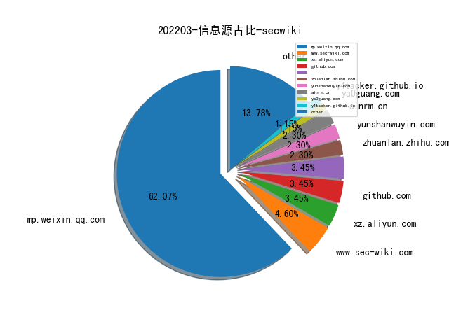
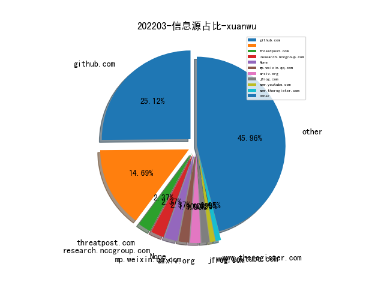
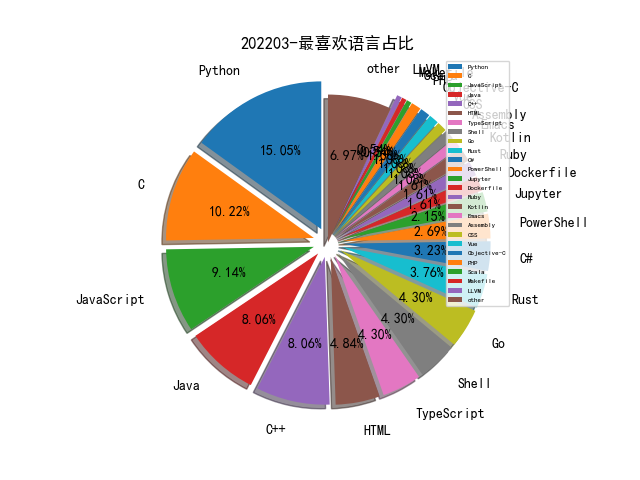

# [数据--所有](README_20.md)
# [数据--年度](README_2022.md)
# 202203 信息源与信息类型占比

# 微信公众号 推荐
| nickname_english | weixin_no | title | url| 
| --- | --- | --- | ---| 
| 跳跳糖社区 | tttangsec | CodeQL 踩坑指南 - Java | https://mp.weixin.qq.com/s/JkqtO_kfy4LZH9Kjkx6jdw | 2| 
| 赤旗情报站 | RedFlagIA | OpenCTI入门笔记（二）:存储设置&清理&修改图标和title | https://mp.weixin.qq.com/s/oh2AZ7XMuzDgTEVUV6aSsg | 2| 
| 榫卯江湖 | cnxct_coder | eCapture：无需CA证书抓https网络明文通讯 | https://mp.weixin.qq.com/s/DvTClH3JmncpkaEfnTQsRg | 1| 
| 昆仑策研究院 | kunlunceyanjiuyuan | 牟承晋：俄乌网络战争的启示 | https://mp.weixin.qq.com/s/f2jFoaq8Yagmy2JwpHNCgQ | 1| 
| 我的安全视界观 | CANI_Security | 如何学习这么多的安全文章（理论篇） | https://mp.weixin.qq.com/s/qA3U3qI0h7tuzggI7lvjAA | 1| 
| 学术世界 | Academicworld | 周亚金：数字货币在暗网中的使用初探（内附PPT） | https://mp.weixin.qq.com/s/-tk1cCaYgcfBnjuS0Pahjw | 1| 
| RainSec | RainSec111 | 《Linux Kernel 保护机制绕过》 | https://mp.weixin.qq.com/s/gSTbXW6M72QYtVPoZswhyw | 1| 
| 君哥的体历 | jungedetili | Lapsus$组织攻击微软的手法以及几点启示 | https://mp.weixin.qq.com/s/AG-ITyHlwesxS2k-5BzgKg | 1| 
| SecOps急行军 | SecOpsWithU | 编写信息安全规划的几点经验 | https://mp.weixin.qq.com/s/EjFZ2wr5ynzhiqttVAm8ng | 1| 
| 网络安全研究宅基地 | gh_684e6ad8d12c | 2021西湖论剑IOT RW-WriteUp | https://mp.weixin.qq.com/s/aOirT1aIfbbN890X39zWBw | 1| 
| 白日放歌须纵9 | Day_Dreamer_BR | 浅谈数据安全 | https://mp.weixin.qq.com/s/vTRfFHXaodbGyNCoT-h0zw | 1| 
| 宽字节安全 | gh_2de2b9f7d076 | 浏览网页就能泄露手机号的小秘密 | https://mp.weixin.qq.com/s/_bTunF9TXBUze8ewCM--Fg | 1| 
| 信安客 | xinanke_com | ATT&CK红队评估三套靶场渗透记录 | https://mp.weixin.qq.com/s/8s7l4TgcYb-CibfnQ6XhLA | 1| 
| Netlab 三六零 | Netlab_360 | 新威胁：使用DNS Tunnel技术的Linux后门B1txor20正在通过Log4j漏洞传播 | https://mp.weixin.qq.com/s/qTOycSR7stc2CmRXMoGfoA | 1| 
| 阿肯的不惑之年 | kenzhou-2020 | 企业安全运营实践：四个阶段实现风险处置的快和准 | https://mp.weixin.qq.com/s/z-KDuUw9V5trLFZ849nswQ | 1| 
| 一个人的安全笔记 | xjiek2015 | [HTB] Ophiuchi Writeup | https://mp.weixin.qq.com/s?__biz=MzIwOTA4NTg4MA==&mid=2652490020&idx=1&sn=0d67a7d5c6e51f1dc8fdea1b62b5dadf&chksm=8c945df3bbe3d4e5f63bf169516d6206705a19a7c9a74a7db6250d59edb193f7bb515161851b#rd | 2| 
| 金融电子化 | fcmag1993 | 观点 , 开源组件治理的实践与思考 | https://mp.weixin.qq.com/s/o099UY2eQnBpsBGbf7NOTg | 1| 
| 表图 | CyberSecurityCircle | 安全和美-我对网络安全的观察和思考 | https://mp.weixin.qq.com/s/TA_KAZrEN_0I37zby1KIzQ | 1| 
| 安全行者老霍 | gh_c2b78e839fd7 | 人工智能（AI）&网络安全 | https://mp.weixin.qq.com/s/8MpJQIgFayH_ZRCl55oBgA | 1| 
| 安全研究GoSSIP | GoSSIPSJTU | G.O.S.S.I.P 学术论文推荐 2022-03-10 OpenBSD/Firefox 漏洞演化史 | https://mp.weixin.qq.com/s/GvD1b9Lb6VLZQht7c0YMsw | 2| 
| 404 Not F0und | AI4Security | AKG：攻击者知识图谱 | https://mp.weixin.qq.com/s/tDJJOfwac5NAick15lS7-A | 1| 
| 美团安全应急响应中心 | gh_83d9bb3b8ed0 | 浅谈一下，Linux中基于eBPF的恶意利用与检测机制 | https://mp.weixin.qq.com/s/-1GiCncNTqtfO_grQT7cGw | 1| 
| 网络安全观 | SecurityInsights | 安全的未来是上下文 | https://mp.weixin.qq.com/s/P0nOKaP31k10bgRuuJGLWg | 2| 
| 黑伞安全 | hack_umbrella | 3vilGu4rd 免杀/权限维持 | https://mp.weixin.qq.com/s?__biz=MzU0MzkzOTYzOQ==&mid=2247486734&idx=1&sn=b2314ce17691b2481fdf19355b1fe144 | 1| 
| 章老师说 | gh_dd8867689c3d | 软件工程能力漫谈(视频 & PPT) | https://mp.weixin.qq.com/s/NNfWyGUl6jHrzsqVw8-Eww | 1| 
| 石头安全 | gh_bdb076c55582 | upload-labs 通关全write-up | https://mp.weixin.qq.com/s?__biz=MzkxNTIxOTkzMQ==&mid=2247484451&idx=1&sn=4d518cbba49989c00ecce37c4e5f0ba2 | 1| 
| 渗透测试教程 | bzhack | FireEye红队武器库又被盗？ | https://mp.weixin.qq.com/s?__biz=MzI3OTIwNDkzNQ==&mid=2651836838&idx=1&sn=fa485d2b0177ffb5504b1257a7fe70c9 | 1| 
| 无界信安 | Boundless_Sec | 容器安全事件排查 | https://mp.weixin.qq.com/s?__biz=Mzk0MzI3OTAwMg==&mid=2247484886&idx=1&sn=8bb0a0acc3ad54cafee6a00d4518b0ea | 2| 
| 我不是Hacker | gh_aaed037e2267 | 是谁动了我的打印机服务？ , 技术精选0125 | https://mp.weixin.qq.com/s?__biz=MzkwNDI1NDUwMQ==&mid=2247485706&idx=2&sn=16a1bb43db9351c757b96794111fe5ec | 2| 
| 安全孺子牛 | Sec_line | Linux提权-Sudo提权靶场部署 | https://mp.weixin.qq.com/s?__biz=MzI2MDI0NTM2Nw==&mid=2247487158&idx=1&sn=5bf5b2f349626dfbda663a4b137f8fae | 3| 
| 大余安全 | dayuST123 | 《2022百个项目渗透教学》更新项目二十免费攻防大型项目环境 | https://mp.weixin.qq.com/s?__biz=Mzg3MDMxMTg3OQ==&mid=2247499580&idx=1&sn=28de0a4e4ffb2f53b85c8b13bc349bdf | 1| 
| 不懂安全的校长 | sectip | 给各位师傅们道歉 | https://mp.weixin.qq.com/s?__biz=MzkyMzI3OTY4Mg==&mid=2247485282&idx=1&sn=d285cf6aec23dd463fc9099a4ecd7160 | 1| 
| WhITECat安全团队 | WhITECat_007 | 记一次XRed病毒攻击应急分析 | https://mp.weixin.qq.com/s?__biz=MzAwMzc2MDQ3NQ==&mid=2247486601&idx=1&sn=2c24f15aeec53e1d9d6db14cd098a806 | 2| 
| 暗影安全 | gh_4f0dabd0df69 | SSH代理转发 | https://mp.weixin.qq.com/s?__biz=MzI2MzA3OTgxOA==&mid=2657162009&idx=1&sn=ea56ac9b0e7834a1c3c03e5e243adb60 | 1| 
| betasec | BetaSecLab | 推荐关注团队一个师傅的公众号 | https://mp.weixin.qq.com/s?__biz=Mzg4MzA4Nzg4Ng==&mid=2247495162&idx=1&sn=271bf036e049e1dd210079f17e3237f5 | 1| 
| Th0r安全 | gh_3ad192d9c87f | 各厂商安全岗面试题集合 | https://mp.weixin.qq.com/s?__biz=Mzg3ODY3MzcwMQ==&mid=2247485356&idx=1&sn=4c62871ee0cf54422b0e1a3ee6ded1fa | 1| 
| NearSec | nearsec | 通过Windows RPC批量探测出网机器 | https://mp.weixin.qq.com/s?__biz=MzU5NjQ0NTE4NA==&mid=2247484587&idx=1&sn=0700c66ff7d56c5f36aa005429e42738 | 1| 
| 黑客在思考 | hackthink | Windows RPC之MS-TSCH添加计划任务 | https://mp.weixin.qq.com/s?__biz=MzI5NzU0MTc5Mg==&mid=2247484521&idx=1&sn=53fe69a8ad28c2b5551c82bee0408099 | 1| 
| 稻草人安全团队 | scarecrowsec | 招收2-3名红队实习生 | https://mp.weixin.qq.com/s?__biz=Mzg2MzU2NDMzMA==&mid=2247487009&idx=1&sn=2e2e2262937569904b1ed772fd46110e | 1| 
| 奇安信病毒响应中心 | gh_416eb7efb780 | 每周勒索威胁摘要 | https://mp.weixin.qq.com/s?__biz=MzI5Mzg5MDM3NQ==&mid=2247489326&idx=1&sn=d4a694be9e8857323fb786e9a9fbf877 | 1| 
| 云计算和网络安全技术实践 | gh_34d6b0cb5633 | vmware-tanzu社区版的安装（一） | https://mp.weixin.qq.com/s?__biz=MzA3MjM5MDc2Nw==&mid=2650746747&idx=1&sn=a3049bb4617bf8659bf6e40a4acef747 | 1| 
| F12sec | F12sec | F12sec团队招人 | https://mp.weixin.qq.com/s?__biz=Mzg5NjU3NzE3OQ==&mid=2247487882&idx=1&sn=86d3f0e9e0ee4f9bbf2b0b80d73e43a3 | 1| 
| 黑战士 | heizhanshi1 | 黑客组织“匿名者”被俄罗斯黑客反杀，其官网已被搞垮 | https://mp.weixin.qq.com/s?__biz=MzUxMzQ2NTM2Nw==&mid=2247488050&idx=1&sn=11568dc7eb88369c3c68a816684afad3 | 1| 
| 骨哥说事 | guge_guge | 【白帽故事】打造一款多线程目录爆破扫描器 | https://mp.weixin.qq.com/s?__biz=MjM5Mzc4MzUzMQ==&mid=2650255198&idx=1&sn=6cb479bd3f6c3cf304b5f9498ce12491 | 1| 
| 雷石安全实验室 | leishianquan1 | cobalt strike cdn上线笔记 | https://mp.weixin.qq.com/s?__biz=MzI5MDE0MjQ1NQ==&mid=2247513977&idx=1&sn=dd1691ad81b1dd72a74a5cf4825e8f00 | 2| 
| 雁行安全团队 | YX_Security | 【漏洞预警】Spring Cloud Gateway 远程代码执行漏洞（CVE-2022-22947） | https://mp.weixin.qq.com/s?__biz=MzIxNTIzMzM1Ng==&mid=2651104380&idx=1&sn=059d8f52d6be9064000bcd281f1dfb48 | 1| 
| 陌陌安全 | MomoSecurity | Python内存泄漏(OOM)如何快速排查？ | https://mp.weixin.qq.com/s?__biz=MzI2OTYzOTQzNw==&mid=2247486874&idx=1&sn=e93dcbf2ce0be927ea1c952357df2dd9 | 1| 
| 聚鼎安全 | gh_85ace59e0733 | 聚鼎22年Hw招聘 | https://mp.weixin.qq.com/s?__biz=Mzg4MTU1MjE5Mg==&mid=2247489207&idx=1&sn=0be117ccbea5900bd0a614ed6a5e4382 | 1| 
| 白帽技术与网络安全 | zero_daynews | [安全工具] 未授权主机信息收集工具-RPCSCAN | https://mp.weixin.qq.com/s?__biz=MzU0MDI5ODgxMw==&mid=2247485053&idx=1&sn=23432dc775d0334134a40d4b50b6499b | 1| 
| 火绒安全实验室 | HuorongLab | 【火绒安全周报】互联网组织拒绝乌删除俄域名的请求/丰田汽车宣布“大停工” | https://mp.weixin.qq.com/s?__biz=MzI3NjYzMDM1Mg==&mid=2247501856&idx=1&sn=60f9930b14e322297c48904a7654e843 | 2| 
| 宸极实验室 | ChenJiLab | 『代码审计』某博客系统 1day 审计 | https://mp.weixin.qq.com/s?__biz=Mzg4NTA0MzgxNQ==&mid=2247485572&idx=1&sn=6e0d12b12d954816c84ed459022ce6bf | 1| 
| 安恒威胁情报中心 | gh_e0f7c5e21306 | 网络黑客大军奋起支持乌克兰， 志愿“IT 军队”人数已近26万 | https://mp.weixin.qq.com/s?__biz=MzI1MDU5NjYwNg==&mid=2247494492&idx=1&sn=4670dec72ff0412e3a0008d585239f59 | 2| 
| 安全学术圈 | secquan | Mnemosyne：一个高效的水坑攻击调查取证系统 | https://mp.weixin.qq.com/s?__biz=MzU5MTM5MTQ2MA==&mid=2247487423&idx=1&sn=211209d0673bd49c0980581b9d220d9e | 6| 
| 娜璋AI安全之家 | gh_91f1fe28fc6e | [Python从零到壹] 十五.文本挖掘之数据预处理、Jieba工具和文本聚类万字详解 | https://mp.weixin.qq.com/s?__biz=Mzg5MTM5ODU2Mg==&mid=2247495432&idx=1&sn=6086635c089332b0f88b774febf540a5 | 1| 
| 奇安网情局 | QACIA2020 | 星链启动：乌克兰利用Starlink设备保持互联网联接 | https://mp.weixin.qq.com/s?__biz=MzI4ODQzMzk3MA==&mid=2247486310&idx=1&sn=1bde8c23df1a42c1c6aa666ed6163038 | 1| 
| 奇安信威胁情报中心 | gh_166784eae33e | 每周高级威胁情报解读(2022.02.24~03.03) | https://mp.weixin.qq.com/s?__biz=MzI2MDc2MDA4OA==&mid=2247499038&idx=1&sn=5e6f0250c2e70e282ac362c9f2bd3773 | 1| 
| 凌驭空间 | OVERSPACE_TEAM | 将Shikata ga nai带到前端 | https://mp.weixin.qq.com/s?__biz=MzkxNjI3MjI2OA==&mid=2247483717&idx=1&sn=b3741da2d0482bf5ff563ad9741eb5fe | 1| 
| 信安成长计划 | SecSource | Windows原理深入学习系列-访问控制列表 | https://mp.weixin.qq.com/s?__biz=MzkxMTMxMjI2OQ==&mid=2247484278&idx=1&sn=e6edf16c3e5f7f6f3b62b421d4bc4155 | 1| 
| 亿人安全 | Yr-Sec | FireEye红队武器库又被盗？ | https://mp.weixin.qq.com/s?__biz=Mzk0MTIzNTgzMQ==&mid=2247490549&idx=1&sn=cf1b9f7289e78aa80c4904db2dac55a7 | 4| 
| 京东安全应急响应中心 | jsrc_team | 这是一封年终奖励公告，白帽师傅们请查收~ | https://mp.weixin.qq.com/s?__biz=MjM5OTk2MTMxOQ==&mid=2727834542&idx=1&sn=5942a71d305f0eecedafb47a073df83e | 1| 
| safe6安全的成长日记 | safe6Sec | 分享个小技巧，两条命令解析提取cs凭证 | https://mp.weixin.qq.com/s?__biz=MzUxNjA5MDA3MA==&mid=2247484654&idx=1&sn=3a05ad1af610d66a359ef74025009b7d | 1| 
| only security | gh_8f063d2a5255 | 向日葵漏洞思考 | https://mp.weixin.qq.com/s?__biz=MzkzNzE4MTk4Nw==&mid=2247483932&idx=1&sn=2afb2462cb53aa93009791e83964e6b3 | 1| 
| lymmmx | gh_73cc1ccd9221 | 真相还在穿鞋的时候，谎言已经跑遍了全城。 | https://mp.weixin.qq.com/s?__biz=MzI3NTExMDc0OQ==&mid=2247484302&idx=1&sn=dcaed552fb3ff8941af98b1c6639c594 | 1| 
| TeamsSix | teamssix-com | 云安全 , AWS S3 对象存储攻防 | https://mp.weixin.qq.com/s?__biz=MzI5Mzk5NTIwMg==&mid=2247486734&idx=1&sn=0371aeff6871332f63ed35fc025db863 | 1| 
| Reset安全 | gh_a006697f54a9 | Spring Cloud Gateway 远程代码执行漏洞复现 CVE-2022-22947 | https://mp.weixin.qq.com/s?__biz=MzU3Mzg1NzMyNw==&mid=2247484400&idx=1&sn=8ff4301ed16107dd88c4ff87d3ea6b48 | 1| 
| RedCode Team | RedCodetm | 高级红队与WEB安全外加代码审计“手册” | https://mp.weixin.qq.com/s?__biz=Mzg5MjY3MTk2Mw==&mid=2247485332&idx=1&sn=2fb83116916d8ea6a81631d532562d19 | 2| 
| NGC660安全实验室 | gh_5fc2f516b008 | 利用kali走一个基本渗透流程 | https://mp.weixin.qq.com/s?__biz=MzkyODMxODUwNQ==&mid=2247485087&idx=1&sn=3ca6ea7e08ae2d5ed267e5b1029f346e | 1| 
| Gaobai文库 | HikC98799 | VoIPmonitor监控软件中发现多个关键安全漏洞 | https://mp.weixin.qq.com/s?__biz=MzkxNzIzNDExMA==&mid=2247484559&idx=1&sn=dc02790c0c2828b4d69ef85b54ef4942 | 1| 
| Docker中文社区 | dockerchina | 运行 Kubernetes 集群故障分析案例！ | https://mp.weixin.qq.com/s?__biz=MzI1NzI5NDM4Mw==&mid=2247490175&idx=1&sn=33d6e2e6e5445280b0c62552f92a086c | 2| 
| 401SecNote | gh_430c078990a7 | SpringCloud Gateway spel RCE(CVE-2022-22947) , 附检测脚本 | https://mp.weixin.qq.com/s?__biz=MzU4NzAyMDM4Mw==&mid=2247483907&idx=1&sn=975c711a9e304ee51752f97a427400fa | 1| 
| 3072 | gh_02e64d74f88d | 从零开始写Fuzzer(1):实现一个dumb Fuzzer | https://mp.weixin.qq.com/s?__biz=MzU4OTk0NDMzOA==&mid=2247484026&idx=1&sn=8b3c89ac2a774241a44d2849e5b2aa1d | 1| 
| 雾晓安全 | gh_79582f17fd5a | FireEye红队武器库又被盗？ | https://mp.weixin.qq.com/s?__biz=Mzg2NDM2MTE5Mw==&mid=2247487686&idx=1&sn=9ff828a699e6224fad2dfd60907b4e33 | 6| 
| 零维安全 | lx0sec | 高级红队与WEB安全外加代码审计“手册” | https://mp.weixin.qq.com/s?__biz=MzUzMjk0MTE1Mg==&mid=2247483781&idx=1&sn=dbdbc78b0f06018c251f6c25a9889893 | 1| 
| 长亭安全课堂 | chaitintech_release | 漏洞风险提示 , Spring Cloud Gateway 远程代码执行漏洞（CVE-2022-22947） | https://mp.weixin.qq.com/s?__biz=MzIwMDk1MjMyMg==&mid=2247488584&idx=1&sn=6d1c795d1772ef0ec83c49dd75166376 | 1| 
| 酒仙桥六号部队 | anfu-360 | 是谁动了我的打印机服务？ , 技术精选0125 | https://mp.weixin.qq.com/s?__biz=MzAwMzYxNzc1OA==&mid=2247498936&idx=1&sn=77eaf2b16c0748f6fcedab824dd4d659 | 3| 
| 边界无限 | BoundaryX | 漏洞风险提示｜Spring Cloud Gateway表达式注入漏洞(CVE-2022-22947) | https://mp.weixin.qq.com/s?__biz=MzAwNzk0NTkxNw==&mid=2247485341&idx=1&sn=c1e623a9e998f7b17aa6150feb4e80fb | 1| 
| 谢公子学安全 | xie_sec | 好书推荐丨Rootkit和Bootkit：现代恶意软件逆向分析和下一代威胁 | https://mp.weixin.qq.com/s?__biz=MzI2NDQyNzg1OA==&mid=2247490220&idx=1&sn=72de369696d7065fb2699ece4a207e2c | 1| 
| 补天漏洞响应平台 | butianqianxin | 补天9周年, “九”逢知己特别活动上线啦~ | https://mp.weixin.qq.com/s?__biz=MzU4MzgwODc3Ng==&mid=2247489326&idx=1&sn=5d03a62be0eb3f8c6fc6529f4cfd89a1 | 1| 
| 美团技术团队 | meituantech | 美团外卖广告平台化的探索与实践 | https://mp.weixin.qq.com/s?__biz=MjM5NjQ5MTI5OA==&mid=2651766814&idx=1&sn=ffa130184ee8596cb7b7e3ee0a884683 | 2| 
| 网络尖刀 | mcbang_com | 嗯，能制裁猫的估计也只有狗了！ | https://mp.weixin.qq.com/s?__biz=MjM5MDA3MzI0MA==&mid=2650090981&idx=1&sn=943d635565651684f8227df422d018cc | 2| 
| 网安寻路人 | DataProtection101 | 地缘政治与跨国科技公司 , 欧盟对今日俄罗斯（RT）和Sputnik的封禁 | https://mp.weixin.qq.com/s?__biz=MzIxODM0NDU4MQ==&mid=2247494050&idx=1&sn=81f82054f43eafb6fc5cc76608124ffe | 1| 
| 盘古石取证 | Panguite_CN | 通过Android代码简单的理解一下什么是HOOK | https://mp.weixin.qq.com/s?__biz=Mzg3MjE1NjQ0NA==&mid=2247494241&idx=1&sn=3a008f463ff93da89cb5ee6bc2f15a33 | 2| 
| 皮相 | OnTheSurface | 国际政治到底是什么？ | https://mp.weixin.qq.com/s?__biz=MzI0NDA5MDYyNA==&mid=2648256908&idx=1&sn=214e23f2fb3b95347712f6968ab95068 | 2| 
| 白帽子飙车路 | hack-by-txf | 高级红队与WEB安全外加代码审计“手册” | https://mp.weixin.qq.com/s?__biz=MzI1ODI0MTczNQ==&mid=2247488310&idx=1&sn=75c581ad2c8fe79ec18e89d2b4aad007 | 1| 
| 炼石网络CipherGateway | CipherGateway | 附下载｜我国197项数据安全政策回顾汇总 | https://mp.weixin.qq.com/s?__biz=MzkyNzE5MDUzMw==&mid=2247497669&idx=1&sn=8ae9ae37e92d3ee1821ac48116af6809 | 1| 
| 渗透攻击红队 | RedTeamHacker | 高级红队与WEB安全外加代码审计“手册” | https://mp.weixin.qq.com/s?__biz=MzkxNDEwMDA4Mw==&mid=2247490201&idx=1&sn=d7a2332bcb377e23b271ad649499eb32 | 1| 
| 渗透云笔记 | shentouyun | 某商城系统的Log4j2shell的探索之路 | https://mp.weixin.qq.com/s?__biz=MzU2NzkxMDUyNg==&mid=2247491565&idx=1&sn=ea6b64848f8eeadd094fd945af772521 | 1| 
| 泰阿安全实验室 | gh_d80f12be026a | 神的一串语言 | https://mp.weixin.qq.com/s?__biz=Mzg5MDQyMzg3NQ==&mid=2247483872&idx=1&sn=6a96697f9a3aa93295fc9f27e019bb32 | 1| 
| 暗魂攻防实验室 | anhunsec-red | 【渗透测试】Vulnhub靶场之Yone | https://mp.weixin.qq.com/s?__biz=MzkyMjE1NzQ2MA==&mid=2247485637&idx=2&sn=35eaee8f24387e8ec8b9ff5e816e8c6e | 2| 
| 数据安全与取证 | None | 如何免费获取和配置Windows恶意软件分析虚拟机 | https://mp.weixin.qq.com/s?__biz=MzIyNzU0NjIyMg==&mid=2247486524&idx=1&sn=b4689a3b8c6d0148a70890ab462577c1 | 2| 
| 小白学IT | xiaobaixueIT | CVE-2022-22947【漏洞预警】 | https://mp.weixin.qq.com/s?__biz=MzUxNDg3ODY2MQ==&mid=2247485079&idx=1&sn=d830d247870ff701b0e123deeefd30da | 1| 
| 小生观察室 | huolangxiaosheng | 如何下载YouTube 1080P高清视频 | https://mp.weixin.qq.com/s?__biz=MzIxODQ1OTg5NQ==&mid=2247485014&idx=1&sn=a3738928ca7abd75e6780a75d1ee59f9 | 1| 
| 字节跳动安全中心 | TouTiaoSec | 2022字节跳动春节活动风控报告 | https://mp.weixin.qq.com/s?__biz=MzUzMzcyMDYzMw==&mid=2247488451&idx=1&sn=f3cc1263643883ec7869f1fbb5d2e99f | 1| 
| 威胁棱镜 | THREAT_PRISM | TA402 针对中东目标持续发起攻击 | https://mp.weixin.qq.com/s?__biz=MzkyMzE5ODExNQ==&mid=2247484860&idx=1&sn=0f79568f487a753329dfc4c3ee91e84b | 7| 
| 天驿安全 | tianyisec | APP简单逆向到getshell | https://mp.weixin.qq.com/s?__biz=MzkxNjIxNDQyMQ==&mid=2247488360&idx=1&sn=b256f377deeae2c44c86a37c7167b915 | 6| 
| 天禧信安 | txxa-385 | 关于近期本人诈骗他人服务器进行挖矿的辟谣及道歉声明 | https://mp.weixin.qq.com/s?__biz=MzUyMTE0MDQ0OA==&mid=2247491451&idx=1&sn=112867dedb3403afad67e3a5f71f442a | 1| 
| 哈拉少安全小队 | gh_b273ce95df95 | JavaWeb代码审计（三）：某商城系统的Log4j2shell的探索之路 | https://mp.weixin.qq.com/s?__biz=MzAxNzkyOTgxMw==&mid=2247488369&idx=1&sn=ab29443229d100fb61f653c2b8569523 | 1| 
| 哆啦安全 | gh_060e91811143 | Android利用mmap共享映射实现进程间通信 | https://mp.weixin.qq.com/s?__biz=Mzg2NzUzNzk1Mw==&mid=2247490517&idx=1&sn=963582169b5575c41504c307937adad0 | 8| 
| 吾爱破解论坛 | pojie_52 | 【开放注册公告】吾爱破解论坛2022年3月13日十四周年开放注册公告 | https://mp.weixin.qq.com/s?__biz=MjM5Mjc3MDM2Mw==&mid=2651137299&idx=1&sn=57692ae05c43c9b4908c3bf73f8fbd76 | 1| 
| 信息安全国家工程研究中心 | gh_1e0d1778d4b2 | 网络关键设备与安全专用产品安全认证和安全检测助力网信产业发展。 | https://mp.weixin.qq.com/s?__biz=MzU5OTQ0NzY3Ng==&mid=2247489642&idx=1&sn=45df05874b853bad19ff71b124b8eb69 | 1| 
| 信安小屋 | CTF_Writeup | 赋能图片的免杀技巧 | https://mp.weixin.qq.com/s?__biz=MzI3ODkyOTYxOA==&mid=2247485160&idx=1&sn=81135b947892c56858e083c3881988e9 | 2| 
| 乌鸦安全 | crowsec | 关于针对天禧信安的38.5对于我个人诽谤的回应 | https://mp.weixin.qq.com/s?__biz=MzI3NjA4MjMyMw==&mid=2647782136&idx=1&sn=3dd028a4ea172257fb284a5b0f648a02 | 2| 
| 中睿天下 | zorelworld | 专访 , 中睿天下魏海宇：网安产业整体向好，综合解决方案将成为终极之道 | https://mp.weixin.qq.com/s?__biz=MzAwNjc0MDA1NA==&mid=2650133094&idx=1&sn=f5fb9dad4d5dbf63c5d4cfb439213f6d | 2| 
| bytecode11 | Not_Hacker | rebeyond-试运行 | https://mp.weixin.qq.com/s?__biz=MzI4NjU2MjM5Mw==&mid=2247487706&idx=1&sn=3deada05041dec6861e25f4e2906189d | 1| 
| backdoor | ip-addr | ContiLeaks | https://mp.weixin.qq.com/s?__biz=MzI5MzkwMzU1Nw==&mid=2247484807&idx=1&sn=88f46b3b1ebefcba639edf5ff106efe9 | 1| 
| V安全资讯 | v-safe-cn | 高级红队与WEB安全外加代码审计“手册” | https://mp.weixin.qq.com/s?__biz=MzI4MDQ1MzQ0NA==&mid=2247488800&idx=1&sn=785463a5c75db90c99273949b8ad65bb | 3| 
| Timeline Sec | TimelineSec | SUSCTF-2022 部分WriteUp | https://mp.weixin.qq.com/s?__biz=MzA4NzUwMzc3NQ==&mid=2247489880&idx=1&sn=ee207cd22dcce21773d2a8908ae40385 | 1| 
| Tide安全团队 | TideSec | 渗透遇见验证码，跑路？or 拿下它？ | https://mp.weixin.qq.com/s?__biz=Mzg2NTA4OTI5NA==&mid=2247495402&idx=1&sn=9d1ef1c72aec86a518f612c0adc41e9f | 2| 
| Qingy之安全 | gh_6ddb4536cf39 | 解决Cobalt Strike登录慢的方法 | https://mp.weixin.qq.com/s?__biz=Mzg2OTU4OTM0Ng==&mid=2247487613&idx=1&sn=629fe071057f6537bcf15afa135e64d3 | 1| 
| OnionSec | gh_8ab0e346e1df | 简单写一点情报挖掘猎捕的内容与思考 | https://mp.weixin.qq.com/s?__biz=MzUyMTUwMzI3Ng==&mid=2247484464&idx=1&sn=8b9212ac6a403cabc68dd7fe92cd27d9 | 1| 
| M01N Team | m01nteam | 从网络空间认知战到对俄大规模网络致瘫攻击 | https://mp.weixin.qq.com/s/iewfqJoAq0ZBclniSJEpAA | 1| 
| IOTsec Zone | exploit-iot | IOT Fuzzing框架AFL++ （上） | https://mp.weixin.qq.com/s?__biz=Mzg4MTY5NjQzMA==&mid=2247485123&idx=1&sn=bf9ca92d588771f046f1101e1d5a3a61 | 2| 
| HACK之道 | hacklearn | 实战渗透,一次巧合偶然的sql注入 | https://mp.weixin.qq.com/s?__biz=MzIwMzIyMjYzNA==&mid=2247497929&idx=1&sn=7edbcb562d071db7d21d1ee546e5cf67 | 6| 
| GeekPwn | GeekPwn | 轻量级反光物可被用于窃听？桌上不能再放快乐水罐罐了 | https://mp.weixin.qq.com/s?__biz=MzA3Nzc2MjIxOA==&mid=2650343954&idx=1&sn=e1349733ad4b9362a126175f0f9e5a99 | 2| 
| Gcow安全团队 | Gcow666 | 高级红队与WEB安全外加代码审计“手册” | https://mp.weixin.qq.com/s?__biz=MzUyNzk2NDcwMw==&mid=2247487886&idx=1&sn=426261ec88afb8ee0a64fc0d3eb162fa | 1| 
| CNVD漏洞平台 | CNVDTS | 关于CNVD技术组支撑单位2021年度工作情况的公告 | https://mp.weixin.qq.com/s?__biz=MzU3ODM2NTg2Mg==&mid=2247491321&idx=1&sn=abd7932096f3d9823e4efe4d30bd0c13 | 3| 
| Bypass | Bypass-- | Splunk系列：Splunk字段提取篇（三） | https://mp.weixin.qq.com/s?__biz=MzA3NzE2MjgwMg==&mid=2448907928&idx=1&sn=41e16474e234e328dfed0c850aba9be8 | 1| 
| 轩公子谈技术 | linux_hack | javaFx 安全开发 三 | https://mp.weixin.qq.com/s?__biz=MzU3MDg2NDI4OA==&mid=2247486017&idx=1&sn=f25e34d69f762f5c50af24864c3bc409 | 3| 
| 编码安全研究 | Lemon_0531_ | OWASP TOP 10 - 2021 | https://mp.weixin.qq.com/s?__biz=Mzg2NDY1MDc2Mg==&mid=2247486490&idx=1&sn=91c7c08108d7ab3e94444af1c86f71f5 | 6| 
| 维度之眼 | ku_guo_1 | 郑州云智信安-招聘英雄帖【多岗位】 | https://mp.weixin.qq.com/s?__biz=MjM5MDA2NDcxNw==&mid=2247484157&idx=1&sn=0edf47631a8f4dd4995b88f3d828eb3d | 1| 
| 维他命安全 | VitaminSecurity | Symantec发现Slug团伙使用新后门Daxin的攻击活动；佳能的子公司Axis遭到攻击导致部分系统暂时中断 | https://mp.weixin.qq.com/s?__biz=MzUxMDQzNTMyNg==&mid=2247498936&idx=1&sn=c9073644c2a7581646e6a93718b624a1 | 8| 
| 红队蓝军 | Xx_Security | ring0下的Inline hook | https://mp.weixin.qq.com/s?__biz=Mzg2NDY2MTQ1OQ==&mid=2247488316&idx=1&sn=1cf722021b5555e357ab16e613611b14 | 3| 
| 红数位 | safetop | 勒索之王Conti勒索源代码泄露，灾难or机会 | https://mp.weixin.qq.com/s?__biz=Mzg3MjI1MDU4OA==&mid=2247499242&idx=1&sn=de33751f858bc02491fec4668c054c57 | 5| 
| 等级保护测评 | zgdjbh | 2022产业互联网安全十大趋势报告（附全文） | https://mp.weixin.qq.com/s?__biz=MzU1ODM1Njc1Ng==&mid=2247494815&idx=1&sn=6a2737b2f0c3b707dffe84408f3de47d | 2| 
| 白帽子社区 | baimaoshequ | 第七届XCTF国际联赛的分站赛SUSCTF｜WP | https://mp.weixin.qq.com/s?__biz=MzUyMTAyODYwNg==&mid=2247497515&idx=1&sn=ad4c2e5e90c77bf0269623ec0a5412ab | 5| 
| 每天一个入狱小技巧 | gh_ba62997aff09 | 更新Awvs 14.7.220228146 | https://mp.weixin.qq.com/s?__biz=Mzg2MzYzNjEyMg==&mid=2247485338&idx=1&sn=3dbc20e022531cddb9c0d4814eae5c81 | 2| 
| 李白你好 | libai_hello | 有新的CVE仓库送达！ | https://mp.weixin.qq.com/s?__biz=MzkwMzMwODg2Mw==&mid=2247489556&idx=1&sn=5a00e6c38bc3ae0bc739995cf1bddc08 | 9| 
| 我的安全梦 | ms016team | SECKOL经营记录第一周 | https://mp.weixin.qq.com/s?__biz=MzU3NDY1NTYyOQ==&mid=2247485250&idx=1&sn=108908e5619da4849eedecbfa706b16c | 2| 
| 微步在线研究响应中心 | gh_c108d4d389bf | 专题报告 , 金融行业网络威胁研究(上) | https://mp.weixin.qq.com/s?__biz=MzA5MDc1NDc1MQ==&mid=2247492114&idx=1&sn=85b7906756b1d00c78363a36755d975a | 2| 
| 微步在线 | Threatbook | SANS发布《2022网络威胁情报调查》，这9个情报应用数据最值得关注 ,【微步荐读】 | https://mp.weixin.qq.com/s?__biz=MzI5NjA0NjI5MQ==&mid=2650171607&idx=1&sn=57cfa978451abf8c1a0098712a08b12a | 1| 
| 开普勒安全团队 | kaipuleanquan | 反网络犯罪实验室首次对外招人 | https://mp.weixin.qq.com/s?__biz=Mzk0NjEyNjY5OQ==&mid=2247487027&idx=1&sn=b9e0edd719c1f09603f167670f0d12bf | 1| 
| 山警网络空间安全实验室 | gh_544c8c38eeaf | 皮蛋厂的学习日记 , 2022.03.02  [TQLCTF2022]Simple PHP&2021NUAACTF-nohook | https://mp.weixin.qq.com/s?__biz=MjM5Njc1OTYyNA==&mid=2450781062&idx=1&sn=962cb32a3ffdf8255f3aa38e836f3a0b | 2| 
| 安全族 | anquanzu666 | 浅谈JAVA反射机制 | https://mp.weixin.qq.com/s?__biz=Mzg2NjU0MjA0Ng==&mid=2247485682&idx=1&sn=bbffeaf2a208712d531ba6b662040f34 | 2| 
| 字节跳动技术团队 | BytedanceTechBlog | Hudi Bucket Index 在字节跳动的设计与实践 | https://mp.weixin.qq.com/s?__biz=MzI1MzYzMjE0MQ==&mid=2247491852&idx=1&sn=ec268fa7af1f671d85d3c90b54b6be3b | 3| 
| 四叶草安全 | siyecaoanquan1 | 供应商遭“勒索攻击”，全日本丰田工厂停产 | https://mp.weixin.qq.com/s?__biz=MjM5MTI2NDQzNg==&mid=2654538875&idx=1&sn=3fb5b11b2ad8f4c081ad5f7def1dbb25 | 2| 
| 千寻安服 | scaf_0123 | 千寻笔记：应急响应实践小Tips | https://mp.weixin.qq.com/s?__biz=MzkzMzI3OTczNA==&mid=2247484780&idx=1&sn=b49a411924abc4dd71a7362f0ba836ac | 1| 
| 信安之路 | xazlsec | 实战 , 记一次几乎不可能成功的文件上传利用 | https://mp.weixin.qq.com/s?__biz=MzI5MDQ2NjExOQ==&mid=2247497029&idx=1&sn=63ad22ebb5e944e5c76d7b382d00c4d1 | 1| 
| 云鼎实验室 | YunDingLab | 【安全通告】Spring Cloud Gateway 远程代码执行漏洞风险通告（CVE-2022-22947） | https://mp.weixin.qq.com/s?__biz=MzU3ODAyMjg4OQ==&mid=2247494061&idx=1&sn=1b56432ed0ed7ebdcb662a946e25bba5 | 4| 
| 中通安全应急响应中心 | ZTO_SRC | 中通宝盒—安全与业务深度融合实践 | https://mp.weixin.qq.com/s?__biz=MzUyMTcwNTY3Mg==&mid=2247485814&idx=1&sn=e03bb33e1fa0280303337b5bd821b1f8 | 1| 
| goddemon的小屋 | gh_0383232a884d | 利用手机作为渗透工具的一些思路 | https://mp.weixin.qq.com/s?__biz=MzI2NTc1ODY0Mw==&mid=2247483958&idx=1&sn=619cb6dcfbcea74c3a8b2e030135a5f1 | 1| 
| aFa攻防实验室 | gzh_afagfsys | 域信息搜集 | https://mp.weixin.qq.com/s?__biz=MzAxMjcxMjkyOA==&mid=2247485695&idx=1&sn=f80ca2ffd096ebec11ad27fca78a62ee | 3| 
| XCTF联赛 | gh_3d7c7f90f79f | 第三期个人能力认证考核通过名单公布！ | https://mp.weixin.qq.com/s?__biz=MjM5NDU3MjExNw==&mid=2247502792&idx=1&sn=bf324dd4b854afc356a4f1255d3854f5 | 2| 
| SecPulse安全脉搏 | SecPulse | 低版本向日葵RCE/LPE漏洞复现 | https://mp.weixin.qq.com/s?__biz=MzAxNDM3NTM0NQ==&mid=2657044204&idx=1&sn=2ecc840fd4f22005cbb990bccd40e783 | 2| 
| SecIN技术平台 | sec-in | 原创 , ModSecurity 自建规则之路 | https://mp.weixin.qq.com/s?__biz=MzI4Mzc0MTI0Mw==&mid=2247493006&idx=1&sn=eaa23069cd2ba9fa6ce4ef96a2245718 | 1| 
| OWASP | OWASP_CHINA | 议题征集｜OWASP中国北京区域线上沙龙 | https://mp.weixin.qq.com/s?__biz=MjM5OTk5NDMyMw==&mid=2652097726&idx=1&sn=6451535cd6248c5113a2ce99324577cd | 1| 
| Ms08067安全实验室 | Ms08067_com | 恶意代码分析班作业 , 学习恶意代码分析需要的环境安装 | https://mp.weixin.qq.com/s?__biz=MzU1NjgzOTAyMg==&mid=2247498537&idx=1&sn=9dd18f9ff35683f9e78e8d06b1a3d268 | 1| 
| HACK学习呀 | Hacker1961X | 实战 , 记一次Fastadmin后台getshell的渗透记录 | https://mp.weixin.qq.com/s?__biz=MzI5MDU1NDk2MA==&mid=2247503825&idx=1&sn=0bc11348ff62eb5052e34425b445966f | 4| 
| EDI安全 | EDISEC | SUSCTF SU Writeup | https://mp.weixin.qq.com/s?__biz=MzIzMTQ4NzE2Ng==&mid=2247492116&idx=1&sn=86e5ae1091a20e4ef0e802f5b33b9917 | 2| 
| 360威胁情报中心 | CoreSec360 | 网络战序幕：美国国安局NSA（APT-C-40）对全球发起长达十余年无差别攻击 | https://mp.weixin.qq.com/s?__biz=MzUyMjk4NzExMA==&mid=2247489457&idx=1&sn=45371fe4d00eac38e364420d58663a41 | 1| 
| 默安科技 | moresec | “一抓一个准” , 默安科技基于攻击欺骗的挖矿治理方案 | https://mp.weixin.qq.com/s?__biz=MzIzODQxMjM2NQ==&mid=2247489489&idx=1&sn=e9ab162b6b0a31d0e00bd8433f89d396 | 2| 
| 黑白之道 | i77169 | Zabbix 新增两个漏洞！CISA 已知被利用漏洞列表中，新增两个 Zabbix 漏洞 | https://mp.weixin.qq.com/s?__biz=MzAxMjE3ODU3MQ==&mid=2650534418&idx=1&sn=8fd7746c48e916e42abb43d887260678 | 15| 
| 黑客技术与网络安全 | HackerCoder | 不可思议 ！乌克兰国防系统账号：admin，密码：123456 | https://mp.weixin.qq.com/s?__biz=MzIyMDEzMTA2MQ==&mid=2651161330&idx=1&sn=f0ab8c34b9ce6a7166dce24face63450 | 5| 
| 黑云信息安全 | heiyunxinxi | 【福利】抽取网安共享社区邀请码 | https://mp.weixin.qq.com/s?__biz=Mzg5OTYxMjk0Mw==&mid=2247485601&idx=1&sn=f419e5a99959dc606aba43b7f13beae5 | 1| 
| 鹏组安全 | Kris_Alex2 | DVR登录绕过漏洞&&phpstudy后门rce | https://mp.weixin.qq.com/s?__biz=Mzg5NDU3NDA3OQ==&mid=2247486418&idx=1&sn=b81788d7331f4ddfcb245c5519319baa | 4| 
| 鸿鹄实验室 | gh_a2210090ba3f | 漏洞挖掘 , 手把手教你如何发现一个漏洞~ | https://mp.weixin.qq.com/s?__biz=MzU0MjUxNjgyOQ==&mid=2247489667&idx=1&sn=6cbb9e4e9455840e5c117601bed13e81 | 6| 
| 青衣十三楼飞花堂 | gh_9feb5a276a2a | NSFOCUS旧友记--金超前《狂风暴雨幸同船》 | https://mp.weixin.qq.com/s?__biz=MzUzMjQyMDE3Ng==&mid=2247485555&idx=1&sn=d921b71e32eb6418daedbc6a20146498 | 7| 
| 青藤云安全 | qingtengyun | 新一代对抗作战框架MITRE Engage V1版本正式发布 | https://mp.weixin.qq.com/s?__biz=MzAwNDE4Mzc1NA==&mid=2650833693&idx=1&sn=4241410d5ac0936102c1b2e581787b13 | 1| 
| 雷神众测 | bounty_team | 红日ATT&CK实战系列靶场复现 | https://mp.weixin.qq.com/s?__biz=MzI0NzEwOTM0MA==&mid=2652496081&idx=1&sn=d35c9148f5523084b8da51bd79ed9e9f | 4| 
| 阿里云安全 | aliyunsec | 祝贺我的同事获2021人工智能“创新人物”荣誉 | https://mp.weixin.qq.com/s?__biz=MzA4MTQ2MjI5OA==&mid=2664086447&idx=1&sn=74b4ab33ddbf401a872b2c3a9f60e946 | 2| 
| 阿乐你好 | gh_cdf3717dded0 | 沈阳深蓝22年国HW招聘 | https://mp.weixin.qq.com/s?__biz=MzIxNTIzNTExMQ==&mid=2247487016&idx=1&sn=a73fc1ed8710c11bd5dba18929835aeb | 6| 
| 锦行信息安全 | jeeseensec | 网安月刊 , 第一期 | https://mp.weixin.qq.com/s?__biz=MzIxNTQxMjQyNg==&mid=2247489325&idx=1&sn=c24dd6308e0dd9e63ee2b1c519e68065 | 4| 
| 银河护卫队super | gh_47c3ed046111 | sqlmap绕过CSRF检测进行注入 | https://mp.weixin.qq.com/s?__biz=MzkwNzI0MTQzOA==&mid=2247485394&idx=1&sn=989d9ff2abb7212f2b7942e4572b3443 | 4| 
| 释然IT杂谈 | ShiRan_IT | App被下架？有安全漏洞？这个工具测一下就知道了 | https://mp.weixin.qq.com/s?__biz=MzIxMTEyOTM2Ng==&mid=2247497388&idx=1&sn=2463461d136f01b91acee110798208db | 4| 
| 邑安全 | EansecD | 免费的 Android 应用程序可让用户检测 Apple AirTag 跟踪 | https://mp.weixin.qq.com/s?__biz=MzUyMzczNzUyNQ==&mid=2247512606&idx=1&sn=bb17b4739f581f2edb28135e16095662 | 11| 
| 补天平台 | Patchingthesky | 重磅！你关心的证书详情页上线啦！ | https://mp.weixin.qq.com/s?__biz=MzI2NzY5MDI3NQ==&mid=2247493050&idx=1&sn=4ca0c8b22d6da1bc155b330b17e5f153 | 1| 
| 衡阳信安 | zghyxa | Misc 总结 ----流量分析 场景模拟 | https://mp.weixin.qq.com/s?__biz=MzU2NDY2OTU4Nw==&mid=2247495366&idx=1&sn=5db2b3baf5f47c6a59abfdcf08dd1c5d | 7| 
| 虎符智库 | TT_Thinktank | 产业观察：万亿市场正在形成！资本视角下的全球网络安全行业 | https://mp.weixin.qq.com/s?__biz=MzIwNjYwMTMyNQ==&mid=2247487184&idx=1&sn=5cf1a17b4d69786a82d062cb8b30d1da | 4| 
| 蓝桥云课精选 | shiyanlou-com | 初学者，如何学好 C 语言？ | https://mp.weixin.qq.com/s?__biz=MjM5OTMxMzA4NQ==&mid=2655950111&idx=1&sn=f4c6e435f2eaffe39b2941d689f3d857 | 8| 
| 菜鸟学信安 | securitylearn | 某VPN客户端远程下载文件执行挖掘 | https://mp.weixin.qq.com/s?__biz=MzU2NzY5MzI5Ng==&mid=2247488658&idx=1&sn=15dd7dd3bdf55473fc9cef34e7ac82c4 | 4| 
| 腾讯玄武实验室 | XuanwuLab | 每日安全动态推送(03-01) | https://mp.weixin.qq.com/s?__biz=MzA5NDYyNDI0MA==&mid=2651958242&idx=1&sn=4cd0bb5e580cc45ee003580ce8553d58 | 4| 
| 腾讯安全联合实验室 | txaqlhsys | 如何使用AI算法检测挖矿木马？ | https://mp.weixin.qq.com/s?__biz=MzI1NzM0MTMzMg==&mid=2247491169&idx=1&sn=2c24faa19ad0c3b4895c9650108e305c | 3| 
| 网络安全应急技术国家工程实验室 | NELCERT | 针对乌克兰的网络攻击中使用的数据擦除恶意软件 | https://mp.weixin.qq.com/s?__biz=MzUzNDYxOTA1NA==&mid=2247525645&idx=4&sn=41bbcbb18a279e1916031fc642e483e1 | 16| 
| 网络安全和信息化 | ITyunwei_365master | 《互联网信息服务算法推荐管理规定》今天起正式施行 | https://mp.weixin.qq.com/s?__biz=MjM5MzMwMDU5NQ==&mid=2649147859&idx=1&sn=fc1c4410fced5ea844768bcf6987e7f6 | 18| 
| 网络侦查研究院 | PCpolicesir | 甘肃首例利用虚拟货币组织领导网络传销大案告破 全国4.7万人落入“网络投资”陷阱 构建18层“金字塔” 涉案金额达1.26亿 | https://mp.weixin.qq.com/s?__biz=MzIxOTM2MDYwNg==&mid=2247511144&idx=1&sn=f5b41b93a9fefa9ee7afb2e192d97369 | 3| 
| 网安杂谈 | sdpcwa | 知帆科技,《2021年区块链和虚拟货币犯罪趋势研究报告》 | https://mp.weixin.qq.com/s?__biz=MzAwMTMzMDUwNg==&mid=2650885603&idx=1&sn=c80e6ae72c0513479d6a60614e428b96 | 1| 
| 绿盟科技研究通讯 | nsfocus_research | 【安全告警分析之道：四】扫描识别（上） | https://mp.weixin.qq.com/s?__biz=MzIyODYzNTU2OA==&mid=2247491235&idx=1&sn=523bdb089e851431cd8e363617caf911 | 4| 
| 绿盟科技 | NSFOCUS-weixin | 喜报 , 绿盟科技荣获CNVD四项荣誉 | https://mp.weixin.qq.com/s?__biz=MjM5ODYyMTM4MA==&mid=2650422702&idx=1&sn=98467a027667be31120a28031bdbd124 | 7| 
| 系统安全运维 | Taurus-1314147 | 漏洞挖掘 , 手把手教你如何发现一个漏洞~ | https://mp.weixin.qq.com/s?__biz=Mzk0NjE0NDc5OQ==&mid=2247498132&idx=1&sn=96b4f0be873026e94b76d7cf94bd7d88 | 14| 
| 程序员阿甘 | gh_a2e36d69d566 | 服务器入侵排查 | https://mp.weixin.qq.com/s?__biz=MzI4MTkzNDIyMg==&mid=2247495712&idx=1&sn=3aebbee0e6bc2f5c3c65915cbdb17a00 | 5| 
| 福韵 开源情报研究 | FuyunOsint | 转载 , 【研究池】域外势力操控社交媒体的手段路径及应对策略 | https://mp.weixin.qq.com/s?__biz=MzU4NTg4Mzc0MA==&mid=2247534512&idx=1&sn=057cf2595c50b7224fa8971f919cd7d9 | 4| 
| 祺印说信安 | qiyinshuoxinan | 俄罗斯vs乌克兰网络战之乌克兰IT军组建绝地反击 | https://mp.weixin.qq.com/s?__biz=MzA5MzU5MzQzMA==&mid=2652092187&idx=1&sn=9ef0cbbd792f1e9c05e8a0f400234a98 | 14| 
| 破军安全实验室 | gh_0a430ebdb179 | 文件上传漏洞总结 | https://mp.weixin.qq.com/s?__biz=MzkzMDMwNzk2Ng==&mid=2247495067&idx=1&sn=3ac76b6be0a3e5325a960e4b067058d3 | 3| 
| 知道创宇 | knownsec | 两会重保服务升级，您有一份专属向前防御报告亟待领取！ | https://mp.weixin.qq.com/s?__biz=MjM5NzA3Nzg2MA==&mid=2649858749&idx=1&sn=ff9b6a328d92b51151b0a49ddd58744e | 7| 
| 看雪学苑 | ikanxue | 栈溢出原理与实践之读书笔记 | https://mp.weixin.qq.com/s?__biz=MjM5NTc2MDYxMw==&mid=2458430325&idx=1&sn=a067de381e49e8338cca1f84fb72fd1d | 20| 
| 盛邦安全WebRAY | WebRay_weixin | 春天来了，来和网安一姐做同事吧——盛邦安全2022届春季校园招聘全面开启！ | https://mp.weixin.qq.com/s?__biz=MzAwNTAxMjUwNw==&mid=2650269143&idx=1&sn=ae4a77cf96640f7e568891428d7d7698 | 3| 
| 白安全组 | bai-1152770445 | DVWA（XSS漏洞）靶机搭建详细教学（附靶场源码） | https://mp.weixin.qq.com/s?__biz=MzU4MjYxNTYwNA==&mid=2247485501&idx=1&sn=f34e38283cc3be2d2df53f34e93a6ab7 | 1| 
| 电子物证 | ewuzheng | 【海量电子数据审查的实现路径】 | https://mp.weixin.qq.com/s?__biz=MzAwNDcwMDgzMA==&mid=2651041289&idx=1&sn=3ece05bdf7b27a21b18842ced5600658 | 12| 
| 甲方安全建设 | blueteams | 译文 , 介绍黄金 GMSA 攻击 | https://mp.weixin.qq.com/s?__biz=MzU0MDcyMTMxOQ==&mid=2247485822&idx=1&sn=7d6fcfdd0338b68f7f9e146b77580cc5 | 3| 
| 瓜神学习网络安全 | god_mellon | Nginx 配置 HTTPS | https://mp.weixin.qq.com/s?__biz=MzkwODE4ODUzMg==&mid=2247484526&idx=1&sn=08b620228c5011d3cd9c62852fa2e5db | 3| 
| 玄魂工作室 | xuanhun521 | 炼石计划之50套JavaWeb代码审计（二）：SpringBoot架构的OA系统代审之路 | https://mp.weixin.qq.com/s?__biz=MzA4NDk5NTYwNw==&mid=2651429141&idx=1&sn=9829c99d727a3c43f2c9ceaac6bd4375 | 3| 
| 猪猪谈安全 | zzt-anquan | 一键shiro反序列化漏洞利用工具 | https://mp.weixin.qq.com/s?__biz=MzIyMDAwMjkzNg==&mid=2247498688&idx=1&sn=f1be808b1a018cbcba941d385f96d32a | 4| 
| 火线Zone | huoxian_zone | 安服仔某渗透项目实战 | https://mp.weixin.qq.com/s?__biz=MzI2NDQ5NTQzOQ==&mid=2247492474&idx=1&sn=4803d95cac4f1c8b77e7ebed5057cb39 | 11| 
| 潇湘信安 | xxxasec | APP简单逆向到getshell | https://mp.weixin.qq.com/s?__biz=Mzg4NTUwMzM1Ng==&mid=2247494599&idx=1&sn=118fedaa8cb5a3b27bba1e0e697557a9 | 4| 
| 渗透师老A | hackAno | 人物传 , 白帽子积木的挖洞之路 | https://mp.weixin.qq.com/s?__biz=Mzg5NzU1MzM5Mw==&mid=2247501184&idx=1&sn=4b71fe7b42cd9e86407c301abf6abbc6 | 6| 
| 渗透安全团队 | GuYingLanQi | 实战｜ 一次白盒渗透测试 | https://mp.weixin.qq.com/s?__biz=MzkxNDAyNTY2NA==&mid=2247488329&idx=1&sn=0c138c28929268d4ca80287bc7d2cbbe | 4| 
| 渗透Xiao白帽 | SuPejkj | 资料分享与交流【快乐星球】 | https://mp.weixin.qq.com/s?__biz=MzI1NTM4ODIxMw==&mid=2247491787&idx=1&sn=3cea09799718bc5b0d36cff1d09644e6 | 10| 
| 清河六点下班 | gh_fd416b016aa6 | 仿 CobaltStrike 生成 Shellcode | https://mp.weixin.qq.com/s?__biz=MzU0MjMwMTkxNA==&mid=2247483820&idx=1&sn=96a30b8aa2c36aadfa79b83f1378132f | 3| 
| 洞见网安 | doonsec | 10台美国高速 2核2G 585/年 | https://mp.weixin.qq.com/s?__biz=MzAxNzg3NzMyNQ==&mid=2247485658&idx=1&sn=4b398e41ef9d5690a7d297462bcc0c9b | 8| 
| 河南等级保护测评 | hndjbh | CISA 警告 Schneider 和 GE Digital 的 SCADA 软件存在严重缺陷 | https://mp.weixin.qq.com/s?__biz=Mzg2NjY2MTI3Mg==&mid=2247485123&idx=1&sn=b4d71cfe02c2d35b922034982de5d2d4 | 12| 
| 汇能云安全 | metech2005 | 工业互联网巨头 GE Digital 修复SCADA 软件中的两个高危漏洞 | https://mp.weixin.qq.com/s?__biz=MzIwNzAwOTQxMg==&mid=2652245355&idx=1&sn=0a1c287fea5e05f37a12dfb370d8930c | 4| 
| 永安在线情报平台 | YongAnOnline | 前腾讯安全人工智能专家王健扎根永安在线，深耕API安全 | https://mp.weixin.qq.com/s?__biz=MzI3NDY3NDUxNg==&mid=2247493010&idx=1&sn=23474c0c95a4d0b5636986cb74da89ce | 2| 
| 橘猫学安全 | gh_af700ee13397 | 实战,利用 Fastjson注入内存马 | https://mp.weixin.qq.com/s?__biz=Mzg5OTY2NjUxMw==&mid=2247488297&idx=1&sn=0b22d85829a236770c06bd594333e67e | 9| 
| 星阑科技 | StarCrossCN | API NEWS , Coinbase API漏洞详情 | https://mp.weixin.qq.com/s?__biz=Mzg5NjEyMjA5OQ==&mid=2247492080&idx=1&sn=17b42ed5cf7cedb7bc292c4625d2d93d | 3| 
| 明不可欺 | gh_1405d616adc7 | 福利福利！《取证实录》免费领取 | https://mp.weixin.qq.com/s?__biz=MzI1NTI4OTE5OA==&mid=2247485496&idx=1&sn=845f2c7ad7b2b636f3d09a134e9e1c7d | 1| 
| 斗象智能安全 | Riskivy | 「Cyber Security Billboard」发布，斗象科技入选24条网安新兴赛道 | https://mp.weixin.qq.com/s?__biz=MzIwMjcyNzA5Mw==&mid=2247488526&idx=1&sn=48de061102e247e7267bfd9f56f78a54 | 1| 
| 数据库开发 | DataBase1024 | 面试官：业务主表读写缓慢如何优化？ | https://mp.weixin.qq.com/s?__biz=MzI3NDA4OTk1OQ==&mid=2649917528&idx=1&sn=e1b0b44e3ecbe8f0ffb53ad2925d7bc9 | 6| 
| 情报分析师 | qingbaofenxishi | 《美国在印太地区的发展战略报告》(2022年2月发布) | https://mp.weixin.qq.com/s?__biz=MzA3Mjc1MTkwOA==&mid=2650492257&idx=1&sn=d68a8e5e9972148b91890b08c3c66c6e | 18| 
| 微言晓意 | WeYanXY | 信息科技风险管理组织机构及职责 | https://mp.weixin.qq.com/s?__biz=MzI5MTEyMDUzMw==&mid=2650046346&idx=1&sn=b1ce6dfa511fb2c1d02d6461d1a7f515 | 2| 
| 弥天安全实验室 | gh_41292c8e5379 | 招人啦！河南云智信安云窟实验室 | https://mp.weixin.qq.com/s?__biz=MzU2NDgzOTQzNw==&mid=2247494604&idx=1&sn=99b7c683de0625c29823780141357174 | 2| 
| 山石网科安全技术研究院 | HSN_LAB | Practical and Privacy-Preserving Deep Packet Inspection | https://mp.weixin.qq.com/s?__biz=MzUzMDUxNTE1Mw==&mid=2247492148&idx=1&sn=a50ac2a06c255e57b2c2e7d94a58c9d3 | 4| 
| 小道安全 | kdsafety | 游戏黑灰产识别和溯源取证 | https://mp.weixin.qq.com/s?__biz=MzUxODkyODE0Mg==&mid=2247488885&idx=1&sn=1ae75a367b65add3e49448b4db87fead | 2| 
| 小艾搞安全 | lxfcl_0827 | 实战 ｜ XSS漏洞挖掘之旅 | https://mp.weixin.qq.com/s?__biz=Mzg3MTY3NzUwMQ==&mid=2247484772&idx=1&sn=0f330d4790f7b87f3a7bfd2e4716b970 | 5| 
| 安恒信息 | DBAPP2013 | 安恒信息牵手中科曙光 共谋生态新格局 | https://mp.weixin.qq.com/s?__biz=MjM5NTE0MjQyMg==&mid=2650508743&idx=1&sn=f1f5c0c2309f03f94ac6ebe521e0b868 | 4| 
| 安在 | AnZer_SH | “零信任”何以继续成为2022年产业互联网安全十大趋势之一？ | https://mp.weixin.qq.com/s?__biz=MzU5ODgzNTExOQ==&mid=2247537868&idx=1&sn=188880caf65737ed57b3333860a147fe | 10| 
| 安全牛 | aqniu-wx | 《2022产业互联网安全十大趋势》报告发布，“生态共建”或成行业健康发展唯一路径 | https://mp.weixin.qq.com/s?__biz=MjM5Njc3NjM4MA==&mid=2651111021&idx=1&sn=155a29da7b315ffdb6476aa4f1915e72 | 13| 
| 安全攻防团队 | gh_983c1037a3f6 | 一些隧道搭建 | https://mp.weixin.qq.com/s?__biz=MzkzNTI4NjU1Mw==&mid=2247483953&idx=1&sn=19ccc448f42ee3bf58d2d85872276308 | 1| 
| 安全客 | anquanbobao | 【安全头条】乌克兰招募网军意图进攻31个俄罗斯实体 | https://mp.weixin.qq.com/s?__biz=MzA5ODA0NDE2MA==&mid=2649766364&idx=1&sn=086638b55459f688588515b194eb0bcd | 9| 
| 安全宇宙 | knownsec818 | 网络战发展成“第五战场”，这些数据告诉你乌克兰的网络现状 | https://mp.weixin.qq.com/s?__biz=MzAxMDc5NzYwNQ==&mid=2652412631&idx=1&sn=37b538e0b5a931a25ecaadca540bea45 | 5| 
| 安全圈 | ChinaAnQuan | 【安全圈】18人被判刑！湖南湘潭特大网络赌博案尘埃落定 | https://mp.weixin.qq.com/s?__biz=MzIzMzE4NDU1OQ==&mid=2651993736&idx=1&sn=3376945d3dd5945024ce0b827fbf1380 | 16| 
| 安世加 | asjeiss | EISS-2022企业信息安全峰会之北京站：数据安全能力建设研习会开启报名 | https://mp.weixin.qq.com/s?__biz=MzU2MTQwMzMxNA==&mid=2247516956&idx=1&sn=3a26ff33f359239dae089811c7ea2b19 | 6| 
| 学安全在路上 | gh_c40eb977b2c4 | 内推 ,  来绿盟奋斗吧！ | https://mp.weixin.qq.com/s?__biz=MzI3MjI0NDEzMg==&mid=2247484356&idx=1&sn=e71fd06d6d4570da222731a5e5082bcd | 2| 
| 威努特工控安全 | winicssec_bj | 突发！遭遇攻击！丰田关闭日所有工厂！ | https://mp.weixin.qq.com/s?__biz=MzAwNTgyODU3NQ==&mid=2651082203&idx=1&sn=4d0d556a98eb10240090c8995379884e | 4| 
| 奇安信集团 | qianxin-keji | 奇安信发布2021漏洞态势报告：重点漏洞数量急剧上涨 | https://mp.weixin.qq.com/s?__biz=MzU0NDk0NTAwMw==&mid=2247558951&idx=1&sn=737b6177491b822f76bbbf87fb05d1b8 | 8| 
| 嘶吼专业版 | Pro4hou | 零门槛运维、安全能力过硬，“360企业安全云”向中小微企业免费开放 | https://mp.weixin.qq.com/s?__biz=MzI0MDY1MDU4MQ==&mid=2247537172&idx=1&sn=bd7fb9c1fbf22b28ae3d4d0b54183f06 | 16| 
| 合天网安实验室 | hee_tian | 大厂容不下“普通人”了u200b | https://mp.weixin.qq.com/s?__biz=MjM5MTYxNjQxOA==&mid=2652885968&idx=1&sn=f920b9193f8a65ebdfd89642448d3682 | 7| 
| 利刃信安 | LRXA3389 | 反弹Shell命令一键生成 | https://mp.weixin.qq.com/s?__biz=MzU1Mjk3MDY1OA==&mid=2247494150&idx=1&sn=422baed2e05309dc853d53ccc3537feb | 10| 
| 分布式实验室 | dockerone | 稳定是MySQL最大的优势，但分布式存储还是TiDB说了算！！ | https://mp.weixin.qq.com/s?__biz=MzA5OTAyNzQ2OA==&mid=2649753648&idx=1&sn=0c4a886e18e011d9fc9b4e74ae2fe907 | 8| 
| 关键基础设施安全应急响应中心 | CII-SRC | 俄乌冲突网空态势研判：关基成网攻重点 俄方克制使用高级能力 | https://mp.weixin.qq.com/s?__biz=MzkyMzAwMDEyNg==&mid=2247524957&idx=4&sn=5fa2dbe36a790d261eee5a830aa2e4ed | 16| 
| 全球技术地图 | drc_iite | 人工智能与社交网络在俄乌冲突中的应用 | https://mp.weixin.qq.com/s?__biz=MzI1OTExNDY1NQ==&mid=2651590211&idx=1&sn=2a39684baf9596bc04eb62f886943b2f | 10| 
| 代码审计 | white-hat-note | 分享下我 Github 被封的经历 | https://mp.weixin.qq.com/s?__biz=MzA4MDU0NzY4Ng==&mid=2459420055&idx=1&sn=0cdd8f383370934dd76004b25153f668 | 3| 
| 代码卫士 | codesafe | 因供应商遭不明网络攻击，丰田汽车宣布停产 | https://mp.weixin.qq.com/s?__biz=MzI2NTg4OTc5Nw==&mid=2247510707&idx=1&sn=66432bea8eda7ad73db1a0406b5f3c31 | 11| 
| 互联网安全内参 | anquanneican | 关键供应商被黑，丰田汽车无奈关停日本所有工厂 | https://mp.weixin.qq.com/s?__biz=MzI4NDY2MDMwMw==&mid=2247501650&idx=1&sn=2315cda0c7b878142e4cde60dc66774e | 17| 
| 乌雲安全 | hackctf | 实战,记一次艰难的SQL注入(过安全狗) | https://mp.weixin.qq.com/s?__biz=MzAwMjA5OTY5Ng==&mid=2247503232&idx=1&sn=5b1ea0b91f4dfa27bd6c26388f4ee18f | 7| 
| 中国信息安全 | chinainfosec | 重磅 , 透析产业安全新变化 《2022产业互联网安全十大趋势》重磅发布 | https://mp.weixin.qq.com/s?__biz=MzA5MzE5MDAzOA==&mid=2664154995&idx=1&sn=d20276ad63f731820368b8bab5ad9630 | 25| 
| 且听安全 | qtcyber | 【最新漏洞预警】CVE-2022-0513 全球600w+量级插件WP Statistics SQL注入漏洞不完整分析之旅 | https://mp.weixin.qq.com/s?__biz=Mzg3MTU0MjkwNw==&mid=2247488226&idx=1&sn=6b9a4c00c3c20658cd455bedc200a306 | 4| 
| 三六零CERT | CERT-360 | 安全日报（2022.03.01） | https://mp.weixin.qq.com/s?__biz=MzU5MjEzOTM3NA==&mid=2247490732&idx=1&sn=35da7f2564692f9649f8f5c7d773c5a3 | 3| 
| 丁爸 情报分析师的工具箱 | dingba2016 | 【情报实战】俄乌战争双方参战部队 | https://mp.weixin.qq.com/s?__biz=MzI2MTE0NTE3Mw==&mid=2651127631&idx=1&sn=48918aa89ec9b7edfe96ea86952d10c7 | 4| 
| web安全工具库 | websec-tools | 再送两本！Rootkit和Bootkit：现代恶意软件逆向分析和下一代威胁 | https://mp.weixin.qq.com/s?__biz=MzI4MDQ5MjY1Mg==&mid=2247494946&idx=1&sn=eadb53d41115ec442c915a6ccdb17457 | 9| 
| moonsec | moon_sec | KYXSCMS 灰盒测试 | https://mp.weixin.qq.com/s?__biz=MzAwMjc0NTEzMw==&mid=2653578309&idx=1&sn=32b26fad053c3aa63fee53b516d4bfca | 1| 
| i春秋 | icqedu | 专栏丨员工为牟私利，利用抓包技术获取服务器数据，会是什么下场？ | https://mp.weixin.qq.com/s?__biz=MzUzNTkyODI0OA==&mid=2247512138&idx=1&sn=d7df49fe95521c6661344ebd263fb1d1 | 2| 
| e安在线 | ean-online | 宣布发起网络战争！曾爆出世界轰动的惊天大瓜的世界著名黑客组织宣布发起网络战争 | https://mp.weixin.qq.com/s?__biz=MzI1OTA1MzQzNA==&mid=2651240734&idx=1&sn=63654f784a07a2a1993a32787bac2b95 | 4| 
| bgbing安全 | None | 支付宝又出新功能，新功能已上线。 | https://mp.weixin.qq.com/s?__biz=MzkwNzEzMTg3MQ==&mid=2247485050&idx=1&sn=e8c5be521b904e8a3638e667fe1fb212 | 2| 
| Python编程 | LovePython | 新一代Python包管理工具来了 | https://mp.weixin.qq.com/s?__biz=MzA5ODUzOTA0OQ==&mid=2651699964&idx=1&sn=8d5e99dd3418e948de471d239ef7c7b5 | 3| 
| PTEHub | gh_5aff651a75ac | 水文套路学HVM中的Blog靶场技能点！ | https://mp.weixin.qq.com/s?__biz=Mzg4NzY5NjgyNw==&mid=2247484179&idx=1&sn=300c68db08e32f0f7dc3146fd88cd0f7 | 1| 
| Linux学习 | LoveLinux1024 | 109个实用 Shell 脚本实例，代码清晰拿来就能用！（附pdf） | https://mp.weixin.qq.com/s?__biz=MzI4MDEwNzAzNg==&mid=2649456354&idx=1&sn=2dac9a8910e159577b18b8b3289bbee0 | 8| 
| Linux中国 | linux-cn | 硬核观察 #562 比特币挖矿正变得越来越不环保 | https://mp.weixin.qq.com/s?__biz=MjM5NjQ4MjYwMQ==&mid=2664649137&idx=2&sn=38a8cc93584bb0994d5261049777361f | 18| 
| LemonSec | lemon-sec | 正向shell相关技术总结 | https://mp.weixin.qq.com/s?__biz=MzUyMTA0MjQ4NA==&mid=2247522375&idx=1&sn=0f66c341fd4959df539979daa0cb6043 | 12| 
| Khan安全攻防实验室 | KhanCJSH | Fortinet Fortimail 7.0.1 - XSS | https://mp.weixin.qq.com/s?__biz=MzAwMjQ2NTQ4Mg==&mid=2247488715&idx=1&sn=fb362d6d7dd96464210280818f07885b | 8| 
| IT牧场 | itmuch_com | 不用找了，大厂在用的分库分表方案，都在这了 | https://mp.weixin.qq.com/s?__biz=MzI4ODQ3NjE2OA==&mid=2247497820&idx=1&sn=4edda0a540aec234857de8cec5f626db | 6| 
| Hacking黑白红 | Hacking012 | 【渗透测试实战系列】,42-防范诈骗，记一次帮助粉丝渗透黑入某盘诈骗的实战 | https://mp.weixin.qq.com/s?__biz=Mzg2NDYwMDA1NA==&mid=2247510964&idx=1&sn=4b857ff3d26e56b291d18493232d0638 | 8| 
| Hacking就是好玩 | gh_aed6cfc863ed | 帮群友招聘~ base 郑州 | https://mp.weixin.qq.com/s?__biz=MzU2NzcwNTY3Mg==&mid=2247484477&idx=1&sn=d01bfdee3c04fa2c1a2df5412f3eaf14 | 1| 
| GoCN | golangchina | 『每周译Go』开启并发模式 | https://mp.weixin.qq.com/s?__biz=MzA4ODg0NDkzOA==&mid=2247495930&idx=1&sn=d500af377d18e829e741e69fa2fb3d3b | 14| 
| FuzzWiki | gh_fcf21e658324 | 浅谈模糊测试基础技术——变异策略及变异方法 | https://mp.weixin.qq.com/s?__biz=MzU1NTEzODc3MQ==&mid=2247484045&idx=1&sn=e28204fc4747efe7fb3ecf4bdf5f3a68 | 2| 
| FreeBuf | freebuf | TerraGoat：一款针对Terraform的安全漏洞学习基础设施 | https://mp.weixin.qq.com/s?__biz=MjM5NjA0NjgyMA==&mid=2651163693&idx=4&sn=0109460e112bb0bd31e2c7413b93b663 | 25| 
| E安全 | EAQapp | 巅峰对决，英伟达遭黑客攻击后反黑黑客 | https://mp.weixin.qq.com/s?__biz=MzI4MjA1MzkyNA==&mid=2655320682&idx=1&sn=a91f8d745cc9bef9198f7495ca7b4be8 | 8| 
| ChaMd5安全团队 | chamd5sec | SUSTF-WriteUp | https://mp.weixin.qq.com/s?__biz=MzIzMTc1MjExOQ==&mid=2247504188&idx=1&sn=c3a9098a253fd9bb8f0d53ff9fafa159 | 4| 
| ADLab | v_adlab | Linux内核eBPF RINGBUF越界访问漏洞（CVE-2021-3489）利用分析 | https://mp.weixin.qq.com/s/biSNUlzZqqcYiYwfMSaTeg | 1| 

# 私人github账号 推荐
| github_id | title | url | p_url | p_profile | p_loc | p_company | p_repositories | p_projects | p_stars | p_followers | p_following | repo_lang | repo_star | repo_forks | 
| --- | --- | --- | --- | --- | --- | --- | --- | --- | --- | --- | --- | --- | --- | ---| 
| xiecat | Goblin - 一款适用于红蓝对抗中的仿真钓鱼系统 | https://github.com/xiecat/goblin | None | None | None | None | 0 | 0 | 0 | 0 | 0 | Go,Dockerfile | 0 | 0 | 1| 
| xepor | Xepor - Web Routing 框架，利用 Flask API 劫持和篡改 HTTP 请求的工具 | https://github.com/xepor/xepor | None | None | None | None | 0 | 0 | 0 | 0 | 0 | Python | 0 | 0 | 1| 
| tihmstar | iOS 15.1 kernel exploit POC for CVE-2021-30955 | https://github.com/tihmstar/desc_race-fun_public | https://github.com/tihmstar?tab=followers | My PGP Key fingerprint can be found in my Twitter bio: https://twitter.com/tihmstar | None | None | 81 | 0 | 15 | 0 | 0 | C,Objective-C,C++ | 0 | 0 | 1| 
| srg-imperial | SaBRe - Modular Selective Binary Rewriter | https://github.com/srg-imperial/SaBRe | None | None | None | None | 0 | 0 | 0 | 0 | 0 | Python,C,Shell,C++ | 0 | 0 | 1| 
| spring-projects | Spring Core 被发现反序列化相关的 RCE 漏洞 | https://github.com/spring-projects/spring-framework/commit/7f7fb58dd0dae86d22268a4b59ac7c72a6c22529 | None | None | None | None | 0 | 0 | 0 | 0 | 0 | Groovy,Shell,JavaScript,Java,TypeScript | 0 | 0 | 1| 
| saaramar | 刚刚举办的 Bluehat 会议关于 Intel MTE 的议题《Security Analysis of MTE Through Examples》 | https://github.com/saaramar/security_analysis_mte/blob/main/Security%20Analysis%20of%20MTE%20Through%20Examples.pdf | https://github.com/pastenctf | Reversing, exploits, Windows internals, virtualization, mitigations. @pastenctf team member. | None | None | 15 | 0 | 37 | 0 | 0 | Python,C,C++ | 0 | 0 | 1| 
| retrage | Ghidra analyzer for UEFI firmware | https://github.com/retrage/efiSeek/tree/efi-xplorer | https://github.com/retrage?tab=followers | UEFI firmware enthusiast | Tokyo, Japan | None | 40 | 0 | 2 | 0 | 0 | Java,C,HTML,Dockerfile | 0 | 0 | 1| 
| redcanaryco | 渗透测试中的 Account 修改方法（Windows/域账户/AWS/Auzre） | https://github.com/redcanaryco/atomic-red-team/blob/master/atomics/T1098/T1098.md | None | None | None | None | 0 | 0 | 0 | 0 | 0 | C,TypeScript,Jupyter,Python,JavaScript,Ruby,PowerShell,Rust | 0 | 0 | 1| 
| ptresearch | Positive Research 团队开源了他们为开源 IDS/IPS 引擎 Suricata 写的大量漏洞检测规则 | https://github.com/ptresearch/AttackDetection | https://github.com/ptresearch?tab=followers |  | None | Positive Research Team | 13 | 0 | 1 | 0 | 0 | Python | 0 | 0 | 1| 
| projectdiscovery | Nuclei - 基于YAML语法模板的定制化快速漏洞扫描器 | https://github.com/projectdiscovery/nuclei | None | None | None | None | 0 | 0 | 0 | 0 | 0 | Go,Python,JavaScript,Java,PHP | 0 | 0 | 1| 
| nonamecoder | 有研究员发现本田思域汽车无钥匙系统存在漏洞，攻击者发射 RF 信号控制车门和启动发动机 | https://github.com/nonamecoder/CVE-2022-27254 | https://github.com/nonamecoder?tab=followers |  | None | None | 4 | 0 | 4 | 0 | 0 | Python | 0 | 0 | 1| 
| mborgerson | Decompilation as a Service，多款反编译器处理同一个文件，方便对比结果 | https://github.com/mborgerson/mdec | https://github.com/mborgerson?tab=followers |  | None | None | 97 | 0 | 779 | 0 | 0 | Python,C,Shell,Objective-C,C++ | 0 | 0 | 1| 
| liamg | Linux 自动化提权工具 | https://github.com/liamg/traitor | https://github.com/aquasecurity | Open Source at @aquasecurity | New Forest, UK | @aquasecurity | 114 | 0 | 246 | 0 | 0 | Go | 0 | 0 | 1| 
| jkctech | 滥用 Telegram 的 People Near Me 特性实现位置跟踪 | https://github.com/jkctech/Telegram-Trilateration | https://github.com/jkctech?tab=followers | Student at Codam - 42 Network. Electrical Engineer | Netherlands | None | 15 | 0 | 76 | 0 | 0 | Python,C#,CSS | 0 | 0 | 1| 
| jiangsir404 | 用于红蓝对抗中快速验证 Web 应用漏洞的工具 | https://github.com/jiangsir404/POC-S | https://github.com/jiangsir404?tab=followers | Talk is cheap, show me the code. | shenzhen | None | 22 | 0 | 302 | 0 | 0 | Python | 0 | 0 | 1| 
| httpvoid | 在 Rails 找 Gadget 实现 Ruby Deserialization 漏洞的利用 | https://github.com/httpvoid/writeups/blob/main/Ruby-deserialization-gadget-on-rails.md | None | None | None | None | 0 | 0 | 0 | 0 | 0 | Python | 0 | 0 | 1| 
| gmh5225 | LLVM 安全相关的资料收集 | https://github.com/gmh5225/awesome-llvm-security | https://github.com/gmh5225?tab=followers | windows/llvm/game security/blockchain | El Salvador | None | 83 | 0 | 715 | 0 | 0 | C,Java,C#,C++,Batchfile,Rust,Inno,CMake,CSS | 0 | 0 | 1| 
| getActivity | 中国 Android 个人技术开源排行榜. | https://github.com/getActivity/AndroidGithubBoss | https://github.com/getActivity?tab=followers | 专业造轮子 | Guangzhou,China | None | 25 | 0 | 0 | 0 | 0 | Kotlin,Java | 0 | 0 | 1| 
| fingerprintjs | 不依赖 JavaScript 和 Cookie 构建用户指纹 | https://github.com/fingerprintjs/blog-nojs-fingerprint-demo | None | None | None | None | 0 | 0 | 0 | 0 | 0 | TypeScript,Java,Handlebars,Kotlin,Pug,HTML,JavaScript,PHP,Swift | 0 | 0 | 1| 
| find-sec-bugs | 在 Java Web 以及 Android 项目中自动检测漏洞的插件 | https://github.com/find-sec-bugs/find-sec-bugs | None | None | None | None | 0 | 0 | 0 | 0 | 0 | Kotlin,HTML,Java,JavaScript | 0 | 0 | 1| 
| facebookexperimental | Facebook 开发的一套 Rust 中间 IR 的 Interpreter | https://github.com/facebookexperimental/MIRAI | None | None | None | None | 0 | 0 | 0 | 0 | 0 | Java,Python,JavaScript,Makefile,C++,R,Rust | 0 | 0 | 1| 
| enkomio | 一款支持在内存中执行 JS 脚本的 C2 Post-Exploitation 框架 | https://github.com/enkomio/AlanFramework | https://github.com/enkomio?tab=followers | Code Monk | Italy | enkomio-sponsor | 21 | 0 | 45 | 0 | 0 | C#,JavaScript,Assembly,F# | 0 | 0 | 1| 
| engn33r | 近些年蓝牙相关的安全研究资料整理 | https://github.com/engn33r/awesome-bluetooth-security | https://github.com/engn33r?tab=followers | https://twitter.com/bl4ckb1rd71 | None | None | 20 | 0 | 142 | 0 | 0 | Python | 0 | 0 | 1| 
| decoder-it | Bluehat 2022 会议的议题，滥用 RPC/DCOM 协议实现本地提权 | https://github.com/decoder-it/bluehatil22/ | https://github.com/decoder-it?tab=followers |  | None | None | 17 | 0 | 1 | 0 | 0 | C#,C,PowerShell | 0 | 0 | 1| 
| d3ckx1 | Fvuln: 一款自动化工具 | https://github.com/d3ckx1/Fvuln | https://github.com/d3ckx1?tab=followers | a penetration test | None | None | 24 | 0 | 4 | 0 | 0 | Python,HTML | 0 | 0 | 1| 
| cxnder | 用于 BinaryNinja 分析 Dyld Shared Cache 的插件 | https://github.com/cxnder/bn-dyldsharedcache | https://github.com/cxnder?tab=followers | macOS/iOS development @ reverse engineering chick. // maintainer of the iPhone Dev Wiki (https://iphonedev.wiki) | west lafayette | @}-,-`- | 116 | 0 | 103 | 0 | 0 | Python | 0 | 0 | 2| 
| cri-o | CRI-O 发布漏洞公告，修复近期的爆出的 root 代码执行漏洞 | https://github.com/cri-o/cri-o/security/advisories/GHSA-6x2m-w449-qwx7 | None | None | None | None | 0 | 0 | 0 | 0 | 0 | Go,SCSS,Python | 0 | 0 | 1| 
| commial | Bindings for Microsoft WinDBG TTD，支持 diff WinDBG TTD Trace 的结果 | https://github.com/commial/ttd-bindings | https://github.com/commial?tab=followers |  | None | None | 30 | 0 | 30 | 0 | 0 | Python,PowerShell,Rust,C++ | 0 | 0 | 1| 
| cider-security-research | Top 10 CI/CD Security Risks | https://github.com/cider-security-research/top-10-cicd-security-risks | None | None | None | None | 0 | 0 | 0 | 0 | 0 |  | 0 | 0 | 1| 
| chaitin | veinmind-tools - 长亭科技开源的容器安全工具集 | https://github.com/chaitin/veinmind-tools | None | None | None | None | 0 | 0 | 0 | 0 | 0 | Go,Python,Vue,Java,HTML | 0 | 0 | 1| 
| center-for-threat-informed-defense | Attack Flow - 为攻击者攻击流程进行辅助建模的工具 | https://github.com/center-for-threat-informed-defense/attack-flow | None | None | None | None | 0 | 0 | 0 | 0 | 0 | C,TypeScript,Python,JavaScript,Vue,HTML,Ruby | 0 | 0 | 1| 
| bytedance | GoDLP: 敏感信息保护系统 | https://github.com/bytedance/godlp | None | None | None | None | 0 | 0 | 0 | 0 | 0 | C,TypeScript,Assembly,Python,JavaScript,Cuda,Go,Java,Ruby,Jupyter,Rust | 0 | 0 | 1| 
| bluesadi | Pluto-Obfuscator - 基于 LLVM 实现的代码混淆工具 | https://github.com/bluesadi/Pluto-Obfuscator | https://github.com/bluesadi?tab=followers | Keep moving, be enthusiastic, be patient. | Chengdu, Sichuan | Sichuan University | 12 | 0 | 88 | 0 | 0 | Python,LLVM,C++ | 0 | 0 | 1| 
| binarly-io | BINARLY Labs 在 OffensiveCon 2022 会议的演讲 PPT “UEFI Firmware Vulnerabilities: Past, Present and Future” | https://github.com/binarly-io/Research_Publications/tree/main/OffensiveCon_2022 | None | None | None | None | 0 | 0 | 0 | 0 | 0 | Python,Go,JavaScript,Shell,C++ | 0 | 0 | 1| 
| b0bac | ApolloScanner: 自动化巡航扫描框架 | https://github.com/b0bac/ApolloScanner | https://github.com/b0bac?tab=followers | Information Security Researcher Information Security Research Department Leader | None | None | 51 | 0 | 3 | 0 | 0 | Python,JavaScript | 0 | 0 | 1| 
| apache | Apache Teaclave - Apache 开源的通用安全计算平台 | https://github.com/apache/incubator-teaclave | None | None | None | None | 0 | 0 | 0 | 0 | 0 | TypeScript,Java,Scala,Python,JavaScript,C++,Shell,HTML | 0 | 0 | 1| 
| antx-code | Oracle Access Manager Unauthenticated Attacker Vulnerability CVE-2021-35587 | https://github.com/antx-code/CVE-2021-35587 | https://github.com/antx-code?tab=followers | RCT(Reading, Coding and Trading) | Zhengzhou, China | None | 21 | 0 | 4800 | 0 | 0 | Python,C,Shell,Emacs | 0 | 0 | 1| 
| aaaddress1 | 不依赖 DLL 注入的 UAC Bypass，支持 Windows 11 | https://github.com/aaaddress1/PR0CESS/tree/main/UACBypassJF_RpcALPC | https://github.com/aaaddress1?tab=followers | 30cm.tw/me | Taiwan | TXOne Networks, inc. | 197 | 0 | 541 | 0 | 0 | C#,C,C++ | 0 | 0 | 1| 
| Wilfred | Difftastic - 支持语法格式的 Diff 工具 | https://github.com/Wilfred/difftastic | https://github.com/Wilfred?tab=followers | PL enthusiast, Emacs addict, and Hacklang contributor. | Bay Area, USA | None | 393 | 0 | 1700 | 0 | 0 | C,JavaScript,Emacs,Rust | 0 | 0 | 1| 
| Tas9er | 冰蝎Java WebShell免杀生成工具. | https://github.com/Tas9er/ByPassBehinder4J | https://github.com/Tas9er?tab=followers | Code And Web Security | None | A.E.0.S | 27 | 0 | 6 | 0 | 0 |  | 0 | 0 | 1| 
| Rog3rSm1th | Frelatage - a Coverage-based Python Fuzzing Library，Fuzz Python Applications | https://github.com/Rog3rSm1th/Frelatage | https://github.com/Rog3rSm1th?tab=followers | Fuzzing / OSINT / Low level stuffs | France | Rog3rSm1th | 11 | 0 | 109 | 0 | 0 | Python,Shell,JavaScript,HTML | 0 | 0 | 1| 
| RedTeamOperations | Re-casting EDR functions，滥用 McAfee EDR 加载执行 Shellcode | https://github.com/RedTeamOperations/Journey-to-McAfee/tree/main/EDR-Recasting | https://github.com/RedTeamOperations?tab=followers | CyberWarFare Labs | India | CyberWarFare Labs | 31 | 0 | 5 | 0 | 0 | C,C++ | 0 | 0 | 1| 
| MiSecurity | 小米发布 《消费级物联网安全基线》2.0 版本 | https://github.com/MiSecurity/Cyber-Security-Baseline-for-Consumer-Internet-of-Things | None | None | None | None | 0 | 0 | 0 | 0 | 0 | Go | 0 | 0 | 1| 
| Lucifer1993 | SatanSword - 红队综合渗透框架 | https://github.com/Lucifer1993/SatanSword | https://github.com/Lucifer1993?tab=followers | 安全圈职业炮灰 | Chengdu,China | = = | 44 | 1 | 818 | 0 | 0 | Python,PowerShell | 0 | 0 | 1| 
| LandGrey | Spring Boot 相关漏洞学习资料，利用方法和技巧合集 | https://github.com/LandGrey/SpringBootVulExploit | https://github.com/LandGrey?tab=followers | I learn cyber sec | Shanghai | None | 19 | 0 | 1500 | 0 | 0 | Python,Java | 0 | 0 | 1| 
| Group3r | Group3r - AD 环境组策略配置探测工具 | https://github.com/Group3r/Group3r | None | None | None | None | 0 | 0 | 0 | 0 | 0 | C# | 0 | 0 | 1| 
| FirmWire | FirmWire - 基带固件分析平台，支持 Samsung 和 MediaTek | https://github.com/FirmWire/FirmWire | None | None | None | None | 0 | 0 | 0 | 0 | 0 | Python,C,Java | 0 | 0 | 1| 
| FGSect | FitM - 作为中间人，利用 snapshot-fuzzing Fuzz client 和 server 的工具 | https://github.com/FGSect/FitM | None | None | None | None | 0 | 0 | 0 | 0 | 0 | C,Jupyter,Python,JavaScript,C++,Dockerfile,Rust | 0 | 0 | 1| 
| CoolerVoid | CodeCat - 支持对用户输入 SINK 分析的静态代码分析工具 | https://github.com/CoolerVoid/codecat | https://github.com/CoolerVoid?tab=followers | Cybersecurity professional (appsec, pentest, reverse engineering) Computer programmer, Linux/windows drivers developer. | brazil - sao paulo | None | 84 | 0 | 351 | 0 | 0 | Python,C | 0 | 0 | 1| 
| CodeIntelligenceTesting | 基于 libFuzzer 实现的 JVM Fuzzer - Jazzer 一直在不断优化 | https://github.com/CodeIntelligenceTesting/jazzer | None | None | None | None | 0 | 0 | 0 | 0 | 0 | Shell,Java,Python,C++,TypeScript,HTML,Starlark,Go | 0 | 0 | 1| 
| Cloud-Architekt | Overview of Microsoft Identity Security Monitoring | https://github.com/Cloud-Architekt/AzureAD-Attack-Defense/blob/main/IdentitySecurityMonitoring.md | https://github.com/Cloud-Architekt?tab=followers | Cloud Security Architect, Microsoft MVP | Koblenz | None | 7 | 0 | 2 | 0 | 0 | JavaScript,PowerShell | 0 | 0 | 2| 
| Bonfee | 有研究员公开了 Linux 内核 watch_queue 越界写漏洞（CVE-2022-0995）Exploit | https://github.com/Bonfee/CVE-2022-0995 | https://github.com/Bonfee?tab=followers | Italian I.T. student at Ca Foscari University of Venice. | Venice, Italy | None | 7 | 0 | 20 | 0 | 0 | C | 0 | 0 | 1| 
| Accenture | VulFi - 一款用于辅助在 IDA Pro 中挖掘漏洞的插件 | https://github.com/Accenture/VulFi | None | None | None | None | 0 | 0 | 0 | 0 | 0 | Python,Jupyter,TypeScript,Java,Elixir | 0 | 0 | 1| 
| 0vercl0k | Windows Runtime RCE CVE-2022-21971 PoC | https://github.com/0vercl0k/CVE-2022-21971 | https://github.com/0vercl0k?tab=followers |  | US/FR | None | 34 | 0 | 4 | 0 | 0 | Python,C,JavaScript,C++ | 0 | 0 | 1| 

# medium 推荐
| title | url| 
| --- | ---| 
| Hacking 3CX电话系统 | https://medium.com/@frycos/pwning-3cx-phone-management-backends-from-the-internet-d0096339dd88| 
| Firewall bypass with CARP in Packet Filter | https://medium.com/sensorfu/firewall-bypass-with-carp-in-packet-filter-c4ed70fb7dd7| 
| NETGEAR 路由器命令注入漏洞(PSV-2022–0044)的发现过程 | https://flattsecurity.medium.com/finding-bugs-to-trigger-unauthenticated-command-injection-in-a-netgear-router-psv-2022-0044-2b394fb9edc| 
| Oracle Access Manager Pre-Auth RCE (CVE-2021–35587 Analysis) | https://testbnull.medium.com/oracle-access-manager-pre-auth-rce-cve-2021-35587-analysis-1302a4542316| 

# medium 推荐
| title | url| 
| --- | ---| 
| Attack Flow — Beyond Atomic Behaviors | https://medium.com/mitre-engenuity/attack-flow-beyond-atomic-behaviors-c646675cc793| 

# 知乎 推荐
| title | url| 
| --- | ---| 
| 如何通过开源组件实现一套山寨版的 BAB 方案 | https://zhuanlan.zhihu.com/p/489791169| 
| CodeBERT: A Pre-Trained Model for Programming and Natural ... | https://zhuanlan.zhihu.com/p/476950957| 

# 论坛 推荐
| title | url| 
| --- | ---| 
| 利用抽象语法树挖掘Fastjson可用的Gadget | https://xz.aliyun.com/t/11001| 
| 高效挖掘反序列化漏洞——GadgetInspector改造 | https://xz.aliyun.com/t/10908| 
| 跟着三梦学Java安全：半自动挖洞 | https://xz.aliyun.com/t/10925| 

# 日更新程序
`python update_daily.py`