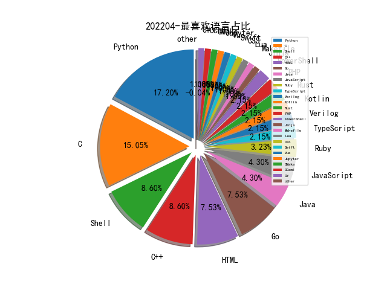

# [数据--所有](README_20.md)
# [数据--年度](README_2022.md)
# 202204 信息源与信息类型占比

# 政策 推荐
| title | url| 
| --- | ---| 
| 国资委：将网络安全纳入央企负责人经营业绩考核 | http://www.sasac.gov.cn/n2588035/n2588320/n2588335/c10652592/content.html| 
| 关于开展“清朗·2022年算法综合治理”专项行动 | http://www.cac.gov.cn/2022-04/08/c_1651028524542025.htm| 

# 微信公众号 推荐
| nickname_english | weixin_no | title | url| 
| --- | --- | --- | ---| 
| 小生观察室 | huolangxiaosheng | xray联动crawlergo自动化扫描爬坑记 | https://mp.weixin.qq.com/s/aJ7UvZmACNSEF1zCrntxow | 7| 
| 美团安全应急响应中心 | gh_83d9bb3b8ed0 | 软件成分安全分析（SCA）能力的建设与演进 | https://mp.weixin.qq.com/s/2tu27ZLzd3kEyk5lrXeytQ | 1| 
| 大海里的废话集合 | sea2fly | 企业安全之浅谈红蓝对抗--下 | https://mp.weixin.qq.com/s/FkesyPjxVloPaKxabddpEw | 2| 
| 火线云安全研究团队 | gh_07bfe2dc3604 | WMI后门技术的攻击与检测 | https://mp.weixin.qq.com/s/l8OBAvYORhqxM5SlKBDIyw | 1| 
| 小道安全 | kdsafety | 浅谈攻防演练 | https://mp.weixin.qq.com/s/6qmpRL8-rjDGD8LBfvM_gA | 1| 
| 徐州市网络违法犯罪研究中心 | gh_9cdaf760c7b4 | 喻海松：网络犯罪形态的碎片化与刑事治理的体系化 | https://mp.weixin.qq.com/s/v6WJxNxU5aQCaZhkmif4zw | 1| 
| 安全研究GoSSIP | GoSSIPSJTU | G.O.S.S.I.P 阅读推荐 2022-04-18 | https://mp.weixin.qq.com/s/3Fla1U2RGh603jH4BxfYEg | 1| 
| 公安三所网络安全法律研究中心 | gh_2544eebbd88a | 《数据安全法》实施以来，首例涉案数据被鉴定为情报的案件 | https://mp.weixin.qq.com/s/lj-ZDcORuW-8Svjm1hrhGA | 1| 
| 跳跳糖社区 | tttangsec | 从零开始，分析Spring Framework RCE | https://mp.weixin.qq.com/s/ixTbyZyb0FTmc7xaSqxtPw | 1| 
| 美团技术团队 | meituantech | 知识图谱可视化技术在美团的实践与探索 | https://mp.weixin.qq.com/s/64XoQ0JIjjuaUtTaL3BzdA | 1| 
| 广东网络空间安全专委会 | gh_f5ab4f133df7 | 等保、分保、关保、密评四道防线守护网络信息安全 | https://mp.weixin.qq.com/s/zLBjiW9iLx83GjCNV07Utw | 1| 
| 平安集团安全应急响应中心 | PSRC_Team | TP-Link-WDR-7660 安全研究之固件分析 | https://mp.weixin.qq.com/s/98YDkBrg0XZe32NLNnn5JQ | 3| 
| 安全喷子 | gh_2a9c00f1d053 | ATT&CK 变成安全“元宇宙”？ | https://mp.weixin.qq.com/s/1pJo_b979rqqKP9ldC13Vg | 1| 
| 天玄安全实验室 | TianXuan_SecurityLab | Chrome Mojo组件的沙箱逃逸漏洞分析 | https://mp.weixin.qq.com/s/tGwCwOQ8eAwm26fHXTCy5A | 1| 
| 北邮 GAMMA Lab | BUPT_GAMMA | 数据科学研究型人才培养的思考与实践 | https://mp.weixin.qq.com/s/cw8gAinn4iWgKGh86xxxGA | 1| 
| 赛博回忆录 | cybermemory | 漂亮侧信道：从timeless attack到pipeline的放大攻击 | https://mp.weixin.qq.com/s/N6CWX9ZVnbyeYBIibwb0SA | 1| 
| 绝对防御局 | Absolute-Defense | 通过覆盖Powershell cmdlet方式进行权限维持 | https://mp.weixin.qq.com/s?__biz=MzkxMTE5MjQ3NA==&mid=2247483781&idx=1&sn=721f1202f22953e2d80c0aaca0224a81&chksm=c11eb970f669306635bf759a8a846271bd864ed2522a23ebfcb078fecf925d440a84e82b7fb9#rd | 1| 
| 安全学术圈 | secquan | APT取证分析中的数据压缩 | https://mp.weixin.qq.com/s/8z8eYzPsLiWrQOsvByMnJw | 5| 
| 中国信息安全 | chinainfosec | 论坛·原创 , 元宇宙与国家数据安全：构建生态化治理体系的挑战与趋势 | https://mp.weixin.qq.com/s/9ZFhKumGOYfNU7Tv8zY59g | 2| 
| 威胁棱镜 | THREAT_PRISM | MITRE ATT&CK 第四轮评估结果发布 | https://mp.weixin.qq.com/s/j6IuqWNXqon_hVLUH6blVA | 5| 
| ChaMd5安全团队 | chamd5sec | Netgear R8300栈溢出漏洞分析 | http://mp.weixin.qq.com/s/xxOwRRDg-n4_rXY8c50SdQ | 2| 
| 360威胁情报中心 | CoreSec360 | 潜藏在风平浪静中的波澜——APT-C-00海莲花组织攻击活动动态浅析 | https://mp.weixin.qq.com/s/tBQSbv55lJUipaPWFr1fKw | 2| 
| 大山子雪人 | gh_b9ecf4eee3a9 | 从DARPA项目学习如何做安全研究 | https://mp.weixin.qq.com/s/BkOIosI50NRqzz8Vsbm1Hg | 1| 
| 网安国际 | inforsec | XNU虚拟内存安全往事 | https://mp.weixin.qq.com/s/Lj8c5PLzLGIfdBoDzairsQ | 1| 
| 慢雾科技 | SlowMist | 损失超 6.1 亿美元 —— Ronin Network 被黑分析 | https://mp.weixin.qq.com/s/0U58Chw970X2GWcj2fvLPg | 2| 
| 学术世界 | Academicworld | 沈蒙：加密数字货币合约交易的匿名性保护与对抗（内附PPT） | https://mp.weixin.qq.com/s/_QWBvf-zH_urvswRwpInaw | 1| 
| 天懋信息 | trustmoinfo | 安全快报 , 美国提出新法案，加强医疗保健和公共卫生部门网络安全 | https://mp.weixin.qq.com/s/2rTm5bRByYjreyxWcO4b7Q | 6| 
| 鸟哥谈云安全 | cnbirdsecintel | 混合办公（Hybrid Work）安全的“三年”技术落地趋势推演 | https://mp.weixin.qq.com/s/sRYlS9BfdiM4NzdTpbenOw | 1| 

# 私人github账号 推荐
| github_id | title | url | p_url | p_profile | p_loc | p_company | p_repositories | p_projects | p_stars | p_followers | p_following | repo_lang | repo_star | repo_forks | 
| --- | --- | --- | --- | --- | --- | --- | --- | --- | --- | --- | --- | --- | --- | ---| 
| xiaoy-sec | Pentest_Note: 渗透测试常规操作记录 | https://github.com/xiaoy-sec/Pentest_Note | https://github.com/xiaoy-sec?tab=followers |  | None | None | 1 | 0 | 31 | 0 | 0 |  | 0 | 0 | 1| 
| trailofbits | Maat - 一款开源符号执行和二进制分析框架 | https://github.com/trailofbits/maat | None | None | None | None | 0 | 0 | 0 | 0 | 0 | C,Java,Jinja,Python,C++,Go,Ruby,Rust | 0 | 0 | 1| 
| teamssix | 国内云安全资源汇总. | https://github.com/teamssix/awesome-cloud-security | https://github.com/teamssix?tab=followers | Personal WeChat Public Account: TeamsSix ,, Red Team ,, WgpSec Member ,, Cloud Security | The Peoples Republic of China | 狼组安全团队 | 50 | 0 | 307 | 0 | 0 | TypeScript,Go,Shell,HTML,Vue | 0 | 0 | 1| 
| star-sg | ZeroCon 会议议题 “A Journey Of Hunting macOS kernel” | https://github.com/star-sg/Presentations/blob/main/Zer0Con%202022/A%20Journey%20Of%20Hunting%20macOS%20kernel.pptx | None | None | None | None | 0 | 0 | 0 | 0 | 0 | Python,C,JavaScript,Rust | 0 | 0 | 1| 
| ssh-mitm | 用于测试 SSH 中间人劫持的工具 | https://github.com/ssh-mitm/ssh-mitm/blob/master/README.md | None | None | None | None | 0 | 0 | 0 | 0 | 0 | Python,C,HTML | 0 | 0 | 1| 
| sourque | 基于 eBPF 技术实现的 Linux EDR | https://github.com/sourque/louis | https://github.com/sourque?tab=followers |  | None | None | 4 | 0 | 11 | 0 | 0 | Go,Python,Shell | 0 | 0 | 1| 
| slowmist | 区块链黑暗森林自救手册 | https://github.com/slowmist/Blockchain-dark-forest-selfguard-handbook | None | None | None | None | 0 | 0 | 0 | 0 | 0 | Go,HTML,Ruby | 0 | 0 | 1| 
| skylot | 反编译工具 jadx 更新 1.3.5 版本 | https://github.com/skylot/jadx/releases/tag/v1.3.5 | https://github.com/skylot?tab=followers |  | None | None | 3 | 0 | 43 | 0 | 0 | Java | 0 | 0 | 1| 
| seemoo-lab | 提取并修改 AirTag 的固件，定制自己的 AirTag | https://github.com/seemoo-lab/airtag/blob/main/woot22-paper.pdf | None | None | None | None | 0 | 0 | 0 | 0 | 0 | C,Jupyter,Python,Kotlin,JavaScript,Lua,HTML,Swift | 0 | 0 | 1| 
| seclab-ucr | Paper Progressive Scrutiny: Incremental Detection of UBI bugs in the Linux Kernel，利用符号执行技术，在 Linux 代码仓库中扫描增量代码检测变量未初始化漏洞 | https://github.com/seclab-ucr/IncreLux | None | None | None | None | 0 | 0 | 0 | 0 | 0 | C,Python,JavaScript,C++,HTML,Go | 0 | 0 | 1| 
| satan1a | TheRoadOfSO: 学习安全运营的记录 | https://github.com/satan1a/TheRoadOfSO/ | https://github.com/satan1a?tab=followers | Hello from the end of the world :-) | None | None | 157 | 0 | 977 | 0 | 0 | Python,HTML | 0 | 0 | 1| 
| revng | revng - 将 ELF 二进制文件翻译成 LLVM IR 的工具 | https://github.com/revng/revng | None | None | None | None | 0 | 0 | 0 | 0 | 0 | C,TypeScript,CMake,Python,C++,Shell | 0 | 0 | 1| 
| potmdehex | 有研究员公开了一个利用 CVE-2021-30937 漏洞实现 iOS 15.0 - 15.1.1 内核读写的 Exploit | https://github.com/potmdehex/multicast_bytecopy | https://github.com/potmdehex?tab=followers | Reverse Engineer | None | None | 11 | 0 | 8 | 0 | 0 | C,Ruby | 0 | 0 | 1| 
| p0larisdev | iOS 9.x 越狱工具 p0laris 开源 | https://github.com/p0larisdev/app | None | None | None | None | 0 | 0 | 0 | 0 | 0 | C | 0 | 0 | 1| 
| khalednassar | 前两天推送的 “Psychic Signatures” TLS 漏洞的 PoC | https://github.com/khalednassar/CVE-2022-21449-TLS-PoC | https://github.com/khalednassar?tab=followers |  | Netherlands | None | 30 | 0 | 16 | 0 | 0 | Python,Go,C | 0 | 0 | 1| 
| janestreet | magic-trace - 基于 Intel PT 的进程 Trace 工具 | https://github.com/janestreet/magic-trace | None | None | None | None | 0 | 0 | 0 | 0 | 0 | C,Shell,Makefile,OCaml,C++ | 0 | 0 | 1| 
| hgarrereyn | GraphFuzz: Library API Fuzzing with Lifetime-aware Dataflow Graphs | https://github.com/hgarrereyn/GraphFuzz | https://github.com/dicegang | Incoming PhD student at CMU / CTF player @dicegang / Fuzzing @ForAllSecure / VR at Margin Research | Chicago | None | 51 | 0 | 50 | 0 | 0 | Python,C,JavaScript,Verilog | 0 | 0 | 1| 
| hakivvi | WSO2 RCE (CVE-2022-29464) exploit and writeup. | https://github.com/hakivvi/CVE-2022-29464 | https://github.com/hakivvi?tab=followers | web pentesting and low level stuff. | Morocco | None | 7 | 0 | 236 | 0 | 0 | Python,C,C++ | 0 | 0 | 1| 
| decoymini | DecoyMini: 智能仿真与攻击诱捕工具 | https://github.com/decoymini/DecoyMini | https://github.com/decoymini?tab=followers |  | None | None | 2 | 0 | 10 | 0 | 0 | C++ | 0 | 0 | 1| 
| d3ckx1 | OLa：一款CS后渗透模块插件 | https://github.com/d3ckx1/OLa | https://github.com/d3ckx1?tab=followers | penetration test | None | None | 25 | 0 | 5 | 0 | 0 | PowerShell | 0 | 0 | 1| 
| cider-security-research | 以 CTF 形式学习 CI/CD 安全的模拟环境 | https://github.com/cider-security-research/cicd-goat | None | None | None | None | 0 | 0 | 0 | 0 | 0 | Python | 0 | 0 | 1| 
| borzacchiello | 基于 Ghidra PCode 的符号执行引擎 | https://github.com/borzacchiello/naaz | https://github.com/borzacchiello?tab=followers | PhD. Writing symbolic execution engines and program analysis related stuff | Rome | None | 31 | 0 | 190 | 0 | 0 | Python,C++ | 0 | 0 | 1| 
| aolofsson | 硬件研究相关的工具整理 | https://github.com/aolofsson/awesome-hardware-tools | https://github.com/aolofsson?tab=followers | Reducing the barrier to custom silicon at Zero ASIC. Formerly @ DARPA, Adapteva, Analog Devices, Texas Instruments. | Cambridge, MA, USA | Zero ASIC Corporation | 12 | 0 | 969 | 0 | 0 | Shell,Verilog | 0 | 0 | 1| 
| agrawalsmart7 | SCodeScanner - 在源码中扫描漏洞的工具，目前支持 PHP 语言 | https://github.com/agrawalsmart7/scodescanner | https://github.com/agrawalsmart7?tab=followers |  | None | None | 25 | 0 | 57 | 0 | 0 | Python,PHP | 0 | 0 | 1| 
| TROUBLE-1 | 云安全渗透测试方向的资料 | https://github.com/TROUBLE-1/Cloud-Pentesting | https://github.com/TROUBLE-1?tab=followers |  | None | None | 9 | 0 | 5 | 0 | 0 | Python,PHP,CSS | 0 | 0 | 1| 
| LSPosed | LSPosed - 基于 OG Xposed 提供 ART 的框架 | https://github.com/LSPosed/LSPosed | None | None | None | None | 0 | 0 | 0 | 0 | 0 | Kotlin,C,Shell,Java,C++ | 0 | 0 | 1| 
| HackJava | Java 代码审计资源以及 Java 安全开发方向的资料 | https://github.com/HackJava/HackJava | None | None | None | None | 0 | 0 | 0 | 0 | 0 |  | 0 | 0 | 1| 
| Goqi | Banli板栗-高危资产识别和高危漏洞扫描 | https://github.com/Goqi/Banli | None | None | None | None | 0 | 0 | 0 | 0 | 0 | Go | 0 | 0 | 1| 
| G4rb3n | Malbox: 恶意软件容器靶机 | https://github.com/G4rb3n/Malbox | https://github.com/G4rb3n?tab=followers |  | None | None | 15 | 0 | 120 | 0 | 0 | C,Shell | 0 | 0 | 1| 
| FelixBer | FindFunc - 根据汇编指令、Bytes 特征在 IDA Pro 中搜索函数的插件 | https://github.com/FelixBer/FindFunc | https://github.com/FelixBer?tab=followers |  | Germany | None | 10 | 0 | 126 | 0 | 0 | Python,C++ | 0 | 0 | 1| 
| Dec0ne | KrbRelayUp - 不开启 LDAP signing 的条件下实现域环境提权 | https://github.com/Dec0ne/KrbRelayUp | https://github.com/Dec0ne?tab=followers |  | None | None | 4 | 0 | 0 | 0 | 0 | C#,Python,HTML,PowerShell | 0 | 0 | 1| 
| Adrninistrator | Generate all call graph for Java Code | https://github.com/Adrninistrator/java-all-call-graph | https://github.com/Adrninistrator?tab=followers |  | None | None | 13 | 0 | 8 | 0 | 0 | Shell,Java | 0 | 0 | 1| 

# medium 推荐
| title | url| 
| --- | ---| 
| 钓鱼时 MS Office VSTO 文件可以被用于植入宏代码 | http://medium.com/@airlockdigital/make-phishing-great-again-vsto-office-files-are-the-new-macro-nightmare-e09fcadef010| 
| Understanding and Defending Against Reflective Code Loading on macOS | https://slyd0g.medium.com/understanding-and-defending-against-reflective-code-loading-on-macos-e2e83211e48f| 
| Microsoft Defender for Endpoint 的调试方法以及身份伪造漏洞分析 | https://medium.com/falconforce/debugging-the-undebuggable-and-finding-a-cve-in-microsoft-defender-for-endpoint-ce36f50bb31| 

# 论坛 推荐
| title | url| 
| --- | ---| 
| CVE-2022-22954 VMware Workspace ONE Access SSTI RCE | https://xz.aliyun.com/t/11196| 

# 论坛 推荐
| title | url| 
| --- | ---| 
| 浅析SSRF的各种利用方式 | https://xz.aliyun.com/t/11215| 
| 半天打穿某高校 | https://xz.aliyun.com/t/11186| 
| 基于图查询的攻击溯源方法 | https://xz.aliyun.com/t/11147| 
| 对于挖矿的检测以及防御方案 | https://xz.aliyun.com/t/11102| 
| CDN及特征隐匿Cobalt Strike | https://xz.aliyun.com/t/11099| 
| 使用 CodeQL 分析 AOSP | https://xz.aliyun.com/t/11080| 
| Java内存马分析集合 | https://xz.aliyun.com/t/11084| 
| CVE-2021-29454—Smarty模板注入分析复现 | https://xz.aliyun.com/t/11085| 

# 日更新程序
`python update_daily.py`