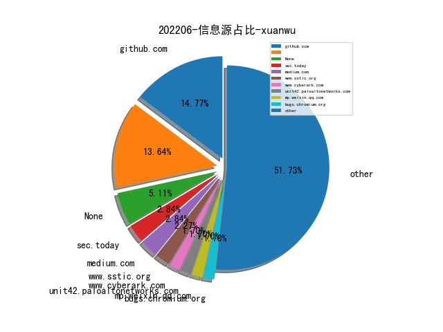
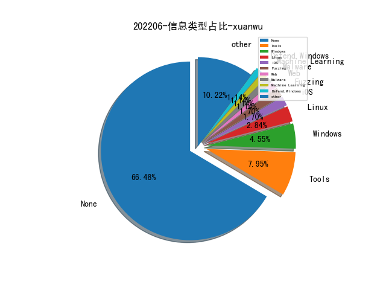

# [数据--所有](README_20.md)
# [数据--年度](README_2022.md)
# 202206 信息源与信息类型占比

# 微信公众号 推荐
| nickname_english | weixin_no | title | url| 
| --- | --- | --- | ---| 
| 安全学术圈 | secquan | APICraft: 为闭源的SDK库生成模糊的驱动程序 | https://mp.weixin.qq.com/s/rekrBOCzY9eldsoVgXzaEg | 1| 
| LoRexxar自留地 | lorexxars | SCA的困境和出路 | https://mp.weixin.qq.com/s/pV-3IXKBKDJbDiBxmOpEOA | 1| 

# 组织github账号 推荐
| github_id | title | url | org_url | org_profile | org_geo | org_repositories | org_people | org_projects | repo_lang | repo_star | repo_forks| 
| --- | --- | --- | --- | --- | --- | --- | --- | --- | --- | --- | ---| 

# 私人github账号 推荐
| github_id | title | url | p_url | p_profile | p_loc | p_company | p_repositories | p_projects | p_stars | p_followers | p_following | repo_lang | repo_star | repo_forks | 
| --- | --- | --- | --- | --- | --- | --- | --- | --- | --- | --- | --- | --- | --- | ---| 
| RoseSecurity | 西门子 APOGEE PXC 自动化控制器认证绕过漏洞（CVE-2017-9947）扫描器 | https://github.com/RoseSecurity/APOLOGEE | https://github.com/RoseSecurity?tab=followers | Hobbyist Hacker , Lifetime Learner | None | None | 11 | 0 | 71 | 0 | 0 | Lua | 0 | 0 | 1| 
| ManasHarsh | Web3 安全相关的资料收集 | https://github.com/ManasHarsh/Awesome-Web3-security | https://github.com/ManasHarsh?tab=followers | Cracking the web, a bit different than others | Bangalore | Netskope | 16 | 0 | 10 | 0 | 0 | Python,Shell | 0 | 0 | 1| 

# medium_xuanwu 推荐
| title | url| 
| --- | ---| 
| Honeysploit - 在公开漏洞利用代码中嵌入恶意代码攻击 Exploiter | https://curtbraz.medium.com/exploiting-the-exploiters-46fd0d620fd8| 

# medium_secwiki 推荐
| title | url| 
| --- | ---| 

# zhihu_xuanwu 推荐
| title | url| 
| --- | ---| 

# zhihu_secwiki 推荐
| title | url| 
| --- | ---| 

# xz_xuanwu 推荐
| title | url| 
| --- | ---| 

# xz_secwiki 推荐
| title | url| 
| --- | ---| 

# 日更新程序
`python update_daily.py`