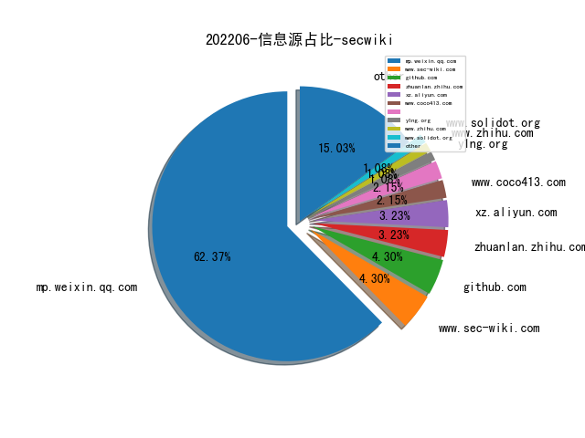

# [数据--所有](README_20.md)
# [数据--年度](README_2022.md)
# 202206 信息源与信息类型占比

# 微信公众号 推荐
| nickname_english | weixin_no | title | url| 
| --- | --- | --- | ---| 
| 这里是河马 | gh_f779ec60843d | 利用Confluence漏洞攻击的WebShell，河马已支持查杀 | https://mp.weixin.qq.com/s/I0XOcfJF9vMlT7YuwnANHA | 1| 
| 靖安科技 | jing-an-tech | 兰德深度报告-美国商业太空能力与市场概述 | https://mp.weixin.qq.com/s/7aC8RHMil--jTRms9jMU1A | 1| 
| 安全研究GoSSIP | GoSSIPSJTU | G.O.S.S.I.P 阅读推荐 2022-05-31 FirmSec | https://mp.weixin.qq.com/s/s7JwCRrzvF5kFc8aNvQ5xg | 1| 
| 专注安管平台 | gh_48603b9bb05a | 重新定义SOAR | https://mp.weixin.qq.com/s/aiaCgFRjGifPhPfZ4_lrkQ | 1| 
| JDArmy | gh_e9df6be6f498 | CobaltStrike WebServer特征分析 | https://mp.weixin.qq.com/s/hNFVTRINKbBiOQiOf0WTMA | 1| 
| 安全学术圈 | secquan | APICraft: 为闭源的SDK库生成模糊的驱动程序 | https://mp.weixin.qq.com/s/rekrBOCzY9eldsoVgXzaEg | 1| 
| LoRexxar自留地 | lorexxars | SCA的困境和出路 | https://mp.weixin.qq.com/s/pV-3IXKBKDJbDiBxmOpEOA | 1| 

# 组织github账号 推荐
| github_id | title | url | org_url | org_profile | org_geo | org_repositories | org_people | org_projects | repo_lang | repo_star | repo_forks| 
| --- | --- | --- | --- | --- | --- | --- | --- | --- | --- | --- | ---| 

# 私人github账号 推荐
| github_id | title | url | p_url | p_profile | p_loc | p_company | p_repositories | p_projects | p_stars | p_followers | p_following | repo_lang | repo_star | repo_forks | 
| --- | --- | --- | --- | --- | --- | --- | --- | --- | --- | --- | --- | --- | --- | ---| 
| rust-fuzz | honggfuzz-rs - 利用 Honggfuzz Fuzz Rust 代码 | https://github.com/rust-fuzz/honggfuzz-rs | None | None | None | None | 0 | 0 | 0 | 0 | 0 | HTML,Shell,C++,Rust | 0 | 0 | 1| 
| Threekiii | Awesome-Redteam: 一个红队知识仓库 | https://github.com/Threekiii/Awesome-Redteam | https://github.com/Threekiii?tab=followers |  | None | None | 9 | 0 | 3 | 0 | 0 | Python,C,HTML | 0 | 0 | 1| 
| RoseSecurity | 西门子 APOGEE PXC 自动化控制器认证绕过漏洞（CVE-2017-9947）扫描器 | https://github.com/RoseSecurity/APOLOGEE | https://github.com/RoseSecurity?tab=followers | Hobbyist Hacker , Lifetime Learner | None | None | 11 | 0 | 71 | 0 | 0 | Lua | 0 | 0 | 1| 
| ManasHarsh | Web3 安全相关的资料收集 | https://github.com/ManasHarsh/Awesome-Web3-security | https://github.com/ManasHarsh?tab=followers | Cracking the web, a bit different than others | Bangalore | Netskope | 16 | 0 | 10 | 0 | 0 | Python,Shell | 0 | 0 | 1| 

# medium_xuanwu 推荐
| title | url| 
| --- | ---| 
| 组合多个漏洞实现俄罗斯社交网站 VK 的 RCE | https://medium.com/@byq/from-open-redirect-to-rce-in-one-week-66a7f73fd082| 
| Honeysploit - 在公开漏洞利用代码中嵌入恶意代码攻击 Exploiter | https://curtbraz.medium.com/exploiting-the-exploiters-46fd0d620fd8| 

# medium_secwiki 推荐
| title | url| 
| --- | ---| 

# zhihu_xuanwu 推荐
| title | url| 
| --- | ---| 

# zhihu_secwiki 推荐
| title | url| 
| --- | ---| 
| Fuzzm: 针对WebAssembly内存错误的模糊测试 | https://zhuanlan.zhihu.com/p/523207785| 

# xz_xuanwu 推荐
| title | url| 
| --- | ---| 

# xz_secwiki 推荐
| title | url| 
| --- | ---| 
| ATT&CK矩阵的攻与防 | https://xz.aliyun.com/t/11347| 
| bandit工具分析 | https://xz.aliyun.com/t/11341| 
| 基于框架漏洞的代码审计实战 | https://xz.aliyun.com/t/11360| 

# 日更新程序
`python update_daily.py`