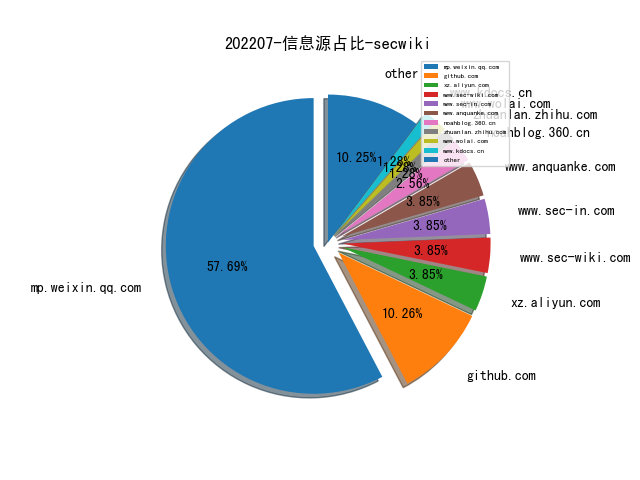
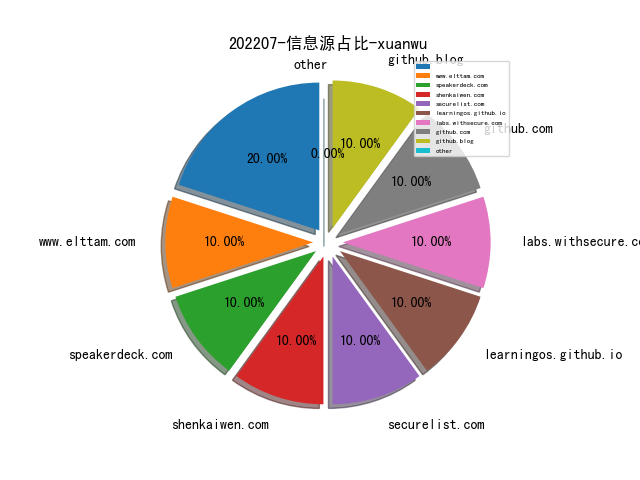
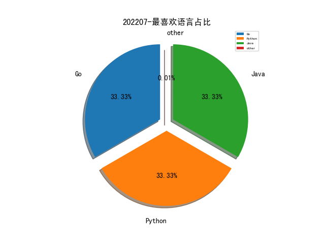

# [数据--所有](README_20.md)
# [数据--年度](README_2022.md)
# 202207 信息源与信息类型占比

# 微信公众号 推荐
| nickname_english | weixin_no | title | url| 
| --- | --- | --- | ---| 
| 绿盟科技研究通讯 | nsfocus_research | 万字长文：安全知识图谱技术概述 | https://mp.weixin.qq.com/s/22hnLdKtamtLyuGKrEWH1w | 1| 
| 拨开云雾 | Under_Sakura | 实时缺陷预测工具调研 | https://mp.weixin.qq.com/s/OkHvy5PV5bq6hVzqxoJx5g | 1| 
| 安全防御 | anquanfangyu | NeuVector----功能丰富且强大的容器安全开源软件 | https://mp.weixin.qq.com/s/vJsH8GATbiC7-nnu58SDWw | 1| 
| 美团技术团队 | meituantech | 可视化全链路日志追踪 | https://mp.weixin.qq.com/s/Er4-X8q5MKZZUgAUHyeLwA | 1| 
| PaperWeekly | paperweekly | 代码表征预训练语言模型学习指南：原理、分析和代码 | https://mp.weixin.qq.com/s/kQ3ARDM06mKnYdzEwuzVLg | 1| 
| 风炫安全 | fengxuansec | 一次曲折的代码审计+渗透+绕过WAF+提权实战 | https://mp.weixin.qq.com/s/hRwYtDZ-dqqznhS3LdSxUA | 1| 
| 莫哥谈安全 | gh_247dfbdf3d43 | 关于安全情报能力和应用的一些思考 | https://mp.weixin.qq.com/s/aHwhGY3YJX1EXUFvFzBLGg | 1| 
| 可信区块链推进计划 | gh_0416fd0ec88a | Web3发展前瞻研究｜研究报告先导预告 | https://mp.weixin.qq.com/s/NdrE-lmTsIZC8XRKEAZjNw | 1| 
| 360Quake空间测绘 | Quake360 | 对全网上一些JSONP蜜罐探索与识别 | https://mp.weixin.qq.com/s/C0F1ywUcQ6MhgNZZIXlFbA | 1| 
| 靖安科技 | jing-an-tech | 如何从 0 到 1 打造国防领域的产品 How to Invent Defense Products | https://mp.weixin.qq.com/s/droA3PllKFf_CSlEE4L-hQ | 1| 
| 银弹实验室 | gh_47f9ea34adbb | 物联网终端安全入门与实践之了解物联网终端 （上篇） | https://mp.weixin.qq.com/s/wOVTF99uKimmzzbnjy4tuw | 4| 
| 赵武的自留地 | gh_86033a4f818d | 我认为网络安全工具的未来：开篇 | https://mp.weixin.qq.com/s/imLgat7aQA-8NQoH-mxpYw | 1| 
| 火烈鸟的笔记本 | gh_518726335860 | websocket新型内存马的应急响应 | https://mp.weixin.qq.com/s/T3UfA1plrlG-e9lgfB4whg | 1| 
| C位数据谈 | C-DATALAW | 深度解读,从知网被查看网络安全审查 | https://mp.weixin.qq.com/s/T63Clvf90JNbTqW_E96B-A | 1| 
| 跳跳糖社区 | tttangsec | 从CICD漏洞靶场中学习持续集成安全 | https://mp.weixin.qq.com/s/7Wf42aLHyA2hc05sF6zLQw | 2| 
| 美团安全应急响应中心 | gh_83d9bb3b8ed0 | 安全通告 , 疑似PurpleFox多手段持续实施攻击活动 | https://mp.weixin.qq.com/s/Fca_oOiL8oLiEUXGaErWjQ | 1| 
| 我的安全视界观 | CANI_Security | 【应急能力提升4】实战应急响应经验 | https://mp.weixin.qq.com/s/mw30nX-frPRlbvshYmGP-Q | 3| 
| 布鲁队 | sz_blueteam | 攻防演练之域控检测篇 | https://mp.weixin.qq.com/s/676IFhrygqVK6RRvgNEhbQ | 2| 
| 字节跳动安全中心 | TouTiaoSec | 火山引擎CWPP(Elkeid) 真实对抗案例分享 | https://mp.weixin.qq.com/s/7aSoETGZvrXnQq66cujrUA | 1| 
| 威胁棱镜 | THREAT_PRISM | Bad Packet 测量在野 IoT 僵尸网络活动 | https://mp.weixin.qq.com/s/SxiUFJyWhl3BAe5u5yKytg | 3| 
| 内构安全 | gh_def0974405fe | 学术报告Slides：开源安全：挑战、解决方案和机遇-南洋理工大学刘杨教授 | https://mp.weixin.qq.com/s/YryG2EXFFod0D3fdIwILtA | 1| 
| 信息通信软件供应链安全社区 | gh_1b92fdc1f223 | 软件供应链安全社区 标准规范组｜软件供应链安全风险分析研究 | https://mp.weixin.qq.com/s/54z2GzyblD3PTfu7mZjm7Q | 1| 
| 网信中国 | cacweixin | 数据出境安全评估办法 | https://mp.weixin.qq.com/s/yy-jYDXf7Fwu_VmRC6WjfA | 1| 
| Web安全与前端 | sec_fe | 全国攻防演习的防守体系建设 | https://mp.weixin.qq.com/s/LjRArIoMVo0d1AKVBp4Irg | 1| 
| M01N Team | m01nteam | 自建可信钓鱼邮件服务器 | https://mp.weixin.qq.com/s/HJGyD-0TH5PxomP9xQK2WQ | 1| 
| CSDN | CSDNnews | 在软件工程领域，搞科研的这十年！ | https://mp.weixin.qq.com/s/mCJ2EJ_hzQOsrIVAhXiqpw | 1| 
| 神龙叫 | shen_long_jiao | 网空测绘--就是另一形态的Google | https://mp.weixin.qq.com/s/es1FvEA4970IEsdSmS6ARQ | 1| 
| 无线通信安全 | SateSec | 卫星“黑客”详解“卫星通信的安全缺陷” | https://mp.weixin.qq.com/s/TY0HXcUto5b2lNDX8pK9Yg | 2| 
| 放之 | ECyberSecurity | 设计你的安全架构OKR | https://mp.weixin.qq.com/s/MUV-TAw0AkCI3sAhaHxK1g | 1| 
| 安全行者老霍 | gh_c2b78e839fd7 | Mandiant网络威胁情报分析师核心能力框架 | https://mp.weixin.qq.com/s/FPh4IKJulmhaK1MGAA89lg | 1| 
| 安全牛 | aqniu-wx | 拟态防御技术详解（核心技术篇） | https://mp.weixin.qq.com/s/Hcp2pqYX7wo7a0rZVnf5Gg | 1| 
| 安全学术圈 | secquan | 基于图注意网络的跨安全数据库实体关系预测 | https://mp.weixin.qq.com/s/v4F4UEaKeq8N2-hCuPRtcw | 4| 
| 华为安全 | HuaweiSecurity | RSAC2022解读丨人工智能安全洞察—在对抗中前进 | https://mp.weixin.qq.com/s/EoLBu75UYlF9DJ2Ff_oyBw | 1| 
| 信息安全与通信保密杂志社 | cismag2013 | 从2023财年预算看美国网络发展动向 | https://mp.weixin.qq.com/s/MbB6ntgCqWkGRDfVIcZO9w | 1| 
| 中国指挥与控制学会 | c2_china | 陆军院士：陆海空天一体化信息网络发展研究 | https://mp.weixin.qq.com/s/rr-t9NScVRzqVV7bzCp9Hg | 1| 

# 私人github账号 推荐
| github_id | title | url | p_url | p_profile | p_loc | p_company | p_repositories | p_projects | p_stars | p_followers | p_following | repo_lang | repo_star | repo_forks | 
| --- | --- | --- | --- | --- | --- | --- | --- | --- | --- | --- | --- | --- | --- | ---| 
| zan8in | afrog 发布 Release 1.3.6 漫天星辰 | https://github.com/zan8in/afrog/releases/tag/v1.3.6 | https://github.com/zan8in?tab=followers | 美丽人生，享受生活！- life is fantastic. enjoy life. | None | None | 19 | 0 | 123 | 0 | 0 | Go | 0 | 0 | 1| 
| teamssix | cf: 云环境利用框架 Cloud Exploitation Framework | https://github.com/teamssix/cf | https://github.com/teamssix?tab=followers | Personal WeChat Public Account: TeamsSix ,, Red Team ,, WgpSec Member ,, Cloud Security ,, HuoCorp | Beijing, China | @HuoCorp @wgpsec | 62 | 0 | 325 | 0 | 0 | Go,Shell,HCL | 0 | 0 | 1| 
| p0dalirius | 可以强制 Windows 通过 RPC 认证攻击者控制的机器的一些协议和方法 | https://github.com/p0dalirius/windows-coerced-authentication-methods | https://github.com/p0dalirius?tab=followers | Security Researcher 🕵️‍♂️ , Speaker 📣 | [object Object] | Podalirius | 68 | 0 | 9 | 0 | 0 | Python,Dockerfile | 0 | 0 | 1| 
| mandiant | 利用污点分析技术在 .NET 汇编层面检测漏洞 | https://github.com/mandiant/route-sixty-sink | None | None | None | None | 0 | 0 | 0 | 0 | 0 | YARA,VBA,Vue,Python,Max,C,C++,C#,PowerShell | 0 | 0 | 1| 
| lcvvvv | Kscan: 一款纯go开发的全方位扫描器 | https://github.com/lcvvvv/kscan/ | https://github.com/lcvvvv?tab=followers | Talk is cheap. Show me the code | Changsha | None | 7 | 1 | 91 | 0 | 0 | Go | 0 | 0 | 1| 
| kubesphere | KubeEye - 为 Kubernetes 设计的巡检工具，用于发现 Kubernetes 资源（使用 OPA ）、集群组件、集群节点（使用Node-Problem-Detector）等配置是否符合最佳实践 | https://github.com/kubesphere/kubeeye | None | None | None | None | 0 | 0 | 0 | 0 | 0 | SCSS,Shell,Java,Jinja,JavaScript,HTML,Go,Dockerfile,Mustache | 0 | 0 | 1| 
| gusmanb | 一款开源的 24 通道软硬件逻辑分析仪 | https://github.com/gusmanb/logicanalyzer | https://github.com/gusmanb?tab=followers |  | Spain | None | 54 | 0 | 26 | 0 | 0 | C#,Makefile | 0 | 0 | 1| 
| e-m-b-a | EMBA - The firmware security analyzer | https://github.com/e-m-b-a/emba | None | None | None | None | 0 | 0 | 0 | 0 | 0 | Python,Shell,HTML | 0 | 0 | 1| 
| citronneur | pamspy - 利用 eBPF 技术 dump Linux 认证凭据 | https://github.com/citronneur/pamspy | https://github.com/citronneur?tab=followers |  | Toulouse, France | @airbus-cert | 32 | 0 | 723 | 0 | 0 | Python,C#,C,Rust | 0 | 0 | 1| 
| achuna33 | MYExploit: OAExploit一款基于产品的一键扫描工具。 | https://github.com/achuna33/MYExploit | https://github.com/achuna33?tab=followers |  | None | None | 13 | 1 | 35 | 0 | 0 | Python,Java | 0 | 0 | 1| 
| Yavuzlar | VulnLab: Web Application Vulnerabilities Lab | https://github.com/Yavuzlar/VulnLab | None | None | None | None | 0 | 0 | 0 | 0 | 0 | Go,CSS | 0 | 0 | 1| 
| TROUBLE-1 | Vajra - Your Weapon To Cloud | https://github.com/TROUBLE-1/Vajra | https://github.com/TROUBLE-1?tab=followers | Raunak Parmar is an information security professional whose areas of interest include web penetration testing, Azure/AWS security, code review, and scripting. | India | None | 9 | 0 | 1 | 0 | 0 | Python,PHP,CSS | 0 | 0 | 1| 
| RiccardoAncarani | 基于 RPC 和 DCOM 的渗透测试横向渗透 | https://github.com/RiccardoAncarani/talks/blob/master/F-Secure/unorthodox-lateral-movement.pdf | https://github.com/RiccardoAncarani?tab=followers | Security Consultant @ F-Secure Corporation | London, United Kingdom | F-Secure Corporation | 56 | 0 | 465 | 0 | 0 | Python,C#,C | 0 | 0 | 1| 
| Orange-Cyberdefense | GOAD - Active Directory 渗透测试实验环境 | https://github.com/Orange-Cyberdefense/GOAD | None | None | None | None | 0 | 0 | 0 | 0 | 0 | Python,C,PHP,Ruby,PowerShell | 0 | 0 | 1| 
| GhostPack | Koh - 通过 “Internal Monologue Attack” 窃取 Windows 认证凭据的工具 | https://github.com/GhostPack/Koh | None | None | None | None | 0 | 0 | 0 | 0 | 0 | C#,Jupyter,PowerShell | 0 | 0 | 1| 

# medium 推荐
| title | url| 
| --- | ---| 
| Inside JavaScript Engines 系列文章之代码生成与优化 | https://medium.com/@yanguly/inside-javascript-engines-part-2-code-generation-and-basic-optimizations-952bed02db62| 
| WMI Internals Part 1 | https://jsecurity101.medium.com/wmi-internals-part-1-41bb97e7f5eb| 

# 知乎 推荐
| title | url| 
| --- | ---| 
| 图结构的相似度度量与分类 | https://zhuanlan.zhihu.com/p/63411717| 

# 论坛 推荐
| title | url| 
| --- | ---| 
| 记一次授权非域环境下的大型内网横向渗透 | https://xz.aliyun.com/t/11579| 
| 基于开源工具实现软件成分分析SCA | https://xz.aliyun.com/t/11492| 
| 记一次Jira的搭建和相关利用 | https://xz.aliyun.com/t/11491| 

# 日更新程序
`python update_daily.py`