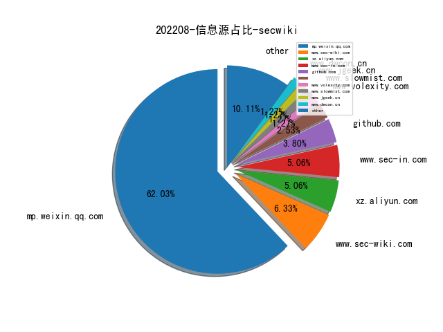
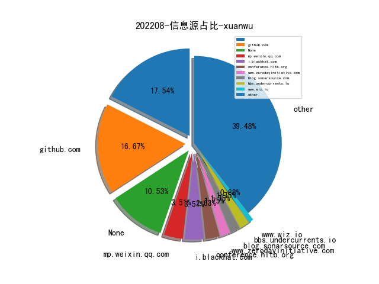
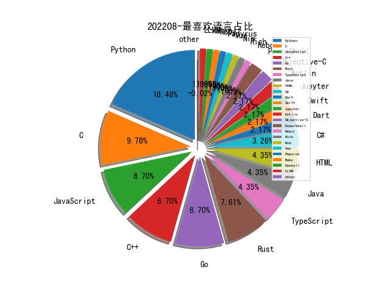

# [数据--所有](README_20.md)
# [数据--年度](README_2022.md)
# 202208 信息源与信息类型占比

# 学习视频 推荐
| title | url| 
| --- | ---| 
| 科研与英文学术论文写作 | https://space.bilibili.com/301285406/channel/collectiondetail?sid=535567| 

# 微信公众号 推荐
| nickname_english | weixin_no | title | url| 
| --- | --- | --- | ---| 
| 渗透测试研究中心 | AdSecurity | Windows域内横向渗透实例 | https://mp.weixin.qq.com/s/BJgFvET4VhCEw_ZNr5G6tg | 1| 
| 深潜之眼 | sqzy_20000129 | 匿名：《红队攻击安全配置》 | https://mp.weixin.qq.com/s/bK1Ku5y74kB4nKsL9kQjvQ | 1| 
| 梦之光芒的电子梦 | monyer_mp | 如何开展蓝军工作与量化评估 | https://mp.weixin.qq.com/s/Zwa4wnKon-GYPb8ohb9miA | 1| 
| 安全小黄鸭 | sec-duck | 我与入侵检测的二三事儿 | https://mp.weixin.qq.com/s/ZBHY-R2E7bzV17-jhfj4hA | 1| 
| 受益所有人 | bownercn | 2022半年度反洗钱处罚信息汇总及分析 | https://mp.weixin.qq.com/s/tx50eeAsJIIk6yfDf1qgjw | 1| 
| VLab Team | gh_79bd49e6c134 | Ruby安全漫谈 | https://mp.weixin.qq.com/s/ECLwMbbrf9lWXkhbUergXg | 1| 
| Day1安全团队 | gh_123cbbc95fc3 | 固件渗透的攻防之路 | https://mp.weixin.qq.com/s/YuS1tvbYRyM0iLWmniCdJg | 1| 
| 北京大学前沿计算研究中心 | pku-cfcs | IJTCS-FAW 2022 , 机器学习与形式化方法分论坛精彩回顾 | https://mp.weixin.qq.com/s/KkpY8zURFj-WM7zD25lYrQ | 1| 
| twt企业IT社区 | talkwithtrend | 某农信企业自主创新自动化安全基线检测平台建设实践 | https://mp.weixin.qq.com/s/-3ec660soSUFmngRjEvF8g | 1| 
| 深信服千里目安全实验室 | Further_eye | 【云攻防系列】从攻击者视角聊聊K8S集群安全（上） | https://mp.weixin.qq.com/s/dcCPx0ETiT2QlRTS1ToVAw | 1| 
| 夏虫知冰 | sectistic | 论如何优雅的注入Java Agent内存马 | https://mp.weixin.qq.com/s/xxaOsJdRE5OoRkMLkIj3Lg | 1| 
| 天御攻防实验室 | TianyuLab | 数字取证与事件响应（DFIR）优质资源推荐 | https://mp.weixin.qq.com/s/ECHOFktRc7x7O7xnXYjUZA | 1| 
| FreeBuf | freebuf | 解读 , 细谈新版企业风险评估模型 | https://mp.weixin.qq.com/s/sRV17YzvxEcLhk_2kgmKkQ | 1| 
| 网络安全游魂 | gh_190663b0fe76 | 安全运营中心能力成熟度模型专题【三】-金融行业能力安全运营能力成熟度模型（FCSO-CMM） | https://mp.weixin.qq.com/s/Hf3haBk1kxCk3uZnJ7FCCQ | 1| 
| 白日放歌须纵9 | Day_Dreamer_BR | 演化的大安全体系框架 | https://mp.weixin.qq.com/s/oSJXlY7pE1xIO-P51lR2Fw | 1| 
| 慢雾科技 | SlowMist | 慢雾：Solana 公链大规模盗币事件的分析（续） | https://mp.weixin.qq.com/s/YJgPNYykr2P1j2yHseJ2tQ | 2| 
| 关键信息基础设施安全保护联盟筹 | gh_1c74abeb39a6 | 院士观点, 冯登国：关键信息基础设施安全保护三大关键能力 | https://mp.weixin.qq.com/s/smY0WuXqmG4sFzjsEIv8tg | 1| 
| 360漏洞研究院 | gh_9dfd76b8e0c2 | 技术前瞻｜AdobeReader逻辑漏洞分享(CVE-2021-21037) | https://mp.weixin.qq.com/s/tjyTMrgbbqX8ljZyZGwovw | 1| 
| 360威胁情报中心 | CoreSec360 | 立足于“看见”：基于海量样本数据的高级威胁发现 | https://mp.weixin.qq.com/s/s3jTwk-D--b6hX-1N_sBXg | 1| 
| 网络安全观 | SecurityInsights | 云隔离的梦想 | https://mp.weixin.qq.com/s/RjoLmNVCx0gUhPM3Psk74g | 2| 
| 绿盟科技威胁情报 | NSFOCUS_NTI | 鼹鼠行动--针对QNAP网络存储设备的大规模攻击活动，或成勒索温床 | https://mp.weixin.qq.com/s/ua7KrEP5yWbvNHfCULgn8g | 1| 
| 穿过丛林 | gh_f90eac70537b | 2022年实验室暑期年会前瞻报告（二）戴小海：浅谈NFT, Web3 和元宇宙（PPT） | https://mp.weixin.qq.com/s/l11SP7Nni-CZ__y3DEVX1Q | 1| 
| 安全分析与研究 | MalwareAnalysis | 谈谈安全对抗的本质 | https://mp.weixin.qq.com/s/9ugyhDvtrJLds_1C1nBosw | 1| 
| 安全内参 | anquanneican | Black Hat 2022上最值得关注的十大议题 | https://mp.weixin.qq.com/s/urcX3HeERhAPmNYp_9K6BA | 1| 
| 奇安信威胁情报中心 | gh_166784eae33e | 红雨滴云沙箱视角看攻防演练：样本类攻击手法总结 | https://mp.weixin.qq.com/s/v4V-hwhCi1nehvwZarCkbA | 1| 
| 中国计算机学会 | ccfvoice | 联手数据库专业委员会：“无数据知识蒸馏”术语发布 , CCF术语快线 | https://mp.weixin.qq.com/s/I9TlQ9zrIA0NoHl6_1_Fgw | 1| 
| Tide安全团队 | TideSec | Selenium自动化入坑指南 | https://mp.weixin.qq.com/s/rlCyeObSbehkl2At_Dmtjg | 1| 
| ATEC | Alipay_SecurityLab | 【武汉大学王骞分享】从数据视角看，如何安全地实现更好的AI | https://mp.weixin.qq.com/s/u3lnWpACDETKBJfjxUq6RQ | 1| 
| ADLab | v_adlab | Linux内核nftables子系统研究与漏洞分析 | https://mp.weixin.qq.com/s/ILyBUq--PK01TvNF8Vh9KQ | 2| 
| RapidDNS | gh_6327c9075859 | 如何导入数十亿DNS数据到Elasticsearch中 | https://mp.weixin.qq.com/s?__biz=Mzg4NDU0ODMxOQ==&mid=2247485732&idx=1&sn=2f463548ba8daa2e590dea411e2bc3bb&chksm=cfb73e94f8c0b7823030120c8c75854533298382eaf988b2cbc24ba442ce27abcd6540f1c494&mpshare=1&srcid=0808oUtL1W6cOXwoI4PGumHP&sharer_sharetime=16 | 4| 
| 威胁棱镜 | THREAT_PRISM | VirusTotal 恶意软件滥用信任总结报告 | https://mp.weixin.qq.com/s/z2weLJi3nhgBHZ6wWzkueg | 2| 
| 一个人的安全笔记 | xjiek2015 | [HTB] Europa Writeup | https://mp.weixin.qq.com/s/w2-nMCLqrkxKKivmTB7khw | 4| 
| CodeWisdom | gh_2395906a410f | 技术科普 , 浅谈开源软件供应链风险 | https://mp.weixin.qq.com/s/OZevgo1K3rdP-R0oo0uTng | 1| 
| 君哥的体历 | jungedetili | 刘志诚：安全控制有效性验证的发展趋势浅论 | https://mp.weixin.qq.com/s/QEcrByo-j0tK9430zzlSbA | 2| 
| Coggle数据科学 | gh_8df601c10cb4 | Kaggle知识点：时序预测基础知识 | https://mp.weixin.qq.com/s/9eVI-US6vzZmokQWHtHxWQ | 1| 
| 中国信息安全 | chinainfosec | 前沿 , 美国关键基础设施网络防御路线发展与调整 | https://mp.weixin.qq.com/s/V2YgN6QOVQksbqiAv-F9Aw | 3| 
| 跳跳糖社区 | tttangsec | 浅析Vmess流量与强网杯2022谍影重重 | https://mp.weixin.qq.com/s/RKFNtrRWzaAOVIZK4vCiJw | 2| 
| 绿盟科技 | NSFOCUS-weixin | 云计算安全的新阶段：云上风险发现与治理 | https://mp.weixin.qq.com/s/y5NRDQl6MUrxI2ZI1lCJPQ | 2| 
| 小晨说数据 | flink-spark | 数据治理宝典！从0-1搭建企业级数据治理体系 | https://mp.weixin.qq.com/s/YvH7V1vivriHRYYMlaj-xQ | 1| 

# 私人github账号 推荐
| github_id | title | url | p_url | p_profile | p_loc | p_company | p_repositories | p_projects | p_stars | p_followers | p_following | repo_lang | repo_star | repo_forks | 
| --- | --- | --- | --- | --- | --- | --- | --- | --- | --- | --- | --- | --- | --- | ---| 
| wuba | Antenna: 漏洞辅助验证存在与可利用性平台 | https://github.com/wuba/Antenna | None | None | None | None | 0 | 0 | 0 | 0 | 0 | TypeScript,Java,Python,JavaScript,Dart,Objective-C | 0 | 0 | 1| 
| wavestone-cdt | EDR 检测机制以及用 EDRSandblast 工具逃逸 EDR 的检测 | https://github.com/wavestone-cdt/EDRSandblast/tree/DefCon30Release | https://github.com/wavestone-cdt?tab=followers | Projects from the auditors and consultants from Wavestones Cybersecurity & Digital Trust practice | None | Wavestone | 14 | 0 | 0 | 0 | 0 | Python,C | 0 | 0 | 1| 
| therealdreg | 用于实现基于 Bochs 的 Linux 内核调试的工具 | https://github.com/therealdreg/bochs_linux_kernel_debugging | https://github.com/therealdreg?tab=followers | Senior Malware Researcher, OS Internals, C/C++, x86 x64 ASM, reversing, forensics, hardware hacking, AVR, ARM Cortex | Spain | rootkit.es | 60 | 0 | 68 | 0 | 0 | Python,C,C++ | 0 | 0 | 1| 
| shmilylty | netspy-快速探测内网可达网段工具 | https://github.com/shmilylty/netspy | https://github.com/shmilylty?tab=followers | Developer, pentester and bug hunter. | localhost | None | 84 | 0 | 2500 | 0 | 0 | Python,Go,Vue | 0 | 0 | 1| 
| matanolabs | Matano - 基于 Apache Iceberg 等项目搭建的 PB 级 Security Lake 数据平台 | https://github.com/matanolabs/matano | None | None | None | None | 0 | 0 | 0 | 0 | 0 | Rust | 0 | 0 | 1| 
| markakd | DirtyCred - 利用 Kernel Credentials Swap 实现提权的利用方法 | https://github.com/markakd/dirtycred | https://github.com/Markakd?tab=followers | PhD at Northwestern University | None | None | 12 | 0 | 350 | 0 | 0 | Python,C,LLVM | 0 | 0 | 1| 
| loov | Go 语言汇编和源码查看工具 | https://github.com/loov/lensm | None | None | None | None | 0 | 0 | 0 | 0 | 0 | Go,HTML | 0 | 0 | 1| 
| ihebski | 渗透测试实战笔记 | https://github.com/ihebski/A-Red-Teamer-diaries | https://github.com/ihebski?tab=followers | Security Operations Engineer (⌐■_■) , Pentester , Bughunter | Error: Unable to resolve | None | 62 | 0 | 644 | 0 | 0 | Python,HTML,Jupyter | 0 | 0 | 1| 
| google-research | Google 发起从训练模型中逆向还原出训练数据集的安全挑战 | https://github.com/google-research/lm-extraction-benchmark | None | None | None | None | 0 | 0 | 0 | 0 | 0 | Python,Haskell,Jupyter,C++ | 0 | 0 | 1| 
| gmh5225 | 游戏安全方向的资料整理 | https://github.com/gmh5225/awesome-game-security | https://github.com/gmh5225?tab=followers | Im waiting for the new world to come | New World | Metaverse | 3500 | 0 | 1300 | 0 | 0 | Rebol,C,TypeScript,Java,Python,Kotlin,JavaScript,Papyrus,C++,C#,HTML,Go,Rust | 0 | 0 | 1| 
| fullstorydev | grpcurl - 与 gRPC 服务交互的类 curl 命令行工具 | https://github.com/fullstorydev/grpcurl | None | None | None | None | 0 | 0 | 0 | 0 | 0 | TypeScript,Java,Python,JavaScript,Go,Swift | 0 | 0 | 1| 
| fingerprintjs | 设备指纹框架 FingerprintJS 的 Android 版本 | https://github.com/fingerprintjs/fingerprintjs-android | None | None | None | None | 0 | 0 | 0 | 0 | 0 | Kotlin,TypeScript,Swift,JavaScript,Dart | 0 | 0 | 1| 
| evilsocket | jscythe - 滥用 node.js inspector 机制实现任意 JS 代码执行 | https://github.com/evilsocket/jscythe | https://github.com/evilsocket?tab=followers |  | Italy | None | 147 | 0 | 20 | 0 | 0 | Go,Python,JavaScript,Rust | 0 | 0 | 1| 
| edwardz246003 | COMRACE Detecting Data Race Vulnerabilities in COM Objects | https://github.com/edwardz246003/presentations/blob/main/Usenix%20Security%202022/%E3%80%90Usenix%202022%20slides%E3%80%91COMRACE%20Detecting%20Data%20Race%20Vulnerabilities%20in%20COM%20Objects.pdf | https://github.com/edwardz246003?tab=followers | @edwardzpeng | None | None | 3 | 0 | 6 | 0 | 0 | Python | 0 | 0 | 1| 
| d4rckh | gorilla - 用于生成密码字段的工具 | https://github.com/d4rckh/gorilla | https://github.com/d4rckh?tab=followers | young man from romania with security as a hobby | Romania | None | 87 | 0 | 342 | 0 | 0 | Rust,Nim | 0 | 0 | 1| 
| binarly-io | FwHunt Scanner - 在 UEFI 固件中扫描漏洞的工具 | https://github.com/binarly-io/fwhunt-scan | None | None | None | None | 0 | 0 | 0 | 0 | 0 | Python,Go,JavaScript,C++ | 0 | 0 | 1| 
| TheOfficialFloW | 研究员 theflow0 公开了 PS5/PS4 BD-JB Exploits 的源码 | https://github.com/TheOfficialFloW/bd-jb | https://github.com/TheOfficialFloW?tab=followers | Information Security Engineer | Zurich | None | 36 | 0 | 48 | 0 | 0 | C | 0 | 0 | 1| 
| SinaKarvandi | 从头构建一个 Hypervisor | https://github.com/SinaKarvandi/Hypervisor-From-Scratch | https://github.com/HyperDbg | Windows⁦ Internals Enthusiast. Interested in low-level programming. I work on @HyperDbg debugger. | None | None | 14 | 0 | 20 | 0 | 0 | C#,C,JavaScript,C++ | 0 | 0 | 1| 
| P1sec | QCSuper - 与基于高通芯片手机通信的工具，支持抓取 2G/3G/4G无线帧数据 | https://github.com/P1sec/QCSuper | None | None | None | None | 0 | 0 | 0 | 0 | 0 | Python,Java,Rust | 0 | 0 | 1| 
| Muirey03 | iOS 15.6 昨天修复的 APFS CVE-2022-32832 漏洞的 PoC | https://github.com/Muirey03/CVE-2022-32832 | https://github.com/Muirey03?tab=followers |  | None | @Elementalsthegame | 56 | 0 | 16 | 0 | 0 | Objective-C,C | 0 | 0 | 1| 
| MWR-CyberSec | PXEThief - 利用 Windows 的终端部署功能 SCCM 导出密码 | https://github.com/MWR-CyberSec/PXEThief | None | None | None | None | 0 | 0 | 0 | 0 | 0 | Python,C,PowerShell | 0 | 0 | 1| 
| Kudaes | Elevator - UAC Bypass by abusing RPC and debug objects | https://github.com/Kudaes/Elevator | https://github.com/Kudaes?tab=followers | nt authority\kurosh | Madrid | None | 9 | 0 | 276 | 0 | 0 | C#,C++,Rust | 0 | 0 | 1| 
| Esonhugh | 云安全入门材料 | https://github.com/Esonhugh/Attack_Code | https://github.com/Esonhugh?tab=followers | Esonhugh is computer noob. Su-Team member/Red Team?/`cloud` security?/(in)dependent security researcher/pentester?/evasion lover?/focus on TTP/INTP | in Cloud | Eson Network | 66 | 0 | 742 | 0 | 0 | Python,Go,Ruby | 0 | 0 | 1| 
| BlackINT3 | OpenArk - Windows 平台开源 anti-rootkit 工具 | https://github.com/BlackINT3/OpenArk | https://github.com/BlackINT3?tab=followers | Focus in crafting 2022 | None | None | 8 | 0 | 39 | 0 | 0 | C++ | 0 | 0 | 1| 
| 0xrawsec | 为 Windows 开发的开源版本 EDR | https://github.com/0xrawsec/whids | None | None | None | None | 0 | 0 | 0 | 0 | 0 | Go,Python,HTML,PowerShell,Rust | 0 | 0 | 1| 
| 0vercl0k | Paracosme - Pwn2Own 比赛研究员利用 zero-click RCE 漏洞攻破 ICONICS Genesis64 工控软件的细节 | https://github.com/0vercl0k/paracosme | https://github.com/0vercl0k?tab=followers |  | US/FR | None | 35 | 0 | 4 | 0 | 0 | Python,C,JavaScript,Rich,C++ | 0 | 0 | 1| 

# 论坛 推荐
| title | url| 
| --- | ---| 
| 对云函数隐藏C2技术的防御反制思路 | https://xz.aliyun.com/t/11625| 
| SnakeYaml反序列化 | https://xz.aliyun.com/t/11599| 
| Executor内存马的实现 | https://xz.aliyun.com/t/11593| 
| MSF多层内网渗透全过程 | https://xz.aliyun.com/t/11588| 

# 日更新程序
`python update_daily.py`