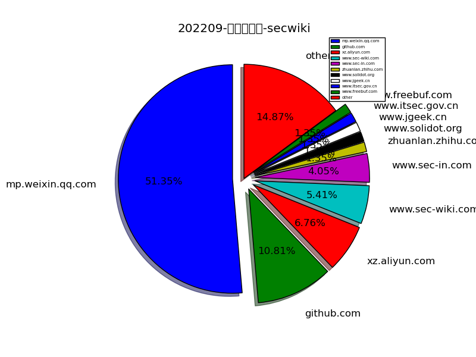
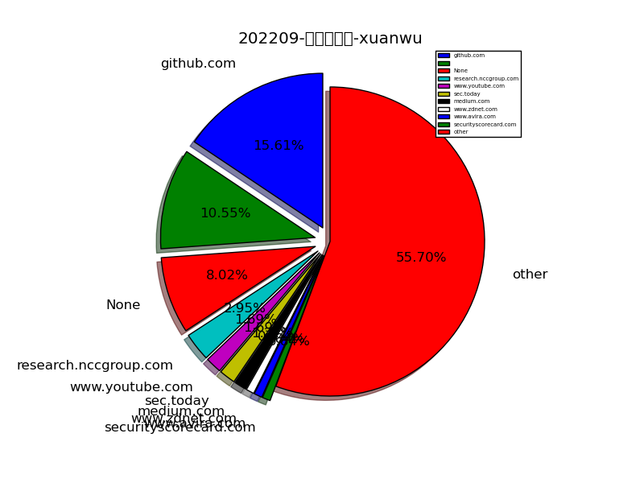
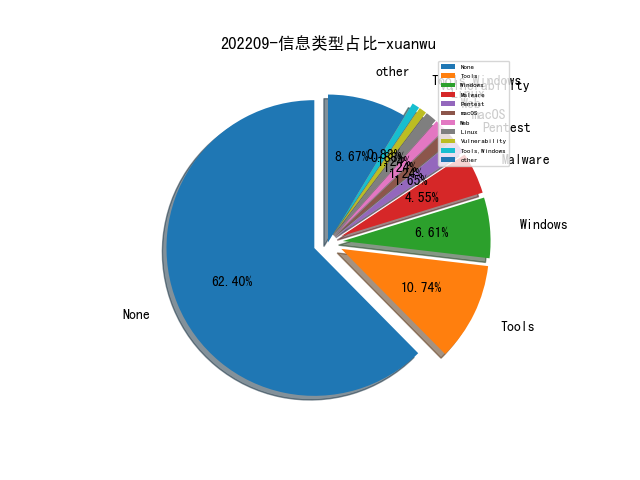
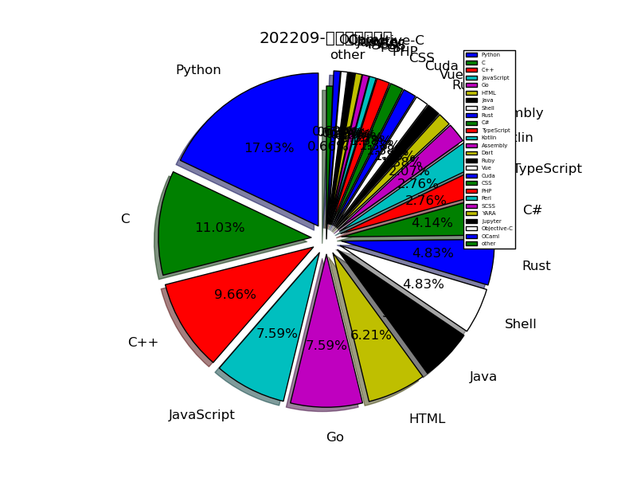

# [数据--所有](README_20.md)
# [数据--年度](README_2022.md)
# 202209 信息源与信息类型占比

# 微信公众号 推荐
| nickname_english | weixin_no | title | url| 
| --- | --- | --- | ---| 
| 拨开云雾 | Under_Sakura | 一种基于深度学习的语句级缺陷预测方法 | https://mp.weixin.qq.com/s/G1R_yvRgDKIljTZ-bKzysw | 1| 
| 中国保密协会科学技术分会 | gh_be4f21d557c0 | 软件安全实体关系预测简介 | https://mp.weixin.qq.com/s/mrQQhaBXA39YBDov-cwGnw | 1| 
| 云图全景Snapano | yuntuzhuanlan | 云安全趋势分享（2022年底） | https://mp.weixin.qq.com/s/U3tQfZoLsJv_PoDAJmzcMg | 1| 
| ADLab | v_adlab | 针对VMware云虚拟化平台的定制化攻击专题分析 | https://mp.weixin.qq.com/s/q596eajzFfrr45ErMYPQVA | 1| 
| 默安逐日实验室 | gh_995a1a9f25b5 | 红队视角下的AWS横向移动 | https://mp.weixin.qq.com/s/Q0iiRJ53BwuU4LHynR4qWQ | 1| 
| VLab Team | gh_79bd49e6c134 | 针对U盘文件的盗与防攻略 | https://mp.weixin.qq.com/s/LcgSc2lNBS6iQgHO88vmKg | 1| 
| 赛博攻防悟道 | lookvul | 加密流量安全背后的那些小秘闻 | https://mp.weixin.qq.com/s/1J1HNdA2wZF93-K-e7Pg8Q | 1| 
| 绿盟科技研究通讯 | nsfocus_research | 基于统一结构生成的网安信息抽取研究 | https://mp.weixin.qq.com/s/SRLy7GTNIoIQzfl_S9hVdQ | 1| 
| 绝对防御局 | Absolute-Defense | 终端入侵检测及防御规避之旅 | https://mp.weixin.qq.com/s/hJlSZ4iZ5kSJNTGngD9zMg | 1| 
| 看雪学苑 | ikanxue | 2022羊城杯竞赛 Web题目解析 | https://mp.weixin.qq.com/s/-VMqjIR3-9-hDlHxsHVtFQ | 1| 
| 电驭叛客 | Cyber-Hack | Cloud Native PostgreSQL攻击面分析 | https://mp.weixin.qq.com/s/uYJqM8pXJJF85LTW08r48Q | 1| 
| 迪哥讲事 | growing0101 | 挖洞方法与心态系列-揭露大佬挖主应用的一般性流程(版本1) | https://mp.weixin.qq.com/s?__biz=MzIzMTIzNTM0MA==&mid=2247486332&idx=1&sn=238328c005b23ec39e375bb0f4f57652&chksm=e8a6011fdfd1880929ce3b1c3207ae1caf8827f845881fa110daab3a10f6177df3483ca77eea&token=798508684&lang=zh_CN#rd | 6| 
| 数据治理体系 | DGsystem | 0到1搭建企业级数据治理体系 | https://mp.weixin.qq.com/s/nUU0waB3Z9r-f27fHQpqdQ | 1| 
| 渗透测试研究中心 | AdSecurity | JWT认证攻击详解总结 | https://mp.weixin.qq.com/s/kfB0ovlafuAcoI5yEEkDEQ | 1| 
| 安全分析与研究 | MalwareAnalysis | 针对Uber被黑客攻击事件的简单分析 | https://mp.weixin.qq.com/s/QKt-nM-3kWEUksNTovyJrQ | 1| 
| BinSec | binsec010 | GoTestWAF: 自动化评估Web应用程序安全 | https://mp.weixin.qq.com/s/RZplLKYua6J-JQztxGXS6A | 1| 
| 中国政法大学数据合规研究中心 | CUPLDataCompliance | 一文区分个人信息、敏感个人信息和隐私信息 | https://mp.weixin.qq.com/s/7RKpZTC6421CUE6lj1scAQ | 1| 
| SecUN安全村 | sec-un | 一个科技平台型企业的网络安全建设心得｜科技创新型企业专刊·安全村 | https://mp.weixin.qq.com/s/y_4A2gehmSPCoy8f2xNOPQ | 2| 
| 网络安全观 | SecurityInsights | 网络安全的三大支柱和攻击向量 | https://mp.weixin.qq.com/s/BJ9XIncEI7O2NWPeTNk2uA | 1| 
| 民生运维人 | CMBCOPER | 民生银行-网络智能流量编排探索 | https://mp.weixin.qq.com/s/dd6KCmUfosEKpPkTF-rXRw | 1| 
| 平安集团安全应急响应中心 | PSRC_Team | 内网渗透软件-BloodHound使用指南 | https://mp.weixin.qq.com/s/M2LQjojTc7tk7eL_vD2lgQ | 1| 
| leveryd | gh_8d7f6ed4daff | 基于netfilter的后门 | https://mp.weixin.qq.com/s/UL7Rd56MtSB6If_Tu_2N7w | 1| 
| 千寻安服 | scaf_0123 | 安服笔记：存储桶学习与漏洞挖掘 | https://mp.weixin.qq.com/s/BDNv0Wal31nQMcobXwFK-w | 1| 
| 哔哩哔哩技术 | bilibili-TC | B站流式传输架构的前世今生 | https://mp.weixin.qq.com/s/NawxeiP-_DFpyoekRrzlLQ | 2| 
| 一个人的安全笔记 | xjiek2015 | [HTB] Chatterbox Writeup | https://mp.weixin.qq.com/s/UG7J5k_B7ECMal3T3v_v9A | 2| 
| 威胁棱镜 | THREAT_PRISM | OPSWAT 2022 年恶意软件分析调查报告 | https://mp.weixin.qq.com/s/j3svmn0grpjM-QOgaYXvUg | 3| 
| 金融电子化 | fcmag1993 | 实战 , 商业银行安全纵深防御体系探索与实践 | https://mp.weixin.qq.com/s/wwqlQ62f1f_Vju7hmcqbTQ | 1| 
| 酒仙桥六号部队 | anfu-360 | 代码审计之路之白盒挖掘机 , 技术精选0143 | https://mp.weixin.qq.com/s/jJ3iBNUnFFJOgJnf5mJ6TQ | 1| 
| 安全防御 | anquanfangyu | 安全防御体系建设 | https://mp.weixin.qq.com/s/2sfIhibIVTghRk723x5eog | 1| 
| 信息安全与通信保密杂志社 | cismag2013 | 新型数据中心网络安全体系研究 | https://mp.weixin.qq.com/s/25W_SB9OOhPNjxFHzz8oYw | 1| 
| K8实验室 | K8-lab | 6种方法探测Cisco设备版本 | https://mp.weixin.qq.com/s/L6WWJIHMaoz7Ot8IoDlg-A | 1| 

# 组织github账号 推荐
| github_id | title | url | org_url | org_profile | org_geo | org_repositories | org_people | org_projects | repo_lang | repo_star | repo_forks| 
| --- | --- | --- | --- | --- | --- | --- | --- | --- | --- | --- | ---| 

# 私人github账号 推荐
| github_id | title | url | p_url | p_profile | p_loc | p_company | p_repositories | p_projects | p_stars | p_followers | p_following | repo_lang | repo_star | repo_forks | 
| --- | --- | --- | --- | --- | --- | --- | --- | --- | --- | --- | --- | --- | --- | ---| 
| yogeshojha | rengine: 自动化信息收集的平台 | https://github.com/yogeshojha/rengine | https://github.com/yogeshojha?tab=followers | Research Engineer @ TRG building solutions for Crime and Terror Builds and maintains reNgine | None | TRG Research and Development | 47 | 0 | 309 | 0 | 0 | Python,JavaScript,PHP | 0 | 0 | 1| 
| wkz | kmemd - 利用 GDB 调试器查看 Linux 内核的运行时内存 | https://github.com/wkz/kmemd | https://github.com/wkz?tab=followers |  | Sweden | None | 37 | 0 | 54 | 0 | 0 | C,Shell | 0 | 0 | 1| 
| smallkirby | 借助 tty_struct 结构体的 Linux 内核漏洞的利用 | https://github.com/smallkirby/kernelpwn/blob/master/technique/tty_struct.md | https://github.com/smallkirby?tab=followers | a | Tokyo | None | 49 | 0 | 154 | 0 | 0 | C,Shell,Rust,Vue | 0 | 0 | 1| 
| shmilylty | SharpHostInfo: 一款快速探测内网主机信息工具 | https://github.com/shmilylty/SharpHostInfo | https://github.com/shmilylty?tab=followers | Developer, pentester and bug hunter. | localhost | None | 86 | 0 | 2500 | 0 | 0 | Python,Go,Vue,C# | 0 | 0 | 1| 
| punk-security | dnsReaper - 基于多个不同的云 DNS 服务收集子域名信息 | https://github.com/punk-security/dnsReaper | None | None | None | None | 0 | 0 | 0 | 0 | 0 | Python,C#,HTML,JavaScript | 0 | 0 | 1| 
| plummm | SyzScope - 自动化评估 Bug 安全影响的工具（Paper） | https://github.com/plummm/SyzScope | https://github.com/plummm?tab=followers | 37 | California | University of California, Riverside | 33 | 0 | 115 | 0 | 0 | C#,Python,C,HTML | 0 | 0 | 1| 
| optiv | Freeze - 利用进程挂起、直接 Syscall 调用等方法实现 Shellcode 隐蔽执行，逃逸 EDR 检测 | https://github.com/optiv/Freeze | None | None | None | None | 0 | 0 | 0 | 0 | 0 | Go,Python,Kotlin | 0 | 0 | 1| 
| n0n5m1l3 | RF Hacking with a Flipper Zero | https://github.com/n0n5m1l3/Presentations | https://github.com/n0n5m1l3?tab=followers |  | None | None | 44 | 0 | 160 | 0 | 0 | Python,C#,C,C++ | 0 | 0 | 1| 
| mich01 | 短消息服务 SMS 安全加密的分析 | https://github.com/mich01/SpiderSMS/blob/master/BSidesNairobi%202022%20-Michael%20Kangethe.pdf | https://github.com/mich01?tab=followers |  | Kenya | None | 11 | 0 | 1 | 0 | 0 | Java | 0 | 0 | 1| 
| m417z | winapiexec - 命令行方式直接调用 win32 API 的工具 | https://github.com/m417z/winapiexec | https://github.com/m417z?tab=followers |  | None | None | 53 | 0 | 68 | 0 | 0 | C,HTML,C++ | 0 | 0 | 1| 
| lkarlslund | 滥用 LDAP Ping requests 实现匿名爆破 Active Directory 用户名 | https://github.com/lkarlslund/ldapnomnom | https://github.com/lkarlslund?tab=followers | Curious Security Minded Octopus. Works as a freelance security consultant in Danmark. Loves Active Directory, finding the holes in the cheese and coding Golang. | Denmark | NetSection Security | 27 | 0 | 134 | 0 | 0 | Go,Shell | 0 | 0 | 1| 
| lijiejie | EasyPen: 图形化安全巡检与应急工具 | https://github.com/lijiejie/EasyPen | https://github.com/lijiejie?tab=followers | Just For Fun | None | None | 19 | 0 | 5 | 0 | 0 | Python,JavaScript | 0 | 0 | 1| 
| knownsec | KCon 2022 Slide | https://github.com/knownsec/KCon/tree/master/2022 | None | None | None | None | 0 | 0 | 0 | 0 | 0 | Python,Go,JavaScript,Rust,C++ | 0 | 0 | 1| 
| josevcm | 基于 SDR 分析 NFC 协议的工具 | https://github.com/josevcm/nfc-laboratory | https://github.com/josevcm?tab=followers |  | Madrid, Spain | None | 1 | 0 | 7 | 0 | 0 | C++ | 0 | 0 | 1| 
| infobyte | 利用 Realtek eCOS SDK 的漏洞攻破多款路由器 | https://github.com/infobyte/cve-2022-27255/blob/main/DEFCON/slides.pdf | None | None | None | None | 0 | 0 | 0 | 0 | 0 | Python,C,HTML,Java,Perl | 0 | 0 | 1| 
| iSafeBlue | BCS 2022 会议探索JNDI攻击议题 PPT | https://github.com/iSafeBlue/presentation-slides/blob/main/BCS2022-%E6%8E%A2%E7%B4%A2JNDI%E6%94%BB%E5%87%BB.pdf | https://github.com/iSafeBlue?tab=followers | 浅蓝 b1u3r , Security Researcher , Java Development Engineer | None | None | 16 | 0 | 605 | 0 | 0 | Python,JavaScript,Java | 0 | 0 | 1| 
| hfiref0x | KDU - 利用从正常合法软件中提取的有漏洞的驱动实现内核级别的内存任意读写，继而实现禁用内核保护、进程劫持等目标 | https://github.com/hfiref0x/KDU | https://github.com/hfiref0x?tab=followers |  | None | None | 29 | 0 | 30 | 0 | 0 | C | 0 | 0 | 1| 
| hasherezade | 将 EXE 重写成可以加载的 DLL 文件，支持 32 位和 64 位 EXE | https://github.com/hasherezade/exe_to_dll | https://github.com/hasherezade?tab=followers |  | Poland | None | 86 | 0 | 71 | 0 | 0 | C,Assembly,C++ | 0 | 0 | 2| 
| guidovranken | Cryptofuzz - 用于 Fuzz 加密库的工具 | https://github.com/guidovranken/cryptofuzz | https://github.com/guidovranken?tab=followers |  | Netherlands | None | 82 | 0 | 8 | 0 | 0 | C++ | 0 | 0 | 1| 
| google | 替换 go 的 text/template 文本模板，防护注入漏洞 | https://github.com/google/safetext | None | None | None | None | 0 | 0 | 0 | 0 | 0 | TypeScript,Java,Python,Kotlin,JavaScript,C++,HTML,Go | 0 | 0 | 3| 
| ex0dus-0x | Fuzzable - 通过静态分析定位可 Fuzz 目标的工具 | https://github.com/ex0dus-0x/fuzzable | https://github.com/ex0dus-0x?tab=followers | Security Engineer | None | None | 19 | 0 | 3200 | 0 | 0 | Python,C,Rust | 0 | 0 | 1| 
| ergrelet | cpplumber - 用于从可执行文件中检测泄露的源码信息的工具 | https://github.com/ergrelet/cpplumber | https://github.com/ergrelet?tab=followers | Fond of reverse engineering and software development. | Oui | None | 10 | 0 | 31 | 0 | 0 | Python,C++,Rust | 0 | 0 | 1| 
| epi052 | FeroxFuzz - 基于 LibAFL 实现的 HTTP Fuzz 库 | https://github.com/epi052/feroxfuzz | https://github.com/epi052?tab=followers |  | None | None | 31 | 0 | 189 | 0 | 0 | Python,C,Rust | 0 | 0 | 1| 
| edgelesssys | Constellation - 为云环境 Kubernetes 提供机密计算能力的工具 | https://github.com/edgelesssys/constellation | None | None | None | None | 0 | 0 | 0 | 0 | 0 | SCSS,Shell,Python,C++,HTML,Go | 0 | 0 | 1| 
| dolevf | GraphQL Sever Fingerprinting | https://github.com/dolevf/graphw00f | https://github.com/dolevf?tab=followers | Curious by Design , Security Ninja , Black Hat GraphQL Author , Security Engineer | Canada | Inigo Labs | 25 | 0 | 9 | 0 | 0 | Python,JavaScript,CSS | 0 | 0 | 1| 
| cyware-labs | 威胁情报分析工具集的docker 镜像 | https://github.com/cyware-labs/Threat-Response-Docker | None | None | None | None | 0 | 0 | 0 | 0 | 0 | Python,YARA,Shell,Jupyter | 0 | 0 | 1| 
| cve-search | git-vuln-finder: Finding potential software vulnerabilitie... | https://github.com/cve-search/git-vuln-finder | None | None | None | None | 0 | 0 | 0 | 0 | 0 | Python,Shell,HTML | 0 | 0 | 1| 
| connormcgarr | Windows 虚拟化安全（VBS）研究 | https://github.com/connormcgarr/Presentations/blob/master/McGarr_BSidesKC2022.pdf | https://github.com/connormcgarr?tab=followers | OSCP, OSCE , Exploit Development, Vulnerability Research, and Red Teaming. | United States of America | @CrowdStrike | 14 | 0 | 0 | 0 | 0 | Python,C#,C | 0 | 0 | 1| 
| cellebrite-labs | ida_kcpp - 用于辅助分析 iOS kernelcache 的 IDA Pro 插件 | https://github.com/cellebrite-labs/ida_kcpp | None | None | None | None | 0 | 0 | 0 | 0 | 0 | Python,C | 0 | 0 | 1| 
| bytedance | Elkeid - 一个云原生的基于主机的安全(入侵检测与风险识别)解决方案 | https://github.com/bytedance/Elkeid | None | None | None | None | 0 | 0 | 0 | 0 | 0 | C,TypeScript,Assembly,Python,Kotlin,JavaScript,C++,Cuda,Go,Java,Ruby,Rust | 0 | 0 | 2| 
| bw3ll | SHAREM - Windows Shellcode 辅助分析和构造的工具 | https://github.com/bw3ll/sharem | https://github.com/Bw3ll?tab=followers |  | None | None | 3 | 0 | 0 | 0 | 0 | Python | 0 | 0 | 1| 
| airbus-seclab | AutoResolv - 用于解析导入函数详细信息的 IDA Pro 插件 | https://github.com/airbus-seclab/AutoResolv | None | None | None | None | 0 | 0 | 0 | 0 | 0 | Python,C,Ruby,OCaml,C++ | 0 | 0 | 1| 
| SecIdiot | 利用 NtUserHardErrorControl 实现 Windows 内核任意地址读写 | https://github.com/SecIdiot/ANGRYORCHARD | https://github.com/SecIdiot?tab=followers | Programmer. Focusing primarily in C, Assembly. I am @realoriginal / Mumbai | Florida | None | 7 | 0 | 148 | 0 | 0 | Python,C | 0 | 0 | 1| 
| SEVulDet | SEVulDet：基于语义增强的系统漏洞挖掘器 | https://github.com/SEVulDet/SEVulDet | None |  | None | None | 1 | 0 | 0 | 0 | 0 | CSS | 0 | 0 | 1| 
| Idov31 | Cronos - Sleep 混淆技术实现 | https://github.com/Idov31/Cronos | https://github.com/Idov31?tab=followers | Im an offensive security researcher and using this platform to share my projects and research :) | mov eax, [ebp+location] | None | 12 | 0 | 182 | 0 | 0 | C#,C,C++,Rust,PowerShell | 0 | 0 | 1| 
| Gui774ume | KRIe - 基于 eBPF 实现的内核运行时保护组件 | https://github.com/Gui774ume/krie | https://github.com/Gui774ume?tab=followers | Security researcher @ Datadog | Paris | Datadog | 18 | 0 | 0 | 0 | 0 | Go,C | 0 | 0 | 1| 
| Ge0rg3 | 利用 AWS API Gateway 的大 IP 池构建代理解决 IP 限制的问题 | https://github.com/Ge0rg3/requests-ip-rotator | https://github.com/Ge0rg3?tab=followers |  | United Kingdom | @Accenture | 15 | 0 | 100 | 0 | 0 | TypeScript,Python,PHP | 0 | 0 | 1| 
| 78ResearchLab | Windows IKE RCE 漏洞的 PoC（CVE-2022-34721） | https://github.com/78ResearchLab/PoC/tree/main/CVE-2022-34721 | None | None | None | None | 0 | 0 | 0 | 0 | 0 | Python | 0 | 0 | 1| 

# medium_xuanwu 推荐
| title | url| 
| --- | ---| 
| Worldwide Server-side Cache Poisoning on All Akamai Edge Nodes | https://medium.com/@jacopotediosi/worldwide-server-side-cache-poisoning-on-all-akamai-edge-nodes-50k-bounty-earned-f97d80f3922b| 
| GateKeeper 实现机制以及在企业环境中的应用 | https://antman1p-30185.medium.com/jumping-over-the-gate-da555c075208| 
| From Leaking TheHole to Chrome Renderer RCE | https://medium.com/numen-cyber-labs/from-leaking-thehole-to-chrome-renderer-rce-183dcb6f3078| 
| 利用 Microsoft Teams 的 GIF 图片处理流程实现隐蔽的 C&C | https://medium.com/@bobbyrsec/gifshell-covert-attack-chain-and-c2-utilizing-microsoft-teams-gifs-1618c4e64ed7| 

# medium_secwiki 推荐
| title | url| 
| --- | ---| 

# zhihu_xuanwu 推荐
| title | url| 
| --- | ---| 

# zhihu_secwiki 推荐
| title | url| 
| --- | ---| 
| Google数据安全自动化建设之路（白皮书） | https://zhuanlan.zhihu.com/p/564689012| 

# xz_xuanwu 推荐
| title | url| 
| --- | ---| 

# xz_secwiki 推荐
| title | url| 
| --- | ---| 
| goby指纹提取与yara逆向.md | https://xz.aliyun.com/t/11701| 
| 某开源堡垒机历史漏洞分析 | https://xz.aliyun.com/t/11721| 
| Gitlab常见漏洞复现及后利用 | https://xz.aliyun.com/t/11690| 
| 关于那WebSocket劫持的二三事 | https://xz.aliyun.com/t/11684| 
| 利用Nginx、Tyk Gateway API和CloudFlare防火墙隐藏C2设施 | https://xz.aliyun.com/t/11662| 

# 日更新程序
`python update_daily.py`