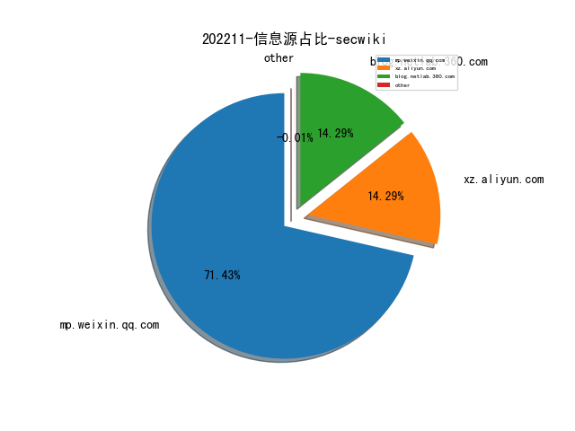
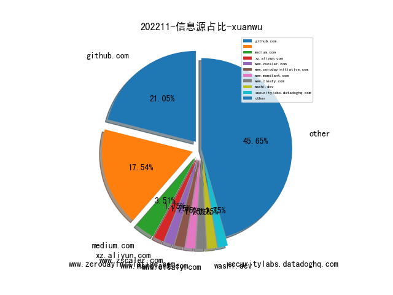
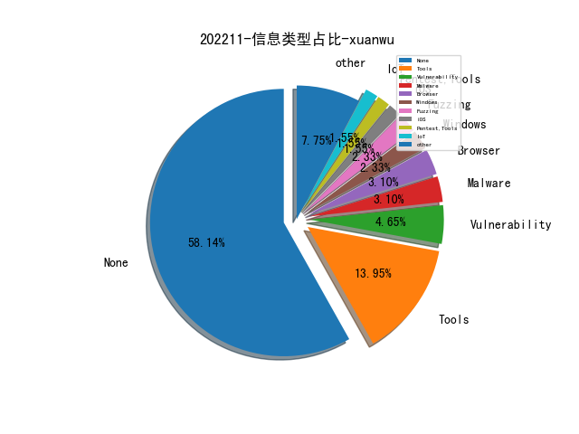
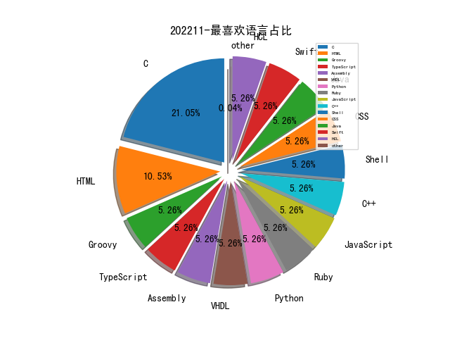

# [数据--所有](README_20.md)
# [数据--年度](README_2022.md)
# 202211 信息源与信息类型占比

# 微信公众号 推荐
| nickname_english | weixin_no | title | url| 
| --- | --- | --- | ---| 
| 三正科技公司 | sanzhengkeji | 美国态势感知之CHARIOT物联网加密项目 | https://mp.weixin.qq.com/s/wtiZOHMDFOwP6fVokPBNLg | 1| 
| FuzzWiki | gh_fcf21e658324 | 2022信息安全四大顶会Fuzz论文汇总｜技术进展 | https://mp.weixin.qq.com/s/fXopKsFW4mwkUK29AwsnSA | 1| 
| 安全分析与研究 | MalwareAnalysis | Brute Ratel C4 Badger分析实战与检测 | https://mp.weixin.qq.com/s/Nnag6DSf_wx2YrnTXEwNug | 1| 
| 威胁棱镜 | THREAT_PRISM | Akamai 在新观察到的域名中每月可标记 1300 万恶意域名 | https://mp.weixin.qq.com/s/A_tNuBiBvMeavfhPndsRbg | 1| 
| 奇安信威胁情报中心 | gh_166784eae33e | 网络空间测绘视角下的乌克兰网络脆弱性分析 | https://mp.weixin.qq.com/s/KgwMSpIfvmOqqn_pgdrGjQ | 1| 
| 靖安科技 | jing-an-tech | 乌克兰战场智能指挥系统 DELTA 深度分析报告 | https://mp.weixin.qq.com/s/dgCudvjhNBV3x75XX1OqEQ | 1| 
| 穿过丛林 | gh_f90eac70537b | IEEE TSE22：基于统计与变异分析的缺陷变量定位技术 | https://mp.weixin.qq.com/s/XVWFL8LvK9QLprnEG5YYSA | 1| 
| 腾讯技术 | gh_6866e1848f15 | 如何成为优秀工程师之软技能篇 | https://mp.weixin.qq.com/s/pQqSHw-Gou8Sd70hvZWl8g | 1| 
| 信安文摘 | share-for-life | 【日常分享】- IDEA-JetBrains全系列产品授权 | https://mp.weixin.qq.com/s?__biz=Mzg3OTEwMzIzNA==&mid=2247484344&idx=1&sn=1ab0a2aeff225cb6e42ac15742f4faa5&chksm=cf08dfd5f87f56c39ffb3b9a47fc6b2d6a94919ad2d5b246680764fc27dcdefadad2436d6c85&scene=178&cur_album_id=2311011542760505346#rd | 2| 
| Tide安全团队 | TideSec | 简单实用远控小工具Todesk | https://mp.weixin.qq.com/s/lVgcikWV-GH8lX295AGr0w | 1| 
| 天玄安全实验室 | TianXuan_SecurityLab | ​CVE-2021-44707 Adobe Reader越界写漏洞分析与利用 | https://mp.weixin.qq.com/s/elLI4YvJ0u9yYoyQpsv1og | 1| 
| 天极智库 | gh_90d775fd9c26 | 【国际视野】欧洲安全局发布《2022年网络安全威胁全景》报告 | https://mp.weixin.qq.com/s/U-YwbRs7tDU93vwgpLywRw | 1| 
| 摄星 | Vulinsight | 漏洞管理十大度量指标 | https://mp.weixin.qq.com/s/EExp6-IOTDd_WJwoWkj4Fw | 1| 
| 字节跳动安全中心 | TouTiaoSec | 干货来袭 , 如何体系化建设云上安全能力 | https://mp.weixin.qq.com/s/prG64nwyb6tlzyxVGp7fxQ | 1| 
| 一个人的安全笔记 | xjiek2015 | [HTB] Driver Writeup | https://mp.weixin.qq.com/s/UQlDF_fAw0-VsOdp2jQ3Wg | 1| 
| SecUN安全村 | sec-un | 试与国内网络安全监管机构商榷二三事｜安全村 | https://mp.weixin.qq.com/s/ukFg_L4eBzZGH_SOF2BnvQ | 1| 
| 迪哥讲事 | growing0101 | 漏洞赏金猎人系列-如何测试设置(Setting)功能 | https://mp.weixin.qq.com/s?__biz=MzIzMTIzNTM0MA==&mid=2247486882&idx=1&sn=79af29d6eea31a659e92f1e2e8dab631&chksm=e8a607c1dfd18ed72691ecae120faccd69dcaece15a671e5b924d91967f6440215a7f05853f8&token=868985101&lang=zh_CN#rd | 2| 
| 放之 | ECyberSecurity | 现代化安全产品 | https://mp.weixin.qq.com/s/9S0y10f-GLSnt4oPfNE5pg | 2| 
| 开源情报技术研究院 | gh_d1f65c3b3e5b | 如何跨平台追踪社交媒体用户 | https://mp.weixin.qq.com/s/91R2D4G__VH3kGu4HSBssQ | 1| 
| 公安部网络安全等级保护中心 | gh_f5f6bf3d09af | 关键信息基础设施安全保护标准体系解析 | https://mp.weixin.qq.com/s/sZ98UgV4gdx3M1z-76h9Jg | 1| 
| NISL实验室 | NISL_THU2020 | 机器学习为何难以应用于真实的网络入侵检测系统？（上） | https://mp.weixin.qq.com/s/UGFtM1Toue9B4NMdCss-OA | 2| 
| M01N Team | m01nteam | Electron攻击面分析 | https://mp.weixin.qq.com/s/E9cBVrIikwDm1X586xl-vw | 1| 
| 微步在线研究响应中心 | gh_280024a09930 | 曝光！“海莲花”组织运营的物联网僵尸网络Torii | https://mp.weixin.qq.com/s/v2wiJe-YPG0ng87ffBB9FQ | 1| 
| 奇安网情局 | QACIA2020 | 新加坡正式成立以网络为重点的“数字和情报军” | https://mp.weixin.qq.com/s/sPLwCfysg-1xSRhS35oQGg | 1| 
| Ms08067安全实验室 | Ms08067_com | 黑客破解赌博网站漏洞每月“薅羊毛”10万 | https://mp.weixin.qq.com/s/d0fKas6c6n7rhj777kO4vg | 1| 
| 赛博回忆录 | cybermemory | 最新CS RCE曲折的复现路 | https://mp.weixin.qq.com/s?__biz=MzIxNDAyNjQwNg==&mid=2456098978&idx=1&sn=d511d5a674d84eeaf262c8e389ae0403&chksm=803c696bb74be07d8ef8e473b11ffe4dce57b58ccf82e8615ab15d9ba6bba9263360c01276a8 | 1| 
| 信息安全与通信保密杂志社 | cismag2013 | 西北工业大学遭网络攻击事件的分析与思考 | https://mp.weixin.qq.com/s/_H2JtjRHG6PCds6zRDH7Rw | 1| 
| 绿盟科技研究通讯 | nsfocus_research | 从西工大攻击揭秘美军网空作战发展 | https://mp.weixin.qq.com/s/s43-B6oFYBitl_HaLZYulQ | 3| 
| 慢雾科技 | SlowMist | 复盘 , Team Finance 被黑简要分析 | https://mp.weixin.qq.com/s/041iCqcdRbKUDFauc45gow | 1| 
| HaoDF技术团队 | haodf_tech | 好大夫数据安全分类分级实践探索 | https://mp.weixin.qq.com/s/wgbqXyDrsqZBeZZmseMwPw | 1| 

# 组织github账号 推荐
| github_id | title | url | org_url | org_profile | org_geo | org_repositories | org_people | org_projects | repo_lang | repo_star | repo_forks| 
| --- | --- | --- | --- | --- | --- | --- | --- | --- | --- | --- | ---| 

# 私人github账号 推荐
| github_id | title | url | p_url | p_profile | p_loc | p_company | p_repositories | p_projects | p_stars | p_followers | p_following | repo_lang | repo_star | repo_forks | 
| --- | --- | --- | --- | --- | --- | --- | --- | --- | --- | --- | --- | --- | --- | ---| 
| trailofbits | VAST - 基于 MLIR 框架，为 C/C++ 语言实现的前端程序分析工具 | https://github.com/trailofbits/vast | None | None | None | None | 0 | 0 | 0 | 0 | 0 | C,Jinja,Python,C++,Go,Ruby,Rust | 0 | 0 | 1| 
| sleeyax | 用于 Hook Burp 的 HTTP/TLS 栈以篡改浏览器指纹的扩展 | https://github.com/sleeyax/burp-awesome-tls | https://github.com/sleeyax?tab=followers | Using the right skills for the right job | Belgium | None | 118 | 0 | 450 | 0 | 0 | Go,C#,TypeScript,Rust | 0 | 0 | 1| 
| quarkslab | Fuzzing NVIDIA 驱动，挖掘本地提权漏洞 | https://github.com/quarkslab/conf-presentations/blob/master/Hexacon-2022/fuzzing_NVIDIA_drivers-tdore.pdf | None | None | None | None | 0 | 0 | 0 | 0 | 0 | C,TypeScript,Python,JavaScript,C++,Shell,Go,Rust | 0 | 0 | 1| 
| prowler-cloud | Prowler: AWS security best practices 基线检查 | https://github.com/prowler-cloud/prowler | None | None | None | None | 0 | 0 | 0 | 0 | 0 | Shell,HCL | 0 | 0 | 1| 
| pinauten | Fugu15 - 研究员 Linus Henze 放出了他的 iOS 15.4.1 越狱工具 | https://github.com/pinauten/Fugu15 | None | None | None | None | 0 | 0 | 0 | 0 | 0 | C,Swift | 0 | 0 | 1| 
| osandov | drgn - 支持通过 Python 实现脚本化扩展的调试器 | https://github.com/osandov/drgn | https://github.com/osandov?tab=followers |  | Seattle, WA | @facebook | 50 | 0 | 15 | 0 | 0 | Python,C,Shell,C++,Vim | 0 | 0 | 1| 
| git | Git 修复了一个本地仓库 clone 过程中的符号链接 Following 问题，可以泄露用户敏感信息 | https://github.com/git/git/security/advisories/GHSA-3wp6-j8xr-qw85 | None | None | None | None | 0 | 0 | 0 | 0 | 0 | C,HTML,Ruby,CSS | 0 | 0 | 1| 
| bw3ll | SHAREM - Windows Shellcode 辅助分析和构造的工具 | https://github.com/bw3ll/sharem | https://github.com/Bw3ll?tab=followers |  | None | None | 3 | 0 | 0 | 0 | 0 | Python | 0 | 0 | 1| 
| alfarom256 | Lenovo Diagnostics 驱动（Windows）访问控制处理不当，导致低权限进程可以实现任意物理、虚拟内存地址读写 | https://github.com/alfarom256/CVE-2022-3699/ | https://github.com/alfarom256?tab=followers |  | None | None | 56 | 0 | 69 | 0 | 0 | Go,C,C++ | 0 | 0 | 1| 
| SpyGuard | SpyGuard - 增强版的 TinyCheck，通过网络流量检测主机是否已经被攻陷 | https://github.com/SpyGuard/SpyGuard | https://github.com/SpyGuard?tab=followers |  | None | None | 1 | 0 | 0 | 0 | 0 | Python | 0 | 0 | 1| 
| SnaffCon | Snaffler - 渗透测试项目中帮助探测 Windows/AD 环境的工具 | https://github.com/SnaffCon/Snaffler | None | None | None | None | 0 | 0 | 0 | 0 | 0 | C#,Go,HTML | 0 | 0 | 1| 
| NationalSecurityAgency | NSA 发布 Ghidra 10.2 版本，Debugger、Decompiler 等组件均有更新 | https://github.com/NationalSecurityAgency/ghidra/releases/tag/Ghidra_10.2_build | None | None | None | None | 0 | 0 | 0 | 0 | 0 | Groovy,C,HTML,Java,JavaScript | 0 | 0 | 1| 
| KULeuven-COSIC | 从硬件角度研究 SpaceX Starlink 终端的安全性，利用电压错误注入的技术实现任意代码执行 | https://github.com/KULeuven-COSIC/Starlink-FI | None | None | None | None | 0 | 0 | 0 | 0 | 0 | C,Jupyter,Sage,C++,HTML,Verilog,Assembly,MATLAB | 0 | 0 | 1| 
| 0xADE1A1DE | 以其他已连接 USB 设备的身份注入击键指令，来自 USENIX 会议的 Paper：The Impostor Among US(B): Off-Path Injection Attacks on USB Communications | https://github.com/0xADE1A1DE/USB-Injection | None | None | None | None | 0 | 0 | 0 | 0 | 0 | C,TypeScript,Assembly,VHDL,C++ | 0 | 0 | 1| 

# medium_xuanwu 推荐
| title | url| 
| --- | ---| 
| 利用 Ptrace 的调试能力实现跨进程任意 syscall 调用 | https://medium.com/@0xFounders/using-rust-and-ptrace-to-invoke-syscalls-262dc585fcd3| 
| ManageEngine ADAudit Plus 任意文件写漏洞的分析和利用（CVE-2021–42847） | https://medium.com/@erik.wynter/pwning-manageengine-from-endpoint-to-exploit-bc5793836fd| 
| pGALA 关于被攻击事件的声明 | http://medium.com/pnetwork/pgala-post-mortem-measures-taken-to-safeguard-the-ecosystem-from-malicious-actors-and-recovery-6407048f4497| 
| 利用卡巴斯基终端安全软件的 KES Installer 组件提供的 “Features”可以执行任意命令 | http://nasbench.medium.com/lolbined-using-kaspersky-endpoint-security-kes-installer-to-execute-arbitrary-commands-1c999f1b7fea| 
| 硬件级木马技术研究 | http://ryancor.medium.com/hardware-trojans-under-a-microscope-bf542acbcc29| 

# medium_secwiki 推荐
| title | url| 
| --- | ---| 

# zhihu_xuanwu 推荐
| title | url| 
| --- | ---| 

# zhihu_secwiki 推荐
| title | url| 
| --- | ---| 

# xz_xuanwu 推荐
| title | url| 
| --- | ---| 
| 复现近期的 Apache Commons JXPath 远程代码执行(CVE-2022-41852)漏洞 | https://xz.aliyun.com/t/11813| 

# xz_secwiki 推荐
| title | url| 
| --- | ---| 
| 最近碰到的 Python pickle 反序列化小总结 | https://xz.aliyun.com/t/11807| 
| jpress代码审计分享 | https://xz.aliyun.com/t/11832| 
| 浅析NodeJS | https://xz.aliyun.com/t/11791| 

# 日更新程序
`python update_daily.py`