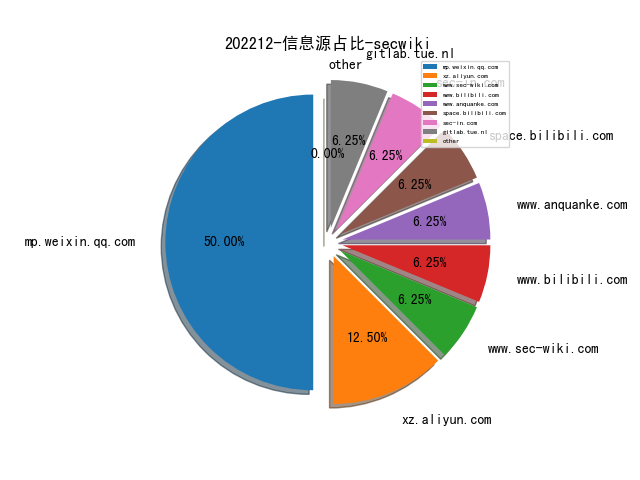
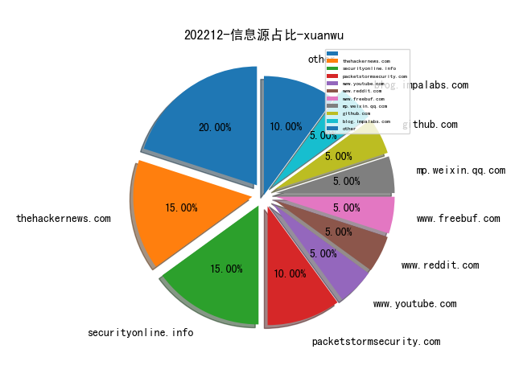
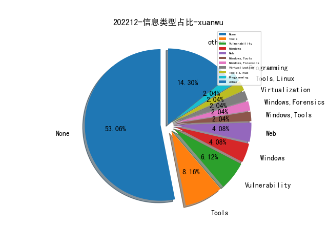
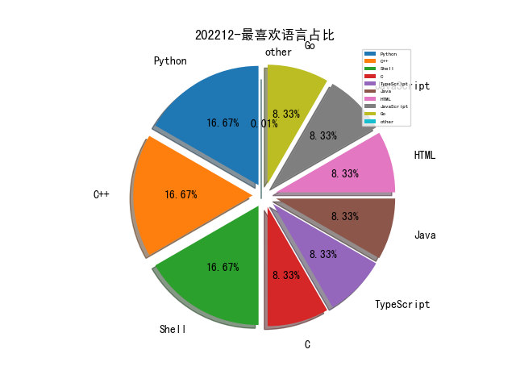

# [数据--所有](README_20.md)
# [数据--年度](README_2022.md)
# 202212 信息源与信息类型占比

# 微信公众号 推荐
| nickname_english | weixin_no | title | url| 
| --- | --- | --- | ---| 
| 乐枕迭代日志 | cdxy_011 | 安全概念分析框架 | https://mp.weixin.qq.com/s/JysvRftmGl2zg41ko8n1yA | 1| 
| 穿过丛林 | gh_f90eac70537b | S&P22：探测并抵御CI服务中的非法加密挖矿 | https://mp.weixin.qq.com/s/uC7Jbtbqs2BHPtjiiQqG8Q | 1| 
| 时间之外沉浮事 | tasnrh | 【PPT】国内外网络靶场发展状态演进与分析 | https://mp.weixin.qq.com/s/K5Wiutcq3YKMAA8mQ2FOuA | 1| 
| 一个人的安全笔记 | xjiek2015 | [HTB] Secret Writeup | https://mp.weixin.qq.com/s/vB0bUZ02j88gALvIbuKWNA | 1| 
| 红队蓝军 | Xx_Security | 细谈CS分离式shellcode的加载之旅 | https://mp.weixin.qq.com/s/cgp6aFwiU7S8x2jS2VXoTQ | 1| 
| 慢雾科技 | SlowMist | 慢雾：警惕 TransferFrom 零转账骗局 | https://mp.weixin.qq.com/s/vnHnDG435WYIoN2VNK_oTw | 1| 
| FuzzWiki | gh_fcf21e658324 | POLYGLOT：使用语义验证的通用语言处理器模糊测试引擎｜工具分析 | https://mp.weixin.qq.com/s/KnXLjn1Da6HmglWD7OFy6Q | 1| 
| 威胁棱镜 | THREAT_PRISM | 通过网空搜索引擎发现恶意软件登录页面 | https://mp.weixin.qq.com/s/RV8_AeLWSA0txYcWiLrxYQ | 1| 

# 组织github账号 推荐
| github_id | title | url | org_url | org_profile | org_geo | org_repositories | org_people | org_projects | repo_lang | repo_star | repo_forks| 
| --- | --- | --- | --- | --- | --- | --- | --- | --- | --- | --- | ---| 

# 私人github账号 推荐
| github_id | title | url | p_url | p_profile | p_loc | p_company | p_repositories | p_projects | p_stars | p_followers | p_following | repo_lang | repo_star | repo_forks | 
| --- | --- | --- | --- | --- | --- | --- | --- | --- | --- | --- | --- | --- | --- | ---| 
| root-tanishq | 一个专门fuzz User-Agent ， X-Forwarded-For， Referer的 SQLI Fuzzer | https://github.com/root-tanishq/userefuzz | https://github.com/root-tanishq?tab=followers | kuns Notebook OSCP , eWPTXv2 | None | None | 16 | 0 | 25 | 0 | 0 | Python,Shell | 0 | 0 | 1| 
| romainthomas | 一个逆向工程研讨会的ppt，讲到了很多x86下逆向的技巧 | https://github.com/romainthomas/reverse-engineering-workshop | https://github.com/lief-project | Security Engineer working on mobile, obfuscation and file formats. Author & maintainer of @lief-project / @open-obfuscator | None | @lief-project @open-obfuscator | 49 | 0 | 331 | 0 | 0 | Java,C++ | 0 | 0 | 1| 
| reecdeep | HiveV5勒索软件文件解密Poc和算法分析 | https://github.com/reecdeep/HiveV5_file_decryptor | https://github.com/reecdeep?tab=followers | Malware analyst, reverse engineer | Stack | None | 2 | 0 | 0 | 0 | 0 | C++ | 0 | 0 | 1| 
| google | VSCode远程代码执行漏洞（CVE-2022-41034）细节，存在于ipynb文件加载流程中，用户点击恶意链接即可能受到攻击。 | https://github.com/google/security-research/security/advisories/GHSA-pw56-c55x-cm9m | None | None | None | None | 0 | 0 | 0 | 0 | 0 | C,TypeScript,Java,Python,JavaScript,C++,Shell,HTML,Go | 0 | 0 | 1| 
| deepinstinct | 通过滥用 Windows 错误报告服务以dump LSASS 的方法,来自DC30议题LSASS Shtinkering Abusing Windows Error Reporting to Dump LSASS | https://github.com/deepinstinct/Lsass-Shtinkering | None | None | None | None | 0 | 0 | 0 | 0 | 0 | Python,PowerShell,C++ | 0 | 0 | 1| 
| caioluders | XSS 2 RCE on flipper_zero | https://github.com/caioluders/pocs/blob/main/flipper_rce_xss.js | https://github.com/caioluders?tab=followers |  | Brazil | None | 43 | 0 | 204 | 0 | 0 | Python,C,HTML | 0 | 0 | 1| 

# medium_xuanwu 推荐
| title | url| 
| --- | ---| 
| 如何在已root的手机上绕过Android SSL Pinning劫持HTTPS流量，以及如何修改APK以绕过Proxy Unaware劫持HTTP流量。 | https://kishorbalan.medium.com/its-all-about-android-ssl-pinning-bypass-and-intercepting-proxy-unaware-applications-91689c0763d8| 
| 在Discord中植入RCE后门的尝试，作者起初选择使用Python调用API与server通信，并通过Nuitka将其打包为PE，但会使得程序文件大小增加40+ MB，后续尝试通过SMB进行优化。 | https://medium.com/@lsecqt/weaponizing-discord-shell-via-smb-92375e730e26| 

# medium_secwiki 推荐
| title | url| 
| --- | ---| 

# zhihu_xuanwu 推荐
| title | url| 
| --- | ---| 

# zhihu_secwiki 推荐
| title | url| 
| --- | ---| 

# xz_xuanwu 推荐
| title | url| 
| --- | ---| 
| Spring heapdump泄露shiro key造成RCE | https://xz.aliyun.com/t/11908| 

# xz_secwiki 推荐
| title | url| 
| --- | ---| 
| GadgetInspector改造中反序列化三个source点的原理分析 | https://xz.aliyun.com/t/11915| 
| 企业级钓鱼演练平台搭建 | https://xz.aliyun.com/t/11898| 

# 日更新程序
`python update_daily.py`