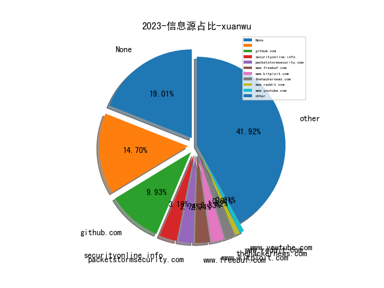

# [数据--所有](README_20.md)
# [数据--年度](README_2023.md)
# 2023 信息源与信息类型占比

# 政策 推荐
| title | url| 
| --- | ---| 
| 工业和信息化领域数据安全行政处罚裁量指引（试行）（征求意见... | https://www.miit.gov.cn/gzcy/yjzj/art/2023/art_2fb5b9dff755480284099f08eebdfa1e.html| 
| 规范和促进数据跨境流动规定（征求意见稿） | http://www.cac.gov.cn/2023-09/28/c_1697558914242877.htm| 
| 企业数据资源相关会计处理暂行规定 | http://kjs.mof.gov.cn/gongzuotongzhi/202212/P020221209412040514536.pdf| 
| 网站平台受理处置涉企网络侵权信息举报工作规范 | http://www.cac.gov.cn/2023-08/10/c_1693319212099907.htm| 
| 个人信息保护合规审计管理办法（征求意见稿） | http://www.cac.gov.cn/2023-08/03/c_1692628348448092.htm| 
| 中国人民银行业务领域数据安全管理办法（征求意见稿） | http://www.pbc.gov.cn/tiaofasi/144941/144979/3941920/4993510/2023071815593395156.pdf| 
| 铁路关键信息基础设施安全保护管理办法（征求意见稿） | http://www.moj.gov.cn/pub/sfbgw/lfyjzj/lflfyjzj/202307/t20230718_482844.html| 
| 生成式人工智能服务管理暂行办法 | http://www.cac.gov.cn/2023-07/13/c_1690898327029107.htm| 
| 关于调整《网络关键设备和网络安全专用产品目录》的公告 | http://www.cac.gov.cn/2023-07/03/c_1690034742530280.htm| 
| 商用密码管理条例 | http://www.gov.cn/zhengce/zhengceku/202305/content_6875928.htm| 
| 商用密码管理条例（修订草案征求意见稿） | http://www.sca.gov.cn/sca/hdjl/2020-08/20/content_1060779.shtml| 
| 生成式人工智能服务管理办法（征求意见稿） | http://www.cac.gov.cn/2023-04/11/c_1682854275475410.htm| 
| 密码工程技术人员国家职业标准 | http://www.mohrss.gov.cn/xxgk2020/fdzdgknr/qt/gztz/202303/t20230327_497435.html| 
| 2021广东省数字政府网络安全指数评估报告 | http://zfsg.gd.gov.cn/zwgk/wjk/content/post_3829200.html| 
| 证券期货业网络和信息安全管理办法 | http://www.gov.cn/zhengce/zhengceku/2023-03/04/content_5744506.htm| 

# 网络安全书籍 推荐
| date_added | language | title | author | link | size| 
| --- | --- | --- | --- | --- | ---| 
| 2023-12-29 18:17:28 | English | Reverse Engineering with Terraform | unknown | https://www.wowebook.org/reverse-engineering-with-terraform/ | unknown| 
| 2023-12-23 18:58:50 | English | Security Orchestration, Automation, and Response for Security Analysts: Learn the secrets of SOAR to improve MTTA and MTTR and strengthen your organizations security posture | Benjamin Kovacevic | http://libgen.rs/book/index.php?md5=291F0E7199BBE33B31E128142683B2A6 | 27 MB [PDF]| 
| 2023-12-23 18:38:53 | English | Generative AI with LangChain: Build large language model (LLM) apps with Python, ChatGPT and other LLMs | Ben Auffarth | http://libgen.rs/book/index.php?md5=A505C1996DB016F0BDD55CF52026EFC4 | 14 MB [PDF]| 
| 2023-12-22 07:52:51 | English | Understanding Microsoft Teams Administration, 2nd Edition | unknown | https://www.wowebook.org/understanding-microsoft-teams-administration-2nd-edition/ | unknown| 
| 2023-12-20 06:05:44 | English | Building a Cyber Risk Management Program | unknown | https://www.wowebook.org/building-a-cyber-risk-management-program/ | unknown| 
| 2023-12-19 09:04:26 | English | Python Debugging for AI, Machine Learning, and Cloud Computing | unknown | https://www.wowebook.org/python-debugging-for-ai-machine-learning-and-cloud-computing/ | unknown| 
| 2023-12-13 06:44:16 | English | AWS IoT With Edge ML and Cybersecurity | unknown | https://www.wowebook.org/aws-iot-with-edge-ml-and-cybersecurity/ | unknown| 
| 2023-12-13 06:26:08 | English | Deploy Container Applications Using Kubernetes | unknown | https://www.wowebook.org/deploy-container-applications-using-kubernetes/ | unknown| 
| 2023-12-11 08:50:04 | English | Discovering Cybersecurity | unknown | https://www.wowebook.org/discovering-cybersecurity/ | unknown| 
| 2023-12-11 19:49:18 | English | Comprehensive Python Cheatsheet | Jure Sorn | http://libgen.rs/book/index.php?md5=3F9F692C7257B66046BDA97DAA079A2D | 436 kB [PDF]| 
| 2023-12-11 19:43:29 | English | Statistics, Data Mining and Machine Learning in Astronomy: A Practical Python Guide for the Analysis of Survey Data | Zeljko Ivezic, Andrew J. Connolly, Jacob T VanderPlas, Alexander Gray | http://libgen.rs/book/index.php?md5=F288D0B650C97B4248BD09851C7D6FC2 | 28 MB [PDF]| 
| 2023-12-10 05:24:50 | English | Building Recommendation Systems in Python and JAX | unknown | https://www.wowebook.org/building-recommendation-systems-in-python-and-jax/ | unknown| 
| 2023-12-06 09:31:58 | English | Python Graphics, 2nd Edition | unknown | https://www.wowebook.org/python-graphics-2nd-edition/ | unknown| 
| 2023-12-05 07:47:32 | English | Data Modeling with Microsoft Excel | unknown | https://www.wowebook.org/data-modeling-with-microsoft-excel/ | unknown| 
| 2023-12-05 07:08:22 | English | The Immersive Metaverse Playbook for Business Leaders | unknown | https://www.wowebook.org/the-immersive-metaverse-playbook-for-business-leaders/ | unknown| 
| 2023-12-04 16:34:23 | English | Okta Administration Up and Running: Drive operational excellence with IAM solutions for on-premises and cloud apps, 2nd Edition | Lovisa Stenbäcken Stjernlöf, HenkJan de Vries | http://libgen.rs/book/index.php?md5=A139A33C8BC8E86A16ED2EDD9646D080 | 25 MB [PDF]| 
| 2023-12-03 08:50:00 | English | Microsoft 365 Certified Fundamentals MS-900 Exam Guide, Third Edition | unknown | https://www.wowebook.org/microsoft-365-certified-fundamentals-ms-900-exam-guide-third-edition/ | unknown| 
| 2023-12-03 21:03:26 | English | Minimalist Data Wrangling with Python | Marek Gagolewski | http://libgen.rs/book/index.php?md5=6C4104ED1815935DE92FD9C1BD35E071 | 7 MB [PDF]| 
| 2023-11-30 07:53:27 | English | Learn AI-Assisted Python Programming | unknown | https://www.wowebook.org/learn-ai-assisted-python-programming/ | unknown| 
| 2023-11-29 08:07:34 | English | Managing Cloud Native Data on Kubernetes | unknown | https://www.wowebook.org/managing-cloud-native-data-on-kubernetes/ | unknown| 
| 2023-11-29 09:23:22 | English | CompTIA Cybersecurity Analyst (CySA+) CS0-003 (Video Course) | unknown | https://www.wowebook.org/comptia-cybersecurity-analyst-cysa-cs0-003-video-course/ | unknown| 
| 2023-11-27 08:35:44 | English | Learning Microsoft Azure | unknown | https://www.wowebook.org/learning-microsoft-azure/ | unknown| 
| 2023-11-24 19:05:09 | English | Data Literacy With Python | Oswald Campesato | http://libgen.rs/book/index.php?md5=90BED60B64BED943E245E467C7950AC9 | 15 MB [PDF]| 
| 2023-11-24 16:43:25 | English | Fundamentals of Supervised Machine Learning: With Applications in Python, R, and Stata (Statistics and Computing) | Giovanni Cerulli | http://libgen.rs/book/index.php?md5=733256EF8FB93EDF61A4EB76A06F6774 | 7 MB [PDF]| 
| 2023-11-21 17:27:28 | English | Exploring Microsoft Office - 2023 Edition: The Illustrated, Practical Guide to Using Office and Microsoft 365 | Kevin Wilson | http://libgen.rs/book/index.php?md5=5C07A77B2E01533A0722ABB15BBAB1D1 | 93 MB [EPUB]| 
| 2023-11-20 07:28:44 | English | SAP S/4HANA Asset Management | unknown | https://www.wowebook.org/sap-s-4hana-asset-management/ | unknown| 
| 2023-11-17 08:35:10 | English | Kubernetes Cookbook, 2nd Edition | unknown | https://www.wowebook.org/kubernetes-cookbook-2nd-edition/ | unknown| 
| 2023-11-15 06:27:32 | English | Hacker Culture A to Z | unknown | https://www.wowebook.org/hacker-culture-a-to-z/ | unknown| 
| 2023-11-15 08:27:19 | English | FastAPI: Modern Python Web Development | unknown | https://www.wowebook.org/fastapi-modern-python-web-development/ | unknown| 
| 2023-11-14 11:52:16 | English | Python Deep Learning, Third Edition | unknown | https://www.wowebook.org/python-deep-learning-third-edition/ | unknown| 
| 2023-11-13 18:28:50 | English | The Linux DevOps Handbook | unknown | https://www.wowebook.org/the-linux-devops-handbook/ | unknown| 
| 2023-11-10 12:21:43 | English | Kubernetes Fundamentals | unknown | https://www.wowebook.org/kubernetes-fundamentals/ | unknown| 
| 2023-11-09 15:55:09 | English | (Security Informatics and Law Enforcement) Cyber Malware : Offensive and Defensive Systems | Iman Almomani; Leandros A. Maglaras; Mohamed Amine Ferrag; Nick Ayres | http://libgen.rs/book/index.php?md5=EF13873566DFAF97195C6D48EF0077BF | 16 MB [EPUB]| 
| 2023-11-09 15:48:12 | English | Introduction to Computer Programming with Python | Harris Wang | http://libgen.rs/book/index.php?md5=8F2306D8690F4440447D39FFB66E31E1 | 4 MB [EPUB]| 
| 2023-11-08 11:53:41 | English | Cloud Penetration Testing for Red Teamers | unknown | https://www.wowebook.org/cloud-penetration-testing-for-red-teamers/ | unknown| 
| 2023-11-08 11:07:08 | English | Learning Geospatial Analysis with Python, Fourth Edition | unknown | https://www.wowebook.org/learning-geospatial-analysis-with-python-fourth-edition/ | unknown| 
| 2023-11-08 09:35:23 | English | Windows Forensics Analyst Field Guide | unknown | https://www.wowebook.org/windows-forensics-analyst-field-guide/ | unknown| 
| 2023-11-07 20:02:34 | English | Zero Trust Overview and Playbook Introduction | unknown | https://www.wowebook.org/zero-trust-overview-and-playbook-introduction/ | unknown| 
| 2023-11-05 04:35:56 | English | Functional Programming Projects with Python 3 (Video Course) | unknown | https://www.wowebook.org/functional-programming-projects-with-python-3-video-course/ | unknown| 
| 2023-11-04 11:40:25 | English | Interpretable Machine Learning with Python, Second Edition | unknown | https://www.wowebook.org/interpretable-machine-learning-with-python-second-edition/ | unknown| 
| 2023-11-04 15:43:37 | English | Big Beacon | Alan Partridge | http://libgen.rs/book/index.php?md5=24AD48BD378A10359DD18A560FB2FFAB | 21 MB [AZW3]| 
| 2023-11-03 17:00:33 | English | Linux Containers and Virtualization: Utilizing Rust for Linux Containers | Shashank Mohan Jain | http://libgen.rs/book/index.php?md5=929B078CD4B6DCCB744F359C0F53DCC5 | 3 MB [PDF]| 
| 2023-11-03 17:00:29 | English | Linux Containers and Virtualization: Utilizing Rust for Linux Containers | Shashank Mohan Jain | http://libgen.rs/book/index.php?md5=2CACAE35F62A286F85B636FCD2B849EC | 2 MB [EPUB]| 
| 2023-11-03 16:40:01 | English | A Pythonic Adventure: From Python basics to a working web app | Pavel Anni | http://libgen.rs/book/index.php?md5=EFD8081BD6E5D72940253F56E8F5D467 | 21 MB [PDF]| 
| 2023-11-01 06:06:38 | English | Kubernetes: From Basics to Guru (Video Course) | unknown | https://www.wowebook.org/kubernetes-from-basics-to-guru-video-course/ | unknown| 
| 2023-10-31 08:53:57 | English | Rust Programming Part 2: Rust Advanced Concepts and Real-World Projects (Video Course) | unknown | https://www.wowebook.org/rust-programming-part-2-rust-advanced-concepts-and-real-world-projects-video-course/ | unknown| 
| 2023-10-31 08:19:09 | English | Rust Programming Part 1: Rust Programming Foundations (Video Course) | unknown | https://www.wowebook.org/rust-programming-part-1-rust-programming-foundations-video-course/ | unknown| 
| 2023-10-31 07:40:02 | English | Rust Programming Essentials (Video Course) | unknown | https://www.wowebook.org/rust-programming-essentials-video-course/ | unknown| 
| 2023-10-27 17:19:22 | English | Operations Research for Social Good: A Practitioners Introduction Using SAS and Python | Natalia Summerville; Rob Pratt | http://libgen.rs/book/index.php?md5=D1F25080FF4AF5D5A15F7AF00AF2CB8C | 5 MB [EPUB]| 
| 2023-10-27 17:17:44 | English | Digital Money Demystified: Go From Cash to Crypto Safely, Legally, and Confidently | Tonya M. Evans | http://libgen.rs/book/index.php?md5=427307DE1C3B18F392992D6219DCF422 | 537 kB [EPUB]| 
| 2023-10-27 07:19:38 | English | Platform Engineering on Kubernetes | unknown | https://www.wowebook.org/platform-engineering-on-kubernetes/ | unknown| 
| 2023-10-25 16:54:46 | English | Python Mastery Unleashed: Advanced Programming Techniques | Jarrel E. | http://libgen.rs/book/index.php?md5=E93E9742ED7A78F82C65F049E63D466E | 7 MB [EPUB]| 
| 2023-10-25 16:44:20 | English | Python 3 Programming: An Advanced Guide | Educohack Press | http://libgen.rs/book/index.php?md5=FA2B0D9E2D33E59622E3F3F830D98B9E | 7 MB [EPUB]| 
| 2023-10-25 14:47:10 | English | Learning Microsoft Power BI: Transforming Data into Insights [Complete] | Jeremey Arnold | http://libgen.rs/book/index.php?md5=B0E76C97D198401B3769CE699E65EBF8 | 29 MB [PDF]| 
| 2023-10-24 05:55:23 | English | Kubernetes Best Practices, 2nd Edition | unknown | https://www.wowebook.org/kubernetes-best-practices-2nd-edition/ | unknown| 
| 2023-10-24 09:05:32 | English | Information Security Handbook, Second Edition | unknown | https://www.wowebook.org/information-security-handbook-second-edition/ | unknown| 
| 2023-10-24 08:44:52 | English | CompTIA A+ Practice Test Core 1 (220-1101) | unknown | https://www.wowebook.org/comptia-a-practice-test-core-1-220-1101/ | unknown| 
| 2023-10-23 17:03:05 | English | Python Automation Mastery: From Novice To Pro (4 Books In 1) | ROB BOTWRIGHT | http://libgen.rs/book/index.php?md5=B9EB14A9752AFDAD262F6C7E6CC6A5EC | 2 MB [EPUB]| 
| 2023-10-23 16:08:02 | English | Mastering Computer Programming: A Comprehensive Guide to Python, C, C++, C#, HTML Coding, and Ethical Hacking | Kameron Hussain; Frahaan Hussain | http://libgen.rs/book/index.php?md5=46585EAB44A7155954BDB16E4E2C6D5B | 2 MB [EPUB]| 
| 2023-10-22 17:13:58 | English | Rust In Practice: A Programmers Guide to Build Rust Programs, Test Applications and Create Cargo Packages | Rustacean Team | http://libgen.rs/book/index.php?md5=869DFD23AB0EF7D4F64A646199103470 | 426 kB [EPUB]| 
| 2023-10-22 17:12:56 | English | Practical Rust 1.x Cookbook: 100+ Solutions across Command Line, CI/CD, Kubernetes, Networking, Code Performance and Microservices | Rustacean Team | http://libgen.rs/book/index.php?md5=B766D2E409AE1A6365C011C65AFC1A50 | 669 kB [EPUB]| 
| 2023-10-19 14:39:26 | English | Head First Python: A Learners Guide to the Fundamentals of Python Programming, A Brain-Friendly Guide <[Early Release - RAW & UNEDITED]> | Paul Barry | http://libgen.rs/book/index.php?md5=1A85A06658A6E506E3CC18EDE8B625CC | 124 MB [PDF]| 
| 2023-10-12 15:07:33 | English | Artificial Intelligence & Blockchain in Cyber Physical Systems: Technologies & Applications | Muhammad Arif, Valentina Emilia Balas, Tabrez Nafis, Nawab Muhammad Faseeh Qureshi, Samar Wazir, Ibrar Hussain | http://libgen.rs/book/index.php?md5=998DF7DF613C96890EA2A8631844F1EB | 40 MB [PDF]| 
| 2023-10-11 18:01:39 | English | Ansible For Security by Examples | Luca Berton | http://libgen.rs/book/index.php?md5=0440BBACC6C24FFFC5D5307691D775B8 | 1 MB [EPUB]| 
| 2023-10-06 15:24:08 | English | The day of defense | McDonald, A. Melvin | http://libgen.rs/book/index.php?md5=38B739BA016B5369AECD5DB58A5B3D18 | 201 kB [EPUB]| 
| 2023-10-06 11:16:41 | English | Python for DevOps: Learn Ruthlessly Effective Automation | Noah Gift, Kennedy Behrman, Alfredo Deza, Grig Gheorghiu | http://libgen.rs/book/index.php?md5=D80589BD3C0804C795C7CE97138026F1 | 11 MB [PDF]| 
| 2023-10-06 17:18:06 | English | The Myth of Overpunishment: A Defense of the American Justice System and a Proposal to Reduce Incarceration While Protecting the Public | Barry Latzer | http://libgen.rs/book/index.php?md5=00E78F1753ED6F53879A53A0933302C0 | 2 MB [EPUB]| 
| 2023-10-05 16:02:41 | English | Hacking Kubernetes: Threat-Driven Analysis and Defense | Andrew Martin, Michael Hausenblas | http://libgen.rs/book/index.php?md5=492A742FF37EE73CE3591FB5FCBCE7BB | 9 MB [PDF]| 
| 2023-10-05 15:32:52 | English | (The Shelly Cashman Series) Technology for Success and The Shelly Cashman Series Microsoft 365 & Office 2021 (MindTap Course List) | Sandy Cable, Jennifer T. Campbell, Mark Ciampa, Barbara Clemens, Jennifer Duffy, Steven M. Freund, Mark Frydenberg, Ralph E. Hooper, Ellen Monk, Lisa Ruffolo, Susan Sebok, Misty Vermaat, Jill West | http://libgen.rs/book/index.php?md5=3EEE6D81FD0205B78E8DC017AB189526 | 80 MB [PDF]| 
| 2023-10-04 19:05:48 | English | Understanding Analog Side Channels Using Cryptography Algorithms | Alenka Zajić; Milos Prvulovic | http://libgen.rs/book/index.php?md5=7F1D0D6CD099D60E374B4108FB376D0C | 86 MB [EPUB]| 
| 2023-10-04 18:48:54 | English | Kubernetes Security and Observability: A Holistic Approach to Securing Containers and Cloud Native Applications | Brendan Creane, Amit Gupta | http://libgen.rs/book/index.php?md5=70C5393323FC76F1A4D7D9842F54D92D | 11 MB [PDF]| 
| 2023-10-04 18:48:53 | English | Identity-Native Infrastructure Access Management: Preventing Breaches by Eliminating Secrets and Adopting Zero Trust | Ev Kontsevoy, Sakshyam Shah, Peter Conrad | http://libgen.rs/book/index.php?md5=154B43B65DFEAECCEB00BD19957C20A2 | 2 MB [PDF]| 
| 2023-09-29 14:18:15 | English | (HBR Emotional Intelligence Series) Grit | Harvard Business Review, Angela L. Duckworth, Misty Copeland, Shannon Huffman Polson, Tomas Chamorro-Premuzic | http://libgen.rs/book/index.php?md5=43B3B9AD267EC42617A24B364146CBCC | 1 MB [EPUB]| 
| 2023-09-27 15:38:00 | English | Black Hat Python, 2nd Edition | Justin Seitz; Tim Arnold | http://libgen.rs/book/index.php?md5=93C0E3BF45AC2791B622BCAEC5D34E42 | 7 MB [EPUB]| 
| 2023-09-27 15:22:10 | English | RTFM: Red Team Field Manual v2 | Ben Clark; Nick Downer | http://libgen.rs/book/index.php?md5=5838E46065186A20D36FEF831EC36200 | 256 kB [EPUB]| 
| 2023-07-30 20:25:14 | English | Unlock the Vault: A Blueprint For Building Wealth With Fractional Ownership: Weather Market Storms and Enjoy Long-Term Security With An Emerging New Asset ... the Investments of the Ultra-Rich Book 2) | Michael Fox-Rabinovitz | http://libgen.rs/book/index.php?md5=D79049E60064147C58AA1B59D0636E27 | 513 kB [EPUB]| 
| 2023-07-21 03:05:45 | English | Fortinet FortiWeb Study Guide for FortiWeb 6.4 |  | http://libgen.rs/book/index.php?md5=07390EF2A9457416C4E6143A4872E225 | 50 MB [PDF]| 
| 2023-07-21 04:01:29 | English | Fortinet SD-WAN Lab Guide for FortiOS 7.2 |  | http://libgen.rs/book/index.php?md5=235FB171A721993D52DDB15CA2EFE608 | 6 MB [PDF]| 
| 2023-07-21 05:22:42 | English | The Art of Risk | Richard Harris | http://libgen.rs/book/index.php?md5=A9FEE5323D62BB4A0099FB9BC09C2005 | 6 MB [EPUB]| 
| 2023-07-21 04:16:48 | English | Fortinet Advanced Analytics Study Guide for FortiSIEM 6.3 |  | http://libgen.rs/book/index.php?md5=2A9B094EEC3F0DA4FFEB3725D4350D7F | 63 MB [PDF]| 
| 2023-07-21 04:16:42 | English | Fortinet Advanced Analytics Lab Guide for FortiSIEM 6.3 |  | http://libgen.rs/book/index.php?md5=E3582EFCEBB0AF288F1B5FC3468D64E9 | 13 MB [PDF]| 
| 2023-07-21 04:13:55 | English | Fortinet LAN Edge Study Guide for FortiGate 7.0 |  | http://libgen.rs/book/index.php?md5=EDAA5C2E25AD0BBEF185851B29B742E4 | 50 MB [PDF]| 
| 2023-07-21 04:11:30 | English | Fortinet OT Security Study Guide for FortiOS 7.2 |  | http://libgen.rs/book/index.php?md5=9063133974E42781E921976B957D6D48 | 31 MB [PDF]| 
| 2023-07-21 04:11:29 | English | Fortinet OT Security Lab Guide for FortiOS 7.2 |  | http://libgen.rs/book/index.php?md5=5B6ABB7215F265DC5C549EA990BAA9FB | 5 MB [PDF]| 
| 2023-07-21 04:07:51 | English | Fortinet Public Cloud Security Study Guide for FortiGate 7.2 |  | http://libgen.rs/book/index.php?md5=FB499E6726395D0F2E86BD3D6E1FD195 | 19 MB [PDF]| 
| 2023-07-21 04:05:02 | English | Fortinet Zero Trust Access Study Guide for FortiOS 7.2 |  | http://libgen.rs/book/index.php?md5=C4D0B5CB221B1C0EFAE1A1448E63C428 | 18 MB [PDF]| 
| 2023-07-21 04:04:58 | English | Fortinet Zero Trust Access Lab Guide for FortiOS 7.2 |  | http://libgen.rs/book/index.php?md5=39DCC1F3923F1727D600BD25C0EC5845 | 14 MB [PDF]| 
| 2023-07-21 04:01:31 | English | Fortinet SD-WAN Study Guide for FortiOS 7.2 |  | http://libgen.rs/book/index.php?md5=572D3F2160E003B689F9DFFE04638FF6 | 10 MB [PDF]| 
| 2023-07-21 03:58:33 | English | Fortinet Enterprise Firewall Lab Guide for FortiOS 7.2 |  | http://libgen.rs/book/index.php?md5=65BD7A0B33E6EA74C83C4F1CE0C5C06D | 6 MB [PDF]| 
| 2023-07-21 03:58:28 | English | Fortinet Enterprise Firewall Study Guide for FortiOS 7.2 |  | http://libgen.rs/book/index.php?md5=76992EDAB7C98447905A8E2E7952C445 | 35 MB [PDF]| 
| 2023-07-21 03:54:05 | English | Fortinet Network Security Support Engineer Study Guide for FortiOS 7.2 |  | http://libgen.rs/book/index.php?md5=CE444CC0FC8EE50F6461120BB06F321B | 54 MB [PDF]| 
| 2023-07-21 03:54:04 | English | Fortinet Network Security Support Engineer Lab Guide for FortiOS 7.2 |  | http://libgen.rs/book/index.php?md5=275931204DD5049E0BC233056083EFB2 | 2 MB [PDF]| 
| 2023-07-21 03:47:48 | English | Fortinet FortiVoice Lab Guide for FortiVoice 6.0 |  | http://libgen.rs/book/index.php?md5=09154B576D7A818E5FAF3022A0B393E0 | 3 MB [PDF]| 
| 2023-07-21 03:47:47 | English | Fortinet FortiVoice Study Guide for FortiVoice 6.0 |  | http://libgen.rs/book/index.php?md5=8341173B3FC2024366A0648939771E5F | 45 MB [PDF]| 
| 2023-07-20 19:15:33 | English | Developments in Managing and Exploiting Risk. Volume II Project Risk Management: Managing Software Development Risk | Kurt J. Engemann (editor); Rory V. OConnor (editor) | http://libgen.rs/book/index.php?md5=D2AC2FF481BD5C4246A6105BE218E798 | 3 MB [EPUB]| 
| 2023-07-20 19:15:27 | English | Developments in Managing and Exploiting Risk. Volume II Project Risk Management: Managing Software Development Risk | Kurt J. Engemann (editor); Rory V. OConnor (editor) | http://libgen.rs/book/index.php?md5=0828D4218A547DC540778B2AE88F4858 | 1 MB [PDF]| 
| 2023-07-19 01:39:56 | English | Reverse Engineering For Everyone! | mytechnotalent | http://libgen.rs/book/index.php?md5=4D8D5338D320406A630F5E8851B1E496 | 15 MB [PDF]| 
| 2023-07-19 00:37:07 | English | (Studies in Systems, Decision and Control, 475) Output Regulation and Cybersecurity of Networked Switched Systems | Lili Li, Jun Fu | http://libgen.rs/book/index.php?md5=40302C43F9E7F7920564A118E922297B | 8 MB [PDF]| 

# 学习视频 推荐
| title | url| 
| --- | ---| 
| 区块链安全训练营在线课程 | https://www.bilibili.com/video/BV14u4y1H7ik/| 
| InForSec 2023年网络空间安全国际学术研究成果分享及青年学者... | https://space.bilibili.com/631540223/video| 

# 微信公众号 推荐
| nickname_english | weixin_no | title | url| 
| --- | --- | --- | ---| 
| 58安全应急响应中心 | wubasrc | 企业级跨应用静态污点分析 | https://mp.weixin.qq.com/s/L6CA8FKw5RMsXdJSAQ4i6w | 1| 
| AI与网安 | gh_c57275954216 | 【纯流量卡】还在苦苦寻找靠谱流量卡吗？为你推荐靠谱的上网流量卡。25元包100G靠谱神卡推荐 | https://mp.weixin.qq.com/s?__biz=MzU1ODQ2NTY3Ng==&mid=2247485029&idx=1&sn=90104b653bc4cc53e5df1b1060b6a8d5 | 19| 
| CSJH网络安全团队 | CSJH20200606 | 编程语言的未来？ | https://mp.weixin.qq.com/s?__biz=Mzg3MDYyNzY0MA==&mid=2247490912&idx=1&sn=17072da97c00c97513e1eee9cf40c20e | 8| 
| F12sec | None | 新年有礼 | https://mp.weixin.qq.com/s?__biz=Mzg5NjU3NzE3OQ==&mid=2247488793&idx=1&sn=522d3b2c313f7e410d7b148f0f15f35a | 8| 
| GSDK安全团队 | gh_403a21e91f24 | 自动化监控赏金项目 - laoyue | https://mp.weixin.qq.com/s?__biz=MzIzNTE0Mzc0OA==&mid=2247485587&idx=1&sn=76b94097d7eeaf68c77d01a13de054c6 | 12| 
| IoVSecurity | IoVSecurity | 整车渗透测试，网络安全车辆型式认证的灵丹妙药 | https://mp.weixin.qq.com/s?__biz=MzU2MDk1Nzg2MQ==&mid=2247600151&idx=1&sn=33ec08a6ff9d5ae98bd99ee86ca5df2d | 153| 
| Khan安全团队 | None | 好的 | https://mp.weixin.qq.com/s?__biz=MzAwMjQ2NTQ4Mg==&mid=2247492151&idx=1&sn=815bc88186dc3f7b442765fb9b3dfa43 | 1| 
| Ms08067安全实验室 | None | 今晚8点公开课 , SSRF打穿内网 | https://mp.weixin.qq.com/s?__biz=MzU1NjgzOTAyMg==&mid=2247517028&idx=1&sn=bc78b67475ac8e445d2823c771854611 | 21| 
| Nu1L Team | None | Nu1L Team 2023年度总结 | https://mp.weixin.qq.com/s?__biz=MzU4MTg1NzAzMA==&mid=2247489192&idx=1&sn=c51d9c04a9ff3ef108afc044135c7472 | 5| 
| Relay学安全 | gh_8d57319ec39c | API挂钩 | https://mp.weixin.qq.com/s?__biz=Mzg5MDg3OTc0OA==&mid=2247485297&idx=1&sn=cb0a244289867a405a69b712c12a8644 | 13| 
| SCA御盾 | None | 【实战SRC】前端加密的用户名枚举漏洞怎么从低危变为中高危？ | https://mp.weixin.qq.com/s?__biz=MzkzNjYwODg3Ng==&mid=2247484127&idx=1&sn=fffa5375baf41332c2047c404075a344 | 15| 
| Stack0verf1ow | None | 【PWN】fastbin attack | https://mp.weixin.qq.com/s?__biz=MzkwODAzMTExOA==&mid=2247484049&idx=1&sn=d220c8e1418970589f473c5d8159d3c5 | 3| 
| WIN哥学安全 | WIN-security | 【RedPersist】一款Windows持久化工具 | https://mp.weixin.qq.com/s?__biz=MzkwODM3NjIxOQ==&mid=2247495863&idx=1&sn=5038d34ff33e775b58d431a78b571fbd | 28| 
| WK安全 | None | 【漏洞复现】（1day）铭飞mcms-shiro反序列化漏洞复现 | https://mp.weixin.qq.com/s?__biz=Mzg2ODg3NzExNw==&mid=2247487810&idx=1&sn=5e5ab59c52a3b951cebea07cab8205f5 | 23| 
| WebSec | None | （在野0day）Apache OFBiz 某接口存在远程代码执行漏洞（CVE-2023-51467） | https://mp.weixin.qq.com/s?__biz=MzkyMzYwNTEyNg==&mid=2247484541&idx=1&sn=83018866423bdb9004eb60f02eac3464 | 5| 
| YongYe 安全实验室 | YongYe_Security | CVE-2023-51467__Apache OFBiz-RCE__手工复现 | https://mp.weixin.qq.com/s?__biz=Mzg4MDk4MjM0Mw==&mid=2247484393&idx=1&sn=c0cd22f52b29f3cdec419dd139d20170 | 5| 
| Z2O安全攻防 | None | 入行安全？ | https://mp.weixin.qq.com/s?__biz=Mzg2ODYxMzY3OQ==&mid=2247507204&idx=1&sn=8c8906fd2fdf9ce0b12cc9281f5769a7 | 46| 
| dotNet安全矩阵 | None | .NET 分享一个某蝶反序列化绕过WAF的方法 | https://mp.weixin.qq.com/s?__biz=MzUyOTc3NTQ5MA==&mid=2247490035&idx=1&sn=c485c34e2ca77c6b2d130d45d34f8ff3 | 62| 
| kali笔记 | bbskali-cn | 一款强大的密码字典生成工具 | https://mp.weixin.qq.com/s?__biz=MzkxMzIwNTY1OA==&mid=2247502332&idx=1&sn=201972177589a46e67bed190c3536be5 | 26| 
| moonsec | moon_sec | 【元旦活动】暗月渗透测试培训 | https://mp.weixin.qq.com/s?__biz=MzAwMjc0NTEzMw==&mid=2653588253&idx=1&sn=cd8c40c215725416455598faa77682f3 | 8| 
| 不秃头的安全 | BTTDAQ | 漏洞情报-泛微云桥 e-Bridge addTaste接口SQL注入漏洞 | https://mp.weixin.qq.com/s?__biz=Mzg3NzkwMTYyOQ==&mid=2247484251&idx=1&sn=278b9caa7202addb49c63ef33bcf7910 | 1| 
| 中国计算机学会 | ccfvoice | 2023年“CCF卓越服务奖”评奖结果公告 | https://mp.weixin.qq.com/s?__biz=MjM5MTY5ODE4OQ==&mid=2651565894&idx=1&sn=5b4b43da07cab7bcee11ce53fe36187c | 103| 
| 亚信安全 | yaxinanquan | 安全向未来！亚信安全2023年度十大记忆 | https://mp.weixin.qq.com/s?__biz=MjM5NjY2MTIzMw==&mid=2650610726&idx=1&sn=1654e47330d6acaa9c35e7e05868e364 | 30| 
| 代码小铺 | Java_Cpp_C_Python_MB | 拼多多市值超越阿里，说明了什么? | https://mp.weixin.qq.com/s?__biz=Mzg4NDY4Mzk3Mw==&mid=2247484979&idx=1&sn=af871eef14471bb302d313f0cd51a484 | 4| 
| 会杀毒的单反狗 | None | 汽车隐私（三）：美国政府对汽车隐私的监管 | https://mp.weixin.qq.com/s?__biz=MzI2NzAwOTg4NQ==&mid=2649790175&idx=1&sn=f7340c0b8f83718174b1dc279f187c59 | 27| 
| 信安404 | infosec404 | 漏洞预警 , 网康NS-ASG应用安全网关源代码泄露漏洞【附POC】 | https://mp.weixin.qq.com/s?__biz=Mzk0NjQ5MTM1MA==&mid=2247486106&idx=1&sn=3a26cf544b565557b3d32824de21be7d | 36| 
| 信息安全国家工程研究中心 | None | 2024元旦快乐！ | https://mp.weixin.qq.com/s?__biz=MzU5OTQ0NzY3Ng==&mid=2247495674&idx=1&sn=f73ba68ee23ecc915c66b3c734a972d2 | 16| 
| 全栈网络空间安全 | cyber_securlty | DDOS攻击原理 | https://mp.weixin.qq.com/s?__biz=Mzg3NTUzOTg3NA==&mid=2247510545&idx=1&sn=6469c886b5a6e350e6fdcbbef78b655b | 9| 
| 全球技术地图 | drc_iite | 高技术产业发展中的伦理考量与治理展望 | https://mp.weixin.qq.com/s?__biz=MzI1OTExNDY1NQ==&mid=2651609568&idx=1&sn=6f0e66d1f7b1c266c360e397ad966745 | 51| 
| 内生安全联盟 | None | 网络安全保险 , 标准在网络安全保险发展中的引领和助力作用 | https://mp.weixin.qq.com/s?__biz=Mzg4MDU0NTQ4Mw==&mid=2247515109&idx=1&sn=b93f03475acfc9ee771adaf6ee6bc0d2 | 32| 
| 利刃信安攻防实验室 | LRXAGFSYS | 2023年下半年软考电子证书编号查询开通啦，附查验步骤！ | https://mp.weixin.qq.com/s?__biz=MzU1Mjk3MDY1OA==&mid=2247509041&idx=1&sn=96111e9197980cbc56a9a333bcc80c25 | 47| 
| 哆啦安全 | gmkj_dlaq | Android的dex、odex、oat、vdex、art文件格式 | https://mp.weixin.qq.com/s?__biz=Mzg2NzUzNzk1Mw==&mid=2247496649&idx=1&sn=5c94841a7a74d533f9c9cb9210226777 | 22| 
| 复旦白泽战队 | fdwhitzard | 复旦与中国电信联合研发软件供应链安全治理平台一期圆满结束 | https://mp.weixin.qq.com/s?__biz=MzU4NzUxOTI0OQ==&mid=2247488352&idx=1&sn=e6ebcdcd62349213f4cce445c21f5721 | 14| 
| 大仙安全说 | gh_15500b9393d6 | 文件上传&pdf跨站脚本攻击 | https://mp.weixin.qq.com/s?__biz=MzkxMDYwODk2NQ==&mid=2247484382&idx=1&sn=ae4cfb3a7fa701dc3c467baf88467800 | 4| 
| 天唯信息安全 | TWtech2113189 | 杭州破获重大勒索病毒案：犯罪团伙借助ChatGPT进行程序优化 | https://mp.weixin.qq.com/s?__biz=MzkzMjE5MTY5NQ==&mid=2247493420&idx=1&sn=bb86771f209c85a9572df5ccdd4989b7 | 46| 
| 天盾信安 | Tiandun_yanshu0_0 | 后台管理系统SQL注入漏洞 | https://mp.weixin.qq.com/s?__biz=MzkxMDYwNDI0MA==&mid=2247484049&idx=1&sn=f133f49f2743cefdb7bf44c4d7d93718 | 10| 
| 天锐数据安全 | None | 假期不打烊 , 天锐技术服务联系方式： | https://mp.weixin.qq.com/s?__biz=MjM5MTk0MzIzMQ==&mid=2652018412&idx=1&sn=41456dfd2cecf26c0bbabad074a36832 | 22| 
| 威努特工控安全 | winicssec_bj | 一周全球重大网络安全事件速递（第五期） | https://mp.weixin.qq.com/s?__biz=MzAwNTgyODU3NQ==&mid=2651109934&idx=1&sn=759ff6d0898605cd72141a82950484f3 | 12| 
| 安全内参 | anquanneican | 史上最复杂攻击链：利用苹果设备硬件隐秘机制的网络攻击活动揭密 | https://mp.weixin.qq.com/s?__biz=MzI4NDY2MDMwMw==&mid=2247510717&idx=1&sn=28ff1d4cbbb2f62b3b8dfce1c429a174 | 52| 
| 安全圈 | ChinaAnQuan | 【安全圈】19岁黑客倒卖身份信息，涉百位当红明星 | https://mp.weixin.qq.com/s?__biz=MzIzMzE4NDU1OQ==&mid=2652051260&idx=1&sn=633ff02ac12b39d84677e1f7d5fb545a | 162| 
| 安全客 | anquanbobao | 【必读】2024数字安全十大技术趋势预测，不容忽视！ | https://mp.weixin.qq.com/s?__biz=MzA5ODA0NDE2MA==&mid=2649785999&idx=1&sn=984d9000cc5a447f0947e2282405f581 | 22| 
| 安全攻防屋 | None | 网络安全行业现状有多差？ | https://mp.weixin.qq.com/s?__biz=MzkyNTU3MjA3OQ==&mid=2247484515&idx=1&sn=cfb2a1750657e07aae47d16a96394791 | 6| 
| 安全架构 | None | 红队的攻防体系和突破 | https://mp.weixin.qq.com/s?__biz=Mzg5MjgxNTQ1MA==&mid=2247485930&idx=1&sn=92a728773237ad6a4d24a2c3f5dd1864 | 10| 
| 安天集团 | Antiylab | “量子”系统击穿苹果手机——方程式组织攻击iOS系统的历史样本分析 | https://mp.weixin.qq.com/s/2xkDjRniJjCbzvxFdA9yqg | 31| 
| 小迪安全 | xiaodisec | 【喜迎2024】, 小迪安全培训冲 | https://mp.weixin.qq.com/s?__biz=MzA5MzQ3MDE1NQ==&mid=2653940535&idx=1&sn=897d1972c09bd979249076ea7fee6aa0 | 4| 
| 开源情报技术研究院 | None | 网络安全资讯周报（12/25- 12/29） | https://mp.weixin.qq.com/s?__biz=MzkwNjQxOTk1Mg==&mid=2247485672&idx=1&sn=9211a11fda3fd8aaec1da49298baae09 | 11| 
| 弥天安全实验室 | gh_41292c8e5379 | 【成功复现】Apache OFBiz远程代码执行漏洞(CVE-2023-51467) | https://mp.weixin.qq.com/s?__biz=MzU2NDgzOTQzNw==&mid=2247500534&idx=1&sn=cd42e236bc14cfa58421da5189254019 | 22| 
| 情报分析师 | None | 情报分析师公众号文章合集（一） | https://mp.weixin.qq.com/s?__biz=MzA3Mjc1MTkwOA==&mid=2650543458&idx=1&sn=416d621ed70118f7d5ee754de7d971d2 | 48| 
| 打代码的猫 | kitescat_666 | 【開山安全】2023年年度总结 | https://mp.weixin.qq.com/s?__biz=MzU5MjMzMTI2MQ==&mid=2247484964&idx=1&sn=9ea3376571ca70712c45ee2415f55741 | 1| 
| 掌控安全EDU | None | 实战, 小程序存在优惠卷遍历 | https://mp.weixin.qq.com/s?__biz=MzUyODkwNDIyMg==&mid=2247535130&idx=1&sn=1514ed3e2d44291edc53f7e27f0d85a2 | 57| 
| 数据学堂 | data_school | 59页PPT , 信创云规划设计建设方案 | https://mp.weixin.qq.com/s?__biz=MzkyMDE5ODYwMw==&mid=2247520481&idx=1&sn=133df44339e5a179d5ed5009d54b4f63 | 24| 
| 明暗安全 | None | 一年一度的跨年仪式感！速来抽奖，赢惊喜！ | https://mp.weixin.qq.com/s?__biz=MzkxMjYxODcyNA==&mid=2247484008&idx=1&sn=529ca53dd89f01dd742f055b9bebdaef | 5| 
| 格格巫和蓝精灵 | None | 前端加解密之RPC调用 | https://mp.weixin.qq.com/s?__biz=MzI5NDg0ODkwMQ==&mid=2247485727&idx=1&sn=ce8d8c7c8b8c5fe67a3137428d81426b | 6| 
| 棉花糖网络安全圈 | None | 西软云XMS 反序列化RCE | https://mp.weixin.qq.com/s?__biz=Mzg5NTYwMDIyOA==&mid=2247500771&idx=1&sn=16a8675cf27027d2a440fc8f03bed116 | 25| 
| 河北网络安全高校联盟 | None | 一年一度的跨年仪式感！速来抽奖，赢惊喜！ | https://mp.weixin.qq.com/s?__biz=Mzg4ODUyMjYyNg==&mid=2247487571&idx=1&sn=82d854c430c7c5070e76877efc33cade | 1| 
| 河南等级保护测评 | hndjbh | 一图读懂《数字中国建设整体布局规划》 | https://mp.weixin.qq.com/s?__biz=Mzg2NjY2MTI3Mg==&mid=2247493630&idx=1&sn=0f54249ea8f8a0ca2bd872509293aafd | 74| 
| 洞见网安 | None | 洞见简报【2023/12/25】 | https://mp.weixin.qq.com/s?__biz=MzAxNzg3NzMyNQ==&mid=2247486983&idx=1&sn=cce719ecf74b8dfc1e0612f461345410 | 22| 
| 浅安安全 | gh_758e256fcc72 | 漏洞预警 , 网康NS-ASG应用安全网关源代码泄露漏洞 | https://mp.weixin.qq.com/s?__biz=MzkwMTQ0NDA1NQ==&mid=2247487286&idx=1&sn=3ac716778510dae67b9ad175988f4491 | 76| 
| 渗透Xiao白帽 | SuPejkj | CVE-2023-51467RCE漏洞(附EXP) | https://mp.weixin.qq.com/s?__biz=MzI1NTM4ODIxMw==&mid=2247500365&idx=1&sn=33f7d1cf216b18cb8292b83d7a35a1dd | 7| 
| 渗透安全HackTwo | None | 内部VIP知识星球福利介绍V1.2版本-元旦优惠 | https://mp.weixin.qq.com/s?__biz=Mzg3ODE2MjkxMQ==&mid=2247484713&idx=1&sn=0fdab59445d9e0849843077365607b18 | 13| 
| 渗透测试研究中心 | None | 攻防实战,钓鱼手法及木马免杀技巧 | https://mp.weixin.qq.com/s?__biz=MzU5ODMzMzc5MQ==&mid=2247485973&idx=1&sn=74a42fa33f7ee1033e1dc9e0ad8dd7cf | 1| 
| 白帽子 | NS-CTF | 关于Mybatis的一个小问题。 | https://mp.weixin.qq.com/s?__biz=MzAwMDQwNTE5MA==&mid=2650247255&idx=1&sn=560e50e4d4d05090c9c9bf3c942d18ad | 23| 
| 白帽子左一 | HackRead | 应急响应 , 企业安全开发生命周期（SDL）实践 | https://mp.weixin.qq.com/s?__biz=MzI4NTcxMjQ1MA==&mid=2247604422&idx=1&sn=9561536fc538b4a54eddf200fac2167a | 46| 
| 瞌睡虫小K | None | ACTF flutter逆向学习 | https://mp.weixin.qq.com/s?__biz=MzI4MTIxMzkxMg==&mid=2247485171&idx=1&sn=73956e802519db2c0ae7feff9d254d49 | 4| 
| 知攻善防实验室 | ChinaRan404 | 分享一些网安的宝藏级公众号！ | https://mp.weixin.qq.com/s?__biz=MzkxMTUwOTY1MA==&mid=2247484268&idx=1&sn=84a470868026babb2059a916d1587e6d | 27| 
| 祺印说信安 | qiyinshuoxinan | 看看元数据是个什么鬼 | https://mp.weixin.qq.com/s?__biz=MzA5MzU5MzQzMA==&mid=2652103814&idx=1&sn=ea9fa81774564548a0ab60be7a2535b9 | 84| 
| 秦安战略 | qinan1128 | 首届数据基础设施战略论坛成功举行 | https://mp.weixin.qq.com/s?__biz=MzA5MDg1MDUyMA==&mid=2650465951&idx=1&sn=0681ad2553089ff306807e8855dcfebd | 13| 
| 紫金山实验室 | None | 紫金山实验室党委召开会议  推动创新链产业链深度融合 | https://mp.weixin.qq.com/s?__biz=MzU4NDc2MzcwNw==&mid=2247496899&idx=1&sn=02ad3e5897d1a10172c9d3fb4e8527d7 | 4| 
| 网易云音乐技术团队 | gh_e0a72742f973 | u200b云音乐D2C设计稿转代码建设实践 | https://mp.weixin.qq.com/s?__biz=MzI1NTg3NzcwNQ==&mid=2247490160&idx=1&sn=6928d430b18f7b7310f7eb5877813e79 | 10| 
| 网站安全 | None | SINE安全祝大家元旦快乐！万事胜意！ | https://mp.weixin.qq.com/s?__biz=Mzg4MDkwOTc5Ng==&mid=2247487999&idx=1&sn=0918211b51337a03bf9969ed55d07f80 | 1| 
| 网络与安全实验室 | Hohai_Network | 每周文章分享-140 | https://mp.weixin.qq.com/s?__biz=MzI1MTQwMjYwNA==&mid=2247499408&idx=1&sn=d81d1240539363d179e197bb0654262f | 9| 
| 网络安全与取证研究 | None | 【视频图像篇】模糊图像处理之运动模糊造成的车牌号码图像模糊还原 | https://mp.weixin.qq.com/s?__biz=Mzg3NTU3NTY0Nw==&mid=2247488409&idx=1&sn=a886efb6ee8e8043721be8297c8141a6 | 33| 
| 网络安全与数据治理 | gh_ddbdee0c5caf | 国家发展改革委等部门关于深入实施“东数西算”工程加快构建全国一体化算力网的实施意见 | https://mp.weixin.qq.com/s?__biz=MzIzODk1NzY5NA==&mid=2247496525&idx=1&sn=fbd10bc5c34a66be083ae43e60820130 | 26| 
| 网络安全和信息化 | ITyunwei_365master | 两部门印发《工业领域数据安全标准体系建设指南（2023版）》 | https://mp.weixin.qq.com/s?__biz=MjM5MzMwMDU5NQ==&mid=2649160576&idx=1&sn=59574b6a4600f1d2d29f815c18a8ab2d | 54| 
| 网络安全等保测评 | rxDJCP | 人工智能计算平台安全框架 | https://mp.weixin.qq.com/s?__biz=MzI3MDY0Nzg1Nw==&mid=2247488789&idx=1&sn=0d476abe588b22cbc50b9a1b5397c3b4 | 8| 
| 网络安全资源库 | gh_e8a4866a67fe | 网安人的2023年终总结 | https://mp.weixin.qq.com/s?__biz=MzkxMzMyNzMyMA==&mid=2247551005&idx=1&sn=49c236d6d639b891c9c30aee050f65cc | 57| 
| 网络技术联盟站 | wljslmz | 以太网，50岁生日快乐！ | https://mp.weixin.qq.com/s?__biz=MzIyMzIwNzAxMQ==&mid=2649455602&idx=1&sn=2cedcf4d5ec0bc0425f262cd922e22ac | 41| 
| 船山信安 | zghyxa | Web中间件漏洞总结之Nginx漏洞 | https://mp.weixin.qq.com/s?__biz=MzU2NDY2OTU4Nw==&mid=2247511582&idx=1&sn=29a5e45c6963ca47ee371099882d4236 | 1| 
| 菜鸟小新 | None | 文件上传漏洞总结 | https://mp.weixin.qq.com/s?__biz=Mzg4OTI0MDk5MQ==&mid=2247490061&idx=1&sn=4bd7e5168849ec979eaae82e98e4f88a | 33| 
| 计算机与网络安全 | None | 工业领域数据安全标准体系建设指南（2023版） | https://mp.weixin.qq.com/s?__biz=MjM5OTk4MDE2MA==&mid=2655219655&idx=1&sn=82703947a7c2d5a9d885acfcc192c7eb | 103| 
| 谈思实验室 | gh_6446c19b4595 | 网络安全 & 车联网安全思维导图 | https://mp.weixin.qq.com/s?__biz=MzIzOTc2OTAxMg==&mid=2247531288&idx=1&sn=a6123aa35e63a56f1d26b96ed0100dec | 76| 
| 赛博研究院 | SICSI-cybersecurity | 喜讯！赛博研究院咨询部获上海市通信管理局表扬 | https://mp.weixin.qq.com/s?__biz=MzUzODYyMDIzNw==&mid=2247507397&idx=1&sn=88e82dfa2391fab6bea9a69f80366196 | 44| 
| 赛欧思安全研究实验室 | None | 赛欧思一周资讯分类汇总(2023-12-25 ~ 2023-12-30) | https://mp.weixin.qq.com/s?__biz=MzU0MjE2Mjk3Ng==&mid=2247486587&idx=1&sn=38527ee6a44f9b58444cb20dfbde594f | 17| 
| 锋刃科技 | None | 辞旧纳新，共赴新程 , 锋刃科技全体员工祝大家元旦快乐 | https://mp.weixin.qq.com/s?__biz=MzUxMjc0MTE3Mw==&mid=2247492739&idx=1&sn=998ec928ea6624ce2d95297fc8ec2525 | 5| 
| 阿呆攻防 | None | CVE-2023-51467,SpringKill的Apache OFBiz RCE代审分析 | https://mp.weixin.qq.com/s?__biz=MzIzNDU5Mzk2OQ==&mid=2247485623&idx=1&sn=aec533a2530d34a5eef2a5f79c4de6f0 | 3| 
| 青衣十三楼飞花堂 | scz------ | 我们是否活在一幕大戏中 II | https://mp.weixin.qq.com/s?__biz=MzUzMjQyMDE3Ng==&mid=2247487040&idx=1&sn=237534d4f996f4aa1941daaf471fbd95 | 17| 
| 麋鹿安全 | gh_76dddb79ae86 | 大厂猛猛裁员，难到出路只有考研考公？考试失败如何做到不焦虑？不妨换条赛道 | https://mp.weixin.qq.com/s?__biz=MzkwNjUwNTg0MA==&mid=2247490446&idx=1&sn=21efac66b537e13bd97cbbc6f38e3b14 | 5| 
| 黄公子学安全 | huang_Block | Apereo CAS 4.1 反序列化命令执行漏洞 | https://mp.weixin.qq.com/s?__biz=MzkzODQzNTU2NA==&mid=2247485654&idx=1&sn=701812558fcbd01ba8bd0059d4e9c7e4 | 2| 
| 黑客白帽子 | hackerwhitehat | 什么是反弹shell，反弹shell的方法 | https://mp.weixin.qq.com/s?__biz=MzA5MzYzMzkzNg==&mid=2650938134&idx=1&sn=a72afd48e5d5186e7303fa78057e76c8 | 104| 
| 黑白之道 | i77169 | 杭州破获重大勒索病毒案！4名嫌疑人都具备网安专业资质；养乐多公司确认95.19 GB数据遭黑客泄露，涉及合同及员工数据等 | https://mp.weixin.qq.com/s?__biz=MzAxMjE3ODU3MQ==&mid=2650584937&idx=1&sn=c6e304d59c38844e43b2124e02305559 | 146| 
| Asimov攻防实验室 | Red_Asimov | 负载均衡下的IP伪造 | https://mp.weixin.qq.com/s?__biz=MzkxNTQzMDkwOA==&mid=2247483854&idx=1&sn=f9a3714348600ee66577d31e548bda2b | 3| 
| CAPPVD漏洞库 | CAPPVD | 邀请函,第四期移动互联网App产品安全漏洞技术沙龙 | https://mp.weixin.qq.com/s?__biz=MzkyMjM4MzY5Ng==&mid=2247485499&idx=1&sn=df369d2c9c2353b8db24e9ded3a60335 | 1| 
| CCIA数据安全工作委员会 | CCIA-DSC | 每月观察 , 2023年12月-CCIA数据安全工作委员会 | https://mp.weixin.qq.com/s?__biz=MzkyNzI3MzAxOA==&mid=2247516793&idx=1&sn=41155d55f65f28f1f424ca3961ee5e08 | 7| 
| FreeBuf | freebuf | 年终总结（甲方版）请查收 | https://mp.weixin.qq.com/s?__biz=MjM5NjA0NjgyMA==&mid=2651253272&idx=1&sn=82468d927062b7427e3ca8a912cb2dc7 | 215| 
| FuzzWiki | gh_fcf21e658324 | 2023信息安全领域四大顶会fuzz方向论文汇总 | https://mp.weixin.qq.com/s/_hy7tJ8JB7BPdi6FyzhvXg | 12| 
| IoT物联网技术 | IoT-Tech-Expo | 2023年工业互联网 IIoT 平台如何盈利？又将走向何方？ | https://mp.weixin.qq.com/s?__biz=MjM5OTA4MzA0MA==&mid=2454931976&idx=1&sn=f78f92b33b09e7eefecd18e71c5e2b64 | 12| 
| 中国信息安全 | chinainfosec | 《话说安全》视频节目：关键信息基础设施安全保护标准如何落地实施 | https://mp.weixin.qq.com/s?__biz=MzA5MzE5MDAzOA==&mid=2664201365&idx=1&sn=54a48165aa692e477c0e3c84bc4406c6 | 145| 
| 京东安全应急响应中心 | jsrc_team | 【公告】JSRC十一月英雄榜单揭晓 | https://mp.weixin.qq.com/s?__biz=MjM5OTk2MTMxOQ==&mid=2727836208&idx=1&sn=447893e252c5efbd6671371160fde00e | 10| 
| 兰花豆说网络安全 | gh_0e9b2a5e2976 | 数据安全之数据库安全的重要性 | https://mp.weixin.qq.com/s?__biz=MzI3NzM5NDA0NA==&mid=2247485261&idx=1&sn=72043444b2ab2efe73067d13e5aa1675 | 29| 
| 军机故阁 | gh_e57baf46bdf5 | 一种新的email欺骗漏洞-SMTP走私 | https://mp.weixin.qq.com/s?__biz=MzU5Mjk3MDA5Ng==&mid=2247485824&idx=1&sn=3b9c5f5c0564e5456102d83ff1b8ef99 | 17| 
| 商业智能研究 | fr_research | 数据资产评估方法：成本法 | https://mp.weixin.qq.com/s?__biz=MzIwMzg5MTI0OQ==&mid=2247538208&idx=1&sn=cd3ded30a6ad6e34273c21ff9941cbfd | 20| 
| 商密君 | shangmijun | 国家发展改革委等部门关于深入实施“东数西算”工程 加快构建全国一体化算力网的实施意见 | https://mp.weixin.qq.com/s?__biz=MzI5NTM4OTQ5Mg==&mid=2247617913&idx=1&sn=0245b09acaf6778cfb3cd6138a6e1f5a | 160| 
| 四叶草安全 | siyecaoanquan1 | 四叶草安全获批陕西省网络对抗智能化校企联合研究中心 | https://mp.weixin.qq.com/s?__biz=MjM5MTI2NDQzNg==&mid=2654550924&idx=1&sn=ba6b288442eb5f5fbc4f9136c35bce4a | 15| 
| 国际云安全联盟CSA | gh_674820794ae8 | 2024来了, CZTP零信任认证专家2.0 首期公开课（1月15-21日）报名开始啦 | https://mp.weixin.qq.com/s?__biz=MzkwMTM5MDUxMA==&mid=2247495380&idx=1&sn=6d4fa3970f01e61afff7bb5b0a3f30b2 | 26| 
| 墨雪飘影 | SG-CXZ | 新年礼物来了 | https://mp.weixin.qq.com/s?__biz=MzI3NzI4OTkyNw==&mid=2247489047&idx=1&sn=94e5604b59c04e276e774c3d8c572196 | 3| 
| 大余安全 | dayuST123 | 大余安全百个项目元旦最后两天优惠通知！ | https://mp.weixin.qq.com/s?__biz=Mzg3MDMxMTg3OQ==&mid=2247505291&idx=1&sn=cadba9748b9044fcd1e759e32f9c1db2 | 18| 
| 安全分析与研究 | MalwareAnalysis | 2023年度总结 | https://mp.weixin.qq.com/s?__biz=MzA4ODEyODA3MQ==&mid=2247487816&idx=1&sn=719902b02f737235d798ff114437d9dc | 2| 
| 安全小将李坦然 | gh_b7be9b469f93 | 容器安全基础知识(纯新手向) | https://mp.weixin.qq.com/s?__biz=MzkwMDQ4MDU2MA==&mid=2247484077&idx=1&sn=d82d26302b2cce6bd01b7f5bb373c499 | 5| 
| 安全小飞侠 | AvFisher | 一个普通网安从业人员的2023 | https://mp.weixin.qq.com/s?__biz=MzAwMzAwOTQ5Nw==&mid=2650941856&idx=1&sn=54e3ea4933308c88819f5460e8655988 | 3| 
| 安全研究GoSSIP | GoSSIPSJTU | G.O.S.S.I.P 特别推荐 2023-12-29 IDA杀手之MLM大模型！ | https://mp.weixin.qq.com/s?__biz=Mzg5ODUxMzg0Ng==&mid=2247497064&idx=1&sn=c4db76d0d65604a87947a3b1ba1a1a54 | 29| 
| 安全逐梦人 | gh_bdb40c30b1d4 | 安服仔挖洞记录 | https://mp.weixin.qq.com/s?__biz=MzkxNzUxMjU5OQ==&mid=2247484265&idx=1&sn=ddad12277e7c43c498bb0edc0862109c | 4| 
| 工业互联网标识智库 | CAICT-bs | 哪些文章最受欢迎？工业互联网标识智库 2023 年度盘点 | https://mp.weixin.qq.com/s?__biz=MzU1OTUxNTI1NA==&mid=2247560658&idx=1&sn=41a7be961b2e8528bbb756858127a61d | 38| 
| 工业安全产业联盟 | ICSISIA | 图解丨国标GB/T 43269-2023《信息安全技术 网络安全应急能力评估准则》 | https://mp.weixin.qq.com/s?__biz=MzI2MDk2NDA0OA==&mid=2247525690&idx=1&sn=c79c51554317d058504ee0bd0b888226 | 12| 
| 暗魂攻防实验室 | anhunsec-red | anhunsec_redteam_V3.0 红队单兵作战系统之龙年特别新春版 正式发布！ | https://mp.weixin.qq.com/s?__biz=MzkyMjE1NzQ2MA==&mid=2247488766&idx=1&sn=7643e7a73004566093aeb55ba37355f7 | 3| 
| 渗透安全团队 | GuYingLanQi | 实战 , 通过代码审计完成的渗透 | https://mp.weixin.qq.com/s?__biz=MzkxNDAyNTY2NA==&mid=2247513466&idx=1&sn=a264dc42692682d0728a5578e6427570 | 60| 
| 盘古石取证 | Panguite_CN | “固本开新 行稳致远”-2023盘古石取证年度总结 | https://mp.weixin.qq.com/s?__biz=Mzg3MjE1NjQ0NA==&mid=2247501673&idx=1&sn=100b76c43b7850097124afa2585a3c95 | 6| 
| 盛邦安全WebRAY | WebRay_weixin | 年度盘点丨盛邦安全年度九大产品与服务 | https://mp.weixin.qq.com/s?__biz=MzAwNTAxMjUwNw==&mid=2650274832&idx=1&sn=5d450ebf470313656c336226bb9b2508 | 24| 
| 网安国际 | inforsec | 机器语言大模型MLM开启邀测 | https://mp.weixin.qq.com/s?__biz=MzA4ODYzMjU0NQ==&mid=2652314600&idx=1&sn=7f237ae8f064a05a614237329c2efe9c | 7| 
| 网安百色 | www_xinbs_net | 国家网信办公开曝光！ | https://mp.weixin.qq.com/s?__biz=MzI0NzE4ODk1Mw==&mid=2652092526&idx=1&sn=ee90d669f197e3bbd8356ec3ccffe9c7 | 23| 
| 网络运维渗透 | afei_00and11 | 【漏洞复现】奥威亚视屏云平台任意文件下载漏洞【附POC】 | https://mp.weixin.qq.com/s?__biz=MzA3MjMxODUwNg==&mid=2247486319&idx=1&sn=d4ba930fd5a5a2d0d3476610aba18549 | 11| 
| 美亚柏科 | MeiyaPico | 正式更名：美亚柏科初心不改，国投智能向新出发！ | https://mp.weixin.qq.com/s?__biz=MjM5NTU4NjgzMg==&mid=2651405021&idx=1&sn=a9c9d53edb0da1a92136cd4b9ac8cee1 | 20| 
| 谈数据 | learning-bigdata | 新战场 ,沙利文对于2023年中国下沉市场零售行业ToB服务的总结（70页PPT） | https://mp.weixin.qq.com/s?__biz=MzI1NzYwNTMzNw==&mid=2247520200&idx=1&sn=f1c0f39b9767e2b83f27456ca438152a | 25| 
| 赛博攻防悟道 | lookvul | 2023年的四则奇异安全动态和点评 | https://mp.weixin.qq.com/s?__biz=MzI1MDA1MjcxMw==&mid=2649908129&idx=1&sn=66c2146c826596e5306c307946657db0 | 3| 
| 迪哥讲事 | growing0101 | 列目录引起的一系列高危漏洞并获取一万五千元赏金记录 | https://mp.weixin.qq.com/s?__biz=MzIzMTIzNTM0MA==&mid=2247493182&idx=1&sn=1e28bc3ec34c9fabbc48770691a9d182 | 39| 
| 零羊IT | gh_5fcaf0ac6b2f | 万字长文带你了解“游戏外挂”？ | https://mp.weixin.qq.com/s?__biz=MzkyMTQzNTM3Ng==&mid=2247483779&idx=1&sn=8350b327c760441732cc17253b9e6f9f | 2| 
| 飓风网络安全 | gh_183f818a07dc | 【漏洞预警】WP插件<1.0.9 Sql注入漏洞CVE-2023-5203 | https://mp.weixin.qq.com/s?__biz=MzI3NzMzNzE5Ng==&mid=2247487331&idx=1&sn=a78022cd53dcea5c36204902dc52810b | 59| 
| 马户腾马犬马包子 | dig_exploit | 原创-小说之幻想人类和平统一 | https://mp.weixin.qq.com/s?__biz=Mzg4NzAwNzA4NA==&mid=2247484319&idx=1&sn=543bc616e8358965606d13ed36b35d27 | 7| 
| 黑伞安全 | hack_umbrella | 我靠！你染上网络安全了？ | https://mp.weixin.qq.com/s?__biz=MzU0MzkzOTYzOQ==&mid=2247488445&idx=1&sn=2760cdbab2c20c006c5b923cb888cfec | 19| 
| 黑客在思考 | hackthink | 「2023」 知识星球年终总结 | https://mp.weixin.qq.com/s?__biz=MzI5NzU0MTc5Mg==&mid=2247485132&idx=1&sn=a78d159355588962d9ff0b9e3da7ce55 | 6| 
| 吾爱破解论坛 | pojie_52 | IDA Pro 8.3 绿色版 | https://mp.weixin.qq.com/s/cJPA_j2PuXHxUR6h50bc3w | 5| 
| 奇安信威胁情报中心 | gh_166784eae33e | 史上最复杂攻击链，利用苹果设备硬件隐秘机制的网络攻击活动揭密 | https://mp.weixin.qq.com/s/R1ien99W5KV1RhaE_haEnw | 17| 
| 安全学术圈 | secquan | 卡耐基梅隆大学 , CVE漏洞的威胁优先级和影响预测分析 | https://mp.weixin.qq.com/s/KLkItMhyPS9ZRQjxJ3q0LA | 80| 
| Docker中文社区 | dockerchina | 揭秘Kubernetes如何实现原地升级Pod | https://mp.weixin.qq.com/s?__biz=MzI1NzI5NDM4Mw==&mid=2247496602&idx=1&sn=78ff7c2f8a09e55b3ba604d544621887 | 7| 
| Echo Reply | AA7ACE | Wireshark TS , 应用传输丢包问题 | https://mp.weixin.qq.com/s?__biz=MzA5NTUxODA0OA==&mid=2247491124&idx=1&sn=180079ea7d7a88a9fe3c1aac6ea33799 | 4| 
| E安全 | EAQapp | 报告显示2023年“ChatGPT”安全风险不断增加引人担忧 | https://mp.weixin.qq.com/s?__biz=MzI4MjA1MzkyNA==&mid=2655342715&idx=1&sn=0f0f27fc2028f04e15dff97451b5d00b | 21| 
| HACK之道 | hacklearn | 常见Web安全攻防总结！327页Web安全学习笔记（附PDF） | https://mp.weixin.qq.com/s?__biz=MzIwMzIyMjYzNA==&mid=2247512294&idx=1&sn=7ece68a13ee7b4a60d522f5409855098 | 36| 
| Hack分享吧 | HackShareB | 一款macOS GUI应用程序管理器 | https://mp.weixin.qq.com/s?__biz=MzA4NzU1Mjk4Mw==&mid=2247489190&idx=1&sn=6bb31bdc0f6be1a6c6494fc2fccb00d8 | 21| 
| Lambda小队 | LambdaTeam | 干货！Fastjson打法总结 | https://mp.weixin.qq.com/s?__biz=Mzg5MDY1NTg3OQ==&mid=2247485319&idx=1&sn=c99a647ceba19866c917970ceeec692d | 9| 
| TtTeam | gh_a0a1db78ea68 | 免杀 shellcode | https://mp.weixin.qq.com/s?__biz=Mzg2NTk4MTE1MQ==&mid=2247484312&idx=1&sn=1672dea02c3dbf18fe24340d136ef0ea | 6| 
| V安全资讯 | v-safe-cn | 兰州市召开打击整治“两卡”突出违法犯罪工作暨百日攻坚行动部署会 | https://mp.weixin.qq.com/s?__biz=MzI4MDQ1MzQ0NA==&mid=2247493613&idx=1&sn=a584ee057e7a4ae472faa6839c4c8599 | 20| 
| Web安全工具库 | websec-tools | 一体化跨平台渗透系统 -- 棱镜X | https://mp.weixin.qq.com/s?__biz=MzI4MDQ5MjY1Mg==&mid=2247511963&idx=1&sn=a7ba61aae10db3fec9b662f5a15e9964 | 23| 
| fullbug | xiejava1018 | pandas将dataframe列中的list转换为多列 | https://mp.weixin.qq.com/s?__biz=MjM5NDMwMjEwMg==&mid=2451851330&idx=1&sn=e8ee076785baf5bd1c67c5f436003ee1 | 19| 
| 不够安全 | gh_72a34cefa21c | [漏洞复现] CVE-2022-34267 SDL WorldServer 身份认证绕过RCE | https://mp.weixin.qq.com/s?__biz=Mzg2OTYzNTExNQ==&mid=2247484668&idx=1&sn=7ff2fe2b71719fdc06a38de72461c499 | 3| 
| 不懂安全 | the-avengers-5 | 一篇入门java反序列化漏洞 | https://mp.weixin.qq.com/s?__biz=Mzg3NzE4NzgzMA==&mid=2247484785&idx=1&sn=34afb65da9dbfc502f97dc9854617c9b | 4| 
| 信安之路 | xazlsec | 自由职业的第三年 | https://mp.weixin.qq.com/s?__biz=MzI5MDQ2NjExOQ==&mid=2247498924&idx=1&sn=a182bb828735da2a9263a2c07baa0e85 | 4| 
| 信息安全与通信保密杂志社 | cismag2013 | 年度回顾 , 2023全球十大网络安全演习 | https://mp.weixin.qq.com/s/5c42vOQNNXc6FW-enOCVAg | 106| 
| 全频带阻塞干扰 | RFJamming | TSCM海外技术专家课 , 第一期 • 圆满结束 | https://mp.weixin.qq.com/s?__biz=MzIzMzE2OTQyNA==&mid=2648956702&idx=1&sn=2816101b015ac21ed4e43e79b41e682d | 4| 
| 前沿信安资讯阵地 | infosrc | 电信网路由安全白皮书 | https://mp.weixin.qq.com/s?__biz=MzA3MTM0NTQzNA==&mid=2455768916&idx=1&sn=24721ba3e577e9c921e71da317e7ee2e | 39| 
| 可汗安全团队 | None | 裁裁裁 | https://mp.weixin.qq.com/s?__biz=MzAwMjQ2NTQ4Mg==&mid=2247492130&idx=1&sn=3a676b734fe84c3bfbe55ac7026735f4 | 23| 
| 听风安全 | tingfengsec | 当网络安全宣贯遇上诗词，注定和古风撞个满怀~ | https://mp.weixin.qq.com/s?__biz=Mzg3NzIxMDYxMw==&mid=2247498526&idx=1&sn=5d7bd5c11df7da1c492a336c0ed25317 | 26| 
| 安全喵喵站 | CyberSecurityMew | u200b涵盖45家安全厂商｜FinTech金融科技基础设施全景图·附下载 | https://mp.weixin.qq.com/s?__biz=MzkzNjE5NjQ4Mw==&mid=2247536311&idx=1&sn=c6137fcab3b181baacf04f46d9ed5d8b | 25| 
| 安全狗的自我修养 | haidragon_study | 二进制漏洞分析-29.Huawei TrustZone HuaweiNfcActiveCard 漏洞 | https://mp.weixin.qq.com/s?__biz=MzkwOTE5MDY5NA==&mid=2247490887&idx=1&sn=0078594a1236b28769dc8711660bb97b | 26| 
| 安全虫 | gh_c3b53949a88e | 【翻译】Tesla漏洞，1W美金(031) | https://mp.weixin.qq.com/s?__biz=Mzg2NDk4MTg5NA==&mid=2247484276&idx=1&sn=85f027508daa7e7b74b4a81efee97d2f | 8| 
| 安恒信息 | AnHengCloudNews | 安恒信息加入“密标委”两大工作组，深度参与密码技术标准制定 | https://mp.weixin.qq.com/s?__biz=MjM5NTE0MjQyMg==&mid=2650598137&idx=1&sn=739ef9f6415579da211ff2782c723f2e | 57| 
| 左逆安全攻防 | ZNAQ-Kedaya | 云时空社会化商业ERP系统文件上传 | https://mp.weixin.qq.com/s?__biz=MzUyNjk0Njg5Nw==&mid=2247483886&idx=1&sn=897725eed0335a5840f339bfc3d17367 | 6| 
| 微步在线 | Threatbook | 微步安全服务荣获“CSA 2023安全金盾奖” | https://mp.weixin.qq.com/s?__biz=MzI5NjA0NjI5MQ==&mid=2650179909&idx=1&sn=2e97aad6726102c8fad3ab52a446c4bf | 19| 
| 数据思考笔记 | ThinkofData | 数据管理关键技术顶层设计 | https://mp.weixin.qq.com/s?__biz=MzkzMzQxODU3Mg==&mid=2247486889&idx=1&sn=dae8f6a791352fb0bb03d87f3a927f31 | 5| 
| 昊天信安 | cniaosec | 你的BurpSuite该更新了 | https://mp.weixin.qq.com/s?__biz=MzkzNzI4NDQzMA==&mid=2247495674&idx=1&sn=cb58d9aeef126b1fc99a3057aea1386d | 24| 
| 深信服科技 | sangfor_man | 天下苦「高级威胁」久矣，安全GPT如何走出新路？ | https://mp.weixin.qq.com/s?__biz=MjM5MTAzNjYyMA==&mid=2650583932&idx=1&sn=cfcbe2c8c2f6321b713672f1a703777f | 42| 
| 漏洞404 | None | 渗透测试反溯源 | https://mp.weixin.qq.com/s?__biz=Mzg5NTcxODQ4OA==&mid=2247485249&idx=1&sn=3977af83c9eabc739d19ea79137f90b9 | 3| 
| 潇湘信安 | xxxasec | ebpf！一种新型内核马/WebShell | https://mp.weixin.qq.com/s?__biz=Mzg4NTUwMzM1Ng==&mid=2247508030&idx=1&sn=9b2b0dc4eccc1af1209604eb4ce86b5c | 23| 
| 猫蛋儿安全 | None | 【漏洞复现】【0day】奥威亚视屏云平台任意文件下载漏洞【附POC】 | https://mp.weixin.qq.com/s?__biz=MzkxMTUyMjUxMw==&mid=2247519773&idx=1&sn=dd2bf498832d542e3080346e8b0485f8 | 13| 
| 琴音安全 | Qinyinsafe | (1day)某友多个接口存在xxe漏洞（大量存在） | https://mp.weixin.qq.com/s?__biz=Mzg3NTk4MzY0MA==&mid=2247485947&idx=1&sn=e98d3b730a96005fe0265a32a3732d40 | 13| 
| 白帽学子 | gh_4bda7b44c1e3 | 这个冬天还没过去 | https://mp.weixin.qq.com/s?__biz=MzkyNzIxMjM3Mg==&mid=2247486017&idx=1&sn=3db69010ea06719ecb8bf6f8582d4d67 | 3| 
| 皓月当空w | hanaffectionl | 【高危漏洞】 Adobe ColdFusion代码执行漏洞 | https://mp.weixin.qq.com/s?__biz=Mzg4MDg5NzAxMQ==&mid=2247485438&idx=1&sn=a02d2d683940d36e1eae8181af003d91 | 51| 
| 网络安全研究所 | wlaqyjs | 行业寒冬 | https://mp.weixin.qq.com/s?__biz=MzU4OTg4Nzc4MQ==&mid=2247499405&idx=1&sn=0a28405c81d208a59ce244d1c951ddd2 | 57| 
| 网络安全透视镜 | gh_0111d52251cf | 海康威视安全接入网关任意文件读取漏洞 | https://mp.weixin.qq.com/s?__biz=MzIxMTg1ODAwNw==&mid=2247498845&idx=1&sn=fca31c385e9d4bf9a11d637fa742fd7b | 27| 
| 菜鸟学信安 | securitylearn | 实战｜记一次bc站实战 | https://mp.weixin.qq.com/s?__biz=MzU2NzY5MzI5Ng==&mid=2247499218&idx=1&sn=194a24abd97939618116d9a4d52d9af7 | 25| 
| 融云攻防实验室 | gh_0dba7ff3f653 | 漏洞复现 wordpress listingo 文件上传漏洞 | https://mp.weixin.qq.com/s?__biz=MzkyMTMwNjU1Mg==&mid=2247490138&idx=1&sn=5a9ed29100530ed1c28fcd82964d6131 | 17| 
| 贝雷帽SEC | Beret-Sec | 【红队】Redis 漏洞利用工具 | https://mp.weixin.qq.com/s?__biz=Mzk0MDQzNzY5NQ==&mid=2247489523&idx=1&sn=4eacf2e72ca9b77d305470f832e7ad03 | 23| 
| 赛博昆仑CERT | gh_9ec1e14521c3 | 【复现】Apache OFBiz 未授权远程代码执行漏洞（CVE-2023-51467）风险通告 | https://mp.weixin.qq.com/s?__biz=MzkxMDQyMTIzMA==&mid=2247484492&idx=1&sn=dcdf3bed6f29d8086f4c5d4bd297a4d0 | 5| 
| 运维帮 | yunweibang | 云成本管理解决方案 | https://mp.weixin.qq.com/s?__biz=MzA3MzYwNjQ3NA==&mid=2651301238&idx=1&sn=6fe915b76bd73b2bbbfd621d186d1e85 | 8| 
| 阿乐你好 | gh_cdf3717dded0 | Goby漏扫版 ,  元旦狂欢，\"8\"折感恩回馈！ | https://mp.weixin.qq.com/s?__biz=MzIxNTIzNTExMQ==&mid=2247489742&idx=1&sn=8fcf389b70b09d3ac7f59f5ff62f63c0 | 14| 
| 隐雾安全 | gh_9355275bad2a | 隐雾公开课第二讲：红队体系建设之边缘打点（下） | https://mp.weixin.qq.com/s?__biz=MzkyNzM2MjM0OQ==&mid=2247489795&idx=1&sn=89b5ce936caa8307639a3ca48f86e80c | 18| 
| 非尝咸鱼贩 | None | 阔别四年，Chaos Communication Congress 再度回归 | https://mp.weixin.qq.com/s?__biz=Mzk0NDE3MTkzNQ==&mid=2247485221&idx=1&sn=ac62c2b766c0f5f806bef0ea2a62235e | 3| 
| 0x6270安全团队 | None | 网商银行官方出品，行业新作重磅发布！文末赠书 | https://mp.weixin.qq.com/s?__biz=Mzg4Njc1MTIzMw==&mid=2247485427&idx=1&sn=55eae2bc5661e1598b46b2068586368b | 4| 
| 306Safe | Safe306 | Pwn2Own 2023特斯拉Model 3安全漏洞 | https://mp.weixin.qq.com/s?__biz=MzkwMzI5MzMxNA==&mid=2247483916&idx=1&sn=3f1f1ab811a5c0645dcd1bbe22aaf486 | 2| 
| 360威胁情报中心 | CoreSec360 | SideCopy组织双平台渗透攻击活动分析 | https://mp.weixin.qq.com/s?__biz=MzUyMjk4NzExMA==&mid=2247494603&idx=1&sn=088ad11d2c5989f4123f0e7537d5f376 | 6| 
| 360数字安全 | gh_6db130c5163e | 360霸榜《2023中国网络安全产业势能榜》 助力行业数字化转型 | https://mp.weixin.qq.com/s?__biz=MzA4MTg0MDQ4Nw==&mid=2247568166&idx=1&sn=1021819223ea54d18ee28c8ca91f3050 | 32| 
| Aaron与安全的那些事 | None | 招聘网络安全顾问和SIEM工程师！Orange Cyberdefense欢迎您加入！ | https://mp.weixin.qq.com/s?__biz=MzI3MTk4NTcyNw==&mid=2247486624&idx=1&sn=acf5ee8c90bb498864df91aaebd123e5 | 6| 
| AlertSec | None | 访问令牌操纵 | https://mp.weixin.qq.com/s?__biz=MzkwMjU5MzgzMQ==&mid=2247484490&idx=1&sn=d316c0077ecccc213aec66a71573f820 | 8| 
| CNCERT国家工程研究中心 | NELCERT | PlugX 恶意软件分析 | https://mp.weixin.qq.com/s?__biz=MzUzNDYxOTA1NA==&mid=2247541958&idx=1&sn=7e7a24eddea36180fb27676603e7cdfa | 76| 
| EDI安全 | EDISEC | 2023安洵杯 - WriteUp By EDISEC | https://mp.weixin.qq.com/s?__biz=MzIzMTQ4NzE2Ng==&mid=2247494597&idx=1&sn=52621060b801c6a86c4a7e6d2f446980 | 6| 
| Esn技术社区 | None | 公众号—VIP合集/明细/重组完毕 | https://mp.weixin.qq.com/s?__biz=MzU5Njg5NzUzMw==&mid=2247488833&idx=1&sn=510cb496fe887f757b32e90b7ddfbecf | 2| 
| Gamma实验室 | None | 那些年之我不会js逆向 | https://mp.weixin.qq.com/s?__biz=Mzg2NjQ2NzU3Ng==&mid=2247493374&idx=1&sn=199b6f3a20827485571c5f9b2001df34 | 1| 
| Hacking黑白红 | Hacking012 | 适合再学 ,CISP攻防领域认证试听课程免费领取~ | https://mp.weixin.qq.com/s?__biz=Mzg2NDYwMDA1NA==&mid=2247535045&idx=1&sn=8fdb8bed77ca49167ed4d27c270ba703 | 24| 
| IMPERVA | None | 讲解视频系列2: 信用卡欺诈的三种方式：盗刷、破解和套现 | https://mp.weixin.qq.com/s?__biz=MzI1OTYyOTUyOA==&mid=2247487296&idx=1&sn=64edc3b50d1c8dfe02207ed239a307e8 | 17| 
| Piusec | None | ATT&CK红队评估一 | https://mp.weixin.qq.com/s?__biz=Mzg3Nzk1OTA1OQ==&mid=2247484208&idx=1&sn=11f6e5c87b9091f2ede069323141bc69 | 1| 
| T0ngMystic工作站 | T0ngMystic | CVE-2023-46604-ActiveMq-RCE | https://mp.weixin.qq.com/s?__biz=MzUyMDk3ODk5MA==&mid=2247484991&idx=1&sn=0e1fc33dfb614c751744676ff99a8612 | 3| 
| Theloner安全团队 | lonersec | 滴滴SRC年终奖 | https://mp.weixin.qq.com/s?__biz=MzI2Mzc4ODc1NQ==&mid=2247488113&idx=1&sn=5db25dc996f61cba9ea219fd772d776d | 3| 
| Timeline Sec | TimelineSec | QVD-2023-45061：I Doc View在线文档预览系统RCE漏洞 | https://mp.weixin.qq.com/s?__biz=MzA4NzUwMzc3NQ==&mid=2247493264&idx=1&sn=c0d418aa919964a07b70cb5d8cb751c5 | 7| 
| e安在线 | ean-online | 2024年网络安全合规建设的6个发展预测 | https://mp.weixin.qq.com/s?__biz=MzI1OTA1MzQzNA==&mid=2651244994&idx=1&sn=95c779dcf4854e42f25037bf816ef2c7 | 21| 
| thelostworld | gh_3f2e5b9f028c | [漏洞复现-86]Everlab-Catalog uploadapi 任意文件上传漏洞 | https://mp.weixin.qq.com/s?__biz=MzIyNjk0ODYxMA==&mid=2247487344&idx=1&sn=3bb1f9bf35fa98da8a0e52c967713193 | 65| 
| 一个人的安全笔记 | xjiek2015 | [HTB] Shared Writeup | https://mp.weixin.qq.com/s?__biz=MzIwOTA4NTg4MA==&mid=2652491323&idx=1&sn=d2e6fb96d85497172cfba4299873a951 | 7| 
| 丁爸 情报分析师的工具箱 | None | 【AI帮读】专业情报分析 | https://mp.weixin.qq.com/s?__biz=MzI2MTE0NTE3Mw==&mid=2651141267&idx=1&sn=791037c2858068d45e4c02a261be61a1 | 43| 
| 三六零CERT | None | 安全日报（2023.12.26） | https://mp.weixin.qq.com/s?__biz=MzU5MjEzOTM3NA==&mid=2247500485&idx=1&sn=7d13b6e40cd117138e1caeebe316983c | 45| 
| 中伦文德网络安全与数据合规 | gh_4b33f9a2e329 | 【新闻速递】“兴业太古汇”完成初步整改 张贴“纯净码” 修改不当隐私政策条款 | https://mp.weixin.qq.com/s?__biz=MzIxNDgyNTg0NQ==&mid=2247492038&idx=1&sn=863d08ecb974907fcdf53e00989a4908 | 10| 
| 中机博也车联网安全 | None | 记一次提取ROMFS文件系统固件 | https://mp.weixin.qq.com/s?__biz=Mzk0NDQzODY4MA==&mid=2247484095&idx=1&sn=a22bf62a137c0c089c26019bf2e29d50 | 5| 
| 中睿天下 | zorelworld | 中睿天下荣登《嘶吼2023中国网络安全产业势能榜》 | https://mp.weixin.qq.com/s?__biz=MzAwNjc0MDA1NA==&mid=2650139554&idx=1&sn=36c99db866dde35468bd237450f311f3 | 9| 
| 中龙 红客突击队 | HSC-SEC | Goby漏扫版 ,  元旦狂欢，\"8\"折感恩回馈！ | https://mp.weixin.qq.com/s?__biz=Mzg3Mzg1OTYyMQ==&mid=2247487428&idx=1&sn=6cc5df34db3b1fd014212b19904c7dae | 3| 
| 乌雲安全 | hackctf | 我们都只是shiro黑客而已 | https://mp.weixin.qq.com/s?__biz=MzAwMjA5OTY5Ng==&mid=2247520901&idx=1&sn=8a38a8262e8f3cf2ff74fa969a08ed33 | 37| 
| 互联网安全大会 | CISC360 | 就在明天！数字安全“奥斯卡”即将开启 | https://mp.weixin.qq.com/s?__biz=MjM5ODI2MTg3Mw==&mid=2649814773&idx=1&sn=9e081feb6c60847ddc2c1d316773da25 | 5| 
| 亿人安全 | Yr-Sec | 元旦福利！《数字银行安全体系构建》*3 | https://mp.weixin.qq.com/s?__biz=Mzk0MTIzNTgzMQ==&mid=2247512363&idx=1&sn=60a2ff01180583905ebe99257106bb31 | 19| 
| 亿赛通 | esafenet2003 | 亿赛通强势入围《2023中国网络安全产业势能榜》，制造业成就有目共睹 | https://mp.weixin.qq.com/s?__biz=MzA5MjE0OTQzMw==&mid=2666306147&idx=1&sn=545d07bcb4b80ea74735b2041f1474a8 | 2| 
| 信安文摘 | share-for-life | 【云原生渗透】- 通过WIZ EKS Cluster Games学习容器集群的攻击技巧 | https://mp.weixin.qq.com/s?__biz=Mzg3OTEwMzIzNA==&mid=2247484669&idx=1&sn=3d666d7b30be091d17659ecf85fe63d9 | 5| 
| 信安网络技术 | xinanwangluojishu | 评估DSPM解决方案时要考虑的五大问题 | https://mp.weixin.qq.com/s?__biz=MzkyNDUxNTQ2Mw==&mid=2247484587&idx=1&sn=d58eaf1099b294bb92c8be067d16ddd1 | 3| 
| 关键基础设施安全应急响应中心 | CII-SRC | PlugX 恶意软件分析 | https://mp.weixin.qq.com/s?__biz=MzkyMzAwMDEyNg==&mid=2247541439&idx=1&sn=c535f506a7255b7392ed65daa7f9c447 | 77| 
| 刨洞安全团队 | gh_55f3b3854b4b | 记一次校内的XX系统渗透 | https://mp.weixin.qq.com/s?__biz=Mzk0OTM5MTk0OA==&mid=2247494728&idx=1&sn=c3e4b55f576385069ba57b55392d5a20 | 12| 
| 北邮 GAMMA Lab | BUPT_GAMMA | 专题解读 , 图神经网络的知识蒸馏 | https://mp.weixin.qq.com/s?__biz=Mzg4MzE1MTQzNw==&mid=2247488765&idx=1&sn=ca4a1c3b2f9603de05186c5074c2b872 | 7| 
| 华为安全 | HuaweiSecurity | 未然通讯社：BlackCat勒索团伙已收到超3亿美元赎金；2023年CVE较去年新增1500个 | https://mp.weixin.qq.com/s?__biz=MzAwODU5NzYxOA==&mid=2247502697&idx=1&sn=653792c3a8b0476afc5cae6c67e71f5f | 12| 
| 华顺信安 | gh_f1578f14f8c2 | 华顺信安荣获“金融网络安全态势感知平台情报支持突出贡献单位”称号 | https://mp.weixin.qq.com/s?__biz=MzUzNjg1OTY3Mg==&mid=2247491144&idx=1&sn=663b522fe3bdc85060acd114df91ea88 | 12| 
| 南风漏洞复现文库 | None | 用友NC Cloud soapFormat.ajax接口存在XXE 附POC软件 | https://mp.weixin.qq.com/s?__biz=MzIxMjEzMDkyMA==&mid=2247484941&idx=1&sn=ffcf7ae3a0a5636fcf34edac35063001 | 19| 
| 台下言书 | None | 反序列化漏洞之Python篇 | https://mp.weixin.qq.com/s?__biz=MzIyNDkwNjQ5Ng==&mid=2247485921&idx=1&sn=9038c2ad016e56e696a37cf667f4fbeb | 3| 
| 启明星辰安全简讯 | VitaminSecurity | 安全简讯（2023.12.26） | https://mp.weixin.qq.com/s?__biz=MzUxMDQzNTMyNg==&mid=2247503561&idx=1&sn=cc49045ac0624b51f5c212eaef2d872e | 24| 
| 启明星辰集团 | venustech_weixin | 银行数据安全管理制度思考与实践 | https://mp.weixin.qq.com/s?__biz=MzA3NDQ0MzkzMA==&mid=2651722196&idx=1&sn=ac921f3828ba7000d440e7b394da226f | 18| 
| 哈拉少安全小队 | None | TscanPlus——一款红队自动化工具 | https://mp.weixin.qq.com/s?__biz=MzAxNzkyOTgxMw==&mid=2247492063&idx=1&sn=53470953c1c59c6245b7f6d6885394d5 | 36| 
| 哔哩哔哩技术 | bilibili-TC | B站大型开播平台重构 | https://mp.weixin.qq.com/s?__biz=Mzg3Njc0NTgwMg==&mid=2247498042&idx=1&sn=4ca6349b52652469484b70789a2b3cb6 | 15| 
| 嗨嗨安全 | gh_dc18c8a0e913 | 哥！我不会前端加密啊怎么办！ | https://mp.weixin.qq.com/s?__biz=MzIzMjg0MjM5OQ==&mid=2247486768&idx=1&sn=3b0a72d13b5774060aab86e6f7e54168 | 16| 
| 嘶吼专业版 | Pro4hou | 信息窃取程序（infostealers）完整防御指南 | https://mp.weixin.qq.com/s?__biz=MzI0MDY1MDU4MQ==&mid=2247572545&idx=1&sn=8efedf3b5fc66dc3f73eac91fff4cd92 | 83| 
| 大数据技术标准推进委员会 | gh_06f5ec229a80 | 奋进向未来 , CCSA TC601五周年庆典暨2023年表彰大会在京召开！ | https://mp.weixin.qq.com/s?__biz=MzU0NzczNjAwMw==&mid=2247507417&idx=1&sn=e0bac77bd2df445e3b41ff4e858d735e | 35| 
| 天御攻防实验室 | TianyuLab | 全球百强名校《网络安全高级硕士》课程 | https://mp.weixin.qq.com/s?__biz=MzU0MzgyMzM2Nw==&mid=2247485267&idx=1&sn=a02138f7ee2c225ddd432b8be9e36ca7 | 14| 
| 天才少女Alpha | gh_8b6b00bbd557 | 一些隐藏与传播恶意样本的文件共享平台 | https://mp.weixin.qq.com/s?__biz=MzkxMDQ3MTYxMA==&mid=2247484078&idx=1&sn=40d3055248eff1ec38432e57d631501a | 20| 
| 天驿安全 | tianyisec | 玄武盾的几种绕过姿势 | https://mp.weixin.qq.com/s?__biz=MzkxNjIxNDQyMQ==&mid=2247496037&idx=1&sn=e4d17c34dd0877d8f4381d69cf246ade | 19| 
| 奇安信集团 | qianxin-keji | 打造中原地区网络安全新高地 奇安信集团中原区域总部在郑州揭牌 | https://mp.weixin.qq.com/s?__biz=MzU0NDk0NTAwMw==&mid=2247605121&idx=1&sn=2d345230f016e437572d3ba840c4ca60 | 101| 
| 字节跳动技术团队 | BytedanceTechBlog | 有奖直播 , 2023掘金人气创作者打榜直播预约开启 | https://mp.weixin.qq.com/s?__biz=MzI1MzYzMjE0MQ==&mid=2247505175&idx=1&sn=215efc2dd74ab03f38b1e1e0bf1604b9 | 13| 
| 安世加 | asjeiss | Chameleon 恶意木马曝光，伪装成谷歌 Chrome 浏览器等应用 | https://mp.weixin.qq.com/s?__biz=MzU2MTQwMzMxNA==&mid=2247536549&idx=1&sn=6c270226b2fc8566d32c399da9a8b1a1 | 36| 
| 安全后厨 | sanxingfengaa | 每日新闻(319)——2023.12.26 | https://mp.weixin.qq.com/s?__biz=MzI3MDQ1NDE2OA==&mid=2247490344&idx=1&sn=f1f3129a368a9c4a75807b9748bc6ab4 | 110| 
| 安全威胁纵横 | gh_715fe2f8df0b | 1300 多万条中国公民数据疑泄露 | https://mp.weixin.qq.com/s?__biz=Mzk0MDYwMjE3OQ==&mid=2247483958&idx=1&sn=f756349458ef93b07191ffe60e943795 | 5| 
| 安全村SecUN | sec-un | 机器学习在金融领域防欺诈应用实践浅析｜大湾区金融安全专刊·安全村 | https://mp.weixin.qq.com/s?__biz=MzkyODM5NzQwNQ==&mid=2247494175&idx=1&sn=308c39dc7f910ba31af603a7e9eade99 | 12| 
| 安全牛 | aqniu-wx | 2023年GenAI技术应用趋势观察 | https://mp.weixin.qq.com/s?__biz=MjM5Njc3NjM4MA==&mid=2651127024&idx=1&sn=c5af6a8d1c7e1450d3c1cc59acf87e44 | 64| 
| 安全牛课堂 | aqniu_edu | @2024年，网安人考这些证，手速要快，地板价 | https://mp.weixin.qq.com/s?__biz=MzIxNTM4NDY2MQ==&mid=2247508817&idx=1&sn=6705df17ea73b348b2f6251e7324700a | 32| 
| 安全随笔 | SecNotes | java序列化和反序列化 | https://mp.weixin.qq.com/s?__biz=MzU1MTA4ODM4MQ==&mid=2247484913&idx=1&sn=5295919ee9faa7bfbe89b9599d400967 | 2| 
| 安在 | None | 我们该怎么和那些不安全的遗留代码打交道？ | https://mp.weixin.qq.com/s?__biz=MzU5ODgzNTExOQ==&mid=2247609651&idx=1&sn=61d49b96744b4cf7cd90ad47441d4e6b | 99| 
| 安第斯智能云 | None | 安第斯大模型入选2023中国技术品牌 | https://mp.weixin.qq.com/s?__biz=Mzg4MzE2MzY1OA==&mid=2247497720&idx=1&sn=f49b761b6c521fb4e93764d14d2b52ff | 4| 
| 安芯网盾 | anxinsec | 内存安全周报第166期 , Xfinity数据泄露影响超3500万人 | https://mp.weixin.qq.com/s?__biz=MzU1Njk1NTYzOA==&mid=2247491026&idx=1&sn=e1d5e4d123aa820ec5eb7af7b475a1ae | 3| 
| 实战安全研究 | gh_f390fc63c711 | 代码审计-lmxcms(梦想CMS) | https://mp.weixin.qq.com/s?__biz=MzU0MTc2NTExNg==&mid=2247489102&idx=1&sn=7969dba61442610b73e3bcdcba1c2ab1 | 18| 
| 小C学安全 | V_MOG11 | 【渗透工具】火绒高级威胁防护规则Huorong_ATP_Rules_v0.1.11 | https://mp.weixin.qq.com/s?__biz=MzU5NTEwMTMxMw==&mid=2247484454&idx=1&sn=6bcb7b7d01ad284fd50bc506f6474a91 | 13| 
| 小惜渗透 | xxshentou | SRC之Burp宏利-验证码明文返回 | https://mp.weixin.qq.com/s?__biz=Mzg3OTcxMjE2NQ==&mid=2247486589&idx=1&sn=e3bb0924edebc21987e6fc33df1dd4e1 | 1| 
| 小明今天拿站了吗 | None | 我不允许还有人在花钱买ChatGPT，不会白嫖吗？ | https://mp.weixin.qq.com/s?__biz=Mzg2Njg1OTYyOA==&mid=2247483776&idx=1&sn=e1310c986f40d5a2c86c1492a4393507 | 4| 
| 小毅安全阵地 | anquanzhendi | 【网络安全小知识】钓鱼邮件的防范方法 | https://mp.weixin.qq.com/s?__biz=Mzg4MDE0MzQzMw==&mid=2247486787&idx=1&sn=12041ad04e46d8bb6de00d9003973540 | 12| 
| 山石网科安全技术研究院 | HSN_LAB | 山石荣获云安全联盟CSA三项年度大奖，携手发布多份白皮书 | https://mp.weixin.qq.com/s?__biz=MzUzMDUxNTE1Mw==&mid=2247503459&idx=1&sn=dd7a67558228acd9ee711de1706fcc67 | 23| 
| 山石网科新视界 | hillstone-vision | 物联网安全如何保障？山石网科为您揭秘制胜绝招！ | https://mp.weixin.qq.com/s?__biz=MzAxMDE4MTAzMQ==&mid=2661282826&idx=1&sn=8d145b87d3144f5c2eee4a5aaa4f1ea6 | 16| 
| 工联安全众测 | gh_76781543558c | 工联安全大讲堂第二十六期即将开讲 | https://mp.weixin.qq.com/s?__biz=MzkyMDMwNTkwNg==&mid=2247487019&idx=1&sn=5c4cdeff1da9a98fa507967375094214 | 4| 
| 度小满安全应急响应中心 | None | 2023补天白帽年度盛典：度小满安全应急响应中心荣获“最受欢迎”奖项！ | https://mp.weixin.qq.com/s?__biz=Mzg2MjIzODI3Mw==&mid=2247492163&idx=1&sn=c73ce9b4995f12b55dac023def9a00be | 4| 
| 影流R | None | 某go木马样本分析 | https://mp.weixin.qq.com/s?__biz=MzkwNzU5NzQ0OQ==&mid=2247483784&idx=1&sn=d2d6295a1edeb6e9d1f23339abf108cc | 2| 
| 德斯克安全小课堂 | szdesk | 红队——多层内网环境渗透测试（二） | https://mp.weixin.qq.com/s?__biz=MzA3MTUxNzQxMQ==&mid=2453884422&idx=1&sn=13fb9d53b42c651cab7dec3d46f1dc2e | 9| 
| 情报分析师Pro | globalpolice | 利用X账号追踪全球人工智能领域30位顶尖大牛 | https://mp.weixin.qq.com/s?__biz=MzkwNzM0NzA5MA==&mid=2247494577&idx=1&sn=da114200f0cc64f9c8c6a7836896c86d | 14| 
| 揽月安全团队 | gh_33eaab6ca696 | vulnstack——3 | https://mp.weixin.qq.com/s?__biz=Mzg2OTk3ODYzOA==&mid=2247484891&idx=1&sn=521ea7b185c0d64360ced4c210967263 | 12| 
| 数安行 | gh_4a91b25696f1 | 数安行入选2023中国网络安全产业势能榜 | https://mp.weixin.qq.com/s?__biz=Mzg5OTM0NTM2OQ==&mid=2247490864&idx=1&sn=053392675d150fac773861bfd5680902 | 10| 
| 数据助力 | shujuzl | 揭秘数据之核：数据中台与数据治理在数据应用平台中的重要性 | https://mp.weixin.qq.com/s?__biz=MzIyMTc0NTc0OQ==&mid=2247484265&idx=1&sn=5fde2fe6345b17625d0a0d29f6fd5e69 | 9| 
| 无糖反网络犯罪研究中心 | gh_2ee7a9b17c0d | 暖冬焕新 ,, 聚焦案件数据分析，“斟茶王者”重返赛场 | https://mp.weixin.qq.com/s?__biz=MzAxMzkzNDA1Mg==&mid=2247508044&idx=1&sn=b113234594eb80a529c8ff7a4132f95f | 32| 
| 星尘安全 | stardust-sec | 【容器安全系列Ⅵ】- Linux seccomp隔离 | https://mp.weixin.qq.com/s?__biz=Mzg3NTY0MjIwNg==&mid=2247484045&idx=1&sn=f10c16cc72559f23eb308861a5355293 | 2| 
| 春秋伽玛 | AWDGAME | 2023年赛事宇宙收官之战，春秋杯网络安全联赛冬季赛震撼来袭！ | https://mp.weixin.qq.com/s?__biz=MzkyNDA5NjgyMg==&mid=2247496820&idx=1&sn=f32e6422f41e73b2793b389c466ae580 | 5| 
| 杭州数据安全联盟 | gh_4959e361d8ba | 会员动态｜美创科技2023年度回顾 | https://mp.weixin.qq.com/s?__biz=MzkyMjI2MDE2Mg==&mid=2247501599&idx=3&sn=7e9f5767f32dc20bf900f0f7334230ab | 16| 
| 树树搞安全 | gh_295665d5b7a9 | 【实战】动态登录验证码抓包成功，让我一次性发现三个漏洞！ | https://mp.weixin.qq.com/s?__biz=Mzg5MDk3NDE2Mw==&mid=2247483968&idx=1&sn=4f10cd1ed6402ce85e11f84a0eb4848e | 4| 
| 欧亚研究汇 | None | 托卡耶夫：将“欧亚经济之路”与“一带一路”倡议相互对接有益无害 | https://mp.weixin.qq.com/s?__biz=MzkxOTI3ODI3NA==&mid=2247490541&idx=1&sn=3e9b27cde76d163339314fa0dcddb361 | 48| 
| 浙大网安 | gh_e603b55057e7 | CCF数据治理发展委员会正式成立，任奎教授当选副主任 | https://mp.weixin.qq.com/s?__biz=Mzg5NDczNDc4NA==&mid=2247494426&idx=1&sn=92bbeb665df0e007c55562b39beb9d03 | 6| 
| 湘安无事 | xndsb-1234 | 知识大陆 , 网安人的\"知识基地\"! | https://mp.weixin.qq.com/s?__biz=MzU3Mjk2NDU2Nw==&mid=2247490367&idx=1&sn=969c3d07e01875f79f732260d91b7017 | 32| 
| 猪猪谈安全 | zzt-anquan | 记一次前端加解密到sql注入过waf的实战 | https://mp.weixin.qq.com/s?__biz=MzIyMDAwMjkzNg==&mid=2247512689&idx=1&sn=edc3d7ad33c8ac36a0bcab86f20d4e71 | 10| 
| 玄道夜谈 | None | 《玩网游》 | https://mp.weixin.qq.com/s?__biz=MzI3Njc1MjcxMg==&mid=2247490177&idx=1&sn=49a402082a0c66c08cd0a91514d54d26 | 1| 
| 生有可恋 | hyang0-1 | 【软件推荐】Q-Dir | https://mp.weixin.qq.com/s?__biz=Mzk0MTI4NTIzNQ==&mid=2247490172&idx=1&sn=8a52bfcfd96f0ffedb4528bad135f520 | 8| 
| 知机安全 | gh_ad3e7f23f43a | Cloud Atlas网络间谍组织钓鱼攻击 | https://mp.weixin.qq.com/s?__biz=MzIzNDU5NTI4OQ==&mid=2247484947&idx=1&sn=88f1952850c4782269d8f1af442be358 | 23| 
| 等保不好做啊 | gh_6767bc3f07d7 | 等保2.0测评 — Redis 数据库 | https://mp.weixin.qq.com/s?__biz=MzkzNjU3NTY5NQ==&mid=2247485803&idx=1&sn=a75bc1fdd0a3acd8c32a9112598d2e22 | 12| 
| 红蓝公鸡队 | LY_laboratory | 第二期代码审计课程 | https://mp.weixin.qq.com/s?__biz=Mzg5MDc1MjY5Ng==&mid=2247492103&idx=1&sn=7faffee0d9a065bc63d47dd9dd4b06c7 | 20| 
| 绿盟科技 | NSFOCUS-weixin | 喜讯｜绿盟科技零信任解决方案获国际知名研究咨询机构认可 | https://mp.weixin.qq.com/s?__biz=MjM5ODYyMTM4MA==&mid=2650446656&idx=1&sn=2476d5dc59d9755c0625b365b919ea51 | 74| 
| 网星安全 | netstarsec | LockBit勒索案例分析丨应对勒索攻击的终极指南 | https://mp.weixin.qq.com/s?__biz=MzkxNTEzMTA0Mw==&mid=2247494469&idx=1&sn=4f0c950104e1bec97fea69db04f88af3 | 9| 
| 网络安全研究宅基地 | gh_684e6ad8d12c | 越聪明越危险？如何约束大模型的“高智商犯罪” | https://mp.weixin.qq.com/s?__biz=MzUyMDEyNTkwNA==&mid=2247496158&idx=1&sn=66fcf6081073b420b5d7fec83f27314b | 8| 
| 网络安全者 | close_3577673633 | 自动化信息收集 -- jws-cli | https://mp.weixin.qq.com/s?__biz=MzU3NzY3MzYzMw==&mid=2247497359&idx=1&sn=56fe2fcf9058b4fb47cd2e2f872345d0 | 10| 
| 网络空间信息安全学习 | None | 金选 , 这些老国货软件，经典好用值得入手！ | https://mp.weixin.qq.com/s?__biz=MzI2MjcwMTgwOQ==&mid=2247490390&idx=1&sn=0d68b2fb81f6bc30ea20295ed2138694 | 27| 
| 网络空间安全科学学报 | None | 2023年度十大科技名词揭晓 | https://mp.weixin.qq.com/s?__biz=MzI0NjU2NDMwNQ==&mid=2247496886&idx=1&sn=a9a26acbdcdc319d2addbb74ec6d50cd | 12| 
| 腾讯玄武实验室 | XuanwuLab | 每日安全动态推送(12-26) | https://mp.weixin.qq.com/s?__biz=MzA5NDYyNDI0MA==&mid=2651959476&idx=1&sn=ba4382235b166db8d1c19e49716f7293 | 23| 
| 菜狗安全 | None | 代码审计-DedeCMS | https://mp.weixin.qq.com/s?__biz=Mzg4MzkwNzI1OQ==&mid=2247484353&idx=1&sn=9edb8a978a4884b550d45a1bb7a3c0dc | 2| 
| 藏剑安全 | cangjiansafe | 免费试听 , CISP攻防领域相关认证课程 | https://mp.weixin.qq.com/s?__biz=Mzg5MDA5NzUzNA==&mid=2247486020&idx=1&sn=f42213b117d0e2e003ac9ab4b39cce9e | 18| 
| 虚拟框架 | None | GKD 耗电？试试我改的这个版本 | https://mp.weixin.qq.com/s?__biz=MjM5Njg5ODU2NA==&mid=2257502212&idx=1&sn=43bb4215c6dfc490bdc8fa869aa424e2 | 4| 
| 蝰蛇信息安全实验室 | InfoSecLab | 蝰蛇信息安全实验室指导老师见面会 | https://mp.weixin.qq.com/s?__biz=MzA3NzgyNjUwNA==&mid=2247491258&idx=1&sn=60ac13a3f2f81c270ee1cc40514dba76 | 4| 
| 赛查查 | gh_fabaad32b9d1 | 赛事通知｜第四届全省“赣网杯”网络安全大赛决赛即将举办 | https://mp.weixin.qq.com/s?__biz=Mzk0NTU0ODc0Nw==&mid=2247485682&idx=1&sn=d36454bcd22a7533520593b9e56844f4 | 9| 
| 赤弋安全团队 | gh_532e7430f018 | 记一次CMS系统后台通杀0day-SQL注入审计之路 | https://mp.weixin.qq.com/s?__biz=MzkzNzQyMDkxMQ==&mid=2247487069&idx=1&sn=bdee057eb6b67fcb1af99084744653d8 | 7| 
| 边界无限 | BoundaryX | 金融行业势能厂商 , 边界无限入选《嘶吼2023中国网络安全产业势能榜》 | https://mp.weixin.qq.com/s?__biz=MzAwNzk0NTkxNw==&mid=2247486660&idx=1&sn=e0a0c3a42d317d564a1bd5b3cee1ca5d | 7| 
| 逆向与爬虫的故事 | ReverseCrawler | 招聘丨高薪招聘！高薪招聘！高薪招聘！ | https://mp.weixin.qq.com/s?__biz=Mzg5ODA3OTM1NA==&mid=2247491907&idx=1&sn=18bca96fc261fed3c547b7f447a362b0 | 1| 
| 长亭安全应急响应中心 | None | 【工具发布】2023年100个勒索风险漏洞检测工具 | https://mp.weixin.qq.com/s?__biz=MzIwMDk1MjMyMg==&mid=2247492222&idx=1&sn=0f788810f5b2e25f761719add573f0a0 | 11| 
| 非攻安全实验室 | gh_9c3b7f864fba | 亿赛通电子文档安全管理系统漏洞合集 | https://mp.weixin.qq.com/s?__biz=Mzk0NDUzMDA1Mg==&mid=2247484859&idx=1&sn=2923b3e23e3f3a5e838c4512843fac1b | 20| 
| 飞羽技术工坊 | None | Nginx进行lua扩展，实现简易的攻击拦截（软WAF） | https://mp.weixin.qq.com/s?__biz=MzkwODQyMjgwNg==&mid=2247484679&idx=1&sn=e6d3d5b5470a4baa06e5cb761c9bd1d3 | 11| 
| 马赛克安全实验室 | mosaic-sec | [漏洞复现-86]Everlab-Catalog uploadapi 任意文件上传漏洞 | https://mp.weixin.qq.com/s?__biz=MzI5MzU4ODE5Mw==&mid=2247484821&idx=1&sn=5e53f1b7a0d4660fb5de31228616da6c | 25| 
| 黑白天实验室 | None | Smbexec绕过Windows Defender | https://mp.weixin.qq.com/s?__biz=MzU4NTY4MDEzMw==&mid=2247493935&idx=1&sn=d1611ca92543031c30f15b8b8fe8d441 | 2| 
| A9 Team | gh_533347fad180 | 钓鱼邮件：WPS 0Day漏洞的威胁和应对 | https://mp.weixin.qq.com/s?__biz=MzkzNzI2Mzc0Ng==&mid=2247486080&idx=1&sn=5546a9d4cb78c683dda2406fe1f5efa0 | 5| 
| Bypass | Bypass-- | K8s攻击案例：组件未授权访问导致集群入侵 | https://mp.weixin.qq.com/s?__biz=MzA3NzE2MjgwMg==&mid=2448909286&idx=1&sn=9edaa3676046b54698e81cebd632e3c7 | 3| 
| CNVD漏洞平台 | CNVDTS | CNVD漏洞周报2023年第51期 | https://mp.weixin.qq.com/s?__biz=MzU3ODM2NTg2Mg==&mid=2247494236&idx=1&sn=4cbcb47726640e25b1e4cc8a9a0614e7 | 11| 
| Desync InfoSec | gh_1a0c9eea6b2a | 【DFIR报告翻译】教科书级基于钻石模型的分析报告 | https://mp.weixin.qq.com/s/rY8DTnRIr3ORYowiFwnLoQ | 11| 
| FreeBuf安全咨询 | freebuf_ent | 深度解读《网络游戏管理办法（草案征求意见稿）》 | https://mp.weixin.qq.com/s?__biz=Mzg2MTAwNzg1Ng==&mid=2247492186&idx=1&sn=7b90caa54b4a5e1e940295fee5b5cc50 | 2| 
| HACKSEE | hacksee_com | 诱饵 Microsoft Word 文档，用于传递基于 Nim 的恶意软件 | https://mp.weixin.qq.com/s?__biz=MzI5NTA0MTY2Mw==&mid=2247484096&idx=1&sn=ba895aaf3f916257e818721b25409a7f | 1| 
| Jiyou too beautiful | zorejt-_- | HTB-Rastalab笔记 | https://mp.weixin.qq.com/s?__biz=Mzk0MTQxOTA3Ng==&mid=2247487786&idx=1&sn=699663f93ffeed167821b490cac5aadb | 10| 
| LoRexxar自留地 | lorexxars | 人与代码的桥梁 - 聊聊SAST | https://mp.weixin.qq.com/s?__biz=MzkwNzMyNjU0MQ==&mid=2247484216&idx=1&sn=3ee87eabb84f5dff0ba3ac9d62711e08 | 2| 
| Medi0cr1ty | None | RCEFuzzer - 被动扫描与fuzz上一些思路的实现 | https://mp.weixin.qq.com/s?__biz=Mzg5ODE3NTU1OQ==&mid=2247484275&idx=1&sn=784ad28dbab932799bb6a62a5e8546a8 | 3| 
| OSINT情报分析师 | gh_3c06e1293099 | 浅析开源情报在网络安全领域的应用 | https://mp.weixin.qq.com/s?__biz=MzkxNzU5MjE0OA==&mid=2247483804&idx=1&sn=962581e26ef18bc08dba3de6ebc4b6bf | 1| 
| OneMoreThink | OneMoreThinkkk | 靶机实战(7)：OSCP备考之谷安172.16.33.43 | https://mp.weixin.qq.com/s?__biz=MzI0NjA3Mzk2NQ==&mid=2247489613&idx=1&sn=77b856f0a42f3d65e641ce5cad52d90b | 7| 
| Reset安全 | gh_a006697f54a9 | 加密算法原理与应用：保障信息安全的核心技术 | https://mp.weixin.qq.com/s?__biz=MzU3Mzg1NzMyNw==&mid=2247484655&idx=1&sn=463b1c69cd971aba3ef91ef8c71f2f14 | 2| 
| SIGAI | SIGAICN | 3D感知在光伏清洁机器人中的应用 | https://mp.weixin.qq.com/s?__biz=MzU4MjQ3MDkwNA==&mid=2247492128&idx=1&sn=fdb670cdf8fab8af4f05b9c4a719bd9f | 1| 
| SecHub网络安全社区 | secevery0x01 | 红队手段--浏览器缓存走私 , 翻译 | https://mp.weixin.qq.com/s?__biz=MzI5NTUzNzY3Ng==&mid=2247487708&idx=1&sn=3f60a19c94a7cfc20784208c12743c02 | 11| 
| SecWiki | SecWiki | SecWiki周刊（第512期） | https://mp.weixin.qq.com/s?__biz=MjM5NDM1OTM0Mg==&mid=2651053098&idx=1&sn=1265e1123826353735f05eff7fd4ced5 | 4| 
| T00ls安全 | None | T00ls管理团队祝福各位双蛋快乐~ | https://mp.weixin.qq.com/s?__biz=Mzg3NzYzODU5NQ==&mid=2247484385&idx=1&sn=1bdb92a175c2286d5ef27427df72b71c | 5| 
| XG小刚 | XG_WEB | XG拟态-Webshell流量混淆功能 | https://mp.weixin.qq.com/s/c8ladv30wSAX3Oz1yc1fBA | 3| 
| XINYU2428 | gh_65c38df19d17 | 利用Windows线程池的代码注入 | https://mp.weixin.qq.com/s?__biz=MzI4OTQ5Njc2Mw==&mid=2247484660&idx=1&sn=6baf030f4aa1a4dc18bbe92dafdf9d67 | 1| 
| fly的渗透学习笔记 | Forever--Lfy- | easy VCR账号密码泄露漏洞 | https://mp.weixin.qq.com/s?__biz=MjM5MTg0Nzk5Nw==&mid=2247484429&idx=1&sn=ea9ad2626402492e70e8ac141905bc97 | 15| 
| i春秋 | None | 【圣诞狂欢，报名有惊喜】i春秋邀您开启渗透测试新旅程！ | https://mp.weixin.qq.com/s?__biz=MzUzNTkyODI0OA==&mid=2247524943&idx=1&sn=7cb9c1d14cc75aef29ce44c0fc8b0074 | 14| 
| leveryd | gh_8d7f6ed4daff | 开源WAF规则运营入门 | https://mp.weixin.qq.com/s?__biz=MzkyMDIxMjE5MA==&mid=2247485437&idx=1&sn=cb56d7fecf40e1eb70fdeaeb02b2cc6a | 2| 
| wavecn | sender_is_sender | 微软安全合规工具包SCT及安全基线更新 | https://mp.weixin.qq.com/s?__biz=Mzg4Njc0Mjc3NQ==&mid=2247485808&idx=1&sn=eb3ae7c5172391059f8e2ffb944e536b | 8| 
| 一个不正经的黑客 | gh_ddeb734f0ee7 | 爬取 Google SRC 应急响应中心列表 | https://mp.weixin.qq.com/s?__biz=MzkwODI1ODgzOA==&mid=2247501651&idx=1&sn=9cef121131be972fe3255c285e4c0f17 | 23| 
| 一起聊安全 | gh_589ffdaa31f9 | 1995至2023主要信息网络安全相关标准汇总目录，包含国标和行业标准！ | https://mp.weixin.qq.com/s?__biz=MzI3NjUzOTQ0NQ==&mid=2247504952&idx=1&sn=4fa48f8877277e6a520bb74748a4a74e | 8| 
| 中国电信SRC | yundi_src | 中国电信SRC公众号征稿须知 | https://mp.weixin.qq.com/s?__biz=Mzg3MjY1NzI0NA==&mid=2247553576&idx=1&sn=021d5525aa377cc8ab3b96db820eb601 | 1| 
| 乌鸦安全 | crowsec | 取证工具volatility插件版学习记录 | https://mp.weixin.qq.com/s?__biz=MzI3NjA4MjMyMw==&mid=2647788842&idx=1&sn=406d558cbce63d45d84f5d3372b13ec5 | 2| 
| 代码卫士 | codesafe | CISA：FXC 路由器和 QNAP NVR 漏洞已遭在野利用 | https://mp.weixin.qq.com/s?__biz=MzI2NTg4OTc5Nw==&mid=2247518480&idx=1&sn=372723a1263ca0cbc9c63dfe1a68c98e | 47| 
| 信安学习笔记 | None | 【Web渗透】typcho 审计 | https://mp.weixin.qq.com/s?__biz=MzkzNDU5OTg3Mw==&mid=2247484912&idx=1&sn=527352339eeafccc8231f9ac83c851cf | 7| 
| 信息安全研究 | ISR2016 | 【业界动态】“2023网络安全创新发展大会”在京顺利召开 | https://mp.weixin.qq.com/s?__biz=MzA3NzgzNDM0OQ==&mid=2664982831&idx=1&sn=9ddb1f52b8da7415ada01c17148b3036 | 94| 
| 关键信息基础设施安全保护联盟 | CNCIIPA | 亚马逊的黑暗秘密 - 数据安全与隐私保护“最佳实践” | https://mp.weixin.qq.com/s?__biz=MzkxNjU2NjY5MQ==&mid=2247498078&idx=1&sn=0655c6172e7f99b43f17719b19c926eb | 2| 
| 合天网安实验室 | None | 别等了，年终福利已经上线了 | https://mp.weixin.qq.com/s?__biz=MjM5MTYxNjQxOA==&mid=2652902838&idx=1&sn=b9dd08b07057c65b9ba2a655af7da460 | 43| 
| 嘉诚安全 | jiachengsec | 【漏洞通告】OpenSSH ProxyCommand命令注入漏洞安全风险通告 | https://mp.weixin.qq.com/s?__biz=MzU4NjY4MDAyNQ==&mid=2247494251&idx=1&sn=03e0b32a1c2c75503580320246359f81 | 24| 
| 国舜股份 | guoshun-gs | 再度登榜 , 国舜股份入选《嘶吼2023中国网络安全产业势能榜》 | https://mp.weixin.qq.com/s?__biz=MzA3NjU5MTIxMg==&mid=2650573290&idx=1&sn=3e20eee2adf72c53e96e678385b16f43 | 12| 
| 天澜实验室 | gh_c5fea27198a7 | 湖南建研-检测系统 admintool 任意文件上传 | https://mp.weixin.qq.com/s?__biz=MzkyMzU3MzcyNQ==&mid=2247484119&idx=1&sn=d7c930504edd0745cf76bb2e4bb04ce4 | 9| 
| 天融信 | TopsecPioneer | 连续三年蝉联最高荣誉！天融信再获数据安全共同体“杰出贡献单位”称号 | https://mp.weixin.qq.com/s?__biz=MzA3OTMxNTcxNA==&mid=2650892292&idx=1&sn=b1c576f1eb0003d3b840bbdcb8b59f81 | 27| 
| 天融信教育 | TOPSEC-EDU | 2023计算产业生态大会 , 天融信获“2023边缘计算十大解决方案” | https://mp.weixin.qq.com/s?__biz=MzU0MjEwNTM5Ng==&mid=2247515364&idx=1&sn=39ff47049dda60650b135801497b841a | 51| 
| 天际友盟 | gh_8833afc123ef | [1225]一周重点暗网情报｜天际友盟情报站 | https://mp.weixin.qq.com/s?__biz=MzIwNjQ4OTU3NA==&mid=2247507567&idx=1&sn=415fe5927d6400b9a37b2c152e67084d | 8| 
| 奇安网情局 | QACIA2020 | 美国家安全局发布2023年度网络安全工作回顾报告 | https://mp.weixin.qq.com/s/OLwrlySUZByhJxgrLBNLLw | 14| 
| 安全419 | anquan-419 | 一周安全漫谈丨工信部组织开展服务试点 网络安全保险驶入“快车道” | https://mp.weixin.qq.com/s?__biz=MzUyMDQ4OTkyMg==&mid=2247536435&idx=1&sn=53cfe6384f739e8560ca286714721813 | 55| 
| 安全狗 | safedog2013 | 安全狗创始人&CEO陈奋荣获“十大青年科技创新人才”称号 | https://mp.weixin.qq.com/s?__biz=MjM5NTc2NDM4MQ==&mid=2650839961&idx=1&sn=ffd1df906abe48de5c221f6202010a07 | 10| 
| 安全脉脉 | gh_6d21af7faacb | *氪 , 校招车联网安全面经分享 | https://mp.weixin.qq.com/s?__biz=Mzk0MzQzNzMxOA==&mid=2247485563&idx=1&sn=2d1e4006fb667f0afaca962de770a668 | 8| 
| 安天移动安全 | AVLTeam | 安天移动安全获评2023OPPO安全“优秀合作伙伴” | https://mp.weixin.qq.com/s?__biz=MjM5NTY4NzcyNg==&mid=2650248970&idx=1&sn=f951007cb7d2c00e3c3e32676c31307e | 4| 
| 安恒信息安全服务 | AHXXsecurityservice | 九维团队-红队（突破）, 通过进程注入方法绕过杀软测试 | https://mp.weixin.qq.com/s?__biz=MzAwMDgyNTQzMQ==&mid=2247540338&idx=1&sn=816e95b1057fa778f13a0993a02dc8a8 | 14| 
| 山海之关 | shg-sec | 2023 NCTF writeup by Arr3stY0u | https://mp.weixin.qq.com/s?__biz=Mzg4MjcxMTAwMQ==&mid=2247487962&idx=1&sn=e6f8b6ef695d2ba408cd8ed436142224 | 9| 
| 工业信息安全产业发展联盟 | Nisia_Gongxinanquan | 欢迎加入｜《工业信息安全》期刊青年编委招募启动 | https://mp.weixin.qq.com/s?__biz=MzUyMzA1MTM2NA==&mid=2247495191&idx=1&sn=cf4ee6c029598e7a0aed63416af7bbf4 | 7| 
| 恒星EDU | cyberslab | 安恒培训｜2024年1月认证培训课程开班啦！火热报名中 | https://mp.weixin.qq.com/s?__biz=MzU1MzE3Njg2Mw==&mid=2247507149&idx=1&sn=4a4cc685bb0bf7a9aa8313996b93e5d0 | 4| 
| 愿做一名渗透小学徒 | None | 重大网络攻击回顾：2023 年 11 月 | https://mp.weixin.qq.com/s?__biz=Mzg4MzA4NTM0OA==&mid=2247488341&idx=1&sn=c74a669f2290d1be1d2b7b5b184c6341 | 1| 
| 数据安全共同体计划 | gh_385b203e9e03 | “数据安全共同体计划成员大会（2023）”在京成功召开 | https://mp.weixin.qq.com/s?__biz=Mzg5MDcxODc5NA==&mid=2247489738&idx=1&sn=54ba93af7dc930c44f0986ab33560857 | 3| 
| 数据安全推进计划 | gh_5e558917e916 | 高分通过！中国联通智网创新中心高分通过DSG三级评估 | https://mp.weixin.qq.com/s?__biz=Mzg3NjY3MDE3MA==&mid=2247489905&idx=1&sn=3abf76d59d714a51abde4a2c0dc4b01e | 8| 
| 数说安全 | csreviews | 大模型正在“记住”与“说出”，警惕AI泄露您的隐私与机密 | https://mp.weixin.qq.com/s?__biz=MzkzMDE5MDI5Mg==&mid=2247505023&idx=1&sn=963bfba1939b1eb50c29c61de917694b | 21| 
| 新蜂网络安全实验室 | gh_19a989b1980d | 恶意域名的dns查询响应 | https://mp.weixin.qq.com/s?__biz=MzI0NTI4NjEwOQ==&mid=2247484845&idx=1&sn=e24af503b906aec7319d405c49222628 | 4| 
| 无界信安 | Boundless_Sec | 检测成熟度级别 (DML) 模型 | https://mp.weixin.qq.com/s?__biz=Mzk0MzI3OTAwMg==&mid=2247485700&idx=1&sn=fbd9e40e8953e91254838ef720911ce6 | 6| 
| 暴暴的皮卡丘 | None | 模糊测试Windows二进制文件 | https://mp.weixin.qq.com/s?__biz=MzU0NDI5NTY4OQ==&mid=2247484578&idx=1&sn=c4f12b0c117d39ad3b70c5b4dcda2879 | 5| 
| 洪椒攻防实验室 | gh_ce67936af655 | 一则利用js解密数据包的案例 | https://mp.weixin.qq.com/s?__biz=Mzg5ODkwMzA0MA==&mid=2247485604&idx=1&sn=bb7cf4e6b5a75d412f57c69edbcad5b9 | 4| 
| 灵创科技安全服务 | linked360 | 【诚聘英才】灵创科技招聘简章 | https://mp.weixin.qq.com/s?__biz=Mzg4MzEzOTEwMw==&mid=2247491884&idx=1&sn=f3c9cd518179f19fa8cf9d36b29326b0 | 2| 
| 狐狸说安全 | itseckpg | Vulnhub GlodenEye-1 | https://mp.weixin.qq.com/s?__biz=MzUzMDQ1MTY0MQ==&mid=2247504042&idx=1&sn=c94331c7407267572712d3b7f31e8fa3 | 12| 
| 猎洞时刻 | Bug-hunter_A1xxNy | 漏洞实战 , 支付订单漏洞 | https://mp.weixin.qq.com/s?__biz=MzkyNTUyNTE5OA==&mid=2247484767&idx=1&sn=f9a2b5e6125f840059d3608abe6035ac | 17| 
| 瓜神学习网络安全 | god_mellon | 通杀？海康威视安全接入网关任意文件读取漏洞 | https://mp.weixin.qq.com/s?__biz=MzkwODE4ODUzMg==&mid=2247486637&idx=1&sn=5295a2eace4f7e11470b2f2b738948a9 | 2| 
| 白帽子程序员 | None | 实战 , 记某次攻防演练钓鱼专项 | https://mp.weixin.qq.com/s?__biz=Mzg3Mjc0MDQ2Nw==&mid=2247494058&idx=1&sn=36cd5fb09b4934913c672624b547f904 | 11| 
| 看雪学苑 | ikanxue | The Finals SDK与某辅助的驱动注入 | https://mp.weixin.qq.com/s/KmTL1_uZR5Xcy2lITbVHMA | 156| 
| 知道创宇 | knownsec | 推动党建与业务互促互融，中国网络空间安全协会与知道创宇举办联合专题讲座 | https://mp.weixin.qq.com/s?__biz=MjM5NzA3Nzg2MA==&mid=2649867246&idx=1&sn=5453c9b1f4b9040e5c19d96bbcd8ca2a | 24| 
| 知道创宇404实验室 | seebug_org | 年底冲稿！Seebug 有奖征稿正在进行中 | https://mp.weixin.qq.com/s?__biz=MzAxNDY2MTQ2OQ==&mid=2650975008&idx=1&sn=8bda6ba4c2b9a95371e65bb8741ae1a4 | 3| 
| 破壳平台 | TianGong_Lab | 人与代码的桥梁 - 聊聊SAST | https://mp.weixin.qq.com/s/stXcVtIExTZvtc-ErDHfZg | 10| 
| 第59号 | malianwa59 | 美国房地产市场接连“爆雷”，美国产权保险巨头遭网络攻击下线 | https://mp.weixin.qq.com/s?__biz=MzI0NDgxMzgxNA==&mid=2247495585&idx=1&sn=f29c0b077b4a311440bb0d8e63213ef4 | 10| 
| 绿盟科技威胁情报 | NSFOCUS_NTI | 绿盟威胁情报周报（2023.12.18-2023.12.24） | https://mp.weixin.qq.com/s?__biz=Mzg2Nzg0NDkwMw==&mid=2247491919&idx=1&sn=f3f764b194cca4548f678bdbeeec7a63 | 8| 
| 网安培训 | ccrctraining | CISAW安全软件,, C++与安全编程：编写安全的C++代码，预防常见的安全漏洞 | https://mp.weixin.qq.com/s?__biz=MzIzNTEzNzIyMA==&mid=2247485755&idx=1&sn=26dee9e524f0becd1da1c2d3d5d16c32 | 8| 
| 网安寻路人 | DataProtection101 | 隐私计算：数据要素法律规则构建的“基础设施” | https://mp.weixin.qq.com/s?__biz=MzIxODM0NDU4MQ==&mid=2247500620&idx=1&sn=f6e16b2268fae3f7628afe1556ab948e | 12| 
| 网络安全自修室 | gh_21e38c4b4ad1 | 特洛伊木马是什么，它能造成什么损害？ | https://mp.weixin.qq.com/s?__biz=MzI0NDYxMzk1Mg==&mid=2247499957&idx=1&sn=dd027b5b81809407113b943e22f6d08a | 1| 
| 老五说网络 | YQ_share | 无线AP种类 | https://mp.weixin.qq.com/s?__biz=MzUxNzg5MzM2Mg==&mid=2247486491&idx=1&sn=9dff8c5f73ee0ff9747bdcc53bcf0feb | 8| 
| 虎符生态中心 | gh_a3351004bf7c | 网信动态,工信部开展网络安全保险服务试点工作；十四部门发文开展网络安全技术应用试点示范工作；欧洲委员会公布人工智能框架公约草案 | https://mp.weixin.qq.com/s?__biz=MzUzMzcwNDgzMw==&mid=2247488639&idx=1&sn=d02e6bebd76363875f3476ee984947c7 | 2| 
| 衡阳信安 | zghyxa | 一次glibc 提权漏洞的分析与调试 | https://mp.weixin.qq.com/s?__biz=MzU2NDY2OTU4Nw==&mid=2247511465&idx=1&sn=0e5296e85381cb391b273000b204e326 | 32| 
| 诚殷网络 | CYWLTEAM | 谢总我错了，求你给钱。知汉信安竟然要求我们道歉才给钱？ | https://mp.weixin.qq.com/s?__biz=MzU3MzE2ODAyNA==&mid=2247484821&idx=1&sn=e6ddde53b594a34ec67f0e05b44d65b0 | 1| 
| 赛博少女 | None | RCEFuzzer - 被动扫描与fuzz上一些思路的实现 | https://mp.weixin.qq.com/s?__biz=Mzg5OTQ3NzA2MQ==&mid=2247486853&idx=1&sn=61a25af1b8664beb93d01d7496cbd511 | 4| 
| 赛宁网安 | Cyberpeace | 赛宁网安支持江苏省第二届信息安全测试员职业技能决赛 | https://mp.weixin.qq.com/s?__biz=MzA4Mjk5NjU3MA==&mid=2455482541&idx=1&sn=875cdaa84fcafc8f17de97b2c801c059 | 13| 
| 边界骇客 | no__root | 滴滴招聘-资深安全工程师 | https://mp.weixin.qq.com/s?__biz=MzU1NTkzMTYxOQ==&mid=2247485625&idx=1&sn=3147893f8872b5508f64be1e3ebd189a | 2| 
| 迪普科技 | DPtechnology | 聚焦智慧医疗建设，迪普科技为医疗信息安全构筑坚实壁垒 | https://mp.weixin.qq.com/s?__biz=MzA4NzE5MzkzNA==&mid=2650350288&idx=1&sn=073f94d7f638314cf0b885de3d213cbf | 16| 
| 雷神众测 | bounty_team | 雷神众测漏洞周报2023.12.18-2023.12.24 | https://mp.weixin.qq.com/s?__biz=MzI0NzEwOTM0MA==&mid=2652502688&idx=1&sn=6f0611536fc82f73e0bd0134e611d166 | 5| 
| 风信Purrs | whoamils | 红队之 Seeker 钓鱼定位日穿家门 | https://mp.weixin.qq.com/s?__biz=MzI1NDIwMTI0MA==&mid=2247484340&idx=1&sn=a95458128681f01f3f2cda07550d53ac | 5| 
| 骨哥说事 | guge_guge | 【$500】如何将DOM XSS升级为存储型XSS | https://mp.weixin.qq.com/s?__biz=MjM5Mzc4MzUzMQ==&mid=2650257654&idx=1&sn=bb073ce508a35f5707637130b863f4f1 | 14| 
| 黑猫安全 | Blackcat-Security | 欧洲刑警组织和欧洲网络犯罪调查局发现443家电子商店存在数字窃取行为 | https://mp.weixin.qq.com/s?__biz=Mzg3OTc0NDcyNQ==&mid=2247490484&idx=1&sn=84e7f63137ef98c39c5ce9c68a4a6abf | 5| 
| 黑盾云 | heiduncloud | 第一百五十八期【黑盾云】每周安全头条（2023.12.18-12.24） | https://mp.weixin.qq.com/s?__biz=MzUzMzE5MTQ0Mw==&mid=2247491009&idx=1&sn=cb569f5983d2dd65a77a3db935b180ef | 1| 
| 剑外思归客 | Hex_70776a6377 | \"金盾信安杯\"网络与数据安全大赛线下赛    数据加密WP | https://mp.weixin.qq.com/s?__biz=Mzg3MDY0NjA5MQ==&mid=2247484048&idx=1&sn=246aae7ba40a8aaf61c4453edf7d187e | 2| 
| 吉祥同学学安全 | gh_370fbad7aec1 | 呆在舒适圈？还是走出去挨打！ | https://mp.weixin.qq.com/s?__biz=MzI1ODY3MTA3Nw==&mid=2247484672&idx=1&sn=f321bde8373ac8c4eb4471478ebc400e | 9| 
| 夜组安全 | NightCrawler_Team | bypassAll静态引擎，如绕过QVM，绕过VT所有静态引擎 | https://mp.weixin.qq.com/s?__biz=Mzk0ODM0NDIxNQ==&mid=2247489420&idx=1&sn=208ad06a9c02abcba248733199f4a32a | 19| 
| 天地和兴 | bjtdhxkj | 一图读懂国家标准GB/T 43269-2023《信息安全技术 网络安全应急能力评估准则》 | https://mp.weixin.qq.com/s?__biz=MjM5Mzk0MDE2Ng==&mid=2649606911&idx=1&sn=6f4c19c43500f21b382bad69ab658453 | 1| 
| 天禧信安 | txxa-385 | 【Pikachu 靶场精讲】远程文件包含（file include remote） | https://mp.weixin.qq.com/s?__biz=MzUyMTE0MDQ0OA==&mid=2247492988&idx=1&sn=4a93cb888a485c59495733c92483060f | 9| 
| 安恒信息CERT | gh_1c2b41c1abc7 | 【风险通告】用友产品多个高危漏洞风险提示 | https://mp.weixin.qq.com/s?__biz=MzUzOTE2OTM5Mg==&mid=2247489006&idx=1&sn=0b190489ea0ca9982c7fec72d68d6f03 | 4| 
| 梅苑安全学术 | gh_e291bf9d0869 | 卡耐基梅隆大学 , 基于语义信息提取和领域特定语言模型的CVE攻击技术预测 | https://mp.weixin.qq.com/s?__biz=MzkwMTU2NzMwOQ==&mid=2247484160&idx=1&sn=16e7520c25da136bcddf7b1856b296a4 | 10| 
| 汽车电子嵌入式 | gh_c9d411042eab | H-桥电路 | https://mp.weixin.qq.com/s?__biz=Mzg2NTYxOTcxMw==&mid=2247490312&idx=1&sn=b40d9a46b9de22cb426415f0190cba7c | 9| 
| 深圳网安培训学院 | gh_94f04a96b1ca | 关于开展2024 年第1期网络与信息安全管理员(网络安全管理员)(四级)职业技能等级认定考试的通知 | https://mp.weixin.qq.com/s?__biz=Mzg3MDYzMjAyNA==&mid=2247485444&idx=1&sn=a28648868caea63e838f6d63c4b8d8aa | 2| 
| 渗透测试安全攻防 | coleakandyueyiyi | PE结构指南：c语言武器开发基础 | https://mp.weixin.qq.com/s?__biz=MzkyNTUyNDMyOA==&mid=2247486493&idx=1&sn=a31479c9d75599712a392ecaa7b3e5e7 | 6| 
| 菜菜sec | gh_46729a04c0cd | 一起来打靶 | https://mp.weixin.qq.com/s?__biz=MzkzNTQwNjQ4OA==&mid=2247483955&idx=1&sn=a1fe4efbb4ab449a57d9ead3f47c620a | 1| 
| 赛博安全狗 | gh_a838eda1ce70 | 【权限维持技术】PowerShell 调用Windows API实现键盘监听器 | https://mp.weixin.qq.com/s?__biz=MzkyNjU3NDQ1MA==&mid=2247485997&idx=1&sn=a6e392c7e28e72e603b1dac7805ec442 | 16| 
| 黑客驰 | HyphenTech | Windows11渗透测试套装 | https://mp.weixin.qq.com/s?__biz=Mzg4MzgwMDE2Mw==&mid=2247486242&idx=1&sn=352de363ee3a730ad2090794c9a88f44 | 20| 
| FXDSecurity | gh_7f0786f69d56 | 金蝶Apusic应用服务器 JNDI注入漏洞浅析 | https://mp.weixin.qq.com/s?__biz=Mzg5ODYyMDI1Mw==&mid=2247483871&idx=1&sn=06265b431261da600b946b99314c2e7a | 2| 
| M01N Team | m01nteam | 每周蓝军技术推送（2023.12.16-12.22） | https://mp.weixin.qq.com/s?__biz=MzkyMTI0NjA3OA==&mid=2247493039&idx=1&sn=b80de1c039e640c529a3fb897d82eb18 | 19| 
| XDsecurity | gh_a6965ae2a4f5 | 招聘,驻场,河南郑州、洛阳 | https://mp.weixin.qq.com/s?__biz=Mzg2NTcyNjU4Nw==&mid=2247484982&idx=1&sn=4e690d79a607d850cf13eeae8cb64dde | 10| 
| 云众可信 | yunzhongkexin | 官网焕新 , 全新内容、崭新体验、贴心服务 | https://mp.weixin.qq.com/s?__biz=Mzg2NDU3Mzc5OA==&mid=2247489244&idx=1&sn=37195332c1fdbd2f2f8a65f0efc4cc04 | 3| 
| 信息安全大事件 | xxaqdsj | 6年历史的Office 漏洞被攻击者利用传播间谍软件 | https://mp.weixin.qq.com/s?__biz=MzkzNjIzMjM5Ng==&mid=2247489236&idx=1&sn=f7bcee119ee9e720b83d6278a3ea6412 | 21| 
| 天空卫士SkyGuard | Sky--Guard | 《江苏联通数据安全体系建设》入选“星河”优秀案例 | https://mp.weixin.qq.com/s?__biz=MzA5MjQyODY1Mw==&mid=2648464978&idx=1&sn=7b90e793e22cccdd22f83479d8d89aa9 | 4| 
| 安全帮 | None | 【南汤圆/北饺子】传统美食背后的文化差异，你知道吗？ | https://mp.weixin.qq.com/s?__biz=MzkzNjQwOTc4MQ==&mid=2247489049&idx=1&sn=1bd06c5c86e3b6fa24a057e747a0f336 | 13| 
| 寒鹭网络安全团队 | hanlu_security | 复现MS14-068&PTT攻击 | https://mp.weixin.qq.com/s?__biz=MzkwNDQxODMzNg==&mid=2247484548&idx=1&sn=10a4f4e951c929c17c3238353dfb3c55 | 5| 
| 州弟学安全 | gh_8440a0e647ba | 学习干货,详解一次简单的综合应急响应学习思路 | https://mp.weixin.qq.com/s?__biz=MzkzMDE5OTQyNQ==&mid=2247484404&idx=1&sn=a340aa925da61fd48f3fb19a17d2c71d | 4| 
| 平安集团安全应急响应中心 | PSRC_Team | 2023即将结束，还有人不知道这个翻倍奖励活动吗？ | https://mp.weixin.qq.com/s?__biz=MzIzODAwMTYxNQ==&mid=2652144618&idx=1&sn=9e6da1175e6c0a85ca8a695012fd79ba | 8| 
| 我爱林 | CoderWin | 漏洞复现 ,, Tosei 自助洗衣机远程代码执行 | https://mp.weixin.qq.com/s?__biz=MzI2Mzc3OTg1Ng==&mid=2247492393&idx=1&sn=199c3717498a65b4b781188977ce848e | 1| 
| 效率源 | xiaolvyuantech | 是交通肇事还是故意杀人？浏览器记录揭开案件真相 | https://mp.weixin.qq.com/s?__biz=MjM5ODQ3NjAwNQ==&mid=2650544919&idx=1&sn=7a8d8c58f133fa5bec3535e71f11f29b | 11| 
| 无相实验室 | gh_dcd6d8edd12b | 安全威胁情报周报（2023/12/16-2023/12/22） | https://mp.weixin.qq.com/s?__biz=Mzg4NjYyMzUyNg==&mid=2247488362&idx=1&sn=9eda134eb99f513eeffc637bfabe872d | 4| 
| 橘子杀手 | Or4ng3_Ki11er | 2023 强网杯三道 pyjail 的题解 | https://mp.weixin.qq.com/s?__biz=MzI3OTE4MTU5Mw==&mid=2247486015&idx=1&sn=be4d91dd27730b1dffa1831ba7bedc51 | 1| 
| 洞源实验室 | Official_InsBug | 工作汇报如何体现安全工作的价值 | https://mp.weixin.qq.com/s/Ev_6ehNDjB9Sn_g_nyqN2w | 31| 
| 火绒安全 | HuorongLab | 【火绒安全周报】美国工程师因不满被解雇删库被判 / 微软查获创建数亿诈骗账户的网络犯罪团伙 | https://mp.weixin.qq.com/s?__biz=MzI3NjYzMDM1Mg==&mid=2247517026&idx=1&sn=20db733aa3a876715d661e758567190c | 15| 
| 盛邦安全应急响应中心 | WebRAY_Sec | 烽火狼烟丨暗网数据及攻击威胁情报分析周报（12/18-12/22) | https://mp.weixin.qq.com/s?__biz=Mzk0NjMxNTgyOQ==&mid=2247484105&idx=1&sn=871e55cb8d45e1ecb0c8f4c56936eb52 | 6| 
| 移动安全星球 | Andy02141225 | 【感恩有你，幸运不期而至！】 | https://mp.weixin.qq.com/s?__biz=MzI3Mzk2OTkxNg==&mid=2247486059&idx=1&sn=138e3fd1b9e27bde6eaf203cf7e7c5be | 2| 
| 网络安全与等级保护 | SM1SM2SM3 | 感恩遇见，做个小调查 | https://mp.weixin.qq.com/s?__biz=MzI5NDM2MzM4Nw==&mid=2247484598&idx=1&sn=d7ed671793a6635b8e2c623e8632f26f | 2| 
| 腾讯技术工程 | None | 彻底明白C++的So热更新 | https://mp.weixin.qq.com/s?__biz=MjM5ODYwMjI2MA==&mid=2649781513&idx=1&sn=1f70134fd241eda2bcbeb4936ea19d55 | 12| 
| 风眼实验室 | gh_aa426cddbf75 | 资源公钥基础设施RPKI部署状态分析 | https://mp.weixin.qq.com/s?__biz=MzkzMzM0ODg2NA==&mid=2247489646&idx=1&sn=8e075f458e693c7c18c642b734695310 | 5| 
| GitHubStore | gh_43bcfabdcc54 | Codefuse-ChatBot：开源的 AI 智能助手 | https://mp.weixin.qq.com/s/tUBkFR6UeiwzhPIbsTEG9Q | 1| 
| 字节跳动安全中心 | TouTiaoSec | 图神经网络和代码大模型加持 , 提升二进制比对分享 | https://mp.weixin.qq.com/s/LHegfuU-zSPNBarLCNV0PQ | 14| 
| 雁行安全团队 | YX_Security | 关于加解密测试的一些浅谈 | https://mp.weixin.qq.com/s/Co68c-M5SEVhjuDsSdziCg | 4| 
| CNNVD安全动态 | cnnvd_news | CNNVD关于Apache Dubbo 代码问题漏洞的通报 | https://mp.weixin.qq.com/s?__biz=MzAxODY1OTM5OQ==&mid=2651443544&idx=1&sn=1c28549726ca72b8e47e131133498d55 | 11| 
| EBCloud | KKHsuCheney | 磁盘性能测试-FIO工具的使用 | https://mp.weixin.qq.com/s?__biz=Mzg4MTA2MTc4MA==&mid=2247492713&idx=1&sn=b736a367846ae63784fabcde55565354 | 3| 
| HackingClub | Hacking_Club | 白帽集结丨ISC2023数字安全创新能力百强颁奖典礼正式定档！ | https://mp.weixin.qq.com/s?__biz=MzkxMzE4MTc5Ng==&mid=2247498684&idx=1&sn=88c5ad3a17be8f54a08a165fc5b3fe49 | 2| 
| HexaGoners | gh_c9639f9a843e | RongRui-C2-Version1.2 | https://mp.weixin.qq.com/s?__biz=MzkxNTQ0MDA2NQ==&mid=2247484208&idx=1&sn=e7afd94426eaa32ee43711888b9b15c7 | 4| 
| KQsec | M1debug | 通过配置中间人来抓取并篡改客户端流量 | https://mp.weixin.qq.com/s?__biz=MzIyNTU3MzQ5Nw==&mid=2247484567&idx=1&sn=d59615406a0d3f19e8104b3c8b0fbf78 | 2| 
| Ots安全 | AnQuan7 | 从宏到有效负载：解密响尾蛇网络入侵策略 | https://mp.weixin.qq.com/s?__biz=MzAxMjYyMzkwOA==&mid=2247503355&idx=1&sn=2f1f72039f5e9e8258da975b35b58198 | 53| 
| Rot5pider安全团队 | Rot5pider-Team | kill安装nuclei漏洞扫描工具 | https://mp.weixin.qq.com/s?__biz=Mzg5OTYxMjk0Mw==&mid=2247489314&idx=1&sn=6e6b2cbac28d36c08376a9c8ae7cb2d6 | 2| 
| UKFC安全 | gh_f762e53fa5dd | pwn liunx的glibc中的random随机数详解 | https://mp.weixin.qq.com/s?__biz=MzkyNTU4OTc3MA==&mid=2247484421&idx=1&sn=d0bb3b959e082632bb95101b121a4ed8 | 2| 
| betasec | BetaSecLab | 4.3K+Star！1.5W+POC漏洞扫描工具 | https://mp.weixin.qq.com/s?__biz=Mzg4MzA4Nzg4Ng==&mid=2247511794&idx=1&sn=e52a99a101964c92757e62f6a308bada | 3| 
| sahx安全从业记 | None | 不战而屈人之兵 | https://mp.weixin.qq.com/s?__biz=Mzg5OTg3MDI0Ng==&mid=2247488822&idx=1&sn=f55761bc0cec16bab488a85e8573ee58 | 6| 
| 中国网络安全产业公共服务平台 | caict-cpsci | 信通院安全所与移动研究院安全所共同启动抗DDoS攻击产品互操作能力检验 | https://mp.weixin.qq.com/s?__biz=Mzg5MzQ5NjQyNw==&mid=2247486015&idx=1&sn=ced620a3d6626da89fcf56ddc8e06812 | 6| 
| 伞神安全 | gh_4f203aeb4f56 | 大专≠王八&&水浅=所有网安工作者 | https://mp.weixin.qq.com/s?__biz=MzkyOTU4NzE0Nw==&mid=2247483974&idx=1&sn=39feb0de0bf1cf391799d851b746a0cb | 1| 
| 信息安全D1net | D1Net18 | 网络安全角色正在发生怎样的变化，招聘时需要关注哪些方面 | https://mp.weixin.qq.com/s?__biz=MzA3NTIyNzgwNA==&mid=2650258188&idx=1&sn=ed6f0e21deb4511629253988f19333ef | 15| 
| 信息安全最新论文技术交流 | gh_a7fb15b30ab3 | 全球工程前沿2023 | https://mp.weixin.qq.com/s?__biz=MzI2NDg5NjY0OA==&mid=2247491092&idx=1&sn=92c9346a29dc0a679110894bcc28440e | 8| 
| 反入侵实验室 | baiyeguimei | 高薪招聘-渗透测试实习生-深圳 | https://mp.weixin.qq.com/s?__biz=MzIxODg1OTkzMg==&mid=2247487257&idx=1&sn=3fe51ccde6ae2e05451e9596d2b5157c | 3| 
| 国家互联网应急中心CNCERT | CNCERTCC | 网络安全信息与动态周报2023年第51期（12月11日-12月17日） | https://mp.weixin.qq.com/s?__biz=MzIwNDk0MDgxMw==&mid=2247498876&idx=1&sn=5cd02c3900e48926195c55b69747e4b0 | 19| 
| 天喻数据安全 | Data-Encryption | 通用技术集团机床研究院启动数据安全建设项目 | https://mp.weixin.qq.com/s?__biz=MzIxMzIwMTE0MQ==&mid=2651899123&idx=1&sn=2175b996fb015b687d4e34d888d0add7 | 1| 
| 天擎攻防实验室 | gh_2fb077348503 | 【漏洞复现】金蝶Apusic应用服务器远程代码执行漏洞 | https://mp.weixin.qq.com/s?__biz=MzU2MzQyMjA1NA==&mid=2247484305&idx=1&sn=873310dc11eaabfa43d378e963219deb | 15| 
| 天极智库 | gh_90d775fd9c26 | 【国际视野】美国卫生与公众服务部发布《2023-2028数据战略》 | https://mp.weixin.qq.com/s?__biz=MzIyMjQwMTQ3Ng==&mid=2247489309&idx=1&sn=a5d30b9507d1631ad24a734a7433b691 | 4| 
| 奇安信 CERT | gh_64040028303e | 【已复现】金蝶天燕远程代码执行漏洞安全风险通告 | https://mp.weixin.qq.com/s?__biz=MzU5NDgxODU1MQ==&mid=2247500197&idx=1&sn=8272717eb61fd478b19549ebe0f3e0ab | 23| 
| 安全绘景 | gh_a4e19e42a2aa | 在野0day , 亿赛通任意用户登录分析 | https://mp.weixin.qq.com/s?__biz=MzkyNzYxMDQ2MQ==&mid=2247484226&idx=1&sn=1cb687603b9b5fab1088d1dafd9e569c | 7| 
| 安迈信科应急响应中心 | gh_6b3e4cf2d589 | 【漏洞通告】Spring Framework 拒绝服务漏洞 | https://mp.weixin.qq.com/s?__biz=Mzg2NjczMzc1NA==&mid=2247485158&idx=4&sn=f07af08cac9392499bb1b74d49eae4d4 | 15| 
| 宸极实验室 | ChenJiLab | 『漏洞复现』记 Openfire 身份认证绕过漏洞导致 RCE | https://mp.weixin.qq.com/s?__biz=Mzg4NTA0MzgxNQ==&mid=2247488691&idx=1&sn=60271069ce409bb3d3198df6a265b44b | 8| 
| 小白菜安全 | xiaobaicaianquan | u200bI Doc View在线文档预览系统漏洞合集 | https://mp.weixin.qq.com/s?__biz=MzIzOTM2MzczNQ==&mid=2247484089&idx=1&sn=cf6af6e339f711b53ee23f3ed825f773 | 10| 
| 必火安全 | None | 100种权限提升方法 | https://mp.weixin.qq.com/s?__biz=MzUzMjg0MTk5Mw==&mid=2247487494&idx=1&sn=70e658680e31997035cd784569c660e1 | 1| 
| 快手技术团队 | gh_96fee918d420 | EMNLP 2023 , SAMP：基于自适应混合精度的训练后量化模型推理库 | https://mp.weixin.qq.com/s?__biz=Mzg2NzU4MDM0MQ==&mid=2247485784&idx=1&sn=a9652ccdc70b683d3dd72475e8cbadae | 5| 
| 携程安全应急响应中心 | csrc_team | 2023年终冲榜活动重磅来袭 | https://mp.weixin.qq.com/s?__biz=MzAwOTczODMxMw==&mid=2651017234&idx=1&sn=b6f548c629da1049471210203b3ca1d3 | 4| 
| 数据安全与数据要素化研究 | gh_287b260a46c9 | 数据要素政策动态观察第二十期(2023.12.11-2023.12.17) | https://mp.weixin.qq.com/s?__biz=MzIwNzQyMTEyMQ==&mid=2247488246&idx=1&sn=f51199763873ac87f1ba4f93f39a725e | 5| 
| 数据安全服务 | gh_4b08a9c66ef8 | 喜报！浙江数安荣获“优秀演练攻击单位”称号 | https://mp.weixin.qq.com/s?__biz=MzIzMDM1MDgzNA==&mid=2247486939&idx=1&sn=ef681d0cf9be827a3aecd20e2e9ad09c | 2| 
| 新氧安全应急响应中心 | gh_3b4adf44e230 | 新氧安全应急响应中心上线啦！！！ | https://mp.weixin.qq.com/s?__biz=MzkxMDU0NjY4MQ==&mid=2247483673&idx=1&sn=c65f9bb1a7a653c70b24609134ce2393 | 1| 
| 极梦C | gh_2353880ae4d9 | 攻防打点-0day(信息泄漏)到getshell | https://mp.weixin.qq.com/s?__biz=MzU2NjgzMDM3Mg==&mid=2247490474&idx=1&sn=e6d42d908ef46c00510c1e2513b980e2 | 1| 
| 深信服千里目安全技术中心 | gh_c644c6e98b08 | 【恶意文件】钓鱼邮件传播远控木马进行地域性攻击 | https://mp.weixin.qq.com/s?__biz=Mzg2NjgzNjA5NQ==&mid=2247521766&idx=1&sn=5615859f8332b7c831179a655d5c8ffd | 23| 
| 深圳市网络与信息安全行业协会 | SNISRI | 近期网络安全事件大盘点 | https://mp.weixin.qq.com/s?__biz=MzU0Mzk0NDQyOA==&mid=2247512241&idx=1&sn=7d4427ea7cafc12bf2626058a09801bd | 19| 
| 珂技知识分享 | kezibei001 | web选手入门pwn(13)——2023强网杯个人WP | https://mp.weixin.qq.com/s?__biz=MzUzNDMyNjI3Mg==&mid=2247486676&idx=1&sn=bfc661562932da932bfcf1debd552c45 | 4| 
| 等级保护测评 | zgdjbh | 关于开展2023年网络安全优秀评选活动的通知 | https://mp.weixin.qq.com/s?__biz=MzU1ODM1Njc1Ng==&mid=2247497579&idx=1&sn=39ea392bfe6332b2f50f7c0ab3efeafa | 3| 
| 红队蓝军 | Xx_Security | 网安公开课 , 自制目录扫描工具 | https://mp.weixin.qq.com/s?__biz=Mzg2NDY2MTQ1OQ==&mid=2247516266&idx=1&sn=138e1f09ae00902b8e4054ca2e177adf | 21| 
| 绿盟科技研究通讯 | None | 腾讯云服务跨租户劫持风险研究 | https://mp.weixin.qq.com/s?__biz=MzIyODYzNTU2OA==&mid=2247496403&idx=1&sn=ced739dbab006c5a87ac2e8672852cad | 26| 
| 蓝桥云课精选 | lanqiaoyunke01 | 【最后一期】蓝桥杯省赛无忧班寒假特训开始招生！ | https://mp.weixin.qq.com/s?__biz=MzkwODM4NDM5OA==&mid=2247515933&idx=1&sn=38b7f35647ed4d5d3a51f2b3cc706e3f | 18| 
| 虎符智库 | TT_Thinktank | 挥之不去的幽灵：2023年勒索攻击盘点 | https://mp.weixin.qq.com/s?__biz=MzIwNjYwMTMyNQ==&mid=2247489869&idx=1&sn=0b014d1825c614a731f9ca129da23161 | 5| 
| 蚁剑安全实验室 | AntSwordSec | 【漏洞复现】泛微云桥 e-Bridge addTaste接口SQL注入漏洞 | https://mp.weixin.qq.com/s?__biz=MzkxNTU5NjM5MQ==&mid=2247484470&idx=1&sn=9b496850fdbc99bb3b41b797c0943539 | 15| 
| 补天平台 | Patchingthesky | 需要带电脑和麻袋的补天白帽盛典是一种什么样的体验？ | https://mp.weixin.qq.com/s?__biz=MzI2NzY5MDI3NQ==&mid=2247501894&idx=1&sn=a7edc93f256f7e540fced15cdc10ad66 | 33| 
| 轩辕实验室 | xuanyuanlab | 分享 , 引入行为树的自动驾驶场景生成机制 | https://mp.weixin.qq.com/s?__biz=MzI1MTkwODMxMQ==&mid=2247487492&idx=1&sn=b3a7be76768a13302eeba0dce55c7983 | 4| 
| 道格安全 | D0g3upup | 2023“安洵杯”第六届网络安全挑战赛开赛倒计时三天！ | https://mp.weixin.qq.com/s?__biz=MzU2NzQyMTY1NQ==&mid=2247487866&idx=1&sn=12a36855f2ca7ee1cfa2ed7afec5373d | 1| 
| 雾都的猫 | None | 亿赛通任意用户登录分析 | https://mp.weixin.qq.com/s?__biz=Mzk0OTQ0MTI2MQ==&mid=2247484424&idx=1&sn=a4e416d11be7e302abe951ebe73319fd | 11| 
| 默安逐日实验室 | gh_995a1a9f25b5 | K8S 中对 Windows 节点的利用 | https://mp.weixin.qq.com/s?__biz=MzkxMjI3MDgwOA==&mid=2247484723&idx=1&sn=afbde4cc5afcafc045ec4d9720c1bb6f | 1| 
| 齐鲁师院网络安全社团 | qlnu_ctf | 祝贺陈星同学在“强网杯”青少年专项赛中取得优异成绩！ | https://mp.weixin.qq.com/s?__biz=MzU3MDU5NTA1MQ==&mid=2247497962&idx=1&sn=1ab783c5dbe0cccc6eda22801c3ebfe5 | 4| 
| 数世咨询 | dwconcn | 《2023年数据泄露态势报告》, 附下载地址 | https://mp.weixin.qq.com/s/u4-f8iHEYeUvSWnzo9dTGw | 29| 
| 东方隐侠安全团队 | dfyx_sec | 基于飞书实现漏洞运营自动化 | https://mp.weixin.qq.com/s/42hjlsyjoAFREYMQoj9REw | 1| 
| 古明地觉的编程教室 | unwind_exception | 模拟 TLS 指纹实现反反爬 | https://mp.weixin.qq.com/s/kk5ihEWfhF_nTW3WGqCx3A | 1| 
| Devil安全 | gh_b35dd18ddc14 | 【漏洞复现】奥威亚视屏云平台任意文件读取 | https://mp.weixin.qq.com/s?__biz=Mzg2MjkwMDY3OA==&mid=2247484552&idx=1&sn=14c61dd4d3ee2dec0d656c0ee1d9040e | 14| 
| Drt安全战队 | gh_f51273998067 | 投稿活动 , 攻防社区年终投稿，新年礼盒好礼相送！ | https://mp.weixin.qq.com/s?__biz=MzkxNTM0OTQyMA==&mid=2247491915&idx=1&sn=8dfa49d4aaba2368c612f2c3d4290965 | 4| 
| GR反窃密攻防实验室 | GR-TSCM-LAB | 【交流】苏州保密展回顾—感受国产化装备逆袭之路 | https://mp.weixin.qq.com/s?__biz=MzU5MTM4MTIxMA==&mid=2247485119&idx=1&sn=640eadb8686b204602a3fe8d11941e4c | 2| 
| Gcow安全团队 | Gcow666 | Fscan 二开记录 | https://mp.weixin.qq.com/s?__biz=MzUyNzk2NDcwMw==&mid=2247488571&idx=1&sn=a02af76451d768dd34fe0f6851612a2c | 3| 
| Guoxin 401 | gh_fa31805b5e16 | 漏洞复现,泛微-云桥e-Bridge SQL注入漏洞 | https://mp.weixin.qq.com/s?__biz=MzkzMzUwODY1OQ==&mid=2247486500&idx=1&sn=c9b7f4d52f9b415dc63dbb24b4bb7cea | 2| 
| JC的安全之路 | csec527 | CS Bof 基础学习 | https://mp.weixin.qq.com/s?__biz=Mzg3NDk3NzMwNw==&mid=2247484377&idx=1&sn=583a8f59527528ec2c4fc5aaaf3e6fe8 | 8| 
| KK安全说 | kksecurity | 怎么做一个木马 | https://mp.weixin.qq.com/s?__biz=Mzg4NzgyODEzNQ==&mid=2247485877&idx=1&sn=c3b70b995ba22a07110716374a050c46 | 11| 
| OPPO安全应急响应中心 | opposrc | 听说，你们都在期待我们的年终颁奖？ | https://mp.weixin.qq.com/s?__biz=MzUyNzc4Mzk3MQ==&mid=2247492870&idx=1&sn=13f958973383697e03781a44bdd27503 | 7| 
| Poker安全 | None | （待会删）yyds，请低调使用！ | https://mp.weixin.qq.com/s?__biz=Mzg5NTgxMDg3Nw==&mid=2247485018&idx=1&sn=c20347e29d0b3705c830934235cecd7d | 3| 
| TIPFactory情报工厂 | TIPFactory | APT29 最新技战术分享 | https://mp.weixin.qq.com/s?__biz=MzkyMjM0ODAwNg==&mid=2247487469&idx=1&sn=3de8b89ffde3c8d6d6a7ba133a8ba297 | 4| 
| Wax Today | Wax_Today | 今天没段子，今天领证 | https://mp.weixin.qq.com/s?__biz=MzkyMDM5Nzk4MQ==&mid=2247483977&idx=1&sn=faa7d387fa2cc93e05940b4c1e9d8be3 | 2| 
| Yak Project | YakLanguage | 【能力传承】第十四届极客大挑战完美收官！ | https://mp.weixin.qq.com/s?__biz=Mzk0MTM4NzIxMQ==&mid=2247518138&idx=1&sn=e84765a2244f21e07b0c76c916c465a1 | 8| 
| loochSec | gh_1fd37665f197 | 进程与线程-内核隐藏进程 | https://mp.weixin.qq.com/s?__biz=Mzg4NTg4MDAxMA==&mid=2247486038&idx=1&sn=68aaedd9870bcad8d75b36c9812d762f | 18| 
| vivo千镜 | gh_54ff3f871510 | vivo荣获AIIA“安全治理委员会副组长单位” | https://mp.weixin.qq.com/s?__biz=MzI0Njg4NzE3MQ==&mid=2247491394&idx=1&sn=ff4ed42aaa546331f8ca62718385193d | 6| 
| 万径安全 | Mega_Vector | 一家十年的网络安全公司选择重新创业 | https://mp.weixin.qq.com/s?__biz=MzIwMzI1MDg2Mg==&mid=2649943664&idx=1&sn=c8c8826711ef24ffdcd158ca5d60e1c9 | 4| 
| 云鼎实验室 | YunDingLab | 从Wiz Cluster Games 挑战赛漫谈K8s集群安全 | https://mp.weixin.qq.com/s?__biz=MzU3ODAyMjg4OQ==&mid=2247495973&idx=1&sn=1b39149aebe4162f06b024fa887425fd | 7| 
| 创信华通 | cdcxht | 创信看数安丨国家数据局正式揭牌之后，局党组书记、局长刘烈宏在多个公开场合作重要发言 | https://mp.weixin.qq.com/s?__biz=MzUxNTQxMzUxMw==&mid=2247520334&idx=1&sn=341e2be0174ae038bfbbb7814200b8df | 12| 
| 天帷信息 | TWdengbao | 国家互联网信息办公室关于《网络安全事件报告管理办法（征求意见稿）》公开征求意见的通知 | https://mp.weixin.qq.com/s?__biz=Mzk0NDQ5MzIxOA==&mid=2247505300&idx=1&sn=a8a460e5d2bfaa436f032396564da41e | 9| 
| 奇安信病毒响应中心 | gh_416eb7efb780 | 每周勒索威胁摘要 | https://mp.weixin.qq.com/s?__biz=MzI5Mzg5MDM3NQ==&mid=2247493506&idx=1&sn=c4d1bc7da637537fb5643f315278c43d | 8| 
| 安全无界 | gh_f49672a46883 | 【0day挖掘】瑞友天翼客户端Rce-附批量检查脚本poc | https://mp.weixin.qq.com/s?__biz=Mzg2MjU2MjY4Mw==&mid=2247484446&idx=1&sn=69e01eaf49adeb83607748d5b76890cb | 8| 
| 悟空安全 | gh_3f33ed14634c | 风信子社区积分商城上线！！ | https://mp.weixin.qq.com/s?__biz=Mzg4Nzg4NDQwNA==&mid=2247484298&idx=1&sn=ad35bb12c22b2a7a610496bf13097e33 | 7| 
| 月落安全 | gh_48da38d0bfb5 | 我付费搞来的资源，价值超大！！ | https://mp.weixin.qq.com/s?__biz=Mzg4NDk4MTk5OA==&mid=2247485159&idx=1&sn=aefe1a29574c8edf56fbb9b549f1850a | 3| 
| 浪飒sec | langsasec | 我张嘴说不上来但我觉得垃圾的面试题 | https://mp.weixin.qq.com/s?__biz=MzI1ODM1MjUxMQ==&mid=2247493944&idx=1&sn=a609b67ca1ce89d8de8e4ec62e8c9cdb | 5| 
| 渊龙Sec安全团队 | Aabyss-Team | 投稿活动 , 攻防社区年终投稿，新年礼盒好礼相送！ | https://mp.weixin.qq.com/s?__biz=Mzg4NTY0MDg1Mg==&mid=2247485199&idx=1&sn=0a9430400b74769a12603b061d683873 | 4| 
| 滑板人之家 | gh_db0218d920fc | 用友反序列化-LoginVideoServlet、FileManageServlet | https://mp.weixin.qq.com/s?__biz=MzIyMDkxMTk4MQ==&mid=2247483790&idx=1&sn=a45f503d7465161633d25b86db7d62eb | 2| 
| 炮炮安全 | DaTangBounty | 赏金猎人学习纪录6 | https://mp.weixin.qq.com/s?__biz=MzkwNjQ3NDM3OQ==&mid=2247484092&idx=1&sn=9984fbf0cada30e4c5afa3a72a2c4e4f | 6| 
| 狗头网络安全 | goutouanquan | 自动化巡航扫描框架（可用于红队打点评估） | https://mp.weixin.qq.com/s?__biz=Mzk0ODU4MjIyNQ==&mid=2247483835&idx=1&sn=824dfcc3a12f938a685e8be16716333f | 5| 
| 电驭叛客 | langu_xyz | 如同头顶上夜空中的月亮 | https://mp.weixin.qq.com/s?__biz=MzU3MDg0MDgwNw==&mid=2247484168&idx=1&sn=f86889a25f9b5f67994e3cea62f0e1cd | 2| 
| 知其安科技 | zhiqiansec | 基于安全能力有效性验证，提升安全运营能力｜证券行业专刊2·安全村 | https://mp.weixin.qq.com/s?__biz=MzkzNTI5NTgyMw==&mid=2247493149&idx=1&sn=51645ce94ab8aa96b54eff5a1afc61f4 | 5| 
| 网络安全007 | wangluoanquan_007 | 【0day】某智能终端操作平台默认密码+多个通用SQL注入漏洞 | https://mp.weixin.qq.com/s?__biz=MzI1NTE2NzQ3NQ==&mid=2247485084&idx=1&sn=672743b630beacfab9a1b193f1536985 | 2| 
| 网络尖刀 | mcbang_com | 网络尖刀获京东JSRC五年年度No.1，黑色键盘获白帽七年年度No.1 | https://mp.weixin.qq.com/s?__biz=MjM5MDA3MzI0MA==&mid=2650091188&idx=1&sn=d2e87db0cebdc705c00f9d90445526a0 | 1| 
| 老烦的草根安全观 | linglan30 | 美国NIST最新数据安全标准简介 | https://mp.weixin.qq.com/s?__biz=MzA5MTYyMDQ0OQ==&mid=2247492260&idx=1&sn=53e947344353f28a721b71939e78925f | 17| 
| 虎符网络 | HF_security | 竞赛通知！第二届数据安全大赛暨首届“数信杯”数据安全大赛正式开启 | https://mp.weixin.qq.com/s?__biz=MzUxODY3MDExMA==&mid=2247489096&idx=1&sn=d1798ec9fdc29892082d39b70f32d4bb | 3| 
| 行长叠报 | BUG_BANK | 谋乐科技实力入选中国网络安全企业100强（第十一版）榜单 | https://mp.weixin.qq.com/s?__biz=MzAxODg1MDMwOQ==&mid=2247503865&idx=1&sn=ddf8360a0668aeb67055ea8810954bbd | 1| 
| 软件安全与逆向分析 | None | 安卓系统定制课程大纲与学习环境及工具 | https://mp.weixin.qq.com/s?__biz=MzU3MTY5MzQxMA==&mid=2247484556&idx=1&sn=56248074602db9e291df29d11fb99e0e | 8| 
| 黑客与极客 | Geeker-Hacker | 150亿英里外的旅行者号软件升级 | https://mp.weixin.qq.com/s?__biz=MzAxNjM0MDA3NQ==&mid=2451412934&idx=1&sn=8d1cb4c2c2935d9e5f9f41cdc4d12822 | 4| 
| 慢雾科技 | SlowMist | 适得其反 —— 任意地址欺骗攻击解析 | https://mp.weixin.qq.com/s/aZaPPwVZwgtdxjjHizDj3w | 12| 
| DataCon大数据安全分析竞赛 | gh_a0316d342599 | 走近冠军战队 , 蝉联两届冠军！武汉大学N0nE429战队眼中的DataCon | https://mp.weixin.qq.com/s?__biz=MzU5Njg1NzMyNw==&mid=2247487873&idx=1&sn=6ac870c95fa59b98b47c2f8de0328717 | 13| 
| IRTeam工业安全 | ICSRedTeam | 工控系统中的补丁管理最佳实践 | https://mp.weixin.qq.com/s?__biz=MzAwNDI0MDYwMw==&mid=2247485605&idx=1&sn=bf7d98013779747504a36bf4559f4761 | 1| 
| jacky安全 | None | cs2 代码注入漏洞 | https://mp.weixin.qq.com/s?__biz=MzkzMjQ0MTk1OQ==&mid=2247483845&idx=1&sn=7e5b53a4544a4fd9bc1d492a75dada32 | 1| 
| qingjiegong | gh_da9af7b08f61 | ed编辑器的一个骚操作 | https://mp.weixin.qq.com/s?__biz=MjM5MjcwODU5NA==&mid=2247483892&idx=1&sn=d546a0b41392feeaf3e164904dbf2c9d | 4| 
| 众亦信安 | gh_d0dab7f4b5ba | 推荐几个网安人必备宝藏知识库! | https://mp.weixin.qq.com/s?__biz=Mzg5NTkxNzg4MA==&mid=2247487474&idx=1&sn=40bef9832cd1c7ab810e30b7446637c1 | 2| 
| 信安百科 | gh_1a73db5eef37 | CVE-2023-42344｜OpenCMS XXE漏洞 | https://mp.weixin.qq.com/s?__biz=Mzg2ODcxMjYzMA==&mid=2247484793&idx=1&sn=473430b07a6469bb9ab5d85971280d76 | 17| 
| 全知科技 | QUANZHI-TECH | 喜讯！全知科技上榜“2023年度用户推荐网络安全厂商品牌” | https://mp.weixin.qq.com/s?__biz=MzU0NDMxODY2Nw==&mid=2247521214&idx=1&sn=82785c98b4433702cccc71dbc3f23f96 | 7| 
| 刨洞之眼 | gh_d8f9af93f3da | CS2(反恐精英)目前存在一个严重漏洞！ | https://mp.weixin.qq.com/s?__biz=Mzk0MTQ4NTU5OA==&mid=2247484748&idx=1&sn=d155bf96b345ec956c1e25105e0791ff | 11| 
| 取证者联盟 | F_I_United | 前置存证：企业数据商业秘密保护的创新思路 | https://mp.weixin.qq.com/s?__biz=Mzg4MzEwMDAyNw==&mid=2247485044&idx=1&sn=5817bf50901314fbbac3aa5b9fb92418 | 2| 
| 各家兴 | gh_ad128618f5e9 | 红队攻防实战之DEATHNOTE | https://mp.weixin.qq.com/s?__biz=Mzg5NTU2NjA1Mw==&mid=2247491103&idx=1&sn=0e2039e47afc65c6683c5c00a63280a7 | 19| 
| 安信安全 | gsaxns | 2023年重大网络安全政策法规盘点 | https://mp.weixin.qq.com/s?__biz=MzAxNTYwOTU1Mw==&mid=2650085974&idx=1&sn=509e438c8376a91c433cbea3113c3c89 | 26| 
| 安华金和 | DB-schina | 安华金和数据安全评估系统打造“赋能+护航”双引擎 | https://mp.weixin.qq.com/s?__biz=MzA3MTQwNTQxMg==&mid=2650785853&idx=1&sn=b41190f7d703c8a406a991f9210fc3b2 | 8| 
| 小艾搞安全 | lxfcl_0827 | 警惕新型推广式刷单诈骗！！！ | https://mp.weixin.qq.com/s?__biz=Mzg3MTY3NzUwMQ==&mid=2247488226&idx=1&sn=7b9d917c67f93725a6a8371731fa2790 | 7| 
| 小黑说安全 | Xxia0hei04 | MeterSphere 综合利用 | https://mp.weixin.qq.com/s?__biz=MzkxNjQyMjcwMw==&mid=2247485550&idx=2&sn=388ff63f85fb929760e85fdf103b9719 | 16| 
| 微步在线研究响应中心 | gh_280024a09930 | 漏洞通告 , 亿赛通新一代电子文档安全管理系统远程代码执行漏洞 | https://mp.weixin.qq.com/s?__biz=Mzg5MTc3ODY4Mw==&mid=2247504060&idx=1&sn=88f932c02608fd7326d831ab15c48ae8 | 16| 
| 搁浅安全 | Geqian_CTF | HTB-Surveillance（Medium） | https://mp.weixin.qq.com/s?__biz=MzkwNTM5NTU1NA==&mid=2247485948&idx=1&sn=187e032a838a998dabdaca0e14e54a04 | 9| 
| 摸鱼Sec | gh_e3d95d1a5b73 | 蓝凌EKP前台授权绕过导致文件上传 | https://mp.weixin.qq.com/s?__biz=MzkwODUxMDUwMg==&mid=2247483729&idx=1&sn=a056d4d3ce37885f59e56f3e407c67ff | 3| 
| 渝安全Sec | gh_cf5ae6200b20 | 浅析网站应用IPv6支持度监测指标及考核机制 | https://mp.weixin.qq.com/s?__biz=Mzg2NDkwMDcxNA==&mid=2247485285&idx=1&sn=f49a45026d55e451357e08500b1a9cb4 | 3| 
| 火线Zone | huoxian_zone | 来了，火线安全平台年终奖！ | https://mp.weixin.qq.com/s?__biz=MzI2NDQ5NTQzOQ==&mid=2247498749&idx=1&sn=f688b4c5132433418393934c2a6c0cb6 | 2| 
| 蚂蚁安全响应中心 | None | 蚂蚁安全交流会深圳站回顾 , 融汇无间，思想无限 | https://mp.weixin.qq.com/s?__biz=MzI3NDEzNzIxMg==&mid=2650489401&idx=1&sn=5f5dc0d1bb12b43f85b933c017f7b8d9 | 7| 
| 赛哈文 | SecHaven | Frida Hook Android method（一） | https://mp.weixin.qq.com/s?__biz=Mzg3ODkzNjU4NA==&mid=2247485297&idx=1&sn=8665905fbb3ebec39620be8ed9648aa6 | 1| 
| 进击安全 | JinJiAnQuan_888 | cs2 代码注入漏洞 | https://mp.weixin.qq.com/s?__biz=MzkyMjM5NDM3NQ==&mid=2247485358&idx=1&sn=8a74092c9136598cabdd272fac177374 | 7| 
| 默安科技 | None | 系列 , 一个优秀的CSPM产品，在典型行业场景下如何落地？ | https://mp.weixin.qq.com/s?__biz=MzIzODQxMjM2NQ==&mid=2247497868&idx=1&sn=cd7a3657cf1f525ebba8ef2bfc9b99b0 | 6| 
| 鼎信安全 | HNDXCP | 鼎信安全 , 网络安全一周资讯 | https://mp.weixin.qq.com/s?__biz=MzIwOTc4MTE4Nw==&mid=2247497411&idx=1&sn=a6ab46117340025c2d79b1e34fd9587c | 3| 
| 机器AI学习 数据AI挖掘 | hyh012356789 | 使用知识图谱和Llama-Index实现基于大模型的RAG | https://mp.weixin.qq.com/s/d8iJ-Qmml4ZgSCIyWnQPYA | 1| 
| 百度Geek说 | baidugeektalk | 大模型在代码缺陷检测领域的应用实践 | https://mp.weixin.qq.com/s/kXSiXfgsezfLZjR-cGb5vg | 1| 
| Enginge | somewhatme | 当windows系统无法直接获取密码的时候 | https://mp.weixin.qq.com/s?__biz=MzU1NTQ5MDEwNw==&mid=2247485049&idx=1&sn=a7cc4e05851c2947d073fa10693beacf | 10| 
| W啥都学 | gh_e911bdfdbe01 | 在线工具包v0.5.0公测版（增加自定义工具添加） | https://mp.weixin.qq.com/s?__biz=Mzg4NTgxNTc5Mg==&mid=2247484216&idx=1&sn=025864015612025894310e401b967b4a | 1| 
| ctffish | ctffish | misc-找找找.zip | https://mp.weixin.qq.com/s?__biz=MzI4NTMyOTY0Mg==&mid=2247483910&idx=1&sn=9ef99270b196ffa7e86457be7f6f9624 | 1| 
| gakki的童养夫 | gh_5b1084d953c3 | AOSP源码定制-内置可执行文件 | https://mp.weixin.qq.com/s?__biz=MzU0NjQ0MTA3Mg==&mid=2247484990&idx=1&sn=1050ed427c759b729d5bbb2865dbcb1a | 2| 
| 十九线菜鸟学安全 | gh_5d5696256f18 | 【红蓝/演练】-事前准备(4)之工作环境准备 | https://mp.weixin.qq.com/s?__biz=MzI1OTUyMTI2MQ==&mid=2247484447&idx=1&sn=fba995c29305790c86d7aac4e0f83e94 | 3| 
| 巢安实验室 | safe-labs | S2-013远程代码执行漏洞 | https://mp.weixin.qq.com/s?__biz=MzU2MjY1ODEwMA==&mid=2247489845&idx=1&sn=fe9e1973435934c24b5ef8425ed78116 | 20| 
| 希潭实验室 | abc123network | 第82篇：用户名密码字典生成工具V0.32发布，(14种拼音格式,IP地址处理,密码字典生成) | https://mp.weixin.qq.com/s?__biz=MzkzMjI1NjI3Ng==&mid=2247486457&idx=1&sn=518c171696e25a5976f5b4111674ac42 | 9| 
| 无影安全实验室 | hacker-xc1 | 一款适用于以APP病毒分析、APP漏洞挖掘、APP开发、HW行动/红队/渗透测试团队为场景的移动端辅助分析工具 | https://mp.weixin.qq.com/s?__biz=Mzg5NzUyNTI1Nw==&mid=2247487417&idx=1&sn=5f7da5262f421e0557085fcd0f41ff7f | 5| 
| 李白你好 | libai_hello | 低调使用！一个师傅们做私活的好地方... | https://mp.weixin.qq.com/s?__biz=MzkwMzMwODg2Mw==&mid=2247502468&idx=1&sn=ff7e03717ff8537f532b61c559ffb5b8 | 16| 
| 白安全组 | bai-1152770445 | Apache APISIX 默认密钥漏洞（CVE-2020-13945） | https://mp.weixin.qq.com/s?__biz=MzU4MjYxNTYwNA==&mid=2247486965&idx=1&sn=757121c599b0f4f17e1a9d4638dbd9da | 7| 
| 白昼安全团队 | gh_0bd89cadb3c2 | JTopCMS审计之目录穿越漏洞 | https://mp.weixin.qq.com/s?__biz=Mzg3Mzg3OTU4OQ==&mid=2247489690&idx=1&sn=7cca28dcad6b5a39d3c27a794d1436c5 | 2| 
| 皮相 | OnTheSurface | 不通过互连网向iPhone传文件 | https://mp.weixin.qq.com/s?__biz=MzI0NDA5MDYyNA==&mid=2648257246&idx=1&sn=161fe27e92b81b9c35dda1983450b98d | 2| 
| 豆豆咨询 | douAsk | RSA加解密算法及题目解析 | https://mp.weixin.qq.com/s?__biz=MzU3MzAzMzk3OA==&mid=2247484727&idx=1&sn=9c7a1b556a43aa151e3f6c555b4b901e | 1| 
| 锐眼安全实验室 | gh_ac88e02e949f | 多架飞机偏离航线，GPS导航系统被攻击 | https://mp.weixin.qq.com/s?__biz=MzIyOTczMjI2MQ==&mid=2247485904&idx=1&sn=dd8d3eeeb5289475aa03cd16adc46aa2 | 6| 
| 随风安全 | gh_c267b37706a8 | 网安人必读：网络安全法篇 | https://mp.weixin.qq.com/s?__biz=Mzg5Mjg2ODYyMA==&mid=2247484005&idx=1&sn=0f4b3abcbfaa6004a318d28b58d4a4f5 | 2| 
| IT职场课 | None | 那些你熟悉的人，是如何一句话表达爱情的 | https://mp.weixin.qq.com/s?__biz=MzU5NzQ3NzIwMA==&mid=2247484077&idx=1&sn=9800de17a1a5576e80ed0e1662c3cae1 | 8| 
| 与智慧做朋友 | qichelaba3 | 数据工作，应该有的思想认知！ | https://mp.weixin.qq.com/s?__biz=MzA3OTg3Mjg3NA==&mid=2456975623&idx=1&sn=8806a21e81bfb726459ee68f1c74a5d7 | 6| 
| 划水但不摆烂 | gh_0ea5f4b417af | 【漏洞情报 , 新】云安宝-云匣子Fastjson命令执行 | https://mp.weixin.qq.com/s?__biz=Mzk0NDUxMjAzNw==&mid=2247485131&idx=1&sn=da5e0eba0579ef4a64cc69cdff25f59d | 8| 
| 星悦安全 | XingYue404 | Edusrc漏洞挖掘-某证书站捡漏 | https://mp.weixin.qq.com/s?__biz=Mzg4MTkwMTI5Mw==&mid=2247483933&idx=1&sn=31635f99862f0fd89e5d2730779df876 | 2| 
| 白昼信安 | M9-xiaobai | 对某塔的一次随缘 | https://mp.weixin.qq.com/s?__biz=MzU1NzgyMzA0OA==&mid=2247490201&idx=1&sn=bd4d47d327517002e8b665ebecea45bf | 2| 
| 红紫蓝攻防实验室 | gh_d8be83d728b1 | 中国网络安全产业分析(2023年) | https://mp.weixin.qq.com/s?__biz=MzkyNjQ0NTQ2NA==&mid=2247492236&idx=1&sn=665fd0396476240ff59c91b20d475248 | 2| 
| 鬼麦子 | gh_5e1b4049201f | 资产管理平台架构思路 | https://mp.weixin.qq.com/s?__biz=Mzg4MzY3MTgyMw==&mid=2247483937&idx=1&sn=11ecd17b4888a0391faaa385c1c79dc3 | 3| 
| FOFA | gh_d79c8913fde8 | ObserverStealer 窃密木马分析及拓线 | https://mp.weixin.qq.com/s/iLuis0npdkSR98F43yv4ww | 5| 
| Linyuan Lab | linyuanlab | 网络社会安全：一门新兴科学（上） 作者：凯瑟琳·卡利 | https://mp.weixin.qq.com/s/USgl8S41fyORJgOOqOmPkg | 2| 
| CISP | gh_a6a902006095 | 2023年9月CISP成绩公布 | https://mp.weixin.qq.com/s?__biz=MzI1NzQ0NTMxMQ==&mid=2247488838&idx=1&sn=f50685b769cab699e617ce2f6e668da1 | 6| 
| CyberTorres | gh_bdc0bf051f95 | 轻松过23下软考信安低分心得，附案例 | https://mp.weixin.qq.com/s?__biz=MzkwMjQyNjAxMA==&mid=2247483985&idx=1&sn=77e4dd19a6b0d68c799e741a542810cb | 1| 
| LemonSec | lemon-sec | 最新最全！2023企业网络安全意识服务目录重磅来袭~ | https://mp.weixin.qq.com/s?__biz=MzUyMTA0MjQ4NA==&mid=2247548252&idx=1&sn=719d78e7190f311e795a538e169b90fc | 12| 
| NCVT CSTA | NCVT_WLAQJSXH | 交换机产品那些事儿-H3C 5820交换机开启WEB远程登陆管理的限定 | https://mp.weixin.qq.com/s?__biz=Mzg4NjUzODYyNw==&mid=2247485397&idx=1&sn=0b14d67436fae901119fbcb9245fee99 | 9| 
| XxSec | gh_51582c8261c4 | 读书  学习 | https://mp.weixin.qq.com/s?__biz=MzkwNDAwMDc2NA==&mid=2247487327&idx=1&sn=697173019bcac8e5eb8045d2a185b9d4 | 1| 
| 中国保密协会科学技术分会 | gh_be4f21d557c0 | 视频分析技术在人员身份识别任务中的应用 | https://mp.weixin.qq.com/s?__biz=MzIxMzI4ODI1MA==&mid=2247487675&idx=1&sn=f795ceb0fa290bca39fed687d7f54c35 | 12| 
| 中孚信息 | zfinfo | 构建零信任综合能力 保障工作秘密信息安全——中孚信息分享工作秘密防护新思路 | https://mp.weixin.qq.com/s?__biz=MzAxMjE1MDY0NA==&mid=2247507127&idx=1&sn=f684bbf6c67b15dd3ea232d3413ffed1 | 17| 
| 信息安全与网络安全 | open_wangann | 数据安全认证CCRC-DSO和CCRC-DSA的区别 | https://mp.weixin.qq.com/s?__biz=Mzg4NTU3NjY2OQ==&mid=2247487829&idx=1&sn=e0ba302e13554259e57021e470ffb3f3 | 3| 
| 创宇安全智脑 | websoc | 创宇安全智脑 , Apache ActiveMQ Jolokia 远程代码执行等35个漏洞可检测 | https://mp.weixin.qq.com/s?__biz=MzIwNjU0NjAyNg==&mid=2247487866&idx=1&sn=f2db4aaa436a3f6e6abac91f0428b21c | 4| 
| 剁椒鱼头没剁椒 | gh_d007bd1f1c01 | 麻辣香锅病毒处置 | https://mp.weixin.qq.com/s?__biz=Mzg3MDk0OTc1Nw==&mid=2247486729&idx=1&sn=f13b6bfde866ddd479c553301a516d08 | 4| 
| 启明星辰网络空间安全教育 | gh_310250868fd4 | 今年已14起！阿里、滴滴等多个平台系统崩溃，网络安全稳定不容有失！ | https://mp.weixin.qq.com/s?__biz=MzUzNDg0NTc1NA==&mid=2247505437&idx=1&sn=2a13fabb93125eb65d33bab2c4009931 | 8| 
| 天问实验室 | tianwenlab | TranSec,车联网安全单兵渗透系统 | https://mp.weixin.qq.com/s?__biz=MzkwNzI0ODE5NQ==&mid=2247486175&idx=1&sn=c7ad2a441255ed53d999c6fed80438e0 | 1| 
| 小红书技术REDtech | gh_f510929429e3 | FFA 2023 明日开幕，Flink 智能诊断、小红书流批一体实践精彩来袭 | https://mp.weixin.qq.com/s?__biz=Mzg4OTc2MzczNg==&mid=2247489261&idx=1&sn=5b5455c6076122947dcc849164638dd2 | 7| 
| 开源聚合网络空间安全研究院 | OSPtech_Cyberspace | 盘点Web基础漏洞之CSRF的分类及防护 | https://mp.weixin.qq.com/s?__biz=MzI4NTE4NDAyNA==&mid=2650395942&idx=1&sn=58b48b0278d1e467091baaab2bfdedc9 | 4| 
| 星网实验室 | dfmcrsc | Apache Ofbiz XML-RPC RCE漏洞复现（CVE-2023-49070 | https://mp.weixin.qq.com/s?__biz=MjM5ODQzNTE3NA==&mid=2247485314&idx=1&sn=119d26d45b677280f96e10f5247d9876 | 2| 
| 橘猫学安全 | gh_af700ee13397 | 一款多线程host碰撞工具 | https://mp.weixin.qq.com/s?__biz=Mzg5OTY2NjUxMw==&mid=2247510769&idx=1&sn=1daab932711591f87d035c4547d11d78 | 18| 
| 汇能云安全 | metech2005 | 大众Atlas、奥迪Q4、沃尔沃XC90...多款汽车被曝手机客户隐私数据 | https://mp.weixin.qq.com/s?__biz=MzIwNzAwOTQxMg==&mid=2652249546&idx=1&sn=2c0c74d105e2e6031b05985368505224 | 14| 
| 泽鹿安全 | gh_fa953363d3b4 | 今年最后一期 , 智能汽车安全攻防实训课程火热报名中~~ | https://mp.weixin.qq.com/s?__biz=Mzg5MjE1NzgzMw==&mid=2247487405&idx=1&sn=19be9901a9ff4929d2533b102f1c1175 | 3| 
| 浅黑科技 | qianheikeji | 把“中国制造”的云计算卖给外国人是一种怎样的体验？ | https://mp.weixin.qq.com/s?__biz=MzU0NDEwMTc1MA==&mid=2247523023&idx=1&sn=3d50a3642028119d625a96e8349ed9ea | 3| 
| 漏洞盒子VulBox | Vulbox_ | 一个普通网安人做社群，40天超600人为他付费 | https://mp.weixin.qq.com/s?__biz=MzIxODIzNzgwMw==&mid=2654066457&idx=1&sn=0578a7e7bd09914da44d39367a68f8b6 | 5| 
| 白帽100安全攻防实验室 | whitecap100_team | 天刃 - 车联网安全渗透测试系统 | https://mp.weixin.qq.com/s?__biz=MzIxMDYyNTk3Nw==&mid=2247514606&idx=1&sn=b4df027e57714572cb96710e330a9e6a | 3| 
| 米瑞尔信安 | MiruierSafe | 2023各大护网的\"黑奴\"公司，必避坑！ | https://mp.weixin.qq.com/s?__biz=MzkxODM5MzYzNg==&mid=2247485359&idx=1&sn=a666de326d43c08a913673b99362dabe | 1| 
| 网安志异 | None | 猎象｜印度黑客雇佣组织深度揭秘 - 一篇路透社删除的报道 | https://mp.weixin.qq.com/s?__biz=MzAxNzYyNzMyNg==&mid=2664232545&idx=1&sn=dbcf8a93adb980d535dcbf0618d753e6 | 5| 
| 老鑫安全 | studentSec | 急招！！！ | https://mp.weixin.qq.com/s?__biz=MzU0NDc0NTY3OQ==&mid=2247486492&idx=1&sn=28f282fe811aadb77e52b0447fc87004 | 1| 
| 货拉拉安全应急响应中心 | lalasrc | LLSRC新春礼盒活动：全线翻倍&现金奖励&礼盒 | https://mp.weixin.qq.com/s?__biz=Mzg2MDU5NjI0Mw==&mid=2247489382&idx=1&sn=f5fd8108b2891c58324efbf652ec2759 | 8| 
| 邑安全 | EansecD | 新的 SLAM 攻击可窃取 AMD、英特尔 CPU 的敏感数据 | https://mp.weixin.qq.com/s?__biz=MzUyMzczNzUyNQ==&mid=2247519228&idx=1&sn=69271381e2f7a32419b21cee3ba8e57f | 53| 
| Eonian Sharp | Eonian_sharp | [kd] Hyacinth - 一款java漏洞集合工具 | https://mp.weixin.qq.com/s?__biz=Mzg3NzUyMTM0NA==&mid=2247485391&idx=1&sn=8e6067a1acae87a114ac8140795d66bc | 4| 
| Gh0xE9 | po7mn1 | 见证雷池成为 GitHub 全球第一的 WAF 项目 | https://mp.weixin.qq.com/s?__biz=MzAwNTc5MTMyNg==&mid=2247499233&idx=1&sn=b82ca9fa8a2a27298e4dac2550b99eba | 6| 
| ISEC安全e站 | ANSCEN-ISEC | 缓解数据泄露 , 检测和应对未经授权的数据传输的4种方法 | https://mp.weixin.qq.com/s?__biz=MzIxNzU5NzYzNQ==&mid=2247488919&idx=1&sn=12edb2a8301a8e64e75a7bfcdfb5506a | 1| 
| NISL实验室 | NISL_THU2020 | 【学术沙龙】NISL 12月07日活动预告 - TO BE ON AIR | https://mp.weixin.qq.com/s?__biz=MzUxMTEwOTA3OA==&mid=2247485527&idx=1&sn=c67526d6981aaf34b0b01eda0d336019 | 9| 
| Panda安全 | gh_a198f0a0ba65 | ArrayVPN 任意文件读取漏洞 | https://mp.weixin.qq.com/s?__biz=MzkzMDQ5MzM1NA==&mid=2247483957&idx=1&sn=129c9ad3f1b4b59556b219e9d3945848 | 2| 
| crossoverJie | crossoverJie | 老炮新作，大一统的监控探针采集器 cprobe 开源了 | https://mp.weixin.qq.com/s?__biz=MzIyMzgyODkxMQ==&mid=2247486662&idx=1&sn=4ea56df0e5fa58acfb047da4677f34da | 9| 
| kali linux渗透测试 | None | fortify23.1扫描java webgoat maven项目 | https://mp.weixin.qq.com/s?__biz=Mzg2ODE5OTM5Nw==&mid=2247485511&idx=1&sn=f2ec9cee3404c5c55e5110e8e2e984af | 3| 
| null安全团队 | None | 使用 Burp Suite Bambdas漏洞挖掘 | https://mp.weixin.qq.com/s?__biz=MzIxOTk2Mjg1NA==&mid=2247487044&idx=1&sn=1ae4e8f7a18590d8f7729e0e7cd734e8 | 4| 
| 中孚安全技术研究 | zf_sec | Confluence 数据中心和服务器中的不当授权漏洞（CVE-2023-22518） | https://mp.weixin.qq.com/s?__biz=Mzg4Nzc3MTk3Mg==&mid=2247488268&idx=1&sn=682de0bdb4105631f83f79da1af4a1c6 | 3| 
| 兰云银河实验室 | gh_8812ef24ef15 | 近期热门网络安全事件 | https://mp.weixin.qq.com/s?__biz=MzUxNDc5NjA3OQ==&mid=2247491642&idx=1&sn=0e8834bbdec5ac6404c950f751ec636b | 2| 
| 关注安全技术 | heresecurity | 【招聘】渗透测试工程师【深圳】 | https://mp.weixin.qq.com/s?__biz=MzA4MDMwMjQ3Mg==&mid=2651868681&idx=1&sn=dedb0e5490769bce90c99d3d216776d9 | 2| 
| 启明星辰微招聘 | Venus_recruitment | 启明星辰,2024校园招聘求职通关指南来了！ | https://mp.weixin.qq.com/s?__biz=MzAwNzQ1NTE1OQ==&mid=2247485846&idx=1&sn=df92dc8eb3915c0e0660ac5791ded339 | 4| 
| 威胁棱镜 | THREAT_PRISM | IDA 插件大赛 2023 | https://mp.weixin.qq.com/s/yuAz4plaJH1l-IV2Ftjt1Q | 31| 
| 威胁猎人Threat Hunter | YongAnOnline | 2023互联网黑灰产攻防技术沙龙（上海站）-演讲内容分享 | https://mp.weixin.qq.com/s/jusqCymbMUSMtMqLntnuMQ | 2| 
| 安全宇宙 | knownsec818 | 政务网站安全合规之道，ScanV（云监测）提供优质监测解决方案 | https://mp.weixin.qq.com/s?__biz=MzAxMDc5NzYwNQ==&mid=2652414812&idx=1&sn=414ad5b3dcb6ab4476fcbe108cf3009b | 5| 
| 安全小白 | Puzzle_00 | 安全设备命令执行漏洞——通杀 | https://mp.weixin.qq.com/s?__biz=MzI1NDU2MzAzNQ==&mid=2247485992&idx=1&sn=758ae62ec6ab09e4759ee8370b1b8cbd | 1| 
| 星云安全 | gh_dd2f48adc2e0 | 记一次攻防Mssql注入中文目录写shell方式 | https://mp.weixin.qq.com/s?__biz=MzkxODA4NjQwNQ==&mid=2247494289&idx=1&sn=e7a5de1c9ef3193f10a6187ce44b9b02 | 3| 
| 朱厌安全 | AQ_F0R | 红蓝对抗重点OA系统漏洞利用工具新年贺岁版 发布！ | https://mp.weixin.qq.com/s?__biz=Mzg4Njg3MDk5Ng==&mid=2247486457&idx=1&sn=b5fcc4f0374622642188da7e7ae4dac0 | 1| 
| 榫卯江湖 | cnxct_coder | L4LB网络中间件DPVS在FNAT TOA模式存在IP伪造漏洞 | https://mp.weixin.qq.com/s?__biz=MzUyMDM0OTY5NA==&mid=2247484794&idx=1&sn=002d06d096f0421d194cfe7a2ccad952 | 4| 
| 洛米唯熊 | lmwx5320 | 神秘代码 | https://mp.weixin.qq.com/s?__biz=MzIzODE0NDc3OQ==&mid=2247492578&idx=1&sn=838f5cdaa09a699ca3ff7eacbf5d5455 | 1| 
| 阿里云应急响应 | gh_12f3517e40de | 【风险通告】Atlassian Confluence 模板注入代码执行漏洞（CVE-2023-22522） | https://mp.weixin.qq.com/s?__biz=MzI5MzY2MzM0Mw==&mid=2247486284&idx=1&sn=e9d1cafe1ec9fcdcda17e1ba73fe2f70 | 5| 
| 陌陌安全 | MomoSecurity | 大幅调整 , 业务范围汇总及奖励机制汇总 | https://mp.weixin.qq.com/s?__biz=MzI2OTYzOTQzNw==&mid=2247488105&idx=1&sn=7c69bb46ef4a3dc194a5b488cc754f90 | 1| 
| 青藤云安全 | qingtengyunanquan | 增长和创新双第一，青藤稳居《2023年中国云原生安全市场报告》领导者象限！ | https://mp.weixin.qq.com/s?__biz=MzAwNDE4Mzc1NA==&mid=2650848160&idx=1&sn=f49f0d403872893d02dacd27dc4ea642 | 7| 
| 鹰眼威胁情报中心 | cheetahsafe | Higaisa 组织近期活动分析，利用仿冒页面进行钓鱼攻击 | https://mp.weixin.qq.com/s?__biz=MzU2OTcxNjE4Mw==&mid=2247485811&idx=1&sn=4687ee21c8cf7693ce58ba8e880b68c7 | 2| 
| Beacon Tower Lab | WebRAY_BTL | DayDayPoc交流群开通啦～ | https://mp.weixin.qq.com/s?__biz=MzkzNjMxNDM0Mg==&mid=2247486259&idx=1&sn=297a957c3bec6af44532b5b7f6082fb5 | 5| 
| pentest | gh_b3fe67ebab22 | 她是一个什么样的人？ | https://mp.weixin.qq.com/s?__biz=Mzg3NDk1MDczOQ==&mid=2247484680&idx=1&sn=7542ce346ed116006148f94aefeb81c7 | 1| 
| 云起无垠 | Clouditera2021 | 第30期 , GPTSecurity周报 | https://mp.weixin.qq.com/s?__biz=Mzg3Mjg4NTcyNg==&mid=2247488314&idx=1&sn=21eb3eb8639bae72e6d728bfc6f35876 | 9| 
| 人遁安全 | Rendun-sec | 天不生我夏小芸，安全万古如长夜。漏洞测试一条龙服务 | https://mp.weixin.qq.com/s?__biz=Mzk0NDQwMDY1Nw==&mid=2247484068&idx=1&sn=97d7e5c62b35eca649df7cdb6c00e169 | 9| 
| 信安保密 | xinanbaomi | GJB9001C《质量管理体系要求》解读（三十五）谈谈国军标质量管理中的运行（十九） | https://mp.weixin.qq.com/s?__biz=MjM5MzUyMzM2NA==&mid=2652913796&idx=2&sn=7978ec608dd669b70617655563b6dccc | 6| 
| 击势安全 | M9shellTeam | ISRC-2023年终众测，TOP冲冲冲！！！ | https://mp.weixin.qq.com/s?__biz=MzU5NzU0ODc5Mg==&mid=2247484844&idx=1&sn=beb960e8926e4fa216b1628a47ba52a4 | 1| 
| 华云安 | huaun_security | 华云安马维士：云原生架构下的攻击面持续安全验证体系详解 | https://mp.weixin.qq.com/s?__biz=MzI1Njc5NTY1MQ==&mid=2247498528&idx=1&sn=c9fae2d372047fd30c3e514ce118237a | 9| 
| 奇安盘古 | PanguLab | 上海公安学院侦查系与奇安盘古战略合作签约暨“产学研合作基地”揭牌仪式成功举行 | https://mp.weixin.qq.com/s?__biz=MzI2MDA0MTYyMQ==&mid=2654404174&idx=1&sn=621a3ef1b1a7985656c0c5aeb846af7d | 5| 
| 安全攻防团队 | gh_983c1037a3f6 | u200b云安全风险情报（11.27-12.03） | https://mp.weixin.qq.com/s?__biz=MzkzNTI4NjU1Mw==&mid=2247484814&idx=1&sn=388ad9c68abd3899c15a67641e0927d9 | 7| 
| 安圈评 | gh_c9e26ce99897 | 埃及电子支付巨头遭勒索软件攻击，花费近半个月恢复正常 | https://mp.weixin.qq.com/s?__biz=MzkwNTI4MTA1MQ==&mid=2247501009&idx=1&sn=57c4e12dc19d197f1f386c3304615f3c | 10| 
| 寻云安全团队 | xunyunsec | [我们不仅仅是“理论派”更是“实战派”]  广州天河HG联合闭门研讨会成功召开 | https://mp.weixin.qq.com/s?__biz=MzkzMzEwNzIzNQ==&mid=2247506681&idx=1&sn=0190cf76c63c829ddb4f0eeaee68e236 | 4| 
| 小木说安全 | gh_75a482422889 | java代码审计（一） | https://mp.weixin.qq.com/s?__biz=MzIwODAxODUwOA==&mid=2247484338&idx=1&sn=fc52a528d675be097c5f94cee2ee52c9 | 1| 
| 小白安全工具 | gh_981785667bb3 | [微信解密工具]WeChatMsg | https://mp.weixin.qq.com/s?__biz=MzkyMTQwNjA4NA==&mid=2247484627&idx=1&sn=440385dc06e8628c55ebfc958bc7cbd7 | 16| 
| 智检安全 | gh_8aa925423f14 | D-Eyes为绿盟科技一款检测与响应工具 | https://mp.weixin.qq.com/s?__biz=MzkyNTUyOTk0NA==&mid=2247485755&idx=1&sn=3b8924fd23c90d5a39bf60b389f51112 | 6| 
| 梆梆安全 | BANGCLE | 荣登百强 ！梆梆安全连续八年入选《中国网络安全企业100强》榜单 | https://mp.weixin.qq.com/s?__biz=MjM5NzE0NTIxMg==&mid=2651130291&idx=1&sn=ee18bf988e6d0789d6bf5f53472221ee | 15| 
| 浙网安协数据安全治理专委会 | gh_45f2171baa79 | 邀您参会｜“数据与网络安全创新 赋能工业企业数字化转型”主题沙龙 | https://mp.weixin.qq.com/s?__biz=Mzk0NjE5NjUxOA==&mid=2247485443&idx=1&sn=2f795dc62a16c6aa16759b2fb4a93691 | 2| 
| 犀利猪安全 | XiLi-Pig | 干就完了 , 一发即可识别并输出是何加密算法 | https://mp.weixin.qq.com/s?__biz=Mzk0NzQxNzY2OQ==&mid=2247485769&idx=1&sn=dc083552afb38da0fbce2c1de2b397a8 | 3| 
| 白鼠安全团队 | WhiteRatSec | ISRC-2023年终众测，TOP冲冲冲！！！ | https://mp.weixin.qq.com/s?__biz=MzIwMjkxMTY5Mg==&mid=2247484759&idx=1&sn=48fb10f8303795b5669c57c32bfa49fc | 1| 
| 蝉蜕 | gh_eccc538cb3e5 | termux手册：安装termux、换源、快捷键、基本命令 | https://mp.weixin.qq.com/s?__biz=Mzg5NTU4MjkyMQ==&mid=2247484020&idx=1&sn=fc9f2db25cfc05a9cb24f2d74d76869d | 3| 
| 讯飞安全 | iflyteksec | 分享｜讯飞威胁情报实践分享（一） | https://mp.weixin.qq.com/s?__biz=MzIwMDE5NDg1MA==&mid=2247493898&idx=1&sn=89b324037db745fb12dbcf8d47fea98f | 1| 
| 远洋的小船 | gh_1ecefae4ccce | ISRC-2023年终众测，TOP冲冲冲！！！ | https://mp.weixin.qq.com/s?__biz=MzA5Mzg1OTkxMQ==&mid=2247484241&idx=1&sn=cccfb7e7364a9bc81e984e6fd0340472 | 3| 
| 阿里安全响应中心 | alisrc | 先知安全沙龙-长沙站 12月16日开启！ | https://mp.weixin.qq.com/s?__biz=MzIxMjEwNTc4NA==&mid=2652993440&idx=1&sn=8730aeef78fd607f7ff598cac896cba6 | 2| 
| 隼目安全 | CN-Fifth-Network | 【相关分享】网络搭建之永久链路 | https://mp.weixin.qq.com/s?__biz=Mzk0OTUwNTU5Nw==&mid=2247485400&idx=1&sn=9a4f4008020e09d721b64f250d372fc9 | 3| 
| WalkingCloud | WalkingCloud2018 | nginx+shell脚本实现一键启用与关闭停机维护页面 | https://mp.weixin.qq.com/s?__biz=MzU2MjU1OTE0MA==&mid=2247498489&idx=1&sn=375d8bf46b5ad8b9208d48722777faac | 3| 
| 信安小屋 | CTF_Writeup | ISRC-2023年终众测，TOP冲冲冲！！！ | https://mp.weixin.qq.com/s?__biz=MzI3ODkyOTYxOA==&mid=2247485363&idx=1&sn=34d9e1a28f1567d0057a44e05350a935 | 1| 
| 深网知识库 | Lidskool | DOS 攻击渗透测试（第 2 部分） | https://mp.weixin.qq.com/s?__biz=Mzg4OTAzMzU2OQ==&mid=2247486242&idx=1&sn=55935fe86f1184824ddb13ae5609fd9b | 17| 
| 艾克sec | ekkoosec | 从漏洞挖掘的角度深入分析shiro反序列化漏洞 | https://mp.weixin.qq.com/s?__biz=MzkxNTUwNjgxOQ==&mid=2247484000&idx=1&sn=e93e0724a707f4c9184a00bf98ed5ff8 | 1| 
| 信息安全笔记 | None | 老网安的面经-技术问答-软件安全设计篇 | https://mp.weixin.qq.com/s?__biz=MjM5MzI3NzE4NA==&mid=2257484154&idx=1&sn=b6bbec9b83b35d1decaea58ad2024373 | 9| 
| 华为安全应急响应中心 | HUAWEI_PSIRT | 坐上小火车，华为人带你打卡全球，看最美风景 | https://mp.weixin.qq.com/s?__biz=MzI0MTY5NDQyMw==&mid=2247502598&idx=1&sn=32f02cfc278169375c0e600a70a82687 | 6| 
| 开源安全研究院 | sec_lab | 2023 Snyk 人工智能生成代码安全报告 | https://mp.weixin.qq.com/s?__biz=Mzg3NjU2NDEyMA==&mid=2247485065&idx=1&sn=f59dc23188ecff465358a08e788d977a | 2| 
| 深度网络安全实验室 | gh_b8187c8ac468 | 金和OA SAP_B1Config.aspx未授权访问 | https://mp.weixin.qq.com/s?__biz=MzkzMjUzMjMzNQ==&mid=2247483727&idx=1&sn=7763663e97b43c8776fa5b17d4b26b1d | 1| 
| 网络空间内生安全大会 | gh_d40b551fe129 | 这里有一场学术盛宴邀您“享用”！第三届网络空间内生安全发展大会报名通道开启 | https://mp.weixin.qq.com/s?__biz=MzkwOTI5NzIzMA==&mid=2247483930&idx=1&sn=56c784daa1f3f44f64d906a3af0ac2ee | 2| 
| 腾讯安全应急响应中心 | tsrc_team | 关于组织开展第二届数据安全大赛暨首届“数信杯”数据安全大赛的通知 | https://mp.weixin.qq.com/s?__biz=MjM5NzE1NjA0MQ==&mid=2651206501&idx=1&sn=73b7968967290acbf4dfb9f5625cfd34 | 1| 
| 进击的HACK | redteasec | IP伪造插件FakeIP | https://mp.weixin.qq.com/s?__biz=MzkxNjMwNDUxNg==&mid=2247485124&idx=1&sn=bcaa748c38bf7c5a7224ef8f7fbc8f35 | 20| 
| 黑客技术家园 | hacker202303 | 急需ai设计师: 根据需求上传“AI”软件即可，无需经验，简单好做! | https://mp.weixin.qq.com/s?__biz=MzI2OTk4MTA3Ng==&mid=2247488445&idx=1&sn=5128a7a5116b667492af9562e0aac4d3 | 4| 
| 99Sec | _99Sec | crtsearch证书查询工具 | https://mp.weixin.qq.com/s?__biz=Mzg2MjU4MTExNw==&mid=2247484166&idx=1&sn=9facd47ca6554b3227a2b1281b58fc7a | 1| 
| HashRun安全团队 | gh_6e368d512acb | 记一次实战中的私有云渗透 | https://mp.weixin.qq.com/s?__biz=MzkxODMyNjQ2MQ==&mid=2247484933&idx=1&sn=ef0137c93e986174932f46bf51f3c8ba | 2| 
| Th0r安全 | gh_3ad192d9c87f | 转发赠书,企业信息安全建设之道 | https://mp.weixin.qq.com/s?__biz=Mzg3ODY3MzcwMQ==&mid=2247493016&idx=1&sn=d77cf119eadf39dec5644b9a3c18f576 | 5| 
| Tide安全团队 | TideSec | 山东省移动应用十一月份安全态势 | https://mp.weixin.qq.com/s?__biz=Mzg2NTA4OTI5NA==&mid=2247512586&idx=1&sn=b30b6be5906a22ca7f3807b771a73ab6 | 9| 
| T大4的小圈圈 | T4x0rhhhhh | 记一次实战中的私有云渗透 | https://mp.weixin.qq.com/s?__biz=MzkyODI1MTgyNA==&mid=2247485102&idx=1&sn=c0ad28835e98f9cf82261c3c4ddefdbb | 2| 
| 三叶草小组Syclover | gh_962842f4917b | 2023极客大挑战 官方WP | https://mp.weixin.qq.com/s?__biz=MzIzOTg0NjYzNg==&mid=2247490489&idx=1&sn=eb63ec91c915c1ee70310ef91e64a416 | 1| 
| 从放弃到入门 | T-stzl | 【OSCP模拟-No.37】 Lin.Security: 1靶机渗透测试练习 | https://mp.weixin.qq.com/s?__biz=MzIzNDE0Mzk0NA==&mid=2649594991&idx=1&sn=655896893d4f0bbe9e308e3847cdefe5 | 2| 
| 信息安全动态 | SecurityDynamics | 信息安全的几个基本概念 | https://mp.weixin.qq.com/s?__biz=Mzg4NDc0Njk1MQ==&mid=2247486167&idx=1&sn=07af4f5334f10917dfbee4b005dc6acf | 4| 
| 地表最强伍迪哥 | you666666333 | 为什么你的jwt密钥爆破不出来？ | https://mp.weixin.qq.com/s?__biz=Mzg5MDAzMTY5MQ==&mid=2247484519&idx=1&sn=edffd77f4c995fe572d6084392ea47db | 1| 
| 安全之道 | sec-way | Apache ActiveMQ jolokia远程代码执行漏洞(CVE-2022-41678) | https://mp.weixin.qq.com/s?__biz=Mzg5MzE4MjAxMw==&mid=2247484082&idx=1&sn=ef90461f82bb68dad0c3964dcce662d1 | 1| 
| 小草培养创研中心 | gh_a824093cc3ce | 四叶草安全x西京学院研究生校外实践基地签约暨揭牌仪式 | https://mp.weixin.qq.com/s?__biz=MzIxMDAwNzM3MQ==&mid=2247520108&idx=1&sn=ce962e59f96e827f517b034679c72304 | 2| 
| 数据安全合规交流部落 | GD_DataSecurity | “我的母校出不了雷军”，为什么？ | https://mp.weixin.qq.com/s?__biz=MzU2MDQ0NzkyMw==&mid=2247484710&idx=1&sn=4981ee2889b1063f256586ab55c86b32 | 5| 
| 绿盟科技CERT | gh_ab56f0f84265 | 【漏洞通告】Apache ActiveMQ Jolokia远程代码执行漏洞（CVE-2022-41678） | https://mp.weixin.qq.com/s?__biz=Mzk0MjE3ODkxNg==&mid=2247488557&idx=1&sn=c5e496466139458251342a074371d11e | 2| 
| 腾讯安全联合实验室 | txaqlhsys | 巅峰对决即将打响，第六届TCTF新星赛决赛战队集结！ | https://mp.weixin.qq.com/s?__biz=MzI1NzM0MTMzMg==&mid=2247492773&idx=1&sn=431b08f158ee0c3489335ce50a388fef | 4| 
| 银河护卫队super | gh_47c3ed046111 | 经验分享｜记一次bc站实战 | https://mp.weixin.qq.com/s?__biz=MzkwNzI0MTQzOA==&mid=2247493676&idx=1&sn=400917edade9abcfb34a4c5826df2b5f | 2| 
| 银联安全应急响应中心 | unionpay_usrc | USRC周年庆 , 安全一“陆”有你，“银”光筑梦未来！ | https://mp.weixin.qq.com/s?__biz=MzI4Njc3NjczNg==&mid=2247485141&idx=1&sn=88094ec3fb0f1108e4c7f19b900663f8 | 1| 
| 馗安社 | gh_5eca69297427 | 隐私合规之MIUI自启动的监控原理分析 | https://mp.weixin.qq.com/s?__biz=MzkzMzUwNTM5MA==&mid=2247483771&idx=1&sn=7a886a232678119f0a8eda286242aa2e | 1| 
| NOVASEC | None | 【实战】从SSRF到任意文件下载再到远程文件下载 | https://mp.weixin.qq.com/s?__biz=MzUzODU3ODA0MA==&mid=2247489198&idx=1&sn=32953b6d6a44b80abe964bb57376eca2 | 3| 
| SKSEC | gh_f932e6087f88 | 【表哥有话说 第104期】nmap+W1R3S | https://mp.weixin.qq.com/s?__biz=MzU1MjI5MDY3Nw==&mid=2247486464&idx=1&sn=6d149baba71ae0bc813e9286441d5b14 | 1| 
| SRETalk | SRETalk | ClickHouse + ClickVisual 构建日志平台 | https://mp.weixin.qq.com/s/xst2Qyr4zATFr3OlmIKQ6g | 1| 
| Van1sh | gh_ba55e3f8405f | 密码学基础之Coppersmith | https://mp.weixin.qq.com/s?__biz=Mzg5OTkxMzM3NA==&mid=2247485333&idx=1&sn=a45493cc22602f3a778f2252bc5a74d4 | 4| 
| 中学生CTF | zxsctf | 2023 “技能兴鲁” 网络安全赛项初赛 Crypto-【little_hnp】 | https://mp.weixin.qq.com/s?__biz=MzU3MzEwMTQ3NQ==&mid=2247507197&idx=1&sn=c183dc8d7b12d3ac98463fea085a25e3 | 6| 
| 五六七安全团队 | gh_d59f281cad29 | 时空智友 workflow.sqlResult SQL注入漏洞 | https://mp.weixin.qq.com/s?__biz=MzkwOTIyNjgwNw==&mid=2247485252&idx=1&sn=4cfc17b1c5ed8736feab1686dbd94ad8 | 15| 
| 信息新安全 | XXxinanquan | 商用密码在城市建设及数字家庭领域的探索与研究 | https://mp.weixin.qq.com/s?__biz=MjM5NDA3ODY4Ng==&mid=2247488696&idx=1&sn=a1a6fcff88e49fde1e28173b6434855a | 6| 
| 听雨安全 | LR_Sec | 2023香山杯决赛 easycache Django 缓存反序列化 | https://mp.weixin.qq.com/s?__biz=Mzg3OTUyMTM5Mw==&mid=2247488188&idx=1&sn=8954caae03c4b20b2b75920cdc2bfb86 | 2| 
| 国信安全 | gh_aa0cfb9da03f | 北京市地方标准《用水定额第11部分：数据中心》顺利通过评审 | https://mp.weixin.qq.com/s?__biz=MzU5MzYzMzU5NA==&mid=2247488538&idx=1&sn=14ab9f03dd7ae200f6cc15dbb1cb453c | 4| 
| 太白安全实验室 | gh_e100465543dd | 中国移动聚焦咸阳政企网络安全建设，焕新数字安全防御应用 | https://mp.weixin.qq.com/s?__biz=Mzg4MDU4MTE4Nw==&mid=2247485245&idx=1&sn=7d7f3740e986899facfb1be9a30760c6 | 1| 
| 快手安全应急响应中心 | kwaisec | 年末特别活动｜赏金加倍、数量奖励，还能收获小红花？ | https://mp.weixin.qq.com/s?__biz=MzU5MDg0MDc2MQ==&mid=2247487616&idx=1&sn=08e08e01034a143f33aba3925cba7def | 1| 
| 石头的安全料理屋 | gh_1ab0a564103f | 云原生安全资讯 , Hack.lu 2023 k8s Writeup | https://mp.weixin.qq.com/s?__biz=MzA4NTAxMjA5Mg==&mid=2247484372&idx=1&sn=fd55ff2d00b5e142937f5e5cc4fc679e | 5| 
| 系统安全运维 | Taurus-1314147 | 某众测黑盒0day挖掘获得奖金上限 | https://mp.weixin.qq.com/s?__biz=Mzk0NjE0NDc5OQ==&mid=2247522353&idx=1&sn=856a20887ea97d7d61759c357d6be238 | 12| 
| 红队笔记录 | gh_0162f0882c95 | 二种方法让你跟踪任何 Telegram 用户的实时位置 | https://mp.weixin.qq.com/s?__biz=Mzg4Njc3NzM1OA==&mid=2247484838&idx=1&sn=d0de23e93397c65e6c43ac004892cbeb | 5| 
| 腾讯安全 | TXAQ2019 | 腾讯安全两篇研究报告双双入选国际安全顶会！ | https://mp.weixin.qq.com/s?__biz=Mzg5OTE4NTczMQ==&mid=2247513370&idx=1&sn=577bf572b070f096cb398ea590f1522e | 6| 
| 赛博新经济 | gh_5c4abe1ee3a6 | 寻找区块链中的“5G”技术 | https://mp.weixin.qq.com/s?__biz=MzA3MTAwODc0NQ==&mid=2649890884&idx=1&sn=60c2ddbe4ab1153002ff142a770478fd | 2| 
| HACK学习呀 | Hacker1961X | 国内AI终于起飞了！全网独一份AI资源...（待会删） | https://mp.weixin.qq.com/s?__biz=MzI5MDU1NDk2MA==&mid=2247512854&idx=1&sn=9da60517f10e474930379b5afb6ecf80 | 5| 
| NLP工程化 | gh_f35fc487107d | SecGPT：网络安全大模型 | https://mp.weixin.qq.com/s/WsyuAWqyA185uyrQAaNzeQ | 1| 
| SCUCTF | scuctf | 活动预告,CTF新生赛开始报名！亲爱的SCUers，你们准备好了吗？ | https://mp.weixin.qq.com/s?__biz=MzUxNDk1ODUxMw==&mid=2247486235&idx=1&sn=ffc56dd2fe919c29d54d869d652c9540 | 1| 
| VirProxy不会搞安全 | VirProxy | [行动安全][1.1]匿名与网络威胁 | https://mp.weixin.qq.com/s?__biz=MzI3NzYwOTQ5MQ==&mid=2247483850&idx=1&sn=247e5037154f3095e3ce55e5f809ad7d | 3| 
| e0m安全屋 | e0mlja | wordpress Easy Digital Downloads 插件 任意密码重置分析 | https://mp.weixin.qq.com/s?__biz=Mzg5MjY2NTU4Mw==&mid=2247486222&idx=1&sn=98e021cd75ba86f0fa2c2b457b90871a | 1| 
| 一知一讯 | Cybersec_News | 以色列空袭警报系统因网络攻击而瘫痪       （巴以冲突背后的网络江湖 ） | https://mp.weixin.qq.com/s?__biz=MzIwMjY1NTIzMg==&mid=2247496639&idx=1&sn=c83a87ee35392b45ad81fd195c826cd1 | 1| 
| 云安全联盟CSA | csa_china | 第六届CSA认证年度集训全面启动！！ | https://mp.weixin.qq.com/s?__biz=MzA3NzM2MTQ3OA==&mid=2649818755&idx=1&sn=571bcc34b2cacced2fe2adda6594e7cf | 1| 
| 安全灭火器团队 | gh_34b44665f15a | 我发现工商银行一个漏洞？ | https://mp.weixin.qq.com/s?__biz=MzU3MjQ0NDQyMg==&mid=2247483783&idx=1&sn=5c36a2f36e6fd96ae4a94a7b126f6800 | 2| 
| 极星信安 | gh_90d6a5c9b8d6 | 安全情报，X友NC存在任意文件上传漏洞！！ | https://mp.weixin.qq.com/s?__biz=MzkyMzQ5NjYwMw==&mid=2247484108&idx=1&sn=7ac5225f61569ac5d9b4d9d8a76751bb | 4| 
| 每天一个入狱小技巧 | gh_ba62997aff09 | Ubuntu18.04磁盘取证-中难度篇 | https://mp.weixin.qq.com/s?__biz=Mzg2MzYzNjEyMg==&mid=2247487149&idx=1&sn=52d4c10687e10d97698e1455e70f1330 | 3| 
| 猫鼠信安 | None | 用友GRP xxe getshell分析(附exp) | https://mp.weixin.qq.com/s?__biz=Mzg2NjUzNzg4Ng==&mid=2247484342&idx=1&sn=8fd8d4587bc58dc30bd0f1f2f8650076 | 6| 
| 电子物证 | ewuzheng | 【穿越时空 让模糊图像“开口说话” 】 | https://mp.weixin.qq.com/s?__biz=MzAwNDcwMDgzMA==&mid=2651046356&idx=1&sn=1ab1fa7773084e45d22974c20a97bab9 | 11| 
| 知黑守白 | gh_cfd31ff54692 | 「漏洞复现」新开普掌上校园服务管理平台service.action远程命令执行 | https://mp.weixin.qq.com/s?__biz=MzkyNTU4MDc5Mw==&mid=2247485000&idx=1&sn=44014c6aa1c0900a695f9258ae0423ee | 4| 
| 网络威胁数据联盟 | gh_4cdf96acbe40 | 【漏洞通告】CrushFTP 远程代码执行漏洞（CVE-2023-43177） | https://mp.weixin.qq.com/s?__biz=MzA3MzI5NzY0OA==&mid=2247495425&idx=1&sn=ef4c96e7068c9dda4ae523fd365c188d | 2| 
| 网络盾牌 | gh_6ef5650b8b89 | 专题·关基保护 , 电子政务外网中关键信息基础设施安全保护机制研究 | https://mp.weixin.qq.com/s?__biz=MzkyNjMzMTcwOQ==&mid=2247494734&idx=1&sn=9077d55b249e997703e4c2c8589f83c9 | 14| 
| 赛博安全社团 | None | TPCTF2022 Writeup by or4nge | https://mp.weixin.qq.com/s?__biz=MzkyNDIyNTE0OQ==&mid=2247484821&idx=1&sn=2811eb791e3be8b98852838ec5bb3721 | 3| 
| 长亭安全观察 | gh_4f6964d0d1e4 | 产品生态｜长亭科技携手深信服XDR实现兼容性互认证 | https://mp.weixin.qq.com/s?__biz=MzkyNDUyNzU1MQ==&mid=2247484298&idx=1&sn=b9b11891efd878e0db292dd830d5cb80 | 7| 
| MicroPest | gh_696c36c5382b | sqlmap的反制复现？求指点 | https://mp.weixin.qq.com/s?__biz=MjM5NDcxMDQzNA==&mid=2247488034&idx=1&sn=da90d8c3d4b626cd26d5dc34c612da9a | 5| 
| 中关村SP | gh_b17df9a14c61 | 对安全通信协议提供的密码学可否认性认可情况的调研——IEEE S&P 2023论文速览 | https://mp.weixin.qq.com/s/7N7xhwJUjLcXxRMqmJm5SA | 1| 
| 云下信安 | None | CISSP考过大佬分享 | https://mp.weixin.qq.com/s?__biz=MzU2MzY1NjU3Ng==&mid=2247485638&idx=1&sn=0c16f2ee317d044a28490cd6f9cb549a | 4| 
| 兜哥带你学安全 | waf_ads_ids | 个人隐私、企业数据泄露事故频发，企业信息安全建设刻不容缓 | https://mp.weixin.qq.com/s?__biz=MzIwOTc0MDU3NA==&mid=2247485145&idx=1&sn=b26d5bd55c0b1f55e444fbbdf8de917d | 1| 
| 国家网络安全通报中心 | None | 第五届国家通报机制中央企业网络安全大赛即将开启 | https://mp.weixin.qq.com/s?__biz=MzU1MTE1MjU5Nw==&mid=2247484929&idx=1&sn=3b230597968b6b138579eeae4a2b91a4 | 3| 
| 数缘信安社区 | gh_91e7eb722058 | 如何检测加密软件中的缓存侧信道？ | https://mp.weixin.qq.com/s/qivAlm8g-1dllN36C1XArg | 1| 
| 朴实无华lake2 | lake20220220 | 我很好，谢谢 | https://mp.weixin.qq.com/s?__biz=Mzg4NTc0MjAwMg==&mid=2247484287&idx=1&sn=9634279959c8e7e386c7c2968f0b5df4 | 2| 
| 森柒柒 | gh_89d057f5542d | [高危漏洞分享] 神奇的协议文件 | https://mp.weixin.qq.com/s?__biz=MzU2MDkzMTk3Mg==&mid=2247484848&idx=1&sn=f3329603f40315699e7de02c8d0e946b | 1| 
| 由由学习吧 | liyoucqyc | 国际赛stdin攻击 | https://mp.weixin.qq.com/s?__biz=MzI1NzUxOTUzMA==&mid=2247485288&idx=1&sn=9dfb70ffe3e37f3fa224158c7e36946e | 1| 
| Bits | gh_ae416b2eb647 | [火热出炉] IDA Pro 8.3 破解版分享！！ | https://mp.weixin.qq.com/s?__biz=MzkzNDU5NTg5OQ==&mid=2247483687&idx=1&sn=8c3046a6fc6fac16cfd17ab46c508acb | 2| 
| OnionSec | gh_8ab0e346e1df | 思考生活的意义 | https://mp.weixin.qq.com/s?__biz=MzUyMTUwMzI3Ng==&mid=2247485388&idx=1&sn=28bfd59d75a728b6320efb41e90e5e31 | 9| 
| RASP安全技术 | gh_fdc868b0562f | jrasp 1.2.0 版本主要特性说明 | https://mp.weixin.qq.com/s?__biz=Mzg5MjQ1OTkwMg==&mid=2247484677&idx=1&sn=8551cada792f5945a054611bd4bc07b1 | 2| 
| 安全初心 | None | 诚聘 , 高级反入侵工程师 | https://mp.weixin.qq.com/s?__biz=MzU4NzU4MDg0Mw==&mid=2247489418&idx=1&sn=ad887d707e4dd90cf0b8ed78dbea3a7d | 2| 
| 安全红蓝紫 | RushForce2020 | 美国NAVY发布首份网络战略 | https://mp.weixin.qq.com/s/zSkEpBUQ7pt0MscFm-XZBg | 3| 
| 理想主义的Pythonista | gh_822bfba8a24c | JA4+网络指纹 | https://mp.weixin.qq.com/s/ELaSuYCfIE74sVMV19DH5Q | 1| 
| 皓月的笔记本 | gh_7340936b0779 | 【漏洞复现】通达OA SQL注入漏洞（CVE-2023-6276） | https://mp.weixin.qq.com/s?__biz=Mzk0ODM0NDExMg==&mid=2247484276&idx=1&sn=6bb53673c769095c8851b165cf9a2f27 | 16| 
| 金盾检测股份 | jd365eval | 2024年高级威胁发展的9个预测 | https://mp.weixin.qq.com/s?__biz=MzI5NjA4NjA3OA==&mid=2652097477&idx=1&sn=fd6cdf938120b97f7ed8c6fa8442748d | 10| 
| 鹏组安全 | Kris_Alex2 | 服务器入侵的再多,对你只有Guest。 | https://mp.weixin.qq.com/s?__biz=Mzg5NDU3NDA3OQ==&mid=2247490035&idx=1&sn=3fb0ed409f887fb7c3d6a9e8e0cfdfa4 | 4| 
| CKCsec安全研究院 | None | 如果你听到这里，如果你依然放弃 | https://mp.weixin.qq.com/s?__biz=MzkxMTIyMjg0NQ==&mid=2247493912&idx=1&sn=a57eb5704a6db2a3251f48138f54218d | 11| 
| DFIR | DFIR00 | 【FTK Imager篇】FTK Imager单文件版共享 | https://mp.weixin.qq.com/s?__biz=MzI2MTUwNjI4Mw==&mid=2247486055&idx=1&sn=5aa6f42810e7bbbba7571da8e69a9145 | 5| 
| GobySec | gobysec | Goby新功能大揭秘：低感知扫描模式，让你的挖洞之旅更丝滑！ | https://mp.weixin.qq.com/s?__biz=MzI4MzcwNTAzOQ==&mid=2247536228&idx=1&sn=50b484ac3e27e9f549133e513f13772c | 4| 
| HACK学习君 | None | 痛，太痛了 | https://mp.weixin.qq.com/s?__biz=MzIzNzMxMDkxNw==&mid=2247493239&idx=1&sn=744224f223e3766a293f333d0be3387b | 4| 
| LHACK安全 | Lhack_1314 | 记录一次渗透实战（一） | https://mp.weixin.qq.com/s?__biz=MzkyMjU2Nzc1Mg==&mid=2247483924&idx=1&sn=afe829af92f6ee69847cb015b746f053 | 4| 
| NightmareV | Kobernet | 从头像上传到阿里云服务器接管 | https://mp.weixin.qq.com/s?__biz=MzkxNDU2ODc0Nw==&mid=2247483916&idx=1&sn=74469dbe322e67e363d55723e600c29f | 1| 
| SecPulse安全脉搏 | SecPulse | 【漏洞预警】Splunk Enterprise远程代码执行漏洞威胁通告 | https://mp.weixin.qq.com/s?__biz=MzAxNDM3NTM0NQ==&mid=2657045597&idx=1&sn=533443c7574e2605ca54c888fd0c7b85 | 5| 
| night安全 | YGnight001 | 【漏洞复现】某客户资源管理系统CustomerAction接口任意文件上传漏洞 附POC | https://mp.weixin.qq.com/s?__biz=MzU5MTc1NTE0Ng==&mid=2247485333&idx=1&sn=d1974b4d9e8cff3ebfa8bca5ce60bbb8 | 17| 
| 丁永博的成长日记 | gh_26cb3abead85 | 利用境外资产测绘平台获取未授权摄像头权限 | https://mp.weixin.qq.com/s?__biz=MzkyOTMxNDM3Ng==&mid=2247488093&idx=1&sn=c2420f7da6e92771efc6a993ca153f8d | 6| 
| 刑天攻防实验室 | XT-Lab | Yonyou NC6.5 uapim文件上传漏洞分析复现 | https://mp.weixin.qq.com/s?__biz=Mzg5NDgzOTAxMQ==&mid=2247484867&idx=1&sn=ae6b5ab96a27d8703a66af97b159e46f | 4| 
| 卓码星球 | ZhiShiSpace | FD_01.三种方案实现Frida脚本持久化研究 | https://mp.weixin.qq.com/s?__biz=Mzg5MzU3NzkxOQ==&mid=2247484788&idx=1&sn=ea02f7299dce003d5b3639265775076a | 5| 
| 奇安信安全服务 | gh_c3bad9ca2f7d | 奇安信圆满完成首届学青会网络安全保障任务 | https://mp.weixin.qq.com/s?__biz=MzI4MzA0ODUwNw==&mid=2247486988&idx=1&sn=c8cef43e864e8fdbd544b478d8bb64eb | 1| 
| 数字人才创研院 | HD-Talent | 漏洞复现,用友NC存在任意文件上传漏洞[附POC] | https://mp.weixin.qq.com/s?__biz=MzkwODMzOTA2NA==&mid=2247492766&idx=1&sn=7addb708ca7b7adef37031493e6267c6 | 5| 
| 数据安全与取证 | Cflab_net | 没法确定卷版本和状态如何恢复？ | https://mp.weixin.qq.com/s?__biz=MzIyNzU0NjIyMg==&mid=2247488073&idx=1&sn=389c3d3d171d41a9cb814eb082d4cdb7 | 4| 
| 无名之 | gh_183ba3e9a2da | 调用栈欺骗技术(番外篇) | https://mp.weixin.qq.com/s?__biz=Mzk0NTUwNzAyOA==&mid=2247484009&idx=1&sn=3f3b6b3b393ea4ae14c6925670544906 | 3| 
| 海底生残月 | xiaochi_730 | 常用弱口令合集 | https://mp.weixin.qq.com/s?__biz=MzkyOTQyOTk3Mg==&mid=2247484597&idx=1&sn=e790b4515dbf672af3fc34d165653b4c | 3| 
| 符符要努力 | gh_756c98b2003b | headump信息泄露利用（补充篇）（工具推荐使用mat） | https://mp.weixin.qq.com/s?__biz=Mzg3MTc2MjQzNg==&mid=2247484076&idx=1&sn=2b417f52dd30bcc7aadc11e87a6b32eb | 1| 
| 网络安全交流圈 | gh_6d11e0d3a78e | 华为Auth-Http Serve任意文件读取漏洞复现 | https://mp.weixin.qq.com/s?__biz=MzI1MDk3NDc5Mg==&mid=2247485130&idx=1&sn=8d0ec4f00a8f57bce5770816f1b394c3 | 3| 
| 蓝鸟安全 | gh_470e70686f5f | 安全通告｜I Doc View在线文档预览系统远程代码执行漏洞 | https://mp.weixin.qq.com/s?__biz=MzkwNDM4MjgzMA==&mid=2247494791&idx=1&sn=1ba403b4019f8b077803eafcc39df0ea | 2| 
| 蛇矛实验室 | Cybersnaker | PE 自注入 | https://mp.weixin.qq.com/s?__biz=MzkwMjI1NzY4Ng==&mid=2247523822&idx=1&sn=21d0c838f2bf6b830e4fe24cd93b1848 | 4| 
| 银天信息 | intian1996- | 重磅：刘烈宏首论数据基础设施（附全文） | https://mp.weixin.qq.com/s?__biz=MzA4MDk4NTIwMg==&mid=2454060394&idx=1&sn=a990893f8327ebbc717820bd0c518c57 | 1| 
| 银遁安全团队 | gh_3e6002f59af7 | 永失吾爱，举目破败（泪目） | https://mp.weixin.qq.com/s?__biz=MzU3MjU4MjM3MQ==&mid=2247484116&idx=1&sn=f792504f32b8dfe9a47264878c32d39f | 3| 
| 锦行科技 | jeeseensec | 锦行科技荣获第十二届中国创新创业大赛（国赛）“优秀企业” | https://mp.weixin.qq.com/s?__biz=MzIxNTQxMjQyNg==&mid=2247491856&idx=1&sn=77752126a1ceb63b5fefb82e918a107c | 5| 
| 阿无安全 | gh_42ad55a11898 | 0day , XVE-2023-23743 RCE漏洞（附EXP） | https://mp.weixin.qq.com/s?__biz=MzkwMTUzNDgxOA==&mid=2247484142&idx=1&sn=c1d0a8338093b459469dd83476b9daed | 3| 
| 魔方安全 | cubesec | 魔方安全受邀参与2023年第八届IDC 数字化转型年度盛典 | https://mp.weixin.qq.com/s?__biz=MzI3NzA5NDc0MA==&mid=2649290316&idx=1&sn=800dbf9f7b855d7f6a18adafa9a70d16 | 13| 
| AerospaceDefense | aerospace-defense | DARPA之声第73期： 人工智能网络挑战赛--CTF、代码和关键基础设施 | https://mp.weixin.qq.com/s/Itad7Y-QBcr991JkF3SrIg | 2| 
| Kokoxca安全 | gh_b130bebc48f2 | 昂捷ERP接口SQL注入（0day在野） | https://mp.weixin.qq.com/s?__biz=Mzg3ODkzNjkxMg==&mid=2247483887&idx=1&sn=58e07a10fae357c91ff2d2d6f7e21632 | 2| 
| YNsec安全实验室 | None | 火绒剑没了？ | https://mp.weixin.qq.com/s?__biz=Mzg4MzgxMDc5MA==&mid=2247486635&idx=1&sn=f1bb0288344a48aba0021549d34bd891 | 2| 
| echoabced | aa1lecho | nuclei poc简单编写 | https://mp.weixin.qq.com/s?__biz=MzkxMzUyMzg1OQ==&mid=2247484310&idx=1&sn=57c010cdd87aec70116a615542895544 | 9| 
| flower安全混子 | flowerx258 | Likeshop 0day代码审计报告 | https://mp.weixin.qq.com/s?__biz=MzkxNjQyODY5MA==&mid=2247485712&idx=1&sn=b050f8cec460929af3474cc709adb8bc | 5| 
| 东方隐侠安全实验室 | dfyx_sec | MQTT安全性研究 | https://mp.weixin.qq.com/s?__biz=Mzg2NTkwODU3Ng==&mid=2247503997&idx=1&sn=ecaac83d7197e8bd0ea9ad9d23bc7543 | 10| 
| 凯撒安全实验室 | SecueKaiser | 脸爱云一脸通智慧管理平台任意用户添加（1day） | https://mp.weixin.qq.com/s?__biz=Mzg2OTg5NjE5MQ==&mid=2247485138&idx=1&sn=e62e3dbf14fabce4b9c515aefee9fcbb | 3| 
| 守护安全团队 | ZJ-jiezhi | 玩转HTB靶场系列之BroScience | https://mp.weixin.qq.com/s?__biz=MzIxMzE2NzI1MA==&mid=2648548900&idx=1&sn=262ecf51f82551461ce58c1f6b5f5051 | 6| 
| 安全管理杂谈 | None | 好消息 | https://mp.weixin.qq.com/s?__biz=MzI5MjEyOTE4MA==&mid=2648519950&idx=1&sn=e25a253cb7c98f9e93eb4368ede50b40 | 2| 
| 疯猫网络 | iloscat | 等保2.0测评：麒麟操作系统 | https://mp.weixin.qq.com/s?__biz=MzIyMzE5NTQ3Ng==&mid=2650627223&idx=1&sn=3b380a0a8638821eba4c13c85c8fbcd3 | 12| 
| 网络空间安全科学与技术 | gh_d54d2c7cabd7 | 《信息安全学报》学术沙龙（第十八期）——“对称密码学（一）”学术报告会 | https://mp.weixin.qq.com/s?__biz=MzI5ODA1NjE5NQ==&mid=2652014436&idx=1&sn=fb0ff58bd5b7e14baaf7dc3524b7487f | 1| 
| 隐查查 | None | 小雪 , 云朵摇晃，撒下砂糖 | https://mp.weixin.qq.com/s?__biz=MzkwODMxMjcyMQ==&mid=2247487140&idx=1&sn=16977751ebb2520cd5d5c92c4956826e | 1| 
| 零漏安全 | linglouAnQuan | 常见几大漏洞 | https://mp.weixin.qq.com/s?__biz=MzkyMDUzMzY1MA==&mid=2247495562&idx=1&sn=d4f64c6fb17d9e5842f18db1f0f1b555 | 2| 
| 骏安检测 | jsjajc | 小雪｜霜染万物 雪落山河 | https://mp.weixin.qq.com/s?__biz=MzI4NTM3MzM0OA==&mid=2247493880&idx=1&sn=b43046ecca243a6435ad1993c2b3eff9 | 5| 
| BOSS直聘安全应急响应中心 | gh_8b1e1f6a89b7 | 议程与嘉宾公布！宁波沙龙，期待相见 | https://mp.weixin.qq.com/s?__biz=MzkyODIwNDI3NA==&mid=2247486046&idx=1&sn=45fc7e84d14fb8986e24e0fbb3144ecc | 3| 
| YY的黑板报 | gh_a91bd497db44 | Excel常用函数基础 | https://mp.weixin.qq.com/s?__biz=Mzg5NzY5NjM5Mg==&mid=2247484627&idx=1&sn=25db0ccf679fa1310ed6c5087e0e19c3 | 3| 
| 一个安全研究员 | sec_tntaxin | 聊个天，做网络安全还有美好的明天吗？ | https://mp.weixin.qq.com/s?__biz=MzU5MDI0ODI5MQ==&mid=2247486484&idx=1&sn=188e07e2edc724661c476d6772fd351e | 2| 
| 中泊研安全应急响应中心 | gh_ee6d13a7ae1e | 宝鸡市渭滨区公安局网络安全培训 | https://mp.weixin.qq.com/s?__biz=Mzg2NDc0MjUxMw==&mid=2247485401&idx=1&sn=1f277009340a4c4ed823218cdcf031eb | 3| 
| 学术plus | caeit-e | 【DARPA】美国“内生认知安全”项目综述 | https://mp.weixin.qq.com/s/3ryPezdHitR4PBXWuRsl4g | 2| 
| 小米安全中心 | misrc_team | 议程与嘉宾公布！宁波沙龙，期待相见 | https://mp.weixin.qq.com/s?__biz=MzI2NzI2OTExNA==&mid=2247515947&idx=1&sn=60f509ca31bd239a2a0ea31c8732c8e2 | 5| 
| 探幽安全 | gh_59b7bbf9870b | MacCMS最新版本任意文件写入-新鲜0day出炉 | https://mp.weixin.qq.com/s?__biz=MzkxNzQwNDc2OA==&mid=2247484189&idx=1&sn=6b28abacd27ec8019732929a93136ee0 | 1| 
| 斗象智能安全 | TophantAI | Reactor Netty HTTP Server 目录遍历漏洞(CVE-2023-34062) | https://mp.weixin.qq.com/s?__biz=MzIwMjcyNzA5Mw==&mid=2247494598&idx=1&sn=56c0c638fa8d90a6a45d871f8ad7b23c | 1| 
| 斗鱼安全应急响应中心 | DYSRC_ | 【DYSRC助力】议程与嘉宾公布！宁波沙龙，期待相见 | https://mp.weixin.qq.com/s?__biz=MzIxNjkwODg4OQ==&mid=2247486169&idx=1&sn=74930328b4d1f871f705b4c61dfd1230 | 1| 
| 明不可欺 | gh_1405d616adc7 | 免费福利｜首届《虚拟币和法币融合研判的破局之路》专题培训开放报名！ | https://mp.weixin.qq.com/s?__biz=MzI1NTI4OTE5OA==&mid=2247487237&idx=1&sn=c3753231a5f4c24ba3e0471b5ea3d6f0 | 4| 
| 杭师大网安 | gh_cb6e613490cd | 载誉归来 , 实验室学生在第六届浙江省大学生网络与信息安全竞赛再创斩获佳绩 | https://mp.weixin.qq.com/s?__biz=Mzg5MzA1MDIzMg==&mid=2247494830&idx=1&sn=9672f189970a9935fb21666850f478fb | 2| 
| 程序员老朱 | coderzhuman | python操作PDF的几种常见方法 | https://mp.weixin.qq.com/s?__biz=MzAwNzk2OTQ4MQ==&mid=2247484494&idx=1&sn=642c9e29eadb432ea80a4efc5ea9270a | 6| 
| 薯条机器猫 | gh_fe8eae7d8dce | 从登录界面到账号接管 | https://mp.weixin.qq.com/s?__biz=MzkzNzQwNTg3NA==&mid=2247483833&idx=1&sn=7f147ede6fd534856c269f11b0cfad09 | 1| 
| 赛特网络安全实验室 | CERT-LAB | 转载,近期网络安全事件盘点 | https://mp.weixin.qq.com/s?__biz=MzAwMzg5MjAwOQ==&mid=2247485596&idx=1&sn=683e588fafd89c7e457e9e1ae0f58e3e | 2| 
| 轩公子谈技术 | linux_hack | 记一次通杀的0day审计之路 | https://mp.weixin.qq.com/s?__biz=MzU3MDg2NDI4OA==&mid=2247489615&idx=1&sn=d8a97178c3334a47504bdb0d5a4f3bb8 | 2| 
| 逆向lin狗 | gh_fc6c78a6258d | 高级逆向招聘 | https://mp.weixin.qq.com/s?__biz=MzUxMjU3ODc1MA==&mid=2247485900&idx=1&sn=04f3e8966a5936d4545125b350f9adb0 | 1| 
| 饼干安全区 | gh_c5d6786ebe26 | 免杀入门教程及新手常见问题解答（一） | https://mp.weixin.qq.com/s?__biz=Mzg4Njk0NTgxNw==&mid=2247483976&idx=1&sn=6ca4a1ab4659320822d1e7d16835e026 | 2| 
| 鹰图平台 | gh_a88615abe278 | 鹰图平台v2.4.6版本更新啦~ | https://mp.weixin.qq.com/s?__biz=MzkzMDUxNzU3MQ==&mid=2247483760&idx=1&sn=b0ffce20d18b3c1b828773c499a7078b | 1| 
| CE安全圈 | ce_wazx | 数智科技公司积极参加第二届全国工业和信息化技术技能大赛决赛 | https://mp.weixin.qq.com/s?__biz=MzI5ODA0NDUxNA==&mid=2247486594&idx=1&sn=c9aad795c59e734c91e4e2268b8bd34a | 1| 
| Day1安全团队 | gh_123cbbc95fc3 | 报名开启 ,「安全同路人」平安SRC白帽子安全沙龙-成都站 | https://mp.weixin.qq.com/s?__biz=MzU1NDU1NTI5Nw==&mid=2247486607&idx=1&sn=dbe3229d597cd33a8ac9e1286f07949c | 4| 
| ElysiumSec | gh_72828cde3a3c | Android安全-抓包篇 | https://mp.weixin.qq.com/s?__biz=Mzg4MDg5ODIzNQ==&mid=2247483873&idx=1&sn=550bdd35017177f6803e11a2d8989273 | 2| 
| Gaobai文库 | HikC98799 | 及时修复 IP-guard WebServer RCE漏洞 | https://mp.weixin.qq.com/s?__biz=MzkxNzIzNDExMA==&mid=2247486311&idx=1&sn=aa7877d37346d4672523ae594a155c7a | 2| 
| Python之美 | None | Pycharm又双叒七折啦 | https://mp.weixin.qq.com/s?__biz=MzA3NDk1NjI0OQ==&mid=2247485220&idx=1&sn=8a7297e55842449c8a404a1e187da9c0 | 2| 
| Qaseem安全团队 | gh_32ad57ff2c27 | 公众号迁移说明 | https://mp.weixin.qq.com/s?__biz=Mzg5MTcwNzU4Nw==&mid=2247485356&idx=1&sn=db9a865baffffee775e2771a19a547c9 | 2| 
| T1安全团队 | gh_64396853b3db | 快、精准优雅的定位未授权服务 | https://mp.weixin.qq.com/s?__biz=MzkxNjYxNTU4Mg==&mid=2247483658&idx=1&sn=cfc2961006ece5112479c5f3dd169d3f | 19| 
| oldhand | gh_e62e7ac7fa98 | 让人才成为网络安全的“守护者” | https://mp.weixin.qq.com/s?__biz=MzI5MTUxOTMxMA==&mid=2247484819&idx=1&sn=148ec24cecaf1f0df417d88eb2fb2c48 | 1| 
| 云计算和网络安全技术实践 | gh_34d6b0cb5633 | 如何用python搭建简易的http/https服务器 | https://mp.weixin.qq.com/s?__biz=MzA3MjM5MDc2Nw==&mid=2650748049&idx=1&sn=4ad84d7cd94130848c3eb34a96c2d73e | 3| 
| 小杨学安全 | gh_23d7e9450391 | CVE-2023-4357，你的浏览器可能有隐患！ | https://mp.weixin.qq.com/s?__biz=Mzk0NzM4OTQ5NQ==&mid=2247484249&idx=1&sn=a30c596b86e707f31b9b73d5b3756872 | 1| 
| 强网竞赛 | qiangwangjingsai | 共筑强网，强国有我 , 第七届“强网杯”全国网络安全挑战赛报名盛大启动！ | https://mp.weixin.qq.com/s?__biz=Mzg4MjY3NDQ2Ng==&mid=2247486442&idx=1&sn=eb35b7d00e4cd58b1df0eab270bf5ad2 | 1| 
| 腾讯安全威胁情报中心 | gh_05a6c5ec3f78 | 腾讯安全威胁情报中心推出2023年10月必修安全漏洞清单 | https://mp.weixin.qq.com/s?__biz=MzI5ODk3OTM1Ng==&mid=2247501176&idx=1&sn=bd1c856f19961f2ec5a304c3462f076b | 3| 
| 车小胖谈网络 | chexiaopangnetwork | 路由器没有连接互联网，为什么就不能通信？ | https://mp.weixin.qq.com/s?__biz=MzIxNTM3NDE2Nw==&mid=2247489871&idx=1&sn=bb06a2367224b366a38b36b74f1825dd | 5| 
| 0x727开源安全团队 | gh_9d7b704c2282 | 论金融行业数字化人才 | https://mp.weixin.qq.com/s?__biz=MzkwNTI3MjIyOQ==&mid=2247483986&idx=1&sn=ff4d6b7c713b9e406ea8e9756e3475d6 | 4| 
| ADLab | v_adlab | Google WebP图像编解码库漏洞分析(CVE-2023-4863) | https://mp.weixin.qq.com/s/xy4SA9MDe5cPchoc8TJQ0w | 5| 
| 太空安全 | SateSec | 爆： SpaceX 第二次测试星际飞船完成，期待下一次更成功得Testing！ | https://mp.weixin.qq.com/s?__biz=MzkwNjM4NTg4OQ==&mid=2247495084&idx=1&sn=254b6adc1b5fb76e65b86f7df68b706e | 43| 
| 安全孺子牛 | Sec_line | K8S靶场KubeGoat部署 | https://mp.weixin.qq.com/s?__biz=MzI2MDI0NTM2Nw==&mid=2247490041&idx=1&sn=7f322c9d7ea4923b91b06d487cbb601c | 2| 
| 干杯Security | gh_2a62a67bb642 | Defense Evasion(防御规避) | https://mp.weixin.qq.com/s/F0asRsaqOMvxHcu70kavZg | 1| 
| 我的安全梦 | ms016team | 漏洞应急响应交流群 | https://mp.weixin.qq.com/s?__biz=MzU3NDY1NTYyOQ==&mid=2247485818&idx=1&sn=09853feca33cafa8049c73707a6c02d3 | 6| 
| 诗和远方和田野 | gh_1a38fa20e6a6 | 浏览器环境模拟之pjstealth | https://mp.weixin.qq.com/s?__biz=MzU3MjA1MzM4Mw==&mid=2247484126&idx=1&sn=9a9fe3b72d52be901ebda27b76d68bec | 1| 
| 锐安全 | SecuritySharp | 如何看待OpenAI公司CEO被“放逐”？ | https://mp.weixin.qq.com/s?__biz=MzAxOTk3NTg5OQ==&mid=2247489608&idx=1&sn=8becb84d8d47188e0ffd7e64303ddfe3 | 1| 
| 锦鲤安全 | JinliSecure | 免杀入门教程及新手常见问题解答（一） | https://mp.weixin.qq.com/s?__biz=Mzg5MDg0NzUzMw==&mid=2247483873&idx=1&sn=e5812f93c22f1946582e9e193082ef8a | 1| 
| 黑哥虾撩 | gh_67cfd5e45750 | Operation Triangulation 卡巴斯基被黑 - 续 | https://mp.weixin.qq.com/s/ESi0bWF_jQ4nS1-CwjxlEQ | 2| 
| HB网络安全探究实验室 | gh_db29c88c5c87 | XSSTRON安装教程 | https://mp.weixin.qq.com/s?__biz=MzkwMjI5MjgyMQ==&mid=2247484180&idx=1&sn=e572afa8e0e7540ab88cbad5e06fa7a4 | 1| 
| NGC660安全实验室 | NGC660_Team | 薅羊毛了！就怕你们错过这种省钱的机会！ | https://mp.weixin.qq.com/s?__biz=MzkyODMxODUwNQ==&mid=2247493180&idx=1&sn=6f0fda8abf7bb74e68ff8336e430368e | 7| 
| 从黑客到保安 | gh_1cbc1ee9a93e | 跟着大佬学渗透之高级篇01 | https://mp.weixin.qq.com/s?__biz=Mzg4MzYwMTU0Mw==&mid=2247484587&idx=1&sn=fcf869ce9f9d578fa476df197a178b6a | 1| 
| 奇安信技术研究院 | jishuyanjiuyuan001 | 今晚（11月18日）22:30，段海新教授与您相约央视一套《开讲啦》，一起走进白帽黑客的世界 | https://mp.weixin.qq.com/s?__biz=Mzg4OTU4MjQ4Mg==&mid=2247487146&idx=1&sn=2f9bf17d15706668f80b213b1cf2428d | 5| 
| 紫队安全研究 | gh_62a18dcc2b4f | 揭秘APT组织 - 美国国安局NSA的TAO | https://mp.weixin.qq.com/s?__biz=Mzg3OTYxODQxNg==&mid=2247483811&idx=1&sn=567f03a9ad5d29b4b96da577c39db799 | 5| 
| 红云谈安全 | None | 无论大环境怎么变 该赚还是得赚呀 | https://mp.weixin.qq.com/s?__biz=MzI0MTUwMjQ5Nw==&mid=2247486092&idx=1&sn=ceffe25b3d24c531856efb790b87874b | 1| 
| 重生信息安全 | None | 缅甸逃回幸存者自述 | https://mp.weixin.qq.com/s?__biz=MzU2MjM4NDYxOQ==&mid=2247489167&idx=1&sn=2dc8e3f12b557714edb0a7d66e82b862 | 1| 
| Evilc0de 安全团队 | asdasd_evilc0de_safe | Chromium 内核 1458911 Bug 文件读取研究利用 | https://mp.weixin.qq.com/s?__biz=MzkzMTM3OTA0NQ==&mid=2247484272&idx=1&sn=413eac8674bca040ee2d0bc4bb92f8bd | 2| 
| M78安全团队 | M78sec | 通知 , CISSP简体中文考试改版试点实行，切实考试减负！ | https://mp.weixin.qq.com/s?__biz=Mzk0NDE4MzE5MA==&mid=2247487019&idx=1&sn=1bded57f1bf43d867b549b79fb4d44d5 | 2| 
| MaLoSec | MaLoSec | chrome文件任意读取-复现 | https://mp.weixin.qq.com/s?__biz=Mzg3NTkxNTAzNA==&mid=2247484155&idx=1&sn=d4970347a60b2af198313e929c60bff5 | 1| 
| NOP Team | yidalidemao | 圆桌会议第一期 , NOP Team | https://mp.weixin.qq.com/s?__biz=MzU1NDkwMzAyMg==&mid=2247493851&idx=1&sn=074714338e68365f010aa05cec6a7b4b | 2| 
| Numen Cyber Labs | gh_06b147bc90bd | 招聘：拒绝996 一起4+1，16天超长带薪年假 | https://mp.weixin.qq.com/s?__biz=Mzg4MDcxNTc2NA==&mid=2247486152&idx=1&sn=433a21ba3af9498bafc2bcb96708bb4b | 3| 
| ZAC安全 | gh_90c8f13b19eb | 一次有趣的RCEbypass | https://mp.weixin.qq.com/s?__biz=MzkzMjIxMDU5OA==&mid=2247497754&idx=1&sn=bd95cab60469dee4808dbb936177b0f7 | 1| 
| web安全笔记 | gh_19563af1285e | app渗透---抓包突破限制 | https://mp.weixin.qq.com/s?__biz=MzkzMzQwNDkzMQ==&mid=2247484221&idx=1&sn=61949a62689372ff2fa3ad544df8df3c | 4| 
| 云梦安全实验室 | gh_bed17136296f | Android泡泡⼿游APP逆向Login & Sign 算法分析 | https://mp.weixin.qq.com/s?__biz=MzkzODMyOTEzOA==&mid=2247484200&idx=1&sn=82e8f231045bddb8a6ad35545204fef7 | 3| 
| 大学生网络安全尖锋训练营 | gh_b54960a6ea07 | 【干货】ISO IEC 13335-1 信息技术安全管理指南第 1 部分：IT 安全的概念和模型 | https://mp.weixin.qq.com/s?__biz=MzUzODkwMDMxNA==&mid=2247572317&idx=1&sn=a76797c900e7968fc96b95ac7f703548 | 8| 
| 我不懂安全 | say_ohno | 关于WebKit引擎存在任意文件读取漏洞的漏洞预警 | https://mp.weixin.qq.com/s?__biz=Mzg2NDcwNjkzNw==&mid=2247486639&idx=1&sn=23bc898af43642ef706a265e24645bb7 | 2| 
| 深信服安全应急响应中心 | SangforSRC | @全体白帽 双十一结束了 还有哪些羊毛可以薅？ | https://mp.weixin.qq.com/s?__biz=Mzg3ODA1ODEzNw==&mid=2247485150&idx=1&sn=37438ebe926b582b2a19fd36a4ef3f62 | 1| 
| 深夜笔记本 | shenyebijiben | 117种提权手法 | https://mp.weixin.qq.com/s?__biz=MjM5Nzk3MjMzMA==&mid=2650570021&idx=1&sn=5b64e8b1b6dbb92ea3601c8b3fa640ec | 3| 
| 甲方叫我安服仔 | YiGeAnFuZai | Chrome<116 任意文件读取 几乎通杀！！！ | https://mp.weixin.qq.com/s?__biz=MzIxMTczNzM1Ng==&mid=2247485548&idx=1&sn=a32000108078f23245c3d46684cbc80b | 2| 
| 白帽子飙车路 | hack-by-txf | 通杀Chrome<116 任意文件读取 | https://mp.weixin.qq.com/s?__biz=MzI1ODI0MTczNQ==&mid=2247489420&idx=1&sn=e1775102475bd54a6e406dc46cf4f85d | 2| 
| 网络安全威胁和漏洞信息共享平台 | gh_bed93c51b75b | 关于防范利用Confluence高危漏洞实施勒索攻击的风险提示 | https://mp.weixin.qq.com/s?__biz=MzA5Nzc4Njg1NA==&mid=2247489070&idx=1&sn=9f5724bd29a85d94bd02d9286ced3411 | 2| 
| 追梦信安 | Dreamer-Sec | 【漏洞复现，附exp】SysAid远程命令执行漏洞（CVE-2023-47246） | https://mp.weixin.qq.com/s?__biz=MzkwNTQxNDc1MQ==&mid=2247485386&idx=1&sn=b42b65fefa79dbe7f2c7fa4759da30e9 | 4| 
| 长亭科技 | Chaitin_Tech | 我们一起为「国家能源集团」做的这件事情，优秀到被盖章！ | https://mp.weixin.qq.com/s?__biz=MzIwNDA2NDk5OQ==&mid=2651386020&idx=1&sn=15598f11b12c2084a62089e9889aa30e | 1| 
| 黄师傅的赛博dojo | cyberdojo | ATT&CK到底有什么用？ | https://mp.weixin.qq.com/s?__biz=MzkxMzU4ODU2MQ==&mid=2247483894&idx=1&sn=2704bdb5680c58662d7d3e3c5b1091a0 | 2| 
| 黑客技术与网络安全 | HackerCoder | “阿里云崩了”原因曝光！网友评论绝了… | https://mp.weixin.qq.com/s?__biz=MzIyMDEzMTA2MQ==&mid=2651165781&idx=1&sn=3b1e32bdb50779b562e1e2ce892463c5 | 10| 
| 专注安管平台 | gh_48603b9bb05a | 美国爱因斯坦计划跟踪与解读（2023版） | https://mp.weixin.qq.com/s/zvgOqgGqmdO4BvYsFzDTGw | 5| 
| DeadEye安全团队 | gh_fcf5d3d1e57d | 透视网络攻防：《ATT&CK视角下的红蓝对抗实战指南》免费赠送你的下一本必读书！ | https://mp.weixin.qq.com/s?__biz=MzA4MjMzMjU3Mg==&mid=2247484338&idx=1&sn=1e798489d0469a0f4cdba02c828d0321 | 2| 
| VisActor | visactor-521 | 如何实现数据大屏-基于VChart | https://mp.weixin.qq.com/s?__biz=MzA4NDk5NTYwNw==&mid=2651430331&idx=1&sn=364556ca2803d5b43b57b7c594e01e3c | 3| 
| backdoor | ip-addr | 某地级市HW从SQL注入艰难拿下域控 | https://mp.weixin.qq.com/s?__biz=MzI5MzkwMzU1Nw==&mid=2247485096&idx=1&sn=0524eb12c44c6bc9431595558b6145cb | 1| 
| vExpert | vArchitect | 配置esxi 7.0 dump collector | https://mp.weixin.qq.com/s?__biz=MzUyOTkzMjk1Ng==&mid=2247485533&idx=1&sn=bd560ae2c1de37ced298c9a8198d4e67 | 3| 
| 不懂安全的校长 | None | 漏洞分析与复现｜Apache ActiveMQ RCE (CNVD-2023-69477) | https://mp.weixin.qq.com/s?__biz=MzkyMzI3OTY4Mg==&mid=2247486439&idx=1&sn=b50491cb8c4ae739d86c341999211007 | 2| 
| 国家网络威胁情报共享开放平台 | CNTIC2017 | 探索BLOODALCHEMY后门 | https://mp.weixin.qq.com/s?__biz=MzU5MjEwNjQzNg==&mid=2247512945&idx=1&sn=69e8028d1a33c3471f4f9705e0c57665 | 1| 
| 大数据安全工程研究中心 | DSJAQGCYJZX | 贵州大数据安全工程研究中心主任杜跃进博士接受央视AMSP网站专访 | https://mp.weixin.qq.com/s?__biz=MjM5Nzg0NzUxOQ==&mid=2247486808&idx=1&sn=3970731f269515425f09d7715e874634 | 2| 
| 威零安全实验室 | WLAQTD | DC系列——DC1靶机渗透测试 | https://mp.weixin.qq.com/s?__biz=Mzg4Mzg4OTIyMA==&mid=2247485311&idx=1&sn=aa487785d8ef1634b9443cc5513dc50a | 7| 
| 指尖安全 | secfree_com | 黑客组织Lockbit称，中国工商银行的美国独资子公司当地时间上星期遭勒索软件攻击后，已支付了赎金 | https://mp.weixin.qq.com/s?__biz=MzkwMDU5NTE0OQ==&mid=2247488395&idx=1&sn=db7a9d7e910ae096ca240d990b1ce015 | 4| 
| 教育网络信息安全 | None | 转载丨习近平-让互联网更好造福世界各国人民 | https://mp.weixin.qq.com/s?__biz=MzI0ODI4Njk0Ng==&mid=2247491555&idx=1&sn=b3d6526d3e0a18c5ce4b31a84beef827 | 3| 
| 星盟安全 | XM_security | 强网拟态2023 Writeup --Polaris | https://mp.weixin.qq.com/s?__biz=MzU3ODc2NTg1OA==&mid=2247489161&idx=1&sn=8536e61da08aa979e6335f92172c1484 | 7| 
| 朱雀先进攻防 | DigitalDefense | 重塑安全边界：AI系统安全与传统安全措施的深度对比 | https://mp.weixin.qq.com/s?__biz=Mzg4Njk4MDQ4MQ==&mid=2247483711&idx=1&sn=fe29c4d42c6abeacbbfae4c7088f4b32 | 1| 
| 爬虫逆向小林哥 | xiaolinge-lucky | 【逆向案例】某东合集m端h5st 4.1（二） | https://mp.weixin.qq.com/s?__biz=MzU4MDY4ODU2MA==&mid=2247485797&idx=1&sn=274b6a6fc498d47e937282b5e91fd349 | 3| 
| 竞远网络安全 | savegdn | 筑基数字安全,护航千行百业——竞远安全亮相2023数字科技生态展 | https://mp.weixin.qq.com/s?__biz=MzAwMTU3NTcwMg==&mid=2650274098&idx=1&sn=3a71ecb8a1f159a947bef6e5e43aa7dd | 2| 
| 维他命安全 | VitaminSecurity | 维他命每日安全简讯（2023.11.14） | https://mp.weixin.qq.com/s?__biz=MzUxMDQzNTMyNg==&mid=2247503358&idx=1&sn=8dead87b75d3010ae99f6e481cc185a5 | 22| 
| 编码安全研究 | None | 如何通过一张照片来获取ip地址？ | https://mp.weixin.qq.com/s?__biz=Mzg2NDY1MDc2Mg==&mid=2247504160&idx=1&sn=fe7ae286ef9b4d4684594b01072b69f0 | 8| 
| 零时科技 | noneage | 零时科技 ,, Hopenlend 攻击事件详细技术分析 | https://mp.weixin.qq.com/s?__biz=MzU1OTc2MzE2Mg==&mid=2247488366&idx=1&sn=26e2d31c5e0f4a38d80a93e048fe830d | 2| 
| 向量检索实验室 | VectorSearch | 利用LangChain和Neo4j向量索引，构建一个RAG应用程序 | https://mp.weixin.qq.com/s/2OTfM-Agr7hWg-JYY3aIXg | 1| 
| 芝士AI吃鱼 | zwwlsm | 幻觉解决常见方法合集 | https://mp.weixin.qq.com/s/_l9WfUZmQKLmK9Zr6E7ZWw | 1| 
| K搞安全 | Kge8686888 | 关于Nacos身份认证绕过漏洞默认密钥和JWT的研究 && 复现Nacos 身份认证绕过（QVD-2023-6271） | https://mp.weixin.qq.com/s?__biz=Mzg5MzkwMzg4Mg==&mid=2247485003&idx=1&sn=7e5a54d3d3899d9e1b4c3b1befcb399c | 1| 
| RowTeam | RowTeam | JVM HSDB在后渗透中的利用 | https://mp.weixin.qq.com/s?__biz=Mzg4NTU5NjMxOQ==&mid=2247484218&idx=1&sn=4af06d487fd6dfcbbf67fd6daedcc42e | 1| 
| Xiaoyu安全服务 | gh_ccd3f3fbe3d3 | 双11 ,宠粉抽红包再送资料 | https://mp.weixin.qq.com/s?__biz=MzkwMzQyNjg1Ng==&mid=2247486374&idx=1&sn=16698e59e80cc103ddf43b74f9718f97 | 1| 
| here404 | gh_ef35f1b63a8e | 云图尝鲜初体验 | https://mp.weixin.qq.com/s?__biz=Mzg5MzUzMDQ1NA==&mid=2247484928&idx=1&sn=c01f83eb7c17cb361babac372b748679 | 1| 
| 合合安全应急响应中心 | gh_87c87d7ae6d5 | ISRC-2023感恩节众测，高额奖励等你来拿 ~ | https://mp.weixin.qq.com/s?__biz=MzUyOTI4MDQzMQ==&mid=2247488132&idx=1&sn=98ef700959dbcfd9e6568ac817f1ce34 | 1| 
| 娜璋AI安全之家 | gh_91f1fe28fc6e | [当人工智能遇上安全] 9.基于API序列和深度学习的恶意家族分类实例详解 | https://mp.weixin.qq.com/s?__biz=Mzg5MTM5ODU2Mg==&mid=2247498960&idx=1&sn=36d0309ddd769cdce2cc567fa58175ec | 5| 
| 安全的矛与盾 | gh_b4c853063b88 | JVM HSDB在后渗透中的利用 | https://mp.weixin.qq.com/s?__biz=Mzg5MDc4OTUyNg==&mid=2247484325&idx=1&sn=133af66db268e7326d0b4cd3d8807cd8 | 1| 
| 小兵搞安全 | antian365sec | 深入了解Volatility：开源内存取证工具的安装、使用和技巧 | https://mp.weixin.qq.com/s?__biz=MzA3NTc0MTA1Mg==&mid=2664710865&idx=1&sn=256f50f3f0117e8f4aef3862e26401f2 | 4| 
| 念沉凡 | None | 当外国黑客尝试破解360时 | https://mp.weixin.qq.com/s?__biz=MzU5NjAxOTYyMw==&mid=2247483947&idx=1&sn=ae687e4265bee73d888f695fe9962ef3 | 1| 
| 数字暗影 | None | 白拿50块钱 让阿里云给我打工 | https://mp.weixin.qq.com/s?__biz=MjM5MDA2NDcxNw==&mid=2247484421&idx=1&sn=8fd4ad53e0a4eb43f8d012f0afb59cd4 | 2| 
| 白给信安 | gh_7ab1751417f8 | H2数据库漏洞分析 | https://mp.weixin.qq.com/s?__biz=MzkzODQ0MDc2Mg==&mid=2247484704&idx=1&sn=1a86adb9f101e022e103ca2ddca6647d | 1| 
| 网络安全回收站 | gh_cd24c9599f5f | JVM HSDB在后渗透中的利用 | https://mp.weixin.qq.com/s?__biz=Mzg2MTc1NDAxMA==&mid=2247484031&idx=1&sn=654c051950c3561c01ed56ea2ca8b16f | 3| 
| 顺丰安全应急响应中心 | SFSRC- | SFSRC , 十月英雄榜单公布 | https://mp.weixin.qq.com/s?__biz=MzU3OTAyODk4MQ==&mid=2247488547&idx=1&sn=45c1adfa8b1c35e1ad0dac5ee4c1da8a | 4| 
| 未来科技工作室 | pkuFutureTechiShop | Prompt的科学范式（上篇） | https://mp.weixin.qq.com/s/3BHcqTDIJyrvMVdAkm0yhQ | 1| 
| 穿过丛林 | gh_f90eac70537b | ICSE23：面向Java开源生态系统的跨项目漏洞安全威胁分析 | https://mp.weixin.qq.com/s/j583ttj0Lv-IdaY1N_KL5g | 5| 
| 3072 | gh_02e64d74f88d | 小米路由器漏洞分析 （一） | https://mp.weixin.qq.com/s?__biz=MzU4OTk0NDMzOA==&mid=2247484085&idx=1&sn=e820e7e10563a2521a8baf846e56e259 | 1| 
| BeFun安全实验室 | BeFunSec | 鹏城杯CTF部分WP | https://mp.weixin.qq.com/s?__biz=MzI3NDEzMDgzNw==&mid=2247484790&idx=1&sn=e05cebaa801a0a0f119bcb06a20aa60e | 1| 
| ChaMd5安全团队 | chamd5sec | 2023鹏城杯 writeup by Mini-Venom | https://mp.weixin.qq.com/s?__biz=MzIzMTc1MjExOQ==&mid=2247509722&idx=1&sn=6ac4a2aaddbfb64b34f12cbe35053825 | 2| 
| SecIN技术平台 | sec-in | 原创 , 深度剖析GadgetInspector执行逻辑(上) | https://mp.weixin.qq.com/s?__biz=MzI4Mzc0MTI0Mw==&mid=2247498840&idx=1&sn=4e883594ba6a783cb8ba7243099d1592 | 5| 
| 杂七杂八聊安全 | gh_f68895bf7bcb | 安全工具 , Apache ActiveMQ RCE(CNVD-2023-69477)漏洞利用工具 | https://mp.weixin.qq.com/s?__biz=Mzg5Njg5ODM0OQ==&mid=2247485563&idx=1&sn=75874d75de1b5d9608b6fbd55fd6f6a5 | 1| 
| 极与黑 | JLBK11 | 一次SRC的漏洞挖掘分享 | https://mp.weixin.qq.com/s?__biz=MzA3MzQzODg2Nw==&mid=2247485008&idx=1&sn=00d0a68a56ac93357d0eaa4cf097ab71 | 2| 
| 渗透云笔记 | shentouyun | SRC挖个1.5W，不是简简单单？-APP的检查项 | https://mp.weixin.qq.com/s?__biz=MzU2NzkxMDUyNg==&mid=2247492051&idx=1&sn=91727a059439a393dbf19f5a9440ada6 | 1| 
| 白帽文库 | HackerOneBar | 【漏洞复现】泛微 e-Mobile 移动管理平台任意文件读取漏洞 | https://mp.weixin.qq.com/s?__biz=Mzg5MTgzNjAyMQ==&mid=2247484182&idx=1&sn=5f3cab5255b47da067cf57217ac69cb8 | 5| 
| 红日安全 | None | 寒风乍起 冬始立三冬有暖 春先至 | https://mp.weixin.qq.com/s?__biz=MzI4NjEyMDk0MA==&mid=2649851571&idx=1&sn=3939060a5da816e39481acd92239ad18 | 1| 
| 美团安全应急响应中心 | gh_83d9bb3b8ed0 | 福利 , 生日月×漏洞马拉松，N重福利嗨翻整月！ | https://mp.weixin.qq.com/s?__biz=MzI5MDc4MTM3Mg==&mid=2247492533&idx=1&sn=ddde0b45c7cfece954365d19e50cbf68 | 2| 
| 自主创新如是说 | gh_d24ff23c5104 | 【立冬】从不发声，却一直在，改变世界的颜色 | https://mp.weixin.qq.com/s?__biz=MzkxMzI3MzMwMQ==&mid=2247519458&idx=1&sn=e5bc426f7b676d1c6aabf50a02186758 | 4| 
| 软件测试培训 | iTestTrain | 软件测试过程中出现随机性缺陷，大家是如何处理的？ | https://mp.weixin.qq.com/s?__biz=MzA5NDk4NTU3Mg==&mid=2649586057&idx=2&sn=17da53d70aa892f7aea5e08205760a2c | 6| 
| 阿里云安全 | aliyunsec | 我们如何信任一朵云？ | https://mp.weixin.qq.com/s?__biz=MzA4MTQ2MjI5OA==&mid=2664090484&idx=1&sn=bb1862c03c1c1b91a359dbc61590a345 | 4| 
| 黑客街安全团队 | gh_5a73befc7598 | 经验分享｜记一次bc站实战 | https://mp.weixin.qq.com/s?__biz=Mzg5OTQzNTI4Nw==&mid=2247488735&idx=1&sn=28a73aa5ea5bd1f9cf3212b534323ebf | 3| 
| QingScan | qingscan | 企业网络安全架构设计—三层防护壁垒 | https://mp.weixin.qq.com/s?__biz=MzA5NzEwOTUzMw==&mid=2447979951&idx=1&sn=3fb92026b260365fa2ed811636b0bd61 | 3| 
| goddemon的小屋 | gh_0383232a884d | 实战之巧用验证码校验接口 | https://mp.weixin.qq.com/s?__biz=MzI2NTc1ODY0Mw==&mid=2247485684&idx=1&sn=784405c9f8b9ffe2b054140038830b08 | 3| 
| 七芒星实验室 | HeptagramSec | 无文件落地攻击 | https://mp.weixin.qq.com/s/fzZGw-7EeKvx1qEUT-NXFA | 9| 
| 信息安全小助手 | gh_114c9ed5864b | 信息安全小提示（十） | https://mp.weixin.qq.com/s?__biz=MzkyMjEwNjY5NQ==&mid=2247484949&idx=1&sn=552661b919c73a3b89cb6611547a06d9 | 2| 
| 安全info | gh_28e797818f90 | gophish快速搭建使用及疑难杂症 | https://mp.weixin.qq.com/s?__biz=Mzg2MTc0NTYyNg==&mid=2247485307&idx=1&sn=fbc738886dbeae6fab527ee65f73fa89 | 1| 
| 安服仔的救赎 | ichengfeng8 | Linux应急之常见劫持类型 | https://mp.weixin.qq.com/s?__biz=MjM5ODkxMTEzOA==&mid=2247484098&idx=1&sn=bcb92a74a7a883ab7156d25f3f4423b7 | 1| 
| 星阑科技 | StarCrossCN | 萤火V2.10功能更新快报 | https://mp.weixin.qq.com/s?__biz=Mzg5NjEyMjA5OQ==&mid=2247498929&idx=1&sn=d1ce3a695852dc7ec205e123cf92016a | 5| 
| 草帽一只尔 | OSINTAnalyst | 聊聊通过开源情报调研竞争对手的思路和方法 | https://mp.weixin.qq.com/s?__biz=Mzg2MTg3NzQ5OQ==&mid=2247484677&idx=1&sn=8fd45a27cd5d090988e03c81b504f967 | 1| 
| 表图 | CyberSecurityCircle | 网络安全行业继续下探，Q3 收入同比萎缩 | https://mp.weixin.qq.com/s?__biz=MzUzOTI4NDQ3NA==&mid=2247484507&idx=1&sn=3c6cf1be920d5d1791d7f6c1e8090711 | 2| 
| 长亭百川云平台 | rivers0001 | 牧云·云原生安全平台 v3.1.0 版本正式发布 ｜ 文末有抽奖 | https://mp.weixin.qq.com/s?__biz=Mzg4MjgyNDIzOA==&mid=2247513075&idx=1&sn=eea0d78c4b07ba48c5b1cac84b2d8e74 | 1| 
| FTC安全 | FTC_sec | 记一次攻防演练利用微信公众号文件上传获取shell | https://mp.weixin.qq.com/s?__biz=MzkzODM0OTE4OA==&mid=2247484271&idx=1&sn=db4d3494d72803bbfce6fb5c5a8f173b | 1| 
| 芸芸众生的吹水号 | None | 网络安全=it届的窑子 | https://mp.weixin.qq.com/s?__biz=MzkwMzI4NDU0MA==&mid=2247483866&idx=1&sn=f4091545596e20d740c3c3f9cbcc7d86 | 1| 
| ACT Team | gh_c108b6f21f86 | 2023鹏程杯初赛Writeup | https://mp.weixin.qq.com/s?__biz=Mzg2OTcyODc1OA==&mid=2247486234&idx=1&sn=633501661b5f94e242bcd00bdc5dda50 | 2| 
| DARKNAVY | DarkNavyCom | 「 深蓝洞察」满分10分的libwebp漏洞利用技术研判报告 | https://mp.weixin.qq.com/s/hvn1rvMed3o05yB8opWiaQ | 1| 
| F1A4安全团队 | F1A4Security | [+]超危 ActiveMQ 0Click RCE预警 | https://mp.weixin.qq.com/s?__biz=MzA5MDE2ODI0NQ==&mid=2247487154&idx=1&sn=67828ef162c884dee88379f681da7460 | 1| 
| HACK安全 | aqhacker | 别贩卖焦虑了 | https://mp.weixin.qq.com/s?__biz=Mzg2NjU0MjA0Ng==&mid=2247487620&idx=1&sn=d13e081d9240f4776e33421a2558e87e | 4| 
| HackerTux | KALI_admin_CUI | 小白菜入门教育src挖掘的个人经验总结 | https://mp.weixin.qq.com/s?__biz=Mzk0MzQzMTc4OA==&mid=2247484321&idx=1&sn=f43fe90e2ceca26486a4097a2b284ed2 | 3| 
| K8实验室 | K8-lab | CVE-2023-46604 Apache ActiveMQ RCE Ladon漏洞复现 | https://mp.weixin.qq.com/s?__biz=Mzg3MTY4NjUyOQ==&mid=2247485514&idx=1&sn=ebe97b11bbd60da0a25361676294cf2c | 2| 
| PTEHub | gh_5aff651a75ac | 攻防实战策略剖析与对抗博弈 | https://mp.weixin.qq.com/s?__biz=Mzg4NzY5NjgyNw==&mid=2247484676&idx=1&sn=b5c90e578f9972a75532bb8b24bc020a | 2| 
| WgpSec狼组安全团队 | wgpsec | Asp.net的反序列化攻击链分析 | https://mp.weixin.qq.com/s?__biz=MzIyMjkzMzY4Ng==&mid=2247502408&idx=1&sn=333015bf997cc46ef33cfb536e895619 | 1| 
| 和光同尘hugh | hughone1 | 漏洞情报 | https://mp.weixin.qq.com/s?__biz=MzkzNjM4OTM1Ng==&mid=2247483898&idx=1&sn=129eba064fec44332392c374272005b3 | 2| 
| 开放知识图谱 | OpenKG-CN | 论文浅尝 , ChatKBQA：基于微调大语言模型的知识图谱问答框架 | https://mp.weixin.qq.com/s/htoIZS6s-Uclv2gsVE1MNw | 2| 
| 扫地僧的茶饭日常 | gh_adce6a490378 | [漏洞复现] Atlassian Confluence权限提升漏洞（CVE-2023-22515） | https://mp.weixin.qq.com/s?__biz=Mzg5NTUyNTI5OA==&mid=2247485484&idx=1&sn=8b5836cd61b76dd871929b19d5dd3def | 7| 
| 数据安全治理技术 | coderzhuman | Python学习计划DAY02：标识符，保留字，注释，关键词，内置函数，运算符，运算符优先级 | https://mp.weixin.qq.com/s?__biz=MzAwNzk2OTQ4MQ==&mid=2247484260&idx=1&sn=de3f4c7145ad7f4334f59c9f5e2a8f47 | 8| 
| 柯基数据 | gh_fe99be0f2157 | ChatGLM3-6B大模型的部署与使用教程（保姆级） | https://mp.weixin.qq.com/s/Gbd_JYrM-2sY9rwFYm77jg | 1| 
| 认知独省 | cogniti0n | 攻防实战策略剖析与对抗博弈 | https://mp.weixin.qq.com/s/mbP6a1CPUDfUYxAadQw4NA | 4| 
| 赛博之眼CyberEye | gh_c4d78e298787 | 【每天一个面试题】安全开发篇（1）-XSS防护措施 | https://mp.weixin.qq.com/s?__biz=MzUxNzcxMzczMg==&mid=2247483976&idx=1&sn=f515f8bfb3ce20affcd77231a1df8f11 | 1| 
| 零威胁 | gh_494d3ed85514 | 记录某次内网渗透中everthing的妙用 | https://mp.weixin.qq.com/s?__biz=Mzg5MjgzMjE1Ng==&mid=2247486046&idx=1&sn=e7abb58b675db52242e21de16aa63138 | 1| 
| Coder小Q | Litt1eQueen | 【工具箱】Cryptal测试版 | https://mp.weixin.qq.com/s?__biz=MzUwOTc3MTQyNg==&mid=2247488210&idx=1&sn=82d9c4491f6737613045e15d51299cab | 1| 
| 伏宸区块链安全实验室 | future_blockchainsec | 网络风险的安全防护新模式 | https://mp.weixin.qq.com/s?__biz=MzU3NDczODcyMA==&mid=2247484487&idx=1&sn=2ab8123508f74a7e6ce1ddca6c9d3e49 | 1| 
| 星期五实验室 | Friday_LAB | XXL-JOB 默认 accessToken 身份绕过致RCE分析 | https://mp.weixin.qq.com/s?__biz=Mzg3NDYwNjQyMw==&mid=2247490856&idx=1&sn=b6488bb09c462832574bb522b1e54aa0 | 2| 
| 猫头鹰安全团队 | MTYSecurity | [版本更新] ActiveMQ CVE-2023-46604 远程命令执行漏洞利用工具更新 | https://mp.weixin.qq.com/s?__biz=Mzg5NzcyNTk3OQ==&mid=2247484054&idx=1&sn=137d56c668df06e6d678e6b74a51579f | 3| 
| 等级保护那些事 | djbhnaxieshier | 重要个人信息如何判定？ | https://mp.weixin.qq.com/s?__biz=Mzg2OTA0NjIwNw==&mid=2247483951&idx=1&sn=503805a9941e3b59e56c757d9a5f15c8 | 1| 
| 頭髪的特計 | gh_fdd5276103c5 | 从一道CTF初识Node Js | https://mp.weixin.qq.com/s?__biz=MzU0MjgyNzgxNw==&mid=2247483739&idx=1&sn=1af8806b4d842df4601077b5d6ff81ae | 1| 
| 0x00001 | gh_4c321b7106e6 | 漏洞复现｜XXL-JOB任务调度系统 ACCESS-TOKEN权限绕过漏洞 | https://mp.weixin.qq.com/s?__biz=MzI5Nzc3NDEyNA==&mid=2247485984&idx=1&sn=1acba7bfc53c95b3285ffe740643115e | 1| 
| EchoSec | gh_ae9ab8305da0 | CVE-2023-45852远程代码执行漏洞（附EXP） | https://mp.weixin.qq.com/s?__biz=MzU3MTU3NTY2NA==&mid=2247488302&idx=1&sn=5c50686bd09ad2cb4c034966d041fc22 | 6| 
| Hack All Sec | PTIOVHA | 禅道后台XSS漏洞(CVE-2023-46491) | https://mp.weixin.qq.com/s?__biz=MzkwMjQyMDA5Nw==&mid=2247485494&idx=1&sn=5fa9fa8f7e2a30214f5c910e793a5b7f | 1| 
| Red Teams | Red_Teams | 【技术分享】Twiti：一种从社交网络中提取威胁情报IOC的工具 | https://mp.weixin.qq.com/s?__biz=Mzg5MjUyMTgyNg==&mid=2247484345&idx=1&sn=59937612f24c3eb84ed7b6d119568a40 | 2| 
| SecureSphere | dolphin19961226 | 等保必备！一站式解决弱口令、漏洞、端口扫描等问题，轻松实现自动化运维！ | https://mp.weixin.qq.com/s?__biz=MzU3OTIxNzk4Ng==&mid=2247487305&idx=1&sn=467943cb774d7fe34d4d0272c0489b6d | 4| 
| SkyMirror 穹镜 | gh_2065400058ac | SHCTF-Official WP | https://mp.weixin.qq.com/s?__biz=Mzk0NTE3ODI4Ng==&mid=2247484393&idx=1&sn=f679826c8b20f8b9f3485597a6f0d4af | 1| 
| Xsafe | r00t_t00r | 海康威视综合安防信息泄漏检测利用工具 | https://mp.weixin.qq.com/s?__biz=MzU5MjIzMDMzNg==&mid=2247484259&idx=1&sn=88d9f96b335a8d9a7e59cbe7ab80c884 | 1| 
| wulala520 | zywulala520 | Shiro 550 CC链利用踩坑记录 | https://mp.weixin.qq.com/s?__biz=Mzg4MDgyNDU4NQ==&mid=2247484143&idx=1&sn=18cdb5e7e9b3b2d3615544ac959116b4 | 2| 
| 信安协数据安全与隐私计算专委会 | gh_f595b3cec559 | “合规与安全－左右护法，分进合击”主题活动成功举办 | https://mp.weixin.qq.com/s?__biz=MzkzODMwODc0OA==&mid=2247483812&idx=1&sn=0834ee172fafab5e6f03efb70269c96f | 1| 
| 信安成长计划 | SecSource | CobaltStrike逆向学习系列(番外篇)-Hooks处理流程分析 | https://mp.weixin.qq.com/s?__biz=MzkxMTMxMjI2OQ==&mid=2247484385&idx=1&sn=03d3c4502459ab6028521b1f3540f1ba | 2| 
| 内蒙古等保测评 | gh_9cf911477f9a | 三分钟带你了解什么是网络安全等级保护测评？ | https://mp.weixin.qq.com/s?__biz=MzI4MjExMzAwNA==&mid=2247486739&idx=1&sn=1065c292efb99e96788c41d4ea069f33 | 1| 
| 冠程科技 | bj_gctech | 聚焦《未成年人网络保护条例》四大立法亮点 | https://mp.weixin.qq.com/s?__biz=MzUzNDc0NDcwOA==&mid=2247521043&idx=1&sn=b364c2a609a7ed12afe2fef3c4590898 | 2| 
| 南街老友 | gh_f9a38b1d58f0 | XXL-JOB 默认 accessToken 身份绕过导致 RCE | https://mp.weixin.qq.com/s?__biz=MzA5OTA0MTU4Mg==&mid=2247485860&idx=1&sn=8049aa069e199373ce21b74cc841178f | 1| 
| 国家信息安全服务资质 | gh_2e911008c3ff | 2023年获得国家信息安全服务资质证书公告 | https://mp.weixin.qq.com/s?__biz=MzI0NDg4MTIyNQ==&mid=2247485550&idx=1&sn=c0b6fd3908d2a001f6dc60f3eb315344 | 1| 
| 夜安团队SEC | Night-Sec | 渗透技巧分享-常用数据库敏感字段查询语句 | https://mp.weixin.qq.com/s?__biz=MzkzODQxMDAzOQ==&mid=2247484282&idx=1&sn=17e3778042e88367926c0a72c9ac1e4d | 2| 
| 安全学习册 | A0WaQ4_ | XXL-JOB任务调度系统 ACCESSTOKEN硬编码RCE漏洞分析 | https://mp.weixin.qq.com/s?__biz=MzkyNTQ1MzQzOQ==&mid=2247483753&idx=1&sn=5dae612c2bca70814c8b85373bfa04fc | 1| 
| 小呆安全 | gh_c8cea8fc3c2d | edusrc系列（九）：证书站的挖掘 | https://mp.weixin.qq.com/s?__biz=MzkzNTUwNzIxNA==&mid=2247483948&idx=1&sn=30b12f9dce14d6ba81950025a290bbf2 | 1| 
| 成都链安 | LiananTech | 击穿链上数据真相！链必追宝藏功能助力虚拟货币案件高效侦办 | https://mp.weixin.qq.com/s?__biz=MzU2NzUxMTM0Nw==&mid=2247510378&idx=1&sn=fd154cf63a4f962f1a46d1141c7ebd10 | 3| 
| 永信至诚 | INT-GROUP | 战略合作全球电驱龙头丨永信至诚与卧龙集团合作签约 | https://mp.weixin.qq.com/s?__biz=MzAwNDUyMjk4MQ==&mid=2454822643&idx=1&sn=77e32d6a033aacda830ab64485574249 | 4| 
| 金色钱江 | Golden-Qianjiang | 跌的太痛了，不是我的钱终究不是我的 | https://mp.weixin.qq.com/s?__biz=Mzg5NTY3NTMxMQ==&mid=2247484382&idx=1&sn=d209ae737273894cc7405e41584cf54c | 2| 
| 青藤实验室 | gh_151a64925040 | 【已复现】CVE-2023-22518 Atlassian Confluence权限验证不当漏洞二次通告 | https://mp.weixin.qq.com/s?__biz=MzI1NDQxMDE0NQ==&mid=2247484970&idx=1&sn=c324505a9fcdbbcf0df9e6ed1f23d610 | 3| 
| 黑客网络安全 | hackerTalk | 神器 - HTTPCatcher 破解任意app | https://mp.weixin.qq.com/s?__biz=MzIxODQzOTA5Mg==&mid=2247486583&idx=1&sn=39b15e194c7cf3274e68df14b4d598bf | 3| 
| Pensecife | gh_e0b8db616040 | 银行业漏洞治理实践与展望--漏洞治理的道与术 | https://mp.weixin.qq.com/s/VgqTeRjsgQYiZSwz7soH1g | 1| 
| ZoomEye | ZoomEye_Team | 揭秘 VPN 背后的黑灰产组织 | https://mp.weixin.qq.com/s/p-3DNoajeauLs7ck98ZJ6w | 1| 
| 图灵人工智能 | TuringAI01 | 通俗解构语言大模型的工作原理 | https://mp.weixin.qq.com/s/f4-xjib33hkfyM5_8HcUUw | 1| 
| RainSec | RainSec111 | OpenWRT中的Flash简析 | https://mp.weixin.qq.com/s?__biz=Mzg3NzczOTA3OQ==&mid=2247486018&idx=1&sn=d1a2a1bccb2376cb7197423f8ebb788a | 1| 
| XCTF联赛 | gh_3d7c7f90f79f | 报名开启 , DataCon2023再度升级，全新挑战等你来战！ | https://mp.weixin.qq.com/s?__biz=MjM5NDU3MjExNw==&mid=2247514863&idx=1&sn=f1f290b55cafc32a8d743831781d5320 | 3| 
| 微众安全应急响应中心 | gh_2822ff51526d | 招聘,微众银行信息安全部海纳翘楚，赴征程 | https://mp.weixin.qq.com/s?__biz=Mzg4NjAyODc1NQ==&mid=2247486930&idx=1&sn=7fc068f48053f75a5a4a007c7f63fe78 | 1| 
| 滴滴技术 | didi_tech | 聊聊宿主机管理 | https://mp.weixin.qq.com/s?__biz=MzU1ODEzNjI2NA==&mid=2247566931&idx=1&sn=ea4b2a7c4601de9cb93e11c43d0a5a67 | 6| 
| 生态遥感监测笔记 | gh_1751b75ef961 | 数据分享_全球每日最高和最低近地表气温（2003-2020） | https://mp.weixin.qq.com/s?__biz=Mzg4MzgyMjM0NQ==&mid=2247484200&idx=1&sn=919ddafd3504d6c2e35c1435301ef8d2 | 1| 
| 聚锋实验室 | jufenglab | TOP5 , 头条：美国空军研究实验室授予诺·格公司创建JADC2卫星星座的合同 | https://mp.weixin.qq.com/s?__biz=MzI2NDE0NTM5Nw==&mid=2651975061&idx=1&sn=0c4c71ffd65de107cdb9fee3483448fd | 4| 
| 腾讯音乐技术团队 | gh_287053a877e6 | istio服务网格进阶最佳实践 | https://mp.weixin.qq.com/s?__biz=MzI1NjEwMTM4OA==&mid=2651234684&idx=1&sn=947f2958af56323e317ee0dc360cb207 | 1| 
| 人机与认知实验室 | twhlw1970618 | 态势感知与OODA的逆过程 | https://mp.weixin.qq.com/s/T4khgSQbkOvLjaX6BFcYTA | 2| 
| 网安杂谈 | None | 《CTF那些事儿》中奖名单 | https://mp.weixin.qq.com/s?__biz=MzAwMTMzMDUwNg==&mid=2650887948&idx=1&sn=13e60cd78cc2c7cda1393dc6f06e1f8b | 3| 
| 谛听ditecting | gh_ce3e0df31e50 | 东北大学“谛听”团队受邀参加2023全球工业互联网大会 | https://mp.weixin.qq.com/s?__biz=MzU3MzQyOTU0Nw==&mid=2247490065&idx=1&sn=c0e0efd6366ed1fd24999fb6e57ec331 | 1| 
| 零信任攻防实验室 | Dream_sec_1 | SRC漏洞挖掘技巧之寻找网站的真实ip | https://mp.weixin.qq.com/s?__biz=Mzg4Njg5OTk5OQ==&mid=2247486776&idx=1&sn=7a5792e4a80c8e4dd301dd08cb7d829e | 9| 
| LK安全 | loudonglieren123 | 360及广电行业资深安全专家领衔撰写 一本实战好书 | https://mp.weixin.qq.com/s?__biz=MzkxMzQyMzUwMg==&mid=2247485311&idx=1&sn=c479dd0f11cb279fdc89e10e7c23b8e7 | 4| 
| TeamsSix | teamssix-com | 利用信任策略枚举云上用户与角色 | https://mp.weixin.qq.com/s?__biz=MzI5Mzk5NTIwMg==&mid=2247487217&idx=1&sn=9595efea3c3062e4eaecc9ad46022e8a | 1| 
| WhITECat安全团队 | WhITECat_007 | 这个ATT&CK实战指南千万别碰！ | https://mp.weixin.qq.com/s?__biz=MzAwMzc2MDQ3NQ==&mid=2247487353&idx=1&sn=7e06de96c9b49431eff86a9e0b7b1b00 | 4| 
| 云延网络攻防实验室 | XunYiWebSafe | 小白级CVE-2020-0796漏洞复现教程 | https://mp.weixin.qq.com/s?__biz=Mzg3MTU5NzQyNw==&mid=2247483837&idx=1&sn=6d1982b107a45f0c13e4ace28955f997 | 1| 
| 大土豆的菜栏 | Potat0Cat | 社会闲散人员的看雪SDC与GeekCon见闻 | https://mp.weixin.qq.com/s?__biz=MzU4NTgzMzQ4NQ==&mid=2247485075&idx=1&sn=de758b7fe2ebe7ac92055d269ecccfa2 | 1| 
| 法克安全 | fucksafe | 一款自写RSS订阅多渠道推送程序 | https://mp.weixin.qq.com/s?__biz=MzkwMjIzNTU2Mg==&mid=2247484039&idx=1&sn=d98bf0f2137979ab416c4626443a1d60 | 2| 
| 谢公子学安全 | xie_sec | 360及广电行业资深安全专家领衔撰写，一本书构建完整攻防知识体系 | https://mp.weixin.qq.com/s?__biz=MzI2NDQyNzg1OA==&mid=2247493087&idx=1&sn=1e33cc8500d8ca89dc9c1acc98e66014 | 2| 
| 随心记事 | Remember-Things | [小记] 突破TG下载限制 | https://mp.weixin.qq.com/s?__biz=Mzk0NTMyNzI4MQ==&mid=2247484543&idx=1&sn=897a992c1598723248d5a3d8a17d3d9d | 2| 
| 青青喵吟 悠悠网事 | gh_03f108fc105d | 2024年DISA网络安全方向预算概览 | https://mp.weixin.qq.com/s/6pogpM86KUZm_iX5KESd-g | 3| 
| VLab安全实验室 | gh_79bd49e6c134 | WebLogic 远程代码执行漏洞分析 | https://mp.weixin.qq.com/s?__biz=MzkwNzIxMDUyNg==&mid=2247485244&idx=1&sn=92e28f774000cc91d3ea8072316b9ed6 | 1| 
| 安全小圈 | gh_03c635669fc8 | 最新漏洞复现  Apache ActiveMQ远程代码执行漏洞 | https://mp.weixin.qq.com/s?__biz=Mzk0ODM0MjA0OA==&mid=2247483859&idx=1&sn=86ea9299fdcb809f059a0b80fb74180a | 2| 
| 安诺信安 | Unkn0wnSec | 【工具】微软产品激活工具(MAS) 2.4 - Microsoft-Activation-Scripts项目汉化版 | https://mp.weixin.qq.com/s?__biz=Mzg2NjI0MDk0OQ==&mid=2247483705&idx=1&sn=142821f1758566246ea2c014d3e1ebec | 1| 
| 待字闺中 | daiziguizhongren | 如何更好的使用 LLMs | https://mp.weixin.qq.com/s/2dwnwQGsqKWZQX8gEUV0Sw | 1| 
| 乌托邦安全团队 | AreYouOkDream | 去有风的地方Hack！HackDali 2023 AI黑客马拉松招募开启！ | https://mp.weixin.qq.com/s?__biz=MzI1MDM5MzI4Mw==&mid=2247484862&idx=1&sn=54ca9b5efaca8374d3885406a785b297 | 4| 
| 小白的备忘笔记 | KALI_admin_CUI | VMware 发布针对关键 vCenter Server RCE 漏洞的补丁 | https://mp.weixin.qq.com/s?__biz=Mzk0MzQzMTc4OA==&mid=2247484142&idx=1&sn=457c85bec4e53b626326185fa312c650 | 3| 
| 恒运安全 | hyun_sec | bks证书双向认证抓包 | https://mp.weixin.qq.com/s?__biz=Mzk0MjM0NDgwMw==&mid=2247484833&idx=1&sn=d9a90b237913e1af1ed4e37ca2749785 | 1| 
| 承影安全团队ChengYingTeam | ChengYingSecTeam | 短信轰炸问题 | https://mp.weixin.qq.com/s?__biz=MzU3MTU3NDk4Mw==&mid=2247485205&idx=1&sn=d56ab19288c78b3f39cc49718727112b | 1| 
| 暗影安全 | gh_4f0dabd0df69 | 他们想搞我，却被我溯源了（末） | https://mp.weixin.qq.com/s?__biz=MzI2MzA3OTgxOA==&mid=2657164955&idx=1&sn=8d6f687a374ce77fa97e0a64c15a35b2 | 7| 
| 极氪安全应急响应中心 | gh_d96b0627cb93 | 一大波黑客围上来了……极氪接受行业首个“汽车数字安全碰撞”挑战 | https://mp.weixin.qq.com/s?__biz=Mzg4Nzg4MjMxMA==&mid=2247483846&idx=1&sn=6356c7577173fbadcffc4c5d13ff7f0e | 1| 
| 海青安全研究实验室 | gh_b8987af9fa8a | 【高危安全通告】Apache ActiveMQ远程代码执行漏洞 | https://mp.weixin.qq.com/s?__biz=MzUzMDgwNTA5Ng==&mid=2247487438&idx=1&sn=70421d40bac4b76232727b26d1acc5f2 | 1| 
| 炼石网络CipherGateway | CipherGateway | 图解《未成年人网络保护条例》来了 | https://mp.weixin.qq.com/s?__biz=MzkyNzE5MDUzMw==&mid=2247526684&idx=1&sn=2e2f6942f44d008849cb673805408628 | 3| 
| 爱喝酒烫头的曹操 | gh_80ca437fa5e5 | 用友GRP-U8 license_check.jsp sql注入漏洞 | https://mp.weixin.qq.com/s?__biz=MzkwOTIzODg0MA==&mid=2247490390&idx=1&sn=7b09af45cbd36ab352a6b327aad82b23 | 3| 
| 网络安全经济学 | Cybernomics | 态势感知技术：大型设施的安全 | https://mp.weixin.qq.com/s?__biz=Mzg2MTA4NTI4Ng==&mid=2247489915&idx=1&sn=3af0724c801f97c6a1e6699d05e46b20 | 2| 
| 英语学习经验 | hacknotes | 【推荐】英语六级翻译经验技巧+资料+工具 | https://mp.weixin.qq.com/s?__biz=Mzk0NDI1NTk0MQ==&mid=2247484299&idx=1&sn=56c92a6160e1474070cd21af2c065116 | 10| 
| 萌新学网络安全 | gh_94bc9c9e52de | 越入侵美官员手机背景下的越网络空间安全体系建设时间轴 | https://mp.weixin.qq.com/s?__biz=MzI0NDg5Nzk5MQ==&mid=2247484554&idx=1&sn=9cee2b299982cb76845432e32d645bf8 | 1| 
| 黑客的睡前一思 | thinkh4ck | 黑客的睡前一思part43 | https://mp.weixin.qq.com/s?__biz=Mzk0ODMxODEzMw==&mid=2247483905&idx=1&sn=d188aecafdceac88ec992b1318ca1f85 | 2| 
| 黑熊安全 | None | 漏洞挖掘-信息收集的技巧及相关工具推荐(入门向) | https://mp.weixin.qq.com/s?__biz=Mzg2MTg2NzI5OA==&mid=2247484018&idx=1&sn=f7ab215c830c7e099fe1c137be9d16ae | 3| 
| Ghost Wolf Lab | gh_f04eb9c9130b | 免杀规避Wiki上线啦~（文末福利） | https://mp.weixin.qq.com/s?__biz=MzI3OTM3OTAyNw==&mid=2247485660&idx=1&sn=bb6ec63f7b6efc74db5592102a186cc8 | 4| 
| Tokaye安全 | TokayeSec | 大型连续剧之通杀站点前期资产收集外网打点，全是手法~ | https://mp.weixin.qq.com/s?__biz=MzkzODMwOTE5NQ==&mid=2247483770&idx=1&sn=f2f0fd602c5268aea88d4b588dbf8b92 | 3| 
| White OWL | gh_bc9c63cfd98b | 招协议模糊测试人员 | https://mp.weixin.qq.com/s?__biz=MzI0Mzg0OTcxMA==&mid=2247484975&idx=1&sn=4a7931913db1a93617caca4a891d305f | 1| 
| XiAnG学安全 | XiAnG_sec | 警惕无形的威胁：专业解读木马病毒的侵入手段 | https://mp.weixin.qq.com/s?__biz=Mzk0MTQzNjIyNg==&mid=2247489416&idx=1&sn=15b9dda5dd7a7490f51fb568eed77f52 | 3| 
| 公安部网络安全等级保护中心 | gh_f5f6bf3d09af | 团结合作 追求卓越——等保中心开展秋季团建拓展活动 | https://mp.weixin.qq.com/s?__biz=MzU3NTQwNDYyNA==&mid=2247486885&idx=1&sn=91587f696f06ef84881648c6bf9aaac7 | 2| 
| 君哥的体历 | jungedetili | 武鑫：奇安信的漏洞管理实践 | https://mp.weixin.qq.com/s/IwR3MR9AsMezEAE95QiuBA | 7| 
| 漕河泾小黑屋 | gh_7e80ffdff03e | 再谈 IP 伪造 | https://mp.weixin.qq.com/s?__biz=MzA4NzQwNzY3OQ==&mid=2247483950&idx=1&sn=1e84705b784da8e8cb108a96a9e91607 | 1| 
| 电子取证wiki | forensicswiki | 警惕无形的威胁：专业解读木马病毒的侵入手段 | https://mp.weixin.qq.com/s?__biz=MzkzNTQzNTQzMQ==&mid=2247484446&idx=1&sn=fd922a2b18e12d71e9f1f563daf9926e | 3| 
| 航电科技圈 | gh_d814ea15711a | 机载系统的智能架构及功能分析 | https://mp.weixin.qq.com/s/NviHjW9P7T1QZtcKbck2rQ | 2| 
| 虚拟尽头 | None | 工作第一年就遇到这种事，河里嘛 | https://mp.weixin.qq.com/s?__biz=MzkxOTM1MTU0OQ==&mid=2247485146&idx=1&sn=76e2c3c111ac854cf94fee6c77ef68d4 | 1| 
| 黑糖安全 | HTangSec | u200b推荐几个高质量公众号 | https://mp.weixin.qq.com/s?__biz=Mzg3ODU2NjI1OA==&mid=2247486352&idx=1&sn=0e1864a1d683dac1a4bd214ecb322a4e | 1| 
| CTFPUNK | ctfpunk | CTFPUNK完美助力国际顶尖CTF赛事N1CTF！ | https://mp.weixin.qq.com/s?__biz=MzkzMTUxNTM4Mg==&mid=2247483679&idx=1&sn=cc5010c0a70a4d85a10df6ed0f74eec1 | 1| 
| ipasslab | gh_406bdd615bc1 | 2023-10-26学术活动预告 | https://mp.weixin.qq.com/s?__biz=MzIxNDUwMTY2NQ==&mid=2247484975&idx=1&sn=5eb4ab7692dafe865d658352700a00bb | 1| 
| 数据安全域 | keyindata | 拿证有补贴！Web3.0赋能数字经济—从区块链出发培训班开启报名啦！ | https://mp.weixin.qq.com/s?__biz=MzkyNzM0NzA3Ng==&mid=2247518015&idx=1&sn=bd908cad1a4fb8b60f214e32a6e67224 | 17| 
| 星阑实验室 | StarCrossPortalLab | API用户行为分析监测 | https://mp.weixin.qq.com/s?__biz=Mzg3NDcwMDk3OA==&mid=2247484841&idx=1&sn=a32b8c500a98aaedbf501e7c50245abf | 1| 
| 渗透测试 | sql_sec | 网络安全优质安全公众号力荐 | https://mp.weixin.qq.com/s?__biz=Mzg2ODY3NDYxNA==&mid=2247484973&idx=1&sn=df104b532169844222baa5be46c5bf71 | 1| 
| 爱奇艺技术产品团队 | iQIYI-TP | 桃厂Hack Day，开启未来娱乐世界！ | https://mp.weixin.qq.com/s?__biz=MzI0MjczMjM2NA==&mid=2247497625&idx=1&sn=8d0a211519922776e18bd9ab756ab35e | 1| 
| 米好信安 | mhxa-2016 | 米好信安助力“数字赋能 智慧职教”职业教育数字化转型发展研讨会顺利召开！ | https://mp.weixin.qq.com/s?__biz=MzU1NTYxMjA5MA==&mid=2247497324&idx=1&sn=6acd9b134df89ea8ff006aa49ca584cb | 2| 
| 网络安全学习圈 | qfwlaq | 狂野！利用 Fastjson注入内存马~ | https://mp.weixin.qq.com/s?__biz=MzIxMTcyMjg2MA==&mid=2247496778&idx=1&sn=ceae3560c4429cc751b233643e167e81 | 3| 
| 网络攻防创新实验室 | CyberADLab | 实验室举行秋季学期新生第一次技术学习活动 | https://mp.weixin.qq.com/s?__biz=MzIzNDcyMDM1MQ==&mid=2247483998&idx=1&sn=8ecd478655975c3384d3f9a91bf642ea | 1| 
| 美团技术团队 | meituantech | 1024程序员节 , 美团技术团队做了这样一件小事 | https://mp.weixin.qq.com/s?__biz=MjM5NjQ5MTI5OA==&mid=2651775523&idx=1&sn=a716759a3768b6afd7d83af5a3f0b76b | 3| 
| 行云管家 | cloudbility | 1024，行云管家祝程序猿节日快乐！ | https://mp.weixin.qq.com/s?__biz=MzIzMzg3NDMyNg==&mid=2247487960&idx=1&sn=3aa132edd8facc863c41196ba6160ba4 | 1| 
| TahirSec | gh_ea4772086043 | Linux , 揭秘SkidMap Rootkit复杂挖矿活动（一） | https://mp.weixin.qq.com/s?__biz=MzkzNjIwMzM5Nw==&mid=2247487348&idx=1&sn=f3274662c6b73e3ab5962b7ce1b12e30 | 4| 
| 天融信阿尔法实验室 | gh_0b0b1747bf15 | 每周安全动态精选（10.16-10.20） | https://mp.weixin.qq.com/s?__biz=Mzg3MDAzMDQxNw==&mid=2247496495&idx=1&sn=0ab20df761ecc517c7c4644940680aa9 | 2| 
| 权说安全 | gh_cb3e71d34374 | 访问控制中PIP的典型流程和关键点思考 | https://mp.weixin.qq.com/s?__biz=MzU5NjEzNTY4NQ==&mid=2247485306&idx=1&sn=e812e0a42b3992e48ef592eef08a0061 | 2| 
| 漏洞盒子 | vulbox | 漏洞马拉松2023 , 年少有为，纵横四海，白帽纵横榜“开榜封神” | https://mp.weixin.qq.com/s?__biz=MzA5NzQ0Mjc5NA==&mid=2649761781&idx=1&sn=11377da03f5b9322c2e0b836c62008e7 | 1| 
| GEEKCON | GEEKCON-DarkNavy | 10·24 见｜GEEKCON 2023 伙伴集结  共赴极客之约 | https://mp.weixin.qq.com/s?__biz=Mzk0NzQ5MDYyNw==&mid=2247484909&idx=1&sn=0cb2e88c2ddfaa9427d932048cd22ca7 | 3| 
| Linux开源社区 | linuxkysq | CPU负载与CPU使用率可不是一回事 | https://mp.weixin.qq.com/s?__biz=Mzg2MDQzMjY4NQ==&mid=2247492042&idx=1&sn=04cfb5c4b2e7810d81cf9e5ce270ff18 | 11| 
| 儒道易行 | gh_ad128618f5e9 | H3C IMC dynamiccontent.properties.xhtm 远程命令执行 | https://mp.weixin.qq.com/s?__biz=Mzg5NTU2NjA1Mw==&mid=2247489966&idx=1&sn=7ee6e61eae9477a6eac88a8e0f4ed548 | 9| 
| 深白网安 | gh_c9fbc4fe8721 | X山终端安全系统V9.0 SQL注入复现(附POC) | https://mp.weixin.qq.com/s?__biz=Mzk0MTUxNzAxMg==&mid=2247483896&idx=1&sn=9bbc5a486f44475d23a9323293da468f | 1| 
| 漏洞猎人安全 | gh_24b45e14b87e | web安全卷不动了？快来试试汽车安全 | https://mp.weixin.qq.com/s?__biz=Mzk0MTQ4NzU5NQ==&mid=2247483826&idx=1&sn=e063636f982e866eeaa622f43f7e13ba | 1| 
| 独角鲸安全 | None | 匿名化概念与方案研究（下）— 技术与方案篇 | https://mp.weixin.qq.com/s?__biz=MzA4MzMzOTQ4Mw==&mid=2453663939&idx=1&sn=57c14edadb4eae469c37ed36aa5ff864 | 2| 
| AutoSrc | gh_d971b60db163 | 车联网安全相关工具 | https://mp.weixin.qq.com/s?__biz=MzkwNjQ5NzE2MQ==&mid=2247483898&idx=1&sn=c3f0572d7d2a9f00c35cccdb3ad45fdd | 1| 
| Feng随心而安 | gh_13bd5fd7a612 | \"红客们\"请别用\"爱国\"两字成为你吸引流量的关键字 | https://mp.weixin.qq.com/s?__biz=MzkzMjIwNzM1Ng==&mid=2247484713&idx=1&sn=4283b2a0f17ab53848b532b3dbfaaa2c | 1| 
| StepSnail | u_defined | Kali 安装Python2/3 pip | https://mp.weixin.qq.com/s?__biz=Mzg3ODQ1NzU4MA==&mid=2247484339&idx=1&sn=d336aa113eafaa01b2231288df19252d | 1| 
| X安全实验室 | None | 遥遥领先 | https://mp.weixin.qq.com/s?__biz=MzkzMDM5NzIwMw==&mid=2247484415&idx=1&sn=3fc79d8d3ed8958c6ae846f97fd79fab | 2| 
| xiaoliangliu | gh_15ec9af50d21 | APT分析之WizardSpiderAPT组织勒索攻击模拟、对抗 | https://mp.weixin.qq.com/s?__biz=Mzg3Mzk2MzA3Nw==&mid=2247483820&idx=1&sn=6723f831a83deb585163ecaa8796da4a | 1| 
| 学蚁致用 | sudo_i | As-Exploits 1.5更新 | https://mp.weixin.qq.com/s?__biz=MzI0MDI5MTQ3OQ==&mid=2247484603&idx=1&sn=7dfee9deb3909c29f30e35d9d90bb6ae | 1| 
| 编角料 | geekbyter | tls指纹之ja4发布！！！ | https://mp.weixin.qq.com/s/Vo57J6l7WEt7L2bF_EAfbA | 1| 
| 印券行外卖补助神器 | gh_c92ae2e243f9 | 印券行福利已发布，速来领取！！ | https://mp.weixin.qq.com/s?__biz=MzU0OTQyMDkzMQ==&mid=2247484512&idx=1&sn=830260994ff2c7ed8c8a59e9b56a5106 | 6| 
| 哪都通安全 | gh_b7951db6f28c | 叮～你有新的1day速递！某凌文件上传漏洞（附EXP） | https://mp.weixin.qq.com/s?__biz=Mzg4MjgxNjk2NQ==&mid=2247485889&idx=1&sn=a2b7bf507403697cc0085f987ca96e4a | 2| 
| 天幕安全团队 | gh_084d2f0aca87 | 威胁情报运营研究-工具环境搭建 | https://mp.weixin.qq.com/s?__biz=Mzk0NDI2MTQzMw==&mid=2247484440&idx=1&sn=7ec38a445993be5460999d9fd2c6991d | 2| 
| 奇安信安全应急响应中心 | gh_5c0c4dc97eb6 | 中秋特别策划 , 周大福黄金获奖名单 | https://mp.weixin.qq.com/s?__biz=Mzg5OTYwMTY5MA==&mid=2247504217&idx=1&sn=baa4724a176493dc0936079410ec9ac6 | 3| 
| 字节脉搏实验室 | zijiemaiboshiyanshi | 报名倒计时15天！,补天破解大赛需要你关注三点！ | https://mp.weixin.qq.com/s?__biz=MzI2ODU2MjM0OA==&mid=2247491471&idx=1&sn=2c072175a862b5fbf4968ed6b32da8c1 | 1| 
| 湘雪尘奕 | gkaq_gkk | 报名倒计时15天！,补天杯破解大赛需要你关注的三点！ | https://mp.weixin.qq.com/s?__biz=MzI2MzE3NzczNQ==&mid=2650622939&idx=1&sn=ae813bc956a5451716fbcf18e5301420 | 1| 
| 白泽安全实验室 | baizelab | 警惕！针对Telegram和云用户的供应链攻击活动——每周威胁情报动态第148期（10.13-10.19） | https://mp.weixin.qq.com/s?__biz=MzI0MTE4ODY3Nw==&mid=2247491888&idx=1&sn=3f29d10d82385da8bb8cd514b378f560 | 2| 
| 红蓝攻防实验室 | web_black | 用友 GRP-U8 license_check.jsp 存在sql注入 | https://mp.weixin.qq.com/s?__biz=MzU2OTkwNzIxOA==&mid=2247484382&idx=1&sn=5bfb944859b72f64c41e97572ae5731b | 10| 
| 网络安全学习爱好者 | wlanxxahz_jianhao | 利用frp内网穿透实现反弹shell | https://mp.weixin.qq.com/s?__biz=Mzk0MzI2NzQ5MA==&mid=2247486440&idx=1&sn=5920819078af3a51a30f5415f9623425 | 8| 
| 补天漏洞响应平台 | butianqianxin | 报名倒计时15天！,补天杯破解大赛需要你关注的三点！ | https://mp.weixin.qq.com/s?__biz=MzU4MzgwODc3Ng==&mid=2247494981&idx=1&sn=ed35b58f8a58fa6f7c8732fc55ef814f | 1| 
| 360漏洞研究院 | gh_9dfd76b8e0c2 | 安全动态｜受邀参会、实力霸榜，360漏洞研究能力获谷歌、微软双料认证 | https://mp.weixin.qq.com/s?__biz=Mzk0ODM3NTU5MA==&mid=2247493435&idx=1&sn=05c023466cd61928c32180bfb538c896 | 1| 
| Hacker学习笔记 | gh_a18ba10719e2 | MSF后渗透meterpreter使用 | https://mp.weixin.qq.com/s?__biz=MzIzMTI5MTYwOQ==&mid=2247484093&idx=1&sn=e7ccfec631b9bcc4e6a7cb1ed12558a4 | 1| 
| N0wayBack | N0way_Back | ISCC2023分组对抗赛 WP | https://mp.weixin.qq.com/s?__biz=Mzg4MTg1MDY4MQ==&mid=2247485007&idx=1&sn=0838e38d39f1b9f412f0427e1db68714 | 4| 
| Sec盾 | Sec_Shield | 白嫖机会来了！网安认证、超级抵扣、免费礼品，直接领！ | https://mp.weixin.qq.com/s?__biz=MzI2NzE4MTI0MQ==&mid=2247487238&idx=1&sn=ba6545dc35c51380219abab8f846838b | 1| 
| 世纪网安 | hainanshijiwangan | 世纪网安协助保亭黎族苗族自治县人民法院开展网络安全意识培训 | https://mp.weixin.qq.com/s?__biz=MzkzMDE4NTE5OA==&mid=2247486058&idx=1&sn=0bbadef049a238dea4a31455dc612d6d | 2| 
| 代码审计 | white-hat-note | 知识星球2023年10月PHP函数小挑战 | https://mp.weixin.qq.com/s?__biz=MzA4MDU0NzY4Ng==&mid=2459420574&idx=1&sn=e5f4e8c10ff3a8e218fea216713ba08c | 1| 
| 天億网络安全 | tywlaq | 网络堡垒：交换机加固，守护你的数据安全 | https://mp.weixin.qq.com/s?__biz=MzU4ODU1MzAyNg==&mid=2247512933&idx=1&sn=8215d9ddd33298fc052b04aeecbf9b91 | 2| 
| 安全小姿势 | www_sqlsec_com | Web 安全入门到进阶系列知识点脑图 | https://mp.weixin.qq.com/s?__biz=Mzk0MDI0OTQwNw==&mid=2247484284&idx=1&sn=6c20171795787e8e48818eacbae1c0c8 | 1| 
| 安全小白团 | noobsec | linWinPwn：自动化AD域枚举和漏洞检测脚本 | https://mp.weixin.qq.com/s?__biz=MzU2NzY5MjAwNQ==&mid=2247485823&idx=1&sn=11964e1017085ff65d26d361546e76a5 | 3| 
| 实战攻防安全 | gh_b2e3012c2c61 | 2023 中华武术杯 Web Writeup | https://mp.weixin.qq.com/s?__biz=MzkxNjU2NjM4NA==&mid=2247483786&idx=1&sn=457e4bed31d39e3d0f296424ef0505ba | 2| 
| 微步在线应急响应团队 | gh_59637109313f | 真相大揭秘！恶意软件如何入侵你的设备 | https://mp.weixin.qq.com/s?__biz=Mzg5ODc3NzMzMg==&mid=2247485696&idx=1&sn=9710ea39ada3e2a9adeeba7da9df07a4 | 1| 
| 酷酷信安 | gh_daa7e4d09140 | Godzilla流量解密工具 | https://mp.weixin.qq.com/s?__biz=Mzg2NTk3MjA2OQ==&mid=2247484192&idx=1&sn=ab5ff19ea3ffbb390160bb7365e67550 | 1| 
| 释然IT杂谈 | ShiRan_IT | 【实用】满足等保要求的基线核查脚本：linux&Windows | https://mp.weixin.qq.com/s?__biz=MzIxMTEyOTM2Ng==&mid=2247502381&idx=1&sn=b3c0cd5bbb102b064cc3d70652c0062e | 1| 
| 闪石星曜CyberSecurity | None | 志同道合的朋友，你在哪？ | https://mp.weixin.qq.com/s?__biz=Mzg3MDU1MjgwNA==&mid=2247485204&idx=1&sn=a5eca5de104276557affcd25c428b922 | 1| 
| 零幺sec | gh_5d8812573c60 | 2023各大安全厂商面试经验分享 | https://mp.weixin.qq.com/s?__biz=Mzk0NDM3MTU0OQ==&mid=2247484073&idx=1&sn=2e3068af8a154b1da4244a97c67ba8be | 1| 
| COMPASS Lab | gh_5f715fbda2b0 | 利用SEV的I/O漏洞进行攻击 | https://mp.weixin.qq.com/s/-qCcoIALocQKPhsbA7e5ag | 2| 
| 徐之 | innnovations | Efuse介绍及安全启动浅析 | https://mp.weixin.qq.com/s/PVItfdRvFPl144hTji2WvQ | 1| 
| 懒时小窝 | lazytime_site | 【HTTP】TLS1.3 初次解读 | https://mp.weixin.qq.com/s/FX79d7oQNrbgc73Sr0TB4w | 1| 
| 渗透测试网络安全 | STCSWLAQSEC | 【防溯源】\"一键登录\"是把双刃剑，如何关闭手机号码一键登录业务 | https://mp.weixin.qq.com/s?__biz=MzkwMTE4NDM5NA==&mid=2247486788&idx=1&sn=f91f4772e432271e6054bd9eda7ca88b | 2| 
| 渭南师院网络信息安全社 | wnu_cyber-security | 2023年网络安全宣传周系列活动 | https://mp.weixin.qq.com/s?__biz=Mzk0MjI1NzY1NQ==&mid=2247486363&idx=1&sn=c533342ffa9e66ad038e6db6175ca029 | 1| 
| ListSec | None | Flask SSTI靶场记录 | https://mp.weixin.qq.com/s?__biz=MzIwMjUyNDM0OA==&mid=2247485488&idx=1&sn=08da1db7a7d97e3083ed2cb2d1c6577b | 1| 
| NightTalk安全团队 | V13592886228 | 对API文档泄漏测试脚本的一点点修改 | https://mp.weixin.qq.com/s?__biz=MzA3NDM1MjI4NA==&mid=2247483978&idx=1&sn=044a83beac04f40ca1a8b000f51b029f | 2| 
| Skynet 安全团队 | Skynet_security999 | 深入分析 CVE-2023-44487 HTTP/2 快速重置攻击对 Nginx 的影响 | https://mp.weixin.qq.com/s?__biz=Mzg4MzU5MzU4OA==&mid=2247483943&idx=1&sn=8d1921e682b4ef311d2bc974632fe0e4 | 3| 
| 守望者实验室 | WatcherLAB | 巴以冲突网络战活动梳理及特点分析 | https://mp.weixin.qq.com/s?__biz=MzkxMzQwNDcxNg==&mid=2247486209&idx=1&sn=d82147796d20e8111f91a6de14e85166 | 2| 
| 安全防护 | gh_6d0797ffb439 | 42张图详解 NAT : 换个马甲就能上网 | https://mp.weixin.qq.com/s?__biz=MzAxNDM5NDEyMw==&mid=2247484105&idx=1&sn=ff082832c379069c281c2286456b6e9c | 3| 
| 百度安全 | BaiduSD00 | 百度零信任架构落地经验分享——7层零信任方案 | https://mp.weixin.qq.com/s/5utSjmXrh5enrAvJmJLFvQ | 1| 
| JOY的安全屋 | gh_99b4126d82ce | 出新书咯！《AWD特训营》攻防双重视角详解 | https://mp.weixin.qq.com/s?__biz=Mzg2ODkyNjU4NQ==&mid=2247483700&idx=1&sn=4468f42116b0b46df96d4d189c70c783 | 1| 
| 夏小芸sec | xiaxiaoyunyyds | AWD特训营--从业者竞赛必备 | https://mp.weixin.qq.com/s?__biz=Mzg4NDkwMDAyMQ==&mid=2247487326&idx=1&sn=a2fd7184b80ba5571375b3fe0bf2ac16 | 2| 
| 小阿辉谈安全 | hgschools | CobaltStrike 4.9 Cracked !!! | https://mp.weixin.qq.com/s?__biz=MzkyMDE4NzE1Mw==&mid=2247484659&idx=1&sn=997e43266dbb1aca976d25967e85c063 | 1| 
| 朱厌安全团队 | AQ_F0R | 新书到！《AWD特训营》攻防双重视角详解 | https://mp.weixin.qq.com/s?__biz=Mzg4Njg3MDk5Ng==&mid=2247486432&idx=1&sn=999d56a074015042fb841809794a9aae | 1| 
| 0到1渗透测试 | gh_46729a04c0cd | 活动周，低价考nisp，pte等 | https://mp.weixin.qq.com/s?__biz=MzkzNTQwNjQ4OA==&mid=2247483830&idx=1&sn=ad6fca9baeeb3f3dc98581c1cb5145c6 | 1| 
| CTIO威胁观测 | ctio-996 | 【采集、分析、分享】美军作者谈美国政府的开源情报问题及解决方案 | https://mp.weixin.qq.com/s?__biz=MzU4NzA5Nzg2Nw==&mid=2247484895&idx=1&sn=7e7b3c583e254aab3872fe653aae72d9 | 2| 
| Y1X1n安全 | yixinwsecurity | 对验证码的识别爆破 | https://mp.weixin.qq.com/s?__biz=MzI4MDcxODc4MQ==&mid=2247484594&idx=1&sn=bfb7a64c19d9272e6706a53bf58f1bdd | 1| 
| 上汽集团网络安全应急响应中心 | gh_3054190ba5e2 | 【霄享·安全】欺骗的艺术：社会工程学——2023年9月刊（总第43期） | https://mp.weixin.qq.com/s?__biz=MzA5NzQzNTc0Ng==&mid=2247498188&idx=1&sn=d5e70303238d84290c33fe4ec9604d4a | 4| 
| 二进制科学 | BinaryScience | 优化ida插件showcomments | https://mp.weixin.qq.com/s?__biz=MjM5NDMzMzAwNQ==&mid=2247485398&idx=1&sn=3ca489b76760f789380d6794ec02bec5 | 1| 
| 大兵说安全 | dabingshuoanquan | 注意：发现针对医疗实验室的APT攻击 | https://mp.weixin.qq.com/s?__biz=MzI2MzM0NjcxNw==&mid=2247485390&idx=1&sn=41d1172ec39fcfbf853db37c18463b96 | 3| 
| 安恒信息资讯 | DBAPP688023 | 2023年9月《安恒信息网络安全月报》出炉，文末扫码下载 | https://mp.weixin.qq.com/s?__biz=MzkwODE2OTU0NA==&mid=2247492360&idx=1&sn=105e110484e7383cb761fe711b85bacf | 1| 
| 安全学习与分享 | gh_a56158c408ab | 用友NC uapjs RCE漏洞复现（实现文件写入） | https://mp.weixin.qq.com/s?__biz=Mzg5NTA2OTYzOA==&mid=2247484041&idx=1&sn=00f764039362d4e2e51ca3aefc876342 | 1| 
| 墨菲安全实验室 | gh_e042bf9d205c | curl&libcurl高危漏洞CVE-2023-38545即将公开，如何应对？ | https://mp.weixin.qq.com/s?__biz=MzkxMDMxMjgxMg==&mid=2247484759&idx=1&sn=51ff573c0ea8892ab7e86afcba83918f | 2| 
| 安全行者老霍 | gh_c2b78e839fd7 | 数据安全成熟度模型2.0（DSMM 2.0） | https://mp.weixin.qq.com/s?__biz=Mzg3NjU4MDI4NQ==&mid=2247485693&idx=1&sn=3635b67852e59c3c2d2042b1f22cc0b0 | 4| 
| 杰哥的IT之旅 | Jake_Internet | 常用的570个Linux命令+280个Shell脚本，一定能帮到你，运维建议收藏！ | https://mp.weixin.qq.com/s?__biz=MzAwMjg1NjY3Nw==&mid=2247533158&idx=1&sn=2b40ed162e43f16541176ec75c40c995 | 1| 
| She11ud0 安全团队 | gh_775f0c593214 | 记一次 PHP Zend Engine 5.6 源码解密 | https://mp.weixin.qq.com/s?__biz=Mzk0MDQ5MjYyNA==&mid=2247483952&idx=1&sn=1f14b3eff3b267c0f9ea55f093a61bf6 | 1| 
| 兰花豆说安全 | gh_0e9b2a5e2976 | 网络安全产品经理常用的23个分析理论 | https://mp.weixin.qq.com/s?__biz=MzI3NzM5NDA0NA==&mid=2247484851&idx=1&sn=ba0cf3a26ad912e2f11eceaa60317360 | 5| 
| 微言晓意 | WeYanXY | 个人信息保护评估的主要类型与相关合规要求 | https://mp.weixin.qq.com/s?__biz=MzI5MTEyMDUzMw==&mid=2650046690&idx=1&sn=eda5991e623d52c58d703a1930d1fa60 | 1| 
| RedTeaming | RedTeamer | Marshal用户手册 | https://mp.weixin.qq.com/s?__biz=MzUyMDgzMDMyMg==&mid=2247484431&idx=1&sn=38bfd60772a5035fe52de6048927f1fc | 1| 
| 乐枕迭代日志 | cdxy_011 | 碎片 #202309 | https://mp.weixin.qq.com/s?__biz=MzA3NTMyNDg3OQ==&mid=2652519624&idx=1&sn=73da449e2bf5bcc4a286d587873d5187 | 1| 
| 技术分享交流 | TPWKshare | CentOS搭建Bitbucket管理平台（下） | https://mp.weixin.qq.com/s?__biz=MzAxMDIwNjg2MA==&mid=2247485574&idx=1&sn=3eb81667a0def7b23f9cc7391e012cd7 | 1| 
| 珞珈大数据 | bigdatawhu | 论文阅读 , 基于超关系的知识图谱链接预测 | https://mp.weixin.qq.com/s?__biz=MzI4OTY2MzAzMA==&mid=2247485876&idx=1&sn=297425ec528c0e235ff485c031f166db | 1| 
| Matrix SEC | gh_d6c65ea376d7 | Matrix SEC每日安全简报（2023.10.04） | https://mp.weixin.qq.com/s?__biz=Mzk0NDUzMjU0NA==&mid=2247484919&idx=1&sn=8506d4f7e58c36600572cb858d7de610 | 11| 
| 网络安全自学 | gh_1d8521f5d38e | 光猫和路由器的区别和联系 | https://mp.weixin.qq.com/s?__biz=MzI3NzQ3NzY4OA==&mid=2247484015&idx=1&sn=1ad56945711f4c3f8b87230bbdf23479 | 1| 
| 两年半网安练习生 | taimei-jini | 记录小黑子的一个三分球（edusrc证书） | https://mp.weixin.qq.com/s?__biz=MzkyNDQ5NDM3OA==&mid=2247483841&idx=1&sn=b14e9b7fffe0448ecacafc7164690c35 | 1| 
| 赛博回忆录 | cybermemory | jumpserver最新re-auth复现（伪随机经典案例） | https://mp.weixin.qq.com/s/VShjaDI1McerX843YyOENw | 2| 
| Stanleyman | None | 生而为人，我很抱歉 | https://mp.weixin.qq.com/s?__biz=MzkwNzEzMTg3MQ==&mid=2247487428&idx=1&sn=f873c061277256c0d4610f587d1cf720 | 5| 
| 我真不会渗透 | rkabyss | PTT票据传递攻击 | https://mp.weixin.qq.com/s?__biz=MzI0NjIxMDU2Ng==&mid=2247484671&idx=1&sn=f8ab8c1ff10b630d7de97727a81d38aa | 3| 
| 清华大学智能法治研究院 | THUIAIL | 白宫生成式人工智能评估计划 | https://mp.weixin.qq.com/s/8rWfeLkC19NgILP5-lnoUg | 5| 
| 陈冠男的游戏人生 | CGN-115 | 对BLE中继攻击的探索 | https://mp.weixin.qq.com/s?__biz=MzU5OTU3NDEzOQ==&mid=2247491852&idx=1&sn=0bcdb66f15ed3b743979f22762f9ddae | 1| 
| 沃克学安全 | walkerxuewangan | 国庆,2023只剩最后3个月了 | https://mp.weixin.qq.com/s?__biz=MzkzMjIxNjExNg==&mid=2247485137&idx=1&sn=a81b1e839d57eb7636f00b558f00c2ae | 1| 
| OPPO安珀实验室 | gh_c3e58b525224 | Android传感器安全分析 | https://mp.weixin.qq.com/s/9DM8Zbg98l_rcj8I2MU3Vg | 1| 
| 天启实验室 | NXKMKS | 中秋节快乐！！！ | https://mp.weixin.qq.com/s?__biz=Mzk0NzM4NzI1MA==&mid=2247485897&idx=1&sn=d63687bfa1a4491a0a3c79e29e259af1 | 1| 
| 白色安全 | SecAndDog | 中秋献礼，notec2 ,极简上线，开箱即用，免杀防溯源 | https://mp.weixin.qq.com/s?__biz=MzkwMzMxMTcyNw==&mid=2247510906&idx=1&sn=a724a4a6b5b52829e6b6e005364220d1 | 1| 
| Art Of Hunting | gh_d3ebfd9e0148 | [AOH 025][0day]dedecms任意Cookie伪造 | https://mp.weixin.qq.com/s?__biz=MzkzMTIyOTA1NA==&mid=2247484201&idx=1&sn=446c1868e0f8590cb552319711651584 | 2| 
| CTS纵横安全实验室 | CTS-Lab | 国家发展改革委 国家能源局印发《电力负荷管理办法（2023年版）》 | https://mp.weixin.qq.com/s?__biz=MzUxOTY3MjU3Ng==&mid=2247487552&idx=1&sn=43a67afb8ed77056128a0288d46b4dba | 1| 
| Seebug漏洞平台 | seebug_org | 知道创宇404实验室实习岗位招聘中！ | https://mp.weixin.qq.com/s?__biz=MzAxNDY2MTQ2OQ==&mid=2650972564&idx=1&sn=9ffe23c7232381d17906e44398c0416e | 2| 
| XRSec | xr-sec | u200bMac电脑安装iOS应用教程 | https://mp.weixin.qq.com/s?__biz=MzUyMzE1MzI3NA==&mid=2247486387&idx=1&sn=eb71007042a18d8dfc09e6a4b3737176 | 4| 
| pen4uin | gh_ffc9f5385230 | jEG - 高度自定义的 Java 回显生成工具 | https://mp.weixin.qq.com/s?__biz=MzU0MDg5MzIzMQ==&mid=2247486256&idx=1&sn=0160f9d7a0abd29baf1907c2a88cebf3 | 1| 
| 东软NetEye网络安全 | None | 东软NetEye祝您中秋团圆·国庆同庆·双节快乐！ | https://mp.weixin.qq.com/s?__biz=MjM5NTAyODkxNw==&mid=2649212802&idx=1&sn=fe49ee43666fe12492324df51c86e95f | 1| 
| 可信系统安全实验室 | gh_296c8139d7e6 | 凝聚团队力量 喜迎中秋国庆 | https://mp.weixin.qq.com/s?__biz=Mzg3ODU5NDU2Mw==&mid=2247484407&idx=1&sn=52d7b88f26e55aa2a057a3d2ed58a137 | 1| 
| 天虞实验室 | gh_e3e55897d65f | 赛宁工控靶场场景实操：工控协议模糊测试 Modbus-TCP | https://mp.weixin.qq.com/s?__biz=MzkwNzMzMjIyNg==&mid=2247487490&idx=1&sn=a2ff21e30e15f7647f5f6e3f70215b02 | 1| 
| 安洵信息 | i-s00n | 双节同庆 , 安洵信息2023中秋国庆放假通知 | https://mp.weixin.qq.com/s?__biz=MzIyODE1NzEzNg==&mid=2650343541&idx=1&sn=276dde56400653f1c83fd890a847a7b3 | 1| 
| 弱口令验证机器人 | gh_4f1df697395d | 实战｜记某次红蓝对抗(内附小工具 NaturalTeeth v1.2) | https://mp.weixin.qq.com/s?__biz=MzkzNzM0OTcyOQ==&mid=2247484486&idx=1&sn=3392d38157abfce7c842438517bb0476 | 1| 
| 我的安全专家之路 | hackerzhuanjia | BChecks 自定义poc检测 - 把BurpSuite 打造成强大的漏洞扫描器 | https://mp.weixin.qq.com/s?__biz=MzI5MTA1ODk5NQ==&mid=2247485060&idx=1&sn=651d33b52ca8275212d6191da8f5553d | 1| 
| 贫僧法号云空 | gh_cf6b405797e0 | 用友时空 KSOA servletimagefield 文件 sKeyvalue 参数SQL注入 | https://mp.weixin.qq.com/s?__biz=Mzg4OTkwMDc1Mg==&mid=2247484649&idx=1&sn=14a1c1d7cee3c266516762588427b554 | 1| 
| 闪焰安全服务团队 | gh_9864513015c2 | 中秋遇国庆，双节同庆！ | https://mp.weixin.qq.com/s?__biz=MzkwOTMxNjcwMQ==&mid=2247489687&idx=1&sn=c7a9041fe47abf3cf8ab536395b1f65d | 1| 
| Clarmy吱声 | VoiceOfClarmy | 如何基于 DEM 和 LCZ 反向求解 DSM | https://mp.weixin.qq.com/s?__biz=MzI2MDQ0ODIzNg==&mid=2247484723&idx=1&sn=a53ac927ad78dbca1c220fce2b54c523 | 1| 
| LY01 | None | 惊喜 | https://mp.weixin.qq.com/s?__biz=Mzg3ODc2ODgxMg==&mid=2247483927&idx=1&sn=2ab78af00386aa2f97f86c697f3d4ade | 1| 
| NearSec | nearsec | 红队攻防之JumpServer未授权访问漏洞(CVE-2023-42442)后利用过程分享 | https://mp.weixin.qq.com/s?__biz=MzU5NjQ0NTE4NA==&mid=2247484732&idx=1&sn=da3c0ca8dee14a9c383f878def08a254 | 1| 
| Sec Online | Sec_Online | 【复现】JumpServer 任意密码重置(CVE-2023-42820)和目录穿越漏洞(CVE-2023-42819)风险通告 | https://mp.weixin.qq.com/s?__biz=MzIyMjU3MDg3Mw==&mid=2247488873&idx=1&sn=86ad2bb01e971dad3097f5fe7d324c86 | 1| 
| 北极熊安全情报中心 | None | 疑似某力数据已泄漏 | https://mp.weixin.qq.com/s?__biz=MzkxMzQ2MzEwNQ==&mid=2247484812&idx=1&sn=a56916603fee0df21036bf27bf138240 | 1| 
| 小道安全 | kdsafety | 软件开发设计安全性的检查 | https://mp.weixin.qq.com/s/IdNkQf4Y5xJECVZrlG2xjg | 1| 
| 我的安全视界观 | CANI_Security | 演习后认知外的见微知著 | https://mp.weixin.qq.com/s?__biz=MzI3Njk2OTIzOQ==&mid=2247485519&idx=1&sn=db6420a0c8f7bb81e5ae8554c1e2c5fd | 10| 
| 晴天组织 | gh_dee0523cd4e5 | 苹果ios17安全内容更新感谢晴天组织 | https://mp.weixin.qq.com/s?__biz=Mzg4NTU4OTYzMA==&mid=2247483881&idx=1&sn=8a213a7c1f2b695cf8308408de3010f7 | 1| 
| 有赞安全应急响应中心 | None | 有赞SRC国庆2023活动结果公开 | https://mp.weixin.qq.com/s?__biz=MjM5MzM2NzYzMw==&mid=2247484252&idx=1&sn=ba9206a061a1712409f51b92ed591e9e | 1| 
| 汽车信息安全 | IcvSec | 青骥外宣 l 2023 SAE汽车网络安全Workshop 数据安全合规篇 | https://mp.weixin.qq.com/s?__biz=Mzg3MTI0NDQwNg==&mid=2247487945&idx=1&sn=e936ac6d6af0edc0c580b16658ce62da | 1| 
| 漏洞之星 | gh_3a1a61f67c00 | 无题 | https://mp.weixin.qq.com/s?__biz=Mzg2ODc0Mjc0Mw==&mid=2247484022&idx=1&sn=969ac5d59a4306834c99bf8abe17a65f | 1| 
| 且听安全 | qtcyber | CVE-2022-29457 Zoho ManageEngine ADSelfService远程命令执行漏洞 | https://mp.weixin.qq.com/s?__biz=Mzg3MTU0MjkwNw==&mid=2247491482&idx=1&sn=8523b61d64a9895fbe93ecb5b90f1784 | 1| 
| 云息信安 | gh_ba973493e872 | 红队免杀木马自动生成器 | https://mp.weixin.qq.com/s?__biz=MzI3NzcxMDQwMg==&mid=2247486899&idx=1&sn=d5aeef97e90469de15357ef95cab8345 | 1| 
| 安全圈的翻译官 | ss_rce | 电子竞技正式获准列入 2022 杭州亚运会正式竞赛项目？ | https://mp.weixin.qq.com/s?__biz=Mzg5NjE4NjI1MA==&mid=2247483941&idx=1&sn=38d17d4ef6d8c8e86d56f98416ad09fe | 1| 
| 编程语言Lab | HW-PLLab | 关于 IR 在程序分析和优化中应用的一些思考 | https://mp.weixin.qq.com/s/qqojOakSX7EyqX2DNn4HZQ | 1| 
| 蒋讲数据 | gh_7551cbbf43d9 | MSS如何评价？以MITRE最新评估方法为指引 | https://mp.weixin.qq.com/s/dTa7PvC_vW4nvj5FX3hYhg | 2| 
| SecNotes | gh_bd0b8f3e9dc7 | LLMs支持的通用fuzzing | https://mp.weixin.qq.com/s/tEM4k15x1pFAwhHjkDJsEA | 1| 
| NASP网络实验室 | gh_2f8abc5acea2 | NetEval: 大语言模型在网络领域的能力评测套件 | https://mp.weixin.qq.com/s/CVTGd3rxJ6OKbV2gWNr91A | 1| 
| Crypto Lab | cryptosystems | 基于公有链的隐匿通信技术 | https://mp.weixin.qq.com/s/So4uKfYypTGPd0gsRbGwZA | 1| 
| 卫星黑客 | Satellite_Hacker | 深入了解 Starlink 的用户终端固件 | https://mp.weixin.qq.com/s/g9vY8Zy5A3p92TcUYvjPPA | 2| 
| CodeWisdom | gh_2395906a410f | 智能化软件开发微访谈·第二十六期 软件模糊测试技术 | https://mp.weixin.qq.com/s/wy-FJSGfLQsAMx2ezGL27A | 3| 
| 周陆军 | zhoulujun_com | 浅谈QUIC/http3协议原理与性能分析及部署方案 | https://mp.weixin.qq.com/s/VqhUTIluaxX-_bXO3aPvLg | 1| 
| OpenHarmony TSC | OH_TSC | 峰会回顾第26期 , 知识驱动的智能辅助开发研究与实践 | https://mp.weixin.qq.com/s/VtJq9ucF5Px3b6yhSf2sgA | 3| 
| 稻香湖下午茶 | dxhxwc | 【深度】美国情报界技术创新模式In-Q-Tel的研究与思考｜上篇 | https://mp.weixin.qq.com/s/VIYvMuDjO2LRMJnlSFEfUA | 3| 
| DataFunSummit | DataFunSummit | 知识图谱和图计算在翼支付风控的应用 | https://mp.weixin.qq.com/s/x773i97jJegv2vL5CupMow | 1| 
| NebulaGraph 技术社区 | NebulaGraphCommunity | LLM：大模型下的知识图谱另类实践 | https://mp.weixin.qq.com/s/Tp6X0ADV5Yaya9Nu2F8XaA | 1| 
| Roc安全空间站 | gh_d076a0a3540b | 隐秘通信-使用dnscat2搭建DNS隧道实验 | https://mp.weixin.qq.com/s/H1nX9r3LamglXyaUxahXvQ | 1| 
| 交大评论 | BJTUreview | 关于高速铁路网络安全防护现状研究及思考建议 | https://mp.weixin.qq.com/s/NA2gt-YawaEqBWUsLiCzbg | 1| 
| 数观天下 | see_data | 数观解读 , 2023年密码上市企业中报业绩解读 | https://mp.weixin.qq.com/s/WGeoWMBi4tlhejgJ_ia0Qw | 1| 
| 隐私计算研习社 | ppcstudy | 笔记分享｜山东大学隐私计算暑期课：Encryption: Computational security 1-4 | https://mp.weixin.qq.com/s/Wem2iHJeMB6GDvHJP7JTZw | 1| 
| code秘密花园 | code_mmhy | JavaScript 和 Python 代码也能结合使用？ | https://mp.weixin.qq.com/s/NWcxo1a2xBT4yOMuV0P3OA | 2| 
| 观澜安全团队 | GlanSec | 微软 Amsi 反病毒接口逆向详解和绕过思路 | https://mp.weixin.qq.com/s/N7LXbOkxiq6jIo5MIbUw7A | 1| 
| 清河六点下班 | wugoulab | 数据库自动取样: DataMiner | https://mp.weixin.qq.com/s/EXYTCBk-8qO85qFEPkYNDQ | 1| 
| 纽创信安 | OSR_Shenzhen | 硬件安全闲话第一篇：硬件安全的基本概念 | https://mp.weixin.qq.com/s/Sp1SI_7qhzOYfCMVIgGmQA | 1| 
| 印说者也 | gh_5eca69297427 | 盗号攻击的横纵切分与攻防策略 | https://mp.weixin.qq.com/s/InrTwqdR2i7o-BZZrVti_Q | 1| 
| 落水轩 | gh_c10ee4802699 | 一起APT对抗中的深度智能入侵检测算法 | https://mp.weixin.qq.com/s/A_eGoENqMY-U9hbXiFMa-A | 2| 
| AIBio爱生信 | AI4Bioinformatics | AAAI 2023 , 简单高效的异构图神经网络 | https://mp.weixin.qq.com/s/GpSZ5RMwo51BCSxWdUzgjA | 1| 
| 新华社 | xinhuashefabu1 | 加强自媒体管理，中央网信办出手！ | https://mp.weixin.qq.com/s/4QHdCXHq7md7MqW06SuN9w | 1| 
| huasec | ihuahua04 | 威胁狩猎-ICMP流量分析 | https://mp.weixin.qq.com/s/9tfwxjEyFw2WtxPTf8EXqQ | 2| 
| 机器之心 | almosthuman2014 | 大型语言模型与知识图谱协同研究综述：两大技术优势互补 | https://mp.weixin.qq.com/s/HMCMyT0FKV5fGo4NRKSa5g | 1| 
| RapidDNS | gh_6327c9075859 | 使用RapidDNS的数据自动化提交FOFA赚取F点 | https://mp.weixin.qq.com/s/KvMhVgCIXcgmM4D-ZHyeWQ | 3| 
| 懒人在思考 | lazy-thought | Web3 安全入门（重点智能合约安全） | https://mp.weixin.qq.com/s/jlJhqlfzhn13ZqmPChyhFw | 1| 
| 金融电子化 | fcmag1993 | 观点 , 关于银行业软件供应链安全治理的思考与实践 | https://mp.weixin.qq.com/s/QaVZMIELUGz7OZuYKAayGA | 3| 
| 黑战士 | heizhanshi1 | 近源渗透学习的二三感悟 | https://mp.weixin.qq.com/s/UznoRAena2b1VdlTtnW-Tw | 1| 
| vivo互联网技术 | vivoVMIC | vivo 游戏黑产反作弊实践 | https://mp.weixin.qq.com/s/7P36eYxCO6f7hrnx2PKW8g | 1| 
| 无限手套Infinity Gauntlet | gh_8d126cb22752 | 漏洞优先级（VPT）是怎么排序的 | https://mp.weixin.qq.com/s/2NCcXJjnfGBAUQM5JngCUQ | 2| 
| 有价值炮灰 | dust1337 | 针对二维码解析库的 Fuzzing 测试 | https://mp.weixin.qq.com/s/w6und9w0CAlcISrrJX4vnA | 2| 
| 海燕技术栈 | we_are_dreamer | 基于Cssom的暗链检测技术 | https://mp.weixin.qq.com/s/2n2QPkuChzTCezseMHIwMQ | 1| 
| SecUN安全村 | sec-un | 浅谈基于全景式画像构建终端安全防护体系的探索与实践｜大湾区金融安全专刊·安全村 | https://mp.weixin.qq.com/s/8G93W_3jJj8Hp7IZ9wGwLQ | 2| 
| 中国人工智能学会 | CAAI-1981 | AI研习丨信息驱动的电网安全态势知识图谱智能构建技术研究 | https://mp.weixin.qq.com/s/NZQpqD5jrZ2NLXZDBjCzcQ | 1| 
| 内构安全 | gh_def0974405fe | 每周论文讨论(17) , 自动利用生成 | https://mp.weixin.qq.com/s/pO2miaqlHZMSYial8rdfwA | 1| 
| 最高人民法院 | ch_zgrmfy | 《最高人民法院、最高人民检察院、公安部关于依法惩治网络暴力违法犯罪的指导意见（征求意见稿）》面向社会公开征求意见 | https://mp.weixin.qq.com/s/ZXlFRyuxCAB1m-iDpWqDNg | 1| 
| Qunar技术沙龙 | QunarTL | Qunar万亿级Elasticsearch集群节点迁移实战 | https://mp.weixin.qq.com/s/zpz6k4lXQlvvBx756hyWQA | 1| 
| 互联网后端架构 | fullstack888 | 作业帮在多云环境下的高可用双活架构优化实践 | https://mp.weixin.qq.com/s/oVxun0-2M9royJUWqi8k7Q | 1| 
| 中国网安 | zgwawatx | 【专题研究第013期】Palantir 大数据能力分析研究 | https://mp.weixin.qq.com/s/CIT3izspkz7_r6KpbnBtDg | 1| 
| 企业管理现代化创新成果 | QGGC1990 | 国家电网有限公司：特大型电网企业基于实战攻防的主动网络安全管理 | https://mp.weixin.qq.com/s/3Z3ZLfIJdjNgBNh-fayr5A | 1| 
| 珞珈之戍 | luojiazhishu | 【论文推荐】分析移动赌博诈骗的真实数据 | https://mp.weixin.qq.com/s/vrv4gk6xsJMqiz9bUtd59A | 1| 
| Web3天空之城 | Web3SkyCity | State of GPT：大神Andrej揭秘OpenAI大模型原理和训练过程 | https://mp.weixin.qq.com/s/zmEGzm1cdXupNoqZ65h7yg?from=timeline | 1| 
| Hugging Face | gh_504339124f0f | StarCoder: 最先进的代码大模型 | https://mp.weixin.qq.com/s/f-WwzLcEO-ZJczI-_bZh3Q | 1| 
| 中国指挥与控制学会 | c2_china | 美国陆军云计划2022 | https://mp.weixin.qq.com/s/53Vj7_t4NtPZKau1tXRVwg | 1| 
| 安全杂谈 | close_3873219902 | Linux 系统安全机制及技术大观 | https://mp.weixin.qq.com/s/OrJ4wgbBrxnfrTaXlA0h7A | 1| 
| 极思 | WhoAmSven | 【极思】为什么必须做安全度量？ | https://mp.weixin.qq.com/s/8fvPXP8gCVxNLyhaadozNg | 1| 
| 刨洞技术交流 | gh_55f3b3854b4b | 关于GOIP设备的勘验和服务器渗透实战 | https://mp.weixin.qq.com/s/jGYO5cwGnMfJMenm7ZmLBg | 1| 
| 网络空间安全军民融合创新中心 | jmrh1226 | 美国网络司令部发布新版技术挑战问题指南 | https://mp.weixin.qq.com/s/yDO16j9M4KvX3IfJVxxwnA | 3| 
| 奇安信产业发展研究中心 | gh_1e73e218cf57 | RSAC2023丨从RSAC2023看ChatGPT如何用于网络攻击 | https://mp.weixin.qq.com/s/Ttda20-YfjI21vSfAKbdgg | 1| 
| 拨开云雾 | Under_Sakura | 图结构相似性度量 | https://mp.weixin.qq.com/s/KJvk5Eyqoa3Z9kvlcLxGtg | 2| 
| 蚂蚁技术AntTech | Ant-Techfin | IEEE S&P收录论文 , 基于程序分析和Fuzz融合的Java反序列化漏洞挖掘技术 | https://mp.weixin.qq.com/s/IEFxeXW8hkq7MR4yaRVmTg | 1| 
| 404 Not F0und | AI4Security | 从GPT-4、网络安全到大模型不扩散 | https://mp.weixin.qq.com/s/sbyIeWCvCA5IH7hJpB9rig | 2| 
| 腾讯开源 | tencentopen | 开源项目发布｜SessionAnalytics - 基于互联网用户Session会话的用户路径分析和挖掘系统 | https://mp.weixin.qq.com/s/xK0XNjQdF9fBRsT5FJvHbg | 1| 
| Hacking就是好玩 | gh_aed6cfc863ed | 自动化漏洞赏金(bugbounty)和xscan扫描器总结 | https://mp.weixin.qq.com/s/A6Kjej2pfcCjuY7qey5irw | 1| 
| 悬镜安全 | Anpro-tech | SCA技术进阶系列（二）：代码同源检测技术在供应链安全治理中的应用 | https://mp.weixin.qq.com/s/Tmw4xHGanVtR_9y-ow2zOg | 1| 
| 小贝说安全 | xiaobeisaq | 网络安全产品管理政策遇重大调整，什么情况？ | https://mp.weixin.qq.com/s/gzKbqCh5qvT3dUG7CyDvfA | 1| 
| Founder Park | Founder-Park | Sam Altman 的创业手册 , 周末长文 | https://mp.weixin.qq.com/s/HWz7CWjJwLm6FfwgMi37sA | 1| 
| Java知音 | Java_friends | Prometheus + Grafana，开源监控神器！ | https://mp.weixin.qq.com/s/SectHc6cA3hHi5yBAEHNBg | 2| 
| 老刘说NLP | Laoliushuo_NLP | ChatGPT谈开源大模型的风险与版权控制策略：从具体影响到不同角度的版权控制策略总结 | https://mp.weixin.qq.com/s/dI-bhaUb1Vre7UVyMqZSOg | 1| 
| ABC123安全研究实验室 | abc123network | 第56篇：美国安全局NSA入侵西北工业大学流程图梳理和分析（上篇） | https://mp.weixin.qq.com/s/Ba2NcOKGbpw9tj4ka6gaZA | 2| 
| 中央政法委长安剑 | changan-j | 国家安全机关公布一批危害国家安全典型案例 | https://mp.weixin.qq.com/s/OjyITQumPYtSBQ41EpNFqg | 1| 
| 千寻安服 | scaf_0123 | 机器学习检测Cobalt Strike流量 | https://mp.weixin.qq.com/s/BgTQ98yfLALrYkHbsh_Agw | 2| 
| 数据科学重点实验室 | sjkx2013- | 学术观点 , 从技术“玩具”到治理工具：将ChatGPT引入公共治理领域的风险与策略 | https://mp.weixin.qq.com/s/C4sjpxuIW4jl030ZTNKKXA | 1| 
| 知识产权那点事 | IPR888888 | 网络游戏黑灰产的反法规制探析 | https://mp.weixin.qq.com/s/-7abZY7xc04NLZIFwyQzaw | 1| 
| 小宝的安全学习笔记 | blackTechOfBaby | 快手应用安全演进之路 | https://mp.weixin.qq.com/s/6ra8myOLJPRtbEd2JrAiNA | 1| 
| Azure云科技 | MS_CEChina | CISO 聚焦 , AI驱动的微软安全防护：安全不仅仅是默认的，也是可以预测的 | https://mp.weixin.qq.com/s/lyHukb_LK0MASwhJT4baow | 1| 
| Fortinet防特网 | Fortinet_CN | 使用说明 I 使用 GWLB 和 FortiGate 作为流量镜像的替代方案 | https://mp.weixin.qq.com/s/83q9laF1LHWoSTdkwj3tnA | 1| 
| JetBrains | JetBrainsChina | 通过 Qodana 的污点分析保护 PHP 代码 | https://mp.weixin.qq.com/s/QbcLigLj_sUWx5awghX7qQ | 1| 
| Thoughtworks洞见 | TW-Insights | 浅谈基于深度学习的漏洞检测 | https://mp.weixin.qq.com/s/fM5qAnQxWXLfAofgVqcWvw | 1| 
| 深潜之眼 | sqzy_20000129 | rakshasa-跨平台、稳定、隐秘的多级代理内网穿透工具 | https://mp.weixin.qq.com/s/8Ul3SLIlyhHVF7R6ekciBw | 1| 
| 网信中国 | cacweixin | 网信部门行政执法程序规定 | https://mp.weixin.qq.com/s/_QtXvwbRgxV-Mk9dk3Q9xg | 2| 
| 海洋防务前沿 | maritime-defense | 美军太空战态势感知能力建设 | https://mp.weixin.qq.com/s/zqNOciFMCoFbNppYx0454g | 1| 
| 老杨吃西瓜不吐葡萄皮 | HelloYangwg_20220222 | 从宏碁安全事件想到构建有韧性网络安全新范式 | https://mp.weixin.qq.com/s/5R4CWSFwFACxkAClwgxQRw | 1| 
| 在酒吧喝牛奶的牛仔 | gh_266f5cc317ca | 镜像扫描Layer分析对比 | https://mp.weixin.qq.com/s/GjMdGmPG7AH2ilzcJh08fw | 1| 
| 王小明的事 | Struggle_of_a_noob | Zabbix与Jumpserver后渗透小记 | https://mp.weixin.qq.com/s/OwSZWCshBKJW0b5du7Juhw | 1| 
| 薛定谔的猿 | yeapes | Nginx流量镜像(Mirror) | https://mp.weixin.qq.com/s/xdIKU-w4_eMxV265Qp4vQA | 1| 
| dada安全研究所 | CyberBugs | 上古版本panabit审计 | https://mp.weixin.qq.com/s/wODk1OgYmab_EM9f0Fi7Lg | 1| 
| 安全小子大杂烩 | hl666sec | 记一次从linux打进域控 | https://mp.weixin.qq.com/s/9ZUKARK1q0U5nSqM2bSbAw | 1| 
| 世界科技研究与发展 | globesci | 【优先发布】美国国防高级研究计划局近5年国防科研经费预算活动的趋势与特点 | https://mp.weixin.qq.com/s/WMdWdIOBwQJNoOi9wMvnrw | 1| 
| DarkNavy | DarkNavyCom | 「 深蓝洞察 」2022 年度最“不可赦”漏洞 | https://mp.weixin.qq.com/s/P_EYQxOEupqdU0BJMRqWsw | 1| 
| 数据治理体系 | DGsystem | 一起学习《数字中国建设整体布局规划》 | https://mp.weixin.qq.com/s/zUmy99B8wx7p8MrXVoYD1g | 1| 
| 王建硕 | gardendewalle | ChatGPT 中，G、P、T 分别是什么意思？ | https://mp.weixin.qq.com/s/vXoYeA7w6l_WiKmDHogdTA | 1| 
| 莫哥谈安全 | gh_247dfbdf3d43 | ChatGPT在MITREATT&CK落地中的应用 | https://mp.weixin.qq.com/s/hehFQbR6lqAABEDhrxtIBg | 1| 
| 计算机文艺复兴 | gh_111b1f3866f6 | 如何研究一家网络安全公司？, 国君计算机 | https://mp.weixin.qq.com/s/YNuzTwVrINd3eSWlHGVMFQ | 2| 
| 轻金融 | Qjinrong | 工行发布《2022网络金融黑产研究报告》 | https://mp.weixin.qq.com/s/tQE0BtclxX6McZRoO5MKVg | 1| 
| APTHunter | gh_5e5d0798abea | 程序执行痕迹进行取证的多种方式 | https://mp.weixin.qq.com/s/TQBPJr-g2FUbwYtX6JzHPg | 1| 
| 墨菲安全 | murphy_sec | 软件供应链安全 2022 年回顾 | https://mp.weixin.qq.com/s/RQDqv7GxCo2bQqnlfsXt8g | 1| 
| 4ra1n | sec-4ra1n | 分享Jar包分析工具：jar-analyzer | https://mp.weixin.qq.com/s/Rrx6x5M_28YRcQQCdxuEeQ | 1| 
| 云影实验室 | gh_d86289b99724 | php://filter过滤器利用之代码执行漏洞 | https://mp.weixin.qq.com/s/BvHzbgWA1alO7N2fkEfMYQ | 1| 
| 平猫的音乐 | gh_f6e103434039 | 大论文写作小技巧 | https://mp.weixin.qq.com/s/kYgU4YEAbxmemwytw9Ooig | 2| 
| 源影安全实验室 | MetaShadow | CVE-2022-41080_41082 Microsoft Exchange Server OWASSRF远程代码执行漏洞分析 | https://mp.weixin.qq.com/s/Fl7oz6VXI8k5Qn0MOk61aw | 1| 
| r3kapig | r3kapig-team | idek 2022* ctf MISC && OSINT && BlockChain Writeup by r3kapig | https://mp.weixin.qq.com/s/1xUncQ7CBht3q55T3rKl1w | 3| 
| 丁司图 | gh_ea35ef49ac14 | 顶会论文写作建议（上）：宏观布局，避免“hard to follow” | https://mp.weixin.qq.com/s/kberQa8ss7l2gh9PAx_cSQ | 1| 
| 摄星 | Vulinsight | 从CISA KEV看海量漏洞管理方法 | https://mp.weixin.qq.com/s/X5J4gYanCGrGMJ9Yp6J8tQ | 1| 
| 银针安全 | SilverNeedleLab | 一个高度可定制化的JNDI和Java反序列化利用工具 | https://mp.weixin.qq.com/s/-OE1MlqaCUl7gmSPVNBr7g | 1| 
| 长个新的脑袋 | gh_12ca60dcf67f | JDK-Xalan的XSLT整数截断漏洞利用构造 | https://mp.weixin.qq.com/s/xxAtjFvk9RxWiY-pwGf8Ow | 1| 
| 阿里开发者 | ali_tech | 一文梳理Code Review方法论与实践总结 | https://mp.weixin.qq.com/s/_4MFrQSYOIGYRdDGOJPDKQ | 1| 
| 长亭技术沙盒 | chaitintech_release | RWCTF 5th ShellFind Write-up | https://mp.weixin.qq.com/s/Wb7SMy8AHtiv71kroHEHsQ | 1| 
| Netlab 三六零 | Netlab_360 | 警惕：魔改后的CIA攻击套件Hive进入黑灰产领域 | https://mp.weixin.qq.com/s/gXAbrnqgXZDS_eUvsYNmZA | 1| 
| 网安罗盘 | SecurityCompass | 美国2023财年网络安全预算分析与思考 | https://mp.weixin.qq.com/s/4SKZHMLC24m0XNZIF6qkTg | 1| 
| 219攻防实验室 | gh_4576a36fa848 | 调教某数字杀软，权限维持so easy | https://mp.weixin.qq.com/s/IYGon3X4-cQwnwwb1WZWww | 1| 

# 私人github账号 推荐
| github_id | title | url | p_url | p_profile | p_loc | p_company | p_repositories | p_projects | p_stars | p_followers | p_following | repo_lang | repo_star | repo_forks | 
| --- | --- | --- | --- | --- | --- | --- | --- | --- | --- | --- | --- | --- | --- | ---| 
| 0xKayala | 一个基于 Nuclei 和 Paramspider的web应用fuzzer | https://github.com/0xKayala/NucleiFuzzer | https://github.com/0xKayala?tab=followers | Certified Ethical Hacker , Penetration Tester , Bug Hunter , Security Researcher | Remote | Vatins | 113 | 0 | 395 | 0 | 0 | Shell | 0 | 0 | 1| 
| 0xPugazh | 包含多种不同应用的fuzz字典汇总 | https://github.com/0xPugazh/fuzz4bounty | https://github.com/0xPugazh?tab=followers | Wannbe Hacker... | TamilNadu, India | Remote | 16 | 0 | 352 | 0 | 0 | Shell | 0 | 0 | 1| 
| 0xb11a1 | C# 程序混淆器 | https://github.com/0xb11a1/yetAnotherObfuscator | https://github.com/0xb11a1?tab=followers |  | None | None | 10 | 0 | 2 | 0 | 0 | C#,Python,Shell,HTML | 0 | 0 | 1| 
| 0xdea | 这篇文章介绍了Semgrep规则集，用于简化漏洞研究，包括C/C++缓冲区溢出、整数溢出、格式化字符串、内存管理、命令注入、竞争条件和权限管理等多个方面的规则。 | https://github.com/0xdea/semgrep-rules | https://github.com/0xdea?tab=followers | You cant argue with a root shell. | Europe | @hnsecurity | 20 | 0 | 477 | 0 | 0 | Python,Assembly,C,JavaScript,Java | 0 | 0 | 1| 
| 0xf4n9x | GoAnywhere MFT反序列化漏洞（CVE-2023-0669）利用工具 | https://github.com/0xf4n9x/CVE-2023-0669 | https://github.com/0xf4n9x?tab=followers | #InfoSec , #PenTest , #RedTeam , #SecResearch , #Student | /dev/null | None | 58 | 0 | 3100 | 0 | 0 | Go,Python,Java | 0 | 0 | 1| 
| 4ra1n | jar-analyzer 一个用于分析Jar包的GUI工具 | https://github.com/4ra1n/jar-analyzer | https://github.com/4ra1n?tab=followers | 寒蝉凄切 对长亭晚 骤雨初歇 | None | None | 20 | 0 | 69 | 0 | 0 | Go,Dockerfile,HTML,Java | 0 | 0 | 2| 
| AbstractClass | 利用 Boto3 等 SDK 的现有功能来暴力破解所有云服务的权限，以确定给定一组凭据存在哪些权限，从而确定权限升级 | https://github.com/AbstractClass/CloudPrivs | https://github.com/AbstractClass?tab=followers | Pentester, Red Teamer, Dev | Ontario, Canada | None | 15 | 0 | 3 | 0 | 0 | Python,HTML | 0 | 0 | 1| 
| Anof-cyber | APTRS：一款功能强大的自动化渗透测试报告系统 | https://github.com/Anof-cyber/APTRS | https://github.com/Anof-cyber?tab=followers | Infosec , Hacker , Penetration Tester 👨‍💻 Cyber Security , Automation ⚡⏩ Code , Bash , Python , Django ❤️ Lead AnoF 🖤 | India | None | 19 | 0 | 254 | 0 | 0 | Python,HTML | 0 | 0 | 1| 
| Aqua-Nautilus | CVE Half-Day Watcher是一款安全工具，旨在突出公共领域中常见漏洞和曝光（CVE）的早期风险。它利用国家漏洞数据库（NVD）API，在官方补丁发布之前识别带有GitHub参考的最新发布的CVE。通过这样做，CVE Half-Day Watcher旨在强调攻击者“收集”此信息并开发利用的机会窗口。这个工具是一个概念验证，可以进一步构建和扩展 | https://github.com/Aqua-Nautilus/CVE-Half-Day-Watcher | None | None | None | None | 0 | 0 | 0 | 0 | 0 | Python | 0 | 0 | 1| 
| BKreisel | CVE-2022-23935 的 Python Exp 。漏洞源自于 ExifTool ，一款开源软件，用于读取、写入和操作图像、音频、视频和 PDF 元数据，该漏洞错误地处理了 file 参数的检查，导致命令注入。 | https://github.com/BKreisel/CVE-2022-23935 | https://github.com/BKreisel?tab=followers |  | Golden, Colorado | None | 23 | 0 | 33 | 0 | 0 | Python,C,Rust | 0 | 0 | 1| 
| CMEPW | 一个如何绕过Antivirus的知识思维导图。 | https://github.com/CMEPW/BypassAV | None | None | None | None | 0 | 0 | 0 | 0 | 0 | Python,Go,C,TypeScript | 0 | 0 | 1| 
| ChatAFLndss | 由大型语言模型（LLMs）引导的协议模糊测试工具，它结合了三个具体组件：使用LLM提取用于结构感知变异的协议的机器可读语法；使用LLM增加记录消息序列中消息多样性作为初始种子；使用LLM打破覆盖率平台，生成消息以达到新状态。 | https://github.com/ChatAFLndss/ChatAFL | https://github.com/ChatAFLndss?tab=followers |  | None | None | 1 | 0 | 0 | 0 | 0 | C | 0 | 0 | 1| 
| ChromeDevTools | Chrome Devtools的RFC，将允许用户本地覆写http reponse的header。 | https://github.com/ChromeDevTools/rfcs/discussions/4 | None | None | None | None | 0 | 0 | 0 | 0 | 0 | TypeScript,JavaScript | 0 | 0 | 1| 
| CiscoCXSecurity | UDP 协议扫描器 - 用于识别远程主机上运行的 UDP 服务的工具。 | https://github.com/CiscoCXSecurity/udpy_proto_scanner | None | None | None | None | 0 | 0 | 0 | 0 | 0 | C,Shell,Python,JavaScript,Perl,HTML | 0 | 0 | 1| 
| Cyb3r-Monk | 检测网络上活跃的C&C活动的工具 | https://github.com/Cyb3r-Monk/ACCD | https://github.com/Cyb3r-Monk?tab=followers | Cyb3rMonk | Netherlands | None | 71 | 0 | 303 | 0 | 0 | Jupyter | 0 | 0 | 1| 
| Cyber-Buddy | 一个基于OWASP MASVS (Mobile Application Security Verification Standard) 的安卓应用安全检测工具。 | https://github.com/Cyber-Buddy/APKHunt | https://github.com/Cyber-Buddy?tab=followers |  | None | None | 1 | 0 | 1 | 0 | 0 | Go | 0 | 0 | 1| 
| CyberCX-STA | PurpleOps：self-hosted purple team management web application | https://github.com/CyberCX-STA/PurpleOps | None | None | None | None | 0 | 0 | 0 | 0 | 0 | Python,JavaScript,Java,HTML | 0 | 0 | 1| 
| D1rkMtr | 劫持cscapi.dll以劫持explorer.exe来进行持久化驻留 | https://github.com/D1rkMtr/ExplorerPersist | https://github.com/D1rkMtr?tab=followers | Malware dev , C2 dev | None | None | 47 | 0 | 47 | 0 | 0 | C++ | 0 | 0 | 1| 
| DallasFR | WalkerGate:通过查找ntdll的内存解析以进行系统调用 | https://github.com/DallasFR/WalkerGate | https://github.com/DallasFR?tab=followers |  | None | None | 14 | 0 | 2 | 0 | 0 | C | 0 | 0 | 1| 
| Dongdongshe | 介绍了Neuzz fuzzer存在的漏洞，并对漏洞的根本原因进行了详细分析。 | https://github.com/Dongdongshe/neuzz/issues/12 | https://github.com/Dongdongshe?tab=followers |  | None | None | 40 | 0 | 34 | 0 | 0 |  | 0 | 0 | 1| 
| DragoQCC | HardHat C2 - 用 C# 编写的跨平台、协作、命令和控制框架，专为红队和易用性而设计。旨在帮助红队参与和渗透测试。它包含三个主要组件，一个 ASP.NET teamserver，一个 blazor .NET 客户端和基于 c# 的植入程序 | https://github.com/DragoQCC/HardHatC2 | https://github.com/DragoQCC?tab=followers | DragoQCC personal projects | None | None | 7 | 0 | 4 | 0 | 0 | C# | 0 | 0 | 1| 
| DvorakDwarf | 该工具可以将任意文件以视频形式存储，将视频上传到视频网站进而使用其免费的云存储 | https://github.com/DvorakDwarf/Infinite-Storage-Glitch | https://github.com/DvorakDwarf?tab=followers | Contact over discord, preferably. Discord: HistidineDwarf#8927 | Nowhere | Middle of | 13 | 0 | 26 | 0 | 0 | Python,Shell,Rust | 0 | 0 | 1| 
| Feysh-Group | corax-community: SAST产品Corax的免费社区版 | https://github.com/Feysh-Group/corax-community | None | None | None | None | 0 | 0 | 0 | 0 | 0 | Kotlin,Java | 0 | 0 | 1| 
| Fndroid | Windows 上的 clash_for_windows 在 0.20.12 在订阅一个恶意链接时存在远程命令执行漏洞。因为对订阅文件中 rule-providers 的 path 的不安全处理导致 cfw-setting.yaml 会被覆盖，cfw-setting.yaml 中 parsers 的 js代码将会被执行 | https://github.com/Fndroid/clash_for_windows_pkg/issues/3891 | https://github.com/Fndroid?tab=followers |  | China | None | 82 | 0 | 186 | 0 | 0 |  | 0 | 0 | 1| 
| FourCoreLabs | LollDriverScan 是一个 golang 工具，允许用户发现系统上易受攻击的驱动程序。该工具从 API 中获取 loldrivers.io 列表，并扫描系统中是否存在任何易受攻击的驱动程序 | https://github.com/FourCoreLabs/LolDriverScan | None | None | None | None | 0 | 0 | 0 | 0 | 0 | Go,Shell,PowerShell,C++ | 0 | 0 | 1| 
| GreyDGL | PentestGPT: A GPT-empowered penetration testing tool | https://github.com/GreyDGL/PentestGPT | https://github.com/GreyDGL?tab=followers | Ph.D. student, NTU; Cybersecurity Enthusiastic | Singapore | None | 13 | 0 | 52 | 0 | 0 | HTML | 0 | 0 | 1| 
| GuardianAudits | GMX合约的审计报告 | https://github.com/GuardianAudits/Audits/tree/main/GMX | https://github.com/GuardianAudits?tab=followers |  | None | None | 5 | 0 | 0 | 0 | 0 | JavaScript,Solidity | 0 | 0 | 1| 
| Idov31 | Jormungandr 是 COFF 加载程序的内核实现，允许内核开发人员在内核中加载和执行他们的 COFF。 | https://github.com/Idov31/Jormungandr | https://github.com/Idov31?tab=followers | Im a security researcher and using this platform to share my projects and research :) | mov eax, [ebp+location] | None | 14 | 0 | 303 | 0 | 0 | C#,C,Rust,C++ | 0 | 0 | 1| 
| Impalabs | PD虚拟机逃逸漏洞（CVE-2023-27326）的EXP | https://github.com/Impalabs/CVE-2023-27326 | None | None | None | None | 0 | 0 | 0 | 0 | 0 | C,Rust | 0 | 0 | 1| 
| Kudaes | 可修改 Rust 编写的 dll 入口点的工具，以混淆代码的字符串文字，可用作自定义 dll 入口点 | https://github.com/Kudaes/CustomEntryPoint | https://github.com/Kudaes?tab=followers | nt authority\kurosh | Madrid | None | 14 | 0 | 280 | 0 | 0 | Rust,C++ | 0 | 0 | 1| 
| Kyuu-Ji | Azure渗透测试的绝佳工具和资源清单 | https://github.com/Kyuu-Ji/Awesome-Azure-Pentest | https://github.com/Kyuu-Ji?tab=followers |  | None | None | 4 | 0 | 9 | 0 | 0 | Python | 0 | 0 | 1| 
| LetheSec | ISASearch: 一个基于分布式爬虫的信安文章搜索引擎 | https://github.com/LetheSec/ISASearch | https://github.com/LetheSec?tab=followers |  | Hefei, Anhui, P.R.China | University of Science and Technology of China | 11 | 0 | 323 | 0 | 0 | Python,HTML | 0 | 0 | 1| 
| LloydLabs | 使用NtQueueApcThreadEx向windows进程注入任意shellcode，可以用于bypass部分终端安全检测 | https://github.com/LloydLabs/ntqueueapcthreadex-ntdll-gadget-injection | https://github.com/LloydLabs?tab=followers | 🐶 | London | @CrowdStrike | 14 | 0 | 270 | 0 | 0 | Go,C | 0 | 0 | 1| 
| LucasPDiniz | 了解如何绕过403禁止访问错误，通过更改HTTP头和URL路径等技术手段，成功访问被限制的资源。 | https://github.com/LucasPDiniz/403-Bypass | https://github.com/LucasPDiniz?tab=followers | https://tryhackme.com/p/Failure https://gitlab.com/LucasPD | Sao Paulo | AME Digital | 17 | 0 | 0 | 0 | 0 | Python | 0 | 0 | 1| 
| M01N-Team | HeaderLessPE是Icedid木马使用的内存PE加载技术。基于该技术，我们提出了一种使用 HVNC 进行无文件攻击的新方法 | https://github.com/M01N-Team/HeaderLessPE | None | None | None | None | 0 | 0 | 0 | 0 | 0 | C | 0 | 0 | 1| 
| MHaggis | ShellSweep 是一个 PowerShell/Python/Lua 工具，旨在检测指定目录中潜在的 webshel​​l 文件。 ShellSheep 及其工具套件计算文件内容的熵，以估计文件是 Webshel​​l 文件的可能性 | https://github.com/MHaggis/ShellSweep | https://github.com/MHaggis?tab=followers |  | None | @splunk | 46 | 0 | 405 | 0 | 0 | YARA,JavaScript,PowerShell | 0 | 0 | 1| 
| Mr-Un1k0d3r | .NetConfigLoader是一款由Microsoft签名的.NET应用程序列表，可通过.config文件加载dll。非常适合EDR/AV规避和执行策略绕过。 | https://github.com/Mr-Un1k0d3r/.NetConfigLoader | https://github.com/Mr-Un1k0d3r?tab=followers | Mostly Red Team tools for penetration testing. My patreon https://patreon.com/MrUn1k0d3r | None | RingZer0 Team | 41 | 0 | 12 | 0 | 0 | Python,C,Visual,PowerShell | 0 | 0 | 1| 
| MrEmpy | 一种在 JavaScript 文件和 HTML 文件中搜索 API 密钥以查找与 API 密钥相同或相似的字符串的工具，可用于验证使用外部 API 的应用程序和网站是否充分保护了其密钥 | https://github.com/MrEmpy/Mantra | https://github.com/MrEmpy?tab=followers | 「🎩」Pentester & Bug Hunter 「🌕」White Hat 「👾」CTF Player 「🤖」Programador 「▶️」Youtuber | None | None | 39 | 0 | 67 | 0 | 0 | Rust | 0 | 0 | 1| 
| OISF | suricata-verify: Suricata Verification Tests | https://github.com/OISF/suricata-verify | None | None | None | None | 0 | 0 | 0 | 0 | 0 | Python,C,C++ | 0 | 0 | 1| 
| PKU-YuanGroup | ChatLaw: 中文法律大模型 | https://github.com/PKU-YuanGroup/ChatLaw | None | None | None | None | 0 | 0 | 0 | 0 | 0 |  | 0 | 0 | 1| 
| PaulNorman01 | Forensia:RedTeam后渗透阶段的痕迹清理工具 | https://github.com/PaulNorman01/Forensia | https://github.com/PaulNorman01?tab=followers | Cybersecurity researcher , Coder , Geek ! | None | None | 3 | 0 | 1 | 0 | 0 | C,C++ | 0 | 0 | 1| 
| Qihoo360 | Luwak: 利用预训练语言模型从非结构化威胁报告中提取 MITRE AT... | https://github.com/Qihoo360/Luwak/tree/master | None | None | None | None | 0 | 0 | 0 | 0 | 0 | TypeScript,Java,Scala,Python,JavaScript,C++,CSS | 0 | 0 | 2| 
| Quillhash | DeFi 的常见攻击向量列表，DeFi 是一种新兴的金融技术，挑战当前的中心化银行系统并促进点对点（P2P）交易的使用。 | https://github.com/Quillhash/DeFi-Attack-Vectors | None | None | None | None | 0 | 0 | 0 | 0 | 0 | Solidity | 0 | 0 | 1| 
| RF-CTI | 2022 SANS 网络威胁情报峰会资料 | https://github.com/RF-CTI/SANS-summit/blob/master/01-2022%20SANS%20Cyber%20Threat%20Intelligence%20Summit/01-2022%20SANS%20Cyber%20Threat%20Intelligence%20Summit.md | None | None | None | None | 0 | 0 | 0 | 0 | 0 | Python,SCSS,HTML | 0 | 0 | 1| 
| RischardV | 来自 DEFCON30 的 Hаdrien аrrаl 和 Georges-Axel Jaloyan 的 Emoji Shellcoding 幻灯片 | https://github.com/RischardV/emoji-shellcoding | None | None | None | None | 0 | 0 | 0 | 0 | 0 | C++ | 0 | 0 | 1| 
| SleepTheGod | 在 iPhone 上创建 SSH 后门的 Shell 脚本 | https://github.com/SleepTheGod/iPhone-SSH-Backdoor | https://github.com/SleepTheGod?tab=followers | Twitter.com/ClumsyLulz Pastebin.com/u/Sleep Youtube.com/Stripped Exploit Dev // Ethical Hacker | Georgia | Freelancer | 358 | 0 | 200 | 0 | 0 | C,Shell,Python,Kotlin,JavaScript,C++,PHP,PowerShell | 0 | 0 | 1| 
| SpiderLabs | Web Cache Deception Burp Extension - 用于测试应用程序是否易受 Web 缓存欺骗攻击（Cache deception）攻击的 Burp 扩展，攻击者可以利用它从受害者的 Web 缓存中获取敏感数据 | https://github.com/SpiderLabs/Airachnid-Burp-Extension | None | None | None | None | 0 | 0 | 0 | 0 | 0 | C,Python,C++,Perl,C#,Ruby,PowerShell | 0 | 0 | 1| 
| StarCrossPortal | Swallow-开源代码审计系统 | https://github.com/StarCrossPortal/swallow | None | None | None | None | 0 | 0 | 0 | 0 | 0 | PHP,Java,Rust,C++ | 0 | 0 | 1| 
| SunWeb3Sec | Web3 安全-链上威胁分析教学 | https://github.com/SunWeb3Sec/DeFiHackLabs#web3-cybersecurity-academy | https://github.com/SunWeb3Sec?tab=followers | Lets make Web3 more secure! | None | None | 9 | 0 | 8 | 0 | 0 | Solidity | 0 | 0 | 1| 
| TheBlupper | idek 2022* CTF Hardest Demon Bloodbath by Riot题目的writeup | https://github.com/TheBlupper/ctf_writeups/tree/main/idek2022/Hardest%20Demon%20Bloodbath%20by%20Riot | https://github.com/TheBlupper?tab=followers | git: gud is not a git command. See git --help. | None | None | 6 | 0 | 5 | 0 | 0 | Python,JavaScript | 0 | 0 | 1| 
| TideSec | TscanPlus: 一款综合性网络安全检测和运维工具 | https://github.com/TideSec/Tscanplus | https://github.com/TideSec?tab=followers | 一心不动，大巧不工。 | China | Tide | 21 | 0 | 345 | 0 | 0 | Python,Go,PHP,Ruby,XSLT | 0 | 0 | 1| 
| Tylous | SniffAir：一个开源的无线安全框架 | https://github.com/Tylous/SniffAir | https://github.com/Tylous?tab=followers |  | None | Optiv | 35 | 0 | 54 | 0 | 0 | Python,Go,C | 0 | 0 | 1| 
| VirusTotal | 使用yara公共特征库来检测内存模块中的恶意代码 | https://github.com/VirusTotal/yara/pull/1991 | None | None | None | None | 0 | 0 | 0 | 0 | 0 | Python,YARA,C,Go,Rust | 0 | 0 | 1| 
| W01fh4cker | VcenterKit: Vcenter综合渗透利用工具包 | https://github.com/W01fh4cker/VcenterKit | https://github.com/W01fh4cker?tab=followers | Doubt is the key to knowledge. | None | None | 39 | 0 | 364 | 0 | 0 | Python | 0 | 0 | 1| 
| Wh04m1001 | 容器管理器服务中的任意目录创建错误 | https://github.com/Wh04m1001/CVE-2023-36723 | https://github.com/Wh04m1001?tab=followers | OSCP,OSEP,CRTO,CRTP,CRTE,PACES | None | None | 49 | 0 | 174 | 0 | 0 | Python,C,C++ | 0 | 0 | 3| 
| XaFF-XaFF | Black Angel Rootkit 是一个 Windows 11/10 x64 内核模式 Rootkit，可以加载启用的 DSE，同时保持其全部功能。专为红队设计。 可以通过使用 kdmappe 加载来绕过 DSE | https://github.com/XaFF-XaFF/Black-Angel-Rootkit | https://github.com/XaFF-XaFF?tab=followers | 18y/o | Poland | None | 15 | 0 | 25 | 0 | 0 | C#,Assembly,C++ | 0 | 0 | 1| 
| Xyrem | 一个允许您模拟 Hyper-V 并拦截 Windows 内核执行的内核调用的库 | https://github.com/Xyrem/HyperDeceit | https://github.com/Xyrem?tab=followers | I like exploring and breaking stuff 😂 Discord: Xyrem#1152 | None | None | 11 | 0 | 10 | 0 | 0 | C++ | 0 | 0 | 1| 
| Yggdroot | LeaderF 一个高效的模糊查找器，有助于动态定位文件、缓冲区、mrus、gtag 等。 - 用Python编写。支持模糊和正则表达式搜索。 | https://github.com/Yggdroot/LeaderF | https://github.com/Yggdroot?tab=followers |  | Shanghai, China | None | 25 | 0 | 187 | 0 | 0 | Python,C++,Vim | 0 | 0 | 1| 
| Zigrin-Security | 基于 CakePHP 框架的 Web 应用程序中漏洞发现的自动化过程 | https://github.com/Zigrin-Security/CakeFuzzer | None | None | None | None | 0 | 0 | 0 | 0 | 0 | Python,PHP | 0 | 0 | 1| 
| adhikara13 | OpenSSH Pre-Auth Double Free CVE-2023-25136 POC | https://github.com/adhikara13/CVE-2023-25136 | https://github.com/adhikara13?tab=followers | An indonesian student that currently studying in Moscow. | Moscow | None | 23 | 0 | 212 | 0 | 0 | Python,SCSS,JavaScript | 0 | 0 | 1| 
| akamai | 利用 Windows CryptoAPI 中的欺骗漏洞(CVE-2022-34689),Poc的攻击分为两种:一种利用 Chrome v48,另一种侧重于crypt32.dll中易受攻击的MD5 | https://github.com/akamai/akamai-security-research/tree/main/PoCs/CVE-2022-34689 | None | None | None | None | 0 | 0 | 0 | 0 | 0 | C,TypeScript,Java,Python,JavaScript,Go,Swift,PowerShell,Rust | 0 | 0 | 1| 
| alexander-hanel | 解析Microsoft的win32 API和驱动程序文档，以在IDA中使用。 | https://github.com/alexander-hanel/msdocsviewer | https://github.com/alexander-hanel?tab=followers |  | Boulder, Colorado USA | None | 45 | 0 | 231 | 0 | 0 | Python,C | 0 | 0 | 1| 
| alfarom256 | HP Hardware Diagnostics 的 EtdSupp 驱动程序的 漏洞利用 CVE-2023-32673/PSR-2022-0209 | https://github.com/alfarom256/HPHardwareDiagnostics-PoC | https://github.com/alfarom256?tab=followers |  | None | None | 70 | 0 | 82 | 0 | 0 | C,PHP,Rust,C++ | 0 | 0 | 1| 
| alipay | xAST（应用安全测试技术） | https://github.com/alipay/ant-application-security-testing-benchmark | None | None | None | None | 0 | 0 | 0 | 0 | 0 | C,Java,Python,JavaScript,C++,C#,Go,PHP | 0 | 0 | 1| 
| alt3kx | CVE-2023-24055:KeePass 配置文件具有写入权限的攻击者可以修改它并注入恶意触发器,可以泄露密码 | https://github.com/alt3kx/CVE-2023-24055_PoC | https://github.com/alt3kx?tab=followers | Red Teamer , PentTester , Bug Bounty , 0day guy! , Researcher , Lone Wolf...l opinions expressed are mine 🇪🇺 | France | None | 49 | 0 | 11 | 0 | 0 | C | 0 | 0 | 1| 
| arch3rPro | 开箱即用的windows渗透测试环境 | https://github.com/arch3rPro/Pentest-Windows/ | https://github.com/arch3rPro?tab=followers |  | None | None | 11 | 0 | 256 | 0 | 0 | Go,PHP,PowerShell | 0 | 0 | 1| 
| aress31 | burpgpt 利用 AI 的强大功能来检测传统扫描仪可能遗漏的安全漏洞。通过利用 AI 和自然语言处理，该扩展程序简化了安全评估流程，并为安全专业人员提供了对扫描的应用程序或端点的更高级别的概览 | https://github.com/aress31/burpgpt | https://github.com/aress31?tab=followers | Keep calm and hack something, but remember to wear a ninja mask for added stealth. 🥷🏼😎 | Warrington, United Kingdom | @aegiscyber | 49 | 0 | 468 | 0 | 0 | Python,Shell,Java,Smali | 0 | 0 | 1| 
| ashemery | 香普兰学院的逆向和二进制漏洞利用课程相关的配套练习 | https://github.com/ashemery/exploitation-course/tree/master/labs | https://github.com/ashemery?tab=followers | [Between Teams of Red and Blue, Im with the Purple Team] | USA | https://www.cyber5w.com | 37 | 0 | 20 | 0 | 0 | Python,Shell,PowerShell | 0 | 0 | 1| 
| avogabos | AI SecurityStarterkit - 一个脚本存储库，旨在通过 AI 实现安全各个方面的自动化。该存储库旨在帮助您测试和迭代，然后扩展并合并到更广泛的安全自动化工作流程中。 | https://github.com/avogabos/ai_security_starterkit | https://github.com/avogabos?tab=followers |  | None | None | 1 | 0 | 0 | 0 | 0 | Python | 0 | 0 | 1| 
| b1tg | 如何使用Rust编写Windows shellcode | https://github.com/b1tg/rust-windows-shellcode | https://github.com/b1tg?tab=followers | know your stuff | None | None | 141 | 0 | 1300 | 0 | 0 | Python,C,Objective-C,Rust | 0 | 0 | 1| 
| bAuh0lz | CVE-2023-0297:pyLoad中由于js2py的eval_js安全配置不当导致未授权RCE | https://github.com/bAuh0lz/CVE-2023-0297_Pre-auth_RCE_in_pyLoad | https://github.com/bAuh0lz?tab=followers |  | None | None | 8 | 0 | 5 | 0 | 0 | Python,PHP | 0 | 0 | 1| 
| ba0gu0 | wps-rce: WPS Office RCE On 2023-08-10 | https://github.com/ba0gu0/wps-rce | https://github.com/ba0gu0?tab=followers |  | None | None | 27 | 0 | 1700 | 0 | 0 | Python,Go,Vue,Java,CSS | 0 | 0 | 1| 
| batteryshark | 利用 QEMU + GDB 帮助魔改，逆向和理解嵌入式系统内核 | https://github.com/batteryshark/writeups/wiki/Go-to-Shell---Reverse-Engineering-Kernel-Modifications-with-QEMU-gdb | https://github.com/batteryshark?tab=followers |  | None | None | 65 | 0 | 13 | 0 | 0 | C#,C,C++ | 0 | 0 | 1| 
| binsync | BinSync 是一个基于 Git 版本控制系统构建的反编译器协作工具，可实现与反编译器无关的细粒度逆向工程协作。 | https://github.com/binsync/binsync | None | None | None | None | 0 | 0 | 0 | 0 | 0 | Python,SCSS | 0 | 0 | 1| 
| bit4woo | Fiora：漏洞PoC框架Nuclei的图形版 | https://github.com/bit4woo/Fiora | https://github.com/ossdao-org | Creating with coding,Learning by doing,Learning by sharing! @ossdao-org•AIRDROP-0x028f231db6db1ef2f6bdb7bbc2da41bac976cdcc | shenzhen | https://space.bilibili.com/527442393 | 108 | 0 | 912 | 0 | 0 | Python,Java | 0 | 0 | 1| 
| blackorbird | Picus出版的2023年版APT攻击报告 | https://github.com/blackorbird/APT_REPORT/blob/master/summary/2023/RedReport2023-Picus.pdf | https://github.com/blackorbird?tab=followers | APT hunter threat analyst | https://twitter.com/blackorbird | https://twitter.com/blackorbird | 46 | 0 | 125 | 0 | 0 | Python,C | 0 | 0 | 2| 
| bsauce | Linux 内核漏洞利用集合 | https://github.com/bsauce/kernel-exploit-factory | https://github.com/bsauce?tab=followers | 3rd year Ph.D. student majoring in binary analysis. | None | None | 29 | 0 | 104 | 0 | 0 | Python,C | 0 | 0 | 1| 
| caoweiquan322 | 针对libwebp库的漏洞利用工具，通过构建不完整的树来触发内存溢出漏洞，对核心的网络安全技术进行了详细分析，并提供了利用漏洞的演示和步骤。 | https://github.com/caoweiquan322/NotEnough | https://github.com/caoweiquan322?tab=followers |  | None | None | 4 | 0 | 47 | 0 | 0 | Python,C,MATLAB,C++ | 0 | 0 | 1| 
| cellebrite-labs | 一种用于将 Apple 沙箱配置文件逆向（反编译）为其原始 SBPL 格式（Sandbox Profile Language，一种类似 Scheme 的语言）的工具 | https://github.com/cellebrite-labs/sandblaster | None | None | None | None | 0 | 0 | 0 | 0 | 0 | Python,C | 0 | 0 | 1| 
| chaitin | blazehttp: 可用于安全测试的非标准HTTP协议解析库 | https://github.com/chaitin/blazehttp | None | None | None | None | 0 | 0 | 0 | 0 | 0 | TypeScript,HTML,Python,JavaScript,C++,Perl,Lua,Vue,Go,Dockerfile | 0 | 0 | 1| 
| chompie1337 | Windows CVE-2023-36802 本地提权 EXP | https://github.com/chompie1337/Windows_MSKSSRV_LPE_CVE-2023-36802 | https://github.com/chompie1337?tab=followers |  | None | None | 9 | 0 | 3 | 0 | 0 | Python,C | 0 | 0 | 1| 
| cisagov | 一个可能可以恢复ESXiArgs勒索病毒的脚本。 | https://github.com/cisagov/ESXiArgs-Recover | None | None | None | None | 0 | 0 | 0 | 0 | 0 | Shell,HTML,Python,Open,JavaScript,TypeScript,TSQL,HCL | 0 | 0 | 1| 
| cjm00n | Visual Studio 项目的一种新的利用技术，提供无需使用项目根目录中的 .suo 文件进行编译即可执行代码的PoC | https://github.com/cjm00n/EvilSln | https://github.com/cjm00n?tab=followers | scuter, member of Kap0k | china | None | 8 | 0 | 63 | 0 | 0 | C#,HTML,Dockerfile,C++ | 0 | 0 | 1| 
| clearbluejar | Ghidra 二进制 diff 工具 | https://github.com/clearbluejar/ghidriff | https://github.com/clearbluejar?tab=followers |  | None | None | 36 | 0 | 84 | 0 | 0 | Python,HTML | 0 | 0 | 1| 
| colind0pe | 一种常见的避免shellcode查杀的方法，达到绕过常见AV的效果 | https://github.com/colind0pe/AV-Bypass-Learning | https://github.com/colind0pe?tab=followers |  | None | None | 8 | 0 | 355 | 0 | 0 | Python,C++ | 0 | 0 | 1| 
| commixproject | 自动检测命令注入类漏洞的工具 | https://github.com/commixproject/commix/blob/master/README.md | None | None | None | None | 0 | 0 | 0 | 0 | 0 | Python,PHP,CSS | 0 | 0 | 1| 
| crytic | Optik 是一组符号执行工具，可协助智能合约 Fuzzer，使它们能够以混合模式运行。它基本上将 Echidna 与 Maat 符号执行器结合起来，该执行器重放模糊语料库，并通过新的输入来扩展它，以增加覆盖范围 | https://github.com/crytic/optik | None | None | None | None | 0 | 0 | 0 | 0 | 0 | TypeScript,Python,Cairo,Solidity,Shell,Starlark,Go,JavaScript | 0 | 0 | 1| 
| cyber-defence-campus | 这个Python脚本可以通过Wifi欺骗无人机的远程ID，支持ASD-STAN格式，例如Parrot无人机使用。它可以欺骗单个或多个无人机，在随机位置或特定区域内。 | https://github.com/cyber-defence-campus/droneRemoteIDSpoofer | None | None | None | None | 0 | 0 | 0 | 0 | 0 | Python | 0 | 0 | 1| 
| cyberheartmi9 | 介绍了由orange tsai在Pwn2Own中发现的影响Microsoft Exchange Server的Proxyshell RCE漏洞，并介绍了针对该漏洞的新扫描工具Proxyshell-Scanner。 | https://github.com/cyberheartmi9/Proxyshell-Scanner | https://github.com/cyberheartmi9?tab=followers | Security Engineer work as Freelancer Full Time Pentest Web application & Mobile application & code review (Java , php , Python) , OSCP,OSWE | 127.0.0.1 | Freelancer | 79 | 0 | 1800 | 0 | 0 | Python | 0 | 0 | 1| 
| cyprosecurity | API-SecurityEmpire | https://github.com/cyprosecurity/API-SecurityEmpire | https://github.com/cyprosecurity?tab=followers |  | Sweden | Cypro | 1 | 0 | 0 | 0 | 0 |  | 0 | 0 | 1| 
| daem0nc0re | 用于研究windows进程执行技术的工具包 | https://github.com/daem0nc0re/TangledWinExec/tree/main/ReflectiveDLLInjection | https://github.com/daem0nc0re?tab=followers |  | None | None | 10 | 0 | 0 | 0 | 0 | C#,Assembly | 0 | 0 | 1| 
| danielplohmann | MCRIT 是为简化 MinHash 算法在代码相似性上下文中的应用而创建的框架。它可用于快速实现“shinglers”，即对反汇编函数的属性进行编码的方法，然后用于相似性估计 | https://github.com/danielplohmann/mcrit | https://github.com/fkie | Malware Researcher. Working for Fraunhofer @fkie. | None | None | 16 | 0 | 118 | 0 | 0 | Python | 0 | 0 | 1| 
| deadbits | Vigil 是一个 Python 框架和 REST API，用于根据一组扫描仪评估大型语言模型 (LLM) 提示，以检测提示注入、越狱和其他潜在风险输入 | https://github.com/deadbits/vigil-llm | https://github.com/deadbits?tab=followers | threat intelligence, malware, python | None | None | 40 | 0 | 1200 | 0 | 0 | Python,YARA,C | 0 | 0 | 1| 
| dicegang | DiceCTF 2023 Offical sourcecode && env && sol | https://github.com/dicegang/dicectf-2023-challenges | None | None | None | None | 0 | 0 | 0 | 0 | 0 | Python,C,HTML,JavaScript | 0 | 0 | 1| 
| djeada | Bash-Scripts,用于自动化日常任务和简化工作流程的 Bash 脚本集合 | https://github.com/djeada/Bash-Scripts | https://github.com/djeada?tab=followers | Software Engineer (C++/Python/Rust) | Berlin | None | 76 | 0 | 87 | 0 | 0 | Python,Jupyter,C++ | 0 | 0 | 1| 
| dru1d-foofus | 使用 impacket 库和 LDAP 查询编写的支持 NTLM 和 Kerberos 身份验证的 LAPS dump 工具 | https://github.com/dru1d-foofus/GetLAPSPassword/ | https://github.com/dru1d-foofus?tab=followers | just hacking all the things, but doing a bad job at it | Roanoke, VA | CDW | 40 | 0 | 36 | 0 | 0 | Python,Go,C,PowerShell,C# | 0 | 0 | 1| 
| e-m-b-a | 固件分析工具EMBA现已支持AI辅助固件分析 | https://github.com/e-m-b-a/emba/releases/tag/1.3.0-AI-for-EMBA | None | None | None | None | 0 | 0 | 0 | 0 | 0 | Python,Shell,HTML | 0 | 0 | 1| 
| evilsocket | Legba是一个使用Rust和Tokio异步运行时构建的多协议凭证暴力破解/密码喷洒和枚举工具 | https://github.com/evilsocket/legba | https://github.com/evilsocket?tab=followers |  | Italy | None | 157 | 0 | 20 | 0 | 0 | Go,Python,JavaScript,Rust | 0 | 0 | 1| 
| floranguyen0 | Tranchess协议的ShareStaking合约存在一个潜在的漏洞，可能导致令人惊讶的损失。开发者和安全研究人员需要注意对任何gas优化技术的关注，以避免潜在的危险行为。 | https://github.com/floranguyen0/tranchess-vulnerability-disclosure | https://github.com/floranguyen0?tab=followers |  | None | None | 13 | 0 | 97 | 0 | 0 | Solidity,Dart | 0 | 0 | 1| 
| fransr | 用于解码Burp中base64编码的“保存项目”内容，可以提取请求的特定部分，如从请求体中提取所有参数、获取响应头为X的所有请求体、收集浏览的JavaScript文件并在本地合并为一个大的JS文件进行美化，以及基于所有响应和/或请求参数/头创建字典列表。 | https://github.com/fransr/unpack-burp | https://github.com/fransr?tab=followers |  | None | None | 41 | 0 | 11 | 0 | 0 | Shell,JavaScript,PHP | 0 | 0 | 1| 
| g-les | 解析一批 Macho 文件，尝试根据 dylib、导入或导出的哈希值以及基于签名的内容（例如名称或权利）挖掘它们的相似性 | https://github.com/g-les/macho_similarity/ | https://github.com/g-les?tab=followers |  | None | None | 10 | 0 | 15 | 0 | 0 | Python,YARA,Jupyter | 0 | 0 | 1| 
| g0ldencybersec | CloudRecon是一套用于红队和漏洞猎手的工具，通过检查SSL证书中的关键词，扫描IP地址或CIDR（例如云提供商IP），找到隐藏的开发资产和网站。 | https://github.com/g0ldencybersec/CloudRecon | https://github.com/g0ldencybersec?tab=followers | Offensive Security Bug Bounties Cyber Tools | None | None | 5 | 0 | 4 | 0 | 0 | Go,Python,Ruby | 0 | 0 | 1| 
| google | 使用 CodeQL 静态分析工具查找 CPU 测信道的 Gadgets | https://github.com/google/security-research/tree/master/pocs/cpus/spectre-gadgets | None | None | None | None | 0 | 0 | 0 | 0 | 0 | Shell,Java,Python,Kotlin,JavaScript,C++,HTML,Go,Rust | 0 | 0 | 2| 
| googleprojectzero | Fuzzilli新增了一个用于将js代码转换成Fuzzili IR的工具。 | https://github.com/googleprojectzero/fuzzilli/commit/807625f0112df22bfe293aa4d36d67c31c4fb243 | None | None | None | None | 0 | 0 | 0 | 0 | 0 | C,C#,C++,Python,HTML,Swift,PowerShell | 0 | 0 | 1| 
| guedou | 一个包含了网络工具scapy很多典型使用案例的仓库 | https://github.com/guedou/scapy-handson | https://github.com/guedou?tab=followers |  | Paris, France | None | 49 | 0 | 134 | 0 | 0 | Python,C,OCaml | 0 | 0 | 1| 
| h26forge | H26Forge是一个针对H.264视频文件的领域特定基础设施，可以分析、生成和操作语法正确但语义不符合规范的H.264视频文件，具有三个关键功能：随机突变语法元素、通过Python脚本编程性地修改语法元素以及生成带有随机语法元素的Annex B H.264文件，并可写入文件或通过RTP进行流式传输。 | https://github.com/h26forge/h26forge | None | None | None | None | 0 | 0 | 0 | 0 | 0 | Rust | 0 | 0 | 1| 
| hardwaterhacker | Dig Dug 通过将字典中的单词附加到可执行文件来增加给定的可执行文件大小，从而帮助您逃避某些 AV/EDR 检测。 | https://github.com/hardwaterhacker/DigDug | https://github.com/hardwaterhacker?tab=followers |  | None | @RedSiege | 14 | 0 | 70 | 0 | 0 | Python,Ruby,PowerShell | 0 | 0 | 1| 
| hfiref0x | WubbabooMark 调试器反检测基准旨在检测软件调试器或特殊软件的使用痕迹，这些软件旨在通过篡改程序环境的各个方面来向被调试者隐藏调试器的存在 | https://github.com/hfiref0x/WubbabooMark | https://github.com/hfiref0x?tab=followers |  | None | None | 30 | 0 | 29 | 0 | 0 | C | 0 | 0 | 1| 
| horizon3ai | Fortinet FortiNAC CVE-2022-39952的POC，未授权解压缩可导致任意文件写入，通过crontab实现RCE | https://github.com/horizon3ai/CVE-2022-39952 | None | None | None | None | 0 | 0 | 0 | 0 | 0 | Python | 0 | 0 | 1| 
| iczc | RealWorld CTF 5th 区块链挑战- realwrap Writeup | https://github.com/iczc/rwctf-5th-realwrap | https://github.com/iczc?tab=followers | Blockchain Security | Earth, Solar System | None | 20 | 0 | 1600 | 0 | 0 | Python,Go,JavaScript,Solidity | 0 | 0 | 1| 
| jafarlihi | modreveal 找出当前Linux机器的隐藏Linux内核模块的工具 | https://github.com/jafarlihi/modreveal | https://github.com/jafarlihi?tab=followers |  | Baku, Azerbaijan | None | 29 | 0 | 2 | 0 | 0 | Go,C,Java,C++ | 0 | 0 | 1| 
| jjshoots | ESP8266/NodeMCU 无人机 RemoteID 欺骗器。基于 sxjack 和 SpacehuhnTech 完成的工作构建。这产生了 16 种不同的假无人机广播 RemoteID，它们都围绕特定的 GPS 位置随机飞行 | https://github.com/jjshoots/RemoteIDSpoofer | https://github.com/jjshoots?tab=followers | Try hard hope for send. | Coventry, UK | None | 63 | 0 | 60 | 0 | 0 | Python,C | 0 | 0 | 1| 
| kljunowsky | CVE-2023-36845是一种影响Juniper SRX防火墙和EX交换机的PHP环境变量操纵漏洞，可用于远程、未经身份验证的代码执行。 | https://github.com/kljunowsky/CVE-2023-36845 | https://github.com/kljunowsky?tab=followers | hacker 👨‍💻🏢 , bug bounty hunter 🐞🎯 , red teamer 🧧⚔️ | .* | None | 9 | 0 | 30 | 0 | 0 | Python | 0 | 0 | 1| 
| kraken-ng | 模块化的、支持多语言的webshell | https://github.com/kraken-ng/Kraken | None | None | None | None | 0 | 0 | 0 | 0 | 0 | Python,C#,PHP | 0 | 0 | 1| 
| kubernetes | k8s CVE-2023-5044漏洞, 通过nginx.ingress.kubernetes.io/permanent-redirect注释进行代码注入 | https://github.com/kubernetes/ingress-nginx/issues/10572 | None | None | None | None | 0 | 0 | 0 | 0 | 0 | Shell,Jupyter,Python,Makefile,HTML,Go | 0 | 0 | 1| 
| kurogai | 100 Red Team Projects for Pentesters and Network Managers | https://github.com/kurogai/100-redteam-projects | https://github.com/kurogai?tab=followers | Web Developer and Penetration Tester (HackTheBox Competitive Player) | Luanda / Angola | None | 61 | 0 | 144 | 0 | 0 | Python,JavaScript,Java | 0 | 0 | 1| 
| leftp | DPAPISnoop 是一种可用于使用 Hashcat / JtR 破解 DES3 哈希的工具。拥有管理员权限后，它可以在本地或远程上下文 (SMB) 中运行 | https://github.com/leftp/DPAPISnoop | https://github.com/leftp?tab=followers |  | GR | None | 405 | 0 | 404 | 0 | 0 | C#,C | 0 | 0 | 1| 
| liupuz | Statistics of acceptance rate for the top conferences | https://github.com/liupuz/Computer-Security-Conference-Acceptance-Rate | https://github.com/liupuz?tab=followers | Embedded Device Security | 08:56 (UTC +08:00) | None | 52 | 0 | 141 | 0 | 0 | Python | 0 | 0 | 1| 
| matthieu-hackwitharts | Win32平台下的一个关于入侵方面的知识库，既有注入PE格式之类的基础知识，也有一些EDR bypass这种攻击技巧 | https://github.com/matthieu-hackwitharts/Win32_Offensive_Cheatsheet | https://github.com/matthieu-hackwitharts?tab=followers |  | None | None | 9 | 0 | 7 | 0 | 0 | Python,C,PowerShell,C++ | 0 | 0 | 1| 
| mazen160 | 一个用于检测secrets的正则表达式集合，可以在各种文件中匹配secrets。 | https://github.com/mazen160/secrets-patterns-db | https://github.com/mazen160?tab=followers | Cyber Security Engineer (Offensive Security) | None | None | 31 | 0 | 7 | 0 | 0 | Python,Shell | 0 | 0 | 1| 
| mengjian-github | 逆向分析Github Copilot | https://github.com/mengjian-github/copilot-analysis | https://github.com/mengjian-github?tab=followers | 微信公众号：frontend_cognitive | 深圳，中国 | 腾讯 | 23 | 0 | 25 | 0 | 0 | TypeScript,Shell,JavaScript,HTML | 0 | 0 | 1| 
| michalbednarski | CVE-2022-20452 的漏洞利用代码。可通过 LazyValue 将已安装的恶意 APP 提权至系统 APP | https://github.com/michalbednarski/LeakValue | https://github.com/michalbednarski?tab=followers |  | None | None | 16 | 0 | 2 | 0 | 0 | Java | 0 | 0 | 1| 
| microsoft | 围绕开发的一款工业控制系统PLC的取证工具 | https://github.com/microsoft/ics-forensics-tools | None | None | None | None | 0 | 0 | 0 | 0 | 0 | SCSS,TypeScript,Java,C#,JavaScript,C++,Python,PowerShell | 0 | 0 | 1| 
| mo-xiaoxi | GPTSecurity: 安全领域智能革命的知识库 | https://github.com/mo-xiaoxi/GPTSecurity | https://github.com/mo-xiaoxi?tab=followers | CTF Player of Tea-Deliverers, Blue-Lotus. Ph.D. Student at Tsinghua University. Research on Protocol Security. | China | Tsinghua University | 82 | 0 | 992 | 0 | 0 | Python,C#,PHP,CSS | 0 | 0 | 1| 
| momika233 | CVE-2022-3656:Google Chrome 和基于 Chromium 的浏览器由于对一些文件上传功能缺乏symlink的检查,从而导致通过滥用symlink可以盗取你本地的一些重要配置文件 | https://github.com/momika233/CVE-2022-3656 | https://github.com/momika233?tab=followers | momika233 | Korea | None | 60 | 0 | 8 | 0 | 0 | Python,HTML | 0 | 0 | 1| 
| moyix | 基于Ghidra和GPT-3的辅助逆向工具 | https://github.com/moyix/gpt-wpre | https://github.com/moyix?tab=followers | Assistant Professor in CSE at NYU Tandon School of Engineering, focusing on security, program analysis, and reverse engineering. | New York, NY | None | 74 | 0 | 30 | 0 | 0 | Python,C,C++ | 0 | 0 | 1| 
| mrphrazer | Obfuscation Detection 一个用于自动检查二进制文件中的混淆代码和状态机的脚本/工具/Binary Ninja插件 | https://github.com/mrphrazer/obfuscation_detection | https://github.com/mrphrazer?tab=followers |  | None | None | 24 | 0 | 5 | 0 | 0 | Python | 0 | 0 | 1| 
| mrwadams | AttackGen 是一款网络安全事件响应测试工具，利用大型语言模型和综合 MITRE ATT&CK 框架的强大功能。该工具根据用户选择的威胁参与者群体和组织的详细信息生成定制的事件响应场景 | https://github.com/mrwadams/attackgen | https://github.com/mrwadams?tab=followers |  | None | None | 16 | 0 | 5 | 0 | 0 | Python,HTML,Jupyter | 0 | 0 | 1| 
| n132 | 将任意写入转化为远程代码执行。只需知道Glibc的基地址，通过一次任意写入Glibc的GOT表，绕过2.35版本以上的保护机制，实现任意代码执行。 | https://github.com/n132/Libc-GOT-Hijacking | https://github.com/n132?tab=followers | Look Whos Back! | Tempe, Arizona | Arizona State University / Shellphish / r3kapig | 32 | 0 | 215 | 0 | 0 | Python,C | 0 | 0 | 1| 
| nanabingies | Dell dbutil_2_3.sys 驱动提权漏洞的exp | https://github.com/nanabingies/CVE-2021-21551 | https://github.com/nanabingies?tab=followers | if you base your expectations on what you see, you blind yourself to the possibilities of what could be | Accra, Ghana | None | 21 | 0 | 21 | 0 | 0 | Assembly,C++ | 0 | 0 | 1| 
| nccgroup | libslub 是一个 python 库，用于检查 Linux 内核堆实现的 SLUB 管理结构和对象分配（Linux 内核堆实现），可用于 GDB 调试器 | https://github.com/nccgroup/libslub | None | None | None | None | 0 | 0 | 0 | 0 | 0 | C,Shell,Java,Python,JavaScript,C#,Elixir,HCL | 0 | 0 | 1| 
| nettitude | 这篇文章介绍了Tartarus-TpAllocInject，一个简单的加载器，使用Tartarus Gate方法通过间接系统调用执行shellcode，并改变了原有的CreateThreadPoolWait函数的调用方式，从而实现了OPSEC安全的红队操作。 | https://github.com/nettitude/Tartarus-TpAllocInject | None | None | None | None | 0 | 0 | 0 | 0 | 0 | C#,PHP,PowerShell,C++ | 0 | 0 | 1| 
| nikn0laty | pdfkit命令执行漏洞CVE-2022-25765 Exp | https://github.com/nikn0laty/PDFkit-CMD-Injection-CVE-2022-25765 | https://github.com/nikn0laty?tab=followers |  | None | None | 1 | 0 | 0 | 0 | 0 | Python | 0 | 0 | 1| 
| notfromstatefarm | nvflashk - 一款绕过GP BIOS的工具，允许用户绕过工厂BIOS的所有限制，使用户能够从他们所购买的硬件中获得最大性能 | https://github.com/notfromstatefarm/nvflashk | https://github.com/notfromstatefarm?tab=followers | beep beep | None | None | 11 | 0 | 8 | 0 | 0 | Go | 0 | 0 | 1| 
| nquinlan | 为什么 Math.random 不应该用于生产环境的编程 | https://github.com/nquinlan/better-random-numbers-for-javascript-mirror | https://github.com/MLH | COO @MLH | Seattle, WA | Major League Hacking | 95 | 0 | 80 | 0 | 0 | JavaScript,Ruby | 0 | 0 | 1| 
| nsecho | fuzz iOS URL schemes | https://github.com/nsecho/furlzz | https://github.com/NSEcho?tab=followers |  | @rpath/. | None | 86 | 0 | 262 | 0 | 0 | Go,Python,Objective-C,JavaScript | 0 | 0 | 1| 
| o2sh | 一个可以显示Git仓库详细信息的工具，可以离线使用。 | https://github.com/o2sh/onefetch | https://github.com/o2sh?tab=followers |  | None | None | 15 | 0 | 1 | 0 | 0 | Shell,Rust | 0 | 0 | 1| 
| objective-see | 解析BackgroundItems-v4.btm中的启动项信息,可用于MacOS的取证 | https://github.com/objective-see/DumpBTM/ | https://github.com/objective-see?tab=followers |  | Hawaii, USA | Objective-See Foundation | 28 | 0 | 0 | 0 | 0 | Objective-C | 0 | 0 | 1| 
| openappsec | open-appsec (openappsec.io) 基于机器学习构建，提供针对 OWASP-Top-10 和零日攻击的先发式 Web 应用程序和 API 威胁防护。它可以作为 Kubernetes Ingress、NGINX、Envoy（即将）和 API Gateway 的附加组件进行部署 | https://github.com/openappsec/openappsec | None | None | None | None | 0 | 0 | 0 | 0 | 0 | Go,Python,C,C++ | 0 | 0 | 1| 
| p0dalirius | 一个 Python 脚本，用于根据客户城市半径的半径生成可能的密码列表 | https://github.com/p0dalirius/GeoWordlists | https://github.com/p0dalirius?tab=followers | Security Researcher and Speaker | https://podalirius.net/ | Podalirius Labs | 91 | 0 | 99 | 0 | 0 | Python,Dockerfile | 0 | 0 | 1| 
| panda-re | panda: Platform for Architecture-Neutral Dynamic Analysis | https://github.com/panda-re/panda | None | None | None | None | 0 | 0 | 0 | 0 | 0 | C,Python,C++,HTML,Go,Rust | 0 | 0 | 1| 
| phplaber | Yawf: 开源的 Web 漏洞自动化检测工具 | https://github.com/phplaber/yawf | https://github.com/phplaber?tab=followers | Security researcher | Nanjing, China | None | 7 | 0 | 384 | 0 | 0 | Python,Go,PHP | 0 | 0 | 1| 
| plasma-umass | SQLwrite 将 AI 集成到您的数据库中：自动将自然语言查询转换为 SQL，然后运行 ​​SQL 查询。据我们所知，这是首次将 LLM 集成到生产数据库管理中以实现自然语言查询 | https://github.com/plasma-umass/SQLwrite | None | None | None | None | 0 | 0 | 0 | 0 | 0 | C,TypeScript,Jupyter,Python,JavaScript,C++ | 0 | 0 | 1| 
| potmdehex | Hexacon 2022会议中《More Tales from the iOS/macOS Kernel Trenches》议题slide，其中提及了CVE-2022-22640、CVE-2022-32821漏洞的原理等详细信息及利用技术。 | https://github.com/potmdehex/slides/blob/main/Hexacon_2022_More_Tales_from_the_iOS_macOS_Kernel_Trenches.pdf | https://github.com/potmdehex?tab=followers | Reverse Engineer | None | None | 12 | 0 | 10 | 0 | 0 | C,Ruby | 0 | 0 | 1| 
| pr0me | 基于 linux 系统的 ARM 固件的高性能 fuzzer | https://github.com/pr0me/SAFIREFUZZ | https://github.com/pr0me?tab=followers | Information Security Researcher and PhD Student | Germany | Qwiet AI | 12 | 0 | 67 | 0 | 0 | Jupyter,Scala,Python,C++,Go,Dockerfile | 0 | 0 | 1| 
| prescience-data | dark-knowledge: 浏览器指纹与隐私安全相关论文 | https://github.com/prescience-data/dark-knowledge | https://github.com/prescience-data?tab=followers |  | None | @undetectio | 23 | 0 | 794 | 0 | 0 | TypeScript,JavaScript | 0 | 0 | 1| 
| qianxiao996 | FrameScan-GUI: 图形化界面的cms漏洞检测框架 | https://github.com/qianxiao996/FrameScan-GUI | https://github.com/qianxiao996?tab=followers |  | None | None | 46 | 0 | 237 | 0 | 0 | Python,Java | 0 | 0 | 1| 
| qilingframework | Collection of works, presentations, blogpost, etc for Qiling related projects | https://github.com/qilingframework/qiling/issues/134 | None | None | None | None | 0 | 0 | 0 | 0 | 0 | Python,JavaScript | 0 | 0 | 1| 
| quarkslab | 用于 Starlink 用户终端安全研究的工具集、用于用户终端运行时的基于 QEMU 的模拟器，以及一组用于检查、篡改和模糊 Runtime 进程间通信的工具 | https://github.com/quarkslab/starlink-tools | None | None | None | None | 0 | 0 | 0 | 0 | 0 | Python,C++ | 0 | 0 | 2| 
| r0ysue | MobileCTF: 体系化、实战化的移动端CTF靶场 | https://github.com/r0ysue/MobileCTF | https://github.com/r0ysue?tab=followers | またあした | None | None | 30 | 0 | 135 | 0 | 0 | Python,JavaScript | 0 | 0 | 1| 
| r3x5ur | unveilr: 一款小程序安全评估工具 | https://github.com/r3x5ur/unveilr | https://github.com/r3x5ur?tab=followers | 一枚小菜蛋🥚 | Hangzhou | None | 9 | 0 | 55 | 0 | 0 | TypeScript,Java,PHP | 0 | 0 | 1| 
| raminfp | Fuzzer Development With Rust (Basic) - 介绍模糊测试工具和使用 Rust 进行模糊测试开发 | https://github.com/raminfp/fuzzer-development-with-rust | https://github.com/raminfp?tab=followers | Vulnerability Researcher (VR), | FilterNetLand | None | 222 | 0 | 132 | 0 | 0 | C,C++,Rust | 0 | 0 | 1| 
| rapid7 | 此模块利用了F5 BIG-IP Traffic Management User Interface（TMUI）中的一个漏洞，使得外部未经身份验证的攻击者可以创建管理员用户，并使用新账户执行命令负载。 | https://github.com/rapid7/metasploit-framework/pull/18497 | None | None | None | None | 0 | 0 | 0 | 0 | 0 | C,Java,Python,JavaScript,Perl,HTML,Ruby | 0 | 0 | 1| 
| repoog | InvoiceExtract: 发票数据提取小工具 | https://github.com/repoog/InvoiceExtract | https://github.com/repoog?tab=followers | Security specialist(CISSP/CyberSecurity+ Specialist), full stack developer and senior director. Enjoy DIY,Arduino/Raspberry Pi and reading/writing. | China | None | 17 | 0 | 54 | 0 | 0 | Python,Shell,PHP | 0 | 0 | 1| 
| revng | Revng - 可将支持架构（目前为 i386、x86-64、MIPS、ARM、AArch64 和 s390x）的 ELF 二进制文件的 QEMU 中间表示（一系列 TCG 指令）翻译成 LLVM IR的静态二进制二进制翻译器 | https://github.com/revng/revng/tree/feature/llvm-16 | None | None | None | None | 0 | 0 | 0 | 0 | 0 | Python,C,TypeScript,C++ | 0 | 0 | 1| 
| romainthomas | 一款基于LIEF和LLVM的对Objective-C语言二进制文件中类成员分析的工具。 | https://github.com/romainthomas/iCDump | https://github.com/lief-project | Security Engineer working on mobile, obfuscation and file formats. Author & maintainer of @lief-project / @open-obfuscator | None | @lief-project @open-obfuscator | 50 | 0 | 331 | 0 | 0 | Java,C++ | 0 | 0 | 1| 
| s0duku | VMware Workstation Heap OOB 漏洞POC。 | https://github.com/s0duku/cve-2022-31705 | https://github.com/s0duku?tab=followers | NJFU | None | None | 123 | 0 | 106 | 0 | 0 | Python,C,C++ | 0 | 0 | 1| 
| slowmist | 总结了智能合约安全审计师所需的技能图谱，旨在列举智能合约安全审计所需的基本技能，并激励团队成员采用研究、创新和工程演进的思维方式。 | https://github.com/slowmist/SlowMist-Learning-Roadmap-for-Becoming-a-Smart-Contract-Auditor | None | None | None | None | 0 | 0 | 0 | 0 | 0 | Python,Go,HTML,Ruby | 0 | 0 | 2| 
| splunk | attack_range: Splunk Attack Range | https://github.com/splunk/attack_range | None | None | None | None | 0 | 0 | 0 | 0 | 0 | Shell,Java,Jinja,Python,JavaScript,CSS,Go,HCL | 0 | 0 | 1| 
| syncwithali | 一项远程未经身份验证的Havoc DOS 漏洞利用，针对Havoc的身份验证实现，可导致服务器崩溃 | https://github.com/syncwithali/HavocExploit | https://github.com/syncwithali?tab=followers | Fullstack Software Engineer & Offensive Security Engineer! | United States | None | 2 | 0 | 0 | 0 | 0 | Python | 0 | 0 | 1| 
| tandasat | 这个仓库包含了CVE-2023-36427的报告和漏洞利用，该漏洞在Windows上导致根分区任意物理地址的内存损坏。 | https://github.com/tandasat/CVE-2023-36427 | https://github.com/tandasat?tab=followers | Engineer and trainer | Vancouver, Canada | None | 80 | 0 | 27 | 0 | 0 | C,C++,Rust | 0 | 0 | 2| 
| team-s2 | AAA 战队2022年ctf_summer_courses培训课程资料 | https://github.com/team-s2/ctf_summer_courses/tree/main | None | None | None | None | 0 | 0 | 0 | 0 | 0 | Python,Solidity,Assembly,JavaScript | 0 | 0 | 1| 
| teambi0s | bi0sCTF 2022 Offical source code && env && sol | https://github.com/teambi0s/bi0sCTF/tree/main/2022 | None | None | None | None | 0 | 0 | 0 | 0 | 0 | C,Shell,Python,JavaScript,C++,HTML,CSS | 0 | 0 | 1| 
| tihmstar | homepod越狱工具 | https://github.com/tihmstar/homepwn#3d-print-version | https://github.com/tihmstar?tab=followers | My PGP Key fingerprint can be found in my Twitter bio: https://twitter.com/tihmstar | None | None | 85 | 0 | 15 | 0 | 0 | OpenSCAD,C,Objective-C,C++ | 0 | 0 | 1| 
| tinymce | TinyMCE核心功能存在mXSS漏洞，影响undo/redo、getContent API、resetContent API和Autosave插件。 | https://github.com/tinymce/tinymce/security/advisories/GHSA-v65r-p3vv-jjfv | None | None | None | None | 0 | 0 | 0 | 0 | 0 | TypeScript,JavaScript,HTML,Haskell,PHP | 0 | 0 | 1| 
| tkmru | EDR 绕过 PoC合集 | https://github.com/tkmru/awesome-edr-bypass | https://github.com/tkmru?tab=followers | 電脳ケロちゃん / Co-Founder & CTO of Sterra Security Co.,Ltd. / Metasploit GSoC 2017 / Black Hat USA 2020-2021 Arsenal / Black Hat USA 2021-2022 Arsenal | Japan | None | 97 | 0 | 826 | 0 | 0 | Python,Go,Java | 0 | 0 | 1| 
| tongcheng-security-team | 飞刃（NextScan）一款免费的企业级分布式安全评估系统 | https://github.com/tongcheng-security-team/NextScan | None | None | None | None | 0 | 0 | 0 | 0 | 0 | JavaScript | 0 | 0 | 2| 
| vdohney | KeePass Master Password Dumper 是一个简单的概念验证工具，用于从 Keepass 的内存中转储主密码。除了第一个密码字符外，它大多能够恢复明文密码 | https://github.com/vdohney/keepass-password-dumper | https://github.com/vdohney?tab=followers |  | None | None | 1 | 0 | 1 | 0 | 0 | C# | 0 | 0 | 1| 
| vivo | MoonBox: 无侵入的流量录制与回放平台 | https://github.com/vivo/MoonBox | None | None | None | None | 0 | 0 | 0 | 0 | 0 | Go,TypeScript,Java,C++ | 0 | 0 | 1| 
| voidz0r | ImageMagick 任意文件读的POC。漏洞存在于PNG的generator中。 | https://github.com/voidz0r/CVE-2022-44268 | https://github.com/voidz0r?tab=followers | Security Engineer, Security Researcher and Developer. I love to break things and I get mad at the 3rd nested loop. | Anywhere | DHL Express | 29 | 0 | 4 | 0 | 0 | Python,PHP,JavaScript,Rust | 0 | 0 | 1| 
| wh0amitz | 利用Kerberos讲本地权限提升至system的工具 | https://github.com/wh0amitz/S4UTomato | https://github.com/wh0amitz?tab=followers | Student & Pentesting & Security research | Beijing | None | 7 | 0 | 242 | 0 | 0 | C#,C,HTML,PowerShell,C++ | 0 | 0 | 1| 
| whitead | Paper QA，一个从 PDF 或文本文件中进行问答的最小包，它使用 OpenAI 嵌入和一个名为 FAISS 的矢量数据库来嵌入和搜索带有文本引用的文档 | https://github.com/whitead/paper-qa | https://github.com/whitead?tab=followers |  | Rochester, NY | University of Rochester | 62 | 0 | 414 | 0 | 0 | Python,JavaScript,Jupyter | 0 | 0 | 1| 
| xaitax | PatchaPalooza是一款全面的工具，提供对Microsoft每月安全更新的深入分析。 | https://github.com/xaitax/PatchaPalooza | https://github.com/xaitax?tab=followers |  | None | None | 6 | 0 | 10 | 0 | 0 | Python,Ruby,C,HTML,Java | 0 | 0 | 1| 
| xander-wang | logvision: 分布式实时日志分析与入侵检测系统 | https://github.com/xander-wang/logvision | https://github.com/xander-wang?tab=followers | null | Nanjing | None | 9 | 0 | 22 | 0 | 0 | Python,C,JavaScript,CSS | 0 | 0 | 1| 
| yardenshafir | 从 nsi dll 生成 WNF 符号的工具 | https://github.com/yardenshafir/WinDbg_Scripts/blob/master/symbolBuilderWnf.js | https://github.com/yardenshafir?tab=followers | A circus artist with a visual studio license | None | https://windows-internals.com/ | 21 | 0 | 2 | 0 | 0 | C,JavaScript,C++ | 0 | 0 | 1| 

# medium 推荐
| title | url| 
| --- | ---| 
| 介绍了一些有用的自动化工具和方法，用于发现XSS、Blind-XSS、SQLI、SSRF、LFI、LOG4J漏洞。 | https://medium.com/@Alra3ees/some-tips-to-earn-your-first-bounty-find-xss-blind-xss-sqli-ssrf-lfi-log4j-using-some-handy-tools-2ae31afeae1a| 
| 介绍了通过上传图片导致客户数据泄露的新漏洞，详细分析了对漏洞进行测试的步骤和潜在的利用方式，是针对图片上传相关的新测试方法的讨论。 | https://medium.com/@mares.viktor/leaking-plaintext-credentials-by-uploading-an-image-ec11d64fbd63| 
| 介绍了使用Burp Suite进行历史分析以绕过403错误的重要性，作者通过详细分析发现了一种绕过403错误的新方法，强调了结合Burp Suite的历史分析来发现漏洞。 | https://redfishiaven.medium.com/the-importance-of-burp-suite-history-analysis-to-bypass-403-error-973aa642a8a3| 
| 通过分析JavaScript代码发现SQL注入漏洞，强调了通过代码分析查找漏洞的新方法。 | https://melguerdawi.medium.com/javascript-analysis-to-sql-injection-ca763f9c4c4e| 
| 通过Python脚本创建恶意PDF文件以利用存储型XSS漏洞，揭示了PDF文件中潜在的安全风险。 | https://medium.com/@katmaca2014/pdf-upload-leading-to-stored-xss-f712326705ee| 
| 本文介绍了作者发现的Firebase严重配置错误，通过披露新的漏洞信息和提供漏洞利用示例，展示了对漏洞的利用过程。 | https://medium.com/@facu.tha/critical-misconfiguration-in-firebase-e682ec4239d6| 
| API Fuzzing是一个自动化的测试方法，目的是识别未知的错误和缺陷。本文介绍了使用API Fuzzing来发现API的漏洞，提到了安全工具BurpSuite和Postman，并讨论了API版本之间的差异。 | https://hackysterio.medium.com/fuzzing-apis-73d9f5cdf156| 
| 介绍了一种发现Blind OS命令注入漏洞的经历，并提供了详细的漏洞分析和利用演示。作者分享了如何通过Burp Collaborator或监听器来检测Blind OS命令注入漏洞。 | https://medium.com/@theUnixe/blind-os-command-injection-via-activation-request-2ea51185a18| 
| 通过有效利用SSRF漏洞，成功绕过安全协议并利用iFrame加载了AWS数据。文章介绍了SSRF漏洞的详细分析、利用方法以及针对性的应对措施，是对SSRF漏洞利用的深入探讨。 | https://medium.com/@theUnixe/exploiting-ssrf-vulnerability-to-gain-unauthorized-access-to-aws-data-619afef4e974| 
| FalconHound是一款为蓝队提供攻击路径管理的强大工具，通过实时更新来丰富BloodHound数据，帮助发现Active Directory和Azure中的配置问题，并支持多种API和目标 | https://medium.com/falconforce/falconhound-attack-path-management-for-blue-teams-42adedc9cae5| 
| 在RingHopper的领域中实现SMM代码执行的方法被揭示。该方法包括触发任意SMI、写入特定物理内存和生成DMA事务。 | https://medium.com/@RingHopper/conquering-the-user-land-achieving-code-execution-in-smm-in-the-dominion-of-ringhopper-7a38f5ec7faa| 
| Uncovering a ZK-EVM Soundness Bug in zkSync Era | https://medium.com/chainlight/uncovering-a-zk-evm-soundness-bug-in-zksync-era-f3bc1b2a66d8?source=social.tw| 
| 介绍了使用Wasm绕过最新Chrome v8sbx的方法，通过对PartitionAlloc进行研究，实现了任意读写操作 | https://medium.com/@numencyberlabs/use-wasm-to-bypass-latest-chrome-v8sbx-again-639c4c05b157| 
| ARM 64 汇编教程系列 — 数据处理（第 1 部分） | https://valsamaras.medium.com/arm-64-assembly-series-data-processing-part-1-b6f6f877c56b| 
| 本文介绍了Microsoft Defender平台的几个有趣的监控滥用功能 | https://medium.com/falconforce/microsoft-defender-for-endpoint-internals-0x05-telemetry-for-sensitive-actions-1b90439f5c25?source=friends_link&sk=8ac2d4a290f085f3edc870d235798af6| 
| PVS-Studio，静态代码分析器 | https://medium.com/@Code_Analysis/pvs-studio-static-code-analyzer-21e8af76ed47?source=social.tw| 
| Kangaroo 加壳器 | http://cryptax.medium.com/inside-kangapack-the-kangaroo-packer-with-native-decryption-3e7e054679c4| 
| 一个合约的形式化认证工具。 | https://medium.com/nethermind-eth/introduction-to-horus-part-1-fbc16af3ba67| 
| 微软MSRC官网的XSS漏洞的发现过程。 | http://m3ez.medium.com/how-i-found-dom-based-xss-on-microsoft-msrc-and-how-they-fixed-it-8b71a6020c82| 
| 一种使用VNC进行钓鱼等技术，该技术主要是通过引导受害者登陆一个由noVNC搭建的通向VNC的Web站点并进行登陆。由于受害者登陆的站是真实的站，因此这种钓鱼方法可以自然地直接绕过MFA。 | https://medium.com/@psychsecurity/mfa-phishing-using-novnc-and-aws-ebc781b4d093| 
| 介绍了一系列工具用来bug bountry自动化。内容比较初级。 | https://sn0xsharma.medium.com/automation-using-python-in-bug-bountys-full-practical-explanation-e1e694c43f78| 
| 介绍了一些简单的2FA的bypass方法。不过这类方法估计很难在实际中奏效。 | http://medium.com/m/global-identity-2?redirectUrl=https%3A%2F%2Fthegrayarea.tech%2Fbug-hunting-101-multi-factor-authentication-otp-bypass-79f03b554df6| 
| 入门级堆利用教学系列，目前共发布7篇 | http://medium.com/m/global-identity-2?redirectUrl=https%3A%2F%2Finfosecwriteups.com%2Fthe-toddlers-introduction-to-heap-exploitation-unsafe-unlink-part-4-3-75e00e1b0c68| 
| Bushwhackers关于rwctf的题目-hardened redis的Writeup | https://medium.com/@emil.lerner/hacking-redis-for-fun-and-ctf-points-3450c351bec1| 

# medium 推荐
| title | url| 
| --- | ---| 
| The Top 10 Most Common Vulnerabilities In Web3 | https://medium.com/immunefi/the-top-10-most-common-vulnerabilities-in-web3-bf7a921d489f| 

# 知乎 推荐
| title | url| 
| --- | ---| 
| 关于AI in Security，各个大厂都做了什么——Google篇 | https://zhuanlan.zhihu.com/p/654955997| 
| 最近研究安全有效性验证（Security Validation）的一些想法 | https://zhuanlan.zhihu.com/p/649771088| 
| 形式化方法的研究方向到底是干什么的？ | https://www.zhihu.com/question/37328298| 
| 一篇13页1.3万字的博士论文致谢 | https://zhuanlan.zhihu.com/p/625937937| 
| 在企业安全建设中真的需要SOAR么？ | https://zhuanlan.zhihu.com/p/622636229| 
| 隐私、安全和密码学的研究趋势 ——来自微软研究院的研究成果... | https://zhuanlan.zhihu.com/p/616161071| 
| ZKP in Hidden Order Group 未知阶群内的零知识证明 | https://zhuanlan.zhihu.com/p/603726514| 
| 如何写好一篇高质量的IEEE/ACM Transaction级别的计算机科学论... | https://www.zhihu.com/question/22790506/answer/990626321| 

# 论坛 推荐
| title | url| 
| --- | ---| 
| Mimikatz Bypass Credential Guard的记录 | https://xz.aliyun.com/t/12097| 
| 通过隐藏导入表的方式规避杀软 | https://xz.aliyun.com/t/12035| 

# 论坛 推荐
| title | url| 
| --- | ---| 
| Pin动态二进制插桩技术详解 | https://xz.aliyun.com/t/13103| 
| 多款Java模板引擎对比与模板注入的安全之旅 | https://xz.aliyun.com/t/12969| 
| 利用特殊反序列化组件攻击原生反序列化入口 | https://xz.aliyun.com/t/12910| 
| 利用JSRPC协议实现任意用户登录 | https://xz.aliyun.com/t/12897| 
| 部分中间人攻击手法简介 | https://xz.aliyun.com/t/12880| 
| tvt固件加解密分析 | https://xz.aliyun.com/t/12850| 
| Metabase 高版本JDK下 嵌入式Jetty中的Customizer内存马实现 | https://xz.aliyun.com/t/12792| 
| 开源许可证保姆级入门手册 | https://xz.aliyun.com/t/12671| 
| 记一次四层内网攻防渗透测试大实验 | https://xz.aliyun.com/t/12614| 
| js引擎检测及热部署的OpenRASP学习 | https://xz.aliyun.com/t/12613| 
| 从模糊测试到源码定位：探索 Go 库中的 bug | https://xz.aliyun.com/t/12611| 
| 记对一次诈骗组织渗透的实例 | https://xz.aliyun.com/t/12523| 
| BadUsb实现免杀及插及上线C2服务器 | https://xz.aliyun.com/t/12505| 
| 网络隧道：突破内网的通行证 | https://xz.aliyun.com/t/12498| 
| Tomcat反序列化注入回显内存马 | https://xz.aliyun.com/t/12494| 
| 浅谈Docker逃逸 | https://xz.aliyun.com/t/12495| 
| JSP WebShell攻防(三)之动态代理类绕过 | https://ti.aliyun.com/#/log?id=32| 
| Python沙箱逃逸学习记录 | https://xz.aliyun.com/t/12303| 
| 探究公众号接口漏洞：从后台登录口到旁站getshell | https://xz.aliyun.com/t/12321| 
| Node.js些许漏洞 | https://xz.aliyun.com/t/12328| 
| 浅谈在数据包被加密和签名保护时的渗透方式 | https://xz.aliyun.com/t/12295| 
| Java反序列化预备全知 | https://xz.aliyun.com/t/12155| 
| Tailscale在内网渗透中利用的研究 | https://xz.aliyun.com/t/12151| 
| C2服务器隐藏与Linux上线 | https://xz.aliyun.com/t/12094| 
| 各种架构ELF后门生成工具 | https://xz.aliyun.com/t/12054| 
| 全方位了解CORS跨域资源共享漏洞 | https://xz.aliyun.com/t/12001| 

# 日更新程序
`python update_daily.py`