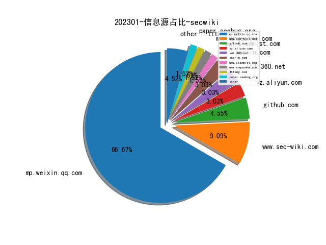
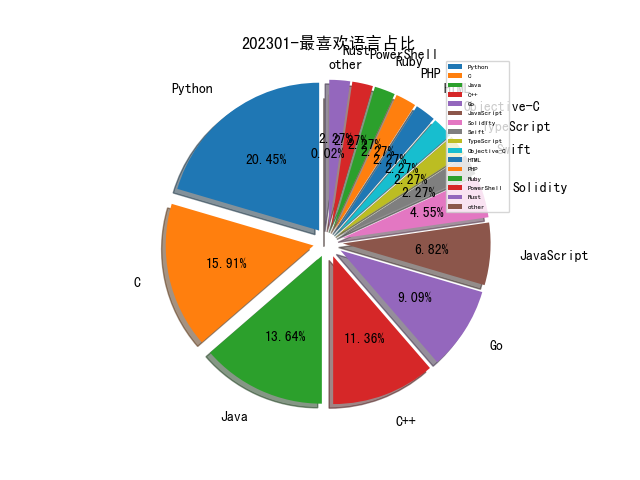

# [数据--所有](README_20.md)
# [数据--年度](README_2023.md)
# 202301 信息源与信息类型占比

# 微信公众号 推荐
| nickname_english | weixin_no | title | url| 
| --- | --- | --- | ---| 
| 信安文摘 | share-for-life | 【安全记录】- Nacos accessToken 权限认证绕过漏洞及思考 | https://mp.weixin.qq.com/s/vsdbYACk2ShI3tx0dnOxpA | 1| 
| 云影实验室 | gh_d86289b99724 | php://filter过滤器利用之代码执行漏洞 | https://mp.weixin.qq.com/s/BvHzbgWA1alO7N2fkEfMYQ | 1| 
| 平猫的音乐 | gh_f6e103434039 | 成体系：大论文的另一关键环节 | https://mp.weixin.qq.com/s/GK6VncT-WbHz0Euuf7drZA | 2| 
| 人机与认知实验室 | gh_9c3c1f805cb8 | DARPA的可解释人工智能程序 | https://mp.weixin.qq.com/s/F9Dtvrlu8AU15HhTVQQojQ | 1| 
| 看雪学苑 | ikanxue | 自动化提取恶意文档中的shellcode | https://mp.weixin.qq.com/s/xEHnaBmpH0zrhMKBvjxoGw | 1| 
| 源影安全实验室 | MetaShadow | CVE-2022-41080_41082 Microsoft Exchange Server OWASSRF远程代码执行漏洞分析 | https://mp.weixin.qq.com/s/Fl7oz6VXI8k5Qn0MOk61aw | 1| 
| 摄星 | Vulinsight | 从CISA KEV看海量漏洞管理方法 | https://mp.weixin.qq.com/s/X5J4gYanCGrGMJ9Yp6J8tQ | 1| 
| 丁司图 | gh_ea35ef49ac14 | 顶会论文写作建议（上）：宏观布局，避免“hard to follow” | https://mp.weixin.qq.com/s/kberQa8ss7l2gh9PAx_cSQ | 1| 
| 长个新的脑袋 | gh_12ca60dcf67f | JDK-Xalan的XSLT整数截断漏洞利用构造 | https://mp.weixin.qq.com/s/xxAtjFvk9RxWiY-pwGf8Ow | 1| 
| 银针安全 | SilverNeedleLab | 一个高度可定制化的JNDI和Java反序列化利用工具 | https://mp.weixin.qq.com/s/-OE1MlqaCUl7gmSPVNBr7g | 1| 
| 绿盟科技研究通讯 | nsfocus_research | 开源软件安全性分析 | https://mp.weixin.qq.com/s/dDHmQkWhSchnD7kTBtKymw | 1| 
| 奇安信威胁情报中心 | gh_166784eae33e | 疑似Kasablanka组织近期针对俄罗斯的攻击活动分析 | https://mp.weixin.qq.com/s/b0FSKQ6D3MvlA8yX3v4IUg | 1| 
| r3kapig | r3kapig-team | idek 2022* Forensics Writeup by r3kapig | https://mp.weixin.qq.com/s/sEk8lFgn8hP7RNapcqvb5Q | 3| 
| huasec | ihuahua04 | 利用空间测绘进行威胁分析 | https://mp.weixin.qq.com/s/b-rynWs2xX3ft48QFx8NBg | 1| 
| 阿里开发者 | ali_tech | 一文梳理Code Review方法论与实践总结 | https://mp.weixin.qq.com/s/_4MFrQSYOIGYRdDGOJPDKQ | 1| 
| 蛇矛实验室 | Cybersnaker | 安全开发之Pcshare流程分析 | https://mp.weixin.qq.com/s/R1Fgyj0pUCxFGq4-YFfMXw | 1| 
| CodeWisdom | gh_2395906a410f | 关于大模型时代软件智能化开发的一点展望 | https://mp.weixin.qq.com/s/UTcnFq53JjIMsShmKtQvDw | 1| 
| 迪哥讲事 | growing0101 | 赏金猎人系列-如何测试文件上传功能 | https://mp.weixin.qq.com/s?__biz=MzIzMTIzNTM0MA==&mid=2247487158&idx=1&sn=6373bf434deaaa6a9a055f9c0400b512&chksm=e8a604d5dfd18dc361addad111cb78a461baf4e6a3a954799b9c8ed8230fce6707f727f1f0ab&scene=21#wechat_redirect | 1| 
| 红队蓝军 | Xx_Security | 域内定位个人PC的三种方式 | https://mp.weixin.qq.com/s/uXTo2AbmvMeNesR8rAjImw | 1| 
| 华为安全 | HuaweiSecurity | 安全态势感知专家说第2期：人工智能技术在态势感知的应用 | https://mp.weixin.qq.com/s/AVlAoCPEJnNL_DuHGGD0Hg | 1| 
| 中国信息安全 | chinainfosec | 法治 , 网络爬虫犯罪的量刑问题及对策 | https://mp.weixin.qq.com/s/wLmhVB6Ch_hEjt3W90m_Og | 1| 
| 专注安管平台 | gh_48603b9bb05a | Forrester：2022年安全分析平台厂商评估 | https://mp.weixin.qq.com/s/p1U1M0UvzdaNccVqt7914g | 1| 
| FuzzWiki | gh_fcf21e658324 | 2022年CCF B级以上期刊fuzz论文汇总｜技术进展 | https://mp.weixin.qq.com/s/ex__TFMsWXtft83g677DTg | 1| 
| FOFA | gh_d79c8913fde8 | 最佳实践：如何固化IP画像流程 | https://mp.weixin.qq.com/s/nx0uomXnzBBJ6o66jWr2_g | 1| 
| DataCon大数据安全分析竞赛 | gh_a0316d342599 | 冠军Writeup大放送 , DataCon2022网络流量分析赛道之“见世面”战队 | https://mp.weixin.qq.com/s/uOB1kZ7YIJ27IlyXtaYPYA | 2| 
| 长亭技术沙盒 | chaitintech_release | RWCTF 5th ShellFind Write-up | https://mp.weixin.qq.com/s/Wb7SMy8AHtiv71kroHEHsQ | 1| 
| 认知独省 | cogniti0n | 攻防技术创新探究 | https://mp.weixin.qq.com/s/b2_I4udKrE6ERyWjT8f5hA | 1| 
| Netlab 三六零 | Netlab_360 | 警惕：魔改后的CIA攻击套件Hive进入黑灰产领域 | https://mp.weixin.qq.com/s/gXAbrnqgXZDS_eUvsYNmZA | 1| 
| Beacon Tower Lab | WebRAY_BTL | 玩转CodeQLpy之代码审计实战案例 | https://mp.weixin.qq.com/s/OJPhl17HS8EBC6GLEAPvDg | 2| 
| 安在 | AnZer_SH | 安在盘点 , 2022国内网络安全融资：我们不必妄自菲薄 | https://mp.weixin.qq.com/s/vnCdiOB1tsvkdgz5-5Z8ug | 1| 
| 网安罗盘 | SecurityCompass | 美国2023财年网络安全预算分析与思考 | https://mp.weixin.qq.com/s/4SKZHMLC24m0XNZIF6qkTg | 1| 
| Gcow安全团队 | Gcow666 | 赏金猎人:IChunQiu云境-Spoofing Writeup | https://mp.weixin.qq.com/s/wlnXFIoTbbi4V0p1TQPDrg | 1| 
| 电驭叛客 | langu_xyz | 面向实战的基础安全体系升级 | https://mp.weixin.qq.com/s/E1cDMfGRbF0hKlvnJ2PMFQ | 1| 
| 威胁棱镜 | THREAT_PRISM | 2022 年 GreyNoise 在野大规模漏洞利用报告 | https://mp.weixin.qq.com/s/lksZSS7RlkBiRUUfDvB0UA | 3| 
| 奇安信技术研究院 | jishuyanjiuyuan001 | 【天问】2022年PyPI恶意包年度回顾 | https://mp.weixin.qq.com/s/rQ2IkiDCc_NEjZUWXBE4YQ | 2| 
| 信息安全与通信保密杂志社 | cismag2013 | 美太空领域网络安全能力建设研究 | https://mp.weixin.qq.com/s/_8dBUet5BogjVEbpN6jfTg | 1| 
| 219攻防实验室 | gh_4576a36fa848 | 调教某数字杀软，权限维持so easy | https://mp.weixin.qq.com/s/IYGon3X4-cQwnwwb1WZWww | 1| 
| 安全内参 | anquanneican | 卡巴斯基深度报告：从俄乌战争重新评估网络战 | https://mp.weixin.qq.com/s/-qGn-mQBaptREToko3iC0Q | 2| 
| 卫星黑客 | Satellite_Hacker | 《2022太空安全报告》 | https://mp.weixin.qq.com/s/N8kTUz11C2aAsZyYk85r4g | 1| 
| 安全学术圈 | secquan | SLEUTH：基于COTS审计数据的实时攻击场景重构 | https://mp.weixin.qq.com/s/0zgoFUn1R3mS5m3UCOaYSg | 3| 

# 私人github账号 推荐
| github_id | title | url | p_url | p_profile | p_loc | p_company | p_repositories | p_projects | p_stars | p_followers | p_following | repo_lang | repo_star | repo_forks | 
| --- | --- | --- | --- | --- | --- | --- | --- | --- | --- | --- | --- | --- | --- | ---| 
| s0duku | VMware Workstation Heap OOB 漏洞POC。 | https://github.com/s0duku/cve-2022-31705 | https://github.com/s0duku?tab=followers | NJFU | None | None | 123 | 0 | 106 | 0 | 0 | Python,C,C++ | 0 | 0 | 1| 
| romainthomas | 一款基于LIEF和LLVM的对Objective-C语言二进制文件中类成员分析的工具。 | https://github.com/romainthomas/iCDump | https://github.com/lief-project | Security Engineer working on mobile, obfuscation and file formats. Author & maintainer of @lief-project / @open-obfuscator | None | @lief-project @open-obfuscator | 50 | 0 | 331 | 0 | 0 | Java,C++ | 0 | 0 | 1| 
| potmdehex | Hexacon 2022会议中《More Tales from the iOS/macOS Kernel Trenches》议题slide，其中提及了CVE-2022-22640、CVE-2022-32821漏洞的原理等详细信息及利用技术。 | https://github.com/potmdehex/slides/blob/main/Hexacon_2022_More_Tales_from_the_iOS_macOS_Kernel_Trenches.pdf | https://github.com/potmdehex?tab=followers | Reverse Engineer | None | None | 12 | 0 | 10 | 0 | 0 | C,Ruby | 0 | 0 | 1| 
| objective-see | 解析BackgroundItems-v4.btm中的启动项信息,可用于MacOS的取证 | https://github.com/objective-see/DumpBTM/ | https://github.com/objective-see?tab=followers |  | Hawaii, USA | Objective-See Foundation | 28 | 0 | 0 | 0 | 0 | Objective-C | 0 | 0 | 1| 
| mrphrazer | Obfuscation Detection 一个用于自动检查二进制文件中的混淆代码和状态机的脚本/工具/Binary Ninja插件 | https://github.com/mrphrazer/obfuscation_detection | https://github.com/mrphrazer?tab=followers |  | None | None | 24 | 0 | 5 | 0 | 0 | Python | 0 | 0 | 1| 
| moyix | 基于Ghidra和GPT-3的辅助逆向工具 | https://github.com/moyix/gpt-wpre | https://github.com/moyix?tab=followers | Assistant Professor in CSE at NYU Tandon School of Engineering, focusing on security, program analysis, and reverse engineering. | New York, NY | None | 74 | 0 | 30 | 0 | 0 | Python,C,C++ | 0 | 0 | 1| 
| momika233 | CVE-2022-3656:Google Chrome 和基于 Chromium 的浏览器由于对一些文件上传功能缺乏symlink的检查,从而导致通过滥用symlink可以盗取你本地的一些重要配置文件 | https://github.com/momika233/CVE-2022-3656 | https://github.com/momika233?tab=followers | momika233 | Korea | None | 60 | 0 | 8 | 0 | 0 | Python,HTML | 0 | 0 | 1| 
| michalbednarski | CVE-2022-20452 的漏洞利用代码。可通过 LazyValue 将已安装的恶意 APP 提权至系统 APP | https://github.com/michalbednarski/LeakValue | https://github.com/michalbednarski?tab=followers |  | None | None | 16 | 0 | 2 | 0 | 0 | Java | 0 | 0 | 1| 
| jafarlihi | modreveal 找出当前Linux机器的隐藏Linux内核模块的工具 | https://github.com/jafarlihi/modreveal | https://github.com/jafarlihi?tab=followers |  | Baku, Azerbaijan | None | 29 | 0 | 2 | 0 | 0 | Go,C,Java,C++ | 0 | 0 | 1| 
| iczc | RealWorld CTF 5th 区块链挑战- realwrap Writeup | https://github.com/iczc/rwctf-5th-realwrap | https://github.com/iczc?tab=followers | Blockchain Security | Earth, Solar System | None | 20 | 0 | 1600 | 0 | 0 | Python,Go,JavaScript,Solidity | 0 | 0 | 1| 
| blackorbird | 2022年APT组织分析年鉴 | https://github.com/blackorbird/APT_REPORT/blob/master/summary/2023/2022%20Yearbook%20of%20APT%20group%20Analysis.pdf | https://github.com/blackorbird?tab=followers | APT hunter threat analyst | https://twitter.com/blackorbird | https://twitter.com/blackorbird | 46 | 0 | 125 | 0 | 0 | Python,C | 0 | 0 | 1| 
| bit4woo | Fiora：漏洞PoC框架Nuclei的图形版 | https://github.com/bit4woo/Fiora | https://github.com/ossdao-org | Creating with coding,Learning by doing,Learning by sharing! @ossdao-org•AIRDROP-0x028f231db6db1ef2f6bdb7bbc2da41bac976cdcc | shenzhen | https://space.bilibili.com/527442393 | 108 | 0 | 912 | 0 | 0 | Python,Java | 0 | 0 | 1| 
| bAuh0lz | CVE-2023-0297:pyLoad中由于js2py的eval_js安全配置不当导致未授权RCE | https://github.com/bAuh0lz/CVE-2023-0297_Pre-auth_RCE_in_pyLoad | https://github.com/bAuh0lz?tab=followers |  | None | None | 8 | 0 | 5 | 0 | 0 | Python,PHP | 0 | 0 | 1| 
| alt3kx | CVE-2023-24055:KeePass 配置文件具有写入权限的攻击者可以修改它并注入恶意触发器,可以泄露密码 | https://github.com/alt3kx/CVE-2023-24055_PoC | https://github.com/alt3kx?tab=followers | Red Teamer , PentTester , Bug Bounty , 0day guy! , Researcher , Lone Wolf...l opinions expressed are mine 🇪🇺 | France | None | 49 | 0 | 11 | 0 | 0 | C | 0 | 0 | 1| 
| akamai | 利用 Windows CryptoAPI 中的欺骗漏洞(CVE-2022-34689),Poc的攻击分为两种:一种利用 Chrome v48,另一种侧重于crypt32.dll中易受攻击的MD5 | https://github.com/akamai/akamai-security-research/tree/main/PoCs/CVE-2022-34689 | None | None | None | None | 0 | 0 | 0 | 0 | 0 | C,TypeScript,Java,Python,JavaScript,Go,Swift,PowerShell,Rust | 0 | 0 | 1| 
| Wh04m1001 | RazerEoP:Razer Synapse3 Macro模块中删除/移动任意文件的 PoC,可造成提权 | https://github.com/Wh04m1001/RazerEoP | https://github.com/Wh04m1001?tab=followers | OSCP,OSEP,CRTO,CRTP,CRTE,PACES | None | Infigo IS | 37 | 0 | 123 | 0 | 0 | Python,C,C++ | 0 | 0 | 1| 
| TheBlupper | idek 2022* CTF Hardest Demon Bloodbath by Riot题目的writeup | https://github.com/TheBlupper/ctf_writeups/tree/main/idek2022/Hardest%20Demon%20Bloodbath%20by%20Riot | https://github.com/TheBlupper?tab=followers | git: gud is not a git command. See git --help. | None | None | 6 | 0 | 5 | 0 | 0 | Python,JavaScript | 0 | 0 | 1| 
| SunWeb3Sec | Web3 安全-链上威胁分析教学 | https://github.com/SunWeb3Sec/DeFiHackLabs#web3-cybersecurity-academy | https://github.com/SunWeb3Sec?tab=followers | Lets make Web3 more secure! | None | None | 9 | 0 | 8 | 0 | 0 | Solidity | 0 | 0 | 1| 
| PaulNorman01 | Forensia:RedTeam后渗透阶段的痕迹清理工具 | https://github.com/PaulNorman01/Forensia | https://github.com/PaulNorman01?tab=followers | Cybersecurity researcher , Coder , Geek ! | None | None | 3 | 0 | 1 | 0 | 0 | C,C++ | 0 | 0 | 1| 
| Fndroid | Windows 上的 clash_for_windows 在 0.20.12 在订阅一个恶意链接时存在远程命令执行漏洞。因为对订阅文件中 rule-providers 的 path 的不安全处理导致 cfw-setting.yaml 会被覆盖，cfw-setting.yaml 中 parsers 的 js代码将会被执行 | https://github.com/Fndroid/clash_for_windows_pkg/issues/3891 | https://github.com/Fndroid?tab=followers |  | China | None | 82 | 0 | 186 | 0 | 0 |  | 0 | 0 | 1| 
| DallasFR | WalkerGate:通过查找ntdll的内存解析以进行系统调用 | https://github.com/DallasFR/WalkerGate | https://github.com/DallasFR?tab=followers |  | None | None | 14 | 0 | 2 | 0 | 0 | C | 0 | 0 | 1| 
| D1rkMtr | 劫持cscapi.dll以劫持explorer.exe来进行持久化驻留 | https://github.com/D1rkMtr/ExplorerPersist | https://github.com/D1rkMtr?tab=followers | Malware dev , C2 dev | None | None | 47 | 0 | 47 | 0 | 0 | C++ | 0 | 0 | 1| 
| 4ra1n | code-inspector: 基于字节码分析的Java代码审计工具 | https://github.com/4ra1n/code-inspector | https://github.com/4ra1n?tab=followers | 我是4ra1n，大家习惯叫我许少 | China | @chaitin | 9 | 0 | 15 | 0 | 0 | Go,Java | 0 | 0 | 1| 

# medium 推荐
| title | url| 
| --- | ---| 
| 入门级堆利用教学系列，目前共发布7篇 | http://medium.com/m/global-identity-2?redirectUrl=https%3A%2F%2Finfosecwriteups.com%2Fthe-toddlers-introduction-to-heap-exploitation-unsafe-unlink-part-4-3-75e00e1b0c68| 
| Bushwhackers关于rwctf的题目-hardened redis的Writeup | https://medium.com/@emil.lerner/hacking-redis-for-fun-and-ctf-points-3450c351bec1| 

# 论坛 推荐
| title | url| 
| --- | ---| 
| 通过隐藏导入表的方式规避杀软 | https://xz.aliyun.com/t/12035| 

# 论坛 推荐
| title | url| 
| --- | ---| 
| 各种架构ELF后门生成工具 | https://xz.aliyun.com/t/12054| 
| 全方位了解CORS跨域资源共享漏洞 | https://xz.aliyun.com/t/12001| 

# 日更新程序
`python update_daily.py`