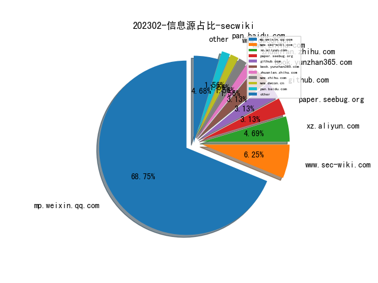
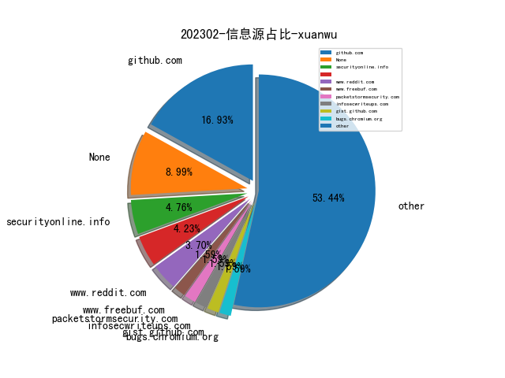
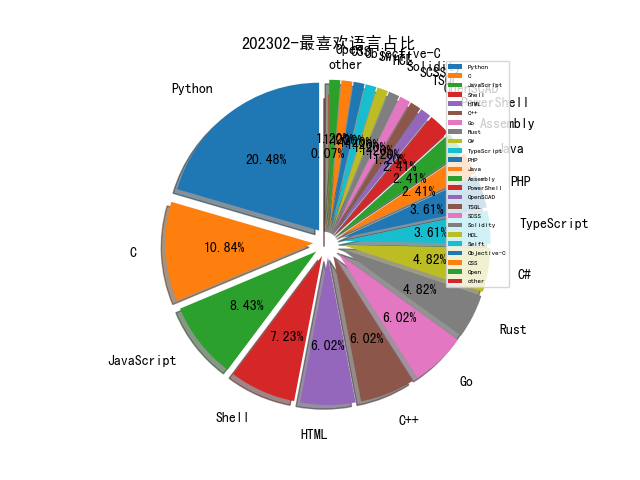

# [数据--所有](README_20.md)
# [数据--年度](README_2023.md)
# 202302 信息源与信息类型占比

# 微信公众号 推荐
| nickname_english | weixin_no | title | url| 
| --- | --- | --- | ---| 
| 金融电子化 | fcmag1993 | 案例 , 中国农业银行企业级SaaS化脆弱性管理平台建设实践 | https://mp.weixin.qq.com/s/9WoNVqGmc-KMPlPHTn5kwg | 1| 
| 王建硕 | gardendewalle | ChatGPT 中，G、P、T 分别是什么意思？ | https://mp.weixin.qq.com/s/vXoYeA7w6l_WiKmDHogdTA | 1| 
| 深信服千里目安全技术中心 | gh_c644c6e98b08 | 【高级威胁追踪】伪造Cisco VPN证书更新程序的C3木马 | https://mp.weixin.qq.com/s/iKPm0T3aR3Shjiw_W6jTsw | 1| 
| 数据治理体系 | DGsystem | 一起学习《数字中国建设整体布局规划》 | https://mp.weixin.qq.com/s/zUmy99B8wx7p8MrXVoYD1g | 1| 
| 安天集团 | Antiylab | 活跃的hoze挖矿木马分析 | https://mp.weixin.qq.com/s/-mZD0pPbeIgxoTUNNFBnrw | 1| 
| 安全牛 | aqniu-wx | 网络靶场：划时代的新型网络安全基础设施 | https://mp.weixin.qq.com/s/EVrDJfoL2_I5_o4flRo3Kg | 1| 
| DarkNavy | DarkNavyCom | 「 深蓝洞察 」2022 年度最“不可赦”漏洞 | https://mp.weixin.qq.com/s/P_EYQxOEupqdU0BJMRqWsw | 1| 
| 青衣十三楼飞花堂 | scz------ | 加密SOCKS5信道中防DNS泄露 | https://mp.weixin.qq.com/s/SNu9SXFFT1xA6LH4r81YOw | 1| 
| 山石网科安全技术研究院 | HSN_LAB | ChatGPT在信息安全竞赛中出题与解题实践 | https://mp.weixin.qq.com/s/EIGuFDXojTazH3gDV8vkVg | 1| 
| 嘶吼专业版 | Pro4hou | 针对开发者的供应链攻击 | https://mp.weixin.qq.com/s/7lmd4jFM3UWIZRbXzf3TWA | 1| 
| T00ls安全 | T00lsSec | chatGPT生成webshell实践与探究 | https://mp.weixin.qq.com/s/CWWXLJyO_kv3C2L3djhbHg | 1| 
| NISL实验室 | NISL_THU2020 | 【论文分享】从用户视角评估俄乌冲突中乌克兰互联网稳定性 | https://mp.weixin.qq.com/s/gGpg1fKQTZqSHakyVrkTig | 1| 
| 网信中国 | cacweixin | 个人信息出境标准合同办法 | https://mp.weixin.qq.com/s/5T7pCReDif6tzCd56m3zKA | 1| 
| 一个人的安全笔记 | xjiek2015 | [HTB] NodeBlog Writeup | https://mp.weixin.qq.com/s/YHFuh42FvDWSx3j4kzwhqw | 1| 
| 轻金融 | Qjinrong | 工行发布《2022网络金融黑产研究报告》 | https://mp.weixin.qq.com/s/tQE0BtclxX6McZRoO5MKVg | 1| 
| 莫哥谈安全 | gh_247dfbdf3d43 | ChatGPT在MITREATT&CK落地中的应用 | https://mp.weixin.qq.com/s/hehFQbR6lqAABEDhrxtIBg | 1| 
| 华为安全 | HuaweiSecurity | 从攻击视角探讨ChatGPT对网络安全的影响 | https://mp.weixin.qq.com/s/ph5GnQFIGcSzi-9H-YlJTA | 1| 
| 中国信息安全 | chinainfosec | 论坛·2022全球网空态势回顾 , 2022年度欧盟网络安全态势综述 | https://mp.weixin.qq.com/s/UoQwrnXr8OTfjyDzOT6xmg | 1| 
| vivo千镜 | gh_54ff3f871510 | 浅谈应用分发平台标准动态 | https://mp.weixin.qq.com/s/8sN0OBkwveVDQu9aQMXDfg | 1| 
| 360数字安全 | gh_6db130c5163e | 《2022年度反诈报告》重磅发布！ | https://mp.weixin.qq.com/s/unvQR8lneWQVP3bHj3fOWA | 1| 
| 网络空间安全军民融合创新中心 | jmrh1226 | 2022年全球国防网络空间情况综述（网军建设篇-下） | https://mp.weixin.qq.com/s/wJttA6_73oMQsOGS2CIhlQ | 2| 
| 安全学术圈 | secquan | 2023年国家自然科学基金安全领域部分题目列表 | https://mp.weixin.qq.com/s/uKg6pek3tJfdcB_RuyDoLw | 1| 
| 专注安管平台 | gh_48603b9bb05a | ChatGPT在安全运营中的应用初探 | https://mp.weixin.qq.com/s/QqoVOAgzXzHafvZmtXWTxg | 1| 
| CNCERT国家工程研究中心 | NELCERT | ChatGPT 对网络安全的影响 | https://mp.weixin.qq.com/s/oEddKCs1kXeyQBxUz5trEQ | 1| 
| APTHunter | gh_5e5d0798abea | 程序执行痕迹进行取证的多种方式 | https://mp.weixin.qq.com/s/TQBPJr-g2FUbwYtX6JzHPg | 1| 
| ABC123安全研究实验室 | abc123network | 第51篇：某运营商外网打点到内网横向渗透的全过程 | https://mp.weixin.qq.com/s/AVEydEVTWqcOMVcA7amBVA | 1| 
| 恒星EDU | cyberslab | MISC｜西湖论剑·2022中国杭州网络安全技能大赛初赛官方Write Up | https://mp.weixin.qq.com/s/t6z7VjlW09b9A3Fv2bt7dA | 1| 
| 计算机文艺复兴 | gh_111b1f3866f6 | ChatGPT研究框架（80页PPT）, 国君计算机 | https://mp.weixin.qq.com/s/YtJn2pfdS_on1nSATOylYw | 2| 
| 绿盟科技 | NSFOCUS-weixin | ChatGPT概念“狂飙”，你追了吗？ | https://mp.weixin.qq.com/s/sZstPhuQSHN85rP_3urOWw | 1| 
| 墨菲安全 | murphy_sec | 软件供应链安全 2022 年回顾 | https://mp.weixin.qq.com/s/RQDqv7GxCo2bQqnlfsXt8g | 1| 
| 信息安全与通信保密杂志社 | cismag2013 | 2022网络空间安全重大项目发展概况 | https://mp.weixin.qq.com/s/w5Go3qqC8vJnJKL4k9R0Bg | 4| 
| 404 Not F0und | AI4Security | 换种思路做入侵检测 | https://mp.weixin.qq.com/s/7AwMJQjH8_zWUT3bWkoEzQ | 1| 
| 威胁棱镜 | THREAT_PRISM | 在线沙盒的 ATT&CK 映射能力调研 | https://mp.weixin.qq.com/s/m_eh9bWeYdKxnffSwbeMLQ | 3| 
| 赛博攻防悟道 | lookvul | 美国NSA安全运营关键原则 | https://mp.weixin.qq.com/s/uTjXfgYTP5ZHZpwPuFXNwA | 1| 
| 安全客 | anquanbobao | 【技术分享】开源软件供应链攻击回顾 | https://mp.weixin.qq.com/s/pAVrIQ0b66Y_YoSH3DLoIA | 1| 
| 4ra1n | sec-4ra1n | 分享Jar包分析工具：jar-analyzer | https://mp.weixin.qq.com/s/Rrx6x5M_28YRcQQCdxuEeQ | 1| 
| 有价值炮灰 | dust1337 | iptables 在 Android 抓包中的妙用 | https://mp.weixin.qq.com/s/P0ESUUXBmq2aQnrqDHsDaw | 1| 
| 太空安全 | SateSec | 九阶段太空攻击研究与战术分析框架和七层美国防太空架构 | https://mp.weixin.qq.com/s/TvEZKKzyRyb1_jVU1YeEMg | 2| 

# 私人github账号 推荐
| github_id | title | url | p_url | p_profile | p_loc | p_company | p_repositories | p_projects | p_stars | p_followers | p_following | repo_lang | repo_star | repo_forks | 
| --- | --- | --- | --- | --- | --- | --- | --- | --- | --- | --- | --- | --- | --- | ---| 
| voidz0r | ImageMagick 任意文件读的POC。漏洞存在于PNG的generator中。 | https://github.com/voidz0r/CVE-2022-44268 | https://github.com/voidz0r?tab=followers | Security Engineer, Security Researcher and Developer. I love to break things and I get mad at the 3rd nested loop. | Anywhere | DHL Express | 29 | 0 | 4 | 0 | 0 | Python,PHP,JavaScript,Rust | 0 | 0 | 1| 
| tihmstar | homepod越狱工具 | https://github.com/tihmstar/homepwn#3d-print-version | https://github.com/tihmstar?tab=followers | My PGP Key fingerprint can be found in my Twitter bio: https://twitter.com/tihmstar | None | None | 85 | 0 | 15 | 0 | 0 | OpenSCAD,C,Objective-C,C++ | 0 | 0 | 1| 
| teambi0s | bi0sCTF 2022 Offical source code && env && sol | https://github.com/teambi0s/bi0sCTF/tree/main/2022 | None | None | None | None | 0 | 0 | 0 | 0 | 0 | C,Shell,Python,JavaScript,C++,HTML,CSS | 0 | 0 | 1| 
| phplaber | Yawf: 开源的 Web 漏洞自动化检测工具 | https://github.com/phplaber/yawf | https://github.com/phplaber?tab=followers | Security researcher | Nanjing, China | None | 7 | 0 | 384 | 0 | 0 | Python,Go,PHP | 0 | 0 | 1| 
| o2sh | 一个可以显示Git仓库详细信息的工具，可以离线使用。 | https://github.com/o2sh/onefetch | https://github.com/o2sh?tab=followers |  | None | None | 15 | 0 | 1 | 0 | 0 | Shell,Rust | 0 | 0 | 1| 
| nikn0laty | pdfkit命令执行漏洞CVE-2022-25765 Exp | https://github.com/nikn0laty/PDFkit-CMD-Injection-CVE-2022-25765 | https://github.com/nikn0laty?tab=followers |  | None | None | 1 | 0 | 0 | 0 | 0 | Python | 0 | 0 | 1| 
| nanabingies | Dell dbutil_2_3.sys 驱动提权漏洞的exp | https://github.com/nanabingies/CVE-2021-21551 | https://github.com/nanabingies?tab=followers | if you base your expectations on what you see, you blind yourself to the possibilities of what could be | Accra, Ghana | None | 21 | 0 | 21 | 0 | 0 | Assembly,C++ | 0 | 0 | 1| 
| mazen160 | 一个用于检测secrets的正则表达式集合，可以在各种文件中匹配secrets。 | https://github.com/mazen160/secrets-patterns-db | https://github.com/mazen160?tab=followers | Cyber Security Engineer (Offensive Security) | None | None | 31 | 0 | 7 | 0 | 0 | Python,Shell | 0 | 0 | 1| 
| kurogai | 100 Red Team Projects for Pentesters and Network Managers | https://github.com/kurogai/100-redteam-projects | https://github.com/kurogai?tab=followers | Web Developer and Penetration Tester (HackTheBox Competitive Player) | Luanda / Angola | None | 61 | 0 | 144 | 0 | 0 | Python,JavaScript,Java | 0 | 0 | 1| 
| kraken-ng | 模块化的、支持多语言的webshell | https://github.com/kraken-ng/Kraken | None | None | None | None | 0 | 0 | 0 | 0 | 0 | Python,C#,PHP | 0 | 0 | 1| 
| horizon3ai | Fortinet FortiNAC CVE-2022-39952的POC，未授权解压缩可导致任意文件写入，通过crontab实现RCE | https://github.com/horizon3ai/CVE-2022-39952 | None | None | None | None | 0 | 0 | 0 | 0 | 0 | Python | 0 | 0 | 1| 
| googleprojectzero | Fuzzilli新增了一个用于将js代码转换成Fuzzili IR的工具。 | https://github.com/googleprojectzero/fuzzilli/commit/807625f0112df22bfe293aa4d36d67c31c4fb243 | None | None | None | None | 0 | 0 | 0 | 0 | 0 | C,C#,C++,Python,HTML,Swift,PowerShell | 0 | 0 | 1| 
| dicegang | DiceCTF 2023 Offical sourcecode && env && sol | https://github.com/dicegang/dicectf-2023-challenges | None | None | None | None | 0 | 0 | 0 | 0 | 0 | Python,C,HTML,JavaScript | 0 | 0 | 1| 
| daem0nc0re | 用于研究windows进程执行技术的工具包 | https://github.com/daem0nc0re/TangledWinExec/tree/main/ReflectiveDLLInjection | https://github.com/daem0nc0re?tab=followers |  | None | None | 10 | 0 | 0 | 0 | 0 | C#,Assembly | 0 | 0 | 1| 
| cisagov | 一个可能可以恢复ESXiArgs勒索病毒的脚本。 | https://github.com/cisagov/ESXiArgs-Recover | None | None | None | None | 0 | 0 | 0 | 0 | 0 | Shell,HTML,Python,Open,JavaScript,TypeScript,TSQL,HCL | 0 | 0 | 1| 
| blackorbird | Picus出版的2023年版APT攻击报告 | https://github.com/blackorbird/APT_REPORT/blob/master/summary/2023/RedReport2023-Picus.pdf | https://github.com/blackorbird?tab=followers | APT hunter threat analyst | https://twitter.com/blackorbird | https://twitter.com/blackorbird | 46 | 0 | 125 | 0 | 0 | Python,C | 0 | 0 | 1| 
| batteryshark | 利用 QEMU + GDB 帮助魔改，逆向和理解嵌入式系统内核 | https://github.com/batteryshark/writeups/wiki/Go-to-Shell---Reverse-Engineering-Kernel-Modifications-with-QEMU-gdb | https://github.com/batteryshark?tab=followers |  | None | None | 65 | 0 | 13 | 0 | 0 | C#,C,C++ | 0 | 0 | 1| 
| ashemery | 香普兰学院的逆向和二进制漏洞利用课程相关的配套练习 | https://github.com/ashemery/exploitation-course/tree/master/labs | https://github.com/ashemery?tab=followers | [Between Teams of Red and Blue, Im with the Purple Team] | USA | https://www.cyber5w.com | 37 | 0 | 20 | 0 | 0 | Python,Shell,PowerShell | 0 | 0 | 1| 
| RF-CTI | 2022 SANS 网络威胁情报峰会资料 | https://github.com/RF-CTI/SANS-summit/blob/master/01-2022%20SANS%20Cyber%20Threat%20Intelligence%20Summit/01-2022%20SANS%20Cyber%20Threat%20Intelligence%20Summit.md | None | None | None | None | 0 | 0 | 0 | 0 | 0 | Python,SCSS,HTML | 0 | 0 | 1| 
| LloydLabs | 使用NtQueueApcThreadEx向windows进程注入任意shellcode，可以用于bypass部分终端安全检测 | https://github.com/LloydLabs/ntqueueapcthreadex-ntdll-gadget-injection | https://github.com/LloydLabs?tab=followers | 🐶 | London | @CrowdStrike | 14 | 0 | 270 | 0 | 0 | Go,C | 0 | 0 | 1| 
| GuardianAudits | GMX合约的审计报告 | https://github.com/GuardianAudits/Audits/tree/main/GMX | https://github.com/GuardianAudits?tab=followers |  | None | None | 5 | 0 | 0 | 0 | 0 | JavaScript,Solidity | 0 | 0 | 1| 
| DvorakDwarf | 该工具可以将任意文件以视频形式存储，将视频上传到视频网站进而使用其免费的云存储 | https://github.com/DvorakDwarf/Infinite-Storage-Glitch | https://github.com/DvorakDwarf?tab=followers | Contact over discord, preferably. Discord: HistidineDwarf#8927 | Nowhere | Middle of | 13 | 0 | 26 | 0 | 0 | Python,Shell,Rust | 0 | 0 | 1| 
| Cyber-Buddy | 一个基于OWASP MASVS (Mobile Application Security Verification Standard) 的安卓应用安全检测工具。 | https://github.com/Cyber-Buddy/APKHunt | https://github.com/Cyber-Buddy?tab=followers |  | None | None | 1 | 0 | 1 | 0 | 0 | Go | 0 | 0 | 1| 
| ChromeDevTools | Chrome Devtools的RFC，将允许用户本地覆写http reponse的header。 | https://github.com/ChromeDevTools/rfcs/discussions/4 | None | None | None | None | 0 | 0 | 0 | 0 | 0 | TypeScript,JavaScript | 0 | 0 | 1| 
| CMEPW | 一个如何绕过Antivirus的知识思维导图。 | https://github.com/CMEPW/BypassAV | None | None | None | None | 0 | 0 | 0 | 0 | 0 | Python,Go,C,TypeScript | 0 | 0 | 1| 
| BKreisel | CVE-2022-23935 的 Python Exp 。漏洞源自于 ExifTool ，一款开源软件，用于读取、写入和操作图像、音频、视频和 PDF 元数据，该漏洞错误地处理了 file 参数的检查，导致命令注入。 | https://github.com/BKreisel/CVE-2022-23935 | https://github.com/BKreisel?tab=followers |  | Golden, Colorado | None | 23 | 0 | 33 | 0 | 0 | Python,C,Rust | 0 | 0 | 1| 
| 0xf4n9x | GoAnywhere MFT反序列化漏洞（CVE-2023-0669）利用工具 | https://github.com/0xf4n9x/CVE-2023-0669 | https://github.com/0xf4n9x?tab=followers | #InfoSec , #PenTest , #RedTeam , #SecResearch , #Student | /dev/null | None | 58 | 0 | 3100 | 0 | 0 | Go,Python,Java | 0 | 0 | 1| 

# medium 推荐
| title | url| 
| --- | ---| 
| 一个合约的形式化认证工具。 | https://medium.com/nethermind-eth/introduction-to-horus-part-1-fbc16af3ba67| 
| 微软MSRC官网的XSS漏洞的发现过程。 | http://m3ez.medium.com/how-i-found-dom-based-xss-on-microsoft-msrc-and-how-they-fixed-it-8b71a6020c82| 
| 一种使用VNC进行钓鱼等技术，该技术主要是通过引导受害者登陆一个由noVNC搭建的通向VNC的Web站点并进行登陆。由于受害者登陆的站是真实的站，因此这种钓鱼方法可以自然地直接绕过MFA。 | https://medium.com/@psychsecurity/mfa-phishing-using-novnc-and-aws-ebc781b4d093| 
| 介绍了一系列工具用来bug bountry自动化。内容比较初级。 | https://sn0xsharma.medium.com/automation-using-python-in-bug-bountys-full-practical-explanation-e1e694c43f78| 
| 介绍了一些简单的2FA的bypass方法。不过这类方法估计很难在实际中奏效。 | http://medium.com/m/global-identity-2?redirectUrl=https%3A%2F%2Fthegrayarea.tech%2Fbug-hunting-101-multi-factor-authentication-otp-bypass-79f03b554df6| 

# 知乎 推荐
| title | url| 
| --- | ---| 
| ZKP in Hidden Order Group 未知阶群内的零知识证明 | https://zhuanlan.zhihu.com/p/603726514| 
| 如何写好一篇高质量的IEEE/ACM Transaction级别的计算机科学论... | https://www.zhihu.com/question/22790506/answer/990626321| 

# 论坛 推荐
| title | url| 
| --- | ---| 
| Mimikatz Bypass Credential Guard的记录 | https://xz.aliyun.com/t/12097| 

# 论坛 推荐
| title | url| 
| --- | ---| 
| Java反序列化预备全知 | https://xz.aliyun.com/t/12155| 
| Tailscale在内网渗透中利用的研究 | https://xz.aliyun.com/t/12151| 
| C2服务器隐藏与Linux上线 | https://xz.aliyun.com/t/12094| 

# 日更新程序
`python update_daily.py`