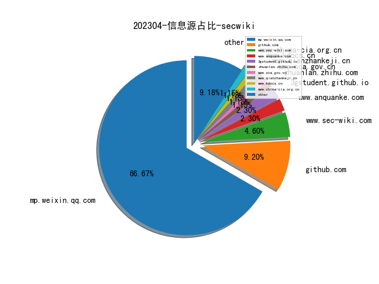
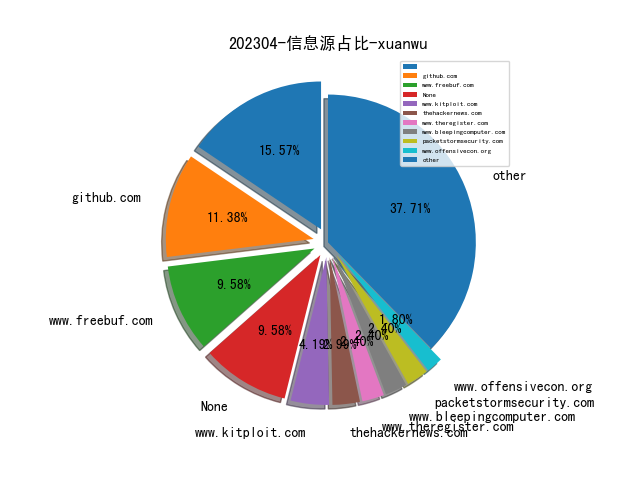
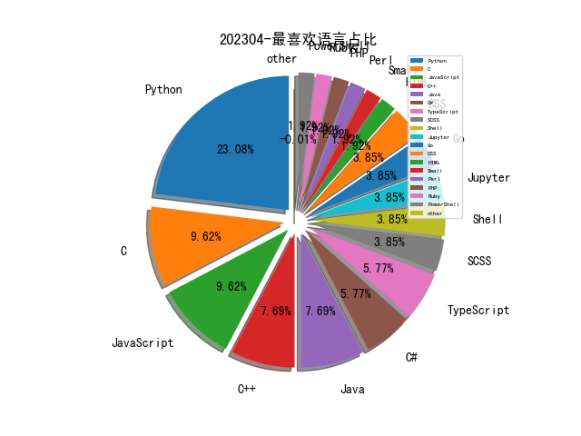

# [数据--所有](README_20.md)
# [数据--年度](README_2023.md)
# 202304 信息源与信息类型占比

# 政策 推荐
| title | url| 
| --- | ---| 
| 商用密码管理条例（修订草案征求意见稿） | http://www.sca.gov.cn/sca/hdjl/2020-08/20/content_1060779.shtml| 
| 生成式人工智能服务管理办法（征求意见稿） | http://www.cac.gov.cn/2023-04/11/c_1682854275475410.htm| 

# 微信公众号 推荐
| nickname_english | weixin_no | title | url| 
| --- | --- | --- | ---| 
| 顺丰安全应急响应中心 | SFSRC- | 供应链投毒事件调查：一个免杀爱好者沦为“肉鸡”的全过程！ | https://mp.weixin.qq.com/s/ew13ir5IrEYDR2VOM1ZRmQ | 1| 
| 腾讯开源 | tencentopen | 开源项目发布｜SessionAnalytics - 基于互联网用户Session会话的用户路径分析和挖掘系统 | https://mp.weixin.qq.com/s/xK0XNjQdF9fBRsT5FJvHbg | 1| 
| 希潭实验室 | abc123network | 第58篇：美国安全局NSA入侵西北工业大学流程图梳理和分析(正式篇) | https://mp.weixin.qq.com/s/ZnURmB5lc8Ckh7LZJ6IPWw | 1| 
| 信息安全与通信保密杂志社 | cismag2013 | 从 CADS 计划看美国网络防御体系发展 | https://mp.weixin.qq.com/s/KDxjSsLxiIbgMsLfM-CXwg | 1| 
| OnionSec | gh_8ab0e346e1df | 对Code Insight的学习笔记 | https://mp.weixin.qq.com/s/ldCto4vZBXLBdgjJYABr7A | 1| 
| Desync InfoSec | gh_1a0c9eea6b2a | 参加了多次攻防演练后，不知你的蓝队能否检测这些勒索组织TTPs！ | https://mp.weixin.qq.com/s/5Ll9j8HIj4dWhxavOyX75Q | 1| 
| 网安国际 | inforsec | 【InForSec2023 年会论坛回顾】张殷乾：打造机密计算的安全底座 | https://mp.weixin.qq.com/s/5z7HA-t5zUzd4kuPROb4Hg | 1| 
| 深信服千里目安全技术中心 | gh_c644c6e98b08 | 【高级威胁追踪(APT)】Patchwork组织更新技术卷土重来，针对境内教育科研单位再次发起攻击行动 | https://mp.weixin.qq.com/s/Nk2zml2d0HtK0hszyKW2Dw | 1| 
| 悬镜安全 | Anpro-tech | SCA技术进阶系列（二）：代码同源检测技术在供应链安全治理中的应用 | https://mp.weixin.qq.com/s/Tmw4xHGanVtR_9y-ow2zOg | 1| 
| 中国信息安全 | chinainfosec | 前沿 , 从美方推动零信任战略过程看网络安全创新的规律特点 | https://mp.weixin.qq.com/s/6GPD7bzwWP01aF4qI4XLhQ | 3| 
| Hacking就是好玩 | gh_aed6cfc863ed | 自动化漏洞赏金(bugbounty)和xscan扫描器总结 | https://mp.weixin.qq.com/s/A6Kjej2pfcCjuY7qey5irw | 1| 
| Bypass | Bypass-- | 一个AK/SK泄露检测的实现思路 | https://mp.weixin.qq.com/s/cplbL_TUKjCuGTpI7YCKQg | 1| 
| 数说安全 | csreviews | 废除销许？公告发布后对行业有哪些影响？ | https://mp.weixin.qq.com/s/Xq0XD7QO-OcEQ-HVlIctPg | 1| 
| 掌控安全EDU | ZKAQEDU | Wordpress 6.1.1 后台命令执行 | https://mp.weixin.qq.com/s/aakTQ9fgUVzG61uEPySLXA | 1| 
| 小贝说安全 | xiaobeisaq | 网络安全产品管理政策遇重大调整，什么情况？ | https://mp.weixin.qq.com/s/gzKbqCh5qvT3dUG7CyDvfA | 1| 
| 老刘说NLP | Laoliushuo_NLP | ChatGPT谈开源大模型的风险与版权控制策略：从具体影响到不同角度的版权控制策略总结 | https://mp.weixin.qq.com/s/dI-bhaUb1Vre7UVyMqZSOg | 1| 
| 明不可欺 | gh_1405d616adc7 | 从不同角度分析当前网络犯罪 | https://mp.weixin.qq.com/s/tFT0r_u7upU0d_U7R-Kivg | 1| 
| 安全牛 | aqniu-wx | 2023年地下网络犯罪态势观察与发现 | https://mp.weixin.qq.com/s/LrfbCW9fHq_BzCoBgaEeNA | 1| 
| 哔哩哔哩技术 | bilibili-TC | 云原生安全-从k8s日志审计视角检测自动化工具攻击 | https://mp.weixin.qq.com/s/nZu4p5ZSmyzOVhQleIXQpg | 1| 
| Java知音 | Java_friends | Prometheus + Grafana，开源监控神器！ | https://mp.weixin.qq.com/s/SectHc6cA3hHi5yBAEHNBg | 1| 
| Founder Park | Founder-Park | Sam Altman 的创业手册 , 周末长文 | https://mp.weixin.qq.com/s/HWz7CWjJwLm6FfwgMi37sA | 1| 
| 360威胁情报中心 | CoreSec360 | APT-C-28（ScarCruft）组织对韩国地区攻击活动分析 | https://mp.weixin.qq.com/s/RHbsCLzahLP0zGgC3N5pPQ | 1| 
| 绿盟科技 | NSFOCUS-weixin | RSA 2023创新沙盒盘点｜Relyance AI：利用语义分析和代码审计实现数据治理左移 | https://mp.weixin.qq.com/s/UWwN1iYdd3v-CpTnt8o1hQ | 1| 
| 红队蓝军 | Xx_Security | Beacon内存特征修改绕过卡巴斯基 | https://mp.weixin.qq.com/s/cnX-6dQmUd0OQMikR2FG0g | 1| 
| 知识产权那点事 | IPR888888 | 网络游戏黑灰产的反法规制探析 | https://mp.weixin.qq.com/s/-7abZY7xc04NLZIFwyQzaw | 1| 
| 无限手套Infinity Gauntlet | gh_8d126cb22752 | 关于对ISO/IEC 27002中威胁情报的思考 | https://mp.weixin.qq.com/s/PhUNbAri9u8SMZDWPw2YTg | 1| 
| 数据科学重点实验室 | sjkx2013- | 学术观点 , 从技术“玩具”到治理工具：将ChatGPT引入公共治理领域的风险与策略 | https://mp.weixin.qq.com/s/C4sjpxuIW4jl030ZTNKKXA | 1| 
| 奇安信威胁情报中心 | gh_166784eae33e | RedGoBot 团伙武器库更新并转向暗网 | https://mp.weixin.qq.com/s/luO1PsjafK-b8z006VGG_A | 1| 
| 千寻安服 | scaf_0123 | 机器学习检测Cobalt Strike流量 | https://mp.weixin.qq.com/s/BgTQ98yfLALrYkHbsh_Agw | 1| 
| 军机故阁 | gh_e57baf46bdf5 | 用AI开发逼真的社交傀儡帐户 | https://mp.weixin.qq.com/s/uLhtDWn_o2n4sAGJVQOJXg | 1| 
| 中央政法委长安剑 | changan-j | 国家安全机关公布一批危害国家安全典型案例 | https://mp.weixin.qq.com/s/OjyITQumPYtSBQ41EpNFqg | 1| 
| Tide安全团队 | TideSec | 从JS到内网横向 | https://mp.weixin.qq.com/s/KrbCMEn_8C7XcsHxGSwnIA | 1| 
| GobySec | gobysec | 跨越语言的艺术：Weblogic序列化漏洞与IIOP协议 | https://mp.weixin.qq.com/s/VotuOtXW-IjD3kKg91UgsQ | 1| 
| FuzzWiki | gh_fcf21e658324 | 2022软件工程领域顶会fuzz技术研究相关论文汇总｜技术进展 | https://mp.weixin.qq.com/s/n7nrfoZcJXtMEKitkOL5rA | 2| 
| ABC123安全研究实验室 | abc123network | 第56篇：美国安全局NSA入侵西北工业大学流程图梳理和分析（上篇） | https://mp.weixin.qq.com/s/Ba2NcOKGbpw9tj4ka6gaZA | 1| 
| 小宝的安全学习笔记 | blackTechOfBaby | 快手应用安全演进之路 | https://mp.weixin.qq.com/s/6ra8myOLJPRtbEd2JrAiNA | 1| 
| LemonSec | lemon-sec | 内存马流程理解与手写 EXP | https://mp.weixin.qq.com/s/2BSrWaB0B7cn0ng4BAwUHA | 1| 
| 慢雾科技 | SlowMist | 慢雾出品 , Web3 项目安全实践要求 | https://mp.weixin.qq.com/s/hBTDv5Jd0FLdLu0UKjzrGA | 1| 
| CodeWisdom | gh_2395906a410f | 智能化时代的软件工程：拥抱大模型的正确姿势 | https://mp.weixin.qq.com/s/A_SZzbyHTu22004YJmUZWA | 1| 
| 威胁棱镜 | THREAT_PRISM | 以 AI 速度赋能防御 | https://mp.weixin.qq.com/s/e6W2Uy64i9cY7U7-3FnoxQ | 2| 
| 公安部网络安全等级保护中心 | gh_f5f6bf3d09af | 基于等级保护思路的应用软件开发安全关键要素探讨 | https://mp.weixin.qq.com/s/J8nQRKXBMDBQqTl2InO9pg | 1| 
| 安全学术圈 | secquan | 利用静态提取的代码特征对过拟合补丁进行自动分类 | https://mp.weixin.qq.com/s/NcTHJFSF6w6R7XO-ejtzzA | 11| 
| 守望者实验室 | WatcherLAB | 供应链安全实践：基于风险的“供应链攻击面”梳理和分析 | https://mp.weixin.qq.com/s/xk8VFdgRfkcKCnP4xi5qmQ | 1| 
| 学术plus | caeit-e | 英国防部发布云战略路线图： 构建数字骨干 助力数字转型 | https://mp.weixin.qq.com/s/MOODFHGrf_aeXs5G3FzavQ | 1| 
| Seebug漏洞平台 | seebug_org | 原创Paper , parse-server 从原型污染到 RCE 漏洞(CVE-2022-39396) 分析 | https://mp.weixin.qq.com/s/AB3LiDutpMQm9C1eumy9IQ | 1| 
| Azure云科技 | MS_CEChina | CISO 聚焦 , AI驱动的微软安全防护：安全不仅仅是默认的，也是可以预测的 | https://mp.weixin.qq.com/s/lyHukb_LK0MASwhJT4baow | 1| 

# 私人github账号 推荐
| github_id | title | url | p_url | p_profile | p_loc | p_company | p_repositories | p_projects | p_stars | p_followers | p_following | repo_lang | repo_star | repo_forks | 
| --- | --- | --- | --- | --- | --- | --- | --- | --- | --- | --- | --- | --- | --- | ---| 
| xander-wang | logvision: 分布式实时日志分析与入侵检测系统 | https://github.com/xander-wang/logvision | https://github.com/xander-wang?tab=followers | null | Nanjing | None | 9 | 0 | 22 | 0 | 0 | Python,C,JavaScript,CSS | 0 | 0 | 1| 
| whitead | Paper QA，一个从 PDF 或文本文件中进行问答的最小包，它使用 OpenAI 嵌入和一个名为 FAISS 的矢量数据库来嵌入和搜索带有文本引用的文档 | https://github.com/whitead/paper-qa | https://github.com/whitead?tab=followers |  | Rochester, NY | University of Rochester | 62 | 0 | 414 | 0 | 0 | Python,JavaScript,Jupyter | 0 | 0 | 1| 
| vivo | MoonBox: 无侵入的流量录制与回放平台 | https://github.com/vivo/MoonBox | None | None | None | None | 0 | 0 | 0 | 0 | 0 | Go,TypeScript,Java,C++ | 0 | 0 | 1| 
| tongcheng-security-team | 安全隐私卫士（AppScan）一款免费的企业级自动化隐私检测工具 | https://github.com/tongcheng-security-team/AppScan | None | None | None | None | 0 | 0 | 0 | 0 | 0 | JavaScript | 0 | 0 | 2| 
| tkmru | EDR 绕过 PoC合集 | https://github.com/tkmru/awesome-edr-bypass | https://github.com/tkmru?tab=followers | 電脳ケロちゃん / Co-Founder & CTO of Sterra Security Co.,Ltd. / Metasploit GSoC 2017 / Black Hat USA 2020-2021 Arsenal / Black Hat USA 2021-2022 Arsenal | Japan | None | 97 | 0 | 826 | 0 | 0 | Python,Go,Java | 0 | 0 | 1| 
| revng | Revng - 可将支持架构（目前为 i386、x86-64、MIPS、ARM、AArch64 和 s390x）的 ELF 二进制文件的 QEMU 中间表示（一系列 TCG 指令）翻译成 LLVM IR的静态二进制二进制翻译器 | https://github.com/revng/revng/tree/feature/llvm-16 | None | None | None | None | 0 | 0 | 0 | 0 | 0 | Python,C,TypeScript,C++ | 0 | 0 | 1| 
| qianxiao996 | FrameScan-GUI: 图形化界面的cms漏洞检测框架 | https://github.com/qianxiao996/FrameScan-GUI | https://github.com/qianxiao996?tab=followers |  | None | None | 46 | 0 | 237 | 0 | 0 | Python,Java | 0 | 0 | 1| 
| plasma-umass | SQLwrite 将 AI 集成到您的数据库中：自动将自然语言查询转换为 SQL，然后运行 ​​SQL 查询。据我们所知，这是首次将 LLM 集成到生产数据库管理中以实现自然语言查询 | https://github.com/plasma-umass/SQLwrite | None | None | None | None | 0 | 0 | 0 | 0 | 0 | C,TypeScript,Jupyter,Python,JavaScript,C++ | 0 | 0 | 1| 
| mo-xiaoxi | GPTSecurity: 安全领域智能革命的知识库 | https://github.com/mo-xiaoxi/GPTSecurity | https://github.com/mo-xiaoxi?tab=followers | CTF Player of Tea-Deliverers, Blue-Lotus. Ph.D. Student at Tsinghua University. Research on Protocol Security. | China | Tsinghua University | 82 | 0 | 992 | 0 | 0 | Python,C#,PHP,CSS | 0 | 0 | 1| 
| liupuz | Statistics of acceptance rate for the top conferences | https://github.com/liupuz/Computer-Security-Conference-Acceptance-Rate | https://github.com/liupuz?tab=followers | Embedded Device Security | 08:56 (UTC +08:00) | None | 52 | 0 | 141 | 0 | 0 | Python | 0 | 0 | 1| 
| leftp | DPAPISnoop 是一种可用于使用 Hashcat / JtR 破解 DES3 哈希的工具。拥有管理员权限后，它可以在本地或远程上下文 (SMB) 中运行 | https://github.com/leftp/DPAPISnoop | https://github.com/leftp?tab=followers |  | GR | None | 405 | 0 | 404 | 0 | 0 | C#,C | 0 | 0 | 1| 
| danielplohmann | MCRIT 是为简化 MinHash 算法在代码相似性上下文中的应用而创建的框架。它可用于快速实现“shinglers”，即对反汇编函数的属性进行编码的方法，然后用于相似性估计 | https://github.com/danielplohmann/mcrit | https://github.com/fkie | Malware Researcher. Working for Fraunhofer @fkie. | None | None | 16 | 0 | 118 | 0 | 0 | Python | 0 | 0 | 1| 
| binsync | BinSync 是一个基于 Git 版本控制系统构建的反编译器协作工具，可实现与反编译器无关的细粒度逆向工程协作。 | https://github.com/binsync/binsync | None | None | None | None | 0 | 0 | 0 | 0 | 0 | Python,SCSS | 0 | 0 | 1| 
| aress31 | burpgpt 利用 AI 的强大功能来检测传统扫描仪可能遗漏的安全漏洞。通过利用 AI 和自然语言处理，该扩展程序简化了安全评估流程，并为安全专业人员提供了对扫描的应用程序或端点的更高级别的概览 | https://github.com/aress31/burpgpt | https://github.com/aress31?tab=followers | Keep calm and hack something, but remember to wear a ninja mask for added stealth. 🥷🏼😎 | Warrington, United Kingdom | @aegiscyber | 49 | 0 | 468 | 0 | 0 | Python,Shell,Java,Smali | 0 | 0 | 1| 
| adhikara13 | OpenSSH Pre-Auth Double Free CVE-2023-25136 POC | https://github.com/adhikara13/CVE-2023-25136 | https://github.com/adhikara13?tab=followers | An indonesian student that currently studying in Moscow. | Moscow | None | 23 | 0 | 212 | 0 | 0 | Python,SCSS,JavaScript | 0 | 0 | 1| 
| SpiderLabs | Web Cache Deception Burp Extension - 用于测试应用程序是否易受 Web 缓存欺骗攻击（Cache deception）攻击的 Burp 扩展，攻击者可以利用它从受害者的 Web 缓存中获取敏感数据 | https://github.com/SpiderLabs/Airachnid-Burp-Extension | None | None | None | None | 0 | 0 | 0 | 0 | 0 | C,Python,C++,Perl,C#,Ruby,PowerShell | 0 | 0 | 1| 
| GreyDGL | PentestGPT: A GPT-empowered penetration testing tool | https://github.com/GreyDGL/PentestGPT | https://github.com/GreyDGL?tab=followers | Ph.D. student, NTU; Cybersecurity Enthusiastic | Singapore | None | 13 | 0 | 52 | 0 | 0 | HTML | 0 | 0 | 1| 
| 0xPugazh | 包含多种不同应用的fuzz字典汇总 | https://github.com/0xPugazh/fuzz4bounty | https://github.com/0xPugazh?tab=followers | Wannbe Hacker... | TamilNadu, India | Remote | 16 | 0 | 352 | 0 | 0 | Shell | 0 | 0 | 1| 

# 知乎 推荐
| title | url| 
| --- | ---| 
| 在企业安全建设中真的需要SOAR么？ | https://zhuanlan.zhihu.com/p/622636229| 

# 论坛 推荐
| title | url| 
| --- | ---| 
| JSP WebShell攻防(三)之动态代理类绕过 | https://ti.aliyun.com/#/log?id=32| 

# 日更新程序
`python update_daily.py`