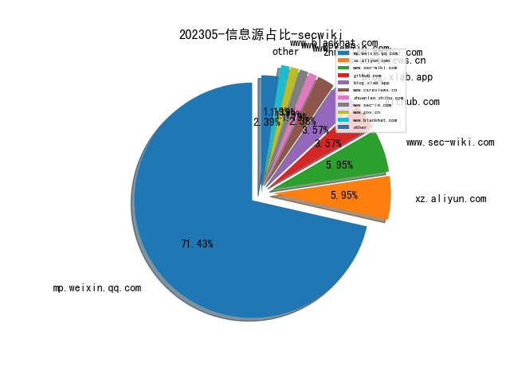
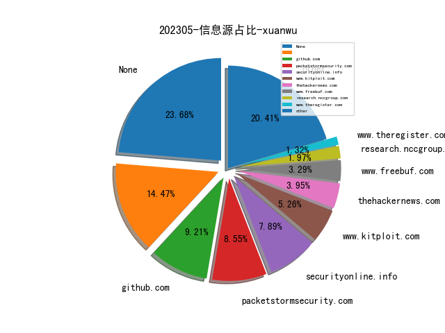
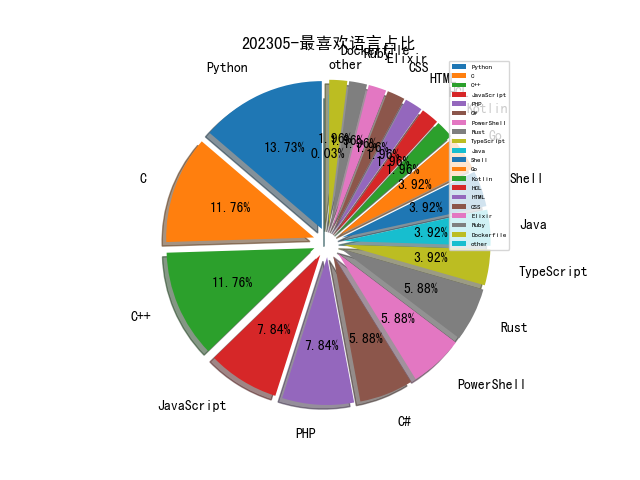

# [数据--所有](README_20.md)
# [数据--年度](README_2023.md)
# 202305 信息源与信息类型占比

# 政策 推荐
| title | url| 
| --- | ---| 
| 商用密码管理条例 | http://www.gov.cn/zhengce/zhengceku/202305/content_6875928.htm| 

# 微信公众号 推荐
| nickname_english | weixin_no | title | url| 
| --- | --- | --- | ---| 
| Web3天空之城 | Web3SkyCity | State of GPT：大神Andrej揭秘OpenAI大模型原理和训练过程 | https://mp.weixin.qq.com/s/zmEGzm1cdXupNoqZ65h7yg?from=timeline | 1| 
| 货拉拉安全应急响应中心 | lalasrc | 货拉拉数据加密治理实践 | https://mp.weixin.qq.com/s/i0eFo4duuSAxOjfELERxuw | 1| 
| 希潭实验室 | abc123network | 第63篇：美国NSA量子注入攻击的流量特征及检测方法 | https://mp.weixin.qq.com/s/ZegkbgHKbwTgWe0ZFxV6lQ | 1| 
| 安全研究GoSSIP | GoSSIPSJTU | G.O.S.S.I.P 阅读推荐 2023-05-22 太空奥德赛 | https://mp.weixin.qq.com/s/o9N4sA2gjgM-SGpWMgQd3g | 1| 
| 君哥的体历 | jungedetili | e1knot：实践之后，我们来谈谈如何建设SOAR | https://mp.weixin.qq.com/s/HOduKBW15WdmaBhB9e3lFg | 1| 
| 中国指挥与控制学会 | c2_china | 美国陆军云计划2022 | https://mp.weixin.qq.com/s/53Vj7_t4NtPZKau1tXRVwg | 1| 
| 中国信息安全 | chinainfosec | 前沿 , 基于能力成熟度模型的车联网漏洞管理探索 | https://mp.weixin.qq.com/s/IcmYIiy6d-rYanuMQGTydA | 1| 
| 丁永博的成长日记 | gh_26cb3abead85 | 免登录读取别人的WX聊天记录 | https://mp.weixin.qq.com/s/ub1eQespid6BeODGM7kh8w | 1| 
| SecUN安全村 | sec-un | 大模型在威胁情报中应用可行性研究报告丨安全村 | https://mp.weixin.qq.com/s/G6JzGDkYJ1oQ4BHoYu5HlQ | 1| 
| Hugging Face | gh_504339124f0f | StarCoder: 最先进的代码大模型 | https://mp.weixin.qq.com/s/f-WwzLcEO-ZJczI-_bZh3Q | 1| 
| FuzzWiki | gh_fcf21e658324 | PolyFuzz：针对多语言软件的灰盒模糊测试｜技术进展 | https://mp.weixin.qq.com/s/OC_zWpFETGRw8oVXGToSSw | 1| 
| ChaMd5安全团队 | chamd5sec | TotolinkT10漏洞分析 | https://mp.weixin.qq.com/s/6kC02ABzeBnhjPeAs6lyrQ | 1| 
| 虎符智库 | TT_Thinktank | 深度：如何构建基于威胁情报的高效网络威胁监测架构 | https://mp.weixin.qq.com/s/kOYqbc4RZqbxiNpQgC-2sg | 1| 
| 极思 | WhoAmSven | 【极思】为什么必须做安全度量？ | https://mp.weixin.qq.com/s/8fvPXP8gCVxNLyhaadozNg | 1| 
| 安全杂谈 | close_3873219902 | Linux 系统安全机制及技术大观 | https://mp.weixin.qq.com/s/OrJ4wgbBrxnfrTaXlA0h7A | 1| 
| 太空安全 | SateSec | 星链StarLink通信对抗体系建设思路探索 | https://mp.weixin.qq.com/s/Spsqdcmr4vkGXTig-xiW3g | 1| 
| code秘密花园 | code_mmhy | 准备好迎接三方 Cookie 的终结 | https://mp.weixin.qq.com/s/vpzapVjgbo2DH9FKxj689w | 1| 
| NISL实验室 | NISL_THU2020 | 【论文分享】利用FAVICONS缓存进行浏览器持续追踪 | https://mp.weixin.qq.com/s/vNFzvuw5fCxvqqmEyeyImg | 1| 
| Gcow安全团队 | Gcow666 | 基于Caddy实现的C2前置代理 - RedCaddy | https://mp.weixin.qq.com/s/usHrpgxCvGsu9vvf0SMSBQ | 1| 
| FOFA | gh_d79c8913fde8 | 最佳实践｜涉网犯罪网站下线后的线索追踪 | https://mp.weixin.qq.com/s/b2Waw-tOSVMjHdH0TcKA0A | 1| 
| 网络空间安全军民融合创新中心 | jmrh1226 | 美国网络司令部发布新版技术挑战问题指南 | https://mp.weixin.qq.com/s/yDO16j9M4KvX3IfJVxxwnA | 1| 
| 安全行者老霍 | gh_c2b78e839fd7 | 十大开源攻击模拟（BAS）工具 | https://mp.weixin.qq.com/s/M8YF_S3z6OwOT-2TKsp3mQ | 1| 
| 安全小飞侠 | AvFisher | 从云上攻防态势分析展望云服务安全架构设计框架发展 | https://mp.weixin.qq.com/s/zVfRwoXC7YhFv7SK-yOLSw | 1| 
| 威胁棱镜 | THREAT_PRISM | GreyNoise 如何计算 IP 的相似性 | https://mp.weixin.qq.com/s/mhySu_-_aa1SiqAOy1EEWA | 4| 
| 奇安信威胁情报中心 | gh_166784eae33e | 高通GPS服务“隐蔽后门”事件分析 | https://mp.weixin.qq.com/s/jSSMANLVucBD36hw0JqTnQ | 1| 
| 刨洞技术交流 | gh_55f3b3854b4b | 关于GOIP设备的勘验和服务器渗透实战 | https://mp.weixin.qq.com/s/jGYO5cwGnMfJMenm7ZmLBg | 1| 
| 中国保密协会科学技术分会 | gh_be4f21d557c0 | 浅谈物联网设备安全 | https://mp.weixin.qq.com/s/D9D4ZSd5ij4mIvAXwqU60g | 1| 
| Tide安全团队 | TideSec | Burp+Charles联动安卓APP抓包 | https://mp.weixin.qq.com/s/4zPvQERYOujdzLItpAPNFQ | 3| 
| SecIN技术平台 | sec-in | 原创 , CodeQL与AST之间联系 | https://mp.weixin.qq.com/s/pzq35orr_guqPeSiTMmiYw | 1| 
| Desync InfoSec | gh_1a0c9eea6b2a | 【DFIR报告翻译】Cobalt Strike防护指南（一） | https://mp.weixin.qq.com/s/whUhV6__HvmbXQfcfFeRJA | 2| 
| ADLab | v_adlab | VM2沙箱逃逸漏洞分析 | https://mp.weixin.qq.com/s/OwQ3B5vjpr9ZsvOXftJoQg | 1| 
| 拨开云雾 | Under_Sakura | 图结构相似性度量 | https://mp.weixin.qq.com/s/KJvk5Eyqoa3Z9kvlcLxGtg | 1| 
| 奇安信产业发展研究中心 | gh_1e73e218cf57 | RSAC2023丨从RSAC2023看ChatGPT如何用于网络攻击 | https://mp.weixin.qq.com/s/Ttda20-YfjI21vSfAKbdgg | 1| 
| 猪猪谈安全 | zzt-anquan | 总结一下自己CNVD原创证书获取姿势 | https://mp.weixin.qq.com/s/a6zBpIVfaUVo75JI1bz4qg | 1| 
| 洞源实验室 | gh_4929169c5e90 | WECHAT二维码闪退分析 | https://mp.weixin.qq.com/s/gwdKkFN-KXAK_Hop5irT-g | 3| 
| 安在 | AnZer_SH | 百家 , 李维春：甲方安全从业人员的职业发展建议 | https://mp.weixin.qq.com/s/GjQXq7hsC0_IQWHeIxvgAA | 1| 
| 信息安全与通信保密杂志社 | cismag2013 | 2022年俄乌冲突战场动态测绘年度报告 | https://mp.weixin.qq.com/s/vRLtrxVxwjLj64qWuty20g | 4| 
| 蚂蚁技术AntTech | Ant-Techfin | IEEE S&P收录论文 , 基于程序分析和Fuzz融合的Java反序列化漏洞挖掘技术 | https://mp.weixin.qq.com/s/IEFxeXW8hkq7MR4yaRVmTg | 1| 
| 404 Not F0und | AI4Security | 从GPT-4、网络安全到大模型不扩散 | https://mp.weixin.qq.com/s/sbyIeWCvCA5IH7hJpB9rig | 1| 
| 安全学术圈 | secquan | Java项目第三方库漏洞兼容修复 | https://mp.weixin.qq.com/s/VTC6kUVNItfwxq2RIQmc5g | 9| 

# 私人github账号 推荐
| github_id | title | url | p_url | p_profile | p_loc | p_company | p_repositories | p_projects | p_stars | p_followers | p_following | repo_lang | repo_star | repo_forks | 
| --- | --- | --- | --- | --- | --- | --- | --- | --- | --- | --- | --- | --- | --- | ---| 
| yardenshafir | 从 nsi dll 生成 WNF 符号的工具 | https://github.com/yardenshafir/WinDbg_Scripts/blob/master/symbolBuilderWnf.js | https://github.com/yardenshafir?tab=followers | A circus artist with a visual studio license | None | https://windows-internals.com/ | 21 | 0 | 2 | 0 | 0 | C,JavaScript,C++ | 0 | 0 | 1| 
| vdohney | KeePass Master Password Dumper 是一个简单的概念验证工具，用于从 Keepass 的内存中转储主密码。除了第一个密码字符外，它大多能够恢复明文密码 | https://github.com/vdohney/keepass-password-dumper | https://github.com/vdohney?tab=followers |  | None | None | 1 | 0 | 1 | 0 | 0 | C# | 0 | 0 | 1| 
| r3x5ur | unveilr: 一款小程序安全评估工具 | https://github.com/r3x5ur/unveilr | https://github.com/r3x5ur?tab=followers | 一枚小菜蛋🥚 | Hangzhou | None | 9 | 0 | 55 | 0 | 0 | TypeScript,Java,PHP | 0 | 0 | 1| 
| prescience-data | dark-knowledge: 浏览器指纹与隐私安全相关论文 | https://github.com/prescience-data/dark-knowledge | https://github.com/prescience-data?tab=followers |  | None | @undetectio | 23 | 0 | 794 | 0 | 0 | TypeScript,JavaScript | 0 | 0 | 1| 
| panda-re | panda: Platform for Architecture-Neutral Dynamic Analysis | https://github.com/panda-re/panda | None | None | None | None | 0 | 0 | 0 | 0 | 0 | C,Python,C++,HTML,Go,Rust | 0 | 0 | 1| 
| p0dalirius | 一个 Python 脚本，用于根据客户城市半径的半径生成可能的密码列表 | https://github.com/p0dalirius/GeoWordlists | https://github.com/p0dalirius?tab=followers | Security Researcher and Speaker | https://podalirius.net/ | Podalirius Labs | 91 | 0 | 99 | 0 | 0 | Python,Dockerfile | 0 | 0 | 1| 
| nccgroup | libslub 是一个 python 库，用于检查 Linux 内核堆实现的 SLUB 管理结构和对象分配（Linux 内核堆实现），可用于 GDB 调试器 | https://github.com/nccgroup/libslub | None | None | None | None | 0 | 0 | 0 | 0 | 0 | C,Shell,Java,Python,JavaScript,C#,Elixir,HCL | 0 | 0 | 1| 
| hardwaterhacker | Dig Dug 通过将字典中的单词附加到可执行文件来增加给定的可执行文件大小，从而帮助您逃避某些 AV/EDR 检测。 | https://github.com/hardwaterhacker/DigDug | https://github.com/hardwaterhacker?tab=followers |  | None | @RedSiege | 14 | 0 | 70 | 0 | 0 | Python,Ruby,PowerShell | 0 | 0 | 1| 
| dru1d-foofus | 使用 impacket 库和 LDAP 查询编写的支持 NTLM 和 Kerberos 身份验证的 LAPS dump 工具 | https://github.com/dru1d-foofus/GetLAPSPassword/ | https://github.com/dru1d-foofus?tab=followers | just hacking all the things, but doing a bad job at it | Roanoke, VA | CDW | 40 | 0 | 36 | 0 | 0 | Python,Go,C,PowerShell,C# | 0 | 0 | 1| 
| commixproject | 自动检测命令注入类漏洞的工具 | https://github.com/commixproject/commix/blob/master/README.md | None | None | None | None | 0 | 0 | 0 | 0 | 0 | Python,PHP,CSS | 0 | 0 | 1| 
| alfarom256 | HP Hardware Diagnostics 的 EtdSupp 驱动程序的 漏洞利用 CVE-2023-32673/PSR-2022-0209 | https://github.com/alfarom256/HPHardwareDiagnostics-PoC | https://github.com/alfarom256?tab=followers |  | None | None | 70 | 0 | 82 | 0 | 0 | C,PHP,Rust,C++ | 0 | 0 | 1| 
| Xyrem | 一个允许您模拟 Hyper-V 并拦截 Windows 内核执行的内核调用的库 | https://github.com/Xyrem/HyperDeceit | https://github.com/Xyrem?tab=followers | I like exploring and breaking stuff 😂 Discord: Xyrem#1152 | None | None | 11 | 0 | 10 | 0 | 0 | C++ | 0 | 0 | 1| 
| SleepTheGod | 在 iPhone 上创建 SSH 后门的 Shell 脚本 | https://github.com/SleepTheGod/iPhone-SSH-Backdoor | https://github.com/SleepTheGod?tab=followers | Twitter.com/ClumsyLulz Pastebin.com/u/Sleep Youtube.com/Stripped Exploit Dev // Ethical Hacker | Georgia | Freelancer | 358 | 0 | 200 | 0 | 0 | C,Shell,Python,Kotlin,JavaScript,C++,PHP,PowerShell | 0 | 0 | 1| 
| RischardV | 来自 DEFCON30 的 Hаdrien аrrаl 和 Georges-Axel Jaloyan 的 Emoji Shellcoding 幻灯片 | https://github.com/RischardV/emoji-shellcoding | None | None | None | None | 0 | 0 | 0 | 0 | 0 | C++ | 0 | 0 | 1| 
| Kudaes | 可修改 Rust 编写的 dll 入口点的工具，以混淆代码的字符串文字，可用作自定义 dll 入口点 | https://github.com/Kudaes/CustomEntryPoint | https://github.com/Kudaes?tab=followers | nt authority\kurosh | Madrid | None | 14 | 0 | 280 | 0 | 0 | Rust,C++ | 0 | 0 | 1| 

# 知乎 推荐
| title | url| 
| --- | ---| 
| 一篇13页1.3万字的博士论文致谢 | https://zhuanlan.zhihu.com/p/625937937| 

# 论坛 推荐
| title | url| 
| --- | ---| 
| 记对一次诈骗组织渗透的实例 | https://xz.aliyun.com/t/12523| 
| BadUsb实现免杀及插及上线C2服务器 | https://xz.aliyun.com/t/12505| 
| 网络隧道：突破内网的通行证 | https://xz.aliyun.com/t/12498| 
| Tomcat反序列化注入回显内存马 | https://xz.aliyun.com/t/12494| 
| 浅谈Docker逃逸 | https://xz.aliyun.com/t/12495| 

# 日更新程序
`python update_daily.py`