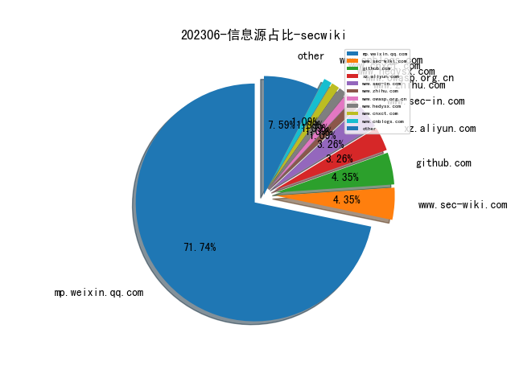
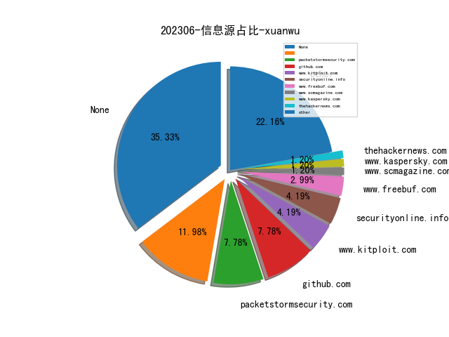
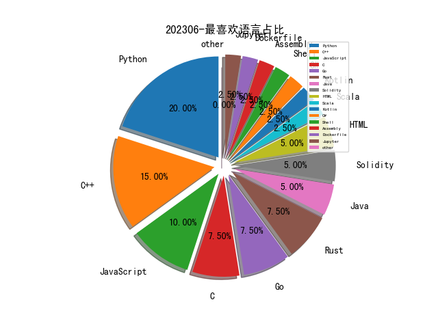

# [数据--所有](README_20.md)
# [数据--年度](README_2023.md)
# 202306 信息源与信息类型占比

# 微信公众号 推荐
| nickname_english | weixin_no | title | url| 
| --- | --- | --- | ---| 
| 黑战士 | heizhanshi1 | 近源渗透学习的二三感悟 | https://mp.weixin.qq.com/s/UznoRAena2b1VdlTtnW-Tw | 1| 
| 洞源实验室 | gh_4929169c5e90 | 数百万GitHub仓库可能遭受RepoJacking攻击 | https://mp.weixin.qq.com/s/UhMBmtq8Y1gceDFsdC7asA | 1| 
| 信息安全最新论文技术交流 | gh_a7fb15b30ab3 | BlackHat USA 23 & DEFCON 31：利用LED闪烁恢复密钥 | https://mp.weixin.qq.com/s/Y_0oek2npJNjQc7TOgoGMw | 1| 
| 清华大学智能法治研究院 | THUIAIL | 我国《数据安全法》生效以来行政执法情况报告 | https://mp.weixin.qq.com/s/_upeC1BshjAmCF4jGZo3YA | 1| 
| 无限手套Infinity Gauntlet | gh_8d126cb22752 | 漏洞优先级（VPT）是怎么排序的 | https://mp.weixin.qq.com/s/2NCcXJjnfGBAUQM5JngCUQ | 1| 
| 数据安全域 | keyindata | 2021-2023年因违反《数据安全法》被罚的28个案件梳理 | https://mp.weixin.qq.com/s/LLCTQ2ydH7QdeMBFLIy9iA | 1| 
| 与智慧做朋友 | qichelaba3 | 网络安全中小企业：走专业化道路，是唯一选择 | https://mp.weixin.qq.com/s/Qwrq1YqP8mtfsb66FzdN7g | 1| 
| vivo互联网技术 | vivoVMIC | vivo 游戏黑产反作弊实践 | https://mp.weixin.qq.com/s/7P36eYxCO6f7hrnx2PKW8g | 1| 
| leveryd | gh_8d7f6ed4daff | 浅谈云原生安全建设 | https://mp.weixin.qq.com/s/HA_w_gEe-GOFZXGsOg_Iog | 1| 
| Tide安全团队 | TideSec | 用户名密码加密的页面爆破学习 | https://mp.weixin.qq.com/s/72S-mYCHEnQZBPEIcKME3Q | 1| 
| Evilc0de 安全团队 | asdasd_evilc0de_safe | 我是如何用GPT自动化生成Nuclei的POC | https://mp.weixin.qq.com/s/j7EHftzPdTf84lBzxpLb_Q | 1| 
| 海燕技术栈 | we_are_dreamer | 基于Cssom的暗链检测技术 | https://mp.weixin.qq.com/s/2n2QPkuChzTCezseMHIwMQ | 1| 
| 有价值炮灰 | dust1337 | 针对二维码解析库的 Fuzzing 测试 | https://mp.weixin.qq.com/s/w6und9w0CAlcISrrJX4vnA | 1| 
| 风眼实验室 | gh_aa426cddbf75 | 基于主动网络探测的低成本高精度IP地理定位 | https://mp.weixin.qq.com/s/iy2EqkzQUJAIizIkoKQYGw | 2| 
| 网安国际 | inforsec | 【InForSec2023 年会论坛回顾】周威：无硬件依赖新型全系统物联网设备固件虚拟化方案研究 | https://mp.weixin.qq.com/s/Nr9j5OFUZawfOEYlySRgcQ | 1| 
| 最高人民法院 | ch_zgrmfy | 《最高人民法院、最高人民检察院、公安部关于依法惩治网络暴力违法犯罪的指导意见（征求意见稿）》面向社会公开征求意见 | https://mp.weixin.qq.com/s/ZXlFRyuxCAB1m-iDpWqDNg | 1| 
| 数说安全 | csreviews | 2022年网络安全公司研发投入、研发薪酬分析 | https://mp.weixin.qq.com/s/591RHcJGe_GTkyGjk-dy3g | 1| 
| 我的安全视界观 | CANI_Security | 安全事件运营SOP【5】webshell事件 | https://mp.weixin.qq.com/s/oYuOnfw-jGzcHrOvVkb3kg | 8| 
| 安全学术圈 | secquan | 南洋理工大学 , 安卓恶意软件的分类解释研究 | https://mp.weixin.qq.com/s/7Jub7xULn2ao0TJ8iRdjvA | 3| 
| 威胁棱镜 | THREAT_PRISM | 流行域名列表的是与非 | https://mp.weixin.qq.com/s/wJBe_YBWbEEkaZPOVI0oZg | 2| 
| 内构安全 | gh_def0974405fe | 每周论文讨论(17) , 自动利用生成 | https://mp.weixin.qq.com/s/pO2miaqlHZMSYial8rdfwA | 1| 
| 中国人工智能学会 | CAAI-1981 | AI研习丨信息驱动的电网安全态势知识图谱智能构建技术研究 | https://mp.weixin.qq.com/s/NZQpqD5jrZ2NLXZDBjCzcQ | 1| 
| SecUN安全村 | sec-un | 浅谈基于全景式画像构建终端安全防护体系的探索与实践｜大湾区金融安全专刊·安全村 | https://mp.weixin.qq.com/s/8G93W_3jJj8Hp7IZ9wGwLQ | 1| 
| COMPASS Lab | gh_5f715fbda2b0 | 【论文分享】硬件辅助的可信执行环境 | https://mp.weixin.qq.com/s/wS3o-g0JAMNiZr91CqPA5A | 1| 
| 穿过丛林 | gh_f90eac70537b | ESEC/FSE22：基于数据投毒的代码搜索后门攻击 | https://mp.weixin.qq.com/s/5XaemiUxjHolgmuFSorr6Q | 2| 
| 看雪学苑 | ikanxue | 用 Qiling/Unicorn 框架来 dump il2cpp | https://mp.weixin.qq.com/s/zu5jZp0-CT8m0obklXP3lQ | 2| 
| 安全研究GoSSIP | GoSSIPSJTU | G.O.S.S.I.P 阅读推荐 2023-06-07 大破Office签名保护！ | https://mp.weixin.qq.com/s/1UYiHGDBimZbetdX9gPUKA | 1| 
| 太空安全 | SateSec | 复盘卫星大战 Hack-A-Sat 1 天基攻防竞赛 | https://mp.weixin.qq.com/s/Sa8oTKMVgOgiGDBMxSWG0g | 3| 
| 复旦白泽战队 | fdwhitzard | 白泽带你读论文｜How Long Do Vulnerabilities Live in the Code? | https://mp.weixin.qq.com/s/DRAAiWE4HiscWB1ZIFB0hA | 1| 
| 互联网后端架构 | fullstack888 | 作业帮在多云环境下的高可用双活架构优化实践 | https://mp.weixin.qq.com/s/oVxun0-2M9royJUWqi8k7Q | 1| 
| Qunar技术沙龙 | QunarTL | Qunar万亿级Elasticsearch集群节点迁移实战 | https://mp.weixin.qq.com/s/zpz6k4lXQlvvBx756hyWQA | 1| 
| Numen Cyber Labs | gh_06b147bc90bd | Numen独家:Win32k提权漏洞CVE-2023-29936漏洞解析以EXP构造 | https://mp.weixin.qq.com/s/41ugLvwpbwaJvWUI6wuSNA | 1| 
| NISL实验室 | NISL_THU2020 | 【成果介绍】TsuKing：通过级联组合域名服务器构成强力放大攻击 | https://mp.weixin.qq.com/s/ZXbC-jcbFJ4gYUQQKKL77A | 3| 
| 黑哥虾撩 | gh_67cfd5e45750 | Operation Triangulation 卡巴斯基被黑 | https://mp.weixin.qq.com/s/j4DVSXCmRqZaSohIl-KBTg | 1| 
| 落水轩 | gh_c10ee4802699 | BH ASIA 2023内鬼数据安全解决方案 | https://mp.weixin.qq.com/s/AUA5ec7a0Gv0r_Pm0BFk4Q | 1| 
| 信息安全与通信保密杂志社 | cismag2013 | 基于聚类法改进 JA3 指纹识别的恶意加密流量识别 | https://mp.weixin.qq.com/s/0jCmcidXO5YIbqmL6Qy7VA | 5| 
| 君哥的体历 | jungedetili | 金融企业安全建设探索之异常访问检测系统 | https://mp.weixin.qq.com/s/T6yJD_MIZf5d1qnCMQ43HA | 2| 
| 赛博攻防悟道 | lookvul | 检测响应的保真度漏斗模型精解 | https://mp.weixin.qq.com/s/V5SCIgkV5xO57h860LTY2A | 1| 
| 珞珈之戍 | luojiazhishu | 【论文推荐】分析移动赌博诈骗的真实数据 | https://mp.weixin.qq.com/s/vrv4gk6xsJMqiz9bUtd59A | 1| 
| 企业管理现代化创新成果 | QGGC1990 | 国家电网有限公司：特大型电网企业基于实战攻防的主动网络安全管理 | https://mp.weixin.qq.com/s/3Z3ZLfIJdjNgBNh-fayr5A | 1| 
| 中国网安 | zgwawatx | 【专题研究第013期】Palantir 大数据能力分析研究 | https://mp.weixin.qq.com/s/CIT3izspkz7_r6KpbnBtDg | 1| 
| 中国信息安全 | chinainfosec | 专家观点 , 未成年人网络违法犯罪治理应注意的事项及完善建议 | https://mp.weixin.qq.com/s/9ku8lclJqAoLTTonbRvsZA | 3| 

# 私人github账号 推荐
| github_id | title | url | p_url | p_profile | p_loc | p_company | p_repositories | p_projects | p_stars | p_followers | p_following | repo_lang | repo_star | repo_forks | 
| --- | --- | --- | --- | --- | --- | --- | --- | --- | --- | --- | --- | --- | --- | ---| 
| team-s2 | AAA 战队2022年ctf_summer_courses培训课程资料 | https://github.com/team-s2/ctf_summer_courses/tree/main | None | None | None | None | 0 | 0 | 0 | 0 | 0 | Python,Solidity,Assembly,JavaScript | 0 | 0 | 1| 
| r0ysue | MobileCTF: 体系化、实战化的移动端CTF靶场 | https://github.com/r0ysue/MobileCTF | https://github.com/r0ysue?tab=followers | またあした | None | None | 30 | 0 | 135 | 0 | 0 | Python,JavaScript | 0 | 0 | 1| 
| qilingframework | Collection of works, presentations, blogpost, etc for Qiling related projects | https://github.com/qilingframework/qiling/issues/134 | None | None | None | None | 0 | 0 | 0 | 0 | 0 | Python,JavaScript | 0 | 0 | 1| 
| pr0me | 基于 linux 系统的 ARM 固件的高性能 fuzzer | https://github.com/pr0me/SAFIREFUZZ | https://github.com/pr0me?tab=followers | Information Security Researcher and PhD Student | Germany | Qwiet AI | 12 | 0 | 67 | 0 | 0 | Jupyter,Scala,Python,C++,Go,Dockerfile | 0 | 0 | 1| 
| jjshoots | ESP8266/NodeMCU 无人机 RemoteID 欺骗器。基于 sxjack 和 SpacehuhnTech 完成的工作构建。这产生了 16 种不同的假无人机广播 RemoteID，它们都围绕特定的 GPS 位置随机飞行 | https://github.com/jjshoots/RemoteIDSpoofer | https://github.com/jjshoots?tab=followers | Try hard hope for send. | Coventry, UK | None | 63 | 0 | 60 | 0 | 0 | Python,C | 0 | 0 | 1| 
| google | 从返回指令中泄漏 ASLR，在受害者和攻击者之间的流中使用 BTB 刷新绕过 ASLR | https://github.com/google/security-research/tree/master/pocs/cpus/ret2aslr | None | None | None | None | 0 | 0 | 0 | 0 | 0 | Java,Python,JavaScript,C++,HTML,Go | 0 | 0 | 2| 
| colind0pe | 一种常见的避免shellcode查杀的方法，达到绕过常见AV的效果 | https://github.com/colind0pe/AV-Bypass-Learning | https://github.com/colind0pe?tab=followers |  | None | None | 8 | 0 | 355 | 0 | 0 | Python,C++ | 0 | 0 | 1| 
| Wh04m1001 | CVE-2023-29343 Sysmon 版本 14.14 中任意文件写入错误的 PoC | https://github.com/Wh04m1001/CVE-2023-29343 | https://github.com/Wh04m1001?tab=followers | OSCP,OSEP,CRTO,CRTP,CRTE,PACES | None | None | 46 | 0 | 168 | 0 | 0 | Python,C,C++ | 0 | 0 | 1| 
| Quillhash | DeFi 的常见攻击向量列表，DeFi 是一种新兴的金融技术，挑战当前的中心化银行系统并促进点对点（P2P）交易的使用。 | https://github.com/Quillhash/DeFi-Attack-Vectors | None | None | None | None | 0 | 0 | 0 | 0 | 0 | Solidity | 0 | 0 | 1| 
| OISF | suricata-verify: Suricata Verification Tests | https://github.com/OISF/suricata-verify | None | None | None | None | 0 | 0 | 0 | 0 | 0 | Python,C,C++ | 0 | 0 | 1| 
| MrEmpy | 一种在 JavaScript 文件和 HTML 文件中搜索 API 密钥以查找与 API 密钥相同或相似的字符串的工具，可用于验证使用外部 API 的应用程序和网站是否充分保护了其密钥 | https://github.com/MrEmpy/Mantra | https://github.com/MrEmpy?tab=followers | 「🎩」Pentester & Bug Hunter 「🌕」White Hat 「👾」CTF Player 「🤖」Programador 「▶️」Youtuber | None | None | 39 | 0 | 67 | 0 | 0 | Rust | 0 | 0 | 1| 
| Idov31 | Jormungandr 是 COFF 加载程序的内核实现，允许内核开发人员在内核中加载和执行他们的 COFF。 | https://github.com/Idov31/Jormungandr | https://github.com/Idov31?tab=followers | Im a security researcher and using this platform to share my projects and research :) | mov eax, [ebp+location] | None | 14 | 0 | 303 | 0 | 0 | C#,C,Rust,C++ | 0 | 0 | 1| 

# medium 推荐
| title | url| 
| --- | ---| 
| Kangaroo 加壳器 | http://cryptax.medium.com/inside-kangapack-the-kangaroo-packer-with-native-decryption-3e7e054679c4| 

# 知乎 推荐
| title | url| 
| --- | ---| 
| 形式化方法的研究方向到底是干什么的？ | https://www.zhihu.com/question/37328298| 

# 论坛 推荐
| title | url| 
| --- | ---| 
| 记一次四层内网攻防渗透测试大实验 | https://xz.aliyun.com/t/12614| 
| js引擎检测及热部署的OpenRASP学习 | https://xz.aliyun.com/t/12613| 
| 从模糊测试到源码定位：探索 Go 库中的 bug | https://xz.aliyun.com/t/12611| 

# 日更新程序
`python update_daily.py`