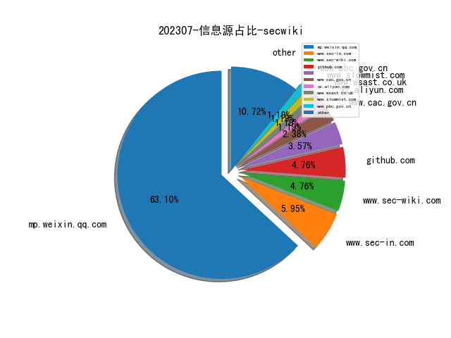
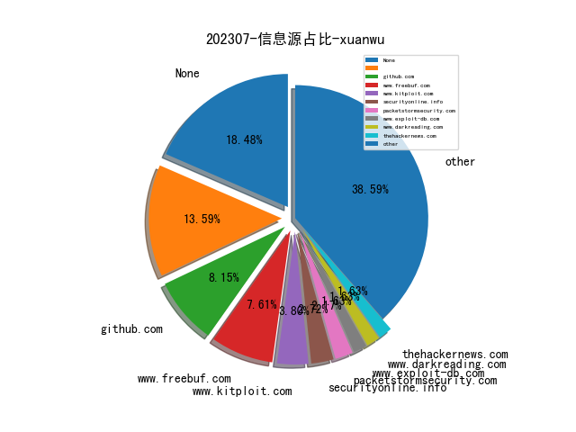
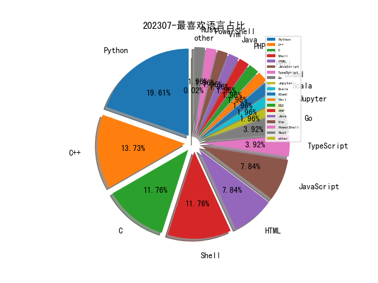

# [数据--所有](README_20.md)
# [数据--年度](README_2023.md)
# 202307 信息源与信息类型占比

# 政策 推荐
| title | url| 
| --- | ---| 
| 中国人民银行业务领域数据安全管理办法（征求意见稿） | http://www.pbc.gov.cn/tiaofasi/144941/144979/3941920/4993510/2023071815593395156.pdf| 
| 铁路关键信息基础设施安全保护管理办法（征求意见稿） | http://www.moj.gov.cn/pub/sfbgw/lfyjzj/lflfyjzj/202307/t20230718_482844.html| 
| 生成式人工智能服务管理暂行办法 | http://www.cac.gov.cn/2023-07/13/c_1690898327029107.htm| 
| 关于调整《网络关键设备和网络安全专用产品目录》的公告 | http://www.cac.gov.cn/2023-07/03/c_1690034742530280.htm| 

# 网络安全书籍 推荐
| date_added | language | title | author | link | size| 
| --- | --- | --- | --- | --- | ---| 
| 2023-07-30 20:25:14 | English | Unlock the Vault: A Blueprint For Building Wealth With Fractional Ownership: Weather Market Storms and Enjoy Long-Term Security With An Emerging New Asset ... the Investments of the Ultra-Rich Book 2) | Michael Fox-Rabinovitz | http://libgen.rs/book/index.php?md5=D79049E60064147C58AA1B59D0636E27 | 513 kB [EPUB]| 
| 2023-07-21 03:05:45 | English | Fortinet FortiWeb Study Guide for FortiWeb 6.4 |  | http://libgen.rs/book/index.php?md5=07390EF2A9457416C4E6143A4872E225 | 50 MB [PDF]| 
| 2023-07-21 04:01:29 | English | Fortinet SD-WAN Lab Guide for FortiOS 7.2 |  | http://libgen.rs/book/index.php?md5=235FB171A721993D52DDB15CA2EFE608 | 6 MB [PDF]| 
| 2023-07-21 05:22:42 | English | The Art of Risk | Richard Harris | http://libgen.rs/book/index.php?md5=A9FEE5323D62BB4A0099FB9BC09C2005 | 6 MB [EPUB]| 
| 2023-07-21 04:16:48 | English | Fortinet Advanced Analytics Study Guide for FortiSIEM 6.3 |  | http://libgen.rs/book/index.php?md5=2A9B094EEC3F0DA4FFEB3725D4350D7F | 63 MB [PDF]| 
| 2023-07-21 04:16:42 | English | Fortinet Advanced Analytics Lab Guide for FortiSIEM 6.3 |  | http://libgen.rs/book/index.php?md5=E3582EFCEBB0AF288F1B5FC3468D64E9 | 13 MB [PDF]| 
| 2023-07-21 04:13:55 | English | Fortinet LAN Edge Study Guide for FortiGate 7.0 |  | http://libgen.rs/book/index.php?md5=EDAA5C2E25AD0BBEF185851B29B742E4 | 50 MB [PDF]| 
| 2023-07-21 04:11:30 | English | Fortinet OT Security Study Guide for FortiOS 7.2 |  | http://libgen.rs/book/index.php?md5=9063133974E42781E921976B957D6D48 | 31 MB [PDF]| 
| 2023-07-21 04:11:29 | English | Fortinet OT Security Lab Guide for FortiOS 7.2 |  | http://libgen.rs/book/index.php?md5=5B6ABB7215F265DC5C549EA990BAA9FB | 5 MB [PDF]| 
| 2023-07-21 04:07:51 | English | Fortinet Public Cloud Security Study Guide for FortiGate 7.2 |  | http://libgen.rs/book/index.php?md5=FB499E6726395D0F2E86BD3D6E1FD195 | 19 MB [PDF]| 
| 2023-07-21 04:05:02 | English | Fortinet Zero Trust Access Study Guide for FortiOS 7.2 |  | http://libgen.rs/book/index.php?md5=C4D0B5CB221B1C0EFAE1A1448E63C428 | 18 MB [PDF]| 
| 2023-07-21 04:04:58 | English | Fortinet Zero Trust Access Lab Guide for FortiOS 7.2 |  | http://libgen.rs/book/index.php?md5=39DCC1F3923F1727D600BD25C0EC5845 | 14 MB [PDF]| 
| 2023-07-21 04:01:31 | English | Fortinet SD-WAN Study Guide for FortiOS 7.2 |  | http://libgen.rs/book/index.php?md5=572D3F2160E003B689F9DFFE04638FF6 | 10 MB [PDF]| 
| 2023-07-21 03:58:33 | English | Fortinet Enterprise Firewall Lab Guide for FortiOS 7.2 |  | http://libgen.rs/book/index.php?md5=65BD7A0B33E6EA74C83C4F1CE0C5C06D | 6 MB [PDF]| 
| 2023-07-21 03:58:28 | English | Fortinet Enterprise Firewall Study Guide for FortiOS 7.2 |  | http://libgen.rs/book/index.php?md5=76992EDAB7C98447905A8E2E7952C445 | 35 MB [PDF]| 
| 2023-07-21 03:54:05 | English | Fortinet Network Security Support Engineer Study Guide for FortiOS 7.2 |  | http://libgen.rs/book/index.php?md5=CE444CC0FC8EE50F6461120BB06F321B | 54 MB [PDF]| 
| 2023-07-21 03:54:04 | English | Fortinet Network Security Support Engineer Lab Guide for FortiOS 7.2 |  | http://libgen.rs/book/index.php?md5=275931204DD5049E0BC233056083EFB2 | 2 MB [PDF]| 
| 2023-07-21 03:47:48 | English | Fortinet FortiVoice Lab Guide for FortiVoice 6.0 |  | http://libgen.rs/book/index.php?md5=09154B576D7A818E5FAF3022A0B393E0 | 3 MB [PDF]| 
| 2023-07-21 03:47:47 | English | Fortinet FortiVoice Study Guide for FortiVoice 6.0 |  | http://libgen.rs/book/index.php?md5=8341173B3FC2024366A0648939771E5F | 45 MB [PDF]| 
| 2023-07-20 19:15:33 | English | Developments in Managing and Exploiting Risk. Volume II Project Risk Management: Managing Software Development Risk | Kurt J. Engemann (editor); Rory V. OConnor (editor) | http://libgen.rs/book/index.php?md5=D2AC2FF481BD5C4246A6105BE218E798 | 3 MB [EPUB]| 
| 2023-07-20 19:15:27 | English | Developments in Managing and Exploiting Risk. Volume II Project Risk Management: Managing Software Development Risk | Kurt J. Engemann (editor); Rory V. OConnor (editor) | http://libgen.rs/book/index.php?md5=0828D4218A547DC540778B2AE88F4858 | 1 MB [PDF]| 
| 2023-07-19 01:39:56 | English | Reverse Engineering For Everyone! | mytechnotalent | http://libgen.rs/book/index.php?md5=4D8D5338D320406A630F5E8851B1E496 | 15 MB [PDF]| 
| 2023-07-19 00:37:07 | English | (Studies in Systems, Decision and Control, 475) Output Regulation and Cybersecurity of Networked Switched Systems | Lili Li, Jun Fu | http://libgen.rs/book/index.php?md5=40302C43F9E7F7920564A118E922297B | 8 MB [PDF]| 

# 学习视频 推荐
| title | url| 
| --- | ---| 
| InForSec 2023年网络空间安全国际学术研究成果分享及青年学者... | https://space.bilibili.com/631540223/video| 

# 微信公众号 推荐
| nickname_english | weixin_no | title | url| 
| --- | --- | --- | ---| 
| 安全小飞侠 | AvFisher | 一次安全项目中的机器学习探索 | https://mp.weixin.qq.com/s/uXtBSzTPco1OysVwIDAnlQ | 1| 
| 小兵搞安全 | antian365sec | API接口漏洞利用及防御 | https://mp.weixin.qq.com/s/9gsArrSzYbFxxOHKLP2sdw | 1| 
| 认知独省 | cogniti0n | 基于DoH的无特征shellcode加载器实现 | https://mp.weixin.qq.com/s/f7-OvziarneKhVklT888Lg | 1| 
| Medi0cr1ty | Medi0cr1ty | JsProxy: 所到之处皆为代理节点 | https://mp.weixin.qq.com/s/9LFtfJAG6aLjrNsyRQ_f9g | 1| 
| 绿盟科技研究通讯 | nsfocus_research | 美军联合网络战架构简析 | https://mp.weixin.qq.com/s/wmj54Cy1ZUYWk-ZrU_Dl9w | 1| 
| 丁爸 情报分析师的工具箱 | dingba2016 | 【PPT】Maltego Radium：跨网络身份和关系可视化分析 | https://mp.weixin.qq.com/s/4V5YfNbgQyccbPatjBft_w | 1| 
| OnionSec | gh_8ab0e346e1df | 我理解的检测防御哲学 | https://mp.weixin.qq.com/s/2otUs37Q2YQK5RSWyLVEOQ | 1| 
| 洞源实验室 | gh_4929169c5e90 | 企业安全漏洞综合治理方案 | https://mp.weixin.qq.com/s/m6vwYEPX5hbOlMMUCVYBtA | 3| 
| 专注安管平台 | gh_48603b9bb05a | SANS 2022年SOC调查报告解读 | https://mp.weixin.qq.com/s/Co9P5u0d0wxUbnv0rFPxmw | 1| 
| 虎符智库 | TT_Thinktank | 深度：美军网络空间作战平台发展回顾与影响分析 | https://mp.weixin.qq.com/s/6LnKhmiWmfAUa2BTNGsp5A | 1| 
| 落水轩 | gh_c10ee4802699 | 一起APT对抗中的深度智能入侵检测算法 | https://mp.weixin.qq.com/s/A_eGoENqMY-U9hbXiFMa-A | 1| 
| 威胁棱镜 | THREAT_PRISM | VirusTotal 恶意 URL 研究与分类 | https://mp.weixin.qq.com/s/4CCQN8JbI0bLrJFcjW7ycQ | 3| 
| 太空安全 | SateSec | 深入解析全球太空态势感知能力 V1.3 | https://mp.weixin.qq.com/s/V3TasSF8caaUJerQIaHC8w | 1| 
| AIBio爱生信 | AI4Bioinformatics | AAAI 2023 , 简单高效的异构图神经网络 | https://mp.weixin.qq.com/s/GpSZ5RMwo51BCSxWdUzgjA | 1| 
| 新华社 | xinhuashefabu1 | 加强自媒体管理，中央网信办出手！ | https://mp.weixin.qq.com/s/4QHdCXHq7md7MqW06SuN9w | 1| 
| 青青喵吟 悠悠网事 | gh_03f108fc105d | 以变应万变？2023年上半年DARPA网络空间项目梳理 | https://mp.weixin.qq.com/s/sExNTVfc-Wbz0hYlPt3Q_Q | 2| 
| huasec | ihuahua04 | 威胁狩猎-ICMP流量分析 | https://mp.weixin.qq.com/s/9tfwxjEyFw2WtxPTf8EXqQ | 1| 
| 奇安信威胁情报中心 | gh_166784eae33e | 针对安全研究人员的POC投毒事件 | https://mp.weixin.qq.com/s/fi_wg6LH4hRd3RqSNhs9CA | 1| 
| 字节跳动安全中心 | TouTiaoSec | 通过大语言模型（LLM）识别与修复风险代码 | https://mp.weixin.qq.com/s/DpXcLrOBewdqR6Z8CYKH8g | 2| 
| 信息安全与通信保密杂志社 | cismag2013 | IARPA首次利用网络心理学赋能网络防御重塑安全 | https://mp.weixin.qq.com/s/fQ5HzCzroKlbMjKKdrazcA | 6| 
| 表图 | CyberSecurityCircle | 攻防演习防守标准化的实践与思考 | https://mp.weixin.qq.com/s/ZVeDA6tQyl7w4ClvGLH3-Q | 1| 
| 清华大学智能法治研究院 | THUIAIL | 欧盟网络保险的需求方：ENISA报告解读 | https://mp.weixin.qq.com/s/zLi4d3qvjcADJgsAGwgjLQ | 2| 
| 机器之心 | almosthuman2014 | 大型语言模型与知识图谱协同研究综述：两大技术优势互补 | https://mp.weixin.qq.com/s/HMCMyT0FKV5fGo4NRKSa5g | 1| 
| Tide安全团队 | TideSec | 基于树莓派的蓝牙协议抓包 | https://mp.weixin.qq.com/s/ftaqzXcP23ATsCms1qfgHg | 1| 
| RapidDNS | gh_6327c9075859 | 使用RapidDNS的数据自动化提交FOFA赚取F点 | https://mp.weixin.qq.com/s?__biz=Mzg4NDU0ODMxOQ==&mid=2247485764&idx=1&sn=e024430dba242bea42c5681cfb99c73d&chksm=cfb73ef4f8c0b7e275fa1e1f55d1d6b471722e41c9805d3db40fc934e0b9ddb0a9adb16d0794#rd | 3| 
| 腾讯技术工程 | Tencent_TEG | 微信万亿数据仓库架构设计与实现 | https://mp.weixin.qq.com/s/E0X7094kk9My7JTEOELjDg | 1| 
| 潇湘信安 | xxxasec | [RedTeam] 轮换源IP - Cloud Proxy | https://mp.weixin.qq.com/s/HTH4YQVjyxngPn87wflJdg | 1| 
| 我的安全视界观 | CANI_Security | 安全事件运营SOP：软件供应链投毒事件 | https://mp.weixin.qq.com/s/UhchRCg4G96k5ypy5hceYA | 1| 
| 懒人在思考 | lazy-thought | Web3 安全入门（重点智能合约安全） | https://mp.weixin.qq.com/s/jlJhqlfzhn13ZqmPChyhFw | 1| 
| 安全学术圈 | secquan | 香港中文大学 , TChecker：用于检测PHP应用程序中的污点式漏洞的精确静态跨过程分析 | https://mp.weixin.qq.com/s/U4kdKVNwQxllQrxNh5y77Q | 8| 
| 金融电子化 | fcmag1993 | 观点 , 关于银行业软件供应链安全治理的思考与实践 | https://mp.weixin.qq.com/s/QaVZMIELUGz7OZuYKAayGA | 1| 
| 看雪学苑 | ikanxue | Qiling框架分析实战：从 QilingLab 详解到 Qiling 源码分析 | https://mp.weixin.qq.com/s/v9KRkhjnZ-f-PY9xjQjj5g | 4| 
| 希潭实验室 | abc123network | 第67篇：美国安全公司溯源分析Solarwinds供应链攻击事件全过程 | https://mp.weixin.qq.com/s/z0jREmXbIyHw_16rq8rNtw | 1| 

# 私人github账号 推荐
| github_id | title | url | p_url | p_profile | p_loc | p_company | p_repositories | p_projects | p_stars | p_followers | p_following | repo_lang | repo_star | repo_forks | 
| --- | --- | --- | --- | --- | --- | --- | --- | --- | --- | --- | --- | --- | --- | ---| 
| tandasat | hvext - 用于研究 Intel CPU 上的 hyper-v 的windbg扩展，由 @ergot86、@0vercl0k 和 @gerhart_ 实现 | https://github.com/tandasat/hvext | https://github.com/tandasat?tab=followers | Engineer and trainer | Vancouver, Canada | None | 77 | 0 | 27 | 0 | 0 | C,C++,Rust | 0 | 0 | 1| 
| repoog | InvoiceExtract: 发票数据提取小工具 | https://github.com/repoog/InvoiceExtract | https://github.com/repoog?tab=followers | Security specialist(CISSP/CyberSecurity+ Specialist), full stack developer and senior director. Enjoy DIY,Arduino/Raspberry Pi and reading/writing. | China | None | 17 | 0 | 54 | 0 | 0 | Python,Shell,PHP | 0 | 0 | 1| 
| quarkslab | Pyratha 是一款专注于可视化的文件系统制图和关联软件。它目前专注于可执行文件之间的关系，但旨在使任何人能够映射和可视化任何类型的关系。 | https://github.com/quarkslab/pyrrha | None | None | None | None | 0 | 0 | 0 | 0 | 0 | Python,C,Shell,JavaScript,C++ | 0 | 0 | 1| 
| openappsec | open-appsec (openappsec.io) 基于机器学习构建，提供针对 OWASP-Top-10 和零日攻击的先发式 Web 应用程序和 API 威胁防护。它可以作为 Kubernetes Ingress、NGINX、Envoy（即将）和 API Gateway 的附加组件进行部署 | https://github.com/openappsec/openappsec | None | None | None | None | 0 | 0 | 0 | 0 | 0 | Go,Python,C,C++ | 0 | 0 | 1| 
| mengjian-github | 逆向分析Github Copilot | https://github.com/mengjian-github/copilot-analysis | https://github.com/mengjian-github?tab=followers | 微信公众号：frontend_cognitive | 深圳，中国 | 腾讯 | 23 | 0 | 25 | 0 | 0 | TypeScript,Shell,JavaScript,HTML | 0 | 0 | 1| 
| hfiref0x | WubbabooMark 调试器反检测基准旨在检测软件调试器或特殊软件的使用痕迹，这些软件旨在通过篡改程序环境的各个方面来向被调试者隐藏调试器的存在 | https://github.com/hfiref0x/WubbabooMark | https://github.com/hfiref0x?tab=followers |  | None | None | 30 | 0 | 29 | 0 | 0 | C | 0 | 0 | 1| 
| guedou | 一个包含了网络工具scapy很多典型使用案例的仓库 | https://github.com/guedou/scapy-handson | https://github.com/guedou?tab=followers |  | Paris, France | None | 49 | 0 | 134 | 0 | 0 | Python,C,OCaml | 0 | 0 | 1| 
| e-m-b-a | 固件分析工具EMBA现已支持AI辅助固件分析 | https://github.com/e-m-b-a/emba/releases/tag/1.3.0-AI-for-EMBA | None | None | None | None | 0 | 0 | 0 | 0 | 0 | Python,Shell,HTML | 0 | 0 | 1| 
| djeada | Bash-Scripts,用于自动化日常任务和简化工作流程的 Bash 脚本集合 | https://github.com/djeada/Bash-Scripts | https://github.com/djeada?tab=followers | Software Engineer (C++/Python/Rust) | Berlin | None | 76 | 0 | 87 | 0 | 0 | Python,Jupyter,C++ | 0 | 0 | 1| 
| Yggdroot | LeaderF 一个高效的模糊查找器，有助于动态定位文件、缓冲区、mrus、gtag 等。 - 用Python编写。支持模糊和正则表达式搜索。 | https://github.com/Yggdroot/LeaderF | https://github.com/Yggdroot?tab=followers |  | Shanghai, China | None | 25 | 0 | 187 | 0 | 0 | Python,C++,Vim | 0 | 0 | 1| 
| Qihoo360 | Luwak: 利用预训练语言模型从非结构化威胁报告中提取 MITRE AT... | https://github.com/Qihoo360/Luwak/tree/master | None | None | None | None | 0 | 0 | 0 | 0 | 0 | TypeScript,Java,Scala,Python,JavaScript,C++,CSS | 0 | 0 | 1| 
| PKU-YuanGroup | ChatLaw: 中文法律大模型 | https://github.com/PKU-YuanGroup/ChatLaw | None | None | None | None | 0 | 0 | 0 | 0 | 0 |  | 0 | 0 | 1| 
| FourCoreLabs | LollDriverScan 是一个 golang 工具，允许用户发现系统上易受攻击的驱动程序。该工具从 API 中获取 loldrivers.io 列表，并扫描系统中是否存在任何易受攻击的驱动程序 | https://github.com/FourCoreLabs/LolDriverScan | None | None | None | None | 0 | 0 | 0 | 0 | 0 | Go,Shell,PowerShell,C++ | 0 | 0 | 1| 
| CiscoCXSecurity | UDP 协议扫描器 - 用于识别远程主机上运行的 UDP 服务的工具。 | https://github.com/CiscoCXSecurity/udpy_proto_scanner | None | None | None | None | 0 | 0 | 0 | 0 | 0 | C,Shell,Python,JavaScript,Perl,HTML | 0 | 0 | 1| 
| AbstractClass | 利用 Boto3 等 SDK 的现有功能来暴力破解所有云服务的权限，以确定给定一组凭据存在哪些权限，从而确定权限升级 | https://github.com/AbstractClass/CloudPrivs | https://github.com/AbstractClass?tab=followers | Pentester, Red Teamer, Dev | Ontario, Canada | None | 15 | 0 | 3 | 0 | 0 | Python,HTML | 0 | 0 | 1| 

# medium 推荐
| title | url| 
| --- | ---| 
| The Top 10 Most Common Vulnerabilities In Web3 | https://medium.com/immunefi/the-top-10-most-common-vulnerabilities-in-web3-bf7a921d489f| 

# 论坛 推荐
| title | url| 
| --- | ---| 
| 开源许可证保姆级入门手册 | https://xz.aliyun.com/t/12671| 

# 日更新程序
`python update_daily.py`