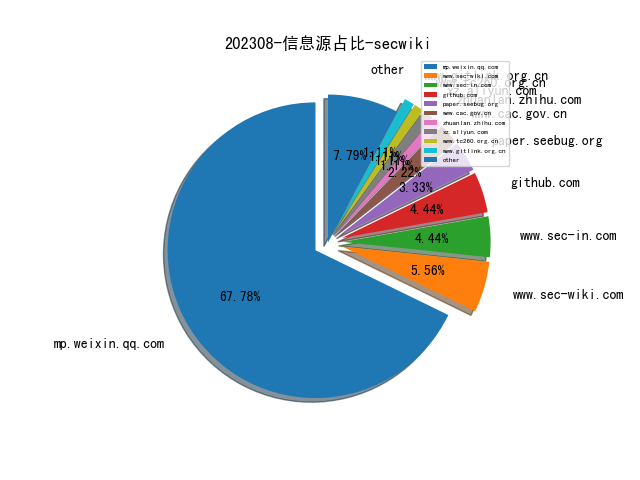
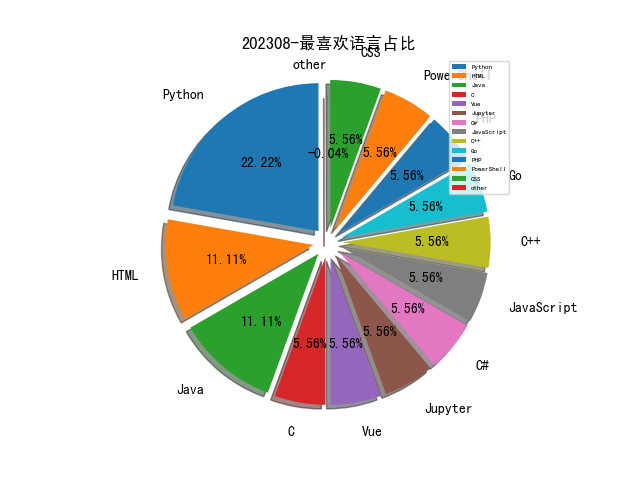

# [数据--所有](README_20.md)
# [数据--年度](README_2023.md)
# 202308 信息源与信息类型占比

# 政策 推荐
| title | url| 
| --- | ---| 
| 企业数据资源相关会计处理暂行规定 | http://kjs.mof.gov.cn/gongzuotongzhi/202212/P020221209412040514536.pdf| 
| 网站平台受理处置涉企网络侵权信息举报工作规范 | http://www.cac.gov.cn/2023-08/10/c_1693319212099907.htm| 
| 个人信息保护合规审计管理办法（征求意见稿） | http://www.cac.gov.cn/2023-08/03/c_1692628348448092.htm| 

# 微信公众号 推荐
| nickname_english | weixin_no | title | url| 
| --- | --- | --- | ---| 
| 卫星黑客 | Satellite_Hacker | 深入了解 Starlink 的用户终端固件 | https://mp.weixin.qq.com/s/g9vY8Zy5A3p92TcUYvjPPA | 1| 
| 穿过丛林 | gh_f90eac70537b | 2023年实验室暑期年会前瞻报告（四）李珍：软件漏洞静态检测路在何方？（PPT） | https://mp.weixin.qq.com/s/AR4AsvSDJm_zvG6u_MsBdQ | 1| 
| 绿盟科技 | NSFOCUS-weixin | 拜登政府《国家网络安全战略实施计划》的分析与思考 | https://mp.weixin.qq.com/s/fRcNYr9KAyFRMeWVJUgZkA | 1| 
| 明不可欺 | gh_1405d616adc7 | 四方支付平台（跑分平台）法律知识应用大全 | https://mp.weixin.qq.com/s/msvr5ZPmNd5b7eflGRUQ0A | 1| 
| 开放知识图谱 | OpenKG-CN | 技术动态 , 知识图谱如何时序建模？北工大等最新《时态知识图谱》综述，详述TKG的分类、进展与前景 | https://mp.weixin.qq.com/s/5nJ2kPoM8YPm_oWnn3sLmQ | 1| 
| 安全牛 | aqniu-wx | 整体安全视角下的综合攻击面管理 | https://mp.weixin.qq.com/s/tPl1aueMYK6gypBFI0xh4A | 1| 
| 威胁棱镜 | THREAT_PRISM | 北约网络安全防御演习：Locked Shields | https://mp.weixin.qq.com/s/IUtESIqJWdbmVl39H59hnw | 1| 
| 中国信息安全 | chinainfosec | 前沿 , 全球高级持续性威胁总体态势、典型手法及趋势研判 | https://mp.weixin.qq.com/s/ksDp3LL6A1d1zzvDFXtKgw | 1| 
| 大兵说安全 | dabingshuoanquan | 从一次攻击过程看EDR的作用 | https://mp.weixin.qq.com/s/lFwvvDwIHf9h02ZEAGk2uQ | 1| 
| 周陆军 | zhoulujun_com | 浅谈QUIC/http3协议原理与性能分析及部署方案 | https://mp.weixin.qq.com/s/VqhUTIluaxX-_bXO3aPvLg | 1| 
| CodeWisdom | gh_2395906a410f | 智能化软件开发微访谈·第二十六期 软件模糊测试技术 | https://mp.weixin.qq.com/s/wy-FJSGfLQsAMx2ezGL27A | 1| 
| 字节跳动安全中心 | TouTiaoSec | 新型DDoS攻击？基于QUIC协议的DDoS反射放大攻击研究 | https://mp.weixin.qq.com/s/2cdCP40vHwStUkIsZ2scjw | 1| 
| 绿盟科技威胁情报 | NSFOCUS_NTI | Boat僵尸网络家族的演变 | https://mp.weixin.qq.com/s/6xDoE6at2-Q9gDVdmlrCOg | 1| 
| 看雪学苑 | ikanxue | 利用Powershell击败.NET恶意样本 | https://mp.weixin.qq.com/s/YBT-dbTe5m-yO72tA3lw4Q | 2| 
| 数观天下 | see_data | 数观解读 , 2023年密码上市企业中报业绩解读 | https://mp.weixin.qq.com/s/WGeoWMBi4tlhejgJ_ia0Qw | 1| 
| 交大评论 | BJTUreview | 关于高速铁路网络安全防护现状研究及思考建议 | https://mp.weixin.qq.com/s/NA2gt-YawaEqBWUsLiCzbg | 1| 
| Roc安全空间站 | gh_d076a0a3540b | 隐秘通信-使用dnscat2搭建DNS隧道实验 | https://mp.weixin.qq.com/s/H1nX9r3LamglXyaUxahXvQ | 1| 
| NebulaGraph 技术社区 | NebulaGraphCommunity | LLM：大模型下的知识图谱另类实践 | https://mp.weixin.qq.com/s/Tp6X0ADV5Yaya9Nu2F8XaA | 1| 
| DataFunSummit | DataFunSummit | 知识图谱和图计算在翼支付风控的应用 | https://mp.weixin.qq.com/s/x773i97jJegv2vL5CupMow | 1| 
| 隐私计算研习社 | ppcstudy | 笔记分享｜山东大学隐私计算暑期课：Encryption: Computational security 1-4 | https://mp.weixin.qq.com/s/Wem2iHJeMB6GDvHJP7JTZw | 1| 
| 中孚安全技术研究 | zf_sec | RealWorld,针对某特殊群体的供应链打击2 | https://mp.weixin.qq.com/s/4DkxsENujiYgpaOE071oOg | 1| 
| OpenHarmony TSC | OH_TSC | 峰会回顾第17期 , 面向OpenHarmony终端的密码安全关键技术 | https://mp.weixin.qq.com/s/RCcxlir0bvIjp8aqNJzmzg | 3| 
| 稻香湖下午茶 | dxhxwc | 【深度】国外大型科研机构人才竞争研究-上篇 | https://mp.weixin.qq.com/s/9D7n2StbTTm0Ghy0yAUW-Q | 3| 
| 安全行者老霍 | gh_c2b78e839fd7 | 2023年 Verizon 数据泄露调查报告（DBIR）（下） | https://mp.weixin.qq.com/s/R05P83poz_VEddOkYV5S4Q | 1| 
| code秘密花园 | code_mmhy | JavaScript 和 Python 代码也能结合使用？ | https://mp.weixin.qq.com/s/NWcxo1a2xBT4yOMuV0P3OA | 1| 
| 洞源实验室 | gh_4929169c5e90 | Hutool资源消耗漏洞 CVE-2022-4565 | https://mp.weixin.qq.com/s/QoFSFdYqQxwGlpbeLn9ebA | 5| 
| 观澜安全团队 | GlanSec | 微软 Amsi 反病毒接口逆向详解和绕过思路 | https://mp.weixin.qq.com/s/N7LXbOkxiq6jIo5MIbUw7A | 1| 
| 安全学术圈 | secquan | 奇安信 , 软件源中与软件包相关的安全威胁 | https://mp.weixin.qq.com/s/prQIDYxM5MM29b4BgVQRHg | 6| 
| 信息安全与通信保密杂志社 | cismag2013 | 基于 5G/6G 技术的卫星互联网一体化安全研究 | https://mp.weixin.qq.com/s/m7ygITnYKBqWDiWl96XiWw | 5| 
| 纽创信安 | OSR_Shenzhen | 硬件安全闲话第一篇：硬件安全的基本概念 | https://mp.weixin.qq.com/s/Sp1SI_7qhzOYfCMVIgGmQA | 1| 
| 清河六点下班 | wugoulab | 数据库自动取样: DataMiner | https://mp.weixin.qq.com/s/EXYTCBk-8qO85qFEPkYNDQ | 1| 
| 安全419 | anquan-419 | 智慧停车平台被曝大规模数据泄露 API安全缺陷成风险根因 | https://mp.weixin.qq.com/s/r0lGJtPYOljbnXUSpS9X-g | 1| 
| 绿盟科技研究通讯 | nsfocus_research | 软件供应链检测工具现状分析 | https://mp.weixin.qq.com/s/FCPBzsRg9XGnjlWbV64KmA | 1| 
| 潇湘信安 | xxxasec | 第三方远控软件在渗透中的利用 | https://mp.weixin.qq.com/s/JM_Gt3U3eLzEmI9qCV8kZA | 1| 
| 安全村SecUN | sec-un | 为啥搜索我的公司，打开竟然是个菠菜网站｜黑帽SEO技术 | https://mp.weixin.qq.com/s/N0BCuwXVGMzJcw_A9DETPA | 3| 
| 印说者也 | gh_5eca69297427 | 盗号攻击的横纵切分与攻防策略 | https://mp.weixin.qq.com/s/InrTwqdR2i7o-BZZrVti_Q | 1| 
| FreeBuf | freebuf | 卡巴斯基：2023年第二季度APT趋势报告 | https://mp.weixin.qq.com/s/o2LEBfhDeGiQ9w2-gRP9dQ | 1| 
| CTIO威胁观测 | ctio-996 | 【论文】使用Transformer-Based模型生成虚假的网络威胁情报 | https://mp.weixin.qq.com/s/D--a0bXmV8DZsplZUvtmsg | 1| 
| 慢雾科技 | SlowMist | 警惕隐蔽的 Rug Pull，合约存储引起的跑路盘 | https://mp.weixin.qq.com/s/sOa6p0-IczCHkUAx9rREhg | 1| 

# 私人github账号 推荐
| github_id | title | url | p_url | p_profile | p_loc | p_company | p_repositories | p_projects | p_stars | p_followers | p_following | repo_lang | repo_star | repo_forks | 
| --- | --- | --- | --- | --- | --- | --- | --- | --- | --- | --- | --- | --- | --- | ---| 
| wh0amitz | 利用Kerberos讲本地权限提升至system的工具 | https://github.com/wh0amitz/S4UTomato | https://github.com/wh0amitz?tab=followers | Student & Pentesting & Security research | Beijing | None | 7 | 0 | 242 | 0 | 0 | C#,C,HTML,PowerShell,C++ | 0 | 0 | 1| 
| cyprosecurity | API-SecurityEmpire | https://github.com/cyprosecurity/API-SecurityEmpire | https://github.com/cyprosecurity?tab=followers |  | Sweden | Cypro | 1 | 0 | 0 | 0 | 0 |  | 0 | 0 | 1| 
| ba0gu0 | wps-rce: WPS Office RCE On 2023-08-10 | https://github.com/ba0gu0/wps-rce | https://github.com/ba0gu0?tab=followers |  | None | None | 27 | 0 | 1700 | 0 | 0 | Python,Go,Vue,Java,CSS | 0 | 0 | 1| 
| Zigrin-Security | 基于 CakePHP 框架的 Web 应用程序中漏洞发现的自动化过程 | https://github.com/Zigrin-Security/CakeFuzzer | None | None | None | None | 0 | 0 | 0 | 0 | 0 | Python,PHP | 0 | 0 | 1| 
| W01fh4cker | VcenterKit: Vcenter综合渗透利用工具包 | https://github.com/W01fh4cker/VcenterKit | https://github.com/W01fh4cker?tab=followers | Doubt is the key to knowledge. | None | None | 39 | 0 | 364 | 0 | 0 | Python | 0 | 0 | 1| 
| CyberCX-STA | PurpleOps：self-hosted purple team management web application | https://github.com/CyberCX-STA/PurpleOps | None | None | None | None | 0 | 0 | 0 | 0 | 0 | Python,JavaScript,Java,HTML | 0 | 0 | 1| 
| Cyb3r-Monk | 检测网络上活跃的C&C活动的工具 | https://github.com/Cyb3r-Monk/ACCD | https://github.com/Cyb3r-Monk?tab=followers | Cyb3rMonk | Netherlands | None | 71 | 0 | 303 | 0 | 0 | Jupyter | 0 | 0 | 1| 

# 知乎 推荐
| title | url| 
| --- | ---| 
| 最近研究安全有效性验证（Security Validation）的一些想法 | https://zhuanlan.zhihu.com/p/649771088| 

# 论坛 推荐
| title | url| 
| --- | ---| 
| Metabase 高版本JDK下 嵌入式Jetty中的Customizer内存马实现 | https://xz.aliyun.com/t/12792| 

# 日更新程序
`python update_daily.py`