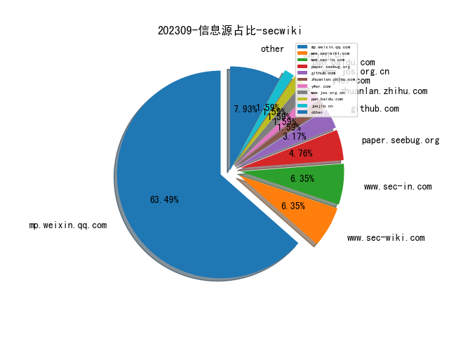
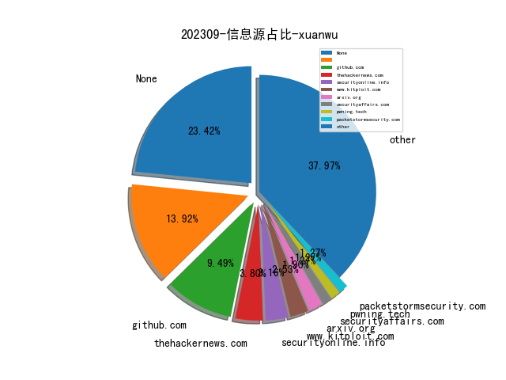
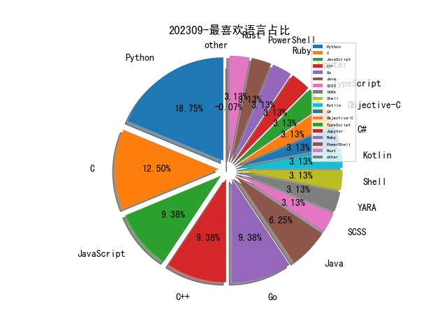

# [数据--所有](README_20.md)
# [数据--年度](README_2023.md)
# 202309 信息源与信息类型占比

# 网络安全书籍 推荐
| date_added | language | title | author | link | size| 
| --- | --- | --- | --- | --- | ---| 
| 2023-09-29 14:18:15 | English | (HBR Emotional Intelligence Series) Grit | Harvard Business Review, Angela L. Duckworth, Misty Copeland, Shannon Huffman Polson, Tomas Chamorro-Premuzic | http://libgen.rs/book/index.php?md5=43B3B9AD267EC42617A24B364146CBCC | 1 MB [EPUB]| 
| 2023-09-27 15:38:00 | English | Black Hat Python, 2nd Edition | Justin Seitz; Tim Arnold | http://libgen.rs/book/index.php?md5=93C0E3BF45AC2791B622BCAEC5D34E42 | 7 MB [EPUB]| 
| 2023-09-27 15:22:10 | English | RTFM: Red Team Field Manual v2 | Ben Clark; Nick Downer | http://libgen.rs/book/index.php?md5=5838E46065186A20D36FEF831EC36200 | 256 kB [EPUB]| 

# 微信公众号 推荐
| nickname_english | weixin_no | title | url| 
| --- | --- | --- | ---| 
| 白色安全 | SecAndDog | 中秋献礼，notec2 ,极简上线，开箱即用，免杀防溯源 | https://mp.weixin.qq.com/s?__biz=MzkwMzMxMTcyNw==&mid=2247510906&idx=1&sn=a724a4a6b5b52829e6b6e005364220d1 | 1| 
| 悟空安全 | gh_3f33ed14634c | LoaderFly 快速生成免杀工具 | https://mp.weixin.qq.com/s?__biz=Mzg4Nzg4NDQwNA==&mid=2247484111&idx=1&sn=dcafe0d5ae7aa98cd22db374ebb9f933 | 1| 
| 天启实验室 | NXKMKS | 中秋节快乐！！！ | https://mp.weixin.qq.com/s?__biz=Mzk0NzM4NzI1MA==&mid=2247485897&idx=1&sn=d63687bfa1a4491a0a3c79e29e259af1 | 1| 
| 国舜股份 | None | 平安团圆，千里婵娟 | https://mp.weixin.qq.com/s?__biz=MzA3NjU5MTIxMg==&mid=2650572849&idx=1&sn=4cd125ad75fbd5aa0c5ac83d2d17e2da | 1| 
| OPPO安珀实验室 | gh_c3e58b525224 | Android传感器安全分析 | https://mp.weixin.qq.com/s/9DM8Zbg98l_rcj8I2MU3Vg | 1| 
| 鼎信安全 | HNDXCP | 欢度双节丨锦绣中国 盛世华诞，鼎信安全放假通知 | https://mp.weixin.qq.com/s?__biz=MzIwOTc4MTE4Nw==&mid=2247496487&idx=1&sn=f7e7ef15d42d91411552af10cf262de7 | 1| 
| 默安科技 | moresec | 默安科技2023年中秋国庆值守安排 | https://mp.weixin.qq.com/s?__biz=MzIzODQxMjM2NQ==&mid=2247497491&idx=1&sn=4726895f7905802b8e7c30254ace8a4b | 1| 
| 骏安检测 | jsjajc | 迎中秋，庆国庆｜欢度佳节 安全先行 骏安检测全程护航网络安全！ | https://mp.weixin.qq.com/s?__biz=MzI4NTM3MzM0OA==&mid=2247493819&idx=1&sn=2e75d646ef900f02fb559fb3c8d0df3b | 1| 
| 闪焰安全服务团队 | gh_9864513015c2 | 中秋遇国庆，双节同庆！ | https://mp.weixin.qq.com/s?__biz=MzkwOTMxNjcwMQ==&mid=2247489687&idx=1&sn=c7a9041fe47abf3cf8ab536395b1f65d | 1| 
| 长亭安全观察 | gh_4f6964d0d1e4 | 长亭科技入选数据安全产业赛事工作组成员 | https://mp.weixin.qq.com/s?__biz=MzkyNDUyNzU1MQ==&mid=2247484081&idx=1&sn=60b6a89c69daa3d9d03fe7064b763a33 | 1| 
| 锐眼安全实验室 | gh_ac88e02e949f | 请更新你们的Chrome | https://mp.weixin.qq.com/s?__biz=MzIyOTczMjI2MQ==&mid=2247485815&idx=1&sn=5ca80d6f22d3160dab08da6809c1be26 | 1| 
| 金盾检测股份 | jd365eval | 金盾检测将持续为您保驾护航！ | https://mp.weixin.qq.com/s?__biz=MzI5NjA4NjA3OA==&mid=2652095463&idx=1&sn=8b73e760e8a7e6f0af38436268774305 | 1| 
| 贫僧法号云空 | gh_cf6b405797e0 | 用友时空 KSOA servletimagefield 文件 sKeyvalue 参数SQL注入 | https://mp.weixin.qq.com/s?__biz=Mzg4OTkwMDc1Mg==&mid=2247484649&idx=1&sn=14a1c1d7cee3c266516762588427b554 | 1| 
| 虎符网络 | HF_security | 巾帼不让须眉！虎符网络顾春辉获“余杭工匠”称号 | https://mp.weixin.qq.com/s?__biz=MzUxODY3MDExMA==&mid=2247488996&idx=1&sn=b3b33590586249590b10401a8f487c6f | 1| 
| 腾讯玄武实验室 | XuanwuLab | 每日安全动态推送(9-28) | https://mp.weixin.qq.com/s?__biz=MzA5NDYyNDI0MA==&mid=2651959368&idx=1&sn=3c43cb1430b25b620a6a22a15a09312b | 1| 
| 腾讯安全 | TXAQ2019 | 鹅厂程序员回收酒瓶子，揭秘百万假酒生意 | https://mp.weixin.qq.com/s?__biz=Mzg5OTE4NTczMQ==&mid=2247513097&idx=1&sn=29cc68bfc1ac7c8bc32f6c4cf6ba8c60 | 1| 
| 聚锋实验室 | jufenglab | TOP5 , 头条：u200bTelegram、TON 基金会宣布与腾讯达成合作，将打造类似微信的“超级生态平台” | https://mp.weixin.qq.com/s?__biz=MzI2NDE0NTM5Nw==&mid=2651974854&idx=1&sn=f7b32c7e702ec2fe7aee384a4101c9dc | 1| 
| 网络盾牌 | gh_6ef5650b8b89 | 0928-Telegram、TON 基金会宣布与腾讯达成合作，将打造类似微信的“超级生态平台”-英国正在开展“前出狩猎”行动 | https://mp.weixin.qq.com/s?__biz=MzkyNjMzMTcwOQ==&mid=2247494164&idx=1&sn=39bb1424aa15c56523438c49a8295bf9 | 1| 
| 网络安全和信息化 | ITyunwei_365master | 推进新型工业化要处理好三个关系 | https://mp.weixin.qq.com/s?__biz=MjM5MzMwMDU5NQ==&mid=2649158607&idx=4&sn=2debef8bbd9b1061f752afa13069d012 | 4| 
| 网络安全与数据治理 | gh_ddbdee0c5caf | 国家互联网信息办公室关于《规范和促进数据跨境流动规定（征求意见稿）》公开征求意见的通知 | https://mp.weixin.qq.com/s?__biz=MzIzODk1NzY5NA==&mid=2247495439&idx=1&sn=14481c42390783591fd34d7ab4607d79 | 1| 
| 网安杂谈 | sdpcwa | 【重要通知】“美亚杯”第九届中国电子数据取证大赛报名通道开启！ | https://mp.weixin.qq.com/s?__biz=MzAwMTMzMDUwNg==&mid=2650887927&idx=1&sn=fc04a40e736a009a9cb44f722ede21d5 | 1| 
| 网安寻路人 | DataProtection101 | 认识《规范和促进数据跨境流动规定（征求意见稿）》——对必要性判断的设计 | https://mp.weixin.qq.com/s?__biz=MzIxODM0NDU4MQ==&mid=2247500446&idx=1&sn=ecce89cb36aec8e0de7edfd6ed194c09 | 1| 
| 红队蓝军 | Xx_Security | 疯狂的不止星期四，还有…… | https://mp.weixin.qq.com/s?__biz=Mzg2NDY2MTQ1OQ==&mid=2247515187&idx=1&sn=a9ce8a67d9e689fb2c17dbd52d0f5953 | 1| 
| 红队笔记录 | gh_0162f0882c95 | 精华技巧集结：红队实战备忘录 | https://mp.weixin.qq.com/s?__biz=Mzg4Njc3NzM1OA==&mid=2247484693&idx=2&sn=c894481878c4dbcd3b5ca141aa741dd9 | 2| 
| 红蓝攻防实验室 | web_black | 云资产管理工具0.1.1-加强版 国庆前最后一版更新 | https://mp.weixin.qq.com/s?__biz=MzU2OTkwNzIxOA==&mid=2247484334&idx=1&sn=c9de32a376c7f19ad399bae262090c99 | 1| 
| 盛邦安全WebRAY | WebRay_weixin | 中秋国庆放假安排及安全保障通知 | https://mp.weixin.qq.com/s?__biz=MzAwNTAxMjUwNw==&mid=2650274000&idx=2&sn=e89da2eca81a96afbd3d5f83f0ebc063 | 2| 
| 盘古石取证 | Panguite_CN | 盘古石取证 - 中秋国庆假期服务值班表 | https://mp.weixin.qq.com/s?__biz=Mzg3MjE1NjQ0NA==&mid=2247500856&idx=1&sn=1f4738843611754bcb01398d8e733058 | 1| 
| 皓月的笔记本 | gh_7340936b0779 | 【漏洞复现】泛微 E-cology SQL注入漏洞 （QVD-2023-5012） | https://mp.weixin.qq.com/s?__biz=Mzk0ODM0NDExMg==&mid=2247484012&idx=3&sn=f19e65140b7fcb02f7fcaa5b04beccd8 | 3| 
| 电子物证 | ewuzheng | 【打印机后门程序分析】 | https://mp.weixin.qq.com/s?__biz=MzAwNDcwMDgzMA==&mid=2651046024&idx=3&sn=347eb614856008350fa7a7fbce885cc2 | 3| 
| 电子取证wiki | forensicswiki | 2023年第一届“龙信杯”电子数据取证竞赛参考wp | https://mp.weixin.qq.com/s?__biz=MzkzNTQzNTQzMQ==&mid=2247484365&idx=1&sn=3848582b28a1596a60473f66774b52b4 | 1| 
| 珂技知识分享 | kezibei001 | web选手入门pwn(12) | https://mp.weixin.qq.com/s?__biz=MzUzNDMyNjI3Mg==&mid=2247486497&idx=1&sn=e58b14bd16a3764593586dca33c65e72 | 1| 
| 火绒安全 | None | 双节期间火绒安全将持续为您护航 | https://mp.weixin.qq.com/s?__biz=MzI3NjYzMDM1Mg==&mid=2247515774&idx=1&sn=c64b7e704a1da9ec6426585ce1d01bfd | 1| 
| 漏洞盒子VulBox | Vulbox_ | 国庆项目“直通车”，知识大陆 APP 带你开传送门 | https://mp.weixin.qq.com/s?__biz=MzIxODIzNzgwMw==&mid=2654065974&idx=1&sn=bc0ed609cc123d046d7eb45eca58f489 | 1| 
| 渗透安全HackTwo | CB-Hack | 最新Nessus2023.10版本漏洞扫描/探测工具下载Windows | https://mp.weixin.qq.com/s?__biz=Mzg3ODE2MjkxMQ==&mid=2247484262&idx=1&sn=a9c7d5b4281d4aa750593aee0a0c2f24 | 2| 
| 棉花糖网络安全圈 | None | 交流群 | https://mp.weixin.qq.com/s?__biz=Mzg5NTYwMDIyOA==&mid=2247497464&idx=2&sn=f05e4ca2ebe3f36da92a2a9d4c5c3f53 | 2| 
| 梆梆安全 | BANGCLE | 梆梆安全守护双节，7X24小时保护您的软件 | https://mp.weixin.qq.com/s?__biz=MjM5NzE0NTIxMg==&mid=2651129700&idx=1&sn=7414deba8be4659531177cb01761b7bd | 1| 
| 暗影安全 | gh_4f0dabd0df69 | 完美落幕 , EISS-2023企业信息安全峰会之深圳站 09月22日成功举办 | https://mp.weixin.qq.com/s?__biz=MzI2MzA3OTgxOA==&mid=2657164855&idx=2&sn=fac7359e92de7bf12ba6e11ba4c61101 | 2| 
| 明不可欺 | gh_1405d616adc7 | 被诈骗必须可以追回损失！有判例可依，收藏转发给您需要的人！ | https://mp.weixin.qq.com/s?__biz=MzI1NTI4OTE5OA==&mid=2247487224&idx=1&sn=e1f5f26b1cd38f8fff4f6c1962f9a723 | 1| 
| 无糖反网络犯罪研究中心 | gh_2ee7a9b17c0d | 荆州警方破获侵犯公民个人信息案 , 榆林警方破获网络赌博案——涉网犯罪每日情报 | https://mp.weixin.qq.com/s?__biz=MzAxMzkzNDA1Mg==&mid=2247507047&idx=1&sn=db17c4d289fa822d1df2532c261cd7b0 | 1| 
| 数据思考笔记 | ThinkofData | Gartner：对企业建设数据中台的4点建议 | https://mp.weixin.qq.com/s?__biz=MzkzMzQxODU3Mg==&mid=2247485706&idx=1&sn=07bbf927f19a5d585ae8f788b8e4ca6f | 1| 
| 数字人才创研院 | HD-Talent | 漏洞复现,网神SecGate3600防火墙存在任意文件上传漏洞 | https://mp.weixin.qq.com/s?__biz=MzkwODMzOTA2NA==&mid=2247491725&idx=1&sn=46a57080be18fe06606ade8e06818ad3 | 1| 
| 数世咨询 | dwconcn | [调研]：网络攻击盯上API | https://mp.weixin.qq.com/s?__biz=MzkxNzA3MTgyNg==&mid=2247503710&idx=1&sn=5e980bb86122564c2d343877607e668e | 1| 
| 效率源 | None | 效率源中秋·国庆放假安排 | https://mp.weixin.qq.com/s?__biz=MjM5ODQ3NjAwNQ==&mid=2650541923&idx=2&sn=a1944d1d7a7feeb4398fcc57049de76b | 2| 
| 搁浅安全 | Geqian_CTF | MP3文件隐写之Copyright位 | https://mp.weixin.qq.com/s?__biz=MzkwNTM5NTU1NA==&mid=2247485702&idx=1&sn=1fe0857c4ee1acc51ee7f55486d7bba0 | 1| 
| 我的安全专家之路 | hackerzhuanjia | BChecks 自定义poc检测 - 把BurpSuite 打造成强大的漏洞扫描器 | https://mp.weixin.qq.com/s?__biz=MzI5MTA1ODk5NQ==&mid=2247485060&idx=1&sn=651d33b52ca8275212d6191da8f5553d | 1| 
| 成都链安 | LiananTech | 成都链安受邀参加2023国际虚拟现实创新大会并发表主题演讲 | https://mp.weixin.qq.com/s?__biz=MzU2NzUxMTM0Nw==&mid=2247510349&idx=1&sn=583b13041ad5d3006e904fa85e7d6527 | 1| 
| 德斯克安全小课堂 | szdesk | 谷歌的零信任实践BeyondCorp到底讲了啥？ | https://mp.weixin.qq.com/s?__biz=MzA3MTUxNzQxMQ==&mid=2453883823&idx=1&sn=f3a1c1c3c3ab7ac5a2ca9cdef0adc1c5 | 1| 
| 弱口令验证机器人 | gh_4f1df697395d | 实战｜记某次红蓝对抗(内附小工具 NaturalTeeth v1.2) | https://mp.weixin.qq.com/s?__biz=MzkzNzM0OTcyOQ==&mid=2247484486&idx=1&sn=3392d38157abfce7c842438517bb0476 | 1| 
| 工联安全众测 | gh_76781543558c | 【今日开讲】工联安全大讲堂第二十三期今日开讲！ | https://mp.weixin.qq.com/s?__biz=MzkyMDMwNTkwNg==&mid=2247486970&idx=1&sn=1053dd68cd4fbec47e553d59e1b7c5a5 | 1| 
| 山石网科新视界 | hillstone-vision | 今日上线 礼赞双节｜融合联动，全力护航网络安全运营——《岩谈》第14期 | https://mp.weixin.qq.com/s?__biz=MzAxMDE4MTAzMQ==&mid=2661280915&idx=1&sn=cb697d4025eb349cfe419810c723e688 | 1| 
| 小米安全中心 | misrc_team | 【百万奖金池】Xiaomi 13 手机守护计划火热进行中！ | https://mp.weixin.qq.com/s?__biz=MzI2NzI2OTExNA==&mid=2247515764&idx=1&sn=03afa286d9e1ab916c3456168f27457b | 1| 
| 安迈信科应急响应中心 | gh_6b3e4cf2d589 | 【漏洞通告】用友GRP-U8 bx_historyDataCheck.jsp SQL注入漏洞 | https://mp.weixin.qq.com/s?__biz=Mzg2NjczMzc1NA==&mid=2247484760&idx=4&sn=fcada1d210fe72aa02d849f4273b54b2 | 4| 
| 安洵信息 | i-s00n | 双节同庆 , 安洵信息2023中秋国庆放假通知 | https://mp.weixin.qq.com/s?__biz=MzIyODE1NzEzNg==&mid=2650343541&idx=1&sn=276dde56400653f1c83fd890a847a7b3 | 1| 
| 安圈评 | gh_c9e26ce99897 | 节日快乐！！！ | https://mp.weixin.qq.com/s?__biz=MzkwNTI4MTA1MQ==&mid=2247500859&idx=1&sn=2ecdedf5f9a08614bedfb78fc37e4e96 | 1| 
| 安全防护 | gh_6d0797ffb439 | nginx常用内置变量 | https://mp.weixin.qq.com/s?__biz=MzAxNDM5NDEyMw==&mid=2247484078&idx=1&sn=9a670c058921da863c98b8ef93ff6d69 | 1| 
| 安全狗 | safedog2013 | 安全护航·万事皆圆,安全狗中秋国庆值班安排 | https://mp.weixin.qq.com/s?__biz=MjM5NTc2NDM4MQ==&mid=2650839129&idx=1&sn=3e07667bf3781ae3416f59271934728f | 1| 
| 安全后厨 | sanxingfengaa | 博客来咯！！！ | https://mp.weixin.qq.com/s?__biz=MzI3MDQ1NDE2OA==&mid=2247489988&idx=4&sn=a56aa7b976db643a226af3efff368e90 | 4| 
| 安全内参 | anquanneican | CNCERT：关于libwebp开源库存在远程代码执行漏洞的安全公告 | https://mp.weixin.qq.com/s?__biz=MzI4NDY2MDMwMw==&mid=2247509968&idx=2&sn=900042b1ec3f1cc268d4a6ca855eed0c | 2| 
| 安世加 | asjeiss | 【非安全方向】香港科创ThingX公司招软硬件开发 | https://mp.weixin.qq.com/s?__biz=MzU2MTQwMzMxNA==&mid=2247535060&idx=3&sn=ec270abf50f4eb88a72d777c88a1ea9e | 3| 
| 奇安信病毒响应中心 | gh_416eb7efb780 | 每周勒索威胁摘要 | https://mp.weixin.qq.com/s?__biz=MzI5Mzg5MDM3NQ==&mid=2247493232&idx=1&sn=64c52f908c550c7c144c091b474471e7 | 1| 
| 天锐数据安全 | tipray | 小长假期间企业如何保护数据安全 | https://mp.weixin.qq.com/s?__biz=MjM5MTk0MzIzMQ==&mid=2652017626&idx=2&sn=e363f626a61a0846e0a347596d00d486 | 2| 
| 天融信阿尔法实验室 | gh_0b0b1747bf15 | 每周安全动态精选（9.25-9.28） | https://mp.weixin.qq.com/s?__biz=Mzg3MDAzMDQxNw==&mid=2247496465&idx=1&sn=6ae91a9267a35aa9b09f0920cd803062 | 1| 
| 天虞实验室 | gh_e3e55897d65f | 赛宁工控靶场场景实操：工控协议模糊测试 Modbus-TCP | https://mp.weixin.qq.com/s?__biz=MzkwNzMzMjIyNg==&mid=2247487490&idx=1&sn=a2ff21e30e15f7647f5f6e3f70215b02 | 1| 
| 天帷信息 | TWdengbao | 天帷信息中秋节国庆节假期值班保障通知 | https://mp.weixin.qq.com/s?__biz=Mzk0NDQ5MzIxOA==&mid=2247504758&idx=3&sn=138107061f3bbbc8a19776d19c48289b | 3| 
| 大数据安全工程研究中心 | DSJAQGCYJZX | 迎中秋 庆国庆 | https://mp.weixin.qq.com/s?__biz=MjM5Nzg0NzUxOQ==&mid=2247486799&idx=1&sn=d8e5be2c1fc69c37fe5e1a402413016d | 1| 
| 墨雪飘影 | SG-CXZ | 更新公告 | https://mp.weixin.qq.com/s?__biz=MzI3NzI4OTkyNw==&mid=2247488951&idx=1&sn=89d4cfe8bfc95c3e854039edb84472a9 | 1| 
| 墨菲安全实验室 | gh_e042bf9d205c | CVE-2023-5129 libwebp堆缓冲区溢出漏洞影响分析 | https://mp.weixin.qq.com/s?__biz=MzkxMDMxMjgxMg==&mid=2247484742&idx=1&sn=05078e7c513d3f71cab6d8730d41a1a5 | 1| 
| 国家网络安全通报中心 | gh_8793d2a6176d | 掩耳盗铃之骗得了自己骗不了警方 | https://mp.weixin.qq.com/s?__biz=MzU1MTE1MjU5Nw==&mid=2247484885&idx=1&sn=753bf88b8edb6a0c192409d9d398e3ed | 1| 
| 四叶草安全 | siyecaoanquan1 | 2023 第六届SSC网络安全大会议程出炉！ | https://mp.weixin.qq.com/s?__biz=MjM5MTI2NDQzNg==&mid=2654550004&idx=1&sn=47aef5f699597f103b7071bd30c8ae4f | 1| 
| 嘉诚安全 | jiachengsec | 【漏洞通告】Google libwebp 代码执行漏洞安全风险通告 | https://mp.weixin.qq.com/s?__biz=MzU4NjY4MDAyNQ==&mid=2247493371&idx=2&sn=ddc3c7965eee6ee5e0c65c5b6371d75b | 2| 
| 可信系统安全实验室 | gh_296c8139d7e6 | 凝聚团队力量 喜迎中秋国庆 | https://mp.weixin.qq.com/s?__biz=Mzg3ODU5NDU2Mw==&mid=2247484407&idx=1&sn=52d7b88f26e55aa2a057a3d2ed58a137 | 1| 
| 创宇安全智脑 | websoc | 创宇安全智脑 , 用友U8 Cloud ServiceDispatcher反序列化远程代码执行等34个漏洞可检测 | https://mp.weixin.qq.com/s?__biz=MzIwNjU0NjAyNg==&mid=2247487569&idx=1&sn=e47d390576af267c05e608430e487263 | 1| 
| 军机故阁 | gh_e57baf46bdf5 | Juniper防火墙RCE | https://mp.weixin.qq.com/s?__biz=MzU5Mjk3MDA5Ng==&mid=2247485582&idx=1&sn=6c97737e3774b9f718e190833efdf90b | 1| 
| 内生安全联盟 | CCESS_CHINA | 紫金山实验室拟态调度器芯片荣获“中国芯”优秀技术创新产品 | https://mp.weixin.qq.com/s?__biz=Mzg4MDU0NTQ4Mw==&mid=2247512702&idx=1&sn=e7369fbf5d16a0fe773c56f925828056 | 1| 
| 关键基础设施安全应急响应中心 | CII-SRC | ChargePoint Home Flex电动汽车充电站攻击面总结 | https://mp.weixin.qq.com/s?__biz=MzkyMzAwMDEyNg==&mid=2247539954&idx=4&sn=89c0835caf2614ef71ac4d78fdcdc8af | 4| 
| 全栈网络空间安全 | cyber_securlty | 这篇保姆级 Zabbix 必备指南，助你成为监控老司机 | https://mp.weixin.qq.com/s?__biz=Mzg3NTUzOTg3NA==&mid=2247509660&idx=1&sn=57bb46b1d27922dd36f52d7e29c766ed | 2| 
| 信息安全研究 | ISR2016 | 【业界动态】网络安全信息与动态周报2023年第39期（9月18日-9月24日） | https://mp.weixin.qq.com/s?__biz=MzA3NzgzNDM0OQ==&mid=2664980514&idx=3&sn=22142fffad9b1098ab3b19c6511f7e25 | 3| 
| 信息安全大事件 | xxaqdsj | 高级持续威胁的非常规攻击手段 | https://mp.weixin.qq.com/s?__biz=MzkzNjIzMjM5Ng==&mid=2247488854&idx=1&sn=2a3d99c73826e4a26058b906419287a6 | 1| 
| 信息安全国家工程研究中心 | None | 工程中心恭祝【中秋快乐，月圆，人团圆】！ | https://mp.weixin.qq.com/s?__biz=MzU5OTQ0NzY3Ng==&mid=2247495058&idx=1&sn=875d95d9e1268a082c1bec1efcf4312b | 1| 
| 信息安全D1net | D1Net18 | CISO正在努力争取网络安全预算 | https://mp.weixin.qq.com/s?__biz=MzA3NTIyNzgwNA==&mid=2650257607&idx=1&sn=226405a5eaf2b3fa40617ef279e0cbaa | 1| 
| 互联网安全大会 | None | “天府杯”2023国际网络安全大赛报名开启，千万级奖金广招网安英豪 | https://mp.weixin.qq.com/s?__biz=MjM5ODI2MTg3Mw==&mid=2649814368&idx=1&sn=b86b59f00853d3f2956cc14c8c18f30f | 1| 
| 云起无垠 | Clouditera2021 | 双节同庆！盛世华诞 月满中秋 | https://mp.weixin.qq.com/s?__biz=Mzg3Mjg4NTcyNg==&mid=2247488055&idx=1&sn=fc2cf20866e7000e9e5197f04abafba8 | 1| 
| 中泊研安全应急响应中心 | gh_ee6d13a7ae1e | 延川县网络安全培训会 | https://mp.weixin.qq.com/s?__biz=Mzg2NDc0MjUxMw==&mid=2247485312&idx=1&sn=a1f95c698725df6e1cd2fb7d4b5c86e3 | 1| 
| 中国保密协会科学技术分会 | gh_be4f21d557c0 | 涉密资质单位保密人员十戒之四：戒“等” | https://mp.weixin.qq.com/s?__biz=MzIxMzI4ODI1MA==&mid=2247487523&idx=2&sn=71bb42b24cb43a7080fc8abe29679d75 | 1| 
| 东软NetEye网络安全 | None | 东软NetEye祝您中秋团圆·国庆同庆·双节快乐！ | https://mp.weixin.qq.com/s?__biz=MjM5NTAyODkxNw==&mid=2649212802&idx=1&sn=fe49ee43666fe12492324df51c86e95f | 1| 
| 世纪网安 | hainanshijiwangan | 世纪网安“中秋国庆”双节放假及技术值守安排 | https://mp.weixin.qq.com/s?__biz=MzkzMDE4NTE5OA==&mid=2247486011&idx=1&sn=d0b59e1cd2aa6364a3f93355a8c3c811 | 1| 
| 三六零CERT | CERT-360 | 安全日报（2023.09.28） | https://mp.weixin.qq.com/s?__biz=MzU5MjEzOTM3NA==&mid=2247496694&idx=2&sn=fba715830654b8f93e36dc2c6e5902b3 | 2| 
| 万径安全 | Mega_Vector | 万径安全CTO姬锦坤：Yak已走完万里长征上的一小步路 未来将不负众望 | https://mp.weixin.qq.com/s?__biz=MzIwMzI1MDg2Mg==&mid=2649943353&idx=1&sn=4de97dd70dcdec5eae496f5ac5207e51 | 1| 
| wavecn | sender_is_sender | 经典有效的日志监控邮件集中巡检 Linux 服务器 | https://mp.weixin.qq.com/s?__biz=Mzg4Njc0Mjc3NQ==&mid=2247485691&idx=1&sn=4ee26027901d614f584439aa0d456aed | 1| 
| pen4uin | gh_ffc9f5385230 | jEG - 高度自定义的 Java 回显生成工具 | https://mp.weixin.qq.com/s?__biz=MzU0MDg5MzIzMQ==&mid=2247486256&idx=1&sn=0160f9d7a0abd29baf1907c2a88cebf3 | 1| 
| kali笔记 | bbskali-cn | 利用WMIC获取系统Shell | https://mp.weixin.qq.com/s?__biz=MzkxMzIwNTY1OA==&mid=2247499734&idx=1&sn=fa8ee0fbefcc1a87d7c2299f149cde49 | 1| 
| Yak Project | YakLanguage | 万径安全CTO姬锦坤：Yak已走完万里长征上的一小步路 未来将不负众望 | https://mp.weixin.qq.com/s?__biz=Mzk0MTM4NzIxMQ==&mid=2247512333&idx=2&sn=072c47ca7d0a9eab1ae53b68e52501b5 | 2| 
| X安全实验室 | H4ckMe | 深圳大学捐款5000万的张同学是如何赚钱的？ | https://mp.weixin.qq.com/s?__biz=MzkzMDM5NzIwMw==&mid=2247484401&idx=1&sn=96257484ed1d0466050f48dbd16ce133 | 1| 
| XiAnG学安全 | XiAnG_sec | 2023年第一届“龙信杯”电子数据取证竞赛参考wp | https://mp.weixin.qq.com/s?__biz=Mzk0MTQzNjIyNg==&mid=2247489178&idx=1&sn=a3a80ff18d535f40ba82f338419f1915 | 1| 
| XRSec | xr-sec | PlayCover 显示异常 宽屏 解决方案 | https://mp.weixin.qq.com/s?__biz=MzUyMzE1MzI3NA==&mid=2247486387&idx=4&sn=ee5755eb737e68382f0a98dd3b308a75 | 4| 
| Timeline Sec | TimelineSec | CVE-2023-42442：JumpServer未授权访问漏洞 | https://mp.weixin.qq.com/s?__biz=MzA4NzUwMzc3NQ==&mid=2247492729&idx=1&sn=ee8b8fea70a85eb98566fb44d264aba5 | 1| 
| Skynet 安全团队 | Skynet_security999 | 雷池天然防护月报-202309 | https://mp.weixin.qq.com/s?__biz=Mzg4MzU5MzU4OA==&mid=2247483903&idx=1&sn=40c2f5a6f9765f5859ffa97e2f4bb2d2 | 1| 
| Seebug漏洞平台 | seebug_org | 知道创宇404实验室实习岗位招聘中！ | https://mp.weixin.qq.com/s?__biz=MzAxNDY2MTQ2OQ==&mid=2650972564&idx=1&sn=9ffe23c7232381d17906e44398c0416e | 1| 
| SecPulse安全脉搏 | SecPulse | 【漏洞预警】JumpServer多个安全漏洞威胁通告 | https://mp.weixin.qq.com/s?__biz=MzAxNDM3NTM0NQ==&mid=2657045558&idx=1&sn=dc9f2a622b2706640c47a04963d08133 | 1| 
| RASP安全技术 | gh_fdc868b0562f | RASP检测能力提升的思考与实践 | https://mp.weixin.qq.com/s?__biz=Mzg5MjQ1OTkwMg==&mid=2247484614&idx=1&sn=8fdb169f569ebd4acbf39fbd56f8a05b | 1| 
| Ots安全 | AnQuan7 | Linux内核CVE漏洞复现环境 | https://mp.weixin.qq.com/s?__biz=MzAxMjYyMzkwOA==&mid=2247501570&idx=3&sn=b7711ba5a10a6dc0548c5cd1879823be | 3| 
| HACK安全 | aqhacker | 《mysql执行xpcmd》 | https://mp.weixin.qq.com/s?__biz=Mzg2NjU0MjA0Ng==&mid=2247487589&idx=1&sn=9526f903028ec7b85b0234d7f147e455 | 1| 
| GEEKCON | GEEKCON-DarkNavy | 赛题解析 , “对抗研判 AVSS挑战赛 ”线上选拔赛 | https://mp.weixin.qq.com/s?__biz=Mzk0NzQ5MDYyNw==&mid=2247484391&idx=1&sn=2edd3c693d7728f496c02c68563bef53 | 1| 
| EchoSec | gh_ae9ab8305da0 | 值得关注的高质量技术干货 | https://mp.weixin.qq.com/s?__biz=MzU3MTU3NTY2NA==&mid=2247488236&idx=1&sn=700efbe32ae619e84038245d7904c91c | 2| 
| Devil安全 | gh_b35dd18ddc14 | 【漏洞复现】用友U8+CRM任意文件上传漏洞 | https://mp.weixin.qq.com/s?__biz=Mzg2MjkwMDY3OA==&mid=2247484141&idx=1&sn=b6ff1782271cc55c876bb00ff48b48d9 | 1| 
| CTS纵横安全实验室 | CTS-Lab | 国家发展改革委 国家能源局印发《电力负荷管理办法（2023年版）》 | https://mp.weixin.qq.com/s?__biz=MzUxOTY3MjU3Ng==&mid=2247487552&idx=1&sn=43a67afb8ed77056128a0288d46b4dba | 1| 
| CNVD漏洞平台 | CNVDTS | 关于libwebp开源库存在远程代码执行漏洞的安全公告 | https://mp.weixin.qq.com/s?__biz=MzU3ODM2NTg2Mg==&mid=2247493917&idx=1&sn=01368fc2e7e6e81bcf3572f1c2898c61 | 1| 
| CNCERT国家工程研究中心 | NELCERT | Xenomorph恶意软件升级：瞄准全球安卓用户，400多家金融机构陷入危机 | https://mp.weixin.qq.com/s?__biz=MzUzNDYxOTA1NA==&mid=2247540214&idx=4&sn=339d7a963de901b1b4423252b2863ace | 4| 
| Art Of Hunting | gh_d3ebfd9e0148 | [AOH 025][0day]dedecms任意Cookie伪造 | https://mp.weixin.qq.com/s?__biz=MzkzMTIyOTA1NA==&mid=2247484201&idx=1&sn=446c1868e0f8590cb552319711651584 | 1| 
| A9 Team | gh_533347fad180 | 【A9】CVE-2022-21661-WORDPRESS-SQL-注入 | https://mp.weixin.qq.com/s?__biz=MzkzNzI2Mzc0Ng==&mid=2247485912&idx=1&sn=e9bbd3706eb4f394e3b03513074d2271 | 1| 
| 黑白之道 | i77169 | 一款轻巧的内网弱口令枚举工具 | https://mp.weixin.qq.com/s?__biz=MzAxMjE3ODU3MQ==&mid=2650578750&idx=4&sn=c4c4268e592ab4fa9de3c6c0399c3895 | 8| 
| 黑客白帽子 | hackerwhitehat | 2023年电脑显示器选购指南，24寸/27寸/32寸/带鱼屏/IPS屏/1080P/2K/4K全攻略 | https://mp.weixin.qq.com/s?__biz=MzA5MzYzMzkzNg==&mid=2650930137&idx=2&sn=cf222e17aa11621dac3192b925b5cdad | 4| 
| 黑客技术与网络安全 | HackerCoder | 新书刚发布，就冲到京东第二了 | https://mp.weixin.qq.com/s?__biz=MzIyMDEzMTA2MQ==&mid=2651165575&idx=2&sn=9a220c22ceb50d3e1b11559932ae2abc | 4| 
| 魔方安全 | None | 中秋国庆假期值班通知函 | https://mp.weixin.qq.com/s?__biz=MzI3NzA5NDc0MA==&mid=2649290066&idx=1&sn=6ad98cc80c4616f7e00096393edd406c | 1| 
| 马赛克安全实验室 | mosaic-sec | [漏洞复现-24]万*OA axis组件远程命令执行漏洞 | https://mp.weixin.qq.com/s?__biz=MzI5MzU4ODE5Mw==&mid=2247484013&idx=1&sn=d9cf61f11f806762f79897c0bc6e284e | 10| 
| 青藤云安全 | qingtengyunanquan | 青藤获评国家信息安全漏洞共享平台（CNVD）三项荣誉 | https://mp.weixin.qq.com/s?__biz=MzAwNDE4Mzc1NA==&mid=2650845903&idx=1&sn=4071b4143cc964e996fa56a4401a9512 | 1| 
| 雾都的猫 | wuducat404 | 小而美的黑客模拟器 | https://mp.weixin.qq.com/s?__biz=Mzk0OTQ0MTI2MQ==&mid=2247484122&idx=1&sn=3cde8c39b1f027d2a07df41bfdd1f6dd | 1| 
| 隐雾安全 | gh_9355275bad2a | APP逆向-dudu牛（4000字长文，小白可食） | https://mp.weixin.qq.com/s?__biz=MzkyNzM2MjM0OQ==&mid=2247488334&idx=1&sn=a4556a2db594cfb16628a78c00346c96 | 2| 
| 邑安全 | EansecD | 以火攻火：用LLM对付LLM生成的社会工程攻击 | https://mp.weixin.qq.com/s?__biz=MzUyMzczNzUyNQ==&mid=2247517958&idx=4&sn=78852aef40290eb24df8e288d0322a74 | 8| 
| 迪哥讲事 | growing0101 | 推荐 , 几个必备的知识库 | https://mp.weixin.qq.com/s?__biz=MzIzMTIzNTM0MA==&mid=2247492046&idx=1&sn=fbcaf635946a2e8c025003b9f2f922d4 | 2| 
| 软件测试培训 | iTestTrain | Jenkins第9讲：Jenkins核心技术-代码质量-集成质量所有操作 | https://mp.weixin.qq.com/s?__biz=MzA5NDk4NTU3Mg==&mid=2649585854&idx=1&sn=ba107f17941e452111873d7852151e96 | 1| 
| 赛欧思安全研究实验室 | gh_04596d590471 | 2023 年将有超过 700 个暗网广告通过物联网提供 DDoS 攻击 | https://mp.weixin.qq.com/s?__biz=MzU0MjE2Mjk3Ng==&mid=2247486295&idx=1&sn=fd39fd1aaec29cd6555f6de2fe2b70f0 | 1| 
| 赛博研究院 | SICSI-cybersecurity | 100岁基辛格：中美两国须认真对待人工智能 | https://mp.weixin.qq.com/s?__biz=MzUzODYyMDIzNw==&mid=2247504821&idx=2&sn=ac76cbce35fb8213b582e28f3133eae7 | 3| 
| 赛博昆仑CERT | gh_9ec1e14521c3 | 【复现】JumpServer 任意密码重置(CVE-2023-42820)和目录穿越漏洞(CVE-2023-42819)风险通告 | https://mp.weixin.qq.com/s?__biz=MzkxMDQyMTIzMA==&mid=2247484367&idx=1&sn=3a50cda357539132dacf79266536cdb5 | 1| 
| 赛博回忆录 | cybermemory | jumpserver最新re-auth复现（伪随机经典案例） | https://mp.weixin.qq.com/s?__biz=MzIxNDAyNjQwNg==&mid=2456099100&idx=1&sn=86ca7366deccbf69a7d135455e2634cc | 1| 
| 谈数据 | learning-bigdata | 关于国央企开展数据治理工作的政策指引【汇编】 | https://mp.weixin.qq.com/s?__biz=MzI1NzYwNTMzNw==&mid=2247517565&idx=2&sn=301417ae6e6c0990ab32c8224a09dc00 | 3| 
| 谈思实验室 | gh_6446c19b4595 | 王毅：加快提升生物安全、网络安全、数据安全、人工智能安全等领域对话合作 | https://mp.weixin.qq.com/s?__biz=MzIzOTc2OTAxMg==&mid=2247526867&idx=3&sn=a44be8d9c9a8212554e976c41c0d8a60 | 6| 
| 计算机与网络安全 | C-CyberSecurity | 2023网络安全事件观察报告 | https://mp.weixin.qq.com/s?__biz=MjM5OTk4MDE2MA==&mid=2655210120&idx=4&sn=13152cb55c80ae89864750e3785525c4 | 12| 
| 衡阳信安 | zghyxa | 堆攻击迭代历程 | https://mp.weixin.qq.com/s?__biz=MzU2NDY2OTU4Nw==&mid=2247509834&idx=1&sn=bf85f2b874cf6d5b2d5850122597b7f5 | 3| 
| 菜鸟小新 | dsz-67 | 169个网站满足你的需求 | https://mp.weixin.qq.com/s?__biz=Mzg4OTI0MDk5MQ==&mid=2247489476&idx=1&sn=1b9ebb98878fdae1c87c0146a7cf13a1 | 2| 
| 菜鸟学信安 | securitylearn | 卡巴斯基引擎另类免杀玩法 | https://mp.weixin.qq.com/s?__biz=MzU2NzY5MzI5Ng==&mid=2247498427&idx=1&sn=a3238962722c586c2785b8739663a02a | 1| 
| 腾讯安全威胁情报中心 | gh_05a6c5ec3f78 | 一图看懂威胁情报云查API接口服务 | https://mp.weixin.qq.com/s?__biz=MzI5ODk3OTM1Ng==&mid=2247501124&idx=1&sn=524b797759adff07d054b720f6aee7c8 | 1| 
| 老烦的草根安全观 | linglan30 | 老烦答疑之系统化问题 | https://mp.weixin.qq.com/s?__biz=MzA5MTYyMDQ0OQ==&mid=2247491515&idx=1&sn=50d99e6de9821fcd16dbc571e15e7e40 | 3| 
| 网络安全透视镜 | gh_0111d52251cf | 【红队攻防】从零开始的木马免杀到上线，附工具 | https://mp.weixin.qq.com/s?__biz=MzIxMTg1ODAwNw==&mid=2247497389&idx=1&sn=6811c43b797976c8684d628ec979f8c9 | 3| 
| 网络安全资源库 | gh_e8a4866a67fe | 数据库合集：含MySQL、Redis、Mongodb等常见数据库 | https://mp.weixin.qq.com/s?__biz=MzkxMzMyNzMyMA==&mid=2247544579&idx=2&sn=7345c3f1d466049e641423e438035cea | 4| 
| 网络安全者 | close_3577673633 | 记一次微信小游戏测试 | https://mp.weixin.qq.com/s?__biz=MzU3NzY3MzYzMw==&mid=2247497056&idx=1&sn=b7da77b21723dacf901780d33183a82d | 3| 
| 网络安全研究所 | wlaqyjs | 网络安全招聘—中国航空研究院2024届校园招聘 | https://mp.weixin.qq.com/s?__biz=MzU4OTg4Nzc4MQ==&mid=2247496785&idx=3&sn=5ae8b2da83e34a14155f1715e783071e | 4| 
| 网络安全与取证研究 | wangluoanquanquzheng | 深入解析：真实案例揭示CC攻击实施流程及防范策略 | https://mp.weixin.qq.com/s?__biz=Mzg3NTU3NTY0Nw==&mid=2247487998&idx=1&sn=3df5759f447d86946cde0364c5140e19 | 2| 
| 绿盟科技 | NSFOCUS-weixin | T-ONE 云安全管家APP  助您假日更轻松 | https://mp.weixin.qq.com/s?__biz=MjM5ODYyMTM4MA==&mid=2650444188&idx=1&sn=5563830d699d0d671e1fa6f35ec78a8e | 4| 
| 维他命安全 | VitaminSecurity | 【漏洞通告】JumpServer密码重置漏洞（CVE-2023-42820） | https://mp.weixin.qq.com/s?__biz=MzUxMDQzNTMyNg==&mid=2247503160&idx=2&sn=9e5f22482e7cb3acf4278f2247a881e9 | 3| 
| 祺印说信安 | qiyinshuoxinan | 准备好建立组织的数字信任了吗？ | https://mp.weixin.qq.com/s?__biz=MzA5MzU5MzQzMA==&mid=2652101888&idx=3&sn=00dfd93082f283f062382cd8004ee1d4 | 8| 
| 知道创宇 | knownsec | 免费接入 安全布防｜创宇盾保障国庆重保安全无忧 | https://mp.weixin.qq.com/s?__biz=MjM5NzA3Nzg2MA==&mid=2649866093&idx=1&sn=236298d4ebdd8d42c147a9d61c01d915 | 2| 
| 看雪学苑 | ikanxue | 4h入门PHP代码审计之反序列化 | https://mp.weixin.qq.com/s?__biz=MjM5NTc2MDYxMw==&mid=2458520056&idx=4&sn=b1196704d1b49f93a746e4c37610b5bb | 9| 
| 皓月当空w | hanaffectionl | 【高危漏洞】【poc已公开】WBCE CMS任意文件上传漏洞 | https://mp.weixin.qq.com/s?__biz=Mzg4MDg5NzAxMQ==&mid=2247484982&idx=1&sn=4fd9ea7a5327cc9a37fddd1ef75fa660 | 2| 
| 白帽子程序员 | gh_21a2e58edc9a | 《2023上半年网络安全观察报告》联合发布，呈现上半年五大安全领域趋势特点 | https://mp.weixin.qq.com/s?__biz=Mzg3Mjc0MDQ2Nw==&mid=2247493404&idx=1&sn=b7e3e44cfb9ffee26f252b10f2158241 | 1| 
| 白帽子左一 | HackRead | 通达OA <12.4 反序列化漏洞分析 | https://mp.weixin.qq.com/s?__biz=MzI4NTcxMjQ1MA==&mid=2247600681&idx=1&sn=8fbb4c496d4d0140fc66ad9588193b5f | 2| 
| 潇湘信安 | xxxasec | 命令行快速启动HTTP与匿名传输 | https://mp.weixin.qq.com/s?__biz=Mzg4NTUwMzM1Ng==&mid=2247506782&idx=1&sn=166a8c5692b75b9eeeeb0de3cee24353 | 2| 
| 漏洞之星 | gh_3a1a61f67c00 | 无题 | https://mp.weixin.qq.com/s?__biz=Mzg2ODc0Mjc0Mw==&mid=2247484022&idx=1&sn=969ac5d59a4306834c99bf8abe17a65f | 1| 
| 湘安无事 | xndsb-1234 | 时空智友 , Login文件读取 | https://mp.weixin.qq.com/s?__biz=MzU3Mjk2NDU2Nw==&mid=2247487025&idx=2&sn=b486b695ef3c1067fa60cb229fcdf69f | 4| 
| 渗透Xiao白帽 | SuPejkj | NB！防溯源免杀上线Tools（附下载） | https://mp.weixin.qq.com/s?__biz=MzI1NTM4ODIxMw==&mid=2247499745&idx=1&sn=4cefbdef6249f8264d8f614d926056fc | 2| 
| 深信服科技 | sangfor_man | 深信服安服学苑2023年10-12月开班计划出炉！ | https://mp.weixin.qq.com/s?__biz=MjM5MTAzNjYyMA==&mid=2650580144&idx=2&sn=07161f9f81b0f10548de286fbc658cba | 5| 
| 海底生残月 | xiaochi_730 | 收藏｜2023HVV漏洞自查清单 | https://mp.weixin.qq.com/s?__biz=MzkyOTQyOTk3Mg==&mid=2247484548&idx=1&sn=040a813ccfe8011fb8aabede4a9989c6 | 1| 
| 浅安安全 | gh_758e256fcc72 | 漏洞预警 , FUXA SQL注入漏洞 | https://mp.weixin.qq.com/s?__biz=MzkwMTQ0NDA1NQ==&mid=2247486189&idx=4&sn=59222ed0ca67f7f0f3708addddd7e366 | 7| 
| 洞见网安 | doonsec | 洞见简报【2023/9/26】 | https://mp.weixin.qq.com/s?__biz=MzAxNzg3NzMyNQ==&mid=2247486842&idx=1&sn=5b4b6c3b38ba29ea9a6ac5b1024cad76 | 3| 
| 河南等级保护测评 | hndjbh | 由上海政务系统数据泄露引发的一点点感慨 | https://mp.weixin.qq.com/s?__biz=Mzg2NjY2MTI3Mg==&mid=2247491954&idx=2&sn=2a5330cfad35e0b0f2151573e68da88e | 5| 
| 汽车信息安全 | IcvSec | 青骥外宣 l 2023 SAE汽车网络安全Workshop 数据安全合规篇 | https://mp.weixin.qq.com/s?__biz=Mzg3MTI0NDQwNg==&mid=2247487945&idx=1&sn=e936ac6d6af0edc0c580b16658ce62da | 1| 
| 杭州数据安全联盟 | gh_4959e361d8ba | 20230927第58期｜安全漏洞一周播报 | https://mp.weixin.qq.com/s?__biz=MzkyMjI2MDE2Mg==&mid=2247501047&idx=1&sn=090009bf1dcce164daeca6f7e5b74361 | 1| 
| 李白你好 | libai_hello | Linux下内网渗透FRP代理和Viper代理对比 | https://mp.weixin.qq.com/s?__biz=MzkwMzMwODg2Mw==&mid=2247501047&idx=1&sn=33b642c50c5f7a31e1c6256cce05ffe9 | 2| 
| 有赞安全应急响应中心 | None | 有赞SRC国庆2023活动结果公开 | https://mp.weixin.qq.com/s?__biz=MjM5MzM2NzYzMw==&mid=2247484252&idx=1&sn=ba9206a061a1712409f51b92ed591e9e | 1| 
| 晴天组织 | gh_dee0523cd4e5 | 苹果ios17安全内容更新感谢晴天组织 | https://mp.weixin.qq.com/s?__biz=Mzg4NTU4OTYzMA==&mid=2247483881&idx=1&sn=8a213a7c1f2b695cf8308408de3010f7 | 1| 
| 昊天信安 | cniaosec | 一个综合资产收集和漏洞扫描工具 | https://mp.weixin.qq.com/s?__biz=MzkzNzI4NDQzMA==&mid=2247494677&idx=1&sn=124dac2392d8a46ca67ca5ac89434659 | 1| 
| 数据安全共同体计划 | gh_385b203e9e03 | 智享数安 , 第十八期 算力网络安全架构与数据安全治理技术研讨会在京成功举办 | https://mp.weixin.qq.com/s?__biz=Mzg5MDcxODc5NA==&mid=2247489457&idx=1&sn=234b7508de08e4986a994dc21908119c | 1| 
| 数据学堂 | data_school | 企业数据管理全景图谱（多图） | https://mp.weixin.qq.com/s?__biz=MzkyMDE5ODYwMw==&mid=2247517716&idx=1&sn=47986b687dd7460454dd5bf96f847b97 | 2| 
| 掌控安全EDU | ZKAQEDU | 某瑞集团安全技术研发岗位面试 | https://mp.weixin.qq.com/s?__biz=MzUyODkwNDIyMg==&mid=2247532074&idx=1&sn=56c2e8e74ed17b458ad9f96e9a027ea3 | 1| 
| 我真不会渗透 | rkabyss | Kerberoasting攻击 | https://mp.weixin.qq.com/s?__biz=MzI0NjIxMDU2Ng==&mid=2247484628&idx=1&sn=cf66a5acd9ed86b0b168bda672b845d1 | 2| 
| 我的安全视界观 | CANI_Security | 演习后认知外的见微知著 | https://mp.weixin.qq.com/s?__biz=MzI3Njk2OTIzOQ==&mid=2247485519&idx=1&sn=db6420a0c8f7bb81e5ae8554c1e2c5fd | 1| 
| 我的安全梦 | ms016team | Shc-Update工具测试版本 | https://mp.weixin.qq.com/s?__biz=MzU3NDY1NTYyOQ==&mid=2247485730&idx=1&sn=56147b0937fb4bdf0468e2fac28f4521 | 1| 
| 情报分析师 | Intelligencer1 | 关注小号，谨防失联！ | https://mp.weixin.qq.com/s?__biz=MzA3Mjc1MTkwOA==&mid=2650539414&idx=3&sn=32416c243138a2d08565d5b669c4047a | 6| 
| 微步在线 | Threatbook | 微步在线CEO薛锋荣登“2023科创先锋人物·未来数智领袖榜” | https://mp.weixin.qq.com/s?__biz=MzI5NjA0NjI5MQ==&mid=2650178977&idx=1&sn=a9ec7ae503c9f97edf30ed473b3c8bcd | 1| 
| 巢安实验室 | safe-labs | Atlassian Confluence路径穿越与命令执行漏洞 | https://mp.weixin.qq.com/s?__biz=MzU2MjY1ODEwMA==&mid=2247489228&idx=1&sn=97a4507ccae4099c154bb5bec77a7fe1 | 1| 
| 山石网科安全技术研究院 | HSN_LAB | 《信息安全技术 网络弹性评价准则》征求意见稿征求意见 | https://mp.weixin.qq.com/s?__biz=MzUzMDUxNTE1Mw==&mid=2247502482&idx=1&sn=226ea068e94657ca5fda45bea69fa332 | 2| 
| 小道安全 | kdsafety | 软件开发设计安全性的检查 | https://mp.weixin.qq.com/s/IdNkQf4Y5xJECVZrlG2xjg | 1| 
| 小白菜安全 | xiaobaicaianquan | 【新】最新的RG-EW1200G漏洞汇总-2023 | https://mp.weixin.qq.com/s?__biz=MzIzOTM2MzczNQ==&mid=2247483930&idx=1&sn=e5e2a6cdecb8422e3f9cbeacc3487f48 | 1| 
| 小白安全工具 | gh_981785667bb3 | 千机-红队免杀木马自动生成器 | https://mp.weixin.qq.com/s?__biz=MzkyMTQwNjA4NA==&mid=2247484457&idx=1&sn=7c10df2c7dc68752b371f72c2deaccf6 | 2| 
| 实战安全研究 | gh_f390fc63c711 | 通过quake分析mongodb被勒索情况 | https://mp.weixin.qq.com/s?__biz=MzU0MTc2NTExNg==&mid=2247488367&idx=1&sn=db3d5aede3eda4b95cdbe293916762db | 1| 
| 安恒信息 | AnHengCloudNews | 亚运打卡，这里超出片！安恒信息带你探秘击剑场馆 | https://mp.weixin.qq.com/s?__biz=MjM5NTE0MjQyMg==&mid=2650588962&idx=2&sn=0cafc8741021be7198e27bfa67de7eac | 4| 
| 安天移动安全 | None | 关口前移、事前预防是APP付费长效发展的核心要义 | https://mp.weixin.qq.com/s?__biz=MjM5NTY4NzcyNg==&mid=2650248924&idx=1&sn=c862fba437c59d42d1278a08c40aaeea | 1| 
| 安全脉脉 | gh_6d21af7faacb | 最新 , cnvd通用资产fofa收集脚本（ u200bJS逆向-fofa签名探索） | https://mp.weixin.qq.com/s?__biz=Mzk0MzQzNzMxOA==&mid=2247485029&idx=1&sn=f35520e57d9c1840f42007e68a4a8776 | 1| 
| 安全狗的自我修养 | haidragon_study | windows网络安全防火墙与虚拟网卡视频教程更新到73节了 | https://mp.weixin.qq.com/s?__biz=MzkwOTE5MDY5NA==&mid=2247488468&idx=1&sn=3bf94860d27419668ccd0b3c8d398df6 | 1| 
| 安全牛 | aqniu-wx | 索尼公司回应勒索攻击传言：正紧急展开调查 | https://mp.weixin.qq.com/s?__biz=MjM5Njc3NjM4MA==&mid=2651125827&idx=2&sn=e5ee15aee33a57ee8649f6a6256bb128 | 4| 
| 安全小圈 | gh_03c635669fc8 | 漏洞利用工具推荐   DayDayExp | https://mp.weixin.qq.com/s?__biz=Mzk0ODM0MjA0OA==&mid=2247483839&idx=1&sn=8ff7e82006612ae1f663902c10afd741 | 1| 
| 安全喵喵站 | CyberSecurityMew | 身份现代化｜现代企业身份的基石 | https://mp.weixin.qq.com/s?__biz=MzkzNjE5NjQ4Mw==&mid=2247534433&idx=1&sn=c32f5abedbc9fb3cb30cd156e58c9125 | 2| 
| 守护安全团队 | ZJ-jiezhi | 免费领取Ms08067网安8大课程试听合集 | https://mp.weixin.qq.com/s?__biz=MzIxMzE2NzI1MA==&mid=2648548763&idx=2&sn=fc37668316a624f0303e7377fe3f3362 | 2| 
| 威努特工控安全 | winicssec_bj | 威努特斩获智慧运维安全轨道专家奖 | https://mp.weixin.qq.com/s?__biz=MzAwNTgyODU3NQ==&mid=2651100977&idx=1&sn=a71d8a1fefe4e9f8369d99f669806267 | 2| 
| 奇安信集团 | qianxin-keji | 神州信息与奇安信集团签署战略合作协议 | https://mp.weixin.qq.com/s?__biz=MzU0NDk0NTAwMw==&mid=2247599448&idx=2&sn=0e4db8642bf49a4b2b0ce8321a1b51c4 | 4| 
| 奇安信 CERT | gh_64040028303e | JumpServer 多个高危漏洞安全风险通告 | https://mp.weixin.qq.com/s?__biz=MzU5NDgxODU1MQ==&mid=2247499646&idx=2&sn=ff9c409795a3d530267b217d1ea1c9c8 | 5| 
| 天驿安全 | tianyisec | 实战 , 记一次某神秘app渗透测试 | https://mp.weixin.qq.com/s?__biz=MzkxNjIxNDQyMQ==&mid=2247495635&idx=1&sn=c2db859fae3766696b9e6e04d80ce783 | 2| 
| 天融信教育 | TOPSEC-EDU | 新书上架！《网络安全攻击与防御技术研究与实践》出版发行 | https://mp.weixin.qq.com/s?__biz=MzU0MjEwNTM5Ng==&mid=2247512677&idx=2&sn=fbe4f4f891dc840234cdd2eb907cfe6d | 3| 
| 大数据技术标准推进委员会 | gh_06f5ec229a80 | 小米集团基于Iceberg的湖仓架构落地之路 | https://mp.weixin.qq.com/s?__biz=MzU0NzczNjAwMw==&mid=2247505193&idx=2&sn=5df55ee3eb406bcbea66e537c7768607 | 2| 
| 大学生网络安全尖锋训练营 | gh_b54960a6ea07 | 【干货】GB/T 38961-2020 个人健康信息码 参考模型 | https://mp.weixin.qq.com/s?__biz=MzUzODkwMDMxNA==&mid=2247569840&idx=1&sn=3288d3d6a92f5b90eefb9aeeee8a3bbb | 1| 
| 大余安全 | dayuST123 | 《2023百个项目渗透教学》更新至项目八十八~中秋国庆活动来袭 | https://mp.weixin.qq.com/s?__biz=Mzg3MDMxMTg3OQ==&mid=2247503686&idx=1&sn=d80eac24b56b0399047b74278fcccc3d | 1| 
| 夜组安全 | NightCrawler_Team | 推荐几个安全公众号 | https://mp.weixin.qq.com/s?__biz=Mzk0ODM0NDIxNQ==&mid=2247488249&idx=1&sn=368407dc6a5412d109dd53b3a9d3c79e | 2| 
| 国家互联网应急中心CNCERT | CNCERTCC | 上周关注度较高的产品安全漏洞(20230918-20230924) | https://mp.weixin.qq.com/s?__biz=MzIwNDk0MDgxMw==&mid=2247498693&idx=2&sn=a4cd50df073b34b9a1be5e4bdc5965d9 | 3| 
| 嘶吼专业版 | Pro4hou | 短链接的危险 | https://mp.weixin.qq.com/s?__biz=MzI0MDY1MDU4MQ==&mid=2247568010&idx=3&sn=162ca403e6bdd3018269aca22431a04b | 5| 
| 嗨嗨安全 | gh_dc18c8a0e913 | 靶机实战系列之Ripper靶机 | https://mp.weixin.qq.com/s?__biz=MzIzMjg0MjM5OQ==&mid=2247486150&idx=1&sn=2cbecaa5957a5fc4222759f10b49ce76 | 1| 
| 启明星辰网络空间安全教育 | None | 知白微课堂  第三讲丨CDSP数据信息安全专业人员认证和CDSP数据安全认证专家，选择报考哪个更好？ | https://mp.weixin.qq.com/s?__biz=MzUzNDg0NTc1NA==&mid=2247503192&idx=1&sn=dfbe1cbc97f0c18d0d26730574b0e4cb | 1| 
| 听风安全 | tingfengsec | 记一次简单的Docker逃逸+反编译jar接管云主机 | https://mp.weixin.qq.com/s?__biz=Mzg3NzIxMDYxMw==&mid=2247493266&idx=1&sn=c92702f177ba39056fa9354fe6182180 | 2| 
| 合天网安实验室 | hee_tian | 【免费领】大佬划重点：二进制安全最全知识点学习笔记 | https://mp.weixin.qq.com/s?__biz=MjM5MTYxNjQxOA==&mid=2652900817&idx=2&sn=59c32e54dec7489fc4cce152467fe4e8 | 4| 
| 可汗安全团队 | KhanCJSH | TG 分身攻击中国用户 | https://mp.weixin.qq.com/s?__biz=MzAwMjQ2NTQ4Mg==&mid=2247491773&idx=1&sn=3c229c9be2279eb5957e0a099bf09483 | 1| 
| 南风漏洞复现文库 | gh_a9e9b8a80c70 | u200b深信服应用交付 AD 存在远程命令执行漏洞 附POC | https://mp.weixin.qq.com/s?__biz=MzIxMjEzMDkyMA==&mid=2247484227&idx=1&sn=4fe50a8bdc0b5265de1a6d0100015d71 | 1| 
| 华云安 | huaun_security | SANSxa0关于企业资产可见性和攻击面防御态势洞察与建议 | https://mp.weixin.qq.com/s?__biz=MzI1Njc5NTY1MQ==&mid=2247498072&idx=1&sn=b37872fc59043988894cdbc432b7bed5 | 1| 
| 华为安全应急响应中心 | HUAWEI_PSIRT | 华为安全奖励计划中秋礼盒来袭！ | https://mp.weixin.qq.com/s?__biz=MzI0MTY5NDQyMw==&mid=2247497985&idx=1&sn=4c181ac0e127266f7a803b929831d028 | 1| 
| 北极熊安全情报中心 | None | 疑似某力数据已泄漏 | https://mp.weixin.qq.com/s?__biz=MzkxMzQ2MzEwNQ==&mid=2247484812&idx=1&sn=a56916603fee0df21036bf27bf138240 | 1| 
| 前沿信安资讯阵地 | None | 2023年安全行业大模型SecLLM技术白皮书 | https://mp.weixin.qq.com/s?__biz=MzA3MTM0NTQzNA==&mid=2455764831&idx=1&sn=9edf6a5c21dd1e3e8cb304347725fb05 | 3| 
| 兰花豆说安全 | gh_0e9b2a5e2976 | 应用交付的部署方式及日志重要性 | https://mp.weixin.qq.com/s?__biz=MzI3NzM5NDA0NA==&mid=2247484809&idx=1&sn=dc1c7332cefaa713f49ded5ed0aa0ac2 | 1| 
| 信安404 | infosec404 | 中秋&国庆，华为 Mate 60 Pro 等惊喜豪礼限时等你赢取！ | https://mp.weixin.qq.com/s?__biz=Mzk0NjQ5MTM1MA==&mid=2247485021&idx=2&sn=5c4e512d8941af0231d3db00a212413b | 2| 
| 会杀毒的单反狗 | cmlitiejun | 勒索软件组织Ransomed.vc声称成功入侵索尼集团，并威胁出售索尼的数据 | https://mp.weixin.qq.com/s?__biz=MzI2NzAwOTg4NQ==&mid=2649789659&idx=1&sn=f19701cd06f9608e00a86a7f9ff3be82 | 2| 
| 代码卫士 | codesafe | 阿联酋APT被指利用新后门 Deadglyph 攻击中东政府实体 | https://mp.weixin.qq.com/s?__biz=MzI2NTg4OTc5Nw==&mid=2247517756&idx=2&sn=5c4071b9c7124a5bbf2e0248b4c387c4 | 3| 
| 京东安全应急响应中心 | jsrc_team | 【招聘】寻找有梦想的你，携手前行！ | https://mp.weixin.qq.com/s?__biz=MjM5OTk2MTMxOQ==&mid=2727836033&idx=1&sn=5423f30b61b53f9978f7dae6228e57dd | 2| 
| 云众可信 | yunzhongkexin | 筑牢安全防线，云众可信护航智能车联网健康发展 | https://mp.weixin.qq.com/s?__biz=Mzg2NDU3Mzc5OA==&mid=2247489126&idx=1&sn=6e591a3995f163e09c1eb22d4baf91e6 | 1| 
| 乌雲安全 | hackctf | 攻防演练总结 | https://mp.weixin.qq.com/s?__biz=MzAwMjA5OTY5Ng==&mid=2247519989&idx=1&sn=abb3d9ee14d02dec5d0c5e62217e9a63 | 1| 
| 中睿天下 | zorelworld | 中睿天下2023年中秋国庆值守安排 | https://mp.weixin.qq.com/s?__biz=MzAwNjc0MDA1NA==&mid=2650139232&idx=1&sn=43b60add6714bfadd4a1e8efe5d066b5 | 1| 
| 东方隐侠安全实验室 | dfyx_sec | 纳新｜东方隐侠等你加入！ | https://mp.weixin.qq.com/s?__biz=Mzg2NTkwODU3Ng==&mid=2247503397&idx=2&sn=996a78f6eb2b574deb847a620be8f34f | 2| 
| 丁爸 情报分析师的工具箱 | dingba2016 | 【转载】数说情报 , （四）TW网军打击异己手段 | https://mp.weixin.qq.com/s?__biz=MzI2MTE0NTE3Mw==&mid=2651139194&idx=2&sn=ffe487e7a135c56172e270175ca652bb | 4| 
| 一起聊安全 | gh_589ffdaa31f9 | 粵港澳大湾区网络安全协会成立 | https://mp.weixin.qq.com/s?__biz=MzI3NjUzOTQ0NQ==&mid=2247503426&idx=1&sn=d6ca00a821f9c328c908827d207ccf27 | 1| 
| 一个安全研究员 | sec_tntaxin | 手把手教你搭建Weblogic调试环境 | https://mp.weixin.qq.com/s?__biz=MzU5MDI0ODI5MQ==&mid=2247486478&idx=1&sn=6b67e1a52e757724761b6f9e8092b19a | 1| 
| thelostworld | gh_3f2e5b9f028c | [漏洞复现-24]万*OA axis组件远程命令执行漏洞 | https://mp.weixin.qq.com/s?__biz=MzIyNjk0ODYxMA==&mid=2247487082&idx=1&sn=7d0d06d9cab08bfe90ff5f9a0af8390a | 5| 
| loochSec | gh_1fd37665f197 | PE-导入表注入 | https://mp.weixin.qq.com/s?__biz=Mzg4NTg4MDAxMA==&mid=2247484422&idx=1&sn=bfc4a957b4c130dcd8aaef2293d14ea2 | 1| 
| i春秋 | None | 假期临近，根本无心工作~我来教你“摸鱼” | https://mp.weixin.qq.com/s?__biz=MzUzNTkyODI0OA==&mid=2247523959&idx=1&sn=a015b4beb343d183e4eaac5f1d2ca557 | 3| 
| e安在线 | ean-online | 苹果谷歌漏洞披露不完整，让腾讯QQ等数百万应用处于危险之中 | https://mp.weixin.qq.com/s?__biz=MzI1OTA1MzQzNA==&mid=2651244595&idx=1&sn=1b81ddf9d62afef25574939ac7937224 | 1| 
| dotNet安全矩阵 | doNetSafety | .NET安全矩阵知识库优惠持续进行 | https://mp.weixin.qq.com/s?__biz=MzUyOTc3NTQ5MA==&mid=2247488787&idx=2&sn=8592bdce2c96822541f8896a76c5a27d | 4| 
| crossoverJie | crossoverJie | 五分钟k8s入门到实战-应用配置 | https://mp.weixin.qq.com/s?__biz=MzIyMzgyODkxMQ==&mid=2247486339&idx=1&sn=6708a7db948b05bf37e802dac4fc8645 | 1| 
| Z2O安全攻防 | Z2O_SEC | 内部学习圈--第十九周 | https://mp.weixin.qq.com/s?__biz=Mzg2ODYxMzY3OQ==&mid=2247503252&idx=2&sn=ab5d3fb1a14cec17ca28144e5db71744 | 2| 
| WhITECat安全团队 | WhITECat_007 | 完美落幕 , EISS-2023企业信息安全峰会之深圳站 09月22日成功举办 | https://mp.weixin.qq.com/s?__biz=MzAwMzc2MDQ3NQ==&mid=2247487341&idx=1&sn=3a6774c0366c08c9bc683a454d2a9155 | 1| 
| Web安全工具库 | websec-tools | 红队免杀木马自动生成器 -- Qianji（9月22日更新） | https://mp.weixin.qq.com/s?__biz=MzI4MDQ5MjY1Mg==&mid=2247511304&idx=1&sn=c14f2d808ff7ab2da9068ca6e270131b | 4| 
| WK安全 | kai_wen_8 | 亿赛通 , UploadFileList任意文件读取(附POC) | https://mp.weixin.qq.com/s?__biz=Mzg2ODg3NzExNw==&mid=2247486435&idx=1&sn=2fcee97b690ee74663aa079aad29bd48 | 1| 
| Stanleyman | MatchmnSec | 杯中窥人 | https://mp.weixin.qq.com/s?__biz=MzkwNzEzMTg3MQ==&mid=2247487372&idx=1&sn=3a104a310dc449b658a31bbcee893ec3 | 3| 
| SecIN技术平台 | sec-in | 原创 , GDA CTF应用方向：牛刀小试ONE | https://mp.weixin.qq.com/s?__biz=MzI4Mzc0MTI0Mw==&mid=2247498546&idx=1&sn=df98315a53f47fe6f58e0615b52de97e | 1| 
| Sec Online | Sec_Online | 【复现】JumpServer 任意密码重置(CVE-2023-42820)和目录穿越漏洞(CVE-2023-42819)风险通告 | https://mp.weixin.qq.com/s?__biz=MzIyMjU3MDg3Mw==&mid=2247488873&idx=1&sn=86ad2bb01e971dad3097f5fe7d324c86 | 1| 
| NearSec | nearsec | 红队攻防之JumpServer未授权访问漏洞(CVE-2023-42442)后利用过程分享 | https://mp.weixin.qq.com/s?__biz=MzU5NjQ0NTE4NA==&mid=2247484732&idx=1&sn=da3c0ca8dee14a9c383f878def08a254 | 1| 
| Ms08067安全实验室 | Ms08067_com | 尊嘟假嘟？假期8天开启“精彩学习”计划！ | https://mp.weixin.qq.com/s?__biz=MzU1NjgzOTAyMg==&mid=2247514147&idx=3&sn=7115a6a9bc374a85446e1415bd3b6fe0 | 3| 
| Matrix SEC | gh_d6c65ea376d7 | 【漏洞复现】D-Link DAR-8000-10上网行为审计网关任意文件上传漏洞 CVE-2023-5154 | https://mp.weixin.qq.com/s?__biz=Mzk0NDUzMjU0NA==&mid=2247484821&idx=2&sn=f7d7c6da9620c57bfd1bbcf57bd24968 | 2| 
| M01N Team | m01nteam | HardHatC2技术剖析 | https://mp.weixin.qq.com/s?__biz=MzkyMTI0NjA3OA==&mid=2247492403&idx=1&sn=9243878715361b2b89dbda9662c6b73f | 1| 
| Linux开源社区 | linuxkysq | Linux 能替代 Windows 吗？ | https://mp.weixin.qq.com/s?__biz=Mzg2MDQzMjY4NQ==&mid=2247491973&idx=1&sn=8f460a07560c625e963f31ed0d336f39 | 2| 
| Lambda小队 | LambdaTeam | TongWeb历史补丁分析及利用方法 | https://mp.weixin.qq.com/s?__biz=Mzg5MDY1NTg3OQ==&mid=2247484808&idx=1&sn=32dd9b1bc5627350b57f7bfe2f8034a7 | 2| 
| LY01 | None | 惊喜 | https://mp.weixin.qq.com/s?__biz=Mzg3ODc2ODgxMg==&mid=2247483927&idx=1&sn=2ab78af00386aa2f97f86c697f3d4ade | 1| 
| IoVSecurity | IoVSecurity | 车辆信息安全的未来 pwc | https://mp.weixin.qq.com/s?__biz=MzU2MDk1Nzg2MQ==&mid=2247592426&idx=3&sn=523bc113ed94da947172a0a743a05029 | 6| 
| IoT物联网技术 | None | 群“星闪”耀：华为的星闪是一种什么技术？ | https://mp.weixin.qq.com/s?__biz=MjM5OTA4MzA0MA==&mid=2454931522&idx=1&sn=59d0a1ec2fdcd2e2379e44efd755cc67 | 1| 
| IMPERVA | IMPERVA | 全球一周应用安全事件播报 | https://mp.weixin.qq.com/s?__biz=MzI1OTYyOTUyOA==&mid=2247487041&idx=1&sn=32971cfda015e85c4ce793431633c534 | 3| 
| Hack分享吧 | HackShareB | tql！start4burp++ , burp联动插件 | https://mp.weixin.qq.com/s?__biz=MzA4NzU1Mjk4Mw==&mid=2247488369&idx=1&sn=943498d2be2811ffc49ae6eaa1a25721 | 2| 
| Hacking黑白红 | Hacking012 | 实战红队挖掘漏洞---用友时空KSOA v9.0版本ImageUpload任意文件上传漏洞+getshell | https://mp.weixin.qq.com/s?__biz=Mzg2NDYwMDA1NA==&mid=2247532518&idx=1&sn=f74b85f3ce786f806949963704ff0ba6 | 1| 
| HACK之道 | hacklearn | 记一次短信验证码的\"梅开五度\" | https://mp.weixin.qq.com/s?__biz=MzIwMzIyMjYzNA==&mid=2247511536&idx=2&sn=2e87deaaf95109d26d36b8785b2b8b26 | 2| 
| GSDK安全团队 | gh_403a21e91f24 | 暗链监测平台 - Libra | https://mp.weixin.qq.com/s?__biz=MzIzNTE0Mzc0OA==&mid=2247485309&idx=1&sn=0ec3892160e09e166b72d2937cabfa94 | 1| 
| E安全 | EAQapp | 三星、戴尔合作伙伴遭网络暴击，勒索软件团伙窃取4000万客户数据 | https://mp.weixin.qq.com/s?__biz=MzI4MjA1MzkyNA==&mid=2655339109&idx=2&sn=bb8a4ec88ef98990bd22c4e180f851d3 | 3| 
| Docker中文社区 | dockerchina | Kubernetes 基于 Cgroup 限制资源使用量模型设计与实现 | https://mp.weixin.qq.com/s?__biz=MzI1NzI5NDM4Mw==&mid=2247496017&idx=1&sn=c1a6b8c0e7a93b66f33efc3181d54637 | 1| 
| Clarmy吱声 | VoiceOfClarmy | 如何基于 DEM 和 LCZ 反向求解 DSM | https://mp.weixin.qq.com/s?__biz=MzI2MDQ0ODIzNg==&mid=2247484723&idx=1&sn=a53ac927ad78dbca1c220fce2b54c523 | 1| 
| Aaron与安全的那些事 | wengchenmsile | Proving Grounds Practice-readys | https://mp.weixin.qq.com/s?__biz=MzI3MTk4NTcyNw==&mid=2247486424&idx=1&sn=e0a18ed31be45f7429a81ce9feddbe19 | 2| 
| 360数字安全 | gh_6db130c5163e | 连续上榜！360荣获国家信息安全漏洞共享平台多项荣誉 | https://mp.weixin.qq.com/s?__biz=MzA4MTg0MDQ4Nw==&mid=2247566562&idx=2&sn=a92542a14dea32976e046336c300e9f9 | 3| 
| 黑伞安全 | hack_umbrella | 风险提示｜泛微 e-office 远程代码执行漏洞 | https://mp.weixin.qq.com/s?__biz=MzU0MzkzOTYzOQ==&mid=2247488078&idx=1&sn=31b487d322e4aeb75a6dd492629021aa | 1| 
| 飓风网络安全 | gh_183f818a07dc | 【漏洞预警】Docker Desktop 远程代码执行漏洞 | https://mp.weixin.qq.com/s?__biz=MzI3NzMzNzE5Ng==&mid=2247486717&idx=2&sn=42ed1899c7f88357b81e8a5f00a9de91 | 7| 
| 长亭安全应急响应中心 | chaitin_cert | 风险提示｜泛微 e-office 远程代码执行漏洞 | https://mp.weixin.qq.com/s?__biz=MzIwMDk1MjMyMg==&mid=2247491814&idx=1&sn=95ee32a443028498e2c6036ebaf8419c | 2| 
| 软件安全与逆向分析 | feicong_sec | 庆国庆！eBPF基础入门课永久全免费 | https://mp.weixin.qq.com/s?__biz=MzU3MTY5MzQxMA==&mid=2247484482&idx=1&sn=e83959d8905101de391c9b25103ada13 | 1| 
| 贝雷帽SEC | Beret-Sec | 【红队】一款适用于以APP病毒分析、APP漏洞挖掘、APP开发、HW行动/红队/渗透测试团队为场景的移动端辅助分析工具 | https://mp.weixin.qq.com/s?__biz=Mzk0MDQzNzY5NQ==&mid=2247487869&idx=1&sn=6fc15a6a23ef188e26e5195927f6fe11 | 2| 
| 网络技术联盟站 | wljslmz | IT知识百科：什么是MultiGig以太网？ | https://mp.weixin.qq.com/s?__biz=MzIyMzIwNzAxMQ==&mid=2649453757&idx=1&sn=885883900cc73d0c04a931a8f38ebf68 | 3| 
| 网安百色 | www_xinbs_net | 涉案金额3千万！江西警方全链条打击全国首例“AI外挂” | https://mp.weixin.qq.com/s?__biz=MzI0NzE4ODk1Mw==&mid=2652092446&idx=2&sn=b0504953256d01e2a6d64d290c57f2e1 | 4| 
| 猫鼠信安 | gh_b8b8c8961ead | 火麒麟-自动化应急响应工具 | https://mp.weixin.qq.com/s?__biz=Mzg2NjUzNzg4Ng==&mid=2247484250&idx=1&sn=f6f1e24ee6211cbe1c2757f9c0b5f268 | 2| 
| 滴滴技术 | didi_tech | 可观测平台如何存储时序曲线？滴滴实践全历程分享 | https://mp.weixin.qq.com/s?__biz=MzU1ODEzNjI2NA==&mid=2247565429&idx=1&sn=50f8b8dd628e056a2985e79146d9485f | 1| 
| 滑板人之家 | gh_db0218d920fc | 用友检测-方便安服仔快速写报告 | https://mp.weixin.qq.com/s?__biz=MzIyMDkxMTk4MQ==&mid=2247483771&idx=1&sn=7d4b7578a12ad72ab96bab5047c4524a | 1| 
| 渗透安全团队 | GuYingLanQi | 代码审计-eyoucms审出多个漏洞过程 | https://mp.weixin.qq.com/s?__biz=MzkxNDAyNTY2NA==&mid=2247510088&idx=2&sn=b434d47f19e5747237ed016ae99ca86b | 6| 
| 深圳市网络与信息安全行业协会 | SNISRI | 一文get云计算基础知识 | https://mp.weixin.qq.com/s?__biz=MzU0Mzk0NDQyOA==&mid=2247510916&idx=1&sn=e07ca878bf7210368e58217572f7eea7 | 1| 
| 深信服千里目安全技术中心 | gh_c644c6e98b08 | 【勒索防护】揭示8base全球肆虐的杀伤链与无情勒索手段 | https://mp.weixin.qq.com/s?__biz=Mzg2NjgzNjA5NQ==&mid=2247520817&idx=3&sn=7e61e9929c6f1b687b1f4648ba5d1655 | 4| 
| 法克安全 | fucksafe | 集Github监控和安全社区文章推送 | https://mp.weixin.qq.com/s?__biz=MzkwMjIzNTU2Mg==&mid=2247484008&idx=1&sn=8da78c12c0c6479f747041cc4109ddf0 | 1| 
| 无名之 | gh_183ba3e9a2da | 间接系统调用二：相知 | https://mp.weixin.qq.com/s?__biz=Mzk0NTUwNzAyOA==&mid=2247483920&idx=1&sn=740bd1d86dbedea92809a97808991423 | 1| 
| 数据安全域 | keyindata | IBM安全团队：82%数据泄露来自云 云漏洞一年增加194% | https://mp.weixin.qq.com/s?__biz=MzkyNzM0NzA3Ng==&mid=2247517336&idx=2&sn=f3f936503de91c2671d2a861f58ea66b | 4| 
| 扫地僧的茶饭日常 | gh_adce6a490378 | [工具篇] BurpSuite插件-SpringSpider | https://mp.weixin.qq.com/s?__biz=Mzg5NTUyNTI5OA==&mid=2247485330&idx=1&sn=fcfcd2f8c253eadef0a781b38e7e58a7 | 1| 
| 小明今天拿站了吗 | gh_e4fa4e7e7516 | 聊天记录被截图，录屏反思 | https://mp.weixin.qq.com/s?__biz=Mzg2Njg1OTYyOA==&mid=2247483729&idx=1&sn=09c36ba92581cade3d2380a6d2682993 | 1| 
| 安天集团 | Antiylab | 安天连续多年获评CNVD“漏洞信息报送突出贡献单位” | https://mp.weixin.qq.com/s?__biz=MjM5MTA3Nzk4MQ==&mid=2650201907&idx=1&sn=7801649a2ba421378fc4bd689cb52390 | 2| 
| 安在 | AnZer_SH | 敏捷开发中需要遵守的10条安全原则 | https://mp.weixin.qq.com/s?__biz=MzU5ODgzNTExOQ==&mid=2247602240&idx=2&sn=cf41c84b27626dd8798c9c3666c08e4a | 4| 
| 安全无界 | gh_f49672a46883 | 从JS接口到免密登录后台 | https://mp.weixin.qq.com/s?__biz=Mzg2MjU2MjY4Mw==&mid=2247484313&idx=1&sn=6508f0f9785c00ae15fab1bb6c21a914 | 1| 
| 安全圈的翻译官 | ss_rce | 电子竞技正式获准列入 2022 杭州亚运会正式竞赛项目？ | https://mp.weixin.qq.com/s?__biz=Mzg5NjE4NjI1MA==&mid=2247483941&idx=1&sn=38d17d4ef6d8c8e86d56f98416ad09fe | 1| 
| 安全圈 | ChinaAnQuan | 【安全圈】JetBrains TeamCity存在安全漏洞，需尽快更新以避免服务器被黑客攻击 | https://mp.weixin.qq.com/s?__biz=MzIzMzE4NDU1OQ==&mid=2652045329&idx=2&sn=1950a01895e5d46f0124ce089ce715dd | 8| 
| 奇安网情局 | QACIA2020 | 英国战略司令部副司令称英国正在开展“前出狩猎”行动 | https://mp.weixin.qq.com/s?__biz=MzI4ODQzMzk3MA==&mid=2247487815&idx=1&sn=1e57955cc70510a1dafe5d67191f467f | 1| 
| 奇安信安全应急响应中心 | gh_5c0c4dc97eb6 | 【QAXSRC助力】补天白帽城市沙龙武汉站活动完美收官！ | https://mp.weixin.qq.com/s?__biz=Mzg5OTYwMTY5MA==&mid=2247504202&idx=1&sn=aeb70fc01215715f5c56cc903b6c2ecc | 2| 
| 天才少女Alpha | gh_8b6b00bbd557 | 代码审计初级项目示例 | https://mp.weixin.qq.com/s?__biz=MzkxMDQ3MTYxMA==&mid=2247483894&idx=1&sn=feaa6fa0b74ea0def2f304f59c4461f0 | 1| 
| 商密君 | shangmijun | 专家 , 网信事业高质量发展的思想武器与行动指南 | https://mp.weixin.qq.com/s?__biz=MzI5NTM4OTQ5Mg==&mid=2247612247&idx=4&sn=d6b40fdb81056a13ed02b4cd7dbc6390 | 8| 
| 商业智能研究 | fr_research | 智慧展馆到底应该怎么搞，这篇文章彻底讲清楚了！ | https://mp.weixin.qq.com/s?__biz=MzIwMzg5MTI0OQ==&mid=2247529737&idx=1&sn=0d61be5431f7ab8c077c7bb1fcd5fb6b | 3| 
| 哈拉少安全小队 | gh_b273ce95df95 | 【工具分享】实战沉淀字典 | https://mp.weixin.qq.com/s?__biz=MzAxNzkyOTgxMw==&mid=2247491474&idx=1&sn=f4089f7038d30a8e26f7b63bc21f8116 | 5| 
| 反入侵实验室 | baiyeguimei | 0基础入门代码审计-8 命令执行 | https://mp.weixin.qq.com/s?__biz=MzIxODg1OTkzMg==&mid=2247487220&idx=1&sn=a380c6904e16a243e4ac6f139643d506 | 1| 
| 创信华通 | cdcxht | 喜报丨创信华通获评2023年“旌湖论剑”网络安全攻防演练优秀技术支撑单位 | https://mp.weixin.qq.com/s?__biz=MzUxNTQxMzUxMw==&mid=2247518368&idx=1&sn=716b796eed42266c2b7b61cf0edbaead | 2| 
| 云息信安 | gh_ba973493e872 | 红队免杀木马自动生成器 | https://mp.weixin.qq.com/s?__biz=MzI3NzcxMDQwMg==&mid=2247486899&idx=1&sn=d5aeef97e90469de15357ef95cab8345 | 1| 
| 且听安全 | qtcyber | CVE-2022-29457 Zoho ManageEngine ADSelfService远程命令执行漏洞 | https://mp.weixin.qq.com/s?__biz=Mzg3MTU0MjkwNw==&mid=2247491482&idx=1&sn=8523b61d64a9895fbe93ecb5b90f1784 | 1| 
| XDsecurity | gh_a6965ae2a4f5 | 威胁情报信息分享,伊朗国家APT团队OilRig瞄准以色列组织 | https://mp.weixin.qq.com/s?__biz=Mzg2NTcyNjU4Nw==&mid=2247484810&idx=1&sn=1bb7483683c0b2ce31b03a418a04facf | 1| 
| WIN哥学安全 | WIN-security | 一份应急工具清单在手，何惧凌晨应急！ | https://mp.weixin.qq.com/s?__biz=MzkwODM3NjIxOQ==&mid=2247494607&idx=1&sn=9c5aaf786176ea72976c2f324ed4aa8a | 1| 
| TahirSec | gh_ea4772086043 | Windows , 活动痕迹取证总结（一） | https://mp.weixin.qq.com/s?__biz=MzkzNjIwMzM5Nw==&mid=2247485922&idx=1&sn=366ef6ab2dae7155b08e04444ac1d38d | 1| 
| TIPFactory情报工厂 | TIPFactory | TIPs , 理解IDA中移位指针的使用 | https://mp.weixin.qq.com/s?__biz=MzkyMjM0ODAwNg==&mid=2247487413&idx=1&sn=8993b552b098672feca757eb24fb2ee6 | 1| 
| FreeBuf | freebuf | Chimera：一款带有EDR规避功能的自动化DLL侧加载工具 | https://mp.weixin.qq.com/s?__biz=MjM5NjA0NjgyMA==&mid=2651242123&idx=4&sn=ca04572d99b20cdaea6193babba2043a | 9| 
| CKCsec安全研究院 | None | 《合格韭菜的自我修养》 | https://mp.weixin.qq.com/s?__biz=MzkxMTIyMjg0NQ==&mid=2247493593&idx=1&sn=5ab18fbcd9ef1d4dad3f84a30a0c5b85 | 2| 
| 蒋讲数据 | gh_7551cbbf43d9 | MDR如何开展？以CrowdStrike为例 | https://mp.weixin.qq.com/s/l9sGQxWxil_tUtTCUK745w | 2| 
| 编程语言Lab | HW-PLLab | 关于 IR 在程序分析和优化中应用的一些思考 | https://mp.weixin.qq.com/s/qqojOakSX7EyqX2DNn4HZQ | 1| 
| SecNotes | gh_bd0b8f3e9dc7 | LLMs支持的通用fuzzing | https://mp.weixin.qq.com/s/tEM4k15x1pFAwhHjkDJsEA | 1| 
| 威胁棱镜 | THREAT_PRISM | 主动扫描中的 TLS 指纹 | https://mp.weixin.qq.com/s/YmPGTb8G8j06Z3tKERpnXA | 1| 
| 中国信息安全 | chinainfosec | 论坛·“斯诺登事件”十周年 , 关于“斯诺登事件”对国际关系影响的思考 | https://mp.weixin.qq.com/s/HU4C7dj3_9LjTgfeujLjiQ | 11| 
| 太空安全 | SateSec | 全球定位系统GPS星座概述 | https://mp.weixin.qq.com/s/qF20VQdjUO9F2hwwWKn3mQ | 1| 
| NASP网络实验室 | gh_2f8abc5acea2 | NetEval: 大语言模型在网络领域的能力评测套件 | https://mp.weixin.qq.com/s/CVTGd3rxJ6OKbV2gWNr91A | 1| 
| 安全学术圈 | secquan | 北京邮电大学 , 非法移动赌博应用程序揭秘 | https://mp.weixin.qq.com/s/cinkcJfb6jejD61xosJnqw | 10| 
| 娜璋AI安全之家 | gh_91f1fe28fc6e | [系统安全] 五十三.DataCon竞赛 (2)2022年DataCon涉网分析之恶意样本IOC自动化提取详解 | https://mp.weixin.qq.com/s/f1ahob8H30EeAAgJ0R3pMg | 1| 
| QingScan | qingscan | 自动化数据安全检测工具：DataSec | https://mp.weixin.qq.com/s/LqKibMx_p39zv1vS4Gj2yg | 1| 
| 穿过丛林 | gh_f90eac70537b | ASE22：基于树图构建的大规模语义克隆检测TreeCen | https://mp.weixin.qq.com/s/kpPHM6A49lyILhViigUe3Q | 1| 
| 航电科技圈 | gh_d814ea15711a | 机载软件建模与仿真技术研究 | https://mp.weixin.qq.com/s/FISEufs4RIukqCSYxmgfBQ | 1| 
| 绿盟科技研究通讯 | nsfocus_research | 论文解读：《From ChatGPT to ThreatGPT》(上） | https://mp.weixin.qq.com/s/IzaQ2c7Y1_g9WNXol7NQnw | 3| 
| SecWiki | SecWiki | APT终结者之流量实名制（上） | https://mp.weixin.qq.com/s/L6B65rBCI67elNiUBtOgyw | 1| 
| 安全行者老霍 | gh_c2b78e839fd7 | OpenVAS vs. Nessus：漏洞扫描工具对比 | https://mp.weixin.qq.com/s/utlfmdDv14rNQ71Aykppxw?poc_token=HMdA9WSjMcE0m6Wftcwqqr9CZZt0xXMy75oj6Raj | 1| 
| 安全419 | anquan-419 | 杨冀龙：企业必须有自己的灵魂 需打造独特竞争力 | https://mp.weixin.qq.com/s/RpM7OZupYWijdvNDfR07WQ | 4| 
| 信息安全与通信保密杂志社 | cismag2013 | 美陆军云环境建设最新进展 | https://mp.weixin.qq.com/s/jmIK8RYD6iOLQ3j4gsqvCQ | 7| 
| Crypto Lab | cryptosystems | 基于公有链的隐匿通信技术 | https://mp.weixin.qq.com/s/So4uKfYypTGPd0gsRbGwZA | 1| 
| 洞源实验室 | gh_4929169c5e90 | Apache Tomcat请求走私漏洞 CVE-2022-42252 | https://mp.weixin.qq.com/s/IJ-MGRVJ0Ac3Iy57sY4xOg | 4| 

# 私人github账号 推荐
| github_id | title | url | p_url | p_profile | p_loc | p_company | p_repositories | p_projects | p_stars | p_followers | p_following | repo_lang | repo_star | repo_forks | 
| --- | --- | --- | --- | --- | --- | --- | --- | --- | --- | --- | --- | --- | --- | ---| 
| raminfp | Fuzzer Development With Rust (Basic) - 介绍模糊测试工具和使用 Rust 进行模糊测试开发 | https://github.com/raminfp/fuzzer-development-with-rust | https://github.com/raminfp?tab=followers | Vulnerability Researcher (VR), | FilterNetLand | None | 222 | 0 | 132 | 0 | 0 | C,C++,Rust | 0 | 0 | 1| 
| quarkslab | 用于 Starlink 用户终端安全研究的工具集、用于用户终端运行时的基于 QEMU 的模拟器，以及一组用于检查、篡改和模糊 Runtime 进程间通信的工具 | https://github.com/quarkslab/starlink-tools | None | None | None | None | 0 | 0 | 0 | 0 | 0 | Python,C++ | 0 | 0 | 1| 
| nsecho | fuzz iOS URL schemes | https://github.com/nsecho/furlzz | https://github.com/NSEcho?tab=followers |  | @rpath/. | None | 86 | 0 | 262 | 0 | 0 | Go,Python,Objective-C,JavaScript | 0 | 0 | 1| 
| nquinlan | 为什么 Math.random 不应该用于生产环境的编程 | https://github.com/nquinlan/better-random-numbers-for-javascript-mirror | https://github.com/MLH | COO @MLH | Seattle, WA | Major League Hacking | 95 | 0 | 80 | 0 | 0 | JavaScript,Ruby | 0 | 0 | 1| 
| notfromstatefarm | nvflashk - 一款绕过GP BIOS的工具，允许用户绕过工厂BIOS的所有限制，使用户能够从他们所购买的硬件中获得最大性能 | https://github.com/notfromstatefarm/nvflashk | https://github.com/notfromstatefarm?tab=followers | beep beep | None | None | 11 | 0 | 8 | 0 | 0 | Go | 0 | 0 | 1| 
| microsoft | 围绕开发的一款工业控制系统PLC的取证工具 | https://github.com/microsoft/ics-forensics-tools | None | None | None | None | 0 | 0 | 0 | 0 | 0 | SCSS,TypeScript,Java,C#,JavaScript,C++,Python,PowerShell | 0 | 0 | 1| 
| g-les | 解析一批 Macho 文件，尝试根据 dylib、导入或导出的哈希值以及基于签名的内容（例如名称或权利）挖掘它们的相似性 | https://github.com/g-les/macho_similarity/ | https://github.com/g-les?tab=followers |  | None | None | 10 | 0 | 15 | 0 | 0 | Python,YARA,Jupyter | 0 | 0 | 1| 
| cellebrite-labs | 一种用于将 Apple 沙箱配置文件逆向（反编译）为其原始 SBPL 格式（Sandbox Profile Language，一种类似 Scheme 的语言）的工具 | https://github.com/cellebrite-labs/sandblaster | None | None | None | None | 0 | 0 | 0 | 0 | 0 | Python,C | 0 | 0 | 1| 
| Tylous | SniffAir：一个开源的无线安全框架 | https://github.com/Tylous/SniffAir | https://github.com/Tylous?tab=followers |  | None | Optiv | 35 | 0 | 54 | 0 | 0 | Python,Go,C | 0 | 0 | 1| 
| M01N-Team | HeaderLessPE是Icedid木马使用的内存PE加载技术。基于该技术，我们提出了一种使用 HVNC 进行无文件攻击的新方法 | https://github.com/M01N-Team/HeaderLessPE | None | None | None | None | 0 | 0 | 0 | 0 | 0 | C | 0 | 0 | 1| 
| Feysh-Group | corax-community: SAST产品Corax的免费社区版 | https://github.com/Feysh-Group/corax-community | None | None | None | None | 0 | 0 | 0 | 0 | 0 | Kotlin,Java | 0 | 0 | 1| 
| 0xKayala | 一个基于 Nuclei 和 Paramspider的web应用fuzzer | https://github.com/0xKayala/NucleiFuzzer | https://github.com/0xKayala?tab=followers | Certified Ethical Hacker , Penetration Tester , Bug Hunter , Security Researcher | Remote | Vatins | 113 | 0 | 395 | 0 | 0 | Shell | 0 | 0 | 1| 

# 知乎 推荐
| title | url| 
| --- | ---| 
| 关于AI in Security，各个大厂都做了什么——Google篇 | https://zhuanlan.zhihu.com/p/654955997| 

# 日更新程序
`python update_daily.py`