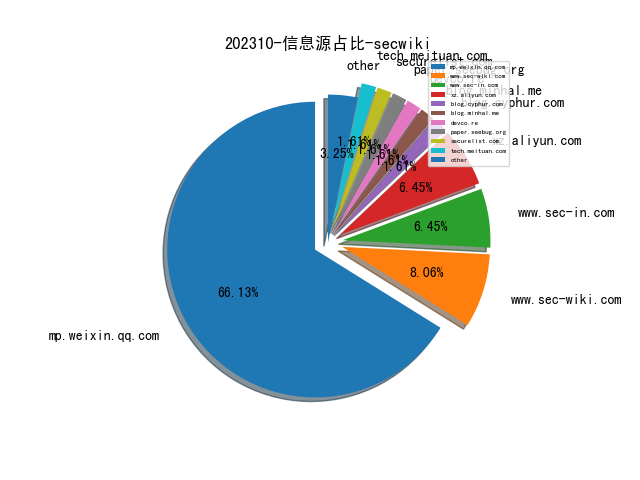
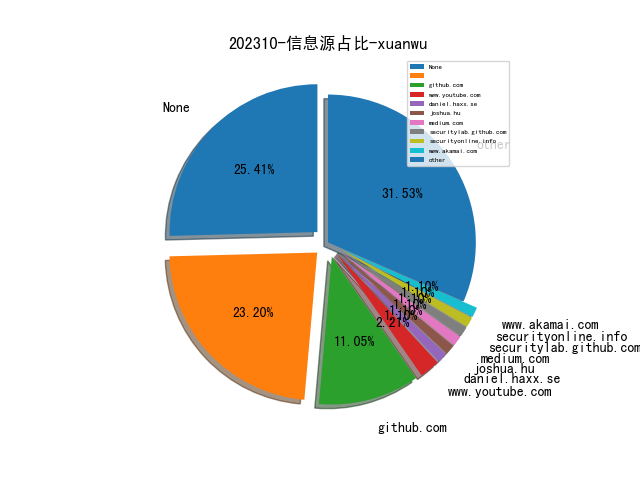
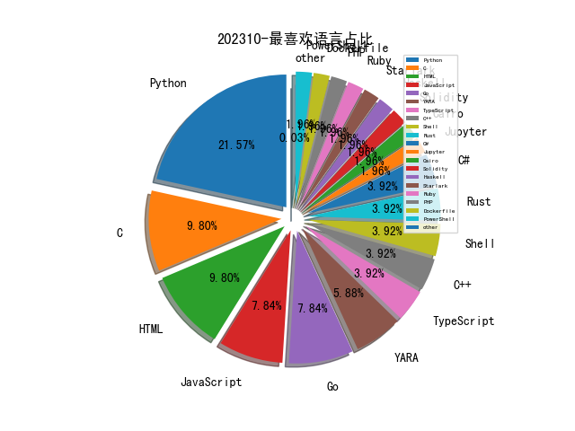

# [数据--所有](README_20.md)
# [数据--年度](README_2023.md)
# 202310 信息源与信息类型占比

# 政策 推荐
| title | url| 
| --- | ---| 
| 规范和促进数据跨境流动规定（征求意见稿） | http://www.cac.gov.cn/2023-09/28/c_1697558914242877.htm| 

# 网络安全书籍 推荐
| date_added | language | title | author | link | size| 
| --- | --- | --- | --- | --- | ---| 
| 2023-10-31 08:53:57 | English | Rust Programming Part 2: Rust Advanced Concepts and Real-World Projects (Video Course) | unknown | https://www.wowebook.org/rust-programming-part-2-rust-advanced-concepts-and-real-world-projects-video-course/ | unknown| 
| 2023-10-31 08:19:09 | English | Rust Programming Part 1: Rust Programming Foundations (Video Course) | unknown | https://www.wowebook.org/rust-programming-part-1-rust-programming-foundations-video-course/ | unknown| 
| 2023-10-31 07:40:02 | English | Rust Programming Essentials (Video Course) | unknown | https://www.wowebook.org/rust-programming-essentials-video-course/ | unknown| 
| 2023-10-27 17:19:22 | English | Operations Research for Social Good: A Practitioners Introduction Using SAS and Python | Natalia Summerville; Rob Pratt | http://libgen.rs/book/index.php?md5=D1F25080FF4AF5D5A15F7AF00AF2CB8C | 5 MB [EPUB]| 
| 2023-10-27 17:17:44 | English | Digital Money Demystified: Go From Cash to Crypto Safely, Legally, and Confidently | Tonya M. Evans | http://libgen.rs/book/index.php?md5=427307DE1C3B18F392992D6219DCF422 | 537 kB [EPUB]| 
| 2023-10-27 07:19:38 | English | Platform Engineering on Kubernetes | unknown | https://www.wowebook.org/platform-engineering-on-kubernetes/ | unknown| 
| 2023-10-25 16:54:46 | English | Python Mastery Unleashed: Advanced Programming Techniques | Jarrel E. | http://libgen.rs/book/index.php?md5=E93E9742ED7A78F82C65F049E63D466E | 7 MB [EPUB]| 
| 2023-10-25 16:44:20 | English | Python 3 Programming: An Advanced Guide | Educohack Press | http://libgen.rs/book/index.php?md5=FA2B0D9E2D33E59622E3F3F830D98B9E | 7 MB [EPUB]| 
| 2023-10-25 14:47:10 | English | Learning Microsoft Power BI: Transforming Data into Insights [Complete] | Jeremey Arnold | http://libgen.rs/book/index.php?md5=B0E76C97D198401B3769CE699E65EBF8 | 29 MB [PDF]| 
| 2023-10-24 05:55:23 | English | Kubernetes Best Practices, 2nd Edition | unknown | https://www.wowebook.org/kubernetes-best-practices-2nd-edition/ | unknown| 
| 2023-10-24 09:05:32 | English | Information Security Handbook, Second Edition | unknown | https://www.wowebook.org/information-security-handbook-second-edition/ | unknown| 
| 2023-10-24 08:44:52 | English | CompTIA A+ Practice Test Core 1 (220-1101) | unknown | https://www.wowebook.org/comptia-a-practice-test-core-1-220-1101/ | unknown| 
| 2023-10-23 17:03:05 | English | Python Automation Mastery: From Novice To Pro (4 Books In 1) | ROB BOTWRIGHT | http://libgen.rs/book/index.php?md5=B9EB14A9752AFDAD262F6C7E6CC6A5EC | 2 MB [EPUB]| 
| 2023-10-23 16:08:02 | English | Mastering Computer Programming: A Comprehensive Guide to Python, C, C++, C#, HTML Coding, and Ethical Hacking | Kameron Hussain; Frahaan Hussain | http://libgen.rs/book/index.php?md5=46585EAB44A7155954BDB16E4E2C6D5B | 2 MB [EPUB]| 
| 2023-10-22 17:13:58 | English | Rust In Practice: A Programmers Guide to Build Rust Programs, Test Applications and Create Cargo Packages | Rustacean Team | http://libgen.rs/book/index.php?md5=869DFD23AB0EF7D4F64A646199103470 | 426 kB [EPUB]| 
| 2023-10-22 17:12:56 | English | Practical Rust 1.x Cookbook: 100+ Solutions across Command Line, CI/CD, Kubernetes, Networking, Code Performance and Microservices | Rustacean Team | http://libgen.rs/book/index.php?md5=B766D2E409AE1A6365C011C65AFC1A50 | 669 kB [EPUB]| 
| 2023-10-19 14:39:26 | English | Head First Python: A Learners Guide to the Fundamentals of Python Programming, A Brain-Friendly Guide <[Early Release - RAW & UNEDITED]> | Paul Barry | http://libgen.rs/book/index.php?md5=1A85A06658A6E506E3CC18EDE8B625CC | 124 MB [PDF]| 
| 2023-10-12 15:07:33 | English | Artificial Intelligence & Blockchain in Cyber Physical Systems: Technologies & Applications | Muhammad Arif, Valentina Emilia Balas, Tabrez Nafis, Nawab Muhammad Faseeh Qureshi, Samar Wazir, Ibrar Hussain | http://libgen.rs/book/index.php?md5=998DF7DF613C96890EA2A8631844F1EB | 40 MB [PDF]| 
| 2023-10-11 18:01:39 | English | Ansible For Security by Examples | Luca Berton | http://libgen.rs/book/index.php?md5=0440BBACC6C24FFFC5D5307691D775B8 | 1 MB [EPUB]| 
| 2023-10-06 15:24:08 | English | The day of defense | McDonald, A. Melvin | http://libgen.rs/book/index.php?md5=38B739BA016B5369AECD5DB58A5B3D18 | 201 kB [EPUB]| 
| 2023-10-06 11:16:41 | English | Python for DevOps: Learn Ruthlessly Effective Automation | Noah Gift, Kennedy Behrman, Alfredo Deza, Grig Gheorghiu | http://libgen.rs/book/index.php?md5=D80589BD3C0804C795C7CE97138026F1 | 11 MB [PDF]| 
| 2023-10-06 17:18:06 | English | The Myth of Overpunishment: A Defense of the American Justice System and a Proposal to Reduce Incarceration While Protecting the Public | Barry Latzer | http://libgen.rs/book/index.php?md5=00E78F1753ED6F53879A53A0933302C0 | 2 MB [EPUB]| 
| 2023-10-05 16:02:41 | English | Hacking Kubernetes: Threat-Driven Analysis and Defense | Andrew Martin, Michael Hausenblas | http://libgen.rs/book/index.php?md5=492A742FF37EE73CE3591FB5FCBCE7BB | 9 MB [PDF]| 
| 2023-10-05 15:32:52 | English | (The Shelly Cashman Series) Technology for Success and The Shelly Cashman Series Microsoft 365 & Office 2021 (MindTap Course List) | Sandy Cable, Jennifer T. Campbell, Mark Ciampa, Barbara Clemens, Jennifer Duffy, Steven M. Freund, Mark Frydenberg, Ralph E. Hooper, Ellen Monk, Lisa Ruffolo, Susan Sebok, Misty Vermaat, Jill West | http://libgen.rs/book/index.php?md5=3EEE6D81FD0205B78E8DC017AB189526 | 80 MB [PDF]| 
| 2023-10-04 19:05:48 | English | Understanding Analog Side Channels Using Cryptography Algorithms | Alenka Zajić; Milos Prvulovic | http://libgen.rs/book/index.php?md5=7F1D0D6CD099D60E374B4108FB376D0C | 86 MB [EPUB]| 
| 2023-10-04 18:48:54 | English | Kubernetes Security and Observability: A Holistic Approach to Securing Containers and Cloud Native Applications | Brendan Creane, Amit Gupta | http://libgen.rs/book/index.php?md5=70C5393323FC76F1A4D7D9842F54D92D | 11 MB [PDF]| 
| 2023-10-04 18:48:53 | English | Identity-Native Infrastructure Access Management: Preventing Breaches by Eliminating Secrets and Adopting Zero Trust | Ev Kontsevoy, Sakshyam Shah, Peter Conrad | http://libgen.rs/book/index.php?md5=154B43B65DFEAECCEB00BD19957C20A2 | 2 MB [PDF]| 

# 微信公众号 推荐
| nickname_english | weixin_no | title | url| 
| --- | --- | --- | ---| 
| 360威胁情报中心 | CoreSec360 | 疑似APT-C-36（盲眼鹰）组织投放Amadey僵尸网络木马活动分析 | https://mp.weixin.qq.com/s?__biz=MzUyMjk4NzExMA==&mid=2247493843&idx=1&sn=5e99672abf3d1547e53fff6c5f9ecd20 | 1| 
| AI与网安 | gh_c57275954216 | 致远OA wpsAssistServlet 任意文件读取漏洞（附POC） | https://mp.weixin.qq.com/s?__biz=MzU1ODQ2NTY3Ng==&mid=2247484548&idx=1&sn=95e09be72be573b8ecdf2f3a3be94eb7 | 10| 
| CKCsec安全研究院 | ckcsec2022 | 【爆料】攻防实战：如何利用前端回显突破供应商官网登录？ | https://mp.weixin.qq.com/s?__biz=MzkxMTIyMjg0NQ==&mid=2247493710&idx=1&sn=38075d151131edfcbb1218ca1cac68bf | 4| 
| CNCERT国家工程研究中心 | NELCERT | 国家安全机关会同有关部门开展涉外气象探测专项治理 | https://mp.weixin.qq.com/s?__biz=MzUzNDYxOTA1NA==&mid=2247540759&idx=1&sn=a50b3df519ebcec5701e6dde96da7863 | 20| 
| Devil安全 | gh_b35dd18ddc14 | 【漏洞复现】D_Link-DCS-4622密码泄露漏洞 | https://mp.weixin.qq.com/s?__biz=Mzg2MjkwMDY3OA==&mid=2247484320&idx=1&sn=3f28245d856f568a3038979fd9536d74 | 8| 
| E安全 | EAQapp | 航空巨头波音沦陷！Lockbit团伙窃取大量敏感数据，威胁公开披露 | https://mp.weixin.qq.com/s?__biz=MzI4MjA1MzkyNA==&mid=2655339696&idx=1&sn=3c3dcdfb6537b2ebd2a4a6d24783925a | 11| 
| FreeBuf | freebuf | 因存在色情内容，夸克被罚50万元 | https://mp.weixin.qq.com/s?__biz=MjM5NjA0NjgyMA==&mid=2651246759&idx=1&sn=8d3653f4e50f2174ac78f7d23b687829 | 71| 
| GSDK安全团队 | gh_403a21e91f24 | spring框架的渗透测试工具 - SBSCAN | https://mp.weixin.qq.com/s?__biz=MzIzNTE0Mzc0OA==&mid=2247485342&idx=1&sn=6fe9a5624358f5fe4ddb193a851df7c7 | 2| 
| HACK之道 | hacklearn | 2023 CISP-PTS考证u200b通关总结 | https://mp.weixin.qq.com/s?__biz=MzIwMzIyMjYzNA==&mid=2247511850&idx=1&sn=7864118195faa4f5adfa16aed7d7f299 | 17| 
| HACK学习呀 | None | 零基础如何学习挖漏洞 | https://mp.weixin.qq.com/s?__biz=MzI5MDU1NDk2MA==&mid=2247512828&idx=1&sn=348a2b3ffd4ad9fb0f0594c80942910e | 2| 
| Hacking黑白红 | Hacking012 | edu-SQL注入案例分享 | https://mp.weixin.qq.com/s?__biz=Mzg2NDYwMDA1NA==&mid=2247533721&idx=1&sn=066efd0a893113948261542ef13db6f4 | 9| 
| IMPERVA | IMPERVA | 全球一周应用安全事件播报 | https://mp.weixin.qq.com/s?__biz=MzI1OTYyOTUyOA==&mid=2247487149&idx=1&sn=975af50a28139eca97895c22a2ae237e | 3| 
| IoVSecurity | IoVSecurity | 2023年CISO报告-当今安全领导者面临的新兴趋势威胁和战略-Splunk | https://mp.weixin.qq.com/s?__biz=MzU2MDk1Nzg2MQ==&mid=2247595941&idx=1&sn=e1f49ce084ac55e88d92278a0f3e5fdc | 57| 
| LemonSec | lemon-sec | 渗透中常用的在线工具和网站总结 | https://mp.weixin.qq.com/s?__biz=MzUyMTA0MjQ4NA==&mid=2247547970&idx=1&sn=3c38166a6df209ea9553197e1c9522f1 | 5| 
| NGC660安全实验室 | NGC660_Team | 那些必须推荐的网络安全知识库～ | https://mp.weixin.qq.com/s?__biz=MzkyODMxODUwNQ==&mid=2247493100&idx=1&sn=10ff63490525438bcff0910e6b6ba468 | 5| 
| QingScan | qingscan | 漏洞管理体系分享 | https://mp.weixin.qq.com/s?__biz=MzA5NzEwOTUzMw==&mid=2447979944&idx=1&sn=c2e06b544a43fa1a0222178d377819ab | 1| 
| RainSec | RainSec111 | OpenWRT中的Flash简析 | https://mp.weixin.qq.com/s?__biz=Mzg3NzczOTA3OQ==&mid=2247486018&idx=1&sn=d1a2a1bccb2376cb7197423f8ebb788a | 1| 
| SecHub网络安全社区 | secevery0x01 | 新Windows10&Windows11提权 | https://mp.weixin.qq.com/s?__biz=MzI5NTUzNzY3Ng==&mid=2247487175&idx=1&sn=f898b2c1107407ed195f1e7126fdf424 | 4| 
| SecureSphere | dolphin19961226 | 全方位安全加固规范大全！AIX、Apache、Cisco、HP-UNIX、Huawei等一网打尽！ | https://mp.weixin.qq.com/s?__biz=MzU3OTIxNzk4Ng==&mid=2247487298&idx=1&sn=731a99598a91742e2cf90e54044cb05c | 3| 
| Van1sh | gh_ba55e3f8405f | 2023 江苏省数据安全竞赛 决赛 | https://mp.weixin.qq.com/s?__biz=Mzg5OTkxMzM3NA==&mid=2247485130&idx=1&sn=27fa9d8d2851359e2c3cd7674c28cbf8 | 2| 
| WIN哥学安全 | WIN-security | Spring Cloud Gateway 远程代码执行WAF绕过(CVE-2022-22947) | https://mp.weixin.qq.com/s?__biz=MzkwODM3NjIxOQ==&mid=2247494926&idx=1&sn=a1262340b5aae43e73eac58415951e3a | 11| 
| XCTF联赛 | gh_3d7c7f90f79f | 报名开启 , DataCon2023再度升级，全新挑战等你来战！ | https://mp.weixin.qq.com/s?__biz=MjM5NDU3MjExNw==&mid=2247514863&idx=1&sn=f1f290b55cafc32a8d743831781d5320 | 3| 
| Z2O安全攻防 | Z2O_SEC | 工具推荐,Powershell版CrackMapExec | https://mp.weixin.qq.com/s?__biz=Mzg2ODYxMzY3OQ==&mid=2247504848&idx=1&sn=1e8153d920fb31814350a04bcbc9fbd9 | 22| 
| dotNet安全矩阵 | doNetSafety | 劫持CLR启动实现任意.NET权限维持 | https://mp.weixin.qq.com/s?__biz=MzUyOTc3NTQ5MA==&mid=2247489209&idx=1&sn=76122ade144b0c2bc1185ee17c054fdb | 27| 
| e安在线 | ean-online | 漏洞赏金突破3亿美元，AI成为白帽最爱的工具 | https://mp.weixin.qq.com/s?__biz=MzI1OTA1MzQzNA==&mid=2651244719&idx=1&sn=74c17894c322c32e73334907907aeee1 | 4| 
| fullbug | xiejava1018 | AI机器学习时序序列特征提取实现分类预测实战 | https://mp.weixin.qq.com/s?__biz=MjM5NDMwMjEwMg==&mid=2451851093&idx=1&sn=024d7f9ef1dee27c3ee5fe36a1ca9836 | 7| 
| kali笔记 | bbskali-cn | 小试web scraper来爬虫 | https://mp.weixin.qq.com/s?__biz=MzkxMzIwNTY1OA==&mid=2247500634&idx=1&sn=ffc1ec976e81a9c347e5a6c9027933ee | 13| 
| loochSec | gh_1fd37665f197 | TLB | https://mp.weixin.qq.com/s?__biz=Mzg4NTg4MDAxMA==&mid=2247484542&idx=1&sn=c258281cb5218d0161a6ac207a43c807 | 6| 
| thelostworld | gh_3f2e5b9f028c | [漏洞复现-42]大*-智能物联综合管理平台-文件读取漏洞 | https://mp.weixin.qq.com/s?__biz=MzIyNjk0ODYxMA==&mid=2247487216&idx=1&sn=8ca8c27026e255571cd819d727e6866f | 24| 
| 中国信息安全 | chinainfosec | 专题·数字安全免疫力 , 丁珂：依托数字安全免疫力，构建高质量发展底座 | https://mp.weixin.qq.com/s?__biz=MzA5MzE5MDAzOA==&mid=2664195746&idx=1&sn=8ae3100684c963a8a220c88efb7ce9ff | 48| 
| 中孚信息 | zfinfo | 中孚信息两大解决方案获评“2023年山东省信创优秀解决方案” | https://mp.weixin.qq.com/s?__biz=MzAxMjE1MDY0NA==&mid=2247506912&idx=1&sn=2f9416a28d9830951d2fc267e0e99802 | 5| 
| 乌雲安全 | hackctf | 红队技术 , 隐藏上传的程序木马 | https://mp.weixin.qq.com/s?__biz=MzAwMjA5OTY5Ng==&mid=2247520431&idx=1&sn=97c50012ef1ac249a876ef358c9cc5d1 | 19| 
| 会杀毒的单反狗 | cmlitiejun | 新的 BiBi-Linux 擦除器恶意软件针对以色列目标发起破坏性攻击 | https://mp.weixin.qq.com/s?__biz=MzI2NzAwOTg4NQ==&mid=2649789812&idx=1&sn=c5709284033b8fa8983321adf199e3c9 | 12| 
| 信安404 | infosec404 | 在线工具包v0.3.5公测版（新增16个渗透工具） | https://mp.weixin.qq.com/s?__biz=Mzk0NjQ5MTM1MA==&mid=2247485291&idx=1&sn=b6419e167c5acbd26c03b2d00864821f | 11| 
| 信息安全研究 | ISR2016 | 目次 , 《信息安全研究》第9卷2023年第10期 | https://mp.weixin.qq.com/s?__biz=MzA3NzgzNDM0OQ==&mid=2664981253&idx=1&sn=be9b0a462d49fb91c8adc94700936966 | 27| 
| 全频带阻塞干扰 | RFJamming | 日本北海道 , 11月20日 • Level-3 • 深度隐私保护认证课程 | https://mp.weixin.qq.com/s?__biz=MzIzMzE2OTQyNA==&mid=2648956484&idx=1&sn=07ae0ab62a6eb4e6c3e804384f4cc04f | 2| 
| 关键基础设施安全应急响应中心 | CII-SRC | 全球数据跨境流动合规 半月观察（第十七期） | https://mp.weixin.qq.com/s?__biz=MzkyMzAwMDEyNg==&mid=2247540431&idx=1&sn=92f42d6ef995f34b497b9b626dbfa3f8 | 19| 
| 刨洞之眼 | gh_d8f9af93f3da | 苹果推出基于3nm制程的M3系列芯片！ | https://mp.weixin.qq.com/s?__biz=Mzk0MTQ4NTU5OA==&mid=2247484472&idx=1&sn=38f3366bf2176c8cd9c6746a178f287a | 6| 
| 刨洞安全团队 | gh_55f3b3854b4b | WordPress Core RCE Gadget 分析 | https://mp.weixin.qq.com/s?__biz=Mzk0OTM5MTk0OA==&mid=2247493821&idx=1&sn=bf2748ca29c1244376cb7caf7828a8b1 | 8| 
| 利刃信安攻防实验室 | None | 完蛋我被美女包围了 | https://mp.weixin.qq.com/s?__biz=MzU1Mjk3MDY1OA==&mid=2247507605&idx=1&sn=0f863dcc0b717a3a11890fa3cfaaf1e2 | 17| 
| 卓码星球 | ZhiShiSpace | FB_02.基于tcp通信实现类su调用 | https://mp.weixin.qq.com/s?__biz=Mzg5MzU3NzkxOQ==&mid=2247484769&idx=1&sn=0538f070acca6be00cb0d24ed91e3539 | 4| 
| 哈拉少安全小队 | gh_b273ce95df95 | 010-实战Java篇-颇为简单的一次审计getshell | https://mp.weixin.qq.com/s?__biz=MzAxNzkyOTgxMw==&mid=2247491601&idx=1&sn=28f5e89f4e66c7b7bce96d8043091578 | 10| 
| 哔哩哔哩技术 | None | 智能成片性能优化探索与实践 | https://mp.weixin.qq.com/s?__biz=Mzg3Njc0NTgwMg==&mid=2247497146&idx=1&sn=e1bbc0e506fa4d625eeb469dfa794fca | 2| 
| 商业智能研究 | fr_research | u200b鑫达集团“8+2+1”智能制造体系构建及数据管理平台应用实践 | https://mp.weixin.qq.com/s?__biz=MzIwMzg5MTI0OQ==&mid=2247531034&idx=1&sn=267abe6c3834ce56685b048e07dd8b73 | 5| 
| 嘉诚安全 | jiachengsec | 【漏洞通告】Google Chrome释放后使用漏洞安全风险通告 | https://mp.weixin.qq.com/s?__biz=MzU4NjY4MDAyNQ==&mid=2247493821&idx=1&sn=c872cf4c13426899c9cd7e2d1d45147c | 10| 
| 嘶吼专业版 | Pro4hou | 黑客可以迫使iOS和macOS浏览器泄露密码及更多的大量信息 | https://mp.weixin.qq.com/s?__biz=MzI0MDY1MDU4MQ==&mid=2247570478&idx=1&sn=23fea2119e998927de997e2c926c2ae5 | 23| 
| 国家互联网应急中心CNCERT | CNCERTCC | CNVD漏洞周报2023年第43期 | https://mp.weixin.qq.com/s?__biz=MzIwNDk0MDgxMw==&mid=2247498769&idx=1&sn=ad075f58cd9651d2b6e756e215f64ee6 | 4| 
| 天禧信安 | txxa-385 | 投稿活动 , 攻防社区稿费翻倍！优质内容2000元起！ | https://mp.weixin.qq.com/s?__biz=MzUyMTE0MDQ0OA==&mid=2247492797&idx=1&sn=dba3affddb0b7abd1357cce5de701d7e | 2| 
| 奇安信集团 | qianxin-keji | 齐向东：数智时代 建设体系化安全防线势在必行 | https://mp.weixin.qq.com/s?__biz=MzU0NDk0NTAwMw==&mid=2247600960&idx=1&sn=1a9d572938e1fc9b3bb667266a287c11 | 37| 
| 安全喵喵站 | CyberSecurityMew | 对OWASP TOP 10 榜单的五!大!质!疑! | https://mp.weixin.qq.com/s?__biz=MzkzNjE5NjQ4Mw==&mid=2247535041&idx=1&sn=ea0a6370889d6cb22f72f797296d99b3 | 15| 
| 安全圈 | ChinaAnQuan | 【安全圈】因涉及大量色情内容，网信部门出手，夸克和网易C被罚！ | https://mp.weixin.qq.com/s?__biz=MzIzMzE4NDU1OQ==&mid=2652047381&idx=1&sn=4e2291bccf22669b550bdac9a0bdc750 | 42| 
| 安全架构 | gh_b85664ada8d0 | 信息安全风险的评估 | https://mp.weixin.qq.com/s?__biz=Mzg5MjgxNTQ1MA==&mid=2247485459&idx=1&sn=6f01884b84efa4ce0531fa408e84a3b8 | 7| 
| 安全牛 | aqniu-wx | 创新在左，威胁在右！技术创新引发的安全风险实例研究 | https://mp.weixin.qq.com/s?__biz=MjM5Njc3NjM4MA==&mid=2651126236&idx=1&sn=b1b1d2453dcba61a25740af38c813634 | 14| 
| 安全牛课堂 | aqniu_edu | 数据安全界的扛把子证书，CISP-DSG快问快答 | https://mp.weixin.qq.com/s?__biz=MzIxNTM4NDY2MQ==&mid=2247508097&idx=1&sn=506849282bbec8b35aed05320fe4b353 | 11| 
| 安全研究GoSSIP | GoSSIPSJTU | G.O.S.S.I.P 阅读推荐 2023-10-31 如何写好 Prompt，让 GPT适用于静态分析 | https://mp.weixin.qq.com/s?__biz=Mzg5ODUxMzg0Ng==&mid=2247496579&idx=1&sn=062bf52da3412e2abf1c01ec1efea573 | 11| 
| 安全逐梦人 | gh_bdb40c30b1d4 | [漏洞复现] F5 BIG-IP 远程代码执行漏洞(CVE-2023-46747) | https://mp.weixin.qq.com/s?__biz=MzkxNzUxMjU5OQ==&mid=2247484185&idx=1&sn=437c26b84a1311805c29dc4fdc41b12e | 3| 
| 安在 | AnZer_SH | 百家智库｜第三期受聘专家，2023诸子笔会&诸子项目第二季 | https://mp.weixin.qq.com/s?__biz=MzU5ODgzNTExOQ==&mid=2247604813&idx=1&sn=df3c6c581a5566f68553ad9d2d96b2a5 | 29| 
| 安天集团 | Antiylab | 安天邀您莅临2023年华中地区高校网络安全专题交流会 | https://mp.weixin.qq.com/s?__biz=MjM5MTA3Nzk4MQ==&mid=2650202277&idx=1&sn=77fb7d5205b65e81245060a699518e5f | 8| 
| 安恒信息 | AnHengCloudNews | 亚运重保总结会召开，院士专家点赞零事故“亚运样本” | https://mp.weixin.qq.com/s?__biz=MjM5NTE0MjQyMg==&mid=2650591931&idx=1&sn=ed6750c5ed47af322697345a62f3df2a | 22| 
| 山海之关 | shg-sec | 2023 ACTF writeup by Arr3stY0u | https://mp.weixin.qq.com/s?__biz=Mzg4MjcxMTAwMQ==&mid=2247487654&idx=1&sn=d02ba234aa0f3050658c577c8a9c5fd5 | 4| 
| 山石网科安全技术研究院 | HSN_LAB | 开源工具Ghidra的调试模式配置 | https://mp.weixin.qq.com/s?__biz=MzUzMDUxNTE1Mw==&mid=2247502701&idx=1&sn=ae5fb9221b4b0396f761e07aec99b051 | 7| 
| 弥天安全实验室 | gh_41292c8e5379 | 投稿活动 , 攻防社区稿费翻倍！优质内容2000元起！ | https://mp.weixin.qq.com/s?__biz=MzU2NDgzOTQzNw==&mid=2247499861&idx=1&sn=b32339791974eb95ac2361196248649d | 8| 
| 微众安全应急响应中心 | gh_2822ff51526d | 招聘,微众银行信息安全部海纳翘楚，赴征程 | https://mp.weixin.qq.com/s?__biz=Mzg4NjAyODc1NQ==&mid=2247486930&idx=1&sn=7fc068f48053f75a5a4a007c7f63fe78 | 1| 
| 微步在线 | Threatbook | 这是一个全栈国产化的重磅安全产品，请查收 | https://mp.weixin.qq.com/s?__biz=MzI5NjA0NjI5MQ==&mid=2650179300&idx=1&sn=3deeb8a842d43a1edb1d8c5552df4c3b | 5| 
| 德斯克安全小课堂 | szdesk | 揭秘兵工厂：探索攻击者工具集和战术 | https://mp.weixin.qq.com/s?__biz=MzA3MTUxNzQxMQ==&mid=2453883959&idx=1&sn=cf75ea6beb4efc6a7db9a5aaae7e0c53 | 4| 
| 掌控安全EDU | ZKAQEDU | 锐捷RG-EW1200G登录绕过 | https://mp.weixin.qq.com/s?__biz=MzUyODkwNDIyMg==&mid=2247532670&idx=1&sn=0c0e0bc4585e91df3d652a8dba28d471 | 11| 
| 揽月安全团队 | gh_33eaab6ca696 | NUUO摄像头远程命令执行漏洞 | https://mp.weixin.qq.com/s?__biz=Mzg2OTk3ODYzOA==&mid=2247484647&idx=1&sn=3852c1bde479f87205b0823769714b48 | 8| 
| 摸鱼Sec | gh_e3d95d1a5b73 | Fe某组建造成文件上传 | https://mp.weixin.qq.com/s?__biz=MzkwODUxMDUwMg==&mid=2247483717&idx=1&sn=44a1c1c64aab68e80ee27e71ee420e89 | 2| 
| 数据安全合规交流部落 | GD_DataSecurity | 银行业漏洞治理实践与展望--漏洞治理的道与术 | https://mp.weixin.qq.com/s?__biz=MzU2MDQ0NzkyMw==&mid=2247484677&idx=1&sn=238ac7623e0c8a8805cf66e5e9d930d1 | 2| 
| 无糖反网络犯罪研究中心 | gh_2ee7a9b17c0d | 从\"快递代发\"到\"不死客服系统\"   蟹卡类诈骗犯罪链条简析 | https://mp.weixin.qq.com/s?__biz=MzAxMzkzNDA1Mg==&mid=2247507283&idx=1&sn=f660daabb404376f9ff2481ff2d5b8cd | 11| 
| 星盟安全 | XM_security | ACTF 2023 Writeup --Polaris战队 | https://mp.weixin.qq.com/s?__biz=MzU3ODc2NTg1OA==&mid=2247489098&idx=1&sn=8aeb7e337294266c4666815bc46d208d | 5| 
| 暴暴的皮卡丘 | gh_3aa935a28263 | NoSQL  influxDB安全 | https://mp.weixin.qq.com/s?__biz=MzU0NDI5NTY4OQ==&mid=2247483992&idx=1&sn=f6e4822920b7f629845e441fc5df8254 | 1| 
| 梆梆安全 | BANGCLE | 梆梆安全荣获中关村金融科技产业发展联盟2023年度优秀会员单位，护航金融科技高质量发展！ | https://mp.weixin.qq.com/s?__biz=MjM5NzE0NTIxMg==&mid=2651130044&idx=1&sn=ea05875c45451ae82513282c8eb5478a | 9| 
| 橘猫学安全 | gh_af700ee13397 | 实战,记一次从登录框到内网横向 | https://mp.weixin.qq.com/s?__biz=Mzg5OTY2NjUxMw==&mid=2247510357&idx=1&sn=f40ba24459d717c6bd48d4bc33e2a348 | 10| 
| 每天一个入狱小技巧 | gh_ba62997aff09 | Windows内存取证-中等难度 -上篇 | https://mp.weixin.qq.com/s?__biz=Mzg2MzYzNjEyMg==&mid=2247487132&idx=1&sn=5a3bf654f208659a7094d49e812135a5 | 1| 
| 永信至诚 | INT-GROUP | 永信至诚圆满支撑第二届全国工业和信息化技术技能大赛-湖南及福建分区选拔赛，全国总决赛即将精彩来袭 | https://mp.weixin.qq.com/s?__biz=MzAwNDUyMjk4MQ==&mid=2454822626&idx=1&sn=5e1f69e5a6dce46e58c10085178e17a6 | 3| 
| 汇能云安全 | metech2005 | 中国民航局回应“旅客信息泄露”：正编制文件加强数据保护u200b | https://mp.weixin.qq.com/s?__biz=MzIwNzAwOTQxMg==&mid=2652249399&idx=1&sn=57140b488258dc976b57801a0261d1d8 | 7| 
| 洞见网安 | doonsec | 投稿活动 , 攻防社区稿费翻倍！优质内容2000元起！ | https://mp.weixin.qq.com/s?__biz=MzAxNzg3NzMyNQ==&mid=2247486898&idx=1&sn=ee2165175fb502e47583287767ddfe65 | 16| 
| 深信服千里目安全技术中心 | gh_c644c6e98b08 | 【漏洞通告】Atlassian Confluence远程代码执行漏洞（CVE-2023-22518） | https://mp.weixin.qq.com/s?__biz=Mzg2NjgzNjA5NQ==&mid=2247521175&idx=1&sn=a3de861709b7d4cc4c27920fdcdf4342 | 3| 
| 深信服科技 | sangfor_man | 深信服助力广东省机场管理集团网络安全提质增效 | https://mp.weixin.qq.com/s?__biz=MjM5MTAzNjYyMA==&mid=2650581375&idx=1&sn=fead3305a34de052b512420e7e7c8252 | 9| 
| 深圳市网络与信息安全行业协会 | SNISRI | 一文get交换机基础知识 | https://mp.weixin.qq.com/s?__biz=MzU0Mzk0NDQyOA==&mid=2247511323&idx=1&sn=8cc8c78848d8f6bf5313d50b68e17ee4 | 3| 
| 渊龙Sec安全团队 | Aabyss-Team | 投稿活动 , 攻防社区稿费翻倍！优质内容2000元起！ | https://mp.weixin.qq.com/s?__biz=Mzg4NTY0MDg1Mg==&mid=2247485133&idx=1&sn=acfb108aaa10acb7e25e218c14799721 | 2| 
| 渗透Xiao白帽 | SuPejkj | 文末福利 , CVE-2023-46747 RCE漏洞（附PoC） | https://mp.weixin.qq.com/s?__biz=MzI1NTM4ODIxMw==&mid=2247500129&idx=1&sn=a44c1286573b6e21b3a0d9e1b58cead5 | 3| 
| 滴滴技术 | didi_tech | 聊聊宿主机管理 | https://mp.weixin.qq.com/s?__biz=MzU1ODEzNjI2NA==&mid=2247566931&idx=1&sn=ea4b2a7c4601de9cb93e11c43d0a5a67 | 5| 
| 狐狸说安全 | itseckpg | 手慢无！最后一波88元渗透测试特训班千人团名额抢占中~ | https://mp.weixin.qq.com/s?__biz=MzUzMDQ1MTY0MQ==&mid=2247503728&idx=1&sn=8558445484ce72cf738cfd34be031414 | 5| 
| 猫蛋儿安全 | MD_SEC | 【漏洞复现】F5 BIG-IP 远程代码执行漏洞(CVE-2023-46747) | https://mp.weixin.qq.com/s?__biz=MzkxMTUyMjUxMw==&mid=2247506382&idx=1&sn=25170b4f5841bf0798a0aef37215aab3 | 6| 
| 猫鼠信安 | gh_b8b8c8961ead | 综合工具箱 -- R-Knife | https://mp.weixin.qq.com/s?__biz=Mzg2NjUzNzg4Ng==&mid=2247484336&idx=1&sn=c0d19c8aba1424834397a6dfc32a28a5 | 2| 
| 琴音安全 | Qinyinsafe | 浅析HackBrowserData原理以及免杀思路(红队工具之获取目标机器浏览器记录 密码 cookie) | https://mp.weixin.qq.com/s?__biz=Mzg3NTk4MzY0MA==&mid=2247485579&idx=1&sn=56030f9d9b2e8edef59a8bc84884a265 | 5| 
| 生态遥感监测笔记 | gh_1751b75ef961 | 数据分享_全球每日最高和最低近地表气温（2003-2020） | https://mp.weixin.qq.com/s?__biz=Mzg4MzgyMjM0NQ==&mid=2247484200&idx=1&sn=919ddafd3504d6c2e35c1435301ef8d2 | 1| 
| 白安全组 | bai-1152770445 | 这样的经济下，我们能独善其身么 | https://mp.weixin.qq.com/s?__biz=MzU4MjYxNTYwNA==&mid=2247486888&idx=1&sn=90c508961fbc4a1f61336904c58d568a | 5| 
| 白帽100安全攻防实验室 | whitecap100_team | ACTF 2023 WriteUp By W&M | https://mp.weixin.qq.com/s?__biz=MzIxMDYyNTk3Nw==&mid=2247514551&idx=1&sn=6f30dd9ad7e16c9c03305901724f27bd | 1| 
| 白帽子左一 | HackRead | 深入分析 CVE-2023-44487 HTTP2 快速重置攻击对 Nginx 的影响 | https://mp.weixin.qq.com/s?__biz=MzI4NTcxMjQ1MA==&mid=2247602294&idx=1&sn=06422860fe863420760badb7698475b7 | 11| 
| 盛邦安全WebRAY | WebRay_weixin | 第五届“纵横”网络空间安全创新论坛——网络空间测绘技术专题论坛圆满举办，现场分享精彩纷呈 | https://mp.weixin.qq.com/s?__biz=MzAwNTAxMjUwNw==&mid=2650274180&idx=1&sn=ae4ca8de5402a97590fa54b069a3088e | 10| 
| 知机安全 | gh_ad3e7f23f43a | 亲哈马斯黑客的新恶意软件：BiBi-Linux Wiper | https://mp.weixin.qq.com/s?__biz=MzIzNDU5NTI4OQ==&mid=2247484639&idx=1&sn=781773f2f8881585a2ce9a90b56a652d | 8| 
| 知道创宇 | knownsec | 全球安全分析师峰会（SAS）落幕，知道创宇独家揭秘APT PatchWork组织武器库！ | https://mp.weixin.qq.com/s?__biz=MjM5NzA3Nzg2MA==&mid=2649866545&idx=1&sn=5ea7d0d8f7d702544c888babb3ae53c5 | 8| 
| 红蓝公鸡队 | None | 网安公开课 丨 数字软件 QVM 对抗思路 | https://mp.weixin.qq.com/s?__biz=Mzg5MDc1MjY5Ng==&mid=2247491701&idx=1&sn=cf92350f73d9d7f825e2eb0047fd11df | 3| 
| 维他命安全 | VitaminSecurity | 维他命每日安全简讯（2023.10.31） | https://mp.weixin.qq.com/s?__biz=MzUxMDQzNTMyNg==&mid=2247503306&idx=1&sn=4104425f5abed7fd06e7edf78ba18bcf | 11| 
| 绿盟科技 | NSFOCUS-weixin | 数据跨境规则优化，出境企业何去何从？ | https://mp.weixin.qq.com/s?__biz=MjM5ODYyMTM4MA==&mid=2650444927&idx=2&sn=95bd3b7c18b795f6acc2ecc0727bc7a1 | 17| 
| 网星安全 | netstarsec | 议题PPT大公开｜第二届ADconf安全大会议题回顾 | https://mp.weixin.qq.com/s?__biz=MzkxNTEzMTA0Mw==&mid=2247494046&idx=1&sn=d00c795586d66f9ad0319f3b4d38c59f | 4| 
| 网络安全研究所 | wlaqyjs | 事业编19人，甘肃省委网络安全和信息化委员会办公室下属事业单位招聘网络安全岗位 | https://mp.weixin.qq.com/s?__biz=MzU4OTg4Nzc4MQ==&mid=2247497588&idx=1&sn=76720894367a667ea0684c03517619ff | 19| 
| 网络安全等保测评 | rxDJCP | 《未成年人网络保护条例》 | https://mp.weixin.qq.com/s?__biz=MzI3MDY0Nzg1Nw==&mid=2247488389&idx=1&sn=20901782159e0e82b51a31d4561d801e | 4| 
| 网络安全资源库 | gh_e8a4866a67fe | 超全网络安全面试题汇总（2023版） | https://mp.weixin.qq.com/s?__biz=MzkxMzMyNzMyMA==&mid=2247547994&idx=1&sn=8aefa5d1ae9b805754e09545aadc280f | 10| 
| 网络空间信息安全学习 | gh_39213c5878aa | 双 11 正版大促 5 折起！120+ 热门软件无套路折扣直降 | https://mp.weixin.qq.com/s?__biz=MzI2MjcwMTgwOQ==&mid=2247490223&idx=1&sn=894d5b51f736c501b9833ae165dc26d4 | 7| 
| 聚锋实验室 | jufenglab | TOP5 , 头条：美国空军研究实验室授予诺·格公司创建JADC2卫星星座的合同 | https://mp.weixin.qq.com/s?__biz=MzI2NDE0NTM5Nw==&mid=2651975061&idx=1&sn=0c4c71ffd65de107cdb9fee3483448fd | 3| 
| 腾讯音乐技术团队 | gh_287053a877e6 | istio服务网格进阶最佳实践 | https://mp.weixin.qq.com/s?__biz=MzI1NjEwMTM4OA==&mid=2651234684&idx=1&sn=947f2958af56323e317ee0dc360cb207 | 1| 
| 自主创新如是说 | gh_d24ff23c5104 | 【温馨提示】启动空气重污染红色预警时，北京将实行单号单日、双号双日行驶 | https://mp.weixin.qq.com/s?__biz=MzkxMzI3MzMwMQ==&mid=2247519450&idx=1&sn=7de063265648dac0793920b6e085254a | 3| 
| 菜鸟学信安 | securitylearn | 简单且匿名的密码喷洒工具 | https://mp.weixin.qq.com/s?__biz=MzU2NzY5MzI5Ng==&mid=2247498599&idx=1&sn=6cd23d8f954eb51d65707f4ba1810cfc | 13| 
| 菜鸟小新 | dsz-67 | 收藏Metasploit payload | https://mp.weixin.qq.com/s?__biz=Mzg4OTI0MDk5MQ==&mid=2247489508&idx=1&sn=574edc399454d1e84a7cde39f4ee664d | 19| 
| 蚁剑安全实验室 | AntSwordSec | 启明星辰天玥网络安全审计系统存在命令执行漏洞（CNVD-2023-71706） | https://mp.weixin.qq.com/s?__biz=MzkxNTU5NjM5MQ==&mid=2247483995&idx=1&sn=8601287e848d47756ee2c7f774d81642 | 1| 
| 融云攻防实验室 | gh_0dba7ff3f653 | 漏洞复现 易思无人值守智能物流系统Sys_ReportFile 文件上传漏洞 | https://mp.weixin.qq.com/s?__biz=MzkyMTMwNjU1Mg==&mid=2247489517&idx=1&sn=a68cab9044b3e9c883c5584435caf225 | 8| 
| 补天平台 | Patchingthesky | 补天“专属SRC”惊喜活动来袭，精美新款周边等你来领，更有新人福利！ | https://mp.weixin.qq.com/s?__biz=MzI2NzY5MDI3NQ==&mid=2247499926&idx=1&sn=eadaaf0a2eee758d29f424760cd95bd7 | 10| 
| 赛宁网安 | Cyberpeace | 11月7日报名截止 , 第六届“强网”拟态防御国际精英挑战赛持续报名中 | https://mp.weixin.qq.com/s?__biz=MzA4Mjk5NjU3MA==&mid=2455481829&idx=1&sn=7be18c20a24085b33b173979c9fcfd8d | 2| 
| 赛欧思安全研究实验室 | gh_04596d590471 | 方程式重现江湖？复杂间谍软件平台 StripedFly 已控制 100 万受害者 | https://mp.weixin.qq.com/s?__biz=MzU0MjE2Mjk3Ng==&mid=2247486345&idx=1&sn=5a2db10d972ec64e3080e1d8715e473d | 6| 
| 迪哥讲事 | growing0101 | 实战 , 记一次艰难的任意文件下载漏洞挖掘和总结思考 | https://mp.weixin.qq.com/s?__biz=MzIzMTIzNTM0MA==&mid=2247492430&idx=1&sn=c97917fc9cb6fe4d4a8e2dc0987af8b3 | 18| 
| 邑安全 | EansecD | 支持哈马斯的黑客活动分子利用 Wiper 恶意软件瞄准以色列实体 | https://mp.weixin.qq.com/s?__biz=MzUyMzczNzUyNQ==&mid=2247518895&idx=1&sn=858cdaf1256b963827feca74da7636e5 | 21| 
| 阿里云安全 | aliyunsec | Ding！您有一份重要参会提醒请查收！ | https://mp.weixin.qq.com/s?__biz=MzA4MTQ2MjI5OA==&mid=2664090394&idx=1&sn=ca1bd1d9f213c6c300557b3aac588c1b | 2| 
| 阿里云应急响应 | gh_12f3517e40de | 【风险通告】Atlassian Confluence 权限绕过致代码执行漏洞（CVE-2023-22518） | https://mp.weixin.qq.com/s?__biz=MzI5MzY2MzM0Mw==&mid=2247486275&idx=1&sn=811ceca123040a9bf4dfc134acb9ea04 | 3| 
| 雾都的猫 | wuducat404 | 双11自动脚本，某东某宝对不住了！ | https://mp.weixin.qq.com/s?__biz=Mzk0OTQ0MTI2MQ==&mid=2247484189&idx=1&sn=781c75003a909378e1eba6dbd02243e1 | 5| 
| 青藤实验室 | gh_151a64925040 | Solarwinds DeserializeFromStrippedXml RCE | https://mp.weixin.qq.com/s?__biz=MzI1NDQxMDE0NQ==&mid=2247484948&idx=1&sn=c28e058e1e1c0247ac7c91dd33912969 | 2| 
| 非攻安全实验室 | gh_9c3b7f864fba | 浙江大华技术股份有限公司智能物联综合管理平台(ICC)存在任意文件读取 | https://mp.weixin.qq.com/s?__biz=Mzk0NDUzMDA1Mg==&mid=2247484251&idx=1&sn=682d0a10c0932b17f507886483f383c1 | 9| 
| 马赛克安全实验室 | mosaic-sec | [漏洞复现-42]大*-智能物联综合管理平台-文件读取漏洞 | https://mp.weixin.qq.com/s?__biz=MzI5MzU4ODE5Mw==&mid=2247484278&idx=1&sn=b3a813159bd1f979efc154a2e75d19ab | 6| 
| 鹏组安全 | Kris_Alex2 | 推荐几个出类拔萃的公众号 | https://mp.weixin.qq.com/s?__biz=Mzg5NDU3NDA3OQ==&mid=2247489958&idx=1&sn=ab2855bfd1900886e0b4017f095a67bc | 2| 
| 黑伞安全 | hack_umbrella | 【原创0day】Atlassian Confluence 远程代码执行漏洞（CVE-2023-22518） | https://mp.weixin.qq.com/s?__biz=MzU0MzkzOTYzOQ==&mid=2247488270&idx=1&sn=ed36bba5615f3ace62ce8ee9646a23f4 | 11| 
| 黑客白帽子 | hackerwhitehat | 快速发现SQL 注入漏洞技巧 | https://mp.weixin.qq.com/s?__biz=MzA5MzYzMzkzNg==&mid=2650933150&idx=1&sn=051c8ee7289d3a648fcf51f74b4509e2 | 36| 
| 黑白之道 | i77169 | 最新Nacos漏洞图形化利用工具 | https://mp.weixin.qq.com/s?__biz=MzAxMjE3ODU3MQ==&mid=2650581184&idx=3&sn=b9f94eadcf4544029f58dbc421fd8074 | 63| 
| 默安科技 | moresec | 今天，给大家讲几个细思极恐的小故事 | https://mp.weixin.qq.com/s?__biz=MzIzODQxMjM2NQ==&mid=2247497556&idx=1&sn=2ec49dad284426e980df0e524145a487 | 2| 
| 人机与认知实验室 | twhlw1970618 | 态势感知与OODA的逆过程 | https://mp.weixin.qq.com/s/T4khgSQbkOvLjaX6BFcYTA | 1| 
| Desync InfoSec | gh_1a0c9eea6b2a | 第十一课 收集威胁情报数据源——外部数据集（一） | https://mp.weixin.qq.com/s?__biz=MzkzMDE3ODc1Mw==&mid=2247486988&idx=1&sn=73a10af21ea1a1edab86b7dc1f13ed0f | 5| 
| Hack分享吧 | HackShareB | 3.1！最新Nacos漏洞图形化利用工具 | https://mp.weixin.qq.com/s?__biz=MzA4NzU1Mjk4Mw==&mid=2247488592&idx=1&sn=f16cdea21e8a5472f136537b47f3496d | 11| 
| HexaGoners | gh_c9639f9a843e | JAVA反序列化系列第一课：URLDNS链全解 | https://mp.weixin.qq.com/s?__biz=MzkxNTQ0MDA2NQ==&mid=2247484079&idx=1&sn=002c7292d228fe83a7314a270d888a30 | 1| 
| IoT物联网技术 | IoT-Tech-Expo | PandaX : Go语言企业级 IoT 物联网平台快速开发框架 | https://mp.weixin.qq.com/s?__biz=MjM5OTA4MzA0MA==&mid=2454931773&idx=1&sn=58b4d878cc70747872359ce89059ade4 | 6| 
| Kokoxca安全 | gh_b130bebc48f2 | 亿赛通文档安全管理系统SQL注入复现 | https://mp.weixin.qq.com/s?__biz=Mzg3ODkzNjkxMg==&mid=2247483828&idx=1&sn=3a7b19cd65f1d8badd42327794f8d554 | 1| 
| OnionSec | gh_8ab0e346e1df | 从VT Intelligence 查询到VT Livehunt 规则的途径：CTI分析师方法 | https://mp.weixin.qq.com/s?__biz=MzUyMTUwMzI3Ng==&mid=2247485352&idx=1&sn=1eae96ebf57ce27fbcafc5ef9f93adfa | 4| 
| Python之美 | python_cn | 我开始写GPT、LLM、Langchain相关的文章啦 | https://mp.weixin.qq.com/s?__biz=MzA3NDk1NjI0OQ==&mid=2247485214&idx=1&sn=97be8bfc9d15eb63ff4a53af123cec48 | 1| 
| XDsecurity | gh_a6965ae2a4f5 | 威胁情报信息分享,朝鲜 Lazarus 集团利用已知缺陷针对软件供应商 | https://mp.weixin.qq.com/s?__biz=Mzg2NTcyNjU4Nw==&mid=2247484857&idx=1&sn=18ef74031a7f528f764477d4d309de7b | 4| 
| 一个不正经的黑客 | None | WMI横向移动的工作原理 | https://mp.weixin.qq.com/s?__biz=MzkwODI1ODgzOA==&mid=2247486014&idx=1&sn=e7239ba1f7fc5ee92655d0a84f352262 | 6| 
| 丁爸 情报分析师的工具箱 | dingba2016 | 【智库报告】为什么整合知识图谱对企业级生成式人工智能至关重要？ | https://mp.weixin.qq.com/s?__biz=MzI2MTE0NTE3Mw==&mid=2651140274&idx=1&sn=acaa4da14e7f5489694581bbd014c270 | 26| 
| 云下信安 | yunxiabiyu | 我的红队回忆录 | https://mp.weixin.qq.com/s?__biz=MzU2MzY1NjU3Ng==&mid=2247485563&idx=1&sn=36f0cff93b17b87cfc0b69428033f02d | 2| 
| 云计算和网络安全技术实践 | gh_34d6b0cb5633 | vulnhub之CyNix的实践 | https://mp.weixin.qq.com/s?__biz=MzA3MjM5MDc2Nw==&mid=2650748000&idx=1&sn=880642558e5583ac51f3c135a592b9bc | 2| 
| 云鼎实验室 | YunDingLab | 每周云安全资讯-2023年第44周 | https://mp.weixin.qq.com/s?__biz=MzU3ODAyMjg4OQ==&mid=2247495009&idx=1&sn=f0fc784af440ed38ed699f54db166dd1 | 3| 
| 互联网安全大会 | CISC360 | 筑牢数字安全屏障，2023“天府杯”即将开幕 | https://mp.weixin.qq.com/s?__biz=MjM5ODI2MTg3Mw==&mid=2649814506&idx=1&sn=ff15064bfba915ecbff4328a8e0e0140 | 1| 
| 兰花豆说网络安全 | None | 警惕境外SDK数据窃密风险及防范措施 | https://mp.weixin.qq.com/s?__biz=MzI3NzM5NDA0NA==&mid=2247484960&idx=1&sn=6867caa2282915a1eb6a745d1e240bec | 11| 
| 内生安全联盟 | CCESS_CHINA | 参考 , 《上海数据交易所数据交易安全合规指引》全文 | https://mp.weixin.qq.com/s?__biz=Mzg4MDU0NTQ4Mw==&mid=2247513291&idx=1&sn=70a09e1d2e24ba922994cdbafb37253d | 9| 
| 前沿信安资讯阵地 | None | 网络安全月 | https://mp.weixin.qq.com/s?__biz=MzA3MTM0NTQzNA==&mid=2455766524&idx=1&sn=ec1cb0e731d35ad486fea2cb89216045 | 27| 
| 可汗安全团队 | None | 你说得对，但是你说的也不完全对。从某种角度来说，你说的有一点对，可是从另一个角度看，你说得不对。也不能说是完全不对，只能说离完全对之间还有一点不对。如果忽略这点不对，哪你说的当然是对的，可是以一个更严谨的态度去审视你说的对不对，那么你说的又不是对的了。 | https://mp.weixin.qq.com/s?__biz=MzAwMjQ2NTQ4Mg==&mid=2247491880&idx=1&sn=1a6f013aa94e491b5ac2e633935a067c | 12| 
| 商密君 | shangmijun | 密码技术面临量子计算机威胁 | https://mp.weixin.qq.com/s?__biz=MzI5NTM4OTQ5Mg==&mid=2247614997&idx=1&sn=ea126b94be8ca4c6e4826d718dd87b9a | 74| 
| 天御攻防实验室 | TianyuLab | 独家研判：五眼情报机构黑客纷纷浮出水面 | https://mp.weixin.qq.com/s?__biz=MzU0MzgyMzM2Nw==&mid=2247485100&idx=1&sn=b88f8864594b76d4e1412db7cf204f77 | 4| 
| 天才少女Alpha | gh_8b6b00bbd557 | 一些渗透测试自动化小工具 | https://mp.weixin.qq.com/s?__biz=MzkxMDQ3MTYxMA==&mid=2247483934&idx=1&sn=8bd925fb11741553dbefb23854ac724f | 6| 
| 天融信教育 | TOPSEC-EDU | “医”路携手！天融信EDR护航北京大学国际医院终端安全 | https://mp.weixin.qq.com/s?__biz=MzU0MjEwNTM5Ng==&mid=2247513316&idx=1&sn=53e5a9db1f390597b370b65a113e7efe | 14| 
| 安全狗的自我修养 | haidragon_study | dlp产品开发外设管控-驱动控制wpd设备读写权限 | https://mp.weixin.qq.com/s?__biz=MzkwOTE5MDY5NA==&mid=2247489296&idx=1&sn=9bb7c46226cb8bc9e2d46065ff917cc4 | 14| 
| 实战安全研究 | gh_f390fc63c711 | 小程序抓包测试的优选方法 | https://mp.weixin.qq.com/s?__biz=MzU0MTc2NTExNg==&mid=2247488678&idx=1&sn=14978eb29d6d445e48baa1ef35e24ea5 | 8| 
| 小白菜安全 | xiaobaicaianquan | 【新】大唐电信AC集中管理平台信息泄漏 | https://mp.weixin.qq.com/s?__biz=MzIzOTM2MzczNQ==&mid=2247484022&idx=1&sn=cc1178ea7ba7239756a9d78705e3ba18 | 6| 
| 小艾搞安全 | lxfcl_0827 | [攻防实战]外网突破 | https://mp.weixin.qq.com/s?__biz=Mzg3MTY3NzUwMQ==&mid=2247488089&idx=1&sn=f77fe408e2aeb978e634a77d34d9ffe2 | 5| 
| 微步在线研究响应中心 | gh_280024a09930 | 安全威胁情报周报(10.23~10.29) | https://mp.weixin.qq.com/s?__biz=Mzg5MTc3ODY4Mw==&mid=2247503535&idx=1&sn=a6547221c843852ff34aef795c714e39 | 6| 
| 我的安全梦 | ms016team | 检测网吧上网终端安全 | https://mp.weixin.qq.com/s?__biz=MzU3NDY1NTYyOQ==&mid=2247485746&idx=1&sn=9832388429a7b5324f9d2f155227e0bc | 1| 
| 数据助力 | shujuzl | 挖掘数据金矿，引领未来发展——数据资产运营的奥秘与策略 | https://mp.weixin.qq.com/s?__biz=MzIyMTc0NTc0OQ==&mid=2247484170&idx=1&sn=e1f8cd19d358bc548b9427e6a42b12eb | 8| 
| 数据学堂 | data_school | 119页PPT , 企业级业务架构和IT架构规划方案 | https://mp.weixin.qq.com/s?__biz=MzkyMDE5ODYwMw==&mid=2247518448&idx=1&sn=62cc061d8acd7650d6f2355f550a93ca | 11| 
| 棉花糖网络安全圈 | hacker-mht | pwn3更新THOR APT Scanner 10.7.9 Windows啦 | https://mp.weixin.qq.com/s?__biz=Mzg5NTYwMDIyOA==&mid=2247498113&idx=1&sn=3a1ae9a7d722ef9342f0fec7194680b6 | 5| 
| 河南等级保护测评 | hndjbh | 网络安全弹性商数：衡量安全有效性 | https://mp.weixin.qq.com/s?__biz=Mzg2NjY2MTI3Mg==&mid=2247492511&idx=1&sn=0c9dbdb3e4d2c119067d5d49c4359c10 | 40| 
| 湘安无事 | xndsb-1234 | 记一次由任意注册引发的严重信息泄露案例 | https://mp.weixin.qq.com/s?__biz=MzU3Mjk2NDU2Nw==&mid=2247488840&idx=1&sn=e86b48d173ee0a5ccce2701cf3dc3a2f | 20| 
| 炮炮安全 | DaTangBounty | SRC系列之edu篇2 | https://mp.weixin.qq.com/s?__biz=MzkwNjQ3NDM3OQ==&mid=2247483979&idx=1&sn=cd9579a051caed800a72e60cff58dd5c | 4| 
| 猎洞时刻 | Bug-hunter_A1xxNy | 实战SRC之实战逻辑漏洞 | https://mp.weixin.qq.com/s?__biz=MzkyNTUyNTE5OA==&mid=2247484419&idx=1&sn=78feaed00717bddb5f17808f356673de | 7| 
| 白帽子 | NS-CTF | 基于AD Event日志检测LSASS凭证窃取攻击 | https://mp.weixin.qq.com/s?__biz=MzAwMDQwNTE5MA==&mid=2650247088&idx=1&sn=74f1f33b6c2a25caaf0f0d4247f9c7bf | 13| 
| 皓月当空w | hanaffectionl | 【高危漏洞】Stable Diffusion WebUI远程命令执⾏漏洞 | https://mp.weixin.qq.com/s?__biz=Mzg4MDg5NzAxMQ==&mid=2247485164&idx=1&sn=167e96c39df0dbb8e45d15598bbdf571 | 26| 
| 祺印说信安 | qiyinshuoxinan | 网络安全知识：什么是软件开发生命周期？ | https://mp.weixin.qq.com/s?__biz=MzA5MzU5MzQzMA==&mid=2652102317&idx=1&sn=d6f7186d72aeb493f7cf7b252b83dad9 | 42| 
| 网安杂谈 | None | 《CTF那些事儿》中奖名单 | https://mp.weixin.qq.com/s?__biz=MzAwMTMzMDUwNg==&mid=2650887948&idx=1&sn=13e60cd78cc2c7cda1393dc6f06e1f8b | 2| 
| 网络与安全实验室 | Hohai_Network | 团队科研成果分享-25 | https://mp.weixin.qq.com/s?__biz=MzI1MTQwMjYwNA==&mid=2247498956&idx=1&sn=1b47d71664a056c5e16fb3f72b957d0a | 2| 
| 网络安全与取证研究 | wangluoanquanquzheng | 逆向工程技术在移动应用渗透测试的应用 | https://mp.weixin.qq.com/s?__biz=Mzg3NTU3NTY0Nw==&mid=2247488139&idx=1&sn=a3695b84c8463ec28be6b57e37ea7066 | 15| 
| 蚂蚁安全响应中心 | antgroupsec | 众测开启 , 使命召唤，一起为安全而“战”！ | https://mp.weixin.qq.com/s?__biz=MzI3NDEzNzIxMg==&mid=2650489124&idx=1&sn=f08010f2db0087751fc7c0dffe419129 | 1| 
| 衡阳信安 | None | ofCMS代码审计 | https://mp.weixin.qq.com/s?__biz=MzU2NDY2OTU4Nw==&mid=2247510408&idx=1&sn=d183e624c118fc56f9dcafe43956e37c | 16| 
| 计算机与网络安全 | C-CyberSecurity | 云计算开发与安全 | https://mp.weixin.qq.com/s?__biz=MjM5OTk4MDE2MA==&mid=2655212111&idx=1&sn=0a717eb5e606d3fae54458809aa8d127 | 62| 
| 谈数据 | learning-bigdata | 企业数据标准如何落标？ | https://mp.weixin.qq.com/s?__biz=MzI1NzYwNTMzNw==&mid=2247518443&idx=1&sn=71944f233bd66a2e481bc642eeefedbf | 10| 
| 谛听ditecting | gh_ce3e0df31e50 | 东北大学“谛听”团队受邀参加2023全球工业互联网大会 | https://mp.weixin.qq.com/s?__biz=MzU3MzQyOTU0Nw==&mid=2247490065&idx=1&sn=c0e0efd6366ed1fd24999fb6e57ec331 | 1| 
| 赛博安全狗 | gh_a838eda1ce70 | 【权限维持技术】Windows文件隐藏(二) | https://mp.weixin.qq.com/s?__biz=MzkyNjU3NDQ1MA==&mid=2247484924&idx=1&sn=2e2e2c1f598207cec75167567af42557 | 1| 
| 零信任攻防实验室 | Dream_sec_1 | SRC漏洞挖掘技巧之寻找网站的真实ip | https://mp.weixin.qq.com/s?__biz=Mzg4Njg5OTk5OQ==&mid=2247486776&idx=1&sn=7a5792e4a80c8e4dd301dd08cb7d829e | 9| 
| 青衣十三楼飞花堂 | scz------ | cby的日常 | https://mp.weixin.qq.com/s?__biz=MzUzMjQyMDE3Ng==&mid=2247486927&idx=1&sn=45d598b5ce8e3a3fb1c60c893a482554 | 8| 
| Drt安全战队 | gh_f51273998067 | 360及广电行业资深安全专家领衔撰写，一本书构建完整攻防知识体系 | https://mp.weixin.qq.com/s?__biz=MzkxNTM0OTQyMA==&mid=2247491838&idx=1&sn=4f63cf77489f06a9c314ca957b1c44fd | 3| 
| HackerTux | KALI_admin_CUI | StripedFly 恶意软件框架感染 100 万台 Windows、Linux 主机 | https://mp.weixin.qq.com/s?__biz=Mzk0MzQzMTc4OA==&mid=2247484161&idx=1&sn=fef012f8508211ec62794d3592039e67 | 2| 
| LK安全 | loudonglieren123 | 360及广电行业资深安全专家领衔撰写 一本实战好书 | https://mp.weixin.qq.com/s?__biz=MzkxMzQyMzUwMg==&mid=2247485311&idx=1&sn=c479dd0f11cb279fdc89e10e7c23b8e7 | 4| 
| TeamsSix | teamssix-com | 利用信任策略枚举云上用户与角色 | https://mp.weixin.qq.com/s?__biz=MzI5Mzk5NTIwMg==&mid=2247487217&idx=1&sn=9595efea3c3062e4eaecc9ad46022e8a | 1| 
| WhITECat安全团队 | WhITECat_007 | 这个ATT&CK实战指南千万别碰！ | https://mp.weixin.qq.com/s?__biz=MzAwMzc2MDQ3NQ==&mid=2247487353&idx=1&sn=7e06de96c9b49431eff86a9e0b7b1b00 | 3| 
| YY的黑板报 | gh_a91bd497db44 | 随机数不随机-我可以预测未来 | https://mp.weixin.qq.com/s?__biz=Mzg5NzY5NjM5Mg==&mid=2247484588&idx=1&sn=27bb7c9ba64c6a7cd52c749833f2ce24 | 1| 
| 一起聊安全 | gh_589ffdaa31f9 | 360&广电行业资深安全专家倾力之作，全面解析攻防知识体系！一书在手，安全无忧！（有抽奖） | https://mp.weixin.qq.com/s?__biz=MzI3NjUzOTQ0NQ==&mid=2247503919&idx=1&sn=4cb8d9dc4d5d064bcf440dd41a24feb1 | 3| 
| 中国计算机学会 | ccfvoice | 产学研融合聚焦技术难点，2023年度“CCF-蚂蚁绿色计算&隐私计算专项科研基金”正式发布 | https://mp.weixin.qq.com/s?__biz=MjM5MTY5ODE4OQ==&mid=2651562162&idx=2&sn=93989dcac9884b92c50d0e8c77f25712 | 46| 
| 中学生CTF | zxsctf | 360及广电行业资深安全专家领衔撰写，一本书构建完整攻防知识体系 | https://mp.weixin.qq.com/s?__biz=MzU3MzEwMTQ3NQ==&mid=2247507042&idx=1&sn=48e21edee1d85614fef8fcf3f9714928 | 1| 
| 云延网络攻防实验室 | XunYiWebSafe | 小白级CVE-2020-0796漏洞复现教程 | https://mp.weixin.qq.com/s?__biz=Mzg3MTU5NzQyNw==&mid=2247483837&idx=1&sn=6d1982b107a45f0c13e4ace28955f997 | 1| 
| 五六七安全团队 | gh_d59f281cad29 | 广联达 test.aspx 存在信息漏洞 | https://mp.weixin.qq.com/s?__biz=MzkwOTIyNjgwNw==&mid=2247485240&idx=1&sn=00c5beeef76b1c66fd0dd820d95bf804 | 12| 
| 人遁安全 | Rendun-sec | 靶场攻防之Vulnhub y0usef: 1 | https://mp.weixin.qq.com/s?__biz=Mzk0NDQwMDY1Nw==&mid=2247483971&idx=1&sn=c20132892b694784f4f09763c9235392 | 3| 
| 信息安全与通信保密杂志社 | cismag2013 | 上海一公司员工利用漏洞篡改ETC余额，一年私吞260余万元 | https://mp.weixin.qq.com/s?__biz=MzkwMTMyMDQ3Mw==&mid=2247581329&idx=1&sn=244a123b404bf21c4979800c767a8963 | 23| 
| 全球技术地图 | drc_iite | 美军联合网络作战架构 JCWA 发展分析 | https://mp.weixin.qq.com/s?__biz=MzI1OTExNDY1NQ==&mid=2651607741&idx=1&sn=049f29c461f0d0c94617caf9920ac1a4 | 15| 
| 南风漏洞复现文库 | gh_a9e9b8a80c70 | 深信服下一代防火墙NGAF存在任意文件读取漏洞 附POC | https://mp.weixin.qq.com/s?__biz=MzIxMjEzMDkyMA==&mid=2247484384&idx=1&sn=72b750c75902d96b819197069afebc7c | 8| 
| 各家兴 | gh_ad128618f5e9 | 锐捷云课堂主机 默认口令 目录遍历漏洞 | https://mp.weixin.qq.com/s?__biz=Mzg5NTU2NjA1Mw==&mid=2247490014&idx=1&sn=2bf633d5577a76fdf9f188f2265e9e7c | 8| 
| 哆啦安全 | gmkj_dlaq | frida hook(入门到入坑) | https://mp.weixin.qq.com/s?__biz=Mzg2NzUzNzk1Mw==&mid=2247496388&idx=1&sn=ef5f518df36118973977883b480acb9b | 11| 
| 嗨嗨安全 | gh_dc18c8a0e913 | 靶机实战系列之narak靶机 | https://mp.weixin.qq.com/s?__biz=MzIzMjg0MjM5OQ==&mid=2247486266&idx=1&sn=4d6b50c5b302e975f4cb5d0af17d40d6 | 5| 
| 四叶草安全 | siyecaoanquan1 | SSC 2023创新成果展区呈现 | https://mp.weixin.qq.com/s?__biz=MjM5MTI2NDQzNg==&mid=2654550486&idx=1&sn=7621463e9d2c7ee273f23f60923376ad | 12| 
| 复旦白泽战队 | fdwhitzard | 活动回顾｜2023看雪安全开发者峰会·车联网专题 | https://mp.weixin.qq.com/s?__biz=MzU4NzUxOTI0OQ==&mid=2247487480&idx=1&sn=92b3121c4c1009369dc3e77463652886 | 4| 
| 夜组安全 | None | 是这样吗 | https://mp.weixin.qq.com/s?__biz=Mzk0ODM0NDIxNQ==&mid=2247488705&idx=1&sn=5024496944904c4974e8f0a09ada8be7 | 10| 
| 大余安全 | dayuST123 | 2023江西省振兴杯工控CTF-WP | https://mp.weixin.qq.com/s?__biz=Mzg3MDMxMTg3OQ==&mid=2247504136&idx=1&sn=1c9e0ca5785d96d0d053efc90832a925 | 2| 
| 大土豆的菜栏 | Potat0Cat | 社会闲散人员的看雪SDC与GeekCon见闻 | https://mp.weixin.qq.com/s?__biz=MzU4NTgzMzQ4NQ==&mid=2247485075&idx=1&sn=de758b7fe2ebe7ac92055d269ecccfa2 | 1| 
| 天唯信息安全 | TWtech2113189 | 《工业互联网平台 开放应用编程接口功能要求》（GB/T 42569-2023）将于今年12月1日起正式实施。 | https://mp.weixin.qq.com/s?__biz=MzkzMjE5MTY5NQ==&mid=2247491405&idx=2&sn=614ff1165b86237b146788699decfe8e | 18| 
| 威零安全实验室 | WLAQTD | 泛微 e-Mobile 移动管理平台文件上传(附带nuclei poc) | https://mp.weixin.qq.com/s?__biz=Mzg4Mzg4OTIyMA==&mid=2247485197&idx=1&sn=cc0254313a875d704c329ef339e233e2 | 6| 
| 安全内参 | anquanneican | 美军联合网络作战架构JCWA发展分析 | https://mp.weixin.qq.com/s?__biz=MzI4NDY2MDMwMw==&mid=2247510134&idx=1&sn=b924a3958d58b1f244ee6f7c3098b7de | 11| 
| 安全后厨 | sanxingfengaa | 每日新闻(280)——2023.10.28 | https://mp.weixin.qq.com/s?__biz=MzI3MDQ1NDE2OA==&mid=2247490135&idx=1&sn=86e6d3b1e632a96ed6f97f11e08b09bf | 39| 
| 安全帮 | SafetyGuan | 360等专家推荐,ATT&CK视角下的红蓝对抗实战指南 | https://mp.weixin.qq.com/s?__biz=MzkzNjQwOTc4MQ==&mid=2247488948&idx=1&sn=f856fc40b6880ef180bd24cd0f8fc9a6 | 6| 
| 寒鹭网络安全团队 | hanlu_security | 寒鹭Tron_CTF招新赛WP | https://mp.weixin.qq.com/s?__biz=MzkwNDQxODMzNg==&mid=2247484326&idx=1&sn=2e7fddd37dbad43005c741de5bbd8acf | 2| 
| 巢安实验室 | safe-labs | DNS域传送漏洞 | https://mp.weixin.qq.com/s?__biz=MzU2MjY1ODEwMA==&mid=2247489534&idx=1&sn=01b4efda843c61166baa772603976ab0 | 11| 
| 希潭实验室 | abc123network | 第79篇：记一次Oracle注入漏洞提权的艰难过程 | https://mp.weixin.qq.com/s?__biz=MzkzMjI1NjI3Ng==&mid=2247486402&idx=1&sn=da0c614b5bb0ff602fb0e01ea69b7a8d | 3| 
| 开源情报技术研究院 | gh_d1f65c3b3e5b | 网络安全资讯周报（10/23 - 10/27） | https://mp.weixin.qq.com/s?__biz=MzkwNjQxOTk1Mg==&mid=2247485544&idx=1&sn=8dba92bdf7f9b07017e66b1a4eb649da | 2| 
| 扫地僧的茶饭日常 | gh_adce6a490378 | 【渗透实战】记一次针对一个edu厂商的相爱相杀（二） | https://mp.weixin.qq.com/s?__biz=Mzg5NTUyNTI5OA==&mid=2247485406&idx=1&sn=6636b49f85aa48af20e0ced634939530 | 3| 
| 数据安全治理技术 | DSG_ART | golang办公自动化：发工资邮件通知还在手动操作吗？工资自发送小软件，工资自动派发 | https://mp.weixin.qq.com/s?__biz=MzAwNzk2OTQ4MQ==&mid=2247484161&idx=1&sn=ba86ce199eb2b09cf0af970332d666f7 | 6| 
| 昊天信安 | cniaosec | 666！《ATT&CK视角下的红蓝对抗实战指南》来了 | https://mp.weixin.qq.com/s?__biz=MzkzNzI4NDQzMA==&mid=2247494884&idx=1&sn=3e33a5a1fa33964c92afbf42b75d4ace | 15| 
| 法克安全 | fucksafe | 一款自写RSS订阅多渠道推送程序 | https://mp.weixin.qq.com/s?__biz=MzkwMjIzNTU2Mg==&mid=2247484039&idx=1&sn=d98bf0f2137979ab416c4626443a1d60 | 1| 
| 浅安安全 | gh_758e256fcc72 | 漏洞预警 , F5 BIG-IP远程代码执行漏洞 | https://mp.weixin.qq.com/s?__biz=MzkwMTQ0NDA1NQ==&mid=2247486511&idx=1&sn=e64ccf411920189624e65771c49bfca9 | 26| 
| 深网知识库 | Lidskool | Codelux Crypter v3.0 下载完全破解 [ 2023 ] | https://mp.weixin.qq.com/s?__biz=Mzg4OTAzMzU2OQ==&mid=2247485776&idx=1&sn=2827c96b4a14d257daa9dc3f5470aa4d | 6| 
| 渗透安全团队 | GuYingLanQi | 冰蝎4魔改思路 , 干货 | https://mp.weixin.qq.com/s?__biz=MzkxNDAyNTY2NA==&mid=2247511493&idx=1&sn=8d694ddbc99ee71e071cdda0ce0bc2a7 | 28| 
| 瞌睡虫小K | gh_fd73ce9242f7 | 【竞赛】2023Dozer新生赛考核wp | https://mp.weixin.qq.com/s?__biz=MzI4MTIxMzkxMg==&mid=2247485094&idx=1&sn=ef6029d0c337f7b3d54d785e0b66d8bd | 3| 
| 石头的安全料理屋 | gh_1ab0a564103f | 云原生安全资讯: Go语言的漏洞管理 | https://mp.weixin.qq.com/s?__biz=MzA4NTAxMjA5Mg==&mid=2247484297&idx=1&sn=4f6ba9ff344b24a1d98af9da4102d32f | 3| 
| 老烦的草根安全观 | linglan30 | 无人机安全和故障注入攻击 | https://mp.weixin.qq.com/s?__biz=MzA5MTYyMDQ0OQ==&mid=2247491908&idx=1&sn=f532a35d0bf688cf324697093b81a92b | 10| 
| 蝰蛇信息安全实验室 | InfoSecLab | “第二届铸剑杯”网络安全大赛开赛啦！ | https://mp.weixin.qq.com/s?__biz=MzA3NzgyNjUwNA==&mid=2247490461&idx=1&sn=18a930097deaab1f8800e062fc59add6 | 1| 
| 谈思实验室 | gh_6446c19b4595 | 坐标系及其转换（车道线感知） | https://mp.weixin.qq.com/s?__biz=MzIzOTc2OTAxMg==&mid=2247528189&idx=1&sn=f6bc9e5e63191ee0902c799f97471750 | 21| 
| 谢公子学安全 | xie_sec | 360及广电行业资深安全专家领衔撰写，一本书构建完整攻防知识体系 | https://mp.weixin.qq.com/s?__biz=MzI2NDQyNzg1OA==&mid=2247493087&idx=1&sn=1e33cc8500d8ca89dc9c1acc98e66014 | 2| 
| 赛博昆仑CERT | gh_9ec1e14521c3 | 【复现】F5 BIG-IP(CVE-2023-46747)远程代码执行漏洞风险通告 | https://mp.weixin.qq.com/s?__biz=MzkxMDQyMTIzMA==&mid=2247484418&idx=1&sn=50595cd522dfd66f90ffc0a7b81240ba | 2| 
| 软件安全与逆向分析 | feicong_sec | eBPF课程双11活动，优惠力度错过再等一年！ | https://mp.weixin.qq.com/s?__biz=MzU3MTY5MzQxMA==&mid=2247484511&idx=1&sn=ecca0943988070f76a694be404096eb6 | 4| 
| 进击的HACK | redteasec | 第79篇：记一次Oracle注入漏洞提权的艰难过程 | https://mp.weixin.qq.com/s?__biz=MzkxNjMwNDUxNg==&mid=2247485005&idx=1&sn=5e922010bc472cbeb22f0abc8a35ac9f | 8| 
| 长亭安全应急响应中心 | chaitin_cert | 【已复现】F5 BIG-IP 远程代码执行漏洞(CVE-2023-46747) | https://mp.weixin.qq.com/s?__biz=MzIwMDk1MjMyMg==&mid=2247491909&idx=1&sn=4fbd2f6736472ecc7d2f16575299dfb9 | 5| 
| 随心记事 | Remember-Things | [小记] 突破TG下载限制 | https://mp.weixin.qq.com/s?__biz=Mzk0NTMyNzI4MQ==&mid=2247484543&idx=1&sn=897a992c1598723248d5a3d8a17d3d9d | 2| 
| 青青喵吟 悠悠网事 | gh_03f108fc105d | 2024年DISA网络安全方向预算概览 | https://mp.weixin.qq.com/s/6pogpM86KUZm_iX5KESd-g | 1| 
| 飞羽技术工坊 | remex_sec | 如何写一个redis蜜罐 | https://mp.weixin.qq.com/s?__biz=MzkwODQyMjgwNg==&mid=2247484483&idx=1&sn=86d5b7af221efaf3251e20f5af207364 | 4| 
| 马户腾马犬马包子 | dig_exploit | 原创---新概念集体经济之如何利用好国家这一万亿 | https://mp.weixin.qq.com/s?__biz=Mzg4NzAwNzA4NA==&mid=2247484159&idx=1&sn=f1279a9e13c9377e202019721d199fdc | 3| 
| 黑客驰 | None | 你想快乐吗？ | https://mp.weixin.qq.com/s?__biz=Mzg4MzgwMDE2Mw==&mid=2247485886&idx=1&sn=8d99c1db2d7b2bf43c8127010d7b1cf8 | 9| 
| 360数字安全 | gh_6db130c5163e | 北京市副市长于英杰调研360集团，鼓励企业发挥科技创新主体作用 | https://mp.weixin.qq.com/s?__biz=MzA4MTg0MDQ4Nw==&mid=2247567174&idx=1&sn=84a3291cd819f53e180a7618aff48ade | 8| 
| DataCon大数据安全分析竞赛 | gh_a0316d342599 | 参赛必看 , DataCon2023赛道揭秘，出题人现身解读 | https://mp.weixin.qq.com/s?__biz=MzU5Njg1NzMyNw==&mid=2247487402&idx=1&sn=0c409c88ff4694bc06fb10dd50be1034 | 1| 
| M01N Team | m01nteam | 每周蓝军技术推送（2023.10.21-10.27） | https://mp.weixin.qq.com/s?__biz=MzkyMTI0NjA3OA==&mid=2247492462&idx=1&sn=44bf9984af37a20ca990b15d9ed104c3 | 3| 
| Ms08067安全实验室 | Ms08067_com | 红队攻防10期圆满落幕 | https://mp.weixin.qq.com/s?__biz=MzU1NjgzOTAyMg==&mid=2247514969&idx=1&sn=c56009bdef9286ae42316193ab7d24fb | 5| 
| Qaseem安全团队 | gh_32ad57ff2c27 | 独特的Js接口测试方式 | https://mp.weixin.qq.com/s?__biz=Mzg5MTcwNzU4Nw==&mid=2247485349&idx=1&sn=cb9495b811bc1d43484b020a179a9af2 | 1| 
| VLab安全实验室 | gh_79bd49e6c134 | WebLogic 远程代码执行漏洞分析 | https://mp.weixin.qq.com/s?__biz=MzkwNzIxMDUyNg==&mid=2247485244&idx=1&sn=92e28f774000cc91d3ea8072316b9ed6 | 1| 
| crossoverJie | crossoverJie | 技术阅读周刊第三期 | https://mp.weixin.qq.com/s?__biz=MzIyMzgyODkxMQ==&mid=2247486459&idx=1&sn=d84c5a5351c4b2405f0607436e26efd0 | 5| 
| flower安全混子 | flowerx258 | 上新，ATT&CK视角下的红蓝对抗实战指南 | https://mp.weixin.qq.com/s?__biz=MzkxNjQyODY5MA==&mid=2247485653&idx=1&sn=640e21b0bcc34d9aea6e3412a8719b36 | 3| 
| 七芒星实验室 | HeptagramSec | 集群安全之Privileged特权模式逃逸 | https://mp.weixin.qq.com/s?__biz=Mzg4MTU4NTc2Nw==&mid=2247490596&idx=1&sn=658531b5172c42e3b21c47cdfbd23c5b | 6| 
| 三六零CERT | CERT-360 | CVE-2023-46747：F5 BIG-IP 远程代码执行漏洞通告 | https://mp.weixin.qq.com/s?__biz=MzU5MjEzOTM3NA==&mid=2247497830&idx=1&sn=9286c7fc7c0d387c3746be4cb27bf427 | 15| 
| 代码卫士 | codesafe | iLeakage 攻击可从Safari 窃取邮件和密码 | https://mp.weixin.qq.com/s?__biz=MzI2NTg4OTc5Nw==&mid=2247517995&idx=1&sn=6ee81b5e343be3de47e03753622cac5b | 17| 
| 信安百科 | gh_1a73db5eef37 | CVE-2023-46747｜F5 BIG-IP远程命令执行漏洞 | https://mp.weixin.qq.com/s?__biz=Mzg2ODcxMjYzMA==&mid=2247484681&idx=1&sn=20914245d4711d78cf910e65b286d5af | 2| 
| 信息安全大事件 | xxaqdsj | 12种常见的恶意软件类型与防范建议 | https://mp.weixin.qq.com/s?__biz=MzkzNjIzMjM5Ng==&mid=2247488981&idx=1&sn=8aa4f9439135fa792211a6865e1e1e73 | 8| 
| 信息安全笔记 | infosecnote | 漏洞原理我都懂，为什么就这么难挖？ | https://mp.weixin.qq.com/s?__biz=MjM5MzI3NzE4NA==&mid=2257484096&idx=1&sn=59d5dbf1f94ef419337ceec936753a26 | 7| 
| 华为安全 | HuaweiSecurity | HNS 2023 , 华为HiSec云网边端一体安全，守护欧洲数字化创新 | https://mp.weixin.qq.com/s?__biz=MzAwODU5NzYxOA==&mid=2247502239&idx=1&sn=6a8baa19e445ccb1597129a8ce590356 | 2| 
| 华云安 | huaun_security | 第五届“纵横”论坛之网络安全漏洞治理技术专题论坛圆满举行 | https://mp.weixin.qq.com/s?__biz=MzI1Njc5NTY1MQ==&mid=2247498277&idx=1&sn=e593c08de461b7e3f2f1917e52cb9522 | 1| 
| 华顺信安 | gh_f1578f14f8c2 | 高强度比赛中的自动化揭密 , 华顺信安出席PCSA《硝烟后的茶歇》第五期分享会 | https://mp.weixin.qq.com/s?__biz=MzUzNjg1OTY3Mg==&mid=2247490836&idx=1&sn=b2d286ad60837c0bb04e991f26a54dbd | 4| 
| 合天网安实验室 | hee_tian | 记一次任意文件下载到Getshell | https://mp.weixin.qq.com/s?__biz=MjM5MTYxNjQxOA==&mid=2652901366&idx=1&sn=0e7f0926be24d0c97b073294263ebf2c | 10| 
| 启明星辰集团 | venustech_weixin | 一图看懂启明星辰2023年三季报 | https://mp.weixin.qq.com/s?__biz=MzA3NDQ0MzkzMA==&mid=2651721083&idx=1&sn=7d3960c04438fbf2e58027f10b4d17e0 | 3| 
| 安信安全 | gsaxns | 网络安全保护不是儿戏，违法违规必被查处 | https://mp.weixin.qq.com/s?__biz=MzAxNTYwOTU1Mw==&mid=2650084902&idx=1&sn=85c13ef8e89cd5178a7cb78f6f9962ee | 8| 
| 安全419 | anquan-419 | 初创公司融资艰难 AI赋能安全成重要机会 | https://mp.weixin.qq.com/s?__biz=MzUyMDQ4OTkyMg==&mid=2247533528&idx=1&sn=684ba6c4942dcdc8f1d04dc8b87bb6f5 | 14| 
| 安全宇宙 | knownsec818 | 数字产权交享会 , 知道创宇王利伟谈“数据要素的生产和利用” | https://mp.weixin.qq.com/s?__biz=MzAxMDc5NzYwNQ==&mid=2652414762&idx=1&sn=5f0f9191ce14184bfdc03b0d2e349b9a | 2| 
| 安全小圈 | gh_03c635669fc8 | 最新漏洞复现  Apache ActiveMQ远程代码执行漏洞 | https://mp.weixin.qq.com/s?__biz=Mzk0ODM0MjA0OA==&mid=2247483859&idx=1&sn=86ea9299fdcb809f059a0b80fb74180a | 1| 
| 安全攻防团队 | gh_983c1037a3f6 | 【注意】Apache ActiveMQ漏洞已出现大量在野攻击 | https://mp.weixin.qq.com/s?__biz=MzkzNTI4NjU1Mw==&mid=2247484684&idx=1&sn=8d503c6cf0957f8577631964938144aa | 3| 
| 安诺信安 | Unkn0wnSec | 【工具】微软产品激活工具(MAS) 2.4 - Microsoft-Activation-Scripts项目汉化版 | https://mp.weixin.qq.com/s?__biz=Mzg2NjI0MDk0OQ==&mid=2247483705&idx=1&sn=142821f1758566246ea2c014d3e1ebec | 1| 
| 待字闺中 | daiziguizhongren | 如何更好的使用 LLMs | https://mp.weixin.qq.com/s/2dwnwQGsqKWZQX8gEUV0Sw | 1| 
| 数安行 | gh_4a91b25696f1 | 数据安全每周观察 , 《工业互联网安全分类分级管理办法（公开征求意见稿）》公开征求意见 | https://mp.weixin.qq.com/s?__biz=Mzg5OTM0NTM2OQ==&mid=2247490443&idx=1&sn=1d7c7df21326d24e130a6331d1ec4753 | 3| 
| 无相实验室 | gh_dcd6d8edd12b | 安全威胁情报周报（2023/10/21-2023/10/27） | https://mp.weixin.qq.com/s?__biz=Mzg4NjYyMzUyNg==&mid=2247488024&idx=1&sn=ffc9ebc3bf8dcbc1368d920020e1a5bd | 1| 
| 星期五实验室 | Friday_LAB | 【永久开源】vulntarget-m-攻防应急靶场write up | https://mp.weixin.qq.com/s?__biz=Mzg3NDYwNjQyMw==&mid=2247490831&idx=1&sn=0e05ac820ed414b948fc8c2d565f5a2f | 1| 
| 星网实验室 | dfmcrsc | Apache ActiveMQ 远程命令执行漏洞(超高危) | https://mp.weixin.qq.com/s?__biz=MjM5ODQzNTE3NA==&mid=2247485306&idx=1&sn=6618798000c215e27bd18f192c7afeaf | 1| 
| 杭州数据安全联盟 | gh_4959e361d8ba | 联盟当选全国数字安全行业产教融合共同体常务理事单位 | https://mp.weixin.qq.com/s?__biz=MzkyMjI2MDE2Mg==&mid=2247501317&idx=1&sn=9f8298534b886b998f363b53f70df310 | 2| 
| 洞源实验室 | gh_4929169c5e90 | 代码审计工具常见误报及修复 | https://mp.weixin.qq.com/s/rB2cbNegr0sCjtv9stT0kA | 3| 
| 潇湘信安 | xxxasec | 浅谈常规渗透瓶颈，实例发散思维突破 | https://mp.weixin.qq.com/s/TGb9o4jmvGF5mFhGa9gepw | 10| 
| 火绒安全 | HuorongLab | 【火绒安全周报】黄牛非法入侵交管12123系统被判/黑客冒充非洲联盟主席 | https://mp.weixin.qq.com/s?__biz=MzI3NjYzMDM1Mg==&mid=2247516173&idx=1&sn=d32fd66a2966651c1b4b6b9c5eac0a0b | 3| 
| 猫头鹰安全团队 | None | Apache - ActiveMQ 5.18.2 远程命令执行漏洞 | https://mp.weixin.qq.com/s?__biz=Mzg5NzcyNTk3OQ==&mid=2247484042&idx=1&sn=73baa7b3f830129154dc93bcfc9fd08a | 2| 
| 白昼信安 | M9-xiaobai | IOT二进制漏洞挖掘小工具 | https://mp.weixin.qq.com/s?__biz=MzU1NzgyMzA0OA==&mid=2247490120&idx=1&sn=cf2e7136f7abb557dc9c02f6a43a02d3 | 1| 
| 盛邦安全应急响应中心 | WebRAY_Sec | 烽火狼烟丨暗网数据及攻击威胁情报分析周报（10/23-10/27) | https://mp.weixin.qq.com/s?__biz=Mzk0NjMxNTgyOQ==&mid=2247484046&idx=1&sn=28f9e930a702aa63060883368b040820 | 2| 
| 绿盟科技威胁情报 | NSFOCUS_NTI | 警惕→新型APT组织“双异鼠” 针对我国的大规模网络攻击行动 | https://mp.weixin.qq.com/s?__biz=Mzg2Nzg0NDkwMw==&mid=2247491829&idx=1&sn=d0964b5721a9b0b687b9d64933cd55d6 | 2| 
| 网络空间安全科学学报 | wxjmrh | 学术论坛｜2023中国计算机大会数据安全治理论坛在沈阳成功举行 | https://mp.weixin.qq.com/s?__biz=MzI0NjU2NDMwNQ==&mid=2247495921&idx=1&sn=eef90126db860d73f66ac681b960fefc | 5| 
| 赛博研究院 | SICSI-cybersecurity | ITIF报告：探索数据共享模式，推动数据效益最大化 | https://mp.weixin.qq.com/s?__biz=MzUzODYyMDIzNw==&mid=2247506184&idx=1&sn=4a555d89601a9f08571a3525cdf816d3 | 17| 
| 风眼实验室 | gh_aa426cddbf75 | 钓鱼网站的多特征维度检测 | https://mp.weixin.qq.com/s?__biz=MzkzMzM0ODg2NA==&mid=2247489574&idx=1&sn=5dab0d3508f0d100ca1e96adb219cc29 | 1| 
| 鬼麦子 | gh_5e1b4049201f | 好久没发，随笔 | https://mp.weixin.qq.com/s?__biz=Mzg4MzY3MTgyMw==&mid=2247483907&idx=1&sn=c432a559b65ea6a78d965c7fb6d7d51f | 1| 
| EchoSec | gh_ae9ab8305da0 | 分享 , New更新一款shellcode免杀加载器v10.23（附下载） | https://mp.weixin.qq.com/s?__biz=MzU3MTU3NTY2NA==&mid=2247488294&idx=1&sn=29683d0a2e4d0e2d01b8cb4238263f38 | 3| 
| GobySec | gobysec | 技术分享 , 某下一代防火墙远程命令执行漏洞分析及防护绕过 | https://mp.weixin.qq.com/s?__biz=MzI4MzcwNTAzOQ==&mid=2247535253&idx=1&sn=a63da635da47e36d7a285a69fff6f365 | 1| 
| Jiyou too beautiful | zorejt-_- | HTB-Zephyr笔记-Heartbreak | https://mp.weixin.qq.com/s?__biz=Mzk0MTQxOTA3Ng==&mid=2247487356&idx=1&sn=bb76dc98d183711f66394f899d47fba2 | 4| 
| Lambda小队 | LambdaTeam | 某次钓鱼应急及溯源复现 | https://mp.weixin.qq.com/s?__biz=Mzg5MDY1NTg3OQ==&mid=2247484993&idx=1&sn=10032d1d2e2cca42bbdfe52a33c654f8 | 3| 
| Ots安全 | AnQuan7 | Citrix Bleed：CVE-2023-4966 泄漏会话令牌 | https://mp.weixin.qq.com/s?__biz=MzAxMjYyMzkwOA==&mid=2247502235&idx=1&sn=a8e3ea4ea2f608d49a85887ac6b1e93d | 22| 
| null安全团队 | NoneSec | 「现金红包抽奖！」第一期培训完美收官！SRC漏洞挖掘：挖洞精英训练营 | https://mp.weixin.qq.com/s?__biz=MzIxOTk2Mjg1NA==&mid=2247486399&idx=1&sn=408af4462d92821a980824f3c65f2a68 | 1| 
| sahx安全从业记 | gh_6a110ce6ac22 | CVE利用推送 | https://mp.weixin.qq.com/s?__biz=Mzg5OTg3MDI0Ng==&mid=2247488644&idx=1&sn=04f2496d2badafdeb834625d95cae9ac | 2| 
| vExpert | vArchitect | 采用PCIE Pass Through解决银行USBKey兼容问题 | https://mp.weixin.qq.com/s?__biz=MzUyOTkzMjk1Ng==&mid=2247485494&idx=1&sn=563bc62189a41bceec0d6bfeeb4b9ce9 | 2| 
| 中国保密协会科学技术分会 | gh_be4f21d557c0 | 欧盟网络安全威胁：虚假与错误信息 | https://mp.weixin.qq.com/s?__biz=MzIxMzI4ODI1MA==&mid=2247487569&idx=1&sn=db8def3390074db9b208d2903602970a | 7| 
| 中睿天下 | zorelworld | 中睿天下&Coremail , 2023年Q3企业邮箱安全态势观察报告 | https://mp.weixin.qq.com/s?__biz=MzAwNjc0MDA1NA==&mid=2650139363&idx=1&sn=bfe8424815167fbd48c83192c3b01831 | 4| 
| 乌托邦安全团队 | AreYouOkDream | 去有风的地方Hack！HackDali 2023 AI黑客马拉松招募开启！ | https://mp.weixin.qq.com/s?__biz=MzI1MDM5MzI4Mw==&mid=2247484862&idx=1&sn=54ca9b5efaca8374d3885406a785b297 | 4| 
| 信息安全D1net | D1Net18 | 如何克服云原生安全面临的挑战 | https://mp.weixin.qq.com/s?__biz=MzA3NTIyNzgwNA==&mid=2650257806&idx=1&sn=e2a6edf19196a891870c39d42e483f25 | 5| 
| 刑天攻防实验室 | XT-Lab | 用友Yonyou NC6.5 远程命令执行漏洞分析复现 | https://mp.weixin.qq.com/s?__biz=Mzg5NDgzOTAxMQ==&mid=2247484763&idx=1&sn=d6bf025af70e51bce32367821cdb7285 | 1| 
| 听风安全 | tingfengsec | 一个shell的记录 | https://mp.weixin.qq.com/s?__biz=Mzg3NzIxMDYxMw==&mid=2247494522&idx=1&sn=79e0e5f0f5be636ab3b077c8d7ecffa9 | 7| 
| 国际云安全联盟CSA | gh_674820794ae8 | CSA发布 , 高性能计算（HPC）桌面演习指南 | https://mp.weixin.qq.com/s?__biz=MzkwMTM5MDUxMA==&mid=2247493770&idx=1&sn=83c6f966ee4bc4526498598338e05180 | 6| 
| 天擎攻防实验室 | gh_2fb077348503 | 【漏洞复现】泛微 e-cology 任意文件读取漏洞 | https://mp.weixin.qq.com/s?__biz=MzU2MzQyMjA1NA==&mid=2247484227&idx=1&sn=efc2215dff9bb0a7b48ca1e4cb27d23d | 4| 
| 天驿安全 | tianyisec | 全局钩子注入-注入QQ获取账号密码实现 | https://mp.weixin.qq.com/s?__biz=MzkxNjIxNDQyMQ==&mid=2247495733&idx=1&sn=c29e39abff122eae77a741c5f3e9dcac | 8| 
| 奇安信 CERT | gh_64040028303e | 【已复现】Apache ActiveMQ 远程代码执行漏洞(QVD-2023-30790)安全风险通告 | https://mp.weixin.qq.com/s?__biz=MzU5NDgxODU1MQ==&mid=2247499902&idx=1&sn=da1cde89cc5b7bc505481987ae6edb12 | 9| 
| 小毅安全阵地 | anquanzhendi | 国家数据局正式揭牌  开启数据要素万亿市场 | https://mp.weixin.qq.com/s?__biz=Mzg4MDE0MzQzMw==&mid=2247486547&idx=1&sn=360e184026e7aecf6e5f3d9cdd130a61 | 2| 
| 小白安全工具 | gh_981785667bb3 | NacosExploitGUI图形化利用工具 | https://mp.weixin.qq.com/s?__biz=MzkyMTQwNjA4NA==&mid=2247484524&idx=1&sn=ada772571303a98f6e6bd8f209077109 | 7| 
| 小白的备忘笔记 | KALI_admin_CUI | VMware 发布针对关键 vCenter Server RCE 漏洞的补丁 | https://mp.weixin.qq.com/s?__biz=Mzk0MzQzMTc4OA==&mid=2247484142&idx=1&sn=457c85bec4e53b626326185fa312c650 | 3| 
| 小米安全中心 | misrc_team | 小米九峰实验室 x GeekCon , 成功挑战远程控制网联汽车！ | https://mp.weixin.qq.com/s?__biz=MzI2NzI2OTExNA==&mid=2247515826&idx=1&sn=9db2b1f8e97f840d2b029b43bc7ffc56 | 2| 
| 山石网科新视界 | hillstone-vision | 以远见超越未见丨山石网科亮相新加坡 GovWare 2023 | https://mp.weixin.qq.com/s?__biz=MzAxMDE4MTAzMQ==&mid=2661281375&idx=1&sn=ec1e8f971175bcfdba1af2d1d527ad3a | 4| 
| 工业信息安全产业发展联盟 | Nisia_Gongxinanquan | 历届回顾 , 2023年工业信息安全大会 精彩继续！ | https://mp.weixin.qq.com/s?__biz=MzUyMzA1MTM2NA==&mid=2247494812&idx=1&sn=c4da88c87c910dfd098fbe62576e23ce | 4| 
| 快手技术团队 | gh_96fee918d420 | CIKM 2023 , SHARK：大规模推荐系统的轻量级模型压缩方法 | https://mp.weixin.qq.com/s?__biz=Mzg2NzU4MDM0MQ==&mid=2247485712&idx=1&sn=c17af727f8484e3fa74153f4b727cfba | 2| 
| 恒运安全 | hyun_sec | bks证书双向认证抓包 | https://mp.weixin.qq.com/s?__biz=Mzk0MjM0NDgwMw==&mid=2247484833&idx=1&sn=d9a90b237913e1af1ed4e37ca2749785 | 1| 
| 悟空安全 | gh_3f33ed14634c | 红帆OA ioFileDown.aspx 任意文件读取 | https://mp.weixin.qq.com/s?__biz=Mzg4Nzg4NDQwNA==&mid=2247484219&idx=1&sn=463dd80ea35efb9aa66f5a62f93ed8ee | 3| 
| 情报分析师Pro | globalpolice | 以色列对加沙城市地面作战的挑战（附城市战相关资料下载） | https://mp.weixin.qq.com/s?__biz=MzkwNzM0NzA5MA==&mid=2247494327&idx=1&sn=64191bcfa19311f503150a1ea17c487a | 9| 
| 承影安全团队ChengYingTeam | ChengYingSecTeam | 短信轰炸问题 | https://mp.weixin.qq.com/s?__biz=MzU3MTU3NDk4Mw==&mid=2247485205&idx=1&sn=d56ab19288c78b3f39cc49718727112b | 1| 
| 暗影安全 | gh_4f0dabd0df69 | 他们想搞我，却被我溯源了（末） | https://mp.weixin.qq.com/s?__biz=MzI2MzA3OTgxOA==&mid=2657164955&idx=1&sn=8d6f687a374ce77fa97e0a64c15a35b2 | 5| 
| 极氪安全应急响应中心 | gh_d96b0627cb93 | 一大波黑客围上来了……极氪接受行业首个“汽车数字安全碰撞”挑战 | https://mp.weixin.qq.com/s?__biz=Mzg4Nzg4MjMxMA==&mid=2247483846&idx=1&sn=6356c7577173fbadcffc4c5d13ff7f0e | 1| 
| 浪飒sec | langsasec | 什么，Windows自带木马捆绑器？ | https://mp.weixin.qq.com/s?__biz=MzI1ODM1MjUxMQ==&mid=2247493877&idx=1&sn=65d0d5d81b9a5e12760b6bb9f3c51849 | 3| 
| 海青安全研究实验室 | gh_b8987af9fa8a | 【高危安全通告】Apache ActiveMQ远程代码执行漏洞 | https://mp.weixin.qq.com/s?__biz=MzUzMDgwNTA5Ng==&mid=2247487438&idx=1&sn=70421d40bac4b76232727b26d1acc5f2 | 1| 
| 漏洞404 | loud404 | Windows-VMware虚拟机安装mac系统 | https://mp.weixin.qq.com/s?__biz=Mzg5NTcxODQ4OA==&mid=2247484895&idx=1&sn=747ffd2173aede7c2ce0037a4e339060 | 1| 
| 炼石网络CipherGateway | CipherGateway | 图解《未成年人网络保护条例》来了 | https://mp.weixin.qq.com/s?__biz=MzkyNzE5MDUzMw==&mid=2247526684&idx=1&sn=2e2f6942f44d008849cb673805408628 | 3| 
| 爱喝酒烫头的曹操 | gh_80ca437fa5e5 | 用友GRP-U8 license_check.jsp sql注入漏洞 | https://mp.weixin.qq.com/s?__biz=MzkwOTIzODg0MA==&mid=2247490390&idx=1&sn=7b09af45cbd36ab352a6b327aad82b23 | 3| 
| 生有可恋 | hyang0-1 | Linux 挂载 webdav 文件系统 | https://mp.weixin.qq.com/s?__biz=Mzk0MTI4NTIzNQ==&mid=2247490065&idx=1&sn=cc0d48c3a67c189b60ed779cb343dbcd | 4| 
| 白帽文库 | HackerOneBar | 【漏洞复现】金和OA前台任意文件上传漏洞 | https://mp.weixin.qq.com/s?__biz=Mzg5MTgzNjAyMQ==&mid=2247484178&idx=1&sn=f75ae6b0cbc3919eb7c0d2c29e921831 | 3| 
| 第59号 | malianwa59 | 【漏洞通告】VMware vCenter Server 越界写入漏洞（CVE-2023-34048） | https://mp.weixin.qq.com/s?__biz=MzI0NDgxMzgxNA==&mid=2247495407&idx=1&sn=389b176dd5fb2396783720b8cd2c73d5 | 4| 
| 等保不好做啊 | gh_6767bc3f07d7 | 等保能力验证2022—Windows主机（改） | https://mp.weixin.qq.com/s?__biz=MzkzNjU3NTY5NQ==&mid=2247484426&idx=1&sn=241325f7f69b4e141f6f80e5f5ad3f6a | 4| 
| 紫队安全研究 | gh_62a18dcc2b4f | 全球APT组织简介（二） | https://mp.weixin.qq.com/s?__biz=Mzg3OTYxODQxNg==&mid=2247483775&idx=1&sn=ad72ea07fbc4d2e5d4dd2554b61579fd | 2| 
| 编码安全研究 | hacker-0908 | 在线安全检测工具箱 | https://mp.weixin.qq.com/s?__biz=Mzg2NDY1MDc2Mg==&mid=2247504093&idx=1&sn=9321044133db62d9dfda3b4125ff7fac | 4| 
| 网安寻路人 | DataProtection101 | 美国放弃在WTO电子商务谈判中对数据本地化、数据跨境流动等议题的支持 | https://mp.weixin.qq.com/s?__biz=MzIxODM0NDU4MQ==&mid=2247500491&idx=1&sn=b902a2b6615ed827ab51103db5ea2d19 | 4| 
| 网络安全和信息化 | ITyunwei_365master | 《反间谍法》造成“数据安全风险”？事实是······ | https://mp.weixin.qq.com/s?__biz=MjM5MzMwMDU5NQ==&mid=2649159202&idx=1&sn=49065fe9683c06dc3913c88d9b42cf76 | 16| 
| 网络安全威胁和漏洞信息共享平台 | gh_bed93c51b75b | 关于cURL高危安全漏洞的风险提示 | https://mp.weixin.qq.com/s?__biz=MzA5Nzc4Njg1NA==&mid=2247489064&idx=1&sn=6ab2b50567e52f493cf4bd603beaa8a5 | 1| 
| 网络安全经济学 | Cybernomics | 态势感知技术：大型设施的安全 | https://mp.weixin.qq.com/s?__biz=Mzg2MTA4NTI4Ng==&mid=2247489915&idx=1&sn=3af0724c801f97c6a1e6699d05e46b20 | 2| 
| 网络盾牌 | gh_6ef5650b8b89 | 1026-美国国家安全局前雇员承认向俄罗斯泄露机密国防数据-美国 TSA 更新客运和货运铁路网络安全法规 | https://mp.weixin.qq.com/s?__biz=MzkyNjMzMTcwOQ==&mid=2247494480&idx=1&sn=8ea84c1774a1ae6ec23ffb9d2e8558fc | 8| 
| 腾讯技术工程 | Tencent_TEG | 微信向量检索分析一体化数仓探索：OLAP For Embedding | https://mp.weixin.qq.com/s?__biz=MjM5ODYwMjI2MA==&mid=2649780979&idx=1&sn=f4b1ba9d67c49b03864e84b4f63c753a | 4| 
| 腾讯玄武实验室 | XuanwuLab | 每日安全动态推送(10-26) | https://mp.weixin.qq.com/s?__biz=MzA5NDYyNDI0MA==&mid=2651959400&idx=1&sn=7d9dc3f86e40d9b56972f4358f2b3eb2 | 6| 
| 英语学习经验 | hacknotes | 【推荐】英语六级翻译经验技巧+资料+工具 | https://mp.weixin.qq.com/s?__biz=Mzk0NDI1NTk0MQ==&mid=2247484299&idx=1&sn=56c92a6160e1474070cd21af2c065116 | 10| 
| 萌新学网络安全 | gh_94bc9c9e52de | 越入侵美官员手机背景下的越网络空间安全体系建设时间轴 | https://mp.weixin.qq.com/s?__biz=MzI0NDg5Nzk5MQ==&mid=2247484554&idx=1&sn=9cee2b299982cb76845432e32d645bf8 | 1| 
| 车小胖谈网络 | chexiaopangnetwork | 微信打电话和直接打电话有什么区别？ | https://mp.weixin.qq.com/s?__biz=MzIxNTM3NDE2Nw==&mid=2247489843&idx=1&sn=cd5ed8ed2b357e6ebbeffb906fdac4d6 | 3| 
| 进击安全 | JinJiAnQuan_888 | 安美数字酒店宽带运营系统SSRF&SQL注入代码审计 | https://mp.weixin.qq.com/s?__biz=MzkyMjM5NDM3NQ==&mid=2247485282&idx=1&sn=ab946c4a9d7e73211f0a485957215273 | 2| 
| 迪普科技 | DPtechnology | 2023深圳安博会丨迪普科技探馆vlog实时放送！ | https://mp.weixin.qq.com/s?__biz=MzA4NzE5MzkzNA==&mid=2650349059&idx=1&sn=a8e319247d3e86d6caa74b4b69c7fea3 | 4| 
| 阿无安全 | gh_42ad55a11898 | NB！最新Nacos图形化利用Tools！支持内存马注入···（附下载） | https://mp.weixin.qq.com/s?__biz=MzkwMTUzNDgxOA==&mid=2247484128&idx=1&sn=502ddf39397f3c0656741b7b036b12c5 | 2| 
| 黑客的睡前一思 | thinkh4ck | 黑客的睡前一思part43 | https://mp.weixin.qq.com/s?__biz=Mzk0ODMxODEzMw==&mid=2247483905&idx=1&sn=d188aecafdceac88ec992b1318ca1f85 | 2| 
| 黑熊安全 | None | 漏洞挖掘-信息收集的技巧及相关工具推荐(入门向) | https://mp.weixin.qq.com/s?__biz=Mzg2MTg2NzI5OA==&mid=2247484018&idx=1&sn=f7ab215c830c7e099fe1c137be9d16ae | 3| 
| ADLab | v_adlab | 一起针对中国某摄像头企业的超复杂恶意软件攻击分析 | https://mp.weixin.qq.com/s?__biz=MzAwNTI1NDI3MQ==&mid=2649619106&idx=1&sn=bcc92dffaee802f89c27d581d1a57796 | 2| 
| AerospaceDefense | aerospace-defense | [特别报告]陆军24项关键技术计划盘点之3：网络与GPS | https://mp.weixin.qq.com/s/BQPqP0YQX4Li6-dtg4-aVQ | 1| 
| BOSS直聘安全应急响应中心 | gh_8b1e1f6a89b7 | 【BSSRC助力】2023 SDC , 11大前沿技术议题，看雪第七届安全开发者峰会于上海圆满落幕！ | https://mp.weixin.qq.com/s?__biz=MzkyODIwNDI3NA==&mid=2247486036&idx=1&sn=37848a560ac6fe8d30507b28756dffe8 | 1| 
| CISP | gh_a6a902006095 | 2023年8月攻防考试成绩 | https://mp.weixin.qq.com/s?__biz=MzI1NzQ0NTMxMQ==&mid=2247488802&idx=1&sn=de271dbdf9064bfae2475b1d2a727b2c | 2| 
| CNNVD安全动态 | cnnvd_news | 信息安全漏洞周报（2023年第42期） | https://mp.weixin.qq.com/s?__biz=MzAxODY1OTM5OQ==&mid=2651443414&idx=1&sn=24141118069b4a1e233e156abdc8e3da | 6| 
| Day1安全团队 | gh_123cbbc95fc3 | 内推｜美团招聘数据安全专家 | https://mp.weixin.qq.com/s?__biz=MzU1NDU1NTI5Nw==&mid=2247486581&idx=1&sn=415531cbdee84b774bb94a9412848a1d | 3| 
| Docker中文社区 | dockerchina | 简化 Linux 上的 Docker 安装 | https://mp.weixin.qq.com/s?__biz=MzI1NzI5NDM4Mw==&mid=2247496178&idx=1&sn=29dc9b9b6c27e80eb2cb93d6c943f21a | 4| 
| Ghost Wolf Lab | gh_f04eb9c9130b | 免杀规避Wiki上线啦~（文末福利） | https://mp.weixin.qq.com/s?__biz=MzI3OTM3OTAyNw==&mid=2247485660&idx=1&sn=bb6ec63f7b6efc74db5592102a186cc8 | 4| 
| LHACK安全 | Lhack_1314 | 逻辑漏洞的挖掘与防范(二) | https://mp.weixin.qq.com/s?__biz=MzkyMjU2Nzc1Mg==&mid=2247483766&idx=1&sn=f84b1c431cc7a54d2a1d6b4385d4f56e | 2| 
| NOVASEC | NOVA_SEC | CS4.5: CVE-2022-39197 XSS RCE 修复补充 | https://mp.weixin.qq.com/s?__biz=MzUzODU3ODA0MA==&mid=2247489116&idx=1&sn=89343eb8c8936dba78f8afe83ea7f60e | 2| 
| SecIN技术平台 | sec-in | 原创 , 一文带你理解tcache缓存投毒 | https://mp.weixin.qq.com/s?__biz=MzI4Mzc0MTI0Mw==&mid=2247498795&idx=1&sn=32e41f5d323913a2fec9bed2a699da30 | 2| 
| SecPulse安全脉搏 | SecPulse | 【漏洞预警】Cisco IOS XE Web UI权限提升漏洞威胁告 | https://mp.weixin.qq.com/s?__biz=MzAxNDM3NTM0NQ==&mid=2657045580&idx=1&sn=0dccbbc046575f999f99a4d70ea7f866 | 2| 
| Timeline Sec | TimelineSec | CVE-2023-22515：Confluence权限提升漏洞 | https://mp.weixin.qq.com/s?__biz=MzA4NzUwMzc3NQ==&mid=2247492841&idx=1&sn=8ea05eaa317ed8dae5701812fb5742a1 | 3| 
| Tokaye安全 | TokayeSec | 大型连续剧之通杀站点前期资产收集外网打点，全是手法~ | https://mp.weixin.qq.com/s?__biz=MzkzODMwOTE5NQ==&mid=2247483770&idx=1&sn=f2f0fd602c5268aea88d4b588dbf8b92 | 3| 
| WK安全 | kai_wen_8 | 【漏洞复现】金和OA前台任意文件上传漏洞 | https://mp.weixin.qq.com/s?__biz=Mzg2ODg3NzExNw==&mid=2247486892&idx=1&sn=29fa1db54b2421dc0ee85ba52744d843 | 10| 
| Web安全工具库 | websec-tools | shellcode免杀加载器(10月23日更新） | https://mp.weixin.qq.com/s?__biz=MzI4MDQ5MjY1Mg==&mid=2247511500&idx=1&sn=51cfc0bd18f7ab2b05003c76ec43d333 | 12| 
| White OWL | gh_bc9c63cfd98b | 招协议模糊测试人员 | https://mp.weixin.qq.com/s?__biz=MzI0Mzg0OTcxMA==&mid=2247484975&idx=1&sn=4a7931913db1a93617caca4a891d305f | 1| 
| XiAnG学安全 | XiAnG_sec | 警惕无形的威胁：专业解读木马病毒的侵入手段 | https://mp.weixin.qq.com/s?__biz=Mzk0MTQzNjIyNg==&mid=2247489416&idx=1&sn=15b9dda5dd7a7490f51fb568eed77f52 | 2| 
| echoabced | aa1lecho | 在mac上使用qemu搭建ARM虚拟机UOS系统 | https://mp.weixin.qq.com/s?__biz=MzkxMzUyMzg1OQ==&mid=2247484269&idx=1&sn=d11971b81fffe0d7e93c370eeab60f8f | 7| 
| 万径安全 | Mega_Vector | 未来可期，万径安全凭借“AI大模型”获奖！ | https://mp.weixin.qq.com/s?__biz=MzIwMzI1MDg2Mg==&mid=2649943578&idx=1&sn=5105eb80babaa5d3e2d009c75fb28582 | 1| 
| 中泊研安全应急响应中心 | gh_ee6d13a7ae1e | 富县城市管理执法局网络安全大讲堂培训活动 | https://mp.weixin.qq.com/s?__biz=Mzg2NDc0MjUxMw==&mid=2247485359&idx=1&sn=f77f5cb2f517173e03c6e6e8799ae3eb | 1| 
| 亿人安全 | Yr-Sec | YYDS！又一本汽车安全新书送3本 | https://mp.weixin.qq.com/s?__biz=Mzk0MTIzNTgzMQ==&mid=2247510640&idx=1&sn=efc28eba33cc751640eb33b8c4c3a365 | 9| 
| 从放弃到入门 | T-stzl | 11.11全网PK，击破底价，信安考证狂欢约！ | https://mp.weixin.qq.com/s?__biz=MzIzNDE0Mzk0NA==&mid=2649594941&idx=1&sn=3264aef1cdf9b3b2a3fb887f44d3d1eb | 1| 
| 全栈网络空间安全 | cyber_securlty | 八大中间件介绍以及漏洞分析 | https://mp.weixin.qq.com/s?__biz=Mzg3NTUzOTg3NA==&mid=2247509918&idx=1&sn=7abf6f9b5f9a2bb0a37170b0dd47545b | 2| 
| 公安部网络安全等级保护中心 | gh_f5f6bf3d09af | 团结合作 追求卓越——等保中心开展秋季团建拓展活动 | https://mp.weixin.qq.com/s?__biz=MzU3NTQwNDYyNA==&mid=2247486885&idx=1&sn=91587f696f06ef84881648c6bf9aaac7 | 1| 
| 军机故阁 | gh_e57baf46bdf5 | .net反序列化的新利用 | https://mp.weixin.qq.com/s/95LC8QbX0gpJWJP4swFPMw | 6| 
| 冠程科技 | bj_gctech | 以良法善治为未成年人营造风清气正网络空间 | https://mp.weixin.qq.com/s?__biz=MzUzNDc0NDcwOA==&mid=2247521023&idx=1&sn=859cc4b25842d3d3b8ab3b4612625909 | 1| 
| 划水但不摆烂 | gh_0ea5f4b417af | 【神兵利器】武装BurpSuite让打点更轻而易举（一） | https://mp.weixin.qq.com/s?__biz=Mzk0NDUxMjAzNw==&mid=2247484922&idx=1&sn=a7c415813c766ebbf555a42a4286ab97 | 4| 
| 创信华通 | cdcxht | 创信看数安丨国务院总理李强签署第766号国务院令，正式颁布《未成年人网络保护条例》 | https://mp.weixin.qq.com/s?__biz=MzUxNTQxMzUxMw==&mid=2247518881&idx=1&sn=198006d96e1233a2020329dbc12df1a4 | 2| 
| 君哥的体历 | jungedetili | 武鑫：奇安信的漏洞管理实践 | https://mp.weixin.qq.com/s/IwR3MR9AsMezEAE95QiuBA | 4| 
| 启明星辰网络空间安全教育 | gh_310250868fd4 | 10月·深圳—全国数字安全行业产教融合共同体成立大会直播预约开启！诚邀观看~ | https://mp.weixin.qq.com/s?__biz=MzUzNDg0NTc1NA==&mid=2247503836&idx=1&sn=0c7c97088f9e6da467615306dad34735 | 2| 
| 奇安网情局 | QACIA2020 | 以色列与哈马斯冲突中的网络攻击态势 | https://mp.weixin.qq.com/s?__biz=MzI4ODQzMzk3MA==&mid=2247487921&idx=1&sn=868c2ab958b685dff041019171b24570 | 3| 
| 威胁棱镜 | THREAT_PRISM | 从 NCAE-C 计划看美国网络安全人才供给 | https://mp.weixin.qq.com/s/a-idEWQ4J4nECithCEDtew | 4| 
| 字节跳动技术团队 | BytedanceTechBlog | 从ETL到ELT，揭秘火山引擎ByteHouse的技术实现 | https://mp.weixin.qq.com/s?__biz=MzI1MzYzMjE0MQ==&mid=2247504512&idx=1&sn=5d19b649b8e6801b761f02646d9253e3 | 2| 
| 守护安全团队 | ZJ-jiezhi | Web安全零基础就业班（第二期）毕业留影 | https://mp.weixin.qq.com/s?__biz=MzIxMzE2NzI1MA==&mid=2648548798&idx=1&sn=f989c4c6870b2008531e860f91e355af | 1| 
| 安全学术圈 | secquan | 南洋理工大学 , 全自动化攻陷各大厂商大模型聊天机器人 | https://mp.weixin.qq.com/s/y02nFvFQVC2m_yNBQIKUVg | 15| 
| 安全村SecUN | sec-un | 《证券行业专刊·第二辑》全新发布丨安全村·协奏成章 | https://mp.weixin.qq.com/s?__biz=MzkyODM5NzQwNQ==&mid=2247493459&idx=1&sn=6387c7dad485974cbac07749221dd187 | 2| 
| 安全狗 | safedog2013 | 实力认可！安全狗入选2023年国产云原生安全技术代表厂商 | https://mp.weixin.qq.com/s?__biz=MjM5NTc2NDM4MQ==&mid=2650839389&idx=1&sn=a702610f38a2054d09931cdf7622c6a6 | 3| 
| 安全脉脉 | gh_6d21af7faacb | SP 800-153无线局域网（WLAN）安全指南 | https://mp.weixin.qq.com/s?__biz=Mzk0MzQzNzMxOA==&mid=2247485353&idx=1&sn=091bec20c463d4da617d4a134cedac60 | 1| 
| 安全虫 | gh_c3b53949a88e | 【翻译】利用非云环境的SSRF来获得更多乐趣和利润(022) | https://mp.weixin.qq.com/s?__biz=Mzg2NDk4MTg5NA==&mid=2247484098&idx=1&sn=ba5c59c324c357065885545e543d9050 | 6| 
| 安华金和 | DB-schina | 安华金和稳居IDC“数据安全管理平台”领导者类别 | https://mp.weixin.qq.com/s?__biz=MzA3MTQwNTQxMg==&mid=2650785591&idx=1&sn=1d111a66ce10cdb061beac5c587ff1e6 | 1| 
| 安圈评 | gh_c9e26ce99897 | 顶风作“案”！越南政府在美总统访问期间试图入侵美官员手机 | https://mp.weixin.qq.com/s?__biz=MzkwNTI4MTA1MQ==&mid=2247500922&idx=1&sn=d974c45a21014deb1da238e8ca1227ec | 4| 
| 安恒信息安全服务 | AHXXsecurityservice | 九维团队-红队（突破）, NPS内网穿透效果透测试和防范建议 | https://mp.weixin.qq.com/s?__biz=MzAwMDgyNTQzMQ==&mid=2247535437&idx=1&sn=d760a7652892fb7136680153ab785130 | 5| 
| 安第斯智能云 | AndesBrain | 2023智能交互创新赛全国总决赛结果揭晓 | https://mp.weixin.qq.com/s?__biz=Mzg4MzE2MzY1OA==&mid=2247497377&idx=1&sn=52da746fa81445507140278c309e271d | 2| 
| 安芯网盾 | anxinsec | Highlight Moment , 安芯网盾持续亮相全球最大科技展，GITEX GLOBAL官方向全球粉丝推荐 | https://mp.weixin.qq.com/s?__biz=MzU1Njk1NTYzOA==&mid=2247490967&idx=1&sn=65f503e94c0fe0e44783766a43aada1c | 1| 
| 搁浅安全 | Geqian_CTF | HTB-Manager（Medium） | https://mp.weixin.qq.com/s?__biz=MzkwNTM5NTU1NA==&mid=2247485787&idx=1&sn=53bd9d326353f4da1785f07fffd03f8c | 5| 
| 效率源 | xiaolvyuantech | 数据库取证给予网络涉黄案件致命一击！ | https://mp.weixin.qq.com/s?__biz=MjM5ODQ3NjAwNQ==&mid=2650542643&idx=1&sn=1fca12a3dfaff7dd4cb9925a7c385df2 | 1| 
| 数据思考笔记 | ThinkofData | 零售行业数据分析方法及指标体系 | https://mp.weixin.qq.com/s?__biz=MzkzMzQxODU3Mg==&mid=2247485899&idx=1&sn=af15912f12d4e2be38c1cf9034ecb878 | 3| 
| 李白你好 | libai_hello | Hadoken：一款多功能 Active Directory 渗透测试工具，旨在识别漏洞并简化安全评估。 | https://mp.weixin.qq.com/s?__biz=MzkwMzMwODg2Mw==&mid=2247501442&idx=1&sn=f4b80e7abb173b91e70330ff9df2f960 | 10| 
| 洪椒攻防实验室 | gh_ce67936af655 | 记一次细得不行的账户权限提升 | https://mp.weixin.qq.com/s?__biz=Mzg5ODkwMzA0MA==&mid=2247485522&idx=1&sn=eb494438f1d6654aa0bcb9273c4db8df | 2| 
| 漕河泾小黑屋 | gh_7e80ffdff03e | 再谈 IP 伪造 | https://mp.weixin.qq.com/s?__biz=MzA4NzQwNzY3OQ==&mid=2247483950&idx=1&sn=1e84705b784da8e8cb108a96a9e91607 | 1| 
| 灵创科技安全服务 | linked360 | 【诚聘英才】灵创科技招聘简章 | https://mp.weixin.qq.com/s?__biz=Mzg4MzEzOTEwMw==&mid=2247491881&idx=1&sn=8ca5ef927d5c32fd2414593bf8bfcd89 | 1| 
| 甲方叫我安服仔 | YiGeAnFuZai | 30元白嫖两个月高配境外服务器 | https://mp.weixin.qq.com/s?__biz=MzIxMTczNzM1Ng==&mid=2247485527&idx=1&sn=e252d2a42f291146eff670da54456909 | 1| 
| 电子取证wiki | forensicswiki | 警惕无形的威胁：专业解读木马病毒的侵入手段 | https://mp.weixin.qq.com/s?__biz=MzkzNTQzNTQzMQ==&mid=2247484446&idx=1&sn=fd922a2b18e12d71e9f1f563daf9926e | 2| 
| 红队蓝军 | Xx_Security | 司庆周年专栏 , WEB渗透核心课程体验营 | https://mp.weixin.qq.com/s?__biz=Mzg2NDY2MTQ1OQ==&mid=2247515715&idx=1&sn=3f2be8033fe5e3dc4d251897c8d325df | 8| 
| 网络安全与数据治理 | gh_ddbdee0c5caf | 国家数据局正式揭牌，有哪些重大影响？ | https://mp.weixin.qq.com/s?__biz=MzIzODk1NzY5NA==&mid=2247495542&idx=1&sn=5d66c159f79986299de25504ef705744 | 1| 
| 网络安全者 | close_3577673633 | 信息收集工具 -- Fdoc（10月22日更新） | https://mp.weixin.qq.com/s?__biz=MzU3NzY3MzYzMw==&mid=2247497211&idx=1&sn=6a0a869d840d0b15a3b7521d4dab19fa | 6| 
| 网络技术联盟站 | wljslmz | 什么是服务器机架单元U？如何计算？最强的换算表来了！ | https://mp.weixin.qq.com/s?__biz=MzIyMzIwNzAxMQ==&mid=2649454344&idx=1&sn=b898b0b4f58708939941df31caf3e006 | 14| 
| 航电科技圈 | gh_d814ea15711a | 机载系统的智能架构及功能分析 | https://mp.weixin.qq.com/s/NviHjW9P7T1QZtcKbck2rQ | 1| 
| 虚拟尽头 | None | 工作第一年就遇到这种事，河里嘛 | https://mp.weixin.qq.com/s?__biz=MzkxOTM1MTU0OQ==&mid=2247485146&idx=1&sn=76e2c3c111ac854cf94fee6c77ef68d4 | 1| 
| 贝雷帽SEC | Beret-Sec | 【Tips+】内网穿透之MSF穿透内网四层网络 | https://mp.weixin.qq.com/s?__biz=Mzk0MDQzNzY5NQ==&mid=2247488136&idx=1&sn=f1aa9f32190cc7f0a64aa9d3814916e6 | 8| 
| 赤弋安全团队 | gh_532e7430f018 | 推荐几个高质量公众号 | https://mp.weixin.qq.com/s?__biz=MzkzNzQyMDkxMQ==&mid=2247487034&idx=1&sn=d1e06c2821d1819d4d7fbfeb66d67daf | 5| 
| 软件测试培训 | iTestTrain | Jenkins16讲：Jenkins辅助技术-可视化构建和视图 | https://mp.weixin.qq.com/s?__biz=MzA5NDk4NTU3Mg==&mid=2649586027&idx=1&sn=0c0f090473f755e3e71d1dd7c48ba66d | 3| 
| 金盾检测股份 | jd365eval | 司法部、国家网信办有关负责人就《未成年人网络保护条例》答记者问 | https://mp.weixin.qq.com/s?__biz=MzI5NjA4NjA3OA==&mid=2652095569&idx=1&sn=4c7b44476ac367f62008833ad6a88755 | 4| 
| 金色钱江 | Golden-Qianjiang | 牛回速归！！！ | https://mp.weixin.qq.com/s?__biz=Mzg5NTY3NTMxMQ==&mid=2247484371&idx=1&sn=45d06a67ce4f4cac0280bf685ca02d24 | 1| 
| 锦行科技 | jeeseensec | 锦行科技入选广州首届百家新锐企业 | https://mp.weixin.qq.com/s?__biz=MzIxNTQxMjQyNg==&mid=2247491819&idx=1&sn=2b74f295d1a6c73dc316b54931e78b6a | 2| 
| 阿乐你好 | gh_cdf3717dded0 | 【漏洞复现】金和OA任意文件读取漏洞 | https://mp.weixin.qq.com/s?__biz=MzIxNTIzNTExMQ==&mid=2247489657&idx=1&sn=6b8e702f2e877dd3c2d738d7b8f7a671 | 4| 
| 隐雾安全 | gh_9355275bad2a | 通过信息收集挖洞 | https://mp.weixin.qq.com/s?__biz=MzkyNzM2MjM0OQ==&mid=2247488880&idx=1&sn=2db23b979f74889a0934e090b587488f | 9| 
| 飓风网络安全 | gh_183f818a07dc | 【漏洞预警】Apache ActiveMQ 远程代码执行漏洞 | https://mp.weixin.qq.com/s?__biz=MzI3NzMzNzE5Ng==&mid=2247486876&idx=1&sn=a40e642b2489205510e31acf26846e90 | 22| 
| 骏安检测 | jsjajc | 新规发布｜《未成年人网络保护条例》全文公布，自2024年1月1日起施行 | https://mp.weixin.qq.com/s?__biz=MzI4NTM3MzM0OA==&mid=2247493856&idx=1&sn=f2efef0be74cac321888982e192239e6 | 2| 
| 黑糖安全 | HTangSec | u200b推荐几个高质量公众号 | https://mp.weixin.qq.com/s?__biz=Mzg3ODU2NjI1OA==&mid=2247486352&idx=1&sn=0e1864a1d683dac1a4bd214ecb322a4e | 1| 
| Aaron与安全的那些事 | wengchenmsile | 优质安全公众号分享 | https://mp.weixin.qq.com/s?__biz=MzI3MTk4NTcyNw==&mid=2247486599&idx=1&sn=1feef8b35a98f1fc1f1948fd0aec1420 | 3| 
| CTFPUNK | ctfpunk | CTFPUNK完美助力国际顶尖CTF赛事N1CTF！ | https://mp.weixin.qq.com/s?__biz=MzkzMTUxNTM4Mg==&mid=2247483679&idx=1&sn=cc5010c0a70a4d85a10df6ed0f74eec1 | 1| 
| Echo Reply | AA7ACE | Wireshark & Packetdrill , 理解时间模型之绝对时间 | https://mp.weixin.qq.com/s?__biz=MzA5NTUxODA0OA==&mid=2247490948&idx=1&sn=138a4072557bf9c27883f2c855daee1b | 3| 
| HackingClub | Hacking_Club | 极客精神不息，技术交流不止！HackingClub耀动全场！助力看雪第七届安全开发者峰会圆满落幕！ | https://mp.weixin.qq.com/s?__biz=MzkxMzE4MTc5Ng==&mid=2247498002&idx=1&sn=d1e95c9b1e6fb1f8dbf7c72aacb71e55 | 1| 
| Nu1L Team | Nu1L-Team | N1CTF 2023 pwn1OS writeup | https://mp.weixin.qq.com/s?__biz=MzU4MTg1NzAzMA==&mid=2247488035&idx=1&sn=89166c9ff1f740f2bc093042cefb86ff | 2| 
| PTEHub | gh_5aff651a75ac | u200b【纯干货】域控靶场场景GOAD下载！ | https://mp.weixin.qq.com/s?__biz=Mzg4NzY5NjgyNw==&mid=2247484674&idx=1&sn=e108a4bc58a5bb111304625c07dd8c42 | 1| 
| fly的渗透学习笔记 | Forever--Lfy- | 蓝凌EIS智慧协同平台任意文件上传漏洞复现 | https://mp.weixin.qq.com/s?__biz=MjM5MTg0Nzk5Nw==&mid=2247484148&idx=1&sn=8f2ffffdbfd0762c437c9ce77597e202 | 4| 
| goddemon的小屋 | gh_0383232a884d | 微信群 | https://mp.weixin.qq.com/s?__biz=MzI2NTc1ODY0Mw==&mid=2247485633&idx=1&sn=4983f51d0c2c67b3fda3c0ef355e65a0 | 2| 
| ipasslab | gh_406bdd615bc1 | 2023-10-26学术活动预告 | https://mp.weixin.qq.com/s?__biz=MzIxNDUwMTY2NQ==&mid=2247484975&idx=1&sn=5eb4ab7692dafe865d658352700a00bb | 1| 
| night安全 | YGnight001 | 【漏洞复现】蓝凌EIS智慧协同平台api.aspx任意文件上传漏洞 | https://mp.weixin.qq.com/s?__biz=MzU5MTc1NTE0Ng==&mid=2247485017&idx=1&sn=846d5a6fb0a96241cb5a0286e13646a3 | 9| 
| 不懂安全 | the-avengers-5 | Adobe ColdFusion 反序列化漏洞 (CVE-2017-3066)漏洞复现 | https://mp.weixin.qq.com/s?__biz=Mzg3NzE4NzgzMA==&mid=2247484708&idx=1&sn=c22ea2d30ad6b8757274d6c1dfff6059 | 2| 
| 信安成长计划 | SecSource | CobaltStrike逆向学习系列(番外篇)-自定义RDI功能添加 | https://mp.weixin.qq.com/s?__biz=MzkxMTMxMjI2OQ==&mid=2247484366&idx=1&sn=a8f285b47fb48db208da4b51b24bd5bb | 1| 
| 大学生网络安全尖锋训练营 | gh_b54960a6ea07 | 【霜降】风卷清云尽，清秋万里霜 | https://mp.weixin.qq.com/s?__biz=MzUzODkwMDMxNA==&mid=2247570665&idx=1&sn=c8196586f7229617e665a3177de907e1 | 3| 
| 奇安信技术研究院 | jishuyanjiuyuan001 | GeekCon2023：天工实验室成功挑战Parallels虚拟化逃逸项目 | https://mp.weixin.qq.com/s?__biz=Mzg4OTU4MjQ4Mg==&mid=2247487077&idx=1&sn=2d2c9f6525478a94794e26a854a9147d | 1| 
| 奇安盘古 | PanguLab | 奇安盘古获评中国反网络病毒联盟“杰出工作单位” | https://mp.weixin.qq.com/s?__biz=MzI2MDA0MTYyMQ==&mid=2654404123&idx=1&sn=291cde9c67304fdb81d18dc8137346e7 | 2| 
| 威努特工控安全 | winicssec_bj | “美杜莎”卷土重来！且看威努特主机防勒索系统如何应对 | https://mp.weixin.qq.com/s?__biz=MzAwNTgyODU3NQ==&mid=2651103054&idx=1&sn=e87034ba574b034c27d852d1cff20859 | 6| 
| 安全无界 | gh_f49672a46883 | 一次顺利的小程序漏洞挖掘 | https://mp.weixin.qq.com/s?__biz=Mzg2MjU2MjY4Mw==&mid=2247484366&idx=1&sn=587f73160f030dd9b585c6c00ad151f5 | 2| 
| 寻云安全团队 | None | 每一行代码，都是改变世界的力量 | https://mp.weixin.qq.com/s?__biz=MzkzMzEwNzIzNQ==&mid=2247506006&idx=1&sn=cd8a699fd88aa8fb187205524f5de629 | 3| 
| 小红书技术REDtech | gh_f510929429e3 | 1024 程序员节｜100 秒里的小红书技术这一年 | https://mp.weixin.qq.com/s?__biz=Mzg4OTc2MzczNg==&mid=2247488426&idx=1&sn=e37bf194fd1aae715d68bfe5011ec2e6 | 3| 
| 情报分析师 | Intelligencer1 | 【荐书】芯片战争：为世界上最关键的技术而战 | https://mp.weixin.qq.com/s?__biz=MzA3Mjc1MTkwOA==&mid=2650541956&idx=1&sn=b43acd0bf1aa95445b9f257bb7c6bee8 | 31| 
| 数字人才创研院 | HD-Talent | 部署微信聊天机器人，看这篇文章足矣。 | https://mp.weixin.qq.com/s?__biz=MzkwODMzOTA2NA==&mid=2247492389&idx=1&sn=37480517b48cef663964fb399527b620 | 2| 
| 数据安全域 | keyindata | 拿证有补贴！Web3.0赋能数字经济—从区块链出发培训班开启报名啦！ | https://mp.weixin.qq.com/s?__biz=MzkyNzM0NzA3Ng==&mid=2247518015&idx=1&sn=bd908cad1a4fb8b60f214e32a6e67224 | 12| 
| 星阑实验室 | StarCrossPortalLab | API用户行为分析监测 | https://mp.weixin.qq.com/s?__biz=Mzg3NDcwMDk3OA==&mid=2247484841&idx=1&sn=a32b8c500a98aaedbf501e7c50245abf | 1| 
| 星阑科技 | None | 秋暮露成霜 | https://mp.weixin.qq.com/s?__biz=Mzg5NjEyMjA5OQ==&mid=2247498896&idx=1&sn=2fefdfcd1b4aaec1e8428980fa47a852 | 4| 
| 榫卯江湖 | None | IP 伪造演示 | https://mp.weixin.qq.com/s?__biz=MzUyMDM0OTY5NA==&mid=2247484740&idx=1&sn=dc8db03fdc11f785e992429bfd4cd5be | 2| 
| 汽车电子嵌入式 | gh_c9d411042eab | 分享一篇DMA原理好文 | https://mp.weixin.qq.com/s?__biz=Mzg2NTYxOTcxMw==&mid=2247489532&idx=1&sn=939bc772145233208ad33d4080f5657a | 8| 
| 渗透测试 | sql_sec | 网络安全优质安全公众号力荐 | https://mp.weixin.qq.com/s?__biz=Mzg2ODY3NDYxNA==&mid=2247484973&idx=1&sn=df104b532169844222baa5be46c5bf71 | 1| 
| 渝安全Sec | gh_cf5ae6200b20 | IPv6过渡技术介绍 | https://mp.weixin.qq.com/s?__biz=Mzg2NDkwMDcxNA==&mid=2247485205&idx=1&sn=8d194dae0f4ff64ce8e28934c13c062f | 1| 
| 爱奇艺技术产品团队 | iQIYI-TP | 桃厂Hack Day，开启未来娱乐世界！ | https://mp.weixin.qq.com/s?__biz=MzI0MjczMjM2NA==&mid=2247497625&idx=1&sn=8d0a211519922776e18bd9ab756ab35e | 1| 
| 猪猪谈安全 | zzt-anquan | 记两次内网入侵溯源 | https://mp.weixin.qq.com/s?__biz=MzIyMDAwMjkzNg==&mid=2247512468&idx=1&sn=2c20a2d9b88da30c8a6695fded118c76 | 5| 
| 米好信安 | mhxa-2016 | 米好信安助力“数字赋能 智慧职教”职业教育数字化转型发展研讨会顺利召开！ | https://mp.weixin.qq.com/s?__biz=MzU1NTYxMjA5MA==&mid=2247497324&idx=1&sn=6acd9b134df89ea8ff006aa49ca584cb | 2| 
| 系统安全运维 | Taurus-1314147 | 一个子域名爆破工具，IP/C段/CDN等 | https://mp.weixin.qq.com/s?__biz=Mzk0NjE0NDc5OQ==&mid=2247522018&idx=1&sn=f776b11de922d8b9469e36c2de5769f8 | 2| 
| 网络安全学习圈 | qfwlaq | 狂野！利用 Fastjson注入内存马~ | https://mp.weixin.qq.com/s?__biz=MzIxMTcyMjg2MA==&mid=2247496778&idx=1&sn=ceae3560c4429cc751b233643e167e81 | 3| 
| 网络安全研究宅基地 | gh_684e6ad8d12c | 1024：以白帽之名，化身击穿黑暗的光芒！ | https://mp.weixin.qq.com/s?__biz=MzUyMDEyNTkwNA==&mid=2247495908&idx=1&sn=47904c0de43cd13eb2615d47f900c538 | 3| 
| 网络安全透视镜 | gh_0111d52251cf | 用友U8-Cloud upload.jsp 任意文件上传漏洞 | https://mp.weixin.qq.com/s?__biz=MzIxMTg1ODAwNw==&mid=2247497746&idx=1&sn=43ca2710b21250cc698a5069b045a894 | 14| 
| 网络攻防创新实验室 | CyberADLab | 实验室举行秋季学期新生第一次技术学习活动 | https://mp.weixin.qq.com/s?__biz=MzIzNDcyMDM1MQ==&mid=2247483998&idx=1&sn=8ecd478655975c3384d3f9a91bf642ea | 1| 
| 美团技术团队 | meituantech | 1024程序员节 , 美团技术团队做了这样一件小事 | https://mp.weixin.qq.com/s?__biz=MjM5NjQ5MTI5OA==&mid=2651775523&idx=1&sn=a716759a3768b6afd7d83af5a3f0b76b | 3| 
| 腾讯安全 | TXAQ2019 | 七项安全技术代表厂商！腾讯云再获Gartner®认可 | https://mp.weixin.qq.com/s?__biz=Mzg5OTE4NTczMQ==&mid=2247513167&idx=1&sn=b66b27b9ad5caa6fb08f74732e4a6584 | 1| 
| 虚拟框架 | twoyii | 今年这情况，我劝大家还是多留一手准备吧！ | https://mp.weixin.qq.com/s?__biz=MjM5Njg5ODU2NA==&mid=2257501880&idx=1&sn=7c6c806d079d3edeba062e3510e1c4e3 | 3| 
| 行云管家 | cloudbility | 1024，行云管家祝程序猿节日快乐！ | https://mp.weixin.qq.com/s?__biz=MzIzMzg3NDMyNg==&mid=2247487960&idx=1&sn=3aa132edd8facc863c41196ba6160ba4 | 1| 
| 长亭安全观察 | gh_4f6964d0d1e4 | 长亭技术征稿, 1024请接招！技术+征稿+丰厚福利=??? | https://mp.weixin.qq.com/s?__biz=MzkyNDUyNzU1MQ==&mid=2247484108&idx=1&sn=b171208ffbaa2673ad89f36646a885f2 | 1| 
| 风信Purrs | whoamils | 网络安全优质安全公众号力荐 | https://mp.weixin.qq.com/s?__biz=MzI1NDIwMTI0MA==&mid=2247484289&idx=1&sn=93846df470077edfd54b64acd0aa3778 | 2| 
| 骨哥说事 | guge_guge | 通过html注入实现CVE-2023-33733 RCE攻击 | https://mp.weixin.qq.com/s?__biz=MjM5Mzc4MzUzMQ==&mid=2650257342&idx=1&sn=f83de1b2c673aabc755596e1c121e831 | 5| 
| 魔方安全 | None | 【1024】今日宜上线，忌BUG | https://mp.weixin.qq.com/s?__biz=MzI3NzA5NDc0MA==&mid=2649290143&idx=1&sn=13ed37ee8fada08d8076f6f09503b810 | 4| 
| 0x6270安全团队 | gh_15054083100c | 优质安全公众号力荐 | https://mp.weixin.qq.com/s?__biz=Mzg4Njc1MTIzMw==&mid=2247485350&idx=1&sn=c15193d4e7923f1f374b302d1dc4d5f0 | 1| 
| A9 Team | gh_533347fad180 | 【A9】安全运营之内部事件管理 | https://mp.weixin.qq.com/s?__biz=MzkzNzI2Mzc0Ng==&mid=2247485927&idx=1&sn=08307beaacd0216238cc3d178356fde3 | 2| 
| CSJH网络安全团队 | CSJH20200606 | 语雀平台故障2个小时尚未恢复 | https://mp.weixin.qq.com/s?__biz=Mzg3MDYyNzY0MA==&mid=2247490477&idx=1&sn=72140c29fcc2685060bf9eaf438110b7 | 1| 
| Gh0xE9 | po7mn1 | 2023年福建省大学生数据安全大赛初赛部分Writeup | https://mp.weixin.qq.com/s?__biz=MzAwNTc5MTMyNg==&mid=2247499112&idx=1&sn=0a0012f2bee27f2014249014ff9a1fef | 3| 
| IT职场课 | gh_f524e5a0a1fb | HR/猎头的行业黑话，你能懂多少 | https://mp.weixin.qq.com/s?__biz=MzU5NzQ3NzIwMA==&mid=2247483927&idx=1&sn=30c14953dac950322ad73de95544450f | 2| 
| TahirSec | gh_ea4772086043 | Linux , 揭秘SkidMap Rootkit复杂挖矿活动（一） | https://mp.weixin.qq.com/s?__biz=MzkzNjIwMzM5Nw==&mid=2247487348&idx=1&sn=f3274662c6b73e3ab5962b7ce1b12e30 | 3| 
| XG小刚 | XG_WEB | XG拟态 | https://mp.weixin.qq.com/s?__biz=MzIwOTMzMzY0Ng==&mid=2247487458&idx=1&sn=9cd63c91a13e6cdf5bf74c097ecbc7f6 | 1| 
| gakki的童养夫 | gh_5b1084d953c3 | NewStarCTF2023公开赛week3安卓wp | https://mp.weixin.qq.com/s?__biz=MzU0NjQ0MTA3Mg==&mid=2247484950&idx=1&sn=2fe047f6a65b46f25af0a0c0818bd627 | 1| 
| wulala520 | zywulala520 | Shiro 550反序列化漏洞分析 | https://mp.weixin.qq.com/s?__biz=Mzg4MDgyNDU4NQ==&mid=2247484134&idx=1&sn=3706601464ee00304e7f723821bd0dc6 | 1| 
| 天融信阿尔法实验室 | gh_0b0b1747bf15 | 每周安全动态精选（10.16-10.20） | https://mp.weixin.qq.com/s?__biz=Mzg3MDAzMDQxNw==&mid=2247496495&idx=1&sn=0ab20df761ecc517c7c4644940680aa9 | 1| 
| 奇安信威胁情报中心 | gh_166784eae33e | 目标财务！国内黑产团伙开始投递CHM诱饵 | https://mp.weixin.qq.com/s?__biz=MzI2MDc2MDA4OA==&mid=2247508509&idx=1&sn=67595eb16adaf2abdab21c88d4852d2c | 3| 
| 安全客 | anquanbobao | 八大中间件介绍以及漏洞分析 | https://mp.weixin.qq.com/s/08xrcL7X8p9i4RJIXqxf0g | 11| 
| 无界信安 | Boundless_Sec | 一周安全技术（1016-1022） | https://mp.weixin.qq.com/s?__biz=Mzk0MzI3OTAwMg==&mid=2247485486&idx=1&sn=f22e628b78dbb882323a51a2849e273b | 3| 
| 权说安全 | gh_cb3e71d34374 | 访问控制中PIP的典型流程和关键点思考 | https://mp.weixin.qq.com/s?__biz=MzU5NjEzNTY4NQ==&mid=2247485306&idx=1&sn=e812e0a42b3992e48ef592eef08a0061 | 2| 
| 漏洞盒子 | vulbox | 漏洞马拉松2023 , 年少有为，纵横四海，白帽纵横榜“开榜封神” | https://mp.weixin.qq.com/s?__biz=MzA5NzQ0Mjc5NA==&mid=2649761781&idx=1&sn=11377da03f5b9322c2e0b836c62008e7 | 1| 
| 白帽子程序员 | gh_21a2e58edc9a | 渗透测试-木马免杀的几种方式 | https://mp.weixin.qq.com/s?__biz=Mzg3Mjc0MDQ2Nw==&mid=2247493816&idx=1&sn=8a971e306de01a932d2af0cfa49d1036 | 4| 
| 看雪学苑 | ikanxue | APT36基本情况整理及样本分析记录 | https://mp.weixin.qq.com/s/gZ47H3pU5-ZRJRdbWvxnJg | 47| 
| 非尝咸鱼贩 | awkwardfish1 | “六边形”会议——Hexacon 2023 | https://mp.weixin.qq.com/s?__biz=Mzk0NDE3MTkzNQ==&mid=2247485160&idx=1&sn=08ec3be21110b5062039cf4b1786fbac | 2| 
| 顺丰安全应急响应中心 | SFSRC- | 漏洞马拉松2023 , 年少有为，纵横四海，白帽纵横榜“开榜封神” | https://mp.weixin.qq.com/s?__biz=MzU3OTAyODk4MQ==&mid=2247486710&idx=1&sn=00f328a45d70ce6f71b101137bf9797f | 1| 
| 黑客网络安全 | hackerTalk | PHPCMS后台低权限拿SHELL | https://mp.weixin.qq.com/s?__biz=MzIxODQzOTA5Mg==&mid=2247486561&idx=1&sn=afb1f110c26bcc6d9cb3448059cf993f | 2| 
| ACT Team | gh_c108b6f21f86 | 2023深圳·中国1024程序员CTF信息安全大赛初赛Writeup | https://mp.weixin.qq.com/s?__biz=Mzg2OTcyODc1OA==&mid=2247486175&idx=1&sn=529fbe492b9bcd6ce1bcc60c63e139d0 | 1| 
| GEEKCON | GEEKCON-DarkNavy | 10·24 见｜GEEKCON 2023 伙伴集结  共赴极客之约 | https://mp.weixin.qq.com/s?__biz=Mzk0NzQ5MDYyNw==&mid=2247484909&idx=1&sn=0cb2e88c2ddfaa9427d932048cd22ca7 | 2| 
| K8实验室 | K8-lab | 10万美元漏洞复现SharePoint CVE-2023-29357 | https://mp.weixin.qq.com/s?__biz=Mzg3MTY4NjUyOQ==&mid=2247485496&idx=1&sn=d0b47cea87f2828767b6cedb493574ce | 1| 
| Linux开源社区 | linuxkysq | CPU负载与CPU使用率可不是一回事 | https://mp.weixin.qq.com/s?__biz=Mzg2MDQzMjY4NQ==&mid=2247492042&idx=1&sn=04cfb5c4b2e7810d81cf9e5ce270ff18 | 9| 
| moonsec | moon_sec | 【更新】暗月渗透测试培训课程 | https://mp.weixin.qq.com/s?__biz=MzAwMjc0NTEzMw==&mid=2653587881&idx=1&sn=68a0122a1e357d8aa57d6bd5a9a2d766 | 3| 
| 与智慧做朋友 | qichelaba3 | 【数据变现】运营保障体系建设思路分析！ | https://mp.weixin.qq.com/s?__biz=MzA3OTg3Mjg3NA==&mid=2456975485&idx=1&sn=fa82d5d2a3a78302247b1695e1a98ee3 | 3| 
| 信息安全最新论文技术交流 | gh_a7fb15b30ab3 | 2023重大科学问题、工程技术难题和产业技术问题发布 | https://mp.weixin.qq.com/s?__biz=MzI2NDg5NjY0OA==&mid=2247491026&idx=1&sn=197caff49809e873ebbbdab920a0bdf8 | 3| 
| 儒道易行 | gh_ad128618f5e9 | H3C IMC dynamiccontent.properties.xhtm 远程命令执行 | https://mp.weixin.qq.com/s?__biz=Mzg5NTU2NjA1Mw==&mid=2247489966&idx=1&sn=7ee6e61eae9477a6eac88a8e0f4ed548 | 9| 
| 十九线菜鸟学安全 | gh_5d5696256f18 | 【红蓝/演练】-事前准备(1)之演练组织 | https://mp.weixin.qq.com/s?__biz=MzI1OTUyMTI2MQ==&mid=2247484429&idx=1&sn=0838ee2ad7ffbb410eebe394b11e362d | 1| 
| 华为安全应急响应中心 | HUAWEI_PSIRT | 给华为打工的第一步——听学长学姐的！ | https://mp.weixin.qq.com/s?__biz=MzI0MTY5NDQyMw==&mid=2247500484&idx=1&sn=354af77ed8c29367089860404259e403 | 1| 
| 小黑说安全 | Xxia0hei04 | 致远oa xxe getshell分析(附脚本) | https://mp.weixin.qq.com/s?__biz=MzkxNjQyMjcwMw==&mid=2247485093&idx=1&sn=676c8d35ddf1dc4fd49e4ed29f5a7e05 | 5| 
| 月落安全 | gh_48da38d0bfb5 | 热乎！代码审计漏洞复现——dedecms后台sql注入 | https://mp.weixin.qq.com/s?__biz=Mzg4NDk4MTk5OA==&mid=2247485076&idx=1&sn=b7acd222d9e7fbaf01a69bfc27b7496a | 1| 
| 深白网安 | gh_c9fbc4fe8721 | X山终端安全系统V9.0 SQL注入复现(附POC) | https://mp.weixin.qq.com/s?__biz=Mzk0MTUxNzAxMg==&mid=2247483896&idx=1&sn=9bbc5a486f44475d23a9323293da468f | 1| 
| 漏洞猎人安全 | gh_24b45e14b87e | web安全卷不动了？快来试试汽车安全 | https://mp.weixin.qq.com/s?__biz=Mzk0MTQ4NzU5NQ==&mid=2247483826&idx=1&sn=e063636f982e866eeaa622f43f7e13ba | 1| 
| 独角鲸安全 | None | 匿名化概念与方案研究（下）— 技术与方案篇 | https://mp.weixin.qq.com/s?__biz=MzA4MzMzOTQ4Mw==&mid=2453663939&idx=1&sn=57c14edadb4eae469c37ed36aa5ff864 | 2| 
| 网安百色 | www_xinbs_net | 手把手教你如何设置电脑更安全 | https://mp.weixin.qq.com/s?__biz=MzI0NzE4ODk1Mw==&mid=2652092473&idx=1&sn=ccc62e7efa66b2387855422d90b7e3c1 | 8| 
| 网络运维渗透 | afei_00and11 | 【漏洞预警/复现】某讯D-Link AC集中管理平台未授权访问漏洞复现 CNVD-2023-19479 | https://mp.weixin.qq.com/s?__biz=MzA3MjMxODUwNg==&mid=2247486203&idx=1&sn=f82d1b29d296f755646c2d48fac243d2 | 6| 
| 蝉蜕 | None | iot-vulhub(基础环境篇) | https://mp.weixin.qq.com/s?__biz=Mzg5NTU4MjkyMQ==&mid=2247484010&idx=1&sn=e9d07a9ac9d65c6e01644b034404710a | 1| 
| 轩辕实验室 | xuanyuanlab | 标准 , SAE发布首个航空航天及汽车网络安全联合标准 | https://mp.weixin.qq.com/s?__biz=MzI1MTkwODMxMQ==&mid=2247487286&idx=1&sn=8447f2da592f3d698f80e1a0910e55a8 | 2| 
| 追梦信安 | Dreamer-Sec | 【两万字】零基础学Fastjson提高篇（一） | https://mp.weixin.qq.com/s?__biz=MzkwNTQxNDc1MQ==&mid=2247485364&idx=1&sn=4ee196582b995749824dda68290c604c | 3| 
| 黑客街安全团队 | gh_5a73befc7598 | 帮助赌场开发服务系统，这是犯罪！ | https://mp.weixin.qq.com/s?__biz=Mzg5OTQzNTI4Nw==&mid=2247488701&idx=1&sn=814211c3f75cf77bb65484353cd21ffc | 2| 
| AutoSrc | gh_d971b60db163 | 车联网安全相关工具 | https://mp.weixin.qq.com/s?__biz=MzkwNjQ5NzE2MQ==&mid=2247483898&idx=1&sn=c3f0572d7d2a9f00c35cccdb3ad45fdd | 1| 
| F12sec | F12sec | 快速挖掘技巧+某学校实战案例分享 | https://mp.weixin.qq.com/s?__biz=Mzg5NjU3NzE3OQ==&mid=2247488761&idx=1&sn=8667e41618774ac4b8da055f5dc56281 | 2| 
| Feng随心而安 | gh_13bd5fd7a612 | \"红客们\"请别用\"爱国\"两字成为你吸引流量的关键字 | https://mp.weixin.qq.com/s?__biz=MzkzMjIwNzM1Ng==&mid=2247484713&idx=1&sn=4283b2a0f17ab53848b532b3dbfaaa2c | 1| 
| HACK学习君 | None | 什么时候觉得网络安全很搞笑? | https://mp.weixin.qq.com/s?__biz=MzIzNzMxMDkxNw==&mid=2247493160&idx=1&sn=40ad36f5d6acc602b6f782d2e1a9751d | 2| 
| StepSnail | u_defined | Kali 安装Python2/3 pip | https://mp.weixin.qq.com/s?__biz=Mzg3ODQ1NzU4MA==&mid=2247484339&idx=1&sn=d336aa113eafaa01b2231288df19252d | 1| 
| X安全实验室 | None | 遥遥领先 | https://mp.weixin.qq.com/s?__biz=MzkzMDM5NzIwMw==&mid=2247484415&idx=1&sn=3fc79d8d3ed8958c6ae846f97fd79fab | 1| 
| web安全笔记 | gh_19563af1285e | 云安全-存储桶任意文件上传/域名接管/key泄露 | https://mp.weixin.qq.com/s?__biz=MzkzMzQwNDkzMQ==&mid=2247484165&idx=1&sn=3ef22dcf205e44df3a74ed7bcdf79958 | 2| 
| xiaoliangliu | gh_15ec9af50d21 | APT分析之WizardSpiderAPT组织勒索攻击模拟、对抗 | https://mp.weixin.qq.com/s?__biz=Mzg3Mzk2MzA3Nw==&mid=2247483820&idx=1&sn=6723f831a83deb585163ecaa8796da4a | 1| 
| 京东安全应急响应中心 | jsrc_team | 【活动】2023狂欢，11.11额外双倍！ | https://mp.weixin.qq.com/s?__biz=MjM5OTk2MTMxOQ==&mid=2727836077&idx=1&sn=276b94672438aad4cd650863a813e525 | 2| 
| 天帷信息 | TWdengbao | 党建动态丨安徽大学材料科学与工程学院、新闻传播学院联合赴天帷信息开展党建共建活动 | https://mp.weixin.qq.com/s?__biz=Mzk0NDQ5MzIxOA==&mid=2247504932&idx=1&sn=1beff7e35eacdad8acfa3a432ef739f2 | 2| 
| 太空安全 | SateSec | 美空军发布太空军综合战略，附详细战略文件原文及主要翻译 | https://mp.weixin.qq.com/s/f1R8VQpjikuiqxzXD8NFGw | 25| 
| 学蚁致用 | sudo_i | As-Exploits 1.5更新 | https://mp.weixin.qq.com/s?__biz=MzI0MDI5MTQ3OQ==&mid=2247484603&idx=1&sn=7dfee9deb3909c29f30e35d9d90bb6ae | 1| 
| 梅苑安全学术 | gh_e291bf9d0869 | 从零学习AWD比赛指导手册 | https://mp.weixin.qq.com/s?__biz=MzkwMTU2NzMwOQ==&mid=2247483978&idx=1&sn=22eae7c1a91974fb9782fe80e9bcd199 | 1| 
| 知其安科技 | zhiqiansec | 喜报｜知其安上榜Gartner代表性厂商 | https://mp.weixin.qq.com/s?__biz=MzkzNTI5NTgyMw==&mid=2247492158&idx=1&sn=d062eccfcdaff303f7c8f7384f5bf468 | 1| 
| 编角料 | geekbyter | tls指纹之ja4发布！！！ | https://mp.weixin.qq.com/s/Vo57J6l7WEt7L2bF_EAfbA | 1| 
| 网络安全回收站 | gh_cd24c9599f5f | As-Exploits 1.5更新 | https://mp.weixin.qq.com/s?__biz=Mzg2MTc1NDAxMA==&mid=2247484013&idx=1&sn=6fcb9b42aac7bd86d511f2096c127712 | 2| 
| KK安全说 | kksecurity | 10.21-相聚北京-《开发与安全共识研讨会》 | https://mp.weixin.qq.com/s?__biz=Mzg4NzgyODEzNQ==&mid=2247485383&idx=1&sn=e56d45900f4c561833680b46c101a6fc | 1| 
| KQsec | None | 北京大学长沙计算与数字经济研究院网络安全研究中心招聘 | https://mp.weixin.qq.com/s?__biz=MzIyNTU3MzQ5Nw==&mid=2247484552&idx=1&sn=622bd2217ca5b7b4f60e9337a40aa411 | 1| 
| VisActor | visactor-521 | 可视化大师课：图表史话 | https://mp.weixin.qq.com/s?__biz=MzA4NDk5NTYwNw==&mid=2651430177&idx=1&sn=ad1e6d36b2186b844be428f1631a5c9a | 1| 
| 印券行外卖补助神器 | gh_c92ae2e243f9 | 印券行福利已发布，速来领取！！ | https://mp.weixin.qq.com/s?__biz=MzU0OTQyMDkzMQ==&mid=2247484512&idx=1&sn=830260994ff2c7ed8c8a59e9b56a5106 | 6| 
| 哪都通安全 | gh_b7951db6f28c | 叮～你有新的1day速递！某凌文件上传漏洞（附EXP） | https://mp.weixin.qq.com/s?__biz=Mzg4MjgxNjk2NQ==&mid=2247485889&idx=1&sn=a2b7bf507403697cc0085f987ca96e4a | 2| 
| 国信安全 | gh_aa0cfb9da03f | 深圳市政务服务数据管理局王卓民副局长一行来中心交流 | https://mp.weixin.qq.com/s?__biz=MzU5MzYzMzU5NA==&mid=2247488463&idx=1&sn=1e3ee305cb48d2a952f7e2d33c94e464 | 1| 
| 大数据技术标准推进委员会 | gh_06f5ec229a80 | 湖仓一体实践路径及产业应用现状 | https://mp.weixin.qq.com/s?__biz=MzU0NzczNjAwMw==&mid=2247505921&idx=1&sn=0dd093f61d82876f07d8c67f27516157 | 8| 
| 天幕安全团队 | gh_084d2f0aca87 | 威胁情报运营研究-工具环境搭建 | https://mp.weixin.qq.com/s?__biz=Mzk0NDI2MTQzMw==&mid=2247484440&idx=1&sn=7ec38a445993be5460999d9fd2c6991d | 2| 
| 天空卫士SkyGuard | Sky--Guard | 专利背后的故事 , 一种邮件安全控制方法 | https://mp.weixin.qq.com/s?__biz=MzA5MjQyODY1Mw==&mid=2648464731&idx=1&sn=4cc1b22efe63aefd4ffb77facff77a5b | 1| 
| 奇安信安全应急响应中心 | gh_5c0c4dc97eb6 | 中秋特别策划 , 周大福黄金获奖名单 | https://mp.weixin.qq.com/s?__biz=Mzg5OTYwMTY5MA==&mid=2247504217&idx=1&sn=baa4724a176493dc0936079410ec9ac6 | 1| 
| 奇安信病毒响应中心 | gh_416eb7efb780 | 每周勒索威胁摘要 | https://mp.weixin.qq.com/s?__biz=MzI5Mzg5MDM3NQ==&mid=2247493374&idx=1&sn=1e0f3fd56736d185ddcec5c7a16e395f | 2| 
| 字节脉搏实验室 | zijiemaiboshiyanshi | 报名倒计时15天！,补天破解大赛需要你关注三点！ | https://mp.weixin.qq.com/s?__biz=MzI2ODU2MjM0OA==&mid=2247491471&idx=1&sn=2c072175a862b5fbf4968ed6b32da8c1 | 1| 
| 数世咨询 | dwconcn | 《数据泄露态势月度报告》（2023年10月）,附下载地址 | https://mp.weixin.qq.com/s?__biz=MzkxNzA3MTgyNg==&mid=2247504119&idx=1&sn=9cb17822d2fc905e03cf3c40b4675a06 | 3| 
| 数据安全与取证 | Cflab_net | 逆向工程技术在移动应用渗透测试的应用 | https://mp.weixin.qq.com/s?__biz=MzIyNzU0NjIyMg==&mid=2247488002&idx=1&sn=0ec85dfe7863bd8aea8f2141231ea74f | 1| 
| 数说安全 | csreviews | 亚信安全收购安全狗(厦门服云)，强化云安全能力 | https://mp.weixin.qq.com/s?__biz=MzkzMDE5MDI5Mg==&mid=2247504022&idx=1&sn=27c8a51fc95c9b6e09d3882bdb381bfb | 3| 
| 星云安全 | gh_dd2f48adc2e0 | \"红客们\"请别用\"爱国\"两字成为你吸引流量的关键字 | https://mp.weixin.qq.com/s?__biz=MzkxODA4NjQwNQ==&mid=2247489278&idx=1&sn=a849b8c89933cef5243f538b3e235010 | 1| 
| 深夜笔记本 | shenyebijiben | 报名倒计时15天！,补天杯破解大赛需要你关注的三点！ | https://mp.weixin.qq.com/s?__biz=MjM5Nzk3MjMzMA==&mid=2650570016&idx=1&sn=a71373d6a0b281723ef1b97f4739686f | 2| 
| 渗透测试安全攻防 | coleakandyueyiyi | evilhiding：一款好用的shellcode免杀工具 | https://mp.weixin.qq.com/s?__biz=MzkyNTUyNDMyOA==&mid=2247486275&idx=1&sn=4e35ba0363a67e21b4145ae48fe4aeed | 3| 
| 湘雪尘奕 | gkaq_gkk | 报名倒计时15天！,补天杯破解大赛需要你关注的三点！ | https://mp.weixin.qq.com/s?__biz=MzI2MzE3NzczNQ==&mid=2650622939&idx=1&sn=ae813bc956a5451716fbcf18e5301420 | 1| 
| 白帽子飙车路 | hack-by-txf | 报名倒计时15天！,补天杯破解大赛需要你关注的三点！ | https://mp.weixin.qq.com/s?__biz=MzI1ODI0MTczNQ==&mid=2247489340&idx=1&sn=6e7db896254161fe868a1b40894031e3 | 1| 
| 白泽安全实验室 | baizelab | 警惕！针对Telegram和云用户的供应链攻击活动——每周威胁情报动态第148期（10.13-10.19） | https://mp.weixin.qq.com/s?__biz=MzI0MTE4ODY3Nw==&mid=2247491888&idx=1&sn=3f29d10d82385da8bb8cd514b378f560 | 2| 
| 皓月的笔记本 | gh_7340936b0779 | 【知识整理】基于PPTP的VPN搭建 | https://mp.weixin.qq.com/s?__biz=Mzk0ODM0NDExMg==&mid=2247484135&idx=1&sn=a88081c29135b86b0604279356829140 | 9| 
| 红蓝攻防实验室 | web_black | 用友 GRP-U8 license_check.jsp 存在sql注入 | https://mp.weixin.qq.com/s?__biz=MzU2OTkwNzIxOA==&mid=2247484382&idx=1&sn=5bfb944859b72f64c41e97572ae5731b | 9| 
| 网易云音乐技术团队 | gh_e0a72742f973 | 云音乐Android Cronet接入实践 | https://mp.weixin.qq.com/s?__biz=MzI1NTg3NzcwNQ==&mid=2247489502&idx=1&sn=cf9d7511c4cbeb76e7dfb2f112a7ea87 | 1| 
| 网络安全学习爱好者 | wlanxxahz_jianhao | 利用frp内网穿透实现反弹shell | https://mp.weixin.qq.com/s?__biz=Mzk0MzI2NzQ5MA==&mid=2247486440&idx=1&sn=5920819078af3a51a30f5415f9623425 | 8| 
| 补天漏洞响应平台 | butianqianxin | 报名倒计时15天！,补天杯破解大赛需要你关注的三点！ | https://mp.weixin.qq.com/s?__biz=MzU4MzgwODc3Ng==&mid=2247494981&idx=1&sn=ed35b58f8a58fa6f7c8732fc55ef814f | 1| 
| 360漏洞研究院 | gh_9dfd76b8e0c2 | 安全动态｜受邀参会、实力霸榜，360漏洞研究能力获谷歌、微软双料认证 | https://mp.weixin.qq.com/s?__biz=Mzk0ODM3NTU5MA==&mid=2247493435&idx=1&sn=05c023466cd61928c32180bfb538c896 | 1| 
| Hacker学习笔记 | gh_a18ba10719e2 | MSF后渗透meterpreter使用 | https://mp.weixin.qq.com/s?__biz=MzIzMTI5MTYwOQ==&mid=2247484093&idx=1&sn=e7ccfec631b9bcc4e6a7cb1ed12558a4 | 1| 
| 云梦安全实验室 | gh_bed17136296f | <漏洞复现>泛*E-Office敏感信息泄露 | https://mp.weixin.qq.com/s?__biz=MzkzODMyOTEzOA==&mid=2247484194&idx=1&sn=97be787a065f778d3232e91ac649feab | 2| 
| 锋刃科技 | ahfengren | Oracle WebLogic Server 远程代码执行漏洞(CVE-2023-22072) | https://mp.weixin.qq.com/s?__biz=MzUxMjc0MTE3Mw==&mid=2247492039&idx=1&sn=8a2ae5b8add9de25556a09aa3184bfd1 | 3| 
| GR反窃密攻防实验室 | GR-TSCM-LAB | 【硬件】电磁无线信号长时监测系统 | https://mp.weixin.qq.com/s?__biz=MzU5MTM4MTIxMA==&mid=2247485092&idx=1&sn=e507e6ca7bdd4a4ce2f23e37b9ab6560 | 1| 
| N0wayBack | N0way_Back | ISCC2023分组对抗赛 WP | https://mp.weixin.qq.com/s?__biz=Mzg4MTg1MDY4MQ==&mid=2247485007&idx=1&sn=0838e38d39f1b9f412f0427e1db68714 | 4| 
| Sec盾 | Sec_Shield | 白嫖机会来了！网安认证、超级抵扣、免费礼品，直接领！ | https://mp.weixin.qq.com/s?__biz=MzI2NzE4MTI0MQ==&mid=2247487238&idx=1&sn=ba6545dc35c51380219abab8f846838b | 1| 
| Th0r安全 | gh_3ad192d9c87f | 白嫖机会来了！网安认证、超级抵扣、免费礼品，直接领！ | https://mp.weixin.qq.com/s?__biz=Mzg3ODY3MzcwMQ==&mid=2247492981&idx=1&sn=0cd8828379c1d2faa33ee1daee7aa5e1 | 3| 
| V安全资讯 | v-safe-cn | 老年人被骗“暗语”快看！本条消息请尽快转发到家庭群！ | https://mp.weixin.qq.com/s?__biz=MzI4MDQ1MzQ0NA==&mid=2247493276&idx=1&sn=4bda2e0ed3acc9a7b07ffdd7515f6f78 | 6| 
| 丁永博的成长日记 | gh_26cb3abead85 | HIKVISION海康威视代码执行漏洞复现(CVE-2021-36260) | https://mp.weixin.qq.com/s?__biz=MzkyOTMxNDM3Ng==&mid=2247487651&idx=1&sn=da3de56783042cfc4a805d678bc8d51c | 2| 
| 世纪网安 | hainanshijiwangan | 世纪网安协助保亭黎族苗族自治县人民法院开展网络安全意识培训 | https://mp.weixin.qq.com/s?__biz=MzkzMDE4NTE5OA==&mid=2247486058&idx=1&sn=0bbadef049a238dea4a31455dc612d6d | 1| 
| 代码审计 | white-hat-note | 知识星球2023年10月PHP函数小挑战 | https://mp.weixin.qq.com/s?__biz=MzA4MDU0NzY4Ng==&mid=2459420574&idx=1&sn=e5f4e8c10ff3a8e218fea216713ba08c | 1| 
| 信息安全小助手 | gh_114c9ed5864b | 信息安全小提示（九） | https://mp.weixin.qq.com/s?__biz=MzkyMjEwNjY5NQ==&mid=2247484943&idx=1&sn=29bcb96d98ad7b188476fdc258062158 | 1| 
| 天億网络安全 | tywlaq | 网络堡垒：交换机加固，守护你的数据安全 | https://mp.weixin.qq.com/s?__biz=MzU4ODU1MzAyNg==&mid=2247512933&idx=1&sn=8215d9ddd33298fc052b04aeecbf9b91 | 2| 
| 天际友盟 | None | 天际友盟技术总监参与编写2023全球人工智能治理宣言 | https://mp.weixin.qq.com/s?__biz=MzIwNjQ4OTU3NA==&mid=2247506989&idx=1&sn=0e88abd44dc654c27ed93284d618c0ce | 2| 
| 安全小姿势 | www_sqlsec_com | Web 安全入门到进阶系列知识点脑图 | https://mp.weixin.qq.com/s?__biz=Mzk0MDI0OTQwNw==&mid=2247484284&idx=1&sn=6c20171795787e8e48818eacbae1c0c8 | 1| 
| 安全小白团 | noobsec | linWinPwn：自动化AD域枚举和漏洞检测脚本 | https://mp.weixin.qq.com/s?__biz=MzU2NzY5MjAwNQ==&mid=2247485823&idx=1&sn=11964e1017085ff65d26d361546e76a5 | 3| 
| 实战攻防安全 | gh_b2e3012c2c61 | 2023 中华武术杯 Web Writeup | https://mp.weixin.qq.com/s?__biz=MzkxNjU2NjM4NA==&mid=2247483786&idx=1&sn=457e4bed31d39e3d0f296424ef0505ba | 2| 
| 微步在线应急响应团队 | gh_59637109313f | 真相大揭秘！恶意软件如何入侵你的设备 | https://mp.weixin.qq.com/s?__biz=Mzg5ODc3NzMzMg==&mid=2247485696&idx=1&sn=9710ea39ada3e2a9adeeba7da9df07a4 | 1| 
| 恒星EDU | cyberslab | 议程发布！全国数字安全行业产教融合共同体成立大会倒计时3天 | https://mp.weixin.qq.com/s?__biz=MzU1MzE3Njg2Mw==&mid=2247506820&idx=1&sn=f46f6df751b6ca7c68090c856d1ae413 | 1| 
| 教育网络信息安全 | gh_cf0acb6103bc | 最全面的钓鱼邮件演练服务来啦！ | https://mp.weixin.qq.com/s?__biz=MzI0ODI4Njk0Ng==&mid=2247491449&idx=1&sn=1f7201622d45a07799ea9e9461f45e14 | 1| 
| 电子物证 | ewuzheng | 【小米手机相册图片数据恢复】 | https://mp.weixin.qq.com/s?__biz=MzAwNDcwMDgzMA==&mid=2651046086&idx=1&sn=c3c973a0d6a0d4c4e678e97a89396ace | 4| 
| 网安培训 | ccrctraining | 信息安全保障人员认证（CISAW）2023年11月线上考试安排 | https://mp.weixin.qq.com/s?__biz=MzIzNTEzNzIyMA==&mid=2247485213&idx=1&sn=225d45b5d0f6fc2a38cad5efaf93143f | 1| 
| 酷酷信安 | gh_daa7e4d09140 | Godzilla流量解密工具 | https://mp.weixin.qq.com/s?__biz=Mzg2NTk3MjA2OQ==&mid=2247484192&idx=1&sn=ab5ff19ea3ffbb390160bb7365e67550 | 1| 
| 释然IT杂谈 | ShiRan_IT | 【实用】满足等保要求的基线核查脚本：linux&Windows | https://mp.weixin.qq.com/s?__biz=MzIxMTEyOTM2Ng==&mid=2247502381&idx=1&sn=b3c0cd5bbb102b064cc3d70652c0062e | 1| 
| 闪石星曜CyberSecurity | None | 志同道合的朋友，你在哪？ | https://mp.weixin.qq.com/s?__biz=Mzg3MDU1MjgwNA==&mid=2247485204&idx=1&sn=a5eca5de104276557affcd25c428b922 | 1| 
| 零幺sec | gh_5d8812573c60 | 2023各大安全厂商面试经验分享 | https://mp.weixin.qq.com/s?__biz=Mzk0NDM3MTU0OQ==&mid=2247484073&idx=1&sn=2e3068af8a154b1da4244a97c67ba8be | 1| 
| 黑客技术与网络安全 | HackerCoder | 开源软件有漏洞，作者需要负责吗？是的！ | https://mp.weixin.qq.com/s?__biz=MzIyMDEzMTA2MQ==&mid=2651165719&idx=1&sn=15bf66ca17a6f1ce8bab7280ccce560d | 5| 
| COMPASS Lab | gh_5f715fbda2b0 | 利用SEV的I/O漏洞进行攻击 | https://mp.weixin.qq.com/s/-qCcoIALocQKPhsbA7e5ag | 1| 
| 徐之 | innnovations | Efuse介绍及安全启动浅析 | https://mp.weixin.qq.com/s/PVItfdRvFPl144hTji2WvQ | 1| 
| 懒时小窝 | lazytime_site | 【HTTP】TLS1.3 初次解读 | https://mp.weixin.qq.com/s/FX79d7oQNrbgc73Sr0TB4w | 1| 
| 渗透测试网络安全 | STCSWLAQSEC | 【防溯源】\"一键登录\"是把双刃剑，如何关闭手机号码一键登录业务 | https://mp.weixin.qq.com/s?__biz=MzkwMTE4NDM5NA==&mid=2247486788&idx=1&sn=f91f4772e432271e6054bd9eda7ca88b | 2| 
| 渭南师院网络信息安全社 | wnu_cyber-security | 2023年网络安全宣传周系列活动 | https://mp.weixin.qq.com/s?__biz=Mzk0MjI1NzY1NQ==&mid=2247486363&idx=1&sn=c533342ffa9e66ad038e6db6175ca029 | 1| 
| 竞远网络安全 | savegdn | 专业可靠，让安全更安全，竞远安全2023年第三期新员工培训圆满结束 | https://mp.weixin.qq.com/s?__biz=MzAwMTU3NTcwMg==&mid=2650274075&idx=1&sn=0ce102dde05202f40510538d06e8fb18 | 1| 
| CCIA数据安全工作委员会 | CCIA-DSC | 关于“2023年网络安全优秀创新成果大赛—数据安全和个人信息保护专题赛”评选结果公示的通知 | https://mp.weixin.qq.com/s?__biz=MzkyNzI3MzAxOA==&mid=2247512266&idx=1&sn=eb04f800dcc7c72130c99fc624e7ad99 | 1| 
| CNVD漏洞平台 | CNVDTS | CNVD漏洞周报2023年第41期 | https://mp.weixin.qq.com/s?__biz=MzU3ODM2NTg2Mg==&mid=2247493968&idx=1&sn=e4dcf556973cd1560fe53cbcb565b926 | 4| 
| Enginge | somewhatme | Hyacinth-一款JAVA漏洞集合工具 | https://mp.weixin.qq.com/s?__biz=MzU1NTQ5MDEwNw==&mid=2247484981&idx=1&sn=9cd4e921a15d5a42c163543b7dcf5190 | 5| 
| ListSec | None | Flask SSTI靶场记录 | https://mp.weixin.qq.com/s?__biz=MzIwMjUyNDM0OA==&mid=2247485488&idx=1&sn=08da1db7a7d97e3083ed2cb2d1c6577b | 1| 
| NightTalk安全团队 | V13592886228 | 对API文档泄漏测试脚本的一点点修改 | https://mp.weixin.qq.com/s?__biz=MzA3NDM1MjI4NA==&mid=2247483978&idx=1&sn=044a83beac04f40ca1a8b000f51b029f | 2| 
| Skynet 安全团队 | Skynet_security999 | 深入分析 CVE-2023-44487 HTTP/2 快速重置攻击对 Nginx 的影响 | https://mp.weixin.qq.com/s?__biz=Mzg4MzU5MzU4OA==&mid=2247483943&idx=1&sn=8d1921e682b4ef311d2bc974632fe0e4 | 2| 
| YNsec安全实验室 | YNsecStudio | 《CTF特训计划体系课程》第1期上线！开班倒计时10天！ | https://mp.weixin.qq.com/s?__biz=Mzg4MzgxMDc5MA==&mid=2247486618&idx=1&sn=c069ee0a30573c47a3529474162eb28b | 1| 
| 北邮 GAMMA Lab | BUPT_GAMMA | 专题解读 , 不变风险最小理论在图神经网络分布外泛化中的应用 | https://mp.weixin.qq.com/s?__biz=Mzg4MzE1MTQzNw==&mid=2247488313&idx=1&sn=1a5abbc33338aaa0c7dfd8eed1bc9ea1 | 1| 
| 吉祥同学学安全 | gh_370fbad7aec1 | 装修骚扰电话不断，罪魁阔手原来是物业。 | https://mp.weixin.qq.com/s?__biz=MzI1ODY3MTA3Nw==&mid=2247484406&idx=1&sn=11229515057637e5d59fb71511e4fab4 | 1| 
| 夜安团队SEC | Night-Sec | buuctf newstar 2023 公开赛-crypto-week2-writeup | https://mp.weixin.qq.com/s?__biz=MzkzODQxMDAzOQ==&mid=2247484274&idx=1&sn=4676fe9a1682d874c79aba8d1c4e65ec | 1| 
| 天锐数据安全 | tipray | 提升全员执行力 , 天锐股份第十一届执行力月活动 | https://mp.weixin.qq.com/s?__biz=MjM5MTk0MzIzMQ==&mid=2652017721&idx=1&sn=370d4b6aa9f4955bad7d5f0f26f5d89c | 5| 
| 守望者实验室 | WatcherLAB | 巴以冲突网络战活动梳理及特点分析 | https://mp.weixin.qq.com/s?__biz=MzkxMzQwNDcxNg==&mid=2247486209&idx=1&sn=d82147796d20e8111f91a6de14e85166 | 1| 
| 安世加 | asjeiss | 安全聘 , 去哪儿网招数据安全运营工程师 | https://mp.weixin.qq.com/s?__biz=MzU2MTQwMzMxNA==&mid=2247535227&idx=1&sn=8465cafc253905a767290c0b732bc0e4 | 7| 
| 安全防护 | gh_6d0797ffb439 | 42张图详解 NAT : 换个马甲就能上网 | https://mp.weixin.qq.com/s?__biz=MzAxNDM5NDEyMw==&mid=2247484105&idx=1&sn=ff082832c379069c281c2286456b6e9c | 2| 
| 宸极实验室 | ChenJiLab | 『红蓝对抗』漏洞挖掘融合技 | https://mp.weixin.qq.com/s?__biz=Mzg4NTA0MzgxNQ==&mid=2247488554&idx=1&sn=eface72b59bfe2a32a461fe904f06d52 | 2| 
| 慢雾科技 | SlowMist | 黑暗“天使” —— Angel Drainer 钓鱼团伙揭秘 | https://mp.weixin.qq.com/s?__biz=MzU4ODQ3NTM2OA==&mid=2247498735&idx=1&sn=18f23b8e602081a143997de7638c6870 | 2| 
| 极与黑 | JLBK11 | 个人微信添加一个多功能机器人（更新） | https://mp.weixin.qq.com/s?__biz=MzA3MzQzODg2Nw==&mid=2247484493&idx=1&sn=808b579857a01ac264336d91132fb347 | 1| 
| 浅黑科技 | qianheikeji | 世界千疮百孔，有一群黑客在缝缝补补 | https://mp.weixin.qq.com/s?__biz=MzU0NDEwMTc1MA==&mid=2247522715&idx=1&sn=b61ccebfb1026554b62bfcdf7b1f838f | 1| 
| 藏剑安全 | cangjiansafe | [代码审计]某cms前台Referer-sql注入 | https://mp.weixin.qq.com/s?__biz=Mzg5MDA5NzUzNA==&mid=2247485374&idx=1&sn=48dda260c4db652b5e3fc6640fbc33e7 | 2| 
| 货拉拉安全应急响应中心 | lalasrc | 【Huo力全开 】LLSRC金秋漏洞收割季活动来袭！ | https://mp.weixin.qq.com/s?__biz=Mzg2MDU5NjI0Mw==&mid=2247489078&idx=1&sn=029f8e6a3fefeb2811a0892e634b3cb1 | 1| 
| 雷神众测 | bounty_team | 雷神众测漏洞周报2023.10.09-2023.10.15 | https://mp.weixin.qq.com/s?__biz=MzI0NzEwOTM0MA==&mid=2652502461&idx=1&sn=12e7d91d13749f9df14829c8cf548dc5 | 2| 
| 鼎信安全 | HNDXCP | 鼎信安全 , 网络安全一周资讯 | https://mp.weixin.qq.com/s?__biz=MzIwOTc4MTE4Nw==&mid=2247496570&idx=1&sn=5bb3ad9f027c862f8fc17dcac4207f78 | 1| 
| 娜璋AI安全之家 | gh_91f1fe28fc6e | [读博随笔] 系统安全和论文写作的那些事——不忘初心，江湖再见 | https://mp.weixin.qq.com/s/fn1OVw_75nCfunoX8nGj-w | 2| 
| 百度安全 | BaiduSD00 | 百度零信任架构落地经验分享——7层零信任方案 | https://mp.weixin.qq.com/s/5utSjmXrh5enrAvJmJLFvQ | 1| 
| Eonian Sharp | Eonian_sharp | [YA-20] libcurl 和 curl 中发现高严重性漏洞 (CVE-2023-38545) | https://mp.weixin.qq.com/s?__biz=Mzg3NzUyMTM0NA==&mid=2247485252&idx=1&sn=da9eca24384b466d0b265a23f7336bb0 | 1| 
| JOY的安全屋 | gh_99b4126d82ce | 出新书咯！《AWD特训营》攻防双重视角详解 | https://mp.weixin.qq.com/s?__biz=Mzg2ODkyNjU4NQ==&mid=2247483700&idx=1&sn=4468f42116b0b46df96d4d189c70c783 | 1| 
| TtTeam | gh_a0a1db78ea68 | CVE-2023-22515 - Confluence 数据中心和服务器中的访问控制漏洞 | https://mp.weixin.qq.com/s?__biz=Mzg2NTk4MTE1MQ==&mid=2247484089&idx=1&sn=cca745fafd0014667149fb06a8aa9eb4 | 3| 
| betasec | BetaSecLab | 新书到！《AWD特训营》攻防双重视角详解 | https://mp.weixin.qq.com/s?__biz=Mzg4MzA4Nzg4Ng==&mid=2247511700&idx=1&sn=961adfd30d2b5938d6ddbc199924a3bc | 1| 
| 兰云银河实验室 | gh_8812ef24ef15 | 近期热门网络安全事件 | https://mp.weixin.qq.com/s?__biz=MzUxNDc5NjA3OQ==&mid=2247491568&idx=1&sn=8c6ee0c1250835d3bf201b060144bb0d | 1| 
| 夏小芸sec | xiaxiaoyunyyds | AWD特训营--从业者竞赛必备 | https://mp.weixin.qq.com/s?__biz=Mzg4NDkwMDAyMQ==&mid=2247487326&idx=1&sn=a2fd7184b80ba5571375b3fe0bf2ac16 | 2| 
| 小阿辉谈安全 | hgschools | CobaltStrike 4.9 Cracked !!! | https://mp.weixin.qq.com/s?__biz=MzkyMDE4NzE1Mw==&mid=2247484659&idx=1&sn=997e43266dbb1aca976d25967e85c063 | 1| 
| 朱厌安全团队 | AQ_F0R | 新书到！《AWD特训营》攻防双重视角详解 | https://mp.weixin.qq.com/s?__biz=Mzg4Njg3MDk5Ng==&mid=2247486432&idx=1&sn=999d56a074015042fb841809794a9aae | 1| 
| 0到1渗透测试 | gh_46729a04c0cd | 活动周，低价考nisp，pte等 | https://mp.weixin.qq.com/s?__biz=MzkzNTQwNjQ4OA==&mid=2247483830&idx=1&sn=ad6fca9baeeb3f3dc98581c1cb5145c6 | 1| 
| CTIO威胁观测 | ctio-996 | 【采集、分析、分享】美军作者谈美国政府的开源情报问题及解决方案 | https://mp.weixin.qq.com/s?__biz=MzU4NzA5Nzg2Nw==&mid=2247484895&idx=1&sn=7e7b3c583e254aab3872fe653aae72d9 | 1| 
| Y1X1n安全 | yixinwsecurity | 对验证码的识别爆破 | https://mp.weixin.qq.com/s?__biz=MzI4MDcxODc4MQ==&mid=2247484594&idx=1&sn=bfb7a64c19d9272e6706a53bf58f1bdd | 1| 
| i春秋 | icqedu | 周年庆丨春秋云境.com从独一无二，到一往无前u200b！ | https://mp.weixin.qq.com/s?__biz=MzUzNTkyODI0OA==&mid=2247524160&idx=1&sn=97515b28d22da6c6bfde351ee5d812a8 | 2| 
| 上汽集团网络安全应急响应中心 | gh_3054190ba5e2 | 【霄享·安全】欺骗的艺术：社会工程学——2023年9月刊（总第43期） | https://mp.weixin.qq.com/s?__biz=MzA5NzQzNTc0Ng==&mid=2247498188&idx=1&sn=d5e70303238d84290c33fe4ec9604d4a | 4| 
| 二进制科学 | BinaryScience | 优化ida插件showcomments | https://mp.weixin.qq.com/s?__biz=MjM5NDMzMzAwNQ==&mid=2247485398&idx=1&sn=3ca489b76760f789380d6794ec02bec5 | 1| 
| 云众可信 | yunzhongkexin | 重磅 , 云众可信网络安全靶场入选《工业控制系统信息安全产品及服务指南》 | https://mp.weixin.qq.com/s?__biz=Mzg2NDU3Mzc5OA==&mid=2247489142&idx=1&sn=6e5f2128094e5db3b6a8422970eed765 | 1| 
| 信息安全国家工程研究中心 | gh_1e0d1778d4b2 | 防范威胁检测措施被绕过的4点建议 | https://mp.weixin.qq.com/s?__biz=MzU5OTQ0NzY3Ng==&mid=2247495149&idx=1&sn=697e7f483194aba92fd5af6b88c69059 | 2| 
| 凯撒安全实验室 | SecueKaiser | 《安全工程师》 | https://mp.weixin.qq.com/s?__biz=Mzg2OTg5NjE5MQ==&mid=2247485092&idx=1&sn=52f8255e78fb50d1aa19325242cb5bdf | 1| 
| 创宇安全智脑 | websoc | 创宇安全智脑 , Atlassian Confluence 权限提升等71个漏洞可检测 | https://mp.weixin.qq.com/s?__biz=MzIwNjU0NjAyNg==&mid=2247487613&idx=1&sn=4967e3b566c373708339a83281bb92e8 | 1| 
| 国家网络安全通报中心 | gh_8793d2a6176d | 北京网警约谈第三方链接被篡改单位 | https://mp.weixin.qq.com/s?__biz=MzU1MTE1MjU5Nw==&mid=2247484888&idx=1&sn=683f4c2649afd3b371734c7c5b38c259 | 1| 
| 大兵说安全 | dabingshuoanquan | 注意：发现针对医疗实验室的APT攻击 | https://mp.weixin.qq.com/s?__biz=MzI2MzM0NjcxNw==&mid=2247485390&idx=1&sn=41d1172ec39fcfbf853db37c18463b96 | 2| 
| 字节跳动安全中心 | TouTiaoSec | ByteSRC发奖啦！你们值得！ | https://mp.weixin.qq.com/s?__biz=MzUzMzcyMDYzMw==&mid=2247491577&idx=1&sn=5ec447862fbc8cb933bb2fcb72f4f07b | 1| 
| 安全孺子牛 | Sec_line | Curl SOCKS5 堆溢出漏洞(CVE-2023-38545)修复方法 | https://mp.weixin.qq.com/s?__biz=MzI2MDI0NTM2Nw==&mid=2247490026&idx=1&sn=6e218f643bdee3399005027298611e27 | 1| 
| 安恒信息资讯 | DBAPP688023 | 2023年9月《安恒信息网络安全月报》出炉，文末扫码下载 | https://mp.weixin.qq.com/s?__biz=MzkwODE2OTU0NA==&mid=2247492360&idx=1&sn=105e110484e7383cb761fe711b85bacf | 1| 
| 左逆安全攻防 | ZNAQ-Kedaya | 海康威视综合安防管理平台 poc合集  脚本在里面 | https://mp.weixin.qq.com/s?__biz=MzUyNjk0Njg5Nw==&mid=2247483811&idx=1&sn=34476f4e37bddb73a6834b448adc1c2c | 4| 
| 杭师大网安 | gh_cb6e613490cd | 寻找发光的你！杭师大网安攻防组招新了！ | https://mp.weixin.qq.com/s?__biz=Mzg5MzA1MDIzMg==&mid=2247494467&idx=1&sn=457c93d2d4f6a87dd0381ebe080fb5e9 | 1| 
| 赛博安全社团 | gh_ac1289a6ef60 | 【百团预热】科技类,赛博安全协会 | https://mp.weixin.qq.com/s?__biz=MzkyNDIyNTE0OQ==&mid=2247484776&idx=1&sn=6e89628b19259bd534f9806d905eab26 | 1| 
| 中机博也车联网安全 | CMboye | 【漏洞预警】curl开源组件高危漏洞涉及车联网 | https://mp.weixin.qq.com/s?__biz=Mzk0NDQzODY4MA==&mid=2247483975&idx=1&sn=163a5ee1d32a0d5d075903cde953d9be | 1| 
| 安全学习与分享 | gh_a56158c408ab | 用友NC uapjs RCE漏洞复现（实现文件写入） | https://mp.weixin.qq.com/s?__biz=Mzg5NTA2OTYzOA==&mid=2247484041&idx=1&sn=00f764039362d4e2e51ca3aefc876342 | 1| 
| 剁椒鱼头没剁椒 | gh_d007bd1f1c01 | Cobalt Strike 4.9 | https://mp.weixin.qq.com/s?__biz=Mzg3MDk0OTc1Nw==&mid=2247486542&idx=1&sn=7228da3e5bbe765bdde0de9c308e0bf7 | 3| 
| 墨菲安全实验室 | gh_e042bf9d205c | curl&libcurl高危漏洞CVE-2023-38545即将公开，如何应对？ | https://mp.weixin.qq.com/s?__biz=MzkxMDMxMjgxMg==&mid=2247484759&idx=1&sn=51ff573c0ea8892ab7e86afcba83918f | 1| 
| 安全行者老霍 | gh_c2b78e839fd7 | 数据安全成熟度模型2.0（DSMM 2.0） | https://mp.weixin.qq.com/s?__biz=Mzg3NjU4MDI4NQ==&mid=2247485693&idx=1&sn=3635b67852e59c3c2d2042b1f22cc0b0 | 1| 
| 我不懂安全 | say_ohno | 关于打造安卓测试机的方法以及常见问题的解决方式 | https://mp.weixin.qq.com/s?__biz=Mzg2NDcwNjkzNw==&mid=2247486507&idx=1&sn=37634ce7404aadaafc0ef9e44e75ec00 | 1| 
| 杰哥的IT之旅 | Jake_Internet | 常用的570个Linux命令+280个Shell脚本，一定能帮到你，运维建议收藏！ | https://mp.weixin.qq.com/s?__biz=MzAwMjg1NjY3Nw==&mid=2247533158&idx=1&sn=2b40ed162e43f16541176ec75c40c995 | 1| 
| Beacon Tower Lab | WebRAY_BTL | 记一次对某变异webshell的分析 | https://mp.weixin.qq.com/s?__biz=MzkzNjMxNDM0Mg==&mid=2247486173&idx=1&sn=cb5879a8795dea382c9a59c0c18abd3a | 1| 
| FreeBuf安全咨询 | freebuf_ent | 2023年美国网络攻防演练与政策分析 | https://mp.weixin.qq.com/s?__biz=Mzg2MTAwNzg1Ng==&mid=2247491351&idx=1&sn=07134e40b23213ca452fe119c2c769c6 | 1| 
| JC的安全之路 | csec527 | 浅谈笔者看到的那些攻击欺骗式防御手段 | https://mp.weixin.qq.com/s?__biz=Mzg3NDk3NzMwNw==&mid=2247484341&idx=1&sn=ed6aacd2831b18293ae5a954eb3cf90f | 1| 
| SecWiki | SecWiki | SecWiki周刊（第501期） | https://mp.weixin.qq.com/s?__biz=MjM5NDM1OTM0Mg==&mid=2651053030&idx=1&sn=c7aa8a53bfee916af067899ad88aca50 | 2| 
| She11ud0 安全团队 | gh_775f0c593214 | 记一次 PHP Zend Engine 5.6 源码解密 | https://mp.weixin.qq.com/s?__biz=Mzk0MDQ5MjYyNA==&mid=2247483952&idx=1&sn=1f14b3eff3b267c0f9ea55f093a61bf6 | 1| 
| 中伦文德网络安全与数据合规 | gh_4b33f9a2e329 | 【新闻速递】《科技伦理审查办法（试行）》发布 | https://mp.weixin.qq.com/s?__biz=MzIxNDgyNTg0NQ==&mid=2247491562&idx=1&sn=8323b3ebb91b91a782d3c7341649ff2c | 2| 
| 云起无垠 | Clouditera2021 | 第22期 , GPTSecurity周报 | https://mp.weixin.qq.com/s?__biz=Mzg3Mjg4NTcyNg==&mid=2247488057&idx=1&sn=aa4b5926643571761f3cd9f505b57330 | 1| 
| 兰花豆说安全 | gh_0e9b2a5e2976 | 网络安全产品经理常用的23个分析理论 | https://mp.weixin.qq.com/s?__biz=MzI3NzM5NDA0NA==&mid=2247484851&idx=1&sn=ba0cf3a26ad912e2f11eceaa60317360 | 4| 
| 安天移动安全 | AVLTeam | 安天移动安全携手即构科技，打造一站式安全预警方案 | https://mp.weixin.qq.com/s?__biz=MjM5NTY4NzcyNg==&mid=2650248950&idx=1&sn=5c3204cbda481119ddbdcac6179eeb1b | 1| 
| 微言晓意 | WeYanXY | 个人信息保护评估的主要类型与相关合规要求 | https://mp.weixin.qq.com/s?__biz=MzI5MTEyMDUzMw==&mid=2650046690&idx=1&sn=eda5991e623d52c58d703a1930d1fa60 | 1| 
| 格格巫和蓝精灵 | direnjie-sec | Jumpserver安全一窥：Sep系列漏洞深度解析 | https://mp.weixin.qq.com/s?__biz=MzI5NDg0ODkwMQ==&mid=2247485645&idx=1&sn=8e1dc5d662b03cef96d57c8419cc8707 | 1| 
| 犀利猪安全 | XiLi-Pig | 第7集：Hackmyvm通关笔记之driftingblues7 | https://mp.weixin.qq.com/s?__biz=Mzk0NzQxNzY2OQ==&mid=2247485640&idx=1&sn=1abd8bd911dfb367a07bd5741f4d8fcb | 1| 
| 盘古石取证 | Panguite_CN | u200b中国首批人社部电子数据取证分析师认证证书由奇安信联合人社部颁发 | https://mp.weixin.qq.com/s?__biz=Mzg3MjE1NjQ0NA==&mid=2247500881&idx=1&sn=d92a6d0c45b5677e86e8609d3cb6b333 | 1| 
| 紫金山实验室 | gh_c6641c63a118 | 东数西算典型场景之大模型研讨会在紫金山实验室成功召开 | https://mp.weixin.qq.com/s?__biz=MzU4NDc2MzcwNw==&mid=2247496245&idx=1&sn=e278bc12375983e42927838f2e80c60d | 1| 
| 红队笔记录 | gh_0162f0882c95 | GitLab渗透：高效攻略大揭秘 | https://mp.weixin.qq.com/s?__biz=Mzg4Njc3NzM1OA==&mid=2247484757&idx=1&sn=5361ecf409bdd677ae2e307c19c17339 | 1| 
| DeadEye安全团队 | gh_fcf5d3d1e57d | RealWorld,应急引发的规模性红队反制案例 | https://mp.weixin.qq.com/s?__biz=MzA4MjMzMjU3Mg==&mid=2247484320&idx=1&sn=78e9c297f016a6060e6872c0fc974643 | 1| 
| Red Teams | Red_Teams | 红队项目一 | https://mp.weixin.qq.com/s?__biz=Mzg5MjUyMTgyNg==&mid=2247484300&idx=1&sn=ef1ae2f99cc01b2bb84fa6c1ef5e4ff1 | 1| 
| RedTeaming | RedTeamer | Marshal用户手册 | https://mp.weixin.qq.com/s?__biz=MzUyMDgzMDMyMg==&mid=2247484431&idx=1&sn=38bfd60772a5035fe52de6048927f1fc | 1| 
| 乐枕迭代日志 | cdxy_011 | 碎片 #202309 | https://mp.weixin.qq.com/s?__biz=MzA3NTMyNDg3OQ==&mid=2652519624&idx=1&sn=73da449e2bf5bcc4a286d587873d5187 | 1| 
| 技术分享交流 | TPWKshare | CentOS搭建Bitbucket管理平台（下） | https://mp.weixin.qq.com/s?__biz=MzAxMDIwNjg2MA==&mid=2247485574&idx=1&sn=3eb81667a0def7b23f9cc7391e012cd7 | 1| 
| 无名之 | gh_183ba3e9a2da | 来自2017年的石像鬼技术 | https://mp.weixin.qq.com/s?__biz=Mzk0NTUwNzAyOA==&mid=2247483947&idx=1&sn=3c193bb8dad6afa7b2e84718ae30d751 | 1| 
| 渗透安全HackTwo | CB-Hack | 最新AWVS/Acunetix Premium v23.9高级版漏洞扫描器Windows/Linux下载 | https://mp.weixin.qq.com/s?__biz=Mzg3ODE2MjkxMQ==&mid=2247484304&idx=1&sn=0a536204b808564ecd39d820312b00b6 | 1| 
| 珞珈大数据 | bigdatawhu | 论文阅读 , 基于超关系的知识图谱链接预测 | https://mp.weixin.qq.com/s?__biz=MzI4OTY2MzAzMA==&mid=2247485876&idx=1&sn=297425ec528c0e235ff485c031f166db | 1| 
| 绿盟科技研究通讯 | nsfocus_research | 【顶会论文分享】未知模式加密恶意流量实时检测 | https://mp.weixin.qq.com/s/X4EHEg3JpofxKMWtehpipg | 4| 
| 蓝桥云课精选 | lanqiaoyunke01 | 【每日一题】蓝桥杯历年真题题解 - 兰顿蚂蚁 | https://mp.weixin.qq.com/s?__biz=MzkwODM4NDM5OA==&mid=2247513714&idx=1&sn=9d48c7e4e4fcdef73c3eba0129f49c18 | 2| 
| 锐眼安全实验室 | gh_ac88e02e949f | 大漏洞！请更新你们的服务器主板固件 | https://mp.weixin.qq.com/s?__biz=MzIyOTczMjI2MQ==&mid=2247485839&idx=1&sn=482af02b0f2afcaded62d94916cbf900 | 2| 
| 黑客在思考 | hackthink | 「震惊」CobaltStrike 4.9 泄露 | https://mp.weixin.qq.com/s?__biz=MzI5NzU0MTc5Mg==&mid=2247484881&idx=1&sn=0784ede00def1fca1ef3ce7b85bf783f | 1| 
| wavecn | sender_is_sender | openEuler 安装配置 Dovecot 邮件服务器排障 | https://mp.weixin.qq.com/s?__biz=Mzg4Njc0Mjc3NQ==&mid=2247485709&idx=1&sn=ddec8bfcd972411e132192a2653609e4 | 1| 
| 银遁安全团队 | gh_3e6002f59af7 | 从外网GetShell到内网提权-Matrix-Breakout: 2 Morpheus | https://mp.weixin.qq.com/s?__biz=MzU3MjU4MjM3MQ==&mid=2247484042&idx=1&sn=3ce05299f7be6e1c97180f73c93da773 | 1| 
| Matrix SEC | gh_d6c65ea376d7 | Matrix SEC每日安全简报（2023.10.04） | https://mp.weixin.qq.com/s?__biz=Mzk0NDUzMjU0NA==&mid=2247484919&idx=1&sn=8506d4f7e58c36600572cb858d7de610 | 9| 
| Numen Cyber Labs | gh_06b147bc90bd | MOSEC会后随想：浏览器安全、web3钱包插件端安全 | https://mp.weixin.qq.com/s?__biz=Mzg4MDcxNTc2NA==&mid=2247486077&idx=1&sn=bd18f4cf257b013f1b571c8a8964c190 | 1| 
| 吾爱破解论坛 | pojie_52 | 吾爱破解安卓逆向入门教程《安卓逆向这档事》十五、是时候学习一下Frida一把梭了(下) | https://mp.weixin.qq.com/s?__biz=MjM5Mjc3MDM2Mw==&mid=2651139756&idx=1&sn=6c91893c01ccde3637ee64551ad67884 | 1| 
| 网络安全自学 | gh_1d8521f5d38e | 光猫和路由器的区别和联系 | https://mp.weixin.qq.com/s?__biz=MzI3NzQ3NzY4OA==&mid=2247484015&idx=1&sn=1ad56945711f4c3f8b87230bbdf23479 | 1| 
| MicroPest | gh_696c36c5382b | 续上篇---NtGlobalFlag | https://mp.weixin.qq.com/s?__biz=MjM5NDcxMDQzNA==&mid=2247487898&idx=1&sn=fdaaab2eadf404f67ac05a8ba3208ed9 | 1| 
| 两年半网安练习生 | taimei-jini | 记录小黑子的一个三分球（edusrc证书） | https://mp.weixin.qq.com/s?__biz=MzkyNDQ5NDM3OA==&mid=2247483841&idx=1&sn=b14e9b7fffe0448ecacafc7164690c35 | 1| 
| 信安文摘 | share-for-life | 【云原生渗透】- 通过WIZ IAM挑战赛熟悉云IAM漏洞及工具 | https://mp.weixin.qq.com/s/fqskQL-hmMxqTX9TnbX-Kg | 2| 
| 小迪安全 | xiaodisec | 国庆活动最后一天,小迪培训冲 | https://mp.weixin.qq.com/s?__biz=MzA5MzQ3MDE1NQ==&mid=2653940498&idx=1&sn=f3f1feebbd5d031ab8a06ac04b19c742 | 1| 
| 赛博回忆录 | cybermemory | jumpserver最新re-auth复现（伪随机经典案例） | https://mp.weixin.qq.com/s/VShjaDI1McerX843YyOENw | 1| 
| Stanleyman | None | 生而为人，我很抱歉 | https://mp.weixin.qq.com/s?__biz=MzkwNzEzMTg3MQ==&mid=2247487428&idx=1&sn=f873c061277256c0d4610f587d1cf720 | 2| 
| 东方隐侠安全实验室 | dfyx_sec | Freebuf直播预告｜东方隐侠—渗透测试&漏洞自动化武器研究 | https://mp.weixin.qq.com/s?__biz=Mzg2NTkwODU3Ng==&mid=2247503473&idx=1&sn=96ba7ed18f2003b2762e8b5e44452b25 | 1| 
| 和光同尘hugh | hughone1 | 【漏洞通告】——挖洞的动力2 | https://mp.weixin.qq.com/s?__biz=MzkzNjM4OTM1Ng==&mid=2247483894&idx=1&sn=0b3b5d74d647b60878d938cbc15d1e36 | 1| 
| 成都链安 | LiananTech | 【链看点】,9月区块链安全事件损失超3亿美元 | https://mp.weixin.qq.com/s?__biz=MzU2NzUxMTM0Nw==&mid=2247510353&idx=1&sn=14b0603fd77076a9cdb05293596a57fe | 1| 
| 我真不会渗透 | rkabyss | PTT票据传递攻击 | https://mp.weixin.qq.com/s?__biz=MzI0NjIxMDU2Ng==&mid=2247484671&idx=1&sn=f8ab8c1ff10b630d7de97727a81d38aa | 1| 
| 清华大学智能法治研究院 | THUIAIL | 白宫生成式人工智能评估计划 | https://mp.weixin.qq.com/s/8rWfeLkC19NgILP5-lnoUg | 1| 
| 皮相 | OnTheSurface | 共济会最高揭秘 | https://mp.weixin.qq.com/s?__biz=MzI0NDA5MDYyNA==&mid=2648257217&idx=1&sn=7156ad9331f61b3471b4c4c2cfe95bba | 1| 
| 陈冠男的游戏人生 | CGN-115 | 对BLE中继攻击的探索 | https://mp.weixin.qq.com/s?__biz=MzU5OTU3NDEzOQ==&mid=2247491852&idx=1&sn=0bcdb66f15ed3b743979f22762f9ddae | 1| 
| 零时科技 | noneage | 零时科技 ,, 9月区块链安全事件损失超3亿美元 | https://mp.weixin.qq.com/s?__biz=MzU1OTc2MzE2Mg==&mid=2247488285&idx=1&sn=9d315df2871b44c1d88f5b1f14fdcd04 | 1| 
| T00ls安全 | T00lsSec | 国庆献礼！某平台后渗透利用技巧 | https://mp.weixin.qq.com/s?__biz=Mzg3NzYzODU5NQ==&mid=2247484267&idx=1&sn=76e0cc80de4b7c7ef8ab4e67786698e3 | 1| 
| Tide安全团队 | TideSec | 山东省移动应用九月份安全态势 | https://mp.weixin.qq.com/s?__biz=Mzg2NTA4OTI5NA==&mid=2247512396&idx=1&sn=613c719cc03eae1721130dd18300f658 | 1| 
| 无影安全实验室 | hacker-xc1 | 记一次重保期间的实战溯源反制 | https://mp.weixin.qq.com/s?__biz=Mzg5NzUyNTI1Nw==&mid=2247485793&idx=1&sn=d8db369fd9858d0fb2449a61d04c331e | 1| 
| 沃克学安全 | walkerxuewangan | 国庆,2023只剩最后3个月了 | https://mp.weixin.qq.com/s?__biz=MzkzMjIxNjExNg==&mid=2247485137&idx=1&sn=a81b1e839d57eb7636f00b558f00c2ae | 1| 

# 私人github账号 推荐
| github_id | title | url | p_url | p_profile | p_loc | p_company | p_repositories | p_projects | p_stars | p_followers | p_following | repo_lang | repo_star | repo_forks | 
| --- | --- | --- | --- | --- | --- | --- | --- | --- | --- | --- | --- | --- | --- | ---| 
| 0xb11a1 | C# 程序混淆器 | https://github.com/0xb11a1/yetAnotherObfuscator | https://github.com/0xb11a1?tab=followers |  | None | None | 10 | 0 | 2 | 0 | 0 | C#,Python,Shell,HTML | 0 | 0 | 1| 
| ChatAFLndss | 由大型语言模型（LLMs）引导的协议模糊测试工具，它结合了三个具体组件：使用LLM提取用于结构感知变异的协议的机器可读语法；使用LLM增加记录消息序列中消息多样性作为初始种子；使用LLM打破覆盖率平台，生成消息以达到新状态。 | https://github.com/ChatAFLndss/ChatAFL | https://github.com/ChatAFLndss?tab=followers |  | None | None | 1 | 0 | 0 | 0 | 0 | C | 0 | 0 | 1| 
| MHaggis | ShellSweep 是一个 PowerShell/Python/Lua 工具，旨在检测指定目录中潜在的 webshel​​l 文件。 ShellSheep 及其工具套件计算文件内容的熵，以估计文件是 Webshel​​l 文件的可能性 | https://github.com/MHaggis/ShellSweep | https://github.com/MHaggis?tab=followers |  | None | @splunk | 46 | 0 | 405 | 0 | 0 | YARA,JavaScript,PowerShell | 0 | 0 | 1| 
| VirusTotal | 使用yara公共特征库来检测内存模块中的恶意代码 | https://github.com/VirusTotal/yara/pull/1991 | None | None | None | None | 0 | 0 | 0 | 0 | 0 | Python,YARA,C,Go,Rust | 0 | 0 | 1| 
| Wh04m1001 | 容器管理器服务中的任意目录创建错误 | https://github.com/Wh04m1001/CVE-2023-36723 | https://github.com/Wh04m1001?tab=followers | OSCP,OSEP,CRTO,CRTP,CRTE,PACES | None | None | 49 | 0 | 174 | 0 | 0 | Python,C,C++ | 0 | 0 | 1| 
| alexander-hanel | 解析Microsoft的win32 API和驱动程序文档，以在IDA中使用。 | https://github.com/alexander-hanel/msdocsviewer | https://github.com/alexander-hanel?tab=followers |  | Boulder, Colorado USA | None | 45 | 0 | 231 | 0 | 0 | Python,C | 0 | 0 | 1| 
| avogabos | AI SecurityStarterkit - 一个脚本存储库，旨在通过 AI 实现安全各个方面的自动化。该存储库旨在帮助您测试和迭代，然后扩展并合并到更广泛的安全自动化工作流程中。 | https://github.com/avogabos/ai_security_starterkit | https://github.com/avogabos?tab=followers |  | None | None | 1 | 0 | 0 | 0 | 0 | Python | 0 | 0 | 1| 
| chompie1337 | Windows CVE-2023-36802 本地提权 EXP | https://github.com/chompie1337/Windows_MSKSSRV_LPE_CVE-2023-36802 | https://github.com/chompie1337?tab=followers |  | None | None | 9 | 0 | 3 | 0 | 0 | Python,C | 0 | 0 | 1| 
| cjm00n | Visual Studio 项目的一种新的利用技术，提供无需使用项目根目录中的 .suo 文件进行编译即可执行代码的PoC | https://github.com/cjm00n/EvilSln | https://github.com/cjm00n?tab=followers | scuter, member of Kap0k | china | None | 8 | 0 | 63 | 0 | 0 | C#,HTML,Dockerfile,C++ | 0 | 0 | 1| 
| clearbluejar | Ghidra 二进制 diff 工具 | https://github.com/clearbluejar/ghidriff | https://github.com/clearbluejar?tab=followers |  | None | None | 36 | 0 | 84 | 0 | 0 | Python,HTML | 0 | 0 | 1| 
| crytic | Optik 是一组符号执行工具，可协助智能合约 Fuzzer，使它们能够以混合模式运行。它基本上将 Echidna 与 Maat 符号执行器结合起来，该执行器重放模糊语料库，并通过新的输入来扩展它，以增加覆盖范围 | https://github.com/crytic/optik | None | None | None | None | 0 | 0 | 0 | 0 | 0 | TypeScript,Python,Cairo,Solidity,Shell,Starlark,Go,JavaScript | 0 | 0 | 1| 
| cyber-defence-campus | 这个Python脚本可以通过Wifi欺骗无人机的远程ID，支持ASD-STAN格式，例如Parrot无人机使用。它可以欺骗单个或多个无人机，在随机位置或特定区域内。 | https://github.com/cyber-defence-campus/droneRemoteIDSpoofer | None | None | None | None | 0 | 0 | 0 | 0 | 0 | Python | 0 | 0 | 1| 
| deadbits | Vigil 是一个 Python 框架和 REST API，用于根据一组扫描仪评估大型语言模型 (LLM) 提示，以检测提示注入、越狱和其他潜在风险输入 | https://github.com/deadbits/vigil-llm | https://github.com/deadbits?tab=followers | threat intelligence, malware, python | None | None | 40 | 0 | 1200 | 0 | 0 | Python,YARA,C | 0 | 0 | 1| 
| evilsocket | Legba是一个使用Rust和Tokio异步运行时构建的多协议凭证暴力破解/密码喷洒和枚举工具 | https://github.com/evilsocket/legba | https://github.com/evilsocket?tab=followers |  | Italy | None | 157 | 0 | 20 | 0 | 0 | Go,Python,JavaScript,Rust | 0 | 0 | 1| 
| g0ldencybersec | CloudRecon是一套用于红队和漏洞猎手的工具，通过检查SSL证书中的关键词，扫描IP地址或CIDR（例如云提供商IP），找到隐藏的开发资产和网站。 | https://github.com/g0ldencybersec/CloudRecon | https://github.com/g0ldencybersec?tab=followers | Offensive Security Bug Bounties Cyber Tools | None | None | 5 | 0 | 4 | 0 | 0 | Go,Python,Ruby | 0 | 0 | 1| 
| mrwadams | AttackGen 是一款网络安全事件响应测试工具，利用大型语言模型和综合 MITRE ATT&CK 框架的强大功能。该工具根据用户选择的威胁参与者群体和组织的详细信息生成定制的事件响应场景 | https://github.com/mrwadams/attackgen | https://github.com/mrwadams?tab=followers |  | None | None | 16 | 0 | 5 | 0 | 0 | Python,HTML,Jupyter | 0 | 0 | 1| 
| tinymce | TinyMCE核心功能存在mXSS漏洞，影响undo/redo、getContent API、resetContent API和Autosave插件。 | https://github.com/tinymce/tinymce/security/advisories/GHSA-v65r-p3vv-jjfv | None | None | None | None | 0 | 0 | 0 | 0 | 0 | TypeScript,JavaScript,HTML,Haskell,PHP | 0 | 0 | 1| 

# medium 推荐
| title | url| 
| --- | ---| 
| ARM 64 汇编教程系列 — 数据处理（第 1 部分） | https://valsamaras.medium.com/arm-64-assembly-series-data-processing-part-1-b6f6f877c56b| 
| 本文介绍了Microsoft Defender平台的几个有趣的监控滥用功能 | https://medium.com/falconforce/microsoft-defender-for-endpoint-internals-0x05-telemetry-for-sensitive-actions-1b90439f5c25?source=friends_link&sk=8ac2d4a290f085f3edc870d235798af6| 
| PVS-Studio，静态代码分析器 | https://medium.com/@Code_Analysis/pvs-studio-static-code-analyzer-21e8af76ed47?source=social.tw| 

# 论坛 推荐
| title | url| 
| --- | ---| 
| 利用特殊反序列化组件攻击原生反序列化入口 | https://xz.aliyun.com/t/12910| 
| 利用JSRPC协议实现任意用户登录 | https://xz.aliyun.com/t/12897| 
| 部分中间人攻击手法简介 | https://xz.aliyun.com/t/12880| 
| tvt固件加解密分析 | https://xz.aliyun.com/t/12850| 

# 日更新程序
`python update_daily.py`