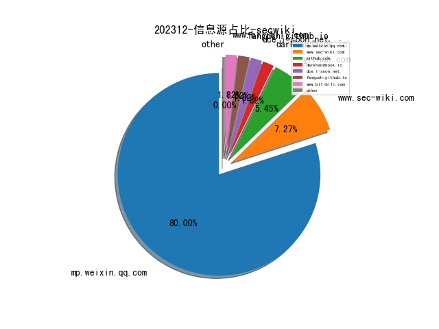
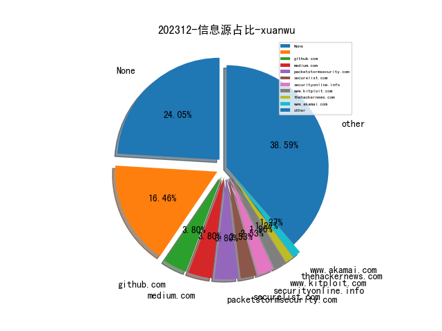
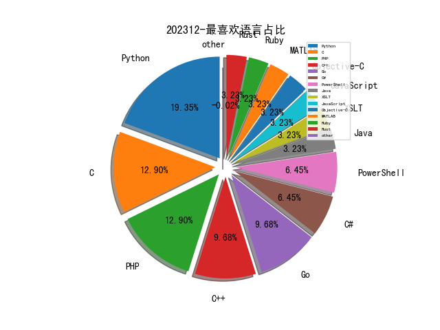

# [数据--所有](README_20.md)
# [数据--年度](README_2023.md)
# 202312 信息源与信息类型占比

# 网络安全书籍 推荐
| date_added | language | title | author | link | size| 
| --- | --- | --- | --- | --- | ---| 
| 2023-12-29 18:17:28 | English | Reverse Engineering with Terraform | unknown | https://www.wowebook.org/reverse-engineering-with-terraform/ | unknown| 
| 2023-12-23 18:58:50 | English | Security Orchestration, Automation, and Response for Security Analysts: Learn the secrets of SOAR to improve MTTA and MTTR and strengthen your organizations security posture | Benjamin Kovacevic | http://libgen.rs/book/index.php?md5=291F0E7199BBE33B31E128142683B2A6 | 27 MB [PDF]| 
| 2023-12-23 18:38:53 | English | Generative AI with LangChain: Build large language model (LLM) apps with Python, ChatGPT and other LLMs | Ben Auffarth | http://libgen.rs/book/index.php?md5=A505C1996DB016F0BDD55CF52026EFC4 | 14 MB [PDF]| 
| 2023-12-22 07:52:51 | English | Understanding Microsoft Teams Administration, 2nd Edition | unknown | https://www.wowebook.org/understanding-microsoft-teams-administration-2nd-edition/ | unknown| 
| 2023-12-20 06:05:44 | English | Building a Cyber Risk Management Program | unknown | https://www.wowebook.org/building-a-cyber-risk-management-program/ | unknown| 
| 2023-12-19 09:04:26 | English | Python Debugging for AI, Machine Learning, and Cloud Computing | unknown | https://www.wowebook.org/python-debugging-for-ai-machine-learning-and-cloud-computing/ | unknown| 
| 2023-12-13 06:44:16 | English | AWS IoT With Edge ML and Cybersecurity | unknown | https://www.wowebook.org/aws-iot-with-edge-ml-and-cybersecurity/ | unknown| 
| 2023-12-13 06:26:08 | English | Deploy Container Applications Using Kubernetes | unknown | https://www.wowebook.org/deploy-container-applications-using-kubernetes/ | unknown| 
| 2023-12-11 08:50:04 | English | Discovering Cybersecurity | unknown | https://www.wowebook.org/discovering-cybersecurity/ | unknown| 
| 2023-12-11 19:49:18 | English | Comprehensive Python Cheatsheet | Jure Sorn | http://libgen.rs/book/index.php?md5=3F9F692C7257B66046BDA97DAA079A2D | 436 kB [PDF]| 
| 2023-12-11 19:43:29 | English | Statistics, Data Mining and Machine Learning in Astronomy: A Practical Python Guide for the Analysis of Survey Data | Zeljko Ivezic, Andrew J. Connolly, Jacob T VanderPlas, Alexander Gray | http://libgen.rs/book/index.php?md5=F288D0B650C97B4248BD09851C7D6FC2 | 28 MB [PDF]| 
| 2023-12-10 05:24:50 | English | Building Recommendation Systems in Python and JAX | unknown | https://www.wowebook.org/building-recommendation-systems-in-python-and-jax/ | unknown| 
| 2023-12-06 09:31:58 | English | Python Graphics, 2nd Edition | unknown | https://www.wowebook.org/python-graphics-2nd-edition/ | unknown| 
| 2023-12-05 07:47:32 | English | Data Modeling with Microsoft Excel | unknown | https://www.wowebook.org/data-modeling-with-microsoft-excel/ | unknown| 
| 2023-12-05 07:08:22 | English | The Immersive Metaverse Playbook for Business Leaders | unknown | https://www.wowebook.org/the-immersive-metaverse-playbook-for-business-leaders/ | unknown| 
| 2023-12-04 16:34:23 | English | Okta Administration Up and Running: Drive operational excellence with IAM solutions for on-premises and cloud apps, 2nd Edition | Lovisa Stenbäcken Stjernlöf, HenkJan de Vries | http://libgen.rs/book/index.php?md5=A139A33C8BC8E86A16ED2EDD9646D080 | 25 MB [PDF]| 
| 2023-12-03 08:50:00 | English | Microsoft 365 Certified Fundamentals MS-900 Exam Guide, Third Edition | unknown | https://www.wowebook.org/microsoft-365-certified-fundamentals-ms-900-exam-guide-third-edition/ | unknown| 
| 2023-12-03 21:03:26 | English | Minimalist Data Wrangling with Python | Marek Gagolewski | http://libgen.rs/book/index.php?md5=6C4104ED1815935DE92FD9C1BD35E071 | 7 MB [PDF]| 

# 学习视频 推荐
| title | url| 
| --- | ---| 
| 区块链安全训练营在线课程 | https://www.bilibili.com/video/BV14u4y1H7ik/| 

# 微信公众号 推荐
| nickname_english | weixin_no | title | url| 
| --- | --- | --- | ---| 
| 58安全应急响应中心 | wubasrc | 企业级跨应用静态污点分析 | https://mp.weixin.qq.com/s/L6CA8FKw5RMsXdJSAQ4i6w | 1| 
| AI与网安 | gh_c57275954216 | 【纯流量卡】还在苦苦寻找靠谱流量卡吗？为你推荐靠谱的上网流量卡。25元包100G靠谱神卡推荐 | https://mp.weixin.qq.com/s?__biz=MzU1ODQ2NTY3Ng==&mid=2247485029&idx=1&sn=90104b653bc4cc53e5df1b1060b6a8d5 | 5| 
| CSJH网络安全团队 | CSJH20200606 | 编程语言的未来？ | https://mp.weixin.qq.com/s?__biz=Mzg3MDYyNzY0MA==&mid=2247490912&idx=1&sn=17072da97c00c97513e1eee9cf40c20e | 2| 
| F12sec | None | 新年有礼 | https://mp.weixin.qq.com/s?__biz=Mzg5NjU3NzE3OQ==&mid=2247488793&idx=1&sn=522d3b2c313f7e410d7b148f0f15f35a | 3| 
| GSDK安全团队 | gh_403a21e91f24 | 自动化监控赏金项目 - laoyue | https://mp.weixin.qq.com/s?__biz=MzIzNTE0Mzc0OA==&mid=2247485587&idx=1&sn=76b94097d7eeaf68c77d01a13de054c6 | 7| 
| IoVSecurity | IoVSecurity | 整车渗透测试，网络安全车辆型式认证的灵丹妙药 | https://mp.weixin.qq.com/s?__biz=MzU2MDk1Nzg2MQ==&mid=2247600151&idx=1&sn=33ec08a6ff9d5ae98bd99ee86ca5df2d | 36| 
| Khan安全团队 | None | 好的 | https://mp.weixin.qq.com/s?__biz=MzAwMjQ2NTQ4Mg==&mid=2247492151&idx=1&sn=815bc88186dc3f7b442765fb9b3dfa43 | 1| 
| Ms08067安全实验室 | None | 今晚8点公开课 , SSRF打穿内网 | https://mp.weixin.qq.com/s?__biz=MzU1NjgzOTAyMg==&mid=2247517028&idx=1&sn=bc78b67475ac8e445d2823c771854611 | 7| 
| Nu1L Team | None | Nu1L Team 2023年度总结 | https://mp.weixin.qq.com/s?__biz=MzU4MTg1NzAzMA==&mid=2247489192&idx=1&sn=c51d9c04a9ff3ef108afc044135c7472 | 3| 
| Relay学安全 | gh_8d57319ec39c | API挂钩 | https://mp.weixin.qq.com/s?__biz=Mzg5MDg3OTc0OA==&mid=2247485297&idx=1&sn=cb0a244289867a405a69b712c12a8644 | 7| 
| SCA御盾 | None | 【实战SRC】前端加密的用户名枚举漏洞怎么从低危变为中高危？ | https://mp.weixin.qq.com/s?__biz=MzkzNjYwODg3Ng==&mid=2247484127&idx=1&sn=fffa5375baf41332c2047c404075a344 | 7| 
| Stack0verf1ow | None | 【PWN】fastbin attack | https://mp.weixin.qq.com/s?__biz=MzkwODAzMTExOA==&mid=2247484049&idx=1&sn=d220c8e1418970589f473c5d8159d3c5 | 2| 
| WIN哥学安全 | WIN-security | 【RedPersist】一款Windows持久化工具 | https://mp.weixin.qq.com/s?__biz=MzkwODM3NjIxOQ==&mid=2247495863&idx=1&sn=5038d34ff33e775b58d431a78b571fbd | 9| 
| WK安全 | None | 【漏洞复现】（1day）铭飞mcms-shiro反序列化漏洞复现 | https://mp.weixin.qq.com/s?__biz=Mzg2ODg3NzExNw==&mid=2247487810&idx=1&sn=5e5ab59c52a3b951cebea07cab8205f5 | 5| 
| WebSec | None | （在野0day）Apache OFBiz 某接口存在远程代码执行漏洞（CVE-2023-51467） | https://mp.weixin.qq.com/s?__biz=MzkyMzYwNTEyNg==&mid=2247484541&idx=1&sn=83018866423bdb9004eb60f02eac3464 | 5| 
| YongYe 安全实验室 | YongYe_Security | CVE-2023-51467__Apache OFBiz-RCE__手工复现 | https://mp.weixin.qq.com/s?__biz=Mzg4MDk4MjM0Mw==&mid=2247484393&idx=1&sn=c0cd22f52b29f3cdec419dd139d20170 | 2| 
| Z2O安全攻防 | None | 入行安全？ | https://mp.weixin.qq.com/s?__biz=Mzg2ODYxMzY3OQ==&mid=2247507204&idx=1&sn=8c8906fd2fdf9ce0b12cc9281f5769a7 | 11| 
| dotNet安全矩阵 | None | .NET 分享一个某蝶反序列化绕过WAF的方法 | https://mp.weixin.qq.com/s?__biz=MzUyOTc3NTQ5MA==&mid=2247490035&idx=1&sn=c485c34e2ca77c6b2d130d45d34f8ff3 | 12| 
| kali笔记 | bbskali-cn | 一款强大的密码字典生成工具 | https://mp.weixin.qq.com/s?__biz=MzkxMzIwNTY1OA==&mid=2247502332&idx=1&sn=201972177589a46e67bed190c3536be5 | 5| 
| moonsec | moon_sec | 【元旦活动】暗月渗透测试培训 | https://mp.weixin.qq.com/s?__biz=MzAwMjc0NTEzMw==&mid=2653588253&idx=1&sn=cd8c40c215725416455598faa77682f3 | 3| 
| 不秃头的安全 | BTTDAQ | 漏洞情报-泛微云桥 e-Bridge addTaste接口SQL注入漏洞 | https://mp.weixin.qq.com/s?__biz=Mzg3NzkwMTYyOQ==&mid=2247484251&idx=1&sn=278b9caa7202addb49c63ef33bcf7910 | 1| 
| 中国计算机学会 | ccfvoice | 2023年“CCF卓越服务奖”评奖结果公告 | https://mp.weixin.qq.com/s?__biz=MjM5MTY5ODE4OQ==&mid=2651565894&idx=1&sn=5b4b43da07cab7bcee11ce53fe36187c | 27| 
| 亚信安全 | yaxinanquan | 安全向未来！亚信安全2023年度十大记忆 | https://mp.weixin.qq.com/s?__biz=MjM5NjY2MTIzMw==&mid=2650610726&idx=1&sn=1654e47330d6acaa9c35e7e05868e364 | 20| 
| 代码小铺 | Java_Cpp_C_Python_MB | 拼多多市值超越阿里，说明了什么? | https://mp.weixin.qq.com/s?__biz=Mzg4NDY4Mzk3Mw==&mid=2247484979&idx=1&sn=af871eef14471bb302d313f0cd51a484 | 4| 
| 会杀毒的单反狗 | None | 汽车隐私（三）：美国政府对汽车隐私的监管 | https://mp.weixin.qq.com/s?__biz=MzI2NzAwOTg4NQ==&mid=2649790175&idx=1&sn=f7340c0b8f83718174b1dc279f187c59 | 5| 
| 信安404 | infosec404 | 漏洞预警 , 网康NS-ASG应用安全网关源代码泄露漏洞【附POC】 | https://mp.weixin.qq.com/s?__biz=Mzk0NjQ5MTM1MA==&mid=2247486106&idx=1&sn=3a26cf544b565557b3d32824de21be7d | 12| 
| 信息安全国家工程研究中心 | None | 2024元旦快乐！ | https://mp.weixin.qq.com/s?__biz=MzU5OTQ0NzY3Ng==&mid=2247495674&idx=1&sn=f73ba68ee23ecc915c66b3c734a972d2 | 7| 
| 全栈网络空间安全 | cyber_securlty | DDOS攻击原理 | https://mp.weixin.qq.com/s?__biz=Mzg3NTUzOTg3NA==&mid=2247510545&idx=1&sn=6469c886b5a6e350e6fdcbbef78b655b | 3| 
| 全球技术地图 | drc_iite | 高技术产业发展中的伦理考量与治理展望 | https://mp.weixin.qq.com/s?__biz=MzI1OTExNDY1NQ==&mid=2651609568&idx=1&sn=6f0e66d1f7b1c266c360e397ad966745 | 14| 
| 内生安全联盟 | None | 网络安全保险 , 标准在网络安全保险发展中的引领和助力作用 | https://mp.weixin.qq.com/s?__biz=Mzg4MDU0NTQ4Mw==&mid=2247515109&idx=1&sn=b93f03475acfc9ee771adaf6ee6bc0d2 | 11| 
| 利刃信安攻防实验室 | LRXAGFSYS | 2023年下半年软考电子证书编号查询开通啦，附查验步骤！ | https://mp.weixin.qq.com/s?__biz=MzU1Mjk3MDY1OA==&mid=2247509041&idx=1&sn=96111e9197980cbc56a9a333bcc80c25 | 15| 
| 哆啦安全 | gmkj_dlaq | Android的dex、odex、oat、vdex、art文件格式 | https://mp.weixin.qq.com/s?__biz=Mzg2NzUzNzk1Mw==&mid=2247496649&idx=1&sn=5c94841a7a74d533f9c9cb9210226777 | 5| 
| 复旦白泽战队 | fdwhitzard | 复旦与中国电信联合研发软件供应链安全治理平台一期圆满结束 | https://mp.weixin.qq.com/s?__biz=MzU4NzUxOTI0OQ==&mid=2247488352&idx=1&sn=e6ebcdcd62349213f4cce445c21f5721 | 4| 
| 大仙安全说 | gh_15500b9393d6 | 文件上传&pdf跨站脚本攻击 | https://mp.weixin.qq.com/s?__biz=MzkxMDYwODk2NQ==&mid=2247484382&idx=1&sn=ae4cfb3a7fa701dc3c467baf88467800 | 4| 
| 天唯信息安全 | TWtech2113189 | 杭州破获重大勒索病毒案：犯罪团伙借助ChatGPT进行程序优化 | https://mp.weixin.qq.com/s?__biz=MzkzMjE5MTY5NQ==&mid=2247493420&idx=1&sn=bb86771f209c85a9572df5ccdd4989b7 | 10| 
| 天盾信安 | Tiandun_yanshu0_0 | 后台管理系统SQL注入漏洞 | https://mp.weixin.qq.com/s?__biz=MzkxMDYwNDI0MA==&mid=2247484049&idx=1&sn=f133f49f2743cefdb7bf44c4d7d93718 | 6| 
| 天锐数据安全 | None | 假期不打烊 , 天锐技术服务联系方式： | https://mp.weixin.qq.com/s?__biz=MjM5MTk0MzIzMQ==&mid=2652018412&idx=1&sn=41456dfd2cecf26c0bbabad074a36832 | 7| 
| 威努特工控安全 | winicssec_bj | 一周全球重大网络安全事件速递（第五期） | https://mp.weixin.qq.com/s?__biz=MzAwNTgyODU3NQ==&mid=2651109934&idx=1&sn=759ff6d0898605cd72141a82950484f3 | 3| 
| 安全内参 | anquanneican | 史上最复杂攻击链：利用苹果设备硬件隐秘机制的网络攻击活动揭密 | https://mp.weixin.qq.com/s?__biz=MzI4NDY2MDMwMw==&mid=2247510717&idx=1&sn=28ff1d4cbbb2f62b3b8dfce1c429a174 | 14| 
| 安全圈 | ChinaAnQuan | 【安全圈】19岁黑客倒卖身份信息，涉百位当红明星 | https://mp.weixin.qq.com/s?__biz=MzIzMzE4NDU1OQ==&mid=2652051260&idx=1&sn=633ff02ac12b39d84677e1f7d5fb545a | 48| 
| 安全客 | anquanbobao | 【必读】2024数字安全十大技术趋势预测，不容忽视！ | https://mp.weixin.qq.com/s?__biz=MzA5ODA0NDE2MA==&mid=2649785999&idx=1&sn=984d9000cc5a447f0947e2282405f581 | 3| 
| 安全攻防屋 | None | 网络安全行业现状有多差？ | https://mp.weixin.qq.com/s?__biz=MzkyNTU3MjA3OQ==&mid=2247484515&idx=1&sn=cfb2a1750657e07aae47d16a96394791 | 1| 
| 安全架构 | None | 红队的攻防体系和突破 | https://mp.weixin.qq.com/s?__biz=Mzg5MjgxNTQ1MA==&mid=2247485930&idx=1&sn=92a728773237ad6a4d24a2c3f5dd1864 | 1| 
| 安天集团 | Antiylab | “量子”系统击穿苹果手机——方程式组织攻击iOS系统的历史样本分析 | https://mp.weixin.qq.com/s/2xkDjRniJjCbzvxFdA9yqg | 10| 
| 小迪安全 | xiaodisec | 【喜迎2024】, 小迪安全培训冲 | https://mp.weixin.qq.com/s?__biz=MzA5MzQ3MDE1NQ==&mid=2653940535&idx=1&sn=897d1972c09bd979249076ea7fee6aa0 | 2| 
| 开源情报技术研究院 | None | 网络安全资讯周报（12/25- 12/29） | https://mp.weixin.qq.com/s?__biz=MzkwNjQxOTk1Mg==&mid=2247485672&idx=1&sn=9211a11fda3fd8aaec1da49298baae09 | 4| 
| 弥天安全实验室 | gh_41292c8e5379 | 【成功复现】Apache OFBiz远程代码执行漏洞(CVE-2023-51467) | https://mp.weixin.qq.com/s?__biz=MzU2NDgzOTQzNw==&mid=2247500534&idx=1&sn=cd42e236bc14cfa58421da5189254019 | 7| 
| 情报分析师 | None | 情报分析师公众号文章合集（一） | https://mp.weixin.qq.com/s?__biz=MzA3Mjc1MTkwOA==&mid=2650543458&idx=1&sn=416d621ed70118f7d5ee754de7d971d2 | 11| 
| 打代码的猫 | kitescat_666 | 【開山安全】2023年年度总结 | https://mp.weixin.qq.com/s?__biz=MzU5MjMzMTI2MQ==&mid=2247484964&idx=1&sn=9ea3376571ca70712c45ee2415f55741 | 1| 
| 掌控安全EDU | None | 实战, 小程序存在优惠卷遍历 | https://mp.weixin.qq.com/s?__biz=MzUyODkwNDIyMg==&mid=2247535130&idx=1&sn=1514ed3e2d44291edc53f7e27f0d85a2 | 16| 
| 数据学堂 | data_school | 59页PPT , 信创云规划设计建设方案 | https://mp.weixin.qq.com/s?__biz=MzkyMDE5ODYwMw==&mid=2247520481&idx=1&sn=133df44339e5a179d5ed5009d54b4f63 | 5| 
| 明暗安全 | None | 一年一度的跨年仪式感！速来抽奖，赢惊喜！ | https://mp.weixin.qq.com/s?__biz=MzkxMjYxODcyNA==&mid=2247484008&idx=1&sn=529ca53dd89f01dd742f055b9bebdaef | 5| 
| 格格巫和蓝精灵 | None | 前端加解密之RPC调用 | https://mp.weixin.qq.com/s?__biz=MzI5NDg0ODkwMQ==&mid=2247485727&idx=1&sn=ce8d8c7c8b8c5fe67a3137428d81426b | 5| 
| 棉花糖网络安全圈 | None | 西软云XMS 反序列化RCE | https://mp.weixin.qq.com/s?__biz=Mzg5NTYwMDIyOA==&mid=2247500771&idx=1&sn=16a8675cf27027d2a440fc8f03bed116 | 12| 
| 河北网络安全高校联盟 | None | 一年一度的跨年仪式感！速来抽奖，赢惊喜！ | https://mp.weixin.qq.com/s?__biz=Mzg4ODUyMjYyNg==&mid=2247487571&idx=1&sn=82d854c430c7c5070e76877efc33cade | 1| 
| 河南等级保护测评 | hndjbh | 一图读懂《数字中国建设整体布局规划》 | https://mp.weixin.qq.com/s?__biz=Mzg2NjY2MTI3Mg==&mid=2247493630&idx=1&sn=0f54249ea8f8a0ca2bd872509293aafd | 13| 
| 洞见网安 | None | 洞见简报【2023/12/25】 | https://mp.weixin.qq.com/s?__biz=MzAxNzg3NzMyNQ==&mid=2247486983&idx=1&sn=cce719ecf74b8dfc1e0612f461345410 | 2| 
| 浅安安全 | gh_758e256fcc72 | 漏洞预警 , 网康NS-ASG应用安全网关源代码泄露漏洞 | https://mp.weixin.qq.com/s?__biz=MzkwMTQ0NDA1NQ==&mid=2247487286&idx=1&sn=3ac716778510dae67b9ad175988f4491 | 23| 
| 渗透Xiao白帽 | SuPejkj | CVE-2023-51467RCE漏洞(附EXP) | https://mp.weixin.qq.com/s?__biz=MzI1NTM4ODIxMw==&mid=2247500365&idx=1&sn=33f7d1cf216b18cb8292b83d7a35a1dd | 1| 
| 渗透安全HackTwo | None | 内部VIP知识星球福利介绍V1.2版本-元旦优惠 | https://mp.weixin.qq.com/s?__biz=Mzg3ODE2MjkxMQ==&mid=2247484713&idx=1&sn=0fdab59445d9e0849843077365607b18 | 7| 
| 渗透测试研究中心 | None | 攻防实战,钓鱼手法及木马免杀技巧 | https://mp.weixin.qq.com/s?__biz=MzU5ODMzMzc5MQ==&mid=2247485973&idx=1&sn=74a42fa33f7ee1033e1dc9e0ad8dd7cf | 1| 
| 白帽子 | NS-CTF | 关于Mybatis的一个小问题。 | https://mp.weixin.qq.com/s?__biz=MzAwMDQwNTE5MA==&mid=2650247255&idx=1&sn=560e50e4d4d05090c9c9bf3c942d18ad | 5| 
| 白帽子左一 | HackRead | 应急响应 , 企业安全开发生命周期（SDL）实践 | https://mp.weixin.qq.com/s?__biz=MzI4NTcxMjQ1MA==&mid=2247604422&idx=1&sn=9561536fc538b4a54eddf200fac2167a | 12| 
| 瞌睡虫小K | None | ACTF flutter逆向学习 | https://mp.weixin.qq.com/s?__biz=MzI4MTIxMzkxMg==&mid=2247485171&idx=1&sn=73956e802519db2c0ae7feff9d254d49 | 1| 
| 知攻善防实验室 | ChinaRan404 | 分享一些网安的宝藏级公众号！ | https://mp.weixin.qq.com/s?__biz=MzkxMTUwOTY1MA==&mid=2247484268&idx=1&sn=84a470868026babb2059a916d1587e6d | 11| 
| 祺印说信安 | qiyinshuoxinan | 看看元数据是个什么鬼 | https://mp.weixin.qq.com/s?__biz=MzA5MzU5MzQzMA==&mid=2652103814&idx=1&sn=ea9fa81774564548a0ab60be7a2535b9 | 16| 
| 秦安战略 | qinan1128 | 首届数据基础设施战略论坛成功举行 | https://mp.weixin.qq.com/s?__biz=MzA5MDg1MDUyMA==&mid=2650465951&idx=1&sn=0681ad2553089ff306807e8855dcfebd | 13| 
| 紫金山实验室 | None | 紫金山实验室党委召开会议  推动创新链产业链深度融合 | https://mp.weixin.qq.com/s?__biz=MzU4NDc2MzcwNw==&mid=2247496899&idx=1&sn=02ad3e5897d1a10172c9d3fb4e8527d7 | 2| 
| 网易云音乐技术团队 | gh_e0a72742f973 | u200b云音乐D2C设计稿转代码建设实践 | https://mp.weixin.qq.com/s?__biz=MzI1NTg3NzcwNQ==&mid=2247490160&idx=1&sn=6928d430b18f7b7310f7eb5877813e79 | 3| 
| 网站安全 | None | SINE安全祝大家元旦快乐！万事胜意！ | https://mp.weixin.qq.com/s?__biz=Mzg4MDkwOTc5Ng==&mid=2247487999&idx=1&sn=0918211b51337a03bf9969ed55d07f80 | 1| 
| 网络与安全实验室 | Hohai_Network | 每周文章分享-140 | https://mp.weixin.qq.com/s?__biz=MzI1MTQwMjYwNA==&mid=2247499408&idx=1&sn=d81d1240539363d179e197bb0654262f | 2| 
| 网络安全与取证研究 | None | 【视频图像篇】模糊图像处理之运动模糊造成的车牌号码图像模糊还原 | https://mp.weixin.qq.com/s?__biz=Mzg3NTU3NTY0Nw==&mid=2247488409&idx=1&sn=a886efb6ee8e8043721be8297c8141a6 | 7| 
| 网络安全与数据治理 | gh_ddbdee0c5caf | 国家发展改革委等部门关于深入实施“东数西算”工程加快构建全国一体化算力网的实施意见 | https://mp.weixin.qq.com/s?__biz=MzIzODk1NzY5NA==&mid=2247496525&idx=1&sn=fbd10bc5c34a66be083ae43e60820130 | 14| 
| 网络安全和信息化 | ITyunwei_365master | 两部门印发《工业领域数据安全标准体系建设指南（2023版）》 | https://mp.weixin.qq.com/s?__biz=MjM5MzMwMDU5NQ==&mid=2649160576&idx=1&sn=59574b6a4600f1d2d29f815c18a8ab2d | 14| 
| 网络安全等保测评 | rxDJCP | 人工智能计算平台安全框架 | https://mp.weixin.qq.com/s?__biz=MzI3MDY0Nzg1Nw==&mid=2247488789&idx=1&sn=0d476abe588b22cbc50b9a1b5397c3b4 | 2| 
| 网络安全资源库 | gh_e8a4866a67fe | 网安人的2023年终总结 | https://mp.weixin.qq.com/s?__biz=MzkxMzMyNzMyMA==&mid=2247551005&idx=1&sn=49c236d6d639b891c9c30aee050f65cc | 14| 
| 网络技术联盟站 | wljslmz | 以太网，50岁生日快乐！ | https://mp.weixin.qq.com/s?__biz=MzIyMzIwNzAxMQ==&mid=2649455602&idx=1&sn=2cedcf4d5ec0bc0425f262cd922e22ac | 8| 
| 船山信安 | zghyxa | Web中间件漏洞总结之Nginx漏洞 | https://mp.weixin.qq.com/s?__biz=MzU2NDY2OTU4Nw==&mid=2247511582&idx=1&sn=29a5e45c6963ca47ee371099882d4236 | 1| 
| 菜鸟小新 | None | 文件上传漏洞总结 | https://mp.weixin.qq.com/s?__biz=Mzg4OTI0MDk5MQ==&mid=2247490061&idx=1&sn=4bd7e5168849ec979eaae82e98e4f88a | 6| 
| 计算机与网络安全 | None | 工业领域数据安全标准体系建设指南（2023版） | https://mp.weixin.qq.com/s?__biz=MjM5OTk4MDE2MA==&mid=2655219655&idx=1&sn=82703947a7c2d5a9d885acfcc192c7eb | 14| 
| 谈思实验室 | gh_6446c19b4595 | 网络安全 & 车联网安全思维导图 | https://mp.weixin.qq.com/s?__biz=MzIzOTc2OTAxMg==&mid=2247531288&idx=1&sn=a6123aa35e63a56f1d26b96ed0100dec | 16| 
| 赛博研究院 | SICSI-cybersecurity | 喜讯！赛博研究院咨询部获上海市通信管理局表扬 | https://mp.weixin.qq.com/s?__biz=MzUzODYyMDIzNw==&mid=2247507397&idx=1&sn=88e82dfa2391fab6bea9a69f80366196 | 10| 
| 赛欧思安全研究实验室 | None | 赛欧思一周资讯分类汇总(2023-12-25 ~ 2023-12-30) | https://mp.weixin.qq.com/s?__biz=MzU0MjE2Mjk3Ng==&mid=2247486587&idx=1&sn=38527ee6a44f9b58444cb20dfbde594f | 6| 
| 锋刃科技 | None | 辞旧纳新，共赴新程 , 锋刃科技全体员工祝大家元旦快乐 | https://mp.weixin.qq.com/s?__biz=MzUxMjc0MTE3Mw==&mid=2247492739&idx=1&sn=998ec928ea6624ce2d95297fc8ec2525 | 2| 
| 阿呆攻防 | None | CVE-2023-51467,SpringKill的Apache OFBiz RCE代审分析 | https://mp.weixin.qq.com/s?__biz=MzIzNDU5Mzk2OQ==&mid=2247485623&idx=1&sn=aec533a2530d34a5eef2a5f79c4de6f0 | 1| 
| 青衣十三楼飞花堂 | scz------ | 我们是否活在一幕大戏中 II | https://mp.weixin.qq.com/s?__biz=MzUzMjQyMDE3Ng==&mid=2247487040&idx=1&sn=237534d4f996f4aa1941daaf471fbd95 | 5| 
| 麋鹿安全 | gh_76dddb79ae86 | 大厂猛猛裁员，难到出路只有考研考公？考试失败如何做到不焦虑？不妨换条赛道 | https://mp.weixin.qq.com/s?__biz=MzkwNjUwNTg0MA==&mid=2247490446&idx=1&sn=21efac66b537e13bd97cbbc6f38e3b14 | 2| 
| 黄公子学安全 | huang_Block | Apereo CAS 4.1 反序列化命令执行漏洞 | https://mp.weixin.qq.com/s?__biz=MzkzODQzNTU2NA==&mid=2247485654&idx=1&sn=701812558fcbd01ba8bd0059d4e9c7e4 | 2| 
| 黑客白帽子 | hackerwhitehat | 什么是反弹shell，反弹shell的方法 | https://mp.weixin.qq.com/s?__biz=MzA5MzYzMzkzNg==&mid=2650938134&idx=1&sn=a72afd48e5d5186e7303fa78057e76c8 | 34| 
| 黑白之道 | i77169 | 杭州破获重大勒索病毒案！4名嫌疑人都具备网安专业资质；养乐多公司确认95.19 GB数据遭黑客泄露，涉及合同及员工数据等 | https://mp.weixin.qq.com/s?__biz=MzAxMjE3ODU3MQ==&mid=2650584937&idx=1&sn=c6e304d59c38844e43b2124e02305559 | 27| 
| Asimov攻防实验室 | Red_Asimov | 负载均衡下的IP伪造 | https://mp.weixin.qq.com/s?__biz=MzkxNTQzMDkwOA==&mid=2247483854&idx=1&sn=f9a3714348600ee66577d31e548bda2b | 3| 
| CAPPVD漏洞库 | CAPPVD | 邀请函,第四期移动互联网App产品安全漏洞技术沙龙 | https://mp.weixin.qq.com/s?__biz=MzkyMjM4MzY5Ng==&mid=2247485499&idx=1&sn=df369d2c9c2353b8db24e9ded3a60335 | 1| 
| CCIA数据安全工作委员会 | CCIA-DSC | 每月观察 , 2023年12月-CCIA数据安全工作委员会 | https://mp.weixin.qq.com/s?__biz=MzkyNzI3MzAxOA==&mid=2247516793&idx=1&sn=41155d55f65f28f1f424ca3961ee5e08 | 3| 
| FreeBuf | freebuf | 年终总结（甲方版）请查收 | https://mp.weixin.qq.com/s?__biz=MjM5NjA0NjgyMA==&mid=2651253272&idx=1&sn=82468d927062b7427e3ca8a912cb2dc7 | 58| 
| FuzzWiki | gh_fcf21e658324 | 2023信息安全领域四大顶会fuzz方向论文汇总 | https://mp.weixin.qq.com/s/_hy7tJ8JB7BPdi6FyzhvXg | 5| 
| IoT物联网技术 | IoT-Tech-Expo | 2023年工业互联网 IIoT 平台如何盈利？又将走向何方？ | https://mp.weixin.qq.com/s?__biz=MjM5OTA4MzA0MA==&mid=2454931976&idx=1&sn=f78f92b33b09e7eefecd18e71c5e2b64 | 3| 
| 中国信息安全 | chinainfosec | 《话说安全》视频节目：关键信息基础设施安全保护标准如何落地实施 | https://mp.weixin.qq.com/s?__biz=MzA5MzE5MDAzOA==&mid=2664201365&idx=1&sn=54a48165aa692e477c0e3c84bc4406c6 | 36| 
| 京东安全应急响应中心 | jsrc_team | 【公告】JSRC十一月英雄榜单揭晓 | https://mp.weixin.qq.com/s?__biz=MjM5OTk2MTMxOQ==&mid=2727836208&idx=1&sn=447893e252c5efbd6671371160fde00e | 4| 
| 兰花豆说网络安全 | gh_0e9b2a5e2976 | 数据安全之数据库安全的重要性 | https://mp.weixin.qq.com/s?__biz=MzI3NzM5NDA0NA==&mid=2247485261&idx=1&sn=72043444b2ab2efe73067d13e5aa1675 | 10| 
| 军机故阁 | gh_e57baf46bdf5 | 一种新的email欺骗漏洞-SMTP走私 | https://mp.weixin.qq.com/s?__biz=MzU5Mjk3MDA5Ng==&mid=2247485824&idx=1&sn=3b9c5f5c0564e5456102d83ff1b8ef99 | 4| 
| 商业智能研究 | fr_research | 数据资产评估方法：成本法 | https://mp.weixin.qq.com/s?__biz=MzIwMzg5MTI0OQ==&mid=2247538208&idx=1&sn=cd3ded30a6ad6e34273c21ff9941cbfd | 6| 
| 商密君 | shangmijun | 国家发展改革委等部门关于深入实施“东数西算”工程 加快构建全国一体化算力网的实施意见 | https://mp.weixin.qq.com/s?__biz=MzI5NTM4OTQ5Mg==&mid=2247617913&idx=1&sn=0245b09acaf6778cfb3cd6138a6e1f5a | 49| 
| 四叶草安全 | siyecaoanquan1 | 四叶草安全获批陕西省网络对抗智能化校企联合研究中心 | https://mp.weixin.qq.com/s?__biz=MjM5MTI2NDQzNg==&mid=2654550924&idx=1&sn=ba6b288442eb5f5fbc4f9136c35bce4a | 2| 
| 国际云安全联盟CSA | gh_674820794ae8 | 2024来了, CZTP零信任认证专家2.0 首期公开课（1月15-21日）报名开始啦 | https://mp.weixin.qq.com/s?__biz=MzkwMTM5MDUxMA==&mid=2247495380&idx=1&sn=6d4fa3970f01e61afff7bb5b0a3f30b2 | 15| 
| 墨雪飘影 | SG-CXZ | 新年礼物来了 | https://mp.weixin.qq.com/s?__biz=MzI3NzI4OTkyNw==&mid=2247489047&idx=1&sn=94e5604b59c04e276e774c3d8c572196 | 2| 
| 大余安全 | dayuST123 | 大余安全百个项目元旦最后两天优惠通知！ | https://mp.weixin.qq.com/s?__biz=Mzg3MDMxMTg3OQ==&mid=2247505291&idx=1&sn=cadba9748b9044fcd1e759e32f9c1db2 | 13| 
| 安全分析与研究 | MalwareAnalysis | 2023年度总结 | https://mp.weixin.qq.com/s?__biz=MzA4ODEyODA3MQ==&mid=2247487816&idx=1&sn=719902b02f737235d798ff114437d9dc | 1| 
| 安全小将李坦然 | gh_b7be9b469f93 | 容器安全基础知识(纯新手向) | https://mp.weixin.qq.com/s?__biz=MzkwMDQ4MDU2MA==&mid=2247484077&idx=1&sn=d82d26302b2cce6bd01b7f5bb373c499 | 2| 
| 安全小飞侠 | AvFisher | 一个普通网安从业人员的2023 | https://mp.weixin.qq.com/s?__biz=MzAwMzAwOTQ5Nw==&mid=2650941856&idx=1&sn=54e3ea4933308c88819f5460e8655988 | 1| 
| 安全研究GoSSIP | GoSSIPSJTU | G.O.S.S.I.P 特别推荐 2023-12-29 IDA杀手之MLM大模型！ | https://mp.weixin.qq.com/s?__biz=Mzg5ODUxMzg0Ng==&mid=2247497064&idx=1&sn=c4db76d0d65604a87947a3b1ba1a1a54 | 7| 
| 安全逐梦人 | gh_bdb40c30b1d4 | 安服仔挖洞记录 | https://mp.weixin.qq.com/s?__biz=MzkxNzUxMjU5OQ==&mid=2247484265&idx=1&sn=ddad12277e7c43c498bb0edc0862109c | 1| 
| 工业互联网标识智库 | CAICT-bs | 哪些文章最受欢迎？工业互联网标识智库 2023 年度盘点 | https://mp.weixin.qq.com/s?__biz=MzU1OTUxNTI1NA==&mid=2247560658&idx=1&sn=41a7be961b2e8528bbb756858127a61d | 22| 
| 工业安全产业联盟 | ICSISIA | 图解丨国标GB/T 43269-2023《信息安全技术 网络安全应急能力评估准则》 | https://mp.weixin.qq.com/s?__biz=MzI2MDk2NDA0OA==&mid=2247525690&idx=1&sn=c79c51554317d058504ee0bd0b888226 | 8| 
| 暗魂攻防实验室 | anhunsec-red | anhunsec_redteam_V3.0 红队单兵作战系统之龙年特别新春版 正式发布！ | https://mp.weixin.qq.com/s?__biz=MzkyMjE1NzQ2MA==&mid=2247488766&idx=1&sn=7643e7a73004566093aeb55ba37355f7 | 3| 
| 渗透安全团队 | GuYingLanQi | 实战 , 通过代码审计完成的渗透 | https://mp.weixin.qq.com/s?__biz=MzkxNDAyNTY2NA==&mid=2247513466&idx=1&sn=a264dc42692682d0728a5578e6427570 | 15| 
| 盘古石取证 | Panguite_CN | “固本开新 行稳致远”-2023盘古石取证年度总结 | https://mp.weixin.qq.com/s?__biz=Mzg3MjE1NjQ0NA==&mid=2247501673&idx=1&sn=100b76c43b7850097124afa2585a3c95 | 3| 
| 盛邦安全WebRAY | WebRay_weixin | 年度盘点丨盛邦安全年度九大产品与服务 | https://mp.weixin.qq.com/s?__biz=MzAwNTAxMjUwNw==&mid=2650274832&idx=1&sn=5d450ebf470313656c336226bb9b2508 | 3| 
| 网安国际 | inforsec | 机器语言大模型MLM开启邀测 | https://mp.weixin.qq.com/s?__biz=MzA4ODYzMjU0NQ==&mid=2652314600&idx=1&sn=7f237ae8f064a05a614237329c2efe9c | 2| 
| 网安百色 | www_xinbs_net | 国家网信办公开曝光！ | https://mp.weixin.qq.com/s?__biz=MzI0NzE4ODk1Mw==&mid=2652092526&idx=1&sn=ee90d669f197e3bbd8356ec3ccffe9c7 | 7| 
| 网络运维渗透 | afei_00and11 | 【漏洞复现】奥威亚视屏云平台任意文件下载漏洞【附POC】 | https://mp.weixin.qq.com/s?__biz=MzA3MjMxODUwNg==&mid=2247486319&idx=1&sn=d4ba930fd5a5a2d0d3476610aba18549 | 2| 
| 美亚柏科 | MeiyaPico | 正式更名：美亚柏科初心不改，国投智能向新出发！ | https://mp.weixin.qq.com/s?__biz=MjM5NTU4NjgzMg==&mid=2651405021&idx=1&sn=a9c9d53edb0da1a92136cd4b9ac8cee1 | 20| 
| 谈数据 | learning-bigdata | 新战场 ,沙利文对于2023年中国下沉市场零售行业ToB服务的总结（70页PPT） | https://mp.weixin.qq.com/s?__biz=MzI1NzYwNTMzNw==&mid=2247520200&idx=1&sn=f1c0f39b9767e2b83f27456ca438152a | 7| 
| 赛博攻防悟道 | lookvul | 2023年的四则奇异安全动态和点评 | https://mp.weixin.qq.com/s?__biz=MzI1MDA1MjcxMw==&mid=2649908129&idx=1&sn=66c2146c826596e5306c307946657db0 | 1| 
| 迪哥讲事 | growing0101 | 列目录引起的一系列高危漏洞并获取一万五千元赏金记录 | https://mp.weixin.qq.com/s?__biz=MzIzMTIzNTM0MA==&mid=2247493182&idx=1&sn=1e28bc3ec34c9fabbc48770691a9d182 | 8| 
| 零羊IT | gh_5fcaf0ac6b2f | 万字长文带你了解“游戏外挂”？ | https://mp.weixin.qq.com/s?__biz=MzkyMTQzNTM3Ng==&mid=2247483779&idx=1&sn=8350b327c760441732cc17253b9e6f9f | 1| 
| 飓风网络安全 | gh_183f818a07dc | 【漏洞预警】WP插件<1.0.9 Sql注入漏洞CVE-2023-5203 | https://mp.weixin.qq.com/s?__biz=MzI3NzMzNzE5Ng==&mid=2247487331&idx=1&sn=a78022cd53dcea5c36204902dc52810b | 11| 
| 马户腾马犬马包子 | dig_exploit | 原创-小说之幻想人类和平统一 | https://mp.weixin.qq.com/s?__biz=Mzg4NzAwNzA4NA==&mid=2247484319&idx=1&sn=543bc616e8358965606d13ed36b35d27 | 2| 
| 黑伞安全 | hack_umbrella | 我靠！你染上网络安全了？ | https://mp.weixin.qq.com/s?__biz=MzU0MzkzOTYzOQ==&mid=2247488445&idx=1&sn=2760cdbab2c20c006c5b923cb888cfec | 3| 
| 黑客在思考 | hackthink | 「2023」 知识星球年终总结 | https://mp.weixin.qq.com/s?__biz=MzI5NzU0MTc5Mg==&mid=2247485132&idx=1&sn=a78d159355588962d9ff0b9e3da7ce55 | 1| 
| 吾爱破解论坛 | pojie_52 | IDA Pro 8.3 绿色版 | https://mp.weixin.qq.com/s/cJPA_j2PuXHxUR6h50bc3w | 2| 
| 奇安信威胁情报中心 | gh_166784eae33e | 史上最复杂攻击链，利用苹果设备硬件隐秘机制的网络攻击活动揭密 | https://mp.weixin.qq.com/s/R1ien99W5KV1RhaE_haEnw | 2| 
| 安全学术圈 | secquan | 卡耐基梅隆大学 , CVE漏洞的威胁优先级和影响预测分析 | https://mp.weixin.qq.com/s/KLkItMhyPS9ZRQjxJ3q0LA | 4| 
| Docker中文社区 | dockerchina | 揭秘Kubernetes如何实现原地升级Pod | https://mp.weixin.qq.com/s?__biz=MzI1NzI5NDM4Mw==&mid=2247496602&idx=1&sn=78ff7c2f8a09e55b3ba604d544621887 | 1| 
| Echo Reply | AA7ACE | Wireshark TS , 应用传输丢包问题 | https://mp.weixin.qq.com/s?__biz=MzA5NTUxODA0OA==&mid=2247491124&idx=1&sn=180079ea7d7a88a9fe3c1aac6ea33799 | 1| 
| E安全 | EAQapp | 报告显示2023年“ChatGPT”安全风险不断增加引人担忧 | https://mp.weixin.qq.com/s?__biz=MzI4MjA1MzkyNA==&mid=2655342715&idx=1&sn=0f0f27fc2028f04e15dff97451b5d00b | 2| 
| HACK之道 | hacklearn | 常见Web安全攻防总结！327页Web安全学习笔记（附PDF） | https://mp.weixin.qq.com/s?__biz=MzIwMzIyMjYzNA==&mid=2247512294&idx=1&sn=7ece68a13ee7b4a60d522f5409855098 | 7| 
| Hack分享吧 | HackShareB | 一款macOS GUI应用程序管理器 | https://mp.weixin.qq.com/s?__biz=MzA4NzU1Mjk4Mw==&mid=2247489190&idx=1&sn=6bb31bdc0f6be1a6c6494fc2fccb00d8 | 6| 
| Lambda小队 | LambdaTeam | 干货！Fastjson打法总结 | https://mp.weixin.qq.com/s?__biz=Mzg5MDY1NTg3OQ==&mid=2247485319&idx=1&sn=c99a647ceba19866c917970ceeec692d | 1| 
| TtTeam | gh_a0a1db78ea68 | 免杀 shellcode | https://mp.weixin.qq.com/s?__biz=Mzg2NTk4MTE1MQ==&mid=2247484312&idx=1&sn=1672dea02c3dbf18fe24340d136ef0ea | 1| 
| V安全资讯 | v-safe-cn | 兰州市召开打击整治“两卡”突出违法犯罪工作暨百日攻坚行动部署会 | https://mp.weixin.qq.com/s?__biz=MzI4MDQ1MzQ0NA==&mid=2247493613&idx=1&sn=a584ee057e7a4ae472faa6839c4c8599 | 4| 
| Web安全工具库 | websec-tools | 一体化跨平台渗透系统 -- 棱镜X | https://mp.weixin.qq.com/s?__biz=MzI4MDQ5MjY1Mg==&mid=2247511963&idx=1&sn=a7ba61aae10db3fec9b662f5a15e9964 | 3| 
| fullbug | xiejava1018 | pandas将dataframe列中的list转换为多列 | https://mp.weixin.qq.com/s?__biz=MjM5NDMwMjEwMg==&mid=2451851330&idx=1&sn=e8ee076785baf5bd1c67c5f436003ee1 | 3| 
| 不够安全 | gh_72a34cefa21c | [漏洞复现] CVE-2022-34267 SDL WorldServer 身份认证绕过RCE | https://mp.weixin.qq.com/s?__biz=Mzg2OTYzNTExNQ==&mid=2247484668&idx=1&sn=7ff2fe2b71719fdc06a38de72461c499 | 3| 
| 不懂安全 | the-avengers-5 | 一篇入门java反序列化漏洞 | https://mp.weixin.qq.com/s?__biz=Mzg3NzE4NzgzMA==&mid=2247484785&idx=1&sn=34afb65da9dbfc502f97dc9854617c9b | 2| 
| 信安之路 | xazlsec | 自由职业的第三年 | https://mp.weixin.qq.com/s?__biz=MzI5MDQ2NjExOQ==&mid=2247498924&idx=1&sn=a182bb828735da2a9263a2c07baa0e85 | 3| 
| 信息安全与通信保密杂志社 | cismag2013 | 年度回顾 , 2023全球十大网络安全演习 | https://mp.weixin.qq.com/s/5c42vOQNNXc6FW-enOCVAg | 23| 
| 全频带阻塞干扰 | RFJamming | TSCM海外技术专家课 , 第一期 • 圆满结束 | https://mp.weixin.qq.com/s?__biz=MzIzMzE2OTQyNA==&mid=2648956702&idx=1&sn=2816101b015ac21ed4e43e79b41e682d | 1| 
| 前沿信安资讯阵地 | infosrc | 电信网路由安全白皮书 | https://mp.weixin.qq.com/s?__biz=MzA3MTM0NTQzNA==&mid=2455768916&idx=1&sn=24721ba3e577e9c921e71da317e7ee2e | 4| 
| 可汗安全团队 | None | 裁裁裁 | https://mp.weixin.qq.com/s?__biz=MzAwMjQ2NTQ4Mg==&mid=2247492130&idx=1&sn=3a676b734fe84c3bfbe55ac7026735f4 | 5| 
| 听风安全 | tingfengsec | 当网络安全宣贯遇上诗词，注定和古风撞个满怀~ | https://mp.weixin.qq.com/s?__biz=Mzg3NzIxMDYxMw==&mid=2247498526&idx=1&sn=5d7bd5c11df7da1c492a336c0ed25317 | 10| 
| 安全喵喵站 | CyberSecurityMew | u200b涵盖45家安全厂商｜FinTech金融科技基础设施全景图·附下载 | https://mp.weixin.qq.com/s?__biz=MzkzNjE5NjQ4Mw==&mid=2247536311&idx=1&sn=c6137fcab3b181baacf04f46d9ed5d8b | 3| 
| 安全狗的自我修养 | haidragon_study | 二进制漏洞分析-29.Huawei TrustZone HuaweiNfcActiveCard 漏洞 | https://mp.weixin.qq.com/s?__biz=MzkwOTE5MDY5NA==&mid=2247490887&idx=1&sn=0078594a1236b28769dc8711660bb97b | 6| 
| 安全虫 | gh_c3b53949a88e | 【翻译】Tesla漏洞，1W美金(031) | https://mp.weixin.qq.com/s?__biz=Mzg2NDk4MTg5NA==&mid=2247484276&idx=1&sn=85f027508daa7e7b74b4a81efee97d2f | 1| 
| 安恒信息 | AnHengCloudNews | 安恒信息加入“密标委”两大工作组，深度参与密码技术标准制定 | https://mp.weixin.qq.com/s?__biz=MjM5NTE0MjQyMg==&mid=2650598137&idx=1&sn=739ef9f6415579da211ff2782c723f2e | 8| 
| 左逆安全攻防 | ZNAQ-Kedaya | 云时空社会化商业ERP系统文件上传 | https://mp.weixin.qq.com/s?__biz=MzUyNjk0Njg5Nw==&mid=2247483886&idx=1&sn=897725eed0335a5840f339bfc3d17367 | 2| 
| 微步在线 | Threatbook | 微步安全服务荣获“CSA 2023安全金盾奖” | https://mp.weixin.qq.com/s?__biz=MzI5NjA0NjI5MQ==&mid=2650179909&idx=1&sn=2e97aad6726102c8fad3ab52a446c4bf | 7| 
| 数据思考笔记 | ThinkofData | 数据管理关键技术顶层设计 | https://mp.weixin.qq.com/s?__biz=MzkzMzQxODU3Mg==&mid=2247486889&idx=1&sn=dae8f6a791352fb0bb03d87f3a927f31 | 1| 
| 昊天信安 | cniaosec | 你的BurpSuite该更新了 | https://mp.weixin.qq.com/s?__biz=MzkzNzI4NDQzMA==&mid=2247495674&idx=1&sn=cb58d9aeef126b1fc99a3057aea1386d | 4| 
| 深信服科技 | sangfor_man | 天下苦「高级威胁」久矣，安全GPT如何走出新路？ | https://mp.weixin.qq.com/s?__biz=MjM5MTAzNjYyMA==&mid=2650583932&idx=1&sn=cfcbe2c8c2f6321b713672f1a703777f | 7| 
| 漏洞404 | None | 渗透测试反溯源 | https://mp.weixin.qq.com/s?__biz=Mzg5NTcxODQ4OA==&mid=2247485249&idx=1&sn=3977af83c9eabc739d19ea79137f90b9 | 1| 
| 潇湘信安 | xxxasec | ebpf！一种新型内核马/WebShell | https://mp.weixin.qq.com/s?__biz=Mzg4NTUwMzM1Ng==&mid=2247508030&idx=1&sn=9b2b0dc4eccc1af1209604eb4ce86b5c | 5| 
| 猫蛋儿安全 | None | 【漏洞复现】【0day】奥威亚视屏云平台任意文件下载漏洞【附POC】 | https://mp.weixin.qq.com/s?__biz=MzkxMTUyMjUxMw==&mid=2247519773&idx=1&sn=dd2bf498832d542e3080346e8b0485f8 | 3| 
| 琴音安全 | Qinyinsafe | (1day)某友多个接口存在xxe漏洞（大量存在） | https://mp.weixin.qq.com/s?__biz=Mzg3NTk4MzY0MA==&mid=2247485947&idx=1&sn=e98d3b730a96005fe0265a32a3732d40 | 4| 
| 白帽学子 | gh_4bda7b44c1e3 | 这个冬天还没过去 | https://mp.weixin.qq.com/s?__biz=MzkyNzIxMjM3Mg==&mid=2247486017&idx=1&sn=3db69010ea06719ecb8bf6f8582d4d67 | 2| 
| 皓月当空w | hanaffectionl | 【高危漏洞】 Adobe ColdFusion代码执行漏洞 | https://mp.weixin.qq.com/s?__biz=Mzg4MDg5NzAxMQ==&mid=2247485438&idx=1&sn=a02d2d683940d36e1eae8181af003d91 | 9| 
| 网络安全研究所 | wlaqyjs | 行业寒冬 | https://mp.weixin.qq.com/s?__biz=MzU4OTg4Nzc4MQ==&mid=2247499405&idx=1&sn=0a28405c81d208a59ce244d1c951ddd2 | 13| 
| 网络安全透视镜 | gh_0111d52251cf | 海康威视安全接入网关任意文件读取漏洞 | https://mp.weixin.qq.com/s?__biz=MzIxMTg1ODAwNw==&mid=2247498845&idx=1&sn=fca31c385e9d4bf9a11d637fa742fd7b | 4| 
| 菜鸟学信安 | securitylearn | 实战｜记一次bc站实战 | https://mp.weixin.qq.com/s?__biz=MzU2NzY5MzI5Ng==&mid=2247499218&idx=1&sn=194a24abd97939618116d9a4d52d9af7 | 5| 
| 融云攻防实验室 | gh_0dba7ff3f653 | 漏洞复现 wordpress listingo 文件上传漏洞 | https://mp.weixin.qq.com/s?__biz=MzkyMTMwNjU1Mg==&mid=2247490138&idx=1&sn=5a9ed29100530ed1c28fcd82964d6131 | 4| 
| 贝雷帽SEC | Beret-Sec | 【红队】Redis 漏洞利用工具 | https://mp.weixin.qq.com/s?__biz=Mzk0MDQzNzY5NQ==&mid=2247489523&idx=1&sn=4eacf2e72ca9b77d305470f832e7ad03 | 6| 
| 赛博昆仑CERT | gh_9ec1e14521c3 | 【复现】Apache OFBiz 未授权远程代码执行漏洞（CVE-2023-51467）风险通告 | https://mp.weixin.qq.com/s?__biz=MzkxMDQyMTIzMA==&mid=2247484492&idx=1&sn=dcdf3bed6f29d8086f4c5d4bd297a4d0 | 2| 
| 运维帮 | yunweibang | 云成本管理解决方案 | https://mp.weixin.qq.com/s?__biz=MzA3MzYwNjQ3NA==&mid=2651301238&idx=1&sn=6fe915b76bd73b2bbbfd621d186d1e85 | 6| 
| 阿乐你好 | gh_cdf3717dded0 | Goby漏扫版 ,  元旦狂欢，\"8\"折感恩回馈！ | https://mp.weixin.qq.com/s?__biz=MzIxNTIzNTExMQ==&mid=2247489742&idx=1&sn=8fcf389b70b09d3ac7f59f5ff62f63c0 | 7| 
| 隐雾安全 | gh_9355275bad2a | 隐雾公开课第二讲：红队体系建设之边缘打点（下） | https://mp.weixin.qq.com/s?__biz=MzkyNzM2MjM0OQ==&mid=2247489795&idx=1&sn=89b5ce936caa8307639a3ca48f86e80c | 3| 
| 非尝咸鱼贩 | None | 阔别四年，Chaos Communication Congress 再度回归 | https://mp.weixin.qq.com/s?__biz=Mzk0NDE3MTkzNQ==&mid=2247485221&idx=1&sn=ac62c2b766c0f5f806bef0ea2a62235e | 1| 
| 0x6270安全团队 | None | 网商银行官方出品，行业新作重磅发布！文末赠书 | https://mp.weixin.qq.com/s?__biz=Mzg4Njc1MTIzMw==&mid=2247485427&idx=1&sn=55eae2bc5661e1598b46b2068586368b | 3| 
| 306Safe | Safe306 | Pwn2Own 2023特斯拉Model 3安全漏洞 | https://mp.weixin.qq.com/s?__biz=MzkwMzI5MzMxNA==&mid=2247483916&idx=1&sn=3f1f1ab811a5c0645dcd1bbe22aaf486 | 2| 
| 360威胁情报中心 | CoreSec360 | SideCopy组织双平台渗透攻击活动分析 | https://mp.weixin.qq.com/s?__biz=MzUyMjk4NzExMA==&mid=2247494603&idx=1&sn=088ad11d2c5989f4123f0e7537d5f376 | 3| 
| 360数字安全 | gh_6db130c5163e | 360霸榜《2023中国网络安全产业势能榜》 助力行业数字化转型 | https://mp.weixin.qq.com/s?__biz=MzA4MTg0MDQ4Nw==&mid=2247568166&idx=1&sn=1021819223ea54d18ee28c8ca91f3050 | 8| 
| Aaron与安全的那些事 | None | 招聘网络安全顾问和SIEM工程师！Orange Cyberdefense欢迎您加入！ | https://mp.weixin.qq.com/s?__biz=MzI3MTk4NTcyNw==&mid=2247486624&idx=1&sn=acf5ee8c90bb498864df91aaebd123e5 | 1| 
| AlertSec | None | 访问令牌操纵 | https://mp.weixin.qq.com/s?__biz=MzkwMjU5MzgzMQ==&mid=2247484490&idx=1&sn=d316c0077ecccc213aec66a71573f820 | 4| 
| CNCERT国家工程研究中心 | NELCERT | PlugX 恶意软件分析 | https://mp.weixin.qq.com/s?__biz=MzUzNDYxOTA1NA==&mid=2247541958&idx=1&sn=7e7a24eddea36180fb27676603e7cdfa | 23| 
| EDI安全 | EDISEC | 2023安洵杯 - WriteUp By EDISEC | https://mp.weixin.qq.com/s?__biz=MzIzMTQ4NzE2Ng==&mid=2247494597&idx=1&sn=52621060b801c6a86c4a7e6d2f446980 | 5| 
| Esn技术社区 | None | 公众号—VIP合集/明细/重组完毕 | https://mp.weixin.qq.com/s?__biz=MzU5Njg5NzUzMw==&mid=2247488833&idx=1&sn=510cb496fe887f757b32e90b7ddfbecf | 2| 
| Gamma实验室 | None | 那些年之我不会js逆向 | https://mp.weixin.qq.com/s?__biz=Mzg2NjQ2NzU3Ng==&mid=2247493374&idx=1&sn=199b6f3a20827485571c5f9b2001df34 | 1| 
| Hacking黑白红 | Hacking012 | 适合再学 ,CISP攻防领域认证试听课程免费领取~ | https://mp.weixin.qq.com/s?__biz=Mzg2NDYwMDA1NA==&mid=2247535045&idx=1&sn=8fdb8bed77ca49167ed4d27c270ba703 | 7| 
| IMPERVA | None | 讲解视频系列2: 信用卡欺诈的三种方式：盗刷、破解和套现 | https://mp.weixin.qq.com/s?__biz=MzI1OTYyOTUyOA==&mid=2247487296&idx=1&sn=64edc3b50d1c8dfe02207ed239a307e8 | 4| 
| Piusec | None | ATT&CK红队评估一 | https://mp.weixin.qq.com/s?__biz=Mzg3Nzk1OTA1OQ==&mid=2247484208&idx=1&sn=11f6e5c87b9091f2ede069323141bc69 | 1| 
| T0ngMystic工作站 | T0ngMystic | CVE-2023-46604-ActiveMq-RCE | https://mp.weixin.qq.com/s?__biz=MzUyMDk3ODk5MA==&mid=2247484991&idx=1&sn=0e1fc33dfb614c751744676ff99a8612 | 2| 
| Theloner安全团队 | lonersec | 滴滴SRC年终奖 | https://mp.weixin.qq.com/s?__biz=MzI2Mzc4ODc1NQ==&mid=2247488113&idx=1&sn=5db25dc996f61cba9ea219fd772d776d | 3| 
| Timeline Sec | TimelineSec | QVD-2023-45061：I Doc View在线文档预览系统RCE漏洞 | https://mp.weixin.qq.com/s?__biz=MzA4NzUwMzc3NQ==&mid=2247493264&idx=1&sn=c0d418aa919964a07b70cb5d8cb751c5 | 3| 
| e安在线 | ean-online | 2024年网络安全合规建设的6个发展预测 | https://mp.weixin.qq.com/s?__biz=MzI1OTA1MzQzNA==&mid=2651244994&idx=1&sn=95c779dcf4854e42f25037bf816ef2c7 | 6| 
| thelostworld | gh_3f2e5b9f028c | [漏洞复现-86]Everlab-Catalog uploadapi 任意文件上传漏洞 | https://mp.weixin.qq.com/s?__biz=MzIyNjk0ODYxMA==&mid=2247487344&idx=1&sn=3bb1f9bf35fa98da8a0e52c967713193 | 12| 
| 一个人的安全笔记 | xjiek2015 | [HTB] Shared Writeup | https://mp.weixin.qq.com/s?__biz=MzIwOTA4NTg4MA==&mid=2652491323&idx=1&sn=d2e6fb96d85497172cfba4299873a951 | 2| 
| 丁爸 情报分析师的工具箱 | None | 【AI帮读】专业情报分析 | https://mp.weixin.qq.com/s?__biz=MzI2MTE0NTE3Mw==&mid=2651141267&idx=1&sn=791037c2858068d45e4c02a261be61a1 | 5| 
| 三六零CERT | None | 安全日报（2023.12.26） | https://mp.weixin.qq.com/s?__biz=MzU5MjEzOTM3NA==&mid=2247500485&idx=1&sn=7d13b6e40cd117138e1caeebe316983c | 11| 
| 中伦文德网络安全与数据合规 | gh_4b33f9a2e329 | 【新闻速递】“兴业太古汇”完成初步整改 张贴“纯净码” 修改不当隐私政策条款 | https://mp.weixin.qq.com/s?__biz=MzIxNDgyNTg0NQ==&mid=2247492038&idx=1&sn=863d08ecb974907fcdf53e00989a4908 | 4| 
| 中机博也车联网安全 | None | 记一次提取ROMFS文件系统固件 | https://mp.weixin.qq.com/s?__biz=Mzk0NDQzODY4MA==&mid=2247484095&idx=1&sn=a22bf62a137c0c089c26019bf2e29d50 | 2| 
| 中睿天下 | zorelworld | 中睿天下荣登《嘶吼2023中国网络安全产业势能榜》 | https://mp.weixin.qq.com/s?__biz=MzAwNjc0MDA1NA==&mid=2650139554&idx=1&sn=36c99db866dde35468bd237450f311f3 | 2| 
| 中龙 红客突击队 | HSC-SEC | Goby漏扫版 ,  元旦狂欢，\"8\"折感恩回馈！ | https://mp.weixin.qq.com/s?__biz=Mzg3Mzg1OTYyMQ==&mid=2247487428&idx=1&sn=6cc5df34db3b1fd014212b19904c7dae | 3| 
| 乌雲安全 | hackctf | 我们都只是shiro黑客而已 | https://mp.weixin.qq.com/s?__biz=MzAwMjA5OTY5Ng==&mid=2247520901&idx=1&sn=8a38a8262e8f3cf2ff74fa969a08ed33 | 7| 
| 互联网安全大会 | CISC360 | 就在明天！数字安全“奥斯卡”即将开启 | https://mp.weixin.qq.com/s?__biz=MjM5ODI2MTg3Mw==&mid=2649814773&idx=1&sn=9e081feb6c60847ddc2c1d316773da25 | 2| 
| 亿人安全 | Yr-Sec | 元旦福利！《数字银行安全体系构建》*3 | https://mp.weixin.qq.com/s?__biz=Mzk0MTIzNTgzMQ==&mid=2247512363&idx=1&sn=60a2ff01180583905ebe99257106bb31 | 6| 
| 亿赛通 | esafenet2003 | 亿赛通强势入围《2023中国网络安全产业势能榜》，制造业成就有目共睹 | https://mp.weixin.qq.com/s?__biz=MzA5MjE0OTQzMw==&mid=2666306147&idx=1&sn=545d07bcb4b80ea74735b2041f1474a8 | 2| 
| 信安文摘 | share-for-life | 【云原生渗透】- 通过WIZ EKS Cluster Games学习容器集群的攻击技巧 | https://mp.weixin.qq.com/s?__biz=Mzg3OTEwMzIzNA==&mid=2247484669&idx=1&sn=3d666d7b30be091d17659ecf85fe63d9 | 1| 
| 信安网络技术 | xinanwangluojishu | 评估DSPM解决方案时要考虑的五大问题 | https://mp.weixin.qq.com/s?__biz=MzkyNDUxNTQ2Mw==&mid=2247484587&idx=1&sn=d58eaf1099b294bb92c8be067d16ddd1 | 2| 
| 关键基础设施安全应急响应中心 | CII-SRC | PlugX 恶意软件分析 | https://mp.weixin.qq.com/s?__biz=MzkyMzAwMDEyNg==&mid=2247541439&idx=1&sn=c535f506a7255b7392ed65daa7f9c447 | 24| 
| 刨洞安全团队 | gh_55f3b3854b4b | 记一次校内的XX系统渗透 | https://mp.weixin.qq.com/s?__biz=Mzk0OTM5MTk0OA==&mid=2247494728&idx=1&sn=c3e4b55f576385069ba57b55392d5a20 | 2| 
| 北邮 GAMMA Lab | BUPT_GAMMA | 专题解读 , 图神经网络的知识蒸馏 | https://mp.weixin.qq.com/s?__biz=Mzg4MzE1MTQzNw==&mid=2247488765&idx=1&sn=ca4a1c3b2f9603de05186c5074c2b872 | 4| 
| 华为安全 | HuaweiSecurity | 未然通讯社：BlackCat勒索团伙已收到超3亿美元赎金；2023年CVE较去年新增1500个 | https://mp.weixin.qq.com/s?__biz=MzAwODU5NzYxOA==&mid=2247502697&idx=1&sn=653792c3a8b0476afc5cae6c67e71f5f | 5| 
| 华顺信安 | gh_f1578f14f8c2 | 华顺信安荣获“金融网络安全态势感知平台情报支持突出贡献单位”称号 | https://mp.weixin.qq.com/s?__biz=MzUzNjg1OTY3Mg==&mid=2247491144&idx=1&sn=663b522fe3bdc85060acd114df91ea88 | 5| 
| 南风漏洞复现文库 | None | 用友NC Cloud soapFormat.ajax接口存在XXE 附POC软件 | https://mp.weixin.qq.com/s?__biz=MzIxMjEzMDkyMA==&mid=2247484941&idx=1&sn=ffcf7ae3a0a5636fcf34edac35063001 | 5| 
| 台下言书 | None | 反序列化漏洞之Python篇 | https://mp.weixin.qq.com/s?__biz=MzIyNDkwNjQ5Ng==&mid=2247485921&idx=1&sn=9038c2ad016e56e696a37cf667f4fbeb | 3| 
| 启明星辰安全简讯 | VitaminSecurity | 安全简讯（2023.12.26） | https://mp.weixin.qq.com/s?__biz=MzUxMDQzNTMyNg==&mid=2247503561&idx=1&sn=cc49045ac0624b51f5c212eaef2d872e | 11| 
| 启明星辰集团 | venustech_weixin | 银行数据安全管理制度思考与实践 | https://mp.weixin.qq.com/s?__biz=MzA3NDQ0MzkzMA==&mid=2651722196&idx=1&sn=ac921f3828ba7000d440e7b394da226f | 7| 
| 哈拉少安全小队 | None | TscanPlus——一款红队自动化工具 | https://mp.weixin.qq.com/s?__biz=MzAxNzkyOTgxMw==&mid=2247492063&idx=1&sn=53470953c1c59c6245b7f6d6885394d5 | 10| 
| 哔哩哔哩技术 | bilibili-TC | B站大型开播平台重构 | https://mp.weixin.qq.com/s?__biz=Mzg3Njc0NTgwMg==&mid=2247498042&idx=1&sn=4ca6349b52652469484b70789a2b3cb6 | 4| 
| 嗨嗨安全 | gh_dc18c8a0e913 | 哥！我不会前端加密啊怎么办！ | https://mp.weixin.qq.com/s?__biz=MzIzMjg0MjM5OQ==&mid=2247486768&idx=1&sn=3b0a72d13b5774060aab86e6f7e54168 | 5| 
| 嘶吼专业版 | Pro4hou | 信息窃取程序（infostealers）完整防御指南 | https://mp.weixin.qq.com/s?__biz=MzI0MDY1MDU4MQ==&mid=2247572545&idx=1&sn=8efedf3b5fc66dc3f73eac91fff4cd92 | 19| 
| 大数据技术标准推进委员会 | gh_06f5ec229a80 | 奋进向未来 , CCSA TC601五周年庆典暨2023年表彰大会在京召开！ | https://mp.weixin.qq.com/s?__biz=MzU0NzczNjAwMw==&mid=2247507417&idx=1&sn=e0bac77bd2df445e3b41ff4e858d735e | 10| 
| 天御攻防实验室 | TianyuLab | 全球百强名校《网络安全高级硕士》课程 | https://mp.weixin.qq.com/s?__biz=MzU0MzgyMzM2Nw==&mid=2247485267&idx=1&sn=a02138f7ee2c225ddd432b8be9e36ca7 | 5| 
| 天才少女Alpha | gh_8b6b00bbd557 | 一些隐藏与传播恶意样本的文件共享平台 | https://mp.weixin.qq.com/s?__biz=MzkxMDQ3MTYxMA==&mid=2247484078&idx=1&sn=40d3055248eff1ec38432e57d631501a | 6| 
| 天驿安全 | tianyisec | 玄武盾的几种绕过姿势 | https://mp.weixin.qq.com/s?__biz=MzkxNjIxNDQyMQ==&mid=2247496037&idx=1&sn=e4d17c34dd0877d8f4381d69cf246ade | 2| 
| 奇安信集团 | qianxin-keji | 打造中原地区网络安全新高地 奇安信集团中原区域总部在郑州揭牌 | https://mp.weixin.qq.com/s?__biz=MzU0NDk0NTAwMw==&mid=2247605121&idx=1&sn=2d345230f016e437572d3ba840c4ca60 | 25| 
| 字节跳动技术团队 | BytedanceTechBlog | 有奖直播 , 2023掘金人气创作者打榜直播预约开启 | https://mp.weixin.qq.com/s?__biz=MzI1MzYzMjE0MQ==&mid=2247505175&idx=1&sn=215efc2dd74ab03f38b1e1e0bf1604b9 | 6| 
| 安世加 | asjeiss | Chameleon 恶意木马曝光，伪装成谷歌 Chrome 浏览器等应用 | https://mp.weixin.qq.com/s?__biz=MzU2MTQwMzMxNA==&mid=2247536549&idx=1&sn=6c270226b2fc8566d32c399da9a8b1a1 | 12| 
| 安全后厨 | sanxingfengaa | 每日新闻(319)——2023.12.26 | https://mp.weixin.qq.com/s?__biz=MzI3MDQ1NDE2OA==&mid=2247490344&idx=1&sn=f1f3129a368a9c4a75807b9748bc6ab4 | 32| 
| 安全威胁纵横 | gh_715fe2f8df0b | 1300 多万条中国公民数据疑泄露 | https://mp.weixin.qq.com/s?__biz=Mzk0MDYwMjE3OQ==&mid=2247483958&idx=1&sn=f756349458ef93b07191ffe60e943795 | 4| 
| 安全村SecUN | sec-un | 机器学习在金融领域防欺诈应用实践浅析｜大湾区金融安全专刊·安全村 | https://mp.weixin.qq.com/s?__biz=MzkyODM5NzQwNQ==&mid=2247494175&idx=1&sn=308c39dc7f910ba31af603a7e9eade99 | 2| 
| 安全牛 | aqniu-wx | 2023年GenAI技术应用趋势观察 | https://mp.weixin.qq.com/s?__biz=MjM5Njc3NjM4MA==&mid=2651127024&idx=1&sn=c5af6a8d1c7e1450d3c1cc59acf87e44 | 16| 
| 安全牛课堂 | aqniu_edu | @2024年，网安人考这些证，手速要快，地板价 | https://mp.weixin.qq.com/s?__biz=MzIxNTM4NDY2MQ==&mid=2247508817&idx=1&sn=6705df17ea73b348b2f6251e7324700a | 6| 
| 安全随笔 | SecNotes | java序列化和反序列化 | https://mp.weixin.qq.com/s?__biz=MzU1MTA4ODM4MQ==&mid=2247484913&idx=1&sn=5295919ee9faa7bfbe89b9599d400967 | 1| 
| 安在 | None | 我们该怎么和那些不安全的遗留代码打交道？ | https://mp.weixin.qq.com/s?__biz=MzU5ODgzNTExOQ==&mid=2247609651&idx=1&sn=61d49b96744b4cf7cd90ad47441d4e6b | 22| 
| 安第斯智能云 | None | 安第斯大模型入选2023中国技术品牌 | https://mp.weixin.qq.com/s?__biz=Mzg4MzE2MzY1OA==&mid=2247497720&idx=1&sn=f49b761b6c521fb4e93764d14d2b52ff | 1| 
| 安芯网盾 | anxinsec | 内存安全周报第166期 , Xfinity数据泄露影响超3500万人 | https://mp.weixin.qq.com/s?__biz=MzU1Njk1NTYzOA==&mid=2247491026&idx=1&sn=e1d5e4d123aa820ec5eb7af7b475a1ae | 1| 
| 实战安全研究 | gh_f390fc63c711 | 代码审计-lmxcms(梦想CMS) | https://mp.weixin.qq.com/s?__biz=MzU0MTc2NTExNg==&mid=2247489102&idx=1&sn=7969dba61442610b73e3bcdcba1c2ab1 | 3| 
| 小C学安全 | V_MOG11 | 【渗透工具】火绒高级威胁防护规则Huorong_ATP_Rules_v0.1.11 | https://mp.weixin.qq.com/s?__biz=MzU5NTEwMTMxMw==&mid=2247484454&idx=1&sn=6bcb7b7d01ad284fd50bc506f6474a91 | 4| 
| 小惜渗透 | xxshentou | SRC之Burp宏利-验证码明文返回 | https://mp.weixin.qq.com/s?__biz=Mzg3OTcxMjE2NQ==&mid=2247486589&idx=1&sn=e3bb0924edebc21987e6fc33df1dd4e1 | 1| 
| 小明今天拿站了吗 | None | 我不允许还有人在花钱买ChatGPT，不会白嫖吗？ | https://mp.weixin.qq.com/s?__biz=Mzg2Njg1OTYyOA==&mid=2247483776&idx=1&sn=e1310c986f40d5a2c86c1492a4393507 | 1| 
| 小毅安全阵地 | anquanzhendi | 【网络安全小知识】钓鱼邮件的防范方法 | https://mp.weixin.qq.com/s?__biz=Mzg4MDE0MzQzMw==&mid=2247486787&idx=1&sn=12041ad04e46d8bb6de00d9003973540 | 6| 
| 山石网科安全技术研究院 | HSN_LAB | 山石荣获云安全联盟CSA三项年度大奖，携手发布多份白皮书 | https://mp.weixin.qq.com/s?__biz=MzUzMDUxNTE1Mw==&mid=2247503459&idx=1&sn=dd7a67558228acd9ee711de1706fcc67 | 4| 
| 山石网科新视界 | hillstone-vision | 物联网安全如何保障？山石网科为您揭秘制胜绝招！ | https://mp.weixin.qq.com/s?__biz=MzAxMDE4MTAzMQ==&mid=2661282826&idx=1&sn=8d145b87d3144f5c2eee4a5aaa4f1ea6 | 3| 
| 工联安全众测 | gh_76781543558c | 工联安全大讲堂第二十六期即将开讲 | https://mp.weixin.qq.com/s?__biz=MzkyMDMwNTkwNg==&mid=2247487019&idx=1&sn=5c4cdeff1da9a98fa507967375094214 | 1| 
| 度小满安全应急响应中心 | None | 2023补天白帽年度盛典：度小满安全应急响应中心荣获“最受欢迎”奖项！ | https://mp.weixin.qq.com/s?__biz=Mzg2MjIzODI3Mw==&mid=2247492163&idx=1&sn=c73ce9b4995f12b55dac023def9a00be | 3| 
| 影流R | None | 某go木马样本分析 | https://mp.weixin.qq.com/s?__biz=MzkwNzU5NzQ0OQ==&mid=2247483784&idx=1&sn=d2d6295a1edeb6e9d1f23339abf108cc | 2| 
| 德斯克安全小课堂 | szdesk | 红队——多层内网环境渗透测试（二） | https://mp.weixin.qq.com/s?__biz=MzA3MTUxNzQxMQ==&mid=2453884422&idx=1&sn=13fb9d53b42c651cab7dec3d46f1dc2e | 3| 
| 情报分析师Pro | globalpolice | 利用X账号追踪全球人工智能领域30位顶尖大牛 | https://mp.weixin.qq.com/s?__biz=MzkwNzM0NzA5MA==&mid=2247494577&idx=1&sn=da114200f0cc64f9c8c6a7836896c86d | 5| 
| 揽月安全团队 | gh_33eaab6ca696 | vulnstack——3 | https://mp.weixin.qq.com/s?__biz=Mzg2OTk3ODYzOA==&mid=2247484891&idx=1&sn=521ea7b185c0d64360ced4c210967263 | 1| 
| 数安行 | gh_4a91b25696f1 | 数安行入选2023中国网络安全产业势能榜 | https://mp.weixin.qq.com/s?__biz=Mzg5OTM0NTM2OQ==&mid=2247490864&idx=1&sn=053392675d150fac773861bfd5680902 | 4| 
| 数据助力 | shujuzl | 揭秘数据之核：数据中台与数据治理在数据应用平台中的重要性 | https://mp.weixin.qq.com/s?__biz=MzIyMTc0NTc0OQ==&mid=2247484265&idx=1&sn=5fde2fe6345b17625d0a0d29f6fd5e69 | 1| 
| 无糖反网络犯罪研究中心 | gh_2ee7a9b17c0d | 暖冬焕新 ,, 聚焦案件数据分析，“斟茶王者”重返赛场 | https://mp.weixin.qq.com/s?__biz=MzAxMzkzNDA1Mg==&mid=2247508044&idx=1&sn=b113234594eb80a529c8ff7a4132f95f | 11| 
| 星尘安全 | stardust-sec | 【容器安全系列Ⅵ】- Linux seccomp隔离 | https://mp.weixin.qq.com/s?__biz=Mzg3NTY0MjIwNg==&mid=2247484045&idx=1&sn=f10c16cc72559f23eb308861a5355293 | 2| 
| 春秋伽玛 | AWDGAME | 2023年赛事宇宙收官之战，春秋杯网络安全联赛冬季赛震撼来袭！ | https://mp.weixin.qq.com/s?__biz=MzkyNDA5NjgyMg==&mid=2247496820&idx=1&sn=f32e6422f41e73b2793b389c466ae580 | 1| 
| 杭州数据安全联盟 | gh_4959e361d8ba | 会员动态｜美创科技2023年度回顾 | https://mp.weixin.qq.com/s?__biz=MzkyMjI2MDE2Mg==&mid=2247501599&idx=3&sn=7e9f5767f32dc20bf900f0f7334230ab | 7| 
| 树树搞安全 | gh_295665d5b7a9 | 【实战】动态登录验证码抓包成功，让我一次性发现三个漏洞！ | https://mp.weixin.qq.com/s?__biz=Mzg5MDk3NDE2Mw==&mid=2247483968&idx=1&sn=4f10cd1ed6402ce85e11f84a0eb4848e | 2| 
| 欧亚研究汇 | None | 托卡耶夫：将“欧亚经济之路”与“一带一路”倡议相互对接有益无害 | https://mp.weixin.qq.com/s?__biz=MzkxOTI3ODI3NA==&mid=2247490541&idx=1&sn=3e9b27cde76d163339314fa0dcddb361 | 6| 
| 浙大网安 | gh_e603b55057e7 | CCF数据治理发展委员会正式成立，任奎教授当选副主任 | https://mp.weixin.qq.com/s?__biz=Mzg5NDczNDc4NA==&mid=2247494426&idx=1&sn=92bbeb665df0e007c55562b39beb9d03 | 4| 
| 湘安无事 | xndsb-1234 | 知识大陆 , 网安人的\"知识基地\"! | https://mp.weixin.qq.com/s?__biz=MzU3Mjk2NDU2Nw==&mid=2247490367&idx=1&sn=969c3d07e01875f79f732260d91b7017 | 3| 
| 猪猪谈安全 | zzt-anquan | 记一次前端加解密到sql注入过waf的实战 | https://mp.weixin.qq.com/s?__biz=MzIyMDAwMjkzNg==&mid=2247512689&idx=1&sn=edc3d7ad33c8ac36a0bcab86f20d4e71 | 4| 
| 玄道夜谈 | None | 《玩网游》 | https://mp.weixin.qq.com/s?__biz=MzI3Njc1MjcxMg==&mid=2247490177&idx=1&sn=49a402082a0c66c08cd0a91514d54d26 | 1| 
| 生有可恋 | hyang0-1 | 【软件推荐】Q-Dir | https://mp.weixin.qq.com/s?__biz=Mzk0MTI4NTIzNQ==&mid=2247490172&idx=1&sn=8a52bfcfd96f0ffedb4528bad135f520 | 3| 
| 知机安全 | gh_ad3e7f23f43a | Cloud Atlas网络间谍组织钓鱼攻击 | https://mp.weixin.qq.com/s?__biz=MzIzNDU5NTI4OQ==&mid=2247484947&idx=1&sn=88f1952850c4782269d8f1af442be358 | 4| 
| 等保不好做啊 | gh_6767bc3f07d7 | 等保2.0测评 — Redis 数据库 | https://mp.weixin.qq.com/s?__biz=MzkzNjU3NTY5NQ==&mid=2247485803&idx=1&sn=a75bc1fdd0a3acd8c32a9112598d2e22 | 3| 
| 红蓝公鸡队 | LY_laboratory | 第二期代码审计课程 | https://mp.weixin.qq.com/s?__biz=Mzg5MDc1MjY5Ng==&mid=2247492103&idx=1&sn=7faffee0d9a065bc63d47dd9dd4b06c7 | 6| 
| 绿盟科技 | NSFOCUS-weixin | 喜讯｜绿盟科技零信任解决方案获国际知名研究咨询机构认可 | https://mp.weixin.qq.com/s?__biz=MjM5ODYyMTM4MA==&mid=2650446656&idx=1&sn=2476d5dc59d9755c0625b365b919ea51 | 22| 
| 网星安全 | netstarsec | LockBit勒索案例分析丨应对勒索攻击的终极指南 | https://mp.weixin.qq.com/s?__biz=MzkxNTEzMTA0Mw==&mid=2247494469&idx=1&sn=4f0c950104e1bec97fea69db04f88af3 | 3| 
| 网络安全研究宅基地 | gh_684e6ad8d12c | 越聪明越危险？如何约束大模型的“高智商犯罪” | https://mp.weixin.qq.com/s?__biz=MzUyMDEyNTkwNA==&mid=2247496158&idx=1&sn=66fcf6081073b420b5d7fec83f27314b | 3| 
| 网络安全者 | close_3577673633 | 自动化信息收集 -- jws-cli | https://mp.weixin.qq.com/s?__biz=MzU3NzY3MzYzMw==&mid=2247497359&idx=1&sn=56fe2fcf9058b4fb47cd2e2f872345d0 | 1| 
| 网络空间信息安全学习 | None | 金选 , 这些老国货软件，经典好用值得入手！ | https://mp.weixin.qq.com/s?__biz=MzI2MjcwMTgwOQ==&mid=2247490390&idx=1&sn=0d68b2fb81f6bc30ea20295ed2138694 | 8| 
| 网络空间安全科学学报 | None | 2023年度十大科技名词揭晓 | https://mp.weixin.qq.com/s?__biz=MzI0NjU2NDMwNQ==&mid=2247496886&idx=1&sn=a9a26acbdcdc319d2addbb74ec6d50cd | 7| 
| 腾讯玄武实验室 | XuanwuLab | 每日安全动态推送(12-26) | https://mp.weixin.qq.com/s?__biz=MzA5NDYyNDI0MA==&mid=2651959476&idx=1&sn=ba4382235b166db8d1c19e49716f7293 | 7| 
| 菜狗安全 | None | 代码审计-DedeCMS | https://mp.weixin.qq.com/s?__biz=Mzg4MzkwNzI1OQ==&mid=2247484353&idx=1&sn=9edb8a978a4884b550d45a1bb7a3c0dc | 2| 
| 藏剑安全 | cangjiansafe | 免费试听 , CISP攻防领域相关认证课程 | https://mp.weixin.qq.com/s?__biz=Mzg5MDA5NzUzNA==&mid=2247486020&idx=1&sn=f42213b117d0e2e003ac9ab4b39cce9e | 4| 
| 虚拟框架 | None | GKD 耗电？试试我改的这个版本 | https://mp.weixin.qq.com/s?__biz=MjM5Njg5ODU2NA==&mid=2257502212&idx=1&sn=43bb4215c6dfc490bdc8fa869aa424e2 | 1| 
| 蝰蛇信息安全实验室 | InfoSecLab | 蝰蛇信息安全实验室指导老师见面会 | https://mp.weixin.qq.com/s?__biz=MzA3NzgyNjUwNA==&mid=2247491258&idx=1&sn=60ac13a3f2f81c270ee1cc40514dba76 | 2| 
| 赛查查 | gh_fabaad32b9d1 | 赛事通知｜第四届全省“赣网杯”网络安全大赛决赛即将举办 | https://mp.weixin.qq.com/s?__biz=Mzk0NTU0ODc0Nw==&mid=2247485682&idx=1&sn=d36454bcd22a7533520593b9e56844f4 | 4| 
| 赤弋安全团队 | gh_532e7430f018 | 记一次CMS系统后台通杀0day-SQL注入审计之路 | https://mp.weixin.qq.com/s?__biz=MzkzNzQyMDkxMQ==&mid=2247487069&idx=1&sn=bdee057eb6b67fcb1af99084744653d8 | 1| 
| 边界无限 | BoundaryX | 金融行业势能厂商 , 边界无限入选《嘶吼2023中国网络安全产业势能榜》 | https://mp.weixin.qq.com/s?__biz=MzAwNzk0NTkxNw==&mid=2247486660&idx=1&sn=e0a0c3a42d317d564a1bd5b3cee1ca5d | 4| 
| 逆向与爬虫的故事 | ReverseCrawler | 招聘丨高薪招聘！高薪招聘！高薪招聘！ | https://mp.weixin.qq.com/s?__biz=Mzg5ODA3OTM1NA==&mid=2247491907&idx=1&sn=18bca96fc261fed3c547b7f447a362b0 | 1| 
| 长亭安全应急响应中心 | None | 【工具发布】2023年100个勒索风险漏洞检测工具 | https://mp.weixin.qq.com/s?__biz=MzIwMDk1MjMyMg==&mid=2247492222&idx=1&sn=0f788810f5b2e25f761719add573f0a0 | 2| 
| 非攻安全实验室 | gh_9c3b7f864fba | 亿赛通电子文档安全管理系统漏洞合集 | https://mp.weixin.qq.com/s?__biz=Mzk0NDUzMDA1Mg==&mid=2247484859&idx=1&sn=2923b3e23e3f3a5e838c4512843fac1b | 1| 
| 飞羽技术工坊 | None | Nginx进行lua扩展，实现简易的攻击拦截（软WAF） | https://mp.weixin.qq.com/s?__biz=MzkwODQyMjgwNg==&mid=2247484679&idx=1&sn=e6d3d5b5470a4baa06e5cb761c9bd1d3 | 3| 
| 马赛克安全实验室 | mosaic-sec | [漏洞复现-86]Everlab-Catalog uploadapi 任意文件上传漏洞 | https://mp.weixin.qq.com/s?__biz=MzI5MzU4ODE5Mw==&mid=2247484821&idx=1&sn=5e53f1b7a0d4660fb5de31228616da6c | 2| 
| 黑白天实验室 | None | Smbexec绕过Windows Defender | https://mp.weixin.qq.com/s?__biz=MzU4NTY4MDEzMw==&mid=2247493935&idx=1&sn=d1611ca92543031c30f15b8b8fe8d441 | 1| 
| A9 Team | gh_533347fad180 | 钓鱼邮件：WPS 0Day漏洞的威胁和应对 | https://mp.weixin.qq.com/s?__biz=MzkzNzI2Mzc0Ng==&mid=2247486080&idx=1&sn=5546a9d4cb78c683dda2406fe1f5efa0 | 1| 
| Bypass | Bypass-- | K8s攻击案例：组件未授权访问导致集群入侵 | https://mp.weixin.qq.com/s?__biz=MzA3NzE2MjgwMg==&mid=2448909286&idx=1&sn=9edaa3676046b54698e81cebd632e3c7 | 1| 
| CNVD漏洞平台 | CNVDTS | CNVD漏洞周报2023年第51期 | https://mp.weixin.qq.com/s?__biz=MzU3ODM2NTg2Mg==&mid=2247494236&idx=1&sn=4cbcb47726640e25b1e4cc8a9a0614e7 | 3| 
| Desync InfoSec | gh_1a0c9eea6b2a | 【DFIR报告翻译】教科书级基于钻石模型的分析报告 | https://mp.weixin.qq.com/s/rY8DTnRIr3ORYowiFwnLoQ | 2| 
| FreeBuf安全咨询 | freebuf_ent | 深度解读《网络游戏管理办法（草案征求意见稿）》 | https://mp.weixin.qq.com/s?__biz=Mzg2MTAwNzg1Ng==&mid=2247492186&idx=1&sn=7b90caa54b4a5e1e940295fee5b5cc50 | 1| 
| HACKSEE | hacksee_com | 诱饵 Microsoft Word 文档，用于传递基于 Nim 的恶意软件 | https://mp.weixin.qq.com/s?__biz=MzI5NTA0MTY2Mw==&mid=2247484096&idx=1&sn=ba895aaf3f916257e818721b25409a7f | 1| 
| Jiyou too beautiful | zorejt-_- | HTB-Rastalab笔记 | https://mp.weixin.qq.com/s?__biz=Mzk0MTQxOTA3Ng==&mid=2247487786&idx=1&sn=699663f93ffeed167821b490cac5aadb | 1| 
| LoRexxar自留地 | lorexxars | 人与代码的桥梁 - 聊聊SAST | https://mp.weixin.qq.com/s?__biz=MzkwNzMyNjU0MQ==&mid=2247484216&idx=1&sn=3ee87eabb84f5dff0ba3ac9d62711e08 | 1| 
| Medi0cr1ty | None | RCEFuzzer - 被动扫描与fuzz上一些思路的实现 | https://mp.weixin.qq.com/s?__biz=Mzg5ODE3NTU1OQ==&mid=2247484275&idx=1&sn=784ad28dbab932799bb6a62a5e8546a8 | 1| 
| OSINT情报分析师 | gh_3c06e1293099 | 浅析开源情报在网络安全领域的应用 | https://mp.weixin.qq.com/s?__biz=MzkxNzU5MjE0OA==&mid=2247483804&idx=1&sn=962581e26ef18bc08dba3de6ebc4b6bf | 1| 
| OneMoreThink | OneMoreThinkkk | 靶机实战(7)：OSCP备考之谷安172.16.33.43 | https://mp.weixin.qq.com/s?__biz=MzI0NjA3Mzk2NQ==&mid=2247489613&idx=1&sn=77b856f0a42f3d65e641ce5cad52d90b | 5| 
| Reset安全 | gh_a006697f54a9 | 加密算法原理与应用：保障信息安全的核心技术 | https://mp.weixin.qq.com/s?__biz=MzU3Mzg1NzMyNw==&mid=2247484655&idx=1&sn=463b1c69cd971aba3ef91ef8c71f2f14 | 2| 
| SIGAI | SIGAICN | 3D感知在光伏清洁机器人中的应用 | https://mp.weixin.qq.com/s?__biz=MzU4MjQ3MDkwNA==&mid=2247492128&idx=1&sn=fdb670cdf8fab8af4f05b9c4a719bd9f | 1| 
| SecHub网络安全社区 | secevery0x01 | 红队手段--浏览器缓存走私 , 翻译 | https://mp.weixin.qq.com/s?__biz=MzI5NTUzNzY3Ng==&mid=2247487708&idx=1&sn=3f60a19c94a7cfc20784208c12743c02 | 4| 
| SecWiki | SecWiki | SecWiki周刊（第512期） | https://mp.weixin.qq.com/s?__biz=MjM5NDM1OTM0Mg==&mid=2651053098&idx=1&sn=1265e1123826353735f05eff7fd4ced5 | 1| 
| T00ls安全 | None | T00ls管理团队祝福各位双蛋快乐~ | https://mp.weixin.qq.com/s?__biz=Mzg3NzYzODU5NQ==&mid=2247484385&idx=1&sn=1bdb92a175c2286d5ef27427df72b71c | 1| 
| XG小刚 | XG_WEB | XG拟态-Webshell流量混淆功能 | https://mp.weixin.qq.com/s/c8ladv30wSAX3Oz1yc1fBA | 1| 
| XINYU2428 | gh_65c38df19d17 | 利用Windows线程池的代码注入 | https://mp.weixin.qq.com/s?__biz=MzI4OTQ5Njc2Mw==&mid=2247484660&idx=1&sn=6baf030f4aa1a4dc18bbe92dafdf9d67 | 1| 
| fly的渗透学习笔记 | Forever--Lfy- | easy VCR账号密码泄露漏洞 | https://mp.weixin.qq.com/s?__biz=MjM5MTg0Nzk5Nw==&mid=2247484429&idx=1&sn=ea9ad2626402492e70e8ac141905bc97 | 5| 
| i春秋 | None | 【圣诞狂欢，报名有惊喜】i春秋邀您开启渗透测试新旅程！ | https://mp.weixin.qq.com/s?__biz=MzUzNTkyODI0OA==&mid=2247524943&idx=1&sn=7cb9c1d14cc75aef29ce44c0fc8b0074 | 5| 
| leveryd | gh_8d7f6ed4daff | 开源WAF规则运营入门 | https://mp.weixin.qq.com/s?__biz=MzkyMDIxMjE5MA==&mid=2247485437&idx=1&sn=cb56d7fecf40e1eb70fdeaeb02b2cc6a | 1| 
| wavecn | sender_is_sender | 微软安全合规工具包SCT及安全基线更新 | https://mp.weixin.qq.com/s?__biz=Mzg4Njc0Mjc3NQ==&mid=2247485808&idx=1&sn=eb3ae7c5172391059f8e2ffb944e536b | 2| 
| 一个不正经的黑客 | gh_ddeb734f0ee7 | 爬取 Google SRC 应急响应中心列表 | https://mp.weixin.qq.com/s?__biz=MzkwODI1ODgzOA==&mid=2247501651&idx=1&sn=9cef121131be972fe3255c285e4c0f17 | 2| 
| 一起聊安全 | gh_589ffdaa31f9 | 1995至2023主要信息网络安全相关标准汇总目录，包含国标和行业标准！ | https://mp.weixin.qq.com/s?__biz=MzI3NjUzOTQ0NQ==&mid=2247504952&idx=1&sn=4fa48f8877277e6a520bb74748a4a74e | 2| 
| 中国电信SRC | yundi_src | 中国电信SRC公众号征稿须知 | https://mp.weixin.qq.com/s?__biz=Mzg3MjY1NzI0NA==&mid=2247553576&idx=1&sn=021d5525aa377cc8ab3b96db820eb601 | 1| 
| 乌鸦安全 | crowsec | 取证工具volatility插件版学习记录 | https://mp.weixin.qq.com/s?__biz=MzI3NjA4MjMyMw==&mid=2647788842&idx=1&sn=406d558cbce63d45d84f5d3372b13ec5 | 1| 
| 代码卫士 | codesafe | CISA：FXC 路由器和 QNAP NVR 漏洞已遭在野利用 | https://mp.weixin.qq.com/s?__biz=MzI2NTg4OTc5Nw==&mid=2247518480&idx=1&sn=372723a1263ca0cbc9c63dfe1a68c98e | 17| 
| 信安学习笔记 | None | 【Web渗透】typcho 审计 | https://mp.weixin.qq.com/s?__biz=MzkzNDU5OTg3Mw==&mid=2247484912&idx=1&sn=527352339eeafccc8231f9ac83c851cf | 4| 
| 信息安全研究 | ISR2016 | 【业界动态】“2023网络安全创新发展大会”在京顺利召开 | https://mp.weixin.qq.com/s?__biz=MzA3NzgzNDM0OQ==&mid=2664982831&idx=1&sn=9ddb1f52b8da7415ada01c17148b3036 | 25| 
| 关键信息基础设施安全保护联盟 | CNCIIPA | 亚马逊的黑暗秘密 - 数据安全与隐私保护“最佳实践” | https://mp.weixin.qq.com/s?__biz=MzkxNjU2NjY5MQ==&mid=2247498078&idx=1&sn=0655c6172e7f99b43f17719b19c926eb | 2| 
| 合天网安实验室 | None | 别等了，年终福利已经上线了 | https://mp.weixin.qq.com/s?__biz=MjM5MTYxNjQxOA==&mid=2652902838&idx=1&sn=b9dd08b07057c65b9ba2a655af7da460 | 13| 
| 嘉诚安全 | jiachengsec | 【漏洞通告】OpenSSH ProxyCommand命令注入漏洞安全风险通告 | https://mp.weixin.qq.com/s?__biz=MzU4NjY4MDAyNQ==&mid=2247494251&idx=1&sn=03e0b32a1c2c75503580320246359f81 | 5| 
| 国舜股份 | guoshun-gs | 再度登榜 , 国舜股份入选《嘶吼2023中国网络安全产业势能榜》 | https://mp.weixin.qq.com/s?__biz=MzA3NjU5MTIxMg==&mid=2650573290&idx=1&sn=3e20eee2adf72c53e96e678385b16f43 | 6| 
| 天澜实验室 | gh_c5fea27198a7 | 湖南建研-检测系统 admintool 任意文件上传 | https://mp.weixin.qq.com/s?__biz=MzkyMzU3MzcyNQ==&mid=2247484119&idx=1&sn=d7c930504edd0745cf76bb2e4bb04ce4 | 4| 
| 天融信 | TopsecPioneer | 连续三年蝉联最高荣誉！天融信再获数据安全共同体“杰出贡献单位”称号 | https://mp.weixin.qq.com/s?__biz=MzA3OTMxNTcxNA==&mid=2650892292&idx=1&sn=b1c576f1eb0003d3b840bbdcb8b59f81 | 8| 
| 天融信教育 | TOPSEC-EDU | 2023计算产业生态大会 , 天融信获“2023边缘计算十大解决方案” | https://mp.weixin.qq.com/s?__biz=MzU0MjEwNTM5Ng==&mid=2247515364&idx=1&sn=39ff47049dda60650b135801497b841a | 11| 
| 天际友盟 | gh_8833afc123ef | [1225]一周重点暗网情报｜天际友盟情报站 | https://mp.weixin.qq.com/s?__biz=MzIwNjQ4OTU3NA==&mid=2247507567&idx=1&sn=415fe5927d6400b9a37b2c152e67084d | 2| 
| 奇安网情局 | QACIA2020 | 美国家安全局发布2023年度网络安全工作回顾报告 | https://mp.weixin.qq.com/s/OLwrlySUZByhJxgrLBNLLw | 5| 
| 安全419 | anquan-419 | 一周安全漫谈丨工信部组织开展服务试点 网络安全保险驶入“快车道” | https://mp.weixin.qq.com/s?__biz=MzUyMDQ4OTkyMg==&mid=2247536435&idx=1&sn=53cfe6384f739e8560ca286714721813 | 15| 
| 安全狗 | safedog2013 | 安全狗创始人&CEO陈奋荣获“十大青年科技创新人才”称号 | https://mp.weixin.qq.com/s?__biz=MjM5NTc2NDM4MQ==&mid=2650839961&idx=1&sn=ffd1df906abe48de5c221f6202010a07 | 3| 
| 安全脉脉 | gh_6d21af7faacb | *氪 , 校招车联网安全面经分享 | https://mp.weixin.qq.com/s?__biz=Mzk0MzQzNzMxOA==&mid=2247485563&idx=1&sn=2d1e4006fb667f0afaca962de770a668 | 3| 
| 安天移动安全 | AVLTeam | 安天移动安全获评2023OPPO安全“优秀合作伙伴” | https://mp.weixin.qq.com/s?__biz=MjM5NTY4NzcyNg==&mid=2650248970&idx=1&sn=f951007cb7d2c00e3c3e32676c31307e | 1| 
| 安恒信息安全服务 | AHXXsecurityservice | 九维团队-红队（突破）, 通过进程注入方法绕过杀软测试 | https://mp.weixin.qq.com/s?__biz=MzAwMDgyNTQzMQ==&mid=2247540338&idx=1&sn=816e95b1057fa778f13a0993a02dc8a8 | 3| 
| 山海之关 | shg-sec | 2023 NCTF writeup by Arr3stY0u | https://mp.weixin.qq.com/s?__biz=Mzg4MjcxMTAwMQ==&mid=2247487962&idx=1&sn=e6f8b6ef695d2ba408cd8ed436142224 | 3| 
| 工业信息安全产业发展联盟 | Nisia_Gongxinanquan | 欢迎加入｜《工业信息安全》期刊青年编委招募启动 | https://mp.weixin.qq.com/s?__biz=MzUyMzA1MTM2NA==&mid=2247495191&idx=1&sn=cf4ee6c029598e7a0aed63416af7bbf4 | 1| 
| 恒星EDU | cyberslab | 安恒培训｜2024年1月认证培训课程开班啦！火热报名中 | https://mp.weixin.qq.com/s?__biz=MzU1MzE3Njg2Mw==&mid=2247507149&idx=1&sn=4a4cc685bb0bf7a9aa8313996b93e5d0 | 1| 
| 愿做一名渗透小学徒 | None | 重大网络攻击回顾：2023 年 11 月 | https://mp.weixin.qq.com/s?__biz=Mzg4MzA4NTM0OA==&mid=2247488341&idx=1&sn=c74a669f2290d1be1d2b7b5b184c6341 | 1| 
| 数据安全共同体计划 | gh_385b203e9e03 | “数据安全共同体计划成员大会（2023）”在京成功召开 | https://mp.weixin.qq.com/s?__biz=Mzg5MDcxODc5NA==&mid=2247489738&idx=1&sn=54ba93af7dc930c44f0986ab33560857 | 1| 
| 数据安全推进计划 | gh_5e558917e916 | 高分通过！中国联通智网创新中心高分通过DSG三级评估 | https://mp.weixin.qq.com/s?__biz=Mzg3NjY3MDE3MA==&mid=2247489905&idx=1&sn=3abf76d59d714a51abde4a2c0dc4b01e | 5| 
| 数说安全 | csreviews | 大模型正在“记住”与“说出”，警惕AI泄露您的隐私与机密 | https://mp.weixin.qq.com/s?__biz=MzkzMDE5MDI5Mg==&mid=2247505023&idx=1&sn=963bfba1939b1eb50c29c61de917694b | 5| 
| 新蜂网络安全实验室 | gh_19a989b1980d | 恶意域名的dns查询响应 | https://mp.weixin.qq.com/s?__biz=MzI0NTI4NjEwOQ==&mid=2247484845&idx=1&sn=e24af503b906aec7319d405c49222628 | 4| 
| 无界信安 | Boundless_Sec | 检测成熟度级别 (DML) 模型 | https://mp.weixin.qq.com/s?__biz=Mzk0MzI3OTAwMg==&mid=2247485700&idx=1&sn=fbd9e40e8953e91254838ef720911ce6 | 1| 
| 暴暴的皮卡丘 | None | 模糊测试Windows二进制文件 | https://mp.weixin.qq.com/s?__biz=MzU0NDI5NTY4OQ==&mid=2247484578&idx=1&sn=c4f12b0c117d39ad3b70c5b4dcda2879 | 3| 
| 洪椒攻防实验室 | gh_ce67936af655 | 一则利用js解密数据包的案例 | https://mp.weixin.qq.com/s?__biz=Mzg5ODkwMzA0MA==&mid=2247485604&idx=1&sn=bb7cf4e6b5a75d412f57c69edbcad5b9 | 1| 
| 灵创科技安全服务 | linked360 | 【诚聘英才】灵创科技招聘简章 | https://mp.weixin.qq.com/s?__biz=Mzg4MzEzOTEwMw==&mid=2247491884&idx=1&sn=f3c9cd518179f19fa8cf9d36b29326b0 | 1| 
| 狐狸说安全 | itseckpg | Vulnhub GlodenEye-1 | https://mp.weixin.qq.com/s?__biz=MzUzMDQ1MTY0MQ==&mid=2247504042&idx=1&sn=c94331c7407267572712d3b7f31e8fa3 | 3| 
| 猎洞时刻 | Bug-hunter_A1xxNy | 漏洞实战 , 支付订单漏洞 | https://mp.weixin.qq.com/s?__biz=MzkyNTUyNTE5OA==&mid=2247484767&idx=1&sn=f9a2b5e6125f840059d3608abe6035ac | 5| 
| 瓜神学习网络安全 | god_mellon | 通杀？海康威视安全接入网关任意文件读取漏洞 | https://mp.weixin.qq.com/s?__biz=MzkwODE4ODUzMg==&mid=2247486637&idx=1&sn=5295a2eace4f7e11470b2f2b738948a9 | 1| 
| 白帽子程序员 | None | 实战 , 记某次攻防演练钓鱼专项 | https://mp.weixin.qq.com/s?__biz=Mzg3Mjc0MDQ2Nw==&mid=2247494058&idx=1&sn=36cd5fb09b4934913c672624b547f904 | 4| 
| 看雪学苑 | ikanxue | The Finals SDK与某辅助的驱动注入 | https://mp.weixin.qq.com/s/KmTL1_uZR5Xcy2lITbVHMA | 38| 
| 知道创宇 | knownsec | 推动党建与业务互促互融，中国网络空间安全协会与知道创宇举办联合专题讲座 | https://mp.weixin.qq.com/s?__biz=MjM5NzA3Nzg2MA==&mid=2649867246&idx=1&sn=5453c9b1f4b9040e5c19d96bbcd8ca2a | 7| 
| 知道创宇404实验室 | seebug_org | 年底冲稿！Seebug 有奖征稿正在进行中 | https://mp.weixin.qq.com/s?__biz=MzAxNDY2MTQ2OQ==&mid=2650975008&idx=1&sn=8bda6ba4c2b9a95371e65bb8741ae1a4 | 1| 
| 破壳平台 | TianGong_Lab | 人与代码的桥梁 - 聊聊SAST | https://mp.weixin.qq.com/s/stXcVtIExTZvtc-ErDHfZg | 4| 
| 第59号 | malianwa59 | 美国房地产市场接连“爆雷”，美国产权保险巨头遭网络攻击下线 | https://mp.weixin.qq.com/s?__biz=MzI0NDgxMzgxNA==&mid=2247495585&idx=1&sn=f29c0b077b4a311440bb0d8e63213ef4 | 3| 
| 绿盟科技威胁情报 | NSFOCUS_NTI | 绿盟威胁情报周报（2023.12.18-2023.12.24） | https://mp.weixin.qq.com/s?__biz=Mzg2Nzg0NDkwMw==&mid=2247491919&idx=1&sn=f3f764b194cca4548f678bdbeeec7a63 | 3| 
| 网安培训 | ccrctraining | CISAW安全软件,, C++与安全编程：编写安全的C++代码，预防常见的安全漏洞 | https://mp.weixin.qq.com/s?__biz=MzIzNTEzNzIyMA==&mid=2247485755&idx=1&sn=26dee9e524f0becd1da1c2d3d5d16c32 | 4| 
| 网安寻路人 | DataProtection101 | 隐私计算：数据要素法律规则构建的“基础设施” | https://mp.weixin.qq.com/s?__biz=MzIxODM0NDU4MQ==&mid=2247500620&idx=1&sn=f6e16b2268fae3f7628afe1556ab948e | 4| 
| 网络安全自修室 | gh_21e38c4b4ad1 | 特洛伊木马是什么，它能造成什么损害？ | https://mp.weixin.qq.com/s?__biz=MzI0NDYxMzk1Mg==&mid=2247499957&idx=1&sn=dd027b5b81809407113b943e22f6d08a | 1| 
| 老五说网络 | YQ_share | 无线AP种类 | https://mp.weixin.qq.com/s?__biz=MzUxNzg5MzM2Mg==&mid=2247486491&idx=1&sn=9dff8c5f73ee0ff9747bdcc53bcf0feb | 6| 
| 虎符生态中心 | gh_a3351004bf7c | 网信动态,工信部开展网络安全保险服务试点工作；十四部门发文开展网络安全技术应用试点示范工作；欧洲委员会公布人工智能框架公约草案 | https://mp.weixin.qq.com/s?__biz=MzUzMzcwNDgzMw==&mid=2247488639&idx=1&sn=d02e6bebd76363875f3476ee984947c7 | 2| 
| 衡阳信安 | zghyxa | 一次glibc 提权漏洞的分析与调试 | https://mp.weixin.qq.com/s?__biz=MzU2NDY2OTU4Nw==&mid=2247511465&idx=1&sn=0e5296e85381cb391b273000b204e326 | 4| 
| 诚殷网络 | CYWLTEAM | 谢总我错了，求你给钱。知汉信安竟然要求我们道歉才给钱？ | https://mp.weixin.qq.com/s?__biz=MzU3MzE2ODAyNA==&mid=2247484821&idx=1&sn=e6ddde53b594a34ec67f0e05b44d65b0 | 1| 
| 赛博少女 | None | RCEFuzzer - 被动扫描与fuzz上一些思路的实现 | https://mp.weixin.qq.com/s?__biz=Mzg5OTQ3NzA2MQ==&mid=2247486853&idx=1&sn=61a25af1b8664beb93d01d7496cbd511 | 4| 
| 赛宁网安 | Cyberpeace | 赛宁网安支持江苏省第二届信息安全测试员职业技能决赛 | https://mp.weixin.qq.com/s?__biz=MzA4Mjk5NjU3MA==&mid=2455482541&idx=1&sn=875cdaa84fcafc8f17de97b2c801c059 | 7| 
| 边界骇客 | no__root | 滴滴招聘-资深安全工程师 | https://mp.weixin.qq.com/s?__biz=MzU1NTkzMTYxOQ==&mid=2247485625&idx=1&sn=3147893f8872b5508f64be1e3ebd189a | 1| 
| 迪普科技 | DPtechnology | 聚焦智慧医疗建设，迪普科技为医疗信息安全构筑坚实壁垒 | https://mp.weixin.qq.com/s?__biz=MzA4NzE5MzkzNA==&mid=2650350288&idx=1&sn=073f94d7f638314cf0b885de3d213cbf | 4| 
| 雷神众测 | bounty_team | 雷神众测漏洞周报2023.12.18-2023.12.24 | https://mp.weixin.qq.com/s?__biz=MzI0NzEwOTM0MA==&mid=2652502688&idx=1&sn=6f0611536fc82f73e0bd0134e611d166 | 2| 
| 风信Purrs | whoamils | 红队之 Seeker 钓鱼定位日穿家门 | https://mp.weixin.qq.com/s?__biz=MzI1NDIwMTI0MA==&mid=2247484340&idx=1&sn=a95458128681f01f3f2cda07550d53ac | 2| 
| 骨哥说事 | guge_guge | 【$500】如何将DOM XSS升级为存储型XSS | https://mp.weixin.qq.com/s?__biz=MjM5Mzc4MzUzMQ==&mid=2650257654&idx=1&sn=bb073ce508a35f5707637130b863f4f1 | 4| 
| 黑猫安全 | Blackcat-Security | 欧洲刑警组织和欧洲网络犯罪调查局发现443家电子商店存在数字窃取行为 | https://mp.weixin.qq.com/s?__biz=Mzg3OTc0NDcyNQ==&mid=2247490484&idx=1&sn=84e7f63137ef98c39c5ce9c68a4a6abf | 5| 
| 黑盾云 | heiduncloud | 第一百五十八期【黑盾云】每周安全头条（2023.12.18-12.24） | https://mp.weixin.qq.com/s?__biz=MzUzMzE5MTQ0Mw==&mid=2247491009&idx=1&sn=cb569f5983d2dd65a77a3db935b180ef | 1| 
| 剑外思归客 | Hex_70776a6377 | \"金盾信安杯\"网络与数据安全大赛线下赛    数据加密WP | https://mp.weixin.qq.com/s?__biz=Mzg3MDY0NjA5MQ==&mid=2247484048&idx=1&sn=246aae7ba40a8aaf61c4453edf7d187e | 2| 
| 吉祥同学学安全 | gh_370fbad7aec1 | 呆在舒适圈？还是走出去挨打！ | https://mp.weixin.qq.com/s?__biz=MzI1ODY3MTA3Nw==&mid=2247484672&idx=1&sn=f321bde8373ac8c4eb4471478ebc400e | 5| 
| 夜组安全 | NightCrawler_Team | bypassAll静态引擎，如绕过QVM，绕过VT所有静态引擎 | https://mp.weixin.qq.com/s?__biz=Mzk0ODM0NDIxNQ==&mid=2247489420&idx=1&sn=208ad06a9c02abcba248733199f4a32a | 2| 
| 天地和兴 | bjtdhxkj | 一图读懂国家标准GB/T 43269-2023《信息安全技术 网络安全应急能力评估准则》 | https://mp.weixin.qq.com/s?__biz=MjM5Mzk0MDE2Ng==&mid=2649606911&idx=1&sn=6f4c19c43500f21b382bad69ab658453 | 1| 
| 天禧信安 | txxa-385 | 【Pikachu 靶场精讲】远程文件包含（file include remote） | https://mp.weixin.qq.com/s?__biz=MzUyMTE0MDQ0OA==&mid=2247492988&idx=1&sn=4a93cb888a485c59495733c92483060f | 6| 
| 安恒信息CERT | gh_1c2b41c1abc7 | 【风险通告】用友产品多个高危漏洞风险提示 | https://mp.weixin.qq.com/s?__biz=MzUzOTE2OTM5Mg==&mid=2247489006&idx=1&sn=0b190489ea0ca9982c7fec72d68d6f03 | 3| 
| 梅苑安全学术 | gh_e291bf9d0869 | 卡耐基梅隆大学 , 基于语义信息提取和领域特定语言模型的CVE攻击技术预测 | https://mp.weixin.qq.com/s?__biz=MzkwMTU2NzMwOQ==&mid=2247484160&idx=1&sn=16e7520c25da136bcddf7b1856b296a4 | 1| 
| 汽车电子嵌入式 | gh_c9d411042eab | H-桥电路 | https://mp.weixin.qq.com/s?__biz=Mzg2NTYxOTcxMw==&mid=2247490312&idx=1&sn=b40d9a46b9de22cb426415f0190cba7c | 1| 
| 深圳网安培训学院 | gh_94f04a96b1ca | 关于开展2024 年第1期网络与信息安全管理员(网络安全管理员)(四级)职业技能等级认定考试的通知 | https://mp.weixin.qq.com/s?__biz=Mzg3MDYzMjAyNA==&mid=2247485444&idx=1&sn=a28648868caea63e838f6d63c4b8d8aa | 2| 
| 渗透测试安全攻防 | coleakandyueyiyi | PE结构指南：c语言武器开发基础 | https://mp.weixin.qq.com/s?__biz=MzkyNTUyNDMyOA==&mid=2247486493&idx=1&sn=a31479c9d75599712a392ecaa7b3e5e7 | 1| 
| 菜菜sec | gh_46729a04c0cd | 一起来打靶 | https://mp.weixin.qq.com/s?__biz=MzkzNTQwNjQ4OA==&mid=2247483955&idx=1&sn=a1fe4efbb4ab449a57d9ead3f47c620a | 1| 
| 赛博安全狗 | gh_a838eda1ce70 | 【权限维持技术】PowerShell 调用Windows API实现键盘监听器 | https://mp.weixin.qq.com/s?__biz=MzkyNjU3NDQ1MA==&mid=2247485997&idx=1&sn=a6e392c7e28e72e603b1dac7805ec442 | 3| 
| 黑客驰 | HyphenTech | Windows11渗透测试套装 | https://mp.weixin.qq.com/s?__biz=Mzg4MzgwMDE2Mw==&mid=2247486242&idx=1&sn=352de363ee3a730ad2090794c9a88f44 | 2| 
| FXDSecurity | gh_7f0786f69d56 | 金蝶Apusic应用服务器 JNDI注入漏洞浅析 | https://mp.weixin.qq.com/s?__biz=Mzg5ODYyMDI1Mw==&mid=2247483871&idx=1&sn=06265b431261da600b946b99314c2e7a | 1| 
| M01N Team | m01nteam | 每周蓝军技术推送（2023.12.16-12.22） | https://mp.weixin.qq.com/s?__biz=MzkyMTI0NjA3OA==&mid=2247493039&idx=1&sn=b80de1c039e640c529a3fb897d82eb18 | 7| 
| XDsecurity | gh_a6965ae2a4f5 | 招聘,驻场,河南郑州、洛阳 | https://mp.weixin.qq.com/s?__biz=Mzg2NTcyNjU4Nw==&mid=2247484982&idx=1&sn=4e690d79a607d850cf13eeae8cb64dde | 1| 
| 云众可信 | yunzhongkexin | 官网焕新 , 全新内容、崭新体验、贴心服务 | https://mp.weixin.qq.com/s?__biz=Mzg2NDU3Mzc5OA==&mid=2247489244&idx=1&sn=37195332c1fdbd2f2f8a65f0efc4cc04 | 1| 
| 信息安全大事件 | xxaqdsj | 6年历史的Office 漏洞被攻击者利用传播间谍软件 | https://mp.weixin.qq.com/s?__biz=MzkzNjIzMjM5Ng==&mid=2247489236&idx=1&sn=f7bcee119ee9e720b83d6278a3ea6412 | 4| 
| 天空卫士SkyGuard | Sky--Guard | 《江苏联通数据安全体系建设》入选“星河”优秀案例 | https://mp.weixin.qq.com/s?__biz=MzA5MjQyODY1Mw==&mid=2648464978&idx=1&sn=7b90e793e22cccdd22f83479d8d89aa9 | 2| 
| 安全帮 | None | 【南汤圆/北饺子】传统美食背后的文化差异，你知道吗？ | https://mp.weixin.qq.com/s?__biz=MzkzNjQwOTc4MQ==&mid=2247489049&idx=1&sn=1bd06c5c86e3b6fa24a057e747a0f336 | 3| 
| 寒鹭网络安全团队 | hanlu_security | 复现MS14-068&PTT攻击 | https://mp.weixin.qq.com/s?__biz=MzkwNDQxODMzNg==&mid=2247484548&idx=1&sn=10a4f4e951c929c17c3238353dfb3c55 | 2| 
| 州弟学安全 | gh_8440a0e647ba | 学习干货,详解一次简单的综合应急响应学习思路 | https://mp.weixin.qq.com/s?__biz=MzkzMDE5OTQyNQ==&mid=2247484404&idx=1&sn=a340aa925da61fd48f3fb19a17d2c71d | 2| 
| 平安集团安全应急响应中心 | PSRC_Team | 2023即将结束，还有人不知道这个翻倍奖励活动吗？ | https://mp.weixin.qq.com/s?__biz=MzIzODAwMTYxNQ==&mid=2652144618&idx=1&sn=9e6da1175e6c0a85ca8a695012fd79ba | 1| 
| 我爱林 | CoderWin | 漏洞复现 ,, Tosei 自助洗衣机远程代码执行 | https://mp.weixin.qq.com/s?__biz=MzI2Mzc3OTg1Ng==&mid=2247492393&idx=1&sn=199c3717498a65b4b781188977ce848e | 1| 
| 效率源 | xiaolvyuantech | 是交通肇事还是故意杀人？浏览器记录揭开案件真相 | https://mp.weixin.qq.com/s?__biz=MjM5ODQ3NjAwNQ==&mid=2650544919&idx=1&sn=7a8d8c58f133fa5bec3535e71f11f29b | 2| 
| 无相实验室 | gh_dcd6d8edd12b | 安全威胁情报周报（2023/12/16-2023/12/22） | https://mp.weixin.qq.com/s?__biz=Mzg4NjYyMzUyNg==&mid=2247488362&idx=1&sn=9eda134eb99f513eeffc637bfabe872d | 2| 
| 橘子杀手 | Or4ng3_Ki11er | 2023 强网杯三道 pyjail 的题解 | https://mp.weixin.qq.com/s?__biz=MzI3OTE4MTU5Mw==&mid=2247486015&idx=1&sn=be4d91dd27730b1dffa1831ba7bedc51 | 1| 
| 洞源实验室 | Official_InsBug | 工作汇报如何体现安全工作的价值 | https://mp.weixin.qq.com/s/Ev_6ehNDjB9Sn_g_nyqN2w | 7| 
| 火绒安全 | HuorongLab | 【火绒安全周报】美国工程师因不满被解雇删库被判 / 微软查获创建数亿诈骗账户的网络犯罪团伙 | https://mp.weixin.qq.com/s?__biz=MzI3NjYzMDM1Mg==&mid=2247517026&idx=1&sn=20db733aa3a876715d661e758567190c | 3| 
| 盛邦安全应急响应中心 | WebRAY_Sec | 烽火狼烟丨暗网数据及攻击威胁情报分析周报（12/18-12/22) | https://mp.weixin.qq.com/s?__biz=Mzk0NjMxNTgyOQ==&mid=2247484105&idx=1&sn=871e55cb8d45e1ecb0c8f4c56936eb52 | 2| 
| 移动安全星球 | Andy02141225 | 【感恩有你，幸运不期而至！】 | https://mp.weixin.qq.com/s?__biz=MzI3Mzk2OTkxNg==&mid=2247486059&idx=1&sn=138e3fd1b9e27bde6eaf203cf7e7c5be | 1| 
| 网络安全与等级保护 | SM1SM2SM3 | 感恩遇见，做个小调查 | https://mp.weixin.qq.com/s?__biz=MzI5NDM2MzM4Nw==&mid=2247484598&idx=1&sn=d7ed671793a6635b8e2c623e8632f26f | 2| 
| 腾讯技术工程 | None | 彻底明白C++的So热更新 | https://mp.weixin.qq.com/s?__biz=MjM5ODYwMjI2MA==&mid=2649781513&idx=1&sn=1f70134fd241eda2bcbeb4936ea19d55 | 3| 
| 风眼实验室 | gh_aa426cddbf75 | 资源公钥基础设施RPKI部署状态分析 | https://mp.weixin.qq.com/s?__biz=MzkzMzM0ODg2NA==&mid=2247489646&idx=1&sn=8e075f458e693c7c18c642b734695310 | 1| 
| GitHubStore | gh_43bcfabdcc54 | Codefuse-ChatBot：开源的 AI 智能助手 | https://mp.weixin.qq.com/s/tUBkFR6UeiwzhPIbsTEG9Q | 1| 
| 字节跳动安全中心 | TouTiaoSec | 图神经网络和代码大模型加持 , 提升二进制比对分享 | https://mp.weixin.qq.com/s/LHegfuU-zSPNBarLCNV0PQ | 6| 
| 雁行安全团队 | YX_Security | 关于加解密测试的一些浅谈 | https://mp.weixin.qq.com/s/Co68c-M5SEVhjuDsSdziCg | 2| 
| CNNVD安全动态 | cnnvd_news | CNNVD关于Apache Dubbo 代码问题漏洞的通报 | https://mp.weixin.qq.com/s?__biz=MzAxODY1OTM5OQ==&mid=2651443544&idx=1&sn=1c28549726ca72b8e47e131133498d55 | 3| 
| EBCloud | KKHsuCheney | 磁盘性能测试-FIO工具的使用 | https://mp.weixin.qq.com/s?__biz=Mzg4MTA2MTc4MA==&mid=2247492713&idx=1&sn=b736a367846ae63784fabcde55565354 | 2| 
| HackingClub | Hacking_Club | 白帽集结丨ISC2023数字安全创新能力百强颁奖典礼正式定档！ | https://mp.weixin.qq.com/s?__biz=MzkxMzE4MTc5Ng==&mid=2247498684&idx=1&sn=88c5ad3a17be8f54a08a165fc5b3fe49 | 1| 
| HexaGoners | gh_c9639f9a843e | RongRui-C2-Version1.2 | https://mp.weixin.qq.com/s?__biz=MzkxNTQ0MDA2NQ==&mid=2247484208&idx=1&sn=e7afd94426eaa32ee43711888b9b15c7 | 2| 
| KQsec | M1debug | 通过配置中间人来抓取并篡改客户端流量 | https://mp.weixin.qq.com/s?__biz=MzIyNTU3MzQ5Nw==&mid=2247484567&idx=1&sn=d59615406a0d3f19e8104b3c8b0fbf78 | 1| 
| Ots安全 | AnQuan7 | 从宏到有效负载：解密响尾蛇网络入侵策略 | https://mp.weixin.qq.com/s?__biz=MzAxMjYyMzkwOA==&mid=2247503355&idx=1&sn=2f1f72039f5e9e8258da975b35b58198 | 7| 
| Rot5pider安全团队 | Rot5pider-Team | kill安装nuclei漏洞扫描工具 | https://mp.weixin.qq.com/s?__biz=Mzg5OTYxMjk0Mw==&mid=2247489314&idx=1&sn=6e6b2cbac28d36c08376a9c8ae7cb2d6 | 2| 
| UKFC安全 | gh_f762e53fa5dd | pwn liunx的glibc中的random随机数详解 | https://mp.weixin.qq.com/s?__biz=MzkyNTU4OTc3MA==&mid=2247484421&idx=1&sn=d0bb3b959e082632bb95101b121a4ed8 | 1| 
| betasec | BetaSecLab | 4.3K+Star！1.5W+POC漏洞扫描工具 | https://mp.weixin.qq.com/s?__biz=Mzg4MzA4Nzg4Ng==&mid=2247511794&idx=1&sn=e52a99a101964c92757e62f6a308bada | 1| 
| sahx安全从业记 | None | 不战而屈人之兵 | https://mp.weixin.qq.com/s?__biz=Mzg5OTg3MDI0Ng==&mid=2247488822&idx=1&sn=f55761bc0cec16bab488a85e8573ee58 | 2| 
| 中国网络安全产业公共服务平台 | caict-cpsci | 信通院安全所与移动研究院安全所共同启动抗DDoS攻击产品互操作能力检验 | https://mp.weixin.qq.com/s?__biz=Mzg5MzQ5NjQyNw==&mid=2247486015&idx=1&sn=ced620a3d6626da89fcf56ddc8e06812 | 5| 
| 伞神安全 | gh_4f203aeb4f56 | 大专≠王八&&水浅=所有网安工作者 | https://mp.weixin.qq.com/s?__biz=MzkyOTU4NzE0Nw==&mid=2247483974&idx=1&sn=39feb0de0bf1cf391799d851b746a0cb | 1| 
| 信息安全D1net | D1Net18 | 网络安全角色正在发生怎样的变化，招聘时需要关注哪些方面 | https://mp.weixin.qq.com/s?__biz=MzA3NTIyNzgwNA==&mid=2650258188&idx=1&sn=ed6f0e21deb4511629253988f19333ef | 2| 
| 信息安全最新论文技术交流 | gh_a7fb15b30ab3 | 全球工程前沿2023 | https://mp.weixin.qq.com/s?__biz=MzI2NDg5NjY0OA==&mid=2247491092&idx=1&sn=92c9346a29dc0a679110894bcc28440e | 2| 
| 反入侵实验室 | baiyeguimei | 高薪招聘-渗透测试实习生-深圳 | https://mp.weixin.qq.com/s?__biz=MzIxODg1OTkzMg==&mid=2247487257&idx=1&sn=3fe51ccde6ae2e05451e9596d2b5157c | 1| 
| 国家互联网应急中心CNCERT | CNCERTCC | 网络安全信息与动态周报2023年第51期（12月11日-12月17日） | https://mp.weixin.qq.com/s?__biz=MzIwNDk0MDgxMw==&mid=2247498876&idx=1&sn=5cd02c3900e48926195c55b69747e4b0 | 4| 
| 天喻数据安全 | Data-Encryption | 通用技术集团机床研究院启动数据安全建设项目 | https://mp.weixin.qq.com/s?__biz=MzIxMzIwMTE0MQ==&mid=2651899123&idx=1&sn=2175b996fb015b687d4e34d888d0add7 | 1| 
| 天擎攻防实验室 | gh_2fb077348503 | 【漏洞复现】金蝶Apusic应用服务器远程代码执行漏洞 | https://mp.weixin.qq.com/s?__biz=MzU2MzQyMjA1NA==&mid=2247484305&idx=1&sn=873310dc11eaabfa43d378e963219deb | 3| 
| 天极智库 | gh_90d775fd9c26 | 【国际视野】美国卫生与公众服务部发布《2023-2028数据战略》 | https://mp.weixin.qq.com/s?__biz=MzIyMjQwMTQ3Ng==&mid=2247489309&idx=1&sn=a5d30b9507d1631ad24a734a7433b691 | 2| 
| 奇安信 CERT | gh_64040028303e | 【已复现】金蝶天燕远程代码执行漏洞安全风险通告 | https://mp.weixin.qq.com/s?__biz=MzU5NDgxODU1MQ==&mid=2247500197&idx=1&sn=8272717eb61fd478b19549ebe0f3e0ab | 4| 
| 安全绘景 | gh_a4e19e42a2aa | 在野0day , 亿赛通任意用户登录分析 | https://mp.weixin.qq.com/s?__biz=MzkyNzYxMDQ2MQ==&mid=2247484226&idx=1&sn=1cb687603b9b5fab1088d1dafd9e569c | 4| 
| 安迈信科应急响应中心 | gh_6b3e4cf2d589 | 【漏洞通告】Spring Framework 拒绝服务漏洞 | https://mp.weixin.qq.com/s?__biz=Mzg2NjczMzc1NA==&mid=2247485158&idx=4&sn=f07af08cac9392499bb1b74d49eae4d4 | 7| 
| 宸极实验室 | ChenJiLab | 『漏洞复现』记 Openfire 身份认证绕过漏洞导致 RCE | https://mp.weixin.qq.com/s?__biz=Mzg4NTA0MzgxNQ==&mid=2247488691&idx=1&sn=60271069ce409bb3d3198df6a265b44b | 2| 
| 小白菜安全 | xiaobaicaianquan | u200bI Doc View在线文档预览系统漏洞合集 | https://mp.weixin.qq.com/s?__biz=MzIzOTM2MzczNQ==&mid=2247484089&idx=1&sn=cf6af6e339f711b53ee23f3ed825f773 | 1| 
| 必火安全 | None | 100种权限提升方法 | https://mp.weixin.qq.com/s?__biz=MzUzMjg0MTk5Mw==&mid=2247487494&idx=1&sn=70e658680e31997035cd784569c660e1 | 1| 
| 快手技术团队 | gh_96fee918d420 | EMNLP 2023 , SAMP：基于自适应混合精度的训练后量化模型推理库 | https://mp.weixin.qq.com/s?__biz=Mzg2NzU4MDM0MQ==&mid=2247485784&idx=1&sn=a9652ccdc70b683d3dd72475e8cbadae | 1| 
| 携程安全应急响应中心 | csrc_team | 2023年终冲榜活动重磅来袭 | https://mp.weixin.qq.com/s?__biz=MzAwOTczODMxMw==&mid=2651017234&idx=1&sn=b6f548c629da1049471210203b3ca1d3 | 1| 
| 数据安全与数据要素化研究 | gh_287b260a46c9 | 数据要素政策动态观察第二十期(2023.12.11-2023.12.17) | https://mp.weixin.qq.com/s?__biz=MzIwNzQyMTEyMQ==&mid=2247488246&idx=1&sn=f51199763873ac87f1ba4f93f39a725e | 2| 
| 数据安全服务 | gh_4b08a9c66ef8 | 喜报！浙江数安荣获“优秀演练攻击单位”称号 | https://mp.weixin.qq.com/s?__biz=MzIzMDM1MDgzNA==&mid=2247486939&idx=1&sn=ef681d0cf9be827a3aecd20e2e9ad09c | 1| 
| 新氧安全应急响应中心 | gh_3b4adf44e230 | 新氧安全应急响应中心上线啦！！！ | https://mp.weixin.qq.com/s?__biz=MzkxMDU0NjY4MQ==&mid=2247483673&idx=1&sn=c65f9bb1a7a653c70b24609134ce2393 | 1| 
| 极梦C | gh_2353880ae4d9 | 攻防打点-0day(信息泄漏)到getshell | https://mp.weixin.qq.com/s?__biz=MzU2NjgzMDM3Mg==&mid=2247490474&idx=1&sn=e6d42d908ef46c00510c1e2513b980e2 | 1| 
| 深信服千里目安全技术中心 | gh_c644c6e98b08 | 【恶意文件】钓鱼邮件传播远控木马进行地域性攻击 | https://mp.weixin.qq.com/s?__biz=Mzg2NjgzNjA5NQ==&mid=2247521766&idx=1&sn=5615859f8332b7c831179a655d5c8ffd | 4| 
| 深圳市网络与信息安全行业协会 | SNISRI | 近期网络安全事件大盘点 | https://mp.weixin.qq.com/s?__biz=MzU0Mzk0NDQyOA==&mid=2247512241&idx=1&sn=7d4427ea7cafc12bf2626058a09801bd | 5| 
| 珂技知识分享 | kezibei001 | web选手入门pwn(13)——2023强网杯个人WP | https://mp.weixin.qq.com/s?__biz=MzUzNDMyNjI3Mg==&mid=2247486676&idx=1&sn=bfc661562932da932bfcf1debd552c45 | 1| 
| 等级保护测评 | zgdjbh | 关于开展2023年网络安全优秀评选活动的通知 | https://mp.weixin.qq.com/s?__biz=MzU1ODM1Njc1Ng==&mid=2247497579&idx=1&sn=39ea392bfe6332b2f50f7c0ab3efeafa | 2| 
| 红队蓝军 | Xx_Security | 网安公开课 , 自制目录扫描工具 | https://mp.weixin.qq.com/s?__biz=Mzg2NDY2MTQ1OQ==&mid=2247516266&idx=1&sn=138e1f09ae00902b8e4054ca2e177adf | 5| 
| 绿盟科技研究通讯 | None | 腾讯云服务跨租户劫持风险研究 | https://mp.weixin.qq.com/s?__biz=MzIyODYzNTU2OA==&mid=2247496403&idx=1&sn=ced739dbab006c5a87ac2e8672852cad | 4| 
| 蓝桥云课精选 | lanqiaoyunke01 | 【最后一期】蓝桥杯省赛无忧班寒假特训开始招生！ | https://mp.weixin.qq.com/s?__biz=MzkwODM4NDM5OA==&mid=2247515933&idx=1&sn=38b7f35647ed4d5d3a51f2b3cc706e3f | 3| 
| 虎符智库 | TT_Thinktank | 挥之不去的幽灵：2023年勒索攻击盘点 | https://mp.weixin.qq.com/s?__biz=MzIwNjYwMTMyNQ==&mid=2247489869&idx=1&sn=0b014d1825c614a731f9ca129da23161 | 2| 
| 蚁剑安全实验室 | AntSwordSec | 【漏洞复现】泛微云桥 e-Bridge addTaste接口SQL注入漏洞 | https://mp.weixin.qq.com/s?__biz=MzkxNTU5NjM5MQ==&mid=2247484470&idx=1&sn=9b496850fdbc99bb3b41b797c0943539 | 4| 
| 补天平台 | Patchingthesky | 需要带电脑和麻袋的补天白帽盛典是一种什么样的体验？ | https://mp.weixin.qq.com/s?__biz=MzI2NzY5MDI3NQ==&mid=2247501894&idx=1&sn=a7edc93f256f7e540fced15cdc10ad66 | 6| 
| 轩辕实验室 | xuanyuanlab | 分享 , 引入行为树的自动驾驶场景生成机制 | https://mp.weixin.qq.com/s?__biz=MzI1MTkwODMxMQ==&mid=2247487492&idx=1&sn=b3a7be76768a13302eeba0dce55c7983 | 1| 
| 道格安全 | D0g3upup | 2023“安洵杯”第六届网络安全挑战赛开赛倒计时三天！ | https://mp.weixin.qq.com/s?__biz=MzU2NzQyMTY1NQ==&mid=2247487866&idx=1&sn=12a36855f2ca7ee1cfa2ed7afec5373d | 1| 
| 雾都的猫 | None | 亿赛通任意用户登录分析 | https://mp.weixin.qq.com/s?__biz=Mzk0OTQ0MTI2MQ==&mid=2247484424&idx=1&sn=a4e416d11be7e302abe951ebe73319fd | 2| 
| 默安逐日实验室 | gh_995a1a9f25b5 | K8S 中对 Windows 节点的利用 | https://mp.weixin.qq.com/s?__biz=MzkxMjI3MDgwOA==&mid=2247484723&idx=1&sn=afbde4cc5afcafc045ec4d9720c1bb6f | 1| 
| 齐鲁师院网络安全社团 | qlnu_ctf | 祝贺陈星同学在“强网杯”青少年专项赛中取得优异成绩！ | https://mp.weixin.qq.com/s?__biz=MzU3MDU5NTA1MQ==&mid=2247497962&idx=1&sn=1ab783c5dbe0cccc6eda22801c3ebfe5 | 1| 
| 数世咨询 | dwconcn | 《2023年数据泄露态势报告》, 附下载地址 | https://mp.weixin.qq.com/s/u4-f8iHEYeUvSWnzo9dTGw | 10| 
| 东方隐侠安全团队 | dfyx_sec | 基于飞书实现漏洞运营自动化 | https://mp.weixin.qq.com/s/42hjlsyjoAFREYMQoj9REw | 1| 
| 古明地觉的编程教室 | unwind_exception | 模拟 TLS 指纹实现反反爬 | https://mp.weixin.qq.com/s/kk5ihEWfhF_nTW3WGqCx3A | 1| 
| Devil安全 | gh_b35dd18ddc14 | 【漏洞复现】奥威亚视屏云平台任意文件读取 | https://mp.weixin.qq.com/s?__biz=Mzg2MjkwMDY3OA==&mid=2247484552&idx=1&sn=14c61dd4d3ee2dec0d656c0ee1d9040e | 2| 
| Drt安全战队 | gh_f51273998067 | 投稿活动 , 攻防社区年终投稿，新年礼盒好礼相送！ | https://mp.weixin.qq.com/s?__biz=MzkxNTM0OTQyMA==&mid=2247491915&idx=1&sn=8dfa49d4aaba2368c612f2c3d4290965 | 1| 
| GR反窃密攻防实验室 | GR-TSCM-LAB | 【交流】苏州保密展回顾—感受国产化装备逆袭之路 | https://mp.weixin.qq.com/s?__biz=MzU5MTM4MTIxMA==&mid=2247485119&idx=1&sn=640eadb8686b204602a3fe8d11941e4c | 1| 
| Gcow安全团队 | Gcow666 | Fscan 二开记录 | https://mp.weixin.qq.com/s?__biz=MzUyNzk2NDcwMw==&mid=2247488571&idx=1&sn=a02af76451d768dd34fe0f6851612a2c | 1| 
| Guoxin 401 | gh_fa31805b5e16 | 漏洞复现,泛微-云桥e-Bridge SQL注入漏洞 | https://mp.weixin.qq.com/s?__biz=MzkzMzUwODY1OQ==&mid=2247486500&idx=1&sn=c9b7f4d52f9b415dc63dbb24b4bb7cea | 1| 
| JC的安全之路 | csec527 | CS Bof 基础学习 | https://mp.weixin.qq.com/s?__biz=Mzg3NDk3NzMwNw==&mid=2247484377&idx=1&sn=583a8f59527528ec2c4fc5aaaf3e6fe8 | 6| 
| KK安全说 | kksecurity | 怎么做一个木马 | https://mp.weixin.qq.com/s?__biz=Mzg4NzgyODEzNQ==&mid=2247485877&idx=1&sn=c3b70b995ba22a07110716374a050c46 | 5| 
| OPPO安全应急响应中心 | opposrc | 听说，你们都在期待我们的年终颁奖？ | https://mp.weixin.qq.com/s?__biz=MzUyNzc4Mzk3MQ==&mid=2247492870&idx=1&sn=13f958973383697e03781a44bdd27503 | 4| 
| Poker安全 | None | （待会删）yyds，请低调使用！ | https://mp.weixin.qq.com/s?__biz=Mzg5NTgxMDg3Nw==&mid=2247485018&idx=1&sn=c20347e29d0b3705c830934235cecd7d | 2| 
| TIPFactory情报工厂 | TIPFactory | APT29 最新技战术分享 | https://mp.weixin.qq.com/s?__biz=MzkyMjM0ODAwNg==&mid=2247487469&idx=1&sn=3de8b89ffde3c8d6d6a7ba133a8ba297 | 2| 
| Wax Today | Wax_Today | 今天没段子，今天领证 | https://mp.weixin.qq.com/s?__biz=MzkyMDM5Nzk4MQ==&mid=2247483977&idx=1&sn=faa7d387fa2cc93e05940b4c1e9d8be3 | 2| 
| Yak Project | YakLanguage | 【能力传承】第十四届极客大挑战完美收官！ | https://mp.weixin.qq.com/s?__biz=Mzk0MTM4NzIxMQ==&mid=2247518138&idx=1&sn=e84765a2244f21e07b0c76c916c465a1 | 2| 
| loochSec | gh_1fd37665f197 | 进程与线程-内核隐藏进程 | https://mp.weixin.qq.com/s?__biz=Mzg4NTg4MDAxMA==&mid=2247486038&idx=1&sn=68aaedd9870bcad8d75b36c9812d762f | 2| 
| vivo千镜 | gh_54ff3f871510 | vivo荣获AIIA“安全治理委员会副组长单位” | https://mp.weixin.qq.com/s?__biz=MzI0Njg4NzE3MQ==&mid=2247491394&idx=1&sn=ff4ed42aaa546331f8ca62718385193d | 1| 
| 万径安全 | Mega_Vector | 一家十年的网络安全公司选择重新创业 | https://mp.weixin.qq.com/s?__biz=MzIwMzI1MDg2Mg==&mid=2649943664&idx=1&sn=c8c8826711ef24ffdcd158ca5d60e1c9 | 2| 
| 云鼎实验室 | YunDingLab | 从Wiz Cluster Games 挑战赛漫谈K8s集群安全 | https://mp.weixin.qq.com/s?__biz=MzU3ODAyMjg4OQ==&mid=2247495973&idx=1&sn=1b39149aebe4162f06b024fa887425fd | 2| 
| 创信华通 | cdcxht | 创信看数安丨国家数据局正式揭牌之后，局党组书记、局长刘烈宏在多个公开场合作重要发言 | https://mp.weixin.qq.com/s?__biz=MzUxNTQxMzUxMw==&mid=2247520334&idx=1&sn=341e2be0174ae038bfbbb7814200b8df | 2| 
| 天帷信息 | TWdengbao | 国家互联网信息办公室关于《网络安全事件报告管理办法（征求意见稿）》公开征求意见的通知 | https://mp.weixin.qq.com/s?__biz=Mzk0NDQ5MzIxOA==&mid=2247505300&idx=1&sn=a8a460e5d2bfaa436f032396564da41e | 1| 
| 奇安信病毒响应中心 | gh_416eb7efb780 | 每周勒索威胁摘要 | https://mp.weixin.qq.com/s?__biz=MzI5Mzg5MDM3NQ==&mid=2247493506&idx=1&sn=c4d1bc7da637537fb5643f315278c43d | 1| 
| 安全无界 | gh_f49672a46883 | 【0day挖掘】瑞友天翼客户端Rce-附批量检查脚本poc | https://mp.weixin.qq.com/s?__biz=Mzg2MjU2MjY4Mw==&mid=2247484446&idx=1&sn=69e01eaf49adeb83607748d5b76890cb | 1| 
| 悟空安全 | gh_3f33ed14634c | 风信子社区积分商城上线！！ | https://mp.weixin.qq.com/s?__biz=Mzg4Nzg4NDQwNA==&mid=2247484298&idx=1&sn=ad35bb12c22b2a7a610496bf13097e33 | 2| 
| 月落安全 | gh_48da38d0bfb5 | 我付费搞来的资源，价值超大！！ | https://mp.weixin.qq.com/s?__biz=Mzg4NDk4MTk5OA==&mid=2247485159&idx=1&sn=aefe1a29574c8edf56fbb9b549f1850a | 1| 
| 浪飒sec | langsasec | 我张嘴说不上来但我觉得垃圾的面试题 | https://mp.weixin.qq.com/s?__biz=MzI1ODM1MjUxMQ==&mid=2247493944&idx=1&sn=a609b67ca1ce89d8de8e4ec62e8c9cdb | 1| 
| 渊龙Sec安全团队 | Aabyss-Team | 投稿活动 , 攻防社区年终投稿，新年礼盒好礼相送！ | https://mp.weixin.qq.com/s?__biz=Mzg4NTY0MDg1Mg==&mid=2247485199&idx=1&sn=0a9430400b74769a12603b061d683873 | 1| 
| 滑板人之家 | gh_db0218d920fc | 用友反序列化-LoginVideoServlet、FileManageServlet | https://mp.weixin.qq.com/s?__biz=MzIyMDkxMTk4MQ==&mid=2247483790&idx=1&sn=a45f503d7465161633d25b86db7d62eb | 1| 
| 炮炮安全 | DaTangBounty | 赏金猎人学习纪录6 | https://mp.weixin.qq.com/s?__biz=MzkwNjQ3NDM3OQ==&mid=2247484092&idx=1&sn=9984fbf0cada30e4c5afa3a72a2c4e4f | 2| 
| 狗头网络安全 | goutouanquan | 自动化巡航扫描框架（可用于红队打点评估） | https://mp.weixin.qq.com/s?__biz=Mzk0ODU4MjIyNQ==&mid=2247483835&idx=1&sn=824dfcc3a12f938a685e8be16716333f | 1| 
| 电驭叛客 | langu_xyz | 如同头顶上夜空中的月亮 | https://mp.weixin.qq.com/s?__biz=MzU3MDg0MDgwNw==&mid=2247484168&idx=1&sn=f86889a25f9b5f67994e3cea62f0e1cd | 1| 
| 知其安科技 | zhiqiansec | 基于安全能力有效性验证，提升安全运营能力｜证券行业专刊2·安全村 | https://mp.weixin.qq.com/s?__biz=MzkzNTI5NTgyMw==&mid=2247493149&idx=1&sn=51645ce94ab8aa96b54eff5a1afc61f4 | 1| 
| 网络安全007 | wangluoanquan_007 | 【0day】某智能终端操作平台默认密码+多个通用SQL注入漏洞 | https://mp.weixin.qq.com/s?__biz=MzI1NTE2NzQ3NQ==&mid=2247485084&idx=1&sn=672743b630beacfab9a1b193f1536985 | 1| 
| 网络尖刀 | mcbang_com | 网络尖刀获京东JSRC五年年度No.1，黑色键盘获白帽七年年度No.1 | https://mp.weixin.qq.com/s?__biz=MjM5MDA3MzI0MA==&mid=2650091188&idx=1&sn=d2e87db0cebdc705c00f9d90445526a0 | 1| 
| 老烦的草根安全观 | linglan30 | 美国NIST最新数据安全标准简介 | https://mp.weixin.qq.com/s?__biz=MzA5MTYyMDQ0OQ==&mid=2247492260&idx=1&sn=53e947344353f28a721b71939e78925f | 3| 
| 虎符网络 | HF_security | 竞赛通知！第二届数据安全大赛暨首届“数信杯”数据安全大赛正式开启 | https://mp.weixin.qq.com/s?__biz=MzUxODY3MDExMA==&mid=2247489096&idx=1&sn=d1798ec9fdc29892082d39b70f32d4bb | 1| 
| 行长叠报 | BUG_BANK | 谋乐科技实力入选中国网络安全企业100强（第十一版）榜单 | https://mp.weixin.qq.com/s?__biz=MzAxODg1MDMwOQ==&mid=2247503865&idx=1&sn=ddf8360a0668aeb67055ea8810954bbd | 1| 
| 软件安全与逆向分析 | None | 安卓系统定制课程大纲与学习环境及工具 | https://mp.weixin.qq.com/s?__biz=MzU3MTY5MzQxMA==&mid=2247484556&idx=1&sn=56248074602db9e291df29d11fb99e0e | 1| 
| 黑客与极客 | Geeker-Hacker | 150亿英里外的旅行者号软件升级 | https://mp.weixin.qq.com/s?__biz=MzAxNjM0MDA3NQ==&mid=2451412934&idx=1&sn=8d1cb4c2c2935d9e5f9f41cdc4d12822 | 1| 
| 慢雾科技 | SlowMist | 适得其反 —— 任意地址欺骗攻击解析 | https://mp.weixin.qq.com/s/aZaPPwVZwgtdxjjHizDj3w | 4| 
| DataCon大数据安全分析竞赛 | gh_a0316d342599 | 走近冠军战队 , 蝉联两届冠军！武汉大学N0nE429战队眼中的DataCon | https://mp.weixin.qq.com/s?__biz=MzU5Njg1NzMyNw==&mid=2247487873&idx=1&sn=6ac870c95fa59b98b47c2f8de0328717 | 3| 
| IRTeam工业安全 | ICSRedTeam | 工控系统中的补丁管理最佳实践 | https://mp.weixin.qq.com/s?__biz=MzAwNDI0MDYwMw==&mid=2247485605&idx=1&sn=bf7d98013779747504a36bf4559f4761 | 1| 
| jacky安全 | None | cs2 代码注入漏洞 | https://mp.weixin.qq.com/s?__biz=MzkzMjQ0MTk1OQ==&mid=2247483845&idx=1&sn=7e5b53a4544a4fd9bc1d492a75dada32 | 1| 
| qingjiegong | gh_da9af7b08f61 | ed编辑器的一个骚操作 | https://mp.weixin.qq.com/s?__biz=MjM5MjcwODU5NA==&mid=2247483892&idx=1&sn=d546a0b41392feeaf3e164904dbf2c9d | 2| 
| 众亦信安 | gh_d0dab7f4b5ba | 推荐几个网安人必备宝藏知识库! | https://mp.weixin.qq.com/s?__biz=Mzg5NTkxNzg4MA==&mid=2247487474&idx=1&sn=40bef9832cd1c7ab810e30b7446637c1 | 1| 
| 信安百科 | gh_1a73db5eef37 | CVE-2023-42344｜OpenCMS XXE漏洞 | https://mp.weixin.qq.com/s?__biz=Mzg2ODcxMjYzMA==&mid=2247484793&idx=1&sn=473430b07a6469bb9ab5d85971280d76 | 4| 
| 全知科技 | QUANZHI-TECH | 喜讯！全知科技上榜“2023年度用户推荐网络安全厂商品牌” | https://mp.weixin.qq.com/s?__biz=MzU0NDMxODY2Nw==&mid=2247521214&idx=1&sn=82785c98b4433702cccc71dbc3f23f96 | 2| 
| 刨洞之眼 | gh_d8f9af93f3da | CS2(反恐精英)目前存在一个严重漏洞！ | https://mp.weixin.qq.com/s?__biz=Mzk0MTQ4NTU5OA==&mid=2247484748&idx=1&sn=d155bf96b345ec956c1e25105e0791ff | 1| 
| 取证者联盟 | F_I_United | 前置存证：企业数据商业秘密保护的创新思路 | https://mp.weixin.qq.com/s?__biz=Mzg4MzEwMDAyNw==&mid=2247485044&idx=1&sn=5817bf50901314fbbac3aa5b9fb92418 | 1| 
| 各家兴 | gh_ad128618f5e9 | 红队攻防实战之DEATHNOTE | https://mp.weixin.qq.com/s?__biz=Mzg5NTU2NjA1Mw==&mid=2247491103&idx=1&sn=0e2039e47afc65c6683c5c00a63280a7 | 4| 
| 安信安全 | gsaxns | 2023年重大网络安全政策法规盘点 | https://mp.weixin.qq.com/s?__biz=MzAxNTYwOTU1Mw==&mid=2650085974&idx=1&sn=509e438c8376a91c433cbea3113c3c89 | 3| 
| 安华金和 | DB-schina | 安华金和数据安全评估系统打造“赋能+护航”双引擎 | https://mp.weixin.qq.com/s?__biz=MzA3MTQwNTQxMg==&mid=2650785853&idx=1&sn=b41190f7d703c8a406a991f9210fc3b2 | 1| 
| 小艾搞安全 | lxfcl_0827 | 警惕新型推广式刷单诈骗！！！ | https://mp.weixin.qq.com/s?__biz=Mzg3MTY3NzUwMQ==&mid=2247488226&idx=1&sn=7b9d917c67f93725a6a8371731fa2790 | 2| 
| 小黑说安全 | Xxia0hei04 | MeterSphere 综合利用 | https://mp.weixin.qq.com/s?__biz=MzkxNjQyMjcwMw==&mid=2247485550&idx=2&sn=388ff63f85fb929760e85fdf103b9719 | 5| 
| 微步在线研究响应中心 | gh_280024a09930 | 漏洞通告 , 亿赛通新一代电子文档安全管理系统远程代码执行漏洞 | https://mp.weixin.qq.com/s?__biz=Mzg5MTc3ODY4Mw==&mid=2247504060&idx=1&sn=88f932c02608fd7326d831ab15c48ae8 | 2| 
| 搁浅安全 | Geqian_CTF | HTB-Surveillance（Medium） | https://mp.weixin.qq.com/s?__biz=MzkwNTM5NTU1NA==&mid=2247485948&idx=1&sn=187e032a838a998dabdaca0e14e54a04 | 1| 
| 摸鱼Sec | gh_e3d95d1a5b73 | 蓝凌EKP前台授权绕过导致文件上传 | https://mp.weixin.qq.com/s?__biz=MzkwODUxMDUwMg==&mid=2247483729&idx=1&sn=a056d4d3ce37885f59e56f3e407c67ff | 1| 
| 渝安全Sec | gh_cf5ae6200b20 | 浅析网站应用IPv6支持度监测指标及考核机制 | https://mp.weixin.qq.com/s?__biz=Mzg2NDkwMDcxNA==&mid=2247485285&idx=1&sn=f49a45026d55e451357e08500b1a9cb4 | 1| 
| 火线Zone | huoxian_zone | 来了，火线安全平台年终奖！ | https://mp.weixin.qq.com/s?__biz=MzI2NDQ5NTQzOQ==&mid=2247498749&idx=1&sn=f688b4c5132433418393934c2a6c0cb6 | 1| 
| 蚂蚁安全响应中心 | None | 蚂蚁安全交流会深圳站回顾 , 融汇无间，思想无限 | https://mp.weixin.qq.com/s?__biz=MzI3NDEzNzIxMg==&mid=2650489401&idx=1&sn=5f5dc0d1bb12b43f85b933c017f7b8d9 | 2| 
| 赛哈文 | SecHaven | Frida Hook Android method（一） | https://mp.weixin.qq.com/s?__biz=Mzg3ODkzNjU4NA==&mid=2247485297&idx=1&sn=8665905fbb3ebec39620be8ed9648aa6 | 1| 
| 进击安全 | JinJiAnQuan_888 | cs2 代码注入漏洞 | https://mp.weixin.qq.com/s?__biz=MzkyMjM5NDM3NQ==&mid=2247485358&idx=1&sn=8a74092c9136598cabdd272fac177374 | 1| 
| 默安科技 | None | 系列 , 一个优秀的CSPM产品，在典型行业场景下如何落地？ | https://mp.weixin.qq.com/s?__biz=MzIzODQxMjM2NQ==&mid=2247497868&idx=1&sn=cd7a3657cf1f525ebba8ef2bfc9b99b0 | 2| 
| 鼎信安全 | HNDXCP | 鼎信安全 , 网络安全一周资讯 | https://mp.weixin.qq.com/s?__biz=MzIwOTc4MTE4Nw==&mid=2247497411&idx=1&sn=a6ab46117340025c2d79b1e34fd9587c | 1| 
| 机器AI学习 数据AI挖掘 | hyh012356789 | 使用知识图谱和Llama-Index实现基于大模型的RAG | https://mp.weixin.qq.com/s/d8iJ-Qmml4ZgSCIyWnQPYA | 1| 
| 百度Geek说 | baidugeektalk | 大模型在代码缺陷检测领域的应用实践 | https://mp.weixin.qq.com/s/kXSiXfgsezfLZjR-cGb5vg | 1| 
| Enginge | somewhatme | 当windows系统无法直接获取密码的时候 | https://mp.weixin.qq.com/s?__biz=MzU1NTQ5MDEwNw==&mid=2247485049&idx=1&sn=a7cc4e05851c2947d073fa10693beacf | 1| 
| W啥都学 | gh_e911bdfdbe01 | 在线工具包v0.5.0公测版（增加自定义工具添加） | https://mp.weixin.qq.com/s?__biz=Mzg4NTgxNTc5Mg==&mid=2247484216&idx=1&sn=025864015612025894310e401b967b4a | 1| 
| ctffish | ctffish | misc-找找找.zip | https://mp.weixin.qq.com/s?__biz=MzI4NTMyOTY0Mg==&mid=2247483910&idx=1&sn=9ef99270b196ffa7e86457be7f6f9624 | 1| 
| gakki的童养夫 | gh_5b1084d953c3 | AOSP源码定制-内置可执行文件 | https://mp.weixin.qq.com/s?__biz=MzU0NjQ0MTA3Mg==&mid=2247484990&idx=1&sn=1050ed427c759b729d5bbb2865dbcb1a | 1| 
| 十九线菜鸟学安全 | gh_5d5696256f18 | 【红蓝/演练】-事前准备(4)之工作环境准备 | https://mp.weixin.qq.com/s?__biz=MzI1OTUyMTI2MQ==&mid=2247484447&idx=1&sn=fba995c29305790c86d7aac4e0f83e94 | 1| 
| 巢安实验室 | safe-labs | S2-013远程代码执行漏洞 | https://mp.weixin.qq.com/s?__biz=MzU2MjY1ODEwMA==&mid=2247489845&idx=1&sn=fe9e1973435934c24b5ef8425ed78116 | 3| 
| 希潭实验室 | abc123network | 第82篇：用户名密码字典生成工具V0.32发布，(14种拼音格式,IP地址处理,密码字典生成) | https://mp.weixin.qq.com/s?__biz=MzkzMjI1NjI3Ng==&mid=2247486457&idx=1&sn=518c171696e25a5976f5b4111674ac42 | 1| 
| 无影安全实验室 | hacker-xc1 | 一款适用于以APP病毒分析、APP漏洞挖掘、APP开发、HW行动/红队/渗透测试团队为场景的移动端辅助分析工具 | https://mp.weixin.qq.com/s?__biz=Mzg5NzUyNTI1Nw==&mid=2247487417&idx=1&sn=5f7da5262f421e0557085fcd0f41ff7f | 1| 
| 李白你好 | libai_hello | 低调使用！一个师傅们做私活的好地方... | https://mp.weixin.qq.com/s?__biz=MzkwMzMwODg2Mw==&mid=2247502468&idx=1&sn=ff7e03717ff8537f532b61c559ffb5b8 | 1| 
| 白安全组 | bai-1152770445 | Apache APISIX 默认密钥漏洞（CVE-2020-13945） | https://mp.weixin.qq.com/s?__biz=MzU4MjYxNTYwNA==&mid=2247486965&idx=1&sn=757121c599b0f4f17e1a9d4638dbd9da | 1| 
| 白昼安全团队 | gh_0bd89cadb3c2 | JTopCMS审计之目录穿越漏洞 | https://mp.weixin.qq.com/s?__biz=Mzg3Mzg3OTU4OQ==&mid=2247489690&idx=1&sn=7cca28dcad6b5a39d3c27a794d1436c5 | 1| 
| 皮相 | OnTheSurface | 不通过互连网向iPhone传文件 | https://mp.weixin.qq.com/s?__biz=MzI0NDA5MDYyNA==&mid=2648257246&idx=1&sn=161fe27e92b81b9c35dda1983450b98d | 1| 
| 豆豆咨询 | douAsk | RSA加解密算法及题目解析 | https://mp.weixin.qq.com/s?__biz=MzU3MzAzMzk3OA==&mid=2247484727&idx=1&sn=9c7a1b556a43aa151e3f6c555b4b901e | 1| 
| 锐眼安全实验室 | gh_ac88e02e949f | 多架飞机偏离航线，GPS导航系统被攻击 | https://mp.weixin.qq.com/s?__biz=MzIyOTczMjI2MQ==&mid=2247485904&idx=1&sn=dd8d3eeeb5289475aa03cd16adc46aa2 | 2| 
| 随风安全 | gh_c267b37706a8 | 网安人必读：网络安全法篇 | https://mp.weixin.qq.com/s?__biz=Mzg5Mjg2ODYyMA==&mid=2247484005&idx=1&sn=0f4b3abcbfaa6004a318d28b58d4a4f5 | 2| 
| IT职场课 | None | 那些你熟悉的人，是如何一句话表达爱情的 | https://mp.weixin.qq.com/s?__biz=MzU5NzQ3NzIwMA==&mid=2247484077&idx=1&sn=9800de17a1a5576e80ed0e1662c3cae1 | 2| 
| 与智慧做朋友 | qichelaba3 | 数据工作，应该有的思想认知！ | https://mp.weixin.qq.com/s?__biz=MzA3OTg3Mjg3NA==&mid=2456975623&idx=1&sn=8806a21e81bfb726459ee68f1c74a5d7 | 1| 
| 划水但不摆烂 | gh_0ea5f4b417af | 【漏洞情报 , 新】云安宝-云匣子Fastjson命令执行 | https://mp.weixin.qq.com/s?__biz=Mzk0NDUxMjAzNw==&mid=2247485131&idx=1&sn=da5e0eba0579ef4a64cc69cdff25f59d | 2| 
| 星悦安全 | XingYue404 | Edusrc漏洞挖掘-某证书站捡漏 | https://mp.weixin.qq.com/s?__biz=Mzg4MTkwMTI5Mw==&mid=2247483933&idx=1&sn=31635f99862f0fd89e5d2730779df876 | 1| 
| 白昼信安 | M9-xiaobai | 对某塔的一次随缘 | https://mp.weixin.qq.com/s?__biz=MzU1NzgyMzA0OA==&mid=2247490201&idx=1&sn=bd4d47d327517002e8b665ebecea45bf | 1| 
| 红紫蓝攻防实验室 | gh_d8be83d728b1 | 中国网络安全产业分析(2023年) | https://mp.weixin.qq.com/s?__biz=MzkyNjQ0NTQ2NA==&mid=2247492236&idx=1&sn=665fd0396476240ff59c91b20d475248 | 2| 
| 鬼麦子 | gh_5e1b4049201f | 资产管理平台架构思路 | https://mp.weixin.qq.com/s?__biz=Mzg4MzY3MTgyMw==&mid=2247483937&idx=1&sn=11ecd17b4888a0391faaa385c1c79dc3 | 1| 
| FOFA | gh_d79c8913fde8 | ObserverStealer 窃密木马分析及拓线 | https://mp.weixin.qq.com/s/iLuis0npdkSR98F43yv4ww | 1| 
| Linyuan Lab | linyuanlab | 网络社会安全：一门新兴科学（上） 作者：凯瑟琳·卡利 | https://mp.weixin.qq.com/s/USgl8S41fyORJgOOqOmPkg | 2| 
| CISP | gh_a6a902006095 | 2023年9月CISP成绩公布 | https://mp.weixin.qq.com/s?__biz=MzI1NzQ0NTMxMQ==&mid=2247488838&idx=1&sn=f50685b769cab699e617ce2f6e668da1 | 2| 
| CyberTorres | gh_bdc0bf051f95 | 轻松过23下软考信安低分心得，附案例 | https://mp.weixin.qq.com/s?__biz=MzkwMjQyNjAxMA==&mid=2247483985&idx=1&sn=77e4dd19a6b0d68c799e741a542810cb | 1| 
| LemonSec | lemon-sec | 最新最全！2023企业网络安全意识服务目录重磅来袭~ | https://mp.weixin.qq.com/s?__biz=MzUyMTA0MjQ4NA==&mid=2247548252&idx=1&sn=719d78e7190f311e795a538e169b90fc | 2| 
| NCVT CSTA | NCVT_WLAQJSXH | 交换机产品那些事儿-H3C 5820交换机开启WEB远程登陆管理的限定 | https://mp.weixin.qq.com/s?__biz=Mzg4NjUzODYyNw==&mid=2247485397&idx=1&sn=0b14d67436fae901119fbcb9245fee99 | 3| 
| XxSec | gh_51582c8261c4 | 读书  学习 | https://mp.weixin.qq.com/s?__biz=MzkwNDAwMDc2NA==&mid=2247487327&idx=1&sn=697173019bcac8e5eb8045d2a185b9d4 | 1| 
| 中国保密协会科学技术分会 | gh_be4f21d557c0 | 视频分析技术在人员身份识别任务中的应用 | https://mp.weixin.qq.com/s?__biz=MzIxMzI4ODI1MA==&mid=2247487675&idx=1&sn=f795ceb0fa290bca39fed687d7f54c35 | 1| 
| 中孚信息 | zfinfo | 构建零信任综合能力 保障工作秘密信息安全——中孚信息分享工作秘密防护新思路 | https://mp.weixin.qq.com/s?__biz=MzAxMjE1MDY0NA==&mid=2247507127&idx=1&sn=f684bbf6c67b15dd3ea232d3413ffed1 | 8| 
| 信息安全与网络安全 | open_wangann | 数据安全认证CCRC-DSO和CCRC-DSA的区别 | https://mp.weixin.qq.com/s?__biz=Mzg4NTU3NjY2OQ==&mid=2247487829&idx=1&sn=e0ba302e13554259e57021e470ffb3f3 | 1| 
| 创宇安全智脑 | websoc | 创宇安全智脑 , Apache ActiveMQ Jolokia 远程代码执行等35个漏洞可检测 | https://mp.weixin.qq.com/s?__biz=MzIwNjU0NjAyNg==&mid=2247487866&idx=1&sn=f2db4aaa436a3f6e6abac91f0428b21c | 1| 
| 剁椒鱼头没剁椒 | gh_d007bd1f1c01 | 麻辣香锅病毒处置 | https://mp.weixin.qq.com/s?__biz=Mzg3MDk0OTc1Nw==&mid=2247486729&idx=1&sn=f13b6bfde866ddd479c553301a516d08 | 1| 
| 启明星辰网络空间安全教育 | gh_310250868fd4 | 今年已14起！阿里、滴滴等多个平台系统崩溃，网络安全稳定不容有失！ | https://mp.weixin.qq.com/s?__biz=MzUzNDg0NTc1NA==&mid=2247505437&idx=1&sn=2a13fabb93125eb65d33bab2c4009931 | 1| 
| 天问实验室 | tianwenlab | TranSec,车联网安全单兵渗透系统 | https://mp.weixin.qq.com/s?__biz=MzkwNzI0ODE5NQ==&mid=2247486175&idx=1&sn=c7ad2a441255ed53d999c6fed80438e0 | 1| 
| 小红书技术REDtech | gh_f510929429e3 | FFA 2023 明日开幕，Flink 智能诊断、小红书流批一体实践精彩来袭 | https://mp.weixin.qq.com/s?__biz=Mzg4OTc2MzczNg==&mid=2247489261&idx=1&sn=5b5455c6076122947dcc849164638dd2 | 2| 
| 开源聚合网络空间安全研究院 | OSPtech_Cyberspace | 盘点Web基础漏洞之CSRF的分类及防护 | https://mp.weixin.qq.com/s?__biz=MzI4NTE4NDAyNA==&mid=2650395942&idx=1&sn=58b48b0278d1e467091baaab2bfdedc9 | 1| 
| 星网实验室 | dfmcrsc | Apache Ofbiz XML-RPC RCE漏洞复现（CVE-2023-49070 | https://mp.weixin.qq.com/s?__biz=MjM5ODQzNTE3NA==&mid=2247485314&idx=1&sn=119d26d45b677280f96e10f5247d9876 | 1| 
| 橘猫学安全 | gh_af700ee13397 | 一款多线程host碰撞工具 | https://mp.weixin.qq.com/s?__biz=Mzg5OTY2NjUxMw==&mid=2247510769&idx=1&sn=1daab932711591f87d035c4547d11d78 | 2| 
| 汇能云安全 | metech2005 | 大众Atlas、奥迪Q4、沃尔沃XC90...多款汽车被曝手机客户隐私数据 | https://mp.weixin.qq.com/s?__biz=MzIwNzAwOTQxMg==&mid=2652249546&idx=1&sn=2c0c74d105e2e6031b05985368505224 | 1| 
| 泽鹿安全 | gh_fa953363d3b4 | 今年最后一期 , 智能汽车安全攻防实训课程火热报名中~~ | https://mp.weixin.qq.com/s?__biz=Mzg5MjE1NzgzMw==&mid=2247487405&idx=1&sn=19be9901a9ff4929d2533b102f1c1175 | 1| 
| 浅黑科技 | qianheikeji | 把“中国制造”的云计算卖给外国人是一种怎样的体验？ | https://mp.weixin.qq.com/s?__biz=MzU0NDEwMTc1MA==&mid=2247523023&idx=1&sn=3d50a3642028119d625a96e8349ed9ea | 1| 
| 漏洞盒子VulBox | Vulbox_ | 一个普通网安人做社群，40天超600人为他付费 | https://mp.weixin.qq.com/s?__biz=MzIxODIzNzgwMw==&mid=2654066457&idx=1&sn=0578a7e7bd09914da44d39367a68f8b6 | 1| 
| 白帽100安全攻防实验室 | whitecap100_team | 天刃 - 车联网安全渗透测试系统 | https://mp.weixin.qq.com/s?__biz=MzIxMDYyNTk3Nw==&mid=2247514606&idx=1&sn=b4df027e57714572cb96710e330a9e6a | 1| 
| 米瑞尔信安 | MiruierSafe | 2023各大护网的\"黑奴\"公司，必避坑！ | https://mp.weixin.qq.com/s?__biz=MzkxODM5MzYzNg==&mid=2247485359&idx=1&sn=a666de326d43c08a913673b99362dabe | 1| 
| 网安志异 | None | 猎象｜印度黑客雇佣组织深度揭秘 - 一篇路透社删除的报道 | https://mp.weixin.qq.com/s?__biz=MzAxNzYyNzMyNg==&mid=2664232545&idx=1&sn=dbcf8a93adb980d535dcbf0618d753e6 | 1| 
| 老鑫安全 | studentSec | 急招！！！ | https://mp.weixin.qq.com/s?__biz=MzU0NDc0NTY3OQ==&mid=2247486492&idx=1&sn=28f282fe811aadb77e52b0447fc87004 | 1| 
| 货拉拉安全应急响应中心 | lalasrc | LLSRC新春礼盒活动：全线翻倍&现金奖励&礼盒 | https://mp.weixin.qq.com/s?__biz=Mzg2MDU5NjI0Mw==&mid=2247489382&idx=1&sn=f5fd8108b2891c58324efbf652ec2759 | 1| 
| 邑安全 | EansecD | 新的 SLAM 攻击可窃取 AMD、英特尔 CPU 的敏感数据 | https://mp.weixin.qq.com/s?__biz=MzUyMzczNzUyNQ==&mid=2247519228&idx=1&sn=69271381e2f7a32419b21cee3ba8e57f | 4| 
| Eonian Sharp | Eonian_sharp | [kd] Hyacinth - 一款java漏洞集合工具 | https://mp.weixin.qq.com/s?__biz=Mzg3NzUyMTM0NA==&mid=2247485391&idx=1&sn=8e6067a1acae87a114ac8140795d66bc | 1| 
| Gh0xE9 | po7mn1 | 见证雷池成为 GitHub 全球第一的 WAF 项目 | https://mp.weixin.qq.com/s?__biz=MzAwNTc5MTMyNg==&mid=2247499233&idx=1&sn=b82ca9fa8a2a27298e4dac2550b99eba | 1| 
| ISEC安全e站 | ANSCEN-ISEC | 缓解数据泄露 , 检测和应对未经授权的数据传输的4种方法 | https://mp.weixin.qq.com/s?__biz=MzIxNzU5NzYzNQ==&mid=2247488919&idx=1&sn=12edb2a8301a8e64e75a7bfcdfb5506a | 1| 
| NISL实验室 | NISL_THU2020 | 【学术沙龙】NISL 12月07日活动预告 - TO BE ON AIR | https://mp.weixin.qq.com/s?__biz=MzUxMTEwOTA3OA==&mid=2247485527&idx=1&sn=c67526d6981aaf34b0b01eda0d336019 | 1| 
| Panda安全 | gh_a198f0a0ba65 | ArrayVPN 任意文件读取漏洞 | https://mp.weixin.qq.com/s?__biz=MzkzMDQ5MzM1NA==&mid=2247483957&idx=1&sn=129c9ad3f1b4b59556b219e9d3945848 | 1| 
| crossoverJie | crossoverJie | 老炮新作，大一统的监控探针采集器 cprobe 开源了 | https://mp.weixin.qq.com/s?__biz=MzIyMzgyODkxMQ==&mid=2247486662&idx=1&sn=4ea56df0e5fa58acfb047da4677f34da | 1| 
| kali linux渗透测试 | None | fortify23.1扫描java webgoat maven项目 | https://mp.weixin.qq.com/s?__biz=Mzg2ODE5OTM5Nw==&mid=2247485511&idx=1&sn=f2ec9cee3404c5c55e5110e8e2e984af | 1| 
| null安全团队 | None | 使用 Burp Suite Bambdas漏洞挖掘 | https://mp.weixin.qq.com/s?__biz=MzIxOTk2Mjg1NA==&mid=2247487044&idx=1&sn=1ae4e8f7a18590d8f7729e0e7cd734e8 | 1| 
| 中孚安全技术研究 | zf_sec | Confluence 数据中心和服务器中的不当授权漏洞（CVE-2023-22518） | https://mp.weixin.qq.com/s?__biz=Mzg4Nzc3MTk3Mg==&mid=2247488268&idx=1&sn=682de0bdb4105631f83f79da1af4a1c6 | 1| 
| 兰云银河实验室 | gh_8812ef24ef15 | 近期热门网络安全事件 | https://mp.weixin.qq.com/s?__biz=MzUxNDc5NjA3OQ==&mid=2247491642&idx=1&sn=0e8834bbdec5ac6404c950f751ec636b | 1| 
| 关注安全技术 | heresecurity | 【招聘】渗透测试工程师【深圳】 | https://mp.weixin.qq.com/s?__biz=MzA4MDMwMjQ3Mg==&mid=2651868681&idx=1&sn=dedb0e5490769bce90c99d3d216776d9 | 1| 
| 启明星辰微招聘 | Venus_recruitment | 启明星辰,2024校园招聘求职通关指南来了！ | https://mp.weixin.qq.com/s?__biz=MzAwNzQ1NTE1OQ==&mid=2247485846&idx=1&sn=df92dc8eb3915c0e0660ac5791ded339 | 1| 
| 威胁棱镜 | THREAT_PRISM | IDA 插件大赛 2023 | https://mp.weixin.qq.com/s/yuAz4plaJH1l-IV2Ftjt1Q | 2| 
| 威胁猎人Threat Hunter | YongAnOnline | 2023互联网黑灰产攻防技术沙龙（上海站）-演讲内容分享 | https://mp.weixin.qq.com/s/jusqCymbMUSMtMqLntnuMQ | 1| 
| 安全宇宙 | knownsec818 | 政务网站安全合规之道，ScanV（云监测）提供优质监测解决方案 | https://mp.weixin.qq.com/s?__biz=MzAxMDc5NzYwNQ==&mid=2652414812&idx=1&sn=414ad5b3dcb6ab4476fcbe108cf3009b | 1| 
| 安全小白 | Puzzle_00 | 安全设备命令执行漏洞——通杀 | https://mp.weixin.qq.com/s?__biz=MzI1NDU2MzAzNQ==&mid=2247485992&idx=1&sn=758ae62ec6ab09e4759ee8370b1b8cbd | 1| 
| 星云安全 | gh_dd2f48adc2e0 | 记一次攻防Mssql注入中文目录写shell方式 | https://mp.weixin.qq.com/s?__biz=MzkxODA4NjQwNQ==&mid=2247494289&idx=1&sn=e7a5de1c9ef3193f10a6187ce44b9b02 | 1| 
| 朱厌安全 | AQ_F0R | 红蓝对抗重点OA系统漏洞利用工具新年贺岁版 发布！ | https://mp.weixin.qq.com/s?__biz=Mzg4Njg3MDk5Ng==&mid=2247486457&idx=1&sn=b5fcc4f0374622642188da7e7ae4dac0 | 1| 
| 榫卯江湖 | cnxct_coder | L4LB网络中间件DPVS在FNAT TOA模式存在IP伪造漏洞 | https://mp.weixin.qq.com/s?__biz=MzUyMDM0OTY5NA==&mid=2247484794&idx=1&sn=002d06d096f0421d194cfe7a2ccad952 | 1| 
| 洛米唯熊 | lmwx5320 | 神秘代码 | https://mp.weixin.qq.com/s?__biz=MzIzODE0NDc3OQ==&mid=2247492578&idx=1&sn=838f5cdaa09a699ca3ff7eacbf5d5455 | 1| 
| 阿里云应急响应 | gh_12f3517e40de | 【风险通告】Atlassian Confluence 模板注入代码执行漏洞（CVE-2023-22522） | https://mp.weixin.qq.com/s?__biz=MzI5MzY2MzM0Mw==&mid=2247486284&idx=1&sn=e9d1cafe1ec9fcdcda17e1ba73fe2f70 | 1| 
| 陌陌安全 | MomoSecurity | 大幅调整 , 业务范围汇总及奖励机制汇总 | https://mp.weixin.qq.com/s?__biz=MzI2OTYzOTQzNw==&mid=2247488105&idx=1&sn=7c69bb46ef4a3dc194a5b488cc754f90 | 1| 
| 青藤云安全 | qingtengyunanquan | 增长和创新双第一，青藤稳居《2023年中国云原生安全市场报告》领导者象限！ | https://mp.weixin.qq.com/s?__biz=MzAwNDE4Mzc1NA==&mid=2650848160&idx=1&sn=f49f0d403872893d02dacd27dc4ea642 | 1| 
| 鹰眼威胁情报中心 | cheetahsafe | Higaisa 组织近期活动分析，利用仿冒页面进行钓鱼攻击 | https://mp.weixin.qq.com/s?__biz=MzU2OTcxNjE4Mw==&mid=2247485811&idx=1&sn=4687ee21c8cf7693ce58ba8e880b68c7 | 1| 
| Beacon Tower Lab | WebRAY_BTL | DayDayPoc交流群开通啦～ | https://mp.weixin.qq.com/s?__biz=MzkzNjMxNDM0Mg==&mid=2247486259&idx=1&sn=297a957c3bec6af44532b5b7f6082fb5 | 1| 
| pentest | gh_b3fe67ebab22 | 她是一个什么样的人？ | https://mp.weixin.qq.com/s?__biz=Mzg3NDk1MDczOQ==&mid=2247484680&idx=1&sn=7542ce346ed116006148f94aefeb81c7 | 1| 
| 云起无垠 | Clouditera2021 | 第30期 , GPTSecurity周报 | https://mp.weixin.qq.com/s?__biz=Mzg3Mjg4NTcyNg==&mid=2247488314&idx=1&sn=21eb3eb8639bae72e6d728bfc6f35876 | 1| 
| 人遁安全 | Rendun-sec | 天不生我夏小芸，安全万古如长夜。漏洞测试一条龙服务 | https://mp.weixin.qq.com/s?__biz=Mzk0NDQwMDY1Nw==&mid=2247484068&idx=1&sn=97d7e5c62b35eca649df7cdb6c00e169 | 3| 
| 信安保密 | xinanbaomi | GJB9001C《质量管理体系要求》解读（三十五）谈谈国军标质量管理中的运行（十九） | https://mp.weixin.qq.com/s?__biz=MjM5MzUyMzM2NA==&mid=2652913796&idx=2&sn=7978ec608dd669b70617655563b6dccc | 2| 
| 击势安全 | M9shellTeam | ISRC-2023年终众测，TOP冲冲冲！！！ | https://mp.weixin.qq.com/s?__biz=MzU5NzU0ODc5Mg==&mid=2247484844&idx=1&sn=beb960e8926e4fa216b1628a47ba52a4 | 1| 
| 华云安 | huaun_security | 华云安马维士：云原生架构下的攻击面持续安全验证体系详解 | https://mp.weixin.qq.com/s?__biz=MzI1Njc5NTY1MQ==&mid=2247498528&idx=1&sn=c9fae2d372047fd30c3e514ce118237a | 1| 
| 奇安盘古 | PanguLab | 上海公安学院侦查系与奇安盘古战略合作签约暨“产学研合作基地”揭牌仪式成功举行 | https://mp.weixin.qq.com/s?__biz=MzI2MDA0MTYyMQ==&mid=2654404174&idx=1&sn=621a3ef1b1a7985656c0c5aeb846af7d | 1| 
| 安全攻防团队 | gh_983c1037a3f6 | u200b云安全风险情报（11.27-12.03） | https://mp.weixin.qq.com/s?__biz=MzkzNTI4NjU1Mw==&mid=2247484814&idx=1&sn=388ad9c68abd3899c15a67641e0927d9 | 1| 
| 安圈评 | gh_c9e26ce99897 | 埃及电子支付巨头遭勒索软件攻击，花费近半个月恢复正常 | https://mp.weixin.qq.com/s?__biz=MzkwNTI4MTA1MQ==&mid=2247501009&idx=1&sn=57c4e12dc19d197f1f386c3304615f3c | 1| 
| 寻云安全团队 | xunyunsec | [我们不仅仅是“理论派”更是“实战派”]  广州天河HG联合闭门研讨会成功召开 | https://mp.weixin.qq.com/s?__biz=MzkzMzEwNzIzNQ==&mid=2247506681&idx=1&sn=0190cf76c63c829ddb4f0eeaee68e236 | 1| 
| 小木说安全 | gh_75a482422889 | java代码审计（一） | https://mp.weixin.qq.com/s?__biz=MzIwODAxODUwOA==&mid=2247484338&idx=1&sn=fc52a528d675be097c5f94cee2ee52c9 | 1| 
| 小白安全工具 | gh_981785667bb3 | [微信解密工具]WeChatMsg | https://mp.weixin.qq.com/s?__biz=MzkyMTQwNjA4NA==&mid=2247484627&idx=1&sn=440385dc06e8628c55ebfc958bc7cbd7 | 1| 
| 智检安全 | gh_8aa925423f14 | D-Eyes为绿盟科技一款检测与响应工具 | https://mp.weixin.qq.com/s?__biz=MzkyNTUyOTk0NA==&mid=2247485755&idx=1&sn=3b8924fd23c90d5a39bf60b389f51112 | 1| 
| 梆梆安全 | BANGCLE | 荣登百强 ！梆梆安全连续八年入选《中国网络安全企业100强》榜单 | https://mp.weixin.qq.com/s?__biz=MjM5NzE0NTIxMg==&mid=2651130291&idx=1&sn=ee18bf988e6d0789d6bf5f53472221ee | 2| 
| 浙网安协数据安全治理专委会 | gh_45f2171baa79 | 邀您参会｜“数据与网络安全创新 赋能工业企业数字化转型”主题沙龙 | https://mp.weixin.qq.com/s?__biz=Mzk0NjE5NjUxOA==&mid=2247485443&idx=1&sn=2f795dc62a16c6aa16759b2fb4a93691 | 1| 
| 犀利猪安全 | XiLi-Pig | 干就完了 , 一发即可识别并输出是何加密算法 | https://mp.weixin.qq.com/s?__biz=Mzk0NzQxNzY2OQ==&mid=2247485769&idx=1&sn=dc083552afb38da0fbce2c1de2b397a8 | 1| 
| 白鼠安全团队 | WhiteRatSec | ISRC-2023年终众测，TOP冲冲冲！！！ | https://mp.weixin.qq.com/s?__biz=MzIwMjkxMTY5Mg==&mid=2247484759&idx=1&sn=48fb10f8303795b5669c57c32bfa49fc | 1| 
| 蝉蜕 | gh_eccc538cb3e5 | termux手册：安装termux、换源、快捷键、基本命令 | https://mp.weixin.qq.com/s?__biz=Mzg5NTU4MjkyMQ==&mid=2247484020&idx=1&sn=fc9f2db25cfc05a9cb24f2d74d76869d | 1| 
| 讯飞安全 | iflyteksec | 分享｜讯飞威胁情报实践分享（一） | https://mp.weixin.qq.com/s?__biz=MzIwMDE5NDg1MA==&mid=2247493898&idx=1&sn=89b324037db745fb12dbcf8d47fea98f | 1| 
| 远洋的小船 | gh_1ecefae4ccce | ISRC-2023年终众测，TOP冲冲冲！！！ | https://mp.weixin.qq.com/s?__biz=MzA5Mzg1OTkxMQ==&mid=2247484241&idx=1&sn=cccfb7e7364a9bc81e984e6fd0340472 | 3| 
| 阿里安全响应中心 | alisrc | 先知安全沙龙-长沙站 12月16日开启！ | https://mp.weixin.qq.com/s?__biz=MzIxMjEwNTc4NA==&mid=2652993440&idx=1&sn=8730aeef78fd607f7ff598cac896cba6 | 1| 
| 隼目安全 | CN-Fifth-Network | 【相关分享】网络搭建之永久链路 | https://mp.weixin.qq.com/s?__biz=Mzk0OTUwNTU5Nw==&mid=2247485400&idx=1&sn=9a4f4008020e09d721b64f250d372fc9 | 2| 
| WalkingCloud | WalkingCloud2018 | nginx+shell脚本实现一键启用与关闭停机维护页面 | https://mp.weixin.qq.com/s?__biz=MzU2MjU1OTE0MA==&mid=2247498489&idx=1&sn=375d8bf46b5ad8b9208d48722777faac | 1| 
| 信安小屋 | CTF_Writeup | ISRC-2023年终众测，TOP冲冲冲！！！ | https://mp.weixin.qq.com/s?__biz=MzI3ODkyOTYxOA==&mid=2247485363&idx=1&sn=34d9e1a28f1567d0057a44e05350a935 | 1| 
| 深网知识库 | Lidskool | DOS 攻击渗透测试（第 2 部分） | https://mp.weixin.qq.com/s?__biz=Mzg4OTAzMzU2OQ==&mid=2247486242&idx=1&sn=55935fe86f1184824ddb13ae5609fd9b | 1| 
| 艾克sec | ekkoosec | 从漏洞挖掘的角度深入分析shiro反序列化漏洞 | https://mp.weixin.qq.com/s?__biz=MzkxNTUwNjgxOQ==&mid=2247484000&idx=1&sn=e93e0724a707f4c9184a00bf98ed5ff8 | 1| 
| 信息安全笔记 | None | 老网安的面经-技术问答-软件安全设计篇 | https://mp.weixin.qq.com/s?__biz=MjM5MzI3NzE4NA==&mid=2257484154&idx=1&sn=b6bbec9b83b35d1decaea58ad2024373 | 1| 
| 华为安全应急响应中心 | HUAWEI_PSIRT | 坐上小火车，华为人带你打卡全球，看最美风景 | https://mp.weixin.qq.com/s?__biz=MzI0MTY5NDQyMw==&mid=2247502598&idx=1&sn=32f02cfc278169375c0e600a70a82687 | 1| 
| 开源安全研究院 | sec_lab | 2023 Snyk 人工智能生成代码安全报告 | https://mp.weixin.qq.com/s?__biz=Mzg3NjU2NDEyMA==&mid=2247485065&idx=1&sn=f59dc23188ecff465358a08e788d977a | 1| 
| 深度网络安全实验室 | gh_b8187c8ac468 | 金和OA SAP_B1Config.aspx未授权访问 | https://mp.weixin.qq.com/s?__biz=MzkzMjUzMjMzNQ==&mid=2247483727&idx=1&sn=7763663e97b43c8776fa5b17d4b26b1d | 1| 
| 网络空间内生安全大会 | gh_d40b551fe129 | 这里有一场学术盛宴邀您“享用”！第三届网络空间内生安全发展大会报名通道开启 | https://mp.weixin.qq.com/s?__biz=MzkwOTI5NzIzMA==&mid=2247483930&idx=1&sn=56c784daa1f3f44f64d906a3af0ac2ee | 2| 
| 腾讯安全应急响应中心 | tsrc_team | 关于组织开展第二届数据安全大赛暨首届“数信杯”数据安全大赛的通知 | https://mp.weixin.qq.com/s?__biz=MjM5NzE1NjA0MQ==&mid=2651206501&idx=1&sn=73b7968967290acbf4dfb9f5625cfd34 | 1| 
| 进击的HACK | redteasec | IP伪造插件FakeIP | https://mp.weixin.qq.com/s?__biz=MzkxNjMwNDUxNg==&mid=2247485124&idx=1&sn=bcaa748c38bf7c5a7224ef8f7fbc8f35 | 1| 
| 黑客技术家园 | hacker202303 | 急需ai设计师: 根据需求上传“AI”软件即可，无需经验，简单好做! | https://mp.weixin.qq.com/s?__biz=MzI2OTk4MTA3Ng==&mid=2247488445&idx=1&sn=5128a7a5116b667492af9562e0aac4d3 | 1| 

# 私人github账号 推荐
| github_id | title | url | p_url | p_profile | p_loc | p_company | p_repositories | p_projects | p_stars | p_followers | p_following | repo_lang | repo_star | repo_forks | 
| --- | --- | --- | --- | --- | --- | --- | --- | --- | --- | --- | --- | --- | --- | ---| 
| Dongdongshe | 介绍了Neuzz fuzzer存在的漏洞，并对漏洞的根本原因进行了详细分析。 | https://github.com/Dongdongshe/neuzz/issues/12 | https://github.com/Dongdongshe?tab=followers |  | None | None | 40 | 0 | 34 | 0 | 0 |  | 0 | 0 | 1| 
| TideSec | TscanPlus: 一款综合性网络安全检测和运维工具 | https://github.com/TideSec/Tscanplus | https://github.com/TideSec?tab=followers | 一心不动，大巧不工。 | China | Tide | 21 | 0 | 345 | 0 | 0 | Python,Go,PHP,Ruby,XSLT | 0 | 0 | 1| 
| alipay | xAST（应用安全测试技术） | https://github.com/alipay/ant-application-security-testing-benchmark | None | None | None | None | 0 | 0 | 0 | 0 | 0 | C,Java,Python,JavaScript,C++,C#,Go,PHP | 0 | 0 | 1| 
| arch3rPro | 开箱即用的windows渗透测试环境 | https://github.com/arch3rPro/Pentest-Windows/ | https://github.com/arch3rPro?tab=followers |  | None | None | 11 | 0 | 256 | 0 | 0 | Go,PHP,PowerShell | 0 | 0 | 1| 
| b1tg | 如何使用Rust编写Windows shellcode | https://github.com/b1tg/rust-windows-shellcode | https://github.com/b1tg?tab=followers | know your stuff | None | None | 141 | 0 | 1300 | 0 | 0 | Python,C,Objective-C,Rust | 0 | 0 | 1| 
| caoweiquan322 | 针对libwebp库的漏洞利用工具，通过构建不完整的树来触发内存溢出漏洞，对核心的网络安全技术进行了详细分析，并提供了利用漏洞的演示和步骤。 | https://github.com/caoweiquan322/NotEnough | https://github.com/caoweiquan322?tab=followers |  | None | None | 4 | 0 | 47 | 0 | 0 | Python,C,MATLAB,C++ | 0 | 0 | 1| 
| cyberheartmi9 | 介绍了由orange tsai在Pwn2Own中发现的影响Microsoft Exchange Server的Proxyshell RCE漏洞，并介绍了针对该漏洞的新扫描工具Proxyshell-Scanner。 | https://github.com/cyberheartmi9/Proxyshell-Scanner | https://github.com/cyberheartmi9?tab=followers | Security Engineer work as Freelancer Full Time Pentest Web application & Mobile application & code review (Java , php , Python) , OSCP,OSWE | 127.0.0.1 | Freelancer | 79 | 0 | 1800 | 0 | 0 | Python | 0 | 0 | 1| 
| n132 | 将任意写入转化为远程代码执行。只需知道Glibc的基地址，通过一次任意写入Glibc的GOT表，绕过2.35版本以上的保护机制，实现任意代码执行。 | https://github.com/n132/Libc-GOT-Hijacking | https://github.com/n132?tab=followers | Look Whos Back! | Tempe, Arizona | Arizona State University / Shellphish / r3kapig | 32 | 0 | 215 | 0 | 0 | Python,C | 0 | 0 | 1| 
| nettitude | 这篇文章介绍了Tartarus-TpAllocInject，一个简单的加载器，使用Tartarus Gate方法通过间接系统调用执行shellcode，并改变了原有的CreateThreadPoolWait函数的调用方式，从而实现了OPSEC安全的红队操作。 | https://github.com/nettitude/Tartarus-TpAllocInject | None | None | None | None | 0 | 0 | 0 | 0 | 0 | C#,PHP,PowerShell,C++ | 0 | 0 | 1| 

# medium 推荐
| title | url| 
| --- | ---| 
| 介绍了一些有用的自动化工具和方法，用于发现XSS、Blind-XSS、SQLI、SSRF、LFI、LOG4J漏洞。 | https://medium.com/@Alra3ees/some-tips-to-earn-your-first-bounty-find-xss-blind-xss-sqli-ssrf-lfi-log4j-using-some-handy-tools-2ae31afeae1a| 
| 介绍了通过上传图片导致客户数据泄露的新漏洞，详细分析了对漏洞进行测试的步骤和潜在的利用方式，是针对图片上传相关的新测试方法的讨论。 | https://medium.com/@mares.viktor/leaking-plaintext-credentials-by-uploading-an-image-ec11d64fbd63| 
| 介绍了使用Burp Suite进行历史分析以绕过403错误的重要性，作者通过详细分析发现了一种绕过403错误的新方法，强调了结合Burp Suite的历史分析来发现漏洞。 | https://redfishiaven.medium.com/the-importance-of-burp-suite-history-analysis-to-bypass-403-error-973aa642a8a3| 
| 通过分析JavaScript代码发现SQL注入漏洞，强调了通过代码分析查找漏洞的新方法。 | https://melguerdawi.medium.com/javascript-analysis-to-sql-injection-ca763f9c4c4e| 
| 通过Python脚本创建恶意PDF文件以利用存储型XSS漏洞，揭示了PDF文件中潜在的安全风险。 | https://medium.com/@katmaca2014/pdf-upload-leading-to-stored-xss-f712326705ee| 
| 本文介绍了作者发现的Firebase严重配置错误，通过披露新的漏洞信息和提供漏洞利用示例，展示了对漏洞的利用过程。 | https://medium.com/@facu.tha/critical-misconfiguration-in-firebase-e682ec4239d6| 
| API Fuzzing是一个自动化的测试方法，目的是识别未知的错误和缺陷。本文介绍了使用API Fuzzing来发现API的漏洞，提到了安全工具BurpSuite和Postman，并讨论了API版本之间的差异。 | https://hackysterio.medium.com/fuzzing-apis-73d9f5cdf156| 
| 介绍了一种发现Blind OS命令注入漏洞的经历，并提供了详细的漏洞分析和利用演示。作者分享了如何通过Burp Collaborator或监听器来检测Blind OS命令注入漏洞。 | https://medium.com/@theUnixe/blind-os-command-injection-via-activation-request-2ea51185a18| 
| 通过有效利用SSRF漏洞，成功绕过安全协议并利用iFrame加载了AWS数据。文章介绍了SSRF漏洞的详细分析、利用方法以及针对性的应对措施，是对SSRF漏洞利用的深入探讨。 | https://medium.com/@theUnixe/exploiting-ssrf-vulnerability-to-gain-unauthorized-access-to-aws-data-619afef4e974| 

# 日更新程序
`python update_daily.py`