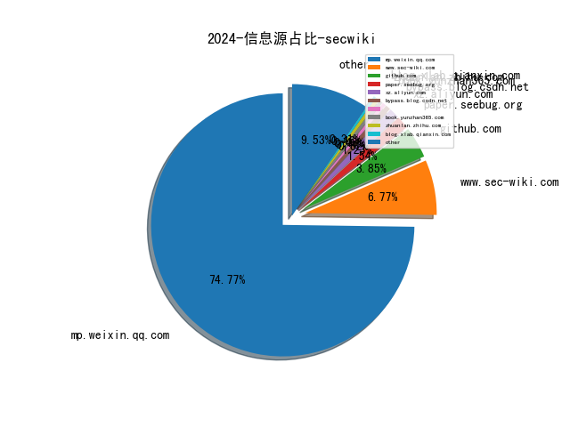
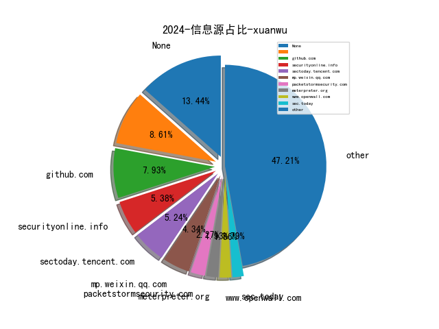
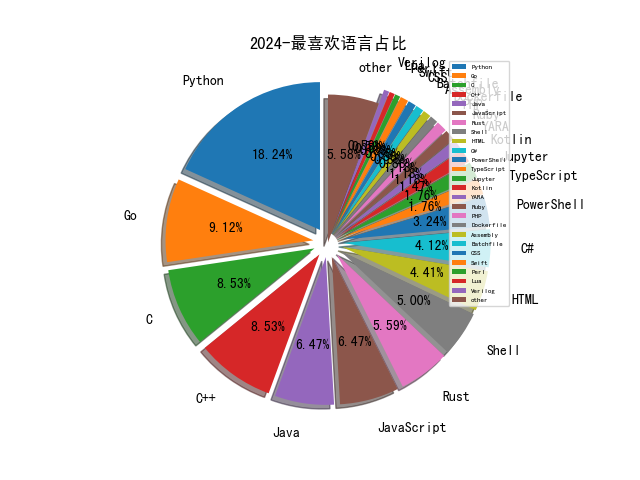

# [数据--所有](README_20.md)
# [数据--年度](README_2024.md)
# 2024 信息源与信息类型占比

# 政策 推荐
| title | url| 
| --- | ---| 
| 工业和信息化部主责国家重点研发计划重点专项管理实施细则 | https://www.miit.gov.cn/gyhxxhb/jgsj/gxjss/wjfb/art/2024/art_e13533ef46b84f00ac360d85e453bcf8.html| 
| 《电力监控 系统安全防护规定》（公开征求意见稿） | https://yyglxxbsgw.ndrc.gov.cn/htmls/article/article.html?articleId=2c97d16c-9091ccb0-0190-e78abe36-000d#iframeHeight=810| 
| 网络暴力信息治理规定 | https://www.cac.gov.cn/2024-06/14/c_1720043894161555.htm| 
| 信息化标准建设行动计划（2024—2027年） | https://www.cac.gov.cn/2024-05/29/c_1718573626118437.htm| 

# 网络安全书籍 推荐
| date_added | language | title | author | link | size| 
| --- | --- | --- | --- | --- | ---| 
| 2024-12-31 12:37:40 | English | Generative AI Apps with LangChain and Python | unknown | https://www.wowebook.org/generative-ai-apps-with-langchain-and-python/ | unknown| 
| 2024-12-31 10:08:54 | English | Principles of AI Governance and Model Risk Management | unknown | https://www.wowebook.org/principles-of-ai-governance-and-model-risk-management/ | unknown| 
| 2024-12-27 09:21:12 | English | Algorithmic Trading with Python: Fast-Track Your Trading Strategy: A comprehensive Guide | Bisette, Vincent; Strauss, Johann; Schwartz, Alice; Van Der Post, Hayden | http://libgen.is/book/index.php?md5=A58E85649276B4EED9CE62AEC78BAFB8 | 2 MB [EPUB]| 
| 2024-12-27 04:51:16 | English | The Public Speaking Playbook | Teri Kwal Gamble, Michael W. Gamble | http://libgen.is/book/index.php?md5=F2BBA93197F948499B0A2375494F1DAC | 29 MB [PDF]| 
| 2024-12-26 04:04:16 | English | Automotive Rust Repair & Prevention | Dennis W. Parks | http://libgen.is/book/index.php?md5=75E8302E921D328995D21070C9AC50E8 | 29 MB [PDF]| 
| 2024-12-26 16:32:37 | English | Software Testing with Generative AI | unknown | https://www.wowebook.org/software-testing-with-generative-ai/ | unknown| 
| 2024-12-24 06:01:01 | English | Mastering Microsoft 365 and SharePoint Online | unknown | https://www.wowebook.org/mastering-microsoft-365-and-sharepoint-online/ | unknown| 
| 2024-12-23 14:48:24 | English | Mastering Windows 365: Deploy and Manage Cloud PCs and Windows 365 Link devices, Copilot with Intune, and Intune Suite | Christiaan Brinkhoff, Sandeep Patnaik, Morten Pedholt | http://libgen.is/book/index.php?md5=5F52134ED48D374182DC76169BA3B831 | 83 MB [PDF]| 
| 2024-12-21 10:10:31 | English | The Kubernetes Bible, 2nd Edition | unknown | https://www.wowebook.org/the-kubernetes-bible-2nd-edition/ | unknown| 
| 2024-12-21 08:36:53 | English | Coding with ChatGPT and Other LLMs | unknown | https://www.wowebook.org/coding-with-chatgpt-and-other-llms/ | unknown| 
| 2024-12-20 07:12:02 | English | Learn Python Programming, 4th Edition | unknown | https://www.wowebook.org/learn-python-programming-4th-edition/ | unknown| 
| 2024-12-17 21:44:18 | English | Comics and the Body: Drawing, Reading, and Vulnerability | Eszter Szép | http://libgen.is/book/index.php?md5=F794615FE9FBF98092D8335EFD4ED0F8 | 7 MB [PDF]| 
| 2024-12-17 18:21:02 | English | Take Control of iOS & iPadOS Privacy and Security | Glenn Fleishman | http://libgen.is/book/index.php?md5=26B6B1BD19E45E64C5F9657AB4AD9798 | 18 MB [EPUB]| 
| 2024-12-17 23:33:37 | English | Logs and Telemetry: Using Fluent Bit, Kubernetes, streaming and more | Phil Wilkins | http://libgen.is/book/index.php?md5=1C7713A4A8670BB3844A254FE706780B | 13 MB [EPUB]| 
| 2024-12-16 12:05:19 | English | (Springer Undergraduate Texts in Mathematics and Technology) Computation and Simulation for Finance: An Introduction with Python | Cónall Kelly | http://libgen.is/book/index.php?md5=2E6CEF356FF81E62FED28A8FF48F1822 | 13 MB [PDF]| 
| 2024-12-15 15:58:01 | English | Hands-On Generative AI with Transformers and Diffusion Models | Omar Sanseviero, Pedro Cuenca, Apolinário Passos, Jonathan Whitaker | http://libgen.is/book/index.php?md5=29D6A564953FE4341A2F2B27054CB931 | 131 MB [PDF]| 
| 2024-12-15 14:21:57 | English | Secret Key Cryptography: Ciphers, from simple to unbreakable | Frank Rubin | http://libgen.is/book/index.php?md5=A6FB322E53ED42F7A9DF0BB7D5243208 | 7 MB [PDF]| 
| 2024-12-15 20:00:22 | English | (Springer Proceedings in Mathematics & Statistics, Volume 468) Mathematics of Computer Science, Cybersecurity and Artificial Intelligence | Cheikh Thiecoumba Gueye, Papa Ngom, Idy Diop (Eds.) | http://libgen.is/book/index.php?md5=C5AD750AC1E7B7B365BE9E3EAC2238F0 | 8 MB [PDF]| 
| 2024-12-15 18:40:08 | English | Cybersecurity: Technology and Governance | Audun Jøsang | http://libgen.is/book/index.php?md5=6837D9F6D5A386ED3995768C985355FB | 16 MB [PDF]| 
| 2024-12-15 21:44:39 | English | In Defense of Common Life: The Political Thought of Raquel Gutiérrez Aguilar | Raquel Gutiérrez Aguilar; Brian Whitener (editor) | http://libgen.is/book/index.php?md5=5D1AFB9B0BEC3557852A3079620DFE50 | 1 MB [EPUB]| 
| 2024-12-15 08:50:16 | English | Hands-On Generative AI with Transformers and Diffusion Models | unknown | https://www.wowebook.org/hands-on-generative-ai-with-transformers-and-diffusion-models/ | unknown| 
| 2024-12-15 08:06:30 | English | The Cybersecurity Trinity: Artificial Intelligence, Automation, and Active Cyber Defense | unknown | https://www.wowebook.org/the-cybersecurity-trinity-artificial-intelligence-automation-and-active-cyber-defense/ | unknown| 
| 2024-12-15 15:12:05 | English | Modern Business Analytics: Increasing the Value of Your Data with Python and R | unknown | https://www.wowebook.org/modern-business-analytics-increasing-the-value-of-your-data-with-python-and-r/ | unknown| 
| 2024-12-14 02:42:56 | English | The Quantitative Risk Management Exercise Book | Marius Hofert, Rüdiger Frey, Alexander J. McNeil | http://libgen.is/book/index.php?md5=4375D1C10FE08FF3A375F22BF055501B | 2 MB [PDF]| 
| 2024-12-11 14:43:53 | English | Cloud Observability with Azure Monitor | unknown | https://www.wowebook.org/cloud-observability-with-azure-monitor/ | unknown| 
| 2024-12-10 07:14:43 | English | DevOps Unleashed with Git and GitHub | Yuki Hattori | http://libgen.is/book/index.php?md5=1FAB97051493A971D0A27A2AF1FBC317 | 9 MB [PDF]| 
| 2024-12-10 06:57:27 | English | Django 5 for the Impatient: Learn the core concepts of Django to develop Python web applications | Daniel Correa; Greg Lim | http://libgen.is/book/index.php?md5=B04E91EB5CE424979A7880CA5199B4E9 | 7 MB [PDF]| 
| 2024-12-10 02:59:00 | English | Making Europe Unconquerable: The Potential of Civilian-Based Deterrence and Defense | Gene Sharp | http://libgen.is/book/index.php?md5=85BF56B8925870D19B9037F4EC048B72 | 5 MB [PDF]| 
| 2024-12-10 02:01:20 | English | Civilian-Based Defense: A Post-Military Weapons System | Gene Sharp | http://libgen.is/book/index.php?md5=2C76B606161466DCC48B762A38EF3BD0 | 4 MB [PDF]| 
| 2024-12-10 02:01:10 | English | National Security Through Civilian-Based Defense | Gene Sharp | http://libgen.is/book/index.php?md5=4A6CFA057980DD5DEDC29FFBB14D5AB4 | 2 MB [PDF]| 
| 2024-12-10 07:37:05 | English | (For Dummies: Learning Made Easy) Python All-in-One For Dummies | John C. Shovic, Alan Simpson | http://libgen.is/book/index.php?md5=7F07DCC8EE929B72C94844FA5E6C32D1 | 42 MB [PDF]| 
| 2024-12-10 07:34:59 | English | Geocomputation with Python | Dorman, Michael; Graser, Anita; Nowosad, Jakub; Lovelace, Robin | http://libgen.is/book/index.php?md5=7FD4F931DBCDBA29CDC9A7F0D981AA05 | 10 MB [EPUB]| 
| 2024-12-10 07:34:46 | English | (lermArte, 27) A Second Mona Lisa? Challenges of Attribution and Authentication and Various Possibilities for Evaluating a Work of Art | Salvatore Lorusso, Andrea Natali | http://libgen.is/book/index.php?md5=5ADC1E89C54207C320DB6C05138C34A6 | 18 MB [PDF]| 
| 2024-12-08 08:30:55 | English | DevOps Simplified: Zero-Maintenance Strategies for AWS EKS | unknown | https://www.wowebook.org/devops-simplified-zero-maintenance-strategies-for-aws-eks/ | unknown| 
| 2024-12-08 08:18:38 | English | So You Want to Work in Crypto | unknown | https://www.wowebook.org/so-you-want-to-work-in-crypto/ | unknown| 
| 2024-12-08 06:42:17 | English | Generative AI in Banking Financial Services and Insurance | unknown | https://www.wowebook.org/generative-ai-in-banking-financial-services-and-insurance/ | unknown| 
| 2024-12-08 09:01:55 | English | Full Stack Development with Microsoft Blazor, 4th Edition | unknown | https://www.wowebook.org/full-stack-development-with-microsoft-blazor-4th-edition/ | unknown| 
| 2024-12-07 17:44:18 | English | CompTIA A+ Certification Companion: Hands-on Preparation and Practice for Exams 220-1101 & 220-1102 | unknown | https://www.wowebook.org/comptia-a-certification-companion-hands-on-preparation-and-practice-for-exams-220-1101-220-1102/ | unknown| 
| 2024-12-07 18:27:18 | English | Automated Data Analytics : Combining Human Creativity and AI Power using ChatGPT | Soraya Sedkaoui; | http://libgen.is/book/index.php?md5=2B0AFBD80018A0079E5B89B3A2BCF04C | 2 MB [EPUB]| 
| 2024-12-07 18:01:55 | English | The Sword and the Olive: A Critical History of the Israeli Defense Force | Martin van Creveld | http://libgen.is/book/index.php?md5=C34308C47AE324E9016201EB21CE0B3A | 70 MB [PDF]| 
| 2024-12-05 22:04:56 | English | Mastering Spring AI: The Java Developer’s Guide for Large Language Models and Generative AI | unknown | https://www.wowebook.org/mastering-spring-ai-the-java-developers-guide-for-large-language-models-and-generative-ai/ | unknown| 
| 2024-12-05 21:19:27 | English | Hacking MySQL: Breaking, Optimizing, and Securing MySQL for Your Use Case | unknown | https://www.wowebook.org/hacking-mysql-breaking-optimizing-and-securing-mysql-for-your-use-case/ | unknown| 
| 2024-12-05 18:20:35 | English | Full Stack Development with Microsoft Blazor | Peter Himschoot | http://libgen.st/book/index.php?md5=993A13934BEB290011841638C70A9786 | 19 MB [PDF]| 
| 2024-12-03 08:13:34 | English | Quick Start Guide to Large Language Models: Strategies and Best Practices for Using ChatGPT and Other LLMs | unknown | https://www.wowebook.org/quick-start-guide-to-large-language-models-strategies-and-best-practices-for-using-chatgpt-and-other-llms/ | unknown| 
| 2024-12-02 08:39:26 | English | Building Applications with Large Language Models | unknown | https://www.wowebook.org/building-applications-with-large-language-models/ | unknown| 
| 2024-12-01 08:32:06 | English | MCQ for Python Users | unknown | https://www.wowebook.org/mcq-for-python-users/ | unknown| 
| 2024-12-01 07:16:26 | English | Working Smarter with Microsoft Project | unknown | https://www.wowebook.org/working-smarter-with-microsoft-project/ | unknown| 
| 2024-12-01 01:51:43 | English | How to Undertake Surveillance and Reconnaissance: From a Civilian and Military Perspective | Hank Prunckun | http://libgen.st/book/index.php?md5=10E4E480DF83D60BCFCB05B1F7621B4A | 26 MB [PDF]| 
| 2024-11-30 19:43:36 | English | Machine Learning and Generative AI for Marketing | Yoon Hyup Hwang;Nicholas C. Burtch; | http://libgen.st/book/index.php?md5=462A0905B851883E12B67328912AD249 | 22 MB [EPUB]| 
| 2024-11-30 19:34:52 | English | Essential Python Programming For Game Development : Mastering Python Fundamentals, Game Logic, and Graphics Programming with Pygame and Panda3D for Aspiring ... (The Essential python workbooks Book 4) | Andrade , Wendell | http://libgen.st/book/index.php?md5=89B498447D5FE913C0A364A4D677BA19 | 963 kB [EPUB]| 
| 2024-11-30 19:34:31 | English | Python Programming For Cybersecurity With PyShark And Cryptography: A Hands-On Beginners Guide To Leveraging PyShark for Network Traffic Analysis and Cryptography for Secure Communication | Caldwell, Alex | http://libgen.st/book/index.php?md5=B2C3E68DEBC257FD1437DC7BFD0F9305 | 512 kB [EPUB]| 
| 2024-11-28 11:47:09 | English | Outlier Detection in Python | unknown | https://www.wowebook.org/outlier-detection-in-python/ | unknown| 
| 2024-11-28 06:38:58 | English | Microsoft Copilot for Power Apps | unknown | https://www.wowebook.org/microsoft-copilot-for-power-apps/ | unknown| 
| 2024-11-26 07:16:50 | English | Beginning ChatGPT for Python | unknown | https://www.wowebook.org/beginning-chatgpt-for-python/ | unknown| 
| 2024-11-26 23:22:47 | English | Python Machine Learning By Example | Yuxi (Hayden) Liu; | http://libgen.st/book/index.php?md5=143AADF706A620D20916160319321B2E | 19 MB [EPUB]| 
| 2024-11-25 10:02:29 | English | A Common-Sense Guide to Data Structures and Algorithms in Python, Volume 1: Level Up Your Core Programming Skills | Jay Wengrow | http://libgen.st/book/index.php?md5=C0A46C67BB2536AA545EC1BD7065E742 | 12 MB [PDF]| 
| 2024-11-24 16:34:23 | English | Generative AI for Web Development : Building Web Applications Powered by OpenAI APIs and Next.js | Tom Auger; Emma Saroyan | http://libgen.st/book/index.php?md5=92923A36367E4D8267ACB5EF0A349F2A | 8 MB [EPUB]| 
| 2024-11-24 16:32:20 | English | Cloud Observability with Azure Monitor | José Ángel Fernández, Manuel Lázaro Ramírez | http://libgen.st/book/index.php?md5=BFC77C34655D6CFA00978952137E1E52 | 7 MB [PDF]| 
| 2024-11-24 08:45:28 | English | Road to Kubernetes | unknown | https://www.wowebook.org/road-to-kubernetes/ | unknown| 
| 2024-11-23 19:56:36 | English | Generative AI for Web Development | unknown | https://www.wowebook.org/generative-ai-for-web-development/ | unknown| 
| 2024-11-21 06:46:08 | English | Supply Chain Software Security | unknown | https://www.wowebook.org/supply-chain-software-security/ | unknown| 
| 2024-11-21 06:29:05 | English | Deep Dive into the Power Platform in the Age of Generative AI | unknown | https://www.wowebook.org/deep-dive-into-the-power-platform-in-the-age-of-generative-ai/ | unknown| 
| 2024-11-21 06:16:15 | English | Optimizing Generative AI Workloads for Sustainability | unknown | https://www.wowebook.org/optimizing-generative-ai-workloads-for-sustainability/ | unknown| 
| 2024-11-21 08:56:07 | English | Learn Data Science Using Python | unknown | https://www.wowebook.org/learn-data-science-using-python/ | unknown| 
| 2024-11-20 15:25:18 | English | AI and Emerging Technologies: Automated Decision-Making, Digital Forensics, and Ethical Considerations | Purvi Pokhariyal (editor), Archana Patel (editor), Shubham Pandey (editor) | http://libgen.st/book/index.php?md5=2E87859338BC7CBADB10299315B1AFD0 | 4 MB [PDF]| 
| 2024-11-20 15:27:37 | English | Qualitative Data Analysis With Chatgpt And Qualcoder: A Step-By-Step Guide To AI-Powered Coding And Thematic Analysis (Mastering Research: Design, Execution, and Publishing Made Simple) | Rafiq Muhammad | http://libgen.st/book/index.php?md5=2EBB009DF16C1F60CFD85BFAF1C9273C | 2 MB [EPUB]| 
| 2024-11-20 16:25:28 | English | Investigating the Role of ChatGPT in Supporting Metacognitive Processes During Problem‐Solving Activities | unknown | http://libgen.st/book/index.php?md5=A2157026779983FD8DD75EF7F647860E | 1 MB [PDF]| 
| 2024-11-19 06:03:33 | English | Learn Python Generative AI | unknown | https://www.wowebook.org/learn-python-generative-ai/ | unknown| 
| 2024-11-19 05:52:23 | English | Mastering Large Language Models | unknown | https://www.wowebook.org/mastering-large-language-models/ | unknown| 
| 2024-11-19 07:31:55 | English | Ultimate Python Programming | unknown | https://www.wowebook.org/ultimate-python-programming/ | unknown| 
| 2024-11-19 07:20:38 | English | Mastering Python 3 Programming | unknown | https://www.wowebook.org/mastering-python-3-programming/ | unknown| 
| 2024-11-18 08:50:09 | English | Effective Python: 125 Specific Ways to Write Better Python, 3rd Edition | unknown | https://www.wowebook.org/effective-python-125-specific-ways-to-write-better-python-3rd-edition/ | unknown| 
| 2024-11-18 17:32:28 | English | Python Apps on Visual Studio Code | unknown | https://www.wowebook.org/python-apps-on-visual-studio-code/ | unknown| 
| 2024-11-18 16:58:50 | English | Advanced Python Guide | unknown | https://www.wowebook.org/advanced-python-guide/ | unknown| 
| 2024-11-18 16:21:54 | English | Ultimate Data Science Programming in Python | unknown | https://www.wowebook.org/ultimate-data-science-programming-in-python/ | unknown| 
| 2024-11-16 09:26:29 | English | Microsoft Power Platform For Dummies | Jack A. Hyman | http://libgen.st/book/index.php?md5=4632253D6649D23A4F444FA702849AC9 | 25 MB [PDF]| 
| 2024-11-16 09:28:14 | English | Deep Dive into the Power Platform in the Age of Generative AI: Architectural Insights and Best Practices for Intelligent Business Solutions | Biswa Pujarini Mohapatra | http://libgen.st/book/index.php?md5=D1C4F1426509A823AF04AE86B09E28CE | 10 MB [PDF]| 
| 2024-11-16 23:56:33 | English | Hands-On Prescriptive Analytics: Optimizing Your Decision Making with Python | Walter R. Paczkowski | http://libgen.st/book/index.php?md5=B7ADC999BF59D9AF894D592A84FD70CE | 15 MB [PDF]| 
| 2024-11-14 20:11:14 | English | ChatGPT and AI for Accountants | Scott Dell, Mfon Akpan | http://libgen.st/book/index.php?md5=9E1EFC37FCC45B9E12F6114017EEDB17 | 2 MB [EPUB]| 
| 2024-11-14 07:22:47 | English | Microsoft 365 Administration Cookbook, 2nd Edition | unknown | https://www.wowebook.org/microsoft-365-administration-cookbook-2nd-edition/ | unknown| 
| 2024-11-14 06:24:06 | English | Mastering OpenTelemetry and Observability: Enhancing Application and Infrastructure Performance and Avoiding Outages | unknown | https://www.wowebook.org/mastering-opentelemetry-and-observability-enhancing-application-and-infrastructure-performance-and-avoiding-outages/ | unknown| 
| 2024-11-14 06:02:26 | English | Async Rust: Unleashing the Power of Fearless Concurrency | unknown | https://www.wowebook.org/async-rust-unleashing-the-power-of-fearless-concurrency/ | unknown| 
| 2024-11-13 08:12:25 | English | Generative AI in Education | unknown | https://www.wowebook.org/generative-ai-in-education/ | unknown| 
| 2024-11-13 12:00:29 | English | Design and Deploy IoT Network & Security with Microsoft Azure | unknown | https://www.wowebook.org/design-and-deploy-iot-network-security-with-microsoft-azure/ | unknown| 
| 2024-11-12 05:34:04 | English | Powerful Python: Patterns and Strategies with Modern Python | unknown | https://www.wowebook.org/powerful-python-patterns-and-strategies-with-modern-python/ | unknown| 
| 2024-11-10 05:22:52 | English | Rust For Database: A Comprehensive Guide to Building Scalable, Reliable, and Secure Database Applications with Rust, for Developers and Database Administrators | Radcliffe, Patrick | http://libgen.st/book/index.php?md5=D3A9459385A137F8D51CE917DE9CDD65 | 349 kB [EPUB]| 
| 2024-11-10 13:24:50 | English | Health and Safety: Risk Management | Tony Boyle, Fiona Charlton | http://libgen.st/book/index.php?md5=0A1C5B93C930BF446CBDF090202BC05B | 11 MB [PDF]| 
| 2024-11-10 09:24:55 | English | Prompt Engineering for LLMs | unknown | https://www.wowebook.org/prompt-engineering-for-llms/ | unknown| 
| 2024-11-09 20:10:12 | English | Python Programming for Mathematics | Guillod, Julien | http://libgen.st/book/index.php?md5=D273B997F81D6F8AED737D183103ABD2 | 6 MB [EPUB]| 
| 2024-11-09 20:09:20 | English | Powerful Python (for Raymond Rhine) | Aaron Maxwell | http://libgen.st/book/index.php?md5=FEB01601F4EC620AA80851942EC662C0 | 2 MB [EPUB]| 
| 2024-11-09 20:06:10 | English | You Don’t Need a £1Million Cybersecurity Budget | Oosthuizen, Izak | http://libgen.st/book/index.php?md5=B1D5AEFC16B8A25B55B981E44169F3BB | 1 MB [EPUB]| 
| 2024-11-09 20:15:52 | English | Theres No Such Thing as Crypto Crime : An Investigative Handbook | Nick Furneaux | http://libgen.st/book/index.php?md5=7C97223CFF87256B1772AFF8F940821A | 28 MB [EPUB]| 
| 2024-11-08 09:48:45 | English | Microsoft Power Apps Cookbook, 3rd Edition | unknown | https://www.wowebook.org/microsoft-power-apps-cookbook-3rd-edition/ | unknown| 
| 2024-11-08 08:57:09 | English | Modern Time Series Forecasting with Python, 2nd Edition | unknown | https://www.wowebook.org/modern-time-series-forecasting-with-python-2nd-edition/ | unknown| 
| 2024-11-08 06:58:13 | English | Microsoft Cybersecurity Architect Exam Ref SC-100, 2nd Edition | unknown | https://www.wowebook.org/microsoft-cybersecurity-architect-exam-ref-sc-100-2nd-edition/ | unknown| 
| 2024-11-07 08:03:00 | English | Microsoft 365 Certified: Collaboration Communications Systems Engineer Associate Certification Companion | unknown | https://www.wowebook.org/microsoft-365-certified-collaboration-communications-systems-engineer-associate-certification-companion/ | unknown| 
| 2024-11-05 20:15:13 | English | Microsoft 365 Certified: Collaboration Communications Systems Engineer Associate Certification Companion : A Guide to Prepare for Exam MS-721 | Fabrizio Volpe | http://libgen.st/book/index.php?md5=9313AE77C205F9DB7A8DBD5DEB064592 | 6 MB [EPUB]| 
| 2024-11-05 19:22:15 | English | Gene Flow: Monitoring, Modelling and Mitigation | Wei Wei PhD (editor), Neal Stewart PhD (editor) | http://libgen.st/book/index.php?md5=6B6061625103B423F9F7D056F3F03831 | 12 MB [PDF]| 
| 2024-11-05 19:13:16 | English | Prompt Engineering for LLMs (for True Epub) | John Berryman and Albert Ziegler | http://libgen.st/book/index.php?md5=A01DADF08241D9DE7287171271C1CFC5 | 11 MB [EPUB]| 
| 2024-11-04 05:42:47 | English | beginners guide to streamlit with python | unknown | https://it-ebooks.info/book/1686051862-beginners_guide_to_streamlit_with_python/ | unknown| 
| 2024-11-04 05:42:47 | English | firewalls dont stop dragons 5th edition | unknown | https://it-ebooks.info/book/1686052309-firewalls_dont_stop_dragons_5th_edition/ | unknown| 
| 2024-11-04 06:16:19 | English | Application Lifecycle Management on Microsoft Power Platform | unknown | https://www.wowebook.org/application-lifecycle-management-on-microsoft-power-platform/ | unknown| 
| 2024-11-03 16:27:52 | English | Introduction to Number Theory & Cryptography: The Foundation of Digital Security (With 400+ Practice Questions for Undergraduates and Graduates) | Cristen Weldon | http://libgen.st/book/index.php?md5=F29BF940B8991899B7CD7EC716C4B755 | 12 MB [PDF]| 
| 2024-11-03 16:15:13 | English | Mastering Python: A Comprehensive Crash Course for Beginners | Hussain, Frahaan; Hussain, Kameron | http://libgen.st/book/index.php?md5=F584A1B9E1B817E0D4345228681B1685 | 548 kB [EPUB]| 
| 2024-11-03 16:14:31 | English | Object-Oriented Python: Master OOP through Game Development and GUI Applications | Kameron Hussain | http://libgen.st/book/index.php?md5=32FD1140D66F95C5C34C9281A81B2C02 | 499 kB [EPUB]| 
| 2024-11-03 14:41:09 | English | Unveiling NIST Cybersecurity Framework 2.0 | unknown | https://www.wowebook.org/unveiling-nist-cybersecurity-framework-2-0/ | unknown| 
| 2024-11-02 09:57:15 | English | Decoding Large Language Models | unknown | https://www.wowebook.org/decoding-large-language-models/ | unknown| 
| 2024-11-02 04:41:35 | English | PYTHON OBJECT-ORIENTED PROGRAMMING: Adventures with Python and Processing Playground | BM, Roger | http://libgen.st/book/index.php?md5=3963E1D4C150410CD420FDF3A1E175F4 | 13 MB [EPUB]| 
| 2024-11-02 04:40:13 | English | Engineering AI Systems: Architecture and DevOps Essentials (for Raymond Rhine) | Len Bass; Qinghua Lu; Ingo Weber; Liming Zhu | http://libgen.st/book/index.php?md5=60ED4AFFFFF9A67EE410F785C4960E5A | 4 MB [EPUB]| 
| 2024-11-01 20:15:20 | English | Artificial Intelligence for Cybersecurity | unknown | https://www.wowebook.org/artificial-intelligence-for-cybersecurity/ | unknown| 
| 2024-11-01 11:33:53 | English | Programming Microsoft Dynamics 365 Business Central, 7th Edition | unknown | https://www.wowebook.org/programming-microsoft-dynamics-365-business-central-7th-edition/ | unknown| 
| 2024-11-01 06:23:25 | English | Enhancing Your Cloud Security with a CNAPP Solution | unknown | https://www.wowebook.org/enhancing-your-cloud-security-with-a-cnapp-solution/ | unknown| 
| 2024-10-31 10:17:53 | English | The Cybersecurity Mesh Architecture : Composable, flexible, and scalable security approach for a resilient security ecosystem | Tarun Kumar | http://libgen.st/book/index.php?md5=103FA1558B1F23043C84B5ED241E8331 | 8 MB [EPUB]| 
| 2024-10-31 10:08:05 | English | Ultimate Data Science Programming in Python : Master data science libraries with 300+ programs, 2 projects, and EDA GUI tools | Saurabh Chandrakar | http://libgen.st/book/index.php?md5=EE93202538EA85EDAB9B4A9EF8D613A2 | 13 MB [EPUB]| 
| 2024-10-31 15:53:35 | English | The Developers Playbook for Large Language Model Security: Building Secure AI Applications | Steve Wilson | http://libgen.st/book/index.php?md5=6BC32F6D876667EDA7E85EB0218ACD7C | 5 MB [PDF]| 
| 2024-10-30 06:00:22 | English | Copilot for Microsoft 365 | unknown | https://www.wowebook.org/copilot-for-microsoft-365/ | unknown| 
| 2024-10-30 05:42:07 | English | ChatGPT for Marketing | unknown | https://www.wowebook.org/chatgpt-for-marketing/ | unknown| 
| 2024-10-30 07:18:24 | English | Introduction to Python and Large Language Models | unknown | https://www.wowebook.org/introduction-to-python-and-large-language-models/ | unknown| 
| 2024-10-30 07:02:51 | English | Boardroom Cybersecurity | unknown | https://www.wowebook.org/boardroom-cybersecurity/ | unknown| 
| 2024-10-30 06:40:25 | English | Information Security Incident and Data Breach Management | unknown | https://www.wowebook.org/information-security-incident-and-data-breach-management/ | unknown| 
| 2024-10-29 13:13:22 | English | (History Of Computing) History Of Cryptography And Cryptanalysis: Codes, Ciphers, And Their Algorithms | John F. Dooley | http://libgen.st/book/index.php?md5=6CE503F0F983B391E55347A1FA419277 | 22 MB [PDF]| 
| 2024-10-29 19:23:13 | English | ChatGPT and the Future of AI : The Deep Language Revolution | Terrence J. Sejnowski | http://libgen.st/book/index.php?md5=38B0B3F555B7F44CB6D78426E9F4DDD8 | 4 MB [EPUB]| 
| 2024-10-29 19:22:02 | English | ChatGPT for Marketing : Learn Practical Applications of ChatGPT for Marketing | Eldar Najafov | http://libgen.st/book/index.php?md5=A0D0B819584CC229595C674118F27386 | 362 kB [EPUB]| 
| 2024-10-29 18:47:23 | English | Practical Time Series Forecasting with R: A Hands-On Guide | Galit Shmueli, Kenneth C. Lichtendahl Jr | http://libgen.st/book/index.php?md5=B46F86EB0D81ADFF6343EA28688E8387 | 3 MB [MOBI]| 
| 2024-10-29 17:21:02 | English | Hands-On Blockchain for Python Developers, 2nd Edition | unknown | https://www.wowebook.org/hands-on-blockchain-for-python-developers-2nd-edition/ | unknown| 
| 2024-10-28 12:21:18 | English | AWS Security Cookbook, 2nd Edition | unknown | https://www.wowebook.org/aws-security-cookbook-2nd-edition/ | unknown| 
| 2024-10-28 22:58:45 | English | AWS Certified Security - Specialty: Study Guide: Covers Exam Objectives, Review Questions and Exam Preparation Quizzes | Zeal Vora | http://libgen.st/book/index.php?md5=3BAA0C21978555AB8652E0291816757A | 24 MB [PDF]| 
| 2024-10-23 11:18:55 | English | Comic Sans | Simon Garfield | http://libgen.st/book/index.php?md5=14697F9E546C4DB758FD7D2117114FF2 | 6 MB [EPUB]| 
| 2024-10-22 15:15:47 | English | Logs and Telemetry: Using Fluent Bit, Kubernetes, streaming and more | Phil Wilkins | http://libgen.st/book/index.php?md5=3B5C462D72D816478DE660F1AB6F2FD5 | 22 MB [PDF]| 
| 2024-10-22 08:24:24 | English | Cryptography | Panos Louridas | http://libgen.st/book/index.php?md5=7C4A06CA5680B9EA4F1B95BC54D54D88 | 2 MB [EPUB]| 
| 2024-10-22 07:54:26 | English | A Few Words in Defense of Our Country | Robert Hilburn | http://libgen.st/book/index.php?md5=9A6312AE7D289FF8F269452B8D6E1FE1 | 30 MB [EPUB]| 
| 2024-10-22 03:32:42 | English | The Lean Entrepreneurship Playbook | unknown | https://www.wowebook.org/the-lean-entrepreneurship-playbook/ | unknown| 
| 2024-10-18 06:04:06 | English | CCSP (ISC)2 Certified Cloud Security Professional Exam Guide | unknown | https://www.wowebook.org/ccsp-isc2-certified-cloud-security-professional-exam-guide/ | unknown| 
| 2024-10-18 05:45:21 | English | Certified Information Systems Security Professional (CISSP) Exam Guide | unknown | https://www.wowebook.org/certified-information-systems-security-professional-cissp-exam-guide/ | unknown| 
| 2024-10-17 05:40:50 | English | Learn AI-Assisted Python Programming, Second Edition | unknown | https://www.wowebook.org/learn-ai-assisted-python-programming-second-edition/ | unknown| 
| 2024-10-16 14:21:45 | English | (Advances in Digital Crime, Forensics, and Cyber Terrorism (ADCFCT)) Utilizing Generative AI for Cyber Defense Strategies | Noor Zaman Jhanjhi | http://libgen.st/book/index.php?md5=C7821EFF88DB853DA788C611DD5CE99A | 9 MB [PDF]| 
| 2024-10-16 07:47:39 | English | Modern Network Observability | unknown | https://www.wowebook.org/modern-network-observability/ | unknown| 
| 2024-10-14 17:03:47 | English | Rust Brain Teasers | unknown | https://www.wowebook.org/rust-brain-teasers/ | unknown| 
| 2024-10-11 10:38:25 | English | Python Testing with pytest, Second Edition | unknown | https://www.wowebook.org/python-testing-with-pytest-second-edition/ | unknown| 
| 2024-10-11 08:22:11 | English | Python Brain Teasers | unknown | https://www.wowebook.org/python-brain-teasers/ | unknown| 
| 2024-10-11 08:00:30 | English | Intuitive Python: Productive Development for Projects that Last | unknown | https://www.wowebook.org/intuitive-python-productive-development-for-projects-that-last/ | unknown| 
| 2024-10-11 07:39:13 | English | Pythonic Programming: Tips for Becoming an Idiomatic Python Programmer | unknown | https://www.wowebook.org/pythonic-programming-tips-for-becoming-an-idiomatic-python-programmer/ | unknown| 
| 2024-10-11 07:05:05 | English | Portable Python Projects | unknown | https://www.wowebook.org/portable-python-projects/ | unknown| 
| 2024-10-10 05:44:22 | English | Starting Data Analytics with Generative AI and Python | unknown | https://www.wowebook.org/starting-data-analytics-with-generative-ai-and-python/ | unknown| 
| 2024-10-10 17:19:54 | English | A Common-Sense Guide to Data Structures and Algorithms in Python, Volume 1 | unknown | https://www.wowebook.org/a-common-sense-guide-to-data-structures-and-algorithms-in-python-volume-1/ | unknown| 
| 2024-10-09 00:55:53 | English | Securing Home and Business: A Guide to the Electronic Security Industry | Simon Hakim, Erwin A. Blackstone | http://libgen.st/book/index.php?md5=C4C2C4639D242DD8E01608EB207D01B5 | 13 MB [PDF]| 
| 2024-10-09 06:15:04 | English | Security and Privacy for Modern Networks | unknown | https://www.wowebook.org/security-and-privacy-for-modern-networks/ | unknown| 
| 2024-10-08 07:43:26 | English | IDS and IPS with Snort 3 | unknown | https://www.wowebook.org/ids-and-ips-with-snort-3/ | unknown| 
| 2024-10-08 07:55:35 | English | Pentesting APIs | unknown | https://www.wowebook.org/pentesting-apis/ | unknown| 
| 2024-10-08 23:23:36 | English | Securing Enterprise Networks with Cisco Meraki (for Duc ka) | Ryan Chaney; Simerjit Singh | http://libgen.st/book/index.php?md5=21D18B1AF6A9C9159BB107C0CB585872 | 111 MB [EPUB]| 
| 2024-10-07 20:39:02 | English | Security and Privacy for Modern Networks: Strategies and Insights for Safeguarding Digital Infrastructures | Seshagirirao Lekkala | http://libgen.st/book/index.php?md5=6880CF41327C61E82A69C0F601909F30 | 2 MB [PDF]| 
| 2024-10-07 06:44:58 | English | Building AI Applications with OpenAI APIs | unknown | https://www.wowebook.org/building-ai-applications-with-openai-apis/ | unknown| 
| 2024-10-07 05:58:39 | English | Microsoft Azure AI Fundamentals AI-900 Exam Guide | unknown | https://www.wowebook.org/microsoft-azure-ai-fundamentals-ai-900-exam-guide/ | unknown| 
| 2024-10-07 22:58:28 | English | Python Data Cleaning and Preparation Best Practices | Maria Zervou | http://libgen.st/book/index.php?md5=67BDEC60756BDDF9C5AACF3706A63B01 | 13 MB [EPUB]| 
| 2024-10-07 22:52:40 | English | Offensive Security Using Python | Rejah Rehim , Manindar Mohan | http://libgen.st/book/index.php?md5=EE55A2158265078C9DDB38575E8E6B4F | 2 MB [EPUB]| 
| 2024-10-06 11:17:31 | English | Offensive Security Using Python | unknown | https://www.wowebook.org/offensive-security-using-python/ | unknown| 
| 2024-10-06 17:16:24 | English | RAG-Driven Generative AI | unknown | https://www.wowebook.org/rag-driven-generative-ai/ | unknown| 
| 2024-10-05 07:17:28 | English | Build a Website with ChatGPT | unknown | https://www.wowebook.org/build-a-website-with-chatgpt/ | unknown| 
| 2024-10-05 08:03:46 | English | Learn Generative AI with PyTorch | unknown | https://www.wowebook.org/learn-generative-ai-with-pytorch/ | unknown| 
| 2024-10-04 09:25:59 | English | Building AI Applications with OpenAI APIs: Leverage ChatGPT, Whisper, and DALL-E APIs to build 10 innovative AI, 2nd Edition | Martin Yanev | http://libgen.st/book/index.php?md5=1372DE245C92309DCA7422D3075C4CF8 | 5 MB [EPUB]| 
| 2024-10-03 07:29:20 | English | Critical Security Controls for Effective Cyber Defense | unknown | https://www.wowebook.org/critical-security-controls-for-effective-cyber-defense/ | unknown| 
| 2024-10-03 13:13:25 | English | Routledge Handbook on Cultural Heritage and Disaster Risk Management | Rohit Jigyasu (editor), Ksenia Chmutina (editor) | http://libgen.st/book/index.php?md5=6040389CE70058DB56F90C72EA497865 | 8 MB [PDF]| 
| 2024-10-03 13:09:14 | English | Scientific Data: A 50 Steps Guide using Python (De Gruyter Textbook) | Matthias Josef Hofmann | http://libgen.st/book/index.php?md5=7B97F048C0DCBCD71DE44D33CE7170A6 | 20 MB [PDF]| 
| 2024-10-03 13:05:24 | English | (National Bureau of Economic Research Conference Report) The Economics of Privacy | Avi Goldfarb, Catherine E. Tucker | http://libgen.st/book/index.php?md5=EE511D75EBC04057696B5F7646F26FDE | 7 MB [EPUB]| 
| 2024-10-02 08:27:08 | English | Idiomatic Rust: Code like a Rustacean | Brenden Matthews | http://libgen.st/book/index.php?md5=C502C8F43F373F0882D472A15168F255 | 7 MB [EPUB]| 
| 2024-10-02 11:53:30 | English | AI-Powered Developer: Build software with ChatGPT and Copilot | Nathan B. Crocker | http://libgen.st/book/index.php?md5=E55B4F3EB6EAB9F07792AED60810BA2F | 15 MB [EPUB]| 
| 2024-10-02 11:14:38 | English | Generative AI in Action (Final Release) | Amit Bahree | http://libgen.st/book/index.php?md5=E214C3623EE2A6F3BFFFF239A4DFDF1F | 29 MB [PDF]| 
| 2024-10-02 10:44:24 | English | Scientific Data: A 50 Steps Guide using Python | Matthias Hofmann | http://libgen.st/book/index.php?md5=D2B5F556C51C322D3C1290596E1EE181 | 12 MB [EPUB]| 
| 2024-10-02 10:39:48 | English | Generative AI and ChatGPT For Beginners: A Comprehensive Guide to Harness the Power of AI, Boost Productivity, and Get More Done in Less Time (Tech Mastery) | Sebhastian, Nathan | http://libgen.st/book/index.php?md5=844CB9673C57335FB0C9E9AAE0D870E7 | 9 MB [EPUB]| 
| 2024-10-02 18:14:21 | English | Numerical Python: Scientific Computing and Data Science Applications with Numpy, SciPy and Matplotlib, 3rd Edition | unknown | https://www.wowebook.org/numerical-python-scientific-computing-and-data-science-applications-with-numpy-scipy-and-matplotlib-3rd-edition/ | unknown| 
| 2024-09-30 02:59:51 | English | Language, Interaction, and Frontotemporal Dementia: Reverse Engineering the Social Mind | Andrea W Mates, Andrea W. Mates (editor), Lisa Mikesell (editor), Michael Sean Smith (editor) | http://libgen.st/book/index.php?md5=C5FDAA4F68BF9561E8FC8DAFC708771A | 6 MB [PDF]| 
| 2024-09-29 18:32:24 | English | Beyond The Little Blue Box: The Biographical Adventure of John T Draper (Aka Captain Crunch). Notorious phone Phreak, Legendary Internet Pioneer and Ardent Privacy Advocate | Mr John T Draper, Mr C Wilson Fraser | http://libgen.st/book/index.php?md5=F07FEC00DAB25DF4A6A124F3C155AC21 | 888 kB [EPUB]| 
| 2024-09-29 13:56:40 | English | Unlocking Data with Generative AI and RAG | unknown | https://www.wowebook.org/unlocking-data-with-generative-ai-and-rag/ | unknown| 
| 2024-09-29 12:44:28 | English | Resilient Cybersecurity | unknown | https://www.wowebook.org/resilient-cybersecurity/ | unknown| 
| 2024-09-29 11:37:04 | English | Python Data Cleaning and Preparation Best Practices | unknown | https://www.wowebook.org/python-data-cleaning-and-preparation-best-practices/ | unknown| 
| 2024-09-28 13:27:22 | English | Practical cryptography algorithms and implementations using C++ | Saiful Azad, Al-Sakib Khan Pathan, edited by Saiful Azad, Al-Sakib Khan Pathan, Saiful Islam Azad | http://libgen.st/book/index.php?md5=AA9B601F4741ED778D83BE336098B109 | 54 MB [PDF]| 
| 2024-09-28 09:46:28 | English | Critical Security Controls for Effective Cyber Defense: A Comprehensive Guide to CIS 18 Controls | Jason Edwards | http://libgen.st/book/index.php?md5=DE61E881B395F69E74F7A62B4928C003 | 4 MB [EPUB]| 
| 2024-09-28 09:41:16 | English | Critical Security Controls for Effective Cyber Defense | Jason Edwards | http://libgen.st/book/index.php?md5=6DDA11495F5DD49301EC00F630B6873A | 3 MB [PDF]| 
| 2024-09-28 09:39:17 | English | The Negotiation Playbook : Strategies That Work and Results That Last | Glin Bayley | http://libgen.st/book/index.php?md5=70A8B8B5A267B3F57C5BE9459911109E | 797 kB [EPUB]| 
| 2024-09-27 21:51:13 | English | Data Engineering for Machine Learning Pipelines: From Python Libraries to ML Pipelines and Cloud Platforms | Pavan Kumar Narayanan | http://libgen.st/book/index.php?md5=9E2E6977D36052F3BB4918E99037EA94 | 33 MB [PDF]| 
| 2024-09-27 21:49:38 | English | Numerical Python: Scientific Computing and Data Science Applications with Numpy, SciPy and Matplotlib | Robert Johansson | http://libgen.st/book/index.php?md5=F180FD61A0AAC737C24F74401D8B5EE3 | 24 MB [PDF]| 
| 2024-09-27 21:11:41 | English | Open-Source Security Operations Center (SOC) : A Complete Guide to Establishing, Managing, and Maintaining a Modern SOC | Alfred Basta; Nadine Basta; Waqar Anwar; Mohammad Ilyas Essar | http://libgen.st/book/index.php?md5=1651022C934D1AB51B092052A5F0C498 | 2 MB [EPUB]| 
| 2024-09-27 06:39:40 | English | Data Visualization with Microsoft Power BI | unknown | https://www.wowebook.org/data-visualization-with-microsoft-power-bi/ | unknown| 
| 2024-09-25 12:12:17 | English | Cybersecurity Essentials: Practical Tools for Today’s Digital Defenders | unknown | https://www.wowebook.org/cybersecurity-essentials-practical-tools-for-todays-digital-defenders/ | unknown| 
| 2024-09-24 11:31:59 | English | CompTIA Tech+ Study Guide: Exam FC0-U71 (Sybex Study Guide) | Quentin Docter | http://libgen.rs/book/index.php?md5=04321DDFCA5EEA6409A8494100BA7781 | 30 MB [PDF]| 
| 2024-09-24 11:00:16 | English | (ICSA Book Series in Statistics) Modeling Binary Correlated Responses: Using SAS, SPSS, R and STATA | Jeffrey R. Wilson, Kent A. Lorenz, Lori P. Selby | http://libgen.rs/book/index.php?md5=94673668976475989A8C096AF293B0E8 | 14 MB [PDF]| 
| 2024-09-24 13:53:32 | English | Supremacy : AI, ChatGPT, and the Race That Will Change the World | Parmy Olson | http://libgen.rs/book/index.php?md5=A5D75F598897AD8DCEFF6D69DF67E787 | 3 MB [EPUB]| 
| 2024-09-24 13:35:25 | English | Research Software Engineering with Python: Building software that makes research possible | Damien Irving | http://libgen.rs/book/index.php?md5=5B8F00288139DDD88DFD65006EFD5072 | 35 MB [EPUB]| 
| 2024-09-24 13:34:10 | English | (Texts in Statistical Science) Bayesian Modeling and Computation in Python | Osvaldo A. Martin | http://libgen.rs/book/index.php?md5=E1649CC488F974F74FC5977BCD483BF7 | 31 MB [EPUB]| 
| 2024-09-24 13:32:54 | English | Quantitative Finance with Python: A Practical Guide to Investment Management, Trading, and Financial Engineering | Chris Kelliher | http://libgen.rs/book/index.php?md5=2169EBD819C7229C448FB4DC626727B4 | 12 MB [EPUB]| 
| 2024-09-23 12:02:54 | English | Wolves: A Falcon Field Guide (Falcon Field Guide Series) | Jack Ballard | http://libgen.rs/book/index.php?md5=3C749C3FF8259801D9351CF8EB2C9436 | 266 MB [PDF]| 
| 2024-09-22 12:49:15 | English | I Used to Like You Until... : (How Binary Thinking Divides Us) | Kat Timpf | http://libgen.rs/book/index.php?md5=9346794861313FC2B82EEC62AB2435E1 | 4 MB [EPUB]| 
| 2024-09-22 22:39:35 | English | Mastering ChatGPT and Google Colab for Machine Learning: Automate AI Workflows and Fast-Track Your Machine Learning Tasks with the Power of ChatGPT, Google Colab, and Python | Rosario Moscato | http://libgen.rs/book/index.php?md5=223AC8C02D4B519B2B906A1C397F303C | 136 MB [EPUB]| 
| 2024-09-22 22:33:24 | English | Cybersecurity Essentials: Practical Tools for Todays Digital Defenders | Kodi A. Cochran | http://libgen.rs/book/index.php?md5=0ACFAD24DE7C454BB9AC1749E704AAF0 | 3 MB [PDF]| 
| 2024-09-21 23:38:30 | English | (New French Thought) A World beyond Politics?: A Defense of the Nation-State | Pierre Manent | http://libgen.rs/book/index.php?md5=A6ECC3E62E515AE6FC8C3DFD74359D68 | 5 MB [PDF]| 
| 2024-09-21 22:39:30 | English | Cybersecurity Essentials : Practical Tools for Today’s Digital Defenders | Kodi A. Cochran | http://libgen.rs/book/index.php?md5=C9181623B5A726C29133D5AE9F364445 | 506 kB [EPUB]| 
| 2024-09-21 22:28:18 | English | Python Programming in Context | Julie Anderson, Jon Anderson | http://libgen.rs/book/index.php?md5=BF4974C80166FF34782F44220570E219 | 53 MB [EPUB]| 
| 2024-09-21 22:21:47 | English | (Expert Insight) Modern Time Series Forecasting with Python (Early Release) | Manu Joseph, Jeffrey Tackes | http://libgen.rs/book/index.php?md5=A9F16A3E25EE0F372926B893C97B9AEF | 6 MB [EPUB]| 
| 2024-09-21 21:07:12 | English | Mastering DevOps on Microsoft Power Platform | Uroš Kastelic, József Zoltán Vadkerti | http://libgen.rs/book/index.php?md5=154F7220F962261DDE51BC96A40A51A3 | 19 MB [EPUB]| 
| 2024-09-21 21:04:42 | English | Mastering Microsoft Defender for Office 365: Streamline Office 365 security with expert tips for setup, automation, and advanced threat hunting | Samuel Soto | http://libgen.rs/book/index.php?md5=0D7253E9E9697F01AAC9C35C9B77F823 | 19 MB [EPUB]| 
| 2024-09-20 08:42:40 | English | A Beginners Guide to Python 3 Programming (Undergraduate Topics in Computer Science) | John Hunt | http://libgen.rs/book/index.php?md5=D802DC89C34B23D7DAFAC71B456CC02F | 26 MB [EPUB]| 
| 2024-09-20 07:23:57 | English | Cryptography Algorithms, Second Edition | unknown | https://www.wowebook.org/cryptography-algorithms-second-edition/ | unknown| 
| 2024-09-20 08:56:07 | English | Malware Development for Ethical Hackers | unknown | https://www.wowebook.org/malware-development-for-ethical-hackers/ | unknown| 
| 2024-09-20 08:42:10 | English | Security Monitoring with Wazuh | unknown | https://www.wowebook.org/security-monitoring-with-wazuh/ | unknown| 
| 2024-09-19 07:03:59 | English | Data Management Strategy at Microsoft | unknown | https://www.wowebook.org/data-management-strategy-at-microsoft/ | unknown| 
| 2024-09-19 01:40:10 | English | Never Search Alone: The Job Seeker’s Playbook | Phyl Terry | http://libgen.rs/book/index.php?md5=87741DBE6BEC87EFB9A9710A3521E072 | 756 kB [EPUB]| 
| 2024-09-19 00:34:02 | English | Continuous Testing, Quality, Security, and Feedback: Essential strategies and secure practices for DevOps, DevSecOps, and SRE transformations | Marc Hornbeek | http://libgen.rs/book/index.php?md5=89D482F5295E48D67A7C7712F4C390D4 | 15 MB [EPUB]| 
| 2024-09-19 20:40:00 | English | The Quick Guide to Prompt Engineering: Generative AI Tips and Tricks for ChatGPT, Bard, Dall-E, and Midjourney | Ian Khan | http://libgen.rs/book/index.php?md5=DC21015D514DE29DC143D47D9E0791CA | 567 kB [EPUB]| 
| 2024-09-19 20:39:58 | English | The Quick Guide to Prompt Engineering: Generative AI Tips and Tricks for ChatGPT, Bard, Dall-E, and Midjourney | Ian Khan | http://libgen.rs/book/index.php?md5=FCD574FEB7CF6152D275F9CBC6F1A1AA | 9 MB [PDF]| 
| 2024-09-19 20:37:29 | English | Generative AI Application Integration Patterns | Juan Pablo Bustos; Luis Lopez Soria | http://libgen.rs/book/index.php?md5=81A893DEA72F891DC95A3737DB4644E8 | 5 MB [EPUB]| 
| 2024-09-19 20:21:43 | English | Exam Ref AZ-500 Microsoft Azure Security Technologies | Yuri Diogenes, Orin Thomas | http://libgen.rs/book/index.php?md5=E7E71A80BAA5A2CB5FC7266B0E7443CF | 34 MB [EPUB]| 
| 2024-09-19 20:37:32 | English | Generative AI Application Integration Patterns | Juan Pablo Bustos; Luis Lopez Soria | http://libgen.rs/book/index.php?md5=2906C48F05B1F14DB552C885A019AD36 | 10 MB [RAR]| 
| 2024-09-18 13:59:58 | English | (Chapman & Hall/CRC The Python Series) Introduction to Quantitative Social Science with Python | Weiqi Zhang, Dmitry Zinoviev | http://libgen.rs/book/index.php?md5=62CA7E93660107DB2D06CD36C9267730 | 9 MB [PDF]| 
| 2024-09-18 13:59:42 | English | (Chapman & Hall/CRC The Python Series) Introduction to Quantitative Social Science with Python | Weiqi Zhang, Dmitry Zinoviev | http://libgen.rs/book/index.php?md5=CFF38192086B599C78340754F5C3A8B2 | 4 MB [EPUB]| 
| 2024-09-18 19:44:08 | English | ChatGPT For Dummies (2 Books in 1): Chatgpt Prompts & Chatgpt for Beginners - Over 300 Prompts and Learning Examples | Oliver Ruiz | http://libgen.rs/book/index.php?md5=7BE62D3DC4E4E496DA20BA85F24396EB | 2 MB [PDF]| 
| 2024-09-18 19:44:04 | English | ChatGPT For Dummies (2 Books in 1): Chatgpt Prompts & Chatgpt for Beginners - Over 300 Prompts and Learning Examples | Oliver Ruiz | http://libgen.rs/book/index.php?md5=A8624C3112C6DB947B4D10CFE36CEACD | 1 MB [EPUB]| 
| 2024-09-17 11:48:31 | English | Idiomatic Rust: Code like a Rustacean By Brenden Matthews (Final Release) | Brenden Matthews | http://libgen.rs/book/index.php?md5=C8C5F4C506FCF571017C793E94DA2619 | 2 MB [EPUB]| 
| 2024-09-17 08:19:17 | English | Mastering Microsoft Defender for Office 365 | unknown | https://www.wowebook.org/mastering-microsoft-defender-for-office-365/ | unknown| 
| 2024-09-16 16:41:28 | English | ChatGPT and AI for Accountants | unknown | https://www.wowebook.org/chatgpt-and-ai-for-accountants/ | unknown| 
| 2024-09-16 07:26:27 | English | Python Natural Language Processing Cookbook, Second Edition | unknown | https://www.wowebook.org/python-natural-language-processing-cookbook-second-edition/ | unknown| 
| 2024-09-15 19:56:15 | English | Falcon Feather and Valkyrie Sword: Feminine Shamanism, Witchcraft and Magick | Conway D.J. | http://libgen.rs/book/index.php?md5=909CEE416449EF43E377F85DA93FCC58 | 3 MB [PDF]| 
| 2024-09-14 09:15:08 | English | Supply Chain Finance: Mechanisms, Risk Analytics, and Technology | Gangshu Cai | http://libgen.rs/book/index.php?md5=E085C491817E592473840285BD5CDFB5 | 19 MB [PDF]| 
| 2024-09-14 09:15:05 | English | Supply Chain Finance: Mechanisms, Risk Analytics, and Technology | Gangshu Cai | http://libgen.rs/book/index.php?md5=C62B2D64FE7CCBD41007015550260749 | 38 MB [EPUB]| 
| 2024-09-14 09:09:59 | English | From Concept to Profit: Bold Moves, Smart Strategies, and Proven Tactics, Secrets and Insights to Kick Start Your New Business and Soar Beyond the Competition | Lloyd Morfin | http://libgen.rs/book/index.php?md5=F89AAA8193DC302046A8B909813D622E | 1 MB [PDF]| 
| 2024-09-14 09:02:11 | English | Secure Health: A Guide to Cybersecurity for Healthcare Managers | Mohamed Hammad (editor), Gauhar Ali (editor), Mohammed A. El-Affendi (editor), Yassine Maleh (editor), Ahmed A. Abd El-Latif (editor) | http://libgen.rs/book/index.php?md5=635FA33990E6D5FF2DB0468925CEA5D5 | 9 MB [PDF]| 
| 2024-09-14 09:02:09 | English | Secure Health: A Guide to Cybersecurity for Healthcare Managers | Mohamed Hammad (editor), Gauhar Ali (editor), Mohammed A. El-Affendi (editor), Yassine Maleh (editor), Ahmed A. Abd El-Latif (editor) | http://libgen.rs/book/index.php?md5=C357DEFD7C24678F567386D22FD885C4 | 7 MB [EPUB]| 
| 2024-09-14 21:16:15 | English | Engage, Excel, and Elevate with Microsoft Viva Engage: Transform Your Organization Through Communities and Conversations | Charles Waghmare | http://libgen.rs/book/index.php?md5=01354F394F9F02A431B15460C4F1E6BC | 2 MB [EPUB]| 
| 2024-09-14 21:16:12 | English | Engage, Excel, and Elevate with Microsoft Viva Engage: Transform Your Organization Through Communities and Conversations | Charles Waghmare | http://libgen.rs/book/index.php?md5=2515FA9AB021621E15C8658229710C91 | 4 MB [PDF]| 
| 2024-09-14 21:02:25 | English | CompTIA Tech+ CertMike: Prepare. Practice. Pass the Test! Get Certified!: Exam FC0-U71 (CertMike Get Certified) | Mike Chapple | http://libgen.rs/book/index.php?md5=7BC7EAD65F3C694B6FEC4A188058AAB1 | 60 MB [RAR]| 
| 2024-09-14 20:57:07 | English | Kickstart Blockchain and Cryptography Fundamentals: Navigate the Intricacies of Modern Blockchain, Cryptography, Smart Contracts, and Hyperledger for ... Real-World Transformations (English Edition) | Prof. Veerendra Kumar Jain | http://libgen.rs/book/index.php?md5=C7A9F4861EE624A639FDE6AF9BE87F2E | 44 MB [RAR]| 
| 2024-09-14 19:11:02 | English | Hack the Cybersecurity Interview: Navigate Cybersecurity Interviews with Confidence, from Entry-level to Expert roles | Christophe Foulon, Ken Underhill, Tia Hopkins | http://libgen.rs/book/index.php?md5=97B70838E93594FD3AA0F715F88471B1 | 16 MB [RAR]| 
| 2024-09-13 22:52:43 | English | Tech Leadership Playbook: Building and Sustaining High-Impact Technology Teams | Alexsandro Souza | http://libgen.rs/book/index.php?md5=482841D406AF5358B3A378CED0BF4545 | 4 MB [PDF]| 
| 2024-09-13 19:48:56 | English | IT Audit Field Manual: Strengthen your cyber defense through proactive IT auditing | Lewis Heuermann | http://libgen.rs/book/index.php?md5=8FDEC5AAC4655735C883765F859F00F9 | 5 MB [EPUB]| 
| 2024-09-13 06:30:44 | English | The Developer’s Playbook for Large Language Model Security | unknown | https://www.wowebook.org/the-developers-playbook-for-large-language-model-security/ | unknown| 
| 2024-09-13 06:05:02 | English | LLMs and Generative AI for Healthcare | unknown | https://www.wowebook.org/llms-and-generative-ai-for-healthcare/ | unknown| 
| 2024-09-12 17:40:18 | English | Raspberry Pi IoT In Python Using GPIO Zero, 2nd Edition | Harry Fairhead, Mike James | http://libgen.rs/book/index.php?md5=39C0A42D027B4A8B43B07050C297F3FF | 25 MB [PDF]| 
| 2024-09-12 20:03:28 | English | Programming with GitHub Copilot: Write Better Code--Faster! | Kurt Dowswell | http://libgen.rs/book/index.php?md5=767B5E4F3636195C26B79C4825BFD1ED | 24 MB [PDF]| 
| 2024-09-12 19:43:03 | English | Build a Website with ChatGPT: No coding experience necessary | Paul McFedries | http://libgen.rs/book/index.php?md5=34E27654C547FC433E4348606C2FA8DA | 43 MB [EPUB]| 
| 2024-09-12 19:18:18 | English | Better APIs: Quality, Stability, Observability | Mikael Vesavuori | http://libgen.rs/book/index.php?md5=255C6B2C6E78F21F173E9CE82FFB78BB | 4 MB [PDF]| 
| 2024-09-12 19:18:17 | English | Better APIs: Quality, Stability, Observability | Mikael Vesavuori | http://libgen.rs/book/index.php?md5=ECFF1C92C65834889F1249B80A2B48E6 | 4 MB [EPUB]| 
| 2024-09-12 09:11:41 | English | Continuous Testing, Quality, Security, and Feedback | unknown | https://www.wowebook.org/continuous-testing-quality-security-and-feedback/ | unknown| 
| 2024-09-12 08:55:22 | English | Mastering DevOps on Microsoft Power Platform | unknown | https://www.wowebook.org/mastering-devops-on-microsoft-power-platform/ | unknown| 
| 2024-09-12 09:51:11 | English | Generative AI Application Integration Patterns | unknown | https://www.wowebook.org/generative-ai-application-integration-patterns/ | unknown| 
| 2024-09-12 16:37:45 | English | Generative AI in Action | unknown | https://www.wowebook.org/generative-ai-in-action/ | unknown| 
| 2024-09-11 06:14:07 | English | The Early-Career Professional’s Guide to Generative AI | unknown | https://www.wowebook.org/the-early-career-professionals-guide-to-generative-ai/ | unknown| 
| 2024-09-11 14:52:18 | English | Generative AI in Action | Amit Bahree | http://libgen.rs/book/index.php?md5=A44C80EC69D5BFE2065EB9B4824D341C | 29 MB [PDF]| 
| 2024-09-11 17:08:19 | English | Building AI Intensive Python Applications | unknown | https://www.wowebook.org/building-ai-intensive-python-applications/ | unknown| 
| 2024-09-11 16:58:17 | English | UX for Enterprise ChatGPT Solutions | unknown | https://www.wowebook.org/ux-for-enterprise-chatgpt-solutions/ | unknown| 
| 2024-09-11 16:40:40 | English | MS-700 Managing Microsoft Teams Exam Guide, Third Edition | unknown | https://www.wowebook.org/ms-700-managing-microsoft-teams-exam-guide-third-edition/ | unknown| 
| 2024-09-10 10:47:47 | English | Playful Python Projects | unknown | https://www.wowebook.org/playful-python-projects/ | unknown| 
| 2024-09-10 03:14:51 | English | Microsoft Copilot for Windows 11 | unknown | https://www.wowebook.org/microsoft-copilot-for-windows-11/ | unknown| 
| 2024-09-10 11:26:02 | English | Engage, Excel, and Elevate with Microsoft Viva Engage | unknown | https://www.wowebook.org/engage-excel-and-elevate-with-microsoft-viva-engage/ | unknown| 
| 2024-09-10 19:54:47 | English | Quantum Computing and Supply Chain Management: A New Era of Optimization | Pronaya Bhattacharya; Ahdi Hassan; Pushan Kumar Dutta | http://libgen.rs/book/index.php?md5=EA3173180C1272DBDE77FDE890836FA6 | 12 MB [EPUB]| 
| 2024-09-10 19:37:51 | English | The Ansible Workshop: Hands-On Learning For Rapid Mastery | Aymen El Amri | http://libgen.rs/book/index.php?md5=83DC4CB5A6354A083367A808B98F7F66 | 1 MB [EPUB]| 
| 2024-09-10 19:36:59 | English | Computer and Information Security Handbook | John R. Vacca (editor) | http://libgen.rs/book/index.php?md5=C137B482E13FC7DE27F38BC546B10A27 | 321 MB [RAR]| 
| 2024-09-10 19:36:57 | English | Computer and Information Security Handbook | John R. Vacca (editor) | http://libgen.rs/book/index.php?md5=5BAE65A20ED77B89B219F7237904A5FE | 309 MB [EPUB]| 
| 2024-09-10 18:27:23 | English | DevSecOps for Azure: End-to-end supply chain security for GitHub, Azure DevOps, and the Azure cloud | David Okeyode, Joylynn Kirui | http://libgen.rs/book/index.php?md5=CF6649101E36539CB856730EBB43E616 | 38 MB [EPUB]| 
| 2024-09-09 07:24:54 | English | (Series of computational physics) Thermal Physics Tutorial with Python Simulations | Kouh, Minjoon; Kouh, Taejoon | http://libgen.rs/book/index.php?md5=2A27B59C720F6EE2D308330BDFA79987 | 17 MB [EPUB]| 
| 2024-09-09 07:11:28 | English | Introduction to Engineering and Scientific Computing with Python | Clough, David E.; Chapra, Steven C. | http://libgen.rs/book/index.php?md5=E05EEED69898343EC1997CE722BE4FC3 | 20 MB [EPUB]| 
| 2024-09-09 06:55:00 | English | Computational Framework for the Finite Element Method in MATLAB® and Python | Sumets, Pavel | http://libgen.rs/book/index.php?md5=948BD8F613091DDD02AF223C79F26FB4 | 9 MB [EPUB]| 
| 2024-09-09 20:19:26 | English | Public Key Cryptography: 4th International Workshop on Practice and Theory in Public Key Cryptosystems, PKC 2001, Cheju Island, Korea, February 13-15, ... (Lecture Notes in Computer Science, 1992) | Kwangjo Kim (editor) | http://libgen.rs/book/index.php?md5=076ED84707F87B2F7447F4EC41E346A8 | 4 MB [PDF]| 
| 2024-09-09 19:53:47 | English | Data Mining with Python (Chapman & Hall/CRC The Python Series) | Di Wu | http://libgen.rs/book/index.php?md5=31EA5C5FC4E9E5051F6536E370F9748B | 14 MB [PDF]| 
| 2024-09-09 19:44:09 | English | Research Methodologies in Supply Chain Management | Herbert Kotzab, Stefan Seuring (editor), Martin Müller (editor), Gerald Reiner (editor) | http://libgen.rs/book/index.php?md5=69430E0B9B8B639DE3C5CF98F4FA18DA | 3 MB [PDF]| 
| 2024-09-08 12:19:18 | English | An Introduction to Derivative Securities, Financial Markets, and Risk Management (Third Edition) | Robert A Jarrow, Arkadev Chatterjea | http://libgen.rs/book/index.php?md5=01CECBF43561DBFD045D83965C2477A7 | 9 MB [PDF]| 
| 2024-09-08 08:35:43 | English | An Introduction to R and Python For Data Analysis: A Side-By-Side Approach | Brown, Taylor R. | http://libgen.rs/book/index.php?md5=647BA26BFE108210F8B5DF841D905D21 | 13 MB [EPUB]| 
| 2024-09-08 08:30:41 | English | (the python series) Introduction to Python for Humanists | William J.B. Mattingly | http://libgen.rs/book/index.php?md5=B26E0576E7B21A6E3F080E788109E13D | 20 MB [EPUB]| 
| 2024-09-08 08:29:25 | English | Python Packages | Tomas Beuzen; Tiffany Timbers | http://libgen.rs/book/index.php?md5=A78B3D2E03B34F080FE75F5AAA953177 | 19 MB [EPUB]| 
| 2024-09-08 08:12:08 | English | MS-700 Managing Microsoft Teams Exam Guide | Nate Chamberlain, Peter Rising | http://libgen.rs/book/index.php?md5=0DE950A2831B2CBCC1689755C1DF3DC9 | 33 MB [EPUB]| 
| 2024-09-08 21:00:01 | English | Microsoft Copilot for Windows 11: Understanding the AI-Powered Features in Windows 11 | Anand Narayanaswamy | http://libgen.rs/book/index.php?md5=6D4501EC5A5DF2A8874DDBB5ABBE295C | 16 MB [EPUB]| 
| 2024-09-08 20:44:50 | English | (Routledge Studies in Linguistics) Data Analytics for Discourse Analysis with Python: The Case of Therapy Talk | Dennis Tay | http://libgen.rs/book/index.php?md5=2B54E302E6119E08B6F5D989A3554BBD | 2 MB [EPUB]| 
| 2024-09-07 16:24:46 | English | Raspberry Pi OS System Administration with systemd and Python | Robert M. Koretsky | http://libgen.rs/book/index.php?md5=4A4C01522C8FAF247636D2326C80EB58 | 5 MB [EPUB]| 
| 2024-09-07 16:24:43 | English | Raspberry Pi OS System Administration with systemd and Python | Robert M. Koretsky | http://libgen.rs/book/index.php?md5=7FFBE025FA2BA956525D0C51169283F3 | 25 MB [PDF]| 
| 2024-09-07 18:27:12 | English | AI-Driven Cybersecurity and Threat Intelligence: Cyber Automation, Intelligent Decision-Making and Explainability | Iqbal H. Sarker | http://libgen.rs/book/index.php?md5=F769FFBB6993C406159444B5BD3DEB9E | 22 MB [RAR]| 
| 2024-09-07 18:27:10 | English | AI-Driven Cybersecurity and Threat Intelligence: Cyber Automation, Intelligent Decision-Making and Explainability | Iqbal H. Sarker | http://libgen.rs/book/index.php?md5=C58A9F13BC824576B8AF52F71D3EC772 | 14 MB [EPUB]| 
| 2024-09-07 18:27:08 | English | AI-Driven Cybersecurity and Threat Intelligence: Cyber Automation, Intelligent Decision-Making and Explainability | Iqbal H. Sarker | http://libgen.rs/book/index.php?md5=33A0BD999BD50B617E1D28C4069DAECB | 7 MB [PDF]| 
| 2024-09-07 18:26:10 | English | Next-Generation Cybersecurity: AI, ML, and Blockchain (Blockchain Technologies) | Keshav Kaushik (editor), Ishu Sharma (editor) | http://libgen.rs/book/index.php?md5=2FF104CAA6BD1A29DFFFDCBEBC4095AE | 38 MB [RAR]| 
| 2024-09-07 18:26:08 | English | Next-Generation Cybersecurity: AI, ML, and Blockchain (Blockchain Technologies) | Keshav Kaushik (editor), Ishu Sharma (editor) | http://libgen.rs/book/index.php?md5=43EBB4D256B5B2FAD1C926790B76CBF3 | 27 MB [EPUB]| 
| 2024-09-07 18:26:07 | English | Next-Generation Cybersecurity: AI, ML, and Blockchain (Blockchain Technologies) | Keshav Kaushik (editor), Ishu Sharma (editor) | http://libgen.rs/book/index.php?md5=C5ECC52EF2633DD787A8C335E5EF17E7 | 10 MB [PDF]| 
| 2024-09-07 23:48:58 | English | A Simple Introduction to Python (Chapman & Hall/CRC The Python Series) | Stephen Lynch | http://libgen.rs/book/index.php?md5=1F6CFF7B5E6B0D7D295461AFCE37B2A2 | 4 MB [EPUB]| 
| 2024-09-07 23:11:47 | English | UX for Enterprise ChatGPT Solutions: A practical guide to designing enterprise-grade LLMs | Richard H. Miller | http://libgen.rs/book/index.php?md5=18B22892108866E63198412E07AD6E22 | 16 MB [EPUB]| 
| 2024-09-06 12:43:08 | English | Implementing GitOps with Kubernetes | unknown | https://www.wowebook.org/implementing-gitops-with-kubernetes/ | unknown| 
| 2024-09-06 11:22:31 | English | Microsoft Power BI Performance Best Practices, Second Edition | unknown | https://www.wowebook.org/microsoft-power-bi-performance-best-practices-second-edition/ | unknown| 
| 2024-09-05 19:33:22 | English | Incident Response for Windows | unknown | https://www.wowebook.org/incident-response-for-windows/ | unknown| 
| 2024-09-05 16:52:33 | English | DevSecOps for Azure | unknown | https://www.wowebook.org/devsecops-for-azure/ | unknown| 
| 2024-09-05 11:59:46 | English | Securing Industrial Control Systems and Safety Instrumented Systems | unknown | https://www.wowebook.org/securing-industrial-control-systems-and-safety-instrumented-systems/ | unknown| 
| 2024-09-04 09:36:27 | English | Fraud Examination | W. Steve Albrecht, Chad O. Albrecht, Conan C. Albrecht, Mark F. Zimbelman | http://libgen.rs/book/index.php?md5=217BB3B9F56D57BF514CE6144E5AB92D | 2 MB [PDF]| 
| 2024-09-04 09:01:49 | English | Starting Out with Python (Pearson+) | Tony Gaddis | http://libgen.rs/book/index.php?md5=578A4251EFD147BE3BB212205F509107 | 1 MB [PDF]| 
| 2024-09-04 06:16:12 | English | Exam Ref AZ-104 Microsoft Azure Administrator | Charles Pluta; | http://libgen.rs/book/index.php?md5=D612CBAA9567B2126D2A07BA082E6DF8 | 38 MB [EPUB]| 
| 2024-09-03 13:12:09 | English | Microsoft 365 Copilot: Harness the Power of Generative AI in the Microsoft Apps You Use Every Day | Jess Stratton | http://libgen.rs/book/index.php?md5=0990DCFADBAC0FCD55B74B360BCDCF0D | 16 MB [EPUB]| 
| 2024-09-03 13:12:04 | English | Microsoft 365 Copilot: Harness the Power of Generative AI in the Microsoft Apps You Use Every Day | Jess Stratton | http://libgen.rs/book/index.php?md5=957E5CE1F13FAA7D21EA683E46FD834C | 37 MB [PDF]| 
| 2024-09-03 21:20:48 | English | Generative AI-Powered Assistant for Developers | unknown | https://www.wowebook.org/generative-ai-powered-assistant-for-developers/ | unknown| 
| 2024-09-03 20:35:51 | English | Hack the Cybersecurity Interview, Second Edition | unknown | https://www.wowebook.org/hack-the-cybersecurity-interview-second-edition/ | unknown| 
| 2024-09-03 20:04:00 | English | Accelerating IoT Development with ChatGPT | unknown | https://www.wowebook.org/accelerating-iot-development-with-chatgpt/ | unknown| 
| 2024-09-03 19:29:42 | English | The AI Value Playbook | unknown | https://www.wowebook.org/the-ai-value-playbook/ | unknown| 
| 2024-09-03 17:22:17 | English | Machine Learning and Generative AI for Marketing | unknown | https://www.wowebook.org/machine-learning-and-generative-ai-for-marketing/ | unknown| 
| 2024-09-02 05:04:13 | English | Advanced Excel 365: Including ChatGPT Tips | Ritu Arora | http://libgen.rs/book/index.php?md5=E80745E6123FD270D452A454375DE32E | 41 MB [RAR]| 
| 2024-09-02 10:56:51 | English | Python Feature Engineering Cookbook, Third Edition | unknown | https://www.wowebook.org/python-feature-engineering-cookbook-third-edition/ | unknown| 
| 2024-09-02 09:27:09 | English | Kubernetes: An Enterprise Guide, Third Edition | unknown | https://www.wowebook.org/kubernetes-an-enterprise-guide-third-edition/ | unknown| 
| 2024-09-02 08:19:02 | English | Mark as downloadedDownloaded Security and Privacy in Web 3.0 | Meng Shen, Xiangyun Tang, Wei Wang, Liehuang Zhu | http://libgen.rs/book/index.php?md5=9BA4003927D79EAE68669272404CA14E | 6 MB [PDF]| 
| 2024-09-01 23:42:40 | English | 100 Deadly Skills: The SEAL Operatives Guide to Eluding Pursuers, Evading Capture, and Surviving Any Dangerous Situation | Clint Emerson | http://libgen.rs/book/index.php?md5=E6AB747FE1C2E60E5B7BF1226F566D71 | 53 MB [AZW3]| 
| 2024-08-31 14:49:30 | English | MASTER PYTHON DATA SCIENCE Edition 2024: From Fundamentals to Advanced Applications with AI Virtual Tutoring* | Rodrigues, Diego | http://libgen.rs/book/index.php?md5=DB1ECA2570AA0983179647B9BF8B1743 | 293 kB [EPUB]| 
| 2024-08-31 14:40:11 | English | Essentials of Supply Chain Management | Gabriel Afemei | http://libgen.rs/book/index.php?md5=97527ED42F6363E3186C1195D0E9A7C7 | 81 MB [PDF]| 
| 2024-08-31 14:28:38 | English | Hands-On Python For Beginners 2024: Learn Python 3.11 Including Data Types, Control Structures, OOP And Real-world Projects | Brown, Caleb P. | http://libgen.rs/book/index.php?md5=8BDCEF743C7877DBCEB119C6C4B7C543 | 954 kB [EPUB]| 
| 2024-08-31 14:15:48 | English | Cybersecurity Ultimate Guide: Protecting Your Online Identity from Phishing, Social Engineering, and Other Cyber Threats | Juma, Bonface | http://libgen.rs/book/index.php?md5=D26F45B0C39FA50F4A24363AEC199ACB | 9 MB [EPUB]| 
| 2024-08-31 08:38:04 | English | Digital Audio Forensics Fundamentals: From Capture to Courtroom | James Zjalic | http://libgen.rs/book/index.php?md5=35CA67A627626100CB8C8F0C7C70A534 | 40 MB [PDF]| 
| 2024-08-29 05:35:12 | English | The Complete Guide to Defense in Depth: Learn to identify, mitigate, and prevent cyber threats with a dynamic, layered defense approach | Akash Mukherjee | http://libgen.rs/book/index.php?md5=DDD4BD99C7ED3645AE268C6995666F96 | 3 MB [EPUB]| 
| 2024-08-29 05:24:04 | English | Confident DevOps: The Essential Skills and Insights for DevOps Success (Confident Series, 18) | Mark Peters | http://libgen.rs/book/index.php?md5=0BBEB73E8CF3A6A2B1F4094B7CC5C7A5 | 4 MB [EPUB]| 
| 2024-08-29 05:24:03 | English | Confident DevOps: The Essential Skills and Insights for DevOps Success (Confident Series, 18) | Mark Peters | http://libgen.rs/book/index.php?md5=B380A52BFE86570E9BBE2798787EED0F | 24 MB [PDF]| 
| 2024-08-29 05:24:00 | English | Confident DevOps: The Essential Skills and Insights for DevOps Success (Confident Series, 18) | Mark Peters | http://libgen.rs/book/index.php?md5=F84F243DFDC042AE43ECA2F4901C62FD | 4 MB [EPUB]| 
| 2024-08-29 01:56:56 | English | History of the British expedition to Egypt; to which is subjoined, a sketch of the present state of that country and its means of defense | Robert Thomas Wilson | http://libgen.rs/book/index.php?md5=91C091E23FD17A54D8AA5AFDE92AE963 | 19 MB [PDF]| 
| 2024-08-27 08:47:34 | English | Understanding Results with Python: 100 Drills for Data Analysis and Statistical Analysis | Kanro, Tomoya; Nana, Nishiyama; Smith, John; Kanro, Tomoya | http://libgen.rs/book/index.php?md5=92A64EFABFC7D95A9384E7711D9A0325 | 13 MB [EPUB]| 
| 2024-08-27 07:34:11 | English | (De Gruyter STEM) Machine Learning with Python | Tarkeshwar Barua, Kamal Kant Hiran, Ritesh Kumar Jain, Ruchi Doshi | http://libgen.rs/book/index.php?md5=C3C5898A15AB3A66CE4AE6D1872B8B51 | 40 MB [PDF]| 
| 2024-08-27 11:56:38 | English | Python: A Practical Learning Approach | Shriram K. Vasudevan; Sini Raj Pulari | http://libgen.rs/book/index.php?md5=F146BEF62CC31579432385B5A9EF88A6 | 33 MB [EPUB]| 
| 2024-08-25 07:31:19 | English | -beginners guide to streamlit with python | unknown | https://it-ebooks.info/book/1686051862-beginners_guide_to_streamlit_with_python/ | unknown| 
| 2024-08-23 17:07:56 | English | Serious Cryptography, 2nd Edition: A Practical Introduction to Modern Encryption | Jean-Philippe Aumasson | http://libgen.rs/book/index.php?md5=764E7EE754A2EFCDD841A710B84B8C73 | 15 MB [RAR]| 
| 2024-08-23 17:07:53 | English | Serious Cryptography, 2nd Edition: A Practical Introduction to Modern Encryption | Jean-Philippe Aumasson | http://libgen.rs/book/index.php?md5=98BAEE034C0A929A742DFDE69353A637 | 10 MB [EPUB]| 
| 2024-08-23 16:14:16 | English | Python for Algorithmic Trading Cookbook | unknown | https://www.wowebook.org/python-for-algorithmic-trading-cookbook/ | unknown| 
| 2024-08-22 04:24:50 | English | Cloud Penetration Testing for Red Teamers: Learn how to effectively pentest AWS, Azure, and GCP applications | Kim Crawley | http://libgen.rs/book/index.php?md5=640C86A8583D91F9F3F8AA69D0AC774A | 9 MB [EPUB]| 
| 2024-08-22 04:24:46 | English | Cloud Penetration Testing for Red Teamers: Learn how to effectively pentest AWS, Azure, and GCP applications | Kim Crawley | http://libgen.rs/book/index.php?md5=501DBCAF367D42F658CB377C12CD051D | 11 MB [PDF]| 
| 2024-08-22 12:41:15 | English | Idiomatic Rust | unknown | https://www.wowebook.org/idiomatic-rust/ | unknown| 
| 2024-08-21 23:20:50 | English | Geek Silicon Valley: The Inside Guide to Palo Alto, Stanford, Menlo Park, Mountain View, Santa Clara, Sunnyvale, San Jose, San Francisco | Vance, Ashlee | http://libgen.rs/book/index.php?md5=5FA9FE225DD3F60A1CAF778FFEC41451 | 1 MB [AZW]| 
| 2024-08-21 09:57:35 | English | AI-Powered Developer: Build great software with ChatGPT and Copilot | Nathan B. Crocker | http://libgen.rs/book/index.php?md5=3626B904C0420794D5BF6EE7283CDBBC | 21 MB [PDF]| 
| 2024-08-20 18:03:45 | English | Rust Fundamentals for Data Science: An Introductory Guide For Data Science | Hayden Van Der Post, Johann Strauss, Alice Schwartz (editor) | http://libgen.rs/book/index.php?md5=E36C088817E807EEB29BC25B9B426E9E | 937 kB [PDF]| 
| 2024-08-20 10:50:52 | English | Ego Mechanisms of Defense: A Guide for Clinicians and Researchers | George E. Vaillant, | http://libgen.rs/book/index.php?md5=890F1DD4D16A368858876FC677CC88C4 | 16 MB [PDF]| 
| 2024-08-20 10:18:15 | English | Programming with Python for Engineers | Sinan Kalkan, Onur T. Şehitoğlu, Göktürk Üçoluk | http://libgen.rs/book/index.php?md5=BB99ECC521C66372031509D1C67FF38C | 19 MB [PDF]| 
| 2024-08-20 08:18:14 | English | Python Programming Interviews Exposed: Ace Your Python Coding Interviews With Confidence (100 Questions And Answers) | Jackson , Marley | http://libgen.rs/book/index.php?md5=7BDD59BC26511DA3849EC9A73881D763 | 1 MB [EPUB]| 
| 2024-08-20 20:27:39 | English | Voting Rights Act - Securing Ballot | Richard M. Valelly | http://libgen.rs/book/index.php?md5=59ABE7E3D964F66403EE6A17760294D9 | 9 MB [PDF]| 
| 2024-08-20 14:47:40 | English | CompTIA Cloud+ Certification Guide (Exam CV0-003): Everything you need to know to pass the CompTIA Cloud+ CV0-003 exam (English Edition) | Gopi Krishna Nuti | http://libgen.rs/book/index.php?md5=3232FB96EBC7E57582892C5AF38F476E | 4 MB [EPUB]| 
| 2024-08-20 13:44:51 | English | Learning Kali Linux: Security Testing, Penetration Testing & Ethical Hacking | Ric Messier | http://libgen.rs/book/index.php?md5=3CA14DC2251A2EEFB28C8C33584CB465 | 15 MB [EPUB]| 
| 2024-08-20 13:39:26 | English | Defensive Security Handbook: Best Practices for Securing Infrastructure | Amanda Berlin, Lee Brotherston, William Reyor III | http://libgen.rs/book/index.php?md5=5AD86BA72075B7B59D45654765123D44 | 8 MB [EPUB]| 
| 2024-08-19 08:24:17 | English | CompTIA Network+ Certification Guide (Exam N10-008): Unleash your full potential as a Network Administrator | unknown | http://libgen.rs/book/index.php?md5=DD72F60D313A1D00C07ED26213D90AFE | 57 MB [PDF]| 
| 2024-08-19 20:43:53 | English | Generative AI with Amazon Bedrock: Build, scale, and secure generative AI applications using Amazon Bedrock | Shikhar Kwatra, Bunny Kaushik | http://libgen.rs/book/index.php?md5=135D60E8E373A747BA1020367CF7A0BB | 29 MB [EPUB]| 
| 2024-08-19 20:10:46 | English | Generative AI with Amazon Bedrock: Build, scale, and secure generative AI applications using Amazon Bedrock | Shikhar Kwatra, Bunny Kaushik | http://libgen.rs/book/index.php?md5=429310088F3BE97ADB57C8658A411966 | 32 MB [RAR]| 
| 2024-08-17 06:04:03 | English | Zero Trust Networks: Building Secure Systems in Untrusted Networks | Razi Rais, Christina Morillo, Evan Gilman, Doug Barth | http://libgen.rs/book/index.php?md5=E4436AE06AA46BD46019E0B6ADB3150A | 9 MB [EPUB]| 
| 2024-08-17 05:41:16 | English | Advanced Excel 365: Including ChatGPT Tips | Ritu Arora | http://libgen.rs/book/index.php?md5=B9657CC0E65286C1B3D420C93CB88DC9 | 19 MB [RAR]| 
| 2024-08-17 10:10:31 | English | Python for Engineering and Scientific Computing | unknown | https://www.wowebook.org/python-for-engineering-and-scientific-computing/ | unknown| 
| 2024-08-17 09:44:16 | English | Scripting: Automation with Bash, PowerShell, and Python | unknown | https://www.wowebook.org/scripting-automation-with-bash-powershell-and-python/ | unknown| 
| 2024-08-14 07:02:55 | English | Learning Kali Linux, 2nd Edition | unknown | https://www.wowebook.org/learning-kali-linux-2nd-edition/ | unknown| 
| 2024-08-13 10:07:45 | English | Learn OpenAI Whisper | unknown | https://www.wowebook.org/learn-openai-whisper/ | unknown| 
| 2024-08-09 09:04:23 | English | Introduction to Python Network Automation Volume II | unknown | https://www.wowebook.org/introduction-to-python-network-automation-volume-ii/ | unknown| 
| 2024-08-09 06:51:38 | English | Introducing Microsoft Copilot for Managers | unknown | https://www.wowebook.org/introducing-microsoft-copilot-for-managers/ | unknown| 
| 2024-08-09 05:55:34 | English | Blockchain, IoT, and AI Technologies for Supply Chain Management | unknown | https://www.wowebook.org/blockchain-iot-and-ai-technologies-for-supply-chain-management/ | unknown| 
| 2024-08-07 10:34:15 | English | Return to Reason: A Critique of Enlightenment Evidentialism and a Defense of Reason and Belief in God | Kelly James Clark | http://libgen.rs/book/index.php?md5=E18784D6CC8AAB1A67A9793DDB19D6F8 | 678 kB [EPUB]| 
| 2024-08-07 07:09:20 | English | Empowering the Public Sector with Generative AI | unknown | https://www.wowebook.org/empowering-the-public-sector-with-generative-ai/ | unknown| 
| 2024-08-07 06:36:45 | English | Learning Microsoft Power Apps | unknown | https://www.wowebook.org/learning-microsoft-power-apps/ | unknown| 
| 2024-08-07 05:43:15 | English | Security Architecture for Hybrid Cloud | unknown | https://www.wowebook.org/security-architecture-for-hybrid-cloud/ | unknown| 
| 2024-08-07 17:50:57 | English | Innovations in Computer Vision and Data Classification: From Pandemic Data Analysis to Environmental and Health Monitoring (EAI/Springer Innovations in Communication and Computing) | Arfan Ghani | http://libgen.rs/book/index.php?md5=F05E2C5A51FAF773C4031475CD79A590 | 44 MB [RAR]| 
| 2024-08-07 17:50:55 | English | Innovations in Computer Vision and Data Classification: From Pandemic Data Analysis to Environmental and Health Monitoring (EAI/Springer Innovations in Communication and Computing) | Arfan Ghani | http://libgen.rs/book/index.php?md5=43F22D0FC2D9CCDD3598664E661AED6C | 26 MB [EPUB]| 
| 2024-08-07 17:50:52 | English | Innovations in Computer Vision and Data Classification: From Pandemic Data Analysis to Environmental and Health Monitoring (EAI/Springer Innovations in Communication and Computing) | Arfan Ghani | http://libgen.rs/book/index.php?md5=29BC875550BF16CDF8031411EA09FA05 | 16 MB [PDF]| 
| 2024-08-06 05:08:06 | English | Python for Information Professionals: How to Design Practical Applications to Capitalize on the Data Explosion | Brady Lund, Daniel Agbaji, Kossi Dodzi Bissadu, Haihua Chen | http://libgen.rs/book/index.php?md5=B29AA649D208FC684CD7A3CFAF723535 | 10 MB [RAR]| 
| 2024-08-06 05:08:04 | English | Python for Information Professionals: How to Design Practical Applications to Capitalize on the Data Explosion | Brady Lund, Daniel Agbaji, Kossi Dodzi Bissadu, Haihua Chen | http://libgen.rs/book/index.php?md5=B5D0A71C0E86C993F7CA27F9C7546ABB | 832 kB [EPUB]| 
| 2024-08-06 05:08:02 | English | Python for Information Professionals: How to Design Practical Applications to Capitalize on the Data Explosion | Brady Lund, Daniel Agbaji, Kossi Dodzi Bissadu, Haihua Chen | http://libgen.rs/book/index.php?md5=0790FA2CA1F6DB64B4B985DFB004FD74 | 7 MB [PDF]| 
| 2024-08-06 04:41:55 | English | Digital Identification: Privacy, Security, and Technology | Lottie Gould | http://libgen.rs/book/index.php?md5=6D5FFFCA4C6A2AD1896589E873412157 | 17 MB [RAR]| 
| 2024-08-06 04:41:43 | English | Digital Identification: Privacy, Security, and Technology | Lottie Gould | http://libgen.rs/book/index.php?md5=FBF5459FD4DCCDD5C9399ECF53C4B4F5 | 16 MB [PDF]| 
| 2024-08-06 04:33:16 | English | Exam Ref SC-100 Microsoft Cybersecurity Architect | Yuri Diogenes, Sarah Young, Mark Simos, Gladys Rodriguez | http://libgen.rs/book/index.php?md5=CFBDA81A5F146EBB0D88CF8978AFAB6A | 20 MB [RAR]| 
| 2024-08-06 04:33:13 | English | Exam Ref SC-100 Microsoft Cybersecurity Architect | Yuri Diogenes, Sarah Young, Mark Simos, Gladys Rodriguez | http://libgen.rs/book/index.php?md5=4F96235413DAF7FA10CCA17FBA32142D | 11 MB [EPUB]| 
| 2024-08-06 04:33:11 | English | Exam Ref SC-100 Microsoft Cybersecurity Architect | Yuri Diogenes, Sarah Young, Mark Simos, Gladys Rodriguez | http://libgen.rs/book/index.php?md5=404887E07F6D046F78BB37445185A7CC | 8 MB [PDF]| 
| 2024-08-06 04:12:27 | English | Quick Start Guide to Large Language Models: Strategies and Best Practices for Using ChatGPT and Other LLMs (Addison-Wesley Data & Analytics Series) | Sinan Ozdemir | http://libgen.rs/book/index.php?md5=21CCCD8BA26CBDDC693EE93B30ECB786 | 27 MB [EPUB]| 
| 2024-08-06 00:01:51 | English | CompTIA A+ Practice Questions Exam Cram Core 1 (220-1101) and Core 2 (220-1102) | Dave Prowse | http://libgen.rs/book/index.php?md5=1C279DAC69F60175423159EDEE7ED79F | 10 MB [RAR]| 
| 2024-08-06 00:01:49 | English | CompTIA A+ Practice Questions Exam Cram Core 1 (220-1101) and Core 2 (220-1102) | Dave Prowse | http://libgen.rs/book/index.php?md5=E5A97CF54FB617AB5084D59FE4135CDB | 1 MB [EPUB]| 
| 2024-08-06 00:01:47 | English | CompTIA A+ Practice Questions Exam Cram Core 1 (220-1101) and Core 2 (220-1102) | Dave Prowse | http://libgen.rs/book/index.php?md5=8FB5116CF781569C2A3F5D4DC29D5989 | 6 MB [PDF]| 
| 2024-08-05 04:42:21 | English | Applying Artificial Intelligence in Cybersecurity Analytics and Cyber Threat Detection | Shilpa Mahajan (editor), Mehak Khurana (editor), Vania Vieira Estrela (editor) | http://libgen.rs/book/index.php?md5=3557433B02C18657E5E2016DA702A5D0 | 23 MB [RAR]| 
| 2024-08-05 04:41:44 | English | Applying Artificial Intelligence in Cybersecurity Analytics and Cyber Threat Detection | Shilpa Mahajan (editor), Mehak Khurana (editor), Vania Vieira Estrela (editor) | http://libgen.rs/book/index.php?md5=390B1BC658BFA380B8DAADBA423D54A4 | 6 MB [PDF]| 
| 2024-08-05 04:22:33 | English | The Active Defender: Immersion in the Offensive Security Mindset (Tech Today) | Catherine J. Ullman | http://libgen.rs/book/index.php?md5=3F46653712E1083A1632A2F17C49AB8D | 13 MB [RAR]| 
| 2024-08-05 04:18:32 | English | Introduction to Python Network Automation Volume II: Stepping up: Beyond the Essentials for Success | Brendan Choi | http://libgen.rs/book/index.php?md5=1CB6C7B0F0A8FF8D69676C667B950E8C | 46 MB [RAR]| 
| 2024-08-05 04:10:12 | English | Introduction to Python Network Automation Volume II: Stepping up: Beyond the Essentials for Success | Brendan Choi | http://libgen.rs/book/index.php?md5=248FBB296140D35073A0BE83EC4D75AF | 23 MB [PDF]| 
| 2024-08-05 16:47:12 | English | Building AI Applications with Microsoft Semantic Kernel | unknown | https://www.wowebook.org/building-ai-applications-with-microsoft-semantic-kernel/ | unknown| 
| 2024-08-05 07:06:46 | English | Generative AI with Amazon Bedrock | unknown | https://www.wowebook.org/generative-ai-with-amazon-bedrock/ | unknown| 
| 2024-08-05 06:20:51 | English | The Complete Guide to Defense in Depth | unknown | https://www.wowebook.org/the-complete-guide-to-defense-in-depth/ | unknown| 
| 2024-08-05 23:53:13 | English | Quick Start Guide to Large Language Models: Strategies and Best Practices for Using ChatGPT and Other LLMs (Addison-Wesley Data & Analytics Series) | Sinan Ozdemir | http://libgen.rs/book/index.php?md5=3C7ACDA5696F843B577938141468BE6D | 51 MB [RAR]| 
| 2024-08-05 23:53:11 | English | Quick Start Guide to Large Language Models: Strategies and Best Practices for Using ChatGPT and Other LLMs (Addison-Wesley Data & Analytics Series) | Sinan Ozdemir | http://libgen.rs/book/index.php?md5=19635694BA6DB46198FB7E26CFC9FC53 | 27 MB [EPUB]| 
| 2024-08-05 23:53:10 | English | Quick Start Guide to Large Language Models: Strategies and Best Practices for Using ChatGPT and Other LLMs (Addison-Wesley Data & Analytics Series) | Sinan Ozdemir | http://libgen.rs/book/index.php?md5=366C04EBD17C164F1807A4EAF53950F0 | 21 MB [PDF]| 
| 2024-08-05 22:58:08 | English | FBI Handbook of Crime Scene Forensics: The Authoritative Guide to Navigating Crime Scenes | The Federal Bureau of Investigation | http://libgen.rs/book/index.php?md5=2E9007FFAC9FA261D907E7A3E6EE94F3 | 1 MB [EPUB]| 
| 2024-08-05 18:17:35 | English | Microsoft Power BI Cookbook, Third Edition | unknown | https://www.wowebook.org/microsoft-power-bi-cookbook-third-edition/ | unknown| 
| 2024-08-05 19:09:15 | English | Modern Python Cookbook, Third Edition | unknown | https://www.wowebook.org/modern-python-cookbook-third-edition/ | unknown| 
| 2024-08-05 18:51:13 | English | Python Machine Learning By Example, Fourth Edition | unknown | https://www.wowebook.org/python-machine-learning-by-example-fourth-edition/ | unknown| 
| 2024-08-04 00:42:40 | English | Empowering the Public Sector with Generative AI: From Strategy and Design to Real-World Applications | Sanjeev Pulapaka; Srinath Godavarthi; Sherry Ding | http://libgen.rs/book/index.php?md5=B9028A0818AB363EB8E4E1476A9904C4 | 8 MB [PDF]| 
| 2024-08-03 05:59:58 | English | Causal Inference and Discovery in Python: Unlock the secrets of modern causal machine learning with DoWhy, EconML, PyTorch and more | Aleksander Molak | http://libgen.rs/book/index.php?md5=475E9E1EB217D481E46109BED7382CA3 | 10 MB [PDF]| 
| 2024-08-03 22:58:05 | English | ChatGPT & Co.: A Workbook for Writing, Research, Creating Images, Programming, and More | Rainer Hattenhauer | http://libgen.rs/book/index.php?md5=3BFF0B21BC6A4DBF14CA5384EEDCD2BD | 18 MB [PDF]| 
| 2024-08-03 21:56:47 | English | Introduction to Python Network Automation Volume II : Stepping up: Beyond the Essentials for Success | Brendan Choi | http://libgen.rs/book/index.php?md5=04D327365FA9BFFF3B5EA356B9270D3D | 21 MB [EPUB]| 
| 2024-08-01 07:44:31 | English | (EXPERT INSIGHT) Modern Python Cookbook: 130+ updated recipes for modern Python 3.12 with new techniques and tools, 3rd Edition | Steven F. Lott | http://libgen.rs/book/index.php?md5=D731D90A898B09E8C5A998DE5A779991 | 13 MB [EPUB]| 
| 2024-08-01 07:27:53 | English | Write Powerful Rust Macros | Van Overmeire, Sam; | http://libgen.rs/book/index.php?md5=660722869C7184BF13AF142D6FBD598C | 9 MB [EPUB]| 
| 2024-08-01 07:25:34 | English | Business Analytics with R and Python (AI for Risks) | David L. Olson , Desheng Dash Wu , Cuicui Luo , Majid Nabavi | http://libgen.rs/book/index.php?md5=9A879BC0732EB36A842F9A0724482C26 | 5 MB [PDF]| 
| 2024-08-01 07:11:06 | English | Python Machine Learning By Example_Fourth Edition | Yuxi (Hayden) Liu | http://libgen.rs/book/index.php?md5=09EE97ED0847AD4F1B44B3E003544CE1 | 23 MB [EPUB]| 
| 2024-08-01 01:56:56 | English | (20th Anniversary Edition) Applied Cryptography: Protocols, Algorithms and Source Code in C | Bruce Schneier | http://libgen.rs/book/index.php?md5=7708506900EF60D1657BE5D342387917 | 22 MB [EPUB]| 
| 2024-08-01 11:29:24 | English | ChatGPT for Conversational AI and Chatbots | unknown | https://www.wowebook.org/chatgpt-for-conversational-ai-and-chatbots/ | unknown| 
| 2024-08-01 08:29:09 | English | Python Data Cleaning Cookbook, Second Edition | unknown | https://www.wowebook.org/python-data-cleaning-cookbook-second-edition/ | unknown| 
| 2024-07-30 00:40:29 | English | (The Complete Privacy & Security Desk Reference, Volume I) The Complete Privacy & Security Desk Reference Volume I: Digital GOV, LE, MIL Edition | Michael Bazzell, Justin Carroll | http://libgen.rs/book/index.php?md5=17028671D0DD7744D04D05A803BF81C2 | 32 MB [PDF]| 
| 2024-07-30 22:52:09 | English | Empowering the Public Sector with Generative AI: From Strategy and Design to Real-World Applications | Sanjeev Pulapaka; Srinath Godavarthi; Sherry Ding | http://libgen.rs/book/index.php?md5=5DFA3862DDDF889848B0BD2C1288C256 | 5 MB [PDF]| 
| 2024-07-30 19:56:17 | English | CompTIA DataX Study Guide: Exam DY0-001 (Sybex Study Guide) | Fred Nwanganga | http://libgen.rs/book/index.php?md5=E3DA8F247B3574E7AA7D91131162D682 | 15 MB [RAR]| 
| 2024-07-30 19:56:15 | English | CompTIA DataX Study Guide: Exam DY0-001 (Sybex Study Guide) | Fred Nwanganga | http://libgen.rs/book/index.php?md5=3CFCA06CEB10FC517207EF4706FC1F20 | 14 MB [EPUB]| 
| 2024-07-30 09:06:34 | English | The Complete Obsolete Guide to Generative AI | unknown | https://www.wowebook.org/the-complete-obsolete-guide-to-generative-ai/ | unknown| 
| 2024-07-30 07:35:57 | English | ChatGPT Prompt Engineering Essentials (Video Course) | unknown | https://www.wowebook.org/chatgpt-prompt-engineering-essentials-video-course/ | unknown| 
| 2024-07-29 20:31:19 | English | Getting Started with Python | Thomas Theis | http://libgen.rs/book/index.php?md5=54B22A85DF443C02C22B8FBF5A5BB8FF | 10 MB [RAR]| 
| 2024-07-29 20:29:26 | English | Exam Ref DP-600 Implementing Analytics Solutions Using Microsoft Fabric | Daniil Maslyuk, Johnny Winter, Štěpán Rešl | http://libgen.rs/book/index.php?md5=A40155A6D4B77A2F5DEA05A2877D616D | 37 MB [RAR]| 
| 2024-07-29 20:29:23 | English | Exam Ref DP-600 Implementing Analytics Solutions Using Microsoft Fabric | Daniil Maslyuk, Johnny Winter, Štěpán Rešl | http://libgen.rs/book/index.php?md5=C854794776DACBE8AA11CCA539955927 | 36 MB [EPUB]| 
| 2024-07-29 19:29:02 | English | Empowering the Public Sector with Generative AI : From Strategy and Design to Real-World Applications | Sanjeev Pulapaka; Srinath Godavarthi; Sherry Ding | http://libgen.rs/book/index.php?md5=ED3CFD8355FB1BA2D7E1A28CE9C9E9C8 | 2 MB [EPUB]| 
| 2024-07-29 17:25:04 | English | Rust Quickstart: Programming Essentials in Rust (Video Course) | unknown | https://www.wowebook.org/rust-quickstart-programming-essentials-in-rust-video-course/ | unknown| 
| 2024-07-28 17:03:19 | English | Geophysical Data Analysis and Inverse Theory with MatLAB and Python | WILLIAM MENKE | http://libgen.rs/book/index.php?md5=3EF44E6304E2D437BC794B7AB99FE28D | 7 MB [PDF]| 
| 2024-07-27 09:47:23 | English | Black Hat Bash: Creative Scripting for Hackers and Pentesters | unknown | https://www.wowebook.org/black-hat-bash-creative-scripting-for-hackers-and-pentesters/ | unknown| 
| 2024-07-27 07:41:49 | English | Practical Linear Algebra for Data Science: From Core Concepts to Applications Using Python | Mike X Cohen | http://libgen.rs/book/index.php?md5=0170D05753278035D38D223B27D49971 | 12 MB [PDF]| 
| 2024-07-27 08:51:23 | English | Quantitative Finance and Risk Management: A Physicists Approach | Jan W. Dash | http://libgen.rs/book/index.php?md5=4FF6B47D2FF87CD2927378D6B6273DC7 | 6 MB [DJVU]| 
| 2024-07-27 08:37:20 | English | Quantitative Finance and Risk Management: A Physicists Approach | Jan W. Dash | http://libgen.rs/book/index.php?md5=E5698381EC2EE7E856D71AFDC45E29C3 | 5 MB [DJVU]| 
| 2024-07-27 13:48:37 | English | Generative AI Foundations in Python | unknown | https://www.wowebook.org/generative-ai-foundations-in-python/ | unknown| 
| 2024-07-27 13:15:44 | English | Databricks Certified Associate Developer for Apache Spark Using Python | unknown | https://www.wowebook.org/databricks-certified-associate-developer-for-apache-spark-using-python/ | unknown| 
| 2024-07-26 23:43:43 | English | Generative AI: Phishing and Cybersecurity Metrics (Cyber Shorts) | Ravindra Das | http://libgen.rs/book/index.php?md5=4949D6E556AAF5609703AAD7733BE931 | 10 MB [RAR]| 
| 2024-07-26 23:43:41 | English | Generative AI: Phishing and Cybersecurity Metrics (Cyber Shorts) | Ravindra Das | http://libgen.rs/book/index.php?md5=B9D912AC24CF703FF47306E40856F118 | 5 MB [EPUB]| 
| 2024-07-26 23:39:42 | English | Generative AI: Phishing and Cybersecurity Metrics (Cyber Shorts) | Ravindra Das | http://libgen.rs/book/index.php?md5=191411F7C79420145BB7CEDBDA96AB72 | 10 MB [RAR]| 
| 2024-07-26 23:39:39 | English | Generative AI: Phishing and Cybersecurity Metrics (Cyber Shorts) | Ravindra Das | http://libgen.rs/book/index.php?md5=B65084061F2D52E7E4B4C9EA3B060E29 | 8 MB [PDF]| 
| 2024-07-26 23:35:59 | English | Data Science Fundamentals with R, Python, and Open Data | Marco Cremonini | http://libgen.rs/book/index.php?md5=2CF32FCA48F38A76C3F12B115370C2D4 | 13 MB [RAR]| 
| 2024-07-26 23:35:57 | English | Data Science Fundamentals with R, Python, and Open Data | Marco Cremonini | http://libgen.rs/book/index.php?md5=7ADCABBEC2EB6B15E3B6C22F1AAF64D2 | 4 MB [EPUB]| 
| 2024-07-26 23:35:55 | English | Data Science Fundamentals with R, Python, and Open Data | Marco Cremonini | http://libgen.rs/book/index.php?md5=BB7B262E96A3B7378641A676A6C34E9D | 9 MB [PDF]| 
| 2024-07-26 20:45:26 | English | Modern Graph Theory Algorithms with Python: Harness the power of graph algorithms and real-world network applications | Colleen M. Farrelly and Franck Kalala Mutombo | http://libgen.rs/book/index.php?md5=B8BF3BB236737446EC127C2D4296CA43 | 15 MB [EPUB]| 
| 2024-07-25 06:12:12 | English | Ultimate Python for Fintech Solutions: Build Modern Financial Applications and Fintech Solutions Using Finance Packages and Blockchain with Python | Bhagvan Kommadi | http://libgen.rs/book/index.php?md5=38B42CF56898208B8F820FAAC3127CBC | 70 MB [EPUB]| 
| 2024-07-25 14:45:06 | English | Evasive Malware: Understanding Deceptive and Self-Defending Threats | unknown | https://www.wowebook.org/evasive-malware-understanding-deceptive-and-self-defending-threats/ | unknown| 
| 2024-07-24 15:18:03 | English | Impractical Python Projects: Playful Programming Activities to Make You Smarter | Lee Vaughan | http://libgen.rs/book/index.php?md5=11C23CA7C105415A15F2F95A1B90278A | 6 MB [PDF]| 
| 2024-07-24 14:41:39 | English | Troubleshooting Java: Read, debug, and optimize JVM applications | Laurentiu Spilca | http://libgen.rs/book/index.php?md5=6EC1AA2C18174451606AEA489C59C711 | 29 MB [PDF]| 
| 2024-07-24 14:01:06 | English | Selected Areas in Cryptography: 11th International Workshop, SAC 2004, Waterloo, Canada, August 9-10, 2004, Revised Selected Papers (Lecture Notes in Computer Science, 3357) | Helena Handschuh (editor), Anwar Hasan (editor) | http://libgen.rs/book/index.php?md5=AD32DA72B3252B4DD349AED55DA95E5A | 3 MB [DJVU]| 
| 2024-07-24 13:54:47 | English | Doing Math with Python: Use Programming to Explore Algebra, Statistics, Calculus, and More! | Amit Saha | http://libgen.rs/book/index.php?md5=E26E57198122BDE74A5F16B8494B8350 | 5 MB [PDF]| 
| 2024-07-24 05:47:31 | English | Atlassian DevOps Toolchain Cookbook | unknown | https://www.wowebook.org/atlassian-devops-toolchain-cookbook/ | unknown| 
| 2024-07-24 05:37:31 | English | Big Data on Kubernetes | unknown | https://www.wowebook.org/big-data-on-kubernetes/ | unknown| 
| 2024-07-23 00:42:15 | English | Social Engineering: The Art of Psychological Warfare, Human Hacking, Persuasion, and Deception | Vince Reynolds | http://libgen.rs/book/index.php?md5=071D190790C471F0C5A6BC687DA0559B | 170 kB [EPUB]| 
| 2024-07-23 15:36:13 | English | Programming with GitHub Copilot: Write Better Code Faster! | unknown | https://www.wowebook.org/programming-with-github-copilot-write-better-code-faster/ | unknown| 
| 2024-07-23 08:09:08 | English | Cryptography: Algorithms, Protocols, and Standards for Computer Security | unknown | https://www.wowebook.org/cryptography-algorithms-protocols-and-standards-for-computer-security/ | unknown| 
| 2024-07-23 07:33:01 | English | Privacy in the Age of Innovation | unknown | https://www.wowebook.org/privacy-in-the-age-of-innovation/ | unknown| 
| 2024-07-23 22:05:04 | English | Policy as Code: Improving Cloud Native Security | Jimmy Ray | http://libgen.rs/book/index.php?md5=FBA3826B1587E99D905020F6FF754868 | 10 MB [RAR]| 
| 2024-07-23 22:05:02 | English | Policy as Code: Improving Cloud Native Security | Jimmy Ray | http://libgen.rs/book/index.php?md5=3FD194363C1153FAA0403E416C65A240 | 7 MB [EPUB]| 
| 2024-07-22 20:15:32 | English | Mastering Python 3 Programming: Ultimate guide to learn Python coding fundamentals and real-world applications (English Edition) | Subburaj Ramasamy | http://libgen.rs/book/index.php?md5=F515A5F9195036EE34FDFB25C8CDE589 | 10 MB [RAR]| 
| 2024-07-22 20:13:37 | English | Ansible DevOps Cookbook: End-to-end devops automation including setup, playbooks, cloud services, CI/CD integration, and ansible tower management | Thorne Montgomery | http://libgen.rs/book/index.php?md5=06E6D6B24AFEF16EEEE684F32090C1BB | 10 MB [RAR]| 
| 2024-07-22 20:13:25 | English | Ansible DevOps Cookbook: End-to-end devops automation including setup, playbooks, cloud services, CI/CD integration, and ansible tower management | Thorne Montgomery | http://libgen.rs/book/index.php?md5=BA86DF1BA503EB9D96964D33C377E350 | 2 MB [EPUB]| 
| 2024-07-21 19:39:11 | English | Privacy in the Age of Innovation: AI Solutions for Information Security | Ranadeep Reddy Palle; Krishna Chaitanya Rao Kathala | http://libgen.rs/book/index.php?md5=4A6181CA8049BD680C31DB73CBE23D7A | 1 MB [PDF]| 
| 2024-07-21 19:28:22 | English | Computation and Simulation for Finance: An Introduction with Python (Springer Undergraduate Texts in Mathematics and Technology) | Cónall Kelly | http://libgen.rs/book/index.php?md5=92AF5484019814D0E15FEA1DFFBD1BD8 | 25 MB [EPUB]| 
| 2024-07-21 19:28:18 | English | Computation and Simulation for Finance: An Introduction with Python (Springer Undergraduate Texts in Mathematics and Technology) | Cónall Kelly | http://libgen.rs/book/index.php?md5=78AEF96D6783C0DCAF742CC447953D60 | 13 MB [PDF]| 
| 2024-07-21 11:22:14 | English | Cybersecurity for Space, 2nd Edition | unknown | https://www.wowebook.org/cybersecurity-for-space-2nd-edition/ | unknown| 
| 2024-07-21 09:57:36 | English | Developing Apps with GPT-4 and ChatGPT, 2nd Edition | unknown | https://www.wowebook.org/developing-apps-with-gpt-4-and-chatgpt-2nd-edition/ | unknown| 
| 2024-07-20 06:14:41 | English | Deep Reinforcement Learning with Python: RLHF for Chatbots and Large Language Models | Nimish Sanghi | http://libgen.rs/book/index.php?md5=3619FD8868E15149C65B889F99BDA324 | 17 MB [PDF]| 
| 2024-07-20 05:55:01 | English | Mastering Python Design Patterns - Third Edition: Craft essential Python patterns by following core design principles | Kamon Ayeva, Sakis Kasampalis | http://libgen.rs/book/index.php?md5=D8BFE6349DF95C359D4DC28836E096AD | 15 MB [PDF]| 
| 2024-07-20 04:53:42 | English | Cryptography and Cryptanalysis in Java: Creating and Programming Advanced Algorithms with Java SE 21 LTS and Jakarta EE 11 | Stefania Loredana Nita, Marius Iulian Mihailescu | http://libgen.rs/book/index.php?md5=72C46C78DD236AC6C58EF21A24A5F687 | 9 MB [PDF]| 
| 2024-07-20 19:37:41 | English | Nano-phytoremediation and Environmental Pollution; Strategies and Mechanisms | Fernanda Maria Policarpo Tonelli & Rouf Ahmad Bhat & Gowhar Hamid Dar & Khalid Rehman Hakeem | http://libgen.rs/book/index.php?md5=1395745E6D0BCAB16000C4B6F6A52806 | 7 MB [PDF]| 
| 2024-07-18 09:21:54 | English | Generative Artificial Intelligence | unknown | https://www.wowebook.org/generative-artificial-intelligence/ | unknown| 
| 2024-07-18 08:48:34 | English | Zabbix 7 IT Infrastructure Monitoring Cookbook | unknown | https://www.wowebook.org/zabbix-7-it-infrastructure-monitoring-cookbook/ | unknown| 
| 2024-07-18 10:48:35 | English | Mastering Python Design Patterns, Third Edition | unknown | https://www.wowebook.org/mastering-python-design-patterns-third-edition/ | unknown| 
| 2024-07-18 09:54:40 | English | Introduction to Kali Purple | unknown | https://www.wowebook.org/introduction-to-kali-purple/ | unknown| 
| 2024-07-18 09:36:27 | English | Ethical Password Cracking | unknown | https://www.wowebook.org/ethical-password-cracking/ | unknown| 
| 2024-07-17 16:02:20 | English | Fundamentals Of Python: First Programs (MindTap Course List) | Kenneth A. Lambert | http://libgen.rs/book/index.php?md5=A3694F5CCB8F416B8E26A38BC3A61AA2 | 8 MB [PDF]| 
| 2024-07-16 09:33:50 | English | Cryptography and Cryptanalysis in Java, 2nd Edition | unknown | https://www.wowebook.org/cryptography-and-cryptanalysis-in-java-2nd-edition/ | unknown| 
| 2024-07-16 10:16:25 | English | Hands-On Genetic Algorithms with Python, Second Edition | unknown | https://www.wowebook.org/hands-on-genetic-algorithms-with-python-second-edition/ | unknown| 
| 2024-07-16 09:54:21 | English | Deep Reinforcement Learning with Python, 2nd Edition | unknown | https://www.wowebook.org/deep-reinforcement-learning-with-python-2nd-edition/ | unknown| 
| 2024-07-15 20:04:17 | English | Kubernetes Anti-Patterns: Overcome common pitfalls to achieve optimal deployments and a flawless Kubernetes ecosystem | Govardhana Miriyala Kannaiah | http://libgen.rs/book/index.php?md5=773995E1545197E72705EB87C853D8EB | 3 MB [EPUB]| 
| 2024-07-15 19:44:02 | English | Cloud-Native DevOps: Building Scalable and Reliable Applications | Mohammed Ilyas Ahmed | http://libgen.rs/book/index.php?md5=A69894CC22DD6A76FD9D10D786C57DAE | 3 MB [EPUB]| 
| 2024-07-15 19:43:59 | English | Cloud-Native DevOps: Building Scalable and Reliable Applications | Mohammed Ilyas Ahmed | http://libgen.rs/book/index.php?md5=41BEC27005E6A6737775E2BBC870EF65 | 5 MB [PDF]| 
| 2024-07-15 19:39:38 | English | Cryptography and Cryptanalysis in Java: Creating and Programming Advanced Algorithms with Java SE 21 LTS and Jakarta EE 11 | Stefania Loredana Nita; Marius Iulian Mihailescu | http://libgen.rs/book/index.php?md5=FC943A69096D7AB1E1E161CD883198E6 | 8 MB [PDF]| 
| 2024-07-14 12:18:46 | English | Rust Package 100 Knocks: One-Hour Mastery Series 2024 Edition | Kantro Tomoya | http://libgen.rs/book/index.php?md5=035DA45DF5A5FE60F509AA62D4B596C1 | 358 kB [EPUB]| 
| 2024-07-14 12:02:30 | English | ChatGPT for Dummies | Pam Baker | http://libgen.rs/book/index.php?md5=7E13887537E9C22CF2B5D34F7039E498 | 8 MB [EPUB]| 
| 2024-07-14 12:51:04 | English | Algorithmic Trading Systems and Strategies: A New Approach | unknown | https://www.wowebook.org/algorithmic-trading-systems-and-strategies-a-new-approach/ | unknown| 
| 2024-07-13 07:22:45 | English | The Playbook: A Story of Theater, Democracy, and the Making of a Culture War | James Shapiro | http://libgen.rs/book/index.php?md5=4747E8FBB4DF4413CEA9A27BB67F6970 | 9 MB [EPUB]| 
| 2024-07-13 06:46:24 | English | The White Estate Fraud: Seventh-day Adventisms Scandalous Untold Story (word 2003) | Steve Daily | http://libgen.rs/book/index.php?md5=15C85260DB9F838DC5A9F6600CFE7DFF | 1 MB [DOC]| 
| 2024-07-13 13:32:45 | English | The Dark Web: A Comprehensive Handbook | Karim, Mohamed | http://libgen.rs/book/index.php?md5=71DA579263BC76FCEEEAE4582C4C4B3C | 508 kB [EPUB]| 
| 2024-07-13 13:27:28 | English | All Inclusive Ethical Hacking | G.N. Alex | http://libgen.rs/book/index.php?md5=B5E8A5ED1060417CE652A5E6E99D5752 | 8 MB [PDF]| 
| 2024-07-13 08:56:33 | English | DevSecOps Adventures, 2nd Edition | unknown | https://www.wowebook.org/devsecops-adventures-2nd-edition/ | unknown| 
| 2024-07-13 10:15:32 | English | Cloud-Native DevOps | unknown | https://www.wowebook.org/cloud-native-devops/ | unknown| 
| 2024-07-12 05:41:17 | English | The Holocaust Industry: Reflections on the Exploitation of Jewish Suffering | Norman G. Finkelstein | http://libgen.rs/book/index.php?md5=8479122ED9A070BD4557F21837329107 | 848 kB [EPUB]| 
| 2024-07-11 06:10:48 | English | Policy as Code: Improving Cloud Native Security | unknown | https://www.wowebook.org/policy-as-code-improving-cloud-native-security/ | unknown| 
| 2024-07-10 03:52:31 | English | Hacking: The Art of Exploitation | Jon Erickson | http://libgen.rs/book/index.php?md5=C46D9CB1F7DE99DD01F6C3E65F4C0036 | 11 MB [PDF]| 
| 2024-07-10 18:07:30 | English | Defensive Security Handbook, 2nd Edition | unknown | https://www.wowebook.org/defensive-security-handbook-2nd-edition/ | unknown| 
| 2024-07-09 14:25:15 | English | Beginning Python, 4th Edition | unknown | https://www.wowebook.org/beginning-python-4th-edition/ | unknown| 
| 2024-07-09 13:58:58 | English | Mastering Cybersecurity | unknown | https://www.wowebook.org/mastering-cybersecurity/ | unknown| 
| 2024-07-08 06:36:25 | English | Black Hat Python: Python Programming for Hackers and Pentesters | Justin Seitz, Charlie Miller | http://libgen.rs/book/index.php?md5=78FC479C074DAAC5BC0F8CF530EB6CFF | 9 MB [PDF]| 
| 2024-07-08 05:15:23 | English | Kubernetes Security for Dummies Wiz Special Edition | Steve Kaelble | http://libgen.rs/book/index.php?md5=CE0D00FAC650D685B2ECB907E616FB88 | 3 MB [PDF]| 
| 2024-07-08 23:53:42 | English | Forex Trading for Beginners: Understanding the basics of forex trading/Strategy building and risk management | Claire Richard | http://libgen.rs/book/index.php?md5=6DE231171F65C1257765E3A5387FE63B | 299 kB [EPUB]| 
| 2024-07-07 17:17:22 | English | Linux Advanced for SysAdmin: Become a proficient system administrator to manage networks, database, system health, automation and kubernetes | Ryan Juan | http://libgen.rs/book/index.php?md5=34ED6355FF7BD94A2825E10A2D51BADA | 3 MB [EPUB]| 
| 2024-07-07 05:05:31 | English | Implementing Palo Alto Networks Prisma(R) Access: Learn real-world network protection | Tom Piens aka reaper | http://libgen.rs/book/index.php?md5=9C7C50867C245836515831CA4FFCAB0D | 40 MB [PDF]| 
| 2024-07-07 03:46:37 | English | Python Playground: Geeky Projects for the Curious Programmer | Mahesh Venkitachalam | http://libgen.rs/book/index.php?md5=354352132B08F77560866F772AB60007 | 15 MB [PDF]| 
| 2024-07-07 03:42:12 | English | Invent Your Own Computer Games with Python 4th Edition | Al Sweigart | http://libgen.rs/book/index.php?md5=5E4FA2E1E8A2EA64919FD5D404E222C2 | 17 MB [PDF]| 
| 2024-07-07 03:13:20 | English | Python for Kids: A Playful Introduction to Programming | Jason R. Briggs | http://libgen.rs/book/index.php?md5=1DA5E0CDEB02083C0E68D4B07C9247AD | 24 MB [PDF]| 
| 2024-07-07 02:25:26 | English | The Big Book of Small Python Projects: 81 Easy Practice Programs | Al Sweigart | http://libgen.rs/book/index.php?md5=8DCE07218DF6E025B9F0BD6F7AE86750 | 16 MB [PDF]| 
| 2024-07-06 07:45:20 | English | The OSINT Codebook: Cracking Open Source Intelligence Strategies | Alexandre DeGarmo | http://libgen.rs/book/index.php?md5=783159B899031A1C88F2EE9A44E7FE69 | 1 MB [EPUB]| 
| 2024-07-06 14:00:37 | English | Automating Security Detection Engineering: A hands-on guide to implementing Detection as Code | Dennis Chow | http://libgen.rs/book/index.php?md5=B90BC5F4265B65CB768E4DB3AE57D500 | 16 MB [EPUB]| 
| 2024-07-06 08:05:57 | English | Using Stable Diffusion with Python | unknown | https://www.wowebook.org/using-stable-diffusion-with-python/ | unknown| 
| 2024-07-05 07:45:00 | English | Python Crash Course: A Hands-On, Project-Based Introduction to Programming | Eric Matthes | http://libgen.rs/book/index.php?md5=F9AA145B53CF4A8F4CDAD16F163CCE2A | 24 MB [PDF]| 
| 2024-07-05 07:25:56 | English | (IEEE Std) ISO/IEC/IEEE 12207 - 1997 Standard for Software Quality Assurance Processes | Institute of Electrical and Electronics Engineers | http://libgen.rs/book/index.php?md5=A1F1DF1A8AC0D798575F68A36F17ED98 | 450 kB [PDF]| 
| 2024-07-05 07:22:23 | English | (IEEE Std) ISO/IEC/IEEE 12207 - 2017 Standard for Software Quality Assurance Processes | Institute of Electrical and Electronics Engineers | http://libgen.rs/book/index.php?md5=AEB0543B2A4A8173D18CFC4535F9E012 | 2 MB [PDF]| 
| 2024-07-05 07:11:12 | English | The Rust Programming Language | Steve Klabnik, Carol Nichols | http://libgen.rs/book/index.php?md5=F390CD4FCC56517DB2DE64A2F7F720B5 | 27 MB [PDF]| 
| 2024-07-05 06:44:02 | English | The Art of Debugging with GDB, DDD, and Eclipse | Norman S. Matloff, Peter Jay Salzman | http://libgen.rs/book/index.php?md5=F3BCC9757BDE6DE2DF2A75F6522165DD | 13 MB [PDF]| 
| 2024-07-05 06:22:00 | English | Practical Social Engineering: A Primer for the Ethical Hacker | Joe Gray | http://libgen.rs/book/index.php?md5=45C5D58266247D123FD01944F1C0416B | 14 MB [PDF]| 
| 2024-07-05 23:47:02 | English | Mastering Cybersecurity: Strategies, Technologies, and Best Practices | Jason Edwards | http://libgen.rs/book/index.php?md5=D3F86D9D56621730A65EE6242B32BAAE | 10 MB [RAR]| 
| 2024-07-05 23:46:57 | English | Mastering Cybersecurity: Strategies, Technologies, and Best Practices | Jason Edwards | http://libgen.rs/book/index.php?md5=F95372DD5DEE7458A8ED3C1C1229D085 | 581 kB [EPUB]| 
| 2024-07-05 23:46:54 | English | Mastering Cybersecurity: Strategies, Technologies, and Best Practices | Jason Edwards | http://libgen.rs/book/index.php?md5=CAF9B1C173E9570E22925EA7AF9DCA12 | 4 MB [PDF]| 
| 2024-07-05 23:42:47 | English | Securing Cloud PCs and Azure Virtual Desktop: Start implementing and optimizing security for Windows 365 and AVD infrastructure | Dominiek Verham, Johan Vanneuville | http://libgen.rs/book/index.php?md5=DFD2EBB54E73D5413A1D10F30EFE9F85 | 73 MB [RAR]| 
| 2024-07-05 23:42:44 | English | Securing Cloud PCs and Azure Virtual Desktop: Start implementing and optimizing security for Windows 365 and AVD infrastructure | Dominiek Verham, Johan Vanneuville | http://libgen.rs/book/index.php?md5=8A74C0AEECB571CC04165EB0AB45AF22 | 43 MB [EPUB]| 
| 2024-07-05 23:42:41 | English | Securing Cloud PCs and Azure Virtual Desktop: Start implementing and optimizing security for Windows 365 and AVD infrastructure | Dominiek Verham, Johan Vanneuville | http://libgen.rs/book/index.php?md5=C6AFECB769F5A1D3261C7678FCE22654 | 27 MB [PDF]| 
| 2024-07-05 21:15:51 | English | Bug Bounty from Scratch: A comprehensive guide to discovering vulnerabilities and succeeding in cybersecurity | Francisco Javier Santiago Vázquez | http://libgen.rs/book/index.php?md5=9606B87889A4B832FCCF27B4754F658B | 23 MB [RAR]| 
| 2024-07-05 21:15:48 | English | Bug Bounty from Scratch: A comprehensive guide to discovering vulnerabilities and succeeding in cybersecurity | Francisco Javier Santiago Vázquez | http://libgen.rs/book/index.php?md5=1E6D8752535E46186C8ECFF13C762243 | 14 MB [PDF]| 
| 2024-07-04 07:14:55 | English | Hamlet or Hecuba: the intrusion of the time into the play | Carl Schmitt | http://libgen.rs/book/index.php?md5=835336445D0E1FEE6CB258513D43662B | 9 MB [PDF]| 
| 2024-07-04 06:58:13 | English | Bug Bounty from Scratch | unknown | https://www.wowebook.org/bug-bounty-from-scratch/ | unknown| 
| 2024-07-04 06:26:04 | English | Automating Security Detection Engineering | unknown | https://www.wowebook.org/automating-security-detection-engineering/ | unknown| 
| 2024-07-04 08:56:28 | English | API Security for White Hat Hackers | unknown | https://www.wowebook.org/api-security-for-white-hat-hackers/ | unknown| 
| 2024-07-04 08:13:17 | English | Securing Cloud PCs and Azure Virtual Desktop | unknown | https://www.wowebook.org/securing-cloud-pcs-and-azure-virtual-desktop/ | unknown| 
| 2024-07-04 10:28:15 | English | Google Machine Learning and Generative AI for Solutions Architects | unknown | https://www.wowebook.org/google-machine-learning-and-generative-ai-for-solutions-architects/ | unknown| 
| 2024-07-04 09:47:47 | English | Elastic Stack 8.x Cookbook | unknown | https://www.wowebook.org/elastic-stack-8-x-cookbook/ | unknown| 
| 2024-07-03 09:09:03 | English | eBook Auditing And Assurance Services | Alvin A. Arens, Randal J. Elder, Mark S. Beasley, Chris E. Hogan | http://libgen.rs/book/index.php?md5=1FC1FF9583ECC76D6A0A9A04949E792A | 3 MB [PDF]| 
| 2024-07-03 04:59:47 | English | Kubernetes Anti-Patterns | unknown | https://www.wowebook.org/kubernetes-anti-patterns/ | unknown| 
| 2024-07-03 16:43:38 | English | Spring Security, Fourth Edition | unknown | https://www.wowebook.org/spring-security-fourth-edition/ | unknown| 
| 2024-07-02 01:52:58 | English | The Art of Star Wars: Episode II, Attack of the Clones | Mark Cotta Vaz | http://libgen.rs/book/index.php?md5=9FCAD6308E004C7FE32838E0A26503C5 | 246 MB [PDF]| 
| 2024-07-01 11:24:09 | English | The Big Book of Small Python Projects | Al Sweigart | http://libgen.rs/book/index.php?md5=5F4C3734F6718D71A6DE44228FA5C094 | 51 MB [PDF]| 
| 2024-07-01 23:39:52 | English | Star Wars: The Bounty Hunter Code: From the Files of Boba Fett | Daniel Wallace, Ryder Windham, Jason Fry | http://libgen.rs/book/index.php?md5=A82232D5F4BFD1CB2D510E7350B937B6 | 172 MB [PDF]| 
| 2024-06-30 06:45:48 | English | Code Factory: Navigating the wonders beyond binary brilliance with 100+ programming solutions | Jai, Shikha; Pandey, Kavita; Kavita Pandey | http://libgen.rs/book/index.php?md5=3DE41EC13616FFFAB46A7F10A55E619F | 8 MB [EPUB]| 
| 2024-06-30 06:38:25 | English | ISC2 Certified Cloud Security Professional (CCSP) Exam Guide : Essential strategies for compliance, governance, and risk management | Lavieren, Kim van; | http://libgen.rs/book/index.php?md5=92D4D1747C52692C22B15B2E6EAE5D39 | 10 MB [EPUB]| 
| 2024-06-30 06:35:21 | English | Security for Cloud Native Applications : The practical guide for securing modern applications using AWS, Azure, and GCP | Estrin, Eyal; | http://libgen.rs/book/index.php?md5=DC94A6D8DF9F472F8406733DAC7157A0 | 5 MB [EPUB]| 
| 2024-06-29 10:16:48 | English | Write Powerful Rust Macros | unknown | https://www.wowebook.org/write-powerful-rust-macros/ | unknown| 
| 2024-06-28 23:26:59 | English | A Common-Sense Guide to Data Structures and Algorithms in Python, Volume 1: Level Up Your Core Programming Skills | Jay Wengrow | http://libgen.rs/book/index.php?md5=BDA103EE58335BAC7A65ED5CBDD0AA3C | 25 MB [RAR]| 
| 2024-06-28 23:26:47 | English | A Common-Sense Guide to Data Structures and Algorithms in Python, Volume 1: Level Up Your Core Programming Skills | Jay Wengrow | http://libgen.rs/book/index.php?md5=4E0C161351C8476424F5B40A13AD59E9 | 24 MB [EPUB]| 
| 2024-06-28 23:18:38 | English | Python for Accounting and Finance: An Integrative Approach to Using Python for Research | Sunil Kumar | http://libgen.rs/book/index.php?md5=6ECCC427C23480B99D5F320D3EF442A4 | 99 MB [RAR]| 
| 2024-06-28 23:18:34 | English | Python for Accounting and Finance: An Integrative Approach to Using Python for Research | Sunil Kumar | http://libgen.rs/book/index.php?md5=D63F8440FC675E7546F0714568B96C3A | 70 MB [EPUB]| 
| 2024-06-28 23:18:31 | English | Python for Accounting and Finance: An Integrative Approach to Using Python for Research | Sunil Kumar | http://libgen.rs/book/index.php?md5=05D86EAF583EA694A1E254A09D065CA0 | 25 MB [PDF]| 
| 2024-06-28 20:12:57 | English | Python Programming Workbook for Web Scraping: A Complete Hands-on Beginners Guide To Scraping, Crawling | Gabby Muller | http://libgen.rs/book/index.php?md5=99FD4DBC432AF3733878811E0615AC05 | 631 kB [EPUB]| 
| 2024-06-28 20:08:39 | English | Common Programming Concepts and Structs in Rust - 2 Books in 1 | PARKER, JP | http://libgen.rs/book/index.php?md5=3A42EC9853F1F2B2692A9D54CCF7BFAC | 224 kB [EPUB]| 
| 2024-06-28 19:48:15 | English | 100 Knocks for Rust Readable Code: 100 Techniques for Writing Readable Code in Rust | Shiori Publishing; Miyazaki Yousuke; Horikawa Yuka; Azuma Misaki | http://libgen.rs/book/index.php?md5=A4B02A022ED8CAA90FEC8254328CA2D9 | 842 kB [EPUB]| 
| 2024-06-28 19:45:36 | English | Python for Experienced Java Developers | Jörg Richter | http://libgen.rs/book/index.php?md5=D92E6F55BDA4B05B2D9D606AB6BF408F | 526 kB [EPUB]| 
| 2024-06-28 19:41:03 | English | Cryptography with Python | Muhammad Abdullahi & Abdeladim Fadheli | http://libgen.rs/book/index.php?md5=726BDABF3CE47EBEEAB4856974FC5E92 | 3 MB [PDF]| 
| 2024-06-28 19:38:35 | English | Securing Cloud PCs and Azure Virtual Desktop: Start implementing and optimizing security for Windows 365 | Verham, Dominiek; Vanneuville, JohanBrinkhoff | http://libgen.rs/book/index.php?md5=AE6F78FC1CE2702692BD6FE9260F8AC6 | 27 MB [PDF]| 
| 2024-06-25 11:56:55 | English | Building AI Applications with Microsoft Semantic Kernel | Lucas A. Meyer | http://libgen.rs/book/index.php?md5=45ACA9408CDE1AD3BC3CDB012AC88422 | 6 MB [EPUB]| 
| 2024-06-25 13:47:15 | English | Write Powerful Rust Macros (for True Epub) | Sam Van Overmeire | http://libgen.rs/book/index.php?md5=ED262EFF51A68F20D1B8B7951C0B0E5E | 5 MB [EPUB]| 
| 2024-06-25 13:45:51 | English | Tidy Finance with Python | Christoph Scheuch, Patrick Weiss, Stefan Voigt, Christoph Frey | http://libgen.rs/book/index.php?md5=BC4597437B2045B084560F9E91F4EC3C | 7 MB [PDF]| 
| 2024-06-25 13:29:54 | English | Python Pandas and Python Data Structures for Beginners | PARKER, JP | http://libgen.rs/book/index.php?md5=876C38B4078B480A70369110383E31DB | 275 kB [EPUB]| 
| 2024-06-25 13:13:21 | English | Philosophy in a Time of Crisis: Don Isaac Abravanel: Defender of the Faith (Routledge Jewish Studies Series) | Seymour Feldman | http://libgen.rs/book/index.php?md5=1BD2C4EAFB5E399C4872C609BA4FB316 | 1 MB [EPUB]| 
| 2024-06-24 13:41:21 | English | Analyzing Japanese Syntax: A Generative Perspective | 岸本秀樹 | http://libgen.rs/book/index.php?md5=6B27D65E92E00AAB1AC16E0622B2BC6C | 2 MB [PDF]| 
| 2024-06-22 16:42:13 | English | Python 3 and Machine Learning Using ChatGPT / GPT-4 (MLI Generative AI Series) | Oswald Campesato | http://libgen.rs/book/index.php?md5=0432B7D456A025B982DAC565EC1C9B9B | 22 MB [PDF]| 
| 2024-06-22 16:36:55 | English | Prompt Engineering Using ChatGPT: Crafting Effective Interactions and Building GPT Apps (MLI Generative AI Series) | Mehrzad Tabatabaian PhD PEng | http://libgen.rs/book/index.php?md5=F39EF6D01F4FFDBEC859A53D94FD616B | 13 MB [RAR]| 
| 2024-06-22 16:36:52 | English | Prompt Engineering Using ChatGPT: Crafting Effective Interactions and Building GPT Apps (MLI Generative AI Series) | Mehrzad Tabatabaian PhD PEng | http://libgen.rs/book/index.php?md5=D9A5051454363E705251B3A31D470C35 | 7 MB [EPUB]| 
| 2024-06-22 16:36:49 | English | Prompt Engineering Using ChatGPT: Crafting Effective Interactions and Building GPT Apps (MLI Generative AI Series) | Mehrzad Tabatabaian PhD PEng | http://libgen.rs/book/index.php?md5=C786B9647D48F842AB4DB7CB48E1BE97 | 5 MB [PDF]| 
| 2024-06-21 11:32:17 | English | Hypermodern Python Tooling | unknown | https://www.wowebook.org/hypermodern-python-tooling/ | unknown| 
| 2024-06-21 17:52:57 | English | Introduction to Python Network Automation Volume I – Laying the Groundwork | unknown | https://www.wowebook.org/introduction-to-python-network-automation-volume-i-laying-the-groundwork/ | unknown| 
| 2024-06-19 07:34:14 | English | Django 5 By Example: Build powerful and reliable Python web applications from scratch | Antonio Melé | http://libgen.rs/book/index.php?md5=C12877136C4B77A61242CE94E14D757D | 28 MB [PDF]| 
| 2024-06-18 19:48:27 | English | Advanced Python Scripting for ArcGIS Pro | Paul A. Zandbergen | http://libgen.rs/book/index.php?md5=15F1543AB5D617944762A7E4C23B4565 | 2 MB [EPUB]| 
| 2024-06-18 08:27:17 | English | Data Modeling with Microsoft Power BI | unknown | https://www.wowebook.org/data-modeling-with-microsoft-power-bi/ | unknown| 
| 2024-06-17 19:37:22 | English | ISC2 CISSP Certified Information Systems Security Professional Official Practice Tests | Mike Chapple, David Seidl | http://libgen.rs/book/index.php?md5=3439CF267CA13156C3DE5DA6D388431D | 21 MB [RAR]| 
| 2024-06-17 19:37:19 | English | ISC2 CISSP Certified Information Systems Security Professional Official Practice Tests | Mike Chapple, David Seidl | http://libgen.rs/book/index.php?md5=03FE6298F8192C96246AEDF274BEDC0A | 20 MB [EPUB]| 
| 2024-06-17 17:55:13 | English | Certified Kubernetes Application Developer (CKAD) Study Guide, 2nd Edition | unknown | https://www.wowebook.org/certified-kubernetes-application-developer-ckad-study-guide-2nd-edition/ | unknown| 
| 2024-06-17 10:55:48 | English | Kubernetes and Cloud Native Associate (KCNA) Study Guide | unknown | https://www.wowebook.org/kubernetes-and-cloud-native-associate-kcna-study-guide/ | unknown| 
| 2024-06-17 07:43:55 | English | Google Cloud Platform (GCP) Professional Cloud Security Engineer Certification Companion | unknown | https://www.wowebook.org/google-cloud-platform-gcp-professional-cloud-security-engineer-certification-companion/ | unknown| 
| 2024-06-16 04:51:54 | English | Technology Fears and Scapegoats: 40 Myths About Privacy, Jobs, AI, and Today’s Innovation Economy | Robert D. Atkinson, David Moschella | http://libgen.rs/book/index.php?md5=B55D75D9479B52E8314F4E8FF1B76C02 | 8 MB [PDF]| 
| 2024-06-16 04:51:30 | English | Technology Fears and Scapegoats: 40 Myths About Privacy, Jobs, AI, and Today’s Innovation Economy | Robert D. Atkinson, David Moschella | http://libgen.rs/book/index.php?md5=EDE82BB694140FC9BA6ACBC9009BC39F | 940 kB [EPUB]| 
| 2024-06-14 07:20:41 | English | CompTIA Linux+ Certification Companion | unknown | https://www.wowebook.org/comptia-linux-certification-companion/ | unknown| 
| 2024-06-14 06:04:18 | English | The Business of Hacking | unknown | https://www.wowebook.org/the-business-of-hacking/ | unknown| 
| 2024-06-12 07:26:42 | English | Modern Graph Theory Algorithms with Python | unknown | https://www.wowebook.org/modern-graph-theory-algorithms-with-python/ | unknown| 
| 2024-06-11 06:10:26 | English | (1) No BS Guide to Crypto Investing | Harsh Strongman, Lifemathmoney | http://libgen.rs/book/index.php?md5=224C358713C180BAAD9AADD0D9BC10F3 | 2 MB [PDF]| 
| 2024-06-11 13:12:20 | English | An Age of Iron and Rust: Cassius Dio and the History of His Time (Historiography of Rome and Its Empire, 18) | Andrew G. Scott | http://libgen.rs/book/index.php?md5=AF5DCCF83993EFC5365C409DC99DBDD5 | 3 MB [PDF]| 
| 2024-06-08 09:54:29 | English | Exam Ref AZ-104 Microsoft Azure Administrator, 2nd Edition | unknown | https://www.wowebook.org/exam-ref-az-104-microsoft-azure-administrator-2nd-edition/ | unknown| 
| 2024-06-08 09:20:35 | English | Jump-start Your SOC Analyst Career, 2nd Edition | unknown | https://www.wowebook.org/jump-start-your-soc-analyst-career-2nd-edition/ | unknown| 
| 2024-06-07 05:05:08 | English | Jump-start Your SOC Analyst Career: A Roadmap to Cybersecurity Success | Tyler Wall; Jarrett Rodrick | http://libgen.rs/book/index.php?md5=2B62DA5CB586E083079FF73774B57478 | 34 MB [RAR]| 
| 2024-06-07 05:05:02 | English | Jump-start Your SOC Analyst Career: A Roadmap to Cybersecurity Success | Tyler Wall; Jarrett Rodrick | http://libgen.rs/book/index.php?md5=A7AF9DF907FF2E376890CE551F74CBB5 | 19 MB [EPUB]| 
| 2024-06-07 05:04:58 | English | Jump-start Your SOC Analyst Career: A Roadmap to Cybersecurity Success | Tyler Wall; Jarrett Rodrick | http://libgen.rs/book/index.php?md5=66B27DCF34971BB81B5F6DE9115CE6A3 | 13 MB [PDF]| 
| 2024-06-04 05:23:34 | English | The Reign of Botnets: Defending Against Abuses, Bots and Fraud on the Internet | unknown | https://www.wowebook.org/the-reign-of-botnets-defending-against-abuses-bots-and-fraud-on-the-internet/ | unknown| 
| 2024-06-03 11:35:22 | English | Fundamentals of Python: First Programs, 3rd Edition | unknown | https://www.wowebook.org/fundamentals-of-python-first-programs-3rd-edition/ | unknown| 
| 2024-06-02 08:17:27 | English | Windows Forensics: Understand Analysis Techniques for Your Windows | unknown | https://www.wowebook.org/windows-forensics-understand-analysis-techniques-for-your-windows/ | unknown| 
| 2024-06-02 09:05:12 | English | Mastering Knowledge Management Using Microsoft Technologies | unknown | https://www.wowebook.org/mastering-knowledge-management-using-microsoft-technologies/ | unknown| 
| 2024-06-01 18:47:39 | English | Think Python, 3rd Edition | unknown | https://www.wowebook.org/think-python-3rd-edition/ | unknown| 
| 2024-05-31 17:53:53 | English | Monitoring Threatened Species and Ecological Communities | Sarah M. Legge, David B. Lindenmayer, Natasha Robinson, Benjamin Scheele, Darren Southwell, Brendan A. Wintle | http://libgen.rs/book/index.php?md5=734574132AE7AB93C4EF8FC45B856E71 | 40 MB [PDF]| 
| 2024-05-30 07:02:03 | English | PowerShell for Penetration Testing | unknown | https://www.wowebook.org/powershell-for-penetration-testing/ | unknown| 
| 2024-05-30 06:23:37 | English | Endpoint Detection and Response Essentials | unknown | https://www.wowebook.org/endpoint-detection-and-response-essentials/ | unknown| 
| 2024-05-29 07:02:40 | English | Rust for Blockchain Application Development | unknown | https://www.wowebook.org/rust-for-blockchain-application-development/ | unknown| 
| 2024-05-29 18:23:27 | English | Cybersecurity Strategies and Best Practices | unknown | https://www.wowebook.org/cybersecurity-strategies-and-best-practices/ | unknown| 
| 2024-05-27 07:13:49 | English | Embracing DevOps Release Management | unknown | https://www.wowebook.org/embracing-devops-release-management/ | unknown| 
| 2024-05-24 05:38:23 | English | Understanding Generative AI Business Applications | unknown | https://www.wowebook.org/understanding-generative-ai-business-applications/ | unknown| 
| 2024-05-24 09:49:13 | English | AWS Certified Security – Specialty (SCS-C02) Exam Guide, Second Edition | unknown | https://www.wowebook.org/aws-certified-security-specialty-scs-c02-exam-guide-second-edition/ | unknown| 
| 2024-05-24 08:37:27 | English | Developing Solutions for Microsoft Azure AZ-204 Exam Guide, Second Edition | unknown | https://www.wowebook.org/developing-solutions-for-microsoft-azure-az-204-exam-guide-second-edition/ | unknown| 
| 2024-05-24 06:12:32 | English | Learning DevSecOps | unknown | https://www.wowebook.org/learning-devsecops/ | unknown| 
| 2024-05-22 13:30:15 | English | Visual Threat Intelligence: An Illustrated Guide For Threat Researchers | Thomas Roccia | http://libgen.rs/book/index.php?md5=F28F0AEA8819EDA633CEA64F905D5292 | 11 MB [PDF]| 
| 2024-05-20 06:53:02 | English | Pipeline as Code: Continuous Delivery with Jenkins, Kubernetes, and Terraform, Video Edition | unknown | https://www.wowebook.org/pipeline-as-code-continuous-delivery-with-jenkins-kubernetes-and-terraform-video-edition/ | unknown| 
| 2024-05-20 11:44:09 | English | Hands-On Ethical Hacking Tactics | unknown | https://www.wowebook.org/hands-on-ethical-hacking-tactics/ | unknown| 
| 2024-05-20 11:23:28 | English | Implementing Palo Alto Networks Prisma Access | unknown | https://www.wowebook.org/implementing-palo-alto-networks-prisma-access/ | unknown| 
| 2024-05-20 08:58:03 | English | Hands-On Differential Privacy | unknown | https://www.wowebook.org/hands-on-differential-privacy/ | unknown| 
| 2024-05-20 08:31:19 | English | Prompt Engineering for Generative AI | unknown | https://www.wowebook.org/prompt-engineering-for-generative-ai/ | unknown| 
| 2024-05-20 08:06:52 | English | Design and Deploy Microsoft Defender for IoT | unknown | https://www.wowebook.org/design-and-deploy-microsoft-defender-for-iot/ | unknown| 
| 2024-05-19 15:40:54 | English | Digital Transformation of SAP Supply Chain Processes | unknown | https://www.wowebook.org/digital-transformation-of-sap-supply-chain-processes/ | unknown| 
| 2024-05-18 15:55:22 | English | Monty Python and Philosophy: Nudge Nudge, Think Think! | Gary L. Hardcastle; George A. Reisch; William Irwin | http://libgen.rs/book/index.php?md5=DFB0543FE58DFA5976766ADCF4E940B3 | 3 MB [PDF]| 
| 2024-05-18 15:54:41 | English | Monty Python and Philosophy: Nudge Nudge, Think Think! | Gary L. Hardcastle; George A. Reisch; William Irwin | http://libgen.rs/book/index.php?md5=CFF08EE0894335FCB6953D33D9E6F711 | 641 kB [EPUB]| 
| 2024-05-17 06:55:38 | English | 2600 Magazine: The Hacker Quarterly Volume 24 Number 2 | 2600 Magazine | http://libgen.rs/book/index.php?md5=FA0E33E48074509B524B1D9DC55F3E4D | 44 MB [PDF]| 
| 2024-05-17 06:51:48 | English | 2600 Magazine: The Hacker Quarterly Volume 24 Number 1 | 2609 Magazine | http://libgen.rs/book/index.php?md5=8EEE975C1E87424CDE1A29E20C8D7D4E | 30 MB [PDF]| 
| 2024-05-17 06:47:56 | English | 2600 Magazine: The Hacker Quarterly Volume 23 Number 4 | 2600 Magazine | http://libgen.rs/book/index.php?md5=C70C7A3D313062C66E0E1048A8687FEB | 28 MB [PDF]| 
| 2024-05-17 06:38:00 | English | 2600 Magazine: The Hacker Quarterly Volume 23 Number 3 | 2600 Magazine | http://libgen.rs/book/index.php?md5=3722502E96329DF3A70282FC34D4A9C7 | 28 MB [PDF]| 
| 2024-05-17 06:32:10 | English | 2600 Magazine: The Hacker Quarterly Volume 23 Number 2 | 2600 Magazine | http://libgen.rs/book/index.php?md5=4E83352A1DF252CC3042CDF5AA0BFACA | 29 MB [PDF]| 
| 2024-05-17 06:19:26 | English | Windows Security Internals: A Deep Dive into Windows Authentication, Authorization, and Auditing | James Forshaw | http://libgen.rs/book/index.php?md5=8B397569A5B9CE34472155DBAF7F9D17 | 12 MB [PDF]| 
| 2024-05-17 06:13:12 | English | 2600 Magazine: The Hacker Quarterly Volume 17 Number 1 | 2600 Magazine | http://libgen.rs/book/index.php?md5=EF682162EA7E3C46A097B141E31555B7 | 28 MB [PDF]| 
| 2024-05-17 05:54:32 | English | 2600 Magazine: The Hacker Quarterly Volume 38 Number 1 | 2600 Magazine | http://libgen.rs/book/index.php?md5=8E6C2ECED7F1FED6D37DF0156E0F3BC2 | 767 kB [EPUB]| 
| 2024-05-17 05:51:33 | English | 2600 Magazine: The Hacker Quarterly Volune 37 Number 1 | 2600 Magazine | http://libgen.rs/book/index.php?md5=6767C80DAFC64EDA88B3F5E5D7216F57 | 693 kB [EPUB]| 
| 2024-05-17 05:49:16 | English | 2600 Magazine: The Hacker Quarterly Volume 37 Number 3 | 2600 Magazine | http://libgen.rs/book/index.php?md5=C3623E214EC34362BFA40FC86D656B26 | 804 kB [EPUB]| 
| 2024-05-17 05:43:30 | English | 2600 Magazine: The Hacker Quarterly Volume 36 Number 2 | 2600 Magazine | http://libgen.rs/book/index.php?md5=057266D05F68E0773BF8420BA563F964 | 436 kB [EPUB]| 
| 2024-05-17 10:27:57 | English | Excel Cookbook: Recipes for Mastering Microsoft Excel | unknown | https://www.wowebook.org/excel-cookbook-recipes-for-mastering-microsoft-excel/ | unknown| 
| 2024-05-16 18:36:14 | English | Adversary Emulation with MITRE ATT&CK | unknown | https://www.wowebook.org/adversary-emulation-with-mitre-attck/ | unknown| 
| 2024-05-15 08:10:31 | English | Building a Career in Cybersecurity (Video Training) | unknown | https://www.wowebook.org/building-a-career-in-cybersecurity-video-training/ | unknown| 
| 2024-05-14 11:29:11 | English | Learn Rust in a Month of Lunches, Video Edition | unknown | https://www.wowebook.org/learn-rust-in-a-month-of-lunches-video-edition/ | unknown| 
| 2024-05-14 14:32:35 | English | Introduction to Management of Reverse Logistics and Closed Loop Supply Chain Processes | Donald F. Blumberg | http://libgen.rs/book/index.php?md5=444ED72F20FC02FCE745B4B87527EB62 | 13 MB [PDF]| 
| 2024-05-13 10:33:18 | English | Rust Quickstart (Video Course) | unknown | https://www.wowebook.org/rust-quickstart-video-course/ | unknown| 
| 2024-05-13 11:23:47 | English | Data Analysis with Python and PySpark, Video Edition | unknown | https://www.wowebook.org/data-analysis-with-python-and-pyspark-video-edition/ | unknown| 
| 2024-05-09 12:13:25 | English | Beyond the Binary: Gender and Legal Personhood in Islamic Law | Saadia Yacoob | http://libgen.rs/book/index.php?md5=ED37E6FC1F549DF6BD20EDF463FAFD54 | 3 MB [PDF]| 
| 2024-05-09 09:47:37 | English | Python Pandas and Python Statements for Beginners: A Step-by-Step Guide to Data Analysis and Visualization and a Beginners Guide to IF, ELIF, and ELSE Statements - 2 Books in 1 | JP Parker | http://libgen.rs/book/index.php?md5=BB0459F9E15B3FDF8983F805B856903B | 257 kB [EPUB]| 
| 2024-05-09 09:37:25 | English | Python Powerhouse: A Developers Guide to Efficient Coding: Python + Flask + Docker + TKinter +ML + Deep Learning + NLP | Husn Ara | http://libgen.rs/book/index.php?md5=3557F869A28C57A5DA987C2E5427883D | 2 MB [EPUB]| 
| 2024-05-09 09:06:05 | English | Monte Carlo with Python | Van Der Post, Hayden | http://libgen.rs/book/index.php?md5=2A3E4245F16CE9D3897211158440F871 | 2 MB [EPUB]| 
| 2024-05-09 06:55:24 | English | Active Machine Learning with Python | unknown | https://www.wowebook.org/active-machine-learning-with-python/ | unknown| 
| 2024-05-08 07:31:11 | English | Unveiling the NIST Risk Management Framework (RMF) | unknown | https://www.wowebook.org/unveiling-the-nist-risk-management-framework-rmf/ | unknown| 
| 2024-05-08 08:33:10 | English | Mastering AWS Security, Second Edition | unknown | https://www.wowebook.org/mastering-aws-security-second-edition/ | unknown| 
| 2024-05-07 09:02:10 | English | Python Concurrency with asyncio, Video Edition | unknown | https://www.wowebook.org/python-concurrency-with-asyncio-video-edition/ | unknown| 
| 2024-05-06 14:26:54 | English | Unveiling the NIST Risk Management Framework (RMF): A practical guide to implementing RMF and managing risks in your organization | Thomas Marsland | http://libgen.rs/book/index.php?md5=D96BA2A974A9AD36F86B81DBC3E77960 | 4 MB [EPUB]| 
| 2024-05-05 16:12:22 | English | The Art of Cyber Warfare: Strategic and Tactical Approaches for Attack and Defense in the Digital Age | Peter Kestner | http://libgen.rs/book/index.php?md5=9A8BAF8694E3F79B83C11528069E372C | 10 MB [RAR]| 
| 2024-05-05 15:49:16 | English | The OSINT Handbook | unknown | https://www.wowebook.org/the-osint-handbook/ | unknown| 
| 2024-05-05 16:12:17 | English | The Art of Cyber Warfare: Strategic and Tactical Approaches for Attack and Defense in the Digital Age | Peter Kestner | http://libgen.rs/book/index.php?md5=3E77C81F8784372C4BC9E710A610C607 | 559 kB [EPUB]| 
| 2024-05-05 16:12:15 | English | The Art of Cyber Warfare: Strategic and Tactical Approaches for Attack and Defense in the Digital Age | Peter Kestner | http://libgen.rs/book/index.php?md5=5AB7C12AE5F07A32BC58F63165516528 | 1 MB [PDF]| 
| 2024-05-03 16:34:31 | English | Cybersecurity Architects Handbook: An end-to-end guide to implementing and maintaining robust security architecture | Lester Nichols | http://libgen.rs/book/index.php?md5=D8F1E01172D13BFE87D501BC6B757211 | 8 MB [EPUB]| 
| 2024-04-30 04:50:58 | English | Information and Communications Security: 21st International Conference, ICICS 2019, Beijing, China, December 15–17, 2019, Revised Selected Papers (Lecture Notes in Computer Science, 11999) | Jianying Zhou (editor), Xiapu Luo (editor), Qingni Shen (editor), Zhen Xu (editor) | http://libgen.rs/book/index.php?md5=C2318D125B07E23E66C9A520955AE427 | 51 MB [PDF]| 
| 2024-04-30 04:25:43 | English | Information and Communications Security: 25th International Conference, ICICS 2023, Tianjin, China, November 18–20, 2023, Proceedings (Lecture Notes in Computer Science) | Ding Wang (editor), Moti Yung (editor), Zheli Liu (editor), Xiaofeng Chen (editor) | http://libgen.rs/book/index.php?md5=8732AF2A97C25FD07C831936BDFBBBA8 | 51 MB [PDF]| 
| 2024-04-29 13:26:28 | English | Effective Strategy Execution: Business Intelligence Using Microsoft Power BI (Management for Professionals) | Bernd Heesen | http://libgen.rs/book/index.php?md5=275E7DBB732F8E09E9976D534FA157EB | 115 MB [EPUB]| 
| 2024-04-29 13:03:49 | English | Intraspecific Genetic Diversity: Monitoring, Conservation, and Management | Yuri Petrovich Altukhov | http://libgen.rs/book/index.php?md5=3A5A7B4A442FF4E68DBFC8D1ADC4A1DD | 11 MB [PDF]| 
| 2024-04-29 12:55:30 | English | Intracranial Pressure and Brain Monitoring XII (Acta Neurochirurgica Supplement, 95) | Wai S. Poon (editor), Cees J.J. Avezaat (editor), Matthew Chan (editor), Marek Czosnyka (editor), Keith Goh (editor), Peter J.A. Hutchinson (editor), Yoichi Katayama (editor), J.M.K. Lam (editor), Anthony Marmarou (editor), S.C.P. Ng (editor), John D. Pickard (editor) | http://libgen.rs/book/index.php?md5=B90B0CED6A2D88DD4A1CEC990CF290D5 | 10 MB [PDF]| 
| 2024-04-25 13:41:20 | English | Proceedings of the 6th International Conference on Smart Monitoring, Assessment and Rehabilitation of Civil Structures (Lecture Notes in Civil Engineering, 259) | Xiang-Lin Gu (editor), Masoud Motavalli (editor), Alper Ilki (editor), Qian-Qian Yu (editor) | http://libgen.rs/book/index.php?md5=8F3080BF07CA77568ABAD365596A6C6A | 42 MB [PDF]| 
| 2024-04-24 14:26:31 | English | Privacy and Technologies of Identity: A Cross-Disciplinary Conversation | Katherine J. Strandburg (editor), Daniela Stan Raicu (editor) | http://libgen.rs/book/index.php?md5=DA476523FAB3D1C94020526FBC1E48CB | 21 MB [PDF]| 
| 2024-04-23 15:37:10 | English | Security, Privacy, and Applied Cryptography Engineering: 11th International Conference, SPACE 2021, Kolkata, India, December 10–13, 2021, Proceedings (Security and Cryptology) | Lejla Batina (editor), Stjepan Picek (editor), Mainack Mondal (editor) | http://libgen.rs/book/index.php?md5=A6358282D5C7A973B67359997151722B | 13 MB [PDF]| 
| 2024-04-23 15:18:32 | English | Security and Privacy in Social Networks and Big Data: 7th International Symposium, SocialSec 2021, Fuzhou, China, November 19–21, 2021, Proceedings (Communications in Computer and Information Science) | Limei Lin (editor), Yuhong Liu (editor), Chia-Wei Lee (editor) | http://libgen.rs/book/index.php?md5=144074BD6FCB3519823E9EA758FCC2B5 | 12 MB [PDF]| 
| 2024-04-23 00:33:42 | English | (Lecture Notes in Electrical Engineering; 1049) Security, Privacy and Data Analytics: Select Proceedings of the 2nd International Conference, ISPDA 2022 | Udai Pratap Rao (editor), Mamoun Alazab (editor), Bhavesh N. Gohil (editor), Pethuru Raj Chelliah (editor) | http://libgen.rs/book/index.php?md5=002914E602CC8B6D1112A87B64BCED84 | 9 MB [PDF]| 
| 2024-04-22 14:45:47 | English | Pro Cloud Native Java EE Apps: DevOps with MicroProfile, Jakarta EE 10 APIs, and Kubernetes | Luqman Saeed, Ghazy Abdallah | http://libgen.rs/book/index.php?md5=3DD6A02EE74EBCC5319305296CFDC179 | 7 MB [PDF]| 
| 2024-04-22 14:27:06 | English | Public Key Cryptography - PKC 2006: 9th International Conference on Theory and Practice in Public-Key Cryptography, New York, NY, USA, April 24-26, ... (Lecture Notes in Computer Science, 3958) | Moti Yung (editor), Yevgeniy Dodis (editor), Aggelos Kiayias (editor), Tal Malkin (editor) | http://libgen.rs/book/index.php?md5=8A920BE053E00421900F8EC20DFF5D34 | 7 MB [PDF]| 
| 2024-04-22 13:28:55 | English | Security and Cryptography for Networks: 6th International Conference, SCN 2008, Amalfi, Italy, September 10-12, 2008, Proceedings (Lecture Notes in Computer Science, 5229) | Rafail Ostrovsky (editor), Roberto de Prisco (editor), Ivan Visconti (editor) | http://libgen.rs/book/index.php?md5=061DADF7338C97EB5A219F932D958C7B | 7 MB [PDF]| 
| 2024-04-21 14:55:45 | English | Selected Areas in Cryptography: 12th International Workshop, SAC 2005, Kingston, ON, Canada, August 11-12, 2005, Revised Selected Papers (Lecture Notes in Computer Science, 3897) | Bart Preneel (editor), Stafford Tavares (editor) | http://libgen.rs/book/index.php?md5=D98D21962524E1D9847FF486A633A2A4 | 4 MB [PDF]| 
| 2024-04-21 14:00:41 | English | Responsibility, Privileged Irresponsibility and Response-ability: Higher Education, Coloniality and Ecological Damage (Palgrave Critical University Studies) | Vivienne Bozalek, Michalinos Zembylas | http://libgen.rs/book/index.php?md5=FDDB663787A21B214D46DED692478EC6 | 3 MB [PDF]| 
| 2024-04-21 13:29:53 | English | Privacy Symposium 2022: Data Protection Law International Convergence and Compliance with Innovative Technologies (DPLICIT) | Stefan Schiffner (editor), Sebastien Ziegler (editor), Adrian Quesada Rodriguez (editor) | http://libgen.rs/book/index.php?md5=9D549A655807AA2F0C199A9AD4B960B3 | 3 MB [PDF]| 
| 2024-04-20 19:49:43 | English | Blockchain Technology in Supply Chain Management for Society 5.0 (Smart and Intelligent Computing in Engineering) | K Mathiyazhagan (editor), Atour Taghipour (editor), Vernika Agarwal (editor) | http://libgen.rs/book/index.php?md5=965A11303F603F548896D97C31D2231A | 6 MB [EPUB]| 
| 2024-04-19 14:34:48 | English | Planning and Operation of Active Distribution Networks: Technical, Social and Environmental Aspects (Lecture Notes in Electrical Engineering, 826) | Antonio Carlos Zambroni de Souza (editor), Bala Venkatesh (editor) | http://libgen.rs/book/index.php?md5=75749AB4C59810FBCFEB3912AC3E8328 | 15 MB [PDF]| 
| 2024-04-19 14:13:37 | English | Post-Quantum Cryptography: 13th International Workshop, PQCrypto 2022, Virtual Event, September 28–30, 2022, Proceedings (Lecture Notes in Computer Science) | Jung Hee Cheon (editor), Thomas Johansson (editor) | http://libgen.rs/book/index.php?md5=0488B677420EF7B8ABB2681B10D826C2 | 14 MB [PDF]| 
| 2024-04-17 09:37:36 | English | Effective Rust: 35 Specific Ways to Improve Your Rust Code | unknown | https://www.wowebook.org/effective-rust-35-specific-ways-to-improve-your-rust-code/ | unknown| 
| 2024-04-17 08:55:33 | English | Software Supply Chain Security | unknown | https://www.wowebook.org/software-supply-chain-security/ | unknown| 
| 2024-04-16 08:39:40 | English | Learn Python the Hard Way, 5th Edition | unknown | https://www.wowebook.org/learn-python-the-hard-way-5th-edition/ | unknown| 
| 2024-04-15 20:04:08 | English | Science Fictions: Exposing Fraud, Bias, Negligence and Hype in Science, UK Edition | Stuart Ritchie | http://libgen.rs/book/index.php?md5=45CD90D127EA12A7105FBB52D4DE2B29 | 6 MB [EPUB]| 
| 2024-04-15 19:50:49 | English | New Approaches to CSR, Sustainability and Accountability, Volume IV (Accounting, Finance, Sustainability, Governance & Fraud: Theory and Application) | M. Abu Naser (editor) | http://libgen.rs/book/index.php?md5=79DF0F3C17E22ED3AD8605CDEA1D340A | 4 MB [PDF]| 
| 2024-04-14 10:19:58 | English | Extending Power BI with Python and R, Second Edition | unknown | https://www.wowebook.org/extending-power-bi-with-python-and-r-second-edition/ | unknown| 
| 2024-04-13 03:09:41 | English | The New China Playbook: Beyond Socialism and Capitalism | Keyu Jin | http://libgen.rs/book/index.php?md5=6C8917CA5D0BA36791790E67944BD5A3 | 1 MB [EPUB]| 
| 2024-04-13 13:22:15 | English | Introduction to Cryptography: Principles and Applications (Information Security and Cryptography) | Helmut Knebl Hans Delfs | http://libgen.rs/book/index.php?md5=48E9A483416BFAB0D82C56E77E8F028A | 4 MB [PDF]| 
| 2024-04-12 20:37:20 | English | Stepping Through Cybersecurity Risk Management: A Systems Thinking Approach | Jennifer L. Bayuk | http://libgen.rs/book/index.php?md5=B77F4B8D6D76A0FD05CF46673DDADFDD | 29 MB [RAR]| 
| 2024-04-12 20:37:17 | English | Stepping Through Cybersecurity Risk Management : A Systems Thinking Approach | Jennifer L. Bayuk | http://libgen.rs/book/index.php?md5=941699B7040077250D6F7843BEA914D7 | 18 MB [EPUB]| 
| 2024-04-12 20:37:13 | English | Stepping Through Cybersecurity Risk Management: A Systems Thinking Approach | Jennifer L. Bayuk | http://libgen.rs/book/index.php?md5=2513941CEB782BD567D66D534D6689B2 | 10 MB [PDF]| 
| 2024-04-11 11:48:50 | English | Structural Health Monitoring by Time Series Analysis and Statistical Distance Measures (PoliMI SpringerBriefs) | Alireza Entezami | http://libgen.rs/book/index.php?md5=A1D42C18E96699148401F8AF611F8CC0 | 5 MB [PDF]| 
| 2024-04-11 08:58:26 | English | Python All-in-One For Dummies, 3rd Edition | unknown | https://www.wowebook.org/python-all-in-one-for-dummies-3rd-edition/ | unknown| 
| 2024-04-10 14:58:04 | English | Information Security Planning: A Practical Approach | Susan Lincke | http://libgen.rs/book/index.php?md5=D519F0ADCC9A7A60ABD8BCE0CFB3FC6E | 13 MB [PDF]| 
| 2024-04-10 14:57:13 | English | Increasing Climate Variability and Change: Reducing the Vulnerability of Agriculture and Forestry | James Salinger (editor), Mannava VK Sivakumar (editor), Raymond P. Motha (editor) | http://libgen.rs/book/index.php?md5=C181250C9E89658CDEDCBB36D6E8B6EA | 13 MB [PDF]| 
| 2024-04-10 14:54:34 | English | Information and Cyber Security: 18th International Conference, ISSA 2019, Johannesburg, South Africa, August 15, 2019, Proceedings (Communications in Computer and Information Science, 1166) | Hein Venter (editor), Marianne Loock (editor), Marijke Coetzee (editor), Mariki Eloff (editor), Jan Eloff (editor) | http://libgen.rs/book/index.php?md5=35D0A71758EF69DF6C2BC58AC7777FED | 12 MB [PDF]| 
| 2024-04-08 13:41:36 | English | Financial Cryptography and Data Security: 25th International Conference, FC 2021, Virtual Event, March 1–5, 2021, Revised Selected Papers, Part II (Security and Cryptology) | Nikita Borisov (editor), Claudia Diaz (editor) | http://libgen.rs/book/index.php?md5=40ABFFD1B525794BA01CEBE7BA881BB9 | 25 MB [PDF]| 
| 2024-04-07 11:50:34 | English | Synthetic Data and Generative AI | unknown | https://www.wowebook.org/synthetic-data-and-generative-ai/ | unknown| 
| 2024-04-07 13:47:25 | English | Large Language Model-Based Solutions: How to Deliver Value with Cost-Effective Generative AI Applications | unknown | https://www.wowebook.org/large-language-model-based-solutions-how-to-deliver-value-with-cost-effective-generative-ai-applications/ | unknown| 
| 2024-04-07 13:06:55 | English | Microsoft SharePoint Premium in the Real World: Bringing Practical Cloud AI to Content Management | unknown | https://www.wowebook.org/microsoft-sharepoint-premium-in-the-real-world-bringing-practical-cloud-ai-to-content-management/ | unknown| 
| 2024-04-06 18:55:16 | English | ChatGPT for Cybersecurity Cookbook | unknown | https://www.wowebook.org/chatgpt-for-cybersecurity-cookbook/ | unknown| 
| 2024-04-05 10:17:18 | English | Microsoft 365 Administrator MS-102 Exam Guide | Aaron Guilmette | http://libgen.rs/book/index.php?md5=E30324C59A2DD3FB90ACDA853F701DD2 | 39 MB [PDF]| 
| 2024-04-04 15:29:46 | English | Python Pandas and Python Data Structures for Beginners | JP Parker | http://libgen.rs/book/index.php?md5=849215ADC33344BF08AADFB0FC6860B3 | 71 MB [PDF]| 
| 2024-04-04 15:19:07 | English | Emerging Technologies in Data Mining and Information Security: Proceedings of IEMIS 2022, Volume 1 (Lecture Notes in Networks and Systems, 491) | Paramartha Dutta (editor), Satyajit Chakrabarti (editor), Abhishek Bhattacharya (editor), Soumi Dutta (editor), Vincenzo Piuri (editor) | http://libgen.rs/book/index.php?md5=A6C83A88BFC79A0F7FB44CB8658C664D | 24 MB [PDF]| 
| 2024-04-04 15:05:04 | English | Emerging Technologies in Data Mining and Information Security: Proceedings of IEMIS 2022, Volume 2 (Lecture Notes in Networks and Systems, 490) | Paramartha Dutta (editor), Satyajit Chakrabarti (editor), Abhishek Bhattacharya (editor), Soumi Dutta (editor), Celia Shahnaz (editor) | http://libgen.rs/book/index.php?md5=7AAFDB868B4CDE2F7A7715D23A137273 | 23 MB [PDF]| 
| 2024-04-04 15:02:33 | English | Emerging Technologies in Data Mining and Information Security: Proceedings of IEMIS 2022, Volume 3 (Advances in Intelligent Systems and Computing, 1348) | Paramartha Dutta (editor), Abhishek Bhattacharya (editor), Soumi Dutta (editor), Wen-Cheng Lai (editor) | http://libgen.rs/book/index.php?md5=2ABD51FFCB92C4E43D4D330183146D12 | 23 MB [PDF]| 
| 2024-04-04 17:40:45 | English | Electronic Fetal Monitoring | Xiaohui Guo (editor) | http://libgen.rs/book/index.php?md5=AA4518522270C37690C19A22D0E37B79 | 35 MB [PDF]| 
| 2024-04-04 14:58:13 | English | EcoDesign and Sustainability II: Social Perspectives and Sustainability Assessment (Sustainable Production, Life Cycle Engineering and Management) | Yusuke Kishita (editor), Mitsutaka Matsumoto (editor), Masato Inoue (editor), Shinichi Fukushige (editor) | http://libgen.rs/book/index.php?md5=1712B759CF72ADFC3F5655A38A098B99 | 22 MB [PDF]| 
| 2024-04-04 14:24:26 | English | Emerging Trends in Cybersecurity Applications | Kevin Daimi (editor), Abeer Alsadoon (editor), Cathryn Peoples (editor), Nour El Madhoun (editor) | http://libgen.rs/book/index.php?md5=DFF3ECF1983BECFFAA2CFD7B8F7125F5 | 21 MB [PDF]| 
| 2024-03-30 09:09:28 | English | Microsoft 365 Security and Compliance for Administrators | Sasha Kranjac, Omar Kudović | http://libgen.rs/book/index.php?md5=64EF856396ABADB0921FAC19116C2173 | 38 MB [EPUB]| 
| 2024-03-30 09:07:40 | English | Artificial Intelligence for Robotics: Build intelligent robots using ROS 2, Python, OpenCV, and AI/ML techniques, 2nd Edition | Francis X. Govers III | http://libgen.rs/book/index.php?md5=05E803B985C0AA9C73A9374FCA010716 | 17 MB [EPUB]| 
| 2024-03-30 09:05:10 | English | ChatGPT for Cybersecurity Cookbook: Learn practical generative AI recipes to supercharge your cyber skills | Clint Bodungen | http://libgen.rs/book/index.php?md5=6B2705E0D6D24D8C113752F67B42D7D8 | 17 MB [EPUB]| 
| 2024-03-30 08:56:03 | English | Mastering Time Series Analysis and Forecasting with Python: Bridging Theory and Practice Through Insights, Techniques, and Tools for Effective Time Series Analysis in Python | Sulekha Aloorravi | http://libgen.rs/book/index.php?md5=BF40896A6797F1F44EB4EBF4F39BC305 | 8 MB [EPUB]| 
| 2024-03-30 08:51:38 | English | PYTHON PROGRAMMIN A to Z: A Comprehensive Guide to Programming Excellence | Wong, Wilson | http://libgen.rs/book/index.php?md5=3E809CDAF01A0E8D1971422CA02988A9 | 18 MB [EPUB]| 
| 2024-03-30 08:47:49 | English | The OSINT Handbook: A practical guide to analyzing and gathering online information | Dale Meredith | http://libgen.rs/book/index.php?md5=81679340AD2B15CF358687852DD17E6B | 18 MB [EPUB]| 
| 2024-03-28 12:45:45 | English | Theory of Cryptography: 21st International Conference, TCC 2023, Taipei, Taiwan, November 29 – December 2, 2023, Proceedings, Part II (Lecture Notes in Computer Science) | Guy Rothblum (editor), Hoeteck Wee (editor) | http://libgen.rs/book/index.php?md5=5D6354BED1449B403FCE135AA7F8D758 | 12 MB [PDF]| 
| 2024-03-27 14:55:07 | English | Vapor Intrusion Simulations and Risk Assessments | Yijun Yao, Qiang Chen | http://libgen.rs/book/index.php?md5=A54947F01445DDE26AD050B08D904B8E | 6 MB [PDF]| 
| 2024-03-27 14:54:15 | English | Quality Assurance Implementation in Research Labs | Akshay Anand (editor) | http://libgen.rs/book/index.php?md5=F3880E3615B904E4585AE61BD4E43E6D | 6 MB [PDF]| 
| 2024-03-24 10:08:15 | English | A Developers Guide to Cloud Apps Using Microsoft Azure: Migrate and modernize your cloud-native applications with containers on Azure using real-world case studies | Hamida Rebai Trabelsi | http://libgen.rs/book/index.php?md5=8E724534BB84AF84F4BF045DE56A4D28 | 15 MB [PDF]| 
| 2024-03-24 10:01:53 | English | Microsoft Azure Compute: The Definitive Guide (IT Best Practices - Microsoft Press) | Avinash Valiramani | http://libgen.rs/book/index.php?md5=FD2BC2A40C0A86775758E7229780561B | 38 MB [EPUB]| 
| 2024-03-24 11:18:04 | English | Building Generative AI-Powered Apps : A Hands-on Guide for Developers | Aarushi Kansal | http://libgen.rs/book/index.php?md5=7DFEACCDC74C344494D3ED12A2483382 | 8 MB [EPUB]| 
| 2024-03-24 11:06:22 | English | Generative Art with JavaScript and SVG: Utilizing Scalable Vector Graphics and Algorithms for Creative Coding and Design | David Matthew | http://libgen.rs/book/index.php?md5=3C1468F86D9A8EB59E526A4636E99AB3 | 26 MB [MOBI]| 
| 2024-03-24 11:02:21 | English | Multi-Cloud Automation with Ansible : Automate, orchestrate, and scale in a multi-cloud world | Sabharwal, Pankaj; | http://libgen.rs/book/index.php?md5=0D4C218F0C4DF573D0AA89D948076001 | 10 MB [EPUB]| 
| 2024-03-24 10:58:50 | English | Mastering Functional Programming with Python | Brett Neutreon | http://libgen.rs/book/index.php?md5=DD37726C1B6E1FB045B7996DD7F9E358 | 49 MB [PDF]| 
| 2024-03-24 10:53:06 | English | Python Advanced Programming: The guide to learn pyhton programming | Marcus Richards | http://libgen.rs/book/index.php?md5=64BC566B203C78D80F92DDCB5705E6E1 | 707 kB [EPUB]| 
| 2024-03-24 10:50:21 | English | Google Gemini for Python: Coding with Bard | Oswald Campesato | http://libgen.rs/book/index.php?md5=7A9C7C6B91B8611DC3E8996DE66F0B2F | 2 MB [PDF]| 
| 2024-03-22 03:38:55 | English | Trust.: Responsible AI, Innovation, Privacy and Data Leadership | Leipzig, Dominique Shelton | http://libgen.rs/book/index.php?md5=756B6F9F77D26BA16F77DC974F46E221 | 1 MB [EPUB]| 
| 2024-03-22 11:22:19 | English | (Routledge Studies in Conservation and the Environment) Is CITES Protecting Wildlife? Assessing Implementation and Compliance | Tanya Wyatt | http://libgen.rs/book/index.php?md5=8880F08208B5E48CD5084C2CA729BCA1 | 3 MB [EPUB]| 
| 2024-03-21 04:15:54 | English | Differential Privacy for Dynamic Data (SpringerBriefs in Control, Automation and Robotics) | Jerome Le Ny | http://libgen.rs/book/index.php?md5=D134F93E27DF526B754E11109FCC75A1 | 3 MB [PDF]| 
| 2024-03-21 04:09:48 | English | Discrete Cuckoo Search for Combinatorial Optimization (Springer Tracts in Nature-Inspired Computing) | Aziz Ouaarab | http://libgen.rs/book/index.php?md5=5252EB5FAD29A09BD8EE65A7AB69E604 | 3 MB [PDF]| 
| 2024-03-20 04:32:50 | English | Computer Vision Using Local Binary Patterns (Computational Imaging and Vision, 40) | Matti Pietikäinen, Abdenour Hadid, Guoying Zhao, Timo Ahonen | http://libgen.rs/book/index.php?md5=5AC9326720B8B325123F9A98D5D0A2FE | 8 MB [PDF]| 
| 2024-03-20 04:15:47 | English | Comparative Perspectives on the Right to Privacy: Pakistani and European Experiences (Ius Gentium: Comparative Perspectives on Law and Justice, 109) | Sohail Aftab | http://libgen.rs/book/index.php?md5=64036428219A751E1FD982BFA4C3965C | 8 MB [PDF]| 
| 2024-03-20 05:54:36 | English | Cyber Security Impact on Digitalization and Business Intelligence: Big Cyber Security for Information Management: Opportunities and Challenges (Studies in Big Data, 117) | Haitham M. Alzoubi (editor), Muhammad Turki Alshurideh (editor), Taher M. Ghazal (editor) | http://libgen.rs/book/index.php?md5=3F957452AC5243293746C585DFB2890A | 14 MB [PDF]| 
| 2024-03-20 05:32:40 | English | Cybersecurity Vigilance and Security Engineering of Internet of Everything (Internet of Things) | Kashif Naseer Qureshi (editor), Thomas Newe (editor), Gwanggil Jeon (editor), Abdellah Chehri (editor) | http://libgen.rs/book/index.php?md5=E34E3DAD75FCEE487EAEA5348B51AC1D | 11 MB [PDF]| 
| 2024-03-20 05:32:06 | English | Data Privacy Management, Cryptocurrencies and Blockchain Technology: ESORICS 2021 International Workshops, DPM 2021 and CBT 2021, Darmstadt, Germany, ... Selected Papers (Security and Cryptology) | Joaquin Garcia-Alfaro (editor), Jose Luis Muñoz-Tapia (editor), Guillermo Navarro-Arribas (editor), Miguel Soriano (editor) | http://libgen.rs/book/index.php?md5=0ECE41E2569CF41FB9038F3D5ED4E5CB | 11 MB [PDF]| 
| 2024-03-18 17:12:09 | English | Chaos-based Cryptography: Theory, Algorithms and Applications (Studies in Computational Intelligence, 354) | Ljupco Kocarev (editor), Shiguo Lian (editor) | http://libgen.rs/book/index.php?md5=FE3DD9D5320CBC529ABD356C1DB85020 | 12 MB [PDF]| 
| 2024-03-18 16:40:53 | English | Cryptography: Lecture Notes in Computer Science | Thomas Beth | http://libgen.rs/book/index.php?md5=820FA67A1A08F5E0242D6BB5FCF608AE | 12 MB [PDF]| 
| 2024-03-18 16:36:08 | English | Design and Deploy Azure VMware Solutions: Build and Run VMware Workloads Natively on Microsoft Azure | Puthiyavan Udayakumar | http://libgen.rs/book/index.php?md5=9B011594D9D394DFBB5C43251B394755 | 12 MB [PDF]| 
| 2024-03-17 07:46:18 | English | (International Screen Industries) Supply Chain Cinema: Producing Global Film Workers | Kay Dickinson | http://libgen.rs/book/index.php?md5=5ED8F84B0DE6E219F92C907C2D7EF777 | 3 MB [PDF]| 
| 2024-03-17 12:44:20 | English | Learning OpenTelemetry | unknown | https://www.wowebook.org/learning-opentelemetry/ | unknown| 
| 2024-03-15 08:46:17 | English | AWS Security Essentials (Video Course) | unknown | https://www.wowebook.org/aws-security-essentials-video-course/ | unknown| 
| 2024-03-13 18:10:27 | English | Real-World Bug Hunting - A Field Guide to Web Hacking | Peter Yaworski | http://libgen.rs/book/index.php?md5=0E0C482EB94DBA4B95528B396562DD10 | 7 MB [PDF]| 
| 2024-03-13 17:36:33 | English | Python Tricks: The Book | Dan Bader | http://libgen.rs/book/index.php?md5=7E2CB40B4730D1DAD806D5E6C8F442E4 | 643 kB [PDF]| 
| 2024-03-13 17:35:46 | English | Python One-Liners: Write Concise, Eloquent Python Like a Professional | Christian Mayer | http://libgen.rs/book/index.php?md5=801944C47B2BE553A2ABD0B896ED25C4 | 7 MB [PDF]| 
| 2024-03-13 16:29:31 | English | Python Made Simple: Full Beginner’s Guide to Mastering Python | unknown | http://libgen.rs/book/index.php?md5=EE00BAFE1E80458CBF95072FAB7ABC2B | 3 MB [PDF]| 
| 2024-03-12 16:45:56 | English | New Perspectives Collection, Microsoft 365 & Excel 2021 Comprehensive | Patrick Carey | http://libgen.rs/book/index.php?md5=88F54B3A2E2F1A39EB7B80677CB10064 | 45 MB [PDF]| 
| 2024-03-12 16:44:18 | English | Microsoft Word Legal and Corporate – Working With All Types of Tables | Louis Ellman | http://libgen.rs/book/index.php?md5=0B596E7A07BD349265084051804162BF | 6 MB [EPUB]| 
| 2024-03-12 16:38:57 | English | Google Gemini for Python: Coding with BARD | Oswald Campesato | http://libgen.rs/book/index.php?md5=B0B6423023E7EA84D09C021A80933750 | 5 MB [EPUB]| 
| 2024-03-12 16:32:16 | English | Microsoft Office 365 Bible 10 Books in 1 , The Best Crash Course to Takes You from Beginner to Advanced to learn OneNote | Milo Rowse | http://libgen.rs/book/index.php?md5=3797B9CDEE71C4A5B84F0A8C7317280E | 20 MB [EPUB]| 
| 2024-03-12 17:44:47 | English | Data-Centric Machine Learning with Python | unknown | https://www.wowebook.org/data-centric-machine-learning-with-python/ | unknown| 
| 2024-03-11 18:32:17 | English | Learn Microsoft Fabric | unknown | https://www.wowebook.org/learn-microsoft-fabric/ | unknown| 
| 2024-03-10 21:56:17 | English | 150+ Python Pattern Programs: Top Python exercises to feed your creativity with if statements and loops (150+ Pattern Programs) | Abella, Hernando | http://libgen.rs/book/index.php?md5=6A1DCAFC92F55108871A2D641A004A55 | 308 kB [EPUB]| 
| 2024-03-10 20:48:59 | English | Python for Finance: A Crash Course Modern Guide: Learn Python Fast | Bisette, Vincent; Van Der Post, Hayden | http://libgen.rs/book/index.php?md5=5B4A53A9127A640CE7FDC989D04DDA24 | 2 MB [EPUB]| 
| 2024-03-10 16:37:17 | English | Web Scraping with Python, 3rd Edition | unknown | https://www.wowebook.org/web-scraping-with-python-3rd-edition/ | unknown| 
| 2024-03-08 08:55:20 | English | Kubernetes for Developers | unknown | https://www.wowebook.org/kubernetes-for-developers/ | unknown| 
| 2024-03-07 22:59:02 | English | Writing In-House Medical Device Software in Compliance with EU, UK, and US Regulations | Philip S. Cosgriff, Matthew J. Memmott | http://libgen.rs/book/index.php?md5=813665EAC4134CBDD127FCC84AD38BB6 | 4 MB [PDF]| 
| 2024-03-06 11:08:45 | English | Code Like a Pro in Rust | unknown | https://www.wowebook.org/code-like-a-pro-in-rust/ | unknown| 
| 2024-03-06 15:06:49 | English | Learn Rust in a Month of Lunches | unknown | https://www.wowebook.org/learn-rust-in-a-month-of-lunches/ | unknown| 
| 2024-03-04 06:17:12 | English | Prototyping Python Dashboards for Scientists and Engineers | unknown | https://www.wowebook.org/prototyping-python-dashboards-for-scientists-and-engineers/ | unknown| 
| 2024-03-04 15:30:54 | English | Introduction to Generative AI, Video Edition | unknown | https://www.wowebook.org/introduction-to-generative-ai-video-edition/ | unknown| 
| 2024-03-02 15:38:45 | English | Options Finance: Options Stratigies with Python | Bisette, Vincent; Van Der Post, Hayden | http://libgen.rs/book/index.php?md5=6CEF1671E9FF715643E3F028E2043F85 | 771 kB [EPUB]| 
| 2024-03-02 15:37:28 | English | Building Interactive Dashboards in Microsoft 365 Excel | Michael Olafusi | http://libgen.rs/book/index.php?md5=500B017390F2B8B6CE35BBDB8B439264 | 94 MB [EPUB]| 
| 2024-03-02 15:26:41 | English | PYTHON DATA ANALYTICS: Mastering Python for Effective Data Analysis and Visualization | Floyd Bax | http://libgen.rs/book/index.php?md5=07B11FEF430AF4E617BF0B393A86C8D7 | 4 MB [PDF]| 
| 2024-03-02 15:01:04 | English | Python Charmer: Learn Fundamental Python skills: Master Python Step by Step: A Beginners Guide to Coding | saravan krishna | http://libgen.rs/book/index.php?md5=F714167A8EBDBB568866CCA6BE8A7DD7 | 12 MB [EPUB]| 
| 2024-03-02 14:56:56 | English | Python Booleans Unveiled: A Beginners Guide to Mastering the Code Secrets for a Seamless Start | JP Parker | http://libgen.rs/book/index.php?md5=32A8275D0FE3BA52F0D1B8A2951411A4 | 177 kB [EPUB]| 
| 2024-03-02 14:40:37 | English | The Attack on Leviathan: Regionalism and Nationalism in the United States | Donald Davidson | http://libgen.rs/book/index.php?md5=2853C3916FA8066ECDC66BA34B032E53 | 18 MB [PDF]| 
| 2024-03-01 06:25:33 | English | Machine Learning Theory and Applications: Hands-on Use Cases with Python on Classical and Quantum Machines | unknown | https://www.wowebook.org/machine-learning-theory-and-applications-hands-on-use-cases-with-python-on-classical-and-quantum-machines/ | unknown| 
| 2024-03-01 16:26:47 | English | Cloud Forensics Demystified | unknown | https://www.wowebook.org/cloud-forensics-demystified/ | unknown| 
| 2024-03-01 10:48:40 | English | Mastering Microsoft Fabric | unknown | https://www.wowebook.org/mastering-microsoft-fabric/ | unknown| 
| 2024-02-24 16:57:14 | English | Asynchronous Programming in Rust | unknown | https://www.wowebook.org/asynchronous-programming-in-rust/ | unknown| 
| 2024-02-24 08:01:06 | English | Practical Guide to Applied Conformal Prediction in Python | unknown | https://www.wowebook.org/practical-guide-to-applied-conformal-prediction-in-python/ | unknown| 
| 2024-02-22 11:44:10 | English | Beyond the Algorithm: AI, Security, Privacy, and Ethics | unknown | https://www.wowebook.org/beyond-the-algorithm-ai-security-privacy-and-ethics/ | unknown| 
| 2024-02-22 11:22:47 | English | The AI Revolution in Networking, Cybersecurity, and Emerging Technologies | unknown | https://www.wowebook.org/the-ai-revolution-in-networking-cybersecurity-and-emerging-technologies/ | unknown| 
| 2024-02-22 05:42:57 | English | The Async-First Playbook: Remote Collaboration Techniques for Agile Software Teams | unknown | https://www.wowebook.org/the-async-first-playbook-remote-collaboration-techniques-for-agile-software-teams/ | unknown| 
| 2024-02-21 17:00:08 | English | Better Python Code: A Guide for Aspiring Experts | unknown | https://www.wowebook.org/better-python-code-a-guide-for-aspiring-experts/ | unknown| 
| 2024-02-19 16:03:09 | English | The Kubernetes Book | Nigel Poulton | http://libgen.rs/book/index.php?md5=6553E26B2508DFA32D7E395450212B2D | 16 MB [PDF]| 
| 2024-02-18 13:21:40 | English | Learn AI-Assisted Python Programming, Video Edition | unknown | https://www.wowebook.org/learn-ai-assisted-python-programming-video-edition/ | unknown| 
| 2024-02-16 07:33:56 | English | Skill Up with Python: Introduction (Video Course) | unknown | https://www.wowebook.org/skill-up-with-python-introduction-video-course/ | unknown| 
| 2024-02-16 20:48:10 | English | Skill Up with Python: Web Development Recipes (Video Course) | unknown | https://www.wowebook.org/skill-up-with-python-web-development-recipes-video-course/ | unknown| 
| 2024-02-16 16:35:11 | English | Skill Up with Python: Data Science and Machine Learning Recipes (Video Course) | unknown | https://www.wowebook.org/skill-up-with-python-data-science-and-machine-learning-recipes-video-course/ | unknown| 
| 2024-02-12 08:41:17 | English | Data Labeling in Machine Learning with Python | unknown | https://www.wowebook.org/data-labeling-in-machine-learning-with-python/ | unknown| 
| 2024-02-09 08:13:28 | English | Bayesian Analysis with Python, Third Edition | unknown | https://www.wowebook.org/bayesian-analysis-with-python-third-edition/ | unknown| 
| 2024-02-06 22:55:12 | English | NLP with Python: 3 Books in 1 - From Beginner to Advanced: The Future Frontier and Next-Gen Solutions | Watson, Jerome | http://libgen.rs/book/index.php?md5=CC3989E608E8EC9D612677039EC459BC | 1009 kB [EPUB]| 
| 2024-02-06 17:08:19 | English | Salesforce DevOps for Architects | unknown | https://www.wowebook.org/salesforce-devops-for-architects/ | unknown| 
| 2024-02-06 18:07:08 | English | Kubernetes Secrets Handbook | unknown | https://www.wowebook.org/kubernetes-secrets-handbook/ | unknown| 
| 2024-02-06 17:32:16 | English | Mastering Cloud Security Posture Management (CSPM) | unknown | https://www.wowebook.org/mastering-cloud-security-posture-management-cspm/ | unknown| 
| 2024-02-03 08:45:07 | English | CompTIA A+ Practice Test Core 2 (220-1102) | unknown | https://www.wowebook.org/comptia-a-practice-test-core-2-220-1102/ | unknown| 
| 2024-02-03 08:16:04 | English | CompTIA A+ Practice Tests Core 1 (220-1101) and Core 2 (220-1102) | unknown | https://www.wowebook.org/comptia-a-practice-tests-core-1-220-1101-and-core-2-220-1102/ | unknown| 
| 2024-02-03 13:27:07 | English | Microsoft Intune Cookbook | unknown | https://www.wowebook.org/microsoft-intune-cookbook/ | unknown| 
| 2024-02-02 15:49:58 | English | CompTIA Security+ SY0-701 Certification Guide, Third Edition | unknown | https://www.wowebook.org/comptia-security-sy0-701-certification-guide-third-edition/ | unknown| 
| 2024-01-26 07:57:01 | English | Covert Surveillance and Electronic Penetration | William B. Moran | http://libgen.rs/book/index.php?md5=56CDA28B35ECF30F62D313562E897175 | 19 MB [PDF]| 
| 2024-01-23 08:46:16 | English | Modern DevOps Practices, Second Edition | unknown | https://www.wowebook.org/modern-devops-practices-second-edition/ | unknown| 
| 2024-01-23 07:42:41 | English | Mastering Elastic Kubernetes Service on AWS | unknown | https://www.wowebook.org/mastering-elastic-kubernetes-service-on-aws/ | unknown| 
| 2024-01-23 06:38:47 | English | Observability with Grafana | unknown | https://www.wowebook.org/observability-with-grafana/ | unknown| 
| 2024-01-22 12:13:25 | English | CompTIA Security+ Get Certified Get Ahead: SY0-701 Study Guide | Joe Shelley & Darril Gibson | http://libgen.rs/book/index.php?md5=ECA24BD2B1640581057C4A8397983636 | 7 MB [PDF]| 
| 2024-01-20 14:46:09 | English | Descriptive Analytics: Describe with Python: A comprehensive guide to Descriptive Analytics with the use of python programming | Van Der Post, Hayden | http://libgen.rs/book/index.php?md5=24CBFE82A9C336ACD224F3BF5FBF9727 | 1 MB [EPUB]| 
| 2024-01-20 14:39:03 | English | Advances in Water Pollution Monitoring and Control: Select Proceedings from HSFEA 2018 (Springer Transactions in Civil and Environmental Engineering) | Nihal Anwar Siddiqui (editor), S. M. Tauseef (editor), Rajendra Dobhal (editor) | http://libgen.rs/book/index.php?md5=1247072896633D73F00F5B80932C1EE2 | 7 MB [PDF]| 
| 2024-01-20 14:29:46 | English | Adversary-Aware Learning Techniques and Trends in Cybersecurity | Prithviraj Dasgupta (editor), Joseph B. Collins (editor), Ranjeev Mittu (editor) | http://libgen.rs/book/index.php?md5=46515DF6A2A28FEF1538D3875A93952F | 5 MB [PDF]| 
| 2024-01-18 14:35:54 | English | Python for Healthcare & Medical Research: EXPLORING THE EXCITING WORLD OF POSSIBILITIES WITH PYTHON | Van Der Post, Hayden | http://libgen.rs/book/index.php?md5=43D5E1C54ED79E99FEC8DBC1FF9CEE1C | 1 MB [EPUB]| 
| 2024-01-16 13:38:43 | English | Kubernetes: A Comprehensive Step-by-Step Guide for Beginners to Master Kubernetes Efficiently | Chloe Annable | http://libgen.rs/book/index.php?md5=C505185882622858471B87F4EF031896 | 6 MB [EPUB]| 
| 2024-01-16 12:29:34 | English | The 2x2 Matrix: Contingency, Confusion and the Metrics of Binary Classification | A. J. Larner | http://libgen.rs/book/index.php?md5=698E9F50A4DB7AD0FE703D74CF41CE87 | 4 MB [PDF]| 
| 2024-01-15 09:06:06 | English | Applied Deep Learning with Python: Use scikit-learn, TensorFlow, and Keras to create intelligent systems | Alex Galea | http://libgen.rs/book/index.php?md5=5B683FC4060F22A413550C76ECD94246 | 34 MB [EPUB]| 
| 2024-01-15 07:27:02 | English | Automating Data Quality Monitoring | unknown | https://www.wowebook.org/automating-data-quality-monitoring/ | unknown| 
| 2024-01-13 20:16:46 | English | Machine Learning: A Guide to PyTorch, TensorFlow, and Scikit-Learn: Mastering Machine Learning With Python | Van Der Post, Hayden | http://libgen.rs/book/index.php?md5=8F932A1D4B435F1D840A6B0F11162D70 | 762 kB [EPUB]| 
| 2024-01-13 20:11:35 | English | Pythonomics: coding strategies to python in economics: A Comprehensive guide to the application of python programming in economics | Van Der Post, Hayden | http://libgen.rs/book/index.php?md5=A242AC92B08A3574F587109279778A54 | 1 MB [EPUB]| 
| 2024-01-13 20:05:14 | English | Python for Accounting: The comprehensive guide to introducing python into your accounting workflow | Van Der Post, Hayden | http://libgen.rs/book/index.php?md5=9FA1E2FEC28795D89518D4F928BA7C96 | 2 MB [EPUB]| 
| 2024-01-13 19:40:04 | English | Deep Learning for Finance: Creating Machine & Deep Learning Models for Trading in Python | Sofien Kaabar | http://libgen.rs/book/index.php?md5=A1E5C5D79EBA2ED48BE421425CF1555D | 9 MB [PDF]| 
| 2024-01-08 07:33:21 | English | Soar with Haskell | unknown | https://www.wowebook.org/soar-with-haskell/ | unknown| 
| 2024-01-08 07:21:27 | English | Data Observability for Data Engineering | unknown | https://www.wowebook.org/data-observability-for-data-engineering/ | unknown| 
| 2024-01-06 10:25:12 | English | Microsoft 365 Administrator MS-102 Exam Guide | unknown | https://www.wowebook.org/microsoft-365-administrator-ms-102-exam-guide/ | unknown| 
| 2024-01-05 11:43:32 | English | Applied Computational Thinking with Python, Second Edition | unknown | https://www.wowebook.org/applied-computational-thinking-with-python-second-edition/ | unknown| 
| 2024-01-05 18:25:08 | English | The Crypto Launderers: Crime and Cryptocurrencies from the Dark Web to DeFi and Beyond | David Carlisle | http://libgen.rs/book/index.php?md5=488EEE0AE318657F45AA60B24B85570F | 13 MB [EPUB]| 
| 2024-01-05 18:06:01 | English | (Springer Undergraduate Mathematics Series) A Course in Python: The Core of the Language | Roozbeh Hazrat | http://libgen.rs/book/index.php?md5=0F974EB1BA244B42A5114B9F484EDAD6 | 11 MB [PDF]| 
| 2024-01-03 14:38:56 | English | Security Orchestration, Automation, and Response for Security Analysts | unknown | https://www.wowebook.org/security-orchestration-automation-and-response-for-security-analysts/ | unknown| 
| 2024-01-03 13:43:09 | English | DevOps for Databases | unknown | https://www.wowebook.org/devops-for-databases/ | unknown| 
| 2024-01-03 19:06:28 | English | Think Python: How to Think Like a Computer Scientist | Allen B. Downey | http://libgen.rs/book/index.php?md5=D4ACD947DD464F477E332EAC4BD000CC | 900 kB [PDF]| 

# 微信公众号 推荐
| nickname_english | weixin_no | title | url| 
| --- | --- | --- | ---| 
| 0x727开源安全团队 | None | 我为什么坚信分工是创新的前提的内在逻辑（第五章） | https://mp.weixin.qq.com/s?__biz=MzkwNTI3MjIyOQ==&mid=2247484077&idx=1&sn=a9b0048b870881f2b1f7c47d60a48526 | 5| 
| Echo Reply | None | Cisco Nexus 9000 和 3000 升级指引 | https://mp.weixin.qq.com/s?__biz=MzA5NTUxODA0OA==&mid=2247493090&idx=1&sn=e4443e5051a013ee31958484d2527798 | 36| 
| FreeBuf | None | VECTR：一款红蓝队测试活动跟踪与分析评估工具 | https://mp.weixin.qq.com/s?__biz=MjM5NjA0NjgyMA==&mid=2651310927&idx=4&sn=9db34cdcaf7ede09db05e0c42c34f59b | 753| 
| Gh0xE9 | None | 详探传统以及链上网络安全，FORKS 链上风险与安全论坛「成都站」邀您一起！ | https://mp.weixin.qq.com/s?__biz=MzAwNTc5MTMyNg==&mid=2247500076&idx=1&sn=c5af2ebd0bde6a7a62ebb67d737d681e | 18| 
| Ghost Wolf Lab | None | 仅一年就5600本(文末福利) | https://mp.weixin.qq.com/s?__biz=MzI3OTM3OTAyNw==&mid=2247485913&idx=1&sn=72d2edfd28461f5b60d7479a0127c1ac | 3| 
| HACK之道 | None | 攻防演练：基于真实案例的7种CSP绕过与防御指南 | https://mp.weixin.qq.com/s?__biz=MzIwMzIyMjYzNA==&mid=2247517613&idx=1&sn=936587066327fa3c5b925a175bb7dfb8 | 119| 
| HackTips | None | 全球数据泄露事件分析：隐私保护的紧迫性 | https://mp.weixin.qq.com/s?__biz=Mzg3MTE0NTg4OQ==&mid=2247484063&idx=1&sn=6ad4eb2597ac1edb5b572b84ad67a3ab | 6| 
| IoT物联网技术 | None | 小米米家格局打开！拥抱开源，5.27 亿设备接入 Home Assistant 物联网平台，涂鸦智能将何去何从？ | https://mp.weixin.qq.com/s?__biz=MjM5OTA4MzA0MA==&mid=2454936278&idx=1&sn=3749735262f338fda6996af2b1d5b96e | 85| 
| Khan安全攻防实验室 | None | 国自然本子没中标？让十年评审专家帮你精修，中标率提升89.9%！另赠直播答疑 | https://mp.weixin.qq.com/s?__biz=MzAwMjQ2NTQ4Mg==&mid=2247496364&idx=2&sn=21fa25b5ed557590e42013e4bf6fad9b | 190| 
| Ms08067安全实验室 | None | 今晚8点 , 逆向工程-如何破解一个程序 | https://mp.weixin.qq.com/s?__biz=MzU1NjgzOTAyMg==&mid=2247522362&idx=1&sn=e89794b5bd379f8444d3cd08b2e1c44b | 74| 
| OSINT研习社 | None | 2024 年新的网络攻击趋势：LNK 文件和 SSH 命令 | https://mp.weixin.qq.com/s?__biz=Mzg4MzA4NTM0OA==&mid=2247493377&idx=1&sn=2fc5000257c212409649e780f7910460 | 58| 
| Ots安全 | None | 通过 X-Forwarded-Host 泄露密码重置令牌 | https://mp.weixin.qq.com/s?__biz=MzAxMjYyMzkwOA==&mid=2247526497&idx=3&sn=caf31731e63d13bd33e4fc65aa232bf0 | 403| 
| Theloner安全团队 | None | 网红“影子不会说谎”等35人被抓！自导自演“酒店发现偷拍摄像头”，非法牟利数百万元 | https://mp.weixin.qq.com/s?__biz=MzI2Mzc4ODc1NQ==&mid=2247489536&idx=1&sn=29466fab0a635f04cf654f9ed8649b58 | 11| 
| TtTeam | None | 自导自演，涉酒店窃听窃照，公安机关抓获35人 | https://mp.weixin.qq.com/s?__biz=Mzg2NTk4MTE1MQ==&mid=2247486382&idx=1&sn=db42244edb1904c56a1a48ece28b5636 | 108| 
| dotNet安全矩阵 | None | .NET , 剖析通过 TcpClient 实现内网端口转发 | https://mp.weixin.qq.com/s?__biz=MzUyOTc3NTQ5MA==&mid=2247497781&idx=3&sn=43e78470db7033736e9e07477a1c49e2 | 331| 
| goddemon的小屋 | None | 浅谈个人研究侧的ai代码审计思路 | https://mp.weixin.qq.com/s?__biz=MzI2NTc1ODY0Mw==&mid=2247486168&idx=1&sn=9cc2f54f581924c142ae2d3997a05464 | 17| 
| securitainment | None | 滥用服务控制管理器实现隐蔽和持久的本地权限提升 | https://mp.weixin.qq.com/s?__biz=MzAxODM5ODQzNQ==&mid=2247486063&idx=1&sn=5cc98ef79cb22d461c35b98678a7b18f | 26| 
| thelostworld | None | 赛克安全本周漏洞推送（12.22-12.27）涉及国威IP数字语音系统、黄药师、企企通、快云服务器、一卡通系统漏洞 | https://mp.weixin.qq.com/s?__biz=MzIyNjk0ODYxMA==&mid=2247487545&idx=1&sn=82701065b0b2e49d07c8800023b95016 | 39| 
| 七芒星实验室 | None | Windows应急响应之命令行排查 | https://mp.weixin.qq.com/s?__biz=Mzg4MTU4NTc2Nw==&mid=2247494383&idx=2&sn=f280f7b3f5558af3b5a6d3b3b8c97d29 | 119| 
| 中国电信安全 | None | 2025年，我们这样干！ | https://mp.weixin.qq.com/s?__biz=MzkxNDY0MjMxNQ==&mid=2247531993&idx=1&sn=bf4021fb37bae9d2e37e9e57008fda11 | 111| 
| 中国软件评测中心 | None | 鼎信杯 , 开源安全治理创新与实践分论坛在京成功举行 | https://mp.weixin.qq.com/s?__biz=MjM5NzYwNDU0Mg==&mid=2649248972&idx=1&sn=c3f63c8c77b0cd7d09e10993236a138f | 202| 
| 中龙技术 | None | 深信服内推福利（Sangfor） | https://mp.weixin.qq.com/s?__biz=Mzg3Mzg1OTYyMQ==&mid=2247487659&idx=7&sn=f70e57a6d0eebd447cd28bd171d0498d | 16| 
| 乌雲安全 | None | 实战｜记一次5KW资产的渗透测试 | https://mp.weixin.qq.com/s?__biz=MzAwMjA5OTY5Ng==&mid=2247525374&idx=1&sn=6405d885a0d3f82739f6876703395ded | 141| 
| 信安百科 | None | CVE-2024-55461｜SeaCMS海洋影视管理系统远程代码执行漏洞（POC） | https://mp.weixin.qq.com/s?__biz=Mzg2ODcxMjYzMA==&mid=2247485759&idx=3&sn=35fb3858f8e435c78c6ca1bfdf176f42 | 57| 
| 信息安全动态 | None | 从APT攻击到勒索软件：黑客的攻击链全解析 | https://mp.weixin.qq.com/s?__biz=Mzg4NDc0Njk1MQ==&mid=2247486743&idx=1&sn=b27d8774309e73ebb10b7980dc06bf9e | 9| 
| 儒道易行 | None | 【独孤九剑】攻防实战详情 | https://mp.weixin.qq.com/s?__biz=Mzg5NTU2NjA1Mw==&mid=2247495502&idx=1&sn=7742eb6e4ea91286c0ada72cf105089d | 118| 
| 全栈网络空间安全 | None | 从Gartner的三次定义，看微隔离技术发展与演进 | https://mp.weixin.qq.com/s?__biz=Mzg3NTUzOTg3NA==&mid=2247514875&idx=1&sn=8bfb1ac7ce30d2206b00352c56cd6d08 | 51| 
| 全球技术地图 | None | 科技赋能战场伪装问题探析 | https://mp.weixin.qq.com/s?__biz=MzI1OTExNDY1NQ==&mid=2651618189&idx=1&sn=bc9db7d057a49b969eaaa4ca43477e37 | 308| 
| 关键信息基础设施安全保护联盟 | None | 关于印发银行保险机构数据安全管理办法的通知 | https://mp.weixin.qq.com/s?__biz=MzkxNjU2NjY5MQ==&mid=2247509009&idx=1&sn=8c8c7078174afdbc3c2a85180f1f3a94 | 172| 
| 内生安全联盟 | None | 数字经济背景下产业融合发展的路径与策略研究 | https://mp.weixin.qq.com/s?__biz=Mzg4MDU0NTQ4Mw==&mid=2247528219&idx=2&sn=a8c640d7160d356470e96866d88bad6b | 318| 
| 军哥网络安全读报 | None | Apache MINA CVE-2024-52046：满分漏洞可通过不安全的序列化实现 RCE | https://mp.weixin.qq.com/s?__biz=MzI2NzAwOTg4NQ==&mid=2649793667&idx=3&sn=b07eadcd820da3a03e300e93d797e389 | 110| 
| 冲鸭安全 | None | 2024年终: 木马病毒自动化特征提取&云端机器学习的思路分享 | https://mp.weixin.qq.com/s?__biz=MzkyOTc0NDY2Nw==&mid=2247484551&idx=1&sn=4e0edcc586ec733f9d3a8b0ba93b9069 | 7| 
| 冷漠安全 | None | 「漏洞复现」博斯外贸管理软件V6.0 log/logined.jsp SQL注入漏洞 | https://mp.weixin.qq.com/s?__biz=MzkyNDY3MTY3MA==&mid=2247486527&idx=1&sn=36ec4ac9584fade2f68a64f0d92c9453 | 117| 
| 利刃信安 | None | 【扫盲系列】HTTPS 和 SSL/TLS 协议[0]：引子 | https://mp.weixin.qq.com/s?__biz=MzU1Mjk3MDY1OA==&mid=2247519027&idx=1&sn=5ab8d6a7fcfc9731eda8497ca93f767a | 178| 
| 励行安全 | None | 年末惊喜 , 测测新的国产大模型DeepSeek在渗透领域表现如何 | https://mp.weixin.qq.com/s?__biz=MzkxNTY4NTQwMg==&mid=2247484204&idx=1&sn=85372ce2284045e072d6465c42fa99a7 | 20| 
| 君说安全 | None | 奇葩！“网安践行者”居然系自导自演？ | https://mp.weixin.qq.com/s?__biz=MzUzNjkxODE5MA==&mid=2247487892&idx=1&sn=f0956f1c43affc10c02a7cad2c76afb8 | 58| 
| 听风安全 | None | 双层mitmproxy代理实现自动化加解密 | https://mp.weixin.qq.com/s?__biz=Mzg3NzIxMDYxMw==&mid=2247504287&idx=1&sn=276440e8743599a8120fe03fbd6d9814 | 46| 
| 商密君 | None | 特朗普网安政策重大转向：CISA收缩，减少监管 | https://mp.weixin.qq.com/s?__biz=MzI5NTM4OTQ5Mg==&mid=2247633418&idx=4&sn=2e520e46ae68a4941662de96d3b1bae6 | 695| 
| 嘶吼专业版 | None | “美亚柏科杯” 数据安全管理员职业技能竞赛总决赛在厦门盛大开幕 | https://mp.weixin.qq.com/s?__biz=MzI0MDY1MDU4MQ==&mid=2247580514&idx=1&sn=ebb5ae0a5627e887022ae1d5a8dc55c0 | 192| 
| 大山子雪人 | None | 鸿蒙系统服务攻击面分析 | https://mp.weixin.qq.com/s?__biz=Mzg2MDc0NTIxOQ==&mid=2247484653&idx=1&sn=a6bb93ef523d14f3f01c920165f63c77 | 9| 
| 天启互联网实验室 | None | 关于开源安全产品的使用测试--雷池WAF测试 | https://mp.weixin.qq.com/s?__biz=MzkzODQzNTU2NA==&mid=2247486205&idx=1&sn=966df0795857eb0e83b6a6360abdfa08 | 5| 
| 天津恒御科技有限公司 | None | 最常见的10种网络安全攻击类型 | https://mp.weixin.qq.com/s?__biz=MzU4NjY3OTAzMg==&mid=2247514564&idx=2&sn=ee6a05d66f4d823669df70335474688f | 14| 
| 威努特安全网络 | None | 一周全球重大网络安全事件速递（第五十二期） | https://mp.weixin.qq.com/s?__biz=MzAwNTgyODU3NQ==&mid=2651130070&idx=1&sn=950d386dc641dc9aef663422fcc2b694 | 60| 
| 安全内参 | None | 2024年安全运营技术趋势回顾 | https://mp.weixin.qq.com/s?__biz=MzI4NDY2MDMwMw==&mid=2247513370&idx=1&sn=21077de47c6a41dfb39fdb209448e15d | 249| 
| 安全圈 | None | 【安全圈】黑客组织 IntelBroker 披露 10 月入侵思科公司所获“机密文件”，自称掌握 4.5TB 内部数据 | https://mp.weixin.qq.com/s?__biz=MzIzMzE4NDU1OQ==&mid=2652066981&idx=3&sn=6130a0ca79f1c6a766695274487f0c50 | 718| 
| 安全学习那些事儿 | None | 通用动力公司员工遭网络钓鱼攻击导致信息泄露 | https://mp.weixin.qq.com/s?__biz=MzkxNTI2NTQxOA==&mid=2247495662&idx=5&sn=e3b6b80b04255c5036501b0ee3038a09 | 296| 
| 安全牛课堂 | None | 国内外这些攻防证书，一个比一个牛！ | https://mp.weixin.qq.com/s?__biz=MzIxNTM4NDY2MQ==&mid=2247515314&idx=1&sn=9443758f496087e77f6676c08a8e7aa6 | 139| 
| 安全狗的自我修养 | None | 反射型 XSS 绕过 WAF & Page 未找到 | https://mp.weixin.qq.com/s?__biz=MzkwOTE5MDY5NA==&mid=2247504079&idx=1&sn=e57a7a3f3adaba98f7513e9d009c258b | 112| 
| 安在 | None | 在看 , 厂商：本周热门网络安全产业动态 | https://mp.weixin.qq.com/s?__biz=MzU5ODgzNTExOQ==&mid=2247633768&idx=3&sn=b77759a082a5b10fe4e6dee1d2dfa6c8 | 376| 
| 安天集团 | None | 安天AVL SDK反病毒引擎升级通告（20241228） | https://mp.weixin.qq.com/s?__biz=MjM5MTA3Nzk4MQ==&mid=2650209459&idx=1&sn=b0672fae808f923d2e6ce52350292830 | 144| 
| 安帝Andisec | None | 工业网络安全周报-2024年第50期 | https://mp.weixin.qq.com/s?__biz=MzU3ODQ4NjA3Mg==&mid=2247563043&idx=1&sn=aba9743c96d33258ccc07bcdad90adf4 | 14| 
| 安知讯 | None | 宁波银行金融科技部社招，涉安全技术岗、技术运维岗等 | https://mp.weixin.qq.com/s?__biz=MzIxMDIwODM2MA==&mid=2653931334&idx=1&sn=c4efbe3add6c1fa67bc17e3fec89eacd | 211| 
| 实战安全研究 | None | 40种绕过WAF防火墙的Payload混淆技术，绝了！ | https://mp.weixin.qq.com/s?__biz=MzU0MTc2NTExNg==&mid=2247491295&idx=1&sn=1a82cfe7b5539a6e3b4d9c4080d5fec6 | 107| 
| 富贵安全 | None | 兄弟点我有惊喜撒 | https://mp.weixin.qq.com/s?__biz=MzkxNzY5MTg1Ng==&mid=2247485292&idx=1&sn=fa030937df4f1cc281207331ae6ce298 | 11| 
| 开源情报技术研究院 | None | 网络安全资讯周报(12/23- 12/27) | https://mp.weixin.qq.com/s?__biz=MzkwNjQxOTk1Mg==&mid=2247486032&idx=1&sn=b0414521ac90d584a875a6837d62d208 | 25| 
| 情报分析站 | None | OSINT调查,共享地图工具 | https://mp.weixin.qq.com/s?__biz=MzkxMDIwMTMxMw==&mid=2247494305&idx=1&sn=3231ed2c6e438e776010ae8e2ffaacd5 | 19| 
| 技术修道场 | None | 万豪数据泄露再敲警钟！FTC出手，强令其筑牢安全防线！ | https://mp.weixin.qq.com/s?__biz=MzA4NTY4MjAyMQ==&mid=2447899861&idx=1&sn=57ab3af64526216c668a197ed44b79f3 | 84| 
| 掌控安全EDU | None | 利用shuji还原webpack打包源码 | https://mp.weixin.qq.com/s?__biz=MzUyODkwNDIyMg==&mid=2247546341&idx=1&sn=8a23e8a6ad49eea24ddbc10b884fb0e2 | 308| 
| 星悦安全 | None | 【工具分享】CyberEdge - 强大，高效，精准的互联网资产测绘工具 | https://mp.weixin.qq.com/s?__biz=Mzg4MTkwMTI5Mw==&mid=2247488396&idx=1&sn=c63a1295ff1f3414a21b40cdb88326a0 | 77| 
| 极梦C | None | 关于开源安全产品的使用测试--雷池WAF测试 | https://mp.weixin.qq.com/s?__biz=MzU2NjgzMDM3Mg==&mid=2247493897&idx=1&sn=4cf7d9640f54434962edea428d310f3f | 17| 
| 沃克学安全 | None | 某渗透中代码审计到内网遨游 | https://mp.weixin.qq.com/s?__biz=MzkzMjIxNjExNg==&mid=2247486065&idx=1&sn=a8e4b6a05eac10b7eceb8217e35c587e | 17| 
| 河南等级保护测评 | None | 焦虑背后都是生意：“网安践行者”等系自导自演，“酒店窃听窃照”35人被抓 | https://mp.weixin.qq.com/s?__biz=Mzg2NjY2MTI3Mg==&mid=2247497959&idx=1&sn=d53f2519b1038cd97940ee5ef4ae1796 | 269| 
| 泰晓科技 | None | OSDT Weekly 2024-12-11 第284期 | https://mp.weixin.qq.com/s?__biz=MzA5NDQzODQ3MQ==&mid=2648194437&idx=2&sn=1e87fae037617d95beaceb359f81dd72 | 42| 
| 洞见网安 | None | 网安原创文章推荐【2024/12/27】 | https://mp.weixin.qq.com/s?__biz=MzAxNzg3NzMyNQ==&mid=2247489374&idx=1&sn=71c22c6a6d5a5cbb482062577c4d355a | 128| 
| 浅安安全 | None | 工具 , deal_shellcode | https://mp.weixin.qq.com/s?__biz=MzkwMTQ0NDA1NQ==&mid=2247491905&idx=4&sn=15b16f2ec18e285be224a3d6bb0f2552 | 332| 
| 火绒安全 | None | 诚邀渠道合作伙伴共启新征程 | https://mp.weixin.qq.com/s?__biz=MzI3NjYzMDM1Mg==&mid=2247521278&idx=2&sn=cc6d101d734d236f1dcda731c1f4df2f | 63| 
| 犀牛安全 | None | 俄罗斯联邦安全局缴获的手机中发现新型 Android 间谍软件 | https://mp.weixin.qq.com/s?__biz=Mzg3ODY0NTczMA==&mid=2247491805&idx=1&sn=e066c53e6ed17004a5a6ea98027ae78b | 44| 
| 独眼情报 | None | 软件更新将数十辆Tesla Cyberu200bu200btruck变砖 | https://mp.weixin.qq.com/s?__biz=MzkzNDIzNDUxOQ==&mid=2247493574&idx=3&sn=5a906e640446162f96d0a613c1037550 | 396| 
| 独立观察员博客 | None | 豆包AI智能体（WPF老师） | https://mp.weixin.qq.com/s?__biz=MzA3NDE0NTA0MA==&mid=2649212196&idx=1&sn=1c8f8158e838405c6edd7303c738226d | 12| 
| 狼蛛安全实验室 | None | APT-C-26（Lazarus）组织武器化IPMsg软件攻击金融机构和加密货币交易所 | https://mp.weixin.qq.com/s?__biz=Mzg4MDYwNDc5Nw==&mid=2247486495&idx=1&sn=49aa056538d110c8539556b2634a509d | 7| 
| 玄道夜谈 | None | 分享图片 | https://mp.weixin.qq.com/s?__biz=MzI3Njc1MjcxMg==&mid=2247493973&idx=1&sn=e869415846952409a415bab89fd15ff5 | 127| 
| 生有可恋 | None | Windows 挂载 Linux 系统目录 | https://mp.weixin.qq.com/s?__biz=Mzk0MTI4NTIzNQ==&mid=2247492058&idx=1&sn=8e109fe1fa95cb45a1338c0828df33e4 | 67| 
| 白帽学子 | None | 运维的日常 | https://mp.weixin.qq.com/s?__biz=MzkyNzIxMjM3Mg==&mid=2247488676&idx=2&sn=89bd414935cc39ae95d2f2e2d00ef7d4 | 100| 
| 白泽安全实验室 | None | 警惕！新型恶意软件针对讲中文的区域展开网络攻击活动 | https://mp.weixin.qq.com/s?__biz=MzI0MTE4ODY3Nw==&mid=2247492496&idx=1&sn=6481a7c85dac490a6d3ddd4bcb9973fa | 40| 
| 看雪学苑 | None | 【开课啦】数字取证训练营：打造数据安全领域核心竞争力 | https://mp.weixin.qq.com/s?__biz=MjM5NTc2MDYxMw==&mid=2458587797&idx=2&sn=9a9221da3ed2d8e5e5ddc769a973ceff | 516| 
| 知机安全 | None | 【2024-12-28】每日安全资讯 | https://mp.weixin.qq.com/s?__biz=MzIzNDU5NTI4OQ==&mid=2247488168&idx=1&sn=8cf3c136b0dddef3aaa430a125e73274 | 113| 
| 神农Sec | None | 分享Fastjson反序列化漏洞原理+漏洞复现+实战案例+POC收集 | https://mp.weixin.qq.com/s?__biz=Mzk0Mzc1MTI2Nw==&mid=2247486705&idx=1&sn=860b4533ad361eafd6ebae77dafdbc7e | 16| 
| 祺印说信安 | None | 国家金融监督管理总局有关司局负责人就《银行保险机构数据安全管理办法》答记者问 | https://mp.weixin.qq.com/s?__biz=MzA5MzU5MzQzMA==&mid=2652113431&idx=3&sn=9653e960250252e05bc4b2fdef22df2a | 191| 
| 网安守护 | None | 普及下什么是直连、中转、专线机场？ | https://mp.weixin.qq.com/s?__biz=MzU4NDY3MTk2NQ==&mid=2247490999&idx=1&sn=bdaa6ec5892bbf789c763412ac508610 | 52| 
| 网安百色 | None | 七国集团就AI风险监控达成协议 | https://mp.weixin.qq.com/s?__biz=MzI0NzE4ODk1Mw==&mid=2652094468&idx=2&sn=28c51a40a2fbe52a041987a2a06cf1d4 | 99| 
| 网空闲话plus | None | 5th域安全微讯早报【20241228】312期 | https://mp.weixin.qq.com/s?__biz=MzkyMjQ5ODk5OA==&mid=2247506405&idx=2&sn=0bcbf112ec460f66b99b961c4e24c25e | 209| 
| 网络与信息法学会 | None | 【资讯】上海市政府办公厅印发《关于人工智能“模塑申城”的实施方案》 | https://mp.weixin.qq.com/s?__biz=MzU1NDY3NDgwMQ==&mid=2247548660&idx=5&sn=83b9bcaee69509bd711aa257018715e4 | 279| 
| 网络与安全实验室 | None | 每周文章分享-192 | https://mp.weixin.qq.com/s?__biz=MzI1MTQwMjYwNA==&mid=2247501200&idx=1&sn=bad597dae3d955fb5eb4b336ba2ec43b | 34| 
| 网络安全007 | None | 【粉丝福利】年底了，回馈粉丝，先到先得！共计100份发完截止！ | https://mp.weixin.qq.com/s?__biz=MzI1NTE2NzQ3NQ==&mid=2247485421&idx=1&sn=9efb71f1e51275c89bf975911accb498 | 10| 
| 网络安全与人工智能研究中心 | None | 这个国家政务数据库因网络攻击离线，众多民众基本服务全面中断 | https://mp.weixin.qq.com/s?__biz=MzkwMTQyODI4Ng==&mid=2247495335&idx=3&sn=15846dff5d0ff686aac74d7a03041f99 | 55| 
| 网络安全与取证研究 | None | 取证工具 - Magnet AXIOM中文绿色版 | https://mp.weixin.qq.com/s?__biz=Mzg3NTU3NTY0Nw==&mid=2247489458&idx=1&sn=bfedfb1c1908319803dcdc93bf97e620 | 130| 
| 网络技术干货圈 | None | 万兆铜缆交换机与万兆光纤交换机有啥区别？如何选择？ | https://mp.weixin.qq.com/s?__biz=MzUyNTExOTY1Nw==&mid=2247527660&idx=1&sn=dd4ff47186792819f37b0d45a09a1a39 | 77| 
| 网络技术联盟站 | None | 普通网工可能整个工作生涯都不会用到VXLAN，但了解这15个术语，你会走得更远！ | https://mp.weixin.qq.com/s?__biz=MzIyMzIwNzAxMQ==&mid=2649463768&idx=1&sn=765bd7dad8873babc8a79757f5d5f840 | 155| 
| 老烦的草根安全观 | None | 数据安全规划设计简图 | https://mp.weixin.qq.com/s?__biz=MzA5MTYyMDQ0OQ==&mid=2247493471&idx=1&sn=783a94b03dce2a913c5a25de5a512c43 | 36| 
| 聚铭网络 | None | 【一周安全资讯1228】五部门联合印发《关于促进企业数据资源开发利用的意见》；平安夜不平安，美国航空因软件故障致旗下全美航班停飞 | https://mp.weixin.qq.com/s?__biz=MzIzMDQwMjg5NA==&mid=2247506367&idx=1&sn=0deb84f7d2c6d63a66ed2bac785796db | 6| 
| 船山信安 | None | 公安部第三研究所招聘！ | https://mp.weixin.qq.com/s?__biz=MzU2NDY2OTU4Nw==&mid=2247517875&idx=1&sn=75e730d44e406f526fd0a53d8c1f09fb | 137| 
| 苏说安全 | None | APT~APT~在网络安全的未来发展 | https://mp.weixin.qq.com/s?__biz=Mzg5OTg5OTI1NQ==&mid=2247489544&idx=1&sn=7d6a9c832611ddd852c42dcb0fd83888 | 118| 
| 蓝军开源情报 | None | 【作战译粹】《台湾山地游击战研究》（13.2万字干货） | https://mp.weixin.qq.com/s?__biz=MzkyMjY1MTg1MQ==&mid=2247491409&idx=5&sn=9913c1793cca114eed11f287e75a62b2 | 7| 
| 计算机与网络安全 | None | YD∕T 4985-2024 电信网和互联网图像篡改检测技术要求与测试方法 | https://mp.weixin.qq.com/s?__biz=MjM5OTk4MDE2MA==&mid=2655262833&idx=8&sn=72319986bb6b4de42875e55f18e7fcfb | 583| 
| 说安全 如何安全 | None | 智能制造新纪元：食品饮料行业的MES解决方案引领未来（附PPT下载） | https://mp.weixin.qq.com/s?__biz=MzkyODY5ODAyOA==&mid=2247488961&idx=1&sn=2e56a2239b632ccf26bed708bfc5ad2c | 24| 
| 谈思实验室 | None | 摸透以太网的PHY、MAC及其通信接口 | https://mp.weixin.qq.com/s?__biz=MzIzOTc2OTAxMg==&mid=2247548025&idx=2&sn=200430f5a28672101088ef83985d31bd | 438| 
| 谷安培训 | None | 收藏 , 2025年国内外网络数据安全领域12大证书 | https://mp.weixin.qq.com/s?__biz=MzU4MjUxNjQ1Ng==&mid=2247520595&idx=1&sn=23228d334b5ec72db6edb2e8d69f8baa | 11| 
| 赛博研究院 | None | 联合国通过《打击网络犯罪公约》 | https://mp.weixin.qq.com/s?__biz=MzUzODYyMDIzNw==&mid=2247516193&idx=3&sn=f52c5a65b528e71ba965054dcd7c6dfa | 180| 
| 赛欧思安全研究实验室 | None | 赛欧思一周资讯分类汇总(2024-12-23 ~ 2024-12-28) | https://mp.weixin.qq.com/s?__biz=MzU0MjE2Mjk3Ng==&mid=2247488285&idx=1&sn=20e08b7d8b5e41bc7efb0c642d014020 | 91| 
| 金盾信安 | None | 国家金融监督管理总局有关司局负责人就《银行保险机构数据安全管理办法》答记者问 | https://mp.weixin.qq.com/s?__biz=MjM5NjA2NzY3NA==&mid=2448681552&idx=2&sn=6bb810c50d0d79c16d80ebb827cb8713 | 146| 
| 银遁安全团队 | None | 【吃瓜】快去西天请360老祖 | https://mp.weixin.qq.com/s?__biz=MzU3MjU4MjM3MQ==&mid=2247489257&idx=2&sn=88ae894730485c6a9f07fc2a99d5baff | 110| 
| 长弓三皮 | None | 带你解锁编码新世界！--随波逐流CTF编码工具使用教程26 --猪圈密码 | https://mp.weixin.qq.com/s?__biz=MzU2NzIzNzU4Mg==&mid=2247488927&idx=1&sn=5c17925b0f4244d9f8067ba29d75a97e | 26| 
| 零漏安全 | None | Hacking Group 0971 | https://mp.weixin.qq.com/s?__biz=MzkyMDUzMzY1MA==&mid=2247499421&idx=1&sn=92c0e7b9957a0c2bf92d5ae9aa12a260 | 65| 
| 高等精灵实验室 | None | 那就水一篇，使用宝塔简单搭建MP企微通知反代 | https://mp.weixin.qq.com/s?__biz=MzA4MjkzMTcxMg==&mid=2449046617&idx=1&sn=b36e68fbc60c148e17d2e778cd48aa8c | 61| 
| 高级红队专家 | None | 【00-学前准备】高级渗透测试操作笔记 | https://mp.weixin.qq.com/s?__biz=MzIzODMyMzQxNQ==&mid=2247484380&idx=1&sn=6ae940833dfbdc0586f00f737dac2e53 | 36| 
| 黑客仓库 | None | 今晚8点 , 逆向工程-程序的执行 | https://mp.weixin.qq.com/s?__biz=MzU0MDUxMDEzNQ==&mid=2247489807&idx=1&sn=bf35fb293c34da61d3015fff810c5c6e | 25| 
| 黑猫安全 | None | 一种新的Mirai僵尸网络变种瞄准了DigiEver DS-2105 Pro DVR | https://mp.weixin.qq.com/s?__biz=Mzg3OTc0NDcyNQ==&mid=2247493068&idx=3&sn=cdf5fbadf4bfb095c357069f22fbd21b | 179| 
| 黑白之道 | None | Webshell自动解密流量分析工具 | https://mp.weixin.qq.com/s?__biz=MzAxMjE3ODU3MQ==&mid=2650605884&idx=4&sn=a76c7e518fcdda87f65db1edc9f39ab7 | 537| 
| 龙哥网络安全 | None | Linux安全（非常详细）零基础入门到精通，收藏这篇就够了 | https://mp.weixin.qq.com/s?__biz=MzU3MjczNzA1Ng==&mid=2247494700&idx=2&sn=3faf34ab83fba4a8b6dd17178c4c3e66 | 63| 
| CyberOk | None | 创纪录的赎金和数据泄露：2024 年勒索大事记 | https://mp.weixin.qq.com/s?__biz=MzU3MDM2NzkwNg==&mid=2247486505&idx=1&sn=33e984dbc6ec7df7b168d106fb6673ff | 10| 
| Hacking黑白红 | None | 大佬的一句“网安未死，不慌烧纸”，给多少网安博主带来些许希望 | https://mp.weixin.qq.com/s?__biz=Mzg2NDYwMDA1NA==&mid=2247543254&idx=1&sn=a83b2bbcf1377a84c4646c4fc27662e8 | 81| 
| 丁爸 情报分析师的工具箱 | None | 【资料】先进陆战 | https://mp.weixin.qq.com/s?__biz=MzI2MTE0NTE3Mw==&mid=2651148302&idx=1&sn=6b08b94780f4d073f37e0974b7ab64ef | 186| 
| 泛安全 | None | 【干货】笑傲职场的独家经验（1） | https://mp.weixin.qq.com/s?__biz=MzU3NjQ5NTIxNg==&mid=2247485323&idx=3&sn=cde93b877ed7c5c61d08fa6e1d3ef819 | 109| 
| 网络安全回收站 | None | 大模型应用之工具调用与流程编排 | https://mp.weixin.qq.com/s?__biz=Mzg2MTc1NDAxMA==&mid=2247484263&idx=1&sn=ce5f6b159da969b6c9e81ad34ddccfd0 | 5| 
| 菜狗安全 | None | JAVA安全-反序列化系列-CC3分析 | https://mp.weixin.qq.com/s?__biz=Mzg4MzkwNzI1OQ==&mid=2247485689&idx=1&sn=1275be3c00f1d1f7cea318bee321ed53 | 21| 
| 重生信息安全 | None | 自导自演，涉酒店窃听窃照，公安机关抓获35人 | https://mp.weixin.qq.com/s?__biz=MzU2MjM4NDYxOQ==&mid=2247489181&idx=1&sn=579220dc71953ac1a8fb6102313a1415 | 2| 
| CISSP | None | Frida 逆向一个 APP | https://mp.weixin.qq.com/s?__biz=Mzg4MTg0MjQ5OA==&mid=2247487503&idx=1&sn=45012c2e9db4cd2a2d6daf529acdbdec | 117| 
| RongRui安全团队 | None | 记录一次RCE无回显突破内网隔离 | https://mp.weixin.qq.com/s?__biz=MzkwMzcwMDU5OA==&mid=2247484107&idx=1&sn=efc2381710f01860a5727090f7f992f4 | 6| 
| StaticCodeAnalysis | None | 静态代码分析工具在软件工程中的重要性 | https://mp.weixin.qq.com/s?__biz=Mzk0MzY1NDc2MA==&mid=2247484229&idx=2&sn=fe9a30cce38eda4fc798ffc2fa22343d | 8| 
| Ting的安全笔记 | None | 【首发1day详情】CVE-2024-51479 全网首发漏洞复现分析+POC (Next.js权限绕过) | https://mp.weixin.qq.com/s?__biz=MzkyODY3NjkyNQ==&mid=2247484401&idx=1&sn=71dcfb268f5852a19c75d24153bb827e | 3| 
| UF安全团队 | None | 记一次逻辑漏洞修改任意用户密码 | https://mp.weixin.qq.com/s?__biz=MzkzNTQwNjQ4OA==&mid=2247484039&idx=1&sn=84848557aee5ef51ec87d5cd74607656 | 1| 
| WingBy安全团队 | None | 【首发1day详情】CVE-2024-51479 全网首发漏洞复现分析+POC (Next.js权限绕过) | https://mp.weixin.qq.com/s?__biz=MzkzNTY1MTg4Mg==&mid=2247484206&idx=1&sn=c6c8bc748d9cd6b3305a188a37b8c6b9 | 3| 
| W啥都学 | None | kali kde美化系统版导入 工具的方法2.0 | https://mp.weixin.qq.com/s?__biz=Mzg4NTgxNTc5Mg==&mid=2247486786&idx=1&sn=b471c1e152f7183c7262c1946c473fed | 12| 
| ZeroPointZero安全团队 | None | 2024楚慧杯Writeup | https://mp.weixin.qq.com/s?__biz=MzkyMDY5OTg5OA==&mid=2247492058&idx=1&sn=db62c3ca6cce41801abd1c946d5a7fed | 17| 
| solar应急响应团队 | None | 第一届“Solar杯”·应急响应挑战赛正式启动！【文末抽奖】 | https://mp.weixin.qq.com/s?__biz=MzkyOTQ0MjE1NQ==&mid=2247495062&idx=1&sn=767a2eef562c86bbd4e994e47a7db071 | 8| 
| ss0t 战队 | None | 2024年广西职工职业技能大赛-ss0t战队wp | https://mp.weixin.qq.com/s?__biz=Mzg2MTg0ODg2Ng==&mid=2247484195&idx=1&sn=0d9d31c069dde4b12dedabd76abcdfa4 | 1| 
| 一个不正经的黑客 | None | 年度终极福利！无需实名免费注册.news 顶级域名 | https://mp.weixin.qq.com/s?__biz=MzkwODI1ODgzOA==&mid=2247506308&idx=1&sn=5b67f5078571250ed17772e3e41d2101 | 49| 
| 二进制磨剑 | None | IDA技巧（89）批量操作 | https://mp.weixin.qq.com/s?__biz=MzI1Mjk2MTM1OQ==&mid=2247485131&idx=1&sn=0cf959a5e325a8b803999373cf31e793 | 51| 
| 人遁安全 | None | 烦恼是因为太久没导，动手吧，少年！！！ | https://mp.weixin.qq.com/s?__biz=Mzk0NDQwMDY1Nw==&mid=2247485476&idx=1&sn=f3a557afd8fd112295e50ebc09231b1d | 33| 
| 兜哥带你学安全 | None | 倒计时1天｜知其安产品发布会：精细运营，烛鉴前行，验证护航 | https://mp.weixin.qq.com/s?__biz=MzIwOTc0MDU3NA==&mid=2247485195&idx=1&sn=9ed191ca2ea363b221db35299ee5066d | 3| 
| 兰花豆说网络安全 | None | 倒计时1天 , 知其安产品发布会 | https://mp.weixin.qq.com/s?__biz=MzI3NzM5NDA0NA==&mid=2247490108&idx=2&sn=38f3d8de3d15f2ee2e77abd103b97109 | 112| 
| 天融信 | None | 天融信李雪莹出任中关村科学城软件和信息服务产业专委会党委书记、主任 | https://mp.weixin.qq.com/s?__biz=MzA3OTMxNTcxNA==&mid=2650956583&idx=1&sn=fe94f594ffd40bde0ba1c6304db45106 | 172| 
| 字节跳动技术团队 | None | NeurIPS 2024 , 从单图到3D：HumanSplat 基于Gaussian Splatting实现高保真人体3D生成 | https://mp.weixin.qq.com/s?__biz=MzI1MzYzMjE0MQ==&mid=2247512496&idx=1&sn=2e93dfa836d04030cded6042ef5b10e0 | 102| 
| 山石网科新视界 | None | CERNET教育年会看点7｜山石网科·数据安全治理框架 | https://mp.weixin.qq.com/s?__biz=MzAxMDE4MTAzMQ==&mid=2661296762&idx=4&sn=016e2801803d34541fa3134c55c174e2 | 95| 
| 情报分析师Pro | None | 【研究报告】澳大利亚与太平洋国家达成协议以遏制我国影响力 | https://mp.weixin.qq.com/s?__biz=MzkwNzM0NzA5MA==&mid=2247502541&idx=1&sn=3b8b7207fa6e29949fa435339235f108 | 104| 
| 格格巫和蓝精灵 | None | [靶场复现计划]春秋云境 CloudNet | https://mp.weixin.qq.com/s?__biz=MzI5NDg0ODkwMQ==&mid=2247486136&idx=1&sn=181b8c04c06163724b7307a30645a2ef | 32| 
| 洞源实验室 | None | 软件设计中的七类安全问题 | https://mp.weixin.qq.com/s?__biz=Mzg4Nzk3MTg3MA==&mid=2247487671&idx=1&sn=a15eb6c6e18968a8e57edf4e623cc223 | 51| 
| 白帽子左一 | None | 如何通过S3 Bucket接管子域名 | https://mp.weixin.qq.com/s?__biz=MzI4NTcxMjQ1MA==&mid=2247614758&idx=1&sn=e24128170e6133e42d54338c44641843 | 238| 
| 知其安科技 | None | 倒计时1天｜知其安产品发布会：精细运营，烛鉴前行，验证护航 | https://mp.weixin.qq.com/s?__biz=MzkzNTI5NTgyMw==&mid=2247510432&idx=1&sn=1032f903c0455bd9feeb7e716968c321 | 16| 
| 秦安战略 | None | 秦安：扰乱军心者，杀无赦！ | https://mp.weixin.qq.com/s?__biz=MzA5MDg1MDUyMA==&mid=2650475844&idx=2&sn=b14ddd5d29614f53a79e55059b97df97 | 436| 
| 网安日记本 | None | 渗透测试实战—某医院安全评估测试 | https://mp.weixin.qq.com/s?__biz=MzkyNjczNzgzMA==&mid=2247484394&idx=1&sn=59d8fb7001c22173a16367d61002753b | 4| 
| 网络安全与等保测评 | None | 网络安全100强企业都有哪些？ | https://mp.weixin.qq.com/s?__biz=MzIwNDYzNTYxNQ==&mid=2247502434&idx=1&sn=ad912c468173a25826188bc2215ba90e | 6| 
| 网络安全实验室 | None | 网络安全学习路线图免费领取 | https://mp.weixin.qq.com/s?__biz=MzU4OTg4Nzc4MQ==&mid=2247505202&idx=1&sn=ee162b95cf1ab7fe46516d4244988ac0 | 164| 
| 网络安全等保测评 | None | 深度学习VS机器学习 | https://mp.weixin.qq.com/s?__biz=MzI3MDY0Nzg1Nw==&mid=2247489393&idx=2&sn=9f7f768e93914f6a5fe40aeca7c64fa8 | 7| 
| 菜鸟学信安 | None | 武装你的burpsuite | https://mp.weixin.qq.com/s?__biz=MzU2NzY5MzI5Ng==&mid=2247504474&idx=1&sn=8aa7b9f0b2409a39abc14ed2346ce7e6 | 71| 
| 蝰蛇信息安全实验室 | None | Syscall入门之Hellsgate分析 | https://mp.weixin.qq.com/s?__biz=MzA3NzgyNjUwNA==&mid=2247492521&idx=1&sn=31e0251e0e15951ce92ae400bd69056b | 3| 
| 进击的HACK | None | 漏洞挖掘 , 某平台存储型XSS | https://mp.weixin.qq.com/s?__biz=MzkxNjMwNDUxNg==&mid=2247487133&idx=2&sn=e85f9ffecb8fa68f9544dbae2722aad0 | 106| 
| 透明魔方 | None | 如何根据风险评估结果调整安全措施 | https://mp.weixin.qq.com/s?__biz=MzI4NzA1Nzg5OA==&mid=2247485639&idx=1&sn=cdd0dceb3a7e263272f3072d005c0597 | 53| 
| 银天信息 | None | 大规模病毒攻击！微信紧急公告 | https://mp.weixin.qq.com/s?__biz=MzA4MDk4NTIwMg==&mid=2454063746&idx=1&sn=33e6c22f7563230c67323bb251986d25 | 7| 
| 青衣十三楼飞花堂 | None | 最近看的两部电影 | https://mp.weixin.qq.com/s?__biz=MzUzMjQyMDE3Ng==&mid=2247487809&idx=1&sn=83ebd6909dfc2c9e24eedd232c22093f | 72| 
| 风铃Sec | None | 工具集：WinHex安装和使用【附注册码】 | https://mp.weixin.qq.com/s?__biz=Mzk0MjY1ODE5Mg==&mid=2247484982&idx=1&sn=897d33f241f5aa8cba308f78eddccf40 | 15| 
| CertiK | None | CertiK七周年 ｜ 不负「七」待 · 未来可「七」 | https://mp.weixin.qq.com/s?__biz=MzU5OTg4MTIxMw==&mid=2247503750&idx=1&sn=24926c2d881f70a20032c71d87e08842 | 44| 
| Esn技术社区 | None | 年末闲谈一词#控制 | https://mp.weixin.qq.com/s?__biz=MzU5Njg5NzUzMw==&mid=2247490361&idx=1&sn=128962532161d88f5c60cfd7f6ae162b | 27| 
| HW安全之路 | None | 程序员常说的\"加盐\"到底是啥？一个案例让你秒懂密码存储的黑科技 | https://mp.weixin.qq.com/s?__biz=MzI5MjY4MTMyMQ==&mid=2247489050&idx=1&sn=97f86c619e96cbf946edab1f89780acf | 66| 
| IoVSecurity | None | API安全技术应用指南（2024版） | https://mp.weixin.qq.com/s?__biz=MzU2MDk1Nzg2MQ==&mid=2247617802&idx=3&sn=3580f43cce7e19802920ea61d1af2ea4 | 481| 
| Jiyou too beautiful | None | 交流群 | https://mp.weixin.qq.com/s?__biz=Mzk0MTQxOTA3Ng==&mid=2247489260&idx=1&sn=e74a2d83ecadb0a4136b278e2f40ab6e | 19| 
| TeamsSix | None | 云鉴正式发布！ | https://mp.weixin.qq.com/s?__biz=MzI5Mzk5NTIwMg==&mid=2247487418&idx=1&sn=30b28b8915b404b825599a5cf36aec6d | 8| 
| Web安全工具库 | None | Apache Tomcat（CVE-2024-50379）条件竞争致远程代码执行漏洞批量检测脚本 | https://mp.weixin.qq.com/s?__biz=MzI4MDQ5MjY1Mg==&mid=2247515286&idx=1&sn=f7ad70d62fef2564f484020c5716f9a2 | 171| 
| WgpSec狼组安全团队 | None | 云鉴正式发布！ | https://mp.weixin.qq.com/s?__biz=MzIyMjkzMzY4Ng==&mid=2247510252&idx=1&sn=3407927880fd290bb3b6eb448394895f | 31| 
| XDsecurity | None | 开源情报,国际动态,西方借“台湾韧性”布局台海 | https://mp.weixin.qq.com/s?__biz=Mzg2NTcyNjU4Nw==&mid=2247485784&idx=1&sn=53410092122adab82f201ed88a561905 | 46| 
| fkalis | None | 【新day】CVE-2024-56145（Craft CMS 模板注入导致 RCE） | https://mp.weixin.qq.com/s?__biz=MzkyODcwOTA4NA==&mid=2247487494&idx=1&sn=de643d61ba91eb9452c98cebeb61a56a | 35| 
| kali笔记 | None | Kali Linux 2024.4 发布！ | https://mp.weixin.qq.com/s?__biz=MzkxMzIwNTY1OA==&mid=2247509885&idx=1&sn=09646ca19f51dd85cda859ff0c3c4440 | 84| 
| nday POC | None | 用友U8 CRM lead/leadconversion.php SQL注入漏洞 | https://mp.weixin.qq.com/s?__biz=MzkzMTcwMTg1Mg==&mid=2247489832&idx=1&sn=fde1629c988f5c20a71bb26ba533d3be | 31| 
| xiaokpSec | None | 网安人体检报告：漏洞最多的人竟是我自己？！ | https://mp.weixin.qq.com/s?__biz=Mzg5MzcxNzg1Ng==&mid=2247485630&idx=1&sn=3d1301d407df653985532869ae3acfe1 | 2| 
| 三沐数安 | None | 利用 LFI 和文件上传进行 Web 服务器攻击 | https://mp.weixin.qq.com/s?__biz=MzU1NjczNjA0Nw==&mid=2247486074&idx=1&sn=692559a9a408094530ae7fc4be428396 | 50| 
| 中国信息安全 | None | 征订启事 , 欢迎订阅2025年《中国信息安全》杂志 | https://mp.weixin.qq.com/s?__biz=MzA5MzE5MDAzOA==&mid=2664232751&idx=2&sn=0fd9cc9d524a93e2562e7076e0c7392d | 842| 
| 云天网络空间安全 | None | 冬至已至，春归有期 | https://mp.weixin.qq.com/s?__biz=MzI2NDYzNjY0Mg==&mid=2247500774&idx=1&sn=7a60b5a6cda622dd1d25e8135de6778b | 1| 
| 信安网络技术 | None | 今日，冬至 | https://mp.weixin.qq.com/s?__biz=MzkyNDUxNTQ2Mw==&mid=2247485803&idx=1&sn=d6815ced13da1a0392547b0f0e9613f8 | 17| 
| 信息安全与通信保密杂志社 | None | 中国工程院院士吴世忠：相较AI技术发展，安全研究明显滞后 | https://mp.weixin.qq.com/s?__biz=MzkwMTMyMDQ3Mw==&mid=2247596977&idx=1&sn=c34fcdb90fccf23bd25234be179f7a8e | 274| 
| 信科共创检测认证 | None | 岁寒又冬至，团圆正当时！ | https://mp.weixin.qq.com/s?__biz=MzIyNTIyMTU1Nw==&mid=2247484965&idx=1&sn=11951c2b37113f06326b2621e71c7da0 | 1| 
| 全栈安全 | None | 搭建Web安全入门漏洞靶场DVWA其实只要10分钟！（附30个免费docker镜像加速源） | https://mp.weixin.qq.com/s?__biz=MzkyMTYyOTQ5NA==&mid=2247485993&idx=1&sn=a04b3a29e74391e6948c0ef6dc41969a | 23| 
| 启明星辰安全简讯 | None | 【漏洞通告】Apache Tomcat远程代码执行漏洞（CVE-2024-56337） | https://mp.weixin.qq.com/s?__biz=MzkzNzY5OTg2Ng==&mid=2247500418&idx=1&sn=dbe755575c1cc8ea303921c5c7ee9317 | 240| 
| 喵苗安全 | None | 超深度｜黑马Wiz的10亿之路，你不知道的那些事儿～ | https://mp.weixin.qq.com/s?__biz=Mzg5MjkwODc4MA==&mid=2247485776&idx=2&sn=d008211e77197c5ba7a3ddebf42428ee | 21| 
| 大头SEC | None | [靶场复现计划]春秋云境 CloudNet | https://mp.weixin.qq.com/s?__biz=MzkxOTYwMDI2OA==&mid=2247484301&idx=1&sn=cc09d0ed73141c9df1190979180a4bb6 | 4| 
| 天懋信息 | None | 冬至 , 团圆暖冬 | https://mp.weixin.qq.com/s?__biz=MzU3MDA0MTE2Mg==&mid=2247492315&idx=1&sn=10892d8a0dd59e4049c9528e0820ae4d | 3| 
| 奇安信 CERT | None | 【已复现】Apache Tomcat 远程代码执行漏洞(CVE-2024-56337)安全风险通告 | https://mp.weixin.qq.com/s?__biz=MzU5NDgxODU1MQ==&mid=2247502658&idx=1&sn=e1de6decc572e58a32c667c1ecd2ec0b | 73| 
| 奇安信集团 | None | 齐向东等民营经济代表参加学习贯彻中央经济工作会议精神专题研讨班 | https://mp.weixin.qq.com/s?__biz=MzU0NDk0NTAwMw==&mid=2247623732&idx=1&sn=c702050e8b54d2fb9db2b971c9391603 | 326| 
| 奉天安全团队 | None | Syscall入门之Hellsgate分析 | https://mp.weixin.qq.com/s?__biz=Mzk0NjQ2NzQ0Ng==&mid=2247484910&idx=1&sn=5aa99ab0d7759f648927957cfd5ee1f9 | 6| 
| 安全之道 | None | CVE-2024-56337 | https://mp.weixin.qq.com/s?__biz=Mzg5MzE4MjAxMw==&mid=2247484369&idx=1&sn=478b83aaba8f2dc1fbc47bd52655654b | 8| 
| 安全君呀 | None | 【Android（安卓）安全逆向05】某银行 , Android APP 去除自签名校验 | https://mp.weixin.qq.com/s?__biz=MzkyOTUxMzk2NQ==&mid=2247485867&idx=1&sn=3bcbd449076eb7e7dab369714463a3ca | 18| 
| 安全帮Live | None | 本次山寨季为什么不会普涨了？ | https://mp.weixin.qq.com/s?__biz=MzI3NTcwNTQ2Mg==&mid=2247487526&idx=1&sn=8b6bc5d86859851102ae39300a9a5f81 | 5| 
| 安全红蓝紫 | None | 吹上天的数据空间及平台概念起源 | https://mp.weixin.qq.com/s?__biz=MzI1NjQxMzIzMw==&mid=2247497373&idx=1&sn=af1fafa340bfa1ca723dcfb3a40beb2f | 27| 
| 安全视安 | None | 【翻译】身份验证失效：利用高级身份验证漏洞的完整指南 | https://mp.weixin.qq.com/s?__biz=Mzg4NzgzMjUzOA==&mid=2247485358&idx=1&sn=c180edecfc5c80fefafb15baea7e06d5 | 34| 
| 安小圈 | None | 国家安全部提醒：警惕开源信息成为泄密源头 | https://mp.weixin.qq.com/s?__biz=Mzg2MDg0ODg1NQ==&mid=2247537370&idx=4&sn=57c13c9a77a87e758aead38e159557de | 103| 
| 安恒信息 | None | 芜湖市公共资源交易数智共享平台正式发布｜安恒信息深度参与 | https://mp.weixin.qq.com/s?__biz=MjM5NTE0MjQyMg==&mid=2650622884&idx=1&sn=2b9167af85e1694598e872f331239d8b | 137| 
| 小兵搞安全 | None | SQLMAP注入神器MySQL注入使用总结 | https://mp.weixin.qq.com/s?__biz=MzA3NTc0MTA1Mg==&mid=2664712104&idx=1&sn=4c7af6bf68b87554a6183444c12996a8 | 39| 
| 工业互联网标识智库 | None | 2025深度观察 , 工业互联网标识创新发展分论坛即将于12月24日举办！ | https://mp.weixin.qq.com/s?__biz=MzU1OTUxNTI1NA==&mid=2247591774&idx=1&sn=3e79bfaa8959810f4260a0ed231b6a58 | 184| 
| 情报分析师 | None | 美首次在关岛成功进行弹道导弹拦截测试及风险评估 | https://mp.weixin.qq.com/s?__biz=MzA3Mjc1MTkwOA==&mid=2650558353&idx=2&sn=e4eaa62b9f52dda0d11380e9a9350758 | 219| 
| 扫地僧的茶饭日常 | None | [工具篇] 云安全工具推荐-云鉴(CloudSword) | https://mp.weixin.qq.com/s?__biz=Mzg5NTUyNTI5OA==&mid=2247486360&idx=1&sn=15a824cfa89e8d2d28d33cb1bc9275c6 | 28| 
| 教父爱分享 | None | 更新N份SRC挖洞报告 | https://mp.weixin.qq.com/s?__biz=MzI1Mjc3NTUwMQ==&mid=2247537990&idx=1&sn=825b941f9ee3aeb1e54c49b8d79eea4a | 42| 
| 数缘信安社区 | None | 【SAC 2025】Jan. 27@Toronto, Canada | https://mp.weixin.qq.com/s?__biz=MzI2NTUyODMwNA==&mid=2247494025&idx=7&sn=4af7a4a835df1256a30a46ce589d5701 | 9| 
| 有度安全 | None | 冬至,祝眉目舒展，顺祝冬安 | https://mp.weixin.qq.com/s?__biz=Mzg3NTEyMzU4OA==&mid=2247513350&idx=1&sn=835f90e6c6dc50e37477513e2360a1e8 | 5| 
| 柠檬赏金猎人 | None | KeymouseGo自动化解放双手工具 | https://mp.weixin.qq.com/s?__biz=Mzg2Mzg2NDM0NA==&mid=2247484854&idx=1&sn=d7b68be8f48851d6aa2a26f5a195beee | 23| 
| 梆梆安全 | None | 冬至 , 岁寒隆冬至 煮饺话团圆 | https://mp.weixin.qq.com/s?__biz=MjM5NzE0NTIxMg==&mid=2651134761&idx=1&sn=8ea89cde02eec3c83a176a940d5ed7e9 | 79| 
| 漏洞战争 | None | 网络安全顶会——CCS 2024 论文清单与摘要（3） | https://mp.weixin.qq.com/s?__biz=MzU0MzgzNTU0Mw==&mid=2247485929&idx=3&sn=1f0bfde286379c9cf00953be4950e742 | 14| 
| 犀利猪安全 | None | 最终章 , Tomcat条件竞争RCE的最终利用篇，带视频教学及POC | https://mp.weixin.qq.com/s?__biz=Mzk0NzQxNzY2OQ==&mid=2247487610&idx=1&sn=d3773f95c08472577d4c5dca4d24dc10 | 38| 
| 盛邦安全WebRAY | None | 今晚9点30分，欢迎关注中央广电总台 《对话》年终重磅策划———“以科创见未来” | https://mp.weixin.qq.com/s?__biz=MzAwNTAxMjUwNw==&mid=2650277272&idx=1&sn=189905c7ae62a5609611ba6e662f5643 | 86| 
| 紫队安全研究 | None | 俄罗斯APT29通过RDP发动间谍攻击：全球范围内的隐秘威胁 | https://mp.weixin.qq.com/s?__biz=Mzg3OTYxODQxNg==&mid=2247485524&idx=1&sn=1590f0095879f0354bdbb8ac748eba0a | 105| 
| 网络尖刀 | None | 网络尖刀成员【小笼包】荣获【字节跳动ByteSRC】年度No.2 | https://mp.weixin.qq.com/s?__biz=MjM5MDA3MzI0MA==&mid=2650091265&idx=1&sn=3ccec47c38923c5e743a34c882cfe8dc | 2| 
| 美亚柏科 | None | 国投智能（美亚柏科）在第五届中国人工智能大赛斩获三个赛道A级证书 | https://mp.weixin.qq.com/s?__biz=MjM5NTU4NjgzMg==&mid=2651430520&idx=1&sn=e64143882c9fe84291079e5b0e457ba8 | 168| 
| 草帽一只尔 | None | osint技巧,如何查找和监控武装冲突地区的WhatsApp群组聊天记录？ | https://mp.weixin.qq.com/s?__biz=Mzg2MTg3NzQ5OQ==&mid=2247485546&idx=1&sn=5417a199e0dfceb64f8371d84e81744b | 19| 
| 菜鸟小新 | None | 高速下载工具合集 | https://mp.weixin.qq.com/s?__biz=Mzg4OTI0MDk5MQ==&mid=2247493218&idx=1&sn=842acbae335bff771702107a0ed528cf | 82| 
| 表哥带我 | None | 网安圈震惊，\"嗨客\"们争先恐后卖哈尔滨冰雪大世界门票，这究竟是拿到了day还是？？？ | https://mp.weixin.qq.com/s?__biz=Mzg4NDg2NTM3NQ==&mid=2247484648&idx=1&sn=b4741693297b5a1df5d8cca3eed17819 | 32| 
| 观安信息 | None | 冬至｜冬至已至 春归有期 | https://mp.weixin.qq.com/s?__biz=MzIxNDIzNTcxMg==&mid=2247503620&idx=1&sn=8797d1b91df2cf1e5aa48a6b62032e77 | 5| 
| 走在网安路上的哥布林 | None | 哥斯拉（Godzilla）二开环境配置 | https://mp.weixin.qq.com/s?__biz=MzU5NjYwNDIyOQ==&mid=2247484759&idx=1&sn=13419dbd0d2b4e2f2134476460f5188b | 9| 
| 迪哥讲事 | None | IDOR的高阶技巧 | https://mp.weixin.qq.com/s?__biz=MzIzMTIzNTM0MA==&mid=2247496650&idx=1&sn=af1389627858fc9783ba880edc2f1f9a | 163| 
| 锦岳智慧 | None | 今日冬至 , 朔雪随冬至，万物始收藏 | https://mp.weixin.qq.com/s?__biz=MzkxMzQwNDcxNg==&mid=2247486719&idx=1&sn=d748cda0e29be341ab6154e795f36355 | 8| 
| 锦行科技 | None | 今宵冬尽至 年开明日长 | https://mp.weixin.qq.com/s?__biz=MzIxNTQxMjQyNg==&mid=2247493512&idx=1&sn=81112b5105da47f145c7257ff0d002f1 | 27| 
| 锦鲤安全 | None | 恶意代码逆向分析第一章 | https://mp.weixin.qq.com/s?__biz=Mzg5MDg0NzUzMw==&mid=2247484321&idx=1&sn=648b4b73f65804216cd29f6f715bb30d | 6| 
| 长风安全 | None | 2024秋招安全岗 ｜ 年包40W offer回忆录 | https://mp.weixin.qq.com/s?__biz=Mzg4MDkyMTE4OQ==&mid=2247488447&idx=1&sn=f58a4f621011c0e8b32b6d7b3b2983ea | 20| 
| 飞羽技术工坊 | None | 来和大模型斗智斗勇（一） | https://mp.weixin.qq.com/s?__biz=MzkwODQyMjgwNg==&mid=2247485393&idx=1&sn=9c95bd04b32af280d4949a6e6ab8156b | 20| 
| 马哥网络安全 | None | 牛批！阿里内部《Ansible运维自动化手册》，运维开发必须收藏（附高清PDF免费领取） | https://mp.weixin.qq.com/s?__biz=MzkxMzMyNzMyMA==&mid=2247568762&idx=2&sn=4a065d70f2e5e161f045bbacfae11c3a | 128| 
| 骏安检测 | None | 冬至｜冬至漫夜，如愿顺遂 | https://mp.weixin.qq.com/s?__biz=MzkxODczNjA4NQ==&mid=2247493957&idx=1&sn=c140d24cbbc27eaf0f70501f1e948cca | 16| 
| 黑白天实验室 | None | EKUwu-CVE-2024-49019 | https://mp.weixin.qq.com/s?__biz=MzU4NTY4MDEzMw==&mid=2247494030&idx=1&sn=330c20307561a3c8c3b1ad2dd17be0b0 | 9| 
| AlertSec | None | JWT攻击 | https://mp.weixin.qq.com/s?__biz=MzkwMjU5MzgzMQ==&mid=2247485114&idx=1&sn=7cebf9eac29ef5fe18fb1e871163f5c7 | 12| 
| DataCon大数据安全分析竞赛 | None | 重要通知 , InForSec 2025网络空间安全学术年会详细日程出炉，欢迎报名参会！ | https://mp.weixin.qq.com/s?__biz=MzU5Njg1NzMyNw==&mid=2247488868&idx=1&sn=b6bd1dfe3cf747f0b9b1bf992d15a1ff | 14| 
| Delta Insights | None | 网络安全动态 - 2024.12.20 | https://mp.weixin.qq.com/s?__biz=MzU1MzEzMzAxMA==&mid=2247496638&idx=1&sn=e1a120243886a097d68844ee1d3d9acc | 27| 
| GoUpSec | None | 谷歌不再是最好的搜索引擎？ | https://mp.weixin.qq.com/s?__biz=MzkxNTI2MTI1NA==&mid=2247501862&idx=2&sn=9a072418af03512ebb470be9d887cd02 | 107| 
| HackSee | None | 新的假分类账数据泄露电子邮件试图窃取加密钱包 | https://mp.weixin.qq.com/s?__biz=MzI5NTA0MTY2Mw==&mid=2247485719&idx=1&sn=ef9664047fb369298f203082f1e1f5ac | 86| 
| Hack分享吧 | None | 一款自动化授权测试工具 | https://mp.weixin.qq.com/s?__biz=MzA4NzU1Mjk4Mw==&mid=2247492225&idx=1&sn=af8405412c7e85b1fdb7d33669be1bf8 | 76| 
| ISC2网络安全 | None | 备考CISSP丨2025年CISSP官方培训课程计划 | https://mp.weixin.qq.com/s?__biz=MzUzNTg4NDAyMg==&mid=2247492208&idx=1&sn=2dc14e72d79ef24005b29c045f7e6953 | 5| 
| ISC平台 | None | 产学研用“严选”！ISC.AI 2024创新能力全景图谱发布 | https://mp.weixin.qq.com/s?__biz=MjM5ODI2MTg3Mw==&mid=2649818768&idx=2&sn=da7c8fab77c922217f3d8e824c9a5af2 | 41| 
| M01N Team | None | 每周蓝军技术推送（2024.12.14-12.20） | https://mp.weixin.qq.com/s?__biz=MzkyMTI0NjA3OA==&mid=2247493943&idx=1&sn=f270e4714111326a54b211b01ce37e94 | 29| 
| OPPO安珀实验室 | None | Fuzzing 技术应用介绍（一） | https://mp.weixin.qq.com/s?__biz=MjM5Njk1MDY5Ng==&mid=2247491142&idx=1&sn=069f9615bc2ad2b4189f614996f52218 | 7| 
| Security Followers | None | 一个在线使用的kali | https://mp.weixin.qq.com/s?__biz=MzkxOTMwODgyMA==&mid=2247484250&idx=1&sn=bbb0d63437849c2df37d9ce0de330c23 | 1| 
| Timeline Sec | None | TimelineSec助力补天2024白帽黑客年度盛典活动 | https://mp.weixin.qq.com/s?__biz=MzA4NzUwMzc3NQ==&mid=2247496974&idx=2&sn=c65abc69c683659d375186cd14b2ab2e | 44| 
| VEDA卫达信息 | None | 蝉联榜单 , 卫达信息亮相ISC 2024第五届数字安全创新百强，获多项荣誉 | https://mp.weixin.qq.com/s?__biz=Mzg5NDY0NTM2Nw==&mid=2247491663&idx=1&sn=a9ee366556183757b713f824e5a7c8f6 | 2| 
| e安在线 | None | 警惕 , 针对我国用户的“银狐”木马病毒出现新变种！ | https://mp.weixin.qq.com/s?__biz=MzI1OTA1MzQzNA==&mid=2651247246&idx=1&sn=a3d40954b6cc78a1503598e0e416aa4c | 96| 
| 一起聊安全 | None | 2024年重大网络安全政策法规盘点 | https://mp.weixin.qq.com/s?__biz=MzI3NjUzOTQ0NQ==&mid=2247516627&idx=1&sn=2607b5cae5b317c8f6092f05349d9fc8 | 88| 
| 中国网络空间安全协会 | None | 互联网网络技术自主可控企业交流研讨会成功举办 | https://mp.weixin.qq.com/s?__biz=MzA3ODE0NDA4MA==&mid=2649401084&idx=1&sn=96c35e87b4d2e664c3c7629ac94e9b86 | 65| 
| 中孚信息 | None | 2024 山东品牌年会落幕，中孚信息荣获多项殊荣 | https://mp.weixin.qq.com/s?__biz=MzAxMjE1MDY0NA==&mid=2247508624&idx=1&sn=391c2a62ab188aa1188a533b5f8e0000 | 32| 
| 云科安信Antira | None | 表单动态加固，Web应用安全常见威胁的最佳实践 | https://mp.weixin.qq.com/s?__biz=Mzg2NTk3NjczNQ==&mid=2247485460&idx=1&sn=6b1426711305ad4a16d4703608a42626 | 16| 
| 云起无垠 | None | 云起无垠荣获第八届“强网杯”高阶技术专项赛优秀奖 | https://mp.weixin.qq.com/s?__biz=Mzg3Mjg4NTcyNg==&mid=2247490011&idx=1&sn=d03ccd8762df36af5312af07d46f6c4d | 39| 
| 京东安全应急响应中心 | None | 【公告】JSRC十月英雄榜单揭晓 | https://mp.weixin.qq.com/s?__biz=MjM5OTk2MTMxOQ==&mid=2727841675&idx=1&sn=38862d07869b12a6679d807c22e241fd | 30| 
| 什么安全 | None | 【漏洞复现】ArcGIS地理空间平台 /arcgis/manager/接口任意文件读取 | https://mp.weixin.qq.com/s?__biz=Mzk0MjU5NTY2MQ==&mid=2247484312&idx=1&sn=6980c1075ab36cad87181e4eefe5641c | 1| 
| 代码卫士 | None | Chrome 131 更新修复高危内存安全漏洞，其中1个获奖5.5万美元 | https://mp.weixin.qq.com/s?__biz=MzI2NTg4OTc5Nw==&mid=2247521859&idx=2&sn=342840d67c1fbf01af15a41ea7621df8 | 235| 
| 信安世纪 | None | 签约速递丨信安世纪赋能某省人社厅，全面引领信创化革新 | https://mp.weixin.qq.com/s?__biz=MjM5NzgzMjMwNw==&mid=2650662529&idx=1&sn=2e6cba3dcfe879732ce1e03fb425d674 | 3| 
| 信息安全国家工程研究中心 | None | 国家中医药管理局关于印发《中医医院信息与数字化建设规范（2024版）》的通知 | https://mp.weixin.qq.com/s?__biz=MzU5OTQ0NzY3Ng==&mid=2247498611&idx=2&sn=45ef1310bc0076d718a2dc82e9680cfb | 58| 
| 信息安全研究 | None | 【业界动态】海南省人民政府印发《海南省省级政务信息化项目建设管理办法》 | https://mp.weixin.qq.com/s?__biz=MzA3NzgzNDM0OQ==&mid=2664992229&idx=3&sn=746c0203ca29877a60ed33f091ccff67 | 354| 
| 华为安全 | None | 连续两年！华为入选国际权威机构零信任边缘领域推荐厂商 | https://mp.weixin.qq.com/s?__biz=MzAwODU5NzYxOA==&mid=2247505697&idx=1&sn=2f4894c9056a6d94e53d364127394747 | 31| 
| 华云安 | None | ISC.AI 2024创新能力百强颁奖：华云安灵刃Ai.Bot荣获数字安全大奖 | https://mp.weixin.qq.com/s?__biz=MzI1Njc5NTY1MQ==&mid=2247500361&idx=1&sn=703af314c8e99b8f77a851b83458dcc7 | 19| 
| 启明星辰集团 | None | 全国赛“银奖”，就这么水灵灵拿下了！🤗🤗🤗 | https://mp.weixin.qq.com/s?__biz=MzA3NDQ0MzkzMA==&mid=2651730027&idx=1&sn=03e60a96059e1f730698c5778041ec98 | 121| 
| 哔哩哔哩技术 | None | B站装机系统实践：从初创到规模化的演进 | https://mp.weixin.qq.com/s?__biz=Mzg3Njc0NTgwMg==&mid=2247501767&idx=1&sn=1a6427e46ce4da17cf81633d35a8e706 | 49| 
| 天御攻防实验室 | None | 【CISO专栏】 , 人工智能对攻防平衡的影响 | https://mp.weixin.qq.com/s?__biz=MzU0MzgyMzM2Nw==&mid=2247486192&idx=1&sn=bd5c483fa4050fb574456de85ab2bdf5 | 41| 
| 天防安全 | None | 连续2年登榜,天防安全实力斩获ISC创新能力百强 | https://mp.weixin.qq.com/s?__biz=MzU1Mzk0MjU1OQ==&mid=2247493313&idx=1&sn=f615b53d7dd91d84158ae5a7033506f3 | 5| 
| 天际友盟 | None | [1220] 一周重点威胁情报｜天际友盟情报站 | https://mp.weixin.qq.com/s?__biz=MzIwNjQ4OTU3NA==&mid=2247509922&idx=1&sn=d2f6278ecbc7b34442362701a5c4ec9b | 50| 
| 奇安信威胁情报中心 | None | 每周高级威胁情报解读(2024.12.13~12.19) | https://mp.weixin.qq.com/s?__biz=MzI2MDc2MDA4OA==&mid=2247513489&idx=1&sn=70c348f38dc8b10fb71479a7aaa9d01c | 51| 
| 奇安信技术研究院 | None | 重要通知 , InForSec 2025网络空间安全学术年会详细日程出炉，欢迎报名参会！ | https://mp.weixin.qq.com/s?__biz=Mzg4OTU4MjQ4Mg==&mid=2247488236&idx=1&sn=9d986c30446358e1b32433a379ad2d5b | 22| 
| 奇安信病毒响应中心 | None | 每周勒索威胁摘要 | https://mp.weixin.qq.com/s?__biz=MzI5Mzg5MDM3NQ==&mid=2247498083&idx=1&sn=01c2f16a8695a6117092d8685a675d9d | 20| 
| 守护安全团队 | None | CTF从零基础入门到进阶，即将开班~ | https://mp.weixin.qq.com/s?__biz=MzIxMzE2NzI1MA==&mid=2648549582&idx=2&sn=63194ca51147527781a4c37bb9f3872d | 6| 
| 安世加 | None | 安全聘 , Adspower招人啦 | https://mp.weixin.qq.com/s?__biz=MzU2MTQwMzMxNA==&mid=2247541080&idx=1&sn=4f8840f7b9ffda447ff7a38530a5d651 | 155| 
| 安全419 | None | ISC.AI 2024创新能力百强圆满落幕，协同政企社校共推科创融合 | https://mp.weixin.qq.com/s?__biz=MzUyMDQ4OTkyMg==&mid=2247545968&idx=2&sn=27cf090483328c81bac399215ba9fe37 | 180| 
| 安全牛科技 | None | 【走进会员】河南省工业信息安全产业发展联盟深入理事单位郑州曙光云考察调研 | https://mp.weixin.qq.com/s?__biz=Mzk0MTQ5NjI2Ng==&mid=2247486419&idx=1&sn=01152a88f914c516e448bdb05b221e29 | 3| 
| 安全管理杂谈 | None | 简单聊聊网络安全框架（NIST CSFv2.0） | https://mp.weixin.qq.com/s?__biz=MzI5MjEyOTE4MA==&mid=2648520040&idx=1&sn=28a18cff5cbc1c7fd20e3ec1cd5de9ab | 6| 
| 安全绘景 | None | 实战 , 记一次无聊闲逛到某设备RCE | https://mp.weixin.qq.com/s?__biz=MzkyNzYxMDQ2MQ==&mid=2247484983&idx=2&sn=beb25e25e4704c8051cf00dfce0b33f3 | 14| 
| 安全逐梦人 | None | 某小程序源码审计 | https://mp.weixin.qq.com/s?__biz=MzkxNzUxMjU5OQ==&mid=2247485131&idx=1&sn=ce00bde31a7d117ef30ac0c76b97f58b | 13| 
| 安全驾驶舱 | None | 【内网安全】impacket横移常用工具分析 | https://mp.weixin.qq.com/s?__biz=MzkzMzYzNzIzNQ==&mid=2247485483&idx=1&sn=b1971f371f9b6f53660baa95c7d92351 | 1| 
| 小白学安全 | None | 挖洞需谨慎，又又判了... | https://mp.weixin.qq.com/s?__biz=Mzg2MDA5Mzg1Nw==&mid=2247486599&idx=1&sn=a54bbcb726600fa134897c89cadf4d7f | 2| 
| 小白安全工具 | None | 内网大杀器fscan2.0更新 | https://mp.weixin.qq.com/s?__biz=MzkyMTQwNjA4NA==&mid=2247485123&idx=1&sn=c5536c8e75fad8482c8c127e1cbf81d0 | 11| 
| 开源网安 | None | 网安公益 , 开源网安受邀参加“2024网络安全进基层系列教育活动” | https://mp.weixin.qq.com/s?__biz=MzI0NzY1MDgyMw==&mid=2247513742&idx=1&sn=578bd4d8be61baef9d462f4f08d906ae | 36| 
| 微博安全应急响应中心 | None | WSRC拍了拍你，年末福利来袭！ | https://mp.weixin.qq.com/s?__biz=MzI3MzQ0OTQ2MQ==&mid=2247485948&idx=1&sn=73014de1d1488bcdd43df0f65e309c07 | 2| 
| 教育网络信息安全 | None | 招贤纳士 | https://mp.weixin.qq.com/s?__biz=MzI0ODI4Njk0Ng==&mid=2247492283&idx=2&sn=62673cc9e55113f9e5188e2feb05f4ce | 34| 
| 数世咨询 | None | 直播预约｜知其安产品发布会：精细运营，烛鉴前行，验证护航 | https://mp.weixin.qq.com/s?__biz=MzkxNzA3MTgyNg==&mid=2247531975&idx=4&sn=5cabd1dcf5caded103e4d23c872c79fb | 187| 
| 新浪安全中心 | None | SSRC拍了拍你，年末福利来袭！ | https://mp.weixin.qq.com/s?__biz=MzIyNTg0MDAzOA==&mid=2247484547&idx=1&sn=1f1490e2dc014da2d7a76c6a90346401 | 1| 
| 李白你好 | None | 记一次5000万资产的渗透测试 | https://mp.weixin.qq.com/s?__biz=MzkwMzMwODg2Mw==&mid=2247510034&idx=1&sn=910dadccd1bf0d3430e5a7d4dd7ea5d6 | 84| 
| 江南信安 | None | 安全资讯汇总：2024.12.16-2024.12.20 | https://mp.weixin.qq.com/s?__biz=MzA4MTE0MTEwNQ==&mid=2668669942&idx=1&sn=5fc80fc8bbab72cc32adde4aed1bdf04 | 2| 
| 河北镌远网络科技有限公司 | None | HubPhish 利用 HubSpot 工具针对 20,000 名欧洲用户进行凭证盗窃 | https://mp.weixin.qq.com/s?__biz=MzU3MzU4NjI4OQ==&mid=2247515642&idx=1&sn=6c9db35057f5b9d9784830f025a50b38 | 9| 
| 河南信安世纪 | None | 信安世纪参加郑州工商学院网络安全产业学院暨网络安全知行工坊揭牌仪式 | https://mp.weixin.qq.com/s?__biz=MzIzMzA4OTE3NQ==&mid=2652259751&idx=1&sn=2c76cf8d6c2800512c320335d6f8263a | 1| 
| 深圳市网络与信息安全行业协会 | None | 网信部门严打网上侵害未成年人合法权益行为 | https://mp.weixin.qq.com/s?__biz=MzU0Mzk0NDQyOA==&mid=2247521016&idx=1&sn=712edf1eb30be1ff440aea97402bfc22 | 101| 
| 湖南金盾评估中心 | None | “飞鸽测评调度系统”荣获2024年湖南省职工“五小”优秀创新成果一等成果 | https://mp.weixin.qq.com/s?__biz=MzIyNTI0ODcwMw==&mid=2662129204&idx=1&sn=8be034ff78478454362589d86f016e96 | 23| 
| 滴滴安全应急响应中心 | None | DSRC 2024年度白帽排行榜 | https://mp.weixin.qq.com/s?__biz=MzA3Mzk1MDk1NA==&mid=2651908459&idx=1&sn=ba1e15ac9f7d92ef4975741665c437f9 | 2| 
| 玲珑安全 | None | 白帽世界大会 , HACKPROVE WORLD 2025（中国澳门）报名通道开启 | https://mp.weixin.qq.com/s?__biz=Mzg4NjY3OTQ3NA==&mid=2247486456&idx=1&sn=198219e82bd7d061f8631a0328aa7f33 | 6| 
| 珞安科技 | None | 珞安科技喜获河南省工业和信息化厅感谢信 | https://mp.weixin.qq.com/s?__biz=MzU2NjI5NzY1OA==&mid=2247511876&idx=1&sn=e362f786fa7ff301e4991f9d5b2a0f73 | 63| 
| 琴音安全 | None | Zabbix从环境搭建到漏洞利用，附批量漏洞利用工具 | https://mp.weixin.qq.com/s?__biz=Mzg3NTk4MzY0MA==&mid=2247487895&idx=1&sn=f6a8e98c8bbd2f91264c648e106570e5 | 33| 
| 甲方叫我安服仔 | None | 知名开源项目Vant + rspack被投毒，速排查 | https://mp.weixin.qq.com/s?__biz=MzIxMTczNzM1Ng==&mid=2247485600&idx=1&sn=037158a305c069d3de41e8fecfeb4f51 | 1| 
| 白帽攻防 | None | CVE-2024-11477：7-Zip 中的严重缺陷可让黑客控制 | https://mp.weixin.qq.com/s?__biz=MzkyMjcxNzE2MQ==&mid=2247484499&idx=1&sn=5e4e9c892b49d69df1a5ebc34b3ee227 | 15| 
| 盘古石取证 | None | 百万级“退费”诈骗背后：一场抽丝剥茧的溯源追击战 | https://mp.weixin.qq.com/s?__biz=Mzg3MjE1NjQ0NA==&mid=2247513949&idx=1&sn=0fa7444b64f00f0679e65cee980e6fcf | 32| 
| 盛邦安全应急响应中心 | None | 烽火狼烟丨暗网数据及攻击威胁情报分析周报（12/16-12/20） | https://mp.weixin.qq.com/s?__biz=Mzk0NjMxNTgyOQ==&mid=2247484487&idx=1&sn=474264793f260a307c1e528203a9e1f2 | 20| 
| 知攻善防实验室 | None | 【补档】关于阿里云学生优惠白嫖补充说明 | https://mp.weixin.qq.com/s?__biz=MzkxMTUwOTY1MA==&mid=2247489791&idx=1&sn=309966f85780d5804119b040d9e08667 | 80| 
| 知道创宇404实验室 | None | 找出披着羊皮的狼：通过文本摘要技术破解对抗性文本到图像提示 | https://mp.weixin.qq.com/s?__biz=MzAxNDY2MTQ2OQ==&mid=2650990266&idx=1&sn=4a08a4ac8c739deb398a5986a39997d3 | 28| 
| 第59号 | None | 每周安全速递³²³,Cl0p勒索组织利用Cleo漏洞攻击全球企业 | https://mp.weixin.qq.com/s?__biz=MzI0NDgxMzgxNA==&mid=2247496499&idx=1&sn=3ad526afdadb1d41245df21bd6cfbd64 | 17| 
| 米好信安 | None | 米好信安杯,全国科普活动-CTF线上挑战赛（CVE专题）秋季赛圆满成功！ | https://mp.weixin.qq.com/s?__biz=MzU1NTYxMjA5MA==&mid=2247504532&idx=5&sn=99af7d4f79bdb49c357a636907039b7f | 33| 
| 绿盟科技 | None | 绿盟科技携手杭州银行，荣获工信部2024年网络安全技术应用典型案例 | https://mp.weixin.qq.com/s?__biz=MjM5ODYyMTM4MA==&mid=2650463542&idx=3&sn=413f0e07eedf03be639a4c4a7bce2272 | 239| 
| 网安国际 | None | 【重要通知】InForSec 2025网络空间安全学术年会详细日程出炉，欢迎报名参会！ | https://mp.weixin.qq.com/s?__biz=MzA4ODYzMjU0NQ==&mid=2652317201&idx=1&sn=e8c7114fe8b446479abb147059e52931 | 12| 
| 网易易盾 | None | 当同行们疯狂卷“价格”的时候，这家车企却选择了…… | https://mp.weixin.qq.com/s?__biz=MzAwNTg2NjYxOA==&mid=2650742568&idx=1&sn=5bc4a3837b383f551f0ffc8337832582 | 2| 
| 网格信安 | None | 《重生之我在某力斯SRC讨口子》 | https://mp.weixin.qq.com/s?__biz=MzI2ODA1NjgwNg==&mid=2247483764&idx=1&sn=a4964c295ca7e72b290406f9384e33f6 | 1| 
| 网络安全和信息化 | None | 《网络安全标准实践指南—— 一键停止收集车外数据指引》发布 | https://mp.weixin.qq.com/s?__biz=MjM5MzMwMDU5NQ==&mid=2649169607&idx=3&sn=a095971a971d35868c01944f4d810c1f | 291| 
| 网络安全罗盘 | None | 【国外网安政策快评】美国国会表决通过2025年国防授权法案，网络安全预算略减 | https://mp.weixin.qq.com/s?__biz=Mzg3OTg0OTAyOQ==&mid=2247486171&idx=1&sn=b16836ed1d7a30cbbe1f1b4b81377142 | 7| 
| 网络空间信息安全学习 | None | 上新日 , Win 热键效率工具 OneQuick 10，Mac 管理安卓文件工具 Axchange 上架！ | https://mp.weixin.qq.com/s?__biz=MzI2MjcwMTgwOQ==&mid=2247492138&idx=1&sn=36d17e0a63cb60152cd7182ce9f26a08 | 115| 
| 腾讯安全 | None | 腾讯安全运营自动化平台亮相湾区金科沙龙，助力企业迈向主动安全 | https://mp.weixin.qq.com/s?__biz=Mzg5OTE4NTczMQ==&mid=2247526147&idx=1&sn=5887bf50cba307eda24c362db1f7da0c | 55| 
| 腾讯技术工程 | None | GoSkinning V4.0发布在即 ：解读人效提升6倍背后的AI蒙皮算法 | https://mp.weixin.qq.com/s?__biz=MjM5ODYwMjI2MA==&mid=2649788087&idx=2&sn=1c9d70f6daf1171c158201a30b7e045f | 60| 
| 腾讯玄武实验室 | None | 每日安全动态推送(24/12/20) | https://mp.weixin.qq.com/s?__biz=MzA5NDYyNDI0MA==&mid=2651959957&idx=1&sn=c0cea3067ebd1e4f3555e5026512af19 | 79| 
| 芳华绝代安全团队 | None | 白帽世界大会 , HACKPROVE WORLD 2025（中国澳门）报名通道开启 | https://mp.weixin.qq.com/s?__biz=MzI4NTYwMzc5OQ==&mid=2247500606&idx=1&sn=0bc2b7ee8aa690e6777d17952669e9ba | 27| 
| 落水轩 | None | 微软CEO眼中AI Agent商业模式和安全 | https://mp.weixin.qq.com/s?__biz=MzI1MjQwMTAyOQ==&mid=2247483886&idx=1&sn=4babd4b0b9d2cbbb3073bf7a9fbb80c8 | 4| 
| 蓝桥云课精选 | None | 蓝桥杯个人报名即将截止！这3点信息差，请重点关注！ | https://mp.weixin.qq.com/s?__biz=MzkwODM4NDM5OA==&mid=2247519644&idx=1&sn=6db423874d312e917cafcbead57f4072 | 137| 
| 蚁景网安 | None | AI + Nuclei 的挖洞方式 | https://mp.weixin.qq.com/s?__biz=MzkyNTY3Nzc3Mg==&mid=2247487944&idx=1&sn=3923be28f89c70fd52c528908cc0f819 | 69| 
| 蚁景网络安全 | None | 【免费领】Android软件安全与逆向分析技术教程 | https://mp.weixin.qq.com/s?__biz=MzkxNTIwNTkyNg==&mid=2247552089&idx=2&sn=c44b53a7093f56583f2f1f6afe7771bc | 49| 
| 蜚语科技 | None | xAST评价体系再升级 , 蜚语科技参编团体标准《金融业应用安全测试产品检测能力评估准则》正式发布 | https://mp.weixin.qq.com/s?__biz=MzI5NzI5NzY1MA==&mid=2247490225&idx=1&sn=c9e13ce150241cc9d98f6c25733777a1 | 21| 
| 观安无相实验室 | None | 安全威胁情报周报（2024/12/14-2024/12/20） | https://mp.weixin.qq.com/s?__biz=Mzg4NjYyMzUyNg==&mid=2247491025&idx=1&sn=5dc0492b03eeaf4be85e30d234697c0e | 3| 
| 赛查查 | None | 大赛通知 , 八载磨剑西湖畔，网安群英问鼎时——第八届西湖论剑大赛今日正式启动报名 | https://mp.weixin.qq.com/s?__biz=Mzk0NTU0ODc0Nw==&mid=2247491043&idx=1&sn=35838c826003a879dee38c1c12b75afa | 83| 
| 车小胖谈网络 | None | Wi-Fi环境下为什么下载东西很快，但看直播很卡？ | https://mp.weixin.qq.com/s?__biz=MzIxNTM3NDE2Nw==&mid=2247490279&idx=1&sn=f8c4080407f203d85560a17a92719f70 | 33| 
| 银基科技INGEEK | None | 银基科技荣膺上海市专利工作示范单位称号 | https://mp.weixin.qq.com/s?__biz=MzIxMjU2NTU4NQ==&mid=2247489408&idx=1&sn=d3d6e67f219db2b922ad0adbad3eb8d0 | 2| 
| 长亭安全观察 | None | 不可计算，无限可能，长亭科技荣获创业邦“100未来独角兽”称号 | https://mp.weixin.qq.com/s?__biz=MzkyNDUyNzU1MQ==&mid=2247486478&idx=1&sn=afad568fa259a0655d2b7f01bdd6d5fc | 77| 
| 长亭科技 | None | 雷池社区版技术札记03- 动态防护 | https://mp.weixin.qq.com/s?__biz=MzIwNDA2NDk5OQ==&mid=2651388622&idx=2&sn=ab9d90f5f7dcf98d84024a783a7c18c1 | 39| 
| 阿呆攻防 | None | 可以免费试用6小时的隧道代理——青果代理 | https://mp.weixin.qq.com/s?__biz=MzIzNDU5Mzk2OQ==&mid=2247486341&idx=1&sn=befe076dcc0674ab0b5afd81f8695627 | 22| 
| 马赛克安全实验室 | None | 赛克安全本周漏洞推送（12.15-12.20）涉及Cloudlog、bmcm、汉明科技-无线控制器、迈普无线系统等产品相关漏洞 | https://mp.weixin.qq.com/s?__biz=MzI5MzU4ODE5Mw==&mid=2247485633&idx=1&sn=250856a0c5df8005e7e4ccafa8fc5e53 | 22| 
| 骨哥说事 | None | 浏览器扩展逆向指北 | https://mp.weixin.qq.com/s?__biz=MjM5Mzc4MzUzMQ==&mid=2650260321&idx=1&sn=91e0d5ed04bb22be59dbc752af187320 | 56| 
| 360数字安全 | None | 安全+AI双重认证！360斩获ISC.AI 2024创新能力百强10余大奖 | https://mp.weixin.qq.com/s?__biz=MzA4MTg0MDQ4Nw==&mid=2247577580&idx=1&sn=5ed1046e9a6c3802818d937ccc8d33cb | 150| 
| CAICT可信安全 | None | 重磅发布 , 中国信通院发布2024下半年可信安全最新评估结果！ | https://mp.weixin.qq.com/s?__biz=Mzk0MjM1MDg2Mg==&mid=2247502204&idx=1&sn=62f2200d24daf5bfd799d82ac5b97d31 | 46| 
| CISP | None | 2025年1-6月CISP考试计划安排表 | https://mp.weixin.qq.com/s?__biz=MzI1NzQ0NTMxMQ==&mid=2247489970&idx=1&sn=fa5125ad905c426cc0c1953577b2f658 | 45| 
| CISSP Learning | None | CISSP管理者思路系列-2 | https://mp.weixin.qq.com/s?__biz=MzIyMjYzNDgzMg==&mid=2247487592&idx=1&sn=770c0c4caa50cd5a15604e9ecabbe557 | 14| 
| DFIR蘇小沐 | None | 【视频图像篇】Snipaste截图神器-Windows最强大的截图贴图神器 | https://mp.weixin.qq.com/s?__biz=MzI2MTUwNjI4Mw==&mid=2247488811&idx=1&sn=b7ef31f8e96097e6159d317fc6d9acfb | 31| 
| E安全 | None | 从台湾到韩国：TIDRONE威胁者以ERP软件为目标 | https://mp.weixin.qq.com/s?__biz=MzI4MjA1MzkyNA==&mid=2655348272&idx=1&sn=ea5fccf70ba93e2d1f71280c301f03fd | 54| 
| FreeBuf知识大陆APP | None | 新型Win PC客户端黑盒挖掘课程免费学！,玲珑安全公益行 | https://mp.weixin.qq.com/s?__biz=Mzk0OTY1NTI5Mw==&mid=2247490463&idx=1&sn=e44ab6529981527c0ae3522a225bc006 | 4| 
| GSDK安全团队 | None | 一款基于Tauri+Rust的免杀马生成工具 - MaLoader | https://mp.weixin.qq.com/s?__biz=MzIzNTE0Mzc0OA==&mid=2247485991&idx=1&sn=b8f78a668cb737785a90362e4a4586fe | 43| 
| Kokoxca安全 | None | 蓝凌OA-文件读取（在野） | https://mp.weixin.qq.com/s?__biz=Mzg3ODkzNjkxMg==&mid=2247483998&idx=1&sn=079d99e58f631ca79a0dda791b7416db | 5| 
| LHACK安全 | None | 海康综合安防平台深度利用 | https://mp.weixin.qq.com/s?__biz=MzkyMjU2Nzc1Mg==&mid=2247484456&idx=1&sn=ba35285e6236eb9cbb0416fcf732d7e4 | 11| 
| OSINT情报分析师 | None | 德国联邦情报局与美国国安局如何在玻璃纤维传输缆线共同搭建窃听通道 | https://mp.weixin.qq.com/s?__biz=MzkxNzU5MjE0OA==&mid=2247485397&idx=1&sn=5cba5e43d7fd21647bf8dad74665c0df | 41| 
| OWASP | None | 线下活动 , 2024 OWASP中国安全技术论坛（广东） | https://mp.weixin.qq.com/s?__biz=MjM5OTk5NDMyMw==&mid=2652098976&idx=1&sn=2245ff848262376dc0b9c88113499568 | 4| 
| OneTS安全团队 | None | 企业上云的新攻击面分析 | https://mp.weixin.qq.com/s?__biz=MzkxMDY3MzQyNQ==&mid=2247484752&idx=1&sn=fa5793d65347ade4ecccad30661a1601 | 13| 
| SCA御盾 | None | 【漏洞复现】某平台-getPicServlet-readfile任意文件读取漏洞 | https://mp.weixin.qq.com/s?__biz=MzkzNjYwODg3Ng==&mid=2247485811&idx=1&sn=e64daf3659180b8b3ccfa808c5a56017 | 63| 
| SSP安全研究 | None | 实战-某高校智慧校园app渗透 | https://mp.weixin.qq.com/s?__biz=Mzg5MzMzNTUzMA==&mid=2247485705&idx=1&sn=4690ef38859bf5900eb949a0efcc3bc4 | 13| 
| WK安全 | None | 拒绝摆烂｜密码爆破加密密码爆破的姿势 | https://mp.weixin.qq.com/s?__biz=Mzg2ODg3NzExNw==&mid=2247488385&idx=1&sn=10c05f629adf6c13ac772656688c5f44 | 20| 
| WebSec | None | (0day)安科瑞环保用电监管云平台存在SQL注入漏洞 | https://mp.weixin.qq.com/s?__biz=MzkyMzYwNTEyNg==&mid=2247487197&idx=1&sn=f0e9f21b1644944d1229df83969d9cc0 | 56| 
| YY的黑板报 | None | 关于推理小说 | https://mp.weixin.qq.com/s?__biz=Mzg5NzY5NjM5Mg==&mid=2247485029&idx=1&sn=33032df67aebf47da15401ffd83c0c2f | 11| 
| Yak Project | None | 超级牛的Java反编译大法！ | https://mp.weixin.qq.com/s?__biz=Mzk0MTM4NzIxMQ==&mid=2247527282&idx=1&sn=8679a0f23973f54b748acdc529c48013 | 30| 
| Z0安全 | None | 【代理工具】Proxifier v4.0.7 汉化版 | https://mp.weixin.qq.com/s?__biz=Mzk0OTY2ODE1NA==&mid=2247484932&idx=1&sn=64c3aff328fff11cce973871947cad45 | 3| 
| e0m安全屋 | None | Apache Tomcat CVE-2024-50379 | https://mp.weixin.qq.com/s?__biz=Mzg5MjY2NTU4Mw==&mid=2247486515&idx=1&sn=519f6f8f6b6913d1ad0394f7ea6f9f61 | 5| 
| 专注安管平台 | None | SANS：2024年检测与响应（DR）报告解读 | https://mp.weixin.qq.com/s?__biz=MzUyNzMxOTAwMw==&mid=2247484836&idx=1&sn=05ff688d9865a0d5bc38815a37d63725 | 6| 
| 东方隐侠安全团队 | None | 网安瞭望台第16期：u200b | https://mp.weixin.qq.com/s?__biz=Mzg2NTkwODU3Ng==&mid=2247514517&idx=1&sn=ffce7e73051a16ca9796ca9f59991ec7 | 32| 
| 中国保密协会科学技术分会 | None | 屏幕之“漏”：计算机视频电磁辐射泄漏及其恢复研究（上篇） | https://mp.weixin.qq.com/s?__biz=MzIxMzI4ODI1MA==&mid=2247488875&idx=1&sn=c3f3033bca4c5fd812d4258fc41ec6b3 | 24| 
| 中科天齐软件安全中心 | None | 2024年十大网络安全趋势盘点 | https://mp.weixin.qq.com/s?__biz=MzU5Njc4NjM3NA==&mid=2247496026&idx=1&sn=6885281545fca473fc827fad5ca973bf | 1| 
| 亚信安全 | None | 亚信安全CEO马红军荣膺“2024年度科技行业CEO” | https://mp.weixin.qq.com/s?__biz=MjM5NjY2MTIzMw==&mid=2650620240&idx=1&sn=8d8c1908e25d175782dcd333d43d513d | 173| 
| 交大捷普 | None | 年末提升计划 , 2024年最后一次JCSE培训报名开始！ | https://mp.weixin.qq.com/s?__biz=MzI2MzU0NTk3OA==&mid=2247505372&idx=1&sn=7acd9a1f3f6507234582020160d780fc | 3| 
| 信安路漫漫 | None | 常见的API漏洞 | https://mp.weixin.qq.com/s?__biz=Mzg2MzkwNDU1Mw==&mid=2247485381&idx=1&sn=79215a9a9657a0915aa63ef5fa6fd754 | 29| 
| 信息安全D1net | None | 消费者错误地将所有数据泄露归咎于网络犯罪分子 | https://mp.weixin.qq.com/s?__biz=MzA3NTIyNzgwNA==&mid=2650259701&idx=1&sn=82a476d257107ed4fe5db1599198b6b2 | 53| 
| 信息安全大事件 | None | Fortinet 警告可能导致管理员访问漏洞的关键 FortiWLM 漏洞 | https://mp.weixin.qq.com/s?__biz=MzkzNjIzMjM5Ng==&mid=2247490119&idx=1&sn=b4ee325a5b5ff4787c6b6b1290e0f9e8 | 59| 
| 信息安全最新论文技术交流 | None | 中国工程院《全球工程前沿2024》 | https://mp.weixin.qq.com/s?__biz=MzI2NDg5NjY0OA==&mid=2247491400&idx=1&sn=28be91c6138be796a1e0d9a23e38d693 | 8| 
| 像梦又似花 | None | 分享:Python好用的函数和实例-1.0 | https://mp.weixin.qq.com/s?__biz=MzkwMjQyNjAxMA==&mid=2247484773&idx=1&sn=ebe363913d1d18894f83e2f58f9655db | 10| 
| 创宇安全智脑 | None | 创宇安全智脑 , 灵当 CRM uploadify.php 任意文件上传等70个漏洞可检测 | https://mp.weixin.qq.com/s?__biz=MzIwNjU0NjAyNg==&mid=2247490111&idx=1&sn=0c1158934db85f02099fd8f3d919c930 | 16| 
| 君立渗透测试研究中心 | None | Struts2漏洞深度解析 ：CVE-2024-53677任意文件上传逻辑绕过及修复建议 | https://mp.weixin.qq.com/s?__biz=Mzg5OTEzMjc4OA==&mid=2247488982&idx=1&sn=94a03c5d2886be42631e3fc9eef6db7f | 2| 
| 嘉韦思 | None | 四部委：全面增强中小企业数据与网络安全防护能力 | https://mp.weixin.qq.com/s?__biz=MzIxNTA4OTI5Mg==&mid=2647712549&idx=1&sn=18d73936dbe0c7df6d44eb2da7aa127c | 1| 
| 国家网络安全通报中心 | None | CNCERT发现处置两起美对我大型科技企业机构网络攻击事件 | https://mp.weixin.qq.com/s?__biz=MzU1MTE1MjU5Nw==&mid=2247485389&idx=1&sn=86aa7ec6530847633fb0c7714f52404d | 16| 
| 夜组安全 | None | Redeemer 是一款平台型C2，旨在滥用可信域名的API平台进行命令控制，用来对抗恶意域名巡查，是一款专注于权限维持的C2 | https://mp.weixin.qq.com/s?__biz=Mzk0ODM0NDIxNQ==&mid=2247493003&idx=1&sn=8ac5287c7390bd2e0fa0c4d6a57dc058 | 91| 
| 天唯信息安全 | None | 从台湾到韩国：TIDRONE威胁者以ERP软件为目标 | https://mp.weixin.qq.com/s?__biz=MzkzMjE5MTY5NQ==&mid=2247503191&idx=2&sn=17effaf41ece1d595a2e412f02274226 | 195| 
| 天空卫士SkyGuard | None | 天空卫士揽获专项研发资金，加码数据安全研发创新 | https://mp.weixin.qq.com/s?__biz=MzA5MjQyODY1Mw==&mid=2648515362&idx=1&sn=a9429cd2b1734f56e4a9d7e513787ff7 | 29| 
| 天融信教育 | None | 每日安全提醒~ | https://mp.weixin.qq.com/s?__biz=MzU0MjEwNTM5Ng==&mid=2247520300&idx=3&sn=2a68884f5f777468e463634db72b42cb | 194| 
| 奇安网情局 | None | 从技术抗衡走向体系化国家力量比拼——2024全球网络战呈现五大特点 | https://mp.weixin.qq.com/s?__biz=MzI4ODQzMzk3MA==&mid=2247489457&idx=1&sn=dce221c36ed7fccc86ed68bbf735d74d | 45| 
| 安全小白 | None | 永恒的外包 | https://mp.weixin.qq.com/s?__biz=MzI1NDU2MzAzNQ==&mid=2247487742&idx=1&sn=35af1f5d029eb679ad1739afd1678666 | 6| 
| 安全攻防团队 | None | u200b云安全风险态势（12.1-12.15） | https://mp.weixin.qq.com/s?__biz=MzkzNTI4NjU1Mw==&mid=2247485025&idx=1&sn=6b7f681c9bf444c1c7f9bbaf4c6e61bc | 8| 
| 安全极客 | None | 附原文 ,《2024年漏洞与威胁趋势报告》深度解读 | https://mp.weixin.qq.com/s?__biz=MzkzNDUxOTk2Mw==&mid=2247495461&idx=1&sn=dc63c0a29d46b90e275110fbfdf9c5f0 | 84| 
| 安全洞察知识图谱 | None | .NET 内网攻防实战电子报刊 | https://mp.weixin.qq.com/s?__biz=MzkyMDM4NDM5Ng==&mid=2247489452&idx=2&sn=33e228955d413b87fef7869e6410565f | 56| 
| 安全牛 | None | 如果网络攻击不可避免，那就部署好自助式密码重置解决方案吧 | https://mp.weixin.qq.com/s?__biz=MjM5Njc3NjM4MA==&mid=2651134136&idx=2&sn=d0da95a01eeb0a0aba36c36b29a2a9d0 | 174| 
| 安全脉脉 | None | 【内推】某车企车联网安全招聘看这里！ | https://mp.weixin.qq.com/s?__biz=Mzk0MzQzNzMxOA==&mid=2247487601&idx=1&sn=28f7c9b51bfafc272e870d6afcac356f | 49| 
| 安博通 | None | 不止攻防实战，安博通还有这些安全服务 | https://mp.weixin.qq.com/s?__biz=MzIyNTA5Mzc2OA==&mid=2651137310&idx=1&sn=b055228eb1dda61d651b4e7e37640fae | 4| 
| 安迈信科应急响应中心 | None | 【漏洞通告】Cleo 远程代码执行漏洞 ( CVE-2024-50623 ) | https://mp.weixin.qq.com/s?__biz=Mzg2NjczMzc1NA==&mid=2247486475&idx=5&sn=4d662930a1561be456356a31827c5a92 | 125| 
| 小毅安全阵地 | None | 转发,2025年1-6月CISP考试计划安排表 | https://mp.weixin.qq.com/s?__biz=Mzg4MDE0MzQzMw==&mid=2247487930&idx=1&sn=ab00975fb7a479a9d82b235289805ffc | 33| 
| 小白安全记录 | None | 自定义加解密算法让Burp支持APP RPC加解密报文重放 | https://mp.weixin.qq.com/s?__biz=MzkwNTI5ODc3NA==&mid=2247484408&idx=1&sn=9d8c91196cf679047bd972ab0b2f556a | 1| 
| 小红书技术REDtech | None | 小红书MySQL数据一致性校验能力探索与实践 | https://mp.weixin.qq.com/s?__biz=Mzg4OTc2MzczNg==&mid=2247491668&idx=1&sn=849a23c682af7e09c4ebcac7d5177a1f | 20| 
| 常行科技 | None | 【漏洞通告】Apache Tomcat远程代码执行漏洞(CVE-2024-50379) | https://mp.weixin.qq.com/s?__biz=MzA4NjMwMzI3Mg==&mid=2247500501&idx=1&sn=0b2c3d4cdb4a3205d1ec94183b5108b1 | 18| 
| 平航科技 | None | 【技术分享】Skype数据提取的三种方式 | https://mp.weixin.qq.com/s?__biz=MzI0OTEyMTk5OQ==&mid=2247493906&idx=1&sn=6e7a74226003327e1445ba397e9e4df6 | 23| 
| 度小满安全应急响应中心 | None | 年终狂欢！翻倍奖励、年终奖金、新年礼盒buff叠满！ | https://mp.weixin.qq.com/s?__biz=Mzg2MjIzODI3Mw==&mid=2247492954&idx=1&sn=b402789eed4a4786522032785db2fcf6 | 14| 
| 张无瑕思密达 | None | 完全免费的2款国产浏览器插件，替代谷歌翻译没有问题 | https://mp.weixin.qq.com/s?__biz=MzkwMzI1ODUwNA==&mid=2247487718&idx=1&sn=9915297b32beb39e75bd4a4d5ba15a49 | 40| 
| 微步在线研究响应中心 | None | 近期活跃利用高危漏洞自查！含文档管理、Exchange、Apache多个产品 | https://mp.weixin.qq.com/s?__biz=Mzg5MTc3ODY4Mw==&mid=2247507585&idx=1&sn=5ece95159551948b0ffa7cd719aefdf7 | 40| 
| 恒星EDU | None | 倒计时两天！DASCTF2024最后一战｜寒夜破晓，冬至终章 | https://mp.weixin.qq.com/s?__biz=MzU1MzE3Njg2Mw==&mid=2247510045&idx=2&sn=cedbef3efde786c0e3d95681c7dcae91 | 24| 
| 我的安全视界观 | None | SDL 38/100问：sdl会对项目变更代码做review吗？ | https://mp.weixin.qq.com/s?__biz=MzI3Njk2OTIzOQ==&mid=2247486421&idx=1&sn=fbf8a9de57820463b84570203f14a67c | 17| 
| 携程技术 | None | 干货 , 携程从零构建多端一致的设计研发体系实践 | https://mp.weixin.qq.com/s?__biz=MjM5MDI3MjA5MQ==&mid=2697276518&idx=1&sn=50c7d97c8db2c3a8334beaeb782ad113 | 15| 
| 数据安全合规交流部落 | None | Tomcat RCE , CVE-2024-50379条件竞争RCE复现，带视频教程及POC | https://mp.weixin.qq.com/s?__biz=MzU2MDQ0NzkyMw==&mid=2247484874&idx=1&sn=1194a0db6a495eb8cd39c65505111aca | 13| 
| 数说安全 | None | 美创科技完成新一轮融资 | https://mp.weixin.qq.com/s?__biz=MzkzMDE5MDI5Mg==&mid=2247508268&idx=2&sn=a0f65022ff79c1ed8cebbf69313ad9a6 | 59| 
| 斗象科技 | None | 斗象高分斩获2024“磐石行动-龙虎榜” | https://mp.weixin.qq.com/s?__biz=MzU0MDI1MjUxMg==&mid=2247532345&idx=1&sn=1c5bcf3d51e988996557769d68e86633 | 1| 
| 星尘安全 | None | 科技巨头Cisco遭攻击，黑客提供 2.9 GB 数据样本下载 | https://mp.weixin.qq.com/s?__biz=Mzg3NTY0MjIwNg==&mid=2247485153&idx=1&sn=54b50d7eff68f4a1097e21c1419993b6 | 33| 
| 星落安全团队 | None | 干货 , 哥斯拉源码解读+如何绕过waf检测 | https://mp.weixin.qq.com/s?__biz=MzkwNjczOTQwOA==&mid=2247492986&idx=1&sn=1ef3d7a9e52ea5f182102124e0b26a68 | 26| 
| 汇能云安全 | None | 纳米比亚电信遭遇大规模网络攻击，超40万份文件泄露 | https://mp.weixin.qq.com/s?__biz=MzIwNzAwOTQxMg==&mid=2652251062&idx=1&sn=f4b9f590ed1820c86593dbe8b3a331f0 | 29| 
| 汽车电子嵌入式 | None | 免费下载 , 《汽车行业全面拥抱AI智能化时代》白皮书 | https://mp.weixin.qq.com/s?__biz=Mzg2NTYxOTcxMw==&mid=2247492957&idx=1&sn=04240a8906e9333aea013083239e71df | 23| 
| 泷羽Sec | None | 啊，打飞机？无人机渗透测试框架DroneSploit | https://mp.weixin.qq.com/s?__biz=Mzg2Nzk0NjA4Mg==&mid=2247497194&idx=1&sn=eec8739ed2ed0fe5249b4a53a8d0a82f | 21| 
| 海云安 | None | 软件供应链安全评估方案 | https://mp.weixin.qq.com/s?__biz=MzI2MjY2NTM0MA==&mid=2247492107&idx=1&sn=1faa0abb6790e0e6bf1808922bfd3d1c | 1| 
| 深信服科技 | None | 行业最高认可！深信服获“大禹奖”，为数字孪生水利构筑坚实安全底座 | https://mp.weixin.qq.com/s?__biz=MjM5MTAzNjYyMA==&mid=2650595741&idx=1&sn=e1c8a0a974b775dde3b96b17191179b2 | 79| 
| 渊亭科技 | None | 渊亭科技入选甲子光年「2024中国AI应用领域最具商业潜力榜」 | https://mp.weixin.qq.com/s?__biz=MzIzNjE1ODE2OA==&mid=2660189960&idx=1&sn=946a139c31cf7ae15a130205eba6a7c0 | 2| 
| 渗透安全HackTwo | None | 一个Linux通用应急响应脚本适用大多数情况,应急响应 | https://mp.weixin.qq.com/s?__biz=Mzg3ODE2MjkxMQ==&mid=2247489479&idx=1&sn=fc78c6eff48c1b93c5236b5269307752 | 87| 
| 潇湘信安 | None | 信息收集实战，进入某校内网 | https://mp.weixin.qq.com/s?__biz=Mzg4NTUwMzM1Ng==&mid=2247512877&idx=1&sn=b8e1537593d2b6619e7fc93e38d4ccd9 | 59| 
| 炼石网络CipherGateway | None | 喜报！炼石中标某全球领先家电制造商数据安全项目 | https://mp.weixin.qq.com/s?__biz=MzkyNzE5MDUzMw==&mid=2247561229&idx=1&sn=c95e19d184ea8387d84e10f7d28dbb13 | 48| 
| 爱奇艺技术产品团队 | None | TOP 100Summit 主题分享 , AI助力爱奇艺项目管理实践 | https://mp.weixin.qq.com/s?__biz=MzI0MjczMjM2NA==&mid=2247498656&idx=1&sn=b94f287a3884a7191a3342f3214be2c8 | 14| 
| 独角鲸网络安全实验室 | None | 未成年黑客的网络战参与：现象、影响与对策研究 | https://mp.weixin.qq.com/s?__biz=MzA4MzMzOTQ4Mw==&mid=2453672469&idx=1&sn=5b6ac6b04df257ab5ef736faa30e4044 | 5| 
| 白帽子 | None | 原创 Paper , 失控的 PCDN：观察 PCDN 技术现状与案例分析 | https://mp.weixin.qq.com/s?__biz=MzAwMDQwNTE5MA==&mid=2650247697&idx=1&sn=dfa8f87502809742b2295488392289b4 | 67| 
| 矢安科技 | None | 从APT组织Kimsuky的MSC攻击样本到免杀伪装 | https://mp.weixin.qq.com/s?__biz=Mzg2Mjc3NTMxOA==&mid=2247516713&idx=1&sn=1737270c496483b9340832f3f479cf14 | 31| 
| 知道创宇 | None | 五度入选！知道创宇NDR流量监测系统获评ISC 2024数字安全创新能力百强 | https://mp.weixin.qq.com/s?__biz=MjM5NzA3Nzg2MA==&mid=2649870398&idx=1&sn=352d7f6fb132332a15146d0c6abbfd46 | 60| 
| 网安加社区 | None | 活动报名｜2024 OWASP中国安全技术论坛（广东）即将举办 | https://mp.weixin.qq.com/s?__biz=Mzg4MjQ4MjM4OA==&mid=2247523121&idx=1&sn=5fa9556933c0003f7ca5eac5a96ba527 | 48| 
| 网安观察室XQ | None | 国内外网络安全热点情报（2024年第49期） | https://mp.weixin.qq.com/s?__biz=MzkzNjM4ODc3OQ==&mid=2247485593&idx=1&sn=2c3cc2e0e7d4cb561ea372785b555cbb | 10| 
| 网络安全备忘录 | None | 中医医院信息与数字化建设规范(2024版) | https://mp.weixin.qq.com/s?__biz=MzA3NDMyNDM0NQ==&mid=2247484636&idx=1&sn=a4db1af0e4145b4cedb410d6b85f3b16 | 20| 
| 网络安全者 | None | 渗透测试 -- 暴力破解 | https://mp.weixin.qq.com/s?__biz=MzU3NzY3MzYzMw==&mid=2247499020&idx=2&sn=ea32a718590857af30079a2821dcb447 | 67| 
| 网络空间安全军民融合创新中心 | None | 从技术抗衡走向体系化国家力量比拼——2024全球网络战呈现五大特点 | https://mp.weixin.qq.com/s?__biz=MzU0ODg5Mjc2NA==&mid=2247490126&idx=1&sn=f5e0521417c1c5b8f1cf79396d5063c7 | 13| 
| 美团安全应急响应中心 | None | 白帽世界大会 , 美团SRC期待与您在澳门相见 | https://mp.weixin.qq.com/s?__biz=MzI5MDc4MTM3Mg==&mid=2247493590&idx=1&sn=0281d8d3faa07d26a91b338102cb7c61 | 9| 
| 美团技术团队 | None | 让迪拜，见证中国配送新速度 | https://mp.weixin.qq.com/s?__biz=MjM5NjQ5MTI5OA==&mid=2651779664&idx=2&sn=f106d35c5378da6bfe64f51d8f6c8eec | 29| 
| 虎符智库 | None | 从技术抗衡走向体系化国家力量比拼——2024全球网络战呈现五大特点 | https://mp.weixin.qq.com/s?__biz=MzIwNjYwMTMyNQ==&mid=2247492874&idx=1&sn=aee2c0bc7d09cc25c9d45102e54de73d | 22| 
| 蚂蚁安全响应中心 | None | 蚂蚁SRC成长体系 , 美好探索即刻启程 | https://mp.weixin.qq.com/s?__biz=MzI3NDEzNzIxMg==&mid=2650492183&idx=1&sn=83ad24b29241a6582f2bb7a153c1c276 | 8| 
| 行长叠报 | None | 谋乐科技荣获2024年磐石行动“突出进步奖”及“磐石之星网络与数据安全领域本土最具实力企业”两大奖项 | https://mp.weixin.qq.com/s?__biz=MzAxODg1MDMwOQ==&mid=2247506851&idx=1&sn=f4166c490ff93b4d9348bc67173b29b0 | 20| 
| 补天平台 | None | 倒计时2天，2024补天白帽黑客年度盛典全攻略！ | https://mp.weixin.qq.com/s?__biz=MzI2NzY5MDI3NQ==&mid=2247506974&idx=1&sn=da0f4d98bd082a2d5b3d81ef6348f441 | 44| 
| 谢公子学安全 | None | Splunk 客户高峰会--北京站（2025.01.09 / 周四） | https://mp.weixin.qq.com/s?__biz=MzI2NDQyNzg1OA==&mid=2247493780&idx=1&sn=ffcb52b9a1a42b51b233d8abbb0ab52f | 6| 
| 进击安全 | None | 某源码前台RCE漏洞分析 | https://mp.weixin.qq.com/s?__biz=MzkyMjM5NDM3NQ==&mid=2247486178&idx=1&sn=dd7fcb1a42bf494271b785f176d6d1b5 | 26| 
| 逆向有你 | None | PC逆向 -- 隐藏驱动集成自动化签名 | https://mp.weixin.qq.com/s?__biz=MzA4MzgzNTU5MA==&mid=2652037282&idx=2&sn=ed81f14b2005695570cb9db957867c5b | 153| 
| 阿乐你好 | None | 外包能提升安全水准 | https://mp.weixin.qq.com/s?__biz=MzIxNTIzNTExMQ==&mid=2247490526&idx=1&sn=fcaa2f435287f19cfff0e46345cb5e12 | 32| 
| 飞天诚信 | None | “一小时攻破微软MFA”？飞天诚信：专业的事还是…… | https://mp.weixin.qq.com/s?__biz=MjM5NDE1MjU2Mg==&mid=2649876601&idx=1&sn=6a30156b43ade1da85254a6f4d7c8b00 | 1| 
| 黑客技术与网络安全 | None | 周鸿祎称超95%中国电脑都装了360：不受微软蓝屏事件的影响 | https://mp.weixin.qq.com/s?__biz=MzIyMDEzMTA2MQ==&mid=2651168254&idx=1&sn=a8e4f4dc4aa5122168c4896e3d4c439b | 24| 
| 黑熊安全 | None | SharpHunter - Windows 主机信息自动化狩猎工具 | https://mp.weixin.qq.com/s?__biz=Mzg2MTg2NzI5OA==&mid=2247484856&idx=1&sn=e11dcfd0960e7dfb0860e4b56b3fe5f9 | 37| 
| 默安科技 | None | 创新引领 不断突破：默安科技软件供应链安全和信创安全斩获双奖 | https://mp.weixin.qq.com/s?__biz=MzIzODQxMjM2NQ==&mid=2247499726&idx=1&sn=8c04dc27dea7a61148f4054bf8939006 | 32| 
| AI与安全 | None | 智谱，豆包，及国外大模型的发展路线分析 | https://mp.weixin.qq.com/s?__biz=Mzg5NTMxMjQ4OA==&mid=2247485334&idx=1&sn=e8e17007f393277f8ee5fae1d6f50a5e | 12| 
| flowers-boy | None | 第二届长城杯&CISCN 部分WP | https://mp.weixin.qq.com/s?__biz=MzkxMzY5NDUyMQ==&mid=2247484940&idx=1&sn=c5283608a44ac381c134beb4a85f9390 | 8| 
| leveryd | None | 一起聊聊x-waf的新功能和未来发展吧！ | https://mp.weixin.qq.com/s?__biz=MzkyMDIxMjE5MA==&mid=2247485477&idx=1&sn=8d86658b9e9763f98b6f28ac35a59973 | 3| 
| 国家互联网应急中心CNCERT | None | CNCERT发现处置两起美对我大型科技企业机构网络攻击事件 | https://mp.weixin.qq.com/s?__biz=MzIwNDk0MDgxMw==&mid=2247499548&idx=1&sn=aef7744a4cfd92994d4765c6b37c6474 | 43| 
| 安全帮 | None | 黑客新招：伪造 GitHub 仓库成恶意软件温床，网络安全拉响警报！ | https://mp.weixin.qq.com/s?__biz=MzkzNjQwOTc4MQ==&mid=2247490033&idx=1&sn=ccfb123e226a4fd6548823ac5b98a17c | 37| 
| 安全研究GoSSIP | None | G.O.S.S.I.P 阅读推荐 谁是Sanitizer中的六边形战士？ | https://mp.weixin.qq.com/s?__biz=Mzg5ODUxMzg0Ng==&mid=2247499441&idx=1&sn=e4cb173febe5fa45eb1f92f5d430cc41 | 99| 
| 弱口令验证机器人 | None | 记一次渗透到审计 | https://mp.weixin.qq.com/s?__biz=MzkzNzM0OTcyOQ==&mid=2247484784&idx=1&sn=89c93d86429b3dda5166afe16bc995c5 | 6| 
| 永信至诚 | None | 霄壤实验室获Apache社区致谢，永信至诚「数字风洞」测评中心提醒：Apache Tomcat 存在远程执行漏洞请尽快修复 | https://mp.weixin.qq.com/s?__biz=MzAwNDUyMjk4MQ==&mid=2454828910&idx=1&sn=34a18dd889f688ac490b7a5764d9ae6f | 22| 
| 银针安全 | None | 企业上云的新攻击面分析 | https://mp.weixin.qq.com/s?__biz=Mzg2MDY2ODc5MA==&mid=2247484101&idx=1&sn=eb8769f08a921e7fd668ec522ee48faa | 5| 
| 闲聊趣说 | None | 双城之战二三事 | https://mp.weixin.qq.com/s?__biz=MzIwODc2NjgxNA==&mid=2247484932&idx=1&sn=4851e96c68c05891edb02bcdf5d7b7e3 | 10| 
| 顺丰安全应急响应中心 | None | 白帽世界大会 , 顺丰SRC邀您共赴盛会 | https://mp.weixin.qq.com/s?__biz=MzU3OTAyODk4MQ==&mid=2247491159&idx=1&sn=a28ca23276eeea05d89971728b9190ea | 25| 
| 360威胁情报中心 | None | APT-C-36（盲眼鹰）持续针对哥伦比亚开展攻击活动 | https://mp.weixin.qq.com/s?__biz=MzUyMjk4NzExMA==&mid=2247505396&idx=1&sn=246dc14d6334adef35ae64237bc03119 | 20| 
| CNVD漏洞平台 | None | 上周关注度较高的产品安全漏洞(20241209-20241215) | https://mp.weixin.qq.com/s?__biz=MzU3ODM2NTg2Mg==&mid=2247495600&idx=2&sn=e5180e3d367866b22424a2c460e81b51 | 53| 
| CatalyzeSec | None | 工具推荐-testssl | https://mp.weixin.qq.com/s?__biz=MzkxNjY1MjY3OQ==&mid=2247488076&idx=1&sn=f591664072cbd9774c88b3fcc09558d0 | 41| 
| Day1安全团队 | None | 进击的极客--2024京麒白帽大会暨JSRC年终盛典圆满落幕！ | https://mp.weixin.qq.com/s?__biz=MzU1NDU1NTI5Nw==&mid=2247488169&idx=1&sn=da6685eb8aabde0912b97b19ea66603e | 23| 
| Eonian Sharp | None | Rust GUI 免杀生成器 - MaLoader | https://mp.weixin.qq.com/s?__biz=Mzg3NzUyMTM0NA==&mid=2247487787&idx=1&sn=fa428942b02d36306cbf5261cf6886ba | 51| 
| Tide安全团队 | None | 攻防演练实战小记 | https://mp.weixin.qq.com/s?__biz=Mzg2NTA4OTI5NA==&mid=2247517699&idx=1&sn=12fff27bf783f329eda85e40479f79e5 | 11| 
| vExpert | None | vSAN故障场景应对 | https://mp.weixin.qq.com/s?__biz=MzUyOTkzMjk1Ng==&mid=2247486134&idx=1&sn=df502b3d1ef2cdf46b5373ddbe0c30a3 | 13| 
| 亿人安全 | None | 记一次DA梦数据库DMSQL-SQL注入小记 | https://mp.weixin.qq.com/s?__biz=Mzk0MTIzNTgzMQ==&mid=2247518649&idx=1&sn=d9864cc2770aff67360ebdcfa20f54cf | 91| 
| 信安保密 | None | 石梁：说说“诗和远方” | https://mp.weixin.qq.com/s?__biz=MjM5MzUyMzM2NA==&mid=2652914630&idx=4&sn=1669da0905dd2946e2ea641addeefe53 | 56| 
| 信息网络安全公安部重点实验室 | None | 软件供应链安全解析 | https://mp.weixin.qq.com/s?__biz=MzI0NjM3MTY1MA==&mid=2247484444&idx=1&sn=e51f4a0c226ebfe3f34f58e8300b1132 | 5| 
| 偏远酒馆 | None | [xss bypass]补0绕过 | https://mp.weixin.qq.com/s?__biz=MzkwMDMwNDgwNQ==&mid=2247485596&idx=1&sn=9bcab7bba8abc52e5dcaf5baafbd2a64 | 2| 
| 创信华通 | None | 政策解读丨2024年新版《电力监控系统安全防护规定》解读 | https://mp.weixin.qq.com/s?__biz=MzUxNTQxMzUxMw==&mid=2247524690&idx=1&sn=5133686520f3738db7e0ddbfb8508927 | 55| 
| 北京磐石安科技有限公司 | None | 开展数据安全检测评估和提供咨询服务的专业评估人员 | https://mp.weixin.qq.com/s?__biz=MzkwNDI0MjkzOA==&mid=2247485628&idx=1&sn=44d74a31a9f6a08dc1fa99821fdf0979 | 7| 
| 北邮 GAMMA Lab | None | 专题解读 , 大语言模型在推荐场景的实践 | https://mp.weixin.qq.com/s?__biz=Mzg4MzE1MTQzNw==&mid=2247491343&idx=1&sn=7a85da4835a6009a11ed3a5479264c5a | 26| 
| 国源天顺 | None | 2024“安满周”亮点抢鲜看（第二轮） | https://mp.weixin.qq.com/s?__biz=Mzg3MTU1MTIzMQ==&mid=2247495479&idx=3&sn=29c0ab7a25cc36bea395fd76a441b760 | 8| 
| 埋藏酱油瓶 | None | 【Poc】-Spring Framework路径遍历漏洞(CVE-2024-38819) | https://mp.weixin.qq.com/s?__biz=MzA5OTI3MTE5MQ==&mid=2247485438&idx=1&sn=8d03a526fda42f52f94b334d0a290708 | 5| 
| 字节跳动安全中心 | None | 3倍积分奖励！抖音电商情报专测上线 | https://mp.weixin.qq.com/s?__biz=MzUzMzcyMDYzMw==&mid=2247494243&idx=1&sn=615b86970a35613e4ee903ac6cab66d7 | 28| 
| 安信安全 | None | AI机器人的头号威胁：大模型越狱 | https://mp.weixin.qq.com/s?__biz=MzAxNTYwOTU1Mw==&mid=2650092751&idx=1&sn=b242d3ddc73abfd30ead4931a5c2e8d8 | 109| 
| 安全客 | None | 警惕！微软Azure MFA漏洞曝光：数百万用户面临安全风险 | https://mp.weixin.qq.com/s?__biz=MzA5ODA0NDE2MA==&mid=2649787627&idx=1&sn=4aca62c5aa480dccf358e90b043f3dcc | 41| 
| 安势信息 | None | 「职」等你来！WE ARE HIRING！ | https://mp.weixin.qq.com/s?__biz=Mzg3MDgyMzkwOA==&mid=2247491432&idx=1&sn=7d0f217667e48040617ee37dd31e6a85 | 2| 
| 安恒信息CERT | None | 【已复现】Apache Struts存在文件上传漏洞（CVE-2024-53677） | https://mp.weixin.qq.com/s?__biz=MzUzOTE2OTM5Mg==&mid=2247490204&idx=1&sn=badaacd6921113d2a4a11f94f32db2fa | 59| 
| 宸极实验室 | None | 『CTF』一道题目赛后分享 | https://mp.weixin.qq.com/s?__biz=Mzg4NTA0MzgxNQ==&mid=2247489691&idx=1&sn=b76b039631a54612072f51d8e74440a4 | 23| 
| 小明今天拿站了吗 | None | liveportrait | https://mp.weixin.qq.com/s?__biz=Mzg2Njg1OTYyOA==&mid=2247484022&idx=1&sn=a05c2f4fcef8310620ef3f2fce3d0a34 | 5| 
| 小羊安全屋 | None | 【漏洞文章】JeecgBoot  任意用户密码重置 | https://mp.weixin.qq.com/s?__biz=MzkyMTY1NDc2OA==&mid=2247487236&idx=1&sn=acedfe7140658fa3d8b8e6bf994b390e | 14| 
| 小肥羊安全 | None | fscan存在命令注入漏洞[doge][doge] | https://mp.weixin.qq.com/s?__biz=Mzg5NjY4NDg1Nw==&mid=2247483861&idx=1&sn=5c201134f7e14bd55bdd5d4923f0a60c | 2| 
| 小艾搞安全 | None | 一款轻量化可定制模板的邮件批量发送工具 , 可用于攻防钓鱼或其他邮件个性化的场景 | https://mp.weixin.qq.com/s?__biz=Mzg3MTY3NzUwMQ==&mid=2247490065&idx=1&sn=d9c4bc691728dff3f51ab9e1183faaf5 | 30| 
| 山石网科 | None | 聚势港澳｜山石网科成功举办港澳客户及合作伙伴答谢会 | https://mp.weixin.qq.com/s?__biz=MjM5MTk4MjA2MA==&mid=2650107164&idx=2&sn=e61ff9a3182ece77d7a94dcd704f5486 | 2| 
| 工业信息安全产业发展联盟 | None | 专家解读｜《全球数据跨境流动合作倡议》：为全球数据治理奠定坚实基础 | https://mp.weixin.qq.com/s?__biz=MzUyMzA1MTM2NA==&mid=2247498774&idx=2&sn=c1cf710e7e05d9d89057df5efb3d00c2 | 87| 
| 工业安全产业联盟平台 | None | 专家解读丨《电力监控系统安全防护规定》：强化电力监控安全防护体系，支撑新型电力系统建设 | https://mp.weixin.qq.com/s?__biz=MzI2MDk2NDA0OA==&mid=2247530507&idx=2&sn=8b61591b97595b6f5d067839899d82b8 | 50| 
| 微言晓意 | None | 现在的数字化、智能化与十年前提的科技引领业务其实是一回事 | https://mp.weixin.qq.com/s?__biz=MzI5MTEyMDUzMw==&mid=2650046721&idx=1&sn=808b5e01a1fdace6c26efe8859bd1b9d | 2| 
| 攻城狮成长日记 | None | Linux磁盘爆满？别慌！这几个命令轻松搞定 | https://mp.weixin.qq.com/s?__biz=MjM5OTc5MjM4Nw==&mid=2457384781&idx=1&sn=e52c6cd02563e33624ce306046e15815 | 40| 
| 杰哥就是逊 | None | 中国牛马 无声，无偿 牛马 | https://mp.weixin.qq.com/s?__biz=MzkxNTczMjA1Ng==&mid=2247483947&idx=1&sn=174a56a57132509e04a38dd440c5d1eb | 6| 
| 海底生残月 | None | Exp-Tools:一款集成高危漏洞EXP的实用工具 | https://mp.weixin.qq.com/s?__biz=MzkyOTQyOTk3Mg==&mid=2247484933&idx=1&sn=620e7c286ce724019856a285ec016318 | 9| 
| 百灵猫开源情报分析师 | None | 【工具类】Hawker——查邮箱、号码、比特币地址等 | https://mp.weixin.qq.com/s?__biz=MzkxMTA3MDk3NA==&mid=2247486913&idx=3&sn=fd53aeaa311e1583b88fac69d198f6b1 | 14| 
| 神州希望网络安全 | None | 攻防实战防护篇——强化分层防御阻击能力经验分享 | https://mp.weixin.qq.com/s?__biz=MzA4Mzg1ODMwMg==&mid=2650724521&idx=1&sn=d4b55bb066b86ddb816f43fb5a27a29a | 4| 
| 绿盟科技威胁情报 | None | 开源前哨 · 热点情报速览（2024.12.10-2024.12.16） | https://mp.weixin.qq.com/s?__biz=Mzg2Nzg0NDkwMw==&mid=2247493109&idx=1&sn=e546a45af3bbda86a48199e46690e2bf | 14| 
| 绿盟科技研究通讯 | None | 绿盟科技作为联合牵头单位参与的《金融行业云原生安全体系研究》获得2024年度优秀课题荣誉 | https://mp.weixin.qq.com/s?__biz=MzIyODYzNTU2OA==&mid=2247498120&idx=1&sn=1b27bed4b8263681cfab2402e50d970f | 51| 
| 网星安全 | None | SaaS应用安全-ITDR有优势 | https://mp.weixin.qq.com/s?__biz=MzkxNTEzMTA0Mw==&mid=2247496520&idx=1&sn=a4860425287110bd49fec875c2a801db | 19| 
| 老鑫安全 | None | 74cms v4.2.1 v4.2.129 后台getshell漏洞 | https://mp.weixin.qq.com/s?__biz=MzU0NDc0NTY3OQ==&mid=2247488136&idx=1&sn=14450790f5794d22fd18e3322758aee8 | 28| 
| 迪普科技 | None | 迪普科技参与全国网络安全标准化技术委员会“标准周”，积极推动国家标准制定 | https://mp.weixin.qq.com/s?__biz=MzA4NzE5MzkzNA==&mid=2650368115&idx=1&sn=252181da1fd82a50f44e64d19df06e57 | 45| 
| 金瀚信安 | None | IT/OT融合时代 OT网络安全的变化与对策 | https://mp.weixin.qq.com/s?__biz=MzIxNjI2NjUzNw==&mid=2247492780&idx=2&sn=46601a4600a61f44a7404e46a6419fab | 2| 
| 长风实验室 | None | 机器人攻击防护方案 | https://mp.weixin.qq.com/s?__biz=Mzg4MDY1MzUzNw==&mid=2247498006&idx=1&sn=884b52fba91732ff8a2d0fcf060c4420 | 17| 
| 阿里安全响应中心 | None | 先知先行——灯塔系列城市沙龙 · 上海站成功举办！ | https://mp.weixin.qq.com/s?__biz=MzIxMjEwNTc4NA==&mid=2652997216&idx=1&sn=f36a7b79f4ebfe089f10ebbb4924f6c5 | 29| 
| 魔方安全 | None | 安全卫士 , 魔方安全漏洞周报 | https://mp.weixin.qq.com/s?__biz=MzI3NzA5NDc0MA==&mid=2649291918&idx=1&sn=2d9ffa6d537500e9ed7afcdf5ed01864 | 47| 
| 黑哥虾撩 | None | MCP实现了我在1年+前的想法 | https://mp.weixin.qq.com/s?__biz=Mzg5OTU1NTEwMg==&mid=2247484304&idx=1&sn=112438c7fe43760bc25b7fd7a53cec35 | 9| 
| 鼎信安全 | None | 鼎信安全 , 网络安全一周资讯 | https://mp.weixin.qq.com/s?__biz=MzIwOTc4MTE4Nw==&mid=2247500819&idx=1&sn=21db6007115f9c67d44625df788844f2 | 28| 
| 钟毓安全 | None | 网安牛马怎么样才能找到女朋友？ | https://mp.weixin.qq.com/s?__biz=MzkzNjM5NDU0OA==&mid=2247486215&idx=1&sn=48e5d03022dcc3b58f058c4e1d299dfe | 19| 
| Cubs i安全 | None | 飞利猫黄金款WiFi【经典】 | https://mp.weixin.qq.com/s?__biz=MzkwOTM5MTUxNQ==&mid=2247483817&idx=1&sn=04e7eb1ed9c57af4aaf345c39847105c | 1| 
| Desync InfoSec | None | 从目录浏览分析幽盾攻击组织 | https://mp.weixin.qq.com/s?__biz=MzkzMDE3ODc1Mw==&mid=2247488850&idx=1&sn=01d5793dd2794a1e702dd4d2608fadde | 25| 
| Secu的矛与盾 | None | 北京时空智友科技有限公司企业流程化管控系统存在SQL注入漏洞（2024-新） | https://mp.weixin.qq.com/s?__biz=Mzk0MzY3MDE5Mg==&mid=2247483870&idx=1&sn=f2d83df755a6168806722398cf014828 | 1| 
| Urkc安全 | None | 写给小白的大模型应用科普：RAG篇 | https://mp.weixin.qq.com/s?__biz=MzkxNTU5NTI1Ng==&mid=2247486416&idx=1&sn=35adf1b679e89dadba86e200a3962a19 | 29| 
| Zacarx随笔 | None | 写给小白的大模型应用科普：RAG篇 | https://mp.weixin.qq.com/s?__biz=MzkxMDU5MzY0NQ==&mid=2247484391&idx=1&sn=46032b2ca4f85b082624546a143f23f2 | 15| 
| leison安全 | None | 2025蛇年定制款红包封面(leison安全)提前限量发布 | https://mp.weixin.qq.com/s?__biz=Mzg4Mjg5MjMxOA==&mid=2247483899&idx=1&sn=9c657a8f9021ed539b8177570bc066a2 | 4| 
| 大学生信息安全竞赛 | None | 关于公布调整后赛区的通知 | https://mp.weixin.qq.com/s?__biz=MzAxNTc1ODU5OA==&mid=2665516300&idx=1&sn=53b2107d3e03ad454ba600ed1aebddcd | 4| 
| 大象只为你 | None | RocketMQ-为什么需要集群？主从架构搭建 | https://mp.weixin.qq.com/s?__biz=MzI5NzUyNzMzMQ==&mid=2247485469&idx=1&sn=6982b45a0ee98a6230b9801ad16cf313 | 19| 
| 天幕安全团队 | None | 开源WAF预告 | https://mp.weixin.qq.com/s?__biz=Mzk0NDI2MTQzMw==&mid=2247484588&idx=1&sn=58baf1defa8793b7f426809fefd119f4 | 5| 
| 夺旗赛小萌新 | None | 《渗透真人》 | https://mp.weixin.qq.com/s?__biz=MzkxOTI5NzY4MA==&mid=2247486088&idx=1&sn=a97bdd8697e9e48dd4c088ad0f79ac59 | 1| 
| 安全引擎 | None | 探索 AI 驱动的代码安全工具 VulnHuntr | https://mp.weixin.qq.com/s?__biz=MzAxNTg0ODU4OQ==&mid=2650358583&idx=1&sn=825ce4fe98145a5b6744dd6a1e3a86b5 | 3| 
| 小C学安全 | None | 【Python基础】Python知识库更新中。。。。 | https://mp.weixin.qq.com/s?__biz=MzU5NTEwMTMxMw==&mid=2247485494&idx=1&sn=f58a6c79926c6c704a793a0769094610 | 14| 
| 悟安 | None | 区别与联系：等保测评与密码应用安全性评估 | https://mp.weixin.qq.com/s?__biz=MzU5MTIxNzg0Ng==&mid=2247488079&idx=1&sn=384dedf7dd155bfd7affcbeb18be9e53 | 15| 
| 明暗安全 | None | 网络安全人才缺口真实吗 | https://mp.weixin.qq.com/s?__biz=MzkxMjYxODcyNA==&mid=2247485339&idx=1&sn=e0b9dff8055ca591abef0f92fc642d80 | 25| 
| 杭师大网安 | None | 实验室学生在2024年全国大学生软件测试大赛喜获佳绩 | https://mp.weixin.qq.com/s?__biz=Mzg5MzA1MDIzMg==&mid=2247496874&idx=1&sn=3959cb938711f060eb80822cc946bf1a | 7| 
| 梅苑安全 | None | 《APT视角下的攻防实践》--曾哥 | https://mp.weixin.qq.com/s?__biz=MzkwMTU2NzMwOQ==&mid=2247484453&idx=1&sn=9cee11f1dd306dbff73969bc8c534311 | 17| 
| 渊龙Sec安全团队 | None | 相约江夏·智汇攻防，武汉站走起~ | https://mp.weixin.qq.com/s?__biz=Mzg4NTY0MDg1Mg==&mid=2247485612&idx=1&sn=c6a717a5a10be174080837f90b14295e | 5| 
| 紫金山实验室 | None | 培育积极心智、提升家庭抗逆力——紫金山实验室妇联开展家庭教育分享会 | https://mp.weixin.qq.com/s?__biz=MzU4NDc2MzcwNw==&mid=2247498353&idx=1&sn=3189bc45b9340f45e629074b9645467b | 22| 
| 红紫蓝攻防实验室 | None | 磐石行动龙虎榜（2024） | https://mp.weixin.qq.com/s?__biz=MzkyNjQ0NTQ2NA==&mid=2247494073&idx=1&sn=4b3a5199faaaf19941ea2ed90d5620a7 | 8| 
| 网络安全杂记 | None | Linux三剑客（grep、sed、awk） | https://mp.weixin.qq.com/s?__biz=MzU2MDU5MDE2MA==&mid=2247484130&idx=1&sn=8ce2ab366032e837fb64695d73edb42e | 1| 
| 网络研究观 | None | 俄罗斯因涉嫌违法而封锁 Viber Messenger | https://mp.weixin.qq.com/s?__biz=MzkxNDM4OTM3OQ==&mid=2247505179&idx=2&sn=aed5e8e65969ca0b6467c9d653778e12 | 241| 
| 谷安天下 | None | @网安人，别人问你考过什么证？把这文章丢给他，说里面你有好几个！拽不拽！ | https://mp.weixin.qq.com/s?__biz=MzU4NDExNDQwNA==&mid=2247489831&idx=1&sn=b1f43a39b4cfb0de5cb51fe58014289b | 6| 
| 黑客街安全团队 | None | 稿费翻倍 , 奇安信攻防社区2024年刊编撰启动！ | https://mp.weixin.qq.com/s?__biz=Mzg5OTQzNTI4Nw==&mid=2247488950&idx=1&sn=02110d5e9a92cbb41549f93260d73813 | 5| 
| CNNVD安全动态 | None | CNNVD关于微软多个安全漏洞的通报 | https://mp.weixin.qq.com/s?__biz=MzAxODY1OTM5OQ==&mid=2651462062&idx=2&sn=51b3e8ee84acc08434a2309ef838b85d | 45| 
| Code4th安全团队 | None | 稿费翻倍 , 奇安信攻防社区2024年刊编撰启动！ | https://mp.weixin.qq.com/s?__biz=MzkzMzE5OTQzMA==&mid=2247485629&idx=1&sn=2b49864cdddef5a4d11b84bab2a4a153 | 15| 
| IRTeam工业安全 | None | 内置WEB服务的PLC已经成为网络攻击重灾区 | https://mp.weixin.qq.com/s?__biz=MzAwNDI0MDYwMw==&mid=2247485827&idx=1&sn=fdc80aeb715992c8d8b34623f04979b5 | 8| 
| KK安全说 | None | 网警提醒：警惕暗链威胁 | https://mp.weixin.qq.com/s?__biz=Mzg4NzgyODEzNQ==&mid=2247488490&idx=1&sn=b3ec540cba253112511fa7674faa8218 | 170| 
| LemonSec | None | 网络安全的未来在哪里 | https://mp.weixin.qq.com/s?__biz=MzUyMTA0MjQ4NA==&mid=2247551263&idx=1&sn=9aa64debc0c8a26be669fcbabc3c17ea | 70| 
| SecretTeam安全团队 | None | 探索开源 C2 框架中的漏洞 | https://mp.weixin.qq.com/s?__biz=MzkzMDQ5MDM3NA==&mid=2247487448&idx=1&sn=7ee29c06eeab215458a3c97c371e9d36 | 12| 
| fraud安全 | None | DMC Airin Blog Plugin 反序列化 CVE-2024-52413分析 | https://mp.weixin.qq.com/s?__biz=MzkyMDY1NzA2Mw==&mid=2247483820&idx=1&sn=a23aeb71510508774f10b307c7147e14 | 1| 
| simple学安全 | None | 安全沙龙,腾讯安全沙龙（武汉站） | https://mp.weixin.qq.com/s?__biz=Mzk0NTY5Nzc1OA==&mid=2247484187&idx=1&sn=6c7a3badf93b6dc1e370b53a7001e959 | 9| 
| 代码小铺 | None | 解锁 JVM 性能调优奥秘：让你的 Java 应用飞速驰骋 | https://mp.weixin.qq.com/s?__biz=Mzg4NDY4Mzk3Mw==&mid=2247485450&idx=1&sn=9e273181e277230b4fd971bdbf600709 | 12| 
| 众安安全应急响应中心 | None | ZASRC漏洞接收资产范围更新 | https://mp.weixin.qq.com/s?__biz=MzI5NTQwMjYxNg==&mid=2247483809&idx=1&sn=37e28e355bfced41d98b9f2197d5022d | 3| 
| 剁椒鱼头没剁椒 | None | Cleo 0day漏洞  CVE-2024-50623 poc 公开 | https://mp.weixin.qq.com/s?__biz=Mzg3MDk0OTc1Nw==&mid=2247487889&idx=1&sn=d63e39882d747cd1ed7c3c59635dd669 | 22| 
| 北信源 | None | 实力上榜！北信源荣膺2024信创安全领域十大代表厂商 | https://mp.weixin.qq.com/s?__biz=MzA5MTM1MjMzNA==&mid=2653425675&idx=1&sn=b3be5f7aefa97211d5d880dd588be8e5 | 3| 
| 哈拉少安全小队 | None | 最近打点用的一些java漏洞 | https://mp.weixin.qq.com/s?__biz=MzAxNzkyOTgxMw==&mid=2247493731&idx=1&sn=9c7f57a06c7845b2562623c29f591d50 | 85| 
| 嘉诚安全 | None | 【漏洞通告】Apache Struts 2远程代码执行漏洞安全风险通告 | https://mp.weixin.qq.com/s?__biz=MzU4NjY4MDAyNQ==&mid=2247496866&idx=1&sn=bbb30a60616ec1cf4ea6804a05eac048 | 105| 
| 国信安全 | None | “可信人工智能研究”——国家信息中心举办第35期“国信智汇讲堂”系列培训 | https://mp.weixin.qq.com/s?__biz=MzU5MzYzMzU5NA==&mid=2247489268&idx=1&sn=668a79c2094a4e95e4b67a01d7334e46 | 12| 
| 奇安信天工实验室 | None | 天工实验室安全研究成果入选BlackHat ASIA 2025 | https://mp.weixin.qq.com/s?__biz=Mzk0OTU2ODQ4Mw==&mid=2247486541&idx=1&sn=e11834846bfbc7b3194699106d9fdd13 | 4| 
| 安全info | None | AI生成式安全威胁：企业数据将如何被重新定义？ | https://mp.weixin.qq.com/s?__biz=Mzg2MTc0NTYyNg==&mid=2247486826&idx=1&sn=dd68a14876a012d54e1a6110ecd0191c | 8| 
| 小迪安全 | None | 双12,刚开的V2024-11小迪安全培训 | https://mp.weixin.qq.com/s?__biz=MzA5MzQ3MDE1NQ==&mid=2653940622&idx=1&sn=519d355103bbe283126ae7465832f663 | 7| 
| 工业信息安全创新中心 | None | 工信安创受邀参加“拓市场稳增长”新一代信息技术产业供需对接活动 | https://mp.weixin.qq.com/s?__biz=MzAwNTc0ODM3Nw==&mid=2247488431&idx=1&sn=60d139fe4a20dbbdcfcddbd5c0893d3c | 1| 
| 御盾安全 | None | 一文读懂：通信网络单元定级备案全解析 | https://mp.weixin.qq.com/s?__biz=MzU4ODgxMjE0Mw==&mid=2247486333&idx=1&sn=e76ffaa36f0450fa04b927f86d7076d1 | 1| 
| 微步在线 | None | 微步荣获中国通信学会科学技术奖一等奖 | https://mp.weixin.qq.com/s?__biz=MzI5NjA0NjI5MQ==&mid=2650182768&idx=2&sn=ad9a906a06471e67c4dda020affed700 | 37| 
| 数据机器人 | None | 资讯,新版《电力监控系统安全防护规定》2025年1月1日正式实施 | https://mp.weixin.qq.com/s?__biz=MzI4MDE2MzA4Mw==&mid=2667650964&idx=1&sn=bdc7b86d507ef1bba51d6fafbd7384e9 | 1| 
| 无糖反网络犯罪研究中心 | None | <大狗Unlock>活动即将上线！输入口令解锁豪华大奖！ | https://mp.weixin.qq.com/s?__biz=MzAxMzkzNDA1Mg==&mid=2247513500&idx=1&sn=c74be2ae1d4edf61c1fe07fe7f043d94 | 86| 
| 淮橘安全 | None | poc管理工具,精准漏扫,附10w+poc,Wavely,有他就够了 | https://mp.weixin.qq.com/s?__biz=MzkxOTUyNTg2MA==&mid=2247483968&idx=1&sn=3974d5a946237beacb754ffe0e2fdf68 | 8| 
| 深信服千里目安全技术中心 | None | 【漏洞通告】Apache Struts 2 任意文件上传漏洞(S2-067)(CVE-2024-53677) | https://mp.weixin.qq.com/s?__biz=Mzg2NjgzNjA5NQ==&mid=2247523950&idx=1&sn=c7f7b9fa14789faf8a6c75b897452a46 | 66| 
| 深安安全 | None | 深安科技荣获2024年\"鹤城杯\"护网攻防实战演习第二名 | https://mp.weixin.qq.com/s?__biz=MzkyNzc0MzcwMA==&mid=2247483957&idx=1&sn=d86373872fb0578facf95198ff9c09bb | 1| 
| 渗透Xiao白帽 | None | 稿费翻倍 , 奇安信攻防社区2024年刊编撰启动！ | https://mp.weixin.qq.com/s?__biz=MzI1NTM4ODIxMw==&mid=2247501226&idx=1&sn=276f9451e37cf1362540ab389ee9aa2c | 17| 
| 渗透攻击红队 | None | 2024 渗透攻击红队知识库 | https://mp.weixin.qq.com/s?__biz=MzkxNDEwMDA4Mw==&mid=2247492295&idx=1&sn=c3a51f95529f987b4a988430d0780ac6 | 8| 
| 百度安全 | None | 大模型安全 , “创造未来，安全同行” 北京站·第九期「度安讲」 技术沙龙开放报名 | https://mp.weixin.qq.com/s?__biz=MjM5MTAwNzUzNQ==&mid=2650511063&idx=1&sn=3bf0016fd02b6286f1cc9e8f4dbc9f0e | 22| 
| 百度安全应急响应中心 | None | 大模型安全 , “创造未来，安全同行” 北京站·第九期「度安讲」 技术沙龙开放报名 | https://mp.weixin.qq.com/s?__biz=MzA4ODc0MTIwMw==&mid=2652541941&idx=1&sn=b42c81b27ca5d3c198bfe644f452ea35 | 26| 
| 绿盟科技CERT | None | 【安全更新】微软12月安全更新多个产品高危漏洞通告 | https://mp.weixin.qq.com/s?__biz=Mzk0MjE3ODkxNg==&mid=2247488718&idx=1&sn=a1dc37b8103bff225bac31cc7d4623a6 | 4| 
| 网络安全等保与关保 | None | 今日分享,强制国标 GB 44495-2024汽车整车信息安全技术要求 | https://mp.weixin.qq.com/s?__biz=MzUyNjk2MDU4MQ==&mid=2247486390&idx=1&sn=5d97f0d357277156acf01a4300e8c829 | 29| 
| 美创资讯 | None | 美创跻身信创独角兽Top100！ | https://mp.weixin.qq.com/s?__biz=MzA3NDE0NDUyNA==&mid=2650801918&idx=2&sn=2edc1c790e02674ac8a5c1a9fb20aa36 | 3| 
| 补天漏洞响应平台 | None | 2024补天白帽黑客年度盛典，议程公布！ | https://mp.weixin.qq.com/s?__biz=MzU4MzgwODc3Ng==&mid=2247497509&idx=1&sn=0ac5873664a0519ecaf9ac61b28ed273 | 16| 
| 道一安全 | None | chatgpt出现故障 | https://mp.weixin.qq.com/s?__biz=MzU5OTMxNjkxMA==&mid=2247488219&idx=1&sn=85da3d235b3f837e8f51d13b711b722f | 74| 
| 阿肯的不惑之年 | None | 数据安全之企业跨境数据合规实践 | https://mp.weixin.qq.com/s?__biz=MzIyMjUzNzYyNA==&mid=2247484633&idx=1&sn=f3548268a926a21e489b3c21c005bd48 | 5| 
| 阿里云应急响应 | None | Apache Struts FileUploadInterceptor 目录遍历与文件上传漏洞（CVE-2024-53677） | https://mp.weixin.qq.com/s?__biz=MzI5MzY2MzM0Mw==&mid=2247486362&idx=1&sn=7817b14339852f25f402164121d84609 | 3| 
| 隼目安全 | None | 第二届CN-fnst::CTF今日开赛！ | https://mp.weixin.qq.com/s?__biz=Mzk0OTUwNTU5Nw==&mid=2247487449&idx=1&sn=290c918c051b25c28f05de618b67d733 | 31| 
| Docker中文社区 | None | Nginx中的正则表达式，location路径匹配规则和优先级 | https://mp.weixin.qq.com/s?__biz=MzI1NzI5NDM4Mw==&mid=2247498433&idx=1&sn=5aa13db5200cd19b51eb2f1a98c3dbf9 | 37| 
| 不秃头的安全 | None | 一些最近常用的bp插件分享 | https://mp.weixin.qq.com/s?__biz=Mzg3NzkwMTYyOQ==&mid=2247488080&idx=1&sn=90b1ff38989593339c87d67aefd76d45 | 53| 
| 二进制空间安全 | None | 利用损坏的文件绕过防病毒软件 | https://mp.weixin.qq.com/s?__biz=MzkxOTUyOTc0NQ==&mid=2247492736&idx=1&sn=b5f0252e59634a98b43987a0be02514f | 54| 
| 公安部网络安全等级保护中心 | None | 等保中心供应链安全解决方案入选“2024年度上海市网络安全产业创新攻关成果目录” | https://mp.weixin.qq.com/s?__biz=MzU3NTQwNDYyNA==&mid=2247488375&idx=1&sn=98d6ac70f44ba74c4392a59e99359247 | 15| 
| 前沿信安资讯阵地 | None | 现实的字节 , 人为错误（剧场版） | https://mp.weixin.qq.com/s?__biz=MzA3MTM0NTQzNA==&mid=2455780058&idx=1&sn=e51d1de3c52fdd2f733876a9ada3143d | 102| 
| 卡巴斯基网络安全大百科 | None | 年度案例：全球 IT 中断和供应链攻击 | https://mp.weixin.qq.com/s?__biz=MzAxNjg3MjczOA==&mid=2247486334&idx=1&sn=3ac4c3befde2af9cfb6a1d3fee112b04 | 16| 
| 威零安全实验室 | None | 文末获取 , 哥斯拉webshell二次开发规避流量检测设备 | https://mp.weixin.qq.com/s?__biz=Mzg4Mzg4OTIyMA==&mid=2247485861&idx=1&sn=985211efc3ad1b0b4ac4b1ea74e53ad9 | 22| 
| 安全分析与研究 | None | Linux UEFI BootKit样本分析 | https://mp.weixin.qq.com/s?__biz=MzA4ODEyODA3MQ==&mid=2247489681&idx=1&sn=db979eeea2772c3628882e836b8b6c59 | 15| 
| 安全喵喵站 | None | 深度全景分析｜AI生态系统的安全挑战大总结 | https://mp.weixin.qq.com/s?__biz=MzkzNjE5NjQ4Mw==&mid=2247542541&idx=2&sn=01b60f736623c6760f8efd299ecd0de9 | 80| 
| 安全架构 | None | 大模型安全的漏洞 | https://mp.weixin.qq.com/s?__biz=Mzg5MjgxNTQ1MA==&mid=2247488111&idx=1&sn=94afaf884447ae0b2f77400c0ee18bd2 | 14| 
| 安服仔的救赎 | None | linux应急之grep命令在应急实战中的使用 | https://mp.weixin.qq.com/s?__biz=MjM5ODkxMTEzOA==&mid=2247484466&idx=1&sn=26cd7406cb5b3ea19d1332c0a32988ad | 2| 
| 弥天安全实验室 | None | 【失败复现】Zabbix SQL注入漏洞(CVE-2024-42327) | https://mp.weixin.qq.com/s?__biz=MzU2NDgzOTQzNw==&mid=2247502726&idx=1&sn=f74cad3a1971f2f2530634d3b57b676f | 42| 
| 数字人才创研院 | None | 2024“领航杯”-初赛WP（二） | https://mp.weixin.qq.com/s?__biz=MzkwODMzOTA2NA==&mid=2247494338&idx=1&sn=5cb3c621ff82e53fdf67afa21296d025 | 4| 
| 棉花糖fans | None | MySQL高交互蜜罐速成 | https://mp.weixin.qq.com/s?__biz=MzkyOTQzNjIwNw==&mid=2247490682&idx=1&sn=78568f977e21320a93985790fb50b8e8 | 46| 
| 混入安全圈的程序猿 | None | 《黑客帝国》里面的黑客技术居然是真的？ | https://mp.weixin.qq.com/s?__biz=MzU3ODI3NDc4NA==&mid=2247484605&idx=1&sn=e09db9fd11c5e8c63a6412f3bd1149bd | 23| 
| 猫蛋儿安全 | None | 美国制裁中国网安公司！悬赏1000万美元征集工程师个人线索 | https://mp.weixin.qq.com/s?__biz=MzkxMTUyMjUxMw==&mid=2247523353&idx=1&sn=36e7825c1baff9eaeebff550a4448a74 | 9| 
| 电子物证 | None | 【“微信聊天记录”作为电子证据使用的举证要点】 | https://mp.weixin.qq.com/s?__biz=MzAwNDcwMDgzMA==&mid=2651048087&idx=1&sn=729e8b4cb50993eed514efd4152747f1 | 34| 
| 秋风的安全之路 | None | CVE-2019-13288复现笔记及其国产化pdf生成挖掘 | https://mp.weixin.qq.com/s?__biz=MzkzMzczODA0OQ==&mid=2247483997&idx=1&sn=7ab4b5b9d865dae859a2b7b4077c6c1f | 4| 
| 秦国商鞅 | None | 原创——鬼谷子到死都没说的几十个汉字，看完你会发现你看到上辈子的自己和国家，未完待续 | https://mp.weixin.qq.com/s?__biz=Mzg4NzAwNzA4NA==&mid=2247485020&idx=1&sn=e25072af932cd6a3db7d2562a3173a25 | 38| 
| 编程技术栈 | None | CTF必备刷题网址（必看），零基础入门到精通，看这一篇这一篇就够了 | https://mp.weixin.qq.com/s?__biz=MzkxNDU0MTUyNw==&mid=2247491395&idx=1&sn=f03548fd1dce0867e2240c3151f98d8e | 14| 
| 采链纵横 | None | 仅27万军采项目，投标人围标串标，被拉黑 | https://mp.weixin.qq.com/s?__biz=MzkxMzMyMDE4OA==&mid=2247483990&idx=1&sn=2e8a0a9dfb2e53bd7261b4448f27297a | 5| 
| 重生之成为赛博女保安 | None | 分享图片 | https://mp.weixin.qq.com/s?__biz=MzIxOTQ1OTY4OQ==&mid=2247486263&idx=1&sn=2d5aa21908f25b8d1b07585dfe599932 | 40| 
| 雷神众测 | None | 雷神众测漏洞周报2024.12.02-2024.12.08 | https://mp.weixin.qq.com/s?__biz=MzI0NzEwOTM0MA==&mid=2652503228&idx=1&sn=8158cbc5e01aec5972035af661193b6d | 27| 
| BurpSuite实战教程 | None | 这个冬天，冲锋衣爆火是年轻人在收入与潮流之间的无奈选择 | https://mp.weixin.qq.com/s?__biz=MzU5NzQ3NzIwMA==&mid=2247486297&idx=3&sn=67d12055ce82cf2cfc99115788d59ebc | 26| 
| ChaMd5安全团队 | None | 2024国城杯 writeup by Mini-Venom | https://mp.weixin.qq.com/s?__biz=MzIzMTc1MjExOQ==&mid=2247511732&idx=1&sn=12433157723515b595110acf46a86823 | 22| 
| Jie安全 | None | 今日话题：比亚迪src诈尸，群发短信收集打款资料 | https://mp.weixin.qq.com/s?__biz=Mzg2NDg2MDIxNQ==&mid=2247485200&idx=1&sn=b3dfe2a13b9d303ec54de768c879856e | 13| 
| MicroPest | None | AI文本情感分析工具 | https://mp.weixin.qq.com/s?__biz=MjM5NDcxMDQzNA==&mid=2247489321&idx=1&sn=c6c622b54377dcd2dcee97a67d1415c2 | 25| 
| SecNL安全团队 | None | sar--打靶笔记 | https://mp.weixin.qq.com/s?__biz=MzU2MDE2MjU1Mw==&mid=2247486064&idx=1&sn=11daa885f21f895813cb7c16926510c5 | 6| 
| Z2O安全攻防 | None | 一个低危就回本，怎么亏？ | https://mp.weixin.qq.com/s?__biz=Mzg2ODYxMzY3OQ==&mid=2247517536&idx=2&sn=0fd5068993c7dad466095b194cfd55f2 | 210| 
| crossoverJie | None | 如何在平淡的工作中整理出有价值的简历 | https://mp.weixin.qq.com/s?__biz=MzIyMzgyODkxMQ==&mid=2247488104&idx=1&sn=7c112d21cfb523fc4ec458af10372732 | 23| 
| 中国网络安全产业公共服务平台 | None | 即将召开,2024“人工智能+网络安全”创新论坛 | https://mp.weixin.qq.com/s?__biz=Mzg5MzQ5NjQyNw==&mid=2247486149&idx=1&sn=d9789a1e63651fd785729f864ddf09d0 | 15| 
| 二进制科学 | None | phi指令在控制流平坦化后的to stack | https://mp.weixin.qq.com/s?__biz=MjM5NDMzMzAwNQ==&mid=2247485788&idx=1&sn=34e65d8652d43cecf36774a63467087e | 6| 
| 云众可信 | None | 点击查看→云众可信“网络安全靶场”如何守护关键基础设施安全！ | https://mp.weixin.qq.com/s?__biz=Mzg2NDU3Mzc5OA==&mid=2247489674&idx=1&sn=cee99994389ea4f49a1223fe66ef3852 | 15| 
| 众智维安 | None | 行业百强 , 众智维科技实力登榜《网络安全企业100强》 | https://mp.weixin.qq.com/s?__biz=MzU5Mjg0NzA5Mw==&mid=2247493617&idx=1&sn=4d5e33830a9d0127e4948deb3b36e1fd | 36| 
| 信睿网络 | None | 信睿网络CEO崔洪权讲座：赋能西北工业大学网安人才培养 | https://mp.weixin.qq.com/s?__biz=Mzg4MDA2NjExMA==&mid=2247490072&idx=1&sn=4697701dc46376daf6876ae1bd23e7a3 | 8| 
| 南风漏洞复现文库 | None | Palo Alto Networks PAN-OS存在远程命令执行漏洞CVE-2024-9474 附POC | https://mp.weixin.qq.com/s?__biz=MzIxMjEzMDkyMA==&mid=2247487960&idx=1&sn=201e394851f63027036f862d8a36895d | 49| 
| 嗨嗨安全 | None | 从xxe到rce-记一道ctf中的java题 | https://mp.weixin.qq.com/s?__biz=MzIzMjg0MjM5OQ==&mid=2247487943&idx=1&sn=7f27a34787dd370deea7ccf70d08322c | 37| 
| 地图大师的漏洞追踪指南 | None | 关于为什么按照学员人数定价！即将迈过700人这个坎，和大家聊聊心里话！最后再送一波福利！ | https://mp.weixin.qq.com/s?__biz=MzI5MDcyODIzNg==&mid=2247484740&idx=1&sn=4acc73d8d1f8d3d9c63307a2ebf52c04 | 9| 
| 娜璋AI安全之家 | None | [漏洞挖掘与防护] 05.CVE-2018-12613：phpMyAdmin 4.8.1后台文件包含缺陷复现及防御措施 | https://mp.weixin.qq.com/s?__biz=Mzg5MTM5ODU2Mg==&mid=2247501076&idx=1&sn=ea61326375112eb6b7486937c1ca2278 | 24| 
| 安全学术圈 | None | 普林斯顿大学 , 评估Snowflake作为一种难以区分的审查规避工具 | https://mp.weixin.qq.com/s?__biz=MzU5MTM5MTQ2MA==&mid=2247491442&idx=1&sn=0f0f4fff86e4481cc823632b6796bc79 | 60| 
| 安全新说 | None | 某AI产品违规生成法律法规禁止信息，遭地方网信办关停服务并整改 | https://mp.weixin.qq.com/s?__biz=MzA3NDIwNTY5Mw==&mid=2247507223&idx=2&sn=8fef301cf34933c88e324c2a65d4e03f | 73| 
| 安全村SecUN | None | 网安出海中东第一站｜2025·迪拜·GISEC，盛大启航 | https://mp.weixin.qq.com/s?__biz=MzkyODM5NzQwNQ==&mid=2247496319&idx=2&sn=e254af12ecdf0a0e5609131ac12e8c88 | 20| 
| 安全白白 | None | 浅析异常线程检测逻辑（unbacked） | https://mp.weixin.qq.com/s?__biz=MzkyMzI3MTI5Mg==&mid=2247485355&idx=1&sn=d770dcb4bea5a861657ca34713c5ed2a | 2| 
| 技术分享交流 | None | 资源代码合集 | https://mp.weixin.qq.com/s?__biz=MzAxMDIwNjg2MA==&mid=2247486145&idx=1&sn=ca4a194b94d6546dd1f40192a18aa608 | 9| 
| 极验 | None | 极验决策引擎如何凭借独特优势，弯道超车传统风控？ | https://mp.weixin.qq.com/s?__biz=MzI2MDE5MTQxNg==&mid=2649723010&idx=1&sn=f4f34f5441e46e4bdff5ef89cef14336 | 2| 
| 猎洞时刻 | None | SRC第二期公开课！！超全信息收集！不听白不听！ | https://mp.weixin.qq.com/s?__biz=MzkyNTUyNTE5OA==&mid=2247486184&idx=2&sn=6f2b21d774df814ff5ee3994b1386550 | 37| 
| 白安全组 | None | PHP反序列化ctf题解 | https://mp.weixin.qq.com/s?__biz=MzU4MjYxNTYwNA==&mid=2247487567&idx=1&sn=095dfb77e7448a1250c271d1a36729a5 | 26| 
| 网络安全创新服务基地 | None | 中网信安实力举办金砖大赛网络安全防护治理实战技能大赛（川渝赛区）专项赛圆满落幕 | https://mp.weixin.qq.com/s?__biz=MzA3Nzk3NTA4Nw==&mid=2247516129&idx=1&sn=11fb12530ec029b215184c9a2517e487 | 22| 
| 软件评测中心 | None | 从勒索软件到APT：揭开制造业面临的8大网络安全威胁 | https://mp.weixin.qq.com/s?__biz=Mzg2MDY0MjQwMw==&mid=2247494229&idx=1&sn=00ba639704a1a21def406229988dd7a3 | 1| 
| 隐雾安全 | None | 国密TLS协议传输数据抓包 | https://mp.weixin.qq.com/s?__biz=MzkyNzM2MjM0OQ==&mid=2247495149&idx=1&sn=d2527753e5f817bbc0525352f5de90ce | 28| 
| 青藤云安全 | None | 【大咖说】第8期 , 专访广州数字政府运营中心 吴鹏 | https://mp.weixin.qq.com/s?__biz=MzAwNDE4Mzc1NA==&mid=2650849774&idx=1&sn=96862ae1dfb7ed8ac5f79d4ea78018d9 | 25| 
| 魔影安全实验室 | None | [历史文章]红队基础设施建设与改造（一）——Nmap流量特征改造 | https://mp.weixin.qq.com/s?__biz=MzkwOTE3MzAxOA==&mid=2247485188&idx=1&sn=445e43b043386bf4837aa111e03d656e | 1| 
| XiAnG学安全 | None | 数证杯决赛-团体赛（服务器） | https://mp.weixin.qq.com/s?__biz=Mzk0MTQzNjIyNg==&mid=2247493233&idx=1&sn=c6bb9de8979766ff9b5a016629278bc9 | 22| 
| 一盅清茶 | None | Hackerone report：通过 X-Forwarded-For 报头绕过 IP 限制 | https://mp.weixin.qq.com/s?__biz=MzI1OTc4ODM5OA==&mid=2247485466&idx=1&sn=7b79e87f504c9cfaf0cce9c1aab5359f | 1| 
| 十九线菜鸟学安全 | None | 04【邮件安全】如何防护预览&amp;劫持类附件风险 | https://mp.weixin.qq.com/s?__biz=MzI1OTUyMTI2MQ==&mid=2247484716&idx=1&sn=6903a2af0030c051776b20273ba0458c | 18| 
| 取证与溯源 | None | 数证杯决赛-团体赛（服务器） | https://mp.weixin.qq.com/s?__biz=MzUyOTcyNDg1OA==&mid=2247484222&idx=1&sn=02c6962269acc1003fab837a13e95424 | 5| 
| 取证者联盟 | None | “金析为证”：公安部技术监督委员会批准发布4项行业标准 | https://mp.weixin.qq.com/s?__biz=Mzg4MzEwMDAyNw==&mid=2247485188&idx=1&sn=794fda7eb572dc6f84cc502cf102193e | 10| 
| 天启实验室 | None | Zabbix SQL 注入漏洞（CVE-2024-42327） | https://mp.weixin.qq.com/s?__biz=Mzk0NzM4NzI1MA==&mid=2247486212&idx=1&sn=a25394ea5d523773aa1771aebc8872fc | 9| 
| 星盟安全 | None | 2024 国城杯 WP | https://mp.weixin.qq.com/s?__biz=MzU3ODc2NTg1OA==&mid=2247491363&idx=1&sn=b3fbc5447b916b64151188da46996dad | 23| 
| 漏洞盒子VulBox | None | 漏洞马拉松2024 , 积分赛阶段冲刺ing，半区见真章！ | https://mp.weixin.qq.com/s?__biz=MzIxODIzNzgwMw==&mid=2654070792&idx=1&sn=12d743d033becec5fcc0920e17922d86 | 8| 
| 百度安全实验室 | None | 个人网盘领域首个获批！百度网盘获颁“个人信息保护认证证书” | https://mp.weixin.qq.com/s?__biz=MzA3NTQ3ODI0NA==&mid=2247487561&idx=1&sn=0d28bcd208722939779526f54ba08165 | 28| 
| 飓风网络安全 | None | 【漏洞情报】海信智能公交企业管理系统AdjustWorkHours.aspx SQL注入漏洞 | https://mp.weixin.qq.com/s?__biz=MzI3NzMzNzE5Ng==&mid=2247489283&idx=2&sn=5c93a143e811b95e8b77abdcb97f6599 | 184| 
| Hacking Group 0434 | None | Docker0day，影响近4000台主机 | https://mp.weixin.qq.com/s?__biz=MzkxNzY0MzE2NQ==&mid=2247483958&idx=1&sn=bd8d4407a74e628e6eb222ab3b30070a | 2| 
| Spade sec | None | JS逆向系列13-反调试之console.log | https://mp.weixin.qq.com/s?__biz=MzkzNTcwOTgxMQ==&mid=2247484945&idx=1&sn=fa7b25e755058313784395e96b9a7b44 | 2| 
| xsser的博客 | None | OpenAI Reft原理 | https://mp.weixin.qq.com/s?__biz=MzA4NzA5OTYzNw==&mid=2247484509&idx=1&sn=95296a0075e98ff1f032770686b0273a | 14| 
| 信安王子 | None | 免费领取云服务器 | https://mp.weixin.qq.com/s?__biz=Mzg4MjY5MDE4NA==&mid=2247486099&idx=1&sn=be8717a9d8c3165e8e0d3faed6be15dd | 17| 
| 安服仔Yu9 | None | 无限安全靶场-月挑战1 | https://mp.weixin.qq.com/s?__biz=Mzg4Mzg2MjgxNg==&mid=2247485558&idx=1&sn=e22cb428a2af8d4e5b699e4962b0da80 | 1| 
| 小谢取证 | None | 第一届数证杯团体赛---服务器取证 | https://mp.weixin.qq.com/s?__biz=Mzg4MTcyMTc5Nw==&mid=2247488040&idx=1&sn=a0334692600b13eeb492492504719a7b | 19| 
| 我真不是红队啊 | None | 新手福利-没什么亮点的目录扫描器 | https://mp.weixin.qq.com/s?__biz=MzUzNjg5ODkxMA==&mid=2247484085&idx=1&sn=93bac200a0c409fa3a210b17d3887c80 | 4| 
| 新蜂网络安全实验室 | None | Mitre Att&ck框架T1036.006(文件名后面的空格）技术的简单实现 | https://mp.weixin.qq.com/s?__biz=MzI0NTI4NjEwOQ==&mid=2247484920&idx=1&sn=2bada6774d9702240e6f8d840640f4dc | 1| 
| 智佳网络安全 | None | 【PWN】堆溢出2.23 Off-By-One | https://mp.weixin.qq.com/s?__biz=Mzk0NDYwOTcxNg==&mid=2247485038&idx=1&sn=2d307c01f15498c12c5bcad97233f8ab | 11| 
| 竞远网络安全 | None | 竞远安全亮相2024数字科技生态大会，联袂中国电信共筑量子安全向新体系 | https://mp.weixin.qq.com/s?__biz=MzAwMTU3NTcwMg==&mid=2650274654&idx=1&sn=3f65f5376bccc4280ada545b7681bae3 | 15| 
| 网安杂谈 | None | 寒冬里，请大家一起守护网络安全的光 | https://mp.weixin.qq.com/s?__biz=MzAwMTMzMDUwNg==&mid=2650889403&idx=1&sn=e897fbed8f792feee464a354cc1ff11e | 23| 
| 藏剑安全 | None | 还有人没有用上Mac的渗透浏览器？ | https://mp.weixin.qq.com/s?__biz=Mzg5MDA5NzUzNA==&mid=2247488581&idx=1&sn=a6073c2a8a7b45a9c9da1d8077fecb22 | 20| 
| HW专项行动小组 | None | 24.学习ysoserial.net的plugins第三弹 | https://mp.weixin.qq.com/s?__biz=MzkzNTUwNTg2Ng==&mid=2247485368&idx=1&sn=202562c801678511127cdd30c038de29 | 9| 
| Heihu Share | None | Java 安全 , 从 Shiro 底层源码看 Shiro 漏洞 (下) | https://mp.weixin.qq.com/s?__biz=MzkwMzQyMTg5OA==&mid=2247486322&idx=1&sn=fbd61172d2e9bb94ebd76a78608b2ced | 16| 
| SecWiki | None | SecWiki周刊（第560期） | https://mp.weixin.qq.com/s?__biz=MjM5NDM1OTM0Mg==&mid=2651053387&idx=2&sn=4b51298fb6fab120254a946528eb1431 | 18| 
| TIPFactory情报工厂 | None | 银狐源码解读—核心组件模块 | https://mp.weixin.qq.com/s?__biz=MzkyMjM0ODAwNg==&mid=2247488293&idx=1&sn=bee6dc02f085dec126c8d1245b2ffb60 | 16| 
| Undoubted Security | None | 【文中抽奖】爱奇艺VIP年卡 | https://mp.weixin.qq.com/s?__biz=MzI0NjE1NDYyOA==&mid=2247484719&idx=1&sn=0aff84d804e5d6ff45b827ac7cfaa1fa | 15| 
| 丁永博的成长日记 | None | OneForAll | https://mp.weixin.qq.com/s?__biz=MzkyOTMxNDM3Ng==&mid=2247488721&idx=1&sn=d4fbee068ecb5bf642577c821b7b0821 | 6| 
| 信安404 | None | 推荐一个好用的自动化越权扫描工具 | https://mp.weixin.qq.com/s?__biz=Mzk0NjQ5MTM1MA==&mid=2247492697&idx=1&sn=810d7d7add607c1c2115b46717f69ebb | 88| 
| 强网竞赛 | None | 凝心聚力，共筑强网丨第八届“强网杯”全国网络安全挑战赛圆满收官 | https://mp.weixin.qq.com/s?__biz=Mzg4MjY3NDQ2Ng==&mid=2247487758&idx=1&sn=9ea80796bcad6902535d5f60a65668d1 | 19| 
| 极客安全 | None | 安全动态丨网络空间安全动态第237期 | https://mp.weixin.qq.com/s?__biz=MzU2MjcwOTY1Mg==&mid=2247521075&idx=2&sn=01843b8face63ba46257a829c0db539f | 12| 
| 混子Hacker | None | 【漏洞复现】CVE-2024-41713 | https://mp.weixin.qq.com/s?__biz=MzUxMTk4OTA1NQ==&mid=2247484772&idx=1&sn=8e593a28c598c058805d54e0cfef6028 | 10| 
| 鸿鹄实验室 | None | 优秀免杀项目推荐：\\nhttps://github.com/rad9800/BootExecuteEDR\\n\\n原理为Windows 服务启动之前进行操作，类似于之前的权限维持手法。可利用此方案禁用EDR。 | https://mp.weixin.qq.com/s?__biz=MzU0MjUxNjgyOQ==&mid=2247492219&idx=1&sn=860b27bf590bb194536f4e8cf6e02ca1 | 7| 
| A9 Team | None | Windows常规应急 | https://mp.weixin.qq.com/s?__biz=MzkzNzI2Mzc0Ng==&mid=2247486342&idx=1&sn=7f19ac711aa23420e8154fb8f9d92c1d | 7| 
| Sec Online | None | 等级保护 , 定级备案 | https://mp.weixin.qq.com/s?__biz=MzIyMjU3MDg3Mw==&mid=2247489022&idx=1&sn=1c7f4ce4aa41915da6bf2cfc2fac15ca | 6| 
| Van1sh | None | 2024 网鼎杯 半决赛&决赛 | https://mp.weixin.qq.com/s?__biz=Mzg5OTkxMzM3NA==&mid=2247485847&idx=1&sn=effe1dc792f4822d8b4123effa388646 | 5| 
| 云计算和网络安全技术实践 | None | vulnhub之Matrix-2的实践 | https://mp.weixin.qq.com/s?__biz=MzA3MjM5MDc2Nw==&mid=2650748838&idx=1&sn=00aa5d5e8d6bb1cfb0c3d8cbad275ab3 | 12| 
| 再说安全 | None | 三个欧洲网络安全实习机会：你准备好了吗？（2024-11-30） | https://mp.weixin.qq.com/s?__biz=MzkyODYwODkyMA==&mid=2247484719&idx=1&sn=029ea87c4c576f7d48c04b8464b5b990 | 32| 
| 成都链安 | None | 助力科技兴警,四川省公安厅刑侦局组织的首期链上案件研判实战培训班在成都链安成功举办 | https://mp.weixin.qq.com/s?__biz=MzU2NzUxMTM0Nw==&mid=2247513237&idx=1&sn=887867700e6e47cc4f7815c38e649e2b | 12| 
| 极道安全 | None | 薅羊毛技术解析 | https://mp.weixin.qq.com/s?__biz=Mzg5Mjk0NzI2Mg==&mid=2247483763&idx=1&sn=b1c7f4d9e30d4d2267d858cfbd4a79de | 2| 
| 爱喝酒烫头的曹操 | None | 【新增PHP类型】蚁剑 , 哥斯拉免杀 过雷池、D盾、安全狗的 XlByPassWAF v1.1已更新！ | https://mp.weixin.qq.com/s?__biz=MzkwOTIzODg0MA==&mid=2247491256&idx=1&sn=b367b232fb68d53f849330476cf3bef4 | 16| 
| 猫鼠信安 | None | 发货100cms存在SSRF漏洞分析 | https://mp.weixin.qq.com/s?__biz=Mzg2NjUzNzg4Ng==&mid=2247484687&idx=1&sn=6b3aebc2aa377f1ec8d89d07168de4c3 | 10| 
| 网安知识库 | None | 网络安全必学技能-JS逆向基础 | https://mp.weixin.qq.com/s?__biz=Mzg2Mzg1MTA5MQ==&mid=2247484522&idx=1&sn=fcba319c89e4bcaaae0e5b407d9c943b | 2| 
| 网络个人修炼 | None | Windows 自动登录配置指南 | https://mp.weixin.qq.com/s?__biz=MzkzMDQ0NzQwNA==&mid=2247485686&idx=1&sn=ee5f98f830a7ef9a532493c93f427459 | 18| 
| GG安全 | None | 与牛子哥自研后门的一次对抗经历 | https://mp.weixin.qq.com/s?__biz=MzIwMjE2NTM5Mg==&mid=2247485341&idx=1&sn=7999ea2058ddf09b7428291f2f4721d8 | 9| 
| 也许是一只羊 | None | 8元的游戏，却很破防。love choice-拣爱 | https://mp.weixin.qq.com/s?__biz=MzkyMTQzNTM3Ng==&mid=2247483848&idx=1&sn=845adc515efda2a8635ddef38a5cf3f6 | 1| 
| 在下小白 | None | Python实现Telegram自动签到脚本 | https://mp.weixin.qq.com/s?__biz=MzkyNzUzMjM1NQ==&mid=2247484729&idx=1&sn=2c1a9677e1dd45759aba9526ff7b2d84 | 5| 
| 帅仔回忆录 | None | 网络安全“生涯”简记，当下即是全部 | https://mp.weixin.qq.com/s?__biz=Mzg2NTczNDg1MQ==&mid=2247485751&idx=1&sn=ee2c68fd085acc6ef5e619f991fca5c8 | 4| 
| 思极安全实验室 | None | 什么CNVD证书批量化挖掘 ？ | https://mp.weixin.qq.com/s?__biz=MzAwOTQzMjMwOQ==&mid=2247483890&idx=1&sn=a691603b482681117b33c8e20dcc55db | 8| 
| 暴暴的皮卡丘 | None | 华为Share背后的Wi-Fi Direct应用层风险 | https://mp.weixin.qq.com/s?__biz=MzU0NDI5NTY4OQ==&mid=2247486232&idx=1&sn=8464a833e6eec1dc1ff7b5eb8cca14d6 | 32| 
| 朽木的安全杂谈 | None | 加班 | https://mp.weixin.qq.com/s?__biz=Mzg5OTkwMjEwMg==&mid=2247483871&idx=1&sn=5a5b7ece758ebd038a3242287d42ed0e | 6| 
| 知黑 | None | 为了爱情，女朋友割腕相逼… | https://mp.weixin.qq.com/s?__biz=MzAxMDk3MzkyOA==&mid=2247486962&idx=1&sn=fccbcabca04cff7690200bc3c82a4cdf | 3| 
| 网络空间安全研究院UESTC | None | 西部光电子大会——网络安全大模型与新型密码技术成功举行 | https://mp.weixin.qq.com/s?__biz=Mzk0MDMwNjU3Ng==&mid=2247484443&idx=1&sn=e337528d1c784084ffc5ec520846626f | 10| 
| 锐安全 | None | 我跟安全投资大佬聊了聊：原以为是资本没钱了，其实是资本没路了 | https://mp.weixin.qq.com/s?__biz=MzAxOTk3NTg5OQ==&mid=2247491715&idx=1&sn=91a229fa6913a15b5447cfcffd2d0e3d | 38| 
| BOSS直聘安全应急响应中心 | None | BSSRC助力｜先知安全沙龙 - 上海站 12月14日开启！ | https://mp.weixin.qq.com/s?__biz=MzkyODIwNDI3NA==&mid=2247486163&idx=1&sn=42bbc9b70c49097d4652afdfc2ed5734 | 6| 
| F12sec | None | 倒计时11天！2024补天杯破解大赛150W奖金池，先到先得！ | https://mp.weixin.qq.com/s?__biz=Mzg5NjU3NzE3OQ==&mid=2247490242&idx=1&sn=8b687d062a01739a3d04ff4792814bec | 28| 
| FOFA | None | 高效的数据查询和处理工具-GoFOFA | https://mp.weixin.qq.com/s?__biz=MzkyNzIwMzY4OQ==&mid=2247489467&idx=1&sn=7b6f0cc44e71eceb4d96e16f982f5637 | 5| 
| HackingGroup | None | 360SRC x Hacking Group丨「奇御」AI安全技术沙龙议题征集！ | https://mp.weixin.qq.com/s?__biz=MzIxNjk0MzQ4NQ==&mid=2247489226&idx=1&sn=e65183e4cc5d89e3d895431cfba33ed2 | 2| 
| ZAC安全 | None | 倒计时10天！2024补天杯破解大赛150W奖金池，先到先得！ | https://mp.weixin.qq.com/s?__biz=MzkzMjIxMDU5OA==&mid=2247498674&idx=1&sn=5d55268e709774fcd94d31ff3a4724c5 | 6| 
| rainy的安全小屋 | None | 疑似0day window全版本RCE | https://mp.weixin.qq.com/s?__biz=MzkxMzczNTA4MQ==&mid=2247483957&idx=1&sn=0bcd9ad9035581a34f8db5bacc018c41 | 5| 
| 云弈安全 | None | 《网络安全技术 终端计算机通用安全技术规范》将于明年5月1日正式施行 | https://mp.weixin.qq.com/s?__biz=MzU2ODY0ODk2Nw==&mid=2247489563&idx=1&sn=a58b39d6ee32588bfac2e7bf309d0ab0 | 14| 
| 亿赛通 | None | 绿盟科技刘进：文档安全路径从加密到融合防护再到智能化 | https://mp.weixin.qq.com/s?__biz=MzA5MjE0OTQzMw==&mid=2666307061&idx=1&sn=57f43afb8caebc66ac9a45017559b050 | 19| 
| 北京路劲科技有限公司 | None | 网络安全常识科普 | https://mp.weixin.qq.com/s?__biz=MzUyMjAyODU1NA==&mid=2247491710&idx=1&sn=3991110e0e2516ad6dc625e0da1fc67a | 16| 
| 吉祥快学网络安全吧 | None | 速拿走：攻防演练项目资料合集！ | https://mp.weixin.qq.com/s?__biz=MzkzMzcxNTQyNw==&mid=2247485297&idx=1&sn=91655073d4694058e11b625c7f974667 | 34| 
| 吾爱破解论坛 | None | 【Web逆向】AST解混淆实现某Epub的图片还原 | https://mp.weixin.qq.com/s?__biz=MjM5Mjc3MDM2Mw==&mid=2651141535&idx=1&sn=b41c794f7c204d46ef8e50d94b657ade | 48| 
| 国舜股份 | None | 感恩有你，一路同行 | https://mp.weixin.qq.com/s?__biz=MzA3NjU5MTIxMg==&mid=2650574978&idx=1&sn=cc38877bebabfd05baebf8157172d717 | 31| 
| 国际云安全联盟CSA | None | 天融信丨应对云原生安全威胁：构建原子化安全模块与动态策略 | https://mp.weixin.qq.com/s?__biz=MzkwMTM5MDUxMA==&mid=2247500874&idx=2&sn=f13f3f39a42837bae11c0a3253a50dbd | 57| 
| 塞讯安全验证 | None | 塞讯验证亮相 EISS 2024，深度解读安全验证 | https://mp.weixin.qq.com/s?__biz=Mzk0MTMzMDUyOA==&mid=2247503131&idx=2&sn=9578bf08f7bd436e808851a901d745d6 | 33| 
| 天禧信安 | None | 倒计时10天！2024补天杯破解大赛150W奖金池，先到先得！ | https://mp.weixin.qq.com/s?__biz=MzUyMTE0MDQ0OA==&mid=2247493868&idx=2&sn=c5a490e4e81b9b9a87903e9513a22857 | 17| 
| 威胁猎人Threat Hunter | None | 【信贷欺诈】车贷欺诈产业链之“顶名车”欺诈手法揭秘 | https://mp.weixin.qq.com/s?__biz=MzI3NDY3NDUxNg==&mid=2247498306&idx=1&sn=f0b8ef9fd1c4af8416be162a7d37d9f1 | 17| 
| 平安集团安全应急响应中心 | None | 【干货】PSRC线上沙龙第七期视频资源大放送！ | https://mp.weixin.qq.com/s?__biz=MzIzODAwMTYxNQ==&mid=2652145295&idx=1&sn=df2db3ab78dd45e2fc4c5aab608d2dee | 28| 
| 漏洞盒子 | None | 漏洞盒子 x 汽车之家SRC , 漏洞盒子「企业SRC」新住客 | https://mp.weixin.qq.com/s?__biz=MzA5NzQ0Mjc5NA==&mid=2649766179&idx=1&sn=19bc392d7501331260a85660f1d427d8 | 3| 
| 生态遥感监测笔记 | None | R语言结构方程模型（SEM）▎有了它，轻松发Nature！！！ | https://mp.weixin.qq.com/s?__biz=Mzg4MzgyMjM0NQ==&mid=2247484494&idx=2&sn=6f35ebd6be9a932f74d3f230f5978239 | 2| 
| 石头的安全料理屋 | None | [云原生安全资讯] K8S LOTL | https://mp.weixin.qq.com/s?__biz=MzA4NTAxMjA5Mg==&mid=2247484386&idx=1&sn=85d1cd1828710c72d1287f10a0293320 | 1| 
| 网安寻路人 | None | “清朗·网络平台算法典型问题治理”专项行动中的推荐算法的全流程解析 | https://mp.weixin.qq.com/s?__biz=MzIxODM0NDU4MQ==&mid=2247505453&idx=1&sn=a22af9bfd3422349e5766cb8e1fa647d | 35| 
| 赤弋安全团队 | None | 攻防利器-弱口令爆破工具 | https://mp.weixin.qq.com/s?__biz=MzkzNzQyMDkxMQ==&mid=2247487792&idx=1&sn=8034b5e07e28de944d594e9523bee0f1 | 17| 
| 起凡安全 | None | 与牛子哥自研后门的一次对抗经历 | https://mp.weixin.qq.com/s?__biz=MzkzODUzMjA1MQ==&mid=2247484662&idx=1&sn=9e6d1d17e544f0db5932073524ec404e | 8| 
| 释然IT杂谈 | None | 速来白嫖！网安届40+视频课大放送，提升你的安全技能！\" | https://mp.weixin.qq.com/s?__biz=MzIxMTEyOTM2Ng==&mid=2247504198&idx=1&sn=beeecdb10e580e8369f41b1eac654e09 | 28| 
| 青春计协 | None | 记一次逻辑漏洞(2) | https://mp.weixin.qq.com/s?__biz=Mzg4MzU3MTcwNg==&mid=2247486141&idx=1&sn=3524ce4aeed67e0037b31c4589d2fe8f | 18| 
| 黑客联盟l | None | 星巴克以及多家企业因Blue Yonder管理软件被勒索软件攻击而遭受巨大影响 | https://mp.weixin.qq.com/s?__biz=MzA5NzQxMTczNA==&mid=2649166866&idx=3&sn=68fce2ad27af8c156aaa589251d0e9dd | 49| 
| DX安全实验室 | None | 众多安全岗位招聘来袭，来看看有没有合适你的岗位吧！ | https://mp.weixin.qq.com/s?__biz=Mzg3MDY2NDE0MQ==&mid=2247491440&idx=1&sn=826c301ac6af5bd5acf8a18b4df54fbf | 13| 
| Drt安全战队 | None | 倒计时11天！2024补天杯破解大赛150W奖金池，先到先得！u200b | https://mp.weixin.qq.com/s?__biz=MzkxNTM0OTQyMA==&mid=2247492061&idx=1&sn=519cf07fea0a4f1ae0dc473463de876a | 2| 
| NearSec | None | 红队攻防之努力成为别有用心的人 | https://mp.weixin.qq.com/s?__biz=MzU5NjQ0NTE4NA==&mid=2247484760&idx=1&sn=6490e283372ee803a0363e95475b4d95 | 1| 
| X1aoYa0 | None | 退出功能的CSRF | https://mp.weixin.qq.com/s?__biz=MzkyNTA4NDk1Ng==&mid=2247484620&idx=1&sn=3b2b85de2472473eed2bb204c5a26824 | 2| 
| 墨雪飘影 | None | 【漏洞情报】快排查！开源分享功能域名遭灰黑产抢注，用作黑帽SEO | https://mp.weixin.qq.com/s?__biz=MzI3NzI4OTkyNw==&mid=2247489519&idx=1&sn=b939e5dc74d7454cca83e688b2f45a4d | 14| 
| 天启者安全 | None | 倒计时11天！2024补天杯破解大赛150W奖金池，先到先得！ | https://mp.weixin.qq.com/s?__biz=MzkxNjY2MjY3NQ==&mid=2247483996&idx=1&sn=9aeccab54b6592815ba4cbb64e99958c | 9| 
| 篝火信安 | None | 【工具分享】某 FE 平台一键漏洞探测工具 | https://mp.weixin.qq.com/s?__biz=MzIyNzc3OTMzNw==&mid=2247485594&idx=1&sn=f07916b48ea1a7d4826a562a9f983b1b | 15| 
| 脚本小子 | None | 多款AC集中管理平台未授权漏洞【漏洞复现,附nuclei-POC】 | https://mp.weixin.qq.com/s?__biz=MzkyOTcwOTMwMQ==&mid=2247484561&idx=1&sn=8cb121fd6b70d997bb2172fba8850978 | 8| 
| 贝雷帽SEC | None | 【红队】渗透测试快捷命令工具 | https://mp.weixin.qq.com/s?__biz=Mzk0MDQzNzY5NQ==&mid=2247493122&idx=1&sn=6b188736f441f270832924ebb4ec2180 | 44| 
| 0x00实验室 | None | VulnHub靶机 , Stapler 1 | https://mp.weixin.qq.com/s?__biz=Mzg5MDY2MTUyMA==&mid=2247491845&idx=1&sn=45bd49656060b8f374ae48c01b3188d5 | 4| 
| 0x6270安全团队 | None | 知识星球持续更新 | https://mp.weixin.qq.com/s?__biz=Mzg4Njc1MTIzMw==&mid=2247485743&idx=2&sn=5bd690c99c43c890c409382ba85c5a2b | 22| 
| BlockSec | None | 攻击监控及阻断平台BlockSec Phalcon已全面支持Optimism | https://mp.weixin.qq.com/s?__biz=MzkyMzI2NzIyMw==&mid=2247488373&idx=1&sn=9c443e4378a7e9087ff46f0515ff58c5 | 13| 
| KQsec | None | JS逆向学习 , 加密站点的渗透测试 | https://mp.weixin.qq.com/s?__biz=MzIyNTU3MzQ5Nw==&mid=2247484680&idx=1&sn=a5e2ac3c3ee03e5a634a41a423ce8306 | 3| 
| SecNotes | None | NDSS 2025新作 , 靠谱的第三方库？VULTURE破解1-Day漏洞难题！ | https://mp.weixin.qq.com/s?__biz=MzkxODUxMzE1Ng==&mid=2247484045&idx=1&sn=824549aef0519d9de2e444832a901154 | 1| 
| WIN哥学安全 | None | 【SRC】未授权访问漏洞引发的惨案....... | https://mp.weixin.qq.com/s?__biz=MzkwODM3NjIxOQ==&mid=2247502158&idx=1&sn=b7dea73e6af39dee17845a15008c708c | 76| 
| 剑客古月的安全屋 | None | 云安全-云原生之概念辨析与docker安全基础 | https://mp.weixin.qq.com/s?__biz=MzkxNDY0NjY3MQ==&mid=2247485228&idx=1&sn=55286008ff08ee2b42dd080c07b991c4 | 16| 
| 安全有术 | None | 安全产品是安全价值赋能的有效方式 | https://mp.weixin.qq.com/s?__biz=MzkzMDY2MDA2Ng==&mid=2247485794&idx=1&sn=f86d47831acfdf4792f5fb24a05ba976 | 4| 
| 我吃饼干 | None | 【基础教学】技术岗为什么要写博客 | https://mp.weixin.qq.com/s?__biz=MzkzODY2ODA0OA==&mid=2247485957&idx=1&sn=217986e4267af45de563d64d27ab9f9d | 46| 
| 漏洞文库 | None | 【漏洞复现】百易云资产管理运营系统mobilefront/c/2.php存在任意文件上传漏洞 | https://mp.weixin.qq.com/s?__biz=MzkwNTE4Mzc2Mg==&mid=2247486457&idx=2&sn=11c84fd874757d5059e18989ac5305bf | 52| 
| 米斯特安全团队 | None | AI安全 , Prompt越狱手册第一版发布 | https://mp.weixin.qq.com/s?__biz=MzU2NDc2NDYwMA==&mid=2247485946&idx=1&sn=2f084b99850137c1cec872b433283eb2 | 2| 
| 轩公子谈技术 | None | 某众测记录｜细心 =  or  ≠ 漏洞 ？ | https://mp.weixin.qq.com/s?__biz=MzU3MDg2NDI4OA==&mid=2247490834&idx=1&sn=eb50a16630b057d2df3d95a093a1641c | 12| 
| 逆向成长日记 | None | 某exe逆向 | https://mp.weixin.qq.com/s?__biz=Mzg4NTg0MjMzNQ==&mid=2247484058&idx=1&sn=20c5d9a4b556937a418e6f20c9409cdd | 15| 
| Crush Sec | None | Zeek0x03_Zeek脚本实践 | https://mp.weixin.qq.com/s?__biz=MzkxMjMwNTEwMg==&mid=2247486383&idx=1&sn=f11b4192c3242c8032ed03a2a27a55f7 | 21| 
| NOVASEC | None | 守护解放西？银狐病毒？ | https://mp.weixin.qq.com/s?__biz=MzUzODU3ODA0MA==&mid=2247489749&idx=1&sn=0d20a76e54c4150e5d555e6d046900a1 | 7| 
| SecHub网络安全社区 | None | 微软必应壁纸被爆存在类似恶意软件行为 | https://mp.weixin.qq.com/s?__biz=MzI5NTUzNzY3Ng==&mid=2247488843&idx=1&sn=1f89d76233940a702f30add480b2df50 | 24| 
| 云梦安全 | None | chiasmodon 一款目标域开源情报收集工具 OSINT | https://mp.weixin.qq.com/s?__biz=MzU1NzczNTM1MQ==&mid=2247485067&idx=2&sn=e6ed823bd9113c7c7a628d78a9f65dd8 | 25| 
| 代码审计 | None | [华为沃土云创计划]免费申请14个月云主机（无需新用户） | https://mp.weixin.qq.com/s?__biz=MzA4MDU0NzY4Ng==&mid=2459420741&idx=1&sn=17616d8e14b7c4a90c96fc6e0e32d066 | 2| 
| 全频带阻塞干扰 | None | 静水深流 , 第2届BUGPWN TSCM黑盒挑战赛 • 顺利闭幕 | https://mp.weixin.qq.com/s?__biz=MzIzMzE2OTQyNA==&mid=2648958230&idx=1&sn=437f3c5bb26667570286aa98bf84e96f | 23| 
| 军机故阁 | None | 通过手机号获取whatsapp用户信息 | https://mp.weixin.qq.com/s?__biz=MzU5Mjk3MDA5Ng==&mid=2247486412&idx=1&sn=6a8a89c6a95cee2fddf1484a2fbf5385 | 26| 
| 吉吉说安全 | None | 漏洞挖掘-小白编写人生中第一个漏洞利用脚本 | https://mp.weixin.qq.com/s?__biz=MzkwNjY1NjI2Mg==&mid=2247487351&idx=1&sn=8e73398873f8ff68deb9f1569edbc0ba | 3| 
| 吉祥讲安全 | None | 安全大模型、安全智能体，我们自己也可以制作，不难 | https://mp.weixin.qq.com/s?__biz=MzkwNjY1Mzc0Nw==&mid=2247486522&idx=1&sn=21252b717720b3ba19a136fc66a29c96 | 6| 
| 复旦白泽战队 | None | 恭喜系统软件与安全实验室6位同学顺利毕业！ | https://mp.weixin.qq.com/s?__biz=MzU4NzUxOTI0OQ==&mid=2247492003&idx=1&sn=47519636c32388200d805c2a5ecfb14e | 30| 
| 天极智库 | None | 【国际视野】美国网络安全和基础设施安全局发布《增强网络弹性： CISA 红队对美国关基础部门组织评估的启示》 | https://mp.weixin.qq.com/s?__biz=MzIyMjQwMTQ3Ng==&mid=2247490804&idx=1&sn=aba860dd01e88c12ea6713ba9421d3a4 | 35| 
| 威胁棱镜 | None | Botconf 2024 议题慢递 | https://mp.weixin.qq.com/s?__biz=MzkyMzE5ODExNQ==&mid=2247487566&idx=1&sn=16cb1f263347cd0050824691af6f8d09 | 29| 
| 安全攻防屋 | None | Docker逃逸详解（一） | https://mp.weixin.qq.com/s?__biz=MzkyNTU3MjA3OQ==&mid=2247484977&idx=1&sn=6378caab672f8e83c8cfb44b5621a985 | 10| 
| 安全狗 | None | 亚信安全云主机安全DeepSecurity 为国内汽车制造龙头完成云上勒索治理升级 | https://mp.weixin.qq.com/s?__biz=MjM5NTc2NDM4MQ==&mid=2650842037&idx=1&sn=fb21a64b68484ec4e6f6b2b2409e64bc | 39| 
| 安芯网盾 | None | 招人啦！ | https://mp.weixin.qq.com/s?__biz=MzU1Njk1NTYzOA==&mid=2247491396&idx=1&sn=29bcab66734c7de9ca747208fc451a73 | 11| 
| 小白菜安全 | None | 漏洞推送,智互联(深圳)科技有限公司SRM智联云采系统receiptDetail存在SQL注入漏洞 | https://mp.weixin.qq.com/s?__biz=MzIzOTM2MzczNQ==&mid=2247485133&idx=1&sn=013e17107262c7137b40f35a47048274 | 58| 
| 小米安全中心 | None | MiSRC 年末漏洞冲刺活动来啦~ | https://mp.weixin.qq.com/s?__biz=MzI2NzI2OTExNA==&mid=2247517446&idx=1&sn=18ecc069c3990680cc3255f3b5a23c23 | 9| 
| 无限手套Infinity Gauntlet | None | 邮件安全闲聊@3、税务稽查主题钓鱼分析 | https://mp.weixin.qq.com/s?__biz=MzkzNTQzNTI4Ng==&mid=2247484095&idx=1&sn=57a7be697e1b77bd489a01378732760e | 1| 
| 星期天不睡懒觉 | None | Nuclei 图形化yaml模板生成工具(自编写) | https://mp.weixin.qq.com/s?__biz=MzkxNjUxODEzNA==&mid=2247483751&idx=1&sn=88d9d508da16e3e40a5245e12a502ac0 | 2| 
| 渗透测试安全攻防 | None | Windows栈溢出入门指南 | https://mp.weixin.qq.com/s?__biz=MzkyNTUyNDMyOA==&mid=2247487482&idx=1&sn=d29e109ff55d7b6b86cb86a66f54da04 | 9| 
| 湖南省网络空间安全协会 | None | 今日要闻丨网安一周资讯速览 073期 | https://mp.weixin.qq.com/s?__biz=MzAwMTg3MDQzOA==&mid=2247510798&idx=1&sn=ed8f37722ad6a6c381a4dd2e1246ae27 | 22| 
| 狐狸说安全 | None | 师傅们，这一波私活，赚爆了... | https://mp.weixin.qq.com/s?__biz=MzUzMDQ1MTY0MQ==&mid=2247506256&idx=1&sn=aa9ba3461a95a2434d1d05ac478ae0b2 | 31| 
| 白帽子安全笔记 | None | 无法被拦截的PDF钓鱼 | https://mp.weixin.qq.com/s?__biz=Mzg2ODE5OTM5Nw==&mid=2247486500&idx=1&sn=2fbc0a619fece7b9e75f88d37333b368 | 12| 
| 红队蓝军 | None | Funbox 2靶场复现 | https://mp.weixin.qq.com/s?__biz=Mzg2NDY2MTQ1OQ==&mid=2247523110&idx=1&sn=5b2e35f317b48b868138162c94b3bdd7 | 48| 
| 虎符网络 | None | 前线报道！虎符网络在乌镇互联网大会携手杭数交等单位联合发布... ... | https://mp.weixin.qq.com/s?__biz=MzUxODY3MDExMA==&mid=2247489990&idx=1&sn=226900d6b982fcc806bd50b2e8993f6b | 4| 
| 边界无限 | None | 首版「中国网安科技·港澳评级精选」 边界无限成唯一入选RASP领域国内厂商 | https://mp.weixin.qq.com/s?__biz=MzAwNzk0NTkxNw==&mid=2247487015&idx=1&sn=f089f1ab90ef82c20ca85fa5ee0b2d35 | 15| 
| 魅族安全应急响应中心 | None | 公安机关查处网络谣言｜四川公安网安部门公布打击整治网络谣言违法犯罪5起典型案例 | https://mp.weixin.qq.com/s?__biz=MzI0Mzg2NjM3NQ==&mid=2247500174&idx=5&sn=0a39b973e2d3988c3500fe7593ce3bce | 9| 
| X的碎碎念 | None | Burp插件CPH代替原生宏功能 | https://mp.weixin.qq.com/s?__biz=MzI5NzA2MjgwNg==&mid=2648115739&idx=1&sn=6ea0b364df543ed564af091fecb15ca2 | 2| 
| Y1X1n安全 | None | [01]应急响应-Linux 计划任务与 DFIR 排查实践（一） | https://mp.weixin.qq.com/s?__biz=MzI4MDcxODc4MQ==&mid=2247484854&idx=1&sn=24c048fa6d6c865fd898c88b2436d89a | 2| 
| 国瑞电磁空间安全实验室 | None | 【交流】找出躲在暗处的偷窥之“眼” | https://mp.weixin.qq.com/s?__biz=MzU5MTM4MTIxMA==&mid=2247485470&idx=1&sn=d5b5d54d3d7f09576de547f5e979f184 | 3| 
| 安全小将李坦然 | None | 隐匿 Pod：利用静态 Pod 进行集群权限维持 | https://mp.weixin.qq.com/s?__biz=MzkwMDQ4MDU2MA==&mid=2247484403&idx=1&sn=5b6f002a8b3664d0542e5fee10e61a6b | 12| 
| 英语学习经验 | None | 周末大放送！高频词来了！ | https://mp.weixin.qq.com/s?__biz=Mzk0NDI1NTk0MQ==&mid=2247484688&idx=1&sn=2ca624f71b06473878dbe13015d6c614 | 12| 
| CKCsec安全研究院 | None | 发现Web API漏洞居然能赚到400w刀，看懂这本书你也可以！ | https://mp.weixin.qq.com/s?__biz=MzkxMTIyMjg0NQ==&mid=2247495369&idx=1&sn=2f4dca5df80b47c58fa0364fd6167d50 | 15| 
| flower安全 | None | 综合渗透,超详细！手把手学习三层网络渗透及综合渗透概念 | https://mp.weixin.qq.com/s?__biz=MzkxNjQyODY5MA==&mid=2247486930&idx=1&sn=a47efe3fde15764151434b7bca1483ee | 19| 
| 三叶草小组Syclover | None | 2024极客大挑战 官方WP | https://mp.weixin.qq.com/s?__biz=MzIzOTg0NjYzNg==&mid=2247491095&idx=1&sn=62418749b54df35ef9cbe1f3b5711ed9 | 4| 
| 和光同尘hugh | None | 又更新了一下 | https://mp.weixin.qq.com/s?__biz=MzkzNjM4OTM1Ng==&mid=2247483988&idx=1&sn=25a1000157add5cdc8475b6c0d431f4c | 4| 
| 安全的黑魔法 | None | 加密对抗靶场enctypt-labs通关 | https://mp.weixin.qq.com/s?__biz=MzU4Mzc4MDQyOQ==&mid=2247484380&idx=1&sn=8e7f41eb31b165d046a770d4dc079f0a | 11| 
| 星空网络安全 | None | 我研究了 100 多份 SSRF 报告 | https://mp.weixin.qq.com/s?__biz=MzkxNTY3MTE5MA==&mid=2247485507&idx=1&sn=774a0b4cbd56913910686a2730d87e81 | 18| 
| 网络安全学习爱好者 | None | cyberdefenders---PsExec Hunt Blue Team Lab | https://mp.weixin.qq.com/s?__biz=Mzk0MzI2NzQ5MA==&mid=2247486711&idx=1&sn=99cb8c6216dab0a1c4b43d430622c0e3 | 8| 
| 网络空间内生安全大会 | None | 强科普之翼，筑网络安全之基，2024年网络安全理论与技术前沿科普报告会成功举办 | https://mp.weixin.qq.com/s?__biz=MzkwOTI5NzIzMA==&mid=2247484070&idx=2&sn=94dfde481f77b87e4b17fc78a9a0a82b | 8| 
| 羽泪云小栈 | None | pwn109-ret2libc | https://mp.weixin.qq.com/s?__biz=MzkxMjYyMjA3Mg==&mid=2247485333&idx=1&sn=ea4483585e0169afbf783b1640ad7a74 | 9| 
| 赛博大作战 | None | 【教程】小白也能看懂的FRP腾讯云域前置教程 | https://mp.weixin.qq.com/s?__biz=Mzk0NjYyNDI0Ng==&mid=2247483874&idx=1&sn=dcc70feeb5f08b5d232a3a0074e6a3e2 | 3| 
| 赛宁网安 | None | 迎接网络韧性新时代！第四届网络空间内生安全学术大会暨第七届“强网”拟态防御国际精英挑战赛完美收官 | https://mp.weixin.qq.com/s?__biz=MzA4Mjk5NjU3MA==&mid=2455487433&idx=1&sn=b0c424aa74c804a2c5f5db4015fed12b | 48| 
| 重生者安全 | None | 国外黑五安全系列证书折扣信息情报 | https://mp.weixin.qq.com/s?__biz=Mzg4NTczMTMyMQ==&mid=2247486200&idx=1&sn=15f93278e631550692406a60d6194c7d | 23| 
| ChainReactor | None | IoM v0.0.3 真正意义上的红队基础设施与C2框架 | https://mp.weixin.qq.com/s?__biz=Mzg4MzgyNTA3NA==&mid=2247483809&idx=1&sn=8864436ff6e395f4d17526a1d7e4abb8 | 1| 
| Clarmy吱声 | None | 既当\"运动员\"又当\"裁判员\"，立法岂能部门化 | https://mp.weixin.qq.com/s?__biz=MzI2MDQ0ODIzNg==&mid=2247485184&idx=1&sn=76790868c6bd6b3027632304914b8d6b | 17| 
| Cyb3rES3c | None | 招聘,绿盟科技 | https://mp.weixin.qq.com/s?__biz=Mzg2MTc1MjY5OQ==&mid=2247486169&idx=1&sn=24aaa7a994b11e9c12b3dfabb9cd891e | 24| 
| EDI安全 | None | 玄机靶场,钓鱼事件应急【文末抽奖】 | https://mp.weixin.qq.com/s?__biz=MzIzMTQ4NzE2Ng==&mid=2247495104&idx=1&sn=207d01f99da0aa3277c24a4e5298fbb0 | 9| 
| SAINTSEC | None | 香港網安奪旗賽HKCERT CTF 2024 Write up（下） | https://mp.weixin.qq.com/s?__biz=MjM5MjEyMTcyMQ==&mid=2651037240&idx=1&sn=999305acec499a3585b8ca6b543017e8 | 10| 
| 中通安全应急响应中心 | None | 【年底冲刺】最高2倍积分奖励 | https://mp.weixin.qq.com/s?__biz=MzUyMTcwNTY3Mg==&mid=2247486299&idx=1&sn=eaefa31b80c265830adf8cba5ac76de7 | 3| 
| 四叶草安全 | None | 2024科创西安·SSC网络安全大会全议程公布 | https://mp.weixin.qq.com/s?__biz=MjM5MTI2NDQzNg==&mid=2654552049&idx=1&sn=e40b536b72e74a78ceb6784908342f73 | 29| 
| 效率源 | None | 技术赋能 , 效率源助力执法队伍圆满完成技能培训及比武竞赛 | https://mp.weixin.qq.com/s?__biz=MjM5ODQ3NjAwNQ==&mid=2650551157&idx=1&sn=74f891f2f634b5fcd5f00b7899170c61 | 30| 
| 汽车信息安全 | None | 青骥发布 l 2024汽车网络安全&数据安全法律法规标准全景图 | https://mp.weixin.qq.com/s?__biz=Mzg3MTI0NDQwNg==&mid=2247488469&idx=1&sn=9d0d47909b8160e3372acd04bd9f60b0 | 5| 
| 睿伟网络科技 | None | 加强对人工智能驱动的网络威胁防御 | https://mp.weixin.qq.com/s?__biz=MjM5ODE0Njk2Nw==&mid=2653021094&idx=1&sn=a01792115b515de0c760e782c6f3840c | 1| 
| 网络攻防创新实验室 | None | 实验室7名同学参加江苏移动网络安全技能赛 | https://mp.weixin.qq.com/s?__biz=MzIzNDcyMDM1MQ==&mid=2247484210&idx=1&sn=1155747c36977dbb569ddaa4be49a9a2 | 2| 
| 赛哈文 | None | 8种绕过iOS应用程序SSL Pinning的方法 | https://mp.weixin.qq.com/s?__biz=Mzg3ODkzNjU4NA==&mid=2247485627&idx=1&sn=987d45d47bb98afd635e0b02ddfc0b01 | 7| 
| Eureka安全团队 | None | 实战分享：对某个985大学证书站的越权漏洞挖掘 | https://mp.weixin.qq.com/s?__biz=MzkzNzU5MDMxOA==&mid=2247484152&idx=1&sn=66b4340b9ba29175e40f1a6f00cf288c | 2| 
| Longwaer安全百晓堂 | None | 明天，咱们直播间不见不散！学习SRC业务逻辑漏洞的你，怎么能错过！！！ | https://mp.weixin.qq.com/s?__biz=MzkxODY0NjE5MA==&mid=2247484990&idx=1&sn=1608484b01b1e75343a7e04c80323eb2 | 9| 
| b1gpig信息安全 | None | 我把100国的外币都塞进红包，隔壁小孩过年都羡慕哭了！ | https://mp.weixin.qq.com/s?__biz=Mzg3NzcwODQ0Ng==&mid=2247484064&idx=2&sn=10469d1463d71fdf542c7aaeaaf66469 | 14| 
| jacky安全 | None | manOS核弹级漏洞预警 | https://mp.weixin.qq.com/s?__biz=MzkzMjQ0MTk1OQ==&mid=2247484041&idx=1&sn=300cec84cfc3ed1db1d2a894eb37f925 | 5| 
| solar专业应急响应团队 | None | 【病毒分析】繁体勒索信暗藏玄机！要价50万RMB赎金的Lockbit泄露版分析 | https://mp.weixin.qq.com/s?__biz=MzkyOTQ0MjE1NQ==&mid=2247493467&idx=1&sn=c60ce7442f326438f8a8d6f5637a168a | 28| 
| 信安客 | None | 网络安全技术技能人才职业能力图谱（内含8大方向） | https://mp.weixin.qq.com/s?__biz=MzU2NzMwNTgxNQ==&mid=2247491529&idx=1&sn=a8b1ae01d44bab97afb8d211b1d17c88 | 8| 
| 合合信息 | None | 击败超千支参赛队伍，合合信息获全球AI攻防挑战赛金融场景赛道冠军 | https://mp.weixin.qq.com/s?__biz=MzAxMzg0NjY2NA==&mid=2247492813&idx=1&sn=f85d98d9ae56f53d0944c39fb9e02938 | 1| 
| 小白嘿课 | None | 基于大模型在流量分析领域应用的实践(二) | https://mp.weixin.qq.com/s?__biz=Mzg2OTU3MzI1OQ==&mid=2247485466&idx=1&sn=adc7d271853e4d43a8e3604b0989efe3 | 1| 
| 小草培养创研中心 | None | 2024年青海省网络安全从业人员能力提升培训班圆满举行 | https://mp.weixin.qq.com/s?__biz=MzIxMDAwNzM3MQ==&mid=2247520970&idx=1&sn=541701eeacf0ec61b91da83734447c24 | 16| 
| 山石网科安全技术研究院 | None | 香港網按奪旗賽HKCERT CTF 2024 Write up（上） | https://mp.weixin.qq.com/s?__biz=MzUzMDUxNTE1Mw==&mid=2247508919&idx=1&sn=2cff2fd7e69983ae3378c70d1a76b0ae | 50| 
| 德斯克安全小课堂 | None | CI配置项，IT服务的关键要素 | https://mp.weixin.qq.com/s?__biz=MzA3MTUxNzQxMQ==&mid=2453885635&idx=1&sn=e23883bbe819d4d5f13375d8f67eeb04 | 27| 
| 快手技术 | None | 万字干货！手把手教你如何训练超大规模集群下的大语言模型 | https://mp.weixin.qq.com/s?__biz=Mzg2NzU4MDM0MQ==&mid=2247492576&idx=1&sn=fb79c48612bbeefd286f5d916e89d648 | 11| 
| 爱加密 | None | 信创联盟研讨会成功举办，爱加密分享移动安全解决方案！ | https://mp.weixin.qq.com/s?__biz=MjM5NzU4NjkyMw==&mid=2650746909&idx=1&sn=413922656f4c546b428a26d6461a0bc0 | 43| 
| 网络空间安全科学学报 | None | 《网络空间安全科学学报》校园行——走进兰州理工大学 | https://mp.weixin.qq.com/s?__biz=MzI0NjU2NDMwNQ==&mid=2247504180&idx=1&sn=b07e76262454bc656b25b16ee9b2654b | 69| 
| 道玄网安驿站 | None | 国外免杀课程-CETP与maldev | https://mp.weixin.qq.com/s?__biz=Mzg4NTg5MDQ0OA==&mid=2247487343&idx=1&sn=705919c757dc89dca8600b75649ec54f | 49| 
| 零时科技 | None | 零时科技 ,, BTB 攻击事件分析 | https://mp.weixin.qq.com/s?__biz=MzU1OTc2MzE2Mg==&mid=2247489131&idx=1&sn=0b8639eded86673aa72ca1f9916befad | 17| 
| 京数安 | None | 算法备案，看这篇就够了！ | https://mp.weixin.qq.com/s?__biz=Mzg4OTY4MDA2MA==&mid=2247491584&idx=1&sn=9d3940eb344e6dcab0dc25c709bed9ff | 13| 
| 大伯为安全 | None | 帮大家试过了，36元2年的华为云服务器，拿下！ | https://mp.weixin.qq.com/s?__biz=MzkwOTU5Mjk5MA==&mid=2247485293&idx=1&sn=de7ad57ae5eaca39f9bbe64cda1e9c26 | 8| 
| 安天垂直响应平台 | None | 安天网站遭遇DDoS攻击的简要分析 | https://mp.weixin.qq.com/s?__biz=Mzg5MTU3NTM0Nw==&mid=2247486028&idx=1&sn=41ee2429a092bc0e002055a16e2d0dc1 | 1| 
| 电子取证wiki | None | “数证杯”电子数据取证分析大赛 服务器部分Writeup | https://mp.weixin.qq.com/s?__biz=MzkzNTQzNTQzMQ==&mid=2247485177&idx=1&sn=57fb7288dcda6336947906c2def57367 | 14| 
| ISC2北京分会 | None | 大模型赋能威胁检测&安全运营实践 | https://mp.weixin.qq.com/s?__biz=MzAxMzEyMjQ4Mg==&mid=2688531240&idx=1&sn=aedb77ca7c32df25a9cec73f76d15e68 | 21| 
| Nick安全 | None | Deadpool代理池工具 | https://mp.weixin.qq.com/s?__biz=MzkxODI4NDg3Nw==&mid=2247484718&idx=2&sn=5d413127a61ff3d64b886dc0a2158521 | 2| 
| OPPO安全中心 | None | 2024年10月奖励公告 | https://mp.weixin.qq.com/s?__biz=MzUyNzc4Mzk3MQ==&mid=2247493914&idx=1&sn=c8c04605a6832c2a3baa06f24ef27688 | 12| 
| 万径安全 | None | YAK 亮相2024年世界互联网大会！携手中国联通共塑网络安全新生态 | https://mp.weixin.qq.com/s?__biz=MzIwMzI1MDg2Mg==&mid=2649945063&idx=1&sn=e933d8e9d2243641c8f007c652caad48 | 22| 
| 二道情报贩子 | None | 日常避险攻略 | https://mp.weixin.qq.com/s?__biz=MzU5NTA3MTk5Ng==&mid=2247489640&idx=1&sn=088cbcbd04083674ce0fe4a115fdd408 | 1| 
| 信息安全与网络安全 | None | 捷报！CISA再次入选上海市境外职业资格证书认可清单 | https://mp.weixin.qq.com/s?__biz=Mzg4NTU3NjY2OQ==&mid=2247488186&idx=1&sn=be5c7df98e7b14fd44d727d047b5e121 | 10| 
| 慢雾科技 | None | 慢雾(SlowMist) 应中国人民公安大学邀请，讲授区块链安全攻防课程 | https://mp.weixin.qq.com/s?__biz=MzU4ODQ3NTM2OA==&mid=2247500648&idx=1&sn=b03fe50bb0a92671b4e985a112896786 | 47| 
| 攻防之道 | None | AI 已经强大如此了么 | https://mp.weixin.qq.com/s?__biz=MzIyNDcwODgwMA==&mid=2247485318&idx=1&sn=e1fbc7d968a0ab334872568c7e1f7fe9 | 4| 
| 暗影安全 | None | 实名制方便了谁？ | https://mp.weixin.qq.com/s?__biz=MzI2MzA3OTgxOA==&mid=2657165632&idx=1&sn=5f16e612d37a682602c18f85da430fc9 | 17| 
| 泾弦安全 | None | config文件泄露 | https://mp.weixin.qq.com/s?__biz=Mzk0MzU5NTg1Ng==&mid=2247484834&idx=1&sn=dadad5aa217d6bcf5f1c628c17f39767 | 28| 
| 深夜笔记本 | None | Grok-2 公测了，你们都用上了吗？还不过来看看 | https://mp.weixin.qq.com/s?__biz=MjM5Nzk3MjMzMA==&mid=2650570174&idx=1&sn=9bb699c9370dae7e65806b514e17fe8b | 5| 
| 粵港澳大灣區網絡安全協會 | None | 官宣 , 恭贺2024年亚太U30杰出青年领袖榜单揭晓，粤港澳大湾区网络安全协会与亚太青年企业家理事会战略支持 | https://mp.weixin.qq.com/s?__biz=MzkwOTUyODE5Mg==&mid=2247485431&idx=2&sn=465c4544e1a5db26ecd161c13451962a | 29| 
| Rately攻防实验室 | None | 13个甲方直聘正式岗位招聘内推信息 | https://mp.weixin.qq.com/s?__biz=Mzk0MDA3MzA1NA==&mid=2247485453&idx=1&sn=df552cba2ae15dfb22ef35d74ad202bc | 1| 
| Undefin3d安全团队 | None | 红日靶场（七）WHOAMI Penetration（一） | https://mp.weixin.qq.com/s?__biz=MzkxNTc1MzQyNw==&mid=2247488223&idx=1&sn=179f23ace36083dd36a1f5052b4c6018 | 2| 
| fullbug | None | 网络安全之国际主流网络安全架构模型 | https://mp.weixin.qq.com/s?__biz=MjM5NDMwMjEwMg==&mid=2451851882&idx=1&sn=6b6ff12084f889fdbfc9e15b69e359d8 | 28| 
| vivo安全应急响应中心 | None | 一“举”多得！搜罗涉诈线索，抽奖赢好礼！ | https://mp.weixin.qq.com/s?__biz=MzU4NzU1MjE4OQ==&mid=2247487913&idx=1&sn=fbe02c93cef0163d606f3c4f0148706e | 7| 
| 信息安全小助手 | None | 信息安全小提示（2024年第8期） | https://mp.weixin.qq.com/s?__biz=MzkyMjEwNjY5NQ==&mid=2247484997&idx=1&sn=bf4a42ddd3c9df23a66d651856ee0069 | 4| 
| 华顺信安 | None | 华顺信安亮相2024中国公共安全大会 | https://mp.weixin.qq.com/s?__biz=MzUzNjg1OTY3Mg==&mid=2247491690&idx=1&sn=52cfa628adc1e94da42088efc12f135a | 20| 
| 卡卡罗特取西经 | None | ThinkPHP GetShell WAF绕过 | https://mp.weixin.qq.com/s?__biz=MzkyODUzMjEzOA==&mid=2247483796&idx=1&sn=6b692d5ed05cbf051b9c243fce58a2a7 | 2| 
| 台下言书 | None | “铲子”——为安全而生的极速 Java 静态代码安全扫描利器 | https://mp.weixin.qq.com/s?__biz=MzIyNDkwNjQ5Ng==&mid=2247486113&idx=1&sn=83bc0075e55aa2c15bc5da88740e32b9 | 3| 
| 吉祥学安全 | None | 60G应急靶场分享 | https://mp.weixin.qq.com/s?__biz=MzkwNjY1Mzc0Nw==&mid=2247486420&idx=1&sn=e0f6581307f45ac2310c13208ea8c68c | 86| 
| 哆啦安全 | None | Android基于ART环境主动调用/FART/通用自动化脱壳系统 | https://mp.weixin.qq.com/s?__biz=Mzg2NzUzNzk1Mw==&mid=2247497212&idx=1&sn=5501fc3307d2e80201ba703fed51b669 | 24| 
| 智能汽车开发者平台 | None | 关于做好2025学年工程系列汽车专业继续教育报名工作的通知 | https://mp.weixin.qq.com/s?__biz=MzkyOTMwMDQ5MQ==&mid=2247519890&idx=2&sn=3782d73e11288e1e620e01cac2499985 | 12| 
| 老五说网络 | None | （安全）静态绑定表 IPSG | https://mp.weixin.qq.com/s?__biz=MzUxNzg5MzM2Mg==&mid=2247487093&idx=1&sn=fff6b016b75afd9de72bd4c75035cc9c | 9| 
| 软件安全与逆向分析 | None | eBPF项目开发环境meson化之旅 | https://mp.weixin.qq.com/s?__biz=MzU3MTY5MzQxMA==&mid=2247484711&idx=1&sn=6951876677f66ad559fc06abbe8cbbe3 | 9| 
| 阿里云安全 | None | 用AI来做云安全是怎样一种体验？阿里云安全AI能力大曝光 | https://mp.weixin.qq.com/s?__biz=MzA4MTQ2MjI5OA==&mid=2664091414&idx=1&sn=8769b69dbd6c32cecb1306660adb08e3 | 18| 
| 黑客技术家园 | None | 如何用爱思助手给苹果iPhone手机免越狱修改虚拟定位教程 | https://mp.weixin.qq.com/s?__biz=MzI2OTk4MTA3Ng==&mid=2247496236&idx=2&sn=58af8bf01f4ca1186ffbb624f12b5451 | 113| 
| Red Teams | None | 覆盖网络攻防与分析5个方向纯干货分享 | https://mp.weixin.qq.com/s?__biz=Mzg5MjUyMTgyNg==&mid=2247485303&idx=1&sn=49782f9a101d9ce095685640f0325041 | 6| 
| wavecn | None | BASIC 语言发明人去世，想起自己用过很多种 BASIC | https://mp.weixin.qq.com/s?__biz=Mzg4Njc0Mjc3NQ==&mid=2247486532&idx=1&sn=6c4c6a13e22108effaea9b1f453b0adc | 39| 
| 奇安信高校合作中心 | None | 2024世界职业技术教育发展大会邀请函 | https://mp.weixin.qq.com/s?__biz=MzkwMTM1MTA4MQ==&mid=2247487031&idx=1&sn=ac328896b438624435e8018b61ddb176 | 14| 
| 暗影网安实验室 | None | 【正义审判】联合网警打击棉花糖fans违法行为 | https://mp.weixin.qq.com/s?__biz=MzIyNTIxNDA1Ng==&mid=2659211121&idx=1&sn=80755f39615f06dfe4839adad23c924b | 39| 
| 浙大网安 | None | 区块链与数据安全全国重点实验室团队荣获NeurIPS’24国际人工智能安全竞赛冠军！ | https://mp.weixin.qq.com/s?__biz=Mzg5NDczNDc4NA==&mid=2247495336&idx=1&sn=cf3d0184131680ca7212f3ad88dd3f73 | 10| 
| 红岸基地网络安全 | None | 【正义审判】红岸赵小龙配合公某安打击违法犯罪团伙:棉花糖fans | https://mp.weixin.qq.com/s?__biz=MzkxMDc0MTc5Mw==&mid=2247483774&idx=1&sn=d600128d7719d5f5d50e0b420b9c2ffb | 2| 
| ListSec | None | game of active directory(GOAD)  part 2 查找用户 | https://mp.weixin.qq.com/s?__biz=MzIwMjUyNDM0OA==&mid=2247485741&idx=1&sn=9a40c3120022b1fce1ecfacb043b19a7 | 4| 
| Relay学安全 | None | Windows恶意软件分析-基础 | https://mp.weixin.qq.com/s?__biz=Mzg5MDg3OTc0OA==&mid=2247488143&idx=1&sn=077d14ed0f95dbbdcfd52d3b5ea517d9 | 38| 
| T0daySeeker | None | 最新Patchwork(白象)Protego远控木马接收某远控指令后将导致远控木马无法响应后续远控指令 | https://mp.weixin.qq.com/s?__biz=MzAwNDUzNDExMQ==&mid=2247485153&idx=1&sn=99d2497e42867758a14dae2f7209727a | 24| 
| XG小刚 | None | 阿里云ESA挑战赛 | https://mp.weixin.qq.com/s?__biz=MzIwOTMzMzY0Ng==&mid=2247487845&idx=1&sn=b945b5cfe622920c96e3b9b113b843fe | 5| 
| 兰花豆说安全 | None | 网络安全人士必知的国产密码知识和行业前景 | https://mp.weixin.qq.com/s?__biz=MzI3NzM5NDA0NA==&mid=2247489785&idx=1&sn=b330a66c19bc49250719c645e0a2ea7d | 3| 
| 网安探索员 | None | 资产收集常用工具以及思路总结 | https://mp.weixin.qq.com/s?__biz=MzkzNTYwMTk4Mw==&mid=2247488016&idx=1&sn=ae433530b54807250c730cd7e343d0b2 | 17| 
| 黄豆安全实验室 | None | 神人TV之惊人的国护蓝队高手和Hae插件斗智斗勇的故事 | https://mp.weixin.qq.com/s?__biz=MzkzNjczNzEyMw==&mid=2247484057&idx=1&sn=0b23d36a3016bfa74ffbfdcbcc6f1a94 | 8| 
| 天驿安全 | None | Msmap ：一个内存 WebShell 生成器 | https://mp.weixin.qq.com/s?__biz=MzkxNjIxNDQyMQ==&mid=2247497960&idx=1&sn=dc8bb209c20c2abcb8b8393acd933384 | 44| 
| cy安全MD5 | None | 2024高校联盟CTF杯——昌吉学院校赛 | https://mp.weixin.qq.com/s?__biz=MzkzODcyNDg1OQ==&mid=2247483814&idx=1&sn=abfaacfcd7959f609e37fcc6b1a8de0a | 1| 
| 千寻安服 | None | Burp插件编写笔记（2）某客户端的加解密插件 | https://mp.weixin.qq.com/s?__biz=MzkzMzI3OTczNA==&mid=2247487364&idx=1&sn=bc840ba039046e626db73c094dfbbc76 | 4| 
| 朱厌安全 | None | 【SRC】未授权访问漏洞引发的惨案....... | https://mp.weixin.qq.com/s?__biz=Mzg4Njg3MDk5Ng==&mid=2247486759&idx=1&sn=dd53a459259c153a9a8cf3f7c9e6fdc5 | 9| 
| 零羊IT | None | 时隔半年后的闲聊 | https://mp.weixin.qq.com/s?__biz=MzkyMTQzNTM3Ng==&mid=2247483829&idx=1&sn=f9cbbc977c14bcb77e1aaf00d35b565c | 4| 
| 中孚安全技术研究 | None | Apache OFBiz 命令执行漏洞分析（CVE-2024-45195、CVE-2024-45507） | https://mp.weixin.qq.com/s?__biz=Mzg4Nzc3MTk3Mg==&mid=2247488799&idx=1&sn=3fcedfd76ad5aa653ae31e9acc7ceacc | 4| 
| 云下信安 | None | 如何应对 AI 崛起带来的爬虫横行 | https://mp.weixin.qq.com/s?__biz=MzU2MzY1NjU3Ng==&mid=2247485841&idx=1&sn=3ebf2f1822bfa74756f23eb431f5b076 | 8| 
| 天融信阿尔法实验室 | None | 【风险提示】天融信关于微软2024年11月安全更新的风险提示 | https://mp.weixin.qq.com/s?__biz=Mzg3MDAzMDQxNw==&mid=2247496662&idx=1&sn=89c2e0f34e55b91c488ba8ef1c710f04 | 7| 
| 小白逆向之旅 | None | 逆向百例之基于chatgpt还原某里231 | https://mp.weixin.qq.com/s?__biz=Mzg5NTY3MTc2Mg==&mid=2247483970&idx=1&sn=84f4282af719af02ba4245e608b3057f | 2| 
| 方桥安全漏洞防治中心 | None | 第十二期 · 安钥®「漏洞处置标准作业程序（SOP）」征文启示 | https://mp.weixin.qq.com/s?__biz=Mzk0OTQzMDI4Mg==&mid=2247484346&idx=1&sn=3ad077dc85b5741a5250f2ef1424f99d | 13| 
| 春秋伽玛 | None | 聚焦前沿技术攻防，2024“中华武数杯”全国网络攻防精英赛报名启动 | https://mp.weixin.qq.com/s?__biz=MzkyNDA5NjgyMg==&mid=2247500115&idx=1&sn=f23cf0da5c789523213f38bc102050e0 | 13| 
| 网安培训 | None | 从短信平台被入侵事件的发生，看网络安全应急响应工作 | https://mp.weixin.qq.com/s?__biz=MzIzNTEzNzIyMA==&mid=2247486604&idx=1&sn=a5b2643fdc174d1dfef8ced4a5434ba4 | 14| 
| 网安鲲为帝 | None | 【免杀工具】灰程序进程隐藏免杀 | https://mp.weixin.qq.com/s?__biz=Mzk0OTY3OTc5Mw==&mid=2247484774&idx=1&sn=c52edf021130efb638851ee09a52a8eb | 14| 
| 网新安服 | None | Microsoft 11 月 CVE 漏洞预警 | https://mp.weixin.qq.com/s?__biz=MzA5OTk2OTY5MA==&mid=2247485640&idx=1&sn=8b123244b4bcdbba6b3b8b9b4af5fb41 | 8| 
| 蟹堡安全团队 | None | [网鼎杯2024-玄武组]Re2 | https://mp.weixin.qq.com/s?__biz=MzkyMTUzMDY1OA==&mid=2247484998&idx=2&sn=68bbedc1fe25ed2724e87f429cdbb096 | 22| 
| 认知独省 | None | 终端对抗防御逃逸-内存免杀 | https://mp.weixin.qq.com/s?__biz=MzU0NTI4MDQwMQ==&mid=2247484184&idx=1&sn=101b31368a5a3b3f2d1f3c1b68ecb628 | 4| 
| 360安全应急响应中心 | None | 360SRC x ADConf 11.13 北京见 | https://mp.weixin.qq.com/s?__biz=MzkzOTIyMzYyMg==&mid=2247494517&idx=3&sn=0b49cbe8d5f75b96ded14f7eff81c236 | 14| 
| H4nk技师日志 | None | 要像运营一家公司运营自己 | https://mp.weixin.qq.com/s?__biz=Mzg5MDcwOTM4OQ==&mid=2247485987&idx=1&sn=a6efad72d129c12b72d1646cb7cfedbf | 1| 
| ISEC安全e站 | None | 工信领域数据安全：数据分类分级的实践与挑战 | https://mp.weixin.qq.com/s?__biz=MzIxNzU5NzYzNQ==&mid=2247489341&idx=1&sn=1a0c518d9a7ce115d1319117ae5054bc | 23| 
| 一己之见安全团队 | None | “乐子” | https://mp.weixin.qq.com/s?__biz=MzkzNzY3ODk4MQ==&mid=2247484083&idx=1&sn=dcb8f0f017c92c7d48fa995277893ff2 | 16| 
| 安全工程师实录 | None | Thinkphp5.1.0-Thinkphp5.1. 文件包含漏洞（CNVD-2024-29981） | https://mp.weixin.qq.com/s?__biz=Mzg3MTc0MDYwMg==&mid=2247483857&idx=1&sn=aff0dbf3a61af3559608afafa41f87fa | 3| 
| 安全社 | None | Backup-X 网站备份扫描 | https://mp.weixin.qq.com/s?__biz=MzkwMzUyNDIwMA==&mid=2247484087&idx=1&sn=0d7509ed280ae31147b988592b11b689 | 7| 
| 摸鱼Sec | None | Thinkphp3文件包含(CNVD-2024-39045) | https://mp.weixin.qq.com/s?__biz=MzkwODUxMDUwMg==&mid=2247483802&idx=1&sn=bcda4c000871e19b64bce3bb3edd25aa | 5| 
| 暗魂攻防实验室 | None | 【CTF比赛版】anhunsec_ctf_V2.5 比赛专属系统正式发布！ | https://mp.weixin.qq.com/s?__biz=MzkyMjE1NzQ2MA==&mid=2247489433&idx=1&sn=7001e0a23e82c2f760e53dd3814bbaf3 | 16| 
| 渗透练习生 | None | 【罗村 , 畅乐水上乐园】仅￥38抢水上乐园上午场单人门票！2大2小仅136元抢原价272套票！罗畅乐 | https://mp.weixin.qq.com/s?__biz=Mzg4MzUyODY5NQ==&mid=2247485115&idx=1&sn=89a0173ca19cfb586909660b8be4a12c | 1| 
| 黑战士 | None | 全网最详细的burp验证码爆破 | https://mp.weixin.qq.com/s?__biz=MzUxMzQ2NTM2Nw==&mid=2247493571&idx=1&sn=39cc802f23dcd0d63b5d0129a553d0c7 | 10| 
| Nil聊安全 | None | 产品推荐 , 2024 值得推荐的免费堡垒机 | https://mp.weixin.qq.com/s?__biz=MzkyMDY4MTc2Ng==&mid=2247483960&idx=1&sn=5505186ba0429aab3f76f248c06d1890 | 27| 
| TahirSec | None | Linux , Mirai家族新变种Meow僵尸网络分析 | https://mp.weixin.qq.com/s?__biz=MzkzNjIwMzM5Nw==&mid=2247489844&idx=1&sn=b095d873238ce7a6ee979d76c258fe86 | 9| 
| 信安之路 | None | 为摸鱼而生，安服仔必备 | https://mp.weixin.qq.com/s?__biz=MzI5MDQ2NjExOQ==&mid=2247499665&idx=1&sn=f34d62aaccb17c76e5f94eef1de52973 | 16| 
| 安天移动安全 | None | 语音交友概率游戏新玩法，是不是破解涉赌风险的“密码”？ | https://mp.weixin.qq.com/s?__biz=MjM5NTY4NzcyNg==&mid=2650249769&idx=1&sn=de43e11880c54234d5c6c318d440867d | 22| 
| 我爱林 | None | 漏洞复现 ,, 苹果IOS端IPA签名工具Sign.php接口存在任意命令执行 | https://mp.weixin.qq.com/s?__biz=MzI2Mzc3OTg1Ng==&mid=2247492618&idx=1&sn=90efb91aa4bbdd9061a6322293c9b6a6 | 10| 
| 有恒安全 | None | SRC挖掘 , 文件下载漏洞getshell | https://mp.weixin.qq.com/s?__biz=Mzk0NDU5NTc4OA==&mid=2247484259&idx=1&sn=d73b9eda68f232d22c9e0bc8cfd75695 | 8| 
| 渗透安全团队 | None | 实战 , 某x教育局遗漏高危漏洞 | https://mp.weixin.qq.com/s?__biz=MzkxNDAyNTY2NA==&mid=2247519223&idx=2&sn=8edac79d5328723f24f3fe02da3d0869 | 108| 
| 火炬木攻防实验室 | None | 赣CTF官方writeup | https://mp.weixin.qq.com/s?__biz=Mzg4NzcxOTI0OQ==&mid=2247486647&idx=1&sn=6c39233e8bded7b7be769f0cfec3b6de | 7| 
| 白帽子飙车路 | None | 【赠书抽奖】实战指南：AI大模型安全监管与合规操作全攻略 | https://mp.weixin.qq.com/s?__biz=MzI1ODI0MTczNQ==&mid=2247491134&idx=1&sn=fe6e9a66f918442990b0c49e1f34eacd | 7| 
| 蓝极战队 | None | [REVERSE]我出的题大家觉得BT，毕竟大家都在F5伪代码 | https://mp.weixin.qq.com/s?__biz=MzkwMDMyOTA1OA==&mid=2247484340&idx=1&sn=0315371dc86be6eadd22881dacd672a9 | 3| 
| 锋刃科技 | None | XStream 二进制流驱动导致的堆栈溢出拒绝服务漏洞（CVE-2024-47072） | https://mp.weixin.qq.com/s?__biz=MzUxMjc0MTE3Mw==&mid=2247494377&idx=1&sn=a745e93d0c79f3c7630f3167934a64ee | 28| 
| 土拨鼠的安全屋 | None | 1day ｜ 网神SecGate3600-A1500会话鉴权逻辑漏洞 | https://mp.weixin.qq.com/s?__biz=Mzk0ODY1NzEwMA==&mid=2247484559&idx=1&sn=dfa06985780ced7479518e5c4f1a7d1b | 11| 
| 安全光圈 | None | [含POC]宏景人力资源信息管理系统uploadLogo存在任意文件上传漏洞 | https://mp.weixin.qq.com/s?__biz=Mzk0MDY2NTY5Mw==&mid=2247485539&idx=1&sn=cc966d740f341ab5a0417166bafd8a37 | 19| 
| 网络与数据法律实务 | None | 汇业在北京发布律师行业首个AI倡议 | https://mp.weixin.qq.com/s?__biz=MzAxOTk5NDY1MQ==&mid=2247486987&idx=1&sn=4495ee1b9f27c3439ce5219944ebf507 | 13| 
| 菜菜sec | None | 实战 , 记一次隐藏js接口到短信轰炸 | https://mp.weixin.qq.com/s?__biz=MzkzNTQwNjQ4OA==&mid=2247483979&idx=1&sn=20e8960aec2bbcf93f1446fa0741ced9 | 1| 
| 黑客白帽子 | None | 2024年咖啡机选购指南，多款咖啡机评测：飞利浦、雪特朗、格米莱、德龙、百胜图怎么选？ | https://mp.weixin.qq.com/s?__biz=MzA5MzYzMzkzNg==&mid=2650962002&idx=3&sn=c2fca215e392c38cf2fb4aea7162cade | 316| 
| Beacon Tower Lab | None | Xlight FTP Server整数溢出漏洞(CVE-2024-46483)分析与复现 | https://mp.weixin.qq.com/s?__biz=MzkyNzcxNTczNA==&mid=2247486773&idx=1&sn=d265a545b7ba37c5291d890bb91d4528 | 16| 
| Max安全研究院 | None | windows利用Redis主从复制获取系统权限 | https://mp.weixin.qq.com/s?__biz=MzUzNjk3NDc2Ng==&mid=2247484271&idx=1&sn=0f5682621b6ec4d900bc883a30799117 | 3| 
| yudays实验室 | None | 看了这个文章，也许你也可以加入 | https://mp.weixin.qq.com/s?__biz=MzU0NjU5NDE4Mg==&mid=2247485528&idx=1&sn=d36f49cb5121755a86d3b355f0c17615 | 7| 
| 中学生CTF | None | 热烈祝贺！山东省“技能兴鲁”职业技能大赛网络安全赛项线上赛初赛成功举办 | https://mp.weixin.qq.com/s?__biz=MzU3MzEwMTQ3NQ==&mid=2247507480&idx=1&sn=ced7b4d27a745b41e9a168a6878c6736 | 6| 
| 合规渗透 | None | Docker 提权 | https://mp.weixin.qq.com/s?__biz=MzkzOTI2NjUyNA==&mid=2247485242&idx=1&sn=ecd9e8c1e582b8be6959c23c660959c1 | 26| 
| 天权信安Megrez | None | 关于公众号进行账号迁移的说明 | https://mp.weixin.qq.com/s?__biz=Mzg5NzY0OTQ2Mg==&mid=2247494805&idx=1&sn=deb993014d3fd74e2c970479f687fc9b | 1| 
| 奇安信洞鉴 | None | 字节跳动、网易高层接连陷入反腐风波！一文带你读懂涉企犯罪 | https://mp.weixin.qq.com/s?__biz=Mzg4NDYzNzIzNQ==&mid=2247492036&idx=1&sn=1966bf35121d729d4089113f7af4c1bb | 6| 
| 安全Si语 | None | 这就是一个公告！~ | https://mp.weixin.qq.com/s?__biz=MzU4NTkwMzgzNQ==&mid=2247483957&idx=1&sn=8e8e753e9754e0688234d1b5b2cc2e7a | 6| 
| 悬镜安全 | None | 持续引领 , AI智能代码疫苗！悬镜安全持续引领十大软件供应链安全代表厂商 | https://mp.weixin.qq.com/s?__biz=MzA3NzE2ODk1Mg==&mid=2647794719&idx=1&sn=5b913ebbf7cd964e5da8f19e8c63c686 | 14| 
| 白帽100安全攻防实验室 | None | 车联网安全入门指北 | https://mp.weixin.qq.com/s?__biz=MzIxMDYyNTk3Nw==&mid=2247514991&idx=1&sn=b0d96944c2f9d616a3540e5d7f976783 | 11| 
| 移动安全星球 | None | HarmonyOSNext模拟器Root（无视模拟器镜像完整性验证）（二） | https://mp.weixin.qq.com/s?__biz=MzI3Mzk2OTkxNg==&mid=2247486308&idx=1&sn=63af1f4428a3402981c10a9523a3862a | 5| 
| 联想全球安全实验室 | None | CVE-2019-13288漏洞分析 | https://mp.weixin.qq.com/s?__biz=MzU1ODk1MzI1NQ==&mid=2247491100&idx=1&sn=82084a0c0fef11259adf5b2c5862d69c | 12| 
| 靖安科技 | None | 上海市公安局警务航空队搭建「低空天网」，全面保障2024中国国际进口博览会 | https://mp.weixin.qq.com/s?__biz=Mzk0NjIzOTgzNw==&mid=2247499999&idx=1&sn=cdbcc29e95adae1b342e4f3663ccadb2 | 7| 
| 跟着斯叔唠安全 | None | 又是安全报告？那是因为你没用上这个。。。 | https://mp.weixin.qq.com/s?__biz=MzkzNDI5NjEzMQ==&mid=2247484298&idx=1&sn=1c91d08b0d0d28d5597c312ee64178a0 | 5| 
| EBCloud | None | 加密算法大揭秘：安全与效率的权衡 | https://mp.weixin.qq.com/s?__biz=Mzg4MTA2MTc4MA==&mid=2247493441&idx=1&sn=75f3256eee38757297755edb7c0f2453 | 21| 
| 两年半网安练习生 | None | 企业src意外之喜系列第五集（小米src） | https://mp.weixin.qq.com/s?__biz=MzkyNDQ5NDM3OA==&mid=2247483988&idx=1&sn=871ea7764353c10de83b005a06743079 | 9| 
| 五色石课堂 | None | 儿童网络安全：构建安全防线 | https://mp.weixin.qq.com/s?__biz=Mzg2NjkxNzA0Ng==&mid=2247484809&idx=2&sn=5bb288f8f40f311360f564e34ff1cd4b | 6| 
| 内蒙古等保测评 | None | 通知 , 关于更换新版等级保护测评服务认证证书样式的说明 | https://mp.weixin.qq.com/s?__biz=MzI4MjExMzAwNA==&mid=2247487386&idx=1&sn=10e8dc391041420448237cf984b73c09 | 6| 
| 安羽安全 | None | Vue Vben Admin硬编码漏洞 | https://mp.weixin.qq.com/s?__biz=MzkwMzY5NTg0Mg==&mid=2247484063&idx=1&sn=2f48bcee9839343d50cafb48a0ec2872 | 9| 
| 渗透云笔记 | None | 实战进攻性安全｜深度掌握进攻性安全技巧（第二期） | https://mp.weixin.qq.com/s?__biz=MzU2NzkxMDUyNg==&mid=2247492118&idx=1&sn=b7ffeb143b0de96a1f22823214012364 | 2| 
| 瞌睡虫小K | None | 【竞赛】2024Dozer新生赛考核 | https://mp.weixin.qq.com/s?__biz=MzI4MTIxMzkxMg==&mid=2247485529&idx=1&sn=38a46b0154cd20be8e3dd180d423c30f | 10| 
| 菜鸟学渗透 | None | KingPortal开发系统kingclient存在任意文件读取漏洞 | https://mp.weixin.qq.com/s?__biz=Mzg2NzkxOTQ0OA==&mid=2247484470&idx=1&sn=e9ade5bddf3e9da7adb014d0d06f4e8f | 6| 
| 赛博安全社团 | None | 橘子战报丨第八届强网杯Writeup By or4nge | https://mp.weixin.qq.com/s?__biz=MzkyNDIyNTE0OQ==&mid=2247484994&idx=1&sn=bcba9dc49c7890fe7ccca0777b3b6954 | 5| 
| 风奕安全 | None | Linux进程伪装(三)：优化版本demo | https://mp.weixin.qq.com/s?__biz=MzkzODgwNzczMw==&mid=2247483756&idx=1&sn=1e294c47ee90d120b904b4aa2f93943f | 2| 
| ACT Team | None | 2024年第八届“强网杯”全国网络安全挑战赛线上初赛Pwn Writeup | https://mp.weixin.qq.com/s?__biz=Mzg2OTcyODc1OA==&mid=2247488557&idx=1&sn=8653a99a5f38d001314aaecea2372c36 | 8| 
| Viola后花园 | None | 记忆中的家里菜 | https://mp.weixin.qq.com/s?__biz=MzI2Njg1OTA3OA==&mid=2247484164&idx=1&sn=94eea9ab4639e4cb44f80812e44eefb6 | 2| 
| 云安全联盟CSA | None | CSA发布 ,xa0 2024年云计算顶级威胁Top11 | https://mp.weixin.qq.com/s?__biz=MzA3NzM2MTQ3OA==&mid=2649818802&idx=1&sn=2410ecd469ca6b66fbbaed9cfe89edfe | 4| 
| 代码审计SDL | None | 随便聊聊安全建设当前现状 | https://mp.weixin.qq.com/s?__biz=MzI2NTExNzcxNQ==&mid=2247484331&idx=1&sn=765c2659da031dbb4b2efa769b73c68d | 5| 
| 信息安全笔记 | None | 我是如何三个月通过CISSP考试的 | https://mp.weixin.qq.com/s?__biz=MjM5MzI3NzE4NA==&mid=2257484329&idx=1&sn=7881105996b5ea20ef97f6bc1b954dca | 10| 
| 吉祥在职场 | None | 马东和付航的人生哲学：拒绝标签、破壳而生！ | https://mp.weixin.qq.com/s?__biz=MzI1ODY3MTA3Nw==&mid=2247486549&idx=1&sn=f430d0c89b0324e2f928b0b0739b16a0 | 49| 
| 国家信息安全服务资质 | None | 测评公告（2024年第8号） | https://mp.weixin.qq.com/s?__biz=MzI0NDg4MTIyNQ==&mid=2247485985&idx=1&sn=4919ce803bfc8a1ba4e59e144893a180 | 5| 
| 安全方案与实践 | None | 零信任与AI（续2） | https://mp.weixin.qq.com/s?__biz=MzkyMzU2NjQyNA==&mid=2247483920&idx=1&sn=42372f22956870740aa535865a80cae0 | 7| 
| 扶楹安全 | None | 60天怒挖2w+，优秀学员笑笑教你如何逆袭 | https://mp.weixin.qq.com/s?__biz=MzkyNzQzODA3Ng==&mid=2247484700&idx=1&sn=c77f2cb32965d402f1881ba6a875943a | 2| 
| 深圳网安培训学院 | None | 2024年10月29日网络与信息安全管理员职业技能等级认定评价结果公示 | https://mp.weixin.qq.com/s?__biz=Mzg3MDYzMjAyNA==&mid=2247485901&idx=1&sn=ca056fbf0debafb7fb6eabd27f077909 | 3| 
| H4ll0 H4ck3r | None | 一款安全应急响应的图形化工具 | https://mp.weixin.qq.com/s?__biz=MzkwNzcyNTUwNQ==&mid=2247483941&idx=1&sn=4233e83be1fd41237881690124a9f0eb | 2| 
| UKFC安全 | None | UKFC2024 强网杯 WP | https://mp.weixin.qq.com/s?__biz=MzkyNTU4OTc3MA==&mid=2247485177&idx=1&sn=9f97040a464bd55bbbcf4e417879fbbe | 8| 
| 墨菲安全 | None | 听说在这上班超有“安全感”！ | https://mp.weixin.qq.com/s?__biz=MzkwOTM0MjI5NQ==&mid=2247487960&idx=1&sn=957ad877ce722cdf6a10d8234bfb8df2 | 3| 
| 小黑说安全 | None | Docker-Api RCE 图形化利用工具 | https://mp.weixin.qq.com/s?__biz=MzkxNjQyMjcwMw==&mid=2247486695&idx=2&sn=4fd49e5cfbfb62753f2e02474f1d3a7e | 21| 
| 晓说森林 | None | 第3章业务连续性计划 | https://mp.weixin.qq.com/s?__biz=Mzg3NTU1OTc3Mw==&mid=2247484462&idx=1&sn=5d459b1dd1f4545e1dc0d02d3be83470 | 11| 
| 深信服安全应急响应中心 | None | 深信服SRC邀您共同关注【先知安全沙龙】 - 北京站 11月9日开启！ | https://mp.weixin.qq.com/s?__biz=MzkxNDY5MDAwOQ==&mid=2247485402&idx=1&sn=25f50d1335d36311c3378cc8de5060a6 | 6| 
| 源鲁安全实验室 | None | 2024“源鲁杯”高校网络安全技能大赛圆满落幕！ | https://mp.weixin.qq.com/s?__biz=Mzg5MDk3MTgxOQ==&mid=2247499842&idx=1&sn=2fcae4d9e4e6231db1c16d3f03d28271 | 10| 
| 网络小斐 | None | 打造融合式监控平台满足99%企业对监控告警的需求 | https://mp.weixin.qq.com/s?__biz=MzIzNjU5NDE2MA==&mid=2247489725&idx=1&sn=7bd6c70fa2411a1facc30a0771aca85d | 5| 
| 货拉拉安全应急响应中心 | None | 【货拉拉安全2025届校招盛启】北深杭三地等你来投！ | https://mp.weixin.qq.com/s?__biz=Mzg2MDU5NjI0Mw==&mid=2247490240&idx=1&sn=337d1b1212833f13c02fb71c95638a31 | 11| 
| 陌陌安全 | None | 没有眼花，没有看错！额外抽奖机会来了！ | https://mp.weixin.qq.com/s?__biz=MzI2OTYzOTQzNw==&mid=2247488561&idx=1&sn=bdd267e0020ca574809eb88ec24f6172 | 4| 
| 零组攻防实验室 | None | 【web-chains】Web版Java Payload生成与利用平台 | https://mp.weixin.qq.com/s?__biz=MzU5OTAzNTgzNQ==&mid=2247485322&idx=1&sn=182be16c06814146c677e7051775748f | 7| 
| 黑盾云 | None | 第二百期【黑盾云】每周安全头条（2024.10.28-11.3） | https://mp.weixin.qq.com/s?__biz=MzUzMzE5MTQ0Mw==&mid=2247491219&idx=1&sn=e3c58a058388cbc303829d7eacd83042 | 16| 
| AtomsTeam | None | 活动总结,Hacking Group 0772线下沙龙圆满结束 | https://mp.weixin.qq.com/s?__biz=Mzg3ODgyMzMzNw==&mid=2247484375&idx=1&sn=58fa12c39ed1b8b75ef5a05daae6568e | 5| 
| Nu1L Team | None | N1CTF 2024开启注册，细则发布 | https://mp.weixin.qq.com/s?__biz=MzU4MTg1NzAzMA==&mid=2247490424&idx=1&sn=0f8685c4afd4d3995a83f1092eaeebe0 | 17| 
| 与智慧做朋友 | None | 网络安全行业要向消费电子行业学习：洞察人性、匹配能力、迭代需求，要一直在路上！ | https://mp.weixin.qq.com/s?__biz=MzA3OTg3Mjg3NA==&mid=2456976630&idx=1&sn=a2369dc6be50d7d36eb268c0e5b74636 | 26| 
| 苏诺木安全团队 | None | 【Nday】某友U8 Cloud uapbd.refdef.query SQL注入漏洞【附poc】 | https://mp.weixin.qq.com/s?__biz=MzkwMjYzNTE4MA==&mid=2247485120&idx=1&sn=efb92a8ebf2971b56ee8320b7305db5a | 41| 
| KeepHack1ng | None | 靶机渗透-Cicada | https://mp.weixin.qq.com/s?__biz=MzkzOTQ5MzY3OQ==&mid=2247484189&idx=1&sn=dedfa3ff696bf46d2b68de8ab729cb84 | 3| 
| OneMoreThink | None | 攻防靶场(28)：通过SNMP进行信息收集 JOY | https://mp.weixin.qq.com/s?__biz=MzI0NjA3Mzk2NQ==&mid=2247495234&idx=1&sn=7d65cced8806a71f2c87bdb47bcff49f | 26| 
| 大仙安全说 | None | 安全驻场岗位招聘 | https://mp.weixin.qq.com/s?__biz=MzkxMDYwODk2NQ==&mid=2247484535&idx=1&sn=315d4d2205c6007f95b31923b000ae31 | 6| 
| 脆脆小鲨安全 | None | 北京昊网安全线下提升班限时特惠，保就业课程火热报名中！ | https://mp.weixin.qq.com/s?__biz=MzkwODYyNTI1NA==&mid=2247484059&idx=1&sn=e1c3f0343a5d4764f13df3f58be06d94 | 1| 
| 陈冠男的游戏人生 | None | 【Hardware】CrewCTF 2024 Sniff One && Sniff Two | https://mp.weixin.qq.com/s?__biz=MzU5OTU3NDEzOQ==&mid=2247492632&idx=1&sn=5f18deaaacbbdbf148f99eb25451f3ba | 8| 
| 黑鸟 | None | 外媒曝光：美国CIA曾针对委内瑞拉实施网络战 | https://mp.weixin.qq.com/s?__biz=MzAxOTM1MDQ1NA==&mid=2451182853&idx=1&sn=eb6aad1bae830d21c17e57b4cbada5b9 | 1| 
| ADLab | None | Apache Solr漏洞CVE-2024-45216分析 | https://mp.weixin.qq.com/s?__biz=MzAwNTI1NDI3MQ==&mid=2649619683&idx=1&sn=60a15fd441cd9eab219b60845a04dbe7 | 10| 
| 君哥的体历 | None | 关于勒索防护的探讨（防入侵+数据恢复）；EDR主机安全管理、漏洞管理、资产管理的日报如何汇总统计；对威胁情报的讨论｜总第271周 | https://mp.weixin.qq.com/s?__biz=MzI2MjQ1NTA4MA==&mid=2247491610&idx=1&sn=438031527be962084da64f2670cadb29 | 25| 
| 增益安全 | None | 各类勒索软件利用CyberPanel RCE严重漏洞无差别实施勒索攻击！ | https://mp.weixin.qq.com/s?__biz=MzI3ODk3ODE2OA==&mid=2247484373&idx=1&sn=cb9cf6754bfb3422c1199a404f122579 | 8| 
| 安易科技AneSec | None | 第二十六届中国国际软件博览会 , 安易科技荣获软优秀软件工程师并加入创新联盟主权算力联合创新实验室 | https://mp.weixin.qq.com/s?__biz=MzkwMTI3ODUxOQ==&mid=2247485185&idx=1&sn=23eededfdfdb566a3d432faa54123406 | 15| 
| 寒鹭网络安全团队 | None | Java反序列化--cc1链 | https://mp.weixin.qq.com/s?__biz=MzkwNDQxODMzNg==&mid=2247485000&idx=1&sn=8e71093380f0238499091d82f3b9db7e | 5| 
| 斗象智能安全 | None | Next Level！斗象OBS旁路流量处置能力升级至100Gbps | https://mp.weixin.qq.com/s?__biz=MzIwMjcyNzA5Mw==&mid=2247494986&idx=1&sn=f086e2d331174c4cb8187d16ff0fbc85 | 11| 
| 泽鹿安全 | None | 泰山学院与泽鹿安全举行“就业基地”“实践教学基地”授牌仪式活动 | https://mp.weixin.qq.com/s?__biz=Mzg5MjE1NzgzMw==&mid=2247489531&idx=1&sn=1d543eb45650be0ff54a532d9d85790d | 17| 
| 珂技知识分享 | None | web选手入门pwn(20) ——网鼎杯PWN01 | https://mp.weixin.qq.com/s?__biz=MzUzNDMyNjI3Mg==&mid=2247487132&idx=1&sn=b9f6dfea720511a3bffcf18f065ba030 | 11| 
| 电科网安 | None | “话费慢充”：赌博上分之话费慢充洗钱 | https://mp.weixin.qq.com/s?__biz=MzU3ODk0MzE4OA==&mid=2247487785&idx=1&sn=2776a6e7b3a58cd5a333dafbaf5da90e | 34| 
| 白鼠安全团队 | None | 再起航，实力不说，老品牌值得信赖 | https://mp.weixin.qq.com/s?__biz=MzIwMjkxMTY5Mg==&mid=2247484775&idx=1&sn=8e0455c6ae69d3d52b8c1e681a02ffe2 | 1| 
| 表图 | None | 240930 更新：网络安全上市公司们的现金还能撑多久？ | https://mp.weixin.qq.com/s?__biz=MzUzOTI4NDQ3NA==&mid=2247484677&idx=1&sn=3b616fe5d2126f3dc3aea1f99b7d91e4 | 9| 
| 非尝咸鱼贩 | None | 万圣夜惊魂，凌晨四点被跨国大巴扔在斯洛文尼亚高速加油站 | https://mp.weixin.qq.com/s?__biz=Mzk0NDE3MTkzNQ==&mid=2247485490&idx=1&sn=14386cfa2283ef2a8d3322916482a803 | 5| 
| 鹏组安全 | None | 渗透测试-快速获取目标中存在的漏洞(小白版) | https://mp.weixin.qq.com/s?__biz=Mzg5NDU3NDA3OQ==&mid=2247490683&idx=1&sn=ce9514490a927cfe10fe7b05f111703a | 10| 
| AI安全运营 | None | Obsidian的Whisper插件（AI语音转文本） | https://mp.weixin.qq.com/s?__biz=MjM5NjEzNzU5OQ==&mid=2247485510&idx=1&sn=04355252eb6c6dbe2cef9fcabbe82626 | 3| 
| DARKNAVY | None | 「技术研报」以子之矛陷子之盾 · 用AI对AI漏洞的利用探索 | https://mp.weixin.qq.com/s?__biz=MzkyMjM5MTk3NQ==&mid=2247486129&idx=1&sn=3bbbd1dcdb4a01b60c222f4c03f9034e | 3| 
| TEST安全 | None | 微x机器人搭建开发使用WeChatFerry实现办公自动化，支持使用python、go、易语言等直接开发 | https://mp.weixin.qq.com/s?__biz=MzkyMTQyMzkyMg==&mid=2247484074&idx=1&sn=73945171652193e74fc6dc132d1714bf | 3| 
| XCTF联赛 | None | GEEKCON 2024上海站收官，“真实黑客说”揭秘安全行业真相 | https://mp.weixin.qq.com/s?__biz=MjM5NDU3MjExNw==&mid=2247515427&idx=1&sn=b22e6411d3974edb5372f3f59ca01515 | 17| 
| 同程旅行安全应急响应中心 | None | 双11安全狂欢节：新人豪礼，双倍惊喜！ | https://mp.weixin.qq.com/s?__biz=MzI4MzI4MDg1NA==&mid=2247485010&idx=1&sn=c7d30d3ca6c98b59c0e49ff80086f268 | 2| 
| 必火安全 | None | 关于“刀郎”那些事，一步到位全清楚。 | https://mp.weixin.qq.com/s?__biz=MzUzMjg0MTk5Mw==&mid=2247487691&idx=1&sn=8c42ac5d512952b23236908c8a6b3b3c | 4| 
| 樱花庄的本间白猫 | None | 【抽象派】不是？哥们？ | https://mp.weixin.qq.com/s?__biz=Mzk0NDU1NTA5MA==&mid=2247484126&idx=1&sn=b74fa073fbc5d9495c27cb343704b70c | 9| 
| 网安探索队 | None | 大华智能物联综合管理平台-log4j远程代码执行漏洞【漏洞复现】 | https://mp.weixin.qq.com/s?__biz=Mzg3NTk4MDQ1NA==&mid=2247484775&idx=1&sn=424e74243234c2243267a5c7b4eb1768 | 2| 
| 黑客驰 | None | 免费动态DNS，简单易用，无需注册！ | https://mp.weixin.qq.com/s?__biz=Mzg4MzgwMDE2Mw==&mid=2247488218&idx=1&sn=6a7c5ec7d3f096962fa77fcc2a311154 | 52| 
| FreeBuf播客电台 | None | 网安i人拯救计划——测人格 赢大会周边 | https://mp.weixin.qq.com/s?__biz=Mzg2MTAwNzg1Ng==&mid=2247495262&idx=2&sn=df3a1387e9e66c26a22daa7a5ec01cd1 | 5| 
| JC的安全之路 | None | 聊聊在反序列化漏洞中如何找Gadget利用链 | https://mp.weixin.qq.com/s?__biz=Mzg3NDk3NzMwNw==&mid=2247484749&idx=1&sn=b0d71b1f67ae4884f99a374abc911f2e | 7| 
| Rsec | None | HTB靶场Compiled(Windows)[Medium] | https://mp.weixin.qq.com/s?__biz=MzA4NDQ5NTU0MA==&mid=2647690391&idx=1&sn=c4b4963413ee02fe5651fe8b2b0704e2 | 12| 
| WalkingCloud | None | 【直播预告】：阿加犀基于SiRider S1芯擎开发板的机器人应用分享 | https://mp.weixin.qq.com/s?__biz=MzU2MjU1OTE0MA==&mid=2247499381&idx=1&sn=f56643ea139e503fec20db76d9e987d6 | 23| 
| backdoor | None | Rust beacon | https://mp.weixin.qq.com/s?__biz=MzI5MzkwMzU1Nw==&mid=2247485142&idx=1&sn=c6be5a50474cb67abba8e323b25bd143 | 4| 
| 安全产品人的赛博空间 | None | 《2024网安市场年报》数据中有意思的地方 | https://mp.weixin.qq.com/s?__biz=Mzg5NTUzODkxMw==&mid=2247483847&idx=1&sn=0f4ef95b7ba3352b54105d29cbacca75 | 3| 
| 小明信安 | None | 【漏洞预警,已复现】易宝OA ExecuteSqlForDataSet接口存在SQL注入漏洞 | https://mp.weixin.qq.com/s?__biz=Mzg4NjI0MDM5MA==&mid=2247486861&idx=1&sn=6b00b1cf868fb7bcce47f50b609941ed | 46| 
| 林言的安全圈 | None | 攻防教程3==》社会工程学(上) | https://mp.weixin.qq.com/s?__biz=MzkwMTY3MjkwNQ==&mid=2247483705&idx=1&sn=b0a83e8eb54c916a40e94e03009a761a | 2| 
| 辰光信息 | None | 形形色色的猎头们 | https://mp.weixin.qq.com/s?__biz=MzU1MDcwNjAxMQ==&mid=2247484075&idx=1&sn=71888ea8b641af2f8fe2677791fdcbbc | 1| 
| GEEKCON | None | 安全领域的智慧盛宴！看雪·第八届安全开发者峰会圆满收官 | https://mp.weixin.qq.com/s?__biz=Mzk0NzQ5MDYyNw==&mid=2247486622&idx=2&sn=54fac81f1f39277aa73376c77089b3ae | 9| 
| WeeklyFeed | None | 部署PaddleOCR到阿里云函数计算 | https://mp.weixin.qq.com/s?__biz=Mzk0NTMxMzExMA==&mid=2247483847&idx=1&sn=b488be037669cac3ab08525a8093cd97 | 2| 
| 长亭安全应急响应中心 | None | 【已复现】CyberPanel upgrademysqlstatus 远程命令执行漏洞 | https://mp.weixin.qq.com/s?__biz=MzIwMDk1MjMyMg==&mid=2247492651&idx=1&sn=bf7370a6aa81e52fb02de73a1822bc65 | 13| 
| 鱼影安全 | None | 2024江西\"赣育杯\"初赛wp | https://mp.weixin.qq.com/s?__biz=MzkyOTI4NTY4MQ==&mid=2247490928&idx=1&sn=a127c87745ae00b47ca1e0c000db14f9 | 15| 
| 黑伞安全 | None | 谷安说很便宜，我从来没信过（广子） | https://mp.weixin.qq.com/s?__biz=MzU0MzkzOTYzOQ==&mid=2247489521&idx=1&sn=c2a09e484a6b8f3367eb00eb9219c86e | 42| 
| APT250 | None | 第二届红桥杯域渗透挑战赛 | https://mp.weixin.qq.com/s?__biz=MzkwODY2MzMyMA==&mid=2247484158&idx=1&sn=78dcddb7dc443e917d19c404963b38a2 | 11| 
| Coder小Q | None | 【格密码学习笔记(二十一)】回顾LWE、RLWE、MLWE | https://mp.weixin.qq.com/s?__biz=MzUwOTc3MTQyNg==&mid=2247489939&idx=1&sn=2ab0dfe37013458eef4adcb9a50e6a76 | 13| 
| OpenWrt | None | JCG Q30路由器如何升级官方OpenWrt固件 | https://mp.weixin.qq.com/s?__biz=MzU4MTgxNDc2MQ==&mid=2247485946&idx=1&sn=642ae73f8e28d28e9d5cc8777374f638 | 12| 
| 巢安实验室 | None | Game Of Active Directory 搭建记录 | https://mp.weixin.qq.com/s?__biz=MzU2MjY1ODEwMA==&mid=2247492005&idx=1&sn=7e335cf14dc880eb9572bf80305304f0 | 28| 
| 放之 | None | 风，起于青萍之末 | https://mp.weixin.qq.com/s?__biz=Mzg3ODAzNjg5OA==&mid=2247485272&idx=1&sn=05923f817d43f3a4f513228b6a739d85 | 4| 
| 新势界NewFrontier | None | 89元起？击穿价格下限。前行者Battle68 | https://mp.weixin.qq.com/s?__biz=Mzg2MjkwMDY3OA==&mid=2247485377&idx=1&sn=3aa7c4bbf6a484a437c32dc6371f48a9 | 1| 
| 月落安全 | None | 关于网安最近“芸姐”瓜的全貌 | https://mp.weixin.qq.com/s?__biz=Mzg4NDk4MTk5OA==&mid=2247485474&idx=1&sn=bdc1889bc14c0350daf5528d5ca85bb0 | 10| 
| 零攻防 | None | 【工具推荐】 - ZeroEye3.0自动化找白文件，提升免杀效率，实现降本增效 | https://mp.weixin.qq.com/s?__biz=MzkyNDUzNjk4MQ==&mid=2247484765&idx=1&sn=b940b8242523eb095971542cf11dbac9 | 6| 
| HackingGroup0512A | None | 活动预告,Hacking Group 0772x852Ax0512A 线下沙龙活动预告 | https://mp.weixin.qq.com/s?__biz=Mzk0MDU4NzkyMw==&mid=2247483671&idx=1&sn=12d5e42669256091065c1cb4a257b062 | 1| 
| APP个人信息保护治理 | None | 中国信通院启动“创智守护者”计划，征集AIGC产品服务用户权益保护共建伙伴 | https://mp.weixin.qq.com/s?__biz=MzU3NzYzOTIwNg==&mid=2247486227&idx=1&sn=e3a61c3d0eb9797b6173fddb0ae1b351 | 7| 
| InXSec | None | 现在转方向，还来得及吗呜呜呜 | https://mp.weixin.qq.com/s?__biz=MzkwMzY2MTcwMw==&mid=2247484844&idx=1&sn=0be6b43e8917ff67c907a6abcd1c6379 | 1| 
| 华为安全应急响应中心 | None | “协作共御、洞见未来” , 首届华为漏洞管理与应急响应技术大会于深圳成功举办 | https://mp.weixin.qq.com/s?__biz=MzI0MTY5NDQyMw==&mid=2247524310&idx=1&sn=6294fc83c21b219dcc6c0e5c173e44bc | 12| 
| 小惜渗透 | None | 流光卡片 让你的朋友圈变得高逼格 | https://mp.weixin.qq.com/s?__biz=Mzg3OTcxMjE2NQ==&mid=2247487174&idx=2&sn=38493ea507737e23d344c1158d2594cd | 14| 
| 我不懂安全 | None | 0day 挖到手软，403 到 getshell | https://mp.weixin.qq.com/s?__biz=Mzg2NDcwNjkzNw==&mid=2247487157&idx=1&sn=cc81d1532d78665dfb5e08ad2c13b5a6 | 8| 
| 滴滴技术 | None | 1024，与滴滴一起 | https://mp.weixin.qq.com/s?__biz=MzU1ODEzNjI2NA==&mid=2247572185&idx=1&sn=aa3ba3fcbbc7d198bc4be0fb87c425a9 | 11| 
| 红蓝信息安全实验室 | None | CTFshow单身杯(DSBCTF)比赛预告 | https://mp.weixin.qq.com/s?__biz=MzU3NzE0NjY3NA==&mid=2247483834&idx=1&sn=7f69ae2356fff8bbc41cc45e03eadfe4 | 1| 
| 网络安全威胁和漏洞信息共享平台 | None | 关于防范AsyncRAT恶意软件的风险提示 | https://mp.weixin.qq.com/s?__biz=MzA5Nzc4Njg1NA==&mid=2247489145&idx=1&sn=1a6d73d50c3c9dc8dc0888a7502d1a87 | 6| 
| 自主创新如是说 | None | 《2024网信自主创新调研报告》正式启动 | https://mp.weixin.qq.com/s?__biz=MzkxMzI3MzMwMQ==&mid=2247530667&idx=1&sn=ec0cbaa179ac0b175a3fc38934452b84 | 17| 
| 赛搏思安全实验室 | None | Java反序列化之CC6分析 | https://mp.weixin.qq.com/s?__biz=MzkzODM0OTkwMA==&mid=2247487130&idx=1&sn=657c2ad1ff9a91e8374997fb6ef1e742 | 2| 
| 遮天实验室 | None | 研究 , “二开”火绒遮天专版，专属于你 | https://mp.weixin.qq.com/s?__biz=MzIxMDkzMzc5MA==&mid=2247487662&idx=1&sn=5332636edce1c6f15adcba60655c79ca | 3| 
| 雾都的猫 | None | 庆祝1024程序员节，赢取定制不锈钢水杯！ | https://mp.weixin.qq.com/s?__biz=Mzk0OTQ0MTI2MQ==&mid=2247484590&idx=1&sn=c9a058b8a74645601d7a468fd4de5e82 | 7| 
| web安全初心实验室 | None | 记一次某地市h-v-v打穿某重点单位 | https://mp.weixin.qq.com/s?__biz=MzkwMTM1MjkxNg==&mid=2247486639&idx=1&sn=edd9b4cbca88c8886b1ca0dd5c551558 | 3| 
| 大土豆的菜栏 | None | 在欧洲升级HarmonyOS NEXT操作系统的体验 | https://mp.weixin.qq.com/s?__biz=MzU4NTgzMzQ4NQ==&mid=2247485191&idx=1&sn=fe89059307f0056f754f5b51b37a7cd9 | 2| 
| Bypass | None | 《云原生安全攻防》-- K8s攻击案例：权限维持的攻击手法 | https://mp.weixin.qq.com/s?__biz=MzA3NzE2MjgwMg==&mid=2448909440&idx=1&sn=bb0d4d62e6d5d1d4ce7d67f9baf463c0 | 9| 
| PwnPigPig | None | 对二开Fscan免杀 | https://mp.weixin.qq.com/s?__biz=MzkyNDI2NjQzNg==&mid=2247493181&idx=1&sn=32713d4500699a572b9552b648e95566 | 21| 
| 内存泄漏 | None | IPTV占用宽带网速吗？ | https://mp.weixin.qq.com/s?__biz=MzU2MjU2MzI3MA==&mid=2247484491&idx=3&sn=04999adcab37bafa28a2fa0813806062 | 12| 
| 山海之关 | None | 强网拟态 2024 writeup by Arr3stY0u | https://mp.weixin.qq.com/s?__biz=Mzg4MjcxMTAwMQ==&mid=2247488551&idx=1&sn=91192ff100b1b3e1c64f87ef43cb0fd6 | 18| 
| 暮秋初九的小屋 | None | MySQL的模糊查询在渗透测试当中的实际应用（其一） | https://mp.weixin.qq.com/s?__biz=Mzg4NDg3NjE5MQ==&mid=2247485074&idx=1&sn=f3b4b0a57ddfa5ea3b106a69e9f9d0e9 | 2| 
| 核点点 | None | 新型电力系统建设背景下核电站网络安全工作随想 | https://mp.weixin.qq.com/s?__biz=MzU3MDEwMjk2MQ==&mid=2247485104&idx=1&sn=2331339dd4f83654450598909bfb2b2a | 3| 
| 网络安全自学 | None | 天线的性能参数及其定义 | https://mp.weixin.qq.com/s?__biz=MzI3NzQ3NzY4OA==&mid=2247484080&idx=1&sn=9fcde3fd60a205c76f3e2fe532abcaca | 5| 
| 蓝胖子之家 | None | httpcanary最新安卓抓包工具,高级版（已激活） | https://mp.weixin.qq.com/s?__biz=MzU1NDg4MjY1Mg==&mid=2247488443&idx=1&sn=df3e81518c6aba81a12faf3473689e8b | 46| 
| 浩凯信安 | None | U0001f9ff AI版越权检测burp插件来啦  -  AutorizePro | https://mp.weixin.qq.com/s?__biz=Mzk0MjY3MTM4Nw==&mid=2247483991&idx=1&sn=db75f0fd92d6837c69f968bc24661cca | 3| 
| 豆豆咨询 | None | 湖州师范学院第四届网络空间安全知识赛获奖名单公示 | https://mp.weixin.qq.com/s?__biz=MzU3MzAzMzk3OA==&mid=2247485050&idx=1&sn=9dd305289057b7a477e30b6a1bd6bc43 | 10| 
| 3072 | None | Sekai CTF  ProcessFlipper.sys 驱动漏洞分析与利用 | https://mp.weixin.qq.com/s?__biz=MzU4OTk0NDMzOA==&mid=2247490013&idx=1&sn=cf088cecbae8536a3ac6decf4e54c7f0 | 54| 
| oldhand | None | 黑客技术如何开创你的高薪未来？ | https://mp.weixin.qq.com/s?__biz=MzI5MTUxOTMxMA==&mid=2247485023&idx=1&sn=a57997348f13349044e871c6e237e298 | 5| 
| 一个安全研究员 | None | 别再被骗了，找到自己真正热爱的事业哪有那么重要 | https://mp.weixin.qq.com/s?__biz=MzU5MDI0ODI5MQ==&mid=2247486790&idx=1&sn=c1ee0af6b1afa2e7ca240efb03bb6226 | 14| 
| 信息新安全 | None | 国家密码管理局局长刘东方：深入贯彻落实《商用密码管理条例》 奋力开创新时代商用密码工作新局面 | https://mp.weixin.qq.com/s?__biz=MjM5NDA3ODY4Ng==&mid=2247488793&idx=2&sn=8b7eb19d1fb4897010e69a404d3ee967 | 10| 
| 安全初心 | None | 诚聘 , 高级渗透测试工程师 | https://mp.weixin.qq.com/s?__biz=MzU4NzU4MDg0Mw==&mid=2247489512&idx=1&sn=093469c355b90f4c407bce4c8fc1c55f | 4| 
| 渗透测试 | None | 【铲子SAST-代码审计】一款简单易用的静态应用程序安全测试工具 | https://mp.weixin.qq.com/s?__biz=Mzg2ODY3NDYxNA==&mid=2247485726&idx=1&sn=51aff8d365f0ae41c6d3a843dfbdffe7 | 17| 
| 渗透测试知识学习 | None | qq被盗忘记密码七步找回 | https://mp.weixin.qq.com/s?__biz=MzI1MzQwNjEzNA==&mid=2247484146&idx=1&sn=56894b137e895b55168095930319ecb2 | 18| 
| 灵创科技安全服务 | None | 热烈祝贺金水区新联会网络空间、创意设计专委会授牌仪式圆满成功 | https://mp.weixin.qq.com/s?__biz=Mzg4MzEzOTEwMw==&mid=2247492040&idx=1&sn=115115eda12534cd59f7361510f81450 | 6| 
| 由由学习吧 | None | ctftools-all-in-oneV6.0正式版进度 | https://mp.weixin.qq.com/s?__biz=MzI1NzUxOTUzMA==&mid=2247485590&idx=1&sn=576b4c11210ac25668f47e65b763cdaf | 8| 
| 甲方安全建设 | None | 「推安早报」1017 , 域安全、红蓝工具节选 | https://mp.weixin.qq.com/s?__biz=MzU0MDcyMTMxOQ==&mid=2247487735&idx=1&sn=afde6aaf1957c1e157a357d42480bf9e | 9| 
| Mask安全小组 | None | 某次省级HW中某度用户名溯源方法及案例（3） | https://mp.weixin.qq.com/s?__biz=MzkyNDM4MzQ3MA==&mid=2247483867&idx=1&sn=f945cce1414d96054c2e8bf6dc793f62 | 4| 
| 凹陷外壳 | None | TrollR2ool | https://mp.weixin.qq.com/s?__biz=Mzg5NzkwNDAxMA==&mid=2247483872&idx=1&sn=fda3ebfed00a939007de89289d0bd764 | 4| 
| 字节脉搏实验室 | None | 倒计时6天！2024补天白帽大会全议程发布！ | https://mp.weixin.qq.com/s?__biz=MzI2ODU2MjM0OA==&mid=2247492333&idx=1&sn=306249ea8e959919b801843f74e222f9 | 7| 
| 安全随笔 | None | JavaWeb之深入浅出Listener内存马 | https://mp.weixin.qq.com/s?__biz=MzU1MTA4ODM4MQ==&mid=2247485689&idx=1&sn=2020adab1f1a295b32ac381a1180fc14 | 12| 
| 猪猪谈安全 | None | 倒计时6天！2024补天白帽大会全议程发布！ | https://mp.weixin.qq.com/s?__biz=MzIyMDAwMjkzNg==&mid=2247513413&idx=1&sn=858e7af359d51bf5ba348242ee11e2a4 | 13| 
| 网络安全透视镜 | None | 使用打火机获取计算机root权限 | https://mp.weixin.qq.com/s?__biz=MzIxMTg1ODAwNw==&mid=2247500265&idx=1&sn=656dd6febe23e17ba53a48675a007b9a | 17| 
| 融云攻防实验室 | None | 漏洞预警 迈普 pnsr2900x DOWNLOAD_FILE 任意文件读取漏洞 | https://mp.weixin.qq.com/s?__biz=MzkyMTMwNjU1Mg==&mid=2247491884&idx=1&sn=99be0b26483a49a7a496e97c3a57e036 | 39| 
| 非安全 | None | 从任意密码重置到Getshell（如何找软柿子捏） | https://mp.weixin.qq.com/s?__biz=MzkyMTQzODgxOA==&mid=2247487305&idx=2&sn=57c4e644173686c41be87e334d8b4e99 | 4| 
| HK安全小屋 | None | 神机漏洞利用框架学习 | https://mp.weixin.qq.com/s?__biz=MzkzNzMxODkzMw==&mid=2247485712&idx=1&sn=c66a702e795dc13772cbf0cc87dca0b3 | 2| 
| Sec探索者 | None | 【免杀】CS插件一键免杀V2.0 | https://mp.weixin.qq.com/s?__biz=MzkyNDYwNTcyNA==&mid=2247487354&idx=1&sn=3eab0e917ced366e6f304f98ff96d1bd | 41| 
| 凝聚力安全团队 | None | 【相关投诉】真的很难 | https://mp.weixin.qq.com/s?__biz=MzkyMDUwOTU1MA==&mid=2247484855&idx=1&sn=3b205b52db0884d6167d2350a9ab06b4 | 44| 
| 剁椒Muyou鱼头 | None | 【技术分享】网络安全中黑客白客是指什么？ | https://mp.weixin.qq.com/s?__biz=MzkxMTY1MTIzOA==&mid=2247484321&idx=1&sn=b564679470d4f0bcc4a55be2c583325d | 12| 
| 天地和兴 | None | 和苗计划｜天地和兴2025届校园招聘火热开启！ | https://mp.weixin.qq.com/s?__biz=MjM5Mzk0MDE2Ng==&mid=2649608241&idx=1&sn=2b1c9e967c247665de49a57a6ad48407 | 21| 
| 州弟学安全 | None | 网安面试,网络安全经典题目细讲第三课-安服篇 | https://mp.weixin.qq.com/s?__biz=MzkzMDE5OTQyNQ==&mid=2247486505&idx=1&sn=b41a43c1ca187aaa94678bc0f6a71a67 | 29| 
| 赛博昆仑CERT | None | 【补丁日速递】2024年10月微软补丁日安全风险通告 | https://mp.weixin.qq.com/s?__biz=MzkxMDQyMTIzMA==&mid=2247484683&idx=1&sn=15d37425cc2b350c804f2f68bfd2002c | 7| 
| 7coinSec | None | ,0day,通过 iTunes 入侵 Windows - 本地权限提升 | https://mp.weixin.qq.com/s?__biz=MzkyMTMxNjQ5NA==&mid=2247484829&idx=1&sn=16c3c7cf6b58179bb669c3697c75a1fa | 9| 
| Devil安全 | None | 爽啦，学网安的又爽啦！ | https://mp.weixin.qq.com/s?__biz=Mzg2MjkwMDY3OA==&mid=2247485274&idx=1&sn=1804595af5e86d4ffd1fc21f07afd39e | 33| 
| SkyMirror 穹镜 | None | 第二届盘古石杯全国电子数据取证大赛总决赛题解 | https://mp.weixin.qq.com/s?__biz=Mzk0NTE3ODI4Ng==&mid=2247484872&idx=1&sn=fd278979e0666ce462eb7a7b83b7f907 | 1| 
| lufeisec | None | 冲！！！ | https://mp.weixin.qq.com/s?__biz=MzU1NzkwMzUzNg==&mid=2247484304&idx=2&sn=e023d26c804417fcabea2d820d981fc2 | 5| 
| 华住安全响应中心 | None | 【HSRC奖励公告】2024年HSRC第三季度奖励公告 | https://mp.weixin.qq.com/s?__biz=MzAwNTcyMTc4OQ==&mid=2247484476&idx=1&sn=005af5def77e3037e6f810878b0d4fb3 | 3| 
| 安全之眼SecEye | None | 一个WAF检查绕过工具 | https://mp.weixin.qq.com/s?__biz=MzkzOTY1MzcyOQ==&mid=2247489818&idx=1&sn=71d795aae90c0cf9f8796c020a9d69b2 | 32| 
| 权说安全 | None | 安全无感，移动端的零因子认证 | https://mp.weixin.qq.com/s?__biz=MzU5NjEzNTY4NQ==&mid=2247485667&idx=1&sn=610967488a2bd16c7761369f012a8388 | 3| 
| 漏洞404 | None | APP常规界面无隐私政策链接【实战某喜玛拉APP】 | https://mp.weixin.qq.com/s?__biz=Mzg5NTcxODQ4OA==&mid=2247486133&idx=1&sn=95a13c00aca042e1961b27a351712ec9 | 8| 
| 秘地安全实验室 | None | SRC安全知识库，发车！ | https://mp.weixin.qq.com/s?__biz=MzkyMzY4NjQwNg==&mid=2247483870&idx=2&sn=f8d2444928f2f0f323fb60ebbac2531b | 4| 
| 良月安全 | None | [漏洞利用]xxl-job Hessian2反序列化漏洞深入利用 | https://mp.weixin.qq.com/s?__biz=MzkzMDcxNzg4MA==&mid=2247484367&idx=1&sn=170abe3471cb4bf53e0d22fd3160d725 | 15| 
| 雾鸣安全 | None | 雾鸣安全漏洞库 | https://mp.weixin.qq.com/s?__biz=MzkxNzUxNTMzNw==&mid=2247483994&idx=1&sn=00770fbd49b06f275d1f8a0bf1ea57ed | 2| 
| 黄公子学安全 | None | 应急响应——全类型JAVA内存马排查 | https://mp.weixin.qq.com/s?__biz=MzkzODQzNTU2NA==&mid=2247485877&idx=1&sn=ee62c5a8a67d52f83ee93a6e6c2201fb | 8| 
| Daylight庆尘 | None | Js逆向入门：AST技术解混淆（上篇） | https://mp.weixin.qq.com/s?__biz=Mzg3Mzg3OTU4OQ==&mid=2247493063&idx=1&sn=51b96009bf7f8b9ec6ebba846ec82e12 | 3| 
| 太空安全 | None | Starlink PoP NetWork 详解（更新） | https://mp.weixin.qq.com/s?__biz=MzkwNjM4NTg4OQ==&mid=2247498672&idx=2&sn=c887901ef3d25cf6fa49ae0ea26790bc | 21| 
| 白帽子程序员 | None | 【重磅发布】关于举办第四届“网鼎杯”网络安全大赛的通知 | https://mp.weixin.qq.com/s?__biz=Mzg3Mjc0MDQ2Nw==&mid=2247494446&idx=2&sn=635f2778da80a791082ebe64f712ec79 | 10| 
| 硅步security | None | 个人技术爱好修炼 - DY无人直播助手使用说明 | https://mp.weixin.qq.com/s?__biz=MzkwMjI2OTc3MQ==&mid=2247488096&idx=1&sn=92090aedcf0987f36852fe046c3fa98a | 4| 
| Gamer茶馆 | None | 网易，游戏热爱者？？？ | https://mp.weixin.qq.com/s?__biz=MzIzNjI1OTY5Mw==&mid=2247487010&idx=1&sn=b2a0ef848f3d6e7351c93827dfacd95a | 2| 
| Ting丶的安全笔记 | None | 保研网络安全你需要了解、注意什么 | https://mp.weixin.qq.com/s?__biz=MzkyODY3NjkyNQ==&mid=2247484314&idx=1&sn=975fcac8eacc907d7675b56c577dcf7d | 8| 
| hacker30 | None | 机缘巧合下的未授权访问之旅 | https://mp.weixin.qq.com/s?__biz=MzkxNzY2MjU2Mg==&mid=2247483760&idx=1&sn=8cdfca1d972130b2b769b9d2773718e1 | 1| 
| 信息时代的犯罪侦查 | None | 如何使用ECharts辅助开展数据可视化分析？ | https://mp.weixin.qq.com/s?__biz=MzAxNTA4NDAwOQ==&mid=2650736988&idx=1&sn=5e1734a5c81916d6113bf0d3ad513927 | 6| 
| 小杨学安全 | None | 反弹Shell流量加密 | https://mp.weixin.qq.com/s?__biz=Mzk0NzM4OTQ5NQ==&mid=2247484485&idx=1&sn=96976b91421581b5c734acf8dd0a5422 | 4| 
| Kali渗透测试教程 | None | 开源SOC实现（十五）-Shuffle | https://mp.weixin.qq.com/s?__biz=MzI3NDYwMzI4Mg==&mid=2247486631&idx=1&sn=e555b23d003c506e3b03bb4ef83d147e | 4| 
| NOP Team | None | 一个记录本机IP的程序 ｜ 功能更新 | https://mp.weixin.qq.com/s?__biz=MzU1NDkwMzAyMg==&mid=2247502555&idx=1&sn=67a323c98aa31d608e7e81d6768a4e09 | 27| 
| RedTeaming | None | 高危产品指纹维护计划1.0 | https://mp.weixin.qq.com/s?__biz=MzUyMDgzMDMyMg==&mid=2247484465&idx=1&sn=80feb4c98ed2b33c50b118eea562ceac | 2| 
| moonsec | None | 【活动最后一天】全新升级，安全精英必经之路 —— 新版渗透测试培训震撼来袭！ | https://mp.weixin.qq.com/s?__biz=MzAwMjc0NTEzMw==&mid=2653588501&idx=1&sn=d15993aa12cb3893aa45433b34f5745c | 12| 
| 呼啦啦安全 | None | 面试经验分享 | https://mp.weixin.qq.com/s?__biz=Mzg5OTg5NzkwNw==&mid=2247485447&idx=1&sn=691e89ba8629e84c79a8ad57a9c11664 | 20| 
| 小呆安全 | None | 分享图片 | https://mp.weixin.qq.com/s?__biz=MzkzNTUwNzIxNA==&mid=2247484445&idx=1&sn=c7cd335d7254e8a27352ccdf60e6bf1e | 9| 
| 皓月的笔记本 | None | 【漏洞复现】pgAdmin4 敏感信息泄露漏洞（CVE-2024-9014） | https://mp.weixin.qq.com/s?__biz=Mzk0ODM0NDExMg==&mid=2247484544&idx=1&sn=c24c78f413a2f5661a6f3accbf369575 | 14| 
| 黑帽渗透技术 | None | Aircrack安卓渗透工具使用详细用法以及下载 | https://mp.weixin.qq.com/s?__biz=MzAxNTQwMjAzOA==&mid=2452514788&idx=1&sn=351c7301bbf806bfb7b870f002deffb5 | 9| 
| Crystal Equation | None | 分享图片 | https://mp.weixin.qq.com/s?__biz=MzkzMzU5OTI3OQ==&mid=2247483957&idx=1&sn=6629e308fcde50a28b57413176cb638e | 7| 
| JOY的安全屋 | None | 国庆快乐 | https://mp.weixin.qq.com/s?__biz=Mzg2ODkyNjU4NQ==&mid=2247483984&idx=1&sn=edbc8c763db6471e52de81c535865d3a | 6| 
| web安全笔记 | None | 渗透测试之黑灰产----ZJ盘C销 | https://mp.weixin.qq.com/s?__biz=MzkzMzQwNDkzMQ==&mid=2247484310&idx=1&sn=c9bea631e8257cd0bdce3492fae071bf | 1| 
| 众安天下Allsec | None | 盛世华诞，众安守护 , 共筑网络安全，庆祝新中国成立75周年 | https://mp.weixin.qq.com/s?__biz=MzIyOTUzODY5Ng==&mid=2247504268&idx=1&sn=94a532fcdf84890b3bfb703936649f05 | 8| 
| 卫星黑客 | None | 浅谈卫星系统安全 | https://mp.weixin.qq.com/s?__biz=MzIxMjExNDMzNw==&mid=2247484584&idx=1&sn=6d46abb6f87f011af6c532fbb2a083ed | 3| 
| 异空间安全 | None | 国庆就业班团购优惠，携手同行，共创未来 | https://mp.weixin.qq.com/s?__biz=MzIzOTUwMjI5MA==&mid=2247485549&idx=1&sn=053089b7d543d293fd3f95beba3e055a | 4| 
| 攻防SRC | None | 关于举办第四届“网鼎杯”网络安全大赛的通知 | https://mp.weixin.qq.com/s?__biz=MzIyNDg2MDQ4Ng==&mid=2247486600&idx=1&sn=8a809b8ec69f6d34ed6edc6d5ba945d7 | 20| 
| 狗头网络安全 | None | ★热烈庆祝中华人民共和国成立75周年★ | https://mp.weixin.qq.com/s?__biz=Mzk0ODU4MjIyNQ==&mid=2247484000&idx=1&sn=0a0f6ea3fc607aa0c5d48d674ddd5647 | 5| 
| 粤西网络空间安全实验室 | None | 每月网络安全动向（99） | https://mp.weixin.qq.com/s?__biz=MzkyODMxNzQ2NQ==&mid=2247487836&idx=1&sn=7d4be8ff0128aa821f9d996a6b3ec953 | 3| 
| 诸葛安全 | None | 生在红旗下，长在春风里，人民有信仰，国家有力量，目光所致皆为华夏，五星闪耀皆为信仰，愿以吾辈之青春，捍卫盛世之中华，捍卫中华！ | https://mp.weixin.qq.com/s?__biz=MzkxODczMzQ1MA==&mid=2247484680&idx=1&sn=c4643d8e3727e555e5b7efe392dcc28d | 3| 
| BeFun安全实验室 | None | 2024数信杯西区题解 | https://mp.weixin.qq.com/s?__biz=MzI3NDEzMDgzNw==&mid=2247485091&idx=1&sn=36f5e7fe4314617ecc198a951e8d139b | 5| 
| Poker安全 | None | 【新书推荐】红蓝攻防实战技术 | https://mp.weixin.qq.com/s?__biz=Mzg5NTgxMDg3Nw==&mid=2247485362&idx=1&sn=8072d3f87792d027ae56f1387eee3e80 | 6| 
| 刨洞安全团队 | None | 【紧急】美团数据库疑似被撞！ | https://mp.weixin.qq.com/s?__biz=Mzk0OTM5MTk0OA==&mid=2247496408&idx=1&sn=12415173f62e85c3c95608ca6753483f | 16| 
| 小翠网络安全实验室 | None | Seeker钓鱼工具 | https://mp.weixin.qq.com/s?__biz=MzU3NDY3MzA2Ng==&mid=2247484102&idx=2&sn=6a15e581acca7b013ed1c0004a8d51f9 | 2| 
| 火线Zone | None | 火线安全擂台赛开赛，冲榜打卡奖励拿到手软 | https://mp.weixin.qq.com/s?__biz=MzI2NDQ5NTQzOQ==&mid=2247499365&idx=1&sn=51557cd5a19dbd5a8f38e001ad58f73d | 4| 
| 火线安全平台 | None | 火线安全擂台赛开赛，冲榜打卡奖励拿到手软 | https://mp.weixin.qq.com/s?__biz=MzU4MjEwNzMzMg==&mid=2247494547&idx=2&sn=b798650eacaf52e18ee5278463fa75bc | 4| 
| 网络空间安全科学与技术 | None | “Cybersecurity Award Winning Paper 2024” 学术报告会———线上学术沙龙（第二十期） | https://mp.weixin.qq.com/s?__biz=MzI5ODA1NjE5NQ==&mid=2652014571&idx=1&sn=65084f64497ec841050907dc67f87c2f | 3| 
| 螣龙Vision | None | 坐稳扶好，反方向的牛开始狂飙！ | https://mp.weixin.qq.com/s?__biz=MzkyMDIyNTAzMA==&mid=2247488021&idx=1&sn=02e3a5b79a3465f8c85af79d23e66dfa | 3| 
| CSJH网络安全团队 | None | 如何看待“低代码”开发平台的兴起？ | https://mp.weixin.qq.com/s?__biz=Mzg3MDYyNzY0MA==&mid=2247491043&idx=1&sn=7abac21cb007c5939b34a70f4653de8b | 4| 
| MSEC运营号 | None | EZ社区版维护公告 | https://mp.weixin.qq.com/s?__biz=Mzk0MzUxOTc2MQ==&mid=2247484732&idx=1&sn=7287a9ade67e316e9b6bc25f351ca67f | 6| 
| Tenable安全 | None | 云原生漏洞管理分析师指南:从哪里开始和如何扩展 | https://mp.weixin.qq.com/s?__biz=MzIyMTg0MTE3MA==&mid=2247487283&idx=1&sn=d39bdb404059cac3b949c9583edca617 | 7| 
| XINYU2428 | None | Java代码路由一键提取脚本 | https://mp.weixin.qq.com/s?__biz=MzI4OTQ5Njc2Mw==&mid=2247484718&idx=1&sn=f7aa9ec50577c69bc30fccbaf33f233a | 3| 
| 天问实验室 | None | 先知安全沙龙 - 杭州站 10月19日开启！ | https://mp.weixin.qq.com/s?__biz=MzkwNzI0ODE5NQ==&mid=2247486181&idx=1&sn=ea0085eaf8cc6bdd61dbb9e013e8e9f6 | 1| 
| 易硕信息 | None | 国庆放假通知｜ “度假列车” 即将出发，放假通知请查收！ | https://mp.weixin.qq.com/s?__biz=Mzg2OTMzMzQ4OA==&mid=2247487089&idx=1&sn=1496eb491e6c8274a3b06594fe6cc9f9 | 1| 
| 谛听ditecting | None | 东北大学“谛听”团队受邀参加2024全球工业互联网大会 | https://mp.weixin.qq.com/s?__biz=MzU3MzQyOTU0Nw==&mid=2247491472&idx=1&sn=5153231bdf11aaa684e7da20c946b5dc | 3| 
| 超安全 | None | 金融服务业网络威胁显著趋势与应对措施 | https://mp.weixin.qq.com/s?__biz=MzU0MDc5ODM0Mg==&mid=2247484710&idx=1&sn=8fb40d9d5f518ee3cb5a1448cc4790f5 | 6| 
| 丈八网安 | None | 丈八网安保障2024年第四届太仓市职业技能大赛网络安全竞赛圆满成功 | https://mp.weixin.qq.com/s?__biz=MzkwNzI1NDk0MQ==&mid=2247492029&idx=1&sn=4f1e9d44989c936feb5fafa9538c0ef1 | 14| 
| 三十的安全屋 | None | Thinkphp5.1.0-Thinkphp5.1. 文件包含漏洞（CNVD-2024-29981） | https://mp.weixin.qq.com/s?__biz=Mzg2NTg3Njc0Nw==&mid=2247484682&idx=1&sn=fb4b24b3fa8d55246e4ad498301368cc | 1| 
| 北极星安全实验室 | None | 9月份漏洞情报更新 | https://mp.weixin.qq.com/s?__biz=Mzg5MDg0MzYxMg==&mid=2247487717&idx=1&sn=ba6c0bb8a5e9ab8ad43b8884f2b40ba8 | 16| 
| 深白网安 | None | 苹果IOS端IPA签名工具任意文件读取漏洞 | https://mp.weixin.qq.com/s?__biz=Mzk0MTUxNzAxMg==&mid=2247484091&idx=1&sn=394f57fdf5234e77d42a990dd9ebb2e0 | 5| 
| 爱折腾的三斤 | None | 我花了 10W，最后破解了自己的 APP | https://mp.weixin.qq.com/s?__biz=MzkwODU2ODA3Mg==&mid=2247484163&idx=1&sn=ca17f8dd8f518290ef4caff10405c205 | 2| 
| 网络靖安司CSIZ | None | 多部门推动新型信息基础设施协调发展 | https://mp.weixin.qq.com/s?__biz=Mzg2MTU5ODQ2Mg==&mid=2247506931&idx=2&sn=a80e28b18d83c0ddf8355d3038eefb64 | 20| 
| AI与网安 | None | 万能小程序运营管理系统任意文件读取漏洞 | https://mp.weixin.qq.com/s?__biz=MzU1ODQ2NTY3Ng==&mid=2247487273&idx=3&sn=83371d2d290b17615d9dbea1a0fe4fe1 | 79| 
| 从放弃到入门 | None | 【跟着红队学挖洞】Springboot敏感信息泄露可接管腾讯云平台 | https://mp.weixin.qq.com/s?__biz=MzIzNDE0Mzk0NA==&mid=2649595407&idx=1&sn=582ea175d8b5be6599275f5b61888a09 | 6| 
| 南阳网络空间安全研究院 | None | 一周网络安全速递 | https://mp.weixin.qq.com/s?__biz=Mzg5MjkxMDc4MA==&mid=2247483828&idx=1&sn=cb3f2e5167f8d3301e55d9accc919524 | 8| 
| 小行星安全圈 | None | (0day)Eking-管理易系统前台任意文件上传漏洞 | https://mp.weixin.qq.com/s?__biz=MzkxNDcwMjg0Mg==&mid=2247485182&idx=1&sn=7fb9017596de0f1e344b8fef2de2f3e3 | 5| 
| 渭南师院网络信息安全社 | None | 网络信息安全社宣传册分发 | https://mp.weixin.qq.com/s?__biz=Mzk0MjI1NzY1NQ==&mid=2247486801&idx=1&sn=d792afccb80c7df7e83ea6cbf73647d5 | 2| 
| 金色钱江 | None | 大甲方招聘驻场，有讲师经验，红队优先 | https://mp.weixin.qq.com/s?__biz=Mzg5NTY3NTMxMQ==&mid=2247484478&idx=1&sn=60fb1c315b8c9f4069b68033158656f4 | 6| 
| 鹰眼威胁情报中心 | None | 利用Python启动远控，\"银狐\"对抗又升级 | https://mp.weixin.qq.com/s?__biz=MzU2OTcxNjE4Mw==&mid=2247485897&idx=1&sn=c43f35736500b954468eaaf6d60bfa2c | 3| 
| CCS成都网络安全大会 | None | CCS2024 , 白帽安全攻防技术交流 洞见未来共筑安全基石 | https://mp.weixin.qq.com/s?__biz=MzkwMjI2MDQwMA==&mid=2247486592&idx=2&sn=ba05885f782d8f8d60d43726488682aa | 4| 
| 启明星辰网络空间安全教育 | None | 青海移动携手启明星辰，培育时代新型网安人才 | https://mp.weixin.qq.com/s?__biz=MzUzNDg0NTc1NA==&mid=2247509745&idx=1&sn=ef271b05775d9b12d7f1f9bc52422ded | 19| 
| 悬镜安全说 | None | 活动预告︱悬镜安全受邀参与2024开放原子开源生态大会 | https://mp.weixin.qq.com/s?__biz=MzAwODc2NjgwMg==&mid=2649112342&idx=1&sn=e6ba972687c74d335f75c0d01226e5f2 | 3| 
| 汉华信安 | None | 汉华信安 , 荣获北京市科委资金支持，自主创新再获肯定 | https://mp.weixin.qq.com/s?__biz=Mzg5ODYyMTI2NA==&mid=2247484552&idx=1&sn=4808a2214fddcc08a09efd4a48520fdd | 3| 
| 爬虫逆向小林哥 | None | 刚刚！突然宣布：全体彻底沸腾了！9月24日正式开始。。。 | https://mp.weixin.qq.com/s?__biz=MzU4MDY4ODU2MA==&mid=2247486189&idx=1&sn=3cc6892f092756f752d5f0f5a74f5b62 | 7| 
| 碳泽信息 | None | 碳泽千乘安全运营编排自动化响应系统 | https://mp.weixin.qq.com/s?__biz=Mzk0ODI4MDI4Nw==&mid=2247494187&idx=1&sn=b9a7dc0f2b65a128807fea452d9dfaf0 | 4| 
| 红云谈安全 | None | 冷硬缓存——利用缓存滥用绕过 RPC 接口安全 | https://mp.weixin.qq.com/s?__biz=MzI0MTUwMjQ5Nw==&mid=2247488258&idx=1&sn=3149018da616827f57b6c574d38d637b | 19| 
| 网络安全新视界 | None | 重磅来袭！渗透测试+代码审计实战训练营 | https://mp.weixin.qq.com/s?__biz=MzkwMjYwMjkwMA==&mid=2247484340&idx=1&sn=008e77aaa80f91ef0ff19e002884f666 | 3| 
| 腾讯科恩实验室 | None | 腾讯安全攻击面管理、嵌入式安全审计平台两大产品荣膺网络安全优秀创新成果优胜奖 | https://mp.weixin.qq.com/s?__biz=MzU1MjgwNzc4Ng==&mid=2247511939&idx=1&sn=4b7eea6361a3c422f7fd428b36e18abd | 5| 
| 虚拟尽头 | None | 重磅来袭！渗透测试+代码审计实战训练营 | https://mp.weixin.qq.com/s?__biz=MzkxOTM1MTU0OQ==&mid=2247485402&idx=1&sn=84b4abf29352424f93dc646c34e7f032 | 7| 
| 不忘初心px1624 | None | 看暴漫学越权7 | https://mp.weixin.qq.com/s?__biz=Mzg2OTU0NDExMA==&mid=2247483885&idx=1&sn=0dd4c3840a197935da3d4ebafa6fb6fb | 1| 
| 学蚁致用 | None | AntSword新增类型：JSPRAW的一些玩法 | https://mp.weixin.qq.com/s?__biz=MzI0MDI5MTQ3OQ==&mid=2247484614&idx=1&sn=97d5a5e57753a30d6bfb16f32027b9b5 | 2| 
| 安天AVL威胁情报中心 | None | 安天移动近期威胁情报盘点（9月6日-9月23日） | https://mp.weixin.qq.com/s?__biz=Mzk0NDM1MDkyNw==&mid=2247547039&idx=2&sn=b19e982dedef736aedf11e06ce3f023b | 8| 
| 搜狐安全 | None | Kubernetes RBAC安全简介 | https://mp.weixin.qq.com/s?__biz=Mzg3Njg1NTk5MQ==&mid=2247501434&idx=1&sn=16802355bbb43ada10b21ce45ef41e3b | 1| 
| 有价值炮灰 | None | 在非越狱 iOS 上实现全流量抓包 | https://mp.weixin.qq.com/s?__biz=MzA3MzU1MDQwOA==&mid=2247485007&idx=1&sn=12a4fa34638b0d72eabd7291b94b67f4 | 6| 
| 赛博昆仑 | None | 赛博昆仑受邀参加SGHACK 2024发表技术演讲 | https://mp.weixin.qq.com/s?__biz=MzkwMDI0ODkyMw==&mid=2247484574&idx=1&sn=5792ef539252c49d0387320710f569e9 | 7| 
| 黑灰产对抗研究 | None | 破解并使用手表解锁带NFC功能的电动车 | https://mp.weixin.qq.com/s?__biz=MzIzMDAxMTAxOQ==&mid=2454421666&idx=1&sn=3ee5e9d83566a425459b931007f2c02d | 1| 
| PolarCTF | None | PolarCTF 网络安全2024秋季个人挑战赛赛后讲解视频已上传B站！ | https://mp.weixin.qq.com/s?__biz=MzU5NzY2OTQ0Mg==&mid=2247484238&idx=1&sn=dc13340e24cf6aa1e78fbfc26e757a6d | 2| 
| 小东安全日记 | None | 安全培训报名-毕业送《Windows 内核编程》 | https://mp.weixin.qq.com/s?__biz=MzIwNDI2NjAxOQ==&mid=2247483750&idx=1&sn=fdef2b3283239acf1fa6df531e1ad1c7 | 2| 
| 朴过安全的水 | None | 旋转、跳跃、我换个点 - P1oxy | https://mp.weixin.qq.com/s?__biz=MzkwNjY0MzIyNw==&mid=2247483729&idx=1&sn=52052e39adb9c493bcd6b14317d651fb | 2| 
| 法克安全 | None | Httpx_Crawlergo_Rad_EZ  扫描器联动 | https://mp.weixin.qq.com/s?__biz=MzkwMjIzNTU2Mg==&mid=2247484230&idx=1&sn=d4e380f2058197d27bd118c949da54ad | 4| 
| XH安全 | None | 灵当CRM marketing/index.php SQL注入漏洞 | https://mp.weixin.qq.com/s?__biz=MzkxNDcxNjk1MQ==&mid=2247483795&idx=1&sn=97ae2ab36c56ae80a7e4dc57b51afef5 | 2| 
| 不言安全 | None | sqli-labs | https://mp.weixin.qq.com/s?__biz=MzkzODcyNDg1OQ==&mid=2247483777&idx=1&sn=e598d6b5f36a51cb0aa2d507da54e70b | 4| 
| 瘾大技术差 | None | 哥们儿，明目张胆的偷，还要收费？ | https://mp.weixin.qq.com/s?__biz=MzkyOTU5MTQwMg==&mid=2247483930&idx=1&sn=eb5c986aaf77a8eeea20c0190389ff8b | 4| 
| 安全小工坊 | None | 双十一保卫战 14家SRC资产一键收集 | https://mp.weixin.qq.com/s?__biz=MzU5MTE4Mzk0NQ==&mid=2247484502&idx=1&sn=68dabc3fb09c8cfdb0fbe99829d9a6eb | 2| 
| 携程安全应急响应中心 | None | 招贤纳士丨携程信息安全部社会招聘 | https://mp.weixin.qq.com/s?__biz=MzAwOTczODMxMw==&mid=2651017462&idx=1&sn=0d533f468391e45ca8ee1f7b32f85587 | 2| 
| 湘安无事 | None | 筑牢云安全防线：《eBPF云原生安全》实战指南 | https://mp.weixin.qq.com/s?__biz=MzU3Mjk2NDU2Nw==&mid=2247492377&idx=1&sn=8650618fc6f1d85bdb19632f8acb2ae3 | 28| 
| 薄说安全 | None | 轨道交通通用安全平台的需求浅析 | https://mp.weixin.qq.com/s?__biz=Mzg2NzU3MzkyMg==&mid=2247484475&idx=1&sn=303f7468dba4e61880f7622042600b2e | 1| 
| KCon 黑客大会 | None | 定义网安培训新风向，KCon有奖调研等你发声！ | https://mp.weixin.qq.com/s?__biz=MzIzOTAwNzc1OQ==&mid=2651138057&idx=1&sn=af6c8c16b677b9636dd4625304c810e5 | 21| 
| 喵星安全研究所 | None | 吃瓜丨可曾听闻HTTP语言？ | https://mp.weixin.qq.com/s?__biz=Mzg2MTg4NTMzNw==&mid=2247484146&idx=1&sn=d402b4540df3b4fb7f165fb9eaa647fd | 2| 
| 安全的矛与盾 | None | 工具更新-修复过数字杀毒注入的崩溃问题 | https://mp.weixin.qq.com/s?__biz=Mzg5MDc4OTUyNg==&mid=2247484511&idx=1&sn=38aef215d492d92cfffa222cfbbcea93 | 5| 
| 安协小天使 | None | Vidar-Team 信息安全协会2024招新啦！！！ | https://mp.weixin.qq.com/s?__biz=MzIxNDU2ODg3Mw==&mid=2247485937&idx=1&sn=2a5b65923c4d8ed820a1f3549aafb35c | 6| 
| 开源聚合网络空间安全研究院 | None | 【安全科普】OSS存储桶漏洞总结 | https://mp.weixin.qq.com/s?__biz=MzI4NTE4NDAyNA==&mid=2650396972&idx=1&sn=cf200ebcf2ba4ee3988760f23507cc03 | 15| 
| 影域实验室 | None | Windows钩子技术与恶意软件应用 | https://mp.weixin.qq.com/s?__biz=MzkzODU3MzA5OQ==&mid=2247484860&idx=1&sn=a686479e22a8edd7f503a80feab84565 | 18| 
| 快手安全应急响应中心 | None | 活动已开启｜快手SRC邀您加入双11安全保卫战 | https://mp.weixin.qq.com/s?__biz=MzU5MDg0MDc2MQ==&mid=2247496401&idx=1&sn=f1e8367acc100f543dbb6686b8272ff8 | 6| 
| 攻防实验室 | None | eBPF：云原生安全的超级英雄，重塑未来安全防御格局！ | https://mp.weixin.qq.com/s?__biz=MzkyMzU5NTM5Nw==&mid=2247488319&idx=1&sn=c8b15b2dfbc4922afa0bb6542b532a6b | 2| 
| 极核安全 | None | 【周年总结】极核安全一周年纪念！ | https://mp.weixin.qq.com/s?__biz=MzkyNjYwMjIxNA==&mid=2247483883&idx=1&sn=2a95e22f23e49ef52e8d54cd599b4f75 | 1| 
| 白帽黑客训练营 | None | 新手小白如何学习黑客，黑客零基础怎么自学 | https://mp.weixin.qq.com/s?__biz=MzIzNjIwNTQ5MQ==&mid=2247485016&idx=1&sn=c0c8be58d1786c20c42ebf426ed25854 | 14| 
| 等级保护测评 | None | 不履行网络安全保护义务是违法行为！多家单位被通报！ | https://mp.weixin.qq.com/s?__biz=MzU1ODM1Njc1Ng==&mid=2247498130&idx=1&sn=16ea1a69373f1d1400bc9f589c7fca2d | 9| 
| 锐眼安全实验室 | None | 说一下，计划四点开始注销公众号 | https://mp.weixin.qq.com/s?__biz=MzIyOTczMjI2MQ==&mid=2247486410&idx=1&sn=d1ed7c44302f36cefe1a6c84251cbebc | 30| 
| XCon | None | 拥抱变化，保持开放,,XCon2024部分演讲PPT开放浏览~ | https://mp.weixin.qq.com/s?__biz=MzU4ODUzMTU4Mg==&mid=2247486537&idx=1&sn=7e1c96e747a097fbc8208799b26f0984 | 2| 
| here404 | None | 两个基础Web的CTF题目 | https://mp.weixin.qq.com/s?__biz=Mzg5MzUzMDQ1NA==&mid=2247484981&idx=1&sn=76b7326ccfe9e7e82ad4cf51db77e879 | 2| 
| ipasslab | None | 系学术委员会活动通知 | https://mp.weixin.qq.com/s?__biz=MzIxNDUwMTY2NQ==&mid=2247485023&idx=1&sn=d5108ad7036e8d1dce6e931ae3a9c6ee | 2| 
| 寻云安全团队 | None | 【转】接单啦！承接各类安全项目！！！ | https://mp.weixin.qq.com/s?__biz=MzkzMzEwNzIzNQ==&mid=2247506724&idx=1&sn=883142cf7aa1db3160f9e315f0ababf0 | 2| 
| 弱口令安全实验室 | None | MSSQL绕过杀软上线 | https://mp.weixin.qq.com/s?__biz=MzkyNzMyNjcwNQ==&mid=2247487210&idx=1&sn=916599f44edf953510d45c82d5293f8f | 8| 
| 白帽子社区团队 | None | 经典漏洞Spring Cloud Function SPEL表达式注入（文末活动） | https://mp.weixin.qq.com/s?__biz=MzkzNDQ0MDcxMw==&mid=2247486910&idx=1&sn=b7b6e4cae61a0debceec38a9d4801c0a | 57| 
| CAPPVD漏洞库 | None | 月圆中秋情意浓，千里相思共此时！ | https://mp.weixin.qq.com/s?__biz=MzkyMjM4MzY5Ng==&mid=2247485914&idx=1&sn=473cdca50f7f2df9a72514fd0ed5ea91 | 7| 
| IMPERVA | None | Imperva祝您中秋快乐 | https://mp.weixin.qq.com/s?__biz=MzI1OTYyOTUyOA==&mid=2247487649&idx=1&sn=a0b81ace316c25190186441ca3e95fa7 | 22| 
| Ares信息安全 | None | Hack The Box - Crafty | https://mp.weixin.qq.com/s?__biz=MzkxODQxOTUxMg==&mid=2247483844&idx=1&sn=0ecc6f0401550a9b0539bfe438d54b30 | 2| 
| 天策安全技术联盟 | None | 人工智能模型也有安全隐患!攻击实例及反制策略展示 | https://mp.weixin.qq.com/s?__biz=MzI5ODE3NjQzOA==&mid=2247488113&idx=1&sn=6ec6cfd15b0dc02f1bc25511a98a8140 | 1| 
| Piusec | None | Fastjson 1.2.24 RCE复现 | https://mp.weixin.qq.com/s?__biz=Mzg3Nzk1OTA1OQ==&mid=2247484711&idx=1&sn=a697ff02702f42dff3f352e70cdc6ed0 | 8| 
| 安第斯智能云 | None | OPPO大模型升级为AndesGPT-2.0，跻身领导者行列！ | https://mp.weixin.qq.com/s?__biz=Mzg4MzE2MzY1OA==&mid=2247498667&idx=1&sn=f3dafd82b7e9ce88aafe126e580ec1fb | 9| 
| 无影安全实验室 | None | 无影安全实验室-内部圈子 | https://mp.weixin.qq.com/s?__biz=Mzg5NzUyNTI1Nw==&mid=2247496265&idx=1&sn=c77cd7ea39fccada3b992a1e14023f3f | 6| 
| 齐鲁师院网络安全社团 | None | 网络安全社团纳新！！！ | https://mp.weixin.qq.com/s?__biz=MzU3MDU5NTA1MQ==&mid=2247498277&idx=1&sn=627e25a17833a747eaadaa886674abeb | 3| 
| 奇安盘古 | None | 北京市第六届职业技能大赛电子数据取证分析师赛项圆满落幕 | https://mp.weixin.qq.com/s?__biz=MzI2MDA0MTYyMQ==&mid=2654404321&idx=1&sn=deb3629dc1a9a1167d0df14820637b04 | 6| 
| 安全笔记 | None | Phpstorm+Xdebug动态调试php代码教程 | https://mp.weixin.qq.com/s?__biz=Mzg3NDc3NDQ3NA==&mid=2247484637&idx=1&sn=481534fceecd4a78358454d03a447aef | 10| 
| 智检安全 | None | 模糊测试基础（一） | https://mp.weixin.qq.com/s?__biz=MzkyNTUyOTk0NA==&mid=2247487646&idx=1&sn=0d57c4ddd70a5d9d968cbacec91d95e5 | 10| 
| 每天一个入狱小技巧 | None | 应急响应实战---是谁修改了我的密码？ | https://mp.weixin.qq.com/s?__biz=Mzg2MzYzNjEyMg==&mid=2247487195&idx=1&sn=e4ca2df47290e4f4578213edb1be4cbe | 3| 
| 360漏洞云 | None | 顶尖科创大会“S创上海2024”即将启幕！AI安全科创圆桌邀你共话！ | https://mp.weixin.qq.com/s?__biz=Mzg5MTc5Mzk2OA==&mid=2247501604&idx=1&sn=a480f61e346a9e99223c494347c3da33 | 6| 
| Art Of Hunting | None | [AOH 032][世界五百强第1位][零售巨头]从基础设施到任意业务系统接管 | https://mp.weixin.qq.com/s?__biz=MzkzMTIyOTA1NA==&mid=2247484310&idx=1&sn=13a4d4e1e9f1c7a712bf21993ac1bce0 | 5| 
| IIE Safety | None | 说实话，网络安全让我真的挣到了钱 | https://mp.weixin.qq.com/s?__biz=MzIwMzU0ODczOA==&mid=2247486864&idx=1&sn=710d83ebd7311fd8aec15a1cd40cc7f7 | 2| 
| XRSec | None | 有人喜欢你 | https://mp.weixin.qq.com/s?__biz=MzUyMzE1MzI3NA==&mid=2247486505&idx=1&sn=3cc763870c877d1c11b92ecfe01d387c | 6| 
| 墨云安全 | None | 研究,金融领域大语言模型应用安全探析 | https://mp.weixin.qq.com/s?__biz=MzU5ODE2NDA3NA==&mid=2247496467&idx=1&sn=c8c827e48052d55b8a00e6f7dd09ef86 | 14| 
| 安恒信息服务平台 | None | 花维保的钱，用全新产品！安恒信息以旧换新活动正式开启 | https://mp.weixin.qq.com/s?__biz=MzkwODE2OTU0NA==&mid=2247492964&idx=1&sn=ca480f9ec4b6529f461a358b3c9a1709 | 8| 
| 工联安全众测 | None | 习言道｜网络安全对国家安全牵一发而动全身 | https://mp.weixin.qq.com/s?__biz=MzkyMDMwNTkwNg==&mid=2247487180&idx=1&sn=695d97ba2ea6765b97e0b1b9cbd7d00b | 11| 
| 广东省网络安全应急响应中心 | None | 【第二轮通知】2024年广东省首届信息系统适配验证师职业技能竞赛 | https://mp.weixin.qq.com/s?__biz=MzUzNTI2MzU0OQ==&mid=2247497589&idx=6&sn=a974faa4e77d402b50cf034ee0da5dbf | 8| 
| 微众安全应急响应中心 | None | 中秋来微众SRC挖洞，获11.8万的现金奖励 | https://mp.weixin.qq.com/s?__biz=Mzg4NjAyODc1NQ==&mid=2247487078&idx=1&sn=56fb68f600ab297224473cb7e953a50a | 3| 
| 滑板人之家 | None | 安服仔检测工具-海康系列检测工具. | https://mp.weixin.qq.com/s?__biz=MzIyMDkxMTk4MQ==&mid=2247484028&idx=1&sn=079e313344d5ab1c7c637ee819e6eb3e | 19| 
| 网络安全卓越验证示范中心 | None | ITU-T SG17安全研究组2022-2024研究周期最后一次全会圆满闭幕 中国信通院安全所取得多项进展 | https://mp.weixin.qq.com/s?__biz=MzkxNzE4NDk3OA==&mid=2247487017&idx=2&sn=3a2e2109189f0cceca8318eab579ff13 | 2| 
| 风炫安全 | None | FileZen文件禅2.0版本发布，支持本地模型 | https://mp.weixin.qq.com/s?__biz=MzI4MTQxMjExMw==&mid=2247485584&idx=1&sn=f9299bb36e8ad18c1bc8ea696a095d2e | 1| 
| 404安全 | None | ViewState反序列化-不常见加密组合 | https://mp.weixin.qq.com/s?__biz=MzU0NDk1NjAwOQ==&mid=2247483868&idx=1&sn=76db351b64d0eb91e2b75dfaad5ab156 | 2| 
| 安全聚 | None | 【漏洞预警】FreeBSD UAF代码执行漏洞（CVE-2024-43102） | https://mp.weixin.qq.com/s?__biz=MzkyNzQzNDI5OQ==&mid=2247486618&idx=1&sn=726983ee2692969cc4638bddbd6e8a2c | 21| 
| 橘猫学安全 | None | FTPBruter：一个FTP服务器暴力破解脚本 | https://mp.weixin.qq.com/s?__biz=Mzg5OTY2NjUxMw==&mid=2247513037&idx=3&sn=89fb9462d4ef2618a6e72189884bb154 | 78| 
| 漏洞之星 | None | 你敢干 我就敢发 | https://mp.weixin.qq.com/s?__biz=Mzg2ODc0Mjc0Mw==&mid=2247484114&idx=1&sn=c35f8f0604691ae442a5867d31cbc1df | 6| 
| 网络空间安全与法治协同创新中心 | None | 从部署到运维：全球安全机构联手打造AI安全部署指南 , 英美安全机构《AI系统安全部署指南》全文翻译 | https://mp.weixin.qq.com/s?__biz=MzkwMTQyODI4Ng==&mid=2247493757&idx=3&sn=3e1495e8dc4fc07889dadca2c498b02d | 57| 
| 贝壳安全应急响应中心 | None | 贝壳SRC助力｜司令5w！14家SRC邀您加入双11安全保卫战 | https://mp.weixin.qq.com/s?__biz=MzA5MjA0OTAwOQ==&mid=2247485462&idx=1&sn=61c239991693c6cf6da3ad33524e3210 | 4| 
| CNCERT国家工程研究中心 | None | LiteSpeed 曝出严重漏洞，致使超 600 万 WordPress 网站遭攻击 | https://mp.weixin.qq.com/s?__biz=MzUzNDYxOTA1NA==&mid=2247546821&idx=4&sn=a612e0ab0f8706e0036c396c402390ce | 274| 
| 关键基础设施安全应急响应中心 | None | 黑客通过 PWA 应用窃取 iOS、Android 用户的银行凭证 | https://mp.weixin.qq.com/s?__biz=MzkyMzAwMDEyNg==&mid=2247545718&idx=4&sn=e7e6095f757729b1a5577a56ddf635cb | 261| 
| 新潮信息安全 | None | 2024网络安全宣传周——网络安全为人民 网络安全靠人民 | https://mp.weixin.qq.com/s?__biz=MzkwNDcyODgwOQ==&mid=2247486265&idx=1&sn=245ac59a04fdf43db1959603e977e40d | 1| 
| 流浪猫收容所 | None | 千亿文本单机bloom去重实战 | https://mp.weixin.qq.com/s?__biz=MzIzMDY2NTIxNg==&mid=2247484175&idx=1&sn=ffcff9342e3984d6498548b7a66d956c | 1| 
| 浅梦安全 | None | 【漏洞复现,含POC】HW期间用友系列漏洞整理(1) | https://mp.weixin.qq.com/s?__biz=Mzk0NzUyNTk1NQ==&mid=2247486119&idx=1&sn=2ccb2c8ad8917760323cfea4826c1e55 | 16| 
| Flower Sec | None | Android app抓包场景详解 | https://mp.weixin.qq.com/s?__biz=MzkyOTY2Mjc4Mg==&mid=2247484028&idx=1&sn=e17091446e0553b7ecedc57bb4566361 | 3| 
| SeeUSec | None | 网络安全为人民，网络安全靠人民 | https://mp.weixin.qq.com/s?__biz=MzkzMjE4NzU5MA==&mid=2247488239&idx=1&sn=b08e2bb2282e4565397bd5784ba5d6d3 | 4| 
| 秃头的逆向痴想 | None | Apple Music 中的 URI 权限操控 | https://mp.weixin.qq.com/s?__biz=MzIzNDE3NjI0MQ==&mid=2247484074&idx=1&sn=57ed188a46ac100ee8d5e15840b20ac8 | 2| 
| 鬼麦子 | None | 解放思想 | https://mp.weixin.qq.com/s?__biz=Mzg4MzY3MTgyMw==&mid=2247483982&idx=1&sn=b22d48a373b4149fabbe83adaaf7d8d4 | 3| 
| 中泊研安全应急响应中心 | None | 2024年国家网络安全宣传周将于9月9日至15日举办 | https://mp.weixin.qq.com/s?__biz=Mzg2NDc0MjUxMw==&mid=2247485881&idx=1&sn=6f2bb5108572deda0b6df059bec998b0 | 12| 
| 随风四千里 | None | 国内SAAS业务真就死路一条？ | https://mp.weixin.qq.com/s?__biz=MzkyMzY1NDYxMQ==&mid=2247483770&idx=1&sn=f671b8484e345d859dfb756614140b6e | 3| 
| SecIN技术平台 | None | CCS2024,精彩前瞻内容速览 | https://mp.weixin.qq.com/s?__biz=MzI4Mzc0MTI0Mw==&mid=2247499133&idx=2&sn=0bb3484ac2b965cea8e470c210612c2d | 4| 
| 众亦信安 | None | 想做长短期项目的师傅看过来 | https://mp.weixin.qq.com/s?__biz=Mzg5NTkxNzg4MA==&mid=2247488891&idx=1&sn=ff9cb50897c21cf8238dd6e8431e8468 | 4| 
| 安全威胁纵横 | None | 美国某州计划生育协会遭入侵，近 100GB 敏感数据被泄露 | https://mp.weixin.qq.com/s?__biz=Mzk0MDYwMjE3OQ==&mid=2247485930&idx=1&sn=8ef232a13013b01434c684b1e4ca69c2 | 54| 
| 森柒柒 | None | 中秋佳节！宠粉时刻！感恩遇见！ | https://mp.weixin.qq.com/s?__biz=MzU2MDkzMTk3Mg==&mid=2247485301&idx=1&sn=46a65ea52825b2113a8a5c0ea267a888 | 4| 
| 比伯信安 | None | Goby  2024红版 | https://mp.weixin.qq.com/s?__biz=MzkzNDcyNjM4MA==&mid=2247484000&idx=1&sn=4283cb16a401f434cf28c876fda13bb8 | 3| 
| 白昼信安 | None | 5K人选择的技术社区-安排一波福利 | https://mp.weixin.qq.com/s?__biz=MzU1NzgyMzA0OA==&mid=2247490347&idx=1&sn=59a2923df48c9d19af954c82170939e2 | 4| 
| 无限学习安全团队 | None | 微信小程序辅助渗透-自动化工具更新1.21版本 | https://mp.weixin.qq.com/s?__biz=MzkyNTYzMTg3OQ==&mid=2247485700&idx=1&sn=86d52dd16b3295d6b23f33d7576c7d80 | 4| 
| 稻草人安全团队 | None | JDK高版本的模块化以及反射类加载限制绕过 | https://mp.weixin.qq.com/s?__biz=Mzg2MzU2NDMzMA==&mid=2247487168&idx=1&sn=f7d5097a9e8e957480652935db8eab8d | 2| 
| 360漏洞众包响应平台 | None | 荣耀巅峰，时代铭记！城市守护者计划正式发布！以青春之名，共筑安全防线，共守网络疆域！ | https://mp.weixin.qq.com/s?__biz=MzkzNjIyNjM1OA==&mid=2247485011&idx=1&sn=b29fedf8ac47804dc0224ea91ae67d96 | 1| 
| IOTsecZone | None | 【限时特惠】线下课程火热报名中！ | https://mp.weixin.qq.com/s?__biz=Mzg2NTgwNzg5MQ==&mid=2247486952&idx=1&sn=36886e135bfa12bf40e480d66f069ee6 | 1| 
| NS Demon团队 | None | 中秋福利，速来参与！ | https://mp.weixin.qq.com/s?__biz=Mzg4ODYyMDMzOA==&mid=2247488793&idx=1&sn=e73b27a78e701ec335326ac89ddc210a | 3| 
| WiFi安全应急响应中心 | None | Coming Back Soon | https://mp.weixin.qq.com/s?__biz=MzI1NTY2MTkwNw==&mid=2247487392&idx=1&sn=f64860a2b37ee3494e9de401c389495d | 1| 
| 中睿天下 | None | 中睿天下上榜数说安全“2024中国网络安全市场100强” | https://mp.weixin.qq.com/s?__biz=MzAwNjc0MDA1NA==&mid=2650141049&idx=1&sn=35ce68b613982729ef7931635985a0ea | 11| 
| 奇安信安全应急响应中心 | None | QAXSRC中秋月饼派送 | https://mp.weixin.qq.com/s?__biz=Mzg5OTYwMTY5MA==&mid=2247517840&idx=1&sn=54ec78142a152b383e0422e8cf57bbdf | 8| 
| 希潭实验室 | None | 第103篇：对一个加密混淆的java内存马的反混淆实战分析 | https://mp.weixin.qq.com/s?__biz=MzkzMjI1NjI3Ng==&mid=2247486969&idx=1&sn=cd7f4a8ab3eb0aa2daba5cf312cf21db | 11| 
| 技可达工作室 | None | 加密货币量化回测工具开发记录 | https://mp.weixin.qq.com/s?__biz=MzU3NDY1NTYyOQ==&mid=2247486010&idx=1&sn=d095d813687760f76a1fa85723348cb2 | 13| 
| 艾克sec | None | .NET反序列化漏洞类型以及案例分析（1）-LosFormatter | https://mp.weixin.qq.com/s?__biz=MzkxNTUwNjgxOQ==&mid=2247484289&idx=1&sn=e2cd69f644e6b8bad746fa5055693d4b | 4| 
| 芸云虾扯蛋 | None | 无问社区福利 | https://mp.weixin.qq.com/s?__biz=MzkwMzI4NDU0MA==&mid=2247484480&idx=1&sn=9125b72cebac1900227944d74dc093b0 | 26| 
| FreeBuf安全咨询 | None | LianSpy：针对俄罗斯用户的新Android间谍软件 | https://mp.weixin.qq.com/s?__biz=Mzg2MTAwNzg1Ng==&mid=2247494804&idx=1&sn=3f8abfd1c27c79f9a511cd9e9f3b8443 | 14| 
| TimeAxis Sec | None | 【文末抽奖】JNDI注入(基础篇) | https://mp.weixin.qq.com/s?__biz=MzIxNzY1MTc1OA==&mid=2247484415&idx=1&sn=1e3a8427bfbe37d381f996f604da636f | 12| 
| 安全随心录 | None | 第十七课-系统学习代码审计：Java反序列化基础-类加载过程和类加载器讲解 | https://mp.weixin.qq.com/s?__biz=MzkxNjY0NDM3OA==&mid=2247484151&idx=1&sn=d5cf409aabf78f7766622492ab0e028d | 9| 
| 巨黑科 | None | Jenkins 任意命令执行漏洞 CVE-2024-43044 | https://mp.weixin.qq.com/s?__biz=MzkzODY3ODI0Nw==&mid=2247484101&idx=1&sn=902163048d1df69f6f5b087f11e8e1e8 | 2| 
| 红蓝攻防研究实验室 | None | 进程注入——通过VEH向量异常处理进行进程注入 | https://mp.weixin.qq.com/s?__biz=Mzg4NzkwMDA5NQ==&mid=2247484651&idx=1&sn=9a951551fb2aa4ad06571b25ed80a481 | 6| 
| 边界骇客 | None | 太抽象了 | https://mp.weixin.qq.com/s?__biz=MzU1NTkzMTYxOQ==&mid=2247485711&idx=1&sn=ea8f7e9f16d8b6699ae269f6f900094e | 6| 
| 不懂安全的果仁 | None | 实战,任意用户漏洞挖掘分享 | https://mp.weixin.qq.com/s?__biz=Mzg4NDg3NjE5MQ==&mid=2247485065&idx=1&sn=a62a0479493cae0a6b6cea6506250443 | 9| 
| New Power安全团队 | None | NewPower团队第二期公开招新 | https://mp.weixin.qq.com/s?__biz=MzU2ODU3NDkyNQ==&mid=2247484608&idx=1&sn=d46be2eb0f28be1c62f39c6d2e7538e4 | 1| 
| 挖个洞先 | None | 【SRC实战】Window客户端本地文件实现远控 | https://mp.weixin.qq.com/s?__biz=MzkyNjY3OTI4Ng==&mid=2247484606&idx=1&sn=32498529ffc0519ebf5026d23b848ca6 | 1| 
| 轩辕实验室 | None | 译文 , 伊世智能呈SAE JA7496国际首例“汽车/航空航天”联合信息安全标准中文版与行业伙伴共研 | https://mp.weixin.qq.com/s?__biz=MzI1MTkwODMxMQ==&mid=2247487515&idx=1&sn=bb8a2e0c376a468781e0a36dc42f7be0 | 3| 
| 邪灵工作室 | None | 那些影视作品中出现的黑客工具 | https://mp.weixin.qq.com/s?__biz=MzA3ODIwNjc2Mw==&mid=2247484006&idx=1&sn=d97ccfc93d7f9918c6e2957ab8bc20b2 | 2| 
| i春秋 | None | i春秋助力 ISRC-2024中秋活动开启，师傅们“回家”了！ | https://mp.weixin.qq.com/s?__biz=MzUzNTkyODI0OA==&mid=2247527498&idx=1&sn=c95f304e2288df5cfc305a15a867422f | 24| 
| night安全 | None | 【HVV情报】天命人，江湖再会 | https://mp.weixin.qq.com/s?__biz=MzU5MTc1NTE0Ng==&mid=2247486029&idx=1&sn=c6b25f2d2ad5d3eea036bf2cf466debd | 16| 
| 不懂安全的校长 | None | 未公开漏洞情报｜用友NC Cloud 0Day漏洞 | https://mp.weixin.qq.com/s?__biz=MzkyMzI3OTY4Mg==&mid=2247486796&idx=1&sn=fba3ef3b3eb2b0d2ac21a990e157729e | 6| 
| 云鸦安全 | None | iox-轻量级代理神器 | https://mp.weixin.qq.com/s?__biz=Mzk0MTY5NzYyOA==&mid=2247486008&idx=1&sn=bee65030a23935f87d0c7a69779187e1 | 21| 
| 合合安全应急响应中心 | None | ISRC-2024中秋活动开启，师傅们“回家”了！！！ | https://mp.weixin.qq.com/s?__biz=MzUyOTI4MDQzMQ==&mid=2247488509&idx=1&sn=17806f25a12a7bde59abafbfce2678b6 | 2| 
| 安全学习与分享 | None | 用友nc文件上传 | https://mp.weixin.qq.com/s?__biz=Mzg5NTA2OTYzOA==&mid=2247484077&idx=1&sn=a74379d2329ab428580c344815cb5f67 | 1| 
| 安全无界 | None | 一次AP接口的渗透测试 | https://mp.weixin.qq.com/s?__biz=Mzg2MjU2MjY4Mw==&mid=2247484865&idx=1&sn=3b4de9da62ddf4b70e006c1cfa4ca436 | 9| 
| 小羽网安 | None | 从0-1搭建开源GZCTF比赛平台教程，Docker部署，添加题目，小白都能看懂！ | https://mp.weixin.qq.com/s?__biz=Mzg2Nzk0NjA4Mg==&mid=2247490534&idx=1&sn=5441a7059b23ea782b9a242783e43f34 | 34| 
| 破浪信安 | None | 【吃瓜】最后再来吃个瓜 | https://mp.weixin.qq.com/s?__biz=MzkwMjU2OTEwMQ==&mid=2247483934&idx=1&sn=f361c0e17718194cf6821464d478eff6 | 2| 
| 编角料 | None | 移动安全之IOS逆向越狱环境准备(下) | https://mp.weixin.qq.com/s?__biz=MzU0MjUwMTA2OQ==&mid=2247486708&idx=1&sn=4ea6cc91bbf8964a5d09521307c7cc95 | 2| 
| KillBoy安全实验室 | None | 1000丸？你当饭吃呢[旺柴] | https://mp.weixin.qq.com/s?__biz=MzI1NDY2NzUzNQ==&mid=2247484409&idx=1&sn=388f962d93382c2ef4d579e8543f9786 | 1| 
| N0wayBack | None | 羊城杯2024 AI部分 WP | https://mp.weixin.qq.com/s?__biz=Mzg4MTg1MDY4MQ==&mid=2247485861&idx=1&sn=151763ec18c264f91fb6fc858aefea70 | 5| 
| TERRA星环安全团队 | None | CVE-2024-38063(Windows TCP/IP IPv6远程拒绝服务/代码执行漏洞)复现（附POC） | https://mp.weixin.qq.com/s?__biz=Mzk0NDAyNTg1NA==&mid=2247490425&idx=1&sn=6c38e15c1b3710a0b409bac95d49ab2f | 2| 
| 奇安信XLab | None | 《黑神话：悟空》发行平台遭DDoS攻击的更多细节（公开版） | https://mp.weixin.qq.com/s?__biz=MzkxMDYzODQxNA==&mid=2247483774&idx=1&sn=b77caa785315f658a89e85b4d2e29c98 | 3| 
| 安全喷子 | None | 软件供应链安全的部分理解 | https://mp.weixin.qq.com/s?__biz=MzUzMDk0MjY2NQ==&mid=2247484116&idx=1&sn=6ba525e547af9117caeca2ce9bf31d14 | 2| 
| 星禾团队 | None | Windows命令执行场景下落地文件的常见方法 | https://mp.weixin.qq.com/s?__biz=MzkyNzY1NzEwMQ==&mid=2247484366&idx=1&sn=da2f358a1d500d5b4266091c44194cca | 5| 
| 鱼凫游民随笔 | None | 心经、黑客、我 | https://mp.weixin.qq.com/s?__biz=MzIxMDI0MzQzNQ==&mid=2650416394&idx=1&sn=65eaddc1096ce7e307b490f988a05ce1 | 1| 
| BigYoung安全 | None | 付费工具获取最新版方式优化 | https://mp.weixin.qq.com/s?__biz=MzI1NDYyNjUyMw==&mid=2247485736&idx=1&sn=eb67d07e02e05badfefb89f010bbcb53 | 1| 
| Feng随心而安 | None | 杂项-EDUSRC邀请码白嫖 | https://mp.weixin.qq.com/s?__biz=MzkzMjIwNzM1Ng==&mid=2247484744&idx=1&sn=471d3fcf7ee3338a11b9efde0fb50552 | 1| 
| Glass的网安笔记 | None | 【红队靶机系列】-- DC-7 | https://mp.weixin.qq.com/s?__biz=Mzg4NjkxNTYwNA==&mid=2247484399&idx=1&sn=d10c4012658e1cf09e1df83764ec5faf | 2| 
| 俊杰说黑客 | None | 电报Telegram创始人帕维尔杜罗夫爆狱真相！网络犯罪指控幕后有何隐情？ | https://mp.weixin.qq.com/s?__biz=Mzg5Mzg2MTc0OQ==&mid=2247485002&idx=1&sn=d075407bd1cc749e450b4f0c116e5b57 | 6| 
| 新氧安全应急响应中心 | None | 图算法在新氧风控业务中的实践 | https://mp.weixin.qq.com/s?__biz=MzkxMDU0NjY4MQ==&mid=2247484867&idx=1&sn=2e3483b13a14acb3b24f96fff814ed97 | 1| 
| 诚殷网络 | None | 【第二波】割韭菜开始，学习群招人，提供指导 | https://mp.weixin.qq.com/s?__biz=MzU3MzE2ODAyNA==&mid=2247484848&idx=1&sn=c1523d5de1c389ab281e96b432557bae | 3| 
| Gat4by | None | 老生常谈杀软特性 免杀数字你也行 | https://mp.weixin.qq.com/s?__biz=MzkzNTY1MTg4Mg==&mid=2247484200&idx=1&sn=55ea211ca5389bd7c46d2c84c92e37da | 6| 
| web安全与运维 | None | Linux 中如何使用 less，more 和 most 命令 | https://mp.weixin.qq.com/s?__biz=Mzg2NjgyNDM4MA==&mid=2247489974&idx=1&sn=81f0c31689ae9f31f9548652d1da0b0a | 7| 
| 云隐安全 | None | 【HW工具IPWhitePass】IP白名单过滤、CDN过滤，封禁帮手 | https://mp.weixin.qq.com/s?__biz=MzkzOTcyOTY0NA==&mid=2247484135&idx=1&sn=3007709e4481ef642ecf8551c7a0d452 | 1| 
| 猫头鹰安全团队 | None | 跨平台C2框架与内存对抗技术 | https://mp.weixin.qq.com/s?__biz=Mzg5NzcyNTk3OQ==&mid=2247484117&idx=1&sn=6a9d57ae2ccde0d5d70cdd116ded6c2a | 3| 
| 筑梦之月 | None | Nmap扫描六种端口状态介绍 | https://mp.weixin.qq.com/s?__biz=MzkyMTYyOTQ5NA==&mid=2247484856&idx=1&sn=f1cb5cb98009449d91678f2a5dd4cd82 | 14| 
| 系统安全运维 | None | 华为防火墙与Cisco防火墙在NAT穿越场景下建立IPSec隧道（详解！） | https://mp.weixin.qq.com/s?__biz=Mzk0NjE0NDc5OQ==&mid=2247524804&idx=2&sn=8b2a81f8296e69931163271b04c0752c | 55| 
| 红细胞安全实验室 | None | 某友U8+CRM的SSRF漏洞 | https://mp.weixin.qq.com/s?__biz=MzkxMjY1NDMxMg==&mid=2247484758&idx=1&sn=52b68be8f2744d1c49de19945875bab4 | 3| 
| 老高的互联网杂谈 | None | 今年的第一篇文章，献给我们的“友商” | https://mp.weixin.qq.com/s?__biz=MzA4NDMzODY1MQ==&mid=2247484215&idx=1&sn=603fb8a890cf7e826e38114765f86e21 | 1| 
| CT Stack 安全社区 | None | 【中秋团圆，安全相伴】Xray社区PoC悬赏活动邀您共赏月圆之夜！ | https://mp.weixin.qq.com/s?__biz=MzIzOTE1ODczMg==&mid=2247499191&idx=1&sn=704186f41975063e2acf236473a4dbc5 | 10| 
| Gcow安全团队 | None | KCon 2024开幕在即，会议亮点及议程公布！ | https://mp.weixin.qq.com/s?__biz=MzUyNzk2NDcwMw==&mid=2247488591&idx=1&sn=56dbc3a858b72b4c37804a0e3c13bab1 | 3| 
| HACK学习呀 | None | 大学生在哪里？羊毛速薅→OffSec课程 | https://mp.weixin.qq.com/s?__biz=MzI5MDU1NDk2MA==&mid=2247513081&idx=1&sn=2f7f2714c1a24fce9ac4d6520320827e | 8| 
| Pik安全实验室 | None | [代码审计] php 数据库注入 | https://mp.weixin.qq.com/s?__biz=Mzg5NTgzMTgyNQ==&mid=2247484073&idx=1&sn=b37658ffc53bb31c260bb184086d7aaa | 2| 
| 墨瞳编程 | None | 网警教学零基础入门到精通（超详细），看这一篇就够了！ | https://mp.weixin.qq.com/s?__biz=MzkxNDU0MTUyNw==&mid=2247490146&idx=1&sn=45ac049628723d2bc1464dd964ad2bba | 14| 
| 编码安全研究 | None | Linux的10个最危险命令 | https://mp.weixin.qq.com/s?__biz=Mzg2NDY1MDc2Mg==&mid=2247505550&idx=2&sn=4da7546acb541c8b39de46499616ccd7 | 24| 
| 腾讯安全威胁情报中心 | None | 重保战报20240822｜SQL注入漏洞和RCE漏洞占据目前漏洞主流 | https://mp.weixin.qq.com/s?__biz=MzI5ODk3OTM1Ng==&mid=2247509838&idx=1&sn=a7e5ec94bf1e4d58b0faff8afe9fbbf6 | 12| 
| 闪石星曜CyberSecurity | None | 基于资源的约束性委派相关 | https://mp.weixin.qq.com/s?__biz=Mzg3MDU1MjgwNA==&mid=2247487144&idx=1&sn=7bf902d238435544b77dff9af8560b14 | 16| 
| Burp0lz Lab | None | IAM身份安全系统以及如何攻击它的操作 | https://mp.weixin.qq.com/s?__biz=MzkzNjY3MTc1MA==&mid=2247484253&idx=1&sn=7cabfcd221be04e62f54a04a325d399d | 4| 
| EchoSec | None | 大学生在哪里？羊毛速薅→OffSec课程 | https://mp.weixin.qq.com/s?__biz=MzU3MTU3NTY2NA==&mid=2247488609&idx=1&sn=34529328155bb5ed304e4d220f8c6f3a | 8| 
| 光剑安全 | None | 【今日大瓜】“WPS办公文档”崩了？ | https://mp.weixin.qq.com/s?__biz=Mzk0MzQ4OTg0NQ==&mid=2247484114&idx=1&sn=450c242d834d9c7d9348f6767e90495d | 11| 
| 哪都通安全 | None | 大学生在哪里？羊毛速薅→OffSec课程 | https://mp.weixin.qq.com/s?__biz=Mzg4MjgxNjk2NQ==&mid=2247486109&idx=1&sn=c8c50589ae18b52f6b5b75a628cb0773 | 5| 
| 安全灭火器团队 | None | 黑神话悟空修改器 【灭火器团队】 | https://mp.weixin.qq.com/s?__biz=MzU3MjQ0NDQyMg==&mid=2247483835&idx=1&sn=29c8c849a428fa1a51c53cefab7a697e | 2| 
| 浪飒sec | None | 灵兔宝盒-Rabbit_Treasure_Box_V1.0.1 | https://mp.weixin.qq.com/s?__biz=MzI1ODM1MjUxMQ==&mid=2247494261&idx=1&sn=cf61c1b1c78da8910d816c9b95c54335 | 6| 
| 阿无安全 | None | 大学生在哪里？羊毛速薅→OffSec课程 | https://mp.weixin.qq.com/s?__biz=MzkwMTUzNDgxOA==&mid=2247484491&idx=1&sn=5bf1b9dd55ef9834fcdbae6dd1c13175 | 8| 
| 靶机狂魔 | None | 巨作《渗透测试从入门到入狱》 | https://mp.weixin.qq.com/s?__biz=MzI0NDI2MzgzNQ==&mid=2651186066&idx=1&sn=5300a54d799b7cd42e14a4fae58b8b74 | 2| 
| 安全学习之路 | None | 一次无语的应急 | https://mp.weixin.qq.com/s?__biz=Mzg4MTUwODQxMw==&mid=2247484006&idx=1&sn=cf21bc04af53713995da83a010d1f31f | 2| 
| 小话安全 | None | 2024\"观安杯\"网络安全管理运维赛初赛部分writeup | https://mp.weixin.qq.com/s?__biz=Mzg2MjgwMzIxMA==&mid=2247484688&idx=1&sn=e628723a3b17a49c9220828ae5757974 | 4| 
| 网络安全知识 | None | 瑞萨芯片固件提取思路以及存在上锁的情况怎么破 | https://mp.weixin.qq.com/s?__biz=Mzk0NzI3ODU0Mg==&mid=2247483788&idx=1&sn=12555d9b8d0aeaf41210ddd0d8741177 | 1| 
| 警戒线安全 | None | MDUT-Extend(MDUT-增强版) V1.1.0 Released | https://mp.weixin.qq.com/s?__biz=MzU3Mzg4NTI3MA==&mid=2247484705&idx=1&sn=f388e428fc48281efb6d10379602c994 | 4| 
| 闲聊知识铺 | None | 工具二开交流群 | https://mp.weixin.qq.com/s?__biz=MzkwMzE0NDMwMg==&mid=2247486201&idx=1&sn=35eeff2e65a69c31287ee7b81da58a6b | 3| 
| 青锋云盾 | None | 护网蓝队之AD域控安全加固 | https://mp.weixin.qq.com/s?__biz=MzkwODU5NjA2OA==&mid=2247486049&idx=1&sn=0c1a0278b30fa05f4c37228978863703 | 3| 
| CodeA聊安全 | None | 攻防小技巧 | https://mp.weixin.qq.com/s?__biz=Mzg3MzYwNDYzNA==&mid=2247484344&idx=1&sn=e7e2cf04bcd5c1052cf958ee43f88547 | 2| 
| SCUCTF | None | 祝贺！川大学子，再创佳绩！ | https://mp.weixin.qq.com/s?__biz=MzUxNDk1ODUxMw==&mid=2247486387&idx=1&sn=1615b8c21d98559367ebc12231f4479f | 2| 
| 合天网安实验室 | None | 【免费领】Docker容器最佳安全实践白皮书 | https://mp.weixin.qq.com/s?__biz=MjM5MTYxNjQxOA==&mid=2652906087&idx=2&sn=789a8a0608db28862bdaeb2d4e625025 | 138| 
| 开普勒安全团队 | None | 下一代C2计划---Internal-of-Malice | https://mp.weixin.qq.com/s?__biz=Mzk0NjEyNjY5OQ==&mid=2247487982&idx=1&sn=77e0d45da007eb030593ec10bfdfcbfe | 4| 
| 攻防实战指南 | None | 攻防实战指南内部群八月第三周工具资源话题整合 | https://mp.weixin.qq.com/s?__biz=MzkwNzY4MzE3OQ==&mid=2247484212&idx=1&sn=e6f06cdff14c34f77f26b70d8dfa3d48 | 7| 
| 明不可欺 | None | 数据类企业汇总：附IBM  I2下载地址 | https://mp.weixin.qq.com/s?__biz=MzI1NTI4OTE5OA==&mid=2247487459&idx=2&sn=0ceaaef083a43a92394ee72847abfae9 | 6| 
| 星网实验室 | None | 【hw】2024护网漏洞情报-第十七弹 | https://mp.weixin.qq.com/s?__biz=MjM5ODQzNTE3NA==&mid=2247485460&idx=1&sn=9017d9ad1c6181b7a5d1090689da3944 | 4| 
| LK安全 | None | LK安全小秘圈 V1.0 全新升级 | https://mp.weixin.qq.com/s?__biz=MzkxMzQyMzUwMg==&mid=2247486198&idx=1&sn=2acee461f46fbe049d2ae58e283a0ce8 | 15| 
| NGC660安全实验室 | None | 新一代内网神器来了！eBSploit 永恒之蓝一键利用工具 | https://mp.weixin.qq.com/s?__biz=MzkyODMxODUwNQ==&mid=2247493576&idx=1&sn=de9e6f4e71d81893584965aae3f7e177 | 6| 
| 菜鸟的渗透测试之路 | None | 太极框架停更后无root的一种新的xposed替代方案 | https://mp.weixin.qq.com/s?__biz=MzkwMTQxNDc3OQ==&mid=2247484078&idx=1&sn=73b601b6168a24c5ff660ca11903f5c6 | 3| 
| RowTeam | None | 【翻译】Double Agent：利用 Azure AD 中的直通身份验证凭据验证 | https://mp.weixin.qq.com/s?__biz=Mzg4NTU5NjMxOQ==&mid=2247484347&idx=1&sn=7865b3d329673290c53b7b8ffbc3acfd | 4| 
| 笑谈安全阁 | None | 【工具推荐】Goby红队版工具分享，附2024年漏洞POC下载 | https://mp.weixin.qq.com/s?__biz=MzkxMTQyNDM5MQ==&mid=2247483947&idx=1&sn=26ac8ded821b8463cb4581c8ee4b71de | 3| 
| 赛博堡垒 | None | CVE-2024-41660: 一个OpenBMC高危漏洞利用 | https://mp.weixin.qq.com/s?__biz=MzkxMTI4MDI3NQ==&mid=2247484236&idx=1&sn=c700e235c4f64b800265d21b1bc58500 | 2| 
| 首席安全官 | None | 启明星辰等被暂停南部战区采购资格 | https://mp.weixin.qq.com/s?__biz=MzA4NDA3ODc3OQ==&mid=3045897878&idx=1&sn=64d12f8ba3aa2b04c22a8a188ffedcf6 | 5| 
| 南街老友 | None | H3C IMC 最新三个远程代码执行漏洞 | https://mp.weixin.qq.com/s?__biz=MzA5OTA0MTU4Mg==&mid=2247486093&idx=1&sn=c65bc00be82366648a8f3997c8b36487 | 10| 
| 啄木鸟软件测试 | None | 基于Python豆瓣自动化测试 | https://mp.weixin.qq.com/s?__biz=MzA5NDk4NTU3Mg==&mid=2649590123&idx=3&sn=b1f50c29051a8e1ce868aad452ddab69 | 38| 
| 字节跳动云原生 | None | 让生成式 AI 触手可及：火山引擎推出 NVIDIA NIM on VKE 最佳部署实践 | https://mp.weixin.qq.com/s?__biz=Mzk0NDMzNjkxNw==&mid=2247487220&idx=2&sn=f80bd95d1663d8ed1b065ceab591443e | 2| 
| 我的安全专家之路 | None | 渗透测试实战流程详解 | https://mp.weixin.qq.com/s?__biz=MzI5MTA1ODk5NQ==&mid=2247485072&idx=1&sn=2976184216eec934052b339ba60b6c8c | 1| 
| 昊天信安 | None | 红队的微信聊天记录取证工具 | https://mp.weixin.qq.com/s?__biz=MzkzNzI4NDQzMA==&mid=2247498945&idx=1&sn=15f57c96eaeb5c83198d7bfbcb24f778 | 49| 
| 阿一安全 | None | 干货分享！！！网络安全必备技能清单 | https://mp.weixin.qq.com/s?__biz=MzkwMzY1MTYyMA==&mid=2247510210&idx=3&sn=8b7b091c52658eee692f1f1abb1e2d18 | 3| 
| Bits | None | [火热出炉] IDA Pro 9.0 beta Cracked | https://mp.weixin.qq.com/s?__biz=MzkzNDU5NTg5OQ==&mid=2247483717&idx=1&sn=3e6310cff421b20109e8c47520a91ae5 | 1| 
| 农夫安全团队 | None | 十二期梦想班 | https://mp.weixin.qq.com/s?__biz=MzI0MzQ4NTI1OA==&mid=2247484840&idx=1&sn=d1bf83e4aaed118d203da7849cf76920 | 4| 
| 农夫安全开源计划 | None | 十二期梦想班 | https://mp.weixin.qq.com/s?__biz=MzkxOTMzNDkwOA==&mid=2247484173&idx=1&sn=17938a8783a4cfb300729d618221ea83 | 4| 
| 榫卯江湖 | None | 详解：L4LB四层负载均衡IP伪造漏洞 | https://mp.weixin.qq.com/s?__biz=MzUyMDM0OTY5NA==&mid=2247485017&idx=1&sn=8629da1a7c1cc5b6d48dd6e81e1f0329 | 6| 
| 漏洞猎人安全 | None | 分享一下最近挖的src的几个漏洞 | https://mp.weixin.qq.com/s?__biz=Mzk0MTQ4NzU5NQ==&mid=2247483833&idx=1&sn=53dd32d97f4150bbf02ac5d90937563f | 1| 
| 葡萄不只会安全 | None | 七夕福利，众测项目，远程 | https://mp.weixin.qq.com/s?__biz=Mzg5OTg1MDk0Mw==&mid=2247485457&idx=1&sn=6d33561e102af363e3f9370163f94863 | 26| 
| 飞奔的狸花猫 | None | 记一次深信服云对抗环境搭建思路分享 | https://mp.weixin.qq.com/s?__biz=Mzg3NTg1NTc0Nw==&mid=2247484231&idx=1&sn=8eda9e2d9b23f8f91410bc8011441136 | 1| 
| CAS网信安全 | None | 数据出境新规详解，跨国公司如何快速适应？ | https://mp.weixin.qq.com/s?__biz=Mzg2MDgyNzcwNg==&mid=2247485184&idx=1&sn=4a4c6f74fe17788df2258611275fc5e1 | 2| 
| 如棠安全 | None | Git的一些报错，看这一篇就够了！超细！！！ | https://mp.weixin.qq.com/s?__biz=MzIxOTk0ODY0NQ==&mid=2247484493&idx=1&sn=43d4bc32fbc1e5dc671ab21f1dcd6e63 | 6| 
| 安全孺子牛 | None | 5.Wireshark导出FTP恶意文件 | https://mp.weixin.qq.com/s?__biz=MzI2MDI0NTM2Nw==&mid=2247490102&idx=1&sn=7006288a64e644dda058bc4e02479a7a | 4| 
| 网络空间威胁观察 | None | 小红书APP扫码窃取登录票据漏洞 | https://mp.weixin.qq.com/s?__biz=MzkzOTIwOTkxMQ==&mid=2247484031&idx=1&sn=b423ba730d9283b69e7aedf000c2c1cb | 1| 
| 罚你不许挖洞 | None | 【每日一招】基于SAAS环境下的拒绝服务攻击（文末有抽奖） | https://mp.weixin.qq.com/s?__biz=Mzk0MjY4ODk3Mw==&mid=2247483934&idx=1&sn=65517c3d642bce9d585d80bd44702472 | 1| 
| 黑域之路 | None | 05-文件读取/下载备忘录 | https://mp.weixin.qq.com/s?__biz=Mzg3Mzc2MjMyNw==&mid=2247483995&idx=1&sn=890bc588a1b82468b72aea67f20b32ee | 2| 
| lowkey笔记 | None | 分享一个免费轻量级的截图工具 | https://mp.weixin.qq.com/s?__biz=MzI0NDA4NzQ1Mw==&mid=2247484888&idx=1&sn=b53225ddbeb52424c0dca8e74fab1a53 | 6| 
| 十二主神 | None | 从一个Potato插件看红队武器化开发 | https://mp.weixin.qq.com/s?__biz=Mzg3MDU3OTA4Ng==&mid=2247484046&idx=1&sn=04e03d9682fc0a0a7ef5921c1ea71a92 | 1| 
| 唯品会安全应急响应中心 | None | 2024年“广东通信杯”广东省信息通信行业第四届网络安全技能大赛唯品会获得团体赛一等奖 | https://mp.weixin.qq.com/s?__biz=MzI5ODE0ODA5MQ==&mid=2652281664&idx=1&sn=7d827ebb70127a0a87e577ba419425d1 | 4| 
| 揽月安全团队 | None | 管家婆订货易在线商城 VshopProcess 任意文件上传漏洞 | https://mp.weixin.qq.com/s?__biz=Mzg2OTk3ODYzOA==&mid=2247485678&idx=1&sn=9e2a7719ec540df72966bcbeb59a6503 | 15| 
| 数字暗影 | None | ISC.AI 2024赛博文化街：老周惊喜探馆，共赏极客潮流！ | https://mp.weixin.qq.com/s?__biz=MjM5MDA2NDcxNw==&mid=2247484476&idx=1&sn=7653fad5de9b986c922185f8503cfc6e | 1| 
| 渗透测试研究中心 | None | 一款burpsuit敏感信息查询插件 | https://mp.weixin.qq.com/s?__biz=MzU5ODMzMzc5MQ==&mid=2247486404&idx=1&sn=971252d6ffc87a32377ef838a548e211 | 13| 
| 漏洞谷 | None | ISC.AI 2024赛博文化街：老周惊喜探馆，共赏极客潮流！ | https://mp.weixin.qq.com/s?__biz=Mzk0NTI2ODE1Nw==&mid=2247486704&idx=1&sn=74d84ef2e91b5183ac10ecb10fd082a7 | 3| 
| 金盾检测股份 | None | 今日，立秋 | https://mp.weixin.qq.com/s?__biz=MzI5NjA4NjA3OA==&mid=2652101287&idx=1&sn=548edec05d955ab469a284bdd84fa8a5 | 3| 
| CIO之家 | None | 云原生应用高可用最佳实践 | https://mp.weixin.qq.com/s?__biz=MjM5NTk5Mjc4Mg==&mid=2655216204&idx=2&sn=c07681b227e3576ab55c6b9e6061e189 | 2| 
| 渝安全Sec | None | 什么是商用密码应用改造 | https://mp.weixin.qq.com/s?__biz=Mzg2NDkwMDcxNA==&mid=2247485389&idx=1&sn=e770c6073f72a256b0e945d1970d61c7 | 3| 
| Hack All Sec | None | Web API 渗透测试指南 | https://mp.weixin.qq.com/s?__biz=MzkwMjQyMDA5Nw==&mid=2247485875&idx=1&sn=45db1ad9ad2d4d16e106635620f36398 | 5| 
| RainSec | None | Firefly-SRC资产探测平台新版更新 | https://mp.weixin.qq.com/s?__biz=Mzg3NzczOTA3OQ==&mid=2247486061&idx=1&sn=c8b9c5b6b773ff1782be53a3d940e903 | 3| 
| TeamSecret安全团队 | None | 【工具免杀】SharpWeb -Google篇 | https://mp.weixin.qq.com/s?__biz=MzkzMDQ5MDM3NA==&mid=2247485002&idx=1&sn=111d2cde2098063d80568cdfb4b69b8a | 15| 
| 小酸弟信安 | None | Panalog 日志审计系统  SQL 注入漏洞【XVE-2024-5232】 | https://mp.weixin.qq.com/s?__biz=Mzk0MTcyNDk4OA==&mid=2247483684&idx=1&sn=573e3f481bcdf83b45f64697c405a09e | 1| 
| 红蓝公鸡队 | None | 《经典》 | https://mp.weixin.qq.com/s?__biz=Mzg5MDc1MjY5Ng==&mid=2247493001&idx=1&sn=1d827a307ea40238812f10083ae09313 | 50| 
| 蛙王工具库 | None | Hvv姿势——0day拦截 | https://mp.weixin.qq.com/s?__biz=MzkwNzM5NDk4Mw==&mid=2247484272&idx=1&sn=83d7dd724948db7d2e8cec59c6fc4bbf | 13| 
| 逆向与爬虫的故事 | None | b站w_rid逆向 | https://mp.weixin.qq.com/s?__biz=Mzg5ODA3OTM1NA==&mid=2247493092&idx=2&sn=dbf804cb6def42f16127ad1a358b7336 | 3| 
| 青藤实验室 | None | 【已复现】CVE-2024-38856 Apache OFbiz未授权RCE漏洞 | https://mp.weixin.qq.com/s?__biz=MzI1NDQxMDE0NQ==&mid=2247485059&idx=1&sn=88ea8bf4dfa968f2d66ff833c81c4bbc | 4| 
| X安全实验室 | None | 蓝队猴子的摸鱼秘籍 | https://mp.weixin.qq.com/s?__biz=MzkzMDM5NzIwMw==&mid=2247484511&idx=1&sn=8aa0d28d151cb255fef3255322c92034 | 7| 
| 一位不愿透露姓名的热心网友 | None | VUE｜如何不使用Fuzz得到网站所有参数与接口？ | https://mp.weixin.qq.com/s?__biz=MzkzODEzNjA3MQ==&mid=2247488483&idx=1&sn=7a3b79fbc58491102eee78204ffacb2f | 1| 
| 博通技术 | None | 涉“文件传输助手”，国安部紧急提醒 | https://mp.weixin.qq.com/s?__biz=Mzk0MjM5ODQ0Ng==&mid=2247493235&idx=1&sn=105499080be63e057f42ffb8199d5642 | 2| 
| 航行笔记 | None | 21岁郑钦文奥运夺冠的一些启发 | https://mp.weixin.qq.com/s?__biz=MzIyOTAxOTYwMw==&mid=2650236690&idx=1&sn=1e8f957c983c97e7ca5afd6152f6e713 | 2| 
| FCSQ安全团队 | None | ISC.AI 2024人工智能峰会：解锁明星场景，助推AI普惠 | https://mp.weixin.qq.com/s?__biz=MzkzODIwNjA1Mw==&mid=2247484651&idx=1&sn=3b4d1c3d80c8c1f23b3c7fae70421b2d | 1| 
| 天帷信息 | None | 天帷信息入选安徽省通信管理局第二届网络安全应急技术支撑单位 | https://mp.weixin.qq.com/s?__biz=Mzk0NDQ5MzIxOA==&mid=2247508531&idx=1&sn=b18bb27373fc968e5e4715254f333a4d | 8| 
| 天才少女Alpha | None | 年中小结：自由职业工作者的一天 | https://mp.weixin.qq.com/s?__biz=MzkxMDQ3MTYxMA==&mid=2247484200&idx=1&sn=49ddb286ec5ae2c2437fee644789dadc | 4| 
| 车联网攻防日记 | None | 【IoT安全】如何手搓一个Wi-Fi协议栈（2） | https://mp.weixin.qq.com/s?__biz=Mzg5MjY0MzU0Nw==&mid=2247484834&idx=1&sn=3a1be0ef81a7b121edd5d67ab218300d | 15| 
| Evilc0de 安全团队 | None | 流量对抗-域前置基础设施搭建 | https://mp.weixin.qq.com/s?__biz=MzkzMTM3OTA0NQ==&mid=2247484805&idx=1&sn=98edbfc422e50e1a7276c04ea4310c2d | 3| 
| YuanQiu安全 | None | Windows 0Day“搜狗输入法”被利用，背后曝光?（并有人借用此方法来钓鱼） | https://mp.weixin.qq.com/s?__biz=MzkyNzQxMjQ4Ng==&mid=2247484134&idx=1&sn=b83e5fb54e9b6b6ebc1c0b59ec6942a5 | 3| 
| Gaobai文库 | None | HW攻防知识库分享 | https://mp.weixin.qq.com/s?__biz=MzkxNzIzNDExMA==&mid=2247486602&idx=1&sn=6f27c612a8ce3fd8276c70de514fe8c2 | 10| 
| 反入侵实验室 | None | 【资讯速看】最大黑客论坛之一BreachForums 的用户数据被管理员泄露 | https://mp.weixin.qq.com/s?__biz=MzIxODg1OTkzMg==&mid=2247487302&idx=3&sn=43ce9d52a5dfc2d9d125c0e034333987 | 11| 
| 等保不好做啊 | None | 等保语录 | https://mp.weixin.qq.com/s?__biz=MzkzNjU3NTY5NQ==&mid=2247487021&idx=1&sn=41cd13da751c1eac7b2c5153915ca9f3 | 11| 
| 逆向OneByOne | None | js逆向案例-极验3代滑块3个w | https://mp.weixin.qq.com/s?__biz=MzU5NTcyMDc1Ng==&mid=2247492494&idx=1&sn=2c00dbbe9cf56f9b0cb2df665915c67f | 7| 
| 鹰图平台 | None | 2024攻防演习天眼情报站 · 0731期 | https://mp.weixin.qq.com/s?__biz=MzkzMDUxNzU3MQ==&mid=2247483854&idx=1&sn=c4965493d40f225565ae311e05bed896 | 3| 
| SQ安全渗透 | None | 通过Chrome扩展程序开展中间人攻击 | https://mp.weixin.qq.com/s?__biz=Mzg3OTE2MzM3OA==&mid=2247486515&idx=1&sn=6b21b0f9a79bdf15efeb15f277b157a6 | 7| 
| 渗透小记 | None | 泛微ecology系统 WorkflowServiceXml 接口处存在SQL注入漏洞 | https://mp.weixin.qq.com/s?__biz=MzkyNDYwNDE3NA==&mid=2247484759&idx=1&sn=c44961fc4e3bdd02879b7aca8600a173 | 1| 
| 网络安全等级保护小学堂 | None | 《国家密码管理局商用密码随机抽查事项清单（2024年版）》【商用密码】【信息发布】 | https://mp.weixin.qq.com/s?__biz=MzU1ODgwNDYwNg==&mid=2247484141&idx=1&sn=b8fe2b9d1adf1a5226659667804d439b | 1| 
| 随心记事 | None | 某麻将小程序逆向 - 透视换牌可行性分析 | https://mp.weixin.qq.com/s?__biz=Mzk0NTMyNzI4MQ==&mid=2247484782&idx=1&sn=ca7c52356edef7929dc9ce0e355bf006 | 2| 
| 初墨ChUmoSec | None | 用双缝干涉实验辩证奇门遁甲 | https://mp.weixin.qq.com/s?__biz=Mzg2MzU0NTI3Nw==&mid=2247484414&idx=1&sn=65b9561228d0eae05c3b3b29b393807a | 1| 
| 悲伤de思念你 | None | 周一瑞超：AIK索尔纳VS哥德堡盖斯 赛事分析，肉串和比分已备好，上车！ | https://mp.weixin.qq.com/s?__biz=Mzk0NjMyNDcxMg==&mid=2247500725&idx=1&sn=8718ecf5fb7f440cee998c95521a3557 | 2| 
| 漏洞推送 | None | nacos_后台rce分析 | https://mp.weixin.qq.com/s?__biz=MzU5MTExMjYwMA==&mid=2247485685&idx=1&sn=41fef7adb41d79dee22e702880262df9 | 1| 
| 竟安科技 | None | u200b盖是「蓝屏」的，但锅不全是微软的…… | https://mp.weixin.qq.com/s?__biz=MzI0MzEyNDQ5MA==&mid=2247493121&idx=1&sn=7bd265b44d11d7a3efd1b17026a6cc37 | 1| 
| 老李安全 | None | 吃吃瓜看看段子,乐呵一天算一天 | https://mp.weixin.qq.com/s?__biz=MzU4NDU3NTYyMQ==&mid=2247486519&idx=1&sn=2e8cc7e88c275d0e12e243725f3a3c70 | 1| 
| 银联安全应急响应中心 | None | USRC挖洞夏令营 , 青春激荡，安全护航 | https://mp.weixin.qq.com/s?__biz=MzI4Njc3NjczNg==&mid=2247485651&idx=1&sn=15dc2ee1985635211c52584d81141e31 | 7| 
| 东南网络安全 | None | 加密算法-AES和RSA | https://mp.weixin.qq.com/s?__biz=MzkyNDYyOTI1NQ==&mid=2247486445&idx=1&sn=92d885be8bd9b85ac0f98b00c9f2ee65 | 2| 
| 一个人的安全笔记 | None | HVV 还没结束呢，我账号被冻结了？ | https://mp.weixin.qq.com/s?__biz=MzIwOTA4NTg4MA==&mid=2652491348&idx=1&sn=57f82b6c9f3e1ac5919415c02bf9b772 | 2| 
| 灰帽安全 | None | 长亭雷池WAF动态防护一键脚本 Linux服务器运维工具箱 监控管理建站一个脚本全搞定！ | https://mp.weixin.qq.com/s?__biz=Mzg2MjYxODQ4Mw==&mid=2247484977&idx=1&sn=d7843bfe7a4d5b0e26778944fa14eea8 | 2| 
| 黑客的睡前一思 | None | 黑客的睡前一思part55 | https://mp.weixin.qq.com/s?__biz=Mzk0ODMxODEzMw==&mid=2247483979&idx=1&sn=46d6cc156e10688d0a6cc55f3a4b56f0 | 1| 
| 世纪网安 | None | 技术分享 , 迅饶科技 X2Modbus 网关 GetUser 信息泄露漏洞 | https://mp.weixin.qq.com/s?__biz=MzkzMDE4NTE5OA==&mid=2247487348&idx=1&sn=cc83762e35067aac97f707568a38d935 | 1| 
| 刑天攻防实验室 | None | 某友 MxServlet反序列化漏洞分析复现 | https://mp.weixin.qq.com/s?__biz=Mzg5NDgzOTAxMQ==&mid=2247486103&idx=1&sn=f4dcefc1f8f9356873b2b210a0b67329 | 5| 
| 天虞实验室 | None | 第二届 黄河流域网络攻防竞赛决赛WriteUp分享 | https://mp.weixin.qq.com/s?__biz=MzkwNzMzMjIyNg==&mid=2247487949&idx=1&sn=ae287e9c6add5faa46ca8521a554dfca | 3| 
| 蛇矛实验室 | None | 【蛇矛众测嘉年华】重磅来袭！报名火热进行中 | https://mp.weixin.qq.com/s?__biz=MzkwMjI1NzY4Ng==&mid=2247524543&idx=1&sn=992980d971cae6fed405f15dd84273af | 10| 
| Numen Cyber Labs | None | CVE-2024-36401 JDK 11-22 通杀内存马 | https://mp.weixin.qq.com/s?__biz=Mzg4MDcxNTc2NA==&mid=2247486232&idx=1&sn=5307e2418c9c5e8d33a08d63a91b77b7 | 1| 
| ON1安全 | None | [情报]2024行动规划 | https://mp.weixin.qq.com/s?__biz=MzkxODY1NTkzOA==&mid=2247484282&idx=1&sn=b044613f96a593075614969d35750e6d | 2| 
| SecurityBug | None | 逻辑漏洞教学+管理员面板绕过方式 | https://mp.weixin.qq.com/s?__biz=Mzg3MzUxNDQwNg==&mid=2247483827&idx=1&sn=7368c99991972a1a3ff249323d7d7f2c | 5| 
| 山警网络空间安全实验室 | None | SDPC Cyber Security期待你的加入！ | https://mp.weixin.qq.com/s?__biz=MjM5Njc1OTYyNA==&mid=2450786922&idx=1&sn=f7a4a37c3c40a62121e80df49d406f36 | 4| 
| 彼德研究院 | None | 诚邀参会 , 2024年网络安全技术创新与人才教育高峰论坛 | https://mp.weixin.qq.com/s?__biz=MzA5NDM2MjQ3Mg==&mid=2247503671&idx=1&sn=30de0aa73d5141672371d498d6965ac3 | 7| 
| 沈阳深蓝安全信息科技有限公司 | None | 沈阳深蓝常态化HW人员储备 | https://mp.weixin.qq.com/s?__biz=Mzg3Nzc0ODMzNg==&mid=2247483826&idx=1&sn=89a682af76ee1d85266fa830306b4824 | 3| 
| 网易云音乐技术团队 | None | AI Code 在团队开发工作流的融合思考 | https://mp.weixin.qq.com/s?__biz=MzI1NTg3NzcwNQ==&mid=2247491865&idx=1&sn=25a634d38706b72e35d7d0f21424bff4 | 14| 
| i信安教育 | None | 网安证书怎么选？一篇文章教会你 | https://mp.weixin.qq.com/s?__biz=MzIwNTk2MDAwNA==&mid=2247488316&idx=1&sn=f6c5a19d826dd32125262591786f66fb | 1| 
| 实战攻防 | None | 靖云甲ADR捕获WebLogic远程代码执行0day漏洞 | https://mp.weixin.qq.com/s?__biz=MzkzNjM5MDYwNw==&mid=2247483967&idx=1&sn=1205565b992ed2c0d2528c02084295e1 | 1| 
| 工业安全产业联盟 | None | 荐读丨微软蓝屏事件，为何多数中国企业幸免 | https://mp.weixin.qq.com/s?__biz=MzI2MDk2NDA0OA==&mid=2247528365&idx=2&sn=bb7272d8f88978f96163ddf0c51ae43f | 91| 
| 我吃你家米了 | None | 猎鹰agent BSOD事件成因报告 | https://mp.weixin.qq.com/s?__biz=MzkzNTA0NzgyMA==&mid=2247484242&idx=1&sn=70cf2577105b601912f04d0fa9c96c42 | 7| 
| 攻防学堂 | None | 天清汉马任意文件下载 | https://mp.weixin.qq.com/s?__biz=Mzk0NDU2ODgzMg==&mid=2247485509&idx=1&sn=29117f1ac62dc3f3a6937a3d48fbac7a | 4| 
| 极致攻防实验室 | None | 攻防演练情报-1 | https://mp.weixin.qq.com/s?__biz=Mzg5MDcyODg4OA==&mid=2247484059&idx=1&sn=c918a15907bfa29e87ac47ee41a9ce8d | 1| 
| 网安海波平 | None | 村长是你能干的吗？ | https://mp.weixin.qq.com/s?__biz=MzA5NTc2MzQ2Ng==&mid=2247484070&idx=1&sn=d1d7f6c6657328d50a56ed9efac24445 | 1| 
| 腾讯安全应急响应中心 | None | 实战解读：Llama Guard 3 & Prompt Guard | https://mp.weixin.qq.com/s?__biz=MjM5NzE1NjA0MQ==&mid=2651206645&idx=1&sn=3e9a5ccdc56ff4f0115f5dcaf1ddb6ac | 6| 
| TKing的安全圈 | None | 漏洞poc指纹整合管理，漏洞扫描工具 | https://mp.weixin.qq.com/s?__biz=MzIyNzU2NDIwOA==&mid=2247490442&idx=3&sn=fb7fa334953342ce7cc4a7a79f4e4012 | 24| 
| VastSec | None | 《没有0Day，请更新版本》 | https://mp.weixin.qq.com/s?__biz=Mzk0NjQ4OTA4Ng==&mid=2247484826&idx=1&sn=3d77aa45405d3f86e73e9fa44a2a30d4 | 4| 
| 好好学Day | None | 记一次授权灰黑产实战 | https://mp.weixin.qq.com/s?__biz=MzkzNDYyNTU2Ng==&mid=2247483874&idx=1&sn=3dca4a2b9359101e96a52d08dc441600 | 1| 
| 极与黑 | None | 2024年某活动漏洞更新专用链接 | https://mp.weixin.qq.com/s?__biz=MzA3MzQzODg2Nw==&mid=2247487105&idx=1&sn=2ce3845590a425e1d0716de74d937a08 | 4| 
| 皓月当空w | None | 【高危漏洞】Apache RocketMQ 敏感信息泄露漏洞 | https://mp.weixin.qq.com/s?__biz=Mzg4MDg5NzAxMQ==&mid=2247485713&idx=1&sn=3f37042d74c26e9af24c8cf1ae17adcc | 40| 
| 红蓝安全 | None | JumpServer文件写入代码执行漏洞[CVE-2024-40629][CVE-2024-40628] | https://mp.weixin.qq.com/s?__biz=MzA3NTc4MTM4NQ==&mid=2247484595&idx=1&sn=d87dc1fbc6ec8a6b875b519612382640 | 2| 
| 网络安全研究宅基地 | None | FaCai团伙利用APT技术针对国内的攻击活动分析 | https://mp.weixin.qq.com/s?__biz=MzUyMDEyNTkwNA==&mid=2247496635&idx=1&sn=53104d45c7d1d651669eabbf8aa9790c | 3| 
| 网络安全网关 | None | 【CrowdStrike导致全球性IT基础设施中断事件分析报告】 | https://mp.weixin.qq.com/s?__biz=MzkxMTY3NzE4Ng==&mid=2247483903&idx=1&sn=1677c8d7a4ba699da72f1d80fb66fbbb | 1| 
| 赛博新经济 | None | 协议栈安全 , 我们的GitHub代码仓 | https://mp.weixin.qq.com/s?__biz=MzA3MTAwODc0NQ==&mid=2649891184&idx=1&sn=0f78903de01f57f09f124651ecc53786 | 9| 
| OnionSec | None | CrowdStrike与棘手的蓝屏错误 (BSOD) | https://mp.weixin.qq.com/s?__biz=MzUyMTUwMzI3Ng==&mid=2247485555&idx=1&sn=5a789ed1e89c543536ebf953411fd778 | 10| 
| 奇安信天眼小助手 | None | 天眼攻防情报员，为您送情报！\\n\\n在“奇安信天眼小助手”微信公众号内已经完成认证的用户，首页对话框内回复【订阅情报】，可每日获得2024最新的攻防漏洞情报及天眼规则，还有新鲜的攻击源IP信息。（已经订阅过的客户，无需再次操作）\\n\\n注：获取情报信息必须为“奇安信天眼小助手”认证用户，如没有进行认证，请按认证指南内的流程进行认证；如已认证请忽略。\\n认证指南链接：https://mp.weixin.qq.com/s/vWcQeDczq_jMfNV-7VDVb\\nQ\\n\\n奇安信天眼产品统 | https://mp.weixin.qq.com/s?__biz=MzkwODE5NTkyNQ==&mid=2247484225&idx=1&sn=5d0ce7d626807d16e923bef37ace1e6c | 1| 
| 寰宇学堂 | None | 免费下载 , 2024年数据和AI趋势报告 | https://mp.weixin.qq.com/s?__biz=MzkxNDY3ODUxNw==&mid=2247497988&idx=1&sn=c2fc1ef076a572e8807d336a3e6a7192 | 2| 
| 渗透云记 | None | 【备忘录】文件上传绕过小技巧总结 | https://mp.weixin.qq.com/s?__biz=MzkxNDYxMTc0Mg==&mid=2247484134&idx=1&sn=e4b8c9aa92a0852578ec46ec74c727fb | 8| 
| 数观天下 | None | 中国期货业协会公布《期货公司商用密码应用上线指南》团体标准 | https://mp.weixin.qq.com/s?__biz=MzkxMTYzMjIwNQ==&mid=2247496794&idx=1&sn=b77cbbeba8d392920ee3572078862db0 | 3| 
| 网络安全先锋官 | None | {{预警--livenvr 青柿视频管理系统 channeltree 未授权访问}} | https://mp.weixin.qq.com/s?__biz=MzkxNTI1ODA1Nw==&mid=2247488743&idx=1&sn=b302fdcb52ba28ab74c3faa0bae47510 | 1| 
| MGClouds蘑菇云 | gh_6dd0c6df221a | 美军联合信息环境（JIE）解析 | https://mp.weixin.qq.com/s/cm6nz_AVt7kTVAtN85F9JA | 2| 
| 奇妙的Linux世界 | Hi-Linux | ptcpdump: 新一代抓包神器，可捕获任何进程、容器或 Pod 的网络流量 | https://mp.weixin.qq.com/s/CbOyeQ42D776XuCOTj4Pow | 1| 
| 小菊花实验室 | None | 良好的平台对人还是很重要的 | https://mp.weixin.qq.com/s?__biz=MzI3MTcwMjQzMQ==&mid=2247484219&idx=1&sn=64134abafbad661eac4def109781b732 | 3| 
| 烽侦网络安全研究院 | gh_4cc1105585f6 | 问卷上线！2024网民网络安全感满意度调查样本采集工作开始啦！7月17-26日诚邀您参与 | https://mp.weixin.qq.com/s?__biz=MzU3NzAzMzc3MA==&mid=2247484285&idx=1&sn=aca188791d0ee2c373a29f7240b558b4 | 1| 
| 破壳平台 | None | Rust逆向入门：从反编译视角学习内存模型 | https://mp.weixin.qq.com/s?__biz=Mzk0OTU2ODQ4Mw==&mid=2247485705&idx=1&sn=b10b583e944939d6c3a8e2b739817749 | 19| 
| 赵武的自留地 | gh_86033a4f818d | 创业的常识 | https://mp.weixin.qq.com/s?__biz=MjM5NDQ5NjM5NQ==&mid=2651626398&idx=1&sn=a8346a85f2a93c0083086d8337c2b0f2 | 1| 
| HackingClub | Hacking_Club | ISC.AI 2024白帽峰会议题征集+街区招募+志愿者招募，不负期待，热血开场！ | https://mp.weixin.qq.com/s?__biz=MzkxMzE4MTc5Ng==&mid=2247499198&idx=1&sn=0873037a185f4c06d79e4d6a26946a92 | 2| 
| 安全堡垒 | gh_ccd3f3fbe3d3 | WEB高级渗透测试工程师精英班开班倒计时（附最新课程目录8.0） | https://mp.weixin.qq.com/s?__biz=MzkwMzQyNjg1Ng==&mid=2247487181&idx=1&sn=c09b4be74fe0e6d74a0db4517f119749 | 5| 
| 红客说 | gh_46e69940c6be | ISC.AI 2024白帽峰会议题征集+街区招募，不负期待，热血开场！ | https://mp.weixin.qq.com/s?__biz=MzkyMjY3NDA3Mg==&mid=2247483939&idx=1&sn=45423507457df1345b25ab9c90a1b64e | 2| 
| Tokaye安全 | TokayeSec | 关于网传的nacos最新0day | https://mp.weixin.qq.com/s?__biz=MzkzODMwOTE5NQ==&mid=2247483861&idx=1&sn=48bde444d88499e428bfe92c68a6ce6b | 4| 
| 代码审计Study | emperorStudy | nacos在野day打内存马 | https://mp.weixin.qq.com/s?__biz=Mzg5ODgxMTIzMg==&mid=2247483845&idx=1&sn=08487d461bbecdf3bd6140015a058058 | 3| 
| 嗜心 | gh_f0e258c2d27c | 攻防世界misc题目删库跑路 | https://mp.weixin.qq.com/s?__biz=MzkzMDU3MjIzMA==&mid=2247483934&idx=1&sn=aec5d147e02ba6f6e2d94830d98f1944 | 7| 
| 悦海数安 | None | nacos2.3.2或2.4.0版本 最新0day！！！ | https://mp.weixin.qq.com/s?__biz=MzkzODYyMTg5NA==&mid=2247485580&idx=1&sn=5372c4cc3f1152a28ef23ed1d1905ca3 | 1| 
| 指尖安全 | secfree_com | 重磅官宣 , 2024 CCS成都网络安全系列活动定档9月，全球议题征集中！ | https://mp.weixin.qq.com/s?__biz=MzkwMDU5NTE0OQ==&mid=2247488605&idx=1&sn=749bb098b2e3d59e3053a4d0f27ea8e8 | 2| 
| 攻防训练营 | gh_0c0623da04c6 | 最新Nacos 漏洞复现与修复建议 | https://mp.weixin.qq.com/s?__biz=Mzk0MTQ5MjIwNg==&mid=2247484036&idx=1&sn=d5889264587656c771656d05a6cd933e | 5| 
| 渗透笔记 | MK-wiki0512 | MOMENTUM: 1靶场实战 | https://mp.weixin.qq.com/s?__biz=MzkyNTI0NTY1OQ==&mid=2247484307&idx=1&sn=3017add614b2414234e690bc472a7245 | 1| 
| 网安小趴菜 | holasecurity | 我把自己的书签导出，然后整理成了自己的专属导航页 | https://mp.weixin.qq.com/s?__biz=Mzg3ODk1MjI5NQ==&mid=2247484590&idx=1&sn=3b5f5f725b9dab07d78ed5a96d3d68e0 | 5| 
| 天億网络安全 | tywlaq | 取代运维岗，国内又一新兴岗位在崛起！这才是运维人未来5年最好的就业方向！ | https://mp.weixin.qq.com/s?__biz=MzU4ODU1MzAyNg==&mid=2247513085&idx=1&sn=e1306364adaf807d49a7b82a78c889e9 | 2| 
| 天启信安 | gh_63f1c4de9772 | 涉网犯罪侦查思路--天启涉网犯罪研究实验室 | https://mp.weixin.qq.com/s?__biz=MzkxNzcwNzI5Mg==&mid=2247483785&idx=1&sn=290c0cdac8a3746db1e8c0108c3cd8d6 | 2| 
| 从黑客到保安 | gh_1cbc1ee9a93e | 跟着大佬学渗透之高级篇07 | https://mp.weixin.qq.com/s?__biz=Mzg4MzYwMTU0Mw==&mid=2247484871&idx=1&sn=45b612a5baadacbc0953cdbc60eb259f | 4| 
| 会杀毒的单反狗 | cmlitiejun | Exim 邮件服务器严重漏洞致数百万用户遭受恶意附件攻击 | https://mp.weixin.qq.com/s?__biz=MzI2NzAwOTg4NQ==&mid=2649791705&idx=2&sn=08c7822052881c0fe0d59c4e103b5b9c | 74| 
| 小贝说安全 | xiaobeisaq | 小贝说安全三岁啦！ | https://mp.weixin.qq.com/s?__biz=MzkwMDE0MzAyOQ==&mid=2247486680&idx=1&sn=a4fcd497e46cc2046aa55c16bffe6465 | 2| 
| 探险者安全团队 | gh_f5b2243c5277 | 结束八天了,还是无法与她和解. --vulnhub 靶场 | https://mp.weixin.qq.com/s?__biz=MzkwMzY2MTcwMw==&mid=2247484816&idx=1&sn=019bade59dc14b0e806b22075944a068 | 4| 
| Medi0cr1ty | Medi0cr1ty | 代码审计系列之java命令注入科普 | https://mp.weixin.qq.com/s?__biz=Mzg5ODE3NTU1OQ==&mid=2247484428&idx=1&sn=8b48c4956fcea87b50468de66be2537d | 4| 
| XxSec | Xxsec_FancyBear | htb靶机 | https://mp.weixin.qq.com/s?__biz=MzkwNDAwMDc2NA==&mid=2247487437&idx=1&sn=1e1791df38798e56439280d87019a40d | 6| 
| 奇安信虎符基地 | QAXHFJD | 虎符扬州基地开业啦 | https://mp.weixin.qq.com/s?__biz=Mzg2NjA4OTE4Mw==&mid=2247485913&idx=1&sn=ad807b22c0200e3390181cddf7f02527 | 1| 
| 邑安全 | EansecD | 警惕：与ChatGPT共享业务数据可能十分危险 | https://mp.weixin.qq.com/s?__biz=MzUyMzczNzUyNQ==&mid=2247522895&idx=4&sn=7228ec21b867da5636156f7b0d6a9086 | 67| 
| XK Team | gh_99c29b36f837 | 最近的一些高危rce漏洞附poc | https://mp.weixin.qq.com/s?__biz=Mzk0ODMwNjQzMA==&mid=2247485715&idx=1&sn=5969c577b90c94b8501a122d74fc8c37 | 4| 
| 四月安全 | None | 红盟云发卡系统存在反序列化RCE漏洞 | https://mp.weixin.qq.com/s?__biz=Mzg3MTcxNDUwOQ==&mid=2247484052&idx=1&sn=6feb7bcf088b9d1025ac92ac3c761fa5 | 2| 
| 白帽少年 | gh_6c8fe1d028db | EPP、EDR、CWPP、HIDS的区别 | https://mp.weixin.qq.com/s?__biz=MzU2MjY2NTg3Mg==&mid=2247485779&idx=1&sn=232c6895d7d163eed7d93d8c7a8d991a | 2| 
| HackingWiki漏洞感知 | gh_2ceec265cb99 | 【Hackerone 500美金漏洞赏金案例】助力你成为漏洞挖掘专家！ | https://mp.weixin.qq.com/s?__biz=MzkzMzE5OTQzMA==&mid=2247484710&idx=1&sn=b359168c89e291edcb7477ae85e78d59 | 8| 
| Riley的杰作 | Hell0Hacker_Riley | 低成本搭建自己的网站 | https://mp.weixin.qq.com/s?__biz=Mzk0NzY0NDY5NQ==&mid=2247483764&idx=1&sn=183b2a5b6b929905d72760a555eea898 | 2| 
| 军事文摘 | mildig | 首发 , 人工智能驱动下的新型作战力量 | https://mp.weixin.qq.com/s/aHbyOeoLbYae32zJLv8ObQ | 1| 
| 博智非攻研究院 | gh_461900c749eb | 针对ddp协议的物联网设备的脆弱性分析 | https://mp.weixin.qq.com/s/cESAqBa-goszWYRHwctNww | 1| 
| 安全艺术 | None | Nessus安装更新 | https://mp.weixin.qq.com/s?__biz=MzI4MjI2NDI1Ng==&mid=2247484739&idx=1&sn=d4758edf3e2000bdfd839976cef85963 | 2| 
| 摸鱼网安人 | None | 红队必知——利用frp搭建反向代理 | https://mp.weixin.qq.com/s?__biz=MzU3MDU5ODg1Ng==&mid=2247485954&idx=1&sn=719dadd04549e87ffed58f79dbc0c2ce | 1| 
| 腾讯云TVP | gh_623c22e09973 | 谭晓生解读：AI如何重塑网络安全的未来？ | https://mp.weixin.qq.com/s/M99SYg2jGSOv-BiLr9i9Mw | 1| 
| Attacker安全 | Attacker824 | 你真的会Webpack加密算法逆向吗？ | https://mp.weixin.qq.com/s?__biz=MzkyNzQ1NjI4OA==&mid=2247484454&idx=1&sn=eb01f6b77779bb573930bf3b79529e6c | 3| 
| CodeFuse | codefuse | CodeFuse-13B: 预训练多语言代码大模型 | https://mp.weixin.qq.com/s/-pYeJjKB-9gz6EqBXz7Zow | 1| 
| imBobby的自留地 | imBobbySY | [周末闲聊] 关于投资股市小公司的一些看法 | https://mp.weixin.qq.com/s?__biz=MzI5MjI4ODU4Nw==&mid=2247493065&idx=1&sn=deec33d89c1787fd9cece82bdc14a9b9 | 31| 
| 逆熵重生 | minnanalee | 软件供应链安全的进化:从“抗生素”到”基因疗法” | https://mp.weixin.qq.com/s/_DPnFsazOv3E-Ob1qJcfKw | 2| 
| T00ls安全 | T00lsSec | T00ls全新“0day漏洞分析”板块重磅上线，开启网络安全新时代 | https://mp.weixin.qq.com/s?__biz=Mzg3NzYzODU5NQ==&mid=2247484665&idx=1&sn=1fe0fa4c6289330a1a76585393eafaab | 6| 
| WhITECat安全团队 | WhITECat_007 | 从WAIC看AI安全，如何平衡发展与风险？ | https://mp.weixin.qq.com/s?__biz=MzAwMzc2MDQ3NQ==&mid=2247487517&idx=1&sn=5c2d3ac57a43d8cbed6c86e8a7a645fb | 1| 
| visionsec | vision_sec | 【红队大佬和APT专家都在用】在渗透测试过程中还在为解决验证码问题而挠头，你不看看这个？ | https://mp.weixin.qq.com/s?__biz=Mzg4NzgzMjUzOA==&mid=2247484069&idx=1&sn=83774c4064aa9ba37a15b364a1fd90cf | 1| 
| 安全小圈 | gh_03c635669fc8 | 敏感信息扫描工具推荐  SecretScraper | https://mp.weixin.qq.com/s?__biz=Mzk0ODM0MjA0OA==&mid=2247483894&idx=1&sn=c52f7a52e860dcd33985aa445a27d619 | 1| 
| 安全攻防 | gh_77f00ed08ea7 | 在DevSecOps CI/CD Pipelines中集成软件供应链安全战略 | https://mp.weixin.qq.com/s?__biz=MzUxNjA3MDI5Mw==&mid=2247483804&idx=1&sn=388842bfe20a35cf15908dd7acc2cf65 | 1| 
| 汉堡安全 | gh_e5fc05804a3e | u200bCTF入门知识点 | https://mp.weixin.qq.com/s?__biz=MzkxMzY5NDUyMQ==&mid=2247484359&idx=1&sn=7218eb87146c794b81a70edf9bd8d37d | 1| 
| R0LL | easy4sec | Android APK 签名校验 | https://mp.weixin.qq.com/s?__biz=MzI2Mzg2NTA5OQ==&mid=2247485013&idx=1&sn=96a434090761a6c309eff7cee1023b1d | 1| 
| T大4的小圈圈 | T4x0rhhhhh | 【云境】-ThermalPower | https://mp.weixin.qq.com/s?__biz=MzkyODI1MTgyNA==&mid=2247485196&idx=1&sn=dd7516a64fb8374403353edd7df837ab | 3| 
| wulala520 | zywulala520 | dotnet中的Path Traversal | https://mp.weixin.qq.com/s?__biz=Mzg4MDgyNDU4NQ==&mid=2247484270&idx=1&sn=e6e7c103347bba1196da57d703faae6d | 5| 
| 中机博也车联网安全 | CMboye | 为智能网联汽车行业立规，两项强制性国家标准公开征求意见 | https://mp.weixin.qq.com/s?__biz=Mzk0NDQzODY4MA==&mid=2247484187&idx=1&sn=f5d4e333d9b4cb48ec525bd0a50d1d37 | 3| 
| 极星信安 | gh_90d6a5c9b8d6 | 富文本编辑器漏洞整理 | https://mp.weixin.qq.com/s?__biz=MzkyMzQ5NjYwMw==&mid=2247484665&idx=1&sn=de7ac2e3e6cebd2fe5016e995cc11f75 | 12| 
| T0ngMystic工作站 | None | CVE-2024-6387-OpenSSH远程代码执行 | https://mp.weixin.qq.com/s?__biz=MzUyMDk3ODk5MA==&mid=2247485095&idx=1&sn=bbe61035db42658aa9c6ed97194acb29 | 3| 
| 伟大航路D | gh_c1fdc31f79ef | 【漏洞复现】GeoServer  wfs接口处存在RCE漏洞(CVE-2024-36401) | https://mp.weixin.qq.com/s?__biz=MzkwNzYzNTkzNA==&mid=2247486571&idx=1&sn=39239f8c567ff4239f7333eca8124a7e | 21| 
| 奇安信司法鉴定 | qax-forensic | 议程&直播｜北京司法鉴定理论与实践研讨会声像资料分会场即将启动！ | https://mp.weixin.qq.com/s?__biz=Mzg4NDYzNzIzNQ==&mid=2247491261&idx=1&sn=c79388c135d5ed333bc7f4e5e42d29fc | 11| 
| 棉花糖网络安全圈 | hacker-mht | 助力红队成员一键生成免杀木马，使用rust实现 | https://mp.weixin.qq.com/s?__biz=Mzg5NTYwMDIyOA==&mid=2247505275&idx=1&sn=912560a5173242110eae79cb871ab60c | 43| 
| 洞观安全 | gh_eac130f8c508 | [第8期_20240703] 洞观安全 , 漏洞预警通告 | https://mp.weixin.qq.com/s?__biz=MzkxNzMwODM0MQ==&mid=2247485914&idx=1&sn=601d98bcd941ea504956fc352144cdfd | 1| 
| 白给信安 | gh_7ab1751417f8 | JAVA代码审计-SpEL表达式注入漏洞(配套视频) | https://mp.weixin.qq.com/s?__biz=MzkzODQ0MDc2Mg==&mid=2247484888&idx=1&sn=3aefe4c4bb13d2fd8b544e96ce1ded70 | 7| 
| 破晓信安 | None | 某公司管理软件后台注入 | https://mp.weixin.qq.com/s?__biz=MzU0NDk4MTM0OA==&mid=2247488033&idx=1&sn=13e8882309c41d843bda9c9ad730ddaf | 3| 
| 网络安全资源库 | gh_e8a4866a67fe | 你知道RHCSA~RHCA代表了什么样的水平吗? | https://mp.weixin.qq.com/s?__biz=MzkxMzMyNzMyMA==&mid=2247559133&idx=2&sn=2e635a9928f006d5448edc134ddfa3a8 | 165| 
| 蓝鸟安全 | gh_470e70686f5f | 【已复现】安全通告｜GeoServer远程代码执行漏洞（CVE-2024-36401） | https://mp.weixin.qq.com/s?__biz=MzkwNDM4MjgzMA==&mid=2247495006&idx=1&sn=077c7fbe6bca293076931ff3debfb88b | 1| 
| 蝉蜕 | gh_eccc538cb3e5 | 神秘黑客的世界：网络中的幽灵 | https://mp.weixin.qq.com/s?__biz=Mzg5NTU4MjkyMQ==&mid=2247484032&idx=1&sn=0f6611482fd01c03112e00294cdebb70 | 2| 
| 冠程科技 | bj_gctech | HIGC 微型百变服务器-HIGC数智园区平台使用手册 | https://mp.weixin.qq.com/s?__biz=MzUzNDc0NDcwOA==&mid=2247522944&idx=1&sn=dcaf9341edca01254989b968efc6026f | 3| 
| 牵着蜗牛学安全 | snailsec | 提取浏览器数据的方法总结 | https://mp.weixin.qq.com/s?__biz=MzI4NjUyNzU0NA==&mid=2247483821&idx=1&sn=0dbe113992842907690b6fe4652d50d2 | 1| 
| 赛博游民营 | CyberGame101 | 202406国外网络安全产品发布情况 | https://mp.weixin.qq.com/s?__biz=MzIzNjI1OTY5Mw==&mid=2247486916&idx=1&sn=26ac50ef6586e29b5da32b47543d168e | 5| 
| 金山办公安全应急响应中心 | wpssrc | WPS Office安全漏洞众测活动 | https://mp.weixin.qq.com/s?__biz=MzA4NDI3NzI2MQ==&mid=2247483736&idx=1&sn=6ffb271e3a04eb2cc77c88549ec42c49 | 1| 
| NullError Sec | gh_34a2be56ee46 | Windows和Java环境下的redis未授权利用 | https://mp.weixin.qq.com/s?__biz=MzkyMjY4NzUwMw==&mid=2247483781&idx=1&sn=199122602e1161340ffc6c379baac92e | 2| 
| 大道简行 | lsof-i | 美国-国土安全部人工智能路线图 2024 | https://mp.weixin.qq.com/s/TU3LY4eHhvSfZQrpg1_VhA | 1| 
| 网络普法 | wangluopufa | 中国网络法治三十年大事记（1994-2024） | https://mp.weixin.qq.com/s/Yw0YEo0Sz_QruMLgfHeOJQ | 1| 
| 开放知识图谱 | OpenKG-CN | 论文浅尝 , 通过基于动态文档知识图谱增强的大语言模型故事理解 | https://mp.weixin.qq.com/s/WHbKC9rplcEq5KrISbB1cw | 6| 
| 七夜安全博客 | qiye_safe | 推荐一款开源Serverless 代理隧道框架，白域名白流量欺骗安全防御 | https://mp.weixin.qq.com/s?__biz=MzIwODIxMjc4MQ==&mid=2651005890&idx=1&sn=e96d2c9b857ae7ef550fd3c7077df6b2 | 19| 
| 仙网攻城狮 | God_T2HDM | 2024HVV最新POC/EXP，目前有10000+个POC/EXP | https://mp.weixin.qq.com/s?__biz=Mzg2MjAyMTczMw==&mid=2247485632&idx=1&sn=fac479a71bd9e5f8f24a239e27c3f4fd | 2| 
| 刨洞之眼 | gh_d8f9af93f3da | TeamViewer被俄罗斯政府赞助的黑客攻击 | https://mp.weixin.qq.com/s?__biz=Mzk0MTQ4NTU5OA==&mid=2247485464&idx=2&sn=6aef03a8c8b2d3440a3eebde385f40dc | 14| 
| huasec | ihuahua04 | 年中随笔 | https://mp.weixin.qq.com/s?__biz=MzIyOTY1NDE5Mg==&mid=2247485095&idx=1&sn=b4936b96dcb3c5d82a901e961a11670c | 1| 
| 随风安全 | gh_c267b37706a8 | 快速上手docker——docker用法篇 | https://mp.weixin.qq.com/s?__biz=Mzg5Mjg2ODYyMA==&mid=2247484080&idx=1&sn=8d9b85bbd7ada342a75c588c1d8ca67f | 1| 
| 雁行安全团队 | YX_Security | PHP CGI Windows平台远程代码执行漏洞（CVE-2024-4577）分析与复现 | https://mp.weixin.qq.com/s?__biz=MzIxNTIzMzM1Ng==&mid=2651108221&idx=1&sn=fcd5b95ed7c34df8ed74a682843607d8 | 3| 
| 馗安社 | gh_5eca69297427 | 业务风控下的态势感知 | https://mp.weixin.qq.com/s?__biz=MzkzMzUwNTM5MA==&mid=2247483811&idx=1&sn=e2bfe4b8c03fa58409e942f336aa7420 | 2| 
| 无名之 | gh_183ba3e9a2da | obj2shellcode 前人不仅具有智慧,更具分享精神 | https://mp.weixin.qq.com/s?__biz=Mzk0NTUwNzAyOA==&mid=2247484250&idx=1&sn=ab9836ffd448e5318969680da5c3c78c | 4| 
| 雪诺科技 Snow Tech | sonwtech | 雪诺科技实力入选《2024中国网络安全产品用户调查报告》多项榜单 | https://mp.weixin.qq.com/s?__biz=MzkxNjMzODYyNA==&mid=2247489523&idx=1&sn=3047fba2e75dfd8367ec95e1c92f08a2 | 1| 
| OpenHarmony TSC | OH_TSC | 第二届大会回顾第21期 , 开源操作系统中API误用缺陷自动化检测方法 | https://mp.weixin.qq.com/s/hV0k-GsFJ1gTXKSb2dP8gQ | 1| 
| 地球信息科学学报 | DQXXKX | 网络空间“测”与“绘” | https://mp.weixin.qq.com/s/KWDvte0R-YQbueZTGOG3yw | 1| 
| 黑白防线 | gh_f59309834e55 | NPS内网穿透搭建 | https://mp.weixin.qq.com/s?__biz=MzkxNDY5NzMxNw==&mid=2247483966&idx=1&sn=3fce3030e28e8d427b888fc73e8d099c | 1| 
| WH0sec | gh_7bd356b58263 | PentestGPT：由GPT驱动的AI渗透测试工具 | https://mp.weixin.qq.com/s?__biz=MzkyNzQzNzc3OQ==&mid=2247484295&idx=1&sn=358572777b8696e356614788c48dc969 | 1| 
| 中国白客联盟 | China_Baiker | 甲方安全建设-利用AI大模型协助安全运营 | https://mp.weixin.qq.com/s?__biz=MzA4NjQxMDcxNA==&mid=2709355161&idx=1&sn=6da9a00ded3327f07e78b2717c2cba4c | 1| 
| 红蓝攻防实验室 | web_black | 两千多人的内部圈子，诚邀您的加入！ | https://mp.weixin.qq.com/s?__biz=MzU2OTkwNzIxOA==&mid=2247484487&idx=1&sn=4354ee86367aeabb887410382d881240 | 3| 
| 非攻安全实验室 | gh_9c3b7f864fba | 两千多人的内部圈子，诚邀您的加入！ | https://mp.weixin.qq.com/s?__biz=Mzk0NDUzMDA1Mg==&mid=2247485342&idx=1&sn=5ed43bf2baff25550a700b86dd4a5c22 | 11| 
| 370Sec | Sec-370 | 漏洞挖掘,从实战中学习漏洞挖掘与渗透测试流程 | https://mp.weixin.qq.com/s?__biz=Mzg5NDk3NzI5MQ==&mid=2247484069&idx=1&sn=244403f216918e6dd9139433ce8a4550 | 1| 
| QingScan | qingscan | CodeQL结合GPT实现代码审计效率翻倍 | https://mp.weixin.qq.com/s/x1gZ01-jWwKiC8zbhYAE0g | 3| 
| R10Lab | None | Acunetix-v24.4.240514098-Windows、Linux | https://mp.weixin.qq.com/s?__biz=MzkxMzQzMDY3MQ==&mid=2247483995&idx=1&sn=9eeedbecc0d96fd4b97bce8b873a6034 | 2| 
| UT Four安全团队 | gh_115b5b2a490d | 记一次SRC漏洞挖掘系列-1 | https://mp.weixin.qq.com/s?__biz=Mzk0MjcwMTcwNw==&mid=2247483781&idx=1&sn=5fbdd1be7346317e792023c64434225e | 1| 
| 人人安全 | None | 【网络安全】信息化与网络安全：从起源到现代的综合发展历程 | https://mp.weixin.qq.com/s?__biz=Mzk0MjQwNjQ3MA==&mid=2247483918&idx=1&sn=f35d0c0f7f03040067c6a014e4b10fdd | 1| 
| 渗透学习日记 | jiusankj | 记某项目渗透测试(二) | https://mp.weixin.qq.com/s?__biz=MzIzNDQwMDI5NQ==&mid=2247484818&idx=1&sn=f18f857933bdab40d7fd48f210d518a3 | 2| 
| 知黑守白 | gh_cfd31ff54692 | 【未公开】SolarWinds Serv-U-目录遍历-InternalDir(CVE-2024-28995) | https://mp.weixin.qq.com/s?__biz=MzkyNTU4MDc5Mw==&mid=2247485879&idx=1&sn=076ee94b713d4fca8ab757c6aaaca650 | 16| 
| 洪椒攻防实验室 | None | 如何让你的dddd扫描工具有更多的POC | https://mp.weixin.qq.com/s?__biz=Mzg5ODkwMzA0MA==&mid=2247486151&idx=1&sn=02abc4750d7cbe0dc7f97e6d332d961f | 5| 
| 网络安全聚集地 | WASRC2024 | 一个网络安全法律法规、安全政策、国家标准、行业标准知识库。建议收藏 | https://mp.weixin.qq.com/s?__biz=MzU0MTcyMjQ3Ng==&mid=2247484807&idx=2&sn=b205d76f55b19b70d8d7158a53bb7006 | 2| 
| 芯安信息安全 | gh_8bda64db5af3 | 芯安助力华东某晶圆厂落地全场景文件交换系统 | https://mp.weixin.qq.com/s?__biz=Mzk0MTQ5NDgwNg==&mid=2247484479&idx=1&sn=7ee459c40c2cfedbd000a0f7facebdf5 | 3| 
| 幽荧安全 | Aianquan_hacker | SRC实战 接口未授权到任意用户登录 | https://mp.weixin.qq.com/s?__biz=Mzg3MTU1MTQ0MA==&mid=2247484694&idx=1&sn=6c801838b6e3f06cef223bd9109adafc | 1| 
| Xsafe | r00t_t00r | 海康威视iSecure后渗透工具 | https://mp.weixin.qq.com/s?__biz=MzU5MjIzMDMzNg==&mid=2247484313&idx=1&sn=1322d43ebeebca8633d0f2ffdfd7b163 | 1| 
| 安全小姿势 | www_sqlsec_com | 国光二期 WEB 课程之目录扫描靶场 WP | https://mp.weixin.qq.com/s?__biz=Mzk0MDI0OTQwNw==&mid=2247484646&idx=1&sn=dddb7ba7071c694f9370183bb017fd34 | 7| 
| 隐查查 | None | 父亲节 , 岁月无痕，父爱有迹 | https://mp.weixin.qq.com/s?__biz=MzkwODMxMjcyMQ==&mid=2247487463&idx=1&sn=9fef696b6d35e33bfe53b8e1e6ba3f91 | 5| 
| 中关村SP | gh_b17df9a14c61 | iMessage通信加密协议安全性分析——EUROCRYPT 2020论文速览 | https://mp.weixin.qq.com/s/JqSz0qCqu43VKWK08z7RTA | 1| 
| 中国电信SRC | yundi_src | 【漏洞预警】SolarWinds Serv-U FTP 目录遍历文件漏洞(CVE-2024-28995) | https://mp.weixin.qq.com/s?__biz=Mzg3MjY1NzI0NA==&mid=2247555202&idx=1&sn=a9228a0db6c8ef3a0d68f4522c1427db | 9| 
| StudySec | StudySec | 红队混淆工具--OffensivePipeline | https://mp.weixin.qq.com/s?__biz=MzI0Mzc5NzM5Mw==&mid=2247483840&idx=2&sn=ea5f321c700d656f084990b4829ff667 | 4| 
| 漕河泾小黑屋 | gh_7e80ffdff03e | 分析了来自小飞机的20亿数据，最受欢迎的密码竟然是！？ | https://mp.weixin.qq.com/s?__biz=MzA4NzQwNzY3OQ==&mid=2247483966&idx=1&sn=32b930e60b0bea4d667487e1ca7ebebe | 2| 
| 穿过丛林 | gh_f90eac70537b | ASE23：代码分类深度学习模型的鲁棒解释 | https://mp.weixin.qq.com/s/KITfS6IU2kyblVCvAfYuDg | 3| 
| Adler学安全 | None | 漏洞复现-CVE-2024-2369 | https://mp.weixin.qq.com/s?__biz=Mzg5NDU1MDc1OA==&mid=2247485708&idx=1&sn=36f92abdb42bfa1cbaf038a27c4a7e7a | 33| 
| 开源安全研究院 | None | 外挂RAG知识库后原生Qwen1.5和Qwen2对于研发安全的理解会有提升吗？ | https://mp.weixin.qq.com/s?__biz=Mzg3NjU2NDEyMA==&mid=2247486051&idx=1&sn=9d6a5a1829c38cd9e8ddcac21ce914be | 5| 
| Dest0g3 Team | Dest0g3 | 春秋杯网络安全联赛震撼来袭，开启人才评价新纪元！ | https://mp.weixin.qq.com/s?__biz=Mzg5NDY4NTc4NQ==&mid=2247485703&idx=1&sn=f3c0914543cf5126e3eaca0e675dad95 | 1| 
| FuzzWiki | None | 技术进展 , MINER：一种用于REST API模糊测试的混合数据驱动方法 | https://mp.weixin.qq.com/s?__biz=MzU1NTEzODc3MQ==&mid=2247486651&idx=1&sn=337ac9eef38e77262c05f8f708ed7ea0 | 6| 
| Guoxin 401 | None | 漏洞复现,ShowDoc在线文档未授权sql漏洞 | https://mp.weixin.qq.com/s?__biz=MzkzMzUwODY1OQ==&mid=2247488421&idx=1&sn=5462af5c96f8dff4e3fb5d3836d58479 | 4| 
| YNsec安全实验室 | None | vscode插件市场存在安全漏洞 | https://mp.weixin.qq.com/s?__biz=Mzg4MzgxMDc5MA==&mid=2247486863&idx=1&sn=d488a9feb230858f861f8252c2ff066b | 3| 
| 乌鸦安全 | None | 【勒索来袭】vulntarget-n靶场搭建& write up | https://mp.weixin.qq.com/s?__biz=MzI3NjA4MjMyMw==&mid=2647789705&idx=1&sn=8867996ee618d8c0cb1aec433aafdff4 | 2| 
| 网络安全自修室 | gh_21e38c4b4ad1 | [含POC]紧急测试!PHP CGI Windows平台远程代码执行漏洞爆发! | https://mp.weixin.qq.com/s?__biz=MzI0NDYxMzk1Mg==&mid=2247501673&idx=1&sn=e87631031ffd9fc060490f6042d30950 | 12| 
| 鸿鹄空间安全实验室 | gh_5a62268ac42a | 急聘一个rt队长！！ | https://mp.weixin.qq.com/s?__biz=Mzg4MzU2Mzc1Mw==&mid=2247485524&idx=1&sn=5a49a2dbfed96d3d61ea297f3bda61d4 | 3| 
| 中国教育网络 | edu-info2004 | 高校攻击面管理思考与实践 | https://mp.weixin.qq.com/s/CrsWNPZUEg969T5twdsDDg | 1| 
| 珞珈之戍 | luojiazhishu | 【论文推荐】通过稳健的流量表征颠覆网站指纹防御 | https://mp.weixin.qq.com/s/UHk3CNOLlPGXG60ZI1lRwQ | 1| 
| 防务快讯 | gh_828a167ef08d | 【网络安全】美军智能化网络漏洞挖掘系统Mayhem概览 | https://mp.weixin.qq.com/s/tvRIuFd-DAUi7fxf4dFpZw | 1| 
| 幻泉之洲 | gh_090dcc3712a3 | GPT4-o是否仍然存在奶奶漏洞？ | https://mp.weixin.qq.com/s?__biz=Mzg2NzY0MzM3Ng==&mid=2247484001&idx=1&sn=793f3aef8dea039e92acf9d161c63e79 | 5| 
| 袁哥大话安全 | safer007 | 安全应急响应重点、难点以及解决方案 | https://mp.weixin.qq.com/s?__biz=MzkzNDU0NTc5MA==&mid=2247483962&idx=1&sn=ef7216471f438234aacc0873c789dd18 | 1| 
| LoRexxar自留地 | lorexxars | PHP CGI Windows平台远程代码执行漏洞（CVE-2024-4577）分析与复现 | https://mp.weixin.qq.com/s?__biz=MzkwNzMyNjU0MQ==&mid=2247484228&idx=1&sn=b368709a61e270a6115c517b7acb28a5 | 1| 
| 李姐姐的扫描器 | J2Scan | Swagger API 信息泄露利用工具 | https://mp.weixin.qq.com/s?__biz=MzkyNjM0MjQ2Mw==&mid=2247483738&idx=1&sn=4fee47f05fdf74f2620ab5eeca642809 | 2| 
| 爱奇艺安全应急响应中心 | iqiyi_71src | 爱奇艺SRC2024年第一季度奖励公告&活动奖励公告 | https://mp.weixin.qq.com/s?__biz=MzI0OTIwMjE2NA==&mid=2247485757&idx=1&sn=00ef7adfab8ad08440b45868ccf8cb6e | 2| 
| 网安之道 | jiusui6 | 浓情端午，相约无问 | https://mp.weixin.qq.com/s?__biz=MzIxMDI2ODM1OA==&mid=2651502843&idx=1&sn=13248c35a0b8231a07afaeac84bee319 | 1| 
| 虎符生态中心 | gh_a3351004bf7c | 2024GDEC数字安全高层论坛暨BCS大会在京召开 | https://mp.weixin.qq.com/s?__biz=MzUzMzcwNDgzMw==&mid=2247489187&idx=1&sn=1cc48321a169e69eb26a842eb1ebe2b8 | 1| 
| 追梦信安 | Dreamer-Sec | 【复现踩坑】浅谈Microsoft Sharepoint鸡肋XXE新洞：CVE-2024-30043 | https://mp.weixin.qq.com/s?__biz=MzkwNTQxNDc1MQ==&mid=2247486826&idx=1&sn=943fa3190fde8fdb53ee80c8e95a442b | 10| 
| 黑客在思考 | hackthink | 聊聊我眼中的“红队武器化” | https://mp.weixin.qq.com/s?__biz=MzI5NzU0MTc5Mg==&mid=2247485245&idx=2&sn=38a6d9bf63220e8316575233755367cc | 4| 
| 计算机研究与发展 | J-CRAD | 专题视频 , 亦正亦邪：大模型与安全专题 | https://mp.weixin.qq.com/s/purLUqX3r6FYqmqZslbcCQ | 1| 
| 小韩讲安全 | None | 《JAVA实习生》《2K》 | https://mp.weixin.qq.com/s?__biz=Mzg3NTY3NDA5MA==&mid=2247483886&idx=1&sn=94411bdc693659934180f937937f9ffa | 7| 
| 极客 Web3 | mingjingweb3 | 理论与实践：以太坊Rollup的抗审查交易如何触发？ | https://mp.weixin.qq.com/s/5h0TXPegnyzmPl3X-nnqlg | 1| 
| 漏洞猎人 | VulnHunter | CVE-2024-4358 | https://mp.weixin.qq.com/s?__biz=MzkwOTQ4NDMzOQ==&mid=2247484423&idx=1&sn=59196312cb9dbd8eda56e379a8c1889c | 18| 
| 玄知安全实验室 | gh_2f49ecc78ed6 | 对于强制证书站的测试 | https://mp.weixin.qq.com/s?__biz=Mzk0MzYzMDI2OA==&mid=2247486790&idx=1&sn=5aa4ff7239fbf5a90701676f6f68ee54 | 6| 
| 红日安全 | None | HVV时间已定，最后一波考试初筛截止今天20:00提交信息 | https://mp.weixin.qq.com/s?__biz=MzI4NjEyMDk0MA==&mid=2649851663&idx=1&sn=f8b7c3147d44b69d2ed6a1a8a715e3fc | 2| 
| NightmareV | Kobernet | Nacos未授权文件下载漏洞 | https://mp.weixin.qq.com/s?__biz=MzkxNDU2ODc0Nw==&mid=2247484054&idx=1&sn=b1845ce95e1d06b8ce10009700ad9003 | 4| 
| DataFunSummit | DataFunSummit | LLM 快速发展时代下图基础模型初探 | https://mp.weixin.qq.com/s/B62GXESrTQTz7g59WOPjSQ | 1| 
| PaperAgent | PaperAgent | 一篇大模型Agent工具使用全面研究综述 | https://mp.weixin.qq.com/s/pPkrHHkmVC29e_c2U8YEGg | 1| 
| Rock sec | gh_a129a168e0d4 | 内网渗透--轻松玩转多级代理 | https://mp.weixin.qq.com/s?__biz=Mzk0NzYyMTAwNw==&mid=2247484487&idx=1&sn=f1db3ea14a13f64cb1f4d632e27d18c9 | 4| 
| 北京网络安全大会 | BCS-QAX | BCS即将启幕 嘉宾寄语 | https://mp.weixin.qq.com/s?__biz=Mzg4MjIyNjU4OQ==&mid=2247495242&idx=4&sn=f03e04ab86c81f1db04d2e79dba77284 | 4| 
| 开发内功修炼 | kfngxl | 聊聊 Linux 上软件实现的“交换机” - Bridge！ | https://mp.weixin.qq.com/s/JnKz1fUgZmGdvfxOm2ehZg | 1| 
| 开源搬运工宋师傅 | gh_9e345a3a1074 | KVM+OpenvSwitch虚拟交换机 | https://mp.weixin.qq.com/s/mqIuk6_SfCdyPLB8CpAMlw | 1| 
| 清华大学智能法治研究院 | THUIAIL | 许瀚文 , 流量劫持罪名认定的困境与纾解——基于数据安全法益的视角 | https://mp.weixin.qq.com/s/XuEyec0UK2Td2LdM8XAQiA | 3| 
| 默安逐日实验室 | gh_995a1a9f25b5 | 免杀杂谈 | https://mp.weixin.qq.com/s?__biz=MzkxMjI3MDgwOA==&mid=2247484768&idx=1&sn=c81e2f24dd19518da634fad93c77f33e | 2| 
| 红队攻防 | opin_joamq125 | 招聘！招聘！招聘！ | https://mp.weixin.qq.com/s?__biz=Mzg2MjYxODY2Mw==&mid=2247484332&idx=1&sn=52cbf51dd1e767fd556d34e3b585dbba | 1| 
| 我真不会渗透 | None | 社区 | https://mp.weixin.qq.com/s?__biz=MzI0NjIxMDU2Ng==&mid=2247484682&idx=1&sn=c1cabe70396b0e4f0f4d3ff73f6fa44c | 1| 
| 清醒的疯子impdx | None | 我是地图大师：一个普通网络安全工程师的五年 | https://mp.weixin.qq.com/s?__biz=MzkzMjMyNTY4NQ==&mid=2247483716&idx=1&sn=003b1bfb6fb58e31a944f93aa2bf51de | 2| 
| 黑鸟智库 | ChineseBlackbird | 网络隐匿传播“三暗”之一：隐秘传播（暗网） | https://mp.weixin.qq.com/s/NmCYP81A6Tc9G-eKcMM4qQ | 1| 
| 信息安全ISecurity | GuardCyberSec | 【安全资讯】DU Emirates 涉嫌网络攻击：据称超过 360 GB 的数据被盗并待售 | https://mp.weixin.qq.com/s?__biz=MzI3MTk4Mjc3NA==&mid=2247485868&idx=3&sn=54990895600be55bf1d7d58d059b27a4 | 10| 
| 子非AI | you_are_not_ai | DB-GPT：蚂蚁开源的Text-to-SQL利器 | https://mp.weixin.qq.com/s/tP1iLkI5-tcUwmtUqelBKQ | 1| 
| 小陈的Life | gh_0a33e5d02fe0 | 关于BlackHat2023上JWT三个新攻击方式的学习笔记 | https://mp.weixin.qq.com/s?__biz=MzAxNDk0MDU2MA==&mid=2247484497&idx=1&sn=6d1cf4a0436c463b952305dd80c61327 | 1| 
| 村长的鱼塘 | gh_6be3001cd812 | 网络安全从业者：你下了牌桌没？ | https://mp.weixin.qq.com/s?__biz=MzA5NTc2MzQ2Ng==&mid=2247484057&idx=1&sn=e35996d3af118ba71e37afc90ce6bb08 | 1| 
| 黑客安全 | heikeanquan | 金融巨头陨落！白天辉受贿超11亿，一审被判死刑！金融腐败何时休？ | https://mp.weixin.qq.com/s?__biz=Mzg3NTAzMjQyNg==&mid=2247486760&idx=2&sn=fff8a39dd41f50c8d7e3ee3e846d5e47 | 5| 
| Aaron与安全的那些事 | wengchenmsile | 今年我想考个证->文末有免费课程 | https://mp.weixin.qq.com/s?__biz=MzI3MTk4NTcyNw==&mid=2247486683&idx=1&sn=bc159b6da1c9361ec6d3878536dab9c4 | 2| 
| SheYin | gh_69e5cda3e27c | 万户协同办公平台 ezEIP success 反序列化漏洞（附POC） | https://mp.weixin.qq.com/s?__biz=MzkyOTQ1MjQwMw==&mid=2247484130&idx=1&sn=60dd7cc78a6fc44559e822723d1f07af | 2| 
| 不务正业的网安人 | gh_6a110ce6ac22 | 易经六爻入门：经验总结笔记分享 | https://mp.weixin.qq.com/s?__biz=Mzg5OTg3MDI0Ng==&mid=2247489411&idx=1&sn=e1b680810771f900935efcc199b744a7 | 3| 
| 东方财富安全应急响应中心 | emsrc_team | 金币兑礼 , 艾叶粽飘香 咸甜皆相宜 | https://mp.weixin.qq.com/s?__biz=MzUzNDAxMjAyOQ==&mid=2247484423&idx=1&sn=f1a09a84682356cfdee2ee18c3ac3506 | 2| 
| 小黑子安全 | xiaoheizi537981 | 代码审计-Java项目-SSTI模板注入 | https://mp.weixin.qq.com/s?__biz=Mzg5NDg4MzYzNQ==&mid=2247486499&idx=1&sn=f12efb935a29d726d2371d5013948b33 | 32| 
| BlackCat安全圈 | None | cissp学习笔记-(第一章-安全与风险管理) | https://mp.weixin.qq.com/s?__biz=Mzk0NzQ0NjQxNA==&mid=2247483936&idx=1&sn=4be1749749a89fed8f3f498cb10289b5 | 1| 
| 中国信息化周报 | cio360 | 中国工程院院士孙凝晖给正国级、副国级讲课的万字长稿《人工智能与智能计算的发展》 | https://mp.weixin.qq.com/s/zJZ85rWJtDyIKLNY77g7_g | 1| 
| 天澜实验室 | gh_c5fea27198a7 | 泛微 E-office10 atuh-file-phar 反序列化 | https://mp.weixin.qq.com/s?__biz=MzkyMzU3MzcyNQ==&mid=2247484455&idx=1&sn=faff2382a8f0eaccd81ef9de60732361 | 8| 
| 深网知识库 | Lidskool | “Khkhkhkhkhkh 团队成功入侵法国网站 ”。 | https://mp.weixin.qq.com/s?__biz=Mzg4OTAzMzU2OQ==&mid=2247486753&idx=1&sn=3f9c30c53e28c8038bf58ceaf5e05289 | 24| 
| 灰枝大侠 | ChivalrousRabbit | 【免杀】规避卡巴-内存扫描逃不过？ | https://mp.weixin.qq.com/s?__biz=Mzg4MzkwMjk0MA==&mid=2247483710&idx=1&sn=633081aa95f69721672218e352d24f10 | 1| 
| 编码安全 | bianma2021 | 推荐几个不错的知识库 | https://mp.weixin.qq.com/s?__biz=Mzk0MjIxNzgwNg==&mid=2247487621&idx=1&sn=27102b156c79689c24d8ccee62b131b6 | 3| 
| 网信中国 | cacweixin | 互联网政务应用安全管理规定 | https://mp.weixin.qq.com/s/TLDGo-a0DbWydob7LLP6-Q | 1| 
| 赛博社工 | gh_dcbdb7831567 | 【免杀】规避卡巴-内存扫描逃不过？ | https://mp.weixin.qq.com/s?__biz=MzkzNjY3MTc1MA==&mid=2247484075&idx=1&sn=bae04cc8dcb6da782c9f14f79d6ec090 | 3| 
| 赤鸢安全 | gh_3fd0cbd825a6 | 红队针对特权的本地管理员网络钓鱼 | https://mp.weixin.qq.com/s?__biz=MzkyOTY0NTc1MQ==&mid=2247484836&idx=1&sn=34f0c3d0055fd7639468693a2052a4bf | 9| 
| 靶场手记 | gh_b01702ed9a29 | 【玄机】第二章-日志分析-Apache 日志分析 | https://mp.weixin.qq.com/s?__biz=MzkzNTY0NzU3Mw==&mid=2247483820&idx=1&sn=c70eb4661e2bf842054ebca0a8f3fb2c | 3| 
| vivo千镜 | gh_54ff3f871510 | 调用图的构建及其在代码安全扫描中的应用 | https://mp.weixin.qq.com/s?__biz=MzI0Njg4NzE3MQ==&mid=2247491621&idx=1&sn=e8edcd3dd9595f513835b896f08dfd57 | 3| 
| 南风网络安全 | gh_fec154dcc67a | 六零导航页file.php接口存在任意文件上传漏洞 | https://mp.weixin.qq.com/s?__biz=MzkxMzYzMTE5OA==&mid=2247484328&idx=1&sn=b24f21b025c16195ad101f6b4f202b9f | 1| 
| 天权信安 | None | 2023年度回顾：携手并进，共绘辉煌篇章 | https://mp.weixin.qq.com/s?__biz=Mzg5NzY0OTQ2Mg==&mid=2247494798&idx=2&sn=79eeb2b07c626d54259efe18da21fe93 | 5| 
| 网络盾牌 | None | 0522-美国国民警卫队举行2024年度“网络扬基”演习-以太坊安全漏洞-美国国防部涉嫌泄露美国犯罪数据库7000万行 | https://mp.weixin.qq.com/s?__biz=MzkyNjMzMTcwOQ==&mid=2247495438&idx=1&sn=c96033f629b6183f2675e440ed150636 | 24| 
| 贫僧法号云空 | gh_cf6b405797e0 | RuvarOA wf_office_file_history_show SQL注入漏洞 | https://mp.weixin.qq.com/s?__biz=Mzg4OTkwMDc1Mg==&mid=2247484800&idx=1&sn=ae738b2272abba9e7cecadb04531c92a | 8| 
| 黑客网络安全 | hackerTalk | 内网穿透原理总结与工具推荐 | https://mp.weixin.qq.com/s?__biz=MzIxODQzOTA5Mg==&mid=2247486671&idx=1&sn=1458c80e624305d60f5bb18c528d0b37 | 2| 
| 云巻云舒 | Cloud--Intelligence | 【信创】国产信创领域主流厂商汇总 | https://mp.weixin.qq.com/s/rtP2_vT6MZC9ictyY4-bOg | 1| 
| 赛博攻防悟道 | lookvul | 安全大数据运营分析核心思路 | https://mp.weixin.qq.com/s/UtBCEHQeuERCKQa1I6MNDA | 10| 
| 不够安全 | gh_72a34cefa21c | [漏洞复现] CVE-2024-5044 emlog 持久化和任意用户登录 | https://mp.weixin.qq.com/s?__biz=Mzg2OTYzNTExNQ==&mid=2247484992&idx=1&sn=212dc71959b621493e47f2faf8e50b48 | 7| 
| 初始安全 | initsec | 最新批量ICP备案查询域名方法 | https://mp.weixin.qq.com/s?__biz=MzkyNDMyNDI0NQ==&mid=2247485041&idx=1&sn=53463c957408ad788a37de01a610a9cf | 1| 
| 网络运维渗透 | afei_00and11 | 网络真的不能轻信！ | https://mp.weixin.qq.com/s?__biz=MzA3MjMxODUwNg==&mid=2247486538&idx=1&sn=8ca1b5db7a3e261d0648817706be43ba | 5| 
| 花果山讲安全 | gh_5d659d8e6a93 | 【0day漏洞复现】北京慧飒科技有限责任公司WEB VIDEO PLATFORM存在未授权访问漏洞 | https://mp.weixin.qq.com/s?__biz=MzkyMjYxMDM4MA==&mid=2247484021&idx=1&sn=81684080386042b9f3b0b1764d8e71c8 | 3| 
| 487Donkey Sec | gh_d5f120aa138e | 开课啦！网络安全攻防实战演练(红队)培训正式招生 | https://mp.weixin.qq.com/s?__biz=MzkzOTYzMzY3MQ==&mid=2247483852&idx=1&sn=e27abf40404b2403f48f206cc0fe0de4 | 1| 
| fly的渗透学习笔记 | Forever--Lfy- | JDBC反序列化漏洞 | https://mp.weixin.qq.com/s?__biz=MjM5MTg0Nzk5Nw==&mid=2247484681&idx=1&sn=94d380dea727d9f9dba7ef7b652e03e5 | 7| 
| Panda安全 | None | 招聘｜绿盟烈鹰战队｜攻防安全研究员 | https://mp.weixin.qq.com/s?__biz=MzkzMDQ5MzM1NA==&mid=2247484000&idx=1&sn=f2395c3c57dfb1b004f41fb0cba1fb34 | 2| 
| 舒克的freestyle | pipiluSec | AI+安全=？ | https://mp.weixin.qq.com/s?__biz=Mzg2MDYxOTQ1Mw==&mid=2247483973&idx=1&sn=6a4add78492f864c2e77b4efb71e086e | 1| 
| 黑武士狼Bww | None | 【漏洞复现】Online Fire Reporting System OFRS -sql注入 | https://mp.weixin.qq.com/s?__biz=MzI2NTQzMTU3NA==&mid=2247484626&idx=1&sn=0548ffc369c7f168153d9b4b22d46d90 | 1| 
| HexaGoners | gh_c9639f9a843e | 二维码防伪平台 | https://mp.weixin.qq.com/s?__biz=MzkxNTQ0MDA2NQ==&mid=2247484234&idx=1&sn=d111ae34a06894b3f6bf182ab69ce30b | 1| 
| Redus | None | 用友漏洞扫描工具（yoyoExploit）更新辣 | https://mp.weixin.qq.com/s?__biz=Mzg2MzYxODA1Mw==&mid=2247484486&idx=1&sn=8ddda53546f8b21ae9e868e923d959b9 | 1| 
| 安全后厨 | sanxingfengaa | 文章投稿 | https://mp.weixin.qq.com/s?__biz=MzI3MDQ1NDE2OA==&mid=2247491303&idx=2&sn=9ec5d2fbaac469c8decda42623ea5844 | 70| 
| 灰度安全 | huidusec | 邀请函｜ 智能安全运营专家交流会，灰度安全与您不见不散 | https://mp.weixin.qq.com/s?__biz=Mzg2NjY1NzM3NQ==&mid=2247484339&idx=1&sn=48aec0bc0e364801b2e4feef914013f6 | 2| 
| M姐 数据合规评论 | M_DigitalLawandLife | 国内资讯 , 各地受理生成式人工智能服务备案的公告汇总等（5.12-5.13） | https://mp.weixin.qq.com/s?__biz=MzU5NzUxNjg3Nw==&mid=2247499698&idx=1&sn=78bd0969de202d96737cccefdc5f6c56 | 16| 
| Sec盾 | None | 解锁数字政府网络安全新篇章 | https://mp.weixin.qq.com/s?__biz=MzI2NzE4MTI0MQ==&mid=2247487544&idx=1&sn=f6abe648d4d469cb8523f09b52dc8b3e | 1| 
| 中国数据安全产业网 | gh_a30bfee064c9 | 重要通知 , 中国计算机行业协会数据安全专业委员会发布1项团体标准立项的通知 | https://mp.weixin.qq.com/s?__biz=Mzg2OTczNjMwNQ==&mid=2247489177&idx=1&sn=e10695e0ab221b50203fac3f2fd396a5 | 23| 
| 中国计算机学会 | ccfvoice | YEF2024开幕倒计时3天，大会日程及参会须知请收好 | https://mp.weixin.qq.com/s?__biz=MjM5MTY5ODE4OQ==&mid=2651572084&idx=1&sn=688eb1dda4aadc3ec6be0f08d2cc3de7 | 246| 
| 勒索病毒头条 | gh_e2ebf868b29d | 拒付2亿美元勒索赎金！波音公司43GB数据泄露 | https://mp.weixin.qq.com/s?__biz=MzkwNTYyNDQ3MQ==&mid=2247484358&idx=1&sn=587eb06749fd9e8cbb4ff90d7c278be9 | 6| 
| 合规科技研究 | ComplianceTech | 中美将举行人工智能政府间对话首次会议 | https://mp.weixin.qq.com/s?__biz=MzkxMzIyNDg2Mg==&mid=2247496719&idx=1&sn=58d2787a1913c4a99aa22591764a51c1 | 13| 
| 大数据技术标准推进委员会 | gh_06f5ec229a80 | 沙龙回顾！大模型时代下的数据底座怎么建设 | https://mp.weixin.qq.com/s?__biz=MzU0NzczNjAwMw==&mid=2247510441&idx=1&sn=c0b80a4be3a396ab3d25bb38128a8922 | 55| 
| 天锐数据安全 | tipray | 天锐股份第八届质量服务月来袭！ | https://mp.weixin.qq.com/s?__biz=MjM5MTk0MzIzMQ==&mid=2652019967&idx=1&sn=bbd922fcd5e332eb1e56e5065cda6796 | 55| 
| 数据何规 | PIPL2021 | 网信上海更新已备案大模型&变更跨境咨询电话&开展咖啡个保指导 | https://mp.weixin.qq.com/s?__biz=MzU1MzAzNzcwNw==&mid=2247490822&idx=1&sn=c9321bbab683af9f3e91c8fc3e03f149 | 20| 
| 斗鱼安全应急响应中心 | None | DYSRC漏洞奖励标准及评分细则V1.4发布 | https://mp.weixin.qq.com/s?__biz=MzIxNjkwODg4OQ==&mid=2247486192&idx=1&sn=173c0ee78bb3167be87f957989f17156 | 1| 
| 讯飞安全 | None | 讯飞SRC,端午限定活动（礼盒发放预告） | https://mp.weixin.qq.com/s?__biz=MzIwMDE5NDg1MA==&mid=2247494063&idx=1&sn=ca936310aab0c9a2d896cf732a676e6b | 3| 
| 隐私护卫队 | shenduxinwen | 刘烈宏：全国各省已基本形成上下联动、横向协同数据工作体系 | https://mp.weixin.qq.com/s?__biz=MzkwODMxNjY5NA==&mid=2247518011&idx=2&sn=31c0fc1bedc699351e4de27e820c26bb | 12| 
| 数安行 | None | 5月12日  母亲节 | https://mp.weixin.qq.com/s?__biz=Mzg5OTM0NTM2OQ==&mid=2247492247&idx=1&sn=b343ed2688624b5b2f86c10255f62421 | 26| 
| 数据取证杂谈 | DigitalForensic | 【全解】2024第二届“盘古石杯”全国电子数据取证大赛晋级赛参考WP | https://mp.weixin.qq.com/s?__biz=MzkwMzE4NDQ5MA==&mid=2247485549&idx=1&sn=4dd7840c32ddd5cf7abbdd9c139b7203 | 15| 
| 数据学堂 | data_school | 数据架构设计方法论及案例（51页PPT） | https://mp.weixin.qq.com/s?__biz=MzkyMDE5ODYwMw==&mid=2247524534&idx=1&sn=9a8916ff19bd6ca7a2186d484a1773fc | 34| 
| 数据安全矩阵 | gh_5d34ca8a20a1 | 财政部 国家网信办关于印发《会计师事务所数据安全管理暂行办法》的通知 | https://mp.weixin.qq.com/s?__biz=Mzg3OTg5MzAzNw==&mid=2247492717&idx=1&sn=cc04b2570e9c6c151033e0502ffbbab7 | 15| 
| 独语小栈 | gh_fdf661248b20 | c2研究项目 | https://mp.weixin.qq.com/s?__biz=Mzg5MTg1MjA2OA==&mid=2247483792&idx=1&sn=751da80c20dc0d75d58b10d627ff3d87 | 1| 
| 网络安全与数据治理 | gh_ddbdee0c5caf | 官宣！第七届数字中国建设峰会将于5月24日至25日举办 | https://mp.weixin.qq.com/s?__biz=MzIzODk1NzY5NA==&mid=2247497409&idx=1&sn=c3d695d6edeacf453ca227215165c7c7 | 52| 
| 网络法前哨 | cyberlawing | 时建中：规范网络竞争行为xa0护航数字经济持续健康发展——《网络反不正当竞争暂行规定》评介 | https://mp.weixin.qq.com/s?__biz=MzIzMTU2MzU3NQ==&mid=2247493648&idx=1&sn=aba80a4c69b7f834d208a5953b80a55c | 5| 
| 网络法理论与实务前沿 | gh_d1069c3872e2 | 祝福 , 以爱之名 致敬母亲 | https://mp.weixin.qq.com/s?__biz=MzUxNDMzOTAyOQ==&mid=2247492972&idx=1&sn=52ea8fc73896e1a9a962fc3e773912e5 | 8| 
| 谈数据 | learning-bigdata | 盘点 , 47张新质生产力产业链图谱 | https://mp.weixin.qq.com/s?__biz=MzI1NzYwNTMzNw==&mid=2247523112&idx=1&sn=14b06632cf594ff92a09392c63bcd324 | 37| 
| CCIA数据安全工作委员会 | CCIA-DSC | 关于举办“2024年网络安全优秀创新成果大赛”的通知 | https://mp.weixin.qq.com/s?__biz=MzkyNzI3MzAxOA==&mid=2247531750&idx=1&sn=a4db6de523e024a1dfea3f0895c30459 | 5| 
| echoabced | zzPDCA | 关于项目管理中的PDCA运用实践 | https://mp.weixin.qq.com/s?__biz=MzkxMzUyMzg1OQ==&mid=2247484438&idx=1&sn=d36fd709b98c65954caf73fb2a279a99 | 6| 
| i隐私圆桌派 | iappchina | [JobBoard] Privacy Compliance Specialist | https://mp.weixin.qq.com/s?__biz=MzI0NTE0ODA1MA==&mid=2247485038&idx=1&sn=1db5ead74bbc773748e2c2430d8c7746 | 3| 
| 互联网合规君 | gh_057ac073892c | 最新｜《网络反不正当竞争暂行规定》 | https://mp.weixin.qq.com/s?__biz=MzA5NjgwOTQyMA==&mid=2649322651&idx=1&sn=25baa67e0ad69ff471d88c3bec134a09 | 3| 
| 商业智能研究 | fr_research | 《供应链与物流数字化发展简析》.PDF下载 | https://mp.weixin.qq.com/s?__biz=MzIwMzg5MTI0OQ==&mid=2247546666&idx=2&sn=aa306c5bc15b79f1b3173784bff47544 | 27| 
| 奇安信安全监测与响应中心 | QAX-CERT | H3C-CAS虚拟化管理系统文件上传漏洞(QVD-2024-13294)安全风险通告 | https://mp.weixin.qq.com/s?__biz=MzUzODQ0ODkyNA==&mid=2247485054&idx=1&sn=bd9d245ae2d3a3b6089d774264b091b4 | 7| 
| 数据保护官 | DPOHUB | 美国将对中国电动汽车征收四倍关税?! | https://mp.weixin.qq.com/s?__biz=MzU5NjA0OTQxOQ==&mid=2247519306&idx=1&sn=bbdcc531feb6f8dbc0987b928a160a22 | 33| 
| 数据合规与隐私设计 | gh_48918499d464 | AlphaFold,蛋白质结构预测模型初探 | https://mp.weixin.qq.com/s?__biz=Mzg5NDY2OTYyOQ==&mid=2247484945&idx=1&sn=faf59b0f402d3aa471f95fbc642fb922 | 1| 
| 昂楷资讯 | ankkinews | 出海进行时！昂楷科技发布数据库安全审计产品多语言版本，助力全球数据安全 | https://mp.weixin.qq.com/s?__biz=MzIyMTAwOTE5Mw==&mid=2651860103&idx=1&sn=1a94009d876de24d57a91426d3fc6195 | 14| 
| 电驭叛客 | langu_xyz | 招合伙人 | https://mp.weixin.qq.com/s?__biz=MzU3MDg0MDgwNw==&mid=2247484204&idx=1&sn=e88d2cfb68a66641a1f37f65e5158f99 | 2| 
| 中伦文德网络安全与数据合规 | gh_4b33f9a2e329 | 【新闻速递】财政部、国家网信办发布《会计师事务所数据安全管理暂行办法》 | https://mp.weixin.qq.com/s?__biz=MzIxNDgyNTg0NQ==&mid=2247492630&idx=1&sn=ed0506f7f0597275b46dd440da2a872b | 23| 
| 启明星辰泰合 | gh_ff488b0e98ad | 再获提名推荐，启明星辰NDR产品获得Gartner《2024 NDR市场指导报告》提名代表厂商 | https://mp.weixin.qq.com/s?__biz=MjM5NDI4ODU5OQ==&mid=2684314368&idx=1&sn=f7535d7748e31268a87464f20b08fb52 | 4| 
| 数字治理全球洞察 | cyberlaw2015 | 重磅,《会计师事务所数据安全管理暂行办法》(全文) | https://mp.weixin.qq.com/s?__biz=MzIyNjE0NTQ2OA==&mid=2651255463&idx=1&sn=1b666b9d0e3b640ab7b5d394480e92ee | 8| 
| 数据安全与数据要素化研究 | gh_287b260a46c9 | 数据要素市场动态观察第三十八期（2024.4.29-2024.5.5） | https://mp.weixin.qq.com/s?__biz=MzIwNzQyMTEyMQ==&mid=2247488447&idx=1&sn=63ff2eb52a74d25f878cf4fd6d9b9170 | 9| 
| 数据法律观察 | gh_907425b75d50 | 数据跨境动态,天津自贸试验区数据出境管理负面清单发布 | https://mp.weixin.qq.com/s?__biz=Mzg3ODA0MjA3OA==&mid=2247489082&idx=1&sn=b4f371deff691d8aff85c8bda36ac6fc | 7| 
| 隐私合规交流圈 | PrivacyStudy | 上海线下活动即将开始——《2024年ACFE全球职务舞弊调查报告》中文版上海首发 | https://mp.weixin.qq.com/s?__biz=Mzg4MTg3NDI0NQ==&mid=2247500164&idx=2&sn=8e81c873edf145827a310b79c99e2888 | 14| 
| 数据STUDIO | PyDataStudio | 时间序列概率预测的共形预测 | https://mp.weixin.qq.com/s/OuinaUwB--vRpogwEbVmhA | 1| 
| 数据法盟 | DPO_HUB | 最新 , TikTok“卖或禁”法案诉状摘要，附全文 | https://mp.weixin.qq.com/s?__biz=MzIyNjUxOTQ0MQ==&mid=2247561680&idx=1&sn=5f423d04b1a98024a0b603bcd50f0e7c | 15| 
| 未言数据安全中心 | weyard_O | 中法两国关于人工智能和全球治理的联合声明 | https://mp.weixin.qq.com/s?__biz=MzkyMTMwMzc1Mw==&mid=2247484915&idx=1&sn=27fbac7cb3118cccb13c9ee1a22735fa | 2| 
| 杭州数据安全联盟 | gh_4959e361d8ba | 美国国防信息系统局发布未来五年战略计划 | https://mp.weixin.qq.com/s?__biz=MzkyMjI2MDE2Mg==&mid=2247502209&idx=1&sn=efa3f173760387e6189e423940428532 | 22| 
| 深圳大学合规研究院 | ICS-SZU | 深圳大学合规研究院合规实务论坛第三十五讲暨反洗钱与制裁高级研修班第三讲：《制裁趋势分享及案例分析》 | https://mp.weixin.qq.com/s?__biz=Mzg5NTMzMzI1MQ==&mid=2247502583&idx=1&sn=70320d9d41da768338d70e1470fcf92e | 4| 
| 零度安全攻防实验室 | Zero-safety | 【2024HW】HW首批招聘-快来投简历！！ | https://mp.weixin.qq.com/s?__biz=MzI3MzUwMTQwNg==&mid=2247485862&idx=1&sn=934a4e381fbe83078d4e998105a95ebb | 5| 
| 云鼎实验室 | YunDingLab | 安全验证 , 容器安全的验证度量实践 | https://mp.weixin.qq.com/s?__biz=MzU3ODAyMjg4OQ==&mid=2247496177&idx=1&sn=47e212d83e2a081b467e23c41dc3e677 | 4| 
| 信通合规 | xintonghegui | 合规周动态丨国务院反垄断反不正当竞争委员会发布《经营者反垄断合规指南》 | https://mp.weixin.qq.com/s?__biz=Mzg2NTY1NDk3Mg==&mid=2247496875&idx=1&sn=a30a9af1dafdebf8669b590ed677307f | 5| 
| 前进四安全团队 | gh_f1993e0472e9 | 【黑客揭秘】通过heapdump使用mat进行分析，解锁Spring Boot Admin后台隐藏的密码宝藏！ | https://mp.weixin.qq.com/s?__biz=MzkzMzI4MTY3OA==&mid=2247485222&idx=1&sn=a06a01f5845d264ba81a23d03c8b1414 | 3| 
| 浙网安协数据安全治理专委会 | zwax-sjaqzlzwh | 中英双语 , 美国对全球网络空间安全与发展的威胁和破坏（全文） | https://mp.weixin.qq.com/s?__biz=Mzk0NjE5NjUxOA==&mid=2247485629&idx=1&sn=cc0ea081e88c5455fe82debdc1ec622b | 5| 
| 大模型与小场景 | gh_795892027e5c | 大模型安全 , 最新！大模型安全开源项目汇总（建议收藏） | https://mp.weixin.qq.com/s/ofMytXbFEhkaCDQWQy0KqA | 1| 
| FTC安全 | FTC_sec | 抗沙箱方式列举 | https://mp.weixin.qq.com/s?__biz=MzkzODM0OTE4OA==&mid=2247484411&idx=1&sn=d1c8f115f5b9843b8482cc1ce9e5d9af | 1| 
| GR反窃密攻防实验室 | GR-TSCM-LAB | 【技术】反窃密技术检测中对电子设备的检测方法 | https://mp.weixin.qq.com/s?__biz=MzU5MTM4MTIxMA==&mid=2247485202&idx=1&sn=1afed455f361564c56bd326b9503ab8f | 5| 
| 安全开发炒面 | Security_development | 一个基于Ring 3 的rootkit | https://mp.weixin.qq.com/s?__biz=MzU3MDU5ODg1Ng==&mid=2247485776&idx=1&sn=6ad39c74ad60406e90023d5e72c9efee | 2| 
| 重生者安全团队 | Fighter-hackerone | 如何在50-100 米范围内的精确跟踪用户可以实时监控其他人的物流或安全？ | https://mp.weixin.qq.com/s?__biz=Mzg4NTczMTMyMQ==&mid=2247485284&idx=1&sn=b9aec6b384c4cdcd28041b58d1689eda | 40| 
| SwimSec | gh_4f6ba22a0158 | Crowdstrike不仅仅是SaaS EDR | https://mp.weixin.qq.com/s/i4of22TdWlSo7Xd4YDlyyA | 4| 
| 司南评测体系 | opencompass2024 | 实战解读：Llama 3 安全性对抗分析 | https://mp.weixin.qq.com/s/qLf5-HXG-WtS1LAQUD8pww | 2| 
| 实战攻防安全 | gh_b2e3012c2c61 | SharpADWS - 滥用 ADWS 协议枚举 Active Directory | https://mp.weixin.qq.com/s?__biz=MzkxNjU2NjM4NA==&mid=2247483819&idx=1&sn=71cad13bc4470102dff0227acb1d5e01 | 1| 
| 全知科技 | None | 致敬劳动者 | https://mp.weixin.qq.com/s?__biz=MzU0NDMxODY2Nw==&mid=2247521636&idx=1&sn=740e5158222fefdfea00fb25bc5c1a93 | 14| 
| 小杨时光智汇 | gh_c80141a39fbd | 精进之路：Python 框架实战心得与策略 | https://mp.weixin.qq.com/s?__biz=MzkzMDMyNzk5NQ==&mid=2247484869&idx=1&sn=cd1e0db7a8cc9a497fedfa626bc8528f | 2| 
| 打代码的猫 | kitescat_666 | 【開山安全笔记】WAF略知一二 | https://mp.weixin.qq.com/s?__biz=MzU5MjMzMTI2MQ==&mid=2247484991&idx=1&sn=1b0115d100b04faa707ceaf7ad924317 | 1| 
| 数据安全共同体计划 | gh_385b203e9e03 | 五一快乐丨守护数据安全，致敬每一位劳动者 | https://mp.weixin.qq.com/s?__biz=Mzg5MDcxODc5NA==&mid=2247491236&idx=1&sn=63527a4ee322f74e45b5f9287ed426f6 | 12| 
| 青澜安全团队 | gh_6d11e0d3a78e | 五一劳动节 , 致敬平凡 • 致敬奋斗者 | https://mp.weixin.qq.com/s?__biz=MzI1MDk3NDc5Mg==&mid=2247485266&idx=1&sn=e2adc0ff176dfc9cef6e936dc4792668 | 2| 
| 乌托邦安全团队 | AreYouOkDream | 网络安全应急响应技术实战指南读书笔记之数据泄露安全应急响应 | https://mp.weixin.qq.com/s?__biz=MzI1MDM5MzI4Mw==&mid=2247484906&idx=1&sn=2d446a8f0b6c5a7ea875587bcb59bec5 | 2| 
| 伤心的金毛 | CNbaimao | 绕过某服上网管控 | https://mp.weixin.qq.com/s?__biz=MzU2NDM2OTQxMw==&mid=2247484117&idx=1&sn=ad5655656c23202695f653238ed173e8 | 4| 
| 凯撒安全实验室 | SecueKaiser | 【2024】3-5K/天，招募HW中高级人员！！！ | https://mp.weixin.qq.com/s?__biz=Mzg2OTg5NjE5MQ==&mid=2247485279&idx=1&sn=4380c3477537464b69006dab329dd399 | 6| 
| 奇安信安全服务 | gh_c3bad9ca2f7d | 奇安信圆满完成2024年中关村论坛年会网络安全保障任务 | https://mp.weixin.qq.com/s?__biz=MzI4MzA0ODUwNw==&mid=2247487055&idx=1&sn=c1085c37317c693cc9504a18a4af9f54 | 1| 
| 探幽安全 | gh_59b7bbf9870b | SRC中低危漏洞的挖掘实例 | https://mp.weixin.qq.com/s?__biz=MzkxNzQwNDc2OA==&mid=2247484367&idx=1&sn=36adf3a1dec89a9b62e5dd084c9e052f | 2| 
| 渗透测试教程 | bzhack | 分享一个新的微信机器人 | https://mp.weixin.qq.com/s?__biz=MzI3OTIwNDkzNQ==&mid=2651838846&idx=1&sn=ee4c50ba4eb669a5795db6e6d463324d | 1| 
| 焦点安全应急响应中心 | focus_security | 怎么挖到SRC年度冠军？他们来分享经验了！ | https://mp.weixin.qq.com/s?__biz=MzI2ODY3MzcyMA==&mid=2247505921&idx=1&sn=538e536611bddaf9dcb6f9d9e3e50177 | 3| 
| 网络威胁数据联盟 | gh_4cdf96acbe40 | 漏洞预警 , Primeton EOS Platform反序列化漏洞 | https://mp.weixin.qq.com/s?__biz=MzA3MzI5NzY0OA==&mid=2247495627&idx=1&sn=4f333e5ae9bcbff8fbed0e1b974cbdee | 13| 
| 运维帮 | yunweibang | 终于有人将大模型可视化了！ | https://mp.weixin.qq.com/s?__biz=MzA3MzYwNjQ3NA==&mid=2651301330&idx=1&sn=f05454e4d7b1bf6ab51fe1155b7a3a50 | 8| 
| 中国科学院网络数据重点实验室 | NDST_CAS | 知码大模型（KnowCoder）发布：通过代码统一表示结构化知识，知识抽取性能大幅提升！ | https://mp.weixin.qq.com/s/lcSCAUQQrHSVblyNgtSO-g | 1| 
| 知识图谱科技 | kgdata_cognitive | 知识图谱使LLM能够真正理解 | https://mp.weixin.qq.com/s/6Yxo8Hiip-ikTK73J3hA4g | 1| 
| iLaw合规 | None | 附导读 , 非银行支付机构监管新规实施细则公开征求意见｜iLaw | https://mp.weixin.qq.com/s?__biz=MzkxNjY0OTA3Mw==&mid=2247524013&idx=1&sn=3dab7faaf2417378698d9979db414907 | 3| 
| 剑外思归客 | Hex_70776a6377 | 微软最新版RCE？别被钓鱼了！！！ | https://mp.weixin.qq.com/s?__biz=Mzg3MDY0NjA5MQ==&mid=2247484244&idx=1&sn=a883334dfa0626ee7cef8e9af29d44b5 | 3| 
| 威努特工控安全 | None | 美国多地水务工控系统疑遭攻击 | https://mp.weixin.qq.com/s?__biz=MzAwNTgyODU3NQ==&mid=2651118676&idx=1&sn=a64d71874b16b0ce5dbbcd624352b207 | 22| 
| 安圈评 | gh_c9e26ce99897 | 蠕虫爆发，PlugX新变种感染250万主机 | https://mp.weixin.qq.com/s?__biz=MzkwNTI4MTA1MQ==&mid=2247501216&idx=1&sn=ce9e5cdaef09776925022e074edae1bb | 8| 
| FlawFind安全 | gh_406b91200ff9 | 【0Day复现】MM文档管理器存在未授权访问漏洞 | https://mp.weixin.qq.com/s?__biz=MzkyMzY4NjQwNg==&mid=2247483710&idx=1&sn=4ce3c84d12f6ca97053edc1b188b21a7 | 3| 
| 上堵吟 | AlexGin-xiejin | 手机输入法是最危险的隐私黑洞——深度解读Citizen Lab最新云输入法安全研究报告 | https://mp.weixin.qq.com/s/d-iuw9YzYJ65JZ1aihw3-g | 1| 
| 划水但不摆烂 | gh_0ea5f4b417af | 【实景挑战 , 题解】应急靶机02: Where-1S-tHe-Hacker-P2 | https://mp.weixin.qq.com/s?__biz=Mzk0NDUxMjAzNw==&mid=2247486451&idx=2&sn=33b4c45224d1c00bcbd4cf099c15b149 | 13| 
| 网数法合规圈 | DataLegal | 中国网络安全审查认证和市场监管大数据中心、众研社与盈科开展专题座谈会 | https://mp.weixin.qq.com/s?__biz=Mzg5NDgzNTEyNw==&mid=2247490054&idx=1&sn=4d6aa198975c0c71e704ecb7185f6c44 | 4| 
| OneFox安全团队 | One-Fox_Security | 第一届“帕鲁杯”线上赛获奖队伍名单公告 | https://mp.weixin.qq.com/s?__biz=MzkzMjQ4NTQwNw==&mid=2247483825&idx=1&sn=f59f5af8dc848f2b8abe9ecb5299929f | 1| 
| VisActor | visactor-521 | 某车辆智能监控系统 VTable与地图结合的轨迹跟踪可视化 实践总结 | https://mp.weixin.qq.com/s?__biz=MzA4NDk5NTYwNw==&mid=2651430652&idx=1&sn=b5f972151e65fb9248f8036bfa5228fa | 2| 
| Xiaoyu安全服务 | gh_ccd3f3fbe3d3 | 2024年1-6月NISP二级考试计划安排表 | https://mp.weixin.qq.com/s?__biz=MzkwMzQyNjg1Ng==&mid=2247486832&idx=1&sn=67e48ded8fecee4404b463268bd8450a | 5| 
| 麋鹿安全 | gh_76dddb79ae86 | 滥⽤分叉完成代码注⼊对抗EDR | https://mp.weixin.qq.com/s?__biz=MzkwNjUwNTg0MA==&mid=2247492498&idx=1&sn=0cc48e47deb7b55206aa688d29e72e69 | 12| 
| CyberTorres | gh_bdc0bf051f95 | 保姆级教学:如何在阿里云创建个人网盘(使用ECS和OSS) | https://mp.weixin.qq.com/s?__biz=MzkwMjQyNjAxMA==&mid=2247484144&idx=1&sn=c8ea1ce59d9faca33631aa5cbdefec83 | 3| 
| DC1安全实验室 | bcb2eb507547c1ff | 2024国HW，招募蓝队啦！ | https://mp.weixin.qq.com/s?__biz=MzkwNDUxNjg4MA==&mid=2247483946&idx=1&sn=eeeacc173e83fca59c4a135176eb2eaf | 2| 
| Hacking就是好玩 | gh_aed6cfc863ed | 网络安全类任务大模型微调个人推荐 | https://mp.weixin.qq.com/s/a2rKE4cL7cPSUJqKdsvDZg | 3| 
| Lambda小队 | LambdaTeam | 一个不看会后悔一生的捡洞技巧 | https://mp.weixin.qq.com/s?__biz=Mzg5MDY1NTg3OQ==&mid=2247485695&idx=1&sn=69c8bd75836e2fe1450f12cb98c26da5 | 7| 
| V安全资讯 | v-safe-cn | 250名实施跨境裸聊敲诈和电信网络诈骗的犯罪嫌疑人被移交我国警方 | https://mp.weixin.qq.com/s?__biz=MzI4MDQ1MzQ0NA==&mid=2247493750&idx=1&sn=8f8fb5f6bb707a520e63b9ca40c89007 | 8| 
| 白小帽 | bug_bounty | SRC礼品鉴赏｜服装、箱包类 | https://mp.weixin.qq.com/s?__biz=Mzg5Mzc0MTg1NQ==&mid=2247483863&idx=1&sn=44f395bc7ed2cb3ccbb803ab2b83c49c | 2| 
| 芯安信息安全服务号 | gh_8bda64db5af3 | 芯安信息安全邀您相聚第16届重庆国际电池技术交流会/展览会（CIBF2024） | https://mp.weixin.qq.com/s?__biz=Mzk0MTQ5NDgwNg==&mid=2247484458&idx=1&sn=ac484ae15972da462a7cfb7123fe958a | 5| 
| gakki的童养夫 | None | AOSP源码定制-内核驱动编写 | https://mp.weixin.qq.com/s?__biz=MzU0NjQ0MTA3Mg==&mid=2247485088&idx=1&sn=f29ba91e8972b7ab0253f75f1c2f8ab9 | 1| 
| 数据安全推进计划 | None | DSG贯标案例 , 企业数据安全治理的联通思考与实践 | https://mp.weixin.qq.com/s?__biz=Mzg3NjY3MDE3MA==&mid=2247490554&idx=1&sn=e4d887caeab265d7ae3da01ef9d47162 | 15| 
| 朱雀先进攻防 | DigitalDefense | 使用零信任掌控 LLM 人工智能 | https://mp.weixin.qq.com/s?__biz=Mzg4Njk4MDQ4MQ==&mid=2247483823&idx=1&sn=a5b8876f6264250caef098848e2931bc | 1| 
| HACK安全 | aqhacker | 了解一下？ | https://mp.weixin.qq.com/s?__biz=Mzg2NjU0MjA0Ng==&mid=2247487688&idx=1&sn=20eb8eddc248c0aabd44afbc0e69b68e | 1| 
| 云计算随笔 | CloudBigDataTalk | 多年社畜，竟搞不清数据库 Database 和大数据 BigData 的区别，难怪老板要你来背锅！ | https://mp.weixin.qq.com/s?__biz=MzI2MTUyNjkxNw==&mid=2247483715&idx=1&sn=cf53d0e0150fc82be612ef76a2b9ba6f | 1| 
| 安全小子大杂烩 | hl666sec | kkfileview远程代码执行漏洞复现--保姆级复现 | https://mp.weixin.qq.com/s?__biz=MzkzMjQzNjg1Nw==&mid=2247484792&idx=1&sn=23729250b7d04fee5ab227abade943dc | 5| 
| 百灵鸟安全团队 | RedTeamSite | 代理(ATT&CK篇) | https://mp.weixin.qq.com/s?__biz=MzU0NzczMDg4Mg==&mid=2247483915&idx=1&sn=2e9ab487b6168e80acdf3a0249c71b63 | 1| 
| SCERT网络安全实验室 | SCERT-LAB | 中国人民解放军信息支援部队成立！ | https://mp.weixin.qq.com/s?__biz=MzAwMzg5MjAwOQ==&mid=2247485628&idx=1&sn=df48beb64063e3d13897dc383f85a3ff | 2| 
| loochSec | gh_1fd37665f197 | 手脱TMD壳 | https://mp.weixin.qq.com/s?__biz=Mzg4NTg4MDAxMA==&mid=2247488216&idx=1&sn=94e607a5021412269f2ec826f6d7bcd0 | 2| 
| 数据信任与治理 | Datacfiec123 | 数据跨境政策宣讲会成功举办，助力企业合规发展 | https://mp.weixin.qq.com/s?__biz=MzkyODMxNzk1Nw==&mid=2247493629&idx=1&sn=69285db612a7e84cd2f117c56d22e97b | 1| 
| 天盾信安 | Tiandun_yanshu0_0 | 停更通知 | https://mp.weixin.qq.com/s?__biz=MzkxMDYwNDI0MA==&mid=2247484519&idx=1&sn=9def779a856710ef146b45b65d0c16d8 | 18| 
| 无相实验室 | gh_dcd6d8edd12b | 安全威胁情报周报（2024/04/13-2024/04/19） | https://mp.weixin.qq.com/s?__biz=Mzg4NjYyMzUyNg==&mid=2247489483&idx=1&sn=f04c93d5e098fae436835ac3318d0bf2 | 6| 
| 欧亚研究汇 | EurasianRC | 哈吉总统共同出席最高国家间委员会会议 | https://mp.weixin.qq.com/s?__biz=MzkxOTI3ODI3NA==&mid=2247490583&idx=1&sn=67be7bc5de86e886c5f51a70151d3dd8 | 7| 
| 漏洞更新 | gh_423db11c354f | Microsoft Edge   漏洞 | https://mp.weixin.qq.com/s?__biz=Mzg4MzY2NjEyMQ==&mid=2247485931&idx=1&sn=6abcf5dfe3ce41f62d3fc66bed802a92 | 2| 
| 白帽子之路 | gh_a8e94639137b | 漏洞探索/挖掘--绕过双因素身份验证 | https://mp.weixin.qq.com/s?__biz=MzUxOTE3ODg4OA==&mid=2247483868&idx=1&sn=a18ca02bcc20e8b4dcf07734429e41fb | 3| 
| 零幺sec | gh_5d8812573c60 | 阿里云无法绕过的某地市级红队攻防 | https://mp.weixin.qq.com/s?__biz=Mzk0NDM3MTU0OQ==&mid=2247484092&idx=1&sn=5f0bc599bcc08d4b3faf9262957e6a16 | 1| 
| 风眼实验室 | gh_aa426cddbf75 | BGPWatch — BGP路由分析和诊断平台 | https://mp.weixin.qq.com/s?__biz=MzkzMzM0ODg2NA==&mid=2247489886&idx=1&sn=fcf9865f9fadedb6be1b6ee0dd35d12e | 4| 
| Geek小黑板 | SanqiSecurity | 开源SOAR的初探 | https://mp.weixin.qq.com/s?__biz=MzIzNjAwMTkyMw==&mid=2247485030&idx=1&sn=31745a2e767136dd93acf2f329a76eb2 | 2| 
| 大数据安全工程研究中心 | DSJAQGCYJZX | 2024年数据安全人才专场培训 | https://mp.weixin.qq.com/s?__biz=MjM5Nzg0NzUxOQ==&mid=2247486963&idx=1&sn=43af4f74437791910b1c7c388adb8f3a | 14| 
| 快手技术团队 | gh_96fee918d420 | AAAI 2024 , 基于由粗到细的视觉表征实现的高效匹配且兼顾性能的跨模态检索 | https://mp.weixin.qq.com/s?__biz=Mzg2NzU4MDM0MQ==&mid=2247486295&idx=1&sn=03c88cf6cf4c8e70179ab8e5792ca90e | 4| 
| 赛博星人 | cyberspace_666 | 团队获得2024年度汽车出海安全及合规服务领域两项殊荣！ | https://mp.weixin.qq.com/s?__biz=MzIyODcxODI5MA==&mid=2247486808&idx=1&sn=d3935a9bc070b0deb9edd2f5dffa22fd | 1| 
| 黄师傅的赛博dojo | cyberdojo | rag市场新锐ragflow初测 | https://mp.weixin.qq.com/s?__biz=MzkxMzU4ODU2MQ==&mid=2247483973&idx=1&sn=44ec870562c75d0982d6f5e3fc4fb810 | 2| 
| 水湾实验室 | gh_b07fc26f6d89 | 水湾编译,《车载电气控制单元网络安全评估框架》第三篇 | https://mp.weixin.qq.com/s?__biz=MzkwNTY1NTY0NQ==&mid=2247483860&idx=1&sn=2f1e6dc4ff81f66487c0f3250d56bbe8 | 4| 
| 独角鲸安全 | narwhal_sec | 容器魔法：Docker原理与实战的幽默航程 | https://mp.weixin.qq.com/s?__biz=MzA4MzMzOTQ4Mw==&mid=2453671937&idx=1&sn=5d0743e23bbd7a4516688360b53e11f6 | 1| 
| 企业安全实践 | disciplinesec | 自动化溯源思考实践 | https://mp.weixin.qq.com/s?__biz=Mzg3NjU0OTQyMg==&mid=2247484164&idx=1&sn=203bbd7d952660e7de0afcd744f162e9 | 3| 
| 凌驭空间 | None | 国家安全，你我共筑 | https://mp.weixin.qq.com/s?__biz=MzkxNjI3MjI2OA==&mid=2247483894&idx=1&sn=794896d2eed71952eaa19fe3fdc147d7 | 1| 
| 数据安全与取证 | Cflab_net | 2024年度CISAW电子数据取证基础级开始招生啦！ | https://mp.weixin.qq.com/s?__biz=MzIyNzU0NjIyMg==&mid=2247488348&idx=1&sn=9cb4d396e35d14841abb16e98c77d436 | 4| 
| RushB安全小队 | gh_49a3570aec26 | Pixel刷机教程 | https://mp.weixin.qq.com/s?__biz=MzkxMzUwODkwNw==&mid=2247483857&idx=1&sn=2a7785b0d3605ce9b2d5c19b1202e5bc | 1| 
| YongYe 安全实验室 | YongYe_Security | CVE-2024-29269__TLR-2005KSH_RCE复现 附批量扫描 | https://mp.weixin.qq.com/s?__biz=Mzg4MDk4MjM0Mw==&mid=2247484546&idx=1&sn=e0124f1823e34c8d90dcdd6d5256014b | 5| 
| 赛博安全狗 | gh_a838eda1ce70 | 2024-04-13 安全日报 | https://mp.weixin.qq.com/s?__biz=MzkyNjU3NDQ1MA==&mid=2247488129&idx=2&sn=f723b1bde09d7810230e7aee0ee19a28 | 24| 
| 郑州市网络安全协会 | gh_cfae138acd38 | 坚持总体国家安全观 筑牢网络安全防线 | https://mp.weixin.qq.com/s?__biz=MzUyNzk1NjExMw==&mid=2247487068&idx=1&sn=8a7e240ff18ee51e174d2b7d817bbca1 | 1| 
| 长歌安全 | gh_8ae79cd3109b | 易宝OA-ExecuteQueryForDataSetBinary处sql注入 | https://mp.weixin.qq.com/s?__biz=MzkzMjI1MDQwMg==&mid=2247484346&idx=1&sn=84128ae44f6797d7e65a43fe49e2673e | 4| 
| CodeAnalyzer Ultra | CodeAnalyzer | 抽丝剥茧代码属性图CPG-第三弹：CPG中的DFG-2 | https://mp.weixin.qq.com/s/x7cAdgn6qx13vw_ODQNb7g | 2| 
| 大淘宝技术 | AlibabaMTT | Agent调研--19类Agent框架对比 | https://mp.weixin.qq.com/s/rogMCoS1zDN0mAAC5EKhFQ | 1| 
| 知否智否 | PC13661319144 | PPT分享 , 邬江兴院士：网络内生安全理论研究现状与尚需证明的问题 | https://mp.weixin.qq.com/s/i8HdMy4Oq0HSlkqI0TElgA | 1| 
| 韭要学安全 | oupendedu0 | 韭要聊聊hvv如何挑选中介机构 | https://mp.weixin.qq.com/s?__biz=MzkzNDMxMzcxNQ==&mid=2247484008&idx=1&sn=499be7257a36519a68e4e0aba7574ce4 | 1| 
| SecOps急行军 | SecOpsWithU | 创业一周年随笔 | https://mp.weixin.qq.com/s?__biz=MjM5Mjc5MDQ3NA==&mid=2652056314&idx=1&sn=a2ee13839fed3b4d3c1eaba3a1357256 | 1| 
| 米瑞尔信安 | MiruierSafe | 2024内网攻防特训班第一期报名 | https://mp.weixin.qq.com/s?__biz=MzkxODM5MzYzNg==&mid=2247485476&idx=1&sn=068df30f88dc34b76c21871c19199581 | 2| 
| pentest | gh_b3fe67ebab22 | [已复现]新视窗新一代物业管理系统任意文件上传漏洞 | https://mp.weixin.qq.com/s?__biz=Mzg3NDk1MDczOQ==&mid=2247484796&idx=1&sn=e73164cc96f9e27da353ab7f6908bf01 | 3| 
| 河马安全区 | HippoSec | Electron 安全与你我息息相关 | https://mp.weixin.qq.com/s?__biz=Mzk0NDM5MjczMw==&mid=2247484529&idx=1&sn=6ae41bc1b31645cd10207b8d27be2772 | 5| 
| 佛波勒攻防实验室 | FbiSafe | pgAdmin4 <= 8.4 后台远程命令执行漏洞 (CVE-2024-3116) | https://mp.weixin.qq.com/s?__biz=Mzg3Nzg2Mzg3NQ==&mid=2247484570&idx=1&sn=ce2e68e195fed5202030f65bdeb7ee17 | 1| 
| 合天网络安全 | hetian_waxy | 从网络基础到渗透测试的无尽探索 | https://mp.weixin.qq.com/s?__biz=MzIyNzU3Mzg2NQ==&mid=2247487136&idx=1&sn=bacd636fb6dbf83ff60ece5175c55cb5 | 3| 
| 洛米唯熊 | lmwx5320 | PoW 验证机制漏洞攻击 | https://mp.weixin.qq.com/s?__biz=MzIzODE0NDc3OQ==&mid=2247492646&idx=1&sn=5df684aac71c03e06dd1696e9991b2b2 | 2| 
| GobySec | gobysec | 技术分享｜某办公系统代码执行漏洞分析及检测优化 | https://mp.weixin.qq.com/s?__biz=MzI4MzcwNTAzOQ==&mid=2247545610&idx=1&sn=fc68572f3dac32cb743ebd68f5f855b8 | 2| 
| 安华金和 | DB-schina | 安华金和联合南开大学推出NKDBsec开源框架，推动开源生态中的隐私计算技术高速发展 | https://mp.weixin.qq.com/s?__biz=MzA3MTQwNTQxMg==&mid=2650786236&idx=1&sn=7a78e8be28af1aa9e20b1e8573f96749 | 3| 
| 猪八戒网安全应急响应中心 | qiji_2014 | 【活动】ZSRC八周年，生日快乐！ | https://mp.weixin.qq.com/s?__biz=MzA4MDMzODAxMQ==&mid=2247486684&idx=1&sn=176e774529b9b355df97f8bfac2c8f85 | 2| 
| YaYaLiou | gh_1fb0344012e3 | 网络安全面试面经 | https://mp.weixin.qq.com/s?__biz=MzkwOTUzMDk4OA==&mid=2247483786&idx=1&sn=b5a2a8f76a5923d5b9e2017a277fb9c2 | 1| 
| 乐枕迭代日志 | cdxy_011 | AI x Security创新者观察（一）：AI安全赛道厂商 | https://mp.weixin.qq.com/s?__biz=MzA3NTMyNDg3OQ==&mid=2652519684&idx=1&sn=0b3639c12135e41907b3b9ca61adfcd2 | 3| 
| 糖果的实验室 | mycandylab | 《数字风控体系--设计与实践》 | https://mp.weixin.qq.com/s?__biz=MjM5NjEzNzU5OQ==&mid=2247485440&idx=1&sn=7be86a3362200a0dad3eec4326b92ebd | 2| 
| 大数据杂货铺 | bigdataGrocery | 知识图谱和 LLM：多跳问答 | https://mp.weixin.qq.com/s/FRtsS9UKSU9Z6yEQ3aDoZg | 1| 
| 安全上春山 | None | 安全没有未来，成人娱乐才有 | https://mp.weixin.qq.com/s?__biz=MzU3MDE2NTU2Mw==&mid=2247484528&idx=1&sn=08504ee0a5fb777afd6df3b2028ea870 | 2| 
| F5安全团队 | gh_0bded17f22af | 攻防实战技巧《权限提升技术》由两位数十年的网安大佬作者写的，看完你也能够像他们一样牛逼！！ | https://mp.weixin.qq.com/s?__biz=Mzk0NDYxMjk5Nw==&mid=2247484010&idx=1&sn=d6b7a1d78095a3f827a503a1901a93c4 | 1| 
| PTEHub | gh_5aff651a75ac | 招聘：实习生，坐标北京！ | https://mp.weixin.qq.com/s?__biz=Mzg4NzY5NjgyNw==&mid=2247484694&idx=1&sn=7bdd78c8920542edf9312d501f9437c3 | 1| 
| SKSEC | gh_f932e6087f88 | 【表哥有话说 第110期】软件安全 | https://mp.weixin.qq.com/s?__biz=MzU1MjI5MDY3Nw==&mid=2247486533&idx=1&sn=238ffa51f1c2cb32a822bab79e50bf5d | 3| 
| 渗透测试 网络安全技术学习 | gh_24ac528f97fa | 无线网络破解工具Reaver | https://mp.weixin.qq.com/s?__biz=MzI1MzQwNjEzNA==&mid=2247483995&idx=1&sn=dd1788b116d4a5fedcf8763c068733ca | 17| 
| 火山信安实验室 | gh_34cab30bba54 | 【漏洞通报】用友NC多个RCE漏洞 | https://mp.weixin.qq.com/s?__biz=Mzg2NDIxOTM4NA==&mid=2247513999&idx=2&sn=b600d35adef1911bbff484ae8dbdbd14 | 3| 
| Yi安全 | gh_b51111a0d6d3 | 某友U8-nc.bs.sm.login2.RegisterServlet sql附py | https://mp.weixin.qq.com/s?__biz=Mzg3ODk2OTcxMw==&mid=2247484968&idx=1&sn=659dc55b86d6245e7fa76cfa1d778ea5 | 12| 
| 网络安全经济学 | Cybernomics | 缅怀计算机安全工程先驱 Ross Anderson | https://mp.weixin.qq.com/s?__biz=Mzg2MTA4NTI4Ng==&mid=2247489937&idx=1&sn=6edc53d763df500332842feef6d9bb1e | 1| 
| 墨菲安全实验室 | gh_e042bf9d205c | 要重视但别慌，XZ-Utils被植入后门投毒事件分析 | https://mp.weixin.qq.com/s?__biz=MzkxMDMxMjgxMg==&mid=2247484959&idx=1&sn=e3878a9c1a2802f93f9a17338945cb18 | 2| 
| OPPO安全应急响应中心 | opposrc | 【招人啦！】OPPO安全校园招聘正式开启 | https://mp.weixin.qq.com/s?__biz=MzUyNzc4Mzk3MQ==&mid=2247493240&idx=1&sn=e1fcc5dbd828cb6359d8ef7677f10f8b | 13| 
| 中国安防协会 | cspmag | 智慧停车又一国家标准发布 10月1日起实施 | https://mp.weixin.qq.com/s?__biz=MjM5NTY4NTM1OQ==&mid=2650675545&idx=1&sn=a56d2e043aeafa4b8f4634a7b417eac1 | 2| 
| 中尔安全实验室 | gh_47b5586b260a | javaFX图形化安全工具开发 | https://mp.weixin.qq.com/s?__biz=Mzg2NDYzNDM2NQ==&mid=2247484839&idx=1&sn=6d55323787bcdb10f9ad5fa8813fd064 | 1| 
| 兰云银河实验室 | gh_8812ef24ef15 | 近期热门网络安全事件 | https://mp.weixin.qq.com/s?__biz=MzUxNDc5NjA3OQ==&mid=2247491735&idx=1&sn=641c45a2fb85e818e599b584c73905c1 | 1| 
| 关注安全技术 | heresecurity | 《权限提升技术》海报发布，文末抽奖 | https://mp.weixin.qq.com/s?__biz=MzA4MDMwMjQ3Mg==&mid=2651868735&idx=1&sn=3308dacc2231a5c67516a93b34270067 | 2| 
| 国家工业信息安全发展研究中心 | gh_7e84abaaf12d | 决赛在即 , 第七届工业信息安全技能大赛全国总决赛倒计时1天！ | https://mp.weixin.qq.com/s?__biz=MzU0MDc2MzQ2Ng==&mid=2247527341&idx=1&sn=7e729042ec8b7c8c317425c36273e6b6 | 2| 
| 数据派THU | DatapiTHU | 深度学习图论(Graph Theory) | https://mp.weixin.qq.com/s?__biz=MzI1MjQ2OTQ3Ng==&mid=2247633580&idx=1&sn=27d6bbcd75b73e3d12d7286908f9e7d2 | 4| 
| 无界信安 | None | 网络安全证书之间的关系 | https://mp.weixin.qq.com/s?__biz=Mzk0MzI3OTAwMg==&mid=2247485791&idx=1&sn=158a851588260190611c73aaf2f47cc8 | 4| 
| 极客公园 | geekpark | 基础模型、长文本、数据库、应用落地……一篇文章读懂今天大模型行业的关键问题丨2024 GDC | https://mp.weixin.qq.com/s?__biz=MTMwNDMwODQ0MQ==&mid=2653037794&idx=1&sn=93ccc5f5a5ac06b78d3651f24009fd6c | 1| 
| 5号黯区 | gh_b173573a25bb | 2024 国hvv 蓝队招人（少侠请留步） | https://mp.weixin.qq.com/s?__biz=Mzg2NzIwMTM3NQ==&mid=2247484583&idx=1&sn=40e919506de884a6c610909b3495533f | 1| 
| 奇点威胁 | gh_a2963a32c260 | 推陈出新！Kimsuky组织最新远控组件攻击场景复现 | https://mp.weixin.qq.com/s?__biz=MzkyNDUwNDY4MQ==&mid=2247486067&idx=1&sn=9b70ef32b12b7d299d0e9a93f2ad0ab2 | 6| 
| 渗透攻防笔记 | bufanbiji | [招聘]热爱游戏行业的安全开发工程师 | https://mp.weixin.qq.com/s?__biz=MzU1OTUwMTA4Mg==&mid=2247483938&idx=1&sn=c3b0e27d40cab83e34a5924105e9ed45 | 1| 
| 渝安服 | gh_6f701c7c730c | 高级蜜罐 | https://mp.weixin.qq.com/s?__biz=MzU4NzUzNTcyNA==&mid=2247484231&idx=1&sn=72bbdcf21d71dd5601707f5bd68fde88 | 1| 
| 三六零CERT | CERT-360 | 安全日报（2024.03.26） | https://mp.weixin.qq.com/s?__biz=MzU5MjEzOTM3NA==&mid=2247505657&idx=1&sn=4a6d8e4e20cce11b11d274c0bfd22859 | 38| 
| 四八七驴安全历险记 | gh_d5f120aa138e | Apache ActiveMQ 远程代码执行漏洞（CVE-2023-46604） | https://mp.weixin.qq.com/s?__biz=MzkzOTYzMzY3MQ==&mid=2247483845&idx=1&sn=9803e76b6beaf4f8220eff36ce7b37ef | 3| 
| 安恒信息资讯 | DBAPP688023 | 直播预告丨有效备战：网络攻防战前策略指南 | https://mp.weixin.qq.com/s?__biz=MzkwODE2OTU0NA==&mid=2247492596&idx=1&sn=6d204495910d47b055e19efd84bc77ce | 3| 
| 左逆安全攻防 | ZNAQ-Kedaya | 海康运行管理中心rce | https://mp.weixin.qq.com/s?__biz=MzUyNjk0Njg5Nw==&mid=2247483986&idx=1&sn=0cf0c10719043cefd131728e7d7499f8 | 2| 
| 白帽文库 | HackerOneBar | 躺着无人直播带货，新手24小时必出单（新）自动化 | https://mp.weixin.qq.com/s?__biz=Mzg5MTgzNjAyMQ==&mid=2247484211&idx=1&sn=0524217256389461eb1d525867ccf0d7 | 1| 
| 306Safe | Safe306 | 渗透面试分享(含答案)-长期更新 | https://mp.weixin.qq.com/s?__biz=MzkwMzI5MzMxNA==&mid=2247484227&idx=1&sn=679b393725de981252d6d080f897d2fc | 1| 
| 共时读书会 | gongshidushuhui | 共时分享 , 社交媒体可解释事实验证 | https://mp.weixin.qq.com/s/Wk7-bCYZFrv5MSXH5ImV9w | 2| 
| 游戏安全实验室 | gh_31a45b5aa137 | 第九届腾讯游戏安全技术竞赛报名开始！ | https://mp.weixin.qq.com/s?__biz=MzIyMzc0NDU0Ng==&mid=2247485900&idx=1&sn=6bff4339493b862f485b4baf20071f31 | 1| 
| 玄月调查小组 | gh_97c811dc5dfe | C2、C4ISR、C5ISR和C6ISR：军事指挥控制系统的演变与区别 | https://mp.weixin.qq.com/s/zp466emtb-7BzLsyae35xQ | 1| 
| 蚁剑安全实验室 | AntSwordSec | 【漏洞复现】飞鱼星上网行为管理系统send_order.cgi 前台RCE漏洞 | https://mp.weixin.qq.com/s?__biz=MzkxNTU5NjM5MQ==&mid=2247485335&idx=1&sn=48f52ee7c10e5ae7b65f6cbf39e2c3cd | 8| 
| 数据助力 | shujuzl | 数字化转型：拉通数据，实现全局最优的必经之路 | https://mp.weixin.qq.com/s?__biz=MzIyMTc0NTc0OQ==&mid=2247484437&idx=1&sn=eb4c86f079831ed02311f1ede9a0d1b2 | 7| 
| 绿帽子安全团队 | hkxinba1997 | 黑客马丁是谁的部将？怎的如此大胆 | https://mp.weixin.qq.com/s?__biz=MzIxNDQxMzYzMA==&mid=2247486767&idx=1&sn=50ce6264093f38cb27ecb88e77e90776 | 1| 
| RASP安全技术 | gh_fdc868b0562f | JRASP内存泄漏检测与清除实践 | https://mp.weixin.qq.com/s?__biz=Mzg5MjQ1OTkwMg==&mid=2247484693&idx=1&sn=d20162cc9237788b8b087bbf1563c449 | 1| 
| 龙湖集团安全应急响应中心 | gh_35ac4098aa14 | 春日活动来袭，漏洞奖励大幅提升，搞起来！ | https://mp.weixin.qq.com/s?__biz=MzkwNTQ4MzMxMg==&mid=2247483721&idx=1&sn=a186f2bd91dfeeb0ecc32023bf0bd2c9 | 1| 
| 360Quake空间测绘 | Quake360 | Quake网络空间测绘系统在红蓝对抗当中的应用 | https://mp.weixin.qq.com/s?__biz=Mzk0NzE4MDE2NA==&mid=2247487764&idx=1&sn=9b4c840db237d3e47570ad0c06ec1aaa | 1| 
| 宁雪 | gh_884e1c52a30d | Rust：闭包和迭代器 | https://mp.weixin.qq.com/s?__biz=MzU3MzE1MzA3Nw==&mid=2247485607&idx=1&sn=d612c1f9ffa8c071cb4163fb6510b765 | 2| 
| 安心落意 | Y1513490318 | 一次通用漏洞挖掘分析+对线审核技巧 | https://mp.weixin.qq.com/s?__biz=MzkzMTYzNjExNg==&mid=2247483757&idx=1&sn=7846d7c06f64ca4ec8b3c8c1fadace8b | 1| 
| 梅苑安全学术 | mei______yuan | 一次通用漏洞挖掘分析+对线审核技巧 | https://mp.weixin.qq.com/s?__biz=MzkwMTU2NzMwOQ==&mid=2247484260&idx=1&sn=24abadb25bd22177b4f69981fa030b75 | 4| 
| 404 Not F0und | AI4Security | 用发展的眼光看AIGC问题 | https://mp.weixin.qq.com/s/KNHxfreMaE5qovz9ScS4LQ | 2| 
| 上汽集团网络安全应急响应中心 | gh_3054190ba5e2 | 【霄享·安全】红蓝对抗中的那些事：防守篇——2024年2月刊（总第48期） | https://mp.weixin.qq.com/s?__biz=MzA5NzQzNTc0Ng==&mid=2247499481&idx=1&sn=fbaa2d8c9cdca2034dd162ce47e87c7a | 4| 
| 元战略 | gh_0e2a82607c86 | 美国发布！《2024-2026年情报界开源情报战略》 | https://mp.weixin.qq.com/s/eV5JUPmi0RcXfFqcl71wNw | 1| 
| 安全行者老霍 | gh_c2b78e839fd7 | NIST 网络安全框架（CSF）2.0 | https://mp.weixin.qq.com/s/FK2WZtkzzbDHd8kgsI3-AA | 3| 
| 58安全应急响应中心 | wubasrc | 来挖转转漏洞啦！ | https://mp.weixin.qq.com/s?__biz=MzU4NTMzNjU4Mw==&mid=2247490144&idx=1&sn=d5906664dff8e3fba57963cc6e7203b2 | 1| 
| 星冥安全 | xingmingsec | CVE-2024-22243与Java中常见获取host的方式 | https://mp.weixin.qq.com/s?__biz=MzkxMDMwNDE2OQ==&mid=2247492101&idx=1&sn=472dc3c901c96e0bfc9928503b5c6350 | 2| 
| 东南COIN | gh_d7d1f56ff1b9 | 学术科普 , Sora的前世今生及未来展望 | https://mp.weixin.qq.com/s/5V07DVeK-r6ywYtumyDGww | 1| 
| 安全圈子我最菜 | gh_69f64210f9f6 | 2024新书免费送 | https://mp.weixin.qq.com/s?__biz=MzU5OTMxNjkxMA==&mid=2247484286&idx=1&sn=b19c5a5a524b4a1df39987d349245333 | 3| 
| 小白摸坑学网安 | None | 网安行业互助表（吃瓜，凑个热闹） | https://mp.weixin.qq.com/s?__biz=MzkyMDUwNzMxMw==&mid=2247484413&idx=1&sn=086283fa76267c4c7836327806cd120d | 2| 
| 无知名安全 | Dq21_1004 | 冰蝎（behinder）魔改 | https://mp.weixin.qq.com/s?__biz=MzkwNDQwNTc3Mg==&mid=2247483934&idx=1&sn=58593edbc90db978c5dc981dd2c45de2 | 1| 
| 401SecNote | gh_430c078990a7 | ChatGPT提升效率提示词 | https://mp.weixin.qq.com/s?__biz=MzU4NzAyMDM4Mw==&mid=2247484177&idx=1&sn=d60a68c7d6566bdc9300d573769851f2 | 1| 
| 安全小白团 | noobsec | CVE-2024-21413：Microsoft Outlook远程代码执行漏洞 | https://mp.weixin.qq.com/s?__biz=MzU2NzY5MjAwNQ==&mid=2247486321&idx=1&sn=2d732fc4485abeee8c1cd43fc8355ea4 | 2| 
| 数据安全研究院 | gh_66f2d6fee2d3 | 研究院成果HSMConn正式通过开放原子开源基金会TOC投票，成为基金会孵化筹备项目 | https://mp.weixin.qq.com/s?__biz=Mzk0ODIxNjA1MA==&mid=2247487097&idx=1&sn=48644a25b54c12a0c3286f211dac2579 | 1| 
| 晴天安全 | gh_8d3e48eabcc6 | [0day]FLIR-FLIR-AX8某接口存在任意文件读取 | https://mp.weixin.qq.com/s?__biz=MzkwNjYzMjc3OQ==&mid=2247484134&idx=1&sn=b5aa55c8bddc6ad74aa0e43766ea7b8c | 5| 
| 513 Sec | StudySec | 《2024年网络与信息安全行业全景图》正式发布 | https://mp.weixin.qq.com/s?__biz=MzI0Mzc5NzM5Mw==&mid=2247483827&idx=1&sn=f5ca348d8f740d2b1d8275eb4753d200 | 2| 
| Hello CaptureTheFlag | Hello-CTF | 【CTF-Docker-Template】多平台兼容的 CTF 动态靶机模板 | https://mp.weixin.qq.com/s?__biz=MzkyNzE2Nzc2OA==&mid=2247483818&idx=1&sn=a5d93ee247840164206cfcb531e89198 | 2| 
| Web安全 | hacker_cor0ps | 今日推荐 - 2024-03-12 | https://mp.weixin.qq.com/s?__biz=MzAwMjE5MzI0OA==&mid=2247485277&idx=1&sn=e2979c32366eab090d7d28ca7089bac8 | 8| 
| 一颗好韭菜 | AnSec_Fnc | 三年了，还是VT全绿，它到底凭什么？ | https://mp.weixin.qq.com/s?__biz=MzUyMTc5NjI4NA==&mid=2247484723&idx=1&sn=73697ed616cc8e182dd78c29a92cf1d1 | 1| 
| 网安探险家 | BetaSecLab | 神兵利器 , 一款APK漏洞扫描工具！ | https://mp.weixin.qq.com/s?__biz=Mzg4MzA4Nzg4Ng==&mid=2247511818&idx=1&sn=f7e29f0cdbf3397ba7a10d0d505af359 | 2| 
| 信息安全等级保护测评中心 | gh_66e787c0938c | 两会网安之声｜产业发展、数据安全、AI安全、网络治理最受关注 | https://mp.weixin.qq.com/s?__biz=MzIxODQ0NDEyNg==&mid=2247483888&idx=1&sn=f2a0c84cece21d04d44213467c0c66d5 | 1| 
| 启明星辰微招聘 | Venus_recruitment | 启明星辰,2024校招面试通关指南来啦~ | https://mp.weixin.qq.com/s?__biz=MzAwNzQ1NTE1OQ==&mid=2247485912&idx=1&sn=516d6d068e336a3421071c91d591a98c | 1| 
| 电子取证及可信应用协创中心 | DF-HB-xtcx | 逐梦未来：DarkLightning社团培训启动 | https://mp.weixin.qq.com/s?__biz=MzAxODA3NDc3NA==&mid=2247485570&idx=1&sn=35365eb811c76abdc0dd3910c08aa455 | 5| 
| 神狐说 | foxgod2024 | 付费上班，了解一下. | https://mp.weixin.qq.com/s?__biz=MzIwMTgyMzU4NA==&mid=2247484601&idx=1&sn=4c56dd457cd049e359e4b695018615df | 4| 
| 稻香湖下午茶 | dxhxwc | 杀伤链 | https://mp.weixin.qq.com/s/iouFYDQgYe9QOo-uGjZUaQ | 2| 
| AY长歌 | None | Webmin 命令执行漏洞 （CVE-2020-35606） | https://mp.weixin.qq.com/s?__biz=MzkzMjI1MDQwMg==&mid=2247484266&idx=1&sn=77f0c2f124a01d0d7d60892259be3330 | 17| 
| 頭髪的特計 | gh_fdd5276103c5 | 简单学习.net反序列化ViewState利用 | https://mp.weixin.qq.com/s?__biz=MzU0MjgyNzgxNw==&mid=2247483743&idx=1&sn=5d280d2bfd66eb342ad32a8361ca00db | 1| 
| 360漏洞研究院 | gh_9dfd76b8e0c2 | 行业资讯｜苹果针对被活跃利用的0day漏洞发布重要更新 | https://mp.weixin.qq.com/s?__biz=Mzk0ODM3NTU5MA==&mid=2247493772&idx=1&sn=25362131ecd7df998331619ac47c4ee3 | 1| 
| kali linux渗透测试 | kalipentest | 自用红队加载器过主流杀软已免杀半年 | https://mp.weixin.qq.com/s?__biz=Mzg2ODE5OTM5Nw==&mid=2247485647&idx=1&sn=a7194f2083cc5ad38e9880c4191b935c | 4| 
| 星光安全 | gh_b1de4b08dc1f | 你的23HVV结账了吗 | https://mp.weixin.qq.com/s?__biz=Mzg2OTkyNjU1MA==&mid=2247483962&idx=1&sn=3ba91435b3330646070b3fc3e71afa56 | 1| 
| 虫洞小窝安全团队 | gh_4ff06a3d617f | 一些云安全方向的攻防矩阵图 | https://mp.weixin.qq.com/s?__biz=Mzg4Mjg4NzE3Mw==&mid=2247484284&idx=1&sn=b4eb382ed04da69873762c60ea69175d | 1| 
| MaLoSec | MaLoSec | webshell检测引擎对抗思路 | https://mp.weixin.qq.com/s?__biz=Mzg3NTkxNTAzNA==&mid=2247484165&idx=1&sn=3cbdeb9f4886f838f9b721c8bd84e22d | 1| 
| 不懂安全 | the-avengers-5 | 再怎么鸡肋也比吃瓜混日子强的 xxl-job 代码审计 | https://mp.weixin.qq.com/s?__biz=Mzg3NzE4NzgzMA==&mid=2247484873&idx=1&sn=1289b102605288efa1d3be4dc2b98012 | 3| 
| 中龙 红客突击队 | HSC-SEC | 第三届HSCCTF比赛通知 | https://mp.weixin.qq.com/s?__biz=Mzg3Mzg1OTYyMQ==&mid=2247487459&idx=1&sn=84615195e54273b95d3c854c2e780b32 | 4| 
| 云影实验室 | gh_d86289b99724 | 一种ysoserial.jar 反序列化Payload的解码 | https://mp.weixin.qq.com/s?__biz=Mzg4NjY1NDA4Ng==&mid=2247484006&idx=1&sn=373cee6fb2e87679aeaac263c799914f | 1| 
| 利刃信安攻防实验室 | LRXAGFSYS | 【奇葩文章】现实里的女拳教学—教姐妹们如何要彩礼 | https://mp.weixin.qq.com/s?__biz=MzU1Mjk3MDY1OA==&mid=2247510761&idx=1&sn=d1d117a410f00c69c1dc27a086c4118b | 23| 
| 猎聘安全应急响应中心 | gh_299d6364b0a0 | 【活动】3月-LPSRC积分翻倍活动正式开启！！！ | https://mp.weixin.qq.com/s?__biz=Mzg5MjY0MTEzMQ==&mid=2247483801&idx=1&sn=13147236f47bbadfb0c972ecbb34f26e | 2| 
| 瑞不可当 | gh_cea8be184d56 | 大模型简单入门及特定环境下的应用 | https://mp.weixin.qq.com/s?__biz=MzkzODI1NjMyNQ==&mid=2247484692&idx=1&sn=3e220710f66655a286e9cc97578a293d | 1| 
| 天擎攻防实验室 | gh_2fb077348503 | 【漏洞复现】蓝凌OA wechatLoginHelper.do SQL注入漏洞 | https://mp.weixin.qq.com/s?__biz=MzU2MzQyMjA1NA==&mid=2247484338&idx=1&sn=5a9c086fc04c6c5e753b84881c8042fb | 15| 
| 学术plus | caeit-e | 【RAND】人工智能系统用于作战的局限性——网络安全 | https://mp.weixin.qq.com/s/Xoi4nboA5NNSyylGJ6ZKBQ | 1| 
| 淡看安全路 | gh_8a1e908fc8ab | 请求数据包加签的分析 | https://mp.weixin.qq.com/s/5DoPqc2ljrv23VHTpEk_0A | 2| 
| only security | onlysecurity | fastjson之各个版本payload测试 | https://mp.weixin.qq.com/s?__biz=MzkzNzE4MTk4Nw==&mid=2247486380&idx=1&sn=92811610a6407c5f11bd75ab20eb772c | 1| 
| Fighter 安全 | Fighter_sec_team | Frida + IDA 开启小程序 devtools | https://mp.weixin.qq.com/s?__biz=Mzg3NzU0NjU5OQ==&mid=2247485510&idx=1&sn=67efc8437774d492c4938010d77c6b56 | 1| 
| Hacking庆尘 | gh_0bd89cadb3c2 | “虚拟号码\"场景下的逻辑漏洞挖掘（全网原创首发） | https://mp.weixin.qq.com/s?__biz=Mzg3Mzg3OTU4OQ==&mid=2247489795&idx=1&sn=986afe445585dec512cbe585fff2863c | 1| 
| RJ45实验室 | gh_ea78328aed13 | 通过ton.twitter.com和upload.twitter.com对推特XSS和缓存投毒 | https://mp.weixin.qq.com/s?__biz=Mzg4MDc2MDcyOQ==&mid=2247483900&idx=1&sn=f579129c6c837e83a01539d73eb1c0cf | 1| 
| TD安全实验室 | TCNST_admin | ChatGPT4.0永久使用资格！HuluAI即将更新涨价，有需要的来！ | https://mp.weixin.qq.com/s?__biz=MzIwNDI0MTI3NA==&mid=2650421353&idx=1&sn=286eba73b98b3f0d142bbb34c9e4fe96 | 1| 
| 入特安全 | gh_8eb916949c74 | vulnhub-wp DC-9 | https://mp.weixin.qq.com/s?__biz=MzkyNTU3MzA2Mw==&mid=2247483866&idx=1&sn=99cb62a5bf9dd82de54c6b349dc8943f | 2| 
| 小生观察室 | huolangxiaosheng | 快速搭建谷歌Gemini Pro Chat | https://mp.weixin.qq.com/s?__biz=MzIxODQ1OTg5NQ==&mid=2247485356&idx=1&sn=f0a5e0f42a38e26e3e0023ee30f68979 | 1| 
| 代码审计战士CodeWarrior | gh_8d3e48eabcc6 | [1day]用友NC-Cloud系统某接口存在信息泄露漏洞 | https://mp.weixin.qq.com/s?__biz=MzkwNjYzMjc3OQ==&mid=2247484031&idx=1&sn=072878e7add35f59becc37d3fbbdcfe6 | 5| 
| 吉祥同学学安全 | gh_370fbad7aec1 | 中国邮政领导层年薪均超过100万！我承认我嫉妒了！ | https://mp.weixin.qq.com/s?__biz=MzI1ODY3MTA3Nw==&mid=2247484988&idx=1&sn=daefae2667fcb95af5316b2e8cac0340 | 14| 
| Amica安全攻防 | Acade- | 窥探Windows 7:密码破解 | https://mp.weixin.qq.com/s?__biz=Mzg5NDU1MDc1OA==&mid=2247484741&idx=1&sn=db4d3fc114ed6671d5a4ce01e66c84ef | 4| 
| 安洵信息 | i-s00n | 2024安洵信息开工大吉 | https://mp.weixin.qq.com/s?__biz=MzIyODE1NzEzNg==&mid=2650343765&idx=1&sn=a5fb404645d865dd086146ba9497f7be | 3| 
| 伞神安全 | None |  | https://mp.weixin.qq.com/s?__biz=MzkyOTU4NzE0Nw==&mid=2247484103&idx=1&sn=974e156246cc363b9e3b14a50ea77092 | 6| 
| 三斤爱折腾 | sanjincode | Thief 摸鱼神器 v6.8，新增桌面女友，更多玩法等你探索 | https://mp.weixin.qq.com/s?__biz=MzA5NDMxMTk0Nw==&mid=2648373441&idx=1&sn=54a3f9d5750a8ea74c5b7d173dbf1b9e | 1| 
| 小强说 | xiaoqiangcall | OCA框架系列文章之Kestrel威胁狩猎语言 详细介绍和分析（四） | https://mp.weixin.qq.com/s?__biz=MzIwOTE5MDc4Mg==&mid=2247484431&idx=1&sn=e3f059e9fe1dd49fddbc939ea5b03b43 | 1| 
| 登峰造Geek | WF-Security | 以山东省产业大脑建设为鉴，探讨数据资源开放与共享体系建设方式 | https://mp.weixin.qq.com/s?__biz=Mzg3ODQ0NzgwNw==&mid=2247483812&idx=1&sn=f696e2fb10f6eea7ec2ee701b88c59a5 | 1| 
| 蒋讲数据 | gh_7551cbbf43d9 | AI与网络安全：从传统到生成式 | https://mp.weixin.qq.com/s/CgJA2CKjScrDgYz0-XDNSQ | 1| 
| 才疏学浅的H6 | None | 到哪里都是保卫一方平安 | https://mp.weixin.qq.com/s?__biz=MzkyMjE3MjEyNQ==&mid=2247486323&idx=1&sn=52c61cb1f834745d0672dfd47d60655c | 1| 
| 皮相 | OnTheSurface | 三仙归洞 | https://mp.weixin.qq.com/s?__biz=MzI0NDA5MDYyNA==&mid=2648257262&idx=1&sn=136fe8d6fbe67a36c74ada5500f01962 | 1| 
| 钱塘门外的互联网散修 | gh_c0f99b1c4d3f | 甲辰随笔：关于策略性思考 | https://mp.weixin.qq.com/s?__biz=MzUxMjkxMzY2OA==&mid=2247483793&idx=1&sn=2ae46d1d5336f7a9fbf9e17649562093 | 2| 
| 阿原茶庄 | gh_fc7f76bca63f | 【开源情报搜集-OSINT】学习记录：第一篇 | https://mp.weixin.qq.com/s?__biz=MzkxMzQ5Mjc5Mw==&mid=2247484081&idx=1&sn=c2b91ae43c4f1bde81b44bdd01231d52 | 2| 
| HACK学习君 | None | 想学习网络安全，以下途径足以 | https://mp.weixin.qq.com/s?__biz=MzIzNzMxMDkxNw==&mid=2247493344&idx=1&sn=90d4104a8c2e60b14b996f02734efd42 | 3| 
| ZackSecurity | ZackSecurity | 【IoT安全】H3C新华三路由器命令执行0day漏洞挖掘 | https://mp.weixin.qq.com/s?__biz=Mzg3NjkxNTE4Mg==&mid=2247484485&idx=1&sn=15539d3dce4a8864919e84f1b836e544 | 1| 
| 大学生网络安全尖锋训练营 | gh_b54960a6ea07 | 大学生网络安全尖锋训练营给您拜年 | https://mp.weixin.qq.com/s?__biz=MzUzODkwMDMxNA==&mid=2247574802&idx=1&sn=6b7a7dcebea4bb7fa3189a8bca27c133 | 5| 
| 数据安全 | None | 龙年大吉，万事顺意！ | https://mp.weixin.qq.com/s?__biz=MzAxOTc4MjY3MQ==&mid=2247483807&idx=1&sn=217d78caa8b460e34f7dc94188541fa3 | 3| 
| zyliang | gh_ce629f5b6843 | 稀里糊涂又一年 | https://mp.weixin.qq.com/s?__biz=Mzk0MDMyNjUxNw==&mid=2247484429&idx=1&sn=eb35f8b35ad3483a1bfc0e8d044e17a3 | 1| 
| 互联网安全大会 | CISC360 | 福龙贺岁！恭贺新春 | https://mp.weixin.qq.com/s?__biz=MjM5ODI2MTg3Mw==&mid=2649815142&idx=1&sn=390d864792ee4ca15ade274050556f27 | 1| 
| 晨曦安全团队 | Whoami_hello | 晨曦安全团队祝大家除夕快乐 , 龙年大吉~ | https://mp.weixin.qq.com/s?__biz=MzkzNDU5OTg3Mw==&mid=2247485329&idx=1&sn=27f98dfb02a06afa3620c3333506f6a1 | 1| 
| 黑客与极客 | None | 除夕快乐，龙年大吉！ | https://mp.weixin.qq.com/s?__biz=MzAxNjM0MDA3NQ==&mid=2451412979&idx=1&sn=e030acdd831ef27ee5d27976a73a08cc | 2| 
| 供应链安全 | gh_eba8c5077d2a | 供应链投毒预警 , 开源供应链投毒202401最新月报来啦！ | https://mp.weixin.qq.com/s?__biz=Mzg2ODc0ODc5NQ==&mid=2247484679&idx=1&sn=806be98623c8787c5d2a6f5332ed0df0 | 1| 
| 喜马拉雅安全响应平台 | XimalayaSecurity | 2023年度XMSRC年终致谢公告 | https://mp.weixin.qq.com/s?__biz=MzI3Mzk4MDQ5NQ==&mid=2247483859&idx=1&sn=70ce17d4a88a361c49d54219f7c459e7 | 1| 
| 浅黑科技 | qianheikeji | 360想拯救与黑客作战的100000个“帕鲁” | https://mp.weixin.qq.com/s?__biz=MzU0NDEwMTc1MA==&mid=2247523376&idx=1&sn=23c6b02e3444a8d0993b55f4111c05dd | 2| 
| 漏洞挖掘之路 | DYHapp520 | 只限一个，500出一个号，看下图 | https://mp.weixin.qq.com/s?__biz=MzA5ODgwMjk3Mw==&mid=2247485096&idx=1&sn=91ea49413888625ed04dc429ed204593 | 1| 
| Rot5pider安全团队 | Rot5pider-Team | 红队重点攻击系统指纹探测工具-EHole3.0 | https://mp.weixin.qq.com/s?__biz=Mzg5OTYxMjk0Mw==&mid=2247489591&idx=1&sn=1c560978cdfb39d95a8b8e764d98097f | 8| 
| 东软NetEye网络安全 | None | 春节服务通知 | https://mp.weixin.qq.com/s?__biz=MjM5NTAyODkxNw==&mid=2649212809&idx=1&sn=2d5d870847d08e5c3463a99837f7889a | 1| 
| aFa攻防实验室 | gzh_afagfsys | 微信红包封面领取 | https://mp.weixin.qq.com/s?__biz=MzAxMjcxMjkyOA==&mid=2247486173&idx=1&sn=4bace49b53f787bd939a0235a82cdfcc | 1| 
| 夜安团队SEC | Night-Sec | HVV实战-一次有意思的打点突破 | https://mp.weixin.qq.com/s?__biz=MzkzODQxMDAzOQ==&mid=2247484739&idx=1&sn=3e2bb72fb3b0e2eca3509d96174cf637 | 1| 
| 道哥的黑板报 | taosay | 《西游记》里提到了孙悟空多少次？ | https://mp.weixin.qq.com/s?__biz=MjM5NzA4ODc0MQ==&mid=2648629104&idx=1&sn=2b93de4a1a209980485c1675b7a679ae | 1| 
| Seraph安全实验室 | Seraph_Security | 重生第九篇之梦境中的越权漏洞分析 | https://mp.weixin.qq.com/s?__biz=MzI0MTY3ODQwNw==&mid=2247491233&idx=1&sn=418a7f758b434af4f17c1f6a90b8d6e2 | 5| 
| 薯条机器猫 | None | 知名白帽NahamSec推荐的11款安全工具 | https://mp.weixin.qq.com/s?__biz=MzkzNzQwNTg3NA==&mid=2247484037&idx=1&sn=b2c8e498b89d1169d87fbafbce373da9 | 3| 
| 承影安全团队ChengYingTeam | None | 某头部安全公司招聘网络安全分析师 | https://mp.weixin.qq.com/s?__biz=MzU3MTU3NDk4Mw==&mid=2247485216&idx=1&sn=f9948dff75d70a248a9bcd6200515296 | 1| 
| 鹅城县长 | None | 月神实战班强势来袭-文末1000京东卡抽奖 | https://mp.weixin.qq.com/s?__biz=MzkzMTI3OTMyMw==&mid=2247483851&idx=1&sn=2600ea9fbd7ba8c66c31181e09edb07d | 1| 
| ElysiumSec | gh_72828cde3a3c | 记一次多业务多入口的打点方式 | https://mp.weixin.qq.com/s?__biz=Mzg4MDg5ODIzNQ==&mid=2247483930&idx=1&sn=37957f67f7c935b483a02c0bf1f72397 | 1| 
| 云息信安 | gh_ba973493e872 | SRC挖掘思路及方法 | https://mp.weixin.qq.com/s?__biz=MzI3NzcxMDQwMg==&mid=2247487050&idx=1&sn=a9fad3b7d1d5bf9ccbe3d75a97b5c879 | 4| 
| 夏小芸sec | xiaxiaoyunyyds | 分享一些网安的宝藏级公众号！ | https://mp.weixin.qq.com/s?__biz=Mzg4NDkwMDAyMQ==&mid=2247487527&idx=1&sn=f54daed6c9faf22b6189080c782c7397 | 1| 
| 小白学黑客 | None | 太牛了！大神把Windows 11 压缩到 100MB！ | https://mp.weixin.qq.com/s?__biz=MzkxNjE3NTAyNQ==&mid=2247486390&idx=1&sn=157ad045f132d362264c5b4aca839ed2 | 1| 
| 工信微报 | gxwbwx | 工信部印发《工业控制系统网络安全防护指南》 | https://mp.weixin.qq.com/s/R_QxlJ3zMQ3R_qC74UMPjA | 1| 
| 智联招聘安全应急响应中心 | None | ZPSRC 2023年度白帽 | https://mp.weixin.qq.com/s?__biz=Mzg2NDA0OTIyNQ==&mid=2247486712&idx=1&sn=ab47fd805e72a4dfc45a2dbe3e1dc9af | 1| 
| M78安全团队 | M78sec | 互联网厂商-应用安全工程师/基础安全开发工程师内推 | https://mp.weixin.qq.com/s?__biz=Mzk0NDE4MzE5MA==&mid=2247487029&idx=1&sn=2fa021d912d53191a92a899380647cd5 | 1| 
| POH Team | POH_Team | 互联网厂商-应用安全工程师/基础安全开发工程师内推 | https://mp.weixin.qq.com/s?__biz=Mzk0NzI5MjkyNg==&mid=2247483972&idx=1&sn=c1bc56cbd0e4318839394167a973c56e | 1| 
| 红队笔记录 | gh_0162f0882c95 | 揭秘黑色产业链：裸聊敲诈盘的技术手段与犯罪流程(二) | https://mp.weixin.qq.com/s?__biz=Mzg4Njc3NzM1OA==&mid=2247484895&idx=1&sn=85872c3aee5d5f67417f00f9c262322c | 1| 
| 虚拟框架 | twoyii | 最近小米用户千万不要直接在淘宝买东西了！ | https://mp.weixin.qq.com/s?__biz=MjM5Njg5ODU2NA==&mid=2257502500&idx=1&sn=4840fe7f362acb1cfc3703fd3428b8ec | 1| 
| 贝壳产品技术 | beikeTC | 技术分享｜Kubernetes 安全风险加固手册 | https://mp.weixin.qq.com/s?__biz=MzIyMTg0OTExOQ==&mid=2247488658&idx=1&sn=61c65242e8b79d0e923dc513b9aedf2d | 2| 
| 黑客茶话会 | LaimrSec | 低代码Flow平台免费免服务器部署企业微信机器人后台 | https://mp.weixin.qq.com/s?__biz=MzIwNzU2ODQwMQ==&mid=2247485304&idx=1&sn=6aa6cb0e380254540a6fb48e18d7863c | 1| 
| qingjiegong | gh_da9af7b08f61 | rust：sha1解码器 | https://mp.weixin.qq.com/s?__biz=MjM5MjcwODU5NA==&mid=2247484012&idx=1&sn=f4557553210b9d7c5b101ccb44aa2a3f | 4| 
| 中国工程院院刊 | CAE-Engineering | 多视角下的网络空间安全模型与体系化发展丨中国工程科学 | https://mp.weixin.qq.com/s/4XVuuDTtLOgIxzkpQ2hCuw | 1| 
| 网络安全研究所 | wlaqyjs | 你还没有自己的靶场吗？来，自己建一个吧 | https://mp.weixin.qq.com/s?__biz=MzU4OTg4Nzc4MQ==&mid=2247500024&idx=1&sn=be5f1857e226ff7cd57fd184e9bf0580 | 14| 
| 胖哈勃 | pwnhub | 今晚开赛｜最强大脑入局RWCTF，CTFer「贴脸开大」 | https://mp.weixin.qq.com/s?__biz=MzI2OTUzMzg3Ng==&mid=2247501512&idx=1&sn=3618406259020aa9a3a52f6db70dbf7d | 2| 
| 腾讯安全战略研究 | tencentCCC | 今天15：30，与您相约直播间！ | https://mp.weixin.qq.com/s?__biz=MjM5MTA0NjU3Ng==&mid=2652720025&idx=1&sn=c12574bd1251e4f4dbf31c7959ff2544 | 1| 
| 长个新的脑袋 | gh_12ca60dcf67f | CVE-2024-23897&&CVE-2024-23898分析 | https://mp.weixin.qq.com/s?__biz=Mzg4MzY5NjIyMg==&mid=2247483817&idx=1&sn=a72d19d197f379218a8bcc0bc944158a | 1| 
| Reset安全 | None | 关键信息基础设施安全保护的挑战与策略 | https://mp.weixin.qq.com/s?__biz=MzU3Mzg1NzMyNw==&mid=2247484867&idx=1&sn=c7f066b17d1f49c2fa540da0d15756a8 | 8| 
| 守望者实验室 | WatcherLAB | “LLM+EM”—大语言模型赋能的暴露面管理系统思考 | https://mp.weixin.qq.com/s/mu7HUCPURtk6_4BAKwOeSw | 4| 
| 有赞安全应急响应中心 | gh_03b5be0f99b1 | 有赞SRC报告处理标准升级！留言点赞领福利！ | https://mp.weixin.qq.com/s?__biz=MjM5MzM2NzYzMw==&mid=2247484354&idx=1&sn=df3c09c42c3d6ddd2bd8dc5ce25b09be | 1| 
| 黑客前沿 | nt_authority_system | 关于SQL注入的面试题及经验分享（附视频教程） | https://mp.weixin.qq.com/s?__biz=MzA3MjIxNzk4OQ==&mid=2247484682&idx=1&sn=b94e74360155cb35f08e34088d35d4f0 | 1| 
| 拨开云雾 | Under_Sakura | 检测程序代码和文档中的错误 | https://mp.weixin.qq.com/s/1pRJSOm77CCK1Wi8IG-KNA | 4| 
| Th0r安全 | gh_3ad192d9c87f | 金榜题名 , 11月CISP攻防领域认证考试通过名单 | https://mp.weixin.qq.com/s?__biz=Mzg3ODY3MzcwMQ==&mid=2247493093&idx=1&sn=563a3b1bba4b451b151d5853cee3e0b6 | 1| 
| 风信Purrs | whoamils | 请入局AI大模型，现在！立刻！马上！！ | https://mp.weixin.qq.com/s?__biz=MzI1NDIwMTI0MA==&mid=2247484361&idx=1&sn=54d3cbfad5a7448d5e8811606c02c875 | 1| 
| Flanker论安全 | None | 下一代IDA/Source Insight，不必是IDA/Source Insight？ | https://mp.weixin.qq.com/s?__biz=MzI3ODI4NDM2MA==&mid=2247483865&idx=1&sn=a1a652106de5a0a0466f82f8f8587675 | 1| 
| 搁浅安全 | Geqian_CTF | HTB-Monitored（Medium） | https://mp.weixin.qq.com/s?__biz=MzkwNTM5NTU1NA==&mid=2247485993&idx=1&sn=66e6b0a2aaca5596f64280903acf0e2d | 1| 
| 网信河南 | gh_5d36d8c3779a | 习近平在“国家工程师奖”首次评选表彰之际作出重要指示 | https://mp.weixin.qq.com/s?__biz=MzI3NjE1NDYzOA==&mid=2652986156&idx=1&sn=ceb5e158e753c259790779b99a06f584 | 1| 
| 赛博搬砖工 | gh_177b52a6b2a9 | 关于我在梦里在EDUSRC刷屏的事 | https://mp.weixin.qq.com/s?__biz=Mzg3MzYwNDYzNA==&mid=2247484274&idx=1&sn=0ba3c1c922cdde831024bd0da9cb5e01 | 1| 
| 同程艺龙技术中心 | tcyanfa | 如何基于原生Kibana+Clickhouse构建日志平台 | https://mp.weixin.qq.com/s/T3tKYn6zE464bqTkoIa3dg | 1| 
| 杂七杂八聊安全 | gh_f68895bf7bcb | 安全工具 , FindAll史诗级最强应急响应工具(你敢来，我就敢抓到你！！！！) | https://mp.weixin.qq.com/s?__biz=Mzg5Njg5ODM0OQ==&mid=2247485623&idx=1&sn=13ea59a52ec20495a1d96d48fe8f0959 | 1| 
| 枫叶信安 | wangshao403 | 董宇辉一句话引起无数人共鸣，网友提醒：小心当被告 | https://mp.weixin.qq.com/s?__biz=Mzg5NDcyNjQyMw==&mid=2247484167&idx=1&sn=a48f0f12ed21ef2adebbba421320b87c | 1| 
| 腾讯安全联合实验室 | txaqlhsys | SecBench：首个网络安全大模型评测平台发布 | https://mp.weixin.qq.com/s?__biz=MzI1NzM0MTMzMg==&mid=2247492849&idx=1&sn=507a1201150e1e9b379f163814922ca4 | 1| 
| Wax Today | Wax_Today | Confluence Server && Confluence Data Center 远程代码执行漏洞预警 | https://mp.weixin.qq.com/s?__biz=MzkyMDM5Nzk4MQ==&mid=2247483985&idx=1&sn=c87f8bc5c61de138c0242e49c1c87779 | 1| 
| CodeWisdom | gh_2395906a410f | 智能化软件开发微访谈·第二十九期：开源软件供应链风险分析与治理 | https://mp.weixin.qq.com/s/u3UEBjiMT1pSQiDNzkD4Kg | 1| 
| 幸福的味道 | d716-716 | 建了个学习群，欢迎小伙伴们加入 | https://mp.weixin.qq.com/s?__biz=MzA5NDk3NTUwNw==&mid=2651753813&idx=1&sn=32066c24eb16182560fe84535f73906b | 6| 
| 极思 | WhoAmSven | 【极思】五年安全运营实践总结与未来思考 | https://mp.weixin.qq.com/s/ViXzcMo3p1jukzdVPVXlNw | 1| 
| 网络安全交流圈 | gh_6d11e0d3a78e | Cookie提取-SharpCookieMonster | https://mp.weixin.qq.com/s?__biz=MzI1MDk3NDc5Mg==&mid=2247485189&idx=1&sn=532ff94256532affaa4e90fec4f1fd98 | 1| 
| 软件质量报道 | QualityReport | 使用大模型进行软件测试：调查、现状和展望 | https://mp.weixin.qq.com/s/uUAIHhH5PqfGCxVA1xwFuw | 1| 
| 溪琉安全录 | gh_e1ff7c735f30 | 【漏洞复现】Gitlab任意用户密码重置 | https://mp.weixin.qq.com/s?__biz=MzIwNjkxMDM4Mg==&mid=2247484480&idx=1&sn=b2d97351fe47b99fdb20e44f418128ab | 1| 
| StepSnail | u_defined | RCE bypass的一些小技巧## | https://mp.weixin.qq.com/s?__biz=Mzg3ODQ1NzU4MA==&mid=2247484380&idx=1&sn=08f639e90344678441a9d83382a12dd6 | 1| 
| 雷石安全实验室 | leishianquan1 | 雷石｜病毒样本分析 | https://mp.weixin.qq.com/s?__biz=MzI5MDE0MjQ1NQ==&mid=2247525920&idx=1&sn=d757b7c9ba3250357503cdeef42ab684 | 1| 
| Sq1Map | None | 转载数据安全能力框架 | https://mp.weixin.qq.com/s?__biz=MzU0NDg1MjQ0Nw==&mid=2247484508&idx=1&sn=a71fdcac936d05b3fe9ce9191cb33b6b | 1| 
| null安全团队 | NoneSec | 顺丰SRC第二届白帽技术沙龙预约开启！ | https://mp.weixin.qq.com/s?__biz=MzIxOTk2Mjg1NA==&mid=2247487062&idx=1&sn=26c1b00060d3c2a332d16c2eeaedbd90 | 1| 
| 横戈安全团队 | HengGeSec | 顺丰SRC第二届白帽技术沙龙预约开启！ | https://mp.weixin.qq.com/s?__biz=Mzk0NDIwMTgzMQ==&mid=2247484943&idx=1&sn=2c9c5fd6ca910bfb05e456a2db016a57 | 1| 
| 青藤智库 | qingtengzhiku | 向上汇报：将安全与企业绩效关联起来的5个技巧 | https://mp.weixin.qq.com/s?__biz=MzUyOTkwNTQ5Mg==&mid=2247488783&idx=1&sn=d9ab19527d84f68deffac166a39c14b3 | 1| 
| NISL实验室 | NISL_THU2020 | 【学术沙龙】NISL 1月11日活动预告 - TO BE ON AIR | https://mp.weixin.qq.com/s?__biz=MzUxMTEwOTA3OA==&mid=2247485636&idx=1&sn=813a0447153173a511540f577c5c02e3 | 2| 
| sahx安全从业记 | gh_6a110ce6ac22 | CVE利用推送 | https://mp.weixin.qq.com/s?__biz=Mzg5OTg3MDI0Ng==&mid=2247488837&idx=1&sn=7a8a60e1bd46fa56477ed43742799e2f | 2| 
| 时间之外沉浮事 | tasnrh | 跨域协同网络作战：现代战争的新形势 | https://mp.weixin.qq.com/s/xcRElPpnK7CkKjZdYPDEPA | 1| 
| 中国网安 | zgwawatx | 网安周讯：一周网络安全大事件盘点（一月第1期） | https://mp.weixin.qq.com/s?__biz=MzAxMjYxNDkwNA==&mid=2656153982&idx=1&sn=0ba1c0b2b3fc83543ac97ce461d3c68d | 1| 
| 网络安全与等级保护 | SM1SM2SM3 | 解读来了！《“数据要素×”三年行动计划》正式稿与征求意见稿变化有点大 | https://mp.weixin.qq.com/s?__biz=MzI5NDM2MzM4Nw==&mid=2247484625&idx=1&sn=705bc39f329ba733c2dbae5c620b15f9 | 1| 
| 0day态势感知跳板 | gh_b7d5a2ae2fba | 【通用/事件-第4期】给管理系统后台打孔的最后一天，这个安服当不了…… | https://mp.weixin.qq.com/s?__biz=Mzg3Mjg3Mzc3OA==&mid=2247498828&idx=1&sn=fbc5e5fc40e455f2e6db67e40c7fca39 | 2| 
| Stack0verf1ow | gh_1bd2b188f17d | 【PWN】ctfshow元旦水友赛题目解析 | https://mp.weixin.qq.com/s?__biz=MzkwODAzMTExOA==&mid=2247484105&idx=1&sn=ef5ffee9bbc45916857138dd2735a921 | 1| 
| 仙友道 | None | 今日更新 | https://mp.weixin.qq.com/s?__biz=Mzg3NjYwNDgzMQ==&mid=2247485969&idx=1&sn=9244d0636eab3761a53e593b81775cca | 1| 
| 伟盾网络安全 | gh_75e869919a5f | MySQL反序列化学习 | https://mp.weixin.qq.com/s?__biz=MzkwOTIxNzQ5OA==&mid=2247484710&idx=1&sn=9ec2ea429de29701afa112bec1993ac6 | 1| 
| 信安学习笔记 | None | 【Web渗透】利用frp实现内网端口转发 | https://mp.weixin.qq.com/s?__biz=MzkzNDU5OTg3Mw==&mid=2247485074&idx=1&sn=97da30c200ab99b5dcbd6022da2286e9 | 3| 
| 芸芸众生的吹水号 | YYZSGOGOGO2 | 你不是黑客吗？ | https://mp.weixin.qq.com/s?__biz=MzkwMzI4NDU0MA==&mid=2247483918&idx=1&sn=00bcf98954369f099554385c4ee69b6b | 2| 
| OSNT研习社 | None | OnlyFans 在开源情报工作中的作用 | https://mp.weixin.qq.com/s?__biz=Mzg4MzA4NTM0OA==&mid=2247488429&idx=1&sn=d1e106e305c67da99fc0ec69a0ff74c1 | 1| 
| 安全鸭 | yliang53 | SQL Injection的前世今生浅谈 | https://mp.weixin.qq.com/s?__biz=MjM5NDUxMTI2NA==&mid=2247485106&idx=1&sn=cd8a24513282b6cd698678d4ab6c5a2e | 1| 
| Python之美 | python_cn | u200b推荐系统课程《打开引擎盖》 | https://mp.weixin.qq.com/s?__biz=MzA3NDk1NjI0OQ==&mid=2247485231&idx=1&sn=1bf632f436e470eda97c8c91c538c61d | 1| 
| 安全宇宙 | knownsec818 | ScanV（云监测）助力金融适应科技变革，满足《金融信息系统网络安全风险评估规范》 | https://mp.weixin.qq.com/s?__biz=MzAxMDc5NzYwNQ==&mid=2652414851&idx=1&sn=ffed538926a2b03062b171efa3740dea | 1| 
| 安全虫 | gh_c3b53949a88e | 【翻译】首次发现漏洞并获得了100美元的赏金，是关于子域劫持的(032) | https://mp.weixin.qq.com/s?__biz=Mzg2NDk4MTg5NA==&mid=2247484292&idx=1&sn=172088d35481ad271a42c6ff2ce9b543 | 1| 
| 腾讯音乐技术团队 | gh_287053a877e6 | 基于AST技术的Taro框架升级方案 | https://mp.weixin.qq.com/s?__biz=MzI1NjEwMTM4OA==&mid=2651236669&idx=1&sn=ec7fcd39b15c31e110d039a1590535f3 | 1| 
| 湛卢工作室 | xuehao_studio | 说说安全验证 | https://mp.weixin.qq.com/s/GT8vPM-y45aWXcXIqOAvEQ | 1| 
| 随看随记随说 | gh_44c85152ddc7 | 卡巴三角行动演讲几个有意思的点 | https://mp.weixin.qq.com/s/mOUrub6FZsWzpUordwIFeA | 1| 

# 私人github账号 推荐
| github_id | title | url | p_url | p_profile | p_loc | p_company | p_repositories | p_projects | p_stars | p_followers | p_following | repo_lang | repo_star | repo_forks | 
| --- | --- | --- | --- | --- | --- | --- | --- | --- | --- | --- | --- | --- | --- | ---| 
| 0mWindyBug | 介绍了一种利用漏洞的技术，可以将未签名的驱动程序映射到已签名的内存中。 | https://github.com/0mWindyBug/GhostMapperUM | https://github.com/0mWindyBug?tab=followers | driver dev ish | None | None | 15 | 0 | 135 | 0 | 0 | C,C++ | 0 | 0 | 1| 
| 0xNslabs | 介绍了一种用于检测Microsoft Office文件和Zip档案潜在威胁的Python脚本 | https://github.com/0xNslabs/CanaryTokenScanner | None | None | None | None | 0 | 0 | 0 | 0 | 0 | Python | 0 | 0 | 1| 
| 0xsha | 介绍了一种新的安全测试工具，Multi-Chain EVM代理检测工具 | https://github.com/0xsha/EVMProxyInspect | https://github.com/0xsha?tab=followers | software engineer, security researcher, currently on building and breaking dApps. | None | None | 18 | 0 | 0 | 0 | 0 | Go,TypeScript,Vue | 0 | 0 | 1| 
| AFLplusplus | 本文深入探讨了AFL-Fuzzer的改进版本，即American Fuzzy Lop++（AFL++），特别聚焦于其fuzze_one例程的不同实现方式。文章亮点在于详细解析了算法选择机制和多种变异操作，如覆盖与插入字典条目、自动额外数据覆盖及插入以及拼接技术等高级模糊测试策略。 | https://github.com/AFLplusplus/AFLplusplus/blob/stable/src/afl-fuzz-one.c#L3159 | None | None | None | None | 0 | 0 | 0 | 0 | 0 | Python,C,Rust | 0 | 0 | 1| 
| AI-Voodoo | Red Reaper项目着眼于自动化识别可能被恶意利用的敏感通信，结合了数据科学和网络安全。 | https://github.com/AI-Voodoo/Red_Reaper_v2 | https://github.com/AI-Voodoo?tab=followers | Gain-of-Function Engineer - Frontier AI/ML Researcher , BlackMamba 🐍 Author | None | None | 4 | 0 | 1 | 0 | 0 | Python | 0 | 0 | 1| 
| AashiqRamachandran | 该文章介绍了一种基于Multi-Modal LLM的代理程序，用于自动解决验证码 | https://github.com/AashiqRamachandran/i-am-a-bot | https://github.com/AashiqRamachandran?tab=followers | I enjoy designing and automating security processes, building solutions that add visibility into processes and research & development | Chennai | Cyware Labs | 51 | 0 | 345 | 0 | 0 | Python,HTML | 0 | 0 | 1| 
| AdnaneKhan | Gato Extreme Edition是Gato的一个硬分叉，用于自动化GitHub存储库和组织的高级枚举和利用技术。 | https://github.com/AdnaneKhan/Gato-X | https://github.com/AdnaneKhan?tab=followers |  | None | None | 13 | 0 | 32 | 0 | 0 | Python | 0 | 0 | 1| 
| Ar3h | 本文详细介绍了一个名为web-chains的强大工具，它能够生成多种类型的恶意负载，包括针对Java反序列化的payload，并提供了丰富的混淆选项。此外，该工具还具备字节码生成能力以及定制化特性，使其在渗透测试和漏洞研究中具有极高的实用价值。 | https://github.com/Ar3h/web-chains | https://github.com/Ar3h?tab=followers | 未知攻，焉知防 | 杭州 | 数字马力 SDL | 9 | 0 | 231 | 0 | 0 | Java | 0 | 0 | 1| 
| Autumn-27 | ScopeSentry-资产测绘、信息收集、漏洞扫描工具 | https://github.com/Autumn-27/ScopeSentry | https://github.com/Autumn-27?tab=followers |  | None | None | 6 | 0 | 84 | 0 | 0 | Python,Go | 0 | 0 | 1| 
| BeichenDream | SharpToken是一款用于利用令牌泄漏的工具，可以帮助用户获取系统中泄漏的令牌并使用它们进行特权升级。该工具提供了多种命令，可以进行令牌列表查看、用户添加、执行命令等操作。 | https://github.com/BeichenDream/SharpToken | https://github.com/BeichenDream?tab=followers |  | None | None | 33 | 0 | 606 | 0 | 0 | C# | 0 | 0 | 1| 
| C2SP | Project Wycheproof是一个针对加密库进行已知攻击测试的开源项目。它提供了80多个测试用例，揭示了40多个漏洞，并对大多数加密算法进行了测试。 | https://github.com/C2SP/wycheproof | None | None | None | None | 0 | 0 | 0 | 0 | 0 | Python,Go,Java,C++ | 0 | 0 | 1| 
| Chocapikk | 针对Kemp LoadMaster的新漏洞CVE-2024-1212的利用方法，提供了相关的Python脚本作为PoC，并介绍了多线程扫描工具 | https://github.com/Chocapikk/CVE-2024-1212 | https://github.com/Chocapikk?tab=followers |  | France | None | 92 | 0 | 33 | 0 | 0 | Python,Dockerfile | 0 | 0 | 2| 
| CyberSecurityUP | 一系列在GitHub上可用的网络安全工具和脚本，涵盖了涉及网络安全技术的多种工具和脚本，包括模糊测试、已知软件的利用等。 | https://github.com/CyberSecurityUP/Awesome-Red-Team-Operations | https://github.com/CyberSecurityUP?tab=followers | Academic and Professional experience in Cyber Security / Red Team Leader / Information Security Researcher. | Brasil | None | 169 | 0 | 989 | 0 | 0 | Python,HTML,C++ | 0 | 0 | 1| 
| D3Ext | 介绍了一个名为WiFi Exploitation Framework (WEF)的新工具，用于审计和利用WiFi网络，包括各种攻击类型和功能 | https://github.com/D3Ext/WEF | https://github.com/D3Ext?tab=followers | Cybersecurity and Red Team , 18 y/o | Spain | None | 12 | 0 | 1600 | 0 | 0 | Go,Python,Shell | 0 | 0 | 1| 
| De4dCr0w | CVE漏洞分析、CTF pwn、浏览器漏洞利用、AST注入和新的fuzz测试方法。内容涉及了多个知名软件，如Chrome、Firefox和V8引擎 | https://github.com/De4dCr0w/Browser-pwn | https://github.com/De4dCr0w?tab=followers |  | None | None | 45 | 0 | 113 | 0 | 0 | Python,C,C++ | 0 | 0 | 1| 
| DebugPrivilege | 介绍了ASP.NET应用中的ViewState反序列化攻击，详细分析了攻击原理和影响，并介绍了使用WinDbg扩展和内存分析来检测和调查该攻击的方法。 | https://github.com/DebugPrivilege/InsightEngineering/tree/main/Debugging%20Case%20Studies/Debug%20Case%20Study:%20ViewState%20Deserialization%20Exploitation | https://github.com/DebugPrivilege?tab=followers | Security Person with interest in troubleshooting problems on Windows. | None | None | 2 | 0 | 0 | 0 | 0 |  | 0 | 0 | 1| 
| Diverto | 介绍了使用微软Windows打印机进行持久化和命令控制的概念验证，并提供了相应的POC。通过滥用操作系统的打印系统，攻击者可以建立完整的C2通信。 | https://github.com/Diverto/IPPrintC2 | None | None | None | None | 0 | 0 | 0 | 0 | 0 | SCSS,C,Java,Python,Lua,HTML,PowerShell | 0 | 0 | 1| 
| EgeBalci | 介绍了一种机器码去优化器，通过转换/变异机器码指令以绕过安全产品的模式检测机制，是一种新的代码混淆和去优化方法 | https://github.com/EgeBalci/deoptimizer | https://github.com/EgeBalci?tab=followers | Security Researcher | Den Haag, Netherlands | PRODAFT | 250 | 0 | 2600 | 0 | 0 | Go,Ruby,Assembly | 0 | 0 | 1| 
| FLOCK4H | Atom Ducky是一种通过网络浏览器控制的HID设备，旨在作为无线操作的Rubber Ducky，个人认证器或休闲键盘。 | https://github.com/FLOCK4H/AtomDucky | https://github.com/FLOCK4H?tab=followers | late nights fan, LFW 💼 | None | None | 18 | 0 | 15 | 0 | 0 | Python | 0 | 0 | 1| 
| GJDuck | EFuzz是一种新型模糊测试工具，可以模糊测试几乎任何东西，包括网络服务器/客户端、图形用户界面应用程序、编辑器、编译器、数据库等。它基于全环境记录和重放(rr)以及模糊测试基础设施(RR+Fuzzing=RRFuzz)。EFuzz工作在环境交互的抽象层次上，可以模糊测试非常多样的主体，而不需要特殊处理。 | https://github.com/GJDuck/RRFuzz | https://github.com/GJDuck?tab=followers |  | None | National University of Singapore | 12 | 0 | 521 | 0 | 0 | C++ | 0 | 0 | 1| 
| IOActive | 介绍了针对KMDF驱动程序的逆向工程和漏洞挖掘 | https://github.com/IOActive/kmdf_re | None | None | None | None | 0 | 0 | 0 | 0 | 0 | C,Shell,Java,Python,JavaScript,C++ | 0 | 0 | 1| 
| Internet-Architecture-and-Security | Internet Architecture and Security 协议栈安全领域研究 | https://github.com/Internet-Architecture-and-Security | None | None | None | None | 0 | 0 | 0 | 0 | 0 | Python,C++ | 0 | 0 | 1| 
| Java-Chains | web-chains: Web 版 Java Payload 生成与漏洞利用工具 | https://github.com/Java-Chains/web-chains | None | None | None | None | 0 | 0 | 0 | 0 | 0 | HTML,Dockerfile | 0 | 0 | 1| 
| KimJun1010 | inspector: IDEA代码审计辅助插件 | https://github.com/KimJun1010/inspector | https://github.com/KimJun1010?tab=followers |  | localhost | None | 2 | 0 | 7 | 0 | 0 | Java | 0 | 0 | 1| 
| KinofRikin | CISSP学习资料2 | https://github.com/KinofRikin/CisspStudy | https://github.com/KinofRikin?tab=followers |  | None | None | 92 | 0 | 616 | 0 | 0 | Python,JavaScript | 0 | 0 | 1| 
| KuhakuPixel | 介绍了一款名为Ace The Game的开源黑客工具，该工具可用于操作Android应用程序的内存，包括冻结和更改内存数值，绕过付款方式，并具有适用于rooted和non-rooted Android设备的功能。这款工具在Blackhat Arsenal上展示。 | https://github.com/KuhakuPixel/AceTheGame | https://github.com/KuhakuPixel?tab=followers | nicholaspixels@gmail.com | None | None | 32 | 0 | 99 | 0 | 0 | C#,Python,Java,C++,Kotlin | 0 | 0 | 1| 
| LavaMoat | 讨论了一种潜在的字体处理漏洞，并提供了相关的漏洞利用示例。 | https://github.com/LavaMoat/LavaDome/issues/48 | None | None | None | None | 0 | 0 | 0 | 0 | 0 | TypeScript,Shell,MDX,JavaScript | 0 | 0 | 1| 
| Marven11 | EtherGhost: 开源的Webshell管理器 | https://github.com/Marven11/EtherGhost | https://github.com/Marven11?tab=followers | 又一个平平无奇的CTF选手 | None | None | 31 | 0 | 63 | 0 | 0 | Python,Go | 0 | 0 | 1| 
| MatthewKuKanich | 介绍了如何利用FlipperZero的蓝牙功能扩展其跟踪能力，使其能够模拟苹果AirTag、三星SmartTag或Tile Tracker。通过克隆现有标签或生成OpenHaystack密钥对，用户可以自定义广播间隔和修改传输功率，从而实现可追踪的多功能工具。 | https://github.com/MatthewKuKanich/FindMyFlipper | https://github.com/MatthewKuKanich?tab=followers | Cybersecurity Engineer | 21:37 (UTC -04:00) | None | 18 | 0 | 15 | 0 | 0 | Python,C,C++ | 0 | 0 | 1| 
| Moopinger | 一个针对HTTP/1.1 CL.0请求走私攻击向量的模糊测试项目，涉及核心的网络安全技术和潜在的漏洞研究。 | https://github.com/Moopinger/CLZero | https://github.com/Moopinger?tab=followers |  | South Africa | None | 5 | 0 | 18 | 0 | 0 | Python,Go,HTML | 0 | 0 | 1| 
| Mr-r00t11 | 针对VMware vCenter的CVE-2024-37081漏洞的详细分析和利用方法 | https://github.com/Mr-r00t11/CVE-2024-37081 | https://github.com/Mr-r00t11?tab=followers | As an expert in Ethical Hacking, Red Team operations, and Bug Bounty programs, I excel at uncovering and exploiting vulnerabilities in intricate systems. | México | None | 9 | 0 | 5 | 0 | 0 | Python,Shell | 0 | 0 | 1| 
| MultSec | MultCheck是一款开源的恶意软件分析工具，可以用于测试文件被多个杀毒引擎检测的情况。它易于使用，可以测试多个杀毒引擎，并且易于扩展，可以添加自定义杀毒引擎。 | https://github.com/MultSec/MultCheck | None | None | None | None | 0 | 0 | 0 | 0 | 0 | Go | 0 | 0 | 1| 
| NASP-THU | 本文介绍的ProphetFuzz是一个基于大型语言模型（LLM）的全自动模糊测试工具，能够仅通过文档预测并自动对高风险选项组合进行模糊测试。该方法无需人工干预，显著提高了自动化安全检测的能力和效率。 | https://github.com/NASP-THU/ProphetFuzz | None | None | None | None | 0 | 0 | 0 | 0 | 0 | Roff | 0 | 0 | 1| 
| NVISOsecurity | 对Cobalt Strike和BruteRatel的Beacon Object File（BOF）漏洞利用实现 | https://github.com/NVISOsecurity/CVE-2024-26229-BOF | None | None | None | None | 0 | 0 | 0 | 0 | 0 | YARA,C,Shell,Jupyter,Python,C++,C#,Go,PowerShell | 0 | 0 | 1| 
| ReconInfoSec | 介绍了一个用于模拟网络防御的Python脚本，旨在生成真实用户浏览网络时的有机流量 | https://github.com/ReconInfoSec/web-traffic-generator | None | None | None | None | 0 | 0 | 0 | 0 | 0 | Python,Go,Shell,PowerShell,SCSS | 0 | 0 | 1| 
| S3cur3Th1sSh1t | 讨论了多种绕过Antimalware Scan Interface (AMSI)的方法，包括ScriptBlock Smuggling、Reflection ScanContent Change、Using Hardware Breakpoints等多种绕过技术 | https://github.com/S3cur3Th1sSh1t/Amsi-Bypass-Powershell/tree/master | https://github.com/S3cur3Th1sSh1t?tab=followers | Pentesting, scripting and pwning! | 127.0.0.1 | r-tec IT Security GmbH | 115 | 0 | 1800 | 0 | 0 | C#,C,PowerShell,Nim | 0 | 0 | 1| 
| Safe3 | firefly: 轻量级、高性能 WireGuard 服务端软件 | https://github.com/Safe3/firefly | https://github.com/Safe3?tab=followers |  | None | UUSEC Tech. | 484 | 0 | 7 | 0 | 0 | C,Dockerfile | 0 | 0 | 1| 
| SamuelTulach | 介绍了一种能够替换Windows引导加载程序中mcupdate_<platform>.dll文件的漏洞利用方法，并提供了相应的漏洞利用代码。 | https://github.com/SamuelTulach/PwnedBoot | https://github.com/SamuelTulach?tab=followers | Mostly interested in x86 architecture, UEFI environment, early boot stages of Windows, and HyperV. Likes to mess around with games anti-cheats and DRM. | Czechia | None | 57 | 0 | 200 | 0 | 0 | C,C++ | 0 | 0 | 1| 
| StarfireLab | SharpWeb: 一个浏览器数据导出工具 | https://github.com/StarfireLab/SharpWeb | None | None | None | None | 0 | 0 | 0 | 0 | 0 | Go,Python,Java,CSS,C# | 0 | 0 | 1| 
| Stuub | 披露了针对嵌入式Jetty服务器上运行的CData应用程序的新漏洞，并提供了用于自动化漏洞分析的原型PoC | https://github.com/Stuub/CVE-2024-31848-PoC | https://github.com/Stuub?tab=followers | Cyber Threat Intelligence Researcher | 15:44 (UTC +01:00) | Flare | 11 | 0 | 56 | 0 | 0 | Python,PHP | 0 | 0 | 1| 
| SySS-Research | 用于枚举Azure AD信息的新工具 | https://github.com/SySS-Research/azurenum | None | None | None | None | 0 | 0 | 0 | 0 | 0 | Python,Shell,JavaScript,Java,Verilog | 0 | 0 | 1| 
| TheCruZ | KDMapper是一个利用iqvw64e.sys Intel驱动程序手动映射非签名驱动程序到内存的工具。 | https://github.com/TheCruZ/kdmapper | https://github.com/TheCruZ?tab=followers | Developer 😉 Do you need help? Ask me! 🙌 | España/Madrid | None | 14 | 0 | 33 | 0 | 0 | C,C++ | 0 | 0 | 1| 
| Whitecat18 | 介绍了使用Rust进行恶意软件开发和低级任务处理，强调了Rust在恶意软件开发和低级任务处理方面的应用 | https://github.com/Whitecat18/Rust-for-Malware-Development | https://github.com/Whitecat18?tab=followers | Offensive code writer. 20 y/o. | 127.0.0.1 | 0.0.0.0 | 13 | 0 | 81 | 0 | 0 | C++,Python,Batchfile,PowerShell,Rust | 0 | 0 | 1| 
| WingBy-Fkalis | RongIOC: 网络空间测绘APT自动化拓线工具 | https://github.com/WingBy-Fkalis/RongIOC | https://github.com/WingBy-Fkalis?tab=followers | 人外有人，天外有天（There are people outside the people, and there are heavens outside the sky） | None | WingBy网络安全团队 | 42 | 0 | 1300 | 0 | 0 | Python,Go,JavaScript,Vue | 0 | 0 | 1| 
| X1r0z | 本文介绍了一种针对Nexus Repository 3目录穿越漏洞的简单测试工具，并提供了相关漏洞的详细分析和利用方法。 | https://github.com/X1r0z/JettyFuzz | https://github.com/X1cT34m | Web Security, @X1cT34m & @Nu1LCTF | Nanjing, China | NJUPT | 22 | 0 | 414 | 0 | 0 | Go,Java | 0 | 0 | 1| 
| XboxDev | 此文介绍了针对原始Xbox的新型漏洞利用，通过新的EXP利用方式，使得软破解变得更加容易，并且可以通过简单地插入内存卡来启动自制XBE。此EXP利用了Xbox原始仪表盘对存档图像的处理中的整数溢出，进而实现任意代码执行。 | https://github.com/XboxDev/endgame-exploit | None | None | None | None | 0 | 0 | 0 | 0 | 0 | C,Shell,Java,Python,C++,PHP,Dockerfile | 0 | 0 | 1| 
| Yricky | abcde: openHarmony逆向工具包 | https://github.com/Yricky/abcde | https://github.com/Yricky?tab=followers |  | Hangzhou | @bytedance | 20 | 0 | 33 | 0 | 0 | Kotlin | 0 | 0 | 1| 
| YuanchengJiang | GraphGenie是一个用于检测图数据库管理系统中逻辑漏洞和性能问题的漏洞发现工具。它利用图查询转换（GQT）构建语义等效或变体图查询模式，以便对其结果进行比较分析以揭示漏洞。该工具已经在流行的图数据库引擎如Neo4j上发现了以前未知的漏洞。 | https://github.com/YuanchengJiang/GraphGenie | https://github.com/YuanchengJiang?tab=followers | Ph.D. Candidate at NUS | Singapore | National University of Singapore | 4 | 0 | 31 | 0 | 0 | Python | 0 | 0 | 1| 
| Z4nzu | hackingtool: ALL IN ONE Hacking Tool For Hackers | https://github.com/Z4nzu/hackingtool | https://github.com/Z4nzu?tab=followers | Software Engineer | India | None | 16 | 0 | 316 | 0 | 0 | Python | 0 | 0 | 1| 
| ZephrFish | DynamicVars项目，其中包含一个自定义的MSBuild任务，用于对.NET项目的AssemblyInfo.cs文件进行更新，从而对C#二进制文件进行混淆。它是一个动态的MSBuild任务，用于帮助对C#二进制文件进行轻微混淆，以躲避每次编译时的静态签名。 | https://github.com/ZephrFish/DynamicMSBuilder | https://github.com/ZephrFish?tab=followers | Hacker, Builder, Leader, Thinker, FAFO Engineer | Scotland | None | 222 | 0 | 298 | 0 | 0 | Python,Shell,PowerShell | 0 | 0 | 1| 
| ahaggard2013 | Binary Ninja Ollama插件，该插件集成了本地托管的ollama服务器，使用AI来重命名函数和变量。 | https://github.com/ahaggard2013/binaryninja-ollama | https://github.com/ahaggard2013?tab=followers |  | None | None | 8 | 0 | 36 | 0 | 0 | Python,Vim | 0 | 0 | 1| 
| al0ne | cloud-audit （云安全审计助手）检测公有云厂商AK/SK泄漏 | https://github.com/al0ne/cloud-audit | https://github.com/al0ne?tab=followers | 专注反入侵/安全建设/应急溯源 | China | None | 18 | 0 | 1700 | 0 | 0 | Python,Shell | 0 | 0 | 1| 
| anasfik | Flutter Spy是一款Bash命令行工具，旨在提供对构建的Flutter应用进行深入代码分析和数据提取的能力。它支持从安卓应用（APK文件）中收集信息，并提供数据提取和导出报告的功能。 | https://github.com/anasfik/flutter-spy | https://github.com/anasfik?tab=followers | Obsessed | Marrakesh, Morocco | None | 47 | 0 | 207 | 0 | 0 | Shell,Dart | 0 | 0 | 1| 
| arphanetx | 一个新的用于对编译目标二进制文件进行自然语言搜索的工具，它使用大型语言模型来识别和评分满足搜索条件的代码区域。该工具可以在没有先验知识的情况下进行二进制分析搜索任务，是一种新的二进制分析搜索方法。 | https://github.com/arphanetx/Monocle | https://github.com/arphanetx?tab=followers |  | None | None | 167 | 0 | 1 | 0 | 0 | Python,Lua,C++ | 0 | 0 | 1| 
| asset-group | 一个新的5G DoS漏洞家族，包括了用于测试的Fuzzer和攻击的POC。同时提供了5Ghoul容器的使用介绍和命令。 | https://github.com/asset-group/5ghoul-5g-nr-attacks | None | None | None | None | 0 | 0 | 0 | 0 | 0 | Python,C,HTML,C++ | 0 | 0 | 1| 
| axios | 重点介绍了axios URL解析的SSRF安全漏洞 | https://github.com/axios/axios/issues/6295 | None | None | None | None | 0 | 0 | 0 | 0 | 0 | JavaScript | 0 | 0 | 1| 
| bartblaze | 使用Yara规则和Python脚本来分析和分类恶意软件 | https://github.com/bartblaze/DotNet-MetaData | https://github.com/bartblaze?tab=followers | Threat Intelligence, Malware Analysis, Reverse Engineering, Incident Response, ... Blue teamer (mainly). | None | None | 10 | 0 | 1100 | 0 | 0 | Python,YARA,C,PHP | 0 | 0 | 1| 
| bigb0x | 针对GeoServer的CVE-2024-36401的POC | https://github.com/bigb0x/CVE-2024-36401 | https://github.com/bigb0x?tab=followers |  | None | None | 25 | 0 | 70 | 0 | 0 | Python | 0 | 0 | 1| 
| blackorbird | 讨论了网络战中的内部冲突和不协调现象，突出了网络战中的核心技术问题 | https://github.com/blackorbird/APT_REPORT/blob/master/International%20Strategic/Russia/Disjointed_Cyber_Warfare_Internal_Conflicts_among_.pdf | https://github.com/blackorbird?tab=followers | APT hunter threat analyst | https://twitter.com/blackorbird | https://twitter.com/blackorbird | 46 | 0 | 128 | 0 | 0 | Python,C | 0 | 0 | 2| 
| byinarie | 使用此PoC代码从最新版本的Microsoft Teams中获取和解密cookie | https://github.com/byinarie/teams_dump | https://github.com/byinarie?tab=followers | the hacker known as 4channel | None | None | 104 | 0 | 573 | 0 | 0 | Python,PowerShell | 0 | 0 | 1| 
| carlos-al | 该文章介绍了在Windows 11上实现用户模式和内核模式系统调用hooking的技术，重点讨论了对ETW日志记录进行劫持的方法。 | https://github.com/carlos-al/user-kernel-syscall-hook | https://github.com/carlos-al?tab=followers |  | None | None | 2 | 0 | 32 | 0 | 0 | Rust | 0 | 0 | 1| 
| chainreactors | gogo: 面向红队的高度可控可拓展的自动化引擎 | https://github.com/chainreactors/gogo | None | None | None | None | 0 | 0 | 0 | 0 | 0 | Go,Python | 0 | 0 | 1| 
| chip-red-pill | 深入讨论了CPU架构的细节，介绍了如何访问低级CPU安全特性，对于低级系统分析和Fuzz测试具有重要意义。 | https://github.com/chip-red-pill/uCodeDisasm/commit/ffc9070233a6e7a26dbabe723289259f087ee20b | https://github.com/h0t | Research Team Members: Dmitry Sklyarov (@_Dmit), Mark Ermolov (@_markel___), Maxim Goryachy (@h0t) | Moscow | None | 9 | 0 | 0 | 0 | 0 | Python,C++ | 0 | 0 | 1| 
| compsec-snu | ARM Memory Tagging Extension (MTE)是ARMv8.5-A的一个功能，旨在减轻内存破坏攻击。文章介绍了一种通过投机执行来突破MTE的新漏洞，提供了对Pixel 8和Pixel 8 Pro设备上的漏洞利用或POC，并探讨了模糊测试的新方法。 | https://github.com/compsec-snu/tiktag | None | None | None | None | 0 | 0 | 0 | 0 | 0 | Python,C,Verilog | 0 | 0 | 1| 
| cryptocoinjs | 本文揭示了在基于ECC的加密中，由于对压缩公钥缺乏曲线检查导致的安全漏洞。攻击者可利用此弱点从仅需11次ECDH会话的信息提取私钥，这是一项重大发现。 | https://github.com/cryptocoinjs/secp256k1-node/security/advisories/GHSA-584q-6j8j-r5pm | None | None | None | None | 0 | 0 | 0 | 0 | 0 | C,JavaScript | 0 | 0 | 1| 
| cure53 | 本文档详细介绍了HTML5安全作弊表，包括一系列与XSS攻击相关的向量、用于测试的实用文件以及一些以前隐藏的功能。这是对网络安全研究人员和防御者的一个宝贵资源。 | https://github.com/cure53/H5SC | https://github.com/cure53?tab=followers | And there is fire where we walk. | Berlin | Fine penetration tests for fine websites | 20 | 0 | 33 | 0 | 0 | JavaScript,HTML | 0 | 0 | 1| 
| cybersectroll | 介绍了一个用于在远程机器上嵌入持久性的.NET库 | https://github.com/cybersectroll/SharpPersistSD | https://github.com/cybersectroll?tab=followers |  | None | None | 2 | 0 | 1 | 0 | 0 | C#,Batchfile | 0 | 0 | 2| 
| danialhalo | SqliSniper是一种用于检测HTTP请求头中的基于时间盲的SQL注入的Python工具。它通过多线程快速扫描和识别潜在的漏洞，实现了快速和高效的安全评估过程。该工具提供了多线程扫描、Discord通知、自定义载荷和头部支持等功能。 | https://github.com/danialhalo/SqliSniper | https://github.com/danialhalo?tab=followers | Security Expert, MS Cyber Security , CEH , Programmer, Geek | united kingdom | None | 3 | 0 | 4 | 0 | 0 | Python | 0 | 0 | 1| 
| e-m-b-a | EMBA发布了最新版本v1.4.0，增加了许多新功能，包括通过semgrep进行扩展的二进制分析，通过zarn进行新的静态perl分析，工具链识别，改进的更新检查，新的扫描界面等。 | https://github.com/e-m-b-a/emba/releases/tag/1.4.0-ICS-testing-edt | None | None | None | None | 0 | 0 | 0 | 0 | 0 | Python,Shell,HTML | 0 | 0 | 1| 
| emcruise | 介绍了一个Python 3独立的Windows 10 / Linux Rootkit，可以通过tor网络建立网络通信。 t | https://github.com/emcruise/tor-rootkit | https://github.com/emcruise?tab=followers |  | Germany | None | 1 | 0 | 24 | 0 | 0 | Python | 0 | 0 | 1| 
| evilsocket | cake: Distributed LLM inference for mobile, desktop and se... | https://github.com/evilsocket/cake | https://github.com/evilsocket?tab=followers |  | Italy | None | 167 | 0 | 23 | 0 | 0 | Go,Python,Rust | 0 | 0 | 1| 
| exd0tpy | 介绍了一系列浏览器挑战和CTF难度级别，涉及了与网络安全技术相关的内容，包括讨论了新的方法和工具用于浏览器挑战和模糊测试，以及来自知名CTF比赛的结果。 | https://github.com/exd0tpy/CTF-browser-challenges?tab=readme-ov-file | https://github.com/exd0tpy?tab=followers | Web3, Solidity, Audit | Republic of Korea | None | 35 | 0 | 86 | 0 | 0 | Python,JavaScript | 0 | 0 | 1| 
| exploits-forsale | 本文档详细介绍了针对Windows 11特定版本的漏洞利用代码，其核心亮点在于成功绕过内核ASLR的安全机制，并通过侧信道攻击获取非公开全局变量。这为读者提供了深入理解现代操作系统安全防御和攻破技术的机会。 | https://github.com/exploits-forsale/24h2-nt-exploit | None | None | None | None | 0 | 0 | 0 | 0 | 0 | C#,SCSS,C,Rust | 0 | 0 | 1| 
| fdx-xdf | darkPulse是一个用go编写的shellcode Packer，支持多种加密和加载方式，适用于各种shellcode的生成。 | https://github.com/fdx-xdf/darkPulse | https://github.com/fdx-xdf?tab=followers |  | China | None | 10 | 0 | 57 | 0 | 0 | Go | 0 | 0 | 1| 
| flipt-io | Reverst：基于QUIC协议和HTTP3的反向隧道工具 | https://github.com/flipt-io/reverst/ | None | None | None | None | 0 | 0 | 0 | 0 | 0 | TypeScript,Java,C#,Smarty,Python,MDX,Go,Ruby,Rust | 0 | 0 | 1| 
| fortra | 对Microsoft Windows DWM核心库中的漏洞进行分析和利用 | https://github.com/fortra/CVE-2024-30051?tab=readme-ov-file | None | None | None | None | 0 | 0 | 0 | 0 | 0 | Python,C,C++ | 0 | 0 | 1| 
| gobysec | 重点讨论了Weblogic序列化漏洞和IIOP协议，提供了CVE-2023-21839漏洞的详细分析和利用POC。 | https://github.com/gobysec/Weblogic/blob/main/Weblogic_Serialization_Vulnerability_and_IIOP_Protocol_en_US.md | https://github.com/gobysec?tab=followers | Goby - Make Cybersecurity More Effective The new generation of network security technology | Singapore | Goby | 15 | 0 | 16 | 0 | 0 | Go | 0 | 0 | 1| 
| google | 本文揭示了在Linux内核的Berkeley Packet Filter（BPF）机制中存在一个关键的安全漏洞，该漏洞允许攻击者通过精心设计的BPF程序绕过引用计数检查来持有映射指针。利用此漏洞可以进一步实现对核心模式和内存布局随机化的控制，最终达到容器逃逸的目的。 | https://github.com/google/security-research/blob/master/pocs/linux/kernelctf/CVE-2023-52447_cos/docs/exploit.md | None | None | None | None | 0 | 0 | 0 | 0 | 0 | Java,Python,Kotlin,JavaScript,C++,HTML,Go | 0 | 0 | 6| 
| googleprojectzero | 介绍了使用Jackalope发现macOS Sonoma中视频解码模块的15个漏洞，并讨论了视频解码fuzzer会话的新方法和工具 | https://github.com/googleprojectzero/Jackalope/tree/main/examples/VideoToolbox | None | None | None | None | 0 | 0 | 0 | 0 | 0 | C,C#,C++,Python,HTML,Swift,PowerShell | 0 | 0 | 1| 
| h2-stack | Low-level RASP: Protecting Applications Implemented in High-level Languages | https://github.com/h2-stack/LL-RASP | https://github.com/h2-stack?tab=followers |  | None | None | 4 | 0 | 0 | 0 | 0 | C,JavaScript | 0 | 0 | 1| 
| hangxin1940 | bladerazor: 由人工智能驱动的渗透测试解决方案 | https://github.com/hangxin1940/bladerazor | https://github.com/hangxin1940?tab=followers |  | None | None | 14 | 0 | 133 | 0 | 0 | Python,Shell,JavaScript,Java | 0 | 0 | 1| 
| hubert3 | Passive sniffing tool for capturing and visualising WiFi location data disclosed by iOS devices | https://github.com/hubert3/iSniff-GPS | https://github.com/hubert3?tab=followers |  | None | None | 45 | 0 | 265 | 0 | 0 | Python,C | 0 | 0 | 1| 
| infosecn1nja | VeilTransfer是一种数据泄露实用程序，旨在测试和增强检测能力。它支持多种数据外泄方法，包括MEGA、Github、SFTP、WebDAV等，可用于评估和改进安全状况。 | https://github.com/infosecn1nja/VeilTransfer | https://github.com/infosecn1nja?tab=followers | Security Researcher/Red/Purple Teaming/Adversary Simulation/Threat Hunter. Contributors of Atomic Red Team, PS Empire, MITRE ATT&CK Framework, LOLBas, and more. | Jakarta, Indonesia | None | 38 | 0 | 1600 | 0 | 0 | Python,C#,Go | 0 | 0 | 1| 
| ivision-research | Burpscript为Burp Suite添加了动态脚本能力，允许使用Python或Javascript编写脚本来操作HTTP请求和响应。该工具支持Python 3和JavaScript，可用于操纵代理或其他工具的请求和响应，具有条件地丢弃请求和响应、快速启用/禁用脚本等特性 | https://github.com/ivision-research/burpscript | None | None | None | None | 0 | 0 | 0 | 0 | 0 | Python,Kotlin,Java,Go | 0 | 0 | 1| 
| joeavanzato | RetrievIR是一个轻量级的PowerShell脚本工具，用于帮助事件响应人员从本地和远程主机收集取证有用的工件 | https://github.com/joeavanzato/RetrievIR/tree/main?utm_content=buffer85e0b&utm_medium=social&utm_source=twitter.com&utm_campaign=buffer | https://github.com/joeavanzato?tab=followers | Security Spaghetti, al dente. DFIR, Detection Engineering, Threat Hunting, etc. | None | None | 31 | 0 | 47 | 0 | 0 | Go,HTML,PowerShell | 0 | 0 | 1| 
| k1nd0ne | VolWeb是一款数字取证内存分析平台，旨在提高内存收集和取证分析的效率，并通过提供集中式、可视化和增强的Web应用程序来支持调查和事件响应。 | https://github.com/k1nd0ne/VolWeb | https://github.com/k1nd0ne?tab=followers | I do digitial forensics. | None | None | 14 | 0 | 27 | 0 | 0 | Shell,Python,JavaScript,C++,PowerShell,Rust | 0 | 0 | 1| 
| kento996 | 基于先知社区知识构建的向量知识库 | https://github.com/kento996/xianzhi_assistant | https://github.com/kento996?tab=followers | I am a cybersecurity enthusiast. My main areas of research include: static program analysis, LLM security and APR. | None | None | 99 | 0 | 35 | 0 | 0 | Python | 0 | 0 | 1| 
| klecko | 使用KVM对x86_64二进制文件进行模拟和模糊测试，结合Intel Processor Trace进行代码覆盖 | https://github.com/klecko/kvm-fuzz | https://github.com/klecko?tab=followers | Pwn & rev | None | Hackiit | 19 | 0 | 18 | 0 | 0 | C,C++ | 0 | 0 | 1| 
| kleiton0x00 | Todesstern是一个新的模糊测试工具引擎，可以用于发现注入漏洞。 | https://github.com/kleiton0x00/Todesstern | https://github.com/kleiton0x00?tab=followers | Yet another infosec guy. | Austria | None | 13 | 0 | 381 | 0 | 0 | Go,Python,Assembly | 0 | 0 | 1| 
| knownsec | KCon 2024可公开的演讲PPT | https://github.com/knownsec/KCon/tree/master/2024 | None | None | None | None | 0 | 0 | 0 | 0 | 0 | Python,Go,JavaScript,Rust,C++ | 0 | 0 | 1| 
| labesterOct | 微软Outlook存在远程代码执行漏洞CVE-2024-21413 | https://github.com/labesterOct/CVE-2024-21413 | https://github.com/labesterOct?tab=followers |  | None | None | 4 | 0 | 0 | 0 | 0 | Python,Shell | 0 | 0 | 1| 
| liuhuigmail | GrowingBugRepository: 公开缺陷基准数据集 | https://github.com/liuhuigmail/GrowingBugRepository | https://github.com/liuhuigmail?tab=followers | Professor of software engineering | None | Beijing Institute of Technology | 17 | 0 | 18 | 0 | 0 | Python,Perl | 0 | 0 | 1| 
| lizhianyuguangming | 介绍了一款针对Tomcat服务的弱口令检测、漏洞检测以及本地文件包含攻击工具。 | https://github.com/lizhianyuguangming/TomcatScanPro | https://github.com/lizhianyuguangming?tab=followers |  | None | None | 1 | 0 | 6 | 0 | 0 | Python | 0 | 0 | 1| 
| login-securite | 该文章介绍了一种名为lsassy的Python工具，用于远程提取一组主机上的凭据。 | https://github.com/login-securite/lsassy | https://github.com/login-securite?tab=followers |  | Paris | Login Securite | 7 | 0 | 3 | 0 | 0 | Python,C# | 0 | 0 | 1| 
| m0n0ph1 | 介绍了一种名为进程空壳化的技术，用于隐藏进程的存在， | https://github.com/m0n0ph1/Process-Hollowing | https://github.com/m0n0ph1?tab=followers |  | None | None | 489 | 0 | 344 | 0 | 0 | C,C++ | 0 | 0 | 1| 
| malsearchs | 介绍了一个用于对PE文件进行静态分析的命令行工具，该工具旨在从恶意软件样本和可疑可执行文件中提取有价值的数据，而无需执行这些文件。它提供了广泛的分析技术，用于识别恶意基础架构、库等，并生成文本文件作为结果输出，这些文件对于进一步的自定义深入分析或撰写详细的技术报告非常有用。 | https://github.com/malsearchs/Static-Reverse-Engineering-SRE | https://github.com/malsearchs?tab=followers | < Penetration Test , Red Team , Malware Research , Exploit Development > | between 0s & 1s | None | 3 | 0 | 0 | 0 | 0 | Python | 0 | 0 | 1| 
| montysecurity | C2-Tracker: Live Feed of C2 servers, tools, and botnets | https://github.com/montysecurity/C2-Tracker | https://github.com/montysecurity?tab=followers | h[ack,unt]er | ~ | None | 20 | 0 | 27 | 0 | 0 | Python,Shell | 0 | 0 | 1| 
| msoedov | 介绍了一个开源的漏洞扫描工具Agentic LLM Vulnerability Scanner，主要亮点在于其可定制的规则集、全面的模糊测试功能以及多种攻击技术。 | https://github.com/msoedov/agentic_security | https://github.com/msoedov?tab=followers | Software Engineer, FP and Machine learning enthusiast. LLM/Retrieval/RAG/Scalability | None | None | 46 | 0 | 1400 | 0 | 0 | Python,Go,Elixir | 0 | 0 | 1| 
| netero1010 | 该文章介绍了一个名为EDRSilencer的安全工具，其主要亮点是能够阻止运行的EDR进程的出站流量。该工具支持多种EDR，并提供了使用方法、编译和示例。 | https://github.com/netero1010/EDRSilencer | https://github.com/netero1010?tab=followers |  | Hong Kong | None | 13 | 0 | 85 | 0 | 0 | C#,C | 0 | 0 | 1| 
| nischalaryal | 介绍了如何使用OpenAirInterface和Magma Core搭建LTE蜂窝网络测试平台，涉及到了特定硬件和软件的设置过程。 | https://github.com/nischalaryal/cellular-network-testbed-setup | https://github.com/nischalaryal?tab=followers | Dual degree Masters student Computer Engineering Passionate about coding | None | None | 3 | 0 | 2 | 0 | 0 | JavaScript | 0 | 0 | 1| 
| notpidgey | 一个虚拟机保护和代码虚拟化项目 | https://github.com/notpidgey/EagleVM | https://github.com/notpidgey?tab=followers | Seeking internship opportunities! | 10:13 (UTC -04:00) | None | 16 | 0 | 189 | 0 | 0 | C#,C++ | 0 | 0 | 1| 
| nowak0x01 | 介绍了一个脚本，旨在将WordPress中的跨站脚本（XSS）漏洞升级为远程代码执行（RCE）或其他关键漏洞。该脚本提供了支持WordPress 6.X.X、5.X.X和4.X.X版本，并具有提权、用户创建、自定义插件上传、内置插件和主题编辑等关键功能。 | https://github.com/nowak0x01/WPXStrike | https://github.com/nowak0x01?tab=followers |  | None | None | 15 | 0 | 40 | 0 | 0 | Shell,JavaScript | 0 | 0 | 1| 
| osintmatter | ShortEm All是一个用于URL扫描和安全风险评估的新工具，它自动化了URL扫描的过程，提供了多种功能和定制选项，可以帮助用户聚焦于结果分析 | https://github.com/osintmatter/shortemall | https://github.com/osintmatter?tab=followers |  | None | None | 2 | 0 | 9 | 0 | 0 | Python | 0 | 0 | 1| 
| otsmr | 对TL-WR902AC路由器进行黑盒模糊测试 | https://github.com/otsmr/blackbox-fuzzing | https://github.com/otsmr?tab=followers | IT Security student | Deutschland | None | 29 | 0 | 32 | 0 | 0 | Python,Zig,C,TypeScript,Rust | 0 | 0 | 1| 
| outflanknl | 用于分析EDR代理的新工具，包括针对macOS和Linux的工具，以及针对不同Linux syscalls的POC集合。 | https://github.com/outflanknl/edr-internals | None | None | None | None | 0 | 0 | 0 | 0 | 0 | Python,C#,C,PowerShell,C++ | 0 | 0 | 1| 
| owenlly | 介绍了Indirector，这是一组与逆向工程工具和分支注入攻击有关的工具。它提供了分析现代英特尔CPU上分支目标缓冲区（BTB）和间接分支预测器（IBP）的汇编基准，并检查英特尔Spectre v2缓解技术的影响。文章提供了一种准确定位IBP内部间接分支的工具，并演示了对IBP和BTB的高精度注入攻击，以及突破地址空间布局随机化（ASLR）的方法。 | https://github.com/owenlly/Indirector_Artifact | https://github.com/owenlly?tab=followers | CSE PhD at UC San Diego | La Jolla | None | 12 | 0 | 67 | 0 | 0 | C,Jupyter,C++ | 0 | 0 | 1| 
| pengsida | 如何努力成为一个Top Ph.D. Student | https://github.com/pengsida/learning_research | https://github.com/pengsida?tab=followers | zju | None | None | 21 | 0 | 90 | 0 | 0 | Python,Jupyter,Cuda | 0 | 0 | 1| 
| pl4int3xt | 影响Android 12和13版本的高危漏洞CVE-2024-0044的POC | https://github.com/pl4int3xt/cve_2024_0044 | https://github.com/p3rf3ctr00t | Android Dev and Hacking , CTF player @p3rf3ctr00t , Binary exploitation | None | None | 21 | 0 | 118 | 0 | 0 | Python,Kotlin,Rust | 0 | 0 | 1| 
| rainerzufalldererste | 一个易于修改的shellcode模板，用于加载LoadLibraryA和GetProcAddress，并暴露kernel32.dll的HMODULE。 | https://github.com/rainerzufalldererste/windows_x64_shellcode_template | https://github.com/rainerzufalldererste?tab=followers | Data Compression Connoisseur, Low-Level & Optimization Enthusiast , Ex Euclideon Head of R&D | Cologne, Germany | Six Impossible Things Before Breakfast | 45 | 0 | 41 | 0 | 0 | C,C++ | 0 | 0 | 1| 
| rapid7 | 该文章介绍了针对JetBrains TeamCity的新漏洞（CVE-2024-27198），并提供了详细的漏洞分析和利用示例 | https://github.com/rapid7/metasploit-framework/pull/18922 | None | None | None | None | 0 | 0 | 0 | 0 | 0 | YARA,C,Java,Python,JavaScript,Perl,HTML,Go,Ruby | 0 | 0 | 1| 
| reveng007 | 介绍了针对Linux Kernel 5.11.0-49-generic的Loadable Kernel模块的rootkit，提供了与该rootkit交互的POC，并介绍了如何隐藏/显示运行中的进程。 | https://github.com/reveng007/reveng_rtkit | https://github.com/reveng007?tab=followers |  | Seed | None | 43 | 0 | 1200 | 0 | 0 | C#,C,C++ | 0 | 0 | 1| 
| rotarydrone | 可以用于解密和收集来自Windows客户端安装的GlobalProtect配置、cookies和HIP文件。 | https://github.com/rotarydrone/GlobalUnProtect | https://twitter.com/rotarydrone |  | None | None | 5 | 0 | 0 | 0 | 0 |  | 0 | 0 | 1| 
| runZeroInc | SSHamble是一个用于SSH实现的研究工具，提供了对认证的攻击、会话后的认证攻击、预认证状态转换、认证时序分析和会话后枚举等功能。 | https://github.com/runZeroInc/sshamble | None | None | None | None | 0 | 0 | 0 | 0 | 0 | Go,Python,Shell,Ruby | 0 | 0 | 1| 
| scottgerring | 本文介绍了一款名为Minderbinder的创新工具，它利用eBPF技术在运行中的进程注入故障。该工具有助于测试应用程序和服务面对系统调用和网络流量失败时的弹性能力，为混沌工程提供了一个新的视角。 | https://github.com/scottgerring/minderbinder | https://github.com/scottgerring?tab=followers |  | Perth, Western Australia | None | 16 | 0 | 148 | 0 | 0 | TypeScript,Java,Rust | 0 | 0 | 1| 
| seekbytes | 该文章介绍了一款用于分析PDF文件的新工具，可以提取和分析PDF文件中的重要载荷，理解对象之间的关系，并可视化指向文件中其他对象或位置的引用。该工具使用pdf-rs和Rust兼容性，不需要额外的软件、库或外部服务来运行。 | https://github.com/seekbytes/IPA | https://github.com/seekbytes?tab=followers |  | None | None | 12 | 0 | 23 | 0 | 0 | Go,CSS,Rust | 0 | 0 | 1| 
| seemoo-lab | 一款用于iOS的卫星信使工具 | https://github.com/seemoo-lab/satellite-messenger | None | None | None | None | 0 | 0 | 0 | 0 | 0 | C,Java,Python,Kotlin,JavaScript,Swift | 0 | 0 | 2| 
| singleghost2 | 介绍了一个新的IDA插件，用于改善IDA中的记事本功能，为每个函数提供单独的记事本空间，并增加了许多实用功能。 | https://github.com/singleghost2/IDA-Notepad-plus | https://github.com/singleghost2?tab=followers | loves binary security | None | None | 13 | 0 | 122 | 0 | 0 | Python,Go,JavaScript,C++ | 0 | 0 | 1| 
| sinsinology | 介绍了对Telerik Report Server的漏洞利用链，包括CVE-2024-4358/CVE-2024-1800的漏洞细节和利用POC。 | https://github.com/sinsinology/CVE-2024-4358 | https://summoning.team/ | Vulnerability Researcher | None | None | 11 | 0 | 0 | 0 | 0 |  | 0 | 0 | 1| 
| sspsec | 介绍了一个名为ssp的工具，用于探测和利用Spring框架中常见漏洞。 | https://github.com/sspsec/Scan-Spring-GO | https://github.com/sspsec?tab=followers | Try Harder | China | None | 10 | 0 | 8 | 0 | 0 | Go,Python,PHP | 0 | 0 | 1| 
| synacktiv | 一个名为SCCMSecrets.py的工具，用于利用SCCM策略。它提供了全面的方法来利用SCCM策略，并可以从不同权限级别执行。工具可以用于在入侵过程中模拟合法的SCCM客户端，并且具有收集变量、转储策略内容以及包脚本等功能。工具的详细用法和安装方法可以在提供的链接中找到。 | https://github.com/synacktiv/SCCMSecrets | None | None | None | None | 0 | 0 | 0 | 0 | 0 | C,Java,CodeQL,Python,Go,Rust | 0 | 0 | 1| 
| tandasat | 介绍了一个基于AMD和Intel处理器的裸机虚拟化技术，使用稳定的Rust语言，旨在探索稳定的Rust语言编写虚拟化技术的可能性，并设计了抽象AMD和Intel以及UEFI和Windows之间的差异。 | https://github.com/tandasat/barevisor | https://github.com/tandasat?tab=followers | Engineer and trainer | Vancouver, Canada | None | 83 | 0 | 27 | 0 | 0 | C,JavaScript,C++,Rust | 0 | 0 | 1| 
| thiagopeixoto | 利用WinSxS文件夹中的可执行文件，威胁行为者可以在Windows应用程序中执行恶意代码，而无需提升特权。这一新技术简化了经典的DLL搜索顺序劫持，利用了本地Windows功能，而不是直接利用操作系统问题。 | https://github.com/thiagopeixoto/winsos-poc | https://github.com/thiagopeixoto?tab=followers |  | None | None | 9 | 0 | 1 | 0 | 0 | C,Assembly,C++,Rust | 0 | 0 | 1| 
| tmylla | Awesome-LLM4Cybersecurity: An overview of LLMs for cyberse... | https://github.com/tmylla/Awesome-LLM4Cybersecurity | https://github.com/tmylla?tab=followers | Let there be light. | Beijing, China | University of Chinese Academy of Sciences | 16 | 0 | 168 | 0 | 0 | Python | 0 | 0 | 1| 
| umair9747 | 该文章介绍了一个新的物联网安全工具包，能够识别物联网产品并扫描其中的潜在漏洞和默认密码问题，适用于多种物联网设备 | https://github.com/umair9747/Genzai | https://github.com/umair9747?tab=followers | Someone who can break stuff as good as he can make it. | India | None | 27 | 0 | 16 | 0 | 0 | Shell,JavaScript,CSS,YARA | 0 | 0 | 1| 
| vxCrypt0r | 介绍了一种可以绕过AV/EDR内存扫描器的技术，通过在运行时对单个加密的程序集指令进行解密，从而使特定内存页面对内存扫描器无效。该技术可以用于隐藏已知和检测到的shellcode，并且可以作为绕过内存扫描器的新方法。 | https://github.com/vxCrypt0r/Voidgate | https://github.com/vxCrypt0r?tab=followers |  | None | None | 2 | 0 | 2 | 0 | 0 | C++ | 0 | 0 | 1| 
| wudijun | Catcher是一个用于系统指纹漏洞验证和资产梳理的工具，可以进行指纹识别、漏洞验证、cdn判断和端口扫描。 | https://github.com/wudijun/Catcher?tab=readme-ov-file | https://github.com/wudijun?tab=followers |  | None | None | 9 | 0 | 4 | 0 | 0 |  | 0 | 0 | 1| 
| wuzukang | CISSP 学习笔记 | https://github.com/wuzukang/CISSP | https://github.com/wuzukang?tab=followers | If you wan to live a memorable life , you have to be the kind of person who remembers to remember . | None | None | 1 | 0 | 29 | 0 | 0 |  | 0 | 0 | 1| 
| xai-org | xai-org发布了史上最大的开源大模型 | https://github.com/xai-org/grok-1 | None | None | None | None | 0 | 0 | 0 | 0 | 0 | Python,Rust | 0 | 0 | 1| 
| xtekky | 介绍了TikTok使用的X-Ladon HTTP签名的加密方法及相关Python脚本 | https://github.com/xtekky/TikTok-X-Ladon/tree/main | https://github.com/xtekky?tab=followers | I code a bit for fun. I like llms | Europe | @onlpx, @onlpsec, @gpt4free | 74 | 0 | 178 | 0 | 0 | Python | 0 | 0 | 1| 
| yaozhspider | LLMs-Sec-Eval：数据集用于评估大模型在网络安全方向的专项能... | https://github.com/yaozhspider/LLMs-Sec-Eval/ | None |  | None | None | 2 | 0 | 1 | 0 | 0 | Python | 0 | 0 | 1| 
| ynwarcs | 介绍了CVE-2024-38063漏洞的技术细节和利用方法，包括了漏洞的根本原因分析和利用的POC | https://github.com/ynwarcs/CVE-2024-38063 | https://github.com/ynwarcs?tab=followers |  | Serbia | None | 8 | 0 | 17 | 0 | 0 | Python,C,C++ | 0 | 0 | 1| 
| z4ziggy | 介绍了一种被动RFID模糊测试工具 | https://github.com/z4ziggy/Zigfrid | https://github.com/z4ziggy?tab=followers | I code | None | None | 51 | 0 | 233 | 0 | 0 | C,Groff,C++ | 0 | 0 | 1| 
| zer0yu | ghtracker is a tool for tracking dependents repositories a... | https://github.com/zer0yu/ghtracker | https://github.com/zer0yu?tab=followers | BugHunter@OverSpace / Penetration Tester@PolarisLab / CTFer@kn0ck | Singapore | None | 78 | 0 | 5000 | 0 | 0 | Go,Python,Rust | 0 | 0 | 1| 

# medium 推荐
| title | url| 
| --- | ---| 
| 本文揭示了利用AWS KMS的外部密钥存储（XKS）功能进行勒索软件攻击的新方法。作者详细介绍了如何通过控制根密钥，使数据加密依赖于攻击者管理的硬件安全模块，从而实现对AWS账户内数据的有效锁定和潜在的赎金要求。 | https://medium.com/@harsh8v/redefining-ransomware-attacks-on-aws-using-aws-kms-xks-dea668633802| 
| 在Netlify的图像CDN上发现XSS漏洞并说明了如何绕过内容安全策略 | https://sudhanshur705.medium.com/bypassing-csp-via-url-parser-confusions-xss-on-netlifys-image-cdn-755a27065fd9| 
| 本文介绍了通过IIS欢迎页面到源代码审查再到LFI的过程，发现了eStreamChat开源软件存在LFI和盲SSRF漏洞。 | https://medium.com/@omarahmed_13016/iis-welcome-page-to-source-code-review-to-lfi-23ec581049f5| 
| VSCode扩展市场存在大量恶意和高风险的扩展，其中一些包含已知的恶意依赖项，尝试读取主机系统上的文件，与硬编码的IP地址通信，运行未知的可执行文件或DLL，并包含硬编码的秘密信息。 | https://medium.com/@amitassaraf/2-6-exposing-malicious-extensions-shocking-statistics-from-the-vs-code-marketplace-cf88b7a7f38f| 
| 绕过EDR保护以提取NTDS哈希的方法和工具，主要讨论了新的绕过EDR保护的方法和工具 | https://medium.com/@0xcc00/bypassing-edr-ntds-dit-protection-using-blueteam-tools-1d161a554f9f| 
| 从物联网设备中提取固件的多种方法，包括MITM攻击更新过程、通过漏洞转储固件以及发现固件之外的漏洞。 | https://slava-moskvin.medium.com/extracting-firmware-every-method-explained-e94aa094d0dd| 
| 介绍了如何配置Ghidra以自动从公共符号服务器下载符号 | https://medium.com/@clearbluejar/everyday-ghidra-symbols-automatic-symbol-acquisition-with-ghidra-part-2-bf9033a35b39| 
| 安卓SSL Pinning Bypass的基本技术和工具，重点讨论了通过滥用network_security_config.xml文件来绕过SSL pinning的方法。 | https://medium.com/@osamaavvan/android-ssl-pinning-bypass-part-1-ddd8e93bbd5d| 
| 介绍了如何使用Laurel工具结合AuditD事件以更好地进行威胁检测 | https://medium.com/@truvis.thornton/part-2-threat-detection-engineering-and-incident-response-with-auditd-and-sentinel-combine-a3384e1164e6| 
| WinRAR发布了更新补丁，修复了影响版本6.24及更早版本的控制台版本RAR和UnRAR的ANSI转义序列注入漏洞。该漏洞允许攻击者欺骗屏幕输出或导致拒绝服务，并提供了详细的漏洞分析和利用示例。 | https://sdushantha.medium.com/ansi-escape-injection-vulnerability-in-winrar-a2cbfac4b983| 
| 披露了绕过两步验证（2FA）和速率限制的新漏洞，以及讨论了使用 brute force 攻击来实现这一绕过的新方法。 | https://imwaiting18.medium.com/i-sent-1-000-000-requests-to-a-server-dcb6b41d5d7f| 
| 通过对恶意远程访问工具Android/Phoenix的逆向工程分析，揭示了其广泛监视受害者手机的恶意行为，包括窃取屏幕截图、解锁手势等 | https://cryptax.medium.com/reverse-engineering-of-android-phoenix-b59693c03bd3| 
| 如何将恶意可执行文件嵌入普通PDF或EXE文件中，从而在不引起用户怀疑的情况下执行恶意代码。 | https://medium.com/@sam.rothlisberger/embed-a-malicious-executable-in-a-normal-pdf-or-exe-81ee5339707e| 
| 讨论了编程语言中的内存安全性对安全性的重要性以及其影响 | https://medium.com/@john_25313/c-isnt-a-hangover-rust-isn-t-a-hangover-cure-580c9b35b5ce| 
| 文章揭示了在苹果服务中发现的存储型跨站脚本（XSS）漏洞，包含了利用漏洞的示例和攻击载荷。 | https://medium.com/@xrypt0/how-did-i-easily-find-stored-xss-at-apple-and-earn-5000-3aadbae054b2| 
| 讲述了作者在Tesla发现并报告了一个CVE-2023–46747的远程代码执行漏洞，文章详细介绍了漏洞的发现过程、利用方法和时间线 | https://medium.com/@sahul1996l/how-i-discovered-an-rce-vulnerability-in-tesla-securing-a-10-000-bounty-62e725c2a6bd| 
| 披露了一个新的漏洞，通过使用Google Dorking和Wayback Machine发现并分析了漏洞的根本原因，以及对其进行利用的方法。漏洞可能导致敏感信息泄露，涉及300万人的个人信息。 | https://bxmbn.medium.com/how-i-prevented-a-mass-data-breach-15-000-bounty-bxmbn-1096e6400e3d| 
| 披露了Delinea Secret Server特权访问管理解决方案的新漏洞，通过详细的代码分析发现了漏洞的根本原因，涉及到了反序列化 | https://straightblast.medium.com/all-your-secrets-are-belong-to-us-a-delinea-secret-server-authn-authz-bypass-adc26c800ad3?source=rss-4bd9d210b6d1------2| 
| 介绍了使用Ghidra分析ARM固件的方法 | https://medium.com/@datacompboy/katwalk-c2-p-5-overclocking-and-bugfixing-0ff1fd853e49| 
| 介绍了网页缓存中的漏洞和攻击技术，详细分析了Web缓存中的毒化和欺骗漏洞 | https://anasbetis023.medium.com/dont-trust-the-cache-exposing-web-cache-poisoning-and-deception-vulnerabilities-3a829f221f52| 
| 本文介绍了如何伪造git提交，并讨论了如何使用GPG密钥进行提交签名 | https://medium.com/@pjbgf/spoofing-git-commits-7bef357d72f0| 
| 通过对混淆恶意软件代码的跟踪和分析，介绍了Fake-SMS项目，并讨论了代码混淆技术的方法 | https://medium.com/@aleksamajkic/fake-sms-how-deep-does-the-rabbit-hole-really-go-17e25c42f986| 
| 介绍了 Jinja 模板注入漏洞在 Web 应用程序中的利用方法 | https://medium.com/@hacking-lab/rce-web-application-vulnerability-jinja-template-injection-751f8e08c496| 
| 通过子域模糊测试发现漏洞并成功利用获取高额赏金的经历。 | https://medium.com/@HX007/subdomain-fuzzing-worth-35k-bounty-daebcb56d9bc| 
| 披露了对admin.redacted.org子域进行漏洞利用以获得远程代码执行权限的经历，介绍了使用Dirsearch等工具进行子域枚举和fuzz测试的方法。同时还披露了通过在npmjs.com发布恶意软件包以获得反向shell访问权限的实施过程。 | https://medium.com/@shivpratapsingh777.2/how-i-got-rce-on-403-admin-redacted-org-2ebb303541a5| 
| 通过使用Shodan和dirsearch工具，作者发现了一个基于默认凭据登录的漏洞，并最终通过提交报告获得了bug赏金。这篇文章强调了对漏洞的持续发现和报告的重要性。 | https://medium.com/bug-bounty-writeups/how-i-got-300-for-default-credential-login-at-bugcrowd-30368eb698f7| 
| 这篇文章介绍了作者在Facebook上发现多个漏洞的经历，以及所使用的方法和工具。文章包含了新的漏洞信息披露，包括服务器端模板注入、SQL注入、认证绕过和权限提升。同时讨论了新的模糊测试方法和工具，并提供了用于利用漏洞的漏洞利用或概念验证。 | https://orwaatyat.medium.com/how-i-found-multiple-bugs-on-facebook-in-1-month-and-a-part-for-my-methodology-tools-58a677a9040c| 
| 文章深入分析了利用Jiffle脚本和Janino编译器导致的远程代码执行漏洞(CVE-2022–24816)，并提供了利用漏洞的实施和POC。 | https://medium.com/@mukundbhuva/how-i-hacked-the-dutch-government-exploiting-an-innocent-image-for-remote-code-execution-df1fa936e46a| 
| 介绍了两种追踪Telegram用户实时位置的方法 | https://x-it.medium.com/how-to-track-realtime-location-of-any-telegram-user-2-methods-ec09d873b839| 
| 该文章主要介绍了作者如何通过DOM Clobbering和Prototype Pollution等技术成功绕过Intigriti 0124 XSS挑战。文章详细分析了漏洞的根本原因，并提供了利用漏洞所需的Exploit和POC | https://medium.com/@rodriguezjorgex/how-i-passed-the-intigriti-0124-challenge-b6c2d1cd1b7b| 
| 介绍了Inductive Automation Ignition的漏洞，详细分析了利用XML反序列化实现远程代码执行（RCE）的根本原因 | https://petrusviet.medium.com/cve-2023-50220-inductive-automation-ignition-xml-deserialization-to-rce-7b395412c6cf| 
| 对恶意iOS应用进行静态分析的技术细节 | https://medium.com/@icebre4ker/analysis-of-an-info-stealer-chapter-2-the-ios-app-0529e7b45405| 
| 该文章介绍了Flutter应用中SSL pinning绕过的技术，并详细分析了使用reFlutter框架绕过SSL pinning的过程。通过介绍新的绕过SSL pinning的方法和工具，为SSL pinning绕过提供了实用的指南。 | https://medium.com/@prasad508/bypass-ssl-pinning-for-flutter-a2f9ae85762e| 

# 知乎 推荐
| title | url| 
| --- | ---| 
| 关于如何做科研的一些个人经验 | https://zhuanlan.zhihu.com/p/718156903| 
| 如何有效的量化入侵检测与响应能力 | https://zhuanlan.zhihu.com/p/700161786| 
| 被低估的Prompt | https://zhuanlan.zhihu.com/p/676543080| 

# 论坛 推荐
| title | url| 
| --- | ---| 
| 本文深入探讨了PAM（Pluggable Authentication Modules）后门的技术细节与实践方法，并提出了一种创新性的改进方案——即通过修改PAM的逻辑而非直接替换核心文件，以实现更隐蔽且持久化的访问控制绕过。文章亮点在于详细介绍了如何利用pam_permit.so模块特性构建更为隐秘的后门。 | https://xz.aliyun.com/t/7902?time__1311=n4%2BxnD0G0%3DeQq0Ki%3DKDsA3Exmgx0xY5Nviix| 
| 披露了Apache Kafka UI存在的两个远程代码执行漏洞 | https://xz.aliyun.com/t/14923?time__1311=GqAh0KAKYK7Ix05DKB4Cu4mTdsK9IP%2Bm3x| 
| 介绍了Joomla内容管理系统中的多个漏洞 | https://xz.aliyun.com/t/14661?time__1311=mqmx9QDtDQ0QD%3DeDsdoYK0%3Dgcwqfxuu7rD| 
| 通过对JumpServer漏洞CVE-2024-29201的分析，详细阐述了漏洞成因、利用方法及补丁更新情况，展现了对漏洞利用的深入研究和分析。 | https://xz.aliyun.com/t/14238?time__1311=mqmx9QiQi%3DD%3Ddx05DI74CT%2BnUfO47I5x| 
| 针对Apache Dolphinscheduler 中存在远程代码执行漏洞分析 (CVE-2023-49109) | https://xz.aliyun.com/t/13913?time__1311=mqmxnQ0%3D3eqQqGNDQiFbFD9Q7fCKAKx| 
| 该文章详细介绍了cJSON库中的一个新漏洞及其利用技巧，包括漏洞成因、利用难点和完整的利用脚本。通过介绍堆利用技巧house of orange，展示了如何构造fastbin attack并完成利用。 | https://xz.aliyun.com/t/13473?time__1311=mqmxnDBQq4uD0DBT4%2BxCuq7qAIP2IrrrYD&alichlgref=https%3A%2F%2Fxz.aliyun.com%2Ftab%2F4| 
| 本文深入分析了Zoho ManageEngine Opmanager中的CVE-2023-31099漏洞，提供了详细的漏洞分析、利用演示和POC代码。 | https://xz.aliyun.com/t/13216| 

# 论坛 推荐
| title | url| 
| --- | ---| 
| 记一次VMware vCenter渗透过程 | https://xz.aliyun.com/t/14893?time__1311=GqA2Yvox%2FD7FiQGkG50Qqi%3DvK0K%2BWHmD| 
| App渗透 - 从SQL注入到人脸识别登录绕过 | https://xz.aliyun.com/t/8308| 
| APT28组织最新攻击手法分析 | https://xz.aliyun.com/t/14123| 
| 一次有趣的锐捷EG易网关代码审计 | https://xz.aliyun.com/t/13759| 
| Agent Tesla内存邮箱取证 | https://xz.aliyun.com/t/13726| 
| CTF中原型链污染位点探究 | https://xz.aliyun.com/t/13617| 
| 大模型攻防实践 | https://xz.aliyun.com/t/13189| 
| 基于QEMU的通用化模糊测试框架探索与实践 | https://xz.aliyun.com/t/13190| 

# 日更新程序
`python update_daily.py`