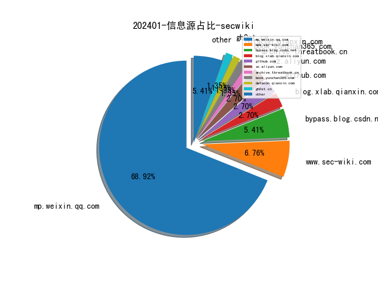
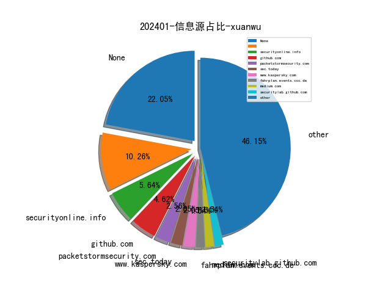
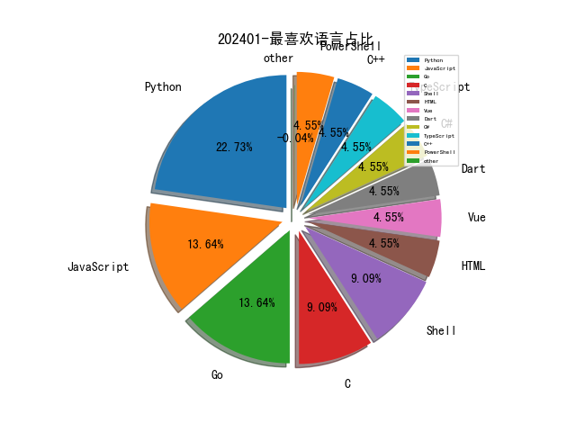

# [数据--所有](README_20.md)
# [数据--年度](README_2024.md)
# 202401 信息源与信息类型占比

# 网络安全书籍 推荐
| date_added | language | title | author | link | size| 
| --- | --- | --- | --- | --- | ---| 
| 2024-01-26 07:57:01 | English | Covert Surveillance and Electronic Penetration | William B. Moran | http://libgen.rs/book/index.php?md5=56CDA28B35ECF30F62D313562E897175 | 19 MB [PDF]| 
| 2024-01-23 08:46:16 | English | Modern DevOps Practices, Second Edition | unknown | https://www.wowebook.org/modern-devops-practices-second-edition/ | unknown| 
| 2024-01-23 07:42:41 | English | Mastering Elastic Kubernetes Service on AWS | unknown | https://www.wowebook.org/mastering-elastic-kubernetes-service-on-aws/ | unknown| 
| 2024-01-23 06:38:47 | English | Observability with Grafana | unknown | https://www.wowebook.org/observability-with-grafana/ | unknown| 
| 2024-01-22 12:13:25 | English | CompTIA Security+ Get Certified Get Ahead: SY0-701 Study Guide | Joe Shelley & Darril Gibson | http://libgen.rs/book/index.php?md5=ECA24BD2B1640581057C4A8397983636 | 7 MB [PDF]| 
| 2024-01-20 14:46:09 | English | Descriptive Analytics: Describe with Python: A comprehensive guide to Descriptive Analytics with the use of python programming | Van Der Post, Hayden | http://libgen.rs/book/index.php?md5=24CBFE82A9C336ACD224F3BF5FBF9727 | 1 MB [EPUB]| 
| 2024-01-20 14:39:03 | English | Advances in Water Pollution Monitoring and Control: Select Proceedings from HSFEA 2018 (Springer Transactions in Civil and Environmental Engineering) | Nihal Anwar Siddiqui (editor), S. M. Tauseef (editor), Rajendra Dobhal (editor) | http://libgen.rs/book/index.php?md5=1247072896633D73F00F5B80932C1EE2 | 7 MB [PDF]| 
| 2024-01-20 14:29:46 | English | Adversary-Aware Learning Techniques and Trends in Cybersecurity | Prithviraj Dasgupta (editor), Joseph B. Collins (editor), Ranjeev Mittu (editor) | http://libgen.rs/book/index.php?md5=46515DF6A2A28FEF1538D3875A93952F | 5 MB [PDF]| 
| 2024-01-18 14:35:54 | English | Python for Healthcare & Medical Research: EXPLORING THE EXCITING WORLD OF POSSIBILITIES WITH PYTHON | Van Der Post, Hayden | http://libgen.rs/book/index.php?md5=43D5E1C54ED79E99FEC8DBC1FF9CEE1C | 1 MB [EPUB]| 
| 2024-01-16 13:38:43 | English | Kubernetes: A Comprehensive Step-by-Step Guide for Beginners to Master Kubernetes Efficiently | Chloe Annable | http://libgen.rs/book/index.php?md5=C505185882622858471B87F4EF031896 | 6 MB [EPUB]| 
| 2024-01-16 12:29:34 | English | The 2x2 Matrix: Contingency, Confusion and the Metrics of Binary Classification | A. J. Larner | http://libgen.rs/book/index.php?md5=698E9F50A4DB7AD0FE703D74CF41CE87 | 4 MB [PDF]| 
| 2024-01-15 09:06:06 | English | Applied Deep Learning with Python: Use scikit-learn, TensorFlow, and Keras to create intelligent systems | Alex Galea | http://libgen.rs/book/index.php?md5=5B683FC4060F22A413550C76ECD94246 | 34 MB [EPUB]| 
| 2024-01-15 07:27:02 | English | Automating Data Quality Monitoring | unknown | https://www.wowebook.org/automating-data-quality-monitoring/ | unknown| 
| 2024-01-13 20:16:46 | English | Machine Learning: A Guide to PyTorch, TensorFlow, and Scikit-Learn: Mastering Machine Learning With Python | Van Der Post, Hayden | http://libgen.rs/book/index.php?md5=8F932A1D4B435F1D840A6B0F11162D70 | 762 kB [EPUB]| 
| 2024-01-13 20:11:35 | English | Pythonomics: coding strategies to python in economics: A Comprehensive guide to the application of python programming in economics | Van Der Post, Hayden | http://libgen.rs/book/index.php?md5=A242AC92B08A3574F587109279778A54 | 1 MB [EPUB]| 
| 2024-01-13 20:05:14 | English | Python for Accounting: The comprehensive guide to introducing python into your accounting workflow | Van Der Post, Hayden | http://libgen.rs/book/index.php?md5=9FA1E2FEC28795D89518D4F928BA7C96 | 2 MB [EPUB]| 
| 2024-01-13 19:40:04 | English | Deep Learning for Finance: Creating Machine & Deep Learning Models for Trading in Python | Sofien Kaabar | http://libgen.rs/book/index.php?md5=A1E5C5D79EBA2ED48BE421425CF1555D | 9 MB [PDF]| 
| 2024-01-08 07:33:21 | English | Soar with Haskell | unknown | https://www.wowebook.org/soar-with-haskell/ | unknown| 
| 2024-01-08 07:21:27 | English | Data Observability for Data Engineering | unknown | https://www.wowebook.org/data-observability-for-data-engineering/ | unknown| 
| 2024-01-06 10:25:12 | English | Microsoft 365 Administrator MS-102 Exam Guide | unknown | https://www.wowebook.org/microsoft-365-administrator-ms-102-exam-guide/ | unknown| 
| 2024-01-05 11:43:32 | English | Applied Computational Thinking with Python, Second Edition | unknown | https://www.wowebook.org/applied-computational-thinking-with-python-second-edition/ | unknown| 
| 2024-01-05 18:25:08 | English | The Crypto Launderers: Crime and Cryptocurrencies from the Dark Web to DeFi and Beyond | David Carlisle | http://libgen.rs/book/index.php?md5=488EEE0AE318657F45AA60B24B85570F | 13 MB [EPUB]| 
| 2024-01-05 18:06:01 | English | (Springer Undergraduate Mathematics Series) A Course in Python: The Core of the Language | Roozbeh Hazrat | http://libgen.rs/book/index.php?md5=0F974EB1BA244B42A5114B9F484EDAD6 | 11 MB [PDF]| 
| 2024-01-03 14:38:56 | English | Security Orchestration, Automation, and Response for Security Analysts | unknown | https://www.wowebook.org/security-orchestration-automation-and-response-for-security-analysts/ | unknown| 
| 2024-01-03 13:43:09 | English | DevOps for Databases | unknown | https://www.wowebook.org/devops-for-databases/ | unknown| 
| 2024-01-03 19:06:28 | English | Think Python: How to Think Like a Computer Scientist | Allen B. Downey | http://libgen.rs/book/index.php?md5=D4ACD947DD464F477E332EAC4BD000CC | 900 kB [PDF]| 

# 微信公众号 推荐
| nickname_english | weixin_no | title | url| 
| --- | --- | --- | ---| 
| 0x6270安全团队 | gh_15054083100c | 团队知识星球安利 | https://mp.weixin.qq.com/s?__biz=Mzg4Njc1MTIzMw==&mid=2247485475&idx=2&sn=80a5fee16e0b930481d9d409629219ef | 7| 
| 360威胁情报中心 | CoreSec360 | 《2023全球高级持续性威胁（APT）研究报告》 | https://mp.weixin.qq.com/s?__biz=MzUyMjk4NzExMA==&mid=2247495233&idx=1&sn=f80d94da517e4adc33f3e2d87f11730e | 3| 
| 360数字安全 | gh_6db130c5163e | 《2023年全球高级持续性威胁研究报告》：芯片、5G、供应链等领域安全威胁加剧 | https://mp.weixin.qq.com/s?__biz=MzA4MTg0MDQ4Nw==&mid=2247569274&idx=1&sn=6b3d6175dff2c3b641da9df1c21bd88e | 9| 
| CCIA数据安全工作委员会 | CCIA-DSC | 年度总结 , 一图回顾2023年CCIA数据安全工作委员会主要工作 | https://mp.weixin.qq.com/s?__biz=MzkyNzI3MzAxOA==&mid=2247519237&idx=1&sn=68a465f568e5e042e3c7580ac06a9eab | 1| 
| CNCERT国家工程研究中心 | NELCERT | 2023 年教育领域遭受勒索攻击数量创新高 | https://mp.weixin.qq.com/s?__biz=MzUzNDYxOTA1NA==&mid=2247542785&idx=1&sn=5d4ab7c2a0a298e4e5a4111f83f836ae | 32| 
| ElysiumSec | gh_72828cde3a3c | 记一次多业务多入口的打点方式 | https://mp.weixin.qq.com/s?__biz=Mzg4MDg5ODIzNQ==&mid=2247483930&idx=1&sn=37957f67f7c935b483a02c0bf1f72397 | 1| 
| Evilc0de 安全团队 | asdasd_evilc0de_safe | 应急响应/痕迹取证 -Windows历史运行程序信息提取 | https://mp.weixin.qq.com/s?__biz=MzkzMTM3OTA0NQ==&mid=2247484338&idx=1&sn=81fca228e05ca89c7df24b2cef2532ba | 1| 
| FreeBuf | None | FBI称贵金属快递骗局数量激增，已造成超 5500 万美元损失 | https://mp.weixin.qq.com/s?__biz=MjM5NjA0NjgyMA==&mid=2651256989&idx=3&sn=086af5b102cebcd2d4c0463e24e36c36 | 64| 
| HackingWiki漏洞感知 | None | 复现(附POC) , Jenkins任意文件读取漏洞 | https://mp.weixin.qq.com/s?__biz=MzkzMzE5OTQzMA==&mid=2247483964&idx=1&sn=99dd918bc4a906d10cae602c7f92e977 | 1| 
| Hacking黑白红 | Hacking012 | 实战 , 记某次攻防演练钓鱼专项 | https://mp.weixin.qq.com/s?__biz=Mzg2NDYwMDA1NA==&mid=2247536177&idx=1&sn=478dc13ea8cf3c79f4a4e0d23cd90ee5 | 4| 
| IMPERVA | IMPERVA | 全球一周数据泄漏事件播报 | https://mp.weixin.qq.com/s?__biz=MzI1OTYyOTUyOA==&mid=2247487390&idx=1&sn=3b8283652f27f2f3163048a2ae96d465 | 6| 
| IoT物联网技术 | IoT-Tech-Expo | 我为什么放弃了中移坤灵 OneNET 物联网平台 ？ | https://mp.weixin.qq.com/s?__biz=MjM5OTA4MzA0MA==&mid=2454932504&idx=1&sn=92a79a2622428914dd326d7e7b81f6e3 | 15| 
| Jiyou too beautiful | zorejt-_- | HTB-Pov笔记 | https://mp.weixin.qq.com/s?__biz=Mzk0MTQxOTA3Ng==&mid=2247487936&idx=1&sn=ea3868dcbcdef45627b28f7a5848337c | 2| 
| Ms08067安全实验室 | Ms08067_com | 2023年Ms08067安全实验室公众号年度盘点 | https://mp.weixin.qq.com/s?__biz=MzU1NjgzOTAyMg==&mid=2247517604&idx=1&sn=8529a2b5139de1d73f957ae246444920 | 17| 
| NightmareV | Kobernet | 用友GRP-U8 SQL注入漏洞 | https://mp.weixin.qq.com/s?__biz=MzkxNDU2ODc0Nw==&mid=2247483971&idx=1&sn=aff701d7e61731fff245b1d2aaee558f | 1| 
| Relay学安全 | None | MSI武器化学习 | https://mp.weixin.qq.com/s?__biz=Mzg5MDg3OTc0OA==&mid=2247485556&idx=1&sn=9649ec9cebb5a551666a3f4286809acb | 8| 
| TIPFactory情报工厂 | TIPFactory | DNS安全指南分享V1 | https://mp.weixin.qq.com/s?__biz=MzkyMjM0ODAwNg==&mid=2247487500&idx=1&sn=6cd21500ea686bb3d8d055e6c6ce20e7 | 2| 
| Theloner安全团队 | None | 恭喜团队的师傅们 , 美团SRC2023年度荣誉加冕！ | https://mp.weixin.qq.com/s?__biz=MzI2Mzc4ODc1NQ==&mid=2247488336&idx=1&sn=e263c010ce303c234f526f5dda693b20 | 1| 
| TtTeam | gh_a0a1db78ea68 | CVE-2023-35636 Microsoft Outlook 信息泄露漏洞（泄露密码哈希） | https://mp.weixin.qq.com/s?__biz=Mzg2NTk4MTE1MQ==&mid=2247484505&idx=1&sn=8200c07b31eed8625467679610b756a1 | 7| 
| WIN哥学安全 | WIN-security | 【渗透实战】微信小程序渗透测试 | https://mp.weixin.qq.com/s?__biz=MzkwODM3NjIxOQ==&mid=2247496721&idx=1&sn=1acb2223b03f5ed44b7d44eaa40ad068 | 14| 
| Web安全工具库 | websec-tools | 渗透测试工具箱（1月28日更新） | https://mp.weixin.qq.com/s?__biz=MzI4MDQ5MjY1Mg==&mid=2247512141&idx=1&sn=1371410c0c8b024b2ba2db7fa74e7a02 | 12| 
| Z2O安全攻防 | Z2O_SEC | 攻防 , 记一次打穿xx公司域控 | https://mp.weixin.qq.com/s?__biz=Mzg2ODYxMzY3OQ==&mid=2247508294&idx=1&sn=35c03273b971d5ed2210216e2b2e65d4 | 17| 
| fly的渗透学习笔记 | None | U9 PatchFile文件上传 | https://mp.weixin.qq.com/s?__biz=MjM5MTg0Nzk5Nw==&mid=2247484523&idx=1&sn=93882d3396835d31163e686d86f72377 | 4| 
| fullbug | xiejava1018 | 网络安全产品之认识防病毒软件 | https://mp.weixin.qq.com/s?__biz=MjM5NDMwMjEwMg==&mid=2451851436&idx=1&sn=d2f2135afed988c83c52f64ba26f4a82 | 8| 
| thelostworld | gh_3f2e5b9f028c | [Nuclei-06]nuclei进阶之json提取 | https://mp.weixin.qq.com/s?__biz=MzIyNjk0ODYxMA==&mid=2247487422&idx=1&sn=a8f242092566f5195b3fe474d130e4ed | 8| 
| 三六零CERT | None | 安全日报（2024.01.30） | https://mp.weixin.qq.com/s?__biz=MzU5MjEzOTM3NA==&mid=2247501979&idx=1&sn=55a21578b46c98a15f8b0f706a98b60f | 16| 
| 中国计算机学会 | ccfvoice | CCF表彰2023年度优秀专业委员会 | https://mp.weixin.qq.com/s?__biz=MjM5MTY5ODE4OQ==&mid=2651566994&idx=1&sn=d604af6fc49da784a78c1a5bbd2edcce | 38| 
| 中国软件评测中心 | None | 赛迪实验室 , 以技术为支撑，构筑芯片硬件安全防线 | https://mp.weixin.qq.com/s?__biz=MjM5NzYwNDU0Mg==&mid=2649242284&idx=2&sn=37058676a0dfcca20bcae499028a2386 | 4| 
| 云众可信 | yunzhongkexin | 秒懂安全 , 什么是“网络靶场”？ | https://mp.weixin.qq.com/s?__biz=Mzg2NDU3Mzc5OA==&mid=2247489322&idx=1&sn=ff9fce4823aa38ba0af4b0a301f47e8d | 2| 
| 云息信安 | gh_ba973493e872 | SRC挖掘思路及方法 | https://mp.weixin.qq.com/s?__biz=MzI3NzcxMDQwMg==&mid=2247487050&idx=1&sn=a9fad3b7d1d5bf9ccbe3d75a97b5c879 | 4| 
| 云起无垠 | None | 第38期 , GPTSecurity周报 | https://mp.weixin.qq.com/s?__biz=Mzg3Mjg4NTcyNg==&mid=2247488616&idx=1&sn=e4fb5b084c313c4b3ab900ec19cb13bb | 6| 
| 亚信安全 | None | 亚信安全与中国联通山东分公司达成战略合作，共建防勒索创新实验室 | https://mp.weixin.qq.com/s?__biz=MjM5NjY2MTIzMw==&mid=2650611461&idx=1&sn=89d386fafdfb89977f58414594adae6f | 14| 
| 京东安全应急响应中心 | jsrc_team | 【致谢信】 | https://mp.weixin.qq.com/s?__biz=MjM5OTk2MTMxOQ==&mid=2727836238&idx=1&sn=daceaad3ff2ed692266396b84056225f | 5| 
| 代码卫士 | None | 奔驰不慎泄露敏感数据，内含源代码 | https://mp.weixin.qq.com/s?__biz=MzI2NTg4OTc5Nw==&mid=2247518779&idx=3&sn=50f3c99e79eabe4921440a824f1aef44 | 17| 
| 众智维安 | openxorg | 双向赋能，共融发展：徐州工程学院信息工程学院来访众智维科技参观交流 | https://mp.weixin.qq.com/s?__biz=MzU5Mjg0NzA5Mw==&mid=2247491648&idx=1&sn=cc984db7d4cac98a26c31e7560b2e45b | 1| 
| 信息安全D1net | D1Net18 | 第三方风险管理最佳实践及其重要性 | https://mp.weixin.qq.com/s?__biz=MzA3NTIyNzgwNA==&mid=2650258378&idx=1&sn=95f99069d7695c127028d6ceeb23a7f2 | 5| 
| 信息安全与通信保密杂志社 | None | 2024杂志专题征文 , “生成式人工智能对网络安全的挑战与促进”专题征稿 | https://mp.weixin.qq.com/s?__biz=MzkwMTMyMDQ3Mw==&mid=2247584963&idx=1&sn=cc01a5ad34e878b236a7b69b55593aec | 38| 
| 信息安全研究 | ISR2016 | 这是一份来自《信息安全研究》2023年「年终总结」 | https://mp.weixin.qq.com/s?__biz=MzA3NzgzNDM0OQ==&mid=2664983902&idx=1&sn=3cd149ca1624e1bd3f72067bf29267d1 | 35| 
| 全球技术地图 | drc_iite | 美欧跨境数据流动规则演变及启示 | https://mp.weixin.qq.com/s?__biz=MzI1OTExNDY1NQ==&mid=2651610277&idx=1&sn=cb78a753548fa81970cb784f91defe30 | 29| 
| 兰花豆说网络安全 | SecuritySay | 安全大数据如何在项目过程中落地 | https://mp.weixin.qq.com/s?__biz=MzI3NzM5NDA0NA==&mid=2247485478&idx=1&sn=bc87fe2a524497b40db27b594c9fa78d | 10| 
| 关键基础设施安全应急响应中心 | CII-SRC | 2023年国际网络空间形势回顾及发展动向 | https://mp.weixin.qq.com/s?__biz=MzkyMzAwMDEyNg==&mid=2247542101&idx=1&sn=91ce5d0e1f0cec29458f588b0ce0893e | 34| 
| 内生安全联盟 | CCESS_CHINA | 加快形成新质生产力：是什么、为什么、做什么？ | https://mp.weixin.qq.com/s?__biz=Mzg4MDU0NTQ4Mw==&mid=2247516231&idx=1&sn=e18a25f53cb24bd8653d891b50ea0e3e | 32| 
| 华为安全 | None | 未然通讯社：LockBit勒索软件团伙声称入侵了快餐巨头Subway；2023年有45%关键CVE未完成修复 | https://mp.weixin.qq.com/s?__biz=MzAwODU5NzYxOA==&mid=2247502836&idx=1&sn=5033703b2ac5a6bb7359640125fd979e | 4| 
| 合天网安实验室 | None | 蚁景科技承办网安人才实践创新能力培养暨第十一届方班教学研讨会 | https://mp.weixin.qq.com/s?__biz=MjM5MTYxNjQxOA==&mid=2652903664&idx=1&sn=7c72bdbce275a7cca04c8a4397d0dec3 | 18| 
| 吉祥同学学安全 | gh_370fbad7aec1 | 用离职的心态上班，我现在不焦虑了 | https://mp.weixin.qq.com/s?__biz=MzI1ODY3MTA3Nw==&mid=2247484848&idx=1&sn=c4d47d8805ff8f50ebb289476687fa63 | 8| 
| 君哥的体历 | jungedetili | 京东数据安全部诚招安全人才！ | https://mp.weixin.qq.com/s?__biz=MzI2MjQ1NTA4MA==&mid=2247490914&idx=1&sn=ee42e65814f50d34fd6928b58571bf1c | 3| 
| 听风安全 | tingfengsec | 记一次从总公司到分公司的艰难内网渗透 | https://mp.weixin.qq.com/s?__biz=Mzg3NzIxMDYxMw==&mid=2247499268&idx=1&sn=34b90d5d249c74de9c2e1f9f0d9b22fa | 11| 
| 启明星辰安全简讯 | None | 安全简讯（2024.01.30） | https://mp.weixin.qq.com/s?__biz=MzUxMDQzNTMyNg==&mid=2247503743&idx=1&sn=75babe32a266641600c1bd497f748f4b | 20| 
| 启明星辰集团 | None | 启明星辰天珣EDR，连获网络安全产品“奥斯卡”双奖！ | https://mp.weixin.qq.com/s?__biz=MzA3NDQ0MzkzMA==&mid=2651722943&idx=1&sn=422328f4914e4cb521d3dc19426d4558 | 8| 
| 商业智能研究 | fr_research | 怎样画一张人见人爱的数据治理框架图？ | https://mp.weixin.qq.com/s?__biz=MzIwMzg5MTI0OQ==&mid=2247539446&idx=1&sn=38e0f9c6e7332ea63243ad44efd034c6 | 7| 
| 商密君 | shangmijun | 密码学+区块链丨广东省科技厅等七部门印发《广东省培育区块链战略性新兴产业集群行动计划（2023-2025年）》 | https://mp.weixin.qq.com/s?__biz=MzI5NTM4OTQ5Mg==&mid=2247619126&idx=2&sn=324dad98de4bc054338ab81ca0502d24 | 41| 
| 嘶吼专业版 | Pro4hou | 近1100万台SSH服务器易受到Terrapin攻击 | https://mp.weixin.qq.com/s?__biz=MzI0MDY1MDU4MQ==&mid=2247573365&idx=1&sn=ef787d698bffd0a2fd2baafb637c647f | 21| 
| 四叶草安全 | siyecaoanquan1 | 四叶草安全关键信息基础设施安全保护支撑能力再获认可 | https://mp.weixin.qq.com/s?__biz=MjM5MTI2NDQzNg==&mid=2654551189&idx=1&sn=1b0d90b3d179db1fa5cd7fb55bdd861b | 4| 
| 国际云安全联盟CSA | gh_674820794ae8 | CSA发布 , 法律视角下的数据出境《2023年数据出境合规年鉴》 | https://mp.weixin.qq.com/s?__biz=MzkwMTM5MDUxMA==&mid=2247495879&idx=1&sn=d6f7dbe2b2b9b849c72e5a75a66c93ee | 7| 
| 墨云安全 | moyunsec | 人工智能时代网络安全的六大趋势 | https://mp.weixin.qq.com/s?__biz=MzU5ODE2NDA3NA==&mid=2247495878&idx=1&sn=b54145b3eb6326122744ae8a7e031a90 | 1| 
| 夏小芸sec | xiaxiaoyunyyds | 分享一些网安的宝藏级公众号！ | https://mp.weixin.qq.com/s?__biz=Mzg4NDkwMDAyMQ==&mid=2247487527&idx=1&sn=f54daed6c9faf22b6189080c782c7397 | 1| 
| 大数据安全工程研究中心 | DSJAQGCYJZX | 共话数据要素价值释放 海南地推服务基地首场私享会成功举办 | https://mp.weixin.qq.com/s?__biz=MjM5Nzg0NzUxOQ==&mid=2247486894&idx=1&sn=9105ab3ba582d080d3ea1176a674509a | 8| 
| 天唯信息安全 | TWtech2113189 | 什么是信创、什么是安可、什么是国产化、他们有什么联系和区别 | https://mp.weixin.qq.com/s?__biz=MzkzMjE5MTY5NQ==&mid=2247494566&idx=1&sn=8da6b885ac4515c7f2b17331a3923dea | 26| 
| 天御攻防实验室 | None | 2024年全球高级威胁态势预测 - 国家支持的APT针对网络安全厂商和从业者进行报复 | https://mp.weixin.qq.com/s?__biz=MzU0MzgyMzM2Nw==&mid=2247485374&idx=1&sn=fcdf378a8186b0033d0fc18d9f3fceff | 6| 
| 天融信教育 | TOPSEC-EDU | 每日安全提醒~ | https://mp.weixin.qq.com/s?__biz=MzU0MjEwNTM5Ng==&mid=2247515991&idx=2&sn=c2ee11050cf24d66b8bae27538d560cc | 24| 
| 天锐数据安全 | None | 源代码泄密...如何破局？ | https://mp.weixin.qq.com/s?__biz=MjM5MTk0MzIzMQ==&mid=2652018650&idx=1&sn=c349c372448a05d83dab7519611ec393 | 12| 
| 奇安信病毒响应中心 | gh_416eb7efb780 | 透明部落针对印度军方新近攻击活动分析 | https://mp.weixin.qq.com/s?__biz=MzI5Mzg5MDM3NQ==&mid=2247493717&idx=1&sn=993e7e14ebeb19754d7b3e72641f7240 | 1| 
| 奇安信集团 | qianxin-keji | 细数2023年度全网漏洞态势的“五宗最” | https://mp.weixin.qq.com/s?__biz=MzU0NDk0NTAwMw==&mid=2247606702&idx=1&sn=a3679f58718a22c4658df4a6e86e5feb | 24| 
| 字节跳动安全中心 | TouTiaoSec | 火山引擎“抗DDoS”“容器安全”等30余项安全能力获 FreeBuf 《2023 网安全景册》收录 | https://mp.weixin.qq.com/s?__biz=MzUzMzcyMDYzMw==&mid=2247492320&idx=1&sn=ae5920b643cb17823cc35ce32d67e7aa | 3| 
| 安世加 | None | 去年第四季度仅有 29% 受害者选择向黑客支付赎金，创下历史新低 | https://mp.weixin.qq.com/s?__biz=MzU2MTQwMzMxNA==&mid=2247536893&idx=1&sn=98fa1030b0e9a32621591f6d1d06b14a | 13| 
| 安信安全 | gsaxns | 顶级网络安全运营分析师/专家的成长之路 | https://mp.weixin.qq.com/s?__biz=MzAxNTYwOTU1Mw==&mid=2650087094&idx=1&sn=abae54bb0e21fa53fb697e8e691cd36b | 17| 
| 安全419 | anquan-419 | 签约伟仕佳杰 深度解读威努特双国代背后的发展战略 | https://mp.weixin.qq.com/s?__biz=MzUyMDQ4OTkyMg==&mid=2247537779&idx=1&sn=bc2e30f90d8f97000c9587ebaee482be | 17| 
| 安全内参 | anquanneican | 安全必须服务于业务！美军探索小型承包商数据合规新方法 | https://mp.weixin.qq.com/s?__biz=MzI4NDY2MDMwMw==&mid=2247510947&idx=1&sn=8660191ecff4959bdf1423f81327a48a | 25| 
| 安全后厨 | sanxingfengaa | 每日新闻(342)——2024.01.30 | https://mp.weixin.qq.com/s?__biz=MzI3MDQ1NDE2OA==&mid=2247490441&idx=1&sn=3e78783fc7913164001a5bc8cc9f1fc5 | 36| 
| 安全圈 | None | 【安全圈】重大失误！被黑客入侵的 Microsoft 测试帐户被分配了管理员权限 | https://mp.weixin.qq.com/s?__biz=MzIzMzE4NDU1OQ==&mid=2652053240&idx=2&sn=84904f7fde59145bf3939799228aa669 | 60| 
| 安全威胁纵横 | gh_715fe2f8df0b | Keenan 发布警告称 150 万人数据被泄露 | https://mp.weixin.qq.com/s?__biz=Mzk0MDYwMjE3OQ==&mid=2247484340&idx=1&sn=e4fb466bab5b35429fa4ce8e141bcf8c | 8| 
| 安全小姿势 | www_sqlsec_com | Tiny RDM - 美观易用的Redis桌面客户端 | https://mp.weixin.qq.com/s?__biz=Mzk0MDI0OTQwNw==&mid=2247484382&idx=1&sn=2f2bb285dc76e2d5800add2a69f0cf8d | 2| 
| 安全帮 | SafetyGuan | 瑞星发布《2023年中国网络安全报告》 病毒数量上涨15% | https://mp.weixin.qq.com/s?__biz=MzkzNjQwOTc4MQ==&mid=2247489128&idx=1&sn=977157c9ff7a39df6e0777a1ff6a02e9 | 6| 
| 安全攻防屋 | z6_debug | 【漏洞复现】Jenkins 任意文件读取漏洞(CVE-2024-23897) | https://mp.weixin.qq.com/s?__biz=MzkyNTU3MjA3OQ==&mid=2247484555&idx=1&sn=f99479bfeeafa1cf8e98f848b2641adb | 2| 
| 安全牛课堂 | aqniu_edu | 2024 ASP/DSM/DevOps认证考试费用调整通知 | https://mp.weixin.qq.com/s?__biz=MzIxNTM4NDY2MQ==&mid=2247509274&idx=1&sn=8b9e11a94513a52eb93192d67beb7725 | 7| 
| 安全研究GoSSIP | GoSSIPSJTU | G.O.S.S.I.P 阅读推荐 2024-01-30 如何写好Rebuttal | https://mp.weixin.qq.com/s?__biz=Mzg5ODUxMzg0Ng==&mid=2247497235&idx=1&sn=b14543836625884384f952f2f850751b | 8| 
| 安全脉脉 | gh_6d21af7faacb | 电动汽车充电桩网络安全研究基础 | https://mp.weixin.qq.com/s?__biz=Mzk0MzQzNzMxOA==&mid=2247486058&idx=1&sn=9dfdad3270c8721ae1fa06dedaab5240 | 6| 
| 安在 | AnZer_SH | CSO说安全 , 杨文斌：拉动网络安全保险，引爆网络安全市场 | https://mp.weixin.qq.com/s?__biz=MzU5ODgzNTExOQ==&mid=2247612543&idx=2&sn=a18f2b9ff3f7825d7a71f205d43f1e9d | 31| 
| 安天集团 | Antiylab | 经典的35种网络安全模型，mbsse社区已覆盖30个 | https://mp.weixin.qq.com/s?__biz=MjM5MTA3Nzk4MQ==&mid=2650203906&idx=1&sn=665650d0d897175d6d7a2ef255b1c491 | 16| 
| 宸极实验室 | ChenJiLab | 『免杀系列』免杀 Fscan | https://mp.weixin.qq.com/s?__biz=Mzg4NTA0MzgxNQ==&mid=2247488834&idx=1&sn=a24ec2a4ca864700187a2f983a6cc271 | 4| 
| 小惜渗透 | xxshentou | bypass 1-初识and静态处理 | https://mp.weixin.qq.com/s?__biz=Mzg3OTcxMjE2NQ==&mid=2247486724&idx=1&sn=761c2ed637c6e8e7fbbcb66e37bc3deb | 3| 
| 小毅安全阵地 | anquanzhendi | 工信部：2023年我国信息安全领域收入2232亿元 | https://mp.weixin.qq.com/s?__biz=Mzg4MDE0MzQzMw==&mid=2247486947&idx=1&sn=9b840622dd4e8bfa5f08fc5b479f8463 | 4| 
| 小白学黑客 | None | 太牛了！大神把Windows 11 压缩到 100MB！ | https://mp.weixin.qq.com/s?__biz=MzkxNjE3NTAyNQ==&mid=2247486390&idx=1&sn=157ad045f132d362264c5b4aca839ed2 | 1| 
| 小白菜安全 | None | 【新】新亿赛通电子文档管理系统-hiddenWatermark任意文件上传 | https://mp.weixin.qq.com/s?__biz=MzIzOTM2MzczNQ==&mid=2247484216&idx=1&sn=fad0c4698a2f18b9e96e5f10b3674249 | 8| 
| 小米安全中心 | misrc_team | 小米安全斩获NVDB-CAVD杯汽车信息安全总决赛二等奖 | https://mp.weixin.qq.com/s?__biz=MzI2NzI2OTExNA==&mid=2247516398&idx=1&sn=ab2b42bb19a283453f91bedb4e31586c | 2| 
| 工业互联网标识智库 | CAICT-bs | 中国信通院金键：加速标识贯通，赋能新型工业化高质量发展 | https://mp.weixin.qq.com/s?__biz=MzU1OTUxNTI1NA==&mid=2247568041&idx=1&sn=e12f209b194b64a1f5c4b3d3bcfef2f3 | 13| 
| 工信微报 | gxwbwx | 工信部印发《工业控制系统网络安全防护指南》 | https://mp.weixin.qq.com/s/R_QxlJ3zMQ3R_qC74UMPjA | 1| 
| 开放知识图谱 | OpenKG-CN | 论文浅尝 , QA-GNN: 使用语言模型和知识图谱的推理问答 | https://mp.weixin.qq.com/s/33PW_fDMp_HT4yKARsacQA | 1| 
| 情报分析师 | None | u200b680万条选民数据泄露，2024印尼选举面临危机 | https://mp.weixin.qq.com/s?__biz=MzA3Mjc1MTkwOA==&mid=2650545178&idx=1&sn=ae850a18d0d421a90438ff189da31ccc | 29| 
| 情报分析师Pro | globalpolice | 德州与拜登的危险边境对峙 | https://mp.weixin.qq.com/s?__biz=MzkwNzM0NzA5MA==&mid=2247495528&idx=1&sn=5e726d70da7f0a840e21a846147d9f2e | 10| 
| 数世咨询 | None | 全球安全市场预测：AI、API、自适应安全、保险预计将飞速增长 | https://mp.weixin.qq.com/s?__biz=MzkxNzA3MTgyNg==&mid=2247508355&idx=1&sn=464b4b4bd3b74676dcde278ef6692f31 | 16| 
| 数安行 | gh_4a91b25696f1 | 数安行参编的《数据安全风险评估实务：问题剖析与解决思路》正式发布 | https://mp.weixin.qq.com/s?__biz=Mzg5OTM0NTM2OQ==&mid=2247491156&idx=1&sn=d593a453b61b752cf560ee8224eb3304 | 8| 
| 无界信安 | Boundless_Sec | 打造安全平台工程团队 | https://mp.weixin.qq.com/s?__biz=Mzk0MzI3OTAwMg==&mid=2247485767&idx=1&sn=4441b466349d15a917646f2bd2774582 | 3| 
| 无糖反网络犯罪研究中心 | gh_2ee7a9b17c0d | 柯坪警方破获电信诈骗案 , 麻城警方打掉架设“GOIP”设备犯罪团伙——涉网犯罪每日情报 | https://mp.weixin.qq.com/s?__biz=MzAxMzkzNDA1Mg==&mid=2247508579&idx=1&sn=d7bd728a56cf56bce61c2d1011930e34 | 8| 
| 春秋伽玛 | AWDGAME | 【WP】2023年春秋杯冬季赛misc、reverse、crypto类题目解析 | https://mp.weixin.qq.com/s?__biz=MzkyNDA5NjgyMg==&mid=2247497091&idx=1&sn=853dfd1999dc0f8fe62b904edc6f04e7 | 2| 
| 智联招聘安全应急响应中心 | None | ZPSRC 2023年度白帽 | https://mp.weixin.qq.com/s?__biz=Mzg2NDA0OTIyNQ==&mid=2247486712&idx=1&sn=ab47fd805e72a4dfc45a2dbe3e1dc9af | 1| 
| 樱花庄的本间白猫 | gh_869fd1e771c2 | ICPScan 资产归属批量查询工具 | https://mp.weixin.qq.com/s?__biz=Mzk0NDU1NTA5MA==&mid=2247483715&idx=1&sn=1ed956467bf9a8c68b2625a8bbdd6cc5 | 1| 
| 深信服千里目安全技术中心 | None | 【高级持续威胁(APT)】Kimsuky组织利用Dropbox云端实施行动分析 | https://mp.weixin.qq.com/s?__biz=Mzg2NjgzNjA5NQ==&mid=2247522061&idx=1&sn=22e56ee213d9e5229371ad3e082ebfab | 6| 
| 深圳市网络与信息安全行业协会 | SNISRI | 俄罗斯280台服务器被摧毁，200万GB数据丢失 | https://mp.weixin.qq.com/s?__biz=MzU0Mzk0NDQyOA==&mid=2247513790&idx=1&sn=0b5c6c7f73ee972679953a9eb1a23bf3 | 10| 
| 渗透安全团队 | GuYingLanQi | 一款可全平台运行的导出浏览器数据解密工具 | https://mp.weixin.qq.com/s?__biz=MzkxNDAyNTY2NA==&mid=2247514472&idx=1&sn=307728a036170a1230769b000a7a7bc1 | 16| 
| 渗透测试 网络安全技术学习 | gh_24ac528f97fa | 上传漏洞介绍原理漏洞修复 | https://mp.weixin.qq.com/s?__biz=MzI1MzQwNjEzNA==&mid=2247483878&idx=1&sn=bb9d298e8d02c73d58bb063a154e7d3a | 2| 
| 滴滴技术 | didi_tech | 滴滴获2023中国计算机学会杰出贡献奖 | https://mp.weixin.qq.com/s?__biz=MzU1ODEzNjI2NA==&mid=2247568852&idx=1&sn=7cd58e06fcd4cb53f653bc0b8de6fd44 | 2| 
| 珞安科技 | luoantechnology | 工信部印发《工业控制系统网络安全防护指南》 | https://mp.weixin.qq.com/s?__biz=MzU2NjI5NzY1OA==&mid=2247508481&idx=1&sn=f5549eb9ce2db586e4078508ff45a232 | 2| 
| 生有可恋 | hyang0-1 | Windows 下的 grep 工具 | https://mp.weixin.qq.com/s?__biz=Mzk0MTI4NTIzNQ==&mid=2247490495&idx=1&sn=a67aee6943f38551009c01a9526cbdda | 13| 
| 盛邦安全WebRAY | WebRay_weixin | 党建与业务同向聚合丨盛邦安全党支部2023年总结会成功召开，上地街道党群领导莅临指导 | https://mp.weixin.qq.com/s?__biz=MzAwNTAxMjUwNw==&mid=2650274968&idx=1&sn=6dc08e4cce1d88c9680052154506763d | 5| 
| 看雪学苑 | None | OLLVM虚假控制流源码分析 | https://mp.weixin.qq.com/s?__biz=MjM5NTc2MDYxMw==&mid=2458537620&idx=1&sn=b96b2c6ac4098e563aab13c75c463733 | 40| 
| 知其安科技 | None | 知其安科技中标北京农商银行有效性验证项目 | https://mp.weixin.qq.com/s?__biz=MzkzNTI5NTgyMw==&mid=2247493964&idx=1&sn=3ca1644470c6d217cbaaf6e3fa91161f | 1| 
| 红蓝公鸡队 | None | 网安现状 | https://mp.weixin.qq.com/s?__biz=Mzg5MDc1MjY5Ng==&mid=2247492358&idx=1&sn=0b987cd60e2ca05828be96373b7ede7c | 9| 
| 红蓝攻防实验室 | None | 帮管客CRM SQL注入&文件上传 | https://mp.weixin.qq.com/s?__biz=MzU2OTkwNzIxOA==&mid=2247484459&idx=1&sn=23d9a46c6cb2464e52f571e6d1e5b49a | 1| 
| 红队蓝军 | None | 2024年网路安全行情怎么样 | https://mp.weixin.qq.com/s?__biz=Mzg2NDY2MTQ1OQ==&mid=2247516549&idx=1&sn=42ee07ff7429ce3244fe1871b67720cf | 6| 
| 绿盟科技 | NSFOCUS-weixin | 车联网移动应用安全的“攻守道” | https://mp.weixin.qq.com/s?__biz=MjM5ODYyMTM4MA==&mid=2650447634&idx=1&sn=e8c5d1dd94f5de7dd600d43ce14819b2 | 16| 
| 网安百色 | www_xinbs_net | 内蒙古14家机构因未履行个人信息保护义务受到处罚 | https://mp.weixin.qq.com/s?__biz=MzI0NzE4ODk1Mw==&mid=2652092564&idx=1&sn=66a363d04f3b05adc5dc6c846901afc5 | 16| 
| 网络威胁数据联盟 | None | 【风险通告】Jenkins CLI 任意文件读取漏洞（CVE-2024-23897） | https://mp.weixin.qq.com/s?__biz=MzA3MzI5NzY0OA==&mid=2247495488&idx=1&sn=119ec0449632a5ab8377190f9b6db91d | 2| 
| 网络安全与数据治理 | gh_ddbdee0c5caf | 工信部等七部门联合印发《关于推动未来产业创新发展的实施意见》 | https://mp.weixin.qq.com/s?__biz=MzIzODk1NzY5NA==&mid=2247496780&idx=1&sn=1aa807f80f99d6d86a589f36d4b3a8ad | 11| 
| 网络安全和信息化 | None | 安全跟我学｜拿捏钓鱼邮件，so easy! | https://mp.weixin.qq.com/s?__biz=MjM5MzMwMDU5NQ==&mid=2649161050&idx=1&sn=977cad3346168936bfbcc681528eb373 | 18| 
| 网络安全等保与关保 | DJBH-CIIP | 黑客无节操排行榜 | https://mp.weixin.qq.com/s?__biz=MzUyNjk2MDU4MQ==&mid=2247486131&idx=1&sn=639d984f80d5ca1064bd9686321017c0 | 8| 
| 网络尖刀 | mcbang_com | 网络尖刀获美团SRC团队年度No.1，凡客测试获白帽No.1 | https://mp.weixin.qq.com/s?__biz=MjM5MDA3MzI0MA==&mid=2650091196&idx=1&sn=81ccdd1a17d42524814cde5f94186e59 | 1| 
| 网络空间信息安全学习 | None | 砍刀部看过来！微软「纪念馆」，记录所有被砍掉的项目 / 产品 | https://mp.weixin.qq.com/s?__biz=MzI2MjcwMTgwOQ==&mid=2247490466&idx=1&sn=9e6788152c0e86cbe14885eab1af3b02 | 8| 
| 美亚柏科 | None | 美著名歌手泰勒·斯威夫特的AI生成照片遭网络疯传！AIGC检测平台精准“打假” | https://mp.weixin.qq.com/s?__biz=MjM5NTU4NjgzMg==&mid=2651407548&idx=1&sn=69782c7e181b3941104bf9eaabaf14b5 | 18| 
| 美团安全应急响应中心 | gh_83d9bb3b8ed0 | 新春礼品派送中，预祝新年快乐！ | https://mp.weixin.qq.com/s?__biz=MzI5MDc4MTM3Mg==&mid=2247493002&idx=2&sn=2503b6d6d06440e9930d8d646fdf7a79 | 2| 
| 腾讯安全 | TXAQ2019 | 证券公司未来三年如何打造更高效的安全运营体系？ | https://mp.weixin.qq.com/s?__biz=Mzg5OTE4NTczMQ==&mid=2247513652&idx=1&sn=04aba680f3b12ff3af8705831140a4fa | 3| 
| 腾讯玄武实验室 | XuanwuLab | 每日安全动态推送(1-30) | https://mp.weixin.qq.com/s?__biz=MzA5NDYyNDI0MA==&mid=2651959521&idx=1&sn=433e21e43f830d063f1b35fcc7924458 | 10| 
| 蓝桥云课精选 | lanqiaoyunke01 | 这些动态规划解题技巧，学会也太容易在算法赛中得分了！ | https://mp.weixin.qq.com/s?__biz=MzkwODM4NDM5OA==&mid=2247516277&idx=1&sn=dec903d6a801804a7aaecde938ec9564 | 20| 
| 谈思实验室 | gh_6446c19b4595 | 嵌入式高手必备的4种调试打印方法 | https://mp.weixin.qq.com/s?__biz=MzIzOTc2OTAxMg==&mid=2247532681&idx=1&sn=2d0eafcd805b59def5a1e92037fcf0e2 | 31| 
| 赛查查 | gh_fabaad32b9d1 | 赛事报名｜关于举办“天一永安杯”2024宁波第七届网络安全大赛暨第九届大学生网络技术与信息安全大赛的预通知 | https://mp.weixin.qq.com/s?__biz=Mzk0NTU0ODc0Nw==&mid=2247485860&idx=1&sn=5615f505f4341d88e12329fce7e92484 | 4| 
| 进击安全 | JinJiAnQuan_888 | 华天OA任意文件读取漏洞分析 | https://mp.weixin.qq.com/s?__biz=MzkyMjM5NDM3NQ==&mid=2247485431&idx=1&sn=1df36dbe14be69e5f2c87a12d6978704 | 4| 
| 迪哥讲事 | None | edu Src中开发商的利用技巧 | https://mp.weixin.qq.com/s?__biz=MzIzMTIzNTM0MA==&mid=2247493408&idx=1&sn=8b2caa71a0caa3ff10a7c2df290c7579 | 12| 
| 长亭安全观察 | gh_4f6964d0d1e4 | 【Real World CTF 6th Writeup】Corrupted GI writeup | https://mp.weixin.qq.com/s?__biz=MzkyNDUyNzU1MQ==&mid=2247484434&idx=1&sn=14c6bc49361bfeb4f03bbd6165c96962 | 2| 
| 阿里云安全 | aliyunsec | 全新升级！阿波罗挑战赛报名通道开启，春节战不停 | https://mp.weixin.qq.com/s?__biz=MzA4MTQ2MjI5OA==&mid=2664090692&idx=1&sn=cceb7e277f020795ad0047e10458da25 | 1| 
| 阿里安全响应中心 | alisrc | 挑战无限 铸就非凡 ｜阿波罗挑战赛报名开启 | https://mp.weixin.qq.com/s?__biz=MzIxMjEwNTc4NA==&mid=2652993602&idx=1&sn=a0318304089ed37c56766c5ecb5d0406 | 4| 
| 零时科技 | noneage | 零时科技 ,,《2023年全球Web3行业安全研究报告》正式发布！！ | https://mp.weixin.qq.com/s?__biz=MzU1OTc2MzE2Mg==&mid=2247488490&idx=1&sn=dfb2377129c84a3ac55bcb235c2f070c | 2| 
| 零漏安全 | None | 安全圈？韭菜圈！原来如此 | https://mp.weixin.qq.com/s?__biz=MzkyMDUzMzY1MA==&mid=2247497383&idx=1&sn=0eea0026a5f08a55b4b506cc93f17197 | 8| 
| 雷神众测 | bounty_team | 通知！雷神公益奖励发放变更通知 | https://mp.weixin.qq.com/s?__biz=MzI0NzEwOTM0MA==&mid=2652502785&idx=1&sn=14245a4854af32a901ea2a93104c4a76 | 4| 
| 非攻安全实验室 | gh_9c3b7f864fba | 帮管客CRM SQL注入&文件上传 | https://mp.weixin.qq.com/s?__biz=Mzk0NDUzMDA1Mg==&mid=2247484984&idx=1&sn=03d23e8d90b8bd86c07847aeb43b7b16 | 4| 
| 顺丰安全应急响应中心 | None | 顺丰SRC白帽技术沙龙活动中奖名单 | https://mp.weixin.qq.com/s?__biz=MzU3OTAyODk4MQ==&mid=2247488605&idx=1&sn=863833625578e973730c4262402198a1 | 3| 
| 飓风网络安全 | gh_183f818a07dc | 【漏洞预警】飞桨PaddlePaddle 命令注入漏洞 (CVE-2024-0521) | https://mp.weixin.qq.com/s?__biz=MzI3NzMzNzE5Ng==&mid=2247487490&idx=1&sn=059828b619bf0ede660969a33cfd4f80 | 14| 
| 高等精灵实验室 | None | py12306：一款强大的12306自动购票助手，支持NAS部署哦！ | https://mp.weixin.qq.com/s?__biz=MzA4MjkzMTcxMg==&mid=2449044867&idx=1&sn=625e2979029c71264a080c4aa9731050 | 1| 
| 黑伞安全 | hack_umbrella | AgentTesla间谍软件分析 | https://mp.weixin.qq.com/s?__biz=MzU0MzkzOTYzOQ==&mid=2247488562&idx=1&sn=33fbcda729fe1b696450d02da95c8bd9 | 8| 
| 默安科技 | moresec | 于细微处见功力：看默安技术运营专家如何搬走开发安全落地的绊脚石 | https://mp.weixin.qq.com/s?__biz=MzIzODQxMjM2NQ==&mid=2247498015&idx=1&sn=7bd4f23f733c5c35d89eec27bf42f83e | 2| 
| CNVD漏洞平台 | CNVDTS | CNVD漏洞周报2024年第4期 | https://mp.weixin.qq.com/s?__biz=MzU3ODM2NTg2Mg==&mid=2247494373&idx=1&sn=bc4b1a3183d3b8910763fac06c79284e | 5| 
| Clarmy吱声 | VoiceOfClarmy | Clarmy 请你来闯关：NetCDF数据处理 | https://mp.weixin.qq.com/s?__biz=MzI2MDQ0ODIzNg==&mid=2247484767&idx=1&sn=393a8797876fbcd06ba35a743e85e130 | 3| 
| Day1安全团队 | gh_123cbbc95fc3 | 《Web90天0到1实现高薪就业》第二期，它来了！！！ | https://mp.weixin.qq.com/s?__biz=MzU1NDU1NTI5Nw==&mid=2247486916&idx=1&sn=7f26138c9095cb4c742cc2a815fcd84d | 4| 
| GR反窃密攻防实验室 | GR-TSCM-LAB | 【实训】2024年第一期（总第32期）反窃密技术提升实训通知 | https://mp.weixin.qq.com/s?__biz=MzU5MTM4MTIxMA==&mid=2247485129&idx=1&sn=84b92a9c4aef1b2f26bc4a331d963b94 | 2| 
| GobySec | gobysec | 从漏洞扫描到利用，告别手工复现！Goby插件市场等你来大展拳脚！ | https://mp.weixin.qq.com/s?__biz=MzI4MzcwNTAzOQ==&mid=2247542433&idx=1&sn=505cb001701d7adb122205a82fd03d9c | 1| 
| HACK学习君 | XHacker1961 | 2024幻兽帕鲁表情包/梗图【第二季】 | https://mp.weixin.qq.com/s?__biz=MzIzNzMxMDkxNw==&mid=2247493313&idx=1&sn=4e51f0f50d930135f949dcb654db2fba | 1| 
| IRTeam工业安全 | ICSRedTeam | 剑工解读欧盟NIS2网络安全法规 | https://mp.weixin.qq.com/s?__biz=MzAwNDI0MDYwMw==&mid=2247485631&idx=1&sn=5f07ca04f3a81bdc10d6737bf0baab19 | 1| 
| IoVSecurity | IoVSecurity | 预防网络灾难 - 通过 TARA 分析进行深度防御 | https://mp.weixin.qq.com/s?__biz=MzU2MDk1Nzg2MQ==&mid=2247601515&idx=1&sn=65d63b030a3f3e6c1a8b76b71a1fa291 | 46| 
| KK安全说 | kksecurity | ITRC-年度数据泄露分析报告（附完整PDF） | https://mp.weixin.qq.com/s?__biz=Mzg4NzgyODEzNQ==&mid=2247486174&idx=1&sn=b4658242dd02378f7dddfb9003496a68 | 14| 
| Lambda小队 | LambdaTeam | Lambda小队第二波红包封面，速领！ | https://mp.weixin.qq.com/s?__biz=Mzg5MDY1NTg3OQ==&mid=2247485509&idx=1&sn=0ceb419187ce38ae5cc15fa72af6156c | 3| 
| M78安全团队 | M78sec | 互联网厂商-应用安全工程师/基础安全开发工程师内推 | https://mp.weixin.qq.com/s?__biz=Mzk0NDE4MzE5MA==&mid=2247487029&idx=1&sn=2fa021d912d53191a92a899380647cd5 | 1| 
| Nu1L Team | Nu1L-Team | 自由定制，开创新境,国内首个开放式程序分析产品：寻径UtopianCode正式发布！ | https://mp.weixin.qq.com/s?__biz=MzU4MTg1NzAzMA==&mid=2247489421&idx=1&sn=00f085b1723bc85541bf888642765930 | 2| 
| OSINT情报分析师 | None | 亨特·拜登电子邮件泄露事件回顾 | https://mp.weixin.qq.com/s?__biz=MzkxNzU5MjE0OA==&mid=2247484019&idx=1&sn=0bb4c832cf3fc5177a1242349cc4d5f5 | 5| 
| OSINT研习社 | OSINT_Club | 暗网简介: 俄罗斯的Star Blizzard | https://mp.weixin.qq.com/s?__biz=Mzg4MzA4NTM0OA==&mid=2247488940&idx=1&sn=43ccf481cdf4d82effd3661a2e154884 | 3| 
| POH Team | POH_Team | 互联网厂商-应用安全工程师/基础安全开发工程师内推 | https://mp.weixin.qq.com/s?__biz=Mzk0NzI5MjkyNg==&mid=2247483972&idx=1&sn=c1bc56cbd0e4318839394167a973c56e | 1| 
| SCA御盾 | SCA_Magic | 【漏洞复现】飞企OA-videotexMonitor-sql注入漏洞复现 | https://mp.weixin.qq.com/s?__biz=MzkzNjYwODg3Ng==&mid=2247484394&idx=1&sn=5c3eb9b2a3f07081cf00e75b87223aee | 13| 
| WalkingCloud | WalkingCloud2018 | 免费福利来啦，联合腾讯送2000个红包封面 | https://mp.weixin.qq.com/s?__biz=MzU2MjU1OTE0MA==&mid=2247498582&idx=1&sn=fbf54dd7deea35b7c3d169225146062a | 2| 
| e安在线 | ean-online | 工信部：2023年我国信息安全领域收入2232亿元 | https://mp.weixin.qq.com/s?__biz=MzI1OTA1MzQzNA==&mid=2651245139&idx=1&sn=bc4893bd41f11cac9de3781fd9a546df | 7| 
| 一个不正经的黑客 | gh_ddeb734f0ee7 | 分享一些网安的宝藏级公众号！ | https://mp.weixin.qq.com/s?__biz=MzkwODI1ODgzOA==&mid=2247502329&idx=1&sn=363bdf84d061f130984f0b9807a6c514 | 4| 
| 不秃头的安全 | BTTDAQ | 分享一些网安的宝藏级公众号！ | https://mp.weixin.qq.com/s?__biz=Mzg3NzkwMTYyOQ==&mid=2247484776&idx=1&sn=9495faf8f279e5b5fde41e6e59787c59 | 10| 
| 中伦文德网络安全与数据合规 | gh_4b33f9a2e329 | 【新闻速递】上海网信部门处罚一批未尽消费者个人信息保护义务单位 五大类问题值得关注 | https://mp.weixin.qq.com/s?__biz=MzIxNDgyNTg0NQ==&mid=2247492150&idx=1&sn=16764a31367557c6cd20987cb48493d1 | 5| 
| 中国网络安全产业公共服务平台 | caict-cpsci | 关于开展企业网络安全措施有效性验证及其产品能力评测专题的通知 | https://mp.weixin.qq.com/s?__biz=Mzg5MzQ5NjQyNw==&mid=2247486033&idx=1&sn=6ec7fe0d45c920031cb727003a91b450 | 1| 
| 二进制空间安全 | suntiger_2023 | 利用Hydra高效率猜解服务交互密码 | https://mp.weixin.qq.com/s?__biz=MzkxOTUyOTc0NQ==&mid=2247487068&idx=1&sn=bdee647092f3fcc5e54a0044be2dcf0b | 3| 
| 亿人安全 | Yr-Sec | 内网渗透之突破云镜-Spoofing | https://mp.weixin.qq.com/s?__biz=Mzk0MTIzNTgzMQ==&mid=2247513215&idx=1&sn=cb2371f587af64b81e388c3b0a1938cc | 9| 
| 代码审计 | white-hat-note | Jenkins文件读取漏洞拾遗（CVE-2024-23897） | https://mp.weixin.qq.com/s?__biz=MzA4MDU0NzY4Ng==&mid=2459420636&idx=1&sn=e7a782bfbc5eb8686d51015a3885a755 | 1| 
| 众亦信安 | gh_d0dab7f4b5ba | 记一次M的众测 | https://mp.weixin.qq.com/s?__biz=Mzg5NTkxNzg4MA==&mid=2247487643&idx=1&sn=660df9d9963fb3349c72db129b13823b | 1| 
| 全知科技 | QUANZHI-TECH | 全知科技参编丨《数据安全风险评估实务：问题剖析与解决思路》正式发布（附下载） | https://mp.weixin.qq.com/s?__biz=MzU0NDMxODY2Nw==&mid=2247521384&idx=1&sn=5f5f5cf292dbc97829d5540a5bf78c57 | 2| 
| 军机故阁 | gh_e57baf46bdf5 | EVM链的漏洞利用报告合集 | https://mp.weixin.qq.com/s?__biz=MzU5Mjk3MDA5Ng==&mid=2247485887&idx=1&sn=69becb94b4164cff5cab34b11610b356 | 5| 
| 利刃信安攻防实验室 | LRXAGFSYS | 【人性卑劣】我研究啥关你屁事 | https://mp.weixin.qq.com/s?__biz=MzU1Mjk3MDY1OA==&mid=2247509903&idx=1&sn=8a5b0fa1095d2e87184bc809c14db4ba | 14| 
| 华云安 | huaun_security | Gartner发布《2024年网络安全主要趋势》：持续威胁暴露面管理发展势头强劲 | https://mp.weixin.qq.com/s?__biz=MzI1Njc5NTY1MQ==&mid=2247498970&idx=1&sn=9fe12499b8aa66fff28a38da614e584d | 2| 
| 华顺信安 | gh_f1578f14f8c2 | 实力获赞！华顺信安收获多方感谢信 | https://mp.weixin.qq.com/s?__biz=MzUzNjg1OTY3Mg==&mid=2247491233&idx=1&sn=0b9fc89d43a447f8a474fc7d846882bb | 2| 
| 吾爱破解论坛 | pojie_52 | 【会员投票阶段】感动吾爱2023投票贴 (2月3日截至) | https://mp.weixin.qq.com/s?__biz=MjM5Mjc3MDM2Mw==&mid=2651139983&idx=1&sn=1067799498118b823789a7b1cef3d468 | 1| 
| 嘉诚安全 | jiachengsec | 【漏洞通告】Fortra GoAnywhere MFT身份验证绕过漏洞安全风险通告 | https://mp.weixin.qq.com/s?__biz=MzU4NjY4MDAyNQ==&mid=2247494436&idx=1&sn=5738186c40500f2c9e420c986a3c9668 | 7| 
| 国舜股份 | guoshun-gs | 财政部发布《关于加强数据资产管理的指导意见》（附解读） | https://mp.weixin.qq.com/s?__biz=MzA3NjU5MTIxMg==&mid=2650573521&idx=1&sn=bfc4f3f86c2519f108607540e2c3d275 | 7| 
| 大数据技术标准推进委员会 | gh_06f5ec229a80 | 关于启动《数据要素型企业能力评价模型》和《数商能力评价模型》标准编制及征集参编单位的通知 | https://mp.weixin.qq.com/s?__biz=MzU0NzczNjAwMw==&mid=2247508186&idx=1&sn=3ffe428f6f6aad1cd8c3ff1ae0f5d99a | 11| 
| 天际友盟 | gh_8833afc123ef | [0129]一周重点暗网情报｜天际友盟情报站 | https://mp.weixin.qq.com/s?__biz=MzIwNjQ4OTU3NA==&mid=2247507713&idx=1&sn=65aea3dfe6619b52466003a9b63aec4a | 5| 
| 奇安信 CERT | gh_64040028303e | 年度报告 , 2023年你应该知道的漏洞都在这了！ | https://mp.weixin.qq.com/s?__biz=MzU5NDgxODU1MQ==&mid=2247500489&idx=1&sn=23f6cf3ea365bd1afe8dd0fa90d16a1b | 6| 
| 奇安网情局 | QACIA2020 | 美国海军运用基于模型的系统工程方法强化舰队网络安全 | https://mp.weixin.qq.com/s?__biz=MzI4ODQzMzk3MA==&mid=2247488190&idx=1&sn=ac3b38b6d70843b0030627e416505464 | 2| 
| 字节跳动技术团队 | BytedanceTechBlog | 火山引擎 live4D 体积视频方案入选 SIGGRAPH Asia 2023，支持互动体验 | https://mp.weixin.qq.com/s?__biz=MzI1MzYzMjE0MQ==&mid=2247505559&idx=1&sn=4b8e24621354f585edae10318964d9e4 | 7| 
| 安全攻防团队 | gh_983c1037a3f6 | u200b云安全风险情报（1.15-1.28） | https://mp.weixin.qq.com/s?__biz=MzkzNTI4NjU1Mw==&mid=2247484905&idx=1&sn=29a0904dfd382712e27bce8ef7b7313e | 2| 
| 安全极客 | gh_23236568a71e | 第38期 , GPTSecurity周报 | https://mp.weixin.qq.com/s?__biz=MzkzNDUxOTk2Mw==&mid=2247484303&idx=1&sn=90bd9377793279026a4a04ed4f67a539 | 1| 
| 安全牛 | aqniu-wx | 2024年隐私保护态势研究：超半数企业或将缩减隐私保护预算投入 | https://mp.weixin.qq.com/s?__biz=MjM5Njc3NjM4MA==&mid=2651127605&idx=1&sn=15c9417cfd3980d8c66ca1f09e75328e | 21| 
| 安全随笔 | None | HTML备忘录 | https://mp.weixin.qq.com/s?__biz=MzU1MTA4ODM4MQ==&mid=2247485089&idx=1&sn=f20839dd83b0be4118c912b03770b3bb | 3| 
| 安天移动安全 | AVLTeam | 安天移动安全&OPPO安全联合实验室：全面围绕社交应用涉赌涉诈风险开展联合治理探索 | https://mp.weixin.qq.com/s?__biz=MjM5NTY4NzcyNg==&mid=2650249025&idx=1&sn=d14e93db00b98eeaac42ad71bfdaeca7 | 3| 
| 安恒信息 | AnHengCloudNews | 安恒信息荣获“信创工委会卓越贡献成员单位”并收到感谢信 | https://mp.weixin.qq.com/s?__biz=MjM5NTE0MjQyMg==&mid=2650600547&idx=1&sn=a09c79c934300ece381d6b882efa23cd | 12| 
| 实战安全研究 | gh_f390fc63c711 | Windows中redis未授权通过dll劫持上线 | https://mp.weixin.qq.com/s?__biz=MzU0MTc2NTExNg==&mid=2247489440&idx=1&sn=1b13423f4b8b4af55d02419243a68128 | 14| 
| 小红书技术REDtech | gh_f510929429e3 | 直播预告｜原生 vs 跨端，聊聊鸿蒙应用开发的真实感受 | https://mp.weixin.qq.com/s?__biz=Mzg4OTc2MzczNg==&mid=2247489922&idx=1&sn=767396cbfbe8ca3172c9bd4cf429b0b5 | 4| 
| 小黑说安全 | Xxia0hei04 | 1day , 万户OA系统审计 | https://mp.weixin.qq.com/s?__biz=MzkxNjQyMjcwMw==&mid=2247485801&idx=1&sn=c81457539b9d6eb4615bc1f41a18cd8c | 2| 
| 山石网科安全技术研究院 | None | Cobalt-Strike 通过修改配置文件免杀 | https://mp.weixin.qq.com/s?__biz=MzUzMDUxNTE1Mw==&mid=2247504862&idx=1&sn=769133c0c8936fbfcb8df308a643ca8b | 7| 
| 州弟学安全 | gh_8440a0e647ba | 重大消息,应急响应平台正式公开试运营啦！ | https://mp.weixin.qq.com/s?__biz=MzkzMDE5OTQyNQ==&mid=2247484571&idx=1&sn=2890db742cc83a122f00b52e7f014f6e | 4| 
| 工业安全产业联盟 | ICSISIA | 国标 ,《信息安全技术 信息安全管理体系 要求》征求意见稿（附下载） | https://mp.weixin.qq.com/s?__biz=MzI2MDk2NDA0OA==&mid=2247526008&idx=1&sn=a7c2ccb845215d6f31f0ca3979fc8bd4 | 14| 
| 微步在线研究响应中心 | gh_280024a09930 | 这个春节，X漏洞奖励计划承包你的“龙”华富贵 | https://mp.weixin.qq.com/s?__biz=Mzg5MTc3ODY4Mw==&mid=2247504665&idx=1&sn=979801225aa34eb9d183d22dbe0d9eaa | 3| 
| 德斯克安全小课堂 | szdesk | 灾难恢复体系建设 | https://mp.weixin.qq.com/s?__biz=MzA3MTUxNzQxMQ==&mid=2453884714&idx=1&sn=997a20028d811c7aada7e1e6c9ce153f | 3| 
| 必火安全 | bihuo_cn | 关于我的舍友离开电脑一小会电脑就被我控制这件事 | https://mp.weixin.qq.com/s?__biz=MzUzMjg0MTk5Mw==&mid=2247487581&idx=1&sn=78f3ecf34d2ec100a77dc15bb6365571 | 1| 
| 掌控安全EDU | ZKAQEDU | SRC实战 , 后台登录绕过分享 | https://mp.weixin.qq.com/s?__biz=MzUyODkwNDIyMg==&mid=2247536041&idx=1&sn=24b57034d9d0b390ff92ea7cd11e3b41 | 21| 
| 揽月安全团队 | gh_33eaab6ca696 | 任我行 CRM SmsDataList SQL注入 | https://mp.weixin.qq.com/s?__biz=Mzg2OTk3ODYzOA==&mid=2247485066&idx=1&sn=d5492b51efc8ca4e5a5158dc9df0818c | 5| 
| 效率源 | xiaolvyuantech | 毒品犯罪案件中电子数据的收集和运用 | https://mp.weixin.qq.com/s?__biz=MjM5ODQ3NjAwNQ==&mid=2650545836&idx=1&sn=4d6fd5f234acb4542bd89db00bc52784 | 6| 
| 数据安全推进计划 | gh_5e558917e916 | 星河案例ㅣ东莞市政务服务数据管理局：数据安全管控平台建设实践 | https://mp.weixin.qq.com/s?__biz=Mzg3NjY3MDE3MA==&mid=2247490135&idx=1&sn=a9a0fe27ee16f91b8f504fe76af418aa | 5| 
| 杭州数据安全联盟 | gh_4959e361d8ba | 浙江省数据局成立，附14省数据局简介，专家详解机构设置与命名差异 | https://mp.weixin.qq.com/s?__biz=MzkyMjI2MDE2Mg==&mid=2247501842&idx=1&sn=1e7ea9ae5563ab8e9272c3fe5cb95756 | 6| 
| 极梦C | gh_2353880ae4d9 | 实战Android逆向破解某加速器 | https://mp.weixin.qq.com/s?__biz=MzU2NjgzMDM3Mg==&mid=2247490798&idx=1&sn=89a0aa159ca208c0586012403ba11abc | 3| 
| 格格巫和蓝精灵 | direnjie-sec | Linux安全事件响应 | https://mp.weixin.qq.com/s?__biz=MzI5NDg0ODkwMQ==&mid=2247485769&idx=1&sn=f26f491c74a085a3c180b04677e1f1be | 6| 
| 洞源实验室 | Official_InsBug | 代码安全审计经验集（上） | https://mp.weixin.qq.com/s/7dZCe_ahDBLmIskibGzmog | 3| 
| 浅安安全 | gh_758e256fcc72 | 漏洞预警 , GitLab文件写入漏洞 | https://mp.weixin.qq.com/s?__biz=MzkwMTQ0NDA1NQ==&mid=2247487632&idx=1&sn=f42fb9d25ce1361e84bb481429f8bf61 | 24| 
| 深信服科技 | sangfor_man | AI For You丨深信服2024春季新品发布会一图解析 | https://mp.weixin.qq.com/s?__biz=MjM5MTAzNjYyMA==&mid=2650584776&idx=1&sn=63e72c5b67caefc569be327ad809beb0 | 7| 
| 渗透安全HackTwo | CB-Hack | 子域名遍历+端口爆破+目录扫描+文件上传getshell-实战外网打点 | https://mp.weixin.qq.com/s?__biz=Mzg3ODE2MjkxMQ==&mid=2247485228&idx=1&sn=74dc1495111e8ac03bb369dc8cf3b62d | 11| 
| 滑板人之家 | gh_db0218d920fc | 用友NC-fileid参数文件读取 | https://mp.weixin.qq.com/s?__biz=MzIyMDkxMTk4MQ==&mid=2247483825&idx=1&sn=fade17f85849fcef71f2df0412b71545 | 1| 
| 白帽子左一 | HackRead | 对学校澡堂的漏洞挖掘 | https://mp.weixin.qq.com/s?__biz=MzI4NTcxMjQ1MA==&mid=2247605480&idx=1&sn=1e0b155a90afa119f79144852d476849 | 20| 
| 知机安全 | gh_ad3e7f23f43a | 有史以来最大的数据泄露揭示了260亿条记录（附带查询方法） | https://mp.weixin.qq.com/s?__biz=MzIzNDU5NTI4OQ==&mid=2247485194&idx=1&sn=594b4ef7710c4c139c7a0b6404d352b1 | 12| 
| 知道创宇404实验室 | seebug_org | 原创 Paper , 利用 SSPI 数据报上下文 bypassUAC | https://mp.weixin.qq.com/s?__biz=MzAxNDY2MTQ2OQ==&mid=2650976133&idx=1&sn=d5057f28c148db761031a1cc9a512f4d | 4| 
| 紫队安全研究 | ziduianquanyanjiu | 美国APT跨平台的攻击武器库——“方程式组织”Solaris和Linux样本的曝光 | https://mp.weixin.qq.com/s?__biz=Mzg3OTYxODQxNg==&mid=2247483924&idx=1&sn=0366b8a147c4319613040e7fe7c3679a | 5| 
| 红队笔记录 | gh_0162f0882c95 | 揭秘黑色产业链：裸聊敲诈盘的技术手段与犯罪流程(二) | https://mp.weixin.qq.com/s?__biz=Mzg4Njc3NzM1OA==&mid=2247484895&idx=1&sn=85872c3aee5d5f67417f00f9c262322c | 1| 
| 网安寻路人 | DataProtection101 | 美商务部要求美云服务就特定AI模型训练建立KYOC和强制报告义务的拟议规则（全文翻译） | https://mp.weixin.qq.com/s?__biz=MzIxODM0NDU4MQ==&mid=2247500924&idx=1&sn=868a745c793c5f30336d422c2a43e6b3 | 3| 
| 网易云音乐技术团队 | gh_e0a72742f973 | u200bAndroid 居然还能这样抓捕和利用主线程碎片时间 | https://mp.weixin.qq.com/s?__biz=MzI1NTg3NzcwNQ==&mid=2247490401&idx=1&sn=edd9ef6809a834c679f360deb519728a | 4| 
| 网络安全者 | close_3577673633 | Confluence CVE 2021，2022，2023 利用工具，支持命令执行，哥斯拉，冰蝎 内存马注入 | https://mp.weixin.qq.com/s?__biz=MzU3NzY3MzYzMw==&mid=2247497442&idx=1&sn=a078eecbb9b0d30b92ddcfda46bd4a36 | 4| 
| 网络安全资源库 | gh_e8a4866a67fe | 太卷了！国内网安厂商分类大全，真刺激 | https://mp.weixin.qq.com/s?__biz=MzkxMzMyNzMyMA==&mid=2247551973&idx=1&sn=473fdf20ceffb7517356c4dbb66a99cc | 18| 
| 网络技术联盟站 | wljslmz | 同样都是将物理设备虚拟化，思科的VSS和华为的CSS到底有啥区别？ | https://mp.weixin.qq.com/s?__biz=MzIyMzIwNzAxMQ==&mid=2649456057&idx=1&sn=3a2d1266d7256fd27caaa6d5c1b036dc | 10| 
| 芸云虾扯蛋 | YYZSGOGOGO2 | 【护网行动（兼职）日入过千，签约不成功退费70%】适合大学生群体和计算机相关专业学生，实践机会等你来抢！ | https://mp.weixin.qq.com/s?__biz=MzkwMzI4NDU0MA==&mid=2247483969&idx=1&sn=bdd761826a5586e3aaa44c71b10d0463 | 8| 
| 虚拟框架 | twoyii | 最近小米用户千万不要直接在淘宝买东西了！ | https://mp.weixin.qq.com/s?__biz=MjM5Njg5ODU2NA==&mid=2257502500&idx=1&sn=4840fe7f362acb1cfc3703fd3428b8ec | 1| 
| 贝壳产品技术 | beikeTC | 技术分享｜Kubernetes 安全风险加固手册 | https://mp.weixin.qq.com/s?__biz=MzIyMTg0OTExOQ==&mid=2247488658&idx=1&sn=61c65242e8b79d0e923dc513b9aedf2d | 2| 
| 赛博游民营 | CyberGame101 | 运营视角下的威胁情报 | https://mp.weixin.qq.com/s?__biz=MzIzNjI1OTY5Mw==&mid=2247486768&idx=1&sn=095ac5ff816e0e3fafcc97625a56fb42 | 1| 
| 赛博研究院 | SICSI-cybersecurity | 美国新规：拟限制中企利用美国数据中心训练AI大模型 | https://mp.weixin.qq.com/s?__biz=MzUzODYyMDIzNw==&mid=2247507867&idx=1&sn=65d4c1eef92a9ec3848d0eed0d28f1f0 | 17| 
| 赛欧思安全研究实验室 | gh_04596d590471 | 黑客清除了俄罗斯研究中心的 2 PB 数据 | https://mp.weixin.qq.com/s?__biz=MzU0MjE2Mjk3Ng==&mid=2247486662&idx=1&sn=c15bca20023ca51eef582e410cd12614 | 7| 
| 运维帮 | yunweibang | Doris到底有多牛，为什么大厂都在使用它？ | https://mp.weixin.qq.com/s?__biz=MzA3MzYwNjQ3NA==&mid=2651301307&idx=1&sn=8e654245aa777289a07bf68534617080 | 5| 
| 迪普科技 | DPtechnology | 变革领未来 奋进创辉煌丨迪普科技2024新春年会暨颁奖典礼成功举办 | https://mp.weixin.qq.com/s?__biz=MzA4NzE5MzkzNA==&mid=2650351123&idx=1&sn=b2824eda8cd72e84713b24e45c32e4a4 | 6| 
| 锦行科技 | jeeseensec | 赋能加码 , 锦行科技持续助力2024年方滨兴班冬令营！ | https://mp.weixin.qq.com/s?__biz=MzIxNTQxMjQyNg==&mid=2247492052&idx=1&sn=b605501254869d1ad57b49dd31ae86e5 | 4| 
| 马赛克安全实验室 | mosaic-sec | [Nuclei-05]Nuclei文件上传中的一些技巧 | https://mp.weixin.qq.com/s?__biz=MzI5MzU4ODE5Mw==&mid=2247485030&idx=1&sn=927ce0079343e8590b5df21cc2da3a0c | 10| 
| 魔方安全 | cubesec | 安全卫士 , 魔方安全漏洞周报 | https://mp.weixin.qq.com/s?__biz=MzI3NzA5NDc0MA==&mid=2649290641&idx=1&sn=4dcce7d36eea96358ffff0f731caceb4 | 1| 
| 黑客茶话会 | LaimrSec | 低代码Flow平台免费免服务器部署企业微信机器人后台 | https://mp.weixin.qq.com/s?__biz=MzIwNzU2ODQwMQ==&mid=2247485304&idx=1&sn=6aa6cb0e380254540a6fb48e18d7863c | 1| 
| 黑白之道 | i77169 | 2.6万余条新生儿信息被贩卖；黑客攻击21个省市社保、医疗系统，“爬取”公民信息获利500余万！ | https://mp.weixin.qq.com/s?__biz=MzAxMjE3ODU3MQ==&mid=2650586467&idx=1&sn=226bb55099c260b334a0165a461fcfa6 | 53| 
| 鼎信安全 | HNDXCP | 鼎信安全 , 网络安全一周资讯 | https://mp.weixin.qq.com/s?__biz=MzIwOTc4MTE4Nw==&mid=2247498173&idx=1&sn=1b682113c1e9ecd547c8d7e629bbb1a9 | 2| 
| AI与网安 | gh_c57275954216 | 龘年新智驾，您的新春好礼待赢取！ | https://mp.weixin.qq.com/s?__biz=MzU1ODQ2NTY3Ng==&mid=2247485414&idx=1&sn=496471b4d1965f59077712b10b40c709 | 10| 
| ChaMd5安全团队 | chamd5sec | 2023年ChaMd5安全团队总结 | https://mp.weixin.qq.com/s?__biz=MzIzMTc1MjExOQ==&mid=2247509969&idx=1&sn=b9b8790b0d3df62f7c122fbc4ff4848d | 3| 
| Hack分享吧 | HackShareB | 找到一个师傅们接私活的好地方！ | https://mp.weixin.qq.com/s?__biz=MzA4NzU1Mjk4Mw==&mid=2247489579&idx=1&sn=19f7f0d7c25b2793ac1039c5ef5b92f9 | 9| 
| PwnPigPig | gh_b623b2ac830c | 技术交流二群 | https://mp.weixin.qq.com/s?__biz=MzkyNDI2NjQzNg==&mid=2247489246&idx=1&sn=e1dd75b68f20b782903b42a23d3368ee | 7| 
| WebSec | gh_2914f5b10e8e | 记一次资金盘定向电子取证全过程 | https://mp.weixin.qq.com/s?__biz=MzkyMzYwNTEyNg==&mid=2247485269&idx=1&sn=d4251539f4c8e886ded836d78c8fc23c | 16| 
| XiAnG学安全 | XiAnG_sec | 2024“獬豸杯”电子数据取证竞赛参考wp | https://mp.weixin.qq.com/s?__biz=Mzk0MTQzNjIyNg==&mid=2247490629&idx=1&sn=1efa81293d2c67e59c39c25eb654faaf | 4| 
| dotNet安全矩阵 | doNetSafety | .NET 安全矩阵24.1月增量工具一览 | https://mp.weixin.qq.com/s?__biz=MzUyOTc3NTQ5MA==&mid=2247490534&idx=1&sn=39e1d0f347ea561f2a263093b89ac5da | 18| 
| kali笔记 | bbskali-cn | 扫描全网端口谁才是最快？ | https://mp.weixin.qq.com/s?__biz=MzkxMzIwNTY1OA==&mid=2247502953&idx=1&sn=50357eb5bdac0977707254a92d3b239e | 9| 
| wavecn | sender_is_sender | 网络运维及安全基础：MAC地址全面介绍之一 | https://mp.weixin.qq.com/s?__biz=Mzg4Njc0Mjc3NQ==&mid=2247485853&idx=1&sn=012abbfea78fddbef7e6e425ae74799b | 3| 
| 丁爸 情报分析师的工具箱 | dingba2016 | 【资料】巴基斯坦安全报告2008-2023 | https://mp.weixin.qq.com/s?__biz=MzI2MTE0NTE3Mw==&mid=2651141891&idx=1&sn=fa7f384fc16a9918e4cc4355582e7058 | 13| 
| 东方隐侠安全团队 | dfyx_sec | 第七节：云上容器安全威胁（四）防御逃避与窃取凭证 | https://mp.weixin.qq.com/s?__biz=Mzg2NTkwODU3Ng==&mid=2247508535&idx=1&sn=922d29707d7886466678acf42c8314af | 6| 
| 乌雲安全 | hackctf | 今年最后一个私活，赚了3w！ | https://mp.weixin.qq.com/s?__biz=MzAwMjA5OTY5Ng==&mid=2247521085&idx=1&sn=a5814c7b1c667e48cafd9ccbaa2ff068 | 10| 
| 二进制磨剑 | pyable | 寻找二进制中的藏宝图 — Karta IDA插件 | https://mp.weixin.qq.com/s?__biz=MzI1Mjk2MTM1OQ==&mid=2247484060&idx=1&sn=1fee11704b7c914b5b3dda358c369900 | 7| 
| 人遁安全 | Rendun-sec | 黑客尽头，晚年不详，满身长满红毛 | https://mp.weixin.qq.com/s?__biz=Mzk0NDQwMDY1Nw==&mid=2247484206&idx=1&sn=b6934bf16a75ff8ce2d2a7346061f6b7 | 3| 
| 企业安全实践 | None |  | https://mp.weixin.qq.com/s?__biz=Mzg3NjU0OTQyMg==&mid=2247484140&idx=1&sn=871fbc8948f7da77c9dd59a6a15b1e46 | 2| 
| 前沿信安资讯阵地 | None | 新春钜惠 , 只要199元 | https://mp.weixin.qq.com/s?__biz=MzA3MTM0NTQzNA==&mid=2455770367&idx=1&sn=c38e003b9eae3514b87836ad353c607a | 8| 
| 嗨嗨安全 | natuerhi666 | 渗透当中常用到的搜索语法(建议保存收藏) | https://mp.weixin.qq.com/s?__biz=MzIzMjg0MjM5OQ==&mid=2247486974&idx=1&sn=68c6b2e4041ae647f0c28516ba6a29b0 | 8| 
| 天澜实验室 | gh_c5fea27198a7 | Jenkins 任意文件读取 CVE-2024-23897 | https://mp.weixin.qq.com/s?__biz=MzkyMzU3MzcyNQ==&mid=2247484373&idx=1&sn=efa21708478f5dcf1849a326de0efc0a | 5| 
| 天盾信安 | Tiandun_yanshu0_0 | Kali Linux 暴力破解学校办公室WiFi | https://mp.weixin.qq.com/s?__biz=MzkxMDYwNDI0MA==&mid=2247484138&idx=1&sn=7228846ba6454a70a34b9f10e821e3cf | 7| 
| 小黑子安全 | xiaoheizi537981 | 信息收集-资产泄露 | https://mp.weixin.qq.com/s?__biz=Mzg5NDg4MzYzNQ==&mid=2247486252&idx=1&sn=aaf22e048e7384ab6d2ef3116959df03 | 9| 
| 数据取证杂谈 | DigitalForensic | 2024“獬豸杯”电子数据取证竞赛参考wp | https://mp.weixin.qq.com/s?__biz=MzkwMzE4NDQ5MA==&mid=2247485477&idx=1&sn=a1f29426706231b6f8da072e8dce3ff1 | 2| 
| 数据学堂 | data_school | 49页PPT , 数据安全运营体系建设方案 | https://mp.weixin.qq.com/s?__biz=MzkyMDE5ODYwMw==&mid=2247521473&idx=1&sn=06703a08e9bc00bc24c4112020ffc40e | 9| 
| 昊天信安 | cniaosec | 关于验证码渗透的最全总结 | https://mp.weixin.qq.com/s?__biz=MzkzNzI4NDQzMA==&mid=2247496093&idx=1&sn=10f2a6b9cfefbdc9a263a8a12ff49060 | 6| 
| 李白你好 | libai_hello | 师傅们，抓紧做这件事！ | https://mp.weixin.qq.com/s?__biz=MzkwMzMwODg2Mw==&mid=2247503284&idx=1&sn=f8291b698041c27e5fffa96b34fb58b3 | 6| 
| 河南等级保护测评 | hndjbh | 国外：一周网络安全态势回顾之第31期 | https://mp.weixin.qq.com/s?__biz=Mzg2NjY2MTI3Mg==&mid=2247493837&idx=1&sn=3abd16841ed99c928f80ac11e3e50e6f | 18| 
| 狐狸说安全 | itseckpg | 找到一个师傅们接私活的好地方！ | https://mp.weixin.qq.com/s?__biz=MzUzMDQ1MTY0MQ==&mid=2247504262&idx=1&sn=99b6ebbfd1e03bc6bb3bc2bfe17aa893 | 6| 
| 玄道夜谈 | None | 分享图片 | https://mp.weixin.qq.com/s?__biz=MzI3Njc1MjcxMg==&mid=2247490603&idx=1&sn=5145264a784b45dd02a76080e433bebe | 3| 
| 皓月的笔记本 | gh_7340936b0779 | 【知识整理】基于FRP+proxychain4的代理 | https://mp.weixin.qq.com/s?__biz=Mzk0ODM0NDExMg==&mid=2247484399&idx=1&sn=ee5d77cb85ff6992a9fa9734ab93fa8c | 3| 
| 祺印说信安 | qiyinshuoxinan | 国外：一周网络安全态势回顾之第31期 | https://mp.weixin.qq.com/s?__biz=MzA5MzU5MzQzMA==&mid=2652104415&idx=1&sn=04b3e0dde6589942dfb9c8139c08f5be | 28| 
| 秦国商鞅 | dig_exploit | 原创-科幻小说之人类眼睛大脑耳朵器官功能操作整个世界 | https://mp.weixin.qq.com/s?__biz=Mzg4NzAwNzA4NA==&mid=2247484460&idx=1&sn=44530f1a3571b14da982a270fd49e7d6 | 5| 
| 红云谈安全 | None | 24届的同学到底如何破局？ | https://mp.weixin.qq.com/s?__biz=MzI0MTUwMjQ5Nw==&mid=2247486219&idx=1&sn=674b5cb836570749255c7c796b9e593e | 4| 
| 网络安全与取证研究 | wangluoanquanquzheng | Java网站重构指南：深入JAR文件分析与修改技巧 | https://mp.weixin.qq.com/s?__biz=Mzg3NTU3NTY0Nw==&mid=2247488485&idx=1&sn=638ee1642a1dcad456ecc78ff1783b0d | 9| 
| 船山信安 | zghyxa | http-header安全字段总结 | https://mp.weixin.qq.com/s?__biz=MzU2NDY2OTU4Nw==&mid=2247512145&idx=1&sn=9afaed0840fb0ad3b2af4b838091c631 | 8| 
| 菜鸟小新 | dsz-67 | 服务器iptables规则记录 | https://mp.weixin.qq.com/s?__biz=Mzg4OTI0MDk5MQ==&mid=2247490643&idx=1&sn=1fe92bed3d166c8fab598de359f7e023 | 10| 
| 藏剑安全 | cangjiansafe | 新年到，藏剑安全定制微信红包封面免费送！ | https://mp.weixin.qq.com/s?__biz=Mzg5MDA5NzUzNA==&mid=2247486377&idx=1&sn=01c2e78f3404087985a0f61a05349d7f | 6| 
| 计算机与网络安全 | C-CyberSecurity | 2024年中国市场展望与薪酬报告（全文） | https://mp.weixin.qq.com/s?__biz=MjM5OTk4MDE2MA==&mid=2655224512&idx=1&sn=57cefe820cb09878562ed2ab8ccaa4d7 | 19| 
| 靖安科技 | jing-an-tech | 靖安司的二〇二三 | https://mp.weixin.qq.com/s?__biz=Mzk0NjIzOTgzNw==&mid=2247496755&idx=1&sn=7fd3ece874e7f26655df78beaaf82fac | 1| 
| 黑客白帽子 | hackerwhitehat | 实战, 一次host头中毒导致的逻辑漏洞（骚思路） | https://mp.weixin.qq.com/s?__biz=MzA5MzYzMzkzNg==&mid=2650941057&idx=1&sn=fc0f3b83a5ac65c7913525219931cdf3 | 28| 
| 0x727开源安全团队 | gh_9d7b704c2282 | 基于全景数据流转论金融行业供应链安全方法论 | https://mp.weixin.qq.com/s?__biz=MzkwNTI3MjIyOQ==&mid=2247483995&idx=1&sn=0b94ce36e984228db4211f94083aacce | 1| 
| Bypass | None | 《云原生安全攻防》-- 课程大纲 | https://mp.weixin.qq.com/s?__biz=MzA3NzE2MjgwMg==&mid=2448909294&idx=1&sn=676b7f0f0967ed7c584d713a41e4a52c | 1| 
| Coder小Q | Litt1eQueen | 【鸿蒙(HarmonyOS)开发】native层开发日志显示的问题解决方案 | https://mp.weixin.qq.com/s?__biz=MzUwOTc3MTQyNg==&mid=2247488407&idx=1&sn=a33890790a63c20f85ce68a8ec4e4849 | 1| 
| Desync InfoSec | gh_1a0c9eea6b2a | 第十三课 存储和解析情报数据（一） | https://mp.weixin.qq.com/s?__biz=MzkzMDE3ODc1Mw==&mid=2247487259&idx=1&sn=1f939a4f733df892e041c1d901168fa1 | 3| 
| Esn技术社区 | esnshequ | 社区一文教你如何在本地/安装设置自己的Debian服务器+ssh连接 | https://mp.weixin.qq.com/s?__biz=MzU5Njg5NzUzMw==&mid=2247489281&idx=1&sn=ad304e54195f916dfac25c1694969ab6 | 7| 
| HACK之道 | hacklearn | 【已复现】Jenkins 任意文件读取漏洞（CVE-2024-23897）附POC下载 | https://mp.weixin.qq.com/s?__biz=MzIwMzIyMjYzNA==&mid=2247512637&idx=1&sn=6c487caf474f67097fbfb043ac45ce36 | 11| 
| Khan安全攻防实验室 | None | 特别的学习经历 | https://mp.weixin.qq.com/s?__biz=MzAwMjQ2NTQ4Mg==&mid=2247492335&idx=1&sn=40903e8cf90f823d4e4eb077f5e6ceb7 | 6| 
| MicroPest | gh_696c36c5382b | 跟我来学习AES加密算法 | https://mp.weixin.qq.com/s?__biz=MjM5NDcxMDQzNA==&mid=2247488252&idx=1&sn=46121c76dc7684b2bae0b98df5b105dc | 9| 
| OneMoreThink | OneMoreThinkkk | 记一个真实的应急响应案例（4）algo挖矿病毒事件 | https://mp.weixin.qq.com/s?__biz=MzI0NjA3Mzk2NQ==&mid=2247492775&idx=1&sn=6789685f02afdbace657e24b70a8ba2d | 8| 
| qingjiegong | gh_da9af7b08f61 | rust：sha1解码器 | https://mp.weixin.qq.com/s?__biz=MjM5MjcwODU5NA==&mid=2247484012&idx=1&sn=f4557553210b9d7c5b101ccb44aa2a3f | 4| 
| 不够安全 | gh_72a34cefa21c | [漏洞复现] CVE-2024-23897 jenkins 任意文件读取 | https://mp.weixin.qq.com/s?__biz=Mzg2OTYzNTExNQ==&mid=2247484746&idx=1&sn=e13f9a03988733a4664578bb0be8e6ec | 3| 
| 代码小铺 | Java_Cpp_C_Python_MB | Java精算系算不对钱?来自金融程序员的自述！ | https://mp.weixin.qq.com/s?__biz=Mzg4NDY4Mzk3Mw==&mid=2247485030&idx=1&sn=f4f2ba33998fe2c481e3d5e7ad1f81a8 | 4| 
| 会杀毒的单反狗 | cmlitiejun | 乌克兰能源巨头、邮政服务和运输机构等多个国家基础设施遭受网络攻击 | https://mp.weixin.qq.com/s?__biz=MzI2NzAwOTg4NQ==&mid=2649790348&idx=1&sn=1196ab9f954a703b585f7a73348486cf | 10| 
| 伞神安全 | gh_4f203aeb4f56 | 你还不会批量刷漏洞交CNVD？我来教你！ | https://mp.weixin.qq.com/s?__biz=MzkyOTU4NzE0Nw==&mid=2247484093&idx=1&sn=3bf8f6d1ecd464f07b91ac094aaa4e27 | 4| 
| 信安404 | infosec404 | 260亿条个人信息泄露，我刚查了已中招，赶紧查查你的！ | https://mp.weixin.qq.com/s?__biz=Mzk0NjQ5MTM1MA==&mid=2247486929&idx=1&sn=414230dc76bcbecc3fb867537605eb68 | 18| 
| 全栈网络空间安全 | cyber_securlty | 2024大厂薪资地图 | https://mp.weixin.qq.com/s?__biz=Mzg3NTUzOTg3NA==&mid=2247510864&idx=1&sn=6dba0386549fe9f19a2d6631956e84d6 | 6| 
| 划水但不摆烂 | gh_0ea5f4b417af | 【漏洞复现】CVE-2024-23897 Jenkins 任意文件读取漏洞 | https://mp.weixin.qq.com/s?__biz=Mzk0NDUxMjAzNw==&mid=2247485675&idx=1&sn=623cc19ff3de50c44486903726e28342 | 4| 
| 哆啦安全 | None | 鸿蒙(HarmonyOS)APP开发环境搭建和语言介绍 | https://mp.weixin.qq.com/s?__biz=Mzg2NzUzNzk1Mw==&mid=2247496694&idx=1&sn=aae2ef6fcf60dd221bd21eaaddb14d83 | 3| 
| 哈拉少安全小队 | gh_b273ce95df95 | 助你弯道超车,《域渗透攻防》培训课程来啦！ | https://mp.weixin.qq.com/s?__biz=MzAxNzkyOTgxMw==&mid=2247492200&idx=1&sn=1afa5f0bd46f6de9f1ebe4d004922d79 | 7| 
| 夜组安全 | NightCrawler_Team | u200bGoogle hacking语法大全 | https://mp.weixin.qq.com/s?__biz=Mzk0ODM0NDIxNQ==&mid=2247489765&idx=1&sn=74a7a458ecaa69241a54806ececf79bd | 5| 
| 天驿安全 | tianyisec | 一款非常棒的单兵渗透系统-Prism X | https://mp.weixin.qq.com/s?__biz=MzkxNjIxNDQyMQ==&mid=2247496191&idx=1&sn=c622d0ccd208c9805fa3631b19194e6d | 5| 
| 威努特工控安全 | winicssec_bj | 一周全球重大网络安全事件速递（第九期） | https://mp.weixin.qq.com/s?__biz=MzAwNTgyODU3NQ==&mid=2651113349&idx=1&sn=ec12fa49c28bf949e8a04a540c0e395d | 6| 
| 安全狗的自我修养 | haidragon_study | 用户模式 u200bu200bWindows Rootkit | https://mp.weixin.qq.com/s?__biz=MzkwOTE5MDY5NA==&mid=2247491863&idx=1&sn=4593c93ff41733e15687d358cc8d095a | 11| 
| 安全的矛与盾 | gh_b4c853063b88 | 使用direct syscall进行反调试 | https://mp.weixin.qq.com/s?__biz=Mzg5MDc4OTUyNg==&mid=2247484355&idx=1&sn=f4f7c37ce87c6119b6b170db299664ce | 2| 
| 安全逐梦人 | gh_bdb40c30b1d4 | 分享挖洞中遇到有趣的漏洞 | https://mp.weixin.qq.com/s?__biz=MzkxNzUxMjU5OQ==&mid=2247484303&idx=1&sn=22eaa2d3cc532167fbd816a81407217b | 2| 
| 巢安实验室 | safe-labs | K8S API Server 未授权访问 | https://mp.weixin.qq.com/s?__biz=MzU2MjY1ODEwMA==&mid=2247490236&idx=1&sn=7fedb3f4ee5073c0467f112d5ce1728c | 5| 
| 开源情报技术研究院 | gh_d1f65c3b3e5b | 网络安全资讯周报（01/22 - 01/26) | https://mp.weixin.qq.com/s?__biz=MzkwNjQxOTk1Mg==&mid=2247485696&idx=1&sn=d8c1e708abc04ed0c06c7cbc30b14d3f | 3| 
| 数据助力 | shujuzl | 企业数字化转型：通用大模型的驱动与挑战 | https://mp.weixin.qq.com/s?__biz=MzIyMTc0NTc0OQ==&mid=2247484347&idx=1&sn=d0cde004243a5d4aa8d1a72eac12c7e7 | 3| 
| 棉花糖网络安全圈 | hacker-mht | 批量扫描脚本-Jenkins任意文件读取(CVE-2024-23897) | https://mp.weixin.qq.com/s?__biz=Mzg5NTYwMDIyOA==&mid=2247501339&idx=1&sn=1e711ced0d86120735464acddf9fc0f8 | 15| 
| 洛米唯熊 | lmwx5320 | Jenkins CVE-2024-23897任意文件读取漏洞导致RCE | https://mp.weixin.qq.com/s?__biz=MzIzODE0NDc3OQ==&mid=2247492608&idx=1&sn=02005ae1a54871508d2f14b9f5d64e8f | 1| 
| 潇湘信安 | xxxasec | 被恶心了！某大厂查员工VX聊天记录 | https://mp.weixin.qq.com/s?__biz=Mzg4NTUwMzM1Ng==&mid=2247508487&idx=1&sn=62e7375f3c218ab1dbaadf04179f1a26 | 8| 
| 猎洞时刻 | None | 别再说了，我有一个朋友受不了了！ | https://mp.weixin.qq.com/s?__biz=MzkyNTUyNTE5OA==&mid=2247484892&idx=1&sn=6ea796a05bf0ef97108f629320c4e77f | 3| 
| 白帽子 | NS-CTF | 顺丰SRC第二届白帽技术沙龙预约开启！ | https://mp.weixin.qq.com/s?__biz=MzAwMDQwNTE5MA==&mid=2650247335&idx=1&sn=bc316c8bea23cb9221b587bd5dea5ecc | 9| 
| 白帽学子 | gh_4bda7b44c1e3 | afrog！快速稳定的漏洞扫描器 | https://mp.weixin.qq.com/s?__biz=MzkyNzIxMjM3Mg==&mid=2247486161&idx=1&sn=5966988bc1239cf842e782b9554e8269 | 2| 
| 知攻善防实验室 | ChinaRan404 | 万户OA text2Html 任意文件读取【漏洞复现】 | https://mp.weixin.qq.com/s?__biz=MzkxMTUwOTY1MA==&mid=2247484778&idx=1&sn=2aca042a6f0654a76d6dbac74a8475e4 | 10| 
| 知道创宇 | knownsec | 入围《CCSIP 2023中国网络安全行业全景册》36个细分领域，知道创宇实力再获权威认可！ | https://mp.weixin.qq.com/s?__biz=MjM5NzA3Nzg2MA==&mid=2649867738&idx=1&sn=e46ae854ffe8af5f27854854a9417063 | 3| 
| 秦安战略 | qinan1128 | 秦安：特朗普当选不保卫台湾？中国统一不能看美国脸色，干就是了 | https://mp.weixin.qq.com/s?__biz=MzA5MDg1MDUyMA==&mid=2650466601&idx=1&sn=95d1e22a4b3e8ce9e1ef5fa4b854370a | 27| 
| 笑谈安全阁 | LaughEon | 【漏洞复现】Jenkins 任意文件读取漏洞CVE-2024-23897(附POC) | https://mp.weixin.qq.com/s?__biz=MzkxMTQyNDM5MQ==&mid=2247483878&idx=1&sn=5d7f06bff999c4295c4f1dcdf6c8bb19 | 1| 
| 网络与安全实验室 | Hohai_Network | 每周文章分享-144 | https://mp.weixin.qq.com/s?__biz=MzI1MTQwMjYwNA==&mid=2247499589&idx=1&sn=4c5a2e8406396346a28a955b6b93138a | 5| 
| 网络空间安全科学学报 | wxjmrh | “威胁情报分析与应用”专题征稿 | https://mp.weixin.qq.com/s?__biz=MzI0NjU2NDMwNQ==&mid=2247497427&idx=1&sn=ba117c127d8da891d0ad6aa8a0f169e7 | 5| 
| 菜鸟学信安 | securitylearn | 专注一站式解决渗透测试的信息收集任务的工具 | https://mp.weixin.qq.com/s?__biz=MzU2NzY5MzI5Ng==&mid=2247499638&idx=1&sn=f682c12cbacf8b4f86967917d003a59d | 3| 
| 蝉蜕 | None |  | https://mp.weixin.qq.com/s?__biz=Mzg5NTU4MjkyMQ==&mid=2247484026&idx=1&sn=307f260d365f9da838955309a8f86fea | 1| 
| 谈数据 | learning-bigdata | 年度总结：2023数据要素市场十大关键词！ | https://mp.weixin.qq.com/s?__biz=MzI1NzYwNTMzNw==&mid=2247520627&idx=1&sn=b2742501f0f67a97549e5a0c813b37b9 | 8| 
| 赤弋安全团队 | gh_532e7430f018 | 地市红队攻防演练经验总结 | https://mp.weixin.qq.com/s?__biz=MzkzNzQyMDkxMQ==&mid=2247487235&idx=1&sn=1111cf605f39f8197a5cbb6e0d922aea | 4| 
| 青衣十三楼飞花堂 | scz------ | 非正常人类研究中心的下一代 | https://mp.weixin.qq.com/s?__biz=MzUzMjQyMDE3Ng==&mid=2247487121&idx=1&sn=16d36fe19f6e73cecb6d66057bc53e51 | 7| 
| 360漏洞云 | loudongyun360 | 平台放假公告,360漏洞云祝大家龙行龘龘，前程朤朤！ | https://mp.weixin.qq.com/s?__biz=Mzg5MTc5Mzk2OA==&mid=2247498655&idx=1&sn=2d8466decdde612d4588efc1fe004649 | 1| 
| CISP | gh_a6a902006095 | 2024年第一期CISP讲师维持报名通知 | https://mp.weixin.qq.com/s?__biz=MzI1NzQ0NTMxMQ==&mid=2247488952&idx=1&sn=69ab293e3a376f2d2021178bc44f88fa | 5| 
| CT Stack 安全社区 | Ctstack-chaitin | 今晚开赛｜最强大脑入局RWCTF，CTFer「贴脸开大」 | https://mp.weixin.qq.com/s?__biz=MzIzOTE1ODczMg==&mid=2247498951&idx=1&sn=82db128c7a741e59f5a940151ccdeeec | 2| 
| CertiK | certikchina | 携程公开致谢CertiK安全风险报告 | https://mp.weixin.qq.com/s?__biz=MzU5OTg4MTIxMw==&mid=2247502134&idx=1&sn=012da7d5d39afb99511881fec20ceedd | 1| 
| Devil安全 | gh_b35dd18ddc14 | 【漏洞复现】帮管家 CRM init 信息泄露漏洞 | https://mp.weixin.qq.com/s?__biz=Mzg2MjkwMDY3OA==&mid=2247484701&idx=1&sn=f5b4ab8125956c22bbc56b1188e1cff6 | 8| 
| Gaobai文库 | HikC98799 | 【威胁预警】Jenkins存在严重高危漏洞！ | https://mp.weixin.qq.com/s?__biz=MzkxNzIzNDExMA==&mid=2247486392&idx=1&sn=c88d7a45294fdf33d049827dbae28508 | 2| 
| OPPO安珀实验室 | gh_c3e58b525224 | 蓝牙安全漏洞BLUFFS的原理解析及影响范围 | https://mp.weixin.qq.com/s?__biz=MjM5Njk1MDY5Ng==&mid=2247490727&idx=1&sn=d1dcdb4e5d2358669113fc34cb91ccb6 | 2| 
| Rot5pider安全团队 | Rot5pider-Team | 某某教育web安全渗透全套教程 | https://mp.weixin.qq.com/s?__biz=Mzg5OTYxMjk0Mw==&mid=2247489453&idx=1&sn=26a24559541298413e44c74ffda671aa | 5| 
| Seraph安全实验室 | Seraph_Security | 重生第七篇之\"掌握Swagger，主宰云端：一个未曾预料的故事\" | https://mp.weixin.qq.com/s?__biz=MzI0MTY3ODQwNw==&mid=2247490538&idx=1&sn=e76e86325a5df9c8bea185a638bf1493 | 4| 
| Timeline Sec | TimelineSec | 【春节活动】邀你加入SRC技术交流帮会，开启成长之路！ | https://mp.weixin.qq.com/s?__biz=MzA4NzUwMzc3NQ==&mid=2247493485&idx=1&sn=a93504c78e33398e5cc7b11288b74cb5 | 1| 
| XDsecurity | gh_a6965ae2a4f5 | 威胁情报信息分享,朝鲜黑客利用研究诱饵传播RokRAT后门 | https://mp.weixin.qq.com/s?__biz=Mzg2NTcyNjU4Nw==&mid=2247485076&idx=1&sn=a5cc4b241e0cfe353025caea3fa9c261 | 3| 
| XG小刚 | XG_WEB | 助你弯道超车,《域渗透攻防》培训课程来啦！ | https://mp.weixin.qq.com/s?__biz=MzIwOTMzMzY0Ng==&mid=2247487579&idx=1&sn=29759db962c94500b55214ddb1fa658f | 1| 
| Yak Project | YakLanguage | 编译拾遗（二）：揭秘污点追踪的困扰与对策 | https://mp.weixin.qq.com/s?__biz=Mzk0MTM4NzIxMQ==&mid=2247519225&idx=1&sn=cceedf68ca193dc3dea835b540a9d995 | 3| 
| pentest | gh_b3fe67ebab22 | Jenkins任意文件读取漏洞（CVE-2024-23897） | https://mp.weixin.qq.com/s?__biz=Mzg3NDk1MDczOQ==&mid=2247484739&idx=1&sn=5fd6288f2389c8e097e33e24f293a96e | 2| 
| 中国信息安全 | chinainfosec | 专题·年度回顾展望 , 中国工程院院士吴世忠：2024年网络与信息安全风险前瞻 | https://mp.weixin.qq.com/s/cKp4XorkLU6vLHJuUT76-w | 49| 
| 中国工程院院刊 | CAE-Engineering | 多视角下的网络空间安全模型与体系化发展丨中国工程科学 | https://mp.weixin.qq.com/s/4XVuuDTtLOgIxzkpQ2hCuw | 1| 
| 云安全联盟CSA | csa_china | CSA大中华区发布《数据安全平台神兽方阵报告（2023）》，揭晓神兽企业与行业发展新趋势 | https://mp.weixin.qq.com/s?__biz=MzA3NzM2MTQ3OA==&mid=2649818774&idx=1&sn=80b80838574025002856d3f96067b95c | 1| 
| 代码审计战士CodeWarrior | gh_8d3e48eabcc6 | [1day]Pwning CCTV 某接口存在未授权访问 | https://mp.weixin.qq.com/s?__biz=MzkwNjYzMjc3OQ==&mid=2247483930&idx=1&sn=7a9c7f0a46e9e8b16539b175b9f45103 | 3| 
| 信安百科 | gh_1a73db5eef37 | CVE-2023-46805｜Ivanti Connect Secure & Policy Secure身份验证绕过漏洞 | https://mp.weixin.qq.com/s?__biz=Mzg2ODcxMjYzMA==&mid=2247484862&idx=1&sn=34530f37a906411feead2651ac0db9cb | 3| 
| 创信华通 | cdcxht | 数据要素丨国家数据局权威论述 “数据基础设施”的概念内涵和能力 | https://mp.weixin.qq.com/s?__biz=MzUxNTQxMzUxMw==&mid=2247520620&idx=1&sn=c4801dbab87ad41bff13095be7b77815 | 4| 
| 哔哩哔哩技术 | bilibili-TC | 游戏全球发行提效-- 发行 iOS SDK的自动化接入探索 | https://mp.weixin.qq.com/s?__biz=Mzg3Njc0NTgwMg==&mid=2247498252&idx=1&sn=540a2bfdf2a0b162e54c7c15967fd71b | 5| 
| 天禧信安 | txxa-385 | 助你弯道超车,《域渗透攻防》培训课程来啦！ | https://mp.weixin.qq.com/s?__biz=MzUyMTE0MDQ0OA==&mid=2247493123&idx=1&sn=33c57afbf7eab652be7f948af14cddf1 | 3| 
| 天空卫士SkyGuard | Sky--Guard | 专利背后的故事 , 一种基于FTP文件的下载方法 | https://mp.weixin.qq.com/s?__biz=MzA5MjQyODY1Mw==&mid=2648465154&idx=1&sn=6205151e5fe234f9da3b7680db64cfdc | 3| 
| 天融信 | TopsecPioneer | 蝉联第一！天融信103细分领域入选CCSIP 2023中国网络安全行业全景册 | https://mp.weixin.qq.com/s?__biz=MzA3OTMxNTcxNA==&mid=2650899026&idx=1&sn=e294ade8adc5d6b32f861a075daa8d83 | 14| 
| 奇安信安全监测与响应中心 | QAX-CERT | 【已复现】Jenkins任意文件读取漏洞(CVE-2024-23897)安全风险通告 | https://mp.weixin.qq.com/s?__biz=MzUzODQ0ODkyNA==&mid=2247484896&idx=1&sn=b4cef4541b4535547b02413bf177199b | 1| 
| 安恒信息CERT | gh_1c2b41c1abc7 | 【二次更新】Jenkins存在任意文件读取漏洞(CVE-2024-23897) | https://mp.weixin.qq.com/s?__biz=MzUzOTE2OTM5Mg==&mid=2247489139&idx=1&sn=01d86a42ea72879040804d993fc6728c | 9| 
| 安芯网盾 | anxinsec | 当勒索软件来敲门…… | https://mp.weixin.qq.com/s?__biz=MzU1Njk1NTYzOA==&mid=2247491083&idx=1&sn=a1011ac5457b22846080b3c72e640942 | 3| 
| 寻云安全团队 | xunyunsec | 【文末赠书】网商银行官方出品，行业新作重磅发布！ | https://mp.weixin.qq.com/s?__biz=MzkzMzEwNzIzNQ==&mid=2247506693&idx=1&sn=dbbcd602c172c1dde26bc7e3f77bbd82 | 1| 
| 小艾搞安全 | None | 打白宫？搞灰产？你还不是红客吧。 | https://mp.weixin.qq.com/s?__biz=Mzg3MTY3NzUwMQ==&mid=2247489203&idx=1&sn=dfa4855d6d7e3ae6cd961f73eb970f4a | 9| 
| 小草培养创研中心 | gh_a824093cc3ce | 专题四 , 实战化网络安全人才培养 | https://mp.weixin.qq.com/s?__biz=MzIxMDAwNzM3MQ==&mid=2247520225&idx=1&sn=b661a41222fe99ad190596a916d78fb4 | 3| 
| 山石网科新视界 | hillstone-vision | 以远见超越未见｜一文回首山石网科2023网安人才培养之路 | https://mp.weixin.qq.com/s?__biz=MzAxMDE4MTAzMQ==&mid=2661284473&idx=1&sn=fd5f565d9bd143f224590f1b785f0aa7 | 8| 
| 度小满安全应急响应中心 | dxmsrc | 度小满SRC新春献礼，「龙」重登场！ | https://mp.weixin.qq.com/s?__biz=Mzg2MjIzODI3Mw==&mid=2247492200&idx=1&sn=d1bd65d4618a3e55d9659c1a87137b99 | 1| 
| 微步在线 | Threatbook | 新黑产工具“雪狼”大肆攻击金融、科技等十数个行业（附相关情报） | https://mp.weixin.qq.com/s?__biz=MzI5NjA0NjI5MQ==&mid=2650180230&idx=1&sn=206d415630dd158352e73aef24cab0bd | 6| 
| 携程技术 | ctriptech | 干货 , 大语言模型插件功能在携程的python实践 | https://mp.weixin.qq.com/s?__biz=MjM5MDI3MjA5MQ==&mid=2697275741&idx=1&sn=911c8309ca1ca13baec7e71229faea05 | 1| 
| 数字人才创研院 | HD-Talent | 壹Day,EduSoho存在文件泄露漏洞，高危！ | https://mp.weixin.qq.com/s?__biz=MzkwODMzOTA2NA==&mid=2247494009&idx=1&sn=db7faae91c7d43dcb609d77025057b36 | 1| 
| 数据安全与数据要素化研究 | gh_287b260a46c9 | 数据要素市场动态观察第二十七期（2024.1.15-2024.1.21） | https://mp.weixin.qq.com/s?__biz=MzIwNzQyMTEyMQ==&mid=2247488328&idx=1&sn=12b9688d56844d4b6f16c98356f3d10e | 4| 
| 数说安全 | csreviews | 360曝AI首战成绩单 “安全智能体（AI Agent）1分钟秒杀APT”刷屏 | https://mp.weixin.qq.com/s?__biz=MzkzMDE5MDI5Mg==&mid=2247505267&idx=1&sn=0263f970605a0b261588f4f1d6ac1b91 | 3| 
| 无相实验室 | gh_dcd6d8edd12b | 安全威胁情报周报（2024/01/20-2024/01/26） | https://mp.weixin.qq.com/s?__biz=Mzg4NjYyMzUyNg==&mid=2247488846&idx=1&sn=7d121eb872dd53c34506cace03f5204f | 2| 
| 暗影安全 | gh_4f0dabd0df69 | 助你弯道超车,《域渗透攻防》培训课程来啦！ | https://mp.weixin.qq.com/s?__biz=MzI2MzA3OTgxOA==&mid=2657165328&idx=1&sn=c1d6fec93a94ae9820ad1832c8112e29 | 1| 
| 梆梆安全 | BANGCLE | 梆梆安全CTO陈彪受聘为移动应用创新与治理技术工业和信息化部重点实验室特聘专家 | https://mp.weixin.qq.com/s?__biz=MjM5NzE0NTIxMg==&mid=2651130684&idx=1&sn=015fc4a81a01dff3fc0412e14f9cd35b | 3| 
| 永信至诚 | INT-GROUP | 永信至诚与中国人寿财险达成战略合作，共建数字安全保险业务 | https://mp.weixin.qq.com/s?__biz=MzAwNDUyMjk4MQ==&mid=2454823203&idx=1&sn=d4c411d133a20bccdffb6527e9459e3c | 1| 
| 浙网安协数据安全治理专委会 | zwax-sjaqzlzwh | 会员动态｜ 美创数据库安全审计国内市场份额前五、专精创新型厂商稳居首位！ | https://mp.weixin.qq.com/s?__biz=Mzk0NjE5NjUxOA==&mid=2247485529&idx=1&sn=ef95a881b492e143f1c6114a872d705b | 2| 
| 深圳网安培训学院 | gh_94f04a96b1ca | 关于2024年1月网络与信息安全管理员职业技能等级认定评价结果公示 | https://mp.weixin.qq.com/s?__biz=Mzg3MDYzMjAyNA==&mid=2247485469&idx=1&sn=2f7d126cb67c1149be5134cf1bebed0e | 1| 
| 渗透Xiao白帽 | SuPejkj | 【原创0day速递】用友YonBIP ServiceDispatcher远程代码执行漏洞（已复现） | https://mp.weixin.qq.com/s?__biz=MzI1NTM4ODIxMw==&mid=2247500497&idx=1&sn=37c4fc7cda900875513520cef8ac9976 | 2| 
| 渗透测试研究中心 | AdSecurity | 记一次经典未授权下载案列 | https://mp.weixin.qq.com/s?__biz=MzU5ODMzMzc5MQ==&mid=2247486065&idx=1&sn=cfb6b889990bdadd93c946b315abdc49 | 3| 
| 电子取证及可信应用协创中心 | DF-HB-xtcx | 冷系统分析与重置或恢复Windows SYSKEY密码 | https://mp.weixin.qq.com/s?__biz=MzAxODA3NDc3NA==&mid=2247485541&idx=1&sn=10df8356e64269f669f025a6f335004b | 2| 
| 白帽子程序员 | gh_21a2e58edc9a | 记一次EDU网站漏洞通杀 | https://mp.weixin.qq.com/s?__biz=Mzg3Mjc0MDQ2Nw==&mid=2247494313&idx=1&sn=40151ced8420a67d719bd8356b68f7ef | 1| 
| 移动安全星球 | Andy02141225 | 2023年：个人年度成长与团队协作成就 | https://mp.weixin.qq.com/s?__biz=MzI3Mzk2OTkxNg==&mid=2247486111&idx=1&sn=e42ca68a8da7fcd08928d918fe4a2ab8 | 1| 
| 红蓝安全 | gh_d8371a85b031 | 【热点漏洞资讯】Jenkins CLI 任意文件读取漏洞[CVE-2024-23897] | https://mp.weixin.qq.com/s?__biz=MzA3NTc4MTM4NQ==&mid=2247484578&idx=1&sn=c66272b76434d74acfdf00addfb9cbee | 1| 
| 绿盟科技研究通讯 | nsfocus_research | 警报：大模型正叩响“内容安全”大门 | https://mp.weixin.qq.com/s?__biz=MzIyODYzNTU2OA==&mid=2247496658&idx=1&sn=fafbc23b241195d25046f6a4a371a076 | 3| 
| 网星安全 | netstarsec | 打破能力边界｜ITDR 1.5版本正式发布 | https://mp.weixin.qq.com/s?__biz=MzkxNTEzMTA0Mw==&mid=2247494700&idx=1&sn=ba943df063ed31467b6628320333fede | 3| 
| 网络安全007 | wangluoanquan_007 | 【1day】EduSoho配置文件泄露，获取数据库账号密码 | https://mp.weixin.qq.com/s?__biz=MzI1NTE2NzQ3NQ==&mid=2247485114&idx=1&sn=c8adbc4e3801984d6d9b84a82d897ac2 | 2| 
| 网络安全研究所 | wlaqyjs | 你还没有自己的靶场吗？来，自己建一个吧 | https://mp.weixin.qq.com/s?__biz=MzU4OTg4Nzc4MQ==&mid=2247500024&idx=1&sn=be5f1857e226ff7cd57fd184e9bf0580 | 14| 
| 胖哈勃 | pwnhub | 今晚开赛｜最强大脑入局RWCTF，CTFer「贴脸开大」 | https://mp.weixin.qq.com/s?__biz=MzI2OTUzMzg3Ng==&mid=2247501512&idx=1&sn=3618406259020aa9a3a52f6db70dbf7d | 2| 
| 腾讯安全战略研究 | tencentCCC | 今天15：30，与您相约直播间！ | https://mp.weixin.qq.com/s?__biz=MjM5MTA0NjU3Ng==&mid=2652720025&idx=1&sn=c12574bd1251e4f4dbf31c7959ff2544 | 1| 
| 芳华绝代安全团队 | ifhsec | HTTP解析器不一致性攻击精讲 | https://mp.weixin.qq.com/s?__biz=MzI4NTYwMzc5OQ==&mid=2247484178&idx=1&sn=df1a1a3c0b3ac468ed28c542f087328d | 2| 
| 菜狗安全 | gh_70a0ab0dafa1 | 权限提升(入门篇) | https://mp.weixin.qq.com/s?__biz=Mzg4MzkwNzI1OQ==&mid=2247484415&idx=1&sn=a87e189652b4ab3d57d084bdb3d4f695 | 1| 
| 虎符智库 | TT_Thinktank | 云原生应用保护平台（CNAPP）：落地云原生安全的核心抓手 | https://mp.weixin.qq.com/s?__biz=MzIwNjYwMTMyNQ==&mid=2247489911&idx=1&sn=abf3472d8045e48f4243967ef5888db4 | 3| 
| 蚁剑安全实验室 | AntSwordSec | 【漏洞复现】Atlassian Confluence 远程代码执行漏洞(CVE-2023-22527) | https://mp.weixin.qq.com/s?__biz=MzkxNTU5NjM5MQ==&mid=2247485302&idx=1&sn=1bdc20f19651e28d597debceb7497325 | 6| 
| 蚂蚁安全响应中心 | antgroupsec | 新年礼盒“龙”重登场 , 满载祝福，进来领取你的新年礼物！ | https://mp.weixin.qq.com/s?__biz=MzI3NDEzNzIxMg==&mid=2650489763&idx=1&sn=f2a85ea3dcfb435c6fc938a417e10aa3 | 2| 
| 邑安全 | EansecD | 黑客盯上的不是密码，而是Cookie | https://mp.weixin.qq.com/s?__biz=MzUyMzczNzUyNQ==&mid=2247519623&idx=3&sn=65ad8db01fb6f35df31f37f62ee03047 | 10| 
| 重生者安全团队 | quanqiuziwen666 | 使用带外 （OOB） 技术查找和利用盲 SSRF | https://mp.weixin.qq.com/s?__biz=Mzg4NTczMTMyMQ==&mid=2247483983&idx=1&sn=87dec0143d04ce9c4567ebc55473e881 | 4| 
| 长个新的脑袋 | gh_12ca60dcf67f | CVE-2024-23897&&CVE-2024-23898分析 | https://mp.weixin.qq.com/s?__biz=Mzg4MzY5NjIyMg==&mid=2247483817&idx=1&sn=a72d19d197f379218a8bcc0bc944158a | 1| 
| 长亭安全应急响应中心 | chaitin_cert | 【已复现】Jenkins 任意文件读取漏洞（CVE-2024-23897） | https://mp.weixin.qq.com/s?__biz=MzIwMDk1MjMyMg==&mid=2247492272&idx=1&sn=4fc83897cc32ee2df76eb5e33e9bf007 | 1| 
| 长亭科技 | Chaitin_Tech | 今晚开赛｜最强大脑入局RWCTF，CTFer「贴脸开大」 | https://mp.weixin.qq.com/s?__biz=MzIwNDA2NDk5OQ==&mid=2651386961&idx=1&sn=97efa61da0f8b726aff5af42d122f4e0 | 4| 
| 闪石星曜CyberSecurity | ShiningStone666666 | 【CodeQL 教程】第二篇：CodeQL 语法竟如此简单（开始 0day 大门的钥匙）！ | https://mp.weixin.qq.com/s?__biz=Mzg3MDU1MjgwNA==&mid=2247486438&idx=1&sn=4caafb635ed207b247075ed5fc68d5a7 | 5| 
| 青藤实验室 | gh_151a64925040 | 【已复现】CVE-2024-23897 Jenkins 任意文件读取漏洞 | https://mp.weixin.qq.com/s?__biz=MzI1NDQxMDE0NQ==&mid=2247484998&idx=1&sn=c505d969496cb4b44189a4b837064624 | 1| 
| 鬼麦子 | gh_5e1b4049201f | 什么是黑客 | https://mp.weixin.qq.com/s?__biz=Mzg4MzY3MTgyMw==&mid=2247483952&idx=1&sn=696bed39fd909cd817629a466e7b16d3 | 1| 
| 鹏组安全 | Kris_Alex2 | Mac+Tor实现匿名流量 | https://mp.weixin.qq.com/s?__biz=Mzg5NDU3NDA3OQ==&mid=2247490114&idx=1&sn=db193c6705001ee9c2360d5343059dca | 1| 
| 鹰眼威胁情报中心 | cheetahsafe | \"树狼\"来袭，针对企事业单位的新攻击 | https://mp.weixin.qq.com/s?__biz=MzU2OTcxNjE4Mw==&mid=2247485828&idx=1&sn=97f30a445529ff70c72371fac89080fa | 1| 
| 黑熊安全 | gh_1735f5aa94ba | 进程隐藏之从tasks与pid链表摘除 | https://mp.weixin.qq.com/s?__biz=Mzg2MTg2NzI5OA==&mid=2247484097&idx=1&sn=614e78e0a8aa6efb0abc2685beabd18f | 4| 
| 黑猫安全 | Blackcat-Security | 思科警告统一通信产品中存在严重漏洞，请立即修补！ | https://mp.weixin.qq.com/s?__biz=Mzg3OTc0NDcyNQ==&mid=2247490778&idx=2&sn=92be5f84c2c4368b0bd439fae31566a0 | 20| 
| 我的安全视界观 | CANI_Security | 软件供应商面临的攻防实战风险 | https://mp.weixin.qq.com/s/X6hzmGathXkg11Bs0ohD2Q | 3| 
| 安全学术圈 | secquan | [SecData#1]-移动应用流量数据集 | https://mp.weixin.qq.com/s/GbcxQ9G4oH0nOWASmWVYLQ | 6| 
| GSDK安全团队 | gh_403a21e91f24 | 资产梳理漏洞检测工具 - SiftScan | https://mp.weixin.qq.com/s?__biz=MzIzNTE0Mzc0OA==&mid=2247485629&idx=1&sn=96f6651226feb0a1e9c824d90a09b16f | 6| 
| Reset安全 | None | 关键信息基础设施安全保护的挑战与策略 | https://mp.weixin.qq.com/s?__biz=MzU3Mzg1NzMyNw==&mid=2247484867&idx=1&sn=c7f066b17d1f49c2fa540da0d15756a8 | 8| 
| SecWiki | SecWiki | SecWiki周刊（第516期） | https://mp.weixin.qq.com/s?__biz=MjM5NDM1OTM0Mg==&mid=2651053122&idx=1&sn=125884983efa9c9f90fccfcfe99e34dc | 2| 
| T00ls安全 | None | 红包封面领取第二波-附：T00ls悬赏征集2024年度微信红包封面 | https://mp.weixin.qq.com/s?__biz=Mzg3NzYzODU5NQ==&mid=2247484461&idx=1&sn=331e67b7d1aaae88802bb46e1a100553 | 1| 
| Xiaoyu安全服务 | None | 新春黑卡VIP活动来袭~ | https://mp.weixin.qq.com/s?__biz=MzkwMzQyNjg1Ng==&mid=2247486522&idx=1&sn=f978b91361574a9849d0011654647205 | 1| 
| Yi安全 | None | 2024中国石油石化企业信息技术交流大会定于4月在北京召开!!! | https://mp.weixin.qq.com/s?__biz=Mzg3ODk2OTcxMw==&mid=2247484715&idx=1&sn=a12a5fb003a52d7e09005bd96f1937cf | 2| 
| i春秋 | None | 开班计划丨寒假想“弯道超车”，有什么好方法？ | https://mp.weixin.qq.com/s?__biz=MzUzNTkyODI0OA==&mid=2247525452&idx=2&sn=3a2f547855836e06814f7e8172da14a4 | 4| 
| 不懂安全的果仁 | None | 你不会还没关注这些安全公众号吧！！干货满满～ | https://mp.weixin.qq.com/s?__biz=Mzg4NDg3NjE5MQ==&mid=2247484650&idx=1&sn=179c3d099b9192498ed1e0a1b75e1938 | 2| 
| 不懂安全的校长 | None | 红队评估｜非域内网深入详解 | https://mp.weixin.qq.com/s?__biz=MzkyMzI3OTY4Mg==&mid=2247486549&idx=1&sn=19b1d8556002b8ae9c55882d88d04680 | 1| 
| 南风漏洞复现文库 | gh_a9e9b8a80c70 | Atlassian Confluence存在远程代码执行漏洞（CVE-2023-22527） 附POC软件 | https://mp.weixin.qq.com/s?__biz=MzIxMjEzMDkyMA==&mid=2247485172&idx=1&sn=72323ab469c0af887665b042b33b29cf | 4| 
| 国信安全 | gh_aa0cfb9da03f | “数启未来，智汇南湖”数据产业发展座谈会顺利召开 | https://mp.weixin.qq.com/s?__biz=MzU5MzYzMzU5NA==&mid=2247488759&idx=1&sn=a808d31f184787e111cf397934c4b163 | 3| 
| 国家互联网应急中心CNCERT | CNCERTCC | 上周关注度较高的产品安全漏洞(20240115-20240121) | https://mp.weixin.qq.com/s?__biz=MzIwNDk0MDgxMw==&mid=2247498924&idx=3&sn=c9b6ad0e46d8e04a8a8e05642e9e1d3a | 7| 
| 国家网络安全通报中心 | None | 求职APP遭遇撞库攻击，是谁泄露了300余万条用户数据？！ | https://mp.weixin.qq.com/s?__biz=MzU1MTE1MjU5Nw==&mid=2247484991&idx=1&sn=4805a490828fab508e410e2174e573f4 | 1| 
| 天擎攻防实验室 | None | 【成功复现】Atlassian Confluence 远程代码执行漏洞(CVE-2023-22527) | https://mp.weixin.qq.com/s?__biz=MzU2MzQyMjA1NA==&mid=2247484323&idx=1&sn=785f956999682ecacc7069748f03cf6f | 11| 
| 奇安信司法鉴定 | qax-forensic | Java网站重构指南：深入JAR文件分析与修改技巧 | https://mp.weixin.qq.com/s?__biz=Mzg4NDYzNzIzNQ==&mid=2247490665&idx=1&sn=9b4c65ceb798a11218f596f2216929a1 | 2| 
| 奇安信威胁情报中心 | gh_166784eae33e | 揭秘LIVE勒索软件利用IP-Guard漏洞的技战术 | https://mp.weixin.qq.com/s?__biz=MzI2MDc2MDA4OA==&mid=2247509370&idx=1&sn=b11aeebf5de3949a3210c64063d1c1c2 | 1| 
| 奇安信技术研究院 | jishuyanjiuyuan001 | 深耕网络安全五年 研究成果惠及大众 | https://mp.weixin.qq.com/s?__biz=Mzg4OTU4MjQ4Mg==&mid=2247487191&idx=1&sn=12a72eec4c672e42fc2390fd4b2fd544 | 1| 
| 威胁棱镜 | THREAT_PRISM | 回望勒索软件的2023 | https://mp.weixin.qq.com/s/WhKTQphzco5MWfGNfRH21g | 1| 
| 守望者实验室 | WatcherLAB | “LLM+EM”—大语言模型赋能的暴露面管理系统思考 | https://mp.weixin.qq.com/s/mu7HUCPURtk6_4BAKwOeSw | 3| 
| 平安集团安全应急响应中心 | None | 2024首发，平安银行邀你来测！ | https://mp.weixin.qq.com/s?__biz=MzIzODAwMTYxNQ==&mid=2652144730&idx=1&sn=58257835d84c1b5b0ae35768b422d223 | 2| 
| 弥天安全实验室 | None | 【成功复现】Atlassian Confluence 远程代码执行漏洞(CVE-2023-22527) | https://mp.weixin.qq.com/s?__biz=MzU2NDgzOTQzNw==&mid=2247500712&idx=1&sn=328b6c4b1e99e772bd5280e88abb223e | 4| 
| 恒星EDU | None | 报名倒计时1天！第七届西湖论剑大赛即将开赛～ | https://mp.weixin.qq.com/s?__biz=MzU1MzE3Njg2Mw==&mid=2247507268&idx=1&sn=6f2995b6ad83665729ed77c91cfcc83c | 1| 
| 星尘安全 | None | 【超长好文】网络安全从业者面试指南 | https://mp.weixin.qq.com/s?__biz=Mzg3NTY0MjIwNg==&mid=2247484212&idx=1&sn=cb3ec96ec7110d19900665d1277b53f0 | 6| 
| 有赞安全应急响应中心 | gh_03b5be0f99b1 | 有赞SRC报告处理标准升级！留言点赞领福利！ | https://mp.weixin.qq.com/s?__biz=MjM5MzM2NzYzMw==&mid=2247484354&idx=1&sn=df3c09c42c3d6ddd2bd8dc5ce25b09be | 1| 
| 盘古石取证 | Panguite_CN | 多重福利 , 新标解读与应用《智能移动终端应用程序功能性鉴定技术规范》 | https://mp.weixin.qq.com/s?__biz=Mzg3MjE1NjQ0NA==&mid=2247501946&idx=1&sn=72f2b0a015de356719311651c2496eb8 | 3| 
| 糖果的实验室 | mycandylab | AI大模型与安全运营 | https://mp.weixin.qq.com/s?__biz=MjM5NjEzNzU5OQ==&mid=2247485432&idx=1&sn=f332f9a6a166dd904261d7ba5f266782 | 1| 
| 紫金山实验室 | None | 紫金山实验室2023年度大事记回顾 | https://mp.weixin.qq.com/s?__biz=MzU4NDc2MzcwNw==&mid=2247497034&idx=1&sn=d35bc0cd0823a44e058728f08934cc2c | 2| 
| 老鑫安全 | None | 冰蝎4：一键修改特征，轻松打造专属传输协议！ | https://mp.weixin.qq.com/s?__biz=MzU0NDc0NTY3OQ==&mid=2247486629&idx=1&sn=8b05e8efcf99b6a05b7e106b0ca335df | 1| 
| 腾讯技术工程 | Tencent_TEG | 2023前端技术盘点与2024技术展望 | https://mp.weixin.qq.com/s?__biz=MjM5ODYwMjI2MA==&mid=2649782157&idx=1&sn=ca2023c8a6fc1f7c596546ed067c29be | 3| 
| 融云攻防实验室 | gh_0dba7ff3f653 | 漏洞复现 h3c minifrw路由器 sys_passwd_prompt信息泄露漏洞 | https://mp.weixin.qq.com/s?__biz=MzkyMTMwNjU1Mg==&mid=2247490365&idx=1&sn=94f34a37b77d6965ca2b8c549edde908 | 6| 
| 补天平台 | Patchingthesky | 「心动的橱窗」, 补天11周年新品好物上线啦！ | https://mp.weixin.qq.com/s?__biz=MzI2NzY5MDI3NQ==&mid=2247502794&idx=1&sn=62628d0bdd2c96e9c2df05f9a15a1f0c | 5| 
| 锐眼安全实验室 | gh_ac88e02e949f | 剩余4000个微信红包封面，自取 | https://mp.weixin.qq.com/s?__biz=MzIyOTczMjI2MQ==&mid=2247485989&idx=1&sn=eb7da1ac34fc35742092ab73b7d4d562 | 2| 
| 飞羽技术工坊 | remex_sec | 备案的域名过期后没管，竟然违法了？ | https://mp.weixin.qq.com/s?__biz=MzkwODQyMjgwNg==&mid=2247484812&idx=1&sn=20e35ec5c8bcbbbf3018abc248b756a8 | 5| 
| 黑客前沿 | nt_authority_system | 关于SQL注入的面试题及经验分享（附视频教程） | https://mp.weixin.qq.com/s?__biz=MzA3MjIxNzk4OQ==&mid=2247484682&idx=1&sn=b94e74360155cb35f08e34088d35d4f0 | 1| 
| 娜璋AI安全之家 | gh_91f1fe28fc6e | 论文推荐 , 借助大语言模型GPT-4辅助恶意代码动态分析 | https://mp.weixin.qq.com/s/zIAYb4jF-f5rsEFLNQPbww | 3| 
| 拨开云雾 | Under_Sakura | 检测程序代码和文档中的错误 | https://mp.weixin.qq.com/s/1pRJSOm77CCK1Wi8IG-KNA | 4| 
| AY长歌 | gh_8ae79cd3109b | HWL-2511-SS路由器RCE | https://mp.weixin.qq.com/s?__biz=MzkzMjI1MDQwMg==&mid=2247483995&idx=1&sn=6ccbc0b973c4fea40b88cc7c9659e17f | 3| 
| HackSee | hacksee_com | 联邦调查局警告 AndroxGh0st 僵尸网络针对 AWS、Azure 和 Office 365 凭据 | https://mp.weixin.qq.com/s?__biz=MzI5NTA0MTY2Mw==&mid=2247484324&idx=1&sn=6c2ca5a0e619eeadf793351695d1ad44 | 4| 
| Th0r安全 | gh_3ad192d9c87f | 金榜题名 , 11月CISP攻防领域认证考试通过名单 | https://mp.weixin.qq.com/s?__biz=Mzg3ODY3MzcwMQ==&mid=2247493093&idx=1&sn=563a3b1bba4b451b151d5853cee3e0b6 | 1| 
| WK安全 | kai_wen_8 | 哥斯拉Godzilla , 基于tomcat webshell的有效通杀混淆方式&通用的java代码混淆 | https://mp.weixin.qq.com/s?__biz=Mzg2ODg3NzExNw==&mid=2247487948&idx=1&sn=00aaa4158cbec757f03a60315dbeff59 | 8| 
| 儒道易行 | gh_ad128618f5e9 | 记一次攻防实战全流程 | https://mp.weixin.qq.com/s?__biz=Mzg5NTU2NjA1Mw==&mid=2247491512&idx=1&sn=f528389c8e28023d169d5986d246a83e | 4| 
| 安全无界 | gh_f49672a46883 | 未授权访问到连接SSH | https://mp.weixin.qq.com/s?__biz=Mzg2MjU2MjY4Mw==&mid=2247484565&idx=1&sn=db939d0769b580ee34ef4c1f7a721302 | 2| 
| 安全绘景 | gh_a4e19e42a2aa | （此文价值极大）ChatGPT搞钱来了，网安人抓紧进！！！ | https://mp.weixin.qq.com/s?__biz=MzkyNzYxMDQ2MQ==&mid=2247484358&idx=1&sn=07dcc69a211e908c6275330e49d1597d | 2| 
| 小明今天拿站了吗 | gh_e4fa4e7e7516 | 盘点一下那些令人目瞪口呆的 bug！ | https://mp.weixin.qq.com/s?__biz=Mzg2Njg1OTYyOA==&mid=2247483832&idx=1&sn=162134eb9fa0a43a154bd296e4b4580f | 1| 
| 森柒柒 | gh_89d057f5542d | [逆向Tips]Webpack加密算法细抠 | https://mp.weixin.qq.com/s?__biz=MzU2MDkzMTk3Mg==&mid=2247485214&idx=1&sn=17feb5d0073e9c307ca1764c5c5278a1 | 1| 
| 洞见网安 | doonsec | 洞见简报【2024/1/20】 | https://mp.weixin.qq.com/s?__biz=MzAxNzg3NzMyNQ==&mid=2247487061&idx=1&sn=97fe0fbae9f5a7caaccc98e6393f1aab | 13| 
| 湘安无事 | xndsb-1234 | 顶级加密勒索组织LockBit的防御方法（参考国外报告） | https://mp.weixin.qq.com/s?__biz=MzU3Mjk2NDU2Nw==&mid=2247490554&idx=1&sn=7075084ad49f66a7a3cb377f7292a236 | 6| 
| 零度安全攻防实验室 | Zero-safety | 重生第五篇之弱网环境下业务逻辑漏洞挖掘思路 | https://mp.weixin.qq.com/s?__biz=MzI3MzUwMTQwNg==&mid=2247485847&idx=1&sn=d48e9542bea32076760fed6cf06c3da8 | 4| 
| 风信Purrs | whoamils | 请入局AI大模型，现在！立刻！马上！！ | https://mp.weixin.qq.com/s?__biz=MzI1NDIwMTI0MA==&mid=2247484361&idx=1&sn=54d3cbfad5a7448d5e8811606c02c875 | 1| 
| 麋鹿安全 | gh_76dddb79ae86 | 上专科，干外包驻场，会有未来吗？这辈子就这样了？我的出路在哪？ | https://mp.weixin.qq.com/s?__biz=MzkwNjUwNTg0MA==&mid=2247491854&idx=1&sn=0e1ade9decf93f5f9dd0ce1a58fb73e4 | 5| 
| CKCsec安全研究院 | ckcsec2022 | 分享几个干货满满的公众号！！ | https://mp.weixin.qq.com/s?__biz=MzkxMTIyMjg0NQ==&mid=2247494125&idx=1&sn=916132ddb31ace9f0b929da5b9464d64 | 1| 
| Flanker论安全 | None | 下一代IDA/Source Insight，不必是IDA/Source Insight？ | https://mp.weixin.qq.com/s?__biz=MzI3ODI4NDM2MA==&mid=2247483865&idx=1&sn=a1a652106de5a0a0466f82f8f8587675 | 1| 
| Ots安全 | AnQuan7 | 大规模猎杀盲打 XSS——实用技术 | https://mp.weixin.qq.com/s?__biz=MzAxMjYyMzkwOA==&mid=2247503730&idx=1&sn=8e6ea23122f3be60de045171738b7f65 | 9| 
| WgpSec狼组安全团队 | wgpsec | IOS安全 APP 越狱检测技术 | https://mp.weixin.qq.com/s?__biz=MzIyMjkzMzY4Ng==&mid=2247503237&idx=1&sn=885ca514878ddcc3368020e59f83fa67 | 4| 
| flower安全 | flowerx258 | 中国石油、中国石化、中国海油、国家管网、国家能源、中国中化等能源企业数字化转型高峰论坛定于4月23-25日在北京召开（文末福利） | https://mp.weixin.qq.com/s?__biz=MzkxNjQyODY5MA==&mid=2247486123&idx=1&sn=9a6ed77bfe3913ec11bc86fdb7d319c6 | 3| 
| 启明星辰网络空间安全教育 | gh_310250868fd4 | 大寒丨寒冬雨雪飘，辞旧迎新来 | https://mp.weixin.qq.com/s?__biz=MzUzNDg0NTc1NA==&mid=2247505945&idx=1&sn=2a35732fa56694061a87d826d88cfbac | 3| 
| 哪都通安全 | gh_b7951db6f28c | 叮～你有新的速递！CVE-2024-0305 RCE漏洞（附EXP） | https://mp.weixin.qq.com/s?__biz=Mzg4MjgxNjk2NQ==&mid=2247485978&idx=1&sn=7848b370ea79a04ab439ccc88076e454 | 3| 
| 嗜心 | gh_f0e258c2d27c | 关于真心换真心 | https://mp.weixin.qq.com/s?__biz=MzkzMDU3MjIzMA==&mid=2247483871&idx=1&sn=25250b4483fbfa092ca24383120679ae | 1| 
| 大学生网络安全尖锋训练营 | gh_b54960a6ea07 | 【大寒】大寒雪未消，辞旧迎新笑 | https://mp.weixin.qq.com/s?__biz=MzUzODkwMDMxNA==&mid=2247574784&idx=1&sn=5f398b9c2b14b015a8337e812d80c06a | 2| 
| 天才少女Alpha | gh_8b6b00bbd557 | java 安全学习路线 | https://mp.weixin.qq.com/s?__biz=MzkxMDQ3MTYxMA==&mid=2247484114&idx=1&sn=322bd8ec9180f0ae0c3cfd19074ea688 | 1| 
| 安全小子大杂烩 | hl666sec | fscan简单二开记录 | https://mp.weixin.qq.com/s?__biz=MzkzMjQzNjg1Nw==&mid=2247484422&idx=1&sn=55285bb6083f88d4921705cc13449aa3 | 1| 
| 安全红蓝紫 | RushForce2020 | 2024年身份安全的7个趋势 | https://mp.weixin.qq.com/s?__biz=MzI1NjQxMzIzMw==&mid=2247489774&idx=1&sn=78b9284177f20c596f7630e32f1dd9df | 1| 
| 希潭实验室 | abc123network | 第86篇：顶级加密勒索组织LockBit的防御方法（参考国外报告） | https://mp.weixin.qq.com/s?__biz=MzkzMjI1NjI3Ng==&mid=2247486552&idx=1&sn=d7b438cc1d3aace69dc1f3f65e6c916e | 2| 
| 搁浅安全 | Geqian_CTF | HTB-Monitored（Medium） | https://mp.weixin.qq.com/s?__biz=MzkwNTM5NTU1NA==&mid=2247485993&idx=1&sn=66e6b0a2aaca5596f64280903acf0e2d | 1| 
| 暴暴的皮卡丘 | gh_3aa935a28263 | windows持久化后门之AMSI反恶意软件扫描接口 | https://mp.weixin.qq.com/s?__biz=MzU0NDI5NTY4OQ==&mid=2247484801&idx=1&sn=467c5dfa11552db67dfedf7821776ded | 7| 
| 泾弦安全 | gh_60939843fa4a | 分离加载shellcode(通过参数加载shellcode) | https://mp.weixin.qq.com/s?__biz=Mzk0MzU5NTg1Ng==&mid=2247483841&idx=1&sn=6e4d4a70c822fea85dac88439b214c0a | 3| 
| 浙大网安 | gh_e603b55057e7 | 【新华财经】标准统一、业务互通 “车路云一体化”加速商业落地 | https://mp.weixin.qq.com/s?__biz=Mzg5NDczNDc4NA==&mid=2247494531&idx=1&sn=41e2f4972a1850f5a0e178e876276ece | 1| 
| 渗透测试安全攻防 | coleakandyueyiyi | 降本增效式免杀指南（一） | https://mp.weixin.qq.com/s?__biz=MzkyNTUyNDMyOA==&mid=2247486568&idx=1&sn=44951390a1f29bfb3901a36f3e190fd9 | 1| 
| 漏洞战争 | None | 随时随地读论文的一点经验 | https://mp.weixin.qq.com/s?__biz=MzU0MzgzNTU0Mw==&mid=2247485193&idx=1&sn=13f396aa520b334083037f738a470b04 | 3| 
| 火炬木攻防实验室 | gh_78402e6a950b | 高级ROP之SROP利用 | https://mp.weixin.qq.com/s?__biz=Mzg4NzcxOTI0OQ==&mid=2247485989&idx=1&sn=cc253c9412d082f77b9b6b4e546ca812 | 1| 
| 犀利猪安全 | XiLi-Pig | 我谢谢你 , 骗到我头上了？那就薅你！喵的，吃个瓜就出圈了 | https://mp.weixin.qq.com/s?__biz=Mzk0NzQxNzY2OQ==&mid=2247485957&idx=1&sn=458e1a0bb1323e6465e73902428a2856 | 2| 
| 狗头网络安全 | goutouanquan | Fluxion伪造wifi热点钓鱼密码 | https://mp.weixin.qq.com/s?__biz=Mzk0ODU4MjIyNQ==&mid=2247483924&idx=1&sn=3521726364e6c08a1e565a823e5ebb34 | 1| 
| 瘾大技术差 | None | 小海豚牌萝卜刀，阁下如何应对 | https://mp.weixin.qq.com/s?__biz=MzkyOTU5MTQwMg==&mid=2247483795&idx=1&sn=7a5aaca7dcaaa48ed72fd2d287e0923c | 1| 
| 瞌睡虫小K | gh_fd73ce9242f7 | 【喜报】   Dozer战队获得“金砖”二等奖！ | https://mp.weixin.qq.com/s?__biz=MzI4MTIxMzkxMg==&mid=2247485205&idx=1&sn=cf3d7f4ab90ebd0d0622335c1c681927 | 2| 
| 米好信安 | mhxa-2016 | 米好信安成功助力广东省职业院校技能大赛司法技术（高职组）赛项！ | https://mp.weixin.qq.com/s?__biz=MzU1NTYxMjA5MA==&mid=2247500174&idx=1&sn=4fc381af4e19d0abfeccbc589c74b947 | 3| 
| 网信河南 | gh_5d36d8c3779a | 习近平在“国家工程师奖”首次评选表彰之际作出重要指示 | https://mp.weixin.qq.com/s?__biz=MzI3NjE1NDYzOA==&mid=2652986156&idx=1&sn=ceb5e158e753c259790779b99a06f584 | 1| 
| 自主创新如是说 | gh_d24ff23c5104 | 【大寒】春意将至，敬颂冬绥 | https://mp.weixin.qq.com/s?__biz=MzkxMzI3MzMwMQ==&mid=2247519584&idx=1&sn=927b5b554e528dd9627c0b9a16f6754b | 2| 
| 薯条机器猫 | gh_fe8eae7d8dce | 因 API 的错误配置导致 PII 泄漏漏洞 | https://mp.weixin.qq.com/s?__biz=MzkzNzQwNTg3NA==&mid=2247483933&idx=1&sn=5efe694a2e666796055b33ab861d54ea | 1| 
| 贝雷帽SEC | Beret-Sec | 【红队】一款可全平台运行的浏览器数据解密工具 | https://mp.weixin.qq.com/s?__biz=Mzk0MDQzNzY5NQ==&mid=2247489801&idx=1&sn=ed30ceba8023107f96abe67688e21ad9 | 3| 
| 赛博搬砖工 | gh_177b52a6b2a9 | 关于我在梦里在EDUSRC刷屏的事 | https://mp.weixin.qq.com/s?__biz=Mzg3MzYwNDYzNA==&mid=2247484274&idx=1&sn=0ba3c1c922cdde831024bd0da9cb5e01 | 1| 
| 赛博昆仑CERT | gh_9ec1e14521c3 | 【复现】Confluence Data Center & Server 远程代码执行漏洞（CVE-2023-22527）风险通告 | https://mp.weixin.qq.com/s?__biz=MzkxMDQyMTIzMA==&mid=2247484513&idx=1&sn=7347c6f5e544e86059272113c40443a5 | 2| 
| 钟毓安全 | None | Acunetix Premium - v24.1.240111130 | https://mp.weixin.qq.com/s?__biz=MzkzNjM5NDU0OA==&mid=2247485947&idx=1&sn=726c7428373ad0d8849239c58f886f49 | 2| 
| 阿呆攻防 | dai_attack | 学习路径｜SpringKill的java反序列化学习路径 | https://mp.weixin.qq.com/s?__biz=MzIzNDU5Mzk2OQ==&mid=2247485633&idx=1&sn=29b6ab02186bb2cbef90e401f0cda120 | 1| 
| 陈冠男的游戏人生 | None | [抽奖]博客园鼠标垫X3 | https://mp.weixin.qq.com/s?__biz=MzU5OTU3NDEzOQ==&mid=2247491935&idx=1&sn=14111be952833f04003f82a814da0737 | 1| 
| 骨哥说事 | guge_guge | 如何在H1项目中发现SSRF | https://mp.weixin.qq.com/s?__biz=MjM5Mzc4MzUzMQ==&mid=2650257767&idx=1&sn=c4e03ced1e38e5b715fd182238f08d97 | 4| 
| 黑战士 | heizhanshi1 | 一款好用的资产收集管理Burp插件 | https://mp.weixin.qq.com/s?__biz=MzUxMzQ2NTM2Nw==&mid=2247492206&idx=1&sn=b59a8c19185ea34bf4664a4263dcda8c | 1| 
| 3072 | None | 某勒索组织最新样本分析 | https://mp.weixin.qq.com/s?__biz=MzU4OTk0NDMzOA==&mid=2247484214&idx=1&sn=785847a7049a4a0f292d6b9b9a4cb285 | 3| 
| ADLab | None | 关于近期俄乌网络攻击活动追踪分析报告 | https://mp.weixin.qq.com/s?__biz=MzAwNTI1NDI3MQ==&mid=2649619252&idx=1&sn=271b4383d46172c9f85d7c3f321c8c98 | 2| 
| AlertSec | AlertSec | HackTheBox-Synced | https://mp.weixin.qq.com/s?__biz=MzkwMjU5MzgzMQ==&mid=2247484687&idx=1&sn=11ef9542cec7f2e8d4f0c2050aacc244 | 5| 
| CISSP | wxxinchuangsec | 今年这个情况，大家还是多做一手准备吧！ | https://mp.weixin.qq.com/s?__biz=Mzg4MTg0MjQ5OA==&mid=2247484145&idx=1&sn=7abc03bf77087d7f2432cc3c24a0b2b5 | 6| 
| CNNVD安全动态 | None | CNNVD关于Oracle多个安全漏洞的通报 | https://mp.weixin.qq.com/s?__biz=MzAxODY1OTM5OQ==&mid=2651443605&idx=1&sn=aabc78ecb3ab10ba4dad904130b81f8a | 3| 
| CyberTorres | gh_bdc0bf051f95 | 2024广东软考通过后如何直邮证书 | https://mp.weixin.qq.com/s?__biz=MzkwMjQyNjAxMA==&mid=2247484051&idx=1&sn=5f2799fd82079ef2008fbd6010e980cd | 1| 
| DFIR蘇小沐 | DFIR00 | 【办公软件篇】软件启动器Lucy打造自己的工具箱 | https://mp.weixin.qq.com/s?__biz=MzI2MTUwNjI4Mw==&mid=2247487413&idx=1&sn=995b9854c5d54c4c67e9b51573d30fbf | 1| 
| Drt安全战队 | gh_f51273998067 | 首发+赠书 , 《奇安信攻防社区·2023专刊》成刊！ | https://mp.weixin.qq.com/s?__biz=MzkxNTM0OTQyMA==&mid=2247491976&idx=1&sn=5974d5cd243b4135a2ecb37bdb2d26e5 | 1| 
| M01N Team | m01nteam | 每周蓝军技术推送（2024.1.13-1.19） | https://mp.weixin.qq.com/s?__biz=MzkyMTI0NjA3OA==&mid=2247493280&idx=1&sn=6d862a8d53484c3c8611e2b64646b133 | 3| 
| OPPO安全应急响应中心 | opposrc | OSRC 众测挑战赛 2023年度奖励公告 | https://mp.weixin.qq.com/s?__biz=MzUyNzc4Mzk3MQ==&mid=2247493104&idx=2&sn=c4b5db85240f30ee2179eff378993523 | 5| 
| SAINTSEC | SAINTSEC | 2024年 SAINTSEC 冬季招新赛正式启动 | https://mp.weixin.qq.com/s?__biz=MjM5MjEyMTcyMQ==&mid=2651036893&idx=1&sn=f3ce8902fe4cc25a59f1d87ede379325 | 1| 
| jacky安全 | Security55555 | 你不会还没关注这些安全公众号吧！！干货满满～ | https://mp.weixin.qq.com/s?__biz=MzkzMjQ0MTk1OQ==&mid=2247483906&idx=1&sn=1aeffe6043a5ac6eeede78a76c458690 | 1| 
| kali linux渗透测试 | None | 软件成分分析和依赖安全检查 | https://mp.weixin.qq.com/s?__biz=Mzg2ODE5OTM5Nw==&mid=2247485546&idx=1&sn=81e5f1f66228bf6b7fa5bfbb1ceeaba8 | 2| 
| 万径安全 | Mega_Vector | 探索网络安全新边界：万径安全将上线渗透测试提升方案 | https://mp.weixin.qq.com/s?__biz=MzIwMzI1MDg2Mg==&mid=2649943753&idx=1&sn=73387157c9dadc06555611f1d201a34f | 1| 
| 不懂安全 | None | 推荐一波干活满满的公众号！！快关注起来 | https://mp.weixin.qq.com/s?__biz=Mzg3NzE4NzgzMA==&mid=2247484818&idx=1&sn=fe3efb5fc835ecf0cb395562b7687b18 | 1| 
| 信息安全最新论文技术交流 | gh_a7fb15b30ab3 | 中国人工智能学会推荐学术会议/期刊目录（征求意见稿） | https://mp.weixin.qq.com/s?__biz=MzI2NDg5NjY0OA==&mid=2247491174&idx=1&sn=2bbf73935583b5b336361f8f570849f6 | 2| 
| 华为安全应急响应中心 | HUAWEI_PSIRT | Apache Struts2 文件上传漏洞复现与分析（CVE-2023-50164/S2-066） | https://mp.weixin.qq.com/s?__biz=MzI0MTY5NDQyMw==&mid=2247505727&idx=1&sn=1270fdca3c71cabaca73adc9fb026a1c | 1| 
| 同程艺龙技术中心 | tcyanfa | 如何基于原生Kibana+Clickhouse构建日志平台 | https://mp.weixin.qq.com/s/T3tKYn6zE464bqTkoIa3dg | 1| 
| 唯品会安全应急响应中心 | VIP_SRC | 2024！把年货带回家 | https://mp.weixin.qq.com/s?__biz=MzI5ODE0ODA5MQ==&mid=2652281632&idx=1&sn=17920b21468af05f9aa45ea11f97b9bb | 1| 
| 安全村SecUN | sec-un | 关于专刊文章《基于Trim机制的固态硬盘数据恢复取证技术研究》作者调整的声明 | https://mp.weixin.qq.com/s?__biz=MzkyODM5NzQwNQ==&mid=2247494380&idx=1&sn=96c11d5474e6fd42f7d3070d4975db00 | 1| 
| 安迈信科应急响应中心 | None | 【漏洞通告】Atlassian Confluence 远程代码执行漏洞 | https://mp.weixin.qq.com/s?__biz=Mzg2NjczMzc1NA==&mid=2247485283&idx=1&sn=1eea2ad4f84ffadb085622be4ca97a89 | 7| 
| 探幽安全 | None | 继续谈维权手法之监控记录ssh su sudo账号密码 | https://mp.weixin.qq.com/s?__biz=MzkxNzQwNDc2OA==&mid=2247484226&idx=1&sn=fecdd27ace845711f5fae07b3c5b2aa8 | 1| 
| 明暗安全 | gh_808abf69ea32 | 通过发现隐藏的参数值实现任意用户登录 | https://mp.weixin.qq.com/s?__biz=MzkxMjYxODcyNA==&mid=2247484140&idx=1&sn=684ff329350c9caa2ece20620643a091 | 4| 
| 星盟安全 | XM_security | NCTF 2023 Writeup --Polaris战队 | https://mp.weixin.qq.com/s?__biz=MzU3ODc2NTg1OA==&mid=2247489536&idx=1&sn=d988f254f78f45371c35530546b40487 | 3| 
| 杂七杂八聊安全 | gh_f68895bf7bcb | 安全工具 , FindAll史诗级最强应急响应工具(你敢来，我就敢抓到你！！！！) | https://mp.weixin.qq.com/s?__biz=Mzg5Njg5ODM0OQ==&mid=2247485623&idx=1&sn=13ea59a52ec20495a1d96d48fe8f0959 | 1| 
| 极星信安 | None | 安全情报，GitLab 存在任意用户密码重置漏洞！！！ | https://mp.weixin.qq.com/s?__biz=MzkyMzQ5NjYwMw==&mid=2247484141&idx=1&sn=2fac63e49cc48483b2f9ce66828fd4aa | 1| 
| 枫叶信安 | wangshao403 | 董宇辉一句话引起无数人共鸣，网友提醒：小心当被告 | https://mp.weixin.qq.com/s?__biz=Mzg5NDcyNjQyMw==&mid=2247484167&idx=1&sn=a48f0f12ed21ef2adebbba421320b87c | 1| 
| 梅苑安全学术 | mei______yuan | 某微信小程序未授权漏洞挖掘（置空查询思路） | https://mp.weixin.qq.com/s?__biz=MzkwMTU2NzMwOQ==&mid=2247484202&idx=1&sn=ed55bec1a356115bc899c7bc9d6c88eb | 2| 
| 火绒安全 | HuorongLab | 【火绒安全周报】两男子贩卖九千余条学生信息获刑 / 慈善饮用水机构被勒索软件攻击 | https://mp.weixin.qq.com/s?__biz=MzI3NjYzMDM1Mg==&mid=2247517259&idx=1&sn=6e266195fbdbe9df156c6053cc39451e | 3| 
| 盛邦安全应急响应中心 | WebRAY_Sec | 烽火狼烟丨暗网数据及攻击威胁情报分析周报（01/15-01/19) | https://mp.weixin.qq.com/s?__biz=Mzk0NjMxNTgyOQ==&mid=2247484136&idx=1&sn=481b63c1ffda83cdcdd49ee6ef4ca72c | 1| 
| 绿盟科技CERT | gh_ab56f0f84265 | 【安全事件】年关将至，警惕以税务稽查名义的微信蠕虫钓鱼 | https://mp.weixin.qq.com/s?__biz=Mzk0MjE3ODkxNg==&mid=2247488637&idx=1&sn=e76cc4cee4ae8c1a5473b793d93807df | 2| 
| 网络靖安司CSIZ | None | 【我们这一年】网络和数据安全保障体系建设创新推进 综合保障水平有效提升 | https://mp.weixin.qq.com/s?__biz=Mzg2MTU5ODQ2Mg==&mid=2247506524&idx=1&sn=fb634ccfe87f4175010d6296bd811a9c | 1| 
| 腾讯安全应急响应中心 | tsrc_team | SecBench：首个网络安全大模型评测平台发布 | https://mp.weixin.qq.com/s?__biz=MjM5NzE1NjA0MQ==&mid=2651206513&idx=1&sn=f5b43cbca016a2810121196ad9538039 | 1| 
| 腾讯安全联合实验室 | txaqlhsys | SecBench：首个网络安全大模型评测平台发布 | https://mp.weixin.qq.com/s?__biz=MzI1NzM0MTMzMg==&mid=2247492849&idx=1&sn=507a1201150e1e9b379f163814922ca4 | 1| 
| 腾讯科恩实验室 | KeenSecurityLab | SecBench：首个网络安全大模型评测平台发布 | https://mp.weixin.qq.com/s?__biz=MzU1MjgwNzc4Ng==&mid=2247509282&idx=1&sn=e4057c540483776c716492b62a1c1b76 | 1| 
| 蛇矛实验室 | Cybersnaker | 反射 DLL 注入 | https://mp.weixin.qq.com/s?__biz=MzkwMjI1NzY4Ng==&mid=2247523914&idx=1&sn=cf9e3f000069dbc035a409cda764e34d | 1| 
| 车小胖谈网络 | None | 单台交换机上划分VLAN后，不同VLAN间的主机能否相互通信，为什么? | https://mp.weixin.qq.com/s?__biz=MzIxNTM3NDE2Nw==&mid=2247489932&idx=1&sn=f9fa83af04b610d6886fdcbc501bad93 | 4| 
| 轩公子谈技术 | linux_hack | API安全 从0到精通 | https://mp.weixin.qq.com/s?__biz=MzU3MDg2NDI4OA==&mid=2247489734&idx=1&sn=6e8559b89b7f68f07ef991f091e265cc | 1| 
| 风眼实验室 | gh_aa426cddbf75 | 基于信用的协同DDoS防御系统 | https://mp.weixin.qq.com/s?__biz=MzkzMzM0ODg2NA==&mid=2247489691&idx=1&sn=caaaade07a9f64efd62eab48dc28d912 | 1| 
| 银针安全 | SilverNeedleLab | 任意 GPTs 资源文件泄露问题探讨 | https://mp.weixin.qq.com/s/Bklnu0RhF8bnK1Irx14S5g | 1| 
| HACK学习呀 | None | 现在还能干安全的，好好珍惜好好干，指不定哪天就得去送外卖了 | https://mp.weixin.qq.com/s?__biz=MzI5MDU1NDk2MA==&mid=2247512931&idx=1&sn=34a7e8803b8eaf22e296756209a07ada | 1| 
| ISC2北京分会 | ISC2BJ | 数据安全合规话题讨论 | https://mp.weixin.qq.com/s?__biz=MzAxMzEyMjQ4Mg==&mid=2688530976&idx=1&sn=7b4a9f93cf300833e5eb006f35e4d404 | 1| 
| LK安全 | loudonglieren123 | 2024年首期CISP-PTS培训班盛大开班 | https://mp.weixin.qq.com/s?__biz=MzkxMzQyMzUwMg==&mid=2247485640&idx=1&sn=c7fdc29925bce24e3fcbfccf942afa3b | 2| 
| Wax Today | Wax_Today | Confluence Server && Confluence Data Center 远程代码执行漏洞预警 | https://mp.weixin.qq.com/s?__biz=MzkyMDM5Nzk4MQ==&mid=2247483985&idx=1&sn=c87f8bc5c61de138c0242e49c1c87779 | 1| 
| vivo千镜 | gh_54ff3f871510 | 您有一份2023vivo安全年报待查收！ | https://mp.weixin.qq.com/s?__biz=MzI0Njg4NzE3MQ==&mid=2247491410&idx=1&sn=51ab23a73d6f21807adb65d1fdfe3bf9 | 1| 
| 七芒星实验室 | HeptagramSec | CTF中的请求走私 | https://mp.weixin.qq.com/s?__biz=Mzg4MTU4NTc2Nw==&mid=2247490756&idx=1&sn=71fb73a32d1129f60bd3d724ba473730 | 4| 
| 中国数据安全产业网 | gh_a30bfee064c9 | 倒计时1天！2023中国计算机行业协会数据安全专业委员会年度工作总结会 | https://mp.weixin.qq.com/s?__biz=Mzg2OTczNjMwNQ==&mid=2247487498&idx=1&sn=d8f1ad95af300abbd1c4b1f2069cff5a | 2| 
| 信安保密 | xinanbaomi | GJB9001C《质量管理体系要求》解读（四十）谈谈国军标质量管理中的运行（二十四） | https://mp.weixin.qq.com/s?__biz=MjM5MzUyMzM2NA==&mid=2652913878&idx=2&sn=bf9f00743282455ddc42b4a41665f816 | 4| 
| 信息安全国家工程研究中心 | gh_1e0d1778d4b2 | 近期网安资讯动态盘点(2024-1上) | https://mp.weixin.qq.com/s?__biz=MzU5OTQ0NzY3Ng==&mid=2247495838&idx=1&sn=542ab8403102d619e14d6890e137fd0e | 3| 
| 刨洞之眼 | gh_d8f9af93f3da | OpenAI 悄然更新使用政策，删除\"禁止用于军事和战争目的\"的语句 | https://mp.weixin.qq.com/s?__biz=Mzk0MTQ4NTU5OA==&mid=2247484845&idx=1&sn=90bccc44154c7a9ccccb2f8090f53004 | 1| 
| 智检安全 | gh_8aa925423f14 | 红日ATT&CK实战系列七(上) | https://mp.weixin.qq.com/s?__biz=MzkyNTUyOTk0NA==&mid=2247487133&idx=1&sn=0595a225837bc5c023ecdbb62cb40f29 | 6| 
| 猪猪谈安全 | zzt-anquan | 请求走私利用实践一篇通 | https://mp.weixin.qq.com/s?__biz=MzIyMDAwMjkzNg==&mid=2247512930&idx=1&sn=302a252a5bcaef86469aa574e6fb5c35 | 3| 
| 知黑守白 | gh_cfd31ff54692 | 【漏洞复现】浙大恩特客户资源管理系统 crmbasicaction 任意文件上传 | https://mp.weixin.qq.com/s?__biz=MzkyNTU4MDc5Mw==&mid=2247485137&idx=1&sn=9f2309dd046cb5eaa9e84aae29ef04f9 | 5| 
| 等级保护测评 | zgdjbh | 2023年网络安全优秀评选获奖名录 | https://mp.weixin.qq.com/s?__biz=MzU1ODM1Njc1Ng==&mid=2247497633&idx=1&sn=e7022a73a863bb455aa1436f1c40e3f4 | 2| 
| 网安培训 | ccrctraining | CISAW安全软件 学员心得 ,, 李建振：软件开发安全，护航数字中国网络安全建设 | https://mp.weixin.qq.com/s?__biz=MzIzNTEzNzIyMA==&mid=2247485856&idx=1&sn=4ca296026549496535f9baf1c44da594 | 2| 
| 网安杂谈 | sdpcwa | 【福利赠书2本】安全高手养成宝典《内网渗透实战攻略》 | https://mp.weixin.qq.com/s?__biz=MzAwMTMzMDUwNg==&mid=2650888036&idx=1&sn=b5bd87e9c2e9e26557dded5bc86e0002 | 2| 
| 行长叠报 | BUG_BANK | 谋乐科技支持中国技协城市主产业职业技能（上海）联赛暨全国网络与信息安全管理员职工职业技能竞赛圆满完赛 | https://mp.weixin.qq.com/s?__biz=MzAxODg1MDMwOQ==&mid=2247504004&idx=1&sn=3f113aa2609c75b4995712c296bd1fc0 | 2| 
| 阿里云应急响应 | gh_12f3517e40de | 【风险通告】Atlassian Confluence 模板注入代码执行漏洞（CVE-2023-22527） | https://mp.weixin.qq.com/s?__biz=MzI5MzY2MzM0Mw==&mid=2247486305&idx=1&sn=316ea47dcf8434ea110893a983c107bd | 1| 
| 隼目安全 | CN-Fifth-Network | 安全圈同行挖墙脚 | https://mp.weixin.qq.com/s?__biz=Mzk0OTUwNTU5Nw==&mid=2247485765&idx=1&sn=c5332b845b23697d907c03021def52df | 3| 
| 零攻防 | ZeroDefense | LOLbin致盲360核晶 (3) | https://mp.weixin.qq.com/s?__biz=MzkyNDUzNjk4MQ==&mid=2247483857&idx=1&sn=12f98281faa9d367854a077504cba5f5 | 2| 
| 魅族安全应急响应中心 | gh_37a848a69257 | “净网2024”专项行动暨打击网络谣言 | https://mp.weixin.qq.com/s?__biz=MzI0Mzg2NjM3NQ==&mid=2247499412&idx=1&sn=419fe8d75849348d4b61e08c1411c48f | 1| 
| A9 Team | gh_533347fad180 | 初探威胁情报平台 | https://mp.weixin.qq.com/s?__biz=MzkzNzI2Mzc0Ng==&mid=2247486113&idx=1&sn=46478c6b19269d96d1138bb8cc5cee23 | 2| 
| CodeWisdom | gh_2395906a410f | 智能化软件开发微访谈·第二十九期：开源软件供应链风险分析与治理 | https://mp.weixin.qq.com/s/u3UEBjiMT1pSQiDNzkD4Kg | 1| 
| Gcow安全团队 | Gcow666 | 第84篇：顶级加密勒索组织LockBit的深度剖析与技战法分析（上篇） | https://mp.weixin.qq.com/s?__biz=MzUyNzk2NDcwMw==&mid=2247488578&idx=2&sn=78a0f0f062207ba88ae75927326e4ed0 | 2| 
| XxSec | gh_51582c8261c4 | 渗透案例 | https://mp.weixin.qq.com/s?__biz=MzkwNDAwMDc2NA==&mid=2247487359&idx=1&sn=450913268567861837b6636de277c7c7 | 1| 
| YongYe 安全实验室 | YongYe_Security | CVE-2023-7028__Gitlab任意用户密码重置  复现 | https://mp.weixin.qq.com/s?__biz=Mzg4MDk4MjM0Mw==&mid=2247484408&idx=1&sn=7c6ef716bcab39f256887864b16d8816 | 1| 
| 一起聊安全 | gh_589ffdaa31f9 | 网络关键设备和网络安全专用产品安全认证和安全检测结果（2024年1月9日更新） | https://mp.weixin.qq.com/s?__biz=MzI3NjUzOTQ0NQ==&mid=2247505563&idx=1&sn=7a0d80e0e170916f1dd1333e05157b63 | 2| 
| 与智慧做朋友 | qichelaba3 | 数据工作：如何解决【驱动力】不足的问题？ | https://mp.weixin.qq.com/s?__biz=MzA3OTg3Mjg3NA==&mid=2456975703&idx=1&sn=3fc35d4f1b865a302fd4dfe9d91af1ef | 1| 
| 东方财富安全应急响应中心 | emsrc_team | 2024年福利首发 , 积分暴涨与新春好礼常在 | https://mp.weixin.qq.com/s?__biz=MzUzNDAxMjAyOQ==&mid=2247484371&idx=1&sn=56fc5ebd22a518964fa657783b2dbde4 | 1| 
| 中睿天下 | zorelworld | SPF电子邮件身份验证协议的一些局限性 | https://mp.weixin.qq.com/s?__biz=MzAwNjc0MDA1NA==&mid=2650139781&idx=1&sn=646de409430814ae015005fd070bd3a1 | 2| 
| 公安部网络安全等级保护中心 | gh_f5f6bf3d09af | 大模型系统安全标准验证试点活动正式启动 | https://mp.weixin.qq.com/s?__biz=MzU3NTQwNDYyNA==&mid=2247486904&idx=1&sn=460278a447c741ae881d6a1ba34bfa07 | 1| 
| 关键信息基础设施安全保护联盟 | CNCIIPA | 院士展望：2024网络空间安全科技应重点关注六个方面 | https://mp.weixin.qq.com/s/_ekxKrrcPVQUOd8kl87NQw | 7| 
| 北邮 GAMMA Lab | BUPT_GAMMA | 北邮GAMMA Lab 2023年会顺利举行 | https://mp.weixin.qq.com/s?__biz=Mzg4MzE1MTQzNw==&mid=2247488865&idx=1&sn=0dc697f8e5f83ce6ba5d433c10225f0c | 1| 
| 安圈评 | gh_c9e26ce99897 | 荷兰媒体曝光震网病毒成本超过10亿美元 | https://mp.weixin.qq.com/s?__biz=MzkwNTI4MTA1MQ==&mid=2247501097&idx=1&sn=e886c09e376272d49439c7683320941a | 4| 
| 小白安全工具 | gh_981785667bb3 | [信息收集利器]TscanPlus | https://mp.weixin.qq.com/s?__biz=MzkyMTQwNjA4NA==&mid=2247484686&idx=1&sn=f43f2a6f62e17f73fa87a5af24e3aa9d | 2| 
| 幸福的味道 | d716-716 | 建了个学习群，欢迎小伙伴们加入 | https://mp.weixin.qq.com/s?__biz=MzA5NDk3NTUwNw==&mid=2651753813&idx=1&sn=32066c24eb16182560fe84535f73906b | 6| 
| 强网竞赛 | qiangwangjingsai | 实战强网，燃爆中原！第七届“强网杯”线下赛圆满落幕 | https://mp.weixin.qq.com/s?__biz=Mzg4MjY3NDQ2Ng==&mid=2247486908&idx=1&sn=c9422ada270ba37086d9f3930e3f41dd | 2| 
| 攻防训练营 | gh_0c0623da04c6 | 不用写脚本利用yakit一键获取提交flag | https://mp.weixin.qq.com/s?__biz=Mzk0MTQ5MjIwNg==&mid=2247483902&idx=1&sn=244eb1586aca447e735185efeb45519c | 1| 
| 极思 | WhoAmSven | 【极思】五年安全运营实践总结与未来思考 | https://mp.weixin.qq.com/s/ViXzcMo3p1jukzdVPVXlNw | 1| 
| 榫卯江湖 | cnxct_coder | 美团RASP大规模研发部署实践总结 | https://mp.weixin.qq.com/s/RHE8xoBCBTa4fKZGKyUKqg | 2| 
| 湖南金盾评估中心 | JD83758161 | 湖南金盾荣获湖南省委网信办“2023年优秀技术支撑单位” | https://mp.weixin.qq.com/s?__biz=MzIyNTI0ODcwMw==&mid=2662128326&idx=1&sn=d408b4c1bd00f1ab0b36fed9f24b1893 | 2| 
| 绿盟科技威胁情报 | NSFOCUS_NTI | 绿盟威胁情报周报（2024.01.08-2024.01.14） | https://mp.weixin.qq.com/s?__biz=Mzg2Nzg0NDkwMw==&mid=2247491951&idx=1&sn=7818d1c6641dcd17d568beb342f713d7 | 1| 
| 网络安全交流圈 | gh_6d11e0d3a78e | Cookie提取-SharpCookieMonster | https://mp.weixin.qq.com/s?__biz=MzI1MDk3NDc5Mg==&mid=2247485189&idx=1&sn=532ff94256532affaa4e90fec4f1fd98 | 1| 
| 网络安全透视镜 | gh_0111d52251cf | 兑现承诺，抽奖免费赠内网攻防书 | https://mp.weixin.qq.com/s?__biz=MzIxMTg1ODAwNw==&mid=2247499320&idx=1&sn=91272ffc57c3a92ba61b8536ae905840 | 2| 
| 赛博新经济 | gh_5c4abe1ee3a6 | 大语言模型系统安全综述 | https://mp.weixin.qq.com/s/wtJ8CPem_EQG1MnvbQdfJw | 2| 
| 软件质量报道 | QualityReport | 使用大模型进行软件测试：调查、现状和展望 | https://mp.weixin.qq.com/s/uUAIHhH5PqfGCxVA1xwFuw | 1| 
| 边界无限 | BoundaryX | 边界无限获评CCIA“2023年度先进会员单位” | https://mp.weixin.qq.com/s?__biz=MzAwNzk0NTkxNw==&mid=2247486691&idx=2&sn=60bfa68d025da52db153c9dbfd5132c1 | 3| 
| 陌陌安全 | MomoSecurity | 冬日计划：吃“洞”人锦标赛，袭来！ | https://mp.weixin.qq.com/s?__biz=MzI2OTYzOTQzNw==&mid=2247488230&idx=1&sn=007bea87f37346f1a3f40bacd7b3993f | 1| 
| 黑盾云 | heiduncloud | 第一百六十一期【黑盾云】每周安全头条（2024.1.8-1.14） | https://mp.weixin.qq.com/s?__biz=MzUzMzE5MTQ0Mw==&mid=2247491020&idx=1&sn=f96acee7f62aa3a24ede63c1b1a1c19d | 1| 
| F12sec | F12sec | 元旦解题游戏-第一题write up | https://mp.weixin.qq.com/s?__biz=Mzg5NjU3NzE3OQ==&mid=2247488803&idx=1&sn=37c40f405cde7a1fa22eb97ba9e2a18f | 5| 
| 云鼎实验室 | YunDingLab | 每周云安全资讯-2024年第2周 | https://mp.weixin.qq.com/s?__biz=MzU3ODAyMjg4OQ==&mid=2247496028&idx=1&sn=b32ee9b76628d2ffe4284f94b3bec8b6 | 2| 
| 溪琉安全录 | gh_e1ff7c735f30 | 【漏洞复现】Gitlab任意用户密码重置 | https://mp.weixin.qq.com/s?__biz=MzIwNjkxMDM4Mg==&mid=2247484480&idx=1&sn=b2d97351fe47b99fdb20e44f418128ab | 1| 
| 赛哈文 | SecHaven | GitLab任意用户密码重置漏洞验证脚本 CVE-2023-7028 | https://mp.weixin.qq.com/s?__biz=Mzg3ODkzNjU4NA==&mid=2247485307&idx=1&sn=6ab01704ba47cefea8a8506a7fe473f8 | 1| 
| 闲聊趣说 | xianliaoqushuo | CVE-2023-7028 GitLab Account Takeover漏洞分析 | https://mp.weixin.qq.com/s?__biz=MzIwODc2NjgxNA==&mid=2247483963&idx=1&sn=8ca5d1fd9e5b437ec7bbed8db474e791 | 3| 
| Hacking就是好玩 | gh_aed6cfc863ed | 在内存中玩贪吃蛇.md | https://mp.weixin.qq.com/s?__biz=MzU2NzcwNTY3Mg==&mid=2247484897&idx=1&sn=4dc72b47670445a742becd87c8717087 | 1| 
| StepSnail | u_defined | RCE bypass的一些小技巧## | https://mp.weixin.qq.com/s?__biz=Mzg3ODQ1NzU4MA==&mid=2247484380&idx=1&sn=08f639e90344678441a9d83382a12dd6 | 1| 
| YY的黑板报 | gh_a91bd497db44 | 密码算法知识也很有意思——聊聊密钥交换 | https://mp.weixin.qq.com/s?__biz=Mzg5NzY5NjM5Mg==&mid=2247484682&idx=1&sn=3bacbf81eb42d09a17fb79a99f7da322 | 1| 
| Zacarx随笔 | Zacarx007 | ciscn2019_华北赛区_web1_phar反序列化_php代码审计 | https://mp.weixin.qq.com/s?__biz=MzkxMDU5MzY0NQ==&mid=2247483807&idx=1&sn=9f574339bd9c274df03477f790061236 | 1| 
| 信息时代的犯罪侦查 | infocrime | 从影视剧里学习如何躲避跟踪 | https://mp.weixin.qq.com/s?__biz=MzAxNTA4NDAwOQ==&mid=2650736904&idx=1&sn=21aa687a3d86201d7d79401d1c44df3d | 1| 
| 墨雪飘影 | SG-CXZ | 元旦解题游戏第三题write up | https://mp.weixin.qq.com/s?__biz=MzI3NzI4OTkyNw==&mid=2247489106&idx=1&sn=13ca8434f3ef13020889ae4ceba8790a | 3| 
| 安全架构 | gh_b85664ada8d0 | 威胁情报和主动防御 | https://mp.weixin.qq.com/s?__biz=Mzg5MjgxNTQ1MA==&mid=2247486022&idx=1&sn=9246f491228eb963c230cd77a9808099 | 2| 
| 技可达工作室 | ms016team | 看EDR如何抓APT活动 | https://mp.weixin.qq.com/s?__biz=MzU3NDY1NTYyOQ==&mid=2247485853&idx=1&sn=77098b5c52d1fe19709e2ef9ad02e1e0 | 1| 
| 淮橘安全 | st_0-1 | 一款常用的API漏洞扫描工具,渗透,简单实用 | https://mp.weixin.qq.com/s?__biz=MzkxOTUyNTg2MA==&mid=2247483773&idx=1&sn=597b234c9823cd14adef76d5e5fc436f | 2| 
| 渭南师院网络信息安全社 | wnu_cyber-security | 信息安全专业概要介绍 | https://mp.weixin.qq.com/s?__biz=Mzk0MjI1NzY1NQ==&mid=2247486601&idx=1&sn=3f49ebc0c2c29afff31b668d5bfc63bb | 1| 
| 白安全组 | bai-1152770445 | ssrf漏洞简单学习解析 | https://mp.weixin.qq.com/s?__biz=MzU4MjYxNTYwNA==&mid=2247487047&idx=1&sn=598bd6f51f8d764181b4650e1875ea99 | 5| 
| 雾都的猫 | None | 感谢一路相伴，粉丝福利大放送！ | https://mp.weixin.qq.com/s?__biz=Mzk0OTQ0MTI2MQ==&mid=2247484492&idx=1&sn=0a0ce97304d28c876c68fe5aa03f695b | 3| 
| 奇点威胁 | gh_a2963a32c260 | Remcos RAT通信模型剖析及攻防技术对抗 | https://mp.weixin.qq.com/s/yqauQ6rtBzrLI7h1nB7zQg | 2| 
| 安全喵喵站 | CyberSecurityMew | 网络安全能力的下一个时代｜深思 | https://mp.weixin.qq.com/s?__biz=MzkzNjE5NjQ4Mw==&mid=2247536663&idx=1&sn=3de4abaf2d099569c1f05618f0aabfe3 | 2| 
| 猪八戒网安全应急响应中心 | qiji_2014 | 活动,感恩有你，ZSRC答谢活动 | https://mp.weixin.qq.com/s?__biz=MzA4MDMzODAxMQ==&mid=2247486653&idx=1&sn=d5554f1dd2ba0cf5e689af88cc5058f6 | 1| 
| 破壳平台 | TianGong_Lab | 破壳分析：Linksys设备多个0-day漏洞 | https://mp.weixin.qq.com/s/MyT_EWKaVYTStEUi3MKSOw | 4| 
| 第59号 | malianwa59 | 实力见证 , 美创科技第59号实验室发现多个知名数据库漏洞！ | https://mp.weixin.qq.com/s?__biz=MzI0NDgxMzgxNA==&mid=2247495773&idx=1&sn=abc840328a3b8ada328ea3b1ef5e24b3 | 4| 
| 编码安全 | bianma2021 | 聊聊电商风控的那些事 | https://mp.weixin.qq.com/s?__biz=Mzk0MjIxNzgwNg==&mid=2247487484&idx=1&sn=28ed3bc7e5ffc53a9316369510ed1d12 | 2| 
| 释然IT杂谈 | ShiRan_IT | 【Tools】单兵渗透系统Prism X 棱镜X | https://mp.weixin.qq.com/s?__biz=MzIxMTEyOTM2Ng==&mid=2247502558&idx=1&sn=42e86ed4db9f5ad408b006655c5926a3 | 1| 
| 阿无安全 | gh_42ad55a11898 | CVE-2024-0195 RCE漏洞（附EXP） | https://mp.weixin.qq.com/s?__biz=MzkwMTUzNDgxOA==&mid=2247484341&idx=1&sn=f274a58c189d4166f313b6cf09b0eae6 | 1| 
| 雷石安全实验室 | leishianquan1 | 雷石｜病毒样本分析 | https://mp.weixin.qq.com/s?__biz=MzI5MDE0MjQ1NQ==&mid=2247525920&idx=1&sn=d757b7c9ba3250357503cdeef42ab684 | 1| 
| E安全 | EAQapp | 美国知名安全公司遭袭致瑞士空军敏感信息外泄 | https://mp.weixin.qq.com/s?__biz=MzI4MjA1MzkyNA==&mid=2655344293&idx=1&sn=2572e725048121669d463f742253bdd1 | 6| 
| FOFA | gh_d79c8913fde8 | FOFA资产拓线实战系列：响尾蛇APT组织 | https://mp.weixin.qq.com/s?__biz=MzkyNzIwMzY4OQ==&mid=2247489202&idx=1&sn=3bb931ee03b8eac819a4302060a4a9da | 1| 
| Red Teams | Red_Teams | DC-9 | https://mp.weixin.qq.com/s?__biz=Mzg5MjUyMTgyNg==&mid=2247484960&idx=1&sn=8b44a7b4309feb55334313836ae06da7 | 3| 
| Sq1Map | None | 转载数据安全能力框架 | https://mp.weixin.qq.com/s?__biz=MzU0NDg1MjQ0Nw==&mid=2247484508&idx=1&sn=a71fdcac936d05b3fe9ce9191cb33b6b | 1| 
| TKing的安全圈 | MrKingfile | 仿蓝奏云网盘 /file/list SQL注入漏洞复现 | https://mp.weixin.qq.com/s?__biz=MzIyNzU2NDIwOA==&mid=2247488578&idx=3&sn=fa2a0b06215980fe34f6f3aad4e39a9b | 2| 
| Tide安全团队 | TideSec | TscanPlus v1.2 发布 , 新增域名枚举等功能 | https://mp.weixin.qq.com/s?__biz=Mzg2NTA4OTI5NA==&mid=2247514515&idx=1&sn=bce971a7f2d59393ea9bac83f67767db | 1| 
| null安全团队 | NoneSec | 顺丰SRC第二届白帽技术沙龙预约开启！ | https://mp.weixin.qq.com/s?__biz=MzIxOTk2Mjg1NA==&mid=2247487062&idx=1&sn=26c1b00060d3c2a332d16c2eeaedbd90 | 1| 
| vExpert | vArchitect | 一个中规中矩的vSAN案例 | https://mp.weixin.qq.com/s?__biz=MzUyOTkzMjk1Ng==&mid=2247485569&idx=1&sn=9664a8eb9b3726e00e92d65c706c312f | 1| 
| 中国保密协会科学技术分会 | gh_be4f21d557c0 | 无线振动感知：原理、技术与应用 | https://mp.weixin.qq.com/s?__biz=MzIxMzI4ODI1MA==&mid=2247487751&idx=1&sn=2147d30f88e65a58ded5d85559de95e5 | 1| 
| 信安之路 | xazlsec | 一键渗透全流程 | https://mp.weixin.qq.com/s?__biz=MzI5MDQ2NjExOQ==&mid=2247499075&idx=1&sn=8d09328ef53c81a664ec075e44da34a9 | 4| 
| 刨洞安全团队 | gh_55f3b3854b4b | OpenWrt 迎 20 周年，官方宣布将推出首款路由器 | https://mp.weixin.qq.com/s?__biz=Mzk0OTM5MTk0OA==&mid=2247495582&idx=1&sn=97a783cac2bb225ef2ddcfd3e32bece1 | 4| 
| 墨菲安全 | None | 墨菲安全实力入选信息通信软件供应链安全社区“2023软件供应链优秀成果” | https://mp.weixin.qq.com/s?__biz=MzkwOTM0MjI5NQ==&mid=2247487784&idx=1&sn=7b5e37da0f0db5cd7f82bfe289592e41 | 1| 
| 奇安盘古 | PanguLab | 取证技术新突破！奇安信再获公安部科学技术奖一等奖 | https://mp.weixin.qq.com/s?__biz=MzI2MDA0MTYyMQ==&mid=2654404209&idx=1&sn=460081eaa4c48bb0c14fed57af413cfa | 1| 
| 安全客 | anquanbobao | 针对 Wi-Fi 网络的 5 种最危险的攻击 | https://mp.weixin.qq.com/s?__biz=MzA5ODA0NDE2MA==&mid=2649786070&idx=1&sn=575c4e31487c6e0279cc8a7f2fc97041 | 2| 
| 安全小将李坦然 | gh_b7be9b469f93 | 一个易懂、完整、实战的K8S攻防靶场演练 | https://mp.weixin.qq.com/s?__biz=MzkwMDQ4MDU2MA==&mid=2247484099&idx=1&sn=e47f54e9d3f69963911190d4dbcb8d6a | 1| 
| 安全社 | Sec-Boss | 404蜜罐2.0高交互版 | https://mp.weixin.qq.com/s?__biz=MzkwMzUyNDIwMA==&mid=2247483936&idx=1&sn=85a6aff876133413f1921d7f8bd3e9ff | 1| 
| 小C学安全 | V_MOG11 | 【渗透工具】生成Nuclei POC模版的Burp插件 仅自己可见 | https://mp.weixin.qq.com/s?__biz=MzU5NTEwMTMxMw==&mid=2247484504&idx=1&sn=fd879500eb068fde1171dae170fd11ba | 7| 
| 悬镜安全说 | xmirror-anpro | 行业认可,悬镜获评2023年度通信行业优秀解决方案 | https://mp.weixin.qq.com/s?__biz=MzAwODc2NjgwMg==&mid=2649111856&idx=1&sn=c613d15224437e248e31938f152e1c80 | 1| 
| 无影安全实验室 | hacker-xc1 | 记一次简单的实战攻防演练，拿下大量数据！！！ | https://mp.weixin.qq.com/s?__biz=Mzg5NzUyNTI1Nw==&mid=2247489812&idx=1&sn=4b19f5bbe151770f78e61b36216ccf6f | 3| 
| 横戈安全团队 | HengGeSec | 顺丰SRC第二届白帽技术沙龙预约开启！ | https://mp.weixin.qq.com/s?__biz=Mzk0NDIwMTgzMQ==&mid=2247484943&idx=1&sn=2c9c5fd6ca910bfb05e456a2db016a57 | 1| 
| 法克安全 | fucksafe | 【漏洞复现】Panabit-Panalog日志审计系统前台代码执行漏洞 | https://mp.weixin.qq.com/s?__biz=MzkwMjIzNTU2Mg==&mid=2247484125&idx=1&sn=06e594c3637fbec2933add649f2168ed | 1| 
| 海底生残月 | xiaochi_730 | 某CMS的RCE漏洞分析&思路扩展（新手学习） | https://mp.weixin.qq.com/s?__biz=MzkyOTQyOTk3Mg==&mid=2247484799&idx=1&sn=42edb279ac63cb10c6524914e4a1d570 | 6| 
| 深网知识库 | Lidskool | DeepWeb DarkFantasy 网络术语表与 LIONCUBE | https://mp.weixin.qq.com/s?__biz=Mzg4OTAzMzU2OQ==&mid=2247486328&idx=1&sn=af438cf1935585d6d7a067e8a25f2323 | 2| 
| 猫鼠信安 | gh_b8b8c8961ead | 应急响应常用工具推送 | https://mp.weixin.qq.com/s?__biz=Mzg2NjUzNzg4Ng==&mid=2247484355&idx=1&sn=37b7426d625a8331fdc71b847a3d0a73 | 1| 
| 等保不好做啊 | gh_6767bc3f07d7 | 等保2.0测评 — Windows 操作系统 | https://mp.weixin.qq.com/s?__biz=MzkzNjU3NTY5NQ==&mid=2247486141&idx=1&sn=80334c39c2833e632b071d91b0c563d2 | 4| 
| 网安国际 | inforsec | 【重要提醒】InForSec 2024年网络空间安全学术年会明日（12日）召开 | https://mp.weixin.qq.com/s?__biz=MzA4ODYzMjU0NQ==&mid=2652314653&idx=1&sn=fc3c712810a59b82acb7ede942dbd56a | 2| 
| 网新安服 | Insigma_Security | Microsoft 1 月 CVE 漏洞预警 | https://mp.weixin.qq.com/s?__biz=MzA5OTk2OTY5MA==&mid=2247485618&idx=1&sn=7117008e298c6ad0d7b258c25ae123c5 | 2| 
| 网络盾牌 | gh_6ef5650b8b89 | 0111-网络靶场中蓝队网络态势评估的自动化评估和可扩展性 | https://mp.weixin.qq.com/s?__biz=MzkyNjMzMTcwOQ==&mid=2247494776&idx=1&sn=83df2508c8726bf954fb02bdd5af00e4 | 3| 
| 网络运维渗透 | afei_00and11 | 某邦通信股份有限公司IP网络对讲广播系统挖矿检测脚本 | https://mp.weixin.qq.com/s?__biz=MzA3MjMxODUwNg==&mid=2247486338&idx=1&sn=a3c369eb24d1c8e08490f3942159dd64 | 1| 
| 美团技术团队 | meituantech | 2023美团技术沙龙盘点：21个视频揭秘复杂业务场景背后的技术实践 , 内含福利 | https://mp.weixin.qq.com/s?__biz=MjM5NjQ5MTI5OA==&mid=2651776778&idx=1&sn=088a5c28b357501e37f4c3e7cdbdab4d | 1| 
| 豆豆咨询 | douAsk | 密码学——DES题目 | https://mp.weixin.qq.com/s?__biz=MzU3MzAzMzk3OA==&mid=2247484896&idx=1&sn=986875810cfa10cf433bebfc12eb83b8 | 3| 
| 贝壳安全应急响应中心 | BeiKe_SRC | 技术分享｜基于图实现 Kubernetes 异常权限检测 | https://mp.weixin.qq.com/s?__biz=MzA5MjA0OTAwOQ==&mid=2247485318&idx=1&sn=9dff5dd85b39c9a96ffbd8a0b8f14c63 | 1| 
| 锋刃科技 | ahfengren | Apache-OFBiz ProgramExport任意命令执行漏洞（复现） | https://mp.weixin.qq.com/s?__biz=MzUxMjc0MTE3Mw==&mid=2247492769&idx=1&sn=c8b0d6b3de7e1c28de027fdd91f57fa1 | 2| 
| 锐安全 | SecuritySharp | DHS的一个有用的安全架构USA，到底是什么？ | https://mp.weixin.qq.com/s?__biz=MzAxOTk3NTg5OQ==&mid=2247489844&idx=1&sn=66b71e62c4ffa7ae24aa7a24e0879300 | 2| 
| 青藤智库 | qingtengzhiku | 向上汇报：将安全与企业绩效关联起来的5个技巧 | https://mp.weixin.qq.com/s?__biz=MzUyOTkwNTQ5Mg==&mid=2247488783&idx=1&sn=d9ab19527d84f68deffac166a39c14b3 | 1| 
| 黑客与极客 | Geeker-Hacker | 聊聊亚马逊的六页纸开会法-为什么 PPT 不如备忘录 | https://mp.weixin.qq.com/s?__biz=MzAxNjM0MDA3NQ==&mid=2451412960&idx=1&sn=071844be1bf7a77cf113958afed2fa46 | 1| 
| 黑白天实验室 | HBT-SEC | 加入唯品会一起成长吧 | https://mp.weixin.qq.com/s?__biz=MzU4NTY4MDEzMw==&mid=2247493949&idx=1&sn=eeef3381c69b0dcd28c3d2c7d1d675c7 | 2| 
| EBCloud | KKHsuCheney | 传统网络根基之Spanning-Tree | https://mp.weixin.qq.com/s?__biz=Mzg4MTA2MTc4MA==&mid=2247492775&idx=1&sn=21f5e74aa188ba9d0531e8c36b3d1984 | 3| 
| NISL实验室 | NISL_THU2020 | 【学术沙龙】NISL 1月11日活动预告 - TO BE ON AIR | https://mp.weixin.qq.com/s?__biz=MzUxMTEwOTA3OA==&mid=2247485636&idx=1&sn=813a0447153173a511540f577c5c02e3 | 2| 
| SecHub网络安全社区 | secevery0x01 | EDU-SRC实战 , Kindeditor4.1.1编辑器文件上传 | https://mp.weixin.qq.com/s?__biz=MzI5NTUzNzY3Ng==&mid=2247487784&idx=1&sn=3adf8f1fab3f210992a5962b4a603e3a | 3| 
| 取证者联盟 | None | 【更新 】《电子数据取证与网络犯罪调查专刊》（第六辑）来了！ | https://mp.weixin.qq.com/s?__biz=Mzg4MzEwMDAyNw==&mid=2247485084&idx=1&sn=d3069cb3107d130dc6135184355f1806 | 2| 
| 天融信阿尔法实验室 | None | 【风险提示】天融信关于微软2024年01月安全更新的风险提示 | https://mp.weixin.qq.com/s?__biz=Mzg3MDAzMDQxNw==&mid=2247496572&idx=1&sn=dbc76b07c4bcede6a35207d0acf42678 | 1| 
| 安全info | gh_28e797818f90 | 网站监测工具测评之功能强大的Uptime Kuma | https://mp.weixin.qq.com/s?__biz=Mzg2MTc0NTYyNg==&mid=2247485417&idx=1&sn=1890e10f7ef23cbcb63a2477c5e0574b | 1| 
| 安全管理杂谈 | itiscissp | 感谢各位朋友 | https://mp.weixin.qq.com/s?__biz=MzI5MjEyOTE4MA==&mid=2648519981&idx=1&sn=3ae489eafc3210fc1c152e2727036923 | 1| 
| 慢雾科技 | SlowMist | 报告解读之朝鲜黑客、钓鱼团伙及洗钱工具分析 | https://mp.weixin.qq.com/s?__biz=MzU4ODQ3NTM2OA==&mid=2247499259&idx=1&sn=a5103ab9aa71c0b7acfdecdc3f43e812 | 2| 
| 琴音安全 | Qinyinsafe | 掌握内网渗透之道，成为实战高手，看《内网渗透实战攻略》就够了 | https://mp.weixin.qq.com/s?__biz=Mzg3NTk4MzY0MA==&mid=2247486004&idx=1&sn=1640a19b35ede04aa1ff69f508ec4e51 | 2| 
| 电子取证wiki | forensicswiki | 2023 年全国网络安全行业职业技能大赛-电子数据取证分析师-决赛WP | https://mp.weixin.qq.com/s?__biz=MzkzNTQzNTQzMQ==&mid=2247484454&idx=1&sn=559f175082e60a1a0a641e42f0c8dbd3 | 2| 
| 白帽子飙车路 | hack-by-txf | 【赠书抽奖】《内网渗透实战攻略》 | https://mp.weixin.qq.com/s?__biz=MzI1ODI0MTczNQ==&mid=2247489892&idx=1&sn=c5c470a68847f3eca710628207a7888d | 1| 
| 皓月当空w | hanaffectionl | 【高危漏洞】 fonttools XML存在xxe漏洞 | https://mp.weixin.qq.com/s?__biz=Mzg4MDg5NzAxMQ==&mid=2247485458&idx=1&sn=bc467580c220d29d81159f7141d4315d | 4| 
| 硅步security | Gsecurity | 狩猎 - 银狐网络侧基础设施实践 | https://mp.weixin.qq.com/s?__biz=MzkwMjI2OTc3MQ==&mid=2247487844&idx=1&sn=ed9779f245571550951cf42356179c78 | 1| 
| 菜鸟的渗透测试之路 | KRookieSec | 安卓机圈大事件——LSPosed、ZygiskNext等宣布停更 | https://mp.weixin.qq.com/s?__biz=MzkwMTQxNDc3OQ==&mid=2247484030&idx=1&sn=7b4e81ccc1e2c96a16119e02507a85db | 1| 
| 隐雾安全 | gh_9355275bad2a | 隐雾公开课第三讲：红队体系建设之流量隐匿探讨（上） | https://mp.weixin.qq.com/s?__biz=MzkyNzM2MjM0OQ==&mid=2247491182&idx=1&sn=f4f5d539aa85c157527485f6e037b518 | 2| 
| 青藤云安全 | qingtengyunanquan | 厦门银行主机安全运营体系建设实践 | https://mp.weixin.qq.com/s?__biz=MzAwNDE4Mzc1NA==&mid=2650848419&idx=1&sn=164c43f455d4966f7cff808f9acd742b | 1| 
| 黑客网络安全 | hackerTalk | telegram 电报小飞机避坑 | https://mp.weixin.qq.com/s?__biz=MzIxODQzOTA5Mg==&mid=2247486629&idx=1&sn=403758d0c334fedea5366235e500f27b | 1| 
| EchoSec | gh_ae9ab8305da0 | CVE-2023-38146 Win11 RCE漏洞（文末惊喜） | https://mp.weixin.qq.com/s?__biz=MzU3MTU3NTY2NA==&mid=2247488387&idx=1&sn=2927db8f5483741a03992fd341c400d7 | 1| 
| Guoxin 401 | gh_fa31805b5e16 | 漏洞复现,用友GRP-U8ufgovbank接口XXE | https://mp.weixin.qq.com/s?__biz=MzkzMzUwODY1OQ==&mid=2247486577&idx=1&sn=3580cecb137345394a051264a64dc4b2 | 1| 
| ISEC安全e站 | ANSCEN-ISEC | 人工智能 , 探索大语言模型的安全和隐私挑战 | https://mp.weixin.qq.com/s?__biz=MzIxNzU5NzYzNQ==&mid=2247488927&idx=1&sn=9abb2f26d73c3677dbd142c872836c3b | 1| 
| RainSec | RainSec111 | CTF之ContainerEscape | https://mp.weixin.qq.com/s?__biz=Mzg3NzczOTA3OQ==&mid=2247486028&idx=1&sn=5f30970a81e990fe5a71228cec1cd403 | 1| 
| ipasslab | gh_406bdd615bc1 | 2024-01-10学术活动预告 | https://mp.weixin.qq.com/s?__biz=MzIxNDUwMTY2NQ==&mid=2247485011&idx=1&sn=97d868a9bb7830d6f85133db32fe7e0b | 1| 
| sahx安全从业记 | gh_6a110ce6ac22 | CVE利用推送 | https://mp.weixin.qq.com/s?__biz=Mzg5OTg3MDI0Ng==&mid=2247488837&idx=1&sn=7a8a60e1bd46fa56477ed43742799e2f | 2| 
| 信安网络技术 | xinanwangluojishu | 筑牢数字经济发展“三大基石” | https://mp.weixin.qq.com/s?__biz=MzkyNDUxNTQ2Mw==&mid=2247484664&idx=1&sn=807eb3566b1e1d0b27e315a14d642a80 | 3| 
| 大仙安全说 | gh_15500b9393d6 | 隐影追踪：获取用户设备IP和GPS位置，抓取目标照片 | https://mp.weixin.qq.com/s?__biz=MzkxMDYwODk2NQ==&mid=2247484433&idx=1&sn=9a056671d6df0486ff708f603c0bcd4b | 2| 
| 安全狗 | safedog2013 | 持续领跑云安全赛道！安全狗多项安全能力获认可 | https://mp.weixin.qq.com/s?__biz=MjM5NTc2NDM4MQ==&mid=2650840122&idx=1&sn=9024b22405266b26a0c7f98e1aff4e99 | 3| 
| 小兵搞安全 | antian365sec | 技术研究的极致：探索无限可能，实现卓越成就 | https://mp.weixin.qq.com/s?__biz=MzA3NTc0MTA1Mg==&mid=2664710909&idx=1&sn=abdc495e56b4612fe99d0f62c376a271 | 1| 
| 百度安全应急响应中心 | baidu_sec | 新年仪式感｜您有一份龙年好运请查收 | https://mp.weixin.qq.com/s?__biz=MzA4ODc0MTIwMw==&mid=2652538490&idx=1&sn=c33b49c8853fa1a85d73dab9a7f8605a | 1| 
| 网络安全研究宅基地 | gh_684e6ad8d12c | 报名开启！第七届西湖论剑·中国杭州网络安全技能大赛再度起航 | https://mp.weixin.qq.com/s?__biz=MzUyMDEyNTkwNA==&mid=2247496189&idx=1&sn=f3e83b1b74d20f2b95945966b8aee235 | 1| 
| 货拉拉安全应急响应中心 | lalasrc | 迎新春，LLSRC倾情献礼，双重福利宠爱你！ | https://mp.weixin.qq.com/s?__biz=Mzg2MDU5NjI0Mw==&mid=2247489449&idx=1&sn=a48d5600cc6f641be2416c0bc7d36c7c | 1| 
| 黑客驰 | HyphenTech | 2024真正可行的手机安装Kali Linux方法！ | https://mp.weixin.qq.com/s?__biz=Mzg4MzgwMDE2Mw==&mid=2247486261&idx=1&sn=170304b0f10c309af8f1d9e2acee6b33 | 2| 
| 天极智库 | gh_90d775fd9c26 | 【国际视野】Gartner发布《2024年网络安全主要趋势》 | https://mp.weixin.qq.com/s/o3HnQlicgR3cl4t5BFV6Ug | 2| 
| 时间之外沉浮事 | tasnrh | 跨域协同网络作战：现代战争的新形势 | https://mp.weixin.qq.com/s/xcRElPpnK7CkKjZdYPDEPA | 1| 
| 淡看安全路 | gh_8a1e908fc8ab | Chrome 调试模式 | https://mp.weixin.qq.com/s/yaDtGeKpuzFQZDoRdaAPKg | 1| 
| UKFC安全 | gh_f762e53fa5dd | CTF入门资源推荐 | https://mp.weixin.qq.com/s?__biz=MzkyNTU4OTc3MA==&mid=2247484720&idx=1&sn=66ee96bd6515d4f10dae424c0640eebd | 1| 
| 中国网安 | zgwawatx | 网安周讯：一周网络安全大事件盘点（一月第1期） | https://mp.weixin.qq.com/s?__biz=MzAxMjYxNDkwNA==&mid=2656153982&idx=1&sn=0ba1c0b2b3fc83543ac97ce461d3c68d | 1| 
| 小白摸坑学网安 | None | 分享图片 | https://mp.weixin.qq.com/s?__biz=MzkyMDUwNzMxMw==&mid=2247484407&idx=1&sn=4f88f53fbde3001f7a2810f2b3a6d03f | 1| 
| 彼德研究院 | Smart_Institute | CDSP-高级-首席数据安全官招生介绍 | https://mp.weixin.qq.com/s?__biz=MzA5NDM2MjQ3Mg==&mid=2247499980&idx=1&sn=4d1d2e93da30aef0bffc68ac4306d0d5 | 4| 
| 摸鱼Sec | gh_e3d95d1a5b73 | 深xx日志审计rce | https://mp.weixin.qq.com/s?__biz=MzkwODUxMDUwMg==&mid=2247483775&idx=1&sn=33e195e59fd5d9d2e5c851e93d220022 | 1| 
| 白给信安 | gh_7ab1751417f8 | JAVA代码审计-SQL注入漏洞一(配套视频) | https://mp.weixin.qq.com/s?__biz=MzkzODQ0MDc2Mg==&mid=2247484770&idx=1&sn=1fbdbec38b003f3edb61ba4290cc76e7 | 1| 
| 网络安全与等级保护 | SM1SM2SM3 | 解读来了！《“数据要素×”三年行动计划》正式稿与征求意见稿变化有点大 | https://mp.weixin.qq.com/s?__biz=MzI5NDM2MzM4Nw==&mid=2247484625&idx=1&sn=705bc39f329ba733c2dbae5c620b15f9 | 1| 
| 黄公子学安全 | None | 文件上传之条件竞争 | https://mp.weixin.qq.com/s?__biz=MzkzODQzNTU2NA==&mid=2247485726&idx=1&sn=683ab002ab85ca7ab17d2168f3ddaad8 | 2| 
| 齐鲁师院网络安全社团 | qlnu_ctf | 2023网络安全社团年度工作总结 | https://mp.weixin.qq.com/s?__biz=MzU3MDU5NTA1MQ==&mid=2247498047&idx=1&sn=7c0854d296c31fa08df9943fa30d3860 | 1| 
| 0day态势感知跳板 | gh_b7d5a2ae2fba | 【通用/事件-第4期】给管理系统后台打孔的最后一天，这个安服当不了…… | https://mp.weixin.qq.com/s?__biz=Mzg3Mjg3Mzc3OA==&mid=2247498828&idx=1&sn=fbc5e5fc40e455f2e6db67e40c7fca39 | 2| 
| LHACK安全 | Lhack_1314 | 关于网络安全这个行业 | https://mp.weixin.qq.com/s?__biz=MzkyMjU2Nzc1Mg==&mid=2247484150&idx=1&sn=b04942bfbb821912d3d9e1e871ff982d | 1| 
| NOP Team | yidalidemao | PowerShell 配置文件后门 , Windows 后门系列 | https://mp.weixin.qq.com/s?__biz=MzU1NDkwMzAyMg==&mid=2247494760&idx=1&sn=eb19b1dd05e6d3455b401fe63c1929ae | 2| 
| OpenWrt | gh_0c676b3c6a77 | 寒假给小孩安排一个防沉迷路由器，控制游戏和视频时间 | https://mp.weixin.qq.com/s?__biz=MzU4MTgxNDc2MQ==&mid=2247485556&idx=1&sn=57301d2d591e1c4a10921543e04eb035 | 1| 
| Stack0verf1ow | gh_1bd2b188f17d | 【PWN】ctfshow元旦水友赛题目解析 | https://mp.weixin.qq.com/s?__biz=MzkwODAzMTExOA==&mid=2247484105&idx=1&sn=ef5ffee9bbc45916857138dd2735a921 | 1| 
| crossoverJie | crossoverJie | 技术阅读周刊第十三期：一些提高生产力工具的终端命令 | https://mp.weixin.qq.com/s?__biz=MzIyMzgyODkxMQ==&mid=2247486838&idx=1&sn=4b4f4b5684d4e784611849647c316921 | 1| 
| goddemon的小屋 | gh_0383232a884d | 实战之常规漏洞快速挖掘 | https://mp.weixin.qq.com/s?__biz=MzI2NTc1ODY0Mw==&mid=2247485777&idx=1&sn=566b578449ed08e3370c308347c77a63 | 1| 
| leveryd | gh_8d7f6ed4daff | 超级实用的思维工具-5W1H | https://mp.weixin.qq.com/s?__biz=MzkyMDIxMjE5MA==&mid=2247485449&idx=1&sn=8a3d66ba14b55a8036558a949214e473 | 1| 
| 仙友道 | None | 今日更新 | https://mp.weixin.qq.com/s?__biz=Mzg3NjYwNDgzMQ==&mid=2247485969&idx=1&sn=9244d0636eab3761a53e593b81775cca | 1| 
| 伟盾网络安全 | gh_75e869919a5f | MySQL反序列化学习 | https://mp.weixin.qq.com/s?__biz=MzkwOTIxNzQ5OA==&mid=2247484710&idx=1&sn=9ec2ea429de29701afa112bec1993ac6 | 1| 
| 信安学习笔记 | None | 【Web渗透】利用frp实现内网端口转发 | https://mp.weixin.qq.com/s?__biz=MzkzNDU5OTg3Mw==&mid=2247485074&idx=1&sn=97da30c200ab99b5dcbd6022da2286e9 | 3| 
| 内蒙古等保测评 | gh_9cf911477f9a | 铁路关键信息基础设施安全保护管理办法（中华人民共和国交通运输部令2023年第20号） | https://mp.weixin.qq.com/s?__biz=MzI4MjExMzAwNA==&mid=2247486911&idx=1&sn=be1eef10c9bfbed4b0548adc9670051c | 1| 
| 复旦白泽战队 | fdwhitzard | 项目报名｜本科生科研项目报名开始啦！ | https://mp.weixin.qq.com/s?__biz=MzU4NzUxOTI0OQ==&mid=2247488476&idx=1&sn=1458a03970a69cd2efca802ebb01841b | 2| 
| 安第斯智能云 | AndesBrain | 安第斯智能云助力一加 Ace 3发布，三大功能亮眼 | https://mp.weixin.qq.com/s?__biz=Mzg4MzE2MzY1OA==&mid=2247498182&idx=1&sn=6c9c95c3ce85f2c6d9c7eae203f8c2a6 | 1| 
| 放之 | ECyberSecurity | 当我们在谈安全默认时我们在谈什么 | https://mp.weixin.qq.com/s?__biz=Mzg3ODAzNjg5OA==&mid=2247485234&idx=1&sn=21fecfd63f6dba5b67ab64898087cb77 | 1| 
| 爱喝酒烫头的曹操 | gh_80ca437fa5e5 | (0day) 用友u8-crm存在信息泄露漏洞 | https://mp.weixin.qq.com/s?__biz=MzkwOTIzODg0MA==&mid=2247490418&idx=1&sn=22288449d4fa10f7c2ec3d4d4ce56bc7 | 2| 
| 猫头鹰安全团队 | MTYSecurity | Apache Ofbiz CVE-2023-51467 图形化利用工具 | https://mp.weixin.qq.com/s?__biz=Mzg5NzcyNTk3OQ==&mid=2247484061&idx=1&sn=168a14c5ce0e7004e8deea4debd2e0ec | 1| 
| 红蓝攻防研究实验室 | gh_17746ad81b52 | ATT&CK框架更新跟踪-凭据访问之Network Provider DLL | https://mp.weixin.qq.com/s?__biz=Mzg4NzkwMDA5NQ==&mid=2247484342&idx=1&sn=b4fd90cd682a6377b934e6e6c7645021 | 1| 
| 网络安全自修室 | gh_21e38c4b4ad1 | HTB平台Forest靶机实战渗透笔记 | https://mp.weixin.qq.com/s?__biz=MzI0NDYxMzk1Mg==&mid=2247500050&idx=1&sn=66627a59264c9ac1484aa4460371b9a4 | 2| 
| 艾克sec | ekkoosec | Java反序列化利用：commons-beanutils（cb链）简单分析 | https://mp.weixin.qq.com/s?__biz=MzkxNTUwNjgxOQ==&mid=2247484024&idx=1&sn=29fa8aec6b3f24f25755e6b008cb25aa | 1| 
| 芸芸众生的吹水号 | YYZSGOGOGO2 | 你不是黑客吗？ | https://mp.weixin.qq.com/s?__biz=MzkwMzI4NDU0MA==&mid=2247483918&idx=1&sn=00bcf98954369f099554385c4ee69b6b | 2| 
| 谛听ditecting | gh_ce3e0df31e50 | 谛听 工控安全月报 , 12月 | https://mp.weixin.qq.com/s?__biz=MzU3MzQyOTU0Nw==&mid=2247490407&idx=1&sn=6ecd5f7f168623fc38555d2b20756f3c | 1| 
| ACT Team | None | Bug Bounty Career - Web Hacking | https://mp.weixin.qq.com/s?__biz=Mzg2OTcyODc1OA==&mid=2247487447&idx=1&sn=afa82f07d9ea071a4f693160d7fc99dd | 2| 
| Docker中文社区 | dockerchina | 一份超实用的运维运行维护管理制度，建议收藏！ | https://mp.weixin.qq.com/s?__biz=MzI1NzI5NDM4Mw==&mid=2247496607&idx=1&sn=4b71d56396e0c5903f4c8d0ccbfdee43 | 1| 
| Geek小黑板 | SanqiSecurity | SQL Injection的前世今生浅谈 | https://mp.weixin.qq.com/s?__biz=MzIzNjAwMTkyMw==&mid=2247484913&idx=1&sn=f12400cc1bab43fa63b88b0896777bf1 | 1| 
| OSNT研习社 | None | OnlyFans 在开源情报工作中的作用 | https://mp.weixin.qq.com/s?__biz=Mzg4MzA4NTM0OA==&mid=2247488429&idx=1&sn=d1e106e305c67da99fc0ec69a0ff74c1 | 1| 
| 墨菲安全实验室 | gh_e042bf9d205c | NPM投毒导致所有公开NPM包无法删除 | https://mp.weixin.qq.com/s?__biz=MzkxMDMxMjgxMg==&mid=2247484943&idx=1&sn=bee3761bd98b1323c43c9163db03cc6d | 1| 
| 天虞实验室 | gh_e3e55897d65f | 获取vCenter锁屏主机hash | https://mp.weixin.qq.com/s/XomBcHD9G1zvLhDjihdHxw | 1| 
| 安全鸭 | yliang53 | SQL Injection的前世今生浅谈 | https://mp.weixin.qq.com/s?__biz=MjM5NDUxMTI2NA==&mid=2247485106&idx=1&sn=cd8a24513282b6cd698678d4ab6c5a2e | 1| 
| 我不懂安全 | say_ohno | 前端JS加密对抗由浅入深-1 | https://mp.weixin.qq.com/s?__biz=Mzg2NDcwNjkzNw==&mid=2247486709&idx=1&sn=29ce4cee65bcc735f74fd6e0cac1993b | 1| 
| 数据安全与取证 | Cflab_net | Nvlddmkm.sys蓝屏错误的修复方法 | https://mp.weixin.qq.com/s?__biz=MzIyNzU0NjIyMg==&mid=2247488177&idx=1&sn=46c6eda81e6232f69709238e16829618 | 2| 
| 每天一个入狱小技巧 | gh_ba62997aff09 | 前端JS加密对抗由浅入深-1 | https://mp.weixin.qq.com/s?__biz=Mzg2MzYzNjEyMg==&mid=2247487151&idx=1&sn=f6e3e8821291178d27f62c76235ab64f | 1| 
| 浅黑科技 | qianheikeji | 支付宝有多狠？当年为抓骗子搞出“图计算”，现在竟用它预测未来 | https://mp.weixin.qq.com/s?__biz=MzU0NDEwMTc1MA==&mid=2247523114&idx=1&sn=1db5be9361f2b0cb5e5e1709693e1c97 | 1| 
| 漏洞盒子VulBox | None | 如何在春节期间恶补红队知识?秘籍都整理好了 | https://mp.weixin.qq.com/s?__biz=MzIxODIzNzgwMw==&mid=2654067394&idx=1&sn=699684f924043eb46c0e42d12701fd15 | 1| 
| 炼石网络CipherGateway | CipherGateway | 图解国家数据局《\"数据要素×\"三年行动计划》及修订对比-附下载 | https://mp.weixin.qq.com/s?__biz=MzkyNzE5MDUzMw==&mid=2247534949&idx=1&sn=a551470a69662dffa8809d086db61dca | 1| 
| 猫蛋儿安全 | MD_SEC | 用友NCCLOUD smartweb2.RPC.d XML外部实体注入 | https://mp.weixin.qq.com/s?__biz=MzkxMTUyMjUxMw==&mid=2247521058&idx=1&sn=5fcfbf383255248b1973562f08b6750c | 2| 
| 白泽安全实验室 | baizelab | APT组织UAC-0050利用RemcosRAT远控针对乌克兰政府开展攻击——每周威胁情报动态第159期（12.29-1.04） | https://mp.weixin.qq.com/s?__biz=MzI0MTE4ODY3Nw==&mid=2247492050&idx=1&sn=6e011e2cd22d5956e15cbf2f27b0371e | 1| 
| 竞远网络安全 | None | 首届“强基杯”总决赛成绩出炉，竞远安全两支战队斩获全国二等奖 | https://mp.weixin.qq.com/s?__biz=MzAwMTU3NTcwMg==&mid=2650274145&idx=1&sn=46133502f15f5c7ce99c96e8fb02f8f5 | 1| 
| 软件安全与逆向分析 | None | App隐私合规与代码分析探针实战课程第二季完结，安卓系统定制课程更新2集 | https://mp.weixin.qq.com/s?__biz=MzU3MTY5MzQxMA==&mid=2247484570&idx=1&sn=ee22d85039d2888d1fdab7dd349935ee | 1| 
| Art Of Hunting | gh_d3ebfd9e0148 | [AOH 029]YEARMIX 2023 | https://mp.weixin.qq.com/s?__biz=MzkzMTIyOTA1NA==&mid=2247484247&idx=1&sn=84929e35df6760f09850569e710f8061 | 1| 
| KQsec | M1debug | [AOH 029]YEARMIX 2023 | https://mp.weixin.qq.com/s?__biz=MzIyNTU3MzQ5Nw==&mid=2247484570&idx=1&sn=a5fa7ecefc61a0f9466593baab435817 | 1| 
| 橘猫学安全 | gh_af700ee13397 | 获取PC端微信个人信息工具 | https://mp.weixin.qq.com/s?__biz=Mzg5OTY2NjUxMw==&mid=2247510986&idx=1&sn=2d90fd30c11f2ea88de5fe6ef23adc11 | 2| 
| NOVASEC | NOVA_SEC | 攻击面管理ASM介绍及长亭云图试用 | https://mp.weixin.qq.com/s?__biz=MzUzODU3ODA0MA==&mid=2247489377&idx=1&sn=07a103dd7372dbba7c641521c267fb7b | 1| 
| Python之美 | python_cn | u200b推荐系统课程《打开引擎盖》 | https://mp.weixin.qq.com/s?__biz=MzA3NDk1NjI0OQ==&mid=2247485231&idx=1&sn=1bf632f436e470eda97c8c91c538c61d | 1| 
| Tokaye安全 | None | 【0day】openEap统一门户存在任意文件下载和敏感信息泄露漏洞 | https://mp.weixin.qq.com/s?__biz=MzkzODMwOTE5NQ==&mid=2247483805&idx=1&sn=532f18856529b400af57484ba8a6e66d | 1| 
| Web安全 | hacker_cor0ps | 安全助手资讯上线 | https://mp.weixin.qq.com/s?__biz=MzAwMjE5MzI0OA==&mid=2247484770&idx=1&sn=acf6f4c69aaa06cbd509b8db1cf9e715 | 1| 
| backdoor | ip-addr | 记录2023：第一次被安全厂商致谢 | https://mp.weixin.qq.com/s?__biz=MzI5MzkwMzU1Nw==&mid=2247485101&idx=1&sn=a10acc0be1378eeae5609186b5c63190 | 1| 
| 亿赛通 | esafenet2003 | 我们这一年 , 一起回顾亿赛通的高光2023 | https://mp.weixin.qq.com/s?__biz=MzA5MjE0OTQzMw==&mid=2666306227&idx=1&sn=5fb8ae5dfcbf64b58066c336d0d60d81 | 1| 
| 全频带阻塞干扰 | RFJamming | 谣言粉碎机 , 人体内安装窃听器的五种可能 | https://mp.weixin.qq.com/s?__biz=MzIzMzE2OTQyNA==&mid=2648956761&idx=1&sn=590f259d950019608144b96728d96a04 | 1| 
| 千寻安服 | None | 千寻笔记：有关安卓渗透的几个案例分享 | https://mp.weixin.qq.com/s?__biz=MzkzMzI3OTczNA==&mid=2247486961&idx=1&sn=483fea366d83825bd8d6367077502d5b | 1| 
| 安全学习之路 | gh_c48fe6464b52 | web测试用例逻辑漏洞瞎扯系列 | https://mp.weixin.qq.com/s?__biz=Mzg4MTUwODQxMw==&mid=2247483989&idx=1&sn=54e5bf83224ef59fcd9c99a740b38bbf | 1| 
| 安全宇宙 | knownsec818 | ScanV（云监测）助力金融适应科技变革，满足《金融信息系统网络安全风险评估规范》 | https://mp.weixin.qq.com/s?__biz=MzAxMDc5NzYwNQ==&mid=2652414851&idx=1&sn=ffed538926a2b03062b171efa3740dea | 1| 
| 安全虫 | gh_c3b53949a88e | 【翻译】首次发现漏洞并获得了100美元的赏金，是关于子域劫持的(032) | https://mp.weixin.qq.com/s?__biz=Mzg2NDk4MTg5NA==&mid=2247484292&idx=1&sn=172088d35481ad271a42c6ff2ce9b543 | 1| 
| 工业信息安全产业发展联盟 | None | 2023年工业信息安全技能大赛复赛在海口市成功举办！ | https://mp.weixin.qq.com/s?__biz=MzUyMzA1MTM2NA==&mid=2247495205&idx=1&sn=afd4b6deff776b7d552529accba20646 | 1| 
| 左逆安全攻防 | ZNAQ-Kedaya | 用友 NC ActionHandlerServlet 反序列化 | https://mp.weixin.qq.com/s?__biz=MzUyNjk0Njg5Nw==&mid=2247483898&idx=1&sn=b7eb89d22270d640bb2e305c3c2aefcb | 1| 
| 数据安全共同体计划 | gh_385b203e9e03 | 数据安全新动态（2023年12月·下篇） | https://mp.weixin.qq.com/s?__biz=Mzg5MDcxODc5NA==&mid=2247489740&idx=2&sn=52ad5265abb5541f384cd66ce11bde25 | 2| 
| 暗魂攻防实验室 | anhunsec-red | 记一次银狐病毒样本简单分析 | https://mp.weixin.qq.com/s?__biz=MzkyMjE1NzQ2MA==&mid=2247488812&idx=1&sn=006bdf43320c88f6c3c5d7fca4b43a57 | 1| 
| 欧亚研究汇 | EurasianRC | 国家元首：哈中关系进入新的“黄金三十年”，将得到进一步加强 | https://mp.weixin.qq.com/s?__biz=MzkxOTI3ODI3NA==&mid=2247490552&idx=1&sn=e303ff389e793c415f00689603e8acf4 | 3| 
| 焦点安全应急响应中心 | None | 龙翔虎跃送祝福——FSRC2023年度祝福开启啦 | https://mp.weixin.qq.com/s?__biz=MzI2ODY3MzcyMA==&mid=2247505904&idx=1&sn=29b6a83721cc226ca77bf19b7c044724 | 1| 
| 红紫蓝攻防实验室 | gh_d8be83d728b1 | 2024，第一枪！一起期待，一起向前 | https://mp.weixin.qq.com/s?__biz=MzkyNjQ0NTQ2NA==&mid=2247492482&idx=1&sn=2c5553369a2e6ffc28b61e59b9d2bd85 | 1| 
| 编码安全研究 | hacker-0908 | 文件上传漏洞知识总结 | https://mp.weixin.qq.com/s?__biz=Mzg2NDY1MDc2Mg==&mid=2247504393&idx=1&sn=9a2125f1d8d34a40bf613c478c65b4a3 | 1| 
| 腾讯音乐技术团队 | gh_287053a877e6 | 基于AST技术的Taro框架升级方案 | https://mp.weixin.qq.com/s?__biz=MzI1NjEwMTM4OA==&mid=2651236669&idx=1&sn=ec7fcd39b15c31e110d039a1590535f3 | 1| 
| 赛宁网安 | Cyberpeace | 赛宁数字孪生靶场获“鹏城杯”突出贡献奖 | https://mp.weixin.qq.com/s?__biz=MzA4Mjk5NjU3MA==&mid=2455482620&idx=1&sn=1522c24d35d305e93bcd9c10750d771f | 1| 
| 轩辕实验室 | xuanyuanlab | 分享 , 基于区块链的自动驾驶车辆电池寿命预测方法 | https://mp.weixin.qq.com/s?__biz=MzI1MTkwODMxMQ==&mid=2247487493&idx=1&sn=e76731cdfa585f1c598e6896431751f2 | 1| 
| 进击的HACK | redteasec | SRC中的一些信息收集姿势 | https://mp.weixin.qq.com/s?__biz=MzkxNjMwNDUxNg==&mid=2247485138&idx=1&sn=9949904846182aa9b9708551420207b0 | 1| 
| 遮天实验室 | None | 分享一批文库私钥 | https://mp.weixin.qq.com/s?__biz=MzIxMDkzMzc5MA==&mid=2247486894&idx=1&sn=72f7aca9e4a6d8f487825448f2ed3398 | 1| 
| 非尝咸鱼贩 | awkwardfish1 | 堪比 left-pad 2.0 事件，又有无聊人士玩坏 npm，求组队投诉 | https://mp.weixin.qq.com/s?__biz=Mzk0NDE3MTkzNQ==&mid=2247485265&idx=1&sn=937e9b860afdf597126b5886f322896d | 1| 
| XCTF联赛 | gh_3d7c7f90f79f | CTFTIME国际性网络安全夺旗赛事统计分析 | https://mp.weixin.qq.com/s/TrWjfCuWYmli4cu_vLCRDg | 1| 
| 湛卢工作室 | xuehao_studio | 说说安全验证 | https://mp.weixin.qq.com/s/GT8vPM-y45aWXcXIqOAvEQ | 1| 
| 稻香湖下午茶 | dxhxwc | 【喜讯】《一体化智能技术体系构想》免费下载，探索无尽智慧之源！ | https://mp.weixin.qq.com/s/UMDhqjWkvRi5JlIoyFLkMQ | 1| 
| 随看随记随说 | gh_44c85152ddc7 | 卡巴三角行动演讲几个有意思的点 | https://mp.weixin.qq.com/s/mOUrub6FZsWzpUordwIFeA | 1| 

# 私人github账号 推荐
| github_id | title | url | p_url | p_profile | p_loc | p_company | p_repositories | p_projects | p_stars | p_followers | p_following | repo_lang | repo_star | repo_forks | 
| --- | --- | --- | --- | --- | --- | --- | --- | --- | --- | --- | --- | --- | --- | ---| 
| 0xsha | 介绍了一种新的安全测试工具，Multi-Chain EVM代理检测工具 | https://github.com/0xsha/EVMProxyInspect | https://github.com/0xsha?tab=followers | software engineer, security researcher, currently on building and breaking dApps. | None | None | 18 | 0 | 0 | 0 | 0 | Go,TypeScript,Vue | 0 | 0 | 1| 
| Moopinger | 一个针对HTTP/1.1 CL.0请求走私攻击向量的模糊测试项目，涉及核心的网络安全技术和潜在的漏洞研究。 | https://github.com/Moopinger/CLZero | https://github.com/Moopinger?tab=followers |  | South Africa | None | 5 | 0 | 18 | 0 | 0 | Python,Go,HTML | 0 | 0 | 1| 
| anasfik | Flutter Spy是一款Bash命令行工具，旨在提供对构建的Flutter应用进行深入代码分析和数据提取的能力。它支持从安卓应用（APK文件）中收集信息，并提供数据提取和导出报告的功能。 | https://github.com/anasfik/flutter-spy | https://github.com/anasfik?tab=followers | Obsessed | Marrakesh, Morocco | None | 47 | 0 | 207 | 0 | 0 | Shell,Dart | 0 | 0 | 1| 
| byinarie | 使用此PoC代码从最新版本的Microsoft Teams中获取和解密cookie | https://github.com/byinarie/teams_dump | https://github.com/byinarie?tab=followers | the hacker known as 4channel | None | None | 104 | 0 | 573 | 0 | 0 | Python,PowerShell | 0 | 0 | 1| 
| chainreactors | gogo: 面向红队的高度可控可拓展的自动化引擎 | https://github.com/chainreactors/gogo | None | None | None | None | 0 | 0 | 0 | 0 | 0 | Go,Python | 0 | 0 | 1| 
| chip-red-pill | 深入讨论了CPU架构的细节，介绍了如何访问低级CPU安全特性，对于低级系统分析和Fuzz测试具有重要意义。 | https://github.com/chip-red-pill/uCodeDisasm/commit/ffc9070233a6e7a26dbabe723289259f087ee20b | https://github.com/h0t | Research Team Members: Dmitry Sklyarov (@_Dmit), Mark Ermolov (@_markel___), Maxim Goryachy (@h0t) | Moscow | None | 9 | 0 | 0 | 0 | 0 | Python,C++ | 0 | 0 | 1| 
| h2-stack | Low-level RASP: Protecting Applications Implemented in High-level Languages | https://github.com/h2-stack/LL-RASP | https://github.com/h2-stack?tab=followers |  | None | None | 4 | 0 | 0 | 0 | 0 | C,JavaScript | 0 | 0 | 1| 
| malsearchs | 介绍了一个用于对PE文件进行静态分析的命令行工具，该工具旨在从恶意软件样本和可疑可执行文件中提取有价值的数据，而无需执行这些文件。它提供了广泛的分析技术，用于识别恶意基础架构、库等，并生成文本文件作为结果输出，这些文件对于进一步的自定义深入分析或撰写详细的技术报告非常有用。 | https://github.com/malsearchs/Static-Reverse-Engineering-SRE | https://github.com/malsearchs?tab=followers | < Penetration Test , Red Team , Malware Research , Exploit Development > | between 0s & 1s | None | 3 | 0 | 0 | 0 | 0 | Python | 0 | 0 | 1| 
| netero1010 | 该文章介绍了一个名为EDRSilencer的安全工具，其主要亮点是能够阻止运行的EDR进程的出站流量。该工具支持多种EDR，并提供了使用方法、编译和示例。 | https://github.com/netero1010/EDRSilencer | https://github.com/netero1010?tab=followers |  | Hong Kong | None | 13 | 0 | 85 | 0 | 0 | C#,C | 0 | 0 | 1| 
| nischalaryal | 介绍了如何使用OpenAirInterface和Magma Core搭建LTE蜂窝网络测试平台，涉及到了特定硬件和软件的设置过程。 | https://github.com/nischalaryal/cellular-network-testbed-setup | https://github.com/nischalaryal?tab=followers | Dual degree Masters student Computer Engineering Passionate about coding | None | None | 3 | 0 | 2 | 0 | 0 | JavaScript | 0 | 0 | 1| 
| nowak0x01 | 介绍了一个脚本，旨在将WordPress中的跨站脚本（XSS）漏洞升级为远程代码执行（RCE）或其他关键漏洞。该脚本提供了支持WordPress 6.X.X、5.X.X和4.X.X版本，并具有提权、用户创建、自定义插件上传、内置插件和主题编辑等关键功能。 | https://github.com/nowak0x01/WPXStrike | https://github.com/nowak0x01?tab=followers |  | None | None | 15 | 0 | 40 | 0 | 0 | Shell,JavaScript | 0 | 0 | 1| 

# medium 推荐
| title | url| 
| --- | ---| 
| 该文章主要介绍了作者如何通过DOM Clobbering和Prototype Pollution等技术成功绕过Intigriti 0124 XSS挑战。文章详细分析了漏洞的根本原因，并提供了利用漏洞所需的Exploit和POC | https://medium.com/@rodriguezjorgex/how-i-passed-the-intigriti-0124-challenge-b6c2d1cd1b7b| 
| 介绍了Inductive Automation Ignition的漏洞，详细分析了利用XML反序列化实现远程代码执行（RCE）的根本原因 | https://petrusviet.medium.com/cve-2023-50220-inductive-automation-ignition-xml-deserialization-to-rce-7b395412c6cf| 
| 对恶意iOS应用进行静态分析的技术细节 | https://medium.com/@icebre4ker/analysis-of-an-info-stealer-chapter-2-the-ios-app-0529e7b45405| 
| 该文章介绍了Flutter应用中SSL pinning绕过的技术，并详细分析了使用reFlutter框架绕过SSL pinning的过程。通过介绍新的绕过SSL pinning的方法和工具，为SSL pinning绕过提供了实用的指南。 | https://medium.com/@prasad508/bypass-ssl-pinning-for-flutter-a2f9ae85762e| 

# 知乎 推荐
| title | url| 
| --- | ---| 
| 被低估的Prompt | https://zhuanlan.zhihu.com/p/676543080| 

# 论坛 推荐
| title | url| 
| --- | ---| 
| 该文章详细介绍了cJSON库中的一个新漏洞及其利用技巧，包括漏洞成因、利用难点和完整的利用脚本。通过介绍堆利用技巧house of orange，展示了如何构造fastbin attack并完成利用。 | https://xz.aliyun.com/t/13473?time__1311=mqmxnDBQq4uD0DBT4%2BxCuq7qAIP2IrrrYD&alichlgref=https%3A%2F%2Fxz.aliyun.com%2Ftab%2F4| 
| 本文深入分析了Zoho ManageEngine Opmanager中的CVE-2023-31099漏洞，提供了详细的漏洞分析、利用演示和POC代码。 | https://xz.aliyun.com/t/13216| 

# 论坛 推荐
| title | url| 
| --- | ---| 
| 大模型攻防实践 | https://xz.aliyun.com/t/13189| 
| 基于QEMU的通用化模糊测试框架探索与实践 | https://xz.aliyun.com/t/13190| 

# 日更新程序
`python update_daily.py`