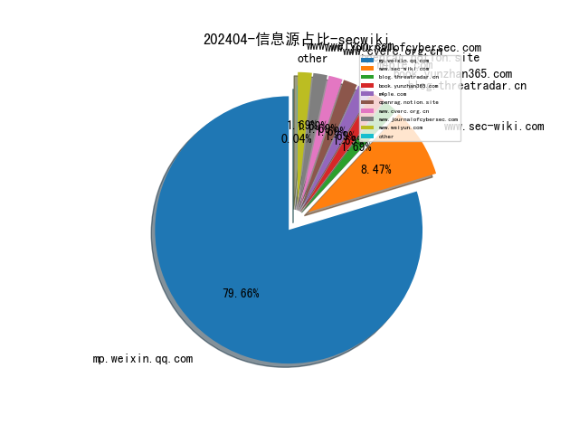
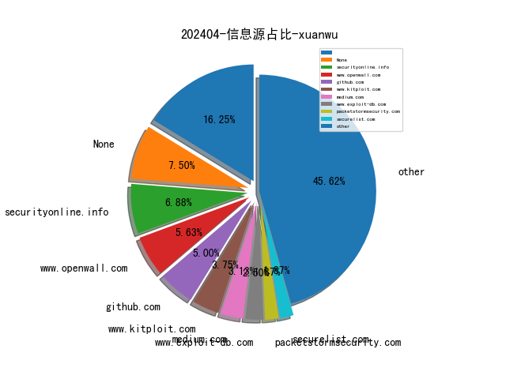
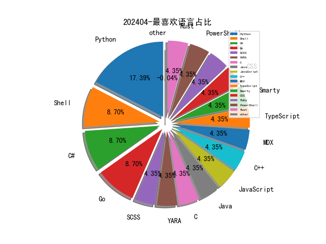

# [数据--所有](README_20.md)
# [数据--年度](README_2024.md)
# 202404 信息源与信息类型占比

# 网络安全书籍 推荐
| date_added | language | title | author | link | size| 
| --- | --- | --- | --- | --- | ---| 
| 2024-04-29 13:26:28 | English | Effective Strategy Execution: Business Intelligence Using Microsoft Power BI (Management for Professionals) | Bernd Heesen | http://libgen.rs/book/index.php?md5=275E7DBB732F8E09E9976D534FA157EB | 115 MB [EPUB]| 
| 2024-04-29 13:03:49 | English | Intraspecific Genetic Diversity: Monitoring, Conservation, and Management | Yuri Petrovich Altukhov | http://libgen.rs/book/index.php?md5=3A5A7B4A442FF4E68DBFC8D1ADC4A1DD | 11 MB [PDF]| 
| 2024-04-29 12:55:30 | English | Intracranial Pressure and Brain Monitoring XII (Acta Neurochirurgica Supplement, 95) | Wai S. Poon (editor), Cees J.J. Avezaat (editor), Matthew Chan (editor), Marek Czosnyka (editor), Keith Goh (editor), Peter J.A. Hutchinson (editor), Yoichi Katayama (editor), J.M.K. Lam (editor), Anthony Marmarou (editor), S.C.P. Ng (editor), John D. Pickard (editor) | http://libgen.rs/book/index.php?md5=B90B0CED6A2D88DD4A1CEC990CF290D5 | 10 MB [PDF]| 
| 2024-04-25 13:41:20 | English | Proceedings of the 6th International Conference on Smart Monitoring, Assessment and Rehabilitation of Civil Structures (Lecture Notes in Civil Engineering, 259) | Xiang-Lin Gu (editor), Masoud Motavalli (editor), Alper Ilki (editor), Qian-Qian Yu (editor) | http://libgen.rs/book/index.php?md5=8F3080BF07CA77568ABAD365596A6C6A | 42 MB [PDF]| 
| 2024-04-24 14:26:31 | English | Privacy and Technologies of Identity: A Cross-Disciplinary Conversation | Katherine J. Strandburg (editor), Daniela Stan Raicu (editor) | http://libgen.rs/book/index.php?md5=DA476523FAB3D1C94020526FBC1E48CB | 21 MB [PDF]| 
| 2024-04-23 15:37:10 | English | Security, Privacy, and Applied Cryptography Engineering: 11th International Conference, SPACE 2021, Kolkata, India, December 10–13, 2021, Proceedings (Security and Cryptology) | Lejla Batina (editor), Stjepan Picek (editor), Mainack Mondal (editor) | http://libgen.rs/book/index.php?md5=A6358282D5C7A973B67359997151722B | 13 MB [PDF]| 
| 2024-04-23 15:18:32 | English | Security and Privacy in Social Networks and Big Data: 7th International Symposium, SocialSec 2021, Fuzhou, China, November 19–21, 2021, Proceedings (Communications in Computer and Information Science) | Limei Lin (editor), Yuhong Liu (editor), Chia-Wei Lee (editor) | http://libgen.rs/book/index.php?md5=144074BD6FCB3519823E9EA758FCC2B5 | 12 MB [PDF]| 
| 2024-04-23 00:33:42 | English | (Lecture Notes in Electrical Engineering; 1049) Security, Privacy and Data Analytics: Select Proceedings of the 2nd International Conference, ISPDA 2022 | Udai Pratap Rao (editor), Mamoun Alazab (editor), Bhavesh N. Gohil (editor), Pethuru Raj Chelliah (editor) | http://libgen.rs/book/index.php?md5=002914E602CC8B6D1112A87B64BCED84 | 9 MB [PDF]| 
| 2024-04-22 14:45:47 | English | Pro Cloud Native Java EE Apps: DevOps with MicroProfile, Jakarta EE 10 APIs, and Kubernetes | Luqman Saeed, Ghazy Abdallah | http://libgen.rs/book/index.php?md5=3DD6A02EE74EBCC5319305296CFDC179 | 7 MB [PDF]| 
| 2024-04-22 14:27:06 | English | Public Key Cryptography - PKC 2006: 9th International Conference on Theory and Practice in Public-Key Cryptography, New York, NY, USA, April 24-26, ... (Lecture Notes in Computer Science, 3958) | Moti Yung (editor), Yevgeniy Dodis (editor), Aggelos Kiayias (editor), Tal Malkin (editor) | http://libgen.rs/book/index.php?md5=8A920BE053E00421900F8EC20DFF5D34 | 7 MB [PDF]| 
| 2024-04-22 13:28:55 | English | Security and Cryptography for Networks: 6th International Conference, SCN 2008, Amalfi, Italy, September 10-12, 2008, Proceedings (Lecture Notes in Computer Science, 5229) | Rafail Ostrovsky (editor), Roberto de Prisco (editor), Ivan Visconti (editor) | http://libgen.rs/book/index.php?md5=061DADF7338C97EB5A219F932D958C7B | 7 MB [PDF]| 
| 2024-04-21 14:55:45 | English | Selected Areas in Cryptography: 12th International Workshop, SAC 2005, Kingston, ON, Canada, August 11-12, 2005, Revised Selected Papers (Lecture Notes in Computer Science, 3897) | Bart Preneel (editor), Stafford Tavares (editor) | http://libgen.rs/book/index.php?md5=D98D21962524E1D9847FF486A633A2A4 | 4 MB [PDF]| 
| 2024-04-21 14:00:41 | English | Responsibility, Privileged Irresponsibility and Response-ability: Higher Education, Coloniality and Ecological Damage (Palgrave Critical University Studies) | Vivienne Bozalek, Michalinos Zembylas | http://libgen.rs/book/index.php?md5=FDDB663787A21B214D46DED692478EC6 | 3 MB [PDF]| 
| 2024-04-21 13:29:53 | English | Privacy Symposium 2022: Data Protection Law International Convergence and Compliance with Innovative Technologies (DPLICIT) | Stefan Schiffner (editor), Sebastien Ziegler (editor), Adrian Quesada Rodriguez (editor) | http://libgen.rs/book/index.php?md5=9D549A655807AA2F0C199A9AD4B960B3 | 3 MB [PDF]| 
| 2024-04-20 19:49:43 | English | Blockchain Technology in Supply Chain Management for Society 5.0 (Smart and Intelligent Computing in Engineering) | K Mathiyazhagan (editor), Atour Taghipour (editor), Vernika Agarwal (editor) | http://libgen.rs/book/index.php?md5=965A11303F603F548896D97C31D2231A | 6 MB [EPUB]| 
| 2024-04-19 14:34:48 | English | Planning and Operation of Active Distribution Networks: Technical, Social and Environmental Aspects (Lecture Notes in Electrical Engineering, 826) | Antonio Carlos Zambroni de Souza (editor), Bala Venkatesh (editor) | http://libgen.rs/book/index.php?md5=75749AB4C59810FBCFEB3912AC3E8328 | 15 MB [PDF]| 
| 2024-04-19 14:13:37 | English | Post-Quantum Cryptography: 13th International Workshop, PQCrypto 2022, Virtual Event, September 28–30, 2022, Proceedings (Lecture Notes in Computer Science) | Jung Hee Cheon (editor), Thomas Johansson (editor) | http://libgen.rs/book/index.php?md5=0488B677420EF7B8ABB2681B10D826C2 | 14 MB [PDF]| 
| 2024-04-17 09:37:36 | English | Effective Rust: 35 Specific Ways to Improve Your Rust Code | unknown | https://www.wowebook.org/effective-rust-35-specific-ways-to-improve-your-rust-code/ | unknown| 
| 2024-04-17 08:55:33 | English | Software Supply Chain Security | unknown | https://www.wowebook.org/software-supply-chain-security/ | unknown| 
| 2024-04-16 08:39:40 | English | Learn Python the Hard Way, 5th Edition | unknown | https://www.wowebook.org/learn-python-the-hard-way-5th-edition/ | unknown| 
| 2024-04-15 20:04:08 | English | Science Fictions: Exposing Fraud, Bias, Negligence and Hype in Science, UK Edition | Stuart Ritchie | http://libgen.rs/book/index.php?md5=45CD90D127EA12A7105FBB52D4DE2B29 | 6 MB [EPUB]| 
| 2024-04-15 19:50:49 | English | New Approaches to CSR, Sustainability and Accountability, Volume IV (Accounting, Finance, Sustainability, Governance & Fraud: Theory and Application) | M. Abu Naser (editor) | http://libgen.rs/book/index.php?md5=79DF0F3C17E22ED3AD8605CDEA1D340A | 4 MB [PDF]| 
| 2024-04-14 10:19:58 | English | Extending Power BI with Python and R, Second Edition | unknown | https://www.wowebook.org/extending-power-bi-with-python-and-r-second-edition/ | unknown| 
| 2024-04-13 03:09:41 | English | The New China Playbook: Beyond Socialism and Capitalism | Keyu Jin | http://libgen.rs/book/index.php?md5=6C8917CA5D0BA36791790E67944BD5A3 | 1 MB [EPUB]| 
| 2024-04-13 13:22:15 | English | Introduction to Cryptography: Principles and Applications (Information Security and Cryptography) | Helmut Knebl Hans Delfs | http://libgen.rs/book/index.php?md5=48E9A483416BFAB0D82C56E77E8F028A | 4 MB [PDF]| 
| 2024-04-12 20:37:20 | English | Stepping Through Cybersecurity Risk Management: A Systems Thinking Approach | Jennifer L. Bayuk | http://libgen.rs/book/index.php?md5=B77F4B8D6D76A0FD05CF46673DDADFDD | 29 MB [RAR]| 
| 2024-04-12 20:37:17 | English | Stepping Through Cybersecurity Risk Management : A Systems Thinking Approach | Jennifer L. Bayuk | http://libgen.rs/book/index.php?md5=941699B7040077250D6F7843BEA914D7 | 18 MB [EPUB]| 
| 2024-04-12 20:37:13 | English | Stepping Through Cybersecurity Risk Management: A Systems Thinking Approach | Jennifer L. Bayuk | http://libgen.rs/book/index.php?md5=2513941CEB782BD567D66D534D6689B2 | 10 MB [PDF]| 
| 2024-04-11 11:48:50 | English | Structural Health Monitoring by Time Series Analysis and Statistical Distance Measures (PoliMI SpringerBriefs) | Alireza Entezami | http://libgen.rs/book/index.php?md5=A1D42C18E96699148401F8AF611F8CC0 | 5 MB [PDF]| 
| 2024-04-11 08:58:26 | English | Python All-in-One For Dummies, 3rd Edition | unknown | https://www.wowebook.org/python-all-in-one-for-dummies-3rd-edition/ | unknown| 
| 2024-04-10 14:58:04 | English | Information Security Planning: A Practical Approach | Susan Lincke | http://libgen.rs/book/index.php?md5=D519F0ADCC9A7A60ABD8BCE0CFB3FC6E | 13 MB [PDF]| 
| 2024-04-10 14:57:13 | English | Increasing Climate Variability and Change: Reducing the Vulnerability of Agriculture and Forestry | James Salinger (editor), Mannava VK Sivakumar (editor), Raymond P. Motha (editor) | http://libgen.rs/book/index.php?md5=C181250C9E89658CDEDCBB36D6E8B6EA | 13 MB [PDF]| 
| 2024-04-10 14:54:34 | English | Information and Cyber Security: 18th International Conference, ISSA 2019, Johannesburg, South Africa, August 15, 2019, Proceedings (Communications in Computer and Information Science, 1166) | Hein Venter (editor), Marianne Loock (editor), Marijke Coetzee (editor), Mariki Eloff (editor), Jan Eloff (editor) | http://libgen.rs/book/index.php?md5=35D0A71758EF69DF6C2BC58AC7777FED | 12 MB [PDF]| 
| 2024-04-08 13:41:36 | English | Financial Cryptography and Data Security: 25th International Conference, FC 2021, Virtual Event, March 1–5, 2021, Revised Selected Papers, Part II (Security and Cryptology) | Nikita Borisov (editor), Claudia Diaz (editor) | http://libgen.rs/book/index.php?md5=40ABFFD1B525794BA01CEBE7BA881BB9 | 25 MB [PDF]| 
| 2024-04-07 11:50:34 | English | Synthetic Data and Generative AI | unknown | https://www.wowebook.org/synthetic-data-and-generative-ai/ | unknown| 
| 2024-04-07 13:47:25 | English | Large Language Model-Based Solutions: How to Deliver Value with Cost-Effective Generative AI Applications | unknown | https://www.wowebook.org/large-language-model-based-solutions-how-to-deliver-value-with-cost-effective-generative-ai-applications/ | unknown| 
| 2024-04-07 13:06:55 | English | Microsoft SharePoint Premium in the Real World: Bringing Practical Cloud AI to Content Management | unknown | https://www.wowebook.org/microsoft-sharepoint-premium-in-the-real-world-bringing-practical-cloud-ai-to-content-management/ | unknown| 
| 2024-04-06 18:55:16 | English | ChatGPT for Cybersecurity Cookbook | unknown | https://www.wowebook.org/chatgpt-for-cybersecurity-cookbook/ | unknown| 
| 2024-04-05 10:17:18 | English | Microsoft 365 Administrator MS-102 Exam Guide | Aaron Guilmette | http://libgen.rs/book/index.php?md5=E30324C59A2DD3FB90ACDA853F701DD2 | 39 MB [PDF]| 
| 2024-04-04 15:29:46 | English | Python Pandas and Python Data Structures for Beginners | JP Parker | http://libgen.rs/book/index.php?md5=849215ADC33344BF08AADFB0FC6860B3 | 71 MB [PDF]| 
| 2024-04-04 15:19:07 | English | Emerging Technologies in Data Mining and Information Security: Proceedings of IEMIS 2022, Volume 1 (Lecture Notes in Networks and Systems, 491) | Paramartha Dutta (editor), Satyajit Chakrabarti (editor), Abhishek Bhattacharya (editor), Soumi Dutta (editor), Vincenzo Piuri (editor) | http://libgen.rs/book/index.php?md5=A6C83A88BFC79A0F7FB44CB8658C664D | 24 MB [PDF]| 
| 2024-04-04 15:05:04 | English | Emerging Technologies in Data Mining and Information Security: Proceedings of IEMIS 2022, Volume 2 (Lecture Notes in Networks and Systems, 490) | Paramartha Dutta (editor), Satyajit Chakrabarti (editor), Abhishek Bhattacharya (editor), Soumi Dutta (editor), Celia Shahnaz (editor) | http://libgen.rs/book/index.php?md5=7AAFDB868B4CDE2F7A7715D23A137273 | 23 MB [PDF]| 
| 2024-04-04 15:02:33 | English | Emerging Technologies in Data Mining and Information Security: Proceedings of IEMIS 2022, Volume 3 (Advances in Intelligent Systems and Computing, 1348) | Paramartha Dutta (editor), Abhishek Bhattacharya (editor), Soumi Dutta (editor), Wen-Cheng Lai (editor) | http://libgen.rs/book/index.php?md5=2ABD51FFCB92C4E43D4D330183146D12 | 23 MB [PDF]| 
| 2024-04-04 17:40:45 | English | Electronic Fetal Monitoring | Xiaohui Guo (editor) | http://libgen.rs/book/index.php?md5=AA4518522270C37690C19A22D0E37B79 | 35 MB [PDF]| 
| 2024-04-04 14:58:13 | English | EcoDesign and Sustainability II: Social Perspectives and Sustainability Assessment (Sustainable Production, Life Cycle Engineering and Management) | Yusuke Kishita (editor), Mitsutaka Matsumoto (editor), Masato Inoue (editor), Shinichi Fukushige (editor) | http://libgen.rs/book/index.php?md5=1712B759CF72ADFC3F5655A38A098B99 | 22 MB [PDF]| 
| 2024-04-04 14:24:26 | English | Emerging Trends in Cybersecurity Applications | Kevin Daimi (editor), Abeer Alsadoon (editor), Cathryn Peoples (editor), Nour El Madhoun (editor) | http://libgen.rs/book/index.php?md5=DFF3ECF1983BECFFAA2CFD7B8F7125F5 | 21 MB [PDF]| 

# 微信公众号 推荐
| nickname_english | weixin_no | title | url| 
| --- | --- | --- | ---| 
| CNCERT国家工程研究中心 | NELCERT | 原创 , 近年全球石油天然气行业网络安全事件汇总分析 | https://mp.weixin.qq.com/s?__biz=MzUzNDYxOTA1NA==&mid=2247544353&idx=1&sn=46439e85b4fa0aa2e2e894e0648f7f4e | 52| 
| CNNVD安全动态 | cnnvd_news | 信息安全漏洞周报（2024年第18期） | https://mp.weixin.qq.com/s?__biz=MzAxODY1OTM5OQ==&mid=2651444064&idx=1&sn=87f1912c85cb00e844dd0bcb612c84e3 | 5| 
| Desync InfoSec | DesyncInfoSec | 从未授权使用破解软件到VenomRAT木马的应急响应 | https://mp.weixin.qq.com/s?__biz=MzkzMDE3ODc1Mw==&mid=2247487751&idx=1&sn=90a3447abde63b287df16742b07b876b | 4| 
| Eonian Sharp | Eonian_sharp | 【刻刀】便携加解密工具箱 - EScode | https://mp.weixin.qq.com/s?__biz=Mzg3NzUyMTM0NA==&mid=2247485619&idx=1&sn=ba9014b371b42426a43ffe09a63753ab | 1| 
| FreeBuf | freebuf | 《2023年银行业信息安全分析报告》正式发布 , FreeBuf咨询 | https://mp.weixin.qq.com/s?__biz=MjM5NjA0NjgyMA==&mid=2651274420&idx=1&sn=7ffcd5deef48d08d8b29b4c527ff6277 | 80| 
| GEEKCON | GEEKCON-DarkNavy | 官方赛题解析 , “对抗研判 AVSS 挑战赛 ” 2024 线上选拔赛 | https://mp.weixin.qq.com/s?__biz=Mzk0NzQ5MDYyNw==&mid=2247485495&idx=1&sn=bb2698ede3b62f1de1506b1b7466a53f | 2| 
| HACK之道 | hacklearn | 远程桌面键盘记录器 | https://mp.weixin.qq.com/s?__biz=MzIwMzIyMjYzNA==&mid=2247513683&idx=1&sn=4f532e9f70b69bad37913bbadf707765 | 14| 
| IMPERVA | IMPERVA | 全球一周应用安全事件播报 | https://mp.weixin.qq.com/s?__biz=MzI1OTYyOTUyOA==&mid=2247487576&idx=1&sn=b37d57673da63834296548ad14e37439 | 1| 
| ISEC安全e站 | ANSCEN-ISEC | 数据安全 一网打尽 , 安胜“数网”数据分类分级工具重磅上线，邀您免费体验啦！ | https://mp.weixin.qq.com/s?__biz=MzIxNzU5NzYzNQ==&mid=2247489007&idx=1&sn=b21d615d299dcb6111bb19ef3adefce8 | 3| 
| M姐 数据合规评论 | M_DigitalLawandLife | 国际资讯 , 欧盟委员会根据《数字服务法》指定Shein为超大型在线平台等（4.25-4.30） | https://mp.weixin.qq.com/s?__biz=MzU5NzUxNjg3Nw==&mid=2247499583&idx=1&sn=e2b74e0f2a17f815340e3d135bbf210b | 9| 
| N0wayBack | N0way_Back | D^3 CTF2024 WP | https://mp.weixin.qq.com/s?__biz=Mzg4MTg1MDY4MQ==&mid=2247485683&idx=1&sn=59a3ab77c368f4a06173f06ba6acc8f4 | 2| 
| OnionSec | gh_8ab0e346e1df | 初遇内嵌WebShell的pdf文件 | https://mp.weixin.qq.com/s?__biz=MzUyMTUwMzI3Ng==&mid=2247485429&idx=1&sn=77740905ff8e89d5fd6b6e5a569cce5c | 1| 
| Ots安全 | AnQuan7 | 研究人员发布了 Windows 内核 EoP 漏洞的 PoC 漏洞 （CVE-2024-26218） | https://mp.weixin.qq.com/s?__biz=MzAxMjYyMzkwOA==&mid=2247507176&idx=1&sn=82a4ecfa728880cbcbbe5e1caf3e0814 | 48| 
| Relay学安全 | gh_8d57319ec39c | 闲来无事 写个工具玩玩? | https://mp.weixin.qq.com/s?__biz=Mzg5MDg3OTc0OA==&mid=2247486686&idx=1&sn=d0832dccf6a31808c12d77f7ab6fa6cc | 3| 
| StudySec | StudySec | 哥斯拉v4.0流量分析 | https://mp.weixin.qq.com/s?__biz=MzI0Mzc5NzM5Mw==&mid=2247483837&idx=1&sn=da9362821cf533a6169c2570439746b2 | 2| 
| TahirSec | gh_ea4772086043 | Windows , AV/EDR对抗之BYOVD技术 | https://mp.weixin.qq.com/s?__biz=MzkzNjIwMzM5Nw==&mid=2247488223&idx=1&sn=5e4c5d868253e838e675efb7d907f43a | 3| 
| Tide安全团队 | TideSec | 山东省移动应用四月份安全态势 | https://mp.weixin.qq.com/s?__biz=Mzg2NTA4OTI5NA==&mid=2247515132&idx=1&sn=366bc0f02fbe9483f04db3a26b53f877 | 1| 
| X安全实验室 | H4ckMe | Rez | https://mp.weixin.qq.com/s?__biz=MzkzMDM5NzIwMw==&mid=2247484494&idx=1&sn=1cca9ec1830e45636f6eb52c805dba32 | 3| 
| Z2O安全攻防 | Z2O_SEC | 2FA bypass 让我赚了 $______ | https://mp.weixin.qq.com/s?__biz=Mzg2ODYxMzY3OQ==&mid=2247511073&idx=1&sn=ec64c5941d8413cc8b6a689af3b1644d | 27| 
| jacky安全 | Security55555 | 【在野0day】某建站系统存在SQL注入漏洞 | https://mp.weixin.qq.com/s?__biz=MzkzMjQ0MTk1OQ==&mid=2247484026&idx=1&sn=40e071ceb846c90e84625e113a9b3b08 | 1| 
| moonsec | moon_sec | 【五一活动】暗月渗透测试培训 | https://mp.weixin.qq.com/s?__biz=MzAwMjc0NTEzMw==&mid=2653588373&idx=1&sn=9a250c710c886879203d1cc5433655fb | 2| 
| 万径安全 | Mega_Vector | 五·一劳动节快乐 | https://mp.weixin.qq.com/s?__biz=MzIwMzI1MDg2Mg==&mid=2649944475&idx=1&sn=d6d75882b6e8efa33362a60a97009492 | 5| 
| 不秃头的安全 | BTTDAQ | 实战｜记一次代码审计打穿多所高校 | https://mp.weixin.qq.com/s?__biz=Mzg3NzkwMTYyOQ==&mid=2247486619&idx=1&sn=24a9db9ade6d12ed7abe571dcbb3028d | 8| 
| 中国信息安全 | chinainfosec | 陈一新：深入学习贯彻总体国家安全观 坚定不移地维护国家安全 | https://mp.weixin.qq.com/s?__biz=MzA5MzE5MDAzOA==&mid=2664212163&idx=1&sn=db6f50d8b932a7f85f944cfc05f08b08 | 107| 
| 中国电信安全 | gh_ea6109d37f13 | 赋能战新，蓄力前行！ | https://mp.weixin.qq.com/s?__biz=Mzg5NTU3Nzg3MQ==&mid=2247515547&idx=2&sn=9552da66952aa2a4edc5e19259e01024 | 11| 
| 中国网络空间安全协会 | CSAC20160325 | 网安协会组织开展义务植树尽责活动 | https://mp.weixin.qq.com/s?__biz=MzA3ODE0NDA4MA==&mid=2649399405&idx=1&sn=20e69ab491464edabedaffeac95df2bb | 7| 
| 中国计算机学会 | ccfvoice | “CCF公益日—科普在行动”系列活动，科技与公益的融合盛宴 | https://mp.weixin.qq.com/s?__biz=MjM5MTY5ODE4OQ==&mid=2651571314&idx=1&sn=df12580a23f2ad98b69cf3661884e46c | 65| 
| 中国软件评测中心 | china_testing | 中国电子信息产业发展研究院党委书记、副院长刘文强：未来产业发展呈现三大态势 | https://mp.weixin.qq.com/s?__biz=MjM5NzYwNDU0Mg==&mid=2649244021&idx=1&sn=3cff72ff7294b7f3bf48dba32c6168e3 | 16| 
| 中泊研安全应急响应中心 | gh_ee6d13a7ae1e | 五一放假通知 | https://mp.weixin.qq.com/s?__biz=Mzg2NDc0MjUxMw==&mid=2247485740&idx=1&sn=9abe6b20fecdac62dd18e8d603597171 | 2| 
| 二进制磨剑 | pyable | IDA 技巧（11）玩转结构体！ | https://mp.weixin.qq.com/s?__biz=MzI1Mjk2MTM1OQ==&mid=2247484248&idx=1&sn=8b8a966317536bbe53a7a55d8e7536d0 | 4| 
| 云弈安全 | yunyisec | 将快乐交给节日，把安全交给云弈！云弈科技五一放假值班通知 | https://mp.weixin.qq.com/s?__biz=MzU2ODY0ODk2Nw==&mid=2247488604&idx=1&sn=9ddb2ec77d8156f2b274cdcfd74ca82f | 4| 
| 云起无垠 | Clouditera2021 | “五一”劳动节,安全出行 路上尽赏最美风景 | https://mp.weixin.qq.com/s?__biz=Mzg3Mjg4NTcyNg==&mid=2247489065&idx=1&sn=52fc622daafbac196b1fbeb31b51b01f | 6| 
| 亚信安全 | yaxinanquan | 4月威胁态势 , 0day占比82%！Polyransom勒索家族强势来袭 | https://mp.weixin.qq.com/s?__biz=MjM5NjY2MTIzMw==&mid=2650614271&idx=1&sn=d9b4eca8812650635eb615fce05da216 | 22| 
| 京东安全应急响应中心 | jsrc_team | 【活动】五一劳动季，挖洞最光荣！ | https://mp.weixin.qq.com/s?__biz=MjM5OTk2MTMxOQ==&mid=2727836497&idx=1&sn=2d4746aa3478e46e35704825d204678f | 4| 
| 人遁安全 | Rendun-sec | 首发-- Linux 原生微信小程序抓包 | https://mp.weixin.qq.com/s?__biz=Mzk0NDQwMDY1Nw==&mid=2247484256&idx=1&sn=007e7a0a7bad6911cdfca39d0c638768 | 2| 
| 亿人安全 | Yr-Sec | 哥斯拉流量分析 | https://mp.weixin.qq.com/s?__biz=Mzk0MTIzNTgzMQ==&mid=2247515013&idx=1&sn=bd12ebfe9e18d85e425897aab18c91a8 | 10| 
| 代码卫士 | codesafe | R语言中的新漏洞可导致项目易受供应链攻击 | https://mp.weixin.qq.com/s?__biz=MzI2NTg4OTc5Nw==&mid=2247519400&idx=1&sn=66cec4a7fd3d72c14f92738147c6d83a | 28| 
| 伤心的金毛 | CNbaimao | 绕过某服上网管控 | https://mp.weixin.qq.com/s?__biz=MzU2NDM2OTQxMw==&mid=2247484117&idx=1&sn=ad5655656c23202695f653238ed173e8 | 2| 
| 信息安全D1net | D1Net18 | CISO应对数据泄露后如何规避个人责任 | https://mp.weixin.qq.com/s?__biz=MzA3NTIyNzgwNA==&mid=2650258624&idx=1&sn=06e74996866757264041f6c3eba402fe | 8| 
| 信息安全国家工程研究中心 | gh_1e0d1778d4b2 | 近期网安资讯动态盘点(2024-4下) | https://mp.weixin.qq.com/s?__biz=MzU5OTQ0NzY3Ng==&mid=2247496569&idx=1&sn=292671c8da3bc193a107666237f29e20 | 7| 
| 信息安全研究 | ISR2016 | 【业界动态】2024中关村论坛中关村国际技术交易大会——第八届中国网信产业前锋汇成功举办 | https://mp.weixin.qq.com/s?__biz=MzA3NzgzNDM0OQ==&mid=2664986491&idx=1&sn=da6455c7e09f1f8ed5cf8b055a865046 | 49| 
| 全球技术地图 | drc_iite | 技经观察丨2023年世界主要经济体生物制造发展规划 | https://mp.weixin.qq.com/s?__biz=MzI1OTExNDY1NQ==&mid=2651612430&idx=1&sn=0b2b6706ca9634532518328b666017ce | 35| 
| 全知科技 | QUANZHI-TECH | 重磅发布,全知科技再度实力入选《2024杭州准独角兽企业榜单》！ | https://mp.weixin.qq.com/s?__biz=MzU0NDMxODY2Nw==&mid=2247521627&idx=1&sn=ca5b923f11602be87cb022d2ecc4c64c | 7| 
| 关键基础设施安全应急响应中心 | CII-SRC | 近年全球石油天然气行业网络安全事件汇总分析 | https://mp.weixin.qq.com/s?__biz=MzkyMzAwMDEyNg==&mid=2247543539&idx=1&sn=a5789a4cf28894958b1538008f007835 | 52| 
| 内生安全联盟 | CCESS_CHINA | 2024年数字经济怎么干？两部门部署九大重点工作 | https://mp.weixin.qq.com/s?__biz=Mzg4MDU0NTQ4Mw==&mid=2247518702&idx=2&sn=195773076923e4f07a9337c4d253d4d6 | 35| 
| 凯撒安全实验室 | SecueKaiser | 【2024】3-5K/天，招募HW中高级人员！！！ | https://mp.weixin.qq.com/s?__biz=Mzg2OTg5NjE5MQ==&mid=2247485279&idx=1&sn=4380c3477537464b69006dab329dd399 | 4| 
| 勒索病毒头条 | gh_e2ebf868b29d | 加拿大零售药店巨头伦敦药店遭受勒索攻击！78家门店关闭，每天损失高达一百万美元 | https://mp.weixin.qq.com/s?__biz=MzkwNTYyNDQ3MQ==&mid=2247484239&idx=1&sn=06643b98c93598e2be9859e1c323fcd9 | 4| 
| 十九线菜鸟学安全 | gh_5d5696256f18 | 【红蓝/演练】-事前准备(6)之互联网风险收敛 | https://mp.weixin.qq.com/s?__biz=MzI1OTUyMTI2MQ==&mid=2247484470&idx=1&sn=37a51a3982a50a63bbc0a4d67f476123 | 1| 
| 南阳网络空间安全研究院 | gh_206ce0a49692 | 一周网络安全速递 | https://mp.weixin.qq.com/s?__biz=Mzg5MjkxMDc4MA==&mid=2247483744&idx=1&sn=0460a1c59c18d0a47f540e8b20c7a158 | 1| 
| 合天网安实验室 | hee_tian | 免费公开课：五一放假不停学 | https://mp.weixin.qq.com/s?__biz=MjM5MTYxNjQxOA==&mid=2652904946&idx=1&sn=d38f13e98945d04415c7c70db17c0f90 | 26| 
| 启明星辰安全简讯 | None | 安全简讯（2024.04.30） | https://mp.weixin.qq.com/s?__biz=MzUxMDQzNTMyNg==&mid=2247504255&idx=1&sn=6380709f275e4c62f2b962e89f613c91 | 36| 
| 启明星辰泰合 | gh_ff488b0e98ad | 从RSAC2024创新沙盒看网络安全新趋势 | https://mp.weixin.qq.com/s?__biz=MjM5NDI4ODU5OQ==&mid=2684314345&idx=1&sn=79846f60aafafeec11e64f968f09a9ce | 1| 
| 哈拉少安全小队 | gh_b273ce95df95 | Mythic C2学习(2) | https://mp.weixin.qq.com/s?__biz=MzAxNzkyOTgxMw==&mid=2247492559&idx=1&sn=7a32e650d72b82ddba349ae4b1bfa9f0 | 9| 
| 商业智能研究 | fr_research | 企业数字化转型：顶层规划方法！ | https://mp.weixin.qq.com/s?__biz=MzIwMzg5MTI0OQ==&mid=2247545723&idx=1&sn=1ca73e80510ae1d3a644c544e29dc9ad | 9| 
| 商密君 | shangmijun | 最高3000万，深圳征集年度科技重大专项备选课题 | https://mp.weixin.qq.com/s?__biz=MzI5NTM4OTQ5Mg==&mid=2247622171&idx=1&sn=5226f897a9759d5c9ace56a44564878e | 70| 
| 嘶吼专业版 | Pro4hou | 5000 多台 CrushFTP 服务器被零日漏洞攻击 | https://mp.weixin.qq.com/s?__biz=MzI0MDY1MDU4MQ==&mid=2247574950&idx=1&sn=9a470e6aec79c18a56de924befc4b8bf | 12| 
| 国家网络安全通报中心 | gh_8793d2a6176d | 网络“代打”服务？以暴制暴不可取！ | https://mp.weixin.qq.com/s?__biz=MzU1MTE1MjU5Nw==&mid=2247485029&idx=1&sn=7a544e0ad20a88d9d2ebdbbf805c034a | 3| 
| 大数据技术标准推进委员会 | gh_06f5ec229a80 | 从“数字化”到“数智化”，企业需做好五方面工作 | https://mp.weixin.qq.com/s?__biz=MzU0NzczNjAwMw==&mid=2247510249&idx=1&sn=8c03df31632bdad8e8ee3c7697797612 | 15| 
| 天空卫士SkyGuard | Sky--Guard | 五一劳动节：向各行业辛勤耕耘的劳动者致敬 | https://mp.weixin.qq.com/s?__biz=MzA5MjQyODY1Mw==&mid=2648489472&idx=1&sn=189e4d5a59c065072360fa67e15176c7 | 4| 
| 天融信 | TopsecPioneer | 天融信天问大模型首批入选大模型安全性测评“磐石·X”榜单，获最高A级认定！ | https://mp.weixin.qq.com/s?__biz=MzA3OTMxNTcxNA==&mid=2650917134&idx=1&sn=7e0090da73cc13f033c83b020b8e6058 | 20| 
| 奇安信安全服务 | gh_c3bad9ca2f7d | 奇安信圆满完成2024年中关村论坛年会网络安全保障任务 | https://mp.weixin.qq.com/s?__biz=MzI4MzA0ODUwNw==&mid=2247487055&idx=1&sn=c1085c37317c693cc9504a18a4af9f54 | 1| 
| 奇安信集团 | qianxin-keji | 成绩A  奇安信QAX-GPT安全机器人通过工信领域联合检测 | https://mp.weixin.qq.com/s?__biz=MzU0NDk0NTAwMw==&mid=2247611159&idx=1&sn=af567fbb35385277f3b0873951c6ce82 | 37| 
| 奇安网情局 | QACIA2020 | 美国网络司令部谋求向网络防御部队提供“联合网络狩猎套件” | https://mp.weixin.qq.com/s?__biz=MzI4ODQzMzk3MA==&mid=2247488651&idx=1&sn=b8d24e90882b85f9a8f19e56a556688f | 5| 
| 安世加 | asjeiss | 安世加实战派沙龙第一期之邮件安全在北京成功举办(2024.4.27/周六、北京） | https://mp.weixin.qq.com/s?__biz=MzU2MTQwMzMxNA==&mid=2247538319&idx=1&sn=790865d247c5265e069a4326bcd96679 | 18| 
| 安信安全 | gsaxns | 数字经济时代的数据安全风险与治理探索 | https://mp.weixin.qq.com/s?__biz=MzAxNTYwOTU1Mw==&mid=2650089330&idx=1&sn=e495d0b0f90408348d6858e0dc51a299 | 14| 
| 安全内参 | anquanneican | Gartner：全球约63%的组织已经实施零信任策略 | https://mp.weixin.qq.com/s?__biz=MzI4NDY2MDMwMw==&mid=2247511518&idx=1&sn=6f198e5117f096873b89642cc5be673f | 28| 
| 安全圈 | ChinaAnQuan | 【安全圈】警惕网络空间的“谍影重重”！ | https://mp.weixin.qq.com/s?__biz=MzIzMzE4NDU1OQ==&mid=2652059121&idx=1&sn=1c3cdd306cc64913c8e58d8d423b96a1 | 76| 
| 安全客 | anquanbobao | 两千万奖金点燃今夏，东半球网络安全顶赛“矩阵杯”官宣！ | https://mp.weixin.qq.com/s?__biz=MzA5ODA0NDE2MA==&mid=2649786504&idx=1&sn=b920fed41bc02436136a8f8bd9025c9f | 3| 
| 安全攻防屋 | z6_debug | 【漏洞复现】kkFileView远程代码执行漏洞 | https://mp.weixin.qq.com/s?__biz=MzkyNTU3MjA3OQ==&mid=2247484824&idx=1&sn=2258eb02986264efb932dc1e5974c9e3 | 1| 
| 安全牛课堂 | aqniu_edu | OffSec推出的“蓝队课程”：像攻击者一样思考的捍卫者 | https://mp.weixin.qq.com/s?__biz=MzIxNTM4NDY2MQ==&mid=2247510516&idx=1&sn=b90fe165d215de416849d3c803808387 | 17| 
| 安全狗 | safedog2013 | 安全无休 , 安全狗五一值班放假通知 | https://mp.weixin.qq.com/s?__biz=MjM5NTc2NDM4MQ==&mid=2650840840&idx=1&sn=30a5fde7f6734cc7be292d123e5d4c57 | 5| 
| 安全狗的自我修养 | haidragon_study | 探索字符编码 - 第 1 部分：字符集、ASCII、Unicode、UTF-32 等 | https://mp.weixin.qq.com/s?__biz=MzkwOTE5MDY5NA==&mid=2247495575&idx=1&sn=7633c00c3047a4b649264235331bc93c | 9| 
| 安在 | AnZer_SH | 数字经济风起时，金融安澜凭古韵——数据安全风险评估之策 | https://mp.weixin.qq.com/s?__biz=MzU5ODgzNTExOQ==&mid=2247620959&idx=2&sn=53740d2a7c06c70bcec2257211bda156 | 44| 
| 安知讯 | dataanquan | 10款移动应用被通报，存在隐私不合规行为 | https://mp.weixin.qq.com/s?__biz=MzIxMDIwODM2MA==&mid=2653929822&idx=1&sn=813f0839e8b7b388cb1560ef0909769a | 17| 
| 小毅安全阵地 | anquanzhendi | 领取安全渗透试听课名额，手慢无！ | https://mp.weixin.qq.com/s?__biz=Mzg4MDE0MzQzMw==&mid=2247487420&idx=1&sn=297771c6e584b82b8a3affad0e18b282 | 7| 
| 小迪安全 | xiaodisec | 【五一优惠】, 小迪安全培训 | https://mp.weixin.qq.com/s?__biz=MzA5MzQ3MDE1NQ==&mid=2653940568&idx=1&sn=795b9b16b0c61cd51e018384ce41583f | 1| 
| 山海之关 | shg-sec | 四月份68个0day/1day/nday漏洞汇总 | https://mp.weixin.qq.com/s?__biz=Mzg4MjcxMTAwMQ==&mid=2247488174&idx=1&sn=cb996e5288d383affb6ca6cd815ea1bf | 2| 
| 州弟学安全 | gh_8440a0e647ba | 渗透测试,一次丝滑的渗透测试记录 | https://mp.weixin.qq.com/s?__biz=MzkzMDE5OTQyNQ==&mid=2247485282&idx=1&sn=75e422fef1984fa5d2402b4a8eca2a4d | 6| 
| 工业安全产业联盟 | ICSISIA | 报告丨信通院：隐私计算应用研究报告（2023年），附下载 | https://mp.weixin.qq.com/s?__biz=MzI2MDk2NDA0OA==&mid=2247527060&idx=2&sn=3a3d00ff39444f1ccedeec53bab90c09 | 19| 
| 平航科技 | pinghangtechnology | 【劳动节放假通知】技术服务不停歇！ | https://mp.weixin.qq.com/s?__biz=MzI0OTEyMTk5OQ==&mid=2247492782&idx=1&sn=66274ca98bebd6b7b5773398cb7581f0 | 3| 
| 开源聚合网络空间安全研究院 | OSPtech_Cyberspace | 【应用实践】Linux安全防火墙（iptables）配置策略 | https://mp.weixin.qq.com/s?__biz=MzI4NTE4NDAyNA==&mid=2650396601&idx=1&sn=24eabba596effc3b4c58075ca901dbe0 | 3| 
| 弱口令验证机器人 | gh_4f1df697395d | 记一次对抗中的钓鱼 | https://mp.weixin.qq.com/s?__biz=MzkzNzM0OTcyOQ==&mid=2247484575&idx=1&sn=812801179fa3f54d9305a804ca9f5723 | 1| 
| 慢雾科技 | SlowMist | 每月动态 , Web3 安全事件总损失约 9081 万美元 | https://mp.weixin.qq.com/s?__biz=MzU4ODQ3NTM2OA==&mid=2247499727&idx=1&sn=e6d671473528820d9a92b8bd91a3b8cd | 7| 
| 成都链安 | LiananTech | 【链看点】,4月区块链安全事件损失继续下降，国内外加密犯罪案件多发 | https://mp.weixin.qq.com/s?__biz=MzU2NzUxMTM0Nw==&mid=2247510979&idx=1&sn=9fbfe1da03819d9034843db9181cb8d6 | 3| 
| 探幽安全 | gh_59b7bbf9870b | SRC中低危漏洞的挖掘实例 | https://mp.weixin.qq.com/s?__biz=MzkxNzQwNDc2OA==&mid=2247484367&idx=1&sn=36adf3a1dec89a9b62e5dd084c9e052f | 1| 
| 效率源 | xiaolvyuantech | 五一期间 , 效率源线上服务团队7*24小时不打烊！ | https://mp.weixin.qq.com/s?__biz=MjM5ODQ3NjAwNQ==&mid=2650547232&idx=1&sn=d0d9faeec448f89e5124b3a03695f336 | 2| 
| 数世咨询 | dwconcn | NSA发布云安全十大关键策略 | https://mp.weixin.qq.com/s?__biz=MzkxNzA3MTgyNg==&mid=2247510805&idx=1&sn=f6854c2e08dc3092b04df0f71ab63bae | 21| 
| 数安行 | None | 数安行劳动节数据安全保障 | https://mp.weixin.qq.com/s?__biz=Mzg5OTM0NTM2OQ==&mid=2247492145&idx=1&sn=502e4501c2232d0ec449a297134a930b | 10| 
| 数据何规 | PIPL2021 | 国家病毒中心、浙、川、渝通报违规APP | https://mp.weixin.qq.com/s?__biz=MzU1MzAzNzcwNw==&mid=2247490649&idx=1&sn=98e8629aa4673327c9d7aab0511f9d1f | 14| 
| 数据安全矩阵 | gh_5d34ca8a20a1 | 成熟度评估正在改变网络安全建设的游戏规则 | https://mp.weixin.qq.com/s?__biz=Mzg3OTg5MzAzNw==&mid=2247492470&idx=1&sn=da5fe90a37587e73ca2a8381dfb97fc0 | 10| 
| 数观天下 | gh_93413ef16fe3 | 基于商用密码的水利重要数据点面结合安全保护方法 | https://mp.weixin.qq.com/s?__biz=MzkxMTYzMjIwNQ==&mid=2247496582&idx=1&sn=447e555aeaa9709e096a93ae60f3be9a | 1| 
| 数说安全 | csreviews | 亚信安全：3亿收购安全狗，拟反向收编亚信科技，研发投入增长38.5% | https://mp.weixin.qq.com/s?__biz=MzkzMDE5MDI5Mg==&mid=2247505865&idx=1&sn=5d73f6dbb902f2f0ec234fc8f2c7f95f | 8| 
| 无糖反网络犯罪研究中心 | gh_2ee7a9b17c0d | 陵川警方破获网络赌博案 , 新邵警方破获架设手机口设备案——涉网犯罪每日情报 | https://mp.weixin.qq.com/s?__biz=MzAxMzkzNDA1Mg==&mid=2247510485&idx=1&sn=6f6c16f23d54ef8796d5ae0dd8b574ec | 16| 
| 昊天信安 | cniaosec | 沈阳深蓝24年国HW招聘 | https://mp.weixin.qq.com/s?__biz=MzkzNzI4NDQzMA==&mid=2247497249&idx=1&sn=33bbda969ad653f0dd6071899e6b8b21 | 6| 
| 星期天不睡懒觉 | gh_5f980ad30e7f | 游戏DLC破解-Dnspy反编译Unity | https://mp.weixin.qq.com/s?__biz=MzkxNjUxODEzNA==&mid=2247483742&idx=1&sn=3e4292be7e7828cb44d3f132f308363e | 1| 
| 泽鹿安全 | gh_fa953363d3b4 | 五一劳动节丨致敬不凡的你们 | https://mp.weixin.qq.com/s?__biz=Mzg5MjE1NzgzMw==&mid=2247488656&idx=1&sn=5f3ff857d5a2130fbd6fbdd39239ed52 | 6| 
| 渗透Xiao白帽 | SuPejkj | 干货 , 高质量免杀公开课！5.1号卷起来！ | https://mp.weixin.qq.com/s?__biz=MzI1NTM4ODIxMw==&mid=2247500693&idx=1&sn=cfe675bd7abf131083cb92490fa8de5d | 5| 
| 渗透测试教程 | bzhack | 分享一个新的微信机器人 | https://mp.weixin.qq.com/s?__biz=MzI3OTIwNDkzNQ==&mid=2651838846&idx=1&sn=ee4c50ba4eb669a5795db6e6d463324d | 1| 
| 渝安全Sec | gh_cf5ae6200b20 | 某银行因涉数据安全管理不到位等被罚290万元 | https://mp.weixin.qq.com/s?__biz=Mzg2NDkwMDcxNA==&mid=2247485352&idx=1&sn=f9605dd3de199b65df31e7b59f2cb4cb | 1| 
| 湖南金盾评估中心 | JD83758161 | 向劳动者致敬 | https://mp.weixin.qq.com/s?__biz=MzIyNTI0ODcwMw==&mid=2662128433&idx=1&sn=2e7f670611e300729c696113ad267166 | 3| 
| 火绒安全 | HuorongLab | 五一期间火绒将持续为您护航 | https://mp.weixin.qq.com/s?__biz=MzI3NjYzMDM1Mg==&mid=2247518297&idx=1&sn=d6308ccdafe95538529539fbf3a5b131 | 6| 
| 焦点安全应急响应中心 | focus_security | 怎么挖到SRC年度冠军？他们来分享经验了！ | https://mp.weixin.qq.com/s?__biz=MzI2ODY3MzcyMA==&mid=2247505921&idx=1&sn=538e536611bddaf9dcb6f9d9e3e50177 | 2| 
| 爱加密 | None | 五一劳动节，向奋斗者致敬 | https://mp.weixin.qq.com/s?__biz=MjM5NzU4NjkyMw==&mid=2650743582&idx=1&sn=8eb600131d53151fba22cf16bb6978f7 | 6| 
| 狐狸说安全 | itseckpg | 关于One-Fox工具箱V7.2更新包的发布！ | https://mp.weixin.qq.com/s?__biz=MzUzMDQ1MTY0MQ==&mid=2247505576&idx=1&sn=db32951d190dd66f7f4ddba4c3bce2da | 3| 
| 珞安科技 | luoantechnology | 劳动节 , 安全值守  乐享假期 | https://mp.weixin.qq.com/s?__biz=MzU2NjI5NzY1OA==&mid=2247509486&idx=1&sn=0548cfd0d4ace10e44fd7b42df4c025f | 10| 
| 生有可恋 | hyang0-1 | 办公辅助用品 | https://mp.weixin.qq.com/s?__biz=Mzk0MTI4NTIzNQ==&mid=2247491439&idx=2&sn=05e6862455185dfb3eecd0dc6ee074fc | 19| 
| 盘古石取证 | Panguite_CN | 盘古石取证 - 五一假期技术服务值班表 | https://mp.weixin.qq.com/s?__biz=Mzg3MjE1NjQ0NA==&mid=2247502604&idx=1&sn=ba9c2bc7894996851369dc2d862ace58 | 3| 
| 盛邦安全WebRAY | WebRay_weixin | 五一劳动节放假通知 | https://mp.weixin.qq.com/s?__biz=MzAwNTAxMjUwNw==&mid=2650275398&idx=1&sn=7cbb4ee2b9f6c98568ca6beff39d8fb4 | 6| 
| 看雪学苑 | ikanxue | APP加固系统分析心得 | https://mp.weixin.qq.com/s?__biz=MjM5NTc2MDYxMw==&mid=2458553405&idx=1&sn=b3ca13638151d7aa77848ad505aa3096 | 58| 
| 红蓝公鸡队 | None | 创业 | https://mp.weixin.qq.com/s?__biz=Mzg5MDc1MjY5Ng==&mid=2247492777&idx=1&sn=75f5404302aa08ce21f9074ffdb725ac | 8| 
| 绿盟科技 | NSFOCUS-weixin | 绿盟君的咖啡时间｜AI之下，RSA大会背后的安全、技术与生态 | https://mp.weixin.qq.com/s?__biz=MjM5ODYyMTM4MA==&mid=2650451589&idx=1&sn=4923409f8433360238a8716a4eb44f09 | 31| 
| 网安鲲为帝 | gh_3ff12deacfe8 | 【0day】KingPortal运行系统信息泄露漏洞【未公开,附poc】 | https://mp.weixin.qq.com/s?__biz=Mzk0OTY3OTc5Mw==&mid=2247483898&idx=1&sn=60653ce49a1c3b8f92563de4803cdaeb | 1| 
| 网络威胁数据联盟 | gh_4cdf96acbe40 | 漏洞预警 , Primeton EOS Platform反序列化漏洞 | https://mp.weixin.qq.com/s?__biz=MzA3MzI5NzY0OA==&mid=2247495627&idx=1&sn=4f333e5ae9bcbff8fbed0e1b974cbdee | 5| 
| 网络安全与数据治理 | gh_ddbdee0c5caf | 国家发改委、国家数据局印发《数字经济2024年工作要点》 | https://mp.weixin.qq.com/s?__biz=MzIzODk1NzY5NA==&mid=2247497386&idx=1&sn=696d33dc8432ae804108ab79955947ca | 22| 
| 网络安全和信息化 | ITyunwei_365master | 数字化转型背景下的企业数据安全策略分析 | https://mp.weixin.qq.com/s?__biz=MjM5MzMwMDU5NQ==&mid=2649163204&idx=1&sn=2ff66cb318f1055fe8c5d7a81089a6f6 | 37| 
| 网络安全资源库 | gh_e8a4866a67fe | 2023年活跃挖矿木马盘点 | https://mp.weixin.qq.com/s?__biz=MzkxMzMyNzMyMA==&mid=2247556439&idx=2&sn=a8b15f3b7a66988c1a86cd231f47fa1b | 32| 
| 网络技术联盟站 | wljslmz | 全网对Docker命令总结最全的文章，秒收藏！ | https://mp.weixin.qq.com/s?__biz=MzIyMzIwNzAxMQ==&mid=2649457683&idx=1&sn=79793c89346d82be8e54fec3ef684e29 | 14| 
| 网络法理论与实务前沿 | gh_d1069c3872e2 | 研讨实录 ,《智能新纪元：生成式人工智能的发展与治理》新书发布会 | https://mp.weixin.qq.com/s?__biz=MzUxNDMzOTAyOQ==&mid=2247492749&idx=1&sn=f98b53533f9178ccff3264259b846cc8 | 3| 
| 网络空间信息安全学习 | gh_39213c5878aa | 荔枝更新 , 商店随机头像上线、下载页面优化 | https://mp.weixin.qq.com/s?__biz=MzI2MjcwMTgwOQ==&mid=2247490824&idx=1&sn=ee99849dd9631db37cd40ae6f7037cc9 | 9| 
| 美亚柏科 | MeiyaPico | 系统全面！大数据分析与建模中级培训即刻起航！ | https://mp.weixin.qq.com/s?__biz=MjM5NTU4NjgzMg==&mid=2651410229&idx=2&sn=add3377be665a5a577b253b68f9b4bf1 | 18| 
| 腾讯玄武实验室 | XuanwuLab | 每日安全动态推送(4-30) | https://mp.weixin.qq.com/s?__biz=MzA5NDYyNDI0MA==&mid=2651959624&idx=1&sn=4f0968a81d2f24cf4b19dc93e55a9d07 | 10| 
| 船山信安 | zghyxa | [Meachines][Easy] Usage | https://mp.weixin.qq.com/s?__biz=MzU2NDY2OTU4Nw==&mid=2247513591&idx=1&sn=9258e6a1eba1846e9907afc73370ac8d | 10| 
| 芯安信息安全 | gh_8bda64db5af3 | C位登场：芯安信息安全首度亮相CIBF2024电池展 | https://mp.weixin.qq.com/s?__biz=Mzk0MTQ5NDgwNg==&mid=2247484474&idx=1&sn=4ef7383f9d850b6a860a553266430820 | 2| 
| 葡萄不只会安全 | putao-m0l1 | 招聘，北京驻场，12k | https://mp.weixin.qq.com/s?__biz=Mzg5OTg1MDk0Mw==&mid=2247484524&idx=1&sn=8ffa8d761ef3a67b9b84c3376c5655b7 | 4| 
| 补天平台 | Patchingthesky | 榜单揭晓！天眼挑战赛TOP10花落谁家？ | https://mp.weixin.qq.com/s?__biz=MzI2NzY5MDI3NQ==&mid=2247503334&idx=1&sn=1c970b40eba4b55f2805f92e987b6c83 | 4| 
| 谈思实验室 | gh_6446c19b4595 | 新势力最新销量排行出炉！小米垫底！ | https://mp.weixin.qq.com/s?__biz=MzIzOTc2OTAxMg==&mid=2247537285&idx=2&sn=5973f0613e19c3e2ed0876e1d56c2296 | 43| 
| 谈数据 | learning-bigdata | “管研用”一体的太保数据中台建设与运营！ | https://mp.weixin.qq.com/s?__biz=MzI1NzYwNTMzNw==&mid=2247522883&idx=1&sn=50563317fe907e84543df4973434f34b | 11| 
| 豆豆咨询 | douAsk | 从“挑战杯专项赛榜单”看技术(一) | https://mp.weixin.qq.com/s?__biz=MzU3MzAzMzk3OA==&mid=2247485034&idx=1&sn=773467644ea2f00ad13d73e0953d0997 | 1| 
| 贫僧法号云空 | gh_cf6b405797e0 | 云时空社会化商业ERP系统validateLoginName存在SQL注入漏洞 | https://mp.weixin.qq.com/s?__biz=Mzg4OTkwMDc1Mg==&mid=2247484722&idx=1&sn=eed7b119c44b071c0fe4b1946f3e9bdb | 5| 
| 运维帮 | yunweibang | 终于有人将大模型可视化了！ | https://mp.weixin.qq.com/s?__biz=MzA3MzYwNjQ3NA==&mid=2651301330&idx=1&sn=f05454e4d7b1bf6ab51fe1155b7a3a50 | 2| 
| 隐私合规交流圈 | PrivacyStudy | 什么是GPC？全球隐私控制如何确保合规性（末尾有惊喜） | https://mp.weixin.qq.com/s?__biz=Mzg4MTg3NDI0NQ==&mid=2247499953&idx=1&sn=9fa43bcb5619bcd144e09b8197531ef4 | 10| 
| 魔方安全 | None | 魔方安全“五一假期”值班通知函 | https://mp.weixin.qq.com/s?__biz=MzI3NzA5NDc0MA==&mid=2649291000&idx=1&sn=bbd29ad5d0373cd41f526eb40a8fdc3c | 6| 
| 中国科学院网络数据重点实验室 | NDST_CAS | 知码大模型（KnowCoder）发布：通过代码统一表示结构化知识，知识抽取性能大幅提升！ | https://mp.weixin.qq.com/s/lcSCAUQQrHSVblyNgtSO-g | 1| 
| 百度安全 | BaiduSD00 | 技术实践｜大模型内容安全蓝军的道与术 | https://mp.weixin.qq.com/s/rS0JKaq8aI6LY8Db5uKxrg | 1| 
| 知识图谱科技 | kgdata_cognitive | 知识图谱使LLM能够真正理解 | https://mp.weixin.qq.com/s/6Yxo8Hiip-ikTK73J3hA4g | 1| 
| 绿盟科技研究通讯 | nsfocus_research | RSAC 2024创新沙盒｜VulnCheck：漏洞优先级挑战的解决方案 | https://mp.weixin.qq.com/s/EU-qWJUjkj9Y9bcgrmtSVQ | 16| 
| A9 Team | gh_533347fad180 | 数据安全离职审计实践分享 | https://mp.weixin.qq.com/s?__biz=MzkzNzI2Mzc0Ng==&mid=2247486170&idx=1&sn=f54a1b5c213f1e372f8655e8c39d9957 | 1| 
| CCIA数据安全工作委员会 | CCIA-DSC | 深度分析 , 未成年人个人信息保护工作思路（上篇）— 体系构建 | https://mp.weixin.qq.com/s?__biz=MzkyNzI3MzAxOA==&mid=2247531676&idx=1&sn=d62fbdd4e3aec5ec138fa4949b740cf7 | 2| 
| Docker中文社区 | None | K8s Pod 故障排查，一个不为人知的技巧！ | https://mp.weixin.qq.com/s?__biz=MzI1NzI5NDM4Mw==&mid=2247497275&idx=1&sn=cff0e86f15628a069151a6309daff722 | 2| 
| EchoSec | gh_ae9ab8305da0 | CVE-2024-2389 命令执行漏洞(附EXP) | https://mp.weixin.qq.com/s?__biz=MzU3MTU3NTY2NA==&mid=2247488541&idx=1&sn=017145d2339f900d70e349ca0bdc9eb7 | 2| 
| GoUpSec | GoUpSec | 蠕虫爆发，PlugX新变种感染250万主机 | https://mp.weixin.qq.com/s?__biz=MzkxNTI2MTI1NA==&mid=2247499060&idx=1&sn=b42be4268773bac0b1b272f3b157df90 | 8| 
| HackSee | hacksee_com | 美国联邦调查局指控加密货币混合器创始人“大规模洗钱” | https://mp.weixin.qq.com/s?__biz=MzI5NTA0MTY2Mw==&mid=2247484971&idx=1&sn=82c94a062c26143d2c27266c5c0af2e3 | 8| 
| Hack分享吧 | HackShareB | 很好用的403绕过目录扫描工具 | https://mp.weixin.qq.com/s?__biz=MzA4NzU1Mjk4Mw==&mid=2247490418&idx=1&sn=47ed7540a006a7c0d3b7bc3598150708 | 3| 
| IoVSecurity | IoVSecurity | Hyundai预防互联自动驾驶汽车的网络安全威胁. | https://mp.weixin.qq.com/s?__biz=MzU2MDk1Nzg2MQ==&mid=2247607370&idx=1&sn=5c580fda3acb7689e9253cf3d6c09471 | 37| 
| Khan安全攻防实验室 | None | Ctf | https://mp.weixin.qq.com/s?__biz=MzAwMjQ2NTQ4Mg==&mid=2247492861&idx=1&sn=22e0c427fd8df88a292528042b2ca834 | 5| 
| LK安全 | loudonglieren123 | 【2024HW】国H招聘第三波强势来袭 砸锅卖铁也要去护网 | https://mp.weixin.qq.com/s?__biz=MzkxMzQyMzUwMg==&mid=2247485933&idx=1&sn=464350bca17a0eb7f7b9da7c39a1f04e | 1| 
| LemonSec | lemon-sec | 干货 , WiFi无线渗透测试总结 | https://mp.weixin.qq.com/s?__biz=MzUyMTA0MjQ4NA==&mid=2247549567&idx=1&sn=1aa2a584b20312a30d49cbe739091db5 | 12| 
| WebSec | gh_2914f5b10e8e | 【在野0day】某友CRM系统某接口存在任意文件下载（大量资产存在） | https://mp.weixin.qq.com/s?__biz=MzkyMzYwNTEyNg==&mid=2247486035&idx=1&sn=3060f3845f37a36eadd0de12a8ec62f3 | 3| 
| crossoverJie | None | Pulsar Meetup 深圳 2024 大咖推荐 | https://mp.weixin.qq.com/s?__biz=MzIyMzgyODkxMQ==&mid=2247487064&idx=1&sn=98437d4f1fd7a3b0d65c2bdd8b9b36bb | 2| 
| dotNet安全矩阵 | doNetSafety | 国内最大的.NET安全攻防知识社区 | https://mp.weixin.qq.com/s?__biz=MzUyOTc3NTQ5MA==&mid=2247491541&idx=2&sn=54f72dc12a39f28969a769a899075ee0 | 17| 
| fullbug | xiejava1018 | 安全运营之通行字管理 | https://mp.weixin.qq.com/s?__biz=MjM5NDMwMjEwMg==&mid=2451851680&idx=1&sn=944048685f10791283de750cc1fcb339 | 4| 
| iLaw合规 | None | 附导读 , 非银行支付机构监管新规实施细则公开征求意见｜iLaw | https://mp.weixin.qq.com/s?__biz=MzkxNjY0OTA3Mw==&mid=2247524013&idx=1&sn=3dab7faaf2417378698d9979db414907 | 3| 
| 一起聊安全 | gh_589ffdaa31f9 | 重磅！《2023网信自主创新调研报告》正式发布 | https://mp.weixin.qq.com/s?__biz=MzI3NjUzOTQ0NQ==&mid=2247509907&idx=1&sn=dc1c66a6c59b479c377087b5f3bbbd0d | 7| 
| 不够安全 | gh_72a34cefa21c | [漏洞复现] CVE-2024-4040 CrushFTP服务器端模板注入 | https://mp.weixin.qq.com/s?__biz=Mzg2OTYzNTExNQ==&mid=2247484917&idx=1&sn=ae4e1769ba62643ee141535e54ec01c5 | 2| 
| 云安全联盟CSA | csa_china | CSA发布, 务实的DevSecOps实施解读（上） 之 DevSecOps黄金流水线与关键角色 | https://mp.weixin.qq.com/s?__biz=MzA3NzM2MTQ3OA==&mid=2649818786&idx=1&sn=a3e8798e33a2360cc6b89c2ef63cb922 | 2| 
| 众亦信安 | gh_d0dab7f4b5ba | 新瓜速递--微软最新RCE?! | https://mp.weixin.qq.com/s?__biz=Mzg5NTkxNzg4MA==&mid=2247488794&idx=1&sn=72a28179c13cd108a0d48db70f503b91 | 1| 
| 伟大航路D | None | 【漏洞复现】短视频矩阵营销系统 ajax_uplaod接口处存在任意文件上传 | https://mp.weixin.qq.com/s?__biz=MzkwNzYzNTkzNA==&mid=2247485420&idx=1&sn=3044c09912d18593f6ae91b7e6f567e1 | 2| 
| 信安网络技术 | xinanwangluojishu | 第一届“长城杯”信息安全铁人三项赛半决赛举办 | https://mp.weixin.qq.com/s?__biz=MzkyNDUxNTQ2Mw==&mid=2247485108&idx=1&sn=d0106abfb07e03dab118377669788b53 | 2| 
| 信安路漫漫 | None | 应急响应常用命令手册 | https://mp.weixin.qq.com/s?__biz=Mzg2MzkwNDU1Mw==&mid=2247484588&idx=1&sn=454744e04a4239b6f300fedb33c73fe4 | 2| 
| 信息安全与通信保密杂志社 | cismag2013 | 《商用密码应用安全性评估量化评估规则》解析 | https://mp.weixin.qq.com/s?__biz=MzkwMTMyMDQ3Mw==&mid=2247587885&idx=1&sn=e2fc566772c25bb814bfb32ea330270b | 24| 
| 全频带阻塞干扰 | RFJamming | 击穿HW , 来自物理安全的重拳 | https://mp.weixin.qq.com/s/vM4hpTmBOhJbApQMXn-raQ | 3| 
| 关键信息基础设施安全保护联盟 | CNCIIPA | 重磅！国内电商企业数据泄露后的用户安全保护效果调研报告新鲜出炉 | https://mp.weixin.qq.com/s?__biz=MzkxNjU2NjY5MQ==&mid=2247501669&idx=1&sn=7a25ef3b956e69193936bbaf721a62b1 | 4| 
| 利刃信安 | None | 【威胁情报】微软官网存在远程命令执行漏洞 | https://mp.weixin.qq.com/s?__biz=MzU1Mjk3MDY1OA==&mid=2247513324&idx=1&sn=5cfc7add13cc6dbbfd94d841dfd2c4d8 | 18| 
| 前沿信安资讯阵地 | infosrc | 2023年中国威胁情报订阅市场分析报告 | https://mp.weixin.qq.com/s?__biz=MzA3MTM0NTQzNA==&mid=2455773235&idx=1&sn=ee7134c3465e1b8c435359e3005ff05c | 9| 
| 剑外思归客 | Hex_70776a6377 | 微软最新版RCE？别被钓鱼了！！！ | https://mp.weixin.qq.com/s?__biz=Mzg3MDY0NjA5MQ==&mid=2247484244&idx=1&sn=a883334dfa0626ee7cef8e9af29d44b5 | 2| 
| 吉祥学安全 | gh_bf0dc85c3f99 | 按照这3个步骤去做，大专学历也能进入一线大厂的网络安全岗实习 | https://mp.weixin.qq.com/s?__biz=MzkwNjY1Mzc0Nw==&mid=2247483923&idx=1&sn=1a13e49f51d6272a73ea775dd073b56f | 10| 
| 听风安全 | tingfengsec | 一次通过信息搜集打点 | https://mp.weixin.qq.com/s?__biz=Mzg3NzIxMDYxMw==&mid=2247500309&idx=1&sn=625b4f7eb95fc967972392d2ef7f48d9 | 3| 
| 启明星辰网络空间安全教育 | gh_310250868fd4 | 集结令！2024数据安全大赛正式启动（文内扫码报名，文末咨询彩蛋） | https://mp.weixin.qq.com/s?__biz=MzUzNDg0NTc1NA==&mid=2247508951&idx=1&sn=96b85e53982d3b8345297ed0f5aa0a2a | 4| 
| 吾爱破解论坛 | pojie_52 | ebpf在Android安全上的应用：结合binder完成一个行为检测沙箱(下篇) | https://mp.weixin.qq.com/s?__biz=MjM5Mjc3MDM2Mw==&mid=2651140600&idx=1&sn=f0161296c1a102ae251fb3346709d387 | 3| 
| 哔哩哔哩技术 | bilibili-TC | NameNode锁细粒度优化在B站的实践 | https://mp.weixin.qq.com/s?__biz=Mzg3Njc0NTgwMg==&mid=2247499091&idx=1&sn=4b0ba4f7fdecea40f9341d118055d54a | 3| 
| 国际云安全联盟CSA | gh_674820794ae8 | 最佳实践之部署安全且具有韧性的AI系统 | https://mp.weixin.qq.com/s?__biz=MzkwMTM5MDUxMA==&mid=2247496831&idx=1&sn=4b3cc56f029b9ddcd25cc43a1de9632c | 5| 
| 夜组安全 | None | 推荐几个安全圈宝藏公众号 | https://mp.weixin.qq.com/s?__biz=Mzk0ODM0NDIxNQ==&mid=2247490495&idx=1&sn=03bb3394944b3d5d4dc3ddfd463208ae | 6| 
| 天地和兴 | None | 安全聚变— [天地和兴安全守护] 产品矩阵发布 | https://mp.weixin.qq.com/s?__biz=MjM5Mzk0MDE2Ng==&mid=2649607257&idx=1&sn=29431a14c384676c2c9972a00c2df1c8 | 1| 
| 天融信教育 | TOPSEC-EDU | GitHub 被曝安全漏洞！ | https://mp.weixin.qq.com/s?__biz=MzU0MjEwNTM5Ng==&mid=2247517929&idx=1&sn=948d8b3ae0bb47be9b228e3d59335d55 | 21| 
| 天锐数据安全 | tipray | 尊重知识成果 保护知识产权 | https://mp.weixin.qq.com/s?__biz=MjM5MTk0MzIzMQ==&mid=2652019627&idx=1&sn=6b205cf621b834d1e68f30e10f8034ee | 10| 
| 天驿安全 | tianyisec | 通过微信聊天定位对方位置 | https://mp.weixin.qq.com/s?__biz=MzkxNjIxNDQyMQ==&mid=2247496893&idx=1&sn=597e78f0c1fe8f2999db99e55ffb72ad | 4| 
| 奇安信威胁情报中心 | gh_166784eae33e | 每周高级威胁情报解读(2024.04.19~04.25) | https://mp.weixin.qq.com/s?__biz=MzI2MDc2MDA4OA==&mid=2247510410&idx=1&sn=c5e49236bc7934aeb74e693edb06bde6 | 4| 
| 奇安信病毒响应中心 | gh_416eb7efb780 | 每周勒索威胁摘要 | https://mp.weixin.qq.com/s?__biz=MzI5Mzg5MDM3NQ==&mid=2247494025&idx=1&sn=20118ed50e80f78231aaae818848700e | 3| 
| 如棠安全 | None | 【漏洞复现】通达OA down 未授权员工信息泄露漏洞 | https://mp.weixin.qq.com/s?__biz=MzIxOTk0ODY0NQ==&mid=2247484018&idx=1&sn=eb385b2a1bc31f2b5400f065f9942938 | 1| 
| 威努特工控安全 | None | 美国多地水务工控系统疑遭攻击 | https://mp.weixin.qq.com/s?__biz=MzAwNTgyODU3NQ==&mid=2651118676&idx=1&sn=a64d71874b16b0ce5dbbcd624352b207 | 5| 
| 娜璋AI安全之家 | gh_91f1fe28fc6e | [系统安全] 五十八.恶意软件分析 (10)利用火绒安全实现恶意样本家族批量标注（含学术探讨） | https://mp.weixin.qq.com/s?__biz=Mzg5MTM5ODU2Mg==&mid=2247499763&idx=1&sn=1e7b561b9d836a1f1a0443e27135bb3b | 2| 
| 安全419 | anquan-419 | 2024威努特生态合作伙伴大会召开 护航千行百业安全数字化转型 | https://mp.weixin.qq.com/s?__biz=MzUyMDQ4OTkyMg==&mid=2247539266&idx=1&sn=3124e0dee9b809fc93b21e294c9c1b8e | 24| 
| 安全学习那些事儿 | None | 员工故意删除数据资料被解聘后起诉索赔，法院：不予支持 | https://mp.weixin.qq.com/s?__biz=MzkxNTI2NTQxOA==&mid=2247491869&idx=2&sn=58610abc7135f200ad5c3f6096550adb | 19| 
| 安全孺子牛 | Sec_line | 开源SIEM和XDR平台-Wazuh入门课程发布 | https://mp.weixin.qq.com/s?__biz=MzI2MDI0NTM2Nw==&mid=2247490061&idx=1&sn=8fe070e4f589797ffd82b1419390ccfe | 1| 
| 安全洞察知识图谱 | gh_d9a3a4cfeeac | 超全信息收集工具，果断收藏！ | https://mp.weixin.qq.com/s?__biz=MzkyMDM4NDM5Ng==&mid=2247485144&idx=1&sn=8c8b343c778b53bca520d52cfc8d1fcf | 2| 
| 安全牛 | aqniu-wx | CISA将在今年底前全面部署应用自动化漏洞预警系统 | https://mp.weixin.qq.com/s?__biz=MjM5Njc3NjM4MA==&mid=2651129308&idx=2&sn=ab7b28ebfdb85cff7cbc2a0ed943a4a0 | 12| 
| 安圈评 | gh_c9e26ce99897 | 蠕虫爆发，PlugX新变种感染250万主机 | https://mp.weixin.qq.com/s?__biz=MzkwNTI4MTA1MQ==&mid=2247501216&idx=1&sn=ce9e5cdaef09776925022e074edae1bb | 3| 
| 实战安全研究 | gh_f390fc63c711 | 记一次对某学校APP渗透 | https://mp.weixin.qq.com/s?__biz=MzU0MTc2NTExNg==&mid=2247490157&idx=1&sn=a449a98dc7185b31e289c355c9143e14 | 10| 
| 小黑子安全 | None | 漏洞利用-PoC-in-GitHub+msf简单利用 | https://mp.weixin.qq.com/s?__biz=Mzg5NDg4MzYzNQ==&mid=2247486445&idx=1&sn=e2b2e389f8a5d91f9acfa0e90b82e57b | 6| 
| 山石网科安全技术研究院 | HSN_LAB | 实践调试Ghidra代码和Ghidra脚本 | https://mp.weixin.qq.com/s?__biz=MzUzMDUxNTE1Mw==&mid=2247505889&idx=1&sn=42c7c85526a7bae8c5a93d314a7a220f | 8| 
| 张无瑕思密达 | kibana520 | WindTerm，有人投毒 | https://mp.weixin.qq.com/s?__biz=MzkwMzI1ODUwNA==&mid=2247486974&idx=1&sn=c43f7f5293d88647e7e64582b1327281 | 1| 
| 微步在线 | Threatbook | 应对常态化攻防演练，还得靠…… | https://mp.weixin.qq.com/s?__biz=MzI5NjA0NjI5MQ==&mid=2650181162&idx=1&sn=e2442494e1fd2827e1bbebc82c24d5a5 | 2| 
| 情报分析师 | Intelligencer1 | 假设你是一名情报侦查员，从这张照片中，你可以得出哪些线索？(附答案) | https://mp.weixin.qq.com/s?__biz=MzA3Mjc1MTkwOA==&mid=2650548872&idx=1&sn=e2fcb9c693b189a4c118315ea33aa6e7 | 22| 
| 技术修道场 | None | 交换机堆叠 | https://mp.weixin.qq.com/s?__biz=MzA4NTY4MjAyMQ==&mid=2447898844&idx=1&sn=c738c39921667302bdc7cadeeba0b38f | 12| 
| 掌控安全EDU | ZKAQEDU | 若依系统恰分攻略 | https://mp.weixin.qq.com/s?__biz=MzUyODkwNDIyMg==&mid=2247539427&idx=1&sn=fe40f2c214546ba616391d89bb371799 | 20| 
| 数据学堂 | None | 数仓之路：数仓中的问题与解决方案 | https://mp.weixin.qq.com/s?__biz=MzkyMDE5ODYwMw==&mid=2247524302&idx=1&sn=32b2865ffdf49ffd06344e10ea7e5d76 | 10| 
| 数据安全共同体计划 | gh_385b203e9e03 | 工信领域数据安全典型案例丨基于隐私计算应用的反诈联合治理典型案例 | https://mp.weixin.qq.com/s?__biz=Mzg5MDcxODc5NA==&mid=2247491164&idx=1&sn=dd882168e77474f119eeeb4f172fdbcc | 4| 
| 李白你好 | None | 记一次简单渗透 | https://mp.weixin.qq.com/s?__biz=MzkwMzMwODg2Mw==&mid=2247506521&idx=1&sn=adff616451f329624ad3adba5c94859b | 4| 
| 极星信安 | gh_90d6a5c9b8d6 | HW必备技能教学之Windows应急响应常见流程【文末附常用应急工具】 | https://mp.weixin.qq.com/s?__biz=MzkyMzQ5NjYwMw==&mid=2247484407&idx=1&sn=2125943b6d7708a3d526bab502aa6bc0 | 1| 
| 极梦C | gh_2353880ae4d9 | 单洞过W之开发/测试/生产/UAT挖掘思路 | https://mp.weixin.qq.com/s?__biz=MzU2NjgzMDM3Mg==&mid=2247491094&idx=1&sn=c773f429e873002c358c61534968c556 | 1| 
| 橘猫学安全 | gh_af700ee13397 | 实战,记一次跨越一年后的某集团渗透 | https://mp.weixin.qq.com/s?__biz=Mzg5OTY2NjUxMw==&mid=2247511772&idx=1&sn=7411552ec9051b027b8c57d020cb548b | 8| 
| 每天一个入狱小技巧 | gh_ba62997aff09 | 微软的蜜罐，你们踩得得劲吗？？ | https://mp.weixin.qq.com/s?__biz=Mzg2MzYzNjEyMg==&mid=2247487175&idx=1&sn=ad02f21b81b416a48748e9a63ba40609 | 1| 
| 汇能云安全 | metech2005 | 八大主流中文手机输入法曝出泄密漏洞，仅华为幸免u200bu200b | https://mp.weixin.qq.com/s?__biz=MzIwNzAwOTQxMg==&mid=2652249870&idx=1&sn=2582fe3f1d512684356b9161fa640ef0 | 3| 
| 河南等级保护测评 | hndjbh | 网络安全等级保护：限制空会话访问 | https://mp.weixin.qq.com/s?__biz=Mzg2NjY2MTI3Mg==&mid=2247494899&idx=1&sn=e55c6371903aea08051df4e7f6960de6 | 18| 
| 浅安安全 | None | 漏洞预警 , FFmpeg释放后使用漏洞 | https://mp.weixin.qq.com/s?__biz=MzkwMTQ0NDA1NQ==&mid=2247488568&idx=1&sn=f49a2be273d9389f8f9a57cf47cd7c3a | 25| 
| 浙网安协数据安全治理专委会 | zwax-sjaqzlzwh | 专家观点 , 数据基础设施保障数据安全及高效流通 | https://mp.weixin.qq.com/s?__biz=Mzk0NjE5NjUxOA==&mid=2247485607&idx=1&sn=d71571e35ad684eca497db3ad4a7db92 | 1| 
| 深网知识库 | Lidskool | “ 海归团队入侵数十所犹太复国主义大学和公司 。” | https://mp.weixin.qq.com/s?__biz=Mzg4OTAzMzU2OQ==&mid=2247486575&idx=1&sn=e361a79d277e2abcbe0c329c737dbcdc | 4| 
| 混入安全圈的程序猿 | None | 白帽子和审核的爱恨情仇... | https://mp.weixin.qq.com/s?__biz=MzU3ODI3NDc4NA==&mid=2247484004&idx=1&sn=055d1bdfa539dd478bae98add3f0e78a | 1| 
| 渗透安全HackTwo | CB-Hack | Venom流量转发-自动化捡洞/打点必备神器,漏洞挖掘 | https://mp.weixin.qq.com/s?__biz=Mzg3ODE2MjkxMQ==&mid=2247486606&idx=1&sn=d551b0ad928684620835639f4ea1e092 | 3| 
| 湘安无事 | None | 吃瓜吃瓜，微软最新rceU0001f92d | https://mp.weixin.qq.com/s?__biz=MzU3Mjk2NDU2Nw==&mid=2247491294&idx=1&sn=0fd6fc42f30293f56fc55fbd4905dec2 | 6| 
| 玄知安全实验室 | gh_2f49ecc78ed6 | CS插件乱码 | https://mp.weixin.qq.com/s?__biz=Mzk0MzYzMDI2OA==&mid=2247486463&idx=1&sn=e941b0f34aab566ee1dccb7acc8c46bd | 2| 
| 玄道夜谈 | None | 分享图片 | https://mp.weixin.qq.com/s?__biz=MzI3Njc1MjcxMg==&mid=2247491882&idx=1&sn=eecfef03ef33b9b36c8a2485e0877850 | 10| 
| 白帽子左一 | HackRead | 记一次0.5day分析 | https://mp.weixin.qq.com/s?__biz=MzI4NTcxMjQ1MA==&mid=2247608907&idx=1&sn=c1e13c5efdd455159038a6f0a810e582 | 11| 
| 白帽学子 | None | C#编写Windows持久化工具 | https://mp.weixin.qq.com/s?__biz=MzkyNzIxMjM3Mg==&mid=2247486754&idx=1&sn=353d609b0ae35210d43e05df0b9d1b98 | 3| 
| 百度安全实验室 | BaiduX_lab | 技术实践｜大模型内容安全蓝军的道与术 | https://mp.weixin.qq.com/s?__biz=MzA3NTQ3ODI0NA==&mid=2247487087&idx=1&sn=bdd0f3d931d4f341903676e429189825 | 3| 
| 硅步security | Gsecurity | 歪脖子技能树 - DY直播工具V1.0 | https://mp.weixin.qq.com/s?__biz=MzkwMjI2OTc3MQ==&mid=2247487948&idx=1&sn=8db519efeccf52949277d5b82ed31304 | 1| 
| 系统安全运维 | Taurus-1314147 | 实战 , 渗透之一个破站日一天 | https://mp.weixin.qq.com/s?__biz=Mzk0NjE0NDc5OQ==&mid=2247523915&idx=1&sn=5925f84a5f19b9ceb53ae92e737ad224 | 10| 
| 紫队安全研究 | ziduianquanyanjiu | 伊朗 APT 攻击者入侵美国政府网络 | https://mp.weixin.qq.com/s?__biz=Mzg3OTYxODQxNg==&mid=2247484264&idx=1&sn=445b94d28b9129ea9922fc5f533fa165 | 7| 
| 编码安全研究 | hacker-0908 | 逃避静态查杀的Webshell脚本 | https://mp.weixin.qq.com/s?__biz=Mzg2NDY1MDc2Mg==&mid=2247504865&idx=1&sn=1b25d7b0f1e6e7812384c05d0dcd0e4f | 6| 
| 网络与安全实验室 | Hohai_Network | 团队科研成果分享-33 | https://mp.weixin.qq.com/s?__biz=MzI1MTQwMjYwNA==&mid=2247500028&idx=1&sn=f5287a82d33ce169789a094ac6be6727 | 3| 
| 网络安全与取证研究 | None | 2024警察大学第七届“精武杯”电子数据取证技能比武暨信息安全协会社团邀请赛参考wp | https://mp.weixin.qq.com/s?__biz=Mzg3NTU3NTY0Nw==&mid=2247488753&idx=1&sn=fb4696431321202e00101af52276ac25 | 9| 
| 网络盾牌 | gh_6ef5650b8b89 | 0426-蠕虫爆发，PlugX新变种感染250万主机-思科针对“ArcaneDoor”0day 攻击 ASA 防火墙平台发出警报 | https://mp.weixin.qq.com/s?__biz=MzkyNjMzMTcwOQ==&mid=2247495316&idx=1&sn=2bc8b8c66ba1adeac7f36da3241fc530 | 8| 
| 联想全球安全实验室 | gh_bfd408ab01d7 | 浅谈Kubernetes安全 | https://mp.weixin.qq.com/s?__biz=MzU1ODk1MzI1NQ==&mid=2247490133&idx=1&sn=355a8f7835ba94bc82f99088174e3cd9 | 1| 
| 腾讯安全 | TXAQ2019 | EDR能力全国第一！腾讯 iOA以100%覆盖率通过ATT&CK V14 测评 | https://mp.weixin.qq.com/s?__biz=Mzg5OTE4NTczMQ==&mid=2247513958&idx=1&sn=b33c5e0bfe28e0ab8a47e1766b734bfa | 6| 
| 自主创新如是说 | None | 【419收官】深化网信创新驱动，支撑新质生产力发展 , 2024网信自主创新成果展圆满落幕 | https://mp.weixin.qq.com/s?__biz=MzkxMzI3MzMwMQ==&mid=2247526142&idx=1&sn=6e683634456e78918a5809300d87e746 | 8| 
| 苏说安全 | None | 信创 , 国产数据库派别分类 | https://mp.weixin.qq.com/s?__biz=Mzg5OTg5OTI1NQ==&mid=2247487177&idx=1&sn=a52d5515dd2f8cf46c46ed98237958f5 | 7| 
| 菜鸟学信安 | None | 一款国外APK漏洞扫描工具 | https://mp.weixin.qq.com/s?__biz=MzU2NzY5MzI5Ng==&mid=2247500905&idx=1&sn=c4030f4e992b0303596f945b247fb144 | 6| 
| 藏剑安全 | cangjiansafe | 工具推荐,目录扫描+JS文件中提取URL和子域+403状态绕过+指纹识别工具 | https://mp.weixin.qq.com/s?__biz=Mzg5MDA5NzUzNA==&mid=2247487691&idx=1&sn=6067061f727e34a4fc9da4c795d5b7b3 | 5| 
| 融云攻防实验室 | gh_0dba7ff3f653 | 漏洞预警 hi-bridge 网关 download文件读取漏洞 | https://mp.weixin.qq.com/s?__biz=MzkyMTMwNjU1Mg==&mid=2247491156&idx=1&sn=167417ce96ccabab7ac09da3db1dcac7 | 11| 
| 计算机与网络安全 | None | 中国AIGC应用全景报告（2024） | https://mp.weixin.qq.com/s?__biz=MjM5OTk4MDE2MA==&mid=2655235904&idx=2&sn=2d827a907fdc9d9b2e9bb73aa172e209 | 37| 
| 谢公子学安全 | xie_sec | 2024 HW蓝队招人,报名开始！！ | https://mp.weixin.qq.com/s?__biz=MzI2NDQyNzg1OA==&mid=2247493601&idx=1&sn=b17c52dfe10268d8cb37942cd293bf0a | 2| 
| 车小胖谈网络 | chexiaopangnetwork | 为何要学习无线技术？ | https://mp.weixin.qq.com/s?__biz=MzIxNTM3NDE2Nw==&mid=2247490003&idx=1&sn=e06fbc65040f87267b394d288f15fcec | 3| 
| 迪哥讲事 | growing0101 | 实战 , 记一次SQL到接口的SSRF | https://mp.weixin.qq.com/s?__biz=MzIzMTIzNTM0MA==&mid=2247494407&idx=1&sn=d617f18e27a6ef393feec47159da6428 | 19| 
| 道一安全 | None | 【GitHub精选】红蓝功防资料汇总 | https://mp.weixin.qq.com/s?__biz=MzU5OTMxNjkxMA==&mid=2247485117&idx=1&sn=69ec95b895df0a23e252d40a57e6a77b | 9| 
| 释然IT杂谈 | None | 开源、离线、免费商用的大模型知识库来袭！快速搭建个人和企业私有智能知识库！ | https://mp.weixin.qq.com/s?__biz=MzIxMTEyOTM2Ng==&mid=2247502867&idx=1&sn=79eb09de6501325a464bab89cc29980c | 2| 
| 重生之成为赛博女保安 | gh_9d7429503962 | 一文入门AndroidCTF：以攻防世界#基础Android为例 | https://mp.weixin.qq.com/s?__biz=MzIxOTQ1OTY4OQ==&mid=2247484627&idx=1&sn=f02cd00ad579500cd22629548db6a383 | 7| 
| 银遁安全团队 | None | 【未公开】【EDU】新中新中小学智慧校园信息管理系统存在SQL注入漏洞--附微软RCE | https://mp.weixin.qq.com/s?__biz=MzU3MjU4MjM3MQ==&mid=2247485148&idx=1&sn=6850bb6334ef6973e53f505deca3993f | 9| 
| 长亭安全应急响应中心 | chaitin_cert | 【已复现】禅道项目管理系统身份认证绕过漏洞 | https://mp.weixin.qq.com/s?__biz=MzIwMDk1MjMyMg==&mid=2247492486&idx=1&sn=39fe7c6715bcd95e07449101c9af94bb | 2| 
| 阿无安全 | None | 漏洞速递 , Microsoft微软最新RCE漏洞（附EXP） | https://mp.weixin.qq.com/s?__biz=MzkwMTUzNDgxOA==&mid=2247484406&idx=1&sn=c419e40a587c938212a57b157b232875 | 2| 
| 青衣十三楼飞花堂 | scz------ | NSFOCUS旧友记--我有故事、你有酒吗？(2) | https://mp.weixin.qq.com/s?__biz=MzUzMjQyMDE3Ng==&mid=2247487345&idx=1&sn=c1914b446be47a547513f71b27ad618e | 9| 
| 黑伞安全 | hack_umbrella | 不怕就是不怕，搞网安就不能怕 | https://mp.weixin.qq.com/s?__biz=MzU0MzkzOTYzOQ==&mid=2247489096&idx=1&sn=011cf2d7eddad9bd70cbf0042a346588 | 9| 
| 黑客白帽子 | None | 超全信息收集工具，收藏！ | https://mp.weixin.qq.com/s?__biz=MzA5MzYzMzkzNg==&mid=2650949155&idx=1&sn=9a7f9fe796b1ad37757d77cea96136fc | 28| 
| 黑客驰 | HackerChi_Top | 美国总统编年史：白宫里的那些大佬们 | https://mp.weixin.qq.com/s?__biz=Mzg4MzgwMDE2Mw==&mid=2247487066&idx=1&sn=db4f6cf4902121dad5228fb17f04a03e | 11| 
| 黑白之道 | i77169 | 人才缺口高达400万，为何还在裁员？网络安全行业到底缺不缺人？ | https://mp.weixin.qq.com/s?__biz=MzAxMjE3ODU3MQ==&mid=2650591682&idx=1&sn=e97accfcbcd8006dd01eb34195a62fd6 | 40| 
| 默安科技 | None | 默安科技8周年：以无限热爱 迎无限可能 | https://mp.weixin.qq.com/s?__biz=MzIzODQxMjM2NQ==&mid=2247498354&idx=1&sn=036718c546c7fe905a503cc244346970 | 3| 
| 360数字安全 | gh_6db130c5163e | 360发布国内首款AI信创浏览器，政企打工人多了个最佳拍档 | https://mp.weixin.qq.com/s?__biz=MzA4MTg0MDQ4Nw==&mid=2247571045&idx=1&sn=5964aaf97f6c59b8c41e26fe759c302d | 13| 
| FlawFind安全 | gh_406b91200ff9 | 【0Day复现】MM文档管理器存在未授权访问漏洞 | https://mp.weixin.qq.com/s?__biz=MzkyMzY4NjQwNg==&mid=2247483710&idx=1&sn=4ce3c84d12f6ca97053edc1b188b21a7 | 3| 
| NOP Team | None | allowRunningInsecureContent , Electron 安全 | https://mp.weixin.qq.com/s?__biz=MzU1NDkwMzAyMg==&mid=2247500955&idx=1&sn=a1f55d38e1bd2de78ce611bc09395215 | 4| 
| T0daySeeker | gh_26c54b2c64aa | CIA组织MikroTik软路由攻击场景复现及后门加解密剖析 | https://mp.weixin.qq.com/s?__biz=MzAwNDUzNDExMQ==&mid=2247484380&idx=1&sn=d71220b5ddc425e99941c674e4ef54c8 | 3| 
| TtTeam | gh_a0a1db78ea68 | JWT 攻击漏洞手法 | https://mp.weixin.qq.com/s?__biz=Mzg2NTk4MTE1MQ==&mid=2247484875&idx=1&sn=1710d5a9892d91b2662e67d52d4a76a6 | 3| 
| XiAnG学安全 | None | 2024警察大学第七届“精武杯”电子数据取证技能比武暨信息安全协会社团邀请赛参考wp | https://mp.weixin.qq.com/s?__biz=Mzk0MTQzNjIyNg==&mid=2247491084&idx=1&sn=39f7053025508568240d458a5870b274 | 2| 
| Yak Project | YakLanguage | 上新！更强大的JS引擎：goja | https://mp.weixin.qq.com/s?__biz=Mzk0MTM4NzIxMQ==&mid=2247520090&idx=1&sn=f0f72b184dd617e63ad49d9c84a28d9d | 4| 
| 七芒星实验室 | HeptagramSec | RFD漏洞原理浅析 | https://mp.weixin.qq.com/s?__biz=Mzg4MTU4NTc2Nw==&mid=2247491393&idx=1&sn=f934692a268910ecf9dd00d6f383d0a3 | 2| 
| 上堵吟 | AlexGin-xiejin | 手机输入法是最危险的隐私黑洞——深度解读Citizen Lab最新云输入法安全研究报告 | https://mp.weixin.qq.com/s/d-iuw9YzYJ65JZ1aihw3-g | 1| 
| 不务正业的网安人 | gh_6a110ce6ac22 | 揭秘！天干地支背后的宇宙秘密，你的命运竟与它息息相关！ | https://mp.weixin.qq.com/s?__biz=Mzg5OTg3MDI0Ng==&mid=2247488884&idx=1&sn=37bbc33e2b98315e9d25ff485e359790 | 1| 
| 中国数据安全产业网 | gh_a30bfee064c9 | 倒计时3天！2024数字中国创新大赛数字安全赛道数据安全产业人才积分争夺赛初赛 | https://mp.weixin.qq.com/s?__biz=Mzg2OTczNjMwNQ==&mid=2247488938&idx=1&sn=d94f51d99fe039467da3a7212ddf739a | 11| 
| 中国电信SRC | yundi_src | ReDoS攻击——从原理分析到漏洞利用 | https://mp.weixin.qq.com/s?__biz=Mzg3MjY1NzI0NA==&mid=2247554922&idx=1&sn=170248a334674672cc3dddfab1e578d0 | 3| 
| 中睿天下 | zorelworld | 中睿天下&Coremail , 2024年Q1企业邮箱安全性研究报告 | https://mp.weixin.qq.com/s?__biz=MzAwNjc0MDA1NA==&mid=2650140960&idx=1&sn=979c01cf3b3a0eb83f440ff2c748a4c2 | 3| 
| 众智维安 | openxorg | 擘画未来 即刻出发 , 众智维科技实力入围安全“FP30”计划 | https://mp.weixin.qq.com/s?__biz=MzU5Mjg0NzA5Mw==&mid=2247492220&idx=1&sn=2899981891cbcf3e5a394312ae140274 | 5| 
| 信通合规 | xintonghegui | 附全文丨北京为科创型中小企业合规管理提供指引 | https://mp.weixin.qq.com/s?__biz=Mzg2NTY1NDk3Mg==&mid=2247496807&idx=1&sn=086f9720ede03045b469f3a0c28a2ed9 | 4| 
| 划水但不摆烂 | gh_0ea5f4b417af | 【实景挑战 , 题解】应急靶机02: Where-1S-tHe-Hacker-P2 | https://mp.weixin.qq.com/s?__biz=Mzk0NDUxMjAzNw==&mid=2247486451&idx=2&sn=33b4c45224d1c00bcbd4cf099c15b149 | 3| 
| 创宇安全智脑 | websoc | 创宇安全智脑 , 浙大恩特客户资源管理系统任意文件读取等228个漏洞可检测 | https://mp.weixin.qq.com/s?__biz=MzIwNjU0NjAyNg==&mid=2247488774&idx=1&sn=670eb3336c8a6bb1a73576a0b8616158 | 1| 
| 司南评测体系 | opencompass2024 | 深度探索：LLaMa-3 网络安全能力全解析 | https://mp.weixin.qq.com/s/fcjme2pPiAL5j53DNG74hw | 1| 
| 合规科技研究 | ComplianceTech | “你的数据很好，归我了！”注意，这些“霸总”行为构成不正当竞争 | https://mp.weixin.qq.com/s?__biz=MzkxMzIyNDg2Mg==&mid=2247496623&idx=1&sn=d23bfb1cf6181ee3a052e4dfc76c46fc | 7| 
| 君哥的体历 | jungedetili | 十条工作思路 | https://mp.weixin.qq.com/s?__biz=MzI2MjQ1NTA4MA==&mid=2247491268&idx=1&sn=b84661b26e657afd7390ad35c523fb0e | 2| 
| 启明星辰集团 | venustech_weixin | 2024中国移动算力网络大会 , 启明星辰邀您共绘算网安全新蓝图 | https://mp.weixin.qq.com/s?__biz=MzA3NDQ0MzkzMA==&mid=2651725010&idx=1&sn=2761e63fea5588247918b66d347f4acb | 14| 
| 嘉诚安全 | jiachengsec | 【漏洞通告】MySQL2代码注入漏洞安全风险通告 | https://mp.weixin.qq.com/s?__biz=MzU4NjY4MDAyNQ==&mid=2247495249&idx=1&sn=499b839f1fcaaba93ee3382d69713042 | 9| 
| 奇安信 CERT | gh_64040028303e | 【已复现】CrushFTP 服务器端模板注入漏洞(CVE-2024-4040)安全风险通告 | https://mp.weixin.qq.com/s?__biz=MzU5NDgxODU1MQ==&mid=2247500949&idx=1&sn=0884b6bc0d1ab6b385ac694edc308959 | 8| 
| 奇安信安全应急响应中心 | gh_5c0c4dc97eb6 | 2024年Q1排名榜单发布！ | https://mp.weixin.qq.com/s?__biz=Mzg5OTYwMTY5MA==&mid=2247504474&idx=1&sn=836ef751cd7cd92b1ea3031458435180 | 1| 
| 威零安全实验室 | WLAQTD | 【IOS逆向】萌新Objeciton工具使用指南 | https://mp.weixin.qq.com/s?__biz=Mzg4Mzg4OTIyMA==&mid=2247485535&idx=1&sn=3a0b1bc475a120d1686b389ca61cf41a | 2| 
| 字节跳动安全中心 | TouTiaoSec | ByteSRC专测第21期！生活服务反爬专项上线啦！ | https://mp.weixin.qq.com/s?__biz=MzUzMzcyMDYzMw==&mid=2247492700&idx=1&sn=5e2829ed37cf73122ceb88a475818a16 | 3| 
| 安全攻防团队 | gh_983c1037a3f6 | 云原生安全运营｜腾讯安全招聘火热进行中 | https://mp.weixin.qq.com/s?__biz=MzkzNTI4NjU1Mw==&mid=2247484978&idx=1&sn=9f6fc2efbc02dea379c60ec5b143900e | 2| 
| 安全新说 | InSightNIS | 绿盟科技：2023年营收 16.81 亿，亏损9.77 亿 | https://mp.weixin.qq.com/s?__biz=MzA3NDIwNTY5Mw==&mid=2247504145&idx=2&sn=268862178cd1557926bd7088fdc99950 | 18| 
| 安全极客 | gh_23236568a71e | 【论文速读】,理解基于大语言模型的模糊测试驱动程序生成 | https://mp.weixin.qq.com/s?__biz=MzkzNDUxOTk2Mw==&mid=2247493770&idx=1&sn=2c6d24403cda8f0ef45cadb10e1bfebd | 12| 
| 安全绘景 | gh_a4e19e42a2aa | DecryptTools综合加解密V2.3工具 史诗级更新！！！ | https://mp.weixin.qq.com/s?__biz=MzkyNzYxMDQ2MQ==&mid=2247484674&idx=1&sn=1e48bafbaa0f2afabb25684e0876eb2b | 2| 
| 安全脉脉 | gh_6d21af7faacb | HowIHackedMyCar  2021款 现代IONIQ （一） | https://mp.weixin.qq.com/s?__biz=Mzk0MzQzNzMxOA==&mid=2247486657&idx=1&sn=d29259c42bc0462d6339af312e1ce2c6 | 5| 
| 安天集团 | None | 安天政企安全产品系列海报丨威胁诱捕与攻击溯源产品——捕风 | https://mp.weixin.qq.com/s?__biz=MjM5MTA3Nzk4MQ==&mid=2650205360&idx=1&sn=c8bcfbf1d25cf3d58813657cbbe5af6e | 22| 
| 安恒信息服务平台 | DBAPP688023 | 干货回顾丨直击核心：全球高级威胁态势解读 | https://mp.weixin.qq.com/s?__biz=MzkwODE2OTU0NA==&mid=2247492759&idx=1&sn=d4d39b1c6adcbd49a10b11e8208957a1 | 3| 
| 安迈信科应急响应中心 | gh_6b3e4cf2d589 | 【漏洞通告】Oracle WebLogic Server信息泄露漏洞(CVE-2024-21007) | https://mp.weixin.qq.com/s?__biz=Mzg2NjczMzc1NA==&mid=2247485693&idx=1&sn=beeab60c03566f2acf81da4a6f74aabc | 23| 
| 宸极实验室 | ChenJiLab | 『漏洞复现』WinRAR 代码执行漏洞 | https://mp.weixin.qq.com/s?__biz=Mzg4NTA0MzgxNQ==&mid=2247489074&idx=1&sn=06c9f693a439da6da1c782664fa6881d | 4| 
| 小白安全工具 | gh_981785667bb3 | 记一次若依渗透 | https://mp.weixin.qq.com/s?__biz=MzkyMTQwNjA4NA==&mid=2247484885&idx=1&sn=6f99f93b0c9c561fa572b051781fe5c2 | 2| 
| 工业互联网标识智库 | CAICT-bs | 工信部王鹏：我国工业互联网标识解析体系顶层设计不断完善、体系架构全面建成、融合应用创新活跃 | https://mp.weixin.qq.com/s?__biz=MzU1OTUxNTI1NA==&mid=2247579822&idx=1&sn=0df511f412fd31457ae46c05f63ca060 | 30| 
| 平安集团安全应急响应中心 | PSRC_Team | PSRC 3月排行榜出炉！你的荣耀我们共同见证 | https://mp.weixin.qq.com/s?__biz=MzIzODAwMTYxNQ==&mid=2652144962&idx=1&sn=f7df24510c01345139c598482c26c5b4 | 2| 
| 携程技术 | ctriptech | 出海 , 携程多品牌融合与多端一致的前端方案实践 | https://mp.weixin.qq.com/s?__biz=MjM5MDI3MjA5MQ==&mid=2697275923&idx=1&sn=e337f32a0bc4a3f792480e9b05e03b5a | 1| 
| 教父爱分享 | jiaofutql | 网安众生相【三十七】关于工作选择 | https://mp.weixin.qq.com/s?__biz=MzI1Mjc3NTUwMQ==&mid=2247534875&idx=1&sn=a6b0835cf2607ceb5163fa79a72f867c | 5| 
| 昂楷资讯 | ankkinews | 昂楷数据安全方案为“智慧公安”建设赋能增效 | https://mp.weixin.qq.com/s?__biz=MzIyMTAwOTE5Mw==&mid=2651860048&idx=1&sn=66df18ba55947f4546f750f24f81ee24 | 5| 
| 暗影网安实验室 | mryp99 | 玩烂的DVWA靶场，红岸基地这里，又燃起了激情 | https://mp.weixin.qq.com/s?__biz=MzIyNTIxNDA1Ng==&mid=2659209750&idx=1&sn=0090b6ec8c3d2a14a17f33b487f4f0a7 | 4| 
| 有恒安全 | youheng_sec | rust 免杀-免杀和喝水一样简单 | https://mp.weixin.qq.com/s?__biz=Mzk0NDU5NTc4OA==&mid=2247483927&idx=1&sn=0aee69a3acd60854ee826cca60f8b90c | 1| 
| 格格巫和蓝精灵 | direnjie-sec | web3初见 | https://mp.weixin.qq.com/s?__biz=MzI5NDg0ODkwMQ==&mid=2247485898&idx=1&sn=c0fb1d087d1507880c2aa803fa9d8459 | 2| 
| 棉花糖fans | None | 青春没有售价，单车蹬到拉萨 | https://mp.weixin.qq.com/s?__biz=MzkyOTQzNjIwNw==&mid=2247484215&idx=1&sn=2365077871353ef566a98d1b6579dd15 | 1| 
| 森柒柒 | gh_89d057f5542d | 一张掰不开的嘴——某东src | https://mp.weixin.qq.com/s?__biz=MzU2MDkzMTk3Mg==&mid=2247485223&idx=1&sn=dce0fdb74b910098080edc59697de4e0 | 1| 
| 深信服千里目安全技术中心 | gh_c644c6e98b08 | 【漏洞通告】Primeton EOS Platform远程代码执行漏洞 | https://mp.weixin.qq.com/s?__biz=Mzg2NjgzNjA5NQ==&mid=2247522648&idx=1&sn=60ed9ffc7caf52796e7d1c416df4f39e | 13| 
| 深信服科技 | sangfor_man | “云化安全能力怎么解决我的实际问题？”一文为您解析 | https://mp.weixin.qq.com/s?__biz=MjM5MTAzNjYyMA==&mid=2650586316&idx=1&sn=3b68ee3b417aa0b7649ba14e0ece45ae | 8| 
| 深圳市网络与信息安全行业协会 | SNISRI | 漏洞及漏洞管理那些事 | https://mp.weixin.qq.com/s?__biz=MzU0Mzk0NDQyOA==&mid=2247516495&idx=1&sn=18ffd50b893884886ed3b6c823b394cb | 12| 
| 猪猪谈安全 | zzt-anquan | 云主机秘钥泄露及利用 | https://mp.weixin.qq.com/s?__biz=MzIyMDAwMjkzNg==&mid=2247513268&idx=1&sn=44530ae39425c770b418604485f808ab | 1| 
| 紫金山实验室 | gh_c6641c63a118 | “紫金未来·家长学校”正式成立并举办首期家庭教育讲座 | https://mp.weixin.qq.com/s?__biz=MzU4NDc2MzcwNw==&mid=2247497568&idx=1&sn=10026cf630f66266923f18a676b46baa | 6| 
| 红日安全 | sec-redclub | 马上安排面试签约｜红日安全2024年HVV招聘正式启动啦！千万不要找错我们哦 | https://mp.weixin.qq.com/s?__biz=MzI4NjEyMDk0MA==&mid=2649851638&idx=1&sn=036e646f33e709fce24ef3a91bba959a | 1| 
| 网数法合规圈 | DataLegal | 中国网络安全审查认证和市场监管大数据中心、众研社与盈科开展专题座谈会 | https://mp.weixin.qq.com/s?__biz=Mzg5NDgzNTEyNw==&mid=2247490054&idx=1&sn=4d6aa198975c0c71e704ecb7185f6c44 | 4| 
| 网络与信息法学会 | cyber-info-law | 【资讯】广东省信管局等三部门发布《关于推进广东省信息通信行业新型储能高质量发展的通知》 | https://mp.weixin.qq.com/s?__biz=MzU1NDY3NDgwMQ==&mid=2247540034&idx=1&sn=8ea92fae7dc0d5d754ec92bfa8790101 | 27| 
| 网络法前哨 | cyberlawing | 刘烈宏：进一步释放数据要素价值 加快推进数字中国建设 | https://mp.weixin.qq.com/s?__biz=MzIzMTU2MzU3NQ==&mid=2247493592&idx=1&sn=67c85e4f38dc124cd8c0c4fb85c9dc20 | 1| 
| 网络空间安全科学学报 | wxjmrh | 倒计时1天 , “网安拾光”学术沙龙（第三期）“人脸深度伪造检测与定位”线上报告会 | https://mp.weixin.qq.com/s?__biz=MzI0NjU2NDMwNQ==&mid=2247499591&idx=1&sn=7f2de568ecc4b701754da807f39ffeeb | 14| 
| 美团技术团队 | meituantech | 2024 美团科研合作课题公开征集启动 | https://mp.weixin.qq.com/s?__biz=MjM5NjQ5MTI5OA==&mid=2651777545&idx=1&sn=dbf2cdb636ab32f52a16bcf0cd517727 | 4| 
| 腾讯技术工程 | Tencent_TEG | 腾讯文档AI助手技术实践 | https://mp.weixin.qq.com/s?__biz=MjM5ODYwMjI2MA==&mid=2649783380&idx=1&sn=17fc81babdabc30053141476a8d6a13b | 7| 
| 菜鸟小新 | dsz-67 | Linux Shell基础详解 | https://mp.weixin.qq.com/s?__biz=Mzg4OTI0MDk5MQ==&mid=2247491875&idx=1&sn=ff9077ca0ed15b090e68c1918c507788 | 9| 
| 蓝桥云课精选 | lanqiaoyunke01 | 优秀！蓝桥·算法季度赛奖励名单公布，这些同学拿走了大奖→ | https://mp.weixin.qq.com/s?__biz=MzkwODM4NDM5OA==&mid=2247517654&idx=1&sn=12ade4968a634e0ad5de13e81ca6ae9f | 24| 
| 蓝胖子之家 | gh_fa158f2ae9b3 | 推荐一款自用的免费、且开源跨平台视频剪辑神器 | https://mp.weixin.qq.com/s?__biz=MzU1NDg4MjY1Mg==&mid=2247487710&idx=1&sn=c25246f787cba4905cfe4e0b4680d3cd | 6| 
| 赛博昆仑CERT | gh_9ec1e14521c3 | 【复现】禅道项目管理系统身份认证绕过漏洞的风险通告 | https://mp.weixin.qq.com/s?__biz=MzkxMDQyMTIzMA==&mid=2247484587&idx=1&sn=09f983ed61a819c47982eddccc4481f6 | 1| 
| 赛查查 | gh_fabaad32b9d1 | 2024数字中国创新大赛数字安全赛道数据安全产业人才积分争夺赛初赛参赛手册 | https://mp.weixin.qq.com/s?__biz=Mzk0NTU0ODc0Nw==&mid=2247486584&idx=1&sn=90bafe1a46d17d779888d0a64bc9e5e6 | 12| 
| 进击的HACK | redteasec | 查看Windows电脑中记录的所有wifi密码 | https://mp.weixin.qq.com/s?__biz=MzkxNjMwNDUxNg==&mid=2247485391&idx=1&sn=39726aeed1ae6d372eb108048212f995 | 12| 
| 青藤云安全 | qingtengyunanquan | 青藤RASP正式发布，为应用植入原生安全能力 | https://mp.weixin.qq.com/s?__biz=MzAwNDE4Mzc1NA==&mid=2650848716&idx=1&sn=4895ab229e7c13858e56c02f98a0a57f | 4| 
| 飓风网络安全 | gh_183f818a07dc | 【漏洞预警】CrushFTP 认证绕过模板注入漏洞（CVE-2024-4040） | https://mp.weixin.qq.com/s?__biz=MzI3NzMzNzE5Ng==&mid=2247488012&idx=2&sn=6a23a0180abe86194e031e4ccfada139 | 17| 
| 骨哥说事 | guge_guge | CISA：两年前的Windows Print Spooler漏洞或成APT新宠 | https://mp.weixin.qq.com/s?__biz=MjM5Mzc4MzUzMQ==&mid=2650258656&idx=1&sn=a8881617a73eb0ae9816b4de48621dde | 6| 
| AI与网安 | None | CVE-2024-32409 | https://mp.weixin.qq.com/s?__biz=MzU1ODQ2NTY3Ng==&mid=2247486451&idx=1&sn=af6d6cf7d076cb618fb0fa04e3252035 | 6| 
| Coder小Q | Litt1eQueen | 数字守护之光：揭秘代理签名技术的艺术与智慧 | https://mp.weixin.qq.com/s?__biz=MzUwOTc3MTQyNg==&mid=2247488682&idx=1&sn=7c559b67292744a08329ab48bdace973 | 5| 
| Crush Sec | Crush_Sec | hacker101--01 | https://mp.weixin.qq.com/s?__biz=MzkxMjMwNTEwMg==&mid=2247485777&idx=1&sn=d2735d582be6e39316cca5929a115ed2 | 6| 
| EBCloud | KKHsuCheney | Oracle与Elasticsearch性能对比 —某行系统性能数据一次迁移实践 | https://mp.weixin.qq.com/s?__biz=Mzg4MTA2MTc4MA==&mid=2247493007&idx=1&sn=9dac28098fbf42be43f3864edeaed7b7 | 2| 
| Esn技术社区 | esnshequ | 黑客社区—常用Linux开源工具列表 | https://mp.weixin.qq.com/s?__biz=MzU5Njg5NzUzMw==&mid=2247489773&idx=1&sn=e6c57ba7aefa795e3b92b8c571ab82d9 | 4| 
| HACK学习呀 | Hacker1961X | 跨国网络战：全球网络部队的技战法大揭秘 | https://mp.weixin.qq.com/s?__biz=MzI5MDU1NDk2MA==&mid=2247513037&idx=1&sn=6a4dc38ce324429908c066d3f07cb586 | 3| 
| ISC平台 | CISC360 | ISC系列报告调研企划 , 《2024数据安全技术创新发展报告》正式发布 | https://mp.weixin.qq.com/s?__biz=MjM5ODI2MTg3Mw==&mid=2649815168&idx=1&sn=fc1ab0a3ef117d63c2aeb2c61c0998bd | 2| 
| LHACK安全 | Lhack_1314 | 网络空间部队成立，网安工作者应该如何学习甚至加入呢？ | https://mp.weixin.qq.com/s?__biz=MzkyMjU2Nzc1Mg==&mid=2247484223&idx=1&sn=7a370bdab3d0c9373d239e09824ce79b | 1| 
| OSINT研习社 | OSINT_Club | 微软发现 GooseEgg 恶意软件：俄罗斯国家黑客武器库中的新武器 | https://mp.weixin.qq.com/s?__biz=Mzg4MzA4NTM0OA==&mid=2247490144&idx=1&sn=e9d53746cfb1777a9d8d65e0974cb51c | 1| 
| OneFox安全团队 | One-Fox_Security | 第一届“帕鲁杯”线上赛获奖队伍名单公告 | https://mp.weixin.qq.com/s?__biz=MzkzMjQ4NTQwNw==&mid=2247483825&idx=1&sn=f59f5af8dc848f2b8abe9ecb5299929f | 1| 
| SCA御盾 | SCA_Magic | 【漏洞复现】用友-政务-FileDownload-任意文件读取漏洞复现 | https://mp.weixin.qq.com/s?__biz=MzkzNjYwODg3Ng==&mid=2247484929&idx=1&sn=411b8c9c2025c6a0860a66cfeb97a03c | 4| 
| SheYin | gh_69e5cda3e27c | （CVE-2024-3400）Palo Alto Networks PAN-OS 命令执行漏洞（附edusrc邀请码） | https://mp.weixin.qq.com/s?__biz=MzkyOTQ1MjQwMw==&mid=2247484075&idx=1&sn=a629bb1f20214bcc34cb2d6ca975a206 | 1| 
| TKing的安全圈 | MrKingfile | 0424更新漏洞POC/EXP | https://mp.weixin.qq.com/s?__biz=MzIyNzU2NDIwOA==&mid=2247489750&idx=1&sn=9099f4f779c3fd9eabcff5ebba1cc214 | 3| 
| VisActor | visactor-521 | 某车辆智能监控系统 VTable与地图结合的轨迹跟踪可视化 实践总结 | https://mp.weixin.qq.com/s?__biz=MzA4NDk5NTYwNw==&mid=2651430652&idx=1&sn=b5f972151e65fb9248f8036bfa5228fa | 1| 
| WIN哥学安全 | WIN-security | 记一次对某学校APP渗透 | https://mp.weixin.qq.com/s?__biz=MzkwODM3NjIxOQ==&mid=2247499788&idx=1&sn=32e40ad903289e36a826f43bbcbf0f44 | 8| 
| Web安全工具库 | websec-tools | 关于漏洞原理分析与代码审计的研究解析（资料下载） | https://mp.weixin.qq.com/s?__biz=MzI4MDQ5MjY1Mg==&mid=2247512795&idx=1&sn=2685dd97d224b0131e62b52917ef6759 | 16| 
| Xiaoyu安全服务 | gh_ccd3f3fbe3d3 | 2024年1-6月NISP二级考试计划安排表 | https://mp.weixin.qq.com/s?__biz=MzkwMzQyNjg1Ng==&mid=2247486832&idx=1&sn=67e48ded8fecee4404b463268bd8450a | 4| 
| e安在线 | ean-online | 俄黑客组织「沙虫」发力，乌克兰关基设施被破坏 | https://mp.weixin.qq.com/s?__biz=MzI1OTA1MzQzNA==&mid=2651245576&idx=1&sn=7d61c9f51d263d34f40b041536e08769 | 3| 
| 乌雲安全 | hackctf | HW蓝队溯源流程 | https://mp.weixin.qq.com/s?__biz=MzAwMjA5OTY5Ng==&mid=2247521912&idx=1&sn=a691505490fa4f488c4de3b7a7cd16b5 | 11| 
| 二进制空间安全 | suntiger_2023 | 一种利用合法工具渗透的新型方法 | https://mp.weixin.qq.com/s?__biz=MzkxOTUyOTc0NQ==&mid=2247488517&idx=1&sn=35199d9a1b03314715c49726225b0bba | 4| 
| 信安404 | infosec404 | NoMoney是一款集成了fofa、zoomeye、censys、鹰图平台、360quake，且完全免费的信息收集工具 | https://mp.weixin.qq.com/s?__biz=Mzk0NjQ5MTM1MA==&mid=2247488920&idx=1&sn=f70000932edc4189aa7b708497bf8d3b | 10| 
| 信息安全与网络安全 | open_wangann | 一文读懂 , 信息安全保障人员认证（CISAW）报考指南 | https://mp.weixin.qq.com/s?__biz=Mzg4NTU3NjY2OQ==&mid=2247488068&idx=1&sn=7ddd8019cee90f31bf300f63b726623d | 3| 
| 兰花豆说网络安全 | SecuritySay | 电子数据取证“带头大哥”2023年财报深度解读 | https://mp.weixin.qq.com/s?__biz=MzI3NzM5NDA0NA==&mid=2247486974&idx=1&sn=3735c7ba60b39f9376eb5c9049b38116 | 7| 
| 呼啦啦安全 | gh_586ce4241b73 | APP逆向系列(四) | https://mp.weixin.qq.com/s?__biz=Mzg5OTg5NzkwNw==&mid=2247484899&idx=1&sn=24a15002ce2e2d902e2b3506e15dd9a7 | 7| 
| 四叶草安全 | siyecaoanquan1 | 四叶草安全入选《西安市检察机关知识产权保护重点企业名录》 | https://mp.weixin.qq.com/s?__biz=MjM5MTI2NDQzNg==&mid=2654551444&idx=1&sn=d0e43c182e78148f43314577e7be2ca2 | 5| 
| 国舜股份 | guoshun-gs | 再添区域新动能 , 国舜股份上海分公司、成都分公司正式成立 | https://mp.weixin.qq.com/s?__biz=MzA3NjU5MTIxMg==&mid=2650573997&idx=1&sn=9ac4625174db11bcd437ae0cfdf407d2 | 13| 
| 天御攻防实验室 | TianyuLab | 主权与信任：网络时代的供应链安全 | https://mp.weixin.qq.com/s?__biz=MzU0MzgyMzM2Nw==&mid=2247485577&idx=1&sn=d0e9e602ffe4d4bb62401585122488f5 | 4| 
| 威胁棱镜 | THREAT_PRISM | SANS 2024 年威胁狩猎调查报告 | https://mp.weixin.qq.com/s/A-Y06f_VyhIPYlzZDLrYzA | 2| 
| 安全喵喵站 | CyberSecurityMew | 深度·谈谈云和应用安全的生态｜附全景图 | https://mp.weixin.qq.com/s/N0Hn9FgSv6RFIzKpGtuMAQ | 5| 
| 安全威胁纵横 | gh_715fe2f8df0b | LockBit 再度来袭！美国政府承包商数据被窃取 | https://mp.weixin.qq.com/s?__biz=Mzk0MDYwMjE3OQ==&mid=2247484881&idx=1&sn=4a4d42333233e978c5cb1ef31b16c468 | 9| 
| 安全帮 | anquanplus | 最强渗透集成环境 V 5.0 | https://mp.weixin.qq.com/s?__biz=MzkzNjQwOTc4MQ==&mid=2247489275&idx=1&sn=af396a8f3a4c84347cc05221b0f5702b | 6| 
| 小杨时光智汇 | gh_c80141a39fbd | AI时代的开发与安全：跨界思维与实践分享 | https://mp.weixin.qq.com/s?__biz=MzkzMDMyNzk5NQ==&mid=2247484851&idx=1&sn=a6707e90a3304c6813c654be2dae8518 | 1| 
| 小艾搞安全 | None | 上班我有四不做 | https://mp.weixin.qq.com/s?__biz=Mzg3MTY3NzUwMQ==&mid=2247489312&idx=1&sn=86898accbe6ae62089a6905dfd48b09f | 2| 
| 山石网科新视界 | hillstone-vision | 客户面对面｜山石网科春华行动如火如荼进行中 | https://mp.weixin.qq.com/s?__biz=MzAxMDE4MTAzMQ==&mid=2661287240&idx=1&sn=c307737720efab194313b206c60ee624 | 6| 
| 希潭实验室 | abc123network | 第91篇：shiro反序列化漏洞绕waf防护的方法总结（上篇） | https://mp.weixin.qq.com/s?__biz=MzkzMjI1NjI3Ng==&mid=2247486659&idx=1&sn=bc713e6b3b68b0249fc6c08abd67cbc2 | 2| 
| 开源安全研究院 | sec_lab | 概念都传不出去，谈何网安出海？ | https://mp.weixin.qq.com/s?__biz=Mzg3NjU2NDEyMA==&mid=2247485642&idx=1&sn=b0f3ac90e2acf4f3c6fbb4038d3c1a4c | 3| 
| 微步在线研究响应中心 | gh_280024a09930 | 漏洞通告 , Primeton EOS Platform远程代码执行漏洞 | https://mp.weixin.qq.com/s?__biz=Mzg5MTc3ODY4Mw==&mid=2247505597&idx=1&sn=93fa04b43df8ae82cfac664f15622b82 | 5| 
| 情报分析师Pro | globalpolice | 卫星图像显示以色列军队为加沙升级而集结 | https://mp.weixin.qq.com/s?__biz=MzkwNzM0NzA5MA==&mid=2247497669&idx=1&sn=7eed136a5e8df5d3551638666d6b8db4 | 12| 
| 我的安全视界观 | None | SDL 26/100问：代码安全扫描应该设置哪些指标？ | https://mp.weixin.qq.com/s?__biz=MzI3Njk2OTIzOQ==&mid=2247486141&idx=1&sn=69623e5391b89c1fc500e163215a4b6c | 3| 
| 数据保护官 | DPOHUB | 人工智能治理专家认证（CAIGP）课程完美结课！数隐咨询携手DEKRA德凯 | https://mp.weixin.qq.com/s?__biz=MzU5NjA0OTQxOQ==&mid=2247518761&idx=1&sn=3b46f19491224313b46891cb5a04f015 | 19| 
| 梆梆安全 | BANGCLE | 护航数据安全，共话个人信息保护 , 梆梆安全出席2024中韩互联网发展圆桌会议 | https://mp.weixin.qq.com/s?__biz=MjM5NzE0NTIxMg==&mid=2651131946&idx=1&sn=963af76708403473802a2906b6e969cc | 12| 
| 漏洞文库 | gh_39e3d018b3d3 | 【漏洞复现】CVE-2024-26503 | https://mp.weixin.qq.com/s?__biz=MzkwNTE4Mzc2Mg==&mid=2247485149&idx=1&sn=a50654589645a5ce60947e85d6194178 | 8| 
| 漏洞谷 | hack_2023 | 某世界500强企业,存在通杀漏洞(0day) | https://mp.weixin.qq.com/s?__biz=Mzk0NTI2ODE1Nw==&mid=2247486045&idx=1&sn=7c055cc502e2633b2615772673a3b721 | 1| 
| 炼石网络CipherGateway | CipherGateway | 炼石参编《2023网信自主创新调研报告》正式发布｜附下载 | https://mp.weixin.qq.com/s?__biz=MzkyNzE5MDUzMw==&mid=2247546884&idx=1&sn=23f6282172b716906b20f40bdca911c6 | 3| 
| 知攻善防实验室 | ChinaRan404 | 第一届“帕鲁杯”线上赛获奖队伍名单公告 | https://mp.weixin.qq.com/s?__biz=MzkxMTUwOTY1MA==&mid=2247486947&idx=1&sn=4f4e654f9110af7bcbef47666bc566cb | 4| 
| 知机安全 | gh_ad3e7f23f43a | 严重犯罪案件中加密数据访问的解决方案 | https://mp.weixin.qq.com/s?__biz=MzIzNDU5NTI4OQ==&mid=2247486211&idx=1&sn=c6419bbff54abe96cdea783f6a6c4955 | 7| 
| 破壳平台 | TianGong_Lab | 【BlackHat 2024】SystemUI As EvilPiP: 针对现代移动设备的劫持攻击 | https://mp.weixin.qq.com/s?__biz=Mzk0OTU2ODQ4Mw==&mid=2247485167&idx=1&sn=988ad41b26be85e687d98f28c351b4f7 | 2| 
| 秦国商鞅 | dig_exploit | 原创-看了少走弯路之人生经验十三太保 | https://mp.weixin.qq.com/s?__biz=Mzg4NzAwNzA4NA==&mid=2247484642&idx=1&sn=a3e618d4f13b96027c05bf577ffcbdc9 | 5| 
| 网安寻路人 | DataProtection101 | 美白宫OMB发布《推进机构使用人工智能的治理、创新和风险管理》备忘录 | https://mp.weixin.qq.com/s?__biz=MzIxODM0NDU4MQ==&mid=2247502860&idx=1&sn=19984bcd71cb70929954cc484aef6529 | 2| 
| 腾讯安全威胁情报中心 | Tencent_TIX | 24年3月必修安全漏洞清单｜腾讯安全威胁情报中心 | https://mp.weixin.qq.com/s?__biz=MzI5ODk3OTM1Ng==&mid=2247503783&idx=1&sn=e2ee9e5deef4500ebe00923511a02f96 | 3| 
| 腾讯科恩实验室 | KeenSecurityLab | 科恩BinaryAI@ICSE2024论文解读｜基于大模型的二进制软件成分分析 | https://mp.weixin.qq.com/s?__biz=MzU1MjgwNzc4Ng==&mid=2247511406&idx=1&sn=95c3abbd7c897be62c1593b8b5b7d33b | 1| 
| 蓝极战队 | bluegeekteam | 一个神一般的win取证神器 | https://mp.weixin.qq.com/s?__biz=MzkwMDMyOTA1OA==&mid=2247484226&idx=1&sn=87a453b00e333ccebe435459bb0867a2 | 1| 
| 货拉拉安全应急响应中心 | lalasrc | 沙龙议题揭秘 , 年度TOP白帽高危漏洞挖掘技巧分享 | https://mp.weixin.qq.com/s?__biz=Mzg2MDU5NjI0Mw==&mid=2247489645&idx=1&sn=2a0847aec0003c366cb842147ab3bbac | 3| 
| 赛博游民营 | CyberGame101 | 概念都传不出去，谈何网安出海？ | https://mp.weixin.qq.com/s?__biz=MzIzNjI1OTY5Mw==&mid=2247486858&idx=1&sn=b826c659c2c45feca43cb7ad41be98f9 | 2| 
| 赛博研究院 | SICSI-cybersecurity | 美国情报界重点关注数字基础建设（附美国情报界数据战略全文下载） | https://mp.weixin.qq.com/s?__biz=MzUzODYyMDIzNw==&mid=2247508833&idx=1&sn=7b5793815727cf9038d4c01678988e9e | 12| 
| 轩公子谈技术 | linux_hack | 两年前的NET通用系统代码审计 | https://mp.weixin.qq.com/s?__biz=MzU3MDg2NDI4OA==&mid=2247489840&idx=1&sn=8960ae0ee54b6ae53695a8d44ece56b3 | 2| 
| 逆向OneByOne | Vsyyjy | 爬虫入门-js端cookie反爬与无限debugger | https://mp.weixin.qq.com/s?__biz=MzU5NTcyMDc1Ng==&mid=2247491904&idx=1&sn=0a62c0206dd53a65753a6c3af7e4cd8a | 1| 
| 阿呆攻防 | None | 国网季度hw（红）储备 | https://mp.weixin.qq.com/s?__biz=MzIzNDU5Mzk2OQ==&mid=2247485803&idx=1&sn=881e172ccb33d20b2d463e1e621c019d | 2| 
| 麋鹿安全 | gh_76dddb79ae86 | 滥⽤分叉完成代码注⼊对抗EDR | https://mp.weixin.qq.com/s?__biz=MzkwNjUwNTg0MA==&mid=2247492498&idx=1&sn=0cc48e47deb7b55206aa688d29e72e69 | 1| 
| 360威胁情报中心 | CoreSec360 | APT-C-28（ScarCruft）组织利用恶意LNK文件投递RokRat攻击的活动分析 | https://mp.weixin.qq.com/s?__biz=MzUyMjk4NzExMA==&mid=2247498025&idx=1&sn=336c94786f14060ae5c583dc8c77370b | 3| 
| CISP | gh_a6a902006095 | 第一届“长城杯”信息安全铁人三项赛半决赛成功举办 | https://mp.weixin.qq.com/s?__biz=MzI1NzQ0NTMxMQ==&mid=2247489248&idx=1&sn=4cdad1cc9642dc73fa2a60fcdd9dbd3c | 8| 
| CISSP | None | 网络安全认证 CISP、PTE | https://mp.weixin.qq.com/s?__biz=Mzg4MTg0MjQ5OA==&mid=2247484828&idx=1&sn=2f2384c9da9143bd62959642d085229a | 10| 
| CyberTorres | gh_bdc0bf051f95 | 保姆级教学:如何在阿里云创建个人网盘(使用ECS和OSS) | https://mp.weixin.qq.com/s?__biz=MzkwMjQyNjAxMA==&mid=2247484144&idx=1&sn=c8ea1ce59d9faca33631aa5cbdefec83 | 1| 
| DC1安全实验室 | bcb2eb507547c1ff | 2024国HW，招募蓝队啦！ | https://mp.weixin.qq.com/s?__biz=MzkwNDUxNjg4MA==&mid=2247483946&idx=1&sn=eeeacc173e83fca59c4a135176eb2eaf | 2| 
| DataCon大数据安全分析竞赛 | gh_a0316d342599 | 读书，世界就在眼前！ | https://mp.weixin.qq.com/s?__biz=MzU5Njg1NzMyNw==&mid=2247487936&idx=1&sn=31edfcc0efe69a399f48c21421e9a642 | 1| 
| Day1安全团队 | gh_123cbbc95fc3 | 直播预告 , 2023-2024 货拉拉SRC白帽子安全沙龙暨年度颁奖典礼~ | https://mp.weixin.qq.com/s?__biz=MzU1NDU1NTI5Nw==&mid=2247487715&idx=1&sn=1cfab5c8e6a5a4c3976e893c6d02058a | 1| 
| Hacking就是好玩 | gh_aed6cfc863ed | 网络安全类任务大模型微调个人推荐 | https://mp.weixin.qq.com/s/a2rKE4cL7cPSUJqKdsvDZg | 1| 
| IoT物联网技术 | IoT-Tech-Expo | “云上坦途”利用 AIoT 物联网技术，让天下没有难走的路，每年为杭州市政节省1200万元 | https://mp.weixin.qq.com/s?__biz=MjM5OTA4MzA0MA==&mid=2454933644&idx=1&sn=159872476d282c1f9d754ccd2496536f | 7| 
| Lambda小队 | LambdaTeam | 一个不看会后悔一生的捡洞技巧 | https://mp.weixin.qq.com/s?__biz=Mzg5MDY1NTg3OQ==&mid=2247485695&idx=1&sn=69c8bd75836e2fe1450f12cb98c26da5 | 1| 
| Poker安全 | None | 2024 HW蓝队收人 | https://mp.weixin.qq.com/s?__biz=Mzg5NTgxMDg3Nw==&mid=2247485294&idx=1&sn=f49a60d729451de7ed977e8d8b45bde4 | 1| 
| Timeline Sec | TimelineSec | 直播预告 , 字节SRC总榜TOP1经验分享 | https://mp.weixin.qq.com/s?__biz=MzA4NzUwMzc3NQ==&mid=2247494129&idx=1&sn=def7720629a1097ff9136b9146565b68 | 9| 
| V安全资讯 | v-safe-cn | 250名实施跨境裸聊敲诈和电信网络诈骗的犯罪嫌疑人被移交我国警方 | https://mp.weixin.qq.com/s?__biz=MzI4MDQ1MzQ0NA==&mid=2247493750&idx=1&sn=8f8fb5f6bb707a520e63b9ca40c89007 | 5| 
| XINYU2428 | gh_65c38df19d17 | 记一次Jenkins后台注入内存马测试 | https://mp.weixin.qq.com/s?__biz=MzI4OTQ5Njc2Mw==&mid=2247484711&idx=1&sn=b7888d61c79ea47fa0956194bbc974fb | 1| 
| i春秋 | icqedu | i春秋助力丨2023-2024货拉拉SRC白帽子安全沙龙暨年度颁奖典礼 | https://mp.weixin.qq.com/s?__biz=MzUzNTkyODI0OA==&mid=2247526000&idx=1&sn=f5429b09da8545a75e2a1a3f6bf2fd96 | 5| 
| 创信华通 | cdcxht | 政策分析丨国家金融监督管理总局就《银行保险机构数据安全管理办法（征求意见稿）》公开征求意见 | https://mp.weixin.qq.com/s?__biz=MzUxNTQxMzUxMw==&mid=2247521992&idx=1&sn=9065858794b1d71b31ca7a715090f956 | 7| 
| 华为安全 | HuaweiSecurity | 华为HiSec SASE解决方案亮相迪拜GISEC博览会，为全球企业构筑云网边端一体化智能安全体系 | https://mp.weixin.qq.com/s?__biz=MzAwODU5NzYxOA==&mid=2247503421&idx=1&sn=7da0a3a67d1403a522c69c4805f5785f | 4| 
| 吉祥在职场 | gh_370fbad7aec1 | 【全体员工转外包】这条消息在整个公司炸裂了，员工该何去何从 | https://mp.weixin.qq.com/s?__biz=MzI1ODY3MTA3Nw==&mid=2247485208&idx=1&sn=ae31dca9fcb8ac645c4b005527e42a12 | 4| 
| 嗨嗨安全 | None | 记一次文件包含之“梦回A9大户” | https://mp.weixin.qq.com/s?__biz=MzIzMjg0MjM5OQ==&mid=2247487267&idx=1&sn=a26e5f90a92c5c5e22b012a26a5c879e | 2| 
| 奇安盘古 | PanguLab | 安全创新能力再获肯定 奇安盘古荣获“闵行区企业技术中心”认定 | https://mp.weixin.qq.com/s?__biz=MzI2MDA0MTYyMQ==&mid=2654404258&idx=1&sn=294d3af0bd1af69cf4ab7f813b9f80c0 | 1| 
| 安全后厨 | sanxingfengaa | Android逆向分析64——Android逆向系统中定位某个so创建线程函数的偏移 | https://mp.weixin.qq.com/s?__biz=MzI3MDQ1NDE2OA==&mid=2247490682&idx=1&sn=46af27bb539ab81f6fecff7f5fb5da1b | 6| 
| 安全学术圈 | secquan | 华中科技大学 , 大模型中‘故障词元’的检测和分类 | https://mp.weixin.qq.com/s/OnVbgdjrJ9UGCVVCLKqxIw | 9| 
| 安全研究GoSSIP | GoSSIPSJTU | G.O.S.S.I.P 阅读推荐 2024-04-23 你读书吗？ | https://mp.weixin.qq.com/s?__biz=Mzg5ODUxMzg0Ng==&mid=2247497862&idx=1&sn=a58de92ed40a48c110128e3e8b200ecc | 12| 
| 安协小天使 | gh_e4ac6bc8fbfb | 【Vidar论文研读分享】一种更安全的LLM指令层次结构 | https://mp.weixin.qq.com/s?__biz=MzIxNDU2ODg3Mw==&mid=2247485784&idx=1&sn=982a94cb524f172dc20875472ae30b70 | 1| 
| 工业信息安全产业发展联盟 | Nisia_Gongxinanquan | 科技部、财政部印发《国家重点研发计划管理暂行办法》 | https://mp.weixin.qq.com/s?__biz=MzUyMzA1MTM2NA==&mid=2247496230&idx=1&sn=7d5539e4a227847d445dcf9473fab2f9 | 9| 
| 微众安全应急响应中心 | gh_2822ff51526d | 活动,5倍现金奖励助力五一快乐出游 | https://mp.weixin.qq.com/s?__biz=Mzg4NjAyODc1NQ==&mid=2247487041&idx=1&sn=4e96acb857d4dd83c54a62e9eb2cd76b | 1| 
| 斗象智能安全 | None | 斗象“世界五百强”客户案例巡礼之「漏洞运营管理」 | https://mp.weixin.qq.com/s?__biz=MzIwMjcyNzA5Mw==&mid=2247494714&idx=1&sn=5142c17db8c6a2903a7fa2d3d8ecb51e | 2| 
| 杭州数据安全联盟 | None | 《杭州市数据流通交易促进条例（草案）》向社会公开征求意见 | https://mp.weixin.qq.com/s?__biz=MzkyMjI2MDE2Mg==&mid=2247502190&idx=1&sn=9c8ba27099e006f667eda4b790478edd | 7| 
| 白小帽 | bug_bounty | SRC礼品鉴赏｜服装、箱包类 | https://mp.weixin.qq.com/s?__biz=Mzg5Mzc0MTg1NQ==&mid=2247483863&idx=1&sn=44f395bc7ed2cb3ccbb803ab2b83c49c | 2| 
| 百度安全应急响应中心 | baidu_sec | 议题征集｜「度安讲」安全左移 · 业务护航 技术沙龙议题报名！ | https://mp.weixin.qq.com/s?__biz=MzA4ODc0MTIwMw==&mid=2652539316&idx=1&sn=88175882b9394f2a7ff648b78e7390aa | 8| 
| 网安百色 | www_xinbs_net | 央视新闻：警方打掉非法“吸粉引流”“帮信”犯罪团伙 | https://mp.weixin.qq.com/s?__biz=MzI0NzE4ODk1Mw==&mid=2652092740&idx=1&sn=be53dea59553709bed74b5e1dd95d87d | 18| 
| 老鑫安全 | studentSec | 工具仔Man，What Can I Say | https://mp.weixin.qq.com/s?__biz=MzU0NDc0NTY3OQ==&mid=2247487075&idx=1&sn=160f4bb71b8ba3db9cd4d6d8dc25f336 | 6| 
| 芯安信息安全服务号 | gh_8bda64db5af3 | 芯安信息安全邀您相聚第16届重庆国际电池技术交流会/展览会（CIBF2024） | https://mp.weixin.qq.com/s?__biz=Mzk0MTQ5NDgwNg==&mid=2247484458&idx=1&sn=ac484ae15972da462a7cfb7123fe958a | 3| 
| 虎符网络 | HF_security | 2024未来数商大会重磅首发《无菌实验室2.0安全解决方案》 | https://mp.weixin.qq.com/s?__biz=MzUxODY3MDExMA==&mid=2247489647&idx=1&sn=03a40d91531e1ab187c5f420cc51be02 | 1| 
| 贝雷帽SEC | None | 【OSCP】may | https://mp.weixin.qq.com/s?__biz=Mzk0MDQzNzY5NQ==&mid=2247491208&idx=1&sn=c486a446e7cddb405c9067dc2b48b3eb | 8| 
| 锐安全 | SecuritySharp | 读书，是一场生命充盈的旅行 | https://mp.weixin.qq.com/s?__biz=MzAxOTk3NTg5OQ==&mid=2247490293&idx=1&sn=f6d152d8a77a289449677282b282af20 | 4| 
| 阿里安全响应中心 | alisrc | 先知先行——灯塔系列城市沙龙 · 西安站成功举办！ | https://mp.weixin.qq.com/s?__biz=MzIxMjEwNTc4NA==&mid=2652994579&idx=1&sn=055d95f6bd9325ba1b0a1366cb38f7d1 | 1| 
| 隐私护卫队 | shenduxinwen | TikTok剥离法案再获众议院通过，闯关参议院可能性大增 | https://mp.weixin.qq.com/s?__biz=MzkwODMxNjY5NA==&mid=2247517659&idx=1&sn=fd6cb4c2b0e86da65eed2772d6a48f9f | 7| 
| 青锋云盾 | qingfengyundun | 护网蓝队之研判分析 | https://mp.weixin.qq.com/s?__biz=MzkwODU5NjA2OA==&mid=2247486023&idx=1&sn=83fa04ba40a084b82802fc0cfe7e41ac | 1| 
| BOSS直聘安全应急响应中心 | gh_8b1e1f6a89b7 | 【BSSRC助力】直播预告 , 2023-2024 货拉拉SRC白帽子安全沙龙暨年度颁奖典礼~ | https://mp.weixin.qq.com/s?__biz=MzkyODIwNDI3NA==&mid=2247486059&idx=1&sn=495974f82c50e4c781040810fdf7807b | 1| 
| CNVD漏洞平台 | CNVDTS | CNVD漏洞周报2024年第16期 | https://mp.weixin.qq.com/s?__biz=MzU3ODM2NTg2Mg==&mid=2247494688&idx=1&sn=2c8e62d2dd2c7b0c1aaa7fa9b4ab2dd5 | 7| 
| CatalyzeSec | gh_9dea37e0d7ad | GeoServer批量获取弱口令工具 | https://mp.weixin.qq.com/s?__biz=MzkxNjY1MjY3OQ==&mid=2247485136&idx=1&sn=3cef9e00945f77ed26b5d40d9d7463ab | 2| 
| FreeBuf安全咨询 | freebuf_ent | 大语言模型（LLM）漏洞爆发，AI模型无一幸免 | https://mp.weixin.qq.com/s?__biz=Mzg2MTAwNzg1Ng==&mid=2247493362&idx=1&sn=39c9b1c4d709e5ad0babb44995b0e412 | 3| 
| Gaobai文库 | HikC98799 | 黑客利用 OpenMetadata 漏洞在 Kubernetes 上挖掘加密货币 | https://mp.weixin.qq.com/s?__biz=MzkxNzIzNDExMA==&mid=2247486565&idx=1&sn=4fccef1b1295b9dba4309095c5096d55 | 2| 
| KK安全说 | None | 企业安全的变与不变 | https://mp.weixin.qq.com/s?__biz=Mzg4NzgyODEzNQ==&mid=2247486844&idx=1&sn=9011d08038c22f29cc6e4c349acd8183 | 18| 
| SecNL安全团队 | gh_805fa6f1ef8c | kali Linux配置那啥上网（懂得都懂） | https://mp.weixin.qq.com/s?__biz=MzU2MDE2MjU1Mw==&mid=2247485407&idx=1&sn=15d3da57df439b7673da709e70d0288a | 1| 
| SecWiki | SecWiki | SecWiki周刊（第529期） | https://mp.weixin.qq.com/s?__biz=MjM5NDM1OTM0Mg==&mid=2651053201&idx=1&sn=268df0d6eaf5524c008c5d0f688760e5 | 3| 
| gakki的童养夫 | None | AOSP源码定制-内核驱动编写 | https://mp.weixin.qq.com/s?__biz=MzU0NjQ0MTA3Mg==&mid=2247485088&idx=1&sn=f29ba91e8972b7ab0253f75f1c2f8ab9 | 1| 
| wavecn | sender_is_sender | 信息化项目甲方避坑指东之二 | https://mp.weixin.qq.com/s?__biz=Mzg4Njc0Mjc3NQ==&mid=2247486018&idx=1&sn=71db6c5d9c88398ce2a71ddf2342bbcc | 3| 
| 专注安管平台 | gh_48603b9bb05a | 再见！爱因斯坦计划，网安态势感知迎来转型 | https://mp.weixin.qq.com/s/sheQ6p766uUfHb0vjUiotg | 1| 
| 京数安 | jsa20210329 | 算法备案通过了，聊聊踩过的坑 | https://mp.weixin.qq.com/s?__biz=Mzg4OTY4MDA2MA==&mid=2247491342&idx=1&sn=890c11e97ad0c8bbd0216309774f85e8 | 2| 
| 代码审计SDL | None | Nvtop-适用于NVIDIA、AMD和英特尔GPU的Linux任务监视器 | https://mp.weixin.qq.com/s?__biz=MzI2NTExNzcxNQ==&mid=2247484271&idx=1&sn=94b85a14e991e8253db3d113006f33ef | 1| 
| 信安保密 | None | 关于组织军工资质线上培训的通知 | https://mp.weixin.qq.com/s?__biz=MjM5MzUyMzM2NA==&mid=2652914003&idx=1&sn=4f0f96612abf6938192ae45e6fc15e24 | 8| 
| 北邮 GAMMA Lab | BUPT_GAMMA | GAMMA Lab 2024 春游团建活动圆满成功 | https://mp.weixin.qq.com/s?__biz=Mzg4MzE1MTQzNw==&mid=2247489579&idx=1&sn=e9710b5cbf8176e01eacb1c88e634090 | 2| 
| 华云安 | huaun_security | 华云安漏洞安全周报【第182期】 | https://mp.weixin.qq.com/s?__biz=MzI1Njc5NTY1MQ==&mid=2247499441&idx=1&sn=ffab976ed64b397d56877f0032034e22 | 2| 
| 同程旅行安全应急响应中心 | lysrc_team | 近3000款APP被下架！莫慌，AppScan保障企业合规... | https://mp.weixin.qq.com/s?__biz=MzI4MzI4MDg1NA==&mid=2247484964&idx=1&sn=6a20dfe5470bd71fb053dfca0bcb488c | 1| 
| 守护安全团队 | ZJ-jiezhi | 中国人民解放军信息支援部队成立 | https://mp.weixin.qq.com/s?__biz=MzIxMzE2NzI1MA==&mid=2648549213&idx=1&sn=b8ae6d4a7bf56d6870db39a87ca8f042 | 1| 
| 安全小白 | None | 论：出现问题该找谁 | https://mp.weixin.qq.com/s?__biz=MzI1NDU2MzAzNQ==&mid=2247486155&idx=1&sn=fb4989f56532845b1344df6befa3f8f4 | 2| 
| 安天AVL威胁情报中心 | gh_ab84faa87e41 | 盘点：2024年2月移动设备威胁态势 | https://mp.weixin.qq.com/s?__biz=Mzk0NDM1MDkyNw==&mid=2247545950&idx=1&sn=3c62da275f8f7291f6a06abb00289ba5 | 2| 
| 小韩讲安全 | None | 《鼹鼠？小丑🤡？》《剧本？炒作？》 | https://mp.weixin.qq.com/s?__biz=Mzg3NTY3NDA5MA==&mid=2247483812&idx=1&sn=5a0f88e5d1a6556ebb00a0ff8d27a073 | 2| 
| 弱口令安全实验室 | EzPassSec | Nacos的系列漏洞和利用技巧 | https://mp.weixin.qq.com/s?__biz=MzkyNzMyNjcwNQ==&mid=2247486657&idx=1&sn=8354a4e7f4ef3159f17813593cb9c13a | 1| 
| 影域实验室 | None | geoserver代码审计 | https://mp.weixin.qq.com/s?__biz=MzkzODU3MzA5OQ==&mid=2247483979&idx=1&sn=798e099aa29669fcc6657c492a3467f6 | 4| 
| 恒星EDU | None | 官网WP！DASCTF X GFCTF 2024 | https://mp.weixin.qq.com/s?__biz=MzU1MzE3Njg2Mw==&mid=2247507817&idx=1&sn=70c13166f6d77cc1ad46cbcb5d35b574 | 1| 
| 技术分享交流 | None | Centos搭建Spug自动化运维平台 | https://mp.weixin.qq.com/s?__biz=MzAxMDIwNjg2MA==&mid=2247485741&idx=1&sn=ba6ca1d3c565a95d7660724e9d5d6949 | 3| 
| 数据取证杂谈 | None | 2024补天校园GROW计划再度来袭，校园合作伙伴报名启动！ | https://mp.weixin.qq.com/s?__biz=MzkwMzE4NDQ5MA==&mid=2247485533&idx=1&sn=bbaca5797b02f89224620d9dccbb4bcd | 5| 
| 数据安全推进计划 | None | DSG贯标案例 , 企业数据安全治理的联通思考与实践 | https://mp.weixin.qq.com/s?__biz=Mzg3NjY3MDE3MA==&mid=2247490554&idx=1&sn=e4d887caeab265d7ae3da01ef9d47162 | 4| 
| 明暗安全 | gh_808abf69ea32 | 打靶手机之hackmyvm--connection | https://mp.weixin.qq.com/s?__biz=MzkxMjYxODcyNA==&mid=2247484271&idx=1&sn=2a85b6743dc5a50701b2fae2995e4a02 | 3| 
| 朱雀先进攻防 | DigitalDefense | 使用零信任掌控 LLM 人工智能 | https://mp.weixin.qq.com/s?__biz=Mzg4Njk4MDQ4MQ==&mid=2247483823&idx=1&sn=a5b8876f6264250caef098848e2931bc | 1| 
| 洞源实验室 | Official_InsBug | NodeJS操作符空格漏洞 | https://mp.weixin.qq.com/s/hGZj7OZFn5yJ3CM3xT2bUA | 5| 
| 渗透安全团队 | GuYingLanQi | 应急响应所有流程 , 干货 | https://mp.weixin.qq.com/s?__biz=MzkxNDAyNTY2NA==&mid=2247515970&idx=1&sn=4de59e4148d6671d5c015be95d6dad8f | 14| 
| 渗透攻击红队 | RedTeamHacker | 渗透攻击红队｜2024年打造六边形战士安全培训（内网红队、代码审计、Web安全） | https://mp.weixin.qq.com/s?__biz=MzkxNDEwMDA4Mw==&mid=2247492197&idx=1&sn=853ed94881a3e166a76be600f9585129 | 2| 
| 电科网安 | upsec0726 | 北京市教育委员会关于印发《北京市绿色低碳发展国民教育体系建设实施方案》的通知 | https://mp.weixin.qq.com/s?__biz=MzU3ODk0MzE4OA==&mid=2247487024&idx=1&sn=f886e918b22d0d563363c59bea2d8fd9 | 6| 
| 知道创宇 | None | 北京市第六届职业技能大赛-信息安全测试员（渗透测试员）职业技能竞赛现开启报名 | https://mp.weixin.qq.com/s?__biz=MjM5NzA3Nzg2MA==&mid=2649868245&idx=1&sn=dd8d4e025aea91f06f1de3df4d80c6f7 | 4| 
| 竞远网络安全 | None | 进取协作铸就竞技荣耀，创新挑战彰显企业文化——第六届“竞远杯”篮球赛圆满落幕 | https://mp.weixin.qq.com/s?__biz=MzAwMTU3NTcwMg==&mid=2650274294&idx=1&sn=93d594da93c9dd08dcb69bdc5f8f6188 | 1| 
| 行长叠报 | None | 直播预告 , 2023-2024 货拉拉SRC白帽子安全沙龙暨年度颁奖典礼~ | https://mp.weixin.qq.com/s?__biz=MzAxODg1MDMwOQ==&mid=2247505013&idx=1&sn=fd6f9ac44acc6aafafc6c519009de657 | 2| 
| 迪普科技 | None | 迪普科技携手武汉宝信，共筑视频专网安全屏障 | https://mp.weixin.qq.com/s?__biz=MzA4NzE5MzkzNA==&mid=2650353193&idx=1&sn=4765708488a93f9c209a5dbfaf2bbc39 | 2| 
| 重生者安全团队 | None | 如何使用谷歌搜索敏感资料机密文件 | https://mp.weixin.qq.com/s?__biz=Mzg4NTczMTMyMQ==&mid=2247484962&idx=1&sn=214ab99b4d6b241c204549d3faf75fd7 | 9| 
| 雷神众测 | bounty_team | 雷神众测漏洞周报2024.4.15-2024.4.21 | https://mp.weixin.qq.com/s?__biz=MzI0NzEwOTM0MA==&mid=2652502884&idx=1&sn=d2dab0909dbc08fe8f759a3bbbe482d8 | 2| 
| 黑盾云 | None | 第一百七十四期【黑盾云】每周安全头条（2024.4.15-4.21） | https://mp.weixin.qq.com/s?__biz=MzUzMzE5MTQ0Mw==&mid=2247491074&idx=1&sn=3fe7ad452e077509db79c177a4634869 | 3| 
| DX安全实验室 | gh_695e77d73020 | 中国人民解放军信息支援部队崭新亮相：开启信息化战争新篇章 | https://mp.weixin.qq.com/s?__biz=Mzg3MDY2NDE0MQ==&mid=2247491180&idx=1&sn=2342999982bf122594b67ba2d743b7d6 | 6| 
| HACK安全 | aqhacker | 了解一下？ | https://mp.weixin.qq.com/s?__biz=Mzg2NjU0MjA0Ng==&mid=2247487688&idx=1&sn=20eb8eddc248c0aabd44afbc0e69b68e | 1| 
| HackTips | None | FREEBUF文章转Markdown文件工具 | https://mp.weixin.qq.com/s?__biz=Mzg3MTE0NTg4OQ==&mid=2247483947&idx=1&sn=c846bcadebeeb6bc1253c5c5a27e3808 | 1| 
| JC的安全之路 | csec527 | 聊聊攻防渗透中的一些技巧和打法（三） | https://mp.weixin.qq.com/s?__biz=Mzg3NDk3NzMwNw==&mid=2247484611&idx=1&sn=2fde3977073981d59895f0c110f1fa54 | 1| 
| JOY的安全屋 | gh_99b4126d82ce | 新瓜速递！速看 | https://mp.weixin.qq.com/s?__biz=Mzg2ODkyNjU4NQ==&mid=2247483751&idx=1&sn=b8d04df85bdc4f95e1ec7475f1ac3d9c | 2| 
| TeamsSix | teamssix-com | LC 多云攻击面资产梳理开源工具 | https://mp.weixin.qq.com/s?__biz=MzI5Mzk5NTIwMg==&mid=2247487250&idx=1&sn=a18a89e4675dae9c5b72cbebb2c859a1 | 1| 
| WK安全 | kai_wen_8 | 【代码审计】某综合管理系统漏洞分析 | https://mp.weixin.qq.com/s?__biz=Mzg2ODg3NzExNw==&mid=2247488198&idx=1&sn=3483255efb76046f253a31269164e2c5 | 2| 
| WalkingCloud | WalkingCloud2018 | 【Graylog告警联动篇】Linux服务器磁盘爆满告警并实现一键查看服务器磁盘占用情况 | https://mp.weixin.qq.com/s?__biz=MzU2MjU1OTE0MA==&mid=2247498991&idx=1&sn=7f7b6c732a584fb7fb1dcbaf88f839e4 | 5| 
| flower安全 | flowerx258 | 零信任，怎么搞？ | https://mp.weixin.qq.com/s?__biz=MzkxNjQyODY5MA==&mid=2247486275&idx=1&sn=b1b8360d789ea93f8346771ac727c9c6 | 2| 
| 云计算随笔 | CloudBigDataTalk | 多年社畜，竟搞不清数据库 Database 和大数据 BigData 的区别，难怪老板要你来背锅！ | https://mp.weixin.qq.com/s?__biz=MzI2MTUyNjkxNw==&mid=2247483715&idx=1&sn=cf53d0e0150fc82be612ef76a2b9ba6f | 1| 
| 会杀毒的单反狗 | cmlitiejun | CrushFTP 0day漏洞在野外攻击中被利用 | https://mp.weixin.qq.com/s?__biz=MzI2NzAwOTg4NQ==&mid=2649790941&idx=1&sn=7198c6bbe2a86cfb58c9774790e8cc5d | 9| 
| 安全小子大杂烩 | hl666sec | kkfileview远程代码执行漏洞复现--保姆级复现 | https://mp.weixin.qq.com/s?__biz=MzkzMjQzNjg1Nw==&mid=2247484792&idx=1&sn=23729250b7d04fee5ab227abade943dc | 2| 
| 安全引擎 | SecEngine | 快速上手：轻松部署 Llama 3 | https://mp.weixin.qq.com/s?__biz=MzAxNTg0ODU4OQ==&mid=2650358557&idx=1&sn=a565d588b7fe54f2cea645256771c602 | 1| 
| 寒鹭网络安全团队 | hanlu_security | API测试 | https://mp.weixin.qq.com/s?__biz=MzkwNDQxODMzNg==&mid=2247484657&idx=1&sn=723ad00e12f1d34ed34b7078644d29c4 | 2| 
| 扫地僧的茶饭日常 | gh_adce6a490378 | FOFA会员合作~ | https://mp.weixin.qq.com/s?__biz=Mzg5NTUyNTI5OA==&mid=2247485655&idx=1&sn=9c11b23df7f32939eef17d0a502a6f32 | 1| 
| 星悦安全 | XingYue404 | 某掌上推广微信广告植入系统审计 | https://mp.weixin.qq.com/s?__biz=Mzg4MTkwMTI5Mw==&mid=2247484202&idx=1&sn=56c3da273a4027dfaf4296a565b35132 | 2| 
| 星网实验室 | dfmcrsc | geoserver漏洞解析以及测试方法 | https://mp.weixin.qq.com/s?__biz=MjM5ODQzNTE3NA==&mid=2247485408&idx=1&sn=60b91c13dadfe6388c862dc27fc1fc4b | 1| 
| 杭师大网安 | gh_cb6e613490cd | HZNUCTF第五届校赛实践赛决赛入围通知 | https://mp.weixin.qq.com/s?__biz=Mzg5MzA1MDIzMg==&mid=2247495346&idx=1&sn=c1ff9b5c373ebda6801bf0a680b1cbf6 | 1| 
| 洞见网安 | doonsec | 网安简报【2024/4/20】 | https://mp.weixin.qq.com/s?__biz=MzAxNzg3NzMyNQ==&mid=2247487820&idx=1&sn=c1c2f3d5538be2185114363024d4a5b0 | 5| 
| 渗透测试知识学习 | stcszsxx | 电脑密码忘记了如何找回 | https://mp.weixin.qq.com/s?__biz=MzI1MzQwNjEzNA==&mid=2247484055&idx=1&sn=01eb1e953d6ceab0f76e6d6b0bf3382c | 9| 
| 漏洞战争 | vulwar | 2024年信息安全从业者推荐书单 | https://mp.weixin.qq.com/s?__biz=MzU0MzgzNTU0Mw==&mid=2247485221&idx=1&sn=eb653a8f6d3e8f973a4bb6f2cec01009 | 1| 
| 爱喝酒烫头的曹操 | gh_80ca437fa5e5 | 腾讯xSRC开源版存在多个逻辑缺陷 | https://mp.weixin.qq.com/s?__biz=MzkwOTIzODg0MA==&mid=2247490440&idx=1&sn=993f97a2cf028044502fda292a0ebf99 | 1| 
| 百灵鸟安全团队 | RedTeamSite | 代理(ATT&CK篇) | https://mp.weixin.qq.com/s?__biz=MzU0NzczMDg4Mg==&mid=2247483915&idx=1&sn=2e9ab487b6168e80acdf3a0249c71b63 | 1| 
| 祺印说信安 | None | 网络安全知识：灾难恢复计划简介 | https://mp.weixin.qq.com/s?__biz=MzA5MzU5MzQzMA==&mid=2652106211&idx=1&sn=3d0b157c4f5f5bb9cd010eaffdde5edd | 12| 
| 表哥带我 | gh_1c54009a0474 | 知名黑产小畜鼹鼠被抓 | https://mp.weixin.qq.com/s?__biz=Mzg4NDg2NTM3NQ==&mid=2247484216&idx=1&sn=14acd504aab03ba821242985fd497c09 | 5| 
| 赛博安全社团 | gh_ac1289a6ef60 | BUAACTF2024 , 倒计时1天 | https://mp.weixin.qq.com/s?__biz=MzkyNDIyNTE0OQ==&mid=2247484878&idx=1&sn=62d751d06407636337a9b2b7fa26b203 | 1| 
| 赤弋安全团队 | gh_532e7430f018 | 零信任安全，速来抽奖！！ | https://mp.weixin.qq.com/s?__biz=MzkzNzQyMDkxMQ==&mid=2247487463&idx=1&sn=13106f6248ace9da02ffb3c23743ca67 | 1| 
| 锋刃科技 | ahfengren | PuTTY密钥恢复漏洞（CVE-2024-31497） | https://mp.weixin.qq.com/s?__biz=MzUxMjc0MTE3Mw==&mid=2247493121&idx=1&sn=dd2ce039b9944ce72eba411e7326fb3d | 2| 
| 长风安全 | gh_7a8fbb3fb79d | 阿伟戒断红队梦 | https://mp.weixin.qq.com/s?__biz=Mzg4MDkyMTE4OQ==&mid=2247484295&idx=1&sn=4eb9e5f0759d9fd2385a247ba62b7866 | 7| 
| 零漏安全 | linglouAnQuan | 现在网安圈刷朋友圈，关注群消息都可以赚大钱啦？！！ | https://mp.weixin.qq.com/s?__biz=MzkyMDUzMzY1MA==&mid=2247498526&idx=1&sn=3bcf69c84bc2c8d84e01b261ccdb363b | 5| 
| 鸿鹄空间安全实验室 | gh_5a62268ac42a | hw在即！已经全面开始行动了？！！ | https://mp.weixin.qq.com/s?__biz=Mzg4MzU2Mzc1Mw==&mid=2247485513&idx=1&sn=96d1d3307a1f0c9eae0ddcef63e9f1be | 1| 
| Nu1L Team | Nu1L-Team | Nu1L Team两位00后登上全球安全顶会BlackHat！ | https://mp.weixin.qq.com/s?__biz=MzU4MTg1NzAzMA==&mid=2247490312&idx=1&sn=68c5b8882aae365fb6a407e9b1a3323b | 3| 
| PwnPigPig | gh_b623b2ac830c | 2024护网招聘！！！！！ | https://mp.weixin.qq.com/s?__biz=MzkyNDI2NjQzNg==&mid=2247493049&idx=1&sn=4960fa07f69b4e85e248651a6d2a0e20 | 1| 
| SCERT网络安全实验室 | SCERT-LAB | 中国人民解放军信息支援部队成立！ | https://mp.weixin.qq.com/s?__biz=MzAwMzg5MjAwOQ==&mid=2247485628&idx=1&sn=df48beb64063e3d13897dc383f85a3ff | 2| 
| Undoubted Security | Undoubtedly_Security | 送福利啦！转发入群免费参与抽奖！ | https://mp.weixin.qq.com/s?__biz=MzI0NjE1NDYyOA==&mid=2247484118&idx=1&sn=776b8218f67b09143f6d5f032729ba63 | 1| 
| WgpSec狼组安全团队 | wgpsec | LC 多云攻击面资产梳理开源工具 | https://mp.weixin.qq.com/s?__biz=MzIyMjkzMzY4Ng==&mid=2247505140&idx=1&sn=e1729c4edc0411d2fb7013d85736392c | 4| 
| loochSec | gh_1fd37665f197 | 手脱TMD壳 | https://mp.weixin.qq.com/s?__biz=Mzg4NTg4MDAxMA==&mid=2247488216&idx=1&sn=94e607a5021412269f2ec826f6d7bcd0 | 1| 
| 一个不正经的黑客 | None | 电影走进现实？黑客竟然能控制路灯？ | https://mp.weixin.qq.com/s?__biz=MzkwODI1ODgzOA==&mid=2247504909&idx=2&sn=eb4d2326fe2adb568b35d6ccf3fc1f85 | 7| 
| 信安之路 | xazlsec | 网络空间部队成立，失业的网络安全从业者能够加入，迎来第二春？ | https://mp.weixin.qq.com/s?__biz=MzI5MDQ2NjExOQ==&mid=2247499319&idx=1&sn=d2059ac0f3f78e816b6c4a7c9831c2f2 | 1| 
| 信安百科 | gh_1a73db5eef37 | CVE-2024-21007｜WebLogic 远程代码执行漏洞 | https://mp.weixin.qq.com/s?__biz=Mzg2ODcxMjYzMA==&mid=2247485230&idx=1&sn=f2dc70906cf7d43bb91d8e61599b879d | 9| 
| 土拨鼠的安全屋 | gh_e6d57d016b6d | src案例 ｜ 有趣的单价校验 | https://mp.weixin.qq.com/s?__biz=Mzk0ODY1NzEwMA==&mid=2247483876&idx=1&sn=63662481384f29e674cc7ab60a968550 | 2| 
| 墨雪飘影 | SG-CXZ | 【文章推荐】kkFileView 被攻击溯源 | https://mp.weixin.qq.com/s?__biz=MzI3NzI4OTkyNw==&mid=2247489226&idx=1&sn=1a0267fabc214e76b8fed6ff30a574d4 | 3| 
| 安恒信息 | AnHengCloudNews | 喜结金顶！安恒大厦二期项目结顶仪式举行 | https://mp.weixin.qq.com/s?__biz=MjM5NTE0MjQyMg==&mid=2650605310&idx=1&sn=230ccbb6ffca7ee04fa3d8da8ad423e4 | 3| 
| 开源情报技术研究院 | gh_d1f65c3b3e5b | 网络安全资讯周报（04/15- 04/19） | https://mp.weixin.qq.com/s?__biz=MzkwNjQxOTk1Mg==&mid=2247485771&idx=1&sn=3fd6abad0bf0a26042628e6321f45ad2 | 2| 
| 我爱林 | CoderWin | 信息支援部队是一支什么样的力量？国防部回应—— | https://mp.weixin.qq.com/s?__biz=MzI2Mzc3OTg1Ng==&mid=2247492464&idx=1&sn=6fe201584c3392189530c3ff99e4b027 | 2| 
| 数字治理全球洞察 | cyberlaw2015 | 前沿,一文梳理新加坡人工智能治理脉络 | https://mp.weixin.qq.com/s?__biz=MzIyNjE0NTQ2OA==&mid=2651255395&idx=1&sn=fe669f8759ef16d3f997bf7958cd024c | 4| 
| 数据信任与治理 | Datacfiec123 | 数据跨境政策宣讲会成功举办，助力企业合规发展 | https://mp.weixin.qq.com/s?__biz=MzkyODMxNzk1Nw==&mid=2247493629&idx=1&sn=69285db612a7e84cd2f117c56d22e97b | 1| 
| 数据安全合规交流部落 | GD_DataSecurity | 大型企业实践启示：从零开始构建高效的数据安全管理体系 | https://mp.weixin.qq.com/s?__biz=MzU2MDQ0NzkyMw==&mid=2247484803&idx=1&sn=5cbafdedc81138b76c7e86f546d82daf | 2| 
| 数据法盟 | None | 人工智能治理专家认证（CAIGP）课程来了！ | https://mp.weixin.qq.com/s?__biz=MzIyNjUxOTQ0MQ==&mid=2247561183&idx=2&sn=41ea5a45369d27d308c4519c46c00ecd | 8| 
| 暗魂攻防实验室 | anhunsec-red | 【渗透测试】HackTheBox靶场之Usage | https://mp.weixin.qq.com/s?__biz=MzkyMjE1NzQ2MA==&mid=2247489066&idx=1&sn=14b0283763019e26881d30f137205e01 | 1| 
| 棉花糖网络安全圈 | hacker-mht | WIFISKY-7层流控路由器confirm.php RCE 附poc | https://mp.weixin.qq.com/s?__biz=Mzg5NTYwMDIyOA==&mid=2247504360&idx=1&sn=214081e029a0e20effbc71d27f7e847b | 4| 
| 泾弦安全 | gh_60939843fa4a | exchange信息收集 | https://mp.weixin.qq.com/s?__biz=Mzk0MzU5NTg1Ng==&mid=2247484130&idx=1&sn=78cca3a623cf8bca7d516b459acf2c1e | 5| 
| 渗透云记 | gh_31250237d569 | 渗透测试中浏览器的凭据获取技巧 | https://mp.weixin.qq.com/s?__biz=MzkxNDYxMTc0Mg==&mid=2247484022&idx=1&sn=65a60f636653496cfb6c1cb6f634d1be | 4| 
| 漏洞猎人 | VulnHunter | CVE-2024-24725 | https://mp.weixin.qq.com/s?__biz=MzkwOTQ4NDMzOQ==&mid=2247484156&idx=1&sn=1a2612169f0d111a79f766df4c95b166 | 7| 
| 白安全组 | bai-1152770445 | 静态免杀研究 | https://mp.weixin.qq.com/s?__biz=MzU4MjYxNTYwNA==&mid=2247487189&idx=1&sn=39bf45f30e7b28c03b4a5b41f875a19c | 4| 
| 白帽子 | None | Palo Alto Networks PAN-OS 命令注入漏洞分析（CVE-2024-3400） | https://mp.weixin.qq.com/s?__biz=MzAwMDQwNTE5MA==&mid=2650247496&idx=1&sn=0b9f36983b22580c8375187a818728a4 | 8| 
| 白给信安 | gh_7ab1751417f8 | JAVA代码审计-EL表达式注入漏洞(配套视频) | https://mp.weixin.qq.com/s?__biz=MzkzODQ0MDc2Mg==&mid=2247484872&idx=1&sn=1832bb5729cda6692b4bfe6b4d48c50c | 2| 
| 秦安战略 | qinan1128 | 《诗词游记》第296期：秦皇功过谁不知 | https://mp.weixin.qq.com/s?__biz=MzA5MDg1MDUyMA==&mid=2650469045&idx=2&sn=56c0cd06beb546a234831b9c8f3f7f93 | 27| 
| 网络安全实验室 | wlaqyjs | 兴唐公司招聘密码算法与技术研究员，信息安全架构工程师，网络安全研究员 | https://mp.weixin.qq.com/s?__biz=MzU4OTg4Nzc4MQ==&mid=2247501982&idx=1&sn=f638fe3cf4638678cf5be42adaf13fa5 | 7| 
| 老烦的草根安全观 | linglan30 | 漫谈网络安全（连载四） | https://mp.weixin.qq.com/s?__biz=MzA5MTYyMDQ0OQ==&mid=2247492685&idx=1&sn=3c2884a51af5d599da95a22582eaca6a | 3| 
| 赛宁网安 | Cyberpeace | 久备而来！赛宁网安携电力靶场亮相“2024中国能源网络与信息安全技术交流大会” | https://mp.weixin.qq.com/s?__biz=MzA4Mjk5NjU3MA==&mid=2455484792&idx=1&sn=0d4462d6f5180622526bddf7e018e4c9 | 5| 
| 赛欧思安全研究实验室 | gh_04596d590471 | 赛欧思一周资讯分类汇总(2024-04-15 ~ 2024-04-20) | https://mp.weixin.qq.com/s?__biz=MzU0MjE2Mjk3Ng==&mid=2247486968&idx=1&sn=bf43fa981c4cdae79929742dbce4ff4a | 7| 
| 走在网安路上的哥布林 | gh_830aed7d81d2 | QAX HW 初筛（第一批）· 单选部分 | https://mp.weixin.qq.com/s?__biz=MzU5NjYwNDIyOQ==&mid=2247484499&idx=1&sn=f17ef0011fb7f9d657fce3098ca302dc | 2| 
| 闲聊趣说 | None | 300 粉丝 | https://mp.weixin.qq.com/s?__biz=MzIwODc2NjgxNA==&mid=2247484017&idx=1&sn=a442a738fc59be85333be0159e72b832 | 2| 
| 黄公子学安全 | huang_Block | 关于PE文件的内存加载分享 | https://mp.weixin.qq.com/s?__biz=MzkzODQzNTU2NA==&mid=2247485759&idx=1&sn=9dade4d0b63dbb5ef818d2a8e0e0299f | 2| 
| CertiK | certikchina | CertiK与OKX建立战略合作，携手共建全方位安全框架 | https://mp.weixin.qq.com/s?__biz=MzU5OTg4MTIxMw==&mid=2247502764&idx=1&sn=6feb37b190e5614501cad9e0d58ee26f | 4| 
| Hacking黑白红 | None | 【2024HW】,3-红队 , 外网快速打点方法&技巧总结 | https://mp.weixin.qq.com/s?__biz=Mzg2NDYwMDA1NA==&mid=2247537652&idx=1&sn=28466c09eb656dff293b0b6747a92242 | 4| 
| M01N Team | m01nteam | 每周蓝军技术推送（2024.4.13-4.19） | https://mp.weixin.qq.com/s?__biz=MzkyMTI0NjA3OA==&mid=2247493502&idx=1&sn=ffb4c6fac9593a2efeef810e6fe8a1ca | 4| 
| Max安全研究院 | baosec404 | 实战｜记一次shiro有key无常规链的打法 | https://mp.weixin.qq.com/s?__biz=MzUzNjk3NDc2Ng==&mid=2247484229&idx=1&sn=19bc96d2198431105d773ded81c6a89f | 2| 
| SecHub网络安全社区 | secevery0x01 | D-Link NAS CVE-2024-3273漏洞利用工具 | https://mp.weixin.qq.com/s?__biz=MzI5NTUzNzY3Ng==&mid=2247488431&idx=1&sn=634dc0b6c9125c7497031da7d3a6077d | 1| 
| wulala520 | zywulala520 | Cookieless security | https://mp.weixin.qq.com/s?__biz=Mzg4MDgyNDU4NQ==&mid=2247484221&idx=1&sn=31c11f4a6d592e7f2ddde6e049b4f700 | 3| 
| xsser的博客 | xsser_w | 利用llm api 长文本阅读代码和学习 | https://mp.weixin.qq.com/s?__biz=MzA4NzA5OTYzNw==&mid=2247484328&idx=1&sn=d82f990261e48a729e7fb95b8b12714e | 2| 
| 不懂安全的果仁 | None | 安全面经 ｜ HVV面经 | https://mp.weixin.qq.com/s?__biz=Mzg4NDg3NjE5MQ==&mid=2247485020&idx=1&sn=36bb603182846ae2b52cc325c80bef50 | 2| 
| 中伦文德网络安全与数据合规 | gh_4b33f9a2e329 | 新闻丨中伦文德参与起草的《生成式人工智能数据应用合规指南》团体标准发布 | https://mp.weixin.qq.com/s?__biz=MzIxNDgyNTg0NQ==&mid=2247492578&idx=1&sn=a281ec3228e551736dc2d5200a336eae | 4| 
| 刨洞之眼 | gh_d8f9af93f3da | 俄APT组织成功窃取美国政府通信数据和微软源代码 | https://mp.weixin.qq.com/s?__biz=Mzk0MTQ4NTU5OA==&mid=2247485266&idx=1&sn=8ffa86ee8a85a2e8d2c5679aa93bca37 | 2| 
| 南风漏洞复现文库 | None | SpringBlade dict-biz/list接口存在SQL注入漏洞 | https://mp.weixin.qq.com/s?__biz=MzIxMjEzMDkyMA==&mid=2247486270&idx=1&sn=42c4ed99574402368042d8c559a9ee64 | 6| 
| 嗜心 | None | 渗透测试中如何查找真实ip | https://mp.weixin.qq.com/s?__biz=MzkzMDU3MjIzMA==&mid=2247483918&idx=1&sn=08dc169d9ee936feacea3fccca16f08b | 2| 
| 大仙安全说 | gh_15500b9393d6 | 【2024 HW】首批招聘进行中！速速投递！ | https://mp.weixin.qq.com/s?__biz=MzkxMDYwODk2NQ==&mid=2247484510&idx=1&sn=030c66fb74363ae514e9dc2dea18d6a7 | 1| 
| 天盾信安 | Tiandun_yanshu0_0 | 停更通知 | https://mp.weixin.qq.com/s?__biz=MzkxMDYwNDI0MA==&mid=2247484519&idx=1&sn=9def779a856710ef146b45b65d0c16d8 | 3| 
| 天际友盟 | gh_8833afc123ef | [0419] 一周重点威胁情报｜天际友盟情报站 | https://mp.weixin.qq.com/s?__biz=MzIwNjQ4OTU3NA==&mid=2247508191&idx=1&sn=0d259d4bd9cec7053b2e43a526e24c13 | 3| 
| 安全之眼SecEye | Sec__Eye | golang 实现的windows and linux 端口复用工具 | https://mp.weixin.qq.com/s?__biz=MzkzOTY1MzcyOQ==&mid=2247487161&idx=1&sn=dd9b2407a93f9abd3e5f959215c895bd | 6| 
| 安全逐梦人 | gh_bdb40c30b1d4 | kkFileView远程代码执行漏洞分析 | https://mp.weixin.qq.com/s?__biz=MzkxNzUxMjU5OQ==&mid=2247484425&idx=1&sn=cf4f01ccf15bf85784b04d7b1948f033 | 2| 
| 安第斯智能云 | AndesBrain | 2024年C4智能交互创新赛启动！OPPO 智能体开发平台助力全程赛事 | https://mp.weixin.qq.com/s?__biz=Mzg4MzE2MzY1OA==&mid=2247498484&idx=1&sn=e24d79cfd1bb9d856bb668eda19b8c6f | 1| 
| 无相实验室 | gh_dcd6d8edd12b | 安全威胁情报周报（2024/04/13-2024/04/19） | https://mp.weixin.qq.com/s?__biz=Mzg4NjYyMzUyNg==&mid=2247489483&idx=1&sn=f04c93d5e098fae436835ac3318d0bf2 | 2| 
| 欧亚研究汇 | EurasianRC | 哈吉总统共同出席最高国家间委员会会议 | https://mp.weixin.qq.com/s?__biz=MzkxOTI3ODI3NA==&mid=2247490583&idx=1&sn=67be7bc5de86e886c5f51a70151d3dd8 | 4| 
| 浙大网安 | gh_e603b55057e7 | 喜报！任奎教授当选美国科学促进会会士（AAAS Fellow） | https://mp.weixin.qq.com/s?__biz=Mzg5NDczNDc4NA==&mid=2247494658&idx=1&sn=4ba89da8ac632eb4bd2a5c2cb06c4f96 | 4| 
| 漏洞更新 | gh_423db11c354f | Microsoft Edge   漏洞 | https://mp.weixin.qq.com/s?__biz=Mzg4MzY2NjEyMQ==&mid=2247485931&idx=1&sn=6abcf5dfe3ce41f62d3fc66bed802a92 | 2| 
| 爬虫逆向小林哥 | xiaolinge-lucky | 【逆向案例】B站博主视频接口风控问题 | https://mp.weixin.qq.com/s?__biz=MzU4MDY4ODU2MA==&mid=2247486087&idx=1&sn=1b3f656e3dff9cf0cee843b09ae033c4 | 2| 
| 犀利猪安全 | XiLi-Pig | 最新超劲爆 , BurpSuite_Pro_2024.2.1.5 | https://mp.weixin.qq.com/s?__biz=Mzk0NzQxNzY2OQ==&mid=2247486238&idx=1&sn=7c95e4db0fa14f1d48c33df284da1fdd | 5| 
| 白帽子之路 | gh_a8e94639137b | 漏洞探索/挖掘--绕过双因素身份验证 | https://mp.weixin.qq.com/s?__biz=MzUxOTE3ODg4OA==&mid=2247483868&idx=1&sn=a18ca02bcc20e8b4dcf07734429e41fb | 2| 
| 盛邦安全应急响应中心 | WebRAY_Sec | 烽火狼烟丨暗网数据及攻击威胁情报分析周报（04/15-04/19） | https://mp.weixin.qq.com/s?__biz=Mzk0NjMxNTgyOQ==&mid=2247484221&idx=1&sn=95f8e7b41ac6fcf65f38e250acbbbc72 | 1| 
| 等级保护测评 | zgdjbh | 中国人民解放军信息支援部队成立 | https://mp.weixin.qq.com/s?__biz=MzU1ODM1Njc1Ng==&mid=2247497873&idx=1&sn=3bf63b4d2aada44fc2008bb46e6ea9b9 | 1| 
| 红队蓝军 | Xx_Security | 2024国HW招聘 | https://mp.weixin.qq.com/s?__biz=Mzg2NDY2MTQ1OQ==&mid=2247517028&idx=1&sn=4299f3b1572732bf4c3e5659cd2595bd | 2| 
| 网安杂谈 | sdpcwa | 转【直播预约】揭秘公安部经侦“十大战役”：大咖直击158亿特大地下钱庄案 | https://mp.weixin.qq.com/s?__biz=MzAwMTMzMDUwNg==&mid=2650888150&idx=1&sn=d7d88a04e3e6e73b8312d251d1b19528 | 1| 
| 网络与数据法律实务 | gh_daf0af303efa | New policy further opens up foreign investment in VATS | https://mp.weixin.qq.com/s?__biz=MzAxOTk5NDY1MQ==&mid=2247486786&idx=2&sn=3f86467bb4466d52f7365dd8cd002569 | 4| 
| 网络安全等保与关保 | DJBH-CIIP | 中国密码学会2024年青年论坛即将召开 | https://mp.weixin.qq.com/s?__biz=MzUyNjk2MDU4MQ==&mid=2247486190&idx=1&sn=be45053d29823ff9354eb91bc47e167b | 2| 
| 网络安全者 | close_3577673633 | 项目学习-多易-Eagle实时数仓驱动业务智能化（免费下载） | https://mp.weixin.qq.com/s?__biz=MzU3NzY3MzYzMw==&mid=2247497604&idx=2&sn=82464675fddcf334b99dad9084361755 | 7| 
| 网络靖安司CSIZ | gh_46cccf54f25e | 原创丨欧盟《人工智能法案》关键条款解读 | https://mp.weixin.qq.com/s?__biz=Mzg2MTU5ODQ2Mg==&mid=2247506765&idx=2&sn=1a432e61fd487cce3de497d2209ce6f5 | 3| 
| 蛇矛实验室 | Cybersnaker | 进程命令行参数欺骗 | https://mp.weixin.qq.com/s?__biz=MzkwMjI1NzY4Ng==&mid=2247524314&idx=1&sn=ebfd12bb34fc61070e7171553c2e7f4f | 1| 
| 赛博昆仑 | CyberKunlun | 昆仑实验室研究员亮相Black Hat Asia 2024大会，解读VMware Workstation逃逸漏洞 | https://mp.weixin.qq.com/s?__biz=MzkwMDI0ODkyMw==&mid=2247484454&idx=1&sn=f96055b453bc9af815b429ff48b5d15e | 1| 
| 长亭科技 | Chaitin_Tech | 又拿第一！长亭雷池获 NGINX 首个中国安全模块认证 | https://mp.weixin.qq.com/s?__biz=MzIwNDA2NDk5OQ==&mid=2651387420&idx=1&sn=9bd8bae5d1cd450e26f87742cc32d310 | 3| 
| 零幺sec | gh_5d8812573c60 | 阿里云无法绕过的某地市级红队攻防 | https://mp.weixin.qq.com/s?__biz=Mzk0NDM3MTU0OQ==&mid=2247484092&idx=1&sn=5f0bc599bcc08d4b3faf9262957e6a16 | 1| 
| 风眼实验室 | gh_aa426cddbf75 | BGPWatch — BGP路由分析和诊断平台 | https://mp.weixin.qq.com/s?__biz=MzkzMzM0ODg2NA==&mid=2247489886&idx=1&sn=fcf9865f9fadedb6be1b6ee0dd35d12e | 1| 
| 鼎信安全 | HNDXCP | 政务领域政务服务平台与政务云密码应用与安全性评估实施指南发布 | https://mp.weixin.qq.com/s?__biz=MzIwOTc4MTE4Nw==&mid=2247499000&idx=1&sn=5afa9e114865a5d5c62471d2c4d6830f | 2| 
| E安全 | EAQapp | 捷克警告称：俄罗斯“数千次”试图破坏欧洲铁路 | https://mp.weixin.qq.com/s?__biz=MzI4MjA1MzkyNA==&mid=2655345564&idx=1&sn=0c47d50bf63dae2b50f216727548f444 | 1| 
| Geek小黑板 | SanqiSecurity | 开源SOAR的初探 | https://mp.weixin.qq.com/s?__biz=MzIzNjAwMTkyMw==&mid=2247485030&idx=1&sn=31745a2e767136dd93acf2f329a76eb2 | 1| 
| XCTF联赛 | gh_3d7c7f90f79f | GEEKCON 2024 国际站 , AVSS 挑战赛周六开赛 | https://mp.weixin.qq.com/s?__biz=MjM5NDU3MjExNw==&mid=2247515084&idx=1&sn=aafdbfed3b15db828672e3514cf2d75f | 1| 
| kali笔记 | bbskali-cn | 急需补录118名心理咨询爱好者：可考心理证书！零基础可学！ | https://mp.weixin.qq.com/s?__biz=MzkxMzIwNTY1OA==&mid=2247504225&idx=1&sn=48e506e8be39574bedf0b73748daac89 | 5| 
| 中孚信息 | zfinfo | 实力认可！中孚信息上榜安全牛《中国网络安全行业全景图（第十一版）》 | https://mp.weixin.qq.com/s?__biz=MzAxMjE1MDY0NA==&mid=2247507775&idx=1&sn=c6d9bfd960926e761d3ead3f79440982 | 3| 
| 全栈网络空间安全 | cyber_securlty | 企业补丁管理的十个最佳实践 | https://mp.weixin.qq.com/s?__biz=Mzg3NTUzOTg3NA==&mid=2247511993&idx=1&sn=871d1b26088f497eea7ed2de73b1f135 | 3| 
| 大数据安全工程研究中心 | DSJAQGCYJZX | 2024年数据安全人才专场培训 | https://mp.weixin.qq.com/s?__biz=MjM5Nzg0NzUxOQ==&mid=2247486963&idx=1&sn=43af4f74437791910b1c7c388adb8f3a | 1| 
| 天权信安 | globalcrisis | 第二届数据安全大赛暨首届“数信杯”北部赛区writeup | https://mp.weixin.qq.com/s?__biz=Mzg5NzY0OTQ2Mg==&mid=2247494536&idx=1&sn=dde7aaa20dd19d64b02e33593e0e8922 | 1| 
| 安全之道 | sec-way | Weblogic RCE(CVE-2024-21006) | https://mp.weixin.qq.com/s?__biz=Mzg5MzE4MjAxMw==&mid=2247484132&idx=1&sn=ca91271f5b61ff06378b99fe31223802 | 1| 
| 弥天安全实验室 | gh_41292c8e5379 | 【成功复现】Palo Alto Networks PAN-OS 命令注入漏洞(CVE-2024-3400) | https://mp.weixin.qq.com/s?__biz=MzU2NDgzOTQzNw==&mid=2247501521&idx=1&sn=195dd51ba38be0e6d30d68e254078c03 | 4| 
| 潇湘信安 | xxxasec | MS17-010永恒之蓝绕过数字上线 | https://mp.weixin.qq.com/s?__biz=Mzg4NTUwMzM1Ng==&mid=2247509737&idx=1&sn=c202d2ec0c3205fa083a603fd7144166 | 2| 
| 琴音安全 | Qinyinsafe | HVV将至，聊聊国内网络安全攻防领域有那些值得考的证书 | https://mp.weixin.qq.com/s?__biz=Mzg3NTk4MzY0MA==&mid=2247486527&idx=1&sn=661c6b6811dc02fdcee2c81b24568ab0 | 2| 
| 知黑守白 | gh_cfd31ff54692 | 【漏洞复现】Saber企业级开发平台-SQL注入-list | https://mp.weixin.qq.com/s?__biz=MzkyNTU4MDc5Mw==&mid=2247485605&idx=1&sn=e93f0f594c12b8874a157e9fa47b6f50 | 1| 
| 网络运维渗透 | afei_00and11 | 免费培训来咯 , HVV专业人才供应服务 | https://mp.weixin.qq.com/s?__biz=MzA3MjMxODUwNg==&mid=2247486520&idx=1&sn=2a0d27674c2a49dc46db4a44a416ce66 | 2| 
| 落水轩 | gh_c10ee4802699 | 供应链后门检测方式以xz xz-utils为例（CVE-2024-3094） | https://mp.weixin.qq.com/s?__biz=MzI1MjQwMTAyOQ==&mid=2247483860&idx=1&sn=3de40d5aa7f864b87631eff73283563d | 1| 
| 追梦信安 | Dreamer-Sec | PaloAlto PAN-OS新洞随记（CVE-2024-3400） | https://mp.weixin.qq.com/s?__biz=MzkwNTQxNDc1MQ==&mid=2247486515&idx=1&sn=7571f77008a379372de7f63492110129 | 2| 
| 邑安全 | EansecD | 思科警告：全球出现大规模针对 VPN 服务的暴力破解攻击事件 | https://mp.weixin.qq.com/s?__biz=MzUyMzczNzUyNQ==&mid=2247521331&idx=1&sn=a9ed112f60eaaf383c7a9cb5cafb37fe | 8| 
| 黑客技术与网络安全 | HackerCoder | 潜伏三年，只为注入后门，差点通杀 | https://mp.weixin.qq.com/s?__biz=MzIyMDEzMTA2MQ==&mid=2651166578&idx=1&sn=877cf04168b76fcf5828b360e15fb8cc | 2| 
| AtomsTeam | Atoms4Team | cc链之cc3分析 | https://mp.weixin.qq.com/s?__biz=Mzg3ODgyMzMzNw==&mid=2247484270&idx=1&sn=1b840c2f78d3bc403839d0f0f1a4685b | 2| 
| HackingWiki漏洞感知 | gh_2ceec265cb99 | 漏洞打假之金和OA upload_json.asp存在任意文件上传漏洞 | https://mp.weixin.qq.com/s?__biz=MzkzMzE5OTQzMA==&mid=2247484289&idx=1&sn=388f18cddec1236d54284ecb48d382ae | 1| 
| OPPO安全中心 | opposrc | 【全薪出击】2024年度首场众测挑战赛重磅来袭！ | https://mp.weixin.qq.com/s?__biz=MzUyNzc4Mzk3MQ==&mid=2247493278&idx=1&sn=0dba47331f6c1ab6dc9d6f9d9fbdf79a | 2| 
| XDsecurity | gh_a6965ae2a4f5 | 招聘,蚂蚁集团,杭州,英语流利者优先 | https://mp.weixin.qq.com/s?__biz=Mzg2NTcyNjU4Nw==&mid=2247485217&idx=1&sn=c87180eb4ac4431e27f91adc31cc0c74 | 5| 
| vivo千镜 | gh_54ff3f871510 | AI安全：LLM的风险揭示与安全性评估 | https://mp.weixin.qq.com/s?__biz=MzI0Njg4NzE3MQ==&mid=2247491577&idx=1&sn=d85ea588cd37bad7e80591b823fb4bce | 1| 
| 丁永博的成长日记 | gh_26cb3abead85 | Nacos 漏洞利用姿势大全-附批量工具 | https://mp.weixin.qq.com/s?__biz=MzkyOTMxNDM3Ng==&mid=2247488470&idx=1&sn=3cf9f8d4d3fd8348e5892153d565b395 | 1| 
| 乌鸦安全 | crowsec | mimikatz简单静态免杀测试 | https://mp.weixin.qq.com/s?__biz=MzI3NjA4MjMyMw==&mid=2647789343&idx=1&sn=985b282482653c21b9c8f91b0b2d57be | 1| 
| 信息安全笔记 | infosecnote | helen\"大黑客\"的前世今生 | https://mp.weixin.qq.com/s?__biz=MjM5MzI3NzE4NA==&mid=2257484232&idx=1&sn=1f4e2bc2ceb47f726c8141657996c592 | 1| 
| 国家互联网应急中心CNCERT | CNCERTCC | 网络安全信息与动态周报2024年第15期（4月8日-4月14日） | https://mp.weixin.qq.com/s?__biz=MzIwNDk0MDgxMw==&mid=2247499101&idx=1&sn=1974e98e186a150715ad8dccc0d11252 | 3| 
| 大土豆的菜栏 | Potat0Cat | 招鸿蒙手机操作系统安全研究实习生 | https://mp.weixin.qq.com/s?__biz=MzU4NTgzMzQ4NQ==&mid=2247485083&idx=1&sn=5acde2b07d8903c897061d8105056046 | 1| 
| 字节跳动技术团队 | BytedanceTechBlog | 自回归超越扩散！北大、字节 VAR 范式解锁视觉生成 Scaling Law | https://mp.weixin.qq.com/s?__biz=MzI1MzYzMjE0MQ==&mid=2247507151&idx=1&sn=99dd39800802cbffada2d746a5798888 | 2| 
| 安全喷子 | gh_2a9c00f1d053 | 勒索软件的防御手段和检测技术 | https://mp.weixin.qq.com/s/CAwdQK_ivZcim05s0IFdFw | 1| 
| 小兵搞安全 | antian365sec | 网络安全威胁情报标准收集整理 | https://mp.weixin.qq.com/s?__biz=MzA3NTc0MTA1Mg==&mid=2664711383&idx=1&sn=3e214f55a7073059c38f4f5017f7f95b | 7| 
| 小黑说安全 | X1ia0hei | 实战 , 记一次某系统代码注入绕过 | https://mp.weixin.qq.com/s?__biz=MzkxNjQyMjcwMw==&mid=2247486059&idx=1&sn=53e3a1aa7619ecfa8caebe4b5b66c857 | 2| 
| 快手技术团队 | gh_96fee918d420 | AAAI 2024 , 基于由粗到细的视觉表征实现的高效匹配且兼顾性能的跨模态检索 | https://mp.weixin.qq.com/s?__biz=Mzg2NzU4MDM0MQ==&mid=2247486295&idx=1&sn=03c88cf6cf4c8e70179ab8e5792ca90e | 1| 
| 火线Zone | huoxian_zone | 火线安全2024年Q1精英榜：致敬网络安全守护者 | https://mp.weixin.qq.com/s?__biz=MzI2NDQ5NTQzOQ==&mid=2247499025&idx=1&sn=05c35d7659dadd0b14a89dbddb50b796 | 3| 
| 老五说网络 | YQ_share | 公有云私有云的区别 | https://mp.weixin.qq.com/s?__biz=MzUxNzg5MzM2Mg==&mid=2247486941&idx=1&sn=670b32aaba3b10807d3219c021fbe4f5 | 3| 
| 芳华绝代安全团队 | ifhsec | JWT基础知识及攻击方式详析 | https://mp.weixin.qq.com/s?__biz=MzI4NTYwMzc5OQ==&mid=2247486846&idx=1&sn=f8b6d4aabc52d0cfa0f4426b4734dc03 | 2| 
| 蚂蚁安全响应中心 | antgroupsec | 聚焦大模型 48小时极限挑战《燃烧吧！天才程序员4》4月19日全网直播 | https://mp.weixin.qq.com/s?__biz=MzI3NDEzNzIxMg==&mid=2650490041&idx=1&sn=d7f49e4f75bcf58fbf38c055dd2720cd | 1| 
| 赛博星人 | cyberspace_666 | 团队获得2024年度汽车出海安全及合规服务领域两项殊荣！ | https://mp.weixin.qq.com/s?__biz=MzIyODcxODI5MA==&mid=2247486808&idx=1&sn=d3935a9bc070b0deb9edd2f5dffa22fd | 1| 
| 赤鸢安全 | gh_3fd0cbd825a6 | 【免杀】初探卡巴--堆加密 | https://mp.weixin.qq.com/s?__biz=MzkyOTY0NTc1MQ==&mid=2247484642&idx=1&sn=742146583eb83dd8c9b6518f92e17484 | 4| 
| 锦行科技 | jeeseensec | 创新赋能 , 锦行科技亮相第二届香港国际创科展 | https://mp.weixin.qq.com/s?__biz=MzIxNTQxMjQyNg==&mid=2247492148&idx=1&sn=79ee751022cb260d62751613e7bbd199 | 3| 
| 黄师傅的赛博dojo | cyberdojo | rag市场新锐ragflow初测 | https://mp.weixin.qq.com/s?__biz=MzkxMzU4ODU2MQ==&mid=2247483973&idx=1&sn=44ec870562c75d0982d6f5e3fc4fb810 | 1| 
| 黑猫安全 | Blackcat-Security | 捷克交通部长表示：俄罗斯正试图破坏欧洲铁路 | https://mp.weixin.qq.com/s?__biz=Mzg3OTc0NDcyNQ==&mid=2247491282&idx=4&sn=b58f42a77b32307ad1d03aae671c527c | 14| 
| Adler学安全 | Acade- | 漏洞复现-MajorDoMo thumb.php 未授权RCE(CNVD-2024-02175) | https://mp.weixin.qq.com/s?__biz=Mzg5NDU1MDc1OA==&mid=2247485451&idx=2&sn=ed8d6a10e74c5b53891d486eec4796eb | 6| 
| DFIR蘇小沐 | DFIR00 | 【电子取证篇】WinHex哈希校验值大小写转换和WinHex常规设置功能 | https://mp.weixin.qq.com/s?__biz=MzI2MTUwNjI4Mw==&mid=2247488222&idx=1&sn=3201d5c5974c118977ae895385fb70aa | 5| 
| EDI安全 | EDISEC | 关于玄机平台邀请码 | https://mp.weixin.qq.com/s?__biz=MzIzMTQ4NzE2Ng==&mid=2247494759&idx=1&sn=6c508221c097293e43735049cdb05176 | 3| 
| Ms08067安全实验室 | Ms08067_com | 最新批量探测出内网机器脚本 | https://mp.weixin.qq.com/s?__biz=MzU1NjgzOTAyMg==&mid=2247519520&idx=1&sn=fb3c5961638e6690e257f1d7b70e4fa4 | 8| 
| 丈八网安 | gh_c9ca0655a9a7 | 圆桌论坛实录：业界大咖共话智能网联汽车信息安全人才培养新路径 | https://mp.weixin.qq.com/s?__biz=MzkwNzI1NDk0MQ==&mid=2247491664&idx=1&sn=18858da6987d3230b97cac34f6f22271 | 4| 
| 中国保密协会科学技术分会 | gh_be4f21d557c0 | 转发：中央保密办（国家保密局）发布保密公益宣传片 | https://mp.weixin.qq.com/s?__biz=MzIxMzI4ODI1MA==&mid=2247488244&idx=1&sn=21b6904daecda51f5463688a17b74193 | 2| 
| 云众可信 | yunzhongkexin | 喜报 , 云众可信网络靶场成功入围《中国移动科技创新成果转化清单（第12版）》 | https://mp.weixin.qq.com/s?__biz=Mzg2NDU3Mzc5OA==&mid=2247489424&idx=1&sn=b5612919e8ae6915b9a99b37469b031e | 1| 
| 天启者安全 | gh_f40f7e422cdf | 第一届\"帕鲁杯\"应急响应挑战赛正式启动啦！ | https://mp.weixin.qq.com/s?__biz=MzkxNjY2MjY3NQ==&mid=2247483794&idx=1&sn=3e9fa76c2edcdc53f42ed1286b8753f6 | 1| 
| 水湾实验室 | gh_b07fc26f6d89 | 水湾编译,《车载电气控制单元网络安全评估框架》第三篇 | https://mp.weixin.qq.com/s?__biz=MzkwNTY1NTY0NQ==&mid=2247483860&idx=1&sn=2f1e6dc4ff81f66487c0f3250d56bbe8 | 2| 
| 滴滴技术 | didi_tech | 突破深度模型线上耗时瓶颈，我们做了什么？ | https://mp.weixin.qq.com/s?__biz=MzU1ODEzNjI2NA==&mid=2247570279&idx=1&sn=e089cdf6011927cae3119c21f285427e | 1| 
| 独眼情报 | cs_cti | 钓鱼邮件通过ScrubCrypt分发和执行 VenomRAT 、RemcosRAT等恶意程序全家桶 | https://mp.weixin.qq.com/s/xAwoxhgEXV_HwDztISGK0A | 6| 
| 独角鲸安全 | narwhal_sec | 容器魔法：Docker原理与实战的幽默航程 | https://mp.weixin.qq.com/s?__biz=MzA4MzMzOTQ4Mw==&mid=2453671937&idx=1&sn=5d0743e23bbd7a4516688360b53e11f6 | 1| 
| 猎洞时刻 | None | 校企合作hvv才是真正黑奴 | https://mp.weixin.qq.com/s?__biz=MzkyNTUyNTE5OA==&mid=2247485182&idx=1&sn=1791b21fbcb8f1d8dda62700a3068c1a | 2| 
| 网络空间安全研究院UESTC | SecurityWeekly | “面向通信网络安全的专用编程语言Yaklang创新及应用”科技成果鉴定会在北京市成功举办 | https://mp.weixin.qq.com/s?__biz=Mzk0MDMwNjU3Ng==&mid=2247484185&idx=1&sn=00fe16ceff0a0bf641f873f63b3a0e7d | 2| 
| 芸云虾扯蛋 | YYZSGOGOGO2 | 帕鲁杯开始啦 | https://mp.weixin.qq.com/s?__biz=MzkwMzI4NDU0MA==&mid=2247484382&idx=1&sn=25d4c39a28b1375926d75d527c61946f | 5| 
| 逆向成长日记 | bigger_spider | Akamai 加密分析（二） | https://mp.weixin.qq.com/s?__biz=Mzg4NTg0MjMzNQ==&mid=2247483875&idx=1&sn=5938ce0b20f5c50ef4cafa22bafef066 | 3| 
| 隼目安全 | None | 【漏洞情报】关于此前Telegram的0day事件 | https://mp.weixin.qq.com/s?__biz=Mzk0OTUwNTU5Nw==&mid=2247486214&idx=1&sn=1c907362a51a6ce9b8efa4db6a0aa8c9 | 4| 
| BeFun安全实验室 | BeFunSec | “数信杯”数据安全大赛数据安全积分争夺赛西区部分WP | https://mp.weixin.qq.com/s?__biz=MzI3NDEzMDgzNw==&mid=2247484913&idx=1&sn=82bbb95de406b4e6dd4ffa36c3b92d48 | 1| 
| Beacon Tower Lab | WebRAY_BTL | 漏洞预警丨Palo Alto Networks PAN-OS 命令注入漏洞(CVE-2024-3400) | https://mp.weixin.qq.com/s?__biz=MzkzNjMxNDM0Mg==&mid=2247486473&idx=1&sn=5b05c32acd705cbfb4aae4cfc5832296 | 1| 
| ISC2北京分会 | ISC2BJ | 从攻击视角看AI大模型的安全 | https://mp.weixin.qq.com/s?__biz=MzAxMzEyMjQ4Mg==&mid=2688530982&idx=1&sn=ce34999b04a326523045d2aac7269621 | 1| 
| 企业安全实践 | disciplinesec | 自动化溯源思考实践 | https://mp.weixin.qq.com/s?__biz=Mzg3NjU0OTQyMg==&mid=2247484164&idx=1&sn=203bbd7d952660e7de0afcd744f162e9 | 1| 
| 内蒙古等保测评 | gh_9cf911477f9a | 全民国家安全教育日丨你我都是安全的守护者 | https://mp.weixin.qq.com/s?__biz=MzI4MjExMzAwNA==&mid=2247487015&idx=1&sn=1f742fc4808230559e5c88ca779d1c38 | 1| 
| 凌驭空间 | None | 国家安全，你我共筑 | https://mp.weixin.qq.com/s?__biz=MzkxNjI3MjI2OA==&mid=2247483894&idx=1&sn=794896d2eed71952eaa19fe3fdc147d7 | 1| 
| 剁椒鱼头没剁椒 | gh_d007bd1f1c01 | POC&EXP编写—EXP编写实战(1) | https://mp.weixin.qq.com/s?__biz=Mzg3MDk0OTc1Nw==&mid=2247487441&idx=1&sn=fcdcfd3e7d0c9cece789b69a9a0af38b | 2| 
| 安全灭火器团队 | gh_34b44665f15a | Cobalt Strike特征隐藏 | https://mp.weixin.qq.com/s?__biz=MzU3MjQ0NDQyMg==&mid=2247483811&idx=1&sn=2b675a276dcbccd4bd9475213af756d5 | 1| 
| 安恒信息CERT | gh_1c2b41c1abc7 | 【风险通告】Palo Alto Networks PAN-OS存在命令注入漏洞（CVE-2024-3400） | https://mp.weixin.qq.com/s?__biz=MzUzOTE2OTM5Mg==&mid=2247489262&idx=1&sn=fea3f48bdcdc821d9e6529d1f613bbdf | 3| 
| 安易科技AneSec | anesec | 安易科技荣登《中国网络安全行业全景图》4个细分项 | https://mp.weixin.qq.com/s?__biz=MzkwMTI3ODUxOQ==&mid=2247484961&idx=1&sn=6a67783550def199c5d02516605cee57 | 1| 
| 小惜渗透 | xxshentou | 写的第二款工具 --> DLL_Finder 白加黑_DLL挖掘辅助工具 | https://mp.weixin.qq.com/s?__biz=Mzg3OTcxMjE2NQ==&mid=2247486795&idx=1&sn=8975c21e7f941c00583897f5eff0f318 | 2| 
| 小红书技术REDtech | gh_f510929429e3 | 大数据、数据架构、推荐冷启动...小红书的 AI 数据新方案都在这个会 | https://mp.weixin.qq.com/s?__biz=Mzg4OTc2MzczNg==&mid=2247490262&idx=1&sn=1c1d8b8ae2d773992986fecb8be42edc | 2| 
| 工联安全众测 | gh_76781543558c | 平“语”近人——习近平总书记关于国家安全工作“金句” | https://mp.weixin.qq.com/s?__biz=MzkyMDMwNTkwNg==&mid=2247487113&idx=1&sn=7f8ea99e86738e18e43c3fcc881c80dc | 3| 
| 德斯克安全小课堂 | szdesk | 企业安全 , 浅谈数据安全治理主要过程 | https://mp.weixin.qq.com/s?__biz=MzA3MTUxNzQxMQ==&mid=2453884972&idx=1&sn=f94f2cda7c45fc5846a3de67987273c4 | 2| 
| 技可达工作室 | None | 复杂之眼EDR产品零售个人用户购买 | https://mp.weixin.qq.com/s?__biz=MzU3NDY1NTYyOQ==&mid=2247485911&idx=1&sn=4a64c2a04090dee1dd57dffec15bfd68 | 1| 
| 数据安全与取证 | Cflab_net | 2024年度CISAW电子数据取证基础级开始招生啦！ | https://mp.weixin.qq.com/s?__biz=MzIyNzU0NjIyMg==&mid=2247488348&idx=1&sn=9cb4d396e35d14841abb16e98c77d436 | 1| 
| 电子物证 | ewuzheng | 【裸聊敲诈涉案APP中多级跳转链接技术的取证分析 】 | https://mp.weixin.qq.com/s?__biz=MzAwNDcwMDgzMA==&mid=2651047185&idx=2&sn=1599634860ccd31bbc53db7f06ad902c | 4| 
| 白泽安全实验室 | baizelab | 突发！全球近10万台LG智能电视存在被攻击风险 | https://mp.weixin.qq.com/s?__biz=MzI0MTE4ODY3Nw==&mid=2247492163&idx=1&sn=e9494fed46ab2837f9e6efdd4b40794a | 1| 
| 矢安科技 | shanghaishiankeji | 漏洞预警｜Palo Alto Networks GlobalProtect 命令注入漏洞(CVE-2024-3400) | https://mp.weixin.qq.com/s?__biz=Mzg2Mjc3NTMxOA==&mid=2247507505&idx=1&sn=737315a6754d023cb7b7c030c9b4e8e4 | 4| 
| 知其安科技 | zhiqiansec | 知其安上榜《中国网络安全行业全景图》多领域，BAS位居首位 | https://mp.weixin.qq.com/s?__biz=MzkzNTI5NTgyMw==&mid=2247496964&idx=1&sn=9843aea739b31f45aee79788305c6435 | 3| 
| 网易云音乐技术团队 | gh_e0a72742f973 | 云音乐本地私域数据搜索技术揭秘 | https://mp.weixin.qq.com/s?__biz=MzI1NTg3NzcwNQ==&mid=2247490933&idx=1&sn=ca965007a06f3e399fd393317d260b58 | 1| 
| 边界无限 | BoundaryX | 实力认证！边界无限再次上榜安全牛《中国网络安全行业全景图》多项领域 | https://mp.weixin.qq.com/s?__biz=MzAwNzk0NTkxNw==&mid=2247486817&idx=1&sn=d633db612d6c19d87e5ad1303864f167 | 2| 
| 银针安全 | SilverNeedleLab | 纯鸿蒙应用安全开发指南-ServiceExtensionAbility | https://mp.weixin.qq.com/s?__biz=Mzg2MDY2ODc5MA==&mid=2247483867&idx=1&sn=5872c31f9ab8b4a8c337e853b78d9c44 | 1| 
| 锐眼安全实验室 | gh_ac88e02e949f | 国家总体安全观提出10周年 | https://mp.weixin.qq.com/s?__biz=MzIyOTczMjI2MQ==&mid=2247486096&idx=1&sn=1d30ed5342d7d0b7169eae5090af3d86 | 1| 
| 阿里云应急响应 | gh_12f3517e40de | Palo Alto Networks PAN-OS GlobalProtect 命令注入漏洞（CVE-2024-3400） | https://mp.weixin.qq.com/s?__biz=MzI5MzY2MzM0Mw==&mid=2247486326&idx=1&sn=8c1ae944f8944dd4d5df1d7f3805805e | 1| 
| 顺丰安全应急响应中心 | SFSRC- | SFSRC , 三月英雄榜单公布 | https://mp.weixin.qq.com/s?__biz=MzU3OTAyODk4MQ==&mid=2247488732&idx=1&sn=f7b0027e1004504b5a5710a4c9b35377 | 1| 
| 黑客仓库 | hacker-depot | 应急响应所有流程 | https://mp.weixin.qq.com/s?__biz=MzU0MDUxMDEzNQ==&mid=2247488913&idx=1&sn=cda839e12db0651c02ec6df840f71ce5 | 1| 
| Bypass | Bypass-- | 《云原生安全攻防》-- 云原生攻防矩阵 | https://mp.weixin.qq.com/s?__biz=MzA3NzE2MjgwMg==&mid=2448909343&idx=1&sn=6f5d84e17e38bd1a98082bee3572b440 | 1| 
| MicroPest | None | cewl爬取+dirtycow提权：Lampiao靶机 | https://mp.weixin.qq.com/s?__biz=MjM5NDcxMDQzNA==&mid=2247488760&idx=1&sn=7f373bf5362960bf0c601ac173cac4d5 | 2| 
| OpenWrt | gh_0c676b3c6a77 | 支持刷机的路由器大全（2024） | https://mp.weixin.qq.com/s?__biz=MzU4MTgxNDc2MQ==&mid=2247485636&idx=1&sn=2d28022d4c81e3e30d6a4a9203f57fce | 2| 
| RushB安全小队 | gh_49a3570aec26 | Pixel刷机教程 | https://mp.weixin.qq.com/s?__biz=MzkxMzUwODkwNw==&mid=2247483857&idx=1&sn=2a7785b0d3605ce9b2d5c19b1202e5bc | 1| 
| Sec探索者 | gh_46a14c338f91 | Java代码审计课程正式开课！超低价位！干货满满！ | https://mp.weixin.qq.com/s?__biz=MzkyNDYwNTcyNA==&mid=2247484310&idx=1&sn=01eb41b9d53e3af692eac54fe1ac51a0 | 1| 
| Theloner安全团队 | lonersec | 白帽赏金赛晋级名单公布 | https://mp.weixin.qq.com/s?__biz=MzI2Mzc4ODc1NQ==&mid=2247488992&idx=1&sn=454842b2d4c167e5eb66074c67aa0b16 | 1| 
| thelostworld | gh_3f2e5b9f028c | 求贤-招聘-360红队攻防专家base：成都、广州 | https://mp.weixin.qq.com/s?__biz=MzIyNjk0ODYxMA==&mid=2247487485&idx=1&sn=b0e441252f6ea553bb9b13f027fe9593 | 2| 
| 银天信息 | intian1996- | 网络攻击离你有多近？这场模拟实验告诉你 | https://mp.weixin.qq.com/s?__biz=MzA4MDk4NTIwMg==&mid=2454060488&idx=1&sn=45c6ba58753f60f12180fc87b0c18649 | 1| 
| CKCsec安全研究院 | ckcsec2022 | Edusrc通杀复盘：一次从外围打点进入后台的奇妙历程 | https://mp.weixin.qq.com/s?__biz=MzkxMTIyMjg0NQ==&mid=2247494399&idx=1&sn=5b6d934a40926002d9a342cc9e882cbc | 1| 
| Gh0xE9 | po7mn1 | 旧iPad/iPhone登录微信显示版本过低？快看这里！几个小妙招解决！ | https://mp.weixin.qq.com/s?__biz=MzAwNTc5MTMyNg==&mid=2247499388&idx=1&sn=a6168326211fdb24e776fc53b5760399 | 3| 
| NGC660安全实验室 | NGC660_Team | 【大招来袭】超强浏览器插件，助你绕过微信授权登录限制！ | https://mp.weixin.qq.com/s?__biz=MzkyODMxODUwNQ==&mid=2247493365&idx=1&sn=7869eba384e24f470087bc0ea810b40f | 2| 
| YongYe 安全实验室 | YongYe_Security | CVE-2024-29269__TLR-2005KSH_RCE复现 附批量扫描 | https://mp.weixin.qq.com/s?__biz=Mzg4MDk4MjM0Mw==&mid=2247484546&idx=1&sn=e0124f1823e34c8d90dcdd6d5256014b | 2| 
| 丁爸 情报分析师的工具箱 | dingba2016 | 【AI速读】美军气象战 | https://mp.weixin.qq.com/s?__biz=MzI2MTE0NTE3Mw==&mid=2651143207&idx=1&sn=1e2012ef7b2de523d554d7866f6ddbd1 | 7| 
| 儒道易行 | gh_ad128618f5e9 | 2024.04.13 健身打卡第 54 天 | https://mp.weixin.qq.com/s?__biz=Mzg5NTU2NjA1Mw==&mid=2247491965&idx=1&sn=ef777e379fa2445cabc45d6e688e60cf | 8| 
| 大山子雪人 | None | 从国家项目理解系统思维-国家和科学林业 | https://mp.weixin.qq.com/s?__biz=Mzg2MDc0NTIxOQ==&mid=2247484501&idx=1&sn=67a794c108b62cfc99be2d8b4bc39b86 | 2| 
| 星尘安全 | stardust-sec | 数据安全是一个奢侈品，大型企业过度建设，中小企业无人问津 | https://mp.weixin.qq.com/s?__biz=Mzg3NTY0MjIwNg==&mid=2247484438&idx=1&sn=ba6441337716e0c9cc9077e5750a26b1 | 1| 
| 泰晓科技 | TinyLab-Org | OSDT Weekly 2024-04-03 第248期 | https://mp.weixin.qq.com/s?__biz=MzA5NDQzODQ3MQ==&mid=2648193316&idx=2&sn=aecd2db63082e46e7d2b6dd7924c0497 | 3| 
| 赛博安全狗 | gh_a838eda1ce70 | 2024-04-13 安全日报 | https://mp.weixin.qq.com/s?__biz=MzkyNjU3NDQ1MA==&mid=2247488129&idx=2&sn=f723b1bde09d7810230e7aee0ee19a28 | 11| 
| 边界骇客 | no__root | 社工不仅仅是社工库 | https://mp.weixin.qq.com/s?__biz=MzU1NTkzMTYxOQ==&mid=2247485671&idx=1&sn=fc3ecec78249772c7bc4d3f44ea89a05 | 2| 
| 郑州市网络安全协会 | gh_cfae138acd38 | 坚持总体国家安全观 筑牢网络安全防线 | https://mp.weixin.qq.com/s?__biz=MzUyNzk1NjExMw==&mid=2247487068&idx=1&sn=8a7e240ff18ee51e174d2b7d817bbca1 | 1| 
| 长歌安全 | gh_8ae79cd3109b | 易宝OA-ExecuteQueryForDataSetBinary处sql注入 | https://mp.weixin.qq.com/s?__biz=MzkzMjI1MDQwMg==&mid=2247484346&idx=1&sn=84128ae44f6797d7e65a43fe49e2673e | 2| 
| 陈冠男的游戏人生 | CGN-115 | 玩转Flipper Zero：Sub-GHz功能使用指南 | https://mp.weixin.qq.com/s?__biz=MzU5OTU3NDEzOQ==&mid=2247492355&idx=1&sn=ca618ab3dcc3f9b2c958c08998808d27 | 1| 
| 黑客技术家园 | hacker202403 | 常用的改机软件有哪些？除了需要Xpodes工具框架，还有一样必不可少 | https://mp.weixin.qq.com/s?__biz=MzI2OTk4MTA3Ng==&mid=2247490025&idx=2&sn=5b861f3fcec8baf25174c670a63ff0b8 | 13| 
| Clarmy吱声 | VoiceOfClarmy | NOAA 版 Graphcast 来了 | https://mp.weixin.qq.com/s?__biz=MzI2MDQ0ODIzNg==&mid=2247485149&idx=1&sn=0fd79d9bd4adf173ff0fe922dc8b588f | 1| 
| CodeAnalyzer Ultra | CodeAnalyzer | 抽丝剥茧代码属性图CPG-第三弹：CPG中的DFG-2 | https://mp.weixin.qq.com/s/x7cAdgn6qx13vw_ODQNb7g | 1| 
| Devil安全 | gh_b35dd18ddc14 | 【漏洞复现】科荣AIO ReadFile任意文件读取漏洞 | https://mp.weixin.qq.com/s?__biz=Mzg2MjkwMDY3OA==&mid=2247484961&idx=1&sn=fa490aa2cbabc278ba59f807acb6ea4f | 2| 
| Tokaye安全 | TokayeSec | 过瑞数WAF动态验证，简易版！ | https://mp.weixin.qq.com/s?__biz=MzkzODMwOTE5NQ==&mid=2247483836&idx=1&sn=cf746c3ad30d5c23d84a78ae9db90d6d | 1| 
| 亿赛通 | esafenet2003 | 榜上有名 , 亿赛通十二项细分领域登榜安全牛《中国网络安全行业全景图》 | https://mp.weixin.qq.com/s?__biz=MzA5MjE0OTQzMw==&mid=2666306513&idx=1&sn=7d9aad92928006795bc241a210c2537c | 3| 
| 军机故阁 | gh_e57baf46bdf5 | 美国通讯企业AT&T泄露7300万用户信息 | https://mp.weixin.qq.com/s?__biz=MzU5Mjk3MDA5Ng==&mid=2247485982&idx=1&sn=4c25d84b79cd9af4b29ab423242842b4 | 1| 
| 农夫安全团队 | None | 契约与公平 | https://mp.weixin.qq.com/s?__biz=MzI0MzQ4NTI1OA==&mid=2247484820&idx=1&sn=28337e0007d61908c218297da4c49dd7 | 1| 
| 农夫安全开源计划 | None | 契约与公平 | https://mp.weixin.qq.com/s?__biz=MzkxOTMzNDkwOA==&mid=2247484150&idx=1&sn=ddf8811354d20114abac6b8710600910 | 1| 
| 凹陷外壳 | gh_d777bcc9e90e | 基于 dind 开发一个远程代码运行器 | https://mp.weixin.qq.com/s?__biz=Mzg5NzkwNDAxMA==&mid=2247483862&idx=1&sn=096bbe22d67509ab725659ef58e420c5 | 1| 
| 刑天攻防实验室 | XT-Lab | 系统调用与ret2syscall | https://mp.weixin.qq.com/s?__biz=Mzg5NDgzOTAxMQ==&mid=2247485489&idx=1&sn=004f27a50d107b04e5d2ef371e3b5b7f | 1| 
| 塞讯安全验证 | secvision_cn | 解读Gartner《2024安全和风险管理技术路线图》：BAS技术的价值和未来发展 | https://mp.weixin.qq.com/s?__biz=Mzk0MTMzMDUyOA==&mid=2247496618&idx=1&sn=f4ba25eac8a856165fb842e1ed6daafd | 2| 
| 大淘宝技术 | AlibabaMTT | Agent调研--19类Agent框架对比 | https://mp.weixin.qq.com/s/rogMCoS1zDN0mAAC5EKhFQ | 1| 
| 字节脉搏实验室 | zijiemaiboshiyanshi | 中国网络安全行业全景图（第十一版）发布 | https://mp.weixin.qq.com/s?__biz=MzI2ODU2MjM0OA==&mid=2247491637&idx=1&sn=bb72cbe622d1ce491747c28985cc767f | 1| 
| 巢安实验室 | safe-labs | hackrf GPS欺骗 | https://mp.weixin.qq.com/s?__biz=MzU2MjY1ODEwMA==&mid=2247491295&idx=1&sn=c23130fbfac4e38d576d982a785fbed3 | 5| 
| 常行科技 | changxingkeji1 | 行业认可 , 常行科技实力入选《中国网络安全行业全景图（第十一版）》 | https://mp.weixin.qq.com/s?__biz=MzA4NjMwMzI3Mg==&mid=2247499183&idx=1&sn=c253c256a7c379d84024fb27fa605817 | 1| 
| 悬镜安全 | Anpro-tech | 权威认可 , 悬镜安全持续霸榜安全牛《中国网络安全全景图》供应链安全赛道 | https://mp.weixin.qq.com/s?__biz=MzA3NzE2ODk1Mg==&mid=2647790300&idx=1&sn=ca6a83963e6dac5f004d0ebff5a32383 | 2| 
| 教育网络信息安全 | gh_cf0acb6103bc | ECSP北京开班啦！ | https://mp.weixin.qq.com/s?__biz=MzI0ODI4Njk0Ng==&mid=2247491889&idx=2&sn=96ef8a0cf3f74f89f7e0ef79f401a8b8 | 4| 
| 暗影安全 | gh_4f0dabd0df69 | 中国网络安全行业全景图（第十一版）发布 | https://mp.weixin.qq.com/s?__biz=MzI2MzA3OTgxOA==&mid=2657165468&idx=1&sn=fdc6d5a53f667fcfdb087ff9d5864fdd | 1| 
| 暴暴的皮卡丘 | None | Frida Hook(三) ：Objection快速定位 | https://mp.weixin.qq.com/s?__biz=MzU0NDI5NTY4OQ==&mid=2247485170&idx=1&sn=697534365f7dbb1978b5d42ee7aecfcc | 3| 
| 极道安全 | None | 2024年hvv的一些小道消息 | https://mp.weixin.qq.com/s?__biz=Mzg5Mjk0NzI2Mg==&mid=2247483735&idx=1&sn=75f07dd6b756e8b411efb4f037c4dfeb | 1| 
| 深圳大学合规研究院 | None | 一周资讯（总第85期）, 深圳市市场监督管理局发布《深圳市网络直播营销中广告活动合规指引》 | https://mp.weixin.qq.com/s?__biz=Mzg5NTMzMzI1MQ==&mid=2247502312&idx=1&sn=1bf76dec11487ab2fbbca4d30be34173 | 2| 
| 渊龙Sec安全团队 | Aabyss-Team | 记一次敏感文件权限维持 | https://mp.weixin.qq.com/s?__biz=Mzg4NTY0MDg1Mg==&mid=2247485475&idx=1&sn=5a5d9a903aa8467e9cb7fd7dcb5de0c1 | 1| 
| 爱奇艺技术产品团队 | iQIYI-TP | 爱奇艺APP Android低端机性能优化 | https://mp.weixin.qq.com/s?__biz=MzI0MjczMjM2NA==&mid=2247497970&idx=1&sn=dff28ae1ac1ac8069ef2be5013f56d6d | 1| 
| 知否智否 | PC13661319144 | PPT分享 , 邬江兴院士：网络内生安全理论研究现状与尚需证明的问题 | https://mp.weixin.qq.com/s/i8HdMy4Oq0HSlkqI0TElgA | 1| 
| 穿过丛林 | gh_f90eac70537b | ICSE23：基于行为图的智能漏洞检测优化 | https://mp.weixin.qq.com/s/mCdmGqPLxRGMqxxgS4XgFA | 1| 
| 等保不好做啊 | gh_6767bc3f07d7 | 中国网络安全行业全景图（第十一版）发布 | https://mp.weixin.qq.com/s?__biz=MzkzNjU3NTY5NQ==&mid=2247486515&idx=1&sn=b26bb2bf987a94fc695fc1711432c965 | 2| 
| 网络空间安全军民融合创新中心 | jmrh1226 | 2023年全球国防网络空间情况综述（网络安防篇-下） | https://mp.weixin.qq.com/s?__biz=MzU0ODg5Mjc2NA==&mid=2247489758&idx=1&sn=3c73ccc4661aec9651f89b3ed9ea81fe | 1| 
| 虎符智库 | TT_Thinktank | 阴影之下：揭示API威胁的攻击趋势 | https://mp.weixin.qq.com/s?__biz=MzIwNjYwMTMyNQ==&mid=2247490039&idx=1&sn=c00c82b6408e08ecf6859ba282451752 | 1| 
| 蜚语科技 | feyshsec | 蜚语科技再获殊荣：优秀智能汽车软件安全提供商 | https://mp.weixin.qq.com/s?__biz=MzI5NzI5NzY1MA==&mid=2247485430&idx=1&sn=814cb7a59e7d39b7e64597748d6cc05e | 2| 
| 金盾信安 | JD952401 | 财政部发布《会计信息化工作规范（征求意见稿）》和《会计软件基本功能和服务规范（征求意见稿）》 | https://mp.weixin.qq.com/s?__biz=MjM5NjA2NzY3NA==&mid=2448661841&idx=2&sn=82d52bf4853e0f849b295b40fb6524b6 | 8| 
| 随风四千里 | gh_3cef5033d787 | 得终端者得天下 | https://mp.weixin.qq.com/s?__biz=MzkyMzY1NDYxMQ==&mid=2247483723&idx=1&sn=29e1c9cdaa74cbb2fdce678e10d7d550 | 1| 
| 零时科技 | noneage | 零时科技入选安全牛第十一版《中国网络安全行业全景图》 | https://mp.weixin.qq.com/s?__biz=MzU1OTc2MzE2Mg==&mid=2247488624&idx=1&sn=36cce5135e6f0157f83072224145fc4b | 2| 
| 韭要学安全 | oupendedu0 | 韭要聊聊hvv如何挑选中介机构 | https://mp.weixin.qq.com/s?__biz=MzkzNDMxMzcxNQ==&mid=2247484008&idx=1&sn=499be7257a36519a68e4e0aba7574ce4 | 1| 
| CAICT可信安全 | CAICT_SECURITY | 安全守卫者计划 , 2024中国信通院“云安全专题”优秀案例征集正式启动！ | https://mp.weixin.qq.com/s?__biz=Mzk0MjM1MDg2Mg==&mid=2247498850&idx=1&sn=6bd87a7621b378d55f9b4251d36fc8e8 | 3| 
| Hack All Sec | PTIOVHA | 一文学会MQTT | https://mp.weixin.qq.com/s?__biz=MzkwMjQyMDA5Nw==&mid=2247485653&idx=1&sn=4ff64a6a269025c72e186b907ec9e330 | 1| 
| SQ安全渗透 | s17607161757 | 从exp反推CVE-2022-0847dirtypipe原理 | https://mp.weixin.qq.com/s?__biz=Mzg3OTE2MzM3OA==&mid=2247486367&idx=1&sn=5881535399d45d92fb742a0006cce4e5 | 2| 
| SecOps急行军 | SecOpsWithU | 创业一周年随笔 | https://mp.weixin.qq.com/s?__biz=MjM5Mjc5MDQ3NA==&mid=2652056314&idx=1&sn=a2ee13839fed3b4d3c1eaba3a1357256 | 1| 
| i隐私圆桌派 | iappchina | 国际隐私保护专业协会2024全球峰会——由本地化要求和数据保护的充分性认定塑造的数据传输格局 | https://mp.weixin.qq.com/s?__biz=MzI0NTE0ODA1MA==&mid=2247485020&idx=1&sn=c0a733fdf91b25be5197499d7d3d9a56 | 2| 
| 天极智库 | gh_90d775fd9c26 | 【国际视野】欧盟委员会联合研究中心与欧洲网络安全局联合联合发布《网络弹性法案要求标准映射》 | https://mp.weixin.qq.com/s?__biz=MzIyMjQwMTQ3Ng==&mid=2247489722&idx=1&sn=a54dd5d27b58215737e001620de60cd2 | 4| 
| 奇安信司法鉴定 | qax-forensic | 浏览器监守自盗，司法鉴定斩断黑手 | https://mp.weixin.qq.com/s?__biz=Mzg4NDYzNzIzNQ==&mid=2247491032&idx=1&sn=4a4ecf8545633e0667913072176d6ba0 | 1| 
| 异空间安全 | yikongjiananquan | 2024Web安全就业班第十六期招生通知（本期更新内容） | https://mp.weixin.qq.com/s?__biz=MzIzOTUwMjI5MA==&mid=2247485516&idx=1&sn=c1be35708b5754f4b5e705c54fa5f773 | 1| 
| 数据安全与数据要素化研究 | None | 数据要素市场动态观察第三十四期（2024.4.1-2024.4.7） | https://mp.weixin.qq.com/s?__biz=MzIwNzQyMTEyMQ==&mid=2247488403&idx=1&sn=3de4f974fee660d8cd4fa2dbb2c4bcb8 | 1| 
| 灰帽安全 | HUIMSEC | CVE-2024-28255 RCE漏洞（附EXP） | https://mp.weixin.qq.com/s?__biz=Mzg2MjYxODQ4Mw==&mid=2247484972&idx=1&sn=cfa9f7e367425e2ecd111de8573dfb6e | 1| 
| 米瑞尔信安 | MiruierSafe | 2024内网攻防特训班第一期报名 | https://mp.weixin.qq.com/s?__biz=MzkxODM5MzYzNg==&mid=2247485476&idx=1&sn=068df30f88dc34b76c21871c19199581 | 2| 
| 黑战士 | None | 渗透入门靶场大盘点 | https://mp.weixin.qq.com/s?__biz=MzUxMzQ2NTM2Nw==&mid=2247492953&idx=1&sn=e6050c8133167e06479da42a8562e955 | 1| 
| Rock sec | None | JAVA反序列化基础 | https://mp.weixin.qq.com/s?__biz=Mzk0NzYyMTAwNw==&mid=2247484466&idx=1&sn=82847e665cabf22332e643c08615a776 | 1| 
| pentest | gh_b3fe67ebab22 | [已复现]新视窗新一代物业管理系统任意文件上传漏洞 | https://mp.weixin.qq.com/s?__biz=Mzg3NDk1MDczOQ==&mid=2247484796&idx=1&sn=e73164cc96f9e27da353ab7f6908bf01 | 1| 
| 华顺信安 | gh_f1578f14f8c2 | 向黑客支付2200万美元，“赎金”才是应对勒索攻击的最优解？ | https://mp.weixin.qq.com/s?__biz=MzUzNjg1OTY3Mg==&mid=2247491337&idx=1&sn=422f191e174c9979a56f181fbe376d28 | 1| 
| 和光同尘hugh | hughone1 | 自定义BurpSuite漏洞扫描——BChecks | https://mp.weixin.qq.com/s?__biz=MzkzNjM4OTM1Ng==&mid=2247483937&idx=1&sn=c7d9672aa29113677f5568c2fd754db8 | 1| 
| 墨云安全 | None | 获得网络攻防先手，自动化渗透测试工具如何选择 | https://mp.weixin.qq.com/s?__biz=MzU5ODE2NDA3NA==&mid=2247496034&idx=1&sn=de8732dccef70d05d25a206a0099efbc | 1| 
| 复旦白泽战队 | fdwhitzard | 复旦白泽为你解读《生成式人工智能服务安全基本要求》 | https://mp.weixin.qq.com/s?__biz=MzU4NzUxOTI0OQ==&mid=2247489196&idx=1&sn=791e311c8fd473bcecb24ff1f4bbef41 | 1| 
| 天启实验室 | NXKMKS | RCE 遇到受限 shell 的突破 | https://mp.weixin.qq.com/s?__biz=Mzk0NzM4NzI1MA==&mid=2247486080&idx=1&sn=683d1626ce23f2c41030bd1d7476165a | 1| 
| 河马安全区 | HippoSec | Electron 安全与你我息息相关 | https://mp.weixin.qq.com/s?__biz=Mzk0NDM5MjczMw==&mid=2247484529&idx=1&sn=6ae41bc1b31645cd10207b8d27be2772 | 1| 
| 网新安服 | Insigma_Security | Microsoft 4 月 CVE 漏洞预警 | https://mp.weixin.qq.com/s?__biz=MzA5OTk2OTY5MA==&mid=2247485625&idx=1&sn=380b56cb7473293d20228f702cb8cb6e | 1| 
| 银联安全应急响应中心 | unionpay_usrc | USRC春日破冰挖洞寻宝计划｜春耕有成，安全同行 | https://mp.weixin.qq.com/s?__biz=MzI4Njc3NjczNg==&mid=2247485474&idx=1&sn=19a739e54e10b712edcac47d261ee34a | 1| 
| 长亭安全观察 | gh_4f6964d0d1e4 | 西部赛区,第二届数据安全大赛暨首届“数信杯”数据安全大赛数据安全积分争夺赛西部赛区线上预赛参赛手册及注意事项说明 | https://mp.weixin.qq.com/s?__biz=MzkyNDUyNzU1MQ==&mid=2247484620&idx=1&sn=318d3c7892d212a70a48b0779f66d6d5 | 2| 
| 闪石星曜CyberSecurity | ShiningStone666666 | 解放双手，自动化批量挖掘 CVE？这个项目有点意思。 | https://mp.weixin.qq.com/s?__biz=Mzg3MDU1MjgwNA==&mid=2247486704&idx=1&sn=e24070b49fc51f466c22617e503bcee8 | 3| 
| 随心记事 | None | [笔记] HTB-IClean 靶场实战 | https://mp.weixin.qq.com/s?__biz=Mzk0NTMyNzI4MQ==&mid=2247484685&idx=1&sn=65b052772b0e40d9633211b2dc18b1ab | 1| 
| APP个人信息保护治理 | anceyun | 更繁荣更健康，APP开发者个人信息保护宣讲会（vivo站）圆满落幕 | https://mp.weixin.qq.com/s?__biz=MzU3NzYzOTIwNg==&mid=2247485901&idx=1&sn=05b61db8ad691fc80b64dbba58eb82e7 | 1| 
| Jiyou too beautiful | zorejt-_- | HTB-Mist笔记 | https://mp.weixin.qq.com/s?__biz=Mzk0MTQxOTA3Ng==&mid=2247488300&idx=1&sn=06c36ad178366fea543b5d3f71965d3e | 1| 
| T00ls安全 | T00lsSec | 某传销诈骗网站代码审计 | https://mp.weixin.qq.com/s?__biz=Mzg3NzYzODU5NQ==&mid=2247484569&idx=1&sn=a4531b7d767701f7cb69963001bdaffa | 1| 
| T大4的小圈圈 | T4x0rhhhhh | 能不能支持一波 | https://mp.weixin.qq.com/s?__biz=MzkyODI1MTgyNA==&mid=2247485146&idx=1&sn=58741622d2f84431dfb7f74d504f82ec | 2| 
| 两年半网安练习生 | taimei-jini | 这里有你没关注的嘛？ | https://mp.weixin.qq.com/s?__biz=MzkyNDQ5NDM3OA==&mid=2247483882&idx=1&sn=c45fd507aa8bc34eb24209baa24371a3 | 1| 
| 乌托邦安全团队 | AreYouOkDream | HackingGroup0872向你发送了一份邀请 | https://mp.weixin.qq.com/s?__biz=MzI1MDM5MzI4Mw==&mid=2247484890&idx=1&sn=ffeb7756912bdfdf3287ab7f7a592dd4 | 1| 
| 佛波勒攻防实验室 | FbiSafe | pgAdmin4 <= 8.4 后台远程命令执行漏洞 (CVE-2024-3116) | https://mp.weixin.qq.com/s?__biz=Mzg3Nzg2Mzg3NQ==&mid=2247484570&idx=1&sn=ce2e68e195fed5202030f65bdeb7ee17 | 1| 
| 合天网络安全 | hetian_waxy | 从网络基础到渗透测试的无尽探索 | https://mp.weixin.qq.com/s?__biz=MzIyNzU3Mzg2NQ==&mid=2247487136&idx=1&sn=bacd636fb6dbf83ff60ece5175c55cb5 | 1| 
| 天禧信安 | txxa-385 | 【公众号推荐】漏洞发布更新！你还没关注这几个安全公众号？ | https://mp.weixin.qq.com/s?__biz=MzUyMTE0MDQ0OA==&mid=2247493706&idx=1&sn=e61b135196c4fe5ef29d68fe637a59b2 | 1| 
| 安全Si语 | SecWhisper | 《漫谈红队技术》之《AV/XDR对抗方法论》系列公开课第一期预告！~ | https://mp.weixin.qq.com/s?__biz=MzU4NTkwMzgzNQ==&mid=2247483854&idx=1&sn=2211b8844508ff93715bd64e3d47efef | 1| 
| 安天移动安全 | AVLTeam | 安天移动安全将加大App自动续费问题技术发现和披露力度 | https://mp.weixin.qq.com/s?__biz=MjM5NTY4NzcyNg==&mid=2650249115&idx=1&sn=717cf7b498935781fa2d608628f6f7ac | 1| 
| 帅仔回忆录 | gh_c06a4d65143b | 恶意通讯流量案例分析，钓鱼邮件附件链路执行，导致Cobalt Strike、IcedID木马受控等多种威胁行为 | https://mp.weixin.qq.com/s?__biz=Mzg2NTczNDg1MQ==&mid=2247485225&idx=1&sn=0d4f5aff6c6173e64ef10e9153864a0b | 1| 
| 数据法律观察 | gh_907425b75d50 | 数据跨境,临港新片区启用国内首个基层数据跨境服务中心，现场受理6家企业试点场景申报 | https://mp.weixin.qq.com/s?__biz=Mzg3ODA0MjA3OA==&mid=2247489032&idx=1&sn=9559b18fd18bc1659b0ce958fe4b4a7b | 4| 
| 洛米唯熊 | lmwx5320 | PoW 验证机制漏洞攻击 | https://mp.weixin.qq.com/s?__biz=MzIzODE0NDc3OQ==&mid=2247492646&idx=1&sn=5df684aac71c03e06dd1696e9991b2b2 | 1| 
| 漏洞盒子VulBox | Vulbox_ | 【护网指南】倒计时：1小时带你玩转红队必备技能 | https://mp.weixin.qq.com/s?__biz=MzIxODIzNzgwMw==&mid=2654068931&idx=1&sn=6956c21a19744ecbc20c5c29a0f51102 | 3| 
| 白帽子飙车路 | hack-by-txf | 【赠书抽奖】《CTF快速上手：PicoCTF真题解析（Web篇）》 | https://mp.weixin.qq.com/s?__biz=MzI1ODI0MTczNQ==&mid=2247490186&idx=1&sn=133c6a0adaa1e7f64e286bd799ce126b | 1| 
| 白帽黑客训练营 | hacker198511 | 黑客题材的电影有哪些，黑客电影大全2024 | https://mp.weixin.qq.com/s?__biz=MzIzNjIwNTQ5MQ==&mid=2247484850&idx=1&sn=8b22c51d3b9f51947ed1d87e9f6f9a29 | 1| 
| Aaron与安全的那些事 | wengchenmsile | CVE-2024-3094你这么神秘?安全中心旗舰版都拦不住你 | https://mp.weixin.qq.com/s?__biz=MzI3MTk4NTcyNw==&mid=2247486673&idx=1&sn=3109a612a62209bbd2202bc9131ce9b6 | 1| 
| ChaMd5安全团队 | chamd5sec | 2024第四届红明谷 WriteUp By Mini-Venom | https://mp.weixin.qq.com/s?__biz=MzIzMTc1MjExOQ==&mid=2247510297&idx=1&sn=ed08cfe659c832ae47dc66faa47751fb | 1| 
| GobySec | gobysec | 技术分享｜某办公系统代码执行漏洞分析及检测优化 | https://mp.weixin.qq.com/s?__biz=MzI4MzcwNTAzOQ==&mid=2247545610&idx=1&sn=fc68572f3dac32cb743ebd68f5f855b8 | 1| 
| 安华金和 | DB-schina | 安华金和联合南开大学推出NKDBsec开源框架，推动开源生态中的隐私计算技术高速发展 | https://mp.weixin.qq.com/s?__biz=MzA3MTQwNTQxMg==&mid=2650786236&idx=1&sn=7a78e8be28af1aa9e20b1e8573f96749 | 1| 
| 小白菜安全 | xiaobaicaianquan | OpenMetadata condition接口处RCE漏洞-CVE-2024-28255 | https://mp.weixin.qq.com/s?__biz=MzIzOTM2MzczNQ==&mid=2247484332&idx=1&sn=ec98c5f473245185c543171e3f150904 | 1| 
| 猪八戒网安全应急响应中心 | qiji_2014 | 【活动】ZSRC八周年，生日快乐！ | https://mp.weixin.qq.com/s?__biz=MzA4MDMzODAxMQ==&mid=2247486684&idx=1&sn=176e774529b9b355df97f8bfac2c8f85 | 1| 
| 粵港澳大灣區網絡安全協會 | HKBACA | 湾Job , 蚂蚁集团招聘安全专家 | https://mp.weixin.qq.com/s?__biz=MzkwOTUyODE5Mg==&mid=2247484601&idx=1&sn=64cc87d20c40139e61f1238b0c0b353f | 6| 
| 陌陌安全 | None | 待到山花烂漫时，季度抽奖来预告！ | https://mp.weixin.qq.com/s?__biz=MzI2OTYzOTQzNw==&mid=2247488280&idx=1&sn=79726f121ec281807eab2669cb44532d | 1| 
| 飞羽技术工坊 | remex_sec | 用Coze搞一个简单的安全AI助手 | https://mp.weixin.qq.com/s?__biz=MzkwODQyMjgwNg==&mid=2247485003&idx=1&sn=6991ab42ec2a1847f58a673916d7d4df | 2| 
| 赛博攻防悟道 | lookvul | Palantir告警和检测策略框架简介 | https://mp.weixin.qq.com/s/6IVvBJ4n81-DaCh9sjYe7w | 2| 
| XxSec | Xxsec_FancyBear | 大病初愈 | https://mp.weixin.qq.com/s?__biz=MzkwNDAwMDc2NA==&mid=2247487379&idx=1&sn=051001c8fb705f51be3d21fa18239427 | 1| 
| YaYaLiou | gh_1fb0344012e3 | 网络安全面试面经 | https://mp.weixin.qq.com/s?__biz=MzkwOTUzMDk4OA==&mid=2247483786&idx=1&sn=b5a2a8f76a5923d5b9e2017a277fb9c2 | 1| 
| Zacarx随笔 | Zacarx007 | 2024Hw蓝队初级面试押题 | https://mp.weixin.qq.com/s?__biz=MzkxMDU5MzY0NQ==&mid=2247484183&idx=1&sn=11c3ff0efc31102a435da12ab358188d | 1| 
| echoabced | aa1lecho | IOS中的输入法 | https://mp.weixin.qq.com/s?__biz=MzkxMzUyMzg1OQ==&mid=2247484419&idx=1&sn=9ac9f80953dd3b6583e4e9b12aaadec6 | 2| 
| 乐枕迭代日志 | cdxy_011 | AI x Security创新者观察（一）：AI安全赛道厂商 | https://mp.weixin.qq.com/s?__biz=MzA3NTMyNDg3OQ==&mid=2652519684&idx=1&sn=0b3639c12135e41907b3b9ca61adfcd2 | 1| 
| 二进制科学 | None | 使用proguard混淆自己的java代码 | https://mp.weixin.qq.com/s?__biz=MjM5NDMzMzAwNQ==&mid=2247485484&idx=1&sn=5e0321e61db2f33317827fadedc77af0 | 1| 
| 安全架构 | gh_b85664ada8d0 | XZ开源项目投毒事件深入解析 | https://mp.weixin.qq.com/s?__biz=Mzg5MjgxNTQ1MA==&mid=2247487201&idx=1&sn=533a803590010ad71ce1824878e74643 | 1| 
| 糖果的实验室 | mycandylab | 《数字风控体系--设计与实践》 | https://mp.weixin.qq.com/s?__biz=MjM5NjEzNzU5OQ==&mid=2247485440&idx=1&sn=7be86a3362200a0dad3eec4326b92ebd | 1| 
| 零攻防 | ZeroDefense | 免杀实战·Defender的完整项目 | https://mp.weixin.qq.com/s?__biz=MzkyNDUzNjk4MQ==&mid=2247484571&idx=1&sn=ffc8ec6a5fefa4a2f6d6b07ed20e5fcf | 1| 
| F12sec | F12sec | 渗透测试之信息收集实战——某校信息收集 | https://mp.weixin.qq.com/s?__biz=Mzg5NjU3NzE3OQ==&mid=2247488816&idx=1&sn=118d30fc7b3dd317bc4e03c21fdb4161 | 1| 
| OSINT情报分析师 | None | 美国2024-2026情报界开源情报战略 | https://mp.weixin.qq.com/s?__biz=MzkxNzU5MjE0OA==&mid=2247484081&idx=1&sn=c23c23f9c2368c7f41b548549f6a3b58 | 2| 
| 与智慧做朋友 | qichelaba3 | 用【记念】缅怀过往，用【运营】面向未来！ | https://mp.weixin.qq.com/s?__biz=MzA3OTg3Mjg3NA==&mid=2456975957&idx=1&sn=70c9d858ea8afa3d19167ad2273c3f8e | 1| 
| 公安部网络安全等级保护中心 | gh_f5f6bf3d09af | 清明时节 | https://mp.weixin.qq.com/s?__biz=MzU3NTQwNDYyNA==&mid=2247487109&idx=1&sn=7e93cc432bec23cfee087894108a37e7 | 1| 
| 南街老友 | None | 亿赛通-数据泄露防护(DLP)多个接口代码执行漏洞 | https://mp.weixin.qq.com/s?__biz=MzA5OTA0MTU4Mg==&mid=2247485917&idx=1&sn=81646e32f0fca2ae42516d9726fa7150 | 3| 
| 大数据杂货铺 | bigdataGrocery | 知识图谱和 LLM：多跳问答 | https://mp.weixin.qq.com/s/FRtsS9UKSU9Z6yEQ3aDoZg | 1| 
| 安全上春山 | None | 安全没有未来，成人娱乐才有 | https://mp.weixin.qq.com/s?__biz=MzU3MDE2NTU2Mw==&mid=2247484528&idx=1&sn=08504ee0a5fb777afd6df3b2028ea870 | 1| 
| 安全红蓝紫 | RushForce2020 | 2024年去中心化身份的不完全指南 | https://mp.weixin.qq.com/s?__biz=MzI1NjQxMzIzMw==&mid=2247491708&idx=1&sn=2d8c31c3dcbfcaa8366cf7aba2682d4b | 1| 
| 有度安全 | gh_e9bab6cc5861 | 今日清明，缅怀、承志！ | https://mp.weixin.qq.com/s?__biz=Mzg3NTEyMzU4OA==&mid=2247513259&idx=1&sn=690ab563be81b003310386a7108b238f | 1| 
| 清华大学智能法治研究院 | THUIAIL | 2023-2024年度​美国网安局人工智能路线图 | https://mp.weixin.qq.com/s/pWbsvAMTJCpRIzQVO-Dy2A | 1| 
| 渗透测试安全攻防 | None | 阻止EDR进行dll注入的探索 | https://mp.weixin.qq.com/s?__biz=MzkyNTUyNDMyOA==&mid=2247487049&idx=1&sn=18b7f429572f647c72955a1a1215475a | 1| 
| 隐查查 | None | 清明丨气清景明，万物皆显 | https://mp.weixin.qq.com/s?__biz=MzkwODMxMjcyMQ==&mid=2247487358&idx=1&sn=a298478acf05e9f4a9f48d6ce985e6c7 | 1| 
| 隐雾安全 | gh_9355275bad2a | 钓鱼系列-电子邮件系统之SMTP、IMAP协议介绍 | https://mp.weixin.qq.com/s?__biz=MzkyNzM2MjM0OQ==&mid=2247492591&idx=1&sn=61cea79e9d3f854594c9361d3f07164a | 1| 
| 黑熊安全 | gh_1735f5aa94ba | 记一次价格500rmb的短信轰炸 | https://mp.weixin.qq.com/s?__biz=Mzg2MTg2NzI5OA==&mid=2247484345&idx=1&sn=e885b80b23a63a25dc834f0e989586f8 | 1| 
| 天幕安全团队 | gh_084d2f0aca87 | 小工具更新 | https://mp.weixin.qq.com/s?__biz=Mzk0NDI2MTQzMw==&mid=2247484498&idx=1&sn=49c3506882225be25f1b47c4c0244e28 | 1| 
| F5安全团队 | gh_0bded17f22af | 攻防实战技巧《权限提升技术》由两位数十年的网安大佬作者写的，看完你也能够像他们一样牛逼！！ | https://mp.weixin.qq.com/s?__biz=Mzk0NDYxMjk5Nw==&mid=2247484010&idx=1&sn=d6b7a1d78095a3f827a503a1901a93c4 | 1| 
| GSDK安全团队 | gh_403a21e91f24 | 被动信息收集及数据融合工具 - baicuan | https://mp.weixin.qq.com/s?__biz=MzIzNTE0Mzc0OA==&mid=2247485687&idx=1&sn=7b1fc403bb29bbb4a41fde251a5d74b1 | 1| 
| PTEHub | gh_5aff651a75ac | 招聘：实习生，坐标北京！ | https://mp.weixin.qq.com/s?__biz=Mzg4NzY5NjgyNw==&mid=2247484694&idx=1&sn=7bdd78c8920542edf9312d501f9437c3 | 1| 
| SKSEC | gh_f932e6087f88 | 【表哥有话说 第110期】软件安全 | https://mp.weixin.qq.com/s?__biz=MzU1MjI5MDY3Nw==&mid=2247486533&idx=1&sn=238ffa51f1c2cb32a822bab79e50bf5d | 1| 
| YY的黑板报 | gh_a91bd497db44 | 玩玩AI生成歌曲 | https://mp.weixin.qq.com/s?__biz=Mzg5NzY5NjM5Mg==&mid=2247484745&idx=1&sn=c03ed1ca4b8eb3d09e349f09fcb09e31 | 1| 
| 从放弃到入门 | T-stzl | what？拿到wordpress，你还不会反弹shell？ | https://mp.weixin.qq.com/s?__biz=MzIzNDE0Mzk0NA==&mid=2649595353&idx=1&sn=91e3f2e875d580ed87f85b503b7b0640 | 1| 
| 奇安信技术研究院 | jishuyanjiuyuan001 | 天穹 , DLL侧加载检测功能上线 | https://mp.weixin.qq.com/s?__biz=Mzg4OTU4MjQ4Mg==&mid=2247487383&idx=1&sn=df201cbaf74aa5e8228c8cef18ccae95 | 1| 
| 安全随笔 | SecNotes | 一篇文章搞懂各种代理穿透 | https://mp.weixin.qq.com/s?__biz=MzU1MTA4ODM4MQ==&mid=2247485311&idx=1&sn=770be5e115b4fe0154f1c43f69039090 | 1| 
| 小呆安全 | None | 免杀开发基基础（文末附源码） | https://mp.weixin.qq.com/s?__biz=MzkzNTUwNzIxNA==&mid=2247484186&idx=1&sn=1958e1346691af87dffb7d347359d1cb | 1| 
| 小草培养创研中心 | gh_a824093cc3ce | 以赛促学•2024年西京学院首届信息安全技能大赛圆满举办 | https://mp.weixin.qq.com/s?__biz=MzIxMDAwNzM3MQ==&mid=2247520499&idx=1&sn=99688d7aa85cadad4c73a1ab0e95bccb | 1| 
| 攻防学堂 | gongfangxuetang | 2024:DIGITALWORLD.LOCAL DEVELOPMENT靶场复现 | https://mp.weixin.qq.com/s?__biz=Mzk0NDU2ODgzMg==&mid=2247484342&idx=1&sn=1a44af2e699086f2a1bbfe2e68cf1ca3 | 1| 
| 星盟安全 | XM_security | Pwn2Own TORONTO 2023 (CVE-2024-1179) & TP-Link Omada ER605 | https://mp.weixin.qq.com/s?__biz=MzU3ODc2NTg1OA==&mid=2247489730&idx=1&sn=f7cf80279f328ae9634049c862b8d25e | 1| 
| 梅苑安全 | mei______yuan | 内部网络安全纵深防御体系构建（方案设计与实施） | https://mp.weixin.qq.com/s?__biz=MzkwMTU2NzMwOQ==&mid=2247484372&idx=1&sn=1757d6d0148b35ee400018a7472b2ed2 | 1| 
| 渗透测试 网络安全技术学习 | gh_24ac528f97fa | 无线网络破解工具Reaver | https://mp.weixin.qq.com/s?__biz=MzI1MzQwNjEzNA==&mid=2247483995&idx=1&sn=dd1788b116d4a5fedcf8763c068733ca | 1| 
| 火山信安实验室 | gh_34cab30bba54 | 【漏洞通报】用友NC多个RCE漏洞 | https://mp.weixin.qq.com/s?__biz=Mzg2NDIxOTM4NA==&mid=2247513999&idx=2&sn=b600d35adef1911bbff484ae8dbdbd14 | 3| 
| 白帽子程序员 | gh_21a2e58edc9a | 某国产中间件文件上传漏洞分析 | https://mp.weixin.qq.com/s?__biz=Mzg3Mjc0MDQ2Nw==&mid=2247494390&idx=1&sn=320cc153275f8a9b6f236ec04e613a79 | 1| 
| 绿盟科技威胁情报 | NSFOCUS_NTI | TransparentTribe针对印度政府部门的鱼叉式钓鱼邮件攻击 | https://mp.weixin.qq.com/s?__biz=Mzg2Nzg0NDkwMw==&mid=2247491970&idx=1&sn=82a6da22e5abcf937178b75f0e6e0bd2 | 1| 

# 私人github账号 推荐
| github_id | title | url | p_url | p_profile | p_loc | p_company | p_repositories | p_projects | p_stars | p_followers | p_following | repo_lang | repo_star | repo_forks | 
| --- | --- | --- | --- | --- | --- | --- | --- | --- | --- | --- | --- | --- | --- | ---| 
| 0mWindyBug | 介绍了一种利用漏洞的技术，可以将未签名的驱动程序映射到已签名的内存中。 | https://github.com/0mWindyBug/GhostMapperUM | https://github.com/0mWindyBug?tab=followers | driver dev ish | None | None | 15 | 0 | 135 | 0 | 0 | C,C++ | 0 | 0 | 1| 
| ReconInfoSec | 介绍了一个用于模拟网络防御的Python脚本，旨在生成真实用户浏览网络时的有机流量 | https://github.com/ReconInfoSec/web-traffic-generator | None | None | None | None | 0 | 0 | 0 | 0 | 0 | Python,Go,Shell,PowerShell,SCSS | 0 | 0 | 1| 
| TheCruZ | KDMapper是一个利用iqvw64e.sys Intel驱动程序手动映射非签名驱动程序到内存的工具。 | https://github.com/TheCruZ/kdmapper | https://github.com/TheCruZ?tab=followers | Developer 😉 Do you need help? Ask me! 🙌 | España/Madrid | None | 14 | 0 | 33 | 0 | 0 | C,C++ | 0 | 0 | 1| 
| flipt-io | Reverst是一个基于QUIC和HTTP/3构建的负载均衡反向隧道服务器和Go服务-客户端库 | https://github.com/flipt-io/reverst/ | None | None | None | None | 0 | 0 | 0 | 0 | 0 | TypeScript,Java,C#,Smarty,Python,MDX,Go,Ruby,Rust | 0 | 0 | 1| 
| login-securite | 该文章介绍了一种名为lsassy的Python工具，用于远程提取一组主机上的凭据。 | https://github.com/login-securite/lsassy | https://github.com/login-securite?tab=followers |  | Paris | Login Securite | 7 | 0 | 3 | 0 | 0 | Python,C# | 0 | 0 | 1| 
| osintmatter | ShortEm All是一个用于URL扫描和安全风险评估的新工具，它自动化了URL扫描的过程，提供了多种功能和定制选项，可以帮助用户聚焦于结果分析 | https://github.com/osintmatter/shortemall | https://github.com/osintmatter?tab=followers |  | None | None | 2 | 0 | 9 | 0 | 0 | Python | 0 | 0 | 1| 
| umair9747 | 该文章介绍了一个新的物联网安全工具包，能够识别物联网产品并扫描其中的潜在漏洞和默认密码问题，适用于多种物联网设备 | https://github.com/umair9747/Genzai | https://github.com/umair9747?tab=followers | Someone who can break stuff as good as he can make it. | India | None | 27 | 0 | 16 | 0 | 0 | Shell,JavaScript,CSS,YARA | 0 | 0 | 1| 
| wudijun | Catcher是一个用于系统指纹漏洞验证和资产梳理的工具，可以进行指纹识别、漏洞验证、cdn判断和端口扫描。 | https://github.com/wudijun/Catcher?tab=readme-ov-file | https://github.com/wudijun?tab=followers |  | None | None | 9 | 0 | 4 | 0 | 0 |  | 0 | 0 | 1| 

# medium 推荐
| title | url| 
| --- | ---| 
| 讨论了编程语言中的内存安全性对安全性的重要性以及其影响 | https://medium.com/@john_25313/c-isnt-a-hangover-rust-isn-t-a-hangover-cure-580c9b35b5ce| 
| 文章揭示了在苹果服务中发现的存储型跨站脚本（XSS）漏洞，包含了利用漏洞的示例和攻击载荷。 | https://medium.com/@xrypt0/how-did-i-easily-find-stored-xss-at-apple-and-earn-5000-3aadbae054b2| 
| 讲述了作者在Tesla发现并报告了一个CVE-2023–46747的远程代码执行漏洞，文章详细介绍了漏洞的发现过程、利用方法和时间线 | https://medium.com/@sahul1996l/how-i-discovered-an-rce-vulnerability-in-tesla-securing-a-10-000-bounty-62e725c2a6bd| 
| 披露了一个新的漏洞，通过使用Google Dorking和Wayback Machine发现并分析了漏洞的根本原因，以及对其进行利用的方法。漏洞可能导致敏感信息泄露，涉及300万人的个人信息。 | https://bxmbn.medium.com/how-i-prevented-a-mass-data-breach-15-000-bounty-bxmbn-1096e6400e3d| 
| 披露了Delinea Secret Server特权访问管理解决方案的新漏洞，通过详细的代码分析发现了漏洞的根本原因，涉及到了反序列化 | https://straightblast.medium.com/all-your-secrets-are-belong-to-us-a-delinea-secret-server-authn-authz-bypass-adc26c800ad3?source=rss-4bd9d210b6d1------2| 
| 介绍了使用Ghidra分析ARM固件的方法 | https://medium.com/@datacompboy/katwalk-c2-p-5-overclocking-and-bugfixing-0ff1fd853e49| 
| 介绍了网页缓存中的漏洞和攻击技术，详细分析了Web缓存中的毒化和欺骗漏洞 | https://anasbetis023.medium.com/dont-trust-the-cache-exposing-web-cache-poisoning-and-deception-vulnerabilities-3a829f221f52| 
| 本文介绍了如何伪造git提交，并讨论了如何使用GPG密钥进行提交签名 | https://medium.com/@pjbgf/spoofing-git-commits-7bef357d72f0| 

# 论坛 推荐
| title | url| 
| --- | ---| 
| 通过对JumpServer漏洞CVE-2024-29201的分析，详细阐述了漏洞成因、利用方法及补丁更新情况，展现了对漏洞利用的深入研究和分析。 | https://xz.aliyun.com/t/14238?time__1311=mqmx9QiQi%3DD%3Ddx05DI74CT%2BnUfO47I5x| 

# 日更新程序
`python update_daily.py`