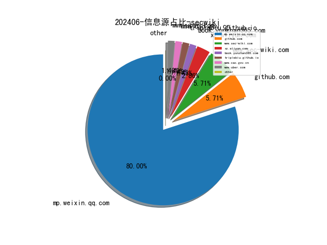
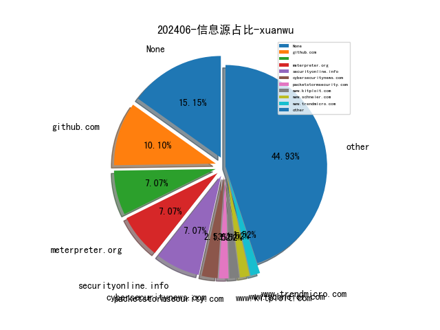
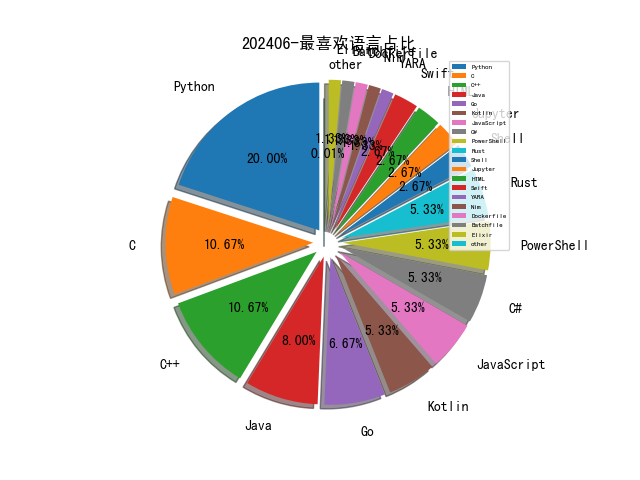

# [数据--所有](README_20.md)
# [数据--年度](README_2024.md)
# 202406 信息源与信息类型占比

# 政策 推荐
| title | url| 
| --- | ---| 
| 网络暴力信息治理规定 | https://www.cac.gov.cn/2024-06/14/c_1720043894161555.htm| 

# 网络安全书籍 推荐
| date_added | language | title | author | link | size| 
| --- | --- | --- | --- | --- | ---| 
| 2024-06-25 11:56:55 | English | Building AI Applications with Microsoft Semantic Kernel | Lucas A. Meyer | http://libgen.rs/book/index.php?md5=45ACA9408CDE1AD3BC3CDB012AC88422 | 6 MB [EPUB]| 
| 2024-06-25 13:47:15 | English | Write Powerful Rust Macros (for True Epub) | Sam Van Overmeire | http://libgen.rs/book/index.php?md5=ED262EFF51A68F20D1B8B7951C0B0E5E | 5 MB [EPUB]| 
| 2024-06-25 13:45:51 | English | Tidy Finance with Python | Christoph Scheuch, Patrick Weiss, Stefan Voigt, Christoph Frey | http://libgen.rs/book/index.php?md5=BC4597437B2045B084560F9E91F4EC3C | 7 MB [PDF]| 
| 2024-06-25 13:29:54 | English | Python Pandas and Python Data Structures for Beginners | PARKER, JP | http://libgen.rs/book/index.php?md5=876C38B4078B480A70369110383E31DB | 275 kB [EPUB]| 
| 2024-06-25 13:13:21 | English | Philosophy in a Time of Crisis: Don Isaac Abravanel: Defender of the Faith (Routledge Jewish Studies Series) | Seymour Feldman | http://libgen.rs/book/index.php?md5=1BD2C4EAFB5E399C4872C609BA4FB316 | 1 MB [EPUB]| 
| 2024-06-24 13:41:21 | English | Analyzing Japanese Syntax: A Generative Perspective | 岸本秀樹 | http://libgen.rs/book/index.php?md5=6B27D65E92E00AAB1AC16E0622B2BC6C | 2 MB [PDF]| 
| 2024-06-22 16:42:13 | English | Python 3 and Machine Learning Using ChatGPT / GPT-4 (MLI Generative AI Series) | Oswald Campesato | http://libgen.rs/book/index.php?md5=0432B7D456A025B982DAC565EC1C9B9B | 22 MB [PDF]| 
| 2024-06-22 16:36:55 | English | Prompt Engineering Using ChatGPT: Crafting Effective Interactions and Building GPT Apps (MLI Generative AI Series) | Mehrzad Tabatabaian PhD PEng | http://libgen.rs/book/index.php?md5=F39EF6D01F4FFDBEC859A53D94FD616B | 13 MB [RAR]| 
| 2024-06-22 16:36:52 | English | Prompt Engineering Using ChatGPT: Crafting Effective Interactions and Building GPT Apps (MLI Generative AI Series) | Mehrzad Tabatabaian PhD PEng | http://libgen.rs/book/index.php?md5=D9A5051454363E705251B3A31D470C35 | 7 MB [EPUB]| 
| 2024-06-22 16:36:49 | English | Prompt Engineering Using ChatGPT: Crafting Effective Interactions and Building GPT Apps (MLI Generative AI Series) | Mehrzad Tabatabaian PhD PEng | http://libgen.rs/book/index.php?md5=C786B9647D48F842AB4DB7CB48E1BE97 | 5 MB [PDF]| 
| 2024-06-21 17:52:57 | English | Introduction to Python Network Automation Volume I – Laying the Groundwork | unknown | https://www.wowebook.org/introduction-to-python-network-automation-volume-i-laying-the-groundwork/ | unknown| 
| 2024-06-21 11:32:17 | English | Hypermodern Python Tooling | unknown | https://www.wowebook.org/hypermodern-python-tooling/ | unknown| 
| 2024-06-19 07:34:14 | English | Django 5 By Example: Build powerful and reliable Python web applications from scratch | Antonio Melé | http://libgen.rs/book/index.php?md5=C12877136C4B77A61242CE94E14D757D | 28 MB [PDF]| 
| 2024-06-18 19:48:27 | English | Advanced Python Scripting for ArcGIS Pro | Paul A. Zandbergen | http://libgen.rs/book/index.php?md5=15F1543AB5D617944762A7E4C23B4565 | 2 MB [EPUB]| 
| 2024-06-18 08:27:17 | English | Data Modeling with Microsoft Power BI | unknown | https://www.wowebook.org/data-modeling-with-microsoft-power-bi/ | unknown| 
| 2024-06-17 19:37:22 | English | ISC2 CISSP Certified Information Systems Security Professional Official Practice Tests | Mike Chapple, David Seidl | http://libgen.rs/book/index.php?md5=3439CF267CA13156C3DE5DA6D388431D | 21 MB [RAR]| 
| 2024-06-17 19:37:19 | English | ISC2 CISSP Certified Information Systems Security Professional Official Practice Tests | Mike Chapple, David Seidl | http://libgen.rs/book/index.php?md5=03FE6298F8192C96246AEDF274BEDC0A | 20 MB [EPUB]| 
| 2024-06-17 17:55:13 | English | Certified Kubernetes Application Developer (CKAD) Study Guide, 2nd Edition | unknown | https://www.wowebook.org/certified-kubernetes-application-developer-ckad-study-guide-2nd-edition/ | unknown| 
| 2024-06-17 10:55:48 | English | Kubernetes and Cloud Native Associate (KCNA) Study Guide | unknown | https://www.wowebook.org/kubernetes-and-cloud-native-associate-kcna-study-guide/ | unknown| 
| 2024-06-17 07:43:55 | English | Google Cloud Platform (GCP) Professional Cloud Security Engineer Certification Companion | unknown | https://www.wowebook.org/google-cloud-platform-gcp-professional-cloud-security-engineer-certification-companion/ | unknown| 
| 2024-06-16 04:51:54 | English | Technology Fears and Scapegoats: 40 Myths About Privacy, Jobs, AI, and Today’s Innovation Economy | Robert D. Atkinson, David Moschella | http://libgen.rs/book/index.php?md5=B55D75D9479B52E8314F4E8FF1B76C02 | 8 MB [PDF]| 
| 2024-06-16 04:51:30 | English | Technology Fears and Scapegoats: 40 Myths About Privacy, Jobs, AI, and Today’s Innovation Economy | Robert D. Atkinson, David Moschella | http://libgen.rs/book/index.php?md5=EDE82BB694140FC9BA6ACBC9009BC39F | 940 kB [EPUB]| 
| 2024-06-14 07:20:41 | English | CompTIA Linux+ Certification Companion | unknown | https://www.wowebook.org/comptia-linux-certification-companion/ | unknown| 
| 2024-06-14 06:04:18 | English | The Business of Hacking | unknown | https://www.wowebook.org/the-business-of-hacking/ | unknown| 
| 2024-06-12 07:26:42 | English | Modern Graph Theory Algorithms with Python | unknown | https://www.wowebook.org/modern-graph-theory-algorithms-with-python/ | unknown| 
| 2024-06-11 06:10:26 | English | (1) No BS Guide to Crypto Investing | Harsh Strongman, Lifemathmoney | http://libgen.rs/book/index.php?md5=224C358713C180BAAD9AADD0D9BC10F3 | 2 MB [PDF]| 
| 2024-06-11 13:12:20 | English | An Age of Iron and Rust: Cassius Dio and the History of His Time (Historiography of Rome and Its Empire, 18) | Andrew G. Scott | http://libgen.rs/book/index.php?md5=AF5DCCF83993EFC5365C409DC99DBDD5 | 3 MB [PDF]| 
| 2024-06-08 09:54:29 | English | Exam Ref AZ-104 Microsoft Azure Administrator, 2nd Edition | unknown | https://www.wowebook.org/exam-ref-az-104-microsoft-azure-administrator-2nd-edition/ | unknown| 
| 2024-06-08 09:20:35 | English | Jump-start Your SOC Analyst Career, 2nd Edition | unknown | https://www.wowebook.org/jump-start-your-soc-analyst-career-2nd-edition/ | unknown| 
| 2024-06-07 05:05:08 | English | Jump-start Your SOC Analyst Career: A Roadmap to Cybersecurity Success | Tyler Wall; Jarrett Rodrick | http://libgen.rs/book/index.php?md5=2B62DA5CB586E083079FF73774B57478 | 34 MB [RAR]| 
| 2024-06-07 05:05:02 | English | Jump-start Your SOC Analyst Career: A Roadmap to Cybersecurity Success | Tyler Wall; Jarrett Rodrick | http://libgen.rs/book/index.php?md5=A7AF9DF907FF2E376890CE551F74CBB5 | 19 MB [EPUB]| 
| 2024-06-07 05:04:58 | English | Jump-start Your SOC Analyst Career: A Roadmap to Cybersecurity Success | Tyler Wall; Jarrett Rodrick | http://libgen.rs/book/index.php?md5=66B27DCF34971BB81B5F6DE9115CE6A3 | 13 MB [PDF]| 
| 2024-06-04 05:23:34 | English | The Reign of Botnets: Defending Against Abuses, Bots and Fraud on the Internet | unknown | https://www.wowebook.org/the-reign-of-botnets-defending-against-abuses-bots-and-fraud-on-the-internet/ | unknown| 
| 2024-06-03 11:35:22 | English | Fundamentals of Python: First Programs, 3rd Edition | unknown | https://www.wowebook.org/fundamentals-of-python-first-programs-3rd-edition/ | unknown| 
| 2024-06-02 08:17:27 | English | Windows Forensics: Understand Analysis Techniques for Your Windows | unknown | https://www.wowebook.org/windows-forensics-understand-analysis-techniques-for-your-windows/ | unknown| 
| 2024-06-02 09:05:12 | English | Mastering Knowledge Management Using Microsoft Technologies | unknown | https://www.wowebook.org/mastering-knowledge-management-using-microsoft-technologies/ | unknown| 
| 2024-06-01 18:47:39 | English | Think Python, 3rd Edition | unknown | https://www.wowebook.org/think-python-3rd-edition/ | unknown| 

# 微信公众号 推荐
| nickname_english | weixin_no | title | url| 
| --- | --- | --- | ---| 
| OSINT研习社 | OSINT_Club | 暗网简介：SpaceBears（太空熊） | https://mp.weixin.qq.com/s?__biz=Mzg4MzA4NTM0OA==&mid=2247490656&idx=1&sn=952e65b151bc6381b2cbd5ab29ba5d7c | 8| 
| 七芒星实验室 | HeptagramSec | 内网穿透之IPv6隧道 | https://mp.weixin.qq.com/s?__biz=Mzg4MTU4NTc2Nw==&mid=2247492358&idx=2&sn=bf9e68a66d1f0cbc785045f664d7fedf | 16| 
| 伟大航路D | gh_c1fdc31f79ef | 【漏洞复现】金和OA-C6 UploadFileDownLoadnew.aspx接口处存在任意文件读取漏洞 | https://mp.weixin.qq.com/s?__biz=MzkwNzYzNTkzNA==&mid=2247486506&idx=1&sn=19bcc800d33f7295ad2580a8d2559add | 12| 
| 前沿信安资讯阵地 | None | 2024年数据安全典型场景案例集 [附下载] | https://mp.weixin.qq.com/s?__biz=MzA3MTM0NTQzNA==&mid=2455775641&idx=1&sn=e659ba62deeea2e7a6bbf82d1c83d76f | 8| 
| 天驿安全 | tianyisec | 一款免费且不限速的远控工具,远控 | https://mp.weixin.qq.com/s?__biz=MzkxNjIxNDQyMQ==&mid=2247497257&idx=1&sn=39e1e85f0f341edda03dd160b4aacfa1 | 6| 
| 如棠安全 | gh_98ade392c230 | 【渗透干货-移动端】APP应用渗透测试思路--下篇（保姆级教程） | https://mp.weixin.qq.com/s?__biz=MzIxOTk0ODY0NQ==&mid=2247484215&idx=1&sn=02735cc6acd587f10c4df02413f89d2b | 2| 
| 安全狗的自我修养 | haidragon_study | 逃逸到明网中敏感文档的 OSINT 技术 | https://mp.weixin.qq.com/s?__biz=MzkwOTE5MDY5NA==&mid=2247497201&idx=1&sn=cbcb4bcda863603f86155adc5d08182f | 9| 
| 河南等级保护测评 | hndjbh | u200b网络安全服务使用的常见工具类型简介 | https://mp.weixin.qq.com/s?__biz=Mzg2NjY2MTI3Mg==&mid=2247496011&idx=2&sn=1d82636e402c776f0d0d5ab729694f01 | 20| 
| 浅安安全 | gh_758e256fcc72 | 工具 , OneLong | https://mp.weixin.qq.com/s?__biz=MzkwMTQ0NDA1NQ==&mid=2247489447&idx=4&sn=72d317a85f4200861336fa779e47fca1 | 25| 
| 浅梦安全 | onewinsec | 【漏洞复现,含POC】碧海威 L7多款网络产品存在命令执行漏洞 | https://mp.weixin.qq.com/s?__biz=Mzk0NzUyNTk1NQ==&mid=2247485245&idx=1&sn=3647541637ec9d36f92cb270855fb133 | 2| 
| 渗透安全HackTwo | CB-Hack | WordPress Dokan Pro插件 SQL注入漏洞 (大量存在含POC新接口) , 漏洞预警 | https://mp.weixin.qq.com/s?__biz=Mzg3ODE2MjkxMQ==&mid=2247487412&idx=1&sn=12bd8860d5dc3f31d84881993c091ce8 | 6| 
| 玄道夜谈 | None | 分享图片 | https://mp.weixin.qq.com/s?__biz=MzI3Njc1MjcxMg==&mid=2247492487&idx=1&sn=7e23bff03214ca21d2e43d76b64af073 | 10| 
| 白帽子 | NS-CTF | CISCN华东北 2024 比赛题解 | https://mp.weixin.qq.com/s?__biz=MzAwMDQwNTE5MA==&mid=2650247568&idx=1&sn=6fa9b75b082f2dd9de95e16c4d7811ac | 4| 
| 祺印说信安 | qiyinshuoxinan | 历史上10次最大的网络攻击及网络安全防护建议 | https://mp.weixin.qq.com/s?__biz=MzA5MzU5MzQzMA==&mid=2652108136&idx=2&sn=789ad3de5cc20ad38391476ad3c21c3e | 4| 
| 网络与安全实验室 | Hohai_Network | 每周文章分享-166 | https://mp.weixin.qq.com/s?__biz=MzI1MTQwMjYwNA==&mid=2247500294&idx=1&sn=8f1e0524f08a2660858900b936135871 | 3| 
| 网络研究观 | gh_509c2c9c9245 | 7 个不容忽视的开源安全工具 | https://mp.weixin.qq.com/s?__biz=MzkxNDM4OTM3OQ==&mid=2247490790&idx=5&sn=c1cfeb3064594bbab15782834e882499 | 15| 
| 船山信安 | zghyxa | APP隐私合规简述 | https://mp.weixin.qq.com/s?__biz=MzU2NDY2OTU4Nw==&mid=2247514783&idx=1&sn=def7f2bf49f166f893a84c2ba170fa86 | 9| 
| 苏说安全 | sushuoanquan | 高管数字保护或成网络安全下一热点 | https://mp.weixin.qq.com/s?__biz=Mzg5OTg5OTI1NQ==&mid=2247487806&idx=1&sn=1b2f99a02ffcf98f8eb4ab933c8e3c35 | 10| 
| 计算机与网络安全 | C-CyberSecurity | 下载528个文件，云计算、云原生安全（Docker、Kubernetes、Serverless、IasS、PasS、SaaS） | https://mp.weixin.qq.com/s?__biz=MjM5OTk4MDE2MA==&mid=2655245598&idx=2&sn=c23e2dd8ac8155662e7e8b98f24f41bc | 45| 
| 银遁安全团队 | gh_3e6002f59af7 | 【未公开】用友u9 GetConnectionString存在信息泄露漏洞 | https://mp.weixin.qq.com/s?__biz=MzU3MjU4MjM3MQ==&mid=2247486416&idx=1&sn=dbbe5cc18640d108391e7e01db07c81c | 14| 
| 3072 | gh_02e64d74f88d | 使用anon_vma_name进行Linux内核堆喷 | https://mp.weixin.qq.com/s?__biz=MzU4OTk0NDMzOA==&mid=2247488869&idx=1&sn=af3d07be9ece89833043c4ffc11271d9 | 15| 
| 360威胁情报中心 | CoreSec360 | 对XXTEA加密Mirai僵尸网络的分析 | https://mp.weixin.qq.com/s?__biz=MzUyMjk4NzExMA==&mid=2247498835&idx=1&sn=523bdd2c82a1dc51f71bbad961d19cfe | 2| 
| ADLab | v_adlab | LibreSSL之CVE-2023-35784漏洞分析 | https://mp.weixin.qq.com/s?__biz=MzAwNTI1NDI3MQ==&mid=2649619493&idx=1&sn=e9d1f2ad207f3e8e64a50c9cc89cd4e3 | 2| 
| AI与网安 | None | 新出！2024年事业单位统考公告（附岗位要求）即日开始报名！ | https://mp.weixin.qq.com/s?__biz=MzU1ODQ2NTY3Ng==&mid=2247487070&idx=2&sn=0dab39d04cd6231e9b1b1ba0cbdd1037 | 14| 
| CAICT可信安全 | CAICT_SECURITY | 全球数字经济大会 , 《安全行业大模型技术应用态势发展报告（2024）》即将发布！ | https://mp.weixin.qq.com/s?__biz=Mzk0MjM1MDg2Mg==&mid=2247499525&idx=1&sn=32c46dc19879fa93bc3d5360c6caa88e | 1| 
| CISSP | wxxinchuangsec | 华测监测预警系统接口UserEdit.aspx存在SQL注入 | https://mp.weixin.qq.com/s?__biz=Mzg4MTg0MjQ5OA==&mid=2247485477&idx=1&sn=23d88220dc2d827565fe029fe5719e13 | 9| 
| CKCsec安全研究院 | ckcsec2022 | 文库更新！JAVA内存马研究0到1（3万字总结，建议收藏） | https://mp.weixin.qq.com/s?__biz=MzkxMTIyMjg0NQ==&mid=2247495126&idx=1&sn=d4b7c48b07c3a32aaf978608bb9bb17c | 2| 
| CNCERT国家工程研究中心 | NELCERT | LockBit造谣，美联储数据并未遭窃 | https://mp.weixin.qq.com/s?__biz=MzUzNDYxOTA1NA==&mid=2247545600&idx=3&sn=c122ac38c17c15acd45e592237fca954 | 29| 
| Docker中文社区 | dockerchina | Linux 使用 tcpdump 网络抓包 | https://mp.weixin.qq.com/s?__biz=MzI1NzI5NDM4Mw==&mid=2247497534&idx=1&sn=9fd8e229cafba0ad4c8e1c86f7679975 | 4| 
| Echo Reply | AA7ACE | Wireshark & Packetdrill , TCP 三次握手之 SYN/ACK 超时重传 | https://mp.weixin.qq.com/s?__biz=MzA5NTUxODA0OA==&mid=2247492757&idx=1&sn=4290fbcf81efaae3928525c8d54aab3e | 5| 
| Eonian Sharp | Eonian_sharp | 这么好用的挖洞百宝箱，你真的要错过吗 | https://mp.weixin.qq.com/s?__biz=Mzg3NzUyMTM0NA==&mid=2247486458&idx=1&sn=0f03340a7cdf38d465290b784a1bb1a9 | 8| 
| E安全 | EAQapp | 泄露美国机密信息的维基解密创始人朱利安·阿桑奇已获释 | https://mp.weixin.qq.com/s?__biz=MzI4MjA1MzkyNA==&mid=2655346272&idx=1&sn=f0bc4ea4f2a3a0c9aa777bdeec9a4e64 | 5| 
| FreeBuf | freebuf | stthjpv：一款针对JWT Payload的安全保护工具 | https://mp.weixin.qq.com/s?__biz=MjM5NjA0NjgyMA==&mid=2651288307&idx=4&sn=e60bf325352c23e5403a78564605c977 | 44| 
| GoUpSec | GoUpSec | 欧洲杯2024成黑客攻击盛宴 | https://mp.weixin.qq.com/s?__biz=MzkxNTI2MTI1NA==&mid=2247499822&idx=2&sn=4624773504ec72f2b18b45d03002275d | 12| 
| HACK之道 | hacklearn | 干货,burpsuite插件整理 | https://mp.weixin.qq.com/s?__biz=MzIwMzIyMjYzNA==&mid=2247514694&idx=1&sn=3385fff4023bc24fa22155d6aecf0b37 | 11| 
| HW安全之路 | anquanzhilu | 网络安全的第一步：Nmap揭秘防火墙的核心功能！建议收藏 | https://mp.weixin.qq.com/s?__biz=MzI5MjY4MTMyMQ==&mid=2247484567&idx=1&sn=d7d7c3ebc4975bf077bde1cfa755915f | 1| 
| HackSee | hacksee_com | 加州隐私监管机构将与法国数据管理局合作 | https://mp.weixin.qq.com/s?__biz=MzI5NTA0MTY2Mw==&mid=2247485382&idx=1&sn=a61575f0e40527ae1634e439ebefebf8 | 15| 
| HackingWiki漏洞感知 | gh_2ceec265cb99 | Freebuf帮会挖洞课程【从0开始的挖洞之路】即将上线更新啦 | https://mp.weixin.qq.com/s?__biz=MzkzMzE5OTQzMA==&mid=2247484654&idx=1&sn=d56ffb4277bf458ce1688d9c2c5e661e | 2| 
| Hack分享吧 | HackShareB | 新HFS远程命令执行漏洞利用工具 | https://mp.weixin.qq.com/s?__biz=MzA4NzU1Mjk4Mw==&mid=2247491026&idx=1&sn=8b0e61b11f3685f87a535b280fc33b21 | 10| 
| ISC2北京分会 | ISC2BJ | 攻防演练中网络安全监测工作探讨 | https://mp.weixin.qq.com/s?__biz=MzAxMzEyMjQ4Mg==&mid=2688531000&idx=1&sn=d2f9b9e84d142fa869af63c7c6b4bd91 | 1| 
| IoT物联网技术 | IoT-Tech-Expo | Thinger.io 支持多协议、插件化100%开源 IoT 企业级物联网平台 | https://mp.weixin.qq.com/s?__biz=MjM5OTA4MzA0MA==&mid=2454934545&idx=1&sn=9b1765941a0e094ada2c7e978e3aac1a | 9| 
| IoVSecurity | IoVSecurity | 智能网络与系统的可信安全与对抗 - 西安交通大学 | https://mp.weixin.qq.com/s?__biz=MzU2MDk1Nzg2MQ==&mid=2247610603&idx=3&sn=5091eefec357a3ae8ad5288eeeade8cf | 48| 
| KK安全说 | kksecurity | 密码应该如何存储？ | https://mp.weixin.qq.com/s?__biz=Mzg4NzgyODEzNQ==&mid=2247487377&idx=1&sn=a6d716090fb28dc2ddccaa5b2a6e43d5 | 15| 
| M01N Team | m01nteam | 每周蓝军技术推送（2024.6.22-6.28） | https://mp.weixin.qq.com/s?__biz=MzkyMTI0NjA3OA==&mid=2247493622&idx=1&sn=71e8355321a5495f3d185327b2dc9d40 | 4| 
| MicroPest | gh_696c36c5382b | 对mstsc远程登录过程的研究分析 | https://mp.weixin.qq.com/s?__biz=MjM5NDcxMDQzNA==&mid=2247489128&idx=1&sn=c54645d629300ee4d1215669f2f764d2 | 1| 
| Ms08067安全实验室 | Ms08067_com | DLL劫持技术权限提升及防范 | https://mp.weixin.qq.com/s?__biz=MzU1NjgzOTAyMg==&mid=2247520737&idx=2&sn=7be80e13a1401201d1b4f1eab9aa0c3c | 6| 
| OSINT情报分析师 | OSINT_LSD | GlorySec黑客组织将攻击重点转向俄罗斯及其盟友 | https://mp.weixin.qq.com/s?__biz=MzkxNzU5MjE0OA==&mid=2247484793&idx=1&sn=d1e09fe80cd9c3184659634ae80a762c | 11| 
| Ots安全 | AnQuan7 | 通过发送 JSON 来执行命令？了解 Ruby 项目中不安全的反序列化漏洞如何运作 | https://mp.weixin.qq.com/s?__biz=MzAxMjYyMzkwOA==&mid=2247510046&idx=3&sn=7bd63c953a4768802fe7e82a4dee6404 | 40| 
| SCA御盾 | SCA_Magic | 【漏洞复现】某ERP软件-formservice-uploadStudioFile-任意文件上传漏洞复现 | https://mp.weixin.qq.com/s?__biz=MzkzNjYwODg3Ng==&mid=2247485334&idx=1&sn=9707208c71b1b69fac56cdc28b43e010 | 6| 
| T0daySeeker | gh_26c54b2c64aa | k4spreader木马详细分析--国内大量企业和单位被感染 | https://mp.weixin.qq.com/s?__biz=MzAwNDUzNDExMQ==&mid=2247484828&idx=1&sn=514987481663940feeb0df71521abf6a | 4| 
| T0ngMystic工作站 | T0ngMystic | CVE-2023-22527-Confluence模版注入命令执行 | https://mp.weixin.qq.com/s?__biz=MzUyMDk3ODk5MA==&mid=2247485089&idx=1&sn=c1db9fe5bb4df960ad3aedfa2b8b6ded | 1| 
| TtTeam | gh_a0a1db78ea68 | 内网神器 - 远程转储 Windows 注册表 | https://mp.weixin.qq.com/s?__biz=Mzg2NTk4MTE1MQ==&mid=2247485168&idx=1&sn=4c9b17baf84f160fbbf9e813ff54d2c7 | 12| 
| Urkc安全 | None | hw广招贤士 | https://mp.weixin.qq.com/s?__biz=MzkxNTU5NTI1Ng==&mid=2247484960&idx=1&sn=09363cef0d8813540af9dc4a7e6f2e9a | 1| 
| WIN哥学安全 | WIN-security | 【2024HW末班车】1500-4500需求中高级蓝队 20 名，签约赠送网络安全书籍或AI帐号 | https://mp.weixin.qq.com/s?__biz=MzkwODM3NjIxOQ==&mid=2247500924&idx=2&sn=e6bf3bc52533e75f821ef77eae287e04 | 7| 
| Yak Project | YakLanguage | 使用 SyntaxFlow 审计你的第一个“漏洞” | https://mp.weixin.qq.com/s?__biz=Mzk0MTM4NzIxMQ==&mid=2247520620&idx=1&sn=d6f837af14b69c5c6d31d6c26949369d | 3| 
| Zacarx随笔 | Zacarx007 | HW招聘 | https://mp.weixin.qq.com/s?__biz=MzkxMDU5MzY0NQ==&mid=2247484196&idx=1&sn=f20cd8c23f412b9f815a7e39442b89f0 | 1| 
| dotNet安全矩阵 | doNetSafety | 两个国内最专业的.NET安全知识库 | https://mp.weixin.qq.com/s?__biz=MzUyOTc3NTQ5MA==&mid=2247492949&idx=2&sn=b9d5d5bb38d31ce55471997476eab1ff | 18| 
| e安在线 | ean-online | 网络安全的下一个热点：高管数字保护 | https://mp.weixin.qq.com/s?__biz=MzI1OTA1MzQzNA==&mid=2651245954&idx=1&sn=ee394f0c290b83755ec23ee6509b2b34 | 8| 
| huasec | ihuahua04 | 年中随笔 | https://mp.weixin.qq.com/s?__biz=MzIyOTY1NDE5Mg==&mid=2247485095&idx=1&sn=b4936b96dcb3c5d82a901e961a11670c | 1| 
| imBobby的自留地 | imBobbySY | 业务安全中的风控：从终端数据采集到引擎决策 | https://mp.weixin.qq.com/s?__biz=MzI5MjI4ODU4Nw==&mid=2247493041&idx=1&sn=d55030f8509e6eddd499e61d6a53edc0 | 10| 
| kali笔记 | bbskali-cn | 利用多级代理实现免杀 | https://mp.weixin.qq.com/s?__biz=MzkxMzIwNTY1OA==&mid=2247505026&idx=1&sn=9c37b607af0e5c0fbbcf6bdb30a4993b | 6| 
| wavecn | sender_is_sender | 从攻防演练想到的：如果信息系统原生就有网络安全功能 | https://mp.weixin.qq.com/s?__biz=Mzg4Njc0Mjc3NQ==&mid=2247486136&idx=1&sn=e793480d59ec98c2d739329d9d582c90 | 6| 
| 两年半网安练习生 | taimei-jini | 记录一下自己第一个贡献值破二百的漏洞（某企业src) | https://mp.weixin.qq.com/s?__biz=MzkyNDQ5NDM3OA==&mid=2247483911&idx=1&sn=fd99a39267f9ffe2d201db3e18b8c721 | 2| 
| 中国信息安全 | chinainfosec | 注意 , 花钱就能上名校？事关高考招录，这些诈骗套路要当心！ | https://mp.weixin.qq.com/s?__biz=MzA5MzE5MDAzOA==&mid=2664217637&idx=7&sn=bfba383c2e065d87ecb61b9c190f992b | 77| 
| 中国电信安全 | gh_ea6109d37f13 | 聊热点｜OpenAI将终止对中国提供服务、坚持使用WAF的10个理由…… | https://mp.weixin.qq.com/s?__biz=Mzg5NTU3Nzg3MQ==&mid=2247523296&idx=3&sn=f33d78844b2f6d453f7662fbf8edc308 | 13| 
| 中国软件评测中心 | china_testing | 支撑单位遴选 , 关于开展2024年工业和信息化部移动互联网APP产品安全漏洞专业库支撑单位遴选工作的通知 | https://mp.weixin.qq.com/s?__biz=MjM5NzYwNDU0Mg==&mid=2649245564&idx=2&sn=0b1ffb6311df926ee1ce217e9fc9dceb | 27| 
| 乌雲安全 | hackctf | App渗透 -人脸识别登录绕过 | https://mp.weixin.qq.com/s?__biz=MzAwMjA5OTY5Ng==&mid=2247523240&idx=2&sn=320c5627a2a028fbfa5cd1970c3cfb91 | 17| 
| 二进制磨剑 | pyable | IDA 技巧(21) 表达式求值 | https://mp.weixin.qq.com/s?__biz=MzI1Mjk2MTM1OQ==&mid=2247484314&idx=1&sn=9fa53e83a8c3455ecf42d0e84136c8ec | 4| 
| 云梦安全 | yxlmhtz | HW工具推荐：Golin | https://mp.weixin.qq.com/s?__biz=MzU1NzczNTM1MQ==&mid=2247484778&idx=2&sn=a107bd5ec2e3df08a1b03e50c433e7f3 | 8| 
| 云起无垠 | Clouditera2021 | 重磅！云起无垠荣获“智能模糊测试赛道领航者”等多项殊荣 | https://mp.weixin.qq.com/s?__biz=Mzg3Mjg4NTcyNg==&mid=2247489341&idx=1&sn=c9e48c5f6a6b74e0872018263d9ab25d | 4| 
| 云鸦安全 | gh_b1f7a29c8089 | 【转载】WIFI远程代码执行漏洞或许没你想得那么严重 | https://mp.weixin.qq.com/s?__biz=Mzk0MTY5NzYyOA==&mid=2247485250&idx=1&sn=68fe2592009b6b6adda66aab4d1129a1 | 9| 
| 亚信安全 | yaxinanquan | 某国外工业公司遭受数据窃取，亚信安全《勒索家族和勒索事件监控报告》(2024年第22期） | https://mp.weixin.qq.com/s?__biz=MjM5NjY2MTIzMw==&mid=2650617343&idx=2&sn=841f08af407640b48191212487073316 | 17| 
| 代码卫士 | codesafe | TeamViewer内网IT系统疑遭APT组织攻击 | https://mp.weixin.qq.com/s?__biz=MzI2NTg4OTc5Nw==&mid=2247519913&idx=2&sn=e88e554be7efec8feabdf988c77630c8 | 22| 
| 会杀毒的单反狗 | cmlitiejun | 黑客利用 Rafel RAT 恶意软件攻击 Android 手机用户 | https://mp.weixin.qq.com/s?__biz=MzI2NzAwOTg4NQ==&mid=2649791566&idx=2&sn=520a651b4ab8a9401d0eab59dc595fb4 | 12| 
| 信安404 | infosec404 | 一款渗透测试辅助工具箱 | https://mp.weixin.qq.com/s?__biz=Mzk0NjQ5MTM1MA==&mid=2247491011&idx=1&sn=8ad78cb5429f2ca555fb4cd76470367c | 6| 
| 信息安全国家工程研究中心 | None | 《互联网政务应用安全管理规定》7月1日起施行，图解速看 | https://mp.weixin.qq.com/s?__biz=MzU5OTQ0NzY3Ng==&mid=2247497006&idx=1&sn=874a43188b1659292905e23b6ef3e67f | 6| 
| 信息安全大事件 | xxaqdsj | 影响 Linux 内核的 UAF 零日漏洞正在暗网被出售 | https://mp.weixin.qq.com/s?__biz=MzkzNjIzMjM5Ng==&mid=2247489441&idx=1&sn=ecaef287c1273408b821c6ee351267d8 | 9| 
| 信息安全研究 | ISR2016 | 【业界动态】通知“一个不少”、办理“一次不跑” ——中移互联网创新科技赋能数字政府 | https://mp.weixin.qq.com/s?__biz=MzA3NzgzNDM0OQ==&mid=2664987749&idx=4&sn=0dc2dc4fc627ce643c578da57b6d3eca | 25| 
| 儒道易行 | gh_ad128618f5e9 | 浅谈红队攻防之道-DLL注入上线cs | https://mp.weixin.qq.com/s?__biz=Mzg5NTU2NjA1Mw==&mid=2247492368&idx=1&sn=7a8f9761829db0010ced006e262f7e95 | 10| 
| 全球技术地图 | drc_iite | NIST就《美国政府关键和新兴技术国家标准战略》实施路线图草案征求公众意见 | https://mp.weixin.qq.com/s?__biz=MzI1OTExNDY1NQ==&mid=2651613803&idx=2&sn=e99ab2755ee8dd97a3e26afec32fc44c | 27| 
| 公安部网络安全等级保护中心 | gh_f5f6bf3d09af | 等保云防升级焕新 主动防御护航安全 | https://mp.weixin.qq.com/s?__biz=MzU3NTQwNDYyNA==&mid=2247487722&idx=1&sn=33e6342904a19aab13c467f53158f7cb | 2| 
| 兰花豆说网络安全 | SecuritySay | 大企业搞安全，重点得是开放场景下的数据安全风险 | https://mp.weixin.qq.com/s?__biz=MzI3NzM5NDA0NA==&mid=2247488215&idx=1&sn=1fe018d8b5493c1842835fee3f165e24 | 6| 
| 关键基础设施安全应急响应中心 | CII-SRC | 美国拟立法评估：极端网络攻击下关基设施能否切换手动操作 | https://mp.weixin.qq.com/s?__biz=MzkyMzAwMDEyNg==&mid=2247544637&idx=3&sn=09362922bb5aa6a053ee672fb2bd8bd1 | 29| 
| 内生安全联盟 | CCESS_CHINA | 发布 , 网安标委发布《网络安全标准实践指南——大型互联网平台网络安全评估指南》 | https://mp.weixin.qq.com/s?__biz=Mzg4MDU0NTQ4Mw==&mid=2247520579&idx=2&sn=72d21f228f4a279f553c5373d8971d36 | 21| 
| 冠程科技 | bj_gctech | HIGC 微型百变服务器-视享悦播系统使用手册 | https://mp.weixin.qq.com/s?__biz=MzUzNDc0NDcwOA==&mid=2247522901&idx=1&sn=868f69dbfd8702daa1ea193eeda2bdde | 1| 
| 冷漠安全 | gh_1c1d6111ce8f | 「漏洞复现」用友U8 Cloud smartweb2.showRPCLoadingTip.d XXE漏洞 | https://mp.weixin.qq.com/s?__biz=MzkyNDY3MTY3MA==&mid=2247484707&idx=1&sn=a685296ad924313aa88526e842060c22 | 16| 
| 凝聚力安全团队 | gh_a94d677fa24f | 【漏洞复现】用友 UFIDA ELTextFile.load.d 任意文件读取漏洞 | https://mp.weixin.qq.com/s?__biz=MzkyMDUwOTU1MA==&mid=2247484291&idx=1&sn=57619778c507962c5af7ccac1474279b | 8| 
| 刑天攻防实验室 | XT-Lab | 用友NCCloud fs文件服务器SQL注入漏洞分析与复现 | https://mp.weixin.qq.com/s?__biz=Mzg5NDgzOTAxMQ==&mid=2247485923&idx=1&sn=43ff82a96a78cde1a00ff68d14fd5871 | 1| 
| 创信华通 | cdcxht | 创信解读丨分组密码的工作模式 | https://mp.weixin.qq.com/s?__biz=MzUxNTQxMzUxMw==&mid=2247523021&idx=1&sn=c1357ea5e5ee9af5e890ff007ef8aabe | 6| 
| 利刃信安 | DMXGFSYS | 第81篇：JSONP劫持漏洞获取敏感信息原理、复现与坑点总结 | https://mp.weixin.qq.com/s?__biz=MzU1Mjk3MDY1OA==&mid=2247514353&idx=8&sn=5a92401abf34959a65605586fe992a8b | 18| 
| 剁椒鱼头没剁椒 | gh_d007bd1f1c01 | 别人分享的语雀私有仓库无法批量保存？点进来我教你 | https://mp.weixin.qq.com/s?__biz=Mzg3MDk0OTc1Nw==&mid=2247487575&idx=4&sn=786308f13a7b8b814aba010b8e3d7825 | 6| 
| 北京路劲科技有限公司 | gh_d97c073d1479 | 网络空间指纹：新型网络犯罪研判的关键路径 | https://mp.weixin.qq.com/s?__biz=MzUyMjAyODU1NA==&mid=2247491474&idx=1&sn=df98fdf5c807fe6a727f5c515a33e472 | 1| 
| 十九线菜鸟学安全 | gh_5d5696256f18 | 【红蓝/演练】-常态化，演练就在平时 | https://mp.weixin.qq.com/s?__biz=MzI1OTUyMTI2MQ==&mid=2247484585&idx=1&sn=74dfffb8408932a9e035c95d061716da | 5| 
| 华为安全 | HuaweiSecurity | 【Web一点通第五弹】防火墙报文示踪，让故障排查更轻松 | https://mp.weixin.qq.com/s?__biz=MzAwODU5NzYxOA==&mid=2247504478&idx=2&sn=4afb7278f7fcf227ce964c81f096536f | 3| 
| 吉祥学安全 | gh_bf0dc85c3f99 | 绿盟又行了，漏管市场占有率第一 | https://mp.weixin.qq.com/s?__biz=MzkwNjY1Mzc0Nw==&mid=2247485005&idx=1&sn=c76b43f4b606b1fa8c07fc1f364b3edb | 15| 
| 听风安全 | tingfengsec | 几次护网小结之红队打点及小技巧 | https://mp.weixin.qq.com/s?__biz=Mzg3NzIxMDYxMw==&mid=2247501357&idx=1&sn=89482dc2d045065ca6aa91a46dbe27bf | 4| 
| 启明星辰安全简讯 | VitaminSecurity | 安全简讯（2024.06.28） | https://mp.weixin.qq.com/s?__biz=MzkzNzY5OTg2Ng==&mid=2247499552&idx=3&sn=5b5aece1d3be212e320c6e940d65f6cd | 20| 
| 启明星辰集团 | venustech_weixin | 共筑塞上网络安全长城  启明星辰携手宁夏移动举办技术培训活动 | https://mp.weixin.qq.com/s?__biz=MzA3NDQ0MzkzMA==&mid=2651726409&idx=2&sn=bbae077f133d9e54432b4aa5eb2b9f7b | 10| 
| 哈拉少安全小队 | gh_b273ce95df95 | 几次护网小结之红队打点及小技巧 | https://mp.weixin.qq.com/s?__biz=MzAxNzkyOTgxMw==&mid=2247492734&idx=1&sn=8f5d7158dcb361bab000fe23e5cfa9a0 | 7| 
| 哔哩哔哩技术 | bilibili-TC | 视频剪辑中的色彩空间 | https://mp.weixin.qq.com/s?__biz=Mzg3Njc0NTgwMg==&mid=2247499782&idx=1&sn=1d87a155f9f161b2a91dfa00d3ef8dc9 | 6| 
| 啄木鸟软件测试 | iTestTrain | vue单元测试：mock与替身技巧大全 | https://mp.weixin.qq.com/s?__biz=MzA5NDk4NTU3Mg==&mid=2649589552&idx=3&sn=56a95a97c7799783a0edfe0202708c54 | 7| 
| 商密君 | shangmijun | 39亿安卓设备面临远程木马攻击，中国是重灾区之一 | https://mp.weixin.qq.com/s?__biz=MzI5NTM4OTQ5Mg==&mid=2247625363&idx=5&sn=162622c40dc138b2d0ca8dea49a53cbe | 72| 
| 嘉诚安全 | jiachengsec | 【漏洞通告】Fortra FileCatalyst Workflow SQL注入漏洞安全风险通告 | https://mp.weixin.qq.com/s?__biz=MzU4NjY4MDAyNQ==&mid=2247495837&idx=2&sn=a47bfc69dd47ea19b7ccf7d731dfc5c5 | 14| 
| 嘶吼专业版 | Pro4hou | 聚焦 HW 行动，构筑重保邮件安全防线 | https://mp.weixin.qq.com/s?__biz=MzI0MDY1MDU4MQ==&mid=2247575949&idx=2&sn=e497fdc370a82dac8f8fb806ac098db9 | 20| 
| 国际云安全联盟CSA | gh_674820794ae8 | 云渗透实战手册：云API攻防之云服务端点侦查 | https://mp.weixin.qq.com/s?__biz=MzkwMTM5MDUxMA==&mid=2247497701&idx=1&sn=37ae0ae5bb20ac47967ad83ac1b8a339 | 7| 
| 土拨鼠的安全屋 | gh_e6d57d016b6d | 新加坡游记与德国的工作 | https://mp.weixin.qq.com/s?__biz=Mzk0ODY1NzEwMA==&mid=2247484057&idx=1&sn=f60fcffa4b14baa48bcebdc596951e4d | 4| 
| 天唯信息安全 | TWtech2113189 | 模式、动机、能力：数据城投的质疑 | https://mp.weixin.qq.com/s?__biz=MzkzMjE5MTY5NQ==&mid=2247498688&idx=2&sn=353728d835a467cbc3f88263f10e9c10 | 19| 
| 天极智库 | gh_90d775fd9c26 | 【国际视野】美国网络安全和基础设施安全局发布《中小型企业采用单点登录的障碍： 确定挑战与机遇》 | https://mp.weixin.qq.com/s?__biz=MzIyMjQwMTQ3Ng==&mid=2247490129&idx=1&sn=4b7e3e433eb3e82c0c1fd29b251f9092 | 7| 
| 天融信 | TopsecPioneer | 抓紧啦！今年的全国高校密码数学挑战赛预赛报名即将截止 | https://mp.weixin.qq.com/s?__biz=MzA3OTMxNTcxNA==&mid=2650926312&idx=2&sn=d19c826e6cf69cdce935cc23921c1727 | 12| 
| 天际友盟 | gh_8833afc123ef | [0628] 一周重点威胁情报｜天际友盟情报站 | https://mp.weixin.qq.com/s?__biz=MzIwNjQ4OTU3NA==&mid=2247509079&idx=1&sn=ec141f8dda3b80107fa631082f6a54d6 | 5| 
| 奇安信 CERT | gh_64040028303e | GitLab身份认证绕过漏洞(CVE-2024-5655)安全风险通告 | https://mp.weixin.qq.com/s?__biz=MzU5NDgxODU1MQ==&mid=2247501489&idx=1&sn=46fdad1e31db9b8afd7fbdffd013e99b | 8| 
| 奇安信威胁情报中心 | gh_166784eae33e | 每周高级威胁情报解读(2024.06.21~06.27) | https://mp.weixin.qq.com/s?__biz=MzI2MDc2MDA4OA==&mid=2247510876&idx=1&sn=4748fb094e2bff3a19e0d7c5042e4069 | 4| 
| 奇安信安全应急响应中心 | gh_5c0c4dc97eb6 | 【周末读书日】终端安全运营新书震撼上线，速来抢购！ | https://mp.weixin.qq.com/s?__biz=Mzg5OTYwMTY5MA==&mid=2247506225&idx=1&sn=3676fdab2f49f1616bebf02e723b25fc | 1| 
| 奇安信技术研究院 | jishuyanjiuyuan001 | InForSec2024夏令营报名中，大咖开讲，快来围观课程表！ | https://mp.weixin.qq.com/s?__biz=Mzg4OTU4MjQ4Mg==&mid=2247487543&idx=1&sn=15382381026de49cd192f7df9f2768b9 | 5| 
| 奇安信病毒响应中心 | gh_416eb7efb780 | 每周勒索威胁摘要 | https://mp.weixin.qq.com/s?__biz=MzI5Mzg5MDM3NQ==&mid=2247494113&idx=1&sn=594773c6cd570183e22361b322facb71 | 2| 
| 奇安信集团 | None | 全球叉车巨头科朗遭网络攻击，工厂生产被迫中断 | https://mp.weixin.qq.com/s?__biz=MzU0NDk0NTAwMw==&mid=2247612942&idx=3&sn=893056f3b7aa01e58839d05d7ef99dc9 | 38| 
| 奇安网情局 | QACIA2020 | 美国防部拟通过紫队测试确保零信任解决方案的持续稳健 | https://mp.weixin.qq.com/s?__biz=MzI4ODQzMzk3MA==&mid=2247488806&idx=1&sn=b2250574aeffdcadd9b67a321fc0b970 | 4| 
| 威努特安全网络 | winicssec_bj | 威努特精彩亮相第十届中国智慧燃气发展论坛，并成功承办网络安全分论坛！ | https://mp.weixin.qq.com/s?__biz=MzAwNTgyODU3NQ==&mid=2651124219&idx=1&sn=d33438663fea7efa207597b8b1504951 | 7| 
| 娜璋AI安全之家 | gh_91f1fe28fc6e | [BUUCTF从零单排] Web方向 02.Web入门篇之『常见的搜集』解题思路（dirsearch工具详解） | https://mp.weixin.qq.com/s?__biz=Mzg5MTM5ODU2Mg==&mid=2247500516&idx=1&sn=cf1c4a0584c45b3394e06c7164185975 | 4| 
| 字节跳动技术团队 | BytedanceTechBlog | CVPR 2024 ｜抖音“BDVQAGroup”获得 DXOMARK 图像质量评估挑战赛全球第二 | https://mp.weixin.qq.com/s?__biz=MzI1MzYzMjE0MQ==&mid=2247507953&idx=1&sn=5421b02de822b91341a339b754be075c | 5| 
| 安信安全 | gsaxns | 网络安全的下一个热点：高管数字保护 | https://mp.weixin.qq.com/s?__biz=MzAxNTYwOTU1Mw==&mid=2650090571&idx=1&sn=366a0033d3916ce48365713db46921b2 | 12| 
| 安全内参 | anquanneican | 39亿安卓设备面临远程木马攻击，中国是重灾区之一 | https://mp.weixin.qq.com/s?__biz=MzI4NDY2MDMwMw==&mid=2247512059&idx=2&sn=0243371543bca11768fd0901c1963eab | 19| 
| 安全初心 | securityheart | 核心交换弱口令利用的小技巧 | https://mp.weixin.qq.com/s?__biz=MzU4NzU4MDg0Mw==&mid=2247489460&idx=1&sn=6188f052c9872db07631941f5373e39c | 1| 
| 安全喵喵站 | CyberSecurityMew | 大多数安全初创，都在忙活一些VC看不上的问题 | https://mp.weixin.qq.com/s?__biz=MzkzNjE5NjQ4Mw==&mid=2247538935&idx=1&sn=af104d8386b2cc1189069b15ad48abca | 5| 
| 安全圈 | ChinaAnQuan | 【安全圈】MOVEit 又曝出高危漏洞，又要来一次供应链大事件？ | https://mp.weixin.qq.com/s?__biz=MzIzMzE4NDU1OQ==&mid=2652062300&idx=4&sn=eef50c8162b1fe1147e683a139687387 | 63| 
| 安全威胁纵横 | gh_715fe2f8df0b | 微软曝光：俄罗斯黑客入侵的客户邮件数超预期披露 | https://mp.weixin.qq.com/s?__biz=Mzk0MDYwMjE3OQ==&mid=2247485378&idx=1&sn=8f6c1415196771c010a73c67ba80efda | 5| 
| 安全洞察知识图谱 | gh_d9a3a4cfeeac | SRC挖掘之1500刀垂直越权导致信息泄露 | https://mp.weixin.qq.com/s?__biz=MzkyMDM4NDM5Ng==&mid=2247486147&idx=1&sn=51334da0e56b9b08d361966330cb28bf | 6| 
| 安全牛 | aqniu-wx | 《网络安全标准实践指南——大型互联网平台网络安全评估指南》发布 | https://mp.weixin.qq.com/s?__biz=MjM5Njc3NjM4MA==&mid=2651130842&idx=2&sn=5da4ae68c9f7bdb3765c2b54e640812c | 19| 
| 安全牛课堂 | aqniu_edu | 企业为什么要实施零信任? | https://mp.weixin.qq.com/s?__biz=MzIxNTM4NDY2MQ==&mid=2247511011&idx=2&sn=1a56d1c9fed44e2ac7d85b3924095461 | 5| 
| 安全狗 | safedog2013 | 算力安全亿级大单！亚信安全中标宁夏枢纽云安全一体化建设工程项目 | https://mp.weixin.qq.com/s?__biz=MjM5NTc2NDM4MQ==&mid=2650841237&idx=1&sn=ee9d7e5425668597e107bb07fbbd0f53 | 3| 
| 安全研究GoSSIP | GoSSIPSJTU | G.O.S.S.I.P 阅读推荐 2024-06-28 虚假的安全感 | https://mp.weixin.qq.com/s?__biz=Mzg5ODUxMzg0Ng==&mid=2247498322&idx=1&sn=01202b1e95851c00a2f64a5e1259fe04 | 9| 
| 安全随笔 | SecNotes | 初识shellcode及简单免杀2 | https://mp.weixin.qq.com/s?__biz=MzU1MTA4ODM4MQ==&mid=2247485413&idx=1&sn=de514cdfcc942eec063c3cd50aee2290 | 1| 
| 安在 | AnZer_SH | 诸子云｜甲方 ：谁是企业信息安全的第一责任人？如何看待第三方工具泄露信息？ | https://mp.weixin.qq.com/s?__biz=MzU5ODgzNTExOQ==&mid=2247624520&idx=2&sn=8c74b55dd5b4ce7451f2c0e1fcb68b54 | 32| 
| 安恒信息 | AnHengCloudNews | 庆余年“番外篇”丨如果小范大人来做公有云安全 | https://mp.weixin.qq.com/s?__biz=MjM5NTE0MjQyMg==&mid=2650610535&idx=1&sn=99c93a55e06106d2abcad62dc6581396 | 9| 
| 安服仔的救赎 | ichengfeng8 | 蓝队防守：如何判断安全告警的正误报？ | https://mp.weixin.qq.com/s?__biz=MjM5ODkxMTEzOA==&mid=2247484275&idx=1&sn=f3919c0645b4675ce518f9a4acd6442a | 1| 
| 安知讯 | dataanquan | 11款App被通报 | https://mp.weixin.qq.com/s?__biz=MzIxMDIwODM2MA==&mid=2653930217&idx=2&sn=9b7688c42a61329db813cbd23df734ad | 29| 
| 安羽安全 | None | 【未公开】某微OA E-Cology未授权访问 | https://mp.weixin.qq.com/s?__biz=MzkwMzY5NTg0Mg==&mid=2247483831&idx=1&sn=15fb033a3e4fbd7c3a4816c33a3fb65c | 2| 
| 安迈信科应急响应中心 | gh_6b3e4cf2d589 | 用友网络科技股份有限公司用友U8+CRM存在信息泄露漏洞(CNVD-2024-23771) | https://mp.weixin.qq.com/s?__biz=Mzg2NjczMzc1NA==&mid=2247486012&idx=3&sn=2bbb84d94c2f0dd77ded8ec7ad411080 | 7| 
| 小C学安全 | V_MOG11 | 【渗透工具】内网多级代理工具Venom详细使用教程 | https://mp.weixin.qq.com/s?__biz=MzU5NTEwMTMxMw==&mid=2247484934&idx=1&sn=a2a88a9694e6cb404c19b29d6f971310 | 3| 
| 小兵搞安全 | antian365sec | 网站镜像工具SiteCopy | https://mp.weixin.qq.com/s?__biz=MzA3NTc0MTA1Mg==&mid=2664711706&idx=1&sn=91a92f9307d19862c351040b4bbe7f8a | 4| 
| 小明信安 | security-xm | 【漏洞复测 , 含批量POC】碧海威L7产品 confirm 命令执行漏洞 | https://mp.weixin.qq.com/s?__biz=Mzg4NjI0MDM5MA==&mid=2247485532&idx=1&sn=64158c86bc868a0bcc15c9423cedc710 | 8| 
| 小白菜安全 | xiaobaicaianquan | Pear Admin Boot系统getDictItems接口SQL注入漏洞（CVE-2024-6241） | https://mp.weixin.qq.com/s?__biz=MzIzOTM2MzczNQ==&mid=2247484502&idx=1&sn=7fea9938390481a6a125463944eb4939 | 8| 
| 小羊安全屋 | gh_431c125001cd | 【命令执行】碧海威科技-L7云路由 | https://mp.weixin.qq.com/s?__biz=MzkyMTY1NDc2OA==&mid=2247486362&idx=1&sn=5938d78c23e4d68e27675462a9a167c3 | 4| 
| 小艾搞安全 | None | 普通人眼中的黑客 | https://mp.weixin.qq.com/s?__biz=Mzg3MTY3NzUwMQ==&mid=2247489410&idx=1&sn=d3ca05c43c548256b76494d0e6c1f4bb | 1| 
| 工业互联网标识智库 | CAICT-bs | 浙江省深入开展“百城千园行”活动推动工业互联网一体化进园区走深走实 | https://mp.weixin.qq.com/s?__biz=MzU1OTUxNTI1NA==&mid=2247586966&idx=2&sn=cba2ff3544355e22ed8b64695e0ab9c8 | 16| 
| 工业安全产业联盟 | ICSISIA | 荐读丨我国超两成企业遭遇过勒索攻击，数据安全防护能力最受关注 | https://mp.weixin.qq.com/s?__biz=MzI2MDk2NDA0OA==&mid=2247527970&idx=2&sn=42196175e8464e8bba9ab321b3bbb611 | 12| 
| 平安集团安全应急响应中心 | PSRC_Team | 注意：翻倍奖励活动倒计时2天 ······ | https://mp.weixin.qq.com/s?__biz=MzIzODAwMTYxNQ==&mid=2652145119&idx=2&sn=43ea9a23a55934b38f27426b5aea078a | 2| 
| 微步在线 | Threatbook | 用过才知道，什么样的边界防御最靠谱 | https://mp.weixin.qq.com/s?__biz=MzI5NjA0NjI5MQ==&mid=2650181624&idx=1&sn=39b102c14d375b25c8d00f3907256200 | 5| 
| 恒星EDU | cyberslab | vol2取证-入门向 | https://mp.weixin.qq.com/s?__biz=MzU1MzE3Njg2Mw==&mid=2247508871&idx=1&sn=128c9faba06dcf86165add92961dd203 | 2| 
| 情报分析师 | Intelligencer1 | 解码秘密：情报分析师的角色 | https://mp.weixin.qq.com/s?__biz=MzA3Mjc1MTkwOA==&mid=2650551680&idx=1&sn=75cfa4250e3019130160f178acd383b6 | 14| 
| 情报分析师Pro | globalpolice | 特朗普与拜登的辩论结果如何？ | https://mp.weixin.qq.com/s?__biz=MzkwNzM0NzA5MA==&mid=2247498806&idx=1&sn=9810f1c7b60b603801b768f8d74b5491 | 8| 
| 慢雾科技 | SlowMist | 「区块链黑暗森林自救手册」阿拉伯文版正式发布 | https://mp.weixin.qq.com/s?__biz=MzU4ODQ3NTM2OA==&mid=2247499898&idx=1&sn=e69f4409d60a42166cdfabae8a778436 | 3| 
| 技术修道场 | gh_fe3e6e63e435 | 内网渗透：从Webshell到横向移动 | https://mp.weixin.qq.com/s?__biz=MzA4NTY4MjAyMQ==&mid=2447899141&idx=1&sn=b58f7ff3e0d13c36ef3e92fef87d1a13 | 8| 
| 掌控安全EDU | ZKAQEDU | 靶场上新：showdoc前台SQL注入+后台Phar反序列化 | https://mp.weixin.qq.com/s?__biz=MzUyODkwNDIyMg==&mid=2247541418&idx=2&sn=b18e301df406a40d926a366fcd11f825 | 26| 
| 教育网络信息安全 | gh_cf0acb6103bc | 招贤纳士 | https://mp.weixin.qq.com/s?__biz=MzI0ODI4Njk0Ng==&mid=2247492002&idx=2&sn=5237affa8bb1ebcfb2c829eff4570672 | 2| 
| 数世咨询 | dwconcn | 《报告》显示：数字安全产业下滑有望形成去泡沫化 | https://mp.weixin.qq.com/s?__biz=MzkxNzA3MTgyNg==&mid=2247513539&idx=3&sn=ec4848bebe6da31f4a553a1b8316ea2b | 16| 
| 斗象智能安全 | TophantAI | 2024攻防演练必修高危漏洞集合（4.0版） | https://mp.weixin.qq.com/s?__biz=MzIwMjcyNzA5Mw==&mid=2247494909&idx=1&sn=5df718768b5921431f4fbe6e26165425 | 3| 
| 无糖反网络犯罪研究中心 | gh_2ee7a9b17c0d | 渝中警方破获特大洗钱案 , 蕉城警方破获虚假交易诈骗案——涉网犯罪每日情报 | https://mp.weixin.qq.com/s?__biz=MzAxMzkzNDA1Mg==&mid=2247511523&idx=1&sn=2cc38fb51e46a269cb48d6bca7d26c6d | 5| 
| 昊天信安 | cniaosec | ThinkPHP最新利用工具 | https://mp.weixin.qq.com/s?__biz=MzkzNzI4NDQzMA==&mid=2247498419&idx=1&sn=4c6c0d51a74ae89ce83eb945a4846bb5 | 6| 
| 李白你好 | libai_hello | 绿盟群星闪耀时 | https://mp.weixin.qq.com/s?__biz=MzkwMzMwODg2Mw==&mid=2247507466&idx=1&sn=f9a82d58d1e05cf23ffed7a73684d395 | 6| 
| 极与黑 | JLBK11 | 小米红米手机免授权刷国际版+ROOT | https://mp.weixin.qq.com/s?__biz=MzA3MzQzODg2Nw==&mid=2247487072&idx=1&sn=034d60c2433a7a5fee00a016712b116e | 2| 
| 森柒柒 | None | 这waf是不是防卫过当了？ | https://mp.weixin.qq.com/s?__biz=MzU2MDkzMTk3Mg==&mid=2247485267&idx=1&sn=137873ba6e87b622257a4e5a0c026fdb | 1| 
| 永信至诚 | INT-GROUP | 国产软硬件安全测评丨永信至诚「数字风洞」为首届“矩阵杯”网络安全大赛护航 | https://mp.weixin.qq.com/s?__biz=MzAwNDUyMjk4MQ==&mid=2454825652&idx=1&sn=cd7866ecb634f1f170ba3a40b1a2e037 | 3| 
| 汇能云安全 | metech2005 | 39亿安卓设备面临远程木马攻击，中国是重灾区之一u200b | https://mp.weixin.qq.com/s?__biz=MzIwNzAwOTQxMg==&mid=2652250140&idx=1&sn=c5b534da2e1251ff4926c726c2e52763 | 4| 
| 沃克学安全 | walkerxuewangan | [翻译]Apache Kafka UI 中的远程代码执行 ( CVE-2023-52251、CVE-2024-32030) | https://mp.weixin.qq.com/s?__biz=MzkzMjIxNjExNg==&mid=2247485358&idx=3&sn=16ab8f7b68a8d3eea838d128ddcd4e0a | 6| 
| 沈阳深蓝安全信息科技有限公司 | SYSL_sit | 沈阳深蓝常态化HW招录 | https://mp.weixin.qq.com/s?__biz=Mzg3Nzc0ODMzNg==&mid=2247483823&idx=1&sn=e6f620721154c0b9e5d9474322d2333f | 1| 
| 洞源实验室 | Official_InsBug | 监听蓝牙对话的BlueSpy技术复现 | https://mp.weixin.qq.com/s?__biz=Mzg4Nzk3MTg3MA==&mid=2247486129&idx=1&sn=25ee123661b779a49ad7204627915434 | 6| 
| 洞见网安 | doonsec | 网安原创文章推荐【2024/6/27】 | https://mp.weixin.qq.com/s?__biz=MzAxNzg3NzMyNQ==&mid=2247488546&idx=1&sn=2e5c852067e4f026c87aba28a80deb9f | 13| 
| 浙大网安 | gh_e603b55057e7 | 学术报告,增量学习的一些新进展 | https://mp.weixin.qq.com/s?__biz=Mzg5NDczNDc4NA==&mid=2247494931&idx=1&sn=8a2908cd472a3cfb0b0d802758dd2dd9 | 1| 
| 浪飒sec | langsasec | Hunting-Rabbit系列三：VulScanner | https://mp.weixin.qq.com/s?__biz=MzI1ODM1MjUxMQ==&mid=2247494155&idx=1&sn=9f4be76af83bcfc4a84a349a11a31606 | 3| 
| 深信服千里目安全技术中心 | gh_c644c6e98b08 | 【恶意文件通告】勒索新秀 Brain Cipher | https://mp.weixin.qq.com/s?__biz=Mzg2NjgzNjA5NQ==&mid=2247523385&idx=1&sn=2e8c5bc9a44c7bb64570ddbd7117d3a3 | 8| 
| 深信服科技 | sangfor_man | 深信服与致远互联携手共筑移动办公安全防线 | https://mp.weixin.qq.com/s?__biz=MjM5MTAzNjYyMA==&mid=2650588669&idx=2&sn=aa74b0b22d3a35b70dce8998420debaa | 15| 
| 深圳市网络与信息安全行业协会 | SNISRI | PPT分享,大型企业数字化转型解决方案 | https://mp.weixin.qq.com/s?__biz=MzU0Mzk0NDQyOA==&mid=2247517521&idx=1&sn=0155ac36625a2d4cfef1639bccebcd83 | 8| 
| 渗透Xiao白帽 | SuPejkj | 福利 ,  CVE-2024-29943 Firefox RCE （附EXP）内网书籍赠送 | https://mp.weixin.qq.com/s?__biz=MzI1NTM4ODIxMw==&mid=2247500824&idx=1&sn=82971c64e8f636a2553656700068a363 | 2| 
| 潇湘信安 | xxxasec | CVE-2024-29943 Firefox RCE POC | https://mp.weixin.qq.com/s?__biz=Mzg4NTUwMzM1Ng==&mid=2247511101&idx=1&sn=08785d7a41580989adf65149f3e072b2 | 8| 
| 火绒安全 | HuorongLab | 【火绒安全周报】考生和家长警惕高考骗局/4名越南黑客被美国起诉 | https://mp.weixin.qq.com/s?__biz=MzI3NjYzMDM1Mg==&mid=2247519124&idx=1&sn=d25f67c5d75bd2bfdbb3e9ab34389fdf | 7| 
| 爱奇艺技术产品团队 | iQIYI-TP | 爱奇艺 Opal 机器学习平台：特征中心建设实践 | https://mp.weixin.qq.com/s?__biz=MzI0MjczMjM2NA==&mid=2247498230&idx=1&sn=a0003ee98be61837910c153baf7a864b | 2| 
| 犀利猪安全 | XiLi-Pig | 最新超劲爆 , BurpSuite_Pro_2024.6 | https://mp.weixin.qq.com/s?__biz=Mzk0NzQxNzY2OQ==&mid=2247486499&idx=1&sn=c04fb7fe6d7c0fa04035ca08f1164ea8 | 1| 
| 独眼情报 | cs_cti | 文章内容方向投票统计 | https://mp.weixin.qq.com/s?__biz=MzkzNDIzNDUxOQ==&mid=2247486114&idx=5&sn=68ae86120de3b81c5eaf495319b53950 | 21| 
| 猪猪谈安全 | zzt-anquan | 金榜题名 , 承制科技3月、4月攻防领域认证考试通过名单 | https://mp.weixin.qq.com/s?__biz=MzIyMDAwMjkzNg==&mid=2247513320&idx=1&sn=63e28d86118642a2b50f4932b8667042 | 3| 
| 猫鼠信安 | gh_b8b8c8961ead | Codex验证码后台爆破辅助工具 | https://mp.weixin.qq.com/s?__biz=Mzg2NjUzNzg4Ng==&mid=2247484476&idx=1&sn=870da7861cfc13c4c43a6c31d8da09e9 | 2| 
| 珞安科技 | luoantechnology | 引领行业  领跑未来 , 珞安科技强势入选“2024中国数字安全新质百强” | https://mp.weixin.qq.com/s?__biz=MzU2NjI5NzY1OA==&mid=2247510166&idx=1&sn=44a4e44383c333f0c9459bbc2ff1c809 | 6| 
| 白帽子左一 | HackRead | 靶场上新：showdoc前台SQL注入+后台Phar反序列化 | https://mp.weixin.qq.com/s?__biz=MzI4NTcxMjQ1MA==&mid=2247611068&idx=2&sn=26d4e85e32623d2236f0cc9a1d397466 | 20| 
| 白帽子社区团队 | bmzsec | Java内存马基础(一)--三大件（Servlet、Filter、Listener） | https://mp.weixin.qq.com/s?__biz=MzkzNDQ0MDcxMw==&mid=2247485257&idx=1&sn=5d9da1431ec71fa5cbc773863b57fb61 | 7| 
| 白帽学子 | gh_4bda7b44c1e3 | 企业资产快速收集工具 | https://mp.weixin.qq.com/s?__biz=MzkyNzIxMjM3Mg==&mid=2247486962&idx=1&sn=8eb1176fb32281f8c10f55f512e26375 | 2| 
| 白泽安全实验室 | baizelab | APT组织Andariel使用Xctdoor恶意软件对韩国展开攻击——每周威胁情报动态第181期（06.21-06.27） | https://mp.weixin.qq.com/s?__biz=MzI0MTE4ODY3Nw==&mid=2247492239&idx=1&sn=a7ca76652f5c444f775f92a50ebc8fd2 | 2| 
| 盘古石取证 | Panguite_CN | 技术革新！盘古石取证实现Android12、13全机型提权提取！ | https://mp.weixin.qq.com/s?__biz=Mzg3MjE1NjQ0NA==&mid=2247503579&idx=1&sn=a9d63baf6fcf1f587a7ced5c604e9e66 | 5| 
| 盛邦安全WebRAY | WebRay_weixin | 盛邦安全中标能源行业某单位百万级漏洞扫描便携式一体设备采购项目 | https://mp.weixin.qq.com/s?__biz=MzAwNTAxMjUwNw==&mid=2650275765&idx=1&sn=3e04ccc169c969b5da6c9cb3b99aacaf | 7| 
| 盛邦安全应急响应中心 | WebRAY_Sec | 烽火狼烟丨暗网数据及攻击威胁情报分析周报（06/24-06/28） | https://mp.weixin.qq.com/s?__biz=Mzk0NjMxNTgyOQ==&mid=2247484287&idx=1&sn=1ed817db717a328eaac9ba5bf9cfd30d | 2| 
| 看雪学苑 | ikanxue | 着急就业找工作？海量职位供你选 | https://mp.weixin.qq.com/s?__biz=MjM5NTc2MDYxMw==&mid=2458560855&idx=4&sn=aff14dd58bcbb2cbc5643b717bd1ff90 | 44| 
| 矢安科技 | shanghaishiankeji | 漏洞通告｜GitLab存在身份验证绕过漏洞(CVE-2024-5655) | https://mp.weixin.qq.com/s?__biz=Mzg2Mjc3NTMxOA==&mid=2247510303&idx=1&sn=c6e355f8e09b748fcd53342063882f45 | 3| 
| 知攻善防实验室 | ChinaRan404 | 常态化HVV招聘~ | https://mp.weixin.qq.com/s?__biz=MzkxMTUwOTY1MA==&mid=2247487917&idx=1&sn=a1f926427588dc793b18436383c89dd0 | 11| 
| 知机安全 | gh_ad3e7f23f43a | Vanna AI中的提示注入漏洞暴露数据库面临RCE攻击 | https://mp.weixin.qq.com/s?__biz=MzIzNDU5NTI4OQ==&mid=2247486492&idx=1&sn=fcd4a6d03ebb016008342980a82f7da5 | 5| 
| 破壳平台 | TianGong_Lab | InForSec2024夏令营报名中，大咖开讲，快来围观课程表！ | https://mp.weixin.qq.com/s?__biz=Mzk0OTU2ODQ4Mw==&mid=2247485559&idx=1&sn=38ec657caa31571c319274ac83b0fc59 | 5| 
| 秦安战略 | qinan1128 | 牟林：美国政府“反对任何一方破坏台海现状”言论必须彻底驳斥 | https://mp.weixin.qq.com/s?__biz=MzA5MDg1MDUyMA==&mid=2650470800&idx=5&sn=f664d45faf28610e34550ecc2a49cc4a | 25| 
| 第59号 | malianwa59 | 每周安全速递²⁹⁹,P2PInfect僵尸网络向受控节点分发勒索软件模块 | https://mp.weixin.qq.com/s?__biz=MzI0NDgxMzgxNA==&mid=2247495981&idx=1&sn=9d8789200fd06d23eb6b7ec72db0b9c6 | 2| 
| 等级保护测评 | zgdjbh | 交通银行因数据安全管理不足等因被罚160万元 | https://mp.weixin.qq.com/s?__biz=MzU1ODM1Njc1Ng==&mid=2247498050&idx=1&sn=fac16987253cd74138d913c616c8710c | 1| 
| 紫队安全研究 | ziduianquanyanjiu | 朝鲜APT Lazarus Group通过虚假求职诱饵部署新型Kaolin RAT | https://mp.weixin.qq.com/s?__biz=Mzg3OTYxODQxNg==&mid=2247484564&idx=1&sn=20a9bbd00c0a255c76ce37c0ceec359f | 12| 
| 红蓝公鸡队 | None | 妙啊 | https://mp.weixin.qq.com/s?__biz=Mzg5MDc1MjY5Ng==&mid=2247492959&idx=1&sn=1ab77e2723dfcd5eff0b1014ca5c2629 | 6| 
| 红队蓝军 | Xx_Security | 某低代码平台代码审计分析 | https://mp.weixin.qq.com/s?__biz=Mzg2NDY2MTQ1OQ==&mid=2247519302&idx=1&sn=b20a25e6e7e0494717906980533467cb | 5| 
| 绿盟科技 | NSFOCUS-weixin | 遇见 · 绿盟人｜生活不止眼前的苟且 | https://mp.weixin.qq.com/s?__biz=MjM5ODYyMTM4MA==&mid=2650454340&idx=3&sn=67e0ae3e5c27fdd68b96521cb5003197 | 14| 
| 网安国际 | inforsec | 【InForSec学术论坛预告】ICANN亚太地区域名系统论坛：域名系统功能和安全特性的演进发展，7月15日与您相约北京！ | https://mp.weixin.qq.com/s?__biz=MzA4ODYzMjU0NQ==&mid=2652314859&idx=1&sn=85dfd9b38708151742e1059f7f484205 | 2| 
| 网安百色 | www_xinbs_net | 39亿安卓设备面临远程木马攻击，中国是重灾区之一 | https://mp.weixin.qq.com/s?__biz=MzI0NzE4ODk1Mw==&mid=2652093073&idx=2&sn=4202f3b624290fb4c9dc1a03912c7de1 | 4| 
| 网络与信息法学会 | cyber-info-law | 【资讯】甘肃省工信厅印发《甘肃省工业互联网数字化转型促进中心建设实施细则（试行）》 | https://mp.weixin.qq.com/s?__biz=MzU1NDY3NDgwMQ==&mid=2247542984&idx=2&sn=1a1d960cb1c68a8800b318c615035a28 | 31| 
| 网络个人修炼 | gh_ab9a2fbd9bd9 | 浏览器定位方式查找X_Path | https://mp.weixin.qq.com/s?__biz=MzkzMDQ0NzQwNA==&mid=2247485071&idx=1&sn=a2f11520c686567c5a4eaf3db9882978 | 4| 
| 网络安全和信息化 | ITyunwei_365master | 赛迪发布《量子产业发展白皮书（2024年）》（可下载） | https://mp.weixin.qq.com/s?__biz=MjM5MzMwMDU5NQ==&mid=2649165192&idx=2&sn=a450d3f864335c4d3ba40245975ecbfd | 26| 
| 网络安全实验室 | wlaqyjs | 网络安全攻防工具库 | https://mp.weixin.qq.com/s?__biz=MzU4OTg4Nzc4MQ==&mid=2247502722&idx=2&sn=07e5f50620732f7b54b5fa323df4bd04 | 14| 
| 网络安全者 | close_3577673633 | 网络安全学习笔记 -- Linux系统安装+基本命令（七） | https://mp.weixin.qq.com/s?__biz=MzU3NzY3MzYzMw==&mid=2247497750&idx=3&sn=3e84237d16820a5f6423134d73513e22 | 8| 
| 网络安全资源库 | gh_e8a4866a67fe | 如何用Go语言进行Web应用的开发？附4个常用框架对比总结！ | https://mp.weixin.qq.com/s?__biz=MzkxMzMyNzMyMA==&mid=2247558864&idx=2&sn=7cd80a96a8f80cf08131260447476b3d | 29| 
| 网络技术干货圈 | wljsghq | 网络工程师必知的默认端口号大全，建议收藏！ | https://mp.weixin.qq.com/s?__biz=MzUyNTExOTY1Nw==&mid=2247524274&idx=1&sn=690ef845ea9e2df9ca0747f3dbc8fc14 | 3| 
| 网络技术联盟站 | wljslmz | 波分复用 (WDM) 和光传输网络 (OTN)，在电信领域哪个更强大？ | https://mp.weixin.qq.com/s?__biz=MzIyMzIwNzAxMQ==&mid=2649458890&idx=1&sn=c8770812c099f346fe03b9d07a5fced2 | 12| 
| 网络空间信息安全学习 | gh_39213c5878aa | 12个黑洞真相：吞噬一切，你还敢靠近吗？ | https://mp.weixin.qq.com/s?__biz=MzI2MjcwMTgwOQ==&mid=2247491088&idx=1&sn=95f11e243076aa6ef1a53192a898978a | 10| 
| 网络空间安全与法治协同创新中心 | gh_53f81866942d | 美国拟立法评估：极端网络攻击下关基设施能否切换手动操作 | https://mp.weixin.qq.com/s?__biz=MzkwMTQyODI4Ng==&mid=2247492764&idx=3&sn=c49cad7dc74b710a87d59b1b5ab4dbb3 | 15| 
| 网络空间安全军民融合创新中心 | jmrh1226 | 加拿大学者分析军事电气化网络安全问题并提出对策建议 | https://mp.weixin.qq.com/s?__biz=MzU0ODg5Mjc2NA==&mid=2247489930&idx=1&sn=08338ce54b095387acba243f453044d8 | 3| 
| 网络靖安司CSIZ | gh_46cccf54f25e | 热点关注丨基于密码安全的移动办公系统 | https://mp.weixin.qq.com/s?__biz=Mzg2MTU5ODQ2Mg==&mid=2247506861&idx=3&sn=d393e5653552444c47d9932323e26bd3 | 3| 
| 美亚柏科 | MeiyaPico | 【专家说】AI技术赋能视频图像质量治理，提升视频图像系统应用效能 | https://mp.weixin.qq.com/s?__biz=MjM5NTU4NjgzMg==&mid=2651412400&idx=1&sn=fc8b0458bb761d04231773e80a9d0e5d | 12| 
| 腾讯安全 | TXAQ2019 | 中信银行&腾讯云反电诈实践获《亚洲银行家》风险技术实施奖 | https://mp.weixin.qq.com/s?__biz=Mzg5OTE4NTczMQ==&mid=2247521038&idx=1&sn=579fdd54211f437c220ae34dd653e78a | 5| 
| 腾讯技术工程 | None | 轻松写出爆款技术文章的9个技巧 | https://mp.weixin.qq.com/s?__biz=MjM5ODYwMjI2MA==&mid=2649784359&idx=1&sn=5cbd85abae5fc29084040827a55688d9 | 6| 
| 腾讯玄武实验室 | XuanwuLab | 每日安全动态推送(6-28) | https://mp.weixin.qq.com/s?__biz=MzA5NDYyNDI0MA==&mid=2651959714&idx=1&sn=9dd6ccd622fec0d7d5c85d2ad2798661 | 8| 
| 菜鸟学信安 | securitylearn | 蓝队分析研判工具箱 | https://mp.weixin.qq.com/s?__biz=MzU2NzY5MzI5Ng==&mid=2247502160&idx=1&sn=616824425966a2440a4bf88d807bedab | 5| 
| 菜鸟小新 | dsz-67 | phpMyAdmin 利用日志文件 getshell | https://mp.weixin.qq.com/s?__biz=Mzg4OTI0MDk5MQ==&mid=2247491906&idx=1&sn=e806a1c08bbd06ca9048d621ad3a9b0e | 1| 
| 蓝桥云课精选 | lanqiaoyunke01 | 程序员被提bug之后10大“经典”反应，别太真实！ | https://mp.weixin.qq.com/s?__biz=MzkwODM4NDM5OA==&mid=2247518221&idx=2&sn=51fdfe1e4c75065deb372b35207e9b76 | 12| 
| 虚拟尽头 | En_shu0 | 盗洞空间-src交流群 怎么样了 | https://mp.weixin.qq.com/s?__biz=MzkxOTM1MTU0OQ==&mid=2247485346&idx=1&sn=0f4d8b4b166cf5a222add3c5c03faf68 | 2| 
| 蚁景网安 | yijing_168 | 大战UEditor并突破 | https://mp.weixin.qq.com/s?__biz=MzkyNTY3Nzc3Mg==&mid=2247485981&idx=1&sn=26588df5bbe3815c8b1da9c44a4d5cea | 6| 
| 蛙王工具库 | gh_219d2a00872f | 【PyMemShell】Python内存马管理工具 | https://mp.weixin.qq.com/s?__biz=MzkwNzM5NDk4Mw==&mid=2247484212&idx=1&sn=3656f6a648bd590e6f9c10bd8a1cd48a | 5| 
| 补天平台 | Patchingthesky | 补天平台奖励计划及榜单规则更新：新增大额现金榜！ | https://mp.weixin.qq.com/s?__biz=MzI2NzY5MDI3NQ==&mid=2247504092&idx=1&sn=f155181a916a16829f6dcd192c2fcfac | 5| 
| 谈思实验室 | gh_6446c19b4595 | AUTOSAR架构下ECU休眠唤醒Wakeup Time详解 | https://mp.weixin.qq.com/s?__biz=MzIzOTc2OTAxMg==&mid=2247539610&idx=2&sn=33e609e06fb786378aead3fa967fa911 | 35| 
| 贝雷帽SEC | Beret-Sec | 【OSCP】beloved | https://mp.weixin.qq.com/s?__biz=Mzk0MDQzNzY5NQ==&mid=2247491955&idx=1&sn=a439615d3f759ba1ad1be8a48aa59f5c | 3| 
| 赛博研究院 | SICSI-cybersecurity | 最新 , OpenAI发布CriticGPT：用AI训练AI | https://mp.weixin.qq.com/s?__biz=MzUzODYyMDIzNw==&mid=2247509763&idx=3&sn=82f30bbe3c55c2c5c43ff89359eaf1ce | 16| 
| 赛查查 | gh_fabaad32b9d1 | 比赛经验分享, “2024数字中国创新大赛”数字安全赛道数据安全产业人才积分争夺赛金奖获得者-中国移动磐石队 | https://mp.weixin.qq.com/s?__biz=Mzk0NTU0ODc0Nw==&mid=2247487236&idx=1&sn=e6d66de96c1bbc45f3bf802ea7d3a272 | 5| 
| 赛欧思安全研究实验室 | gh_04596d590471 | AirPods 最新固件曝出蓝牙漏洞，可能导致设备被窃听 | https://mp.weixin.qq.com/s?__biz=MzU0MjE2Mjk3Ng==&mid=2247487304&idx=2&sn=d601027ed43d6c7d3434d20aefa488c1 | 9| 
| 赤弋安全团队 | gh_532e7430f018 | 几次护网小结之红队打点及小技巧 | https://mp.weixin.qq.com/s?__biz=MzkzNzQyMDkxMQ==&mid=2247487647&idx=1&sn=8cedff2a75ed8210e24589d9c26c8eb9 | 3| 
| 车小胖谈网络 | chexiaopangnetwork | 不用 https 自己实现对 http请求的内容的 rsa 加密，这样足够安全吗？ | https://mp.weixin.qq.com/s?__biz=MzIxNTM3NDE2Nw==&mid=2247490046&idx=1&sn=b336f27622d21b3df835997119913791 | 3| 
| 迪哥讲事 | growing0101 | 快速挖掘技巧+某学校实战案例分享 | https://mp.weixin.qq.com/s?__biz=MzIzMTIzNTM0MA==&mid=2247495069&idx=1&sn=93b0c7741d92496628d2d64a60273c91 | 16| 
| 迪普科技 | DPtechnology | 新品发布！迪普科技智能分流产品助力构建可视化流量采集网 | https://mp.weixin.qq.com/s?__biz=MzA4NzE5MzkzNA==&mid=2650355569&idx=1&sn=e80ed73966118bfb678082ee3e4844f9 | 2| 
| 逆向有你 | nixiangyouni | 逆向学习汇编篇 -- 参数传递和返回地址的使用方式 | https://mp.weixin.qq.com/s?__biz=MzA4MzgzNTU5MA==&mid=2652035361&idx=2&sn=0b586ce878750091a59cc32b58515a30 | 72| 
| 道玄网安驿站 | gh_cb9a38436cdd | 【车联网】现代汽车Ioniq SEL渗透测试（8） | https://mp.weixin.qq.com/s?__biz=Mzg4NTg5MDQ0OA==&mid=2247486432&idx=1&sn=7eddfba9cf2e47a98c82a0d89b9f4119 | 10| 
| 重生者安全 | Fighter-hackerone | 【车联网】现代汽车Ioniq SEL渗透测试（8） | https://mp.weixin.qq.com/s?__biz=Mzg4NTczMTMyMQ==&mid=2247486139&idx=1&sn=7b5ece62b67de8342bc469fdbe6c1401 | 4| 
| 金盾信安 | JD952401 | 网安标委发布《网络安全标准实践指南——大型互联网平台网络安全评估指南》 | https://mp.weixin.qq.com/s?__biz=MjM5NjA2NzY3NA==&mid=2448664629&idx=1&sn=997740f2910dd58a333c8afee68473b5 | 14| 
| 金盾检测股份 | jd365eval | 红色金盾 , 坚定信念学党纪，清风正气守初心 | https://mp.weixin.qq.com/s?__biz=MzI5NjA4NjA3OA==&mid=2652101123&idx=1&sn=51376a3e3a2b9dc59563809e0ef8b536 | 2| 
| 金色钱江 | Golden-Qianjiang | HW&驻场，base上海，base深圳，大甲方 | https://mp.weixin.qq.com/s?__biz=Mzg5NTY3NTMxMQ==&mid=2247484450&idx=1&sn=491cfd496461d81c42774cae1f07c0bc | 1| 
| 银针安全 | SilverNeedleLab | 【连载】纯鸿蒙应用安全开发指南-公共事件安全开发 | https://mp.weixin.qq.com/s?__biz=Mzg2MDY2ODc5MA==&mid=2247483992&idx=1&sn=1c58f9e4d0bcb983352df9434a69cbb5 | 1| 
| 锦行科技 | jeeseensec | 如何提升安全运营效率？ | https://mp.weixin.qq.com/s?__biz=MzIxNTQxMjQyNg==&mid=2247492751&idx=1&sn=67543d48dc079a4cd17c44267e1286d6 | 4| 
| 长亭安全观察 | Chaitin_Tech2 | u200b实战化安全验证！长亭科技获“矩阵杯”国产软硬件安全检测赛一等奖 | https://mp.weixin.qq.com/s?__biz=MzkyNDUyNzU1MQ==&mid=2247484961&idx=1&sn=12c5c643ff111bb6254d764585a7ec2a | 9| 
| 长亭科技 | Chaitin_Tech | 长亭科技X阿里云｜云上全流量安全，联合出击！ | https://mp.weixin.qq.com/s?__biz=MzIwNDA2NDk5OQ==&mid=2651387877&idx=2&sn=224a08d29639d3ec8b87641f8b0e5866 | 5| 
| 阿乐你好 | gh_cdf3717dded0 | 关于蜂蜜、安全类证书、学历提升 | https://mp.weixin.qq.com/s?__biz=MzIxNTIzNTExMQ==&mid=2247489988&idx=2&sn=492d873e465367a21cac0e6c5d24cfb3 | 7| 
| 随风安全 | gh_c267b37706a8 | 快速上手docker——docker用法篇 | https://mp.weixin.qq.com/s?__biz=Mzg5Mjg2ODYyMA==&mid=2247484080&idx=1&sn=8d9b85bbd7ada342a75c588c1d8ca67f | 1| 
| 雁行安全团队 | YX_Security | PHP CGI Windows平台远程代码执行漏洞（CVE-2024-4577）分析与复现 | https://mp.weixin.qq.com/s?__biz=MzIxNTIzMzM1Ng==&mid=2651108221&idx=1&sn=fcd5b95ed7c34df8ed74a682843607d8 | 1| 
| 青衣十三楼飞花堂 | scz------ | WEB前端逆向反反调试一例 | https://mp.weixin.qq.com/s?__biz=MzUzMjQyMDE3Ng==&mid=2247487471&idx=1&sn=7b206953de17ae302d0b70a3dbd9e965 | 6| 
| 飓风网络安全 | gh_183f818a07dc | 【漏洞预警】GitLab 身份验证缺陷漏洞CVE-2024-5655 | https://mp.weixin.qq.com/s?__biz=MzI3NzMzNzE5Ng==&mid=2247488456&idx=1&sn=7d697a70807f96e087cb807a37fea48f | 14| 
| 馗安社 | gh_5eca69297427 | 业务风控下的态势感知 | https://mp.weixin.qq.com/s?__biz=MzkzMzUwNTM5MA==&mid=2247483811&idx=1&sn=e2bfe4b8c03fa58409e942f336aa7420 | 1| 
| 骨哥说事 | guge_guge | 攻破5G堡垒：窥探5G脆弱深渊 | https://mp.weixin.qq.com/s?__biz=MjM5Mzc4MzUzMQ==&mid=2650259164&idx=1&sn=c808c011e8add915ded40abc04f76776 | 7| 
| 魅族安全应急响应中心 | gh_37a848a69257 | 高新网警依法打击网络谣言全力净化网络环境 | https://mp.weixin.qq.com/s?__biz=MzI0Mzg2NjM3NQ==&mid=2247499432&idx=1&sn=b8f830fb05291d2db3830a1cf9c27120 | 1| 
| 黑客技术与网络安全 | HackerCoder | “现在，仅需两行代码，就能窃取你在 Windows PC 上输入/查看的所有内容！” | https://mp.weixin.qq.com/s?__biz=MzIyMDEzMTA2MQ==&mid=2651167151&idx=1&sn=372e53213a9d938d84331c65053d607e | 6| 
| 黑客技术家园 | hacker202403 | 急需配音员：念书即可，简单好做，居家即可! | https://mp.weixin.qq.com/s?__biz=MzI2OTk4MTA3Ng==&mid=2247491816&idx=1&sn=a1346b537e88684118c7da9d054166ed | 15| 
| 黑客白帽子 | hackerwhitehat | 【LSP专享】助眠视频小一熟了1V，含2个小剧场 | https://mp.weixin.qq.com/s?__biz=MzA5MzYzMzkzNg==&mid=2650954270&idx=3&sn=6db37c5ae5722d1334804eaad34ace3e | 35| 
| 黑熊安全 | gh_1735f5aa94ba | HW来临！快来更新一波功防技术储备库吧！ | https://mp.weixin.qq.com/s?__biz=Mzg2MTg2NzI5OA==&mid=2247484416&idx=1&sn=818fb69a08a8f946d11688debe0b0cd6 | 1| 
| 黑猫安全 | Blackcat-Security | 新的MOVEIT传输关键错误被积极利用 | https://mp.weixin.qq.com/s?__biz=Mzg3OTc0NDcyNQ==&mid=2247491816&idx=3&sn=b309e50de2253f4fb375a4ebaf07c64c | 18| 
| 黑白之道 | i77169 | 一款多功能实用型安全漏洞管理平台 | https://mp.weixin.qq.com/s?__biz=MzAxMjE3ODU3MQ==&mid=2650595696&idx=4&sn=dbe4565659441385f9b05dd4eec99cf0 | 44| 
| 默安科技 | moresec | 网安浙江行 , 默安科技助力民营企业安全能力提升 | https://mp.weixin.qq.com/s?__biz=MzIzODQxMjM2NQ==&mid=2247498732&idx=1&sn=d0b0537601a7f6b8bae0f37a49f0f5b1 | 2| 
| 鼎信安全 | HNDXCP | 喜报, 鼎信安全入选“河南省工业领域网络和数据安全技术服务支撑单位” | https://mp.weixin.qq.com/s?__biz=MzIwOTc4MTE4Nw==&mid=2247499510&idx=1&sn=5468489df30e716051eaaed0a3f877bf | 4| 
| 360数字安全 | gh_6db130c5163e | 喜讯！雄安网络安全技术应用大赛：360数据安全管理平台勇夺全国第一 | https://mp.weixin.qq.com/s?__biz=MzA4MTg0MDQ4Nw==&mid=2247572576&idx=2&sn=9fcd82b34b7c22e99d515f42da784875 | 12| 
| BlockSec | gh_7a5056cc6607 | 玩转Solana 03｜5分钟教你看懂Solana交易 | https://mp.weixin.qq.com/s?__biz=MzkyMzI2NzIyMw==&mid=2247487860&idx=1&sn=4f30819004f2e5ae2dcab714a7d895fe | 3| 
| CNNVD安全动态 | cnnvd_news | 信息安全漏洞周报（2024年第26期 ） | https://mp.weixin.qq.com/s?__biz=MzAxODY1OTM5OQ==&mid=2651450004&idx=1&sn=fe5a7b30657814219fc75319ca2bfa9c | 2| 
| DFIR蘇小沐 | DFIR00 | 【电子取证篇】电子数据行政文书模板下载 | https://mp.weixin.qq.com/s?__biz=MzI2MTUwNjI4Mw==&mid=2247488511&idx=1&sn=d1cc36c152241896b24269465a40ec14 | 4| 
| EchoSec | gh_ae9ab8305da0 | 漏洞速递 , CVE-2024-3833  Chrome沙盒RCE | https://mp.weixin.qq.com/s?__biz=MzU3MTU3NTY2NA==&mid=2247488581&idx=1&sn=83cd85114f2c4282c54e275826b15d29 | 1| 
| ISC平台 | CISC360 | 洞悉安全发展新方向 矩阵杯“安全+AI”数智创新大会成功召开 | https://mp.weixin.qq.com/s?__biz=MjM5ODI2MTg3Mw==&mid=2649816169&idx=1&sn=1ec11b5a07a9b491723c7689c5a6faa8 | 1| 
| ISEC安全e站 | ANSCEN-ISEC | 数据分类分级分几步？“6步分解”一目了然！ | https://mp.weixin.qq.com/s?__biz=MzIxNzU5NzYzNQ==&mid=2247489114&idx=1&sn=221fd670d8bd0153a7f9f5195c75d09c | 3| 
| Khan安全攻防实验室 | None | 未来可期 | https://mp.weixin.qq.com/s?__biz=MzAwMjQ2NTQ4Mg==&mid=2247493841&idx=1&sn=8ff5678311a9bfdf661122d49e908d15 | 13| 
| LK安全 | loudonglieren123 | 江湖又现整活 护网需要严谨 | https://mp.weixin.qq.com/s?__biz=MzkxMzQyMzUwMg==&mid=2247486131&idx=1&sn=8b663dae62775cc4f43e845ec002e96f | 2| 
| OPPO安全中心 | opposrc | 2024年5月奖励公告 | https://mp.weixin.qq.com/s?__biz=MzUyNzc4Mzk3MQ==&mid=2247493524&idx=1&sn=c15d3cb7e4fa194257e8b5af4773971e | 1| 
| TKing的安全圈 | None | \"6月警报！HVV常态化来袭，网络安全人，你准备好了吗？\" | https://mp.weixin.qq.com/s?__biz=MzIyNzU2NDIwOA==&mid=2247490291&idx=1&sn=b0180a848f2f47a89e4f33c0ef8675b7 | 3| 
| Z2O安全攻防 | Z2O_SEC | 红队安全攻防知识库 | https://mp.weixin.qq.com/s?__biz=Mzg2ODYxMzY3OQ==&mid=2247513106&idx=2&sn=d5ae6f7b9398ad2096b6a16baf3b0001 | 14| 
| solar专业应急响应团队 | gh_60278a9f2272 | 【教程分享】勒索病毒来袭！教你如何做好数据防护 | https://mp.weixin.qq.com/s?__biz=MzkyOTQ0MjE1NQ==&mid=2247488871&idx=1&sn=01c62bf7f6a5e9cf7f15999254be6977 | 5| 
| xsser的博客 | xsser_w | 有趣的AI安全-数据污染导致敏感信息泄露 | https://mp.weixin.qq.com/s?__biz=MzA4NzA5OTYzNw==&mid=2247484425&idx=1&sn=47c08e5791c8feeffafa19c6ad7820b6 | 4| 
| 中泊研安全应急响应中心 | gh_ee6d13a7ae1e | 数智转型、安全护航——转发申报省级工业安全专项资金的通知 | https://mp.weixin.qq.com/s?__biz=Mzg2NDc0MjUxMw==&mid=2247485836&idx=1&sn=8cc72eef1d253534f156e37b1d8503c3 | 3| 
| 云众可信 | yunzhongkexin | 主动发现、有效预防、快速响应！云众可信“安全应急演练靶场平台”提供“网络安全事件应急处置”最佳实践 | https://mp.weixin.qq.com/s?__biz=Mzg2NDU3Mzc5OA==&mid=2247489515&idx=1&sn=59325d5e65d7c95e19c5b36d56ada506 | 2| 
| 亿人安全 | Yr-Sec | 浅谈黑盒识别Fastjson/Jackson组件 | https://mp.weixin.qq.com/s?__biz=Mzk0MTIzNTgzMQ==&mid=2247515963&idx=1&sn=40d9f8e3c8e3ff64a90542260b90bb74 | 9| 
| 亿赛通 | esafenet2003 | 有效抵御勒索病毒！CDG产品新功能强势来袭 | https://mp.weixin.qq.com/s?__biz=MzA5MjE0OTQzMw==&mid=2666306666&idx=1&sn=51158132241d749309ff2c8567f8470e | 1| 
| 众智维安 | openxorg | 众智维科技闪耀数字安全大会，荣获三项荣誉引领安全运营新趋势 | https://mp.weixin.qq.com/s?__biz=MzU5Mjg0NzA5Mw==&mid=2247492560&idx=1&sn=8bd1337101649fb68fe10685d7499550 | 4| 
| 信息安全与通信保密杂志社 | cismag2013 | “三十而立”，中国网络法治迈上新台阶 | https://mp.weixin.qq.com/s?__biz=MzkwMTMyMDQ3Mw==&mid=2247590225&idx=3&sn=a144f02c3d28fb7798cc87746ec9be63 | 12| 
| 全栈网络空间安全 | cyber_securlty | 勒索病毒处置流程应急响应 | https://mp.weixin.qq.com/s?__biz=Mzg3NTUzOTg3NA==&mid=2247512926&idx=1&sn=3ca050a61b133a8c0459e956bc1337a3 | 1| 
| 创宇安全智脑 | websoc | 创宇安全智脑 , Magento estimate-shipping-methods XML实体注入等63个漏洞可检测 | https://mp.weixin.qq.com/s?__biz=MzIwNjU0NjAyNg==&mid=2247489061&idx=1&sn=3e2ee9c187b7e3b6d1be64eb69e16a7c | 3| 
| 刨洞之眼 | None | CSDN的gitcode正在批量搬运github | https://mp.weixin.qq.com/s?__biz=Mzk0MTQ4NTU5OA==&mid=2247485418&idx=2&sn=844b2f0707382fece27204d15f21b986 | 3| 
| 合天网安实验室 | hee_tian | 【免费领】DNS攻击事件全解析：DNS安全白皮书 | https://mp.weixin.qq.com/s?__biz=MjM5MTYxNjQxOA==&mid=2652905440&idx=2&sn=59cf3a880a8ba9f48b8d78d53754af99 | 16| 
| 国源天顺 | guoyuantianshun | 重温一篇老文章,等保备案≠等保测评！不做测评仍会被处罚！ | https://mp.weixin.qq.com/s?__biz=Mzg3MTU1MTIzMQ==&mid=2247493524&idx=2&sn=c686d6f168fee0dd2a70aaf44ac1265f | 2| 
| 国舜股份 | guoshun-gs | 《江西省工业领域数据安全能力提升实施方案(2024-2026年)》印发 | https://mp.weixin.qq.com/s?__biz=MzA3NjU5MTIxMg==&mid=2650574394&idx=1&sn=9ccd5d86f7bf72adc4fef3051f9ef9af | 1| 
| 大象只为你 | gh_8a2f1a3b0437 | Packer-Fuzzer一款好用的前端高效安全扫描工具 | https://mp.weixin.qq.com/s?__biz=MzI5NzUyNzMzMQ==&mid=2247485200&idx=1&sn=6b71d7ebdae653f67761621fcf01ebb1 | 1| 
| 天虞实验室 | gh_e3e55897d65f | 红队攻防实战技术高级专题培训班火热招生中！ | https://mp.weixin.qq.com/s?__biz=MzkwNzMzMjIyNg==&mid=2247487901&idx=1&sn=41724a4c676b00149a9864dd09295598 | 1| 
| 奉天安全团队 | None | 记一次渗透测试综合靶场dc-1 | https://mp.weixin.qq.com/s?__biz=Mzk0NjQ2NzQ0Ng==&mid=2247484825&idx=1&sn=baa83af8e8bba870ab060dcd972fea0d | 1| 
| 安世加 | asjeiss | 同程、飞猪遭黑客攻击瘫痪？官方：系统正常运行 | https://mp.weixin.qq.com/s?__biz=MzU2MTQwMzMxNA==&mid=2247538937&idx=1&sn=5dafcb63146690f91782f11461a14d62 | 9| 
| 安全419 | anquan-419 | 2024年7月网络安全行业活动、赛事一览 | https://mp.weixin.qq.com/s?__biz=MzUyMDQ4OTkyMg==&mid=2247540277&idx=3&sn=7df63723fbca74b4859fd578a6da4af5 | 13| 
| 安全学术圈 | secquan | 马里兰大学 , 漏洞可利用性预测 | https://mp.weixin.qq.com/s/JE5UbYUrDH-Jclx3HhrAHA | 13| 
| 安全新说 | InSightNIS | 一图读懂国家标准 GB/T 43848-2024《网络安全技术 软件产品开源代码安全评价方法》 | https://mp.weixin.qq.com/s?__biz=MzA3NDIwNTY5Mw==&mid=2247505209&idx=2&sn=be21fdf901b1aea2379bfde930e16c81 | 3| 
| 安天移动安全 | AVLTeam | 起底网络赌球黑灰产业链，参赌只会“十赌十输” | https://mp.weixin.qq.com/s?__biz=MjM5NTY4NzcyNg==&mid=2650249355&idx=1&sn=c177818666c5ef4e892de82979c658be | 4| 
| 安恒信息CERT | gh_1c2b41c1abc7 | 网络安全信息与动态周报2024年第25期（6月17日-6月23日） | https://mp.weixin.qq.com/s?__biz=MzUzOTE2OTM5Mg==&mid=2247489468&idx=2&sn=8fda8a32cde8b0c44293a88c9ed6078e | 7| 
| 小草培养创研中心 | gh_a824093cc3ce | 四叶草安全助力2024年“数智创新”高端论坛 | https://mp.weixin.qq.com/s?__biz=MzIxMDAwNzM3MQ==&mid=2247520792&idx=1&sn=1c4b55a808c3fbbd863baa6cc1c667a2 | 3| 
| 小黑说安全 | X1ia0hei | 从一个Potato插件看红队武器化开发 | https://mp.weixin.qq.com/s?__biz=MzkxNjQyMjcwMw==&mid=2247486336&idx=2&sn=e9c32d5e7a141c28b2d6a1a9c22caf02 | 4| 
| 山石网科新视界 | hillstone-vision | 信创先锋｜山石网科：携手共进，构建信创美好明天 | https://mp.weixin.qq.com/s?__biz=MzAxMDE4MTAzMQ==&mid=2661290012&idx=1&sn=73290bc04da923fbd567ca4ee093a5b1 | 7| 
| 平航科技 | pinghangtechnology | 【重磅突破】安卓12/13全机型提权提取 | https://mp.weixin.qq.com/s?__biz=MzI0OTEyMTk5OQ==&mid=2247493091&idx=1&sn=428ee518164666962391a9277b49ce3e | 3| 
| 开源聚合网络空间安全研究院 | OSPtech_Cyberspace | 【安全工具】DNSlog工具原理搭建及使用 | https://mp.weixin.qq.com/s?__biz=MzI4NTE4NDAyNA==&mid=2650396816&idx=1&sn=c89672bd5386c0f158122a96389cb992 | 1| 
| 我不懂安全 | say_ohno | 记一次给客户做的钓鱼勒索演练 | https://mp.weixin.qq.com/s?__biz=Mzg2NDcwNjkzNw==&mid=2247487053&idx=1&sn=473b4cb981605447be3aaafa189b024c | 1| 
| 攻防SRC | SNNUSRC | 2022年第二届“网鼎杯”网络安全大赛—青龙组—我就是来划水的-Writeup | https://mp.weixin.qq.com/s?__biz=MzIyNDg2MDQ4Ng==&mid=2247485665&idx=1&sn=cc98aa23e32b5595205da0158b466717 | 3| 
| 无名之 | gh_183ba3e9a2da | obj2shellcode 前人不仅具有智慧,更具分享精神 | https://mp.weixin.qq.com/s?__biz=Mzk0NTUwNzAyOA==&mid=2247484250&idx=1&sn=ab9836ffd448e5318969680da5c3c78c | 1| 
| 梆梆安全 | BANGCLE | 荣膺“鸿蒙先锋-能力开放贡献奖”！梆梆安全产品全面适配HarmonyOS NEXT Beta版！ | https://mp.weixin.qq.com/s?__biz=MjM5NzE0NTIxMg==&mid=2651132593&idx=1&sn=b539b54e7fd1befc812dca6d4d068577 | 3| 
| 棉花糖网络安全圈 | hacker-mht | docker api未授权导致RCE的http方式利用 | https://mp.weixin.qq.com/s?__biz=Mzg5NTYwMDIyOA==&mid=2247505151&idx=1&sn=244c0900364e2404b912e815f8e417a4 | 8| 
| 湖南金盾评估中心 | JD83758161 | 金盾测评安全服务增值，全面升级用户体验 | https://mp.weixin.qq.com/s?__biz=MzIyNTI0ODcwMw==&mid=2662128579&idx=1&sn=5ff68de1ab166450b0ac167c32977bd4 | 1| 
| 爱加密 | zhiyouaijiami | 爱加密亮相华为开发者大会，多款产品赋能鸿蒙生态 | https://mp.weixin.qq.com/s?__biz=MjM5NzU4NjkyMw==&mid=2650744455&idx=1&sn=d4e39ffb2f91b5f5255a012469631011 | 10| 
| 电子取证wiki | forensicswiki | 玄机-等保-Linux等保测评 | https://mp.weixin.qq.com/s?__biz=MzkzNTQzNTQzMQ==&mid=2247484916&idx=1&sn=35ebaf1ac7eef8b8cd8ae5bce5aa65c0 | 2| 
| 知道创宇 | knownsec | 高考志愿填报在即，知道创宇迎战流量洪峰，筑牢教育考试院安全防线！ | https://mp.weixin.qq.com/s?__biz=MjM5NzA3Nzg2MA==&mid=2649868705&idx=1&sn=b073a1e445742072f6d5c083689534b3 | 10| 
| 美团技术团队 | meituantech | SIGIR 2024 , 美团技术团队精选论文解读 & 论文分享会预告 | https://mp.weixin.qq.com/s?__biz=MjM5NjQ5MTI5OA==&mid=2651778268&idx=2&sn=5c2c420db9d5ab3832ac1e4fc44129f8 | 7| 
| 老烦的草根安全观 | linglan30 | 网络安全缩略语汇编-B | https://mp.weixin.qq.com/s?__biz=MzA5MTYyMDQ0OQ==&mid=2247492776&idx=1&sn=171ac76aec242353415d4a881d945121 | 4| 
| 赛宁网安 | Cyberpeace | 红队攻防实战技术高级专题培训班火热招生中！ | https://mp.weixin.qq.com/s?__biz=MzA4Mjk5NjU3MA==&mid=2455485571&idx=2&sn=e4dfcf6911078f1a0e8308619527e347 | 9| 
| 车联网攻防日记 | heiyu_sec | 【车联网】现代汽车Ioniq SEL渗透测试（8） | https://mp.weixin.qq.com/s?__biz=Mzg5MjY0MzU0Nw==&mid=2247484521&idx=1&sn=32752af6c3d4eff2ebf71c5df135759d | 4| 
| 锐眼安全实验室 | gh_ac88e02e949f | 说句真话，可能会得罪非常多的人 | https://mp.weixin.qq.com/s?__biz=MzIyOTczMjI2MQ==&mid=2247486183&idx=1&sn=ffeddac9c47782addb983d28453c8626 | 3| 
| 阿无安全 | gh_42ad55a11898 | 又来？情报速递 , CVE-2024-30088 Windows内核提权漏洞（附EXP） | https://mp.weixin.qq.com/s?__biz=MzkwMTUzNDgxOA==&mid=2247484466&idx=1&sn=348a02169f512030037b4fedcc625089 | 1| 
| 雪诺科技 Snow Tech | sonwtech | 雪诺科技实力入选《2024中国网络安全产品用户调查报告》多项榜单 | https://mp.weixin.qq.com/s?__biz=MzkxNjMzODYyNA==&mid=2247489523&idx=1&sn=3047fba2e75dfd8367ec95e1c92f08a2 | 1| 
| 青藤云安全 | qingtengyunanquan | 【大咖说】第2期 , 专访中国电信集团网信安部总经理  谷红勋 | https://mp.weixin.qq.com/s?__biz=MzAwNDE4Mzc1NA==&mid=2650848894&idx=1&sn=97dbfb543392acff2de6d8a7b430358a | 3| 
| 高等精灵实验室 | LHE_ERU | RTranslator：一款有趣的免费的时翻译APP，边说边翻译，三种模式可选！ | https://mp.weixin.qq.com/s?__biz=MzA4MjkzMTcxMg==&mid=2449045302&idx=1&sn=5449f6b8f209fbcb2890373723c5c6f5 | 4| 
| 魔方安全 | cubesec | 魔方安全亮相“2024网络安全论坛”，携手共筑香港网络安全防线 | https://mp.weixin.qq.com/s?__biz=MzI3NzA5NDc0MA==&mid=2649291333&idx=1&sn=11558e3d2fa092a99588868c5a2df00f | 5| 
| 黑伞安全 | hack_umbrella | 安全项目群满！Hvv 2群，还没项目的速来 | https://mp.weixin.qq.com/s?__biz=MzU0MzkzOTYzOQ==&mid=2247489215&idx=1&sn=38dd7cc63574ad295c95ffeb25ad3de6 | 6| 
| CT Stack 安全社区 | Ctstack-chaitin | 【xray五周年盛典 & xapp工具全球首发】—— 探索未来的无限可能！ | https://mp.weixin.qq.com/s?__biz=MzIzOTE1ODczMg==&mid=2247499120&idx=1&sn=5cf076e4da9f8e14e6ca72c70d7970c1 | 1| 
| Crush Sec | Crush_Sec | 漏洞分析—禅道项目管理系统18.5后台RCE | https://mp.weixin.qq.com/s?__biz=MzkxMjMwNTEwMg==&mid=2247486034&idx=1&sn=a94f00246a2d3ec8af723130acd3dfbd | 2| 
| EBCloud | KKHsuCheney | JTBD框架——产品化必读 | https://mp.weixin.qq.com/s?__biz=Mzg4MTA2MTc4MA==&mid=2247493166&idx=1&sn=c552864895659175ead72073c8c8aeab | 2| 
| Hacking黑白红 | Hacking012 | 渗透必备悬剑武器库5.04版 | https://mp.weixin.qq.com/s?__biz=Mzg2NDYwMDA1NA==&mid=2247539122&idx=2&sn=f7a2aa000c9f184c219013743fc9a2e8 | 7| 
| Nil聊安全 | Sec_Nil | 主数据治理10大坑 | https://mp.weixin.qq.com/s?__biz=MzkyMDY4MTc2Ng==&mid=2247483848&idx=1&sn=31d76784f91b5efe6bea2e5b5908eb5c | 7| 
| OpenHarmony TSC | OH_TSC | 第二届大会回顾第21期 , 开源操作系统中API误用缺陷自动化检测方法 | https://mp.weixin.qq.com/s/hV0k-GsFJ1gTXKSb2dP8gQ | 1| 
| Relay学安全 | gh_8d57319ec39c | 绕过AMSI的另一种方式 | https://mp.weixin.qq.com/s?__biz=Mzg5MDg3OTc0OA==&mid=2247487385&idx=1&sn=632e8a1ff3fdb74bc2c609be61cf9296 | 2| 
| XRSec | None | 少年，该出发了 | https://mp.weixin.qq.com/s?__biz=MzUyMzE1MzI3NA==&mid=2247486473&idx=1&sn=aad679726accc1a1dc7f5975fbf2d6a1 | 1| 
| yudays实验室 | yudays-safe | 全网性价比最高vps | https://mp.weixin.qq.com/s?__biz=MzU0NjU5NDE4Mg==&mid=2247485439&idx=1&sn=80ac759dda2a84e3de8091cae58bddd9 | 1| 
| 一起聊安全 | gh_589ffdaa31f9 | 404个完成境内互联网信息服务算法备案 | https://mp.weixin.qq.com/s?__biz=MzI3NjUzOTQ0NQ==&mid=2247511689&idx=1&sn=93037f3cb5bca7a5141486ef215bc487 | 9| 
| 不秃头的安全 | None | 分享图片 | https://mp.weixin.qq.com/s?__biz=Mzg3NzkwMTYyOQ==&mid=2247487053&idx=1&sn=463d88a26dc8c42e31fff7c31d514826 | 2| 
| 云弈安全 | yunyisec | 云弈科技受邀参加2024京津冀信息通信领域网络安全实战攻防演练 | https://mp.weixin.qq.com/s?__biz=MzU2ODY0ODk2Nw==&mid=2247488836&idx=1&sn=b940d939313b9a64cbf858ed6c9ed761 | 2| 
| 仙网攻城狮 | God_T2HDM | 2024HVV最新POC/EXP，目前有8000+个POC/EXP | https://mp.weixin.qq.com/s?__biz=Mzg2MjAyMTczMw==&mid=2247485609&idx=1&sn=21555952633fceafe382c5b0d5829fa1 | 1| 
| 君哥的体历 | jungedetili | 证券行业安全验证提升精细化安全运营能力创新实践 | https://mp.weixin.qq.com/s/KWI5AsWT4adNc9REDFlzLQ | 3| 
| 地球信息科学学报 | DQXXKX | 网络空间“测”与“绘” | https://mp.weixin.qq.com/s/KWDvte0R-YQbueZTGOG3yw | 1| 
| 天融信教育 | TOPSEC-EDU | 每日安全提醒~ | https://mp.weixin.qq.com/s?__biz=MzU0MjEwNTM5Ng==&mid=2247518708&idx=2&sn=c01bd0213e8d4cd7e16a4f2115c58fd3 | 16| 
| 威胁棱镜 | THREAT_PRISM | 流交互图上无监督检测加密恶意流量 | https://mp.weixin.qq.com/s/OskIJkuj_395BuRI5B79TQ | 3| 
| 字节跳动安全中心 | TouTiaoSec | PPT来啦 ,攻击面管理和漏洞治理干货 | https://mp.weixin.qq.com/s/OHtAzCtBZq1IrTOXxoy63A | 4| 
| 安全光圈 | gh_a80864e85478 | Progress MOVEit Transfer 验证绕过漏洞(CVE-2024-5806) | https://mp.weixin.qq.com/s?__biz=Mzk0MDY2NTY5Mw==&mid=2247484701&idx=1&sn=e54ea78003917ad679d73b20f2398e32 | 5| 
| 安全极客 | gh_23236568a71e | 【论文速读】, LLAMAFUZZ：大语言模型增强的灰盒模糊测试 | https://mp.weixin.qq.com/s?__biz=MzkzNDUxOTk2Mw==&mid=2247494161&idx=1&sn=a9726ec5150f9d73c25fc95627e7e875 | 7| 
| 安天集团 | Antiylab | 北京安天党支部荣获“先进基层党组织”荣誉称号 | https://mp.weixin.qq.com/s?__biz=MjM5MTA3Nzk4MQ==&mid=2650206138&idx=1&sn=b12f9f1b205513eaac7bfe59b941a184 | 8| 
| 小毅安全阵地 | None | 应急响应集训营来了！ | https://mp.weixin.qq.com/s?__biz=Mzg4MDE0MzQzMw==&mid=2247487609&idx=1&sn=06b2105830ded33c61b8e233888d1175 | 2| 
| 小红书技术REDtech | gh_f510929429e3 | 和小红书一起参会！ 了解大模型与大数据融合的技术趋势 | https://mp.weixin.qq.com/s?__biz=Mzg4OTc2MzczNg==&mid=2247490938&idx=1&sn=0327e981815b8fe38b1f229e99382232 | 2| 
| 州弟学安全 | gh_8440a0e647ba | 学习干货,保姆式实战等保测评Linux镜像(邀请码+综合全流程+未公开漏洞) | https://mp.weixin.qq.com/s?__biz=MzkzMDE5OTQyNQ==&mid=2247485689&idx=1&sn=e06cf3dcc460c9aa23ea1323b25d3942 | 2| 
| 常行科技 | changxingkeji1 | 陕西师范大学&常行科技深化产教融合，打造教育科技新高地 | https://mp.weixin.qq.com/s?__biz=MzA4NjMwMzI3Mg==&mid=2247499834&idx=1&sn=cb1f4ade5a373806b486ac73c818a9a5 | 2| 
| 德斯克安全小课堂 | szdesk | 软件设计开发行业数据安全解决方案 | https://mp.weixin.qq.com/s?__biz=MzA3MTUxNzQxMQ==&mid=2453885203&idx=1&sn=4ce38f09e28512e20db53cee84ee345a | 4| 
| 效率源 | xiaolvyuantech | 仅剩2天！效率源【行政执法电子数据取证方法与技巧】线上培训即将开课，下期预告新鲜“出炉”！ | https://mp.weixin.qq.com/s?__biz=MjM5ODQ3NjAwNQ==&mid=2650548271&idx=1&sn=63367ac248c1999458e5371159c751ba | 3| 
| 数说安全 | csreviews | 五年五图 ‖ 《数字时代：基于行业最佳实践的生态化安全能力基础库》PCSA2024年度重要研究成果正式发布 | https://mp.weixin.qq.com/s?__biz=MzkzMDE5MDI5Mg==&mid=2247506502&idx=2&sn=bf0701c85659f5e7439c7bcd4e4994ca | 5| 
| 猫蛋儿安全 | MD_SEC | 【安全内推】Freebuf甲方安全岗内推！！ | https://mp.weixin.qq.com/s?__biz=MzkxMTUyMjUxMw==&mid=2247522613&idx=1&sn=2c3051405014ec7314a3ba6663344544 | 1| 
| 琴音安全 | Qinyinsafe | HW来临！快来更新一波功防技术储备库吧！ | https://mp.weixin.qq.com/s?__biz=Mzg3NTk4MzY0MA==&mid=2247486675&idx=1&sn=37e0776f71a11724a18a49e236246063 | 4| 
| 白帽攻防 | gh_6e8f562b5cd8 | 【漏洞复现】极企智能办公路由接口jumper.php存在RCE漏洞 | https://mp.weixin.qq.com/s?__biz=MzkyMjcxNzE2MQ==&mid=2247483770&idx=1&sn=965564f2d9be13e438ec5de5de4d73e1 | 1| 
| 篝火信安 | gh_75c8e97e32b7 | 速存！推荐几个国内免费的AI平台（附链接） | https://mp.weixin.qq.com/s?__biz=MzIyNzc3OTMzNw==&mid=2247485008&idx=1&sn=69ccd6c451c422de8ab4e95692ce77aa | 3| 
| 葡萄不只会安全 | putao-m0l1 | 听你们的，搞个吃瓜群，看乐子 | https://mp.weixin.qq.com/s?__biz=Mzg5OTg1MDk0Mw==&mid=2247484768&idx=1&sn=36737a72acd04456210d408813633852 | 5| 
| 锋刃科技 | ahfengren | 第三方软件测评：一份专业的检验检测报告主要包含哪些内容？ | https://mp.weixin.qq.com/s?__biz=MzUxMjc0MTE3Mw==&mid=2247493503&idx=1&sn=c0113ddf5a41d81809e5d1cb2e013ba3 | 4| 
| 零时科技 | noneage | 零时科技 ,, JokInTheBox攻击事件分析 | https://mp.weixin.qq.com/s?__biz=MzU1OTc2MzE2Mg==&mid=2247488783&idx=1&sn=acc6d9d379acc9997030b5f743cc67fc | 1| 
| 齐鲁师院网络安全社团 | qlnu_ctf | 喜报!全国大学生信息安全竞赛线下赛获得双二等奖! | https://mp.weixin.qq.com/s?__biz=MzU3MDU5NTA1MQ==&mid=2247498239&idx=1&sn=dcfe2055fd2a4df64eb6bedc39e81ce9 | 1| 
| 全频带阻塞干扰 | RFJamming | 你看美人，我找设备 , 细数中国香港电影里的反窃密场景 | https://mp.weixin.qq.com/s/el1Oqn-ebDu1_w3DK2bVkQ | 8| 
| Gat4by | None | ModHeader+ChunkJs+Sign逆向绕过风控-记录省护渗透银行接管全体用户的精彩瞬间 | https://mp.weixin.qq.com/s?__biz=MzkzNTY1MTg4Mg==&mid=2247484108&idx=1&sn=82885a9c38182f6280fab2e807352b13 | 3| 
| HackTips | None | 最新一批邀请码X10 | https://mp.weixin.qq.com/s?__biz=Mzg3MTE0NTg4OQ==&mid=2247483974&idx=1&sn=821808270e9b15230033aa988d089708 | 2| 
| 中国网络空间安全协会 | None | “Find智能科技创新应用优秀案例” 发布活动在天津举办 | https://mp.weixin.qq.com/s?__biz=MzA3ODE0NDA4MA==&mid=2649399796&idx=1&sn=6f5e95b38b4a2344c7dc9c911df11966 | 6| 
| 复旦白泽战队 | fdwhitzard | 重生之我在复旦拍摄毕业大片 | https://mp.weixin.qq.com/s?__biz=MzU4NzUxOTI0OQ==&mid=2247490246&idx=1&sn=cab13432dbffe54661e128fca7b9bfa6 | 3| 
| 天启者安全 | gh_f40f7e422cdf | 逆向破解工具介绍及断点 | https://mp.weixin.qq.com/s?__biz=MzkxNjY2MjY3NQ==&mid=2247483858&idx=1&sn=7522f59730dcb16e5bc4a8bdb80e0a92 | 2| 
| 安全无界 | None | JS敏感信息泄露到任意账号登录 | https://mp.weixin.qq.com/s?__biz=Mzg2MjU2MjY4Mw==&mid=2247484787&idx=1&sn=559d0121f79f0582e8407fd5929db3c6 | 2| 
| 小谢取证 | None | 某裸聊诈骗站点渗透实战 | https://mp.weixin.qq.com/s?__biz=Mzg4MTcyMTc5Nw==&mid=2247484357&idx=1&sn=02440bcc68997e7a3e2410ec2aa2e524 | 3| 
| 工业信息安全产业发展联盟 | None | “人工智能安全”研讨沙龙活动预告 | https://mp.weixin.qq.com/s?__biz=MzUyMzA1MTM2NA==&mid=2247497916&idx=1&sn=001ad719ee3cef1554cdb0d549c8d8cd | 11| 
| 星悦安全 | None | CVE-2024-29973 Zyxel-NAS设备存在远程命令执行漏洞 | https://mp.weixin.qq.com/s?__biz=Mzg4MTkwMTI5Mw==&mid=2247484558&idx=1&sn=c80e31af68613955a6d8d41a69463a69 | 4| 
| 暗影网安实验室 | mryp99 | xwiki-CVE-2024-31982漏洞深入复现 | https://mp.weixin.qq.com/s?__biz=MzIyNTIxNDA1Ng==&mid=2659209792&idx=1&sn=d374bf383a17f7bd52e4c765994fc04b | 1| 
| 暴暴的皮卡丘 | None | Frida Hook（四）- 通用漏洞挖掘实战思路 | https://mp.weixin.qq.com/s?__biz=MzU0NDI5NTY4OQ==&mid=2247485743&idx=1&sn=2e24257247537afe562abc045f172f2c | 2| 
| 核点点 | None | 模拟攻击手动构建真实HTTP数据集 | https://mp.weixin.qq.com/s?__biz=MzU3MDEwMjk2MQ==&mid=2247485085&idx=1&sn=78ae7c255dd04f1cb460fd8fefb9311a | 1| 
| 秦国商鞅 | dig_exploit | 原创-“打狗还的看主人”引发的思考，大家果真理解这句话了吗 | https://mp.weixin.qq.com/s?__biz=Mzg4NzAwNzA4NA==&mid=2247484753&idx=1&sn=375962e708707d42e031761ed206b0bb | 2| 
| 老鑫安全 | studentSec | 打破“无文件落地”的神话 | https://mp.weixin.qq.com/s?__biz=MzU0NDc0NTY3OQ==&mid=2247487236&idx=1&sn=9440af0a8697a22c42df8776c4579ce3 | 5| 
| 隼目安全 | SUNMU_WEB | 【相关分享】关于java_swing的组件位置自适配 | https://mp.weixin.qq.com/s?__biz=Mzk0OTUwNTU5Nw==&mid=2247486347&idx=1&sn=9c5f6ef79736d2536fc8ea7298fa6b7e | 4| 
| 黑白防线 | gh_f59309834e55 | NPS内网穿透搭建 | https://mp.weixin.qq.com/s?__biz=MzkxNDY5NzMxNw==&mid=2247483966&idx=1&sn=3fce3030e28e8d427b888fc73e8d099c | 1| 
| Sec探索者 | gh_46a14c338f91 | 【漏洞复现】锐捷 NBR 路由器 fileupload.php 任意文件上传漏洞 | https://mp.weixin.qq.com/s?__biz=MzkyNDYwNTcyNA==&mid=2247485610&idx=1&sn=7c7ee6b3dbfe5dea4b3d04ff658b7394 | 7| 
| 关键信息基础设施安全保护联盟 | CNCIIPA | 会员风采：奇安信揽获8项CNNVD重磅大奖 | https://mp.weixin.qq.com/s?__biz=MzkxNjU2NjY5MQ==&mid=2247503933&idx=3&sn=b1cf0421012647f75f0bacdf8e34413a | 20| 
| 四月安全 | gh_030486dc6e87 | CRMEB电商系统存在SQL注入漏洞【附POC】 | https://mp.weixin.qq.com/s?__biz=Mzg3MTcxNDUwOQ==&mid=2247484031&idx=1&sn=347e7f53e0043ed277157889796d0084 | 1| 
| 安全学习那些事儿 | aqxxse | 苹果公司三款内部工具据称在6月服务器遭入侵后被盗 | https://mp.weixin.qq.com/s?__biz=MzkxNTI2NTQxOA==&mid=2247492667&idx=5&sn=d6bb17405afc49f78af8a630290ea0e8 | 32| 
| 我吃饼干 | gh_5054216df2ef | 【漏洞复现】申瓯通信在线录音管理系统存在download任意文件读取漏洞 | https://mp.weixin.qq.com/s?__biz=MzkzODY2ODA0OA==&mid=2247485098&idx=3&sn=a63a00548f2ec19f848ee446b2aa108f | 7| 
| 电子物证 | None | 【MySQL使用binlog日志恢复误删的数据】 | https://mp.weixin.qq.com/s?__biz=MzAwNDcwMDgzMA==&mid=2651047594&idx=2&sn=b154d0654ee3a5e81fa07f6f39eb11cf | 2| 
| 网空闲话plus | TheCyberExpress1 | 5th域安全微讯早报【20240621】149期 | https://mp.weixin.qq.com/s?__biz=MzkyMjQ5ODk5OA==&mid=2247500342&idx=2&sn=d22bf92eac0077e6f9934ef3253e63e8 | 22| 
| 网络安全与取证研究 | wangluoanquanquzheng | 夏至 | https://mp.weixin.qq.com/s?__biz=Mzg3NTU3NTY0Nw==&mid=2247488901&idx=1&sn=8277f6ac05587190f740c0278dc8e56c | 8| 
| 苏诺木安全团队 | Ni-Caiqing | 【1day】致远互联FE协作办公平台 ncsubjass SQL注入漏洞【附poc】 | https://mp.weixin.qq.com/s?__biz=MzkwMjYzNTE4MA==&mid=2247484557&idx=1&sn=4c94b7c497be02f95e2e4d543843425d | 8| 
| 道一安全 | DaoYiSecurity | 【在野1day】在线录音管理系统 前台RCE漏洞 | https://mp.weixin.qq.com/s?__biz=MzU5OTMxNjkxMA==&mid=2247485718&idx=1&sn=3929d1d9595d55bc209b75dbff4bfde2 | 10| 
| 零漏安全 | linglouAnQuan | Windows核弹级漏洞，Win7-Win11全部沦陷，最新情况来了！ | https://mp.weixin.qq.com/s?__biz=MzkyMDUzMzY1MA==&mid=2247498814&idx=1&sn=167ef2d6b50e09003771678babdc30fc | 3| 
| Bypass | None | 《云原生安全攻防》-- 容器环境下的攻击行为 | https://mp.weixin.qq.com/s?__biz=MzA3NzE2MjgwMg==&mid=2448909378&idx=1&sn=657f87e160baa5cbf1a5988da6a92f9b | 1| 
| WH0sec | gh_7bd356b58263 | PentestGPT：由GPT驱动的AI渗透测试工具 | https://mp.weixin.qq.com/s?__biz=MzkyNzQzNzc3OQ==&mid=2247484295&idx=1&sn=358572777b8696e356614788c48dc969 | 1| 
| Web安全工具库 | websec-tools | 红队实战教学 -- 如何通过自动化POC检测来识别软件中的漏洞 | https://mp.weixin.qq.com/s?__biz=MzI4MDQ5MjY1Mg==&mid=2247513223&idx=2&sn=deec9d24456e35ee9dec41f7f4a9e8d0 | 16| 
| simple学安全 | gh_0bf41368d3ca | 解决VulnHub靶机分配不到IP | https://mp.weixin.qq.com/s?__biz=Mzk0NTY5Nzc1OA==&mid=2247483723&idx=1&sn=a646dcfd22150c4b069eaf9e2c63ead0 | 2| 
| 中国白客联盟 | China_Baiker | 甲方安全建设-利用AI大模型协助安全运营 | https://mp.weixin.qq.com/s?__biz=MzA4NjQxMDcxNA==&mid=2709355161&idx=1&sn=6da9a00ded3327f07e78b2717c2cba4c | 1| 
| 华为安全应急响应中心 | None | 揭秘OAuth 2.0：协议背后的安全隐患 | https://mp.weixin.qq.com/s?__biz=MzI0MTY5NDQyMw==&mid=2247517262&idx=1&sn=08e9887e1cdf92b8e9d65ec0f952840b | 1| 
| 南风漏洞复现文库 | None | Hikvision海康综合安防管理平台applyAutoLoginTicket接口存在远程命令执行漏洞 附POC | https://mp.weixin.qq.com/s?__biz=MzIxMjEzMDkyMA==&mid=2247486614&idx=1&sn=59b11180ff49c681b6eaa049e27549aa | 3| 
| 安第斯智能云 | None | CVPR 2024 , 开展啦，来OPPO展位体验移动AI最新技术！ | https://mp.weixin.qq.com/s?__biz=Mzg4MzE2MzY1OA==&mid=2247498644&idx=1&sn=f3cddb65af2f40f043c35b8bc476054f | 2| 
| 小羽网安 | xiaoyus_cc | 揭秘PHP反序列化漏洞-入门：黑客是如何入侵你的网站的？ | https://mp.weixin.qq.com/s?__biz=Mzg2Nzk0NjA4Mg==&mid=2247485564&idx=1&sn=01ab46c46d2f4688b09971959cb5d265 | 1| 
| 张无瑕思密达 | kibana520 | 免费下载，麒麟软件开源：安全编码文档和编码规范文档 | https://mp.weixin.qq.com/s?__biz=MzkwMzI1ODUwNA==&mid=2247487252&idx=1&sn=060b4a0ac8aa7bd7400a449f110e35c6 | 3| 
| 携程技术 | ctriptech | 干货｜携程注册中心整体架构与设计取舍 | https://mp.weixin.qq.com/s?__biz=MjM5MDI3MjA5MQ==&mid=2697276050&idx=1&sn=8468e65150695716193846df9d1ef725 | 2| 
| 星盟安全 | XM_security | R3CTF 2024 Writeup --Polaris | https://mp.weixin.qq.com/s?__biz=MzU3ODc2NTg1OA==&mid=2247489966&idx=1&sn=07c78bd8bb36e6a479843dff4115239c | 2| 
| 滑板人之家 | gh_db0218d920fc | 华测监测预警系统2.2 UserEdit.aspx sql注入 | https://mp.weixin.qq.com/s?__biz=MzIyMDkxMTk4MQ==&mid=2247483955&idx=1&sn=8843c605d0aa84d3c932b80841960f71 | 1| 
| 灵创科技安全服务 | None | 灵创科技荣膺CNNVD2023年度高质量通报优秀贡献奖，网络安全实力再获权威认可 | https://mp.weixin.qq.com/s?__biz=Mzg4MzEzOTEwMw==&mid=2247491913&idx=1&sn=50b4ef918bad588e2f545fd20d18f5f3 | 1| 
| 白安全组 | bai-1152770445 | 国外赏金赛道，hackerone中国榜第三教你们如何赚取赏金 | https://mp.weixin.qq.com/s?__biz=MzU4MjYxNTYwNA==&mid=2247487310&idx=1&sn=b05b1596df3b768dcd494a6df8964970 | 2| 
| 百度安全 | None | 百度安全X盈科全球数据合规服务中心：共绘“人工智能+法律服务”创新蓝图 | https://mp.weixin.qq.com/s?__biz=MjM5MTAwNzUzNQ==&mid=2650509723&idx=1&sn=903d9ec4966c2efdc864a1bfd00618a3 | 2| 
| 百度安全实验室 | None | 百度安全X盈科全球数据合规服务中心：共绘“人工智能+法律服务”创新蓝图 | https://mp.weixin.qq.com/s?__biz=MzA3NTQ3ODI0NA==&mid=2247487193&idx=1&sn=01aabe8ea519e1bc74863344e4453dbe | 5| 
| 红蓝攻防实验室 | web_black | 两千多人的内部圈子，诚邀您的加入！ | https://mp.weixin.qq.com/s?__biz=MzU2OTkwNzIxOA==&mid=2247484487&idx=1&sn=4354ee86367aeabb887410382d881240 | 1| 
| 网安守护 | security_fangxian | 别睡太晚 别爱太满 别想太多 | https://mp.weixin.qq.com/s?__biz=MzU4NDY3MTk2NQ==&mid=2247490445&idx=1&sn=6ff9170a3c5a2240039435f8d65ada28 | 10| 
| 网络空间安全科学与技术 | gh_d54d2c7cabd7 | 喜讯：《Cybersecurity》JCR影响因子首进Q1区 | https://mp.weixin.qq.com/s?__biz=MzI5ODA1NjE5NQ==&mid=2652014551&idx=1&sn=b7b8da9ef88efa0df286122a05644eb3 | 1| 
| 蓝胖子之家 | gh_fa158f2ae9b3 | 他可以做到配合AI模型自动翻译视频和生成字幕 | https://mp.weixin.qq.com/s?__biz=MzU1NDg4MjY1Mg==&mid=2247488241&idx=1&sn=7a7ccd02a3a02b7ffe7832237031099a | 8| 
| 透明魔方 | None | 《通信网络安全防护管理办法》对通保的指导作用 | https://mp.weixin.qq.com/s?__biz=MzI4NzA1Nzg5OA==&mid=2247485105&idx=1&sn=c1a888f21ddc37b93351bbfd86c1eb4b | 9| 
| 锐安全 | SecuritySharp | 做为五大安全架构之首的零信任，到底能解决什么问题？ | https://mp.weixin.qq.com/s?__biz=MzAxOTk3NTg5OQ==&mid=2247490575&idx=1&sn=75b9c067dc1d2e66d7d94e24fccd22fa | 3| 
| 非攻安全实验室 | gh_9c3b7f864fba | 两千多人的内部圈子，诚邀您的加入！ | https://mp.weixin.qq.com/s?__biz=Mzk0NDUzMDA1Mg==&mid=2247485342&idx=1&sn=5ed43bf2baff25550a700b86dd4a5c22 | 1| 
| 黑客仓库 | hacker-depot | 微信小程序自动化辅助渗透工具 | https://mp.weixin.qq.com/s?__biz=MzU0MDUxMDEzNQ==&mid=2247489487&idx=1&sn=ba38555767281d9a0e14718f034b6b5e | 2| 
| 370Sec | Sec-370 | 漏洞挖掘,从实战中学习漏洞挖掘与渗透测试流程 | https://mp.weixin.qq.com/s?__biz=Mzg5NDk3NzI5MQ==&mid=2247484069&idx=1&sn=244403f216918e6dd9139433ce8a4550 | 1| 
| Art Of Hunting | None | [AOH 031][0day]AI场景下一种新型攻击视角 | https://mp.weixin.qq.com/s?__biz=MzkzMTIyOTA1NA==&mid=2247484283&idx=1&sn=a493d4b3f420569a0f5658fe0e21a70e | 2| 
| EDI安全 | None | 2024护网行动人才招募计划 | https://mp.weixin.qq.com/s?__biz=MzIzMTQ4NzE2Ng==&mid=2247494860&idx=1&sn=dc4cf5f6863f16eb059e2ad2a757fc08 | 1| 
| KQsec | M1debug | [0day]AI场景下一种新型攻击视角 | https://mp.weixin.qq.com/s?__biz=MzIyNTU3MzQ5Nw==&mid=2247484598&idx=1&sn=db072a8610bd35e2433c41873fcbd6a6 | 1| 
| QingScan | qingscan | CodeQL结合GPT实现代码审计效率翻倍 | https://mp.weixin.qq.com/s/x1gZ01-jWwKiC8zbhYAE0g | 3| 
| R10Lab | None | Acunetix-v24.4.240514098-Windows、Linux | https://mp.weixin.qq.com/s?__biz=MzkxMzQzMDY3MQ==&mid=2247483995&idx=1&sn=9eeedbecc0d96fd4b97bce8b873a6034 | 1| 
| SecHub网络安全社区 | None | GUI版本SpringBoot漏洞扫描器 | https://mp.weixin.qq.com/s?__biz=MzI5NTUzNzY3Ng==&mid=2247488685&idx=1&sn=a11f6d4acdf34b10e79e462bd8f540fd | 3| 
| SecurityBug | gh_6621ef91ebe9 | 侦察脚本编写(正则+getopts)2 | https://mp.weixin.qq.com/s?__biz=Mzg3MzUxNDQwNg==&mid=2247483754&idx=1&sn=4933204579ab0989b528ea3523b99988 | 3| 
| Tenable安全 | None | 云工作负载保护:降低云安全风险的关键 | https://mp.weixin.qq.com/s?__biz=MzIyMTg0MTE3MA==&mid=2247487154&idx=1&sn=0143662721fca6bcaed161e10fd9aa70 | 2| 
| UT Four安全团队 | gh_115b5b2a490d | 记一次SRC漏洞挖掘系列-1 | https://mp.weixin.qq.com/s?__biz=Mzk0MjcwMTcwNw==&mid=2247483781&idx=1&sn=5fbdd1be7346317e792023c64434225e | 1| 
| vivo安全应急响应中心 | vivoSRC | vivo招聘安全工程师、安全开发工程师、安全产品经理 | https://mp.weixin.qq.com/s?__biz=MzU4NzU1MjE4OQ==&mid=2247487720&idx=2&sn=5aa1f9c457bf083c74953e87d5befd55 | 2| 
| 一己之见安全团队 | gh_51d9e58684ee | 安全设备篇——蜜罐 | https://mp.weixin.qq.com/s?__biz=MzkzNzY3ODk4MQ==&mid=2247483958&idx=1&sn=ac214b1c3d5a39e644346c634a2faf37 | 4| 
| 丁爸 情报分析师的工具箱 | dingba2016 | 【AI速读】情报研究指南 | https://mp.weixin.qq.com/s?__biz=MzI2MTE0NTE3Mw==&mid=2651144403&idx=2&sn=921240022417ec234ce09ce5e0264bee | 12| 
| 中睿天下 | zorelworld | 喜报！中睿天下荣获2023年度CNNVD最佳新秀奖 | https://mp.weixin.qq.com/s?__biz=MzAwNjc0MDA1NA==&mid=2650141023&idx=1&sn=1dea2efe68c1d2c4499d44890ed607bd | 2| 
| 人人安全 | None | 【网络安全】信息化与网络安全：从起源到现代的综合发展历程 | https://mp.weixin.qq.com/s?__biz=Mzk0MjQwNjQ3MA==&mid=2247483918&idx=1&sn=f35d0c0f7f03040067c6a014e4b10fdd | 1| 
| 信息时代的犯罪侦查 | None | 最新丨《虚拟货币调证指南》发布，一册在手涉币案件调证难题不再发愁！（100份纸质版免费领） | https://mp.weixin.qq.com/s?__biz=MzAxNTA4NDAwOQ==&mid=2650736964&idx=1&sn=075cdfae2a9082524bd2fdb7966f125d | 1| 
| 吉祥在职场 | gh_370fbad7aec1 | 俞莉：停诊背后的职场博弈！央广网采访遭拒！ | https://mp.weixin.qq.com/s?__biz=MzI1ODY3MTA3Nw==&mid=2247485564&idx=1&sn=5da0c427329d9d22f47ead36b3db4d37 | 7| 
| 呼啦啦安全 | gh_586ce4241b73 | 安卓逆向系列(十)--整体梳理 | https://mp.weixin.qq.com/s?__biz=Mzg5OTg5NzkwNw==&mid=2247485208&idx=1&sn=33c819b8e97e88610578d1917c57fd7e | 7| 
| 夜组安全 | NightCrawler_Team | 红队安全工具包 | https://mp.weixin.qq.com/s?__biz=Mzk0ODM0NDIxNQ==&mid=2247491157&idx=1&sn=4a1ddef9eae14797e0f5eea29159b33a | 6| 
| 奇安信XLab | gh_ba5c364a0a3e | 虫潮降临：Zergeca僵尸网络分析报告 | https://mp.weixin.qq.com/s?__biz=MzkxMDYzODQxNA==&mid=2247483735&idx=1&sn=b881440c98cd3d0e4b78a2f60338e792 | 1| 
| 安全客 | anquanbobao | 小心！中国公民正在成为二维码网络钓鱼攻击目标！ | https://mp.weixin.qq.com/s?__biz=MzA5ODA0NDE2MA==&mid=2649786671&idx=1&sn=eaf3b9c2cf2b735f71a66c8bd44d8f53 | 3| 
| 小呆安全 | gh_c8cea8fc3c2d | 原神糕手对人社挖掘的奇思妙想 | https://mp.weixin.qq.com/s?__biz=MzkzNTUwNzIxNA==&mid=2247484395&idx=1&sn=ba9b7fcc20a9545d9b3f416c00b21dd8 | 3| 
| 开放知识图谱 | OpenKG-CN | 论文浅尝 , Better Together：利用语言模型和邻域信息增强生成式知识图谱的完备性 | https://mp.weixin.qq.com/s/6vUSrFUEwp5qgWS-WAPatA | 1| 
| 弥天安全实验室 | gh_41292c8e5379 | 【成功复现】海康威视综合安防管理平台远程命令执行漏洞（Fastjson） | https://mp.weixin.qq.com/s?__biz=MzU2NDgzOTQzNw==&mid=2247501969&idx=1&sn=2543d1d0c1d6b0482a39c53e54c44ff4 | 8| 
| 思极安全实验室 | gh_1fb130164fa3 | SRC-奇怪的短信轰炸 | https://mp.weixin.qq.com/s?__biz=MzAwOTQzMjMwOQ==&mid=2247483755&idx=2&sn=6c6494852974370ade23d671b27dec92 | 3| 
| 数观天下 | gh_93413ef16fe3 | 上交会数观独家访谈 , 安恒信息从云上密码解决方案到应用监管 | https://mp.weixin.qq.com/s?__biz=MzkxMTYzMjIwNQ==&mid=2247496741&idx=1&sn=2738ef8c6c6ee8463762974d9ed86440 | 1| 
| 格格巫和蓝精灵 | direnjie-sec | 最简单的白嫖GPT 4o方法 | https://mp.weixin.qq.com/s?__biz=MzI5NDg0ODkwMQ==&mid=2247485959&idx=1&sn=2ac320edce8046855189ef0bf161f328 | 2| 
| 混入安全圈的程序猿 | gh_b205effae10a | 如果我的钓鱼邮件长这样，你又该如何应对？ | https://mp.weixin.qq.com/s?__biz=MzU3ODI3NDc4NA==&mid=2247484321&idx=1&sn=c6dfd696facbd13c68f0cd1e41abaf73 | 3| 
| 渗透学习日记 | jiusankj | 记某项目渗透测试(二) | https://mp.weixin.qq.com/s?__biz=MzIzNDQwMDI5NQ==&mid=2247484818&idx=1&sn=f18f857933bdab40d7fd48f210d518a3 | 2| 
| 炼石网络CipherGateway | CipherGateway | 喜报! 炼石入选中国网安行业《数据安全产品及服务购买决策参考》 | https://mp.weixin.qq.com/s?__biz=MzkyNzE5MDUzMw==&mid=2247549974&idx=1&sn=9fcb8fac3390241d92042c4f114d5e84 | 4| 
| 皓月当空w | None | 【高危漏洞】【有poc】Dolibarr任意文件上传漏洞 | https://mp.weixin.qq.com/s?__biz=Mzg4MDg5NzAxMQ==&mid=2247485685&idx=1&sn=802d49879bf7ff0fef5e3ccf2bc81565 | 10| 
| 知黑守白 | gh_cfd31ff54692 | 【未公开】SolarWinds Serv-U-目录遍历-InternalDir(CVE-2024-28995) | https://mp.weixin.qq.com/s?__biz=MzkyNTU4MDc5Mw==&mid=2247485879&idx=1&sn=076ee94b713d4fca8ab757c6aaaca650 | 2| 
| 表哥带我 | gh_1c54009a0474 | 网安边界：探索、学习、分享 | https://mp.weixin.qq.com/s?__biz=Mzg4NDg2NTM3NQ==&mid=2247484285&idx=1&sn=e22d298f072efecb42cdf280f64280ee | 1| 
| 释然IT杂谈 | ShiRan_IT | 哇噻，Zabbix7.0 LTS！功能又进化了！ | https://mp.weixin.qq.com/s?__biz=MzIxMTEyOTM2Ng==&mid=2247503240&idx=1&sn=2ef90cc7cf08b301eaa0b3f910762844 | 3| 
| 阿里安全响应中心 | alisrc | 阿里集团安全部招聘多个安全岗位 | https://mp.weixin.qq.com/s?__biz=MzIxMjEwNTc4NA==&mid=2652994890&idx=1&sn=ed8d9f01896ec40363d0cb7b2c5f488b | 1| 
| 黑客驰 | HackerChi_Top | 中国古代科技脑图 | https://mp.weixin.qq.com/s?__biz=Mzg4MzgwMDE2Mw==&mid=2247487957&idx=1&sn=90ca989d64e7b90709256ebce6cefa94 | 7| 
| CISP | gh_a6a902006095 | 国家信息安全漏洞库（CNNVD）2023年度工作总结暨优秀表彰大会成功举办 | https://mp.weixin.qq.com/s?__biz=MzI1NzQ0NTMxMQ==&mid=2247489669&idx=1&sn=0c04c98a07002689ac802ace2beae6e0 | 3| 
| CertiK | certikchina | 技术详解 , Solana资金漩涡：Rug Puller为何在努力亏钱？ | https://mp.weixin.qq.com/s?__biz=MzU5OTg4MTIxMw==&mid=2247503084&idx=1&sn=bf987f1b00866e6d54c490c3048231c2 | 3| 
| Devil安全 | None | 【漏洞复现】Fastadmin框架存在任意文件读取漏洞 | https://mp.weixin.qq.com/s?__biz=Mzg2MjkwMDY3OA==&mid=2247485082&idx=1&sn=755fe1de032eba88ac4c30859498ccc0 | 2| 
| TIPFactory情报工厂 | TIPFactory | 无需反射或修补绕过Powershell日志记录功能和AMSI | https://mp.weixin.qq.com/s?__biz=MzkyMjM0ODAwNg==&mid=2247487903&idx=1&sn=960b760ede4c6e32bc36c1654846dea2 | 1| 
| Timeline Sec | TimelineSec | 活动 , 618 狂欢来袭，知识盛宴等你开启！ | https://mp.weixin.qq.com/s?__biz=MzA4NzUwMzc3NQ==&mid=2247494646&idx=1&sn=739acbd139b73fd2fa339537c0268695 | 1| 
| Undoubted Security | Undoubtedly_Security | 当代国内SRC赏金猎人就是小丑（五） | https://mp.weixin.qq.com/s?__biz=MzI0NjE1NDYyOA==&mid=2247484248&idx=1&sn=898831b811fa81471338cf1d210a4641 | 3| 
| 丁永博的成长日记 | gh_26cb3abead85 | 攻防红队必备技能-搭建境外跳板以及实现动态代理池功能 | https://mp.weixin.qq.com/s?__biz=MzkyOTMxNDM3Ng==&mid=2247488603&idx=1&sn=dfa8cb45516333b409c8164d8054590a | 2| 
| 京东安全应急响应中心 | jsrc_team | 【公告】JSRC四月英雄榜单揭晓 | https://mp.weixin.qq.com/s?__biz=MjM5OTk2MTMxOQ==&mid=2727836639&idx=1&sn=a5d64c78435b94d77eaaa2450b6e6c28 | 2| 
| 人遁安全 | Rendun-sec | 值得尝试的终端命令行技巧 | https://mp.weixin.qq.com/s?__biz=Mzk0NDQwMDY1Nw==&mid=2247484302&idx=1&sn=d30de29bb1b30dcc1eb3bc43d2a93d1e | 3| 
| 华顺信安 | gh_f1578f14f8c2 | 华顺信安入选湖南省网络安全和数据安全管理支撑机构 | https://mp.weixin.qq.com/s?__biz=MzUzNjg1OTY3Mg==&mid=2247491400&idx=1&sn=69e5d483c2b5b3656580110c899d4c3e | 2| 
| 喵苗安全 | miao2sec | 1.5 安全原则 | https://mp.weixin.qq.com/s?__biz=Mzg5MjkwODc4MA==&mid=2247484131&idx=1&sn=c23cef53f37a225f41babf4524dad0f3 | 3| 
| 奇安信司法鉴定 | qax-forensic | 以科技促进法律正义，奇证云助力网暴信息治理 | https://mp.weixin.qq.com/s?__biz=Mzg4NDYzNzIzNQ==&mid=2247491231&idx=1&sn=397fb1c54d4a9d9df759ed15f84cbbac | 1| 
| 威胁猎人Threat Hunter | YongAnOnline | 解密：看不见的广告 | https://mp.weixin.qq.com/s?__biz=MzI3NDY3NDUxNg==&mid=2247497324&idx=1&sn=8153ff5ddf682568d9a4d70c62b2ed07 | 1| 
| 安全之眼SecEye | Sec__Eye | 全面兼容的nginx 内存马，无需临时编译 | https://mp.weixin.qq.com/s?__biz=MzkzOTY1MzcyOQ==&mid=2247488234&idx=1&sn=390565c62e273b9113d3326722dc5f10 | 2| 
| 安全攻防团队 | gh_983c1037a3f6 | 腾讯安全威胁情报中心推出2024年5月必修安全漏洞清单 | https://mp.weixin.qq.com/s?__biz=MzkzNTI4NjU1Mw==&mid=2247484998&idx=1&sn=a2de9bef55ae2bf0b6661b13b46158b4 | 1| 
| 小迪安全 | xiaodisec | 【618得卷啊】, 小迪安全培训 | https://mp.weixin.qq.com/s?__biz=MzA5MzQ3MDE1NQ==&mid=2653940584&idx=1&sn=2d498955f4c43b73ee0193d48ab7e9bd | 1| 
| 巢安实验室 | safe-labs | 揭露投票助手软件的潜在逻辑缺陷 | https://mp.weixin.qq.com/s?__biz=MzU2MjY1ODEwMA==&mid=2247491628&idx=1&sn=6661c06f65c74e6f6982f604a340a79c | 2| 
| 开源情报技术研究院 | gh_d1f65c3b3e5b | 公共（LED）大屏发布内容如何保障安全？ | https://mp.weixin.qq.com/s?__biz=MzkwNjQxOTk1Mg==&mid=2247485864&idx=1&sn=4df592a07bcf153398775da919087242 | 2| 
| 教父爱分享 | jiaofutql | 不打工爽 一直不打工一直爽 | https://mp.weixin.qq.com/s?__biz=MzI1Mjc3NTUwMQ==&mid=2247535200&idx=1&sn=7c9a9a5f974cc94dd1d029bc7e9df8a2 | 3| 
| 暗影安全 | gh_4f0dabd0df69 | 实测免费-为你量身定做的HW主机 | https://mp.weixin.qq.com/s?__biz=MzI2MzA3OTgxOA==&mid=2657165514&idx=1&sn=8cb3c32caa3f850d7e72c602af5e4592 | 2| 
| 有恒安全 | None | 攻防演练中登录凭据可复用漏洞及原理分析 | https://mp.weixin.qq.com/s?__biz=Mzk0NDU5NTc4OA==&mid=2247484046&idx=1&sn=54678b15e296bd68d38c7766d32252ab | 3| 
| 柠檬赏金猎人 | nmlr3306 | Apache OFBiz 目录遍历致代码执行漏洞（CVE-2024-36104） | https://mp.weixin.qq.com/s?__biz=Mzg2Mzg2NDM0NA==&mid=2247484649&idx=1&sn=57745f0af7b68905c05deeec652272b3 | 5| 
| 洪椒攻防实验室 | None | 如何让你的dddd扫描工具有更多的POC | https://mp.weixin.qq.com/s?__biz=Mzg5ODkwMzA0MA==&mid=2247486151&idx=1&sn=02abc4750d7cbe0dc7f97e6d332d961f | 1| 
| 猎洞时刻 | Bug-hunter_A1xxNy | 企业SRC实战案例-时间校验漏洞 | https://mp.weixin.qq.com/s?__biz=MzkyNTUyNTE5OA==&mid=2247485440&idx=2&sn=2ac45be14b71980266050889d8b0f0b0 | 3| 
| 绿盟科技研究通讯 | None | 【公益译文】数字孪生基础研究差距和未来方向 | https://mp.weixin.qq.com/s?__biz=MzIyODYzNTU2OA==&mid=2247497449&idx=1&sn=056fd483b47eae28e3f737ff3cfbde37 | 3| 
| 网络安全聚集地 | WASRC2024 | 一个网络安全法律法规、安全政策、国家标准、行业标准知识库。建议收藏 | https://mp.weixin.qq.com/s?__biz=MzU0MTcyMjQ3Ng==&mid=2247484807&idx=2&sn=b205d76f55b19b70d8d7158a53bb7006 | 2| 
| 腾讯安全威胁情报中心 | Tencent_TIX | 24年5月必修安全漏洞清单｜腾讯安全威胁情报中心 | https://mp.weixin.qq.com/s?__biz=MzI5ODk3OTM1Ng==&mid=2247508523&idx=1&sn=e7642016ffa5df4aa9beaebeb2101030 | 2| 
| 芯安信息安全 | gh_8bda64db5af3 | 芯安助力华东某晶圆厂落地全场景文件交换系统 | https://mp.weixin.qq.com/s?__biz=Mzk0MTQ5NDgwNg==&mid=2247484479&idx=1&sn=7ee459c40c2cfedbd000a0f7facebdf5 | 1| 
| 藏剑安全 | cangjiansafe | [ 下单助手 ] 商品管理，商家版小店申请开通！ | https://mp.weixin.qq.com/s?__biz=Mzg5MDA5NzUzNA==&mid=2247487837&idx=1&sn=402b7a9d4a7d788138c5de44181bbcc5 | 1| 
| 认知独省 | cogniti0n | TLG潜龙会正式成立：攻防共创新境界，技术聚能共前行 | https://mp.weixin.qq.com/s?__biz=MzU0NTI4MDQwMQ==&mid=2247484096&idx=1&sn=93d935cb972e55dd95110fc9f821372b | 1| 
| 进击的HACK | redteasec | 记一次离谱的内存马 GetShell | https://mp.weixin.qq.com/s?__biz=MzkxNjMwNDUxNg==&mid=2247485594&idx=1&sn=326d676021f081ffe8685df32b60db07 | 4| 
| 闪石星曜CyberSecurity | ShiningStone666666 | u200b为什么说现在是学习代码审计最好的时候呢？ | https://mp.weixin.qq.com/s?__biz=Mzg3MDU1MjgwNA==&mid=2247486732&idx=1&sn=32012543473b62e4092eaf6882ff9398 | 2| 
| A9 Team | gh_533347fad180 | AI 安全运营的新篇章：Dify 的应用与实践（一） | https://mp.weixin.qq.com/s?__biz=MzkzNzI2Mzc0Ng==&mid=2247486251&idx=1&sn=c1a2f4a586c56ab6f28d879bbf420f9b | 1| 
| ChaMd5安全团队 | chamd5sec | DLink固件运行环境修复与调试 | https://mp.weixin.qq.com/s?__biz=MzIzMTc1MjExOQ==&mid=2247510531&idx=1&sn=9ec594e8907e44c115c8e96c1ff781fc | 3| 
| Longwaer安全百晓堂 | gh_001bf84d0a18 | 【SRC业务逻辑漏洞】你的疑惑，我来为你解答 | https://mp.weixin.qq.com/s?__biz=MzkxODY0NjE5MA==&mid=2247484518&idx=1&sn=d50ad51623646b64499d1c918d124d8f | 1| 
| WebSec | gh_2914f5b10e8e | 【未公开新接口】某捷统一上网行为管理与审计系统某接口存在RCE | https://mp.weixin.qq.com/s?__biz=MzkyMzYwNTEyNg==&mid=2247486555&idx=1&sn=494fd70b576483655ad23c2b95889b54 | 4| 
| WgpSec狼组安全团队 | wgpsec | 记某次渗透测试中的0day挖掘 | https://mp.weixin.qq.com/s?__biz=MzIyMjkzMzY4Ng==&mid=2247505523&idx=1&sn=fbac1c69bfcada7fa9f2130d6cfd82ed | 1| 
| 云计算和网络安全技术实践 | gh_34d6b0cb5633 | vulnhub之West-Wild的实践 | https://mp.weixin.qq.com/s?__biz=MzA3MjM5MDc2Nw==&mid=2650748505&idx=1&sn=350bcd5c63fdd67a59e188f460e0fb9d | 2| 
| 信息安全动态 | SecurityDynamics | 招聘网络工程师 | https://mp.weixin.qq.com/s?__biz=Mzg4NDc0Njk1MQ==&mid=2247486241&idx=1&sn=afe3872ac41bab65cd69ddb0f5982690 | 2| 
| 安全分析与研究 | MalwareAnalysis | 某黑产组织最新攻击样本利用BYVOD技术的详细分析 | https://mp.weixin.qq.com/s?__biz=MzA4ODEyODA3MQ==&mid=2247488345&idx=1&sn=7b51dc0213875aa7527351f294f69fdd | 2| 
| 安全笔记 | gh_20cf09f0438b | Fastadmin框架任意文件读取漏洞(附带扫描工具) | https://mp.weixin.qq.com/s?__biz=Mzg3NDc3NDQ3NA==&mid=2247484478&idx=1&sn=9061d1221726b44acaf6aad995fbf0bf | 5| 
| 幽荧安全 | Aianquan_hacker | SRC实战 接口未授权到任意用户登录 | https://mp.weixin.qq.com/s?__biz=Mzg3MTU1MTQ0MA==&mid=2247484694&idx=1&sn=6c801838b6e3f06cef223bd9109adafc | 1| 
| 汽车电子嵌入式 | gh_c9d411042eab | 【OS】AUTOSAR OS Resource实现原理 | https://mp.weixin.qq.com/s?__biz=Mzg2NTYxOTcxMw==&mid=2247491963&idx=2&sn=ac7dce4dc89e27c6a6a99db2c7cca432 | 5| 
| 漏洞404 | loud404 | 打造属于自己的AI小助手 | https://mp.weixin.qq.com/s?__biz=Mzg5NTcxODQ4OA==&mid=2247486009&idx=1&sn=200175df0009a1595e192f85d092f357 | 1| 
| 狐狸说安全 | itseckpg | 80k！建议师傅们冲一冲这个前景被严重低估的方向！ | https://mp.weixin.qq.com/s?__biz=MzUzMDQ1MTY0MQ==&mid=2247505763&idx=1&sn=36674213e0492565614069ed68d90645 | 2| 
| 生有可恋 | hyang0-1 | 住院能使用家里人的医保卡报销吗？ | https://mp.weixin.qq.com/s?__biz=Mzk0MTI4NTIzNQ==&mid=2247491529&idx=1&sn=ddd431a1f9a64305af00066d2982843e | 1| 
| 电科网安 | None | 常见的数据结构 | https://mp.weixin.qq.com/s?__biz=MzU3ODk0MzE4OA==&mid=2247487237&idx=3&sn=91ec30137a77a5a17efe7380c8d96cef | 6| 
| OpenWrt | gh_0c676b3c6a77 | 百元京东亚瑟wifi6路由器真香，支持刷OpenWrt系统 | https://mp.weixin.qq.com/s?__biz=MzU4MTgxNDc2MQ==&mid=2247485740&idx=1&sn=a58da9de33d713baabef214fd77d9130 | 1| 
| XDsecurity | gh_a6965ae2a4f5 | 漏洞分析,PHP-CGI Windows平台远程代码执行漏洞（CVE-2024-4577） | https://mp.weixin.qq.com/s?__biz=Mzg2NTcyNjU4Nw==&mid=2247485250&idx=1&sn=42fadf4a40bab94ab8937b6ee9897a10 | 1| 
| Xsafe | r00t_t00r | 海康威视iSecure后渗透工具 | https://mp.weixin.qq.com/s?__biz=MzU5MjIzMDMzNg==&mid=2247484313&idx=1&sn=1322d43ebeebca8633d0f2ffdfd7b163 | 1| 
| YuanQiu安全 | gh_d211076084a9 | 工具 , RustScan一款3秒内可扫描65k个端口的探测 | https://mp.weixin.qq.com/s?__biz=MzkyNzQxMjQ4Ng==&mid=2247484042&idx=1&sn=b803111de727d524eab873027678806a | 1| 
| e0m安全屋 | e0mlja | php cgi 附加 | https://mp.weixin.qq.com/s?__biz=Mzg5MjY2NTU4Mw==&mid=2247486323&idx=1&sn=5766ca739379dfcdbbd4b89702d9cce9 | 1| 
| 不懂安全的果仁 | GD_199911 | 从一个Potato插件看红队武器化开发 | https://mp.weixin.qq.com/s?__biz=Mzg4NDg3NjE5MQ==&mid=2247485057&idx=1&sn=0a478136eb9374b268e36c92ea7d140d | 1| 
| 与智慧做朋友 | qichelaba3 | 大平台，是网络安全（密码）快速走向平民化的重要保障！！ | https://mp.weixin.qq.com/s?__biz=MzA3OTg3Mjg3NA==&mid=2456976064&idx=1&sn=df92565d90234b3ef6abcb1a2704bcf3 | 2| 
| 信睿网络 | xinruisec | 求职难题揭秘：应届生如何应对市场竞争？ | https://mp.weixin.qq.com/s?__biz=Mzg4MDA2NjExMA==&mid=2247489816&idx=1&sn=cf872431a76eb9a6d4517da3e5e59a25 | 1| 
| 安全Si语 | SecWhisper | Rust+LLVM相关问题是否单独讲一期公开课调查! | https://mp.weixin.qq.com/s?__biz=MzU4NTkwMzgzNQ==&mid=2247483859&idx=1&sn=01a7e7ada47e2ecf09cd6824e8108502 | 1| 
| 安全小姿势 | www_sqlsec_com | 国光二期 WEB 课程之目录扫描靶场 WP | https://mp.weixin.qq.com/s?__biz=Mzk0MDI0OTQwNw==&mid=2247484646&idx=1&sn=dddb7ba7071c694f9370183bb017fd34 | 3| 
| 安全攻防屋 | z6_debug | 【代码审计】RBAC权限管理系统-SQL注入漏洞 | https://mp.weixin.qq.com/s?__biz=MzkyNTU3MjA3OQ==&mid=2247484963&idx=1&sn=7907f50ae9f81d0405709d6263af37c4 | 4| 
| 安全绘景 | gh_a4e19e42a2aa | 华天动力OA登录绕过漏洞利用 | https://mp.weixin.qq.com/s?__biz=MzkyNzYxMDQ2MQ==&mid=2247484713&idx=2&sn=2a4c56295ed0d3975bb0ccafd3a57f9f | 2| 
| 安全脉脉 | None | 车联网安全比赛这样打 | https://mp.weixin.qq.com/s?__biz=Mzk0MzQzNzMxOA==&mid=2247486908&idx=1&sn=55823121c6fd6ad0cba1843037ae9853 | 3| 
| 小东安全日记 | SecRecord | 《零信任安全》网关部署场景和连接器组网（底部书籍抽奖） | https://mp.weixin.qq.com/s?__biz=MzIwNDI2NjAxOQ==&mid=2247483741&idx=1&sn=c3b23ceb5bb90621b6b7b96dd86326b2 | 1| 
| 微步在线研究响应中心 | gh_280024a09930 | 安全威胁情报周报（6.10~6.16） | https://mp.weixin.qq.com/s?__biz=Mzg5MTc3ODY4Mw==&mid=2247506066&idx=1&sn=9d2f7ab3e21405b2427f1f44af7a2f54 | 5| 
| 扫地僧的茶饭日常 | gh_adce6a490378 | 【漏洞复现】SolarWinds Serv-U FTP 目录遍历文件读取漏洞（CVE-2024-28995） | https://mp.weixin.qq.com/s?__biz=Mzg5NTUyNTI5OA==&mid=2247485714&idx=1&sn=d5d18d42ff8dde934f28d4e0feb44500 | 2| 
| 逆向成长日记 | bigger_spider | 自写面具模块导致zygisk next崩溃 | https://mp.weixin.qq.com/s?__biz=Mzg4NTg0MjMzNQ==&mid=2247483903&idx=1&sn=27eddd87deb1e6ce17ba25cc9686d13a | 1| 
| 隐查查 | None | 父亲节 , 岁月无痕，父爱有迹 | https://mp.weixin.qq.com/s?__biz=MzkwODMxMjcyMQ==&mid=2247487463&idx=1&sn=9fef696b6d35e33bfe53b8e1e6ba3f91 | 2| 
| 非尝咸鱼贩 | awkwardfish1 | 玩具项目：分析 XPC 通信的图形界面 | https://mp.weixin.qq.com/s?__biz=Mzk0NDE3MTkzNQ==&mid=2247485408&idx=1&sn=dbf63cc3cfbf33741c95ba67708b6e84 | 2| 
| SecNL安全团队 | None | 物联网学习——totolink登陆绕过漏洞 | https://mp.weixin.qq.com/s?__biz=MzU2MDE2MjU1Mw==&mid=2247485513&idx=1&sn=fb7673f59b87f070106b73af7bce86aa | 1| 
| jacky安全 | Security55555 | 帮转 | https://mp.weixin.qq.com/s?__biz=MzkzMjQ0MTk1OQ==&mid=2247484030&idx=1&sn=24d0516f28f20d6e39baaac286b2dba4 | 1| 
| 七夜安全博客 | qiye_safe | 一款开源Linux应急响应脚本，快速发现主机异常 | https://mp.weixin.qq.com/s?__biz=MzIwODIxMjc4MQ==&mid=2651005693&idx=1&sn=abf5b22dfaa0ef53d068fd3423fdc406 | 8| 
| 中关村SP | gh_b17df9a14c61 | iMessage通信加密协议安全性分析——EUROCRYPT 2020论文速览 | https://mp.weixin.qq.com/s/JqSz0qCqu43VKWK08z7RTA | 1| 
| 二进制空间安全 | suntiger_2023 | 将xz后门隐藏技术为我所用 | https://mp.weixin.qq.com/s/cAOf2PhQThtzNpaJaMGB8g | 9| 
| 从黑客到保安 | gh_1cbc1ee9a93e | 跟着大佬学渗透之高级篇05 | https://mp.weixin.qq.com/s?__biz=Mzg4MzYwMTU0Mw==&mid=2247484778&idx=1&sn=b8149c2e6224792d4f8ca05963c78739 | 1| 
| 安全帮 | anquanplus | 牛人总结黑客们“最爱”的10大系统安全缺陷 | https://mp.weixin.qq.com/s?__biz=MzkzNjQwOTc4MQ==&mid=2247489545&idx=1&sn=ede7def81f94702cb0b03a5ed97cc53b | 2| 
| 我爱林 | CoderWin | 漏洞复现 ,, SolarWinds Serv-U 存在任意文件读取 | https://mp.weixin.qq.com/s?__biz=MzI2Mzc3OTg1Ng==&mid=2247492576&idx=1&sn=0bbd18f9ee4aa32912b027bb52d99c49 | 1| 
| 暗魂攻防实验室 | None | 【CTF比赛版】anhunsec_ctf_v2.0 比赛专属系统正式发布！ | https://mp.weixin.qq.com/s?__biz=MzkyMjE1NzQ2MA==&mid=2247489210&idx=1&sn=eba231358de23ea9400eb345ca21be16 | 2| 
| 渗透安全团队 | GuYingLanQi | 内网渗透-kerberos原理详解 | https://mp.weixin.qq.com/s?__biz=MzkxNDAyNTY2NA==&mid=2247517287&idx=2&sn=bf5c17bff65dbe13b6732db852a158f3 | 9| 
| 白帽子安全笔记 | kalipentest | 大华摄像头暴破工具bruteforceCamera | https://mp.weixin.qq.com/s?__biz=Mzg2ODE5OTM5Nw==&mid=2247485698&idx=1&sn=d3ed0bf0aa985546999aef42a76e318e | 1| 
| 瞌睡虫小K | gh_fd73ce9242f7 | 【竞赛】Dozer战队成功晋级“矩阵杯”网络安全大赛战队攻防对抗赛决赛！ | https://mp.weixin.qq.com/s?__biz=MzI4MTIxMzkxMg==&mid=2247485321&idx=1&sn=b283a8fe6d989b0ad0a1feddf3efbbc7 | 3| 
| 起凡安全 | gh_734d2757a1f8 | EDU某大学办公系统sql注入挖掘绕过记录 | https://mp.weixin.qq.com/s?__biz=MzkzODUzMjA1MQ==&mid=2247483963&idx=1&sn=e888021185714cee5f2372494368e21f | 1| 
| CatalyzeSec | gh_9dea37e0d7ad | 工具推荐-文件捆绑工具 | https://mp.weixin.qq.com/s?__biz=MzkxNjY1MjY3OQ==&mid=2247485585&idx=1&sn=5db6b1b5f59673c9c3cc4c8390f3a24e | 3| 
| CyberOk | Cyber-Ok | 漏洞预警-CVE-2024-30080 | https://mp.weixin.qq.com/s?__biz=MzU3MDM2NzkwNg==&mid=2247486427&idx=1&sn=880590a809b3a3030e739f9dd3f49d24 | 3| 
| XCTF联赛 | gh_3d7c7f90f79f | 第八届XCTF国际联赛总决赛赛制解读 | https://mp.weixin.qq.com/s?__biz=MjM5NDU3MjExNw==&mid=2247515177&idx=1&sn=ee338f143a28779938863fcf4c2272dd | 2| 
| fullbug | xiejava1018 | 什么是基于风险的漏洞管理RBVM及其优势 | https://mp.weixin.qq.com/s?__biz=MjM5NDMwMjEwMg==&mid=2451851743&idx=1&sn=cba2032a7b1538e09f5fdc933b0d31ee | 1| 
| leveryd | None | 分享图片 | https://mp.weixin.qq.com/s?__biz=MzkyMDIxMjE5MA==&mid=2247485461&idx=1&sn=f4b682c479e4f0dc9a619a4b201a27f3 | 1| 
| 中国电信SRC | yundi_src | 【漏洞预警】SolarWinds Serv-U FTP 目录遍历文件漏洞(CVE-2024-28995) | https://mp.weixin.qq.com/s?__biz=Mzg3MjY1NzI0NA==&mid=2247555202&idx=1&sn=a9228a0db6c8ef3a0d68f4522c1427db | 2| 
| 信安百科 | gh_1a73db5eef37 | CVE-2024-23692｜Rejetto HFS 2.x 远程代码执行漏洞（POC） | https://mp.weixin.qq.com/s?__biz=Mzg2ODcxMjYzMA==&mid=2247485428&idx=2&sn=62f294d16dfe1e70e0c39139416e633e | 5| 
| 塞讯安全验证 | Security-Validation | Sticky Werewolf 正在瞄准俄罗斯与白俄罗斯航空业 | https://mp.weixin.qq.com/s?__biz=Mzk0MTMzMDUyOA==&mid=2247496949&idx=1&sn=28c7a9d226af7a42c1352cac273859fd | 1| 
| 字节脉搏实验室 | zijiemaiboshiyanshi | Windows安全基线核查加固助手 更新1.2.3 | https://mp.weixin.qq.com/s?__biz=MzI2ODU2MjM0OA==&mid=2247491791&idx=1&sn=7acd397dc39ef969cde56d8b4220e918 | 1| 
| 安易科技AneSec | anesec | 2024 CSA云原生安全技术与发展研讨会在北京成功举办！ | https://mp.weixin.qq.com/s?__biz=MzkwMTI3ODUxOQ==&mid=2247485101&idx=1&sn=ec9ed26f4d18325c3c2f4a5c166aa37c | 3| 
| 小菊花实验室 | zgsxxst | 应急响应-分级排查 | https://mp.weixin.qq.com/s?__biz=MzI3MTcwMjQzMQ==&mid=2247484195&idx=1&sn=70f16d18368a75e859d305add2d4909c | 1| 
| 工联安全众测 | None | 隋静：促进和规范工信领域数据跨境流动 构建高质量发展和高水平安全良性互动新格局 | https://mp.weixin.qq.com/s?__biz=MzkyMDMwNTkwNg==&mid=2247487134&idx=1&sn=f4c9ebe2b1ffc920c3bc88e51fa117c6 | 1| 
| 悬镜安全 | Anpro-tech | 灵脉SAST3.4｜新一代SAST携AI智能修复与供应链安全情报重磅升级！ | https://mp.weixin.qq.com/s?__biz=MzA3NzE2ODk1Mg==&mid=2647790982&idx=1&sn=36ece411a3b20638b30a5a661ba401d6 | 1| 
| 探险者安全团队 | gh_f5b2243c5277 | 小k梭靶场-HackTheBox-Lame | https://mp.weixin.qq.com/s?__biz=MzkwMzY2MTcwMw==&mid=2247484764&idx=1&sn=e97ba8dfb5354b7ee2873e11e0c6e47f | 2| 
| 星网实验室 | dfmcrsc | 大华 DSS SQL注入以及struts2 OGNL表达式注入 | https://mp.weixin.qq.com/s?__biz=MjM5ODQzNTE3NA==&mid=2247485453&idx=1&sn=f023a583a9abfe8cf1c712a9f68ca456 | 1| 
| 春秋伽玛 | AWDGAME | WP , Python原型链污染赛题Sanic解析 | https://mp.weixin.qq.com/s?__biz=MzkyNDA5NjgyMg==&mid=2247497482&idx=1&sn=92aa2c62e83b824f3cd4e508e3e9ed2d | 2| 
| 极星信安 | gh_90d6a5c9b8d6 | 文件上传思路学习 | https://mp.weixin.qq.com/s?__biz=MzkyMzQ5NjYwMw==&mid=2247484642&idx=1&sn=fd91f7e6a6d5a2a631799a9d5d201489 | 3| 
| 极梦C | gh_2353880ae4d9 | 版本更新-国密SM系列加解密图形化GUI工具 | https://mp.weixin.qq.com/s?__biz=MzU2NjgzMDM3Mg==&mid=2247491645&idx=1&sn=62985fe44f6f197423ba27fa12a450fb | 3| 
| 渗透攻击红队 | RedTeamHacker | 安全运维工具包 | https://mp.weixin.qq.com/s?__biz=MzkxNDEwMDA4Mw==&mid=2247492225&idx=1&sn=deaa3feb071f76879dfa041fba71d35a | 2| 
| 珂技知识分享 | kezibei001 | 炒冷饭之实战weblogic XMLDecoder反序列化 | https://mp.weixin.qq.com/s?__biz=MzUzNDMyNjI3Mg==&mid=2247486802&idx=1&sn=40d2a2584a1ac4428738cf914ad0fe13 | 3| 
| 紫金山实验室 | gh_c6641c63a118 | 紫金山实验室未来网络研究中心党总支部组织开展“党建领航聚合力，科研创新谱新章”主题党日活动 | https://mp.weixin.qq.com/s?__biz=MzU4NDc2MzcwNw==&mid=2247497771&idx=1&sn=c94056c7fb3ec530729f05055428e7e1 | 1| 
| 网安小趴菜 | holasecurity | 玄机靶场挑战【2023巅峰极客babyurl】，一个中等难度的题目，我居然用了200个小时，果然名副其实小趴菜。 | https://mp.weixin.qq.com/s?__biz=Mzg3ODk1MjI5NQ==&mid=2247484462&idx=1&sn=50411a23d5d7d455c4072a771d51a916 | 1| 
| 网络安全备忘录 | gh_860483bd4abf | (GB 17859-1999)《计算机信息系统安全保护等级划分准则》 | https://mp.weixin.qq.com/s?__biz=MzA3NDMyNDM0NQ==&mid=2247484356&idx=1&sn=f0fcacdca65666a0d1831cff497f93ff | 3| 
| 草帽一只尔 | OSINTAnalyst | 利用开源情报（OSINT）挖掘数字足迹背后的秘密 | https://mp.weixin.qq.com/s?__biz=Mzg2MTg3NzQ5OQ==&mid=2247485051&idx=1&sn=1925fb86770e9a52402a51f00eb493d1 | 5| 
| 邑安全 | None | 头部旅游类App乱象：未经允许收集数据，索取手机权限 | https://mp.weixin.qq.com/s?__biz=MzUyMzczNzUyNQ==&mid=2247522449&idx=4&sn=fdcae38290f652f2a1a6fbb3d6b4a958 | 16| 
| 长亭安全应急响应中心 | chaitin_cert | 【已复现】SolarWinds Serv-U FTP 目录遍历致文件读取漏洞（CVE-2024-28995） | https://mp.weixin.qq.com/s?__biz=MzIwMDk1MjMyMg==&mid=2247492575&idx=1&sn=b68cc607e59366b79cdf49fd5582f40c | 2| 
| 黑哥虾撩 | gh_67cfd5e45750 | 【知道创宇404实验室】CVE-2024-4577从漏洞广告到勒索攻击只用了2天 | https://mp.weixin.qq.com/s?__biz=Mzg5OTU1NTEwMg==&mid=2247484118&idx=1&sn=8a303d41e8af9d83a53fdee42c31d592 | 1| 
| CNVD漏洞平台 | CNVDTS | Microsoft发布2024年6月安全更新 | https://mp.weixin.qq.com/s?__biz=MzU3ODM2NTg2Mg==&mid=2247494868&idx=1&sn=b8c82be70996a0738a7fad4a1361b6c4 | 3| 
| Hack All Sec | PTIOVHA | 文件监控工具——inotify-tools使用 | https://mp.weixin.qq.com/s?__biz=MzkwMjQyMDA5Nw==&mid=2247485719&idx=1&sn=707943d5bd02aa8419f5f1e75e3d20fc | 2| 
| StudySec | StudySec | 红队混淆工具--OffensivePipeline | https://mp.weixin.qq.com/s?__biz=MzI0Mzc5NzM5Mw==&mid=2247483840&idx=2&sn=ea5f321c700d656f084990b4829ff667 | 2| 
| 中国保密协会科学技术分会 | gh_be4f21d557c0 | 浅析美军对我国特种部队智能化的分析及应对 | https://mp.weixin.qq.com/s?__biz=MzIxMzI4ODI1MA==&mid=2247488391&idx=1&sn=c639e0a2451e4f061a27bd8e1a6d2a4d | 1| 
| 代码审计Study | emperorStudy | hw改版shiro更新更改密钥让别人打不了 | https://mp.weixin.qq.com/s?__biz=Mzg5ODgxMTIzMg==&mid=2247483813&idx=1&sn=eb953a95b074dfb5a136f8dced5903d0 | 2| 
| 信息安全D1net | D1Net18 | 犯罪分子也从AI中看到了生产力的提升 | https://mp.weixin.qq.com/s?__biz=MzA3NTIyNzgwNA==&mid=2650258713&idx=1&sn=1c589c1148a450f8553b8afe94e1b854 | 1| 
| 信息安全笔记 | infosecnote | 信息安全工作难找？或许只是你没有做出对的选择 | https://mp.weixin.qq.com/s?__biz=MjM5MzI3NzE4NA==&mid=2257484259&idx=1&sn=7be52c9a47c811e8a70c1fca076ecc54 | 1| 
| 墨云安全 | moyunsec | 震惊！AI能以53%的成功率入侵网站 | https://mp.weixin.qq.com/s?__biz=MzU5ODE2NDA3NA==&mid=2247496209&idx=1&sn=820ebd35659d0c500d5b6c94d76355ab | 3| 
| 安全info | gh_28e797818f90 | 数据安全-个人信息及敏感个人信息说明 | https://mp.weixin.qq.com/s?__biz=Mzg2MTc0NTYyNg==&mid=2247485493&idx=1&sn=0c0467f826b3edb2d30006e064e3c820 | 1| 
| 实战安全研究 | gh_f390fc63c711 | 漏洞复现 , Rejetto HTTP 文件服务器未经身份验证的 RCE【附poc】 | https://mp.weixin.qq.com/s?__biz=MzU0MTc2NTExNg==&mid=2247490458&idx=1&sn=efd58b683fd26478419ae55b826f4a3b | 8| 
| 山石网科安全技术研究院 | HSN_LAB | 使用底层虚拟机LLVM PASS插入花指令 | https://mp.weixin.qq.com/s?__biz=MzUzMDUxNTE1Mw==&mid=2247506643&idx=1&sn=df33bcd5a7d7151778bf9770cdbfd44d | 5| 
| 星禾团队 | lansjsbehdudbwiwo1 | 国家计算机入侵和防病毒研究中心——应急响应专项认证 可入选公安三所人才库 | https://mp.weixin.qq.com/s?__biz=MzkyNzY1NzEwMQ==&mid=2247484102&idx=1&sn=47b4b3e95f2248b203baafd2f1239141 | 1| 
| 漕河泾小黑屋 | gh_7e80ffdff03e | 分析了来自小飞机的20亿数据，最受欢迎的密码竟然是！？ | https://mp.weixin.qq.com/s?__biz=MzA4NzQwNzY3OQ==&mid=2247483966&idx=1&sn=32b930e60b0bea4d667487e1ca7ebebe | 2| 
| 白帽子飙车路 | hack-by-txf | 【赠书抽奖】《深入浅出Kali Linux渗透测试》 | https://mp.weixin.qq.com/s?__biz=MzI1ODI0MTczNQ==&mid=2247490371&idx=1&sn=d37701575ed5664729953e05ee5e4500 | 1| 
| 知道创宇404实验室 | seebug_org | 原创 Paper , CVE-2024-2961 漏洞分析 | https://mp.weixin.qq.com/s?__biz=MzAxNDY2MTQ2OQ==&mid=2650979026&idx=1&sn=7aa8dce637a665cd7f929f18a665dd69 | 2| 
| 穿过丛林 | gh_f90eac70537b | ASE23：代码分类深度学习模型的鲁棒解释 | https://mp.weixin.qq.com/s/KITfS6IU2kyblVCvAfYuDg | 2| 
| 货拉拉安全应急响应中心 | lalasrc | 货拉拉信息安全文化体系建设的探索与实践 | https://mp.weixin.qq.com/s?__biz=Mzg2MDU5NjI0Mw==&mid=2247489835&idx=1&sn=1cd791c870af3d7503a372b0ff6559bd | 1| 
| 阿里云安全 | aliyunsec | 阿里云飞天企业版获最高等级安全认证！ | https://mp.weixin.qq.com/s?__biz=MzA4MTQ2MjI5OA==&mid=2664091029&idx=1&sn=d025ba63a72c7271cc902c18143791e4 | 1| 
| 青春计协 | hxhchenzi | dnslog攻击流量简单分析 | https://mp.weixin.qq.com/s?__biz=Mzg4MzU3MTcwNg==&mid=2247485595&idx=1&sn=76b9cf4d9a7c0e233aac0b0e9d8686bf | 1| 
| 顺丰安全应急响应中心 | SFSRC- | 你存在，在我们的攻击画像里 | https://mp.weixin.qq.com/s/uvw90JMqE3ADTkUuQBck5A | 2| 
| 鱼影安全 | gh_c09563251189 | 【玄机-应急平台】第六章 流量特征分析-waf上的截获的黑客攻击流量 | https://mp.weixin.qq.com/s?__biz=MzkyOTI4NTY4MQ==&mid=2247490162&idx=1&sn=dbae92d9fc04302439a5b54cd526055e | 3| 
| Adler学安全 | None | 漏洞复现-CVE-2024-2369 | https://mp.weixin.qq.com/s?__biz=Mzg5NDU1MDc1OA==&mid=2247485708&idx=1&sn=36f92abdb42bfa1cbaf038a27c4a7e7a | 6| 
| TimeAxis Sec | TimeAxis_Sec | 【代码审计工具】CodeQL搭建教程 | https://mp.weixin.qq.com/s?__biz=MzIxNzY1MTc1OA==&mid=2247483956&idx=1&sn=83bda54644f8ee23ad9553daa8a45412 | 4| 
| i春秋 | None | \"揭秘代码安全：甲方审计高手的心得与技巧大公开！\" | https://mp.weixin.qq.com/s?__biz=MzUzNTkyODI0OA==&mid=2247527067&idx=1&sn=956c04059f3c990c99aef4119f86974a | 2| 
| 像梦又似花 | gh_bdc0bf051f95 | 一张图弄清楚ERP和CRM、MRP、PLM各个系统关系 | https://mp.weixin.qq.com/s?__biz=MzkwMjQyNjAxMA==&mid=2247484213&idx=1&sn=e05a8715708b1b064d4b31a68b916e32 | 2| 
| 内蒙古等保测评 | gh_9cf911477f9a | 网络安全动态 , 安徽省某单位遭网络攻击3.54亿条个人信息被盗，公检联合督促整改！ | https://mp.weixin.qq.com/s?__biz=MzI4MjExMzAwNA==&mid=2247487205&idx=1&sn=6ece4533f259069a4abe24d51f2dc76a | 1| 
| 四叶草安全 | None | 2024-06 微软补丁日 , 漏洞预警 | https://mp.weixin.qq.com/s?__biz=MjM5MTI2NDQzNg==&mid=2654551547&idx=1&sn=30b1e99360b03d3381312bb9ed18f62b | 3| 
| 天融信阿尔法实验室 | gh_0b0b1747bf15 | 【风险提示】天融信关于微软2024年06月安全更新的风险提示 | https://mp.weixin.qq.com/s?__biz=Mzg3MDAzMDQxNw==&mid=2247496633&idx=1&sn=48aa313024aec20eeda560151222e620 | 1| 
| 奇安信高校合作中心 | gh_6cdcd4028542 | 【贵阳】关于举办全国高校网络安全“双师型”教师研修班（网络安全竞赛）的通知 | https://mp.weixin.qq.com/s?__biz=MzkwMTM1MTA4MQ==&mid=2247486885&idx=4&sn=2e8c4c97d34d9b78b2a8a4c99ff4b4a9 | 6| 
| 安全村SecUN | sec-un | 试与国内安全监管商榷二三事（2024版） | https://mp.weixin.qq.com/s?__biz=MzkyODM5NzQwNQ==&mid=2247495002&idx=1&sn=1bd6896208ae7e27d28f91837cd21a1b | 2| 
| 安恒信息服务平台 | DBAPP688023 | 2024年5月《安恒信息网络安全月报》出炉，文末扫码下载 | https://mp.weixin.qq.com/s?__biz=MzkwODE2OTU0NA==&mid=2247492830&idx=1&sn=82bfb23febe9fce466d8baa89a11c404 | 1| 
| 小杨学安全 | gh_23d7e9450391 | 自建Docker加速镜像服务 | https://mp.weixin.qq.com/s?__biz=Mzk0NzM4OTQ5NQ==&mid=2247484400&idx=1&sn=c5278cc615969440b06f32e172a6b0d4 | 1| 
| 小话安全 | gh_ab55c7254b24 | 2024数字中国创新大赛数字安全赛道数据安全产业人才积分争夺赛 Writeup | https://mp.weixin.qq.com/s?__biz=Mzg2MjgwMzIxMA==&mid=2247484589&idx=1&sn=e538bcb19535d738ae056baf926912d2 | 1| 
| 开源安全研究院 | None | 外挂RAG知识库后原生Qwen1.5和Qwen2对于研发安全的理解会有提升吗？ | https://mp.weixin.qq.com/s?__biz=Mzg3NjU2NDEyMA==&mid=2247486051&idx=1&sn=9d6a5a1829c38cd9e8ddcac21ce914be | 1| 
| 月落安全 | gh_48da38d0bfb5 | 【新洞！】畅捷通TPlus keyEdit.aspx SQL注入漏洞 | https://mp.weixin.qq.com/s?__biz=Mzg4NDk4MTk5OA==&mid=2247485315&idx=1&sn=bfc6d4a13447f1f463d863f81440c020 | 1| 
| 网安培训 | None | 网数中心培训与人员认证业务推进会议在贵阳召开 | https://mp.weixin.qq.com/s?__biz=MzIzNTEzNzIyMA==&mid=2247486204&idx=1&sn=7f1964062ee7683b2239e3feca0d97d8 | 2| 
| 网新安服 | Insigma_Security | Microsoft 6 月 CVE 漏洞预警 | https://mp.weixin.qq.com/s?__biz=MzA5OTk2OTY5MA==&mid=2247485629&idx=1&sn=50f12de8927006e4aa4de64b34b6fa45 | 1| 
| 蜚语科技 | None | Corax社区版更新至v2.10 | https://mp.weixin.qq.com/s?__biz=MzI5NzI5NzY1MA==&mid=2247485590&idx=1&sn=74c1d81edb36fa494882a328c94d1ab7 | 1| 
| 雷神众测 | None | 雷神众测漏洞周报2024.06.03-2024.06.10 | https://mp.weixin.qq.com/s?__biz=MzI0NzEwOTM0MA==&mid=2652502948&idx=1&sn=14418cbec5109a7481093e79db7673f2 | 2| 
| 鹰图平台 | None | 【年中福利】回馈老用户，开启新体验 | https://mp.weixin.qq.com/s?__biz=MzkzMDUxNzU3MQ==&mid=2247483832&idx=1&sn=e392231347bd20e2a83af603e9ec6ca4 | 1| 
| APP个人信息保护治理 | anceyun | 生成式人工智能产品和服务用户权益保护研讨会在京举行 | https://mp.weixin.qq.com/s?__biz=MzU3NzYzOTIwNg==&mid=2247486018&idx=1&sn=36e13842c67d341e56e3d4204fff464e | 1| 
| Dest0g3 Team | Dest0g3 | 春秋杯网络安全联赛震撼来袭，开启人才评价新纪元！ | https://mp.weixin.qq.com/s?__biz=Mzg5NDY4NTc4NQ==&mid=2247485703&idx=1&sn=f3c0914543cf5126e3eaca0e675dad95 | 1| 
| FreeBuf安全咨询 | None | AI与密码安全：利用机器学习提升密码安全性 | https://mp.weixin.qq.com/s?__biz=Mzg2MTAwNzg1Ng==&mid=2247493939&idx=1&sn=8c3abe1ec23e6fa5dc21cb8e0d1a4993 | 1| 
| FuzzWiki | None | 技术进展 , MINER：一种用于REST API模糊测试的混合数据驱动方法 | https://mp.weixin.qq.com/s?__biz=MzU1NTEzODc3MQ==&mid=2247486651&idx=1&sn=337ac9eef38e77262c05f8f708ed7ea0 | 1| 
| Guoxin 401 | None | 漏洞复现,ShowDoc在线文档未授权sql漏洞 | https://mp.weixin.qq.com/s?__biz=MzkzMzUwODY1OQ==&mid=2247488421&idx=1&sn=5462af5c96f8dff4e3fb5d3836d58479 | 3| 
| Jiyou too beautiful | zorejt-_- | HTB-Blurry笔记 | https://mp.weixin.qq.com/s?__biz=Mzk0MTQxOTA3Ng==&mid=2247488746&idx=1&sn=92a211510e8fbc008c00975887f6b48b | 1| 
| LHACK安全 | Lhack_1314 | 一次完整的实战域渗透 | https://mp.weixin.qq.com/s?__biz=MzkyMjU2Nzc1Mg==&mid=2247484268&idx=1&sn=2910f7e6b3c45205d4c81bf6f62c2e0d | 1| 
| NOP Team | yidalidemao | 生态合作伙伴招募 | https://mp.weixin.qq.com/s?__biz=MzU1NDkwMzAyMg==&mid=2247501936&idx=2&sn=f5674f2da9a54d90d430f0df09072963 | 2| 
| NullError Sec | None | 【漏洞复现】Rejetto HTTP 文件服务器中的未经身份验证的 RCE（CVE-2024-23692） | https://mp.weixin.qq.com/s?__biz=MzkyMjY4NzUwMw==&mid=2247483756&idx=1&sn=b9498d39a40e5422937aec2d1ebab3a0 | 1| 
| SSP安全研究 | Spe4r_sec | Windows权限提升方式总结 | https://mp.weixin.qq.com/s?__biz=Mzg5MzMzNTUzMA==&mid=2247485026&idx=1&sn=e065cf804e94d18a1ad4c874b8de58b8 | 1| 
| YNsec安全实验室 | None | vscode插件市场存在安全漏洞 | https://mp.weixin.qq.com/s?__biz=Mzg4MzgxMDc5MA==&mid=2247486863&idx=1&sn=d488a9feb230858f861f8252c2ff066b | 1| 
| 乌鸦安全 | None | 【勒索来袭】vulntarget-n靶场搭建& write up | https://mp.weixin.qq.com/s?__biz=MzI3NjA4MjMyMw==&mid=2647789705&idx=1&sn=8867996ee618d8c0cb1aec433aafdff4 | 1| 
| 代码小铺 | Java_Cpp_C_Python_MB | 打破美国封锁?中国也有自己的AI训练芯片啦！ | https://mp.weixin.qq.com/s?__biz=Mzg4NDY4Mzk3Mw==&mid=2247485360&idx=1&sn=1f05d3a3a4bbd28a0e1b2f20edeb719c | 3| 
| 农夫安全团队 | gh_6d3f01673a87 | 农夫十二期线下班招生指南 | https://mp.weixin.qq.com/s?__biz=MzI0MzQ4NTI1OA==&mid=2247484832&idx=1&sn=f25d9367ec2c35e5a934c1c7c1f507c2 | 1| 
| 农夫安全开源计划 | fsec-nongfu | 农夫十二期线下班招生指南 | https://mp.weixin.qq.com/s?__biz=MzkxOTMzNDkwOA==&mid=2247484165&idx=1&sn=d4708c88201d68f09bc9c6626a61b333 | 1| 
| 剁椒Muyou鱼头 | gh_aa4c4ca1e64c | 【漏洞预警】FastAdmin框架任意文件读取漏洞 | https://mp.weixin.qq.com/s?__biz=MzkxMTY1MTIzOA==&mid=2247484121&idx=1&sn=4dc7a561608d8e7d24116dbb6acad1f6 | 1| 
| 剑客古月的安全屋 | gh_90d1c5be986b | app攻防-frida+反编译+抓包环境 | https://mp.weixin.qq.com/s?__biz=MzkxNDY0NjY3MQ==&mid=2247484794&idx=1&sn=59c7b7d3eaaac28196545c0d113a225d | 1| 
| 安全小白 | Puzzle_00 | 杀软基本原理与异或加密 | https://mp.weixin.qq.com/s?__biz=MzI1NDU2MzAzNQ==&mid=2247486204&idx=1&sn=217f94171c6b709a06a0aa8f45a352df | 1| 
| 安全红蓝紫 | None | 细粒度访问控制必须成为DSPM的基础 | https://mp.weixin.qq.com/s?__biz=MzI1NjQxMzIzMw==&mid=2247492292&idx=1&sn=c8849114ec7b9de4a2086f2d74a67b80 | 2| 
| 宸极实验室 | ChenJiLab | 『红蓝对抗』无文件落地攻击手法 | https://mp.weixin.qq.com/s?__biz=Mzg4NTA0MzgxNQ==&mid=2247489301&idx=1&sn=b6135de8987397c5f6253cb42f8136b3 | 1| 
| 小米安全中心 | misrc_team | 【悬赏计划】澎湃护航 - Xiaomi 14 手机守护计划 | https://mp.weixin.qq.com/s?__biz=MzI2NzI2OTExNA==&mid=2247516768&idx=1&sn=9ed7dce3c27da6585bec8d03525351a5 | 1| 
| 影域实验室 | gh_342a62011dc0 | CVE-2024-4577 | https://mp.weixin.qq.com/s?__biz=MzkzODU3MzA5OQ==&mid=2247484449&idx=1&sn=2636f99e1163de66169c37fbc569605f | 2| 
| 网络安全自修室 | gh_21e38c4b4ad1 | [含POC]紧急测试!PHP CGI Windows平台远程代码执行漏洞爆发! | https://mp.weixin.qq.com/s?__biz=MzI0NDYxMzk1Mg==&mid=2247501673&idx=1&sn=e87631031ffd9fc060490f6042d30950 | 5| 
| 贝壳安全应急响应中心 | BeiKe_SRC | 活动｜log4j组件命令执行漏洞专项测试开启～～～ | https://mp.weixin.qq.com/s?__biz=MzA5MjA0OTAwOQ==&mid=2247485436&idx=1&sn=d89baa68707ff58d35f8b94f11dce889 | 1| 
| 零组攻防实验室 | None | 零组08期抽奖活动 | https://mp.weixin.qq.com/s?__biz=MzU5OTAzNTgzNQ==&mid=2247485279&idx=1&sn=ff3d656a8348cd54b4056dd3ac40307a | 2| 
| 鸿鹄空间安全实验室 | gh_5a62268ac42a | 急聘一个rt队长！！ | https://mp.weixin.qq.com/s?__biz=Mzg4MzU2Mzc1Mw==&mid=2247485524&idx=1&sn=5a49a2dbfed96d3d61ea297f3bda61d4 | 1| 
| 黑盾云 | heiduncloud | 第一百八十期【黑盾云】每周安全头条（2024.6.3-6.9） | https://mp.weixin.qq.com/s?__biz=MzUzMzE5MTQ0Mw==&mid=2247491095&idx=1&sn=11574e23411896251b282c51e9de172e | 1| 
| 360安全应急响应中心 | None | 一年一端午，一岁一安康 | https://mp.weixin.qq.com/s?__biz=MzkzOTIyMzYyMg==&mid=2247493672&idx=1&sn=56ff698ebefc1fe1dd2dcfcbfd6115a7 | 1| 
| APT250 | APT250_ming | [一] 解释自己思维判断与行为 - 《情报分析心理学》读后感 | https://mp.weixin.qq.com/s?__biz=MzkwODY2MzMyMA==&mid=2247483916&idx=1&sn=de7de54300d3195a099238856e1a2220 | 1| 
| CAPPVD漏洞库 | CAPPVD | 端午｜端午安康，喜乐心装！ | https://mp.weixin.qq.com/s?__biz=MzkyMjM4MzY5Ng==&mid=2247485669&idx=1&sn=06a15ea9f873200617ce1913548f559d | 1| 
| IMPERVA | IMPERVA | Imperva祝您端午安康 | https://mp.weixin.qq.com/s?__biz=MzI1OTYyOTUyOA==&mid=2247487626&idx=1&sn=db00c2b892ddbe0313687abb0764982e | 1| 
| TeamsSix | teamssix-com | 使用云函数限制存储桶上传类型 | https://mp.weixin.qq.com/s?__biz=MzI5Mzk5NTIwMg==&mid=2247487298&idx=1&sn=80d8c1a8471715e1eafa20f67be861f9 | 1| 
| 中国教育网络 | edu-info2004 | 高校攻击面管理思考与实践 | https://mp.weixin.qq.com/s/CrsWNPZUEg969T5twdsDDg | 1| 
| 吾爱破解论坛 | None | （图作者 , @Aoemax） | https://mp.weixin.qq.com/s?__biz=MjM5Mjc3MDM2Mw==&mid=2651140717&idx=1&sn=f1a947226a29eb845bbd1fdc054438f5 | 1| 
| 度小满安全应急响应中心 | dxmsrc | DXMSRC｜祝白帽师傅们端午安康！ | https://mp.weixin.qq.com/s?__biz=Mzg2MjIzODI3Mw==&mid=2247492450&idx=1&sn=afaab876b27a11b201549655daeac2ba | 1| 
| 无限学习安全团队 | EverLearnTeam | 内网靶场月活动开始啦！送团队周边&安全书籍！ | https://mp.weixin.qq.com/s?__biz=MzkyNTYzMTg3OQ==&mid=2247485554&idx=1&sn=e42c9377b947028c1eb89ee730857ac6 | 1| 
| 漏洞战争 | vulwar | 人、科研与大模型：对现状与未来的思考 | https://mp.weixin.qq.com/s?__biz=MzU0MzgzNTU0Mw==&mid=2247485329&idx=1&sn=19f8ccce28ceb360f1c6ddbf07708c49 | 3| 
| 珞珈之戍 | luojiazhishu | 【论文推荐】通过稳健的流量表征颠覆网站指纹防御 | https://mp.weixin.qq.com/s/UHk3CNOLlPGXG60ZI1lRwQ | 1| 
| 防务快讯 | gh_828a167ef08d | 【网络安全】美军智能化网络漏洞挖掘系统Mayhem概览 | https://mp.weixin.qq.com/s/tvRIuFd-DAUi7fxf4dFpZw | 1| 
| night安全 | YGnight001 | 【漏洞复现】PHP CGI参数注入RCE漏洞(CVE-2024-4577) | https://mp.weixin.qq.com/s?__biz=MzU5MTc1NTE0Ng==&mid=2247485381&idx=1&sn=38e0fbe548073a19b093911895e96d30 | 1| 
| 东方隐侠安全团队 | dfyx_sec | 东方隐侠第一届内部对抗比赛之信息搜集（沙盘推演）总结 | https://mp.weixin.qq.com/s?__biz=Mzg2NTkwODU3Ng==&mid=2247510074&idx=2&sn=1b6bb9dd8a6cd137c1fac644397e5b04 | 2| 
| 天地和兴 | bjtdhxkj | 端午安康｜天地和兴端午放假安排 | https://mp.weixin.qq.com/s?__biz=MjM5Mzk0MDE2Ng==&mid=2649607534&idx=1&sn=2ff8eb6a03fdb4e7cb75f599138d11c3 | 2| 
| 幻泉之洲 | gh_090dcc3712a3 | GPT4-o是否仍然存在奶奶漏洞？ | https://mp.weixin.qq.com/s?__biz=Mzg2NzY0MzM3Ng==&mid=2247484001&idx=1&sn=793f3aef8dea039e92acf9d161c63e79 | 1| 
| 技可达工作室 | ms016team | 演示复杂之眼抓CVE-2024-4577漏洞利用活动 | https://mp.weixin.qq.com/s?__biz=MzU3NDY1NTYyOQ==&mid=2247485945&idx=1&sn=b2ac1525b61300b215074426d8aabf41 | 2| 
| 明不可欺 | gh_1405d616adc7 | [技术中立于法无据】帮助信息网络犯罪活动罪的理解与适用 | https://mp.weixin.qq.com/s?__biz=MzI1NTI4OTE5OA==&mid=2247487408&idx=1&sn=3cbe2e306e15e344f15852e37d1fa987 | 1| 
| 竞远网络安全 | None | 端午安康 | https://mp.weixin.qq.com/s?__biz=MzAwMTU3NTcwMg==&mid=2650274349&idx=1&sn=9e645a717ac41ae0425406f353575713 | 1| 
| 网络安全透视镜 | gh_0111d52251cf | 从零开始的WebShell木马免杀—冰蝎篇 | https://mp.weixin.qq.com/s?__biz=MzIxMTg1ODAwNw==&mid=2247499887&idx=1&sn=ad0f17eee2b7da54b1bec3a6931f27a5 | 1| 
| 菜狗安全 | gh_70a0ab0dafa1 | JAVA安全-反序列化系列(基础篇)含URLDNS链分析 | https://mp.weixin.qq.com/s?__biz=Mzg4MzkwNzI1OQ==&mid=2247484598&idx=1&sn=9dbfb52a94e28fb9c6d86a89cf2b2f5e | 1| 
| 袁哥大话安全 | safer007 | 安全应急响应重点、难点以及解决方案 | https://mp.weixin.qq.com/s?__biz=MzkzNDU0NTc5MA==&mid=2247483962&idx=1&sn=ef7216471f438234aacc0873c789dd18 | 1| 
| LoRexxar自留地 | lorexxars | PHP CGI Windows平台远程代码执行漏洞（CVE-2024-4577）分析与复现 | https://mp.weixin.qq.com/s?__biz=MzkwNzMyNjU0MQ==&mid=2247484228&idx=1&sn=b368709a61e270a6115c517b7acb28a5 | 1| 
| SQ安全渗透 | s17607161757 | 从一个Potato插件看红队武器化开发 | https://mp.weixin.qq.com/s?__biz=Mzg3OTE2MzM3OA==&mid=2247486452&idx=1&sn=e98ffd63d5f0be7b5592fefd55e4bd4e | 1| 
| fkalis | fkalis | PHP 最新RCE POC (nuclei文件) (内含抽奖) | https://mp.weixin.qq.com/s?__biz=MzkyODcwOTA4NA==&mid=2247484300&idx=1&sn=7498ece5b4c3c2c5a33e80d4a177033e | 1| 
| flower安全 | flowerx258 | 浓情端午，相约无问 | https://mp.weixin.qq.com/s?__biz=MzkxNjQyODY5MA==&mid=2247486492&idx=1&sn=4208901f4dce7d042df13cbd2612b4c8 | 1| 
| 信安路漫漫 | gh_96cdf0c3b4d5 | k8s系统4之k8s命令式应用编排简单使用 | https://mp.weixin.qq.com/s?__biz=Mzg2MzkwNDU1Mw==&mid=2247484780&idx=1&sn=76f9bb74108a082ec67ed3104258f7bd | 3| 
| 天空卫士SkyGuard | Sky--Guard | 端午之际，龙舟竞发，速度与安全并重 | https://mp.weixin.qq.com/s?__biz=MzA5MjQyODY1Mw==&mid=2648492181&idx=1&sn=763b7f3bbf531f12495f59dfd504a190 | 1| 
| 安全之道 | sec-way | PHP-CGI-Argument-Injection 默认配置打法[CVE-2024-4577] | https://mp.weixin.qq.com/s?__biz=Mzg5MzE4MjAxMw==&mid=2247484209&idx=1&sn=7f3d74d1fdcf19428c00170d9b8a1fa4 | 1| 
| 我吃你家米了 | None | 一种获取minifilter各种pre/post函数地址的方法 | https://mp.weixin.qq.com/s?__biz=MzkzNTA0NzgyMA==&mid=2247484225&idx=1&sn=021e8c5ae4fb61e9ed83a0c35ac594da | 3| 
| 重生之成为赛博女保安 | gh_9d7429503962 | 从一个Potato插件看红队武器化开发 | https://mp.weixin.qq.com/s?__biz=MzIxOTQ1OTY4OQ==&mid=2247485056&idx=1&sn=8a064994d89a1e3ec2c79ae8a29e84b6 | 3| 
| Beacon Tower Lab | WebRAY_BTL | 漏洞预警丨XAMPP在PHP-CGI模式下远程代码执行漏洞(CVE-2024-4577) | https://mp.weixin.qq.com/s?__biz=MzkzNjMxNDM0Mg==&mid=2247486535&idx=1&sn=378666b50360951d7c44d87ac7bc56d8 | 1| 
| GSDK安全团队 | gh_403a21e91f24 | 禅道最新身份认证绕过漏洞利用工具 - ZentaoExploitGUI | https://mp.weixin.qq.com/s?__biz=MzIzNTE0Mzc0OA==&mid=2247485723&idx=1&sn=7d3e33f939881ce9b221bd6d84b29e8b | 1| 
| TahirSec | gh_ea4772086043 | VMware , vSphere虚拟化平台取证分析 | https://mp.weixin.qq.com/s?__biz=MzkzNjIwMzM5Nw==&mid=2247488309&idx=1&sn=34a43dbe9f9df001f33e98baebc128f2 | 1| 
| 万径安全 | Mega_Vector | 万径安全祝您：端午安康，粽享安全 | https://mp.weixin.qq.com/s?__biz=MzIwMzI1MDg2Mg==&mid=2649944703&idx=1&sn=86dcd4a9c547dcfbbee9b90ac67a1a0b | 1| 
| 中孚安全技术研究 | zf_sec | 关于PHP CGI Windows平台远程代码执行漏洞（CVE-2024-4577）简要说明 | https://mp.weixin.qq.com/s?__biz=Mzg4Nzc3MTk3Mg==&mid=2247488613&idx=1&sn=398d222564f226ed9ea6603112180e76 | 1| 
| 信安之路 | xazlsec | 网传 php 0day ？ | https://mp.weixin.qq.com/s?__biz=MzI5MDQ2NjExOQ==&mid=2247499408&idx=1&sn=882c74f007855753aaf601cd4b5872c6 | 2| 
| 信安王子 | gh_aa248fc3b5bb | php最新远程命令执行漏洞CVE-2024-4577 | https://mp.weixin.qq.com/s?__biz=Mzg4MjY5MDE4NA==&mid=2247483873&idx=1&sn=f5c797113a08782430ed7017b7d94ab7 | 1| 
| 安全产品人的赛博空间 | Security_Product | 再选一次专业，还会选网安吗？ | https://mp.weixin.qq.com/s?__biz=Mzg5NTUzODkxMw==&mid=2247483822&idx=1&sn=86398d4eec2ec1057cf5f9b549ce94da | 1| 
| 李姐姐的扫描器 | J2Scan | Swagger API 信息泄露利用工具 | https://mp.weixin.qq.com/s?__biz=MzkyNjM0MjQ2Mw==&mid=2247483738&idx=1&sn=4fee47f05fdf74f2620ab5eeca642809 | 1| 
| 泰晓科技 | TinyLab-Org | 安装软件很方便，教育数学科学覆盖全 - 国内首个面向儿童的 Linux 系统盘 | https://mp.weixin.qq.com/s?__biz=MzA5NDQzODQ3MQ==&mid=2648193669&idx=1&sn=e81c9f22d0fc2b2e8c62ed00d7ce7cd0 | 1| 
| 爱奇艺安全应急响应中心 | iqiyi_71src | 爱奇艺SRC2024年第一季度奖励公告&活动奖励公告 | https://mp.weixin.qq.com/s?__biz=MzI0OTIwMjE2NA==&mid=2247485757&idx=1&sn=00ef7adfab8ad08440b45868ccf8cb6e | 1| 
| 粵港澳大灣區網絡安全協會 | HKBACA | 湾Snews , 推动隐私计算规模化落地 业界呼吁建立通用的安全分级框架 | https://mp.weixin.qq.com/s?__biz=MzkwOTUyODE5Mg==&mid=2247485016&idx=1&sn=3c1d6c1e19784aced427890679756f98 | 1| 
| 网安之道 | jiusui6 | 浓情端午，相约无问 | https://mp.weixin.qq.com/s?__biz=MzIxMDI2ODM1OA==&mid=2651502843&idx=1&sn=13248c35a0b8231a07afaeac84bee319 | 1| 
| 网络与数据法律实务 | gh_daf0af303efa | 电商用户评价管理合规之20种常见违法违规情形 | https://mp.weixin.qq.com/s?__biz=MzAxOTk5NDY1MQ==&mid=2247486909&idx=1&sn=55705a4205a5431c6c5444380ec1ba57 | 1| 
| 虎符生态中心 | gh_a3351004bf7c | 2024GDEC数字安全高层论坛暨BCS大会在京召开 | https://mp.weixin.qq.com/s?__biz=MzUzMzcwNDgzMw==&mid=2247489187&idx=1&sn=1cc48321a169e69eb26a842eb1ebe2b8 | 1| 
| 补天漏洞响应平台 | butianqianxin | 补天众测Q1榜单发布,新增项目卓越贡献者奖励！ | https://mp.weixin.qq.com/s?__biz=MzU4MzgwODc3Ng==&mid=2247496169&idx=1&sn=aeaf3228bbb35ce027c909dc8f0cc95e | 1| 
| 赛博新经济 | gh_5c4abe1ee3a6 | 流量交互图上的未知加密攻击流量识别 | https://mp.weixin.qq.com/s?__biz=MzA3MTAwODc0NQ==&mid=2649891073&idx=1&sn=255febd1dbbd19328c15e01ce95b1665 | 1| 
| 赛博昆仑CERT | gh_9ec1e14521c3 | 【复现】PHP CGI Windows 平台远程代码执行漏洞(CVE-2024-4577)的风险通告 | https://mp.weixin.qq.com/s?__biz=MzkxMDQyMTIzMA==&mid=2247484610&idx=1&sn=6600bf5f9e75da56e1c85e3e7865e86a | 1| 
| 追梦信安 | Dreamer-Sec | 【复现踩坑】浅谈Microsoft Sharepoint鸡肋XXE新洞：CVE-2024-30043 | https://mp.weixin.qq.com/s?__biz=MzkwNTQxNDc1MQ==&mid=2247486826&idx=1&sn=943fa3190fde8fdb53ee80c8e95a442b | 2| 
| 黑客在思考 | hackthink | 聊聊我眼中的“红队武器化” | https://mp.weixin.qq.com/s?__biz=MzI5NzU0MTc5Mg==&mid=2247485245&idx=2&sn=38a6d9bf63220e8316575233755367cc | 2| 
| 黑白天实验室 | HBT-SEC | CVE-2024-4577 PHP CGI 参数注入漏洞 | https://mp.weixin.qq.com/s?__biz=MzU4NTY4MDEzMw==&mid=2247493971&idx=1&sn=e2c2fe51eaffabdf41c177ac3427aff2 | 2| 
| 计算机研究与发展 | J-CRAD | 专题视频 , 亦正亦邪：大模型与安全专题 | https://mp.weixin.qq.com/s/purLUqX3r6FYqmqZslbcCQ | 1| 
| F12sec | F12sec | 【亿赛通】SaveCDGPermissionFromGFOA SQL注入漏洞 | https://mp.weixin.qq.com/s?__biz=Mzg5NjU3NzE3OQ==&mid=2247488984&idx=1&sn=a270f0d90890f98463891f9430c0d3d9 | 2| 
| Gaobai文库 | HikC98799 | 宝藏网络安全社区 | https://mp.weixin.qq.com/s?__biz=MzkxNzIzNDExMA==&mid=2247486579&idx=1&sn=5ee1d114c2eccb97c6b6e601d32f7a2c | 1| 
| 中孚信息 | zfinfo | 中孚信息实力入围「2024年中国最佳信创厂商系列榜单」 | https://mp.weixin.qq.com/s?__biz=MzAxMjE1MDY0NA==&mid=2247508099&idx=1&sn=d64161283ba478683608f3732db8d3a5 | 1| 
| 京数安 | jsa20210329 | APP因强索用户隐私被网友起诉，法院：运营方删除信息并赔偿 | https://mp.weixin.qq.com/s?__biz=Mzg4OTY4MDA2MA==&mid=2247491416&idx=3&sn=690e1ded113f063c8c610cfe7b51fcc6 | 4| 
| 墨雪飘影 | SG-CXZ | 【亿赛通】SaveCDGPermissionFromGFOA SQL注入漏洞 | https://mp.weixin.qq.com/s?__biz=MzI3NzI4OTkyNw==&mid=2247489271&idx=1&sn=16ede0a2b4d9dd6bfdd98c58657854f9 | 1| 
| 小惜渗透 | xxshentou | 质量这么高还免费？ | https://mp.weixin.qq.com/s?__biz=Mzg3OTcxMjE2NQ==&mid=2247486862&idx=2&sn=d7253ba188f89213266cde7ed1fa1842 | 2| 
| 小白安全工具 | gh_981785667bb3 | Hikvision综合漏洞利用工具 | https://mp.weixin.qq.com/s?__biz=MzkyMTQwNjA4NA==&mid=2247484921&idx=1&sn=16a875ccb4a103309005dadebd8ced72 | 1| 
| 小韩讲安全 | None | 《JAVA实习生》《2K》 | https://mp.weixin.qq.com/s?__biz=Mzg3NTY3NDA5MA==&mid=2247483886&idx=1&sn=94411bdc693659934180f937937f9ffa | 1| 
| 数据安全合规交流部落 | GD_DataSecurity | 互联网公开漏洞整理202309-202406 | https://mp.weixin.qq.com/s?__biz=MzU2MDQ0NzkyMw==&mid=2247484819&idx=1&sn=c615077aaa1519f51139b71e81a73715 | 1| 
| 极客 Web3 | mingjingweb3 | 理论与实践：以太坊Rollup的抗审查交易如何触发？ | https://mp.weixin.qq.com/s/5h0TXPegnyzmPl3X-nnqlg | 1| 
| 渗透测试 | sql_sec | 0day  六一礼品到！ | https://mp.weixin.qq.com/s?__biz=Mzg2ODY3NDYxNA==&mid=2247485530&idx=2&sn=2ecdbf4a2eb1d006760bdf52e0e9fce8 | 7| 
| 漏洞猎人 | VulnHunter | CVE-2024-4358 | https://mp.weixin.qq.com/s?__biz=MzkwOTQ4NDMzOQ==&mid=2247484423&idx=1&sn=59196312cb9dbd8eda56e379a8c1889c | 1| 
| 玄知安全实验室 | gh_2f49ecc78ed6 | 对于强制证书站的测试 | https://mp.weixin.qq.com/s?__biz=Mzk0MzYzMDI2OA==&mid=2247486790&idx=1&sn=5aa4ff7239fbf5a90701676f6f68ee54 | 1| 
| 红日安全 | None | HVV时间已定，最后一波考试初筛截止今天20:00提交信息 | https://mp.weixin.qq.com/s?__biz=MzI4NjEyMDk0MA==&mid=2649851663&idx=1&sn=f8b7c3147d44b69d2ed6a1a8a715e3fc | 1| 
| 网络安全等保与关保 | DJBH-CIIP | 附下载 , 六大洲14国140项数据安全及跨境法规汇总分析(2024版) | https://mp.weixin.qq.com/s?__biz=MzUyNjk2MDU4MQ==&mid=2247486206&idx=1&sn=12cc75e9540967965aea44f05beffe9b | 1| 
| 芳华绝代安全团队 | ifhsec | 玲珑安全第三期如约而至 | https://mp.weixin.qq.com/s?__biz=MzI4NTYwMzc5OQ==&mid=2247493447&idx=1&sn=04e4dfd799d0f22f5adfb1a50032d221 | 1| 
| 融云攻防实验室 | gh_0dba7ff3f653 | 漏洞预警 平升水库系统 simmaintainservice SQL注入漏洞 | https://mp.weixin.qq.com/s?__biz=MzkyMTMwNjU1Mg==&mid=2247491347&idx=1&sn=3d29e03d217ec5d6aa31771c3ada65ae | 1| 
| 隐雾安全 | gh_9355275bad2a | 不干安全喽 做主播去了 | https://mp.weixin.qq.com/s?__biz=MzkyNzM2MjM0OQ==&mid=2247493574&idx=1&sn=8f54238549f443e8365592bdb7ac0e19 | 2| 
| AtomsTeam | Atoms4Team | 上周漏洞周报(5月27---6月2号) | https://mp.weixin.qq.com/s?__biz=Mzg3ODgyMzMzNw==&mid=2247484306&idx=1&sn=d1324c789393fd2e44e77c5f2b4107a2 | 1| 
| Desync InfoSec | DesyncInfoSec | Linux 应急响应手册 | https://mp.weixin.qq.com/s?__biz=MzkzMDE3ODc1Mw==&mid=2247488029&idx=1&sn=d259badf401f5f2109288418c9776cc0 | 1| 
| NightmareV | Kobernet | Nacos未授权文件下载漏洞 | https://mp.weixin.qq.com/s?__biz=MzkxNDU2ODc0Nw==&mid=2247484054&idx=1&sn=b1845ce95e1d06b8ce10009700ad9003 | 1| 
| crossoverJie | crossoverJie | 几个你或许并不知道 kubernetes 技巧 | https://mp.weixin.qq.com/s?__biz=MzIyMzgyODkxMQ==&mid=2247487221&idx=1&sn=2036133015a6077638ccfb4b8afe1ca2 | 1| 
| 军机故阁 | gh_e57baf46bdf5 | 新增facebook泄露查询库 | https://mp.weixin.qq.com/s?__biz=MzU5Mjk3MDA5Ng==&mid=2247486084&idx=1&sn=d618b50bf0b9fa7c8b19cd545583193b | 1| 
| 鹏组安全 | Kris_Alex2 | 安全知识库 网安人必备！ | https://mp.weixin.qq.com/s?__biz=Mzg5NDU3NDA3OQ==&mid=2247490484&idx=1&sn=282288e3e52921e515c803277aa4f721 | 2| 
| DARKNAVY | DarkNavyCom | 「AVSS研报」iOS•Android•鸿蒙安全对抗能力初评报告-内核篇 | https://mp.weixin.qq.com/s/QjXGDmnmvHyxWzoESsADLg | 1| 
| DataFunSummit | DataFunSummit | LLM 快速发展时代下图基础模型初探 | https://mp.weixin.qq.com/s/B62GXESrTQTz7g59WOPjSQ | 1| 
| NGC660安全实验室 | NGC660_Team | 案例分享 , 记一次对大型国企Ruoyi系统曲折的打点测试But lucky~ | https://mp.weixin.qq.com/s?__biz=MzkyODMxODUwNQ==&mid=2247493472&idx=1&sn=1bc0e9ff875e2d99334ac383ba2e07ad | 1| 
| PaperAgent | PaperAgent | 一篇大模型Agent工具使用全面研究综述 | https://mp.weixin.qq.com/s/pPkrHHkmVC29e_c2U8YEGg | 1| 
| Rock sec | gh_a129a168e0d4 | 内网渗透--轻松玩转多级代理 | https://mp.weixin.qq.com/s?__biz=Mzk0NzYyMTAwNw==&mid=2247484487&idx=1&sn=f1db3ea14a13f64cb1f4d632e27d18c9 | 1| 
| XiAnG学安全 | XiAnG_sec | 2024FIC第四届全国网络空间取证竞赛决赛参考wp | https://mp.weixin.qq.com/s/wW-aMUwtI6rHn0OnqBD3iQ | 1| 
| 云下信安 | yunxiabiyu | Mimikatz_sam文件解密原理 | https://mp.weixin.qq.com/s?__biz=MzU2MzY1NjU3Ng==&mid=2247485717&idx=1&sn=394a9d6f3a7a765420687d7416d151b6 | 1| 
| 信息新安全 | XXxinanquan | 中央网信办等四部门发布《互联网政务应用安全管理规定》，要求落实密码应用管理要求 | https://mp.weixin.qq.com/s?__biz=MjM5NDA3ODY4Ng==&mid=2247488748&idx=2&sn=c4644fef957d72b6ccf0a9f3e3bec477 | 2| 
| 北京网络安全大会 | BCS-QAX | BCS即将启幕 嘉宾寄语 | https://mp.weixin.qq.com/s?__biz=Mzg4MjIyNjU4OQ==&mid=2247495242&idx=4&sn=f03e04ab86c81f1db04d2e79dba77284 | 4| 
| 南街老友 | gh_f9a38b1d58f0 | 大华DSS 安防新平台struts2远程代码执行 | https://mp.weixin.qq.com/s?__biz=MzA5OTA0MTU4Mg==&mid=2247485960&idx=1&sn=0a44bc0f970ea22246e98a439a200141 | 1| 
| 安全逐梦人 | gh_bdb40c30b1d4 | 矩阵杯战队攻防对抗赛writeup by 四五队 | https://mp.weixin.qq.com/s?__biz=MzkxNzUxMjU5OQ==&mid=2247484522&idx=1&sn=446eecdf5a280cb6a327c3877779bd12 | 1| 
| 小贝说安全 | xiaobeisaq | 蚂蚁韦韬：网络空间维度战争与NbSP零越范式 | https://mp.weixin.qq.com/s/eUptrgqrJPrICEQAMw1Frw | 1| 
| 开发内功修炼 | kfngxl | 聊聊 Linux 上软件实现的“交换机” - Bridge！ | https://mp.weixin.qq.com/s/JnKz1fUgZmGdvfxOm2ehZg | 1| 
| 开源搬运工宋师傅 | gh_9e345a3a1074 | KVM+OpenvSwitch虚拟交换机 | https://mp.weixin.qq.com/s/mqIuk6_SfCdyPLB8CpAMlw | 1| 
| 我的安全视界观 | CANI_Security | BCS2024 , 企业安全运营论坛 | https://mp.weixin.qq.com/s?__biz=MzI3Njk2OTIzOQ==&mid=2247486196&idx=1&sn=bb3dfbc5bedbbd2dea86e443e892777b | 1| 
| 清华大学智能法治研究院 | THUIAIL | 许瀚文 , 流量劫持罪名认定的困境与纾解——基于数据安全法益的视角 | https://mp.weixin.qq.com/s/XuEyec0UK2Td2LdM8XAQiA | 1| 
| 渗透测试知识学习 | stcszsxx | 一款网络破解嗅探工具Ettercap | https://mp.weixin.qq.com/s?__biz=MzI1MzQwNjEzNA==&mid=2247484125&idx=1&sn=1ce20a58074f541fd9ffd168916cd7c6 | 1| 
| 湘安无事 | xndsb-1234 | 【很深情的奇技淫巧】不一样的越权漏洞 | https://mp.weixin.qq.com/s?__biz=MzU3Mjk2NDU2Nw==&mid=2247491432&idx=1&sn=449beb0b46c405eb67bdd2ccd462e544 | 1| 
| 源鲁安全实验室 | gh_464e24bb7624 | 玄机应急响应靶场 - 内存马分析WP | https://mp.weixin.qq.com/s?__biz=Mzg5MDk3MTgxOQ==&mid=2247492409&idx=1&sn=bd26829181370b07cbc4e7895066527a | 1| 
| 腾讯安全应急响应中心 | tsrc_team | 腾讯元宝专项众测启动，多重奖励等你来拿！ | https://mp.weixin.qq.com/s?__biz=MjM5NzE1NjA0MQ==&mid=2651206589&idx=1&sn=f88e6fa813d649b5d36b14cac28f48e9 | 1| 
| 赛博游民营 | CyberGame101 | 202405国外网络安全产品发布情况 | https://mp.weixin.qq.com/s?__biz=MzIzNjI1OTY5Mw==&mid=2247486892&idx=1&sn=33084cbfa1038dff6c22b9f054d7bd39 | 1| 
| 默安逐日实验室 | gh_995a1a9f25b5 | 免杀杂谈 | https://mp.weixin.qq.com/s?__biz=MzkxMjI3MDgwOA==&mid=2247484768&idx=1&sn=c81e2f24dd19518da634fad93c77f33e | 1| 
| Ting丶的安全笔记 | gh_59e3478608d5 | 【红队基础 武器开发】一篇文章上手JAVAGUI武器开发 | https://mp.weixin.qq.com/s?__biz=MzkyODY3NjkyNQ==&mid=2247484019&idx=1&sn=6c7a0a689b97c6f190e8bd49ad250369 | 2| 
| 天御攻防实验室 | TianyuLab | 美军网络战战略学说 | https://mp.weixin.qq.com/s?__biz=MzU0MzgyMzM2Nw==&mid=2247485769&idx=1&sn=221629b72e382034c63764487f4db515 | 1| 
| 山海之关 | shg-sec | 矩阵杯战队攻防对抗赛 writeup by Arr3stY0u | https://mp.weixin.qq.com/s?__biz=Mzg4MjcxMTAwMQ==&mid=2247488298&idx=1&sn=8ba5167f3d587c6ccdb5f58d817405f4 | 1| 
| 有价值炮灰 | dust1337 | XML 相关漏洞风险研究 | https://mp.weixin.qq.com/s?__biz=MzA3MzU1MDQwOA==&mid=2247484988&idx=1&sn=0aeb2158b68b18db537c9694446cf052 | 1| 
| 渗透云记 | gh_31250237d569 | 渗透测试小技巧之绕过“请在微信客户端打开链接” | https://mp.weixin.qq.com/s?__biz=MzkxNDYxMTc0Mg==&mid=2247484107&idx=1&sn=756afcf489ef0c10e6764c538b10669f | 1| 
| 鸿鹄实验室 | None | 每日一学：众所周知当系统安装了杀软时，windows defender会自动被你安装的杀软所接管，利用该特性有人逆向了该过程并武器化，项目地址\\n\\nhttps://github.com/es3n1n/no-defender\\n\\n关闭defender的方式又多了一种。 | https://mp.weixin.qq.com/s?__biz=MzU0MjUxNjgyOQ==&mid=2247492199&idx=1&sn=9291ee3b437d203b6810e96146bec49d | 1| 

# 私人github账号 推荐
| github_id | title | url | p_url | p_profile | p_loc | p_company | p_repositories | p_projects | p_stars | p_followers | p_following | repo_lang | repo_star | repo_forks | 
| --- | --- | --- | --- | --- | --- | --- | --- | --- | --- | --- | --- | --- | --- | ---| 
| Autumn-27 | ScopeSentry-资产测绘、信息收集、漏洞扫描工具 | https://github.com/Autumn-27/ScopeSentry | https://github.com/Autumn-27?tab=followers |  | None | None | 6 | 0 | 84 | 0 | 0 | Python,Go | 0 | 0 | 1| 
| De4dCr0w | CVE漏洞分析、CTF pwn、浏览器漏洞利用、AST注入和新的fuzz测试方法。内容涉及了多个知名软件，如Chrome、Firefox和V8引擎 | https://github.com/De4dCr0w/Browser-pwn | https://github.com/De4dCr0w?tab=followers |  | None | None | 45 | 0 | 113 | 0 | 0 | Python,C,C++ | 0 | 0 | 1| 
| DebugPrivilege | 介绍了ASP.NET应用中的ViewState反序列化攻击，详细分析了攻击原理和影响，并介绍了使用WinDbg扩展和内存分析来检测和调查该攻击的方法。 | https://github.com/DebugPrivilege/InsightEngineering/tree/main/Debugging%20Case%20Studies/Debug%20Case%20Study:%20ViewState%20Deserialization%20Exploitation | https://github.com/DebugPrivilege?tab=followers | Security Person with interest in troubleshooting problems on Windows. | None | None | 2 | 0 | 0 | 0 | 0 |  | 0 | 0 | 1| 
| KimJun1010 | inspector: IDEA代码审计辅助插件 | https://github.com/KimJun1010/inspector | https://github.com/KimJun1010?tab=followers |  | localhost | None | 2 | 0 | 7 | 0 | 0 | Java | 0 | 0 | 1| 
| KuhakuPixel | 介绍了一款名为Ace The Game的开源黑客工具，该工具可用于操作Android应用程序的内存，包括冻结和更改内存数值，绕过付款方式，并具有适用于rooted和non-rooted Android设备的功能。这款工具在Blackhat Arsenal上展示。 | https://github.com/KuhakuPixel/AceTheGame | https://github.com/KuhakuPixel?tab=followers | nicholaspixels@gmail.com | None | None | 32 | 0 | 99 | 0 | 0 | C#,Python,Java,C++,Kotlin | 0 | 0 | 1| 
| NVISOsecurity | 对Cobalt Strike和BruteRatel的Beacon Object File（BOF）漏洞利用实现 | https://github.com/NVISOsecurity/CVE-2024-26229-BOF | None | None | None | None | 0 | 0 | 0 | 0 | 0 | YARA,C,Shell,Jupyter,Python,C++,C#,Go,PowerShell | 0 | 0 | 1| 
| S3cur3Th1sSh1t | 讨论了多种绕过Antimalware Scan Interface (AMSI)的方法，包括ScriptBlock Smuggling、Reflection ScanContent Change、Using Hardware Breakpoints等多种绕过技术 | https://github.com/S3cur3Th1sSh1t/Amsi-Bypass-Powershell/tree/master | https://github.com/S3cur3Th1sSh1t?tab=followers | Pentesting, scripting and pwning! | 127.0.0.1 | r-tec IT Security GmbH | 115 | 0 | 1800 | 0 | 0 | C#,C,PowerShell,Nim | 0 | 0 | 1| 
| Safe3 | firefly: 轻量级、高性能 WireGuard 服务端软件 | https://github.com/Safe3/firefly | https://github.com/Safe3?tab=followers |  | None | UUSEC Tech. | 484 | 0 | 7 | 0 | 0 | C,Dockerfile | 0 | 0 | 1| 
| Whitecat18 | 介绍了使用Rust进行恶意软件开发和低级任务处理，强调了Rust在恶意软件开发和低级任务处理方面的应用 | https://github.com/Whitecat18/Rust-for-Malware-Development | https://github.com/Whitecat18?tab=followers | Offensive code writer. 20 y/o. | 127.0.0.1 | 0.0.0.0 | 13 | 0 | 81 | 0 | 0 | C++,Python,Batchfile,PowerShell,Rust | 0 | 0 | 1| 
| X1r0z | 本文介绍了一种针对Nexus Repository 3目录穿越漏洞的简单测试工具，并提供了相关漏洞的详细分析和利用方法。 | https://github.com/X1r0z/JettyFuzz | https://github.com/X1cT34m | Web Security, @X1cT34m & @Nu1LCTF | Nanjing, China | NJUPT | 22 | 0 | 414 | 0 | 0 | Go,Java | 0 | 0 | 1| 
| YuanchengJiang | GraphGenie是一个用于检测图数据库管理系统中逻辑漏洞和性能问题的漏洞发现工具。它利用图查询转换（GQT）构建语义等效或变体图查询模式，以便对其结果进行比较分析以揭示漏洞。该工具已经在流行的图数据库引擎如Neo4j上发现了以前未知的漏洞。 | https://github.com/YuanchengJiang/GraphGenie | https://github.com/YuanchengJiang?tab=followers | Ph.D. Candidate at NUS | Singapore | National University of Singapore | 4 | 0 | 31 | 0 | 0 | Python | 0 | 0 | 1| 
| al0ne | cloud-audit （云安全审计助手）检测公有云厂商AK/SK泄漏 | https://github.com/al0ne/cloud-audit | https://github.com/al0ne?tab=followers | 专注反入侵/安全建设/应急溯源 | China | None | 18 | 0 | 1700 | 0 | 0 | Python,Shell | 0 | 0 | 1| 
| asset-group | 一个新的5G DoS漏洞家族，包括了用于测试的Fuzzer和攻击的POC。同时提供了5Ghoul容器的使用介绍和命令。 | https://github.com/asset-group/5ghoul-5g-nr-attacks | None | None | None | None | 0 | 0 | 0 | 0 | 0 | Python,C,HTML,C++ | 0 | 0 | 1| 
| carlos-al | 该文章介绍了在Windows 11上实现用户模式和内核模式系统调用hooking的技术，重点讨论了对ETW日志记录进行劫持的方法。 | https://github.com/carlos-al/user-kernel-syscall-hook | https://github.com/carlos-al?tab=followers |  | None | None | 2 | 0 | 32 | 0 | 0 | Rust | 0 | 0 | 1| 
| exd0tpy | 介绍了一系列浏览器挑战和CTF难度级别，涉及了与网络安全技术相关的内容，包括讨论了新的方法和工具用于浏览器挑战和模糊测试，以及来自知名CTF比赛的结果。 | https://github.com/exd0tpy/CTF-browser-challenges?tab=readme-ov-file | https://github.com/exd0tpy?tab=followers | Web3, Solidity, Audit | Republic of Korea | None | 35 | 0 | 86 | 0 | 0 | Python,JavaScript | 0 | 0 | 1| 
| google | GWPSan是一个低开销的基于采样的动态二进制仪器框架，用于实现适合生产使用的各种漏洞检测器。本文介绍了GWPSan的设计、实现以及如何使用该安全工具进行二进制漏洞检测。 | https://github.com/google/gwpsan | None | None | None | None | 0 | 0 | 0 | 0 | 0 | Java,Python,JavaScript,C++,HTML,Go | 0 | 0 | 1| 
| msoedov | 介绍了一个开源的漏洞扫描工具Agentic LLM Vulnerability Scanner，主要亮点在于其可定制的规则集、全面的模糊测试功能以及多种攻击技术。 | https://github.com/msoedov/agentic_security | https://github.com/msoedov?tab=followers | Software Engineer, FP and Machine learning enthusiast. LLM/Retrieval/RAG/Scalability | None | None | 46 | 0 | 1400 | 0 | 0 | Python,Go,Elixir | 0 | 0 | 1| 
| outflanknl | 用于分析EDR代理的新工具，包括针对macOS和Linux的工具，以及针对不同Linux syscalls的POC集合。 | https://github.com/outflanknl/edr-internals | None | None | None | None | 0 | 0 | 0 | 0 | 0 | Python,C#,C,PowerShell,C++ | 0 | 0 | 1| 
| pl4int3xt | 影响Android 12和13版本的高危漏洞CVE-2024-0044的POC | https://github.com/pl4int3xt/cve_2024_0044 | https://github.com/p3rf3ctr00t | Android Dev and Hacking , CTF player @p3rf3ctr00t , Binary exploitation | None | None | 21 | 0 | 118 | 0 | 0 | Python,Kotlin,Rust | 0 | 0 | 1| 
| seemoo-lab | 一款用于iOS的卫星信使工具 | https://github.com/seemoo-lab/satellite-messenger | None | None | None | None | 0 | 0 | 0 | 0 | 0 | C,Java,Python,Kotlin,JavaScript,Swift | 0 | 0 | 2| 
| sinsinology | 介绍了对Telerik Report Server的漏洞利用链，包括CVE-2024-4358/CVE-2024-1800的漏洞细节和利用POC。 | https://github.com/sinsinology/CVE-2024-4358 | https://summoning.team/ | Vulnerability Researcher | None | None | 11 | 0 | 0 | 0 | 0 |  | 0 | 0 | 1| 
| vxCrypt0r | 介绍了一种可以绕过AV/EDR内存扫描器的技术，通过在运行时对单个加密的程序集指令进行解密，从而使特定内存页面对内存扫描器无效。该技术可以用于隐藏已知和检测到的shellcode，并且可以作为绕过内存扫描器的新方法。 | https://github.com/vxCrypt0r/Voidgate | https://github.com/vxCrypt0r?tab=followers |  | None | None | 2 | 0 | 2 | 0 | 0 | C++ | 0 | 0 | 1| 

# medium 推荐
| title | url| 
| --- | ---| 
| VSCode扩展市场存在大量恶意和高风险的扩展，其中一些包含已知的恶意依赖项，尝试读取主机系统上的文件，与硬编码的IP地址通信，运行未知的可执行文件或DLL，并包含硬编码的秘密信息。 | https://medium.com/@amitassaraf/2-6-exposing-malicious-extensions-shocking-statistics-from-the-vs-code-marketplace-cf88b7a7f38f| 
| 绕过EDR保护以提取NTDS哈希的方法和工具，主要讨论了新的绕过EDR保护的方法和工具 | https://medium.com/@0xcc00/bypassing-edr-ntds-dit-protection-using-blueteam-tools-1d161a554f9f| 
| 从物联网设备中提取固件的多种方法，包括MITM攻击更新过程、通过漏洞转储固件以及发现固件之外的漏洞。 | https://slava-moskvin.medium.com/extracting-firmware-every-method-explained-e94aa094d0dd| 

# 论坛 推荐
| title | url| 
| --- | ---| 
| 披露了Apache Kafka UI存在的两个远程代码执行漏洞 | https://xz.aliyun.com/t/14923?time__1311=GqAh0KAKYK7Ix05DKB4Cu4mTdsK9IP%2Bm3x| 
| 介绍了Joomla内容管理系统中的多个漏洞 | https://xz.aliyun.com/t/14661?time__1311=mqmx9QDtDQ0QD%3DeDsdoYK0%3Dgcwqfxuu7rD| 

# 论坛 推荐
| title | url| 
| --- | ---| 
| 记一次VMware vCenter渗透过程 | https://xz.aliyun.com/t/14893?time__1311=GqA2Yvox%2FD7FiQGkG50Qqi%3DvK0K%2BWHmD| 
| App渗透 - 从SQL注入到人脸识别登录绕过 | https://xz.aliyun.com/t/8308| 

# 日更新程序
`python update_daily.py`