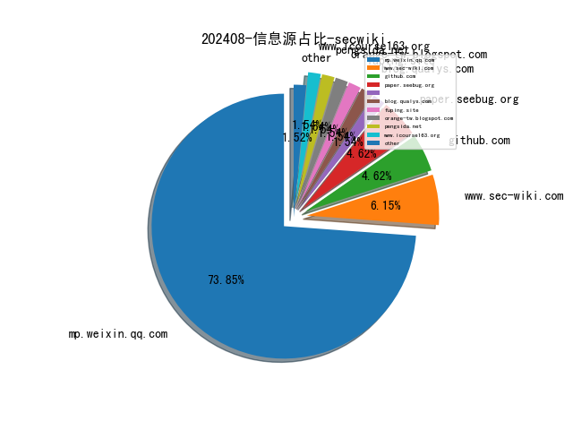
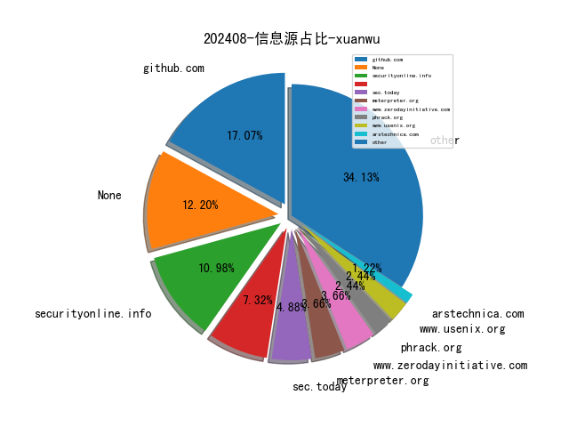
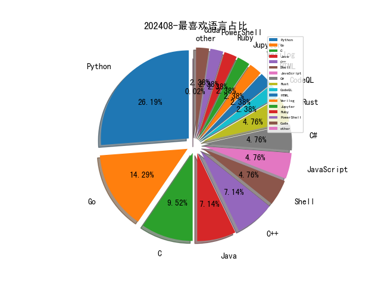

# [数据--所有](README_20.md)
# [数据--年度](README_2024.md)
# 202408 信息源与信息类型占比

# 政策 推荐
| title | url| 
| --- | ---| 
| 工业和信息化部主责国家重点研发计划重点专项管理实施细则 | https://www.miit.gov.cn/gyhxxhb/jgsj/gxjss/wjfb/art/2024/art_e13533ef46b84f00ac360d85e453bcf8.html| 

# 网络安全书籍 推荐
| date_added | language | title | author | link | size| 
| --- | --- | --- | --- | --- | ---| 
| 2024-08-30 21:09:06 | English | beginners guide to streamlit with python | unknown | https://it-ebooks.info/book/1686051862-beginners_guide_to_streamlit_with_python/ | unknown| 
| 2024-08-29 05:35:12 | English | The Complete Guide to Defense in Depth: Learn to identify, mitigate, and prevent cyber threats with a dynamic, layered defense approach | Akash Mukherjee | http://libgen.rs/book/index.php?md5=DDD4BD99C7ED3645AE268C6995666F96 | 3 MB [EPUB]| 
| 2024-08-29 05:24:04 | English | Confident DevOps: The Essential Skills and Insights for DevOps Success (Confident Series, 18) | Mark Peters | http://libgen.rs/book/index.php?md5=0BBEB73E8CF3A6A2B1F4094B7CC5C7A5 | 4 MB [EPUB]| 
| 2024-08-29 05:24:03 | English | Confident DevOps: The Essential Skills and Insights for DevOps Success (Confident Series, 18) | Mark Peters | http://libgen.rs/book/index.php?md5=B380A52BFE86570E9BBE2798787EED0F | 24 MB [PDF]| 
| 2024-08-29 05:24:00 | English | Confident DevOps: The Essential Skills and Insights for DevOps Success (Confident Series, 18) | Mark Peters | http://libgen.rs/book/index.php?md5=F84F243DFDC042AE43ECA2F4901C62FD | 4 MB [EPUB]| 
| 2024-08-29 01:56:56 | English | History of the British expedition to Egypt; to which is subjoined, a sketch of the present state of that country and its means of defense | Robert Thomas Wilson | http://libgen.rs/book/index.php?md5=91C091E23FD17A54D8AA5AFDE92AE963 | 19 MB [PDF]| 
| 2024-08-27 08:47:34 | English | Understanding Results with Python: 100 Drills for Data Analysis and Statistical Analysis | Kanro, Tomoya; Nana, Nishiyama; Smith, John; Kanro, Tomoya | http://libgen.rs/book/index.php?md5=92A64EFABFC7D95A9384E7711D9A0325 | 13 MB [EPUB]| 
| 2024-08-27 07:34:11 | English | (De Gruyter STEM) Machine Learning with Python | Tarkeshwar Barua, Kamal Kant Hiran, Ritesh Kumar Jain, Ruchi Doshi | http://libgen.rs/book/index.php?md5=C3C5898A15AB3A66CE4AE6D1872B8B51 | 40 MB [PDF]| 
| 2024-08-27 11:56:38 | English | Python: A Practical Learning Approach | Shriram K. Vasudevan; Sini Raj Pulari | http://libgen.rs/book/index.php?md5=F146BEF62CC31579432385B5A9EF88A6 | 33 MB [EPUB]| 
| 2024-08-25 07:31:19 | English | -beginners guide to streamlit with python | unknown | https://it-ebooks.info/book/1686051862-beginners_guide_to_streamlit_with_python/ | unknown| 
| 2024-08-23 17:07:56 | English | Serious Cryptography, 2nd Edition: A Practical Introduction to Modern Encryption | Jean-Philippe Aumasson | http://libgen.rs/book/index.php?md5=764E7EE754A2EFCDD841A710B84B8C73 | 15 MB [RAR]| 
| 2024-08-23 17:07:53 | English | Serious Cryptography, 2nd Edition: A Practical Introduction to Modern Encryption | Jean-Philippe Aumasson | http://libgen.rs/book/index.php?md5=98BAEE034C0A929A742DFDE69353A637 | 10 MB [EPUB]| 
| 2024-08-23 16:14:16 | English | Python for Algorithmic Trading Cookbook | unknown | https://www.wowebook.org/python-for-algorithmic-trading-cookbook/ | unknown| 
| 2024-08-22 04:24:50 | English | Cloud Penetration Testing for Red Teamers: Learn how to effectively pentest AWS, Azure, and GCP applications | Kim Crawley | http://libgen.rs/book/index.php?md5=640C86A8583D91F9F3F8AA69D0AC774A | 9 MB [EPUB]| 
| 2024-08-22 04:24:46 | English | Cloud Penetration Testing for Red Teamers: Learn how to effectively pentest AWS, Azure, and GCP applications | Kim Crawley | http://libgen.rs/book/index.php?md5=501DBCAF367D42F658CB377C12CD051D | 11 MB [PDF]| 
| 2024-08-22 12:41:15 | English | Idiomatic Rust | unknown | https://www.wowebook.org/idiomatic-rust/ | unknown| 
| 2024-08-21 23:20:50 | English | Geek Silicon Valley: The Inside Guide to Palo Alto, Stanford, Menlo Park, Mountain View, Santa Clara, Sunnyvale, San Jose, San Francisco | Vance, Ashlee | http://libgen.rs/book/index.php?md5=5FA9FE225DD3F60A1CAF778FFEC41451 | 1 MB [AZW]| 
| 2024-08-21 09:57:35 | English | AI-Powered Developer: Build great software with ChatGPT and Copilot | Nathan B. Crocker | http://libgen.rs/book/index.php?md5=3626B904C0420794D5BF6EE7283CDBBC | 21 MB [PDF]| 
| 2024-08-20 18:03:45 | English | Rust Fundamentals for Data Science: An Introductory Guide For Data Science | Hayden Van Der Post, Johann Strauss, Alice Schwartz (editor) | http://libgen.rs/book/index.php?md5=E36C088817E807EEB29BC25B9B426E9E | 937 kB [PDF]| 
| 2024-08-20 10:50:52 | English | Ego Mechanisms of Defense: A Guide for Clinicians and Researchers | George E. Vaillant, | http://libgen.rs/book/index.php?md5=890F1DD4D16A368858876FC677CC88C4 | 16 MB [PDF]| 
| 2024-08-20 10:18:15 | English | Programming with Python for Engineers | Sinan Kalkan, Onur T. Şehitoğlu, Göktürk Üçoluk | http://libgen.rs/book/index.php?md5=BB99ECC521C66372031509D1C67FF38C | 19 MB [PDF]| 
| 2024-08-20 08:18:14 | English | Python Programming Interviews Exposed: Ace Your Python Coding Interviews With Confidence (100 Questions And Answers) | Jackson , Marley | http://libgen.rs/book/index.php?md5=7BDD59BC26511DA3849EC9A73881D763 | 1 MB [EPUB]| 
| 2024-08-20 20:27:39 | English | Voting Rights Act - Securing Ballot | Richard M. Valelly | http://libgen.rs/book/index.php?md5=59ABE7E3D964F66403EE6A17760294D9 | 9 MB [PDF]| 
| 2024-08-20 14:47:40 | English | CompTIA Cloud+ Certification Guide (Exam CV0-003): Everything you need to know to pass the CompTIA Cloud+ CV0-003 exam (English Edition) | Gopi Krishna Nuti | http://libgen.rs/book/index.php?md5=3232FB96EBC7E57582892C5AF38F476E | 4 MB [EPUB]| 
| 2024-08-20 13:44:51 | English | Learning Kali Linux: Security Testing, Penetration Testing & Ethical Hacking | Ric Messier | http://libgen.rs/book/index.php?md5=3CA14DC2251A2EEFB28C8C33584CB465 | 15 MB [EPUB]| 
| 2024-08-20 13:39:26 | English | Defensive Security Handbook: Best Practices for Securing Infrastructure | Amanda Berlin, Lee Brotherston, William Reyor III | http://libgen.rs/book/index.php?md5=5AD86BA72075B7B59D45654765123D44 | 8 MB [EPUB]| 
| 2024-08-19 08:24:17 | English | CompTIA Network+ Certification Guide (Exam N10-008): Unleash your full potential as a Network Administrator | unknown | http://libgen.rs/book/index.php?md5=DD72F60D313A1D00C07ED26213D90AFE | 57 MB [PDF]| 
| 2024-08-19 20:43:53 | English | Generative AI with Amazon Bedrock: Build, scale, and secure generative AI applications using Amazon Bedrock | Shikhar Kwatra, Bunny Kaushik | http://libgen.rs/book/index.php?md5=135D60E8E373A747BA1020367CF7A0BB | 29 MB [EPUB]| 
| 2024-08-19 20:10:46 | English | Generative AI with Amazon Bedrock: Build, scale, and secure generative AI applications using Amazon Bedrock | Shikhar Kwatra, Bunny Kaushik | http://libgen.rs/book/index.php?md5=429310088F3BE97ADB57C8658A411966 | 32 MB [RAR]| 
| 2024-08-17 06:04:03 | English | Zero Trust Networks: Building Secure Systems in Untrusted Networks | Razi Rais, Christina Morillo, Evan Gilman, Doug Barth | http://libgen.rs/book/index.php?md5=E4436AE06AA46BD46019E0B6ADB3150A | 9 MB [EPUB]| 
| 2024-08-17 05:41:16 | English | Advanced Excel 365: Including ChatGPT Tips | Ritu Arora | http://libgen.rs/book/index.php?md5=B9657CC0E65286C1B3D420C93CB88DC9 | 19 MB [RAR]| 
| 2024-08-17 10:10:31 | English | Python for Engineering and Scientific Computing | unknown | https://www.wowebook.org/python-for-engineering-and-scientific-computing/ | unknown| 
| 2024-08-17 09:44:16 | English | Scripting: Automation with Bash, PowerShell, and Python | unknown | https://www.wowebook.org/scripting-automation-with-bash-powershell-and-python/ | unknown| 
| 2024-08-14 07:02:55 | English | Learning Kali Linux, 2nd Edition | unknown | https://www.wowebook.org/learning-kali-linux-2nd-edition/ | unknown| 
| 2024-08-13 10:07:45 | English | Learn OpenAI Whisper | unknown | https://www.wowebook.org/learn-openai-whisper/ | unknown| 
| 2024-08-09 09:04:23 | English | Introduction to Python Network Automation Volume II | unknown | https://www.wowebook.org/introduction-to-python-network-automation-volume-ii/ | unknown| 
| 2024-08-09 06:51:38 | English | Introducing Microsoft Copilot for Managers | unknown | https://www.wowebook.org/introducing-microsoft-copilot-for-managers/ | unknown| 
| 2024-08-09 05:55:34 | English | Blockchain, IoT, and AI Technologies for Supply Chain Management | unknown | https://www.wowebook.org/blockchain-iot-and-ai-technologies-for-supply-chain-management/ | unknown| 
| 2024-08-07 10:34:15 | English | Return to Reason: A Critique of Enlightenment Evidentialism and a Defense of Reason and Belief in God | Kelly James Clark | http://libgen.rs/book/index.php?md5=E18784D6CC8AAB1A67A9793DDB19D6F8 | 678 kB [EPUB]| 
| 2024-08-07 07:09:20 | English | Empowering the Public Sector with Generative AI | unknown | https://www.wowebook.org/empowering-the-public-sector-with-generative-ai/ | unknown| 
| 2024-08-07 06:36:45 | English | Learning Microsoft Power Apps | unknown | https://www.wowebook.org/learning-microsoft-power-apps/ | unknown| 
| 2024-08-07 05:43:15 | English | Security Architecture for Hybrid Cloud | unknown | https://www.wowebook.org/security-architecture-for-hybrid-cloud/ | unknown| 
| 2024-08-07 17:50:57 | English | Innovations in Computer Vision and Data Classification: From Pandemic Data Analysis to Environmental and Health Monitoring (EAI/Springer Innovations in Communication and Computing) | Arfan Ghani | http://libgen.rs/book/index.php?md5=F05E2C5A51FAF773C4031475CD79A590 | 44 MB [RAR]| 
| 2024-08-07 17:50:55 | English | Innovations in Computer Vision and Data Classification: From Pandemic Data Analysis to Environmental and Health Monitoring (EAI/Springer Innovations in Communication and Computing) | Arfan Ghani | http://libgen.rs/book/index.php?md5=43F22D0FC2D9CCDD3598664E661AED6C | 26 MB [EPUB]| 
| 2024-08-07 17:50:52 | English | Innovations in Computer Vision and Data Classification: From Pandemic Data Analysis to Environmental and Health Monitoring (EAI/Springer Innovations in Communication and Computing) | Arfan Ghani | http://libgen.rs/book/index.php?md5=29BC875550BF16CDF8031411EA09FA05 | 16 MB [PDF]| 
| 2024-08-06 05:08:06 | English | Python for Information Professionals: How to Design Practical Applications to Capitalize on the Data Explosion | Brady Lund, Daniel Agbaji, Kossi Dodzi Bissadu, Haihua Chen | http://libgen.rs/book/index.php?md5=B29AA649D208FC684CD7A3CFAF723535 | 10 MB [RAR]| 
| 2024-08-06 05:08:04 | English | Python for Information Professionals: How to Design Practical Applications to Capitalize on the Data Explosion | Brady Lund, Daniel Agbaji, Kossi Dodzi Bissadu, Haihua Chen | http://libgen.rs/book/index.php?md5=B5D0A71C0E86C993F7CA27F9C7546ABB | 832 kB [EPUB]| 
| 2024-08-06 05:08:02 | English | Python for Information Professionals: How to Design Practical Applications to Capitalize on the Data Explosion | Brady Lund, Daniel Agbaji, Kossi Dodzi Bissadu, Haihua Chen | http://libgen.rs/book/index.php?md5=0790FA2CA1F6DB64B4B985DFB004FD74 | 7 MB [PDF]| 
| 2024-08-06 04:41:55 | English | Digital Identification: Privacy, Security, and Technology | Lottie Gould | http://libgen.rs/book/index.php?md5=6D5FFFCA4C6A2AD1896589E873412157 | 17 MB [RAR]| 
| 2024-08-06 04:41:43 | English | Digital Identification: Privacy, Security, and Technology | Lottie Gould | http://libgen.rs/book/index.php?md5=FBF5459FD4DCCDD5C9399ECF53C4B4F5 | 16 MB [PDF]| 
| 2024-08-06 04:33:16 | English | Exam Ref SC-100 Microsoft Cybersecurity Architect | Yuri Diogenes, Sarah Young, Mark Simos, Gladys Rodriguez | http://libgen.rs/book/index.php?md5=CFBDA81A5F146EBB0D88CF8978AFAB6A | 20 MB [RAR]| 
| 2024-08-06 04:33:13 | English | Exam Ref SC-100 Microsoft Cybersecurity Architect | Yuri Diogenes, Sarah Young, Mark Simos, Gladys Rodriguez | http://libgen.rs/book/index.php?md5=4F96235413DAF7FA10CCA17FBA32142D | 11 MB [EPUB]| 
| 2024-08-06 04:33:11 | English | Exam Ref SC-100 Microsoft Cybersecurity Architect | Yuri Diogenes, Sarah Young, Mark Simos, Gladys Rodriguez | http://libgen.rs/book/index.php?md5=404887E07F6D046F78BB37445185A7CC | 8 MB [PDF]| 
| 2024-08-06 04:12:27 | English | Quick Start Guide to Large Language Models: Strategies and Best Practices for Using ChatGPT and Other LLMs (Addison-Wesley Data & Analytics Series) | Sinan Ozdemir | http://libgen.rs/book/index.php?md5=21CCCD8BA26CBDDC693EE93B30ECB786 | 27 MB [EPUB]| 
| 2024-08-06 00:01:51 | English | CompTIA A+ Practice Questions Exam Cram Core 1 (220-1101) and Core 2 (220-1102) | Dave Prowse | http://libgen.rs/book/index.php?md5=1C279DAC69F60175423159EDEE7ED79F | 10 MB [RAR]| 
| 2024-08-06 00:01:49 | English | CompTIA A+ Practice Questions Exam Cram Core 1 (220-1101) and Core 2 (220-1102) | Dave Prowse | http://libgen.rs/book/index.php?md5=E5A97CF54FB617AB5084D59FE4135CDB | 1 MB [EPUB]| 
| 2024-08-06 00:01:47 | English | CompTIA A+ Practice Questions Exam Cram Core 1 (220-1101) and Core 2 (220-1102) | Dave Prowse | http://libgen.rs/book/index.php?md5=8FB5116CF781569C2A3F5D4DC29D5989 | 6 MB [PDF]| 
| 2024-08-05 04:42:21 | English | Applying Artificial Intelligence in Cybersecurity Analytics and Cyber Threat Detection | Shilpa Mahajan (editor), Mehak Khurana (editor), Vania Vieira Estrela (editor) | http://libgen.rs/book/index.php?md5=3557433B02C18657E5E2016DA702A5D0 | 23 MB [RAR]| 
| 2024-08-05 04:41:44 | English | Applying Artificial Intelligence in Cybersecurity Analytics and Cyber Threat Detection | Shilpa Mahajan (editor), Mehak Khurana (editor), Vania Vieira Estrela (editor) | http://libgen.rs/book/index.php?md5=390B1BC658BFA380B8DAADBA423D54A4 | 6 MB [PDF]| 
| 2024-08-05 04:22:33 | English | The Active Defender: Immersion in the Offensive Security Mindset (Tech Today) | Catherine J. Ullman | http://libgen.rs/book/index.php?md5=3F46653712E1083A1632A2F17C49AB8D | 13 MB [RAR]| 
| 2024-08-05 04:18:32 | English | Introduction to Python Network Automation Volume II: Stepping up: Beyond the Essentials for Success | Brendan Choi | http://libgen.rs/book/index.php?md5=1CB6C7B0F0A8FF8D69676C667B950E8C | 46 MB [RAR]| 
| 2024-08-05 04:10:12 | English | Introduction to Python Network Automation Volume II: Stepping up: Beyond the Essentials for Success | Brendan Choi | http://libgen.rs/book/index.php?md5=248FBB296140D35073A0BE83EC4D75AF | 23 MB [PDF]| 
| 2024-08-05 16:47:12 | English | Building AI Applications with Microsoft Semantic Kernel | unknown | https://www.wowebook.org/building-ai-applications-with-microsoft-semantic-kernel/ | unknown| 
| 2024-08-05 07:06:46 | English | Generative AI with Amazon Bedrock | unknown | https://www.wowebook.org/generative-ai-with-amazon-bedrock/ | unknown| 
| 2024-08-05 06:20:51 | English | The Complete Guide to Defense in Depth | unknown | https://www.wowebook.org/the-complete-guide-to-defense-in-depth/ | unknown| 
| 2024-08-05 23:53:13 | English | Quick Start Guide to Large Language Models: Strategies and Best Practices for Using ChatGPT and Other LLMs (Addison-Wesley Data & Analytics Series) | Sinan Ozdemir | http://libgen.rs/book/index.php?md5=3C7ACDA5696F843B577938141468BE6D | 51 MB [RAR]| 
| 2024-08-05 23:53:11 | English | Quick Start Guide to Large Language Models: Strategies and Best Practices for Using ChatGPT and Other LLMs (Addison-Wesley Data & Analytics Series) | Sinan Ozdemir | http://libgen.rs/book/index.php?md5=19635694BA6DB46198FB7E26CFC9FC53 | 27 MB [EPUB]| 
| 2024-08-05 23:53:10 | English | Quick Start Guide to Large Language Models: Strategies and Best Practices for Using ChatGPT and Other LLMs (Addison-Wesley Data & Analytics Series) | Sinan Ozdemir | http://libgen.rs/book/index.php?md5=366C04EBD17C164F1807A4EAF53950F0 | 21 MB [PDF]| 
| 2024-08-05 22:58:08 | English | FBI Handbook of Crime Scene Forensics: The Authoritative Guide to Navigating Crime Scenes | The Federal Bureau of Investigation | http://libgen.rs/book/index.php?md5=2E9007FFAC9FA261D907E7A3E6EE94F3 | 1 MB [EPUB]| 
| 2024-08-05 18:17:35 | English | Microsoft Power BI Cookbook, Third Edition | unknown | https://www.wowebook.org/microsoft-power-bi-cookbook-third-edition/ | unknown| 
| 2024-08-05 19:09:15 | English | Modern Python Cookbook, Third Edition | unknown | https://www.wowebook.org/modern-python-cookbook-third-edition/ | unknown| 
| 2024-08-05 18:51:13 | English | Python Machine Learning By Example, Fourth Edition | unknown | https://www.wowebook.org/python-machine-learning-by-example-fourth-edition/ | unknown| 
| 2024-08-04 00:42:40 | English | Empowering the Public Sector with Generative AI: From Strategy and Design to Real-World Applications | Sanjeev Pulapaka; Srinath Godavarthi; Sherry Ding | http://libgen.rs/book/index.php?md5=B9028A0818AB363EB8E4E1476A9904C4 | 8 MB [PDF]| 
| 2024-08-03 05:59:58 | English | Causal Inference and Discovery in Python: Unlock the secrets of modern causal machine learning with DoWhy, EconML, PyTorch and more | Aleksander Molak | http://libgen.rs/book/index.php?md5=475E9E1EB217D481E46109BED7382CA3 | 10 MB [PDF]| 
| 2024-08-03 22:58:05 | English | ChatGPT & Co.: A Workbook for Writing, Research, Creating Images, Programming, and More | Rainer Hattenhauer | http://libgen.rs/book/index.php?md5=3BFF0B21BC6A4DBF14CA5384EEDCD2BD | 18 MB [PDF]| 
| 2024-08-03 21:56:47 | English | Introduction to Python Network Automation Volume II : Stepping up: Beyond the Essentials for Success | Brendan Choi | http://libgen.rs/book/index.php?md5=04D327365FA9BFFF3B5EA356B9270D3D | 21 MB [EPUB]| 
| 2024-08-01 07:44:31 | English | (EXPERT INSIGHT) Modern Python Cookbook: 130+ updated recipes for modern Python 3.12 with new techniques and tools, 3rd Edition | Steven F. Lott | http://libgen.rs/book/index.php?md5=D731D90A898B09E8C5A998DE5A779991 | 13 MB [EPUB]| 
| 2024-08-01 07:27:53 | English | Write Powerful Rust Macros | Van Overmeire, Sam; | http://libgen.rs/book/index.php?md5=660722869C7184BF13AF142D6FBD598C | 9 MB [EPUB]| 
| 2024-08-01 07:25:34 | English | Business Analytics with R and Python (AI for Risks) | David L. Olson , Desheng Dash Wu , Cuicui Luo , Majid Nabavi | http://libgen.rs/book/index.php?md5=9A879BC0732EB36A842F9A0724482C26 | 5 MB [PDF]| 
| 2024-08-01 07:11:06 | English | Python Machine Learning By Example_Fourth Edition | Yuxi (Hayden) Liu | http://libgen.rs/book/index.php?md5=09EE97ED0847AD4F1B44B3E003544CE1 | 23 MB [EPUB]| 
| 2024-08-01 01:56:56 | English | (20th Anniversary Edition) Applied Cryptography: Protocols, Algorithms and Source Code in C | Bruce Schneier | http://libgen.rs/book/index.php?md5=7708506900EF60D1657BE5D342387917 | 22 MB [EPUB]| 
| 2024-08-01 11:29:24 | English | ChatGPT for Conversational AI and Chatbots | unknown | https://www.wowebook.org/chatgpt-for-conversational-ai-and-chatbots/ | unknown| 
| 2024-08-01 08:29:09 | English | Python Data Cleaning Cookbook, Second Edition | unknown | https://www.wowebook.org/python-data-cleaning-cookbook-second-edition/ | unknown| 

# 微信公众号 推荐
| nickname_english | weixin_no | title | url| 
| --- | --- | --- | ---| 
| 7coinSec | None | 『POC』CVE-2024-38063(Windows TCP/IP IPv6远程拒绝服务/代码执行漏洞) | https://mp.weixin.qq.com/s?__biz=MzkyMTMxNjQ5NA==&mid=2247484785&idx=1&sn=8c1cbf4b4b65a0874cebe9b20b119f85 | 5| 
| Code4th安全团队 | None | 刚刚！突然宣布:全体彻底沸腾了！8月31日正式开始... | https://mp.weixin.qq.com/s?__biz=MzkzMzE5OTQzMA==&mid=2247485027&idx=1&sn=700c1da78c20143bf797ca0dc5a95449 | 5| 
| Cyb3rES3c | None | 山高路远，江湖再见 | https://mp.weixin.qq.com/s?__biz=Mzg2MTc1MjY5OQ==&mid=2247485868&idx=1&sn=8da1f8fb8113d1522b6b4fbc748da216 | 1| 
| IoVSecurity | None | GRCC会员网站grcc.vip无限年卡大促销活动! | https://mp.weixin.qq.com/s?__biz=MzU2MDk1Nzg2MQ==&mid=2247612645&idx=3&sn=0934c22ffd899334a5896738f406944e | 33| 
| Khan安全攻防实验室 | None | 伪装“黑神话悟空修改器”传播木马的活动分析 | https://mp.weixin.qq.com/s?__biz=MzAwMjQ2NTQ4Mg==&mid=2247494757&idx=1&sn=303c5764e5f67fb41ac44c045de9b11c | 23| 
| SeeUSec | None | 2024年ISG观安杯WP | https://mp.weixin.qq.com/s?__biz=MzkzMjE4NzU5MA==&mid=2247488206&idx=1&sn=f67179963d61b0b5afd286d13dbd48bf | 2| 
| TtTeam | None | 近期红队攻防实战趣事小记（与蓝队穿越空间的一场完美邂逅） | https://mp.weixin.qq.com/s?__biz=Mzg2NTk4MTE1MQ==&mid=2247485932&idx=1&sn=517dcf53a8110a787d5f8f4da816a560 | 20| 
| Web安全工具库 | None | AppScan Standard V10.6（你懂得版） | https://mp.weixin.qq.com/s?__biz=MzI4MDQ5MjY1Mg==&mid=2247514003&idx=1&sn=92fbfdd0dc2d9b292b8647b7d8038bdd | 15| 
| dotNet安全矩阵 | None | .NET 一款具备签名用于绕过防护的工具 | https://mp.weixin.qq.com/s?__biz=MzUyOTc3NTQ5MA==&mid=2247494921&idx=3&sn=e8c0089661afeba65545fb484011abe2 | 45| 
| 中国电信安全 | None | 就在明天！ | https://mp.weixin.qq.com/s?__biz=MzkxNDY0MjMxNQ==&mid=2247529299&idx=1&sn=4475db748c9d1ed660886b950b91210d | 7| 
| 代码卫士 | None | AVTECH IP摄像头漏洞已存在多年但未修复 被纳入僵尸网络 | https://mp.weixin.qq.com/s?__biz=MzI2NTg4OTc5Nw==&mid=2247520635&idx=2&sn=1e8f2bedf63ce8086bb68cd736dc6036 | 12| 
| 全栈安全 | None | 安全自动化协议SCAP及其12大组件介绍 | https://mp.weixin.qq.com/s?__biz=MzkyMTYyOTQ5NA==&mid=2247484934&idx=1&sn=fce208b1f40c735940dd0caa5f4cad5d | 2| 
| 内生安全联盟 | None | 附全文 , 工信部、国家标准委联合印发《物联网标准体系建设指南（2024版）》 ，涉及安全可信等内容 | https://mp.weixin.qq.com/s?__biz=Mzg4MDU0NTQ4Mw==&mid=2247522980&idx=2&sn=8cf96ef7016f4d0551b1bc51cd91b0f8 | 26| 
| 军哥网络安全读报 | None | 企业网络监控和管理解决方案 WhatsUp Gold 存在严重缺陷，导致系统面临全面攻击 | https://mp.weixin.qq.com/s?__biz=MzI2NzAwOTg4NQ==&mid=2649792247&idx=3&sn=ae4d8c452d98294df13616dd448801d8 | 16| 
| 冷漠安全 | None | 「漏洞复现」用友NC link/content SQL注入漏洞 | https://mp.weixin.qq.com/s?__biz=MzkyNDY3MTY3MA==&mid=2247485324&idx=1&sn=ec8874faf2c018db193b568338bd2964 | 16| 
| 前沿信安资讯阵地 | None | 《网络安全课程》网络安全：威胁一览（课程介绍） | https://mp.weixin.qq.com/s?__biz=MzA3MTM0NTQzNA==&mid=2455778534&idx=1&sn=9b627a364e6e71d472c9faa8a991def4 | 12| 
| 吉祥学安全 | None | 27家网安上市公司，上半年共亏损36.36亿，奇安信自己就亏8.2亿 | https://mp.weixin.qq.com/s?__biz=MzkwNjY1Mzc0Nw==&mid=2247485685&idx=1&sn=6acbc8ba779b64f3d5f0fcf9e330af47 | 11| 
| 吉祥快学网络安全吧 | None | 这个网安公司0.139万中标一个要服务55天的技术支持项目，这样卷图啥？ | https://mp.weixin.qq.com/s?__biz=MzkzMzcxNTQyNw==&mid=2247484701&idx=1&sn=c26e2967c0d0dab3cbbe42a38332aabe | 17| 
| 君说安全 | None | 主流上市网安企业2024半年报盘点 | https://mp.weixin.qq.com/s?__biz=MzUzNjkxODE5MA==&mid=2247486666&idx=1&sn=0b214f097a5088f02c0f191d93111f07 | 13| 
| 启明星辰集团 | None | 中国移动首席科学家王晓云莅临启明星辰调研指导 | https://mp.weixin.qq.com/s?__biz=MzA3NDQ0MzkzMA==&mid=2651727367&idx=1&sn=139a727d12db92d16b845ee6a8815019 | 8| 
| 夜组安全 | None | 结束了40天的疲惫，那师傅们就重开吧！ | https://mp.weixin.qq.com/s?__biz=Mzk0ODM0NDIxNQ==&mid=2247492097&idx=1&sn=0ac099ce69743c7d2109cf5930029efc | 9| 
| 奇安信病毒响应中心 | None | 每周勒索威胁摘要 | https://mp.weixin.qq.com/s?__biz=MzI5Mzg5MDM3NQ==&mid=2247495608&idx=1&sn=9a706502e2a6b9b274eb6f79c211560e | 3| 
| 威努特安全网络 | None | 一周全球重大网络安全事件速递（第三十六期） | https://mp.weixin.qq.com/s?__biz=MzAwNTgyODU3NQ==&mid=2651125973&idx=1&sn=ce757743649b1479f31405bcf373e883 | 10| 
| 娜璋AI安全之家 | None | [译] 威胁分析报告：12.APT29利用spy软件供应商创建的IOS、Chrome漏洞 | https://mp.weixin.qq.com/s?__biz=Mzg5MTM5ODU2Mg==&mid=2247500766&idx=1&sn=a587bd51a90cb20b7edbf77c6cbcd001 | 2| 
| 安全学习那些事儿 | None | “AI换脸”犯罪引发韩国民众恐慌 参与用户多达22万人 | https://mp.weixin.qq.com/s?__biz=MzkxNTI2NTQxOA==&mid=2247493774&idx=3&sn=a596293b9ea5a099e3dfcadab6278743 | 45| 
| 安全牛课堂 | None | ITIL4如何在IT部门落地？ | https://mp.weixin.qq.com/s?__biz=MzIxNTM4NDY2MQ==&mid=2247512471&idx=1&sn=a46bfd62556da781e3c344cc1de5971b | 11| 
| 安全狗的自我修养 | None | 使用隐蔽的回调通道隐藏 C2 | https://mp.weixin.qq.com/s?__biz=MzkwOTE5MDY5NA==&mid=2247499328&idx=1&sn=9a1beedffddfb8322713e30f25c5329e | 11| 
| 安小圈 | None | 揭秘常见【诈骗】手法，提高全民反诈意识。 | https://mp.weixin.qq.com/s?__biz=Mzg2MDg0ODg1NQ==&mid=2247526666&idx=2&sn=316457e1533cdfb4a7f0a3e6f39b4ffb | 33| 
| 安知讯 | None | 中信银行信息技术管理部招聘数字化推动与管理岗 | https://mp.weixin.qq.com/s?__biz=MzIxMDIwODM2MA==&mid=2653930674&idx=2&sn=05a87d3db87930796a422a3d5549971f | 20| 
| 实战安全研究 | None | 红蓝,浅谈某省护打点经历（思路+工具） | https://mp.weixin.qq.com/s?__biz=MzU0MTc2NTExNg==&mid=2247490876&idx=1&sn=f7db8f9e765677d557f0a193f2908cbc | 13| 
| 开源情报技术研究院 | None | 网络安全资讯周报（8/26- 8/30） | https://mp.weixin.qq.com/s?__biz=MzkwNjQxOTk1Mg==&mid=2247485968&idx=1&sn=d2d2158976b8861f4dfa954a9bd48846 | 2| 
| 数说安全 | None | 2024年网安上市公司上半年营收、毛利、净利润排行 | https://mp.weixin.qq.com/s?__biz=MzkzMDE5MDI5Mg==&mid=2247507297&idx=1&sn=9c79220d8124b3dd5dc90ae28f711b08 | 7| 
| 橘猫学安全 | None | hw防御 , tcprepaly工具的安装与使用! | https://mp.weixin.qq.com/s?__biz=Mzg5OTY2NjUxMw==&mid=2247513021&idx=2&sn=57fb34de07e78d1612a2a8425cd9bf23 | 20| 
| 河南等级保护测评 | None | 国外：一周网络安全态势回顾之第62期 | https://mp.weixin.qq.com/s?__biz=Mzg2NjY2MTI3Mg==&mid=2247496903&idx=2&sn=5532e4510fdf52184bb2d4ddf23c9189 | 24| 
| 泰晓科技 | None | OSDT Weekly 2024-08-21 第268期 | https://mp.weixin.qq.com/s?__biz=MzA5NDQzODQ3MQ==&mid=2648194030&idx=2&sn=426008a080e479cdada4329cf645eb65 | 2| 
| 泷羽Sec | None | windows defender永久卸载工具分享，以及使用方法 | https://mp.weixin.qq.com/s?__biz=Mzg2Nzk0NjA4Mg==&mid=2247490558&idx=1&sn=7b97243d23b8abfb816bbc670019e43c | 1| 
| 洞见网安 | None | 网安原创文章推荐【2024/8/30】 | https://mp.weixin.qq.com/s?__biz=MzAxNzg3NzMyNQ==&mid=2247488818&idx=1&sn=2d7e11c9be292940d52fde112cc1c7ae | 13| 
| 浅安安全 | None | 工具 , TideFinger_Go | https://mp.weixin.qq.com/s?__biz=MzkwMTQ0NDA1NQ==&mid=2247490365&idx=4&sn=1357173751087408291afd1edf3afcff | 40| 
| 浅梦安全 | None | 【2024HW】天命所归，皆成终章！ | https://mp.weixin.qq.com/s?__biz=Mzk0NzUyNTk1NQ==&mid=2247485926&idx=1&sn=07083b1663d29617adacc35953bf6358 | 3| 
| 玄道夜谈 | None | 分享图片 | https://mp.weixin.qq.com/s?__biz=MzI3Njc1MjcxMg==&mid=2247493163&idx=1&sn=47c4d0365efd28a4956d40779e816346 | 15| 
| 白帽子 | None | Web3 安全入门避坑指南｜假矿池骗局 | https://mp.weixin.qq.com/s?__biz=MzAwMDQwNTE5MA==&mid=2650247605&idx=1&sn=14a02fa99a153ca6005cc491eb0cd4e7 | 4| 
| 白帽学子 | None | TestNet 资产管理信息收集系统 | https://mp.weixin.qq.com/s?__biz=MzkyNzIxMjM3Mg==&mid=2247487404&idx=1&sn=6baad19664a94ee9509cf9b351d92277 | 14| 
| 白帽黑客训练营 | None | 黑客技术自学软件有哪些？推荐几款黑客常用黑客工具 | https://mp.weixin.qq.com/s?__biz=MzIzNjIwNTQ5MQ==&mid=2247484959&idx=1&sn=bb5122b95110f46d9b9aa784fc2cc185 | 5| 
| 紫队安全研究 | None | HVV技战法｜基于蜜罐的智能安全策略 | https://mp.weixin.qq.com/s?__biz=Mzg3OTYxODQxNg==&mid=2247484871&idx=1&sn=c52e44ccce836416507ef76e112d4816 | 14| 
| 网安观察室XQ | None | 国内外网络安全热点情报（2024年第33期） | https://mp.weixin.qq.com/s?__biz=MzkzNjM4ODc3OQ==&mid=2247485324&idx=1&sn=b29d704e05a8cf0b760a8d199d6a0ed3 | 1| 
| 网空闲话plus | None | 5th域安全微讯早报【20240831】210期 | https://mp.weixin.qq.com/s?__biz=MzkyMjQ5ODk5OA==&mid=2247502815&idx=2&sn=a3c4fc7a27f8d8eca61dcf878e6aa952 | 31| 
| 网络安全与取证研究 | None | 刘品新 , 论电子证据重建理论 | https://mp.weixin.qq.com/s?__biz=Mzg3NTU3NTY0Nw==&mid=2247489085&idx=1&sn=b5d016680cde74ffd4d55215f7543820 | 13| 
| 网络安全实验室 | None | 南网数字集团招聘网络安全专业 | https://mp.weixin.qq.com/s?__biz=MzU4OTg4Nzc4MQ==&mid=2247503582&idx=1&sn=8ec5a189e5f91a2985bb15e909d64817 | 19| 
| 网络技术干货圈 | None | Wireshark 4.4 重磅发布！具有重大增强功能 | https://mp.weixin.qq.com/s?__biz=MzUyNTExOTY1Nw==&mid=2247526390&idx=2&sn=250f0547b60b0e41550c16a14298599d | 14| 
| 网络技术联盟站 | None | 一文带你彻底了解Wi-Fi 7 | https://mp.weixin.qq.com/s?__biz=MzIyMzIwNzAxMQ==&mid=2649460858&idx=1&sn=dd32c92b9de0e19492c6ca71e3ede068 | 14| 
| 网络空间信息安全学习 | None | 7个场景揭示古代诗词如何塑造现代生活 | https://mp.weixin.qq.com/s?__biz=MzI2MjcwMTgwOQ==&mid=2247491534&idx=1&sn=f03ef6fd239ea401e19f68530bbc2428 | 13| 
| 船山信安 | None | 密探：渗透测试工具 v1.15 版 | https://mp.weixin.qq.com/s?__biz=MzU2NDY2OTU4Nw==&mid=2247515958&idx=1&sn=385eaa38f105f00ebf8273c31f16c19e | 13| 
| 苏说安全 | None | 身份验证技术应用的10大关键趋势 | https://mp.weixin.qq.com/s?__biz=Mzg5OTg5OTI1NQ==&mid=2247488402&idx=1&sn=3ddf7f98ea7b9dc1bfe451bda35917f6 | 14| 
| 计算机与网络安全 | None | 2024年国家网络安全宣传周（视频6） | https://mp.weixin.qq.com/s?__biz=MjM5OTk4MDE2MA==&mid=2655252971&idx=2&sn=791e036a5c3a7dd4cbb26287fedfda90 | 71| 
| 贝雷帽SEC | None | 【OSCP】warez | https://mp.weixin.qq.com/s?__biz=Mzk0MDQzNzY5NQ==&mid=2247492376&idx=1&sn=6e41c8ab426ba3425ccca6ffe4551754 | 4| 
| 赛博研究院 | None | 每周热点｜中欧数据跨境流动交流机制正式建立 | https://mp.weixin.qq.com/s?__biz=MzUzODYyMDIzNw==&mid=2247510394&idx=1&sn=9061e8dc59cd58f8c027566fdb39c178 | 5| 
| 赛欧思安全研究实验室 | None | 赛欧思一周资讯分类汇总(2024-08-26 ~ 2024-08-31) | https://mp.weixin.qq.com/s?__biz=MzU0MjE2Mjk3Ng==&mid=2247487645&idx=1&sn=eb9a5034b025d576c61f00175e526d62 | 10| 
| 轩辕实验室 | None | 译文 , 伊世智能呈SAE JA7496国际首例“汽车/航空航天”联合信息安全标准中文版与行业伙伴共研 | https://mp.weixin.qq.com/s?__biz=MzI1MTkwODMxMQ==&mid=2247487515&idx=1&sn=bb8a2e0c376a468781e0a36dc42f7be0 | 2| 
| 逆向有你 | None | 职场丽人的心路历程：在爱情与事业间优雅转身 | https://mp.weixin.qq.com/s?__biz=MzA4MzgzNTU5MA==&mid=2652035851&idx=2&sn=05cf454637a75d0600e9b5828a1ae499 | 10| 
| 银遁安全团队 | None | 【工具推荐】密探渗透测试工具v1.15 更新 | https://mp.weixin.qq.com/s?__biz=MzU3MjU4MjM3MQ==&mid=2247487320&idx=1&sn=6bbf80eec1e323d692d7861e142cf235 | 10| 
| 骨哥说事 | None | ‘黑掉NASA’【2】：从发现漏洞到荣登名人堂之旅 | https://mp.weixin.qq.com/s?__biz=MjM5Mzc4MzUzMQ==&mid=2650259759&idx=1&sn=828565751a97eefedd2424500b0a03ad | 7| 
| 鹏组安全 | None | 【工具篇】大佬都在用的几款web指纹识别工具 | https://mp.weixin.qq.com/s?__biz=Mzg5NDU3NDA3OQ==&mid=2247490594&idx=1&sn=8f44c2cd0db61dc32948f5dd2691e106 | 1| 
| 黑客白帽子 | None | 【LSP专享】更新16位抖音女主播直播录屏，助眠视频MY雪寒高清视频1V | https://mp.weixin.qq.com/s?__biz=MzA5MzYzMzkzNg==&mid=2650958176&idx=3&sn=4808548053b901996964638446a4a4f1 | 27| 
| 黑白之道 | None | 一个针对高价值系统后渗透工具 | https://mp.weixin.qq.com/s?__biz=MzAxMjE3ODU3MQ==&mid=2650599410&idx=4&sn=fe91e5f2116e148c505c7c9706eb2e20 | 54| 
| 龙哥网络安全 | None | 大学计算机最不能忽略的3门课 | https://mp.weixin.qq.com/s?__biz=MzU3MjczNzA1Ng==&mid=2247490178&idx=1&sn=d465322b7460bdef9d4c168d222ad54b | 7| 
| 360数字安全 | None | 摆脱高级威胁“达摩克利斯之剑”，科教行业再添安全“buff” | https://mp.weixin.qq.com/s?__biz=MzA4MTg0MDQ4Nw==&mid=2247574865&idx=1&sn=3b3834e3933370d5d91e822d9b09111a | 9| 
| ADLab | None | 启明星辰ADLab：对近期某未知黑客组织攻击活动追踪与分析报告 | https://mp.weixin.qq.com/s?__biz=MzAwNTI1NDI3MQ==&mid=2649619588&idx=1&sn=179fcb6618f08dc7a5c93bfe4b6c5ae5 | 2| 
| Ares信息安全 | None | 师傅们，明年见！ | https://mp.weixin.qq.com/s?__biz=MzkxODQxOTUxMg==&mid=2247483804&idx=1&sn=9a10c660ae53aa316e52edf81305c0e4 | 1| 
| Beacon Tower Lab | None | 【0830】重保演习每日情报汇总 | https://mp.weixin.qq.com/s?__biz=MzkyNzcxNTczNA==&mid=2247486724&idx=1&sn=700f8fcdf2d911292d2be2904bd8f913 | 7| 
| CSJH网络安全团队 | None | 各位蓝队猴子，我们明年见 | https://mp.weixin.qq.com/s?__biz=Mzg3MDYyNzY0MA==&mid=2247491008&idx=1&sn=3ef3bf3bba84da1b1890be165f386761 | 3| 
| CatalyzeSec | None | 用友NC content SQL注入漏洞复现及POC | https://mp.weixin.qq.com/s?__biz=MzkxNjY1MjY3OQ==&mid=2247486147&idx=1&sn=822651cb451034705849a80796bff580 | 3| 
| Day1安全团队 | None | ISRC-2024中秋活动开启，师傅们“回家”了！！！ | https://mp.weixin.qq.com/s?__biz=MzU1NDU1NTI5Nw==&mid=2247487919&idx=1&sn=80288f0fe10e79f8518298a46fba3882 | 1| 
| Docker中文社区 | None | 男人关了所有开发同事的电脑，第二天所有开发都疯了... | https://mp.weixin.qq.com/s?__biz=MzI1NzI5NDM4Mw==&mid=2247497763&idx=1&sn=57b3dcec05b7a76c84c3b74721a52b0c | 5| 
| Echo Reply | None | Wireshark 4.4.0 新版本发布 | https://mp.weixin.qq.com/s?__biz=MzA5NTUxODA0OA==&mid=2247492899&idx=1&sn=ec3a976d355a6838a9924457d6c27bac | 6| 
| E安全 | None | BlackByte勒索软件：利用VMware漏洞，通过VPN访问发动攻击 | https://mp.weixin.qq.com/s?__biz=MzI4MjA1MzkyNA==&mid=2655347171&idx=1&sn=71889789f015123beff8b53919a86855 | 7| 
| FreeBuf | None | LavaDome：一款基于ShadowDOM的DOM树安全隔离与封装工具 | https://mp.weixin.qq.com/s?__biz=MjM5NjA0NjgyMA==&mid=2651300513&idx=4&sn=ccc02adf471994acbfd42730ed6f98ff | 56| 
| GSDK安全团队 | None | 一键生成免杀木马 - JoJoLoader | https://mp.weixin.qq.com/s?__biz=MzIzNTE0Mzc0OA==&mid=2247485851&idx=1&sn=cec1bd33fed1ec8be8f2a40943e9f6f5 | 7| 
| GoUpSec | None | 韩国黑客利用WPS零日漏洞开展大规模间谍活动 | https://mp.weixin.qq.com/s?__biz=MzkxNTI2MTI1NA==&mid=2247500367&idx=2&sn=f22f048936a4b4394eef294f266774ad | 13| 
| HACK之道 | None | CVE-2024-7954  POC | https://mp.weixin.qq.com/s?__biz=MzIwMzIyMjYzNA==&mid=2247515529&idx=1&sn=aa781884daf9db6cf558ea6cd1e03924 | 10| 
| HW安全之路 | None | 2024年OSINT神器TOP10 - 安全大牛必备的情报利器 | https://mp.weixin.qq.com/s?__biz=MzI5MjY4MTMyMQ==&mid=2247485246&idx=1&sn=e75472683a3a8dd717f2476886cf8b72 | 10| 
| Hack分享吧 | None | 一款插件化指纹POC扫描插件 | https://mp.weixin.qq.com/s?__biz=MzA4NzU1Mjk4Mw==&mid=2247491571&idx=1&sn=cc1347d439b63dc9fd8f83ba07edaf51 | 9| 
| Heihu Share | None | 开发基础 , SpringBoot-Vue-Crud 练习项目 | https://mp.weixin.qq.com/s?__biz=MzkwMzQyMTg5OA==&mid=2247484287&idx=1&sn=6b55f990c7e774cd3aabeb479024559a | 4| 
| IoT物联网技术 | None | 国产开源零代码，套娃一样开发 IoT 物联网前端应用！ | https://mp.weixin.qq.com/s?__biz=MjM5OTA4MzA0MA==&mid=2454934876&idx=1&sn=d88282654a47888a20dcfc04bb6ebbbb | 2| 
| MicroPest | None | Nim编程 | https://mp.weixin.qq.com/s?__biz=MjM5NDcxMDQzNA==&mid=2247489248&idx=1&sn=b1908dd6cde9f9778c3d86121e062d43 | 3| 
| OneTS安全团队 | None | 大圣，此去欲何？ | https://mp.weixin.qq.com/s?__biz=MzkxMDY3MzQyNQ==&mid=2247484420&idx=1&sn=09d923332badf32db26aef9bb6e47ea0 | 2| 
| Relay学安全 | None | Bypass某绒6.0内存查杀及Defender-加载器 | https://mp.weixin.qq.com/s?__biz=Mzg5MDg3OTc0OA==&mid=2247487426&idx=1&sn=dea8133b87e75c59a5d5e270f1062ef7 | 1| 
| SCA御盾 | None | 【漏洞复现】某平台-AttachFile-UploadEditorFile-任意文件上传漏洞 | https://mp.weixin.qq.com/s?__biz=MzkzNjYwODg3Ng==&mid=2247485498&idx=1&sn=b35e1df640879f65a0771e446c9fe710 | 6| 
| SecretTeam安全团队 | None | 域渗透系列  域信息收集之BloodHound | https://mp.weixin.qq.com/s?__biz=MzkzMDQ5MDM3NA==&mid=2247485265&idx=1&sn=acc35be2ae0226312f4b566a6fe6e24f | 2| 
| Sec探索者 | None | 【漏洞复现】速达进存销管理系统任意文件上传漏洞 | https://mp.weixin.qq.com/s?__biz=MzkyNDYwNTcyNA==&mid=2247487046&idx=1&sn=659949ec6f7deff48fe166b23286ba6f | 9| 
| Tenable安全 | None | AA24-241A:美国国家安全局针对近期勒索软件活动的安全公告 | https://mp.weixin.qq.com/s?__biz=MzIyMTg0MTE3MA==&mid=2247487259&idx=1&sn=4d4036dcb611912ccc0fa2270ad9dc6d | 2| 
| TimeAxis Sec | None | TimeAxis Sec团队漏洞研究组纳新启动 | https://mp.weixin.qq.com/s?__biz=MzIxNzY1MTc1OA==&mid=2247484379&idx=1&sn=0374a5a1c7f9e1bd189a564c696db086 | 3| 
| Timeline Sec | None | 2024实战攻防演练（精选回顾篇） | https://mp.weixin.qq.com/s?__biz=MzA4NzUwMzc3NQ==&mid=2247495565&idx=1&sn=4f7ca0e4a5254f2d576efe48b565f89d | 3| 
| Undoubted Security | None | 【工具分享】指纹及漏洞扫描工具FingerVulnScanner 渗透测试 攻防工具 | https://mp.weixin.qq.com/s?__biz=MzI0NjE1NDYyOA==&mid=2247484635&idx=1&sn=d31c39c8a8d9bf2c430f935df607d1d4 | 4| 
| XDsecurity | None | 开源情报,国际动态,基于意大利角度的欧盟东扩情况分析 | https://mp.weixin.qq.com/s?__biz=Mzg2NTcyNjU4Nw==&mid=2247485464&idx=1&sn=2536b41347b54635933a2f3d87eb6090 | 7| 
| XG小刚 | None | “同道”｜第十三届KCon大会后记（附公开PPT下载链接） | https://mp.weixin.qq.com/s?__biz=MzIwOTMzMzY0Ng==&mid=2247487808&idx=1&sn=d972284991ec9a6d5d4fca528335e83f | 1| 
| goddemon的小屋 | None | 巧用文件名绕过白名单？ | https://mp.weixin.qq.com/s?__biz=MzI2NTc1ODY0Mw==&mid=2247486042&idx=1&sn=65c0bbd4f0426806515344452c42507a | 4| 
| i春秋 | None | i春秋助力 ISRC-2024中秋活动开启，师傅们“回家”了！ | https://mp.weixin.qq.com/s?__biz=MzUzNTkyODI0OA==&mid=2247527498&idx=1&sn=c95f304e2288df5cfc305a15a867422f | 3| 
| nday POC | None | 【漏洞复现】智联云采 SRM2.0 runtimeLog/download 任意文件读取漏洞 | https://mp.weixin.qq.com/s?__biz=MzkzMTcwMTg1Mg==&mid=2247486585&idx=1&sn=cb0e73248e17310c50f333948569d15f | 8| 
| night安全 | None | 【HVV情报】天命人，江湖再会 | https://mp.weixin.qq.com/s?__biz=MzU5MTc1NTE0Ng==&mid=2247486029&idx=1&sn=c6b25f2d2ad5d3eea036bf2cf466debd | 5| 
| solar专业应急响应团队 | None | 【独家破解】揭秘境外黑客组织的20美元锁机病毒：深度逆向分析+破解攻略！赎金？给你付个🥚 | https://mp.weixin.qq.com/s?__biz=MzkyOTQ0MjE1NQ==&mid=2247490657&idx=1&sn=be3b63ea2f7c4b788f1acd8c22599dee | 1| 
| xsser的博客 | None | 100M Token 上下文的编程模型带来的思考 | https://mp.weixin.qq.com/s?__biz=MzA4NzA5OTYzNw==&mid=2247484462&idx=1&sn=3905f035bf2f165a5baa0bc47fb32162 | 2| 
| 一个不正经的黑客 | None | 老板，开始接业务了罗！ | https://mp.weixin.qq.com/s?__biz=MzkwODI1ODgzOA==&mid=2247505818&idx=1&sn=6809bf43b7eb9a0a74e88b87613bfa48 | 4| 
| 丁爸 情报分析师的工具箱 | None | 【生物安全】最近美国东部马脑炎、猴痘、禽流感、西尼罗河病毒等传染病风险激增 | https://mp.weixin.qq.com/s?__biz=MzI2MTE0NTE3Mw==&mid=2651145918&idx=1&sn=d188758d95554196b528ed367e0a4120 | 20| 
| 不懂安全的校长 | None | 未公开漏洞情报｜用友NC Cloud 0Day漏洞 | https://mp.weixin.qq.com/s?__biz=MzkyMzI3OTY4Mg==&mid=2247486796&idx=1&sn=fba3ef3b3eb2b0d2ac21a990e157729e | 1| 
| 不秃头的安全 | None | 红蓝 , 浅谈某省护打点经历（思路+工具） | https://mp.weixin.qq.com/s?__biz=Mzg3NzkwMTYyOQ==&mid=2247487643&idx=1&sn=84ee3639e17530c132c380ee433b985b | 3| 
| 中国信息安全 | None | 国际 , 日本数据跨境流动的治理规则 | https://mp.weixin.qq.com/s?__biz=MzA5MzE5MDAzOA==&mid=2664224181&idx=8&sn=ebbb02ee0d2c55b1286bcca0225b1713 | 50| 
| 中国软件评测中心 | None | 2025届秋季校园招聘 | https://mp.weixin.qq.com/s?__biz=MjM5NzYwNDU0Mg==&mid=2649246712&idx=3&sn=9d99710ea83cb9ee218ef4c7c80c615e | 29| 
| 乌雲安全 | None | 网络安全亏损 TOP 10 | https://mp.weixin.qq.com/s?__biz=MzAwMjA5OTY5Ng==&mid=2247523711&idx=1&sn=9ffc0e9c572994958fc3ffaf6f72388f | 13| 
| 二进制科学 | None | numi、逆向工程师必用的计算利器 | https://mp.weixin.qq.com/s?__biz=MjM5NDMzMzAwNQ==&mid=2247485648&idx=1&sn=fcfd5d9083ae270720a6519bf2eb9f29 | 2| 
| 云梦安全 | None | CVE-2024-3273｜D-Link NAS设备存在后门帐户（POC） | https://mp.weixin.qq.com/s?__biz=MzU1NzczNTM1MQ==&mid=2247484941&idx=1&sn=6480c878e3b0189722d047f238357768 | 3| 
| 云科安信Antira | None | 实战攻防,某物联网系统通用漏洞实战案例分享 | https://mp.weixin.qq.com/s?__biz=Mzg2NTk3NjczNQ==&mid=2247485153&idx=1&sn=784f3f0a890681eb98611cac744f7ab4 | 3| 
| 云起无垠 | None | 预告！《模糊测试技术白皮书》即将发布 | https://mp.weixin.qq.com/s?__biz=Mzg3Mjg4NTcyNg==&mid=2247489620&idx=1&sn=82d3e9e04f82c38b38e1d5761d00fdf8 | 3| 
| 云鸦安全 | None | iox-轻量级代理神器 | https://mp.weixin.qq.com/s?__biz=Mzk0MTY5NzYyOA==&mid=2247486008&idx=1&sn=bee65030a23935f87d0c7a69779187e1 | 2| 
| 亿人安全 | None | ISRC-2024中秋活动开启，师傅们“回家”了！！！ | https://mp.weixin.qq.com/s?__biz=Mzk0MTIzNTgzMQ==&mid=2247517119&idx=1&sn=ea5ad337da0c0c948930d6f7d04c6f39 | 9| 
| 信息安全国家工程研究中心 | None | 近期网安资讯动态盘点(2024-8下) | https://mp.weixin.qq.com/s?__biz=MzU5OTQ0NzY3Ng==&mid=2247497554&idx=1&sn=6a1eacbecb80ba1cc02293417a3f5d26 | 3| 
| 信息安全大事件 | None | 勒索软件正在利用VMware漏洞，通过VPN访问发动攻击 | https://mp.weixin.qq.com/s?__biz=MzkzNjIzMjM5Ng==&mid=2247489696&idx=1&sn=215e0559e13aad69ad2b671712b7b3be | 8| 
| 兰花豆说网络安全 | None | 奇安信2024年半年报解读：营收17.83亿，“遥遥领先” | https://mp.weixin.qq.com/s?__biz=MzI3NzM5NDA0NA==&mid=2247488976&idx=1&sn=58068ef9e777ce93d69d9015f3b99646 | 10| 
| 关键信息基础设施安全保护联盟 | None | 招标信息：353.976万元信息系统安全运维项目 | https://mp.weixin.qq.com/s?__biz=MzkxNjU2NjY5MQ==&mid=2247506090&idx=3&sn=4506551058dee95d34dd2ef3bb77cd64 | 24| 
| 利刃信安 | None | 密评能力验证最新消息 | https://mp.weixin.qq.com/s?__biz=MzU1Mjk3MDY1OA==&mid=2247515706&idx=1&sn=c22f7ed1a956297148b412fc48b328aa | 10| 
| 华云安 | None | 数说安全发布“2024中国网络安全市场100强” 华云安实力入选 | https://mp.weixin.qq.com/s?__biz=MzI1Njc5NTY1MQ==&mid=2247500072&idx=1&sn=65c39fc692026e159fbdd38852ca2878 | 2| 
| 华顺信安 | None | 华顺信安上榜数说安全“2024中国网络安全市场100强” | https://mp.weixin.qq.com/s?__biz=MzUzNjg1OTY3Mg==&mid=2247491569&idx=1&sn=18076cc1f318cae6026828cfc0ac506a | 2| 
| 合合安全应急响应中心 | None | ISRC-2024中秋活动开启，师傅们“回家”了！！！ | https://mp.weixin.qq.com/s?__biz=MzUyOTI4MDQzMQ==&mid=2247488509&idx=1&sn=17806f25a12a7bde59abafbfce2678b6 | 1| 
| 吉祥在职场 | None | 员工下班断联合法，上4.5天班且工资不变！痛心：原来我们专家有过建议！ | https://mp.weixin.qq.com/s?__biz=MzI1ODY3MTA3Nw==&mid=2247486231&idx=1&sn=c8d728720c12f6dd0ea272e49c7d576a | 10| 
| 启明星辰安全简讯 | None | 安全简讯（2024.08.30） | https://mp.weixin.qq.com/s?__biz=MzkzNzY5OTg2Ng==&mid=2247499892&idx=3&sn=ade31eac41880392b39145029133d827 | 11| 
| 哔哩哔哩技术 | None | 9月4日直播｜B 站监控架构 2.0 落地实践 | https://mp.weixin.qq.com/s?__biz=Mzg3Njc0NTgwMg==&mid=2247500339&idx=2&sn=90314292c68efc0330151340387136a5 | 4| 
| 商密君 | None | 马来西亚国家基建遭勒索攻击疑泄露超300GB数据 | https://mp.weixin.qq.com/s?__biz=MzI5NTM4OTQ5Mg==&mid=2247629881&idx=5&sn=ad04143c46bdd86ed3003f0e4780db9a | 51| 
| 嗨嗨安全 | None | 圆满收尾！兄弟们辛苦了 | https://mp.weixin.qq.com/s?__biz=MzIzMjg0MjM5OQ==&mid=2247487579&idx=1&sn=507791f27546a15597de09e433cb7d6f | 8| 
| 墨雪飘影 | None | 【粉丝福利】无问社区-让学技术变得更加简单 | https://mp.weixin.qq.com/s?__biz=MzI3NzI4OTkyNw==&mid=2247489396&idx=1&sn=4f2697cd66ebf5fc76887bd45f72b03c | 3| 
| 天唯信息安全 | None | 《面向海上油气生产的物联网系统 第1部分:通用要求》（GB/T 44249.1-2024）将于2025年2月1日起正式实施 | https://mp.weixin.qq.com/s?__biz=MzkzMjE5MTY5NQ==&mid=2247500353&idx=3&sn=dd0fac3d01964775ca6a9ecd84e8d3fa | 21| 
| 天禧信安 | None | 高强度工作告一段落喽，搞个小圈子大家聊聊想法哇 | https://mp.weixin.qq.com/s?__biz=MzUyMTE0MDQ0OA==&mid=2247493735&idx=1&sn=99f1ca4e40633f6b376ff8f32ed422ab | 2| 
| 天融信教育 | None | 每日安全提醒~ | https://mp.weixin.qq.com/s?__biz=MzU0MjEwNTM5Ng==&mid=2247519390&idx=2&sn=1a0a96ac0098ac857d2593e8d6f1477c | 9| 
| 安世加 | None | 安世加为出海企业提供合规认证咨询服务 | https://mp.weixin.qq.com/s?__biz=MzU2MTQwMzMxNA==&mid=2247539502&idx=1&sn=36b85ea38974dc894489a37cfd915b25 | 8| 
| 安全419 | None | 2024年9月网络安全行业活动、赛事一览 | https://mp.weixin.qq.com/s?__biz=MzUyMDQ4OTkyMg==&mid=2247541344&idx=2&sn=fa893acfc8a7480ef1e1bb5ff9bf1a52 | 8| 
| 安全之眼SecEye | None | 红队重点资产指纹识别工具 | https://mp.weixin.qq.com/s?__biz=MzkzOTY1MzcyOQ==&mid=2247489472&idx=1&sn=5b3bf88b33f60bfd865ebd2e9f98d630 | 6| 
| 安全内参 | None | 马来西亚国家基建遭勒索攻击疑泄露超300GB数据 | https://mp.weixin.qq.com/s?__biz=MzI4NDY2MDMwMw==&mid=2247512511&idx=2&sn=0b0b1a629a293bb93ff09263481a1f83 | 14| 
| 安全喵喵站 | None | 关于中国网络安全评级，科技领导者们怎么说？——Part 1. | https://mp.weixin.qq.com/s?__biz=MzkzNjE5NjQ4Mw==&mid=2247540142&idx=1&sn=97eeb7d0e57f460646752b651d9f1223 | 10| 
| 安全圈 | None | 【安全圈】联邦调查局称一名系统管理员锁定了数千台 Windows 工作站并索要赎金 | https://mp.weixin.qq.com/s?__biz=MzIzMzE4NDU1OQ==&mid=2652063941&idx=4&sn=13f2bc192687a6519a3f5df2983e45d4 | 40| 
| 安全学习与分享 | None | 用友nc文件上传 | https://mp.weixin.qq.com/s?__biz=Mzg5NTA2OTYzOA==&mid=2247484077&idx=1&sn=a74379d2329ab428580c344815cb5f67 | 1| 
| 安全无界 | None | 一次AP接口的渗透测试 | https://mp.weixin.qq.com/s?__biz=Mzg2MjU2MjY4Mw==&mid=2247484865&idx=1&sn=3b4de9da62ddf4b70e006c1cfa4ca436 | 2| 
| 安全极客 | None | 预告！《模糊测试技术白皮书》即将发布 | https://mp.weixin.qq.com/s?__biz=MzkzNDUxOTk2Mw==&mid=2247494539&idx=1&sn=3e440fe47461f67f41710a26d18824fa | 7| 
| 安全洞察知识图谱 | None | 某学校授权渗透测试评估 | https://mp.weixin.qq.com/s?__biz=MzkyMDM4NDM5Ng==&mid=2247486958&idx=1&sn=5f8c8f72179cf61155791491d4f35246 | 7| 
| 安全研究GoSSIP | None | G.O.S.S.I.P 阅读推荐 2024-08-30 基于数据覆盖的模糊测试 | https://mp.weixin.qq.com/s?__biz=Mzg5ODUxMzg0Ng==&mid=2247498787&idx=1&sn=b1226a1cfb52c6b096c771c0e0219192 | 8| 
| 安全逐梦人 | None | HV终于告一段落了 | https://mp.weixin.qq.com/s?__biz=MzkxNzUxMjU5OQ==&mid=2247484719&idx=1&sn=ab2f9b0cc155e1d00702de1b4765f15d | 1| 
| 安天集团 | None | 伪装“黑神话悟空修改器”传播木马的活动分析 | https://mp.weixin.qq.com/s?__biz=MjM5MTA3Nzk4MQ==&mid=2650206805&idx=1&sn=eaa129d8b6b17b1cbef06314b6541a3f | 9| 
| 安恒信息 | None | 首批！安恒信息获得国家信息安全服务安全运营类二级资质！ | https://mp.weixin.qq.com/s?__biz=MjM5NTE0MjQyMg==&mid=2650613309&idx=1&sn=309e4a03ed494d006e2a80f1988d1824 | 15| 
| 小明信安 | None | 【漏洞预警,已复现】同鑫eHR人力资源管理系统GetFlowDropDownListItems存在SQL注入漏洞 | https://mp.weixin.qq.com/s?__biz=Mzg4NjI0MDM5MA==&mid=2247486503&idx=1&sn=dcfe98c3d92f1d2d9cda9e8a5d8dd32e | 13| 
| 小羽网安 | None | 从0-1搭建开源GZCTF比赛平台教程，Docker部署，添加题目，小白都能看懂！ | https://mp.weixin.qq.com/s?__biz=Mzg2Nzk0NjA4Mg==&mid=2247490534&idx=1&sn=5441a7059b23ea782b9a242783e43f34 | 11| 
| 山石网科新视界 | None | 一图看懂山石网科2024半年报 | https://mp.weixin.qq.com/s?__biz=MzAxMDE4MTAzMQ==&mid=2661293258&idx=1&sn=1e004c95b5163dd00da765a0e387c865 | 7| 
| 工业信息安全产业发展联盟 | None | “职”等你来 , 网安周人才招聘线下活动火热报名中！ | https://mp.weixin.qq.com/s?__biz=MzUyMzA1MTM2NA==&mid=2247498377&idx=1&sn=705e2ba2afe7703339359f17eecbdcd3 | 5| 
| 常行科技 | None | 【漏洞通告】某海云eHR系统pc.mob接口SQL注入漏洞 | https://mp.weixin.qq.com/s?__biz=MzA4NjMwMzI3Mg==&mid=2247500055&idx=1&sn=e9d5a57d81bc5a277940aac0328be875 | 2| 
| 开源网安 | None | 开源网安引领“AIGC+开发安全”创新方向，智能防护铸就软件安全新高度 | https://mp.weixin.qq.com/s?__biz=MzI0NzY1MDgyMw==&mid=2247512222&idx=1&sn=f2f2cc7bea120c219bd005de4c2d35d3 | 5| 
| 弥天安全实验室 | None | ISRC-2024中秋活动开启，师傅们“回家”了！！！ | https://mp.weixin.qq.com/s?__biz=MzU2NDgzOTQzNw==&mid=2247502355&idx=1&sn=72f194a86c00a6b2fe265ada8f96f0b3 | 3| 
| 微步在线 | None | 各位“天命人”，辛苦了！ | https://mp.weixin.qq.com/s?__biz=MzI5NjA0NjI5MQ==&mid=2650182187&idx=1&sn=8e5acd97ac052065610120f4e64c2dff | 6| 
| 悟安 | None | 个人信息保护和数据安全技术支撑单位发布大会 | https://mp.weixin.qq.com/s?__biz=MzU5MTIxNzg0Ng==&mid=2247487891&idx=1&sn=e7179b7a15027f499e8169829c87cf3c | 1| 
| 慢雾科技 | None | Web3 安全入门避坑指南｜假矿池骗局 | https://mp.weixin.qq.com/s?__biz=MzU4ODQ3NTM2OA==&mid=2247500196&idx=1&sn=897d51b7228f0f97045472e157d051b1 | 3| 
| 我吃饼干 | None | 【技术分享】我与爬虫的对抗 | https://mp.weixin.qq.com/s?__biz=MzkzODY2ODA0OA==&mid=2247485763&idx=1&sn=a2a38ee49ea73f5733d07f1426b386be | 8| 
| 技术修道场 | None | Linux账户密码：揭秘系统安全基石的存储奥秘 | https://mp.weixin.qq.com/s?__biz=MzA4NTY4MjAyMQ==&mid=2447899358&idx=1&sn=ed50ed0cf3d5dfb03129019ca4e9ec8c | 8| 
| 技术分享交流 | None | 解锁 Ansible Playbook: 开启高效运维新路径 | https://mp.weixin.qq.com/s?__biz=MzAxMDIwNjg2MA==&mid=2247485969&idx=1&sn=dffb9525d7fc441a1a857b58ecae6568 | 2| 
| 掌控安全EDU | None | 漏洞挖掘｜自动备案批量查询脚本 | https://mp.weixin.qq.com/s?__biz=MzUyODkwNDIyMg==&mid=2247543094&idx=1&sn=b9c30a688b77fe7a9ca41cee378e8e67 | 39| 
| 攻城狮成长日记 | None | 别让加密难倒你,Python爬虫攻克加密网站的实战教程！ | https://mp.weixin.qq.com/s?__biz=MjM5OTc5MjM4Nw==&mid=2457381767&idx=1&sn=09cd6a68fc56547e2dcc62936ebd90b5 | 13| 
| 无糖反网络犯罪研究中心 | None | FCTS 2024研讨会：议程议题发布，附重要会议通知 | https://mp.weixin.qq.com/s?__biz=MzAxMzkzNDA1Mg==&mid=2247512832&idx=1&sn=fc3ed7b5ceb63464fe0ebd65d5c8af9a | 5| 
| 星尘安全 | None | 亏麻了，2024上半年网安上市公司业绩一览 | https://mp.weixin.qq.com/s?__biz=Mzg3NTY0MjIwNg==&mid=2247484609&idx=1&sn=4a946916564033f731ac3ee72a5a81a6 | 7| 
| 智佳网络安全 | None | 【BaseCTF】TEA逆向 | https://mp.weixin.qq.com/s?__biz=Mzk0NDYwOTcxNg==&mid=2247484054&idx=1&sn=fe079f85dc4732fe67a3959ca973c99c | 3| 
| 月落安全 | None | 你不得不学习的手法 — ToDesk 内网渗透 | https://mp.weixin.qq.com/s?__biz=Mzg4NDk4MTk5OA==&mid=2247485440&idx=1&sn=1d44ec9bfb8ca9fb6f2149328f24ae4e | 1| 
| 李白你好 | None | 00：00：00 | https://mp.weixin.qq.com/s?__biz=MzkwMzMwODg2Mw==&mid=2247508347&idx=1&sn=79d5f53cbf3e8abeb0dee9d1c105c472 | 11| 
| 柠檬赏金猎人 | None | 跋涉至今的“天命人”,辛苦了 | https://mp.weixin.qq.com/s?__biz=Mzg2Mzg2NDM0NA==&mid=2247484757&idx=1&sn=d4cec304d380b4f08dd3d993d961a017 | 2| 
| 棉花糖fans | None | 2024年护网将于今晚9点结束 | https://mp.weixin.qq.com/s?__biz=MzkyOTQzNjIwNw==&mid=2247487934&idx=1&sn=3e0834faf5dda261c3442a5a52582b68 | 11| 
| 汇能云安全 | None | 奇安信披露《黑神话：悟空》遭DDoS攻击更多细节 | https://mp.weixin.qq.com/s?__biz=MzIwNzAwOTQxMg==&mid=2652250387&idx=1&sn=cfa251bc0c3da97eda036108b5a43a1f | 1| 
| 洞源实验室 | None | 本地大语言模型部署及应用 | https://mp.weixin.qq.com/s?__biz=Mzg4Nzk3MTg3MA==&mid=2247487295&idx=1&sn=4448f257cb38ae7c35abb99694e78f44 | 2| 
| 深圳市网络与信息安全行业协会 | None | 一图读懂数据安全分级分类规则 | https://mp.weixin.qq.com/s?__biz=MzU0Mzk0NDQyOA==&mid=2247518912&idx=1&sn=456c88ecbe3e3a40012e85f988de4540 | 8| 
| 渗透安全HackTwo | None | 渗透测试工具箱灵兔宝盒-Rabbit_Treasure_Box_V1.0.1,漏洞利用,HW漏洞情报更新 | https://mp.weixin.qq.com/s?__biz=Mzg3ODE2MjkxMQ==&mid=2247488281&idx=1&sn=f38f7abc3b0b22c97c3651526a8bd14a | 7| 
| 潇湘信安 | None | 中秋佳节，纯手工月饼来了！！！ | https://mp.weixin.qq.com/s?__biz=Mzg4NTUwMzM1Ng==&mid=2247511869&idx=1&sn=c8d7f3044f941dc4ea214d377937faab | 5| 
| 火线安全平台 | None | 火线安全｜中秋佳节多重活动，好礼相送 | https://mp.weixin.qq.com/s?__biz=MzU4MjEwNzMzMg==&mid=2247494540&idx=1&sn=5ba3294ada8dd8c4db6f0b3b6b3cd610 | 1| 
| 火绒安全 | None | 【火绒安全周报】AMD再遭数据泄露/美国工程师因勒索前公司被捕 | https://mp.weixin.qq.com/s?__biz=MzI3NjYzMDM1Mg==&mid=2247519792&idx=1&sn=1f143bfef19a04d39c4c46aa4a237979 | 1| 
| 爱奇艺技术产品团队 | None | 奇异果TV热修复实践 | https://mp.weixin.qq.com/s?__biz=MzI0MjczMjM2NA==&mid=2247498342&idx=1&sn=a979705f7c759059a0d80b6241ebd727 | 1| 
| 猎洞时刻 | None | 今晚！真正的网安春节！ | https://mp.weixin.qq.com/s?__biz=MzkyNTUyNTE5OA==&mid=2247485838&idx=1&sn=5e35463d48806ea5a198b4500dd066e2 | 2| 
| 猫鼠信安 | None | 华夏ERP全版本未授权RCE及内存马注入 | https://mp.weixin.qq.com/s?__biz=Mzg2NjUzNzg4Ng==&mid=2247484600&idx=1&sn=46bc21a7440471f87106419634905eec | 1| 
| 白帽子左一 | None | 缓存配置错误导致授权绕过 | https://mp.weixin.qq.com/s?__biz=MzI4NTcxMjQ1MA==&mid=2247612661&idx=1&sn=ccfdeddfaa4dbad6f9ac041ebee207b7 | 32| 
| 白泽安全实验室 | None | 疑似伊朗APT33组织部署新型 Tickler 后门软件进行情报收集活动——每周威胁情报动态第190期（08.23-08.29） | https://mp.weixin.qq.com/s?__biz=MzI0MTE4ODY3Nw==&mid=2247492302&idx=1&sn=a1914a0784900708ce55f72259a30dbf | 3| 
| 百度安全实验室 | None | 数博会 , 百度智能云千帆大模型数据安全解决方案获优秀科技成果 | https://mp.weixin.qq.com/s?__biz=MzA3NTQ3ODI0NA==&mid=2247487295&idx=1&sn=360d34dc829d9c571c9bdba0ccf6dcc3 | 1| 
| 盛邦安全WebRAY | None | 盛邦安全实力入选《2024年中国网络安全市场100强》 | https://mp.weixin.qq.com/s?__biz=MzAwNTAxMjUwNw==&mid=2650276353&idx=1&sn=231777122c7d7bcabc00df7f8e966fd0 | 6| 
| 盛邦安全应急响应中心 | None | 烽火狼烟丨暗网数据及攻击威胁情报分析周报（08/26-08/30） | https://mp.weixin.qq.com/s?__biz=Mzk0NjMxNTgyOQ==&mid=2247484354&idx=1&sn=7ee535953fd25ce868f8e2c602876594 | 2| 
| 知攻善防实验室 | None | 【全能系统】Win+Kali综合渗透全功能系统 | https://mp.weixin.qq.com/s?__biz=MzkxMTUwOTY1MA==&mid=2247488661&idx=1&sn=aca2032ddd8625d002c65abf507caa93 | 9| 
| 知机安全 | None | 【2024-08-30】每日安全资讯 | https://mp.weixin.qq.com/s?__biz=MzIzNDU5NTI4OQ==&mid=2247487560&idx=1&sn=10aed86ee786b30902250ecbe34debcb | 11| 
| 破浪信安 | None | 【吃瓜】最后再来吃个瓜 | https://mp.weixin.qq.com/s?__biz=MzkwMjU2OTEwMQ==&mid=2247483934&idx=1&sn=f361c0e17718194cf6821464d478eff6 | 2| 
| 秦安战略 | None | 张志坤：沙利文又来中国要干什么？ | https://mp.weixin.qq.com/s?__biz=MzA5MDg1MDUyMA==&mid=2650472898&idx=2&sn=b1790cb5f872da682152991c2c7f656f | 40| 
| 第59号 | None | 每周安全速递³⁰⁸,Young Consulting数据遭BlackSuit勒索软件窃取影响近百万用户 | https://mp.weixin.qq.com/s?__biz=MzI0NDgxMzgxNA==&mid=2247496171&idx=1&sn=474353a286a8b7ef821c4e4af4d5ea97 | 1| 
| 等级保护测评 | None | 国务院：审议通过《网络数据安全管理条例（草案）》 讨论《中华人民共和国海商法（修订草案）》等 | https://mp.weixin.qq.com/s?__biz=MzU1ODM1Njc1Ng==&mid=2247498120&idx=1&sn=96d1895261d3691a138d08d104150663 | 1| 
| 篝火信安 | None | 演习结束！当你手握棍棒，直面天命之时，大圣便于你融为一体。 | https://mp.weixin.qq.com/s?__biz=MzIyNzc3OTMzNw==&mid=2247485469&idx=1&sn=ca9d521b6d32af804a178aadcf2c1a74 | 4| 
| 粵港澳大灣區網絡安全協會 | None | 会员动态 , 斯元国际重磅推出中国网络安全评级，听听科技领导者们怎么说？ | https://mp.weixin.qq.com/s?__biz=MzkwOTUyODE5Mg==&mid=2247485183&idx=2&sn=33aef0c0b46d86dfdf007a84894483b8 | 7| 
| 红队蓝军 | None | Apache Solr 任意文件读取漏洞（poc编写 ） | https://mp.weixin.qq.com/s?__biz=Mzg2NDY2MTQ1OQ==&mid=2247521013&idx=1&sn=4cc8c8c5df1575b43920069d190fc62b | 4| 
| 编角料 | None | 移动安全之IOS逆向越狱环境准备(下) | https://mp.weixin.qq.com/s?__biz=MzU0MjUwMTA2OQ==&mid=2247486708&idx=1&sn=4ea6cc91bbf8964a5d09521307c7cc95 | 1| 
| 网安加社区 | None | 《未成年人网络保护年度报告2024》发布 | https://mp.weixin.qq.com/s?__biz=Mzg4MjQ4MjM4OA==&mid=2247518735&idx=2&sn=bd518c1d56101d1a208052b55693636f | 7| 
| 网安杂谈 | None | 【转】穿透虚拟币犯罪迷雾丨资金研判分析高级班报名倒计时！ | https://mp.weixin.qq.com/s?__biz=MzAwMTMzMDUwNg==&mid=2650889081&idx=1&sn=4f5aeca7a7add5d7336f55dfc0902f13 | 6| 
| 网络与信息法学会 | None | 【资讯】市场监管总局督导阿里巴巴集团完成三年整改 | https://mp.weixin.qq.com/s?__biz=MzU1NDY3NDgwMQ==&mid=2247544947&idx=1&sn=2a27ee6da0b2e5d530ecaae8b38f9699 | 41| 
| 网络与安全实验室 | None | 每周文章分享-175 | https://mp.weixin.qq.com/s?__biz=MzI1MTQwMjYwNA==&mid=2247500572&idx=1&sn=228116099d67f0e1067c92110f5c4c79 | 2| 
| 网络个人修炼 | None | 网络设备图标大集合：Iconfont 让网络拓扑设计更简单 | https://mp.weixin.qq.com/s?__biz=MzkzMDQ0NzQwNA==&mid=2247485292&idx=1&sn=adbbe8ab2bf7fe9112a9eca14453f518 | 2| 
| 网络安全等保与关保 | None | 行业动态,国常会审议通过《加快完善海河流域防洪体系实施方案》和《网络数据安全管理条例(草案)》 | https://mp.weixin.qq.com/s?__biz=MzUyNjk2MDU4MQ==&mid=2247486285&idx=1&sn=1897bb46380b74169a5f29abc9769ea0 | 3| 
| 网络安全者 | None | ISRC-2024中秋活动开启，师傅们“回家”了！！！ | https://mp.weixin.qq.com/s?__biz=MzU3NzY3MzYzMw==&mid=2247498164&idx=1&sn=58230b5e5ffb67d2a848feee2aabb427 | 4| 
| 网络研究观 | None | 司马懿一生到底熬死了多少人？ | https://mp.weixin.qq.com/s?__biz=MzkxNDM4OTM3OQ==&mid=2247500630&idx=1&sn=a04087624bc20c69c4463203cf99fa14 | 17| 
| 草帽一只尔 | None | 法庭记录：开源情报调查的秘密武器 | https://mp.weixin.qq.com/s?__biz=Mzg2MTg3NzQ5OQ==&mid=2247485197&idx=1&sn=4b1d4ab9cabf0ac79fea26d617d07f90 | 2| 
| 菜鸟学信安 | None | 实战 , 对自己学校内网漫游 | https://mp.weixin.qq.com/s?__biz=MzU2NzY5MzI5Ng==&mid=2247502663&idx=1&sn=4461bbf28ca1bb96ce19616a7084b6a6 | 9| 
| 菜鸟小新 | None | 网络安全领域的12个大语言模型用例 | https://mp.weixin.qq.com/s?__biz=Mzg4OTI0MDk5MQ==&mid=2247492460&idx=1&sn=b92b80074c6fee1b791f66715681f7e9 | 7| 
| 蜚语科技 | None | Corax社区版更新至v2.14 | https://mp.weixin.qq.com/s?__biz=MzI5NzI5NzY1MA==&mid=2247485748&idx=1&sn=70ed8b6618073ad9e5b0e9b97de0a5f2 | 2| 
| 补天漏洞响应平台 | None | 10月，共赴白帽之约！2024补天白帽大会全球征集启动！ | https://mp.weixin.qq.com/s?__biz=MzU4MzgwODc3Ng==&mid=2247496698&idx=2&sn=d8948b5219b6bcff3a6a8de6f71e9a08 | 2| 
| 表图 | None | 中报季结束：网络安全行业连续第四个季度收入下滑，萎缩幅度达8.0% | https://mp.weixin.qq.com/s?__biz=MzUzOTI4NDQ3NA==&mid=2247484645&idx=1&sn=c8ec48a1c82abd62b63ed65bf6a931a5 | 1| 
| 进击的HACK | None | Apache Solr 任意文件读取漏洞（poc编写 ） | https://mp.weixin.qq.com/s?__biz=MzkxNjMwNDUxNg==&mid=2247485738&idx=1&sn=f927176d2924760254809002a3882fa6 | 1| 
| 迪哥讲事 | None | ssrf提升危害最大化 | https://mp.weixin.qq.com/s?__biz=MzIzMTIzNTM0MA==&mid=2247495659&idx=1&sn=61577315a1c08a101c5f6c1e16a79320 | 11| 
| 迪普科技 | None | 迪普科技直面网络安全行业的国产化“天命” | https://mp.weixin.qq.com/s?__biz=MzA4NzE5MzkzNA==&mid=2650360166&idx=1&sn=575a7f7c1d5f7554f60eabcf8502cd21 | 4| 
| 道一安全 | None | SRC挖掘-URL混淆的利用 | https://mp.weixin.qq.com/s?__biz=MzU5OTMxNjkxMA==&mid=2247486725&idx=1&sn=0c9a187ce2100c38161fbf4279afab7a | 8| 
| 道玄网安驿站 | None | windows提权之SeBackupPrivilege提权 | https://mp.weixin.qq.com/s?__biz=Mzg4NTg5MDQ0OA==&mid=2247486672&idx=1&sn=7bdcf2ac5bf56a18eb258f71006b8768 | 6| 
| 金盾信安 | None | 北京市互联网信息办公室等三部门印发《北京市数据跨境流动便利化服务管理若干措施》 | https://mp.weixin.qq.com/s?__biz=MjM5NjA2NzY3NA==&mid=2448670216&idx=4&sn=9782752f15e75657dea03608cd654889 | 16| 
| 锋刃科技 | None | 第三方软件测评之功能性解析 | https://mp.weixin.qq.com/s?__biz=MzUxMjc0MTE3Mw==&mid=2247493903&idx=1&sn=b083c494f1fba50e1aa0983c0455c061 | 2| 
| 长亭科技 | None | 创新驱动｜长亭科技入选《2024网络安全十大创新方向》报告 | https://mp.weixin.qq.com/s?__biz=MzIwNDA2NDk5OQ==&mid=2651388190&idx=2&sn=2e95801816c32b530f4d5026d1af286e | 2| 
| 隼目安全 | None | 2024HVV结束 | https://mp.weixin.qq.com/s?__biz=Mzk0OTUwNTU5Nw==&mid=2247486479&idx=1&sn=0a342aef743de0409f1e733ad29635a4 | 5| 
| 零漏安全 | None | 2024年护网将于今晚9点结束 | https://mp.weixin.qq.com/s?__biz=MzkyMDUzMzY1MA==&mid=2247499277&idx=1&sn=7977a94a8c795d8e4086895c9df54402 | 6| 
| 青衣十三楼飞花堂 | None | 支持UEFI的WinPE | https://mp.weixin.qq.com/s?__biz=MzUzMjQyMDE3Ng==&mid=2247487552&idx=1&sn=f3c30917e79905cebc5cc0debb301e62 | 3| 
| 飓风网络安全 | None | 8.30hvv情报 | https://mp.weixin.qq.com/s?__biz=MzI3NzMzNzE5Ng==&mid=2247488789&idx=1&sn=4440ac9ccff075c60e8381a82c38c555 | 12| 
| 高等精灵实验室 | None | SPlayer：又一款颜值爆表的音乐播放器 | https://mp.weixin.qq.com/s?__biz=MzA4MjkzMTcxMg==&mid=2449045867&idx=1&sn=a3b04f623c3e108c8a07329981dd1b36 | 8| 
| 魔方安全 | None | 魔方安全荣登“2024中国网络安全新势力30强”榜单 | https://mp.weixin.qq.com/s?__biz=MzI3NzA5NDc0MA==&mid=2649291561&idx=1&sn=c885094db08225584d68d6bf2f8ee8c4 | 4| 
| 黑客技术与网络安全 | None | 视频网站总监辞职开发追剧神器，靠侵权视频获利广告费近4亿 | https://mp.weixin.qq.com/s?__biz=MzIyMDEzMTA2MQ==&mid=2651167850&idx=1&sn=135f9f4ffb046d2d223ed5b98066f06e | 2| 
| 黑猫安全 | None | 伊朗关联团体 APT33 增加了新的 Tickler 病毒到其武器库中 | https://mp.weixin.qq.com/s?__biz=Mzg3OTc0NDcyNQ==&mid=2247492314&idx=4&sn=e0c7ca4120d8e01b222c41fcc3b14dd5 | 33| 
| 默安科技 | None | 第35位！默安科技实力入选《2024年中国网络安全市场100强》 | https://mp.weixin.qq.com/s?__biz=MzIzODQxMjM2NQ==&mid=2247498907&idx=1&sn=c82ebe8588aac9828323a0c217d20d8c | 2| 
| 3072 | None | Chrome ipcz TOCTOU 漏洞分析与利用 | https://mp.weixin.qq.com/s?__biz=MzU4OTk0NDMzOA==&mid=2247489585&idx=1&sn=b81b8bf776e2c9708eb2940abbaf6c19 | 5| 
| KillBoy安全实验室 | None | 1000丸？你当饭吃呢[旺柴] | https://mp.weixin.qq.com/s?__biz=MzI1NDY2NzUzNQ==&mid=2247484409&idx=1&sn=388f962d93382c2ef4d579e8543f9786 | 1| 
| N0wayBack | None | 羊城杯2024 AI部分 WP | https://mp.weixin.qq.com/s?__biz=Mzg4MTg1MDY4MQ==&mid=2247485861&idx=1&sn=151763ec18c264f91fb6fc858aefea70 | 1| 
| Z2O安全攻防 | None | 浏览器凭据获取 -- Cookies && Password | https://mp.weixin.qq.com/s?__biz=Mzg2ODYxMzY3OQ==&mid=2247514777&idx=1&sn=9e0da356791b1f250bb52ab2c214a623 | 11| 
| 南风漏洞复现文库 | None | 百易云资产管理运营系统comfileup.php接口存在任意文件上传漏洞 附POC | https://mp.weixin.qq.com/s?__biz=MzIxMjEzMDkyMA==&mid=2247487019&idx=1&sn=65164ab646daec6fd420eb119ea3a36f | 4| 
| 合规渗透 | None | 2024KCON 黑客大会部分PPT资源 | https://mp.weixin.qq.com/s?__biz=MzkzOTI2NjUyNA==&mid=2247484884&idx=1&sn=a99b0cec045c35881ebb788946762317 | 12| 
| 安全学术圈 | None | 2024年蚂蚁密算科技-教育部产学合作协同育人项目申报指南 | https://mp.weixin.qq.com/s?__biz=MzU5MTM5MTQ2MA==&mid=2247491147&idx=1&sn=e72e8a72673d0d22c6c019e84b7efe23 | 4| 
| 张无瑕思密达 | None | 新生代免费漏洞扫描器，NextScan，开盒即用 | https://mp.weixin.qq.com/s?__biz=MzkwMzI1ODUwNA==&mid=2247487408&idx=1&sn=35c68c2e29a32528c0daad15ca4a5e8e | 7| 
| 格格巫和蓝精灵 | None | 勒索软件即服务（RaaS）：网络犯罪的新兴威胁 | https://mp.weixin.qq.com/s?__biz=MzI5NDg0ODkwMQ==&mid=2247486039&idx=1&sn=49f0704f74808a03ffd39ed88a509bcd | 2| 
| 渗透安全团队 | None | 红队攻防 , 从S3存储桶到企业内部专网 | https://mp.weixin.qq.com/s?__biz=MzkxNDAyNTY2NA==&mid=2247518295&idx=2&sn=646c35c05706de6aab6770c4448164d6 | 10| 
| 红云谈安全 | None | SSH 协议漏洞 – Terrapin 攻击 CVE-2023-48795：你需要知道的一切 | https://mp.weixin.qq.com/s?__biz=MzI0MTUwMjQ5Nw==&mid=2247488083&idx=1&sn=0a6857b31785ed74ba52529b81d6e077 | 5| 
| 锐安全 | None | 搞死零信任的八大杀手 | https://mp.weixin.qq.com/s?__biz=MzAxOTk3NTg5OQ==&mid=2247490978&idx=1&sn=c98f1a5e731687ae4f6c1c8971068140 | 4| 
| CNCERT国家工程研究中心 | None | Uber被罚3.25亿美元，因违反欧盟-美国数据传输相关条例 | https://mp.weixin.qq.com/s?__biz=MzUzNDYxOTA1NA==&mid=2247546648&idx=3&sn=38dcf6e25f8295d455c447eb26833edf | 25| 
| CNNVD安全动态 | None | 信息安全漏洞周报（2024年第35期 ） | https://mp.weixin.qq.com/s?__biz=MzAxODY1OTM5OQ==&mid=2651453259&idx=1&sn=55ab16541f441ef0f640c626035d1c88 | 1| 
| CertiK | None | 技术详解 , CertiK揭示秘密修复的Solana核心漏洞 | https://mp.weixin.qq.com/s?__biz=MzU5OTg4MTIxMw==&mid=2247503248&idx=1&sn=dad794a3bfc8624ec991128ea4808785 | 2| 
| EBCloud | None | 系统可用性与安全性分析 | https://mp.weixin.qq.com/s?__biz=Mzg4MTA2MTc4MA==&mid=2247493308&idx=1&sn=3e38d69679f38fe8d4772b4095e83088 | 2| 
| HackSee | None | 新型生物芯片在一小时内诊断出致命的脑癌 | https://mp.weixin.qq.com/s?__biz=MzI5NTA0MTY2Mw==&mid=2247485612&idx=1&sn=e1ab2119db855e5c486df2dfba563910 | 9| 
| ISEC安全e站 | None | 企业网络安全“九九八十一难”，且看XDR的黑！神！话！ | https://mp.weixin.qq.com/s?__biz=MzIxNzU5NzYzNQ==&mid=2247489213&idx=1&sn=21a111b2e6230e40c8a0565127bf9c6b | 3| 
| KCon 黑客大会 | None | “同道”｜第十三届KCon大会后记（附公开PPT下载链接） | https://mp.weixin.qq.com/s?__biz=MzIzOTAwNzc1OQ==&mid=2651138034&idx=1&sn=990cdbbbd876c58d24e1122ec5253114 | 10| 
| LemonSec | None | 常见服务弱口令工具 | https://mp.weixin.qq.com/s?__biz=MzUyMTA0MjQ4NA==&mid=2247550858&idx=2&sn=bf6922a745b03c35131c93068aead371 | 10| 
| OSINT研习社 | None | 【暗网数据泄露情报】 - 240828日报 | https://mp.weixin.qq.com/s?__biz=Mzg4MzA4NTM0OA==&mid=2247491590&idx=1&sn=4017a0d08560c53429d68019eafb0108 | 9| 
| Ots安全 | None | 通过 VEH 进行无线程进程注入 | https://mp.weixin.qq.com/s?__biz=MzAxMjYyMzkwOA==&mid=2247513012&idx=2&sn=76ddcece722989360e1e0c7ee11c5e1d | 30| 
| TERRA星环安全团队 | None | CVE-2024-38063(Windows TCP/IP IPv6远程拒绝服务/代码执行漏洞)复现（附POC） | https://mp.weixin.qq.com/s?__biz=Mzk0NDAyNTg1NA==&mid=2247490425&idx=1&sn=6c38e15c1b3710a0b409bac95d49ab2f | 2| 
| WIN哥学安全 | None | Windows TCP/IP IPv6 RCE POC复现(CVE-2024-38063) | https://mp.weixin.qq.com/s?__biz=MzkwODM3NjIxOQ==&mid=2247501794&idx=1&sn=d0997aa19371c900bdf697e144411c5c | 5| 
| WgpSec狼组安全团队 | None | 羊城杯 · 2024 WriteUp | https://mp.weixin.qq.com/s?__biz=MzIyMjkzMzY4Ng==&mid=2247507983&idx=1&sn=c75d748fb3a1aec6913877302ed3de3c | 4| 
| fkalis | None | 【云上攻防】云waf原理特性以及绕过技巧！！ | https://mp.weixin.qq.com/s?__biz=MzkyODcwOTA4NA==&mid=2247485143&idx=1&sn=d43b7da638c3c6628ecb565f67c1297b | 3| 
| 一个安全研究员 | None | 知名网络安全公司再次降薪 | https://mp.weixin.qq.com/s?__biz=MzU5MDI0ODI5MQ==&mid=2247486717&idx=1&sn=68f6e6b58cc3f0031633f77bbff1973c | 5| 
| 中国网络空间安全协会 | None | 上海2024外滩大会“以AI守护AI，大模型时代的攻守之道”主题论坛预告 | https://mp.weixin.qq.com/s?__biz=MzA3ODE0NDA4MA==&mid=2649400050&idx=1&sn=9e1377a07141a8338ad83b06fef2a901 | 4| 
| 亚信安全 | None | 数字浦东“科技下午茶”圆满举办 亚信安全聚焦AI时代勒索治理 共话安全发展 | https://mp.weixin.qq.com/s?__biz=MjM5NjY2MTIzMw==&mid=2650618514&idx=1&sn=4c0af8d1ffa8eb57bb5164a9aee49a93 | 10| 
| 代码小铺 | None | 机器证明数学归纳法的\"捷径\" | https://mp.weixin.qq.com/s?__biz=Mzg4NDY4Mzk3Mw==&mid=2247485364&idx=1&sn=be5bf5cf00a85bb6204acbebd74564a8 | 1| 
| 信安404 | None | 全网首发_iOS逆向助手 | https://mp.weixin.qq.com/s?__biz=Mzk0NjQ5MTM1MA==&mid=2247491967&idx=1&sn=bc861b168016df34c1eb425e1a86c2d9 | 6| 
| 信息安全D1net | None | 十大顶级反网络钓鱼工具和服务 | https://mp.weixin.qq.com/s?__biz=MzA3NTIyNzgwNA==&mid=2650259051&idx=1&sn=d9fa2952e743902761eddf4a08381c04 | 5| 
| 信息安全与通信保密杂志社 | None | 工信部通报21款侵害用户权益行为的APP（SDK） | https://mp.weixin.qq.com/s?__biz=MzkwMTMyMDQ3Mw==&mid=2247592641&idx=3&sn=9ff6ff14490eebeae55780cf7a55e152 | 18| 
| 信息安全研究 | None | 预告 , 2024外滩大会·“大模型时代的攻守之道”分论坛 | https://mp.weixin.qq.com/s?__biz=MzA3NzgzNDM0OQ==&mid=2664989382&idx=3&sn=8cdc6efa94f01fd68f2609b9d9ced6aa | 22| 
| 儒道易行 | None | 某系统任意用户创建漏洞 | https://mp.weixin.qq.com/s?__biz=Mzg5NTU2NjA1Mw==&mid=2247492664&idx=1&sn=c18de3b88e090763ad6d7098a20888f1 | 9| 
| 全球技术地图 | None | 美众议员呼吁加强对AI深度伪造监管 | https://mp.weixin.qq.com/s?__biz=MzI1OTExNDY1NQ==&mid=2651615187&idx=2&sn=11621c823c828011a63bdd078ee9d0d4 | 12| 
| 关键基础设施安全应急响应中心 | None | 美国情报机构将扩大与私营部门合作建立更紧密的伙伴关系 | https://mp.weixin.qq.com/s?__biz=MzkyMzAwMDEyNg==&mid=2247545525&idx=3&sn=7367340c1beafaf92f4fb47df00014ed | 18| 
| 华为安全应急响应中心 | None | 『解密』华为慕尼黑研究所密码学专家 | https://mp.weixin.qq.com/s?__biz=MzI0MTY5NDQyMw==&mid=2247518130&idx=1&sn=9a34ac5c64cf1e4fda3e5169ea5f64c2 | 1| 
| 卡巴斯基网络安全大百科 | None | 如何停止通过 AirTag 等蓝牙信标进行跟踪 | https://mp.weixin.qq.com/s?__biz=MzAxNjg3MjczOA==&mid=2247485811&idx=1&sn=d469075c9cc723510a7ef503fb4f3a8a | 4| 
| 哈拉少安全小队 | None | NacosExploit-支持自定义内存马 | https://mp.weixin.qq.com/s?__biz=MzAxNzkyOTgxMw==&mid=2247493280&idx=1&sn=7b354ed2e88a3798664cdd7f2320da10 | 9| 
| 国家互联网应急中心CNCERT | None | 网络安全信息与动态周报2024年第34期（8月19日-8月25日） | https://mp.weixin.qq.com/s?__biz=MzIwNDk0MDgxMw==&mid=2247499311&idx=1&sn=86827c45757d84b4c61135594ed966b8 | 2| 
| 奇安信XLab | None | 《黑神话：悟空》发行平台遭DDoS攻击的更多细节（公开版） | https://mp.weixin.qq.com/s?__biz=MzkxMDYzODQxNA==&mid=2247483774&idx=1&sn=b77caa785315f658a89e85b4d2e29c98 | 1| 
| 奇安信威胁情报中心 | None | 近期值得关注的IOC（2024-08-28） | https://mp.weixin.qq.com/s?__biz=MzI2MDc2MDA4OA==&mid=2247511813&idx=1&sn=fa794926b402f481ff6a0933f4c824c7 | 11| 
| 奇安信集团 | None | 奇安信“高效动态云安全防护与API精准检测技术”获评2024数博会“十大领先科技成果” | https://mp.weixin.qq.com/s?__biz=MzU0NDk0NTAwMw==&mid=2247616728&idx=2&sn=32b1cce39b8efed30cec76159c2b694a | 15| 
| 奇安网情局 | None | 俄乌战争导致俄罗斯漏洞赏金计划蓬勃发展 | https://mp.weixin.qq.com/s?__biz=MzI4ODQzMzk3MA==&mid=2247489014&idx=1&sn=eb0f08177a8ea627335f1cfa27ac7406 | 4| 
| 奉天安全团队 | None | Nessus 安装教程 | https://mp.weixin.qq.com/s?__biz=Mzk0NjQ2NzQ0Ng==&mid=2247484904&idx=1&sn=a615ba56787a25ebab9b23704bb355b7 | 2| 
| 字节跳动技术团队 | None | Karpathy 都看呆了！8 岁女孩玩转 AI 编程，45 分钟打造聊天机器人｜AGI 掘金资讯 | https://mp.weixin.qq.com/s?__biz=MzI1MzYzMjE0MQ==&mid=2247509716&idx=2&sn=e9cf3bdea96ae95b1d3b63474500109e | 17| 
| 安信安全 | None | 高级端点安全防护方案发展的12个关键特性 | https://mp.weixin.qq.com/s?__biz=MzAxNTYwOTU1Mw==&mid=2650091618&idx=1&sn=ec5c6e11259be45a21c71aedd70a6eb9 | 7| 
| 安全喷子 | None | 软件供应链安全的部分理解 | https://mp.weixin.qq.com/s?__biz=MzUzMDk0MjY2NQ==&mid=2247484116&idx=1&sn=6ba525e547af9117caeca2ce9bf31d14 | 1| 
| 安全新说 | None | 工信部通报17款涉嫌侵害用户权益的APP | https://mp.weixin.qq.com/s?__biz=MzA3NDIwNTY5Mw==&mid=2247505662&idx=2&sn=c7f3387c4b0871124476f0de70f9a47e | 4| 
| 安全牛 | None | 会议预告 , 2024年关键信息基础设施安全保护论坛报名启动 | https://mp.weixin.qq.com/s?__biz=MjM5Njc3NjM4MA==&mid=2651131765&idx=2&sn=c8c16e07dd67ecd99ed9102ef31684a8 | 18| 
| 安全狗 | None | 赢战攻防 , ForCloud云端零信任快速收敛攻击面，让攻击无处遁形 | https://mp.weixin.qq.com/s?__biz=MjM5NTc2NDM4MQ==&mid=2650841666&idx=1&sn=8c55d88ae9c6945dbb01b06c4f46ade4 | 1| 
| 安在 | None | 在Z｜标品软件（25K-28K*15薪）诚招高级安卓逆向开发工程师 | https://mp.weixin.qq.com/s?__biz=MzU5ODgzNTExOQ==&mid=2247627528&idx=2&sn=637a00e036d7b8a684c5aca09fdf5e8e | 25| 
| 安恒信息CERT | None | 【8/28特辑】今日再爆6个0day漏洞，看恒脑如何提供强力支撑？ | https://mp.weixin.qq.com/s?__biz=MzUzOTE2OTM5Mg==&mid=2247490001&idx=1&sn=b6f2a21cb54fa403ad5c47df2dba5310 | 4| 
| 小毅安全阵地 | None | 全国首部数据资产化应用标准完成框架研讨，诚邀相关单位及专家参与 | https://mp.weixin.qq.com/s?__biz=Mzg4MDE0MzQzMw==&mid=2247487718&idx=1&sn=87ef5034cb001ea6190910c983139d00 | 2| 
| 小白安全工具 | None | Nacos 综合利用工具 | https://mp.weixin.qq.com/s?__biz=MzkyMTQwNjA4NA==&mid=2247484996&idx=1&sn=b96f413fec0164e2eba21bb068b1a6e5 | 1| 
| 小草培养创研中心 | None | 【项目申报】 欢迎申报四叶草安全2024年教育部产学合作协同育人项目 | https://mp.weixin.qq.com/s?__biz=MzIxMDAwNzM3MQ==&mid=2247520861&idx=1&sn=6e537b1d0da422711e1434aa616e6713 | 1| 
| 工业互联网标识智库 | None | 【会议通知】关于召开《工业互联网标识解析技术与应用》教材编写启动会的通知 | https://mp.weixin.qq.com/s?__biz=MzU1OTUxNTI1NA==&mid=2247590711&idx=1&sn=9dd64e1a34feb497df57a8de08d2b66d | 8| 
| 工业安全产业联盟平台 | None | AI安全丨美国商务部发布关于提高AI系统的安全性、可靠性和可信度的系列新指南和软件 | https://mp.weixin.qq.com/s?__biz=MzI2MDk2NDA0OA==&mid=2247528954&idx=2&sn=cec5a92f3d81ce8562730c7592b89b26 | 11| 
| 扫地僧的茶饭日常 | None | 【工具篇】信息收集工具-长亭XAPP | https://mp.weixin.qq.com/s?__biz=Mzg5NTUyNTI5OA==&mid=2247485811&idx=1&sn=a915aa4c85f78e23e52c67403ab25fba | 12| 
| 攻防SRC | None | 08-28-攻防演练之请防守方重点关注威胁情报样本信息 | https://mp.weixin.qq.com/s?__biz=MzIyNDg2MDQ4Ng==&mid=2247486551&idx=1&sn=dc49cc18d11cb04b74b0b0ad9c875792 | 9| 
| 数世咨询 | None | 论持续攻击面渗透测试的重要性 | https://mp.weixin.qq.com/s?__biz=MzkxNzA3MTgyNg==&mid=2247514980&idx=1&sn=d7e36984636b07df21ce595849776942 | 12| 
| 方桥安全漏洞防治中心 | None | 第二期 · 安钥®「漏洞处置标准作业程序（SOP）」征文启示 | https://mp.weixin.qq.com/s?__biz=Mzk0OTQzMDI4Mg==&mid=2247484154&idx=1&sn=223cdfd7c077fa93acbf43001d4f08db | 2| 
| 星禾团队 | None | Windows命令执行场景下落地文件的常见方法 | https://mp.weixin.qq.com/s?__biz=MzkyNzY1NzEwMQ==&mid=2247484366&idx=1&sn=da2f358a1d500d5b4266091c44194cca | 1| 
| 比伯信安 | None | Nessus 安装教程 | https://mp.weixin.qq.com/s?__biz=MzkzNDcyNjM4MA==&mid=2247483968&idx=1&sn=1634282e5eebfa629e0970c2655eda8d | 2| 
| 汉华信安 | None | 汉华信安 , 荣获ISO27001信息安全管理体系认证证书 | https://mp.weixin.qq.com/s?__biz=Mzg5ODYyMTI2NA==&mid=2247484525&idx=1&sn=6817910fa1e37a50da505b5c8de59e84 | 1| 
| 沃克学安全 | None | Windows TCP/IP IPv6 RCE POC复现(CVE-2024-38063) | https://mp.weixin.qq.com/s?__biz=MzkzMjIxNjExNg==&mid=2247485467&idx=1&sn=10730020cf92cdff4ab0bbf587b49ec0 | 1| 
| 漏洞文库 | None | 【漏洞复现】SPIP插件porte_plume存在任意PHP执行漏洞(CVE-2024-7954) | https://mp.weixin.qq.com/s?__biz=MzkwNTE4Mzc2Mg==&mid=2247486393&idx=1&sn=fc4bcef409bb36cba2930b19d8394635 | 4| 
| 爱喝酒烫头的曹操 | None | 【0day】全程云OA UploadEditorFile 存在文件上传漏洞 | https://mp.weixin.qq.com/s?__biz=MzkwOTIzODg0MA==&mid=2247491158&idx=1&sn=b998933623f41445d1689e1aa7a1bced | 4| 
| 犀利猪安全 | None | 直接爆破 , 一个基于模拟用户输入提交的图形化爆破工具 | https://mp.weixin.qq.com/s?__biz=Mzk0NzQxNzY2OQ==&mid=2247486825&idx=1&sn=28e2be99bfc01ad672fe3245c1ed432b | 4| 
| 独立观察员博客 | None | WPF 用户控件翻转与内部的内容控件反翻转 | https://mp.weixin.qq.com/s?__biz=MzA3NDE0NTA0MA==&mid=2649212157&idx=1&sn=fcbc708c30a6bae3a80db2141fce4242 | 2| 
| 珞安科技 | None | 筑牢变电场站网络防线保障配电网络运行稳定 | https://mp.weixin.qq.com/s?__biz=MzU2NjI5NzY1OA==&mid=2247510751&idx=1&sn=0846123364112275166d76cbb537fbff | 3| 
| 白帽子社区团队 | None | 实战 , 内存马分析查杀 | https://mp.weixin.qq.com/s?__biz=MzkzNDQ0MDcxMw==&mid=2247486720&idx=1&sn=80d1a7826bd82095755a82f85e445466 | 4| 
| 看雪学苑 | None | 零基础入门Android漏洞挖掘 | https://mp.weixin.qq.com/s?__biz=MjM5NTc2MDYxMw==&mid=2458569936&idx=4&sn=17681a834dc092366a71eca0764ea6cf | 30| 
| 矢安科技 | None | 【年度代表】矢安科技入选数说安全《2024网络安全十大创新方向》“网络安全度量”方向代表厂商 | https://mp.weixin.qq.com/s?__biz=Mzg2Mjc3NTMxOA==&mid=2247513752&idx=1&sn=0633758deb1afb7755d06642a5ca189d | 3| 
| 米好信安 | None | 深化校企合作，共绘产教融合新篇章 | https://mp.weixin.qq.com/s?__biz=MzU1NTYxMjA5MA==&mid=2247503168&idx=1&sn=37b2e465921c597ec98085482ab11377 | 5| 
| 绿盟科技 | None | 四大领域推荐厂商 , 绿盟科技实力入选《中国数据安全技术发展路线图》 | https://mp.weixin.qq.com/s?__biz=MjM5ODYyMTM4MA==&mid=2650456773&idx=1&sn=f0f5f430f994503b710dfe216b725c95 | 10| 
| 网安寻路人 | None | 英国ICO：《隐私增强技术（PET） 概述》 | https://mp.weixin.qq.com/s?__biz=MzIxODM0NDU4MQ==&mid=2247504380&idx=1&sn=2f5495879acb5abe41e5facc24481418 | 3| 
| 网络安全和信息化 | None | 国家数据局从三方面系统布局培育壮大数据产业 | https://mp.weixin.qq.com/s?__biz=MjM5MzMwMDU5NQ==&mid=2649166208&idx=3&sn=c484bada617226e4732e9c46aacfb8e9 | 11| 
| 网络安全威胁和漏洞信息共享平台 | None | 关于防范Windows TCP/IP远程代码执行高危漏洞的风险提示 | https://mp.weixin.qq.com/s?__biz=MzA5Nzc4Njg1NA==&mid=2247489129&idx=1&sn=381076b6a85219a4678665231dcc787f | 2| 
| 老鑫安全 | None | 通过修复功能禁用 Cortex XDR | https://mp.weixin.qq.com/s?__biz=MzU0NDc0NTY3OQ==&mid=2247487807&idx=1&sn=f7155a0887f8325a73eaf7632822276b | 1| 
| 腾讯安全 | None | 数据泄漏、被薅羊毛……小程序数据安全如何保障？ | https://mp.weixin.qq.com/s?__biz=Mzg5OTE4NTczMQ==&mid=2247524624&idx=1&sn=e730c53e6ea2b2ecf93a93c740a6fa12 | 3| 
| 腾讯技术工程 | None | 强推！4个游戏玩着玩着就会编程了 | https://mp.weixin.qq.com/s?__biz=MjM5ODYwMjI2MA==&mid=2649785411&idx=1&sn=01964262673c1f27b8c9750f941e5f13 | 2| 
| 腾讯玄武实验室 | None | 每日安全动态推送(8-28) | https://mp.weixin.qq.com/s?__biz=MzA5NDYyNDI0MA==&mid=2651959773&idx=1&sn=f31077614c64ee9f8e3aa7ffce02d570 | 4| 
| 藏剑安全 | None | 薛定谔的「铁头」，终于这次被蜀黍锤爆了...... | https://mp.weixin.qq.com/s?__biz=Mzg5MDA5NzUzNA==&mid=2247487884&idx=1&sn=1408b8152094939141068e997ea1febb | 1| 
| 蚁景网安 | None | 【Windbg】学习及在CTF中解题 | https://mp.weixin.qq.com/s?__biz=MzkyNTY3Nzc3Mg==&mid=2247486700&idx=1&sn=cd74a7199e23389d99254d491534bb7f | 5| 
| 谈思实验室 | None | 大咖来了 , 中汽研科技上海：探索海外路测数据跨境回传的实践 | https://mp.weixin.qq.com/s?__biz=MzIzOTc2OTAxMg==&mid=2247542395&idx=4&sn=3bb62eb23ae93ae1964f79fd3e3691a7 | 25| 
| 长亭安全观察 | None | 长亭科技｜CTEM-互联网暴露面持续管理解决方案 | https://mp.weixin.qq.com/s?__biz=MzkyNDUyNzU1MQ==&mid=2247485523&idx=2&sn=f646a759d493eb2efbe0efa049dea0fe | 9| 
| 雾鸣安全 | None | 网关管理软件存在任意文件下载漏洞 | https://mp.weixin.qq.com/s?__biz=MzkxNzUxNTMzNw==&mid=2247483978&idx=1&sn=1be710e99372e088edfe37518285b58a | 1| 
| 马哥网络安全 | None | 本人2024年看过最炸裂的课程，怒刷5遍 | https://mp.weixin.qq.com/s?__biz=MzkxMzMyNzMyMA==&mid=2247562861&idx=2&sn=070a44ff65c86e23642fdb8696b7af4b | 18| 
| 鱼凫游民随笔 | None | 心经、黑客、我 | https://mp.weixin.qq.com/s?__biz=MzIxMDI0MzQzNQ==&mid=2650416394&idx=1&sn=65eaddc1096ce7e307b490f988a05ce1 | 1| 
| 黑哥虾撩 | None | 同道｜KCon 2024 | https://mp.weixin.qq.com/s?__biz=Mzg5OTU1NTEwMg==&mid=2247484151&idx=1&sn=eb18fbd04eb6bed4848babea147cf523 | 1| 
| 404安全 | None | HarmonyLib在渗透中的妙用 | https://mp.weixin.qq.com/s?__biz=MzU0NDk1NjAwOQ==&mid=2247483854&idx=1&sn=4dbe90984bbfc9c186e7af55bddd0460 | 1| 
| AI与安全 | None | 大模型发展到哪个阶段了？ | https://mp.weixin.qq.com/s?__biz=Mzg5NTMxMjQ4OA==&mid=2247484304&idx=1&sn=52f2078a020f197a11ca51df8a4a6efc | 2| 
| BigYoung安全 | None | 付费工具获取最新版方式优化 | https://mp.weixin.qq.com/s?__biz=MzI1NDYyNjUyMw==&mid=2247485736&idx=1&sn=eb67d07e02e05badfefb89f010bbcb53 | 1| 
| CAPPVD漏洞库 | None | 案例征集｜2024移动互联网APP产品安全漏洞治理优秀案例征集 | https://mp.weixin.qq.com/s?__biz=MzkyMjM4MzY5Ng==&mid=2247485760&idx=1&sn=74de45434d1aa20510b240ba872096a4 | 3| 
| CNVD漏洞平台 | None | 上周关注度较高的产品安全漏洞(20240819-20240825) | https://mp.weixin.qq.com/s?__biz=MzU3ODM2NTg2Mg==&mid=2247495211&idx=2&sn=5948b260aa941937650fdf718efb01a2 | 6| 
| Feng随心而安 | None | 杂项-EDUSRC邀请码白嫖 | https://mp.weixin.qq.com/s?__biz=MzkzMjIwNzM1Ng==&mid=2247484744&idx=1&sn=471d3fcf7ee3338a11b9efde0fb50552 | 1| 
| Flower Sec | None | Fake Location 1.3.5 BATE版破解分析 | https://mp.weixin.qq.com/s?__biz=MzkyOTY2Mjc4Mg==&mid=2247483918&idx=1&sn=c12e04b83ca3cd1b3de8459981afeebf | 2| 
| FreeBuf安全咨询 | None | FreeBuf 全球网络安全产业投融资观察（7月） | https://mp.weixin.qq.com/s?__biz=Mzg2MTAwNzg1Ng==&mid=2247494785&idx=1&sn=9fb76edd4009af6f5cfdf4c7fc19ae1b | 2| 
| Glass的网安笔记 | None | 【红队靶机系列】-- DC-7 | https://mp.weixin.qq.com/s?__biz=Mzg4NjkxNTYwNA==&mid=2247484399&idx=1&sn=d10c4012658e1cf09e1df83764ec5faf | 2| 
| KK安全说 | None | 【CSA】：AI深度伪造的安全隐患 | https://mp.weixin.qq.com/s?__biz=Mzg4NzgyODEzNQ==&mid=2247487937&idx=1&sn=1b171d31c217884fc1619d8cfe4082df | 6| 
| NOVASEC | None | 配置afrog的RevSuit | https://mp.weixin.qq.com/s?__biz=MzUzODU3ODA0MA==&mid=2247489680&idx=1&sn=e813d5f3dc38e2b379c574b91a34a149 | 1| 
| Nu1L Team | None | SEKAI CTF 2024 WP By Nu1L Team | https://mp.weixin.qq.com/s?__biz=MzU4MTg1NzAzMA==&mid=2247490391&idx=1&sn=ea058adae9e72ee2799182aabe386cb5 | 3| 
| SSP安全研究 | None | edusrc邀请码200个，请查收～ | https://mp.weixin.qq.com/s?__biz=Mzg5MzMzNTUzMA==&mid=2247485262&idx=1&sn=e70eaaac5677fb2d5ced566423aa08df | 3| 
| XCTF联赛 | None | SekaiCTF 2024 圆满落幕，Nu1L战队夺冠！ | https://mp.weixin.qq.com/s?__biz=MjM5NDU3MjExNw==&mid=2247515369&idx=1&sn=90d467c239c5bdee2407031f80a7c98b | 4| 
| YY的黑板报 | None | 开发运维一体化能力成熟度模型（一） | https://mp.weixin.qq.com/s?__biz=Mzg5NzY5NjM5Mg==&mid=2247484868&idx=1&sn=bc149d265403d41e8e94204d123d7eff | 1| 
| flowers-boy | None | 等保-Linux | https://mp.weixin.qq.com/s?__biz=MzkxMzY5NDUyMQ==&mid=2247484566&idx=1&sn=007776f145b378efe165527e0b355358 | 2| 
| fullbug | None | vue3+vite+axios+mock从接口获取模拟数据实战 | https://mp.weixin.qq.com/s?__biz=MjM5NDMwMjEwMg==&mid=2451851827&idx=1&sn=f989b6c6d020a686b7aba74f5978e7d8 | 2| 
| kali笔记 | None | Navicat Premium 17 激活与卸载 | https://mp.weixin.qq.com/s?__biz=MzkxMzIwNTY1OA==&mid=2247507522&idx=1&sn=dd47ec5f5a84d13e4a84bdee710eeb94 | 9| 
| 万径安全 | None | 万径安全Yaklang项目入选信息通信年度十大科技进展！ | https://mp.weixin.qq.com/s?__biz=MzIwMzI1MDg2Mg==&mid=2649944736&idx=1&sn=ded070af9bb3facd7fdf285c072d73ef | 1| 
| 与智慧做朋友 | None | 安全数据加工厂，一个开启数据工作和打消数据工作疑虑的基础工具 | https://mp.weixin.qq.com/s?__biz=MzA3OTg3Mjg3NA==&mid=2456976380&idx=1&sn=728683e0105f2c8f00c5ffb8ea4454a8 | 3| 
| 中孚信息 | None | 以构建横向覆盖应用，纵向叠加安全的数据流动安全底座，助力数据要素价值释放 | https://mp.weixin.qq.com/s?__biz=MzAxMjE1MDY0NA==&mid=2247508373&idx=1&sn=386f4baa058995c21448f4d04870db41 | 3| 
| 二进制磨剑 | None | IDA 技巧(45) 反编译器生成的数据类型 | https://mp.weixin.qq.com/s?__biz=MzI1Mjk2MTM1OQ==&mid=2247484595&idx=1&sn=caff02f32f2570ed0e443c48e908c0d2 | 6| 
| 二进制空间安全 | None | 几套常用场景下的命令清单 | https://mp.weixin.qq.com/s?__biz=MzkxOTUyOTc0NQ==&mid=2247491369&idx=1&sn=b56ffa3f4c3e3d7de276850120546edf | 5| 
| 俊杰说黑客 | None | 电报Telegram创始人帕维尔杜罗夫爆狱真相！网络犯罪指控幕后有何隐情？ | https://mp.weixin.qq.com/s?__biz=Mzg5Mzg2MTc0OQ==&mid=2247485002&idx=1&sn=d075407bd1cc749e450b4f0c116e5b57 | 6| 
| 信息安全最新论文技术交流 | None | 中国人工智能学会推荐国际学术会议、国际/国内期刊目录 | https://mp.weixin.qq.com/s?__biz=MzI2NDg5NjY0OA==&mid=2247491372&idx=1&sn=b3b66e953c1b9fb94a22dc049527f71a | 3| 
| 信睿网络 | None | 花式固件提取之韩国KT固件 | https://mp.weixin.qq.com/s?__biz=Mzg4MDA2NjExMA==&mid=2247489945&idx=2&sn=0d8ced9fb76a26d73fe84f96b17472e9 | 2| 
| 北极星安全实验室 | None | 【hw】2024护网漏洞情报-第二十二弹 | https://mp.weixin.qq.com/s?__biz=Mzg5MDg0MzYxMg==&mid=2247487508&idx=1&sn=83d96ea4412c5c136a4905fec2b3b9dd | 14| 
| 嘉诚安全 | None | 【漏洞通告】WordPress LiteSpeed Cache权限提升漏洞安全风险通告 | https://mp.weixin.qq.com/s?__biz=MzU4NjY4MDAyNQ==&mid=2247496102&idx=1&sn=7d05154bae7a66e03ace0e0cce552bd7 | 5| 
| 嘶吼专业版 | None | 北京市国家网络安全宣传周网络安全作品征集活动开始 石油巨头Halliburton遭受网络攻击导致系统关闭 | https://mp.weixin.qq.com/s?__biz=MzI0MDY1MDU4MQ==&mid=2247577675&idx=2&sn=9de7e71a41fdc2d6062df3a220197b6f | 12| 
| 国信安全 | None | 周民同志出席2024“数盾”生态大会并致辞 | https://mp.weixin.qq.com/s?__biz=MzU5MzYzMzU5NA==&mid=2247489134&idx=1&sn=c1c56d1eaa25e6f27d0e6e3ec211c86a | 1| 
| 奇安信 CERT | None | 安全热点周报：本周新增两个在野利用漏洞，其中 Jenkins 被用于勒索软件活动 | https://mp.weixin.qq.com/s?__biz=MzU5NDgxODU1MQ==&mid=2247501958&idx=1&sn=699c44f8f8bd7c4117f7087e0679f1cc | 4| 
| 安全君呀 | None | CTF分享 , 命令执行-2 | https://mp.weixin.qq.com/s?__biz=MzkyOTUxMzk2NQ==&mid=2247484926&idx=1&sn=440fae09aae16c0f1f797811bd018add | 9| 
| 安迈信科应急响应中心 | None | 【漏洞通告】RG-UAC 6000-E50存在命令执行漏洞 | https://mp.weixin.qq.com/s?__biz=Mzg2NjczMzc1NA==&mid=2247486245&idx=5&sn=6dd82274fa6a5e039aaa5043ed1b8e28 | 9| 
| 小呆安全 | None | 掌控安全CTF挑战赛WP | https://mp.weixin.qq.com/s?__biz=MzkzNTUwNzIxNA==&mid=2247484439&idx=1&sn=e48a22ba3189930ca84a87bca255e2b3 | 1| 
| 山石网科安全技术研究院 | None | 山石网科安研院第一季度原创技术文章合辑 | https://mp.weixin.qq.com/s?__biz=MzUzMDUxNTE1Mw==&mid=2247507703&idx=1&sn=0a654a5878c2a40cba03bb609b47d477 | 4| 
| 情报分析师 | None | 【分析报告】库尔斯克之后的北约行动能力 | https://mp.weixin.qq.com/s?__biz=MzA3Mjc1MTkwOA==&mid=2650554482&idx=2&sn=e01f1edf376ee39127c4f77e3566911d | 18| 
| 技可达工作室 | None | 加密货币量化分析学习记录一 | https://mp.weixin.qq.com/s?__biz=MzU3NDY1NTYyOQ==&mid=2247485999&idx=1&sn=03cd79c311dc65f26b7bb7ccf1df70c5 | 1| 
| 新氧安全应急响应中心 | None | 图算法在新氧风控业务中的实践 | https://mp.weixin.qq.com/s?__biz=MzkxMDU0NjY4MQ==&mid=2247484867&idx=1&sn=2e3483b13a14acb3b24f96fff814ed97 | 1| 
| 星悦安全 | None | [福利]EduSRC邀请码直接领，手快有 | https://mp.weixin.qq.com/s?__biz=Mzg4MTkwMTI5Mw==&mid=2247485371&idx=1&sn=4e893325cef23ba5e192f00673161866 | 10| 
| 渗透测试安全攻防 | None | WIN32实现远程桌面监控 | https://mp.weixin.qq.com/s?__biz=MzkyNTUyNDMyOA==&mid=2247487331&idx=1&sn=0d1191fa6bcc9040f6d70aabaf6a7866 | 2| 
| 湖南金盾评估中心 | None | 湖南金盾参加2024年湖南省工业和信息化领域网络和数据安全分类分级管理工作推进会 | https://mp.weixin.qq.com/s?__biz=MzIyNTI0ODcwMw==&mid=2662128852&idx=1&sn=0c030bb87303ef4089f34bc88bb90df6 | 4| 
| 犀牛安全 | None | 美国石油巨头哈里伯顿遭受到网络攻击，导致业务系统关闭 | https://mp.weixin.qq.com/s?__biz=Mzg3ODY0NTczMA==&mid=2247490960&idx=1&sn=840739b12bd6e0e6e2fafcdad457840a | 6| 
| 生有可恋 | None | 完整版的Oracle数据库客户端在哪儿下载 | https://mp.weixin.qq.com/s?__biz=Mzk0MTI4NTIzNQ==&mid=2247491683&idx=1&sn=de1d2afecd7fbff0005591a2b874f356 | 1| 
| 稻草人安全团队 | None | 帆软报表反序列化黑名单绕过分析 | https://mp.weixin.qq.com/s?__biz=Mzg2MzU2NDMzMA==&mid=2247487140&idx=1&sn=f7f2e45dc3e8f2aa6f9481c2e54c083c | 1| 
| 红蓝攻防研究实验室 | None | 进程注入——ThreadlessInject无线程注入 | https://mp.weixin.qq.com/s?__biz=Mzg4NzkwMDA5NQ==&mid=2247484640&idx=1&sn=6bb64e4c7485fab80e6306917858a784 | 2| 
| 绿盟科技威胁情报 | None | 开源前哨 · 热点情报速览（2024.08.19-2024.08.25） | https://mp.weixin.qq.com/s?__biz=Mzg2Nzg0NDkwMw==&mid=2247492704&idx=1&sn=4f628eb01d76d05484134d3336c3d744 | 3| 
| 编程技术栈 | None | 2024全网最全网络安全（自学）学习路线！整理了一个月！ | https://mp.weixin.qq.com/s?__biz=MzkxNDU0MTUyNw==&mid=2247490199&idx=1&sn=eb80e0a919fc54206c38129740784050 | 1| 
| 网安探索员 | None | 内网渗透横向移动技巧 | https://mp.weixin.qq.com/s?__biz=MzkzNTYwMTk4Mw==&mid=2247486898&idx=1&sn=90b41689b348814c4bf774d16f3a5478 | 2| 
| 美亚柏科 | None | AI 赋能•支撑实战——人工智能技术在新型涉网犯罪取证中的应用 | https://mp.weixin.qq.com/s?__biz=MjM5NTU4NjgzMg==&mid=2651419235&idx=3&sn=4739be2b82d342a7d532c06b4f5cc2a8 | 8| 
| 脚本小子 | None | 用友U8Cloud系统MeasureQResultAction接口处存在SQL注入漏洞【漏洞复现,附nuclei-POC】 | https://mp.weixin.qq.com/s?__biz=MzkyOTcwOTMwMQ==&mid=2247484238&idx=1&sn=c5b4cf972a79775f3dfb5c4515257aeb | 3| 
| 菜狗安全 | None | 记一次Spring boot框架代审与思考 | https://mp.weixin.qq.com/s?__biz=Mzg4MzkwNzI1OQ==&mid=2247484966&idx=1&sn=8a2a87a9fef37facc7dc65791d62c40b | 5| 
| 虎符智库 | None | 一体化vs.模块化，谁才是SOC的未来？ | https://mp.weixin.qq.com/s?__biz=MzIwNjYwMTMyNQ==&mid=2247492012&idx=1&sn=ffc548200dab26b314736aa5f08e3df1 | 2| 
| 蚂蚁安全响应中心 | None | 码上报名丨以AI守护AI ，大模型时代的攻守之道 | https://mp.weixin.qq.com/s?__biz=MzI3NDEzNzIxMg==&mid=2650490910&idx=1&sn=38595697092eb82f2f2e2d611e306e29 | 1| 
| 补天平台 | None | 与补天众测一起共创团圆时刻！ | https://mp.weixin.qq.com/s?__biz=MzI2NzY5MDI3NQ==&mid=2247504709&idx=1&sn=a7763f4e71c82a6348aade652fab0693 | 2| 
| 诚殷网络 | None | 【第二波】割韭菜开始，学习群招人，提供指导 | https://mp.weixin.qq.com/s?__biz=MzU3MzE2ODAyNA==&mid=2247484848&idx=1&sn=c1523d5de1c389ab281e96b432557bae | 1| 
| 谢公子学安全 | None | 安全圈跳槽招人 | https://mp.weixin.qq.com/s?__biz=MzI2NDQyNzg1OA==&mid=2247493654&idx=1&sn=9c3a80e3f749e1478026e1b327c48e57 | 1| 
| 钟毓安全 | None | 【免杀】基于fscan过360、火绒、Defender、卡巴斯基的xlscan正式发布！ | https://mp.weixin.qq.com/s?__biz=MzkzNjM5NDU0OA==&mid=2247486101&idx=1&sn=6b3b9813abcfce0d22f09c8cca0acb8a | 3| 
| 锦鲤安全 | None | CS4.9 使用 CrossC2 上线 Linux 详细教程 | https://mp.weixin.qq.com/s?__biz=Mzg5MDg0NzUzMw==&mid=2247484124&idx=1&sn=20365d4cab9edac96699c7a677b373ec | 1| 
| 黑客技术家园 | None | 1块钱也包邮？各种零食纸巾小风扇捡漏操作！？赶快上车！ | https://mp.weixin.qq.com/s?__biz=MzI2OTk4MTA3Ng==&mid=2247493881&idx=1&sn=c7f205aa4812fc10b0c150d7992a8ee2 | 6| 
| 黑熊安全 | None | ureport-CVE-2023-24187漏洞 | https://mp.weixin.qq.com/s?__biz=Mzg2MTg2NzI5OA==&mid=2247484476&idx=1&sn=09706b7fdf04f14699370a798b6c02dd | 5| 
| 黑盾云 | None | 第一百九十一期【黑盾云】每周安全头条（2024.8.19-8.25） | https://mp.weixin.qq.com/s?__biz=MzUzMzE5MTQ0Mw==&mid=2247491186&idx=1&sn=51f29fd6cb22860b1e91f3c77056edeb | 2| 
| 鼎信安全 | None | 鼎信安全 , 网络安全一周资讯 | https://mp.weixin.qq.com/s?__biz=MzIwOTc4MTE4Nw==&mid=2247499983&idx=1&sn=a7acfc7386f0dd53d9318723c6cba52c | 2| 
| NS Demon团队 | None | RT的2024hvv日记 | https://mp.weixin.qq.com/s?__biz=Mzg4ODYyMDMzOA==&mid=2247488699&idx=1&sn=ca15b278cf3baf0f20e22e729a5c4e75 | 1| 
| OSINT情报分析师 | None | Telegram 创始人24日在法国被捕 | https://mp.weixin.qq.com/s?__biz=MzkxNzU5MjE0OA==&mid=2247485080&idx=1&sn=1a839438b2919388f2c2fe987cdca7f2 | 2| 
| 七芒星实验室 | None | RDP连接多开方法与利用思路 | https://mp.weixin.qq.com/s?__biz=Mzg4MTU4NTc2Nw==&mid=2247493229&idx=2&sn=2cc929e6def05c91d9ea255b03da14c2 | 15| 
| 不言安全 | None | SQL注入之数据类型与数据提交方式 | https://mp.weixin.qq.com/s?__biz=MzkzODcyNDg1OQ==&mid=2247483753&idx=1&sn=a0d2d6a03667c0b296e6fb7349feaf45 | 3| 
| 人遁安全 | None | Linux提权 | https://mp.weixin.qq.com/s?__biz=Mzk0NDQwMDY1Nw==&mid=2247484409&idx=1&sn=b4ee1123eaed1cb613b17613364e688e | 3| 
| 军机故阁 | None | telegram创始人被捕 | https://mp.weixin.qq.com/s?__biz=MzU5Mjk3MDA5Ng==&mid=2247486251&idx=1&sn=71bd0ec8aaba15070c43e0e25191c798 | 2| 
| 哆啦安全 | None | Android添加系统服务的实现 | https://mp.weixin.qq.com/s?__biz=Mzg2NzUzNzk1Mw==&mid=2247497005&idx=2&sn=714d3d63ec414f22cb1347c375e1a720 | 3| 
| 大象只为你 | None | Explain-MySQL分析和优化查询的核心工具 | https://mp.weixin.qq.com/s?__biz=MzI5NzUyNzMzMQ==&mid=2247485292&idx=1&sn=fef85fbc9e3693b23fd2e4f1e020abfd | 5| 
| 安全架构 | None | 某大型集团信息安全建设和优化案例 | https://mp.weixin.qq.com/s?__biz=Mzg5MjgxNTQ1MA==&mid=2247487757&idx=1&sn=f422c72266d7c54858bbe3af15f92871 | 2| 
| 知道创宇 | None | 媒体报道｜《黑神话：悟空》玩家过多致Steam崩了？ 知道创宇李伟辰：DDoS攻击在游戏行业非常常见，黑客以此谋利 | https://mp.weixin.qq.com/s?__biz=MjM5NzA3Nzg2MA==&mid=2649869343&idx=1&sn=f00b09178fbc8ce8ee4290a1c9ffd896 | 2| 
| 释然IT杂谈 | None | 无敌了！强烈建议网工运维今年拿下软考！ | https://mp.weixin.qq.com/s?__biz=MzIxMTEyOTM2Ng==&mid=2247503630&idx=1&sn=8ad81f6812c243f1b439dfcfd957886d | 4| 
| CISSP | None | 信息安全领域的黄金认证：CISSP的12个必知要点详解 | https://mp.weixin.qq.com/s?__biz=Mzg4MTg0MjQ5OA==&mid=2247486383&idx=1&sn=fab01d1cb9ff0ab91bb8aff6ca067211 | 6| 
| CKCsec安全研究院 | None | 老生常谈杀软特性 免杀数字你也行 | https://mp.weixin.qq.com/s?__biz=MzkxMTIyMjg0NQ==&mid=2247495301&idx=1&sn=c5e5ac66371c0563b5aef546c4452c2b | 2| 
| Eonian Sharp | None | 刻刀-rust , 脉冲红队快速资产探测综合工具使用指南 | https://mp.weixin.qq.com/s?__biz=Mzg3NzUyMTM0NA==&mid=2247487099&idx=1&sn=1ed0603bf5b923bb9c22402cdd547253 | 8| 
| Gat4by | None | 老生常谈杀软特性 免杀数字你也行 | https://mp.weixin.qq.com/s?__biz=MzkzNTY1MTg4Mg==&mid=2247484200&idx=1&sn=55ea211ca5389bd7c46d2c84c92e37da | 2| 
| Jiyou too beautiful | None | HTB-Lantern笔记 | https://mp.weixin.qq.com/s?__biz=Mzk0MTQxOTA3Ng==&mid=2247489092&idx=1&sn=b4a940291fe16596769874693dfbf041 | 1| 
| KeepHack1ng | None | HTB-GreenHorn | https://mp.weixin.qq.com/s?__biz=MzkzOTQ5MzY3OQ==&mid=2247484061&idx=1&sn=b2195ba7cc35714c9a84e9f4f8d9f6f9 | 1| 
| Rsec | None | HTB靶场 Sea (Linux)[Easy] | https://mp.weixin.qq.com/s?__biz=MzA4NDQ5NTU0MA==&mid=2647689870&idx=1&sn=27ab972bfb564688eec6c8c604192acd | 2| 
| Ting丶的安全笔记 | None | 老生常谈杀软特性 免杀数字你也行 | https://mp.weixin.qq.com/s?__biz=MzkyODY3NjkyNQ==&mid=2247484288&idx=1&sn=9ee98b9bb79284b48561ac815b91be30 | 3| 
| Urkc安全 | None | 【赠书】app挖掘必备基础 | https://mp.weixin.qq.com/s?__biz=MzkxNTU5NTI1Ng==&mid=2247485772&idx=1&sn=b659349f8fda538eb77903e48ac2db43 | 5| 
| flower安全 | None | 【情报预警】玩家注意！Steam正在遭受DDOS攻击！ | https://mp.weixin.qq.com/s?__biz=MzkxNjQyODY5MA==&mid=2247486877&idx=1&sn=ccca4545b2039ca5be40880b4b3b80ed | 3| 
| web安全与运维 | None | Linux 中如何使用 less，more 和 most 命令 | https://mp.weixin.qq.com/s?__biz=Mzg2NjgyNDM4MA==&mid=2247489974&idx=1&sn=81f0c31689ae9f31f9548652d1da0b0a | 4| 
| 三沐数安 | None | 揭秘常见诈骗手法，提高全民反诈意识。 | https://mp.weixin.qq.com/s?__biz=MzU1NjczNjA0Nw==&mid=2247484775&idx=1&sn=06716c38435f5a996dc7ec531743e636 | 11| 
| 云隐安全 | None | 【HW工具IPWhitePass】IP白名单过滤、CDN过滤，封禁帮手 | https://mp.weixin.qq.com/s?__biz=MzkzOTcyOTY0NA==&mid=2247484135&idx=1&sn=3007709e4481ef642ecf8551c7a0d452 | 1| 
| 天融信 | None | 壮志凌云 一往无前！第九届（2024年）全国高校密码数学挑战赛总决赛圆满举办 | https://mp.weixin.qq.com/s?__biz=MzA3OTMxNTcxNA==&mid=2650937130&idx=1&sn=ea4c5ba402630cdd6e7d023b6287ed0c | 8| 
| 安全的黑魔法 | None | 记某s护网的一点总结 | https://mp.weixin.qq.com/s?__biz=MzU4Mzc4MDQyOQ==&mid=2247484143&idx=1&sn=2b7b31e5eb01529eca6cf2f9c1c81d85 | 1| 
| 安全脉脉 | None | 速 , 最后半小时，$100k等你来！ | https://mp.weixin.qq.com/s?__biz=Mzk0MzQzNzMxOA==&mid=2247487350&idx=1&sn=27c05a25a8ab3dac98d838ed321a8581 | 5| 
| 安全视安 | None | 【速看】谷歌浏览器 Chrome RCE , Google Chrome 沙箱穿越 | https://mp.weixin.qq.com/s?__biz=Mzg4NzgzMjUzOA==&mid=2247485005&idx=1&sn=fc9852d47746ec2d32294c98159e7b99 | 5| 
| 山海之关 | None | 2024攻防演练POC合集（含多个1day 8.12-8.23） | https://mp.weixin.qq.com/s?__biz=Mzg4MjcxMTAwMQ==&mid=2247488387&idx=1&sn=b55a0d63ebd32308e743305f8027fba9 | 3| 
| 情报分析师Pro | None | 【分析报告】加深介入：美国与其盟国在乌克兰战争的策略 | https://mp.weixin.qq.com/s?__biz=MzkwNzM0NzA5MA==&mid=2247500251&idx=1&sn=d7ba66045382859d71d830950ffbb863 | 11| 
| 深信服科技 | None | 国际校企合作 , 深信服、常州信息职业技术学院、马来西亚汽车工业大学三方国际化人才培养合作签约仪式圆满成功 | https://mp.weixin.qq.com/s?__biz=MjM5MTAzNjYyMA==&mid=2650590656&idx=1&sn=41fd134474bccf9c260ca9d69f477403 | 2| 
| 独眼情报 | None | Android 恶意软件利用前所未见的技术窃取支付卡数据 | https://mp.weixin.qq.com/s?__biz=MzkzNDIzNDUxOQ==&mid=2247488568&idx=6&sn=d7e310697c1ddcbbe6eb8709c52447fe | 82| 
| 猫头鹰安全团队 | None | 跨平台C2框架与内存对抗技术 | https://mp.weixin.qq.com/s?__biz=Mzg5NzcyNTk3OQ==&mid=2247484117&idx=1&sn=6a9d57ae2ccde0d5d70cdd116ded6c2a | 1| 
| 知黑 | None | 写下我的犯罪记录，赌你们找不到我！ | https://mp.weixin.qq.com/s?__biz=MzAxMDk3MzkyOA==&mid=2247486500&idx=1&sn=e2e1a62bfa425bc46f9c5a1653e7381c | 1| 
| 秦国商鞅 | None | 原创-玩笑版生活经验，干货不看后悔，看了后悔 | https://mp.weixin.qq.com/s?__biz=Mzg4NzAwNzA4NA==&mid=2247484857&idx=1&sn=0b8b3ab1e89ae6e1de0bcc717f1c48a0 | 1| 
| 筑梦之月 | None | Nmap扫描六种端口状态介绍 | https://mp.weixin.qq.com/s?__biz=MzkyMTYyOTQ5NA==&mid=2247484856&idx=1&sn=f1cb5cb98009449d91678f2a5dd4cd82 | 6| 
| 系统安全运维 | None | 华为防火墙与Cisco防火墙在NAT穿越场景下建立IPSec隧道（详解！） | https://mp.weixin.qq.com/s?__biz=Mzk0NjE0NDc5OQ==&mid=2247524804&idx=2&sn=8b2a81f8296e69931163271b04c0752c | 10| 
| 红细胞安全实验室 | None | 某友U8+CRM的SSRF漏洞 | https://mp.weixin.qq.com/s?__biz=MzkxMjY1NDMxMg==&mid=2247484758&idx=1&sn=52b68be8f2744d1c49de19945875bab4 | 3| 
| 网络安全等保测评 | None | 机器学习核心算法02 | https://mp.weixin.qq.com/s?__biz=MzI3MDY0Nzg1Nw==&mid=2247489186&idx=1&sn=2c6f7572607b29e12769ad499acbb87f | 1| 
| 网络空间安全与法治协同创新中心 | None | 官方强烈建议更新，关键漏洞影响GitHub Enterprise Server所有版本 | https://mp.weixin.qq.com/s?__biz=MzkwMTQyODI4Ng==&mid=2247493493&idx=3&sn=6e728b07cc039685feaf329a0a92d150 | 12| 
| 老烦的草根安全观 | None | 网络安全缩略语汇编手册-K | https://mp.weixin.qq.com/s?__biz=MzA5MTYyMDQ0OQ==&mid=2247493223&idx=1&sn=e9303e1455ac06b78660f1a06133f4e9 | 5| 
| 芸云虾扯蛋 | None | 重生之我欠每人一台服务器｜鑫榕云开业啦！ | https://mp.weixin.qq.com/s?__biz=MzkwMzI4NDU0MA==&mid=2247484415&idx=1&sn=69529c0dd09eef7db3665ca860013d98 | 2| 
| 透明魔方 | None | 从一件小事情聊聊需求的获取 | https://mp.weixin.qq.com/s?__biz=MzI4NzA1Nzg5OA==&mid=2247485381&idx=1&sn=29544d129603ab1e926403e0ee103ce9 | 9| 
| 阿呆攻防 | None | 工具,测试水平越权使用的虚拟身份X生成器+1576个Goby附加POC | https://mp.weixin.qq.com/s?__biz=MzIzNDU5Mzk2OQ==&mid=2247486124&idx=1&sn=7596f7151df4cb76a38849bf9e4cf538 | 4| 
| 黑帽渗透技术 | None | 建议AI爱好者，去网易写短篇故事，官方扶持可直接签约有道！ | https://mp.weixin.qq.com/s?__biz=MzAxNTQwMjAzOA==&mid=2452514754&idx=1&sn=f64ed30971c036ac4f477ea6178a39c4 | 5| 
| GEEKCON | None | 抢先一步｜GEEKCON 2024 中国站早鸟票限时抢购中！ | https://mp.weixin.qq.com/s?__biz=Mzk0NzQ5MDYyNw==&mid=2247486084&idx=1&sn=80c41dac083278ce6c6031df1632d4d4 | 1| 
| 北邮 GAMMA Lab | None | SMP 2024大模型图分析挑战赛在线评测已开放 | https://mp.weixin.qq.com/s?__biz=Mzg4MzE1MTQzNw==&mid=2247490292&idx=1&sn=59dd841a3ad9c5e78860ca936b80dfcc | 4| 
| 小红书技术REDtech | None | 直播预告 , 10篇顶会论文分享，提前开启小红书校招内推！ | https://mp.weixin.qq.com/s?__biz=Mzg4OTc2MzczNg==&mid=2247491070&idx=1&sn=3098c6ff8fc14e37575252b62d63be78 | 1| 
| 湘安无事 | None | edu漏洞平台挖掘-7月总结 | https://mp.weixin.qq.com/s?__biz=MzU3Mjk2NDU2Nw==&mid=2247492248&idx=1&sn=32038256bfbfc149d7199c70ecb40861 | 5| 
| 老高的互联网杂谈 | None | 今年的第一篇文章，献给我们的“友商” | https://mp.weixin.qq.com/s?__biz=MzA4NDMzODY1MQ==&mid=2247484215&idx=1&sn=603fb8a890cf7e826e38114765f86e21 | 1| 
| 表哥带我 | None | 抽象 | https://mp.weixin.qq.com/s?__biz=Mzg4NDg2NTM3NQ==&mid=2247484371&idx=1&sn=027d94323103ec3e5b5146dc7819c1e6 | 6| 
| 360安全应急响应中心 | None | 赛博朋克 , 潮流 , 潮酷 , 酷炫 , 撞色 , 时尚 , 酒吧 ,电竞 | https://mp.weixin.qq.com/s?__biz=MzkzOTIyMzYyMg==&mid=2247494258&idx=2&sn=baef912c9af6ba4dc1c204af56233ffd | 2| 
| CT Stack 安全社区 | None | 【中秋团圆，安全相伴】Xray社区PoC悬赏活动邀您共赏月圆之夜！ | https://mp.weixin.qq.com/s?__biz=MzIzOTE1ODczMg==&mid=2247499191&idx=1&sn=704186f41975063e2acf236473a4dbc5 | 1| 
| Devil安全 | None | 月底结束？尊嘟假嘟！ | https://mp.weixin.qq.com/s?__biz=Mzg2MjkwMDY3OA==&mid=2247485266&idx=1&sn=2131e6e72c3cd7ce9c6c0240a87bb805 | 2| 
| Gcow安全团队 | None | KCon 2024开幕在即，会议亮点及议程公布！ | https://mp.weixin.qq.com/s?__biz=MzUyNzk2NDcwMw==&mid=2247488591&idx=1&sn=56dbc3a858b72b4c37804a0e3c13bab1 | 1| 
| HACK学习呀 | None | 大学生在哪里？羊毛速薅→OffSec课程 | https://mp.weixin.qq.com/s?__biz=MzI5MDU1NDk2MA==&mid=2247513081&idx=1&sn=2f7f2714c1a24fce9ac4d6520320827e | 2| 
| Hacking黑白红 | None | KCon 2024开幕在即，会议亮点及议程公布！ | https://mp.weixin.qq.com/s?__biz=Mzg2NDYwMDA1NA==&mid=2247539813&idx=2&sn=0b1e9765f741697ab67b9b4ea5a1f603 | 6| 
| OpenWrt | None | OpenWrt应用过滤插件自定义特征库 | https://mp.weixin.qq.com/s?__biz=MzU4MTgxNDc2MQ==&mid=2247485886&idx=1&sn=423bd80858b4326bd516b3de4c301f40 | 1| 
| Pik安全实验室 | None | [代码审计] php 数据库注入 | https://mp.weixin.qq.com/s?__biz=Mzg5NTgzMTgyNQ==&mid=2247484073&idx=1&sn=b37658ffc53bb31c260bb184086d7aaa | 2| 
| TEST安全 | None | 关于电脑端抓包小程序的3种方法 | https://mp.weixin.qq.com/s?__biz=MzkyMTQyMzkyMg==&mid=2247484020&idx=1&sn=dafef1bfc76fbbb477f5e35721e1fa3e | 2| 
| wavecn | None | 高“效”运维已死，高质运维永生 | https://mp.weixin.qq.com/s?__biz=Mzg4Njc0Mjc3NQ==&mid=2247486253&idx=1&sn=11182b29e3742d1a6048c54c40a3114f | 2| 
| 一起聊安全 | None | 知识大陆限时特价、送黑神话悟空了！！！ | https://mp.weixin.qq.com/s?__biz=MzI3NjUzOTQ0NQ==&mid=2247513428&idx=1&sn=4b9e052e060eb364e49803c6ad5c2137 | 8| 
| 东方隐侠安全团队 | None | 抽3人送《黑神话：悟空》豪华版！ | https://mp.weixin.qq.com/s?__biz=Mzg2NTkwODU3Ng==&mid=2247510324&idx=1&sn=2783a57ffc3fde1aec268257d274fcd7 | 1| 
| 中国保密协会科学技术分会 | None | 公共移动通信网络中的安全问题分析 | https://mp.weixin.qq.com/s?__biz=MzIxMzI4ODI1MA==&mid=2247488562&idx=1&sn=98a3c8d96f41429e802f275e07fc42ee | 3| 
| 众智维安 | None | 倒计时两天，众智维科技请您查收医疗机构网络安全管理论坛邀请函！ | https://mp.weixin.qq.com/s?__biz=MzU5Mjg0NzA5Mw==&mid=2247493067&idx=1&sn=8fd3210a3cbde5d7a9fbf128e4926312 | 1| 
| 信安路漫漫 | None | 大型互联网企业入侵检测实战总结 | https://mp.weixin.qq.com/s?__biz=Mzg2MzkwNDU1Mw==&mid=2247485070&idx=1&sn=725bed6525b63c59f1ef29a135175057 | 3| 
| 十九线菜鸟学安全 | None | 浅谈企业蓝军的业务标准化｜大湾区金融安全专刊·安全村 | https://mp.weixin.qq.com/s?__biz=MzI1OTUyMTI2MQ==&mid=2247484598&idx=1&sn=bc10dd4ddbd4aaa2514eeb078a075f21 | 1| 
| 听风安全 | None | 后门病毒伪装PDF文档，利用钓鱼邮件实现远控 | https://mp.weixin.qq.com/s?__biz=Mzg3NzIxMDYxMw==&mid=2247502309&idx=1&sn=e9f35cb7a73aa8b7eb2e5c58c49b40bd | 4| 
| 吾爱破解论坛 | None | 【PC样本分析】记录自己的第一次红队钓鱼样本分析 | https://mp.weixin.qq.com/s?__biz=MjM5Mjc3MDM2Mw==&mid=2651141297&idx=1&sn=93ec338d4114304f6c9f6f2b19ca0aa3 | 3| 
| 四叶草安全 | None | 《黑神话：悟空》你通关了吗？注意分辨“真假美猴王” | https://mp.weixin.qq.com/s?__biz=MjM5MTI2NDQzNg==&mid=2654551767&idx=1&sn=87ce55383902f4220fa669d5e88c762a | 1| 
| 埋藏酱油瓶 | None | 【畅想】WindowsServer安全事件监控 | https://mp.weixin.qq.com/s?__biz=MzA5OTI3MTE5MQ==&mid=2247485295&idx=1&sn=2995bf83202a3320adba337a82651767 | 1| 
| 增益安全 | None | 除了悟空还有哪些法力高强的神仙？ | https://mp.weixin.qq.com/s?__biz=MzI3ODk3ODE2OA==&mid=2247484348&idx=1&sn=b8422363723d56086da8345c24ee2841 | 4| 
| 墨瞳编程 | None | 网警教学零基础入门到精通（超详细），看这一篇就够了！ | https://mp.weixin.qq.com/s?__biz=MzkxNDU0MTUyNw==&mid=2247490146&idx=1&sn=45ac049628723d2bc1464dd964ad2bba | 6| 
| 天防安全 | None | 漏洞预警,浙江大华城市安防监控DSS系统存在信息泄露漏洞 | https://mp.weixin.qq.com/s?__biz=MzU1Mzk0MjU1OQ==&mid=2247492947&idx=1&sn=f18f0fc7d9410dad99d7abd24ae0fac6 | 1| 
| 天驿安全 | None | 大学生在哪里？羊毛速薅→OffSec课程 | https://mp.weixin.qq.com/s?__biz=MzkxNjIxNDQyMQ==&mid=2247497511&idx=1&sn=cc1d1642e4fa6abe1461a47c2d4ec24f | 2| 
| 安全分析与研究 | None | 针对一个JAVA套CS马的详细分析 | https://mp.weixin.qq.com/s?__biz=MzA4ODEyODA3MQ==&mid=2247488771&idx=1&sn=26684a976dd2c0c34ab5e6b5e2a7804f | 3| 
| 安全村SecUN | None | 浅谈企业蓝军的业务标准化｜大湾区金融安全专刊·安全村 | https://mp.weixin.qq.com/s?__biz=MzkyODM5NzQwNQ==&mid=2247495665&idx=1&sn=beb6492bdf517a969a878689c07001af | 5| 
| 安全聚 | None | 【漏洞预警】Google Chrome V8 类型混淆漏洞（CVE-2024-7971） | https://mp.weixin.qq.com/s?__biz=MzkyNzQzNDI5OQ==&mid=2247486605&idx=1&sn=f03003b8ef87b5e7f7d1bb450523af08 | 4| 
| 巨黑科 | None | FastAdmin 任意文件读取 CVE-2024-7928 | https://mp.weixin.qq.com/s?__biz=MzkzODY3ODI0Nw==&mid=2247484095&idx=1&sn=1eb3cdf569f7337164be372a0b342183 | 1| 
| 开源聚合网络空间安全研究院 | None | 那些“不为人知”的木马反制与隐藏技巧 | https://mp.weixin.qq.com/s?__biz=MzI4NTE4NDAyNA==&mid=2650396899&idx=1&sn=982c0c92681aa1b1b9da175c7e5236da | 1| 
| 德斯克安全小课堂 | None | 安全编排自动化响应SOAR项目记录 | https://mp.weixin.qq.com/s?__biz=MzA3MTUxNzQxMQ==&mid=2453885429&idx=1&sn=24e0caad22f1b6f7877342df82f61cad | 2| 
| 携程技术 | None | 干货 , 携程度假商品千亿日志系统架构演进 | https://mp.weixin.qq.com/s?__biz=MjM5MDI3MjA5MQ==&mid=2697276218&idx=1&sn=b3462ecfe6af079832f295b5f625cef1 | 2| 
| 无影安全实验室 | None | CSFish—实现水坑钓鱼自动收杆&CS上线提醒&自动权限维持 | https://mp.weixin.qq.com/s?__biz=Mzg5NzUyNTI1Nw==&mid=2247493702&idx=1&sn=da623f410110081af162e5c098f593c4 | 1| 
| 暗影安全 | None | KCon 2024开幕在即，会议亮点及议程公布！ | https://mp.weixin.qq.com/s?__biz=MzI2MzA3OTgxOA==&mid=2657165613&idx=1&sn=fbf348e267a591817a29bb696f46c196 | 4| 
| 汽车电子嵌入式 | None | TC3xx芯片CAN模块详解 | https://mp.weixin.qq.com/s?__biz=Mzg2NTYxOTcxMw==&mid=2247492416&idx=2&sn=3fb175b623a9c83466234b8d6b73fb8a | 6| 
| 泾弦安全 | None | 帆软报表 channel 反序列化漏洞分析与利用 | https://mp.weixin.qq.com/s?__biz=Mzk0MzU5NTg1Ng==&mid=2247484764&idx=1&sn=d2452739361600d0d9c4b4c7c2d30b57 | 3| 
| 混入安全圈的程序猿 | None | 世界上最大的ZIP炸弹：114885734 Quettabytes，一个普通人无法想象的量级。 | https://mp.weixin.qq.com/s?__biz=MzU3ODI3NDc4NA==&mid=2247484487&idx=1&sn=a418fea9a744e1fcdd2b6886e4cac8fe | 3| 
| 渗透攻击红队 | None | KCon 2024开幕在即，会议亮点及议程公布！ | https://mp.weixin.qq.com/s?__biz=MzkxNDEwMDA4Mw==&mid=2247492268&idx=1&sn=1ac5f3fe18fc954d6dd88deb2d44f52d | 2| 
| 湖南省网络空间安全协会 | None | ESET披露最新网络钓鱼活动，专门针对Android、iPhone用户 | https://mp.weixin.qq.com/s?__biz=MzAwMTg3MDQzOA==&mid=2247509957&idx=1&sn=474f72b12e9cb3eca3d247754342f5d6 | 7| 
| 炼石网络CipherGateway | None | 喜报！炼石入选“2024中国信创500强” | https://mp.weixin.qq.com/s?__biz=MzkyNzE5MDUzMw==&mid=2247553150&idx=1&sn=a1726a1b34fb8c9580d941ba8ec97139 | 4| 
| 紫金山实验室 | None | 共商科教人才融合之策 共绘协调发展美好蓝图——第八届未来网络发展大会“教育科技人才一体化融合发展”交流会成功举办 | https://mp.weixin.qq.com/s?__biz=MzU4NDc2MzcwNw==&mid=2247498080&idx=1&sn=70a52f061e8c5bcdd2b0d0923e76f8cf | 4| 
| 编码安全研究 | None | Linux的10个最危险命令 | https://mp.weixin.qq.com/s?__biz=Mzg2NDY1MDc2Mg==&mid=2247505550&idx=2&sn=4da7546acb541c8b39de46499616ccd7 | 5| 
| 网安培训 | None | CISAW安全集成，协助组织构建坚固的信息防护堡垒 | https://mp.weixin.qq.com/s?__biz=MzIzNTEzNzIyMA==&mid=2247486371&idx=1&sn=557ef058d9ad8b4d93df641032fa19af | 3| 
| 网络安全创新服务基地 | None | 中网信安“2024网络安全暑期集训营”（三期）开训 持续推动网络安全人才培养 | https://mp.weixin.qq.com/s?__biz=MzA3Nzk3NTA4Nw==&mid=2247515370&idx=1&sn=928055349d43b82f1cf5c20354127ae8 | 2| 
| 网络安全透视镜 | None | 《黑神话悟空》免费送 | https://mp.weixin.qq.com/s?__biz=MzIxMTg1ODAwNw==&mid=2247500177&idx=1&sn=411575434361d1346011186b0c670ed9 | 3| 
| 腾讯安全威胁情报中心 | None | 重保战报20240822｜SQL注入漏洞和RCE漏洞占据目前漏洞主流 | https://mp.weixin.qq.com/s?__biz=MzI5ODk3OTM1Ng==&mid=2247509838&idx=1&sn=a7e5ec94bf1e4d58b0faff8afe9fbbf6 | 4| 
| 苏诺木安全团队 | None | 【HW-day】某联云采 SRM2.0 download 任意文件读取漏洞【附poc】 | https://mp.weixin.qq.com/s?__biz=MzkwMjYzNTE4MA==&mid=2247485016&idx=1&sn=af145bf30298de77733f74b19dc490ef | 5| 
| 蟹堡安全团队 | None | PHP反序列化C绕过O(二) | https://mp.weixin.qq.com/s?__biz=MzkyMTUzMDY1OA==&mid=2247484898&idx=1&sn=32fafee76f3309a5ad4e733a151d3812 | 17| 
| 赛宁网安 | None | 直击奥运网络安保隐形赛场 , 2024巴黎奥运会遭遇144次网络攻击！ | https://mp.weixin.qq.com/s?__biz=MzA4Mjk5NjU3MA==&mid=2455486238&idx=1&sn=ea3bd85fb59e686cf04f34366d0ae532 | 4| 
| 走在网安路上的哥布林 | None | 从信息泄露到云服务接管 | https://mp.weixin.qq.com/s?__biz=MzU5NjYwNDIyOQ==&mid=2247484611&idx=1&sn=30fb8dd2d784af77d86762a543ffc232 | 1| 
| 闪石星曜CyberSecurity | None | 基于资源的约束性委派相关 | https://mp.weixin.qq.com/s?__biz=Mzg3MDU1MjgwNA==&mid=2247487144&idx=1&sn=7bf902d238435544b77dff9af8560b14 | 3| 
| 骏安检测 | None | 处暑｜光阴缱绻  渐觅秋声 | https://mp.weixin.qq.com/s?__biz=MzkxODczNjA4NQ==&mid=2247493703&idx=1&sn=1c62246448db5760395c38962db610b6 | 2| 
| 高级红队专家 | None | CRTO , 域探测 | https://mp.weixin.qq.com/s?__biz=MzIzODMyMzQxNQ==&mid=2247484080&idx=1&sn=08b15d2be098dbca0b1577bf7aec434e | 6| 
| 黑客联盟l | None | Ars Technica的内容现已在OpenAI服务中可用 | https://mp.weixin.qq.com/s?__biz=MzA5NzQxMTczNA==&mid=2649166226&idx=3&sn=791440f234df850017f0287d55c6075c | 9| 
| 黑客驰 | None | 《黑神话:悟空》 - 国产3A游戏的里程碑之作（文末彩蛋） | https://mp.weixin.qq.com/s?__biz=Mzg4MzgwMDE2Mw==&mid=2247488074&idx=1&sn=485d942a4549a29ceb36ef3aed366cad | 2| 
| Burp0lz Lab | None | IAM身份安全系统以及如何攻击它的操作 | https://mp.weixin.qq.com/s?__biz=MzkzNjY3MTc1MA==&mid=2247484253&idx=1&sn=7cabfcd221be04e62f54a04a325d399d | 1| 
| EchoSec | None | 大学生在哪里？羊毛速薅→OffSec课程 | https://mp.weixin.qq.com/s?__biz=MzU3MTU3NTY2NA==&mid=2247488609&idx=1&sn=34529328155bb5ed304e4d220f8c6f3a | 1| 
| Longwaer安全百晓堂 | None | 《L师傅陪你SRC冲冲冲》挖洞 游戏两不误 | https://mp.weixin.qq.com/s?__biz=MzkxODY0NjE5MA==&mid=2247484905&idx=1&sn=e373f3d10715f6e14ab2ec1932a2e193 | 2| 
| WebSec | None | (0day)吉林某医药系统存在SQL注入漏洞 | https://mp.weixin.qq.com/s?__biz=MzkyMzYwNTEyNg==&mid=2247486867&idx=1&sn=3f098ce1caac53d1e3e3aee8d90927d8 | 3| 
| crossoverJie | None | OpenTelemetry 实战：从零实现分布式链路追踪 | https://mp.weixin.qq.com/s?__biz=MzIyMzgyODkxMQ==&mid=2247487724&idx=1&sn=56322188a34d910f04374f5f3b86bd1c | 2| 
| 云下信安 | None | Net-NTLMv1加密降级攻击 | https://mp.weixin.qq.com/s?__biz=MzU2MzY1NjU3Ng==&mid=2247485811&idx=1&sn=25465a76ab7ce621e751ba6800de455d | 2| 
| 信息新安全 | None | 2024年身份验证技术应用10大关键趋势 | https://mp.weixin.qq.com/s?__biz=MjM5NDA3ODY4Ng==&mid=2247488780&idx=2&sn=37d44dfc89fd8f1ece6f39121e182f9f | 2| 
| 光剑安全 | None | 【今日大瓜】“WPS办公文档”崩了？ | https://mp.weixin.qq.com/s?__biz=Mzk0MzQ4OTg0NQ==&mid=2247484114&idx=1&sn=450c242d834d9c7d9348f6767e90495d | 7| 
| 创信华通 | None | 创安实验室专栏丨2024年四川省“熊猫杯”网络安全大赛-决赛 | https://mp.weixin.qq.com/s?__biz=MzUxNTQxMzUxMw==&mid=2247523581&idx=1&sn=0f9173c1182a5a068f05fb7f09226a3f | 2| 
| 哪都通安全 | None | 大学生在哪里？羊毛速薅→OffSec课程 | https://mp.weixin.qq.com/s?__biz=Mzg4MjgxNjk2NQ==&mid=2247486109&idx=1&sn=c8c50589ae18b52f6b5b75a628cb0773 | 1| 
| 喵苗安全 | None | 每周云安全动态推送(2024.8.12-2024.8.18） | https://mp.weixin.qq.com/s?__biz=Mzg5MjkwODc4MA==&mid=2247485149&idx=1&sn=05e5083af3fbeeb6b45e40e035cee8a6 | 2| 
| 塞讯安全验证 | None | 漏洞分析 , Apache Tomcat 信息泄露漏洞 (CVE-2024-21733) | https://mp.weixin.qq.com/s?__biz=Mzk0MTMzMDUyOA==&mid=2247499942&idx=1&sn=77465571d8ef0d6d93445fe8d020d881 | 1| 
| 大头SEC | None | [CTF复现计划]2024巅峰极客初赛 easy_java | https://mp.weixin.qq.com/s?__biz=MzkxOTYwMDI2OA==&mid=2247484175&idx=1&sn=b44ebf3540ad05aa32a0e370732fd1be | 3| 
| 字节跳动安全中心 | None | 【爆！0元购】师傅速来 字节中秋礼盒0元购 | https://mp.weixin.qq.com/s?__biz=MzUzMzcyMDYzMw==&mid=2247493686&idx=1&sn=c1c1c33c7073992306cad101df78e653 | 1| 
| 安全威胁纵横 | None | 美国某知名建筑公司遭勒索软件攻击，1.3 万名客户数据被泄露 | https://mp.weixin.qq.com/s?__biz=Mzk0MDYwMjE3OQ==&mid=2247485816&idx=1&sn=11d11372c79f4aaa6b803c7c816189d5 | 4| 
| 安全灭火器团队 | None | 黑神话悟空修改器 【灭火器团队】 | https://mp.weixin.qq.com/s?__biz=MzU3MjQ0NDQyMg==&mid=2247483835&idx=1&sn=29c8c849a428fa1a51c53cefab7a697e | 1| 
| 安全随心录 | None | 第十五课-系统学习代码审计：SSRF漏洞利用和常见防御写法以及绕过方式 | https://mp.weixin.qq.com/s?__biz=MzkxNjY0NDM3OA==&mid=2247484108&idx=1&sn=d9de55345695e9b293f1247c489a7356 | 3| 
| 州弟学安全 | None | 学习干货,实战学习应急响应之Windows日志分析(附镜像) | https://mp.weixin.qq.com/s?__biz=MzkzMDE5OTQyNQ==&mid=2247486229&idx=1&sn=ed869cba93a5f84a5737f15dcadae841 | 2| 
| 希潭实验室 | None | 第101篇：一个绕过5层权限校验的0day漏洞的代码审计分析 | https://mp.weixin.qq.com/s?__biz=MzkzMjI1NjI3Ng==&mid=2247486934&idx=1&sn=9c3b5246bbf686127bba2c0019cbdd2f | 1| 
| 梅苑安全 | None | 学习干货,实战学习应急响应之Windows日志分析(附镜像) | https://mp.weixin.qq.com/s?__biz=MzkwMTU2NzMwOQ==&mid=2247484388&idx=1&sn=ff8c8415d649b6067887e15962cb1f3f | 3| 
| 梆梆安全 | None | 梆梆安全汽车信息安全测试平台荣获“2024年网络安全优秀创新成果大赛”优胜奖 | https://mp.weixin.qq.com/s?__biz=MjM5NzE0NTIxMg==&mid=2651133733&idx=1&sn=2523e9d1672ba050d1f71a03ccd96907 | 6| 
| 浪飒sec | None | 灵兔宝盒-Rabbit_Treasure_Box_V1.0.1 | https://mp.weixin.qq.com/s?__biz=MzI1ODM1MjUxMQ==&mid=2247494261&idx=1&sn=cf61c1b1c78da8910d816c9b95c54335 | 1| 
| 渗透Xiao白帽 | None | 大学生在哪里？羊毛速薅→OffSec课程 | https://mp.weixin.qq.com/s?__biz=MzI1NTM4ODIxMw==&mid=2247501010&idx=1&sn=36ea9a04c38d3df66651bc809263c6ce | 1| 
| 爱加密 | None | 分享漏洞治理经验，爱加密积极支持移动互联网 App 产品安全漏洞技术沙龙！ | https://mp.weixin.qq.com/s?__biz=MjM5NzU4NjkyMw==&mid=2650745401&idx=1&sn=212b77b6b915cca086a3ca7cdcb04d2d | 2| 
| 白帽攻防 | None | 【漏洞复现】泛微 e-cology v10 远程代码执行漏洞 | https://mp.weixin.qq.com/s?__biz=MzkyMjcxNzE2MQ==&mid=2247483875&idx=1&sn=6077e2c0c52d04a75b4bf1505cb5b987 | 2| 
| 联想全球安全实验室 | None | 大模型文件的中毒攻击与防护 | https://mp.weixin.qq.com/s?__biz=MzU1ODk1MzI1NQ==&mid=2247490629&idx=1&sn=8303b50787ba676481c3cdbdfa61f993 | 1| 
| 菜鸟学渗透 | None | 海康威视iSecure Center综合安防管理平台 config.properties信息泄漏漏洞 | https://mp.weixin.qq.com/s?__biz=Mzg2NzkxOTQ0OA==&mid=2247484208&idx=1&sn=2eb4fbdbf3871b4dfc88bc32c45ebd6e | 1| 
| 赛查查 | None | 赛事通知 , 关于征集第二届“数信杯”数据安全大赛专家的通知 | https://mp.weixin.qq.com/s?__biz=Mzk0NTU0ODc0Nw==&mid=2247489313&idx=1&sn=cb0f2f6a15f6fb08ccc2ecdb2bbc7636 | 2| 
| 超安全 | None | 顶尖CISO是如何打造企业核心网络安全文化的 | https://mp.weixin.qq.com/s?__biz=MzU0MDc5ODM0Mg==&mid=2247484555&idx=1&sn=6ce405659dfa99ba0238101e118b2f70 | 2| 
| 跟着斯叔唠安全 | None | 我有一个朋友…… | https://mp.weixin.qq.com/s?__biz=MzkzNDI5NjEzMQ==&mid=2247484201&idx=1&sn=9f7e0ca16b76681d967a4a15d53f548f | 2| 
| 进击安全 | None | 唉！ | https://mp.weixin.qq.com/s?__biz=MzkyMjM5NDM3NQ==&mid=2247485864&idx=1&sn=f769989e6cd309bb50a9105b07c01a86 | 2| 
| 逆向成长日记 | None | 谷歌防护——pairip | https://mp.weixin.qq.com/s?__biz=Mzg4NTg0MjMzNQ==&mid=2247483973&idx=1&sn=d7b99c51a266f6dfc2fff14f988023ca | 1| 
| 重生之成为赛博女保安 | None | 一款支持自定义路径与认证的java-agent内存马工具，自动注入neo和冰蝎内存马 | https://mp.weixin.qq.com/s?__biz=MzIxOTQ1OTY4OQ==&mid=2247485683&idx=1&sn=ca9a0f7c37e02ce58171ffdc6cb1be34 | 5| 
| 阿无安全 | None | 大学生在哪里？羊毛速薅→OffSec课程 | https://mp.weixin.qq.com/s?__biz=MzkwMTUzNDgxOA==&mid=2247484491&idx=1&sn=5bf1b9dd55ef9834fcdbae6dd1c13175 | 1| 
| 零时科技 | None | 零时科技 ,, Zenterest 攻击事件分析 | https://mp.weixin.qq.com/s?__biz=MzU1OTc2MzE2Mg==&mid=2247488920&idx=1&sn=66b238bdb89728d41548c2fb47431f47 | 2| 
| 靶机狂魔 | None | 巨作《渗透测试从入门到入狱》 | https://mp.weixin.qq.com/s?__biz=MzI0NDI2MzgzNQ==&mid=2651186066&idx=1&sn=5300a54d799b7cd42e14a4fae58b8b74 | 1| 
| 安全学习之路 | None | 一次无语的应急 | https://mp.weixin.qq.com/s?__biz=Mzg4MTUwODQxMw==&mid=2247484006&idx=1&sn=cf21bc04af53713995da83a010d1f31f | 1| 
| 小话安全 | None | 2024\"观安杯\"网络安全管理运维赛初赛部分writeup | https://mp.weixin.qq.com/s?__biz=Mzg2MjgwMzIxMA==&mid=2247484688&idx=1&sn=e628723a3b17a49c9220828ae5757974 | 1| 
| 白安全组 | None | DC全解，从信息搜集到提权上线 | https://mp.weixin.qq.com/s?__biz=MzU4MjYxNTYwNA==&mid=2247487448&idx=1&sn=c4a48ebd8da824acff9e103c38746de4 | 1| 
| 网络安全知识 | None | 瑞萨芯片固件提取思路以及存在上锁的情况怎么破 | https://mp.weixin.qq.com/s?__biz=Mzk0NzI3ODU0Mg==&mid=2247483788&idx=1&sn=12555d9b8d0aeaf41210ddd0d8741177 | 1| 
| 警戒线安全 | None | MDUT-Extend(MDUT-增强版) V1.1.0 Released | https://mp.weixin.qq.com/s?__biz=MzU3Mzg4NTI3MA==&mid=2247484705&idx=1&sn=f388e428fc48281efb6d10379602c994 | 2| 
| 闲聊知识铺 | None | 工具二开交流群 | https://mp.weixin.qq.com/s?__biz=MzkwMzE0NDMwMg==&mid=2247486201&idx=1&sn=35eeff2e65a69c31287ee7b81da58a6b | 3| 
| 青锋云盾 | None | 护网蓝队之AD域控安全加固 | https://mp.weixin.qq.com/s?__biz=MzkwODU5NjA2OA==&mid=2247486049&idx=1&sn=0c1a0278b30fa05f4c37228978863703 | 1| 
| CISP | None | CISP授权培训机构目录 | https://mp.weixin.qq.com/s?__biz=MzI1NzQ0NTMxMQ==&mid=2247489792&idx=1&sn=21921623a5eabe6930cd8a90b80ebccb | 2| 
| CodeA聊安全 | None | 攻防小技巧 | https://mp.weixin.qq.com/s?__biz=Mzg3MzYwNDYzNA==&mid=2247484344&idx=1&sn=e7e2cf04bcd5c1052cf958ee43f88547 | 1| 
| Nil聊安全 | None | 网易云崩了，说好的灾备呢？ | https://mp.weixin.qq.com/s?__biz=MzkyMDY4MTc2Ng==&mid=2247483932&idx=1&sn=57449ad9333f903e543bfa27c9ada759 | 1| 
| SCUCTF | None | 祝贺！川大学子，再创佳绩！ | https://mp.weixin.qq.com/s?__biz=MzUxNDk1ODUxMw==&mid=2247486387&idx=1&sn=1615b8c21d98559367ebc12231f4479f | 1| 
| 信安保密 | None | 我们要活成一束激光 | https://mp.weixin.qq.com/s?__biz=MjM5MzUyMzM2NA==&mid=2652914315&idx=4&sn=763028d0b4793668da9e74b821975de7 | 4| 
| 信安客 | None | 2024年可以报考的CISP培训认证课程 | https://mp.weixin.qq.com/s?__biz=MzU2NzMwNTgxNQ==&mid=2247491310&idx=2&sn=0a5c857d94313f8c7e545ec4505c529f | 2| 
| 信息网络安全公安部重点实验室 | None | 一体化协同警务平台 , 助力大数据实战赋能 提升新质公安战斗力 | https://mp.weixin.qq.com/s?__biz=MzI0NjM3MTY1MA==&mid=2247484412&idx=1&sn=e97a1ef6d04808cf74485ed5ece69784 | 1| 
| 刨洞安全团队 | None | 下一代C2计划---Internal-of-Malice | https://mp.weixin.qq.com/s?__biz=Mzk0OTM5MTk0OA==&mid=2247496403&idx=1&sn=29f8fb188950cb6ad2ddd07006a2f7a7 | 2| 
| 合天网安实验室 | None | 【免费领】Docker容器最佳安全实践白皮书 | https://mp.weixin.qq.com/s?__biz=MjM5MTYxNjQxOA==&mid=2652906087&idx=2&sn=789a8a0608db28862bdaeb2d4e625025 | 2| 
| 君哥的体历 | None | 关于防爬虫及服务器漏洞扫描相关问题的探讨, 总第258周 | https://mp.weixin.qq.com/s?__biz=MzI2MjQ1NTA4MA==&mid=2247491415&idx=1&sn=cc1950b3c5ac269c6a749c1ba9fbbf5c | 1| 
| 奇安信高校合作中心 | None | 2024年全国网络安全“双师型”教师研修班-贵阳及桂林站圆满结业 | https://mp.weixin.qq.com/s?__biz=MzkwMTM1MTA4MQ==&mid=2247486972&idx=1&sn=07acc348788a098fd9bfa1e2dca41420 | 1| 
| 小白菜安全 | None | 【合集】漏洞POC,东华医疗协同办公系统漏洞 | https://mp.weixin.qq.com/s?__biz=MzIzOTM2MzczNQ==&mid=2247484949&idx=1&sn=1f7851dca05c3be9615bc6887c342a63 | 6| 
| 平航科技 | None | 微信取证-原来这些数据也能被恢复 | https://mp.weixin.qq.com/s?__biz=MzI0OTEyMTk5OQ==&mid=2247493410&idx=1&sn=dab702fd3165a2f65f365b4ec8590be7 | 1| 
| 开普勒安全团队 | None | 下一代C2计划---Internal-of-Malice | https://mp.weixin.qq.com/s?__biz=Mzk0NjEyNjY5OQ==&mid=2247487982&idx=1&sn=77e0d45da007eb030593ec10bfdfcbfe | 1| 
| 弱口令安全实验室 | None | 【近源渗透大揭秘】关不掉的蓝牙弹窗之 HackRF One + Portapack H2 BLESpam攻击 | https://mp.weixin.qq.com/s?__biz=MzkyNzMyNjcwNQ==&mid=2247486904&idx=1&sn=b32eca95348a169ee224a804a5e71d56 | 1| 
| 影域实验室 | None | 通过系统调用 (POC) 绕过 AV/EDR 挂钩 | https://mp.weixin.qq.com/s?__biz=MzkzODU3MzA5OQ==&mid=2247484795&idx=1&sn=8fa241e5068765c35803cd01db170241 | 1| 
| 攻防实战指南 | None | 攻防实战指南内部群八月第三周工具资源话题整合 | https://mp.weixin.qq.com/s?__biz=MzkwNzY4MzE3OQ==&mid=2247484212&idx=1&sn=e6f06cdff14c34f77f26b70d8dfa3d48 | 2| 
| 斗象智能安全 | None | 从安全元数据湖，看懂斗象的技术坚持 | https://mp.weixin.qq.com/s?__biz=MzIwMjcyNzA5Mw==&mid=2247494946&idx=1&sn=7ebf82d1ce950581bd0f34fe6c8db43e | 2| 
| 明不可欺 | None | 数据类企业汇总：附IBM  I2下载地址 | https://mp.weixin.qq.com/s?__biz=MzI1NTI4OTE5OA==&mid=2247487459&idx=2&sn=0ceaaef083a43a92394ee72847abfae9 | 2| 
| 星网实验室 | None | 【hw】2024护网漏洞情报-第十七弹 | https://mp.weixin.qq.com/s?__biz=MjM5ODQzNTE3NA==&mid=2247485460&idx=1&sn=9017d9ad1c6181b7a5d1090689da3944 | 1| 
| 智能汽车开发者平台 | None | 8.20直播预告“自动驾驶汽车安全技术论坛” | https://mp.weixin.qq.com/s?__biz=MzkyOTMwMDQ5MQ==&mid=2247519805&idx=2&sn=8e644a37d94c7bada58a62b8d660c2f0 | 2| 
| 朱厌安全 | None | 网易实锤了，真正的原因竟然是这个！ | https://mp.weixin.qq.com/s?__biz=Mzg4Njg3MDk5Ng==&mid=2247486708&idx=1&sn=e7cdbb834bcd283a018380dc8a4a8820 | 1| 
| 极梦C | None | 我也不知道，我们一起听了几千个小时，我们以为我们跨越万里时间长河，但是TM的网易云崩了 | https://mp.weixin.qq.com/s?__biz=MzU2NjgzMDM3Mg==&mid=2247492843&idx=1&sn=770fd67af19408dd70cf3d64071f77dc | 2| 
| 甲方安全建设 | None | 「推安早报」0819 , Chrome、Zabbix等漏洞、红队工具更新 | https://mp.weixin.qq.com/s?__biz=MzU0MDcyMTMxOQ==&mid=2247487718&idx=1&sn=621ea5c2e0d12c57bf23b830a0e0a842 | 2| 
| 网安守护 | None | 网易出啥问题了,www站跳转m站..音乐打不开 | https://mp.weixin.qq.com/s?__biz=MzU4NDY3MTk2NQ==&mid=2247490589&idx=1&sn=93d04613bc572b58d6419dec5d386814 | 4| 
| 腾讯科恩实验室 | None | Gartner®发布《2024中国网络安全技术成熟度曲线》，科恩SCA及ASM两项安全技术入选！ | https://mp.weixin.qq.com/s?__biz=MzU1MjgwNzc4Ng==&mid=2247511818&idx=1&sn=c91826e5ac5b33d26a6816315ed60877 | 1| 
| 诸葛安全 | None | 开门，社区送温暖！ | https://mp.weixin.qq.com/s?__biz=MzkxODczMzQ1MA==&mid=2247484411&idx=1&sn=004148c314b6843cfbefd74ddccfa331 | 1| 
| 阿里云安全 | None | 广纳贤才！阿里云安全诚招安全工程师 | https://mp.weixin.qq.com/s?__biz=MzA4MTQ2MjI5OA==&mid=2664091116&idx=2&sn=7fa7125531f05b6719f3f22ec93a653d | 2| 
| 陌陌安全 | None | APPLE音响，花落谁家，速来登顶！ | https://mp.weixin.qq.com/s?__biz=MzI2OTYzOTQzNw==&mid=2247488488&idx=1&sn=8ba260d243dfbd155b268e0d17746d69 | 1| 
| 风铃Sec | None | C/C++逆向：x96dbg(x64dbg/x86dbg)的使用 | https://mp.weixin.qq.com/s?__biz=Mzk0MjY1ODE5Mg==&mid=2247484397&idx=1&sn=ac5db7c960cd56bea01d762bd0c9b96a | 2| 
| LK安全 | None | LK安全小秘圈 V1.0 全新升级 | https://mp.weixin.qq.com/s?__biz=MzkxMzQyMzUwMg==&mid=2247486198&idx=1&sn=2acee461f46fbe049d2ae58e283a0ce8 | 2| 
| NGC660安全实验室 | None | 新一代内网神器来了！eBSploit 永恒之蓝一键利用工具 | https://mp.weixin.qq.com/s?__biz=MzkyODMxODUwNQ==&mid=2247493576&idx=1&sn=de9e6f4e71d81893584965aae3f7e177 | 2| 
| 剁椒Muyou鱼头 | None | 【渗透干货】红队渗透集成工具箱+武器库 v1.0 | https://mp.weixin.qq.com/s?__biz=MzkxMTY1MTIzOA==&mid=2247484230&idx=1&sn=dd172468284589abee4898f833345164 | 1| 
| 威零安全实验室 | None | 自研态势感知产品 | https://mp.weixin.qq.com/s?__biz=Mzg4Mzg4OTIyMA==&mid=2247485633&idx=1&sn=e5eb86bd008d4afb2fca70b0f344f415 | 4| 
| 暴暴的皮卡丘 | None | Frida Hook(9) -  安卓native层hook基础 | https://mp.weixin.qq.com/s?__biz=MzU0NDI5NTY4OQ==&mid=2247485866&idx=1&sn=06561f27a4512a69c88ce93b95fc710d | 1| 
| 狐狸说安全 | None | 一个师傅们接私活的绝佳渠道... | https://mp.weixin.qq.com/s?__biz=MzUzMDQ1MTY0MQ==&mid=2247505866&idx=1&sn=27dc74b1adf0a9a9dec7bb5ac76f2ae7 | 3| 
| 菜鸟的渗透测试之路 | None | 太极框架停更后无root的一种新的xposed替代方案 | https://mp.weixin.qq.com/s?__biz=MzkwMTQxNDc3OQ==&mid=2247484078&idx=1&sn=73b601b6168a24c5ff660ca11903f5c6 | 1| 
| 飞羽技术工坊 | None | 使用uWSGI在生产环境下部署Flask服务 | https://mp.weixin.qq.com/s?__biz=MzkwODQyMjgwNg==&mid=2247485099&idx=1&sn=d56f3a86dfe6a9f28cfdfa14beb24558 | 2| 
| RowTeam | None | 【翻译】Double Agent：利用 Azure AD 中的直通身份验证凭据验证 | https://mp.weixin.qq.com/s?__biz=Mzg4NTU5NjMxOQ==&mid=2247484347&idx=1&sn=7865b3d329673290c53b7b8ffbc3acfd | 2| 
| 广东省网络安全应急响应中心 | None | 【2024年信创大赛】新兴职业：信息系统适配验证师 | https://mp.weixin.qq.com/s?__biz=MzUzNTI2MzU0OQ==&mid=2247497585&idx=1&sn=5897a48c64327b87c684f142bf80e093 | 2| 
| 教父爱分享 | None | 小安全公司招人 | https://mp.weixin.qq.com/s?__biz=MzI1Mjc3NTUwMQ==&mid=2247535370&idx=1&sn=5b300b65ca373d82665899850d1fe3c0 | 1| 
| 有恒安全 | None | 【代码审计】某系统存在文件上传漏洞 | https://mp.weixin.qq.com/s?__biz=Mzk0NDU5NTc4OA==&mid=2247484157&idx=1&sn=dbe66de5a3565b5514ad9f7139880166 | 1| 
| 笑谈安全阁 | None | 【工具推荐】Goby红队版工具分享，附2024年漏洞POC下载 | https://mp.weixin.qq.com/s?__biz=MzkxMTQyNDM5MQ==&mid=2247483947&idx=1&sn=26ac8ded821b8463cb4581c8ee4b71de | 1| 
| 赛博堡垒 | None | CVE-2024-41660: 一个OpenBMC高危漏洞利用 | https://mp.weixin.qq.com/s?__biz=MzkxMTI4MDI3NQ==&mid=2247484236&idx=1&sn=c700e235c4f64b800265d21b1bc58500 | 1| 
| 锐眼安全实验室 | None | 论道四·水善？ | https://mp.weixin.qq.com/s?__biz=MzIyOTczMjI2MQ==&mid=2247486345&idx=1&sn=453145c5f9967d11035209ee7045caf9 | 2| 
| 青藤云安全 | None | 青藤RASP再显神威：捕获电子公文系统0day | https://mp.weixin.qq.com/s?__biz=MzAwNDE4Mzc1NA==&mid=2650849361&idx=1&sn=08dde19387bf183649e8ee32e52153fa | 1| 
| SecWiki | None | SecWiki周刊（第545期） | https://mp.weixin.qq.com/s?__biz=MjM5NDM1OTM0Mg==&mid=2651053293&idx=1&sn=07440fd14dfd58f5885f1a985925f5c3 | 1| 
| 安协小天使 | None | 来打比赛吧！就现在！ | https://mp.weixin.qq.com/s?__biz=MzIxNDU2ODg3Mw==&mid=2247485927&idx=1&sn=cd5926f7469d8b042542664112385d17 | 2| 
| 火炬木攻防实验室 | None | TEA密码与逆向工程 | https://mp.weixin.qq.com/s?__biz=Mzg4NzcxOTI0OQ==&mid=2247486104&idx=1&sn=8468ccc0a2ef78ee03e6fe4fa552a1c0 | 2| 
| 首席安全官 | None | 启明星辰等被暂停南部战区采购资格 | https://mp.weixin.qq.com/s?__biz=MzA4NDA3ODc3OQ==&mid=3045897878&idx=1&sn=64d12f8ba3aa2b04c22a8a188ffedcf6 | 1| 
| ISC平台 | None | ISC.AI 2024聚焦新型涉网犯罪打击与治理，共筑网络安全新防线 | https://mp.weixin.qq.com/s?__biz=MjM5ODI2MTg3Mw==&mid=2649818485&idx=3&sn=5ffa4d8bf1c12d402e534a2f60700bb8 | 6| 
| e安在线 | None | 保密局发布：典型泄密案例、《保密法》规定的12种严重违规行为案例 | https://mp.weixin.qq.com/s?__biz=MzI1OTA1MzQzNA==&mid=2651246165&idx=1&sn=aa278bf02de227f58ce4c25d524559b9 | 4| 
| lufeisec | None | “VT全绿”-手动patch exe免杀 | https://mp.weixin.qq.com/s?__biz=MzU1NzkwMzUzNg==&mid=2247484180&idx=1&sn=a454e67c8629b8254da900a5c5900a2e | 1| 
| 云计算和网络安全技术实践 | None | vulnhub之TORMENT的实践 | https://mp.weixin.qq.com/s?__biz=MzA3MjM5MDc2Nw==&mid=2650748607&idx=1&sn=2e6ab7972cb0f7c1a6ef574a4ce3e0d1 | 2| 
| 剁椒鱼头没剁椒 | None | 过年啦！IDA Pro 9.0 beta已流出！附win/mac手把手教程 | https://mp.weixin.qq.com/s?__biz=Mzg3MDk0OTc1Nw==&mid=2247487614&idx=1&sn=4d362fc69e710dcd2f656d6d32eb2036 | 4| 
| 剑客古月的安全屋 | None | 区块链-RUST实战篇(1) | https://mp.weixin.qq.com/s?__biz=MzkxNDY0NjY3MQ==&mid=2247484951&idx=1&sn=6c9fae14e846fcc1aed5365950dcc864 | 1| 
| 南街老友 | None | H3C IMC 最新三个远程代码执行漏洞 | https://mp.weixin.qq.com/s?__biz=MzA5OTA0MTU4Mg==&mid=2247486093&idx=1&sn=c65bc00be82366648a8f3997c8b36487 | 1| 
| 南阳网络空间安全研究院 | None | 一周网络安全动态 | https://mp.weixin.qq.com/s?__biz=Mzg5MjkxMDc4MA==&mid=2247483815&idx=1&sn=6b859c0655f3b4ca83f129c83d9ce1e4 | 1| 
| 啄木鸟软件测试 | None | 基于Python豆瓣自动化测试 | https://mp.weixin.qq.com/s?__biz=MzA5NDk4NTU3Mg==&mid=2649590123&idx=3&sn=b1f50c29051a8e1ce868aad452ddab69 | 9| 
| 天地和兴 | None | 天地和兴受邀出席2024中国操作系统产业大会并荣获“最优协同奖” | https://mp.weixin.qq.com/s?__biz=MjM5Mzk0MDE2Ng==&mid=2649607880&idx=1&sn=2f8afed1d4bfe431684241c09ff32301 | 2| 
| 天际友盟 | None | [0812]一周重点暗网情报｜天际友盟情报站 | https://mp.weixin.qq.com/s?__biz=MzIwNjQ4OTU3NA==&mid=2247509249&idx=1&sn=0396bd36764c892c99a73f25da361bcb | 4| 
| 威胁棱镜 | None | 为什么存在漏洞的主机还在运行？ | https://mp.weixin.qq.com/s?__biz=MzkyMzE5ODExNQ==&mid=2247487310&idx=1&sn=8739ac5ff604966005672e30d13a265f | 1| 
| 字节跳动云原生 | None | 让生成式 AI 触手可及：火山引擎推出 NVIDIA NIM on VKE 最佳部署实践 | https://mp.weixin.qq.com/s?__biz=Mzk0NDMzNjkxNw==&mid=2247487220&idx=2&sn=f80bd95d1663d8ed1b065ceab591443e | 2| 
| 安全方案与实践 | None | 新一代网络和安全架构设计的思考——以零信任架构为核心的网络安全架构设计 | https://mp.weixin.qq.com/s?__biz=MzkyMzU2NjQyNA==&mid=2247483836&idx=1&sn=ffb0c04ef86804b65d250324cad6dc8c | 2| 
| 安天移动安全 | None | 【舆情简讯】低俗主播被当地网信约谈；四川警方侦破上亿网赌案件；运动学习App弹窗广告关不掉、内容低俗；卡牌盲盒“套牢”未成年人 | https://mp.weixin.qq.com/s?__biz=MjM5NTY4NzcyNg==&mid=2650249649&idx=1&sn=6ac696c0239c26fb768131eb71b2f9fc | 1| 
| 小谢取证 | None | 新型网络犯罪之PHP网站后台密码绕过的几种姿势 | https://mp.weixin.qq.com/s?__biz=Mzg4MTcyMTc5Nw==&mid=2247484974&idx=1&sn=1125ab5dd20078357d5c3138e0dc93a7 | 2| 
| 恒星EDU | None | 申报启动！安恒信息2024年教育部产学合作协同育人项目申报指南 | https://mp.weixin.qq.com/s?__biz=MzU1MzE3Njg2Mw==&mid=2247509437&idx=1&sn=ddf93c12041907352051281d251c9117 | 1| 
| 我的安全专家之路 | None | 渗透测试实战流程详解 | https://mp.weixin.qq.com/s?__biz=MzI5MTA1ODk5NQ==&mid=2247485072&idx=1&sn=2976184216eec934052b339ba60b6c8c | 1| 
| 昊天信安 | None | 红队的微信聊天记录取证工具 | https://mp.weixin.qq.com/s?__biz=MzkzNzI4NDQzMA==&mid=2247498945&idx=1&sn=15f57c96eaeb5c83198d7bfbcb24f778 | 5| 
| 白帽100安全攻防实验室 | None | DEFCON CTF 32决赛战报，全球第五，中国队伍第一！ | https://mp.weixin.qq.com/s?__biz=MzIxMDYyNTk3Nw==&mid=2247514888&idx=1&sn=b858b5653c256f13e935af4e4dbf14a4 | 1| 
| 阿一安全 | None | 干货分享！！！网络安全必备技能清单 | https://mp.weixin.qq.com/s?__biz=MzkwMzY1MTYyMA==&mid=2247510210&idx=3&sn=8b7b091c52658eee692f1f1abb1e2d18 | 3| 
| 隐雾安全 | None | 谁家好人学安全 | https://mp.weixin.qq.com/s?__biz=MzkyNzM2MjM0OQ==&mid=2247494109&idx=1&sn=6309076b46f47bdbe028892e328689c4 | 4| 
| 黑伞安全 | None | 红队武器更新：数据库杀器 MDUT增强版 | https://mp.weixin.qq.com/s?__biz=MzU0MzkzOTYzOQ==&mid=2247489429&idx=1&sn=7cf9b6320357acb7eda9a44e0a470fb4 | 2| 
| 黑战士 | None | 渗透测试的一些小技巧 | https://mp.weixin.qq.com/s?__biz=MzUxMzQ2NTM2Nw==&mid=2247493377&idx=1&sn=aa1c98d858945e9d21eadf164aa525d8 | 1| 
| APT250 | None | 数据泄露的隐患：解析XXE攻击的隐藏威胁 | https://mp.weixin.qq.com/s?__biz=MzkwODY2MzMyMA==&mid=2247484065&idx=1&sn=450ab98f521a0e27e0c06ab77707c4ce | 1| 
| Bits | None | [火热出炉] IDA Pro 9.0 beta Cracked | https://mp.weixin.qq.com/s?__biz=MzkzNDU5NTg5OQ==&mid=2247483717&idx=1&sn=3e6310cff421b20109e8c47520a91ae5 | 1| 
| Desync InfoSec | None | 第二十课 情报共享：决策 | https://mp.weixin.qq.com/s?__biz=MzkzMDE3ODc1Mw==&mid=2247488264&idx=4&sn=093cfb6dbe7a7dbab5fd0c79e7e8827d | 4| 
| WalkingCloud | None | 使用RR(Redpill Recovery)引导安装最新群晖NAS系统DSM7.2.1 | https://mp.weixin.qq.com/s?__biz=MzU2MjU1OTE0MA==&mid=2247499248&idx=1&sn=8feb60f95b6c9965919ae11a03bb4d0e | 2| 
| W啥都学 | None | 【真单兵武器库】统领0.7.5 “应急响应” | https://mp.weixin.qq.com/s?__biz=Mzg4NTgxNTc5Mg==&mid=2247486593&idx=1&sn=1b2e0c40c9c860e70b7f9cadb7e0aae2 | 1| 
| 农夫安全团队 | None | 十二期梦想班 | https://mp.weixin.qq.com/s?__biz=MzI0MzQ4NTI1OA==&mid=2247484840&idx=1&sn=d1bf83e4aaed118d203da7849cf76920 | 1| 
| 农夫安全开源计划 | None | 十二期梦想班 | https://mp.weixin.qq.com/s?__biz=MzkxOTMzNDkwOA==&mid=2247484173&idx=1&sn=17938a8783a4cfb300729d618221ea83 | 1| 
| 安全工程师实录 | None | 云上渗透-StsToken利用技巧 | https://mp.weixin.qq.com/s?__biz=Mzg3MTc0MDYwMg==&mid=2247483855&idx=1&sn=cc41111f7e8a67018432195f6f978ef8 | 1| 
| 安全帮 | None | 攻防演练实战：如何快速应对0day漏洞攻击 | https://mp.weixin.qq.com/s?__biz=MzkzNjQwOTc4MQ==&mid=2247489580&idx=1&sn=e5ce1687bb3c88fce4a87f0d26ab34ef | 1| 
| 安全管理杂谈 | None | 防御性驾驶 | https://mp.weixin.qq.com/s?__biz=MzI5MjEyOTE4MA==&mid=2648520003&idx=1&sn=712ca4179d4b04bd53eb87a877108cc8 | 1| 
| 小艾搞安全 | None | 微软Windows 远程桌面许可服务RCE漏洞(CVE-2024-38077)的相关说明 | https://mp.weixin.qq.com/s?__biz=Mzg3MTY3NzUwMQ==&mid=2247489502&idx=1&sn=f278870a53f6115fe21e4f932748156e | 3| 
| 微步在线研究响应中心 | None | 威胁情报周报（8.5~8.11） | https://mp.weixin.qq.com/s?__biz=Mzg5MTc3ODY4Mw==&mid=2247506740&idx=1&sn=3cc3bb319291dfdc6843f36de8c3a1dd | 2| 
| 暗影网安实验室 | None | 从0到1，一篇搞定帮你挖到人生第一个漏洞 | https://mp.weixin.qq.com/s?__biz=MzIyNTIxNDA1Ng==&mid=2659210280&idx=1&sn=da34db288dff77273c01dcca4acf6eb8 | 1| 
| 暗魂攻防实验室 | None | 暗魂攻防实验室2群 | https://mp.weixin.qq.com/s?__biz=MzkyMjE1NzQ2MA==&mid=2247489364&idx=1&sn=4e940ac03af35fbb5ab52562da9553cb | 1| 
| 朴过安全的水 | None | 七夕夜，我忙活了一宿... 出了一款红队重点资产指纹识别工具 - P1finger.exe | https://mp.weixin.qq.com/s?__biz=MzkwNjY0MzIyNw==&mid=2247483705&idx=1&sn=9205adf34b53b9f9c8f09c99e246c44e | 1| 
| 榫卯江湖 | None | 详解：L4LB四层负载均衡IP伪造漏洞 | https://mp.weixin.qq.com/s?__biz=MzUyMDM0OTY5NA==&mid=2247485017&idx=1&sn=8629da1a7c1cc5b6d48dd6e81e1f0329 | 2| 
| 漏洞猎人安全 | None | 分享一下最近挖的src的几个漏洞 | https://mp.weixin.qq.com/s?__biz=Mzk0MTQ4NzU5NQ==&mid=2247483833&idx=1&sn=53dd32d97f4150bbf02ac5d90937563f | 1| 
| 琴音安全 | None | Rce！Apache OFBiz代码执行(CVE-2024-38856) | https://mp.weixin.qq.com/s?__biz=Mzg3NTk4MzY0MA==&mid=2247486813&idx=1&sn=551a2548c9d75f426e63383634003b0e | 2| 
| 由由学习吧 | None | 系统教学！二进制系列之Pwn篇 | https://mp.weixin.qq.com/s?__biz=MzI1NzUxOTUzMA==&mid=2247485483&idx=1&sn=fb57ba7ff6fa71a16e5cfa6561a74d22 | 2| 
| 网安鲲为帝 | None | 【免杀】重写传输协议webshell生成器，来了！！ | https://mp.weixin.qq.com/s?__biz=Mzk0OTY3OTc5Mw==&mid=2247484521&idx=1&sn=467d010d5ae92f942b60b8a6e4cafaaf | 2| 
| 葡萄不只会安全 | None | 七夕福利，众测项目，远程 | https://mp.weixin.qq.com/s?__biz=Mzg5OTg1MDk0Mw==&mid=2247485457&idx=1&sn=6d33561e102af363e3f9370163f94863 | 2| 
| 飞奔的狸花猫 | None | 记一次深信服云对抗环境搭建思路分享 | https://mp.weixin.qq.com/s?__biz=Mzg3NTg1NTc0Nw==&mid=2247484231&idx=1&sn=8eda9e2d9b23f8f91410bc8011441136 | 1| 
| 我爱林 | None | 漏洞复现 ,, Apache OFBiz代码执行(CVE-2024-38856) | https://mp.weixin.qq.com/s?__biz=MzI2Mzc3OTg1Ng==&mid=2247492597&idx=1&sn=38060ceba7e34896970d343651ab366b | 2| 
| CAS网信安全 | None | 数据出境新规详解，跨国公司如何快速适应？ | https://mp.weixin.qq.com/s?__biz=Mzg2MDgyNzcwNg==&mid=2247485184&idx=1&sn=4a4c6f74fe17788df2258611275fc5e1 | 1| 
| JC的安全之路 | None | xss最短语句直接干进后台？ | https://mp.weixin.qq.com/s?__biz=Mzg3NDk3NzMwNw==&mid=2247484698&idx=1&sn=17fc0513660d35604f92e4c4f7b326b3 | 2| 
| 京东安全应急响应中心 | None | 京东集团举办第二届京麒CTF挑战赛 顶尖青年极客汇聚 | https://mp.weixin.qq.com/s?__biz=MjM5OTk2MTMxOQ==&mid=2727837321&idx=1&sn=0a695f7cc4db264bb01da42910411b57 | 1| 
| 亿赛通 | None | 亿赛通CDG产品补丁下载（20240808） | https://mp.weixin.qq.com/s?__biz=MzA5MjE0OTQzMw==&mid=2666306884&idx=2&sn=bd49cb64c3a3eea3102a797163ae3aea | 3| 
| 众安天下Allsec | None | 众安天下, 逐鹰平台赋能“明网安-2024”网络安全实战演练 | https://mp.weixin.qq.com/s?__biz=MzIyOTUzODY5Ng==&mid=2247504220&idx=1&sn=62699e9f1ce0727e256a190ab73e6246 | 1| 
| 创宇安全智脑 | None | 创宇安全智脑 , H3C 校园网自助服务系统 index.xhtml 远程代码执行等79个漏洞可检测 | https://mp.weixin.qq.com/s?__biz=MzIwNjU0NjAyNg==&mid=2247489362&idx=1&sn=734afd253801e1a36109cc80260e08ff | 1| 
| 国际云安全联盟CSA | None | 报名启动, CSA大中华区将组织代表出席2024联合国未来峰会 | https://mp.weixin.qq.com/s?__biz=MzkwMTM5MDUxMA==&mid=2247498330&idx=1&sn=dec81546c70a0f8ee93aae292752a7db | 2| 
| 天启实验室 | None | 弘扬数字时代青年力量，ISC.AI 2024漏洞生态与实战人才发展论坛召开 | https://mp.weixin.qq.com/s?__biz=Mzk0NzM4NzI1MA==&mid=2247486120&idx=1&sn=f00c43246ba46dbda0b539543e29c4e5 | 1| 
| 奇安信技术研究院 | None | 天穹 , Linux后门Xnote家族的新变种：FZX | https://mp.weixin.qq.com/s?__biz=Mzg4OTU4MjQ4Mg==&mid=2247487829&idx=1&sn=01c3b6721baa021535a185ce8f54afd1 | 1| 
| 如棠安全 | None | Git的一些报错，看这一篇就够了！超细！！！ | https://mp.weixin.qq.com/s?__biz=MzIxOTk0ODY0NQ==&mid=2247484493&idx=1&sn=43d4bc32fbc1e5dc671ab21f1dcd6e63 | 1| 
| 威胁猎人Threat Hunter | None | 威胁猎人7月产品升级｜风险IP公开查询平台、信贷反欺诈方案等上线 | https://mp.weixin.qq.com/s?__biz=MzI3NDY3NDUxNg==&mid=2247497740&idx=1&sn=8e52d5b9ec4956aa619863ab798e672d | 1| 
| 字节脉搏实验室 | None | ISC.AI 2024赛博文化街：老周惊喜探馆，共赏极客潮流！ | https://mp.weixin.qq.com/s?__biz=MzI2ODU2MjM0OA==&mid=2247492326&idx=1&sn=17521c433427a0932c5cb09c7fd8c40c | 3| 
| 安全孺子牛 | None | 5.Wireshark导出FTP恶意文件 | https://mp.weixin.qq.com/s?__biz=MzI2MDI0NTM2Nw==&mid=2247490102&idx=1&sn=7006288a64e644dda058bc4e02479a7a | 2| 
| 富贵安全 | None | 玲珑安全他来了 | https://mp.weixin.qq.com/s?__biz=MzkxNzY5MTg1Ng==&mid=2247483799&idx=1&sn=4ba6cf7fa66c002f24c4839e33bfa8df | 1| 
| 网络与数据法律实务 | None | 李天航律师被上海市信息网络安全管理协会聘为互联网安全法律服务专家委员会专家 | https://mp.weixin.qq.com/s?__biz=MzAxOTk5NDY1MQ==&mid=2247486939&idx=1&sn=fcb190d72c7318e0a91d1dd0a8a42a66 | 2| 
| 网络空间威胁观察 | None | 小红书APP扫码窃取登录票据漏洞 | https://mp.weixin.qq.com/s?__biz=MzkzOTIwOTkxMQ==&mid=2247484031&idx=1&sn=b423ba730d9283b69e7aedf000c2c1cb | 1| 
| 罚你不许挖洞 | None | 【每日一招】基于SAAS环境下的拒绝服务攻击（文末有抽奖） | https://mp.weixin.qq.com/s?__biz=Mzk0MjY4ODk3Mw==&mid=2247483934&idx=1&sn=65517c3d642bce9d585d80bd44702472 | 1| 
| 美团技术团队 | None | 报名 , 美团技术沙龙第83期：前端新动向 | https://mp.weixin.qq.com/s?__biz=MjM5NjQ5MTI5OA==&mid=2651779101&idx=3&sn=b49a51739a7ed46748bd761875a85fd0 | 3| 
| 车小胖谈网络 | None | OSI七层数据封装为什么先到网络层，再到数据链路层？ | https://mp.weixin.qq.com/s?__biz=MzIxNTM3NDE2Nw==&mid=2247490105&idx=1&sn=57fc9e9615d334fbb708e9143b4ed97f | 2| 
| 黑域之路 | None | 05-文件读取/下载备忘录 | https://mp.weixin.qq.com/s?__biz=Mzg3Mzc2MjMyNw==&mid=2247483995&idx=1&sn=890bc588a1b82468b72aea67f20b32ee | 1| 
| 360漏洞云 | None | ISC.AI 2024赛博文化街：老周惊喜探馆，共赏极客潮流！ | https://mp.weixin.qq.com/s?__biz=Mzg5MTc5Mzk2OA==&mid=2247501017&idx=1&sn=091bf59d26fb6d961d50c199fb696186 | 1| 
| CAICT可信安全 | None | 评估动态 , 腾讯云通过API安全能力要求评估 | https://mp.weixin.qq.com/s?__biz=Mzk0MjM1MDg2Mg==&mid=2247500932&idx=1&sn=0d64d305ff692390984e287411741764 | 2| 
| Kokoxca安全 | None | 红海云ehr任意文件上传分析 | https://mp.weixin.qq.com/s?__biz=Mzg3ODkzNjkxMg==&mid=2247483980&idx=1&sn=9f9ef81e096c7dc6d3eca1a694a9fd34 | 1| 
| lowkey笔记 | None | 分享一个免费轻量级的截图工具 | https://mp.weixin.qq.com/s?__biz=MzI0NDA4NzQ1Mw==&mid=2247484888&idx=1&sn=b53225ddbeb52424c0dca8e74fab1a53 | 2| 
| 信息安全与网络安全 | None | 首个AI安全认证课程引爆关注：600+学员上课，行业专家亲授 | https://mp.weixin.qq.com/s?__biz=Mzg4NTU3NjY2OQ==&mid=2247488160&idx=1&sn=7f1a16bed6ea991147295f4309bdbda2 | 2| 
| 信息安全动态 | None | 外媒称美拟禁止自动驾驶汽车使用中国软件 | https://mp.weixin.qq.com/s?__biz=Mzg4NDc0Njk1MQ==&mid=2247486319&idx=1&sn=fd217692f5ae1228d1724daa8d85a0a3 | 1| 
| 像梦又似花 | None | 必看：网络安全逆向分析HotPage比2345更流氓的广告注入应用程序 | https://mp.weixin.qq.com/s?__biz=MzkwMjQyNjAxMA==&mid=2247484350&idx=1&sn=ef2ab3d6eeed92b0e188367c38edc62b | 1| 
| 十二主神 | None | 从一个Potato插件看红队武器化开发 | https://mp.weixin.qq.com/s?__biz=Mzg3MDU3OTA4Ng==&mid=2247484046&idx=1&sn=04e03d9682fc0a0a7ef5921c1ea71a92 | 1| 
| 唯品会安全应急响应中心 | None | 2024年“广东通信杯”广东省信息通信行业第四届网络安全技能大赛唯品会获得团体赛一等奖 | https://mp.weixin.qq.com/s?__biz=MzI5ODE0ODA5MQ==&mid=2652281664&idx=1&sn=7d827ebb70127a0a87e577ba419425d1 | 1| 
| 天启者安全 | None | 聊聊我眼中的“红队武器化” | https://mp.weixin.qq.com/s?__biz=MzkxNjY2MjY3NQ==&mid=2247483965&idx=1&sn=2e77e133cc2527d965191769e4e5fd67 | 1| 
| 天极智库 | None | 【国际视野】美国SAFECOM发布《采用公共安全云计算的注意事项》指南 | https://mp.weixin.qq.com/s?__biz=MzIyMjQwMTQ3Ng==&mid=2247490387&idx=2&sn=16ba1ea49b6951ad2d3981dc463b3ce2 | 2| 
| 奇安信天工实验室 | None | Scala代码审计之痛 -- Scala与Java的爱恨情仇 | https://mp.weixin.qq.com/s?__biz=Mzk0OTU2ODQ4Mw==&mid=2247485887&idx=1&sn=3b753e68b5a120106487fb2d78fd350c | 1| 
| 奇安信洞鉴 | None | 小心钱票两失！揭秘低价门票背后真相 | https://mp.weixin.qq.com/s?__biz=Mzg4NDYzNzIzNQ==&mid=2247491635&idx=1&sn=7b0e2ad4fa7544abbe76a68fde5e7255 | 1| 
| 揽月安全团队 | None | 管家婆订货易在线商城 VshopProcess 任意文件上传漏洞 | https://mp.weixin.qq.com/s?__biz=Mzg2OTk3ODYzOA==&mid=2247485678&idx=1&sn=9e2a7719ec540df72966bcbeb59a6503 | 4| 
| 数字暗影 | None | ISC.AI 2024赛博文化街：老周惊喜探馆，共赏极客潮流！ | https://mp.weixin.qq.com/s?__biz=MjM5MDA2NDcxNw==&mid=2247484476&idx=1&sn=7653fad5de9b986c922185f8503cfc6e | 1| 
| 渗透测试研究中心 | None | 一款burpsuit敏感信息查询插件 | https://mp.weixin.qq.com/s?__biz=MzU5ODMzMzc5MQ==&mid=2247486404&idx=1&sn=971252d6ffc87a32377ef838a548e211 | 4| 
| 漏洞谷 | None | ISC.AI 2024赛博文化街：老周惊喜探馆，共赏极客潮流！ | https://mp.weixin.qq.com/s?__biz=Mzk0NTI2ODE1Nw==&mid=2247486704&idx=1&sn=74d84ef2e91b5183ac10ecb10fd082a7 | 1| 
| 白昼信安 | None | app渗透之抓包绕过&hook | https://mp.weixin.qq.com/s?__biz=MzU1NzgyMzA0OA==&mid=2247490328&idx=1&sn=6bcbe7240547f4b1f21834ba158517a1 | 1| 
| 网络安全新视界 | None | EDUSRC邀请码限时送！！！ | https://mp.weixin.qq.com/s?__biz=MzkwMjYwMjkwMA==&mid=2247484317&idx=1&sn=466aebbce788ac5e079b00ce5634ab77 | 1| 
| 金盾检测股份 | None | 今日，立秋 | https://mp.weixin.qq.com/s?__biz=MzI5NjA4NjA3OA==&mid=2652101287&idx=1&sn=548edec05d955ab469a284bdd84fa8a5 | 1| 
| CIO之家 | None | 云原生应用高可用最佳实践 | https://mp.weixin.qq.com/s?__biz=MjM5NTk5Mjc4Mg==&mid=2655216204&idx=2&sn=c07681b227e3576ab55c6b9e6061e189 | 2| 
| 小羊安全屋 | None | 【文件上传】泛微云桥 | https://mp.weixin.qq.com/s?__biz=MzkyMTY1NDc2OA==&mid=2247486611&idx=1&sn=1b30da010d166f367ec203adce295312 | 1| 
| 渝安全Sec | None | 什么是商用密码应用改造 | https://mp.weixin.qq.com/s?__biz=Mzg2NDkwMDcxNA==&mid=2247485389&idx=1&sn=e770c6073f72a256b0e945d1970d61c7 | 1| 
| ChaMd5安全团队 | None | 对大型语言模型的即时抽象攻击，实现更低廉的应用程序接口定价 | https://mp.weixin.qq.com/s?__biz=MzIzMTc1MjExOQ==&mid=2247510851&idx=1&sn=309d1e778f4ed34a163a4c69cbf9803f | 2| 
| Crush Sec | None | Athena_钉钉推送群 | https://mp.weixin.qq.com/s?__biz=MzkxMjMwNTEwMg==&mid=2247486128&idx=1&sn=70506adb1939937c1a03a15754f10b90 | 2| 
| F12sec | None | 数据安全项目实施工作随笔 | https://mp.weixin.qq.com/s?__biz=Mzg5NjU3NzE3OQ==&mid=2247489025&idx=2&sn=8411aa1b33b3244c309eb51695de45ed | 2| 
| Hack All Sec | None | Web API 渗透测试指南 | https://mp.weixin.qq.com/s?__biz=MzkwMjQyMDA5Nw==&mid=2247485875&idx=1&sn=45db1ad9ad2d4d16e106635620f36398 | 1| 
| RainSec | None | Firefly-SRC资产探测平台新版更新 | https://mp.weixin.qq.com/s?__biz=Mzg3NzczOTA3OQ==&mid=2247486061&idx=1&sn=c8b9c5b6b773ff1782be53a3d940e903 | 1| 
| TeamSecret安全团队 | None | 【工具免杀】SharpWeb -Google篇 | https://mp.weixin.qq.com/s?__biz=MzkzMDQ5MDM3NA==&mid=2247485002&idx=1&sn=111d2cde2098063d80568cdfb4b69b8a | 3| 
| 代码审计SDL | None | MinerU 介绍 | https://mp.weixin.qq.com/s?__biz=MzI2NTExNzcxNQ==&mid=2247484288&idx=1&sn=a11342590cf0edb24985d65fc3de366a | 1| 
| 取证者联盟 | None | 电子数据鉴定在知识产权领域的应用 | https://mp.weixin.qq.com/s?__biz=Mzg4MzEwMDAyNw==&mid=2247485143&idx=1&sn=32b1e0e10416bf11b59f90eb089d68a3 | 1| 
| 大山子雪人 | None | 炎炎夏日，来点清新爽文解解暑 | https://mp.weixin.qq.com/s?__biz=Mzg2MDc0NTIxOQ==&mid=2247484561&idx=1&sn=3faa49f315f159b3e8bf791a419ad47d | 1| 
| 安全光圈 | None | HVV防守-天蝎通信流量揭秘 | https://mp.weixin.qq.com/s?__biz=Mzk0MDY2NTY5Mw==&mid=2247485203&idx=1&sn=9dffadeab672dd9ac69f058711e2b000 | 3| 
| 安全小工坊 | None | Firefly-SRC资产探测平台新版更新 | https://mp.weixin.qq.com/s?__biz=MzU5MTE4Mzk0NQ==&mid=2247484479&idx=1&sn=134c4aa37b0fb60248aab05579bc2b61 | 1| 
| 小行星安全圈 | None | 【首发】内网横向GUI图形化工具 | https://mp.weixin.qq.com/s?__biz=MzkxNDcwMjg0Mg==&mid=2247485120&idx=1&sn=4a522cacf13a62251b657ed1920c37e0 | 1| 
| 小酸弟信安 | None | Panalog 日志审计系统  SQL 注入漏洞【XVE-2024-5232】 | https://mp.weixin.qq.com/s?__biz=Mzk0MTcyNDk4OA==&mid=2247483684&idx=1&sn=573e3f481bcdf83b45f64697c405a09e | 1| 
| 永信至诚 | None | 「数字风洞」支撑香港特区赛事演练丨永信至诚护航香港网络攻防精英培训暨攻防大赛圆满举办 | https://mp.weixin.qq.com/s?__biz=MzAwNDUyMjk4MQ==&mid=2454826718&idx=1&sn=8a56766ebca68967ff2f152b5eb465fc | 1| 
| 电子物证 | None | 【在中国开展手机取证会面临什么困难？】 | https://mp.weixin.qq.com/s?__biz=MzAwNDcwMDgzMA==&mid=2651047739&idx=2&sn=551272f3af62f5cb3d39148a7a6102a9 | 2| 
| 知其安科技 | None | 关注前沿技术，知其安加入平行切面联盟 | https://mp.weixin.qq.com/s?__biz=MzkzNTI5NTgyMw==&mid=2247502065&idx=1&sn=37f6c29e82b966951e369fba6700d323 | 1| 
| 红蓝公鸡队 | None | 《经典》 | https://mp.weixin.qq.com/s?__biz=Mzg5MDc1MjY5Ng==&mid=2247493001&idx=1&sn=1d827a307ea40238812f10083ae09313 | 1| 
| 良月安全 | None | [漏洞分析]LiveBos文件上传漏洞复现及绕过分析 | https://mp.weixin.qq.com/s?__biz=MzkzMDcxNzg4MA==&mid=2247484049&idx=1&sn=c3f120e7bbfccc3d6751ad547b259fb4 | 3| 
| 蓝胖子之家 | None | 音乐下载器--支持自定义歌单批量下载（使用时注意合法合规）无损音质 | https://mp.weixin.qq.com/s?__biz=MzU1NDg4MjY1Mg==&mid=2247488412&idx=1&sn=24cd3dd555df1214cc11cde08558468d | 2| 
| 蛙王工具库 | None | Hvv姿势——0day拦截 | https://mp.weixin.qq.com/s?__biz=MzkwNzM5NDk4Mw==&mid=2247484272&idx=1&sn=83d7dd724948db7d2e8cec59c6fc4bbf | 1| 
| 逆向与爬虫的故事 | None | b站w_rid逆向 | https://mp.weixin.qq.com/s?__biz=Mzg5ODA3OTM1NA==&mid=2247493092&idx=2&sn=dbf804cb6def42f16127ad1a358b7336 | 2| 
| 阿乐你好 | None | XAMPP默认环境CVE-2024-4577 PHP CGI 远程代码执行漏洞复现 | https://mp.weixin.qq.com/s?__biz=MzIxNTIzNTExMQ==&mid=2247490165&idx=1&sn=2a7ce1121470dce13871199479c03e2f | 1| 
| 青藤实验室 | None | 【已复现】CVE-2024-38856 Apache OFbiz未授权RCE漏洞 | https://mp.weixin.qq.com/s?__biz=MzI1NDQxMDE0NQ==&mid=2247485059&idx=1&sn=88ea8bf4dfa968f2d66ff833c81c4bbc | 1| 
| H4ll0 H4ck3r | None | 老铁有奖领辣~快点击文章观看吧 | https://mp.weixin.qq.com/s?__biz=MzkwNzcyNTUwNQ==&mid=2247483826&idx=1&sn=b3b9cde1a704b4bb5ee26562f3d2ff4b | 1| 
| RongRui安全团队 | None | 免杀分享 白+黑 手动查找白文件下的DLL | https://mp.weixin.qq.com/s?__biz=MzkwMzcwMDU5OA==&mid=2247483854&idx=1&sn=48ed68ecfd332a917a3998373fcc62af | 1| 
| X安全实验室 | None | 蓝队猴子的摸鱼秘籍 | https://mp.weixin.qq.com/s?__biz=MzkzMDM5NzIwMw==&mid=2247484511&idx=1&sn=8aa0d28d151cb255fef3255322c92034 | 1| 
| 一位不愿透露姓名的热心网友 | None | VUE｜如何不使用Fuzz得到网站所有参数与接口？ | https://mp.weixin.qq.com/s?__biz=MzkzODEzNjA3MQ==&mid=2247488483&idx=1&sn=7a3b79fbc58491102eee78204ffacb2f | 1| 
| 一己之见安全团队 | None | Hvv姿势——0day拦截 | https://mp.weixin.qq.com/s?__biz=MzkzNzY3ODk4MQ==&mid=2247484020&idx=1&sn=6ea2f48f3404e23601cb8faa6176f7d5 | 1| 
| 信安王子 | None | windows开机密码绕过再现，到底是谁的锅 | https://mp.weixin.qq.com/s?__biz=Mzg4MjY5MDE4NA==&mid=2247483975&idx=1&sn=154a16ef40563af4c09a48849c43ad16 | 1| 
| 博通技术 | None | 涉“文件传输助手”，国安部紧急提醒 | https://mp.weixin.qq.com/s?__biz=Mzk0MjM5ODQ0Ng==&mid=2247493235&idx=1&sn=105499080be63e057f42ffb8199d5642 | 2| 
| 在下小白 | None | 记一次校园墙小程序渗透测试 | https://mp.weixin.qq.com/s?__biz=MzkyNzUzMjM1NQ==&mid=2247484624&idx=1&sn=6f368fd3958e6b74ac304b4ad209dda1 | 1| 
| 大仙安全说 | None | 集中化护网招人 | https://mp.weixin.qq.com/s?__biz=MzkxMDYwODk2NQ==&mid=2247484524&idx=1&sn=d502a53af884f8f696c24c92174a41c8 | 1| 
| 弱口令验证机器人 | None | 记一次JS逆向分析 | https://mp.weixin.qq.com/s?__biz=MzkzNzM0OTcyOQ==&mid=2247484671&idx=1&sn=7d5b98a8a26c1736ea15d32bc63606ce | 1| 
| 核点点 | None | 单位、组织的信息安全管理工作与公安机关网络安全保卫部门之间的配合 | https://mp.weixin.qq.com/s?__biz=MzU3MDEwMjk2MQ==&mid=2247485093&idx=1&sn=61e18ac877cd9aa5df3d70a0ba9aa6f8 | 1| 
| 红紫蓝攻防实验室 | None | ISC.AI 2024数字安全峰会 | https://mp.weixin.qq.com/s?__biz=MzkyNjQ0NTQ2NA==&mid=2247493601&idx=1&sn=ed96e42f1da767fee4fea7e58c5f1955 | 2| 
| 网络安全备忘录 | None | 电力监控系统安全防护总体方案介绍 | https://mp.weixin.qq.com/s?__biz=MzA3NDMyNDM0NQ==&mid=2247484483&idx=1&sn=e8d70dddf1c43cda0d067cba8b45561d | 2| 
| 航行笔记 | None | 21岁郑钦文奥运夺冠的一些启发 | https://mp.weixin.qq.com/s?__biz=MzIyOTAxOTYwMw==&mid=2650236690&idx=1&sn=1e8f957c983c97e7ca5afd6152f6e713 | 1| 
| 融云攻防实验室 | None | 漏洞预警 用友 NC querypsninfo SQL注入漏洞 | https://mp.weixin.qq.com/s?__biz=MzkyMTMwNjU1Mg==&mid=2247491559&idx=1&sn=dc307b921e03c9215e4951320bc30903 | 2| 
| 轩公子谈技术 | None | 某攻防演练｜从404页面到接管阿里云 | https://mp.weixin.qq.com/s?__biz=MzU3MDg2NDI4OA==&mid=2247490037&idx=1&sn=a42cb74c865fdfc4e044a578d08f706e | 1| 
| FCSQ安全团队 | None | ISC.AI 2024人工智能峰会：解锁明星场景，助推AI普惠 | https://mp.weixin.qq.com/s?__biz=MzkzODIwNjA1Mw==&mid=2247484651&idx=1&sn=3b4d1c3d80c8c1f23b3c7fae70421b2d | 1| 
| ListSec | None | GZCTF平台搭建记录 | https://mp.weixin.qq.com/s?__biz=MzIwMjUyNDM0OA==&mid=2247485678&idx=1&sn=6ac2834b0f4488c52634cbac587d0122 | 1| 
| Tide安全团队 | None | 山东省移动应用七月份安全态势 | https://mp.weixin.qq.com/s?__biz=Mzg2NTA4OTI5NA==&mid=2247516712&idx=1&sn=2aab79d5d86766da30efc87cbbbe881e | 1| 
| 信安百科 | None | Android版Telegram中的0day | https://mp.weixin.qq.com/s?__biz=Mzg2ODcxMjYzMA==&mid=2247485524&idx=2&sn=107bfa4ace14218a76c777ada29d55c0 | 2| 
| 信息安全笔记 | None | 月薪30k的安全专家被裁员后选择回老家县城做外包，说给谁听都不会信 | https://mp.weixin.qq.com/s?__biz=MjM5MzI3NzE4NA==&mid=2257484292&idx=1&sn=a6bf741d557aeaa1683ad0e71428fbc8 | 1| 
| 天帷信息 | None | 天帷信息入选安徽省通信管理局第二届网络安全应急技术支撑单位 | https://mp.weixin.qq.com/s?__biz=Mzk0NDQ5MzIxOA==&mid=2247508531&idx=1&sn=b18bb27373fc968e5e4715254f333a4d | 1| 
| 天才少女Alpha | None | 年中小结：自由职业工作者的一天 | https://mp.weixin.qq.com/s?__biz=MzkxMDQ3MTYxMA==&mid=2247484200&idx=1&sn=49ddb286ec5ae2c2437fee644789dadc | 1| 
| 小兵搞安全 | None | 2024年7月网络安全动态情报收集 | https://mp.weixin.qq.com/s?__biz=MzA3NTc0MTA1Mg==&mid=2664711833&idx=1&sn=4520eb3738f822d414f7bedd64983c9e | 1| 
| 星盟安全 | None | NKCTF2024 re VM？VM！WP | https://mp.weixin.qq.com/s?__biz=MzU3ODc2NTg1OA==&mid=2247490242&idx=2&sn=bd06f3b6b614a6ad576758c0cdcc227a | 2| 
| 车联网攻防日记 | None | 【IoT安全】如何手搓一个Wi-Fi协议栈（2） | https://mp.weixin.qq.com/s?__biz=Mzg5MjY0MzU0Nw==&mid=2247484834&idx=1&sn=3a1be0ef81a7b121edd5d67ab218300d | 2| 
| 鱼影安全 | None | Wirehark数据分析与取证TLS.pcapng | https://mp.weixin.qq.com/s?__biz=MzkyOTI4NTY4MQ==&mid=2247490618&idx=1&sn=282557f165e6423fe7bb17da634c565d | 1| 
| BlockSec | None | BlockSec助力香港Web3｜设立品牌奖学金 联手港理工推动区块链人才发展 | https://mp.weixin.qq.com/s?__biz=MzkyMzI2NzIyMw==&mid=2247488031&idx=1&sn=7d07ee2f037e47a02a22269165b38461 | 2| 
| Evilc0de 安全团队 | None | 流量对抗-域前置基础设施搭建 | https://mp.weixin.qq.com/s?__biz=MzkzMTM3OTA0NQ==&mid=2247484805&idx=1&sn=98edbfc422e50e1a7276c04ea4310c2d | 1| 
| MSEC运营号 | None | 实战攻防—子域名搜集技术简析 | https://mp.weixin.qq.com/s?__biz=Mzk0MzUxOTc2MQ==&mid=2247484700&idx=1&sn=a1287d3f6c78e5c83be51d2808dc77e8 | 1| 
| XCon | None | XCon2024议题,,挖掘Windows系统组件中的认证前远程代码执行漏洞 | https://mp.weixin.qq.com/s?__biz=MzU4ODUzMTU4Mg==&mid=2247486474&idx=1&sn=061bf4d52f413c9f40de79ac282d1d26 | 1| 
| XiAnG学安全 | None | 流量对抗-域前置基础设施搭建 | https://mp.weixin.qq.com/s?__biz=Mzk0MTQzNjIyNg==&mid=2247492401&idx=1&sn=1fa3a804e2f5c8fda7a92317cce191c8 | 1| 
| YuanQiu安全 | None | Windows 0Day“搜狗输入法”被利用，背后曝光?（并有人借用此方法来钓鱼） | https://mp.weixin.qq.com/s?__biz=MzkyNzQxMjQ4Ng==&mid=2247484134&idx=1&sn=b83e5fb54e9b6b6ebc1c0b59ec6942a5 | 1| 
| 小C学安全 | None | 【漏洞复现】“搜狗输入法”简单绕过Windows锁屏机制？真相是？？？ | https://mp.weixin.qq.com/s?__biz=MzU5NTEwMTMxMw==&mid=2247485326&idx=1&sn=8613332b70754da627f690c82f64a734 | 1| 
| 教育网络信息安全 | None | 招贤纳士 | https://mp.weixin.qq.com/s?__biz=MzI0ODI4Njk0Ng==&mid=2247492054&idx=4&sn=f2825c54553e4257a8c792c60322b690 | 4| 
| 樱花庄的本间白猫 | None | 【转发】输入法绕过Windows锁屏机制后续 | https://mp.weixin.qq.com/s?__biz=Mzk0NDU1NTA5MA==&mid=2247483853&idx=1&sn=b51e9479b48fc23412e5f3c18ff3158a | 1| 
| 盘古石取证 | None | 奇安信助力全国职业院校“电子数据取证”师资培训班圆满结束 | https://mp.weixin.qq.com/s?__biz=Mzg3MjE1NjQ0NA==&mid=2247503972&idx=1&sn=c99bec620c19ca313f9ed9915932bbb1 | 1| 
| 绿盟科技研究通讯 | None | 【顶会论文分享】ET-BERT：基于预训练模型BERT的加密流量表征方法 | https://mp.weixin.qq.com/s?__biz=MzIyODYzNTU2OA==&mid=2247497614&idx=1&sn=9da6f37710ddae613391834258089655 | 2| 
| Art Of Hunting | None | [VIP 001]在线秒查RockYou2024 100亿密码本 | https://mp.weixin.qq.com/s?__biz=MzkzMTIyOTA1NA==&mid=2247484294&idx=1&sn=95f452736a9f71bf04761b842281cd7f | 1| 
| BeFun安全实验室 | None | 四川省职工职业技能大赛网络安全决赛题解 | https://mp.weixin.qq.com/s?__biz=MzI3NDEzMDgzNw==&mid=2247485059&idx=1&sn=7ad2dc37b89c57d708727f43d187c810 | 1| 
| DFIR蘇小沐 | None | 【八一】建军节快乐 | https://mp.weixin.qq.com/s?__biz=MzI2MTUwNjI4Mw==&mid=2247488540&idx=1&sn=8c8d69e5c62b42ae94d7cac2d740d74e | 1| 
| Gaobai文库 | None | HW攻防知识库分享 | https://mp.weixin.qq.com/s?__biz=MzkxNzIzNDExMA==&mid=2247486602&idx=1&sn=6f27c612a8ce3fd8276c70de514fe8c2 | 1| 
| LHACK安全 | None | 2024 互联网公司时薪排行榜！拼多多、小红书很顶！ | https://mp.weixin.qq.com/s?__biz=MzkyMjU2Nzc1Mg==&mid=2247484369&idx=1&sn=a4ad65cd3c21547b633f9516dd30dee4 | 1| 
| TIPFactory情报工厂 | None | 深入研究C2框架--CobaltStrike 篇1 | https://mp.weixin.qq.com/s?__biz=MzkyMjM0ODAwNg==&mid=2247488035&idx=1&sn=b5d1a5e576d765434816444b6c625c03 | 1| 
| 中泊研安全应急响应中心 | None | 加快工业互联网建设，促进企业数字化转型 | https://mp.weixin.qq.com/s?__biz=Mzg2NDc0MjUxMw==&mid=2247485850&idx=1&sn=e34be97e32d64ed3ea3b167a403adcc7 | 1| 
| 信安之路 | None | 后门对抗技术，与管理员躲猫猫，敌进我退，敌退我进 | https://mp.weixin.qq.com/s?__biz=MzI5MDQ2NjExOQ==&mid=2247499530&idx=1&sn=e68c15f49398bf1120b6d36bb16ee36a | 1| 
| 反入侵实验室 | None | 【资讯速看】最大黑客论坛之一BreachForums 的用户数据被管理员泄露 | https://mp.weixin.qq.com/s?__biz=MzIxODg1OTkzMg==&mid=2247487302&idx=3&sn=43ce9d52a5dfc2d9d125c0e034333987 | 3| 
| 安全Si语 | None | 最近的一些小事情。 | https://mp.weixin.qq.com/s?__biz=MzU4NTkwMzgzNQ==&mid=2247483879&idx=1&sn=315c2cac55dfe94821c6c2b676e88385 | 1| 
| 安芯网盾 | None | 铁血铸盾，致敬军人 | https://mp.weixin.qq.com/s?__biz=MzU1Njk1NTYzOA==&mid=2247491215&idx=1&sn=0f31cb8112905dd4d76357c50250cec4 | 1| 
| 度小满安全应急响应中心 | None | 【联合众测】DXMSRC携手5家SRC送福利！ | https://mp.weixin.qq.com/s?__biz=Mzg2MjIzODI3Mw==&mid=2247492592&idx=1&sn=5d99b3f8ba6b82f00569b18a31df29aa | 1| 
| 效率源 | None | 新品福利 , 用数据恢复技术赋能手机取证，效率源极光手机多路快取系统重磅来袭！ | https://mp.weixin.qq.com/s?__biz=MjM5ODQ3NjAwNQ==&mid=2650549354&idx=1&sn=151b73cb39b8c8fa0fcddb69abcce44f | 1| 
| 泽鹿安全 | None | 八一建军节 , 峥嵘岁月，致敬八一 | https://mp.weixin.qq.com/s?__biz=Mzg5MjE1NzgzMw==&mid=2247488852&idx=1&sn=e863671bbc7c7cfe5c11934c6a36e3e1 | 1| 
| 渊龙Sec安全团队 | None | ISC.AI 2024在京开幕：院士专家共议“安全+AI”发展新路径 | https://mp.weixin.qq.com/s?__biz=Mzg4NTY0MDg1Mg==&mid=2247485578&idx=1&sn=f31b25d370fd4ef22d1a41421941fad6 | 1| 
| 滑板人之家 | None | 从一个Potato插件看红队武器化开发 | https://mp.weixin.qq.com/s?__biz=MzIyMDkxMTk4MQ==&mid=2247484008&idx=1&sn=912f613660e2b9757e9d816ad05e2941 | 1| 
| 灵创科技安全服务 | None | 致敬最可爱的人，灵创科技与您共庆八一建军节 | https://mp.weixin.qq.com/s?__biz=Mzg4MzEzOTEwMw==&mid=2247491992&idx=1&sn=6b0d6668a7fbbe1d38fce31a6718bc17 | 1| 
| 竞远网络安全 | None | 热烈庆祝中国人民解放军建军97周年 | https://mp.weixin.qq.com/s?__biz=MzAwMTU3NTcwMg==&mid=2650274414&idx=1&sn=bcf658dd24e92d7173b9919d5f0ee91a | 1| 
| 等保不好做啊 | None | 等保语录 | https://mp.weixin.qq.com/s?__biz=MzkzNjU3NTY5NQ==&mid=2247487021&idx=1&sn=41cd13da751c1eac7b2c5153915ca9f3 | 1| 
| 粤西网络空间安全实验室 | None | 每月网络安全动向（97） | https://mp.weixin.qq.com/s?__biz=MzkyODMxNzQ2NQ==&mid=2247487739&idx=1&sn=1ea088b9f669f38622b3cf45acd65c6f | 1| 
| 逆向OneByOne | None | js逆向案例-极验3代滑块3个w | https://mp.weixin.qq.com/s?__biz=MzU5NTcyMDc1Ng==&mid=2247492494&idx=1&sn=2c00dbbe9cf56f9b0cb2df665915c67f | 1| 
| 鹰图平台 | None | 2024攻防演习天眼情报站 · 0731期 | https://mp.weixin.qq.com/s?__biz=MzkzMDUxNzU3MQ==&mid=2247483854&idx=1&sn=c4965493d40f225565ae311e05bed896 | 1| 
| 黑客街安全团队 | None | 搜狗输入法可以简单绕过Windows锁屏机制 | https://mp.weixin.qq.com/s?__biz=Mzg5OTQzNTI4Nw==&mid=2247488823&idx=1&sn=01e72c84668438090e776958ead594a6 | 1| 

# 私人github账号 推荐
| github_id | title | url | p_url | p_profile | p_loc | p_company | p_repositories | p_projects | p_stars | p_followers | p_following | repo_lang | repo_star | repo_forks | 
| --- | --- | --- | --- | --- | --- | --- | --- | --- | --- | --- | --- | --- | --- | ---| 
| AI-Voodoo | Red Reaper项目着眼于自动化识别可能被恶意利用的敏感通信，结合了数据科学和网络安全。 | https://github.com/AI-Voodoo/Red_Reaper_v2 | https://github.com/AI-Voodoo?tab=followers | Gain-of-Function Engineer - Frontier AI/ML Researcher , BlackMamba 🐍 Author | None | None | 4 | 0 | 1 | 0 | 0 | Python | 0 | 0 | 1| 
| AdnaneKhan | Gato Extreme Edition是Gato的一个硬分叉，用于自动化GitHub存储库和组织的高级枚举和利用技术。 | https://github.com/AdnaneKhan/Gato-X | https://github.com/AdnaneKhan?tab=followers |  | None | None | 13 | 0 | 32 | 0 | 0 | Python | 0 | 0 | 1| 
| BeichenDream | SharpToken是一款用于利用令牌泄漏的工具，可以帮助用户获取系统中泄漏的令牌并使用它们进行特权升级。该工具提供了多种命令，可以进行令牌列表查看、用户添加、执行命令等操作。 | https://github.com/BeichenDream/SharpToken | https://github.com/BeichenDream?tab=followers |  | None | None | 33 | 0 | 606 | 0 | 0 | C# | 0 | 0 | 1| 
| C2SP | Project Wycheproof是一个针对加密库进行已知攻击测试的开源项目。它提供了80多个测试用例，揭示了40多个漏洞，并对大多数加密算法进行了测试。 | https://github.com/C2SP/wycheproof | None | None | None | None | 0 | 0 | 0 | 0 | 0 | Python,Go,Java,C++ | 0 | 0 | 1| 
| MatthewKuKanich | 介绍了如何利用FlipperZero的蓝牙功能扩展其跟踪能力，使其能够模拟苹果AirTag、三星SmartTag或Tile Tracker。通过克隆现有标签或生成OpenHaystack密钥对，用户可以自定义广播间隔和修改传输功率，从而实现可追踪的多功能工具。 | https://github.com/MatthewKuKanich/FindMyFlipper | https://github.com/MatthewKuKanich?tab=followers | Cybersecurity Engineer | 21:37 (UTC -04:00) | None | 18 | 0 | 15 | 0 | 0 | Python,C,C++ | 0 | 0 | 1| 
| compsec-snu | ARM Memory Tagging Extension (MTE)是ARMv8.5-A的一个功能，旨在减轻内存破坏攻击。文章介绍了一种通过投机执行来突破MTE的新漏洞，提供了对Pixel 8和Pixel 8 Pro设备上的漏洞利用或POC，并探讨了模糊测试的新方法。 | https://github.com/compsec-snu/tiktag | None | None | None | None | 0 | 0 | 0 | 0 | 0 | Python,C,Verilog | 0 | 0 | 1| 
| hangxin1940 | bladerazor: 由人工智能驱动的渗透测试解决方案 | https://github.com/hangxin1940/bladerazor | https://github.com/hangxin1940?tab=followers |  | None | None | 14 | 0 | 133 | 0 | 0 | Python,Shell,JavaScript,Java | 0 | 0 | 1| 
| hubert3 | Passive sniffing tool for capturing and visualising WiFi location data disclosed by iOS devices | https://github.com/hubert3/iSniff-GPS | https://github.com/hubert3?tab=followers |  | None | None | 45 | 0 | 265 | 0 | 0 | Python,C | 0 | 0 | 1| 
| infosecn1nja | VeilTransfer是一种数据泄露实用程序，旨在测试和增强检测能力。它支持多种数据外泄方法，包括MEGA、Github、SFTP、WebDAV等，可用于评估和改进安全状况。 | https://github.com/infosecn1nja/VeilTransfer | https://github.com/infosecn1nja?tab=followers | Security Researcher/Red/Purple Teaming/Adversary Simulation/Threat Hunter. Contributors of Atomic Red Team, PS Empire, MITRE ATT&CK Framework, LOLBas, and more. | Jakarta, Indonesia | None | 38 | 0 | 1600 | 0 | 0 | Python,C#,Go | 0 | 0 | 1| 
| joeavanzato | RetrievIR是一个轻量级的PowerShell脚本工具，用于帮助事件响应人员从本地和远程主机收集取证有用的工件 | https://github.com/joeavanzato/RetrievIR/tree/main?utm_content=buffer85e0b&utm_medium=social&utm_source=twitter.com&utm_campaign=buffer | https://github.com/joeavanzato?tab=followers | Security Spaghetti, al dente. DFIR, Detection Engineering, Threat Hunting, etc. | None | None | 31 | 0 | 47 | 0 | 0 | Go,HTML,PowerShell | 0 | 0 | 1| 
| knownsec | KCon 2024可公开的演讲PPT | https://github.com/knownsec/KCon/tree/master/2024 | None | None | None | None | 0 | 0 | 0 | 0 | 0 | Python,Go,JavaScript,Rust,C++ | 0 | 0 | 1| 
| pengsida | 如何努力成为一个Top Ph.D. Student | https://github.com/pengsida/learning_research | https://github.com/pengsida?tab=followers | zju | None | None | 21 | 0 | 90 | 0 | 0 | Python,Jupyter,Cuda | 0 | 0 | 1| 
| runZeroInc | SSHamble是一个用于SSH实现的研究工具，提供了对认证的攻击、会话后的认证攻击、预认证状态转换、认证时序分析和会话后枚举等功能。 | https://github.com/runZeroInc/sshamble | None | None | None | None | 0 | 0 | 0 | 0 | 0 | Go,Python,Shell,Ruby | 0 | 0 | 1| 
| synacktiv | 一个名为SCCMSecrets.py的工具，用于利用SCCM策略。它提供了全面的方法来利用SCCM策略，并可以从不同权限级别执行。工具可以用于在入侵过程中模拟合法的SCCM客户端，并且具有收集变量、转储策略内容以及包脚本等功能。工具的详细用法和安装方法可以在提供的链接中找到。 | https://github.com/synacktiv/SCCMSecrets | None | None | None | None | 0 | 0 | 0 | 0 | 0 | C,Java,CodeQL,Python,Go,Rust | 0 | 0 | 1| 
| xtekky | 介绍了TikTok使用的X-Ladon HTTP签名的加密方法及相关Python脚本 | https://github.com/xtekky/TikTok-X-Ladon/tree/main | https://github.com/xtekky?tab=followers | I code a bit for fun. I like llms | Europe | @onlpx, @onlpsec, @gpt4free | 74 | 0 | 178 | 0 | 0 | Python | 0 | 0 | 1| 
| ynwarcs | 介绍了CVE-2024-38063漏洞的技术细节和利用方法，包括了漏洞的根本原因分析和利用的POC | https://github.com/ynwarcs/CVE-2024-38063 | https://github.com/ynwarcs?tab=followers |  | Serbia | None | 8 | 0 | 17 | 0 | 0 | Python,C,C++ | 0 | 0 | 1| 

# 日更新程序
`python update_daily.py`